<h1>Java基础和设计模式</h1>

<span id="menu"></span>
<!-- TOC -->

- [1. Java基础](#1-java基础)
  - [1.1. 基础问题](#11-基础问题)
  - [1.2. 关键字](#12-关键字)
  - [1.3. 数据类型](#13-数据类型)
    - [1.3.1. 数值类型之间的转换](#131-数值类型之间的转换)
    - [1.3.2. 整型](#132-整型)
      - [1.3.2.1. 缓存对象实现](#1321-缓存对象实现)
    - [1.3.3. char](#133-char)
    - [1.3.4. 数组](#134-数组)
    - [1.3.5. String](#135-string)
      - [1.3.5.1. String基础](#1351-string基础)
      - [1.3.5.2. StringBuffer和StringBuilder](#1352-stringbuffer和stringbuilder)
      - [1.3.5.3. String.format()的详细用法](#1353-stringformat的详细用法)
  - [1.4. 运算符](#14-运算符)
  - [1.5. 流程控制](#15-流程控制)
    - [1.5.1. switch－case](#151-switchcase)
    - [1.5.2. for-each](#152-for-each)
  - [1.6. 重写hashCode和equals](#16-重写hashcode和equals)
- [2. 对象与类](#2-对象与类)
  - [2.1. 面向过程和面向对象](#21-面向过程和面向对象)
  - [2.2. 面向对象三大特性](#22-面向对象三大特性)
  - [2.3. 权限修饰符](#23-权限修饰符)
  - [2.4. 继承与Ｏbject类](#24-继承与ｏbject类)
  - [2.5. 重载与重写](#25-重载与重写)
  - [2.6. 动态绑定](#26-动态绑定)
  - [2.7. 构造器](#27-构造器)
  - [2.8. 初始化问题](#28-初始化问题)
  - [2.9. 包的导入和声明](#29-包的导入和声明)
  - [2.10. 常用关键字作用](#210-常用关键字作用)
  - [2.11. 文档注释](#211-文档注释)
  - [2.12. 接口和抽象类](#212-接口和抽象类)
    - [2.12.1. 区别](#2121-区别)
    - [2.12.2. 接口与回调](#2122-接口与回调)
    - [2.12.3. 建议](#2123-建议)
  - [2.13. 内部类](#213-内部类)
  - [2.14. 枚举类](#214-枚举类)
  - [2.15. Java克隆问题](#215-java克隆问题)
- [3. 泛型](#3-泛型)
  - [3.1. 概述](#31-概述)
- [4. 集合](#4-集合)
  - [4.1. Collections与Arrays 工具类](#41-collections与arrays-工具类)
  - [4.2. Comparator 和 Comparable 比较](#42-comparator-和-comparable-比较)
  - [4.3. 迭代器](#43-迭代器)
  - [4.4. 基本集合源码分析](#44-基本集合源码分析)
    - [4.4.1. ArrayList](#441-arraylist)
    - [4.4.2. Linklist](#442-linklist)
    - [4.4.3. Vector](#443-vector)
    - [4.4.4. Stack](#444-stack)
    - [4.4.5. HashMap](#445-hashmap)
    - [4.4.6. TreeMap](#446-treemap)
    - [4.4.7. HashSet](#447-hashset)
    - [4.4.8. TreeSet](#448-treeset)
- [5. 异常](#5-异常)
- [6. 注解](#6-注解)
- [7. IO](#7-io)
  - [7.1. File](#71-file)
    - [7.1.1. IO流](#711-io流)
    - [7.1.2. 序列化](#712-序列化)
- [8. NIO](#8-nio)
  - [8.1. IO基础知识](#81-io基础知识)
  - [8.2. NIO基本概念](#82-nio基本概念)
    - [8.2.1. 缓冲区Buffers](#821-缓冲区buffers)
    - [8.2.2. 通道 Channels](#822-通道-channels)
    - [8.2.3. 选择器 Selectors](#823-选择器-selectors)
    - [8.2.4. 套接字 Sockets](#824-套接字-sockets)
  - [8.3. IO对性能的影响](#83-io对性能的影响)
  - [8.4. I/O概念](#84-io概念)
    - [8.4.1. 缓冲区操作](#841-缓冲区操作)
    - [8.4.2. 虚拟内存](#842-虚拟内存)
    - [8.4.3. 内存页面调度](#843-内存页面调度)
    - [8.4.4. 文件I/O](#844-文件io)
    - [8.4.5. 流I/O](#845-流io)
  - [8.5. 缓冲区](#85-缓冲区)
    - [8.5.1. 缓冲区基础](#851-缓冲区基础)
    - [8.5.2. 字节缓冲区ByteBuffer](#852-字节缓冲区bytebuffer)
  - [8.6. 通道](#86-通道)
    - [8.6.1. 使用通道](#861-使用通道)
    - [8.6.2. Scatter/Gather](#862-scattergather)
    - [8.6.3. 文件通道](#863-文件通道)
      - [8.6.3.1. 访问文件](#8631-访问文件)
      - [8.6.3.2. 文件锁定](#8632-文件锁定)
    - [8.6.4. 内存映射通道](#864-内存映射通道)
    - [8.6.5. Socket通道](#865-socket通道)
    - [8.6.6. 管道](#866-管道)
  - [8.7. 选择器](#87-选择器)
    - [8.7.1. 相关接口](#871-相关接口)
    - [8.7.2. 使用例子](#872-使用例子)
    - [8.7.3. 选择器，可选择通道和选择键类](#873-选择器可选择通道和选择键类)
    - [8.7.4. 异步关闭能力](#874-异步关闭能力)
    - [8.7.5. 选择过程的可扩展性](#875-选择过程的可扩展性)
  - [8.8. 网络配置选项](#88-网络配置选项)
  - [8.9. IO编程实战](#89-io编程实战)
    - [8.9.1. BIO实例](#891-bio实例)
    - [8.9.2. NIO实例](#892-nio实例)
    - [8.9.3. AIO实例](#893-aio实例)
      - [8.9.3.1. AsynchronousFileChannel 类的使用](#8931-asynchronousfilechannel-类的使用)
      - [8.9.3.2. synchronousServerSocketChannel 和 AsynchronousSockeChannel类的使用](#8932-synchronousserversocketchannel-和-asynchronoussockechannel类的使用)
- [9. Javac编译原理](#9-javac编译原理)
  - [9.1. Javac编译器的基本结构](#91-javac编译器的基本结构)
  - [9.2. Javac的工作原理分析](#92-javac的工作原理分析)
- [10. 类加载和反射](#10-类加载和反射)
  - [10.1. Class文件结构](#101-class文件结构)
    - [10.1.1. JVM指令集简介](#1011-jvm指令集简介)
    - [10.1.2. class文件头的表示形式](#1012-class文件头的表示形式)
    - [10.1.3. 常量池](#1013-常量池)
    - [10.1.4. 类信息](#1014-类信息)
    - [10.1.5. Fields和Method定义](#1015-fields和method定义)
    - [10.1.6. 类属性描述](#1016-类属性描述)
    - [10.1.7. Javap生成的class文件结构](#1017-javap生成的class文件结构)
  - [10.2. 反射](#102-反射)
  - [10.3. JDK动态代理分析](#103-jdk动态代理分析)
    - [10.3.1. 实现例子](#1031-实现例子)
    - [10.3.2. 原理分析](#1032-原理分析)
- [11. JDBC](#11-jdbc)
  - [11.1. 基本使用](#111-基本使用)
  - [11.2. 预编译](#112-预编译)
- [12. 函数式编程](#12-函数式编程)
- [13. Java 8 的新特性：](#13-java-8-的新特性)
  - [13.1. Java 8 Lambda 表达式](#131-java-8-lambda-表达式)
  - [13.2. Java 8 函数式接口](#132-java-8-函数式接口)
  - [13.3. 默认方法](#133-默认方法)
  - [13.4. Optional 类](#134-optional-类)
  - [13.5. Stream](#135-stream)
  - [13.6. Java 8 日期时间 API](#136-java-8-日期时间-api)
  - [13.7. Java8 Base64](#137-java8-base64)
- [14. Java-SPI机制](#14-java-spi机制)
  - [14.1. Java--SPI机制](#141-java--spi机制)
  - [14.2. 使用场景](#142-使用场景)
    - [14.2.1. 实现方式](#1421-实现方式)
  - [14.3. spi使用](#143-spi使用)
  - [14.4. 原理解析](#144-原理解析)
  - [14.5. 总结](#145-总结)
- [15. 常用类源码说明](#15-常用类源码说明)
- [16. JDK版本变化](#16-jdk版本变化)
- [17. 设计模式](#17-设计模式)
  - [17.1. 概述](#171-概述)
  - [17.2. 设计原则](#172-设计原则)
  - [17.3. UML图](#173-uml图)
    - [17.3.1. 用例图](#1731-用例图)
    - [17.3.2. 类图](#1732-类图)
    - [17.3.3. 组件图](#1733-组件图)
    - [17.3.4. 部署图](#1734-部署图)
    - [17.3.5. 顺序图](#1735-顺序图)
    - [17.3.6. 活动图](#1736-活动图)
    - [17.3.7. 状态机图](#1737-状态机图)
  - [17.4. 设计模式](#174-设计模式)
    - [17.4.1. 单例模式](#1741-单例模式)
      - [17.4.1.1. 基本概念](#17411-基本概念)
      - [17.4.1.2. 实现](#17412-实现)
    - [17.4.2. 简单工厂模式](#1742-简单工厂模式)
    - [17.4.3. 工厂方法模式](#1743-工厂方法模式)
    - [17.4.4. 抽象工厂模式](#1744-抽象工厂模式)
    - [17.4.5. 简单工厂&抽象工厂&工厂方法比较](#1745-简单工厂抽象工厂工厂方法比较)
    - [17.4.6. 模板方法模式](#1746-模板方法模式)
    - [17.4.7. 建造者模式](#1747-建造者模式)
    - [17.4.8. 代理模式](#1748-代理模式)
    - [17.4.9. 原型模式](#1749-原型模式)
    - [17.4.10. 中介者模式](#17410-中介者模式)
    - [17.4.11. 命令模式](#17411-命令模式)
    - [17.4.12. 责任链模式](#17412-责任链模式)
    - [17.4.13. 装饰模式](#17413-装饰模式)
    - [17.4.14. 策略模式](#17414-策略模式)
    - [17.4.15. 适配器模式](#17415-适配器模式)
    - [17.4.16. 迭代器模式](#17416-迭代器模式)
    - [17.4.17. 组合模式](#17417-组合模式)
    - [17.4.18. 观察者模式](#17418-观察者模式)
    - [17.4.19. 门面模式](#17419-门面模式)
    - [17.4.20. 备忘录模式](#17420-备忘录模式)
    - [17.4.21. 访问者模式](#17421-访问者模式)
    - [17.4.22. 状态模式](#17422-状态模式)
    - [17.4.23. 解释器模式](#17423-解释器模式)
    - [17.4.24. 享元模式](#17424-享元模式)
    - [17.4.25. 桥梁模式](#17425-桥梁模式)
  - [17.5. 设计模式对比](#175-设计模式对比)
    - [17.5.1. 适配器与桥接模式](#1751-适配器与桥接模式)
    - [17.5.2. 适配器与装饰模式](#1752-适配器与装饰模式)
    - [17.5.3. 适配器与代理模式](#1753-适配器与代理模式)
    - [17.5.4. 中介者和外观模式](#1754-中介者和外观模式)

<!-- /TOC -->


# 1. Java基础
<a href="#menu"  >目录</a>

## 1.1. 基础问题

**JDK、JRE、JVM三者间的联系与区别**
* JDK(Java SE Development Kit)，Java标准开发包，它提供了编译、运行Java程序所需的各种工具和资源，包括Java编译器、Java运行时环境，以及常用的Java类库等。
* RE( Java Runtime Environment) 、Java运行环境，用于解释执行Java的字节码文件。普通用户而只需要安装 JRE（Java Runtime Environment）来运行 Java 程序。而程序开发者必须安装JDK来编译、调试程序。
* JVM(Java Virtual Mechinal)，Java虚拟机，是JRE的一部分。它是整个java实现跨平台的最核心的部分，负责解释执行字节码文件，是可运行java字节码文件的虚拟计算机。所有平台的上的JVM向编译器提供相同的接口，而编译器只需要面向虚拟机，生成虚拟机能识别的代码，然后由虚拟机来解释执行。当使用Java编译器编译Java程序时，生成的是与平台无关的字节码，这些字节码只面向JVM。不同平台的JVM都是不同的，但它们都提供了相同的接口。JVM是Java程序跨平台的关键部分，只要为不同平台实现了相应的虚拟机，编译后的Java字节码就可以在该平台上运行。

* 区别与联系
    * JDK 用于开发，JRE 用于运行java程序 ；如果只是运行Java程序，可以只安装JRE，无序安装JDK。
    * JDk包含JRE，JDK 和 JRE 中都包含 JVM。
    * JVM 是 java 编程语言的核心并且具有平台独立性

**环境变量path和classpath的作用**
* PATH环境变量。
    * 作用是指定命令搜索路径，在i命令行下面执行命令如javac编译java程序时，它会到PATH变量所指定的路径中查找看是否能找到相应的命令程序。需要把jdk安装目录下的bin目录增加到现有的PATH变量中，bin目录中包含经可执行文件javac/java/javadoc等待，设置PATH变量后，就可以在任何目录下执行javac/java等工具了。
* CLASSPATH环境变量。
    * 作用是指定类搜索路径，要使用已经编写好的类，前提当然是能够找到它们了，JVM就是通过CLASSPTH来寻找类的。需要把jdk安装目录下的lib子目录中的dt.jar和tools.jar设置到CLASSPATH中，当然，当前目录“.”也必须加入到该变量中。新版的软件，classpath没有什么用了，因为在安装的时候已经选了JDK而且可以添加 
* JAVA_HOME环境变量。
    * 它指向jdk的安装目录，Eclipse/NetBeans/Tomcat等软件就是通过搜索JAVA_HOME变量来找到并使用安装好的jdk。


**Java如何实现可移植性**
由于不同的平台并没有限制int类型的长度，只是规定short　int <= int <= long 

不同位数的机器上有差别的主要是指针的长度，因为可以寻址的空间有区别； 
int的长度则依赖于编译器。

|类型	|16位平台	|32位平台|	64位平台|
|---|---|---|---|
|char	|1|	1	|1
|short|	2	|2	|2
|short int	|2	|2	|2
|int	|2	|4	|4|
|unsigned int	|2|	4	|4
|float|	4	|4|	4
|long|	4|	4	|8
|long |long	|8|	8	|8
|unsigned long|	4	|4	|8
|double|	8	|8	|8
|指针	|2	|4	|8
 
 而java中数据类型的长度是固定的，为了实现跨平台特性，是通过虚拟机来实现的．我们编写的Java源码，编译后会生成一种 .class 文件，称为字节码文件．Java虚拟机JVM就是负责将字节码文件翻译成特定平台下的机器码然后运行。也就是说，只要在不同平台上安装对应的JVM，就可以运行字节码文件，运行我们编写的Java程序。跨平台的是Java程序，不是JVM。JVM是用C/C++开发的,不同平台下需要安装不同版本的JVM

**java 中jdk/bin & jre/bin 目录下面的工具说明**

* jre/bin目录下面工具说明 
    * javac：Java编译器，将Java源代码换成字节代 
    * java：Java解释器，直接从类文件执行Java应用程序代码 
    * appletviewer(小程序浏览器)：一种执行HTML文件上的Java小程序类的Java浏览器 
    * javadoc：根据Java源代码及其说明语句生成的HTML文档 
    * jdb：Java调试器，可以逐行地执行程序、设置断点和检查变量 
    * javah：产生可以调用Java过程的C过程，或建立能被Java程序调用的C过程的头文件 
    * Javap：Java反汇编器，显示编译类文件中的可访问功能和数据，同时显示字节代码含义 
    * jar：多用途的存档及压缩工具，是个java应用程序，可将多个文件合并为单个JAR归档文件。 
    * htmlConverter——命令转换工具。 
    * native2ascii——将含有不是Unicode或Latinl字符的的文件转换为Unicode编码字符的文件。 
    * serialver——返回serialverUID。语法：serialver [show] 命令选项show是用来显示一个简单的界面。输入完整的类名按Enter键或"显示"按钮，可显示serialverUID。 

* jdk\bin目录下工具说明 
    * appletviewer.exe(小程序浏览器)：一种执行HTML文件上的Java小程序类的Java浏览器 
    * apt.exe：SolarisTM 操作系统和 Linux上用于处理注释的工具 
    * extcheck.exe：检测目标 jar 文件与当前安装方式扩展 jar 文件间的版本冲突。 
    * HtmlConverter.exe:Java(TM) 插件 HTML 转换器是一种实用程序，可用于将任一包含小程序的 HTML 页面,转换为使用 Java(TM)插件的格式。 
    * idlj.exe：对idl文件进行解析，生成所需的java文件 
    * jar：多用途的存档及压缩工具，是个java应用程序，可将多个文件合并为单个JAR归档文件。 
    * jarsigner：为 Java 归档 (JAR) 文件产生签名，并校验已签名的 JAR 文件的签名 
    * java：Java解释器，直接从类文件执行Java应用程序代码 
    * javac：Java编译器，将Java源代码换成字节代 
    * javadoc：根据Java源代码及其说明语句生成的HTML文档 
    * javah：产生可以调用Java过程的C过程，或建立能被Java程序调用的C过程的头文件 
    * Javap：Java反汇编器，显示编译类文件中的可访问功能和数据，同时显示字节代码含义 
    * java-rmi: 
    * javaw:与java类似，没有控制台信息 
    * javaws:用于启动和控制Web上的java是程序 
    * JConsole:是一个基于JMX的GUI工具，用于连接正在运行的JVM，不过此JVM需要使用可管理的模式启动。 
    * jdb:用于调试java程序的工具 
    * jhat：是一个Java堆复制浏览器。这个工具分析Java堆复制文件（例如，由上面的"jmap -dump"所产生的）。Jhat启动一个允许堆中的对象在web浏览器中进行分析的web服务器。这个工具并不是想用于应用系统中而是用于"离线"分 析。"jhat工具是平台独立的"，其意思是，它可以被用来观察在任何平台上所产生的堆复制。例如，我们有可能在Linux系统上使用jhat来观察一个 在Solaris OS上所产生的堆复制。 
    * jinfo：打印一个给定的Java进程或核心文件或一个远程调试服务器的Java配置信息。配置信息包括Java系统属性和JVM命令行标志 
    * jps：相当于Solaris进程工具ps。不象"pgrep java"或"ps -ef grep java"，jps并不使用应用程序名来查找JVM实例。因此，它查找所有的Java应用程序，包括即使没有使用java执行体的那种（例如，定制的启动 器）。另外，jps仅查找当前用户的Java进程，而不是当前系统中的所有进程。 
    * jrunscript：一个JS解释器 
    * jstack：等价于Solaris的pstack工具。jstack打印所有的Java线程的堆栈跟踪信息（可选地包括本机帧信息） 
    * jstat ：显示一个测量（instrumented）Java HotSpot虚拟机的性能统计信息 
    * jstatd是一个Java远程方法调用 (RMI)服务器应用程序-它监控测量Java HotSpot虚拟机的创建和终止并且提供一个接口来允许远程监控工具依附到运行于本地主机的JVM 
    * Keytool：是安全钥匙与证书的管理工具，它管理一个存储了私有钥匙和验证相应公共钥匙的与它们相关联的X.509 证书链的keystore 
    * kint,klist,ktab:实现Kerberos用到的一些工具 
    * native2ascii：用于转换字符或者文件的编码格式 
    * orbd：用于实现corba接口（分布式应用） 
    * pack200：对jar文件进行高效的压缩 
    * packager: 将Jar文件包装成其他格式的文件 
    * policytool：java中的策略管理 
    * rmic：为远程调用编译生成远程调用时所需的文件 
    * rmid：用于启动激活系统守护进程，以便远程对象可以在JVM中注册和激活 
    * rmiregistry：启动一个远程对象注册表中指定的端口 
    * schemagen: 
    * serialver：用于返回一个类的serialverUID 
    * servertools：为程序员提供了一个命令行接口，用于注册，取消注册，启动，关闭一个服务 
    * tnameserv： 
    * unpack200：对pack200进行压缩的jar文件进行解压 
    * wsgen：是一个命令行功能用来生成合适的JAX-WS。它读取WebService的终端类文件，同时生成所有用于WebService发布的源代码文件和经过编译过的二进制类文件。它还随意生成WSDL和符合规范的HelloServer类WebService。wsgen从资源文件生成一个完整的操作列表是合法的。 
    * wsimport：这个工具依据wsdl文件生成相应的类文件，然后用这些类文件，就可以像调用本地的类一样调用WebService提供的方法了 


**垃圾回收机制**

传统的c/c++等编程语言，需要程序员显示申请和回收．存在的问题是可能会忘记回收．导致可使用内存越来越少．从而导致内存泄漏，程序崩溃．同时，如果错误回收不该回收的内存，也会导致出现问题

Java的垃圾回收都是虚拟机在后台自动进行的．虚拟机会负责回收不再使用的内存，这种机制称为垃圾回收(Garbage Collection,GC).虚拟机一般在cpu空闲的时候或者内存不足时回收．程序员无法精确控制垃圾回收的时间和顺序．

## 1.2. 关键字
<a href="#menu"  >目录</a>

java关键字共53个（其中包含两个保留字const，goto）

||||||||
|---|---|---|---|---|---|---|
|abstract|assert|boolean|break|byte|case|catch|
|char|class|const|continue|default|do|double|
|else|enum|extends|final|finally|float|for|
|goto|if|implements|import|instanceof|int|interface|
|long|native|new|package|private|protected|public|
|return|strictfp|short|static|super|switch|synchronized|
|this|throw|throws|transient|try|void|volatile|
|while|true|false|null||||
			
strictfp:用来声明FP_strict（单精度或双精度浮点数）表达式遵循IEEE 754算术规范 [1] 
			
## 1.3. 数据类型
<a href="#menu"  >目录</a>


|基本数据类型|包装器类型|长度（字节）|范围|类型标识|
|---|---|---|---|---|
|byte|Byte|1|-128,127|
|short|Short|2|-32768,32767|
|int|Integer|4|-2147483648,2147483647|8进制(012),16进制(0x)|
|long|Long|8|-9223372036854775808,9223372036854775807|123L|
|char|charater|2||数值，'',Unicode '\u0061'|
|float|Float|4||3.45f|
|double|Double|8||
|boolean| Boolean|true/false|

**注意点**
* Long类型数值后面后面需要添加l或者Ｌ，123Ｌ
* char类型可以是单引号字符（＇a＇），转义字符(\r)，数值(12)，Unicode（\u0012）


**浮点数**
* 浮点数表示方式    
    * 常规表示：1.23
    * 科学计数法表示: 5.12e2(512*100),5.12E2
    * 如果是float类型，需要在数值后添加f

Java还提供了三个特殊的浮点数值．Float或者Ｄouble类里面定义．所有正无穷大相等(6.0/0.0 == 5.0/0.0)，负无穷大相等，NaN不互相等
```java
//正无穷大
public static final float POSITIVE_INFINITY = 1.0f / 0.0f;
//负无穷大
public static final float NEGATIVE_INFINITY = -1.0f / 0.0f;
//非数值
public static final float NaN = 0.0f / 0.0f;
```

包装类主要用于集合数据，判断非空的场景。局部变量一般使用基本类型。对象属性一般使用包装器类型。


Java中的变量在使用前必须进行初始化，类属性由于在类加载时已经进行初始化，因此不需要进行显示初始化，方法内的局部变量必须进行显示初始化

**装箱拆箱实现**

装箱就是基本类型转换为包装类型。valueOf方法。
拆箱就是包装类型转换为基本类型。intValue方法。

```java
public static void main(String args[]){

    Integer data = 123;
    int num = data;
}
```
使用javap -c　className 命令查看类文件反编译结果,可以看到使用了valueOf和intValue来实现了装箱和拆箱．
```
public static void main(java.lang.String[]);
    Code:
       0: bipush        123
       2: invokestatic  #2                  // Method java/lang/Integer.valueOf:(I)Ljava/lang/Integer;
       5: astore_1
       6: aload_1
       7: invokevirtual #3                  // Method java/lang/Integer.intValue:()I
      10: istore_2
      11: return

```
### 1.3.1. 数值类型之间的转换

小一级的类型可以自动转换成大一级的类型，反过来需要强制转换

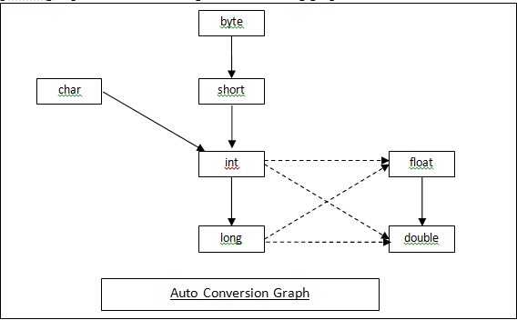

* 实线表示自动转换时不会造成数据丢失，虚线则可能会出现数据丢失问题。
* 任何类型和字符串类型相加，都会自动转换为字符串类型
* 如果两个操作数有一个是double,另一个就会自动转化成double再进行操作
* 如果两个操作数有一个是float,另一个就会自动转化成float再进行操作
* 如果两个操作数有一个是long,另一个就会自动转化成long再进行操作
* 否则两个操作数都会转化为int再进行操作
　

### 1.3.2. 整型

如果long无法表示需要的范围，可以使用BigInteger类来实现大数的操作．

#### 1.3.2.1. 缓存对象实现
<a href="#menu"  >目录</a>


整形包括byte,short,int,long.每个包装类都会缓存　［-128,127］范围的数据．


每一个整型包装器类内部都有一个静态内部类，ＸxxxCache.

当Integer data1 = 123;时，实际上调用的是给类的valueOf方法．如果值范围为[-128,127],则会使用缓存的对象，超过则创建新的对象
```java
public static Integer valueOf(int i) {
    if (i >= IntegerCache.low && i <= IntegerCache.high)
        return IntegerCache.cache[i + (-IntegerCache.low)];
    return new Integer(i);
}

```
缓存的初始化放在静态块中，首次调用时会进行初始化
```java
 private static class IntegerCache {
    static final int low = -128;
    static final int high;
    static final Integer cache[];

    static {
        // high value may be configured by property
        int h = 127;
        String integerCacheHighPropValue =
            sun.misc.VM.getSavedProperty("java.lang.Integer.IntegerCache.high");
        if (integerCacheHighPropValue != null) {
            try {
                int i = parseInt(integerCacheHighPropValue);
                i = Math.max(i, 127);
                // Maximum array size is Integer.MAX_VALUE
                h = Math.min(i, Integer.MAX_VALUE - (-low) -1);
            } catch( NumberFormatException nfe) {
                // If the property cannot be parsed into an int, ignore it.
            }
        }
        high = h;

        cache = new Integer[(high - low) + 1];
        int j = low;
        for(int k = 0; k < cache.length; k++)
            cache[k] = new Integer(j++);

        // range [-128, 127] must be interned (JLS7 5.1.7)
        assert IntegerCache.high >= 127;
    }

    private IntegerCache() {}
}
    
```
示例：
```java
public static void main(String args[]){

        Integer a1 =10;
        Integer a2 = 10;

        System.out.println("a1==a2?  " + (a1==a2));

        Integer b1 = 210;
        Integer b2 = 210;

        System.out.println("b1==b2?  " + (b1==b2));

        Integer c1 = new Integer(10);
        Integer c2 = new Integer(10);

        System.out.println("c1==c2?  " + (c1==c2));

    }
//输出
//使用的是同一个缓存对象
a1==a2?  true
//超出缓存的范围，是不同的对象
b1==b2?  false
//创建的都是新对象
c1==c2?  false
```

### 1.3.3. char

char 用来表示单个字符

```java
//常规定义
char data = 'a';
//使用十进制
char data = 64;
//使用Unocode （０－ffff）
char data = \u1234;
```

### 1.3.4. 数组

初始化
```java
/创建数组，需要定义长度
int[] arr = new int[5];
//创建数组，顺便初始化，长度为元素的数量
int[] arr = new int[]{1,2,3};
//简化方式
int[] arr = {1,2,4};
//指定大小
int[2] arr = {1},//其他未初始化的初始值为0

//二维数组
int[][] arr = new int[1][2];
int[][] arr1 = new int[][]{{1,2},{1,2}};
int[][] arr2 =  {{1,2},{1,2}};

//for-each循环访问数组
for(int data:arr){}
for(int[] datas:arr){
    for(int data:datas){}
}

```
int[] arr　或者int　arr[] 都可以

数组的最大长度是Interge.MaxValue(21.4亿多).但最好不要用满,要给对象头预留几个字节.

数组工具类java.util.Arrays。提供排序,复制，比较，初始化等功能。其中排序方法binarySearch采用二分法查询
```java
private static int binarySearch0(int[] a, int fromIndex, int toIndex,
                                     int key) {
    int low = fromIndex;
    int high = toIndex - 1;

    while (low <= high) {
        int mid = (low + high) >>> 1;
        int midVal = a[mid];

        if (midVal < key)
            low = mid + 1;
        else if (midVal > key)
            high = mid - 1;
        else
            return mid; // key found
    }
    return -(low + 1);  // key not found.
}
```

### 1.3.5. String 
<a href="#menu"  >目录</a>


#### 1.3.5.1. String基础
<a href="#menu"  >目录</a>

String 内部使用数组来存储字符串的值
```java
private final char value[];
```


```java
public static void main(String args[]){

        String a1 = "a1";
        String a2 = "a1";

        System.out.println("a1==a2?  " + (a1==a2));

        String b1 = new String("b1");
        String b2 = new String("b1");

        System.out.println("b1==b2?  " + (b1==b2));

        String c1 = "c1";
        String c2 = "c2";
        String c3 = "c1c2";
        String c4 = c1+c2;

        System.out.println("c3==\"c1c2\"?  " + (c3=="c1c2"));
        System.out.println("c3==c4?  " + (c3==c4));
        System.out.println("c4==\"c1c2\"?  " + (c4=="c1c2"));
    }
//输出
a1==a2?  true
b1==b2?  false
c3=="c1c2"?  true
c3==c4?  false
c4=="c1c2"?  false
```
//至少创建一个对象
String a = "123";
//最多创建两个对象，至少创建一个对象。
String a = new String("1243");

* 创建字符串时，JVM将会把字符串放入字符串缓存池中，JDK8把缓存池放在堆中。
* 如果使用直接赋值，则先去缓存池查找，没有则先创建，有则把缓存对象引用赋给栈变量。所以最多创建一个对象
* 如果使用new,则先在堆中创建一个String对象,再去缓存池查找有没有缓存对象，把缓存对象引用传给堆中的对象，再把堆中的String对象引用传给栈中的变量。所以至少创建一个，最多创建两个对象。

* 由于String变量相加时，会创建新的对象。因此效率较低。
使用StringBuilder和StringBuffer，StringBuffer在一些方法上加上了Synchronized同步锁，一般不使用。

这两个类的父类都是AbstractStringBuilder．其apend的实现原理是使用数组复制
```java
public AbstractStringBuilder append(String str) {
    if (str == null)
        return appendNull();
    int len = str.length();
    ensureCapacityInternal(count + len);
    str.getChars(0, len, value, count);
    count += len;
    return this;
}
private void ensureCapacityInternal(int minimumCapacity) {
        // overflow-conscious code
    if (minimumCapacity - value.length > 0) {
        value = Arrays.copyOf(value,
                newCapacity(minimumCapacity));
    }
}
```

* String.intern()方法获得在常量池中的字符串引用，如果常量池中没有该常量字符串，该方法会将该字符串加入常量池。但并不表示任何字符串调用intern()都返回同样的引用，因为可能中间发生过垃圾回收被回收掉了。

String 重写了hashcode方法
```JAVA
public int hashCode() {
    int h = hash;
    if (h == 0 && value.length > 0) {
        char val[] = value;

        for (int i = 0; i < value.length; i++) {
            h = 31 * h + val[i];
        }
        hash = h;
    }
    return h;
}
```
equals方法会去比较字符串序列是否相同
```java
public boolean equals(Object anObject) {
    if (this == anObject) {
        return true;
    }
    if (anObject instanceof String) {
        String anotherString = (String)anObject;
        int n = value.length;
        if (n == anotherString.value.length) {
            char v1[] = value;
            char v2[] = anotherString.value;
            int i = 0;
            while (n-- != 0) {
                if (v1[i] != v2[i])
                    return false;
                i++;
            }
            return true;
        }
    }
    return false;
}
```
#### 1.3.5.2. StringBuffer和StringBuilder
<a href="#menu"  >目录</a>

String类的缺点是一旦字符串内容改变，就会创建新的对象，造成内存浪费和增加垃圾回收时间，相对影响性能。StringBuffer和StringBuilder正是解决这个问题的。

看一下核心方法
```java
//追加字符串
public AbstractStringBuilder append(String str) {
    if (str == null)
        return appendNull();
    int len = str.length();
    //确保存放字符串的数组容量大小
    ensureCapacityInternal(count + len);
    //进行复制
    str.getChars(0, len, value, count);
    count += len;
    return this;
}
public void getChars(int srcBegin, int srcEnd, char dst[], int dstBegin) {
    if (srcBegin < 0) {
        throw new StringIndexOutOfBoundsException(srcBegin);
    }
    if (srcEnd > value.length) {
        throw new StringIndexOutOfBoundsException(srcEnd);
    }
    if (srcBegin > srcEnd) {
        throw new StringIndexOutOfBoundsException(srcEnd - srcBegin);
    }
    //将追加字符串的数组复制到原StringBuilder的数组后部分
    System.arraycopy(value, srcBegin, dst, dstBegin, srcEnd - srcBegin);
}

//追加整形
public AbstractStringBuilder append(int i) {
    if (i == Integer.MIN_VALUE) {
        append("-2147483648");
        return this;
    }
    int appendedLength = (i < 0) ? Integer.stringSize(-i) + 1
                                    : Integer.stringSize(i);
    int spaceNeeded = count + appendedLength;
    ensureCapacityInternal(spaceNeeded);
    Integer.getChars(i, spaceNeeded, value);
    count = spaceNeeded;
    return this;
}  
static void getChars(int i, int index, char[] buf) {
    int q, r;
    int charPos = index;
    char sign = 0;

    if (i < 0) {
        sign = '-';
        i = -i;
    }

    // Generate two digits per iteration
    while (i >= 65536) {
        q = i / 100;
    // really: r = i - (q * 100);
        r = i - ((q << 6) + (q << 5) + (q << 2));
        i = q;
        buf [--charPos] = DigitOnes[r];
        buf [--charPos] = DigitTens[r];
    }

    // Fall thru to fast mode for smaller numbers
    // assert(i <= 65536, i);
    for (;;) {
        q = (i * 52429) >>> (16+3);
        r = i - ((q << 3) + (q << 1));  // r = i-(q*10) ...
        buf [--charPos] = digits [r];
        i = q;
        if (i == 0) break;
    }
    if (sign != 0) {
        buf [--charPos] = sign;
    }
}
    
//追加本身类型
AbstractStringBuilder append(AbstractStringBuilder asb) {
    if (asb == null)
        return appendNull();
    int len = asb.length();
    ensureCapacityInternal(count + len);
    asb.getChars(0, len, value, count);
    count += len;
    return this;
}
public void getChars(int srcBegin, int srcEnd, char[] dst, int dstBegin)
{
    if (srcBegin < 0)
        throw new StringIndexOutOfBoundsException(srcBegin);
    if ((srcEnd < 0) || (srcEnd > count))
        throw new StringIndexOutOfBoundsException(srcEnd);
    if (srcBegin > srcEnd)
        throw new StringIndexOutOfBoundsException("srcBegin > srcEnd");
    System.arraycopy(value, srcBegin, dst, dstBegin, srcEnd - srcBegin);
}

//添加对象
public AbstractStringBuilder append(Object obj) {
    return append(String.valueOf(obj));
}
public static String valueOf(Object obj) {
    return (obj == null) ? "null" : obj.toString();
}  
```
从上面可以看出,对于字符串类型的比如String,StringBuffer和StringBuilder最后都是通过System.arraycopy来实现将其内部存放数据的数组进行复制。
而对于数值类型的，会该数值进行解析，获得对应的char字符，在添加到StringBuilder内部数组的末尾。对于对象类型的，先通过toString获取对象的String结果，然后再进行复制。

StringBuffer和StringBuilder都是AbstractStringBuilder的子类。唯一的区别是StringBuffer在一些方法上使用了synchronized，避免了多线程下的竞争问题。但是相对的性能会略为下降。需要根据使用环境进行选择。

* 三者的使用总结
    * String：适用于少量的字符串操作的情况；
    * StringBuilder：适用于单线程下在字符缓冲区进行大量操作的情况；
    * StringBuffer：适用多线程下在字符缓冲区进行大量操作的情况。


* 三者之间的转换
    * String-----StringBuffer
        * 通过构造方法：StringBuffer sb = new StringBuffer("abc");
        * 通过append方法：StringBuffer sb = new StringBuffer();sb.append("abc");
    * StringBuffer------String
        * 通过构造方法：StringBuffer sb = new StringBuffer("abc");String s = new String(sb);
        * 通过toString方法：StringBuffer sb = new StringBuffer("abc");String s = sb.toString();
        * 通过subString方法：StringBuffer sb = new StringBuffer("abc");String s = sb.substring(0, sb.length());


#### 1.3.5.3. String.format()的详细用法
<a href="#menu"  >目录</a>

String.format()字符串常规类型格式化的两种重载方式
* format(String format, Object… args) 新字符串使用本地语言环境，制定字符串格式和参数生成格式化的新字符串。
* format(Locale locale, String format, Object… args) 使用指定的语言环境，制定字符串格式和参数生成格式化的字符串。

**基本功能**
|转换符|	详细说明|	示例|
|---|---|---|
|%s	|字符串类型	|“喜欢请收藏”
|%c	|字符类型	|‘m’
|%b	|布尔类型	|true
|%d	|整数类型（十进制）	|88
|%x	|整数类型（十六进制）	|FF
|%o	|整数类型（八进制）	|77
|%f	|浮点类型	|8.888
|%a	|十六进制浮点类型	|FF.35AE
|%e	|指数类型	|9.38e+5
|%g	|通用浮点类型（f和e类型中较短的）	|不举例(基本用不到)
|%h	|散列码	|不举例(基本用不到)
|%%	|百分比类型	|％(%特殊字符%%才能显示%)
|%n	|换行符	|不举例(基本用不到)
|%tx	|日期与时间类型（x代表不同的日期与时间转换符)	|不举例(基本用不到)

**高级功能**
|标志	|说明|	示例|	结果|
|---|---|---|---|
|+	|为正数或者负数添加符号	|(“%+d”,15)	|+15
|0	|数字前面补0(加密常用)	|(“%04d”, 99)	|0099
|空格|	在整数之前添加指定数量的空格|	(“% 4d”, 99)	|99
|,	|以“,”对数字分组(常用显示金额)	|(“%,f”, 9999.99)|	9,999.990000
|(	|使用括号包含负数	|(“%(f”, -99.99)	|(99.990000)
|#	|如果是浮点数则包含小数点，如果是16进制或8进制则添加0x或0	|(“%#x”, 99)(“%#o”, 99)	|0x63 0143
|<	|格式化前一个转换符所描述的参数	|(“%f和%<3.2f”, 99.45)	|99.450000和99.45

**日期**
%tx x代表日期转换符
|标志|	说明	|示例|
|---|---|---|
|c	|包括全部日期和时间信息	|星期六 十月 27 14:21:20 CST 2007
|F	|“年-月-日”格式	|2007-10-27
|D	|“月/日/年”格式	|10/27/07
|r	|“HH:MM:SS PM”格式（12时制）	|02:25:51 下午
|T	|“HH:MM:SS”格式（24时制）	|14:28:16
|R	|“HH:MM”格式（24时制）	|14:28

```java
//c的使用 
System.out.printf("全部日期和时间信息：%tc%n",date);          
//f的使用  
System.out.printf("年-月-日格式：%tF%n",date);  

sout(String.format("年-月-日格式：%tF%n",date));

```
以上的两种方式内部都是使用Formatter工具类来实现。

## 1.4. 运算符

Java中使用<<,>>>,>>,来实现位移，>>>将用０填充高位．>>使用符号位填充高位 

## 1.5. 流程控制

### 1.5.1. switch－case
case 的标签可以是char,byte,short,int以及它们的包装器．还有枚举常量，字符串字面量

### 1.5.2. for-each 

对于集合可以使用for-each来进行遍历
```java
//遍历数组
int arr[]={1,2,3}
for(int data:arr){

}
//
List<Integer> lists = new ArrayList<>();
for (Integer list:lists){
            
}
//
Map<Integer,Integer>  maps = new HashMap<>();
for(Map.Entry entry:maps.entrySet()){

}

```

## 1.6. 重写hashCode和equals


```java
public class QueueData implements Comparable<QueueData> {
    private String brokerName;
    private int readQueueNums;
    private int writeQueueNums;
    private int perm;
    private int topicSynFlag;

    @Override
    public int hashCode() {
        final int prime = 31;
        int result = 1;
        result = prime * result + ((brokerName == null) ? 0 : brokerName.hashCode());
        result = prime * result + perm;
        result = prime * result + readQueueNums;
        result = prime * result + writeQueueNums;
        result = prime * result + topicSynFlag;
        return result;
    }

    @Override
    public boolean equals(Object obj) {
        if (this == obj)
            return true;
        if (obj == null)
            return false;
        if (getClass() != obj.getClass())
            return false;
        QueueData other = (QueueData) obj;
        if (brokerName == null) {
            if (other.brokerName != null)
                return false;
        } else if (!brokerName.equals(other.brokerName))
            return false;
        if (perm != other.perm)
            return false;
        if (readQueueNums != other.readQueueNums)
            return false;
        if (writeQueueNums != other.writeQueueNums)
            return false;
        if (topicSynFlag != other.topicSynFlag)
            return false;
        return true;
    }
}
```

# 2. 对象与类
<a href="#menu"  >目录</a>

## 2.1. 面向过程和面向对象

**面向过程**

面向过程是通过分析将解决问题的过程步骤化，然后使用一个个方法去实现．使用的时候依次调用．

**面向对象**

面向对象程序设计(OOP),Java是完全面向对象的．

面向对象是的程序是由对象组成，每个对象包含对用户公开的方法和隐藏的方法．面向对象就是构成问题事务分解成各个对象，建立对象的目的不是为了完成一个步骤，而是为了描叙某个事物在整个解决问题的步骤中的行为。

虽然本质上的问题的解决都是不断地调用方法来实现．但是对于面向对象，当前对象不能满足要求时，可以通过替换对象来实现内部逻辑处理的修改．也就是不同的对象可以有不同的实现逻辑，即使他们的父类类型一样．从这方面来讲，面向对象可维护性和可扩展性更加好．更加适用于大规模的问题．

**总结**
* 面向过程：
    * 优点：性能比面向对象高，因为类调用时需要实例化，开销比较大，比较消耗资源;比如单片机、嵌入式开发、 Linux/Unix等一般采用面向过程开发，性能是最重要的因素。 
    * 缺点：没有面向对象易维护、易复用、易扩展
* 面向对象：
    * 优点：易维护、易复用、易扩展，由于面向对象有封装、继承、多态性的特性，可以设计出低耦合的系统，使系统 更加灵活、更加易于维护 
    * 缺点：性能比面向过程低


**类与对象**

在Java语言中，除了8个基本数据类型值之外，一切都是对象．具有相同或者相似性质的一组对象的抽象就是类．类是对一类事物的描述，是抽象，概念上的定义．对象是类的实例．也就是对象的抽象是类，类的具体化就是对象．

对象有三个特性:
* 对象的行为:对象具备的方法或者操作
* 对象的状态:当执行对象的方法时，对象如何响应
* 对象的标识:如何辨别具有相同行为与状态的不同对象

**类之间的关系**
* 依赖 uses-a,比如作为方法的参数
* 聚合　has-a，作为类的属性
* 继承　is-a，继承类或者实现接口


## 2.2. 面向对象三大特性
<a href="#menu"  >目录</a>

* 继承
    * 继承是类与类的一种关系，是一种“is a”的关系。比如“狗”继承“动物”，这里动物类是狗类的父类或者基类，狗类是动物类的子类或者派生类
    * 子类拥有父类的所有属性和方法（除了private修饰的属性不能拥有）从而实现了实现代码的复用；　
* 封装
    * 概念：将类的某些信息隐藏在类内部，不允许外部程序直接访问，而是通过该类提供的方法来实现对隐藏信息的操作和访问。
    * 好处：
        * 只能通过规定的方法访问数据。
        * 隐藏类的实例细节，方便修改和实现。　

* 多态 
    * 多态就是对象的多种形态。同一种类型的对象，调用同一个方法，其呈现的效果不一样。
    * java里的多态主要表现在两个方面：
        * 引用多态　　　
            * 父类的引用可以指向本类的对象；
            * 父类的引用可以指向子类的对象；
        * 方法多态,根据上述创建的两个对象：本类对象和子类对象，同样都是父类的引用，当我们指向不同的对象时，它们调用的方法也是多态的。
            * 创建本类对象时，调用的方法为本类方法；
            * 创建子类对象时，调用的方法为子类重写的方法或者继承的方法；
    * 使用多态的时候要注意：如果我们在子类中编写一个独有的方法（没有继承父类的方法），此时就不能通过父类的引用创建的子类对象来调用该方法！

Java有两种类型，编译时类型(由声明的类型决定)，运行时类型(由实际赋给这个变量的对象类型决定)。当运行时类型不一样的时候，就会出现多态。

```java
//Animal是编译时类型，Ｄog是运行时类型
Animal aanimal = new Dog();
```
* 向上转型: 子类对象赋给父类变量。自动转换。只能调用父类拥有的方法。
* 向下转型: 父类对象赋给子类变量，需要强制转换。可以调用子类拥有的方法。


```java
class Base{

}

class Sub extends Base{

    public void func(){

    }
}
public static void main(String args[]){
        //向上转型，自动转换
        Base base = new Sub();
        //调用子类方法，先强制转换为子类类型再调用
        ((Sub) base).func();

        //向下转型，需要强制转换
        Sub sub = (Sub)(new Base());
        sub.func();

    }
```

## 2.3. 权限修饰符
<a href="#menu"  >目录</a>

* private 本类可见
* default 同一个包/子包可见
* protect 子类可见
* public 所有可见

## 2.4. 继承与Ｏbject类

Java的继承使用extends关键字，每个类只能继承一个类，不能像c++一样多继承．但可以有多级继承．子类通过继承可以获得父类非私有的属性和方法．从而实现代码复用．Java中每一个类都默认继承Ｏbject类．

```java
//通过super调用父类构造器
super(1,2,3);
//通过super调用父类方法，可以省略super
super.parentFunc();
```

Object是所有类的父类，任何类都默认继承Object。Object类到底实现了哪些方法？

**clone方法**
保护方法，实现对象的浅复制，只有实现了Cloneable接口才可以调用该方法，否则抛出CloneNotSupportedException异常。

**getClass方法**
final方法，获得运行时类型。

**toString方法**
该方法用得比较多，一般子类都有覆盖。

**finalize方法**
该方法用于释放资源。因为无法确定该方法什么时候被调用，很少使用。在失去强引用之后，被垃圾回收之前，这个方法会被调用，但是何时调用不确定．实际中不应该使用这个方法．

**equals方法**
```java
public boolean equals(Object obj) {
    return (this == obj);
}
```
该方法是非常重要的一个方法。一般equals和==是不一样的，但是在Object中两者是一样的。子类一般都要重写这个方法。

==是判断两个变量或实例是不是指向同一个内存空间，equals是判断两个变量或实例所指向的内存空间的值是不是相同 
Ｓtring重写了这个方法，比较的是字符串序列是否相同．
集合也重写了这个方法，比较其中的元素是否相等

* equals方法特性
    * 自反性: 对于任何非空引用x,x.equals(x)返回true
    * 对称性: 对于任何x,y. x.equals(y) 和y.equals(x)一定相同
    * 传递性: x.equals(y) == true,y.equals(z) == true 则x.equals(z) == true
    * 一致性: 如果x,y没有变化，反复调用，结果都是一致的
    * 对于任意非空的对象x,x.equals(null) 一定等于false


**hashCode方法**
```JAVA
public native int hashCode();
```
返回对象的内存地址经过处理后的结构，由于每个对象的内存地址都不一样，所以哈希码也不一样。
该方法用于哈希查找，重写了equals方法一般都要重写hashCode方法。这个方法在一些具有哈希功能的Collection中用到。

一般必须满足obj1.equals(obj2)==true。可以推出obj1.hash- Code()==obj2.hashCode()，但是hashCode相等不一定就满足equals。不过为了提高效率，应该尽量使上面两个条件接近等价。

**wait方法**
wait方法就是使当前线程等待该对象的锁，当前线程必须是该对象的拥有者，也就是具有该对象的锁。wait()方法一直等待，直到获得锁或者被中断。wait(long timeout)设定一个超时间隔，如果在规定时间内没有获得锁就返回。

调用该方法后当前线程进入睡眠状态，直到以下事件发生。

（1）其他线程调用了该对象的notify方法。

（2）其他线程调用了该对象的notifyAll方法。

（3）其他线程调用了interrupt中断该线程。

（4）时间间隔到了。

此时该线程就可以被调度了，如果是被中断的话就抛出一个InterruptedException异常。

**notify方法**
该方法唤醒在该对象上等待的某个线程。

**notifyAll方法**
该方法唤醒在该对象上等待的所有线程。


将一个子类的引用赋给一个超类的变量，编译器是允许的．但将一个超类的引用赋给一个子类变量．必须进行强制类型转换．在将超类转换成子类之前，应当使用instanceof进行检测．
```java

B b2 = new C();
result = b2 instanceof A;

```
instanceof是Java中的二元运算符，左边是对象，右边是类；当对象是右边类或子类所创建对象时，返回true；否则，返回false。

类的实例包含本身的实例，以及所有直接或间接子类的实例.instanceof左边显式声明的类型与右边操作元必须是同种类或存在继承关系(或者接口的实现)，也就是说需要位于同一个继承树，否则会编译错误

## 2.5. 重载与重写


**重载overload和重写overwride**
重写发生在父子类之间，重写改变方法的功能。两同两小一大。
* 方法名称，行参列表必须一样
* 返回值类型和抛出异常要么和原来一样，要么是子类。
* 访问权限应该比原来的大或者一样
* 重写方法应当加上@Overwride注解，防止出错

重载发生在本类中,规范如下
* 就是在类中可以创建多个方法，它们具有相同的名字，但具有不同的参数和不同的定义。调用方法时通过传递给它们的不同参数个数和参数类型来决定具体使用哪个方法,
* 方法名称相同
* 行参列表不同（类型，顺序，个数），一般应当减少这种情况出现func(List)和func(ArrayList).会造成困扰。
* 与返回值，权限，异常定义无关

## 2.6. 动态绑定

假设调用x.f(param)
* 编译器查看对象的声明类型和方法名(因为存在方法名相同，但是参数列表不一致的方法)，获得所有可能的方法列表
* 编译器查看调用方法时提供的参数类型．如果参数类型完全匹配，就选择这个方法．这个过程称为重载解析．如果编译器没有找到与参数类型匹配的方法，或者发现经过类型转换（子类转换成父类）后有多个方法匹配，则会报告错误．至此，编译器已经获得需要调用的方法名字和参数类型

```java
class Test{

    public void f1(Parent parent){

        System.out.println("1");
    }

    public void f1(Child child){
        System.out.println("2");
    }

}

//此时方法２最匹配，被选中，如果没有方法2，会进行类型转换，然后选择方法１
test.f1(new Child());


```
* 如果是private方法，static方法，final方法或者构造器．那么编译器将可以准确知道应该调用哪个方法．这种称为**静态绑定**．与此对应的是，调用的方法依赖于对象的运行时类型．并在运行时实现动态绑定．
* 当程序运行时，并且采用动态绑定调用方法时，虚拟机一定调用与x所引用对象的实际类型最合适的那个类的方法．也就是先在运行时类型的方法里寻找，如果有则调用，如果没有，则去其超类里面寻找．

每次调用方法都要去搜索，时间开销大，因此虚拟机预先为每一个类创建了一个方法表．其中列出了所有方法的签名和实际调用的方法．在真正调用的时候，虚拟机查找这个表就可以了．

在早期的Java中，为了避免动态绑定带来的系统开销，会使用final来实现静态绑定．如果一个方法很短，且没有被覆盖，编译器会对它进行优化处理，比如e.getName() 优化成e.name.也就是內联(inlining)．但是现在虚拟机的即时编译器比原来的静态编译器优秀很多，会根据运行情况进行动态优化．这个编译器可以准确的知道类之间的继承关系．如果某个方法很简短并被频繁的调用且没有被覆盖重写，就会被这个即时编译器进行内联处理．

## 2.7. 构造器

* 构造器特点
    * 构造器必须与类同名
    * 构造器没有参数返回值 
    * 构造器参数可以有无参或者多个参数
    * 每个类可以有多个构造器
    * 如果没有自定义构造器，类会默认实现无参构造器,如果实现了其他有参构造器，无参构造器便不存在。
    * 构造器总是会伴随new操作一起调用

**创建对象的多种方式**
* 用new关键字创建.会调用构造器
* 利用反射，调用Class类的或者是Constructor类的newInstance（）方法.会调用构造器
* 用反序列化，调用ObjectInputStream类的readObject（）方法，不会调用构造器
* 调用对象的clone方法，不会调用构造器


## 2.8. 初始化问题

类中的{}块是普通初始化块，普通初始化块会在创建对象时调用．static {}是静态初始化块．静态初始化块会在类加载时调用．

```java
   public static void main(String args[]){
        Sub base = new Sub();

    }

class Base{

    static {
        System.out.println("父类静态初始化块");
    }
    {
        System.out.println("父类普通初始化块");
    }

    public Base() {
        System.out.println("父类构造器");
    }
}

class Sub extends Base{

    static {
        System.out.println("子类静态初始化块");
    }
    {
        System.out.println("子类普通初始化块");
    }

    public Sub() {
        System.out.println("子类构造器");
    }
    public void func(){

    }
}
//输出
父类静态初始化块
子类静态初始化块
父类普通初始化块
父类构造器
子类普通初始化块
子类构造器
```

## 2.9. 包的导入和声明

**包的导入**

```java

//导入java.util包下的所有类
improt java.util.*;

//导入java.util包下的Date类
improt java.util.Date;

//静态导入静态方法和属性
improt aa.bb.staticfunc;
improt aa.bb.staticval;

//非法
improt java.*;
improt java.*.*;

```

**包的声明**

```java
//声明当前类的包名｀｀
package aa.bb.cc;
```

如果没有声明包，这个源文件中的类就被放置在一个默认包(default package)

编译器在编译源文件不会检查包名和目录是否对应，如果它不依赖其他包，也会编译成功，但是执行时会出现错误，因为找不到该类．因此包名和目录必须一致．

## 2.10. 常用关键字作用

**this**

this指代当前对象

**super**
super指代父类(继承的类)

**final**

* 修饰变量:  表示该属性或者局部变量只能被赋值一次．可以先定义再赋值．
* 修饰方法:  表示该方法不能被重写，但子类可以继承该方法
* 修饰类: 表示该类不能被继承

**static作用**
* 声明静态方法
* 声明静态属性
* 声明静态内部类
* 和improt配合引入静态方法或者静态公有属性
* 修饰main方法,标明这是启动方法．

## 2.11. 文档注释

JDK包含一个很有用的工具:javadoc，可以由源文件生成一个HTML文档．其将会抽取以下信息:
* 包
* 公有类和接口
* 公有的和受保护的构造器和方法
* 公有的和受保护的域

**类注释**

```java

/**

*/
public class Dog{

}
```

**方法注释**
```java

/**
* @param
* @return
* @throws
*/

public int func(){}
```
**域注释**

```java
/**

*/
public int a;
```

**通用注释**
```java
@author 作者姓名
@version　版本
@since　标明何时产生 @since ver-1.0
@deprecates 用在类，方法，属性上标识不推荐使用
添加超链接
@see　
@link

@see com.aa.bb#func()
@see <a href=""></a>
@see "Core Java 1"
 
{@link Constants#LONGLIVE}  就是告诉你 LONGLIVE参数在哪里 上图这个就是在Constants类的LONGLIVE对象

```

文本
```java
用于强调
<em></em>

代码
<code></code>

着重强调
<strong></strong>

图片

```

**导出文档**
执行前必须切换到源文件目录．
```java
jacadoc -d saveDri 　packageName...
```

## 2.12. 接口和抽象类

### 2.12.1. 区别
**接口**
* interface定义，implements 实现
* 接口方法默认为public abstract 
* 接口中的属性默认为public static 
* 接口可以有自己的实现方法，JDK8提供了default关键字支持
* 接口可以没有方法
* 接口可以实现接口
* 一个类可以实现多个接口，但是只能继承一个类

通常接口用来定义实现类的外观,也就是实现类的行为定义,用来约束实现类的行为.通过接口进行调用,可以隐藏其具体的实现.也就是外部调用和内部实现是被接口隔离开的.由于调用和实现隔离,那么只要接口不变,内部实现的变化就不会影响到外部应用,从而使系统更加灵活.增加了扩展性和可维护性.

1.8版本中,接口中增加了default方法.使用场景是当产品已经发布,想要扩展接口的功能时,如果直接在接口中增加抽象方法,那么它的所有实现类必须要实现这个方法.如果实现类较多.就会很麻烦.有了default方法,只要在接口中添加这个方法.所有实现类没必要实现这个方法.在需要实现该方法的实现类中添加即可.

**抽象类**
* abstract定义，extends 继承
* 抽象类可以有和普通类一样的属性和方法定义
* 抽象方法必须使用abstract修饰
* 抽象方法不能是私有的，否则不能被子类实现
* 抽象类不能被实例化

**如何选择:**
* 尽量选用接口
* 在既要定义子类的行为,又要为子类提供公共的功能时使用抽象类
* 一般接口定义行为，抽象类实现多个接口，并定义子类的公共实现方法。
* 尽量不要有多个层级的实现类，减少代码修改的难度，一般使用装饰器模式解决类功能扩展问题。


### 2.12.2. 接口与回调

```java

public interface Listen{
    void callback(TYPE param);
}

public func(Listen listen){

    //do somethings

    listen.callback();
}
xxx.func(new Listen{

    public void callback(TYPE param){
        //do sth
    }
})
```


### 2.12.3. 建议
* 考虑使用静态工厂方法代替构造器
    * 如果类的实例化参数较复杂，应当通过工厂方法向用户提供简单明了的实例化方法
* 参数较多时使用构建器
    * 由用户决定初始化哪个属性
* 避免创建不必要的对象
    * 创建对象将占用JVM堆内存，为了减少堆内存的使用，要么减少不必要的对象，重复使用的对象可使用对象池，比如数据库连接池
* 消除过期的对象引用
    * 不再使用的对象应当消除其引用
    * 栈中创建的引用不需要显示消除
    * 需要注意的是使用集合存储对象时，如果不再使用应当移除该对象，以便JVM能够对其进行回收
* 避免使用终结方法
    * 终结方法finalizer在垃圾回收之前会被调用
    * 因为何时被调用并不确定，可能很快，可能很长时间，如果使用其来释放资源，将存在很大的不确定性。
* 覆盖equals应遵循的约定
    * 自反性
        * 对于任何非null的对象x，x.equals(x) 必须返回 true
    * 对称性
        * 对于任何非null的对象x、y ,x.equals(y) 和y.equals(x)结果必须相同
    * 传递性
        * 对于任何非null的对象x、y、z，x.equals(y)并且y.equals(z)都返回true，那么必须x.equals(z)返回true.
    * 一致性
        *  对于任何非null的对象x、y,如果equals中比较的信息没改，那么多次调用的结果都是一致的。
    * 对于任何非null的对象，x.equals(null)必须返回false.
* 重写equals时也要重写HashCode
    * 规范:如果两个对象根据equals方法比较的结果是true,那么它们的hashCode方法结果也一样,反过来没有强制
    * 在应用程序的执行期间，只要对象的equals方法的比较操作所用到的信息没有被修改，那么多次调用hashCode获得的整数是一致的
    

## 2.13. 内部类

内部类分为普通内部类，静态内部类，局部内部类，匿名内部类。

**普通内部类和静态内部类**
｀
* 内部类可以直接访问外部类属性，即使是私有的属性
* 外部类使用普通内部类属性必须先创建内部类对象
* 访问权限如之前所定义的
* 创建普通内部类对象必须先创建外部类对象，内部类对象是依存外部类对象存在的
* 创建静态内部类对象不需要创建外部类对象
* 静态内部类符合static规范，只能调用外部类static元素
* 外部类可以访问静态内部类的静态成员，使用类名来访问。

```java
public class SimpleThread {

    public static void main(String args[]){

        //外部的类创建　内部类对象
        Out.In in = new Out().new In();
        //创建静态内部类对象
        Out.StaticIn staticIn = new Out.StaticIn();
    }
}

class Out{
    //普通内部类
    class In{    }
    //静态内部类
    static class StaticIn{   }
    void test(){
        In in = new In();
        StaticIn staticIn = new StaticIn();
    }
}

```
```java
public class Outer {

    int a;
    static int  b;
    public class Inner{

        void func(){
           //直接调用外部类属性
            a =1;
        }
    }

    public static  class StaticInner{

        public static int   c;
        public int d;
        void func(){
            c =1;
        }
    }
    
    static void func(){
       //外部类静态方法通过类名访问内部类静态属性
        StaticInner.c = 1;
    }
}
```
**局部内部类**
在方法中创建，仅在方法内可见
```java

public void func(){
   Class User{
      int a;
   };

   User user = new User();
}
```
**匿名类**
没有名字的类，用于在实现类简单的场景。
```java
//定义类
class Handle{

   public void  do(){

   }
}
//定义方法
public void func(){

}

//使用

func(new Handle{
   public void  do(){
      ///do sth
   }

});
```


## 2.14. 枚举类
```java

public enum  Size{SMALL,MEDIUM,LARGE}
public enum BlogReturnCode{
    //空参数 0
    ERROR_PARAM(0,"输入参数无效"),
    //代码
    private Integer code;
    //代码对应的信息
    private String message;

    BlogReturnCode(Integer code, String message) {
        this.code = code;
        this.message = message;
    }

    @Override
    public Integer getCode() {
        return this.code;
    }

    @Override
    public String getMessage() {
        return this.message;
    }
}
```
## 2.15. Java克隆问题

Java的Object类已经提供了clone方法.类如果需要实现克隆功能.需要实现接口Cloneable接口,这个接口没有方法,是一个标识接口.

* 浅克隆
    * 只负责克隆按值传递的数据(比如基本数据类型及其包装类型,String 类型)
* 深度克隆
    * 除了浅拷贝要克隆的值外,还负责克隆引用类型的数据,基本上就是被克隆实例的所有属性数据都会被克隆.
    * 如果被克隆的对象里面的属性是引用类型,则要一直递归地克隆下去,也就是说其所有引用类型的属性以及该属性内部的引用类型都要实现Cloneable接口并重写clone方法.否则将会克隆失败


克隆使用的场景是:有一个大对象存了很多属性,如果想要获得另一个一模一样的对象(内存地址不一样),一种方式通过new创建一个新对象,并通过setter设置所有的值.这种方式特别麻烦.因此可以使用Object类的clone方法解决.更加简便和性能更高.

```java

class People implements Cloneable{

    private int height;
    private String name;
    private Location location；

    @Override
    public  Object clone(){

        People people = null;

        try {
            //只克隆普通基本数据类型和 String
            people = (People) super.clone();
        } catch (Exception e) {
            e.printStackTrace();
        }
        //深克隆关键,引用也要进行克隆
        //如果引用对象没有进行克隆,那么其指向的还是元对象的地址.元对象修改后克隆对象的引用对象也会跟着修改
        people.location = (Location)location.clone();
        return people;
    }
}
```


调用super.clone方法的时候,Java是先开辟一块内存的空间,然后把实例对象的值原样拷贝过去,对于基本数据类型这样做是没问题的.而引用类型把值拷贝过去的意思是对应的内存地址拷贝过去,也就是克隆后克隆对象和原对象的引用类型的属性是同一块内存空间.此为浅拷贝.要实现深拷贝,那么所有的引用类型也要进行拷贝.


在java中 clone为什么要用super.clone(）方法 这里为什么要用super不是this？
* Object中的clone执行的时候使用了RTTI（run-time type identification）的机制,动态得找到目前正在调用clone方法的那个reference，根据它的大小申请内存空间，然后进行bitwise的复制，将该对象的内存空间完全复制到新的空间中去，从而达到shallowcopy的目的。
所以你调用super.clone() 得到的是当前调用类的副本，而不是父类的副本。根本没有必用调用this.clone();
* 要让实例调用clone方法就需要让此类实现Cloneable接口，API里面还有句话是：如果在没有实现 Cloneable 接口的实例上调用 Object 的 clone 方法，则会导致抛出 CloneNotSupportedException 异常，这便是“合法”的含义。 但请注意，Cloneable接口只是个标签接口，不含任何需要实现的方法，就像Serializable接口一样。
* 总之，一般如果你的子类没有特殊需要而重写clone()方法就直接用super.clone() 就行了。


    
# 3. 泛型
<a href="#menu"  >目录</a>

## 3.1. 概述
泛型在java中有很重要的地位，在面向对象编程及各种设计模式中有非常广泛的应用。

**什么是泛型？为什么要使用泛型？**
* 泛型，即“参数化类型”。一提到参数，最熟悉的就是定义方法时有形参，然后调用此方法时传递实参。那么参数化类型怎么理解呢？
* 顾名思义，就是将类型由原来的具体的类型参数化，类似于方法中的变量参数，此时类型也定义成参数形式（可以称之为类型形参），然后在使用/调用时传入具体的类型（类型实参）。
* 泛型的本质是为了参数化类型（在不创建新的类型的情况下，通过泛型指定的不同类型来控制形参具体限制的类型）。也就是说在泛型使用过程中，
* 操作的数据类型被指定为一个参数，这种参数类型可以用在类、接口和方法中，分别被称为泛型类、泛型接口、泛型方法。

```java
List arrayList = new ArrayList();
arrayList.add("aaaa");
arrayList.add(100);

for(int i = 0; i< arrayList.size();i++){
    String item = (String)arrayList.get(i);
    Log.d("泛型测试","item = " + item);
}
```
毫无疑问，程序的运行结果会以崩溃结束：
java.lang.ClassCastException: java.lang.Integer cannot be cast to java.lang.String
ArrayList可以存放任意类型，例子中添加了一个String类型，添加了一个Integer类型，再使用时都以String的方式使用，因此程序崩溃了。为了解决类似这样的问题（在编译阶段就可以解决），泛型应运而生。

我们将第一行声明初始化list的代码更改一下，编译器会在编译阶段就能够帮我们发现类似这样的问题。
```
List<String> arrayList = new ArrayList<String>();
//arrayList.add(100); 在编译阶段，编译器就会报错
```
* 如果不使用范型，可以把任意类型的对象放入集合，但这将丢失对象的状态信息，集合只知道它盛装的是Object,因此取出需要进行强制转换，如果类型不同，将会发送异常
* 如果使用范型，如果放入对象的类型与集合定义的范型类型不一致，将会发生异常，该对象不会被放入集合。


* 泛型只在编译阶段有效。看下面的代码：
```java
List<String> stringArrayList = new ArrayList<String>();
List<Integer> integerArrayList = new ArrayList<Integer>();

Class classStringArrayList = stringArrayList.getClass();
Class classIntegerArrayList = integerArrayList.getClass();

if(classStringArrayList.equals(classIntegerArrayList)){
    Log.d("泛型测试类型相同");
}
```
输出结果：泛型测试: 类型相同。

通过上面的例子可以证明，在编译之后程序会采取去泛型化的措施。也就是说Java中的泛型，只在编译阶段有效。在编译过程中，正确检验泛型结果后，会将泛型的相关信息擦出，并且在对象进入和离开方法的边界处添加类型检查和类型转换的方法。也就是说，泛型信息不会进入到运行时阶段。
对此总结成一句话：泛型类型在逻辑上看以看成是多个不同的类型，实际上都是相同的基本类型。

**泛型的使用**
泛型有三种使用方式，分别为：泛型类、泛型接口、泛型方法

**泛型类**
泛型类型用于类的定义中，被称为泛型类。通过泛型可以完成对一组类的操作对外开放相同的接口。最典型的就是各种容器类，如：List、Set、Map。

泛型类的最基本写法（这么看可能会有点晕，会在下面的例子中详解）：

```java
class 类名称 <泛型标识：可以随便写任意标识号，标识指定的泛型的类型>{
  private 泛型标识 /*（成员变量类型）*/ var; 
  .....

  }
}
```
一个最普通的泛型类：
```java
//此处T可以随便写为任意标识，常见的如T、E、K、V等形式的参数常用于表示泛型
//在实例化泛型类时，必须指定T的具体类型
public class Generic<T>{ 
    //key这个成员变量的类型为T,T的类型由外部指定  
    private T key;

    public Generic(T key) { //泛型构造方法形参key的类型也为T，T的类型由外部指定
        this.key = key;
    }

    public T getKey(){ //泛型方法getKey的返回值类型为T，T的类型由外部指定
        return key;
    }
}

//泛型的类型参数只能是类类型（包括自定义类），不能是简单类型
//传入的实参类型需与泛型的类型参数类型相同，即为Integer.
Generic<Integer> genericInteger = new Generic<Integer>(123456);

//传入的实参类型需与泛型的类型参数类型相同，即为String.
Generic<String> genericString = new Generic<String>("key_vlaue");
Log.d("泛型测试","key is " + genericInteger.getKey());
Log.d("泛型测试","key is " + genericString.getKey());
```
12-27 09:20:04.432 13063-13063/? D/泛型测试: key is 123456
12-27 09:20:04.432 13063-13063/? D/泛型测试: key is key_vlaue

定义的泛型类，就一定要传入泛型类型实参么？并不是这样，在使用泛型的时候如果传入泛型实参，则会根据传入的泛型实参做相应的限制，此时泛型才会起到本应起到的限制作用。如果不传入泛型类型实参的话，在泛型类中使用泛型的方法或成员变量定义的类型可以为任何的类型。

看一个例子：

```java
Generic generic = new Generic("111111");
Generic generic1 = new Generic(4444);
Generic generic2 = new Generic(55.55);
Generic generic3 = new Generic(false);

Log.d("泛型测试","key is " + generic.getKey());
Log.d("泛型测试","key is " + generic1.getKey());
Log.d("泛型测试","key is " + generic2.getKey());
Log.d("泛型测试","key is " + generic3.getKey());
```

D/泛型测试: key is 111111
D/泛型测试: key is 4444
D/泛型测试: key is 55.55
D/泛型测试: key is false
 

注意：
泛型的类型参数只能是类类型，不能是简单类型。
不能对确切的泛型类型使用instanceof操作。如下面的操作是非法的，编译时会出错。
if(ex_num instanceof Generic<Number>){ }

**泛型接口**
泛型接口与泛型类的定义及使用基本相同。泛型接口常被用在各种类的生产器中，可以看一个例子：

//定义一个泛型接口
public interface Generator<T> {
    public T next();
}
当实现泛型接口的类，未传入泛型实参时：

```java
/**
 * 未传入泛型实参时，与泛型类的定义相同，在声明类的时候，需将泛型的声明也一起加到类中
 * 即：class FruitGenerator<T> implements Generator<T>{
 * 如果不声明泛型，如：class FruitGenerator implements Generator<T>，编译器会报错："Unknown class"
 */
class FruitGenerator<T> implements Generator<T>{
    @Override
    public T next() {
        return null;
    }
}
```

当实现泛型接口的类，传入泛型实参时：

```java
/**
 * 传入泛型实参时：
 * 定义一个生产器实现这个接口,虽然我们只创建了一个泛型接口Generator<T>
 * 但是我们可以为T传入无数个实参，形成无数种类型的Generator接口。
 * 在实现类实现泛型接口时，如已将泛型类型传入实参类型，则所有使用泛型的地方都要替换成传入的实参类型
 * 即：Generator<T>，public T next();中的的T都要替换成传入的String类型。
 */
public class FruitGenerator implements Generator<String> {

    private String[] fruits = new String[]{"Apple", "Banana", "Pear"};

    @Override
    public String next() {
        Random rand = new Random();
        return fruits[rand.nextInt(3)];
    }
}
```

**泛型通配符**
我们知道Ingeter是Number的一个子类，同时在特性章节中我们也验证过Generic<Ingeter>与Generic<Number>实际上是相同的一种基本类型。那么问题来了，在使用Generic<Number>作为形参的方法中，能否使用Generic<Ingeter>的实例传入呢？在逻辑上类似于Generic<Number>和Generic<Ingeter>是否可以看成具有父子关系的泛型类型呢？

为了弄清楚这个问题，我们使用Generic<T>这个泛型类继续看下面的例子：

public void showKeyValue1(Generic<Number> obj){
    Log.d("泛型测试","key value is " + obj.getKey());
}
 

```java
Generic<Integer> gInteger = new Generic<Integer>(123);
Generic<Number> gNumber = new Generic<Number>(456);

showKeyValue(gNumber);

// showKeyValue这个方法编译器会为我们报错：Generic<java.lang.Integer> 
// cannot be applied to Generic<java.lang.Number>
// showKeyValue(gInteger);
```
 

通过提示信息我们可以看到Generic<Integer>不能被看作为`Generic<Number>的子类。由此可以看出:同一种泛型可以对应多个版本（因为参数类型是不确定的），不同版本的泛型类实例是不兼容的。

回到上面的例子，如何解决上面的问题？总不能为了定义一个新的方法来处理Generic<Integer>类型的类，这显然与java中的多台理念相违背。因此我们需要一个在逻辑上可以表示同时是Generic<Integer>和Generic<Number>父类的引用类型。由此类型通配符应运而生。

我们可以将上面的方法改一下：

public void showKeyValue1(Generic<?> obj){
    Log.d("泛型测试","key value is " + obj.getKey());
}
类型通配符一般是使用？代替具体的类型实参，注意了，此处’？’是类型实参，而不是类型形参 。重要说三遍！此处’？’是类型实参，而不是类型形参 ！ 此处’？’是类型实参，而不是类型形参 ！再直白点的意思就是，此处的？和Number、String、Integer一样都是一种实际的类型，可以把？看成所有类型的父类。是一种真实的类型。

可以解决当具体类型不确定的时候，这个通配符就是 ?  ；当操作类型时，不需要使用类型的具体功能时，只使用Object类中的功能。那么可以用 ? 通配符来表未知类型。

**泛型方法**
在java中,泛型类的定义非常简单，但是泛型方法就比较复杂了。

尤其是我们见到的大多数泛型类中的成员方法也都使用了泛型，有的甚至泛型类中也包含着泛型方法，这样在初学者中非常容易将泛型方法理解错了。
泛型类，是在实例化类的时候指明泛型的具体类型；泛型方法，是在调用方法的时候指明泛型的具体类型 。

```java
/**
 * 泛型方法的基本介绍
 * @param tClass 传入的泛型实参
 * @return T 返回值为T类型
 * 说明：
 *     1）public 与 返回值中间<T>非常重要，可以理解为声明此方法为泛型方法。
 *     2）只有声明了<T>的方法才是泛型方法，泛型类中的使用了泛型的成员方法并不是泛型方法。
 *     3）<T>表明该方法将使用泛型类型T，此时才可以在方法中使用泛型类型T。
 *     4）与泛型类的定义一样，此处T可以随便写为任意标识，常见的如T、E、K、V等形式的参数常用于表示泛型。
 */
public <T> T genericMethod(Class<T> tClass)throws InstantiationException ,
  IllegalAccessException{
        T instance = tClass.newInstance();
        return instance;
}
```
 

Object obj = genericMethod(Class.forName("com.test.test"));
4.6.1 泛型方法的基本用法
光看上面的例子有的同学可能依然会非常迷糊，我们再通过一个例子，把我泛型方法再总结一下。

```java
public class GenericTest {
   //这个类是个泛型类，在上面已经介绍过
   public class Generic<T>{     
        private T key;

        public Generic(T key) {
            this.key = key;
        }

        //我想说的其实是这个，虽然在方法中使用了泛型，但是这并不是一个泛型方法。
        //这只是类中一个普通的成员方法，只不过他的返回值是在声明泛型类已经声明过的泛型。
        //所以在这个方法中才可以继续使用 T 这个泛型。
        public T getKey(){
            return key;
        }

        /**
         * 这个方法显然是有问题的，在编译器会给我们提示这样的错误信息"cannot reslove symbol E"
         * 因为在类的声明中并未声明泛型E，所以在使用E做形参和返回值类型时，编译器会无法识别。
        public E setKey(E key){
             this.key = keu
        }
        */
    }

    /** 
     * 这才是一个真正的泛型方法。
     * 首先在public与返回值之间的<T>必不可少，这表明这是一个泛型方法，并且声明了一个泛型T
     * 这个T可以出现在这个泛型方法的任意位置.
     * 泛型的数量也可以为任意多个 
     *    如：public <T,K> K showKeyName(Generic<T> container){
     *        ...
     *        }
     */
    public <T> T showKeyName(Generic<T> container){
        System.out.println("container key :" + container.getKey());
        //当然这个例子举的不太合适，只是为了说明泛型方法的特性。
        T test = container.getKey();
        return test;
    }

    //这也不是一个泛型方法，这就是一个普通的方法，只是使用了Generic<Number>这个泛型类做形参而已。
    public void showKeyValue1(Generic<Number> obj){
        Log.d("泛型测试","key value is " + obj.getKey());
    }

    //这也不是一个泛型方法，这也是一个普通的方法，只不过使用了泛型通配符?
    //同时这也印证了泛型通配符章节所描述的，?是一种类型实参，可以看做为Number等所有类的父类
    public void showKeyValue2(Generic<?> obj){
        Log.d("泛型测试","key value is " + obj.getKey());
    }

     /**
     * 这个方法是有问题的，编译器会为我们提示错误信息："UnKnown class 'E' "
     * 虽然我们声明了<T>,也表明了这是一个可以处理泛型的类型的泛型方法。
     * 但是只声明了泛型类型T，并未声明泛型类型E，因此编译器并不知道该如何处理E这个类型。
    public <T> T showKeyName(Generic<E> container){
        ...
    }  
    */

    /**
     * 这个方法也是有问题的，编译器会为我们提示错误信息："UnKnown class 'T' "
     * 对于编译器来说T这个类型并未项目中声明过，因此编译也不知道该如何编译这个类。
     * 所以这也不是一个正确的泛型方法声明。
    public void showkey(T genericObj){

    }
    */

    public static void main(String[] args) {


    }
}
```
**类中的泛型方法**
当然这并不是泛型方法的全部，泛型方法可以出现杂任何地方和任何场景中使用。但是有一种情况是非常特殊的，当泛型方法出现在泛型类中时，我们再通过一个例子看一下

```java
public class GenericFruit {
    class Fruit{
        @Override
        public String toString() {
            return "fruit";
        }
    }

    class Apple extends Fruit{
        @Override
        public String toString() {
            return "apple";
        }
    }

    class Person{
        @Override
        public String toString() {
            return "Person";
        }
    }

    class GenerateTest<T>{
        public void show_1(T t){
            System.out.println(t.toString());
        }

        //在泛型类中声明了一个泛型方法，使用泛型E，这种泛型E可以为任意类型。可以类型与T相同，也可以不同。
        //由于泛型方法在声明的时候会声明泛型<E>，因此即使在泛型类中并未声明泛型，编译器也能够正确识别泛型方法中识别的泛型。
        public <E> void show_3(E t){
            System.out.println(t.toString());
        }

        //在泛型类中声明了一个泛型方法，使用泛型T，注意这个T是一种全新的类型，可以与泛型类中声明的T不是同一种类型。
        public <T> void show_2(T t){
            System.out.println(t.toString());
        }
    }

    public static void main(String[] args) {
        Apple apple = new Apple();
        Person person = new Person();

        GenerateTest<Fruit> generateTest = new GenerateTest<Fruit>();
        //apple是Fruit的子类，所以这里可以
        generateTest.show_1(apple);
        //编译器会报错，因为泛型类型实参指定的是Fruit，而传入的实参类是Person
        //generateTest.show_1(person);

        //使用这两个方法都可以成功
        generateTest.show_2(apple);
        generateTest.show_2(person);

        //使用这两个方法也都可以成功
        generateTest.show_3(apple);
        generateTest.show_3(person);
    }
}
```

**泛型方法与可变参数**

再看一个泛型方法和可变参数的例子：
```java
public <T> void printMsg( T... args){
    for(T t : args){
        Log.d("泛型测试","t is " + t);
    }
}
printMsg("111",222,"aaaa","2323.4",55.55);
```

**静态方法与泛型**
静态方法有一种情况需要注意一下，那就是在类中的静态方法使用泛型：静态方法无法访问类上定义的泛型；如果静态方法操作的引用数据类型不确定的时候，必须要将泛型定义在方法上。

即：如果静态方法要使用泛型的话，必须将静态方法也定义成泛型方法 。

```java
public class StaticGenerator<T> {
    ....
    ....
    /**
     * 如果在类中定义使用泛型的静态方法，需要添加额外的泛型声明（将这个方法定义成泛型方法）
     * 即使静态方法要使用泛型类中已经声明过的泛型也不可以。
     * 如：public static void show(T t){..},此时编译器会提示错误信息：
          "StaticGenerator cannot be refrenced from static context"
     */
    public static <T> void show(T t){

    }
}
```
**泛型方法总结**
泛型方法能使方法独立于类而产生变化，以下是一个基本的指导原则：

无论何时，如果你能做到，你就该尽量使用泛型方法。也就是说，如果使用泛型方法将整个类泛型化，

那么就应该使用泛型方法。另外对于一个static的方法而已，无法访问泛型类型的参数。

所以如果static方法要使用泛型能力，就必须使其成为泛型方法。
**泛型上下边界**
在使用泛型的时候，我们还可以为传入的泛型类型实参进行上下边界的限制，如：类型实参只准传入某种类型的父类或某种类型的子类。

为泛型添加上边界，即传入的类型实参必须是指定类型的子类型

public void showKeyValue1(Generic<? extends Number> obj){
    Log.d("泛型测试","key value is " + obj.getKey());
}
```java
Generic<String> generic1 = new Generic<String>("11111");
Generic<Integer> generic2 = new Generic<Integer>(2222);
Generic<Float> generic3 = new Generic<Float>(2.4f);
Generic<Double> generic4 = new Generic<Double>(2.56);

//这一行代码编译器会提示错误，因为String类型并不是Number类型的子类
//showKeyValue1(generic1);

showKeyValue1(generic2);
showKeyValue1(generic3);
showKeyValue1(generic4);
```
如果我们把泛型类的定义也改一下:

```java
public class Generic<T extends Number>{
    private T key;

    public Generic(T key) {
        this.key = key;
    }

    public T getKey(){
        return key;
    }
}
```
 

//这一行代码也会报错，因为String不是Number的子类
Generic<String> generic1 = new Generic<String>("11111");
再来一个泛型方法的例子：

 

```java
//在泛型方法中添加上下边界限制的时候，必须在权限声明与返回值之间的<T>上添加上下边界，即在泛型声明的时候添加
//public <T> T showKeyName(Generic<T extends Number> container)，编译器会报错："Unexpected bound"
public <T extends Number> T showKeyName(Generic<T> container){
    System.out.println("container key :" + container.getKey());
    T test = container.getKey();
    return test;
}
```
通过上面的两个例子可以看出：泛型的上下边界添加，必须与泛型的声明在一起 。

**泛型数组**
看到了很多文章中都会提起泛型数组，经过查看sun的说明文档，在java中是”不能创建一个确切的泛型类型的数组”的。

也就是说下面的这个例子是不可以的：

List<String>[] ls = new ArrayList<String>[10];  
而使用通配符创建泛型数组是可以的，如下面这个例子：

List<?>[] ls = new ArrayList<?>[10]; 
这样也是可以的：

List<String>[] ls = new ArrayList[10];
下面使用Sun的一篇文档的一个例子来说明这个问题：

```java
List<String>[] lsa = new ArrayList<String>[10]; // Not really allowed.    
Object o = lsa;    
Object[] oa = (Object[]) o;    
List<Integer> li = new ArrayList<Integer>();    
li.add(new Integer(3));    
oa[1] = li; // Unsound, but passes run time store check    
String s = lsa[1].get(0); // Run-time error: ClassCastException.
```
这种情况下，由于JVM泛型的擦除机制，在运行时JVM是不知道泛型信息的，所以可以给oa[1]赋上一个ArrayList而不会出现异常，但是在取出数据的时候却要做一次类型转换，所以就会出现ClassCastException，如果可以进行泛型数组的声明，上面说的这种情况在编译期将不会出现任何的警告和错误，只有在运行时才会出错。而对泛型数组的声明进行限制，对于这样的情况，可以在编译期提示代码有类型安全问题，比没有任何提示要强很多。 

下面采用通配符的方式是被允许的:数组的类型不可以是类型变量，除非是采用通配符的方式，因为对于通配符的方式，最后取出数据是要做显式的类型转换的。

```java
List<?>[] lsa = new ArrayList<?>[10]; // OK, array of unbounded wildcard type.    
Object o = lsa;    
Object[] oa = (Object[]) o;    
List<Integer> li = new ArrayList<Integer>();    
li.add(new Integer(3));    
oa[1] = li; // Correct.    
Integer i = (Integer) lsa[1].get(0); // OK 
```


# 4. 集合
<a href="#menu"  >目录</a>

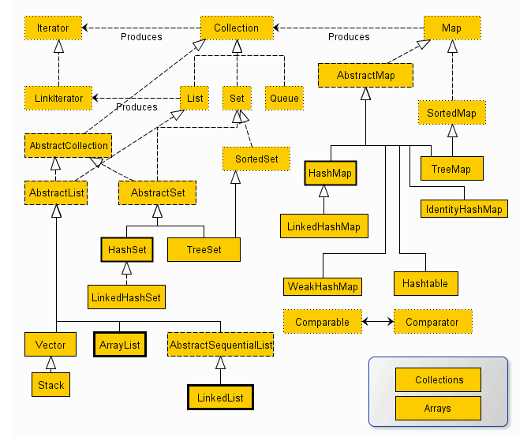

## 4.1. Collections与Arrays 工具类
<a href="#menu"  >目录</a>

**Collections**

Collections则是集合类的一个工具类/帮助类，其中提供了一系列静态方法，用于对集合中元素进行排序、搜索以及线程安全等各种操作。
* 排序(Sort)
    * 使用sort方法可以根据元素的自然顺序 对指定列表按升序进行排序。列表中的所有元素都必须实现 Comparable 接口。此列表内的所有元素都必须是使用指定比较器可相互比较的
* 混排（Shuffling）
    * 混排算法所做的正好与 sort 相反: 它打乱在一个 List 中可能有的任何排列的踪迹。也就是说，基于随机源的输入重排该 List, 这样的排列具有相同的可能性（假设随机源是公正的）。这个算法在实现一个碰运气的游戏中是非常有用的。例如，它可被用来混排代表一副牌的 Card 对象的一个 List 。另外，在生成测试案例时，它也是十分有用的。
    * Collections.Shuffling(list)
* 反转(Reverse)
    * 使用Reverse方法可以根据元素的自然顺序 对指定列表按降序进行排序。
    * Collections.reverse(list)
* 替换所以的元素(Fill)
    * 使用指定元素替换指定列表中的所有元素。
    * Collections.fill(li,"aaa");
* 拷贝(Copy)
    * 用两个参数，一个目标 List 和一个源 List, 将源的元素拷贝到目标，并覆盖它的内容。目标 List 至少与源一样长。如果它更长，则在目标 List 中的剩余元素不受影响。
    * Collections.copy(list,li): 前面一个参数是目标列表 ,后一个是源列表。

* 返回Collections中最小元素(min)
    * 根据指定比较器产生的顺序，返回给定 collection 的最小元素。collection 中的所有元素都必须是通过指定比较器可相互比较的。
    * Collections.min(list)
* 返回Collections中最小元素(max)
    * 根据指定比较器产生的顺序，返回给定 collection 的最大元素。collection 中的所有元素都必须是通过指定比较器可相互比较的。
    * Collections.max(list)
* lastIndexOfSubList
    * 返回指定源列表中最后一次出现指定目标列表的起始位置
    * int count = Collections.lastIndexOfSubList(list,li);
* IndexOfSubList
    * 返回指定源列表中第一次出现指定目标列表的起始位置
    * int count = Collections.indexOfSubList(list,li);
* Rotate
    * 根据指定的距离循环移动指定列表中的元素
    * Collections.rotate(list,-1);
    * 如果是负数，则正向移动，正数则方向移动

**Arrays**
java.util.Arrays 类是 JDK 提供的一个工具类，用来处理数组的各种方法，而且每个方法基本上都是静态方法，能直接通过类名Arrays调用。
* 转化成List
```java
public static <T> List<T> asList(T... a) {
    return new ArrayList<>(a);
}
```
这个方法返回的 ArrayList 不是我们常用的集合类 java.util.ArrayList。这里的 ArrayList 是 Arrays 的一个内部类 java.util.Arrays.ArrayList
返回的 ArrayList 数组是一个定长列表，我们只能对其进行查看或者修改，但是不能进行添加或者删除操作
返回的列表ArrayList里面的元素都是引用，不是独立出来的对象
```java
private static class ArrayList<E> extends AbstractList<E>
        implements RandomAccess, java.io.Serializable
    {
        private static final long serialVersionUID = -2764017481108945198L;
        private final E[] a;

        ArrayList(E[] array) {
            a = Objects.requireNonNull(array);
        }

        @Override
        public int size() {
            return a.length;
        }

        @Override
        public Object[] toArray() {
            return a.clone();
        }

        @Override
        @SuppressWarnings("unchecked")
        public <T> T[] toArray(T[] a) {
            int size = size();
            if (a.length < size)
                return Arrays.copyOf(this.a, size,
                                     (Class<? extends T[]>) a.getClass());
            System.arraycopy(this.a, 0, a, 0, size);
            if (a.length > size)
                a[size] = null;
            return a;
        }

        @Override
        public E get(int index) {
            return a[index];
        }

        @Override
        public E set(int index, E element) {
            E oldValue = a[index];
            a[index] = element;
            return oldValue;
        }

        @Override
        public int indexOf(Object o) {
            E[] a = this.a;
            if (o == null) {
                for (int i = 0; i < a.length; i++)
                    if (a[i] == null)
                        return i;
            } else {
                for (int i = 0; i < a.length; i++)
                    if (o.equals(a[i]))
                        return i;
            }
            return -1;
        }

        @Override
        public boolean contains(Object o) {
            return indexOf(o) != -1;
        }

        @Override
        public Spliterator<E> spliterator() {
            return Spliterators.spliterator(a, Spliterator.ORDERED);
        }

        @Override
        public void forEach(Consumer<? super E> action) {
            Objects.requireNonNull(action);
            for (E e : a) {
                action.accept(e);
            }
        }

        @Override
        public void replaceAll(UnaryOperator<E> operator) {
            Objects.requireNonNull(operator);
            E[] a = this.a;
            for (int i = 0; i < a.length; i++) {
                a[i] = operator.apply(a[i]);
            }
        }

        @Override
        public void sort(Comparator<? super E> c) {
            Arrays.sort(a, c);
        }
    }
```
* Arrays.asList() 方法使用场景
    * Arrays工具类提供了一个方法asList, 使用该方法可以将一个变长参数或者数组转换成List 。但是，生成的List的长度是固定的；能够进行修改操作（比如，修改某个位置的元素）；不能执行影响长度的操作（如add、remove等操作），否则会抛出UnsupportedOperationException异常。
    * 所以 Arrays.asList 比较适合那些已经有数组数据或者一些元素，而需要快速构建一个List，只用于读取操作，而不进行添加或删除操作的场景。

* 排序 sort 
    * 七种基本类型和引用对象排序(自定义Comparator或者引用对象实现Comparable)
* 查找元素 binarySearch
* 拷贝数组元素 copyOf
    * 底层采用 System.arraycopy() 实现，这是一个native方法。
```java
public static native void arraycopy(Object src,  int  srcPos,
                                        Object dest, int destPos,
                                        int length);
```
* equals
    * equals 用来比较两个数组中对应位置的每个元素是否相等。
* deepEquals
    * 也是用来比较两个数组的元素是否相等，不过 deepEquals 能够进行比较多维数组，而且是任意层次的嵌套数组。

* 给数组赋值fill 
```java
//给a数组所有元素赋值 val
public static void fill(int[] a, int val) {
    for (int i = 0, len = a.length; i < len; i++)
        a[i] = val;
}

//给从 fromIndex 开始的下标，toIndex-1结尾的下标都赋值 val,左闭右开
public static void fill(int[] a, int fromIndex, int toIndex, int val) {
    rangeCheck(a.length, fromIndex, toIndex);//判断范围是否合理
    for (int i = fromIndex; i < toIndex; i++)
        a[i] = val;
}
```
* toString 和 deepToString
    * toString 用来打印一维数组的元素，而 deepToString 用来打印多层次嵌套的数组元素。

## 4.2. Comparator 和 Comparable 比较
<a href="#menu"  >目录</a>

**Comparable 简介**
Comparable 是排序接口。
若一个类实现了Comparable接口，就意味着“该类支持排序”。  即然实现Comparable接口的类支持排序，假设现在存在“实现Comparable接口的类的对象的List列表(或数组)”，则该List列表(或数组)可以通过 Collections.sort（或 Arrays.sort）进行排序。
此外，“实现Comparable接口的类的对象”可以用作“有序映射(如TreeMap)”中的键或“有序集合(TreeSet)”中的元素，而不需要指定比较器。

Comparable 定义

Comparable 接口仅仅只包括一个函数，它的定义如下：
```java
package java.lang;
import java.util.*;

public interface Comparable<T> {
    public int compareTo(T o);
}
```
说明：
假设我们通过 x.compareTo(y) 来“比较x和y的大小”。若返回“负数”，意味着“x比y小”；返回“零”，意味着“x等于y”；返回“正数”，意味着“x大于y”。

**Comparator 简介**

Comparator 是比较器接口。
我们若需要控制某个类的次序，而该类本身不支持排序(即没有实现Comparable接口)；那么，我们可以建立一个“该类的比较器”来进行排序。这个“比较器”只需要实现Comparator接口即可。
也就是说，我们可以通过“实现Comparator类来新建一个比较器”，然后通过该比较器对类进行排序。

Comparator 定义
Comparator 接口仅仅只包括两个个函数，它的定义如下：

```java
package java.util;

public interface Comparator<T> {

    int compare(T o1, T o2);

    boolean equals(Object obj);
}
```
说明：
(01) 若一个类要实现Comparator接口：它一定要实现compareTo(T o1, T o2) 函数，但可以不实现 equals(Object obj) 函数。
为什么可以不实现 equals(Object obj) 函数呢？ 因为任何类，默认都是已经实现了equals(Object obj)的。 Java中的一切类都是继承于java.lang.Object，在Object.java中实现了equals(Object obj)函数；所以，其它所有的类也相当于都实现了该函数。
(02) int compare(T o1, T o2) 是“比较o1和o2的大小”。返回“负数”，意味着“o1比o2小”；返回“零”，意味着“o1等于o2”；返回“正数”，意味着“o1大于o2”。

* Comparator 和 Comparable 比较
    * Comparable是排序接口；若一个类实现了Comparable接口，就意味着“该类支持排序”。
    * 而Comparator是比较器；我们若需要控制某个类的次序，可以建立一个“该类的比较器”来进行排序。
    * 我们不难发现：Comparable相当于“内部比较器”，而Comparator相当于“外部比较器”。

## 4.3. 迭代器
<a href="#menu"  >目录</a>

Java中还提供了一个Iterable接口，Iterable接口实现后的功能是‘返回’一个迭代器，我们常用的实现了该接口的子接口有:Collection<E>、List<E>、Set<E>等。该接口的iterator()方法返回一个标准的Iterator实现。实现Iterable接口允许对象成为Foreach语句的目标。就可以通过foreach语句来遍历你的底层序列。迭代器迭代完成，如果想重新迭代，必须重新获取新的迭代器．

Iterable接口包含一个能产生Iterator对象的方法，并且Iterable被foreach用来在序列中移动。因此如果创建了实现Iterable接口的类，都可以将它用于foreach中。

```java
public interface Iterator<E> {
    boolean hasNext();
    E next();
    default void remove() {
        throw new UnsupportedOperationException("remove");
    }

    default void forEachRemaining(Consumer<? super E> action) {
        Objects.requireNonNull(action);
        while (hasNext())
            action.accept(next());
    }
}
```

迭代器使用
```java
 //使用迭代器遍历ArrayList集合
Iterator<String> listIt = list.iterator();
while(listIt.hasNext()){
 System.out.println(listIt.next());
}
//使用迭代器遍历Set集合
Iterator<String> setIt = set.iterator();
 while(setIt.hasNext()){
   System.out.println(listIt.next());
}
//for-each,实际上也是转换成迭代器方式
for (String string : list) {
    System.out.println(string);
}

```

在使用Iterator的时候禁止对所遍历的容器进行改变其大小结构的操作。例如: 在使用Iterator进行迭代时，如果对集合进行了add、remove操作就会出现ConcurrentModificationException异常。

这里有一个全局变量modCount，每当元素数量改变的时候，这个值就会变化．在获取迭代器时，会初始化expectedModCount．每次迭代的时候就会检测初始值expectedModCount和当前的modCount是否一致，不一致说明集合参数数量被改变．会抛出ConcurrentModificationException异常．基于此，这些集合类不适合在并发环境下使用．

快速失败机制产生的条件:当多个线程对Collection进行操作时，若其中某一个线程通过Iterator遍历集合时，该集合的内容被其他线程所改变，则会抛出ConcurrentModificationException异常。
```java
private class Itr implements Iterator<E> {
        int cursor;       // index of next element to return
        int lastRet = -1; // index of last element returned; -1 if no such
        int expectedModCount = modCount;

        Itr() {}

        public boolean hasNext() {
            return cursor != size;
        }

        @SuppressWarnings("unchecked")
        public E next() {
            checkForComodification();
            int i = cursor;
            if (i >= size)
                throw new NoSuchElementException();
            Object[] elementData = ArrayList.this.elementData;
            if (i >= elementData.length)
                throw new ConcurrentModificationException();
            cursor = i + 1;
            return (E) elementData[lastRet = i];
        }

        public void remove() {
            if (lastRet < 0)
                throw new IllegalStateException();
            checkForComodification();

            try {
                ArrayList.this.remove(lastRet);
                cursor = lastRet;
                lastRet = -1;
                expectedModCount = modCount;
            } catch (IndexOutOfBoundsException ex) {
                throw new ConcurrentModificationException();
            }
        }

        @Override
        @SuppressWarnings("unchecked")
        public void forEachRemaining(Consumer<? super E> consumer) {
            Objects.requireNonNull(consumer);
            final int size = ArrayList.this.size;
            int i = cursor;
            if (i >= size) {
                return;
            }
            final Object[] elementData = ArrayList.this.elementData;
            if (i >= elementData.length) {
                throw new ConcurrentModificationException();
            }
            while (i != size && modCount == expectedModCount) {
                consumer.accept((E) elementData[i++]);
            }
            // update once at end of iteration to reduce heap write traffic
            cursor = i;
            lastRet = i - 1;
            checkForComodification();
        }

        final void checkForComodification() {
            if (modCount != expectedModCount)
                throw new ConcurrentModificationException();
        }
    }
```


## 4.4. 基本集合源码分析
<a href="#menu"  >目录</a>


### 4.4.1. ArrayList

从继承体系上来看，ArrayList可以被随机访问和被深复制和可序列化的。
```java
public class ArrayList<E> extends AbstractList<E>
        implements List<E>, RandomAccess, Cloneable, java.io.Serializable｛

    private int size;
    protected transient int modCount = 0;
    transient Object[] elementData; // non-private to simplify nested class access        
｝
```
ArrayList的本质上是一个数组存储结构，元素存储在elementData中。在不指定初始容量时，其大小为０。注意，这里的size并不是数组的大小，而是Ｌist集合中元素的数量。modCount用于在迭代期间检测是否发生数组元素改变。modCount每次添加或者删除元素时，都会自增。

**添加元素流程**
* 每次添加的时候都会检测容量是否足够
* modCount自增
* 每次扩容都是1.5倍扩容
```java
public boolean add(E e) {
    //每次添加的时候都会检测容量是否足够
    ensureCapacityInternal(size + 1);  // Increments modCount!!
    elementData[size++] = e;
    return true;
}

private void ensureCapacityInternal(int minCapacity) {
    ensureExplicitCapacity(calculateCapacity(elementData, minCapacity));
}
private void ensureExplicitCapacity(int minCapacity) {
    modCount++;
    // overflow-conscious code
    if (minCapacity - elementData.length > 0)
        grow(minCapacity);
}
//扩容
private void grow(int minCapacity) {
    // overflow-conscious code
    int oldCapacity = elementData.length;
    int newCapacity = oldCapacity + (oldCapacity >> 1);
    if (newCapacity - minCapacity < 0)
        newCapacity = minCapacity;
    if (newCapacity - MAX_ARRAY_SIZE > 0)
        newCapacity = hugeCapacity(minCapacity);
    // minCapacity is usually close to size, so this is a win:
    elementData = Arrays.copyOf(elementData, newCapacity);
}     
```

**移除元素**

移除元素时modCount同样自增，同时移除元素的后面所有元素往前移动
```java
public E remove(int index) {
    rangeCheck(index);
    modCount++;
    E oldValue = elementData(index);

    int numMoved = size - index - 1;
    if (numMoved > 0)
        System.arraycopy(elementData, index+1, elementData, index,
                            numMoved);
    elementData[--size] = null; // clear to let GC do its work
    return oldValue;
}
```

**迭代器**

在创建迭代器时，都会保存当前的modCount到expectedModCount。每次迭代时都会检测两个值是否相同，不同则抛出异常ConcurrentModificationException。也就是说迭代时不允许并发修改。
```java
 private class Itr implements Iterator<E> {
    int cursor;       // index of next element to return
    int lastRet = -1; // index of last element returned; -1 if no such
    int expectedModCount = modCount;

    final void checkForComodification() {
        if (modCount != expectedModCount)
            throw new ConcurrentModificationException();
    }

    public boolean hasNext() {
        return cursor != size;
    }
    public E next() {
        checkForComodification();
    }
    public void remove() {
        if (lastRet < 0)
            throw new IllegalStateException();
        checkForComodification();
    .....
    }
 }
```
ArrayList　支持两种迭代器，Itr，Itr支持迭代时移除元素。ListItr，是Itr的子类，除了支持Itr的功能，还支持向前遍历，和设置添加元素。

**深复制**

```java
public Object clone() {
    try {
        //这里已经复制所有的值了，为何还要再次调用Arrays.copyOf
        ArrayList<?> v = (ArrayList<?>) super.clone();
        v.elementData = Arrays.copyOf(elementData, size);
        v.modCount = 0;
        return v;
    } catch (CloneNotSupportedException e) {
        // this shouldn't happen, since we are Cloneable
        throw new InternalError(e);
    }
}

```

### 4.4.2. Linklist

Linklist的存储结构是双向链表。因此可以在链表的任意位置实现插入和删除元素。其他设计理念和ArrayList差不多
```java
public class LinkedList<E>
    extends AbstractSequentialList<E>
    implements List<E>, Deque<E>, Cloneable, java.io.Serializable
{

    private static class Node<E> {
        E item;
        Node<E> next;
        Node<E> prev;

        Node(Node<E> prev, E element, Node<E> next) {
            this.item = element;
            this.next = next;
            this.prev = prev;
        }
    } 

    public Object clone() {
        LinkedList<E> clone = superClone();

        // Put clone into "virgin" state
        clone.first = clone.last = null;
        clone.size = 0;
        clone.modCount = 0;

        // Initialize clone with our elements
        for (Node<E> x = first; x != null; x = x.next)
            clone.add(x.item);

        return clone;
    }
}

```

**ArrayList和LinkedList区别及使用场景**
* LinkedList和ArrayList的差别主要来自于Array和LinkedList数据结构的不同。ArrayList是基于数组实现的，LinkedList是基于双链表实现的。另外LinkedList类不仅是List接口的实现类，可以根据索引来随机访问集合中的元素，除此之外，LinkedList还实现了Deque接口，Deque接口是Queue接口的子接口，它代表一个双向队列，因此LinkedList可以作为双向对列，栈（可以参见Deque提供的接口方法）和List集合使用，功能强大。
* 因为Array是基于索引(index)的数据结构，它使用索引在数组中搜索和读取数据是很快的，可以直接返回数组中index位置的元素，因此在随机访问集合元素上有较好的性能。Array获取数据的时间复杂度是O(1),但是要插入、删除数据却是开销很大的，因为这需要移动数组中插入位置之后的的所有元素。
* 相对于ArrayList，LinkedList的随机访问集合元素时性能较差，因为需要在双向列表中找到要index的位置，再返回；但在插入，删除操作是更快的。因为LinkedList不像ArrayList一样，不需要改变数组的大小，也不需要在数组装满的时候要将所有的数据重新装入一个新的数组，这是ArrayList最坏的一种情况，时间复杂度是O(n)，而LinkedList中插入或删除的时间复杂度仅为O(1)。ArrayList在插入数据时还需要更新索引（除了插入数组的尾部）。
* LinkedList需要更多的内存，因为ArrayList的每个索引的位置是实际的数据，而LinkedList中的每个节点中存储的是实际的数据和前后节点的位置。

**使用场景：**
* 如果应用程序对数据有较多的随机访问，ArrayList对象要优于LinkedList对象；
* 如果应用程序有更多的插入或者删除操作，较少的数据读取，LinkedList对象要优于ArrayList对象；
* 不过ArrayList的插入，删除操作也不一定比LinkedList慢，如果在List靠近末尾的地方插入，那么ArrayList只需要移动较少的数据，而LinkedList则需要一直查找到列表尾部，反而耗费较多时间，这时ArrayList就比LinkedList要快。


### 4.4.3. Vector

Vector 的实现方式和ArrayList基本一样，只是在一些方法上添加了synchronized，使其编程线程安全类，但是此种方式在多线程环境下性能一般。一般多线程环境使用并发集合类。

```java
public class Vector<E>
    extends AbstractList<E>
    implements List<E>, RandomAccess, Cloneable, java.io.Serializable
{
    
}
```
### 4.4.4. Stack

Stack是Vector的子类，实现了一个同步的栈类。
```java
public
class Stack<E> extends Vector<E> {}
```
### 4.4.5. HashMap

HashMap的存储结构是:数组+单链表+结构。HashMap通过链地址法来解决哈希冲突。JDK1.8在JDK1.7的基础上针对增加了红黑树来进行优化。即当链表达到某一个条件的时候，链表就转换为红黑树，利用红黑树快速增删改查的特点提高HashMap的性能，其中会用到红黑树的插入、删除、查找等算法。

继承体系
```java
public class HashMap<K,V> extends AbstractMap<K,V>
    implements Map<K,V>, Cloneable, Serializable {
        
}
```

**链表上的节点**

链表上的节点是一个单链表结构
```java
static class Node<K,V> implements Map.Entry<K,V> {
    final int hash;
    final K key;
    V value;
    Node<K,V> next;
｝
```

**哈希值计算**

从哈希函数可以看出，HashMap支持null值的key，但仅有一个。
```java
 static final int hash(Object key) {
    int h;
    return (key == null) ? 0 : (h = key.hashCode()) ^ (h >>> 16);
}
```

**属性**

```java
static final int DEFAULT_INITIAL_CAPACITY = 1 << 4; 
static final int MAXIMUM_CAPACITY = 1 << 30;
static final float DEFAULT_LOAD_FACTOR = 0.75f;
static final int TREEIFY_THRESHOLD = 8;
static final int UNTREEIFY_THRESHOLD = 6;
static final int MIN_TREEIFY_CAPACITY = 64;
```
* DEFAULT_INITIAL_CAPACITY
    * 默认的初始容量16。必须为2的倍数
* MAXIMUM_CAPACITY
    * 最大容量
* DEFAULT_LOAD_FACTOR
    * 负载因子，当当前的元素数量=当前容量 x DEFAULT_LOAD_FACTOR时，认为哈希冲突相对比较严重，需要重新扩容
* TREEIFY_THRESHOLD & MIN_TREEIFY_CAPACITY
    * 当单链表上的元素超过TREEIFY_THRESHOLD并且，总元素数量超过MIN_TREEIFY_CAPACITY，则将将该链表转化为红黑树结构
* UNTREEIFY_THRESHOLD
    *  当单链表上的元素小于该值，取消红黑树结构


### 4.4.6. TreeMap

### 4.4.7. HashSet

### 4.4.8. TreeSet


# 5. 异常
<a href="#menu"  >目录</a>

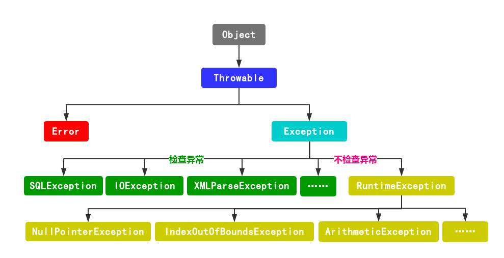

* Error是无法处理的异常，比如OutOfMemoryError，一般发生这种异常，JVM会选择终止程序。因此我们编写程序时不需要关心这类异常。
* Exception，也就是我们经常见到的一些异常情况，比如NullPointerException、IndexOutOfBoundsException，这些异常是我们可以处理的异常。
* Exception类还包含运行异常类Runtime_Exception和非运行异常类Non_RuntimeException这两个直接的子类。

运行异常类对应于编译错误，它是指Java程序在运行时产生的由解释器引发的各种异常。运行异常可能出现在任何地方，且出现频率很高，因此为了避免巨大的系统资源开销，编译器不对异常进行检查。所以Java语言中的运行异常不一定被捕获。出现运行错误往往表示代码有错误，如：算数异常（如被0除）、下标异常（如数组越界）等。

非运行异常时Non_RuntimeException类及其子类的实例，又称为可检测异常。Java编译器利用分析方法或构造方法中可能产生的结果来检测Java程序中是否含有检测异常的处理程序，对于每个可能的可检测异常，方法或构造方法的throws子句必须列出该异常对应的类。在Java的标准包java.lang java.util 和 java.net 中定义的异常都是非运行异常。

如果检测型异常被捕获，其后面的代码会继续执行

* try-catch-finally语句
    * try块：负责捕获异常，一旦try中发现异常，程序的控制权将被移交给catch块中的异常处理程序。
    * try语句块不可以独立存在，必须与 catch 或者 finally 块同存】
    * catch块：如何处理？比如发出警告：提示、检查配置、网络连接，记录错误等。执行完catch块之后程序跳出catch块，继续执行后面的代码。
    * 【编写catch块的注意事项：多个catch块处理的异常类，要按照先catch子类后catch父类的处理方式，因为会【就近处理】异常（由上自下）。】
    * finally：最终执行的代码，用于关闭和释放资源。
```java
try{

}
catch(Exception ex1){

}
catch(Exception ex2){

}
finally{
    
}

```
* **总结：**
    * 不管有没有出现异常或者try和catch中有返回值return，finally块中代码都会执行；
    * finally中最好不要包含return，否则程序会提前退出，返回会覆盖try或catch中保存的返回值。
    * e.printStackTrace()可以输出异常信息。
    * return值为-1为抛出异常的习惯写法。
    * 如果方法中try,catch,finally中没有返回语句，则会调用这三个语句块之外的return结果。
    * finally 在try中的return之后,在返回主调函数之前执行。

* **throw和throws关键字**
throws: 方法声明抛出的异常 
throw： 抛出异常
```java
public void func() throws IOException{
   throw new IOException();
}
```

```java
public class TryCatch {
    public static void main(String[] args) {
        int num = 0;
        try {
             num = 11;
             return;

        } catch (Exception e) {
             num = 22;
             return;
        }
        finally {
             num = 33;
             return;
        }
    }
}

//使用该指令查看编译后的字节码
javap -c TryCatch 

//当finally块中有return时
public class org.TryCatch.TryCatch {
  public org.TryCatch.TryCatch();
    Code:
       0: aload_0
       1: invokespecial #8                  // Method java/lang/Object."<init>":()V
       4: return

  public static void main(java.lang.String[]);
    Code:
      //try块
       0: iconst_0
       1: istore_1
       2: bipush        11
       4: istore_1
       //如果finally块中有return，则使用goto跳转到finally块
       5: goto          16
       //catch块
       8: astore_2
       9: bipush        22
      11: istore_1
       //如果finally块中有return，则使用goto跳转到finally块
      12: goto          16
      15: pop
      //finally块
      16: bipush        33
      18: istore_1
      //最后在这里返回
      19: return
    Exception table:
       from    to  target type
           2     8     8   Class java/lang/Exception
           2    15    15   any
}
当finally块中不存在return时
public class org.TryCatch.TryCatch {
  public org.TryCatch.TryCatch();
    Code:
       0: aload_0
       1: invokespecial #8                  // Method java/lang/Object."<init>":()V
       4: return

  public static void main(java.lang.String[]);
    Code:
       //try块
       0: iconst_0
       1: istore_1
       2: bipush        11
       4: istore_1
        //复制一份finally块中的代码
       5: bipush        33
       7: istore_1
       //try最后返回
       8: return
       //catch块
       9: astore_2
      10: bipush        22
      //复制一份finally块中的代码
      12: istore_1
      13: bipush        33
      15: istore_1
      //catch最后返回
      16: return
      //finally块
      17: astore_3
      18: bipush        33
      20: istore_1
      21: aload_3
      22: athrow
    Exception table:
       from    to  target type
           2     5     9   Class java/lang/Exception
           2     5    17   any
           9    13    17   any
}

```
1 . 从以上两段字节码可以看出，当finally和try中都存在return语句时，try中指令执行完后会跳转到finally，执行finally块中的指令，最后执行finally块中的return指令，注意这里不会再跳转到try中执行try块中的return指令. 
2 . 当只有try中存在return语句时，try会复制一份finally中的指令到try中执行。 
3 . catch和try的处理相同。

```java

//三个语句块中都不存在return时
public static void main(java.lang.String[]);
    Code:
    //try
       0: iconst_0
       1: istore_1
       2: bipush        11
       4: istore_1
       5: goto          24
       //catch
       8: astore_2
       9: bipush        22
       //复制finally中的语句
      11: istore_1
      12: bipush        33
      14: istore_1
      15: goto          27
      //finally
      18: astore_3
      19: bipush        33
      21: istore_1
      22: aload_3
      23: athrow
      //为什么多这个？？
      24: bipush        33
      26: istore_1
      //自动添加return
      27: return

```
三个语句块中都不存在return时 
1. try中执行完会跳转去执行finally的指令 ，再执行try-catch-finally之后的指令，最后执行return指令结束方法。 
2. 如果出现异常，catch中会复制一份finally的指令，执行完后跳转到27: return结束方法。


**异常处理规则**

* 成功的异常处理
    * 使程序代码混乱最小化
    * 捕捉并保留诊断信息
    * 通知合适的人员
    * 采用合适的方式结束异常活动

* 过度使用异常
    * 使用异常处理普通错误
    * 使用异常来实现流程控制

* 异常捕获后的处理
    * 处理异常，比如返回错误码给调用者
    * 重新抛出异常，让上层处理
    * 当前方法不检测异常，而是在方法定义声明抛出异常

    
# 6. 注解
<a href="#menu"  >目录</a>

**概念定义**
* 注解
    * 提供一种为程序元素设置元数据的方法
* 基本原则
    * 注解不能够直接干扰程序代码的运行，无论增加或者删除注解。代码都能够正常运行
* 注解分类
    * 标注注解,没有元素的注解
    * 单值注解
    * 完整注解
* 元数据
    * 就是关于数据的数据
    * 作用
        * 编写文档：通过代码里标识的元数据生成文档
        * 代码分析:通过代码里标识的元数据对代码进行分析
        * 编译检查:通过代码里标识的元数据让编译器能实现基本的编译检查
* 标准注解
    * @Override
        * 保证编译的时候Override函数的声明正确
        * target：METHOD
    * @Deprecated
        * 标识该类或者方法，参数不再推荐使用，相当于过期，仍可以使用，但是不推荐使用
        * target：CONSTRUCTOR, FIELD, LOCAL_VARIABLE, METHOD, PACKAGE, PARAMETER, TYPE
    * @SuppressWarnings
        * 关闭特定的警告信息
        * target：TYPE, FIELD, METHOD, PARAMETER, CONSTRUCTOR, LOCAL_VARIABLE
        * 参数
            * deprecation : 使用了过时的类或者方法时的警告  
            * unchecked :  执行了未检查时转换的警告
            * fallthrough :  当Switch程序块直接通往下一种情况而没有Break时的警告
            * path :  在类路径，源文件路径中有不存在的路径时的警告
            * serial  :  当在可序列化的类上缺少serialVersionUID定义时的警告  
            * finally : 任何finally子句不能正常完成时的警告 
            * all :  关于以上所有情况的警告
        * @SuppressWarnings(value={"deprecation"})

* 元注解
    * 负责注解其他注解
    * @Retention
        * 表示需要在什么级别保留该注解信息
        * SOURCE：注解仅保留在源代码中，在编译时被去掉
        * CLASS：保留在类级别，运行时不存在
        * RUNTIME: 保留到运行时
    * @Target
        * CONSTRUCTOR(构造器的声明), FIELD, LOCAL_VARIABLE(局部变量), METHOD, PACKAGE, PARAMETER（参数声明）, TYPE(类，接口)
    * @Documented
        * JavaDOC提取文档时，如果注解上有@Documented，那么被注解的对象（类，方法等）将显示该注解
    * @Inhertied
        * 允许子类继承父类中的注释
    * @Repeatable
        * 支持注解在同一个地方添加多个
        * 参数:Class<? extends Annotation> value();       
```java

//声明支持重复注解
@Repeatable(Persons.class)
public  @interface Person{
	String role() default "";
}
//多次使用
@Person(role="CEO")
@Person(role="husband")
@Person(role="father")
@Person(role="son")
public   class Man {
	String name="";
}

```

* 自定义注解
```java

@Retention(RetentionPolicy.RUNTIME)
@Target( { ElementType.METHOD, ElementType.TYPE })
public @interface MyAnnotation {

    Integer age();
    //default设置默认值 xx 
    String color() default "xx"; 

    Class[] zlz;
}
//
@MyAnnotation(age=13,color="red",zlz={xx.class,xxx.class})
```

**AnnotatedElement**
* **简介**
    * 这个接口（AnnotatedElement）的对象代表了在当前JVM中的一个“被注解元素”（可以是Class，Method，Field，Constructor，Package等）。在Java语言中，所有实现了这个接口的“元素”都是可以“被注解的元素”。使用这个接口中声明的方法可以读取（通过Java的反射机制）“被注解元素”的注解。这个接口中的所有方法返回的注解都是不可变的、并且都是可序列化的。这个接口中所有方法返回的数组可以被调用者修改，而不会影响其返回给其他调用者的数组。
* **子接口**
    * AnnotatedArrayType （被注解的数组类型）
    * AnnotatedParameterizedType （被注解的参数化类型）
    * AnnotatedType （被注解的类型）
    * AnnotatedTypeVariable （被注解的类型变量）
    * AnnotatedWildcardType （被注解的通配类型）
    * GenericDeclaration （通用声明，用于表示声明型元素，如：类、方法、构造器等）
    * TypeVariable<D> （类型变量）

* **其实现类**
    * AccessibleObject（可访问对象，如：方法、构造器、属性等）
    * Class（类，就是你用Java语言编程时每天都要写的那个东西）
    * Constructor（构造器，类的构造方法的类型）
    * Executable（可执行的，如构造器和方法）
    * Field（属性，类中属性的类型）
    * Method（方法，类中方法的类型）
    * Package（包，你每天都在声明的包的类型）
    * Parameter（参数，主要指方法或函数的参数，其实是这些参数的类型）

以上类型对象都可以通过 AnnotatedElement相关方法获取注解信息
```java
public interface AnnotatedElement {

    default boolean isAnnotationPresent(Class<? extends Annotation> annotationClass) {}
    <T extends Annotation> T getAnnotation(Class<T> annotationClass);
    Annotation[] getAnnotations();
    default <T extends Annotation> T[] getAnnotationsByType(Class<T> annotationClass) {}
    default <T extends Annotation> T getDeclaredAnnotation(Class<T> annotationClass) { }
    default <T extends Annotation> T[] getDeclaredAnnotationsByType(Class<T> annotationClass) { }
    Annotation[] getDeclaredAnnotations();
}
```

# 7. IO
<a href="#menu"  >目录</a>

## 7.1. File
* File是java.io包下与平台无关的文件和目录操作类。
* File能改新建，删除和重命名文件和目录。
* File不能访问文件内容，访问文件内容使用相关的流操作类。
* 绝对路径: Linux：以根路径开头的路径(/xx/xx),WIN：以磁盘开头的路径(d://,c://)
* 相对路径: 相对当前项目的路径( pic/header)

**常用方法**
```java
//返回由此抽象路径名表示的文件或目录的名称。
public String getName()
//返回此抽象路径名的父路径名的路径名字符串，如果此路径名没有指定父目录，则返回 null。
public String getParent()、
//返回此抽象路径名的父路径名的抽象路径名，如果此路径名没有指定父目录，则返回 null。
public File getParentFile()
//将此抽象路径名转换为一个路径名字符串。
public String getPath()
//测试此抽象路径名是否为绝对路径名。
public boolean isAbsolute()
//返回抽象路径名的绝对路径名字符串。
public String getAbsolutePath()
//测试应用程序是否可以读取此抽象路径名表示的文件。
public boolean canRead()
//测试应用程序是否可以修改此抽象路径名���示的文件。
public boolean canWrite()
//测试此抽象路径名表示的文件或目录是否存在
public boolean exists()
//测试此抽象路径名表示的文件是否是一个目录。
public boolean isDirectory()
//测试此抽象路径名表示的文件是否是一个标准文件。
public boolean isFile()
//返回此抽象路径名表示的文件最后一次被修改的时间。
public long lastModified()
//返回由此抽象路径名表示的文件的长度。
public long length()
//当且仅当不存在具有此抽象路径名指定的名称的文件时，原子地创建由此抽象路径名指定的一个新的空文件。
public boolean createNewFile() throws IOException
// 删除此抽象路径名表示的文件或目录。
public boolean delete()
//在虚拟机终止时，请求删除此抽象路径名表示的文件或目录。
public void deleteOnExit()
//返回由此抽象路径名所表示的目录中的文件和目录的名称所组成字符串数组。
public String[] list()
//返回由包含在目录中的文件和目录的名称所组成的字符串数组，这一目录是通过满足指定过滤器的抽象路径名来表示的。
public String[] list(FilenameFilter filter)
 // 返回一个抽象路径名数组，这些路径名表示此抽象路径名所表示目录中的文件。
public File[] listFiles()
//返回表示此抽象路径名所表示目录中的文件和目录的抽象路径名数组，这些路径名满足特定过滤器。
public File[] listFiles(FileFilter filter)
//创建此抽象路径名指定的目录。
public boolean mkdir()
//创建此抽象路径名指定的目录，包括创建必需但不存在的父目录。
public boolean mkdirs()
 //重新命名此抽象路径名表示的文件。
public boolean renameTo(File dest)
//设置由此抽象路径名所指定的文件或目录的最后一次修改时间。
public boolean setLastModified(long time)
//标记此抽象路径名指定的文件或目录，以便只可对其进行读操作。
public boolean setReadOnly()
//在指定目录中创建一个新的空文件，使用给定的前缀和后缀字符串生成其名称。
public static File createTempFile(String prefix, String suffix, File directory) throws IOException
//在默认临时文件目录中创建一个空文件，使用给定前缀和后缀生成其名称。
public static File createTempFile(String prefix, String suffix) throws IOException
//按字母顺序比较两个抽象路径名。
public int compareTo(File pathname)
//按字母顺序比较抽象路径名与给定对象。
public int compareTo(Object o)
//测试此抽象路径名与给定对象是否相等。
public boolean equals(Object obj)
 //返回此抽象路径名的路径名字符串。
public String toString()
```
**文件过滤器**
```java
public interface FilenameFilter {
    /**
     * Tests if a specified file should be included in a file list.
     *
     * @param   dir    the directory in which the file was found.
     * @param   name   the name of the file.
     * @return  <code>true</code> if and only if the name should be
     * included in the file list; <code>false</code> otherwise.
     */
    boolean accept(File dir, String name);
}
@FunctionalInterface
public interface FileFilter {

    /**
     * Tests whether or not the specified abstract pathname should be
     * included in a pathname list.
     *
     * @param  pathname  The abstract pathname to be tested
     * @return  <code>true</code> if and only if <code>pathname</code>
     *          should be included
     */
    boolean accept(File pathname);
}
//File获取文件列表时添加过滤器
public File[] listFiles(FileFilter filter) ;
public File[] listFiles(FilenameFilter filter)
```
### 7.1.1. IO流

**流的概念和作用**

流是一组有顺序的，有起点和终点的字节集合，是对数据传输的总称或抽象。即数据在两设备间的传输称为流，流的本质是数据传输，根据数据传输特性将流抽象为各种类，方便更直观的进行数据操作。 

**IO流的分类**
根据处理数据类型的不同分为：字符流和字节流
根据数据流向不同分为：输入流和输出流
 
**字符流和字节流**
字符流的由来： 因为数据编码的不同，而有了对字符进行高效操作的流对象。本质其实就是基于字节流读取时，去查了指定的码表。 字节流和字符流的区别：
* 读写单位不同：字节流以字节（8bit）为单位，字符流以字符为单位，根据码表映射字符，一次可能读多个字节。
* 处理对象不同：字节流能处理所有类型的数据（如图片、avi等），而字符流只能处理字符类型的数据。
* 结论：只要是处理纯文本数据，就优先考虑使用字符流。 除此之外都使用字节流。

**输入流和输出流**
对输入流只能进行读操作，对输出流只能进行写操作，程序中需要根据待传输数据的不同特性而使用不同的流。  

**节点流和处理流**
* 节点流
    * 可以从一个特定的IO设备(磁盘，网络)读写数据的流，称为节点流
    * 当使用节点流来进行输入输出时，程序直接连接到实际的数据源，和实际的输入输出节点连接
* 处理流
    * 对一个已存在的流进行连接或封装，通过封装后实现数据的读写
    * 当使用处理流来进行输入输出时，程序并不会直接连接到实际的数据源，没有和实际的输入输出节点连接
    * 只要使用相同的处理流，程序就可以采用完全相同的输入输出代码访问不同的数据源，相当于做了顶层封装，提供公共的访问接口。
    


|分类|字节输入流|字节输出流|字符输入流|字符输出流|
|---|---|---|---|---|
|抽象基类|InputStream|OutputStream|Reader|Writer|
|访问文件|FileInputStream|FileOutoutStream|FileReader|FileWriter|
|访问数组|ByteArrayInputStream|ByteArrayOutputStream|CharArrayReader|CharArrayWriter|
|访问管道|PipedInputStream|PipedOutputStream|PipedReader|PipedWriter|
|访问字符串|||StringReader|StringWriter|
|缓冲流|BufferedInputStream|BufferedOutputStream|BufferedReader|BufferedWriter|
|转换流|||InputStreamReader|OutputStreamWriter|
|对象流|ObjectInputStream|ObjectOutputStream|||
|抽象基类|FilterInputStream|FilterOutputStream|FilterReader|FilterWriter|
|打印流||PrintOutputStream||PrintWriter|
|推回输入流|PushbackInputStream||PushbackOutputStream||
|特殊流|DataInputStream|DataOutputStream|||

**输出追加内容**

append 参数控制，默认是不追加，写入文件时全部覆盖。
```java
public FileOutputStream(String name, boolean append)
        throws FileNotFoundException
{
    this(name != null ? new File(name) : null, append);
}

```
**关闭输出流**
* 不要忘记关闭输出流
* 关闭输出流可以保证物理资源被回
* 还可以将输出流缓冲区中的数据flush到物理节点中
* Java很多输出流默认都提供了缓冲功能

**什么时候使用字节流、什么时候使用字符流，二者的区别**
* 在程序中所有的数据都是以流的方式进行传输或保存的，程序需要数据的时候要使用输入流读取数据，而当程序需要将一些数据保存起来的时候，就要使用输出流完成。
* InputStream 和OutputStream,两个是为字节流设计的,主要用来处理字节或二进制对象,
* Reader和 Writer.两个是为字符流（一个字符占两个字节）设计的,主要用来处理字符或字符串.
 
* 字符流处理的单元为2个字节的Unicode字符，操作字符、字符数组或字符串，
字节流处理单元为1个字节，操作字节和字节数组。
所以字符流是由Java虚拟机将字节转化为2个字节的Unicode字符为单位的字符而成的，
所以它对多国语言支持性比较好！
如果是音频文件、图片、歌曲，就用字节流好点，
如果是关系到中文（文本）的，用字符流好点


* 所有文件的储存是都是字节（byte）的储存，在磁盘上保留的并不是文件的字符而是先把字符编码成字节，再储存这些字节到磁盘。在读取文件（特别是文本文件）时，也是一个字节一个字节地读取以形成字节序列
字节流可用于任何类型的对象，包括二进制对象，而字符流只能处理字符或者字符串；
字节流提供了处理任何类型的IO操作的功能，但它不能直接处理Unicode字符，而字符流就可以
* 字节流是最基本的，所有的InputStrem和OutputStream的子类都是,主要用在处理二进制数据，它是按字节来处理的,但实际中很多的数据是文本，又提出了字符流的概念，它是按虚拟机的encode来处理，也就是要进行字符集的转化 .这两个之间通过 InputStreamReader,OutputStreamWriter来关联，实际上是通过byte[]和String来关联 .在实际开发中出现的汉字问题实际上都是在字符流和字节流之间转化不统一而造成的 


* Reader类的read()方法返回类型为int ：作为整数读取的字符（占两个字节共16位），范围在 0 到 65535 之间 (0x00-0xffff)，如果已到达流的末尾，则返回 -1

* inputStream的read()虽然也返回int，但由于此类是面向字节流的，一个字节占8个位，所以返回 0 到 255 范围内的 int 字节值。如果因为已经到达流末尾而没有可用的字节，则返回值 -1。因此对于不能用0-255来表示的值就得用字符流来读取！比如说汉字.

* 字节流和字符流的主要区别是什么呢？
    * 字节流在操作时不会用到缓冲区（内存），是直接对文件本身进行操作的。而字符流在操作时使用了缓冲区，通过缓冲区再操作文件。
        *  我们知道，如果一个程序频繁对一个资源进行IO操作，效率会非常低。此时，通过缓冲区，先把需要操作的数据暂时放入内存中，以后直接从内存中读取数据，则可以避免多次的IO操作，提高效率
    * 在硬盘上的所有文件都是以字节形式存在的（图片，声音，视频），而字符值在内存中才会形成。
        * 真正存储和传输数据时都是以字节为单位的，字符只是存在与内存当中的，所以，字节流适用范围更为宽广

**缓冲流**
BufferedInputStream和BufferedOutputStream这两个类分别是FilterInputStream和FilterOutputStream的子类，作为装饰器子类，使用它们可以防止每次读取/发送数据时进行实际的写操作，代表着使用缓冲区。

我们有必要知道不带缓冲的操作，每读一个字节就要写入一个字节，由于涉及磁盘的IO操作相比内存的操作要慢很多，所以不带缓冲的流效率很低。带缓冲的流，可以一次读很多字节，但不向磁盘中写入，只是先放到内存里。等凑够了缓冲区大小的时候一次性写入磁盘，这种方式可以减少磁盘操作次数，速度就会提高很多！

同时正因为它们实现了缓冲功能，所以要注意在使用BufferedOutputStream写完数据后，要调用flush()方法或close()方法，强行将缓冲区中的数据写出。否则可能无法写出数据。与之相似还BufferedReader和BufferedWriter两个类。

**RandomAccessFile**
* 除了常规的读写功能，还支持任意位置读写内容
* long getFilePointer(); 返回文件记录指针的当前位置
* void seek(long pos); 将文件指针定位到pos 
* 支持读和写
    * RandomAccessFile(String name, String mode)
    * mode : 
        * r :以只读方式打开文件 
        * rw : 以读写方式打开文件
        * rws : 除了rw,还要求对文件的内容或者元数据的每个更新都同步写入到底层存储设备
        * rwd : 除了rw,还要求对文件内容的每个更新都同步写入到底层的存储设备。
* 如果seek 定位后写入内容，将会覆盖后续内容，如果需要实现插入写，需要先读出后面的内容，写入之后再追加写入读出的内容。
  
### 7.1.2. 序列化
* 序列化
    * 将对象转化为二进制字节数组，以方便存储到磁盘或者进行网络传输
* 反序列化
    * 将二进制字节数组转化为对象

* 需要序列化的对象必须实现Serializable接口
* transient 修饰的属性不会被序列化
* 引用类型的属性只有也实现Serializable接口才会被序列化
* 自定义序列化属性,对象类加入以下方法
    * private void writeObject（ObjectOutputStream out） throws IOException;
        * out.writeInt(this.name);
    * private void readObject（ObjectInputStream in throws IOException;
        * this.name = in.readInt();
    * private void readObjectNoData（ObjectInputStream in throws IOException;
        * 当序列化版本不一致，流被更改等情况，掉用该方法提供默认值。
    * 属性读写顺序必须一致，否则会出现问题
* serialVersionUID
    * 对象的序列化版本ID，可设置任何值
    * 如果不显示指定，JVM将根据类的相关信息进行修改，修改后的类的计算结果可能和之前的不一样，就会导致序列化失败，因此显示指定版本ID，并根据以下情况决定当类信息修改时是否更新序列化ID
        * 仅仅修改了方法，不会影响反序列化
        * 修改了类静态属性或瞬态属性，不会影响反序列化
        * 如果修改了**非类静态属性或瞬态属性**,如果新增属性，不会影响，如果修改之前的属性，将会影响，反序列化时将会失败，应当修改serialVersionUID。
    * 如果序列化版本ID和当前类中的ID不一样，那么序列化将会失败

* 注意点
    * 对象的类名，属性（包括基本类型，数组，对其他对象的引用）都会被序列化，static,transient属性不会被序列化
    * 反序列化时该JVM必须有该类类文件，否则将抛出异常
    


**方式1:实现Serializable**


```java
public class Person implements  Serializable{
    
}
```

**方式2:实现Externalizable**

强制自定义序列化方式，需要程序员决定需要序列化哪些属性

```java
public class Person implements  Externalizable{

    private String name = null;

    transient private Integer age = null;

    private Gender gender = null;

    public Person() {
        System.out.println("none-arg constructor");
    }

    public Person(String name, Integer age, Gender gender) {
        System.out.println("arg constructor");
        this.name = name;
        this.age = age;
        this.gender = gender;
    }

    @Override
    public void writeExternal(ObjectOutput out) throws IOException {
        //自定义
    }

    @Override
    public void readExternal(ObjectInput in) throws IOException, ClassNotFoundException {
        //自定义
    }
    
}
```
**序列化操作**
```java
Person person = new Person();
FileOutputStream fs = new FileOutputStream("foo.ser");  
ObjectOutputStream os =  new ObjectOutputStream(fs);  
os.writeObject(person);  

```

# 8. NIO
<a href="#menu"  >目录</a>

## 8.1. IO基础知识

## 8.2. NIO基本概念
<a href="#menu"  >目录</a>

### 8.2.1. 缓冲区Buffers

新的 Buffer 类是常规 Java 类和通道之间的纽带。原始数据元素组成的固定长度数组，封装在包含状态信息的对象中，存入缓冲区。缓冲区提供了一个会合点：通道既可提取放在缓冲区中的数据（写），也可向缓冲区存入数据供读取（读）。此外，还有一种特殊类型的缓冲区，用于内存映射文件。

### 8.2.2. 通道 Channels

NIO 新引入的最重要的抽象是通道的概念。 Channel 对象模拟了通信连接，管道既可以是单向的（进或出），也可以是双向的（进和出）。可以把通道想象成连接缓冲区和 I/O 服务的捷径。


### 8.2.3. 选择器 Selectors

选择器可实现就绪性选择。 Selector 类提供了确定一或多个通道当前状态的机制。使用选择器，借助单一线程，就可对数量庞大的活动 I/O 通道实施监控和维护。

### 8.2.4. 套接字 Sockets

套接字Sockets不是NIO的概念，Socket是网络通信的接口。

套接字通道类为使用网络套接字实现交互提供了新方法。套接字通道可工作于非块模式，并可与选择器一同使用。因此，多个套接字可实现多路传输，管理效率也比 java.net 提供的传统套接字更高。三个新套接字通道，即 ServerSocketChannel、 SocketChannel 和 DatagramChannel


## 8.3. IO对性能的影响 

目前的cpu的速度已经非常快，通常比较影响程序运行效率的硬件是IO的读写速度。因此需要通过多种手段提高IO读写效率，比如使用异步非阻塞IO,使用多线程避免因IO阻塞导致CPU空等待浪费时间。同时，如今在JVM优化方面，加入了JIT编译器，jvm会根据运行情况，不断地优化代码。因此现在的JVM运行字节码的效率已经接近本地编译代码，借助动态运行时优化，甚至有所超越。因此Java代码已经不再受CPU的限制，更多是受IO的限制。

在大多数情况下， Java 应用程序并非真的受着 I/O 的束缚。操作系统并非不能快速传送数据，让 Java 有事可做；相反，是 JVM 自身在 I/O 方面效率欠佳。操作系统与 Java 基于流的 I/O模型有些不匹配。操作系统要移动的是大块数据（缓冲区），这往往是在硬件直接存储器存取（DMA）的协助下完成的。而 JVM 的 I/O 类喜欢操作小块数据——单个字节、几行文本。结果，操作系统送来整缓冲区的数据， java.io 的流数据类再花大量时间把它们拆成小块，往往拷贝一个小块就要往返于几层对象。操作系统喜欢整卡车地运来数据， java.io 类则喜欢一铲子一铲子地加工数据。有了 NIO，就可以轻松地把一卡车数据备份到您能直接使用的地方（ ByteBuffer 对象）。

这并不是说使用传统的 I/O 模型无法移动大量数据——当然可以（现在依然可以）。具体地说， RandomAccessFile 类在这方面的效率就不低，只要坚持使用基于数组的 read( )和 write( )方法。这些方法与底层操作系统调用相当接近，尽管必须保留至少一份缓冲区拷贝。

## 8.4. I/O概念
<a href="#menu"  >目录</a>

### 8.4.1. 缓冲区操作
<a href="#menu"  >目录</a>

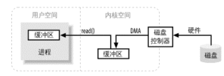

用户空间是常规进程所在区域。 JVM 就是常规进程，驻守于用户空间。用户空间是非特权区域：比如，在该区域执行的代码就不能直接访问硬件设备。内核空间是操作系统所在区域。内核代码有特别的权力：它能与设备控制器通讯，控制着用户区域进程的运行状态。

当进程执行IO操作的时候，它执行一个系统调用,比如read，write,close等，程序将会从用户空间进入系统空间，由于这个过程对性能有些影响，因此在实际应用中应当尽量减少系统的调用，比如读数据时一次性读取完成，写数据也是一次性写入。当写入数据时，数据将从用户缓冲区转移到内核缓冲区，再从内核缓冲区发送出去。读数据正好相反。

数据从内核空间拷贝到用户空间似乎有些多余。为什么不直接让磁盘控制器把数据送到用户空间的缓冲区呢？这样做有几个问题。首先，硬件通常不能直接访问用户空间。其次，像磁盘这样基于块存储的硬件设备操作的是固定大小的数据块，而用户进程请求的可能是任意大小的或非对齐的数据块。在数据往来于用户空间与存储设备的过程中，内核负责数据的分解、再组合工作，因此充当着中间人的角色。


### 8.4.2. 虚拟内存
<a href="#menu"  >目录</a>

所有现代操作系统都使用虚拟内存。虚拟内存意为使用虚假（或虚拟）地址取代物理（硬件RAM）内存地址。这样做好处颇多，总结起来可分为两大类：
* 一个以上的虚拟地址可指向同一个物理内存地址。
* 虚拟内存空间可大于实际可用的硬件内存。、

设备控制器不能通过 DMA 直接存储到用户空间，但通过利用上面提到的第一项，则可以达到相同效果。把内核空间地址与用户空间的虚拟地址映射到同一个物理地址，这样，
DMA 硬件（只能访问物理内存地址）就可以填充对内核与用户空间进程同时可见的缓冲区

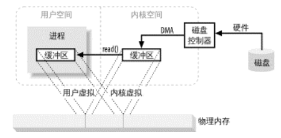

省去了内核与用户空间的往来拷贝，但前提条件是，内核与用户缓冲区必须使用相同的页对齐，缓冲区的大小还必须是磁盘控制器块大小（通常为 512 字节磁盘扇区）的倍数。操作系统把内存地址空间划分为页，即固定大小的字节组。内存页的大小总是磁盘块大小的倍数，通常为 2 次幂（这样可简化寻址操作）。典型的内存页为 1024、 2048 和 4096 字节。虚拟和物理内存页的大小总是相同的

### 8.4.3. 内存页面调度
<a href="#menu"  >目录</a>

### 8.4.4. 文件I/O
<a href="#menu"  >目录</a>

### 8.4.5. 流I/O
<a href="#menu"  >目录</a>

## 8.5. 缓冲区
<a href="#menu"  >目录</a>

```yml
|---Buffer
    |---IntBuffer
        |---DirectIntBufferU
        |---ByteBufferAsIntBufferL
        |---DirectIntBufferS
        |---ByteBufferAsIntBufferB
        |---HeapIntBuffer
    |---FloatBuffer
        |--- .....
    |---CharBuffer
    |---DoubleBuffer
    |---ShortBuffer
    |---LongBuffer
    |---ByteBuffer
```
缓冲区的本质是应用层用于存放要发送的数据和从通道获取的数据的数组。但是比传统数组提供了更多的功能。

抽象类 Buffer.java 的7个子类也是抽象类，也就意味着 XxxBuffer这些类也不能被直接new 实例化 。 如果不能直接 new 实例化，那么如何创建这些类的对象呢？ 使用的方式是将上面 7 种数据类型的数组包装（ wrap ） 进缓冲区中，此时就需要借助静态方法 wrap（）进行实现。 wrap（）方法的作用是将数组放入缓冲区中，来构建存储不同数据类型的缓冲区 

```java
//buffer的容量由传入参数的数组大小决定
ByteBuffer byteBuffer = ByteBuffer.wrap(new Byte[]);
IntBuffer intBuffer = IntBuffer.wrap(new Int[]);

public static IntBuffer wrap(int[] array,
                                    int offset, int length)
{
    try {
        return new HeapIntBuffer(array, offset, length);
    } catch (IllegalArgumentException x) {
        throw new IndexOutOfBoundsException();
    }
}
```
不同的Buffer都是由相应的HeapXxxBuffer创建。

### 8.5.1. 缓冲区基础
<a href="#menu"  >目录</a>

**属性**
* 容量(capacity):缓冲区能够容纳的数据元素的最大数量。这一容量在缓冲区创建时被设定，并且永远不能被改变
* 上界(Limit)：缓冲区的第一个不能被读或写的元素。或者说，缓冲区中现存元素的计数。
* 位置(Position):下一个要被读或写的元素的索引。位置会自动由相应的 get( )和 put( )函数更新。
* 标记(Mark):一个备忘位置。调用 mark( )来设定 mark = postion。调用 reset( )设定 position =mark。标记在设定前是未定义的(undefined)。

假如缓冲区的大小是100个字节，也就是容量为100个字节。初始化时limit=capacity，position=0,mark=-1。当从通道读取了90个字节，limit变为90。然后应用代码调用read读取了10个字节，position变为10。也就是每读取一个字节，pos就自增１。每从通道读取一个字节到缓冲区，limit就自增1。当pos等于limit,说明缓冲区没有数据可读。
有些场景需要重复读取数据，可以用mark来标记位置，下次就从这个位置开始读取。注意缓冲区并不区分读缓冲区和写缓冲区，而是通过limit和pos来决定读写的位置。

```
0 <= mark <= position <= limit <= capacity
```

**缓冲区API**

```java
public abstract class Buffer {
    //获取容量
    public final int capacity( )
    //获取pos
    public final int position( )
    //设置pos
    public final Buffer position (int newPositio）
    //
    public final int limit( )
    //
    public final Buffer limit (int newLimit)
    //标记　mark = position;　
    public final Buffer mark( )
    //设置　position　＝　mark
    //当mark(默认为-1)小于０时，会报错。使用场景是在读数据之前，使用position (int newPositio)设置标记位，读取数据之后调用reset使pos回到mark.然后可以重新读读过的数据
    // mark --> read --> reset
    public final Buffer reset( )
    //position = 0;  limit = capacity;   mark = -1;
    //将一个读状态的缓冲区转变成一个准备写的缓冲区。
    public final Buffer clear( )
    //limit = position;   position = 0;   mark = -1;
    //将一个能够继续添加元素的缓冲翻转成一个准备读出数据的元素的缓冲
    public final Buffer flip( )
    //position = 0; mark = -1;
    public final Buffer rewind( )
    //返回可读的数据
    public final int remaining( )
    //
    public final boolean hasRemaining( )
    //所有的缓冲区都是可读的，但并非都是可写的
    public abstract boolean isReadOnly( );
}

```

缓冲的读写是由各个实现类定义和编写的。缓冲区是存放从通道中读出来的数据和将要发送到通道的数据。

position 用于指定下一个将要读写的位置，limit用于指定最多可读写的位置。因此position读写过程中是不断增加的，但是到了position >= limit，则会抛出异常BufferOverflowException或者BufferUnderflowException。
```java
CharBuffer charBuffer = CharBuffer.allocate(10);

printInfo(charBuffer);
charBuffer.put("c");
printInfo(charBuffer);
//写状态转换为读状态
charBuffer.flip();
char data =  charBuffer.get();
System.out.println(data);
//读状态转换为写状态
charBuffer.clear();
printInfo(charBuffer);


-----
position = 0 limit = 10 capacity = 10
position = 1 limit = 10 capacity = 10
c
position = 0 limit = 10 capacity = 10
```

### 8.5.2. 字节缓冲区ByteBuffer
<a href="#menu"  >目录</a>

**直接缓冲区**

通过ByteBuffer 向硬盘存取数据时是需要将数据暂存在 JVM 的中 间缓冲区，如果有频繁操作数据的情况发生， 则在每次操作时都会将数据暂存在JVM的中间缓冲区，再交 给ByteBuffer处理，这样做就大大降低软件对数据的吞吐量，提高内存占有率 ，造成软件运行效率降低，这就是非直接缓冲区保存数据的过程，所以非直接缓冲区的这个弊端就由直接缓冲区解决了 。

如果使用直接缓冲区来实现两端数据交互 ， 则直接在内核空间中就进行了处理，无须 JVM 创建新的缓冲区，这样就减少了在JVM 中创建中间缓冲区的步骤，增加了程序运行效率 。


```java
//创建堆缓冲区
ByteBuffer byteBuffer1 = ByteBuffer.allocate(10);
System.out.println("byteBuffer1 is direct buffer? " + byteBuffer1.isDirect());

ByteBuffer byteBuffer2 = ByteBuffer.wrap(new byte[]{1,2});
System.out.println("byteBuffer2 is direct buffer? " + byteBuffer2.isDirect());

//创建直接缓冲区
ByteBuffer byteBuffer3 = ByteBuffer.allocateDirect(20);
System.out.println("byteBuffer3 is direct buffer? " + byteBuffer3.isDirect());

byteBuffer1 is direct buffer? false
byteBuffer2 is direct buffer? false
byteBuffer3 is direct buffer? true
```

```java
//堆缓冲区由HeapByteBuffer实现，数组实现
public static ByteBuffer allocate(int capacity) {
    if (capacity < 0)
        throw new IllegalArgumentException();
    return new HeapByteBuffer(capacity, capacity);
}
//直接缓冲区由DirectByteBuffer实现，内部由Unsafe实现
public static ByteBuffer allocateDirect(int capacity) {
    return new DirectByteBuffer(capacity);
}
/*
byte[] data = {1,2,3};
ByteBuffer buf = ByteBuffer.wrap(data)
相当于 
byte[] data = {1,2,3};
ByteBuffer buf = ByteBuffer.allocate(cap);
buf.put(data)

*/
public static ByteBuffer wrap(byte[] array,
                                    int offset, int length)
{
    try {
        return new HeapByteBuffer(array, offset, length);
    } catch (IllegalArgumentException x) {
        throw new IndexOutOfBoundsException();
    }
}
        
```


ByteBuffer还可以通过方法 asXxxBuffer()来转换成其他的类型的缓冲区。

asDoubleBuffer　创建此字节缓冲区的视图，作为 double 缓冲区 。 新缓冲区的内容将从此缓冲区的当前位置开始 。 此缓冲区 内容的更改在新缓冲区中是可见的，反之亦然；这两个缓冲区的位置、限制和标记值是相互独立的 。 新缓冲区的位置将为 0 ，其容量和界限将为此缓冲区中所剩余的字节数的 1／8 ， 其标记是不确定的 。 当且仅当此缓冲区为直接缓冲区时，新缓冲区才是直接缓冲区 。 当且仅当此缓冲区为只读时，新缓冲区才是只读的 （通过asReadOnlyBuffer()来转换只读缓冲区）。

```java
ByteBuffer byteBuffer1 = ByteBuffer.allocate(50);

byteBuffer1.putFloat(1.1f);
byteBuffer1.putFloat(1.2f);
byteBuffer1.putFloat(1.3f);
printInfo(byteBuffer1);

FloatBuffer floatBuffer = byteBuffer1.asFloatBuffer();
byteBuffer1.flip();
byteBuffer1.getFloat();
printInfo(byteBuffer1);
printInfo(floatBuffer);

----
position = 12 limit = 50 capacity = 50
position = 4 limit = 12 capacity = 50
position = 0 limit = 9 capacity = 9

```

视图缓冲区与字节缓冲区相比有以下三个优势：
* 视图缓冲区不是根据字节进行索引，而是根据其特定于类型的值的大小进行索引；
* 视图缓冲区提供了相对批量 get 和 put 方法，这些方法可在缓冲区和数组或相同类型的其他缓冲区之间传输值的连续序列；
* 视图缓冲区可能更高效，这是因为当且仅当其支持的字节缓冲区为直接缓冲区时，它才是直接缓冲区 。

**压缩缓冲区**

compact（）方法的作用： 压缩此缓冲区（可选操作），将缓冲区的当前位置和限制之间的字节（如果有）复制到缓冲区的开始处， 即将索引 p = position（）处的字节复制到索引 0 处，将索引 p+1 处的字节复制到索引 1 处， 依此类推，直到将索引 limit() - 1 处的字节复制到索引 n = limit（）-1-p 处 。 然后，将缓冲区的位置设置为 n+1 ，并将其限制设置为其容量。 如果已定义了标记，则丢弃它 。 将缓冲 区的位置设置为复制的字节数，而不是 0，以便调用此方法后可以紧接着调用另一个相对 put 方法。

```java

public ByteBuffer compact() {
    //将pos--limit处的字节复制到0开始处
    System.arraycopy(hb, ix(position()), hb, ix(0), remaining());
    //pos = remain
    position(remaining());
    //limit = cap
    limit(capacity());
    //mark = -1
    discardMark();
    return this;
}

ByteBuffer byteBuffer1 = ByteBuffer.allocate(50);

byteBuffer1.putFloat(1.1f);
byteBuffer1.putFloat(1.2f);
byteBuffer1.putFloat(1.3f);
printInfo(byteBuffer1);

byteBuffer1.flip();
byteBuffer1.getFloat();
printInfo(byteBuffer1);
byteBuffer1 = byteBuffer1.compact();
printInfo(byteBuffer1);
----
position = 12 limit = 50 capacity = 50
position = 4 limit = 12 capacity = 50
position = 8 limit = 50 capacity = 50
```

**缓冲区比较**

缓冲区提供compareTo进行比较
* 两个对象类型相同。包含不同数据类型的 buffer 永远不会相等，而且 buffer绝不会等于非 buffer 对象。
* 两个对象都剩余同样数量的元素。 Buffer 的容量不需要相同，而且缓冲区中剩余数据的索引也不必相同。但每个缓冲区中剩余元素的数目（从位置到上界）必须相同。
* 在每个缓冲区中应被 Get()函数返回的剩余数据元素序列必须一致
```java
public int compareTo(ByteBuffer that) {
    int n = this.position() + Math.min(this.remaining(), that.remaining());
    for (int i = this.position(), j = that.position(); i < n; i++, j++) {
        int cmp = compare(this.get(i), that.get(j));
        if (cmp != 0)
            return cmp;
    }
    return this.remaining() - that.remaining();
}
```

## 8.6. 通道
<a href="#menu"  >目录</a>

在 NIO 技术中，要将操作的数据打包到缓冲区中，而缓冲区中的数据想要传输到目的地是要依赖于通道的 。 缓冲区是将数据进行打包，而通道是将数据进行传输.从缓冲区和通道的数据类型可以发现，缓冲区都是类，而通道都是接口，这是由于通道的功能实现是要依赖于操作系统的， Channel 接口只定义有哪些功能，而功能的具体实现在不同的操作系统中是不一样的，因此 ，在 JDK 中， 通道被设计成接口数据类型 

```java
public interface Channel extends Closeable {
    public boolean isOpen();
    public void close() throws IOException;
}
```

```java 
|---Channel
    |--- ReadableByteChannel
    |--- InterruptibleChannel
    |--- SelectableChannel
    |--- NetworkChannel
        |--- AsynchronousServerSocketChannel 
        |--- SocketChannel 
        |--- MulticastChannel
        |--- ServerSocketChannel
        |--- AsynchronousSocketChannel
    |--- WritableByteChannel
    |--- AbstractInterruptibleChannel
    |--- SelChImpl
    |--- AsynchronousChannel
        |--- AsynchronousServerSocketChannel
        |--- AsynchronousFileChannel
        |--- AsynchronousByteChannel
```

### 8.6.1. 使用通道
<a href="#menu"  >目录</a>

**打开通道**

```java
//nio client
SocketChannel sc = SocketChannel.open( );
sc.connect (new InetSocketAddress ("somehost", someport));
//nio server
ServerSocketChannel ssc = ServerSocketChannel.open( );
ssc.bind (new InetSocketAddress (somelocalport));

//udp 
DatagramChannel dc = DatagramChannel.open( );

//file 
RandomAccessFile raf = new RandomAccessFile ("somefile", "r");
FileChannel fc = raf.getChannel( );

//aio client
AsynchronousSocketChannel asc =  AsynchronousSocketChannel.open();
asc.connect (new InetSocketAddress ("somehost", someport));

//aio server
AsynchronousServerSocketChannel assc = AsynchronousServerSocketChannel.open();
assc.bind(new InetSocketAddress(port));
AsynchronousSocketChannel asynchronousSocketChannel =  assc.accept().get();

```

**通道常用方法**

```java
//读写数据，这是aio中用的，因此多了CompletionHandler接口
//其他通道类差不多，只是没有CompletionHandler这个参数
/*
两种方法均返回已传输的字节数，可能比缓冲区的字节数少甚至可能为零。缓冲区的位置也会发生与已传输字节相同数量的前移。如果只进行了部分传输，缓冲区可以被重新提交给通道并从上次中断的地方继续传输。该过程重复进行直到缓冲区的 hasRemaining( )方法返回 false 值.
*/
//读写内部做了同步synchronized,所以不会出现同时调用时出现字节顺序错误
Future<Integer> read(ByteBuffer dst);
<A> void read(ByteBuffer dst,
                  A attachment,
                  CompletionHandler<Integer,? super A> handler);
Future<Integer> write(ByteBuffer src);
<A> void write(ByteBuffer src,
                   A attachment,
                   CompletionHandler<Integer,? super A> handler);

//判断是否已经连接
//注意这个方法只是判断本地状态，也就是连接之后返回true，但是客户端主动断开连接，服务端是不知道的。因此返回的还是true。服务端要判断是否断开了连接，应当通过心跳机制来实现
 public boolean isConnected();

//配置阻塞状态
/*
通道可以以阻塞（blocking）或非阻塞（nonblocking）模式运行。非阻塞模式的通道永远不会让调用的线程休眠。请求的操作要么立即完成，要么返回一个结果表明未进行任何操作。只有面向流的（stream-oriented）的通道，如 sockets 和 pipes 才能使用非阻塞模式
*/
configureBlocking(boolean)
```
socket 通道类从 SelectableChannel 引申而来。从 SelectableChannel 引申而来的类可以和支持有条件的选择（readiness selectio）的选择器Selectors）一起使用。将非阻塞I/O 和选择器组合起来可以使您的程序利用多路复用 I/O（multiplexed I/O）

**关闭通道**

SocketChannel 的关闭调用
```java
//AbstractInterruptibleChannel.class
//每次只能有一个线程调用close()
public final void close() throws IOException {
    synchronized (closeLock) {
        if (!open)
            return;
        open = false;
        implCloseChannel();
    }
}
//AbstractSelectableChannel
protected final void implCloseChannel() throws IOException {
    implCloseSelectableChannel();
    synchronized (keyLock) {
        int count = (keys == null) ? 0 : keys.length;
        for (int i = 0; i < count; i++) {
            SelectionKey k = keys[i];
            if (k != null)
            //key  曲线
                k.cancel();
        }
    }
}

//SocketChannelImpl
protected void implCloseSelectableChannel() throws IOException {
    synchronized(this.stateLock) {
        //输入输出流打开标志位
        this.isInputOpen = false;
        this.isOutputOpen = false;
        if (this.state != 4) {
            nd.preClose(this.fd);
        }

        if (this.readerThread != 0L) {
            NativeThread.signal(this.readerThread);
        }

        if (this.writerThread != 0L) {
            NativeThread.signal(this.writerThread);
        }

        if (!this.isRegistered()) {
            //通过调用底层方法关闭该文件描述符
            this.kill();
        }

    }
}
```

**关闭输入流和输出流**

```java
public boolean isInputOpen() {
    synchronized(this.stateLock) {
        //检测状态
        return this.isInputOpen;
    }
}

public boolean isOutputOpen() {
    synchronized(this.stateLock) {
        return this.isOutputOpen;
    }
}
public SocketChannel shutdownInput() throws IOException {
    synchronized(this.stateLock) {
        //已经关闭
        if (!this.isOpen()) {
            throw new ClosedChannelException();
        } else if (!this.isConnected()) {
            //从未连接过
            throw new NotYetConnectedException();
        } else {
            if (this.isInputOpen) {
                //调用native方法，也是是通过系统调用关闭文件描述符，0代表是关闭输入流
                Net.shutdown(this.fd, 0);
                if (this.readerThread != 0L) {
                    NativeThread.signal(this.readerThread);
                }

                this.isInputOpen = false;
            }

            return this;
        }
    }
}

public SocketChannel shutdownOutput() throws IOException {
    synchronized(this.stateLock) {
        if (!this.isOpen()) {
            throw new ClosedChannelException();
        } else if (!this.isConnected()) {
            throw new NotYetConnectedException();
        } else {
            if (this.isOutputOpen) {
                //调用native方法，也是是通过系统调用关闭文件描述符，1代表是关闭输出流
                Net.shutdown(this.fd, 1);
                if (this.writerThread != 0L) {
                    NativeThread.signal(this.writerThread);
                }

                this.isOutputOpen = false;
            }

            return this;
        }
    }
}
```
从上面可以看出，可以单独关闭输入流和输出流，关闭之后就无法再接收或者发送数据。也可以直接调用close()来全部关闭。这些方法最后都是调用native方法来调用操作系统相关系统调用来实现。


### 8.6.2. Scatter/Gather
<a href="#menu"  >目录</a>

通道提供了一种被称为 Scatter/Gather 的重要新功能（有时也被称为矢量 I/O）。 Scatter/Gather是一个简单却强大的概念（参见 1.4.1.1 节），它是指在多个缓冲区上实现一个简单的 I/O 操作。对于一个 write 操作而言，数据是从几个缓冲区按顺序抽取（称为 gather）并沿着通道发送的。缓冲区本身并不需要具备这种 gather 的能力（通常它们也没有此能力）。该 gather 过程的效果就好比全部缓冲区的内容被连结起来，并在发送数据前存放到一个大的缓冲区中。对于 read 操作而言，从通道读取的数据会按顺序被散布（称为 scatter）到多个缓冲区，将每个缓冲区填满直至通道中的数据或者缓冲区的最大空间被消耗完。

大多数现代操作系统都支持本地矢量 I/O（native vectored I/O）。当您在一个通道上请求一个Scatter/Gather 操作时，该请求会被翻译为适当的本地调用来直接填充或抽取缓冲区。这是一个很大的进步，因为减少或避免了缓冲区拷贝和系统调用。 Scatter/Gather 应该使用直接的 ByteBuffers 以从本地 I/O 获取最大性能优势。


```java
public interface ScatteringByteChannel extends ReadableByteChannel
{
    public long read (ByteBuffer [] dsts)    throws IOException;
    public long read (ByteBuffer [] dsts, int offset, int length)    throws IOException;
}
public interface GatheringByteChannel extends WritableByteChannel
{
    public long write(ByteBuffer[] srcs)    throws IOException;
    public long write(ByteBuffer[] srcs, int offset, int length)    throws IOException;
}
```
实现上面的类有SocketChannel,DatagramChannel,SourceChannel,FileChannel.

**read例子**

假如socket有30个字节要读取，那么将会有10个字节装入header，20个字节装入body。
```java
ByteBuffer header = ByteBuffer.allocateDirect (10);
ByteBuffer body = ByteBuffer.allocateDirect (80);
ByteBuffer [] buffers = { header, body };
int bytesRead = channel.read (buffers);
```


**write例子**

```java

ByteBuffer [] buffers = { header, body };
body.clear( );
body.put("FOO".getBytes()).flip( ); // "FOO" as bytes
header.clear( );
header.putShort (TYPE_FILE).putLong (body.limit()).flip( );
long bytesWritten = channel.write (buffers);
```

带 offset 和 length 参数版本的 read( ) 和 write( )方法使得我们可以使用缓冲区阵列的子集缓冲区。这里的 offset 值指哪个缓冲区将开始被使用，而不是指数据的 offset。这里的 length 参数指示要使用的缓冲区数量。举个例子，假设我们有一个五元素的 fiveBuffers 阵列，它已经被初始化并引用了五个缓冲区，下面的代码将会写第二个、第三个和第四个缓冲区的内容：
```java
int bytesRead = channel.write (fiveBuffers, 1, 3);
```


### 8.6.3. 文件通道
<a href="#menu"  >目录</a>

FileChannel类可以实现常用的read，write以及scatter/gather操作，同时它也提供了很多专用于文件的新方法。这些方法中的许多都是我们所熟悉的文件操作。

#### 8.6.3.1. 访问文件
<a href="#menu"  >目录</a>

```java
package java.nio.channels;
public abstract class FileChannel extends AbstractChannel implements ByteChannel, GatheringByteChannel, ScatteringByteChannel
{
    // This is a partial API listing
    // All methods listed here can throw java.io.IOException
    //注意，由于是随机写入，写入的数据只会覆盖数据的长度空间内的字节
    public abstract int read (ByteBuffer dst, long position);
    public abstract int write (ByteBuffer src, long position);
    public abstract long size();
    //获取当前的文件位置(字节)和设置位置,读写将从pos开始
    //一个有符号长整型（signed long）值能代表多达 9,223,372,036,854,775,807 字节的文件大小。这个数据量差不多是 840 万 TB
    //注意pos是和通道相关的，也就是除非重新打开pos,否则会跟随读写而改变
    public abstract long position();
    public abstract void position (long newPosition);
    //方法截取一个文件。截取文件时，文件将中指定长度后面的部分将被删除。
    public abstract void truncate (long size);
    //将通道里尚未写入磁盘的数据强制写到磁盘上。出于性能方面的考虑，操作系统会将数据缓存在内存中，所以无法保证写入到FileChannel里的数据一定会即时写到磁盘上。要保证这一点，需要调用force()方法。
    //metaData 指明是否同时将文件元数据（权限信息等）写到磁盘上。
    public abstract void force (boolean metaData);
    //文件锁
    public final FileLock lock();
    public abstract FileLock lock (long position, long size, boolean shared);
    public final FileLock tryLock();
    public abstract FileLock tryLock (long position, long size, boolean shared);
    public abstract MappedByteBuffer map (MapMode mode, long position, long size);
    public static class MapMode;
    public static final MapMode READ_ONLY;
    public static final MapMode READ_WRITE;
    public static final MapMode PRIVATE;
    //数据转移，从一个通道到另一个通道
    public abstract long transferTo (long position, long count, WritableByteChannel target);
    public abstract long transferFrom (ReadableByteChannel src, long position, long count);
}
```

文件通道总是阻塞式的，因此不能被置于非阻塞模式。现代操作系统都有复杂的缓存和预取机制，使得本地磁盘I/O操作延迟很少。网络文件系统一般而言延迟会多些，不过却也因该优化而受益。面向流的I/O的非阻塞范例对于面向文件的操作并无多大意义，这是由文件I/O本质上的不同性质造成的。对于文件I/O，最强大之处在于异步I/O（asynchronous I/O），它允许一个进程可以从操作系统请求一个或多个I/O操作而不必等待这些操作的完成。发起请求的进程之后会收到它请求的I/O操作已完成的通知。

FileChannel对象是线程安全（thread-safe）的。多个进程可以在同一个实例上并发调用方法而不会引起任何问题，不过并非所有的操作都是多线程的（multithreaded）。影响通道位置或者影响文件大小的操作都是单线程的（single-threaded）。如果有一个线程已经在执行会影响通道位置或文件大小的操作，那么其他尝试进行此类操作之一的线程必须等待。并发行为也会受到底层的操作系统或文件系统影响。

每个FileChannel对象都同一个文件描述符（file descriptor）有一对一的关系，所以上面列出的API方法与在您最喜欢的POSIX（可移植操作系统接口）兼容的操作系统上的常用文件I/O系统调用紧密对应也就不足为怪了。本质上讲，RandomAccessFile类提供的是同样的抽象内容。在通道出现之前，底层的文件操作都是通过RandomAccessFile类的方法来实现的。FileChannel模拟同样的I/O服务，因此它的API自然也是很相似的。

将通道的 position 设置为指定值。如果尝试将通道 position 设置为一个负值会导致 java.lang.IllegalArgumentException 异常，不过可以把 position 设置到超出文件尾，这样做会把 position 设置为指定值而不改变文件大小。假如在将position 设置为超出当前文件大小时实现了一个 read( )方法，那么会返回一个文件尾（end-of-file）条件；倘若此时实现的是一个 write( )方法则会引起文件增长以容纳写入的字节，具体行为类似于实现一个绝对 write( )并可能导致出现一个文件空洞

**文件空洞:**当磁盘上一个文件的分配空间小于它的文件大小时会出现“文件空洞”。对于内容稀疏的文件，大多数现代文件系统只为实际写入的数据分配磁盘空间（更准确地说，只为那些写入数据的文件系统页分配空间）。假如数据被写入到文件中非连续的位置上，这将导致文件出现在逻辑上不包含数据的区域（即“空洞”）。

```java
public class NioFileChannel {

    private String fileName;
    private String mode;
    FileChannel fileChannel;
    public NioFileChannel(String fileName, String mode) {
        this.fileName = fileName;
        this.mode = mode;
        try{
            fileChannel =  new RandomAccessFile(fileName,mode).getChannel();
        }
        catch(Exception ex){
            log.error(ex.getMessage());
        }
    }

    public void write(String data) throws Exception{

        log.info("fileChannel.position = "+fileChannel.position());
        ByteBuffer buf = ByteBuffer.allocate(48);
        buf.clear();
        buf.put(data.getBytes());
        buf.flip();
        while(buf.hasRemaining()) {
            fileChannel.write(buf);
        }
        fileChannel.force(true);
        log.info("fileChannel.position = "+fileChannel.position());
    }

    public void read(int position)throws Exception{
        ByteBuffer readBuf = ByteBuffer.allocate(100);
        log.info("readBuf = " + readBuf);

        fileChannel.position(position);
        int readC =  fileChannel.read(readBuf);
        log.info("readBuf = " + readBuf);

        if(readC != -1){
            readBuf.flip();
            byte[] data = new byte[readC];
            readBuf.get(data);
            log.info("读取到的数据:"+new String(data,"UTF-8"));
        }
        else {
            log.info("未读取到任何数据");
        }
    }
}

```

#### 8.6.3.2. 文件锁定
<a href="#menu"  >目录</a>

* 共享锁: 共享读操作，但只能一个写（读可以同时，但写不能）。共享锁防止其他正在运行的程序获得重复的独占锁，但是允许他们获得重复的共享锁。
* 独占锁: 只有一个读或一个写（读和写都不能同时）。独占锁防止其他程序获得任何类型的锁。

FileLock的生命周期：在调用FileLock.release(),或者Channel.close(),或者JVM关闭

**常用方法**

```java
/**
position & size: 锁定的范围
shared的含义:是否使用共享锁,一些不支持共享锁的操作系统,将自动将共享锁改成排它锁。可以通过调用isShared()方法来检测获得的是什么类型的锁。
*/
FileLock FileChannel.lock(long position, long size, boolean shared)

/**
lock()阻塞的方法，锁定范围可以随着文件的增大而增加。无参lock()默认为独占锁；有参lock(0L, Long.MAX_VALUE, true)为共享锁。
tryLock()非阻塞,当未获得锁时,返回null.
*/
public final Future<FileLock> lock() {
    return lock(0L, Long.MAX_VALUE, false);
}
public final FileLock tryLock() throws IOException {
    return tryLock(0L, Long.MAX_VALUE, false);
}

```

锁（lock）可以是共享的（shared）或独占的（exclusive）。这里的文件锁定特性在很大程度上依赖本地的操作系统实现。并非所有的操作系统和文件系统都支持共享文件锁。对于那些不支持的，对一个共享锁的请求会被自动提升为对独占锁的请求。这可以保证准确性却可能严重影响性能。

并非所有平台都以同一个方式来实现基本的文件锁定。在不同的操作系统上，甚至在同一个操作系统的不同文件系统上，文件锁定的语义都会有所差异。一些操作系统仅提供劝告锁定（advisory locking） ，一些仅提供独占锁（exclusive locks），而有些操作系统可能两种锁都提供。您应该总是按照劝告锁的假定来管理文件锁，因为这是最安全的。但是如能了解底层操作系统如何执行锁定也是非常好的。例如，如果所有的锁都是强制性的（mandatory）而您不及时释放您获得的锁的话，运行在同一操作系统上的其他程序可能会受到影响。


```java
Future<FileLock> future  = channel.lock();
log.info("加锁....");
FileLock lock = future.get();
........
lock.release();
log.info("解锁...");
```

在linux平台下，对于同一个应用，不管是lock还是tryLock,多线程获取锁，如果获取还没释放的文件锁，将会抛出异常OverlappingFileLockException。不同的Java应用lock会阻塞等待文件锁释放。trylock会直接返回null。但是Java在锁一个文件时，还可以通过vim修改文件内容。也就是FileLock虽然使用操作系统的相关调用来实现文件锁，但是这种锁定只对java应用起到作用。

### 8.6.4. 内存映射通道
<a href="#menu"  >目录</a>

新的 FileChannel 类提供了一个名为 map()的方法，该方法可以在一个打开的文件和一个特殊类型的 ByteBuffer 之间建立一个虚拟内存映射。在 FileChannel 上调用 map( )方法会创建一个由磁盘文件支持的虚拟内存映射（virtual memory mapping）并在那块虚拟内存空间外部封装一个 MappedByteBuffer 对象。

由 map( )方法返回的 MappedByteBuffer 对象的行为在多数方面类似一个基于内存的缓冲区，只不过该对象的数据元素存储在磁盘上的一个文件中。调用 get( )方法会从磁盘文件中获取数据，此数据反映该文件的当前内容，即使在映射建立之后文件已经被一个外部进程做了修改。通过文件映射看到的数据同您用常规方法读取文件看到的内容是完全一样的。相似地，对映射的缓冲区实现一个 put( )会更新磁盘上的那个文件（假设对该文件您有写的权限），并且您做的修改对于该文件的其他阅读者也是可见的。

通过内存映射机制来访问一个文件会比使用常规方法读写高效得多，甚至比使用通道的效率都高。因为不需要做明确的系统调用，那会很消耗时间。更重要的是，操作系统的虚拟内存可以自动缓存内存页（memory page）。这些页是用系统内存来缓存的，所以不会消耗 Java 虚拟机内存堆（memory heap）。

一旦一个内存页已经生效（从磁盘上缓存进来），它就能以完全的硬件速度再次被访问而不需要再次调用系统命令来获取数据。

```java
//继承关系
|---Buffer(abstract)
    |--- ByteBuffer(abstract)
        |---MappedByteBuffer(abstract)
            |--- DirectByteBuffer
                |---DirectByteBufferR

/**
* mode： 读写模式 READ_ONLY，READ_WRITE，PRIVATE:
* position：映射的起始字节位置
* size： 映射长度
* 要引设第100到149的字节，一共是50个字节：fileCh annel.map(FileChannel.MapMode.READ_WRITE,100,50);
* 映射文件的范围不应超过文件的实际大小。如果您请求一个超出文件大小的映射，文件会被增大以匹配映射的大小。假如size是IntMax,则文件会扩张到2.1G，引起文件空洞
*/
public abstract MappedByteBuffer map(MapMode mode,long position, long size)

FileChannel fileChannel = new RandomAccessFile(this.path,mode).getChannel();            
MappedByteBuffer mappedByteBuffer =  fileChannel.map(FileChannel.MapMode.READ_WRITE,0,20);

//读写的pos 范围 [position,position+size]
//超出范围写抛出错误BufferOverflowException
mappedByteBuffer.position(0);
mappedByteBuffer.putDouble(1.234);
//超出范围读抛出错误BufferUnderflowException
mappedByteBuffer.position(0);
double d = mappedByteBuffer.getDouble();
```
MapMode.PRIVATE 表示您想要一个写时拷贝（ copy-on-write）的映射。这意味着您通过 put( )方法所做的任何修改都会导致产生一个私有的数据拷贝并且该拷贝中的数据只有MappedByteBuffer 实例可以看到。该过程不会对底层文件做任何修改，而且一旦缓冲区被施以垃圾收集动作（ garbage collected），那些修改都会丢失。尽管写时拷贝的映射可以防止底层文件被修改，您也必须以 read/write 权限来打开文件以建立 MapMode.PRIVATE 映射。只有这样，返回的MappedByteBuffer 对象才能允许使用 put( )方法。

写时拷贝这一技术经常被操作系统使用，以在一个进程生成另一个进程时管理虚拟地址空间（ virtual address spaces）。使用写时拷贝可以允许父进程和子进程共享内存页直到它们中的一方实际发生修改行为。在处理同一文件的多个映射时也有相同的优势（当然，这需要底层操作系统的支持）。假设一个文件被多个 MappedByteBuffer 对象映射并且每个映射都是 MapMode.PRIVATE 模式，那么这份文件的大部分内容都可以被所有映射共享。

选择使用 MapMode.PRIVATE 模式并不会导致您的缓冲区看不到通过其他方式对文件所做的修改。对文件某个区域的修改在使用 MapMode.PRIVATE 模式的缓冲区中都能反映出来，除非该缓冲区已经修改了文件上的同一个区域。正如第一章中所描述的，内存和文件系统都被划分成了页。当在一个写时拷贝的缓冲区上调用 put( )方法时，受影响的页会被拷贝，然后更改就会应用到该拷贝中。具体的页面大小取决于具体实现，不过通常都是和底层文件系统的页面大小时一样的。如果缓冲区还没对某个页做出修改，那么这个页就会反映被映射文件的相应位置上的内容。一旦某个页因为写操作而被拷贝，之后就将使用该拷贝页，并且不能被其他缓冲区或文件更新所修改

一个映射一旦建立之后将保持有效，直到MappedByteBuffer 对象被施以垃圾收集动作为止。同锁不一样的是，映射缓冲区没有绑定到创建它们的通道上。关闭相关联的 FileChannel 不会破坏映射，只有丢弃缓冲区对象本身才会破坏该映射。 

所有的 MappedByteBuffer 对象都是直接的，这意味着它们占用的内存空间位于 Java 虚拟机内存堆之外（并且可能不会算作 Java 虚拟机的内存占用，不过这取决于操作系统的虚拟内存模型）。


因为 MappedByteBuffers 也是 ByteBuffers，所以能够被传递 SocketChannel 之类通道的 read( )或write( )以有效传输数据给被映射的文件或从被映射的文件读取数据。如能再结合 scatter/gather，那么从内存缓冲区和被映射文件内容中组织数据就变得很容易了

当我们为一个文件建立虚拟内存映射之后，文件数据通常不会因此被从磁盘读取到内存（这取决于操作系统）。该过程类似打开一个文件：文件先被定位，然后一个文件句柄会被创建，当您准备好之后就可以通过这个句柄来访问文件数据。对于映射缓冲区，虚拟内存系统将根据您的需要来把文件中相应区块的数据读进来。这个页验证或防错过程需要一定的时间，因为将文件数据读取到内存需要一次或多次的磁盘访问。某些场景下，您可能想先把所有的页都读进内存以实现最小的缓冲区访问延迟。如果文件的所有页都是常驻内存的，那么它的访问速度就和访问一个基于内存的缓冲区一样了

load( )方法会加载整个文件以使它常驻内存。一个内存映射缓冲区会建立与某个文件的虚拟内存映射。此映射使得操作系统的底层虚拟内存子系统可以根据需要将文件中相应区块的数据读进内存。已经在内存中或通过验证的页会占用实际内存空间，并且在它们被读进 RAM 时会挤出最近较少使用的其他内存页。

在一个映射缓冲区上调用 load( )方法会是一个代价高的操作，因为它会导致大量的页调入（page-in），具体数量取决于文件中被映射区域的实际大小。然而， load( )方法返回并不能保证文件就会完全常驻内存，这是由于请求页面调入（demand paging）是动态的。具体结果会因某些因素而有所差异，这些因素包括：操作系统、文件系统，可用 Java 虚拟机内存，最大 Java 虚拟机内存，垃圾收集器实现过程等等。请小心使用 load( )方法，它可能会导致您不希望出现的结果。该方法的主要作用是为提前加载文件埋单，以便后续的访问速度可以尽可能的快。

对于那些要求近乎实时访问（near-realtime access）的程序，解决方案就是预加载。但是请记住，不能保证全部页都会常驻内存，不管怎样，之后可能还会有页调入发生。内存页什么时候以及怎样消失受多个因素影响，这些因素中的许多都是不受 Java 虚拟机控制的。 JDK 1.4 的 NIO 并没有提供一个可以把页面固定到物理内存上的 API，尽管一些操作系统是支持这样做的。

对于大多数程序，特别是交互性的或其他事件驱动（event-driven）的程序而言，为提前加载文件消耗资源是不划算的。在实际访问时分摊页调入开销才是更好的选择。让操作系统根据需要来调入页意味着不访问的页永远不需要被加载。同预加载整个被映射的文件相比，这很容易减少 I/O 活动总次数。操作系统已经有一个复杂的内存管理系统了，就让它来替您完成此工作吧！

我们可以通过调用 isLoaded( )方法来判断一个被映射的文件是否完全常驻内存了。如果该方法返回 true 值，那么很大概率是映射缓冲区的访问延迟很少或者根本没有延迟。不过，这也是不能保证的。同样地，返回 false 值并不一定意味着访问缓冲区将很慢或者该文件并未完全常驻内存。 isLoaded( )方法的返回值只是一个暗示，由于垃圾收集的异步性质、底层操作系统以及运行系统的动态性等因素，想要在任意时刻准确判断全部映射页的状态是不可能的。


该方法force()会强制将映射缓冲区上的更改应用到永久磁盘存储器上。当用 MappedByteBuffer 对象来更新一个文件，您应该总是使用 MappedByteBuffer.force( )而非 FileChannel.force( )，因为通道对象可能不清楚通过映射缓冲区做出的文件的全部更改。 MappedByteBuffer 没有不更新文件元数据的选项——元数据总是会同时被更新的。请注意，非本地文件系统也同样影响 MappedByteBuffer.force( )方法，正如它会对 FileChannel.force( )方法有影响

如果映射是以 MapMode.READ_ONLY 或 MAP_MODE.PRIVATE 模式建立的，那么调用 force( )方法将不起任何作用，因为永远不会有更改需要应用到磁盘上。

最后一点为 DirectMemory的内存只有在 JVM执行 full gc 的时候才会被回收，那么如果在其上分配过大的内存空间，那么也将出现 OutofMemoryError，即便 JVM 堆中的很多内存处于空闲状态。

### 8.6.5. Socket通道
<a href="#menu"  >目录</a>

NIO则的socket 通道有DatagramChannel、 SocketChannel 和ServerSocketChannel。

```java
|---AbstractInterruptibleChannel
    |---SelectableChannel
        |---AbstractSelectableChannel
            |---SocketChannel
            |---DatagramChannel
            |---ServerSocketChannel
```
这三个实例都是通过其静态方法open创建的。可以通过AbstractSelectableChannel的configureBlocking()配置阻塞状态，默认阻塞。使用非阻塞可以避免为每个socket连接创建单独的线程处理，提高了性能。

DatagramChannel 和 SocketChannel 实现定义读和写功能的接口而 ServerSocketChannel不实现。 ServerSocketChannel 负责监听传入的连接和创建新的 SocketChannel 对象，它本身从不传输数据。

全部 socket 通道类（DatagramChannel、 SocketChannel 和 ServerSocketChannel）在被实例化时都会创建一个对等 socket 对象。对等 socket 可以通过调用 socket( )方法从一个通道上获取。Socket 通道委派协议操作给对等 socket 对象。

每个 socket 通道（在 java.nio.channels 包中）都有一个关联的 java.net socket 对象，却并非所有的 socket 都有一个关联的通道。如果您用传统方式（直接实例化）创建了一个Socket 对象，它就不会有关联的 SocketChannel 并且它的 getChannel( )方法将总是返回 null。

ServerSocketChannel 没有 bind( )方法，因此有必要取出对等的 socket 并使用它来绑定到一个端口以开始监听连接
```java

//--------服务端-------

//获取ServerSocketChannel
ServerSocketChannel ssc = ServerSocketChannel.open( );
ServerSocket serverSocket = ssc.socket( );
//绑定端口
serverSocket.bind (new InetSocketAddress (1234));

//如果为非阻塞，将会立即返回null
SocketChannel socketChannel = serverSocketChannel.accept();
socketChannel.write(buf)
socketChannel.read(buf)        

//--------客户端--------
SocketChannel socketChannel = SocketChannel.open();
/**
在 SocketChannel 上并没有一种 connect( )方法可以让您指定超时（timeout）值，当 connect( )方法在非阻塞模式下被调用时 SocketChannel 提供并发连接：它发起对请求地址的连接并且立即返回值。如果返回值是 true，说明连接立即建立了（这可能是本地环回连接）；如果连接不能立即建立， connect( )方法会返回 false 且并发地继续连接建立过程。
*/
socketChannel.connect(new InetSocketAddress(host,port));
socketChannel.write(buf)
socketChannel.read(buf)   

```
* connect( )方法尚未被调用。那么将产生 NoConnectionPendingException 异常。
* 连接建立过程正在进行，尚未完成。那么什么都不会发生， finishConnect( )方法会立即返回false 值。
* 在非阻塞模式下调用 connect( )方法之后， SocketChannel 又被切换回了阻塞模式。那么如果有必要的话，调用线程会阻塞直到连接建立完成， finishConnect( )方法接着就会返回 true值。
* 在初次调用 connect( )或最后一次调用 finishConnect( )之后，连接建立过程已经完成。那么SocketChannel 对象的内部状态将被更新到已连接状态，finishConnect( )方法会返回 true值，然后 SocketChannel 对象就可以被用来传输数据了。
* 连接已经建立。那么什么都不会发生， finishConnect( )方法会返回 true 值

Socket 通道是线程安全的。并发访问时无需特别措施来保护发起访问的多个线程，不过任何时候都只有一个读操作和一个写操作在进行中。请记住， sockets 是面向流的而非包导向的。它们可以保证发送的字节会按照顺序到达但无法承诺维持字节分组。某个发送器可能给一个 socket 写入了20 个字节而接收器调用 read( )方法时却只收到了其中的 3 个字节。剩下的 17 个字节还是传输中。由于这个原因，让多个不配合的线程共享某个流 socket 的同一侧绝非一个好的设计选择。

**DatagramChannel**

SocketChannel 对应 Socket，ServerSocketChannel 对应 ServerSocket，每一个 DatagramChannel 对象也有一个关联的DatagramSocket 对象。 SocketChannel 模拟连接导向的流协议（如 TCP/IP）， DatagramChannel 则模拟包导向的无连接协议（如 UDP/IP）

```java
DatagramChannel channel = DatagramChannel.open( );
DatagramSocket socket = channel.socket( );
socket.bind (new InetSocketAddress (portNumber));
```
创建 DatagramChannel 的模式和创建其他 socket 通道是一样的：调用静态的 open( )方法来创建一个新实例。新 DatagramChannel 会有一个可以通过调用 socket( )方法获取的对等 DatagramSocket对象。 DatagramChannel 对象既可以充当服务器（监听者）也可以充当客户端（发送者）。

DatagramChannel 是无连接的。每个数据报（datagram）都是一个自包含的实体，拥有它自己的目的地址及不依赖其他数据报的数据净荷。与面向流的的 socket 不同， DatagramChannel 可以发送单独的数据报给不同的目的地址。同样， DatagramChannel 对象也可以接收来自任意地址的数据包。每个到达的数据报都含有关于它来自何处的信息（源地址）。

一个未绑定的 DatagramChannel 仍能接收数据包。当一个底层 socket 被创建时，一个动态生成的端口号就会分配给它。绑定行为要求通道关联的端口被设置为一个特定的值（此过程可能涉及安全检查或其他验证）。不论通道是否绑定，所有发送的包都含有 DatagramChannel 的源地址（带端口号）。未绑定的 DatagramChannel 可以接收发送给它的端口的包，通常是来回应该通道之前发出的一个包。已绑定的通道接收发送给它们所绑定的熟知端口（wellknown port）的包。数据的实际发送或接收是通过 send( )和 receive( )方法来实现的：
```java
public abstract SocketAddress receive(ByteBuffer dst) throws IOException;
public abstract int send(ByteBuffer src, SocketAddress target)
```

例子

```java
//server
DatagramChannel datagramChannel = DatagramChannel.open();
datagramChannel = datagramChannel.bind(new InetSocketAddress(port));
while(true){

    //读数据
    ByteBuffer buf = ByteBuffer.allocate(1024);
    SocketAddress socketAddress = null;
    while (( socketAddress = datagramChannel.receive(buf)) == null){
        Thread.sleep(100);
    }
    log.info("接收数组来自客户端:{}",socketAddress);
    buf.flip();
    byte[] data = new byte[buf.remaining()];
    buf.get(data);
    log.info("接收到的数据:{}",new String(data,"UTF-8"));
    
    //写数据
    buf.clear();
    buf.put(("这是服务端返回的数据" + new Date().toString()).getBytes("UTF-8"));
    buf.flip();
    //使用上面的socketAddress，这是发送者的地址
    datagramChannel.send(buf,socketAddress);

}


//client
DatagramChannel datagramChannel = DatagramChannel.open();

/*
可以不使用connect,下面选择一个
1.使用connect ===> datagramChannel绑定到一个[host:port],发送:datagramChannel.write(buf);
2.不使用connect ===> 发送: datagramChannel.send(buf,new InetSocketAddress(host,port));
*/
datagramChannel.connect(new InetSocketAddress(host,port));

//写数据
ByteBuffer buf = ByteBuffer.allocate(100);
buf.put(("这是客户端的数据" + new Date().toString()).getBytes("utf-8"));
buf.flip();
//发送数据
datagramChannel.write(buf);

//读数据
ByteBuffer buf = ByteBuffer.allocate(1000);
SocketAddress socketAddress = null;
while (( socketAddress = datagramChannel.receive(buf)) == null){
    Thread.sleep(100);
}
log.info("接收数组来自服务端的数据:{}",socketAddress);

buf.flip();

byte[] data = new byte[buf.remaining()];
buf.get(data);

log.info("接收到的数据:{}",new String(data,"UTF-8"));
```

receive()方法将下次将传入的数据报的数据净荷复制到预备好的 ByteBuffer 中并返回一个SocketAddress 对象以指出数据来源。如果通道处于阻塞模式，receive()可能无限期地休眠直到有包到达。如果是非阻塞模式，当没有可接收的包时则会返回 null。如果包内的数据超出缓冲区能承受的范围，多出的数据都会被悄悄地丢弃。

调用 send( )会发送给定 ByteBuffer 对象的内容到给定 SocketAddress 对象所描述的目的地址和端口，内容范围为从当前 position 开始到末尾处结束。如果 DatagramChannel 对象处于阻塞模式，调用线程可能会休眠直到数据报被加入传输队列。如果通道是非阻塞的，返回值要么是字节缓冲区的字节数，要么是“0”。发送数据报是一个全有或全无（all-or-nothing）的行为。如果传输队列没有足够空间来承载整个数据报，那么什么内容都不会被发送

数据报协议的不可靠性是固有的，它们不对数据传输做保证。 send( )方法返回的非零值并不表示数据报到达了目的地，仅代表数据报被成功加到本地网络层的传输队列。此外，传输过程中的协议可能将数据报分解成碎片。例如，以太网不能传输超过 1,500 个字节左右的包。如果您的数据报比较大，那么就会存在被分解成碎片的风险，成倍地增加了传输过程中包丢失的几率。被分解的数据报在目的地会被重新组合起来，接收者将看不到碎片。但是，如果有一个碎片不能按时到达，那么整个数据报将被丢弃。


DatagramChannel 对数据报 socket 的连接语义不同于对流 socket 的连接语义。有时候，将数据报对话限制为两方是很可取的。将 DatagramChannel 置于已连接的状态可以使除了它所“连接”到的地址之外的任何其他源地址的数据报被忽略。这是很有帮助的，因为不想要的包都已经被网络层丢弃了，从而避免了使用代码来接收、检查然后丢弃包的麻烦。

当 DatagramChannel 已连接时，使用同样的令牌，您不可以发送包到除了指定给 connect( )方法的目的地址以外的任何其他地址。试图一定要这样做的话会导致一个 SecurityException 异常。

我们可以通过调用带 SocketAddress 对象的 connect( )方法来连接一个 DatagramChannel，该SocketAddress 对象描述了 DatagramChannel 远程对等体的地址。如果已经安装了一个安全管理器，那么它会进行权限检查。之后，每次 send/receive 时就不会再有安全检查了，因为来自或去到任何其他地址的包都是不允许的。

已连接通道会发挥作用的使用场景之一是一个客户端/服务器模式、使用 UDP 通讯协议的实时游戏。每个客户端都只和同一台服务器进行会话而希望忽视任何其他来源地数据包。将客户端的DatagramChannel 实例置于已连接状态可以减少按包计算的总开销（因为不需要对每个包进行安全检查）和剔除来自欺骗玩家的假包。服务器可能也想要这样做，不过需要每个客户端都有一个DatagramChannel 对象。

不同于流 socket，数据报 socket 的无状态性质不需要同远程系统进行对话来建立连接状态。没有实际的连接，只有用来指定允许的远程地址的本地状态信息。由于此原因， DatagramChannel 上也就没有单独的 finishConnect( )方法。我们可以使用 isConnected( )方法来测试一个数据报通道的连接状态。

不同于 SocketChannel（必须连接了才有用并且只能连接一次）， DatagramChannel 对象可以任意次数地进行连接或断开连接。每次连接都可以到一个不同的远程地址。调用 disconnect( )方法可以配置通道，以便它能再次接收来自安全管理器（如果已安装）所允许的任意远程地址的数据或发送数据到这些地址上

当一个 DatagramChannel 处于已连接状态时，发送数据将不用提供目的地址而且接收时的源地址也是已知的。这意味着 DatagramChannel 已连接时可以使用常规的 read( )和 write( )方法，包括scatter/gather 形式的读写来组合或分拆包的数据

read( )方法返回读取字节的数量，如果通道处于非阻塞模式的话这个返回值可能是“0”。write( )方法的返回值同 send( )方法一致：要么返回您的缓冲区中的字节数量，要么返回“0”（如果由于通道处于非阻塞模式而导致数据报不能被发送）。当通道不是已连接状态时调用 read( )或write( )方法，都将产生 NotYetConnectedException 异常。

数据报通道不同于流 socket。由于它们的有序而可靠的数据传输特性，流 socket 非常得有用。大多数网络连接都是流 socket（TCP/IP 就是一个显著的例子）。但是， 像 TCP/IP 这样面向流的的协议为了在包导向的互联网基础设施上维护流语义必然会产生巨大的开销，并且流隐喻不能适用所有的情形。数据报的吞吐量要比流协议高很多， 并且数据报可以做很多流无法完成的事情。

选择数据报 socket 而非流 socket 的理由：
* 您的程序可以承受数据丢失或无序的数据。
* 您希望“发射后不管”（fire and forget）而不需要知道您发送的包是否已接收。
* 数据吞吐量比可靠性更重要。
* 您需要同时发送数据给多个接受者（多播或者广播）。
* 包隐喻比流隐喻更适合手边的任务。

### 8.6.6. 管道
<a href="#menu"  >目录</a>

java.nio.channels 包中含有一个名为 Pipe（管道）的类。广义上讲，管道就是一个用来在两个实体之间单向传输数据的导管。Unix 系统中，管道被用来连接一个进程的输出和另一个进程的输入。 Pipe 类实现一个管道范例，不过它所创建的管道是进程内（在 Java 虚拟机进程内部）而非进程间使用的。

Pipe 实例是通过调用不带参数的 Pipe.open( )工厂方法来创建的。 Pipe 类定义了两个嵌套的通道类来实现管路。这两个类是 Pipe.SourceChannel（管道负责读的一端）和 Pipe.SinkChannel（管道负责写的一端）。这两个通道实例是在 Pipe 对象创建的同时被创建的，可以通过在 Pipe 对象上分别调用 source( )和 sink( )方法来取回。

```java
private Pipe pipe;
private Pipe.SinkChannel sinkChannel;
private  Pipe.SourceChannel sourceChannel;

public void init(){
    try{
        pipe = Pipe.open();
        sinkChannel =  pipe.sink();
        sourceChannel = pipe.source();
    }
    catch(Exception ex){
        log.error(ex.getMessage());
    }
}

public void write() throws Exception{
    sinkChannel.write(ByteBuffer.wrap("123456".getBytes()));
}

public void read() throws Exception{

    ByteBuffer buf = ByteBuffer.allocate(100);
    sourceChannel.read(buf);
    buf.flip();
    byte[] data = new byte[buf.remaining()];
    buf.get(data);
    log.info("读取到数据:{}",new String(data));
}
```


## 8.7. 选择器
<a href="#menu"  >目录</a>


Selector 一般称 为选择器(多路复用器) 。它是Java NIO核心组件中的一个，用于检查一个或多个NIO Channel（通道）的状态是否处于可读、可写,连接事件。如此可以实现单线程管理多个channels,也就是可以管理多个网络链接。

使用Selector的好处在于： 使用更少的线程来就可以来处理通道了， 相比使用多个线程，避免了线程上下文切换带来的开销。

### 8.7.1. 相关接口
<a href="#menu"  >目录</a>

SelectableChannel("可被选择"通道):抽象类,此类实现了InterruptableChannel接口."可选择"通道,就是noblocking通道,它的实现需要Selector的支持.因此这些Channel取名为"SelectableChannel"是可以理解的.

为 了和Selector(选择器)一起使用,此类的实例必须首先通过register方法进行注册.此方法返回一个表示该通道已向选择器注册的新 SelectionKey对象."注销"选择器绑定时,会释放分配给改通道的所有资源.需要通过selectionKey.cancel方式注销.调用 Channel.close()或者通过interrupt方式中断IO,都将会隐式的导致selectionKey的取消.一个通道只能注册一个 Selector.SelectableChannel在多线程环境中,也是安全的.


SelectableChannel 在设计时,是可以处于"阻塞"或"非阻塞"两种模式下(configureBlocking方法设定).在"阻塞"模式下,每个I/O操作完成之前,都会阻塞其他的IO操作(参见 Channels.write/read,read使用readLock,write使用writeLock同步.).

在"非阻塞"模式 下,永远不会阻塞IO操作,其将会使用Selector作为异步支持.即任何write和read将不阻塞,可能会立即返回.新创建的 SeletableChannel总是处于阻塞模式,如果需要使用selector多路复用,那么必须使用非阻塞模式(API级别控制).当向某个Selector注册时,此Channel必须处于noblocking模式,且此后模式不可改变,直到selectionKey销毁.

```java
public abstract class SelectableChannel
    extends AbstractInterruptibleChannel
    implements Channel
{
    protected SelectableChannel() { }
    public abstract SelectorProvider provider();
    //获取此通道所支持的操作集合,同一种类型的Channel,将会得到相同的值,此值为 SelectionKey.OP_READ,OP_WRITE,OP_CONNECT,OP_ACCEPT操作的子集...位或运算之后的结果.
    public abstract int validOps();
    //检测当前通道是否已经注册了selector..当SelectionKey被注销之后,或者通道关闭后,仍然有可能返回 true.取消注册关系,有一定的延迟,selector的内部机制.
    public abstract boolean isRegistered();
    //检测当前通道是否已经注册了selector..当SelectionKey被注销之后,或者通道关闭后,仍然有可能返回 true.取消注册关系,有一定的延迟,selector的内部机制.稍后介绍.
    public abstract SelectionKey keyFor(Selector sel);
    /**
    将此通道注册在selector上,并获取相应的选择 键.ops为此通道感兴趣的操作集,attr为选择键中需要携带的"附件"信息.此方法主要目的,就是让channel与Selector建立关系,并让 selector为其支持异步操作.如果此时通道已关闭,则抛出ClosedChannelException.如果向selector提交的ops不是 当前Channel.validOps的子集,将抛出异常.(ops & ~ validOps() != 0,如果为true,则抛出异常);如果当前通道为blocking模式,则抛出IllegalBlockingModeException.如果当前通 道的选择键数组中,已经有和指定的selector的关联的键,则获得此键.每个SelectableChannel实例中,都有一个key[],这数组 结构保持了当前Channel所持有的注册成功的选择键,即每次register到不同的selector上,都有可能会导致key[]新增(如果先前已 经注册过的selector上,不会产生新的selectionKey);如果key[]通过遍历没有发现指定的selector产生的选择键,将会导致 底层生成新的选择键,然后加入到key[]中.当Channel.close()方法执行时,将会导致key[]中的相应selectionKey被 cancel.被cancel的key将会被存在Selector.cancelledKeys这个集合中,此集合将会被Selector内部实时调用, 然后清除,清除cancelKey时,将会释放channel资源以及移除channel中key[]的相应值(赋值为null).此方法内部,经过了同 步锁控制.与其说channel注册在selector上,尚不如说selector注册在channel上(思维要反转: 事实上的实现为Selector.register(channel,opts,attr)).
    */
    public abstract SelectionKey register(Selector sel, int ops, Object att)
        throws ClosedChannelException;
    //注册感兴趣的 事件,底层还是执行了当前channel对应的selectionKey.interstOps(ops);因此register注册的事件,和 selectionKey.interstOps(ops)是等效的,或者可以被修改的.
    public final SelectionKey register(Selector sel, int ops)
        throws ClosedChannelException
    {
        return register(sel, ops, null);
    }
    //配置当前channel的阻塞模式.基于selector的异步IO,必须为false.当前channel处于"非阻塞"模式下,如果改 成block模式时,将会抛出异常.
    public abstract SelectableChannel configureBlocking(boolean block)
        throws IOException;
    //检测当前通道的阻塞状态.默认直接返回Channel.blocking属性的值.
    public abstract boolean isBlocking();
    public abstract Object blockingLock();

}

```

AbstactSelectableChannel 中有2个同步锁:Object regLock和Object keyLock...regLock用于同步register()/configureBlocking()两种操作.keyLock用户同步 register()/close()/以及cancelKeys的移除.

只要是实现了SelectableChannel,都可以使用selector
```java
|---SelectableChannel
    |--- AbstractSelectableChannel
        |---SctpMultiChannel
        |---SocketChannel
        |---SctpChannel
        |---SctpServerChannel
        |---SinkChannel
        |---DatagramChannel
        |---SourceChannel
        |---ServerSocketChannel
```

### 8.7.2. 使用例子
<a href="#menu"  >目录</a>

```java
 //打开服务器通道
ServerSocketChannel serverSocketChannel = ServerSocketChannel.open();
//配置为非阻塞，必须
serverSocketChannel.configureBlocking(false);
//监听端口
serverSocketChannel.bind(new InetSocketAddress(port));
//开启多路复用器
Selector selector = Selector.open();
//绑定多路复用器到channel，并设定关注事件
serverSocketChannel.register(selector, SelectionKey.OP_ACCEPT);

//一般创建一个新线程进行轮询，需要做好异常处理，避免轮询中断
while(true){
    try{
        //监听事件，没有事件发生将阻塞
        selector.select();
        //获取事件列表
        Iterator<SelectionKey> selectionKeyIterator =   selector.selectedKeys().iterator();

        while (selectionKeyIterator.hasNext()){
            //获取发生事件的selectKey
            SelectionKey selectionKey = selectionKeyIterator.next();
            //移除key
            selectionKeyIterator.remove();
            //无效事件
            if(!selectionKey.isValid())
            {
                continue;
            }
            //连接事件
            if(selectionKey.isAcceptable()){
                accept(selectionKey);
            }
            //channel有数据可读
            if(selectionKey.isReadable()){
                //数据读完有两种操作
                //1.在当前线程处理，适用于处理时间不长的任务，时间太长会影响其他key的处理
                //2.创建新线程进行处理，适用于处理时间较长的任务
                read(selectionKey);
                write(selectionKey);
            }
            //可写事件，最好不要监听可写事件，也就是 不要配置SelectionKey.OP_WRITE
            //因为在空闲的时候，可写事件一定会发生，导致空轮询
            if(selectionKey.isWritable()){
                //write(selectionKey);
            }
        }
    }
    catch(Exception ex){
        log.error(ex.getMessage());
    }
}
public void accept(SelectionKey selectionKey){
    try{
        ServerSocketChannel serverSocketChannel = (ServerSocketChannel) selectionKey.channel();
        SocketChannel channel = serverSocketChannel.accept();
        //设置为非阻塞模式
        channel.configureBlocking(false);
        //绑定selector，进行监听，设置为监听读事件
        channel.register(selector,SelectionKey.OP_READ);
        log.info("与客户端[{}]连接成功",channel.getRemoteAddress());

    }
    catch(Exception ex){
        log.error(ex.getMessage());
    }

}

public void read(SelectionKey selectionKey){

    try{
        SocketChannel channel = (SocketChannel)selectionKey.channel();
        log.info("读取客户端[{}]数据",channel.getRemoteAddress());

        ByteBuffer readByteBUffer = ByteBuffer.allocate(1024);

        int count = channel.read(readByteBUffer);
        if(count == -1){
            selectionKey.channel().close();
            selectionKey.cancel();
            return;
        }
        readByteBUffer.flip();
        byte[] readData = new byte[readByteBUffer.remaining()];
        readByteBUffer.get(readData);
        log.info("接收到来自客户端的数据:"+new String(readData,"UTF-8"));


    }
    catch(Exception ex){
        log.error(ex.getMessage());
    }

}

public void write(SelectionKey selectionKey){
    try{
        SocketChannel channel = (SocketChannel)selectionKey.channel();
        log.info("向客户端[{}]写入数据",channel.getRemoteAddress());
        String str = "服务端返回的数据:" + new Random().nextInt(100);
        ByteBuffer writeBuffer = ByteBuffer.wrap(str.getBytes("UTF-8"));
        // writeBuffer.flip();
        channel.write(writeBuffer);
    }
    catch(Exception ex){
        log.error(ex.getMessage());
    }
}

```

### 8.7.3. 选择器，可选择通道和选择键类
<a href="#menu"  >目录</a>

**选择器(Selector)**

选择器类管理着一个被注册的通道集合的信息和它们的就绪状态。通道是和选择器一起被注册的，并且使用选择器来更新通道的就绪状态。当这么做的时候，可以选择将被激发的线程挂起，直到有就绪的的通道。

```java
public abstract class Selector implements Closeable {
    protected Selector() { }
    public static Selector open() throws IOException {
        return SelectorProvider.provider().openSelector();
    }
    public abstract boolean isOpen();
    public abstract SelectorProvider provider();
    public abstract Set<SelectionKey> keys();
    public abstract Set<SelectionKey> selectedKeys();
    public abstract int selectNow() throws IOException;
    public abstract int select(long timeout) throws IOException;
    public abstract int select() throws IOException;
    public abstract Selector wakeup();
    public abstract void close() throws IOException;

}

```

**可选择通道(SelectableChannel)**

这个抽象类提供了实现通道的可选择性所需要的公共方法。它是所有支持就绪检查的通道类的父类。FileChannel对象不是可选择的，因为它们没有继承SelectableChannel

Channel必须是非阻塞的。所以FileChannel不适用Selector，因为FileChannel不能切换为非阻塞模式，更准确的来说是因为FileChannel没有继承SelectableChannel。Socket channel可以正常使用。

所有socket通道都是可选择的，包括从管道(Pipe)对象的中获得的通道。SelectableChannel可以被注册到Selector对象上，同时可以指定对那个选择器而言，那种操作是感兴趣的。一个通道可以被注册到多个选择器上，但对每个选择器而言只能被注册一次

**选择键(SelectionKey)**

选择键封装了特定的通道与特定的选择器的注册关系。选择键对象被SelectableChannel.register()返回并提供一个表示这种注册关系的标记。选择键包含了两个比特集（以整数的形式进行编码），指示了该注册关系所关心的通道操作，以及通道已经准备好的操作。

```java
public abstract class SelectionKey {
    protected SelectionKey() { }
    public abstract SelectableChannel channel();
    public abstract Selector selector();
    public abstract boolean isValid();
    public abstract void cancel();
    public abstract int interestOps();
    public abstract SelectionKey interestOps(int ops);
    public abstract int readyOps();
    public static final int OP_READ = 1 << 0;
    public static final int OP_WRITE = 1 << 2;
    public static final int OP_CONNECT = 1 << 3;
    public static final int OP_ACCEPT = 1 << 4;
    public final boolean isReadable() {
        return (readyOps() & OP_READ) != 0;
    }

    public final boolean isWritable() {
        return (readyOps() & OP_WRITE) != 0;
    }
    public final boolean isConnectable() {
        return (readyOps() & OP_CONNECT) != 0;
    }

    public final boolean isAcceptable() {
        return (readyOps() & OP_ACCEPT) != 0;
    }

    private volatile Object attachment = null;

    private static final AtomicReferenceFieldUpdater<SelectionKey,Object>
        attachmentUpdater = AtomicReferenceFieldUpdater.newUpdater(
            SelectionKey.class, Object.class, "attachment"
        );


    public final Object attach(Object ob) {   return attachmentUpdater.getAndSet(this, ob);   }
    public final Object attachment() {  return attachment; }

}

```

```java
//开启多路复用器
Selector selector = Selector.open();
//SelectableChannel
//注册selector到channel，selector , 关注的事件，附件
public abstract SelectionKey register(Selector sel, int ops, Object att)    throws ClosedChannelException;
```
register的第二个参数表示selector对channel的什么事件感兴趣。通道触发了一个事件意思是该事件已经就绪。比如某个Channel成功连接到另一个服务器称为“ 连接就绪 ”。一个Server Socket Channel准备好接收新进入的连接称为“ 接收就绪 ”。一个有数据可读的通道可以说是“ 读就绪 ”。等待写数据的通道可以说是“ 写就绪 ”。一般不关注写就绪事件，因为基本上大部分时候所有的通道都是可写的，关注了将会导致不断地轮询，从而消耗大量的cpu。多个事件可以通过或来传入(OP_READ|OP_ACCEPT)
```java
SelectionKey{
    public static final int OP_READ = 1 << 0;
    public static final int OP_WRITE = 1 << 2;
    public static final int OP_CONNECT = 1 << 3;
    public static final int OP_ACCEPT = 1 << 4;
}
```

**SelectionKey介绍**

一个SelectionKey键表示了一个特定的通道对象和一个特定的选择器对象之间的注册关系。
```java
key.attachment(); //返回SelectionKey的attachment，attachment可以在注册channel的时候指定。
key.channel(); // 返回该SelectionKey对应的channel。
key.selector(); // 返回该SelectionKey对应的Selector。
key.interestOps(); //返回代表需要Selector监控的IO操作的bit mask
key.readyOps(); // 返回一个bit mask，代表在相应channel上可以进行的IO操作。
```

**从Selector中选择channel**

* 已注册的键的集合(Registered key set)
    * 所有与选择器关联的通道所生成的键的集合称为已经注册的键的集合。并不是所有注册过的键都仍然有效。这个集合通过 keys() 方法返回，并且可能是空的。这个已注册的键的集合不是可以直接修改的；试图这么做的话将引发java.lang.UnsupportedOperationException。
* 已选择的键的集合(Selected key set)
    * 已注册的键的集合的子集。这个集合的每个成员都是相关的通道被选择器（在前一个选择操作中）判断为已经准备好的，并且包含于键的 interest 集合中的操作。这个集合通过 selectedKeys( )方法返回（并有可能是空的）。
    * 不要将已选择的键的集合与 ready 集合弄混了。这是一个键的集合，每个键都关联一个已经准备好至少一种操作的通道。每个键都有一个内嵌的 ready 集合，指示了所关联的通道已经准备好的操作。
    * 键可以直接从这个集合中移除，但不能添加。试图向已选择的键的集合中添加元素将抛出java.lang.UnsupportedOperationException。
* 已取消的键的集合(Cancelled key set)
    * 已注册的键的集合的子集，这个集合包含了 cancel() 方法被调用过的键(这个键已经被无效化)，但它们还没有被注销。这个集合是选择器对象的私有成员，因而无法直接访问。
* 注意： 
    * 当键被取消（ 可以通过isValid( ) 方法来判断）时，它将被放在相关的选择器的已取消的键的集合里。注册不会立即被取消，但键会立即失效。当再次调用 select( ) 方法时（或者一个正在进行的select()调用结束时），已取消的键的集合中的被取消的键将被清理掉，并且相应的注销也将完成。通道会被注销，而新的SelectionKey将被返回。当通道关闭时，所有相关的键会自动取消（记住，一个通道可以被注册到多个选择器上）。当选择器关闭时，所有被注册到该选择器的通道都将被注销，并且相关的键将立即被无效化（取消）。一旦键被无效化，调用它的与选择相关的方法就将抛出CancelledKeyException。

**select()方法介绍**

在刚初始化的Selector对象中，这三个集合都是空的。 通过Selector的select（）方法可以选择已经准备就绪的通道 （这些通道包含你感兴趣的的事件）。比如你对读就绪的通道感兴趣，那么select（）方法就会返回读事件已经就绪的那些通道。下面是Selector几个重载的select()方法：
* int select()：阻塞到至少有一个通道在你注册的事件上就绪了。
* int select(long timeout)：和select()一样，但最长阻塞时间为timeout毫秒。
* int selectNow()：非阻塞，只要有通道就绪就立刻返回。
select()方法返回的int值表示有多少通道已经就绪,是自上次调用select()方法后有多少通道变成就绪状态。之前在select（）调用时进入就绪的通道不会在本次调用中被记入，而在前一次select（）调用进入就绪但现在已经不在处于就绪的通道也不会被记入。例如：首次调用select()方法，如果有一个通道变成就绪状态，返回了1，若再次调用select()方法，如果另一个通道就绪了，它会再次返回1。如果对第一个就绪的channel没有做任何操作，现在就有两个就绪的通道，但在每次select()方法调用之间，只有一个通道就绪了。

**select过程**

1. 已取消的键的集合将会被检查。如果它是非空的，每个已取消的键的集合中的键将从另外两个集合中移除，并且相关的通道将被注销。这个步骤结束后，已取消的键的集合将是空的
2. 已注册的键的集合中的键的 interest 集合将被检查。在这个步骤中的检查执行过后，对interest 集合的改动不会影响剩余的检查过程。一旦就绪条件被定下来，底层操作系统将会进行查询，以确定每个通道所关心的操作的真实就绪状态。依赖于特定的 select( )方法调用，如果没有通道已经准备好，线程可能会在这时阻塞，通常会有一个超时值。直到系统调用完成为止，这个过程可能会使得调用线程睡眠一段时间，然后当前每个通道的就绪状态将确定下来。对于那些还没准备好的通道将不会执行任何的操作。对于那些操作系统指示至少已经准备好 interest 集合中的一种操作的通道，将执行以下两种操作中的一种：
* 如果通道的键还没有处于已选择的键的集合中，那么键的 ready 集合将被清空，然后表示操作系统发现的当前通道已经准备好的操作的比特掩码将被设置。
* 否则，也就是键在已选择的键的集合中。键的 ready 集合将被表示操作系统发现的当前已经准备好的操作的比特掩码更新。所有之前的已经不再是就绪状态的操作不会被清除。事实上，所有的比特位都不会被清理。由操作系统决定的 ready 集合是与之前的 ready 集合按位分离的，一旦键被放置于选择器的已选择的键的集合中，它的ready 集合将是累积的。比特位只会被设置，不会被清理。
3. 步骤 2 可能会花费很长时间，特别是所激发的线程处于休眠状态时。与该选择器相关的键可能会同时被取消。当步骤 2 结束时，步骤 1 将重新执行，以完成任意一个在选择进行的过程中，键已经被取消的通道的注销。
4. select 操作返回的值是 ready 集合在步骤 2 中被修改的键的数量，而不是已选择的键的集合中的通道的总数。返回值不是已准备好的通道的总数，而是从上一个 select( )调用之后进入就绪状态的通道的数量。之前的调用中就绪的，并且在本次调用中仍然就绪的通道不会被计入，而那些在前一次调用中已经就绪但已经不再处于就绪状态的通道也不会被计入。这些通道可能仍然在已选择的键的集合中，但不会被计入返回值中。返回值可能是 0。使用内部的已取消的键的集合来延迟注销，是一种防止线程在取消键时阻塞，并防止与正在进行的选择操作冲突的优化。注销通道是一个潜在的代价很高的操作，这可能需要重新分配资源（请记住，键是与通道相关的，并且可能与它们相关的通道对象之间有复杂的交互）。清理已取消的键，并在选择操作之前和之后立即注销通道，可以消除它们可能正好在选择的过程中执行的潜在棘手问题。这是另一个兼顾健壮性的折中方案

一旦调用select()方法，并且返回值不为0时，则 可以通过调用Selector的selectedKeys()方法来访问已选择键集合 
```java
//监听事件，没有事件发生将阻塞
selector.select();
//获取事件列表
Iterator<SelectionKey> selectionKeyIterator =   selector.selectedKeys().iterator();
while(selectionKeyIterator.hasNext()) {
    SelectionKey key = it.next();

    if(key.isAcceptable()) {
        // 接受连接
    } else if (key.isReadable()) {
        // 通道可读
    } else if (key.isWritable()) {
        // 通道可写
    }

    it.remove();
}
```

**停止选择的方法**

选择器执行选择的过程，系统底层会依次询问每个通道是否已经就绪，这个过程可能会造成调用线程进入阻塞状态,那么我们有以下三种方式可以唤醒在select（）方法中阻塞的线程。

* wakeup()方法 
    * 调用 Selector 对象的 wakeup( )方法将使得选择器上的第一个还没有返回的选择操作立即返回。如果当前没有在进行中的选择，那么下一次对 select( )方法的一种形式的调用将立即返回。后续的选择操作将正常进行。在选择操作之间多次调用 wakeup( )方法与调用它一次没有什么不同。
    * 有时这种延迟的唤醒行为并不是您想要的。您可能只想唤醒一个睡眠中的线程，而使得后续的选择继续正常地进行。您可以通过在调用 wakeup( )方法后调用 selectNow( )方法来绕过这个问题。尽管如此，如果您将您的代码构造为合理地关注于返回值和执行选择集合，那么即使下一个 select( )方法的调用在没有通道就绪时就立即返回，也应该不会有什么不同。不管怎么说，您应该为可能发生的事件做好准备。
* close()方法
    * 通过close（）方法关闭Selector， 该方法使得任何一个在选择操作中阻塞的线程都被唤醒（类似wakeup（）），同时使得注册到该Selector的所有Channel被注销，所有的键将被取消，但是Channel本身并不会关闭。
* interrupt( )
    * 如果睡眠中的线程的 interrupt( )方法被调用，它的返回状态将被设置。如果被唤醒的线程之后将试图在通道上执行 I/O 操作，通道将立即关闭，然后线程将捕捉到一个异常。使用 wakeup( )方法将会优雅地将一个在 select( )方法中睡眠的线程唤醒。如果您想让一个睡眠的线程在直接中断之后继续执行，需要执行一些步骤来清理中断状态。Selector 对象将捕捉 InterruptedException 异常并调用 wakeup( )方法。

请注意这些方法中的任意一个都不会关闭任何一个相关的通道。中断一个选择器与中断一个通道是不一样的。选择器不会改变任意一个相关的通道，它只会检查它们的状态。当一个在 select( )方法中睡眠的线程中断时，对于通道的状态而言，是不会产生歧义的。

**并发性**

选择器对象是线程安全的，但它们包含的键集合不是。通过keys()和selectKeys()返回的键的集合是Selector对象内部的私有的Set对象集合的直接引用。这些集合可能在任意时间被改变。已注册的键的集合是只读的。如果您试图修改它，那么您得到的奖品将是一个java.lang.UnsupportedOperationException，但是当您在观察它们的时候，它们可能发生了改变的话，您仍然会遇到麻烦。Iterator对象是快速失败的(fail-fast)：如果底层的Set被改变了，它们将会抛出java.util.ConcurrentModificationException，因此如果您期望在多个线程间共享选择器和/或键，请对此做好准备。您可以直接修改选择键，但请注意您这么做时可能会彻底破坏另一个线程的Iterator。

如果在多个线程并发地访问一个选择器的键的集合的时候存在任何问题，您可以采取一些步骤来合理地同步访问。在执行选择操作时，选择器在Selector对象上进行同步，然后是已注册的键的集合，最后是已选择的键的集合，按照这样的顺序。已取消的键的集合也在选择过程的的第1步和第3步之间保持同步（当与已取消的键的集合相关的通道被注销时）。

在多线程的场景中，如果您需要对任何一个键的集合进行更改，不管是直接更改还是其他操作带来的副作用，您都需要首先以相同的顺序，在同一对象上进行同步。锁的过程是非常重要的。如果竞争的线程没有以相同的顺序请求锁，就将会有死锁的潜在隐患。如果您可以确保否其他线程不会同时访问选择器，那么就不必要进行同步了。

Selector类的close()方法与slect()方法的同步方式是一样的，因此也有一直阻塞的可能性。在选择过程还在进行的过程中，所有对close()的调用都会被阻塞，直到选择过程结束，或者执行选择的线程进入睡眠。在后面的情况下，执行选择的线程将会在执行关闭的线程获得锁是立即被唤醒，并关闭选择器


### 8.7.4. 异步关闭能力
<a href="#menu"  >目录</a>

任何时候都有可能关闭一个通道或者取消一个选择键。除非您采取步骤进行同步，否则键的状态及相关的通道将发生意料之外的改变。一个特定的键的集合中的一个键的存在并不保证键仍然是有效的，或者它相关的通道仍然是打开的。

关闭通道的过程不应该是一个耗时的操作。 NIO 的设计者们特别想要阻止这样的可能性：一个线程在关闭一个处于选择操作中的通道时，被阻塞于无限期的等待。当一个通道关闭时，它相关的键也就都被取消了。这并不会影响正在进行的 select( )，但这意味着在调用 select( )之前仍然是有效的键，在返回时可能会变为无效。总是可以使用由选择器的 selectKeys( )方法返回的已选择的键的集合：请不要自己维护键的集合

如果试图使用一个已经失效的键，大多数方法将抛出 CancelledKeyException。但是可以安全地从从已取消的键中获取通道的句柄。如果通道已经关闭时，仍然试图使用它的话，在大多数情况下将引发 ClosedChannelException。

### 8.7.5. 选择过程的可扩展性
<a href="#menu"  >目录</a>

NIO的最佳实践是服务端只使用一个选择器来监听所有通道的事件。在大量通道上执行就绪选择并不会有很大的开销，大多数工作是由底层操作系统完成的。使用一个线程类执行select，如果想要合理利用cpu，可以将获取selectkey之后的操作提交给线程池处理，当然，如果确认本次的任务处理时间非常短，可以直接在当前线程上处理即可。

## 8.8. 网络配置选项
<a href="#menu"  >目录</a>


网络配置是NetworkChannel定义的，网络相关的通道都实现了这个接口。
```java
NetworkChannel{
    NetworkChannel bind(SocketAddress local) throws IOException;
    SocketAddress getLocalAddress() throws IOException;
    //设置网络配置
    <T> NetworkChannel setOption(SocketOption<T> name, T value) throws IOException;
    //获取网络配置
    <T> T getOption(SocketOption<T> name) throws IOException;
    //获取支持的网络配置
    Set<SocketOption<?>> supportedOptions();
}

```
查看各个网络通道的支持配置
```java
public static void main(String args[]) throws Exception{
    printOps(SocketChannel.open());
    printOps(ServerSocketChannel.open());
    printOps(AsynchronousSocketChannel.open());
    printOps(AsynchronousServerSocketChannel.open());
    printOps(DatagramChannel.open());
}


public static void printOps(NetworkChannel channel){
    channel.setOption()
    System.out.println(channel);

    Set<java.net.SocketOption<?>> opsSet  = channel.supportedOptions();

    opsSet.forEach((socketOption)->{

        System.out.println(socketOption.name()+" -- " + socketOption.type());

    });

    System.out.println();
}
```
输出
```yml
java.nio.channels.SocketChannel[unconnected]
TCP_NODELAY: class java.lang.Boolean
SO_OOBINLINE: class java.lang.Boolean
SO_REUSEADDR: class java.lang.Boolean
SO_LINGER: class java.lang.Integer
SO_SNDBUF: class java.lang.Integer
SO_RCVBUF: class java.lang.Integer
SO_KEEPALIVE: class java.lang.Boolean
IP_TOS: class java.lang.Integer

sun.nio.ch.ServerSocketChannelImpl[unbound]
SO_REUSEADDR: class java.lang.Boolean
SO_RCVBUF: class java.lang.Integer
IP_TOS: class java.lang.Integer

sun.nio.ch.UnixAsynchronousSocketChannelImpl[unconnected]
SO_SNDBUF: class java.lang.Integer
TCP_NODELAY: class java.lang.Boolean
SO_REUSEADDR: class java.lang.Boolean
SO_RCVBUF: class java.lang.Integer
SO_KEEPALIVE: class java.lang.Boolean

sun.nio.ch.UnixAsynchronousServerSocketChannelImpl[unbound]
SO_REUSEADDR: class java.lang.Boolean
SO_RCVBUF: class java.lang.Integer

sun.nio.ch.DatagramChannelImpl@2dda6444
IP_MULTICAST_TTL: class java.lang.Integer
IP_MULTICAST_LOOP: class java.lang.Boolean
SO_REUSEADDR: class java.lang.Boolean
SO_SNDBUF: class java.lang.Integer
SO_BROADCAST: class java.lang.Boolean
IP_MULTICAST_IF: class java.net.NetworkInterface
SO_RCVBUF: class java.lang.Integer
IP_TOS: class java.lang.Integer
```


## 8.9. IO编程实战
<a href="#menu"  >目录</a>

由于操作系统的连接数量是有限制的。在网络通信中，客户端可能会因为各种原因导致无故断开连接，比如突然停机。这种情况server端是收不到client的断开连接通知的，除非是客户端主动调用close()。由于一般场景是“请求-应答”模型，因此server不会主动发送数据，也就不知道本次连接已经断开，导致维持着大量的连接。最后可能会抛出异常java.io.IOException: Too many open files，从而无法接收新的连接。为避免这种情况，在"client-server"设计中，客户端应当定时发送心跳包，服务端如果长时间没有收到心跳包，则断开与客户端的连接。

最后，实际项目中，服务端并不一定比客户端先启动，所以最好是做好重连处理。

### 8.9.1. BIO实例
<a href="#menu"  >目录</a>

**客户端**
```java
//创建一个流socket并且进行连接，连接失败将会抛出异常
Socket  socket = new Socket(host,port);

//下面的write和read都是阻塞的
//发送数据
OutputStream outputStream = socket.getOutputStream();
outputStream.write(byte b[]);
outputStream.flush();

//读取数据
InputStream inputStream = socket.getInputStream();
//返回的是读取到的字节
int n = inputStream.read(byte b[]);
```
**server端**
```java
//创建ServerSocket
ServerSocket serverSocket = new ServerSocket(port);
//由于bio读写都是阻塞的，所以必须使用单独的线程处理每一个socket连接
while(true){
    //等待客户端连接
    Socket socket =  serverSocket.accept();

    //将socket 提交给新线程进行处理
    run(){
        //如果是长连接，则使用while进行轮询，否则读取和回复数据之后则关闭socket
        while(true){
            //读数据
            //写数据
        }
    }
}
```

### 8.9.2. NIO实例
<a href="#menu"  >目录</a>

**客户端**
```java
//创建socketChannel
SocketChannel socketChannel = SocketChannel.open();
//连接
socketChannel.connect(new InetSocketAddress(host,port));

//发送数据
ByteBuffer writeBuf = ByteBuffer.wrap(data.toString().getBytes("UTF-8"));
socketChannel.write(writeBuf)

//读取数据
ByteBuffer readBuf = ByteBuffer.allocate(1024);
socketChannel.read(readBuf);
readBuf.flip();
byte[] readData = new byte[readBuf.remaining()];
readBuf.get(readData);
clientDataHandler.handler(new String(readData,"UTF-8"));
```


**server端**
```java
//创建服务器通道
ServerSocketChannel serverSocketChannel = ServerSocketChannel.open();
//配置为非阻塞，必须
serverSocketChannel.configureBlocking(false);
//监听端口
serverSocketChannel.bind(new InetSocketAddress(port));

//开启多路复用器
Selector selector = Selector.open();
//绑定多路复用器到channel，并设定关注事件
serverSocketChannel.register(selector, SelectionKey.OP_ACCEPT);
//创建线程进行轮询多路复用器
new WorkHandle(selector).start();

public void run() {

    log.info("事件处理....");
    while (true){
        try{
            //监听事件，没有事件发生将阻塞
            selector.select();
            //获取事件列表
            Iterator<SelectionKey> selectionKeyIterator =   selector.selectedKeys().iterator();

            while (selectionKeyIterator.hasNext()){
                SelectionKey selectionKey = selectionKeyIterator.next();
                
                //无效事件
                if(!selectionKey.isValid())
                {
                    continue;
                }
                //连接事件
                if(selectionKey.isAcceptable()){

                    accept(selectionKey);
                }
                //channel有数据可读
                if(selectionKey.isReadable()){
                    //数据读完有两种操作
                    //1.在当前线程处理，适用于处理时间不长的任务，时间太长会影响其他key的处理
                    //2.创建新线程进行处理，适用于处理时间较长的任务
                    read(selectionKey);
                    write(selectionKey);
                }
                //可写事件，最好不要监听可写事件，也就是 不要配置SelectionKey.OP_WRITE
                //因为在空闲的时候，可写事件一定会发生，导致空轮询
                if(selectionKey.isWritable()){
                    //write(selectionKey);
                }
                //移除事件
                selectionKeyIterator.remove();


            }

        }
        catch(Exception ex){
            log.error(ex.getMessage());
        }

    }
}

public void accept(SelectionKey selectionKey){
    try{
        ServerSocketChannel serverSocketChannel = (ServerSocketChannel) selectionKey.channel();
        SocketChannel channel = serverSocketChannel.accept();

        channel.configureBlocking(false);
        channel.register(selector,SelectionKey.OP_READ);
        log.info("与客户端[{}]连接成功",channel.getRemoteAddress());

    }
    catch(Exception ex){
        log.error(ex.getMessage());
    }

}

public void read(SelectionKey selectionKey){

    try{
        SocketChannel channel = (SocketChannel)selectionKey.channel();
        log.info("读取客户端[{}]数据",channel.getRemoteAddress());

        ByteBuffer readByteBUffer = ByteBuffer.allocate(1024);

        int count = channel.read(readByteBUffer);
        if(count == -1){
            selectionKey.channel().close();
            selectionKey.cancel();
            return;
        }
        readByteBUffer.flip();
        byte[] readData = new byte[readByteBUffer.remaining()];
        readByteBUffer.get(readData);
        log.info("接收到来自客户端的数据:"+new String(readData,"UTF-8"));


    }
    catch(Exception ex){
        log.error(ex.getMessage());
    }

}

public void write(SelectionKey selectionKey){
    try{
        SocketChannel channel = (SocketChannel)selectionKey.channel();
        log.info("向客户端[{}]写入数据",channel.getRemoteAddress());
        String str = "服务端返回的数据:" + new Random().nextInt(100);
        ByteBuffer writeBuffer = ByteBuffer.wrap(str.getBytes("UTF-8"));
        // writeBuffer.flip();
        channel.write(writeBuffer);
    }
    catch(Exception ex){
        log.error(ex.getMessage());
    }
}

```
创建流程
* 创建ServerSocketChannel,配置它为非阻塞模式
* 绑定监听，配置tcp参数，配置为非阻塞模式
* 创建Selector,将之前创建的 ServerSocketChannel注册到selector,并设置监听Accept事件
* 创建一个独立的I/O线程，用于轮询多路复用器Selector
* 在IO线程中循环体内，调用selector.select()获取事件列表
* 有事件发生如果判断是accept事件，则调用ServerSocketChannel.accept()获取当前连接的SocketChannel
* 配置SocketChannel的TCP参数，配置为非阻塞模式,并向选择器注册，监听读事件
* 再次调用selector.select()获取事件列表
* 如果是读事件，则获取SocketChannel通道中的数据到ByteBuffer.

### 8.9.3. AIO实例
<a href="#menu"  >目录</a>
在 Java 7 中，AsynchronousFileChannel 已添加到 Java NIO 中，它可以异步读取数据或者将数据写入文件，当调用read,write方法时，可以设定回调函数。写入或者读取完成之后通过回调函数通知。同时还可以对文件添加锁，避免写入时出现竞争问题。文件锁使用的是操作系统提供的操作锁函数。


#### 8.9.3.1. AsynchronousFileChannel 类的使用


**基本例子**

```java
Path path = Paths.get("/home/lgj/aProject/JavaCode/socketproject/test.test");

AsynchronousFileChannel channel =  AsynchronousFileChannel.open(path, StandardOpenOption.WRITE);
Future<FileLock> future = channel.lock();

//锁定
FileLock  lock = future.get();
ByteBuffer byteBuffer = ByteBuffer.allocateDirect(1000);
//读取数据
Integer size = channel.read(byteBuffer,0).get();
//释放锁
lock.release();

System.out.println("size = " + size);

printInfo(byteBuffer);
byteBuffer.flip();
byte[] datas = new byte[byteBuffer.remaining()];
byteBuffer.get(datas);

for(byte d:datas){
    System.out.println(d);
}
```

AsynchronousFileChannel的构造器不是public,其实例是通过类方法open创建。第一个参数是Path类型的文件路径，第二个是对文件的操作类型。
```java
AsynchronousFileChannel channel =  AsynchronousFileChannel.open(path, StandardOpenOption.WRITE);

public static AsynchronousFileChannel open(Path file, OpenOption... options)
        throws IOException
{
    Set<OpenOption> set = new HashSet<OpenOption>(options.length);
    Collections.addAll(set, options);
    return open(file, set, null, NO_ATTRIBUTES);
}
```

StandardOpenOption说明，注意只有配置了写操作才能创建锁。
```java

public enum StandardOpenOption implements OpenOption {
    READ,
    WRITE,
    //追加内容    
    APPEND,
    //如果配置了READ，TRUNCATE_EXISTING无效
    //如果配置了WRITE,则会将文件size清零
    TRUNCATE_EXISTING,

   　//创建新文件，如果文件存在不会出现异常
    CREATE,
    //创建新文件，但是文件已经存在则创建失败
    CREATE_NEW,
    //关闭时尽量删除文件，如果打开的是链接文件，有可能会失败
    DELETE_ON_CLOSE,
    //当配置了CREATE_NEW时，新文件将会被sparse(稀疏???),反之将忽略该配置
    SPARSE,
    //要求对文件内容和文件元数据的每次更新都同步写入基础存储设备
    SYNC,
    //要求对文件内容的每次更新都同步写入基础存储设备
    DSYNC;
}

```

**读取数据**

读取数据有两种方式
```java
/**
* dst:读取出来的数据存储在该缓冲区中
* position:文件的起始读取字节
* attachment:　任意值，可以通过回调函数获取到
* CompletionHandler:　回调类

//通过Future等待读取完成
public abstract Future<Integer> read(ByteBuffer dst, long position);
//通过CompletionHandler进行回调
public abstract <A> void read(ByteBuffer dst,
                                  long position,
                                  A attachment,
                                  CompletionHandler<Integer,? super A> handler);
```
实例
```java
public static void  read0(Path path ) throws Exception{

        AsynchronousFileChannel channel =  AsynchronousFileChannel.open(path, StandardOpenOption.READ);

        ByteBuffer byteBuffer = ByteBuffer.allocateDirect(1000);
        Future<Integer> future = channel.read(byteBuffer,0);
        //等待读取完成，这里会阻塞
        Integer size =  future.get();
        //或者
        while(!future.isDone()); Integer size =  future.get();

        System.out.println("读取到的数据数量:" + size);
        printInfo(byteBuffer);
        byteBuffer.flip();
        byte[] datas = new byte[byteBuffer.remaining()];
        byteBuffer.get(datas);
        for(byte d:datas){
            System.out.print((char)d);
        }
        channel.close();


    }

    public static void  read1(Path path ) throws Exception{

        AsynchronousFileChannel channel =  AsynchronousFileChannel.open(path, StandardOpenOption.READ);

        ByteBuffer byteBuffer = ByteBuffer.allocateDirect(1000);
        //这里需要注意的是，read调用完成后立即返回，不会等到数据读取完成，因此数据还未读取完成，如果将通道关闭，将会发生异常
        try{
            //开始读取数据
            System.out.println("开始读取数据");
            channel.read(byteBuffer, 0, byteBuffer, new CompletionHandler<Integer, ByteBuffer>() {
                //读取完成回调
                @Override
                public void completed(Integer result, ByteBuffer byteBuffer) {

                    System.out.println("读取到的数据数量:" + result);                    
                    byteBuffer.flip();
                    byte[] datas = new byte[byteBuffer.remaining()];
                    byteBuffer.get(datas);
                    for(byte d:datas){
                        System.out.print((char)d);
                    }

                }
                //出现异常回调
                @Override
                public void failed(Throwable exc, ByteBuffer byteBuffer) {
                    System.out.println("出现异常回调");
                }
            });
        }
        catch(Exception ex){
            ex.printStackTrace();
        }
        finally{
            //channel.close();
        }
    }
```

**写入数据**

和写入数据类似，不再赘述
```java
public abstract Future<Integer> write(ByteBuffer src, long position);
public abstract <A> void write(ByteBuffer src,
                                long position,
                                A attachment,
                                CompletionHandler<Integer,? super A> handler);
```

这里使用了文件锁，使写期间只能有一个线程访问。注意，只有写写才互斥，读写和读读不会互斥。
```java
 public static void  write(Path path){
    try{
        AsynchronousFileChannel channel =  AsynchronousFileChannel.open(path, StandardOpenOption.WRITE);
        ByteBuffer byteBuffer = ByteBuffer.allocateDirect(1000);
        byteBuffer.put("abcd".getBytes());

        Future<FileLock> future =  channel.lock();
        //获取排他锁
        FileLock lock =  future.get();
        Future<Integer> future1 =  channel.write(byteBuffer, 0);
        byteBuffer.clear();

        while (!future1.isDone());
        //释放锁
        lock.release();

    }
    catch(Exception ex){
        ex.printStackTrace();
    }

}
```

#### 8.9.3.2. synchronousServerSocketChannel 和 AsynchronousSockeChannel类的使用
<a href="#menu"  >目录</a>

**客户端**

```java
AsynchronousSocketChannel asynSocketChannel  = AsynchronousSocketChannel.open();
asynSocketChannel.connect(new InetSocketAddress(host,port),
                         null, new CompletionHandler<Void, Object>() {
    @Override
    public void completed(Void result, Object attachment) {
        //连接成功处理
    }

    @Override
    public void failed(Throwable exc, Object attachment) {
        //连接失败处理
    }
});

//读写数据和前面使用通道读写数据基本一致，只是多提供了参数CompletionHandler进行异步数据回调处理
```

**server端**

由于异步IO没有继承SelectableChannel接口。因此不能使用IO多路复用器。也是需要单独的线程来处理每一个连接。

```java
AsynchronousServerSocketChannel socketChannel =  AsynchronousServerSocketChannel.open();
socketChannel.bind(new InetSocketAddress(port));

while(true){
    Future<AsynchronousSocketChannel> future =  socketChannel.accept();
    AsynchronousSocketChannel channel = future.get();
    log.info("连接成功:{}",channel.getRemoteAddress());
    //提交线程池处理，线程池通过channel来读写数据
    executorService.submit(new SocketHandler(channel));

}
```


# 9. Javac编译原理
<a href="#menu"  >目录</a>

* Javac是一种编译器，将Java源码编译成Java字节码。.Java文件转化成。class文件。
* 经过以下流程
    * 词法分析器
        * 将Java源文件的字符流 转变成对应的Token流
    * 语法分析器
        * 将Token流组建成更加结构化的语法树
    * 语义分析器
## 9.1. Javac编译器的基本结构
<a href="#menu"  >目录</a>

## 9.2. Javac的工作原理分析
<a href="#menu"  >目录</a>


# 10. 类加载和反射
<a href="#menu"  >目录</a>

## 10.1. Class文件结构
<a href="#menu"  >目录</a>

### 10.1.1. JVM指令集简介
<a href="#menu"  >目录</a>

### 10.1.2. class文件头的表示形式
<a href="#menu"  >目录</a>

### 10.1.3. 常量池
<a href="#menu"  >目录</a>


### 10.1.4. 类信息
<a href="#menu"  >目录</a>

### 10.1.5. Fields和Method定义
<a href="#menu"  >目录</a>

### 10.1.6. 类属性描述
<a href="#menu"  >目录</a>

### 10.1.7. Javap生成的class文件结构
<a href="#menu"  >目录</a>

javap用法

```bash
lgj@lgj-Lenovo-G470:~/aProject/aRealPrj/Java-Interview$ javap --help
Usage: javap <options> <classes>
where possible options include:
  -help  --help  -?        Print this usage message
  -version                 Version information
  -v  -verbose             Print additional information
  -l                       Print line number and local variable tables
  -public                  Show only public classes and members
  -protected               Show protected/public classes and members
  -package                 Show package/protected/public classes
                           and members (default)
  -p  -private             Show all classes and members
  -c                       Disassemble the code
  -s                       Print internal type signatures
  -sysinfo                 Show system info (path, size, date, MD5 hash)
                           of class being processed
  -constants               Show final constants
  -classpath <path>        Specify where to find user class files
  -cp <path>               Specify where to find user class files
  -bootclasspath <path>    Override location of bootstrap class files

```

源代码
```java
package com.code.base.javap;

public class JavapTest {

    private  String name;

    private  Integer age;


    public Integer func1(){

        int aaa;

        int bbb = 123;

        try{
            System.out.println("func1");
        }
        catch(Exception ex){
            ex.printStackTrace();
        }
        finally{
            System.out.println("finally");
        }

        return 12;

    }


    public void func2(){
        System.out.println("func2");
    }


    public static void   func3(){
        System.out.println("func3");
    }
}


```
javap -c 
类文件
```
Compiled from "JavapTest.java"
public class com.code.base.javap.JavapTest {
  public com.code.base.javap.JavapTest();
    Code:
       0: aload_0
       1: invokespecial #1                  // Method java/lang/Object."<init>":()V
       4: aload_0
       5: sipush        456
       8: invokestatic  #2                  // Method java/lang/Integer.valueOf:(I)Ljava/lang/Integer;
      11: putfield      #3                  // Field age:Ljava/lang/Integer;
      14: return

  public java.lang.Integer func1();
    Code:
       0: bipush        123
       2: istore_2
       3: getstatic     #4                  // Field java/lang/System.out:Ljava/io/PrintStream;
       6: ldc           #5                  // String func1
       8: invokevirtual #6                  // Method java/io/PrintStream.println:(Ljava/lang/String;)V
      11: getstatic     #4                  // Field java/lang/System.out:Ljava/io/PrintStream;
      14: ldc           #7                  // String finally
      16: invokevirtual #6                  // Method java/io/PrintStream.println:(Ljava/lang/String;)V
      19: goto          51
      22: astore_3
      23: aload_3
      24: invokevirtual #9                  // Method java/lang/Exception.printStackTrace:()V
      27: getstatic     #4                  // Field java/lang/System.out:Ljava/io/PrintStream;
      30: ldc           #7                  // String finally
      32: invokevirtual #6                  // Method java/io/PrintStream.println:(Ljava/lang/String;)V
      35: goto          51
      38: astore        4
      40: getstatic     #4                  // Field java/lang/System.out:Ljava/io/PrintStream;
      43: ldc           #7                  // String finally
      45: invokevirtual #6                  // Method java/io/PrintStream.println:(Ljava/lang/String;)V
      48: aload         4
      50: athrow
      51: bipush        12
      53: invokestatic  #2                  // Method java/lang/Integer.valueOf:(I)Ljava/lang/Integer;
      56: areturn
    Exception table:
       from    to  target type
           3    11    22   Class java/lang/Exception
           3    11    38   any
          22    27    38   any
          38    40    38   any

  public void func2();
    Code:
       0: getstatic     #4                  // Field java/lang/System.out:Ljava/io/PrintStream;
       3: ldc           #10                 // String func2
       5: invokevirtual #6                  // Method java/io/PrintStream.println:(Ljava/lang/String;)V
       8: return

  public static void func3();
    Code:
       0: getstatic     #4                  // Field java/lang/System.out:Ljava/io/PrintStream;
       3: ldc           #11                 // String func3
       5: invokevirtual #6                  // Method java/io/PrintStream.println:(Ljava/lang/String;)V
       8: return
}


```

 
## 10.2. 反射
<a href="#menu"  >目录</a>


## 10.3. JDK动态代理分析
<a href="#menu"  >目录</a>

### 10.3.1. 实现例子　
```java

public interface HelloService {
    void sayHello();
}
public class HelloServiceImpl implements HelloService {

    @Override
    public void sayHello() {
        System.out.println("say hello");
    }

}

public class ProxyHandler implements InvocationHandler {

    private Object target;

    public ProxyHandler(Object target) {
        this.target = target;
    }

    @Override
    public Object invoke(Object proxy, Method method, Object[] args) throws Throwable {

        try{

            Thread.sleep(1000);
        }
        catch(Exception ex){
            //   log.error(ex.getMessage());
        }

        System.out.println("代理执行之前");
        Object result = method.invoke(target,args);
        System.out.println("代理执行之后");


        return result;
    }


    public Object getProxy(){

        Object instance =  Proxy.newProxyInstance(target.getClass().getClassLoader(),
                target.getClass().getInterfaces(),
                this);
        return instance;
    }
}
public class Application {

    public static void main(String args[]){

        // 保存生成的代理类的字节码文件
        System.getProperties().put("jdk.proxy.ProxyGenerator.saveGeneratedFiles", "true");


        HelloService helloService = new HelloServiceImpl();

        ProxyHandler handler = new ProxyHandler(helloService);

        HelloService proxy =  (HelloService)handler.getProxy();


        proxy.sayHello();
    }
}
```

输出
```
代理执行之前
say hello
代理执行之后
```

### 10.3.2. 原理分析
<a href="#menu"  >目录</a>

大概流程
1. 为接口创建代理类的字节码文件
2. 使用ClassLoader将字节码文件加载到JVM
3. 创建代理类实例对象，执行对象的目标方法


动态代理涉及到的主要类：
* java.lang.reflect.Proxy
* java.lang.reflect.InvocationHandler
* java.lang.reflect.WeakCache
* sun.misc.ProxyGenerator

首先看Proxy类中的newProxyInstance方法：

```java
@CallerSensitive
public static Object newProxyInstance(ClassLoader loader,
                                        Class<?>[] interfaces,
                                        InvocationHandler h)
        throws IllegalArgumentException
{
    // 判断InvocationHandler是否为空，若为空，抛出空指针异常
    Objects.requireNonNull(h);

    final Class<?>[] intfs = interfaces.clone();
    final SecurityManager sm = System.getSecurityManager();
    if (sm != null) {
        checkProxyAccess(Reflection.getCallerClass(), loader, intfs);
    }

    /*
    * 生成接口的代理类的字节码文件
    */
    Class<?> cl = getProxyClass0(loader, intfs);

    /*
    * 使用自定义的InvocationHandler作为参数，调用构造函数获取代理类对象实例
    */
    try {
        if (sm != null) {
            checkNewProxyPermission(Reflection.getCallerClass(), cl);
        }

        final Constructor<?> cons = cl.getConstructor(constructorParams);
        final InvocationHandler ih = h;
        if (!Modifier.isPublic(cl.getModifiers())) {
            AccessController.doPrivileged(new PrivilegedAction<Void>() {
                public Void run() {
                    cons.setAccessible(true);
                    return null;
                }
            });
        }
        return cons.newInstance(new Object[]{h});
    } catch (IllegalAccessException|InstantiationException e) {
        throw new InternalError(e.toString(), e);
    } catch (InvocationTargetException e) {
        Throwable t = e.getCause();
        if (t instanceof RuntimeException) {
            throw (RuntimeException) t;
        } else {
            throw new InternalError(t.toString(), t);
        }
    } catch (NoSuchMethodException e) {
        throw new InternalError(e.toString(), e);
    }
}
```

newProxyInstance方法调用getProxyClass0方法生成代理类的字节码文件。

```java
private static Class<?> getProxyClass0(ClassLoader loader,
                                           Class<?>... interfaces) {
    // 限定代理的接口不能超过65535个
    if (interfaces.length > 65535) {
        throw new IllegalArgumentException("interface limit exceeded");
    }
    // 如果缓存中已经存在相应接口的代理类，直接返回；否则，使用ProxyClassFactory创建代理类
    return proxyClassCache.get(loader, interfaces);
}
```
  

其中缓存使用的是WeakCache实现的，此处主要关注使用ProxyClassFactory创建代理的情况。ProxyClassFactory是Proxy类的静态内部类，实现了BiFunction接口，实现了BiFunction接口中的apply方法。

当WeakCache中没有缓存相应接口的代理类，则会调用ProxyClassFactory类的apply方法来创建代理类。

```java
private static final class ProxyClassFactory
            implements BiFunction<ClassLoader, Class<?>[], Class<?>>
{
    // 代理类前缀
    private static final String proxyClassNamePrefix = "$Proxy";
    // 生成代理类名称的计数器
    private static final AtomicLong nextUniqueNumber = new AtomicLong();
    @Override
    public Class<?> apply(ClassLoader loader, Class<?>[] interfaces) {

        Map<Class<?>, Boolean> interfaceSet = new IdentityHashMap<>(interfaces.length);
        for (Class<?> intf : interfaces) {
            /*
            * 校验类加载器是否能通过接口名称加载该类
            */
            Class<?> interfaceClass = null;
            try {
                interfaceClass = Class.forName(intf.getName(), false, loader);
            } catch (ClassNotFoundException e) {
            }
            if (interfaceClass != intf) {
                throw new IllegalArgumentException(
                        intf + " is not visible from class loader");
            }
            /*
            * 校验该类是否是接口类型
            */
            if (!interfaceClass.isInterface()) {
                throw new IllegalArgumentException(
                        interfaceClass.getName() + " is not an interface");
            }
            /*
            * 校验接口是否重复
            */
            if (interfaceSet.put(interfaceClass, Boolean.TRUE) != null) {
                throw new IllegalArgumentException(
                        "repeated interface: " + interfaceClass.getName());
            }
        }

        String proxyPkg = null;     // 代理类包名
        int accessFlags = Modifier.PUBLIC | Modifier.FINAL;

        /*
        * 非public接口，代理类的包名与接口的包名相同
        */
        for (Class<?> intf : interfaces) {
            int flags = intf.getModifiers();
            if (!Modifier.isPublic(flags)) {
                accessFlags = Modifier.FINAL;
                String name = intf.getName();
                int n = name.lastIndexOf('.');
                String pkg = ((n == -1) ? "" : name.substring(0, n + 1));
                if (proxyPkg == null) {
                    proxyPkg = pkg;
                } else if (!pkg.equals(proxyPkg)) {
                    throw new IllegalArgumentException(
                            "non-public interfaces from different packages");
                }
            }
        }

        if (proxyPkg == null) {
            // public代理接口，使用com.sun.proxy包名
            proxyPkg = ReflectUtil.PROXY_PACKAGE + ".";
        }

        /*
        * 为代理类生成名字
        */
        long num = nextUniqueNumber.getAndIncrement();
        String proxyName = proxyPkg + proxyClassNamePrefix + num;

        /*
        * 真正生成代理类的字节码文件的地方
        */
        byte[] proxyClassFile = ProxyGenerator.generateProxyClass(
                proxyName, interfaces, accessFlags);
        try {
            // 使用类加载器将代理类的字节码文件加载到JVM中
            return defineClass0(loader, proxyName,
                    proxyClassFile, 0, proxyClassFile.length);
        } catch (ClassFormatError e) {
            throw new IllegalArgumentException(e.toString());
        }
    }
}
```
 
在ProxyClassFactory类的apply方法中可看出真正生成代理类字节码的地方是ProxyGenerator类中的generateProxyClass，该类未开源，但是可以使用IDEA、或者反编译工具jd-gui来查看。

```java
public static byte[] generateProxyClass(final String var0, Class<?>[] var1, int var2) {
    ProxyGenerator var3 = new ProxyGenerator(var0, var1, var2);
    final byte[] var4 = var3.generateClassFile();
    // 是否要将生成代理类的字节码文件保存到磁盘中
    if (saveGeneratedFiles) {
        // ....
    }
    return var4;
}
```

在测试案例中，设置系统属性jdk.proxy.ProxyGenerator.saveGeneratedFiles值为true

```java
System.getProperties().put("jdk.proxy.ProxyGenerator.saveGeneratedFiles", "true");
```

 
可以在项目的根目com.sun.proxy下找到代理类，可以发现其继承了Proxy并实现了HelloService接口.打开$Proxy0.class文件如下：

```java
package com.sun.proxy;

import com.HelloService;
import java.lang.reflect.InvocationHandler;
import java.lang.reflect.Method;
import java.lang.reflect.Proxy;
import java.lang.reflect.UndeclaredThrowableException;

public final class $Proxy0 extends Proxy implements HelloService {
    private static Method m1;
    private static Method m3;
    private static Method m2;
    private static Method m0;

    public $Proxy0(InvocationHandler var1) throws  {
        super(var1);
    }

    public final boolean equals(Object var1) throws  {
        try {
            //h为InvocationHandler
            return (Boolean)super.h.invoke(this, m1, new Object[]{var1});
        } catch (RuntimeException | Error var3) {
            throw var3;
        } catch (Throwable var4) {
            throw new UndeclaredThrowableException(var4);
        }
    }

    public final void sayHello() throws  {
        try {
            super.h.invoke(this, m3, (Object[])null);
        } catch (RuntimeException | Error var2) {
            throw var2;
        } catch (Throwable var3) {
            throw new UndeclaredThrowableException(var3);
        }
    }

    public final String toString() throws  {
        try {
            return (String)super.h.invoke(this, m2, (Object[])null);
        } catch (RuntimeException | Error var2) {
            throw var2;
        } catch (Throwable var3) {
            throw new UndeclaredThrowableException(var3);
        }
    }

    public final int hashCode() throws  {
        try {
            return (Integer)super.h.invoke(this, m0, (Object[])null);
        } catch (RuntimeException | Error var2) {
            throw var2;
        } catch (Throwable var3) {
            throw new UndeclaredThrowableException(var3);
        }
    }

    static {
        try {
            m1 = Class.forName("java.lang.Object").getMethod("equals", Class.forName("java.lang.Object"));
            m3 = Class.forName("com.HelloService").getMethod("sayHello");
            m2 = Class.forName("java.lang.Object").getMethod("toString");
            m0 = Class.forName("java.lang.Object").getMethod("hashCode");
        } catch (NoSuchMethodException var2) {
            throw new NoSuchMethodError(var2.getMessage());
        } catch (ClassNotFoundException var3) {
            throw new NoClassDefFoundError(var3.getMessage());
        }
    }
}

```

1. 代理类继承了Proxy类并且实现了要代理的接口，由于java不支持多继承，所以JDK动态代理不能代理类
2. 重写了equals、hashCode、toString
3. 有一个静态代码块，通过反射或者代理类的所有方法
4. 通过invoke执行代理类中的目标方法doSomething

# 11. JDBC
<a href="#menu"  >目录</a>

## 11.1. 基本使用

**数据库驱动**

jdk的sql只是定义了操作数据库的接口，其实现类要厂商自行解决，所以需要自行加载相应的数据库驱动。

* 应用程序-->Mysq驱动--Mysql
* 应用程序-->Oracle驱动--Oracle

**JDBC介绍**

　　SUN公司为了简化、统一对数据库的操作，定义了一套Java操作数据库的规范（接口），称之为JDBC。这套接口由数据库厂商去实现，这样，开发人员只需要学习jdbc接口，并通过jdbc加载具体的驱动，就可以操作数据库。
```java
package me.gacl.demo;
import java.sql.Connection;
import java.sql.DriverManager;
import java.sql.ResultSet;
import java.sql.Statement;

public class JdbcFirstDemo {

    public static void main(String[] args) throws Exception {
        //要连接的数据库URL
        String url = "jdbc:mysql://localhost:3306/jdbcStudy";
        //连接的数据库时使用的用户名
        String username = "root";
        //连接的数据库时使用的密码
        String password = "XDP";
        
        //1.加载驱动
        //DriverManager.registerDriver(new com.mysql.jdbc.Driver());不推荐使用这种方式来加载驱动
        Class.forName("com.mysql.jdbc.Driver");//推荐使用这种方式来加载驱动
        //2.获取与数据库的链接
        Connection conn = DriverManager.getConnection(url, username, password);
        
        //3.获取用于向数据库发送sql语句的statement
        Statement st = conn.createStatement();
        
        String sql = "select id,name,password,email,birthday from users";
        //4.向数据库发sql,并获取代表结果集的resultset
        ResultSet rs = st.executeQuery(sql);
        
        //5.取出结果集的数据
        while(rs.next()){
            System.out.println("id=" + rs.getObject("id"));
            System.out.println("name=" + rs.getObject("name"));
            System.out.println("password=" + rs.getObject("password"));
            System.out.println("email=" + rs.getObject("email"));
            System.out.println("birthday=" + rs.getObject("birthday"));
        }
        
        //6.关闭链接，释放资源
        rs.close();
        st.close();
        conn.close();
    }
}
```
* **JDBC之Statement,PreparedStatement,CallableStatement的区别**
    * Statement、PreparedStatement和CallableStatement都是接口(interface)。 
    * Statement继承自Wrapper、PreparedStatement继承自Statement、CallableStatement继承自PreparedStatement。 
    * Statement接口提供了执行语句和获取结果的基本方法； 
        * PreparedStatement接口添加了处理 IN 参数的方法； 
        * CallableStatement接口添加了处理 OUT 参数的方法。 
    * Statement: 
        * 普通的不带参的查询SQL；支持批量更新,批量删除; 
    * PreparedStatement: 
        * 可变参数的SQL,编译一次,执行多次,效率高; 
        * 安全性好，有效防止Sql注入等问题; 
        * 支持批量更新,批量删除; 
    * CallableStatement: 
        * 继承自PreparedStatement,支持带参数的SQL操作; 
        * 支持调用存储过程,提供了对输出和输入/输出参数(INOUT)的支持; 
    * Statement每次执行sql语句，数据库都要执行sql语句的编译 ，最好用于仅执行一次查询并返回结果的情形时，效率高于PreparedStatement。
    * PreparedStatement是预编译的，使用PreparedStatement有几个好处 
        * 在执行可变参数的一条SQL时，PreparedStatement比Statement的效率高，因为DBMS预编译一条SQL当然会比多次编译一条SQL的效率要高。 
        * 安全性好，有效防止Sql注入等问题。 
        * 对于多次重复执行的语句，使用PreparedStament效率会更高一点，并且在这种情况下也比较适合使用batch； 
        * 代码的可读性和可维护性。 
    * 其他
        * executeQuery：返回结果集(ResultSet)。 
        * executeUpdate: 执行给定SQL语句,该语句可能为 INSERT、UPDATE 或 DELETE 语句， 
        * 或者不返回任何内容的SQL语句（如 SQL DDL 语句）。 
        * execute: 可用于执行任何SQL语句，返回一个boolean值， 
        * 表明执行该SQL语句是否返回了ResultSet。如果执行后第一个结果是ResultSet，则返回true，否则返回false。 

```java
//Statement用法:  
String sql = "select seq_orderdetailid.nextval as test dual";  
Statement stat1=conn.createStatement();  
ResultSet rs1 = stat1.executeQuery(sql);  
if ( rs1.next() ) {  
    id = rs1.getLong(1);  
}  

//Statement的Batch使用:  
Statement stmt  = conn.createStatement();  
String sql = null;  
for(int i =0;i<20;i++){  
    sql = "insert into test(id,name)values("+i+","+i+"_name)";  
    stmt.addBatch(sql);  
}  
stmt.executeBatch();  

   
//PreparedStatement用法:  
PreparedStatement pstmt  = con.prepareStatement("UPDATE EMPLOYEES  SET SALARY = ? WHERE ID =?");  
pstmt.setBigDecimal(1, 153.00);  
pstmt.setInt(2, 1102);  
pstmt.executeUpdate()
   
//PreparedStatement的Batch使用:  
PreparedStatement pstmt  = con.prepareStatement("UPDATE EMPLOYEES  SET SALARY = ? WHERE ID =?");  
for(int i =0;i<length;i++){  
    pstmt.setBigDecimal(1, param1[i]);  
    pstmt.setInt(2, param2[i]);  
    pstmt.addBatch();  
}  
pstmt.executeBatch();  

//CallableStatement
CallableStatement cstmt = conn.prepareCall("{call revise_total(?)}");  
cstmt.setByte(1, 25);  
cstmt.registerOutParameter(1, java.sql.Types.TINYINT);  
cstmt.executeUpdate();  
byte x = cstmt.getByte(1);  
```

## 11.2. 预编译

**预编译的SQL语句处理**

预编译语句PreparedStatement 是java.sql中的一个接口，它是Statement的子接口。通过Statement对象执行SQL语句时，需要将SQL语句发送给DBMS，由DBMS首先进行编译后再执行。预编译语句和Statement不同，在创建PreparedStatement 对象时就指定了SQL语句，该语句立即发送给DBMS进行编译。当该编译语句被执行时，DBMS直接运行编译后的SQL语句，而不需要像其他SQL语句那样首先将其编译。预编译的SQL语句处理性能稍微高于普通的传递变量的办法。

**预编译语句的作用**

提高效率：当需要对数据库进行数据插入、更新或者删除的时候，程序会发送整个SQL语句给数据库处理和执行。数据库处理一个SQL语句，需要完成解析SQL语句、检查语法和语义以及生成代码；一般说来，处理时间要比执行语句所需要的时间长。预编译语句在创建的时候已经是将指定的SQL语句发送给了DBMS，完成了解析、检查、编译等工作。因此，当一个SQL语句需要执行多次时，使用预编译语句可以减少处理时间，提高执行效率。

提高安全性：防止sql注入。

**预编译语句的使用**

创建 PreparedStatement 对象

以下的代码段（其中 conn 是 Connection 对象）创建包含带4个 IN 参数占位符的 SQL 语句的 PreparedStatement 对象：
```java
//组织一条含有参数的SQL语句
String sql = “insert into t_customer values(?,?,?,?)”;
ps对象包含语句 insert into t_customer values(?,?,?,?)，它已发送给DBMS，并为执行作好了准备。
PreparedStatement ps = conn.prepareStatement(sql);
```

传递 IN 参数 

在执行 PreparedStatement 对象之前，必须设置每个 ? 参数的值。这可通过调用 setXXX 方法来完成，其中 XXX 是与该参数相应的类型。例如，如果参数具有Java 类型 long，则使用的方法就是 setLong,setXXX 方法的第一个参数是要设置的参数的序数位置，第二个参数是设置给该参数的值。例如，以下代码将第一个参数设为 输进来的account，第二个参数设为 password：
```java
ps.setString(1, account);
ps.setString(2, password);
```
一旦设置了给定语句的参数值，其值将一直保留，直到被设置为新值或者调用clearParameters()方法清除它为止。

# 12. 函数式编程

函数式编程就是一种抽象程度很高的编程范式，纯粹的函数式编程语言编写的函数没有变量，因此，任意一个函数，只要输入是确定的，输出就是确定的，这种纯函数我们称之为没有副作用。而允许使用变量的程序设计语言，由于函数内部的变量状态不确定，同样的输入，可能得到不同的输出，因此，这种函数是有副作用的。

函数式编程的一个特点就是，允许把函数本身作为参数传入另一个函数，还允许返回一个函数！
# 13. Java 8 的新特性：

## 13.1. Java 8 Lambda 表达式
Lambda 表达式，也可称为闭包，它是推动 Java 8 发布的最重要新特性。
Lambda 允许把函数作为一个方法的参数（函数作为参数传递进方法中）。
使用 Lambda 表达式可以使代码变的更加简洁紧凑。
法
lambda 表达式的语法格式如下：

```java
(parameters) -> expression
或
(parameters) ->{ statements; }
```
* 以下是lambda表达式的重要特征:
    * 可选类型声明：不需要声明参数类型，编译器可以统一识别参数值。
    * 可选的参数圆括号：一个参数无需定义圆括号，但多个参数需要定义圆括号。
    * 可选的大括号：如果主体包含了一个语句，就不需要使用大括号。
    * 可选的返回关键字：如果主体只有一个表达式返回值则编译器会自动返回值，大括号需要指定明表达式返回了一个数值。

**Lambda 表达式实例**

```java
// 1. 不需要参数,返回值为 5  
() -> 5    
// 2. 接收一个参数(数字类型),返回其2倍的值  
x -> 2 * x    
// 3. 接受2个参数(数字),并返回他们的差值  
(x, y) -> x – y    
// 4. 接收2个int型整数,返回他们的和  
(int x, int y) -> x + y   
// 5. 接受一个 string 对象,并在控制台打印,不返回任何值(看起来像是返回void)  
(String s) -> System.out.print(s)
```
* lambda 表达式只能引用标记了 final 的外层局部变量，这就是说不能在 lambda 内部修改定义在域外的局部变量，否则会编译错误。
* lambda 表达式的局部变量可以不用声明为 final，但是必须不可被后面的代码修改（即隐性的具有 final 的语义）
* 在Lambda 表达式当中不允许声明一个与外部局部变量同名的参数或者局部变量

## 13.2. Java 8 函数式接口
函数式接口(Functional Interface)就是一个有且仅有一个抽象方法，但是可以有多个非抽象方法的接口。

函数式接口可以被隐式转换为 lambda 表达式。

Lambda 表达式和方法引用（实际上也可认为是Lambda表达式）上。

如定义了一个函数式接口如下：
```java
@FunctionalInterface
interface GreetingService 
{
    void sayMessage(String message);
}
```
那么就可以使用Lambda表达式来表示该接口的一个实现(注：JAVA 8 之前一般是用匿名类实现的)：

GreetingService greetService1 = message -> System.out.println("Hello " + message);

函数式接口可以对现有的函数友好地支持 lambda。

JDK 1.8 之前已有的函数式接口:
```java
java.lang.Runnable
java.util.concurrent.Callable
java.security.PrivilegedAction
java.util.Comparator
java.io.FileFilter
java.nio.file.PathMatcher
java.lang.reflect.InvocationHandler
java.beans.PropertyChangeListener
java.awt.event.ActionListener
javax.swing.event.ChangeListener
```
JDK 1.8 新增加的函数接口：
```java
java.util.function
java.util.function 它包含了很多类，用来支持 Java的 函数式编程，该包中的函数式接口有：
```

|序号	|接口 & 描述
|---|---|
|1|	BiConsumer<T,U>代表了一个接受两个输入参数的操作，并且不返回任何结果
|2|	BiFunction<T,U,R>代表了一个接受两个输入参数的方法，并且返回一个结果
|3|	BinaryOperator<T>代表了一个作用于于两个同类型操作符的操作，并且返回了操作符同类型的结果
|4|	BiPredicate<T,U>代表了一个两个参数的boolean值方法
|5|BooleanSupplier代表了boolean值结果的提供方
|6|	Consumer<T>代表了接受一个输入参数并且无返回的操作
|7|	DoubleBinaryOperator代表了作用于两个double值操作符的操作，并且返回了一个double值的结果。
|8|	DoubleConsumer代表一个接受double值参数的操作，并且不返回结果。
|9|	DoubleFunction<R>代表接受一个double值参数的方法，并且返回结果
|10|	DoublePredicate代表一个拥有double值参数的boolean值方法
|11|	DoubleSupplier代表一个double值结构的提供方
|12|	DoubleToIntFunction接受一个double类型输入，返回一个int类型结果。
|13|	DoubleToLongFunction接受一个double类型输入，返回一个long类型结果
|14|	DoubleUnaryOperator接受一个参数同为类型double,返回值类型也为double 。
|15|	Function<T,R>接受一个输入参数，返回一个结果。
|16|	IntBinaryOperator接受两个参数同为类型int,返回值类型也为int 。
|17|	IntConsumer接受一个int类型的输入参数，无返回值 。
|18|	IntFunction<R>接受一个int类型输入参数，返回一个结果 。
|19|	IntPredicate接受一个int输入参数，返回一个布尔值的结果。
|20|	IntSupplie无参数，返回一个int类型结果。
|21|	IntToDoubleFunction接受一个int类型输入，返回一个double类型结果 。
|22|	IntToLongFunction接受一个int类型输入，返回一个long类型结果。
|23|	IntUnaryOperator接受一个参数同为类型int,返回值类型也为int 。
|24|	LongBinaryOperator接受两个参数同为类型long,返回值类型也为long。
|25|	LongConsumer接受一个long类型的输入参数，无返回值。
|26	|LongFunction<R>接受一个long类型输入参数，返回一个结果。
|27|	LongPredicate接受一个long输入参数，返回一个布尔值类型结果。
|28|	LongSupplier无参数，返回一个结果long类型的值。
|29|	LongToDoubleFunction接受一个long类型输入，返回一个double类型结果。
|30|	LongToIntFunction接受一个long类型输入，返回一个int类型结果。
|31|	LongUnaryOperator接受一个参数同为类型long,返回值类型也为long。
|32|	ObjDoubleConsumer<T>接受一个object类型和一个double类型的输入参数，无返回值。
|33	|ObjIntConsumer<T>接受一个object类型和一个int类型的输入参数，无返回值。
|34|	ObjLongConsumer<T>接受一个object类型和一个long类型的输入参数，无返回值。
|35	|Predicate<T>\接受一个输入参数，返回一个布尔值结果。
|36|	Supplier<T>无参数，返回一个结果。
|37|	ToDoubleBiFunction<T,U>接受两个输入参数，返回一个double类型结果
|38|	ToDoubleFunction<T>接受一个输入参数，返回一个double类型结果
|39|	ToIntBiFunction<T,U>接受两个输入参数，返回一个int类型结果。
|40|	ToIntFunction<T>接受一个输入参数，返回一个int类型结果。
|41|	ToLongBiFunction<T,U>接受两个输入参数，返回一个long类型结果。
|42	|ToLongFunction<T>接受一个输入参数，返回一个long类型结果。
|43|	UnaryOperator<T>接受一个参数为类型T,返回值类型也为T。

**函数式接口实例**
Predicate <T> 接口是一个函数式接口，它接受一个输入参数 T，返回一个布尔值结果。

该接口包含多种默认方法来将Predicate组合成其他复杂的逻辑（比如：与，或，非）。

该接口用于测试对象是 true 或 false。

我们可以通过以下实例（Java8Tester.java）来了解函数式接口 Predicate <T> 的使用：
```java
Java8Tester.java 文件
import java.util.Arrays;
import java.util.List;
import java.util.function.Predicate;
 
public class Java8Tester {
   public static void main(String args[]){
      List<Integer> list = Arrays.asList(1, 2, 3, 4, 5, 6, 7, 8, 9);
        
      // Predicate<Integer> predicate = n -> true
      // n 是一个参数传递到 Predicate 接口的 test 方法
      // n 如果存在则 test 方法返回 true
        
      System.out.println("输出所有数据:");
        
      // 传递参数 n
      eval(list, n->true);
        
      // Predicate<Integer> predicate1 = n -> n%2 == 0
      // n 是一个参数传递到 Predicate 接口的 test 方法
      // 如果 n%2 为 0 test 方法返回 true
        
      System.out.println("输出所有偶数:");
      eval(list, n-> n%2 == 0 );
        
      // Predicate<Integer> predicate2 = n -> n > 3
      // n 是一个参数传递到 Predicate 接口的 test 方法
      // 如果 n 大于 3 test 方法返回 true
        
      System.out.println("输出大于 3 的所有数字:");
      eval(list, n-> n > 3 );
   }
    
   public static void eval(List<Integer> list, Predicate<Integer> predicate) {
      for(Integer n: list) {
        
         if(predicate.test(n)) {
            System.out.println(n + " ");
         }
      }
   }
}
```
## 13.3. 默认方法
<a href="#menu"  >目录</a>

Java 8 新增了接口的默认方法。
简单说，默认方法就是接口可以有实现方法，而且不需要实现类去实现其方法。
我们只需在方法名前面加个 default 关键字即可实现默认方法。

为什么要有这个特性？

首先，之前的接口是个双刃剑，好处是面向抽象而不是面向具体编程，缺陷是，当需要修改接口时候，需要修改全部实现该接口的类，目前的 java 8 之前的集合框架没有 foreach 方法，通常能想到的解决办法是在JDK里给相关的接口添加新的方法及实现。然而，对于已经发布的版本，是没法在给接口添加新方法的同时不影响已有的实现。所以引进的默认方法。他们的目的是为了解决接口的修改与现有的实现不兼容的问题。
```java
public interface Vehicle {
   default void print(){
      System.out.println("我是一辆车!");
   }
}
默认方法也可以设置为静态。
```

## 13.4. Optional 类
<a href="#menu"  >目录</a>

Optional 类是一个可以为null的容器对象。如果值存在则isPresent()方法会返回true，调用get()方法会返回该对象。

Optional 是个容器：它可以保存类型T的值，或者仅仅保存null。Optional提供很多有用的方法，这样我们就不用显式进行空值检测。

Optional 类的引入很好的解决空指针异常。

类声明
以下是一个 java.util.Optional<T> 类的声明：

```JAVA
public final class Optional<T> extends Object
```

类方法
|序号|	方法 & 描述
|---|---|
|1|	static <T> Optional<T> empty()返回空的 Optional 实例。
|2|	boolean equals(Object obj判断其他对象是否等于 Optional。
|3|	Optional<T> filter(Predicate<? super <T> predicate)如果值存在，并且这个值匹配给定的 predicate，返回一个Optional用以描述这个值，否则返回一个空的Optional。
|4|	<U> Optional<U> flatMap(Function<? super T,Optional<U>> mapper)如果值存在，返回基于Optional包含的映射方法的值，否则返回一个空的Optional
|5|	T get()如果在这个Optional中包含这个值，返回值，否则抛出异常：NoSuchElementException
|6|	int hashCode()返回存在值的哈希码，如果值不存在 返回 0。
|7|	void ifPresent(Consumer<? super T> consumer)如果值存在则使用该值调用 consumer , 否则不做任何事情。
|8|	boolean isPresent()如果值存在则方法会返回true，否则返回 false。
|9|	<U>Optional<U> map(Function<? super T,? extends U> mapper)如果有值，则对其执行调用映射函数得到返回值。如果返回值不为 null，则创建包含映射返回值的Optional作为map方法返回值，否则返回空Optional。
|10|	static <T> Optional<T> of(T value)返回一个指定非null值的Optional。
|11|	static <T> Optional<T> ofNullable(T value)如果为非空，返回 Optional 描述的指定值，否则返回空的 Optional。
|12|	T orElse(T other)如果存在该值，返回值， 否则返回 other。
|13|	T orElseGet(Supplier<? extends T> other)如果存在该值，返回值， 否则触发 other，并返回 other 调用的结果。
|14|	<X extends Throwable> T orElseThrow(Supplier<? extends X> exceptionSupplier)如果存在该值，返回包含的值，否则抛出由 Supplier 继承的异常
|15|	String toString()返回一个Optional的非空字符串，用来调试

注意： 这些方法是从 java.lang.Object 类继承来的。

Optional 实例
我们可以通过以下实例来更好的了解 Optional 类的使用：

Java8Tester.java 文件
```java
import java.util.Optional;
 
public class Java8Tester {
   public static void main(String args[]){
   
      Java8Tester java8Tester = new Java8Tester();
      Integer value1 = null;
      Integer value2 = new Integer(10);
        
      // Optional.ofNullable - 允许传递为 null 参数
      Optional<Integer> a = Optional.ofNullable(value1);
        
      // Optional.of - 如果传递的参数是 null，抛出异常 NullPointerException
      Optional<Integer> b = Optional.of(value2);
      System.out.println(java8Tester.sum(a,b));
   }
    
   public Integer sum(Optional<Integer> a, Optional<Integer> b){
    
      // Optional.isPresent - 判断值是否存在
        
      System.out.println("第一个参数值存在: " + a.isPresent());
      System.out.println("第二个参数值存在: " + b.isPresent());
        
      // Optional.orElse - 如果值存在，返回它，否则返回默认值
      Integer value1 = a.orElse(new Integer(0));
        
      //Optional.get - 获取值，值需要存在
      Integer value2 = b.get();
      return value1 + value2;
   }
}
```

## 13.5. Stream
<a href="#menu"  >目录</a>

Java 8 API添加了一个新的抽象称为流Stream，可以让你以一种声明的方式处理数据。

Stream 使用一种类似用 SQL 语句从数据库查询数据的直观方式来提供一种对 Java 集合运算和表达的高阶抽象。

Stream API可以极大提高Java程序员的生产力，让程序员写出高效率、干净、简洁的代码。

这种风格将要处理的元素集合看作一种流， 流在管道中传输， 并且可以在管道的节点上进行处理， 比如筛选， 排序，聚合等。

元素流在管道中经过中间操作（intermediate operation）的处理，最后由最终操作(terminal operation)得到前面处理的结果。

+--------------------+       +------+   +------+   +---+   +-------+
| stream of elements +-----> |filter+-> |sorted+-> |map+-> |collect|
+--------------------+       +------+   +------+   +---+   +-------+
以上的流程转换为 Java 代码为：
```java
List<Integer> transactionsIds = 
widgets.stream()
             .filter(b -> b.getColor() == RED)
             .sorted((x,y) -> x.getWeight() - y.getWeight())
             .mapToInt(Widget::getWeight)
             .sum();
```

**什么是 Stream？**
* Stream（流）是一个来自数据源的元素队列并支持聚合操作
* 元素是特定类型的对象，形成一个队列。 Java中的Stream并不会存储元素，而是按需计算。
* 数据源 流的来源。 可以是集合，数组，I/O channel， 产生器generator 等。
* 聚合操作 类似SQL语句一样的操作， 比如filter, map, reduce, find, match, sorted等。

和以前的Collection操作不同， Stream操作还有两个基础的特征：
* Pipelining: 中间操作都会返回流对象本身。 这样多个操作可以串联成一个管道， 如同流式风格（fluent style）。 这样做可以对操作进行优化， 比如延迟执行(laziness)和短路( short-circuiting)。
* 内部迭代： 以前对集合遍历都是通过Iterator或者For-Each的方式, 显式的在集合外部进行迭代， 这叫做外部迭代。 Stream提供了内部迭代的方式， 通过访问者模式(Visitor)实现。

**生成流**
在 Java 8 中, 集合接口有两个方法来生成流：
* stream() − 为集合创建串行流。
* parallelStream() − 为集合创建并行流。

**forEach**
Stream 提供了新的方法 'forEach' 来迭代流中的每个数据。以下代码片段使用 forEach 输出了10个随机数：
```JAVA
Random random = new Random();
random.ints().limit(10).forEach(System.out::println);
```
**map**

map 方法用于映射每个元素到对应的结果，以下代码片段使用 map 输出了元素对应的平方数：
```JAVA
List<Integer> numbers = Arrays.asList(3, 2, 2, 3, 7, 3, 5);
// 获取对应的平方数
List<Integer> squaresList = numbers.stream().map( i -> i*i).distinct().collect(Collectors.toList());
```

**filter**

filter 方法用于通过设置的条件过滤出元素。以下代码片段使用 filter 方法过滤出空字符串：
```JAVA
List<String>strings = Arrays.asList("abc", "", "bc", "efg", "abcd","", "jkl");
// 获取空字符串的数量
int count = strings.stream().filter(string -> string.isEmpty()).count();
```
**limit**
limit 方法用于获取指定数量的流。 以下代码片段使用 limit 方法打印出 10 条数据：
```JAVA
Random random = new Random();
random.ints().limit(10).forEach(System.out::println);
```
**sorted**
sorted 方法用于对流进行排序。以下代码片段使用 sorted 方法对输出的 10 个随机数进行排序：
```JAVA
Random random = new Random();
random.ints().limit(10).sorted().forEach(System.out::println);
并行（parallel）程序
parallelStream 是流并行处理程序的代替方法。以下实例我们使用 parallelStream 来输出空字符串的数量：

List<String> strings = Arrays.asList("abc", "", "bc", "efg", "abcd","", "jkl");
// 获取空字符串的数量
int count = strings.parallelStream().filter(string -> string.isEmpty()).count();
```
我们可以很容易的在顺序运行和并行直接切换。

**Collectors**
Collectors 类实现了很多归约操作，例如将流转换成集合和聚合元素。Collectors 可用于返回列表或字符串：
```JAVA
List<String>strings = Arrays.asList("abc", "", "bc", "efg", "abcd","", "jkl");
List<String> filtered = strings.stream().filter(string -> !string.isEmpty()).collect(Collectors.toList());
 
System.out.println("筛选列表: " + filtered);
String mergedString = strings.stream().filter(string -> !string.isEmpty()).collect(Collectors.joining(", "));
System.out.println("合并字符串: " + mergedString);
```

统计
另外，一些产生统计结果的收集器也非常有用。它们主要用于int、double、long等基本类型上，它们可以用来产生类似如下的统计结果。
```JAVA
List<Integer> numbers = Arrays.asList(3, 2, 2, 3, 7, 3, 5);
 
IntSummaryStatistics stats = numbers.stream().mapToInt((x) -> x).summaryStatistics();
 
System.out.println("列表中最大的数 : " + stats.getMax());
System.out.println("列表中最小的数 : " + stats.getMin());
System.out.println("所有数之和 : " + stats.getSum());
System.out.println("平均数 : " + stats.getAverage());
```
Stream 完整实例
将以下代码放入 Java8Tester.java 文件中：

```JAVA
Java8Tester.java 文件
import java.util.ArrayList;
import java.util.Arrays;
import java.util.IntSummaryStatistics;
import java.util.List;
import java.util.Random;
import java.util.stream.Collectors;
import java.util.Map;
 
public class Java8Tester {
   public static void main(String args[]){
      System.out.println("使用 Java 7: ");
        
      // 计算空字符串
      List<String> strings = Arrays.asList("abc", "", "bc", "efg", "abcd","", "jkl");
      System.out.println("列表: " +strings);
      long count = getCountEmptyStringUsingJava7(strings);
        
      System.out.println("空字符数量为: " + count);
      count = getCountLength3UsingJava7(strings);
        
      System.out.println("字符串长度为 3 的数量为: " + count);
        
      // 删除空字符串
      List<String> filtered = deleteEmptyStringsUsingJava7(strings);
      System.out.println("筛选后的列表: " + filtered);
        
      // 删除空字符串，并使用逗号把它们合并起来
      String mergedString = getMergedStringUsingJava7(strings,", ");
      System.out.println("合并字符串: " + mergedString);
      List<Integer> numbers = Arrays.asList(3, 2, 2, 3, 7, 3, 5);
        
      // 获取列表元素平方数
      List<Integer> squaresList = getSquares(numbers);
      System.out.println("平方数列表: " + squaresList);
      List<Integer> integers = Arrays.asList(1,2,13,4,15,6,17,8,19);
        
      System.out.println("列表: " +integers);
      System.out.println("列表中最大的数 : " + getMax(integers));
      System.out.println("列表中最小的数 : " + getMin(integers));
      System.out.println("所有数之和 : " + getSum(integers));
      System.out.println("平均数 : " + getAverage(integers));
      System.out.println("随机数: ");
        
      // 输出10个随机数
      Random random = new Random();
        
      for(int i=0; i < 10; i++){
         System.out.println(random.nextInt());
      }
        
      System.out.println("使用 Java 8: ");
      System.out.println("列表: " +strings);
        
      count = strings.stream().filter(string->string.isEmpty()).count();
      System.out.println("空字符串数量为: " + count);
        
      count = strings.stream().filter(string -> string.length() == 3).count();
      System.out.println("字符串长度为 3 的数量为: " + count);
        
      filtered = strings.stream().filter(string ->!string.isEmpty()).collect(Collectors.toList());
      System.out.println("筛选后的列表: " + filtered);
        
      mergedString = strings.stream().filter(string ->!string.isEmpty()).collect(Collectors.joining(", "));
      System.out.println("合并字符串: " + mergedString);
        
      squaresList = numbers.stream().map( i ->i*i).distinct().collect(Collectors.toList());
      System.out.println("Squares List: " + squaresList);
      System.out.println("列表: " +integers);
        
      IntSummaryStatistics stats = integers.stream().mapToInt((x) ->x).summaryStatistics();
        
      System.out.println("列表中最大的数 : " + stats.getMax());
      System.out.println("列表中最小的数 : " + stats.getMin());
      System.out.println("所有数之和 : " + stats.getSum());
      System.out.println("平均数 : " + stats.getAverage());
      System.out.println("随机数: ");
        
      random.ints().limit(10).sorted().forEach(System.out::println);
        
      // 并行处理
      count = strings.parallelStream().filter(string -> string.isEmpty()).count();
      System.out.println("空字符串的数量为: " + count);
   }
    
   private static int getCountEmptyStringUsingJava7(List<String> strings){
      int count = 0;
        
      for(String string: strings){
        
         if(string.isEmpty()){
            count++;
         }
      }
      return count;
   }
    
   private static int getCountLength3UsingJava7(List<String> strings){
      int count = 0;
        
      for(String string: strings){
        
         if(string.length() == 3){
            count++;
         }
      }
      return count;
   }
    
   private static List<String> deleteEmptyStringsUsingJava7(List<String> strings){
      List<String> filteredList = new ArrayList<String>();
        
      for(String string: strings){
        
         if(!string.isEmpty()){
             filteredList.add(string);
         }
      }
      return filteredList;
   }
    
   private static String getMergedStringUsingJava7(List<String> strings, String separator){
      StringBuilder stringBuilder = new StringBuilder();
        
      for(String string: strings){
        
         if(!string.isEmpty()){
            stringBuilder.append(string);
            stringBuilder.append(separator);
         }
      }
      String mergedString = stringBuilder.toString();
      return mergedString.substring(0, mergedString.length()-2);
   }
    
   private static List<Integer> getSquares(List<Integer> numbers){
      List<Integer> squaresList = new ArrayList<Integer>();
        
      for(Integer number: numbers){
         Integer square = new Integer(number.intValue() * number.intValue());
            
         if(!squaresList.contains(square)){
            squaresList.add(square);
         }
      }
      return squaresList;
   }
    
   private static int getMax(List<Integer> numbers){
      int max = numbers.get(0);
        
      for(int i=1;i < numbers.size();i++){
        
         Integer number = numbers.get(i);
            
         if(number.intValue() > max){
            max = number.intValue();
         }
      }
      return max;
   }
    
   private static int getMin(List<Integer> numbers){
      int min = numbers.get(0);
        
      for(int i=1;i < numbers.size();i++){
         Integer number = numbers.get(i);
        
         if(number.intValue() < min){
            min = number.intValue();
         }
      }
      return min;
   }
    
   private static int getSum(List numbers){
      int sum = (int)(numbers.get(0));
        
      for(int i=1;i < numbers.size();i++){
         sum += (int)numbers.get(i);
      }
      return sum;
   }
    
   private static int getAverage(List<Integer> numbers){
      return getSum(numbers) / numbers.size();
   }
}
```
## 13.6. Java 8 日期时间 API
<a href="#menu"  >目录</a>

Java 8通过发布新的Date-Time API (JSR 310)来进一步加强对日期与时间的处理。
在旧版的 Java 中，日期时间 API 存在诸多问题，其中有：
非线程安全 − java.util.Date 是非线程安全的，所有的日期类都是可变的，这是Java日期类最大的问题之一。

设计很差 − Java的日期/时间类的定义并不一致，在java.util和java.sql的包中都有日期类，此外用于格式化和解析的类在java.text包中定义。java.util.Date同时包含日期和时间，而java.sql.Date仅包含日期，将其纳入java.sql包并不合理。另外这两个类都有相同的名字，这本身就是一个非常糟糕的设计。
时区处理麻烦 − 日期类并不提供国际化，没有时区支持，因此Java引入了java.util.Calendar和java.util.TimeZone类，但他们同样存在上述所有的问题。
Java 8 在 java.time 包下提供了很多新的 API。以下为两个比较重要的 API：
Local(本地) − 简化了日期时间的处理，没有时区的问题。
Zoned(时区) − 通过制定的时区处理日期时间。
新的java.time包涵盖了所有处理日期，时间，日期/时间，时区，时刻（instants），过程（during）与时钟（clock）的操作。

**本地化日期时间 API**
LocalDate/LocalTime 和 LocalDateTime 类可以在处理时区不是必须的情况。代码如下：

Java8Tester.java 文件
```JAVA
import java.time.LocalDate;
import java.time.LocalTime;
import java.time.LocalDateTime;
import java.time.Month;
 
public class Java8Tester {
   public static void main(String args[]){
      Java8Tester java8tester = new Java8Tester();
      java8tester.testLocalDateTime();
   }
    
   public void testLocalDateTime(){
    
      // 获取当前的日期时间
      LocalDateTime currentTime = LocalDateTime.now();
      System.out.println("当前时间: " + currentTime);
        
      LocalDate date1 = currentTime.toLocalDate();
      System.out.println("date1: " + date1);
        
      Month month = currentTime.getMonth();
      int day = currentTime.getDayOfMonth();
      int seconds = currentTime.getSecond();
        
      System.out.println("月: " + month +", 日: " + day +", 秒: " + seconds);
        
      LocalDateTime date2 = currentTime.withDayOfMonth(10).withYear(2012);
      System.out.println("date2: " + date2);
        
      // 12 december 2014
      LocalDate date3 = LocalDate.of(2014, Month.DECEMBER, 12);
      System.out.println("date3: " + date3);
        
      // 22 小时 15 分钟
      LocalTime date4 = LocalTime.of(22, 15);
      System.out.println("date4: " + date4);
        
      // 解析字符串
      LocalTime date5 = LocalTime.parse("20:15:30");
      System.out.println("date5: " + date5);
   }
}
```
## 13.7. Java8 Base64
<a href="#menu"  >目录</a>

在Java 8中，Base64编码已经成为Java类库的标准。

Java 8 内置了 Base64 编码的编码器和解码器。

Base64工具类提供了一套静态方法获取下面三种BASE64编解码器：

基本：输出被映射到一组字符A-Za-z0-9+/，编码不添加任何行标，输出的解码仅支持A-Za-z0-9+/。
URL：输出映射到一组字符A-Za-z0-9+_，输出是URL和文件。
MIME：输出隐射到MIME友好格式。输出每行不超过76字符，并且使用'\r'并跟随'\n'作为分割。编码输出最后没有行分割。
内嵌类
|序号|	内嵌类 & 描述
|---|---|
|1|	static class Base64.Decoder
该类实现一个解码器用于，使用 Base64 编码来解码字节数据。

|2|	static class Base64.Encoder
该类实现一个编码器，使用 Base64 编码来编码字节数据。


|序号|	方法名 & 描述
|---|---|
|1|	static Base64.Decoder getDecoder()返回一个 Base64.Decoder ，解码使用基本型 base64 编码方案。
|2|	static Base64.Encoder getEncoder()返回一个 Base64.Encoder ，编码使用基本型 base64 编码方案。
|3|	static Base64.Decoder getMimeDecoder()返回一个 Base64.Decoder ，解码使用 MIME 型 base64 编码方案。
|4|	static Base64.Encoder getMimeEncoder()返回一个 Base64.Encoder ，编码使用 MIME 型 base64 编码方案。
|5|	static Base64.Encoder getMimeEncoder(int lineLength, byte[] lineSeparator)返回一个 Base64.Encoder ，编码使用 MIME 型 base64 编码方案，可以通过参数指定每行的长度及行的分隔符。
|6|	static Base64.Decoder getUrlDecoder()
返回一个 Base64.Decoder ，解码使用 URL 和文件名安全型 base64 编码方案。
|7|	static Base64.Encoder getUrlEncoder()返回一个 Base64.Encoder ，编码使用 URL 和文件名安全型 base64 编码方案。


# 14. Java-SPI机制
<a href="#menu"  >目录</a>

## 14.1. Java--SPI机制

SPI全称为Service Provider Interface，是JDK内置的一种服务提供发现机制。简单来说，它就是一种动态替换发现机制。例如：有个接口想在运行时才发现具体的实现类，那么你只需要在程序运行前添加一个实现即可，并把新加的实现描述给JDK即可。此外，在程序的运行过程中，也可以随时对该描述进行修改，完成具体实现的替换。

Java SPI 实际上是“基于接口的编程＋策略模式＋配置文件”组合实现的动态加载机制。
系统设计的各个抽象，往往有很多不同的实现方案，在面向的对象的设计里，一般推荐模块之间基于接口编程，模块之间不对实现类进行硬编码。一旦代码里涉及具体的实现类，就违反了可拔插的原则，如果需要替换一种实现，就需要修改代码。为了实现在模块装配的时候能不在程序里动态指明，这就需要一种服务发现机制。
Java SPI就是提供这样的一个机制：为某个接口寻找服务实现的机制。有点类似IOC的思想，就是将装配的控制权移到程序之外，在模块化设计中这个机制尤其重要。所以SPI的核心思想就是解耦。


Java提供了很多服务提供者接口（Service Provider Interface，SPI），允许第三方为这些接口提供实现。常见的SPI有JDBC、JCE、JNDI、JAXP和JBI等。

这些SPI的接口是由Java核心库来提供，而SPI的实现则是作为Java应用所依赖的jar包被包含进类路径（CLASSPATH）中。例如：JDBC的实现mysql就是通过maven被依赖进来。

那么问题来了，SPI的接口是Java核心库的一部分，是由引导类加载器(Bootstrap Classloader)来加载的。SPI的实现类是由系统类加载器(System ClassLoader)来加载的。

引导类加载器在加载时是无法找到SPI的实现类的，因为双亲委派模型中规定，引导类加载器BootstrapClassloader无法委派系统类加载器AppClassLoader来加载。这时候，该如何解决此问题？
线程上下文类加载由此诞生，它的出现也破坏了类加载器的双亲委派模型，使得程序可以进行逆向类加载。

## 14.2. 使用场景
概括地说，适用于：调用者根据实际使用需要，启用、扩展、或者替换框架的实现策略
比较常见的例子：

* 数据库驱动加载接口实现类的加载
    * JDBC加载不同类型数据库的驱动
* 日志门面接口实现类加载
    * SLF4J加载不同提供商的日志实现类
* Spring
    * Spring中大量使用了SPI,比如：对servlet3.0规范对ServletContainerInitializer的实现、自动类型转换Type Conversion SPI(Converter SPI、Formatter SPI)等
* Dubbo
    * Dubbo中也大量使用SPI的方式实现框架的扩展, 不过它对Java提供的原生SPI做了封装，允许用户扩展实现Filter接口

### 14.2.1. 实现方式

* 标准制定者制定接口
* 不同厂商编写针对于该接口的实现类，并在jar的“classpath:META-INF/services/全接口名称”文件中指定相应的实现类全类名
* 开发者直接引入相应的jar，就可以实现为接口自动寻找实现类的功能


## 14.3. spi使用
首先，通过一张图来看，完成spi的实现，需要哪些操作，需要遵循哪些规范？


1. 代码编写
既然是spi，那么就必须先定义好接口。其次，就是定义好接口的实现类。

```JAVA
public interface HelloService {

    void hello();
}
```
```JAVA
public class HelloService1Impl implements HelloService {

    @Override
    public void hello() {
        System.out.println("hello jiaboyan");
    }
}

public class HelloService2Impl implements HelloService {
    @Override
    public void hello() {
        System.out.println("hello world");
    }
}
```

2. 创建一个文件夹
在项目的\src\main\resources\下创建\META-INF\services目录


3. 文件夹下增加配置文件
在上面META-INF\services的目录下再增加一个配置文件，这个文件必须以接口的全限定类名保持一致，例如：com.jiaboyan.test.HelloService

4. 配置文件增加描述
上面介绍spi时说道，除了代码上的接口实现之外，你还需要把该实现的描述提供给JDK。那么，此步骤就是在配置文件中撰写接口实现描述。很简单，就是在配置文件中写入具体实现类的全限定类名，如有多个便换行写入。
```JAVA
com.jiaboyan.test.impl.HelloService1Impl
com.jiaboyan.test.impl.HelloService2Impl
```

5. 使用JDK来载入
编写main()方法，输出测试接口。使用JDK提供的ServiceLoader.load()来加载配置文件中的描述信息，完成类加载操作。

```JAVA
public class Test {

    public static void main(String[] agrs) {
        ServiceLoader<HelloService> loaders = ServiceLoader.load(HelloService.class);
        for (HelloService helloService : loaders) {
            helloService.hello();
        }
    }
}
```
## 14.4. 原理解析
首先看ServiceLoader类的签名类的成员变量：
```java
public final class ServiceLoader<S> implements Iterable<S>{

    //定义实现类的接口文件所在的目录
    private static final String PREFIX = "META-INF/services/";

    // 代表被加载的类或者接口
    private final Class<S> service;

    // 用于定位，加载和实例化providers的类加载器
    private final ClassLoader loader;

    // 创建ServiceLoader时采用的访问控制上下文
    private final AccessControlContext acc;

    // 缓存providers，按实例化的顺序排列
    private LinkedHashMap<String,S> providers = new LinkedHashMap<>();

    // 懒查找迭代器
    private LazyIterator lookupIterator;
  
    ......
}
```
参考具体ServiceLoader具体源码，代码量不多，加上注释一共587行，梳理了一下，实现的流程如下：
* 应用程序调用ServiceLoader.load方法.ServiceLoader.load方法内先创建一个新的ServiceLoader，并实例化该类中的成员变量，包括：
    * loader(ClassLoader类型，类加载器)
    * acc(AccessControlContext类型，访问控制器)
    * providers(LinkedHashMap<String,S>类型，用于缓存加载成功的类)
    * lookupIterator(实现迭代器功能)
* 应用程序通过迭代器接口获取对象实例.ServiceLoader先判断成员变量providers对象中(LinkedHashMap<String,S>类型)是否有缓存实例对象，如果有缓存，直接返回。
如果没有缓存，执行类的装载，实现如下：
(1) 读取META-INF/services/下的配置文件，获得所有能被实例化的类的名称，值得注意的是，ServiceLoader可以跨越jar包获取META-INF下的配置文件，具体加载配置的实现代码如下：

```java
try {
    String fullName = PREFIX + service.getName();
    if (loader == null)
        configs = ClassLoader.getSystemResources(fullName);
    else
        configs = loader.getResources(fullName);
} catch (IOException x) {
    fail(service, "Error locating configuration files", x);
}
```

(2) 通过反射方法Class.forName()加载类对象，并用instance()方法将类实例化。
(3) 把实例化后的类缓存到providers对象中，(LinkedHashMap<String,S>类型）然后返回实例对象。


## 14.5. 总结

* 优点：
    * 使用Java SPI机制的优势是实现解耦，使得第三方服务模块的装配控制的逻辑与调用者的业务代码分离，而不是耦合在一起。应用程序可以根据实际业务情况启用框架扩展或替换框架组件。
* 缺点：
    * 虽然ServiceLoader也算是使用的延迟加载，但是基本只能通过遍历全部获取，也就是接口的实现类全部加载并实例化一遍。如果你并不想用某些实现类，它也被加载并实例化了，这就造成了浪费。获取某个实现类的方式不够灵活，只能通过Iterator形式获取，不能根据某个参数来获取对应的实现类。
    * 多个并发多线程使用ServiceLoader类的实例是不安全的。

# 15. 常用类源码说明
<a href="#menu"  >目录</a>


# 16. JDK版本变化
<a href="#menu"  >目录</a>

* JDK5的新特性：
    * 自动拆装箱
    * Foreach
    * 静态导入
    * 可变参数 Var args
    * 枚举
    * 格式化输出
    * 泛型
    * ProcessBuilder
    * 内省
    * 线程并发库（JUC）
    * 监控和管理虚拟机
    * 元数据

* JDK6的新特性：
    * Desktop类和SystemTray类
    * JAXB2实现对象与XML之间的映射
    * StAX
    * Compiler API
    * 轻量级 Http Server API
    * 插入式注解处理API（Pluggable Annotation Processing API）
    * 用Console开发控制台程序
    * 对脚本语言的支持（如：ruby，groovy，javascript）
    * Common Annotations

* JDK7的新特性：
    * 二进制字面值
    * switch 语句支持 String
    * try-with-resources
    * catch 多个类型异常
    * 字面值中使用下划线
    * 类型推断
    * 改进泛型类型可变参数其它

* JDK8的新特性：
    * Lambda 表达式
    * 函数式接口
    * 方法引用、构造器引用和数组引用
    * 接口支持默认方法和静态方法
    * Stream API
    * 增强类型推断
    * 新的日期时间 API
    * Optional 类
    * 重复注解和类型注解

* JDK9的新特性：
    * 目录结构
    * 模块化系统
    * jshell
    * 多版本兼容JAR
    * 接口的私有方法
    * 改进try-with-resourcs
    * 改进砖石操作符
    * 限制使用单独下划线标识符
    * String存储结构变更
    * 快速创建只读结合
    * 增强Stream API
    * 改进Optional 类
    * 多分辨率图像 API
    * 全新 HTTP客服端API
    * 智能JAVA 编译工具
    * 统一JVM 日志系统
    * javadoc 的 HTML5 支持
    * java 动态编译

* JDK10的新特性：
    * 局部变量类型推断
    * 将JDK多存储库合并为单储存库
    * 垃圾回收接口
    * 并行Full GC 的G1
    * 应用数据共享
    * 线程局部管控
    * 移除Native-Header Generation Tool （javah）
    * Unicode 标签扩展
    * 备用内存设备上分配堆内存
    * 基于实验JAVA 的JIT 编译器
    * Root 证书
    * 基于时间的版本控制


# 17. 设计模式
<a href="#menu"  >目录</a>

## 17.1. 概述
<a href="#menu"  >目录</a>

**设计模式**
是指在软件开发中,经过验证的,用于解决在特定环境下,重复出现的,**特定问题的解决方案**.


**设计模式分类**
|分类|设计模式|
|---|---|


* 接口型模式
    * 适配器类型
        * 适配类的接口以匹配客户端期待的接口
    * 外观模型
        * 为一组类提供一个简单的接口
    * 合成模型
        * 为单个对象与复合对象提供统一的接口
    * 桥接模型
        * 解除抽象与实现之间的耦合,使得二者能够独立演化

* 职责型模式
    * 单例模式
    * 观察者模式
    * 调停者模式
    * 代理模式
    * 职责链模式
    * 享元模式
* 构造型模式
    * 构建者模式
    * 工厂方法模式
    * 抽象工厂模式
    * 原型模式
    * 备忘录模式
* 操作型模式
    * 模板方法模式
    * 状态模式
    * 策略模式
    * 命令模式
    * 解释器模式 
* 扩展型模式
    * 装饰器模式
    * 迭代器模式
    * 访问者模式 


## 17.2. 设计原则
<a href="#menu"  >目录</a>

**单一职责原则**
* 每个类只负责单一的功能，避免出现复杂臃肿的类。造成维护困难。
**里氏替换原则**
* 父类出现的地方子类也可以出现。方便实现类替换，减少代码修改。
**依赖倒置原则**
* 高层模块不应该依赖细节，而应该依赖其抽象
* 也就是说定义类属性时，使用接口或者抽象类来定义，而不是实现类。
**接口隔离原则**
* 创建单一的接口，不要创建臃肿的接口。每个接口应该只是负责单一的功能，避免增加新抽象方法时，造成较多的实现类页需要修改。
**迪米特法则**
* 一个类应当降低对其他类的依赖,避免其他类修改时，使用类也要进行修改。
**开闭原则**
* 对修改关闭，对扩展开放
* 当需要增加新功能时，应当避免修改原类的代码，应当通过一些设计模式来进行功能扩展。比如装饰模式，这样可以达到对其他使用类的影响。
* 以上的原则都是施行指南，开闭原则是最终目标。

## 17.3. UML图
<a href="#menu"  >目录</a>

UML（Unified Modeling Language）是一种统一建模语言，为面向对象开发系统的产品进行说明、可视化、和编制文档的一种标准语言。下面将对UML的九种图+包图的基本概念进行介绍以及各个图的使用场景。

### 17.3.1. 用例图

用例图用于描述系统提供的系列功能，而每个用例代表系统的一个功能模块．用例图的主要目的是帮助开发团队以一种可视化的方式理解系统的需求功能，用例图对系统的实现不作任何说明．仅仅是系统功能的描述．

### 17.3.2. 类图

用户根据用例图抽象成类，描述类的内部结构和类与类之间的关系，是一种静态结构图。 在UML类图中，常见的有以下几种关系: 泛化（Generalization）,  实现（Realization），关联（Association)，聚合（Aggregation），组合(Composition)，依赖(Dependency)。

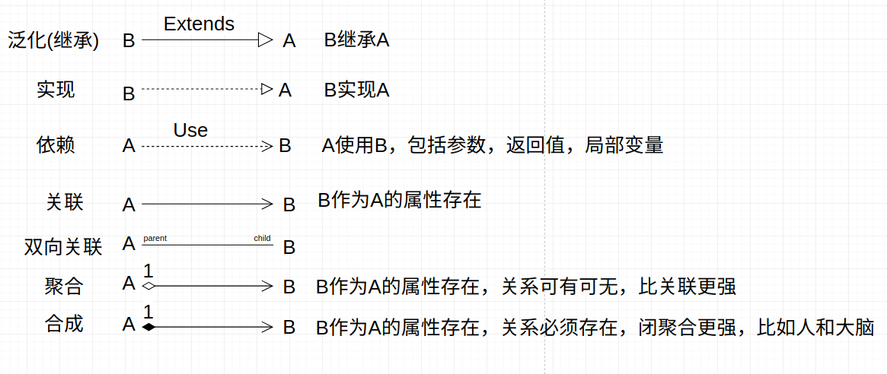

对于方法或者属性前的符号
```
+ main(args:String[]):void

+ : 表示public
- : 表示private  
# : 表示protected 
~ : 表示default,也就是包权限  
_ : 下划线表示static  
斜体: 表示抽象  
```

### 17.3.3. 组件图

对于现代大型应用程序来说，通常会有多个模块，在Java中，可复用的组件通常打包成一个Jar或者war等文件．组件图提供系统的物理视图，它的用途是显示系统中的软件对其他软件组件的依赖关系．


### 17.3.4. 部署图

部署图用于描述软件系统如何部署到硬件环境中．它的用途是显示软件系统不同的组件将在何处物理地运行．以及它们将如何彼此通信．


### 17.3.5. 顺序图

顺序图显示具体用例的详细流程，并且显示了流程中不同对象之间的调用关系，同时还可以很详细地显示对不同对象的不同调用．顺序图描述了对象之间的交互(顺序图和通信图都被称为交互图)．重点在于描述消息及其时间顺序．

顺序图有两个维度．垂直维度以发生的时间顺序显示消息/调用的序列．水平维度显示消息被发送到的对象实例．顺序图描述了一个功能的实现时的类之间的调用顺序

### 17.3.6. 活动图


### 17.3.7. 状态机图

表示某个类所处的不同状态和该类的的状态转换信息．例子如线程状态的变化

## 17.4. 设计模式

### 17.4.1. 单例模式
<a href="#menu"  >目录</a>

#### 17.4.1.1. 基本概念

**定义**:确保某一个类只有一个对象实例。并提供一个访问它的全局访问点.
**衍生**：有限多例，比如对象池技术，使用缓存将创建的对象缓存起来。
**优点**:
* 减少内存开支，每创建一个对象都会占用一定的系统内存，创建过多容易造成JVM进行垃圾回收。
* 降低系统性能开销，创建和垃圾回收会耗费一定的系统性能
* 从业务层面讲。可以提供公共的资源访问点。

**缺点**:

#### 17.4.1.2. 实现
单例模式需要注意的关键点是如何避免高并发条件下出现多例的问题。高并发环境下，任何两条语句执行之间都有可能被其他线程所抢占并执行完整的指令。这种情况处理不好，很容易产生出多例。
还有需要关注的是，一个系统中存在很多类，但是有的类在系统运行的生命周期中是始终没机会创建对象，比如有个偏门的用户操作才会触发某个类创建对象。这种情况下就没必要创建对象，也就是需要延迟创建对象，在使用时才去创建。
作为单例类，没必要去考虑通过反射会破解单例模式，定义一个类为单例，作为开发者应当遵循这个规范，而不是尝试使用反射来创建多个对象从而破坏这个规定。单例模式只防君子不防小人。

单例模式需要考虑的两点是:线程安全(防止创建多个实例)和是否占用内存(还没使用就已经创建,很多类在整个项目运行生命周期中可能从未使用,如果创建对象了就会占用内存)

**饥饿式创建单例**
这种写法就是在类加载时就创建一次，singleton属性定义为static,static属性只会在类加载的时候执行，因此不存在线程安全问题。由于是在类加载时就创建，因此称为饥饿式。
同时需要将构造器私有化。
```java
public class Singleton1 implements Serializable {

    private static Singleton1 singleton = new Singleton1();
    private Singleton1(){
        
    }
    public static Singleton1 getSingleton(){
        return singleton;
    }

    //解决序列化和反序列化之后的单例问题
    private Object readResolve(){
        return singleton;
    }
}
```
上面的代码添加了一个方法readResolve，是为了解决序列化反序列化后两个对象不是同一个对象的问题。

**饱汉式创建单例**
也就是说在类加载时还不创建对象，只有在获取对象时才会创建。这里需要注意的就是线程安全问题了，所以在类上添加了同步锁。
```java
public class Singleton2 implements Serializable {
    private static Singleton2 singleton = null;
    private Singleton2(){
        
    }
    public synchronized static Singleton2 getSingleton(){
        if(singleton == null){
            singleton = new Singleton2();
        }
        return singleton;
    }
    private Object readResolve(){
        return singleton;
    }
}
```

**双检锁创建单例**
以上的方式有个问题，每次获取对象都要加锁，加锁在jvm中是一项耗费资源的操作，因此更改为在方法内部加同步锁。只有第一次创建的时候才会加锁，对象创建成功之后，后续操作不需要再重新加锁。
```java
public class Singleton3 implements Serializable {

    private static Singleton3 singleton = null;
    private Singleton3(){

    }
    public static Singleton3 getSingleton(){
        if(singleton == null){
            synchronized(Singleton3.class){

                if(singleton == null){
                    singleton =  new Singleton3();
                }
            }
        }        
        return singleton;
    }
    private Object readResolve(){
        return singleton;
    }
}
```

**使用工厂模式和双检锁方式创建**
由于指令重排序的存在，有可能helper=null会在getHelper之后执行。解决这个问题是使用volatile修饰Helper.
详细查看[The "Double-Checked Locking is Broken" Declaration](http://www.cs.umd.edu/~pugh/java/memoryModel/DoubleCheckedLocking.html)
```java

// Single threaded version
class Foo { 
  private Helper helper = null;
  public Helper getHelper() {
    if (helper == null) 
        helper = new Helper();
    return helper;
    }
  // other functions and members...
  }
```

**使用静态内部类来创建**
由于内部类是静态的，因此是线程安全的，对象也是在首次调用内部类的时候才会创建。
```java
public class Singleton4 implements Serializable {

    private static class Singleton4Holder{
        private static Singleton4 singleton4 = new Singleton4();

    }
    public static Singleton4 getSingleton(){
        return Singleton4Holder.singleton4;
    }

    private Object readResolve(){
        return Singleton4Holder.singleton4;
    }
}
```

**使用枚举类来创建**
```java
public class Singleton5 implements Serializable {

    private enum Singleto5Enum{
        singletonFactory;

        private  Singleton5 singleton;

        private Singleto5Enum() {
            this.singleton = new Singleton5();
        }

        public Singleton5 getSingleton(){
            return singleton;
        }
    }

    public static Singleton5 getSingleton(){
        return Singleto5Enum.singletonFactory.getSingleton();
    }

    private Object readResolve(){
        return Singleto5Enum.singletonFactory.getSingleton();
    }

}
```

### 17.4.2. 简单工厂模式
<a href="#menu"  >目录</a>

**定义**
提供一个创建对象实例的功能,而无需关心其具体实现,被创建实例的类型可以是接口,抽象类,也可以是具体的类

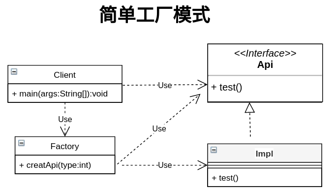
```java
public interface Api{

    void test();
}

public class ApiImpl implements Api{

    public void test(){
        // do sth
    }
}


public class Factory{

    //类型参数可以来源于调用者,配置文件,运行期的某个值
    //下面这种方式每次增加实现类,都需要修改代码.可以换成通过类名类创建实例
    public static Api createApi(int type){
        
        if(type ==0){
            return new ApiImpl();
        }
    }
}

public class Client {

    public static main(String[] args){

        Api api = Factory.createApi(0);
        api.test();
    }
}

```

**简单工厂优缺点**
* 优点
    * 帮助封装
        * 实现组件封装,然后让组件外真正实现面向接口编程
    * 解耦 
        * 通过简单工厂,实现了Client和具体实现类的解耦
* 缺点
    * 可能增加客户端的复杂度,如果根据参数来创建实例,客户端需要理解各个参数的含义
    * 不方便扩展子工厂,一般也不需要
    
### 17.4.3. 工厂方法模式
<a href="#menu"  >目录</a>

工厂模式（Factory Pattern）是 Java 中最常用的设计模式之一。这种类型的设计模式属于创建型模式，它提供了一种创建对象的最佳方式。

**定义**
定义一个用于创建对象的接口.让子类决定实例化哪一个类,工厂方法使一个类的实例化延迟到其子类.


在工厂模式中，我们在创建对象时不会对客户端暴露创建逻辑，并且是通过使用一个共同的接口来指向新创建的对象。


**介绍**
* 意图
    * 定义一个创建对象的接口，让其子类自己决定实例化哪一个工厂类，工厂模式使其创建过程**延迟到子类进行**。
* 主要解决
    * 主要解决接口选择的问题。
* 何时使用
    * 我们明确地计划不同条件下创建不同实例时。
* 如何解决
    * 让其子类实现工厂接口，返回的也是一个抽象的产品。
* 关键代码
    * 创建过程在其子类执行。
* 应用实例
    * 您需要一辆汽车，可以直接从工厂里面提货，而不用去管这辆汽车是怎么做出来的，以及这个汽车里面的具体实现
    * Hibernate 换数据库只需换方言和驱动就可以。
* 优点
    * 一个调用者想创建一个对象，只要知道其名称就可以了。 
    * 扩展性高，如果想增加一个产品，只要扩展一个工厂类就可以。 
    * 屏蔽产品的具体实现，调用者只关心产品的接口。
* 缺点
    * 每次增加一个产品时，都需要增加一个具体类和对象实现工厂，使得系统中类的个数成倍增加，在一定程度上增加了系统的复杂度，同时也增加了系统具体类的依赖。这并不是什么好事。
* 使用场景
    * 如果一个类需要创建某个接口的对象,但是又不知道具体的实现.这种情况可以选用工厂方法模式,把创建对象的工作延迟到子类中去实现
    * 如果一个类本身就希望由它的子类来创建所需的对象的时候,应该使用工厂方法模式
* 注意事项
    * 作为一种创建类模式，在任何需要生成复杂对象的地方，都可以使用工厂方法模式。有一点需要注意的地方就是复杂对象适合使用工厂模式，而简单对象，特别是只需要通过 new 就可以完成创建的对象，无需使用工厂模式。如果使用工厂模式，就需要引入一个工厂类，会增加系统的复杂度。
* 与简单工厂/抽象工厂模式的区别
    * 简单工厂创建对象是在工厂类中实现,而工厂方法模式是在工厂类的子类中创建对象
    * 扩展产品时,简单工厂是通过修改工厂类的代码来实现,而工厂方法是通过创建工厂类的子类来实现
    * 简单工厂和工厂方法都是创建同一个产品类型,而抽象工厂模式创建的是产品簇,也就是一个工厂类创建不同的产品,这些产品相互关联共同构成一个产品.
    
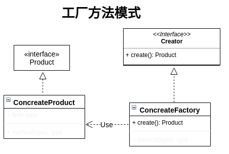

```java

public interface Product{}
public class ConcreateProduct implements Product{}
public interface Creator{    
    Product ConcreateProduct();
}
public class ConcreatorCreator{    
    public Product concreateProduct(){
        return new ConcreateProduct();
    }
}
//增加新的产品子类
public class NewProduct implements Product{

}

public class NewCreator{    
    public Product newProduct(){
        return new NewProduct();
    }
}
```


### 17.4.4. 抽象工厂模式
<a href="#menu"  >目录</a>

抽象工厂模式（Abstract Factory Pattern）是围绕一个超级工厂创建其他工厂。该超级工厂又称为其他工厂的工厂。这种类型的设计模式属于创建型模式，它提供了一种创建对象的最佳方式。
**抽象工厂模式**提供一个创建一系列相关或者相互依赖对象的接口,而无需指定它们具体的类.


在抽象工厂模式中，接口是负责创建一个相关对象的工厂，不需要显式指定它们的类。每个生成的工厂都能按照工厂模式提供对象。

**介绍**
* 意图
    * 提供一个创建一系列相关或相互依赖对象的接口，而无需指定它们具体的类。
* 主要解决
    * 主要解决接口选择的问题。
* 何时使用
    * 系统的产品有多于一个的产品族，而系统只消费其中某一族的产品。
* 如何解决
    * 在一个产品族里面，定义多个产品。
* 关键代码
    * 在一个工厂里聚合多个同类产品。
* 优点
    * 当一个产品族中的多个对象被设计成一起工作时，它能保证客户端始终只使用同一个产品族中的对象。
    * 分离接口和实现
        * 客户端使用抽象工厂创建需要的对象,而客户端根本就不知道具体的实现是谁,客户端只是面向产品的接口编程而已.客户端从具体的产品实现中解耦
    * 使得切换产品簇变得容易.客户端选用不同的工厂实现,就相当于是在切换不同的产品簇
* 缺点
    * 产品族扩展非常困难，要增加一个系列的某一产品，既要在抽象的 Factory 里加代码，又要在具体的工厂实现类里面加代码。
* 使用场景
    * 如果希望一个系统独立于它的产品的创建,组合和表示的时候.也就是,希望一个系统只是知道产品的接口,而不关心实现的时候
* 注意事项
    * 产品族难扩展，产品等级易扩展。

简单工厂和工厂方法模式针对是单个产品的创建.而抽象工厂方法针对的是多个产品的创建,这多个产品组合组成了一个新产品.抽象工厂提供创建的约束,提供所有子类的一个统一的外观,来让客户端调用.具体创建对象由工厂的实现类来完成.

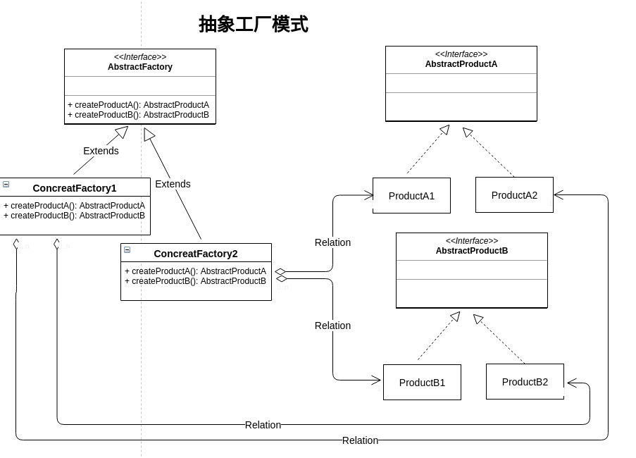

```java
//工厂类
public interface Factory {    
    ProductA createProductA();
    ProductA createProductB();
}
//每个工厂实现类构成一个产品簇
public class ConcreatFactory1 implements Factory  {    
    ProductA createProductA(){
        return new ProductA1();
    }
    ProductA createProductB(){
        return new ProductB1();
    }
}
public class ConcreatFactory2 implements Factory  {    
    ProductA createProductA(){
        return new ProductA2();
    }
    ProductA createProductB(){
        return new ProductB2();  
    }
}

//产品类
public interface ProductA{}
public interface ProductB{}

public class ProductA1 implements ProductA{}
public class ProductA2 implements ProductA{}
public class ProductB1 implements ProductB{}
public class ProductB2 implements ProductB{}

public  class Client{
    
    public void run(){
        Factory factory = new ConcreatFactory1();
        factory.createProductA();
        factory.createProductB();
    }
}
```


### 17.4.5. 简单工厂&抽象工厂&工厂方法比较
<a href="#menu"  >目录</a>

* 简单工厂是用来选择实现的,可以选择任意接口的实现.一个简单工厂可以有多个用于选择并创建对象的方法.多个方法创建的对象可以有关系也可以没有关系.简单工厂里创建的对象也可以分属不同的接口.
* 抽象工厂模式是用来选择产品簇的实现,也就是抽象工厂里有多个选择并创建对象的方法(不同接口).这些对象之间相互关联.比如屏幕/电池/主板.不同的参数可以组装不同的手机.和简单工厂的区别就是创建的对象关联性比较大
* 和简单工厂的方法的区别是将选择具体实现的功能放在工厂子类里实现.


### 17.4.6. 模板方法模式
<a href="#menu"  >目录</a>
在模板模式（Template Pattern）中，一个抽象类公开定义了执行它的方法的方式/模板。它的子类可以按需要重写方法实现，但调用将以抽象类中定义的方式进行。这种类型的设计模式属于行为型模式。


**介绍**
* 意图
    * 定义一个操作中的算法的骨架，而将一些步骤延迟到子类中。模板方法使得子类可以不改变一个算法的结构即可重定义该算法的某些特定步骤。
* 主要解决
    * 一些方法通用，却在每一个子类都重新写了这一方法。
* 何时使用
    * 有一些通用的方法。
* 如何解决
    * 将这些通用算法抽象出来。
* 关键代码
    * 在抽象类实现，其他步骤在子类实现。
* 应用实例
    * 在造房子的时候，地基、走线、水管都一样，只有在建筑的后期才有加壁橱加栅栏等差异。
    * 西游记里面菩萨定好的 81 难，这就是一个顶层的逻辑骨架。 3、spring 中对 Hibernate 的支持，将一些已经定好的方法封装起来，比如开启事务、获取 Session、关闭 Session 等，程序员不重复写那些已经规范好的代码，直接丢一个实体就可以保存。
* 优点
    * 封装不变部分，扩展可变部分。
    * 提取公共代码，便于维护。 
    * 行为由父类控制，子类实现。
* 缺点
    * 每一个不同的实现都需要一个子类来实现，导致类的个数增加，使得系统更加庞大。
* 使用场景
    * 有多个子类共有的方法，且逻辑相同。
    * 重要的、复杂的方法，可以考虑作为模板方法。
* 注意事项
    * 为防止恶意操作，一般模板方法都加上 final 关键词。

### 17.4.7. 建造者模式
<a href="#menu"  >目录</a>

建造者模式（Builder Pattern）使用多个简单的对象一步一步构建成一个复杂的对象。这种类型的设计模式属于创建型模式，它提供了一种创建对象的最佳方式。

一个 Builder 类会一步一步构造最终的对象。该 Builder 类是独立于其他对象的。


**介绍**
* 意图
    * 将一个复杂的构建与其表示相分离，使得同样的构建过程可以创建不同的表示。
* 主要解决：主要解决在软件系统中，有时候面临着"一个复杂对象"的创建工作，其通常由各个部分的子对象用一定的算法构成；由于需求的变化，这个复杂对象的各个部分经常面临着剧烈的变化，但是将它们组合在一起的算法却相对稳定。
* 何时使用
    * 一些基本部件不会变，而其组合经常变化的时候。
* 如何解决
    * 将变与不变分离开。
* 关键代码
    * 建造者：创建和提供实例，导演：管理建造出来的实例的依赖关系。
* 应用实例
    * 去肯德基，汉堡、可乐、薯条、炸鸡翅等是不变的，而其组合是经常变化的，生成出所谓的"套餐"。 
    * JAVA 中的 StringBuilder。
* 优点
    * 建造者独立，易扩展。
    * 便于控制细节风险。
* 缺点
    * 产品必须有共同点，范围有限制。
    * 如内部变化复杂，会有很多的建造类。
* 使用场景
    * 需要生成的对象具有复杂的内部结构。
    * 需要生成的对象内部属性本身相互依赖。
* 注意事项
    * 与工厂模式的区别是：建造者模式更加关注与零件装配的顺序。
    
### 17.4.8. 代理模式
<a href="#menu"  >目录</a>

代理模式（Proxy Pattern）中，一个类代表另一个类的功能。这种类型的设计模式属于结构型模式。
在代理模式中，我们创建具有现有对象的对象，以便向外界提供功能接口。


**介绍**
* 意图
    * 为其他对象提供一种代理以控制对这个对象的访问。
* 主要解决
    * 在直接访问对象时带来的问题，比如说：要访问的对象在远程的机器上。在面向对象系统中，有些对象由于某些原因（比如对象创建开销很大，或者某些操作需要安全控制，或者需要进程外的访问），直接访问会给使用者或者系统结构带来很多麻烦，我们可以在访问此对象时加上一个对此对象的访问层。
* 何时使用
    * 想在访问一个类时做一些控制。
* 如何解决
    * 增加中间层。
* 关键代码
    * 实现与被代理类组合。
* 应用实例
    * spring aop。
* 优点
    * 职责清晰。 
    * 高扩展性。 
    * 智能化。
* 缺点
    * 由于在客户端和真实主题之间增加了代理对象，因此有些类型的代理模式可能会造成请求的处理速度变慢
    * 实现代理模式需要额外的工作，有些代理模式的实现非常复杂。
* 使用场景
    * 按职责来划分，通常有以下使用场景
        * 远程代理。 
        * 虚拟代理。 
        * Copy-on-Write 代理。 
        * 保护（Protect or Access）代理。 
        * Cache代理。 
        * 防火墙（Firewall）代理。 
        * 同步化（Synchronization）代理。 
        * 智能引用（Smart Reference）代理。
* 注意事项
    * 和适配器模式的区别：适配器模式主要改变所考虑对象的接口，而代理模式不能改变所代理类的接口。 
    * 和装饰器模式的区别：装饰器模式为了增强功能，而代理模式是为了加以控制。

### 17.4.9. 原型模式
<a href="#menu"  >目录</a>

原型模式（Prototype Pattern���是用于创建重复的对象，同时又能保证性能。这种类型的设计模式属于创建型模式，它提供了一种创建对象的最佳方式。

这种模式是实现了一个原型接口，该接口用于创建当前对象的克隆。当直接创建对象的代价比较大时，则采用这种模式。例如，一个对象需要在一个高代价的数据库操作之后被创建。我们可以缓存该对象，在下一个请求时返回它的克隆，在需要的时候更新数据库，以此来减少数据库调用。  

**介绍**
* 意图
    * 用原型实例指定创建对象的种类，并且通过拷贝这些原型创建新的对象。
* 主要解决
    * 在运行期建立和删除原型。
* 何时使用
    * 当一个系统应该独立于它的产品创建，构成和表示时。
    * 当要实例化的类是在运行时刻指定时，例如，通过动态装载。
    * 为了避免创建一个与产品类层次平行的工厂类层次时。
    * 当一个类的实例只能有几个不同状态组合中的一种时。建立相应数目的原型并克隆它们可能比每次用合适的状态手工实例化该类更方便一些。
* 如何解决
    * 利用已有的一个原型对象，快速地生成和原型对象一样的实例。
* 关键代码
    * 实现克隆操作，在 JAVA 继承 Cloneable，重写 clone()，在 .NET 中可以使用 Object 类的 MemberwiseClone() 方法来实现对象的浅拷贝或通过序列化的方式来实现深拷贝。 
    * 原型模式同样用于隔离类对象的使用者和具体类型（易变类）之间的耦合关系，它同样要求这些"易变类"拥有稳定的接口。
* 应用实例 
    * JAVA 中的 Object clone() 方法。
* 优点
    * 性能提高。
    * 逃避构造函数的约束。
    
* 缺点
    * 每个引用类型都要实现clone操作.
* 使用场景
    * 资源优化场景。
    * 类初始化需要消化非常多的资源，这个资源包括数据、硬件资源等。 
    * 性能和安全要求的场景。 
    * 通过 new 产生一个对象需要非常繁琐的数据准备或访问权限，则可以使用原型模式。 
    * 一个对象多个修改者的场景。 
    * 一个对象需要提供给其他对象访问，而且各个调用者可能都需要修改其值时，可以考虑使用原型模式拷贝多个对象供调用者使用。
    * 在实际项目中，原型模式很少单独出现，一般是和工厂方法模式一起出现，通过 clone 的方法创建一个对象，然后由工厂方法提供给调用者。
* 注意事项
    * 与通过对一个类进行实例化来构造新对象不同的是，原型模式是通过拷贝一个现有对象生成新对象的。浅拷贝实现 Cloneable重写，深拷贝是通过实现 Serializable 读取二进制流。


```java
class Apple  implements Cloneable{ 
    //需要实现Cloneable
    private int number; 
    //重写clone()
    @Override
    public Object clone() {
    	Apple apple =  null;
    	try {
    		return (Apple)super.clone();    		
		} catch (Exception e) {
			e.printStackTrace();
		}
    	return apple;
    }
} 
```


### 17.4.10. 中介者模式
<a href="#menu"  >目录</a>

中介者模式（Mediator Pattern）是用来降低多个对象和类之间的通信复杂性。这种模式提供了一个中介类，该类通常处理不同类之间的通信 ，并支持松耦合，使代码易于维护。中介者模式属于行为型模式。

使用中介者模式的原因是多个对象需要相互交互,从而导致对象之间紧密耦合,不利于对象的修改和维护. 中介者模式的解决思路和电脑一样,通过引入一个中介对象,让其他对象都只和中介对象交互,而中介对象知道如何和其他所有对象交互,这样对象之间的交互关系就没有了,从而实现了对象之间的解耦.

对于中介对象而言,所有相互交互的对象,被视为同事类,中介对象就是来维护各个同事之间的关系,而所有的同事类都只和中介类进行交互,每个同事类,当内部发生变化,不需要通知其他同事类.通知中介对象就可以了.然后由中介对象去和其他对象进行交互.这种松耦合带来的好处是,除了让同事对象之间相互没有关联外,还有利于功能的修改和扩展.

**介绍**
* 意图
    * 用一个中介对象来封装一系列的对象交互，中介者使各对象不需要显式地相互引用，从而使其耦合松散，而且可以独立地改变它们之间的交互。
* 主要解决
    * 对象与对象之间存在大量的关联关系，这样势必会导致系统的结构变得很复杂，同时若一个对象发生改变，我们也需要跟踪与之相关联的对象，同时做出相应的处理。
* 何时使用
    * 多个类相互耦合，形成了网状结构。
* 如何解决
    * 将上述网状结构分离为星型结构。
* 应用实例
    * 主板和外设之间的关系
* 优点
    * 集中控制交互
    * 降低了类的复杂度，将多对多转化成了一对一。 
    * 松散耦合,各个类之间的解耦。 
    * 符合迪米特原则。
* 缺点
    * 中介者会庞大，变得复杂难以维护。
    * 过度集中化,如果同事对象之间交互比较多,而且比较复杂,当这些复杂全部集中到中介者处理的化,会导致中介者变得相当复杂,难以管理和维护.
* 使用场景
    * 如果一组对象之间的通信方式比较复杂,导致相互依赖,结构混乱,可以采用中介者模式,把这些对象的交互管理起来.各个对象都只需要和中介者交互.从而使得各个对象松散耦合,结构也更加清晰
    * 如果一个对象引用很多的对象， 并直接跟这些对象交互，导致难以复用该对象，可以采用中介者模式，把这个对象跟其他对象的交互封装到中介者里面。这个对象只需要和中介者对象交互即可
* 注意事项
    * 不应当在职责混乱的时候使用。


### 17.4.11. 命令模式
<a href="#menu"  >目录</a>
命令模式（Command Pattern）是一种数据驱动的设计模式，它属于行为型模式。请求以命令的形式包裹在对象中，并传给调用对象。调用对象寻找可以处理该命令的合适的对象，并把该命令传给相应的对象，该对象执行命令。


**介绍**
* 意图
    * 将一个请求封装成一个对象，从而使您可以用不同的请求对客户进行参数化。
* 主要解决
    * 在软件系统中，行为请求者与行为实现者通常是一种紧耦合的关系，但某些场合，比如需要对行为进行记录、撤销或重做、事务等处理时，这种无法抵御变化的紧耦合的设计就不太合适。
* 何时使用
    * 在某些场合，比如要对行为进行"记录、撤销/重做、事务"等处理，这种无法抵御变化的紧耦合是不合适的。在这种情况下，如何将"行为请求者"与"行为实现者"解耦？将一组行为抽象为对象，可以实现二者之间的松耦合。
* 如何解决
    * 通过调用者调用接受者执行命令，顺序：调用者→接受者→命令。
* 关键代码
    * 定义三个角色：
        * received 真正的命令执行对象 
        * Command 
        * invoker 使用命令对象的入口
* 应用实例：
    * struts 1 中的 action 核心控制器 ActionServlet 只有一个，相当于 Invoker，而模型层的类会随着不同的应用有不同的模型类，相当于具体的 Command。
* 优点
    * 降低了系统耦合度。 
    * 新的命令可以很容易添加到系统中去。
* 缺点
    * 使用命令模式可能会导致某些系统有过多的具体命令类。
* 使用场景
    * 认为是命令的地方都可以使用命令模式，比如： 1、GUI 中每一个按钮都是一条命令。 2、模拟 CMD。
* 注意事项
    * 系统需要支持命令的撤销(Undo)操作和恢复(Redo)操作，也可以考虑使用命令模式，见命令模式的扩展。
```java
public interface Order {
   void execute();
}
public class Stock {
   
   private String name = "ABC";
   private int quantity = 10;
 
   public void buy(){
      System.out.println("Stock [ Name: "+name+", 
         Quantity: " + quantity +" ] bought");
   }
   public void sell(){
      System.out.println("Stock [ Name: "+name+", 
         Quantity: " + quantity +" ] sold");
   }
}
public class BuyStock implements Order {
   private Stock abcStock;
 
   public BuyStock(Stock abcStock){
      this.abcStock = abcStock;
   }
 
   public void execute() {
      abcStock.buy();
   }
}
public class SellStock implements Order {
   private Stock abcStock;
 
   public SellStock(Stock abcStock){
      this.abcStock = abcStock;
   }
 
   public void execute() {
      abcStock.sell();
   }
}
public class Broker {
   private List<Order> orderList = new ArrayList<Order>(); 
 
   public void takeOrder(Order order){
      orderList.add(order);      
   }
 
   public void placeOrders(){
      for (Order order : orderList) {
         order.execute();
      }
      orderList.clear();
   }
}
public class CommandPatternDemo {
   public static void main(String[] args) {
      Stock abcStock = new Stock();
 
      BuyStock buyStockOrder = new BuyStock(abcStock);
      SellStock sellStockOrder = new SellStock(abcStock);
 
      Broker broker = new Broker();
      broker.takeOrder(buyStockOrder);
      broker.takeOrder(sellStockOrder);
 
      broker.placeOrders();
   }
}

```
### 17.4.12. 责任链模式
<a href="#menu"  >目录</a>
顾名思义，责任链模式（Chain of Responsibility Pattern）为请求创建了一个接收者对象的链。这种模式给予请求的类型，对请求的发送者和接收者进行解耦。这种类型的设计模式属于行为型模式。

在这种模式中，通常每个接收者都包含对另一个接收者的引用。如果一个对象不能处理该请求，那么它会把相同的请求传给下一个接收者，依此类推。


**介绍**
* 意图
    * 避免请求发送者与接收者耦合在一起，让多个对象都有可能接收请求，将这些对象连接成一条链，并且沿着这条链传递请求，直到有对象处理它为止。
* 主要解决
    * 职责链上的处理者负责处理请求，客户只需要将请求发送到职责链上即可，无须关心请求的处理细节和请求的传递，所以职责链将请求的发送者和请求的处理者解耦了。
* 何时使用
    * 在处理消息的时候以过滤很多道。
* 如何解决
    * 拦截的类都实现统一接口。
* 关键代码
    * Handler 里面聚合它自己，在 HandlerRequest 里判断是否合适，如果没达到条件则向下传递，向谁传递之前 set 进去。
* 应用实例
    * 红楼梦中的"击鼓传花"。 
    * JS 中的事件冒泡。 
    * JAVA WEB 中 Apache Tomcat 对 Encoding 的处理，Struts2 的拦截器，jsp servlet 的 Filter。
* 优点
    * 降低耦合度。它将请求的发送者和接收者解耦。 
    * 简化了对象。使得对象不需要知道链的结构。 
    * 增强给对象指派职责的灵活性。通过改变链内的成员或者调动它们的次序，允许动态地新增或者删除责任。 
    * 增加新的请求处理类很方便。
* 缺点
    * 不能保证请求一定被接收。 
    * 系统性能将受到一定影响，而且在进行代码调试时不太方便，可能会造成循环调用。 
    * 可能不容易观察运行时的特征，有碍于除错。
* 使用场景
    * 有多个对象可以处理同一个请求，具体哪个对象处理该请求由运行时刻自动确定。 
    * 在不明确指定接收者的情况下，向多个对象中的一个提交一个请求。 
    * 可动态指定一组对象处理请求。
* 注意事项
    * 在 JAVA WEB 中遇到很多应用。
    
### 17.4.13. 装饰模式
<a href="#menu"  >目录</a>
装饰器模式（Decorator Pattern）允许向一个现有的对象添加新的功能，同时又不改变其结构。这种类型的设计模式属于结构型模式，它是作为现有的类的一个包装。

这种模式创建了一个装饰类，用来包装原有的类，并在保持类方法签名完整性的前提下，提供了额外的功能。

我们通过下面的实例来演示装饰器模式的用法。其中，我们将把一个形状装饰上不同的颜色，同时又不改变形状类。


**介绍**
* 意图
    * 动态地给一个对象添加一些额外的职责。就增加功能来说，装饰器模式相比生成子类更为灵活。
* 主要解决
    * 一般的，我们为了扩展一个类经常使用继承方式实现，由于继承为类引入静态特征，并且随着扩展功能的增多，子类会很膨胀。
* 何时使用
    * 在不想增加很多子类的情况下扩展类。
* 如何解决
    * 将具体功能职责划分，同时继承装饰者模式。
* 关键代码
    * Component 类充当抽象角色，不应该具体实现。 
    * 修饰类引用和继承 Component 类，具体扩展类重写父类方法。
* 应用实例
    * 孙悟空有 72 变，当他变成"庙宇"后，他的根本还是一只猴子，但是他又有了庙宇的功能。 
    * 不论一幅画有没有画框都可以挂在墙上，但是通常都是有画框的，并且实际上是画框被挂在墙上。在挂在墙上之前，画可以被蒙上玻璃，装到框子里；这时画、玻璃和画框形成了一个物体。
* 优点
    * 装饰类和被装饰类可以独立发展，不会相互耦合，装饰模式是继承的一个替代模式，装饰模式可以动态扩展一个实现类的功能。
* 缺点
    * 多层装饰比较复杂。
* 使用场景
    * 扩展一个类的功能。
    * 动态增加功能，动态撤销。
* 注意事项
    * 可代替继承。

### 17.4.14. 策略模式
<a href="#menu"  >目录</a>
在策略模式（Strategy Pattern）中，一个类的行为或其算法可以在运行时更改。这种类型的设计模式属于行为型模式。

在策略模式中，我们创建表示各种策略的对象和一个行为随着策略对象改变而改变的 context 对象。策略对象改变 context 对象的执行算法。


**介绍**
* 意图
    * 定义一系列的算法,把它们一个个封装起来, 并且使它们可相互替换。
* 主要解决
    * 在有多种算法相似的情况下，使用 if...else 所带来的复杂和难以维护。
* 何时使用
    * 一个系统有许多许多类，而区分它们的只是他们直接的行为。
* 如何解决
    * 将这些算法封装成一个一个的类，任意地替换。
* 关键代码
    * 实现同一个接口。
* 应用实例
    * 诸葛亮的锦囊妙计，每一个锦囊就是一个策略。
    * 旅行的出游方式，选择骑自行车、坐汽车，每一种旅行方式都是一个策略。 
    * JAVA AWT 中的 LayoutManager。
* 优点
    * 算法可以自由切换。 
    * 避免使用多重条件判断。 
    * 扩展性良好。
* 缺点
    * 策略类会增多。 
    * 所有策略类都需要对外暴露。
* 使用场景
    * 如果在一个系统里面有许多类，它们之间的区别仅在于它们的行为，那么使用策略模式可以动态地让一个对象在许多行为中选择一种行为。
    * 一个系统需要动态地在几种算法中选择一种。
    * 如果一个对象有很多的行为，如果不用恰当的模式，这些行为就只好使用多重的条件选择语句来实现。
* 注意事项
    * 如果一个系统的策略多于四个，就需要考虑使用混合模式，解决策略类膨胀的问题。
```java
public interface Strategy {
   public int doOperation(int num1, int num2);
}
public class OperationAdd implements Strategy{
   @Override
   public int doOperation(int num1, int num2) {
      return num1 + num2;
   }
}

public class OperationSubstract implements Strategy{
   @Override
   public int doOperation(int num1, int num2) {
      return num1 - num2;
   }
}
public class OperationMultiply implements Strategy{
   @Override
   public int doOperation(int num1, int num2) {
      return num1 * num2;
   }
}
public class Context {
   private Strategy strategy;
 
   public Context(Strategy strategy){
      this.strategy = strategy;
   }
 
   public int executeStrategy(int num1, int num2){
      return strategy.doOperation(num1, num2);
   }
}
public class StrategyPatternDemo {
   public static void main(String[] args) {
      Context context = new Context(new OperationAdd());    
      System.out.println("10 + 5 = " + context.executeStrategy(10, 5));
 
      context = new Context(new OperationSubstract());      
      System.out.println("10 - 5 = " + context.executeStrategy(10, 5));
 
      context = new Context(new OperationMultiply());    
      System.out.println("10 * 5 = " + context.executeStrategy(10, 5));
   }
}


```

### 17.4.15. 适配器模式
<a href="#menu"  >目录</a>

**适配器模式**
将一个类的接口转换成客户希望的另一个接口.适配器模式使得原本由于接口不兼容而不能一起工作的那些类可以一起工作.适配器模式（Adapter Pattern）是作为两个不兼容的接口之间的桥梁。这种类型的设计模式属于结构型模式，它结合了两个独立接口的功能。使用场景是客户端现在调用的接口(Target)已经固定,现在要扩展该接口实现类的功能,而另一个接口刚好已经实现该功能,但是客户端又不能直接调用该接口.因此通过组合的方式在Target实现类中进行调用.

**介绍**
* 意图
    * 将一个类的接口转换成客户希望的另外一个接口。适配器模式使得原本由于接口不兼容而不能一起工作的那些类可以一起工作。
* 主要解决
    * 主要解决在软件系统中，常常要将一些"现存的对象"放到新的环境中，而新环境要求的接口是现对象不能满足的。
* 何时使用
    * 系统需要使用现有的类，而此类的接口不符合系统的需要。
    * 想要建立一个可以重复使用的类，用于与一些彼此之间没有太大关联的一些类，包括一些可能在将来引进的类一起工作，这些源类不一定有一致的接口。
    * 通过接口转换，将一个类插入另一个类系中。（比如老虎和飞禽，现在多了一个飞虎，在不增加实体的需求下，增加一个适配器，在里面包容一个虎对象，实现飞的接口。）
* 如何解决
    * 继承或依赖（推荐）。
* 关键代码
    * 适配器继承或依赖已有的对象，实现想要的目标接口。
* 优点
    * 更好的扩展性
    * 提高了类的复用。如果功能已经有了,只是接口不兼容,那么通过适配器模式就可以让这些功能得到更好的复用
* 缺点
    * 过多地使用适配器，会让系统非常零乱，不易整体进行把握。比如，明明看到调用的是 A 接口，其实内部被适配成了 B 接口的实现，一个系统如果太多出现这种情况，无异于一场灾难。因此如果不是很有必要，可以不使用适配器，而是直接对系统进行重构。 
* 使用场景
    * 如果想要使用一个已经存在的类,但是它的接口不符合需求,可以使用适配器把已有的实现转换成所需要的接口
    * 如果向创建一个可以复用的类,这个类可能和一些不兼容的类一起工作,可使用适配器模式,需要什么就适配什么
    * 如果向使用一些已经存在的子类,但是不可能对每一个子类进行适配,这种情况可以选用对象适配器,直接适配这些子类的就可以了
* 注意事项
    * 适配器不是在详细设计时添加的，而是解决正在服役的项目的问题。


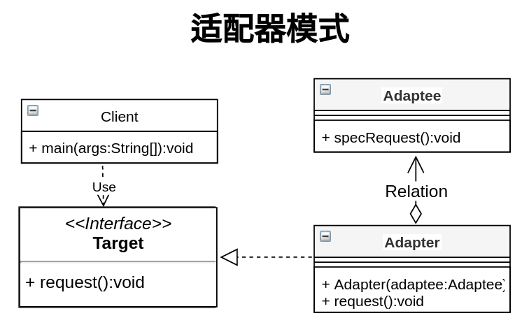
* Client:客户端,调用自己需要的领域接口
* Target: 客户端调用的接口
* Adaptee: 已经存在的接口,通常能满足客户端的需求,但是接口和客户端要求的接口不一致,需要进行适配
* Adapter: 适配器,把Adaptee适配成客户端需要的Target

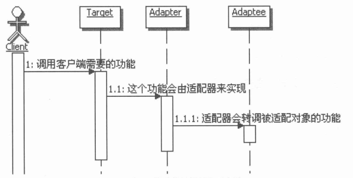

```java
public interface Target{    
    void request();
} 
public class Adaptee{
    public void specRequest(){
        //do sth
    }
} 

public class Adapter implements Target{
    private Adaptee adaptee;
    public Adater(Adaptee adaptee){
        this.adaptee = adaptee;
    }
    public void request(){
        adaptee.specRequest();
    }
}
public class Client{

    public void  work(){

        new Adapter(new Adaptee()).request();
    }
}
```

**适配器与桥接**


### 17.4.16. 迭代器模式
<a href="#menu"  >目录</a>
迭代器模式（Iterator Pattern）是 Java 和 .Net 编程环境中非常常用的设计模式。这种模式用于顺序访问集合对象的元素，不需要知道集合对象的底层表示。

迭代器模式属于行为型模式。


**介绍** 
* 意图
    * 提供一种方法顺序访问一个聚合对象中各个元素, 而又无须暴露该对象的内部表示。
* 主要解决
    * 不同的方式来遍历整个整合对象。
* 何时使用
    * 遍历一个聚合对象。
* 如何解决
    * 把在元素之间游走的责任交给迭代器，而不是聚合对象。
* 关键代码
    * 定义接口：hasNext, next。
* 应用实例
    * JAVA 中的 iterator。
* 优点
    * 它支持以不同的方式遍历一个聚合对象。
    * 迭代器简化了聚合类。
    * 在同一个聚合上可以有多个遍历。 
    * 在迭代器模式中，增加新的聚合类和迭代器类都很方便，无须修改原有代码。
* 缺点
    * 由于迭代器模式将存储数据和遍历数据的职责分离，增加新的聚合类需要对应增加新的迭代器类，类的个数成对增加，这在一定程度上增加了系统的复杂性。
* 使用场景
    * 访问一个聚合对象的内容而无须暴露它的内部表示。 
    * 需要为聚合对象提供多种遍历方式。 
    * 为遍历不同的聚合结构提供一个统一的接口。
* 注意事项
    * 迭代器模式就是分离了集合对象的遍历行为，抽象出一个迭代器类来负责，这样既可以做到不暴露集合的内部结构，又可让外部代码透明地访问集合内部的数据。

### 17.4.17. 组合模式
<a href="#menu"  >目录</a>
组合模式（Composite Pattern），又叫部分整体模式，是用于把一组相似的对象当作一个单一的对象。组合模式依据树形结构来组合对象，用来表示部分以及整体层次。这种类型的设计模式属于结构型模式，它创建了对象组的树形结构。

这种模式创建了一个包含自己对象组的类。该类提供了修改相同对象组的方式。

我们通过下面的实例来演示组合模式的用法。实例演示了一个组织中员工的层次结构。


**介绍**  
* 意图
    * 将对象组合成树形结构以表示"部分-整体"的层次结构。组合模式使得用户对单个对象和组合对象的使用具有一致性。
* 主要解决
    * 它在我们树型结构的问题中，模糊了简单元素和复杂元素的概念，客户程序可以向处理简单元素一样来处理复杂元素，从而使得客户程序与复杂元素的内部结构解耦。
* 何时使用
    * 您想表示对象的部分-整体层次结构（树形结构）。 
    * 您希望用户忽略组合对象与单个对象的不同，用户将统一地使用组合结构中的所有对象。
* 如何解决
    * 树枝和叶子实现统一接口，树枝内部组合该接口。
* 关键代码
    * 树枝内部组合该接口，并且含有内部属性 List，里面放 Component。

* 应用实例
    * 算术表达式包括操作数、操作符和另一个操作数，其中，另一个操作符也可以是操作数、操作符和另一个操作数。
    * 在 JAVA AWT 和 SWING 中，对于 Button 和 Checkbox 是树叶，Container 是树枝。
* 优点
    * 高层模块调用简单。 
    * 节点���由增加。
* 缺点
    * 在使用组合模式时，其叶子和树枝的声明都是实现类，而不是接口，违反了依赖倒置原则。
* 使用场景
    * 部分、整体场景，如树形菜单，文件、文件夹的管理。
* 注意事项
    * 定义时为具体类。


### 17.4.18. 观察者模式
<a href="#menu"  >目录</a>
当对象间存在一对多关系时，则使用观察者模式（Observer Pattern）。比如，当一个对象被修改时，则会自动通知它的依赖对象。观察者模式属于行为型模式。


**介绍**
* 意图
    * 定义对象间的一种一对多的依赖关系，当一个对象的状态发生改变时，所有依赖于它的对象都得到通知并被自动更新。
* 主要解决
    * 一个对象状态改变给其他对象通知的问题，而且要考虑到易用和低耦合，保证高度的协作。
* 何时使用
    * 一个对象（目标对象）的状态发生改变，所有的依赖对象（观察者对象��都将得到通知，进行广播通知。
* 如何解决
    * 使用面向对象技术，可以将这种依赖关系弱化。
* 关键代码
    * 在抽象类里有一个 ArrayList 存放观察者们。
* 应用实例
    * 拍卖的时候，拍卖师观察最高标价，然后通知给其他竞价者竞价。 
    * 西游记里面悟空请求菩萨降服红孩儿，菩萨洒了一地水招来一个老乌龟，这个乌龟就是观察者，他观察菩萨洒水这个动作。
* 优点
    * 观察者和被观察者是抽象耦合的。 
    * 建立一套触发机制。
* 缺点
    * 如果一个被观察者对象有很多的直接和间接的观察者的话，将所有的观察者都通知到会花费很多时间。
    * 如果在观察者和观察目标之间有循环依赖的话，观察目标会触发它们之间进行循环调用，可能导致系统崩溃。 
    * 观察者模式没有相应的机制让观察者知道所观察的目标对象是怎么发生变化的，而仅仅只是知道观察目标发生了变化。
* 使用场景：
    * 一个抽象模型有两个方面，其中一个方面依赖于另一个方面。将这些方面封装在独立的对象中使它们可以各自独立地改变和复用。
    * 一个对象的改变将导致其他一个或多个对象也发生改变，而不知道具体有多少对象将发生改变，可以降低对象之间的耦合度。
    * 一个对象必须通知其他对象，而并不知道这些对象是谁。
    * 需要在系统中创建一个触发链，A对象的行为将影响B对象，B对象的行为将影响C对象……，可以使用观察者模式创建一种链式触发机制。
* 注意事项
    * JAVA 中已经有了对观察者模式的支持类。 
    * 避免循环引用。 
    * 如果顺序执行，某一观察者错误会导致系统卡壳，一般采用异步方式。
```java
public class Subject {
   
   private List<Observer> observers 
      = new ArrayList<Observer>();
   private int state;
 
   public int getState() {
      return state;
   }
 
   public void setState(int state) {
      this.state = state;
      notifyAllObservers();
   }
 
   public void attach(Observer observer){
      observers.add(observer);      
   }
 
   public void notifyAllObservers(){
      for (Observer observer : observers) {
         observer.update();
      }
   }  
}
public abstract class Observer {
   protected Subject subject;
   public abstract void update();
}
public class BinaryObserver extends Observer{
 
   public BinaryObserver(Subject subject){
      this.subject = subject;
      this.subject.attach(this);
   }
 
   @Override
   public void update() {
      System.out.println( "Binary String: " 
      + Integer.toBinaryString( subject.getState() ) ); 
   }
}
public class OctalObserver extends Observer{
 
   public OctalObserver(Subject subject){
      this.subject = subject;
      this.subject.attach(this);
   }
 
   @Override
   public void update() {
     System.out.println( "Octal String: " 
     + Integer.toOctalString( subject.getState() ) ); 
   }
}
public class HexaObserver extends Observer{
 
   public HexaObserver(Subject subject){
      this.subject = subject;
      this.subject.attach(this);
   }
 
   @Override
   public void update() {
      System.out.println( "Hex String: " 
      + Integer.toHexString( subject.getState() ).toUpperCase() ); 
   }
}
public class ObserverPatternDemo {
   public static void main(String[] args) {
      Subject subject = new Subject();
 
      new HexaObserver(subject);
      new OctalObserver(subject);
      new BinaryObserver(subject);
 
      System.out.println("First state change: 15");   
      subject.setState(15);
      System.out.println("Second state change: 10");  
      subject.setState(10);
   }
}

```

### 17.4.19. 门面模式
<a href="#menu"  >目录</a>

门面模式（Facade Pattern）隐藏系统的复杂性，并向客户端提供了一个客户端可以访问系统的接口。这种类型的设计模式属于结构型模式，它向现有的系统添加一个接口，来隐藏系统的复杂性。

这种模式涉及到一个单一的类，该类提供了客户端请求的简化方法和对现有系统类方法的委托调用。

门面模式不是给子系统增添新的功能接口,而是为了让外部减少与子系统内多个模块的交互,降低耦合,从而让外部更加简单的使用子系统.门面模式相当于把在客户端调用的代码集中到门面的接口类中,一是实现代码的复用,而是方便调用者使用

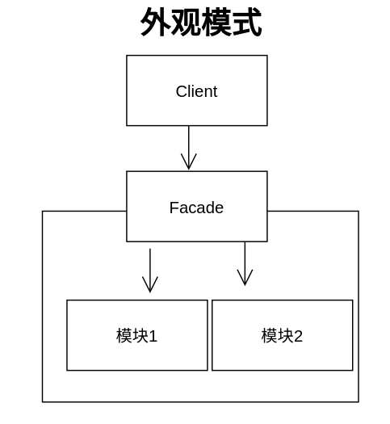

**介绍**
* 意图
    * 为子系统中的一组接口提供一个一致的界面，外观模式定义了一个高层接口，这个接口使得这一子系统更加容易使用。
* 主要解决
    * 降低访问复杂系统的内部子系统时的复杂度，简化客户端与之的接口。
* 何时使用
    * 客户端不需要知道系统内部的复杂联系，整个系统只需提供一个"接待员"即可。 
    * 定义系统的入口。
* 如何解决
    * 客户端不与系统耦合，外观类与系统耦合。
* 关键代码
    * 在客户端和复杂系统之间再加一层，这一层将调用顺序、依赖关系等处理好。
* 应用实例
    * 去医院看病，可能要去挂号、门诊、划价、取药，让患者或患者家属觉得很复杂，如果有提供接待人员，只让接待人员来处理，就很方便。
    * JAVA 的三层开发模式。
* 优点
    * 简单易用
    * 减少系统相互依赖,降低耦合。 
    * 提高灵活性。 
    * 提高了安全性。
    * 更好划分访问的层次
        * 有些方法是供外部用的,有的是内部用的.把供外部用的放在门面接口中.这样既方便客户端调用,也隐藏了内部的细节
* 缺点
    * 不符合开闭原则，如果要改东西很麻烦，继承重写都不合适。
* 使用场景
    * 为复杂的模块或子系统提供外界访问的模块。 
    * 子系统相对独立。 
    * 预防低水平人员带来的风险。
* 注意事项
    * 在层次化结构中，可以使用外观模式定义系统中每一层的入口。

**外观模式和中介者模式**
* 中介者模式主要用来封装多个对象之间的相互的交互,多用在系统内部的多个模块之间.而外观模式封装的是单向的交互,是从客户端访问系统的调用
* 在中介者模式中,是需要实现交互作用的.而门面模式一般是组合调用或是转调内部实现的功能
* 中介者模式主要是松散多个模块之间的耦合,把这些耦合全部放在 中介者中去实现.而外观模式是简化客户端的调用


### 17.4.20. 备忘录模式
<a href="#menu"  >目录</a>
备忘录模式（Memento Pattern）保存一个对象的某个状态，以便在适当的时候恢复对象。备忘录模式属于行为型模式。


**介绍**
* 意图
    * 在不破坏封装性的前提下，捕获一个对象的内部状态，并在该对象之外保存这个状态。
* 主要解决
    * 所谓备忘录模式就是在不破坏封装的前提下，捕获一个对象的内部状态，并在该对象之外保存这个状态，这样可以在以后将对象恢复到原先保存的状态。
* 何时使用
    * 很多时候我们总是需要记录一个对象的内部状态，这样做的目的就是为了允许用户取消不确定或者错误的操作，能够恢复到他原先的状态，使得他有"后悔药"可吃。
* 如何解决
    * 通过一个备忘录类专门存储对象状态。
* 关键代码
    * 客户不与备忘录类耦合，与备忘录管理类耦合。
* 应用实例
    * 后悔药。 
    * 打游戏时的存档。 
    * Windows 里的 ctri + z。 
    * IE 中的后退。 
    * 数据库的事务管理。
* 优点
    * 给用户提供了一种可以恢复状态的机制，可以使用户能够比较方便地回到某个历史的状态。 
    * 实现了信息的封装，使得用户不需要关心状态的保存细节。
* 缺点
    * 消耗资源。如果类的成员变量过多，势必会占用比较大的资源，而且每一次保存都会消耗一定的内存。
* 使用场景
    * 需要保存/恢复数据的相关状态场景。 
    * 提供一个可回滚的操作。
* 注意事项
    * 为了符合迪米特原则，还要增加一个管理备忘录的类。 
    * 为了节约内存，可使用原型模式+备忘录模式。

```java
public class Memento {
   private String state;
 
   public Memento(String state){
      this.state = state;
   }
 
   public String getState(){
      return state;
   }  
}
public class Originator {
   private String state;
 
   public void setState(String state){
      this.state = state;
   }
 
   public String getState(){
      return state;
   }
 
   public Memento saveStateToMemento(){
      return new Memento(state);
   }
 
   public void getStateFromMemento(Memento Memento){
      state = Memento.getState();
   }
}

public class CareTaker {
   private List<Memento> mementoList = new ArrayList<Memento>();
 
   public void add(Memento state){
      mementoList.add(state);
   }
 
   public Memento get(int index){
      return mementoList.get(index);
   }
}
public class MementoPatternDemo {
   public static void main(String[] args) {
      Originator originator = new Originator();
      CareTaker careTaker = new CareTaker();
      originator.setState("State #1");
      originator.setState("State #2");
      careTaker.add(originator.saveStateToMemento());
      originator.setState("State #3");
      careTaker.add(originator.saveStateToMemento());
      originator.setState("State #4");
 
      System.out.println("Current State: " + originator.getState());    
      originator.getStateFromMemento(careTaker.get(0));
      System.out.println("First saved State: " + originator.getState());
      originator.getStateFromMemento(careTaker.get(1));
      System.out.println("Second saved State: " + originator.getState());
   }
}
```


### 17.4.21. 访问者模式
<a href="#menu"  >目录</a>
在访问者模式（Visitor Pattern）中，我们使用了一个访问者类，它改变了元素类的执行算法。通过这种方式，元素的执行算法可以随着访问者改变而改变。这种类型的设计模式属于行为型模式。根据模式，元素对象已接受访问者对象，这样访问者对象就可以处理元素对象上的操作。


**介绍**
* 意图
    * 主要将数据结构与数据操作分离。
* 主要解决
    * 稳定的数据结构和易变的操作耦合问题。
* 何时使用
    * 需要对一个对象结构中的对象进行很多不同的并且不相关的操作，而需要避免让这些操作"污染"这些对象的类，使用访问者模式将这些封装到类中。
* 如何解决
    * 在被访问的类里面加一个对外提供接待访问者的接口。
* 关键代码
    * 在数据基础类里面有一个方法接受访问者，将自身引用传入访问者。
* 应用实例
    * 您在朋友家做客，您是访问者，朋友接受您的访问，您通过朋友的描述，然后对朋友的描述做出一个判断，这就是访问者模式。
* 优点
    * 符合单一职责原则。 
    * 优秀的扩展性。 
    * 灵活性。
* 缺点
    * 具体元素对访问者公布细节，违反了迪米特原则。 
    * 具体元素变更比较困难。 
    * 违反了依赖倒置原则，依赖了具体类，没有依赖抽象。
* 使用场景
    * 对象结构中对象对应的类很少改变，但经常需要在此对象结构上定义新的操作。 
    * 需要对一个对象结构中的对象进行很多不同的并且不相关的操作，而需要避免让这些操作"污染"这些对象的类，也不希望在增加新操作时修改这些类。
* 注意事项：访问者可以对功能进行统一，可以做报表、UI、拦截器与过滤器。
```java
public interface ComputerPart {
   public void accept(ComputerPartVisitor computerPartVisitor);
}
public class Keyboard  implements ComputerPart {
 
   @Override
   public void accept(ComputerPartVisitor computerPartVisitor) {
      computerPartVisitor.visit(this);
   }
}
public class Monitor  implements ComputerPart {
 
   @Override
   public void accept(ComputerPartVisitor computerPartVisitor) {
      computerPartVisitor.visit(this);
   }
}

public class Mouse  implements ComputerPart {
 
   @Override
   public void accept(ComputerPartVisitor computerPartVisitor) {
      computerPartVisitor.visit(this);
   }
}
public class Computer implements ComputerPart {
   
   ComputerPart[] parts;
 
   public Computer(){
      parts = new ComputerPart[] {new Mouse(), new Keyboard(), new Monitor()};      
   } 
 
 
   @Override
   public void accept(ComputerPartVisitor computerPartVisitor) {
      for (int i = 0; i < parts.length; i++) {
         parts[i].accept(computerPartVisitor);
      }
      computerPartVisitor.visit(this);
   }
}
public interface ComputerPartVisitor {
   public void visit(Computer computer);
   public void visit(Mouse mouse);
   public void visit(Keyboard keyboard);
   public void visit(Monitor monitor);
}
public class ComputerPartDisplayVisitor implements ComputerPartVisitor {
 
   @Override
   public void visit(Computer computer) {
      System.out.println("Displaying Computer.");
   }
 
   @Override
   public void visit(Mouse mouse) {
      System.out.println("Displaying Mouse.");
   }
 
   @Override
   public void visit(Keyboard keyboard) {
      System.out.println("Displaying Keyboard.");
   }
 
   @Override
   public void visit(Monitor monitor) {
      System.out.println("Displaying Monitor.");
   }
}
public class VisitorPatternDemo {
   public static void main(String[] args) {
 
      ComputerPart computer = new Computer();
      computer.accept(new ComputerPartDisplayVisitor());
   }
}


```


### 17.4.22. 状态模式
<a href="#menu"  >目录</a>
在状态模式（State Pattern）中，类的行为是基于它的状态改变的。这种类型的设计模式属于行为型模式。

在状态模式中，我们创建表示各种状态的对象和一个行为随着状态对象改变而改变的 context 对象。


**介绍**
* 意图
    * 允许对象在内部状态发生改变时改变它的行为，对象看起来好像修改了它的类。
* 主要解决
    * 对象的行为依赖于它的状态（属性），并且可以根据它的状态改变而改变它的相关行为。
* 何时使用
    * 代码中包含大量与对象状态有关的条件语句。
* 如何解决
    * 将各种具体的状态类抽象出来。
* 关键代码
    * 通常命令模式的接口中只有一个方法。而状态模式的接口中有一个或者多个方法。而且，状态模式的实现类的方法，一般返回值，或者是改变实例变量的值。也就是说，状态模式一般和对象的状态有关。实现类的方法有不同的功能，覆盖接口中的方法。状态模式和命令模式一样，也可以用于消除 if...else 等条件选择语句。
* 应用实例
    * 打篮球的时候运动员可以有正常状态、不正常状态和超常状态。 
    * 曾侯乙编钟中，'钟是抽象接口','钟A'等是具体状态，'曾侯乙编钟'是具体环境（Context）。
* 优点
    * 封装了转换规则。
    * 枚举可能的状态，在枚举状态之前需要确定状态种类。 
    * 将所有与某个状态有关的行为放到一个类中，并且可以方便地增加新的状态，只需要改变对象状态即可改变对象的行为。
    * 允许状态转换逻辑与状态对象合成一体，而不是某一个巨大的条件语句块。 
    * 可以让多个环境对象共享一个状态对象，从而减少系统中对象的个数。
* 缺点
    * 状态模式的使用必然会增加系统类和对象的个数。 
    * 状态模式的结构与实现都较为复杂，如果使用不当将导致程序结构和代码的混乱。 
    * 状态模式对"开闭原则"的支持并不太好，对于可以切换状态的状态模式，增加新的状态类需要修改那些负责状态转换的源代码，否则无法切换到新增状态，而且修改某个状态类的行为也需修改对应类的源代码。
* 使用场景
    * 行为随状态改变而改变的场景。 
    * 条件、分支语句的代替者。
* 注意事项
    * 在行为受状态约束的时候使用状态模式，而且状态不超过 5 个。
```java
public interface State {
   public void doAction(Context context);
}
public class StartState implements State {
 
   public void doAction(Context context) {
      System.out.println("Player is in start state");
      context.setState(this); 
   }
 
   public String toString(){
      return "Start State";
   }
}
public class StopState implements State {
 
   public void doAction(Context context) {
      System.out.println("Player is in stop state");
      context.setState(this); 
   }
 
   public String toString(){
      return "Stop State";
   }
}
public class Context {
   private State state;
 
   public Context(){
      state = null;
   }
 
   public void setState(State state){
      this.state = state;     
   }
 
   public State getState(){
      return state;
   }
}

public class StatePatternDemo {
   public static void main(String[] args) {
      Context context = new Context();
 
      StartState startState = new StartState();
      startState.doAction(context);
 
      System.out.println(context.getState().toString());
 
      StopState stopState = new StopState();
      stopState.doAction(context);
 
      System.out.println(context.getState().toString());
   }
}
```


### 17.4.23. 解释器模式
<a href="#menu"  >目录</a>
解释器模式（Interpreter Pattern）提供了评估语言的语法或表达式的方式，它属于行为型模式。这种模式实现了一个表达式接口，该接口解释一个特定的上下文。这种模式被用在 SQL 解析、符号处理引擎等。


**介绍**
* 意图
    * 给定一个语言，定义它的文法表示，并定义一个解释器，这个解释器使用该标识来解释语言中的句子。
* 主要解决
    * 对于一些固定文法构建一个解释句子的解释器。
* 何时使用
    * 如果一种特定类型的问题发生的频率足够高，那么可能就值得将该问题的各个实例表述为一个简单语言中的句子。这样就可以构建一个解释器，该解释器通过解释这些句子来解决该问题。
* 如何解决
    * 构建语法树，定义终结符与非终结符。
* 关键代码
    * 构建环境类，包含解释器之外的一些全局信息，一般是 HashMap。
* 应用实例
    * 编译器、运算表达式计算。
* 优点
    * 可扩展性比较好，灵活。 
    * 增加了新的解释表达式的方式。
    * 易于实现简单文法。
* 缺点
    * 可利用场景比较少。 
    * 对于复杂的文法比较难维护。 
    * 解释器模式会引起类膨胀。 
    * 解释器模式采用递归调用方法。
* 使用场景
    * 可以将一个需要解释执行的语言中的句子表示为一个抽象语法树。 
    * 一些重复出现的问题可以用一种简单的语言来进行表达。 
    * 一个简单语法需要解释的场景。
* 注意事项
    * 可利用场景比较少，JAVA 中如果碰到可以用 expression4J 代替
```java

public interface Expression {
   public boolean interpret(String context);
}
public class TerminalExpression implements Expression {
   
   private String data;
 
   public TerminalExpression(String data){
      this.data = data; 
   }
 
   @Override
   public boolean interpret(String context) {
      if(context.contains(data)){
         return true;
      }
      return false;
   }
}
public class OrExpression implements Expression {
    
   private Expression expr1 = null;
   private Expression expr2 = null;
 
   public OrExpression(Expression expr1, Expression expr2) { 
      this.expr1 = expr1;
      this.expr2 = expr2;
   }
 
   @Override
   public boolean interpret(String context) {      
      return expr1.interpret(context) || expr2.interpret(context);
   }
}
public class AndExpression implements Expression {
    
   private Expression expr1 = null;
   private Expression expr2 = null;
 
   public AndExpression(Expression expr1, Expression expr2) { 
      this.expr1 = expr1;
      this.expr2 = expr2;
   }
 
   @Override
   public boolean interpret(String context) {      
      return expr1.interpret(context) && expr2.interpret(context);
   }
}
public class InterpreterPatternDemo {
 
   //规则：Robert 和 John 是男性
   public static Expression getMaleExpression(){
      Expression robert = new TerminalExpression("Robert");
      Expression john = new TerminalExpression("John");
      return new OrExpression(robert, john);    
   }
 
   //规则：Julie 是一个已婚的女性
   public static Expression getMarriedWomanExpression(){
      Expression julie = new TerminalExpression("Julie");
      Expression married = new TerminalExpression("Married");
      return new AndExpression(julie, married);    
   }
 
   public static void main(String[] args) {
      Expression isMale = getMaleExpression();
      Expression isMarriedWoman = getMarriedWomanExpression();
 
      System.out.println("John is male? " + isMale.interpret("John"));
      System.out.println("Julie is a married women? " 
      + isMarriedWoman.interpret("Married Julie"));
   }
}
```


### 17.4.24. 享元模式
<a href="#menu"  >目录</a>
享元模式（Flyweight Pattern）主要用于减少创建对象的数量，以减少内存占用和提高性能。这种类型的设计模式属于结构型模式，它提供了减少对象数量从而改善应用所需的对象结构的方式。

享元模式尝试重用现有的同类对象，如果未找到匹配的对象，则创建新对象。我们将通过创建 5 个对象来画出 20 个分布于不同位置的圆来演示这种模式。由于只有 5 种可用的颜色，所以 color 属性被用来检查现有的 Circle 对象。


**介绍**
* 意图
    * 运用共享技术有效地支持大量细粒度的对象。
* 主要解决
    * 在有大量对象时，有可能会造成内存溢出，我们把其中共同的部分抽象出来，如果有相同的业务请求，直接返回在内存中已有的对象，避免重新创建。
* 何时使用
    * 系统中有大量对象。 
    * 这些对象消耗大量内存。 
    * 这些对象的状态大部分可以外部化。 
    * 这些对象可以按照内蕴状态分为很多组，当把外蕴对象从对象中剔除出来时，每一组对象都可以用一个对象来代替。 
    * 系统不依赖于这些对象身份，这些对象是不可分辨的。
* 如何解决
    * 用唯一标识码判断，如果在内存中有，则返回这个唯一标识码所标识的对象。
* 关键代码
    * 用 HashMap 存储这些对象。
* 应用实例
    * JAVA 中的 String，如果有则返回，如果没有则创建一个字符串保存在字符串缓存池里面。
    * 数据库的数据池。
* 优点
    * 大大减少对象的创建，降低系统的内存，使效率提高。
* 缺点
    * 提高了系统的复杂度，需要分离出外部状态和内部状态，而且外部状态具有固有化的性质，不应该随着内部状态的变化而变化，否则会造成系统的混乱。
* 使用场景
    * 系统有大量相似对象
    * 需要缓冲池的场景。
* 注意事项
    * 注意划分外部状态和内部状态，否则可能会引起线程安全问题。
    * 这些类必须有一个工厂对象加以控制。


### 17.4.25. 桥梁模式
<a href="#menu"  >目录</a>
桥梁模式（Bridge）是用于把抽象化与实现化解耦，使得二者可以独立变化。这种类型的设计模式属于结构型模式，它通过提供抽象化和实现化之间的桥接结构，来实现二者的解耦。

这种模式涉及到一个作为桥接的接口，使得实体类的功能独立于接口实现类。这两种类型的类可被结构化改变而互不影响。

我们通过下面的实例来演示桥接模式（Bridge Pattern）的用法。其中，可以使用相同的抽象类方法但是不同的桥接实现类，来画出不同颜色的圆。


**介绍**


* 意图
    * 将抽象部分与实现部分分离，使它们都可以独立的变化。
* 主要解决
    * 在有多种可能会变化的情况下，用继承会造成类爆炸问题，扩展起来不灵活。
* 何时使用
    * 实现系统可能有多个角度分类，每一种角度都可能变化。
* 如何解决
    * 把这种多角度分类分离出来，让它们独立变化，减少它们之间耦合。
* 关键代码
    * 抽象类依赖实现类。
* 应用实例
    * 猪八戒从天蓬元帅转世投胎到猪，转世投胎的机制将尘世划分为两个等级，即：灵魂和肉体，前者相当于抽象化，后者相当于实现化。生灵通过功能的委派，调用肉体对象的功能，使得生灵可以动态地选择。 2、墙上的开关，可以看到的开关是抽象的，不用管里面具体怎么实现的。
* 优点
    * 抽象和实现的分离。 
    * 优秀的扩展能力。 
    * 实现细节对客户透明。
* 缺点
    * 桥接模式的引入会增加系统的理解与设计难度，由于聚合关联关系建立在抽象层，要求开发者针对抽象进行设计与编程。
* 使用场景
    * 如果一个系统需要在构件的抽象化角色和具体化角色之间增加更多的灵活性，避免在两个层次之间建立静态的继承联系，通过桥接模式可以使它们在抽象层建立一个关联关系
    * 对于那些不希望使用继承或因为多层次继承导致系统类的个数急剧增加的系统，桥接模式尤为适用。 
    * 一个类存在两个独立变化的维度，且这两个维度都需要进行扩展。
* 注意事项
    * 对于两个独立变化的维度，使用桥接模式再适合不过了。
```java
public interface DrawAPI {
   public void drawCircle(int radius, int x, int y);
}
public class RedCircle implements DrawAPI {
   @Override
   public void drawCircle(int radius, int x, int y) {
      System.out.println("Drawing Circle[ color: red, radius: "
         + radius +", x: " +x+", "+ y +"]");
   }
}
public class GreenCircle implements DrawAPI {
   @Override
   public void drawCircle(int radius, int x, int y) {
      System.out.println("Drawing Circle[ color: green, radius: "
         + radius +", x: " +x+", "+ y +"]");
   }
}
public abstract class Shape {
   protected DrawAPI drawAPI;
   protected Shape(DrawAPI drawAPI){
      this.drawAPI = drawAPI;
   }
   public abstract void draw();  
}
public class Circle extends Shape {
   private int x, y, radius;
 
   public Circle(int x, int y, int radius, DrawAPI drawAPI) {
      super(drawAPI);
      this.x = x;  
      this.y = y;  
      this.radius = radius;
   }
 
   public void draw() {
      drawAPI.drawCircle(radius,x,y);
   }
}
public class BridgePatternDemo {
   public static void main(String[] args) {
      Shape redCircle = new Circle(100,100, 10, new RedCircle());
      Shape greenCircle = new Circle(100,100, 10, new GreenCircle());
 
      redCircle.draw();
      greenCircle.draw();
   }
}
```

## 17.5. 设计模式对比
<a href="#menu"  >目录</a>

### 17.5.1. 适配器与桥接模式

这两个模式优点相似,但是功能上完全不同.
适配器是把多个接口的功能进行转换匹配,而桥接模式是让接口和实现部分相分离,以便它们可以相对独立的变化.


### 17.5.2. 适配器与装饰模式

适配器侧重于不同的的接口,而装饰器是子类之间的功能扩展.两种设计模式上都是使用对象的组合.都可以在转调组合对象的功能前后进行一些附加的操作,具有相似性.

### 17.5.3. 适配器与代理模式


### 17.5.4. 中介者和外观模式

* 外观模式多用来封装一个子系统内部的多个模块，目的是向子系统外部提供简单易用的接口，也就是说外观模式封装的是子系统内部和外部间的交互。而中介者模式提供的是多个同事类之间的交互关系的封装，一般用在内部实现上
* 外观模式是实现单向的交互，也就是外部调用外观接口。而中介者模式实现的是内部多个模块间的交互。