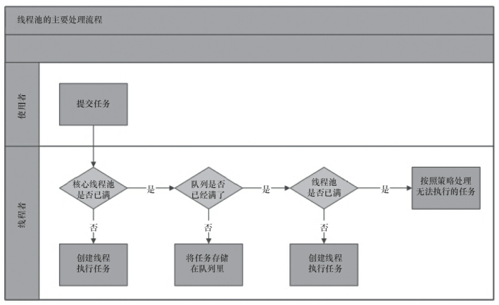

<span id="menu">


<!-- TOC -->

- [1. 多线程](#1-多线程)
    - [1.1. 基本概念](#11-基本概念)
    - [1.2. Java多线程](#12-java多线程)
        - [1.2.1. 实现方式](#121-实现方式)
        - [1.2.2. 基本属性](#122-基本属性)
        - [1.2.3. 常用方法](#123-常用方法)
        - [1.2.4. 生命周期 & 线程状态](#124-生命周期--线程状态)
        - [1.2.5. 线程异常处理](#125-线程异常处理)
            - [1.2.5.1. 实现方式](#1251-实现方式)
            - [1.2.5.2. 原理](#1252-原理)
        - [1.2.6. 线程监控工具](#126-线程监控工具)
        - [1.2.7. 有关并行的两个重要定律](#127-有关并行的两个重要定律)
            - [1.2.7.1. Amdahl(阿姆达尔)定律](#1271-amdahl阿姆达尔定律)
            - [1.2.7.2. Gustafson定律](#1272-gustafson定律)
    - [1.3. Synchronized](#13-synchronized)
        - [1.3.1. 基本概念](#131-基本概念)
        - [1.3.2. 基本使用](#132-基本使用)
        - [1.3.3. 实现原理](#133-实现原理)
    - [1.4. 线程间通信](#14-线程间通信)
        - [1.4.1. 基本概念](#141-基本概念)
        - [1.4.2. 实现消费者和生产者](#142-实现消费者和生产者)
    - [1.5. 线程阻塞工具LockSuport](#15-线程阻塞工具locksuport)
    - [1.6. 线程同步机制](#16-线程同步机制)
        - [1.6.1. 线程同步机制概述](#161-线程同步机制概述)
        - [1.6.2. 锁概述](#162-锁概述)
        - [1.6.3. 内部锁Synchronized](#163-内部锁synchronized)
            - [1.6.3.1. 基本概念](#1631-基本概念)
            - [1.6.3.2. 实现原理](#1632-实现原理)
        - [1.6.4. 显示锁Lock](#164-显示锁lock)
            - [1.6.4.1. 基本使用](#1641-基本使用)
            - [1.6.4.2. 实现原理](#1642-实现原理)
        - [1.6.5. 内存屏障](#165-内存屏障)
            - [1.6.5.1. 基本概念](#1651-基本概念)
            - [1.6.5.2. 标准](#1652-标准)
            - [1.6.5.3. x86架构的内存屏障](#1653-x86架构的内存屏障)
            - [1.6.5.4. volatile如何解决内存可见性与处理器重排序问题](#1654-volatile如何解决内存可见性与处理器重排序问题)
            - [1.6.5.5. JVM对内存屏障作出的其他封装](#1655-jvm对内存屏障作出的其他封装)
        - [1.6.6. 锁与重排序](#166-锁与重排序)
        - [1.6.7. 提高锁性能方案](#167-提高锁性能方案)
        - [1.6.8. Java虚拟机的锁优化](#168-java虚拟机的锁优化)
            - [1.6.8.1. 自旋锁和自适应自旋锁](#1681-自旋锁和自适应自旋锁)
            - [1.6.8.2. 锁消除](#1682-锁消除)
            - [1.6.8.3. 锁粗化](#1683-锁粗化)
            - [1.6.8.4. 轻量级锁](#1684-轻量级锁)
            - [1.6.8.5. 偏向锁](#1685-偏向锁)
    - [1.7. 并发编程的挑战](#17-并发编程的挑战)
        - [1.7.1. 上下文切换](#171-上下文切换)
        - [1.7.2. 死锁](#172-死锁)
        - [1.7.3. 饥饿](#173-饥饿)
        - [1.7.4. 活锁](#174-活锁)
        - [1.7.5. 内存同步](#175-内存同步)
        - [1.7.6. 阻塞](#176-阻塞)
        - [1.7.7. 资源的争用与调度](#177-资源的争用与调度)
    - [1.8. Java内存模型](#18-java内存模型)
        - [1.8.1. Java内存模型基础](#181-java内存模型基础)
            - [1.8.1.1. Java内存模型带来的问题](#1811-java内存模型带来的问题)
        - [1.8.2. 重排序](#182-重排序)
            - [1.8.2.1. 基本概念](#1821-基本概念)
            - [1.8.2.2. 指令重排序](#1822-指令重排序)
            - [1.8.2.3. 存储子系统重构排序](#1823-存储子系统重构排序)
        - [1.8.3. volatile的内存语义](#183-volatile的内存语义)
            - [1.8.3.1. volatile的定义与实现原理](#1831-volatile的定义与实现原理)
        - [1.8.4. 锁的内存语义](#184-锁的内存语义)
        - [1.8.5. final的内存语义](#185-final的内存语义)
        - [1.8.6. happens-before](#186-happens-before)
        - [1.8.7. 双重检查锁定与延迟初始化](#187-双重检查锁定与延迟初始化)
        - [1.8.8. Java内存模型综述](#188-java内存模型综述)
    - [1.9. ThreadLocal](#19-threadlocal)
        - [1.9.1. 基本概念和使用](#191-基本概念和使用)
        - [1.9.2. 原理说明](#192-原理说明)
    - [1.10. 并发容器和框架](#110-并发容器和框架)
        - [1.10.1. 常见的并发容器](#1101-常见的并发容器)
        - [1.10.2. Fork/Join框架](#1102-forkjoin框架)
            - [1.10.2.1. 基本概念](#11021-基本概念)
            - [1.10.2.2. 工作窃取算法](#11022-工作窃取算法)
            - [1.10.2.3. Fork/Join框架的设计](#11023-forkjoin框架的设计)
            - [1.10.2.4. 例子](#11024-例子)
            - [1.10.2.5. Fork/Join框架的异常处理](#11025-forkjoin框架的异常处理)
            - [1.10.2.6. 实现原理](#11026-实现原理)
    - [1.11. 原子操作类](#111-原子操作类)
        - [1.11.1. CAS算法](#1111-cas算法)
        - [1.11.2. Unsafe类](#1112-unsafe类)
            - [1.11.2.1. 基本概念](#11121-基本概念)
            - [1.11.2.2. 获取实例](#11122-获取实例)
            - [1.11.2.3. 常用方法](#11123-常用方法)
            - [1.11.2.4. Unsafe 类的使用场景](#11124-unsafe-类的使用场景)
        - [1.11.3. 原子更新基本类型](#1113-原子更新基本类型)
        - [1.11.4. 原子更新数组](#1114-原子更新数组)
        - [1.11.5. 原子更新引用类型](#1115-原子更新引用类型)
        - [1.11.6. 原子更新字段类](#1116-原子更新字段类)
    - [1.12. Future模式](#112-future模式)
        - [1.12.1. Future](#1121-future)
        - [1.12.2. FutureTask](#1122-futuretask)
        - [1.12.3. CompletableFuture](#1123-completablefuture)
            - [1.12.3.1. 创建 CompletableFuture](#11231-创建-completablefuture)
            - [1.12.3.2. 在 CompletableFuture 转换和运行](#11232-在-completablefuture-转换和运行)
            - [1.12.3.3. 组合两个CompletableFuture](#11233-组合两个completablefuture)
            - [1.12.3.4. 组合多个CompletableFuture](#11234-组合多个completablefuture)
            - [1.12.3.5. CompletableFuture 异常处理](#11235-completablefuture-异常处理)
    - [1.13. 并发工具类](#113-并发工具类)
        - [1.13.1. 等待多线程完成的CountDownLatch](#1131-等待多线程完成的countdownlatch)
            - [1.13.1.1. 基本概念](#11311-基本概念)
            - [1.13.1.2. 实现原理](#11312-实现原理)
        - [1.13.2. 同步屏障CyclicBarrier](#1132-同步屏障cyclicbarrier)
            - [1.13.2.1. 实现原理](#11321-实现原理)
        - [1.13.3. 控制并发线程数的Semaphore](#1133-控制并发线程数的semaphore)
            - [1.13.3.1. 基本概念](#11331-基本概念)
            - [1.13.3.2. 实现原理](#11332-实现原理)
        - [1.13.4. 线程间交换数据的Exchanger](#1134-线程间交换数据的exchanger)
        - [1.13.5. FutureTask](#1135-futuretask)
            - [1.13.5.1. Callable与Runnable](#11351-callable与runnable)
            - [1.13.5.2. Future](#11352-future)
            - [1.13.5.3. FutureTask](#11353-futuretask)
            - [1.13.5.4. 使用示例](#11354-使用示例)
    - [1.14. 线程池](#114-线程池)
        - [1.14.1. 线程池的实现原理](#1141-线程池的实现原理)
        - [1.14.2. 线程池的使用](#1142-线程池的使用)
        - [1.14.3. 提交任务](#1143-提交任务)
        - [1.14.4. 关闭线程池](#1144-关闭线程池)
        - [1.14.5. 合理地配置线程池](#1145-合理地配置线程池)
        - [1.14.6. 线程池的监控](#1146-线程池的监控)
    - [1.15. ForkJoinPool类](#115-forkjoinpool类)
    - [1.16. Executor框架](#116-executor框架)
        - [1.16.1. Executor体系](#1161-executor体系)
        - [1.16.2. Executors](#1162-executors)
    - [1.17. 并发编程实战](#117-并发编程实战)
    - [1.18. 队列](#118-队列)
        - [1.18.1. JDK队列概述](#1181-jdk队列概述)
        - [1.18.2. DelayedWorkQueue](#1182-delayedworkqueue)

<!-- /TOC -->

# 1. 多线程
## 1.1. 基本概念
<a href="#menu"  >目录</a>

* 进程
    * 受操作系统管理和资源分配的基本单元，进程之间的内存空间是相互独立的。
* 线程
    * 进程中独立运行的子任务，线程共享进程内存空间。
* 串行&并行&并发
    * 串行:一个任务执行完再去执行其他任务
    * 并行:任务交替执行，就好象同时执行一样
    * 并发:任务同步执行，多核CPU的计算机，可以同步执行任务
* 使用多线程
    * 优点
        * 多核CPU的时候，可以有效利用多核提高程序执行效率
        * 在程序任务阻塞的场景下，利用多线程执行其他任务，提高执行效率
    * 缺点
        * 上下文切换时的时间开销
            * vmstat(unix)和perfmon(win)可以查看
        * 需要保证内存同步
* 临界区
    * 临界区用来表示一种公共资源或者共享数据
* 线程安全
    * 一段操纵共享数据的代码能够保证在同一时间内被多个线程执行而仍然能够保持其正确性，就被称为是线程安全的

* 死锁
    * 多个线程阻塞在临界区，都无法获取到锁，程序无法继续执行
* 饥饿锁
    * 一个线程因为种种原因无法获取到所需要的资源，导致一直无法执行，比如线程优先级低。
* 活锁
    * 主动将资源让给他人而自己无法执行。
* 并发级别
    * 阻塞
    * 无饥饿
    * 无障碍
    * 无锁
    * 无等待
* JMM模型
    * 原子性
        * 一组不能够被打断的操作具有原子性
    * 可见性
        * 一个线程修改了某个变量的值，其他线程是否能改看到该值的变化
    * 有序性
        * 在执行程序时，为了提高性能，编译器和处理器常常会对指令进行重排序
    * Happen-before原则
        * 程序顺序规则：一个线程中的每个操作，happens-before于该线程中的任意后续操作。
        * 监视器锁规则：对一个锁的解锁，happens-before于随后对这个锁的加锁。
        * volatile变量规则：对一个volatile域的写，happens-before于任意后续对这个volatile域的读。
        * 传递性：如果A happens-before B，且B happens-before C，那么A happens-before C。
        * start()规则：如果线程A执行操作ThreadB.start()（启动线程B），那么A线程的ThreadB.start()操作happens-before于线程B中的任意操作。
        * Join()规则：如果线程A执行操作ThreadB.join()并成功返回，那么线程B中的任意操作happens-before于线程A从ThreadB.join()操作成功返回。
        * 程序中断规则：对线程interrupted()方法的调用先行于被中断线程的代码检测到中断时间的发生。
        * 对象finalize规则：一个对象的初始化完成（构造函数执行结束）先行于发生它的finalize()方法的开始

* 发布和逸出
    * 发布
        * 使对象能够在当前作用域之外的代码中使用
            * 将一个指向该对象的引用保存到其他代码可以访问的地方
            * 在某一个非私有的方法中返回该引用
            * 将引用传递到其他类的方法中
        * 发布可能会影响线程安全性
    * 逸出
        * 当某个不应该发布的对象被发布时，就叫做逸出

* 解决线程安全问题
    * 使用各种锁来实现同步
    * 线程封闭
        * 共享可变数据会存在线程安全问题，避免线程安全问题可以不共享该数据，也就是线程封闭。比如说局部变量。ThreadLocal实现。
    * 使用不可变对象，也就是只读变量


## 1.2. Java多线程
<a href="#menu"  >目录</a>

### 1.2.1. 实现方式
**方式1:继承Thread类**
```java

class MyThread1  extends Thread{
    @Override
    public void run() {
        System.out.println("MyThread1");
    }
}

 public  static  void stype1(){

        Thread thread = new MyThread1();
        thread.start();
 }
```
**方式2:实现Runnable**
```java
class MyThread2  implements Runnable{

    public void run() {
        System.out.println("MyThread2");
    }
}
 public  static  void stype1(){

    MyThread2 thread2 = new MyThread2();
    Thread  th =  new Thread(thread2);
    th.start();
 }
```
**方式3:实现Callable**
```java

class MyThread3  implements Callable {

    public Object call() throws Exception {
        System.out.println("MyThread3");
        return 123;
    }

}
 public  static  void stype1(){

    MyThread3 thread3 = new MyThread3();

    FutureTask<Integer> result = new FutureTask<Integer>(thread3);
    Thread  th1 =  new Thread(result);
    th1.start();

    try{
        System.out.println( result.get());
    }
    catch(Exception ex){

    }
}
```

*   Callable和Runnable的区别
```java
public interface Callable<V> {
    /**
     * Computes a result, or throws an exception if unable to do so.
     *
     * @return computed result
     * @throws Exception if unable to compute a result
     */
    V call() throws Exception;
}
public interface Runnable {
    /**
     * When an object implementing interface <code>Runnable</code> is used
     * to create a thread, starting the thread causes the object's
     * <code>run</code> method to be called in that separately executing
     * thread.
     * <p>
     * The general contract of the method <code>run</code> is that it may
     * take any action whatsoever.
     *
     * @see     java.lang.Thread#run()
     */
    public abstract void run();
}
```
通过Callable配合Future类可以获取线程的执行结果。

### 1.2.2. 基本属性
* 线程名称，主线程为main，其他线程为Thread-1,Thread-2,可自定义，用于区分不同的线程。
* 线程分组
* 线程优先级
* 守护线程标志，默认为非守护线程

### 1.2.3. 常用方法

* run & start
    * run 方法是Runable接口的方法，是线程执行任务的方法，线程类需要实现该方法
    * start 是Thread类的方法，用于告知操作系统需要启动该线程，至于何时执行run中的任务代码，由操作系统决定
    * 直接调用run方法相当于调用一个普通方法，不会以多线程方式执行。
    * start只能允许调用一次，多次调用将会抛出异常
* yield
    * 该方法让线程放弃CPU，让其它线程执行，何时能改继续执行由操作系统决定，可能调用之后右获得继续执行，也可能等待其他任务执行

* sleep 
    * 线程进入睡眠状态，不会释放持有的锁
    * 如果线程被中断，将会抛出InterruptedException异常

* stop
    * 退出当前线程，调用之后线程任务将不会再被执行
    * 由于是强制退出，由可能会造成数据不一致，资源没释放等问题，不建议使用


* interrupt
    * 中断线程，并不会造成线程暂停问题，会将中断标志位置位
    * 如果线程中正在调用能够抛出异常InterruptedException的方法，将会抛出该异常

*  interrupted & isInterrupted
    * interrupted 是静态方法，测试当前线程(调用代码所在的线程)是否被中断
    * isInterrupted 测试调用线程是否被中断
    * 可以使用中断来实现优雅停止线程，其他线程中断要被停止的线程，被停止的线程循环检测中断位，有中断则抛出异常，在捕获代码里执行释放资源等操作

* suspend & resume
    * suspend 暂停阻塞线程执行
    * resume 恢复线程执行
    * 由于suspend不会释放锁持有的锁，使其他线程无法访问该资源
    * 假如resume没能执行，将会造成严重的死锁，所以不推荐使用这两个方法

* setDaemon 
    * 守护线程设置，默认为非守护线程
    * 该方法必须在调用start之前执行，否则将会抛出异常
    * 守护线程在所有非守护线程执行完后将会自动停止，垃圾回收器就是守护线程

* setPriority
    * 线程优先级设置，范围为1-10,默认为5
    * 线程优先级具有继承特性，比如A线程启动B线程，B线程的优先级和A线程一样
    * 线程优先级会映射到操作系统的优先级等级，比如有的操作系统是7个等级的优先级
    * 等级越大，操作系统将会分配更多的时间给该线程，但并不意味着一定先完成

* join
    * 用于等待调用的线程执行结束
    * 内部使用wait实现，所以会释放锁

* join和sleep的区别
    * sleep是直接由native方法实现
    * join内部由wait实现，因此会释放锁。
```java
public static native void sleep(long millis) throws InterruptedException;

//通过isAlive()方法判断线程是否执行结束
//参数为0,则一直等待，
public final synchronized void join(long millis)
    throws InterruptedException {
        long base = System.currentTimeMillis();
        long now = 0;

        if (millis < 0) {
            throw new IllegalArgumentException("timeout value is negative");
        }

        if (millis == 0) {
            while (isAlive()) {
                //参数为0,一直等待
                wait(0);
            }
        } else {
            //
            while (isAlive()) {
                long delay = millis - now;
                if (delay <= 0) {
                    //超时时间到，退出
                    break;
                }
                wait(delay);
                now = System.currentTimeMillis() - base;
            }
        }
    }
```

**子线程异常处理**

* 第一种，直接在子线程中使用try-catch解决

* 第二种，通获取是Future模式获取

* 第三种，通过Thread类的UncaughtExceptionHandler统一处理

```java
public interface UncaughtExceptionHandler {
        /**
         * Method invoked when the given thread terminates due to the
         * given uncaught exception.
         * <p>Any exception thrown by this method will be ignored by the
         * Java Virtual Machine.
         * @param t the thread
         * @param e the exception
         */
        void uncaughtException(Thread t, Throwable e);
    }
```
例子
```java
public class ChildThread implements Runnable {    
    private static ChildThreadExceptionHandler exceptionHandler;

    static {
        exceptionHandler = new ChildThreadExceptionHandler();
    }

    public void run() {
        Thread.currentThread().setUncaughtExceptionHandler(exceptionHandler);
        System.out.println("do something 1");
        exceptionMethod();
        System.out.println("do something 2");
    }

    public static class ChildThreadExceptionHandler implements Thread.UncaughtExceptionHandler {
        public void uncaughtException(Thread t, Throwable e) {
            System.out.println(String.format("handle exception in child thread. %s", e));
        }
    }
}
```
或者，设置所有线程的默认异常处理器
```java
public class ChildThread implements Runnable {
    private static ChildThreadExceptionHandler exceptionHandler;

    static {
        exceptionHandler = new ChildThreadExceptionHandler();
        Thread.setDefaultUncaughtExceptionHandler(exceptionHandler);
    }

    public void run() {
        System.out.println("do something 1");
        exceptionMethod();
        System.out.println("do something 2");
    }

    private void exceptionMethod() {
        throw new RuntimeException("ChildThread exception");
    }

    public static class ChildThreadExceptionHandler implements Thread.UncaughtExceptionHandler {
        public void uncaughtException(Thread t, Throwable e) {
            System.out.println(String.format("handle exception in child thread. %s", e));
        }
    }
}
```
### 1.2.4. 生命周期 & 线程状态

* 线程创建
* 线程运行
    * 使用start方法，向操作系统提交线程任务
* 线程结束
    * 调用 stop ,不推荐
    * run方法正常执行完
    * 直接调用return返回
    * 使用中断法，在捕获里面处理好后再嗲用return结束线程。
    * 抛出未捕获的异常或者error

* 线程状态

* New
    * 新建状态。创建线程后但还未调用start时的状态
* Runnable
    * 可运行状态。要么处于执行状态，要么由于线程切换等待状态

* Waiting & Timed  Waiting
    * 等待阶段。将释放线程锁持有的锁

* Block
    * 阻塞状态。不会释放线程所持有的锁
* Terminated
    * 结束状态

### 1.2.5. 线程异常处理
<a href="#menu"  >目录</a>

#### 1.2.5.1. 实现方式

如果线程中出现异常，父线程想获取子线程的异常，可以通过UncaughtExceptionHandler类来实现

方式1：设置所有线程的异常处理
```java
Thread.setDefaultUncaughtExceptionHandler(new Thread.UncaughtExceptionHandler() {
    @Override
    public void uncaughtException(Thread t, Throwable e) {
        System.out.println("DefaultUncaughtExceptionHandler:"+ t.getName()+ "  "+ e.getMessage());
    }
});
```
方式2：设置单个线程的异常处理
```java
task.setUncaughtExceptionHandler(new Thread.UncaughtExceptionHandler() {
    @Override
    public void uncaughtException(Thread t, Throwable e) {

        System.out.println("UncaughtExceptionHandler:"+ t.getName()+ "  "+ e.getMessage());
    }
});
```

当上面两种方式同时存在时，只有第二种方式被调用．

#### 1.2.5.2. 原理

当发生异常时，虚拟机将会调用Thread类的dispatchUncaughtException
```java
/**
* Dispatch an uncaught exception to the handler. This method is
* intended to be called only by the JVM.
*/
private void dispatchUncaughtException(Throwable e) {
    getUncaughtExceptionHandler().uncaughtException(this, e);
}
```

当应用代码中调用了setUncaughtExceptionHandler设置自定义异常处理，则返回所设置的值，否则将会返回ThreadGroup的变量，该变量是UncaughtExceptionHandler的子类．
```java
 public UncaughtExceptionHandler getUncaughtExceptionHandler() {
        return uncaughtExceptionHandler != null ?
            uncaughtExceptionHandler : group;
    }
```

而ThreadGroup中自定义了uncaughtException方法
```java
public void uncaughtException(Thread t, Throwable e) {
    if (parent != null) {
        parent.uncaughtException(t, e);
    } else {
        Thread.UncaughtExceptionHandler ueh =
            Thread.getDefaultUncaughtExceptionHandler();
        if (ueh != null) {
            //调用用户定义的uncaughtException
            ueh.uncaughtException(t, e);
        } else if (!(e instanceof ThreadDeath)) {
            System.err.print("Exception in thread \""
                                + t.getName() + "\" ");
            e.printStackTrace(System.err);
        }
    }
}
```

### 1.2.6. 线程监控工具
<a href="#menu"  >目录</a>

* jstack
查看线程的状态，优先级，可以检测是否存在死锁
```
//使用jps查看Java应用的pid
lgj@lgj-Lenovo-G470:~/aProject/aRealPrj/Java-Interview$ jps
13872 RemoteMavenServer
15121 SpringSchedulerApplication
12642 Main
3349 Jps
//jstack查看线程情况
lgj@lgj-Lenovo-G470:~/aProject/aRealPrj/Java-Interview$ jstack 13872
2019-07-05 14:51:57
Full thread dump OpenJDK 64-Bit Server VM (25.152-b26 mixed mode):

"Attach Listener" #288 daemon prio=9 os_prio=0 tid=0x00007f6e60001000 nid=0xd4b runnable [0x0000000000000000]
   java.lang.Thread.State: RUNNABLE

"RMI Scheduler(0)" #17 daemon prio=5 os_prio=0 tid=0x00007f6e38015800 nid=0x364f waiting on condition [0x00007f6e7fcdf000]
   java.lang.Thread.State: TIMED_WAITING (parking)
	at sun.misc.Unsafe.park(Native Method)
	- parking to wait for  <0x00000000d00a2f88> (a java.util.concurrent.locks.AbstractQueuedSynchronizer$ConditionObject)
	at java.util.concurrent.locks.LockSupport.parkNanos(LockSupport.java:215)
	at java.util.concurrent.locks.AbstractQueuedSynchronizer$ConditionObject.awaitNanos(AbstractQueuedSynchronizer.java:2078)
	at java.util.concurrent.ScheduledThreadPoolExecutor$DelayedWorkQueue.take(ScheduledThreadPoolExecutor.java:1093)
	at java.util.concurrent.ScheduledThreadPoolExecutor$DelayedWorkQueue.take(ScheduledThreadPoolExecutor.java:809)
	at java.util.concurrent.ThreadPoolExecutor.getTask(ThreadPoolExecutor.java:1067)
	at java.util.concurrent.ThreadPoolExecutor.runWorker(ThreadPoolExecutor.java:1127)
	at java.util.concurrent.ThreadPoolExecutor$Worker.run(ThreadPoolExecutor.java:617)
	at java.lang.Thread.run(Thread.java:745)

"VM Thread" os_prio=0 tid=0x00007f6ea007b800 nid=0x3636 runnable 

"GC task thread#0 (ParallelGC)" os_prio=0 tid=0x00007f6ea0023800 nid=0x3632 runnable 

"GC task thread#1 (ParallelGC)" os_prio=0 tid=0x00007f6ea0025000 nid=0x3633 runnable 

"GC task thread#2 (ParallelGC)" os_prio=0 tid=0x00007f6ea0027000 nid=0x3634 runnable 

"GC task thread#3 (ParallelGC)" os_prio=0 tid=0x00007f6ea0028800 nid=0x3635 runnable 

"VM Periodic Task Thread" os_prio=0 tid=0x00007f6ea00cb000 nid=0x363e waiting on condition 

JNI global references: 200

```
* jconsole,jvisual 
集成多个java命令，通过界面查看各个状态

### 1.2.7. 有关并行的两个重要定律
<a href="#menu"  >目录</a>

有关为什么要使用并行程序的问题前面已经进行了简单的探讨。总的来说，最重要的应该是处于两个目的。
* 第一，为了获得更好的性能；
* 第二，由于业务模型的需要，确实需要多个执行实体。

在这里，我将更加关注第一种情况，也就是有关性能的问题。将串行程序改造为并发程序，一般来说可以提高程序的整体性能，但是究竟能提高多少，甚至说究竟是否真的可以提高，还是一个需要研究的问题。目前，主要有两个定律对这个问题进行解答，一个是Amdahl定律，另外一个是Gustafson定律。

#### 1.2.7.1. Amdahl(阿姆达尔)定律
Amdahl定律是计算机科学中非常重要的定律。它定义了串行系统并行化后的加速比的计算公式和理论上线。

**加速比定义**：加速比 = 优化前系统耗时 / 优化后系统耗时

所谓加速比就是优化前耗时与优化后耗时的比值。加速比越高，表明优化效果越明显。图1.8显示了Amdahl公式的推到过程，其中n表示处理器个数，T表示时间，T1表示优化前耗时(也就是只有1个处理器时的耗时)，Tn表示使用n个处理器优化后的耗时。F是程序中只能串行执行的比例。


根据这个公式，如果CPU处理器数量趋于无穷，那么加速比与系统的串行化比例成反比，如果系统中必须有50%的代码串行执行，那么系统的最大加速比为2。

假设有一个程序分为以下步骤执行，每个执行步骤花费100个单位时间。其中，只有步骤2和步骤5可以并行，步骤1、3、4必须串行，如图1.9所示。在全串行的情况下，系统合计耗时为500个单位时间。


若步骤2和步骤5并行化，假设在双核处理器上，则有如图1.10所示的处理流程。在这种情况下，步骤2和步骤5的耗时将为50个单位时间。故系统整体耗时为400个单位时间。根据加速比的定义有：

加速比 = 优化前系统耗时 / 优化后系统耗时 = 500/400 = 1.25


由于5个步骤中，3个步骤必须串行，因此其串行化比例为3/5=0.6，即 F = 0.6，且双核处理器的处理器个数N为2。代入加速比公式得：

加速比 = 1/(0.6+(1-0.6)/2)=1.25

在极端情况下，假设并行处理器个数为无穷大，则有如图1.11所示的处理过程。步骤2和步骤5的处理时间趋于0。即使这样，系统整体耗时依然大于300个单位时间。使用加速比计算公式，N趋于无穷大，有加速比 = 1/F，且F=0.6，故有加速比=1.67。即加速比的极限为500/300=1.67。

由此可见，为了提高系统的速度，仅增加CPU处理的数量并不一定能起到有效的作用。需要从根本上修改程序的串行行为，提高系统内可并行化的模块比重，在此基础上，合理增加并行处理器数量，才能以最小的投入，得到最大的加速比。


注意：根据Amdahl定律，使用多核CPU对系统进行优化，优化的效果取决于CPU的数量，以及系统中串行化程序的比例。CPU数量越多，串行化比例越低，则优化效果越好。仅提高CPU数量而不降低程序的串行化比例，也无法提高系统的性能。

**阿姆达尔定律图示**

为了更好地理解阿姆达尔定律，我会尝试演示这个定定律是如何诞生的。

首先，一个程序可以被分割为两部分，一部分为不可并行部分B，一部分为可并行部分1 – B。如下图：


在顶部被带有分割线的那条直线代表总时间 T(1)。

下面你可以看到在并行因子为2的情况下的执行时间：


并行因子为3的情况：


**举个例子**

一个业务会串行调用2个方法，m1，m2，m1耗时100ms，m2耗时400ms，m2内部串行执行了4个无依赖的任务，每个任务100ms，如下图：


m2内部的4个任务无依赖的，即可以并行进行处理，4个任务同时并行，当cpu数量大于等于4的时候，可以让4个任务同时进行，此时m2耗时最小，即100ms，cpu为2个的时候，同时只能够执行2个任务，其他2个任务处于等待cpu分配时间片状态，此时m2耗时200ms；当cpu超过4个的时候，或者趋于无限大的时候，m2耗时还是100ms，此时cpu数量再怎么增加对性能也没有提升了，此时需要提升的是任务可以并行的数量。

从阿姆达尔定律可以看出，程序的可并行化部分可以通过使用更多的硬件（更多的线程或CPU）运行更快。对于不可并行化的部分，只能通过优化代码来达到提速的目的。因此，你可以通过优化不可并行化部分来提高你的程序的运行速度和并行能力。你可以对不可并行化在算法上做一点改动，如果有可能，你也可以把一些移到可并行化放的部分。

#### 1.2.7.2. Gustafson定律
Gustafson定律也试图说明处理器个数、串行化比例和加速比之间的关系，如图1.12所示，但是Gustafson定律和Amdahl定律的角度不同。同样，加速比都被定义为优化前的系统耗时除以优化后的系统耗时。


根据Gustafson定律，我们可以更容易地发现，如果串行化比例很小，并行化比例很大，那么加速比就是处理器的个数。只要不断地累加处理器，就能获得更快的速度。

Amdahl定律和Gustafson定律结论有所不同，并不是说其中有个是错误的，只是二者从不同的角度去看待问题的结果，他们的侧重点有所不同。

Amdahl强调：当串行换比例一定时，加速比是有上限的，不管你堆叠多少个CPU参与计算，都不能突破这个上限。
Gustafson定律关系的是：如果可被并行化的代码所占比例足够大，那么加速比就能随着CPU的数量线性增长。

总的来说，提升性能的方法：想办法提升系统并行的比例，同时增加CPU数量

## 1.3. Synchronized
<a href="#menu"  >目录</a>

### 1.3.1. 基本概念
* 为什么要同步
看一个简单的例子：
```java
i++;
```
这条语句实际上主要包含了三个操作。
1.从内存中获取i值
2.对i进行自增操作
3.将新值写入内存中

这三个操作不具有原子性，任何操作之间都有可能执行其他指令，最终导致结果出现错误,也就是非线程安全。
因此需要对这个i++操作进行同步，同一时刻只能有一个线程访问该操作。Java中能实现这个功能的有使用Synchronized和Lock.
本节讲解的是Synchronized.

**线程安全：**如果一个操作在多线程和单线程环境下执行，都具备相同的执行结果和正确性，则说明该操作是线程安全的。
**临界区:**被同步的代码
**重入锁：**可重入特性是指当一个线程获取到了对象的锁，再次申请时也可以获取到该锁。Synchronized和Lock都具有可重入特性。可重入特性避免了死锁的发生。
比如如下例子
同步方法func1调用同步方法func2，即使两个都使用synchronized进行加锁，虽然是同一把锁，监视器都是同一个对象，但是func2还是能执行,因为具备了可重入特性。
```java
class Service{

    public synchronized void func1(){
        this.func2();
    }
    public synchronized void func2(){
      
    }

}
```

* Synchronized不具有继承性，也就是父类方法使用synchronized进行同步，如果子类重写的方法也要具备同步，是需要添加synchronized的。
* synchronized具有可重入特性  
* 发生未捕获的异常时，线程将会释放锁并退出。

### 1.3.2. 基本使用
* 同步语句
**同步方法**
```java
class Service{
    private int count;
    public synchronized void inc(){
        count++;
    }
}
```
* 如果同步的是普通方法，则同步对象为当前对象
* 如果同步的是静态方法，则同步对象为类

* 同步语句
**同步语句**
```java
//同步当前调用对象
class Service{
    private int count;
    public  void inc(){
        synchronized(this){
            count++;
        }
       
    }
}

//同步lock属性
class Service{
    private int count;
    private String lock="lock";

    public  void inc(){
        synchronized(lock){
            count++;
        } 
       
    }
}

//同步Service类
class Service{
    private int count;
    private String lock="lock";

    public  void inc(){
        synchronized(Service.class){
            count++;
        }
       
    }
}

```
使用Synchronized需要关注的是哪些方法/临界区会互斥，主要看一点，监视器是否一样
1. Synchronized 修饰普通方法，那么监视器是当前对象
2. Synchronized(this) 同步语句块，监视器是调用该方法的对象
3. Synchronized(Service.class) ，监视器是Service类
4. Synchronized修饰Service 的静态方法，那么监视器也是Service类
5. Synchronized(obj) ,监视器就是obj对象

只要监视器一样，那么多线程调用将会发生同步。

如下一个例子，由于监视器都是对象a,
因此同时不同线程调用
a.func();
b.func(); 
将会发生互斥。

```java
class A {

    public synchronized void func(){

    } 
}

class B {

    private A a ;
    
    public B(A a){
        this.a = a;
    }
    public  void func(){

        synchronized(a){
            try{

                Thread.sleep(10000);
            }catch(ex){

            }
        }

    } 
}
class ThreadService extends Thread{
    private B b;
    public ThreadService(B b){
        this.b = b;
    }   
    public void run(){
         b.func();  
    }

}
main(){
   A  a = new A();
   B b = new B(a);

    new ThreadService(b).start(); 
    a.func();
  
}
```


* 死锁例子
死锁是两个线程互相持有对方的锁，导致两个线程无法继续执行。
如下例子，两个线程同时执行，ServiceA和ServiceB的方法task同时被调用，两个对方又在等待对方释放自己需要的锁，无法继续往下执行，便发生了死锁。
```java
class ServiceA{
    
    private String lock1;
    private String lock2;

    public ServiceA(String lock1,String lock2){
        this.lock1 = lock1;
        this.lock2 = lock2;
    }

    public  void task(){
        try{
            synchronized(lock1){
                Thread.sleep(5);

                synchronized(lock2){
                    Thread.sleep(5);                
                }
            }
        }
        catch(ex){
        }        
    }
}

class ServiceAThread extends Thread{
    
    ServiceA serviceA;

    public ServiceAThread(ServiceA serviceA){
        this.serviceA = serviceA;
    }

    public void run(){
        serviceA.task();
    }
}

class ServiceB{
    
    private String lock1;
    private String lock2;

    public ServiceB(String lock1,String lock2){
        this.lock1 = lock1;
        this.lock2 = lock2;
    }

    public  void task(){
        try{
            synchronized(lock2){
                Thread.sleep(5);

                synchronized(lock1){
                    Thread.sleep(5);                
                }
            }
        }
        catch(ex){
        }        
    }
}

class ServiceBThread extends Thread{
    
    ServiceB serviceB;

    public ServiceBThread(ServiceB serviceB){
        this.serviceB = serviceB;
    }

    public void run(){
        serviceB.task();
    }
}

//测试
main(){
    
    String lock1 = "lock1";
    String lock2 = "lock2";

    ServiceA serviceA = new ServiceA(lock1,lock2);
    ServiceB serviceB = new ServiceB(lock1,lock2);

    ServiceAThread serviceAThread = new ServiceAThread();
    ServiceBThread serviceBThread = new ServiceBThread();

    serviceAThread.start();
    serviceBThread.start();
}


```
### 1.3.3. 实现原理
Java 虚拟机中的同步(Synchronization)基于进入和退出Monitor对象实现， 无论是显式同步(有明确的 monitorenter 和 monitorexit 指令,即同步代码块)还是隐式同步都是如此。在 Java 语言中，同步用的最多的地方可能是被 synchronized 修饰的同步方法。同步方法 并不是由 monitorenter 和 monitorexit 指令来实现同步的，而是由方法调用指令读取运行时常量池中方法表结构的 ACC_SYNCHRONIZED 标志来隐式实现的，关于这点，稍后详细分析。
同步代码块：monitorenter指令插入到同步代码块的开始位置，monitorexit指令插入到同步代码块的结束位置，JVM需要保证每一个monitorenter都有一个monitorexit与之相对应。任何对象都有一个monitor与之相关联，当且一个monitor被持有之后，他将处于锁定状态。线程执行到monitorenter指令时，将会尝试获取对象所对应的monitor所有权，即尝试获取对象的锁；
在JVM中，对象在内存中的布局分为三块区域：对象头、实例变量和填充数据。如下：
堆内存(实例对象(对象头，实例变量，填充数据))

* 实例变量
    * 存放类的属性数据信息，包括父类的属性信息，如果是数组的实例部分还包括数组的长度，这部分内存按4字节对齐。
* 填充数据
    * 由于虚拟机要求对象起始地址必须是8字节的整数倍。填充数据不是必须存在的，仅仅是为了字节对齐，这点了解即可。
* 对象头
    * Hotspot虚拟机的对象头主要包括两部分数据：Mark Word（标记字段）、Klass Pointer（类型指针）。
    其中Klass Point是是对象指向它的类元数据的指针，虚拟机通过这个指针来确定这个对象是哪个类的实例，Mark Word用于存储对象自身的运行时数据，它是实现轻量级锁和偏向锁的关键。
* Mark Word
    * 用于存储对象自身的运行时数据，如哈希码（HashCode）、GC分代年龄、锁状态标志、线程持有的锁、偏向线程 ID、偏向时间戳等等。
    Java对象头一般占有两个机器码（在32位虚拟机中，1个机器码等于4字节，也就是32bit），但是如果对象是数组类型，则需要三个机器码，
    因为JVM虚拟机可以通过Java对象的元数据信息确定Java对象的大小，但是无法从数组的元数据来确认数组的大小，所以用一块来记录数组长度。
* Monior
    * 我们可以把它理解为一个同步工具，也可以描述为一种同步机制，它通常被描述为一个对象。与一切皆对象一样，所有的Java对象是天生的Monitor，
    每一个Java对象都有成为Monitor的潜质，因为在Java的设计中 ，每一个Java对象自打娘胎里出来就带了一把看不见的锁，它叫做内部锁或者Monitor锁。
    Monitor 是线程私有的数据结构，每一个线程都有一个可用monitor record列表，同时还有一个全局的可用列表。
    每一个被锁住的对象都会和一个monitor关联（对象头的MarkWord中的LockWord指向monitor的起始地址），
    同时monitor中有一个Owner字段存放拥有该锁的线程的唯一标识，表示该锁被这个线程占用。其结构如下

* Owner：初始时为NULL表示当前没有任何线程拥有该monitor record，当线程成功拥有该锁后保存线程唯一标识，当锁被释放时又设置为NULL；
* EntryQ:关联一个系统互斥锁（semaphore），阻塞所有试图锁住monitor record失败的线程。
* RcThis:表示blocked或waiting在该monitor record上的所有线程的个数。
* Nest:用来实现重入锁的计数。
* HashCode:保存从对象头拷贝过来的HashCode值（可能还包含GC age）。
* Candidate:用来避免不必要的阻塞或等待线程唤醒，因为每一次只有一个线程能够成功拥有锁，如果每次前一个释放锁的线程唤醒所有正在阻塞或等待的线程，会引起不必要的上下文切换（从阻塞到就绪然后因为竞争锁失败又被阻塞）从而导致性能严重下降。Candidate只有两种可能的值0表示没有需要唤醒的线程1表示要唤醒一个继任线程来竞争锁

注意由于synchronized是基于monitor实现的，因此每次重入，monitor中的计数器仍会加1。退出时减1.当为0时说明没有任何线程持有该对象锁。


**Java虚拟机对synchronize的优化：**

锁的状态总共有四种，无锁状态、偏向锁、轻量级锁和重量级锁。随着锁的竞争，锁可以从偏向锁升级到轻量级锁，再升级的重量级锁，但是锁的升级是单向的，也就是说只能从低到高升级，不会出现锁的降级，关于重量级锁，前面我们已详细分析过，下面我们将介绍偏向锁和轻量级锁以及JVM的其他优化手段。

**偏向锁**
偏向锁是Java 6之后加入的新锁，它是一种针对加锁操作的优化手段，经过研究发现，在大多数情况下，锁不仅不存在多线程竞争，而且总是由同一线程多次获得，因此为了减少同一线程获取锁(会涉及到一些CAS操作,耗时)的代价而引入偏向锁。偏向锁的核心思想是，如果一个线程获得了锁，那么锁就进入偏向模式，此时Mark Word 的结构也变为偏向锁结构，当这个线程再次请求锁时，无需再做任何同步操作，即获取锁的过程，这样就省去了大量有关锁申请的操作，从而也就提供程序的性能。所以，对于没有锁竞争的场合，偏向锁有很好的优化效果，毕竟极有可能连续多次是同一个线程申请相同的锁。但是对于锁竞争比较激烈的场合，偏向锁就失效了，因为这样场合极有可能每次申请锁的线程都是不相同的，因此这种场合下不应该使用偏向锁，否则会得不偿失，需要注意的是，偏向锁失败后，并不会立即膨胀为重量级锁，而是先升级为轻量级锁。

**轻量级锁**
倘若偏向锁失败，虚拟机并不会立即升级为重量级锁，它还会尝试使用一种称为轻量级锁的优化手段(1.6之后加入的)，此时Mark Word 的结构也变为轻量级锁的结构。轻量级锁能够提升程序性能的依据是“对绝大部分的锁，在整个同步周期内都不存在竞争”，注意这是经验数据。需要了解的是，轻量级锁所适应的场景是线程交替执行同步块的场合，如果存在同一时间访问同一锁的场合，就会导致轻量级锁膨胀为重量级锁。

**自旋锁**
轻量级锁失败后，虚拟机为了避免线程真实地在操作系统层面挂起，还会进行一项称为自旋锁的优化手段。这是基于在大多数情况下，线程持有锁的时间都不会太长，如果直接挂起操作系统层面的线程可能会得不偿失，毕竟操作系统实现线程之间的切换时需要从用户态转换到核心态，这个状态之间的转换需要相对比较长的时间，时间成本相对较高，因此自旋锁会假设在不久将来，当前的线程可以获得锁，因此虚拟机会让当前想要获取锁的线程做几个空循环(这也是称为自旋的原因)，一般不会太久，可能是50个循环或100循环，在经过若干次循环后，如果得到锁，就顺利进入临界区。如果还不能获得锁，那就会将线程在操作系统层面挂起，这就是自旋锁的优化方式，这种方式确实也是可以提升效率的。最后没办法也就只能升级为重量级锁了。

**锁消除**
消除锁是虚拟机另外一种锁的优化，这种优化更彻底，Java虚拟机在JIT编译时(可以简单理解为当某段代码即将第一次被执行时进行编译，又称即时编译)，通过对运行上下文的扫描，去除不可能存在共享资源竞争的锁，通过这种方式消除没有必要的锁，可以节省毫无意义的请求锁时间，如下StringBuffer的append是一个同步方法，但是在add方法中的StringBuffer属于一个局部变量，并且不会被其他线程所使用，因此StringBuffer不可能存在共享资源竞争的情景，JVM会自动将其锁消除。

等待唤醒机制与synchronize：所谓等待唤醒机制本篇主要指的是notify/notifyAll和wait方法，在使用这3个方法时，必须处于synchronized代码块或者synchronized方法中，否则就会抛出IllegalMonitorStateException异常，这是因为调用这几个方法前必须拿到当前对象的监视器monitor对象，也就是说notify/notifyAll和wait方法依赖于monitor对象，在前面的分析中，我们知道monitor 存在于对象头的Mark Word 中(存储monitor引用指针)，而synchronized关键字可以获取 monitor ，这也就是为什么notify/notifyAll和wait方法必须在synchronized代码块或者synchronized方法调用的原因。


## 1.4. 线程间通信

### 1.4.1. 基本概念
```java
//释放锁，线程任务暂停
public final native void wait() throws InterruptedException;
public final native void wait(long timeout) throws InterruptedException;
public final void wait(long timeout, int nanos) throws InterruptedException;

//通知其中一个线程唤醒
public final native void notify();
//通知所有的线程唤醒
public final native void notifyAll();
```
* 这些方法都是位于Object对象中
* 这些方法必须在synchronized的临界区内被调用，否则将会抛出异常。并且调用wait和notify的必须是同一个对象，才能唤醒。
* 在等待的过程中，如果线程被中断，将会抛出异常InterruptedException。
* 调用wait将会释放锁，sleep将不会释放锁，wait将会随机选择一个线程进行唤醒

### 1.4.2. 实现消费者和生产者


## 1.5. 线程阻塞工具LockSuport
<a href="#menu"  >目录</a>

* LockSuport用于实现线程阻塞。可以在线程内任意位置让线程阻塞。
* 与suspend()相比，弥补了resume()方法没有发生导致的死锁问题。
* 与wait()相比，不需要先获得某个对象的锁。也不会抛出中断异常。
* LockSuport不需要在临界区内才能调用。

**基本原理**
* 类似于许可证设计，但是这个许可证不能累加。也就是有和无的区别
* 调用unpark给线程增加一个许可证
* 调用park如果有许可证，那么就取消这个许可证，继续往下执行。如果没有许可证，就阻塞等待unpark调用 。
* 这种方式解决了resume先于suspend调用导致的死锁问题。


```JAVA
public class LockSupport {
    private LockSupport() {} // Cannot be instantiated.

    private static void setBlocker(Thread t, Object arg) {
        // Even though volatile, hotspot doesn't need a write barrier here.
        UNSAFE.putObject(t, parkBlockerOffset, arg);
    }


    public static void unpark(Thread thread) {
        if (thread != null)
            UNSAFE.unpark(thread);
    }

    public static void park(Object blocker) {
        Thread t = Thread.currentThread();
        setBlocker(t, blocker);
        UNSAFE.park(false, 0L);
        setBlocker(t, null);
    }

    public static void parkNanos(Object blocker, long nanos) {
        if (nanos > 0) {
            Thread t = Thread.currentThread();
            setBlocker(t, blocker);
            UNSAFE.park(false, nanos);
            setBlocker(t, null);
        }
    }

   
    public static void parkUntil(Object blocker, long deadline) {
        Thread t = Thread.currentThread();
        setBlocker(t, blocker);
        UNSAFE.park(true, deadline);
        setBlocker(t, null);
    }
    public static Object getBlocker(Thread t) {
        if (t == null)
            throw new NullPointerException();
        return UNSAFE.getObjectVolatile(t, parkBlockerOffset);
    }

   //阻塞
    public static void park() {
        UNSAFE.park(false, 0L);
    }
    //超时阻塞
    public static void parkNanos(long nanos) {
        if (nanos > 0)
            UNSAFE.park(false, nanos);
    }

 
     //阻塞当前线程，直到deadline时间点，使用时间戳
    public static void parkUntil(long deadline) {
        UNSAFE.park(true, deadline);
    }


    // Hotspot implementation via intrinsics API
    private static final sun.misc.Unsafe UNSAFE;
    private static final long parkBlockerOffset;
    private static final long SEED;
    private static final long PROBE;
    private static final long SECONDARY;
    static {
        try {
            UNSAFE = sun.misc.Unsafe.getUnsafe();
            Class<?> tk = Thread.class;
            parkBlockerOffset = UNSAFE.objectFieldOffset
                (tk.getDeclaredField("parkBlocker"));
            SEED = UNSAFE.objectFieldOffset
                (tk.getDeclaredField("threadLocalRandomSeed"));
            PROBE = UNSAFE.objectFieldOffset
                (tk.getDeclaredField("threadLocalRandomProbe"));
            SECONDARY = UNSAFE.objectFieldOffset
                (tk.getDeclaredField("threadLocalRandomSecondarySeed"));
        } catch (Exception ex) { throw new Error(ex); }
    }

}


```

LockSupport 和 CAS 是Java并发包中很多并发工具控制机制的基础，它们底层其实都是依赖Unsafe实现。
LockSupport是用来创建锁和其他同步类的基本线程阻塞原语。LockSupport 提供park()和unpark()方法实现阻塞线程和解除线程阻塞，LockSupport和每个使用它的线程都与一个许可(permit)关联。permit相当于1，0的开关，默认是0，调用一次unpark就加1变成1，调用一次park会消费permit, 也就是将1变成0，同时park立即返回。再次调用park会变成block（因为permit为0了，会阻塞在这里，直到permit变为1）, 这时调用unpark会把permit置为1。每个线程都有一个相关的permit, permit最多只有一个，重复调用unpark也不会积累。
park()和unpark()不会有 Thread.suspend 和 Thread.resume 所可能引发的死锁问题，由于许可的存在，调用 park 的线程和另一个试图将其 unpark 的线程之间的竞争将保持活性。
如果调用线程被中断，则park方法会返回。同时park也拥有可以设置超时时间的版本。
三种形式的 park 还各自支持一个 blocker 对象参数。此对象在线程受阻塞时被记录，以允许监视工具和诊断工具确定线程受阻塞的原因。（这样的工具可以使用方法 getBlocker(java.lang.Thread) 访问 blocker。）建议最好使用这些形式，而不是不带此参数的原始形式。在锁实现中提供的作为 blocker 的普通参数是 this。
看下线程dump的结果来理解blocker的作用。

有blocker的可以传递给开发人员更多的现场信息，通过jstack命令可以非常方便的监控具体的阻塞对象，方便定位问题。所以java6新增加带blocker入参的系列park方法，替代原有的park方法


**LockSupport.park()和unpark()和object.wait()和notify()很相似，那么它们有什么区别呢？**
* 面向的主体不一样。LockSuport主要是针对Thread进进行阻塞处理，可以指定阻塞队列的目标对象，每次可以指定具体的线程唤醒。Object.wait()是以对象为纬度，阻塞当前的线程和唤醒单个(随机)或者所有线程。
* 实现机制不同。虽然LockSuport可以指定monitor的object对象，但和object.wait()，两者的阻塞队列并不交叉。可以看下测试例子。object.notifyAll()不能唤醒LockSupport的阻塞Thread.


## 1.6. 线程同步机制
<a href="#menu"  >目录</a>

线程同步机制是一套用于协调线程间的数据访问及活动的机制，用于保障线程安全。

### 1.6.1. 线程同步机制概述
<a href="#menu"  >目录</a>


### 1.6.2. 锁概述
<a href="#menu"  >目录</a>

* 锁可以理解为对共享数据访问的许可证，对于任何一个许可证锁保持的共享数据，任何线程访问这些共享数据前都要获取到锁。并且只有释放之后其他线程才能以同样的方式获取到锁并进行访问
* 锁分类
    * 排他锁(互斥锁)
        * 具有排他性，也就是一个锁一次只能被一个线程锁持有。
    * 共享锁  
        * 共享锁，任何线程都可以访问
        * 常见的场景有读共享，写排他
    * 内部锁
        * 虚拟机内部实现，比如Synchronized
    * 显示锁
        * JDK的Lock接口实现类

* **锁的作用**
    * 资源互斥访问，避免并发问题
    * 整个临界区代码具有原子性
    * 保证可见性
        * 可见性的保障是通过写线程冲刷处理器缓存和读线程刷新处理器缓存这两个操作实现的
        * Java中，锁的获得隐含着刷新处理器缓存这个动作，锁的释放隐含着刷新处理器缓存的操作。因此对变量的任何修改都会更新到主内存中去。
    * 保证有序性
        * 只是保证整体有序性
        * 临界区内的代码仍然可能发生指令重排序，但不会重排序到临界区外。
    * 要保证以上特性，必须保证操作同一种数据加的是同一把锁

* **与锁相关的几个概念**
    * 可重入性
        * 一个线程在其持有一个锁的情况下能否多次获取到该锁。
        * 比如方法A和B都是使用同一把锁，A中调用B，如果没有可重入性，将会发生死锁。
    * 锁的争用与调度
        * Java锁的调度策略包括公平策略和非公平策略
        * 内部锁是非公平锁，Lock两个都支持
    * 锁的粒度
        * 一个锁所保护的资源的大小称为锁的粒度。比如一条语句和多条语句的差别。
        * 有些没必要的语句就无需加锁，提高程序的执行效率。

* **使用锁需要注意的问题**
    * 锁泄漏
        * 获取锁之后，任务执行完成，但是没有释放锁，其他线程也就无法获取到锁。将会发生死锁。
    * 锁的不正确使用出现死锁

### 1.6.3. 内部锁Synchronized

<a href="#menu"  >目录</a>

#### 1.6.3.1. 基本概念

* synchronized的作用主要有三个
    * 确保线程互斥的访问同步代码
    * 保证共享变量的修改能够及时可见
    * 有效解决重排序问题。
* synchronized具备重入特性
* synchronized修饰的方法没有继承特性，也就是父类修饰了，子类重载的方法也要修饰才能具备同步特性
* 可以修饰方法或者局部代码块,修饰代码块时同步的对象可以是任何对象或者类

普通同步方法，锁是当前实例对象
```java

public synchronized void func(){

}

public void func(){
    synchronized(this){
        
    }

    synchronized(xxx.class){
        
    }
    synchronized(obj){
        
    }
}
```
* 还可以修饰静态方法，此时同步的对象就是类.以下同步的对象都是A.class

静态同步方法，锁是当前类的class对象
```java
Class A{
     public static synchronized void func(){

    }

    public void func(){
          synchronized(A.class){
            
        }   
    }
}
```


#### 1.6.3.2. 实现原理
Java 虚拟机中的同步(Synchronization)基于进入和退出Monitor对象实现， 无论是显式同步(有明确的monitorenter 和 monitorexit 指令,即同步代码块)还是隐式同步都是如此。在 Java 语言中，同步用的最多的地方可能是被 synchronized 修饰的同步方法。同步方法 并不是由 monitorenter 和 monitorexit 指令来实现同步的，而是由方法调用指令读取运行时常量池中方法表结构的 ACC_SYNCHRONIZED 标志来隐式实现的，关于这点，稍后详细分析。

同步代码块：monitorenter指令插入到同步代码块的开始位置，monitorexit指令插入到同步代码块的结束位置，JVM需要保证每一个monitorenter都有一个monitorexit与之相对应。任何对象都有一个monitor与之相关联，当且一个monitor被持有之后，他将处于锁定状态。线程执行到monitorenter指令时，将会尝试获取对象所对应的monitor所有权，即尝试获取对象的锁；

```java
package com.example.demo.thread;

public class ThreadDemo {

    public void func1(){

        synchronized (this){
            System.out.println("AA");
        }
    }

    public void func2(){
        System.out.println("BB");
    }
}
```
反编译后的class文件
```
lgj@lgj-Lenovo-G470:$ javap -c ThreadDemo.class
Compiled from "ThreadDemo.java"
public class com.example.demo.thread.ThreadDemo {
  public com.example.demo.thread.ThreadDemo();
    Code:
       0: aload_0
       1: invokespecial #1                  // Method java/lang/Object."<init>":()V
       4: return

  public void func1();
    Code:
       0: aload_0
       1: dup
       2: astore_1
       3: monitorenter
       4: getstatic     #2                  // Field java/lang/System.out:Ljava/io/PrintStream;
       7: ldc           #3                  // String AA
       9: invokevirtual #4                  // Method java/io/PrintStream.println:(Ljava/lang/String;)V
      12: aload_1
      13: monitorexit
      14: goto          22
      17: astore_2
      18: aload_1
      19: monitorexit
      20: aload_2
      21: athrow
      22: return
    Exception table:
       from    to  target type
           4    14    17   any
          17    20    17   any

  public void func2();
    Code:
       0: getstatic     #2                  // Field java/lang/System.out:Ljava/io/PrintStream;
       3: ldc           #5                  // String BB
       5: invokevirtual #4                  // Method java/io/PrintStream.println:(Ljava/lang/String;)V
       8: return
}

```
* **monitorenter**:每个对象都是一个监视器锁（monitor）。当monitor被占用时就会处于锁定状态，线程执行monitorenter指令时尝试获取monitor的所有权，过程如下：
    * 如果monitor的进入数为0，则该线程进入monitor，然后将进入数设置为1，该线程即为monitor的所有者；
    * 如果线程已经占有该monitor，只是重新进入，则进入monitor的进入数加1；
    * 如果其他线程已经占用了monitor，则该线程进入阻塞状态，直到monitor的进入数为0，再重新尝试获取monitor的所有权；

* **monitorexit**：执行monitorexit的线程必须是objectref所对应的monitor的所有者。指令执行时，monitor的进入数减1，如果减1后进入数为0，那线程退出monitor，不再是这个monitor的所有者。其他被这个monitor阻塞的线程可以尝试去获取这个 monitor 的所有权
    * monitorexit指令出现了两次，第1次为同步正常退出释放锁；第2次为发生异步退出释放锁

* 通过上面两段描述，我们应该能很清楚的看出Synchronized的实现原理，Synchronized的语义底层是通过一个monitor的对象来完成，其实wait/notify等方法也依赖于monitor对象，这就是为什么只有在同步的块或者方法中才能调用wait/notify等方法，否则会抛出java.lang.IllegalMonitorStateException的异常的原因


**Java对象头**

在JVM中，对象在内存中的布局分为三块区域：对象头、实例变量和填充数据。如下


* **实例变量**：存放类的属性数据信息，包括父类的属性信息，如果是数组的实例部分还包括数组的长度，这部分内存按4字节对齐
* **填充数据**：由于虚拟机要求对象起始地址必须是8字节的整数倍。填充数据不是必须存在的，仅仅是为了字节对齐，这点了解即可。
* **对象头**：Hotspot虚拟机的对象头主要包括两部分数据：Mark Word（标记字段）、Klass Pointer（类型指针）。其中Klass Point是是对象指向它的类元数据的指针，虚拟机通过这个指针来确定这个对象是哪个类的实例，Mark Word用于存储对象自身的运行时数据，它是实现轻量级锁和偏向锁的关键。

Synchronized用的锁就是存在Java对象头里的，那么什么是Java对象头呢？Hotspot虚拟机的对象头主要包括两部分数据：Mark Word（标记字段）、Class Pointer（类型指针）。其中 Class Pointer是对象指向它的类元数据的指针，虚拟机通过这个指针来确定这个对象是哪个类的实例，Mark Word用于存储对象自身的运行时数据，它是实现轻量级锁和偏向锁的关键。 Java对象头具体结构描述如下


Mark Word：用于存储对象自身的运行时数据，如哈希码（HashCode）、GC分代年龄、锁状态标志、线程持有的锁、偏向线程 ID、偏向时间戳等等。Java对象头一般占有两个机器码（在32位虚拟机中，1个机器码等于4字节，也就是32bit），但是如果对象是数组类型，则需要三个机器码，因为JVM虚拟机可以通过Java对象的元数据信息确定Java对象的大小，但是无法从数组的元数据来确认数组的大小，所以用一块来记录数组长度。


对象头信息是与对象自身定义的数据无关的额外存储成本，但是考虑到虚拟机的空间效率，Mark Word被设计成一个非固定的数据结构以便在极小的空间内存存储尽量多的数据，它会根据对象的状态复用自己的存储空间，也就是说，Mark Word会随着程序的运行发生变化，可能变化为存储以下4种数据：


在64位虚拟机下，Mark Word是64bit大小的，其存储结构如下：


对象头的最后两位存储了锁的标志位，01是初始状态，未加锁，其对象头里存储的是对象本身的哈希码，随着锁级别的不同，对象头里会存储不同的内容。偏向锁存储的是当前占用此对象的线程ID；而轻量级则存储指向线程栈中锁记录的指针。从这里我们可以看到，“锁”这个东西，可能是个锁记录+对象头里的引用指针（判断线程是否拥有锁时将线程的锁记录地址和对象头里的指针地址比较)，也可能是对象头里的线程ID（判断线程是否拥有锁时将线程的ID和对象头里存储的线程ID比较）。


**对象���中Mark Word与线程中Lock Record**
在线程进入同步代码块的时候，如果此同步对象没有被锁定，即它的锁标志位是01，则虚拟机首先在当前线程的栈中创建我们称之为“锁记录（Lock Record）”的空间，用于存储锁对象的Mark Word的拷贝，官方把这个拷贝称为Displaced Mark Word。整个Mark Word及其拷贝至关重要。
Lock Record是线程私有的数据结构，每一个线程都有一个可用Lock Record列表，同时还有一个全局的可用列表。每一个被锁住的对象Mark Word都会和一个Lock Record关联（对象头的MarkWord中的Lock Word指向Lock Record的起始地址），同时Lock Record中有一个Owner字段存放拥有该锁的线程的唯一标识（或者object mark word），表示该锁被这个线程占用。如下图所示为Lock Record的内部结构：


|Lock Record |描述|
|---|---|
|Owner|初始时为NULL表示当前没有任何线程拥有该monitor record，当线程成功拥有该锁后保存线程唯一标识，当锁被释放时又设置为NULL；
|EntryQ|关联一个系统互斥锁（semaphore），阻塞所有试图锁住monitor record失败的线程；
|RcThis|表示blocked或waiting在该monitor record上的所有线程的个数；
|Nest|用来实现 重入锁的计数；
|HashCode|保存从对象头拷贝过来的HashCode值（可能还包含GC age）。
|Candidate|用来避免不必要的阻塞或等待线程唤醒，因为每一次只有一个线程能够成功拥有锁，如果每次前一个释放锁的线程唤醒所有正在阻塞或等待的线程，会引起不必要的上下文切换（从阻塞到就绪然后因为竞争锁失败又被阻塞）从而导致性能严重下降。Candidate只有两种可能的值0表示没有需要唤醒的线程1表示要唤醒一个继任线程来竞争锁。


**监视器（Monitor）**
任何一个对象都有一个Monitor与之关联，当且一个Monitor被持有后，它将处于锁定状态。Synchronized在JVM里的实现都是 基于进入和退出Monitor对象来实现方法同步和代码块同步，虽然具体实现细节不一样，但是都可以通过成对的MonitorEnter和MonitorExit指令来实现。

* MonitorEnter指令：插入在同步代码块的开始位置，当代码执行到该指令时，将会尝试获取该对象Monitor的所有权，即尝试获得该对象的锁；
* MonitorExit指令：插入在方法结束处和异常处，JVM保证每个MonitorEnter必须有对应的MonitorExit；


那什么是Monitor？可以把它理解为 一个同步工具，也可以描述为 一种同步机制，它通常被 描述为一个对象。
与一切皆对象一样，所有的Java对象是天生的Monitor，每一个Java对象都有成为Monitor的潜质，因为在Java的设计中 ，每一个Java对象自打娘胎里出来就带了一把看不见的����，它叫做内部锁或者Monitor锁。
也就是通常说Synchronized的对象锁，MarkWord锁标识位为10，其中指针指向的是Monitor对象的起始地址。在Java虚拟机（HotSpot）中，Monitor是由ObjectMonitor实现的，其主要数据结构如下（位于HotSpot虚拟机源码ObjectMonitor.hpp文件，C++实现的）：

```cpp
ObjectMonitor() {
    _header       = NULL;
    _count        = 0; // 记录个数
    _waiters      = 0,
    _recursions   = 0;
    _object       = NULL;
    _owner        = NULL;
    _WaitSet      = NULL; // 处于wait状态的线程，会被加入到_WaitSet
    _WaitSetLock  = 0 ;
    _Responsible  = NULL ;
    _succ         = NULL ;
    _cxq          = NULL ;
    FreeNext      = NULL ;
    _EntryList    = NULL ; // 处于等待锁block状态的线程，会被加入到该列表
    _SpinFreq     = 0 ;
    _SpinClock    = 0 ;
    OwnerIsThread = 0 ;
  }
```

ObjectMonitor中有两个队列，_WaitSet 和 _EntryList，用来保存ObjectWaiter对象列表（ 每个等待锁的线程都会被封装成ObjectWaiter对象 ），_owner指向持有ObjectMonitor对象的线程，当多个线程同时访问一段同步代码时：
* 首先会进入 _EntryList 集合，当线程获取到对象的monitor后，进入 _Owner区域并把monitor中的owner变量设置为当前线程，同时monitor中的计数器count加1；
* 若线程调用 wait() 方法，将释放当前持有的monitor，owner变量恢复为null，count自减1，同时该线程进入 WaitSet集合中等待被唤醒；
* 若当前线程执行完毕，也将释放monitor（锁）并复位count的值，以便其他线程进入获取monitor(锁)；


同时，Monitor对象存在于每个Java对象的对象头Mark Word中（存储的指针的指向），Synchronized锁便是通过这种方式获取锁的，也是为什么Java中任意对象可以作为锁的原因，同时notify/notifyAll/wait等方法会使用到Monitor锁对象，所以必须在同步代码块中使用。
监视器Monitor有两种同步方式：互斥与协作。多线程环境下线程之间如果需要共享数据，需要解决互斥访问数据的问题，监视器可以确保监视器上的数据在同一时刻只会有一个线程在访问。


* 什么时候需要协作？ 比如：
一个线程向缓冲区写数据，另一个线程从缓冲区读数据，如果读线程发现缓冲区为空就会等待，当写线程向缓冲区写入数据，就会唤醒读线程，这里读线程和写线程就是一个合作关系。JVM通过Object类的wait方法来使自己等待，在调用wait方法后，该线程会释放它持有的监视器，直到其他线程通知它才有执行的机会。一个线程调用notify方法通知在等待的线程，这个等待的线程并不会马上执行，而是要通知线程释放监视器后，它重新获取监视器才有执行的机会。如果刚好唤醒的这个线程需要的监视器被其他线程抢占，那么这个线程会继续等待。Object类中的notifyAll方法可以解决这个问题，它可以唤醒所有等待的线程，总有一个线程执行。


如上图所示，一个线程通过1号门进入Entry Set(入口区)，如果在入口区没有线程等待，那么这个线程就会获取监视器成为监视器的Owner，然后执行监视区域的代码。如果在入口区中有其它线程在等待，那么新来的线程也会和这些线程一起等待。线程在持有监视器的过程中，有两个选择，一个是正常执行监视器区域的代码，释放监视器，通过5号门退出监视器；还有可能等待某个条件的出现，于是它会通过3号门到Wait Set（等待区）休息，直到相应的条件满足后再通过4号门进入重新获取监视器再执行。

* 注意：
当一个线程释放监视器时，在入口区和等待区的等待线程都会去竞争监视器，如果入口区的线程赢了，会从2号门进入；如果等待区的线程赢了会从4号门进入。只有通过3号门才能进入等待区，在等待区中的线程只有通过4号门才能退出等待区，也就是说一个线程只有在持有监视器时才能执行wait操作，处于等待的线程只有再次获得监视器才能退出等待状态。


### 1.6.4. 显示锁Lock
<a href="#menu"  >目录</a>

#### 1.6.4.1. 基本使用

主要接口和类
```java

public interface Lock{
    void lock();    
    void lockInterruptibly() throws InterruptedException;    
    boolean tryLock();
    boolean tryLock(long time, TimeUnit unit) throws InterruptedException;
    void unlock();
    Condition newCondition();
}
public class ReentrantLock implements Lock, java.io.Serializable {
    public ReentrantLock(boolean fair) {
        sync = fair ? new FairSync() : new NonfairSync();
    }
}

public interface ReadWriteLock {
    Lock readLock();
    Lock writeLock();
}
public class ReentrantReadWriteLock
        implements ReadWriteLock, java.io.Serializable {

    public ReentrantReadWriteLock(boolean fair) {
        sync = fair ? new FairSync() : new NonfairSync();
        readerLock = new ReadLock(this);
        writerLock = new WriteLock(this);
    }
    
    public static class WriteLock implements Lock, java.io.Serializable {}
    public static class ReadLock implements Lock, java.io.Serializable {}
}
```

使用结构
```java

public void func(){
    Lock lock = new ReentrantLock();

    try{
        lock.lock();
    } 
    finally{
        lock.unlock();
    }
}
```
* 创建Lock的实例
* 调用lock()方法获取锁
* lock()方法和unlock()方法之间的代码块为临界区。
* 调用unlock()释放锁，为了保证一定释放锁，该条语句放在finally块中。

---
* Lock支持公平锁和非公平锁，可以通过构造器指定，默认是非公平锁。
* Lock支持可重入特性

* lockInterruptibly()
    * 当通过这个方法去获取锁时，如果其他线程正在等待获取锁，则这个线程能够响应中断，即中断线程的等待状态。也就使说，当两个线程同时通过lock.lockInterruptibly()想获取某个锁时，假若此时线程A获取到了锁，而线程B只有等待，那么对线程B调用threadB.interrupt()方法能够中断线程B的等待过程\
    * locK()方法不支持中断，也就是lock()调用等待锁时，此时线程发生中断，不会停止等待过程。

* **Lock与synchronized有以下区别：**
    * 首先synchronized是java内置关键字，在jvm层面，Lock是个java类；
    * synchronized会自动释放锁，而Lock必须手动释放锁。
    * synchronized无法判断是否获取锁的状态，Lock可以判断是否获取到锁；
    * Lock支持超时等待获取锁
    * Lock支持公平和非公平锁
    * Lock可以让等待锁的线程响应中断，而synchronized不会，线程会一直等待下去。
    * 通过Lock可以知道线程有没有拿到锁，而synchronized不能。
    * Lock能提高多个线程读操作的效率。
    * synchronized能锁住类、方法和代码块，而Lock是块范围内的
    * 在高争用环境下，synchronized性能极具下降。Lock性能下降少很多

**读写锁**
```java

ReadWriteLock readWriteLock = new ReentrantReadWriteLock();
Lock writeLock = readWriteLock.writeLock();
Lock readLock = readWriteLock.readLock();

public void read(){
    

    try{
        readLock.lock();
    } 
    finally{
        readLock.unlock();
    }
}
public void write(){

    try{
        writeLock.lock();
    } 
    finally{
        writeLock.unlock();
    }
}
```
* 读写锁也是一个可重入锁
* 使用场景
    * 在读多写少的环境可以使用读写锁提高并发度。
    * 读线程持有锁的时间比较长
* 读锁
    * 读读共享
    * 只有在其他线程未获得**写锁**的情况下才能获取到
    * 在获取到读锁之后，其他线程也可以同时获取到读锁，因为读读共享
* 写锁
    * 读写互斥
    * 只有在其他线程未获得**读写锁**的情况下才能获取到
    * 在获取到写锁之后，其他线程都不能获取到读锁和写锁
* 锁降级
    * 读写锁支持锁降级
    * 一个线程持有**写锁**的情况下仍然可以获取到**读锁**(其他线程获取不到读锁和写锁
* 锁升级
    * 一个线程持有**读锁**的情况下仍然可以获取到**写锁**
    * ReadWriteLock不支持锁升级

#### 1.6.4.2. 实现原理


### 1.6.5. 内存屏障
<a href="#menu"  >目录</a>

#### 1.6.5.1. 基本概念
内存屏障（Memory Barrier）与内存栅栏（Memory Fence）是同一个概念，不同的叫法。

通过volatile标记，可以解决编译器层面的可见性与重排序问题。而内存屏障则解决了硬件层面的可见性与重排序问题。

#### 1.6.5.2. 标准

先简单了解两个指令：
* Store：将处理器缓存的数据刷新到内存中。
* Load：将内存存储的数据拷贝到处理器的缓存中。

|屏障类型|指令示例|说明
|---|---|---|
|LoadLoad Barriers|Load1;LoadLoad;Load2|该屏障确保Load1数据的装载先于Load2及其后所有装载指令的的操作
|StoreStore Barriers|Store1;StoreStore;Store2|该屏障确保Store1立刻刷新数据到内存(使其对其他处理器可见)的操作先于Store2及其后所有存储指令的操作
|LoadStore Barriers|Load1;LoadStore;Store2|确保Load1的数据装载先于Store2及其后所有的存储指令刷新数据到内存的操作
|StoreLoad Barriers|Store1;StoreLoad;Load2|该屏障确保Store1立刻刷新数据到内存的操作先于Load2及其后所有装载装载指令的操作。它会使该屏障之前的所有内存访问指令(存储指令和访问指令)完成之后,才执行该屏障之后的内存访问指令


StoreLoad Barriers同时具备其他三个屏障的效果，因此也称之为全能屏障（mfence），是目前大多数处理器所支持的；但是相对其他屏障，该屏障的开销相对昂贵。
然而，除了mfence，不同的CPU架构对内存屏障的实现方式与实现程度非常不一样。相对来说，Intel CPU的强内存模型比DEC Alpha的弱复杂内存模型（缓存不仅分层了，还分区了）更简单。x86架构是在多线程编程中最常见的，下面讨论x86架构中内存屏障的实现。

查阅资料时，你会发现每篇讲内存屏障的文章讲的都不同。不过，重要的是理解基本原理，需要的时候再继续深究即可。
不过不管是那种方案，内存屏障的实现都要针对乱序执行的过程来设计。前文的注释中讲解了乱序执行的基本原理：核心是一个序列缓冲区，只要指令的数据运算对象是可以获取的，指令就被允许在先进入的、旧的指令之前离开序列缓冲区，开始执行。对于内存可见性的语义，内存屏障可以通过使用类似MESI协议的思路实现。对于重排序语义的实现机制，猴子没有继续研究，一种可行的思路是：
* 当CPU收到屏障指令时，不将屏障指令放入序列缓冲区，而将屏障指令及后续所有指令放入一个FIFO队列中（指令是按批发送的，不然没有乱序的必要）
* 允许乱序执行完序列缓冲区中的所有指令
* 从FIFO队列中取出屏障指令，执行（并刷新缓存等，实现内存可见性的语义）
* 将FIFO队列中的剩余指令放入序列缓冲区
* 恢复正常的乱序执行

对于x86架构中的sfence屏障指令而言，则保证sfence之前的store执行完，再执行sfence，最后执行sfence之后的store；除了禁用sfence前后store乱序带来的新的数据依赖外，不影响load命令的乱序。详细见后。

#### 1.6.5.3. x86架构的内存屏障

x86架构并没有实现全部的内存屏障。
**Store Barrier**
sfence指令实现了Store Barrier，相当于StoreStore Barriers。
强制所有在sfence指令之前的store指令，都在该sfence指令执行之前被执行，发送缓存失效信号，并把store buffer中的数据刷出到CPU的L1 Cache中；所有在sfence指令之后的store指令，都在该sfence指令执行之后被执行。即，禁止对sfence指令前后store指令的重排序跨越sfence指令，使所有Store Barrier之前发生的内存更新都是可见的。
这里的“可见”，指修改值可见（内存可见性）且操作结果可见（禁用重排序）。下同。

内存屏障的标准中，讨论的是缓存与内存间的相干性，实际上，同样适用于寄存器与缓存、甚至寄存器与内存间等多级缓存之间。x86架构使用了MESI协议的一个变种，由协议保证三层缓存与内存间的相关性，则内存屏障只需要保证store buffer（可以认为是寄存器与L1 Cache间的一层缓存）与L1 Cache间的相干性。下同。

**Load Barrier**
lfence指令实现了Load Barrier，相当于LoadLoad Barriers。
强制所有在lfence指令之后的load指令，都在该lfence指令执行之后被执行，并且一直等到load buffer被该CPU读完才能执行之后的load指令（发现缓存失效后发起的刷入）。即，禁止对lfence指令前后load指令的重排序跨越lfence指令，配合Store Barrier，使所有Store Barrier之前发生的内存更新，对Load Barrier之后的load操作都是可见的。
**Full Barrier**
mfence指令实现了Full Barrier，相当于StoreLoad Barriers。
mfence指令综合了sfence指令与lfence指令的作用，强制所有在mfence指令之前的store/load指令，都在该mfence指令执行之前被执行；所有在mfence指令之后的store/load指令，都在该mfence指令执行之后被执行。即，禁止对mfence指令前后store/load指令的重排序跨越mfence指令，使所有Full Barrier之前发生的操作，对所有Full Barrier之后的操作都是可见的。

#### 1.6.5.4. volatile如何解决内存可见性与处理器重排序问题

在编译器层面，仅将volatile作为标记使用，取消编译层面的缓存和重排序。

如果硬件架构本身已经保证了内存可见性（如单核处理器、一致性足够的内存模型等），那么volatile就是一个空标记，不会插入相关语义的内存屏障。
如果硬件架构本身不进行处理器重排序、有更强的重排序语义（能够分析多核间的数据依赖）、或在单核处理器上重排序，那么volatile就是一个空标记，不会插入相关语义的内存屏障。
如果不保证，仍以x86架构为例，JVM对volatile变量的处理如下：

在写volatile变量v之后，插入一个sfence。这样，sfence之前的所有store（包括写v）不会被重排序到sfence之后，sfence之后的所有store不会被重排序到sfence之前，禁用跨sfence的store重排序；且sfence之前修改的值都会被写回缓存，并标记其他CPU中的缓存失效。
在读volatile变量v之前，插入一个lfence。这样，lfence之后的load（包括读v）不会被重排序到lfence之前，lfence之前的load不会被重排序到lfence之后，禁用跨lfence的load重排序；且lfence之后，会首先刷新无效缓存，从而得到最新的修改值，与sfence配合保证内存可见性。


在另外一些平台上，JVM使用mfence代替sfence与lfence，实现更强的语义。

二者结合，共同实现了Happens-Before关系中的volatile变量规则。

#### 1.6.5.5. JVM对内存屏障作出的其他封装
除volatile外，常见的JVM实现还基于内存屏障作了一些其他封装。借助于内存屏障，这些封装也得到了内存屏障在可见性与重排序上的语义。

借助：piggyback。
在JVM中，借助通常指：将Happens-Before的程序顺序规则与其他某个顺序规则（通常是监视器锁规则、volatile变量规则）结合起来，从而对某个未被锁保护的变量的访问操作进行排序。
本文将借助的语义扩展到更大的范围，可以借助任何现有机制，以获得现有机制的某些属性。当然，并不是所有属性都能被借助，比如原子性。但基于前文对内存屏障的分析可知，可见性与重排序是可以被借助的。


### 1.6.6. 锁与重排序
<a href="#menu"  >目录</a>

* 临界区内的操作不允许被重排序到临界区外
    * 是锁保证原子性和可见性的基础，编译器和处理器必须遵守该规则
    * 虚拟机会在临界区的开始之前和结束之后分别插入一个获取屏障和释放屏障，从而禁止临界区内的操作被排到临界区之前和之后
* 临界区内允许指令重排序
* 临界区外(临界区前和后)允许重排序
* 锁申请(monitorEnter)和锁释放(MonitorExit)不能被重排序
    * 确保锁申请是配对的，只有成功申请，才能释放
* 两个锁申请操作不能被重排序
* 两个锁释放操作不能被重排序
    * 上面三条规则确保了Java语义支持重入锁，并且避免锁操作(申请和释放)可能导致的死锁。编译器和处理器必须遵守该规则
* 临界区外的代码可以被重排序到临界区内，只要没有违反happen-before

### 1.6.7. 提高锁性能方案
<a href="#menu"  >目录</a>

**减少锁持有的时间**
**减少锁粒度**
**使用读写分离锁来替换独占锁**
* 适合读多写少的场景

**锁分段**
比如一个数组，前部分使用一个锁，后部分使用一个锁。只有全局操作时才使用同一个锁。
旧版本的ConcurrentHashmap使用的就是分段锁

**锁分离**
* 也就是使用不同的锁进行控制，比如读写锁

**锁粗化**
* 虚拟机在遇到一连串连续地对同一个锁不断进行请求和释放的操作，便会把所有的锁操作整合成对锁的一次请求，从而减少对锁的请求的同步次数。


### 1.6.8. Java虚拟机的锁优化
<a href="#menu"  >目录</a>


#### 1.6.8.1. 自旋锁和自适应自旋锁
<a href="#menu"  >目录</a>

锁膨胀后，虚拟机为了避免线程真实地在操作系统层面挂起，虚拟机还会在做最后的努力–自旋锁。由于当前线程暂时无法获得锁，但是什么时候可以获得锁是一个未知数。也许在CPU几个时钟周期后，就可以得到锁。如果这样，简单粗暴的挂起线程可能是一种得不偿失的操作，因此系统会进行一次赌注：它会假设在不久的将来，线程可以得到这把锁。因此虚拟机让当前线程做个空循环，在经过若干次循环后，如果可以得到锁，那么就顺利进入临界区。如果还不能得到锁，才会真实地将线程在操作系统层面挂起。

自旋锁在1.6之后默认开启,虚拟机参数控制 -XX:+UseSpinning.

自旋等待不能代替阻塞,自旋避免了线程的切换开销,但是要占用处理器的时间,因此,如果自旋的时间很短,那么等待的效果就非常好.反之,如果锁等待的时间比较长,自旋时间变长,浪费了很多的处理器时间,反而会带来性能上的浪费.

自旋次数控制参数:-XX:+PreBlockSpin.超过则提交给操作系统进行处理.

JDK1.6引入了自适应的自旋锁。自旋的时间是由前一次在同一个锁上的自旋时间及锁的拥有者的状态来决定。如果在同一个锁对象上，自旋等待刚刚成功获得过锁，并且持有锁的线程正在运行中，那么虚拟机就认为这次自旋也很可能成功，进而它将允许自旋等待持续相对更长的时间。如果对于某个锁，自旋很少成功获得，在以后获得这个锁时将可能省略自旋过程，以避免浪费处理器资源。有了自适应自旋，随着程序运行和性能监控信息的不断完善，虚拟机对程序锁的状况预测就会越来越准确，虚拟机就变得越来越“聪明”了。


#### 1.6.8.2. 锁消除
<a href="#menu"  >目录</a>

锁消除是一种更彻底的锁优化。Java虚拟机在JIT编译时，通过对运行上下文的扫描，去除不可能存在共享资源竞争的锁。通过锁消除，可以节省毫无意义的请求锁时间。

下面这种这种情况，我们使用vector， 而vector内部使用了synchronize请求锁。

```java
public String []  createStrings(){
    Vector<String>  v= new Vector<String>();
    for(int i=0;i<100;i++){
        v.add(Integer.toString(i));
    }
    return v.toArray(new String[]{});
}
```
由于V只在函数 createStrnigs 中使用，因此它只是一个单纯的局部变量。局部变量是在线程栈上分配的，属于线程私有额数据，因此不可能被其他线程访问。所以，在这种情况下，Vector内部所有加锁同步都是没有必要的。如果虚拟机检测到这种情况，就会将这些无用的锁操作去除。

锁消除涉及的一项关键技术为逃逸分析。所谓逃逸分析就是观察某一个变量是否会逃出某一个作用域。在本例中，变量v显然没有逃出createString 函数之外。以此为基础，虚拟机才可以大胆的将v内部的加锁操作去除。如果createStrings 返回的不是String数组，而是v本身，那么就认为变量v逃逸出了当前函数，也就是说v有可能被其他线程访问。如是这样，虚拟机就不能消除v中的锁操作。

逃逸分析必须在 -server 模式下进行，可以使用 -XX:DoEscapeAnalysis 参数打开逃逸分析，使用 -XX:+EliminateLocks 参数可以打开锁消除。


#### 1.6.8.3. 锁粗化
<a href="#menu"  >目录</a>

大部分情况下，我们在编写代码时，总是推荐将同步块的作用范围限制得尽量小——只在共享数据的实际作用域才进行同步，如果存在锁竞争，那等待锁的线程也可能尽快拿到锁。

但是如果一系列的连续操作都是对同一对象反复加锁和解锁，甚至加锁操作是出现在循环体中的，那即使没有线程竞争，频繁地进行互斥同步操作也会导致不必要的性能损耗。

```java
public String concatString(String s1, String s2, String s3){

        StringBuilder sb = new StringBuilder();
        sb.append(s1);
        sb.append(s2);
        sb.append(s3);
        return sb.toString();
    }
```
上段代码连续的append()就属于这种情况。如果虚拟机探测到有这样一串零碎的操作都对同一个对象加锁，将会把加锁同步的范围扩展（粗化）到整个操作序列的外部，以上段代码为例，就是扩展到第一个append()之前直至最后一个append()之后，这样只需要加锁一次就可以了。


#### 1.6.8.4. 轻量级锁
<a href="#menu"  >目录</a>

如果偏向锁失败，即上一个请求的锁的线程和这个线程不是同一个。偏向锁失败意味者不能避免做同步操作。此时，虚拟机并不会立即挂起线程。他会使用一种成为轻量级锁的优化手段。 轻量级锁的操作也很方便，它只是简单地将对象头部作为指针，指向蚩尤锁的线程堆栈的内部，来判断一个线程是否持有对象锁。 如果线程获得轻量级锁成功，则可以顺利进入临界区。如果轻量级锁失败，则表示其他线程抢先争夺了锁，那么当前线程的锁请求就会膨胀为重量级锁。

轻量级锁是JJDK1.6中加入的新型锁机制。轻量级是相对于使用操作系统的互斥量来实现的传统锁而言.因此传统的锁被称为重量级锁.轻量级锁并不是用来代替重量级锁的，它的本意是在没有多线程竞争的前提下，减少传统重量级锁使用操作系统互斥量产生的性能消耗。

轻量级锁提升程序性能的依据是“对于绝大多数的锁，在整个同步周期内都是不存在竞争的”，这是一个经验数据。如果没有竞争，轻量级锁使用CAS操作避免了使用互斥量的开销，但如果存在锁竞争，除了互斥量的开销外，还额外发生了CAS操作，因此在有竞争的情况下，轻量级锁比传统锁更慢。重量级锁，重量级锁依赖于操作系统的互斥量（mutex） 实现， 该操作会导致进程从用户态与内核态之间的切换， 是一个开销较大的操作。

HotSpot对象头 Mark Word
|存储内容|标志位|状态|
|---|---|---|
|对象哈希码，对象分代年龄|01|未锁定|
|指向锁记录的指针|00|轻量级锁定|
|指向重量级锁的指针|10|膨胀(重量级锁定)|
|空，不需要记录信息|11|GC标志|
|偏向线程ID，偏向时间戳，对象分代年龄 |01|可偏向|

轻量级锁的加锁过程：
step1）如果此同步对象没有被锁定（锁标志位为01状态）：虚拟机首先将在当前线程的栈帧中建立一个名为 锁记录的空间，用于存储对象目前的Mark Word 的拷贝；
step2）然后，虚拟机将使用CAS 操作尝试将对象的 Mark Word 更新为指向 Lock Record的指针；
step3）如果这个更新工作成功了，那么这个线程就拥有了该对象的锁，并且对象Mark Word的锁标志位将转变为 00，即表示 此对象处于轻量级锁定状态；
step4）如果这个更新失败了，虚拟机首先会检查对象的Mark Word 是否指向当前线程的栈帧，如果只说明当前线程已经拥有了这个对象的锁，那就可以直接进入同步块继续执行，否则说明这个锁对象以及被其他线程抢占了。如果有两条以上的线程争用同一个锁，那轻量级锁就不再有效，要膨胀为重量级锁，锁标志的状态值变为 10，Mark Word中存储的就是指向重量级（互斥量）的指针，后面等待锁的线程也要进入阻塞状态；
轻量级锁的解锁过程：
step1）如果对象的Mark Word仍然指向着线程的锁记录，那就用CAS 操作把对象当前的Mark Word 和 线程中复制的 Dispatched Mard Word替换回来；
step2）如果替换成功，整个同步过程就完成了；
step3）如果替换失败，说明有其他线程尝试过获取该锁，那就要在释放锁的同时，唤醒被挂起的线程；


#### 1.6.8.5. 偏向锁
<a href="#menu"  >目录</a>

锁偏向是一种针对加锁操作的优化手段。

如果一个线程获得了锁，那么锁就进入偏向模式。当这个线程再次请求锁时，无须再做任何同步操作。这样就节省了大量有关锁申请的操作，从而提高了程序性能。因此，对于几乎没有锁竞争的场合，偏向锁有比较红啊的优化效果，因为连续多次极有可能是同一个线程请求相同的锁。而对于锁竞争比较激烈的场合，其效果不佳。因为在竞争激烈的场合，最有可能的情况是每次都是不同的线程来请求相同的锁。

偏向锁是JDK1.6引入的锁优化，目的是消除数据在无竞争情况下的同步原语，进一步提高程序的运行性能。如果说轻量级锁是在无竞争的情况下使用CAS操作消除同步使用的互斥量，那偏向锁就是在无竞争的情况下把整个同步都消除掉，连CAS操作都不做了。

这个锁会偏向于第一个获得它的线程，如果接下来的执行过程中，该锁没有被其他线程获取，则持有偏向锁的线程将永远不需要再进行同步。

偏向锁可以提高带有同步但无竞争的程序性能。它同样是一个带有效益权衡（Trade Off）性质的优化，它对程序运行不一定有利，如果程序中大多数的锁都总是被多个不同的线程访问，那偏向锁局势多余的。在具体问题具体分析的前提下，有时使用参数 -XX:-UseBiasedLocking 来禁止偏向锁优化反而可以提升性能。


当启用了偏向锁,当锁对象第一次被线程获取的时候,虚拟机将会把对象头中的标志位设为01,即偏向模式.同时使用CAS操作把获取到的这个锁的线程的ID记录在对象的Mark Word中,如果CAS操作成功,持有偏向锁的线程以后每次进入这个锁相关的同步块时,虚拟机都可以不再进行任何同步操作,例如Locking,Unlocking等
当有另外一个线程区尝试获取这个锁时,偏向模式就宣告失败.根据锁对象是否处于被锁定的状态,撤销偏向后恢复到未锁定(标志位为01)或轻量级锁定(标志位为00)的状态,后续的同步操作就如上面介绍的轻量级锁那样执行


## 1.7. 并发编程的挑战
<a href="#menu"  >目录</a>

### 1.7.1. 上下文切换
<a href="#menu"  >目录</a>

**基本概念**
* 即使是单核处理器也支持多线程执行代码，CPU通过给每个线程分配CPU时间片来实现这个机制。时间片是CPU分配给各个线程的时间，因为时间片非常短，所以CPU通过不停地切换线程执行，让我们感觉多个线程是同时执行的，时间片一般是几十毫秒（ms）.
* CPU通过时间片分配算法来循环执行任务，当前任务执行一个时间片后会切换到下一个任务。但是，在切换前会保存上一个任务的状态，以便下次切换回这个任务时，可以再加载这个任务的状态。所以任务从保存到再加载的过程就是一次上下文切换
* 由于每次切换都要进行状态保存与恢复等操作，因此切换越多，运行效率会降低。
* 可以使用vmstat进行检测，后面的参数为间隔时间。cs（Content switch）为切换次数


**上下文切换分类**
* 自发性上下文切换
    * 调用相关方法：sleep,wait,tield,join,park
    * 发起IO操作或者等待锁的时候
* 非自发性上下文切换
    * 操作系统进行线程任务调度

**上下文切换的开销和测量**

* 开销分类
    * 直接开销
        * 操作系统保存和恢复上下文所需的开销，这主要是处理器的时间开销
        * 线程调度器进行线程调度的开销（决定哪个线程获得执行）
    * 间接开销
        * 处理器高速缓存重新加载的开销。一个被切出的线程可能稍后在另外一个处理器上被切入继续运行。由于这个处理器之前可能未运行过该线程，那么这个线程在器继续运行过程中需要访问的变量仍然需要被该处理器重新从主内存或者通过缓存一致性协议从其他处理器加载到高速内存之中
        * 上下文切换也可能导致整个一级高速缓存中的内容被冲刷。即一级高速缓存中的内容 会被写入下一级高速缓存或者主内存。
    *一般上下文的消耗时间等级微秒级的

* 查看上下文切换次数
    * LINUX -- vmstat
    * WIN -- perfmon

以下的cs即为上下文切换次数。
```bash
lgj@lgj-Lenovo-G470:~$ vmstat 5
procs -----------memory---------- ---swap-- -----io---- -system-- ------cpu-----
 r  b   swpd   free   buff  cache   si   so    bi    bo   in   cs us sy id wa st
 0  0      0 4736560 160668 2391128    0    0   127    66  260 1105 11  3 82  4  0
 0  0      0 4733284 160676 2406392    0    0     0     2 1064 4337  8  2 90  0  0

```
* 使用Lmbench3可以测量上下文切换的时长


**如何减少上下文切换**
* 无锁并发编程
    * 避免多线程争抢数据
* CAS算法
    * JDK的原子类使用了CAS算法,CAS算法是乐观锁，每次修改时进行比较，比较失败则进行重试，直到成功
* 使用最少线程
    * 避免无限使用更多的线程，原则上IO阻塞型使用较多的线程，CPU密集型使用较少的线程
* 使用协程
    * 在单线程里实现多任务的调度，并在但线程里维持多个任务间的切换
    

### 1.7.2. 死锁
<a href="#menu"  >目录</a>

```java
public class DeadLockDemo {
    privat static String A = "A";
    private static String B = "B";
    public static void main(String[] args) {
        new DeadLockDemo().deadLock();
    }
    private void deadLock() {
        Thread t1 = new Thread(new Runnable() {
            @Override
            publicvoid run() {
                synchronized (A) {
                    try { 
                        Thread.currentThread().sleep(2000);
                    } catch (InterruptedException e){
                        e.printStackTrace();
            
                    }
                    synchronized (B) {
                    System.out.println("1");
                    }
                }
            }
        });
        Thread t2 = new Thread(new Runnable() {
            @Override
            publicvoid run() {
                synchronized (B) {
                    synchronized (A) {
                        System.out.println("2");
                    }
                }
            }
        });
        t1.start();
        t2.start();
    }
}
```
* 避免死锁的几个常见方法。
    * 避免一个线程同时获取多个锁。
    * 避免一个线程在锁内同时占用多个资源，尽量保证每个锁只占用一个资源。
    * 尝试使用定时锁，使用lock.tryLock（timeout）来替代使用内部锁机制。
    * 对于数据库锁，加锁和解锁必须在一个数据库连接里，否则会出现解锁失败的情况

### 1.7.3. 饥饿

当线程由于无法访问它所需的资源而不能继续执行时，就发生了饥饿(Starvation)。
引发饥饿的一般是由于线程的优先级比较低或者使用非公平锁时出现。

### 1.7.4. 活锁
线程可能一直处于可运行态，但是所要执行的任务一直无法进行。

### 1.7.5. 内存同步

在synchronized和volatile提供的可见性中使用一些特殊指令，即内存栅栏(Memory Barrier)，内存栅栏可以刷新缓存，使缓存无效，刷新硬件的写缓冲，以及停止执行管道。
内存栅栏可能同样对性能带来间接的影响，因为会抑制编译器的优化，在内存栅栏中，大多数操作都是不能被重排序的。


### 1.7.6. 阻塞

当一个线程发生阻塞时，操作系统会切换其他线程执行，这时发生一次上下文切换。当阻塞直到获取到资源时，再次发生一次上下文切换。

### 1.7.7. 资源的争用与调度

多个线程申请同一个排他性资源的情况下，决定哪个线程会获取到该资源的独占权，就是资源的调度。
资源的调度常见的一个特性是是否保持公平。
如果一个资源先申请则先获取到，则认为是公平的，反之则不公平。

* 公平调度策略
    * 维护一个内部队列来保证公平性
    * 按照先来后到的顺序来获取资源独占权
    * 吞吐率较小，可以避免饥饿问题
* 非公平调度策略
    * 允许插队现象，即一个线程释放其资源独占权的时候，等待队列中的一个线程会被唤醒再次申请相应的资源，而在这个过程中活跃线程(RUNABLE)页也将会参与争抢过程。
    * 非公平策略可能会出现饥饿问题
    * 吞吐率较大

## 1.8. Java内存模型
<a href="#menu"  >目录</a>

### 1.8.1. Java内存模型基础
<a href="#menu"  >目录</a>

**现代计算机的内存模型**
物理计算机中的并发问题，物理机遇到的并发问题与虚拟机中的情况有不少相似之处，物理机对并发的处理方案对于虚拟机的实现也有相当大的参考意义。
其中一个重要的复杂性来源是绝大多数的运算任务都不可能只靠处理器“计算”就能完成，处理器至少要与内存交互，如读取运算数据、存储运算结果等，这个I/O操作是很难消除的（无法仅靠寄存器来完成所有运算任务）。早期计算机中cpu和内存的速度是差不多的，但在现代计算机中，cpu的指令速度远超内存的存取速度,由于计算机的存储设备与处理器的运算速度有几个数量级的差距，所以现代计算机系统都不得不加入一层读写速度尽可能接近处理器运算速度的高速缓存（Cache）来作为内存与处理器之间的缓冲：将运算需要使用到的数据复制到缓存中，让运算能快速进行，当运算结束后再从缓存同步回内存之中，这样处理器就无须等待缓慢的内存读写了。
基于高速缓存的存储交互很好地解决了处理器与内存的速度矛盾，但是也为计算机系统带来更高的复杂度，因为它引入了一个新的问题：缓存一致性（Cache Coherence）。在多处理器系统中，每个处理器都有自己的高速缓存，而它们又共享同一主内存（MainMemory）。当多个处理器的运算任务都涉及同一块主内存区域时，将可能导致各自的缓存数据不一致，举例说明变量在多个CPU之间的共享。如果真的发生这种情况，那同步回到主内存时以谁的缓存数据为准呢？为了解决一致性的问题，需要各个处理器访问缓存时都遵循一些协议，在读写时要根据协议来进行操作，这类协议有MSI、MESI（Illinois Protocol）、MOSI、Synapse、Firefly及Dragon Protocol等

**该内存模型带来的问题**
现代的处理器使用写缓冲区临时保存向内存写入的数据。写缓冲区可以保证指令流水线持续运行，它可以避免由于处理器停顿下来等待向内存写入数据而产生的延迟。同时，通过以批处理的方式刷新写缓冲区，以及合并写缓冲区中对同一内存地址的多次写，减少对内存总线的占用。虽然写缓冲区有这么多好处，但每个处理器上的写缓冲区，仅仅对它所在的处理器可见。这个特性会对内存操作的执行顺序产生重要的影响：处理器对内存的读/写操作的执行顺序，不一定与内存实际发生的读/写操作顺序一致！
处理器A和处理器B按程序的顺序并行执行内存访问，最终可能得到x=y=0的结果。
处理器A和处理器B可以同时把共享变量写入自己的写缓冲区（A1，B1），然后从内存中读取另一个共享变量（A2，B2），最后才把自己写缓存区中保存的脏数据刷新到内存中（A3，B3）。当以这种时序执行时，程序就可以得到x=y=0的结果。
从内存操作实际发生的顺序来看，直到处理器A执行A3来刷新自己的写缓存区，写操作A1才算真正执行了。虽然处理器A执行内存操作的顺序为：A1→A2，但内存操作实际发生的顺序却是A2→A1。


**Java内存模型JMM**
JMM定义了Java 虚拟机(JVM)在计算机内存(RAM)中的工作方式。JVM是整个计算机虚拟模型，所以JMM是隶属于JVM的。从抽象的角度来看，JMM定义了线程和主内存之间的抽象关系：线程之间的共享变量存储在主内存（Main Memory）中，每个线程都有一个私有的本地内存（Local Memory），本地内存中存储了该线程以读/写共享变量的副本。本地内存是JMM的一个抽象概念，并不真实存在。它涵盖了缓存、写缓冲区、寄存器以及其他的硬件和编译器优化。

在Java中，所有实例域、静态域和数组元素都存储在堆内存中，堆内存在线程之间共享
（这里用“共享变量”这个术语代指实例域，静态域和数组元素）。局部变量（Local Variables），方法定义参数（Java语言规范称之为Formal Method Parameters）和异常处理器参数（ExceptionHandler Parameters）不会在线程之间共享，它们不会有内存可见性问题，也不受内存模型的影响。
Java线程之间的通信由Java内存模型（本文简称为JMM）控制，JMM决定一个线程对共享
变量的写入何时对另一个线程可见。从抽象的角度来看，JMM定义了线程和主内存之间的抽
象关系：线程之间的共享变量存储在主内存（Main Memory）中，每个线程都有一个私有的本地内存（Local Memory），本地内存中存储了该线程以读/写共享变量的副本。本地内存是JMM的一个抽象概念，并不真实存在。它涵盖了缓存、写缓冲区、寄存器以及其他的硬件和编译器优化。Java内存模型的抽象示意如图


如果线程A与线程B之间要通信的话，必须要经历下面2个步骤。
1）线程A把本地内存A中更新过的共享变量刷新到主内存中去。
2）线程B到主内存中去读取线程A之前已更新过的共享变量。


#### 1.8.1.1. Java内存模型带来的问题

**可见性问题**
CPU中运行的线程从主存中拷贝共享对象obj到它的CPU缓存，把对象obj的count变量改为2。但这个变更对运行在右边CPU中的线程不可见，因为这个更改还没有flush到主存中：要解决共享对象可见性这个问题，我们可以使用java volatile关键字或者是加锁

**竞争现象**
线程A和线程B共享一个对象obj。假设线程A从主存读取Obj.count变量到自己的CPU缓存，同时，线程B也读取了Obj.count变量到它的CPU缓存，并且这两个线程都对Obj.count做了加1操作。此时，Obj.count加1操作被执行了两次，不过都在不同的CPU缓存中。如果这两个加1操作是串行执行的，那么Obj.count变量便会在原始值上加2，最终主存中的Obj.count的值会是3。然而下图中两个加1操作是并行的，不管是线程A还是线程B先flush计算结果到主存，最终主存中的Obj.count只会增加1次变成2，尽管一共有两次加1操作。 要解决上面的问题我们可以使用java synchronized代码块。


### 1.8.2. 重排序
<a href="#menu"  >目录</a>

#### 1.8.2.1. 基本概念

* 重排序是指编译器和处理器为了优化程序性能而对指令序列进行重新排序的一种手段。
* 如果两个操作访问同一个变量，且这两个操作中有一个为写操作，此时这两个操作之间就存在数据依赖性
    * 写后读
    * 读后写
    * 写后写
    * 以上对同一个变量的三种操作，只要改变顺序，结果就会不一样，因此存在数据依赖性
* 编译器和处理器可能会对操作做重排序。编译器和处理器在重排序时，会遵守数据依赖性，编译器和处理器不会改变存在数据依赖关系的两个操作的执行顺序。
* 这里所说的数据依赖性仅针对**单个处理器**中执行的指令序列和**单个线程**中执行的操作，**不同处理器**之间和**不同线程**之间的数据依赖性不被编译器和处理器考虑

* 重排序是对内存有关的操作(读写)所做的一种优化，可以在不影响单线程程序的正确性的情况下提升程序的性能。但是可能会对多线程程序的正确执行有影响。


     
* 指令重排序的来源一般有编译器，处理器，和存储子系统(写缓冲，高速缓存)。

```java
int a = 1;
int b = 2;
int c = a + b;
```
a happens-before b;
b happens-before c;
a happens-before c;

如上的例子，第一行和第二行没有依赖关系，因此可能会发生指令重排序。第三行和前面都有关，因此不会和前面的语句发生指令重排序。

```java
class ReorderExample {
    int a = 0;
    boolean flag = false;
    public void writer() {
        a = 1; // 1
        flag = true; // 2
    } 
    Public void reader() {
        if (flag) { // 3
            int i = a * a; // 4

        }
    }
}

```
两个线程分别执行writer()和reader()。reader()不一定能看到其他线程对a的写入修改。

操作1和2没有数据依赖关系，因此可能会发生指令重排序。同理3和4。因此执行到4时，a的值可能还是0.

**as-if-serial语义**
* as-if-serial语义的意思是：不管怎么重排序（编译器和处理器为了提高并行度），（单线程）程序的执行结果不能被改变。编译器、runtime和处理器都必须遵守as-if-serial语义
* 为了遵守as-if-serial语义，编译器和处理器不会对存在数据依赖关系的操作做重排序，因为这种重排序会改变执行结果。但是，如果操作之间不存在数据依赖关系，这些操作就可能被编译器和处理器重排序
* as-if-serial语义把单线程程序保护了起来，遵守as-if-serial语义的编译器、runtime和处理器共同为编写单线程程序的程序员创建了一个幻觉：单线程程序是按程序的顺序来执行的.asif-serial语义使单线程程序员无需担心重排序会干扰他们，也无需担心内存可见性问题

**相关术语**
* 源代码顺序
    * 源代码中指定的内存访问操作顺序
* 程序顺序
    * 在给定的处理器上运行的目标代码(Java的字节码)所指定的访问操作顺序。
* 执行顺序
    * 内存访问操作在给定的处理器上实际执行的顺序
* 感知顺序
    * 最终执行时锁呈现的访问顺序

**重排序类型**


|重排序类型|重排序表现|重排序来源|
|---|---|--|
|指令重排序|程序执行顺序|编译器|
| ^ |执行顺序与程序顺序不一致|JIT编译器，处理器|
|存储子系统重排序|源代码顺序，程序顺序和执行顺序保持一类；感知顺序和执行顺序不一致|高速缓存，写缓冲器|

#### 1.8.2.2. 指令重排序

* Java平台包含两种编译器：
    * 静态编译器(Javax)
        * 将Java源码编译为字节码，它是在代码编译阶段介入的
        * 基本上不会执行指令重排序
    * 动态编译器(JIT编译器)
        * 将字节码动态编译为Java虚拟机宿主主机的本地代码(机器码)，它是在运行期介入的
        * 可能会发生指令重排序
    
* 处理器也可能执行指令重排序，这使得执行顺序和程序顺序不一致。现代处理器为了提高指令的执行效率。会进行动态调整，哪条就绪就先执行哪条指令，这就是处理器的乱序执行。
        
#### 1.8.2.3. 存储子系统重构排序

* 主内存（RAM）相对于处理器是一个慢速设备。因此处理器并不是直接访问主内存，而是通过高速缓存访问主内存。在此基础上，还引入了写缓冲器。先往写缓冲器里写入数据，再一次性写入到主内存中。


### 1.8.3. volatile的内存语义
<a href="#menu"  >目录</a>

**特性**
* 内存可见性
    * 对一个volatile变量的读，总是能看到（任意线程）对这个volatile变量最后的写入
* 保证变量读写是原子性的
    * 对任意单个volatile变量的读/写具有原子性，但类似于volatile++这种复合操作不具有原子性。
* 禁止指令重排序

有volatile变量修饰的共享变量进行写操作的时候会使用CPU提供的Lock前缀指令：
将当前处理器缓存行的数据写回到系统内存这个写回内存的操作会使在其他CPU里缓存了该内存地址的数据无效。


**volatile写的内存语义如下**
当写一个volatile变量时，JMM会把该线程对应的本地内存中的共享变量值刷新到主内存

#### 1.8.3.1. volatile的定义与实现原理
Java语言规范第3版中对volatile的定义如下：Java编程语言允许线程访问共享变量，为了
确保共享变量能被准确和一致地更新，线程应该确保通过排他锁单独获得这个变量。Java语言
提供了volatile，在某些情况下比锁要更加方便。如果一个字段被声明成volatile，Java线程内存模型确保所有线程看到这个变量的值是一致的

**相关的CPU术语与说明**
|术语|英文单词|描述|
|---|---|---|
|内存屏障|memory|是一组处理器指令，用于实现对内存操作的顺序限制|
|缓冲行|cache line|缓存中可以分配的最小存储单位。处理器填写缓存线时会加载整个缓存线，需要使用多个主内存读周期|
|原子操作|atomic operations|不可中断的一个或一系列操作|
|缓存行填充|cache line fill|当处理器识别到从内存中读取操作数是可缓存的，处理器读取整个缓存行到适当的缓存L1 L2 L3的或所有的|
|缓存命中|cache hit | 如果进行高速缓存行填充操作的内存位置仍然是下次处理器访问的地址时，处理器从缓存中读取操作数，而不是从内存中读取|
|写命中|write hit|当处理器将操作数写回到一个内存缓存的区域时，它首先会检查这个缓存的内存地址是否在缓存行中，如果存在一个有效的缓存行，则处理器将这个操作数写回到缓存，而不是写回到内存，这个操作被称为写命中|
|写缺失|write misses the cache|一个有效的缓存行被写入到不存在的内存区域|


### 1.8.4. 锁的内存语义
<a href="#menu"  >目录</a>

### 1.8.5. final的内存语义
<a href="#menu"  >目录</a>
编译器和处理器要遵守两个重排序规则：

在构造函数内对一个final域的写入，与随后把这个被构造对象的引用赋值给一个引用变量，这两个操作之间不能重排序。
初次读一个包含final域的对象的引用，与随后初次读这个final域，这两个操作之间不能重排序。

final域为引用类型：

增加了如下规则：在构造函数内对一个final引用的对象的成员域的写入，与随后在构造函数外把这个被构造对象的引用赋值给一个引用变量，这两个操作之间不能重排序。

final语义在处理器中的实现：

会要求编译器在final域的写之后，构造函数return之前插入一个StoreStore障屏。
读final域的重排序规则要求编译器在读final域的操作前面插入一个LoadLoad屏障


### 1.8.6. happens-before
<a href="#menu"  >目录</a>

* Happen-before原则
    * 程序顺序规则：一个线程中的每个操作，happens-before于该线程中的任意后续操作。
    * 监视器锁规则：对一个锁的解锁，happens-before于随后对这个锁的加锁。
    * volatile变量规则：对一个volatile域的写，happens-before于任意后续对这个volatile域的读。
    * 传递性：如果A happens-before B，且B happens-before C，那么A happens-before C。
    * start()规则：如果线程A执行操作ThreadB.start()（启动线程B），那么A线程的ThreadB.start()操作happens-before于线程B中的任意操作。
    * Join()规则：如果线程A执行操作ThreadB.join()并成功返回，那么线程B中的任意操作happens-before于线程A从ThreadB.join()操作成功返回。
    * 程序中断规则：对线程interrupted()方法的调用先行于被中断线程的代码检测到中断时间的发生。
    * 对象finalize规则：一个对象的初始化完成（构造函数执行结束）先行于发生它的finalize()方法的开始

### 1.8.7. 双重检查锁定与延迟初始化
<a href="#menu"  >目录</a>

### 1.8.8. Java内存模型综述
<a href="#menu"  >目录</a>


## 1.9. ThreadLocal
<a href="#menu"  >目录</a>

### 1.9.1. 基本概念和使用

* 该类提供了线程局部（thread-local）变量。这些变量不同于它们的普通对应物，因为访问某个变量（通过其get或set方法）的每个线程都有自己的局部变量，它独立于变量的初始化副本。ThreadLocal实例通常是类中的private static字段，它们希望将状态与某一个线程（例如，用户ID或事物ID）相关联。

* ThreadLocal是线程私有的，用于变量并发访问带来的安全问题，因此使用场景是对象或者类的属性不需要在多线程间共享，但是需要在单线程环境下多次使用的场景。

* 三个要点：
    * 每个线程都有自己的局部变量
        * 每个线程都有一个独立于其它线程的上下文来保存这个变量，一个线程的本地变量对其它线程是不可见的。
    * 独立于变量的初始化副本
        * ThreadLocal可以给一个初始值，而每个线程都会获得这个初始化值的一个副本，这样才能保证不同的线程都有一份拷贝。
    * 状态与某一个线程相关联
        * ThreadLocal不是用于解决共享变量的问题的，不是为了协调线程同步而存在，而是为了方便每个线程处理自己的状态而引入的一个机制，就像《Thinking in Java》中描述的那样：”它们使得你可以将状态与线程关联起来。“理解这点对正确使用
* 主要方法
    * public T get() 
    * public void set(T value)
    * public void remove() 

* 指定初始值
    * 如果没有初始值，将会返回null
    * 可以继承ThreadLocal并重写initialValue()方法

* **InheritableThreadLocal**
    * ThreadLocal的子类
    * 可以在子线程中获取父线程继承下来的值，该值是创建子线程瞬间父线程中的值，两个值之间是独立，修改不会对对方产生影响

* ThreadLocal使用注意问题
    * 在线程池环境中使用时，由于线程可能不是新创建的，ThreadLocal保留的是上一次使用该线程的任务的值，如果获取到该值，可能就会出现问题。因此每一个线程使用完，应当将其设置为null或者某个初始值，避免污染下一次的任务。
    * 内存泄漏问题，也就是说使用完没有remove.导致垃圾回收时不能被回收

* 优势     
    * ThreadLocal 可以使得线程独有的局部变量，在整个线程存活期间内跨越类和实例的进行使用,等同于为线程内多个实例节点提供了数据bus
    * ThreadLocal 存储的是线程副本，线程消亡后，其内存留的副本数据会随着gc消亡
    * ThreadLocal 从某种角度上来看[线程并发的时候]，是牺牲空间来获取时间的一种操作
    * 能天然解决线程安全问题，因为是依据线程副本进行的保存，所以其保存的局部变量不会被其他线程获取
* 劣势
    * ThreadLocal 占用了内存空间，因为Threadl为每个线程都创建了副本
    * 使用不当会导致内存泄露，尤其是对没有良好编码习惯的人，尤其致命
    * 对线程池[会复用core线程的那种]或者执行耗时较长的线程，慎用！ 

### 1.9.2. 原理说明

**Thread**
```java
public class Thread{
    ThreadLocal.ThreadLocalMap threadLocals = null;
}
```
ThreadLocal的操作就是对上面的变量进行操作。

**set分析**

```java
public void set(T value) {
    Thread t = Thread.currentThread();
    ThreadLocalMap map = getMap(t);
    if (map != null)
        map.set(this, value);
    else
        createMap(t, value);
}
```
set的过程就是将要设置的值写入到ThreadLocalMap中，不存在则创建一个

```java
void createMap(Thread t, T firstValue) {
    t.threadLocals = new ThreadLocalMap(this, firstValue);
}
```

再来看ThreadLocalMap的构造函数

```java

private Entry[] table;

ThreadLocalMap(ThreadLocal<?> firstKey, Object firstValue) {
    table = new Entry[INITIAL_CAPACITY];
    int i = firstKey.threadLocalHashCode & (INITIAL_CAPACITY - 1);
    table[i] = new Entry(firstKey, firstValue);
    size = 1;
    setThreshold(INITIAL_CAPACITY);
}
static class Entry extends WeakReference<ThreadLocal<?>> {
    /** The value associated with this ThreadLocal. */
    Object value;

    Entry(ThreadLocal<?> k, Object v) {
        super(k);
        value = v;
    }
}
        
```
Entry继承自WeakReference（弱引用，生命周期只能存活到下次GC前），但只有Key是弱引用类型的，Value并非弱引用。key为当前操作的ThreadLocal对象，value为实际存储的值。

**get**
```java
 public T get() {
        Thread t = Thread.currentThread();
        ThreadLocalMap map = getMap(t);
        if (map != null) {
            ThreadLocalMap.Entry e = map.getEntry(this);
            if (e != null) {
                @SuppressWarnings("unchecked")
                T result = (T)e.value;
                return result;
            }
        }
        return setInitialValue();
    }
```
* 获取线程当前的ThreadLocalMap对象
* 获取ThreadLocalMap对象中ThreadLocal对应的Entry
* 从Entry获取保存的value
* 如果不存在则获取初值

**Hash冲突问题解决**
和HashMap的最大的不同在于，ThreadLocalMap结构非常简单，没有next引用，也就是说ThreadLocalMap中解决Hash冲突的方式并非链表的方式，而是采用线性探测的方式，所谓线性探测，就是根据初始key的hashcode值确定元素在table数组中的位置，如果发现这个位置上已经有其他key值的元素被占用，则利用固定的算法寻找一定步长的下个位置，依次判断，直至找到能够存放的位置。
ThreadLocalMap解决Hash冲突的方式就是简单的步长加1或减1，寻找下一个相邻的位置。如果超过阈值，将会进行扩容操作。

```java
private void set(ThreadLocal<?> key, Object value) {

            // We don't use a fast path as with get() because it is at
            // least as common to use set() to create new entries as
            // it is to replace existing ones, in which case, a fast
            // path would fail more often than not.

    Entry[] tab = table;
    int len = tab.length;
    //获取节点位置
    int i = key.threadLocalHashCode & (len-1);

    //查找节点，如果出现Hash冲突，则取下一个节点
    for (Entry e = tab[i];e != null;e = tab[i = nextIndex(i, len)]) {
        ThreadLocal<?> k = e.get();

        //是寻找的节点
        if (k == key) {
            //设置
            e.value = value;
            return;
        }
        //当前位置没有节点
        if (k == null) {
            //设置
            replaceStaleEntry(key, value, i);
            return;
        }
    }

   
    tab[i] = new Entry(key, value);
    int sz = ++size;
    if (!cleanSomeSlots(i, sz) && sz >= threshold){
        //说明已经满了，需要扩容
        rehash();
    }
        
}
private static int nextIndex(int i, int len) {
    return ((i + 1 < len) ? i + 1 : 0);
}
```


## 1.10. 并发容器和框架
<a href="#menu"  >目录</a>

### 1.10.1. 常见的并发容器
<a href="#menu"  >目录</a>

* ConcurrentHashMap
* ConcurrentLinkedDeque
* ConcurrentLinkedQueue
* ConcurrentSkipListMap
* ConcurrentSkipListSet
* CopyOnWriteArrayList
* CopyOnWriteArraySet


### 1.10.2. Fork/Join框架
<a href="#menu"  >目录</a>

#### 1.10.2.1. 基本概念

Fork/Join框架是Java 7提供的一个用于并行执行任务的框架，是一个把大任务分割成若干个小任务，最终汇总每个小任务结果后得到大任务结果的框架
Fork就是把一个大任务切分为若干子任务并行的执行，Join就是合并这些子任务的执行结果，最后得到这个大任务的结果。比如计算1+2+…+10000，每个子任务分别对1000个数进行求和，最终汇总这10个子任务的结果。


#### 1.10.2.2. 工作窃取算法
工作窃取（work-stealing）算法是指某个线程从其他队列里窃取任务来执行。那么，为什么需要使用工作窃取算法呢？ 假如我们需要做一个比较大的任务，可以把这个任务分割为若干互不依赖的子任务，为了减少线程间的竞争，把这些子任务分别放到不同的队列里，并为每个队列创建一个单独的线程来执行队列里的任务，线程和队列一一对应。比如A线程负责处理A队列里的任务。但是，有的线程会先把自己队列里的任务干完，而其他线程对应的队列里还有任务等待处理。干完活的线程与其等着，不如去帮其他线程干活，于是它就去其他线程的队列里窃取一个任务来执行。而在这时它们会访问同一个队列，所以为了减少窃取任务线程和被窃取任务线程之间的竞争，通常会使用双端队列，被窃取任务线程永远从双端队列的头部拿任务执行，而窃取任务的线程永远从双端队列的尾部拿任务执行

* 工作窃取算法的优点：充分利用线程进行并行计算，减少了线程间的竞争。
* 工作窃取算法的缺点：在某些情况下还是存在竞争，比如双端队列里只有一个任务时。并且该算法会消耗了更多的系统资源，比如创建多个线程和多个双端队列。


#### 1.10.2.3. Fork/Join框架的设计

我们已经很清楚Fork/Join框架的需求了，那么可以思考一下，如果让我们来设计一个Fork/Join框架，该如何设计？ 这个思考有助于你理解Fork/Join框架的设计。
* 步骤1 分割任务。首先我们需要有一个fork类来把大任务分割成子任务，有可能子任务还是很大，所以还需要不停地分割，直到分割出的子任务足够小。
* 步骤2 执行任务并合并结果。分割的子任务分别放在双端队列里，然后几个启动线程分别从双端队列里获取任务执行。子任务执行完的结果都统一放在一个队列里，启动一个线程从队列里拿数据，然后合并这些数据。

Fork/Join使用两个类来完成以上两件事情。
* ForkJoinTask：我们要使用ForkJoin框架，必须首先创建一个ForkJoin任务。它提供在任务中执行fork()和join()操作的机制。通常情况下，我们不需要直接继承ForkJoinTask类，只需要继承它的子类，Fork/Join框架提供了以下两个子类
    * RecursiveAction：用于没有返回结果的任务。
    * RecursiveTask：用于有返回结果的任务。
* ForkJoinPool：ForkJoinTask需要通过ForkJoinPool来执行。
    * 任务分割出的子任务会添加到当前工作线程所维护的双端队列中，进入队列的头部。当一个工作线程的队列里暂时没有任务时，它会随机从其他工作线程的队列的尾部获取一个任务。

#### 1.10.2.4. 例子

```java
public class ForkJoinTaskExample extends RecursiveTask<Integer> {

    public static final int threshold = 2;
    private int start;
    private int end;

    public ForkJoinTaskExample(int start, int end) {
        this.start = start;
        this.end = end;
    }

    @Override
    protected Integer compute() {
        int sum = 0;

        //如果任务足够小就计算任务
        boolean canCompute = (end - start) <= threshold;
        if (canCompute) {
            for (int i = start; i <= end; i++) {
                sum += i;
            }
        } else {
            // 如果任务大于阈值，就分裂成两个子任务计算
            int middle = (start + end) / 2;
            ForkJoinTaskExample leftTask = new ForkJoinTaskExample(start, middle);
            ForkJoinTaskExample rightTask = new ForkJoinTaskExample(middle + 1, end);

            // 执行子任务
            leftTask.fork();
            rightTask.fork();

            // 等待任务执行结束合并其结果
            int leftResult = leftTask.join();
            int rightResult = rightTask.join();

            // 合并子任务
            sum = leftResult + rightResult;
        }
        return sum;
    }

    public static void main(String[] args) {
        ForkJoinPool forkjoinPool = new ForkJoinPool();

        //生成一个计算任务，计算1+2+3+4
        ForkJoinTaskExample task = new ForkJoinTaskExample(1, 100);

        //执行一个任务
        Future<Integer> result = forkjoinPool.submit(task);

        try {
            log.info("result:{}", result.get());
        } catch (Exception e) {
            log.error("exception", e);
        }
    }
}

```
#### 1.10.2.5. Fork/Join框架的异常处理
ForkJoinTask在执行的时候可能会抛出异常，但是我们没办法在主线程里直接捕获异常，所以ForkJoinTask提供了isCompletedAbnormally()方法来检查任务是否已经抛出异常或已经被取消了，并且可以通过ForkJoinTask的getException方法获取异常

```java
if(task.isCompletedAbnormally())
{
    System.out.println(task.getException());
}

```

#### 1.10.2.6. 实现原理 

ForkJoinPool由ForkJoinTask数组和ForkJoinWorkerThread数组组成，ForkJoinTask数组负责将存放程序提交给ForkJoinPool的任务，而ForkJoinWorkerThread数组负责执行这些任务。

**ForkJoinTask的fork方法实现原理**
```java
public final ForkJoinTask<V> fork() {
    Thread t;
    if ((t = Thread.currentThread()) instanceof ForkJoinWorkerThread)
        ((ForkJoinWorkerThread)t).workQueue.push(this);
    else
        ForkJoinPool.common.externalPush(this);
    return this;
}
```

## 1.11. 原子操作类
<a href="#menu"  >目录</a>


### 1.11.1. CAS算法

CAS算法有三个值：预期值，内存值，需要设置的值。

比如进行以改革 a=a+1;操作。一共包含以下操作:
1. 读取内存中的值a
2. 对a进行+1操作得到新值
3. 将新a写入内存中

以上操作有一个问题，在高并发条件下，任何两个操作之间都有可能插入其他操作。比如2/3之间插入了完整的以上3个操作，那么最终值将会不正确。

因此，使用CAS算法来解决。JDK使用Unsafe类实现CAS算法。

CAS是乐观锁，只有在写入的时候才会检查是否出现并发问题。

比如自加1操作，在写入时，会提交预期值和需要设置的值。只有当**预期值**和**内存中的值**相同才会写入成功，否则重新获取内存中的值，加1之后再次重新写入。这是一个自旋的过程，一直到写入成功为止。

**问题**
1. ABA问题。CAS比较交换时，是检查当前值与期望值是否一致。试想一下，如果某个值由A变成了B，再由B变回了A，那么在做CAS比较时，会认为值没有变化，但实际是发生了变化。ABA问题的解决思路是给数据加一个版本号，每次更新后对其版本加1，这样在值变回A之后，其版本已不是原来的版本了。具体可参见jdk中的AtomicStampedReference
2. 开销大。在高并发情况下，自旋CAS如果长时间不成功，会一直执行循环操作，给CPU带来非常大的执行开销。所以其适用于那些并发不是很大的场景。
3. 只能保证一个共享变量的原子操作。可以使用AtomicReference来实现引用对象之间操作的原子性。


### 1.11.2. Unsafe类

#### 1.11.2.1. 基本概念

* Java 不能直接访问操作系统底层，而是通过本地方法来访问。Unsafe 类提供了硬件级别的原子操作。
* Unsafe 类在 sun.misc 包下，不属于 Java 标准。很多 Java 的基础类库，包括一些被广泛使用的高性能开发库都是基于 Unsafe 类开发，比如 Netty、Hadoop、Kafka 等。
* Unsafe 是用于在实质上扩展 Java 语言表达能力、便于在更高层（Java 层）代码里实现原本要在更低层（C 层）实现的核心库功能用的。
这些功能包括裸内存的申请/释放/访问，低层硬件的 atomic/volatile 支持，创建未初始化对象等。
* 由于能够直接访问内存，因此会存在误用的问题，它原本的设计就只应该被标准库使用，因此不建议在生产环境中使用


#### 1.11.2.2. 获取实例

Unsafe 对象不能直接通过 new Unsafe() 或调用 Unsafe.getUnsafe() 获取。

Unsafe 被设计成单例模式，构造方法私有。
getUnsafe 被设计成只能从引导类加载器（bootstrap class loader）加载。


```java
private Unsafe() {
}

public static Unsafe getUnsafe() {
        Class var0 = Reflection.getCallerClass(2);
        if (var0.getClassLoader() != null) {
            throw new SecurityException("Unsafe");
        } else {
            return theUnsafe;
        }
}
```

非启动类加载器直接调用 Unsafe.getUnsafe() 方法会抛出 SecurityException 异常。

解决办法有两个。
* 可以令代码 " 受信任 "。运行程序时，通过 JVM 参数设置 bootclasspath 选项，指定系统类路径加上使用的一个 Unsafe 路径。
java -Xbootclasspath:/usr/jdk1.7.0/jre/lib/rt.jar:. com.mishadoff.magic.UnsafeClient
* 通过 Java 反射机制。
通过将 private 单例实例暴力设置 accessible 为 true，然后通过 Field 的 get 方法，直接获取一个 Object 强制转换为 Unsafe。

```java
Field f = Unsafe.class.getDeclaredField("theUnsafe");
f.setAccessible(true);
Unsafe unsafe = (Unsafe) f.get(null);
```

在 IDE 中，这些方法会被标志为 Error，可以通过以下设置解决：

Preferences -> Java -> Compiler -> Errors/Warnings -> Deprecated and restricted API -> Forbidden reference -> Warning


#### 1.11.2.3. 常用方法

Unsafe 的大部分 API 都是 native 的方法。

**Class 相关**

主要提供 Class 和它的静态字段的操作方法。
```java
//静态属性的偏移量，用于在对应的 Class 对象中读写静态属性
public native long staticFieldOffset(Field f);
  
public native Object staticFieldBase(Field f);
//判断是否需要初始化一个类
public native boolean shouldBeInitialized(Class c);
//确保类被初始化
public native void ensureClassInitialized(Class c);
//定义一个类，可用于动态创建类
public native Class defineClass(String name, byte[] b, int off, int len, ClassLoader loader, ProtectionDomain protectionDomain);
//动态创建类
public native Class defineClass(String var1, byte[] var2, int var3, int var4);
//定义一个匿名类，可用于动态创建类
public native Class defineAnonymousClass(Class hostClass, byte[] data, Object[] cpPatches);
```

**Object 相关**

Java 中的基本类型（boolean、byte、char、short、int、long、float、double）及对象引用类型都有以下方法。
```java
//获得对象的字段偏移量 
public native long objectFieldOffset(Field f); 
//获得给定对象地址偏移量的int值
public native int getInt(Object o, long offset);
//设置给定对象地址偏移量的int值
public native void putInt(Object o, long offset, int x);
//获得给定对象地址偏移量的值
public native Object getObject(Object o, long offset);
//设置给定对象地址偏移量的值
public native void putObject(Object o, long offset, Object x);

//创建对象，但并不会调用其构造方法。如果类未被初始化，将初始化类。
public native Object allocateInstance(Class cls) throws InstantiationException;
```

**数组相关**

通过 arrayBaseOffset 和 arrayIndexScale 可定位数组中每个元素在内存中的位置。
```java
//返回数组中第一个元素的偏移地址
public native int arrayBaseOffset(Class arrayClass);
//boolean、byte、short、char、int、long、float、double，及对象类型均有以下方法
/** The value of {@code arrayBaseOffset(boolean[].class)} */
public static final int ARRAY_BOOLEAN_BASE_OFFSET = theUnsafe.arrayBaseOffset(boolean[].class);
  
/**
 * Report the scale factor for addressing elements in the storage
 * allocation of a given array class. However, arrays of "narrow" types
 * will generally not work properly with accessors like {@link
 * #getByte(Object, int)}, so the scale factor for such classes is reported
 * as zero.
 *
 * @see #arrayBaseOffset
 * @see #getInt(Object, long)
 * @see #putInt(Object, long, int)
 */
//返回数组中每一个元素占用的大小
public native int arrayIndexScale(Class arrayClass);
  
//boolean、byte、short、char、int、long、float、double，及对象类型均有以下方法
/** The value of {@code arrayIndexScale(boolean[].class)} */
public static final int ARRAY_BOOLEAN_INDEX_SCALE = theUnsafe.arrayIndexScale(boolean[].class);
```

**CAS 相关**

compareAndSwap，内存偏移地址 offset，预期值 expected，新值 x。如果变量在当前时刻的值和预期值 expected 相等，尝试将变量的值更新为 x。如果更新成功，返回 true；否则，返回 false。
```java
//更新变量值为x，如果当前值为expected
//o：对象 offset：偏移量 expected：期望值 x：新值
public final native boolean compareAndSwapObject(Object o, long offset, Object expected, Object x);
  
public final native boolean compareAndSwapInt(Object o, long offset, int expected, int x);
  
public final native boolean compareAndSwapLong(Object o, long offset, long expected, long x)
```

JDK 1.8 中基于 CAS 扩展。

作用都是，通过 CAS 设置新的值，返回旧的值。
```java
//增加
public final int getAndAddInt(Object o, long offset, int delta) {
 int v;
 do {
 v = getIntVolatile(o, offset);
 } while (!compareAndSwapInt(o, offset, v, v + delta));
 return v;
}
  
public final long getAndAddLong(Object o, long offset, long delta) {
 long v;
 do {
 v = getLongVolatile(o, offset);
 } while (!compareAndSwapLong(o, offset, v, v + delta));
 return v;
}
//设置
public final int getAndSetInt(Object o, long offset, int newValue) {
 int v;
 do {
 v = getIntVolatile(o, offset);
 } while (!compareAndSwapInt(o, offset, v, newValue));
 return v;
}
  
public final long getAndSetLong(Object o, long offset, long newValue) {
 long v;
 do {
 v = getLongVolatile(o, offset);
 } while (!compareAndSwapLong(o, offset, v, newValue));
 return v;
}

public final Object getAndSetObject(Object o, long offset, Object newValue) {
 Object v;
 do {
 v = getObjectVolatile(o, offset);
 } while (!compareAndSwapObject(o, offset, v, newValue));
 return v;
```
**ABA 问题**

在多线程环境中，使用 CAS，如果一个线程对变量修改 2 次，第 2 次修改后的值和第 1 次修改前的值相同，其他线程对此一无所知，这类现象称为 ABA 问题。

ABA 问题可以使用 JDK 并发包中的 AtomicStampedReference 和 AtomicMarkableReference 处理。


AtomicStampedReference 是通过版本号（时间戳）来解决 ABA 问题的，也可以使用版本号（verison）来解决 ABA，即乐观锁每次在执行数据的修改操作时，都带上一个版本号，一旦版本号和数据的版本号一致就可以执行修改操作并对版本号执行 +1 操作，否则执行失败。

AtomicMarkableReference 则是将一个 boolean 值作是否有更改的标记，本质就是它的版本号只有两个，true 和 false，修改的时候在两个版本号之间来回切换，虽然这样做并不能解决 ABA 的问题，但是会降低 ABA 问题发生的几率。


**线程调度相关**

主要包括监视器锁定、解锁等。
```java
//取消阻塞线程
public native void unpark(Object thread);
//阻塞线程
public native void park(boolean isAbsolute, long time);
//获得对象锁
public native void monitorEnter(Object o);
//释放对象锁
public native void monitorExit(Object o);
//尝试获取对象锁，返回 true 或 false 表示是否获取成功
public native boolean tryMonitorEnter(Object o);
```
**volatile 相关读写**
```java
//从对象的指定偏移量处获取变量的引用，使用 volatile 的加载语义
//相当于 getObject(Object, long) 的 volatile 版本
//从主存中获取值
public native Object getObjectVolatile(Object o, long offset);
  
//存储变量的引用到对象的指定的偏移量处，使用 volatile 的存储语义
//相当于 putObject(Object, long, Object) 的 volatile 版本
//设置值刷新主存
public native void putObjectVolatile(Object o, long offset, Object x);
/**
 * Version of {@link #putObjectVolatile(Object, long, Object)}
 * that does not guarantee immediate visibility of the store to
 * other threads. This method is generally only useful if the
 * underlying field is a Java volatile (or if an array cell, one
 * that is otherwise only accessed using volatile accesses).
 */
public native void putOrderedObject(Object o, long offset, Object x);
  
/** Ordered/Lazy version of {@link #putIntVolatile(Object, long, int)} */
public native void putOrderedInt(Object o, long offset, int x);
  
/** Ordered/Lazy version of {@link #putLongVolatile(Object, long, long)} */
public native void putOrderedLong(Object o, long offset, long x);
```

**内存屏障相关**

JDK 1.8 引入 ，用于定义内存屏障，避免代码重排序。
```java
//内存屏障，禁止 load 操作重排序，即屏障前的load操作不能被重排序到屏障后，屏障后的 load 操作不能被重排序到屏障前
public native void loadFence();
//内存屏障，禁止 store 操作重排序，即屏障前的 store 操作不能被重排序到屏障后，屏障后的 store 操作不能被重排序到屏障前
public native void storeFence();
//内存屏障，禁止 load、store 操作重排序
public native void fullFence();
```

**内存管理（非堆内存）**

allocateMemory 所分配的内存需要手动 free（不被 GC 回收）
```java
//（boolean、byte、char、short、int、long、float、double) 都有以下 get、put 两个方法。 
//获得给定地址上的 int 值
public native int getInt(long address);
//设置给定地址上的 int 值
public native void putInt(long address, int x);
//获得本地指针
public native long getAddress(long address);
//存储本地指针到给定的内存地址
public native void putAddress(long address, long x);
  
//分配内存
public native long allocateMemory(long bytes);
//重新分配内存
public native long reallocateMemory(long address, long bytes);
//初始化内存内容
public native void setMemory(Object o, long offset, long bytes, byte value);
//初始化内存内容
public void setMemory(long address, long bytes, byte value) {
 setMemory(null, address, bytes, value);
}
//内存内容拷贝
public native void copyMemory(Object srcBase, long srcOffset, Object destBase, long destOffset, long bytes);
//内存内容拷贝
public void copyMemory(long srcAddress, long destAddress, long bytes) {
 copyMemory(null, srcAddress, null, destAddress, bytes);
}
//释放内存
public native void freeMemory(long address);
```
**系统相关**
```java
//返回指针的大小。返回值为 4 或 8。
public native int addressSize();

/** The value of {@code addressSize()} */
public static final int ADDRESS_SIZE = theUnsafe.addressSize();
  
//内存页的大小。
public native int pageSize();
````
**其他**
```java
//获取系统的平均负载值，loadavg 这个 double 数组将会存放负载值的结果，nelems 决定样本数量，nelems 只能取值为 1 到 3，分别代表最近 1、5、15 分钟内系统的平均负载。
//如果无法获取系统的负载，此方法返回 -1，否则返回获取到的样本数量（loadavg 中有效的元素个数）。
public native int getLoadAverage(double[] loadavg, int nelems);
//绕过检测机制直接抛出异常。
public native void throwException(Throwable ee);
```

#### 1.11.2.4. Unsafe 类的使用场景
**避免初始化**

当想要绕过对象构造方法、安全检查器或者没有 public 的构造方法时，allocateInstance() 方法变得非常有用。
编写一个简单的 Java 类。
```java
public class TestA {
    private int a = 0; 

    public TestA() {
        a = 1;
    }

    public int getA() {
        return a;
    }
}

```
构造方法、反射方法和 allocateInstance 方法的不同实现。

将 public 构造方法修改为 private，allocateInstance 方法可以得到同样的结果。

```java

// constructor
TestA constructorA = new TestA();
System.out.println(constructorA.getA()); //print 1

// reflection
try {
     TestA reflectionA = TestA.class.newInstance();
     System.out.println(reflectionA.getA()); //print 1
} catch (InstantiationException e) {
     e.printStackTrace();
} catch (IllegalAccessException e) {
     e.printStackTrace();
}

// unsafe
Field f = null;
try {
     f = Unsafe.class.getDeclaredField("theUnsafe");
     f.setAccessible(true);
     Unsafe unsafe = (Unsafe) f.get(null);
     TestA unsafeA = (TestA) unsafe.allocateInstance(TestA.class);
     System.out.println(unsafeA.getA()); //print 0
} catch (NoSuchFieldException e) {
     e.printStackTrace();
} catch (IllegalAccessException e) {
     e.printStackTrace();
} catch (InstantiationException e) {
     e.printStackTrace();
}
```
**内存修改**

Unsafe 可用于绕过安全的常用技术，直接修改内存变量。

反射也可以实现相同的功能。但是 Unsafe 可以修改任何对象，甚至没有这些对象的引用。


编写一个简单的 Java 类。
```java
public class TestA {

    private int ACCESS_ALLOWED = 1;

    public boolean giveAccess() {
        return 40 == ACCESS_ALLOWED;
    }
}
```

在正常情况下，giveAccess 总会返回 false。

通过计算内存偏移，并使用 putInt() 方法，类的 ACCESS_ALLOWED 被修改。
在已知类结构的时候，数据的偏移总是可以计算出来（与 c++ 中的类中数据的偏移计算是一致的）。


```java
// constructor
TestA constructorA = new TestA();
System.out.println(constructorA.giveAccess()); //print false

// unsafe
Field f = null;
try {
    f = Unsafe.class.getDeclaredField("theUnsafe");
    f.setAccessible(true);
    Unsafe unsafe = (Unsafe) f.get(null);
    TestA unsafeA = (TestA) unsafe.allocateInstance(TestA.class);
    Field unsafeAField = unsafeA.getClass().getDeclaredField("ACCESS_ALLOWED");
    unsafe.putInt(unsafeA, unsafe.objectFieldOffset(unsafeAField), 40); // memory corruption
    System.out.println(unsafeA.giveAccess()); //print true
} catch (NoSuchFieldException e) {
    e.printStackTrace();
} catch (IllegalAccessException e) {
    e.printStackTrace();
} catch (InstantiationException e) {
    e.printStackTrace();
}
```
**动态类**

可以在运行时创建一个类，比如从已编译的 .class 文件中将类内容读取为字节数组，并正确地传递给 defineClass 方法。

当必须动态创建类，而现有代码中有一些代理，这非常有用。


编写一个简单的 Java 类。
```java
public class TestA {

    private int a = 1;

    public int getA() {
        return a;
    }

    public void setA(int a) {
        this.a = a;
    }
}
```

动态创建类。

```java
byte[] classContents = new byte[0];
try {
      classContents = getClassContent();
      Class c = getUnsafe().defineClass(null, classContents, 0, classContents.length);
      System.out.println(c.getMethod("getA").invoke(c.newInstance(), null)); //print 1
} catch (Exception e) {
      e.printStackTrace();
}

private static Unsafe getUnsafe() {
        Field f = null;
        Unsafe unsafe = null;
        try {
            f = Unsafe.class.getDeclaredField("theUnsafe");
            f.setAccessible(true);
            unsafe = (Unsafe) f.get(null);
        } catch (NoSuchFieldException e) {
            e.printStackTrace();
        } catch (IllegalAccessException e) {
            e.printStackTrace();
        }
        return unsafe;
}

private static byte[] getClassContent() throws Exception {
        File f = new File("/home/test/TestA.class");
        FileInputStream input = new FileInputStream(f);
        byte[] content = new byte[(int) f.length()];
        input.read(content);
        input.close();
        return content;
}
```
**大数组**

Java 数组大小的最大值为 Integer.MAX_VALUE。使用直接内存分配，创建的数组大小受限于堆大小。
Unsafe 分配的内存，分配在非堆内存，因为不执行任何边界检查，所以任何非法访问都可能会导致 JVM 崩溃。

在需要分配大的连续区域、实时编程（不能容忍 JVM 延迟）时，可以使用它。java.nio 使用这一技术。


创建一个 Java 类。
```java
public class SuperArray {

    private final static int BYTE = 1;

    private long size;
    private long address;

    public SuperArray(long size) {
        this.size = size;
        address = getUnsafe().allocateMemory(size * BYTE);
    }

    public void set(long i, byte value) {
        getUnsafe().putByte(address + i * BYTE, value);
    }

    public int get(long idx) {
        return getUnsafe().getByte(address + idx * BYTE);
    }

    public long size() {
        return size;
    }

    private static Unsafe getUnsafe() {
        Field f = null;
        Unsafe unsafe = null;
        try {
            f = Unsafe.class.getDeclaredField("theUnsafe");
            f.setAccessible(true);
            unsafe = (Unsafe) f.get(null);
        } catch (NoSuchFieldException e) {
            e.printStackTrace();
        } catch (IllegalAccessException e) {
            e.printStackTrace();
        }
        return unsafe;
    }
}

```
使用大数组。
```java
long SUPER_SIZE = (long) Integer.MAX_VALUE * 2;
SuperArray array = new SuperArray(SUPER_SIZE);
System.out.println("Array size:" + array.size()); //print 4294967294
int sum = 0;
for (int i = 0; i < 100; i++) {
     array.set((long) Integer.MAX_VALUE + i, (byte) 3);
     sum += array.get((long) Integer.MAX_VALUE + i);
}
System.out.println("Sum of 100 elements:" + sum);  //print 300
```
**并发应用**
compareAndSwap 方法是原子的，并且可用来实现高性能的、无锁的数据结构。
创建一个 Java 类。
```java
public class CASCounter {

    private volatile long counter = 0;
    private Unsafe unsafe;
    private long offset;

    public CASCounter() throws Exception {
        unsafe = getUnsafe();
        offset = unsafe.objectFieldOffset(CASCounter.class.getDeclaredField("counter"));
    }

    public void increment() {
        long before = counter;
        while (!unsafe.compareAndSwapLong(this, offset, before, before + 1)) {
            before = counter;
        }
    }

    public long getCounter() {
        return counter;
    }

    private static Unsafe getUnsafe() {
        Field f = null;
        Unsafe unsafe = null;
        try {
            f = Unsafe.class.getDeclaredField("theUnsafe");
            f.setAccessible(true);
            unsafe = (Unsafe) f.get(null);
        } catch (NoSuchFieldException e) {
            e.printStackTrace();
        } catch (IllegalAccessException e) {
            e.printStackTrace();
        }
        return unsafe;
    }
}
````

使用无锁的数据结构。
```java
public static void main(String[] args) {
        final TestB b = new TestB();
        Thread threadA = new Thread(new Runnable() {
            @Override public void run() {
                b.counter.increment();
            }
        });
        Thread threadB = new Thread(new Runnable() {
            @Override public void run() {
                b.counter.increment();
            }
        });
        Thread threadC = new Thread(new Runnable() {
            @Override public void run() {
                b.counter.increment();
            }
        });
        threadA.start();
        threadB.start();
        threadC.start();
        try {
            TimeUnit.SECONDS.sleep(1);
        } catch (InterruptedException e) {
            e.printStackTrace();
        }
        System.out.println(b.counter.getCounter()); //print 3
}

private static class TestB {
        private CASCounter counter;

        public TestB() {
            try {
                counter = new CASCounter();
            } catch (Exception e) {
                e.printStackTrace();
            }
        }
}
```
**挂起与恢复**
```java
public native void unpark(Thread jthread);  
public native void park(boolean isAbsolute, long time); // isAbsolute 参数是指明时间是绝对的，还是相对的。
```

将一个线程进行挂起是通过 park 方法实现，调用 park 后，线程将一直阻塞直到超时或者中断等条件出现。
unpark 可以终止一个挂起的线程，使其恢复正常。

整个并发框架中对线程的挂起操作被封装在 LockSupport 类中，LockSupport 类中有各种版本 pack 方法，但最终都调用的 Unsafe.park() 方法。


unpark 函数为线程提供 " 许可（permit）"，线程调用 park 函数则等待 " 许可 "。

这个有点像信号量，但是这个 " 许可 " 不能叠加，是一次性的。

比如线程 B 连续调用了三次 unpark 函数，当线程 A 调用 park 函数就使用掉这个 " 许可 "，如果线程 A 再次调用 park，则进入等待状态。

```java
Thread currThread = Thread.currentThread();
getUnsafe().unpark(currThread);
getUnsafe().unpark(currThread);
getUnsafe().unpark(currThread);

getUnsafe().park(false, 0);
getUnsafe().park(false, 0);
System.out.println("execute success"); // 线程挂起，不会打印。

```
unpark 函数可以先于 park 调用（但最好别这样做），比如线程 B 调用 unpark 函数，给线程 A 发了一个 " 许可 "，那么当线程 A 调用 park 时，发现已经有 " 许可 "，会马上再继续运行。
park 遇到线程终止时，会直接返回（不同于 Thread.sleep，Thread.sleep 遇到 thread.interrupt() 会抛异常）。
unpark 无法恢复处于 sleep 中的线程，只能与 park 配对使用，因为 unpark 发放的许可只有 park 能监听到。

**park 和 unpark 灵活之处**

因为 park 的特性，可以不用担心 park 的时序问题。
park / unpark 模型真正解耦了线程之间的同步，线程之间不再需要一个 Object 或者其它变量来存储状态，不再需要关心对方的状态。


### 1.11.3. 原子更新基本类型
<a href="#menu"  >目录</a>

使用原子的方式更新基本类型，Atomic包提供了以下3个类。
* AtomicBoolean：原子更新布尔类型。
* AtomicInteger：原子更新整型。
* AtomicLong：原子更新长整型

### 1.11.4. 原子更新数组
<a href="#menu"  >目录</a>

通过原子的方式更新数组里的某个元素，Atomic包提供了以下4个类。
* AtomicIntegerArray：原子更新整型数组里的元素。
* AtomicLongArray：原子更新长整型数组里的元素。
* AtomicReferenceArray：原子更新引用类型数组里的元素。
* AtomicIntegerArray类主要是提供原子的方式更新数组里的整型


### 1.11.5. 原子更新引用类型
<a href="#menu"  >目录</a>

原子更新基本类型的AtomicInteger，只能更新一个变量，如果要原子更新多个变量，就需要使用这个原子更新引用类型提供的类。Atomic包提供了以下3个类。
* AtomicReference：原子更新引用类型。
* AtomicReferenceFieldUpdater：原子更新引用类型里的字段。
* AtomicMarkableReference：原子更新带有标记位的引用类型。可以原子更新一个布尔类型的标记位和引用类型

### 1.11.6. 原子更新字段类
<a href="#menu"  >目录</a>

如果需原子地更新某个类里的某个字段时，就需要使用原子更新字段类，Atomic包提供了以下3个类进行原子字段更新。
* AtomicIntegerFieldUpdater：原子更新整型的字段的更新器。
* AtomicLongFieldUpdater：原子更新长整型字段的更新器。
* AtomicStampedReference：原子更新带有版本号的引用类型。该类将整数值与引用关联起来，可用于原子的更新数据和数据的版本号，可以解决使用CAS进行原子更新时可能出现的ABA问题

## 1.12. Future模式
<a href="#menu"  >目录</a>

### 1.12.1. Future

Future就是对于具体的Runnable或者Callable任务的执行结果进行取消、查询是否完成、获取结果。必要时可以通过get方法获取执行结果，该方法会阻塞直到任务返回结果

```java
package java.util.concurrent;

public interface Future<V> {

    boolean cancel(boolean mayInterruptIfRunning);
    boolean isCancelled();
    boolean isDone();
    V get() throws InterruptedException, ExecutionException;
    V get(long timeout, TimeUnit unit)
        throws InterruptedException, ExecutionException, TimeoutException;
}
```

Future只是一个接口，所以是无法直接用来创建对象使用的，因此就有了下面的FutureTask。

### 1.12.2. FutureTask

可以看出RunnableFuture继承了Runnable接口和Future接口，而FutureTask实现了RunnableFuture接口。所以它既可以作为Runnable被线程执行，又可以作为Future得到Callable的返回值

```java

public interface RunnableFuture<V> extends Runnable, Future<V> {
    void run();
}

package java.util.concurrent;
import java.util.concurrent.locks.LockSupport;

public class FutureTask<V> implements RunnableFuture<V> {

    private volatile int state;
    private static final int NEW          = 0;
    private static final int COMPLETING   = 1;
    private static final int NORMAL       = 2;
    private static final int EXCEPTIONAL  = 3;
    private static final int CANCELLED    = 4;
    private static final int INTERRUPTING = 5;
    private static final int INTERRUPTED  = 6;

    public FutureTask(Callable<V> callable) {
    }
    public FutureTask(Runnable runnable, V result) {
    }

    public boolean isCancelled() {
        return state >= CANCELLED;
    }

    public boolean isDone() {
        return state != NEW;
    }

    public boolean cancel(boolean mayInterruptIfRunning) {
        if (!(state == NEW &&
              UNSAFE.compareAndSwapInt(this, stateOffset, NEW,
                  mayInterruptIfRunning ? INTERRUPTING : CANCELLED)))
            return false;
        try {    // in case call to interrupt throws exception
            if (mayInterruptIfRunning) {
                try {
                    Thread t = runner;
                    if (t != null)
                        t.interrupt();
                } finally { // final state
                    UNSAFE.putOrderedInt(this, stateOffset, INTERRUPTED);
                }
            }
        } finally {
            finishCompletion();
        }
        return true;
    }

    /**
     * @throws CancellationException {@inheritDoc}
     */
    public V get() throws InterruptedException, ExecutionException {
        int s = state;
        if (s <= COMPLETING)
            s = awaitDone(false, 0L);
        return report(s);
    }

    /**
     * @throws CancellationException {@inheritDoc}
     */
    public V get(long timeout, TimeUnit unit)
        throws InterruptedException, ExecutionException, TimeoutException {
        if (unit == null)
            throw new NullPointerException();
        int s = state;
        if (s <= COMPLETING &&
            (s = awaitDone(true, unit.toNanos(timeout))) <= COMPLETING)
            throw new TimeoutException();
        return report(s);
    }

   
}


```

**实例**

```java
//第一种方式
//Task为自定义的线程Thread实现类
ExecutorService executor = Executors.newCachedThreadPool();
Task task = new Task();
FutureTask<Integer> futureTask = new FutureTask<Integer>(task);
executor.submit(futureTask);
executor.shutdown();

//第二种方式，注意这种方式和第一种方式效果是类似的，只不过一个使用的是ExecutorService，一个使用的是Thread
Task task = new Task();
FutureTask<Integer> futureTask = new FutureTask<Integer>(task);
Thread thread = new Thread(futureTask);
thread.start();
```

**Future 的局限性**
* 不能手动完成
    * 当你写了一个函数，用于通过一个远程API获取一个电子商务产品最新价格。因为这个 API 太耗时，你把它允许在一个独立的线程中，并且从你的函数中返回一个 Future。现在假设这个API服务宕机了，这时你想通过该产品的最新缓存价格手工完成这个Future 。你会发现无法这样做。
* Future 的结果在非阻塞的情况下，不能执行更进一步的操作
    * Future 不会通知你它已经完成了，它提供了一个阻塞的 get() 方法通知你结果。你无法给 Future 植入一个回调函数，当 Future 结果可用的时候，用该回调函数自动的调用 Future 的结果。
* 多个 Future 不能串联在一起组成链式调用
    * 有时候你需要执行一个长时间运行的计算任务，并且当计算任务完成的时候，你需要把它的计算结果发送给另外一个长时间运行的计算任务等等。你会发现你无法使用 Future 创建这样的一个工作流。
* 不能组合多个 Future 的结果
    * 假设你有10个不同的Future，你想并行的运行，然后在它们运行未完成后运行一些函数。你会发现你也无法使用 Future 这样做。
* 没有异常处理
    * Future API 没有任务的异常处理结构居然有如此多的限制，幸好我们有CompletableFuture，你可以使用 CompletableFuture 达到以上所有目的。


### 1.12.3. CompletableFuture

CompletableFuture 实现了 Future 和 CompletionStage接口，并且提供了许多关于创建，链式调用和组合多个 Future 的便利方法集，而且有广泛的异常处理支持


```java
public class CompletableFuture<T> implements Future<T>, CompletionStage<T>{

}
```

#### 1.12.3.1. 创建 CompletableFuture
1. 简单的例子
可以使用如下无参构造函数简单的创建 CompletableFuture：

CompletableFuture<String> completableFuture = new CompletableFuture<String>();
这是一个最简单的 CompletableFuture，想获取CompletableFuture 的结果可以使用 CompletableFuture.get() 方法：

String result = completableFuture.get()
get() 方法会一直阻塞直到 Future 完成。因此，以上的调用将被永远阻塞，因为该Future一直不会完成。

你可以使用 CompletableFuture.complete() 手工的完成一个 Future：

completableFuture.complete("Future's Result")
所有等待这个 Future 的客户端都将得到一个指定的结果，并且 completableFuture.complete() 之后的调用将被忽略。

2. 使用 runAsync() 运行异步计算
如果你想异步的运行一个后台任务并且不想改任务返回任务东西，这时候可以使用 CompletableFuture.runAsync()方法，它持有一个Runnable 对象，并返回 CompletableFuture<Void>。

// Run a task specified by a Runnable Object asynchronously.
CompletableFuture<Void> future = CompletableFuture.runAsync(new Runnable() {
    @Override
    public void run() {
        // Simulate a long-running Job
        try {
            TimeUnit.SECONDS.sleep(1);
        } catch (InterruptedException e) {
            throw new IllegalStateException(e);
        }
        System.out.println("I'll run in a separate thread than the main thread.");
    }
});

// Block and wait for the future to complete
future.get()
你也可以以 lambda 表达式的形式传入 Runnable 对象：

// Using Lambda Expression
CompletableFuture<Void> future = CompletableFuture.runAsync(() -> {
    // Simulate a long-running Job   
    try {
        TimeUnit.SECONDS.sleep(1);
    } catch (InterruptedException e) {
        throw new IllegalStateException(e);
    }
    System.out.println("I'll run in a separate thread than the main thread.");
});
在本文中，我使用lambda表达式会比较频繁，如果以前你没有使用过，建议你也多使用lambda 表达式。

3. 使用 supplyAsync() 运行一个异步任务并且返回结果
当任务不需要返回任何东西的时候， CompletableFuture.runAsync() 非常有用。但是如果你的后台任务需要返回一些结果应该要怎么样？

CompletableFuture.supplyAsync() 就是你的选择。它持有supplier<T> 并且返回CompletableFuture<T>，T 是通过调用 传入的supplier取得的值的类型。

// Run a task specified by a Supplier object asynchronously
CompletableFuture<String> future = CompletableFuture.supplyAsync(new Supplier<String>() {
    @Override
    public String get() {
        try {
            TimeUnit.SECONDS.sleep(1);
        } catch (InterruptedException e) {
            throw new IllegalStateException(e);
        }
        return "Result of the asynchronous computation";
    }
});

// Block and get the result of the Future
String result = future.get();
System.out.println(result);
Supplier<T> 是一个简单的函数式接口，表示supplier的结果。它有一个get()方法，该方法可以写入你的后台任务中，并且返回结果。

你可以使用lambda表达式使得上面的示例更加简明：

// Using Lambda Expression
CompletableFuture<String> future = CompletableFuture.supplyAsync(() -> {
    try {
        TimeUnit.SECONDS.sleep(1);
    } catch (InterruptedException e) {
        throw new IllegalStateException(e);
    }
    return "Result of the asynchronous computation";
});
一个关于Executor 和Thread Pool笔记
你可能想知道，我们知道runAsync() 和supplyAsync()方法在单独的线程中执行他们的任务。但是我们不会永远只创建一个线程。
CompletableFuture可以从全局的 ForkJoinPool.commonPool()获得一个线程中执行这些任务。
但是你也可以创建一个线程池并传给runAsync() 和supplyAsync()方法来让他们从线程池中获取一个线程执行它们的任务。
CompletableFuture API 的所有方法都有两个变体-一个接受Executor作为参数，另一个不这样：
// Variations of runAsync() and supplyAsync() methods
static CompletableFuture<Void>  runAsync(Runnable runnable)
static CompletableFuture<Void>  runAsync(Runnable runnable, Executor executor)
static <U> CompletableFuture<U> supplyAsync(Supplier<U> supplier)
static <U> CompletableFuture<U> supplyAsync(Supplier<U> supplier, Executor executor)
创建一个线程池，并传递给其中一个方法：

Executor executor = Executors.newFixedThreadPool(10);
CompletableFuture<String> future = CompletableFuture.supplyAsync(() -> {
    try {
        TimeUnit.SECONDS.sleep(1);
    } catch (InterruptedException e) {
        throw new IllegalStateException(e);
    }
    return "Result of the asynchronous computation";
}, executor);

#### 1.12.3.2. 在 CompletableFuture 转换和运行
CompletableFuture.get()方法是阻塞的。它会一直等到Future完成并且在完成后返回结果。
但是，这是我们想要的吗？对于构建异步系统，我们应该附上一个回调给CompletableFuture，当Future完成的时候，自动的获取结果。
如果我们不想等待结果返回，我们可以把需要等待Future完成执行的逻辑写入到回调函数中。

可以使用 thenApply(), thenAccept() 和thenRun()方法附上一个回调给CompletableFuture。

**thenApply()**

可以使用 thenApply() 处理和改变CompletableFuture的结果。持有一个Function<R,T>作为参数。Function<R,T>是一个简单的函数式接口，接受一个T类型的参数，产出一个R类型的结果。

```java
// Create a CompletableFuture
CompletableFuture<String> whatsYourNameFuture = CompletableFuture.supplyAsync(() -> {
   try {
       TimeUnit.SECONDS.sleep(1);
   } catch (InterruptedException e) {
       throw new IllegalStateException(e);
   }
   return "Rajeev";
});

// Attach a callback to the Future using thenApply()
CompletableFuture<String> greetingFuture = whatsYourNameFuture.thenApply(name -> {
   return "Hello " + name;
});

// Block and get the result of the future.
System.out.println(greetingFuture.get()); // Hello Rajeev
```

你也可以通过附加一系列的thenApply()在回调方法 在CompletableFuture写一个连续的转换。这样的话，结果中的一个 thenApply方法就会传递给该系列的另外一个 thenApply方法。
```java
CompletableFuture<String> welcomeText = CompletableFuture.supplyAsync(() -> {
    try {
        TimeUnit.SECONDS.sleep(1);
    } catch (InterruptedException e) {
       throw new IllegalStateException(e);
    }
    return "Rajeev";
}).thenApply(name -> {
    return "Hello " + name;
}).thenApply(greeting -> {
    return greeting + ", Welcome to the CalliCoder Blog";
});

System.out.println(welcomeText.get());
// Prints - Hello Rajeev, Welcome to the CalliCoder Blog
```
**thenAccept() 和 thenRun()**
如果你不想从你的回调函数中返回任何东西，仅仅想在Future完成后运行一些代码片段，你可以使用thenAccept() 和 thenRun()方法，这些方法经常在调用链的最末端的最后一个回调函数中使用。
CompletableFuture.thenAccept() 持有一个Consumer<T> ，返回一个CompletableFuture<Void>。它可以访问CompletableFuture的结果：
```java
// thenAccept() example
CompletableFuture.supplyAsync(() -> {
    return ProductService.getProductDetail(productId);
}).thenAccept(product -> {
    System.out.println("Got product detail from remote service " + product.getName())
});
```
虽然thenAccept()可以访问CompletableFuture的结果，但thenRun()不能访Future的结果，它持有一个Runnable返回CompletableFuture<Void>：
```java
// thenRun() example
CompletableFuture.supplyAsync(() -> {
    // Run some computation  
}).thenRun(() -> {
    // Computation Finished.
});
```
异步回调方法的笔记
CompletableFuture提供的所有回调方法都有两个变体：
```java
// thenApply() variants
<U> CompletableFuture<U> thenApply(Function<? super T,? extends U> fn)
<U> CompletableFuture<U> thenApplyAsync(Function<? super T,? extends U> fn)
<U> CompletableFuture<U> thenApplyAsync(Function<? super T,? extends U> fn, Executor executor)`
```
这些异步回调变体通过在独立的线程中执行回调任务帮助你进一步执行并行计算。
以下示例：
```java
CompletableFuture.supplyAsync(() -> {
    try {
       TimeUnit.SECONDS.sleep(1);
    } catch (InterruptedException e) {
      throw new IllegalStateException(e);
    }
    return "Some Result"
}).thenApply(result -> {
    /* 
      Executed in the same thread where the supplyAsync() task is executed
      or in the main thread If the supplyAsync() task completes immediately (Remove sleep() call to verify)
    */
    return "Processed Result"
})
```
在以上示例中，在thenApply()中的任务和在supplyAsync()中的任务执行在相同的线程中。任何supplyAsync()立即执行完成,那就是执行在主线程中（尝试删除sleep测试下）。
为了控制执行回调任务的线程，你可以使用异步回调。如果你使用thenApplyAsync()回调，将从ForkJoinPool.commonPool()获取不同的线程执行。

```java
CompletableFuture.supplyAsync(() -> {
    return "Some Result"
}).thenApplyAsync(result -> {
    // Executed in a different thread from ForkJoinPool.commonPool()
    return "Processed Result"
})
```
此外，如果你传入一个Executor到thenApplyAsync()回调中，，任务将从Executor线程池获取一个线程执行。

```java
Executor executor = Executors.newFixedThreadPool(2);
CompletableFuture.supplyAsync(() -> {
    return "Some result"
}).thenApplyAsync(result -> {
    // Executed in a thread obtained from the executor
    return "Processed Result"
}, executor);
```
#### 1.12.3.3. 组合两个CompletableFuture

**使用 thenCompose() 组合两个独立的future**
假设你想从一个远程API中获取一个用户的详细信息，一旦用户信息可用，你想从另外一个服务中获取他的贷方。
考虑下以下两个方法getUserDetail() 和getCreditRating()的实现：
```java
CompletableFuture<User> getUsersDetail(String userId) {
    return CompletableFuture.supplyAsync(() -> {
        UserService.getUserDetails(userId);
    });    
}

CompletableFuture<Double> getCreditRating(User user) {
    return CompletableFuture.supplyAsync(() -> {
        CreditRatingService.getCreditRating(user);
    });
}
```
现在让我们弄明白当使用了thenApply()后是否会达到我们期望的结果-
```java
CompletableFuture<CompletableFuture<Double>> result = getUserDetail(userId)
.thenApply(user -> getCreditRating(user));
```
在更早的示例中，Supplier函数传入thenApply将返回一个简单的值，但是在本例中，将返回一个CompletableFuture。以上示例的最终结果是一个嵌套的CompletableFuture。
如果你想获取最终的结果给最顶层future，使用 thenCompose()方法代替-
```java
CompletableFuture<Double> result = getUserDetail(userId)
.thenCompose(user -> getCreditRating(user));
```
因此，规则就是-如果你的回调函数返回一个CompletableFuture，但是你想从CompletableFuture链中获取一个直接合并后的结果，这时候你可以使用thenCompose()。

**使用thenCombine()组合两个独立的 future**
虽然thenCompose()被用于当一个future依赖另外一个future的时候用来组合两个future。thenCombine()被用来当两个独立的Future都完成的时候，用来做一些事情。

```java
System.out.println("Retrieving weight.");
CompletableFuture<Double> weightInKgFuture = CompletableFuture.supplyAsync(() -> {
    try {
        TimeUnit.SECONDS.sleep(1);
    } catch (InterruptedException e) {
       throw new IllegalStateException(e);
    }
    return 65.0;
});

System.out.println("Retrieving height.");
CompletableFuture<Double> heightInCmFuture = CompletableFuture.supplyAsync(() -> {
    try {
        TimeUnit.SECONDS.sleep(1);
    } catch (InterruptedException e) {
       throw new IllegalStateException(e);
    }
    return 177.8;
});

System.out.println("Calculating BMI.");
CompletableFuture<Double> combinedFuture = weightInKgFuture
        .thenCombine(heightInCmFuture, (weightInKg, heightInCm) -> {
    Double heightInMeter = heightInCm/100;
    return weightInKg/(heightInMeter*heightInMeter);
});

System.out.println("Your BMI is - " + combinedFuture.get());
```
当两个Future都完成的时候，传给``thenCombine()的回调函数将被调用。

#### 1.12.3.4. 组合多个CompletableFuture
我们使用thenCompose() 和 thenCombine()把两个CompletableFuture组合在一起。现在如果你想组合任意数量的CompletableFuture，应该怎么做？我们可以使用以下两个方法组合任意数量的CompletableFuture。
```java
static CompletableFuture<Void> allOf(CompletableFuture<?>... cfs)
static CompletableFuture<Object> anyOf(CompletableFuture<?>... cfs)
```
**CompletableFuture.allOf()**
CompletableFuture.allOf的使用场景是当你一个列表的独立future，并且你想在它们都完成后并行的做一些事情。

假设你想下载一个网站的100个不同的页面。你可以串行的做这个操作，但是这非常消耗时间。因此你想写一个函数，传入一个页面链接，返回一个CompletableFuture，异步的下载页面内容。

```java
CompletableFuture<String> downloadWebPage(String pageLink) {
    return CompletableFuture.supplyAsync(() -> {
        // Code to download and return the web page's content
    });
} 
```
现在，当所有的页面已经下载完毕，你想计算包含关键字CompletableFuture页面的数量。可以使用CompletableFuture.allOf()达成目的。

```java
List<String> webPageLinks = Arrays.asList(...)    // A list of 100 web page links

// Download contents of all the web pages asynchronously
List<CompletableFuture<String>> pageContentFutures = webPageLinks.stream()
        .map(webPageLink -> downloadWebPage(webPageLink))
        .collect(Collectors.toList());


// Create a combined Future using allOf()
CompletableFuture<Void> allFutures = CompletableFuture.allOf(
        pageContentFutures.toArray(new CompletableFuture[pageContentFutures.size()])
);
```
使用CompletableFuture.allOf()的问题是它返回CompletableFuture<Void>。但是我们可以通过写一些额外的代码来获取所有封装的CompletableFuture结果。
```java
// When all the Futures are completed, call `future.join()` to get their results and collect the results in a list -
CompletableFuture<List<String>> allPageContentsFuture = allFutures.thenApply(v -> {
   return pageContentFutures.stream()
           .map(pageContentFuture -> pageContentFuture.join())
           .collect(Collectors.toList());
});
```
花一些时间理解下以上代码片段。当所有future完成的时候，我们调用了future.join()，因此我们不会在任何地方阻塞。

join()方法和get()方法非常类似，这唯一不同的地方是如果最顶层的CompletableFuture完成的时候发生了异常，它会抛出一个未经检查的异常。

现在让我们计算包含关键字页面的数量。

```java
// Count the number of web pages having the "CompletableFuture" keyword.
CompletableFuture<Long> countFuture = allPageContentsFuture.thenApply(pageContents -> {
    return pageContents.stream()
            .filter(pageContent -> pageContent.contains("CompletableFuture"))
            .count();
});

System.out.println("Number of Web Pages having CompletableFuture keyword - " + 
        countFuture.get());
```
**CompletableFuture.anyOf()**

CompletableFuture.anyOf()和其名字介绍的一样，当任何一个CompletableFuture完成的时候【相同的结果类型】，返回一个新的CompletableFuture。以下示例：

```java
CompletableFuture<String> future1 = CompletableFuture.supplyAsync(() -> {
    try {
        TimeUnit.SECONDS.sleep(2);
    } catch (InterruptedException e) {
       throw new IllegalStateException(e);
    }
    return "Result of Future 1";
});

CompletableFuture<String> future2 = CompletableFuture.supplyAsync(() -> {
    try {
        TimeUnit.SECONDS.sleep(1);
    } catch (InterruptedException e) {
       throw new IllegalStateException(e);
    }
    return "Result of Future 2";
});

CompletableFuture<String> future3 = CompletableFuture.supplyAsync(() -> {
    try {
        TimeUnit.SECONDS.sleep(3);
    } catch (InterruptedException e) {
       throw new IllegalStateException(e);
    }
    return "Result of Future 3";
});

CompletableFuture<Object> anyOfFuture = CompletableFuture.anyOf(future1, future2, future3);

System.out.println(anyOfFuture.get()); // Result of Future 2
```

在以上示例中，当三个中的任何一个CompletableFuture完成， anyOfFuture就会完成。因为future2的休眠时间最少，因此她最先完成，最终的结果将是future2的结果。

CompletableFuture.anyOf()传入一个Future可变参数，返回CompletableFuture<Object>。CompletableFuture.anyOf()的问题是如果你的CompletableFuture返回的结果是不同类型的，这时候你讲会不知道你最终CompletableFuture是什么类型。

#### 1.12.3.5. CompletableFuture 异常处理
我们探寻了怎样创建CompletableFuture，转换它们，并组合多个CompletableFuture。现在让我们弄明白当发生错误的时候我们应该怎么做。

首先让我们明白在一个回调链中错误是怎么传递的。思考下以下回调链：
```java
CompletableFuture.supplyAsync(() -> {
    // Code which might throw an exception
    return "Some result";
}).thenApply(result -> {
    return "processed result";
}).thenApply(result -> {
    return "result after further processing";
}).thenAccept(result -> {
    // do something with the final result
});
```
如果在原始的supplyAsync()任务中发生一个错误，这时候没有任何thenApply会被调用并且future将以一个异常结束。如果在第一个thenApply发生错误，这时候第二个和第三个将不会被调用，同样的，future将以异常结束。

**使用 exceptionally() 回调处理异常**
exceptionally()回调给你一个从原始Future中生成的错误恢复的机会。你可以在这里记录这个异常并返回一个默认值。
```java
Integer age = -1;

CompletableFuture<String> maturityFuture = CompletableFuture.supplyAsync(() -> {
    if(age < 0) {
        throw new IllegalArgumentException("Age can not be negative");
    }
    if(age > 18) {
        return "Adult";
    } else {
        return "Child";
    }
}).exceptionally(ex -> {
    System.out.println("Oops! We have an exception - " + ex.getMessage());
    return "Unknown!";
});

System.out.println("Maturity : " + maturityFuture.get()); 
```

**使用 handle() 方法处理异常**
API提供了一个更通用的方法 - handle()从异常恢复，无论一个异常是否发生它都会被调用。
```java
Integer age = -1;

CompletableFuture<String> maturityFuture = CompletableFuture.supplyAsync(() -> {
    if(age < 0) {
        throw new IllegalArgumentException("Age can not be negative");
    }
    if(age > 18) {
        return "Adult";
    } else {
        return "Child";
    }
}).handle((res, ex) -> {
    if(ex != null) {
        System.out.println("Oops! We have an exception - " + ex.getMessage());
        return "Unknown!";
    }
    return res;
});

System.out.println("Maturity : " + maturityFuture.get());
```

如果异常发生，res参数将是 null，否则，ex将是 null。创建 CompletableFuture


## 1.13. 并发工具类
<a href="#menu"  >目录</a>

### 1.13.1. 等待多线程完成的CountDownLatch
<a href="#menu"  >目录</a>

#### 1.13.1.1. 基本概念

CountDownLatch允许一个或多个线程等待其他线程完成操作。
* 计数器必须大于等于0，只是等于0时候，计数器就是零，调用await方法时不会阻塞当前线程。
* CountDownLatch不可能重新初始化或者修改CountDownLatch对象的内部计数器的值。
* 一个线程调用countDown方法happen-before，另外一个线程调用await方法。

```java
CountDownLatch(int count) //实例化一个倒计数器，count指定计数个数
countDown() // 计数减一
await() //等待，当计数减到0时，所有线程并行执行
```

#### 1.13.1.2. 实现原理

```java
private static final class Sync extends AbstractQueuedSynchronizer {
    private static final long serialVersionUID = 4982264981922014374L;

    Sync(int count) {
        setState(count);
    }

    int getCount() {
        return getState();
    }

    protected int tryAcquireShared(int acquires) {
        return (getState() == 0) ? 1 : -1;
    }

    protected boolean tryReleaseShared(int releases) {
        // Decrement count; signal when transition to zero
        for (;;) {
            int c = getState();
            if (c == 0)
                return false;
            int nextc = c-1;
            if (compareAndSetState(c, nextc))
                return nextc == 0;
        }
    }
}
public CountDownLatch(int count) {
    if (count < 0) throw new IllegalArgumentException("count < 0");
    this.sync = new Sync(count);
}

public void await() throws InterruptedException {
    sync.acquireSharedInterruptibly(1);
}
public void countDown() {
    sync.releaseShared(1);
}

```

### 1.13.2. 同步屏障CyclicBarrier
<a href="#menu"  >目录</a>


CyclicBarrier的字面意思是可循环使用（Cyclic）的屏障（Barrier）。它要做的事情是，让一组线程到达一个屏障（也可以叫同步点）时被阻塞，直到最后一个线程到达屏障时，屏障才会开门，所有被屏障拦截的线程才会继续运行。
　
CountDownLatch的计数器只能使用一次，而CyclicBarrier的计数器可以使用reset()方法重置。所以CyclicBarrier能处理更为复杂的业务场景。例如，如果计算发生错误，可以重置计数器，并让线程重新执行一次。
CyclicBarrier还提供其他有用的方法，比如getNumberWaiting方法可以获得Cyclic-Barrier阻塞的线程数量。isBroken()方法用来了解阻塞的线程是否被中断


CyclicBarrier有两个构造函数:
```java
//int类型的参数表示有几个线程来参与这个屏障拦截
CyclicBarrier(int parties); 
//当所有线程到达一个屏障点时,优先执行barrierAction这个线程.
CyclicBarrier(int parties,Runnable barrierAction);
//最重要的一个方法:
//每个线程调用await(),表示我已经到达屏障点,然后当前线程被阻塞,(拿上面的例子讲就是游客A表示到达了景点A,然后他就在那儿等着大家到齐).
await();

```


parties用于定义一个最大线程计数值，当调用await()时阻塞，直到调用的次数达到parties，则可以继续执行。
简单的使用场景：校长要计算全校平均数，必须从A班级获取到成绩表，从B班级获取到成绩表等等 ，只有获取到全部班级的成绩表，校长才能计算总平均数。


#### 1.13.2.1. 实现原理

使用ReentrantLock和Condition实现
```java
 private int dowait(boolean timed, long nanos)
        throws InterruptedException, BrokenBarrierException,
               TimeoutException {
        final ReentrantLock lock = this.lock;
        lock.lock();
        try {
            final Generation g = generation;

            if (g.broken)
                throw new BrokenBarrierException();

            //发生中断时退出
            if (Thread.interrupted()) {
                breakBarrier();
                throw new InterruptedException();
            }
            //计数值减1
            int index = --count;
            //为0说明达到条件
            if (index == 0) {  // tripped
                boolean ranAction = false;
                try {
                    final Runnable command = barrierCommand;
                    if (command != null)
                        //执行定义的任务
                        command.run();
                    ranAction = true;
                    //下一次循环
                    nextGeneration();
                    return 0;
                } finally {
                    if (!ranAction)
                        breakBarrier();
                }
            }

            // loop until tripped, broken, interrupted, or timed out
            for (;;) {
                try {
                    if (!timed)
                        trip.await();
                    else if (nanos > 0L)
                        nanos = trip.awaitNanos(nanos);
                } catch (InterruptedException ie) {
                    if (g == generation && ! g.broken) {
                        breakBarrier();
                        throw ie;
                    } else {
                        // We're about to finish waiting even if we had not
                        // been interrupted, so this interrupt is deemed to
                        // "belong" to subsequent execution.
                        Thread.currentThread().interrupt();
                    }
                }

                if (g.broken)
                    throw new BrokenBarrierException();

                if (g != generation)
                    return index;

                if (timed && nanos <= 0L) {
                    breakBarrier();
                    throw new TimeoutException();
                }
            }
        } finally {
            lock.unlock();
        }
    }
/**
    * Updates state on barrier trip and wakes up everyone.
    * Called only while holding lock.
    */
private void nextGeneration() {
    // signal completion of last generation
    trip.signalAll();
    // set up next generation
    count = parties;
    generation = new Generation();
}

/**
    * Sets current barrier generation as broken and wakes up everyone.
    * Called only while holding lock.
    */
private void breakBarrier() {
    generation.broken = true;
    count = parties;
    trip.signalAll();
} 
```
### 1.13.3. 控制并发线程数的Semaphore
<a href="#menu"  >目录</a>


#### 1.13.3.1. 基本概念

Semaphore（信号量）是用来控制同时访问特定资源的线程数量，它通过协调各个线程，以保证合理的使用公共资源。

主要方法
```java
public Semaphore(int permits) {
    sync = new NonfairSync(permits);
}
public Semaphore(int permits, boolean fair) {
    sync = fair ? new FairSync(permits) : new NonfairSync(permits);
}

public void acquire() throws InterruptedException {
    sync.acquireSharedInterruptibly(1);
}
public void release() {
    sync.releaseShared(1);
}
```
构造函数指定许可证数量，可以配置公平和非公平。
acquire()用于申请一个许可证，调用一次减少一个，如果超过则阻塞。直到有线程释放release() 。


#### 1.13.3.2. 实现原理


### 1.13.4. 线程间交换数据的Exchanger
<a href="#menu"  >目录</a>

Exchanger 是 JDK 1.5 开始提供的一个用于两个工作线程之间交换数据的封装工具类，简单说就是一个线程在完成一定的事务后想与另一个线程交换数据，则第一个先拿出数据的线程会一直等待第二个线程，直到第二个线程拿着数据到来时才能彼此交换对应数据。其定义为 Exchanger<V> 泛型类型，其中 V 表示可交换的数据类型，对外提供的接口很简单，具体如下：

Exchanger()：无参构造方法。
V exchange(V v)：等待另一个线程到达此交换点（除非当前线程被中断），然后将给定的对象传送给该线程，并接收该线程的对象。
V exchange(V v, long timeout, TimeUnit unit)：等待另一个线程到达此交换点（除非当前线程被中断或超出了指定的等待时间），然后将给定的对象传送给该线程，并接收该线程的对象。

可以看出，当一个线程到达 exchange 调用点时，如果其他线程此前已经调用了此方法，则其他线程会被调度唤醒并与之进行对象交换，然后各自返回；如果其他线程还没到达交换点，则当前线程会被挂起，直至其他线程到达才会完成交换并正常返回，或者当前线程被中断或超时返回。

```java
public class Test {
    static class Producer extends Thread {
        private Exchanger<Integer> exchanger;
        private static int data = 0;
        Producer(String name, Exchanger<Integer> exchanger) {
            super("Producer-" + name);
            this.exchanger = exchanger;
        }

        @Override
        public void run() {
            for (int i=1; i<5; i++) {
                try {
                    TimeUnit.SECONDS.sleep(1);
                    data = i;
                    System.out.println(getName()+" 交换前:" + data);
                    data = exchanger.exchange(data);
                    System.out.println(getName()+" 交换后:" + data);
                } catch (InterruptedException e) {
                    e.printStackTrace();
                }
            }
        }
    }

    static class Consumer extends Thread {
        private Exchanger<Integer> exchanger;
        private static int data = 0;
        Consumer(String name, Exchanger<Integer> exchanger) {
            super("Consumer-" + name);
            this.exchanger = exchanger;
        }

        @Override
        public void run() {
            while (true) {
                data = 0;
                System.out.println(getName()+" 交换前:" + data);
                try {
                    TimeUnit.SECONDS.sleep(1);
                    data = exchanger.exchange(data);
                } catch (InterruptedException e) {
                    e.printStackTrace();
                }
                System.out.println(getName()+" 交换后:" + data);
            }
        }
    }

    public static void main(String[] args) throws InterruptedException {
        Exchanger<Integer> exchanger = new Exchanger<Integer>();
        new Producer("", exchanger).start();
        new Consumer("", exchanger).start();
        TimeUnit.SECONDS.sleep(7);
        System.exit(-1);
    }
}
```

### 1.13.5. FutureTask
<a href="#menu"  >目录</a>

#### 1.13.5.1. Callable与Runnable

先说一下java.lang.Runnable吧，它是一个接口，在它里面只声明了一个run()方法：

```java
public interface Runnable {
    public abstract void run();
}
```
由于run()方法返回值为void类型，所以在执行完任务之后无法返回任何结果。

　　Callable位于java.util.concurrent包下，它也是一个接口，在它里面也只声明了一个方法，只不过这个方法叫做call()：
```java
public interface Callable<V> {
    /**
     * Computes a result, or throws an exception if unable to do so.
     *
     * @return computed result
     * @throws Exception if unable to compute a result
     */
    V call() throws Exception;
}
```
可以看到，这是一个泛型接口，call()函数返回的类型就是传递进来的V类型。

那么怎么使用Callable呢？一般情况下是配合ExecutorService来使用的，在ExecutorService接口中声明了若干个submit方法的重载版本：

```java
<T> Future<T> submit(Callable<T> task);
<T> Future<T> submit(Runnable task, T result);
Future<?> submit(Runnable task);
```
第一个submit方法里面的参数类型就是Callable。

暂时只需要知道Callable一般是和ExecutorService配合来使用的，具体的使用方法讲在后面讲述。

一般情况下我们使用第一个submit方法和第三个submit方法，第二个submit方法很少使用。

#### 1.13.5.2. Future
Future就是对于具体的Runnable或者Callable任务的执行结果进行取消、查询是否完成、获取结果。必要时可以通过get方法获取执行结果，该方法会阻塞直到任务返回结果。

Future类位于java.util.concurrent包下，它是一个接口：

```java
public interface Future<V> {
    boolean cancel(boolean mayInterruptIfRunning);
    boolean isCancelled();
    boolean isDone();
    V get() throws InterruptedException, ExecutionException;
    V get(long timeout, TimeUnit unit)
        throws InterruptedException, ExecutionException, TimeoutException;
}
```
 在Future接口中声明了5个方法，下面依次解释每个方法的作用：
* cancel方法用来取消任务，如果取消任务成功则返回true，如果取消任务失败则返回false。参数mayInterruptIfRunning表示是否允许取消正在执行却没有执行完毕的任务，如果设置true，则表示可以取消正在执行过程中的任务。如果任务已经完成，则无论mayInterruptIfRunning为true还是false，此方法肯定返回false，即如果取消已经完成的任务会返回false；如果任务正在执行，若mayInterruptIfRunning设置为true，则返回true，若mayInterruptIfRunning设置为false，则返回false；如果任务还没有执行，则无论mayInterruptIfRunning为true还是false，肯定返回true。
* isCancelled方法表示任务是否被取消成功，如果在任务正常完成前被取消成功，则返回 true。
* isDone方法表示任务是否已经完成，若任务完成，则返回true；
* get()方法用来获取执行结果，这个方法会产生阻塞，会一直等到任务执行完毕才返回；
* get(long timeout, TimeUnit unit)用来获取执行结果，如果在指定时间内，还没获取到结果，就直接返回null。

也就是说Future提供了三种功能：
1）判断任务是否完成；
2）能够中断任务；
3）能够获取任务执行结果。

因为Future只是一个接口，所以是无法直接用来创建对象使用的，因此就有了下面的FutureTask。

#### 1.13.5.3. FutureTask

我们先来看一下FutureTask的实现
```java
public class FutureTask<V> implements RunnableFuture<V>
```

FutureTask类实现了RunnableFuture接口，我们看一下RunnableFuture接口的实现：

```java
public interface RunnableFuture<V> extends Runnable, Future<V> {
    void run();
}
```
 　　可以看出RunnableFuture继承了Runnable接口和Future接口，而FutureTask实现了RunnableFuture接口。所以它既可以作为Runnable被线程执行，又可以作为Future得到Callable的返回值。

　　FutureTask提供了2个构造器：
```java
public FutureTask(Callable<V> callable) {
}
public FutureTask(Runnable runnable, V result) {
}
```
事实上，FutureTask是Future接口的一个唯一实现类。

#### 1.13.5.4. 使用示例

1.使用Callable+Future获取执行结果

```java
public class Test {
    public static void main(String[] args) {
        ExecutorService executor = Executors.newCachedThreadPool();
        Task task = new Task();
        Future<Integer> result = executor.submit(task);
        executor.shutdown();
         
        try {
            Thread.sleep(1000);
        } catch (InterruptedException e1) {
            e1.printStackTrace();
        }
         
        System.out.println("主线程在执行任务");
         
        try {
            System.out.println("task运行结果"+result.get());
        } catch (InterruptedException e) {
            e.printStackTrace();
        } catch (ExecutionException e) {
            e.printStackTrace();
        }
         
        System.out.println("所有任务执行完毕");
    }
}
class Task implements Callable<Integer>{
    @Override
    public Integer call() throws Exception {
        System.out.println("子线程在进行计算");
        Thread.sleep(3000);
        int sum = 0;
        for(int i=0;i<100;i++)
            sum += i;
        return sum;
    }
}
```

2.使用Callable+FutureTask获取执行结果

```java
public class Test {
    public static void main(String[] args) {
        //第一种方式
        ExecutorService executor = Executors.newCachedThreadPool();
        Task task = new Task();
        FutureTask<Integer> futureTask = new FutureTask<Integer>(task);
        executor.submit(futureTask);
        executor.shutdown();
         
        //第二种方式，注意这种方式和第一种方式效果是类似的，只不过一个使用的是ExecutorService，一个使用的是Thread
        /*Task task = new Task();
        FutureTask<Integer> futureTask = new FutureTask<Integer>(task);
        Thread thread = new Thread(futureTask);
        thread.start();*/
         
        try {
            Thread.sleep(1000);
        } catch (InterruptedException e1) {
            e1.printStackTrace();
        }
         
        System.out.println("主线程在执行任务");
         
        try {
            System.out.println("task运行结果"+futureTask.get());
        } catch (InterruptedException e) {
            e.printStackTrace();
        } catch (ExecutionException e) {
            e.printStackTrace();
        }
         
        System.out.println("所有任务执行完毕");
    }
}
class Task implements Callable<Integer>{
    @Override
    public Integer call() throws Exception {
        System.out.println("子线程在进行计算");
        Thread.sleep(3000);
        int sum = 0;
        for(int i=0;i<100;i++)
            sum += i;
        return sum;
    }
}
```
如果为了可取消性而使用 Future 但又不提供可用的结果，则可以声明 Future<?> 形式类型、并返回 null 作为底层任务的结果。


## 1.14. 线程池
<a href="#menu"  >目录</a>

**线程池好处**
* 第一：降低资源消耗。通过重复利用已创建的线程降低线程创建和销毁造成的消耗。
* 第二：提高响应速度。当任务到达时，任务可以不需要等到线程创建就能立即执行。
* 第三：提高线程的可管理性。线程是稀缺资源，如果无限制地创建，不仅会消耗系统资源，还会降低系统的稳定性，使用线程池可以进行统一分配、调优和监控。但是，要做到合理利用线程池，必须对其实现原理了如指掌。

### 1.14.1. 线程池的实现原理


从图中可以看出，当提交一个新任务到线程池时，线程池的处理流程如下。
* 线程池判断核心线程池里的线程是否都在执行任务。如果不是，则创建一个新的工作线程来执行任务。如果核心线程池里的线程都在执行任务，则进入下个流程。
* 线程池判断工作队列是否已经满。如果工作队列没有满，则将新提交的任务存储在这个工作队列里。如果工作队列满了，则进入下个流程。
* 线程池判断线程池的线程是否都处于工作状态。如果没有，则创建一个新的工作线程来执行任务。如果已经满了，则交给饱和策略来处理这个任务




**ThreadPoolExecutor执行execute方法分下面4种情况。**
* 如果当前运行的线程少于corePoolSize，则创建新线程来执行任务（注意，执行这一步骤需要获取全局锁）。
* 如果运行的线程等于或多于corePoolSize，则将任务加入BlockingQueue。
* 如果无法将任务加入BlockingQueue（队列已满），则创建新的线程来处理任务（注意，执行这一步骤需要获取全局锁）。
* 如果创建新线程将使当前运行的线程超出maximumPoolSize，任务将被拒绝，并调用
RejectedExecutionHandler.rejectedExecution()方法。
ThreadPoolExecutor采取上述步骤的总体设计思路，是为了在执行execute()方法时，尽可能地避免获取全局锁（那将会是一个严重的可伸缩瓶颈）。在ThreadPoolExecutor完成预热之后（当前运行的线程数大于等于corePoolSize），几乎所有的execute()方法调用都是执行步骤2，而步骤2不需要获取全局锁。

**ThreadPoolExecutor**
```java
public void execute(Runnable command) {
        if (command == null)
            throw new NullPointerException();
        /*
         * Proceed in 3 steps:
         *
         * 1. If fewer than corePoolSize threads are running, try to
         * start a new thread with the given command as its first
         * task.  The call to addWorker atomically checks runState and
         * workerCount, and so prevents false alarms that would add
         * threads when it shouldn't, by returning false.
         *
         * 2. If a task can be successfully queued, then we still need
         * to double-check whether we should have added a thread
         * (because existing ones died since last checking) or that
         * the pool shut down since entry into this method. So we
         * recheck state and if necessary roll back the enqueuing if
         * stopped, or start a new thread if there are none.
         *
         * 3. If we cannot queue task, then we try to add a new
         * thread.  If it fails, we know we are shut down or saturated
         * and so reject the task.
         */
        int c = ctl.get();
        if (workerCountOf(c) < corePoolSize) {
            if (addWorker(command, true))
                return;
            c = ctl.get();
        }
        if (isRunning(c) && workQueue.offer(command)) {
            int recheck = ctl.get();
            if (! isRunning(recheck) && remove(command))
                reject(command);
            else if (workerCountOf(recheck) == 0)
                addWorker(null, false);
        }
        else if (!addWorker(command, false))
            reject(command);
    }
```


### 1.14.2. 线程池的使用

```java
   public ThreadPoolExecutor(int corePoolSize,
                              int maximumPoolSize,
                              long keepAliveTime,
                              TimeUnit unit,
                              BlockingQueue<Runnable> workQueue,
                              ThreadFactory threadFactory,
                              RejectedExecutionHandler handler)
```

**创建一个线程池时需要输入几个参数**
* corePoolSize（线程池的基本大小）：当提交一个任务到线程池时，线程池会创建一个线程来执行任务，即使其他空闲的基本线程能够执行新任务也会创建线程，等到需要执行的任务数大于线程池基本大小时就不再创建。如果调用了线程池的prestartAllCoreThreads()方法，线程池会提前创建并启动所有基本线程。
* runnableTaskQueue（任务队列）：用于保存等待执行的任务的阻塞队列。可以选择以下几个阻塞队列。
    * ArrayBlockingQueue：是一个基于数组结构的有界阻塞队列，此队列按FIFO（先进先出）原则对元素进行排序。
    * LinkedBlockingQueue：一个基于链表结构的阻塞队列，此队列按FIFO排序元素，吞吐量通常要高于ArrayBlockingQueue。静态工厂方法Executors.newFixedThreadPool()使用了这个队列。
    * SynchronousQueue：一个不存储元素的阻塞队列。每个插入操作必须等到另一个线程调用移除操作，否则插入操作一直处于阻塞状态，吞吐量通常要高于Linked-BlockingQueue，静态工厂方法Executors.newCachedThreadPool使用了这个队列。
    * PriorityBlockingQueue：一个具有优先级的无限阻塞队列。
* maximumPoolSize（线程池最大数量）：线程池允许创建的最大线程数。如果队列满了，并且已创建的线程数小于最大线程数，则线程池会再创建新的线程执行任务。值得注意的是，如果使用了无界的任务队列这个参数就没什么效果。
* keepAliveTime
    * 线程的存活时间。当线程池里的线程数大于corePoolSize时，如果等了keepAliveTime时长还没有任务可执行，则线程退出。
* ThreadFactory：用于设置创建线程的工厂，可以通过线程工厂给每个创建出来的线程设置更有意义的名字。
* 拒绝策略 handler
    * RejectedExecutionHandler（拒绝策略）：当队列和线程池都满了，说明线程池处于饱和状态，那么必须采取一种策略处理提交的新任务。这个策略默认情况下是AbortPolicy，表示无法处理新任务时抛出异常。在JDK 1.5中Java线程池框架提供了以下4种策略。
        * AbortPolicy：直接抛出异常。
        * CallerRunsPolicy：只用调用者所在线程来运行任务。
        * DiscardOldestPolicy：丢弃队列里最近的一个任务，并执行当前任务。
        * DiscardPolicy：不处理，丢弃掉。
        * 除此之外，还可以实现接口RejectedExecutionHandler进行自定义

### 1.14.3. 提交任务

execute 不没有返回者，submit可以通过Future获取线程执行结果。
```java
public interface Executor {
    void execute(Runnable command);
}

public interface ExecutorService extends Executor {
    <T> Future<T> submit(Callable<T> task);
    <T> Future<T> submit(Runnable task, T result);
    Future<?> submit(Runnable task);
}


```
### 1.14.4. 关闭线程池

可以通过调用线程池的shutdown或shutdownNow方法来关闭线程池。它们的原理是遍历线程池中的工作线程，然后逐个调用线程的interrupt方法来中断线程，所以无法响应中断的任务可能永远无法终止。但是它们存在一定的区别，shutdownNow首先将线程池的状态设置成STOP，然后尝试停止所有的正在执行或暂停任务的线程，并返回等待执行任务的列表，而shutdown只是将线程池的状态设置成SHUTDOWN状态，然后中断所有没有正在执行任务的线程。
只要调用了这两个关闭方法中的任意一个，isShutdown方法就会返回true。当所有的任务都已关闭后，才表示线程池关闭成功，这时调用isTerminaed方法会返回true。至于应该调用哪一种方法来关闭线程池，应该由提交到线程池的任务特性决定，通常调用shutdown方法来关闭线程池，如果任务不一定要执行完，则可以调用shutdownNow方法。

### 1.14.5. 合理地配置线程池

* 线程池大小太大会增加上下文切换，导致效率变低，太小则无法有效利用CPU资源。实际需要考虑任务的特性，系统资源状况(CPU,内存)，以及任务使用的稀缺资源状况。

要想合理地配置线程池，就必须首先分析任务特性，可以从以下几个角度来分析。
* 任务的性质：CPU密集型任务、IO密集型任务和混合型任务。
    * CPU密集型。建议是比CPU多1个，因为某个CPU执行时可能会出现短暂阻塞，这时可以有多余的线程执行
    * IO密集型。可以适当增大。因为IO操作等待时间相比可能较长。可以为CPU的两倍
* 任务的优先级：高、中和低。
* 任务的执行时间：长、中和短。
* 任务的依赖性：是否依赖其他系统资源，如数据库连接

使用无界队列需要注意，如果线程任务执行缓慢，那么将可能导致队列过大，最终造成内存泄漏。

### 1.14.6. 线程池的监控
如果在系统中大量使用线程池，则有必要对线程池进行监控，方便在出现问题时，可以根据线程池的使用状况快速定位问题。可以通过线程池提供的参数进行监控，在监控线程池的时候可以使用以下属性。
* taskCount：线程池需要执行的任务数量。
* completedTaskCount：线程池在运行过程中已完成的任务数量，小于或等于taskCount。
* largestPoolSize：线程池里曾经创建过的最大线程数量。通过这个数据可以知道线程池是否曾经满过。如该数值等于线程池的最大大小，则表示线程池曾经满过。
* getPoolSize：线程池的线程数量。如果线程池不销毁的话，线程池里的线程不会自动销毁，所以这个大小只增不减。
* getActiveCount：获取活动的线程数。

通过扩展线程池进行监控。可以通过继承线程池来自定义线程池，重写线程池的beforeExecute、afterExecute和terminated方法，也可以在任务执行前、执行后和线程池关闭前执行一些代码来进行监控。例如，监控任务的平均执行时间、最大执行时间和最小执行时间等。

**线程池泄漏**
避免线程池任务长时间阻塞，导致可运行的线程数目越来越少。

## 1.15. ForkJoinPool类
<a href="#menu"  >目录</a>
//TODO:ForkJoinPool

## 1.16. Executor框架
<a href="#menu"  >目录</a>

### 1.16.1. Executor体系

**常用接口和类介绍**

```java
public interface Executor
public interface ExecutorService extends Executor 
public abstract class AbstractExecutorService implements ExecutorService
public class ThreadPoolExecutor extends AbstractExecutorService 

public interface ScheduledExecutorService extends ExecutorService
public class ScheduledThreadPoolExecutor  extends ThreadPoolExecutor  implements ScheduledExecutorService
```
* Executor是一个接口，它是Executor框架的基础，它将任务的提交与任务的执行分离开来。
* ThreadPoolExecutor是线程池的核心实现类，用来执行被提交的任务。
* ScheduledThreadPoolExecutor是一个实现类，可以在给定的延迟后运行命令，或者定期执行命令。ScheduledThreadPoolExecutor比Timer更灵活，功能更强大。
* Future接口和实现Future接口的FutureTask类，代表异步计算的结果。
* Runnable接口和Callable接口的实现类，都可以被ThreadPoolExecutor或ScheduledThreadPoolExecutor执行

**Future接口**
Future接口和实现Future接口的FutureTask类用来表示异步计算的结果。当我们把Runnable接口或Callable接口的实现类提交（submit）给ThreadPoolExecutor或ScheduledThreadPoolExecutor时，ThreadPoolExecutor或ScheduledThreadPoolExecutor会向我们返回一个FutureTask对象

ExecutorService
```java
<T> Future<T> submit(Callable<T> task);
<T> Future<T> submit(Runnable task, T result);
Future<?> submit(Runnable task);
```
Future
```java

public interface Future<V> {
    /**
    * 尝试取消任务，如果任务已经完成，或者任务已经被取消，或者其他原因，将会返回false.如果返回true,则将不会执行该任务
    */
    boolean cancel(boolean mayInterruptIfRunning);

    boolean isCancelled();
    boolean isDone();
    //获取执行结果
    V get() throws InterruptedException, ExecutionException;
    V get(long timeout, TimeUnit unit)
        throws InterruptedException, ExecutionException, TimeoutException;
}

```

**Runnable接口和Callable接口**
Runnable接口和Callable接口的实现类，都可以被ThreadPoolExecutor或ScheduledThreadPoolExecutor执行。它们之间的区别是Runnable不会返回结果，而Callable可以返回结果。
除了可以自己创建实现Callable接口的对象外，还可以使用工厂类Executors来把一个Runnable包装成一个Callable。
下面是Executors提供的，把一个Runnable包装成一个Callable的API。

```java
public static Callable<Object> callable(Runnable task) // 假设返回对象Callable1
public static <T> Callable<T> callable(Runnable task, T result) {
    if (task == null)
        throw new NullPointerException();
    return new RunnableAdapter<T>(task, result);
}
static final class RunnableAdapter<T> implements Callable<T> {
    final Runnable task;
    final T result;
    RunnableAdapter(Runnable task, T result) {
        this.task = task;
        this.result = result;
    }
    public T call() {
        task.run();
        return result;
    }
}
    

```

如果是Callable，线程任务可以有返回值
```java
public interface Callable<V> {
    V call() throws Exception;
}
public interface Runnable {
    public abstract void run();
}
```

### 1.16.2. Executors
Executors 相当于线程池的工厂类，提供了几种线程池创建方式

**固定线程数量的线程池**
```java
public static ExecutorService newFixedThreadPool(int nThreads) {
    return new ThreadPoolExecutor(nThreads, nThreads,
                                    0L, TimeUnit.MILLISECONDS,
                                    new LinkedBlockingQueue<Runnable>());
}
```
**只有单个线程的线程池**
```java
public static ExecutorService newSingleThreadExecutor() {
    return new FinalizableDelegatedExecutorService
        (new ThreadPoolExecutor(1, 1,
                                0L, TimeUnit.MILLISECONDS,
                                new LinkedBlockingQueue<Runnable>()));
}
```

**无限线程的线程池**
```java
public static ExecutorService newCachedThreadPool() {
    return new ThreadPoolExecutor(0, Integer.MAX_VALUE,
                                    60L, TimeUnit.SECONDS,
                                    new SynchronousQueue<Runnable>());
}
```
将会导致线程数量膨胀，慎用。

**具备定时执行的线程池**
```java
public static ScheduledExecutorService newScheduledThreadPool(int corePoolSize) {
    return new ScheduledThreadPoolExecutor(corePoolSize);
}
public static ScheduledExecutorService newSingleThreadScheduledExecutor() {
    return new DelegatedScheduledExecutorService
        (new ScheduledThreadPoolExecutor(1));
}
```

ScheduledExecutorService

```java

public interface ScheduledExecutorService extends ExecutorService {

    public ScheduledFuture<?> schedule(Runnable command,
                                       long delay, TimeUnit unit);
    public <V> ScheduledFuture<V> schedule(Callable<V> callable,
                                           long delay, TimeUnit unit);

    public ScheduledFuture<?> scheduleAtFixedRate(Runnable command,
                                                  long initialDelay,
                                                  long period,
                                                  TimeUnit unit);

    public ScheduledFuture<?> scheduleWithFixedDelay(Runnable command,
                                                     long initialDelay,
                                                     long delay,
                                                     TimeUnit unit);

}

public class ScheduledThreadPoolExecutor
        extends ThreadPoolExecutor
        implements ScheduledExecutorService {
             public ScheduledThreadPoolExecutor(int corePoolSize) {
                super(corePoolSize, Integer.MAX_VALUE, 0, NANOSECONDS,
                    new DelayedWorkQueue());
            }
        }


```
scheduleAtFixedRate： 固定频率任务，任务启动的时间间隔时间是一致的。
scheduleWithFixedDelay: 固定延迟任务，本次任务执行结束再等待延迟时间才会执行下一次任务 


## 1.17. 并发编程实战
<a href="#menu"  >目录</a>


## 1.18. 队列
<a href="#menu"  >目录</a>

### 1.18.1. JDK队列概述
<a href="#menu"  >目录</a>

**Java  Queue基础**
* Queue： 基本上，一个队列就是一个先入先出（FIFO）的数据结构。
* offer，add区别： 一些队列有大小限制，因此如果想在一个满的队列中加入一个新项，多出的项就会被拒绝。 这时新的 offer 方法就可以起作用了。它不是对调用 add() 方法抛出一个 unchecked 异常，而只是得到由 offer() 返回的 false。
* poll，remove区别： remove() 和 poll() 方法都是从队列中删除第一个元素（head）。remove() 的行为与 Collection 接口的版本相似， 但是新的 poll() 方法在用空集合调用时不是抛出异常，只是返回 null。因此新的方法更适合容易出现异常条件的情况。
* peek，element区别： element() 和 peek() 用于在队列的头部查询元素。与 remove() 方法类似，在队列为空时， element() 抛出一个异常，而 peek() 返回 null。


**常见非阻塞队列**
* ArrayDeque, （数组双端队列）
* PriorityQueue, （优先级队列）
* ConcurrentLinkedQueue, （基于链表的并发队列）
* PriorityQueue 类实质上维护了一个有序列表。加入到 Queue 中的元素根据它们的天然排序（通过其 java.util.Comparable 实现）或者根据传递给构造函数的 java.util.Comparator 实现来定位。
* ConcurrentLinkedQueue 是基于链接节点的、线程安全的队列。并发访问不需要同步。因为它在队列的尾部添加元素并从头部删除它们，所以只要不需要知道队列的大小，ConcurrentLinkedQueue 对公共集合的共享访问就可以工作得很好。收集关于队列大小的信息会很慢，需要遍历队列。

**常见阻塞队列BlockingQueue**
* ArrayBlockingQueue和LinkedBlockingQueue是两个最普通也是最常用的阻塞队列，一般情况下，在处理多线程间的生产者消费者问题，使用这两个类足以。
* DelayQueue, （延期阻塞队列）（阻塞队列实现了BlockingQueue接口）
* ArrayBlockingQueue, （基于数组的并发阻塞队列） 底层是数组，有界队列，如果我们要使用生产者-消费者模式，这是非常好的选择。
* LinkedBlockingQueue, （基于链表的FIFO阻塞队列）  底层是链表，可以当做无界和有界队列来使用，所以大家不要以为它就是无界队列。
* LinkedBlockingDeque, （基于链表的FIFO双端阻塞队列）
* PriorityBlockingQueue, （带优先级的无界阻塞队列） 是无界队列，基于数组，数据结构为二叉堆，数组第一个也是树的根节点总是最小值。
* SynchronousQueue （并发同步阻塞队列）本身不带有空间来存储任何元素，使用上可以选择公平模式和非公平模式。

**BlockingQueue的核心方法：**
BlockingQueue 对插入操作、移除操作、获取元素操作提供了四种不同的方法用于不同的场景中使用：
* 1、抛出异常；
* 2、返回特殊值（null 或 true/false，取决于具体的操作）；
* 3、阻塞等待此操作，直到这个操作成功；
* 4、阻塞等待此操作，直到成功或者超时指定时间。

 

|抛出异常|	特殊值|	阻塞|	超时
|---|---|---|---|
|插入|	add(e)|	offer(e)|	put(e)|	offer(e, time, unit)
|删除|	remove()|	poll()|	take()|	poll(time, unit)
|获取|	element()|	peek()|	not applicable|	not applicable

* 放入数据：
    * offer(anObject):表示如果可能的话,将anObject加到BlockingQueue里,即如果BlockingQueue可以容纳,则返回true,否则返回false.（本方法不阻塞当前执行方法的线程）
    * offer(E o, long timeout, TimeUnit unit),可以设定等待的时间，如果在指定的时间内，还不能往队列中加入BlockingQueue，则返回失败。
    * put(anObject):把anObject加到BlockingQueue里,如果BlockQueue没有空间,则调用此方法的线程被阻断直到BlockingQueue里面有空间再继续.获取数据：
    * poll(time):取走BlockingQueue里排在首位的对象,若不能立即取出,则可以等time参数规定的时间,取不到时返回null;
    * poll(long timeout, TimeUnit unit)：从BlockingQueue取出一个队首的对象，如果在指定时间内，队列一旦有数据可取，则立即返回队列中的数据。否则知道时间超时还没有数据可取，返回失败。
    * take():取走BlockingQueue里排在首位的对象,若BlockingQueue为空,阻断进入等待状态直到BlockingQueue有新的数据被加入; 
    * drainTo():一次性从BlockingQueue获取所有可用的数据对象（还可以指定获取数据的个数），通过该方法，可以提升获取数据效率；不需要多次分批加锁或释放锁。

 


**1. ArrayBlockingQueue**
基于数组的阻塞队列实现，在ArrayBlockingQueue内部，维护了一个定长数组，以便缓存队列中的数据对象，这是一个常用的阻塞队列，除了 一个定长数组外，ArrayBlockingQueue内部还保存着两个整形变量，分别标识着队列的头部和尾部在数组中的位置。ArrayBlockingQueue在生产者放入数据和消费者获取数据，都是共用同一个锁对象，由此也意味着两者无法真正并行运行，这点尤其不同于 LinkedBlockingQueue；按照实现原理来分析，ArrayBlockingQueue完全可以采用分离锁，从而实现生产者和消费者操作的 完全并行运行。Doug Lea之所以没这样去做，也许是因为ArrayBlockingQueue的数据写入和获取操作已经足够轻巧，以至于引入独立的锁机制，除了给代码带来额外的复杂性外，其在性能上完全占不到任何便宜。 ArrayBlockingQueue和LinkedBlockingQueue间还有一个明显的不同之处在于，前者在插入或删除元素时不会产生或销毁任 何额外的对象实例，而后者则会生成一个额外的Node对象。这在长时间内需要高效并发地处理大批量数据的系统中，其对于GC的影响还是存在一定的区别。而 在创建ArrayBlockingQueue时，我们还可以控制对象的内部锁是否采用公平锁，默认采用非公平锁。

**2. LinkedBlockingQueue**
基于链表的阻塞队列，同ArrayListBlockingQueue类似，其内部也维持着一个数据缓冲队列（该队列由一个链表构成），当生产者往队列 中放入一个数据时，队列会从生产者手中获取数据，并缓存在队列内部，而生产者立即返回；只有当队列缓冲区达到最大值缓存容量时 （LinkedBlockingQueue可以通过构造函数指定该值），才会阻塞生产者队列，直到消费者从队列中消费掉一份数据，生产者线程会被唤醒，反之对于消费者这端的处理也基于同样的原理。而LinkedBlockingQueue之所以能够高效的处理并发数据，还因为其对于生产者端和消费者端分别采用了独立的锁来控制数据同步，这也意味着在高并发的情况下生产者和消费者可以并行地操作队列中的数据，以此来提高整个队列的并发性能。
作为开发者，我们需要注意的是，如果构造一个LinkedBlockingQueue对象，而没有指定其容量大小，LinkedBlockingQueue会默认 一个类似无限大小的容量（Integer.MAX_VALUE），这样的话，如果生产者的速度一旦大于消费者的速度，也许还没有等到队列满阻塞产生，系统内存就有可能已被消耗殆尽了。


**3. DelayQueue**
DelayQueue中的元素只有当其指定的延迟时间到了，才能够从队列中获取到该元素。DelayQueue是一个没有大小限制的队列，因此往队列中插入数据的操作（生产者）永远不会被阻塞，而只有获取数据的操作（消费者）才会被阻塞。
使用场景：DelayQueue使用场景较少，但都相当巧妙，常见的例子比如使用一个DelayQueue来管理一个超时未响应的连接队列。

**4. PriorityBlockingQueue**
基于优先级的阻塞队列（优先级的判断通过构造函数传入的Compator对象来决定），但需要注意的是PriorityBlockingQueue并不会阻塞数据生产者，而只会在没有可消费的数据时，阻塞数据的消费者。因此使用的时候要特别注意，生产者生产数据的速度绝对不能快于消费者消费数据的速度， 否则时间一长，会最终耗尽所有的可用堆内存空间。在实现PriorityBlockingQueue时，内部控制线程同步的锁采用的是公平锁。

**5. SynchronousQueue**
一种无缓冲的等待队列，类似于无中介的直接交易，有点像原始社会中的生产者和消费者，生产者拿着产品去集市销售给产品的最终消费者，而消费者必须亲自去 集市找到所要商品的直接生产者，如果一方没有找到合适的目标，那么对不起，大家都在集市等待。相对于有缓冲的BlockingQueue来说，少了一个中 间经销商的环节（缓冲区），如果有经销商，生产者直接把产品批发给经销商，而无需在意经销商最终会将这些产品卖给那些消费者，由于经销商可以库存一部分商 品，因此相对于直接交易模式，总体来说采用中间经销商的模式会吞吐量高一些（可以批量买卖）；但另一方面，又因为经销商的引入，使得产品从生产者到消费者 中间增加了额外的交易环节，单个产品的及时响应性能可能会降低。
声明一个SynchronousQueue有两种不同的方式，它们之间有着不太一样的行为。公平模式和非公平模式的区别:
如果采用公平模式：SynchronousQueue会采用公平锁，并配合一个FIFO队列来阻塞多余的生产者和消费者，从而体系整体的公平策略；
但如果是非公平模式（SynchronousQueue默认）：SynchronousQueue采用非公平锁，同时配合一个LIFO（后进先出法 Last In First Out ）队列来管理多余的生产者和消费者，而后一种模式，如果生产者和消费者的处理速度有差距，则很容易出现饥渴的情况，即可能有某些生产者或者是消费者的数据永远都得不到处理。

  

### 1.18.2. DelayedWorkQueue
<a href="#menu"  >目录</a>

我们知道线程池运行时，会不断从任务队列中获取任务，然后执行任务。如果我们想实现延时或者定时执行任务，重要一点就是任务队列会根据任务延时时间的不同进行排序，延时时间越短地就排在队列的前面，先被获取执行。

队列是先进先出的数据结构，就是先进入队列的数据，先被获取。但是有一种特殊的队列叫做优先级队列，它会对插入的数据进行优先级排序，保证优先级越高的数据首先被获取，与数据的插入顺序无关。

实现优先级队列高效常用的一种方式就是使用堆。

**用堆实现优先级队列**
在常用排序算法总结这篇文章中，我们详细地讲解了堆排序的实现。这里我们回顾一下。
* **1.1 什么是堆**


它是一个完全二叉树，即除了最后一层节点不是满的，其他层节点都是满的，即左右节点都有。
它不是二叉搜索树，即左节点的值都比父节点值小，右节点的值都不比父节点值小，这样查找的时候，就可以通过二分的方式，效率是(log N)。
它是特殊的二叉树，它要求父节点的值不能小于子节点的值。这样保证大的值在上面，小的值在下面。所以堆遍历和查找都是低效的，因为我们只知道
从根节点到子叶节点的每条路径都是降序的，但是各个路径之间都是没有联系的，查找一个值时，你不知道应该从左节点查找还是从右节点开始查找。
它可以实现快速的插入和删除，效率都在(log N)左右。所以它可以实现优先级队列。


堆是一个二叉树，但是它最简单的方式是通过数组去实现二叉树，而且因为堆是一个完全二叉树，就不存在数组空间的浪费。怎么使用数组来存储二叉树呢？

就是用数组的下标来模拟二叉树的各个节点,比如说根节点就是0，第一层的左节点是1，右节点是2。由此我们可以得出下列公式：

```java
// 对于n位置的节点来说：
int left = 2 * n + 1; // 左子节点
int right = 2 * n + 2; // 右子节点
int parent = (n - 1) / 2; // 父节点，当然n要大于0，根节点是没有父节点的
```
对于堆来说，只有两个操作，插入insert和删除remove，不管插入还是删除保证堆的成立条件，1.是完全二叉树，2.父节点的值不能小于子节点的值。
```java

  public void insert(int value) {
         // 第一步将插入的值，直接放在最后一个位置。并将长度加一
         store[size++] = value;
         // 得到新插入值所在位置。
         int index = size - 1;
         while(index > 0) {
             // 它的父节点位置坐标
             int parentIndex = (index - 1) / 2;
             // 如果父节点的值小于子节点的值，你不满足堆的条件，那么就交换值
             if (store[index] > store[parentIndex]) {
                 swap(store, index, parentIndex);
                 index = parentIndex;
             } else {
                 // 否则表示这条路径上的值已经满足降序，跳出循环
                 break;
             }
         }
     }
```

主要步骤:
直接将value插入到size位置，并将size自增，这样store数组中插入一个值了。
要保证从这个叶节点到根节点这条路径上的节点，满足父节点的值不能小于子节点。
通过int parentIndex = (index - 1) / 2得到父节点，如果比父节点值大，那么两者位置的值交换，然后再拿这个父节点和它的父父节点比较。
直到这个节点值比父节点值小，或者这个节点已经是根节点就退出循环。


因为我们每次只插入一个值，所以只需要保证新插入位置的叶节点到根节点路径满足堆的条件，因为其他路径没做操作，肯定是满足条件的。第二因为是直接在size位置插入值，所以肯定满足是完全二叉树这个条件。因为每次循环index都是除以2这种倍数递减的方式，所以它最多循环次数是(log N)次。

```java
   public int remove() {
          // 将根的值记录，最后返回
          int result = store[0];
          // 将最后位置的值放到根节点位置
          store[0] = store[--size];
          int index = 0;
          // 通过循环，保证父节点的值不能小于子节点。
          while(true) {
              int leftIndex = 2 * index + 1; // 左子节点
              int rightIndex = 2 * index + 2; // 右子节点
              // leftIndex >= size 表示这个子节点还没有值。
              if (leftIndex >= size) break;
              int maxIndex = leftIndex;
              if (store[leftIndex] < store[rightIndex]) maxIndex = rightIndex;
              if (store[index] < store[maxIndex]) {
                  swap(store, index, maxIndex);
                  index = maxIndex;
              } else {
                  break;
              }
          }
          return result;
      }
```
在堆中最大值就在根节点，所以操作步骤：

将根节点的值保存到result中。
将最后节点的值移动到根节点，再将长度减一，这样满足堆成立第一个条件，堆是一个完全二叉树。
使用循环，来满足堆成立的第二个条件，父节点的值不能小于子节点的值。
最后返回result。

那么怎么样满足堆的第二个条件呢？

因为根点的值现在是新值，那么就有可能比它的子节点小，所以就有可能要进行交换。

我们要找出左子节点和右子节点那个值更大，因为这个值可能要和父节点值进行交换，如果它不是较大值的话，它和父节点进行交换之后，就会出现父节点的值小于子节点。
将找到的较大子节点值和父节点值进行比较。
如果父节点的值小于它，那么将父节点和较大子节点值进行交换，然后再比较较大子节点和它的子节点。
如果父节点的值不小于子节点较大值，或者没有子节点(即这个节点已经是叶节点了)，就跳出循环。
每次循环我们都是以2的倍数递增，所以它也是最多循环次数是(log N)次。


所以通过堆这种方式可以快速实现优先级队列，它的插入和删除操作的效率都是O(log N)。
**二. DelayedWorkQueue类**
    static class DelayedWorkQueue extends AbstractQueue<Runnable>
        implements BlockingQueue<Runnable> {

从定义中看出DelayedWorkQueue是一个阻塞队列。
* **2.1 重要成员属性**
```java
// 初始时，数组长度大小。
private static final int INITIAL_CAPACITY = 16;
// 使用数组来储存队列中的元素。
private RunnableScheduledFuture<?>[] queue =
    new RunnableScheduledFuture<?>[INITIAL_CAPACITY];
// 使用lock来保证多线程并发安全问题。
private final ReentrantLock lock = new ReentrantLock();
// 队列中储存元素的大小
private int size = 0;

//特指队列头任务所在线程
private Thread leader = null;

// 当队列头的任务延时时间到了，或者有新的任务变成队列头时，用来唤醒等待线程
private final Condition available = lock.newCondition();
```

DelayedWorkQueue是用数组来储存队列中的元素，那么我们看看它是怎么实现优先级队列的。
* **2.2 插入元素排序siftUp方法**
```java
private void siftUp(int k, RunnableScheduledFuture<?> key) {
    // 当k==0时，就到了堆二叉树的根节点了，跳出循环
    while (k > 0) {
        // 父节点位置坐标, 相当于(k - 1) / 2
        int parent = (k - 1) >>> 1;
        // 获取父节点位置元素
        RunnableScheduledFuture<?> e = queue[parent];
        // 如果key元素大于父节点位置元素，满足条件，那么跳出循环
        // 因为是从小到大排序的。
        if (key.compareTo(e) >= 0)
            break;
        // 否则就将父节点元素存放到k位置
        queue[k] = e;
        // 这个只有当元素是ScheduledFutureTask对象实例才有用，用来快速取消任务。
        setIndex(e, k);
        // 重新赋值k，寻找元素key应该插入到堆二叉树的那个节点
        k = parent;
    }
    // 循环结束，k就是元素key应该插入的节点位置
    queue[k] = key;
    setIndex(key, k);
}
```
通过循环，来查找元素key应该插入在堆二叉树那个节点位置，并交互父节点的位置。具体流程在前面已经介绍过了。

* **2.3 移除元素排序siftDown方法**
```java
private void siftDown(int k, RunnableScheduledFuture<?> key) {
    int half = size >>> 1;
    // 通过循环，保证父节点的值不能小于子节点。
    while (k < half) {
        // 左子节点, 相当于 (k * 2) + 1
        int child = (k << 1) + 1;
        // 左子节点位置元素
        RunnableScheduledFuture<?> c = queue[child];
        // 右子节点, 相当于 (k * 2) + 2
        int right = child + 1;
        // 如果左子节点元素值大于右子节点元素值，那么右子节点才是较小值的子节点。
        // 就要将c与child值重新赋值
        if (right < size && c.compareTo(queue[right]) > 0)
            c = queue[child = right];
        // 如果父节点元素值小于较小的子节点元素值，那么就跳出循环
        if (key.compareTo(c) <= 0)
            break;
        // 否则，父节点元素就要和子节点进行交换
        queue[k] = c;
        setIndex(c, k);
        k = child;
    }
    queue[k] = key;
    setIndex(key, k);
}
```

通过循环，保证父节点的值不能小于子节点。

* **2.4 插入元素方法**
```java
public void put(Runnable e) {
    offer(e);
}

public boolean add(Runnable e) {
    return offer(e);
}

public boolean offer(Runnable e, long timeout, TimeUnit unit) {
    return offer(e);
}
```
我们发现与普通阻塞队列相比，这三个添加方法都是调用offer方法。那是因为它没有队列已满的条件，也就是说可以不断地向DelayedWorkQueue添加元素,当元素个数超过数组长度时，会进行数组扩容。

```java
public boolean offer(Runnable x) {
    if (x == null)
        throw new NullPointerException();
    RunnableScheduledFuture<?> e = (RunnableScheduledFuture<?>)x;
    // 使用lock保证并发操作安全
    final ReentrantLock lock = this.lock;
    lock.lock();
    try {
        int i = size;
        // 如果要超过数组长度，就要进行数组扩容
        if (i >= queue.length)
            // 数组扩容
            grow();
        // 将队列中元素个数加一
        size = i + 1;
        // 如果是第一个元素，那么就不需要排序，直接赋值就行了
        if (i == 0) {
            queue[0] = e;
            setIndex(e, 0);
        } else {
            // 调用siftUp方法，使插入的元素变得有序。
            siftUp(i, e);
        }
        // 表示新插入的元素是队列头，更换了队列头，
        // 那么就要唤醒正在等待获取任务的线程。
        if (queue[0] == e) {
            leader = null;
            // 唤醒正在等待等待获取任务的线程
            available.signal();
        }
    } finally {
        lock.unlock();
    }
    return true;
}
```
主要是三步：


元素个数超过数组长度，就会调用grow()方法，进行数组扩容。
将新元素e添加到优先级队列中对应的位置，通过siftUp方法，保证按照元素的优先级排序。
如果新插入的元素是队列头，即更换了队列头，那么就要唤醒正在等待获取任务的线程。这些线程可能是因为原队列头元素的延时时间没到，而等待的。


数组扩容方法：
```java
private void grow() {
    int oldCapacity = queue.length;
    // 每次扩容增加原来数组的一半数量。
    int newCapacity = oldCapacity + (oldCapacity >> 1); // grow 50%
    if (newCapacity < 0) // overflow
        newCapacity = Integer.MAX_VALUE;
    // 使用Arrays.copyOf来复制一个新数组
    queue = Arrays.copyOf(queue, newCapacity);
}
```
* **2.5 获取队列头元素**
2.5.1 立即获取队列头元素
```java
public RunnableScheduledFuture<?> poll() {
    final ReentrantLock lock = this.lock;
    lock.lock();
    try {
        RunnableScheduledFuture<?> first = queue[0];
        // 队列头任务是null，或者任务延时时间没有到，都返回null
        if (first == null || first.getDelay(NANOSECONDS) > 0)
            return null;
        else
            // 移除队列头元素
            return finishPoll(first);
    } finally {
        lock.unlock();
    }
}
```
当队列头任务是null，或者任务延时时间没有到，表示这个任务还不能返回，因此直接返回null。否则调用finishPoll方法，移除队列头元素并返回。

```java
// 移除队列头元素
private RunnableScheduledFuture<?> finishPoll(RunnableScheduledFuture<?> f) {
    // 将队列中元素个数减一
    int s = --size;
    // 获取队列末尾元素x
    RunnableScheduledFuture<?> x = queue[s];
    // 原队列末尾元素设置为null
    queue[s] = null;
    if (s != 0)
        // 因为移除了队列头元素，所以进行重新排序。
        siftDown(0, x);
    setIndex(f, -1);
    return f;
}
```

这个方法与我们在第一节中，介绍堆的删除方法一样。


先将队列中元素个数减一。
将原队列末尾元素设置成队列头元素，再将队列末尾元素设置为null。
调用siftDown(0, x)方法，保证按照元素的优先级排序。


2.5.2 等待获取队列头元素
```java
public RunnableScheduledFuture<?> take() throws InterruptedException {
            final ReentrantLock lock = this.lock;
            lock.lockInterruptibly();
            try {
                for (;;) {
                    RunnableScheduledFuture<?> first = queue[0];
                    // 如果没有任务，就让线程在available条件下等待。
                    if (first == null)
                        available.await();
                    else {
                        // 获取任务的剩余延时时间
                        long delay = first.getDelay(NANOSECONDS);
                        // 如果延时时间到了，就返回这个任务，用来执行。
                        if (delay <= 0)
                            return finishPoll(first);
                        // 将first设置为null，当线程等待时，不持有first的引用
                        first = null; // don't retain ref while waiting

                        // 如果还是原来那个等待队列头任务的线程，
                        // 说明队列头任务的延时时间还没有到，继续等待。
                        if (leader != null)
                            available.await();
                        else {
                            // 记录一下当前等待队列头任务的线程
                            Thread thisThread = Thread.currentThread();
                            leader = thisThread;
                            try {
                                // 当任务的延时时间到了时，能够自动超时唤醒。
                                available.awaitNanos(delay);
                            } finally {
                                if (leader == thisThread)
                                    leader = null;
                            }
                        }
                    }
                }
            } finally {
                if (leader == null && queue[0] != null)
                    // 唤醒等待任务的线程
                    available.signal();
                lock.unlock();
            }
        }
```
如果队列中没有任务，那么就让当前线程在available条件下等待。如果队列头任务的剩余延时时间delay大于0，那么就让当前线程在available条件下等待delay时间。

如果队列插入了新的队列头，它的剩余延时时间肯定小于原来队列头的时间，这个时候就要唤醒等待线程，看看它是否能获取任务。

2.5.3 超时等待获取队列头元素
```java
public RunnableScheduledFuture<?> poll(long timeout, TimeUnit unit)
    throws InterruptedException {
    long nanos = unit.toNanos(timeout);
    final ReentrantLock lock = this.lock;
    lock.lockInterruptibly();
    try {
        for (;;) {
            RunnableScheduledFuture<?> first = queue[0];
            // 如果没有任务。
            if (first == null) {
                // 超时时间已到，那么就直接返回null
                if (nanos <= 0)
                    return null;
                else
                    // 否则就让线程在available条件下等待nanos时间
                    nanos = available.awaitNanos(nanos);
            } else {
                // 获取任务的剩余延时时间
                long delay = first.getDelay(NANOSECONDS);
                // 如果延时时间到了，就返回这个任务，用来执行。
                if (delay <= 0)
                    return finishPoll(first);
                // 如果超时时间已到，那么就直接返回null
                if (nanos <= 0)
                    return null;
                // 将first设置为null，当线程等待时，不持有first的引用
                first = null; // don't retain ref while waiting
                // 如果超时时间小于任务的剩余延时时间，那么就有可能获取不到任务。
                // 在这里让线程等待超时时间nanos
                if (nanos < delay || leader != null)
                    nanos = available.awaitNanos(nanos);
                else {
                    Thread thisThread = Thread.currentThread();
                    leader = thisThread;
                    try {
                        // 当任务的延时时间到了时，能够自动超时唤醒。
                        long timeLeft = available.awaitNanos(delay);
                        // 计算剩余的超时时间
                        nanos -= delay - timeLeft;
                    } finally {
                        if (leader == thisThread)
                            leader = null;
                    }
                }
            }
        }
    } finally {
        if (leader == null && queue[0] != null)
            // 唤醒等待任务的线程
            available.signal();
        lock.unlock();
    }
}
```
与take方法相比较，就要考虑设置的超时时间，如果超时时间到了，还没有获取到有用任务，那么就返回null。其他的与take方法中逻辑一样。

**三. 总结**
使用优先级队列DelayedWorkQueue，保证添加到队列中的任务，会按照任务的延时时间进行排序，延时时间少的任务首先被获取。


