<span id="menu">


<!-- TOC -->

- [1. 基本概念](#1-基本概念)
- [2. JVＭ中是如何实现多线程的](#2-jvｍ中是如何实现多线程的)
    - [2.1. JVM线程机制](#21-jvm线程机制)
    - [2.2. JVM源码分析](#22-jvm源码分析)
- [3. Java多线程](#3-java多线程)
    - [Runnable和Thread](#runnable和thread)
    - [3.1. 实现方式](#31-实现方式)
    - [3.2. 基本属性](#32-基本属性)
    - [3.3. 常用方法](#33-常用方法)
    - [3.4. 生命周期 & 线程状态](#34-生命周期--线程状态)
    - [3.5. 守护线程](#35-守护线程)
    - [3.6. 线程组](#36-线程组)
    - [3.7. 线程优先级](#37-线程优先级)
    - [3.8. 线程间通信](#38-线程间通信)
    - [3.9. 线程异常处理](#39-线程异常处理)
        - [3.9.1. 实现方式](#391-实现方式)
        - [3.9.2. 原理](#392-原理)
    - [3.10. 线程监控工具](#310-线程监控工具)
    - [3.11. 有关并行的两个重要定律](#311-有关并行的两个重要定律)
        - [3.11.1. Amdahl(阿姆达尔)定律](#3111-amdahl阿姆达尔定律)
        - [3.11.2. Gustafson定律](#3112-gustafson定律)
- [4. 线程间通信](#4-线程间通信)
    - [4.1. 基本概念](#41-基本概念)
    - [4.2. 实现消费者和生产者](#42-实现消费者和生产者)
- [5. 线程阻塞工具LockSuport](#5-线程阻塞工具locksuport)
- [6. 线程同步机制](#6-线程同步机制)
    - [6.1. 线程同步机制概述](#61-线程同步机制概述)
    - [6.2. 锁概述](#62-锁概述)
- [7. 锁](#7-锁)
    - [7.1. 锁的理解](#71-锁的理解)
    - [7.2. 锁的⼏种分类](#72-锁的⼏种分类)
        - [7.2.1. 可重⼊锁和⾮可重⼊锁](#721-可重⼊锁和⾮可重⼊锁)
        - [7.2.2. 公平锁与⾮公平锁](#722-公平锁与⾮公平锁)
        - [7.2.3. 读写锁和排它锁](#723-读写锁和排它锁)
    - [7.3. 内部锁Synchronized](#73-内部锁synchronized)
        - [7.3.1. 基本概念](#731-基本概念)
        - [7.3.2. 锁的释放-获取建立的happens-before关系](#732-锁的释放-获取建立的happens-before关系)
        - [7.3.3. 锁的释放和获取的内存语义](#733-锁的释放和获取的内存语义)
        - [7.3.4. 实现原理](#734-实现原理)
            - [7.3.4.1. Java对象头](#7341-java对象头)
            - [7.3.4.2. 同步代码块和同步方法实现原理的区别](#7342-同步代码块和同步方法实现原理的区别)
    - [7.4. Java虚拟机的锁优化](#74-java虚拟机的锁优化)
        - [7.4.1. Java 6之后引入的锁](#741-java-6之后引入的锁)
        - [7.4.2. 自旋锁和自适应自旋锁](#742-自旋锁和自适应自旋锁)
        - [7.4.3. 锁消除Lock Elision](#743-锁消除lock-elision)
        - [7.4.4. 锁粗化Lock Merging](#744-锁粗化lock-merging)
        - [7.4.5. 偏向锁](#745-偏向锁)
        - [7.4.6. 轻量级锁](#746-轻量级锁)
        - [7.4.7. 重量级锁](#747-重量级锁)
        - [7.4.8. 总结锁的升级流程](#748-总结锁的升级流程)
        - [7.4.9. 各种锁的优缺点对⽐](#749-各种锁的优缺点对⽐)
    - [7.5. AQS](#75-aqs)
        - [7.5.1. AQS简介](#751-aqs简介)
        - [7.5.2. AQS数据结构](#752-aqs数据结构)
        - [7.5.3. AQS节点Node](#753-aqs节点node)
        - [7.5.4. AQS的主要⽅法源码解析](#754-aqs的主要⽅法源码解析)
        - [7.5.5. 独占模式下获取资源](#755-独占模式下获取资源)
        - [7.5.6. 独占模式下释放资源](#756-独占模式下释放资源)
        - [7.5.7. 共享模式下获取资源](#757-共享模式下获取资源)
        - [7.5.8. 共享模式下释放资源](#758-共享模式下释放资源)
        - [7.5.9. 简单应用](#759-简单应用)
    - [7.6. 显示锁Lock](#76-显示锁lock)
        - [7.6.1. synchronized的不⾜之处](#761-synchronized的不⾜之处)
        - [7.6.2. 基本使用](#762-基本使用)
        - [7.6.3. 实现原理](#763-实现原理)
    - [7.7. 锁与重排序](#77-锁与重排序)
    - [7.8. 优化锁的使用](#78-优化锁的使用)
- [8. 并发编程的挑战](#8-并发编程的挑战)
    - [8.1. 上下文切换](#81-上下文切换)
    - [8.2. 死锁](#82-死锁)
    - [8.3. 饥饿](#83-饥饿)
    - [8.4. 活锁](#84-活锁)
    - [8.5. 内存同步](#85-内存同步)
    - [8.6. 阻塞](#86-阻塞)
    - [8.7. 资源的争用与调度](#87-资源的争用与调度)
    - [8.8. 并发程序的测试](#88-并发程序的测试)
- [9. Java内存模型](#9-java内存模型)
    - [9.1. 并发编程模型的两个关键问题](#91-并发编程模型的两个关键问题)
    - [9.2. Java内存模型基础](#92-java内存模型基础)
        - [9.2.1. Java内存模型带来的问题](#921-java内存模型带来的问题)
    - [9.3. 重排序](#93-重排序)
        - [9.3.1. 基本概念](#931-基本概念)
        - [9.3.2. 顺序⼀致性模型与JMM的保证](#932-顺序⼀致性模型与jmm的保证)
            - [9.3.2.1. 数据竞争与顺序⼀致性](#9321-数据竞争与顺序⼀致性)
            - [9.3.2.2. 顺序⼀致性模型](#9322-顺序⼀致性模型)
            - [9.3.2.3. JMM中同步程序的顺序⼀致性效果](#9323-jmm中同步程序的顺序⼀致性效果)
            - [9.3.2.4. JMM中未同步程序的顺序⼀致性效果](#9324-jmm中未同步程序的顺序⼀致性效果)
        - [9.3.3. happens-before](#933-happens-before)
            - [9.3.3.1. 什么是happens-before?](#9331-什么是happens-before)
            - [9.3.3.2. 天然的happens-before关系](#9332-天然的happens-before关系)
        - [9.3.4. 重排序对多线程的影响](#934-重排序对多线程的影响)
        - [9.3.5. 内存屏障](#935-内存屏障)
            - [9.3.5.1. 基本概念](#9351-基本概念)
            - [9.3.5.2. 标准](#9352-标准)
            - [9.3.5.3. x86架构的内存屏障](#9353-x86架构的内存屏障)
            - [9.3.5.4. volatile如何解决内存可见性与处理器重排序问题](#9354-volatile如何解决内存可见性与处理器重排序问题)
            - [9.3.5.5. JVM对内存屏障作出的其他封装](#9355-jvm对内存屏障作出的其他封装)
    - [9.4. volatile](#94-volatile)
        - [9.4.1. volatile的内存语义](#941-volatile的内存语义)
        - [9.4.2. volatile内存可见性实现原理](#942-volatile内存可见性实现原理)
        - [9.4.3. 禁⽌重排序](#943-禁⽌重排序)
    - [9.5. final的内存语义](#95-final的内存语义)
- [10. ThreadLocal](#10-threadlocal)
    - [10.1. 基本概念和使用](#101-基本概念和使用)
    - [10.2. 原理说明](#102-原理说明)
- [11. 并发容器和框架](#11-并发容器和框架)
    - [11.1. 常见的并发容器](#111-常见的并发容器)
    - [11.2. Fork/Join框架](#112-forkjoin框架)
        - [11.2.1. 基本概念](#1121-基本概念)
        - [11.2.2. 工作窃取算法](#1122-工作窃取算法)
        - [11.2.3. Fork/Join框架的设计](#1123-forkjoin框架的设计)
        - [11.2.4. 例子](#1124-例子)
        - [11.2.5. Fork/Join框架的异常处理](#1125-forkjoin框架的异常处理)
        - [11.2.6. 实现原理](#1126-实现原理)
- [12. 原子操作类](#12-原子操作类)
    - [12.1. 乐观锁与悲观锁的概念](#121-乐观锁与悲观锁的概念)
    - [12.2. CAS算法](#122-cas算法)
    - [12.3. Unsafe类](#123-unsafe类)
        - [12.3.1. 基本概念](#1231-基本概念)
        - [12.3.2. 获取实例](#1232-获取实例)
        - [12.3.3. 常用方法](#1233-常用方法)
        - [12.3.4. 底层实现原理](#1234-底层实现原理)
        - [12.3.5. Unsafe 类的使用场景](#1235-unsafe-类的使用场景)
    - [12.4. AtomicLong分析](#124-atomiclong分析)
    - [12.5. JDK提供的原子操作类](#125-jdk提供的原子操作类)
        - [12.5.1. 原子更新基本类型](#1251-原子更新基本类型)
        - [12.5.2. 原子更新数组](#1252-原子更新数组)
        - [12.5.3. 原子更新引用类型](#1253-原子更新引用类型)
        - [12.5.4. 原子更新字段类](#1254-原子更新字段类)
- [13. Future模式](#13-future模式)
    - [13.1. Future](#131-future)
    - [13.2. FutureTask](#132-futuretask)
    - [13.3. CompletableFuture](#133-completablefuture)
        - [13.3.1. 创建 CompletableFuture](#1331-创建-completablefuture)
        - [13.3.2. 在 CompletableFuture 转换和运行](#1332-在-completablefuture-转换和运行)
        - [13.3.3. 组合两个CompletableFuture](#1333-组合两个completablefuture)
        - [13.3.4. 组合多个CompletableFuture](#1334-组合多个completablefuture)
        - [13.3.5. CompletableFuture 异常处理](#1335-completablefuture-异常处理)
- [14. 通信工具类](#14-通信工具类)
    - [14.1. 等待多线程完成的CountDownLatch](#141-等待多线程完成的countdownlatch)
        - [14.1.1. 基本概念](#1411-基本概念)
        - [14.1.2. 实现原理](#1412-实现原理)
    - [14.2. 同步屏障CyclicBarrier](#142-同步屏障cyclicbarrier)
        - [14.2.1. 实现原理](#1421-实现原理)
    - [14.3. 控制并发线程数的Semaphore](#143-控制并发线程数的semaphore)
        - [14.3.1. 基本概念](#1431-基本概念)
        - [14.3.2. 实现原理](#1432-实现原理)
    - [14.4. 线程间交换数据的Exchanger](#144-线程间交换数据的exchanger)
    - [14.5. FutureTask](#145-futuretask)
        - [14.5.1. Callable与Runnable](#1451-callable与runnable)
        - [14.5.2. Future](#1452-future)
        - [14.5.3. FutureTask](#1453-futuretask)
        - [14.5.4. 使用示例](#1454-使用示例)
- [15. 线程池](#15-线程池)
    - [15.1. 线程池的使用](#151-线程池的使用)
        - [15.1.1. 线程池基本参数](#1511-线程池基本参数)
        - [15.1.2. 常见的线程池](#1512-常见的线程池)
        - [15.1.3. Executor框架](#1513-executor框架)
            - [15.1.3.1. Executor体系](#15131-executor体系)
            - [15.1.3.2. 线程池工厂类Executors](#15132-线程池工厂类executors)
    - [15.2. 线程池的实现原理](#152-线程池的实现原理)
        - [15.2.1. 线程池主要的任务处理流程](#1521-线程池主要的任务处理流程)
        - [15.2.2. ThreadPoolExecutor如何做到线程复⽤的](#1522-threadpoolexecutor如何做到线程复⽤的)
    - [15.3. 提交任务](#153-提交任务)
    - [15.4. 关闭线程池](#154-关闭线程池)
    - [15.5. 合理地配置线程池](#155-合理地配置线程池)
    - [15.6. 线程池的监控](#156-线程池的监控)
- [16. ForkJoinPool类](#16-forkjoinpool类)
- [17. 阻塞队列](#17-阻塞队列)
    - [17.1. 阻塞队列的由来](#171-阻塞队列的由来)
    - [17.2. 常见的JDK队列](#172-常见的jdk队列)
    - [17.3. 阻塞队列的原理](#173-阻塞队列的原理)
    - [17.4. DelayedWorkQueue](#174-delayedworkqueue)

<!-- /TOC -->


# 1. 基本概念
<a href="#menu"  >目录</a>

* 进程
    * 受操作系统管理和资源分配的基本单元，进程之间的内存空间是相互独立的。
* 线程
    * 进程中独立运行的子任务，线程共享进程内存空间和其他系统资源。线程的出现使进程中可以有多个子任务可以并发执行。
    * 使用线程好处
        * 进程间的通信比较复杂，而线程间通信比较简单
        * 进程是重量级的，而线程是轻量级的，多线程方式的系统开销小

进程是⼀个独⽴的运⾏环境，⽽线程是在进程中执⾏的⼀个任务。他们两个本质的区别是是否单独占有内存地址空间及其它系统资源（⽐如I/O）：
* 进程单独占有⼀定的内存地址空间，所以进程间存在内存隔离，数据是分开的，数据共享复杂但是同步简单，各个进程之间互不⼲扰；⽽线程共享所属进程占有的内存地址空间和资源，数据共享简单，但是同步复杂。
* 进程单独占有⼀定的内存地址空间，⼀个进程出现问题不会影响其他进程，不影响主程序的稳定性，可靠性⾼；⼀个线程崩溃可能影响整个程序的稳定性，可靠性较低。
* 进程单独占有⼀定的内存地址空间，进程的创建和销毁不仅需要保存寄存器和栈信息，还需要资源的分配回收以及⻚调度，开销较⼤；线程只需要保存寄存器和栈信息，开销较⼩。
* 另外⼀个重要区别是，进程是操作系统进⾏资源分配的基本单位，⽽线程是操作系统进⾏调度的基本单位，即CPU分配时间的单位 

线程也称作轻量级进程。就象进程一样，线程在程序中是独立的、并发的执行路径，每个线程有它自己的堆栈、自己的程序计数器和自己的局部变量。但是，与分隔的进程相比，进程中的线程之间的隔离程度要小。它们共享内存、文件句柄和其它每个进程应有的状态。

进程可以支持多个线程，它们看似同时执行，但互相之间并不同步。一个进程中的多个线程共享相同的内存地址空间，这就意味着它们可以访问相同的变量和对象，而且它们从同一堆中分配对象。

每个 Java 程序都至少有一个线程 — 主线程。当一个 Java 程序启动时，JVM 会创建主线程，并在该线程中调用程序的 main() 方法。

JVM 还创建了其它线程，您通常都看不到它们 — 例如，与垃圾收集、对象终止和其它 JVM 内务处理任务相关的线程。其它工具也创建线程，如 AWT（抽象窗口工具箱（Abstract Windowing Toolkit））或 Swing UI 工具箱、servlet 容器、应用程序服务器和 RMI（远程方法调用（Remote MethodInvocation））。

**多进程的⽅式也可以实现并发，为什么我们要使⽤多线程？**
多进程⽅式确实可以实现并发，但使⽤多线程，有以下⼏个好处：
* 进程间的通信⽐较复杂，⽽线程间的通信⽐较简单，通常情况下，我们需要使⽤共享资源，这些资源在线程间的通信⽐较容易。
* 进程是重量级的，⽽线程是轻量级的，故多线程⽅式的系统开销更⼩

**进程和线程的区别**

进程是⼀个独⽴的运⾏环境，⽽线程是在进程中执⾏的⼀个任务。他们两个本质的区别是是否单独占有内存地址空间及其它系统资源（⽐如I/O）：
* 进程单独占有⼀定的内存地址空间，所以进程间存在内存隔离，数据是分开的，数据共享复杂但是同步简单，各个进程之间互不⼲扰；⽽线程共享所属进程占有的内存地址空间和资源，数据共享简单，但是同步复杂。
* 进程单独占有⼀定的内存地址空间，⼀个进程出现问题不会影响其他进程，不影响主程序的稳定性，可靠性⾼；⼀个线程崩溃可能影响整个程序的稳定性，可靠性较低。
* 进程单独占有⼀定的内存地址空间，进程的创建和销毁不仅需要保存寄存器和栈信息，还需要资源的分配回收以及⻚调度，开销较⼤；线程只需要保存寄存器和栈信息，开销较⼩。
* 另外⼀个重要区别是，进程是操作系统进⾏资源分配的基本单位，⽽线程是操作系统进⾏调度的基本单位，即CPU分配时间的单位 。


* 串行&并行&并发
    * 串行:一个任务执行完再去执行其他任务
    * 并行:任务交替执行，就好象同时执行一样
    * 并发:任务同步执行，多核CPU的计算机，可以同步执行任务
* 使用多线程
    * 优点
        * 多核CPU的时候，可以有效利用多核提高程序执行效率
        * 在程序任务阻塞的场景下，利用多线程执行其他任务，提高执行效率
    * 缺点
        * 安全性问题，使用多线程，程序的运行程序是无法预测，可能会出现问题
        * 可能会出现死锁
        * 性能问题
          * 上下文切换时的时间开销
        * 需要保证内存同步
* 临界区
    * 临界区用来表示一种公共资源或者共享数据
* 线程安全
    * 无论是在单线程还是在多线程环境中运行，结果都能保证正确性，那么这段代码就具有线程安全性。
* 上下文切换
    * 上下⽂切换（有时也称做进程切换或任务切换）是指 CPU 从⼀个进程（或线程）切换到另⼀个进程（或线程）。上下⽂是指某⼀时间点 CPU 寄存器和程序计数器的内容
      * 寄存器是cpu内部的少量的速度很快的闪存，通常存储和访问计算过程的中间值提⾼计算机程序的运⾏速度。
      * 程序计数器是⼀个专⽤的寄存器，⽤于表明指令序列中 CPU 正在执⾏的位置，存的值为正在执⾏的指令的位置或者下⼀个将要被执⾏的指令的位置，具体实现依赖于特定的系统。
      * CPU通过为每个线程分配CPU时间⽚来实现多线程机制。CPU通过时间⽚分配算法来循环执⾏任务，当前任务执⾏⼀个时间⽚后会切换到下⼀个任务。
      * 但是，在切换前会保存上⼀个任务的状态，以便下次切换回这个任务时，可以再加载这个任务的状态。所以任务从保存到再加载的过程就是⼀次上下⽂切换。
      * 上下⽂切换通常是计算密集型的，意味着此操作会消耗⼤量的 CPU 时间，故线程也不是越多越好。如何减少系统中上下⽂切换次数，是提升多线程性能的⼀个重点课题。
    * 减少上下文切换
      * 无锁并发编程
      * CAS算法
      * 使用最少线程
      * 使用协程（在单线程里实现多任务的调度，并在单线程里维持多个任务间的切换）
* 死锁
    * 多个线程阻塞在临界区，都无法获取到锁，程序无法继续执行
* 饥饿锁
    * 一个线程因为种种原因无法获取到所需要的资源，导致一直无法执行，比如线程优先级低。
* 活锁
    * 主动将资源让给他人而自己无法执行。
* 原子性
    * 即一个操作或者多个操作，要么全部执行并且执行的过程不会被任何因素打断，要么就都不执行
* 可见性
    * 可见性是指当多个线程访问同一个变量时，一个线程修改了这个变量的值，其他线程能够立即看得到修改的值。
* 有序性
    * 即程序执行的顺序按照代码的先后顺序执行

指令重排序不会影响单个线程的执行，但是会影响到线程并发执行的正确性。也就是说，要想并发程序正确地执行，必须要保证原子性、可见性以及有序性。只要有一个没有被保证，就有可能会导致程序运行不正确。

在Java内存模型中，允许编译器和处理器对指令进行重排序，但是重排序过程不会影响到单线程程序的执行，却会影响到多线程并发执行的正确性。


在Java里面，可以通过volatile关键字来保证一定的“有序性”。另外可以通过synchronized和Lock来保证有序性，很显然，synchronized和Lock保证每个时刻是有一个线程执行同步代码，相当于是让线程顺序执行同步代码，自然就保证了有序性。另外，Java内存模型具备一些先天的“有序性”，即不需要通过任何手段就能够得到保证的有序性，这个通常也称为 happens-before 原则。如果两个操作的执行次序无法从happens-before原则推导出来，那么它们就不能保证它们的有序性，虚拟机可以随意地对它们进行重排序。

* 并发级别
    * 阻塞
    * 无饥饿
    * 无障碍
    * 无锁
    * 无等待
* JMM模型
    * 原子性
        * 一组不能够被打断的操作具有原子性
    * 可见性
        * 一个线程修改了某个变量的值，其他线程是否能改看到该值的变化
    * 有序性
        * 在执行程序时，为了提高性能，编译器和处理器常常会对指令进行重排序
    * Happen-before原则
        * 程序顺序规则：一个线程中的每个操作，happens-before于该线程中的任意后续操作。
        * 监视器锁规则：对一个锁的解锁，happens-before于随后对这个锁的加锁。
        * volatile变量规则：对一个volatile域的写，happens-before于任意后续对这个volatile域的读。
        * 传递性：如果A happens-before B，且B happens-before C，那么A happens-before C。
        * start()规则：如果线程A执行操作ThreadB.start()（启动线程B），那么A线程的ThreadB.start()操作happens-before于线程B中的任意操作。
        * Join()规则：如果线程A执行操作ThreadB.join()并成功返回，那么线程B中的任意操作happens-before于线程A从ThreadB.join()操作成功返回。
        * 程序中断规则：对线程interrupted()方法的调用先行于被中断线程的代码检测到中断时间的发生。
        * 对象finalize规则：一个对象的初始化完成（构造函数执行结束）先行于发生它的finalize()方法的开始

* 发布和逸出
    * 发布
        * 使对象能够在当前作用域之外的代码中使用
            * 将一个指向该对象的引用保存到其他代码可以访问的地方
            * 在某一个非私有的方法中返回该引用
            * 将引用传递到其他类的方法中
        * 发布可能会影响线程安全性
    * 逸出
        * 当某个不应该发布的对象被发布时，就叫做逸出

* 解决线程安全问题
    * 使用各种锁来实现同步
    * 线程封闭
        * 共享可变数据会存在线程安全问题，避免线程安全问题可以不共享该数据，也就是线程封闭。比如说局部变量。ThreadLocal实现。
    * 使用不可变对象，也就是只读变量

# 2. JVＭ中是如何实现多线程的

<a href="#menu"  >目录</a>

## 2.1. JVM线程机制 

JVM中的线程是和OS中的线程一一对应的，操作系统负责调度所有的线程，因此在不同的平台上，Java线程的优先级有所不同。

在JVM中除了应用线程，还有其他的一些线程用于支持JVM的运行，这些线程可以被划分为以下几类：
* VM Thread：负责JVM在安全点内的各种操作，这些操作（诸如自动内存管理、取消偏向锁、线程dump、线程挂起等等）在执行过程中需要JVM处于这样一个状态——堆的内容不会被改变，这种状态在JVM里叫做安全点（safe-point）。
* Periodic task thread：这个线程负责响应定时触发的事件（例如：中断），用来执行一些定时操作。
* GC thread：这些线程负责JVM里的垃圾收集活动；
* Compiler threads：这些线程负责在运行时将字节码编译为本地代码；
* Singal dispatcher thread：这些线程负责响应外部发给当前JVM进程的信号，并通过调用JVM内的其他线程。
* RMI开头的线程，负责JVM跟JMC客户端通信，吐出JVM内的运行信息；
* Attach Listener和Single Dispatcher两个线程，属于信号处理线程，负责接收外部到当前JVM的attach信号，并建立通信用的文件socket；
* Finalizer线程，用于处理Finalizer队列的线程，在Java中，如果一个对象重写了finalize()方法，那么JVM会为之创建一个对应的Finalizer对象，所有的Finzlizer对象会构成一个列表，由Finalizer线程统一处理
* Reference Handler，负责JVM中的引用处理
* main，我们例子中的业务线程。

## 2.2. JVM源码分析

java.lang.Thread类的start方法，用来启动一个Java线程，然后JVM会执行run()方法中的内容。run()方法是Runnable接口定义然后在 java.lang.Thread中提供了实现方法.start方法调用了start0方法，这是一个JNI接口，在Java中通过JNI接口可以实现Java调用本地方法.

start0最终会调用操作系统创建线程的方法。

```c
pthread_t tid;
int ret = pthread_create(&tid, &attr, (void* (*)(void*)) java_start, thread);
```
如果线程创建成功，那么操作系统最终会调用java_start方法，java_start里会调用thread.run()方法。

```c
int pthread_create(pthread_t *tidp,const pthread_attr_t *attr,
void *(*start_rtn)(void*),void *arg);

```
pthread_create是类Unix操作系统（Unix、Linux、Mac OS X等）的创建线程的函数。它的功能是创建线程（实际上就是确定调用该线程函数的入口点），在线程创建以后，就开始运行相关的线程函数。

第一个参数为指向线程标识符的指针。第二个参数用来设置线程属性。第三个参数是线程运行函数的起始地址。最后一个参数是运行函数的参数。

若线程创建成功，则返回0。若线程创建失败，则返回出错编号，并且*thread中的内容是未定义的。

返回成功时，由tidp指向的内存单元被设置为新创建线程的线程ID。attr参数用于指定各种不同的线程属性。新创建的线程从start_rtn函数的地址开始运行，该函数只有一个万能指针参数arg，如果需要向start_rtn函数传递的参数不止一个，那么需要把这些参数放到一个结构中，然后把这个结构的地址作为arg的参数传入。


# 3. Java多线程
<a href="#menu"  >目录</a>

## Runnable和Thread

```java
public interface Runnable {
    public abstract void run();
}
public class Thread implements Runnable {

    private void init(ThreadGroup g, Runnable target, String name,
                      long stackSize, AccessControlContext acc,
                      boolean inheritThreadLocals) {
                      }
    public Thread() {
        init(null, null, "Thread-" + nextThreadNum(), 0);
    }
    public Thread(Runnable target) {
        init(null, target, "Thread-" + nextThreadNum(), 0);
    }
}   
```

## 3.1. 实现方式
<a href="#menu"  >目录</a>

**方式1:继承Thread类**
```java

class MyThread1  extends Thread{
    @Override
    public void run() {
        System.out.println("MyThread1");
    }
}

 public  static  void stype1(){

        Thread thread = new MyThread1();
        thread.start();
 }
```
**方式2:实现Runnable**
```java
class MyThread2  implements Runnable{

    public void run() {
        System.out.println("MyThread2");
    }
}
 public  static  void stype1(){

    MyThread2 thread2 = new MyThread2();
    Thread  th =  new Thread(thread2);
    th.start();
 }
```
**方式3:实现Callable**
```java

class MyThread3  implements Callable {

    public Object call() throws Exception {
        System.out.println("MyThread3");
        return 123;
    }

}
 public  static  void stype1(){

    MyThread3 thread3 = new MyThread3();

    //FutureTask是Runnable接口的子孙类，因此可以作为Thread的构造器参数
    FutureTask<Integer> futureTask = new FutureTask<Integer>(thread3);
    Thread  th1 =  new Thread(result);
    th1.start();

    //如果在call()执行前取消，call()将不会执行。
    //futureTask.cacle(true);

    try{
        System.out.println( futureTask.get());
    }
    catch(Exception ex){

    }
}
```

* Callable和Runnable的区别
```java
public interface Callable<V> {
    V call() throws Exception;
}
public interface Runnable {
    public abstract void run();
}
```
通过Callable配合Future类可以获取线程的执行结果。

Future 接⼝只有⼏个⽐较简单的⽅法：
```java
public abstract interface Future<V> {
    public abstract boolean cancel(boolean paramBoolean);
    public abstract boolean isCancelled();
    public abstract boolean isDone();
    public abstract V get() throws InterruptedException, ExecutionException;
    public abstract V get(long paramLong, TimeUnit paramTimeUnit)
    throws InterruptedException, ExecutionException, TimeoutException;
}

public class FutureTask<V> implements RunnableFuture<V> 
public interface RunnableFuture<V> extends Runnable, Future<V> 
```
cancel ⽅法是试图取消⼀个线程的执⾏。注意是试图取消，并不⼀定能取消成功。因为任务可能已完成、已取消、或者⼀些其它因素不能取消，存在取消失败的可能。 boolean 类型的返回值是“是否取消成功”的意思。参数 paramBoolean 表示是否采⽤中断的⽅式取消线程执⾏。

所以有时候，为了让任务有能够取消的功能，就使⽤ Callable 来代替 Runnable 。如果为了可取消性⽽使⽤ Future 但⼜不提供可⽤的结果，则可以声明 Future<?> 形式类型、并返回 null 作为底层任务的结果

在很多⾼并发的环境下，有可能Callable和FutureTask会创建多次。FutureTask能够在⾼并发环境下确保任务只执⾏⼀次。

```java
protected void set(V v) {
    if (UNSAFE.compareAndSwapInt(this, stateOffset, NEW, COMPLETING)) {
        outcome = v;
        UNSAFE.putOrderedInt(this, stateOffset, NORMAL); // final state
        finishCompletion();
    }
}
```

```java
public Thread() {
    init(null, null, "Thread-" + nextThreadNum(), 0);
}
private void init(ThreadGroup g, Runnable target, String name,
                      long stackSize) {
    init(g, target, name, stackSize, null, true);
}
/*
线程组。指定要执⾏的任务。名称。期待的新线程栈大小，为0则忽略。acc用于初始化线程的内部变量inheritedAccessControlContext。
用于是否初始化inheritableThreadLocals(TYPE:ThreadLocalMap)。
*/
private void init(ThreadGroup g, Runnable target, String name,
                      long stackSize, AccessControlContext acc,
                      boolean inheritThreadLocals) 
```
可以看到其调用init方法来进行初始化


## 3.2. 基本属性
<a href="#menu"  >目录</a>

* 线程名称，主线程为main，其他线程为Thread-1,Thread-2,可自定义，用于区分不同的线程。
* 线程分组
* 线程优先级
* 守护线程标志，默认为非守护线程

## 3.3. 常用方法
<a href="#menu"  >目录</a>

* run & start
    * run 方法是Runable接口的方法，是线程执行任务的方法，线程类需要实现该方法
    * start 是Thread类的方法，用于告知操作系统需要启动该线程，至于何时执行run中的任务代码，由操作系统决定
    * 直接调用run方法相当于调用一个普通方法，不会以多线程方式执行。
    * start只能允许调用一次，多次调用将会抛出异常
* yield
    * 该方法让线程放弃CPU，让其它线程执行，何时能改继续执行由操作系统决定，可能调用之后右获得继续执行，也可能等待其他任务执行

* sleep 
    * 线程进入睡眠状态，不会释放持有的锁
    * 如果线程被中断，将会抛出InterruptedException异常

* stop
    * 退出当前线程，调用之后线程任务将不会再被执行
    * 由于是强制退出，由可能会造成数据不一致，资源没释放等问题，不建议使用


* interrupt
    * 中断线程，并不会造成线程暂停问题，会将中断标志位置位
    * 如果线程中正在调用能够抛出异常InterruptedException的方法，将会抛出该异常

* interrupted & isInterrupted
    * interrupted 是静态方法，测试当前线程(调用代码所在的线程)是否被中断
    * isInterrupted 测试调用线程是否被中断
    * 可以使用中断来实现优雅停止线程，其他线程中断要被停止的线程，被停止的线程循环检测中断位，有中断则抛出异常，在捕获代码里执行释放资源等操作

* suspend & resume
    * suspend 暂停阻塞线程执行
    * resume 恢复线程执行
    * 由于suspend不会释放锁持有的锁，使其他线程无法访问该资源
    * 假如resume没能执行，将会造成严重的死锁，所以不推荐使用这两个方法

* setDaemon 
    * 守护线程设置，默认为非守护线程
    * 该方法必须在调用start之前执行，否则将会抛出异常
    * 守护线程在所有非守护线程执行完后将会自动停止，垃圾回收器就是守护线程

* setPriority
    * 线程优先级设置，范围为1-10,默认为5
    * 线程优先级具有继承特性，比如A线程启动B线程，B线程的优先级和A线程一样
    * 线程优先级会映射到操作系统的优先级等级，比如有的操作系统是7个等级的优先级
    * 等级越大，操作系统将会分配更多的时间给该线程，但并不意味着一定先完成

* join
    * threadA.join();当前线程等待threadA的结束，并且释放当前线程持有的锁
    * 用于等待调用的线程执行结束
    * 内部使用wait实现，所以会释放锁

* join和sleep的区别
    * sleep是直接由native方法实现
    * join内部由wait实现，因此会释放锁。
```java
public static native void sleep(long millis) throws InterruptedException;

//通过isAlive()方法判断线程是否执行结束
//参数为0,则一直等待，
public final synchronized void join(long millis)
    throws InterruptedException {
        long base = System.currentTimeMillis();
        long now = 0;

        if (millis < 0) {
            throw new IllegalArgumentException("timeout value is negative");
        }

        if (millis == 0) {
            while (isAlive()) {
                //参数为0,一直等待
                wait(0);
            }
        } else {
            //
            while (isAlive()) {
                long delay = millis - now;
                if (delay <= 0) {
                    //超时时间到，退出
                    break;
                }
                wait(delay);
                now = System.currentTimeMillis() - base;
            }
        }
    }
```

**子线程异常处理**

* 第一种，直接在子线程中使用try-catch解决

* 第二种，通过Future模式获取

* 第三种，通过Thread类的UncaughtExceptionHandler统一处理

```java
public interface UncaughtExceptionHandler {
        /**
         * Method invoked when the given thread terminates due to the
         * given uncaught exception.
         * <p>Any exception thrown by this method will be ignored by the
         * Java Virtual Machine.
         * @param t the thread
         * @param e the exception
         */
        void uncaughtException(Thread t, Throwable e);
    }
```
例子
```java
public class ChildThread implements Runnable {    
    private static ChildThreadExceptionHandler exceptionHandler;

    static {
        exceptionHandler = new ChildThreadExceptionHandler();
    }

    public void run() {
        Thread.currentThread().setUncaughtExceptionHandler(exceptionHandler);
        System.out.println("do something 1");
        exceptionMethod();
        System.out.println("do something 2");
    }

    public static class ChildThreadExceptionHandler implements Thread.UncaughtExceptionHandler {
        public void uncaughtException(Thread t, Throwable e) {
            System.out.println(String.format("handle exception in child thread. %s", e));
        }
    }
}
```
或者，设置所有线程的默认异常处理器
```java
public class ChildThread implements Runnable {
    private static ChildThreadExceptionHandler exceptionHandler;

    static {
        exceptionHandler = new ChildThreadExceptionHandler();
        Thread.setDefaultUncaughtExceptionHandler(exceptionHandler);
    }

    public void run() {
        System.out.println("do something 1");
        exceptionMethod();
        System.out.println("do something 2");
    }

    private void exceptionMethod() {
        throw new RuntimeException("ChildThread exception");
    }

    public static class ChildThreadExceptionHandler implements Thread.UncaughtExceptionHandler {
        public void uncaughtException(Thread t, Throwable e) {
            System.out.println(String.format("handle exception in child thread. %s", e));
        }
    }
}
```

## 3.4. 生命周期 & 线程状态
<a href="#menu"  >目录</a>

* 线程创建
* 线程运行
    * 使用start方法，向操作系统提交线程任务
* 线程结束
    * 另一个线程调用 stop ,不推荐，会导致意外中止
    * run方法正常执行完
    * run直接调用return返回
    * 使用中断法，在捕获里面处理好后再调用return结束线程。
    * 抛出未捕获的异常或者error

* 线程状态
  
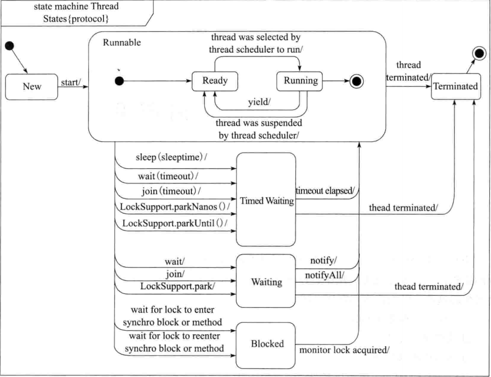
* New
    * 新建状态。创建线程后但还未调用start时的状态
* Runnable
    * 可运行状态。要么处于执行状态，要么由于线程切换等待状态

* Waiting & Timed  Waiting
    * 等待阶段。将释放线程锁持有的锁

* Block
    * 阻塞状态。不会释放线程所持有的锁
* Terminated
    * 结束状态

## 3.5. 守护线程
<a href="#menu"  >目录</a>

Java中，通过Thread类，我们可以创建2种线程，分为守护线程和用户线程。

守护线程是所有非守护线程的保姆，当所有非守护线程执行完成或退出了，即使还有守护线程在运行，JVM也会直接退出，因此守护线程通常是用来处理一些辅助工作。

反之，对于非守护线程，只要有一个在运行，JVM就不会退出。

典型的守护线程如垃圾回收GC线程，当用户线程都结束后，GC也就没有单独存在的必要，JVM直接退出。

任何线程都可以将自己设置为守护线程
```java
Thread thread = new Thread(runnable);
thread.setDaemon(true); // true表示守护线程，false表示用户线程
thread.start();
```

如果没有显示调用setDaemon方法进行设置，线程的模式是取决于父线程是否为守护线程，也就是创建此线程所在的线程。
* 如果父线程是守护线程，创建的线程默认是守护线程；
* 如果父线程是用户线程，创建的线程默认是用户线程。

Thread类的init方法源代码中看出：
```java
Thread parent = currentThread();
this.daemon = parent.isDaemon();
```


## 3.6. 线程组
<a href="#menu"  >目录</a>

Java中⽤ThreadGroup来表示线程组，我们可以使⽤线程组对线程进⾏批量控制。比设置共同的异常处理程序。

ThreadGroup和Thread的关系就如同他们的字⾯意思⼀样简单粗暴，每个Thread必然存在于⼀个ThreadGroup中，Thread不能独⽴于ThreadGroup存在。执⾏main()⽅法线程的名字是main，如果在new Thread时没有显式指定，那么默认将⽗线程（当前执⾏new Thread的线程）线程组设置为⾃⼰的线程组

## 3.7. 线程优先级
<a href="#menu"  >目录</a>

Java中线程优先级可以指定，范围是1~10。但是并不是所有的操作系统都⽀持10级优先级的划分（⽐如有些操作系统只⽀持3级划分：低，中，⾼），Java只是给
操作系统⼀个优先级的参考值，线程最终在操作系统的优先级是多少还是由操作系统决定。Java默认的线程优先级为5，线程的执⾏顺序由调度程序来决定，线程的优先级会在线程被调⽤之前设定。通常情况下，⾼优先级的线程将会⽐低优先级的线程有更⾼的⼏率得到执⾏。

Java提供⼀个线程调度器来监视和控制处于RUNNABLE状态的线程。线程的调度策略采⽤抢占式，优先级⾼的线程⽐优先级低的线程会有更⼤的⼏率优先执⾏。在优先级相同的情况下，按照“先到先得”的原则

## 3.8. 线程间通信
<a href="#menu"  >目录</a>

* 锁与同步
* 等待/通知
* 信号量Semaphore
* 管道（管道流）
* 其他通信相关
    * join
    * sleep
    * ThreadLocal
    * InheritableThreadLocal


## 3.9. 线程异常处理
<a href="#menu"  >目录</a>

### 3.9.1. 实现方式
<a href="#menu"  >目录</a>

如果线程中出现异常，父线程想获取子线程的异常，可以通过UncaughtExceptionHandler类来实现

方式1：设置所有线程的异常处理
```java
Thread.setDefaultUncaughtExceptionHandler(new Thread.UncaughtExceptionHandler() {
    @Override
    public void uncaughtException(Thread t, Throwable e) {
        System.out.println("DefaultUncaughtExceptionHandler:"+ t.getName()+ "  "+ e.getMessage());
    }
});
```
方式2：设置单个线程的异常处理
```java
task.setUncaughtExceptionHandler(new Thread.UncaughtExceptionHandler() {
    @Override
    public void uncaughtException(Thread t, Throwable e) {

        System.out.println("UncaughtExceptionHandler:"+ t.getName()+ "  "+ e.getMessage());
    }
});
```

当上面两种方式同时存在时，只有第二种方式被调用．

### 3.9.2. 原理

当发生异常时，虚拟机将会调用Thread类的dispatchUncaughtException
```java
/**
* Dispatch an uncaught exception to the handler. This method is
* intended to be called only by the JVM.
*/
private void dispatchUncaughtException(Throwable e) {
    getUncaughtExceptionHandler().uncaughtException(this, e);
}
```

当应用代码中调用了setUncaughtExceptionHandler设置自定义异常处理，则返回所设置的值，否则将会返回ThreadGroup的变量，该变量是UncaughtExceptionHandler的子类．
```java
 public UncaughtExceptionHandler getUncaughtExceptionHandler() {
        return uncaughtExceptionHandler != null ?
            uncaughtExceptionHandler : group;
    }
```

而ThreadGroup中自定义了uncaughtException方法
```java
public void uncaughtException(Thread t, Throwable e) {
    if (parent != null) {
        parent.uncaughtException(t, e);
    } else {
        Thread.UncaughtExceptionHandler ueh =
            Thread.getDefaultUncaughtExceptionHandler();
        if (ueh != null) {
            //调用用户定义的uncaughtException
            ueh.uncaughtException(t, e);
        } else if (!(e instanceof ThreadDeath)) {
            System.err.print("Exception in thread \""
                                + t.getName() + "\" ");
            e.printStackTrace(System.err);
        }
    }
}
```

## 3.10. 线程监控工具
<a href="#menu"  >目录</a>

* jstack
查看线程的状态，优先级，可以检测是否存在死锁
```yml
//使用jps查看Java应用的pid
lgj@lgj-Lenovo-G470:~/aProject/aRealPrj/Java-Interview$ jps
13872 RemoteMavenServer
15121 SpringSchedulerApplication
12642 Main
3349 Jps
//jstack查看线程情况
lgj@lgj-Lenovo-G470:~/aProject/aRealPrj/Java-Interview$ jstack 13872
2019-07-05 14:51:57
Full thread dump OpenJDK 64-Bit Server VM (25.152-b26 mixed mode):

"Attach Listener" #288 daemon prio=9 os_prio=0 tid=0x00007f6e60001000 nid=0xd4b runnable [0x0000000000000000]
   java.lang.Thread.State: RUNNABLE

"RMI Scheduler(0)" #17 daemon prio=5 os_prio=0 tid=0x00007f6e38015800 nid=0x364f waiting on condition [0x00007f6e7fcdf000]
   java.lang.Thread.State: TIMED_WAITING (parking)
	at sun.misc.Unsafe.park(Native Method)
	- parking to wait for  <0x00000000d00a2f88> (a java.util.concurrent.locks.AbstractQueuedSynchronizer$ConditionObject)
	at java.util.concurrent.locks.LockSupport.parkNanos(LockSupport.java:215)
	at java.util.concurrent.locks.AbstractQueuedSynchronizer$ConditionObject.awaitNanos(AbstractQueuedSynchronizer.java:2078)
	at java.util.concurrent.ScheduledThreadPoolExecutor$DelayedWorkQueue.take(ScheduledThreadPoolExecutor.java:1093)
	at java.util.concurrent.ScheduledThreadPoolExecutor$DelayedWorkQueue.take(ScheduledThreadPoolExecutor.java:809)
	at java.util.concurrent.ThreadPoolExecutor.getTask(ThreadPoolExecutor.java:1067)
	at java.util.concurrent.ThreadPoolExecutor.runWorker(ThreadPoolExecutor.java:1127)
	at java.util.concurrent.ThreadPoolExecutor$Worker.run(ThreadPoolExecutor.java:617)
	at java.lang.Thread.run(Thread.java:745)

"VM Thread" os_prio=0 tid=0x00007f6ea007b800 nid=0x3636 runnable 

"GC task thread#0 (ParallelGC)" os_prio=0 tid=0x00007f6ea0023800 nid=0x3632 runnable 

"GC task thread#1 (ParallelGC)" os_prio=0 tid=0x00007f6ea0025000 nid=0x3633 runnable 

"GC task thread#2 (ParallelGC)" os_prio=0 tid=0x00007f6ea0027000 nid=0x3634 runnable 

"GC task thread#3 (ParallelGC)" os_prio=0 tid=0x00007f6ea0028800 nid=0x3635 runnable 

"VM Periodic Task Thread" os_prio=0 tid=0x00007f6ea00cb000 nid=0x363e waiting on condition 

JNI global references: 200

```
* jconsole,jvisual 
集成多个java命令，通过界面查看各个状态

## 3.11. 有关并行的两个重要定律
<a href="#menu"  >目录</a>

有关为什么要使用并行程序的问题前面已经进行了简单的探讨。总的来说，最重要的应该是处于两个目的。
* 第一，为了获得更好的性能；
* 第二，由于业务模型的需要，确实需要多个执行实体。

在这里，我将更加关注第一种情况，也就是有关性能的问题。将串行程序改造为并发程序，一般来说可以提高程序的整体性能，但是究竟能提高多少，甚至说究竟是否真的可以提高，还是一个需要研究的问题。目前，主要有两个定律对这个问题进行解答，一个是Amdahl定律，另外一个是Gustafson定律。

### 3.11.1. Amdahl(阿姆达尔)定律
Amdahl定律是计算机科学中非常重要的定律。它定义了串行系统并行化后的加速比的计算公式和理论上限。

**加速比定义**：加速比 = 优化前系统耗时 / 优化后系统耗时

所谓加速比就是优化前耗时与优化后耗时的比值。**加速比越高，表明优化效果越明显**。图显示了Amdahl公式的推到过程，其中n表示处理器个数，T表示时间，T1表示优化前耗时(也就是只有1个处理器时的耗时)，Tn表示使用n个处理器优化后的耗时。F是程序中只能串行执行的比例。
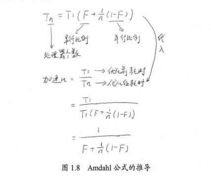


根据这个公式，如果CPU处理器数量趋于无穷，那么加速比与系统的串行化比例成反比，如果系统中必须有50%的代码串行执行，那么系统的最大加速比为2。

假设有一个程序分为以下步骤执行，每个执行步骤花费100个单位时间。其中，只有步骤2和步骤5可以并行，步骤1、3、4必须串行，如图1.9所示。在全串行的情况下，系统合计耗时为500个单位时间。


若步骤2和步骤5并行化，假设在双核处理器上，则有如图1.10所示的处理流程。在这种情况下，步骤2和步骤5的耗时将为50个单位时间。故系统整体耗时为400个单位时间。根据加速比的定义有：

加速比 = 优化前系统耗时 / 优化后系统耗时 = 500/400 = 1.25


由于5个步骤中，3个步骤必须串行，因此其串行化比例为3/5=0.6，即 F = 0.6，且双核处理器的处理器个数N为2。代入加速比公式得：

加速比 = 1/(0.6+(1-0.6)/2)=1.25

在极端情况下，假设并行处理器个数为无穷大，则有如图1.11所示的处理过程。步骤2和步骤5的处理时间趋于0。即使这样，系统整体耗时依然大于300个单位时间。使用加速比计算公式，N趋于无穷大，有加速比 = 1/F，且F=0.6，故有加速比=1.67。即加速比的极限为500/300=1.67。

由此可见，为了提高系统的速度，仅增加CPU处理的数量并不一定能起到有效的作用。需要从根本上修改程序的串行行为，提高系统内可并行化的模块比重，在此基础上，合理增加并行处理器数量，才能以最小的投入，得到最大的加速比。


注意：根据Amdahl定律，使用多核CPU对系统进行优化，优化的效果取决于CPU的数量，以及系统中串行化程序的比例。CPU数量越多，串行化比例越低，则优化效果越好。仅提高CPU数量而不降低程序的串行化比例，也无法提高系统的性能。


从阿姆达尔定律可以看出，程序的可并行化部分可以通过使用更多的硬件（更多的线程或CPU）运行更快。对于不可并行化的部分，只能通过优化代码来达到提速的目的。因此，你可以通过优化不可并行化部分来提高你的程序的运行速度和并行能力。你可以对不可并行化在算法上做一点改动，如果有可能，你也可以把一些移到可并行化的部分。

### 3.11.2. Gustafson定律

Gustafson定律也试图说明处理器个数、串行化比例和加速比之间的关系，如图1.12所示，但是Gustafson定律和Amdahl定律的角度不同。同样，加速比都被定义为优化前的系统耗时除以优化后的系统耗时。

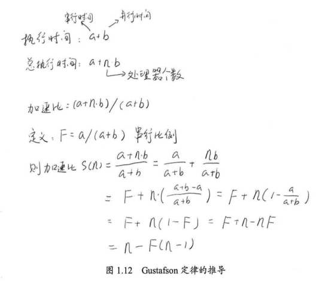

根据Gustafson定律，我们可以更容易地发现，如果串行化比例很小，并行化比例很大，那么加速比就是处理器的个数。只要不断地累加处理器，就能获得更快的速度。

Amdahl定律和Gustafson定律结论有所不同，并不是说其中有个是错误的，只是二者从不同的角度去看待问题的结果，他们的侧重点有所不同。

Amdahl强调：当串行换比例一定时，加速比是有上限的，不管你堆叠多少个CPU参与计算，都不能突破这个上限。
Gustafson定律关系的是：如果可被并行化的代码所占比例足够大，那么加速比就能随着CPU的数量线性增长。

总的来说，提升性能的方法：想办法提升系统并行的比例，同时增加CPU数量


# 4. 线程间通信

## 4.1. 基本概念
```java
//释放锁，线程任务暂停
public final native void wait() throws InterruptedException;
public final native void wait(long timeout) throws InterruptedException;
public final void wait(long timeout, int nanos) throws InterruptedException;

//通知其中一个线程唤醒
public final native void notify();
//通知所有的线程唤醒
public final native void notifyAll();
```
* 这些方法都是位于Object对象中
* 这些方法必须在synchronized的临界区内被调用，否则将会抛出异常。并且调用wait和notify的必须是同一个对象，才能唤醒。
* 在等待的过程中，如果线程被中断，将会抛出异常InterruptedException。
* 调用wait将会释放锁，sleep将不会释放锁，wait将会随机选择一个线程进行唤醒

## 4.2. 实现消费者和生产者


# 5. 线程阻塞工具LockSuport
<a href="#menu"  >目录</a>

* LockSuport用于实现线程阻塞。可以在线程内任意位置让线程阻塞。
* 与suspend()相比，弥补了resume()方法没有发生导致的死锁问题。
* 与wait()相比，不需要先获得某个对象的锁。也不会抛出中断异常。
* LockSuport不需要在临界区内才能调用。

**基本原理**
* 类似于许可证设计，但是这个许可证不能累加。也就是有和无的区别
* 调用unpark给线程增加一个许可证
* 调用park如果有许可证，那么就取消这个许可证，继续往下执行。如果没有许可证，就阻塞等待unpark调用 。
* 这种方式解决了resume先于suspend调用导致的死锁问题。


```JAVA
public class LockSupport {
    private LockSupport() {} // Cannot be instantiated.

    private static void setBlocker(Thread t, Object arg) {
        // Even though volatile, hotspot doesn't need a write barrier here.
        UNSAFE.putObject(t, parkBlockerOffset, arg);
    }


    public static void unpark(Thread thread) {
        if (thread != null)
            UNSAFE.unpark(thread);
    }

    public static void park(Object blocker) {
        Thread t = Thread.currentThread();
        setBlocker(t, blocker);
        UNSAFE.park(false, 0L);
        setBlocker(t, null);
    }

    public static void parkNanos(Object blocker, long nanos) {
        if (nanos > 0) {
            Thread t = Thread.currentThread();
            setBlocker(t, blocker);
            UNSAFE.park(false, nanos);
            setBlocker(t, null);
        }
    }

   
    public static void parkUntil(Object blocker, long deadline) {
        Thread t = Thread.currentThread();
        setBlocker(t, blocker);
        UNSAFE.park(true, deadline);
        setBlocker(t, null);
    }
    public static Object getBlocker(Thread t) {
        if (t == null)
            throw new NullPointerException();
        return UNSAFE.getObjectVolatile(t, parkBlockerOffset);
    }

   //阻塞
    public static void park() {
        UNSAFE.park(false, 0L);
    }
    //超时阻塞
    public static void parkNanos(long nanos) {
        if (nanos > 0)
            UNSAFE.park(false, nanos);
    }

 
     //阻塞当前线程，直到deadline时间点，使用时间戳
    public static void parkUntil(long deadline) {
        UNSAFE.park(true, deadline);
    }


    // Hotspot implementation via intrinsics API
    private static final sun.misc.Unsafe UNSAFE;
    private static final long parkBlockerOffset;
    private static final long SEED;
    private static final long PROBE;
    private static final long SECONDARY;
    static {
        try {
            UNSAFE = sun.misc.Unsafe.getUnsafe();
            Class<?> tk = Thread.class;
            parkBlockerOffset = UNSAFE.objectFieldOffset
                (tk.getDeclaredField("parkBlocker"));
            SEED = UNSAFE.objectFieldOffset
                (tk.getDeclaredField("threadLocalRandomSeed"));
            PROBE = UNSAFE.objectFieldOffset
                (tk.getDeclaredField("threadLocalRandomProbe"));
            SECONDARY = UNSAFE.objectFieldOffset
                (tk.getDeclaredField("threadLocalRandomSecondarySeed"));
        } catch (Exception ex) { throw new Error(ex); }
    }

}


```

LockSupport 和 CAS 是Java并发包中很多并发工具控制机制的基础，它们底层其实都是依赖Unsafe实现。
LockSupport是用来创建锁和其他同步类的基本线程阻塞原语。LockSupport 提供park()和unpark()方法实现阻塞线程和解除线程阻塞，LockSupport和每个使用它的线程都与一个许可(permit)关联。permit相当于1，0的开关，默认是0，调用一次unpark就加1变成1，调用一次park会消费permit, 也就是将1变成0，同时park立即返回。再次调用park会变成block（因为permit为0了，会阻塞在这里，直到permit变为1）, 这时调用unpark会把permit置为1。每个线程都有一个相关的permit, permit最多只有一个，重复调用unpark也不会积累。
park()和unpark()不会有 Thread.suspend 和 Thread.resume 所可能引发的死锁问题，由于许可的存在，调用 park 的线程和另一个试图将其 unpark 的线程之间的竞争将保持活性。
如果调用线程被中断，则park方法会返回。同时park也拥有可以设置超时时间的版本。
三种形式的 park 还各自支持一个 blocker 对象参数。此对象在线程受阻塞时被记录，以允许监视工具和诊断工具确定线程受阻塞的原因。（这样的工具可以使用方法 getBlocker(java.lang.Thread) 访问 blocker。）建议最好使用这些形式，而不是不带此参数的原始形式。在锁实现中提供的作为 blocker 的普通参数是 this。
看下线程dump的结果来理解blocker的作用。

有blocker的可以传递给开发人员更多的现场信息，通过jstack命令可以非常方便的监控具体的阻塞对象，方便定位问题。所以java6新增加带blocker入参的系列park方法，替代原有的park方法


**LockSupport.park()和unpark()和object.wait()和notify()很相似，那么它们有什么区别呢？**
* 面向的主体不一样。LockSuport主要是针对Thread进进行阻塞处理，可以指定阻塞队列的目标对象，每次可以指定具体的线程唤醒。Object.wait()是以对象为纬度，阻塞当前的线程和唤醒单个(随机)或者所有线程。
* 实现机制不同。虽然LockSuport可以指定monitor的object对象，但和object.wait()，两者的阻塞队列并不交叉。可以看下测试例子。object.notifyAll()不能唤醒LockSupport的阻塞Thread.


# 6. 线程同步机制
<a href="#menu"  >目录</a>

线程同步机制是一套用于协调线程间的数据访问及活动的机制，用于保障线程安全。

## 6.1. 线程同步机制概述
<a href="#menu"  >目录</a>


## 6.2. 锁概述
<a href="#menu"  >目录</a>

* 锁可以理解为对共享数据访问的许可证，对于任何一个许可证锁保持的共享数据，任何线程访问这些共享数据前都要获取到锁。并且只有释放之后其他线程才能以同样的方式获取到锁并进行访问
* 锁分类
    * 排他锁(互斥锁)
        * 具有排他性，也就是一个锁一次只能被一个线程锁持有。
    * 共享锁  
        * 共享锁，任何线程都可以访问
        * 常见的场景有读共享，写排他
    * 内部锁
        * 虚拟机内部实现，比如Synchronized
    * 显示锁
        * JDK的Lock接口实现类

* **锁的作用**
    * 资源互斥访问，避免并发问题
    * 整个临界区代码具有原子性
    * 保证可见性
        * 可见性的保障是通过写线程冲刷处理器缓存和读线程刷新处理器缓存这两个操作实现的
        * Java中，锁的获得隐含着刷新处理器缓存这个动作，锁的释放隐含着刷新处理器缓存的操作。因此对变量的任何修改都会更新到主内存中去。
    * 保证有序性
        * 只是保证整体有序性
        * 临界区内的代码仍然可能发生指令重排序，但不会重排序到临界区外。
    * 要保证以上特性，必须保证操作同一种数据加的是同一把锁

* **与锁相关的几个概念**
    * 可重入性
        * 一个线程在其持有一个锁的情况下能否多次获取到该锁。
        * 比如方法A和B都是使用同一把锁，A中调用B，如果没有可重入性，将会发生死锁。
    * 锁的争用与调度
        * Java锁的调度策略包括公平策略和非公平策略
        * 内部锁是非公平锁，Lock两个都支持
    * 锁的粒度
        * 一个锁所保护的资源的大小称为锁的粒度。比如一条语句和多条语句的差别。
        * 有些没必要的语句就无需加锁，提高程序的执行效率。

* **使用锁需要注意的问题**
    * 锁泄漏
        * 获取锁之后，任务执行完成，但是没有释放锁，其他线程也就无法获取到锁。将会发生死锁。
    * 锁的不正确使用出现死锁

# 7. 锁
<a href="#menu"  >目录</a>

## 7.1. 锁的理解

从操作系统级别来说，有两种类型的锁：一个是内核态的(互斥量,信号量)，一个是用户态的。内核态的锁会影响线程调度器，调度耗时会多一些。用户态的锁，通常是通过主动上下文切换以及自身的自旋等待来实现。

应外一种是CAS方式，并不是一种锁，而是无锁编程。思路就是使用CAS成功或者失败来决定是否放弃CAS段内的代码执行结果。无锁编程利用的是CPU的原子指令来实现并发的检查。


## 7.2. 锁的⼏种分类
<a href="#menu"  >目录</a>

### 7.2.1. 可重⼊锁和⾮可重⼊锁
所谓重⼊锁，顾名思义。就是⽀持重新进⼊的锁，也就是说这个锁⽀持⼀个线程对资源重复加锁。

synchronized关键字就是使⽤的重⼊锁。⽐如说，你在⼀个synchronized实例⽅法⾥⾯调⽤另⼀个本实例的synchronized实例⽅法，它可以重新进⼊这个锁，不会出现任何异常。

如果我们⾃⼰在继承AQS实现同步器的时候，没有考虑到占有锁的线程再次获取锁的场景，可能就会导致线程阻塞，那这个就是⼀个“⾮可重⼊锁”。

ReentrantLock 的中⽂意思就是可重⼊锁。也说本⽂后续要介绍的重点类

### 7.2.2. 公平锁与⾮公平锁

这⾥的“公平”，其实通俗意义来说就是“先来后到”，也就是FIFO。如果对⼀个锁来说，先对锁获取请求的线程⼀定会先被满⾜，后对锁获取请求的线程后被满⾜，那
这个锁就是公平的。反之，那就是不公平的。

⼀般情况下，⾮公平锁能提升⼀定的效率。但是⾮公平锁可能会发⽣线程饥饿（有⼀些线程⻓时间得不到锁）的情况。所以要根据实际的需求来选择⾮公平锁和公平
锁。

ReentrantLock⽀持⾮公平锁和公平锁两种。


### 7.2.3. 读写锁和排它锁

我们前⾯讲到的synchronized⽤的锁和ReentrantLock，其实都是“排它锁”。也就是说，这些锁在同⼀时刻只允许⼀个线程进⾏访问。

⽽读写锁可以再同⼀时刻允许多个读线程访问。Java提供了ReentrantReadWriteLock类作为读写锁的默认实现，内部维护了两个锁：⼀个读锁，⼀个写锁。通过分离读锁和写锁，使得在“读多写少”的环境下，⼤⼤地提⾼了性能。

注意，即使⽤读写锁，在写线程访问时，所有的读线程和其它写线程均被阻塞。

可⻅，只是synchronized是远远不能满⾜多样化的业务对锁的要求的。

## 7.3. 内部锁Synchronized

<a href="#menu"  >目录</a>

### 7.3.1. 基本概念

* 为什么要同步
看一个简单的例子：
```java
i++;
```
这条语句实际上主要包含了三个操作。
1.从内存中获取i值
2.对i进行自增操作
3.将新值写入内存中

这三个操作不具有原子性，任何操作之间都有可能执行其他指令，最终导致结果出现错误,也就是非线程安全。
因此需要对这个i++操作进行同步，同一时刻只能有一个线程访问该操作。Java中能实现这个功能的有使用Synchronized和Lock.
本节讲解的是Synchronized.

**线程安全：**如果一个操作在多线程和单线程环境下执行，都具备相同的执行结果和正确性，则说明该操作是线程安全的。
**临界区:**被同步的代码
**重入锁：**可重入特性是指当一个线程获取到了对象的锁，再次申请时也可以获取到该锁。Synchronized和Lock都具有可重入特性。可重入特性避免了死锁的发生。

比如如下例子
同步方法func1调用同步方法func2，即使两个都使用synchronized进行加锁，虽然是同一把锁，监视器都是同一个对象，但是func2还是能执行,因为具备了可重入特性。
```java
class Service{

    public synchronized void func1(){
        this.func2();
    }
    public synchronized void func2(){
      
    }

}
```


* Synchronized不具有继承性，也就是父类方法使用synchronized进行同步，如果子类重写的方法也要具备同步，是需要添加synchronized的。
* synchronized具有可重入特性  
* 发生未捕获的异常时，线程将会释放锁并退出。
  
* synchronized的作用主要有三个
    * 确保线程互斥的访问同步代码
    * 保证共享变量的修改能够及时可见
    * 有效解决重排序问题。


⾸先需要明确的⼀点是：Java多线程的锁都是基于对象的，Java中的每⼀个对象都可以作为⼀个锁。还有⼀点需要注意的是，我们常听到的类锁其实也是对象锁。Java类只有⼀个Class对象（可以有多个实例对象，多个实例共享这个Class对象），⽽Class对象也是特殊的Java对象。所以我们常说的类锁，其实就是Class对象的锁。

我们通常使⽤ synchronized 关键字来给⼀段代码或⼀个⽅法上锁。它通常有以下三种形式：
```java
// 关键字在实例⽅法上，锁为当前实例
public synchronized void instanceLock() {
// code
}
// 关键字在静态⽅法上，锁为当前Class对象
public static synchronized void classLock() {
// code
}
// 关键字在代码块上，锁为括号⾥⾯的对象
public void blockLock() {
    Object o = new Object();
    synchronized (o) {
    // code
    }
}
```


通过上⾯的例⼦我们可以看到，下⾯这两个写法其实是等价的作⽤：
```java
// 关键字在实例⽅法上，锁为当前实例
public synchronized void instanceLock() {
// code
}
// 关键字在代码块上，锁为括号⾥⾯的对象
public void blockLock() {
    synchronized (this) {
    // code
    }
}

///////////////////////
同理，下⾯这两个⽅法也是等价的：
// 关键字在静态⽅法上，锁为当前Class对象
public static synchronized void classLock() {
// code
}
// 关键字在代码块上，锁为括号⾥⾯的对象
public void blockLock() {
    synchronized (this.getClass()) {
    // code
    }
}
```

所谓“临界区”，指的是某⼀块代码区域，它同⼀时刻只能由⼀个线程执⾏。在上⾯的例⼦中，如果 synchronized 关键字在⽅法上，那临界区就是整个⽅法内部。⽽如果是使⽤synchronized代码块，那临界区就指的是代码块内部的区域。

### 7.3.2. 锁的释放-获取建立的happens-before关系

锁是Java并发编程中最重要的同步机制。锁除了让临界区互斥执行外，还可以让释放锁的线程向获取同一个锁的线程发送消息

```java
class MonitorExample {
    int a = 0;
    public synchronized void writer() { // 1
         a++; // 2
    } // 3
    public synchronized void reader() { // 4
        int i = a; // 5
        ……
    } // 6
}
```
假设线程A执行writer()方法，随后线程B执行reader()方法。根据happens-before规则，这个
过程包含的happens-before关系可以分为3类。
1. 根据程序次序规则，1 happens-before 2,2 happens-before 3;4 happens-before 5,5 happensbefore 6。
2. 根据监视器锁规则，3 happens-before 4。
3. 根据happens-before的传递性，2 happens-before 5。


### 7.3.3. 锁的释放和获取的内存语义

当线程释放锁时，JMM会把该线程对应的本地内存中的共享变量刷新到主内存中。当线程获取锁时，JMM会把该线程对应的本地内存置为无效。从而使得被监视器保护的临界区代码必须从主内存中读取共享变量。

对比锁释放-获取的内存语义与volatile写-读的内存语义可以看出：锁释放与volatile写有相同的内存语义；锁获取与volatile读有相同的内存语义。
下面对锁释放和锁获取的内存语义做个总结。
* 线程A释放一个锁，实质上是线程A向接下来将要获取这个锁的某个线程发出了（线程A对共享变量所做修改的）消息。
* 线程B获取一个锁，实质上是线程B接收了之前某个线程发出的（在释放这个锁之前对共享变量所做修改的）消息。
* 线程A释放锁，随后线程B获取这个锁，这个过程实质上是线程A通过主内存向线程B发送消息。
  
  
### 7.3.4. 实现原理

#### 7.3.4.1. Java对象头

在JVM中，对象在内存中的布局分为三块区域：对象头、实例变量和填充数据。如下


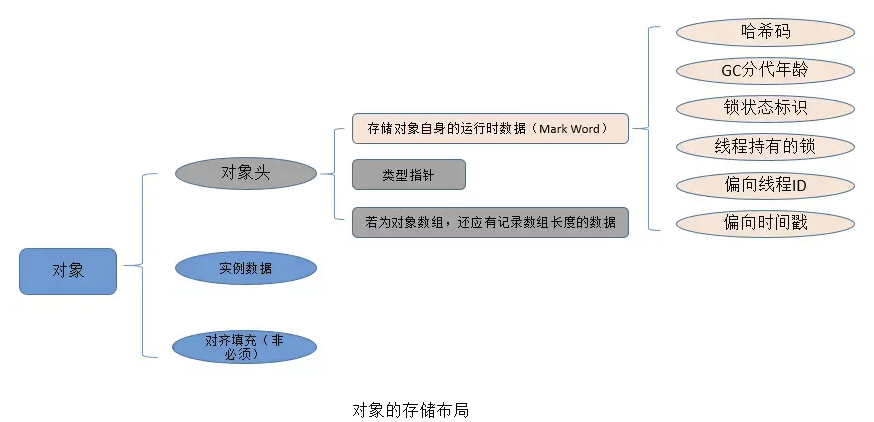

* **实例变量**：存放类的属性数据信息，包括父类的属性信息，如果是数组的实例部分还包括数组的长度，这部分内存按4字节对齐
* **填充数据**：由于虚拟机要求对象起始地址必须是8字节的整数倍。填充数据不是必须存在的，仅仅是为了字节对齐，这点了解即可。
* **对象头**：Hotspot虚拟机的对象头主要包括两部分数据：Mark Word（标记字段）、Klass Pointer（类型指针）。其中Klass Point是是对象指向它的类元数据的指针，虚拟机通过这个指针来确定这个对象是哪个类的实例，Mark Word用于存储对象自身的运行时数据，它是实现轻量级锁和偏向锁的关键。

Java对象头数据
|长度|内容|说明|
|---|----|----|
|32/64|mark word|存储对象的hashcode等信息|
|32/64|Class Metadata Address|存储到对象类型数据的指针|
|32/32|Array length|数组的长度，如果对象是数组的话|


Mark Word：用于存储对象自身的运行时数据，如哈希码（HashCode）、GC分代年龄、锁状态标志、线程持有的锁、偏向线程 ID、偏向时间戳等等。Java对象头一般占有两个机器码（在32位虚拟机中，1个机器码等于4字节，也就是32bit）

||25bit|4bit|1bit是否是偏向锁|2bit锁标志位|
|---|---|---|---|---|
|无锁状态|对象的hashcode|对象分代年龄|0|01|

对象头信息是与对象自身定义的数据无关的额外存储成本，但是考虑到虚拟机的空间效率，Mark Word被设计成一个非固定的数据结构以便在极小的空间内存存储尽量多的数据，它会根据对象的状态复用自己的存储空间，也就是说，Mark Word会随着程序的运行发生变化，可能变化为存储以下4种数据：

<table>
	<tr >
	    <td rowspan="2">锁状态</td>
        <td colspan="2">25bit</td>
        <td rowspan="2">4bit</td>
        <td>1bit</td>
        <td>2bit</td>        
	</tr>
    <tr >
	    <td>23bit</td>
        <td>2bit</td>
        <td>是否是偏向锁</td>
        <td>锁标志位</td>
	</tr>
    <tr >
	    <td>无锁状态</td>
        <td colspan="2">对象的hashcode</td>
        <td>对象分代年龄</td>
        <td>0</td>
        <td>01</td>
	</tr>
    <tr >
	    <td>轻量级锁</td>
        <td colspan="4">指向栈中锁记录的指针</td>
        <td>00</td>
	</tr>
    <tr >
	    <td>重量级锁</td>
        <td colspan="4">指向互斥量(重量级锁monitor)的指针</td>
        <td>10</td>
	</tr>
    <tr >
	    <td>GC标志</td>
        <td colspan="4">空</td>
        <td>11</td>
	</tr>
    <tr >
	    <td>偏向锁</td>
        <td>偏向线程ID</td>
        <td>Epoch偏向时间戳</td>
        <td>对象分代年龄</td>
        <td>1</td>
        <td>01</td>
</table>   

对象头的最后两位存储了锁的标志位，01是初始状态，未加锁，其对象头里存储的是对象本身的哈希码，随着锁级别的不同，对象头里会存储不同的内容。偏向锁存储的是当前占用此对象的线程ID；而轻量级则存储指向线程栈中锁记录的指针。从这里我们可以看到，“锁”这个东西，可能是个锁记录+对象头里的引用指针（判断线程是否拥有锁时将线程的锁记录地址和对象头里的指针地址比较)，也可能是对象头里的线程ID（判断线程是否拥有锁时将线程的ID和对象头里存储的线程ID比较）。

重量级锁也就是通常说synchronized的对象锁，锁标识位为10，其中指针指向的是monitor对象（也称为管程或监视器锁）的起始地址。

**对象头中Mark Word与线程中Lock Record**

在线程进入同步代码块的时候，如果此同步对象没有被锁定，即它的锁标志位是01，则虚拟机首先在当前线程的栈中创建我们称之为“锁记录（Lock Record）”的空间，用于存储锁对象的Mark Word的拷贝，官方把这个拷贝称为Displaced Mark Word。整个Mark Word及其拷贝至关重要。
Lock Record是线程私有的数据结构，每一个线程都有一个可用Lock Record列表，同时还有一个全局的可用列表。每一个被锁住的对象Mark Word都会和一个Lock Record关联（对象头的MarkWord中的Lock Word指向Lock Record的起始地址），同时Lock Record中有一个Owner字段存放拥有该锁的线程的唯一标识（或者object mark word），表示该锁被这个线程占用。如下图所示为Lock Record的内部结构：


|Lock Record |描述|
|---|---|
|Owner|初始时为NULL表示当前没有任何线程拥有该monitor record，当线程成功拥有该锁后保存线程唯一标识，当锁被释放时又设置为NULL；
|EntryQ|关联一个系统互斥锁（semaphore），阻塞所有试图锁住monitor record失败的线程；
|RcThis|表示blocked或waiting在该monitor record上的所有线程的个数；
|Nest|用来实现 重入锁的计数；
|HashCode|保存从对象头拷贝过来的HashCode值（可能还包含GC age）。
|Candidate|用来避免不必要的阻塞或等待线程唤醒，因为每一次只有一个线程能够成功拥有锁，如果每次前一个释放锁的线程唤醒所有正在阻塞或等待的线程，会引起不必要的上下文切换（从阻塞到就绪然后因为竞争锁失败又被阻塞）从而导致性能严重下降。Candidate只有两种可能的值0表示没有需要唤醒的线程1表示要唤醒一个继任线程来竞争锁。


**监视器（Monitor）**

任何一个对象都有一个Monitor与之关联，当且一个Monitor被持有后，它将处于锁定状态。Synchronized在JVM里的实现都是 基于进入和退出Monitor对象来实现方法同步和代码块同步，虽然具体实现细节不一样，但是都可以通过成对的MonitorEnter和MonitorExit指令来实现。

* MonitorEnter指令：插入在同步代码块的开始位置，当代码执行到该指令时，将会尝试获取该对象Monitor的所有权，即尝试获得该对象的锁；
* MonitorExit指令：插入在方法结束处和异常处，JVM保证每个MonitorEnter必须有对应的MonitorExit；


也就是通常说Synchronized的对象锁，MarkWord锁标识位为10，其中指针指向的是Monitor对象的起始地址。在Java虚拟机（HotSpot）中，Monitor是由ObjectMonitor实现的，其主要数据结构如下（位于HotSpot虚拟机源码ObjectMonitor.hpp文件，C++实现的）：

```cpp
ObjectMonitor() {
    _header       = NULL;
    _count        = 0; // 引用计数器，以防止在stw期间被回收
    _waiters      = 0,　
    _recursions   = 0;　//记录当前线程请求锁的次数，每请求一次+1
    _object       = NULL;
    // pointer to owning thread OR BasicLock 指向当前获取到monitor的线程
    _owner        = NULL;
    _WaitSet      = NULL; // 处于wait状态的线程，会被加入到_WaitSet
    // protects Wait Queue - simple spinlock　自旋
    _WaitSetLock  = 0 ;
    _Responsible  = NULL ;
    _succ         = NULL ;
    //LL of recently-arrived threads blocked on entry.The list is actually composed of WaitNodes,acting as proxies for Threads.
    //
    _cxq          = NULL ;
    FreeNext      = NULL ;
    _EntryList    = NULL ; // 处于等待锁block状态的线程，会被加入到该列表
    _SpinFreq     = 0 ;
    _SpinClock    = 0 ;
    OwnerIsThread = 0 ;
  }
```

monitorenter执行流程：
* 若monitor的进入次数为0，线程可以进入，并将monitor进入的次数设为1，当前线程成为montiro的owner；
* 若线程已拥有monitor的所有权，允许它重入monitor，进入一次次数+1 ；
* 若其他线程已经占有monitor，当前尝试获取monitor的线程会被阻塞，直到进入次数为变0，才能重新被再次获取。

monitorexit：
* 能执行monitorexit指令的线程，一定是拥有当前对象的monitor所有权的。当执行monitorexit指令计数器减到为0时，当前线程就不再拥有monitor所有权。其他被阻塞的线程即可再一次去尝试获取这个monitor的所有权。


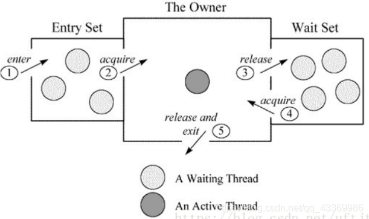

ObjectMonitor中有两个队列，_WaitSet 和 _EntryList，用来保存ObjectWaiter对象列表（ 每个等待锁的线程都会被封装成ObjectWaiter对象 ），_owner指向持有ObjectMonitor对象的线程，当多个线程同时访问一段同步代码时：
* 首先会进入 _EntryList 集合，当线程获取到对象的monitor后，进入 _Owner区域并把monitor中的owner变量设置为当前线程，同时monitor中的计数器count加1；
* 若线程调用 wait() 方法，将释放当前持有的monitor，owner变量恢复为null，count自减1，同时该线程进入 WaitSet集合中等待被唤醒；
* 若当前线程执行完毕，也将释放monitor（锁）并复位count的值，以便其他线程进入获取monitor(锁)；

如上图所示，一个线程通过1号门进入Entry Set(入口区)，如果在入口区没有线程等待，那么这个线程就会获取监视器成为监视器的Owner，然后执行监视区域的代码。如果在入口区中有其它线程在等待，那么新来的线程也会和这些线程一起等待。线程在持有监视器的过程中，有两个选择，一个是正常执行监视器区域的代码，释放监视器，通过5号门退出监视器；还有可能等待某个条件的出现，于是它会通过3号门到Wait Set（等待区）休息，直到相应的条件满足后再通过4号门进入重新获取监视器再执行。

当一个线程释放监视器时，在入口区和等待区的等待线程都会去竞争监视器，如果入口区的线程赢了，会从2号门进入；如果等待区的线程赢了会从4号门进入。只有通过3号门才能进入等待区，在等待区中的线程只有通过4号门才能退出等待区，也就是说一个线程只有在持有监视器时才能执行wait操作，处于等待的线程只有再次获得监视器才能退出等待状态。


同时，Monitor对象存在于每个Java对象的对象头Mark Word中（存储的指针的指向），Synchronized锁便是通过这种方式获取锁的，也是为什么Java中任意对象可以作为锁的原因，同时notify/notifyAll/wait等方法会使用到Monitor锁对象，所以必须在同步代码块中使用。
监视器Monitor有两种同步方式：互斥与协作。多线程环境下线程之间如果需要共享数据，需要解决互斥访问数据的问题，监视器可以确保监视器上的数据在同一时刻只会有一个线程在访问。


* notify 方法： 从等待队列中唤醒任意一个线程,使该线程退出等待队列，进入可运行状态，也就是notify()方法仅通知一个线程。
* notifyAll 方法： 使所有正在等待队列中线程退出等待队列，进入就绪状态。
* wait 方法： 阻塞


#### 7.3.4.2. 同步代码块和同步方法实现原理的区别


由于synchronized是基于monitor实现的，因此每次重入，monitor中的计数器仍会加1。退出时减1.当为0时说明没有任何线程持有该对象锁。

**同步代码块**

monitorenter指令插入到同步代码块的开始位置，monitorexit指令插入到同步代码块的结束位置，JVM需要保证每一个monitorenter都有一个monitorexit与之相对应。任何对象都有一个monitor与之相关联，当且一个monitor被持有之后，他将处于锁定状态。线程执行到monitorenter指令时，将会尝试获取对象所对应的monitor所有权，即尝试获取对象的锁；

```java
package com.example.demo.thread;

public class ThreadDemo {

    public void func1(){

        synchronized (this){
            System.out.println("AA");
        }
    }

    public void func2(){
        System.out.println("BB");
    }
}
```
反编译后的class文件
```yml
lgj@lgj-Lenovo-G470:$ javap -c ThreadDemo.class
Compiled from "ThreadDemo.java"
public class com.example.demo.thread.ThreadDemo {
  public com.example.demo.thread.ThreadDemo();
    Code:
       0: aload_0
       1: invokespecial #1                  // Method java/lang/Object."<init>":()V
       4: return

  public void func1();
    Code:
       0: aload_0
       1: dup
       2: astore_1
       3: monitorenter
       4: getstatic     #2                  // Field java/lang/System.out:Ljava/io/PrintStream;
       7: ldc           #3                  // String AA
       9: invokevirtual #4                  // Method java/io/PrintStream.println:(Ljava/lang/String;)V
      12: aload_1
      13: monitorexit
      14: goto          22
      17: astore_2
      18: aload_1
      19: monitorexit
      20: aload_2
      21: athrow
      22: return
    Exception table:
       from    to  target type
           4    14    17   any
          17    20    17   any

  public void func2();
    Code:
       0: getstatic     #2                  // Field java/lang/System.out:Ljava/io/PrintStream;
       3: ldc           #5                  // String BB
       5: invokevirtual #4                  // Method java/io/PrintStream.println:(Ljava/lang/String;)V
       8: return
}

```
* **monitorenter**:每个对象都是一个监视器锁（monitor）。当monitor被占用时就会处于锁定状态，线程执行monitorenter指令时尝试获取monitor的所有权，过程如下：
    * 如果monitor的进入数为0，则该线程进入monitor，然后将进入数设置为1，该线程即为monitor的所有者；
    * 如果线程已经占有该monitor，只是重新进入，则进入monitor的进入数加1；
    * 如果其他线程已经占用了monitor，则该线程进入阻塞状态，直到monitor的进入数为0，再重新尝试获取monitor的所有权；

* **monitorexit**：执行monitorexit的线程必须是objectref所对应的monitor的所有者。指令执行时，monitor的进入数减1，如果减1后进入数为0，那线程退出monitor，不再是这个monitor的所有者。其他被这个monitor阻塞的线程可以尝试去获取这个 monitor 的所有权
    * monitorexit指令出现了两次，第一个monitorexit指令是同步代码块正常释放锁的一个标志；如果同步代码块中出现Exception或者Error，则会调用第二个monitorexit指令来保证释放锁

通过上面两段描述，我们应该能很清楚的看出Synchronized的实现原理，Synchronized的语义底层是通过一个monitor的对象来完成，其实wait/notify等方法也依赖于monitor对象，这就是为什么只有在同步的块或者方法中才能调用wait/notify等方法，否则会抛出java.lang.IllegalMonitorStateException的异常的原因


**同步方法**

Java 虚拟机中的同步(Synchronization)基于进入和退出Monitor对象实现， 无论是显式同步(有明确的monitorenter 和 monitorexit 指令,即同步代码块)还是隐式同步都是如此。在 Java 语言中，同步用的最多的地方可能是被 synchronized 修饰的同步方法。同步方法 并不是由 monitorenter 和 monitorexit 指令来实现同步的，而是由方法调用指令读取运行时常量池中方法表结构的 ACC_SYNCHRONIZED 标志来隐式实现的。


在虚拟机规范中，每个方法都有一个方法结构用于描述方法，属性包括访问标志()，名称索引(),描述符索引，描述符数量，描述符集合。其中访问标志位是一个16位的数据，使用1bit来分别描述方法的访问属性，是否是同步方法，是否是抽象方法，是否是native方法等标志。而用于描述是否是同步方法的名称是ACC_SYNCHRONIZED(0x0020).

```java
public synchronized void synch(){
    temp++;
}
```

使用:javap -c -v 命令来查看字节码

```yml
 public synchronized void synch();
    descriptor: ()V
    flags: ACC_PUBLIC, ACC_SYNCHRONIZED
    Code:
      stack=3, locals=1, args_size=1
         0: aload_0
         1: dup
         2: getfield      #2                  // Field temp:I
         5: iconst_1
         6: iadd
         7: putfield      #2                  // Field temp:I
        10: return

```
从上面可以看出，flags有了ACC_SYNCHRONIZED标志，标明这是一个同步方法。JVM就是根据该标示符来实现方法的同步的：当方法调用时，调用指令将会检查方法的 ACC_SYNCHRONIZED 访问标志是否被设置，如果设置了，执行线程将先获取monitor，获取成功之后才能执行方法体，方法执行完后再释放monitor。在方法执行期间，其他任何线程都无法再获得同一个monitor对象。 其实本质上没有区别，只是方法的同步是一种隐式的方式来实现，无需通过字节码来完成。

等待唤醒机制与synchronize：所谓等待唤醒机制主要指的是notify/notifyAll和wait方法，在使用这3个方法时，必须处于synchronized代码块或者synchronized方法中，否则就会抛出IllegalMonitorStateException异常，这是因为调用这几个方法前必须拿到当前对象的监视器monitor对象，也就是说notify/notifyAll和wait方法依赖于monitor对象，在前面的分析中，我们知道monitor 存在于对象头的Mark Word 中(存储monitor引用指针)，而synchronized关键字可以获取 monitor ，这也就是为什么notify/notifyAll和wait方法必须在synchronized代码块或者synchronized方法调用的原因。


## 7.4. Java虚拟机的锁优化
<a href="#menu"  >目录</a>

### 7.4.1. Java 6之后引入的锁

Java 6 为了减少获得锁和释放锁带来的性能消耗，引⼊了“偏向锁”和“轻量级锁“。在Java 6 及其以后，⼀个对象其实有四种锁状态，它们级别由低到⾼依次是：
1. ⽆锁状态
2. 偏向锁状态
3. 轻量级锁状态
4. 重量级锁状态

锁的状态总共有四种，无锁状态、偏向锁、轻量级锁和重量级锁。随着锁的竞争，锁可以从偏向锁升级到轻量级锁，再升级的重量级锁，但是锁的升级是单向的，也就是说只能从低到高升级，不会出现锁的降级，关于重量级锁，前面我们已详细分析过，下面我们将介绍偏向锁和轻量级锁以及JVM的其他优化手段。

偏向锁、轻量级锁、重量级锁适用于不同的并发场景：
* 偏向锁：无实际竞争，且将来只有第一个申请锁的线程会使用锁。
* 轻量级锁：无实际竞争，多个线程交替使用锁；允许短时间的锁竞争。
* 重量级锁：有实际竞争，且锁竞争时间长。

|锁	|优点	|缺点	|适用场景|
|---|---|---|---|
|偏向锁	|加锁和解锁不需要额外的消耗，和执行非同步方法比仅存在纳秒级的差距	|如果线程间存在锁竞争，会带来额外的锁撤销的消耗	|适用于只有一个线程访问同步块场景
|轻量级锁	|竞争的线程不会阻塞，提高了程序的响应速度	|如果始终得不到锁竞争的线程使用自旋会消耗CPU	|追求响应时间,锁占用时间很短
|重量级锁	|线程竞争不使用自旋，不会消耗CPU	|线程阻塞，响应时间缓慢	|追求吞吐量,锁占用时间较长


另外，如果锁竞争时间短，可以使用自旋锁进一步优化轻量级锁、重量级锁的性能，减少线程切换。

如果锁竞争程度逐渐提高（缓慢），那么从偏向锁逐步膨胀到重量锁，能够提高系统的整体性能。

   
### 7.4.2. 自旋锁和自适应自旋锁
<a href="#menu"  >目录</a>

互斥同步对性能影响最大的部分是线程的阻塞与恢复，因为这两个操作涉及用户态与内核态的转换。如果共享数据锁定时间很短，而且竞争不是特别激烈，那么阻塞实现并不划算。因此在多核的处理器中，我们可以让请求锁的线程进行忙等，而不是放弃处理器执行时间。反之，如果锁占用时间比较长，那忙等的线程只会白白浪费处理器资源，因此需要有一定的时间限制，超出限制便挂起线程。

轻量级锁失败后，虚拟机为了避免线程真实地在操作系统层面挂起，还会进行一项称为自旋锁的优化手段。这是基于在大多数情况下，线程持有锁的时间都不会太长，如果直接挂起操作系统层面的线程可能会得不偿失，毕竟操作系统实现线程之间的切换时需要从用户态转换到核心态，这个状态之间的转换需要相对比较长的时间，时间成本相对较高，因此自旋锁会假设在不久将来，当前的线程可以获得锁，因此虚拟机会让当前想要获取锁的线程做几个空循环(这也是称为自旋的原因)，一般不会太久，可能是50个循环或100循环，在经过若干次循环后，如果得到锁，就顺利进入临界区。如果还不能获得锁，那就会将线程在操作系统层面挂起，这就是自旋锁的优化方式，这种方式确实也是可以提升效率的。最后没办法也就只能升级为重量级锁了。


锁膨胀后，虚拟机为了避免线程真实地在操作系统层面挂起，虚拟机还会在做最后的努力–自旋锁。由于当前线程暂时无法获得锁，但是什么时候可以获得锁是一个未知数。也许在CPU几个时钟周期后，就可以得到锁。如果这样，简单粗暴的挂起线程可能是一种得不偿失的操作，因此系统会进行一次赌注：它会假设在不久的将来，线程可以得到这把锁。因此虚拟机让当前线程做个空循环，在经过若干次循环后，如果可以得到锁，那么就顺利进入临界区。如果还不能得到锁，才会真实地将线程在操作系统层面挂起。

自旋锁在1.6之后默认开启,虚拟机参数控制 -XX:+UseSpinning.

自旋等待不能代替阻塞,自旋避免了线程的切换开销,但是要占用处理器的时间,因此,如果自旋的时间很短,那么等待的效果就非常好.反之,如果锁等待的时间比较长,自旋时间变长,浪费了很多的处理器时间,反而会带来性能上的浪费.

自旋次数控制参数:-XX:+PreBlockSpin.超过则提交给操作系统进行处理.

JDK1.6引入了自适应的自旋锁。自旋的时间是由前一次在同一个锁上的自旋时间及锁的拥有者的状态来决定。如果在同一个锁对象上，自旋等待刚刚成功获得过锁，并且持有锁的线程正在运行中，那么虚拟机就认为这次自旋也很可能成功，进而它将允许自旋等待持续相对更长的时间。如果对于某个锁，自旋很少成功获得，在以后获得这个锁时将可能省略自旋过程，以避免浪费处理器资源。有了自适应自旋，随着程序运行和性能监控信息的不断完善，虚拟机对程序锁的状况预测就会越来越准确，虚拟机就变得越来越“聪明”了。


### 7.4.3. 锁消除Lock Elision
<a href="#menu"  >目录</a>

锁消除是一种更彻底的锁优化。Java虚拟机在JIT编译时，通过对运行上下文的扫描，去除不可能存在共享资源竞争的锁。通过锁消除，可以节省毫无意义的请求锁时间。

消除锁是虚拟机另外一种锁的优化，这种优化更彻底，Java虚拟机在JIT编译时(可以简单理解为当某段代码即将第一次被执行时进行编译，又称即时编译)，通过对运行上下文的扫描，去除不可能存在共享资源竞争的锁，通过这种方式消除没有必要的锁，可以节省毫无意义的请求锁时间，如StringBuffer的append是一个同步方法，但是在方法中的StringBuffer属于一个局部变量，并且不会被其他线程所使用，因此StringBuffer不可能存在共享资源竞争的情景，JVM会自动将其锁消除。


下面这种这种情况，我们使用vector， 而vector内部使用了synchronize请求锁。

```java
public String []  createStrings(){
    Vector<String>  v= new Vector<String>();
    for(int i=0;i<100;i++){
        v.add(Integer.toString(i));
    }
    return v.toArray(new String[]{});
}
```
由于V只在函数 createStrnigs 中使用，因此它只是一个单纯的局部变量。局部变量是在线程栈上分配的，属于线程私有额数据，因此不可能被其他线程访问。所以，在这种情况下，Vector内部所有加锁同步都是没有必要的。如果虚拟机检测到这种情况，就会将这些无用的锁操作去除。

锁消除涉及的一项关键技术为逃逸分析。所谓逃逸分析就是观察某一个变量是否会逃出某一个作用域。在本例中，变量v显然没有逃出createString 函数之外。以此为基础，虚拟机才可以大胆的将v内部的加锁操作去除。如果createStrings 返回的不是String数组，而是v本身，那么就认为变量v逃逸出了当前函数，也就是说v有可能被其他线程访问。如是这样，虚拟机就不能消除v中的锁操作。

逃逸分析必须在 -server 模式下进行，可以使用 -XX:DoEscapeAnalysis 参数打开逃逸分析，使用 -XX:+EliminateLocks 参数可以打开锁消除。

**实现原理**

锁消除(Lock Elision)是JIT编译器对内部锁的具体实现的一种优化。在动态编译同步块的时候，JIT编译器可以借助逃逸分析技术来判断同步块所使用的锁对象是否只能被一个线程访问，那么JIT编译器在编译这个同步块的时候并不会生成synchronized所表示的锁的申请和释放对应的机器码，而仅生成原临界区代码对应的机器码，也就是动态编译生成的字节码没有monitorenter（申请锁）和monitorexit（释放锁）这两个字节码指令，即消除了锁的使用。

由于只有某段代码是热点代码，经常被执行，那么动态编译器才可能会对它进行逃逸分析和锁消除。-XX:CompileThreshold=N参数可以指定方法或者循环体运行多少次就会进行编译优化。


### 7.4.4. 锁粗化Lock Merging
<a href="#menu"  >目录</a>

大部分情况下，我们在编写代码时，总是推荐将同步块的作用范围限制得尽量小——只在共享数据的实际作用域才进行同步，如果存在锁竞争，那等待锁的线程也可能尽快拿到锁。

但是如果一系列的连续操作都是对同一对象反复加锁和解锁，甚至加锁操作是出现在循环体中的，那即使没有线程竞争，频繁地进行互斥同步操作也会导致不必要的性能损耗。

```java
public String concatString(String s1, String s2, String s3){

        StringBuilder sb = new StringBuilder();
        sb.append(s1);
        sb.append(s2);
        sb.append(s3);
        return sb.toString();
    }
```
上段代码连续的append()就属于这种情况。如果虚拟机探测到有这样一串零碎的操作都对同一个对象加锁，将会把加锁同步的范围扩展（粗化）到整个操作序列的外部，以上段代码为例，就是扩展到第一个append()之前直至最后一个append()之后，这样只需要加锁一次就可以了。

锁粗化也是JIT编译器的优化，锁出话默认是开启的，通过参数控制-XX:+EliminateLocks


### 7.4.5. 偏向锁
<a href="#menu"  >目录</a>

Hotspot的作者经过以往的研究发现⼤多数情况下锁不仅不存在多线程竞争，⽽且总是由同⼀线程多次获得，于是引⼊了偏向锁。

偏向锁是Java 6之后加入的新锁，它是一种针对加锁操作的优化手段，经过研究发现，在大多数情况下，锁不仅不存在多线程竞争，而且总是由同一线程多次获得，因此为了减少同一线程获取锁(会涉及到一些CAS操作,耗时)的代价而引入偏向锁。偏向锁的核心思想是，如果一个线程获得了锁，那么锁就进入偏向模式，此时Mark Word 的结构也变为偏向锁结构，当这个线程再次请求锁时，无需再做任何同步操作，即获取锁的过程，这样就省去了大量有关锁申请的操作，从而也就提供程序的性能。所以，对于没有锁竞争的场合，偏向锁有很好的优化效果，毕竟极有可能连续多次是同一个线程申请相同的锁。但是对于锁竞争比较激烈的场合，偏向锁就失效了，因为这样场合极有可能每次申请锁的线程都是不相同的，因此这种场合下不应该使用偏向锁，否则会得不偿失，需要注意的是，偏向锁失败后，并不会立即膨胀为重量级锁，而是先升级为轻量级锁。


偏向锁会偏向于第⼀个访问锁的线程，如果在接下来的运⾏过程中，该锁没有被其他的线程访问，则持有偏向锁的线程将永远不需要触发同步。也就是说，偏向锁在
资源⽆竞争情况下消除了同步语句，连CAS操作都不做了，提⾼了程序的运⾏性能。

锁偏向是一种针对加锁操作的优化手段。

如果一个线程获得了锁，那么锁就进入偏向模式。当这个线程再次请求锁时，无须再做任何同步操作。这样就节省了大量有关锁申请的操作，从而提高了程序性能。因此，对于几乎没有锁竞争的场合，偏向锁有比较好的优化效果，因为连续多次极有可能是同一个线程请求相同的锁。而对于锁竞争比较激烈的场合，其效果不佳。因为在竞争激烈的场合，最有可能的情况是每次都是不同的线程来请求相同的锁。

偏向锁是JDK1.6引入的锁优化，目的是消除数据在无竞争情况下的同步原语，进一步提高程序的运行性能。如果说轻量级锁是在无竞争的情况下使用CAS操作消除同步使用的互斥量，那偏向锁就是在无竞争的情况下把整个同步都消除掉，连CAS操作都不做了。

这个锁会偏向于第一个获得它的线程，如果接下来的执行过程中，该锁没有被其他线程获取，则持有偏向锁的线程将永远不需要再进行同步。

偏向锁可以提高带有同步但无竞争的程序性能。它同样是一个带有效益权衡（Trade Off）性质的优化，它对程序运行不一定有利，如果程序中大多数的锁都总是被多个不同的线程访问，那偏向锁局势多余的。在具体问题具体分析的前提下，有时使用参数 -XX:-UseBiasedLocking 来禁止偏向锁优化反而可以提升性能。


当启用了偏向锁,当锁对象第一次被线程获取的时候,虚拟机将会把对象头中的标志位设为01,即偏向模式.同时使用CAS操作把获取到的这个锁的线程的ID记录在对象的Mark Word中,如果CAS操作成功,持有偏向锁的线程以后每次进入这个锁相关的同步块时,虚拟机都可以不再进行任何同步操作,例如Locking,Unlocking等
当有另外一个线程去尝试获取这个锁时,偏向模式就宣告失败.根据锁对象是否处于被锁定的状态,撤销偏向后恢复到未锁定(标志位为01)或轻量级锁定(标志位为00)的状态,后续的同步操作就如下面介绍的轻量级锁那样执行

⼀个线程在第⼀次进⼊同步块时，会在对象头和栈帧中的锁记录⾥存储锁的偏向的线程ID。当下次该线程进⼊这个同步块时，会去检查锁的Mark Word⾥⾯是不是放
的⾃⼰的线程ID。

如果是，表明该线程已经获得了锁，以后该线程在进⼊和退出同步块时不需要花费CAS操作来加锁和解锁 ；如果不是，就代表有另⼀个线程来竞争这个偏向锁。这个时候会尝试使⽤CAS来替换Mark Word⾥⾯的线程ID为新线程的ID，这个时候要分两种情况：
1. 成功，表示之前的线程不存在了， Mark Word⾥⾯的线程ID为新线程的ID，锁不会升级，仍然为偏向锁；
2. 失败，表示之前的线程仍然存在，那么暂停之前的线程(持有偏向锁的线程)，设置偏向锁标识为0，并设置锁标志位为00，升级为轻量级锁，会按照轻量级锁的⽅式进⾏竞争锁

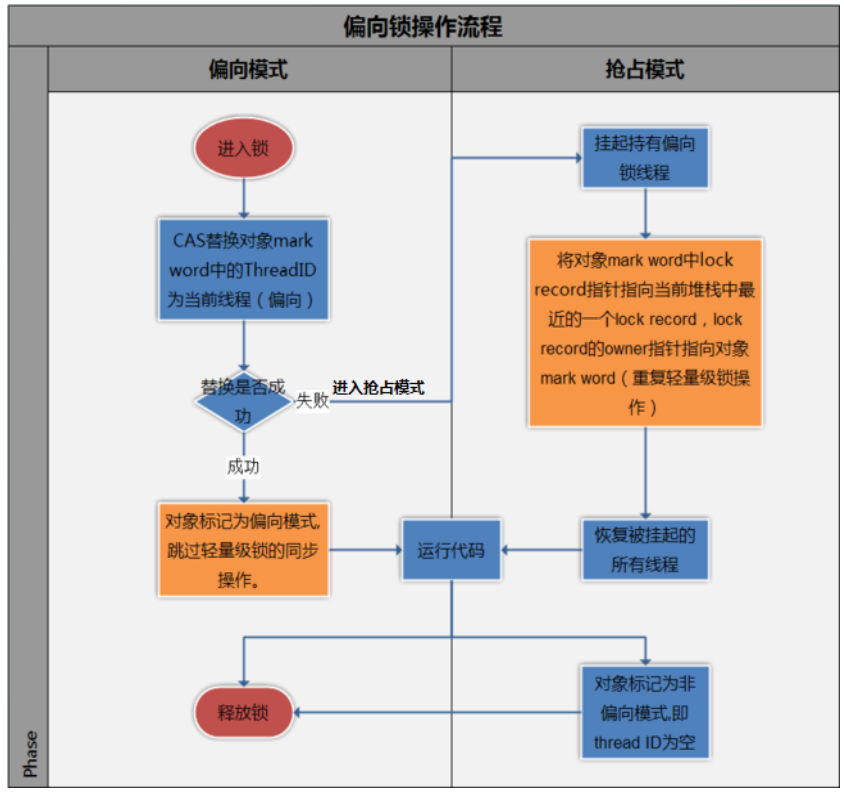
图中涉及到了lock record指针指向当前堆栈中的最近⼀个lock record，是轻量级锁按照先来先服务的模式进⾏了轻量级锁的加锁。

**撤销偏向锁**

偏向锁使⽤了⼀种等到竞争出现才释放锁的机制，所以当其他线程尝试竞争偏向锁时， 持有偏向锁的线程才会释放锁。

偏向锁升级成轻量级锁时，会暂停拥有偏向锁的线程，重置偏向锁标识，这个过程看起来容易，实则开销还是很⼤的，⼤概的过程如下：

偏向锁使用了一种等到竞争出现才释放锁的机制，所以当其他线程尝试竞争偏向锁时，持有偏向锁的线程才会释放锁。偏向锁的撤销，需要等待全局安全点（在这个时间点上没有正在执行的字节码）。它会首先暂停拥有偏向锁的线程，然后检查持有偏向锁的线程是否活着，如果线程不处于活动状态，则将对象头设置成无锁状态；如果线程仍然活着，拥有偏向锁的栈会被执行，遍历偏向对象的锁记录，栈中的锁记录和对象头的Mark Word要么重新偏向于其他线程，要么恢复到无锁或者标记对象不适合作为偏向锁，最后唤醒暂停的线程

所以，如果应⽤程序⾥所有的锁通常出于竞争状态，那么偏向锁就会是⼀种累赘，对于这种情况，我们可以⼀开始就把偏向锁这个默认功能给关闭：


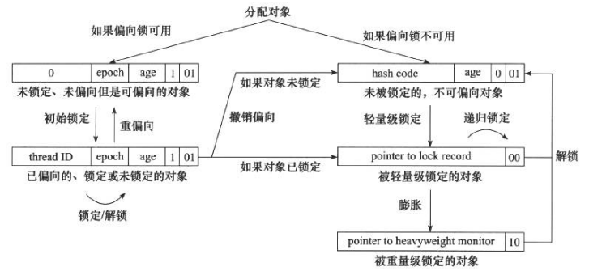


### 7.4.6. 轻量级锁
<a href="#menu"  >目录</a>

倘若偏向锁失败，虚拟机并不会立即升级为重量级锁，它还会尝试使用一种称为轻量级锁的优化手段(1.6之后加入的)，此时Mark Word 的结构也变为轻量级锁的结构。轻量级锁能够提升程序性能的依据是“对绝大部分的锁，在整个同步周期内都不存在竞争”，注意这是经验数据。需要了解的是，轻量级锁所适应的场景是线程交替执行同步块的场合，如果存在同一时间访问同一锁的场合，就会导致轻量级锁膨胀为重量级锁。

多个线程在不同时段获取同⼀把锁，即不存在锁竞争的情况，也就没有线程阻塞。针对这种情况，JVM采⽤轻量级锁来避免线程的阻塞与唤醒。

如果偏向锁失败，即上一个请求的锁的线程和这个线程不是同一个。偏向锁失败意味着不能避免做同步操作。此时，虚拟机并不会立即挂起线程。他会使用一种称为轻量级锁的优化手段。 轻量级锁的操作也很方便，它只是简单地将对象头部作为指针，指向持有锁的线程堆栈的内部，来判断一个线程是否持有对象锁。 如果线程获得轻量级锁成功，则可以顺利进入临界区。如果轻量级锁失败，则表示其他线程抢先争夺了锁，那么当前线程的锁请求就会膨胀为重量级锁。

轻量级锁是JDK1.6中加入的新型锁机制。轻量级是相对于使用操作系统的互斥量来实现的传统锁而言.因此传统的锁被称为重量级锁.轻量级锁并不是用来代替重量级锁的，它的本意是在没有多线程竞争的前提下，减少传统重量级锁使用操作系统互斥量产生的性能消耗。

轻量级锁提升程序性能的依据是“对于绝大多数的锁，在整个同步周期内都是不存在竞争的”，这是一个经验数据。如果没有竞争，轻量级锁使用CAS操作避免了使用互斥量的开销，但如果存在锁竞争，除了互斥量的开销外，还额外发生了CAS操作，因此在有竞争的情况下，轻量级锁比传统锁更慢。重量级锁，重量级锁依赖于操作系统的互斥量（mutex） 实现， 该操作会导致进程从用户态与内核态之间的切换， 是一个开销较大的操作。


**轻量级锁的加锁过程：**
1. 如果此同步对象没有被锁定（锁标志位为01状态）：虚拟机首先将在当前线程的栈帧中建立一个名为 锁记录Displaced Mark Word的空间，用于存储对象目前的Mark Word 的拷贝；如果⼀个线程获得锁的时候发现是轻量级锁，会把锁的Mark Word复制到⾃⼰的Displaced Mark Word⾥⾯。
2. 然后，虚拟机将使用CAS 操作尝试将对象的 Mark Word 更新为指向 Lock Record的指针；
3. 如果这个更新工作成功了，那么这个线程就拥有了该对象的锁，并且对象Mark Word的锁标志位将转变为 00，即表示 此对象处于轻量级锁定状态；
4. 如果这个更新失败了，虚拟机首先会检查对象的Mark Word 是否指向当前线程的栈帧，如果只说明当前线程已经拥有了这个对象的锁，那就可以直接进入同步块继续执行，否则说明这个锁对象以及被其他线程抢占了,当前线程就尝试使⽤⾃旋来获取锁。如果有两条以上的线程争用同一个锁，那轻量级锁就不再有效，要膨胀为重量级锁，锁标志的状态值变为 10，Mark Word中存储的就是指向重量级（互斥量）的指针，后面等待锁的线程也要进入阻塞状态；

⾃旋是需要消耗CPU的，如果⼀直获取不到锁的话，那该线程就⼀直处在⾃旋状态，⽩⽩浪费CPU资源。解决这个问题最简单的办法就是指定⾃旋的次数，例如让
其循环10次，如果还没获取到锁就进⼊阻塞状态。
但是JDK采⽤了更聪明的⽅式——适应性⾃旋，简单来说就是线程如果⾃旋成功了，则下次⾃旋的次数会更多，如果⾃旋失败了，则⾃旋的次数就会减少。
⾃旋也不是⼀直进⾏下去的，如果⾃旋到⼀定程度（和JVM、操作系统相关），依然没有获取到锁，称为⾃旋失败，那么这个线程会阻塞。同时这个锁就会升级成重量级锁。

**轻量级锁的解锁过程：**
1. 如果对象的Mark Word仍然指向着线程的锁记录，当前线程会使⽤CAS操作将Displaced Mark Word的内容复制回锁的Mark Word⾥⾯。；
2. 如果替换成功，整个同步过程就完成了；
3. 如果替换失败，说明有其他线程因为⾃旋多次导致轻量级锁升级成了重量级锁，那就要在释放锁的同时，唤醒被挂起的线程；

### 7.4.7. 重量级锁

<a href="#menu"  >目录</a>

重量级锁依赖于操作系统的互斥量（mutex） 实现的，⽽操作系统中线程间状态的转换需要相对⽐较⻓的时间，所以重量级锁效率很低，但被阻塞的线程不会消耗CPU。

前⾯说到，每⼀个对象都可以当做⼀个锁，当多个线程同时请求某个对象锁时，对象锁会设置⼏种状态⽤来区分请求的线程：
```
Contention List：所有请求锁的线程将被⾸先放置到该竞争队列
Entry List：Contention List中那些有资格成为候选⼈的线程被移到Entry List
Wait Set：那些调⽤wait⽅法被阻塞的线程被放置到Wait Set
OnDeck：任何时刻最多只能有⼀个线程正在竞争锁，该线程称为OnDeck
Owner：获得锁的线程称为Owner
!Owner：释放锁的线程
```

当⼀个线程尝试获得锁时，如果该锁已经被占⽤，则会将该线程封装成⼀个 ObjectWaiter 对象插⼊到Contention List的队列的队⾸，然后调⽤ park 函数挂起当前线程。

当线程释放锁时，会从Contention List或EntryList中挑选⼀个线程唤醒，被选中的线程叫做 Heir presumptive 即假定继承⼈，假定继承⼈被唤醒后会尝试获得锁，但 synchronized 是⾮公平的，所以假定继承⼈不⼀定能获得锁。这是因为对于重量级锁，线程先⾃旋尝试获得锁，这样做的⽬的是为了减少执⾏操作系统同步操作带来的开销。如果⾃旋不成功再进⼊等待队列。这对那些已经在等待队列中的线程来说，稍微显得不公平，还有⼀个不公平的地⽅是⾃旋线程可能会抢占了Ready线程的锁。

果线程获得锁后调⽤ Object.wait ⽅法，则会将线程加⼊到WaitSet中，当被 Object.notify 唤醒后，会将线程从WaitSet移动到Contention List或EntryList中去。需要注意的是，当调⽤⼀个锁对象的 wait 或 notify ⽅法时，如当前锁的状态是偏向锁或轻量级锁则会先膨胀成重量级锁。

### 7.4.8. 总结锁的升级流程

* 每⼀个线程在准备获取共享资源时： 第⼀步，检查MarkWord⾥⾯是不是放的⾃⼰的ThreadId ,如果是，表示当前线程是处于 “偏向锁” 。
* 第⼆步，如果MarkWord不是⾃⼰的ThreadId，锁升级，这时候，⽤CAS来执⾏切换，新的线程根据MarkWord⾥⾯现有的ThreadId，通知之前线程暂停，之前线程将Markword的内容置为空。
* 第三步，两个线程都把锁对象的HashCode复制到⾃⼰新建的⽤于存储锁的记录空间，接着开始通过CAS操作， 把锁对象的MarKword的内容修改为⾃⼰新建的记录空间的地址的⽅式竞争MarkWord。
* 第四步，第三步中成功执⾏CAS的获得资源，失败的则进⼊⾃旋 。
* 第五步，⾃旋的线程在⾃旋过程中，成功获得资源(即之前获的资源的线程执⾏完成并释放了共享资源)，则整个状态依然处于 轻量级锁的状态，如果⾃旋失败 。
* 第六步，进⼊重量级锁的状态，这个时候，⾃旋的线程进⾏阻塞，等待之前线程执⾏完成并唤醒⾃⼰。

### 7.4.9. 各种锁的优缺点对⽐

|锁 |优点 |缺点 |适⽤场景|
|---|---|---|---|
|偏 向 锁|加锁和解锁不需要额外的消耗，和执⾏⾮同步⽅法⽐仅存在纳秒级的差距。|如果线程间存在锁竞争，会带来额外的锁撤销的消耗。|适⽤于只有⼀个线程访问同步块场景。|
|轻 量 级 锁|竞争的线程不会阻塞，提⾼了程序的响应速度。|如果始终得不到锁竞争的线程使⽤⾃旋会消耗CPU。|追求响应时间。同步块执⾏速度⾮常快。
|重 量 级 锁|线程竞争不使⽤⾃旋，不会消耗CPU。|线程阻塞，响应时间缓慢。|追求吞吐量。同步块执⾏速度较⻓


## 7.5. AQS
<a href="#menu"  >目录</a>

### 7.5.1. AQS简介

AQS是 AbstractQueuedSynchronizer 的简称，即 抽象队列同步器 ，从字⾯意思上理解:
* 抽象：抽象类，只实现⼀些主要逻辑，有些⽅法由⼦类实现；
* 队列：使⽤先进先出（FIFO）队列存储数据；
* 同步：实现了同步的功能。

那AQS有什么⽤呢？AQS是⼀个⽤来构建锁和同步器的框架，使⽤AQS能简单且⾼效地构造出应⽤⼴泛的同步器，⽐如我们提到的ReentrantLock，Semaphore，
ReentrantReadWriteLock，SynchronousQueue，FutureTask等等皆是基于AQS的。

当然，我们⾃⼰也能利⽤AQS⾮常轻松容易地构造出符合我们⾃⼰需求的同步器，只要之类实现它的⼏个 protected ⽅法就可以了

### 7.5.2. AQS数据结构
<a href="#menu"  >目录</a>

AQS内部使⽤了⼀个volatile的变量state来作为资源的标识。同时定义了⼏个获取和改版state的protected⽅法，⼦类可以覆盖这些⽅法来实现⾃⼰的逻辑：
```java
getState()
setState()
compareAndSetState()
```
这三种叫做均是原⼦操作，其中compareAndSetState的实现依赖于Unsafe的compareAndSwapInt()⽅法。⽽AQS类本身实现的是⼀些排队和阻塞的机制，⽐如具体线程等待队列的维护（如获取资源失败⼊队/唤醒出队等）。它内部使⽤了⼀个先进先出（FIFO）的双端队列，并使⽤了两个指针head和tail⽤于标识队列的头部和尾部。其数据结构如图：

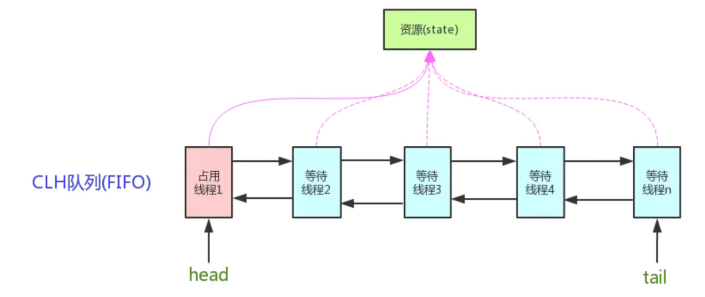

但它并不是直接储存线程，⽽是储存拥有线程的Node节点。

资源有两种共享模式，或者说两种同步⽅式：
* 独占模式（Exclusive）：资源是独占的，⼀次只能⼀个线程获取。如ReentrantLock。
* 共享模式（Share）：同时可以被多个线程获取，具体的资源个数可以通过参数指定。如Semaphore/CountDownLatch。
⼀般情况下，⼦类只需要根据需求实现其中⼀种模式，当然也有同时实现两种模式的同步类，如 ReadWriteLock


### 7.5.3. AQS节点Node
<a href="#menu"  >目录</a>

```JAVA
static final class Node {
    /** Marker to indicate a node is waiting in shared mode */
    //默认是共享模式
    static final Node SHARED = new Node();
    /** Marker to indicate a node is waiting in exclusive mode */
    static final Node EXCLUSIVE = null;

    /** waitStatus value to indicate thread has cancelled */
    static final int CANCELLED =  1;
    /** waitStatus value to indicate successor's thread needs unparking唤醒 */
    static final int SIGNAL    = -1;
    /** waitStatus value to indicate thread is waiting on condition */
    static final int CONDITION = -2;
    /*waitStatus value to indicate the next acquireShared should　unconditionally propagate*/
    static final int PROPAGATE = -3;

    volatile int waitStatus;

    /**
        * Link to predecessor node that current node/thread relies on
        * for checking waitStatus. Assigned during enqueuing, and nulled
        * out (for sake of GC) only upon dequeuing.  Also, upon
        * cancellation of a predecessor, we short-circuit while
        * finding a non-cancelled one, which will always exist
        * because the head node is never cancelled: A node becomes
        * head only as a result of successful acquire. A
        * cancelled thread never succeeds in acquiring, and a thread only
        * cancels itself, not any other node.
        */
    volatile Node prev;

    /**
        * Link to the successor node that the current node/thread
        * unparks upon release. Assigned during enqueuing, adjusted
        * when bypassing cancelled predecessors, and nulled out (for
        * sake of GC) when dequeued.  The enq operation does not
        * assign next field of a predecessor until after attachment,
        * so seeing a null next field does not necessarily mean that
        * node is at end of queue. However, if a next field appears
        * to be null, we can scan prev's from the tail to
        * double-check.  The next field of cancelled nodes is set to
        * point to the node itself instead of null, to make life
        * easier for isOnSyncQueue.
        */
    volatile Node next;

    /*节点对应的线程*/
    volatile Thread thread;

    /**
        * Link to next node waiting on condition, or the special
        * value SHARED.  Because condition queues are accessed only
        * when holding in exclusive mode, we just need a simple
        * linked queue to hold nodes while they are waiting on
        * conditions. They are then transferred to the queue to
        * re-acquire. And because conditions can only be exclusive,
        * we save a field by using special value to indicate shared
        * mode.
        */
    Node nextWaiter;

    /**
        * Returns true if node is waiting in shared mode.
        */
    final boolean isShared() {
        return nextWaiter == SHARED;
    }

    /**
        * Returns previous node, or throws NullPointerException if null.
        * Use when predecessor cannot be null.  The null check could
        * be elided, but is present to help the VM.
        *
        * @return the predecessor of this node
        */
    final Node predecessor() throws NullPointerException {
        Node p = prev;
        if (p == null)
            throw new NullPointerException();
        else
            return p;
    }

    Node() {    // Used to establish initial head or SHARED marker
    }

    Node(Thread thread, Node mode) {     // Used by addWaiter
        this.nextWaiter = mode;
        this.thread = thread;
    }

    Node(Thread thread, int waitStatus) { // Used by Condition
        this.waitStatus = waitStatus;
        this.thread = thread;
    }
}
```

**结点状态waitStatus**

Node结点是对每一个等待获取资源的线程的封装，其包含了需要同步的线程本身及其等待状态，如是否被阻塞、是否等待唤醒、是否已经被取消等。变量waitStatus则表示当前Node结点的等待状态，共有5种取值CANCELLED、SIGNAL、CONDITION、PROPAGATE、0。
* CANCELLED(1)：表示当前结点已取消调度。当timeout或被中断（响应中断的情况下），会触发变更为此状态，进入该状态后的结点将不会再变化。
* SIGNAL(-1)：表示后继结点在等待当前结点唤醒。后继结点入队时，会将前继结点的状态更新为SIGNAL。
* CONDITION(-2)：表示结点等待在Condition上，当其他线程调用了Condition的signal()方法后，CONDITION状态的结点将从等待队列转移到同步队中，等待获取同步锁。
* PROPAGATE(-3)：共享模式下，前继结点不仅会唤醒其后继结点，同时也可能会唤醒后继的后继结点。
* 0：新结点入队时的默认状态。

注意，负值表示结点处于有效等待状态，而正值表示结点已被取消。所以源码中很多地方用>0、<0来判断结点的状态是否正常。

### 7.5.4. AQS的主要⽅法源码解析
<a href="#menu"  >目录</a>

AQS的设计是基于模板⽅法模式的，它有⼀些⽅法必须要⼦类去实现的，它们主要有：
* isHeldExclusively()：该线程是否正在独占资源。只有⽤到condition才需要去实现它。
* tryAcquire(int)：独占⽅式。尝试获取资源，成功则返回true，失败则返回false。
* tryRelease(int)：独占⽅式。尝试释放资源，成功则返回true，失败则返回false。
* tryAcquireShared(int)：共享⽅式。尝试获取资源。负数表示失败；0表示成功，但没有剩余可⽤资源；正数表示成功，且有剩余资源。
* tryReleaseShared(int)：共享⽅式。尝试释放资源，如果释放后允许唤醒后续等待结点返回true，否则返回false。


以ReentrantLock为例，state初始化为0，表示未锁定状态。A线程lock()时，会调用tryAcquire()独占该锁并将state+1。此后，其他线程再tryAcquire()时就会失败，直到A线程unlock()到state=0（即释放锁）为止，其它线程才有机会获取该锁。当然，释放锁之前，A线程自己是可以重复获取此锁的（state会累加），这就是可重入的概念。但要注意，获取多少次就要释放多么次，这样才能保证state是能回到零态的。

　　再以CountDownLatch以例，任务分为N个子线程去执行，state也初始化为N（注意N要与线程个数一致）。这N个子线程是并行执行的，每个子线程执行完后countDown()一次，state会CAS减1。等到所有子线程都执行完后(即state=0)，会unpark()主调用线程，然后主调用线程就会从await()函数返回，继续后余动作。

　　一般来说，自定义同步器要么是独占方法，要么是共享方式，他们也只需实现tryAcquire-tryRelease、tryAcquireShared-tryReleaseShared中的一种即可。但AQS也支持自定义同步器同时实现独占和共享两种方式，如ReentrantReadWriteLock。


### 7.5.5. 独占模式下获取资源
<a href="#menu"  >目录</a>


**acquire(int)**
此方法是独占模式下线程获取共享资源的顶层入口。如果获取到资源，线程直接返回，否则进入等待队列，直到获取到资源为止，且整个过程忽略中断的影响。这也正是lock()的语义，当然不仅仅只限于lock()。获取到资源后，线程就可以去执行其临界区代码了。下面是acquire()的源码：

```java
public final void acquire(int arg) {
    if (!tryAcquire(arg) &&
        acquireQueued(addWaiter(Node.EXCLUSIVE), arg))
        selfInterrupt();
}
```
函数流程如下：
1. tryAcquire()尝试直接去获取资源，如果成功则直接返回（这里体现了非公平锁，每个线程获取锁时会尝试直接抢占加塞一次，而CLH队列中可能还有别的线程在等待）；
2. addWaiter()将该线程加入等待队列的尾部，并标记为独占模式；
3. acquireQueued()使线程阻塞在等待队列中获取资源，一直获取到资源后才返回。如果在整个等待过程中被中断过，则返回true，否则返回false。
4. 如果线程在等待过程中被中断过，它是不响应的。只是获取资源后才再进行自我中断selfInterrupt()，将中断补上。

这时单凭这4个抽象的函数来看流程还有点朦胧，不要紧，看完接下来的分析后，你就会明白了。就像《大话西游》里唐僧说的：等你明白了舍生取义的道理，你自然会回来和我唱这首歌的。

**tryAcquire(int)**

此方法尝试去获取独占资源。如果获取成功，则直接返回true，否则直接返回false。这也正是tryLock()的语义，还是那句话，当然不仅仅只限于tryLock()。如下是tryAcquire()的源码：

```java
protected boolean tryAcquire(int arg) {
    throw new UnsupportedOperationException();
}
```
AQS这里只定义了一个接口，具体资源的获取交由自定义同步器去实现了（通过state的get/set/CAS）！！！至于能不能重入，能不能加塞，那就看具体的自定义同步器怎么去设计了！！！当然，自定义同步器在进行资源访问时要考虑线程安全的影响。

这里之所以没有定义成abstract，是因为独占模式下只用实现tryAcquire-tryRelease，而共享模式下只用实现tryAcquireShared-tryReleaseShared。如果都定义成abstract，那么每个模式也要去实现另一模式下的接口。

**addWaiter(Node)**

此方法用于将当前线程加入到等待队列的队尾，并返回当前线程所在的结点。
```java
private Node addWaiter(Node mode) {
    //创建当前线程的节点
    Node node = new Node(Thread.currentThread(), mode);
    // Try the fast path of enq; backup to full enq on failure
    Node pred = tail;
    if (pred != null) {
        node.prev = pred;
        if (compareAndSetTail(pred, node)) {
            pred.next = node;
            return node;
        }
    }
    //上一步失败则通过enq放入队尾
    enq(node);
    return node;
}
```
**enq(Node)**
```java
private Node enq(final Node node) {
    // //CAS"自旋"，直到成功加入队尾
    for (;;) {
        Node t = tail;
        //队列为空
        if (t == null) { // Must initialize
            if (compareAndSetHead(new Node()))
                tail = head;
        } else {
            //正常流程
            node.prev = t;
            if (compareAndSetTail(t, node)) {
                t.next = node;
                return t;
            }
        }
    }
}
```
**acquireQueued**

通过tryAcquire()和addWaiter()，该线程获取资源失败，已经被放入等待队列尾部了。下一步进入等待状态休息，直到其他线程彻底释放资源后唤醒自己，自己再拿到资源，然后就可以去干自己想干的事了。acquireQueued()就是干这件事：在等待队列中排队拿号（中间没其它事干可以休息），直到拿到号后再返回

```java
final boolean acquireQueued(final Node node, int arg) {
    //标记是否成功拿到资源
    boolean failed = true;
    try {
        //标记等待过程中是否被中断过
        boolean interrupted = false;
        for (;;) {
            final Node p = node.predecessor();
             //如果前驱是head，即该结点已成老二，那么便有资格去尝试获取资源（可能是老大释放完资源唤醒自己的，当然也可能被interrupt了）。
            if (p == head && tryAcquire(arg)) {
                setHead(node);//拿到资源后，将head指向该结点。所以head所指的标杆结点，就是当前获取到资源的那个结点或null。
                p.next = null;  // setHead中node.prev已置为null，此处再将head.next置为null，就是为了方便GC回收以前的head结点。也就意味着之前拿完资源的结点出队了！
                failed = false;// 成功获取资源
                return interrupted;//返回等待过程中是否被中断过
            }
             //如果自己可以休息了，就通过park()进入waiting状态，直到被unpark()。如果不可中断的情况下被中断了，那么会从park()中醒过来，发现拿不到资源，从而继续进入park()等待。
            if (shouldParkAfterFailedAcquire(p, node) &&
                parkAndCheckInterrupt())
                //如果等待过程中被中断过，哪怕只有那么一次，就将interrupted标记为true
                interrupted = true;
        }
    } finally {
        // 如果等待过程中没有成功获取资源（如timeout，或者可中断的情况下被中断了），那么取消结点在队列中的等待。
        if (failed)
            cancelAcquire(node);
    }
}
```

**shouldParkAfterFailedAcquire(Node, Node)**

此方法主要用于检查状态，看看自己是否真的可以去休息了

```java
private static boolean shouldParkAfterFailedAcquire(Node pred, Node node) {
    ////拿到前驱的状态
    int ws = pred.waitStatus;
    if (ws == Node.SIGNAL)
        /*
            * This node has already set status asking a release
            * to signal it, so it can safely park.
            */
        ////如果已经告诉前驱拿完号后通知自己一下，那就可以安心休息了
        return true;
    if (ws > 0) {
        /*
         如果前驱放弃了，那就一直往前找，直到找到最近一个正常等待的状态，并排在它的后边。
         注意：那些放弃的结点，由于被自己“加塞”到它们前边，它们相当于形成一个无引用链，稍后就会被保安大叔赶走了(GC回收)！
            */
        do {
            node.prev = pred = pred.prev;
        } while (pred.waitStatus > 0);
        pred.next = node;
    } else {
         //如果前驱正常，那就把前驱的状态设置成SIGNAL，告诉它拿完号后通知自己一下。有可能失败，人家说不定刚刚释放完呢！
        compareAndSetWaitStatus(pred, ws, Node.SIGNAL);
    }
    return false;
}
```
整个流程中，如果前驱结点的状态不是SIGNAL，那么自己就不能安心去休息，需要去找个安心的休息点，同时可以再尝试下看有没有机会轮到自己拿号

**parkAndCheckInterrupt()**

如果线程找好安全休息点后，那就可以安心去休息了。此方法就是让线程去休息，真正进入等待状态。
```java
private final boolean parkAndCheckInterrupt() {
    LockSupport.park(this);
    return Thread.interrupted();
}
```
park()会让当前线程进入waiting状态。在此状态下，有两种途径可以唤醒该线程：1）被unpark()；2）被interrupt()。需要注意的是，Thread.interrupted()会清除当前线程的中断标记位。 


总结下该函数acquireQueued()的具体流程：
1. 结点进入队尾后，检查状态，找到安全休息点；
2. 调用park()进入waiting状态，等待unpark()或interrupt()唤醒自己；
3. 被唤醒后，看自己是不是有资格能拿到号。如果拿到，head指向当前结点，并返回从入队到拿到号的整个过程中是否被中断过；如果没拿到，继续流程1。


**小结**

acquire流程:
1. 调用自定义同步器的tryAcquire()尝试直接去获取资源，如果成功则直接返回；
2. 没成功，则addWaiter()将该线程加入等待队列的尾部，并标记为独占模式；
3. acquireQueued()使线程在等待队列中休息，有机会时（轮到自己，会被unpark()）会去尝试获取资源。获取到资源后才返回。如果在整个等待过程中被中断过，则返回true，否则返回false。
4. 如果线程在等待过程中被中断过，它是不响应的。只是获取资源后才再进行自我中断selfInterrupt()，将中断补上。


这也就是ReentrantLock.lock()的流程，整个函数就是一条acquire(1)

### 7.5.6. 独占模式下释放资源
<a href="#menu"  >目录</a>

此方法是独占模式下线程释放共享资源的顶层入口。它会释放指定量的资源，如果彻底释放了（即state=0）,它会唤醒等待队列里的其他线程来获取资源。这也正是unlock()的语义

```java
public final boolean release(int arg) {
    if (tryRelease(arg)) {
        Node h = head;
        if (h != null && h.waitStatus != 0)
            unparkSuccessor(h);
        return true;
    }
    return false;
}
```

逻辑并不复杂。它调用tryRelease()来释放资源。有一点需要注意的是，它是根据tryRelease()的返回值来判断该线程是否已经完成释放掉资源了！所以自定义同步器在设计tryRelease()的时候要明确这一点！！

**tryRelease(int)**

此方法尝试去释放指定量的资源。下面是tryRelease()的源码：
```java
protected boolean tryRelease(int arg) {
     throw new UnsupportedOperationException();
}
```

跟tryAcquire()一样，这个方法是需要独占模式的自定义同步器去实现的。正常来说，tryRelease()都会成功的，因为这是独占模式，该线程来释放资源，那么它肯定已经拿到独占资源了，直接减掉相应量的资源即可(state-=arg)，也不需要考虑线程安全的问题。但要注意它的返回值，上面已经提到了，release()是根据tryRelease()的返回值来判断该线程是否已经完成释放掉资源了！所以自义定同步器在实现时，如果已经彻底释放资源(state=0)，要返回true，否则返回false。

**unparkSuccessor(Node)**

　　此方法用于唤醒等待队列中下一个线程。下面是源码：

```java
 1 private void unparkSuccessor(Node node) {
 2     //这里，node一般为当前线程所在的结点。
 3     int ws = node.waitStatus;
 4     if (ws < 0)//置零当前线程所在的结点状态，允许失败。
 5         compareAndSetWaitStatus(node, ws, 0);
 6 
 7     Node s = node.next;//找到下一个需要唤醒的结点s
 8     if (s == null || s.waitStatus > 0) {//如果为空或已取消
 9         s = null;
10         for (Node t = tail; t != null && t != node; t = t.prev) // 从后向前找。
11             if (t.waitStatus <= 0)//从这里可以看出，<=0的结点，都是还有效的结点。
12                 s = t;
13     }
14     if (s != null)
15         LockSupport.unpark(s.thread);//唤醒
16 }
```
 

　　这个函数并不复杂。一句话概括：用unpark()唤醒等待队列中最前边的那个未放弃线程，这里我们也用s来表示吧。此时，再和acquireQueued()联系起来，s被唤醒后，进入if (p == head && tryAcquire(arg))的判断（即使p!=head也没关系，它会再进入shouldParkAfterFailedAcquire()寻找一个安全点。这里既然s已经是等待队列中最前边的那个未放弃线程了，那么通过shouldParkAfterFailedAcquire()的调整，s也必然会跑到head的next结点，下一次自旋p==head就成立啦），然后s把自己设置成head标杆结点，表示自己已经获取到资源了，acquire()也返回了！！And then, DO what you WANT!

**小结**
　　release()是独占模式下线程释放共享资源的顶层入口。它会释放指定量的资源，如果彻底释放了（即state=0）,它会唤醒等待队列里的其他线程来获取资源。

如果获取锁的线程在release时异常了，没有unpark队列中的其他结点，这时队列中的其他结点会怎么办？是不是没法再被唤醒了？

答案是YES（测试程序详见76楼）！！！这时，队列中等待锁的线程将永远处于park状态，无法再被唤醒！！！但是我们再回头想想，获取锁的线程在什么情形下会release抛出异常呢？？

线程突然死掉了？可以通过thread.stop来停止线程的执行，但该函数的执行条件要严苛的多，而且函数注明是非线程安全的，已经标明Deprecated；
线程被interupt了？线程在运行态是不响应中断的，所以也不会抛出异常；
release代码有bug，抛出异常了？目前来看，Doug Lea的release方法还是比较健壮的，没有看出能引发异常的情形（如果有，恐怕早被用户吐槽了）。

### 7.5.7. 共享模式下获取资源
<a href="#menu"  >目录</a>

**acquireShared(int)**

　　此方法是共享模式下线程获取共享资源的顶层入口。它会获取指定量的资源，获取成功则直接返回，获取失败则进入等待队列，直到获取到资源为止，整个过程忽略中断。下面是acquireShared()的源码：

```java
public final void acquireShared(int arg) {
   if (tryAcquireShared(arg) < 0)
       doAcquireShared(arg);
}
```

　　这里tryAcquireShared()依然需要自定义同步器去实现。但是AQS已经把其返回值的语义定义好了：负值代表获取失败；0代表获取成功，但没有剩余资源；正数表示获取成功，还有剩余资源，其他线程还可以去获取。所以这里acquireShared()的流程就是：
1. tryAcquireShared()尝试获取资源，成功则直接返回；
2. 失败则通过doAcquireShared()进入等待队列，直到获取到资源为止才返回。
   
**doAcquireShared(int)**

此方法用于将当前线程加入等待队列尾部休息，直到其他线程释放资源唤醒自己，自己成功拿到相应量的资源后才返回。下面是doAcquireShared()的源码：

```java
 1 private void doAcquireShared(int arg) {
 2     final Node node = addWaiter(Node.SHARED);//加入队列尾部
 3     boolean failed = true;//是否成功标志
 4     try {
 5         boolean interrupted = false;//等待过程中是否被中断过的标志
 6         for (;;) {
 7             final Node p = node.predecessor();//前驱
 8             if (p == head) {//如果到head的下一个，因为head是拿到资源的线程，此时node被唤醒，很可能是head用完资源来唤醒自己的
 9                 int r = tryAcquireShared(arg);//尝试获取资源
10                 if (r >= 0) {//成功
11                     setHeadAndPropagate(node, r);//将head指向自己，还有剩余资源可以再唤醒之后的线程
12                     p.next = null; // help GC
13                     if (interrupted)//如果等待过程中被打断过，此时将中断补上。
14                         selfInterrupt();
15                     failed = false;
16                     return;
17                 }
18             }
19             
20             //判断状态，寻找安全点，进入waiting状态，等着被unpark()或interrupt()
21             if (shouldParkAfterFailedAcquire(p, node) &&
22                 parkAndCheckInterrupt())
23                 interrupted = true;
24         }
25     } finally {
26         if (failed)
27             cancelAcquire(node);
28     }
29 }
```
 
有木有觉得跟acquireQueued()很相似？对，其实流程并没有太大区别。只不过这里将补中断的selfInterrupt()放到doAcquireShared()里了，而独占模式是放到acquireQueued()之外，其实都一样，不知道Doug Lea是怎么想的。

跟独占模式比，还有一点需要注意的是，这里只有线程是head.next时（“老二”），才会去尝试获取资源，有剩余的话还会唤醒之后的队友。那么问题就来了，假如老大用完后释放了5个资源，而老二需要6个，老三需要1个，老四需要2个。老大先唤醒老二，老二一看资源不够，他是把资源让给老三呢，还是不让？答案是否定的！老二会继续park()等待其他线程释放资源，也更不会去唤醒老三和老四了。独占模式，同一时刻只有一个线程去执行，这样做未尝不可；但共享模式下，多个线程是可以同时执行的，现在因为老二的资源需求量大，而把后面量小的老三和老四也都卡住了。当然，这并不是问题，只是AQS保证严格按照入队顺序唤醒罢了（保证公平，但降低了并发）。

**setHeadAndPropagate(Node, int)**
```java
 1 private void setHeadAndPropagate(Node node, int propagate) {
 2     Node h = head; 
 3     setHead(node);//head指向自己
 4      //如果还有剩余量，继续唤醒下一个邻居线程
 5     if (propagate > 0 || h == null || h.waitStatus < 0) {
 6         Node s = node.next;
 7         if (s == null || s.isShared())
 8             doReleaseShared();
 9     }
10 }
```
 
此方法在setHead()的基础上多了一步，就是自己苏醒的同时，如果条件符合（比如还有剩余资源），还会去唤醒后继结点，毕竟是共享模式！

doReleaseShared()我们留着下一小节的releaseShared()里来讲。

 
**小结**

OK，至此，acquireShared()也要告一段落了。让我们再梳理一下它的流程：

tryAcquireShared()尝试获取资源，成功则直接返回；
失败则通过doAcquireShared()进入等待队列park()，直到被unpark()/interrupt()并成功获取到资源才返回。整个等待过程也是忽略中断的。
其实跟acquire()的流程大同小异，只不过多了个自己拿到资源后，还会去唤醒后继队友的操作（这才是共享嘛）。

### 7.5.8. 共享模式下释放资源
<a href="#menu"  >目录</a>

**releaseShared()**
　　上一小节已经把acquireShared()说完了，这一小节就来讲讲它的反操作releaseShared()吧。此方法是共享模式下线程释放共享资源的顶层入口。它会释放指定量的资源，如果成功释放且允许唤醒等待线程，它会唤醒等待队列里的其他线程来获取资源。下面是releaseShared()的源码：

```java
1 public final boolean releaseShared(int arg) {
2     if (tryReleaseShared(arg)) {//尝试释放资源
3         doReleaseShared();//唤醒后继结点
4         return true;
5     }
6     return false;
7 }
```
 

　　此方法的流程也比较简单，一句话：释放掉资源后，唤醒后继。跟独占模式下的release()相似，但有一点稍微需要注意：独占模式下的tryRelease()在完全释放掉资源（state=0）后，才会返回true去唤醒其他线程，这主要是基于独占下可重入的考量；而共享模式下的releaseShared()则没有这种要求，共享模式实质就是控制一定量的线程并发执行，那么拥有资源的线程在释放掉部分资源时就可以唤醒后继等待结点。例如，资源总量是13，A（5）和B（7）分别获取到资源并发运行，C（4）来时只剩1个资源就需要等待。A在运行过程中释放掉2个资源量，然后tryReleaseShared(2)返回true唤醒C，C一看只有3个仍不够继续等待；随后B又释放2个，tryReleaseShared(2)返回true唤醒C，C一看有5个够自己用了，然后C就可以跟A和B一起运行。而ReentrantReadWriteLock读锁的tryReleaseShared()只有在完全释放掉资源（state=0）才返回true，所以自定义同步器可以根据需要决定tryReleaseShared()的返回值。

**doReleaseShared()**

　　此方法主要用于唤醒后继。下面是它的源码：
```java
 1 private void doReleaseShared() {
 2     for (;;) {
 3         Node h = head;
 4         if (h != null && h != tail) {
 5             int ws = h.waitStatus;
 6             if (ws == Node.SIGNAL) {
 7                 if (!compareAndSetWaitStatus(h, Node.SIGNAL, 0))
 8                     continue;
 9                 unparkSuccessor(h);//唤醒后继
10             }
11             else if (ws == 0 &&
12                      !compareAndSetWaitStatus(h, 0, Node.PROPAGATE))
13                 continue;
14         }
15         if (h == head)// head发生变化
16             break;
17     }
18 }
```
 
**小结**

　　本节我们详解了独占和共享两种模式下获取-释放资源(acquire-release、acquireShared-releaseShared)的源码，相信大家都有一定认识了。值得注意的是，acquire()和acquireShared()两种方法下，线程在等待队列中都是忽略中断的。AQS也支持响应中断的，acquireInterruptibly()/acquireSharedInterruptibly()即是，相应的源码跟acquire()和acquireShared()差不多，这里就不再详解了。

 
### 7.5.9. 简单应用
　
　通过前边几个章节的学习，相信大家已经基本理解AQS的原理了。这里再将“框架”一节中的一段话复制过来：

　　不同的自定义同步器争用共享资源的方式也不同。自定义同步器在实现时只需要实现共享资源state的获取与释放方式即可，至于具体线程等待队列的维护（如获取资源失败入队/唤醒出队等），AQS已经在顶层实现好了。自定义同步器实现时主要实现以下几种方法：

isHeldExclusively()：该线程是否正在独占资源。只有用到condition才需要去实现它。
tryAcquire(int)：独占方式。尝试获取资源，成功则返回true，失败则返回false。
tryRelease(int)：独占方式。尝试释放资源，成功则返回true，失败则返回false。
tryAcquireShared(int)：共享方式。尝试获取资源。负数表示失败；0表示成功，但没有剩余可用资源；正数表示成功，且有剩余资源。
tryReleaseShared(int)：共享方式。尝试释放资源，如果释放后允许唤醒后续等待结点返回true，否则返回false。
　　OK，下面我们就以AQS源码里的Mutex为例，讲一下AQS的简单应用。

4.1 Mutex（互斥锁）
　　Mutex是一个不可重入的互斥锁实现。锁资源（AQS里的state）只有两种状态：0表示未锁定，1表示锁定。下边是Mutex的核心源码：

```java
 1 class Mutex implements Lock, java.io.Serializable {
 2     // 自定义同步器
 3     private static class Sync extends AbstractQueuedSynchronizer {
 4         // 判断是否锁定状态
 5         protected boolean isHeldExclusively() {
 6             return getState() == 1;
 7         }
 8 
 9         // 尝试获取资源，立即返回。成功则返回true，否则false。
10         public boolean tryAcquire(int acquires) {
11             assert acquires == 1; // 这里限定只能为1个量
12             if (compareAndSetState(0, 1)) {//state为0才设置为1，不可重入！
13                 setExclusiveOwnerThread(Thread.currentThread());//设置为当前线程独占资源
14                 return true;
15             }
16             return false;
17         }
18 
19         // 尝试释放资源，立即返回。成功则为true，否则false。
20         protected boolean tryRelease(int releases) {
21             assert releases == 1; // 限定为1个量
22             if (getState() == 0)//既然来释放，那肯定就是已占有状态了。只是为了保险，多层判断！
23                 throw new IllegalMonitorStateException();
24             setExclusiveOwnerThread(null);
25             setState(0);//释放资源，放弃占有状态
26             return true;
27         }
28     }
29 
30     // 真正同步类的实现都依赖继承于AQS的自定义同步器！
31     private final Sync sync = new Sync();
32 
33     //lock<-->acquire。两者语义一样：获取资源，即便等待，直到成功才返回。
34     public void lock() {
35         sync.acquire(1);
36     }
37 
38     //tryLock<-->tryAcquire。两者语义一样：尝试获取资源，要求立即返回。成功则为true，失败则为false。
39     public boolean tryLock() {
40         return sync.tryAcquire(1);
41     }
42 
43     //unlock<-->release。两者语文一样：释放资源。
44     public void unlock() {
45         sync.release(1);
46     }
47 
48     //锁是否占有状态
49     public boolean isLocked() {
50         return sync.isHeldExclusively();
51     }
52 }
```
 

　　同步类在实现时一般都将自定义同步器（sync）定义为内部类，供自己使用；而同步类自己（Mutex）则实现某个接口，对外服务。当然，接口的实现要直接依赖sync，它们在语义上也存在某种对应关系！！而sync只用实现资源state的获取-释放方式tryAcquire-tryRelelase，至于线程的排队、等待、唤醒等，上层的AQS都已经实现好了，我们不用关心。

　　除了Mutex，ReentrantLock/CountDownLatch/Semphore这些同步类的实现方式都差不多，不同的地方就在获取-释放资源的方式tryAcquire-tryRelelase。掌握了这点，AQS的核心便被攻破了！

　　OK，至此，整个AQS的讲解也要落下帷幕了。希望本文能够对学习Java并发编程的同学有所借鉴，中间写的有不对的地方，也欢迎讨论和指正~


## 7.6. 显示锁Lock
<a href="#menu"  >目录</a>

### 7.6.1. synchronized的不⾜之处

synchronized 有什么不⾜之处。
* 如果临界区是只读操作，其实可以多线程⼀起执⾏，但使⽤synchronized的话，同⼀时间只能有⼀个线程执⾏。
* synchronized⽆法知道线程有没有成功获取到锁
* 使⽤synchronized，如果临界区因为IO或者sleep⽅法等原因阻塞了，⽽当前线程⼜没有释放锁，就会导致所有线程等待

### 7.6.2. 基本使用

主要接口和类
```java

public interface Lock{
    void lock();    
    void lockInterruptibly() throws InterruptedException;    
    boolean tryLock();
    boolean tryLock(long time, TimeUnit unit) throws InterruptedException;
    void unlock();
    Condition newCondition();
}
public class ReentrantLock implements Lock, java.io.Serializable {
    public ReentrantLock(boolean fair) {
        sync = fair ? new FairSync() : new NonfairSync();
    }
}

public interface ReadWriteLock {
    Lock readLock();
    Lock writeLock();
}
public class ReentrantReadWriteLock
        implements ReadWriteLock, java.io.Serializable {

    public ReentrantReadWriteLock(boolean fair) {
        sync = fair ? new FairSync() : new NonfairSync();
        readerLock = new ReadLock(this);
        writerLock = new WriteLock(this);
    }
    
    public static class WriteLock implements Lock, java.io.Serializable {}
    public static class ReadLock implements Lock, java.io.Serializable {}
}
```

使用结构
```java

public void func(){
    Lock lock = new ReentrantLock();

    try{
        lock.lock();
    } 
    finally{
        lock.unlock();
    }
}
```
* 创建Lock的实例
* 调用lock()方法获取锁
* lock()方法和unlock()方法之间的代码块为临界区。
* 调用unlock()释放锁，为了保证一定释放锁，该条语句放在finally块中。

---
* Lock支持公平锁和非公平锁，可以通过构造器指定，默认是非公平锁。
* Lock支持可重入特性

* lockInterruptibly()
    * 如果线程被中断了,不会获得锁,会产生异常
    * locK()方法不支持中断，也就是lock()调用等待锁时，此时线程发生中断，不会停止等待过程。

* **Lock与synchronized有以下区别：**
    * 首先synchronized是java内置关键字，在jvm层面，Lock是个java类；
    * synchronized会自动释放锁，而Lock必须手动释放锁。
    * synchronized无法判断是否获取锁的状态，Lock可以判断是否获取到锁；
    * Lock支持超时等待获取锁
    * Lock支持公平和非公平锁
    * Lock可以让等待锁的线程响应中断，而synchronized不会，线程会一直等待下去。
    * 通过Lock可以知道线程有没有拿到锁，而synchronized不能。
    * Lock能提高多个线程读操作的效率。
    * synchronized能锁住类、方法和代码块，而Lock是块范围内的
    * 在高争用环境下，synchronized性能极具下降。Lock性能下降少很多

**读写锁**
```java

ReadWriteLock readWriteLock = new ReentrantReadWriteLock();
Lock writeLock = readWriteLock.writeLock();
Lock readLock = readWriteLock.readLock();

public void read(){
    

    try{
        readLock.lock();
    } 
    finally{
        readLock.unlock();
    }
}
public void write(){

    try{
        writeLock.lock();
    } 
    finally{
        writeLock.unlock();
    }
}
```
* 读写锁也是一个可重入锁
* 使用场景
    * 在读多写少的环境可以使用读写锁提高并发度。
    * 读线程持有锁的时间比较长
* 读锁
    * 读读共享
    * 只有在其他线程未获得**写锁**的情况下才能获取到
    * 在获取到读锁之后，其他线程也可以同时获取到读锁，因为读读共享
* 写锁
    * 读写互斥
    * 只有在其他线程未获得**读写锁**的情况下才能获取到
    * 在获取到写锁之后，其他线程都不能获取到读锁和写锁
* 锁降级
    * 读写锁支持锁降级
    * 一个线程持有**写锁**的情况下仍然可以获取到**读锁**(其他线程获取不到读锁和写锁
* 锁升级
    * 一个线程持有**读锁**的情况下仍然可以获取到**写锁**
    * ReadWriteLock不支持锁升级

### 7.6.3. 实现原理


## 7.7. 锁与重排序
<a href="#menu"  >目录</a>

* 临界区内的操作不允许被重排序到临界区外
    * 是锁保证原子性和可见性的基础，编译器和处理器必须遵守该规则
    * 虚拟机会在临界区的开始之前和结束之后分别插入一个获取屏障和释放屏障，从而禁止临界区内的操作被排到临界区之前和之后
* 临界区内允许指令重排序
* 临界区外(临界区前和后)允许重排序
* 锁申请(monitorEnter)和锁释放(MonitorExit)不能被重排序
    * 确保锁申请是配对的，只有成功申请，才能释放
* 两个锁申请操作不能被重排序
* 两个锁释放操作不能被重排序
    * 上面三条规则确保了Java语义支持重入锁，并且避免锁操作(申请和释放)可能导致的死锁。编译器和处理器必须遵守该规则
* 临界区外的代码可以被重排序到临界区内，只要没有违反happen-before


## 7.8. 优化锁的使用
<a href="#menu"  >目录</a>

**锁的开销**
* 上下文切换和线程调度开销
    * 当一个线程释放锁被另一个线程获取到锁时，会进行线程切换，这期间会发生上下文切换，操作系统会执行入栈和出栈保存和释放一些信息。上下文切换会有一定的性能开销。
* 内存同步、编译器优化受限的开销
    * 锁的内部实现所使用的内存屏障也会产生直接和间接的开销：直接的开销是内存屏障所导致冲刷写缓冲器，清空无效化队列所导致的开销。另外内存屏障会阻塞某些编译器的优化。
* 限制可伸缩性
    * 锁的排他性使得程序运行将并发转换为串行执行，导致吞吐率下降

锁的开销主要体现在争用锁上面。因此减少锁的开销就是减少锁的使用，或者降低锁的争用程度。

**优化方法**
* 减少锁持有的时间
* 减少锁粒度
* 使用读写分离锁来替换独占锁
    * 适合读多写少的场景
* 锁分段
    * 比如一个数组，前部分使用一个锁，后部分使用一个锁。只有全局操作时才使用同一个锁。旧版本的ConcurrentHashmap使用的就是分段锁
* 使用锁的替代品
    * volatile
    * 原子变量
    * 无状态对象
    * 不可变对象
    * 线程持有对象
* 减少系统内耗：上下文切换
    * 切换线程会导致上下文切换，因此可以在满足系统需求的情况下，不应当无限制地扩大线程的数量。
    * 避免在临界区内执行阻塞式IO操作，阻塞会导致上下文切换
    * 避免在临界区中执行比较耗时的操作。耗时过程，会增加锁的争用程度，会增加上下文切换的概率。
    * 减少虚拟机的垃圾回收，垃圾回收可能会导致stw,也会出现上下文切换


# 8. 并发编程的挑战
<a href="#menu"  >目录</a>

## 8.1. 上下文切换
<a href="#menu"  >目录</a>

**基本概念**
* 即使是单核处理器也支持多线程执行代码，CPU通过给每个线程分配CPU时间片来实现这个机制。时间片是CPU分配给各个线程的时间，因为时间片非常短，所以CPU通过不停地切换线程执行，让我们感觉多个线程是同时执行的，时间片一般是几十毫秒（ms）.
* CPU通过时间片分配算法来循环执行任务，当前任务执行一个时间片后会切换到下一个任务。但是，在切换前会保存上一个任务的状态，以便下次切换回这个任务时，可以再加载这个任务的状态。所以任务从保存到再加载的过程就是一次上下文切换
* 由于每次切换都要进行状态保存与恢复等操作，因此切换越多，运行效率会降低。
* 可以使用vmstat进行检测，后面的参数为间隔时间。cs（Content switch）为切换次数


**上下文切换分类**
* 自发性上下文切换
    * 调用相关方法：sleep,wait,tield,join,park
    * 发起IO操作或者等待锁的时候
* 非自发性上下文切换
    * 操作系统进行线程任务调度

**上下文切换的开销和测量**

* 开销分类
    * 直接开销
        * 操作系统保存和恢复上下文所需的开销，这主要是处理器的时间开销
        * 线程调度器进行线程调度的开销（决定哪个线程获得执行）
    * 间接开销
        * 处理器高速缓存重新加载的开销。一个被切出的线程可能稍后在另外一个处理器上被切入继续运行。由于这个处理器之前可能未运行过该线程，那么这个线程在器继续运行过程中需要访问的变量仍然需要被该处理器重新从主内存或者通过缓存一致性协议从其他处理器加载到高速内存之中
        * 上下文切换也可能导致整个一级高速缓存中的内容被冲刷。即一级高速缓存中的内容 会被写入下一级高速缓存或者主内存。
    *一般上下文的消耗时间等级微秒级的

* 查看上下文切换次数
    * LINUX -- vmstat
    * WIN -- perfmon

以下的cs即为上下文切换次数。
```bash
lgj@lgj-Lenovo-G470:~$ vmstat 5
procs -----------memory---------- ---swap-- -----io---- -system-- ------cpu-----
 r  b   swpd   free   buff  cache   si   so    bi    bo   in   cs us sy id wa st
 0  0      0 4736560 160668 2391128    0    0   127    66  260 1105 11  3 82  4  0
 0  0      0 4733284 160676 2406392    0    0     0     2 1064 4337  8  2 90  0  0

```
* 使用Lmbench3可以测量上下文切换的时长


**如何减少上下文切换**
* 无锁并发编程
    * 避免多线程争抢数据
* CAS算法
    * JDK的原子类使用了CAS算法,CAS算法是乐观锁，每次修改时进行比较，比较失败则进行重试，直到成功
* 使用最少线程
    * 避免无限使用更多的线程，原则上IO阻塞型使用较多的线程，CPU密集型使用较少的线程
* 使用协程
    * 在单线程里实现多任务的调度，并在但线程里维持多个任务间的切换
    

## 8.2. 死锁
<a href="#menu"  >目录</a>

所谓死锁是指两个或两个以上的线程在执行过程中，因争夺资源而造成的一种互相等待的现象，若无外力作用，它们都将无法推进下去。

**死锁产生的原因**
* 系统资源的竞争
    * 通常系统中拥有的不可剥夺资源，其数量不足以满足多个进程运行的需要，使得进程在运行过程中，会因争夺资源而陷入僵局，如磁带机、打印机等。只有对不可剥夺资源的竞争才可能产生死锁，对可剥夺资源的竞争是不会引起死锁的。
* 进程推进顺序非法
    * 进程在运行过程中，请求和释放资源的顺序不当，也同样会导致死锁。例如，并发进程 P1、P2分别保持了资源R1、R2，而进程P1申请资源R2，进程P2申请资源R1时，两者都会因为所需资源被占用而阻塞。

 Java中死锁最简单的情况是，一个线程T1持有锁L1并且申请获得锁L2，而另一个线程T2持有锁L2并且申请获得锁L1，因为默认的锁申请操作都是阻塞的，所以线程T1和T2永远被阻塞了。导致了死锁。这是最容易理解也是最简单的死锁的形式。但是实际环境中的死锁往往比这个复杂的多。可能会有多个线程形成了一个死锁的环路，比如：线程T1持有锁L1并且申请获得锁L2，而线程T2持有锁L2并且申请获得锁L3，而线程T3持有锁L3并且申请获得锁L1，这样导致了一个锁依赖的环路：T1依赖T2的锁L2，T2依赖T3的锁L3，而T3依赖T1的锁L1。从而导致了死锁。

 产生死锁可能性的最根本原因是：线程在获得一个锁L1的情况下再去申请另外一个锁L2，也就是锁L1想要包含了锁L2，也就是说在获得了锁L1，并且没有释放锁L1的情况下，又去申请获得锁L2，这个是产生死锁的最根本原因。另一个原因是默认的锁申请操作是阻塞的。

死锁产生的必要条件：
1. 互斥条件：一个资源每次只能被一个进程使用。
2. 请求与保持条件：一个进程因请求资源而阻塞时，对已获得的资源保持不放。
3. 不剥夺条件: 进程已获得的资源，在未使用完之前，不能强行剥夺。
4. 循环等待条件：若干进程之间形成一种头尾相接的循环等待资源关系。　　　　

**死锁例子**

```java
public class DeadLockDemo {
    privat static String A = "A";
    private static String B = "B";
    public static void main(String[] args) {
        new DeadLockDemo().deadLock();
    }
    private void deadLock() {
        Thread t1 = new Thread(new Runnable() {
            @Override
            publicvoid run() {
                synchronized (A) {
                    try { 
                        Thread.currentThread().sleep(2000);
                    } catch (InterruptedException e){
                        e.printStackTrace();
            
                    }
                    synchronized (B) {
                    System.out.println("1");
                    }
                }
            }
        });
        Thread t2 = new Thread(new Runnable() {
            @Override
            publicvoid run() {
                synchronized (B) {
                    synchronized (A) {
                        System.out.println("2");
                    }
                }
            }
        });
        t1.start();
        t2.start();
    }
}
```

**死锁的检测**

jvm可以通过查看线程转储Thread Dump来查看发生死锁的线程
```yml
#方式１:发送信号SIGQUIT / -3
kill -3 pid
#使用jstack
jstack pid
```
可以看出，可以分析出锁的类型，锁对象，以及死锁发生的类以及线程名称。
```yml
#使用synchronized
"Thread-1":
	at com.thread.DeadLock.funcB(DeadLock.java:86)
	- waiting to lock <0x000000078c475748> (a java.lang.Object)
	- locked <0x000000078c475758> (a java.lang.Object)
	at com.thread.DeadLock$ThreadTask2.run(DeadLock.java:44)
"Thread-0":
	at com.thread.DeadLock.funcA(DeadLock.java:64)
	- waiting to lock <0x000000078c475758> (a java.lang.Object)
	- locked <0x000000078c475748> (a java.lang.Object)
	at com.thread.DeadLock$ThreadTask1.run(DeadLock.java:29)

#使用Lock
"Thread-1":
	at com.thread.DeadLock.funcD(DeadLock.java:137)
	- waiting to lock <0x000000078c4771f8> (a java.util.concurrent.locks.ReentrantLock)
	- locked <0x000000078c47cc60> (a java.util.concurrent.locks.ReentrantLock)
	at com.thread.DeadLock$ThreadTask2.run(DeadLock.java:50)
"Thread-0":
	at com.thread.DeadLock.funcC(DeadLock.java:115)
	- waiting to lock <0x000000078c47cc60> (a java.util.concurrent.locks.ReentrantLock)
	- locked <0x000000078c4771f8> (a java.util.concurrent.locks.ReentrantLock)
	at com.thread.DeadLock$ThreadTask1.run(DeadLock.java:35)
```

**如何避免死锁**
* 加锁顺序（线程按照一定的顺序加锁）
    * 当多个线程需要相同的一些锁，但是按照不同的顺序加锁，死锁就很容易发生。如果能确保所有的线程都是按照相同的顺序获得锁，那么死锁就不会发生。
    * 避免嵌套封锁：这是死锁最主要的原因的，如果你已经有一个资源了就要避免封锁另一个资源。如果你运行时只有一个对象封锁，那是几乎不可能出现一个死锁局面的。
* 加锁时限（线程尝试获取锁的时候加上一定的时限，超过时限则放弃对该锁的请求，并释放自己占有的锁）
    * 另外一个可以避免死锁的方法是在尝试获取锁的时候加一个超时时间，这也就意味着在尝试获取锁的过程中若超过了这个时限该线程则放弃对该锁请求。若一个线程没有在给定的时限内成功获得所有需要的锁，则会进行回退并释放所有已经获得的锁，然后等待一段随机的时间再重试。这段随机的等待时间让其它线程有机会尝试获取相同的这些锁，并且让该应用在没有获得锁的时候可以继续运行(加锁超时后可以先继续运行干点其它事情，再回头来重复之前加锁的逻辑)。
* 死锁检测

**避免死锁的方式**
1. 让程序每次至多只能获得一个锁。当然，在多线程环境下，这种情况通常并不现实。
2. 设计时考虑清楚锁的顺序，尽量减少嵌在的加锁交互数量。
3. 既然死锁的产生是两个线程无限等待对方持有的锁，那么只要等待时间有个上限不就好了。当然synchronized不具备这个功能，但是我们可以使用Lock类中的tryLock方法去尝试获取锁，这个方法可以指定一个超时时限，在等待超过该时限之后便会返回一个失败信息。

如果线上发生死锁：1. 保留现场方便后续排查问题 2. 评估该死锁的严重程度，如果已经影响服务，重启服务看看 3. 研究死锁原因，fix，重新上线


## 8.3. 饥饿

当线程由于无法访问它所需的资源而不能继续执行时，就发生了饥饿(Starvation)。
引发饥饿的一般是由于线程的优先级比较低或者使用非公平锁时出现。操作系统的线程调度器会尽力提供公平的，活跃性良好的线程调度。由于线程优先级和特定平台相关，可能不同的优先级对应到的操作系统优先级是一样的，因此调整优先级可能对饥饿锁的出现影响不大。

## 8.4. 活锁

线程可能一直处于可运行态，但是所要执行的任务一直无法进行。活锁和死锁的区别在于，处于活锁的线程是运行状态，而处于死锁的线程表现为等待；活锁有可能自行解开，死锁则不能。

大部分情况安排一个线程让步便可避免死锁，但在复杂业务中可能会有多个线程互相让步的情况造成活锁。为了避免活锁，需要合理安排线程任务调用的时间间隔，而这会使得业务代码变得非常复杂。更好的做法是放弃使用锁，而换成使用信号量机制来实现对资源的独占访问。


## 8.5. 内存同步

在synchronized和volatile提供的可见性中使用一些特殊指令，即内存栅栏(Memory Barrier)，内存栅栏可以刷新缓存，使缓存无效，刷新硬件的写缓冲，以及停止执行管道。
内存栅栏可能同样对性能带来间接的影响，因为会抑制编译器的优化，在内存栅栏中，大多数操作都是不能被重排序的。


## 8.6. 阻塞

当一个线程发生阻塞时，操作系统会切换其他线程执行，这时发生一次上下文切换。当阻塞直到获取到资源时，再次发生一次上下文切换。

## 8.7. 资源的争用与调度

多个线程申请同一个排他性资源的情况下，决定哪个线程会获取到该资源的独占权，就是资源的调度。
资源的调度常见的一个特性是是否保持公平。
如果一个资源先申请则先获取到，则认为是公平的，反之则不公平。

* 公平调度策略
    * 维护一个内部队列来保证公平性
    * 按照先来后到的顺序来获取资源独占权
    * 吞吐率较小，可以避免饥饿问题
* 非公平调度策略
    * 允许插队现象，即一个线程释放其资源独占权的时候，等待队列中的一个线程会被唤醒再次申请相应的资源，而在这个过程中活跃线程(RUNABLE)页也将会参与争抢过程。
    * 非公平策略可能会出现饥饿问题
    * 吞吐率较大

## 8.8. 并发程序的测试

<a href="#menu"  >目录</a>

* 安全性测试
* 活跃性测试
    * 性能测试衡量标准
        * 吞吐量:指一组并发任务中已完成任务所占的比例
        * 响应性:请求发出到完成的时间(延迟)
        * 可伸缩性:增加更多资源的情况下(通常指cpu)，吞吐量的提升情况

# 9. Java内存模型
<a href="#menu"  >目录</a>

## 9.1. 并发编程模型的两个关键问题

* 线程间如何通信－－线程之间以何种方式来交换信息
* 线程间如何同步－－线程以何种机制来控制不同线程间操作发生的相对顺序

有两种并发模型可以解决这两个问题：消息传递并发模型，共享内存并发模型

||如何通信|如何同步|
|---|---|---|
|消息传递并发模型|线程之间没有公共状态，线程间的通信必须通过发送消息来进行通信|发送消息天然同步，因为发送消息总在接收消息之前，因此同步是隐式的|
|共享内存并发模型|线程之间共享程序的公共状态，通过写－读内存中的公共状态进行隐式通信|必须显示指定某段代码需要在线程之间互斥执行，同步是显式的|
在java中，使用的是共享内存并发模型


## 9.2. Java内存模型基础
<a href="#menu"  >目录</a>

**现代计算机的内存模型**

物理计算机中的并发问题，物理机遇到的并发问题与虚拟机中的情况有不少相似之处，物理机对并发的处理方案对于虚拟机的实现也有相当大的参考意义。
其中一个重要的复杂性来源是绝大多数的运算任务都不可能只靠处理器“计算”就能完成，处理器至少要与内存交互，如读取运算数据、存储运算结果等，这个I/O操作是很难消除的（无法仅靠寄存器来完成所有运算任务）。早期计算机中cpu和内存的速度是差不多的，但在现代计算机中，cpu的指令速度远超内存的存取速度,由于计算机的存储设备与处理器的运算速度有几个数量级的差距，所以现代计算机系统都不得不加入一层读写速度尽可能接近处理器运算速度的高速缓存（Cache）来作为内存与处理器之间的缓冲：将运算需要使用到的数据复制到缓存中，让运算能快速进行，当运算结束后再从缓存同步回内存之中，这样处理器就无须等待缓慢的内存读写了。

基于高速缓存的存储交互很好地解决了处理器与内存的速度矛盾，但是也为计算机系统带来更高的复杂度，因为它引入了一个新的问题：缓存一致性（Cache Coherence）。在多处理器系统中，每个处理器都有自己的高速缓存，而它们又共享同一主内存（MainMemory）。当多个处理器的运算任务都涉及同一块主内存区域时，将可能导致各自的缓存数据不一致，举例说明变量在多个CPU之间的共享。如果真的发生这种情况，那同步回到主内存时以谁的缓存数据为准呢？为了解决一致性的问题，需要各个处理器访问缓存时都遵循一些协议，在读写时要根据协议来进行操作，这类协议有MSI、MESI（Illinois Protocol）、MOSI、Synapse、Firefly及Dragon Protocol等

**该内存模型带来的问题**

现代的处理器使用写缓冲区临时保存向内存写入的数据。写缓冲区可以保证指令流水线持续运行，它可以避免由于处理器停顿下来等待向内存写入数据而产生的延迟。同时，通过以批处理的方式刷新写缓冲区，以及合并写缓冲区中对同一内存地址的多次写，减少对内存总线的占用。虽然写缓冲区有这么多好处，但每个处理器上的写缓冲区，仅仅对它所在的处理器可见。这个特性会对内存操作的执行顺序产生重要的影响：处理器对内存的读/写操作的执行顺序，不一定与内存实际发生的读/写操作顺序一致！

处理器A和处理器B按程序的顺序并行执行内存访问，最终可能得到x=y=0的结果。
处理器A和处理器B可以同时把共享变量写入自己的写缓冲区（A1，B1），然后从内存中读取另一个共享变量（A2，B2），最后才把自己写缓存区中保存的脏数据刷新到内存中（A3，B3）。当以这种时序执行时，程序就可以得到x=y=0的结果。
从内存操作实际发生的顺序来看，直到处理器A执行A3来刷新自己的写缓存区，写操作A1才算真正执行了。虽然处理器A执行内存操作的顺序为：A1→A2，但内存操作实际发生的顺序却是A2→A1。

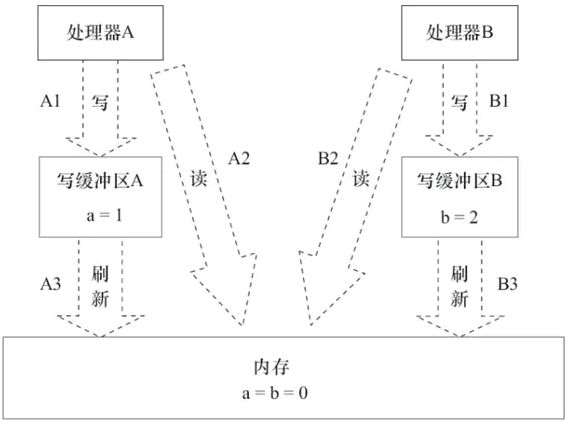

线程之间的共享变量存在主内存中，每个线程都有一个私有的本地内存，存储了该线程以读写共享变量的副本，本地内存是Java内存模型的一个抽象概念，并不真实存在，它涵盖了缓存，写缓冲区，寄存器等。

**Java内存模型JMM**

JMM定义了Java 虚拟机(JVM)在计算机内存(RAM)中的工作方式。JVM是整个计算机虚拟模型，所以JMM是隶属于JVM的。从抽象的角度来看，JMM定义了线程和主内存之间的抽象关系：线程之间的共享变量存储在主内存（Main Memory）中，每个线程都有一个私有的本地内存（Local Memory），本地内存中存储了该线程以读/写共享变量的副本。本地内存是JMM的一个抽象概念，并不真实存在。它涵盖了缓存、写缓冲区、寄存器以及其他的硬件和编译器优化。

在Java中，所有实例域、静态域和数组元素都存储在堆内存中，堆内存在线程之间共享（这里用“共享变量”这个术语代指实例域，静态域和数组元素）。局部变量（Local Variables），方法定义参数（Java语言规范称之为Formal Method Parameters）和异常处理器参数（ExceptionHandler Parameters）不会在线程之间共享，它们不会有内存可见性问题，也不受内存模型的影响。

Java线程之间的通信由Java内存模型（本文简称为JMM）控制，JMM决定一个线程对共享变量的写入何时对另一个线程可见。从抽象的角度来看，JMM定义了线程和主内存之间的抽象关系：线程之间的共享变量存储在主内存（Main Memory）中，每个线程都有一个私有的本地内存（Local Memory），本地内存中存储了该线程以读/写共享变量的副本。本地内存是JMM的一个抽象概念，并不真实存在。它涵盖了缓存、写缓冲区、寄存器以及其他的硬件和编译器优化。Java内存模型的抽象示意如图

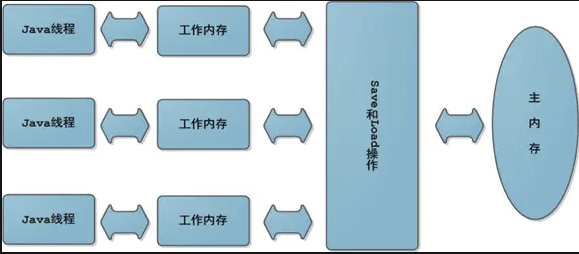

如果线程A与线程B之间要通信的话，必须要经历下面2个步骤。
1. 线程A把本地内存A中更新过的共享变量刷新到主内存中去。
2. 线程B到主内存中去读取线程A之前已更新过的共享变量。

Java线程之间的通信由Java内存模型（简称JMM）控制，从抽象的⻆度来说，JMM定义了线程和主内存之间的抽象关系。JMM的抽象示意图如图所示：


从图中可以看出：
* 所有的共享变量都存在主内存中。
* 每个线程都保存了⼀份该线程使⽤到的共享变量的副本。
* 如果线程A与线程B之间要通信的话，必须经历下⾯2个步骤：
  * 线程A将本地内存A中更新过的共享变量刷新到主内存中去。
  * 线程B到主内存中去读取线程A之前已经更新过的共享变量。


所以，线程A⽆法直接访问线程B的⼯作内存，线程间通信必须经过主内存。注意，根据JMM的规定，线程对共享变量的所有操作都必须在⾃⼰的本地内存中进⾏，不能直接从主内存中读取。所以线程B并不是直接去主内存中读取共享变量的值，⽽是先在本地内存B中找到这个共享变量，发现这个共享变量已经被更新了，然后本地内存B去主内存中读取这个共享变量的新值，并拷⻉到本地内存B中，最后线程B再读取本地内存B中的新值。

那么怎么知道这个共享变量的被其他线程更新了呢？这就是JMM的功劳了，也是JMM存在的必要性之⼀。JMM通过控制主内存与每个线程的本地内存之间的交互，来提供内存可⻅性保证。

Java中的volatile关键字可以保证多线程操作共享变量的可⻅性以及禁⽌指令重排序，synchronized关键字不仅保证可⻅性，同时也保证了原⼦性（互斥性）。在更底层，JMM通过内存屏障来实现内存的可⻅性以及禁⽌重排序。为了程序员的⽅便理解，提出了happens-before，它更加的简单易懂，从⽽避免了程序员为了理解内存可⻅性⽽去学习复杂的重排序规则以及这些规则的具体实现⽅法。这⾥涉及到的所有内容后⾯都会有专⻔的章节介绍。

内存可⻅性，指的是线程之间的可⻅性，当⼀个线程修改了共享变量时，另⼀个线程可以读取到这个修改后的值。


**JMM与Java内存区域划分的区别与联系**

* 区别
    * 两者是不同的概念层次。JMM是抽象的，他是⽤来描述⼀组规则，通过这个规则来控制各个变量的访问⽅式，围绕原⼦性、有序性、可⻅性等展开的。⽽Java运⾏时内存的划分是具体的，是JVM运⾏Java程序时，必要的内存划分。
* 联系
    * 都存在私有数据区域和共享数据区域。⼀般来说，JMM中的主内存属于共享数据区域，他是包含了堆和⽅法区；同样，JMM中的本地内存属于私有数据区域，包含了程序计数器、本地⽅法栈、虚拟机栈。
  
### 9.2.1. Java内存模型带来的问题

**可见性问题**

CPU中运行的线程从主存中拷贝共享对象obj到它的CPU缓存，把对象obj的count变量改为2。但这个变更对运行在右边CPU中的线程不可见，因为这个更改还没有flush到主存中：要解决共享对象可见性这个问题，我们可以使用java volatile关键字或者是加锁

**竞争现象**

线程A和线程B共享一个对象obj。假设线程A从主存读取Obj.count变量到自己的CPU缓存，同时，线程B也读取了Obj.count变量到它的CPU缓存，并且这两个线程都对Obj.count做了加1操作。此时，Obj.count加1操作被执行了两次，不过都在不同的CPU缓存中。如果这两个加1操作是串行执行的，那么Obj.count变量便会在原始值上加2，最终主存中的Obj.count的值会是3。然而下图中两个加1操作是并行的，不管是线程A还是线程B先flush计算结果到主存，最终主存中的Obj.count只会增加1次变成2，尽管一共有两次加1操作。 要解决上面的问题我们可以使用java synchronized代码块。

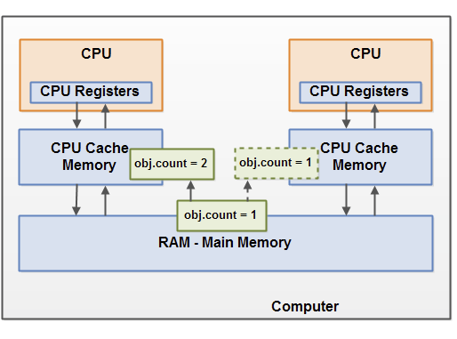

## 9.3. 重排序
<a href="#menu"  >目录</a>

### 9.3.1. 基本概念

* 重排序是指编译器和处理器为了优化程序性能而对指令序列进行重新排序的一种手段。
* 如果两个操作访问同一个变量，且这两个操作中有一个为写操作，此时这两个操作之间就存在数据依赖性
    * 写后读
    * 读后写
    * 写后写
    * 以上对同一个变量的三种操作，只要改变顺序，结果就会不一样，因此存在数据依赖性
* 编译器和处理器可能会对操作做重排序。编译器和处理器在重排序时，会遵守数据依赖性，编译器和处理器不会改变存在数据依赖关系的两个操作的执行顺序。
* 这里所说的数据依赖性仅针对**单个处理器**中执行的指令序列和**单个线程**中执行的操作，**不同处理器**之间和**不同线程**之间的数据依赖性不被编译器和处理器考虑

* 重排序是对内存有关的操作(读写)所做的一种优化，可以在不影响单线程程序的正确性的情况下提升程序的性能。但是可能会对多线程程序的正确执行有影响。

**为什么指令重排序可以提⾼性能？**

简单地说，每⼀个指令都会包含多个步骤，每个步骤可能使⽤不同的硬件。因此，流⽔线技术产⽣了，它的原理是指令1还没有执⾏完，就可以开始执⾏指令2，⽽不
⽤等到指令1执⾏结束之后再执⾏指令2，这样就⼤⼤提⾼了效率。但是，流⽔线技术最害怕中断，恢复中断的代价是⽐较⼤的，所以我们要想尽办法不让流⽔线中断。指令重排就是减少中断的⼀种技术。

我们分析⼀下下⾯这个代码的执⾏情况：
```
a = b + c;
d = e - f ;
```

先加载b、c（注意，即有可能先加载b，也有可能先加载c），但是在执⾏add(b,c)的时候，需要等待b、c装载结束才能继续执⾏，也就是增加了停顿，那么后⾯的指令也会依次有停顿,这降低了计算机的执⾏效率。

为了减少这个停顿，我们可以先加载e和f,然后再去加载add(b,c),这样做对程序（串⾏）是没有影响的,但却减少了停顿。既然add(b,c)需要停顿，那还不如去做⼀些有意义的事情。

综上所述，指令重排对于提⾼CPU处理性能⼗分必要。虽然由此带来了乱序的问题，但是这点牺牲是值得的。
     
* 指令重排序的来源一般有编译器，处理器，和存储子系统(写缓冲，高速缓存)。

指令重排⼀般分为以下三种：
* 编译器优化重排
    * 编译器在不改变单线程程序语义的前提下，可以重新安排语句的执⾏顺序。
    * Java平台包含两种编译器：
      * 静态编译器(Javax)
        * 将Java源码编译为字节码，它是在代码编译阶段介入的
        * 基本上不会执行指令重排序
      * 动态编译器(JIT编译器)
        * 将字节码动态编译为Java虚拟机宿主主机的本地代码(机器码)，它是在运行期介入的
        * 可能会发生指令重排序
* 指令并⾏重排
    * 现代处理器采⽤了指令级并⾏技术来将多条指令重叠执⾏。如果不存在数据依赖性(即后⼀个执⾏的语句⽆需依赖前⾯执⾏的语句的结果)，处理器可以改变
语句对应的机器指令的执⾏顺序。
* 内存系统重排
    * 由于处理器使⽤缓存和读写缓存冲区，这使得加载(load)和存储(store)操作看上去可能是在乱序执⾏，因为三级缓存的存在，导致内存与缓存的数据同步存在时间差。
    * 主内存（RAM）相对于处理器是一个慢速设备。因此处理器并不是直接访问主内存，而是通过高速缓存访问主内存。在此基础上，还引入了写缓冲器。先往写缓冲器里写入数据，再一次性写入到主内存中。
  
指令重排可以保证串⾏语义⼀致，但是没有义务保证多线程间的语义也⼀致。所以在多线程下，指令重排序可能会导致⼀些问题。


```java
int a = 1;
int b = 2;
int c = a + b;
```
a happens-before b;
b happens-before c;
a happens-before c;

如上的例子，第一行和第二行没有依赖关系，因此可能会发生指令重排序。第三行和前面都有关，因此不会和前面的语句发生指令重排序。

```java
class ReorderExample {
    int a = 0;
    boolean flag = false;
    public void writer() {
        a = 1; // 1
        flag = true; // 2
    } 
    Public void reader() {
        if (flag) { // 3
            int i = a * a; // 4

        }
    }
}

```
两个线程分别执行writer()和reader()。reader()不一定能看到其他线程对a的写入修改。

操作1和2没有数据依赖关系，因此可能会发生指令重排序。同理3和4。因此执行到4时，a的值可能还是0.

**as-if-serial语义**
* as-if-serial语义的意思是：不管怎么重排序（编译器和处理器为了提高并行度），（单线程）程序的执行结果不能被改变。编译器、runtime和处理器都必须遵守as-if-serial语义
* 为了遵守as-if-serial语义，编译器和处理器不会对存在数据依赖关系的操作做重排序，因为这种重排序会改变执行结果。但是，如果操作之间不存在数据依赖关系，这些操作就可能被编译器和处理器重排序
* as-if-serial语义把单线程程序保护了起来，遵守as-if-serial语义的编译器、runtime和处理器共同为编写单线程程序的程序员创建了一个幻觉：单线程程序是按程序的顺序来执行的.as-if-serial语义使单线程程序员无需担心重排序会干扰他们，也无需担心内存可见性问题

**相关术语**
* 源代码顺序
    * 源代码中指定的内存访问操作顺序
* 程序顺序
    * 在给定的处理器上运行的目标代码(Java的字节码)所指定的访问操作顺序。
* 执行顺序
    * 内存访问操作在给定的处理器上实际执行的顺序
* 感知顺序
    * 最终执行时锁呈现的访问顺序

**重排序类型**


|重排序类型|重排序表现|重排序来源|
|---|---|--|
|指令重排序|程序执行顺序|编译器|
| ^ |执行顺序与程序顺序不一致|JIT编译器，处理器|
|存储子系统重排序|源代码顺序，程序顺序和执行顺序保持一类；感知顺序和执行顺序不一致|高速缓存，写缓冲器|

### 9.3.2. 顺序⼀致性模型与JMM的保证
<a href="#menu"  >目录</a>

顺序⼀致性模型是⼀个理论参考模型，内存模型在设计的时候都会以顺序⼀致性内存模型作为参考。

#### 9.3.2.1. 数据竞争与顺序⼀致性

当程序未正确同步的时候，就可能存在数据竞争。

数据竞争：在⼀个线程中写⼀个变量，在另⼀个线程读同⼀个变量，并且写和读没有通过同步来排序。

如果程序中包含了数据竞争，那么运⾏的结果往往充满了不确定性，⽐如读发⽣在了写之前，可能就会读到错误的值；如果⼀个线程程序能够正确同步，那么就不存
在数据竞争。

Java内存模型（JMM）对于正确同步多线程程序的内存⼀致性做了以下保证：
* 如果程序是正确同步的，程序的执⾏将具有顺序⼀致性。 即程序的执⾏结果和该程序在顺序⼀致性模型中执⾏的结果相同。这⾥的同步包括了使⽤ volatile 、 final 、 synchronized 等关键字来实现多线程下的同步。
* 如果程序员没有正确使⽤ volatile 、 final 、 synchronized ，那么即便是使⽤了同步（单线程下的同步），JMM也不会有内存可⻅性的保证，可能会导致你的程序出错，并且具有不可重现性，很难排查。


#### 9.3.2.2. 顺序⼀致性模型

顺序⼀致性内存模型是⼀个理想化的理论参考模型，它为程序员提供了极强的内存可⻅性保证。

顺序⼀致性模型有两⼤特性：
* ⼀个线程中的所有操作必须按照程序的顺序（即Java代码的顺序）来执⾏
* 不管程序是否同步，所有线程都只能看到⼀个单⼀的操作执⾏顺序。即在顺序⼀致性模型中，每个操作必须是原⼦性的，且⽴刻对所有线程可⻅。

为了理解这两个特性，我们举个例⼦，假设有两个线程A和B并发执⾏，线程A有3个操作，他们在程序中的顺序是A1->A2->A3，线程B也有3个操作，B1->B2->B3。
假设正确使⽤了同步，A线程的3个操作执⾏后释放锁，B线程获取同⼀个锁。那么在顺序⼀致性模型中的执⾏效果如下所示：A1->A2->A3->B1->B2->B3

操作的执⾏整体上有序，并且两个线程都只能看到这个执⾏顺序。

假设没有使⽤同步，那么在顺序⼀致性模型中的执⾏效果如下所示：B1->A1->A2->A3->B2->B3

操作的执⾏整体上⽆序，但是两个线程都只能看到这个执⾏顺序。之所以可以得到这个保证，是因为顺序⼀致性模型中的每个操作必须⽴即对任意线程可⻅。但是JMM没有这样的保证。

未同步程序在JMM中不但整体的执行顺序是无序的，而且所有线程看到的操作执行顺序也可能不一致。⽐如，在当前线程把写过的数据缓存在本地内存中，在没有刷新到主内存之前，这个写操作仅对当前线程可⻅；从其他线程的⻆度来观察，这个写操作根本没有被当前线程所执⾏。只有当前线程把本地内存中写过的数据刷新到主内存之后，这个写操作才对其他线程可⻅。在这种情况下，当前线程和其他线程看到的执⾏顺序是不⼀样的。

#### 9.3.2.3. JMM中同步程序的顺序⼀致性效果

在顺序⼀致性模型中，所有操作完全按照程序的顺序串⾏执⾏。但是JMM中，临界区内（同步块或同步⽅法中）的代码可以发⽣重排序（但不允许临界区内的代码
“逃逸”到临界区之外，因为会破坏锁的内存语义）。

虽然线程A在临界区做了重排序，但是因为锁的特性，线程B⽆法观察到线程A在临界区的重排序。这种重排序既提⾼了执⾏效率，⼜没有改变程序的执⾏结果。同时，JMM会在退出临界区和进⼊临界区做特殊的处理，使得在临界区内程序获得与顺序⼀致性模型相同的内存视图。由此可⻅，JMM的具体实现⽅针是：在不改变（正确同步的）程序执⾏结果的前提下，尽量为编译期和处理器的优化打开⽅便之⻔。

#### 9.3.2.4. JMM中未同步程序的顺序⼀致性效果

对于未同步的多线程程序，JMM只提供最⼩安全性：线程读取到的值，要么是之前某个线程写⼊的值，要么是默认值，不会⽆中⽣有。为了实现这个安全性，JVM在堆上分配对象时，⾸先会对内存空间清零，然后才会在上⾯分配对象（这两个操作是同步的）。

JMM不保证未同步程序的执行结果与该程序在顺序一致性模型中的执行结果一致。因为如果想要保证执行结果一致，JMM需要禁止大量的处理器和编译器的优化，这对程序的执行性能会产生很大的影响。而且未同步程序在顺序一致性模型中执行时，整体是无序的，其执行结果往往无法预知。而且，保证未同步程序在这两个模型中的执行结果一致没什么意义

未同步程序在JMM中的执行时，整体上是无序的，其执行结果无法预知。未同步程序在两个模型中的执行特性有如下几个差异
1. 顺序⼀致性保证单线程内的操作会按程序的顺序执⾏；JMM不保证单线程内的操作会按程序的顺序执⾏。（因为重排序，但是JMM保证单线程下的重排序不影响执⾏结果）
2. 顺序⼀致性模型保证所有线程只能看到⼀致的操作执⾏顺序，⽽JMM不保证所有线程能看到⼀致的操作执⾏顺序。（因为JMM不保证所有操作⽴即可⻅）
3. JMM不保证对64位的long型和double型变量的写操作具有原⼦性，⽽顺序⼀致性模型保证对所有的内存读写操作都具有原⼦性。

在一些32位的处理器上，如果要求对64位数据的写操作具有原子性，会有比较大的开销。为了照顾这种处理器，Java语言规范鼓励但不强求JVM对64位的long型变量和double型变量的写操作具有原子性。当JVM在这种处理器上运行时，可能会把一个64位long/double型变量的写操作拆分为两个32位的写操作来执行。这两个32位的写操作可能会被分配到不同的总线事务中执行，此时对这个64位变量的写操作将不具有原子性

注意，在JSR-133之前的旧内存模型中，一个64位long/double型变量的读/写操作可以被拆分为两个32位的读/写操作来执行。从JSR-133内存模型开始（即从JDK5开始），仅仅只允许把一个64位long/double型变量的写操作拆分为两个32位的写操作来执行，任意的读操作在JSR-133中都必须具有原子性（即任意读操作必须要在单个读事务中执行）。


### 9.3.3. happens-before
<a href="#menu"  >目录</a>

#### 9.3.3.1. 什么是happens-before?

happens-before规则:是⼀个给程序员使⽤的规则，只要程序员在写代码的时候遵循happens-before规则，JVM就能保证指令在多线程之间的顺序性符合程序员的预期。


⼀⽅⾯，程序员需要JMM提供⼀个强的内存模型来编写代码；另⼀⽅⾯，编译器和处理器希望JMM对它们的束缚越少越好，这样它们就可以最可能多的做优化来提⾼
性能，希望的是⼀个弱的内存模型。

JMM考虑了这两种需求，并且找到了平衡点，对编译器和处理器来说，只要不改变程序的执⾏结果（单线程程序和正确同步了的多线程程序），编译器和处理器怎么
优化都⾏。

⽽对于程序员，JMM提供了happens-before规则（JSR-133规范），满⾜了程序员的需求——简单易懂，并且提供了⾜够强的内存可⻅性保证。换⾔之，程序员只
要遵循happens-before规则，那他写的程序就能保证在JMM中具有强的内存可⻅性。

JMM使⽤happens-before的概念来定制两个操作之间的执⾏顺序。这两个操作可以在⼀个线程以内，也可以是不同的线程之间。因此，JMM可以通过happens-before关系向程序员提供跨线程的内存可⻅性保证。

happens-before关系的定义如下：
1. 如果⼀个操作happens-before另⼀个操作，那么第⼀个操作的执⾏结果将对第⼆个操作可⻅，⽽且第⼀个操作的执⾏顺序排在第⼆个操作之前。
2. 两个操作之间存在happens-before关系，并不意味着Java平台的具体实现必须要按照happens-before关系指定的顺序来执⾏。如果重排序之后的执⾏结果，与按happens-before关系来执⾏的结果⼀致，那么JMM也允许这样的重排序。

happens-before关系本质上和as-if-serial语义是⼀回事。

as-if-serial语义保证单线程内重排序后的执⾏结果和程序代码本身应有的结果是⼀致的，happens-before关系保证正确同步的多线程程序的执⾏结果不被重排序改变。

总之，如果操作A happens-before操作B，那么操作A在内存上所做的操作对操作B都是可⻅的，不管它们在不在⼀个线程

#### 9.3.3.2. 天然的happens-before关系

* Happen-before原则
    * 程序顺序规则：一个线程中的每个操作，happens-before于该线程中的任意后续操作。
    * 监视器锁规则：对一个锁的解锁，happens-before于随后对这个锁的加锁。
    * volatile变量规则：对一个volatile域的写，happens-before于任意后续对这个volatile域的读。
    * 传递性：如果A happens-before B，且B happens-before C，那么A happens-before C。
    * start()规则：如果线程A执行操作ThreadB.start()（启动线程B），那么A线程的ThreadB.start()操作happens-before于线程B中的任意操作。
    * Join()规则：如果线程A执行操作ThreadB.join()并成功返回，那么线程B中的任意操作happens-before于线程A从ThreadB.join()操作成功返回。
    * 程序中断规则：对线程interrupted()方法的调用先行于被中断线程的代码检测到中断时间的发生。
    * 对象finalize规则：一个对象的初始化完成（构造函数执行结束）先行于发生它的finalize()方法的开始

举例：
```
int a = 1; // A操作
int b = 2; // B操作
int sum = a + b;// C 操作
System.out.println(sum);
```

根据以上介绍的happens-before规则，假如只有⼀个线程，那么不难得出：
```
1> A happens-before B
2> B happens-before C
3> A happens-before C
```

注意，真正在执⾏指令的时候，其实JVM有可能对操作A & B进⾏重排序，因为⽆论先执⾏A还是B，他们都对对⽅是可⻅的，并且不影响执⾏结果。如果这⾥发⽣了重排序，这在视觉上违背了happens-before原则，但是JMM是允许这样的重排序的。所以，我们只关⼼happens-before规则，不⽤关⼼JVM到底是怎样执⾏的。只要确定操作A happens-before操作B就⾏了。

重排序有两类，JMM对这两类重排序有不同的策略：
* 会改变程序执⾏结果的重排序，⽐如 A -> C，JMM要求编译器和处理器都禁⽌这种重排序。
* 不会改变程序执⾏结果的重排序，⽐如 A -> B，JMM对编译器和处理器不做要求，允许这种重排序。

软件技术和硬件技术有一个共同的目标：在不改变程序执行结果的前提下，尽可能提高并行度。编译器和处理器遵从这一目标，从happens-before的定义我们可以看出，JMM同样遵从这一目标。


### 9.3.4. 重排序对多线程的影响

```java
public class Demo {

    int a = 0;
    boolean flag = false;

    public void write(){
        a=1;    //1
        flag = true;　2 
    }

    public void read(){
        if(flag){   //3
            int b = a * a; //4
        }
    } 


}
```

使用两个线程分别执行write和read操作。

由于1/2 ,3/4之间没有数据依赖性。　所以1和２，３和４之间可能会发生指令重排序。

假如重排序之后顺序为2－３－４－１.那么计算结果将会出错。

在程序中，操作3和操作4存在控制依赖关系。当代码中存在控制依赖性时，会影响指令序列执行的并行度。为此，编译器和处理器会采用猜测（Speculation）执行来克服控制相关性对并行度的影响。以处理器的猜测执行为例，执行线程B的处理器可以提前读取并计算a*a，然后把计算结果临时保存到一个名为重排序缓冲（Reorder Buffer，ROB）的硬件缓存中。当操作3的条件判断为真时，就把该计算结果写入变量i中。

在单线程程序中，对存在控制依赖的操作重排序，不会改变执行结果（这也是as-if-serial语义允许对存在控制依赖的操作做重排序的原因）；但在多线程程序中，对存在控制依赖的操作重排序，可能会改变程序的执行结果


### 9.3.5. 内存屏障
<a href="#menu"  >目录</a>

#### 9.3.5.1. 基本概念
内存屏障（Memory Barrier）与内存栅栏（Memory Fence）是同一个概念，不同的叫法。

通过volatile标记，可以解决编译器层面的可见性与重排序问题。而内存屏障则解决了硬件层面的可见性与重排序问题。

#### 9.3.5.2. 标准

先简单了解两个指令：
* Store：将处理器缓存的数据刷新到内存中。
* Load：将内存存储的数据拷贝到处理器的缓存中。

|屏障类型|指令示例|说明
|---|---|---|
|LoadLoad Barriers|Load1;LoadLoad;Load2|该屏障确保Load1数据的装载先于Load2及其后所有装载指令的的操作
|StoreStore Barriers|Store1;StoreStore;Store2|该屏障确保Store1立刻刷新数据到内存(使其对其他处理器可见)的操作先于Store2及其后所有存储指令的操作
|LoadStore Barriers|Load1;LoadStore;Store2|确保Load1的数据装载先于Store2及其后所有的存储指令刷新数据到内存的操作
|StoreLoad Barriers|Store1;StoreLoad;Load2|该屏障确保Store1立刻刷新数据到内存的操作先于Load2及其后所有装载装载指令的操作。它会使该屏障之前的所有内存访问指令(存储指令和访问指令)完成之后,才执行该屏障之后的内存访问指令


StoreLoad Barriers同时具备其他三个屏障的效果，因此也称之为全能屏障（mfence），是目前大多数处理器所支持的；但是相对其他屏障，该屏障的开销相对昂贵。
然而，除了mfence，不同的CPU架构对内存屏障的实现方式与实现程度非常不一样。相对来说，Intel CPU的强内存模型比DEC Alpha的弱复杂内存模型（缓存不仅分层了，还分区了）更简单。x86架构是在多线程编程中最常见的，下面讨论x86架构中内存屏障的实现。

查阅资料时，你会发现每篇讲内存屏障的文章讲的都不同。不过，重要的是理解基本原理，需要的时候再继续深究即可。
不过不管是那种方案，内存屏障的实现都要针对乱序执行的过程来设计。前文的注释中讲解了乱序执行的基本原理：核心是一个序列缓冲区，只要指令的数据运算对象是可以获取的，指令就被允许在先进入的、旧的指令之前离开序列缓冲区，开始执行。对于内存可见性的语义，内存屏障可以通过使用类似MESI协议的思路实现。对于重排序语义的实现机制，猴子没有继续研究，一种可行的思路是：
* 当CPU收到屏障指令时，不将屏障指令放入序列缓冲区，而将屏障指令及后续所有指令放入一个FIFO队列中（指令是按批发送的，不然没有乱序的必要）
* 允许乱序执行完序列缓冲区中的所有指令
* 从FIFO队列中取出屏障指令，执行（并刷新缓存等，实现内存可见性的语义）
* 将FIFO队列中的剩余指令放入序列缓冲区
* 恢复正常的乱序执行

对于x86架构中的sfence屏障指令而言，则保证sfence之前的store执行完，再执行sfence，最后执行sfence之后的store；除了禁用sfence前后store乱序带来的新的数据依赖外，不影响load命令的乱序。详细见后。

#### 9.3.5.3. x86架构的内存屏障

x86架构并没有实现全部的内存屏障。
**Store Barrier**
sfence指令实现了Store Barrier，相当于StoreStore Barriers。
强制所有在sfence指令之前的store指令，都在该sfence指令执行之前被执行，发送缓存失效信号，并把store buffer中的数据刷出到CPU的L1 Cache中；所有在sfence指令之后的store指令，都在该sfence指令执行之后被执行。即，禁止对sfence指令前后store指令的重排序跨越sfence指令，使所有Store Barrier之前发生的内存更新都是可见的。
这里的“可见”，指修改值可见（内存可见性）且操作结果可见（禁用重排序）。下同。

内存屏障的标准中，讨论的是缓存与内存间的相干性，实际上，同样适用于寄存器与缓存、甚至寄存器与内存间等多级缓存之间。x86架构使用了MESI协议的一个变种，由协议保证三层缓存与内存间的相关性，则内存屏障只需要保证store buffer（可以认为是寄存器与L1 Cache间的一层缓存）与L1 Cache间的相干性。下同。

**Load Barrier**
lfence指令实现了Load Barrier，相当于LoadLoad Barriers。
强制所有在lfence指令之后的load指令，都在该lfence指令执行之后被执行，并且一直等到load buffer被该CPU读完才能执行之后的load指令（发现缓存失效后发起的刷入）。即，禁止对lfence指令前后load指令的重排序跨越lfence指令，配合Store Barrier，使所有Store Barrier之前发生的内存更新，对Load Barrier之后的load操作都是可见的。
**Full Barrier**
mfence指令实现了Full Barrier，相当于StoreLoad Barriers。
mfence指令综合了sfence指令与lfence指令的作用，强制所有在mfence指令之前的store/load指令，都在该mfence指令执行之前被执行；所有在mfence指令之后的store/load指令，都在该mfence指令执行之后被执行。即，禁止对mfence指令前后store/load指令的重排序跨越mfence指令，使所有Full Barrier之前发生的操作，对所有Full Barrier之后的操作都是可见的。

#### 9.3.5.4. volatile如何解决内存可见性与处理器重排序问题

在编译器层面，仅将volatile作为标记使用，取消编译层面的缓存和重排序。

如果硬件架构本身已经保证了内存可见性（如单核处理器、一致性足够的内存模型等），那么volatile就是一个空标记，不会插入相关语义的内存屏障。
如果硬件架构本身不进行处理器重排序、有更强的重排序语义（能够分析多核间的数据依赖）、或在单核处理器上重排序，那么volatile就是一个空标记，不会插入相关语义的内存屏障。
如果不保证，仍以x86架构为例，JVM对volatile变量的处理如下：

在写volatile变量v之后，插入一个sfence。这样，sfence之前的所有store（包括写v）不会被重排序到sfence之后，sfence之后的所有store不会被重排序到sfence之前，禁用跨sfence的store重排序；且sfence之前修改的值都会被写回缓存，并标记其他CPU中的缓存失效。
在读volatile变量v之前，插入一个lfence。这样，lfence之后的load（包括读v）不会被重排序到lfence之前，lfence之前的load不会被重排序到lfence之后，禁用跨lfence的load重排序；且lfence之后，会首先刷新无效缓存，从而得到最新的修改值，与sfence配合保证内存可见性。


在另外一些平台上，JVM使用mfence代替sfence与lfence，实现更强的语义。

二者结合，共同实现了Happens-Before关系中的volatile变量规则。

#### 9.3.5.5. JVM对内存屏障作出的其他封装
除volatile外，常见的JVM实现还基于内存屏障作了一些其他封装。借助于内存屏障，这些封装也得到了内存屏障在可见性与重排序上的语义。

借助：piggyback。
在JVM中，借助通常指：将Happens-Before的程序顺序规则与其他某个顺序规则（通常是监视器锁规则、volatile变量规则）结合起来，从而对某个未被锁保护的变量的访问操作进行排序。
本文将借助的语义扩展到更大的范围，可以借助任何现有机制，以获得现有机制的某些属性。当然，并不是所有属性都能被借助，比如原子性。但基于前文对内存屏障的分析可知，可见性与重排序是可以被借助的。


## 9.4. volatile
<a href="#menu"  >目录</a>

### 9.4.1. volatile的内存语义

**特性**
* 内存可见性
    * 对一个volatile变量的读，总是能看到（任意线程）对这个volatile变量最后的写入
* 保证变量读写是原子性的
    * 对任意单个volatile变量的读/写具有原子性，但类似于volatile++这种复合操作不具有原子性。
* 禁止指令重排序

有volatile变量修饰的共享变量进行写操作的时候会使用CPU提供的Lock前缀指令：将当前处理器缓存行的数据写回到系统内存这个写回内存的操作会使在其他CPU里缓存了该内存地址的数据无效。

所谓内存可⻅性，指的是当⼀个线程对 volatile 修饰的变量进⾏写操作时，JMM会⽴即把该线程对应的本地内存中的共享变量的值刷新到主内存；当⼀个线程对 volatile 修饰的变量进⾏读操作时，JMM会把⽴即该线程对应的本地内存置为⽆效，从主内存中读取共享变量的值。

在这⼀点上，volatile与锁具有相同的内存效果，volatile变量的写和锁的释放具有相同的内存语义，volatile变量的读和锁的获取具有相同的内存语义


**相关的CPU术语与说明**
|术语|英文单词|描述|
|---|---|---|
|内存屏障|memory|是一组处理器指令，用于实现对内存操作的顺序限制|
|缓冲行|cache line|缓存中可以分配的最小存储单位。处理器填写缓存线时会加载整个缓存线，需要使用多个主内存读周期|
|原子操作|atomic operations|不可中断的一个或一系列操作|
|缓存行填充|cache line fill|当处理器识别到从内存中读取操作数是可缓存的，处理器读取整个缓存行到适当的缓存L1 L2 L3的或所有的|
|缓存命中|cache hit | 如果进行高速缓存行填充操作的内存位置仍然是下次处理器访问的地址时，处理器从缓存中读取操作数，而不是从内存中读取|
|写命中|write hit|当处理器将操作数写回到一个内存缓存的区域时，它首先会检查这个缓存的内存地址是否在缓存行中，如果存在一个有效的缓存行，则处理器将这个操作数写回到缓存，而不是写回到内存，这个操作被称为写命中|
|写缺失|write misses the cache|一个有效的缓存行被写入到不存在的内存区域|

### 9.4.2. volatile内存可见性实现原理
<a href="#menu"  >目录</a>

```java
//定义两个参数
volatile int data = 0x12;
int   temp = 0x34; 

public void test()
{
    data = 0x1234;
    temp = 0x789; 
}
```

使用JITWatch工具查看生成的汇编代码
```yml
#字节码
 0: aload_0         
 1: sipush          4660 
 4: putfield        #2   // Field data:I
 7: aload_0         
 8: sipush          1929 
11: putfield        #3   // Field temp:I
14: return          
#生成的汇编代码
0x00007f689511258c: movl $0x1234,0xc(%rsi)
0x00007f6895112593: lock addl $0x0,(%rsp)  ;*putfield data
                                           ; - SimpleInliningTest::test@4 (line 35)
0x00007f6895112598: movl $0x789,0x10(%rsi)  ;*putfield temp
                                            ; - SimpleInliningTest::test@11 (line 36)
0x00007f689511259f: add $0x10,%rsp

```
有volatile变量修饰的共享变量进行写操作的时候会多出第二行汇编代码

Lock前缀的指令在多核处理器下会引发了两件事情
1. 将当前处理器缓存行的数据写回到系统内存。
2. 这个写回内存的操作会使在其他CPU里缓存了该内存地址的数据无效。

为了提高处理速度，处理器不直接和内存进行通信，而是先将系统内存的数据读到内部缓存（L1，L2或其他）后再进行操作，但操作完不知道何时会写到内存。如果对声明了volatile的变量进行写操作，JVM就会向处理器发送一条Lock前缀的指令，将这个变量所在缓存行的数据写回到系统内存。但是，就算写回到内存，如果其他处理器缓存的值还是旧的，再执行计算操作就会有问题。所以，在多处理器下，为了保证各个处理器的缓存是一致的，就会实现缓存一致性协议，每个处理器通过嗅探在总线上传播的数据来检查自己缓存的值是不是过期了，当处理器发现自己缓存行对应的内存地址被修改，就会将当前处理器的缓存行设置成无效状态，当处理器对这个数据进行修改操作的时候，会重新从系统内存中把数据读到处理器缓存里。

volatile的两条实现原则
1. Lock前缀指令会引起处理器缓存回写到内存。Lock前缀指令导致在执行指令期间，声言处理器的LOCK#信号。在多处理器环境中，LOCK#信号确保在声言该信号期间，处理器可以独占任何共享内存[2]。但是，在最近的处理器里，LOCK＃信号一般不锁总线，而是锁缓存，毕竟锁总线开销的比较大。对于Intel486和Pentium处理器，在锁操作时，总是在总线上声言LOCK#信号。但在P6和目前的处理器中，如果访问的内存区域已经缓存在处理器内部，则不会声言LOCK#信号。相反，它会锁定这块内存区域的缓存并回写到内存，并使用缓存一致性机制来确保修改的原子性，此操作被称为“缓存锁定”，缓存一致性机制会阻止同时修改由两个以上处理器缓存的内存区域数据。
2. 一个处理器的缓存回写到内存会导致其他处理器的缓存无效。IA-32处理器和Intel 64处理器使用MESI（修改、独占、共享、无效）控制协议去维护内部缓存和其他处理器缓存的一致性。在多核处理器系统中进行操作的时候，IA-32和Intel 64处理器能嗅探其他处理器访问系统内存和它们的内部缓存。处理器使用嗅探技术保证它的内部缓存、系统内存和其他处理器的缓存的数据在总线上保持一致。例如，在Pentium和P6 family处理器中，如果通过嗅探一个处理器来检测其他处理器打算写内存地址，而这个地址当前处于共享状态，那么正在嗅探的处理器将使它的缓存行无效，在下次访问相同内存地址时，强制执行缓存行填充


### 9.4.3. 禁⽌重排序
<a href="#menu"  >目录</a>

```java
public class VolatileExample {
    int a = 0;
    volatile boolean flag = false;
    public void writer() {
        a = 1; // step 1
        flag = true; // step 2
    }
    public void reader() {
        if (flag) { // step 3
            System.out.println(a); // step 4
        }
    }
}
```

在JSR-133之前的旧的Java内存模型中，是允许volatile变量与普通变量重排序的。那上⾯的案例中，可能就会被重排序成下列时序来执⾏：
1. 线程A写volatile变量，step 2，设置flag为true；
2. 线程B读同⼀个volatile，step 3，读取到flag为true；
3. 线程B读普通变量，step 4，读取到 a = 0；
4. 线程A修改普通变量，step 1，设置 a = 1；

可⻅，如果volatile变量与普通变量发⽣了重排序，虽然volatile变量能保证内存可⻅性，也可能导致普通变量读取错误。

所以在旧的内存模型中，volatile的写-读就不能与锁的释放-获取具有相同的内存语义了。为了提供⼀种⽐锁更轻量级的线程间的通信机制，JSR-133专家组决定增强volatile的内存语义：严格限制编译器和处理器对volatile变量与普通变量的重排序。编译器还好说，JVM是怎么还能限制处理器的重排序的呢？它是通过内存屏障来实现的。

什么是内存屏障？硬件层⾯，内存屏障分两种：读屏障（Load Barrier）和写屏障（Store Barrier）。内存屏障有两个作⽤：
1. 阻⽌屏障两侧的指令重排序；
2. 强制把写缓冲区/⾼速缓存中的脏数据等写回主内存，或者让缓存中相应的数据失效。
   
注意这⾥的缓存主要指的是CPU缓存，如L1，L2等编译器在⽣成字节码时，会在指令序列中插⼊内存屏障来禁⽌特定类型的处理器重排序。编译器选择了⼀个⽐较保守的JMM内存屏障插⼊策略，这样可以保证在任何处理器平台，任何程序中都能得到正确的volatile内存语义。这个策略是：
* 在每个volatile写操作前插⼊⼀个StoreStore屏障；
* 在每个volatile写操作后插⼊⼀个StoreLoad屏障；
* 在每个volatile读操作后插⼊⼀个LoadLoad屏障；
* 在每个volatile读操作后再插⼊⼀个LoadStore屏障
上述内存屏障插入策略非常保守，但它可以保证在任意处理器平台，任意的程序中都能得到正确的volatile内存语义。

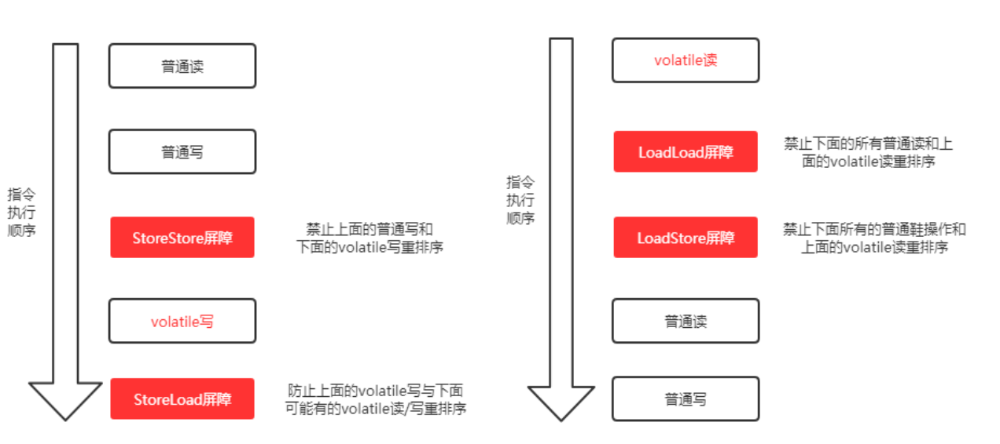


再逐个解释⼀下这⼏个屏障。注：下述Load代表读操作，Store代表写操作
* LoadLoad屏障：对于这样的语句Load1; LoadLoad; Load2，在Load2及后续读取操作要读取的数据被访问前，保证Load1要读取的数据被读取完毕。
* StoreStore屏障：对于这样的语句Store1; StoreStore; Store2，在Store2及后续写⼊操作执⾏前，保证Store1的写⼊操作对其它处理器可⻅。
* LoadStore屏障：对于这样的语句Load1; LoadStore; Store2，在Store2及后续写⼊操作被刷出前，保证Load1要读取的数据被读取完毕。
* StoreLoad屏障：对于这样的语句Store1; StoreLoad; Load2，在Load2及后续所有读取操作执⾏前，保证Store1的写⼊对所有处理器可⻅。它的开销是

四种屏障中最⼤的（冲刷写缓冲器，清空⽆效化队列）。在⼤多数处理器的实现中，这个屏障是个万能屏障，兼具其它三种内存屏障的功能对于连续多个volatile变量读或者连续多个volatile变量写，编译器做了⼀定的优化来提⾼性能，⽐如：
```
第⼀个volatile读;
LoadLoad屏障；
第⼆个volatile读；
LoadStore屏障
```


<table>
	<tr>
	    <th>是否能重排序</th>
	    <th colspan="3">第二个操作</th> 
	</tr >
	<tr >
	    <td>第一个操作</td>
        <td>普通读/写</td>
        <td>volatile 读</td>
        <td>volatile 写</td>
	</tr>
    <tr >
	    <td>普通读/写</td>
        <td></td>
        <td></td>
        <td>NO</td>
	</tr>
    <tr >
	    <td>volatile 读</td>
        <td>NO</td>
        <td>NO</td>
        <td>NO</td>
	</tr><tr >
	    <td>volatile 写</td>
        <td></td>
        <td>NO</td>
        <td>NO</td>
	</tr>
</table>   

volatile与普通变量的重排序规则:
1. 如果第⼀个操作是volatile读，那⽆论第⼆个操作是什么，都不能重排序；
   1. 如果进行重排序，当前缓存行的数据就会被置为无效，那么缓存行中的普通共享变量也会再从主存中重新读取，如此就违背了内存语义。
2. 如果第⼆个操作是volatile写，那⽆论第⼀个操作是什么，都不能重排序；
   1. 如果进行重排序，那么volatile 写会使其他CPU的缓存行无效，就不能保证volatile 写之前的共享变量数据的一致，如此就违背了内存语义
3. 如果第⼀个操作是volatile写，第⼆个操作是volatile读，那不能重排序。
	
volatile 变量在进行写操作的时候，会插入一条Lock前缀的指令。这个指令在多核处理器下会发生两个事情：
1. 将当前处理器缓存行的数据写回主存。
2. 使其他CPU里的缓存无效，下次访问相同内存地址时，将强制执行缓存行填充


举个例⼦，我们在案例中step 1，是普通变量的写，step 2是volatile变量的写，那符合第2个规则，这两个steps不能重排序。⽽step 3是volatile变量读，step 4是普通变量读，符合第1个规则，同样不能重排序。

但如果是下列情况：第⼀个操作是普通变量读，第⼆个操作是volatile变量读，那是可以重排序的：

```
// 声明变量
int a = 0; // 声明普通变量
volatile boolean flag = false; // 声明volatile变量
// 以下两个变量的读操作是可以重排序的
int i = a; // 普通变量读
boolean j = flag; // volatile变量读
```

从volatile的内存语义上来看，volatile可以保证内存可⻅性且禁⽌重排序。

在保证内存可⻅性这⼀点上，volatile有着与锁相同的内存语义，所以可以作为⼀个“轻量级”的锁来使⽤。但由于volatile仅仅保证对单个volatile变量的读/写具有原⼦性，⽽锁可以保证整个临界区代码的执⾏具有原⼦性。所以在功能上，锁⽐volatile更强⼤；在性能上，volatile更有优势

在禁⽌重排序这⼀点上，volatile也是⾮常有⽤的。⽐如我们熟悉的单例模式，其中有⼀种实现⽅式是“双重锁检查”，⽐如这样的代码：
```java
public class Singleton {
private static Singleton instance; // 不使⽤volatile关键字
// 双重锁检验
public static Singleton getInstance() {
    if (instance == null) { // 第7⾏
        synchronized (Singleton.class) {
            if (instance == null) {
                    instance = new Singleton(); // 第10⾏
                 }
            }
        }
        return instance;
    }
}
```

如果这⾥的变量声明不使⽤volatile关键字，是可能会发⽣错误的。它可能会被重排序：
```java
instance = new Singleton(); // 第10⾏
// 可以分解为以下三个步骤
1 memory=allocate();// 分配内存 相当于c的malloc
2 ctorInstanc(memory) //初始化对象
3 s=memory //设置s指向刚分配的地址
// 上述三个步骤可能会被重排序为 1-3-2，也就是：
1 memory=allocate();// 分配内存 相当于c的malloc
3 s=memory //设置s指向刚分配的地址
2 ctorInstanc(memory) //初始化对象
```
⽽⼀旦假设发⽣了这样的重排序，⽐如线程A在第10⾏执⾏了步骤1和步骤3，但是步骤2还没有执⾏完。这个时候线程A执⾏到了第7⾏，它会判定instance不为空，
然后直接返回了⼀个未初始化完成的instance！


## 9.5. final的内存语义
<a href="#menu"  >目录</a>

编译器和处理器要遵守两个重排序规则：
* 在构造函数内对一个final域的写入，与随后把这个被构造对象的引用赋值给一个引用变量，这两个操作之间不能重排序。初次读一个包含final域的对象的引用，与随后初次读这个final域，这两个操作之间不能重排序。
* final域为引用类型：增加了如下规则：在构造函数内对一个final引用的对象的成员域的写入，与随后在构造函数外把这个被构造对象的引用赋值给一个引用变量，这两个操作之间不能重排序。

final语义在处理器中的实现：会要求编译器在final域的写之后，构造函数return之前插入一个StoreStore障屏。读final域的重排序规则要求编译器在读final域的操作前面插入一个LoadLoad屏障


# 10. ThreadLocal
<a href="#menu"  >目录</a>

## 10.1. 基本概念和使用

* 该类提供了线程局部（thread-local）变量。这些变量不同于它们的普通对应物，因为访问某个变量（通过其get或set方法）的每个线程都有自己的局部变量，它独立于变量的初始化副本。ThreadLocal实例通常是类中的private static字段，它们希望将状态与某一个线程（例如，用户ID或事物ID）相关联。

* ThreadLocal是线程私有的，用于变量并发访问带来的安全问题，因此使用场景是对象或者类的属性不需要在多线程间共享，但是需要在单线程环境下多次使用的场景。

* 三个要点：
    * 每个线程都有自己的局部变量
        * 每个线程都有一个独立于其它线程的上下文来保存这个变量，一个线程的本地变量对其它线程是不可见的。
    * 独立于变量的初始化副本
        * ThreadLocal可以给一个初始值，而每个线程都会获得这个初始化值的一个副本，这样才能保证不同的线程都有一份拷贝。
    * 状态与某一个线程相关联
        * ThreadLocal不是用于解决共享变量的问题的，不是为了协调线程同步而存在，而是为了方便每个线程处理自己的状态而引入的一个机制，就像《Thinking in Java》中描述的那样：”它们使得你可以将状态与线程关联起来。“理解这点对正确使用
* 主要方法
    * public T get() 
    * public void set(T value)
    * public void remove() 

* 指定初始值
    * 如果没有初始值，将会返回null
    * 可以继承ThreadLocal并重写initialValue()方法

* **InheritableThreadLocal**
    * ThreadLocal的子类
    * 可以在子线程中获取父线程继承下来的值，该值是创建子线程瞬间父线程中的值，两个值之间是独立，修改不会对对方产生影响

* ThreadLocal使用注意问题
    * 在线程池环境中使用时，由于线程可能不是新创建的，ThreadLocal保留的是上一次使用该线程的任务的值，如果获取到该值，可能就会出现问题。因此每一个线程使用完，应当将其设置为null或者某个初始值，避免污染下一次的任务。
    * 内存泄漏问题，也就是说使用完没有remove.导致垃圾回收时不能被回收

* 优势     
    * ThreadLocal 可以使得线程独有的局部变量，在整个线程存活期间内跨越类和实例的进行使用,等同于为线程内多个实例节点提供了数据bus
    * ThreadLocal 存储的是线程副本，线程消亡后，其内存留的副本数据会随着gc消亡
    * ThreadLocal 从某种角度上来看[线程并发的时候]，是牺牲空间来获取时间的一种操作
    * 能天然解决线程安全问题，因为是依据线程副本进行的保存，所以其保存的局部变量不会被其他线程获取
* 劣势
    * ThreadLocal 占用了内存空间，因为Threadl为每个线程都创建了副本
    * 使用不当会导致内存泄露，尤其是对没有良好编码习惯的人，尤其致命
    * 对线程池[会复用core线程的那种]或者执行耗时较长的线程，慎用！ 

## 10.2. 原理说明

**Thread**
```java
public class Thread{
    ThreadLocal.ThreadLocalMap threadLocals = null;
}
```
ThreadLocal的操作就是对上面的变量进行操作。

**set分析**

```java
public void set(T value) {
    Thread t = Thread.currentThread();
    ThreadLocalMap map = getMap(t);
    if (map != null)
        map.set(this, value);
    else
        createMap(t, value);
}
```
set的过程就是将要设置的值写入到ThreadLocalMap中，不存在则创建一个

```java
void createMap(Thread t, T firstValue) {
    t.threadLocals = new ThreadLocalMap(this, firstValue);
}
```

再来看ThreadLocalMap的构造函数

```java

private Entry[] table;

ThreadLocalMap(ThreadLocal<?> firstKey, Object firstValue) {
    table = new Entry[INITIAL_CAPACITY];
    int i = firstKey.threadLocalHashCode & (INITIAL_CAPACITY - 1);
    table[i] = new Entry(firstKey, firstValue);
    size = 1;
    setThreshold(INITIAL_CAPACITY);
}
static class Entry extends WeakReference<ThreadLocal<?>> {
    /** The value associated with this ThreadLocal. */
    Object value;

    Entry(ThreadLocal<?> k, Object v) {
        super(k);
        value = v;
    }
}
        
```
Entry继承自WeakReference（弱引用，生命周期只能存活到下次GC前），但只有Key是弱引用类型的，Value并非弱引用。key为当前操作的ThreadLocal对象，value为实际存储的值。

**get**
```java
 public T get() {
        Thread t = Thread.currentThread();
        ThreadLocalMap map = getMap(t);
        if (map != null) {
            ThreadLocalMap.Entry e = map.getEntry(this);
            if (e != null) {
                @SuppressWarnings("unchecked")
                T result = (T)e.value;
                return result;
            }
        }
        return setInitialValue();
    }
```
* 获取线程当前的ThreadLocalMap对象
* 获取ThreadLocalMap对象中ThreadLocal对应的Entry
* 从Entry获取保存的value
* 如果不存在则获取初值

**Hash冲突问题解决**
和HashMap的最大的不同在于，ThreadLocalMap结构非常简单，没有next引用，也就是说ThreadLocalMap中解决Hash冲突的方式并非链表的方式，而是采用线性探测的方式，所谓线性探测，就是根据初始key的hashcode值确定元素在table数组中的位置，如果发现这个位置上已经有其他key值的元素被占用，则利用固定的算法寻找一定步长的下个位置，依次判断，直至找到能够存放的位置。
ThreadLocalMap解决Hash冲突的方式就是简单的步长加1或减1，寻找下一个相邻的位置。如果超过阈值，将会进行扩容操作。

```java
private void set(ThreadLocal<?> key, Object value) {

            // We don't use a fast path as with get() because it is at
            // least as common to use set() to create new entries as
            // it is to replace existing ones, in which case, a fast
            // path would fail more often than not.

    Entry[] tab = table;
    int len = tab.length;
    //获取节点位置
    int i = key.threadLocalHashCode & (len-1);

    //查找节点，如果出现Hash冲突，则取下一个节点
    for (Entry e = tab[i];e != null;e = tab[i = nextIndex(i, len)]) {
        ThreadLocal<?> k = e.get();

        //是寻找的节点
        if (k == key) {
            //设置
            e.value = value;
            return;
        }
        //当前位置没有节点
        if (k == null) {
            //设置
            replaceStaleEntry(key, value, i);
            return;
        }
    }

   
    tab[i] = new Entry(key, value);
    int sz = ++size;
    if (!cleanSomeSlots(i, sz) && sz >= threshold){
        //说明已经满了，需要扩容
        rehash();
    }
        
}
private static int nextIndex(int i, int len) {
    return ((i + 1 < len) ? i + 1 : 0);
}
```


# 11. 并发容器和框架
<a href="#menu"  >目录</a>

## 11.1. 常见的并发容器
<a href="#menu"  >目录</a>

* ConcurrentHashMap
* ConcurrentLinkedDeque
* ConcurrentLinkedQueue
* ConcurrentSkipListMap
* ConcurrentSkipListSet
* CopyOnWriteArrayList
* CopyOnWriteArraySet


## 11.2. Fork/Join框架
<a href="#menu"  >目录</a>

### 11.2.1. 基本概念

Fork/Join框架是Java 7提供的一个用于并行执行任务的框架，是一个把大任务分割成若干个小任务，最终汇总每个小任务结果后得到大任务结果的框架
Fork就是把一个大任务切分为若干子任务并行的执行，Join就是合并这些子任务的执行结果，最后得到这个大任务的结果。比如计算1+2+…+10000，每个子任务分别对1000个数进行求和，最终汇总这10个子任务的结果。
```

```
### 11.2.2. 工作窃取算法
工作窃取（work-stealing）算法是指某个线程从其他队列里窃取任务来执行。那么，为什么需要使用工作窃取算法呢？ 假如我们需要做一个比较大的任务，可以把这个任务分割为若干互不依赖的子任务，为了减少线程间的竞争，把这些子任务分别放到不同的队列里，并为每个队列创建一个单独的线程来执行队列里的任务，线程和队列一一对应。比如A线程负责处理A队列里的任务。但是，有的线程会先把自己队列里的任务干完，而其他线程对应的队列里还有任务等待处理。干完活的线程与其等着，不如去帮其他线程干活，于是它就去其他线程的队列里窃取一个任务来执行。而在这时它们会访问同一个队列，所以为了减少窃取任务线程和被窃取任务线程之间的竞争，通常会使用双端队列，被窃取任务线程永远从双端队列的头部拿任务执行，而窃取任务的线程永远从双端队列的尾部拿任务执行

* 工作窃取算法的优点：充分利用线程进行并行计算，减少了线程间的竞争。
* 工作窃取算法的缺点：在某些情况下还是存在竞争，比如双端队列里只有一个任务时。并且该算法会消耗了更多的系统资源，比如创建多个线程和多个双端队列。


### 11.2.3. Fork/Join框架的设计

我们已经很清楚Fork/Join框架的需求了，那么可以思考一下，如果让我们来设计一个Fork/Join框架，该如何设计？ 这个思考有助于你理解Fork/Join框架的设计。
* 步骤1 分割任务。首先我们需要有一个fork类来把大任务分割成子任务，有可能子任务还是很大，所以还需要不停地分割，直到分割出的子任务足够小。
* 步骤2 执行任务并合并结果。分割的子任务分别放在双端队列里，然后几个启动线程分别从双端队列里获取任务执行。子任务执行完的结果都统一放在一个队列里，启动一个线程从队列里拿数据，然后合并这些数据。

Fork/Join使用两个类来完成以上两件事情。
* ForkJoinTask：我们要使用ForkJoin框架，必须首先创建一个ForkJoin任务。它提供在任务中执行fork()和join()操作的机制。通常情况下，我们不需要直接继承ForkJoinTask类，只需要继承它的子类，Fork/Join框架提供了以下两个子类
    * RecursiveAction：用于没有返回结果的任务。
    * RecursiveTask：用于有返回结果的任务。
* ForkJoinPool：ForkJoinTask需要通过ForkJoinPool来执行。
    * 任务分割出的子任务会添加到当前工作线程所维护的双端队列中，进入队列的头部。当一个工作线程的队列里暂时没有任务时，它会随机从其他工作线程的队列的尾部获取一个任务。

### 11.2.4. 例子

```java
public class ForkJoinTaskExample extends RecursiveTask<Integer> {

    public static final int threshold = 2;
    private int start;
    private int end;

    public ForkJoinTaskExample(int start, int end) {
        this.start = start;
        this.end = end;
    }

    @Override
    protected Integer compute() {
        int sum = 0;

        //如果任务足够小就计算任务
        boolean canCompute = (end - start) <= threshold;
        if (canCompute) {
            for (int i = start; i <= end; i++) {
                sum += i;
            }
        } else {
            // 如果任务大于阈值，就分裂成两个子任务计算
            int middle = (start + end) / 2;
            ForkJoinTaskExample leftTask = new ForkJoinTaskExample(start, middle);
            ForkJoinTaskExample rightTask = new ForkJoinTaskExample(middle + 1, end);

            // 执行子任务
            leftTask.fork();
            rightTask.fork();

            // 等待任务执行结束合并其结果
            int leftResult = leftTask.join();
            int rightResult = rightTask.join();

            // 合并子任务
            sum = leftResult + rightResult;
        }
        return sum;
    }

    public static void main(String[] args) {
        ForkJoinPool forkjoinPool = new ForkJoinPool();

        //生成一个计算任务，计算1+2+3+4
        ForkJoinTaskExample task = new ForkJoinTaskExample(1, 100);

        //执行一个任务
        Future<Integer> result = forkjoinPool.submit(task);

        try {
            log.info("result:{}", result.get());
        } catch (Exception e) {
            log.error("exception", e);
        }
    }
}

```
### 11.2.5. Fork/Join框架的异常处理
ForkJoinTask在执行的时候可能会抛出异常，但是我们没办法在主线程里直接捕获异常，所以ForkJoinTask提供了isCompletedAbnormally()方法来检查任务是否已经抛出异常或已经被取消了，并且可以通过ForkJoinTask的getException方法获取异常

```java
if(task.isCompletedAbnormally())
{
    System.out.println(task.getException());
}

```

### 11.2.6. 实现原理 

ForkJoinPool由ForkJoinTask数组和ForkJoinWorkerThread数组组成，ForkJoinTask数组负责将存放程序提交给ForkJoinPool的任务，而ForkJoinWorkerThread数组负责执行这些任务。

**ForkJoinTask的fork方法实现原理**
```java
public final ForkJoinTask<V> fork() {
    Thread t;
    if ((t = Thread.currentThread()) instanceof ForkJoinWorkerThread)
        ((ForkJoinWorkerThread)t).workQueue.push(this);
    else
        ForkJoinPool.common.externalPush(this);
    return this;
}
```

# 12. 原子操作类
<a href="#menu"  >目录</a>

## 12.1. 乐观锁与悲观锁的概念

悲观锁：悲观锁就是我们常说的锁。对于悲观锁来说，它总是认为每次访问共享资源时会发⽣冲突，所以必须对每次数据操作加上锁，以保证临界区的程序同⼀时间只能有⼀个线程在执⾏。

乐观锁：乐观锁⼜称为“⽆锁”，顾名思义，它是乐观派。乐观锁总是假设对共享资源的访问没有冲突，线程可以不停地执⾏，⽆需加锁也⽆需等待。⽽⼀旦多个线程发⽣冲突，乐观锁通常是使⽤⼀种称为CAS的技术来保证线程执⾏的安全性。

由于⽆锁操作中没有锁的存在，因此不可能出现死锁的情况，也就是说乐观锁天⽣免疫死锁。　　　　　　　　　　　　　　　　　　　　　　

乐观锁多⽤于“读多写少“的环境，避免频繁加锁影响性能；⽽悲观锁多⽤于”写多读　少“的环境，避免频繁失败和重试影响性能。


## 12.2. CAS算法

CAS的全称是：⽐较并交换（Compare And Swap）。在CAS中，有这样三个值：
* V：要更新的变量(var)
* E：预期值(expected)
* N：新值(new)

⽐较并交换的过程如下：

判断V是否等于E，如果等于，将V的值设置为N；如果不等，说明已经有其它线程更新了V，则当前线程放弃更新，什么都不做。
所以这⾥的预期值E本质上指的是“旧值”。

比如进行以改革 a=a+1;操作。一共包含以下操作:
1. 读取内存中的值a
2. 对a进行+1操作得到新值
3. 将新a写入内存中

以上操作有一个问题，在高并发条件下，任何两个操作之间都有可能插入其他操作。比如2/3之间插入了完整的以上3个操作，那么最终值将会不正确。

因此，使用CAS算法来解决。JDK使用Unsafe类实现CAS算法。

CAS是乐观锁，只有在写入的时候才会检查是否出现并发问题。

比如自加1操作，在写入时，会提交预期值和需要设置的值。只有当**预期值**和**内存中的值**相同才会写入成功，否则重新获取内存中的值，加1之后再次重新写入。这是一个自旋的过程，一直到写入成功为止。

CAS是⼀种原⼦操作，它是⼀种系统原语，是⼀条CPU的原⼦指令，从CPU层⾯保证它的原⼦性当多个线程同时使⽤CAS操作⼀个变量时，只有⼀个会胜出，并成功更新，其余均会失败，但失败的线程并不会被挂起，仅是被告知失败，并且允许再次尝试，当然也允许失败的线程放弃操作


**问题**
1. ABA问题。CAS比较交换时，是检查当前值与期望值是否一致。试想一下，如果某个值由A变成了B，再由B变回了A，那么在做CAS比较时，会认为值没有变化，但实际是发生了变化。ABA问题的解决思路是给数据加一个版本号，每次更新后对其版本加1，这样在值变回A之后，其版本已不是原来的版本了。具体可参见jdk中的AtomicStampedReference。这个类的compareAndSet方法的作用是首先检查当前引用是否等于预期引用，并且检查当前标志是否等于预期标志，如果全部相等，则以原子方式将该引用和该标志的值设置为给定的更新值
2. 循环开销大。在高并发情况下，自旋CAS如果长时间不成功，会一直执行循环操作，给CPU带来非常大的执行开销。所以其适用于那些并发不是很大的场景。
3. 只能保证一个共享变量的原子操作。可以使用AtomicReference来实现引用对象之间操作的原子性,把多个变量放到⼀个对象⾥⾯进⾏CAS操作；或者使⽤锁。锁内的临界区代码可以保证只有当前线程能操作。


## 12.3. Unsafe类

### 12.3.1. 基本概念

* Java 不能直接访问操作系统底层，而是通过本地方法来访问。Unsafe 类提供了硬件级别的原子操作。
* Unsafe 类在 sun.misc 包下，不属于 Java 标准。很多 Java 的基础类库，包括一些被广泛使用的高性能开发库都是基于 Unsafe 类开发，比如 Netty、Hadoop、Kafka 等。
* Unsafe 是用于在实质上扩展 Java 语言表达能力、便于在更高层（Java 层）代码里实现原本要在更低层（C 层）实现的核心库功能用的。
这些功能包括裸内存的申请/释放/访问，低层硬件的 atomic/volatile 支持，创建未初始化对象等。
* 由于能够直接访问内存，因此会存在误用的问题，它原本的设计就只应该被标准库使用，因此不建议在生产环境中使用

在Java中，有⼀个 Unsafe 类，它在 sun.misc 包中。它⾥⾯是⼀些 native ⽅法，其中就有⼏个关于CAS的：
```JAVA
boolean compareAndSwapObject(Object o, long offset,Object expected, Object x);
boolean compareAndSwapInt(Object o, long offset,int expected,int x);
boolean compareAndSwapLong(Object o, long offset,long expected,long x);
```

当然，他们都是 public native 的。Unsafe中对CAS的实现是C++写的，它的具体实现和操作系统、CPU都有关系。Linux的X86下主要是通过 cmpxchg 这个指令在CPU级完成CAS操作的，但在多处理器情况下必须使⽤ lock 指令加锁来完成。当然不同的操作系统和处理器的实现会有所不同，⼤家可以⾃⾏了解。
当然，Unsafe类⾥⾯还有其它⽅法⽤于不同的⽤途。⽐如⽀持线程挂起和恢复的 park 和 unpark ， LockSupport类底层就是调⽤了这两个⽅法。还有⽀持反射操作的 allocateInstance() ⽅法。


### 12.3.2. 获取实例

Unsafe 对象不能直接通过 new Unsafe() 或调用 Unsafe.getUnsafe() 获取。

Unsafe 被设计成单例模式，构造方法私有。
getUnsafe 被设计成只能从引导类加载器（bootstrap class loader）加载。


```java
private Unsafe() {
}

public static Unsafe getUnsafe() {
        Class var0 = Reflection.getCallerClass(2);
        if (var0.getClassLoader() != null) {
            throw new SecurityException("Unsafe");
        } else {
            return theUnsafe;
        }
}
```

非启动类加载器直接调用 Unsafe.getUnsafe() 方法会抛出 SecurityException 异常。

解决办法有两个。
* 可以令代码 " 受信任 "。运行程序时，通过 JVM 参数设置 bootclasspath 选项，指定系统类路径加上使用的一个 Unsafe 路径。
java -Xbootclasspath:/usr/jdk1.7.0/jre/lib/rt.jar:. com.mishadoff.magic.UnsafeClient
* 通过 Java 反射机制。
通过将 private 单例实例暴力设置 accessible 为 true，然后通过 Field 的 get 方法，直接获取一个 Object 强制转换为 Unsafe。

```java
Field f = Unsafe.class.getDeclaredField("theUnsafe");
f.setAccessible(true);
Unsafe unsafe = (Unsafe) f.get(null);
```

在 IDE 中，这些方法会被标志为 Error，可以通过以下设置解决：

Preferences -> Java -> Compiler -> Errors/Warnings -> Deprecated and restricted API -> Forbidden reference -> Warning


### 12.3.3. 常用方法

Unsafe 的大部分 API 都是 native 的方法。

**Class 相关**

主要提供 Class 和它的静态字段的操作方法。
```java
//静态属性的偏移量，用于在对应的 Class 对象中读写静态属性
public native long staticFieldOffset(Field f);
  
public native Object staticFieldBase(Field f);
//判断是否需要初始化一个类
public native boolean shouldBeInitialized(Class c);
//确保类被初始化
public native void ensureClassInitialized(Class c);
//定义一个类，可用于动态创建类
public native Class defineClass(String name, byte[] b, int off, int len, ClassLoader loader, ProtectionDomain protectionDomain);
//动态创建类
public native Class defineClass(String var1, byte[] var2, int var3, int var4);
//定义一个匿名类，可用于动态创建类
public native Class defineAnonymousClass(Class hostClass, byte[] data, Object[] cpPatches);
```

**Object 相关**

Java 中的基本类型（boolean、byte、char、short、int、long、float、double）及对象引用类型都有以下方法。
```java
//获得对象的字段偏移量 
public native long objectFieldOffset(Field f); 
//获得给定对象地址偏移量的int值
public native int getInt(Object o, long offset);
//设置给定对象地址偏移量的int值
public native void putInt(Object o, long offset, int x);
//获得给定对象地址偏移量的值
public native Object getObject(Object o, long offset);
//设置给定对象地址偏移量的值
public native void putObject(Object o, long offset, Object x);

//创建对象，但并不会调用其构造方法。如果类未被初始化，将初始化类。
public native Object allocateInstance(Class cls) throws InstantiationException;
```

**数组相关**

通过 arrayBaseOffset 和 arrayIndexScale 可定位数组中每个元素在内存中的位置。
```java
//返回数组中第一个元素的偏移地址
public native int arrayBaseOffset(Class arrayClass);
//boolean、byte、short、char、int、long、float、double，及对象类型均有以下方法
/** The value of {@code arrayBaseOffset(boolean[].class)} */
public static final int ARRAY_BOOLEAN_BASE_OFFSET = theUnsafe.arrayBaseOffset(boolean[].class);
  
/**
 * Report the scale factor for addressing elements in the storage
 * allocation of a given array class. However, arrays of "narrow" types
 * will generally not work properly with accessors like {@link
 * #getByte(Object, int)}, so the scale factor for such classes is reported
 * as zero.
 *
 * @see #arrayBaseOffset
 * @see #getInt(Object, long)
 * @see #putInt(Object, long, int)
 */
//返回数组中每一个元素占用的大小
public native int arrayIndexScale(Class arrayClass);
  
//boolean、byte、short、char、int、long、float、double，及对象类型均有以下方法
/** The value of {@code arrayIndexScale(boolean[].class)} */
public static final int ARRAY_BOOLEAN_INDEX_SCALE = theUnsafe.arrayIndexScale(boolean[].class);
```

**CAS 相关**

compareAndSwap，内存偏移地址 offset，预期值 expected，新值 x。如果变量在当前时刻的值和预期值 expected 相等，尝试将变量的值更新为 x。如果更新成功，返回 true；否则，返回 false。
```java
//更新变量值为x，如果当前值为expected
//o：对象 offset：偏移量 expected：期望值 x：新值
public final native boolean compareAndSwapObject(Object o, long offset, Object expected, Object x);
  
public final native boolean compareAndSwapInt(Object o, long offset, int expected, int x);
  
public final native boolean compareAndSwapLong(Object o, long offset, long expected, long x)
```

JDK 1.8 中基于 CAS 扩展。

作用都是，通过 CAS 设置新的值，返回旧的值。
```java
//增加
public final int getAndAddInt(Object o, long offset, int delta) {
 int v;
 do {
    v = getIntVolatile(o, offset);
 } while (!compareAndSwapInt(o, offset, v, v + delta));
 return v;
}
  
public final long getAndAddLong(Object o, long offset, long delta) {
 long v;
 do {
    v = getLongVolatile(o, offset);
 } while (!compareAndSwapLong(o, offset, v, v + delta));
 return v;
}
//设置
public final int getAndSetInt(Object o, long offset, int newValue) {
 int v;
 do {
    v = getIntVolatile(o, offset);
 } while (!compareAndSwapInt(o, offset, v, newValue));
 return v;
}
  
public final long getAndSetLong(Object o, long offset, long newValue) {
 long v;
 do {
    v = getLongVolatile(o, offset);
 } while (!compareAndSwapLong(o, offset, v, newValue));
 return v;
}

public final Object getAndSetObject(Object o, long offset, Object newValue) {
 Object v;
 do {
    v = getObjectVolatile(o, offset);
 } while (!compareAndSwapObject(o, offset, v, newValue));
 return v;
```


**ABA 问题**

在多线程环境中，使用 CAS，如果一个线程对变量修改 2 次，第 2 次修改后的值和第 1 次修改前的值相同，其他线程对此一无所知，这类现象称为 ABA 问题。

ABA 问题可以使用 JDK 并发包中的 AtomicStampedReference 和 AtomicMarkableReference 处理。


AtomicStampedReference 是通过版本号（时间戳）来解决 ABA 问题的，也可以使用版本号（verison）来解决 ABA，即乐观锁每次在执行数据的修改操作时，都带上一个版本号，一旦版本号和数据的版本号一致就可以执行修改操作并对版本号执行 +1 操作，否则执行失败。

AtomicMarkableReference 则是将一个 boolean 值作是否有更改的标记，本质就是它的版本号只有两个，true 和 false，修改的时候在两个版本号之间来回切换，虽然这样做并不能解决 ABA 的问题，但是会降低 ABA 问题发生的几率。


**线程调度相关**

主要包括监视器锁定、解锁等。
```java
//取消阻塞线程
public native void unpark(Object thread);
//阻塞线程
public native void park(boolean isAbsolute, long time);
//获得对象锁
public native void monitorEnter(Object o);
//释放对象锁
public native void monitorExit(Object o);
//尝试获取对象锁，返回 true 或 false 表示是否获取成功
public native boolean tryMonitorEnter(Object o);
```
**volatile 相关读写**
```java
//从对象的指定偏移量处获取变量的引用，使用 volatile 的加载语义
//相当于 getObject(Object, long) 的 volatile 版本
//从主存中获取值
public native Object getObjectVolatile(Object o, long offset);
  
//存储变量的引用到对象的指定的偏移量处，使用 volatile 的存储语义
//相当于 putObject(Object, long, Object) 的 volatile 版本
//设置值刷新主存
public native void putObjectVolatile(Object o, long offset, Object x);
/**
 * Version of {@link #putObjectVolatile(Object, long, Object)}
 * that does not guarantee immediate visibility of the store to
 * other threads. This method is generally only useful if the
 * underlying field is a Java volatile (or if an array cell, one
 * that is otherwise only accessed using volatile accesses).
 */
public native void putOrderedObject(Object o, long offset, Object x);
  
/** Ordered/Lazy version of {@link #putIntVolatile(Object, long, int)} */
public native void putOrderedInt(Object o, long offset, int x);
  
/** Ordered/Lazy version of {@link #putLongVolatile(Object, long, long)} */
public native void putOrderedLong(Object o, long offset, long x);
```

**内存屏障相关**

JDK 1.8 引入 ，用于定义内存屏障，避免代码重排序。
```java
//内存屏障，禁止 load 操作重排序，即屏障前的load操作不能被重排序到屏障后，屏障后的 load 操作不能被重排序到屏障前
public native void loadFence();
//内存屏障，禁止 store 操作重排序，即屏障前的 store 操作不能被重排序到屏障后，屏障后的 store 操作不能被重排序到屏障前
public native void storeFence();
//内存屏障，禁止 load、store 操作重排序
public native void fullFence();
```

**内存管理（非堆内存）**

allocateMemory 所分配的内存需要手动 free（不被 GC 回收）
```java
//（boolean、byte、char、short、int、long、float、double) 都有以下 get、put 两个方法。 
//获得给定地址上的 int 值
public native int getInt(long address);
//设置给定地址上的 int 值
public native void putInt(long address, int x);
//获得本地指针
public native long getAddress(long address);
//存储本地指针到给定的内存地址
public native void putAddress(long address, long x);
  
//分配内存
public native long allocateMemory(long bytes);
//重新分配内存
public native long reallocateMemory(long address, long bytes);
//初始化内存内容
public native void setMemory(Object o, long offset, long bytes, byte value);
//初始化内存内容
public void setMemory(long address, long bytes, byte value) {
 setMemory(null, address, bytes, value);
}
//内存内容拷贝
public native void copyMemory(Object srcBase, long srcOffset, Object destBase, long destOffset, long bytes);
//内存内容拷贝
public void copyMemory(long srcAddress, long destAddress, long bytes) {
 copyMemory(null, srcAddress, null, destAddress, bytes);
}
//释放内存
public native void freeMemory(long address);
```
**系统相关**
```java
//返回指针的大小。返回值为 4 或 8。
public native int addressSize();

/** The value of {@code addressSize()} */
public static final int ADDRESS_SIZE = theUnsafe.addressSize();
  
//内存页的大小。
public native int pageSize();
````
**其他**
```java
//获取系统的平均负载值，loadavg 这个 double 数组将会存放负载值的结果，nelems 决定样本数量，nelems 只能取值为 1 到 3，分别代表最近 1、5、15 分钟内系统的平均负载。
//如果无法获取系统的负载，此方法返回 -1，否则返回获取到的样本数量（loadavg 中有效的元素个数）。
public native int getLoadAverage(double[] loadavg, int nelems);
//绕过检测机制直接抛出异常。
public native void throwException(Throwable ee);
```
### 12.3.4. 底层实现原理
<a href="#menu"  >目录</a>


JVM中的CAS操作正是利用了处理器提供的CMPXCHG指令实现的。自旋CAS实现的基本思路就是循环进行CAS操作直到成功为止

在sun.misc.Unsafe中CAS方法如下：

```java
public final native boolean compareAndSwapObject(Object var1, long var2, Object var4, Object var5);
public final native boolean compareAndSwapInt(Object var1, long var2, int var4, int var5);
public final native boolean compareAndSwapLong(Object var1, long var2, long var4, long var6);
```
在JDK1.8中只有上述三个CAS方法，其方法参数含义为：var1为待修改的field对象；var2为field对象偏移量，为long型；var4为期望值；var5或var6为替换值，当var1[offset] == var4则设置var1[offset] = var5(var6)。


这三个方法都是native方法，可以查看hotspot源码查看其底层实现：(hotspot/src/share/vm/prims/unsafe.cpp)

```cpp
UNSAFE_ENTRY(jboolean, Unsafe_CompareAndSwapObject(JNIEnv *env, jobject unsafe, jobject obj, jlong offset, jobject e_h, jobject x_h))
  UnsafeWrapper("Unsafe_CompareAndSwapObject");
  oop x = JNIHandles::resolve(x_h); // 更新值
  oop e = JNIHandles::resolve(e_h); // 期望值
  oop p = JNIHandles::resolve(obj); // 更新对象
  HeapWord* addr = (HeapWord *)index_oop_from_field_offset_long(p, offset); // 根据偏移量offset获取内存中的具体位置
  oop res = oopDesc::atomic_compare_exchange_oop(x, addr, e, true); // 调用方法执行CAS操作
  jboolean success  = (res == e);  // 如果返回值res==e则表明满足compare条件，swap成功
  if (success)
    update_barrier_set((void*)addr, x); // 更新memory barrier
  return success;
UNSAFE_END

UNSAFE_ENTRY(jboolean, Unsafe_CompareAndSwapInt(JNIEnv *env, jobject unsafe, jobject obj, jlong offset, jint e, jint x))
  UnsafeWrapper("Unsafe_CompareAndSwapInt");
  oop p = JNIHandles::resolve(obj);
  jint* addr = (jint *) index_oop_from_field_offset_long(p, offset);
  return (jint)(Atomic::cmpxchg(x, addr, e)) == e;
UNSAFE_END

UNSAFE_ENTRY(jboolean, Unsafe_CompareAndSwapLong(JNIEnv *env, jobject unsafe, jobject obj, jlong offset, jlong e, jlong x))
  UnsafeWrapper("Unsafe_CompareAndSwapLong");
  Handle p (THREAD, JNIHandles::resolve(obj));
  jlong* addr = (jlong*)(index_oop_from_field_offset_long(p(), offset));
  if (VM_Version::supports_cx8())
    return (jlong)(Atomic::cmpxchg(x, addr, e)) == e;
  else {
    jboolean success = false;
    ObjectLocker ol(p, THREAD);
    if (*addr == e) { *addr = x; success = true; }
    return success;
  }
UNSAFE_END
```

先来看下Unsafe_CompareAndSwapObject方法，该方法通过调用index_oop_from_field_offset_long方法找到需要执行CAS对象的具体地址，然后调用atomic_compare_exchange_oop方法执行CAS操作。

继续深入atomic_compare_exchange_oop方法看一下，源码如下
```cpp
// 声明在hotspot/src/share/vm/oops/oop.hpp
static oop atomic_compare_exchange_oop(oop exchange_value,
                                       volatile HeapWord *dest,
                                       oop compare_value,
                                       bool prebarrier = false);

// 定义在hotspot/src/share/vm/oops/oop.inline.hpp
inline oop oopDesc::atomic_compare_exchange_oop(oop exchange_value,
                                                volatile HeapWord *dest,
                                                oop compare_value,
                                                bool prebarrier) {
  if (UseCompressedOops) {
    if (prebarrier) {
      update_barrier_set_pre((narrowOop*)dest, exchange_value);
    }
    // encode exchange and compare value from oop to T
    narrowOop val = encode_heap_oop(exchange_value);
    narrowOop cmp = encode_heap_oop(compare_value);

    narrowOop old = (narrowOop) Atomic::cmpxchg(val, (narrowOop*)dest, cmp);
    // decode old from T to oop
    return decode_heap_oop(old);
  } else {
    if (prebarrier) {
      update_barrier_set_pre((oop*)dest, exchange_value);
    }
    return (oop)Atomic::cmpxchg_ptr(exchange_value, (oop*)dest, compare_value);
  }
}
```
在atomic_compare_exchange_oop方法中，核心的CAS操作最终是调用了Atomic::cmpxchg(val, (narrowOop*)dest, cmp)函数或者Atomic::cmpxchg_ptr(exchange_value, (oop*)dest, compare_value)函数。


Atomic::cmpxchg(val, (narrowOop*)dest, cmp)函数虽然有很多重载函数，但最终都是调用的下面的函数：
```cpp
// hotspot/src/share/vm/runtime/Atomic.cpp
jbyte Atomic::cmpxchg(jbyte exchange_value, volatile jbyte* dest, jbyte compare_value) {
  assert(sizeof(jbyte) == 1, "assumption.");
  uintptr_t dest_addr = (uintptr_t)dest;
  uintptr_t offset = dest_addr % sizeof(jint);
  volatile jint* dest_int = (volatile jint*)(dest_addr - offset);
  jint cur = *dest_int; // 对象当前值
  jbyte* cur_as_bytes = (jbyte*)(&cur);  // 当前值cur的地址
  jint new_val = cur;
  jbyte* new_val_as_bytes = (jbyte*)(&new_val);  // new_val地址
  // new_val存exchange_value，后面修改则直接从new_val中取值
  new_val_as_bytes[offset] = exchange_value;
  // 比较当前值与期望值，如果相同则更新，不同则直接返回
  while (cur_as_bytes[offset] == compare_value) {
    // 调用汇编指令cmpxchg执行CAS操作，期望值为cur，更新值为new_val
    jint res = cmpxchg(new_val, dest_int, cur);
    if (res == cur) break;
    cur = res;
    new_val = cur;
    new_val_as_bytes[offset] = exchange_value;
  }
  // 返回当前值
  return cur_as_bytes[offset];
}
```
Atomic::cmpxchg_ptr(exchange_value, (oop*)dest, compare_value)函数在不同系统中都有各自的声明，但是最终都是调用的下面的函数：

```cpp
// hotspot/src/os_cpu/solaris_x86/vm/Atomic_solaris_x86.inline.hpp

  // This is the interface to the atomic instruction in solaris_i486.s.
  jlong _Atomic_cmpxchg_long_gcc(jlong exchange_value, volatile jlong* dest, jlong compare_value, int mp);

  inline jlong _Atomic_cmpxchg_long(jlong exchange_value, volatile jlong* dest, jlong compare_value, int mp) {
#ifdef AMD64
    __asm__ __volatile__ (LOCK_IF_MP(%4) "cmpxchgq %1,(%3)"
                        : "=a" (exchange_value)
                        : "r" (exchange_value), "a" (compare_value), "r" (dest), "r" (mp)
                        : "cc", "memory");
    return exchange_value;
#else
    return _Atomic_cmpxchg_long_gcc(exchange_value, dest, compare_value, os::is_MP());

    #if 0
    // The code below does not work presumably because of the bug in gcc
    // The error message says:
    //   can't find a register in class BREG while reloading asm
    // However I want to save this code and later replace _Atomic_cmpxchg_long_gcc
    // with such inline asm code:

    volatile jlong_accessor evl, cvl, rv;
    evl.long_value = exchange_value;
    cvl.long_value = compare_value;
    int mp = os::is_MP();

    __asm__ volatile ("cmp $0, %%esi\n\t"
       "je 1f \n\t"
       "lock\n\t"
       "1: cmpxchg8b (%%edi)\n\t"
       : "=a"(cvl.words[0]),   "=d"(cvl.words[1])
       : "a"(cvl.words[0]), "d"(cvl.words[1]),
         "b"(evl.words[0]), "c"(evl.words[1]),
         "D"(dest), "S"(mp)
       :  "cc", "memory");
    return cvl.long_value;
    #endif // if 0
#endif // AMD64
  }
```
在这个方法中废弃了32位系统的cmpxchg8b指令实现CAS操作方式，只提供了AMD64位操作系统cmpxchgq指令实现方式。

从上面可以看出无论是Atomic::cmpxchg(val, (narrowOop*)dest, cmp)函数或者Atomic::cmpxchg_ptr(exchange_value, (oop*)dest, compare_value)函数，二者最终都是通过一条汇编指令实现CAS操作的。

Unsafe_CompareAndSwapInt和Unsafe_CompareAndSwapLong两个方法都是调用Atomic::cmpxchg(val, (narrowOop*)dest, cmp)函数实现的，这个函数上面已经解释过。

综合上面的源码分析，可以知道sun.misc.Unsafe类中的CAS都是通过一条汇编指令实现的，这也就不难理解为什么这个操作可以保证原子性了。

### 12.3.5. Unsafe 类的使用场景
<a href="#menu"  >目录</a>

**避免初始化**

当想要绕过对象构造方法、安全检查器或者没有 public 的构造方法时，allocateInstance() 方法变得非常有用。
编写一个简单的 Java 类。
```java
public class TestA {
    private int a = 0; 

    public TestA() {
        a = 1;
    }

    public int getA() {
        return a;
    }
}

```
构造方法、反射方法和 allocateInstance 方法的不同实现。

将 public 构造方法修改为 private，allocateInstance 方法可以得到同样的结果。

```java

// constructor
TestA constructorA = new TestA();
System.out.println(constructorA.getA()); //print 1

// reflection
try {
     TestA reflectionA = TestA.class.newInstance();
     System.out.println(reflectionA.getA()); //print 1
} catch (InstantiationException e) {
     e.printStackTrace();
} catch (IllegalAccessException e) {
     e.printStackTrace();
}

// unsafe
Field f = null;
try {
     f = Unsafe.class.getDeclaredField("theUnsafe");
     f.setAccessible(true);
     Unsafe unsafe = (Unsafe) f.get(null);
     TestA unsafeA = (TestA) unsafe.allocateInstance(TestA.class);
     System.out.println(unsafeA.getA()); //print 0
} catch (NoSuchFieldException e) {
     e.printStackTrace();
} catch (IllegalAccessException e) {
     e.printStackTrace();
} catch (InstantiationException e) {
     e.printStackTrace();
}
```
**内存修改**

Unsafe 可用于绕过安全的常用技术，直接修改内存变量。

反射也可以实现相同的功能。但是 Unsafe 可以修改任何对象，甚至没有这些对象的引用。


编写一个简单的 Java 类。
```java
public class TestA {

    private int ACCESS_ALLOWED = 1;

    public boolean giveAccess() {
        return 40 == ACCESS_ALLOWED;
    }
}
```

在正常情况下，giveAccess 总会返回 false。

通过计算内存偏移，并使用 putInt() 方法，类的 ACCESS_ALLOWED 被修改。
在已知类结构的时候，数据的偏移总是可以计算出来（与 c++ 中的类中数据的偏移计算是一致的）。


```java
// constructor
TestA constructorA = new TestA();
System.out.println(constructorA.giveAccess()); //print false

// unsafe
Field f = null;
try {
    f = Unsafe.class.getDeclaredField("theUnsafe");
    f.setAccessible(true);
    Unsafe unsafe = (Unsafe) f.get(null);
    TestA unsafeA = (TestA) unsafe.allocateInstance(TestA.class);
    Field unsafeAField = unsafeA.getClass().getDeclaredField("ACCESS_ALLOWED");
    unsafe.putInt(unsafeA, unsafe.objectFieldOffset(unsafeAField), 40); // memory corruption
    System.out.println(unsafeA.giveAccess()); //print true
} catch (NoSuchFieldException e) {
    e.printStackTrace();
} catch (IllegalAccessException e) {
    e.printStackTrace();
} catch (InstantiationException e) {
    e.printStackTrace();
}
```
**动态类**

可以在运行时创建一个类，比如从已编译的 .class 文件中将类内容读取为字节数组，并正确地传递给 defineClass 方法。

当必须动态创建类，而现有代码中有一些代理，这非常有用。


编写一个简单的 Java 类。
```java
public class TestA {

    private int a = 1;

    public int getA() {
        return a;
    }

    public void setA(int a) {
        this.a = a;
    }
}
```

动态创建类。

```java
byte[] classContents = new byte[0];
try {
      classContents = getClassContent();
      Class c = getUnsafe().defineClass(null, classContents, 0, classContents.length);
      System.out.println(c.getMethod("getA").invoke(c.newInstance(), null)); //print 1
} catch (Exception e) {
      e.printStackTrace();
}

private static Unsafe getUnsafe() {
        Field f = null;
        Unsafe unsafe = null;
        try {
            f = Unsafe.class.getDeclaredField("theUnsafe");
            f.setAccessible(true);
            unsafe = (Unsafe) f.get(null);
        } catch (NoSuchFieldException e) {
            e.printStackTrace();
        } catch (IllegalAccessException e) {
            e.printStackTrace();
        }
        return unsafe;
}

private static byte[] getClassContent() throws Exception {
        File f = new File("/home/test/TestA.class");
        FileInputStream input = new FileInputStream(f);
        byte[] content = new byte[(int) f.length()];
        input.read(content);
        input.close();
        return content;
}
```
**大数组**

Java 数组大小的最大值为 Integer.MAX_VALUE。使用直接内存分配，创建的数组大小受限于堆大小。
Unsafe 分配的内存，分配在非堆内存，因为不执行任何边界检查，所以任何非法访问都可能会导致 JVM 崩溃。

在需要分配大的连续区域、实时编程（不能容忍 JVM 延迟）时，可以使用它。java.nio 使用这一技术。


创建一个 Java 类。
```java
public class SuperArray {

    private final static int BYTE = 1;

    private long size;
    private long address;

    public SuperArray(long size) {
        this.size = size;
        address = getUnsafe().allocateMemory(size * BYTE);
    }

    public void set(long i, byte value) {
        getUnsafe().putByte(address + i * BYTE, value);
    }

    public int get(long idx) {
        return getUnsafe().getByte(address + idx * BYTE);
    }

    public long size() {
        return size;
    }

    private static Unsafe getUnsafe() {
        Field f = null;
        Unsafe unsafe = null;
        try {
            f = Unsafe.class.getDeclaredField("theUnsafe");
            f.setAccessible(true);
            unsafe = (Unsafe) f.get(null);
        } catch (NoSuchFieldException e) {
            e.printStackTrace();
        } catch (IllegalAccessException e) {
            e.printStackTrace();
        }
        return unsafe;
    }
}

```
使用大数组。
```java
long SUPER_SIZE = (long) Integer.MAX_VALUE * 2;
SuperArray array = new SuperArray(SUPER_SIZE);
System.out.println("Array size:" + array.size()); //print 4294967294
int sum = 0;
for (int i = 0; i < 100; i++) {
     array.set((long) Integer.MAX_VALUE + i, (byte) 3);
     sum += array.get((long) Integer.MAX_VALUE + i);
}
System.out.println("Sum of 100 elements:" + sum);  //print 300
```
**并发应用**
compareAndSwap 方法是原子的，并且可用来实现高性能的、无锁的数据结构。
创建一个 Java 类。
```java
public class CASCounter {

    private volatile long counter = 0;
    private Unsafe unsafe;
    private long offset;

    public CASCounter() throws Exception {
        unsafe = getUnsafe();
        offset = unsafe.objectFieldOffset(CASCounter.class.getDeclaredField("counter"));
    }

    public void increment() {
        long before = counter;
        while (!unsafe.compareAndSwapLong(this, offset, before, before + 1)) {
            before = counter;
        }
    }

    public long getCounter() {
        return counter;
    }

    private static Unsafe getUnsafe() {
        Field f = null;
        Unsafe unsafe = null;
        try {
            f = Unsafe.class.getDeclaredField("theUnsafe");
            f.setAccessible(true);
            unsafe = (Unsafe) f.get(null);
        } catch (NoSuchFieldException e) {
            e.printStackTrace();
        } catch (IllegalAccessException e) {
            e.printStackTrace();
        }
        return unsafe;
    }
}
````

使用无锁的数据结构。
```java
public static void main(String[] args) {
        final TestB b = new TestB();
        Thread threadA = new Thread(new Runnable() {
            @Override public void run() {
                b.counter.increment();
            }
        });
        Thread threadB = new Thread(new Runnable() {
            @Override public void run() {
                b.counter.increment();
            }
        });
        Thread threadC = new Thread(new Runnable() {
            @Override public void run() {
                b.counter.increment();
            }
        });
        threadA.start();
        threadB.start();
        threadC.start();
        try {
            TimeUnit.SECONDS.sleep(1);
        } catch (InterruptedException e) {
            e.printStackTrace();
        }
        System.out.println(b.counter.getCounter()); //print 3
}

private static class TestB {
        private CASCounter counter;

        public TestB() {
            try {
                counter = new CASCounter();
            } catch (Exception e) {
                e.printStackTrace();
            }
        }
}
```
**挂起与恢复**
```java
public native void unpark(Thread jthread);  
public native void park(boolean isAbsolute, long time); // isAbsolute 参数是指明时间是绝对的，还是相对的。
```

将一个线程进行挂起是通过 park 方法实现，调用 park 后，线程将一直阻塞直到超时或者中断等条件出现。
unpark 可以终止一个挂起的线程，使其恢复正常。

整个并发框架中对线程的挂起操作被封装在 LockSupport 类中，LockSupport 类中有各种版本 pack 方法，但最终都调用的 Unsafe.park() 方法。


unpark 函数为线程提供 " 许可（permit）"，线程调用 park 函数则等待 " 许可 "。

这个有点像信号量，但是这个 " 许可 " 不能叠加，是一次性的。

比如线程 B 连续调用了三次 unpark 函数，当线程 A 调用 park 函数就使用掉这个 " 许可 "，如果线程 A 再次调用 park，则进入等待状态。

```java
Thread currThread = Thread.currentThread();
getUnsafe().unpark(currThread);
getUnsafe().unpark(currThread);
getUnsafe().unpark(currThread);

getUnsafe().park(false, 0);
getUnsafe().park(false, 0);
System.out.println("execute success"); // 线程挂起，不会打印。

```
unpark 函数可以先于 park 调用（但最好别这样做），比如线程 B 调用 unpark 函数，给线程 A 发了一个 " 许可 "，那么当线程 A 调用 park 时，发现已经有 " 许可 "，会马上再继续运行。
park 遇到线程终止时，会直接返回（不同于 Thread.sleep，Thread.sleep 遇到 thread.interrupt() 会抛异常）。
unpark 无法恢复处于 sleep 中的线程，只能与 park 配对使用，因为 unpark 发放的许可只有 park 能监听到。

**park 和 unpark 灵活之处**

因为 park 的特性，可以不用担心 park 的时序问题。
park / unpark 模型真正解耦了线程之间的同步，线程之间不再需要一个 Object 或者其它变量来存储状态，不再需要关心对方的状态。


## 12.4. AtomicLong分析
<a href="#menu"  >目录</a>

AtomicLong的类定义
```java
public class AtomicLong extends Number implements java.io.Serializable {
    private static final long serialVersionUID = 1927816293512124184L;

    // setup to use Unsafe.compareAndSwapLong for updates
    private static final Unsafe unsafe = Unsafe.getUnsafe();
    //某个字段相对Java对象的“起始地址”的偏移量。
    private static final long valueOffset;

    static {
        try {
            valueOffset = unsafe.objectFieldOffset
                (AtomicLong.class.getDeclaredField("value"));
        } catch (Exception ex) { throw new Error(ex); }
    }
    //存储真实的值
    private volatile long value;
```

有三个变量，分别是value，valueOffset，unsafe。
1. value：是volatile关键字修饰的，也就是说原子类底层也是volatile变量。因为该类一般在多线程环境下使用，所以为了多线程条件下的可见性，需要使用volatile变量
2. valueOffset：当前变量的内存位移值。
3. unsafe：unsafe类里面都是native修饰的本地方法，是直接调用其他语言进行操作变量的。


⼀个java对象可以看成是⼀段内存，各个字段都得按照⼀定的顺序放在这段内存⾥，同时考虑到对⻬要求，可能这些字段不是连续放置的，⽤这个⽅法能准确地告诉你某个字段相对于对象的起始内存地址的字节偏移量，因为是相对偏移量，所以它其实跟某个具体对象⼜没什么太⼤关系，跟class的定义和虚拟机的内存模型的实现细节更相关。


```java
//
public final long getAndAdd(long delta) {
    return unsafe.getAndAddLong(this, valueOffset, delta);
}
//unsafe
//unsafe.getLongVolatile和unsafe.compareAndSwapLong都是native方法
public final long getAndAddLong(Object obj, long valueOffset, long delta) {
    long var6;
    do {
        var6 = this.getLongVolatile(obj, valueOffset);
    } while(!this.compareAndSwapLong(obj, valueOffset, var6, var6 + delta));

    return var6;
}
```

CAS是“⽆锁”的基础，它允许更新失败。所以经常会与while循环搭配，在失败后不断去重试。


compareAndSwap方法，简称CAS（比较并交换），其有三个值，内存值V，旧的预估值A，更新值B。只有当V和A相等的时候，才会将变量的的值修改为B，否则什么都不干。

可以看到，上述的getAndAddLong方法是个自旋锁的实现，一直调用getIntVolatile（也是本地方法）方法获取对象的最新值，获取之后就会调用CAS方法。

上述就是其保证原子性的方法，利用自旋锁和unsafe类。


## 12.5. JDK提供的原子操作类


### 12.5.1. 原子更新基本类型
<a href="#menu"  >目录</a>

使用原子的方式更新基本类型，Atomic包提供了以下3个类。
* AtomicBoolean：原子更新布尔类型。
* AtomicInteger：原子更新整型。
* AtomicLong：原子更新长整型

### 12.5.2. 原子更新数组
<a href="#menu"  >目录</a>

通过原子的方式更新数组里的某个元素，Atomic包提供了以下4个类。
* AtomicIntegerArray：原子更新整型数组里的元素。
* AtomicLongArray：原子更新长整型数组里的元素。
* AtomicReferenceArray：原子更新引用类型数组里的元素。
* AtomicIntegerArray类主要是提供原子的方式更新数组里的整型


### 12.5.3. 原子更新引用类型
<a href="#menu"  >目录</a>

原子更新基本类型的AtomicInteger，只能更新一个变量，如果要原子更新多个变量，就需要使用这个原子更新引用类型提供的类。Atomic包提供了以下3个类。
* AtomicReference：原子更新引用类型。
* AtomicReferenceFieldUpdater：原子更新引用类型里的字段。
* AtomicMarkableReference：原子更新带有标记位的引用类型。可以原子更新一个布尔类型的标记位和引用类型

### 12.5.4. 原子更新字段类
<a href="#menu"  >目录</a>

如果需原子地更新某个类里的某个字段时，就需要使用原子更新字段类，Atomic包提供了以下3个类进行原子字段更新。
* AtomicIntegerFieldUpdater：原子更新整型的字段的更新器。
* AtomicLongFieldUpdater：原子更新长整型字段的更新器。
* AtomicStampedReference：原子更新带有版本号的引用类型。该类将整数值与引用关联起来，可用于原子的更新数据和数据的版本号，可以解决使用CAS进行原子更新时可能出现的ABA问题

# 13. Future模式
<a href="#menu"  >目录</a>

## 13.1. Future

Future就是对于具体的Runnable或者Callable任务的执行结果进行取消、查询是否完成、获取结果。必要时可以通过get方法获取执行结果，该方法会阻塞直到任务返回结果

```java
package java.util.concurrent;

public interface Future<V> {

    /**
    注意是试图取消，并不⼀定能取消成功。因为任务可能已完成、已取消、或者⼀些
    其它因素不能取消，存在取消失败的可能。 boolean 类型的返回值是“是否取消成
    功”的意思。参数 mayInterruptIfRunning 表示是否采⽤中断的⽅式取消线程执⾏。
    */
    boolean cancel(boolean mayInterruptIfRunning);
    boolean isCancelled();
    boolean isDone();
    V get() throws InterruptedException, ExecutionException;
    V get(long timeout, TimeUnit unit)
        throws InterruptedException, ExecutionException, TimeoutException;
}
```

Future只是一个接口，所以是无法直接用来创建对象使用的，因此就有了下面的FutureTask。

## 13.2. FutureTask

可以看出RunnableFuture继承了Runnable接口和Future接口，而FutureTask实现了RunnableFuture接口。所以它既可以作为Runnable被线程执行，又可以作为Future得到Callable的返回值

```java

public interface RunnableFuture<V> extends Runnable, Future<V> {
    void run();
}

package java.util.concurrent;
import java.util.concurrent.locks.LockSupport;

public class FutureTask<V> implements RunnableFuture<V> {

    /* Possible state transitions:
     * NEW -> COMPLETING -> NORMAL
     * NEW -> COMPLETING -> EXCEPTIONAL
     * NEW -> CANCELLED
     * NEW -> INTERRUPTING -> INTERRUPTED
     */
    private volatile int state;
    private static final int NEW          = 0;
    private static final int COMPLETING   = 1;
    private static final int NORMAL       = 2;
    private static final int EXCEPTIONAL  = 3;
    private static final int CANCELLED    = 4;
    private static final int INTERRUPTING = 5;
    private static final int INTERRUPTED  = 6;

    public FutureTask(Callable<V> callable) {
    }
    public FutureTask(Runnable runnable, V result) {
    }

    public boolean isCancelled() {
        return state >= CANCELLED;
    }

    public boolean isDone() {
        return state != NEW;
    }

    public boolean cancel(boolean mayInterruptIfRunning) {
        if (!(state == NEW &&
              UNSAFE.compareAndSwapInt(this, stateOffset, NEW,
                  mayInterruptIfRunning ? INTERRUPTING : CANCELLED)))
            return false;
        try {    // in case call to interrupt throws exception
            if (mayInterruptIfRunning) {
                try {
                    Thread t = runner;
                    if (t != null)
                        t.interrupt();
                } finally { // final state
                    UNSAFE.putOrderedInt(this, stateOffset, INTERRUPTED);
                }
            }
        } finally {
            finishCompletion();
        }
        return true;
    }

    /**
     * @throws CancellationException {@inheritDoc}
     */
    public V get() throws InterruptedException, ExecutionException {
        int s = state;
        if (s <= COMPLETING)
            s = awaitDone(false, 0L);
        return report(s);
    }

    /**
     * @throws CancellationException {@inheritDoc}
     */
    public V get(long timeout, TimeUnit unit)
        throws InterruptedException, ExecutionException, TimeoutException {
        if (unit == null)
            throw new NullPointerException();
        int s = state;
        if (s <= COMPLETING &&
            (s = awaitDone(true, unit.toNanos(timeout))) <= COMPLETING)
            throw new TimeoutException();
        return report(s);
    }

   
}


```

**实例**

```java
//第一种方式
//Task为自定义的线程Thread实现类
ExecutorService executor = Executors.newCachedThreadPool();
Task task = new Task();
FutureTask<Integer> futureTask = new FutureTask<Integer>(task);
executor.submit(futureTask);
executor.shutdown();

//第二种方式，注意这种方式和第一种方式效果是类似的，只不过一个使用的是ExecutorService，一个使用的是Thread
Task task = new Task();
FutureTask<Integer> futureTask = new FutureTask<Integer>(task);
Thread thread = new Thread(futureTask);
thread.start();
```

**Future 的局限性**
* 不能手动完成
    * 当你写了一个函数，用于通过一个远程API获取一个电子商务产品最新价格。因为这个 API 太耗时，你把它允许在一个独立的线程中，并且从你的函数中返回一个 Future。现在假设这个API服务宕机了，这时你想通过该产品的最新缓存价格手工完成这个Future 。你会发现无法这样做。
* Future 的结果在非阻塞的情况下，不能执行更进一步的操作
    * Future 不会通知你它已经完成了，它提供了一个阻塞的 get() 方法通知你结果。你无法给 Future 植入一个回调函数，当 Future 结果可用的时候，用该回调函数自动的调用 Future 的结果。
* 多个 Future 不能串联在一起组成链式调用
    * 有时候你需要执行一个长时间运行的计算任务，并且当计算任务完成的时候，你需要把它的计算结果发送给另外一个长时间运行的计算任务等等。你会发现你无法使用 Future 创建这样的一个工作流。
* 不能组合多个 Future 的结果
    * 假设你有10个不同的Future，你想并行的运行，然后在它们运行未完成后运行一些函数。你会发现你也无法使用 Future 这样做。
* 没有异常处理
    * Future API 没有任务的异常处理结构居然有如此多的限制，幸好我们有CompletableFuture，你可以使用 CompletableFuture 达到以上所有目的。


## 13.3. CompletableFuture

CompletableFuture 实现了 Future 和 CompletionStage接口，并且提供了许多关于创建，链式调用和组合多个 Future 的便利方法集，而且有广泛的异常处理支持


```java
public class CompletableFuture<T> implements Future<T>, CompletionStage<T>{

}
```

### 13.3.1. 创建 CompletableFuture

```java
1. 简单的例子
可以使用如下无参构造函数简单的创建 CompletableFuture：

CompletableFuture<String> completableFuture = new CompletableFuture<String>();
这是一个最简单的 CompletableFuture，想获取CompletableFuture 的结果可以使用 CompletableFuture.get() 方法：

String result = completableFuture.get()
get() 方法会一直阻塞直到 Future 完成。因此，以上的调用将被永远阻塞，因为该Future一直不会完成。

你可以使用 CompletableFuture.complete() 手工的完成一个 Future：

completableFuture.complete("Future's Result")
所有等待这个 Future 的客户端都将得到一个指定的结果，并且 completableFuture.complete() 之后的调用将被忽略。

2. 使用 runAsync() 运行异步计算
如果你想异步的运行一个后台任务并且不想改任务返回任务东西，这时候可以使用 CompletableFuture.runAsync()方法，它持有一个Runnable 对象，并返回 CompletableFuture<Void>。

// Run a task specified by a Runnable Object asynchronously.
CompletableFuture<Void> future = CompletableFuture.runAsync(new Runnable() {
    @Override
    public void run() {
        // Simulate a long-running Job
        try {
            TimeUnit.SECONDS.sleep(1);
        } catch (InterruptedException e) {
            throw new IllegalStateException(e);
        }
        System.out.println("I'll run in a separate thread than the main thread.");
    }
});

// Block and wait for the future to complete
future.get()
你也可以以 lambda 表达式的形式传入 Runnable 对象：

// Using Lambda Expression
CompletableFuture<Void> future = CompletableFuture.runAsync(() -> {
    // Simulate a long-running Job   
    try {
        TimeUnit.SECONDS.sleep(1);
    } catch (InterruptedException e) {
        throw new IllegalStateException(e);
    }
    System.out.println("I'll run in a separate thread than the main thread.");
});
在本文中，我使用lambda表达式会比较频繁，如果以前你没有使用过，建议你也多使用lambda 表达式。

3. 使用 supplyAsync() 运行一个异步任务并且返回结果
当任务不需要返回任何东西的时候， CompletableFuture.runAsync() 非常有用。但是如果你的后台任务需要返回一些结果应该要怎么样？

CompletableFuture.supplyAsync() 就是你的选择。它持有supplier<T> 并且返回CompletableFuture<T>，T 是通过调用 传入的supplier取得的值的类型。

// Run a task specified by a Supplier object asynchronously
CompletableFuture<String> future = CompletableFuture.supplyAsync(new Supplier<String>() {
    @Override
    public String get() {
        try {
            TimeUnit.SECONDS.sleep(1);
        } catch (InterruptedException e) {
            throw new IllegalStateException(e);
        }
        return "Result of the asynchronous computation";
    }
});

// Block and get the result of the Future
String result = future.get();
System.out.println(result);
Supplier<T> 是一个简单的函数式接口，表示supplier的结果。它有一个get()方法，该方法可以写入你的后台任务中，并且返回结果。

你可以使用lambda表达式使得上面的示例更加简明：

// Using Lambda Expression
CompletableFuture<String> future = CompletableFuture.supplyAsync(() -> {
    try {
        TimeUnit.SECONDS.sleep(1);
    } catch (InterruptedException e) {
        throw new IllegalStateException(e);
    }
    return "Result of the asynchronous computation";
});
一个关于Executor 和Thread Pool笔记
你可能想知道，我们知道runAsync() 和supplyAsync()方法在单独的线程中执行他们的任务。但是我们不会永远只创建一个线程。
CompletableFuture可以从全局的 ForkJoinPool.commonPool()获得一个线程中执行这些任务。
但是你也可以创建一个线程池并传给runAsync() 和supplyAsync()方法来让他们从线程池中获取一个线程执行它们的任务。
CompletableFuture API 的所有方法都有两个变体-一个接受Executor作为参数，另一个不这样：
// Variations of runAsync() and supplyAsync() methods
static CompletableFuture<Void>  runAsync(Runnable runnable)
static CompletableFuture<Void>  runAsync(Runnable runnable, Executor executor)
static <U> CompletableFuture<U> supplyAsync(Supplier<U> supplier)
static <U> CompletableFuture<U> supplyAsync(Supplier<U> supplier, Executor executor)
创建一个线程池，并传递给其中一个方法：

Executor executor = Executors.newFixedThreadPool(10);
CompletableFuture<String> future = CompletableFuture.supplyAsync(() -> {
    try {
        TimeUnit.SECONDS.sleep(1);
    } catch (InterruptedException e) {
        throw new IllegalStateException(e);
    }
    return "Result of the asynchronous computation";
}, executor);
```

### 13.3.2. 在 CompletableFuture 转换和运行
CompletableFuture.get()方法是阻塞的。它会一直等到Future完成并且在完成后返回结果。
但是，这是我们想要的吗？对于构建异步系统，我们应该附上一个回调给CompletableFuture，当Future完成的时候，自动的获取结果。
如果我们不想等待结果返回，我们可以把需要等待Future完成执行的逻辑写入到回调函数中。

可以使用 thenApply(), thenAccept() 和thenRun()方法附上一个回调给CompletableFuture。

**thenApply()**

可以使用 thenApply() 处理和改变CompletableFuture的结果。持有一个Function< R,T>作为参数。Function< R,T>是一个简单的函数式接口，接受一个T类型的参数，产出一个R类型的结果。

```java
// Create a CompletableFuture
CompletableFuture<String> whatsYourNameFuture = CompletableFuture.supplyAsync(() -> {
   try {
       TimeUnit.SECONDS.sleep(1);
   } catch (InterruptedException e) {
       throw new IllegalStateException(e);
   }
   return "Rajeev";
});

// Attach a callback to the Future using thenApply()
CompletableFuture<String> greetingFuture = whatsYourNameFuture.thenApply(name -> {
   return "Hello " + name;
});

// Block and get the result of the future.
System.out.println(greetingFuture.get()); // Hello Rajeev
```

你也可以通过附加一系列的thenApply()在回调方法 在CompletableFuture写一个连续的转换。这样的话，结果中的一个 thenApply方法就会传递给该系列的另外一个 thenApply方法。
```java
CompletableFuture<String> welcomeText = CompletableFuture.supplyAsync(() -> {
    try {
        TimeUnit.SECONDS.sleep(1);
    } catch (InterruptedException e) {
       throw new IllegalStateException(e);
    }
    return "Rajeev";
}).thenApply(name -> {
    return "Hello " + name;
}).thenApply(greeting -> {
    return greeting + ", Welcome to the CalliCoder Blog";
});

System.out.println(welcomeText.get());
// Prints - Hello Rajeev, Welcome to the CalliCoder Blog
```
**thenAccept() 和 thenRun()**
如果你不想从你的回调函数中返回任何东西，仅仅想在Future完成后运行一些代码片段，你可以使用thenAccept() 和 thenRun()方法，这些方法经常在调用链的最末端的最后一个回调函数中使用。
CompletableFuture.thenAccept() 持有一个Consumer< T> ，返回一个CompletableFuture< Void>。它可以访问CompletableFuture的结果：
```java
// thenAccept() example
CompletableFuture.supplyAsync(() -> {
    return ProductService.getProductDetail(productId);
}).thenAccept(product -> {
    System.out.println("Got product detail from remote service " + product.getName())
});
```
虽然thenAccept()可以访问CompletableFuture的结果，但thenRun()不能访Future的结果，它持有一个Runnable返回CompletableFuture<Void>：
```java
// thenRun() example
CompletableFuture.supplyAsync(() -> {
    // Run some computation  
}).thenRun(() -> {
    // Computation Finished.
});
```
异步回调方法的笔记
CompletableFuture提供的所有回调方法都有两个变体：
```java
// thenApply() variants
<U> CompletableFuture<U> thenApply(Function<? super T,? extends U> fn)
<U> CompletableFuture<U> thenApplyAsync(Function<? super T,? extends U> fn)
<U> CompletableFuture<U> thenApplyAsync(Function<? super T,? extends U> fn, Executor executor)`
```
这些异步回调变体通过在独立的线程中执行回调任务帮助你进一步执行并行计算。
以下示例：
```java
CompletableFuture.supplyAsync(() -> {
    try {
       TimeUnit.SECONDS.sleep(1);
    } catch (InterruptedException e) {
      throw new IllegalStateException(e);
    }
    return "Some Result"
}).thenApply(result -> {
    /* 
      Executed in the same thread where the supplyAsync() task is executed
      or in the main thread If the supplyAsync() task completes immediately (Remove sleep() call to verify)
    */
    return "Processed Result"
})
```
在以上示例中，在thenApply()中的任务和在supplyAsync()中的任务执行在相同的线程中。任何supplyAsync()立即执行完成,那就是执行在主线程中（尝试删除sleep测试下）。
为了控制执行回调任务的线程，你可以使用异步回调。如果你使用thenApplyAsync()回调，将从ForkJoinPool.commonPool()获取不同的线程执行。

```java
CompletableFuture.supplyAsync(() -> {
    return "Some Result"
}).thenApplyAsync(result -> {
    // Executed in a different thread from ForkJoinPool.commonPool()
    return "Processed Result"
})
```
此外，如果你传入一个Executor到thenApplyAsync()回调中，，任务将从Executor线程池获取一个线程执行。

```java
Executor executor = Executors.newFixedThreadPool(2);
CompletableFuture.supplyAsync(() -> {
    return "Some result"
}).thenApplyAsync(result -> {
    // Executed in a thread obtained from the executor
    return "Processed Result"
}, executor);
```
### 13.3.3. 组合两个CompletableFuture

**使用 thenCompose() 组合两个独立的future**
假设你想从一个远程API中获取一个用户的详细信息，一旦用户信息可用，你想从另外一个服务中获取他的贷方。
考虑下以下两个方法getUserDetail() 和getCreditRating()的实现：
```java
CompletableFuture<User> getUsersDetail(String userId) {
    return CompletableFuture.supplyAsync(() -> {
        UserService.getUserDetails(userId);
    });    
}

CompletableFuture<Double> getCreditRating(User user) {
    return CompletableFuture.supplyAsync(() -> {
        CreditRatingService.getCreditRating(user);
    });
}
```
现在让我们弄明白当使用了thenApply()后是否会达到我们期望的结果-
```java
CompletableFuture<CompletableFuture<Double>> result = getUserDetail(userId)
.thenApply(user -> getCreditRating(user));
```
在更早的示例中，Supplier函数传入thenApply将返回一个简单的值，但是在本例中，将返回一个CompletableFuture。以上示例的最终结果是一个嵌套的CompletableFuture。
如果你想获取最终的结果给最顶层future，使用 thenCompose()方法代替-
```java
CompletableFuture<Double> result = getUserDetail(userId)
.thenCompose(user -> getCreditRating(user));
```
因此，规则就是-如果你的回调函数返回一个CompletableFuture，但是你想从CompletableFuture链中获取一个直接合并后的结果，这时候你可以使用thenCompose()。

**使用thenCombine()组合两个独立的 future**
虽然thenCompose()被用于当一个future依赖另外一个future的时候用来组合两个future。thenCombine()被用来当两个独立的Future都完成的时候，用来做一些事情。

```java
System.out.println("Retrieving weight.");
CompletableFuture<Double> weightInKgFuture = CompletableFuture.supplyAsync(() -> {
    try {
        TimeUnit.SECONDS.sleep(1);
    } catch (InterruptedException e) {
       throw new IllegalStateException(e);
    }
    return 65.0;
});

System.out.println("Retrieving height.");
CompletableFuture<Double> heightInCmFuture = CompletableFuture.supplyAsync(() -> {
    try {
        TimeUnit.SECONDS.sleep(1);
    } catch (InterruptedException e) {
       throw new IllegalStateException(e);
    }
    return 177.8;
});

System.out.println("Calculating BMI.");
CompletableFuture<Double> combinedFuture = weightInKgFuture
        .thenCombine(heightInCmFuture, (weightInKg, heightInCm) -> {
    Double heightInMeter = heightInCm/100;
    return weightInKg/(heightInMeter*heightInMeter);
});

System.out.println("Your BMI is - " + combinedFuture.get());
```
当两个Future都完成的时候，传给``thenCombine()的回调函数将被调用。

### 13.3.4. 组合多个CompletableFuture
我们使用thenCompose() 和 thenCombine()把两个CompletableFuture组合在一起。现在如果你想组合任意数量的CompletableFuture，应该怎么做？我们可以使用以下两个方法组合任意数量的CompletableFuture。
```java
static CompletableFuture<Void> allOf(CompletableFuture<?>... cfs)
static CompletableFuture<Object> anyOf(CompletableFuture<?>... cfs)
```
**CompletableFuture.allOf()**
CompletableFuture.allOf的使用场景是当你一个列表的独立future，并且你想在它们都完成后并行的做一些事情。

假设你想下载一个网站的100个不同的页面。你可以串行的做这个操作，但是这非常消耗时间。因此你想写一个函数，传入一个页面链接，返回一个CompletableFuture，异步的下载页面内容。

```java
CompletableFuture<String> downloadWebPage(String pageLink) {
    return CompletableFuture.supplyAsync(() -> {
        // Code to download and return the web page's content
    });
} 
```
现在，当所有的页面已经下载完毕，你想计算包含关键字CompletableFuture页面的数量。可以使用CompletableFuture.allOf()达成目的。

```java
List<String> webPageLinks = Arrays.asList(...)    // A list of 100 web page links

// Download contents of all the web pages asynchronously
List<CompletableFuture<String>> pageContentFutures = webPageLinks.stream()
        .map(webPageLink -> downloadWebPage(webPageLink))
        .collect(Collectors.toList());


// Create a combined Future using allOf()
CompletableFuture<Void> allFutures = CompletableFuture.allOf(
        pageContentFutures.toArray(new CompletableFuture[pageContentFutures.size()])
);
```
使用CompletableFuture.allOf()的问题是它返回CompletableFuture< Void>。但是我们可以通过写一些额外的代码来获取所有封装的CompletableFuture结果。
```java
// When all the Futures are completed, call `future.join()` to get their results and collect the results in a list -
CompletableFuture<List<String>> allPageContentsFuture = allFutures.thenApply(v -> {
   return pageContentFutures.stream()
           .map(pageContentFuture -> pageContentFuture.join())
           .collect(Collectors.toList());
});
```
花一些时间理解下以上代码片段。当所有future完成的时候，我们调用了future.join()，因此我们不会在任何地方阻塞。

join()方法和get()方法非常类似，这唯一不同的地方是如果最顶层的CompletableFuture完成的时候发生了异常，它会抛出一个未经检查的异常。

现在让我们计算包含关键字页面的数量。

```java
// Count the number of web pages having the "CompletableFuture" keyword.
CompletableFuture<Long> countFuture = allPageContentsFuture.thenApply(pageContents -> {
    return pageContents.stream()
            .filter(pageContent -> pageContent.contains("CompletableFuture"))
            .count();
});

System.out.println("Number of Web Pages having CompletableFuture keyword - " + 
        countFuture.get());
```
**CompletableFuture.anyOf()**

CompletableFuture.anyOf()和其名字介绍的一样，当任何一个CompletableFuture完成的时候【相同的结果类型】，返回一个新的CompletableFuture。以下示例：

```java
CompletableFuture<String> future1 = CompletableFuture.supplyAsync(() -> {
    try {
        TimeUnit.SECONDS.sleep(2);
    } catch (InterruptedException e) {
       throw new IllegalStateException(e);
    }
    return "Result of Future 1";
});

CompletableFuture<String> future2 = CompletableFuture.supplyAsync(() -> {
    try {
        TimeUnit.SECONDS.sleep(1);
    } catch (InterruptedException e) {
       throw new IllegalStateException(e);
    }
    return "Result of Future 2";
});

CompletableFuture<String> future3 = CompletableFuture.supplyAsync(() -> {
    try {
        TimeUnit.SECONDS.sleep(3);
    } catch (InterruptedException e) {
       throw new IllegalStateException(e);
    }
    return "Result of Future 3";
});

CompletableFuture<Object> anyOfFuture = CompletableFuture.anyOf(future1, future2, future3);

System.out.println(anyOfFuture.get()); // Result of Future 2
```

在以上示例中，当三个中的任何一个CompletableFuture完成， anyOfFuture就会完成。因为future2的休眠时间最少，因此她最先完成，最终的结果将是future2的结果。

CompletableFuture.anyOf()传入一个Future可变参数，返回CompletableFuture< Object>。CompletableFuture.anyOf()的问题是如果你的CompletableFuture返回的结果是不同类型的，这时候你讲会不知道你最终CompletableFuture是什么类型。

### 13.3.5. CompletableFuture 异常处理
我们探寻了怎样创建CompletableFuture，转换它们，并组合多个CompletableFuture。现在让我们弄明白当发生错误的时候我们应该怎么做。

首先让我们明白在一个回调链中错误是怎么传递的。思考下以下回调链：
```java
CompletableFuture.supplyAsync(() -> {
    // Code which might throw an exception
    return "Some result";
}).thenApply(result -> {
    return "processed result";
}).thenApply(result -> {
    return "result after further processing";
}).thenAccept(result -> {
    // do something with the final result
});
```
如果在原始的supplyAsync()任务中发生一个错误，这时候没有任何thenApply会被调用并且future将以一个异常结束。如果在第一个thenApply发生错误，这时候第二个和第三个将不会被调用，同样的，future将以异常结束。

**使用 exceptionally() 回调处理异常**
exceptionally()回调给你一个从原始Future中生成的错误恢复的机会。你可以在这里记录这个异常并返回一个默认值。
```java
Integer age = -1;

CompletableFuture<String> maturityFuture = CompletableFuture.supplyAsync(() -> {
    if(age < 0) {
        throw new IllegalArgumentException("Age can not be negative");
    }
    if(age > 18) {
        return "Adult";
    } else {
        return "Child";
    }
}).exceptionally(ex -> {
    System.out.println("Oops! We have an exception - " + ex.getMessage());
    return "Unknown!";
});

System.out.println("Maturity : " + maturityFuture.get()); 
```

**使用 handle() 方法处理异常**
API提供了一个更通用的方法 - handle()从异常恢复，无论一个异常是否发生它都会被调用。
```java
Integer age = -1;

CompletableFuture<String> maturityFuture = CompletableFuture.supplyAsync(() -> {
    if(age < 0) {
        throw new IllegalArgumentException("Age can not be negative");
    }
    if(age > 18) {
        return "Adult";
    } else {
        return "Child";
    }
}).handle((res, ex) -> {
    if(ex != null) {
        System.out.println("Oops! We have an exception - " + ex.getMessage());
        return "Unknown!";
    }
    return res;
});

System.out.println("Maturity : " + maturityFuture.get());
```

如果异常发生，res参数将是 null，否则，ex将是 null。创建 CompletableFuture


# 14. 通信工具类
<a href="#menu"  >目录</a>


|类|作⽤|
|---|---|
|Semaphore | 限制线程的数量
|Exchanger |两个线程交换数据
|CountDownLatch |线程等待直到计数器减为0时开始⼯作
|CyclicBarrier |作⽤跟CountDownLatch类似，但是可以重复使⽤
|Phaser |增强的CyclicBarrier


## 14.1. 等待多线程完成的CountDownLatch
<a href="#menu"  >目录</a>

### 14.1.1. 基本概念

CountDownLatch允许一个或多个线程等待其他线程完成操作。
* 计数器必须大于等于0，只是等于0时候，计数器就是零，调用await方法时不会阻塞当前线程。
* CountDownLatch不可能重新初始化或者修改CountDownLatch对象的内部计数器的值。
* 一个线程调用countDown方法happen-before，另外一个线程调用await方法。

```java
CountDownLatch(int count) //实例化一个倒计数器，count指定计数个数
countDown() // 计数减一
await() //等待，当计数减到0时，所有线程并行执行
```

### 14.1.2. 实现原理

```java
private static final class Sync extends AbstractQueuedSynchronizer {
    private static final long serialVersionUID = 4982264981922014374L;

    Sync(int count) {
        setState(count);
    }

    int getCount() {
        return getState();
    }

    protected int tryAcquireShared(int acquires) {
        return (getState() == 0) ? 1 : -1;
    }

    protected boolean tryReleaseShared(int releases) {
        // Decrement count; signal when transition to zero
        for (;;) {
            int c = getState();
            if (c == 0)
                return false;
            int nextc = c-1;
            if (compareAndSetState(c, nextc))
                return nextc == 0;
        }
    }
}
public CountDownLatch(int count) {
    if (count < 0) throw new IllegalArgumentException("count < 0");
    this.sync = new Sync(count);
}

public void await() throws InterruptedException {
    sync.acquireSharedInterruptibly(1);
}
public void countDown() {
    sync.releaseShared(1);
}

```

其实CountDownLatch类的原理挺简单的，内部同样是⼀个继承了AQS的实现类Sync。需要注意的是构造器中的计数值（count）实际上就是闭锁需要等待的线程数量。这个值只能被设置⼀次，⽽且CountDownLatch没有提供任何机制去重新设置这个计数值


## 14.2. 同步屏障CyclicBarrier
<a href="#menu"  >目录</a>


CyclicBarrier的字面意思是可循环使用（Cyclic）的屏障（Barrier）。它要做的事情是，让一组线程到达一个屏障（也可以叫同步点）时被阻塞，直到最后一个线程到达屏障时，屏障才会开门，所有被屏障拦截的线程才会继续运行。
　
CountDownLatch的计数器只能使用一次，而CyclicBarrier的计数器可以使用reset()方法重置。所以CyclicBarrier能处理更为复杂的业务场景。例如，如果计算发生错误，可以重置计数器，并让线程重新执行一次。

CyclicBarrier还提供其他有用的方法，比如getNumberWaiting方法可以获得Cyclic-Barrier阻塞的线程数量。isBroken()方法用来了解阻塞的线程是否被中断


CyclicBarrier有两个构造函数:
```java
//int类型的参数表示有几个线程来参与这个屏障拦截
CyclicBarrier(int parties); 
//当所有线程到达一个屏障点时,优先执行barrierAction这个线程.
CyclicBarrier(int parties,Runnable barrierAction);
//最重要的一个方法:
//每个线程调用await(),表示我已经到达屏障点,然后当前线程被阻塞,(拿上面的例子讲就是游客A表示到达了景点A,然后他就在那儿等着大家到齐).
await();

```


parties用于定义一个最大线程计数值，当调用await()时阻塞，直到调用的次数达到parties，则可以继续执行。
简单的使用场景：校长要计算全校平均数，必须从A班级获取到成绩表，从B班级获取到成绩表等等 ，只有获取到全部班级的成绩表，校长才能计算总平均数。

**CyclicBarrier Barrier被破坏**
如果在参与者（线程）在等待的过程中，Barrier被破坏，就会抛出BrokenBarrierException。可以⽤ isBroken() ⽅法检测Barrier是否被破坏。
1. 如果有线程已经处于等待状态，调⽤reset⽅法会导致已经在等待的线程出现BrokenBarrierException异常。并且由于出现了rokenBarrierException，将会导致始终⽆法等待。
2. 如果在等待的过程中，线程被中断，也会抛出BrokenBarrierException异常，并且这个异常会传播到其他所有的线程。
3. 如果在执⾏屏障操作过程中发⽣异常，则该异常将传播到当前线程中，其他线程会抛出BrokenBarrierException，屏障被损坏。
4. 如果超出指定的等待时间，当前线程会抛出 TimeoutException 异常，其他线程会抛出BrokenBarrierException异常。


### 14.2.1. 实现原理

使用ReentrantLock和Condition实现
```java
 private int dowait(boolean timed, long nanos)
        throws InterruptedException, BrokenBarrierException,
               TimeoutException {
        final ReentrantLock lock = this.lock;
        lock.lock();
        try {
            final Generation g = generation;

            if (g.broken)
                throw new BrokenBarrierException();

            //发生中断时退出
            if (Thread.interrupted()) {
                breakBarrier();
                throw new InterruptedException();
            }
            //计数值减1
            int index = --count;
            //为0说明达到条件
            if (index == 0) {  // tripped
                boolean ranAction = false;
                try {
                    final Runnable command = barrierCommand;
                    if (command != null)
                        //执行定义的任务
                        command.run();
                    ranAction = true;
                    //下一次循环
                    nextGeneration();
                    return 0;
                } finally {
                    if (!ranAction)
                        breakBarrier();
                }
            }

            // loop until tripped, broken, interrupted, or timed out
            for (;;) {
                try {
                    if (!timed)
                        trip.await();
                    else if (nanos > 0L)
                        nanos = trip.awaitNanos(nanos);
                } catch (InterruptedException ie) {
                    if (g == generation && ! g.broken) {
                        breakBarrier();
                        throw ie;
                    } else {
                        // We're about to finish waiting even if we had not
                        // been interrupted, so this interrupt is deemed to
                        // "belong" to subsequent execution.
                        Thread.currentThread().interrupt();
                    }
                }

                if (g.broken)
                    throw new BrokenBarrierException();

                if (g != generation)
                    return index;

                if (timed && nanos <= 0L) {
                    breakBarrier();
                    throw new TimeoutException();
                }
            }
        } finally {
            lock.unlock();
        }
    }
/**
    * Updates state on barrier trip and wakes up everyone.
    * Called only while holding lock.
    */
private void nextGeneration() {
    // signal completion of last generation
    trip.signalAll();
    // set up next generation
    count = parties;
    generation = new Generation();
}

/**
    * Sets current barrier generation as broken and wakes up everyone.
    * Called only while holding lock.
    */
private void breakBarrier() {
    generation.broken = true;
    count = parties;
    trip.signalAll();
} 
```
## 14.3. 控制并发线程数的Semaphore
<a href="#menu"  >目录</a>


### 14.3.1. 基本概念

Semaphore（信号量）是用来控制同时访问特定资源的线程数量，它通过协调各个线程，以保证合理的使用公共资源。

主要方法
```java
public Semaphore(int permits) {
    sync = new NonfairSync(permits);
}
public Semaphore(int permits, boolean fair) {
    sync = fair ? new FairSync(permits) : new NonfairSync(permits);
}

public void acquire() throws InterruptedException {
    sync.acquireSharedInterruptibly(1);
}
public void release() {
    sync.releaseShared(1);
}
```
构造函数指定许可证数量，可以配置公平和非公平。

最主要的⽅法是acquire⽅法和release⽅法。acquire()⽅法会申请⼀个permit，⽽release⽅法会释放⼀个permit。当然，你也可以申请多个acquire(int permits)或者释放多个release(int permits)。每次acquire，permits就会减少⼀个或者多个。如果减少到了0，再有其他线程来acquire，那就要阻塞这个线程直到有其它线程release permit为⽌。


### 14.3.2. 实现原理

Semaphore内部有⼀个继承了AQS的同步器Sync，重写了 tryAcquireShared ⽅法。在这个⽅法⾥，会去尝试获取资源。

如果获取失败（想要的资源数量⼩于⽬前已有的资源数量），就会返回⼀个负数（代表尝试获取资源失败）。然后当前线程就会进⼊AQS的等待队列。

Semaphore默认的acquire⽅法是会让线程进⼊等待队列，且会抛出中断异常。但它还有⼀些⽅法可以忽略中断或不进⼊阻塞队列：tryAcquire


## 14.4. 线程间交换数据的Exchanger
<a href="#menu"  >目录</a>

Exchanger类⽤于两个线程交换数据。它⽀持泛型，也就是说你可以在两个线程之间传送任何数据。

当⼀个线程调⽤exchange⽅法后，它是处于阻塞状态的，只有当另⼀个线程也调⽤了exchange⽅法，它才会继续向下执⾏。看源码可以发现它是使⽤park/unpark来实现等待状态的切换的，但是在使⽤park/unpark⽅法之前，使⽤了CAS检查，估计是为了提⾼性能。exchange是可以重复使⽤的。也就是说。两个线程可以使⽤Exchanger在内存中不断地再交换数据。

如果有第三个线程加入进来，也调用了exchange，第三个线程会阻塞。

Exchanger⼀般⽤于两个线程之间更⽅便地在内存中交换数据，因为其⽀持泛型，所以我们可以传输任何的数据，⽐如IO流或者IO缓存。根据JDK⾥⾯的注释的说
法，可以总结为⼀下特性：
* 此类提供对外的操作是同步的；
* ⽤于成对出现的线程之间交换数据；
* 可以视作双向的同步队列；
* 可应⽤于基因算法、流⽔线设计等场景。


* Exchanger()：无参构造方法。
* V exchange(V v)：等待另一个线程到达此交换点（除非当前线程被中断），然后将给定的对象传送给该线程，并接收该线程的对象。
* V exchange(V v, long timeout, TimeUnit unit)：等待另一个线程到达此交换点（除非当前线程被中断或超出了指定的等待时间），然后将给定的对象传送给该线程，并接收该线程的对象。

可以看出，当一个线程到达 exchange 调用点时，如果其他线程此前已经调用了此方法，则其他线程会被调度唤醒并与之进行对象交换，然后各自返回；如果其他线程还没到达交换点，则当前线程会被挂起，直至其他线程到达才会完成交换并正常返回，或者当前线程被中断或超时返回。

```java
public class Test {
    static class Producer extends Thread {
        private Exchanger<Integer> exchanger;
        private static int data = 0;
        Producer(String name, Exchanger<Integer> exchanger) {
            super("Producer-" + name);
            this.exchanger = exchanger;
        }

        @Override
        public void run() {
            for (int i=1; i<5; i++) {
                try {
                    TimeUnit.SECONDS.sleep(1);
                    data = i;
                    System.out.println(getName()+" 交换前:" + data);
                    data = exchanger.exchange(data);
                    System.out.println(getName()+" 交换后:" + data);
                } catch (InterruptedException e) {
                    e.printStackTrace();
                }
            }
        }
    }

    static class Consumer extends Thread {
        private Exchanger<Integer> exchanger;
        private static int data = 0;
        Consumer(String name, Exchanger<Integer> exchanger) {
            super("Consumer-" + name);
            this.exchanger = exchanger;
        }

        @Override
        public void run() {
            while (true) {
                data = 0;
                System.out.println(getName()+" 交换前:" + data);
                try {
                    TimeUnit.SECONDS.sleep(1);
                    data = exchanger.exchange(data);
                } catch (InterruptedException e) {
                    e.printStackTrace();
                }
                System.out.println(getName()+" 交换后:" + data);
            }
        }
    }

    public static void main(String[] args) throws InterruptedException {
        Exchanger<Integer> exchanger = new Exchanger<Integer>();
        new Producer("", exchanger).start();
        new Consumer("", exchanger).start();
        TimeUnit.SECONDS.sleep(7);
        System.exit(-1);
    }
}
```

## 14.5. FutureTask
<a href="#menu"  >目录</a>

### 14.5.1. Callable与Runnable

先说一下java.lang.Runnable吧，它是一个接口，在它里面只声明了一个run()方法：

```java
public interface Runnable {
    public abstract void run();
}
```
由于run()方法返回值为void类型，所以在执行完任务之后无法返回任何结果。

　　Callable位于java.util.concurrent包下，它也是一个接口，在它里面也只声明了一个方法，只不过这个方法叫做call()：
```java
public interface Callable<V> {
    /**
     * Computes a result, or throws an exception if unable to do so.
     *
     * @return computed result
     * @throws Exception if unable to compute a result
     */
    V call() throws Exception;
}
```
可以看到，这是一个泛型接口，call()函数返回的类型就是传递进来的V类型。

那么怎么使用Callable呢？一般情况下是配合ExecutorService来使用的，在ExecutorService接口中声明了若干个submit方法的重载版本：

```java
<T> Future<T> submit(Callable<T> task);
<T> Future<T> submit(Runnable task, T result);
Future<?> submit(Runnable task);
```
第一个submit方法里面的参数类型就是Callable。

暂时只需要知道Callable一般是和ExecutorService配合来使用的，具体的使用方法讲在后面讲述。

一般情况下我们使用第一个submit方法和第三个submit方法，第二个submit方法很少使用。

### 14.5.2. Future
Future就是对于具体的Runnable或者Callable任务的执行结果进行取消、查询是否完成、获取结果。必要时可以通过get方法获取执行结果，该方法会阻塞直到任务返回结果。

Future类位于java.util.concurrent包下，它是一个接口：

```java
public interface Future<V> {
    boolean cancel(boolean mayInterruptIfRunning);
    boolean isCancelled();
    boolean isDone();
    V get() throws InterruptedException, ExecutionException;
    V get(long timeout, TimeUnit unit)
        throws InterruptedException, ExecutionException, TimeoutException;
}
```
 在Future接口中声明了5个方法，下面依次解释每个方法的作用：
* cancel方法用来取消任务，如果取消任务成功则返回true，如果取消任务失败则返回false。参数mayInterruptIfRunning表示是否允许取消正在执行却没有执行完毕的任务，如果设置true，则表示可以取消正在执行过程中的任务。如果任务已经完成，则无论mayInterruptIfRunning为true还是false，此方法肯定返回false，即如果取消已经完成的任务会返回false；如果任务正在执行，若mayInterruptIfRunning设置为true，则返回true，若mayInterruptIfRunning设置为false，则返回false；如果任务还没有执行，则无论mayInterruptIfRunning为true还是false，肯定返回true。
* isCancelled方法表示任务是否被取消成功，如果在任务正常完成前被取消成功，则返回 true。
* isDone方法表示任务是否已经完成，若任务完成，则返回true；
* get()方法用来获取执行结果，这个方法会产生阻塞，会一直等到任务执行完毕才返回；
* get(long timeout, TimeUnit unit)用来获取执行结果，如果在指定时间内，还没获取到结果，就直接返回null。

也就是说Future提供了三种功能：
1）判断任务是否完成；
2）能够中断任务；
3）能够获取任务执行结果。

因为Future只是一个接口，所以是无法直接用来创建对象使用的，因此就有了下面的FutureTask。

### 14.5.3. FutureTask

我们先来看一下FutureTask的实现
```java
public class FutureTask<V> implements RunnableFuture<V>
```

FutureTask类实现了RunnableFuture接口，我们看一下RunnableFuture接口的实现：

```java
public interface RunnableFuture<V> extends Runnable, Future<V> {
    void run();
}
```
 　　可以看出RunnableFuture继承了Runnable接口和Future接口，而FutureTask实现了RunnableFuture接口。所以它既可以作为Runnable被线程执行，又可以作为Future得到Callable的返回值。

　　FutureTask提供了2个构造器：
```java
public FutureTask(Callable<V> callable) {
}
public FutureTask(Runnable runnable, V result) {
}
```
事实上，FutureTask是Future接口的一个唯一实现类。

### 14.5.4. 使用示例

1.使用Callable+Future获取执行结果

```java
public class Test {
    public static void main(String[] args) {
        ExecutorService executor = Executors.newCachedThreadPool();
        Task task = new Task();
        Future<Integer> result = executor.submit(task);
        executor.shutdown();
         
        try {
            Thread.sleep(1000);
        } catch (InterruptedException e1) {
            e1.printStackTrace();
        }
         
        System.out.println("主线程在执行任务");
         
        try {
            System.out.println("task运行结果"+result.get());
        } catch (InterruptedException e) {
            e.printStackTrace();
        } catch (ExecutionException e) {
            e.printStackTrace();
        }
         
        System.out.println("所有任务执行完毕");
    }
}
class Task implements Callable<Integer>{
    @Override
    public Integer call() throws Exception {
        System.out.println("子线程在进行计算");
        Thread.sleep(3000);
        int sum = 0;
        for(int i=0;i<100;i++)
            sum += i;
        return sum;
    }
}
```

2.使用Callable+FutureTask获取执行结果

```java
public class Test {
    public static void main(String[] args) {
        //第一种方式
        ExecutorService executor = Executors.newCachedThreadPool();
        Task task = new Task();
        FutureTask<Integer> futureTask = new FutureTask<Integer>(task);
        executor.submit(futureTask);
        executor.shutdown();
         
        //第二种方式，注意这种方式和第一种方式效果是类似的，只不过一个使用的是ExecutorService，一个使用的是Thread
        /*Task task = new Task();
        FutureTask<Integer> futureTask = new FutureTask<Integer>(task);
        Thread thread = new Thread(futureTask);
        thread.start();*/
         
        try {
            Thread.sleep(1000);
        } catch (InterruptedException e1) {
            e1.printStackTrace();
        }
         
        System.out.println("主线程在执行任务");
         
        try {
            System.out.println("task运行结果"+futureTask.get());
        } catch (InterruptedException e) {
            e.printStackTrace();
        } catch (ExecutionException e) {
            e.printStackTrace();
        }
         
        System.out.println("所有任务执行完毕");
    }
}
class Task implements Callable<Integer>{
    @Override
    public Integer call() throws Exception {
        System.out.println("子线程在进行计算");
        Thread.sleep(3000);
        int sum = 0;
        for(int i=0;i<100;i++)
            sum += i;
        return sum;
    }
}
```
如果为了可取消性而使用 Future 但又不提供可用的结果，则可以声明 Future<?> 形式类型、并返回 null 作为底层任务的结果。


# 15. 线程池
<a href="#menu"  >目录</a>

**线程池好处**
* 降低资源消耗。通过重复利用已创建的线程降低线程创建和销毁造成的消耗。
* 提高响应速度。当任务到达时，任务可以不需要等到线程创建就能立即执行。
* 提高线程的可管理性。线程是稀缺资源，如果无限制地创建，不仅会消耗系统资源，还会降低系统的稳定性，使用线程池可以进行统一分配、调优和监控。但是，要做到合理利用线程池，必须对其实现原理了如指掌。


## 15.1. 线程池的使用
<a href="#menu"  >目录</a>

### 15.1.1. 线程池基本参数

```java
   public ThreadPoolExecutor(int corePoolSize,
                              int maximumPoolSize,
                              long keepAliveTime,
                              TimeUnit unit,
                              BlockingQueue<Runnable> workQueue,
                              ThreadFactory threadFactory,
                              RejectedExecutionHandler handler)
```

**创建一个线程池时需要输入几个参数**
* corePoolSize（线程池的基本大小）：当提交一个任务到线程池时，线程池会创建一个线程来执行任务，即使其他空闲的基本线程能够执行新任务也会创建线程，等到需要执行的任务数大于线程池基本大小时就不再创建。如果调用了线程池的prestartAllCoreThreads()方法，线程池会提前创建并启动所有基本线程。
* runnableTaskQueue（任务队列）：用于保存等待执行的任务的阻塞队列。可以选择以下几个阻塞队列。
    * ArrayBlockingQueue：是一个基于数组结构的有界阻塞队列，此队列按FIFO（先进先出）原则对元素进行排序。
    * LinkedBlockingQueue：一个基于链表结构的阻塞队列，此队列按FIFO排序元素，吞吐量通常要高于ArrayBlockingQueue。静态工厂方法Executors.newFixedThreadPool()使用了这个队列。
    * SynchronousQueue：同步队列，一个不存储元素的阻塞队列。每个插入操作必须等到另一个线程调用移除操作，否则插入操作一直处于阻塞状态，吞吐量通常要高于Linked-BlockingQueue，静态工厂方法Executors.newCachedThreadPool使用了这个队列。
    * PriorityBlockingQueue：一个具有优先级的无限阻塞队列。
    * ＤelayQueue ：延迟队列，该队列中的元素只有当其指定的延迟时间到了，才能够从队列中获取到该元素
* maximumPoolSize（线程池最大数量）：线程池允许创建的最大线程数。如果队列满了，并且已创建的线程数小于最大线程数，则线程池会再创建新的线程执行任务。值得注意的是，如果使用了无界的任务队列这个参数就没什么效果。
* keepAliveTime
    * 线程的存活时间。当线程池里的线程数大于corePoolSize时，如果等了keepAliveTime时长还没有任务可执行，则线程退出。
* ThreadFactory：用于设置创建线程的工厂，可以通过线程工厂给每个线程设置一些参数，比如名称，线程的优先级，是否是守护线程等
* 拒绝策略 handler
    * RejectedExecutionHandler（拒绝策略）：当队列和线程池都满了，说明线程池处于饱和状态，那么必须采取一种策略处理提交的新任务。这个策略默认情况下是AbortPolicy，表示无法处理新任务时抛出异常。在JDK 1.5中Java线程池框架提供了以下4种策略。
        * AbortPolicy：直接抛出异常。
        * CallerRunsPolicy：只用调用者所在线程来运行任务。
        * DiscardOldestPolicy：丢弃队列里最近的一个任务，并执行当前任务。
        * DiscardPolicy：不处理，丢弃掉。
        * 除此之外，还可以实现接口RejectedExecutionHandler进行自定义

### 15.1.2. 常见的线程池
<a href="#menu"  >目录</a>

### 15.1.3. Executor框架
<a href="#menu"  >目录</a>

#### 15.1.3.1. Executor体系

**常用接口和类介绍**

```java
public interface Executor
public interface ExecutorService extends Executor 
public abstract class AbstractExecutorService implements ExecutorService
public class ThreadPoolExecutor extends AbstractExecutorService 

public interface ScheduledExecutorService extends ExecutorService
public class ScheduledThreadPoolExecutor  extends ThreadPoolExecutor  implements ScheduledExecutorService
```
* Executor是一个接口，它是Executor框架的基础，它将任务的提交与任务的执行分离开来。
* ThreadPoolExecutor是线程池的核心实现类，用来执行被提交的任务。
* ScheduledThreadPoolExecutor是一个实现类，可以在给定的延迟后运行命令，或者定期执行命令。ScheduledThreadPoolExecutor比Timer更灵活，功能更强大。
* Future接口和实现Future接口的FutureTask类，代表异步计算的结果。
* Runnable接口和Callable接口的实现类，都可以被ThreadPoolExecutor或ScheduledThreadPoolExecutor执行

**Future接口**
Future接口和实现Future接口的FutureTask类用来表示异步计算的结果。当我们把Runnable接口或Callable接口的实现类提交（submit）给ThreadPoolExecutor或ScheduledThreadPoolExecutor时，ThreadPoolExecutor或ScheduledThreadPoolExecutor会向我们返回一个FutureTask对象

ExecutorService
```java
<T> Future<T> submit(Callable<T> task);
<T> Future<T> submit(Runnable task, T result);
Future<?> submit(Runnable task);
```
Future
```java

public interface Future<V> {
    /**
    * 尝试取消任务，如果任务已经完成，或者任务已经被取消，或者其他原因，将会返回false.如果返回true,则将不会执行该任务
    */
    boolean cancel(boolean mayInterruptIfRunning);

    boolean isCancelled();
    boolean isDone();
    //获取执行结果
    V get() throws InterruptedException, ExecutionException;
    V get(long timeout, TimeUnit unit)
        throws InterruptedException, ExecutionException, TimeoutException;
}

```

**Runnable接口和Callable接口**
Runnable接口和Callable接口的实现类，都可以被ThreadPoolExecutor或ScheduledThreadPoolExecutor执行。它们之间的区别是Runnable不会返回结果，而Callable可以返回结果。
除了可以自己创建实现Callable接口的对象外，还可以使用工厂类Executors来把一个Runnable包装成一个Callable。
下面是Executors提供的，把一个Runnable包装成一个Callable的API。

```java
public static Callable<Object> callable(Runnable task) // 假设返回对象Callable1
public static <T> Callable<T> callable(Runnable task, T result) {
    if (task == null)
        throw new NullPointerException();
    return new RunnableAdapter<T>(task, result);
}
static final class RunnableAdapter<T> implements Callable<T> {
    final Runnable task;
    final T result;
    RunnableAdapter(Runnable task, T result) {
        this.task = task;
        this.result = result;
    }
    public T call() {
        task.run();
        return result;
    }
}
    

```

如果是Callable，线程任务可以有返回值
```java
public interface Callable<V> {
    V call() throws Exception;
}
public interface Runnable {
    public abstract void run();
}
```

#### 15.1.3.2. 线程池工厂类Executors
Executors 相当于线程池的工厂类，提供了几种线程池创建方式

**无限线程的线程池**
```java
public static ExecutorService newCachedThreadPool() {
    return new ThreadPoolExecutor(0, Integer.MAX_VALUE,
                                    60L, TimeUnit.SECONDS,
                                    new SynchronousQueue<Runnable>());
}
```

CacheThreadPool 的运⾏流程如下：
1. 提交任务进线程池。
2. 因为corePoolSize为0的关系，不创建核⼼线程，线程池最⼤为Integer.MAX_VALUE。
3. 尝试将任务添加到SynchronousQueue队列。
4. 如果SynchronousQueue⼊列成功，等待被当前运⾏的线程空闲后拉取执⾏。如果当前没有空闲线程，那么就创建⼀个⾮核⼼线程，然后从SynchronousQueue拉取任务并在当前线程执⾏。
5. 如果SynchronousQueue已有任务在等待，⼊列操作将会阻塞。
   
当需要执⾏很多短时间的任务时，CacheThreadPool的线程复⽤率⽐较⾼， 会显著的提⾼性能。⽽且线程60s后会回收，意味着即使没有任务进来，CacheThreadPool并不会占⽤很多资源。


**固定线程数量的线程池**
```java
public static ExecutorService newFixedThreadPool(int nThreads) {
    return new ThreadPoolExecutor(nThreads, nThreads,
                                    0L, TimeUnit.MILLISECONDS,
                                    new LinkedBlockingQueue<Runnable>());
}
```


核⼼线程数量和总线程数量相等，都是传⼊的参数nThreads，所以只能创建核⼼线程，不能创建⾮核⼼线程。因为LinkedBlockingQueue的默认⼤⼩是Integer.MAX_VALUE，故如果核⼼线程空闲，则交给核⼼线程处理；如果核⼼线程不空闲，则⼊列等待，直到核⼼线程空闲。

与CachedThreadPool的区别：
* 因为 corePoolSize == maximumPoolSize ，所以FixedThreadPool只会创建核⼼线程。 ⽽CachedThreadPool因为corePoolSize=0，所以只会创建⾮核⼼线程。
* 在 getTask() ⽅法，如果队列⾥没有任务可取，线程会⼀直阻塞在LinkedBlockingQueue.take() ，线程不会被回收。 CachedThreadPool会在
60s后收回。
* 由于线程不会被回收，会⼀直卡在阻塞，所以没有任务的情况下，FixedThreadPool占⽤资源更多。
* 都⼏乎不会触发拒绝策略，但是原理不同。FixedThreadPool是因为阻塞队列可以很⼤（最⼤为Integer最⼤值），故⼏乎不会触发拒绝策略；CachedThreadPool是因为线程池很⼤（最⼤为Integer最⼤值），⼏乎不会导致线程数量⼤于最⼤线程数，故⼏乎不会触发拒绝策略。

**只有单个线程的线程池**
```java
public static ExecutorService newSingleThreadExecutor() {
    return new FinalizableDelegatedExecutorService
        (new ThreadPoolExecutor(1, 1,
                                0L, TimeUnit.MILLISECONDS,
                                new LinkedBlockingQueue<Runnable>()));
}
```
有且仅有⼀个核⼼线程（ corePoolSize == maximumPoolSize=1），使⽤了LinkedBlockingQueue（容量很⼤），所以，不会创建⾮核⼼线程。所有任务按照先来先执⾏的顺序执⾏。如果这个唯⼀的线程不空闲，那么新来的任务会存储在任务队列⾥等待执⾏


**具备定时执行的线程池**

```java
public static ScheduledExecutorService newScheduledThreadPool(int corePoolSize) {
    return new ScheduledThreadPoolExecutor(corePoolSize);
}
public static ScheduledExecutorService newSingleThreadScheduledExecutor() {
    return new DelegatedScheduledExecutorService
        (new ScheduledThreadPoolExecutor(1));
}
```

ScheduledExecutorService

```java

public interface ScheduledExecutorService extends ExecutorService {

    public ScheduledFuture<?> schedule(Runnable command,
                                       long delay, TimeUnit unit);
    public <V> ScheduledFuture<V> schedule(Callable<V> callable,
                                           long delay, TimeUnit unit);

    public ScheduledFuture<?> scheduleAtFixedRate(Runnable command,
                                                  long initialDelay,
                                                  long period,
                                                  TimeUnit unit);

    public ScheduledFuture<?> scheduleWithFixedDelay(Runnable command,
                                                     long initialDelay,
                                                     long delay,
                                                     TimeUnit unit);

}

public class ScheduledThreadPoolExecutor
        extends ThreadPoolExecutor
        implements ScheduledExecutorService {
             public ScheduledThreadPoolExecutor(int corePoolSize) {
                super(corePoolSize, Integer.MAX_VALUE, 0, NANOSECONDS,
                    new DelayedWorkQueue());
            }
        }


```
scheduleAtFixedRate： 固定频率任务，任务启动的时间间隔时间是一致的。
scheduleWithFixedDelay: 固定延迟任务，本次任务执行结束再等待延迟时间才会执行下一次任务 


## 15.2. 线程池的实现原理
<a href="#menu"  >目录</a>

线程池本身有⼀个调度线程，这个线程就是⽤于管理布控整个线程池⾥的各种任务和事务，例如创建线程、销毁线程、任务队列管理、线程队列管理等等。
故线程池也有⾃⼰的状态。 ThreadPoolExecutor 类中定义了⼀个 volatile int 变量runState来表示线程池的状态 ，分别为RUNNING、SHURDOWN、STOP、TIDYING 、TERMINATED。
* 线程池创建后处于RUNNING状态。
* 调⽤shutdown()⽅法后处于SHUTDOWN状态，线程池不能接受新的任务，清除⼀些空闲worker,会等待阻塞队列的任务完成。
* 调⽤shutdownNow()⽅法后处于STOP状态，线程池不能接受新的任务，中断所有线程，阻塞队列中没有被执⾏的任务全部丢弃。此时，poolsize=0,阻塞队列的size也为0。
* 当所有的任务已终⽌，ctl记录的”任务数量”为0，线程池会变为TIDYING状态。接着会执⾏terminated()函数。ThreadPoolExecutor中有⼀个控制状态的属性叫ctl，它是⼀个AtomicInteger类型的变量。
* 线程池处在TIDYING状态时，执⾏完terminated()⽅法之后，就会由 TIDYING-> TERMINATED， 线程池被设置为TERMINATED状态。


### 15.2.1. 线程池主要的任务处理流程
<a href="#menu"  >目录</a>

从图中可以看出，当提交一个新任务到线程池时，线程池的处理流程如下。
* 线程池判断核心线程池里的线程是否都在执行任务。如果不是，则创建一个新的工作线程来执行任务。如果核心线程池里的线程都在执行任务，则进入下个流程。
* 线程池判断工作队列是否已经满。如果工作队列没有满，则将新提交的任务存储在这个工作队列里。如果工作队列满了，则进入下个流程。
* 线程池判断线程池的线程是否都处于工作状态。如果没有，则创建一个新的工作线程来执行任务。如果已经满了，则交给饱和策略来处理这个任务


**ThreadPoolExecutor**
```java
public void execute(Runnable command) {
    if (command == null)
        throw new NullPointerException();
    /*
    * Proceed in 3 steps:
    *
    * 1. If fewer than corePoolSize threads are running, try to
    * start a new thread with the given command as its first
    * task.  The call to addWorker atomically checks runState and
    * workerCount, and so prevents false alarms that would add
    * threads when it shouldn't, by returning false.
    *
    * 2. If a task can be successfully queued, then we still need
    * to double-check whether we should have added a thread
    * (because existing ones died since last checking) or that
    * the pool shut down since entry into this method. So we
    * recheck state and if necessary roll back the enqueuing if
    * stopped, or start a new thread if there are none.
    *
    * 3. If we cannot queue task, then we try to add a new
    * thread.  If it fails, we know we are shut down or saturated
    * and so reject the task.
    */
    //获取线程池状态，⽤ int 类型表示 
    int c = ctl.get();
    // 1.当前线程数⼩于corePoolSize,则调⽤addWorker创建核⼼线程执⾏任务
    if (workerCountOf(c) < corePoolSize) {
        if (addWorker(command, true))
            return;
        c = ctl.get();
    }
    // 2.如果不⼩于corePoolSize，则将任务添加到workQueue队列。
    if (isRunning(c) && workQueue.offer(command)) {
        int recheck = ctl.get();
        // 2.1 如果isRunning返回false(状态检查)，则remove这个任务，然后执⾏拒绝策略。
        if (! isRunning(recheck) && remove(command))
            reject(command);
        // 2.2 线程池处于running状态，但是没有线程，则创建线程
        else if (workerCountOf(recheck) == 0)
            addWorker(null, false);
    }
    // 3.如果放⼊workQueue失败，则创建⾮核⼼线程执⾏任务，
    // 如果这时创建⾮核⼼线程失败(当前线程总数不⼩于maximumPoolSize时)，就会执⾏拒绝策略。
    else if (!addWorker(command, false))
        reject(command);
}
```

⼊队前进⾏了⼀次 isRunning 判断，⼊队之后，⼜进⾏了⼀次 isRunning 判断。

在多线程的环境下，线程池的状态是时刻发⽣变化的。很有可能刚获取线程池状态后线程池状态就改变了。判断是否将 command 加⼊ workqueue 是线程池之前的状态。倘若没有⼆次检查，万⼀线程池处于⾮RUNNING状态（在多线程环境下很有可能发⽣），那么 command 永远不会执⾏。

执行流程总结：
* 如果当前运行的线程少于corePoolSize，则创建新线程来执行任务（注意，执行这一步骤需要获取全局锁）。
* 如果运行的线程等于或多于corePoolSize，则将任务加入BlockingQueue。
* 如果无法将任务加入BlockingQueue（队列已满），则创建新的线程来处理任务（注意，执行这一步骤需要获取全局锁）。
* 如果创建新线程将使当前运行的线程超出maximumPoolSize，任务将被拒绝，并调用RejectedExecutionHandler.rejectedExecution()方法。
  
ThreadPoolExecutor采取上述步骤的总体设计思路，是为了在执行execute()方法时，尽可能地避免获取全局锁（那将会是一个严重的可伸缩瓶颈）。在ThreadPoolExecutor完成预热之后（当前运行的线程数大于等于corePoolSize），几乎所有的execute()方法调用都是执行步骤2，而步骤2不需要获取全局锁。


### 15.2.2. ThreadPoolExecutor如何做到线程复⽤的
<a href="#menu"  >目录</a>

我们知道，⼀个线程在创建的时候会指定⼀个线程任务，当执⾏完这个线程任务之后，线程⾃动销毁。但是线程池却可以复⽤线程，即⼀个线程执⾏完线程任务后不
销毁，继续执⾏另外的线程任务。那么，线程池如何做到线程复⽤呢？
原来，ThreadPoolExecutor在创建线程时，会将线程封装成⼯作线程worker,并放⼊⼯作线程组中，然后这个worker反复从阻塞队列中拿任务去执⾏。

这⾥的 addWorker ⽅法是在上⾯提到的 execute ⽅法⾥⾯调⽤的，先看看上半部分：

```java
// ThreadPoolExecutor.addWorker⽅法源码上半部分
private boolean addWorker(Runnable firstTask, boolean core) {
    //上半部分主要是判断线程数量是否超出阈值，超过了就返回false
    retry:
    for (;;) {
        int c = ctl.get();
        int rs = runStateOf(c);
        // Check if queue empty only if necessary.
        if (rs >= SHUTDOWN &&
            ! (rs == SHUTDOWN &&
            firstTask == null &&
            ! workQueue.isEmpty()))
        return false;

        for (;;) {
            int wc = workerCountOf(c);
            if (wc >= CAPACITY ||
                // 1.如果core是ture,证明需要创建的线程为核⼼线程，则先判断当前线程是否⼤
                // 如果core是false,证明需要创建的是⾮核⼼线程，则先判断当前线程数是否⼤于
                // 如果不⼩于，则返回false
                wc >= (core ? corePoolSize : maximumPoolSize))
                return false;
                if (compareAndIncrementWorkerCount(c))
                break retry;
                c = ctl.get(); // Re-read ctl
                if (runStateOf(c) != rs)
                continue retry;
                // else CAS failed due to workerCount change; retry inner loop
        }
    }
    // ThreadPoolExecutor.addWorker⽅法源码下半部分
    //创建 worker 对象，并初始化⼀个 Thread 对象，然后启动这个线程对象。
    boolean workerStarted = false;
    boolean workerAdded = false;
    Worker w = null;
    try {
        // 1.创建⼀个worker对象
        w = new Worker(firstTask);
        // 2.实例化⼀个Thread对象
        final Thread t = w.thread;
        if (t != null) {
            // 3.线程池全局锁
            final ReentrantLock mainLock = this.mainLock;
            mainLock.lock();
            try {
                // Recheck while holding lock.
                // Back out on ThreadFactory failure or if
                // shut down before lock acquired.
                int rs = runStateOf(ctl.get());

                if (rs < SHUTDOWN ||
                    (rs == SHUTDOWN && firstTask == null)) {
                    if (t.isAlive()) // precheck that t is startable
                        throw new IllegalThreadStateException();
                    workers.add(w);
                    int s = workers.size();
                    if (s > largestPoolSize)
                        largestPoolSize = s;
                    workerAdded = true;
                }
            } finally {
                mainLock.unlock();
            }
            if (workerAdded) {
                t.start();
                workerStarted = true;
            }
        }
    } finally {
        if (! workerStarted)
            addWorkerFailed(w);
    }
    return workerStarted;

}
```

**Worker类**

```java
private final class Worker
        extends AbstractQueuedSynchronizer
        implements Runnable
{
    /**
        * This class will never be serialized, but we provide a
        * serialVersionUID to suppress a javac warning.
        */
    private static final long serialVersionUID = 6138294804551838833L;

    /** Thread this worker is running in.  Null if factory fails. */
    final Thread thread;
    /** Initial task to run.  Possibly null. */
    Runnable firstTask;
    /** Per-thread task counter */
    volatile long completedTasks;

    /**
        * Creates with given first task and thread from ThreadFactory.
        * @param firstTask the first task (null if none)
        */
    Worker(Runnable firstTask) {
        setState(-1); // inhibit interrupts until runWorker
        this.firstTask = firstTask;
        this.thread = getThreadFactory().newThread(this);
    }

    /** Delegates main run loop to outer runWorker  */
    public void run() {
        runWorker(this);
    }
    // Worker.runWorker⽅法源代码
    final void runWorker(Worker w) {
        Thread wt = Thread.currentThread();
        Runnable task = w.firstTask;
        w.firstTask = null;
        // 1.线程启动之后，通过unlock⽅法释放锁
        w.unlock(); // allow interrupts
        boolean completedAbruptly = true;
        try {
            // 2.Worker执⾏firstTask或从workQueue中获取任务，如果getTask⽅法不返回null,循
            while (task != null || (task = getTask()) != null) {
                // 2.1进⾏加锁操作，保证thread不被其他线程中断（除⾮线程池被中断）
                w.lock();
                // If pool is stopping, ensure thread is interrupted;
                // if not, ensure thread is not interrupted. This
                // requires a recheck in second case to deal with
                // shutdownNow race while clearing interrupt
                // 2.2检查线程池状态，倘若线程池处于中断状态，当前线程将中断。
                if ((runStateAtLeast(ctl.get(), STOP) ||
                    (Thread.interrupted() &&
                    runStateAtLeast(ctl.get(), STOP))) &&
                    !wt.isInterrupted())
                    wt.interrupt();
                try {
                    // 2.3执⾏beforeExecute
                    beforeExecute(wt, task);
                    Throwable thrown = null;
                    try {
                        // 2.4执⾏任务
                        task.run();
                    } catch (RuntimeException x) {
                        thrown = x; throw x;
                    } catch (Error x) {
                        thrown = x; throw x;
                    } catch (Throwable x) {
                        thrown = x; throw new Error(x);
                    } finally {
                        // 2.5执⾏afterExecute⽅法
                        afterExecute(task, thrown);
                    }
                } finally {
                    task = null;
                    w.completedTasks++;
                    // 2.6解锁操作
                    w.unlock();
                }
            }
            completedAbruptly = false;
        } finally {
            processWorkerExit(w, completedAbruptly);
        }
    }
}
```
Worker 类实现了 Runnable 接⼝，所以 Worker 也是⼀个线程任务。在构造⽅法中，创建了⼀个线程，线程的任务就是⾃⼰。故 addWorker ⽅法调⽤addWorker⽅法源码下半部分中的第4步 t.start ，会触发 Worker 类的 run ⽅法被JVM调⽤。

⾸先去执⾏创建这个worker时就有的任务，当执⾏完这个任务后，worker的⽣命周期并没有结束，在 while 循环中，worker会不断地调⽤ getTask ⽅法从阻塞队列中获取任务然后调⽤ task.run() 执⾏任务,从⽽达到复⽤线程的⽬的。只要 getTask ⽅法不返回 null ,此线程就不会退出。当然，核⼼线程池中创建的线程想要拿到阻塞队列中的任务，先要判断线程池的状态，如果STOP或者TERMINATED，返回 null 。


最后看看 getTask ⽅法的实现:

```java
// Worker.getTask⽅法源码
private Runnable getTask() {
    boolean timedOut = false; // Did the last poll() time out?
    for (;;) {
        int c = ctl.get();
        int rs = runStateOf(c);
        // Check if queue empty only if necessary.
        if (rs >= SHUTDOWN && (rs >= STOP || workQueue.isEmpty())) {
        decrementWorkerCount();
        return null;
        }
        int wc = workerCountOf(c);
        // Are workers subject to culling?
        // 1.allowCoreThreadTimeOut变量默认是false,核⼼线程即使空闲也不会被销毁
        // 如果为true,核⼼线程在keepAliveTime内仍空闲则会被销毁。
        boolean timed = allowCoreThreadTimeOut || wc > corePoolSize;
        // 2.如果运⾏线程数超过了最⼤线程数，但是缓存队列已经空了，这时递减worker数量。
        // 如果有设置允许线程超时或者线程数量超过了核⼼线程数量，
        // 并且线程在规定时间内均未poll到任务且队列为空则递减worker数量
        if ((wc > maximumPoolSize || (timed && timedOut))
            && (wc > 1 || workQueue.isEmpty())) {
                if (compareAndDecrementWorkerCount(c))
                return null;
                continue;
        }
        try {
            // 3.如果timed为true(想想哪些情况下timed为true),则会调⽤workQueue的poll⽅
            // 超时时间是keepAliveTime。如果超过keepAliveTime时⻓，
            // poll返回了null，上边提到的while循序就会退出，线程也就执⾏完了。
            // 如果timed为false（allowCoreThreadTimeOut为falsefalse
            // 且wc > corePoolSize为false），则会调⽤workQueue的take⽅法阻塞在当前。
            // 队列中有任务加⼊时，线程被唤醒，take⽅法返回任务，并执⾏。
            Runnable r = timed ?
            workQueue.poll(keepAliveTime, TimeUnit.NANOSECONDS) :
            workQueue.take();
            if (r != null)
            return r;
            timedOut = true;
        } catch (InterruptedException retry) {
            timedOut = false;
        }
    }
}

```
核⼼线程的会⼀直卡在 workQueue.take ⽅法，被阻塞并挂起，不会占⽤CPU资源，直到拿到 Runnable 然后返回（当然如果allowCoreThreadTimeOut设置
为 true ,那么核⼼线程就会去调⽤ poll ⽅法，因为 poll 可能会返回 null ,所以这时候核⼼线程满⾜超时条件也会被销毁）。

⾮核⼼线程会workQueue.poll(keepAliveTime, TimeUnit.NANOSECONDS) ，如果超时还没有拿到，下⼀次循环判断ompareAndDecrementWorkerCount就会返回 null ,Worker对象的 run() ⽅法循环体的判断为 null ,任务结束，然后线程被系统回收 。

## 15.3. 提交任务
<a href="#menu"  >目录</a>

execute 不没有返回者，submit可以通过Future获取线程执行结果。
```java
public interface Executor {
    void execute(Runnable command);
}

public interface ExecutorService extends Executor {
    <T> Future<T> submit(Callable<T> task);
    <T> Future<T> submit(Runnable task, T result);
    Future<?> submit(Runnable task);
}


```
## 15.4. 关闭线程池

可以通过调用线程池的shutdown或shutdownNow方法来关闭线程池。它们的原理是遍历线程池中的工作线程，然后逐个调用线程的interrupt方法来中断线程，所以无法响应中断的任务可能永远无法终止。但是它们存在一定的区别，shutdownNow首先将线程池的状态设置成STOP，然后尝试停止所有的正在执行或暂停任务的线程，并返回等待执行任务的列表，而shutdown只是将线程池的状态设置成SHUTDOWN状态，然后中断所有没有正在执行任务的线程。
只要调用了这两个关闭方法中的任意一个，isShutdown方法就会返回true。当所有的任务都已关闭后，才表示线程池关闭成功，这时调用isTerminaed方法会返回true。至于应该调用哪一种方法来关闭线程池，应该由提交到线程池的任务特性决定，通常调用shutdown方法来关闭线程池，如果任务不一定要执行完，则可以调用shutdownNow方法。

## 15.5. 合理地配置线程池

* 线程池大小太大会增加上下文切换，导致效率变低，太小则无法有效利用CPU资源。实际需要考虑任务的特性，系统资源状况(CPU,内存)，以及任务使用的稀缺资源状况。

要想合理地配置线程池，就必须首先分析任务特性，可以从以下几个角度来分析。
* 任务的性质：CPU密集型任务、IO密集型任务和混合型任务。
    * CPU密集型。建议是比CPU多1个，因为某个CPU执行时可能会出现短暂阻塞，这时可以有多余的线程执行
    * IO密集型。可以适当增大。因为IO操作等待时间相比可能较长。可以为CPU的两倍
* 任务的优先级：高、中和低。
* 任务的执行时间：长、中和短。
* 任务的依赖性：是否依赖其他系统资源，如数据库连接

使用无界队列需要注意，如果线程任务执行缓慢，那么将可能导致队列过大，最终造成内存泄漏。

## 15.6. 线程池的监控
如果在系统中大量使用线程池，则有必要对线程池进行监控，方便在出现问题时，可以根据线程池的使用状况快速定位问题。可以通过线程池提供的参数进行监控，在监控线程池的时候可以使用以下属性。
* taskCount：线程池需要执行的任务数量。
* completedTaskCount：线程池在运行过程中已完成的任务数量，小于或等于taskCount。
* largestPoolSize：线程池里曾经创建过的最大线程数量。通过这个数据可以知道线程池是否曾经满过。如该数值等于线程池的最大大小，则表示线程池曾经满过。
* getPoolSize：线程池的线程数量。如果线程池不销毁的话，线程池里的线程不会自动销毁，所以这个大小只增不减。
* getActiveCount：获取活动的线程数。

通过扩展线程池进行监控。可以通过继承线程池来自定义线程池，重写线程池的beforeExecute、afterExecute和terminated方法，也可以在任务执行前、执行后和线程池关闭前执行一些代码来进行监控。例如，监控任务的平均执行时间、最大执行时间和最小执行时间等。

**线程池泄漏**
避免线程池任务长时间阻塞，导致可运行的线程数目越来越少。

# 16. ForkJoinPool类
<a href="#menu"  >目录</a>
//TODO:ForkJoinPool


# 17. 阻塞队列
<a href="#menu"  >目录</a>

## 17.1. 阻塞队列的由来


我们假设⼀种场景，⽣产者⼀直⽣产资源，消费者⼀直消费资源，资源存储在⼀个缓冲池中，⽣产者将⽣产的资源存进缓冲池中，消费者从缓冲池中拿到资源进⾏消
费，这就是⼤名鼎鼎的⽣产者-消费者模式。

该模式能够简化开发过程，⼀⽅⾯消除了⽣产者类与消费者类之间的代码依赖性，另⼀⽅⾯将⽣产数据的过程与使⽤数据的过程解耦简化负载。我们⾃⼰coding实现这个模式的时候，因为需要让多个线程操作共享变量（即资源），所以很容易引发线程安全问题，造成重复消费和死锁，尤其是⽣产者和消费者存在多个的情况。另外，当缓冲池空了，我们需要阻塞消费者，唤醒⽣产者；当缓冲池满了，我们需要阻塞⽣产者，唤醒消费者，这些个等待-唤醒逻辑都需要⾃⼰实现。


## 17.2. 常见的JDK队列
<a href="#menu"  >目录</a>

**Java  Queue基础**
* Queue： 基本上，一个队列就是一个先入先出（FIFO）的数据结构。
* offer，add区别： 一些队列有大小限制，因此如果想在一个满的队列中加入一个新项，多出的项就会被拒绝。 这时新的 offer 方法就可以起作用了。它不是对调用 add() 方法抛出一个 unchecked 异常，而只是得到由 offer() 返回的 false。
* poll，remove区别： remove() 和 poll() 方法都是从队列中删除第一个元素（head）。remove() 的行为与 Collection 接口的版本相似， 但是新的 poll() 方法在用空集合调用时不是抛出异常，只是返回 null。因此新的方法更适合容易出现异常条件的情况。
* peek，element区别： element() 和 peek() 用于在队列的头部查询元素。与 remove() 方法类似，在队列为空时， element() 抛出一个异常，而 peek() 返回 null。


**常见非阻塞队列**
* ArrayDeque, （数组双端队列）
* PriorityQueue, （优先级队列）
* ConcurrentLinkedQueue, （基于链表的并发队列）
* PriorityQueue 类实质上维护了一个有序列表。加入到 Queue 中的元素根据它们的天然排序（通过其 java.util.Comparable 实现）或者根据传递给构造函数的 java.util.Comparator 实现来定位。
* ConcurrentLinkedQueue 是基于链接节点的、线程安全的队列。并发访问不需要同步。因为它在队列的尾部添加元素并从头部删除它们，所以只要不需要知道队列的大小，ConcurrentLinkedQueue 对公共集合的共享访问就可以工作得很好。收集关于队列大小的信息会很慢，需要遍历队列。

**常见阻塞队列BlockingQueue**
* ArrayBlockingQueue和LinkedBlockingQueue是两个最普通也是最常用的阻塞队列，一般情况下，在处理多线程间的生产者消费者问题，使用这两个类足以。一个用数组实现，一个用链表实现。
* DelayQueue, （延期阻塞队列）（阻塞队列实现了BlockingQueue接口）。该队列中的元素只有当其指定的延迟时间到了，才能够从队列中获取到该元素 。注⼊其中的元素必须实现DelayQueue是⼀个没有⼤⼩限制的队列，因此往队列中插⼊数据的操作（⽣产者）永远不会被阻塞，⽽只基于优先级的⽆界阻塞队列（优先级的判断通过构造函数传⼊的Compator对象来决定），内部控制线程同步
* ArrayBlockingQueue, （基于数组的并发阻塞队列） 底层是数组，有界队列，如果我们要使用生产者-消费者模式，这是非常好的选择。
* LinkedBlockingQueue, （基于链表的FIFO阻塞队列）  底层是链表，可以当做无界和有界队列来使用，所以大家不要以为它就是无界队列。
* LinkedBlockingDeque, （基于链表的FIFO双端阻塞队列）
* PriorityBlockingQueue, （带优先级的无界阻塞队列） 是无界队列，基于数组，数据结构为二叉堆，数组第一个也是树的根节点总是最小值。不会阻塞数据⽣产者（因为队列是⽆界的），⽽只会在没有可消费的数据时，阻塞数据的消费者。因此使⽤的时候要特别注意，⽣产者⽣产数据的速度绝对不能快于消费者消费数据的速度，否则时间⼀⻓，会最终耗尽所有的可⽤堆内存空间。对于使⽤默认⼤⼩的LinkedBlockingQueue也是⼀样的。
* SynchronousQueue （并发同步阻塞队列）本身不带有空间来存储任何元素，使用上可以选择公平模式和非公平模式。每个put 必须等待⼀个 take，反之亦然。

**BlockingQueue的核心方法：**
BlockingQueue 对插入操作、移除操作、获取元素操作提供了四种不同的方法用于不同的场景中使用：
* 1、抛出异常；
* 2、返回特殊值（null 或 true/false，取决于具体的操作）；
* 3、阻塞等待此操作，直到这个操作成功；
* 4、阻塞等待此操作，直到成功或者超时指定时间。

 

|抛出异常|	特殊值|	阻塞|	超时
|---|---|---|---|
|插入|	add(e)|	offer(e)|	put(e)|	offer(e, time, unit)
|删除|	remove()|	poll()|	take()|	poll(time, unit)
|获取|	element()|	peek()|	not applicable|	not applicable

* 放入数据：
    * offer(anObject):表示如果可能的话,将anObject加到BlockingQueue里,即如果BlockingQueue可以容纳,则返回true,否则返回false.（本方法不阻塞当前执行方法的线程）
    * offer(E o, long timeout, TimeUnit unit),可以设定等待的时间，如果在指定的时间内，还不能往队列中加入BlockingQueue，则返回失败。
    * put(anObject):把anObject加到BlockingQueue里,如果BlockQueue没有空间,则调用此方法的线程被阻断直到BlockingQueue里面有空间再继续.获取数据：
    * poll(time):取走BlockingQueue里排在首位的对象,若不能立即取出,则可以等time参数规定的时间,取不到时返回null;
    * poll(long timeout, TimeUnit unit)：从BlockingQueue取出一个队首的对象，如果在指定时间内，队列一旦有数据可取，则立即返回队列中的数据。否则知道时间超时还没有数据可取，返回失败。
    * take():取走BlockingQueue里排在首位的对象,若BlockingQueue为空,阻断进入等待状态直到BlockingQueue有新的数据被加入; 
    * drainTo():一次性从BlockingQueue获取所有可用的数据对象（还可以指定获取数据的个数），通过该方法，可以提升获取数据效率；不需要多次分批加锁或释放锁。

 


**1. ArrayBlockingQueue**
基于数组的阻塞队列实现，在ArrayBlockingQueue内部，维护了一个定长数组，以便缓存队列中的数据对象，这是一个常用的阻塞队列，除了 一个定长数组外，ArrayBlockingQueue内部还保存着两个整形变量，分别标识着队列的头部和尾部在数组中的位置。ArrayBlockingQueue在生产者放入数据和消费者获取数据，都是共用同一个锁对象，由此也意味着两者无法真正并行运行，这点尤其不同于 LinkedBlockingQueue；按照实现原理来分析，ArrayBlockingQueue完全可以采用分离锁，从而实现生产者和消费者操作的 完全并行运行。Doug Lea之所以没这样去做，也许是因为ArrayBlockingQueue的数据写入和获取操作已经足够轻巧，以至于引入独立的锁机制，除了给代码带来额外的复杂性外，其在性能上完全占不到任何便宜。 ArrayBlockingQueue和LinkedBlockingQueue间还有一个明显的不同之处在于，前者在插入或删除元素时不会产生或销毁任 何额外的对象实例，而后者则会生成一个额外的Node对象。这在长时间内需要高效并发地处理大批量数据的系统中，其对于GC的影响还是存在一定的区别。而 在创建ArrayBlockingQueue时，我们还可以控制对象的内部锁是否采用公平锁，默认采用非公平锁。

**2. LinkedBlockingQueue**
基于链表的阻塞队列，同ArrayListBlockingQueue类似，其内部也维持着一个数据缓冲队列（该队列由一个链表构成），当生产者往队列 中放入一个数据时，队列会从生产者手中获取数据，并缓存在队列内部，而生产者立即返回；只有当队列缓冲区达到最大值缓存容量时 （LinkedBlockingQueue可以通过构造函数指定该值），才会阻塞生产者队列，直到消费者从队列中消费掉一份数据，生产者线程会被唤醒，反之对于消费者这端的处理也基于同样的原理。而LinkedBlockingQueue之所以能够高效的处理并发数据，还因为其对于生产者端和消费者端分别采用了独立的锁来控制数据同步，这也意味着在高并发的情况下生产者和消费者可以并行地操作队列中的数据，以此来提高整个队列的并发性能。
作为开发者，我们需要注意的是，如果构造一个LinkedBlockingQueue对象，而没有指定其容量大小，LinkedBlockingQueue会默认 一个类似无限大小的容量（Integer.MAX_VALUE），这样的话，如果生产者的速度一旦大于消费者的速度，也许还没有等到队列满阻塞产生，系统内存就有可能已被消耗殆尽了。


**3. DelayQueue**
DelayQueue中的元素只有当其指定的延迟时间到了，才能够从队列中获取到该元素。DelayQueue是一个没有大小限制的队列，因此往队列中插入数据的操作（生产者）永远不会被阻塞，而只有获取数据的操作（消费者）才会被阻塞。
使用场景：DelayQueue使用场景较少，但都相当巧妙，常见的例子比如使用一个DelayQueue来管理一个超时未响应的连接队列。

**4. PriorityBlockingQueue**
基于优先级的阻塞队列（优先级的判断通过构造函数传入的Compator对象来决定），但需要注意的是PriorityBlockingQueue并不会阻塞数据生产者，而只会在没有可消费的数据时，阻塞数据的消费者。因此使用的时候要特别注意，生产者生产数据的速度绝对不能快于消费者消费数据的速度， 否则时间一长，会最终耗尽所有的可用堆内存空间。在实现PriorityBlockingQueue时，内部控制线程同步的锁采用的是公平锁。

**5. SynchronousQueue**
一种无缓冲的等待队列，类似于无中介的直接交易，有点像原始社会中的生产者和消费者，生产者拿着产品去集市销售给产品的最终消费者，而消费者必须亲自去 集市找到所要商品的直接生产者，如果一方没有找到合适的目标，那么对不起，大家都在集市等待。相对于有缓冲的BlockingQueue来说，少了一个中 间经销商的环节（缓冲区），如果有经销商，生产者直接把产品批发给经销商，而无需在意经销商最终会将这些产品卖给那些消费者，由于经销商可以库存一部分商 品，因此相对于直接交易模式，总体来说采用中间经销商的模式会吞吐量高一些（可以批量买卖）；但另一方面，又因为经销商的引入，使得产品从生产者到消费者 中间增加了额外的交易环节，单个产品的及时响应性能可能会降低。
声明一个SynchronousQueue有两种不同的方式，它们之间有着不太一样的行为。公平模式和非公平模式的区别:
如果采用公平模式：SynchronousQueue会采用公平锁，并配合一个FIFO队列来阻塞多余的生产者和消费者，从而体系整体的公平策略；
但如果是非公平模式（SynchronousQueue默认）：SynchronousQueue采用非公平锁，同时配合一个LIFO（后进先出法 Last In First Out ）队列来管理多余的生产者和消费者，而后一种模式，如果生产者和消费者的处理速度有差距，则很容易出现饥渴的情况，即可能有某些生产者或者是消费者的数据永远都得不到处理。

## 17.3. 阻塞队列的原理
<a href="#menu"  >目录</a>

阻塞队列的原理很简单，利⽤了Lock锁的多条件（Condition）阻塞控制。接下来我们分析ArrayBlockingQueue JDK 1.8 的源码。

⾸先是构造器，除了初始化队列的⼤⼩和是否是公平锁之外，还对同⼀个锁（lock）初始化了两个监视器，分别是notEmpty和notFull。这两个监视器的作⽤⽬前可以简单理解为标记分组，当该线程是put操作时，给他加上监视器notFull,标记这个线程是⼀个⽣产者；当线程是take操作时，给他加上监视器notEmpty，标记这个线程是消费者。

```java
//数据元素数组
final Object[] items;
//下⼀个待取出元素索引
int takeIndex;
//下⼀个待添加元素索引
int putIndex;
//元素个数
int count;
//内部锁
final ReentrantLock lock;
//消费者监视器
private final Condition notEmpty;
//⽣产者监视器
private final Condition notFull;
public ArrayBlockingQueue(int capacity, boolean fair) {
    //..省略其他代码
    lock = new ReentrantLock(fair);
    notEmpty = lock.newCondition();
    notFull = lock.newCondition();
}
```

**put操作的源码**
```java
public void put(E e) throws InterruptedException {
    checkNotNull(e);
    final ReentrantLock lock = this.lock;
    // 1.⾃旋拿锁
    lock.lockInterruptibly();
    try {
        // 2.判断队列是否满了
        while (count == items.length)
        // 2.1如果满了，阻塞该线程，并标记为notFull线程，
        // 等待notFull的唤醒，唤醒之后继续执⾏while循环。
        notFull.await();
        // 3.如果没有满，则进⼊队列
        enqueue(e);
        } finally {
        lock.unlock();
    }
}
private void enqueue(E x) {
    // assert lock.getHoldCount() == 1;
    // assert items[putIndex] == null;
    final Object[] items = this.items;
    items[putIndex] = x;
    if (++putIndex == items.length)
    putIndex = 0;
    count++;
    // 4 唤醒⼀个等待的线程
    notEmpty.signal();
}
```
总结put的流程：
1. 所有执⾏put操作的线程竞争lock锁，拿到了lock锁的线程进⼊下⼀步，没有拿到lock锁的线程⾃旋竞争锁。
2. 判断阻塞队列是否满了，如果满了，则调⽤await⽅法阻塞这个线程，并标记为notFull（⽣产者）线程，同时释放lock锁,等待被消费者线程唤醒。
3. 如果没有满，则调⽤enqueue⽅法将元素put进阻塞队列。注意这⼀步的线程还有⼀种情况是第⼆步中阻塞的线程被唤醒且⼜拿到了lock锁的线程。

**take操作的源码**
```java
public E take() throws InterruptedException {
    final ReentrantLock lock = this.lock;
    lock.lockInterruptibly();
    try {
            while (count == 0)
            notEmpty.await();
            return dequeue();
        } finally {
            lock.unlock();
    }
}
private E dequeue() {
    // assert lock.getHoldCount() == 1;
    // assert items[takeIndex] != null;
    final Object[] items = this.items;
    @SuppressWarnings("unchecked")
    E x = (E) items[takeIndex];
    items[takeIndex] = null;
    if (++takeIndex == items.length)
    takeIndex = 0;
    count--;
    if (itrs != null)
    itrs.elementDequeued();
    notFull.signal();
    return x;
}
```
take操作和put操作的流程是类似的，总结⼀下take操作的流程：
1. 所有执⾏take操作的线程竞争lock锁，拿到了lock锁的线程进⼊下⼀步，没有拿到lock锁的线程⾃旋竞争锁。
2. 判断阻塞队列是否为空，如果是空，则调⽤await⽅法阻塞这个线程，并标记为notEmpty（消费者）线程，同时释放lock锁,等待被⽣产者线程唤醒。
3. 如果没有空，则调⽤dequeue⽅法。注意这⼀步的线程还有⼀种情况是第⼆步中阻塞的线程被唤醒且⼜拿到了lock锁的线程。
4. 唤醒⼀个标记为notFull（⽣产者）的线程。

注意
1. put和tack操作都需要先获取锁，没有获取到锁的线程会被挡在第⼀道⼤⻔之外⾃旋拿锁，直到获取到锁。
2. 就算拿到锁了之后，也不⼀定会顺利进⾏put/take操作，需要判断队列是否可⽤（是否满/空），如果不可⽤，则会被阻塞，并释放锁。
3. 在第2点被阻塞的线程会被唤醒，但是在唤醒之后，依然需要拿到锁才能继续往下执⾏，否则，⾃旋拿锁，拿到锁了再while判断队列是否可⽤（这也是为什么不⽤if判断，⽽使⽤while判断的原因）。


## 17.4. DelayedWorkQueue
<a href="#menu"  >目录</a>

我们知道线程池运行时，会不断从任务队列中获取任务，然后执行任务。如果我们想实现延时或者定时执行任务，重要一点就是任务队列会根据任务延时时间的不同进行排序，延时时间越短地就排在队列的前面，先被获取执行。

队列是先进先出的数据结构，就是先进入队列的数据，先被获取。但是有一种特殊的队列叫做优先级队列，它会对插入的数据进行优先级排序，保证优先级越高的数据首先被获取，与数据的插入顺序无关。

实现优先级队列高效常用的一种方式就是使用堆。

**用堆实现优先级队列**
在常用排序算法总结这篇文章中，我们详细地讲解了堆排序的实现。这里我们回顾一下。
* **1.1 什么是堆**


它是一个完全二叉树，即除了最后一层节点不是满的，其他层节点都是满的，即左右节点都有。
它不是二叉搜索树，即左节点的值都比父节点值小，右节点的值都不比父节点值小，这样查找的时候，就可以通过二分的方式，效率是(log N)。
它是特殊的二叉树，它要求父节点的值不能小于子节点的值。这样保证大的值在上面，小的值在下面。所以堆遍历和查找都是低效的，因为我们只知道
从根节点到子叶节点的每条路径都是降序的，但是各个路径之间都是没有联系的，查找一个值时，你不知道应该从左节点查找还是从右节点开始查找。
它可以实现快速的插入和删除，效率都在(log N)左右。所以它可以实现优先级队列。


堆是一个二叉树，但是它最简单的方式是通过数组去实现二叉树，而且因为堆是一个完全二叉树，就不存在数组空间的浪费。怎么使用数组来存储二叉树呢？

就是用数组的下标来模拟二叉树的各个节点,比如说根节点就是0，第一层的左节点是1，右节点是2。由此我们可以得出下列公式：

```java
// 对于n位置的节点来说：
int left = 2 * n + 1; // 左子节点
int right = 2 * n + 2; // 右子节点
int parent = (n - 1) / 2; // 父节点，当然n要大于0，根节点是没有父节点的
```
对于堆来说，只有两个操作，插入insert和删除remove，不管插入还是删除保证堆的成立条件，1.是完全二叉树，2.父节点的值不能小于子节点的值。
```java

  public void insert(int value) {
         // 第一步将插入的值，直接放在最后一个位置。并将长度加一
         store[size++] = value;
         // 得到新插入值所在位置。
         int index = size - 1;
         while(index > 0) {
             // 它的父节点位置坐标
             int parentIndex = (index - 1) / 2;
             // 如果父节点的值小于子节点的值，你不满足堆的条件，那么就交换值
             if (store[index] > store[parentIndex]) {
                 swap(store, index, parentIndex);
                 index = parentIndex;
             } else {
                 // 否则表示这条路径上的值已经满足降序，跳出循环
                 break;
             }
         }
     }
```

主要步骤:
直接将value插入到size位置，并将size自增，这样store数组中插入一个值了。
要保证从这个叶节点到根节点这条路径上的节点，满足父节点的值不能小于子节点。
通过int parentIndex = (index - 1) / 2得到父节点，如果比父节点值大，那么两者位置的值交换，然后再拿这个父节点和它的父父节点比较。
直到这个节点值比父节点值小，或者这个节点已经是根节点就退出循环。


因为我们每次只插入一个值，所以只需要保证新插入位置的叶节点到根节点路径满足堆的条件，因为其他路径没做操作，肯定是满足条件的。第二因为是直接在size位置插入值，所以肯定满足是完全二叉树这个条件。因为每次循环index都是除以2这种倍数递减的方式，所以它最多循环次数是(log N)次。

```java
   public int remove() {
          // 将根的值记录，最后返回
          int result = store[0];
          // 将最后位置的值放到根节点位置
          store[0] = store[--size];
          int index = 0;
          // 通过循环，保证父节点的值不能小于子节点。
          while(true) {
              int leftIndex = 2 * index + 1; // 左子节点
              int rightIndex = 2 * index + 2; // 右子节点
              // leftIndex >= size 表示这个子节点还没有值。
              if (leftIndex >= size) break;
              int maxIndex = leftIndex;
              if (store[leftIndex] < store[rightIndex]) maxIndex = rightIndex;
              if (store[index] < store[maxIndex]) {
                  swap(store, index, maxIndex);
                  index = maxIndex;
              } else {
                  break;
              }
          }
          return result;
      }
```
在堆中最大值就在根节点，所以操作步骤：

将根节点的值保存到result中。
将最后节点的值移动到根节点，再将长度减一，这样满足堆成立第一个条件，堆是一个完全二叉树。
使用循环，来满足堆成立的第二个条件，父节点的值不能小于子节点的值。
最后返回result。

那么怎么样满足堆的第二个条件呢？

因为根点的值现在是新值，那么就有可能比它的子节点小，所以就有可能要进行交换。

我们要找出左子节点和右子节点那个值更大，因为这个值可能要和父节点值进行交换，如果它不是较大值的话，它和父节点进行交换之后，就会出现父节点的值小于子节点。
将找到的较大子节点值和父节点值进行比较。
如果父节点的值小于它，那么将父节点和较大子节点值进行交换，然后再比较较大子节点和它的子节点。
如果父节点的值不小于子节点较大值，或者没有子节点(即这个节点已经是叶节点了)，就跳出循环。
每次循环我们都是以2的倍数递增，所以它也是最多循环次数是(log N)次。


所以通过堆这种方式可以快速实现优先级队列，它的插入和删除操作的效率都是O(log N)。
**二. DelayedWorkQueue类**
```java
    static class DelayedWorkQueue extends AbstractQueue<Runnable>
        implements BlockingQueue<Runnable> {
```

从定义中看出DelayedWorkQueue是一个阻塞队列。
* **2.1 重要成员属性**
```java
// 初始时，数组长度大小。
private static final int INITIAL_CAPACITY = 16;
// 使用数组来储存队列中的元素。
private RunnableScheduledFuture<?>[] queue =
    new RunnableScheduledFuture<?>[INITIAL_CAPACITY];
// 使用lock来保证多线程并发安全问题。
private final ReentrantLock lock = new ReentrantLock();
// 队列中储存元素的大小
private int size = 0;

//特指队列头任务所在线程
private Thread leader = null;

// 当队列头的任务延时时间到了，或者有新的任务变成队列头时，用来唤醒等待线程
private final Condition available = lock.newCondition();
```

DelayedWorkQueue是用数组来储存队列中的元素，那么我们看看它是怎么实现优先级队列的。
* **2.2 插入元素排序siftUp方法**
```java
private void siftUp(int k, RunnableScheduledFuture<?> key) {
    // 当k==0时，就到了堆二叉树的根节点了，跳出循环
    while (k > 0) {
        // 父节点位置坐标, 相当于(k - 1) / 2
        int parent = (k - 1) >>> 1;
        // 获取父节点位置元素
        RunnableScheduledFuture<?> e = queue[parent];
        // 如果key元素大于父节点位置元素，满足条件，那么跳出循环
        // 因为是从小到大排序的。
        if (key.compareTo(e) >= 0)
            break;
        // 否则就将父节点元素存放到k位置
        queue[k] = e;
        // 这个只有当元素是ScheduledFutureTask对象实例才有用，用来快速取消任务。
        setIndex(e, k);
        // 重新赋值k，寻找元素key应该插入到堆二叉树的那个节点
        k = parent;
    }
    // 循环结束，k就是元素key应该插入的节点位置
    queue[k] = key;
    setIndex(key, k);
}
```
通过循环，来查找元素key应该插入在堆二叉树那个节点位置，并交互父节点的位置。具体流程在前面已经介绍过了。

* **2.3 移除元素排序siftDown方法**
```java
private void siftDown(int k, RunnableScheduledFuture<?> key) {
    int half = size >>> 1;
    // 通过循环，保证父节点的值不能小于子节点。
    while (k < half) {
        // 左子节点, 相当于 (k * 2) + 1
        int child = (k << 1) + 1;
        // 左子节点位置元素
        RunnableScheduledFuture<?> c = queue[child];
        // 右子节点, 相当于 (k * 2) + 2
        int right = child + 1;
        // 如果左子节点元素值大于右子节点元素值，那么右子节点才是较小值的子节点。
        // 就要将c与child值重新赋值
        if (right < size && c.compareTo(queue[right]) > 0)
            c = queue[child = right];
        // 如果父节点元素值小于较小的子节点元素值，那么就跳出循环
        if (key.compareTo(c) <= 0)
            break;
        // 否则，父节点元素就要和子节点进行交换
        queue[k] = c;
        setIndex(c, k);
        k = child;
    }
    queue[k] = key;
    setIndex(key, k);
}
```

通过循环，保证父节点的值不能小于子节点。

* **2.4 插入元素方法**
```java
public void put(Runnable e) {
    offer(e);
}

public boolean add(Runnable e) {
    return offer(e);
}

public boolean offer(Runnable e, long timeout, TimeUnit unit) {
    return offer(e);
}
```
我们发现与普通阻塞队列相比，这三个添加方法都是调用offer方法。那是因为它没有队列已满的条件，也就是说可以不断地向DelayedWorkQueue添加元素,当元素个数超过数组长度时，会进行数组扩容。

```java
public boolean offer(Runnable x) {
    if (x == null)
        throw new NullPointerException();
    RunnableScheduledFuture<?> e = (RunnableScheduledFuture<?>)x;
    // 使用lock保证并发操作安全
    final ReentrantLock lock = this.lock;
    lock.lock();
    try {
        int i = size;
        // 如果要超过数组长度，就要进行数组扩容
        if (i >= queue.length)
            // 数组扩容
            grow();
        // 将队列中元素个数加一
        size = i + 1;
        // 如果是第一个元素，那么就不需要排序，直接赋值就行了
        if (i == 0) {
            queue[0] = e;
            setIndex(e, 0);
        } else {
            // 调用siftUp方法，使插入的元素变得有序。
            siftUp(i, e);
        }
        // 表示新插入的元素是队列头，更换了队列头，
        // 那么就要唤醒正在等待获取任务的线程。
        if (queue[0] == e) {
            leader = null;
            // 唤醒正在等待等待获取任务的线程
            available.signal();
        }
    } finally {
        lock.unlock();
    }
    return true;
}
```
主要是三步：


元素个数超过数组长度，就会调用grow()方法，进行数组扩容。
将新元素e添加到优先级队列中对应的位置，通过siftUp方法，保证按照元素的优先级排序。
如果新插入的元素是队列头，即更换了队列头，那么就要唤醒正在等待获取任务的线程。这些线程可能是因为原队列头元素的延时时间没到，而等待的。


数组扩容方法：
```java
private void grow() {
    int oldCapacity = queue.length;
    // 每次扩容增加原来数组的一半数量。
    int newCapacity = oldCapacity + (oldCapacity >> 1); // grow 50%
    if (newCapacity < 0) // overflow
        newCapacity = Integer.MAX_VALUE;
    // 使用Arrays.copyOf来复制一个新数组
    queue = Arrays.copyOf(queue, newCapacity);
}
```
* **2.5 获取队列头元素**
2.5.1 立即获取队列头元素
```java
public RunnableScheduledFuture<?> poll() {
    final ReentrantLock lock = this.lock;
    lock.lock();
    try {
        RunnableScheduledFuture<?> first = queue[0];
        // 队列头任务是null，或者任务延时时间没有到，都返回null
        if (first == null || first.getDelay(NANOSECONDS) > 0)
            return null;
        else
            // 移除队列头元素
            return finishPoll(first);
    } finally {
        lock.unlock();
    }
}
```
当队列头任务是null，或者任务延时时间没有到，表示这个任务还不能返回，因此直接返回null。否则调用finishPoll方法，移除队列头元素并返回。

```java
// 移除队列头元素
private RunnableScheduledFuture<?> finishPoll(RunnableScheduledFuture<?> f) {
    // 将队列中元素个数减一
    int s = --size;
    // 获取队列末尾元素x
    RunnableScheduledFuture<?> x = queue[s];
    // 原队列末尾元素设置为null
    queue[s] = null;
    if (s != 0)
        // 因为移除了队列头元素，所以进行重新排序。
        siftDown(0, x);
    setIndex(f, -1);
    return f;
}
```

这个方法与我们在第一节中，介绍堆的删除方法一样。


先将队列中元素个数减一。
将原队列末尾元素设置成队列头元素，再将队列末尾元素设置为null。
调用siftDown(0, x)方法，保证按照元素的优先级排序。


2.5.2 等待获取队列头元素
```java
public RunnableScheduledFuture<?> take() throws InterruptedException {
            final ReentrantLock lock = this.lock;
            lock.lockInterruptibly();
            try {
                for (;;) {
                    RunnableScheduledFuture<?> first = queue[0];
                    // 如果没有任务，就让线程在available条件下等待。
                    if (first == null)
                        available.await();
                    else {
                        // 获取任务的剩余延时时间
                        long delay = first.getDelay(NANOSECONDS);
                        // 如果延时时间到了，就返回这个任务，用来执行。
                        if (delay <= 0)
                            return finishPoll(first);
                        // 将first设置为null，当线程等待时，不持有first的引用
                        first = null; // don't retain ref while waiting

                        // 如果还是原来那个等待队列头任务的线程，
                        // 说明队列头任务的延时时间还没有到，继续等待。
                        if (leader != null)
                            available.await();
                        else {
                            // 记录一下当前等待队列头任务的线程
                            Thread thisThread = Thread.currentThread();
                            leader = thisThread;
                            try {
                                // 当任务的延时时间到了时，能够自动超时唤醒。
                                available.awaitNanos(delay);
                            } finally {
                                if (leader == thisThread)
                                    leader = null;
                            }
                        }
                    }
                }
            } finally {
                if (leader == null && queue[0] != null)
                    // 唤醒等待任务的线程
                    available.signal();
                lock.unlock();
            }
        }
```
如果队列中没有任务，那么就让当前线程在available条件下等待。如果队列头任务的剩余延时时间delay大于0，那么就让当前线程在available条件下等待delay时间。

如果队列插入了新的队列头，它的剩余延时时间肯定小于原来队列头的时间，这个时候就要唤醒等待线程，看看它是否能获取任务。

2.5.3 超时等待获取队列头元素
```java
public RunnableScheduledFuture<?> poll(long timeout, TimeUnit unit)
    throws InterruptedException {
    long nanos = unit.toNanos(timeout);
    final ReentrantLock lock = this.lock;
    lock.lockInterruptibly();
    try {
        for (;;) {
            RunnableScheduledFuture<?> first = queue[0];
            // 如果没有任务。
            if (first == null) {
                // 超时时间已到，那么就直接返回null
                if (nanos <= 0)
                    return null;
                else
                    // 否则就让线程在available条件下等待nanos时间
                    nanos = available.awaitNanos(nanos);
            } else {
                // 获取任务的剩余延时时间
                long delay = first.getDelay(NANOSECONDS);
                // 如果延时时间到了，就返回这个任务，用来执行。
                if (delay <= 0)
                    return finishPoll(first);
                // 如果超时时间已到，那么就直接返回null
                if (nanos <= 0)
                    return null;
                // 将first设置为null，当线程等待时，不持有first的引用
                first = null; // don't retain ref while waiting
                // 如果超时时间小于任务的剩余延时时间，那么就有可能获取不到任务。
                // 在这里让线程等待超时时间nanos
                if (nanos < delay || leader != null)
                    nanos = available.awaitNanos(nanos);
                else {
                    Thread thisThread = Thread.currentThread();
                    leader = thisThread;
                    try {
                        // 当任务的延时时间到了时，能够自动超时唤醒。
                        long timeLeft = available.awaitNanos(delay);
                        // 计算剩余的超时时间
                        nanos -= delay - timeLeft;
                    } finally {
                        if (leader == thisThread)
                            leader = null;
                    }
                }
            }
        }
    } finally {
        if (leader == null && queue[0] != null)
            // 唤醒等待任务的线程
            available.signal();
        lock.unlock();
    }
}
```
与take方法相比较，就要考虑设置的超时时间，如果超时时间到了，还没有获取到有用任务，那么就返回null。其他的与take方法中逻辑一样。

**三. 总结**
使用优先级队列DelayedWorkQueue，保证添加到队列中的任务，会按照任务的延时时间进行排序，延时时间少的任务首先被获取。


