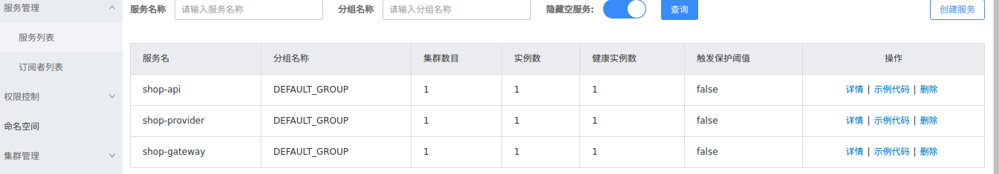

<span id="menu" >

<!-- TOC -->

- [1. Nacos](#1-nacos)
  - [1.1. Nacos介绍](#11-nacos介绍)
  - [1.2. Nacos安装配置](#12-nacos安装配置)
    - [1.2.1. 安装](#121-安装)
    - [1.2.2. 运行](#122-运行)
    - [1.2.3. 配置](#123-配置)
- [2. Spring Cloud Alibaba](#2-spring-cloud-alibaba)
  - [2.1. 介绍](#21-介绍)
    - [2.1.1. 与Spring Cloud 的区别](#211-与spring-cloud-的区别)
    - [2.1.2. 版本兼容](#212-版本兼容)
  - [2.2. 项目构建](#22-项目构建)
    - [2.2.1. SpringCloudAlibaba项目之父工程搭建](#221-springcloudalibaba项目之父工程搭建)
    - [2.2.2. SpringCloudAlibaba项目之Nacos搭建及服务注册](#222-springcloudalibaba项目之nacos搭建及服务注册)
    - [2.2.3. SpringCloudAlibaba项目之生产者与消费者](#223-springcloudalibaba项目之生产者与消费者)
    - [2.2.4. SpringCloudAlibaba项目之负载均衡](#224-springcloudalibaba项目之负载均衡)
      - [2.2.4.1. Ribbon负载均衡](#2241-ribbon负载均衡)
      - [2.2.4.2. loadbalancer](#2242-loadbalancer)
    - [2.2.6. SpringCloudAlibaba项目之Nacos-config配置中心](#226-springcloudalibaba项目之nacos-config配置中心)
    - [2.2.7. SpringCloudAlibaba项目之Sentinel流量控制](#227-springcloudalibaba项目之sentinel流量控制)
    - [2.2.8. SpringCloudAlibaba项目之Seata分布式事务](#228-springcloudalibaba项目之seata分布式事务)
    - [2.2.9. SpringCloudAlibaba项目之GateWay网关](#229-springcloudalibaba项目之gateway网关)
    - [2.2.10. SpringCloudAlibaba项目之SkyWalking链路追踪](#2210-springcloudalibaba项目之skywalking链路追踪)
    - [2.2.11. 集成swagger文档API](#2211-集成swagger文档api)

<!-- /TOC -->


# 1. Nacos
<a href="#menu" >目录</a>

## 1.1. Nacos介绍
<a href="#menu" >目录</a>

## 1.2. Nacos安装配置
<a href="#menu" >目录</a>

### 1.2.1. 安装
<a href="#menu" >目录</a>

下载地址: https://github.com/alibaba/nacos/releases

**目录结构**
```yml
-bin
    ---shutdown.sh
    ---startup.sh
-conf
    ---1.4.0-ipv6_support-update.sql
    ---application.properties
    ---application.properties.example
    ---cluster.conf.example
    ---nacos-logback.xml
    ---nacos-mysql.sql
    ---schema.sql
-data
-logs
-target
```
**导入数据库**
1. 创建nacos数据库:create database nacos 
2. 使用数据库:use nacos
3. 导入数据库文件: source /home/xx/xx/nacos-mysql.sql

一共有如下几个表
```yml
+----------------------+
| Tables_in_nacos      |
+----------------------+
| config_info          |
| config_info_aggr     |
| config_info_beta     |
| config_info_tag      |
| config_tags_relation |
| group_capacity       |
| his_config_info      |
| permissions          |
| roles                |
| tenant_capacity      |
| tenant_info          |
| users                |
+----------------------+
```
修改配置文件
```yml
spring.datasource.plateform=mysql
db.num=1
db.url.0
db.user.0
db.password.0

```
如果要使用集群模式,将 conf/cluster.conf.example文件重命名为 cluster.conf，打开文件，并将集群中所有节点的ip:port写入
```yml
192.168.16.101:8847
192.168.16.102
192.168.16.103
```
启动
```
启动命令(standalone代表着单机模式运行，非集群模式，cluster为集群模式，默认):
sh startup.sh -m standalone
```

访问:ip:port/nacos,默认端口是8848,初始用户名和密码都是nacos


### 1.2.2. 运行
<a href="#menu" >目录</a>

### 1.2.3. 配置
<a href="#menu" >目录</a>


# 2. Spring Cloud Alibaba
<a href="#menu" >目录</a>

## 2.1. 介绍
<a href="#menu" >目录</a>

地址: https://spring.io/projects/spring-cloud-alibaba#learn
github: https://github.com/alibaba/spring-cloud-alibaba
### 2.1.1. 与Spring Cloud 的区别
<a href="#menu" >目录</a>

**一 两者简介**
1. SpringCloud：一套全家桶的微服务解决框架，理念就是解决我们在微服务架构中遇到的任何问题；
2. SpringCloudAlibaba：实现对SpringCloud组件进行扩展；

**二 两者区别**

||||
|---|---|---|
|名称	|SpringCloud	|SpringCloudAlibaba
|注册中心	|Eureka、Consul	|Nacos
|配置中心	|SpringCloud Config	|Nacos
|网 关	|SpringCloud Zuul	|SpringCloud Gateway
|负载均衡	|Ribbon	|Loadbalancer
|熔断降级	|Hystrix	|Sentinel
|服务调用	|Feign	|OpenFeign

**三　版本对应**

1. 2020.0 分支对应的是 Spring Cloud 2020，最低支持 JDK 1.8。
2. master 分支对应的是 Spring Cloud Hoxton，最低支持 JDK 1.8。
3. greenwich 分支对应的是 Spring Cloud Greenwich，最低支持 JDK 1.8。
4. finchley 分支对应的是 Spring Cloud Finchley，最低支持 JDK 1.8。
5. 1.x 分支对应的是 Spring Cloud Edgware，最低支持 JDK 1.7。

**四　SpringCloudAlibaba组件**
1. Sentinel：把流量作为切入点，从流量控制、熔断降级、系统负载保护等多个维度保护服务的稳定性。
2. Nacos：一个更易于构建云原生应用的动态服务发现、配置管理和服务管理平台。
3. RocketMQ：一款开源的分布式消息系统，基于高可用分布式集群技术，提供低延时的、高可靠的消息发布与订阅服务。
4. Dubbo：Apache Dubbo™ 是一款高性能 Java RPC 框架。
5. Seata：阿里巴巴开源产品，一个易于使用的高性能微服务分布式事务解决方案。
6. Alibaba Cloud OSS: 阿里云对象存储服务（Object Storage Service，简称 OSS），是阿里云提供的海量、安全、低成本、高可靠的云存储服务。您可以在任何应用、任何时间、任何地点存储和访问任意类型的数据。
7. Alibaba Cloud SchedulerX: 阿里中间件团队开发的一款分布式任务调度产品，提供秒级、精准、高可靠、高可用的定时（基于 Cron 表达式）任务调度服务。
8. Alibaba Cloud SMS: 覆盖全球的短信服务，友好、高效、智能的互联化通讯能力，帮助企业迅速搭建客户触达通道。

 
有了spring cloud这个微服务的框架，为什么又要使用spring cloud alibaba这个框架了？最重要的原因在于spring cloud中的几乎所有的组件都使用Netflix公司的产品，然后在其基础上做了一层封装。然而Netflix的服务发现组件Eureka已经停止更新,而其他的众多组件在2020年停止维护。所以急需其他的一些替代产品，也就是spring cloud alibaba，目前正处于蓬勃发展的态式。

Spring Cloud Alibaba是Spring Cloud下的一个子项目，Spring Cloud Alibaba为分布式应用程序开发提供了一站式解决方案，它包含开发分布式应用程序所需的所有组件，使您可以轻松地使用Spring Cloud开发应用程序，使用Spring Cloud Alibaba，您只需要添加一些注解和少量配置即可将Spring Cloud应用程序连接到Alibaba的分布式解决方案，并使用Alibaba中间件构建分布式应用程序系统。Spring Cloud Alibaba 是阿里巴巴开源中间件跟 Spring Cloud 体系的融合。

### 2.1.2. 版本兼容
<a href="#menu" >目录</a>

spring cloud 与spring boot 版本兼容:https://spring.io/projects/spring-cloud

```yml
Release Train	       Boot Version
2021.0.x aka Jubilee   2.6.x, 2.7.x (Starting with 2021.0.3)
2020.0.x aka Ilford    2.4.x, 2.5.x (Starting with 2020.0.3)
Hoxton                 2.2.x, 2.3.x (Starting with SR5)
Greenwich              2.1.x
Finchley               2.0.x
Edgware                1.5.x
Dalston                1.5.x
```
SpringCloudAlibaba和SpringBoot的版本兼容：https://github.com/alibaba/spring-cloud-alibaba/blob/master/README-zh.md

SpringCloudAlibaba官方整理的版本说明：https://github.com/alibaba/spring-cloud-alibaba/wiki/%E7%89%88%E6%9C%AC%E8%AF%B4%E6%98%8E

||||
|---|---|---|
|Spring Cloud Version	      |Spring Cloud Alibaba Version	  |Spring Boot Version
|Spring Cloud 2020.0.1        |2021.1                         |2.4.2
|Spring Cloud Hoxton.SR12     |2.2.7.RELEASE                  |2.3.12.RELEASE
|Spring Cloud Hoxton.SR9      |2.2.6.RELEASE                  |2.3.2.RELEASE
|Spring Cloud Greenwich.SR6   |2.1.4.RELEASE                  |2.1.13.RELEASE
|Spring Cloud Hoxton.SR3      |2.2.1.RELEASE                  |2.2.5.RELEASE
|Spring Cloud Hoxton.RELEASE  |2.2.0.RELEASE                  |2.2.X.RELEASE
|Spring Cloud Greenwich       |2.1.2.RELEASE                  |2.1.X.RELEASE
|Spring Cloud Finchley        |2.0.4.RELEASE(停止维护，建议升级) |2.0.X.RELEASE
|Spring Cloud Edgware         |1.5.1.RELEASE(停止维护，建议升级) |1.5.X.RELEASE


## 2.2. 项目构建
<a href="#menu" >目录</a>

### 2.2.1. SpringCloudAlibaba项目之父工程搭建
<a href="#menu" >目录</a>

```xml

<parent>
    <groupId>org.springframework.boot</groupId>
    <artifactId>spring-boot-starter-parent</artifactId>
    <version>2.7.0</version>
    <relativePath/> <!-- lookup parent from repository -->
</parent>
<!-- 版本配置 全局有效-->
<properties>
    <java.version>1.8</java.version>
    <spring-boot.version>2.7.0</spring-boot.version>
    <spring-cloud.version>2021.0.3</spring-cloud.version>
    <spring-cloud-alibaba.version>2021.0.1.0</spring-cloud-alibaba.version>
</properties>
<dependencyManagement>
    <dependencies>
        <!-- SpringBoot 版本管理器 -->
        <dependency>
            <groupId>org.springframework.boot</groupId>
            <artifactId>spring-boot-starter-parent</artifactId>
            <version>${spring.boot.version}</version>
            <type>pom</type>
            <scope>import</scope>
        </dependency>
        <!--Spring Cloud 相关依赖-->
        <dependency>
            <groupId>org.springframework.cloud</groupId>
            <artifactId>spring-cloud-dependencies</artifactId>
            <version>${spring-cloud.version}</version>
            <type>pom</type>
            <scope>import</scope>
        </dependency>
        <!--Spring Cloud Alibaba 相关依赖-->
        <dependency>
            <groupId>com.alibaba.cloud</groupId>
            <artifactId>spring-cloud-alibaba-dependencies</artifactId>
            <version>${spring-cloud-alibaba.version}</version>
            <type>pom</type>
            <scope>import</scope>
        </dependency>
    </dependencies>
</dependencyManagement>
<dependencies>

    <!-- SpringBoot基本场景启动依赖 -->
        <dependency>
            <groupId>org.springframework.boot</groupId>
            <artifactId>spring-boot-starter</artifactId>
        </dependency>
        <!-- SpringBoot测试类依赖 -->
        <dependency>
            <groupId>org.springframework.boot</groupId>
            <artifactId>spring-boot-starter-test</artifactId>
            <scope>test</scope>
        </dependency>

</dependencies>
 <build>
    <plugins>
        <plugin>
            <groupId>org.springframework.boot</groupId>
            <artifactId>spring-boot-maven-plugin</artifactId>
        </plugin>
    </plugins>
</build>

```
父工程构建完成，主要是定义了spring boot/spring cloud/spring cloud alibaba的版本

### 2.2.2. SpringCloudAlibaba项目之Nacos搭建及服务注册
<a href="#menu" >目录</a>

配置文件
```xml
<!--引入配置中心阿里巴巴-->
<dependency>
    <groupId>com.alibaba.cloud</groupId>
    <artifactId>spring-cloud-starter-alibaba-nacos-config</artifactId>
</dependency>

<!--引入注册中心阿里巴巴-->
<dependency>
    <groupId>com.alibaba.cloud</groupId>
    <artifactId>spring-cloud-starter-alibaba-nacos-discovery</artifactId>
</dependency>
```

application.yml
```yml

spring:
 #服务名称，每个不同的服务需要设置不一样，后面负载均衡／网关等都依赖这个名称进行转发
  application:
    name: shop-api
  cloud:
    nacos:
      #如果使用nacos提供的配置中心
      config:
        server-addr: 127.0.0.1:8848
        file-extension: yaml
      #服务发现配置
      discovery:
        username: nacos
        password: nacos
        server-addr: 127.0.0.1:8848
        #注册到 nacos 的指定 namespace，默认为 public
        namespace: public
        enabled: true
server:
  port: 8081
```

启动类需要加上@EnableDiscoveryClient

启动后即可在nacos的服务列表中看到服务


### 2.2.3. SpringCloudAlibaba项目之生产者与消费者
<a href="#menu" >目录</a>

对于生产者，和普通的web项目没有区别，如果是消费者，需要引入loadbalancer和openfeign包，不过项目中一个服务既是生产者也是消费者
```xml
<dependency>
    <groupId>org.springframework.boot</groupId>
    <artifactId>spring-boot-starter-web</artifactId>
</dependency>
<!--由于Spring Cloud Feign在Hoxton.M2 RELEASED版本之后不再使用Ribbon
        而是使用spring-cloud-loadbalancer，
        所以不引入spring-cloud-loadbalancer会报错.-->
<dependency>
    <groupId>org.springframework.cloud</groupId>
    <artifactId>spring-cloud-loadbalancer</artifactId>
</dependency>

<dependency>
    <groupId>org.springframework.cloud</groupId>
    <artifactId>spring-cloud-starter-openfeign</artifactId>
</dependency>
```

消费者提供的服务API
```java
@RestController
@Slf4j
public class ProviderController {

    @RequestMapping("/info")
    public String info(){
        log.info("消费者访问");
        return "消费者:" + new Random().nextInt(100);
    }
}
```
生产者
```java
//消费者只需要定义接口以及配置生产者的application.name即可
//value就是生产者的application.name,fallback定义失败处理
@FeignClient(value = "shop-provider",fallback = ConsumerServiceFallback.class)
public interface ConsumerService {

    @RequestMapping("/info")
    public String info();
}
//消费者使用接口访问
@RestController
@Slf4j
public class ApiController {

    @Autowired
    ConsumerService consumerService;

    @RequestMapping("/info")
    public String info(){

        log.info("访问/info");
        String result = consumerService.info();
        log.info("result={}",result);
        return result;
    }
}
```

```java
public @interface FeignClient {
    @AliasFor("name")
    String value() default "";
    String contextId() default "";
    @AliasFor("value")
    String name() default "";
    String qualifier() default "";
    String url() default "";
    boolean decode404() default false;
    Class<?>[] configuration() default {};
    Class<?> fallback() default void.class;
    Class<?> fallbackFactory() default void.class;
    String path() default "";
    boolean primary() default true;
}

```
* value、name:value和name的作用一样，如果没有配置url那么配置的值将作为服务名称，用于服务发现。反之只是一个名称。
* contextId:我们不想将所有的调用接口都定义在一个类中，有一种解决方案就是为每个Client手动指定不同的contextId，这样就不会冲突了。
* url:url用于配置指定服务的地址，相当于直接请求这个服务，不经过Ribbon的服务选择。像调试等场景可以使用。
* decode404: 当调用请求发生404错误时，decode404的值为true，那么会执行decoder解码，否则抛出异常。
* configuration: configuration是配置Feign配置类，在配置类中可以自定义Feign的Encoder、Decoder、LogLevel、Contract等。
* fallback: 定义容错的处理类，也就是回退逻辑，fallback的类必须实现Feign Client的接口，无法知道熔断的异常信息。
* fallbackFactory: 也是容错的处理，可以知道熔断的异常信息。
* path: path定义当前FeignClient访问接口时的统一前缀，比如接口地址是/user/get, 如果你定义了前缀是user, 那么具体方法上的路径就只需要写/get 即可。
* primary: primary对应的是@Primary注解，默认为true，官方这样设置也是有原因的。当我们的Feign实现了fallback后，也就意味着Feign Client有多个相同的Bean在Spring容器中，当我们在使用@Autowired进行注入的时候，不知道注入哪个，所以我们需要设置一个优先级高的，@Primary注解就是干这件事情的。
* qualifier: qualifier对应的是@Qualifier注解，使用场景跟上面的primary关系很淡，一般场景直接@Autowired直接注入就可以了


### 2.2.4. SpringCloudAlibaba项目之负载均衡
<a href="#menu" >目录</a>

Spring Cloud Feign在Hoxton.M2 RELEASED版本之后不再使用Ribbon,而是使用spring-cloud-loadbalancer

#### 2.2.4.1. Ribbon负载均衡

#### 2.2.4.2. loadbalancer

```xml
 <dependency>
    <groupId>org.springframework.cloud</groupId>
    <artifactId>spring-cloud-loadbalancer</artifactId>
</dependency>

<dependency>
    <groupId>org.springframework.cloud</groupId>
    <artifactId>spring-cloud-starter-openfeign</artifactId>
</dependency>
```

spring cloud 的loadbalancer开箱即用，不需要任何配置


### 2.2.6. SpringCloudAlibaba项目之Nacos-config配置中心
<a href="#menu" >目录</a>

```xml
<dependency>
    <groupId>com.alibaba.cloud</groupId>
    <artifactId>spring-cloud-starter-alibaba-nacos-config</artifactId>
</dependency>
```
最新版本（2021.0.1.0）移除了 spring-cloud-starter-bootstrap 的支持，改用 spring.config.import

这个配置必须放在application.yml中，不能是bootstrap.yml
```yml
spring:
  config:
    import:
    #格式:optional:nacos:DataID
    #DataID为nacos创建配置时指定
      - optional:nacos:shop-api.yaml
```

代码中获取配置值

方式1:通过ConfigurableApplicationContext读取

spring cloud在启动后会将配置读取到Environment中，如果nacos更新了配置，用这个方式也会读取到最新的配置
```java
ConfigurableApplicationContext context = SpringApplication.run(ApiApplication.class,args);

while(true) {
    //当动态配置刷新时，会更新到 Enviroment中，因此这里每隔一秒中从Enviroment中获取配置
    String name = context.getEnvironment().getProperty("name");
    String userAge = context.getEnvironment().getProperty("age");
    System.err.println("user name :" + name + "; age: " + userAge);
    TimeUnit.SECONDS.sleep(10);
}
```
方式２:使用@Value，如果想配置支持动态热更新，则加上注解@RefreshScope
```java
@Controller
@RefreshScope //配置此类接口动态刷新
public class ApiController {
    @Value("${name}")
    private String name;
    @Value("${age}")
    private String age;
}
```


### 2.2.7. SpringCloudAlibaba项目之Sentinel流量控制
<a href="#menu" >目录</a>

### 2.2.8. SpringCloudAlibaba项目之Seata分布式事务
<a href="#menu" >目录</a>

### 2.2.9. SpringCloudAlibaba项目之GateWay网关
<a href="#menu" >目录</a>

### 2.2.10. SpringCloudAlibaba项目之SkyWalking链路追踪
<a href="#menu" >目录</a>

### 2.2.11. 集成swagger文档API
<a href="#menu" >目录</a>

```yml
站名到站时间出发时间停留时间
01	南宁东	----	07:36	----
02	桂平	08:34	08:36	2分钟
03	平南南	08:50	08:52	2分钟
04	梧州南	09:19	09:22	3分钟
05	南江口	09:46	09:52	6分钟
06	肇庆东	10:22	10:24	2分钟
07	三水南	10:37	10:39	2分钟
08	佛山西	10:51	10:59	8分钟
09	广州南

01	南宁东	----	08:31	----
02	梧州南	10:02	10:05	3分钟
03	广州南	11:27	11:32	5分钟
04	深圳北	12:02	12:02	----

柳州	----	07:55	----
02	来宾北	08:21	08:23	2分钟
03	贵港	09:02	09:04	2分钟
04	桂平	09:23	09:29	6分钟
05	平南南	09:43	09:45	2分钟
06	梧州南	10:12	10:20	8分钟
07	南江口	10:45	10:47	2分钟
08	肇庆东	11:17	11:19	2分钟
09	佛山西	11:40	11:43	3分钟
10	广州南	12:04	

柳州	----	08:12	----
02	永福南	08:57	08:59	2分钟
03	桂林	09:23	09:26	3分钟
04	桂林北	09:36	09:40	4分钟
05	恭城	10:13	10:16	3分钟
06	钟山西	10:38	10:46	8分钟
07	贺州	10:58	11:02	4分钟
08	怀集	11:32	11:38	6分钟
09	肇庆东	12:07	12:09	2分钟
10	佛山西	12:29	12:31	2分钟
11	广州南	12:51	12:51	----


```