<span id="menu"></span>

<!-- TOC -->

- [1. Zookeeper](#1-zookeeper)
  - [1.1. 基本概念](#11-基本概念)
    - [1.1.1. zk架构](#111-zk架构)
    - [1.1.2. 提供的功能](#112-提供的功能)
    - [1.1.3. 启动和配置文件](#113-启动和配置文件)
    - [1.1.4. 节点类型](#114-节点类型)
    - [1.1.5. Chroot特性](#115-chroot特性)
- [2. 技术内幕](#2-技术内幕)
  - [2.1. 系统模型](#21-系统模型)
    - [2.1.1. 数据模型](#211-数据模型)
    - [2.1.2. 版本](#212-版本)
    - [2.1.3. Jute介绍](#213-jute介绍)
    - [2.1.4. 使用Jute进行序列化](#214-使用jute进行序列化)
    - [2.1.5. 深入Jute](#215-深入jute)
    - [2.1.6. 通信协议](#216-通信协议)
  - [2.2. 客户端](#22-客户端)
    - [2.2.1. 一次会话的创建过程](#221-一次会话的创建过程)
    - [2.2.2. 服务器地址列表](#222-服务器地址列表)
    - [2.2.3. 网络IO](#223-网络io)
  - [2.3. Watcher](#23-watcher)
    - [2.3.1. 基本概念](#231-基本概念)
    - [2.3.2. 监听操作](#232-监听操作)
      - [2.3.2.1. 基于watch实现监听](#2321-基于watch实现监听)
      - [2.3.2.2. 基于cache实现监听](#2322-基于cache实现监听)
        - [2.3.2.2.1. 单节点监听NodeCache](#23221-单节点监听nodecache)
        - [2.3.2.2.2. 子节点监听PathChildrenCache](#23222-子节点监听pathchildrencache)
        - [2.3.2.2.3. 所有子节点监听TreeCache](#23223-所有子节点监听treecache)
  - [2.4. 会话](#24-会话)
    - [2.4.1. 会话状态](#241-会话状态)
    - [2.4.2. 会话创建](#242-会话创建)
    - [2.4.3. 会话管理](#243-会话管理)
    - [2.4.4. 会话清理](#244-会话清理)
    - [2.4.5. 重连](#245-重连)
  - [2.5. 服务器启动](#25-服务器启动)
    - [2.5.1. 单机版服务器启动](#251-单机版服务器启动)
    - [2.5.2. 集群版服务器启动](#252-集群版服务器启动)
  - [2.6. ACL权限控制](#26-acl权限控制)
    - [2.6.1. 概述](#261-概述)
    - [2.6.2. 案例](#262-案例)
  - [2.7. 服务器角色](#27-服务器角色)
    - [2.7.1. Leader](#271-leader)
    - [2.7.2. Follower](#272-follower)
    - [2.7.3. Observer](#273-observer)
    - [2.7.4. 集群消息通信](#274-集群消息通信)
  - [2.8. ZAB协议](#28-zab协议)
    - [2.8.1. 什么是Zab协议](#281-什么是zab协议)
    - [2.8.2. Zab 协议的作用](#282-zab-协议的作用)
    - [2.8.3. Zab 协议原理](#283-zab-协议原理)
    - [2.8.4. Zab 协议核心](#284-zab-协议核心)
    - [2.8.5. Zab 协议内容](#285-zab-协议内容)
    - [2.8.6. 消息广播](#286-消息广播)
    - [2.8.7. 崩溃恢复](#287-崩溃恢复)
    - [2.8.8. 如何保证数据一致性](#288-如何保证数据一致性)
    - [2.8.9. Zab 协议如何数据同步](#289-zab-协议如何数据同步)
    - [2.8.10. 如何处理需要丢弃的 Proposal](#2810-如何处理需要丢弃的-proposal)
    - [2.8.11. Zab 协议实现原理](#2811-zab-协议实现原理)
    - [2.8.12. 选主过程](#2812-选主过程)
  - [2.9. Leader选举](#29-leader选举)
    - [2.9.1. 服务器启动时期的Leader选举](#291-服务器启动时期的leader选举)
    - [2.9.2. 服务器运行时期的Leader选举](#292-服务器运行时期的leader选举)
    - [2.9.3. Leader选举算法分析](#293-leader选举算法分析)
    - [2.9.4. Leader选举实现细节](#294-leader选举实现细节)
  - [2.10. 请求处理](#210-请求处理)
    - [2.10.1. 会话创建请求](#2101-会话创建请求)
    - [2.10.2. setData请求](#2102-setdata请求)
    - [2.10.3. 事务请求转发](#2103-事务请求转发)
    - [2.10.4. GetData请求](#2104-getdata请求)
  - [2.11. 数据与存储](#211-数据与存储)
    - [2.11.1. 内存数据](#2111-内存数据)
    - [2.11.2. 事务日志](#2112-事务日志)
    - [2.11.3. 数据快照](#2113-数据快照)
    - [2.11.4. 初始化](#2114-初始化)
    - [2.11.5. 数据同步](#2115-数据同步)
- [3. 运维](#3-运维)
  - [3.1. JMX查看集群信息](#31-jmx查看集群信息)
  - [3.2. 构建一个高可用的集群](#32-构建一个高可用的集群)
    - [3.2.1. 容灾](#321-容灾)
    - [3.2.2. 扩容与缩容](#322-扩容与缩容)
  - [3.3. 日常运维](#33-日常运维)
    - [3.3.1. 数据与日志管理](#331-数据与日志管理)
    - [3.3.2. 磁盘管理](#332-磁盘管理)
- [4. Java客户端Curator](#4-java客户端curator)
  - [4.1. 项目组件](#41-项目组件)
  - [4.2. Maven依赖](#42-maven依赖)
  - [4.3. 使用](#43-使用)
  - [4.4. 两种错误场景的处理](#44-两种错误场景的处理)
- [5. 典型应用场景](#5-典型应用场景)
- [6. ZK分布式锁](#6-zk分布式锁)
  - [6.1. 分布式锁基本知识](#61-分布式锁基本知识)
  - [6.2. Curator分布式锁的使用](#62-curator分布式锁的使用)
  - [6.3. ZK分布式锁的可靠性分析](#63-zk分布式锁的可靠性分析)
  - [6.4. Curator分布式锁的原理](#64-curator分布式锁的原理)
    - [6.4.1. InterProcessMutex实现原理](#641-interprocessmutex实现原理)
      - [6.4.1.1. 加锁处理](#6411-加锁处理)
      - [6.4.1.2. 释放锁处理](#6412-释放锁处理)
    - [6.4.2. InterProcessReadWriteLock读写锁实现原理](#642-interprocessreadwritelock读写锁实现原理)
    - [6.4.3. InterProcessSemaphoreMutex不可重入的分布式排它锁实现原理](#643-interprocesssemaphoremutex不可重入的分布式排它锁实现原理)
    - [6.4.4. InterProcessReadWriteLock实现原理](#644-interprocessreadwritelock实现原理)

<!-- /TOC -->
# 1. Zookeeper
<a href="#menu">目录</a>

## 1.1. 基本概念
<a href="#menu">目录</a>

ZooKeeper是一个开放源码的分布式协调服务，它是集群的管理者，监视着集群中各个节点的状态根据节点提交的反馈进行下一步合理操作。最终，将简单易用的接口和性能高效、功能稳定的系统提供给用户。

分布式应用程序可以基于Zookeeper实现诸如数据发布/订阅、负载均衡、命名服务、分布式协调/通知、集群管理、Master选举、分布式锁和分布式队列等功能。

Zookeeper保证了如下分布式一致性特性：
* 顺序一致性
* 原子性
* 单一视图
* 可靠性
* 实时性（最终一致性）
客户端的读请求可以被集群中的任意一台机器处理，如果读请求在节点上注册了监听器，这个监听器也是由所连接的zookeeper机器来处理。对于写请求，这些请求会同时发给其他zookeeper机器并且达成一致后，请求才会返回成功。因此，随着zookeeper的集群机器增多，读请求的吞吐会提高但是写请求的吞吐会下降。

有序性是zookeeper中非常重要的一个特性，所有的更新都是全局有序的，每个更新都有一个唯一的时间戳，这个时间戳称为zxid（Zookeeper Transaction Id）。而读请求只会相对于更新有序，也就是读请求的返回结果中会带有这个zookeeper最新的zxid。

**拜占庭将军问题**

拜占庭将军问题（Byzantine Faults） 是指可能导致一个组件发生任意行为（常常是意料之外的） 的故障。 这个故障的组件可能会破坏应用的状态， 甚至是恶意行为。 系统是建立在假设会发生这些故障， 需要更高程度的复制并使用安全原语的基础上。 尽管我们从学术文献中知道，针对拜占庭将军问题技术发展已经取得了巨大进步， 我们还是觉得没有必要在ZooKeeper中采用这些技术， 因此， 我们也避免代码库中引入额外的复杂性。


**zookeeper是如何保证事务的顺序一致性的？**
zookeeper采用了全局递增的事务Id来标识，所有的proposal（提议）都在被提出的时候加上了zxid，zxid实际上是一个64位的数字，高32位是epoch（时期; 纪元; 世; 新时代）用来标识leader周期，如果有新的leader产生出来，epoch会自增，低32位用来递增计数。当新产生proposal的时候，会依据数据库的两阶段过程，首先会向其他的server发出事务执行请求，如果超过半数的机器都能执行并且能够成功，那么就会开始执行。

**分布式集群中为什么会有Master？**
在分布式环境中，有些业务逻辑只需要集群中的某一台机器进行执行，其他的机器可以共享这个结果，这样可以大大减少重复计算，提高性能，于是就需要进行leader选举。

**zk节点宕机如何处理？**
Zookeeper本身也是集群，推荐配置不少于3个服务器。Zookeeper自身也要保证当一个节点宕机时，其他节点会继续提供服务。
如果是一个Follower宕机，还有2台服务器提供访问，因为Zookeeper上的数据是有多个副本的，数据并不会丢失；
如果是一个Leader宕机，Zookeeper会选举出新的Leader。
ZK集群的机制是只要超过半数的节点正常，集群就能正常提供服务。只有在ZK节点挂得太多，只剩一半或不到一半节点能工作，集群才失效。
所以
3个节点的cluster可以挂掉1个节点(leader可以得到2票>1.5)
2个节点的cluster就不能挂掉任何1个节点了(leader可以得到1票<=1)

**zookeeper负载均衡和nginx负载均衡区别**
zk的负载均衡是可以调控，nginx只是能调权重，其他需要可控的都需要自己写插件；但是nginx的吞吐量比zk大很多，应该说按业务选择用哪种方式。

**Zookeeper有哪几种几种部署模式？**
部署模式：单机模式、伪集群模式、集群模式。

**集群最少要几台机器，集群规则是怎样的?**
集群规则为2N+1台，N>0，即3台。

**集群支持动态添加机器吗？**
其实就是水平扩容了，Zookeeper在这方面不太好。两种方式：

全部重启：关闭所有Zookeeper服务，修改配置之后启动。不影响之前客户端的会话。
逐个重启：在过半存活即可用的原则下，一台机器重启不影响整个集群对外提供服务。这是比较常用的方式。
3.5版本开始支持动态扩容。

**Zookeeper对节点的watch监听通知是永久的吗？为什么不是永久的?**
不是。官方声明：一个Watch事件是一个一次性的触发器，当被设置了Watch的数据发生了改变的时候，则服务器将这个改变发送给设置了Watch的客户端，以便通知它们。

为什么不是永久的，举个例子，如果服务端变动频繁，而监听的客户端很多情况下，每次变动都要通知到所有的客户端，给网络和服务器造成很大压力。
一般是客户端执行getData(“/节点A”,true)，如果节点A发生了变更或删除，客户端会得到它的watch事件，但是在之后节点A又发生了变更，而客户端又没有设置watch事件，就不再给客户端发送。
在实际应用中，很多情况下，我们的客户端不需要知道服务端的每一次变动，我只要最新的数据即可。

**Zookeeper的java客户端都有哪些？**
java客户端：zk自带的zkclient及Apache开源的Curator。

**chubby是什么，和zookeeper比你怎么看？**
chubby是google的，完全实现paxos算法，不开源。zookeeper是chubby的开源实现，使用zab协议，paxos算法的变种。

**说几个zookeeper常用的命令。**
常用命令：ls get set create delete等。

**ZAB和Paxos算法的联系与区别？**
相同点：

两者都存在一个类似于Leader进程的角色，由其负责协调多个Follower进程的运行
Leader进程都会等待超过半数的Follower做出正确的反馈后，才会将一个提案进行提交
ZAB协议中，每个Proposal中都包含一个 epoch 值来代表当前的Leader周期，Paxos中名字为Ballot
不同点：
ZAB用来构建高可用的分布式数据主备系统（Zookeeper），Paxos是用来构建分布式一致性状态机系统。

**Zookeeper的典型应用场景**
Zookeeper是一个典型的发布/订阅模式的分布式数据管理与协调框架，开发人员可以使用它来进行分布式数据的发布和订阅。

通过对Zookeeper中丰富的数据节点进行交叉使用，配合Watcher事件通知机制，可以非常方便的构建一系列分布式应用中年都会涉及的核心功能，如：
* 数据发布/订阅
* 负载均衡
* 命名服务
* 分布式协调/通知
* 集群管理
* Master选举
* 分布式锁
* 分布式队列
* 数据发布/订阅

介绍
数据发布/订阅系统，即所谓的配置中心，顾名思义就是发布者发布数据供订阅者进行数据订阅。

目的
动态获取数据（配置信息）
实现数据（配置信息）的集中式管理和数据的动态更新
设计模式
Push 模式
Pull 模式
数据（配置信息）特性：
数据量通常比较小
数据内容在运行时会发生动态更新
集群中各机器共享，配置一致
如：机器列表信息、运行时开关配置、数据库配置信息等

基于Zookeeper的实现方式
数据存储：将数据（配置信息）存储到Zookeeper上的一个数据节点
数据获取：应用在启动初始化节点从Zookeeper数据节点读取数据，并在该节点上注册一个数据变更Watcher
数据变更：当变更数据时，更新Zookeeper对应节点数据，Zookeeper会将数据变更通知发到各客户端，客户端接到通知后重新读取变更后的数据即可。
1. 负载均衡
zk的命名服务
命名服务是指通过指定的名字来获取资源或者服务的地址，利用zk创建一个全局的路径，这个路径就可以作为一个名字，指向集群中的集群，提供的服务的地址，或者一个远程的对象等等。

分布式通知和协调
对于系统调度来说：操作人员发送通知实际是通过控制台改变某个节点的状态，然后zk将这些变化发送给注册了这个节点的watcher的所有客户端。
对于执行情况汇报：每个工作进程都在某个目录下创建一个临时节点。并携带工作的进度数据，这样汇总的进程可以监控目录子节点的变化获得工作进度的实时的全局情况。

7.zk的命名服务（文件系统）
命名服务是指通过指定的名字来获取资源或者服务的地址，利用zk创建一个全局的路径，即是唯一的路径，这个路径就可以作为一个名字，指向集群中的集群，提供的服务的地址，或者一个远程的对象等等。

8.zk的配置管理（文件系统、通知机制）
程序分布式的部署在不同的机器上，将程序的配置信息放在zk的znode下，当有配置发生改变时，也就是znode发生变化时，可以通过改变zk中某个目录节点的内容，利用watcher通知给各个客户端，从而更改配置。

9.Zookeeper集群管理（文件系统、通知机制）
所谓集群管理无在乎两点：是否有机器退出和加入、选举master。
对于第一点，所有机器约定在父目录下创建临时目录节点，然后监听父目录节点的子节点变化消息。一旦有机器挂掉，该机器与 zookeeper的连接断开，其所创建的临时目录节点被删除，所有其他机器都收到通知：某个兄弟目录被删除，于是，所有人都知道：它上船了。
新机器加入也是类似，所有机器收到通知：新兄弟目录加入，highcount又有了，对于第二点，我们稍微改变一下，所有机器创建临时顺序编号目录节点，每次选取编号最小的机器作为master就好。

10.Zookeeper分布式锁（文件系统、通知机制）
有了zookeeper的一致性文件系统，锁的问题变得容易。锁服务可以分为两类，一个是保持独占，另一个是控制时序。
对于第一类，我们将zookeeper上的一个znode看作是一把锁，通过createznode的方式来实现。所有客户端都去创建 /distribute_lock 节点，最终成功创建的那个客户端也即拥有了这把锁。用完删除掉自己创建的distribute_lock 节点就释放出锁。
对于第二类， /distribute_lock 已经预先存在，所有客户端在它下面创建临时顺序编号目录节点，和选master一样，编号最小的获得锁，用完删除，依次方便。

12.Zookeeper队列管理（文件系统、通知机制）
两种类型的队列：
1、同步队列，当一个队列的成员都聚齐时，这个队列才可用，否则一直等待所有成员到达。
2、队列按照 FIFO 方式进行入队和出队操作。
第一类，在约定目录下创建临时目录节点，监听节点数目是否是我们要求的数目。
第二类，和分布式锁服务中的控制时序场景基本原理一致，入列有编号，出列按编号。在特定的目录下创建PERSISTENT_SEQUENTIAL节点，创建成功时Watcher通知等待的队列，队列删除序列号最小的节点用以消费。此场景下Zookeeper的znode用于消息存储，znode存储的数据就是消息队列中的消息内容，SEQUENTIAL序列号就是消息的编号，按序取出即可。由于创建的节点是持久化的，所以不必担心队列消息的丢失问题。

**脑裂问题（split brain）** 

即两个集合的服务器分别独立的运行， 形成了两个集群。 这种情况将导致整个系统状态的不一致性， 最终客户端也将根据其连接的服务器而获得不同的结果


### 1.1.1. zk架构


zk的结构如下，类似于一个Linux文件系统，根节点是"/"。同时你可以在每个节点上添加监听器，当数据发生变化(增加，修改，删除)时，将会通知客户端。

**因此zk简单理解就是一个类似文件系统结构的并且具有变更通知功能的分布式协调系统。**

每一个节点称为zode。每个节点下可以创建多个子节点，每个节点还可以存放数据。

Zookeeper提供一个多层级的节点命名空间（节点称为znode）。与文件系统不同的是，这些节点都可以设置关联的数据，而文件系统中只有文件节点可以存放数据而目录节点不行。

Zookeeper为了保证高吞吐和低延迟，在内存中维护了这个树状的目录结构，这种特性使得Zookeeper不能用于存放大量的数据，每个节点的存放数据上限为1M。


* 适用场景
在分布式系统中，多个服务需要共享一些系统配置信息，比如微服务环境下，服务提供者向zookeeper注册自己多的元数据信息(比如服务名称，地址等)。服务消费者通过注册监听器，获取到zk中服务信息的变化，服务消费者拉取新的配置信息同时更新本地缓存。就解决了服务提供者变更信息的情况下，服务消费者无需更新配置，所有过程都是自动化进行高的。

目前使用zk作为分布式协调系统的有Dubbo和Kafka

* 不适用场景
不适合做海量数据存储，海量数据应当使用数据库，分布式文件系统等。

* 主从模式
为了提高系统的可靠性，zk提供主从模式的分布式部署方式。

**主节点**: 主节点负责监视新的从节点和任务，分配任务给可用的从节点。每个集群只能有一个主节点。
**从节点**: 从节点通过系统注册自己，以确保主节点看到它们可以执行任务，然后开始监视新任务。


在解决分布式数据一致性方面，zk并没有直接采用Paxos算法，而是采用了一种被称为ZAB(Zookeeper Atomic Broadcast)的一致性协议。

zk是一个典型的分布式数据一致性的解决方案，分布式应用程序可以基于它实现诸如数据发布／订阅，负载均衡，命名服务，分布式协调／通知，集群管理，Master选举，分布式锁和分布式队列等功能。

**zk可以保证如下分布一致性特性**
* 顺序一致性
    * 从同一客户端发起的事务请求，最终将会严格地按照其发起的顺序被应用到zk中
* 原子性
    * 所有事务请求的处理结果在整个集群中所有机器上的应用情况是一致的。要么整个集群中所有机器都成功应用了某一个事务，要么都没有应用
* 单一视图
    * 无论客户端连接的是哪个zk服务器，其看到的服务端数据模型都是一致的
* 可靠性
    * 一旦服务端成功地应用了某一个事务，并完成了响应，该事务所引起的服务端状态变更将会被一直保留下来，除非有另一个事务对其进行了修改。
* 实时性
    * zk仅仅保证在一定时间内，客户端一定能够从服务器上读取最新修改的数据。因为写数据时只要超过半数的机器向leader返回写入成功响应，即认为数据已经写入成功。


**zk设计目标**

* 简单的数据目标
* 可以构建集群
* 顺序访问
* 高性能
* 


### 1.1.2. 提供的功能
* 给节点创建监听器
* create : 创建节点
* delete : 删除节点
* exists : 检测节点是否存在
* get data : 从节点读取数据
* set data : 向节点写入数据
* get children : 获取子节点列表
* sync : 等待数据传播

### 1.1.3. 启动和配置文件

```yml
|---bin  相关的命令文件
    |---zkServer.sh 服务端操作
    |---zkCli.sh　客户端操作
|---conf
    |---log4j.properties 
    |---zoo.cfg配置文件
    
```

服务端操作：zkServer.sh start|stop|restart|status

客户端连接命令：zkCli.sh -server 127.0.0.1:8181 

启动客户端之后
1. 使用 help 命令 可以查看客户端可以使用的命令集合（一般linux 软件中都有 ，有些是 -h -help 等）
2. ls path 显示指定目录下的第一级目录
3. ls2 path 显示指定目录下的第一级目录、以及对应节点更新的次数等信息
4. create [-s] [-e] path  value  创建指定目录的节点 并设置值为value,-s为顺序节点，－e为临时节点
5. set path value [version]对指定节点值 进行修改
6. delete path  删除指定节点，（注意：先删除子节点、在删除父节点，子节点存在的情况下，无法删除父节点）
7. quit  退出客户端命令
8. get path  读取数据


ZooKeeper 支持某些特定的四字命令字母与其的交互。它们大多是查询命令，用来获取 ZooKeeper 服务的当前状态及相关信息。用户在客户端可以通过 telnet 或 nc 向 ZooKeeper 提交相应的命令

1. 可以通过命令：echo stat|nc 127.0.0.1 2181 来查看哪个节点被选择作为follower或者leader
2. 使用echo ruok|nc 127.0.0.1 2181 测试是否启动了该Server，若回复imok表示已经启动。
3. echo dump| nc 127.0.0.1 2181 ,列出未经处理的会话和临时节点。
4. echo kill | nc 127.0.0.1 2181 ,关掉server
5. echo conf | nc 127.0.0.1 2181 ,输出相关服务配置的详细信息。
6. echo cons | nc 127.0.0.1 2181 ,列出所有连接到服务器的客户端的完全的连接 / 会话的详细信息。
7. echo envi |nc 127.0.0.1 2181 ,输出关于服务环境的详细信息（区别于 conf 命令）。
8. echo reqs | nc 127.0.0.1 2181 ,列出未经处理的请求。
9. echo wchs | nc 127.0.0.1 2181 ,列出服务器 watch 的详细信息。
10. echo wchc | nc 127.0.0.1 2181 ,通过 session 列出服务器 watch 的详细信息，它的输出是一个与 watch 相关的会话的列表。
11. echo wchp | nc 127.0.0.1 2181 ,通过路径列出服务器 watch 的详细信息。它输出一个与 session 相关的路径。


／conf／zoo.cfg配置文件，刚下载时是zoo_sample.cfg ，需要重命名为zoo.cfg

* zookeeper的三种端口号：
    * 2181：客户端连接Zookeeper集群使用的监听端口号
    * 3888：选举leader使用
    * 2888：集群内机器通讯使用（Leader和Follower之间数据同步使用的端口号，Leader监听此端口）
```yml
# The number of milliseconds of each tick
# 心跳检测时间
tickTime=2000
# The number of ticks that the initial 
# synchronization phase can take
# 心跳检测失败最大次数
initLimit=10
# The number of ticks that can pass between  sending a request and getting an acknowledgement
# 配置Leader与Follower之间发送信息，请求与应答时间长度，最长不能超过多少个tickTime的时间长度，总的时间长度就是2*2000=4秒
syncLimit=5
# the directory where the snapshot is stored.
# do not use /tmp for storage, /tmp here is just 
# example sakes.
# 内存数据库保存的快照的目录，如果某个服务器为集群中的一台，则id文件也保存在该目录下
#  快照异步写入，不会阻塞
# 服务器存储快照的目录，无默认值，必须配置
dataDir= ../zk1/data
# 保存事务日志的目录，不配置就是和dataDir一样
dataLogDir= ../zk1/logs
# the port at which the clients will connect
# 这个端口就是客户端连接Zookeeper服务器的端口，Zookeeper会监听这个端口，接收客户端的访问请求
clientPort=2181
# the maximum number of client connections.
# increase this if you need to handle more clients
#限制连接到zookeeper的客户端的数量，限制并发连接的数量，它通过IP来区分不同的客户端。
#此配置选项可以用来组织某些类别的Dos攻击。将它设置为0或者忽略而不进行设置将会取消对并发连接的限制。
#maxClientCnxns=60
#
# Be sure to read the maintenance section of the 
# administrator guide before turning on autopurge.
#
# http://zookeeper.apache.org/doc/current/zookeeperAdmin.html#sc_maintenance
#
#在/bin目录下有个脚本：zkCleanup.sh可以手动清理快照和事务日志；
#定时清理（zookeeper从3.4.0开始提供了自动清理快照和事务日志的功能）以下两个参数配合使用：
# The number of snapshots to retain in dataDir 指定了需要保留的文件数目。默认事保留3个。
#autopurge.snapRetainCount=3
# Purge task interval in hours
# Set to "0" to disable auto purge feature

#指定了清理频率，单位是小时，需要填写一个1或者更大的数字，默认是0，表示不开启自己清理功能。
#autopurge.purgeInterval=1

#server.A=B:C:D:其中A是一个数字，表示这个是第几号服务器。B是这个服务器的IP地址/在docker中可以使用计算机名。C表示的是这个服务器与集群中的Leader服务器交换信息的端口（2888）；D表示的是万一集群中的Leader服务器挂了，需要一个端口来重新进行选举，选出一个新的Leader，而这个端口就是用来执行选举时服务器相互通信的端口（3888）.如果时是集群的配置方式，由于B都是一样，所以不同的Zookeeper实际通信端口号不能一样，所以要给它们分配不同的端口号
# server.myid=IP:PORT1;PORT2
#PORT1:服务器与集群中的LEADER服务器交换信息的端口
#PORT2：万一集群中的LEADER挂了，需要一个端口来重新进行宣讲 选出新的LEADER 
#　以下两个配置为配置服务器为观察者
# peerType=observer
# server.3=192.168.0.3:2888:3888:observer　
server.1=192.168.0.1:2888:3888
server.2=192.168.0.2:2888:3888
server.3=192.168.0.3:2888:3888
#注意：server.A中的A时在dataDir配置的目录中创建一个名为myid的文里的值（如：1）

```
myid为用来标识机器在集群中的机器序号，并且在启动集群前，需要在dataDir目录下创建文件myid,内容为上述的myid.只有一行。需要确保server.myid和myid文件中的数值一致，否则启动会失败，id范围是1-255

在zk设计中，集群中所有配置文件zoo.cfg文件的内容都应该一致的，当然也可以设置不同的clientPort。


注意，如果在单机上安装伪集群，所有端口必须不一样，多机上可以一样。

```yml
server.1=127.0.0.1:2880:3880
server.2=127.0.0.1:2881:3881
server.3=127.0.0.1:2882:3882
```

单机模式只要配置一个server.1=127.0.0.1:2880:3880。对于单机模式，启动后zk的角色为standalone,对于集群模式，节点的角色有两种，leader和follower.

**高级参数配置**
* dataLogDir
    * 该参数有默认值：dataDir，可以不配置，不支持系统属性方式配置。
    * 参数dataLogDir用于配置ZooKeeper服务器存储事务日志文件的目录。默认情况下，ZooKeeper会将事务日志文件和快照数据存储在同一个目录中，应尽量将这两者的目录区分开来。
    * 另外，如果条件允许，可以将事务日志的存储配置在一个单独的磁盘上。事务日志记录对于磁盘的性能要求非常高，为了保证事务的一致性，ZooKeeper在返回客户端事务请求响应之前，必须将本次请求对应的事务日志写入到磁盘中。因此，事务日志写入的性能直接决定了ZooKeeper在处理事务请求时的吞吐。针对同一块磁盘的其他并发读写操作（例如ZooKeeper运行时输出和操作系统自身的读写等），尤其是数据快照操作，会极大地影响事务日志的写性能。因此尽量给事务日志的输出配置一个单独的磁盘或是挂载点，将极大地提升ZooKeeper的整体性能。
* initLimit
    * 该参数有默认值：10，即表示是参数tickTime值的10倍，必须配置，且需要配置一个正参数，不支持系统属性方式配置。
    * 该参数用于配置Leader服务器等待Follower启动，并完成数据同步的时间。Follower服务器在启动过程中，会与Leader建立连接并完成对数据的同步，从而确定自己对外提供服务的起始状态。Leader服务器允许Follower在initLimit时间内完成这个工作。
    * 通常情况下，运维人员不用太在意这个参数的配置，使用其默认值即可。但如果随着ZooKeeper集群管理的数据量增大，Follower服务器在启动的时候，从Leader上进行同步数据的时间也会相应变长，于是无法在较短的时间完成数据同步。因此，在这种情况下，有必要适当调大这个参数。
* syncLimit
    * 该参数有默认值：5，即表示是参数tickTime值的5倍，必须配置，且需要配置一个正整数，不支持系统属性方式配置。
    * 该参数用于配置Leader服务器和Follower之间进行心跳检测的最大延时时间。在ZooKeeper集群运行过程中，Leader服务器会与所有的Follower进行心跳检测来确定该服务器是否存活。如果Leader服务器在syncLimit时间内无法获取到Follower的心跳检测响应，那么Leader就会认为该Follower已经脱离了和自己的同步。
    * 通常情况下，运维人员使用该参数的默认值即可，但如果部署ZooKeeper集群的网络环境质量较低（例如网络延时较大或丢包严重），那么可以适当调大这个参数。
* snapCount
    * 该参数有默认值：100000，可以不配置，仅支持系统属性方式配置：zookeeper.snapCount。
    * 参数snapCount用于配置相邻两次数据快照之间的事务操作次数，即ZooKeeper会在snapCount次事务操作之后进行一次数据快照。
    * 如果snapCount数已经达到， 但前一个快照正在进行中， 新的快照将不会开始， 服务器也将继续等到下一个snapCount数量的事务后再开启一个新的快照。
* preAllocSize
    * 该参数有默认值：65536，单位是KB，即64MB，可以不配置，仅支持系统属性方式配置：zookeeper.preAllocSize。
    * 参数preAllocSize用于配置ZooKeeper事务日志文件预分配的磁盘空间大小。
    * 通常情况下，我们使用ZooKeeper的默认配置65536KB即可，但是如果我们将参数snapCount设置得比默认值更小或更大，那么preAllocSize参数也随之做出变更。举个例子来说：如果我们将snapCount的值设置为500，同时预估每次事务操作的数据量大小至多1KB，那么参数preAllocSize设置为500就足够了。
    * 当写入事务日志文件时， 服务端每次会分配preAllocSize值的KB的存储大小， 通过这种方式可以分摊文件系统将磁盘分配存储空间和更新元数据的开销， 更重要的是， 该方式也减少了文件寻址操作的次数。
    * 默认情况下preAllocSize的值为64MB， 缩小该值的一个原因是事务日志永远不会达到这么大， 因为每次快照后都会重新启动一个新的事务日志， 如果每次快照之间的日志数量很小， 而且每个事务本身也很小，64MB的默认值显然就太大了
* minSessionTimeout ＆　maxSessionTimeout
    * 这两个参数有默认值，分别是参数tickTime值的2倍和20倍，即默认的会话超时时间在2*tickTime~20*tickTime范围内，单位毫秒，可不配置，不支持系统属性方式配置。
    * 这两个参数用于服务端对客户端会话的超时时间进行限制，如果客户端设置的超时时间不在该范围内，那么会被服务端强制设置为最大或最小超时时间。
* maxClientCnxns
    * 该参数有默认值：60，可以不配置，不支持系统属性方式配置。
    * 从Socket局面限制单个客户端与单台服务器之间的并发连接数，即以IP地址粒度来进行连接数的限制。如果将该参数设置为0，则表示对连接数不做任何限制。
    * 需要注意该连接数限制选项的使用范围，其仅仅是对单台客户端机器与单台ZooKeeper服务器之间的连接数限制，并不能控制所有客户端的连接数综合。
    * 另外，在3.4.0版本以前该参数的默认值都是10，从3.4.0版本开始变成了60，因此运维人员尤其需要注意这个变化，以防ZooKeeper版本变化带来服务端连接限制变化的隐患。
* jute.maxbuffer
    * 该参数有默认值：1048575，单位是字节，可以不配置，仅支持系统属性方式配置：jute.maxbuffer。
    * 该参数用于配置单个数据节点（ZNode）上可以存储的最大数据量大小。通常情况下，运维人员不需要改动该参数，同时考虑到ZooKeeper上不适宜存储太多的数据，往往还需要将该参数设置的更小。
    * 需要注意的是，在变更参数的时候，需要在ZooKeeper集群的所有机器以及所有的客户端上均设置才能生效。
* clientPortAddress
    * 该参数没有默认值：可以不配置，不支持系统属性方式配置。
    * 针对那些多网卡的机器，该参数允许为每个IP地址指定不同的监听端口
    * 限制客户端连接到指定的接收信息的地址上。 默认情况下， 一个ZooKeeper服务器会监听在所有的网络接口地址上等待客户端的连接。
    * 有些服务器配置了多个网络接口， 其中一个网络接口用于内网通信， 另一个网络接口用于公网通信， 如果你并不希望服务器在公网接口接受客户端的连接， 只需要设置clientPortAddress选项为内网接口的地址。
* autopurge.snapRetainCount
    * 该参数有默认值：３，３也是最小值，可以不配置，不支持系统属性方式配置。
    * 从3.4.0版本开始，ZooKeeper提供了对历史事务日志和快照数据自动清理的支持。参数autopurge.snapRetainCount用于配置ZooKeeper在自动清理的时候需要保留的快照数据文件数量和对应的事务日志文件。需要注意的是，并不是磁盘上的所有事务日志和快照数据文件都可以被清理掉——那样的话将无法恢复书v。因此参数autopurge.snapRetainCount的最小值是3，如果配置autopurge.snapRetainCount值比3小的话，那么会被自动调整到3，即至少需要保留3个快照数据文件和对应的事务日志文件。
* autopurge.purgeInterval
    * 该参数有默认值：0，单位是小时，可以不配置，不支持系统属性方式配置。
    * 参数autopurge.purgeInterval和参数autopurge.snapRetainCount配套使用，用于配置ZooKeeper进行历史文件自动清理的频率。如果配置该值为0或负数，那么就表明不需要开启定时清理功能。ZooKeeper默认不开启这项功能。
* fsync.warningthresholdms
    * 该参数有默认值：1000，单位是毫秒，可以不配置，仅支持系统属性方式配置：fsync.warningthresholdms。
    * 参数fsync.warningthresholdms用于配置ZooKeeper进行事务日志fsync操作时消耗时间的报警阈值。一旦进行一个fsync操作消耗的时间大于参数，fsync.warningthresholdms指定的值，那么就在日志中打印出报警日志。	
* forceSync
    * 该参数有默认值：yes，可以不配置，可选配置项为“yes”和“no”，仅支持系统属性方式配置：zookeeper.forceSync。
    * 该参数用于配置ZooKeeper服务器是否在事务提交的时候，将日志写入操作强制刷入磁盘（即调用java.nio.channels.FileChannel.force接口），默认情况下是“yes”，即每次事务日志写入操作都会实时刷入磁盘。如果将其设置为“no”，则能一定程度的提高ZooKeeper的写性能，但同时也会存在类似于机器断电这样的安全风险。
* globalOutstandingLimit
    * 该参数有默认值：1000，可以不配置，仅支持系统属性方式配置：zookeeper.globalOutstandingLimit。
    * 参数globalOutstandingLimit用于配置ZooKeeper服务器最大请求堆积数量。在ZooKeeper服务器运行的过程中，客户端会源源不断的将请求发送到服务端，为了防止服务端资源（包括CPU、内存和网络等）耗尽，服务端必须限制同时处理的请求数，即最大请求堆积数量。
* leaderServes
    * 该参数有默认值：yes，可以不配置，可选配置项为“yes”和“no”，仅支持系统属性方式配置：zookeeper.leaderServers。
    * 该参数用于配置Leader服务器是否能够接受客户端的连接，即是否允许Leader向客户端提供服务，默认情况下，Leader服务器能够接受并处理客户端的所有读写请求。在ZooKeeper的架构设计中，Leader服务器主要用来进行事务更新请求的协调以及集群本身的运行时协调，因此，可以设置让Leader服务器不接受客户端的连接，以使其专注于进行分布式协调。
* SkipAcl
    * 该参数有默认值：no，可以不配置，可选配置项为“yes”和“no”，仅支持系统属性方式配置：zookeeper.skipACL
    * 该参数用于配置Leader服务器是否跳过ACL权限检查，默认情况下是“no”，即会对每一个客户端请求进行权限检查。如果将其设置为“yes”，则能一定程度的提高能够接受客户端的连接，即是否允许Leader向客户端提供服务，默认情况下ZooKeeper的读写性能，但同时也将向所有客户端开放ZooKeeper的数据，包括那些之前设置过ACL权限的数据节点，也将不再接受权限控制。
* cnxTimeout
    * 该参数有默认值：5000，单位是毫秒，可以不配置，仅支持系统属性方式配置：zookeeper.cnxTimeout。
    * 该参数用于配置在Leader选举过程中，各服务器之间进行TCP连接创建的超时时间。
* electionAlg
    * 在之前的版本中，可以使用该参数来配置选择ZooKeeper进行Leader选举时所使用的算法，但从3.4.0版本开始，ZooKeeper废弃了其他选举算法，只留下了FastLeaderElection算法，因此该参数目前看来没有用了。


### 1.1.4. 节点类型

* PERSISTENT-持久节点
    * 除非手动删除，否则节点一直存在于Zookeeper上
* EPHEMERAL-临时节点
    * 临时节点的生命周期与客户端会话绑定，一旦客户端会话失效（客户端与zookeeper连接断开不一定会话失效,客户端可以设置会话超时时间），那么这个客户端创建的所有临时节点都会被移除。
* PERSISTENT_SEQUENTIAL-持久顺序节点
    * 基本特性同持久节点，只是增加了顺序属性，节点名后边会追加一个由父节点维护的自增整型数字。
* EPHEMERAL_SEQUENTIAL-临时顺序节点
    * 基本特性同临时节点，增加了顺序属性，节点名后边会追加一个由父节点维护的自增整型数字。


**节点信息**

```yml
[zk: localhost:2181(CONNECTED) 2] get /a
#节点存储的数据
123
#第一次创建的节点的事务Id
cZxid = 0x300000005
#第一次创建的节点的时间
ctime = Wed Dec 16 06:49:32 CST 2020
#最后一次修改节点的事务Id
mZxid = 0x300000005
#最后一次修改节点的时间
mtime = Wed Dec 16 06:49:32 CST 2020
#子节点的事务Id
pZxid = 0x300000005
#(新增／删除子节点)变更次数,子节点新增或者删除时才会更新，修改数据不会更新
cversion = 0
#数据版本，只要数据变更就会加1
dataVersion = 0
#acl权限版本
aclVersion = 0
#如果节点为临时节点，那么它的值为这个节点拥有者的session ID；如果该节点不是ephemeral节点, ephemeralOwner值为0.
ephemeralOwner = 0x0
#节点数据长度
dataLength = 3
#子节点的数量
numChildren = 0

```

序号是根据父节点cversion字段来的 不足10位补0。这个cversion是个integer类型,最大值2147483647,最小值是－2147483648。超过先变负,再超过就变正。　

```yml
[zk: localhost:2181(CONNECTED) 5] create -s /a/s 123
Created /a/s0000000003
[zk: localhost:2181(CONNECTED) 6] create -s /a/s 123
Created /a/s0000000004
[zk: localhost:2181(CONNECTED) 7] create -s /a/s 123

```
**应用场景**:微服务中的失效剔除可以使用临时节点来实现，当服务提供者失效时，zk判断连接失败之后将服务信息删除，如果消费者监听该节点，将会收到删除请求。


### 1.1.5. Chroot特性
<a href="#menu">目录</a>

3.2.0版本后，添加了 Chroot特性，该特性允许每个客户端为自己设置一个命名空间。如果一个客户端设置了Chroot，那么该客户端对服务器的任何操作，都将会被限制在其自己的命名空间下。

通过设置Chroot，能够将一个客户端应用于Zookeeper服务端的一颗子树相对应，在那些多个应用公用一个Zookeeper集群的场景下，对实现不同应用间的相互隔离非常有帮助。

```java
client = CuratorFrameworkFactory
        .builder()
        .connectString("127.0.0.1:2181")
        .sessionTimeoutMs(5000)
        .retryPolicy(retryPolicy)
        .namespace("lock")
        .build();
```


# 2. 技术内幕
<a href="#menu">目录</a>

## 2.1. 系统模型
<a href="#menu">目录</a>

### 2.1.1. 数据模型

**zk结构**

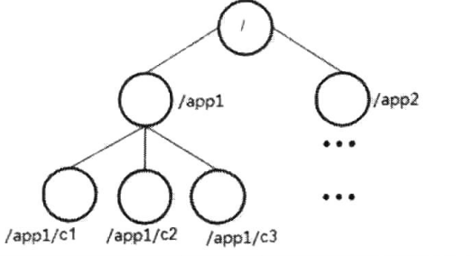

zk的结构类似文件系统，使用"/"进行分隔，呈树形结构。每个节点称为znode,每个节点都可以创建子节点和存放数据。

**事务ID**

在zk中，事务是指能够改变zk状态的操作，这种操作称为事务操作或者更新操作，比如节点的创建和删除，节点内容的修改，会话的创建和失效。由于读操作未改变zk的状态或者数据，所以读操作不是一个事务操作。

对于每一个事务操作，zk都会为它分配一个全局唯一的事务ID（64bits）ZXID,每一个ZXID代表一个更新操作.

为了保证事务的顺序一致性，zookeeper 采用了递增的事务id号（zxid）来标识事务。所有的提议（proposal） 都在被提出的时候加上了zxid。实现中zxid 是一个64位的数字，

高32位是epoch（ZAB协议通过epoch 编号来区分 Leader周期变化的策略）用来标识leader 关系是否改变，每次一个leader被选出来，它都会有一个新的 epoch = （原来的epoch + 1），标识当前属于新的leader的统治时期。低32位用于递增计数,每次leader变更之后都会从零开始递增。

```yml
0x12000000010
```
epoch：可以理解为当前集群所处的年代或者周期，每个leader 就像皇帝，都有自己的年号，所以每次改朝换代，leader 变更之后，都会在前一个年代的基础上加1。这样就算旧的leader 崩溃恢复之后，也没有人听他的了，因为follower 只听从当前年代饿leader 的命令。


### 2.1.2. 版本
<a href="#menu">目录</a>

zk中节点都有三种类型的版本信息，cversion(子节点),version(当前节点),aversion(节点acl)，对数据节点的任何更新操作都会引起版本号的变化。

zk使用version来实现数据变更时的乐观锁

```java
//当前请求的版本号
version = setDataRequest.getVersion();
//从数据记录中获取该数据的最新版本号
int currentVersion = nodeRecord.stat.getVersion();
//等于-1:客户端并不要求使用乐观锁
//版本不一致，抛出异常
if (version != -1 && version != currentVersion) {
    throw new KeeperException.BadVersionException(path);
}
version = currentVersion + 1;
```

* 悲观锁：它会假定所有不同事务的处理一定会出现干扰，数据库中最严格的并发控制策略，如果一个事务A正在对数据处理，那么在整个事务过程中，其他事务都无法对这个数据进行更新操作，直到A事务释放了这个锁。

* 乐观锁：它假定所有不同事务的处理不一定会出现干扰，所以在大部分操作里不许加锁，但是既然是并发就有出现干扰的可能，如何解决冲突就是一个问题。在乐观锁中当你在提交更新请求之前，你要先去检查你读取这个数据之后该数据是否发生了变化，如果有那么你此次的提交就要放弃，如果没有就可以提交。

Zookeeper中的版本号就是乐观锁，你修改节点数据之前会读取这个数据并记录该数据版本号，当你需要更新时会携带这个版本号去提交，如果你此时携带的版本号（就是你上次读取出来的）和当前节点的版本号相同则说明该数据没有被修改过，那么你的提交就会成功，如果提交失败说明该数据在你读取之后和提交之前这段时间内被修改了。


```java
//使用版本号3去更新
set /aa/bb "hello" 3
//java客户端使用版本号4去更新
 client.setData().withVersion(4)
```

### 2.1.3. Jute介绍
<a href="#menu">目录</a>

### 2.1.4. 使用Jute进行序列化
<a href="#menu">目录</a>

### 2.1.5. 深入Jute
<a href="#menu">目录</a>

### 2.1.6. 通信协议
<a href="#menu">目录</a>

## 2.2. 客户端
<a href="#menu">目录</a>

### 2.2.1. 一次会话的创建过程 
<a href="#menu">目录</a>

### 2.2.2. 服务器地址列表
<a href="#menu">目录</a>

### 2.2.3. 网络IO
<a href="#menu">目录</a>


## 2.3. Watcher
<a href="#menu">目录</a>

### 2.3.1. 基本概念
<a href="#menu">目录</a>


Zookeeper允许客户端向服务端的某个Znode注册一个Watcher监听，当服务端的一些指定事件触发了这个Watcher，服务端会向指定客户端发送一个事件通知来实现分布式的通知功能，然后客户端根据Watcher通知状态和事件类型做出业务上的改变。

工作机制：
* 客户端注册watcher
* 服务端处理watcher
* 客户端回调watcher

**Watcher特性总结：**
* 一次性
    * 无论是服务端还是客户端，一旦一个Watcher被触发，Zookeeper都会将其从相应的存储中移除。这样的设计有效的减轻了服务端的压力，不然对于更新非常频繁的节点，服务端会不断的向客户端发送事件通知，无论对于网络还是服务端的压力都非常大。
* 客户端串行执行
    * 客户端Watcher回调的过程是一个串行同步的过程。
* 轻量
    * Watcher通知非常简单，只会告诉客户端发生了事件，而不会说明事件的具体内容。
    * 客户端向服务端注册Watcher的时候，并不会把客户端真实的Watcher对象实体传递到服务端，仅仅是在客户端请求中使用boolean类型属性进行了标记。
* watcher event异步发送watcher的通知事件从server发送到client是异步的，这就存在一个问题，不同的客户端和服务器之间通过socket进行通信，由于网络延迟或其他因素导致客户端在不通的时刻监听到事件，由于Zookeeper本身提供了ordering guarantee，即客户端监听事件后，才会感知它所监视znode发生了变化。所以我们使用Zookeeper不能期望能够监控到节点每次的变化。Zookeeper只能保证最终的一致性，而无法保证强一致性。
* 注册watcher getData、exists、getChildren
* 触发watcher create、delete、setData
* 当一个客户端连接到一个新的服务器上时，watch将会被以任意会话事件触发。当与一个服务器失去连接的时候，是无法接收到watch的。而当client重新连接时，如果需要的话，所有先前注册过的watch，都会被重新注册。通常这是完全透明的。只有在一个特殊情况下，watch可能会丢失：对于一个未创建的znode的exist watch，如果在客户端断开连接期间被创建了，并且随后在客户端连接上之前又删除了，这种情况下，这个watch事件可能会被丢失。
* 存在丢失事件的问题，测试时使用100个线程同时去更新节点，只触发了一次。但这并不存在很大的问题，对于频繁更新的节点，没必要知道每一次更新的值，只需要最后一次更新即可。

**客户端注册Watcher实现**
* 调用getData()/getChildren()/exist()三个API，传入Watcher对象
* 标记请求request，封装Watcher到WatchRegistration
* 封装成Packet对象，发服务端发送request
* 收到服务端响应后，将Watcher注册到ZKWatcherManager中进行管理
* 请求返回，完成注册。

**服务端处理Watcher实现**

* 服务端接收Watcher并存储
    * 接收到客户端请求，处理请求判断是否需要注册Watcher，需要的话将数据节点的节点路径和ServerCnxn（ServerCnxn代表一个客户端和服务端的连接，实现了Watcher的process接口，此时可以看成一个Watcher对象）存储在WatcherManager的WatchTable和watch2Paths中去。
* Watcher触发
    * 以服务端接收到 setData() 事务请求触发NodeDataChanged事件为例：
        * 封装WatchedEvent
        * 将通知状态（SyncConnected）、事件类型（NodeDataChanged）以及节点路径封装成一个WatchedEvent对象
        * 查询Watcher
        * 从WatchTable中根据节点路径查找Watcher
            * 没找到；说明没有客户端在该数据节点上注册过Watcher
            * 找到；提取并从WatchTable和Watch2Paths中删除对应Watcher（从这里可以看出Watcher在服务端是一次性的，触发一次就失效了）
* 调用process方法来触发Watcher
    * 这里process主要就是通过ServerCnxn对应的TCP连接发送Watcher事件通知。

**客户端回调Watcher**

* 客户端SendThread线程接收事件通知，事件交由EventThread线程的LinkedBlockingQueue，该线程的run方法中会一直循环阻塞读取queue中的事件来进行处理。客户端的Watcher机制同样是一次性的，一旦被触发后，该Watcher就失效了。


**羊群效应**

有一个问题需要注意， 当变化发生时， ZooKeeper会触发一个特定的znode节点的变化导致的所有监视点的集合。 如果有1000个客户端通过exists操作监视这个znode节点， 那么当znode节点创建后就会发送1000个通知， 因而被监视的znode节点的一个变化会产生一个尖峰的通知，该尖峰可能带来影响， 例如， 在尖峰时刻提交的操作延迟。 可能的话，我们建议在使用ZooKeeper时， 避免在一个特定节点设置大量的监视点， 最好是每次在特定的znode节点上， 只有少量的客户端设置监视点， 理想情况下最多只设置一个。

在分布式锁中，为了避免羊群效应的影响，使用有序节点，每次申请锁时只是监听比自己小１的序号节点。


### 2.3.2. 监听操作
<a href="#menu">目录</a>

#### 2.3.2.1. 基于watch实现监听

利用Watcher来对节点进行监听操作，但此监听操作只能监听一次，与原生API并无太大差异。如有典型业务场景需要使用可考虑，但一般情况不推荐使用。

```java
public class CuratorWatchEvent {
    public static CuratorFramework build(){
        CuratorFramework curatorFramework = CuratorFrameworkFactory.builder()
                .connectString("172.30.241.205:2181")
                .namespace(ZKConstant.ZK_NAMESPACE)
                .retryPolicy(new ExponentialBackoffRetry(1000, 3))
                .build();
        curatorFramework.start();
        return curatorFramework;
    }

    public static void main(String[] args) throws Exception{
        String path = "/watchtest";
        CuratorFramework client  = CuratorWatchEvent.build();
        client.create().creatingParentsIfNeeded()
                .withMode(CreateMode.EPHEMERAL)
                .forPath(path);
        client.getData().usingWatcher(new Watcher() {
            @Override
            public void process(WatchedEvent watchedEvent) {
                System.out.println("监听器watchedEvent：" + watchedEvent);
            }
        }).forPath(path);

        client.setData().forPath(path,"new content".getBytes());

        // 第二次变更节点数据
        client.setData().forPath(path,"second content".getBytes());
        client.close();
    }
}
```
#### 2.3.2.2. 基于cache实现监听

cache是一种缓存机制,Cache事件监听可以理解为一个本地缓存视图与远程Zookeeper视图的对比过程。Cache提供了反复注册的功能。
curator支持的cache种类有3种
* Node Cache
    * Node Cache用来观察ZNode自身，如果ZNode节点本身被创建，更新或者删除，那么Node Cache会更新缓存，并触发事件给注册的监听器。
    * Node Cache是通过NodeCache类来实现的，监听器对应的接口为NodeCacheListener。
* Path Cache
    * Path Cache用来观察ZNode的子节点并缓存状态，如果ZNode的子节点被创建，更新或者删除，那么Path Cache会更新缓存，并且触发事件给注册的监听器。
    * Path Cache是通过PathChildrenCache类来实现的，监听器注册是通过PathChildrenCacheListener。
* Tree Cache
    *  可以将指定的路径节点作为根节点（祖先节点），对其所有的子节点操作进行监听，呈现树形目录的监听，可以设置监听深度，最大监听深度为2147483647（int类型的最大值）。

##### 2.3.2.2.1. 单节点监听NodeCache

```java

public class NodeCacheDemo {
    CuratorFramework client ;
    RetryPolicy retryPolicy;
    NodeCache nodeCache;

    String basePath = "watch";
    String watchPath = "/watch/nodeCache";

    public void init() throws Exception{
        retryPolicy = new ExponentialBackoffRetry(1000,3);
        client = CuratorFrameworkFactory
                .builder()
                .connectString("127.0.0.1:2181")
                .sessionTimeoutMs(5000)
                .retryPolicy(retryPolicy)
                //.namespace(basePath)
                .build();
        client.start();

        Stat stat = client.checkExists().forPath(watchPath);

        if(stat != null){
            client.delete().guaranteed().forPath(watchPath);
        }

        client.create().forPath(watchPath);

        nodeCache = new NodeCache(client,watchPath,false);

        nodeCache.getListenable().addListener(new NodeCacheListener() {
            public void nodeChanged() throws Exception {
                //byte[] data = nodeCache.getCurrentData().getData();
                System.out.println("节点发生变化:");
            }
        });


        nodeCache.start(true);
    }

    public void handle(){

        try{

            Thread.sleep(1000);
            System.out.println("写入数据...");
            client.setData().forPath(watchPath,"123456".getBytes());

            Thread.sleep(1000);
            System.out.println("删除节点");
            client.delete().guaranteed().forPath(watchPath);


        }
        catch(Exception ex){
            System.out.println("写入数据失败!");
        }
    }

    public static void main(String args[]){
        NodeCacheDemo nodeCacheDemo = new NodeCacheDemo();
        try{

            nodeCacheDemo.init();
        }
        catch(Exception ex){
            ex.printStackTrace();
        }
        nodeCacheDemo.handle();
        while (true);

    }

}
```

##### 2.3.2.2.2. 子节点监听PathChildrenCache

监听子节点的新增，修改，删除操作。


```java

public class PathChildrenCacheDemo {

    CuratorFramework client ;
    RetryPolicy retryPolicy;
    PathChildrenCache pathChildrenCache;

    String basePath = "watch";
    String watchPath = "/watch/pathCache";

    public void init() throws Exception{
        retryPolicy = new ExponentialBackoffRetry(1000,3);
        client = CuratorFrameworkFactory
                .builder()
                .connectString("127.0.0.1:2181")
                .sessionTimeoutMs(5000)
                .retryPolicy(retryPolicy)
               // .namespace(basePath)
                .build();
        client.start();

        Stat stat = client.checkExists().forPath(watchPath+"/child");

        if(stat != null){
            client.delete().guaranteed().forPath(watchPath+"/child");
        }

        client.create().forPath(watchPath+"/child");

        pathChildrenCache = new PathChildrenCache(client,watchPath,true);

        pathChildrenCache.getListenable().addListener(new PathChildrenCacheListener() {
            public void childEvent(CuratorFramework client, PathChildrenCacheEvent event) throws Exception {
                System.out.println("监听事件发生:" + event.getType());
            }
        });
        pathChildrenCache.start(PathChildrenCache.StartMode.NORMAL);
    }

    public void handle(){

        try{
            Thread.sleep(1000);
            System.out.println("写入数据...");
            client.setData().forPath(watchPath+"/child","123456".getBytes());

            Thread.sleep(1000);
            System.out.println("删除节点");
            client.delete().guaranteed().forPath(watchPath+"/child");

        }
        catch(Exception ex){
            System.out.println("写入数据失败!");
        }
    }

    public static void main(String args[]){
        PathChildrenCacheDemo pathChildrenCacheDemo = new PathChildrenCacheDemo();
        try{

            pathChildrenCacheDemo.init();
        }
        catch(Exception ex){
            ex.printStackTrace();
        }
        pathChildrenCacheDemo.handle();
        while (true);

    }

}

```
##### 2.3.2.2.3. 所有子节点监听TreeCache
```java

public class TreeCacheDemo {

    CuratorFramework client ;
    RetryPolicy retryPolicy;
    TreeCache treeCache;

    String basePath = "watch";
    String watchPath = "/watch/treeCache";

    public void init() throws Exception{
        retryPolicy = new ExponentialBackoffRetry(1000,3);
        client = CuratorFrameworkFactory
                .builder()
                .connectString("127.0.0.1:2181")
                .sessionTimeoutMs(5000)
                .retryPolicy(retryPolicy)
               // .namespace(basePath)
                .build();
        client.start();

        Stat stat = client.checkExists().forPath(watchPath);

        if(stat != null){
            client.delete().guaranteed().forPath(watchPath);
        }

        client.create().forPath(watchPath);

        Thread.sleep(2000);

        treeCache = new TreeCache(client,watchPath);

        treeCache.getListenable().addListener(new TreeCacheListener() {
            public void childEvent(CuratorFramework client, TreeCacheEvent event) throws Exception {
                System.out.println("监听事件发生:" + event.getType());

            }

        });
        treeCache.start();
    }

    public void handle(){

        try{

            Thread.sleep(1000);
            System.out.println("写入数据...");
            client.setData().forPath(watchPath,"123456".getBytes());

            Thread.sleep(1000);
            System.out.println("删除节点");
            client.delete().guaranteed().forPath(watchPath);
        }
        catch(Exception ex){
            System.out.println("写入数据失败!");
        }
    }

    public static void main(String args[]){
        TreeCacheDemo treeCacheDemo = new TreeCacheDemo();
        try{

            treeCacheDemo.init();
        }
        catch(Exception ex){
            ex.printStackTrace();
        }
        treeCacheDemo.handle();
        while (true);

    }

}
```

## 2.4. 会话
<a href="#menu">目录</a>

### 2.4.1. 会话状态
<a href="#menu">目录</a>

客户端和服务端完成连接之后，就建立了一个会话。会话的状态有CONNECTING,CONNECTED,RECONNECTING,CLOSE.

客户端连接时，需要提供一个集群的服务地址列表"host1:port1,host2:port2....",客户端会逐个选择一个来进行连接，直到连接成功。连接成功后状态变为CONNECTED.若会话出现超时，则状态会变为CLOSE.


### 2.4.2. 会话创建
<a href="#menu">目录</a>


SessionID：服务端创建，代表一个会话
* sessionID
    * 全局唯一
* timeOut
    * 会话超时时间，配置文件配置
* TickTime
    * 下次会话超时时间点
* isClosing
    * 标识会话是否已经被关闭

SessionTrackerImpl.class
```java
//id为服务器对应的id:myid文件中的值,currentElapsedTime为64位
//>>>: 无符号右移，忽略符号位，空位都以0补齐,也就是负数左移之后，符号位补0

public static long currentElapsedTime() {
    return System.nanoTime() / 1000000;
}

public static long initializeNextSession(long id) {
    long nextSid = 0;
    //因为需要将高位清0,所以需要先左移再右移，需要防止左移时出现负值，所以使用>>>
    nextSid = (Time.currentElapsedTime() << 24) >>> 8;
    nextSid =  nextSid | (id <<56);
    return nextSid;
}
```
上面的算法也就是，0－7：全零，8－５５：当前时间戳毫秒相关，56－63：节点id。

由于在并发情况下System.nanoTime()的返回值可能相等，所以sessionID并不能严格保证全局唯一。


### 2.4.3. 会话管理
<a href="#menu">目录</a>

### 2.4.4. 会话清理
<a href="#menu">目录</a>

### 2.4.5. 重连
<a href="#menu">目录</a>

## 2.5. 服务器启动
<a href="#menu">目录</a>

### 2.5.1. 单机版服务器启动
<a href="#menu">目录</a>

### 2.5.2. 集群版服务器启动
<a href="#menu">目录</a>

## 2.6. ACL权限控制
<a href="#menu">目录</a>

### 2.6.1. 概述

zookeeper类似文件系统，client可以创建结点、更新结点、删除结点，那么如何做到结点的权限控制呢？

zookeeper的 access control list 访问控制列表可以做到这一点

acl权限控制，使用scheme：id：permission来标识，主要涵盖3个方面：
* 权限模式(scheme)：授权的策略
* 授权对象(id)：授权的对象
* 权限(permission)：授予的权限

其特性如下：
* zookeeper的权限控制是基于每个znode结点的，需要对每个结点设置权限
* 每个znode支持多种权限控制方案和多个权限
* 子结点不会继承父结点的权限，客户端无权访问某结点，但可能可以访问它的子结点

**权限模式**

采用何种方式授权:

|方案	|描述|说明|
|---|---|
|world	|只有一个用户：anyone，代表登录zookeeper所有人(默认)|客户端默认方式访问即可|
|ip	|对客户端使用IP地址认证|只有该ip地址的客户端才能访问|
|auth	|使用已添加认证的用户认证|需要配置账户和密码才能访问|
|digest	|使用"用户名：密码"方式认证|需要配置账户和密码才能访问|

**授权对象**
* 给谁授予权限；
* 授权对象ID是指，权限赋予的实体，例如：IP地址或用户。

**授权的权限**

授予什么权限?

create、delete、read、writer、admin也就是 增、删、查、改、管理权限，这5种权限简写为 c d r w a，注意这五种权限中，有的权限并不是对结点自身操作的例如：delete是指对子结点的删除权限。

可以试图删除父结点，但是子结点必须删除干净，所以delete的权限也是很有用的。

|权限	|ACL简写	|描述
|---|---|---|
|create	|c	|数据节点创建权限，允许授权对象在该Znode下创建子节点
|delete	|d	|子节点删除权限，允许授权对象删除该数据节点的子节点
|read	|r	|数据节点的读取权限，允许授权对象访问该数据节点并读取其数据内容或子节点列表等
|write	|w	|数据节点更新权限，允许授权对象对该数据节点进行更新操作
|admin	|a	|数据节点管理权限，允许授权对象对该数据节点进行ACL相关设置操作

**授权的相关命令**

|命令	|使用方式	|描述|
|---|---|---|
|getAcl	|getAcl	|读取ACL权限
|setAcl	|setAcl	|设置ACL权限
|addauth	|addauth	|添加认证用户
 
### 2.6.2. 案例

**默认权限**
```yml
[zk: localhost:2181(CONNECTED) 12] create /acl/data 123 
Created /acl/data
[zk: localhost:2181(CONNECTED) 13] getAcl /acl/data     
'world,'anyone
: cdrwa

```

**world授权模式**

```yml
#格式: setAcl /node world:anyone:drwa

[zk: localhost:2181(CONNECTED) 14] setAcl /acl/data world:anyone:dr
cZxid = 0x30001e68f
ctime = Sat Dec 19 20:47:33 CST 2020
mZxid = 0x30001e68f
mtime = Sat Dec 19 20:47:33 CST 2020
pZxid = 0x30001e68f
cversion = 0
dataVersion = 0
aclVersion = 1
ephemeralOwner = 0x0
dataLength = 3
numChildren = 0

[zk: localhost:2181(CONNECTED) 15] getAcl /acl/data
'world,'anyone
: dr
```

**ip授权模式**

* setAcl /hadoop ip:192.168.133.133:drwa
* 如果在两台不同的虚拟机中，另一台用远程连接的模式，进行上面这条命令，那么只会有一台被授权
* 需要两台虚拟机一起授权的话需要用逗号将授权列表隔开：setAcl /hadoop ip:192.168.133.133:cdrwa,ip:192.168.133.132:cdrwa

**auth授权模式**

```yml
#格式
setAcl <path> auth:<user>:<acl>

#添加用户,如果给节点设置权限后，重启客户端也需要重新添加才能访问该节点
[zk: localhost:2181(CONNECTED) 8] addauth digest ddd:123456
#设置权限
[zk: localhost:2181(CONNECTED) 9] setAcl /acl/auth auth:ddd:draw
cZxid = 0x30001e646
ctime = Sat Dec 19 19:40:24 CST 2020
mZxid = 0x30001e646
mtime = Sat Dec 19 19:40:24 CST 2020
pZxid = 0x30001e646
cversion = 0
dataVersion = 0
aclVersion = 1
ephemeralOwner = 0x0
dataLength = 3
numChildren = 0
[zk: localhost:2181(CONNECTED) 10] getAcl /acl/auth              
'digest,'ddd:Mi5UtG6pKVG/ifs942as0jHwhO4=
: drwa
```

加密规则
```java
static public String generateDigest(String idPassword)
        throws NoSuchAlgorithmException {
    String parts[] = idPassword.split(":", 2);
    byte digest[] = MessageDigest.getInstance("SHA1").digest(
            idPassword.getBytes());
    return parts[0] + ":" + base64Encode(digest);
}

```

java客户端访问
```java
client = CuratorFrameworkFactory
                .builder()
                .connectString("127.0.0.1:2181")
                .sessionTimeoutMs(5000)
                //配置用户名和密码
                .authorization("digest","ddd:123456".getBytes())
                .retryPolicy(retryPolicy)
                .build();
```

**Digest授权模式**

```yml
setAcl <path> digest:<user>:<password>:<acl>
```
这里的密码是经过SHA1以及BASE64处理的密文，在shell 中可以通过以下命令计算：

```
echo -n <user>:<password> | openssl dgst -binary -sha1 | openssl base64
```

```yml
# 计算密码
echo -n itcast:12345 | openssl dgst -binary -sha1 | openssl base64
# 输出 qUFSHxJjItUW/93UHFXFVGlvryY=
# 获取密码，设置权限列表
setAcl /hadoop digest:itcast:qUFSHxJjItUW/93UHFXFVGlvryY=:cdrwa
# 现在想要get /hadoop 需要登录了
addauth digest itcast:12345
get /hadoop

```


java客户端访问
```java
client = CuratorFrameworkFactory
                .builder()
                .connectString("127.0.0.1:2181")
                .sessionTimeoutMs(5000)
                //配置用户名和密码
                .authorization("digest","itcast:12345".getBytes())
                .retryPolicy(retryPolicy)
                .build();
```

**种授权模式**

同一个节点可以同时使用多种模式授权，仅需逗号隔开：

```yml
[zk: localhost:2181(CONNECTED) 0] create /node5 "node5"
Created /node5
[zk: localhost:2181(CONNECTED) 1] addauth digest itcast:123456 
#添加认证用户
[zk: localhost:2181(CONNECTED) 2] setAcl /node5
ip:192.168.60.129:cdra,auth:itcast:cdrwa,digest:itheima:qlzQzCLKhBROgh
kooLvb+Mlwv4A=:cdrwa

```

**acl 超级管理员**

zookeeper的权限管理模式有一种叫做super，该模式提供一个超管可以方便的访问任何权限的节点。

假设这个超管是supper:admin，需要为超管生产密码的密文：

```yml
echo -n super:admin | openssl dgst -binary -sha1 | openssl base64
```
那么打开zookeeper目录下/bin/zkServer.sh服务器脚本文件，找到如下一行：
```yml
 #nohup 快速查找，可以看到如下
 nohup "$JAVA" "-Dzookeeper.log.dir=${ZOO_LOG_DIR}" "-Dzookeeper.root.logger=${ZOO_LOG4J_PROP}"
```
这个就算脚本中启动zookeeper的命令，默认只有以上两个配置项，我们需要添加一个超管的配置项：
```yml
"-Dzookeeper.DigestAuthenticationProvider.superDigest=super:xQJmxLMiHGwaqBvst5y6rkB6HQs="
```
修改后命令变成如下：
```yml
nohup $JAVA "-Dzookeeper.log.dir=${ZOO_LOG_DIR}" "-
Dzookeeper.root.logger=${ZOO_LOG4J_PROP}" "-
Dzookeeper.DigestAuthenticationProvider.superDigest=super:xQJmxLMiHGwaqBv
st5y6rkB6HQs="\
-cp "$CLASSPATH" $JVMFLAGS $ZOOMAIN "$ZOOCFG" > "$_ZOO_DAEMON_OUT"
2>&1 < /dev/null &
```

```yml
# 重启后，现在随便对任意节点添加权限限制
setAcl /hadoop ip:192.168.1.1:cdrwa # 这个ip并非本机
# 现在当前用户没有权限了
getAcl /hadoop
# 登录超管
addauth digest super:admin
# 强行操作节点
get /hadoop
```

## 2.7. 服务器角色
<a href="#menu">目录</a>

在Zookeeper中对于请求分为两类：事务请求和非事务请求。

* 事务性请求
    * Zookeeper通常都是以集群模式运行的，也就是Zookeeper集群中各个节点的数据需要保持一致的。但是和Mysql集群不一样的是：
        * Mysql集群中，从服务器是异步从主服务器同步数据的，这中间的间隔时间可以比较长。
        * Zookeeper集群中，当某一个集群节点接收到一个写请求操作时，该节点需要将这个写请求操作发送给其他节点，以使其他节点同步执行这个写请求操作，从而达到各个节点上的数据保持一致，也就是数据一致性。我们通常说Zookeeper保证CAP理论中的CP就只这个意思。
    * Zookeeper集群底层是怎么保证数据一致性的，其实是用的两阶段提交+过半机制来保证的。
    * 事务性请求包括：更新操作、新增操作、删除操作，结合上面的分析，因为这些操作是会影响数据的，所以要保证这些操作在整个集群内的事务性，所以这些操作就是事务性请求。
* 非事务性请求
    * 那么非事务性请求就好理解的，像查询操作、exist操作这些不影响数据的操场，就不需要集群来保持事务性，所以这些操场就是非事务性请求。
    * Zookeeper在处理事务性请求时，比处理非事务性请求要复杂很多

一个 ZooKeeper 集群同一时刻只会有一个 Leader，其他都是 Follower 或 Observer。ZooKeeper 配置很简单，每个节点的配置文件(zoo.cfg)都是一样的，只有 myid 文件不一样。myid 的值必须是 zoo.cfg中server.{数值} 的{数值}部分。


**Zookeeper 下 Server工作状态**

服务器具有四种状态，分别是LOOKING、FOLLOWING、LEADING、OBSERVING。
* LOOKING：寻找Leader状态。当服务器处于该状态时，它会认为当前集群中没有Leader，因此需要进入Leader选举状态。
* FOLLOWING：跟随者状态。表明当前服务器角色是Follower。
* LEADING：领导者状态。表明当前服务器角色是Leader。
* OBSERVING：观察者状态。表明当前服务器角色是Observer。


### 2.7.1. Leader
<a href="#menu">目录</a>

Leader服务器是Zookeeper集群工作的核心，其主要工作如下
* 事务请求的唯一调度者和处理者，保证集群事务处理的顺序性
* 集群内部各服务器的调度者

使用责任链来处理每个客户端的请求时Zookeeper的特色，Leader服务器的请求处理链如下


* PrepRequestProcessor
    * 请求预处理器。在Zookeeper中，那些会改变服务器状态的请求称为事务请求（创建节点、更新数据、删除节点、创建会话等），PrepRequestProcessor能够识别出当前客户端请求是否是事务请求。对于事务请求，PrepRequestProcessor处理器会对其进行一系列预处理，如创建请求事务头、事务体、会话检查、ACL检查和版本检查等。
* ProposalRequestProcessor
    * 事务投票处理器。Leader服务器事务处理流程的发起者，对于非事务性请求，ProposalRequestProcessor会直接将请求转发到CommitProcessor处理器，不再做任何处理，而对于事务性请求，处理将请求转发到CommitProcessor外，还会根据请求类型创建对应的Proposal提议，并发送给所有的Follower服务器来发起一次集群内的事务投票。同时，ProposalRequestProcessor还会将事务请求交付给SyncRequestProcessor进行事务日志的记录。
* SyncRequestProcessor
    * 事务日志记录处理器。用来将事务请求记录到事务日志文件中，同时会触发Zookeeper进行数据快照。
* AckRequestProcessor
    * 负责在SyncRequestProcessor完成事务日志记录后，向Proposal的投票收集器发送ACK反馈，以通知投票收集器当前服务器已经完成了对该Proposal的事务日志记录。
* CommitProcessor
    * 事务提交处理器。对于非事务请求，该处理器会直接将其交付给下一级处理器处理；对于事务请求，其会等待集群内针对Proposal的投票直到该Proposal可被提交，利用CommitProcessor，每个服务器都可以很好地控制对事务请求的顺序处理。
* ToBeCommitProcessor
    * 该处理器有一个toBeApplied队列，用来存储那些已经被CommitProcessor处理过的可被提交的Proposal。其会将这些请求交付给FinalRequestProcessor处理器处理，待其处理完后，再将其从toBeApplied队列中移除。
* FinalRequestProcessor
    * 用来进行客户端请求返回之前的操作，包括创建客户端请求的响应，针对事务请求，该处理还会负责将事务应用到内存数据库中去。

**LearnerHandler**

为了保证整个集群内部的实时通信，同时为了确保可以控制所有的Follower/Observer服务器，Leader服务器会与每个Follower/Observer服务器建立一个TCP长连接。同时也会为每个Follower/Observer服务器创建一个名为LearnerHandler的实体。LearnerHandler是Learner服务器的管理者，主要负责Follower/Observer服务器和Leader服务器之间的一系列网络通信，包括数据同步、请求转发和Proposal提议的投票等。Leader服务器中保存了所有Follower/Observer对应的LearnerHandler。

### 2.7.2. Follower
<a href="#menu">目录</a>

Follower是Zookeeper集群的跟随者，其主要工作如下
* 处理客户端非事务请求，转发事务请求给Leader服务器
* 参与事务请求Proposal的投票
* 参与Leader选举投票

Follower也采用了责任链模式组装的请求处理链来处理每一个客户端请求，由于不需要对事务请求的投票处理，因此Follower的请求处理链会相对简单，其处理链如下


* FollowerRequestProcessor
    * 其用作识别当前请求是否是事务请求，若是，那么Follower就会将该请求转发给Leader服务器，Leader服务器是在接收到这个事务请求后，就会将其提交到请求处理链，按照正常事务请求进行处理。
* SendAckRequestProcessor
    * 其承担了事务日志记录反馈的角色，在完成事务日志记录后，会向Leader服务器发送ACK消息以表明自身完成了事务日志的记录工作。

### 2.7.3. Observer
<a href="#menu">目录</a>


　Observer充当观察者角色，观察Zookeeper集群的最新状态变化并将这些状态同步过来，其对于非事务请求可以进行独立处理，对于事务请求，则会转发给Leader服务器进行处理。Observer不会参与任何形式的投票，包括事务请求Proposal的投票和Leader选举投票。其处理链如下

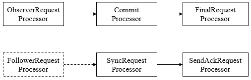

* Observer节点不会参与到选举投票和事务请求Proposal投票
* 只会单纯的接收 leader 同步过来的数据，不参与到过半的写机制里面去
* leader会将 proposal 同步到所有的 follow 节点和Observer节点
* leader 只要接收到过半 follow 节点的ack，就认为数据写成功了。
* zk适合读多写少的场景
* zk集群里面，因为只有一个leader，所以写是没法扩展的，最多只能抗上万QPS
* zk集群中，follow节点有2个到4个节点，读起码每秒几万QPS，如果需要抗住更高的读请求，就可以引入Observer节点，因为Observer节点只是同步数据，可以无限扩展机器。


### 2.7.4. 集群消息通信
<a href="#menu">目录</a>

## 2.8. ZAB协议
<a href="#menu">目录</a>

### 2.8.1. 什么是Zab协议
<a href="#menu">目录</a>

Zab协议 的全称是 Zookeeper Atomic Broadcast （Zookeeper原子广播）。
Zookeeper 是通过 Zab 协议来保证分布式事务的最终一致性。

Zab协议是为分布式协调服务Zookeeper专门设计的一种 支持崩溃恢复 的 原子广播协议 ，是Zookeeper保证数据一致性的核心算法。Zab借鉴了Paxos算法，但又不像Paxos那样，是一种通用的分布式一致性算法。它是特别为Zookeeper设计的支持崩溃恢复的原子广播协议。

在Zookeeper中主要依赖Zab协议来实现数据一致性，基于该协议，zk实现了一种主备模型（即Leader和Follower模型）的系统架构来保证集群中各个副本之间数据的一致性。
这里的主备系统架构模型，就是指只有一台客户端（Leader）负责处理外部的写事务请求，然后Leader客户端将数据同步到其他Follower节点。

Zookeeper 客户端会随机的链接到 zookeeper 集群中的一个节点，如果是读请求，就直接从当前节点中读取数据；如果是写请求，那么节点就会向 Leader 提交事务，Leader 接收到事务提交，会广播该事务，只要超过半数节点写入成功，该事务就会被提交。

Zab 协议的特性：
* Zab 协议需要确保那些已经在 Leader 服务器上提交（Commit）的事务最终被所有的服务器提交。
* Zab 协议需要确保丢弃那些只在 Leader 上被提出而没有被提交的事务。


### 2.8.2. Zab 协议的作用
<a href="#menu">目录</a>

1）使用一个单一的主进程（Leader）来接收并处理客户端的事务请求（也就是写请求），并采用了Zab的原子广播协议，将服务器数据的状态变更以 事务proposal （事务提议）的形式广播到所有的副本（Follower）进程上去。

2）保证一个全局的变更序列被顺序引用。
Zookeeper是一个树形结构，很多操作都要先检查才能确定是否可以执行，比如P1的事务t1可能是创建节点"/a"，t2可能是创建节点"/a/bb"，只有先创建了父节点"/a"，才能创建子节点"/a/b"。

为了保证这一点，Zab要保证同一个Leader发起的事务要按顺序被apply，同时还要保证只有先前Leader的事务被apply之后，新选举出来的Leader才能再次发起事务。

3）当主进程出现异常的时候，整个zk集群依旧能正常工作。

### 2.8.3. Zab 协议原理
<a href="#menu">目录</a>

Zab协议要求每个 Leader 都要经历三个阶段：发现，同步，广播。

发现：要求zookeeper集群必须选举出一个 Leader 进程，同时 Leader 会维护一个 Follower 可用客户端列表。将来客户端可以和这些 Follower节点进行通信。

同步：Leader 要负责将本身的数据与 Follower 完成同步，做到多副本存储。这样也是提现了CAP中的高可用和分区容错。Follower将队列中未处理完的请求消费完成后，写入本地事务日志中。

广播：Leader 可以接受客户端新的事务Proposal请求，将新的Proposal请求广播给所有的 Follower。


### 2.8.4. Zab 协议核心
<a href="#menu">目录</a>

Zab协议的核心：定义了事务请求的处理方式

1）所有的事务请求必须由一个全局唯一的服务器来协调处理，这样的服务器被叫做 Leader服务器。其他剩余的服务器则是 Follower服务器。

2）Leader服务器 负责将一个客户端事务请求，转换成一个 事务Proposal，并将该 Proposal 分发给集群中所有的 Follower 服务器，也就是向所有 Follower 节点发送数据广播请求（或数据复制）

3）分发之后Leader服务器需要等待所有Follower服务器的反馈（Ack请求），在Zab协议中，只要超过半数的Follower服务器进行了正确的反馈后（也就是收到半数以上的Follower的Ack请求），那么 Leader 就会再次向所有的 Follower服务器发送 Commit 消息，要求其将上一个 事务proposal 进行提交。

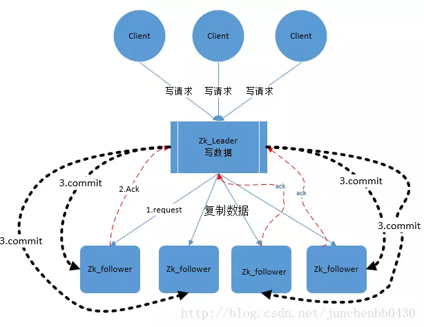

### 2.8.5. Zab 协议内容
<a href="#menu">目录</a>

Zab 协议包括两种基本的模式：崩溃恢复 和 消息广播

协议过程
当整个集群启动过程中，或者当 Leader 服务器出现网络中弄断、崩溃退出或重启等异常时，Zab协议就会 进入崩溃恢复模式，选举产生新的Leader。

当选举产生了新的 Leader，同时集群中有过半的机器与该 Leader 服务器完成了状态同步（即数据同步）之后，Zab协议就会退出崩溃恢复模式，进入消息广播模式。

这时，如果有一台遵守Zab协议的服务器加入集群，因为此时集群中已经存在一个Leader服务器在广播消息，那么该新加入的服务器自动进入恢复模式：找到Leader服务器，并且完成数据同步。同步完成后，作为新的Follower一起参与到消息广播流程中。


协议状态切换
当Leader出现崩溃退出或者机器重启，亦或是集群中不存在超过半数的服务器与Leader保存正常通信，Zab就会再一次进入崩溃恢复，发起新一轮Leader选举并实现数据同步。同步完成后又会进入消息广播模式，接收事务请求。


保证消息有序
在整个消息广播中，Leader会将每一个事务请求转换成对应的 proposal 来进行广播，并且在广播 事务Proposal 之前，Leader服务器会首先为这个事务Proposal分配一个全局单递增的唯一ID，称之为事务ID（即zxid），由于Zab协议需要保证每一个消息的严格的顺序关系，因此必须将每一个proposal按照其zxid的先后顺序进行排序和处理。


### 2.8.6. 消息广播
<a href="#menu">目录</a>

）在zookeeper集群中，数据副本的传递策略就是采用消息广播模式。zookeeper中农数据副本的同步方式与二段提交相似，但是却又不同。二段提交要求协调者必须等到所有的参与者全部反馈ACK确认消息后，再发送commit消息。要求所有的参与者要么全部成功，要么全部失败。二段提交会产生严重的阻塞问题。

2）Zab协议中 Leader 等待 Follower 的ACK反馈消息是指“只要半数以上的Follower成功反馈即可，不需要收到全部Follower反馈”

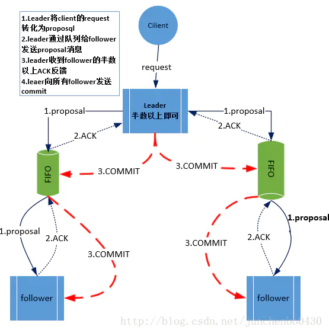

消息广播具体步骤
1）客户端发起一个写操作请求。

2）Leader 服务器将客户端的请求转化为事务 Proposal 提案，同时为每个 Proposal 分配一个全局的ID，即zxid。

3）Leader 服务器为每个 Follower 服务器分配一个单独的队列，然后将需要广播的 Proposal 依次放到队列中取，并且根据 FIFO 策略进行消息发送。

4）Follower 接收到 Proposal 后，会首先将其以事务日志的方式写入本地磁盘中，写入成功后向 Leader 反馈一个 Ack 响应消息。

5）Leader 接收到超过半数以上 Follower 的 Ack 响应消息后，即认为消息发送成功，可以发送 commit 消息。

6）Leader 向所有 Follower 广播 commit 消息，同时自身也会完成事务提交。Follower 接收到 commit 消息后，会将上一条事务提交。

zookeeper 采用 Zab 协议的核心，就是只要有一台服务器提交了 Proposal，就要确保所有的服务器最终都能正确提交 Proposal。这也是 CAP/BASE 实现最终一致性的一个体现。

Leader 服务器与每一个 Follower 服务器之间都维护了一个单独的 FIFO 消息队列进行收发消息，使用队列消息可以做到异步解耦。 Leader 和 Follower 之间只需要往队列中发消息即可。如果使用同步的方式会引起阻塞，性能要下降很多。


### 2.8.7. 崩溃恢复
<a href="#menu">目录</a>

一旦 Leader 服务器出现崩溃或者由于网络原因导致 Leader 服务器失去了与过半 Follower 的联系，那么就会进入崩溃恢复模式。

在 Zab 协议中，为了保证程序的正确运行，整个恢复过程结束后需要选举出一个新的 Leader 服务器。因此 Zab 协议需要一个高效且可靠的 Leader 选举算法，从而确保能够快速选举出新的 Leader 。

Leader 选举算法不仅仅需要让 Leader 自己知道自己已经被选举为 Leader ，同时还需要让集群中的所有其他机器也能够快速感知到选举产生的新 Leader 服务器。

崩溃恢复主要包括两部分：Leader选举 和 数据恢复


### 2.8.8. 如何保证数据一致性
<a href="#menu">目录</a>

假设两种异常情况：
1、一个事务在 Leader 上提交了，并且过半的 Folower 都响应 Ack 了，但是 Leader 在 Commit 消息发出之前挂了。
2、假设一个事务在 Leader 提出之后，Leader 挂了。

要确保如果发生上述两种情况，数据还能保持一致性，那么 Zab 协议选举算法必须满足以下要求：

Zab 协议崩溃恢复要求满足以下两个要求：
1）确保已经被 Leader 提交的 Proposal 必须最终被所有的 Follower 服务器提交。
2）确保丢弃已经被 Leader 提出的但是没有被提交的 Proposal。

根据上述要求
Zab协议需要保证选举出来的Leader需要满足以下条件：
1）新选举出来的 Leader 不能包含未提交的 Proposal 。
即新选举的 Leader 必须都是已经提交了 Proposal 的 Follower 服务器节点。
2）新选举的 Leader 节点中含有最大的 zxid 。
这样做的好处是可以避免 Leader 服务器检查 Proposal 的提交和丢弃工作。


### 2.8.9. Zab 协议如何数据同步
<a href="#menu">目录</a>

1）完成 Leader 选举后（新的 Leader 具有最高的zxid），在正式开始工作之前（接收事务请求，然后提出新的 Proposal），Leader 服务器会首先确认事务日志中的所有的 Proposal 是否已经被集群中过半的服务器 Commit。

2）Leader 服务器需要确保所有的 Follower 服务器能够接收到每一条事务的 Proposal ，并且能将所有已经提交的事务 Proposal 应用到内存数据中。等到 Follower 将所有尚未同步的事务 Proposal 都从 Leader 服务器上同步过啦并且应用到内存数据中以后，Leader 才会把该 Follower 加入到真正可用的 Follower 列表中。

### 2.8.10. 如何处理需要丢弃的 Proposal
<a href="#menu">目录</a>

在 Zab 的事务编号 zxid 设计中，zxid是一个64位的数字。

其中低32位可以看成一个简单的单增计数器，针对客户端每一个事务请求，Leader 在产生新的 Proposal 事务时，都会对该计数器加1。而高32位则代表了 Leader 周期的 epoch 编号。

epoch 编号可以理解为当前集群所处的年代，或者周期。每次Leader变更之后都会在 epoch 的基础上加1，这样旧的 Leader 崩溃恢复之后，其他Follower 也不会听它的了，因为 Follower 只服从epoch最高的 Leader 命令。

每当选举产生一个新的 Leader ，就会从这个 Leader 服务器上取出本地事务日志充最大编号 Proposal 的 zxid，并从 zxid 中解析得到对应的 epoch 编号，然后再对其加1，之后该编号就作为新的 epoch 值，并将低32位数字归零，由0开始重新生成zxid。

Zab 协议通过 epoch 编号来区分 Leader 变化周期，能够有效避免不同的 Leader 错误的使用了相同的 zxid 编号提出了不一样的 Proposal 的异常情况。

基于以上策略
当一个包含了上一个 Leader 周期中尚未提交过的事务 Proposal 的服务器启动时，当这台机器加入集群中，以 Follower 角色连上 Leader 服务器后，Leader 服务器会根据自己服务器上最后提交的 Proposal 来和 Follower 服务器的 Proposal 进行比对，比对的结果肯定是 Leader 要求 Follower 进行一个回退操作，回退到一个确实已经被集群中过半机器 Commit 的最新 Proposal。


### 2.8.11. Zab 协议实现原理
<a href="#menu">目录</a>

### 2.8.12. 选主过程
<a href="#menu">目录</a>


## 2.9. Leader选举
<a href="#menu">目录</a>


Leader选举是保证分布式数据一致性的关键所在。当Zookeeper集群中的一台服务器出现以下两种情况之一时，需要进入Leader选举。

* 服务器初始化启动。
* 服务器运行期间无法和Leader保持连接。

每个服务器启动后进入LOOKING状态， 开始选举一个新的群首或查找已经存在的群首， 如果群首已经存在， 其他服务器就会通知这个新启动的服务器， 告知哪个服务器是群首， 与此同时， 新的服务器会与群首建立连接， 以确保自己的状态与群首一致。

如果集群中所有的服务器均处于LOOKING状态， 这些服务器之间就会进行通信来选举一个群首， 通过信息交换对群首选举达成共识的选择。 在本次选举过程中胜出的服务器将进入LEADING状态， 而集群中其他服务器将会进入FOLLOWING状态。

对于群首选举的消息， 我们称之为群首选举通知消息（leaderelection notifications） ， 或简单地称为通知（notifications） 。 该协议非常简单， 当一个服务器进入LOOKING状态， 就会发送向集群中每个服务器发送一个通知消息， 该消息中包括该服务器的投票（vote） 信息，投票中包含服务器标识符（sid） 和最近执行的事务的zxid信息， 比如，一个服务器所发送的投票信息为（1， 5） ， 表示该服务器的sid为1， 最近执行的事务的zxid为5（出于群首选举的目的， zxid只有一个数字， 而在其他协议中， zxid则有时间戳epoch和计数器组成） 。先比较zxid，再比较sid，谁大就投谁的票。

当一个服务器收到一个投票信息， 该服务器将会根据以下规则修改自己的投票信息：
1. 将接收的voteId和voteZxid作为一个标识符， 并获取接收方当前的投票中的zxid， 用myZxid和mySid表示接收方服务器自己的值。
2. 如果（voteZxid>myZxid） 或者（voteZxid=myZxid且voteId>mySid） ， 保留当前的投票信息。
3. 否则， 修改自己的投票信息， 将voteZxid赋值给myZxid， 将voteId赋值给mySid。

简而言之， 只有最新的服务器将赢得选举， 因为其拥有最近一次的zxid。 我们稍后会看到， 这样做将会简化群首崩溃后重新仲裁的流程。

如果多个服务器拥有最新的zxid值， 其中的sid值最大的将赢得选举。当一个服务器接收到仲裁数量的服务器发来的投票都一样时， 就表示群首选举成功， 如果被选举的群首为某个服务器自己， 该服务器将会开始行使群首角色， 否则就成为一个追随者并尝试连接被选举的群首服务器。 注意， 我们并未保证追随者必然会成功连接上被选举的群首服务器， 比如， 被选举的群首也许此时崩溃了。 一旦连接成功， 追随者和群首之间将会进行状态同步， 在同步完成后， 追随者才可以处理新的请求。


### 2.9.1. 服务器启动时期的Leader选举

　　若进行Leader选举，则至少需要两台机器，这里选取3台机器组成的服务器集群为例。在集群初始化阶段，当有一台服务器Server1启动时，其单独无法进行和完成Leader选举，当第二台服务器Server2启动时，此时两台机器可以相互通信，每台机器都试图找到Leader，于是进入Leader选举过程。选举过程如下
* 每个Server发出一个投票。由于是初始情况，Server1和Server2都会将自己作为Leader服务器来进行投票，每次投票会包含所推举的服务器的myid和ZXID，使用(myid, ZXID)来表示，此时Server1的投票为(1, 0)，Server2的投票为(2, 0)，然后各自将这个投票发给集群中其他机器。
* 接受来自各个服务器的投票。集群的每个服务器收到投票后，首先判断该投票的有效性，如检查是否是本轮投票、是否来自LOOKING状态的服务器。
* 处理投票。针对每一个投票，服务器都需要将别人的投票和自己的投票进行PK，PK规则如下
    * 优先检查ZXID。ZXID比较大的服务器优先作为Leader。
    * 如果ZXID相同，那么就比较myid。myid较大的服务器作为Leader服务器。
    * 对于Server1而言，它的投票是(1, 0)，接收Server2的投票为(2, 0)，首先会比较两者的ZXID，均为0，再比较myid，此时Server2的myid最大，于是更新自己的投票为(2, 0)，然后重新投票，对于Server2而言，其无须更新自己的投票，只是再次向集群中所有机器发出上一次投票信息即可。
* 统计投票。每次投票后，服务器都会统计投票信息，判断是否已经有过半机器接受到相同的投票信息，对于Server1、Server2而言，都统计出集群中已经有两台机器接受了(2, 0)的投票信息，此时便认为已经选出了Leader。
* 改变服务器状态。一旦确定了Leader，每个服务器就会更新自己的状态，如果是Follower，那么就变更为FOLLOWING，如果是Leader，就变更为LEADING。

### 2.9.2. 服务器运行时期的Leader选举

　　在Zookeeper运行期间，Leader与非Leader服务器各司其职，即便当有非Leader服务器宕机或新加入，此时也不会影响Leader，但是一旦Leader服务器挂了，那么整个集群将暂停对外服务，进入新一轮Leader选举，其过程和启动时期的Leader选举过程基本一致。假设正在运行的有Server1、Server2、Server3三台服务器，当前Leader是Server2，若某一时刻Leader挂了，此时便开始Leader选举。选举过程如下
* 变更状态。Leader挂后，余下的非Observer服务器都会讲自己的服务器状态变更为LOOKING，然后开始进入Leader选举过程。
* 每个Server会发出一个投票。在运行期间，每个服务器上的ZXID可能不同，此时假定Server1的ZXID为123，Server3的ZXID为122；在第一轮投票中，Server1和Server3都会投自己，产生投票(1, 123)，(3, 122)，然后各自将投票发送给集群中所有机器。
* 接收来自各个服务器的投票。与启动时过程相同。
* 处理投票。与启动时过程相同，此时，Server1将会成为Leader。
* 统计投票。与启动时过程相同。
* 改变服务器的状态。与启动时过程相同。

### 2.9.3. Leader选举算法分析

在3.4.0后的Zookeeper的版本只保留了TCP版本的FastLeaderElection选举算法。当一台机器进入Leader选举时，当前集群可能会处于以下两种状态
* 集群中已经存在Leader。
* 集群中不存在Leader。

对于集群中已经存在Leader而言，此种情况一般都是某台机器启动得较晚，在其启动之前，集群已经在正常工作，对这种情况，该机器试图去选举Leader时，会被告知当前服务器的Leader信息，对于该机器而言，仅仅需要和Leader机器建立起连接，并进行状态同步即可。而在集群中不存在Leader情况下则会相对复杂，其步骤如下

(1) 第一次投票。无论哪种导致进行Leader选举，集群的所有机器都处于试图选举出一个Leader的状态，即LOOKING状态，LOOKING机器会向所有其他机器发送消息，该消息称为投票。投票中包含了SID（服务器的唯一标识）和ZXID（事务ID），(SID, ZXID)形式来标识一次投票信息。假定Zookeeper由5台机器组成，SID分别为1、2、3、4、5，ZXID分别为9、9、9、8、8，并且此时SID为2的机器是Leader机器，某一时刻，1、2所在机器出现故障，因此集群开始进行Leader选举。在第一次投票时，每台机器都会将自己作为投票对象，于是SID为3、4、5的机器投票情况分别为(3, 9)，(4, 8)， (5, 8)。

(2) 变更投票。每台机器发出投票后，也会收到其他机器的投票，每台机器会根据一定规则来处理收到的其他机器的投票，并以此来决定是否需要变更自己的投票，这个规则也是整个Leader选举算法的核心所在，其中术语描述如下
* vote_sid：接收到的投票中所推举Leader服务器的SID。
* vote_zxid：接收到的投票中所推举Leader服务器的ZXID。
* self_sid：当前服务器自己的SID。
* self_zxid：当前服务器自己的ZXID。

每次对收到的投票的处理，都是对(vote_sid, vote_zxid)和(self_sid, self_zxid)对比的过程。
* 规则一：如果vote_zxid大于self_zxid，就认可当前收到的投票，并再次将该投票发送出去。
* 规则二：如果vote_zxid小于self_zxid，那么坚持自己的投票，不做任何变更。
* 规则三：如果vote_zxid等于self_zxid，那么就对比两者的SID，如果vote_sid大于self_sid，那么就认可当前收到的投票，并再次将该投票发送出去。
* 规则四：如果vote_zxid等于self_zxid，并且vote_sid小于self_sid，那么坚持自己的投票，不做任何变更。

结合上面规则，给出下面的集群变更过程。

(3) 确定Leader。经过第二轮投票后，集群中的每台机器都会再次接收到其他机器的投票，然后开始统计投票，如果一台机器收到了超过半数的相同投票，那么这个投票对应的SID机器即为Leader。此时Server3将成为Leader。

　　由上面规则可知，通常那台服务器上的数据越新（ZXID会越大），其成为Leader的可能性越大，也就越能够保证数据的恢复。如果ZXID相同，则SID越大机会越大。

### 2.9.4. Leader选举实现细节

**服务器状态**

服务器具有四种状态，分别是LOOKING、FOLLOWING、LEADING、OBSERVING。
* LOOKING：寻找Leader状态。当服务器处于该状态时，它会认为当前集群中没有Leader，因此需要进入Leader选举状态。
* FOLLOWING：跟随者状态。表明当前服务器角色是Follower。
* LEADING：领导者状态。表明当前服务器角色是Leader。
* OBSERVING：观察者状态。表明当前服务器角色是Observer。

**投票数据结构**

每个投票中包含了两个最基本的信息，所推举服务器的SID和ZXID，投票（Vote）在Zookeeper中包含字段如下
* id：被推举的Leader的SID。
* zxid：被推举的Leader事务ID。
* electionEpoch：逻辑时钟，用来判断多个投票是否在同一轮选举周期中，该值在服务端是一个自增序列，每次进入新一轮的投票后，都会对该值进行加1操作。
* peerEpoch：被推举的Leader的epoch。
* state：当前服务器的状态。

**QuorumCnxManager：网络I/O**

每台服务器在启动的过程中，会启动一个QuorumPeerManager，负责各台服务器之间的底层Leader选举过程中的网络通信。

(1) 消息队列。QuorumCnxManager内部维护了一系列的队列，用来保存接收到的、待发送的消息以及消息的发送器，除接收队列以外，其他队列都按照SID分组形成队列集合，如一个集群中除了自身还有3台机器，那么就会为这3台机器分别创建一个发送队列，互不干扰。
* recvQueue：消息接收队列，用于存放那些从其他服务器接收到的消息。
* queueSendMap：消息发送队列，用于保存那些待发送的消息，按照SID进行分组。
* senderWorkerMap：发送器集合，每个SenderWorker消息发送器，都对应一台远程Zookeeper服务器，负责消息的发送，也按照SID进行分组。
* lastMessageSent：最近发送过的消息，为每个SID保留最近发送过的一个消息。

(2) 建立连接。为了能够相互投票，Zookeeper集群中的所有机器都需要两两建立起网络连接。QuorumCnxManager在启动时会创建一个ServerSocket来监听Leader选举的通信端口(默认为3888)。开启监听后，Zookeeper能够不断地接收到来自其他服务器的创建连接请求，在接收到其他服务器的TCP连接请求时，会进行处理。为了避免两台机器之间重复地创建TCP连接，Zookeeper只允许SID大的服务器主动和其他机器建立连接，否则断开连接。在接收到创建连接请求后，服务器通过对比自己和远程服务器的SID值来判断是否接收连接请求，如果当前服务器发现自己的SID更大，那么会断开当前连接，然后自己主动和远程服务器建立连接。一旦连接建立，就会根据远程服务器的SID来创建相应的消息发送器SendWorker和消息接收器RecvWorker，并启动。

(3) 消息接收与发送。消息接收：由消息接收器RecvWorker负责，由于Zookeeper为每个远程服务器都分配一个单独的RecvWorker，因此，每个RecvWorker只需要不断地从这个TCP连接中读取消息，并将其保存到recvQueue队列中。消息发送：由于Zookeeper为每个远程服务器都分配一个单独的SendWorker，因此，每个SendWorker只需要不断地从对应的消息发送队列中获取出一个消息发送即可，同时将这个消息放入lastMessageSent中。在SendWorker中，一旦Zookeeper发现针对当前服务器的消息发送队列为空，那么此时需要从lastMessageSent中取出一个最近发送过的消息来进行再次发送，这是为了解决接收方在消息接收前或者接收到消息后服务器挂了，导致消息尚未被正确处理。同时，Zookeeper能够保证接收方在处理消息时，会对重复消息进行正确的处理。

**FastLeaderElection：选举算法核心**
* 外部投票：特指其他服务器发来的投票。
* 内部投票：服务器自身当前的投票。
* 选举轮次：Zookeeper服务器Leader选举的轮次，即logicalclock。
* PK：对内部投票和外部投票进行对比来确定是否需要变更内部投票。

* 选票管理
    * sendqueue：选票发送队列，用于保存待发送的选票。
    * recvqueue：选票接收队列，用于保存接收到的外部投票。
    * WorkerReceiver：选票接收器。其会不断地从QuorumCnxManager中获取其他服务器发来的选举消息，并将其转换成一个选票，然后保存到recvqueue中，在选票接收过程中，如果发现该外部选票的选举轮次小于当前服务器的，那么忽略该外部投票，同时立即发送自己的内部投票。
    * WorkerSender：选票发送器，不断地从sendqueue中获取待发送的选票，并将其传递到底层QuorumCnxManager中。

**算法核心**


上图展示了FastLeaderElection模块是如何与底层网络I/O进行交互的。Leader选举的基本流程如下
1. 自增选举轮次。Zookeeper规定所有有效的投票都必须在同一轮次中，在开始新一轮投票时，会首先对logicalclock进行自增操作。
2. 初始化选票。在开始进行新一轮投票之前，每个服务器都会初始化自身的选票，并且在初始化阶段，每台服务器都会将自己推举为Leader。
3. 发送初始化选票。完成选票的初始化后，服务器就会发起第一次投票。Zookeeper会将刚刚初始化好的选票放入sendqueue中，由发送器WorkerSender负责发送出去。
4. 接收外部投票。每台服务器会不断地从recvqueue队列中获取外部选票。如果服务器发现无法获取到任何外部投票，那么就会立即确认自己是否和集群中其他服务器保持着有效的连接，如果没有连接，则马上建立连接，如果已经建立了连接，则再次发送自己当前的内部投票。
5. 判断选举轮次。在发送完初始化选票之后，接着开始处理外部投票。在处理外部投票时，会根据选举轮次来进行不同的处理。
* 外部投票的选举轮次大于内部投票。若服务器自身的选举轮次落后于该外部投票对应服务器的选举轮次，那么就会立即更新自己的选举轮次(logicalclock)，并且清空所有已经收到的投票，然后使用初始化的投票来进行PK以确定是否变更内部投票。最终再将内部投票发送出去。
* 外部投票的选举轮次小于内部投票。若服务器接收的外选票的选举轮次落后于自身的选举轮次，那么Zookeeper就会直接忽略该外部投票，不做任何处理，并返回步骤4。
* 外部投票的选举轮次等于内部投票。此时可以开始进行选票PK。
6. 选票PK。在进行选票PK时，符合任意一个条件就需要变更投票。
* 若外部投票中推举的Leader服务器的选举轮次大于内部投票，那么需要变更投票。
* 若选举轮次一致，那么就对比两者的ZXID，若外部投票的ZXID大，那么需要变更投票。
* 若两者的ZXID一致，那么就对比两者的SID，若外部投票的SID大，那么就需要变更投票。
7. 变更投票。经过PK后，若确定了外部投票优于内部投票，那么就变更投票，即使用外部投票的选票信息来覆盖内部投票，变更完成后，再次将这个变更后的内部投票发送出去。
8. 选票归档。无论是否变更了投票，都会将刚刚收到的那份外部投票放入选票集合recvset中进行归档。recvset用于记录当前服务器在本轮次的Leader选举中收到的所有外部投票（按照服务队的SID区别，如{(1, vote1), (2, vote2)...}）。
9. 统计投票。完成选票归档后，就可以开始统计投票，统计投票是为了统计集群中是否已经有过半的服务器认可了当前的内部投票，如果确定已经有过半服务器认可了该投票，则终止投票。否则返回步骤4。
10. 更新服务器状态。若已经确定可以终止投票，那么就开始更新服务器状态，服务器首选判断当前被过半服务器认可的投票所对应的Leader服务器是否是自己，若是自己，则将自己的服务器状态更新为LEADING，若不是，则根据具体情况来确定自己是FOLLOWING或是OBSERVING。

以上10个步骤就是FastLeaderElection的核心，其中步骤4-9会经过几轮循环，直到有Leader选举产生。


## 2.10. 请求处理
<a href="#menu">目录</a>


ZooKeeper服务器会在本地处理只读请求（exists、 getData和getChildren） 。 假如一个服务器接收到客户端的getData请求， 服务器读取该状态信息， 并将这些信息返回给客户端。 因为服务器会在本地处理请求， 所以ZooKeeper在处理以只读请求为主要负载时， 性能会很高。我们还可以增加更多的服务器到ZooKeeper集群中， 这样就可以处理更多的读请求， 大幅提高整体处理能力

那些会改变ZooKeeper状态的客户端请求（create、 delete和setData） 将会被转发给群首， 群首执行相应的请求， 并形成状态的更新， 我们称为事务（transaction） 。 其中， 请求表示源自于客户端发起的操作， 而事务则包含了对应请求处理而改变ZooKeeper状态所需要执行的步骤。 

一个事务为一个单位， 也就是说所有的变更处理(更新节点数据时还需要更新节点的其他状态信息)需要以原子方式执行。 以setData的操作为例， 变更节点的数据信息， 但并不改变版本号将会导致错误的发生， 因此， ZooKeeper集群以事务方式运行， 并确保所有的变更操作以原子方式被执行， 同时不会被其他事务所干扰。 在ZooKeeper中， 并不存在传统的关系数据库中所涉及的回滚机制， 而是确保事务的每一步操作都互不干扰。 在很长的一段时间里， ZooKeeper所采用的设计方式为， 在每个服务器中启动一个单独的线程来处理事务， 通过单独的线程来保障事务之间的顺序执行互不干扰。 最近，ZooKeeper增加了多线程的支持， 以便提高事务处理的速度。

同时一个事务还具有幂等性， 也就是说， 我们可以对同一个事务执行两次， 我们得到的结果还是一样的， 我们甚至还可以对多个事务执行多次， 同样也会得到一样的结果， 前提是我们确保多个事务的执行顺序每次都是一样的。 事务的幂等性可以让我们在进行恢复处理时更加简单。

当群首产生了一个事务， 就会为该事务分配一个标识符， 我们称之为ZooKeeper会话ID（zxid） ， 通过Zxid对事务进行标识， 就可以按照群首所指定的顺序在各个服务器中按序执行。 服务器之间在进行新的群首选举时也会交换zxid信息， 这样就可以知道哪个无故障服务器接收了更多的事务， 并可以同步他们之间的状态信息。

在单个会话中，所有请求一定是顺序执行的，但是多个会话就不一定了。比如分配事务zxid之后，会话1操作1(zxid=1),会话1操作2(zxid=4),会话２操作1(zxid=２),会话２操作2(zxid=３)，最终的执行顺序是按照zxid来决定的。执行顺序:会话1操作1(zxid=1)-->会话２操作1(zxid=２)-->会话２操作2(zxid=３)-->会话1操作2(zxid=4).

**写数据过程**

* Client向Zookeeper的server1发送一个写请求，客户端写数据到服务器1上；
* 如果server1不是Leader，那么server1会把接收到的写请求转发给Leader；然后Leader会将写请求转发给每个server；
    * server1和server2负责写数据，并且两个Follower的写入数据是一致的，保存相同的数据副本；
    * server1和server2写数据成功后，通知Leader；
* 当Leader收到集群半数以上的节点写成功的消息后，说明该写操作执行成功；
    * 这里是3台服务器，只要2台Follower服务器写成功就ok
    * 因为client访问的是server1，所以Leader会告知server1集群中数据写成功；
* 被访问的server1进一步通知client数据写成功，这时，客户端就知道整个写操作成功了。

**读数据过程**

相比写数据流程，读数据流程就简单得多；因为每台server中数据一致性都一样，所以随便访问哪台server读数据就行；

没有写数据流程中请求转发、数据同步、成功通知这些步骤


### 2.10.1. 会话创建请求
<a href="#menu">目录</a>

Zookeeper服务端对于会话创建的处理，大体可以分为请求接收、会话创建、预处理、事务处理、事务应用和会话响应六大环节，其大体流程如下

**请求接收**
* I/O层接收来自客户端的请求
    * NIOServerCnxn维护每一个客户端连接，客户端与服务器端的所有通信都是由NIOServerCnxn负责，其负责统一接收来自客户端的所有请求，并将请求内容从底层网络I/O中完整地读取出来。
* 判断是否是客户端会话创建请求
    * 每个会话对应一个NIOServerCnxn实体，对于每个请求，Zookeeper都会检查当前NIOServerCnxn实体是否已经被初始化，如果尚未被初始化，那么就可以确定该客户端一定是会话创建请求。
* 反序列化ConnectRequest请求
    * 一旦确定客户端请求是否是会话创建请求，那么服务端就可以对其进行反序列化，并生成一个ConnectRequest载体。
* 判断是否是ReadOnly客户端
    * 如果当前Zookeeper服务器是以ReadOnly模式启动，那么所有来自非ReadOnly型客户端的请求将无法被处理。因此，服务端需要先检查是否是ReadOnly客户端，并以此来决定是否接受该会话创建请求。
* 检查客户端ZXID
    * 正常情况下，在一个Zookeeper集群中，服务端的ZXID必定大于客户端的ZXID，因此若发现客户端的ZXID大于服务端ZXID，那么服务端不接受该客户端的会话创建请求。
* 协商sessionTimeout
    * 在客户端向服务器发送超时时间后，服务器会根据自己的超时时间限制最终确定该会话超时时间，这个过程就是sessionTimeout协商过程。
* 判断是否需要重新激活创建会话
    * 服务端根据客户端请求中是否包含sessionID来判断该客户端是否需要重新创建会话，若客户单请求中包含sessionID，那么就认为该客户端正在进行会话重连，这种情况下，服务端只需要重新打开这个会话，否则需要重新创建。
  
**会话创建**
* 为客户端生成sessionID
    * 在为客户端创建会话之前，服务端首先会为每个客户端分配一个sessionID，服务端为客户端分配的sessionID是全局唯一的。
* 注册会话
    * 向SessionTracker中注册会话，SessionTracker中维护了sessionsWithTimeout和sessionsById，在会话创建初期，会将客户端会话的相关信息保存到这两个数据结构中。
* 激活会话
    * 激活会话涉及Zookeeper会话管理的分桶策略，其核心是为会话安排一个区块，以便会话清理程序能够快速高效地进行会话清理。
* 生成会话密码
    * 服务端在创建一个客户端会话时，会同时为客户端生成一个会话密码，连同sessionID一同发给客户端，作为会话在集群中不同机器间转移的凭证。

**预处理**
* 将请求交给PrepRequestProcessor处理器处理
    * 在提交给第一个请求处理器之前，Zookeeper会根据该请求所属的会话，进行一次激活会话操作，以确保当前会话处于激活状态，完成会话激活后，则提交请求至处理器。
* 创建请求事务头
    * 对于事务请求，Zookeeper会为其创建请求事务头，服务端后续的请求处理器都是基于该请求头来识别当前请求是否是事务请求，请求事务头包含了一个事务请求最基本的一些信息，包括sessionID、ZXID（事务请求对应的事务ZXID）、CXID（客户端的操作序列）和请求类型（如create、delete、setData、createSession等）等。
* 创建请求事务体
    * 由于此时是会话创建请求，其事务体是CreateSessionTxn。
* 注册于激活会话
    * 处理由非Leader服务器转发过来的会话创建请求。

**事务处理**

* 将请求交给ProposalRequestProcessor处理器。与提议相关的处理器，从ProposalRequestProcessor开始，请求的处理将会进入三个子处理流程，分别是Sync流程、Proposal流程、Commit流程。
    * Sync流程
        * 使用SyncRequestProcessor处理器记录事务日志，针对每个事务请求，都会通过事务日志的形式将其记录，完成日志记录后，每个Follower都会向Leader发送ACK消息，表明自身完成了事务日志的记录，以便Leader统计每个事务请求的投票情况。
    * Proposal流程
        * 每个事务请求都需要集群中过半机器投票认可才能被真正应用到内存数据库中，这个投票与统计过程就是Proposal流程。
        * Proposal流程
            * 发起投票
                * 若当前请求是事务请求，Leader会发起一轮事务投票，在发起事务投票之前，会检查当前服务端的ZXID是否可用。
            * 生成提议Proposal
                * 若ZXID可用，Zookeeper会将已创建的请求头和事务体以及ZXID和请求本身序列化到Proposal对象中，此Proposal对象就是一个提议。
            * 广播提议
                * Leader以ZXID作为标识，将该提议放入投票箱outstandingProposals中，同时将该提议广播给所有Follower。
            * 收集投票
                * Follower接收到Leader提议后，进入Sync流程进行日志记录，记录完成后，发送ACK消息至Leader服务器，Leader根据这些ACK消息来统计每个提议的投票情况，当一个提议获得半数以上投票时，就认为该提议通过，进入Commit阶段。
            * 将请求放入toBeApplied队列中。
            * 广播Commit消息
                * Leader向Follower和Observer发送COMMIT消息。向Observer发送INFORM消息，向Leader发送ZXID。
    * Commit流程
        * 将请求交付CommitProcessor
            * CommitProcessor收到请求后，将其放入queuedRequests队列中。
        * 处理queuedRequest队列请求
            * CommitProcessor中单独的线程处理queuedRequests队列中的请求。
        * 标记nextPending
            * 若从queuedRequests中取出的是事务请求，则需要在集群中进行投票处理，同时将nextPending标记位当前请求。
        * 等待Proposal投票
            * 在进行Commit流程的同时，Leader会生成Proposal并广播给所有Follower服务器，此时，Commit流程等待，直到投票结束。
        * 投票通过
            * 若提议获得过半机器认可，则进入请求提交阶段，该请求会被放入commitedRequests队列中，同时唤醒Commit流程。
        * 提交请求
            * 若commitedRequests队列中存在可以提交的请求，那么Commit流程则开始提交请求，将请求放入toProcess队列中，然后交付下一个请求处理器：FinalRequestProcessor。

**事务应用**
* 交付给FinalRequestProcessor处理器
    * FinalRequestProcessor处理器检查outstandingChanges队列中请求的有效性，若发现这些请求已经落后于当前正在处理的请求，那么直接从outstandingChanges队列中移除。
* 事务应用
    * 之前的请求处理仅仅将事务请求记录到了事务日志中，而内存数据库中的状态尚未改变，因此，需要将事务变更应用到内存数据库。
* 将事务请求放入队列commitProposal
    * 完成事务应用后，则将该请求放入commitProposal队列中，commitProposal用来保存最近被提交的事务请求，以便集群间机器进行数据的快速同步。

**会话响应**
* 统计处理
    * Zookeeper计算请求在服务端处理所花费的时间，统计客户端连接的基本信息，如lastZxid(最新的ZXID)、lastOp(最后一次和服务端的操作)、lastLatency(最后一次请求处理所花费的时间)等。
* 创建响应ConnectResponse
    * 会话创建成功后的响应，包含了当前客户端和服务端之间的通信协议版本号、会话超时时间、sessionID和会话密码。
* 序列化ConnectResponse。
* I/O层发送响应给客户端。

### 2.10.2. setData请求
<a href="#menu">目录</a>

服务端对于SetData请求大致可以分为四步，预处理、事务处理、事务应用、请求响应。

**预处理**
* I/O层接收来自客户端的请求。
* 判断是否是客户端"会话创建"请求。对于SetData请求，按照正常事务请求进行处理。
* 将请求交给PrepRequestProcessor处理器进行处理。
* 创建请求事务头。
* 会话检查。检查该会话是否有效。
* 反序列化请求，并创建ChangeRecord记录。反序列化并生成特定的SetDataRequest请求，请求中包含了数据节点路径path、更新的内容data和期望的数据节点版本version。同时根据请求对应的path，Zookeeper生成一个ChangeRecord记录，并放入outstandingChanges队列中。
* ACL检查。检查客户端是否具有数据更新的权限。
* 数据版本检查。通过version属性来实现乐观锁机制的写入校验。
* 创建请求事务体SetDataTxn。
* 保存事务操作到outstandingChanges队列中。

**事务处理**

对于事务请求，服务端都会发起事务处理流程。所有事务请求都是由ProposalRequestProcessor处理器处理，通过Sync、Proposal、Commit三个子流程相互协作完成。

**事务应用**
* 交付给FinalRequestProcessor处理器。
* 事务应用。将请求事务头和事务体直接交给内存数据库ZKDatabase进行事务应用，同时返回ProcessTxnResult对象，包含了数据节点内容更新后的stat。
* 将事务请求放入commitProposal队列。

**请求响应**
* 统计处理
* 创建响应体SetDataResponse。其包含了当前数据节点的最新状态stat。
* 创建响应头。包含当前响应对应的事务ZXID和请求处理是否成功的标识。
* 序列化响应。
* I/O层发送响应给客户端。


### 2.10.3. 事务请求转发
<a href="#menu">目录</a>

在事务请求处理中，为了保证事务请求被顺序执行，从而确保zk集群的数据一致性，所有的事务请求必须由Leader服务器来处理。而非事务请求自己本身就可以处理。

在Follower或者是Observer服务器中，第一个请求处理器分别是FollwerRequestProcessor和ObserverRequestProcessor,无论是哪个处理器，都会检查当前请求是否是事务请求，如果是事务请求，那么就会将客户端请求以Request消息的形式转发给Leader服务器。Leader在接收到这个消息之后，会解析出客户端的原始请求，然后提交到自己的请求处理链中处理。

### 2.10.4. GetData请求
<a href="#menu">目录</a>

　GetData请求为非事务请求。服务端对于GetData请求的处理，大致分为三步，预处理、非事务处理、请求响应。

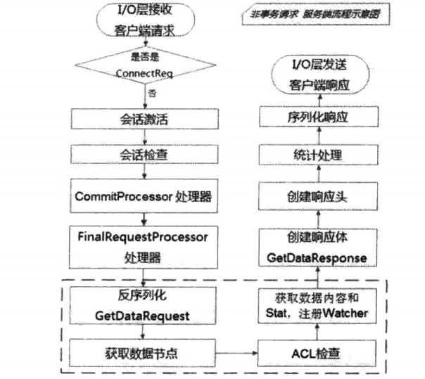


* 预处理
    * I/O层接收来自客户端的请求。
    * 判断是否是客户端"会话创建"请求。
    * 将请求交给PrepRequestProcessor处理器进行处理。
    * 会话检查。
* 非事务处理
    * 反序列化GetDataRequest请求。
    * 获取数据节点。
    * ACL检查。
    * 获取数据内容和stat，注册Watcher。
* 请求响应
    * 创建响应体GetDataResponse。响应体包含当前数据节点的内容和状态stat。 
    * 创建响应头。
    * 统计处理。
    * 序列化响应。
    * I/O层发送响应给客户端。


## 2.11. 数据与存储
<a href="#menu">目录</a>

在zk中，数据存储分为两部分，内存数据存储和磁盘数据存储。

zk是以树作为其内存数据模型,树上的每一个节点是最小的数据单元,即Znode

znode具有不同的节点特性,同时每个节点都具有一个递增的版本号,以此可以实现分布式数据的原子性更新.

zk的序列化层使用从hadoop中遗留下来的jute组件,该组件并不是性能最好的序列化框架,但是目前在zk中已经够用

zk的客户端和服务端会建立起tcp长连接来进行网络通信,基于该tcp连接衍生出来的会话概念, 是客户端和服务端直接所有请求交互的基石.在会话的生命周期中,会出现连接断开/重连或是会话失效等一系列问题,这些都是zk的会话管理器需要处理的问题-leader服务器会负责管理每个会话的生命周期,包括会话的创建/心跳检测和销毁等.

在服务器启动阶段,会进行磁盘数据恢复, 完成数据恢复后就会进行leader选举.一旦产生leader服务器后,就立即开始进行集群间的数据同步-在整个过程中, zk都处于不可用状态,直到数据同步完毕,zk才可以对外提供正常服务.在运行期间, 如果leader服务器所在机器挂掉或者和集群中绝大部分服务器断开连接,那么就会触发新一轮的leader选举.同样,在新的leader服务器选举产生之前,zk无法对外提供服务.

一个正常运行的zk集群,其机器角色通常由leader/follower/observer组成.zk对于客户端请求的处理, 严格的安装zab协议规范来进行.每一个服务器在启动初始化阶段都会组装一个请求处理链,leader服务器能搞处理所有类型的客户端请求,而对于follower或是observer服务器来说,可以正常处理非事务请求,而事务请求则需要转发给leader服务器来处理, 同事对于每个事务请求,leader都会为其分配一个全局唯一且递增的zxid,以此来保证事务处理的顺序性.在事务请求处理的过程中,leader和follower服务器都会进行事务日志的记录.

zk通过jdk的File接口简单地实现了自己的数据存储系统,其底层数据存储包括事务日志和快照数据2部分,这些都是zk实现数据一致性关键部分

### 2.11.1. 内存数据
<a href="#menu">目录</a>

zk就像一个内存数据库，在这个内存数据库中，存储了整棵树的内容，包括所有的节点路径，节点数据以及ACL信息等。zk会定时将这个数据存储到磁盘上。


DataTree是zk内存数据库的核心，是一个树结构，代表了内存中的一份完整的数据，DataTree不包含任何与网络，客户端连接以及请求处理相关的业务逻辑。

```java
public class DataTree {
    private static final Logger LOG = LoggerFactory.getLogger(DataTree.class);

    /**
     * This hashtable provides a fast lookup to the datanodes. The tree is the
     * source of truth and is where all the locking occurs
     */
    private final ConcurrentHashMap<String, DataNode> nodes =
        new ConcurrentHashMap<String, DataNode>();

    private final WatchManager dataWatches = new WatchManager();

    private final WatchManager childWatches = new WatchManager();

    /** the root of zookeeper tree */
    private static final String rootZookeeper = "/";

    /** the zookeeper nodes that acts as the management and status node **/
    private static final String procZookeeper = Quotas.procZookeeper;

    /** this will be the string thats stored as a child of root */
    private static final String procChildZookeeper = procZookeeper.substring(1);

    /**
     * the zookeeper quota node that acts as the quota management node for
     * zookeeper
     */
    private static final String quotaZookeeper = Quotas.quotaZookeeper;
}
```
DataNode是数据存储的最小单元，其内部除了存储节点的数据内容，acl列表和节点状态之外，还包括父节点的引用和子节点的列表
```java
public class DataNode implements Record {
    DataNode parent;
    byte data[];
    Long acl;
    public StatPersisted stat;
    private Set<String> children = null;
}
```
ZKDatabase:zk内存数据库，负责管理zk的所有会话，DataTree存储和事务日志，ZKDatabase会定时向磁盘dump快照数据，同时在zk服务器启动的时候，会通过磁盘上的事务日志和快照数据文件恢复成一个完整的内存数据库
```java
public class ZKDatabase {
    
    private static final Logger LOG = LoggerFactory.getLogger(ZKDatabase.class);
    
    /**
     * make sure on a clear you take care of 
     * all these members.
     */
    protected DataTree dataTree;
    protected ConcurrentHashMap<Long, Integer> sessionsWithTimeouts;
    protected FileTxnSnapLog snapLog;
    protected long minCommittedLog, maxCommittedLog;
    public static final int commitLogCount = 500;
    protected static int commitLogBuffer = 700;
    protected LinkedList<Proposal> committedLog = new LinkedList<Proposal>();
    protected ReentrantReadWriteLock logLock = new ReentrantReadWriteLock();
    volatile private boolean initialized = false;
}
```
### 2.11.2. 事务日志
<a href="#menu">目录</a>

事务日志文件用于存储事务操作，存储路径为dataLogDir/version-2.其文件名格式为log.100000047.文件大小64m.该文件为二进制文件。

文件后缀为Leader周期（32bit）+zxid（32bit,写入该日志文件的第一条事务记录的ZXID）.


**查看事务日志**

将zk的lib目录下的slf4j-api-1.7.25.jar和zk根目录下的zookeeper-3.4.13.jar复制到同一文件夹中，运行命令
```yml
java -classpath .:slf4j-api-1.7.25.jar:zookeeper-3.4.13.jar  org.apache.zookeeper.server.LogFormatter   ../zk/logs/version-2/log.200000001

```

假如执行以下操作
```yml
[zk: localhost:2181(CONNECTED) 2] create /aa 123
Created /aa

[zk: localhost:2181(CONNECTED) 3] set /aa 345
cZxid = 0x200000002
ctime = Fri Dec 18 04:16:40 CST 2020
mZxid = 0x200000003
mtime = Fri Dec 18 04:20:11 CST 2020
pZxid = 0x200000002
cversion = 0
dataVersion = 1
aclVersion = 0
ephemeralOwner = 0x0
dataLength = 3
numChildren = 0

[zk: localhost:2181(CONNECTED) 4] set /aa abc
cZxid = 0x200000002
ctime = Fri Dec 18 04:16:40 CST 2020
mZxid = 0x200000004
mtime = Fri Dec 18 04:20:47 CST 2020
pZxid = 0x200000002
cversion = 0
dataVersion = 2
aclVersion = 0
ephemeralOwner = 0x0
dataLength = 3
numChildren = 0

```
对应的事务日志为
```yml
12/18/20 4:16:40 AM CST session 0x10001f43d080000 cxid 0x2 zxid 0x200000002 create '/aa,#313233,v{s{31,s{'world,'anyone}}},F,1

12/18/20 4:20:11 AM CST session 0x10001f43d080000 cxid 0x3 zxid 0x200000003 setData '/aa,#333435,1

12/18/20 4:20:47 AM CST session 0x10001f43d080000 cxid 0x4 zxid 0x200000004 setData '/aa,#616263,2

```

**日志写入**

FileTxnLog负责维护事务日志对外的接口，包括事务日志的写入和读取等，首先来看日志的写入。将事务操作写入事务日志的工作主要由append方法来负责:
```java
public synchronized boolean append(TxnHeader hdr, Record txn);
```

从方法定义中我们可以看到，ZooKeeper 在进行事务日志写入的过程中，会将事务头和事务体传给该方法。事务日志的写入过程大体可以分为如下6个步骤。

* 1. 确认是否有事务日志可写
    * 当ZooKeeper服务器启动完成需要进行第一次事务日志的写入，或是上一个事务日志写满的时候，都会处于与事务日志文件断开的状态，即ZooKeeper服务器没有和任意一个日志文件相关联。因此，在进行事务日志写人前，ZooKeeper 首先会判断FileTxnLog组件是否已经关联上一一个可写的事务日志文件。如果没有关联上事务日志文件，那么就会使用与该事务操作关联的ZXID作为后缀创建一个事务日志文件，同时构建事务日志文件头信息(包含魔数magic、事务日志格式版本version和dbid),并立即写人这个事务日志文件中去。同时，将该文件的文件流放入一个集合: streamsToFlush。streamsToFlush集合是ZooKeeper用来记录当前需要强制进行数据落盘(将数据强制刷入磁盘上)的文件流，在后续的步骤6中会使用到。
* 2. 确定事务日志文件是否需要扩容（预分配）
    * Zookeeper的事务日志文件会采取"磁盘空间预分配"的策略。当检测到当前事务日志文件剩余空间不足4096字节(4KB)时，就会开始进行文件空间扩容。文件空间扩容的过程其实非常简单，就是在现有文件大小的基础上，将文件大小增加65536KB (64MB)， 然后使用“0”(\0)填充这些被扩容的文件空间。因此在事务日志文件的二进制文件中，会看到文件后半部分都被“0”填充了。
    * 对于客户端的每一次事务操作，ZooKeeper 都会将其写入事务日志文件中。因此，事务日志的写入性能直接决定了ZooKeeper服务器对事务请求的响应，也就是说，事务写入近似可以被看作是一个磁盘I/O的过程。严格地讲，文件的不断追加写入操作会触发底层磁盘I/O 为文件开辟新的磁盘块，即磁盘Seek。因此，为了避免磁盘Seek的频率，提高磁盘I/O的效率，ZooKeeper 在创建事务日志的时候就会进行文件空间“预分配”一在文件创建之初就向操作系统预分配一个很大的磁盘块，默认是64MB,而一旦已分配的文件空间不足4KB时，那么将会再次“预分配”，以避免随着每次事务的写入过程中文件大小增长带来的Seek开销，直至创建新的事务日志。事务日志“ 预分配”的大小可以通过系统属性zookeeper.preAllocSize来进行设置。
* 3. 事务序列化
    * 事务序列化包括对事务头和事务体的序列化，分别是对TxnHeader (事务头)和Record(事务体)的序列化。其中事务体又可分为会话创建事务(CreateSessionTxn)、 节点创建事务(CreateTxn)、 节点删除事务(DeleteTxn) 和节点数据更新事务(SetDataTxn)等。
* 4. 生成Checksum
    * 为了保证事务日志文件的完整性和数据的准确性，ZooKeeper在将事务日志写入文件前，会根据步骤3中序列化产生的字节数组来计算Checksum。ZooKeeper默认使用Adler32算法来计算Checksum值。
* 5. 写入事务日志文件流
    * 将序列化后的事务头、事务体及Checksum 值写人到文件流中去。此时由于ZooKeeper使用的是Buffered0utputStream,因此写入的数据并非真正被写入到磁盘上。
* 6. 事务日志刷入磁盘
    * 在步骤5中，已经将事务操作写入文件流中，但是由于缓存的原因，无法实时地写入磁盘文件中，因此我们需要将缓存数据强制刷入磁盘。在步骤1中我们已经将每个事务日志文件对应的文件流放入了streamsToFlush， 因此这里会从streamsToFlush中提取出文件流，并调用FileChannel.force(boolean metaData)接口来强制将数据刷入磁盘文件中去。force接口对应的其实是底层的fsync接口，是一个比较耗费磁盘I/O资源的接口，因此ZooKeeper允许用户控制是否需要主动调用该接口，可以通过系统属性zookeeper.forceSync来设置。

**日志截断：**

在ZooKeeper运行过程中，可能会出现这样的情况，非Leader机器上记录的事务ID (我们将其称为peerLastZxid)比Leader服务器大，无论这个情况是如何发生的，都是一个非法的运行时状态。同时，ZooKeeper 遵循一个原则:只要集群中存在Leader,那么所有机器都必须与该Leader的数据保持同步。

因此，一旦某台机器碰到上述情况，Leader 会发送TRUNC命令给这个机器，要求其进行日志截断。Learner服务器在接收到该命令后，就会删除所有包含或大于peerLastZxid的事务日志文件。


### 2.11.3. 数据快照
<a href="#menu">目录</a>

数据快照用来记录zk服务器上某一个时刻的全量内存数据内容，并将器其写入到指定的磁盘文件中。其存放目录为dataDir/version-2中。

```
acceptedEpoch
currentEpoch
snapshot.6000000a8
```
acceptedEpoch和currentEpoch文件存放的当前选举的版本，也就是集群已经进行选举的次数。snapshot.6000000a8是数据快照文件。


数据文件和事务日志文件的命名规则一样，快照数据文件也是使用ZXID的十六进制标识来作为文件名后缀，该后缀标识了本次数据快照开始时刻的服务器最新的ZXID,在数据恢复阶段，zk会根据该ZXID来确定数据恢复的起始点。

和事务文件不同的是，zk的快照数据文件没有采用预分配机制，因此不会像事务日志文件那样内容中可能包含大量的"0"。这是因为每个事务操作都需要落盘，而数据文件的写并不是那么频繁。每个快照文件中所有内容都是有效的。因此该文件的大小在一定程度上能够反映当前zk内存中的全量数据大小。每个快照文件保存的zk中的全量数据，因此可以删除掉较久的文件，保存最新的文件即可。

**存储格式**

```yml
java -classpath .:slf4j-api-1.7.25.jar:zookeeper-3.4.13.jar  org.apache.zookeeper.server.SnapshotFormatter   ../zk/data/version-2/snapshot.6000000a8
```

```yml

这里输出的仅是节点的信息状态，没有输出数据。

/aaa/seq-0000000017
  cZxid = 0x00000100000016
  ctime = Fri Dec 18 19:33:49 CST 2020
  mZxid = 0x00000100000016
  mtime = Fri Dec 18 19:33:49 CST 2020
  pZxid = 0x00000100000016
  cversion = 0
  dataVersion = 0
  aclVersion = 0
  ephemeralOwner = 0x00000000000000
  dataLength = 4

/aaa/seq-0000000009
  cZxid = 0x0000010000000e
  ctime = Fri Dec 18 19:33:49 CST 2020
  mZxid = 0x0000010000000e
  mtime = Fri Dec 18 19:33:49 CST 2020
  pZxid = 0x0000010000000e
  cversion = 0
  dataVersion = 0
  aclVersion = 0
  ephemeralOwner = 0x00000000000000
  dataLength = 4
```

**数据快照**

针对客户端每次的事务操作，zk都会将它们记录到事务日志中去，同时也会将数据保存到内存数据库中。zk会在执行若干次事务操作（配置文件中的snapCount确定）之后，会将内存中的数据全部dump到磁盘文件中，这个过程就是数据快照。

注意这里每次事务操作，都会写入到事务日志。而数据快照是多次事务操作之后才进行。所以对于事务日志的操作是频繁的。所以为了保证实际应用时的写入效率，事务日志和数据快照文件应该放在不同的磁盘。

**数据快照的过程**
* 确定是否需要进行数据快照
    * 每进行一次事务日志记录之后，ZooKeeper都会检查当前是否需要进行数据快照。理论上进行snapCount次事务操作后就会开始数据快照，但是考虑到数据快照对于ZooKeeper所在机器的整体性能的影响，需要尽量避免ZooKeeper集群中的所有机器在同一时刻进行数据快照。因此ZooKeeper在具体的实现中，并不是严格的按照这个策略执行的，而是采取“过半随机”策略，即符合如下条件就进行数据快照：
    * 其中logCount代表了当前已经记录的事务日志数量，randRoll为1~snapCount/2之间的随机数，因此上面的条件就相当于：如果我们配置的snapCount值为默认的100000，那么ZooKeeper会在50000~100000次事务日志记录后进行一次数据快照。
* 切换事务日志文件
    * 满足上述条件之后，ZooKeeper就要开始进行数据快照了。首先是进行事务日志文件的切换。所谓的事务日志文件切换是指当前的事务日志已经“写满”（已经写入了snapCount个事务日志），需要重新创建一个新的事务日志。
* 创建数据快照异步线程
    * 为了保证数据快照过程不影响ZooKeeper的主流程，这里需要创建一个单独的异步线程来进行数据快照。
* 获取全量数据和会话信息
    * 数据快照本质上就是将内存中所有数据节点信息（DataTree）和会话信息保存到本地磁盘中去。因此这里会先从ZKDatabase中获取到DataTree和会话信息。
* 生成快照数据文件名
    * 在“文件存储”部分，我们已经提到快照数据文件名的命名空间。在这一步中，ZooKeeper会根据当前已提交的最大ZXID来生成数据快照文件名。
* 数据序列化
    * 接下来就开始真正的数据序列化了。在序列化时，首先会序列化文件头信息，这里的文件头和事务日志中的一致，同样也包含了魔数、版本号和dbid信息。然后再对会话信息和DataTree分别进行序列化，同时生成一个Checksum，一并写入快照数据文件中去。


### 2.11.4. 初始化
<a href="#menu">目录</a>

　在Zookeeper服务器启动期间，首先会进行数据初始化工作，用于将存储在磁盘上的数据文件加载到Zookeeper服务器内存中。

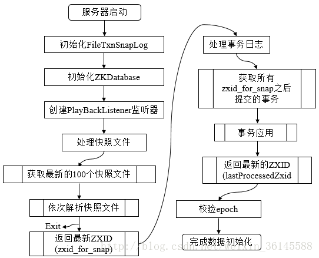

数据的初始化工作是从磁盘上加载数据的过程，主要包括了从快照文件中加载快照数据和根据事务日志进行数据修正两个过程。

1. 初始化FileTxnSnapLog。FileTxnSnapLog是Zookeeper事务日志和快照数据访问层，用于衔接上层业务和底层数据存储，底层数据包含了事务日志和快照数据两部分。FileTxnSnapLog中对应FileTxnLog和FileSnap。

2. 初始化ZKDatabase。首先构建DataTree，同时将FileTxnSnapLog交付ZKDatabase，以便内存数据库能够对事务日志和快照数据进行访问。 
除了ZooKeeper的数据节点，在ZKDatabase的初始化阶段还会创建一个用于保存所有客户端会话超时时间的记录器：sessionsWithTimeouts——会话超时时间记录器。

```java
QuorumPeer.java
private void loadDataBase() {
try {
    zkDb.loadDataBase();

    // load the epochs
    long lastProcessedZxid = zkDb.getDataTree().lastProcessedZxid;
    long epochOfZxid = ZxidUtils.getEpochFromZxid(lastProcessedZxid);
    try {
        currentEpoch = readLongFromFile(CURRENT_EPOCH_FILENAME);
        if (epochOfZxid > currentEpoch && updating.exists()) {
            setCurrentEpoch(epochOfZxid);
        }
    }
```
上面的关键在于zkDb.loadDataBase();

3. 创建PlayBackListener监听器 
PlayBackListener监听器主要用来接收事务应用过程中的回调。在后面读者会看到，在ZooKeeper数据恢复后期，会有一个事务订正过程，在这个过程中会回调PlayBackListener监听器来进行对应的数据订正。
```java
public long loadDataBase() throws IOException {
    PlayBackListener listener=new PlayBackListener(){
        public void onTxnLoaded(TxnHeader hdr,Record txn){
            Request r = new Request(null, 0, hdr.getCxid(),hdr.getType(),
                    null, null);
            r.txn = txn;
            r.hdr = hdr;
            r.zxid = hdr.getZxid();
            addCommittedProposal(r);
        }
    };

    long zxid = snapLog.restore(dataTree,sessionsWithTimeouts,listener);
    initialized = true;
    return zxid;
}
```
4. 处理快照文件 
完成内存数据库的初始化之后，ZooKeeper就开始从磁盘中恢复数据了。在上文中我们已经提到，每一个快照数据文件中都保存了ZooKeeper服务器近似全量的数据，因此首先从这些快照文件开始加载。

5. 获取最新的100个快照文件 
ZooKeeper服务器运行一段时间之后，磁盘上会保留许多快照文件。另外由于每次数据快照过程中，ZooKeeper都会将全量数据Dump到磁盘快照文件中，因此往往更新时间最晚的那个文件包含了最新的全量数据。那么是否我们只需要这个最新的快照文件就可以了呢？在ZooKeeper的实现中，会获取最新的至多100个快照文件。

6. 解析快照文件。逐个解析快照文件，此时需要进行反序列化，生成DataTree和sessionsWithTimeouts，同时还会校验Checksum及快照文件的正确性。对于100个快找文件，如果正确性校验通过时，通常只会解析最新的那个快照文件。只有最新快照文件不可用时，才会逐个进行解析，直至100个快照文件全部解析完。

7. 获取最新的ZXID。此时根据快照文件的文件名即可解析出最新的ZXID：zxid_for_snap。该ZXID代表了Zookeeper开始进行数据快照的时刻。

8. 处理事务日志。此时服务器内存中已经有了一份近似全量的数据，现在开始通过事务日志来更新增量数据。

9. 获取所有zxid_for_snap之后提交的事务。此时，已经可以获取快照数据的最新ZXID。只需要从事务日志中获取所有ZXID比步骤7得到的ZXID大的事务操作。

10. 事务应用。获取大于zxid_for_snap的事务后，将其逐个应用到之前基于快照数据文件恢复出来的DataTree和sessionsWithTimeouts。每当有一个事务被应用到内存数据库中后，Zookeeper同时会回调PlayBackListener，将这事务操作记录转换成Proposal，并保存到ZKDatabase的committedLog中，以便Follower进行快速同步。

11. 获取最新的ZXID。待所有的事务都被完整地应用到内存数据库中后，也就基本上完成了数据的初始化过程，此时再次获取ZXID，用来标识上次服务器正常运行时提交的最大事务ID。
```java
public long restore(DataTree dt, Map<Long, Integer> sessions, 
        PlayBackListener listener) throws IOException {
    //5,6,7都是在这一步里完成的
    snapLog.deserialize(dt, sessions);
        //9.
    FileTxnLog txnLog = new FileTxnLog(dataDir);
    //获得快照后的第一条日志记录
    TxnIterator itr = txnLog.read(dt.lastProcessedZxid+1);
    long highestZxid = dt.lastProcessedZxid;
    TxnHeader hdr;
    try {
        while (true) {
            hdr = itr.getHeader();
            if (hdr == null) {
            //没有日志了，说明初始化完成，此时dt.lastProcessedZxid为上一次最后一条日志记录
                return dt.lastProcessedZxid;
            }
            //更新highestZxid    
            highestZxid = hdr.getZxid();
            //将日志重新应用内存到数据库中去，此时dt.lastProcessedZxid会变为日志的zxid，代表最后提交的事务id
            processTransaction(hdr,dt,sessions, itr.getTxn());
            //回调PlayBackListener，将这事务操作记录转换成Proposal，并保存到ZKDatabase的committedLog中
            listener.onTxnLoaded(hdr, itr.getTxn());
            if (!itr.next()) 
                break;
        }
    } finally {
        if (itr != null) {
            itr.close();
        }
    }
    return highestZxid;
}
```
12. 校验epoch。epoch标识了当前Leader周期，集群机器相互通信时，会带上这个epoch以确保彼此在同一个Leader周期中。完成数据加载后，Zookeeper会从步骤11中确定ZXID中解析出事务处理的Leader周期：epochOfZxid。同时也会从磁盘的currentEpoch和acceptedEpoch文件中读取上次记录的最新的epoch值，进行校验。 


### 2.11.5. 数据同步
<a href="#menu">目录</a>


整个集群完成Leader选举后，Learner（Follower和Observer的统称）会向Leader进行注册，当Learner向Leader完成注册后，就进入数据同步环节，同步过程就是Leader将那些没有在Learner服务器上提交过的事务请求同步给Learner服务器，大体过程如下

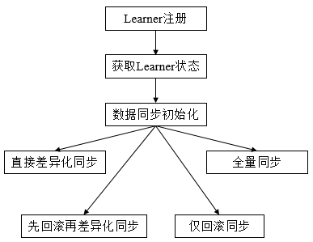

* 获取Learner状态
    * 在注册Learner的最后阶段，Learner服务器会发送给Leader服务器一个ACKEPOCH数据包，Leader会从这个数据包中解析出该Learner的currentEpoch和lastZxid。
* 数据同步初始化
    * 在开始同步以前，leader先进行数据同步初始化
    * 首先从Zookeeper内存数据库中提取出事务请求对应的提议缓存队列proposals，同时完成以下三个ZXID值的初始化
        * peerLastZxid：从learner服务器注册时发送的ACKEPOCH消息中提取lastZxid（该Learner服务器最后处理的ZXID）
        * minCommittedLog：Leader服务器Proposal缓存队列committedLog中最小ZXID
        * maxCommittedLog：Leader服务器Proposal缓存队列committedLog中最大ZXID

　　对于集群数据同步而言，通常分为四类，直接差异化同步(DIFF同步)、先回滚再差异化同步(TRUNC+DIFF同步)、仅回滚同步(TRUNC同步)、全量同步(SNAP同步)，在初始化阶段，Leader会优先以全量同步方式来同步数据。同时，会根据Leader和Learner之间的数据差异情况来决定最终的数据同步方式。

**数据同步方式**

* 直接差异化同步(DIFF同步，peerLastZxid介于minCommittedLog和maxCommittedLog之间)。
    * Leader首先向这个Learner发送一个DIFF指令，用于通知Learner进入差异化数据同步阶段，Leader即将把一些Proposal同步给自己，针对每个Proposal，Leader都会通过发送PROPOSAL内容数据包和COMMIT指令数据包来完成，

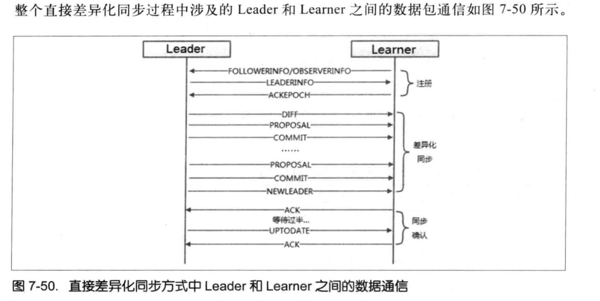

* 先回滚再差异化同步(TRUNC+DIFF同步，Leader已经将事务记录到本地事务日志中，但是没有成功发起Proposal流程)。
    * 场景：当新的Leader服务器发现某个Learner服务器包含了一条自己没有的事务记录，那么就需要让该Learner服务器进行事务回滚--回滚到Leader服务器上存在的，同时也是最接近于peerLastZxid的ZXID
    * 当Leader发现某个Learner包含了一条自己没有的事务记录，那么就需要该Learner进行事务回滚，回滚到Leader服务器上存在的，同时也是最接近于peerLastZxid的ZXID。

* 仅回滚同步(TRUNC同步，peerLastZxid大于maxCommittedLog)。
    * Leader要求Learner回滚到ZXID值为maxCommittedLog对应的事务操作。

* 全量同步(SNAP同步，peerLastZxid小于minCommittedLog或　Leader服务器上没有Proposal缓存队列且peerLastZxid不等于lastProcessZxid)。
    * Leader无法直接使用提议缓存队列和Learner进行同步，因此只能进行全量同步。Leader将本机的全量内存数据同步给Learner。Leader首先向Learner发送一个SNAP指令，通知Learner即将进行全量同步，随后，Leader会从内存数据库中获取到全量的数据节点和会话超时时间记录器，将他们序列化后传输给Learner。Learner接收到该全量数据后，会对其反序列化后载入到内存数据库中。

# 3. 运维
<a href="#menu">目录</a>

## 3.1. JMX查看集群信息

只有被连接的服务节点才有比较丰富的信息，集群其他节点的信息很少。

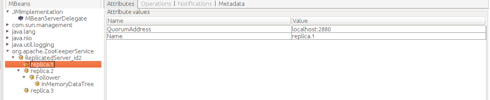
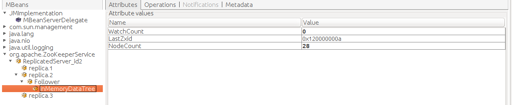
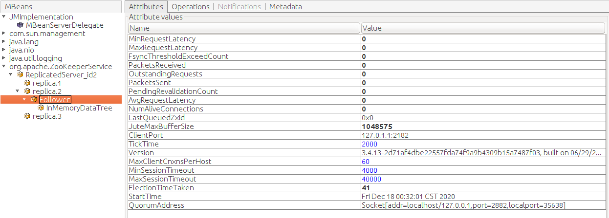
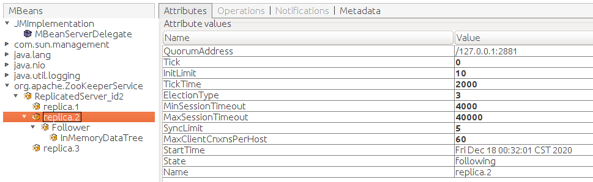

## 3.2. 构建一个高可用的集群
<a href="#menu">目录</a>

### 3.2.1. 容灾

为了达到容灾标准，一般对于普通应用，选择部署在单机房不同的机器上部署。对于核心应用，选择在多机房多机器上部署。

单点问题:在一个分布式系统中，如果某一个组件出现问题就导致整个系统可用性大大降低甚至瘫痪，那么就认为这个系统存在单点问题。

zk集群的可用性的前提是必须保证有一半以上的节点是正常的。因此如果集群节点较多，就可以在一定程度上解决单点问题。同时，还可以进行多机房部署，大大提升系统的容灾能力。多机房部署有几个问题，一是成本问题，二是机房中节点数量分配问题。

在多机房部署中，对于故障，一般是机房全故障，这是最坏的情况，二是机房中的某个节点出现故障。一般为了容灾，集群需要部署在超过一个的机房中。


以下是不同集群节点数量的情况下，最多可发生故障节点数量对比。从表中可以看出，偶数台在容灾能力上并没有比计数台有任何显著的优势，所以，通常部署成奇数台即可。

|集群节点数量|最多可发生故障节点数量|
|---|---|
|3|1|
|4|1|
|5|2|
|6|2|
|7|3|
|8|3|


对于两个机房
* 非对等部署：投入更多的资源重点维护某个机房
    * 优点
        * 集群总量可为奇数，容错性更好；
        * 有一定的跨机房容灾能力，机房B挂掉认可正常运行；
    * 缺点
        * 存在数据丢失的可能（机房A被毁，且Master在机房A时,此时事务响应已经返回给客户端，但是还没有同步成功到机房B）
* 对等部署
    * 对等部署：两个机房的资源分配是对等的
    * 优点
        * 保证数据的不丢失；
    * 缺点
        * 没有跨机房容灾能力，任意一个机房挂掉，ZK集群不可用；
        * 写性能不如非对等部署方案；
        * 集群数量为偶数，容错性不如非对等方案；


### 3.2.2. 扩容与缩容

zk对于水平扩容和缩容支持并不完美，必须在更新配置文件之后，重新启动zk，用户可以根据业务需要进行整体重启或者逐台重启。

## 3.3. 日常运维
<a href="#menu">目录</a>

### 3.3.1. 数据与日志管理

```yml
#在/bin目录下有个脚本：zkCleanup.sh可以手动清理快照和事务日志；
#定时清理（zookeeper从3.4.0开始提供了自动清理快照和事务日志的功能）以下两个参数配合使用：
# The number of snapshots to retain in dataDir 指定了需要保留的文件数目。默认事保留3个。
#autopurge.snapRetainCount=3
# Purge task interval in hours
# Set to "0" to disable auto purge feature

#指定了清理频率，单位是小时，需要填写一个1或者更大的数字，默认是0，表示不开启自己清理功能。
#autopurge.purgeInterval=1
```

### 3.3.2. 磁盘管理

对zk数据状态的变更，都会以事务日志的形式写入磁盘，并且只有当集群中过半的服务器已经记录了该事务日志之后，服务端才会返回响应给客户端。同时,zk还会定时将内存数据库中的所有数据和所有客户端的会话信息记录进行快照，保存到磁盘中的数据快照文件。所以磁盘的吞吐性能会影响到zk的性能。
* 使用单独的磁盘作为事务日志的输出目录。避免和其他程序争抢磁盘的读写
* 尽量避免内存和磁盘空间的交换


# 4. Java客户端Curator
<a href="#menu">目录</a>

Curator是Netflix公司开源的一套Zookeeper客户端框架。了解过Zookeeper原生API都会清楚其复杂度。Curator帮助我们在其基础上进行封装、实现一些开发细节，包括接连重连、反复注册Watcher和NodeExistsException等

目前Curator有2.x.x和3.x.x两个系列的版本，支持不同版本的Zookeeper。其中Curator 2.x.x兼容Zookeeper的3.4.x和3.5.x。而Curator 3.x.x只兼容Zookeeper 3.5.x，并且提供了一些诸如动态重新配置、watch删除等新特性。

## 4.1. 项目组件

* Recipes	Zookeeper典型应用场景的实现，这些实现是基于Curator Framework。
* Framework	Zookeeper API的高层封装，大大简化Zookeeper客户端编程，添加了例如Zookeeper连接管理、重试机制等。
* Utilities	为Zookeeper提供的各种实用程序。
* Client	Zookeeper client的封装，用于取代原生的Zookeeper客户端（ZooKeeper类），提供一些非常有用的客户端特性。
* Errors	Curator如何处理错误，连接问题，可恢复的例外等。

## 4.2. Maven依赖

* curator-recipes	所有典型应用场景。需要依赖client和framework，需设置自动获取依赖。
* curator-framework	同组件中framework介绍。
* curator-client	同组件中client介绍。
* curator-test	包含TestingServer、TestingCluster和一些测试工具。
* curator-examples	各种使用Curator特性的案例。
* curator-x-discovery	在framework上构建的服务发现实现。
* curator-x-discoveryserver	可以喝Curator Discovery一起使用的RESTful服务器。
* curator-x-rpc	Curator framework和recipes非java环境的桥接。

```xml
 <dependency>
    <groupId>org.apache.zookeeper</groupId>
        <artifactId>zookeeper</artifactId>
        <version>3.4.10</version>
    </dependency>
<dependency>
    <groupId>org.apache.curator</groupId>
    <artifactId>curator-framework</artifactId>
    <version>2.12.0</version>
</dependency>
<dependency>
    <groupId>org.apache.curator</groupId>
    <artifactId>curator-recipes</artifactId>
    <version>2.12.0</version>
</dependency>
```

## 4.3. 使用
<a href="#menu">目录</a>

```java
RetryPolicy retryPolicy = new ExponentialBackoffRetry(1000,3);
CuratorFramework client = CuratorFrameworkFactory
        .builder()
        .connectString("127.0.0.1:2181")
        .sessionTimeoutMs(5000)
        .retryPolicy(retryPolicy)
        .namespace("lock")
        .build();
client.start();
```
* connectString：zk的server地址，多个server之间使用英文逗号分隔开,"127.0.0.1:2181,127.0.0.1:2182,127.0.0.1:2183"
* connectionTimeoutMs：连接超时时间，如上是30s，默认是15s
* sessionTimeoutMs：会话超时时间，如上是50s，默认是60s
* retryPolicy：失败重试策略
    * ExponentialBackoffRetry：构造器含有三个参数 ExponentialBackoffRetry(int baseSleepTimeMs, int maxRetries, int maxSleepMs)
        * baseSleepTimeMs：初始的sleep时间，用于计算之后的每次重试的sleep时间，计算公式：当前sleep时间=baseSleepTimeMs*Math.max(1, random.nextInt(1<<(retryCount+1)))
        * maxRetries：最大重试次数
        * maxSleepMs：最大sleep时间，如果上述的当前sleep计算出来比这个大，那么sleep用这个时间
        * 其他，查看org.apache.curator.RetryPolicy接口的实现类
    * RetryNTimes
        * 有限次数尝试
    * RetryUntilElapsed
        * 不限次数尝试
* namespace: 之后创建的目录都在这个目录底下进行，可以用这个实现业务区分
* start()会阻塞到会话创建成功为止。

**创建节点**

```java
client.create()
    //是否同时创建父节点
    .creatingParentsIfNeeded()
    //
    .withProtection()
    //创建的节点类型
    .withMode(CreateMode.EPHEMERAL)
    //绑定异步回调方法
    .inBackground()
    //操作的节点
    .forPath("/a");
```

**其他操作**
```java
String path = "";
//更新时返回的是状态Stat
Stat stat = client.setData().forPath(path,"1234".getBytes());
//无返回值
client.delete().forPath(path);

//返回新创建的path
String newPath = client.create().creatingParentsIfNeeded().forPath(path,"12345".getBytes());

//返回节点数据的字节数组
byte[] data = client.getData().forPath(path);

Stat stat1 = client.checkExists().forPath(path);

//子节点路径列表
List<String> childrenPaths =  client.getChildren().forPath(path);

```

默认执行是同步执行，可以使用inBackground实现异步执行
```java
inBackground(new BackgroundCallback(){
    @Override
    public void processResult(CuratorFramework curatorFramework, CuratorEvent curatorEvent) throws Exception {

        
        
    }
})
```

## 4.4. 两种错误场景的处理
<a href="#menu">目录</a>

**有序节点的情况**

如果客户端所连接的服务器崩溃了， 但还没来得及返回客户端所创建的有序节点的节点名称（即节点序列号） ， 或者客户端只是连接丢失， 客户端没接收到所请求操作的响应信息， 结果， 客户端并不知道所创建的znode节点路径名称。 回忆我们对于有序节点的应用场景， 例如， 建立一个有序的所有客户端列表。 为了解决这个问题，CreateBuilder提供了一个withProtection方法来通知Curator客户端， 在创建的有序节点前添加一个唯一标识符， 如果create操作失败了， 客户端就会开始重试操作， 而重试操作的一个步骤就是验证是否存在一个节点包含这个唯一标识符。

**删除节点的保障**

在进行delete操作时也可能发生类似情况， 如果客户端在执行delete操作时， 与服务器之间的连接丢失， 客户端并不知道delete操作是否成功执行。 如果一个znode节点删除与否表示某些特殊情况， 例如， 表示一个资源处于锁定状态， 因此确保该节点删除才能确保资源的锁定被释放， 以便可以再次使用。

Curator客户端中提供了一个方法， 对应用程序的delete操作的执行提供了保障， Curator客户端会重新执行操作， 直到成功为止， 或Curator客户端实例不可用时。 使用该功能， 我们只需要使用DeleteBuilder接口中定义的guaranteed方法。


# 5. 典型应用场景
<a href="#menu">目录</a>

**数据发布订阅** 

数据发布／订阅使用的是zk的通知机制实现，可以用来发布一些系统的配置信息，从而实现配置的统一和动态修改。

发布订阅系统一般有两种设计模式，分别是推(Push)模式和拉(Pull)模式，在推模式中，服务端主动将数据更新发送给所有订阅的客户端，而拉模式则是由客户端主动发起获取数据的请求。

zk采用的是推拉结合的方式，客户端向服务端注册自己需要关注的节点，一旦该节点的数据发生变更，那么服务端就会向相应的客户端发送watcher事件通知，客户端接收到这个消息通知之后，需要到服务端获取最新的数据。

**分布式唯一ID**

可以利用zk的有序节点实现一套分布式全局唯一ID的分配机制。该值是是个int类型。到最大后又变负值。

**集群管理**

可以作为注册中心，用于存放集群信息，主要是host和ip地址，或者集群节点的状态信息，当新增节点或者删除节点时，节点信息可以注册到zk或者被zk自动删除。

也可以用于搜集各个节点的状态的信息，以实现对各个节点的监控。

**分布式锁**

使用zk节点的有序性和临时性的特性，可以实现可重入分布式锁和读写锁。

**Ｍaster选举**

对于zk，多个客户端创建同一个路径的节点，仅能有一个客户端能够创建成功。利用这个特性，可以实现集群里的master选举，只要创建zk节点成功，即可成为master，其他未成为master的集群节点，则会监听这个路径，master挂了，其他节点就可以重复上述操作进行选举。

 
# 6. ZK分布式锁
<a href="#menu">目录</a>

## 6.1. 分布式锁基本知识
<a href="#menu">目录</a>

**分布式锁特性**
1. 在分布式系统环境下，一个方法在同一时间只能被一个机器的一个线程执行； 
2. 高可用的获取锁与释放锁； 
3. 高性能的获取锁与释放锁； 
4. 具备可重入特性； 
5. 具备锁失效机制，防止死锁； 
6. 具备非阻塞锁特性，即没有获取到锁将直接返回获取锁失败。

**分布式锁的实现方式有哪些？** 

目前几乎很多大型网站及应用都是分布式部署的，分布式场景中的数据一致性问题一直是一个比较重要的话题。分布式的CAP理论告诉我们“任何一个分布式系统都无法同时满足一致性（Consistency）、可用性（Availability）和分区容错性（Partition tolerance），最多只能同时满足两项。”所以，很多系统在设计之初就要对这三者做出取舍。在互联网领域的绝大多数的场景中，都需要牺牲强一致性来换取系统的高可用性，系统往往只需要保证“最终一致性”，只要这个最终时间是在用户可以接受的范围内即可。

在很多场景中，我们为了保证数据的最终一致性，需要很多的技术方案来支持，比如分布式事务、分布式锁等。有的时候，我们需要保证一个方法在同一时间内只能被同一个线程执行。

* 基于数据库实现分布式锁；
* 基于缓存（Redis等）实现分布式锁；
* 基于Zookeeper实现分布式锁；

## 6.2. Curator分布式锁的使用
<a href="#menu">目录</a>

依赖引入
```xml
<dependency>
    <groupId>org.apache.zookeeper</groupId>
        <artifactId>zookeeper</artifactId>
        <version>3.4.10</version>
    </dependency>
<dependency>
    <groupId>org.apache.curator</groupId>
    <artifactId>curator-framework</artifactId>
    <version>2.12.0</version>
</dependency>
<dependency>
    <groupId>org.apache.curator</groupId>
    <artifactId>curator-recipes</artifactId>
    <version>2.12.0</version>
</dependency>
```

```java
//重试策略
RetryPolicy retry = new ExponentialBackoffRetry(1000, 3);
//创建客户端
CuratorFramework client =  CuratorFrameworkFactory.newClient(connectString, 60000, 15000, retry);
//获取锁操作类
InterProcessLock lock = new InterProcessSemaphoreMutex(client, lockPath);
//请求锁
lock.acquire();
//释放锁
lock.release();


//完整代码
public class CuratorDemo {

    CuratorFramework client ;
    RetryPolicy retryPolicy;

    public void init(){
        retryPolicy = new ExponentialBackoffRetry(1000,3);
        client = CuratorFrameworkFactory
                .builder()
                .connectString("127.0.0.1:2181")
                .sessionTimeoutMs(5000)
                .retryPolicy(retryPolicy)
                .namespace("lock")
                .build();
        client.start();
    }   
　  //模拟购买业务
    public void  buy(){

        InterProcessLock lock = new InterProcessMutex(client, "/buy");

        try{
            System.out.println("正在申请锁...");
            lock.acquire();
            System.out.println("申请锁成功!执行业务代码");
            Thread.sleep(100000);
        }
        catch(Exception ex){
            ex.printStackTrace();
            System.out.println("出现异常，释放锁");
        }
        finally {
            try{
                System.out.println("释放锁...");
                lock.release();
            }
            catch(Exception e){

            }
        }

    }


    public static void main(String args[]){

        CuratorDemo demo = new CuratorDemo();
        demo.init();
        demo.buy();

    }
}

```

* InterProcessMutex：分布式可重入排它锁
* InterProcessSemaphoreMutex：分布式排它锁
* InterProcessReadWriteLock：分布式读写锁
* InterProcessMultiLock：将多个锁作为单个实体管理的容器

Zookeeper的分布式锁原理是利用了临时节点(EPHEMERAL)的特性。其实现原理：
* 创建一个锁目录lock
* 线程A获取锁会在lock目录下，创建临时顺序节点
* 获取锁目录下所有的子节点，然后获取比自己小的兄弟节点，如果不存在，则说明当前线程顺序号最小，获得锁
* 线程B创建临时节点并获取所有兄弟节点，判断自己不是最小节点，设置监听(watcher)比自己次小的节点（只关注比自己次小的节点是为了防止发生“羊群效应”）
* 线程A处理完，删除自己的节点，线程B监听到变更事件，判断自己是最小的节点，获得锁
* 由于节点的临时属性，如果创建znode的那个客户端崩溃了，那么相应的znode会被自动删除。这样就避免了设置过期时间的问题。

但是使用临时节点又会存在另一个问题：Zookeeper如果长时间检测不到客户端的心跳的时候(Session时间)，就会认为Session过期了，那么这个Session所创建的所有的ephemeral类型的znode节点都会被自动删除。

客户端1发生GC停顿的时候，Zookeeper检测不到心跳，也是有可能出现多个客户端同时操作共享资源的情形。当然，你可以说，我们可以通过JVM调优，避免GC停顿出现。但是注意了，我们所做的一切，只能尽可能避免多个客户端操作共享资源，无法完全消除。


## 6.3. ZK分布式锁的可靠性分析

Zookeeper在集群部署中，Zookeeper节点数量一般是奇数，且一定大等于3。下面是Zookeeper的写数据的原理：

那么写数据流程步骤如下：
1. 在Client向Follwer发出一个写的请求
2. Follwer把请求发送给Leader
3. Leader接收到以后开始发起投票并通知Follwer进行投票
4. Follwer把投票结果发送给Leader，只要半数以上返回了ACK信息，就认为通过
5. Leader将结果汇总后如果需要写入，则开始写入同时把写入操作通知给Leader，然后commit;
6. Follwer把请求结果返回给Client

还有一点，Zookeeper采取的是全局串行化操作。


下面列出Redis集群下分布式锁可能存在的问题，判断其在Zookeeper集群下是否会存在：

* 集群同步
    * client给Follwer写数据，可是Follwer却宕机了，会出现数据不一致问题么？不可能，这种时候，client建立节点失败，根本获取不到锁。
    * client给Follwer写数据，Follwer将请求转发给Leader，Leader宕机了，会出现不一致的问题么？不可能，这种时候，Zookeeper会选取新的leader，继续上面的提到的写流程。

总之，采用Zookeeper作为分布式锁，你要么就获取不到锁，一旦获取到了，必定节点的数据是一致的，不会出现redis那种异步同步导致数据丢失的问题。

* 时间跳跃问题
    * Zookeeper不依赖全局时间，不存在该问题。
* 超时导致锁失效问题
    * Zookeeper不依赖有效时间，不存在该问题。

redis的读写性能比Zookeeper强太多，如果在高并发场景中，使用Zookeeper作为分布式锁，那么会出现获取锁失败的情况，存在性能瓶颈。

Zookeeper可以实现读写锁，Redis不行。

Zookeeper的watch机制,客户端试图创建znode的时候，发现它已经存在了，这时候创建失败,那么进入一种等待状态，当znode节点被删除的时候，Zookeeper通过watch机制通知它，这样它就可以继续完成创建操作（获取锁）。这可以让分布式锁在客户端用起来就像一个本地的锁一样：加锁失败就阻塞住，直到获取到锁为止。这套机制，redis无法实现


## 6.4. Curator分布式锁的原理
<a href="#menu">目录</a>

类层次结构
```yml
InterProcessLock
    |----InterProcessMultiLock 将多个锁作为单个实体管理的容器
    |----InterProcessMutex 分布式可重入排它锁
    |----InterProcessSemaphoreMutex 分布式排它锁
InterProcessReadWriteLock 分布式读写锁
```

顶层接口:InterProcessLock
```java
public interface InterProcessLock {
    void acquire() throws Exception;
    boolean acquire(long var1, TimeUnit var3) throws Exception;
    void release() throws Exception;
    boolean isAcquiredInThisProcess();
}
```

### 6.4.1. InterProcessMutex实现原理

#### 6.4.1.1. 加锁处理

InterProcessMutex.class调用acquire()时实际上调用的是internalLock方法
```java

private static class LockData
{
    final Thread owningThread;
    final String lockPath;
    final AtomicInteger lockCount = new AtomicInteger(1);
}

private boolean internalLock(long time, TimeUnit unit) throws Exception
{
    /*
        Note on concurrency: a given lockData instance
        can be only acted on by a single thread so locking isn't necessary
    */

    Thread currentThread = Thread.currentThread();
    //从集合中获取lockdata
    //为空则说明是当前线程首次申请锁，否则是重入，对计数器加1
    LockData lockData = threadData.get(currentThread);
    if ( lockData != null )
    {
        // re-entering
        lockData.lockCount.incrementAndGet();
        return true;
    }
    //尝试加锁
    String lockPath = internals.attemptLock(time, unit, getLockNodeBytes());
    //加锁成功
    if ( lockPath != null )
    {
        LockData newLockData = new LockData(currentThread, lockPath);
        threadData.put(currentThread, newLockData);
        return true;
    }

    return false;
}
```


LockInternals.class
加锁操作由LockInternals.attemptLock方法实现
```java

LockInternals(CuratorFramework client, LockInternalsDriver driver, String path, String lockName, int maxLeases)
{
    this.driver = driver;
    this.lockName = lockName;
    this.maxLeases = maxLeases;

    this.client = client;
    this.basePath = PathUtils.validatePath(path);
    //lockName为lock-,会在用户传入的path后面添加，也就是最终创建的是path/lock-00000001
    this.path = ZKPaths.makePath(path, lockName);
}

String attemptLock(long time, TimeUnit unit, byte[] lockNodeBytes) throws Exception
{
    final long      startMillis = System.currentTimeMillis();
    final Long      millisToWait = (unit != null) ? unit.toMillis(time) : null;
    final byte[]    localLockNodeBytes = (revocable.get() != null) ? new byte[0] : lockNodeBytes;
    int             retryCount = 0;

    String          ourPath = null;
    boolean         hasTheLock = false;
    boolean         isDone = false;
    while ( !isDone )
    {
        isDone = true;

        try
        {
            //在锁空间下创建临时且有序的子节点
            ourPath = driver.createsTheLock(client, path, localLockNodeBytes);
            //判断是否获得锁（子节点序号最小），获得锁则直接返回，否则阻塞等待前一个子节点删除通知
            hasTheLock = internalLockLoop(startMillis, millisToWait, ourPath);
        }
        catch ( KeeperException.NoNodeException e )
        {
            // gets thrown by StandardLockInternalsDriver when it can't find the lock node
            // this can happen when the session expires, etc. So, if the retry allows, just try it all again
            if ( client.getZookeeperClient().getRetryPolicy().allowRetry(retryCount++, System.currentTimeMillis() - startMillis, RetryLoop.getDefaultRetrySleeper()) )
            {
                isDone = false;
            }
            else
            {
                throw e;
            }
        }
    }

    if ( hasTheLock )
    {
        return ourPath;
    }

    return null;
}
```


StandardLockInternalsDriver.class,实际创建节点的操作。
```java
@Override
public String createsTheLock(CuratorFramework client, String path, byte[] lockNodeBytes) throws Exception
{
    String ourPath;
    if ( lockNodeBytes != null )
    {
        ourPath = client.create().creatingParentContainersIfNeeded().withProtection().withMode(CreateMode.EPHEMERAL_SEQUENTIAL).forPath(path, lockNodeBytes);
    }
    else
    {
        ourPath = client.create().creatingParentContainersIfNeeded().withProtection().withMode(CreateMode.EPHEMERAL_SEQUENTIAL).forPath(path);
    }
    return ourPath;
}
```

假如命名空间是“lock”,加锁的path是"/buy",则最终创建的节点是／lock/buy/lock-00000000001.但是由于创建节点时使用了withProtection().所以最终的节点是/lock/buy/_c_05d54198-8ea6-465f-9f70-fc1c79e081ed-lock-0000000004
```java
client = CuratorFrameworkFactory
                .builder()
                .connectString("127.0.0.1:2181")
                .sessionTimeoutMs(5000)
                .retryPolicy(retryPolicy)
                .namespace("lock")
                .build();
InterProcessLock lock = new InterProcessMutex(client, "/buy");
```

```java
 private boolean internalLockLoop(long startMillis, Long millisToWait, String ourPath) throws Exception
{
    boolean     haveTheLock = false;
    boolean     doDelete = false;
    try
    {
        if ( revocable.get() != null )
        {
            client.getData().usingWatcher(revocableWatcher).forPath(ourPath);
        }

        while ( (client.getState() == CuratorFrameworkState.STARTED) && !haveTheLock )
        {
            //获取所有节点数据并排序
            List<String>        children = getSortedChildren();
            //获取当前创建节点的_c_05d54198-8ea6-465f-9f70-fc1c79e081ed-lock-0000000004
            String              sequenceNodeName = ourPath.substring(basePath.length() + 1); // +1 to include the slash
          　
            //PredicateResults两个参数:getsTheLock:是否获取锁成功，pathToWatch：如果不成功，该变量则为比它小一个序号的path;
            PredicateResults    predicateResults = driver.getsTheLock(client, children, sequenceNodeName, maxLeases);
            if ( predicateResults.getsTheLock() )
            {
                //是说明获得锁
                haveTheLock = true;
            }
            //否则监听最小的节点
            else
            {
                //需要监听的path
                String  previousSequencePath = basePath + "/" + predicateResults.getPathToWatch();

                //因为这里使用了wait()和notifyAll(),所以使用synchronized
                synchronized(this)
                {
                    try 
                    {
                        // use getData() instead of exists() to avoid leaving unneeded watchers which is a type of resource leak
                        //设立监听器,监听器的作用是当次级节点，当该节点被删除时会触发监听器，监听器里只有一个操作 notifyAll();
                        //唤醒之后再循环检测当前节点的序号是否为最小，最小则成功获取到锁
                        client.getData().usingWatcher(watcher).forPath(previousSequencePath);
                        //超时等待处理
                        if ( millisToWait != null )
                        {
                            millisToWait -= (System.currentTimeMillis() - startMillis);
                            startMillis = System.currentTimeMillis();
                            if ( millisToWait <= 0 )
                            {
                                doDelete = true;    // timed out - delete our node
                                break;
                            }

                            wait(millisToWait);
                        }
                        else
                        {
                            wait();
                        }
                    }
                    catch ( KeeperException.NoNodeException e ) 
                    {
                        // it has been deleted (i.e. lock released). Try to acquire again
                    }
                }
            }
        }
    }
    catch ( Exception e )
    {
        ThreadUtils.checkInterrupted(e);
        doDelete = true;
        throw e;
    }
    finally
    {
        if ( doDelete )
        {
            deleteOurPath(ourPath);
        }
    }
    return haveTheLock;
}

//验证是否获取锁
@Override
public PredicateResults getsTheLock(CuratorFramework client, List<String> children, String sequenceNodeName, int maxLeases) throws Exception
{
    //获取当前节点的索引
    int             ourIndex = children.indexOf(sequenceNodeName);
    //小于0则抛出异常
    validateOurIndex(sequenceNodeName, ourIndex);
    //maxLeases永远为1,也就是排序之后当前节点的序号是最小的，重入的时候它也是最小的
    boolean         getsTheLock = ourIndex < maxLeases;
    String          pathToWatch = getsTheLock ? null : children.get(ourIndex - maxLeases);

    return new PredicateResults(pathToWatch, getsTheLock);
}

private final Watcher watcher = new Watcher()
{
    @Override
    public void process(WatchedEvent event)
    {
        notifyFromWatcher();
    }
};
private synchronized void notifyFromWatcher()
{
    notifyAll();
}
```

**总结**
* 1. 用户代码创建 InterProcessLock lock = new InterProcessMutex(client, "/buy");
* 2. 让zk创建路径　/buy/lock-00000001,为临时有效节点。由于创建节点时使用了withProtection()，所以最终的节点是/buy/_c_05d54198-8ea6-465f-9f70-fc1c79e081ed-lock-0000000004
* 3. 创建成功后，循环进行以下操作
    * 3.1 获取所有节点并排序
    * 3.2 检测当前申请锁的节点的序号是否为最小
        * 3.2.1 为最小则标明获取锁成功，返回
        * 3.2.2 不是最小，在同步代码块里设置监听器
            * 设立监听器，监听比它小一个序号的节点，监听器里的操作是notifyAll()
            * 监听器设置之后调用wait()等待监听器调用
            * 监听器唤醒之后，重复步骤3，直到获取锁成功

**重入处理:**

当获取锁成功后，会以当前线程为key将lockData存入map中，下次再申请的时候如果map中有数据则判定为重入，直接返回获取锁成功

```java
private boolean internalLock(long time, TimeUnit unit) throws Exception
{
    /*
        Note on concurrency: a given lockData instance
        can be only acted on by a single thread so locking isn't necessary
    */

    Thread currentThread = Thread.currentThread();

    LockData lockData = threadData.get(currentThread);
    if ( lockData != null )
    {
        // re-entering
        lockData.lockCount.incrementAndGet();
        return true;
    }

    String lockPath = internals.attemptLock(time, unit, getLockNodeBytes());
    if ( lockPath != null )
    {
        LockData newLockData = new LockData(currentThread, lockPath);
        threadData.put(currentThread, newLockData);
        return true;
    }

    return false;
}
```
#### 6.4.1.2. 释放锁处理

InterProcessMutex.class

释放锁的操作是每次调用一次release()，就从map中获当前线程存放的lockData，并将计数器lockCount减1,当减到0的时候就删除zk中的节点数据，并移除map中的lockData数据。

```java
public void release() throws Exception
{
    /*
        Note on concurrency: a given lockData instance
        can be only acted on by a single thread so locking isn't necessary
        */

    Thread currentThread = Thread.currentThread();
    LockData lockData = threadData.get(currentThread);
    if ( lockData == null )
    {
        throw new IllegalMonitorStateException("You do not own the lock: " + basePath);
    }

    int newLockCount = lockData.lockCount.decrementAndGet();
    if ( newLockCount > 0 )
    {
        return;
    }
    if ( newLockCount < 0 )
    {
        throw new IllegalMonitorStateException("Lock count has gone negative for lock: " + basePath);
    }
    try
    {
        internals.releaseLock(lockData.lockPath);
    }
    finally
    {
        threadData.remove(currentThread);
    }
}
```

### 6.4.2. InterProcessReadWriteLock读写锁实现原理
<a href="#menu">目录</a>


```java
public class InterProcessReadWriteLock
{
    private final InterProcessMutex readMutex;
    private final InterProcessMutex writeMutex;

    // must be the same length. LockInternals depends on it
    private static final String READ_LOCK_NAME  = "__READ__";
    private static final String WRITE_LOCK_NAME = "__WRIT__";
    public InterProcessReadWriteLock(CuratorFramework client, String basePath, byte[] lockData)
    {
        lockData = (lockData == null) ? null : Arrays.copyOf(lockData, lockData.length);

        writeMutex = new InternalInterProcessMutex
        (
            client,
            basePath,
            WRITE_LOCK_NAME,
            lockData,
            1,
            new SortingLockInternalsDriver()
            {
                @Override
                public PredicateResults getsTheLock(CuratorFramework client, List<String> children, String sequenceNodeName, int maxLeases) throws Exception
                {
                    return super.getsTheLock(client, children, sequenceNodeName, maxLeases);
                }
            }
        );

        readMutex = new InternalInterProcessMutex
        (
            client,
            basePath,
            READ_LOCK_NAME,
            lockData,
            Integer.MAX_VALUE,
            new SortingLockInternalsDriver()
            {
                @Override
                public PredicateResults getsTheLock(CuratorFramework client, List<String> children, String sequenceNodeName, int maxLeases) throws Exception
                {
                    return readLockPredicate(children, sequenceNodeName);
                }
            }
        );
    }  }
    }
}
```
从代码中可以看到，读写锁使用InterProcessMutex来实现，区别只是在入参的区别maxLeases，写锁入参为1,读锁入参为Integer.MAX_VALUE。

而是否获取锁成功，是通过以下进行判断的，由于maxLeases为最大，所以当读锁时，ourIndex永远小于maxLeases。
```java
//maxLeases永远为1,也就是排序之后当前节点的序号是最小的，重入的时候它也是最小的
boolean         getsTheLock = ourIndex < maxLeases;
```

### 6.4.3. InterProcessSemaphoreMutex不可重入的分布式排它锁实现原理
<a href="#menu">目录</a>

InterProcessSemaphoreMutex是一个不可重入的分布式排它锁。


### 6.4.4. InterProcessReadWriteLock实现原理
<a href="#menu">目录</a>


