<span id="menu">

<!-- TOC -->

- [1. Kafka](#1-kafka)
  - [1.1. 概述](#11-概述)
    - [1.1.1. Kafka的特点及使用场景](#111-kafka的特点及使用场景)
    - [1.1.2. 架构](#112-架构)
    - [1.1.3. 基本概念](#113-基本概念)
    - [1.1.4. zookeeper的作用](#114-zookeeper的作用)
    - [1.1.5. topic/partition/replication](#115-topicpartitionreplication)
    - [1.1.6. 使用场景](#116-使用场景)
  - [1.2. 安装配置](#12-安装配置)
    - [1.2.1. 安装&&启动](#121-安装启动)
    - [1.2.2. 配置](#122-配置)
    - [1.2.3. 脚本说明](#123-脚本说明)
      - [1.2.3.1. 性能测试脚本详解](#1231-性能测试脚本详解)
    - [1.2.4. 监控平台](#124-监控平台)
      - [1.2.4.1. Kafka-eagle监控平台](#1241-kafka-eagle监控平台)
      - [1.2.4.2. kafka-manager监控平台](#1242-kafka-manager监控平台)
  - [1.3. 生产者和消费者](#13-生产者和消费者)
    - [1.3.1. 配置](#131-配置)
      - [1.3.1.1. 默认配置](#1311-默认配置)
      - [1.3.1.2. 客户端共同的配置](#1312-客户端共同的配置)
      - [1.3.1.3. 生产者独有的配置](#1313-生产者独有的配置)
      - [1.3.1.4. 消费者独有的配置](#1314-消费者独有的配置)
    - [1.3.2. 偏移量](#132-偏移量)
      - [1.3.2.1. 什么是偏移量offset](#1321-什么是偏移量offset)
      - [1.3.2.2. __consumer_offsets](#1322-__consumer_offsets)
    - [1.3.3. 生产者](#133-生产者)
      - [1.3.3.1. 分区](#1331-分区)
      - [1.3.3.2. 代码实例](#1332-代码实例)
      - [1.3.3.3. Ack参数](#1333-ack参数)
      - [1.3.3.4. 幂等性问题](#1334-幂等性问题)
    - [1.3.4. 消费者](#134-消费者)
      - [1.3.4.1. 代码实例](#1341-代码实例)
      - [1.3.4.2. kafka消费者的三种模式](#1342-kafka消费者的三种模式)
      - [1.3.4.3. 消费者和消费者群组](#1343-消费者和消费者群组)
      - [1.3.4.4. 提交偏移量](#1344-提交偏移量)
      - [1.3.4.5. 自动提交](#1345-自动提交)
      - [1.3.4.6. 手动提交当前偏移量](#1346-手动提交当前偏移量)
      - [1.3.4.7. 提交特定的偏移量](#1347-提交特定的偏移量)
      - [1.3.4.8. 重复消费和消息丢失问题](#1348-重复消费和消息丢失问题)
    - [1.3.5. 消费者退出](#135-消费者退出)
    - [1.3.6. 再平衡](#136-再平衡)
      - [1.3.6.1. 再平衡概念](#1361-再平衡概念)
      - [1.3.6.2. kafka提供的再平衡策略](#1362-kafka提供的再平衡策略)
      - [1.3.6.3. 再均衡监听器 ConsumerRebalanceListener](#1363-再均衡监听器-consumerrebalancelistener)
    - [1.3.7. 从特定偏移量处开始处理](#137-从特定偏移量处开始处理)
    - [1.3.8. 如何退出](#138-如何退出)
    - [1.3.9. 独立消费者](#139-独立消费者)
  - [1.4. kafka服务器broker](#14-kafka服务器broker)
    - [1.4.1. 服务器配置](#141-服务器配置)
    - [1.4.2. 日志](#142-日志)
      - [1.4.2.1. 日志文件存储机制](#1421-日志文件存储机制)
      - [1.4.2.2. 日志文件清理策略](#1422-日志文件清理策略)
      - [1.4.2.3. 日志压缩策略](#1423-日志压缩策略)
    - [1.4.3. kafka幂等性和事务](#143-kafka幂等性和事务)
    - [1.4.4. ISR机制](#144-isr机制)
      - [1.4.4.1. 介绍](#1441-介绍)
      - [1.4.4.2. HW&LEO](#1442-hwleo)
  - [1.5. 深入Kafka](#15-深入kafka)
    - [1.5.1. 集群成员关系](#151-集群成员关系)
    - [1.5.2. 控制器](#152-控制器)
    - [1.5.3. 协调器](#153-协调器)
    - [1.5.4. 网络通信服务](#154-网络通信服务)
    - [1.5.5. 日志管理](#155-日志管理)
      - [1.5.5.1. 日志结构](#1551-日志结构)
      - [1.5.5.2. 日志管理器启动过程](#1552-日志管理器启动过程)
      - [1.5.5.3. 日志加载及恢复](#1553-日志加载及恢复)
      - [1.5.5.4. 日志清理](#1554-日志清理)
    - [1.5.6. 复制](#156-复制)
    - [1.5.7. 处理请求](#157-处理请求)
    - [1.5.8. 生产请求](#158-生产请求)
    - [1.5.9. 获取请求](#159-获取请求)
    - [1.5.10. 其他请求](#1510-其他请求)
    - [1.5.11. 物理存储](#1511-物理存储)
  - [1.6. 可靠的数据传递](#16-可靠的数据传递)
    - [1.6.1. 可靠性保证](#161-可靠性保证)
    - [1.6.2. 复制](#162-复制)
    - [1.6.3. broker配置](#163-broker配置)
    - [1.6.4. 在可靠的系统里使用生产者](#164-在可靠的系统里使用生产者)
    - [1.6.5. 在可靠的系统里使用消费者](#165-在可靠的系统里使用消费者)
    - [1.6.6. 验证系统可靠性](#166-验证系统可靠性)
  - [1.7. 构建数据管道](#17-构建数据管道)
  - [1.8. 跨越集群数据镜像](#18-跨越集群数据镜像)
    - [1.8.1. 跨集群镜像的使用场景](#181-跨集群镜像的使用场景)
    - [1.8.2. 多集群架构](#182-多集群架构)
  - [1.9. 管理Kafaka](#19-管理kafaka)
  - [1.10. 监控Kafka](#110-监控kafka)
    - [1.10.1. broker的度量指标](#1101-broker的度量指标)
    - [1.10.2. 非同步分区](#1102-非同步分区)
    - [1.10.3. broker度量指标](#1103-broker度量指标)
    - [1.10.4. 主题和分区的度量指标](#1104-主题和分区的度量指标)
    - [1.10.5. Java虚拟机监控](#1105-java虚拟机监控)
    - [1.10.6. 操作系统监控](#1106-操作系统监控)
    - [1.10.7. 日志](#1107-日志)
    - [1.10.8. 客户端监控](#1108-客户端监控)
    - [1.10.9. 生产者度量指标](#1109-生产者度量指标)
    - [1.10.10. 消费者度量指标](#11010-消费者度量指标)
    - [1.10.11. 配额](#11011-配额)
    - [1.10.12. 延迟监控](#11012-延迟监控)
    - [1.10.13. 端到端监控](#11013-端到端监控)
  - [1.11. 流式处理](#111-流式处理)
    - [1.11.1. 什么是流式处理](#1111-什么是流式处理)
    - [1.11.2. 流式处理的概念](#1112-流式处理的概念)
    - [1.11.3. 使用场景](#1113-使用场景)
    - [1.11.4. 流式处理的设计模式](#1114-流式处理的设计模式)
    - [1.11.5. 实例](#1115-实例)
    - [1.11.6. 架构概览](#1116-架构概览)
    - [1.11.7. 如何选择流式处理框架](#1117-如何选择流式处理框架)
  - [1.12. 线上问题](#112-线上问题)
    - [1.12.1. 如何防止消息丢失](#1121-如何防止消息丢失)
    - [1.12.2. 如何防止消息重复](#1122-如何防止消息重复)
    - [1.12.3. 幂等性如何保证](#1123-幂等性如何保证)
    - [1.12.4. 如何做到顺序消费](#1124-如何做到顺序消费)
    - [1.12.5. 解决消息积压问题](#1125-解决消息积压问题)
    - [1.12.6. 延迟队列](#1126-延迟队列)
    - [1.12.7. 消息回溯](#1127-消息回溯)
- [2. 分区数越多吞吐量越高吗](#2-分区数越多吞吐量越高吗)

<!-- /TOC -->

# 1. Kafka

## 1.1. 概述
<a href="#menu" >目录</a>

### 1.1.1. Kafka的特点及使用场景

Kafka是分布式发布-订阅消息系统。它最初由LinkedIn公司开发，之后成为Apache项目的一部分。Kafka是一个分布式的，可划分的，冗余备份的持久性的日志服务。

它主要用于处理活跃的流式数据。在大数据系统中，常常会碰到一个问题，整个大数据是由各个子系统组成，数据需要在各个子系统中高性能，低延迟的不停流转。

传统的企业消息系统并不是 非常适合大规模的数据处理。为了已在同时搞定在线应用（消息）和离线应用（数据文件，日志）Kafka就出现了。Kafka可以起到两个作用：
* 降低系统组网复杂度。
* 降低编程复杂度，各个子系统不在是相互协商接口，各个子系统类似插口插在插座上，Kafka承担高速数据总线的作用

Kafka主要特点：
* 同时为发布和订阅提供高吞吐量。据了解，Kafka每秒可以生产约25万消息（50 MB），每秒处理55万消息（110 MB）。
* 可进行持久化操作。将消息持久化到磁盘，因此可用于批量消费，例如ETL，以及实时应用程序。通过将数据持久化到硬盘以及replication防止数据丢失。
* 分布式系统，易于向外扩展。所有的producer、broker和consumer都会有多个，均为分布式的。无需停机即可扩展机器。
* 消息被处理的状态是在consumer端维护，而不是由server端维护。当失败时能自动平衡。
* 支持online和offline的场景。

Kafka的设计要点：
* 直接使用linux 文件系统的cache，来高效缓存数据。
* 采用linux Zero-Copy提高发送性能。传统的数据发送需要发送4次上下文切换，采用sendfile系统调用之后，数据直接在内核态交换，系统上下文切换减少 为2次。根据测试结果，可以提高60%的数据发送性能。
* 数据在磁盘上存取代价为O(1)。kafka以topic来进行消息管理，每个topic包含多个partition，每个partition对应一 个逻辑log，有多个segment组成。每个segment中存储多条消息，消息id由其逻辑位置决定，即从消息id可直接定位到消息的存储 位置，避免id到位置的额外映射。每个part在内存中对应一个index，记录每个segment中的第一条消息偏移。发布者发到某个topic的消息 会被均匀的分布到多个part上（随机或根据用户指定的回调函数进行分布），broker收到发布消息往对应part的最后一个segment上添加该消 息，当某个segment上的消息条数达到配置值或消息发布时间超过阈值时，segment上的消息会被flush到磁盘，只有flush到磁盘上的消息 订阅者才能订阅到，segment达到一定的大小后将不会再往该segment写数据，broker会创建新的segment。
* 显式分布式，即所有的producer、broker和consumer都会有多个，均为分布式的。Producer和broker之间没有负 载均衡机制。broker和consumer之间利用zookeeper进行负载均衡。

所有broker和consumer都会在zookeeper中进 行注册，且zookeeper会保存他们的一些元数据信息。如果某个broker和consumer发生了变化，所有其他的broker和 consumer都会得到通知。

**kafka关键特性**
* kafka具有近乎实时的消息处理能力，即使面对海量的消息也能高效的存储和查询消息。kafka将消息保存在磁盘中，在其设计理念中不惧怕磁盘操作，因为它以顺序读写方式访问磁盘，从而避免了随机读写磁盘导致的性能瓶颈
* 支持批量读写消息，降低了网络请求量，并且会对消息进行压缩，降低网络的传输量
* 支持分区，分区之间可以并发操作，在同步发送方式下，每个分区内能保证消息的顺序性，分区特性提高了kafka的并发能力
* 支持在线增加分区，分区增加后会进行rebalance，支持水平扩展
* 支持为分区创建多个副本，副本分leader和follower副本，leader负责收发消息，而follower负责从leader中同步复制数据，提高了容灾能力

**消息中间件作用／具备的功能**
* 解耦
* 数据持久化
* 支持动态扩展
* 容灾能力
* 顺序保证
* 缓冲／峰值处理能力
* 异步通信

**Kafka 应用场景**
* 消息系统 。 Kafka 作为一款优秀的消息系统，具有高吞吐量、 内置的分区、备份冗余分布式等特点，为大规模消息处理提供了一种很好的解决方案。
* 应用监控。利用 Kafka 采集应用程序和服务器健康相关的指标，如 CPU 占用率、 IO 、内存、连接数、 TPS 、 QPS 等，然后将指标信息进行处理，从而构建一个具有监控仪表盘、曲线图等可视化监控系统。例如，很多公司采用 Kafka 与 ELK (ElasticSearch 、 Logstash 和 Kibana)整合构建应用服务监控系统。
* 网站用户行为追踪。为了更好地了解用户行为、操作习惯，改善用户体验，进而对产品升级改进，将用户操作轨迹、内容等信息发送到 Kafka 集群上，通过 Hadoop、 Spark 或 Strom等进行数据分析处理，生成相应的统计报告，为推荐系统推荐对象建模提供数据源，进而为每个用户进行个性化推荐
* 流处理 。 需要将己收集的流数据提供给其他流式计算框架进行处理，用 Kafka 收集流数据是一个不错的选择，而且当前版本的 Kafka 提供了 Kafka Streams 支持对流数据的处理 。
* 持久性日志。 Kafka 可以为外部系统提供一种持久性日志的分布式系统。日志可以在多个节点间进行备份 ， Kafka 为故障节点数据恢复提供了 一种重新同步的机制。同时， Kafka很方便与 HDFS 和 Flume 进行整合，这样就方便将 Kafka 采集的数据持久化到其他外部系统 。

### 1.1.2. 架构
<a href="#menu" >目录</a>

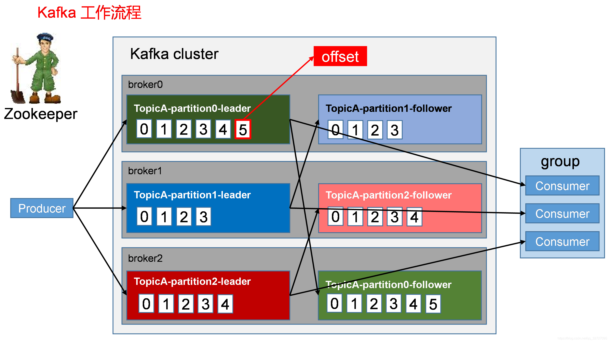

### 1.1.3. 基本概念
<a href="#menu" >目录</a>

* 主题(topic)
    * Kafka消息通过主题进行分类
    * 通过主题进行不同类别的消息分类
    * 生产者把消息发送到主题，消费者订阅主题或者主题的某些分区进行消费
* 消息Record
    * Kafka的基本单位
    * 由一个固定长度的消息头和可变长度的消息体构成
    * 在老版本中，每一条消息称为Message,新版本Java客户端实现，每一条消息称为Record
* 分区Partitions
    * 一个主题可以设置多个分区,分区编号从0开始
    * 主题中的消息将会通过相关负载均衡算法发送到各个分区
    * 消息以追加的方式加入到分区中,是顺序写磁盘，因此效率高
    * 分区可以分布在不同的服务器上，一般会分散在不同的broker上，当只有一个broker时，所有的分区就只分配到该Broker上
    * 使用分区是一是为了保证高可用，一个分区挂了，还有其他分区可用。二是为了提高吞吐率。
    * 消息无法在主题层面保证消息的顺序性，只能保证在单个分区内的顺序性
    * 参数partions用于配置分区数
    * Kafka不会立即删除已被消费的消息，会根据分区的大小或者消息的时间长度进行删除
    * 理论上来说，分区越多吞吐量越高
    * kafka不会立即删除已经被消费的消息，提供了基于消息已存储的时间长度，二是基于分区的大小，相关配置在broker配置文件中配置
    * 分区在物理上对应一个文件夹，kafka会为每个分区创建一个文件夹，名称格式为topicName－partitionNum
分区文件夹
```yml
00000000000000000000.index 
00000000000000000000.log
00000000000000000000.timeindex

00000000000000000024.index
00000000000000000024.log     
00000000000000000024.timeindex  
00000000000000000024.snapshot

00000000000000000103.index 
00000000000000000103.log     
00000000000000000103.timeindex
00000000000000000103.snapshot

leader-epoch-checkpoint

```
* 副本Replication
    * 分区分为Leader副本和Follower副本，每个分区只有一个leader副本，其他都是follower副本。而不是broker分为Leader和Follower。
    * 总副本的数量不能超过broker的数量
    * 默认情况下，如果有多个broker,那么kafka就会将Leader副本均匀创建在不同的broker上，然后在其他的broker上创建它的Follower副本
    * 只有Leader才处理客户端的读写请求，Follwer副本从Leader副本同步数据，如果Leader失效，会通过相应的算法选举新的Leader副本。
    * 使用副本是为了消息的高可用
    
* 生产者
    * 生产者产生消息，一条消息会被负载均衡到对应主题的各个分区上
    * 生产者也可以自定义分区策略

* 消费者
    * 消费者订阅一个或者多个主题，并按照消息生成的顺序读取它们
    * 消费者通过检查偏移量来区分已经读取过的消息
    * 消费者（ Comsumer）以拉取（ pull ）方式拉取数据，它是消费的客户端。在 Kafka 中每一个消费者都属于一个特定消费组（ ConsumerGroup ），我们可以为每个消费者指定一个消费组，以 groupld 代表消费组名称，通过 group.id 配置设置 。 如果不指定消费组，则该消费者属于默认消费组 test-consumer-group 。 同时，每个消费者也有一个全局唯一的 id ， 通过配置项 client.id指定，如果客户端没有指定消费者的 id, Kafka 会自动为该消费者生成一个全局唯一的 id，格式为$ {groupld}-${hostName}-${timestamp}-$ {UUID 前 8 位字符｝。
    * 同一个主题的一条消息只能被同一个消费组下某一个消费者消费，但不同消费组的消费者可同时消费该消息。 消费组是 Kafka用来实现对一个主题消息进行广播和单播的手段，实现消息广播只需指定各消费者均属于不同的消费组，消息单播则只 需让各消费者属于同一个消费组 。

* 消费组
    * 消费者按组进行区分
    * 同一个主题中的一条消息只能被同一群组的消费者中的消费一次
    * 同一个主题中的一条消息可以被不同的群组共同消费
* 偏移量
    * 任何发布到分区的消息会被直接追加到日志文件(分区目录下.log结尾的日志文件)
    * 每条消息在日志中的位置都会对应一个按序递增的偏移量
    * 偏移量是一个分区下严格按序递增的逻辑值，并不是消息在磁盘上的物理位置
    * Kafka并没有给偏移量再提供索引，消费者可以通过设置不同的偏移量来消费消息
    * 新版本的偏移量不是保存在zk中，而是保存在_consumer_offset的topic中
    * 只有客户端提交偏移量时才会被保存到该topic中，消费者也可以使用其他方式进行保存，比如数据库，重启的时候从数据库中读取。

* 日志段
    * 一个日志又分为多个日志段(LogSegment)
    * 日志段是kafkar日志对象分片的最小单位
    * 日志段也是一个逻辑概念，一个日志段对应磁盘上一个具体日志文件和两个索引文件。日志文件是以 “ .log”为文件名后缀的数据文件，用于保存消息实际数据 。两个索引文件分别以“ .index ”和“ .timeindex ”作为文件名后缀，分别表示消息偏移量索引文件和消息时间戳索引文件。

* broker
    * 一个独立的Kafka服务器被称为broker
    * 接收来自生产者的消息，为消息设置偏移量，并保存到磁盘中
    * 消费者也是通过broker消费消息
    * 在硬件性能的保证下，单个broker可以处理数千个分区以及每秒百万级的消息量
    * 每一个代理都有唯一的标识 id，这个 id 是一个非负整数。在一个 Kafka集群中，每增加一个代理就需要为这个代理配置一个与该集群中其他代理不同的 id, id 值可以选择任意非负整数即可，只要保证它在整个 Kafka 集群中唯一，这个 id 就是代理的名字，也就是在启动代理时配置的 broker.id 对应的值
* 集群
    * 多个broker组成集群
    * 每一个集群都有一个broker作为控制器Ｃontroller
    * 控制器
        * 从集群的活跃成员中选出来
        * 控制器负责管理工作
        * 包括将分区分配给broker和监控broker
    * 所有的broker都会监听控制器的状态，如果控制器一旦失效，则会选举出新的控制器

* ISR
    * kafka在zk中动态维护了一个ISR（In-sync-Replica）,用于保存同步的副本列表
    * 保存的是与Leader保持消息同步的所有副本对应的代理节点id.
    * 如果一个 Follower副本岩机（本书用岩机来特指某个代理失效的情景，包括但不限于代理被关闭，如代理被人为关闭或是发生物理故障、心跳检测过期、网络延迟、进程崩溃等）或是落后太多，则该 Follower副本节点将从 ISR 列表中移除 。
    * ISR副本需要满足的条件
        * 副本所在的节点必须保持与zk的连接
        * 副本最后一条消息offset与Leader副本的最后一条消息的offset之间的差值必须在一定的阈值内

* zookeeper作用
    * Kafka 利用 ZooKeeper 保存相应元数据信息， Kafka 元数据信息包括如代理节点信息、 Kafka集群信息、旧版消费者信息及其消费偏移量信息、主题信息、分区状态信息、分区副本分配方案信息、动态配置信息等。
    

* 使用场景
    * 具有高吞吐量来支持诸如实时的日志集这样的大规模事件流。
    * 能够很好地处理大量积压的数据，以便能够周期性地加载离线数据进行处理 。
    * 能够低延迟地处理传统消息应用场景。
    * 能够支持分区、分布式，实时地处理消息，同时具有容错保障机制 。

* 为什么选择kafka
    * 多个生产者
    * 多个消费者
    * 基于磁盘的数据存储
    * 伸缩性
    * 高性能

* kafka特性
    * 消息持久化
    * 高吞吐量
        * Kafka 将数据写到磁盘，充分利用磁盘的顺序读写 。同时， Kafka 在数据写入及数据同步采用了零拷贝（ zero-copy ）技术
        * Kafka 还支持数据压缩及批量发送，同时
        * Kafka 将每个主题划分为多个分区
    * 扩展性
        * 集群动态扩展
    * 多客户端支持
    * Kafka Streams
    * 安全机制
        * 通过 SSL 和 SASL(Kerberos), SASL/PLA时验证机制支持生产者、消费者与代理连接时的身份认证：
        * 支持代理与 ZooKeeper 连接身份验证：
        * 通信时数据加密：
        * 客户端读、写权限认证：
        * Kafka 支持与外部其他认证授权服务的集成 。

    * 数据备份
        * Kafka 可以为每个主题指定副本数，对数据进行持久化备份，这可以 一定程度上防止数据丢失，提高可用性。
    * 轻量级
        * Kafka 的代理是无状态的，即代理不记录消息是否被消费，消费偏移量的管理交由消费者自己或组协调器来维护。同时集群本身几乎不需要生产者和消费者的状态信息，这就使得 Kafka非常轻量级，同时生产者和消费者客户端实现也非常轻量级。

    * 消息压缩
        * Kafka 支持 Gzip, Snappy 、 LZ4 这 3 种压缩方式，通常把多条消息放在一起组成 MessageSet,然后再把 MessageSet 放到一条消息里面去，从而提高压缩比率进而提高吞吐量。


### 1.1.4. zookeeper的作用
<a href="#menu" >目录</a>

**zookeeper必备知识**
* zk的整体结构很像java中的数，zk的单个节点很像java中的接待，也就是一个Node由value值和nexts指针构成；也就是ls /作为根节点，其它节点都派生于此
* ls时用于查看目录结构的命令，比如 ls / 该命令就是查看根目录下的子目录；目录可以理解为zk节点中 指针所表示的内容，而每个节点也有自己的值，可以通过get {path} 即可获到节点的值
* 有的节点只是为了存储值而已，也有的节点完全起到目录的作用，不会存储值(null)，比如kafka存储在zookeeper上的节点信息中 /brokers,/ids只是作为目录；而/controller_epoch只是作为
* Node 可以分为持久节点和临时节点两类。所谓持久节点是指一旦这个 ZNode 被创建了，除非主动进行 ZNode 的移除操作，否则这个 ZNode 将一直保存在 ZooKeeper 上。而临时节点就不一样了，它的生命周期和客户端会话绑定，一旦客户端会话失效，那么这个客户端创建的所有临时节点都会被移除。
* Watcher（事件监听器），是 ZooKeeper 中的一个很重要的特性。ZooKeeper 允许用户在指定节点上注册一些 Watcher，并且在一些特定事件触发的时候，ZooKeeper 服务端会将事件通知到感兴趣的客户端上去，该机制是 ZooKeeper 实现分布式协调服务的重要特性。

**zk节点和watcher在kafka中的体现**

Kakfa Broker集群受Zookeeper管理。所有的Kafka Broker节点一起去Zookeeper上注册一个临时节点，因为只有一个Kafka Broker会注册成功(共同注册/controller，但最终只有一个成功)，其他的都会失败，所以这个成功在Zookeeper上注册临时节点的这个Kafka Broker会成为Kafka Broker Controller，其他的Kafka broker叫Kafka Broker follower。也就是为/Controller节点在ZooKeeper注册Watch。这个Controller会监听其他的Kafka Broker的所有信息，如果这个kafka broker controller宕机了，在zookeeper上面的那个临时节点就会消失，此时所有的kafka broker又会一起去 Zookeeper上注册一个临时节点，因为只有一个Kafka Broker会注册成功，其他的都会失败，所以这个成功在Zookeeper上注册临时节点的这个Kafka Broker会成为Kafka Broker Controller，其他的Kafka broker叫Kafka Broker follower 。例如：一旦有一个broker宕机了，这个kafka broker controller会读取该宕机broker上所有的partition在zookeeper上的状态，并选取ISR列表中的一个replica作为partition leader（如果ISR列表中的replica全挂，选一个幸存的replica作为leader; 如果该partition的所有的replica都宕机了，则将新的leader设置为-1，等待恢复，等待ISR中的任一个Replica“活”过来，并且选它作为Leader；或选择第一个“活”过来的Replica（不一定是ISR中的）作为Leader），这个broker宕机的事情，kafka controller也会通知zookeeper，zookeeper就会通知其他的kafka broker。

**kafka和zookeeper的整体架构**

在Kafka的设计中，选择了使用Zookeeper来进行所有Broker的管理，kafka配置文件中有关kafka和zookeeper的配置如下，意思是每个broker上的本地zookeeper都会注册整个kafka集群的服务信息

```yml
zookeeper.connect=hadoop01:2181,hadoop02:2181,hadoop03:2181
```

```yml
/brokers/ids专门用来进行kafka集群服务器列表记录的点；
/brokers/topics专门用来记录kafka集群服务器中的全部topic；
     /brokers/topics/{topicName}：记录名为xxx的topic
            /brokers/topics/topic-n/partitions：记录每个topic下的全部分区信息，包括一个【offse】
                  /brokers/topics/topic-n/partitions/{partitionNo}：0代表0号分区，1代表1号分区，以此类推
                      /brokers/topics/topic-n/partitions/{partitionNo}/state:存储中央控制器controller选取次数、leader partition所在broker的id，leader选举此时，初始时0，isr信息

/controller:kafka 存储服务器集群注册到zookeeper时成为controller的broker这个节点信息
/controller_epcho:kafka 存储服务器集群注册到zookeeper时成为controller的broker这个节点信息

声明：0.9之前offset存储在zk下，也就是consumer相关的信息存在zk下的consumers下了，但是0.9版本后consumer的信息存储在了brokers上的一块内存中了 /brokers/topics/__consumer_offsets/下存储，其中offset时以topic的分区为单位进行存储的，offset在通过javaapi些代码时会接触到

```
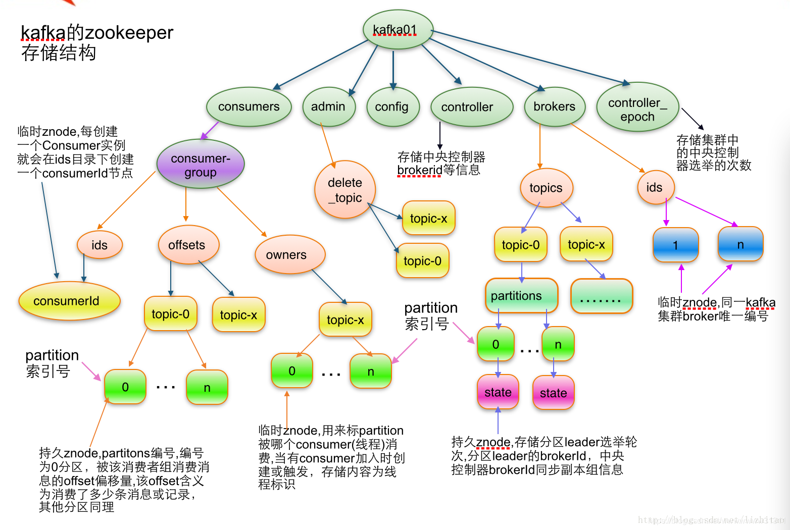

每个Broker服务器在启动时，都会到Zookeeper上进行注册，即创建/brokers/ids/[0-N]的节点，然后写入IP，端口等信息，Broker创建的是临时节点，所有一旦Broker上线或者下线，对应Broker节点也就被删除了，因此我们可以通过zookeeper上Broker节点的变化来动态表征Broker服务器的可用性,Kafka的Topic也类似于这种方式。

### 1.1.5. topic/partition/replication
<a href="#menu" >目录</a>

kafka的消息是通过topic进行区分的，生产者将消息发送到主题，消费者再订阅相关的主题，并从主题上拉取消息。。在创建topic时，需要三个参数，topic名称，partition,replication.

partition主题分区数。kafka通过分区策略，将不同的分区分配在一个集群中的broker上，一般会分散在不同的broker上，当只有一个broker时，所有的分区就只分配到该Broker上。

消息会通过负载均衡发布到不同的分区上，消费者会监测偏移量来获取哪个分区有新数据，从而从该分区上拉取消息数据。

分区数越多，在一定程度上会提升消息处理的吞吐量，因为kafka是基于文件进行读写，因此也需要打开更多的文件句柄，也会增加一定的性能开销。

如果分区过多，那么日志分段也会很多，写的时候由于是批量写，其实就会变成随机写了，随机 I/O 这个时候对性能影响很大。所以一般来说 Kafka 不能有太多的 Partition。

replication-factor用来设置主题的副本数。每个主题可以有多个副本，副本位于集群中不同的broker上，也就是说副本的数量不能超过broker的数量，否则创建主题时会失败。

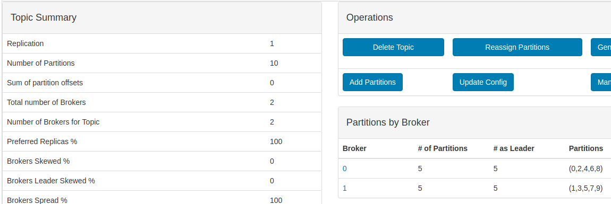
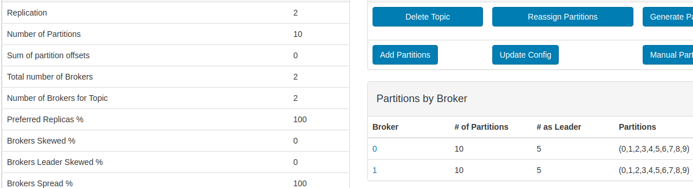

从上面可以看出，总的分区


### 1.1.6. 使用场景
<a href="#menu" >目录</a>


## 1.2. 安装配置
<a href="#menu" >目录</a>

### 1.2.1. 安装&&启动

**安装JDK环境**
**安装ZOOKEEPER**
**安装Kafka**

* 从[官网 http://kafka.apache.org/downloads](http://kafka.apache.org/downloads)下载二进制文件包

**启动**

```bash
./kafka-server-start.sh  -daemon  ../config/server.properties
```
启动后使用jps查看到的应用名称kafka即为启动成功


### 1.2.2. 配置

* broker配置文件位于目录下的config/server.properties

**broker常用配置**

* broker.id
    * broker标识符，必须为整数，默认值为0
    * 集群中必须唯一
* port 
    * 监听端口
* zookeeper.connect
    * zk连接地址
    * localhost:2181，有多个则使用","间隔
* log.dirs
    * 消息存放路径，不需要配置文件名称
* num.recovery.threads.per.data.dir
    * 对于如下三种情况，Kafka会使用可配置的线程池来处理日志片段
        * 服务器正常启动。用于打开每个分区的日志片段
        * 服务器崩溃后重启，用于检查和截短每个分区的日志片段
        * 服务器正常关闭，用于关闭日志片段 
    * 这些线程只是在服务器启动和关闭时会用到
    * 对于包含大量分区来说，一旦发生崩溃，在进行恢复时提高并行数量可以提高很大的处理效率
    * per.data.dir也就是单个目录的线程数，如果log.dirs配置多个，那么总线程数就相乘的结果
* auto.create.topics.enable
    * 默认情况下，Kafka会在如下几种情形下自动创建主题
        * 当一个生产者开始往主题写入消息时
        * 当一个消费者开始从主题读取消息时
        * 当任意一个客户端向主题发送元数据请求
    * 当设置为true时，碰到以上情形将会自动创建，false时需要手动创建
* num.partitions
    * 主题的默认分区数
        * 如何确定
            * 主题需要达到的吞吐量
            * 从单个分区读取数据的最大吞吐量
            * 每个broker包含的分区数，可用的磁盘空间和网络带宽
            * 如果消息是按照不同的键来写入分区的，那么为已有的主题新增分区就会很困难
            * 单个broker对分区个数是有限制的，因为分区数越多，占用的内存越多，完成首领选择的时间越多
* log.retention.ms
    * 
* log.retention.byte
    * 
* log.segment,bytes
    * 
* message.max.bytes
    * 限制单个消息的大小，默认是1000000（1MB）
    * 如果发送的消息超过这个值，将会返回错误
    * 这个参数限制的是压缩后的大小
    * 值越大，那么负责处理网络连接和请求的线程就需要花越多的时间来处理这些请求，从而影响IO的吞吐量
    * 消费者客户端的fetch.max.bytes如果小于该值，当消息大于fetch.max.bytes将会无法接收这个消息，集群的replca.fetch.max.bytes,也遵循这个原则

**硬件的选择**
* 磁盘吞吐量
* 磁盘容量
* 内存
* 网络
* CPU

**垃圾回收器选项**
* G1参数
    * MaxGCPauseMillis
        * 每次垃圾回收的停顿时间，默认是200ms
    * InitiatingHeapOccupancyPercent
        * 指定了G启动新一轮垃圾回收之前可用的的堆内存百分比，默认是45，也就是堆内存使用率达到45%之前，不会进行垃圾回收操作。这个百分比包括新生代和老年代
    * kafka对堆内存使用率非常高，容易产生垃圾，上面两个只可以设小一些，减少暂停时间以及早一些启动垃圾回收
    * kafka启动脚本使用的是ParallelNew,换成G1需要进行修改

### 1.2.3. 脚本说明
<a href="#menu" >目录</a>

kafka的脚本位于bin目录下，常用的有

```yml
kafka-topics.sh：对topic进行增删改查
kafka-server-start.sh：启动脚本
kafka-server-stop.sh：关闭脚本
kafka-consumer-groups.sh：展示所有的消费者组的信息 ，消费者消费的分区也会在这个脚本内显示出来
kafka-reassign-partitions.sh：重新分配partitions
kafka-preferred-replica-election.sh：每个partitions leader的重新分配
kafka-console-consumer.sh：消费者控制台 / 常用测试
kafka-console-producer.sh：生产者控制台 / 常用测试
```

#### 1.2.3.1. 性能测试脚本详解

```yml
生产者性能测试脚本：kafka-producer-perf-test.sh
消费者性能测试脚本：kafka-consumer-perf-test.sh
```
**kafka-producer-perf-test.sh**

支持测试的性能指标包括：吞吐量（throughput）、最大时延（max-latency）、平均时延（avg-latency）；kafka-consumer-perf-test.sh 同样支持吞吐量指标，还提供了一些消费端特有的指标，但没有直接提供时延信息。

```yml
参数名 含义
-h, --help 显示使用帮助并退出
–topic 指定生产的消息发往的 topic
–num-records 指定生产的消息总数
–payload-delimeter 如果通过 --payload-file 指定了从文件中获取消息内容，那么这个参数的意义是指定文件的消息分隔符，默认值为 \n，即文件的每一行视为一条消息；如果未指定 --payload-file 则此参数不生效
–throughput 限制每秒发送的最大的消息数，设为 -1 表示不限制
–producer-props 直接指定 Producer 配置，格式为 NAME=VALUE，例如 bootstrap.server=127.0.0.1:9092，通过此种方式指定的配置优先级高于 --producer.config
–producer-config 指定 Producer 的配置文件，格式参照官方的 config/producer.properties
–print-metrics 在测试结束后打印更详尽的指标，默认为 false
–transactional-id 指定事务 ID，测试并发事务的性能时需要，只有在 --transaction-duration-ms > 0 时生效，默认值为 performance-producer-default-transactional-id
–transactional-duration-ms 指定事务持续的最长时间，超过这段时间后就会调用 commitTransaction 来提交事务，只有指定了 > 0 的值才会开启事务，默认值为 0
–record-size 指定每条消息的大小，单位是字节，和 --payload-file 两个中必须指定一个，但不能同时指定
–payload-file 指定消息的来源文件，只支持 UTF-8 编码的文本文件，文件的消息分隔符通过 --payload-delimeter 指定，和 --record-size 两个中必须指定一个，但不能同时指定
```

实例
```yml
bin/kafka-producer-perf-test.sh --topic perf-test --num-records 1000 --record-size 1024 --throughput -1 --producer-props bootstrap.servers=127.0.0.1:9092 compression.type=lz4
```
发送 1000 条大小为 1KB 的消息到地址为 127.0.0.1:9092 的 broker 上的 perf-test 主题，发送时不限制吞吐量，并使用 lz4 算法压缩消息。

执行示例命令后，控制台输出一行测试结果，如下：

```yml
1000 records sent, 3424.657534 records/sec (3.34 MB/sec), 13.61 ms avg latency, 255.00 ms max latency, 13 ms 50th, 20 ms 95th, 255 ms 99th.

```
成功消费了 1000 条消息，吞吐量为 3424.657534 条/秒 (或 3.34 MB/秒)，平均时延为 13.61 ms，最大时延为 255.00 ms，50 % 的消息延时在 13 ms 内，95 % 的消息延时在 20 ms 内，99 % 的消息延时在 255 毫秒内。


**kafka-consumer-perf-test.sh**

此脚本用于测试 Kafka 消费消息的性能，可选参数列表如下，加粗项为常用参数。

```yml
参数名 含义
–bootstrap-server 指定 broker 地址，必选，除非用 --broker-list 代替（不建议）
–topic 指定消费的 topic，必选
–version 输出 Kafka 版本
–consumer.config 指定 Consumer 配置文件
–date-format 指定用于格式化 *.time 的规则，默认为 yyyy-MM-dd HH:mm:ss:SSS
–fetch-size 指定一次请求消费的大小，默认为 1048576 即 1 MB
–from-latest 如果 Consumer 没有已经建立的 offset，则指定从 log 中最新的位点开始消费，而不是从最早的位点开始消费
–group 指定 ConsumerGroup ID，默认为 perf-consumer-40924
–help 显示使用帮助并退出
–hide-header 指定后不输出 header 信息
–messages 指定消费的消息数量，必选
–num-fetch-threads 指定 fetcher 线程的数量
–print-metrics 指定打印 metrics 信息
–reporting-interval 指定打印进度信息的时间间隔，默认为 5000 即 5 秒
–show-detailed-stats 指定每隔一段时间（由 --reporting-interval 指定）输出显示详细的状态信息
–socket-buffer-size 指定 TCP 的 RECV 大小，默认为 2097152 即 2 MB
–threads 指定消费的线程数，默认为 10
–timeout 指定允许的最大超时时间，即每条消息返回的最大时间间隔，默认为 10000 即 10 秒
```
```yml
bin/kafka-consumer-perf-test.sh --bootstrap-server 127.0.0.1:9092 --topic perf_test --messages 1000000 --threads 8 --reporting-interval 1000 --show-detailed-stats
```

同时开启 8 个消费线程，从 127.0.0.1:9092 的 broker 上的 perf-test 主题中消费 1000 条消息，每隔 1000 ms = 1 s 打印一次消费进度信息。最后两个参数在消费数量很小的场景下没有什么帮助，比如若消费数量只有 1000，命令瞬间就可以执行返回；但当指定的消费数量很大（如示例中为 1000 万）时，需要 10 s 左右才能消费完，此时定时输出一下进度信息就显得很有用了。

执行示例命令后，控制台输出两行信息，其中第一行为表头，接下来的数行为每秒的进度信息，如下：

```yml
time, threadId, data.consumed.in.MB, MB.sec, data.consumed.in.nMsg, nMsg.sec, rebalance.time.ms, fetch.time.ms, fetch.MB.sec, fetch.nMsg.sec
2021-03-25 15:57:59:426, 0, 657.2275, 657.2275, 673001, 673001.0000, 1616659078690, -1616659077690, 0.0000, 0.0000
```
输出解释
```yml
time：当前时间，格式由 --date-format 指定
threadId：线程 ID
data.consumed.in.MB：消费到的数据总大小，单位为 MB
MB.sec：消费 TPS，即每秒消费的消息大小
data.consumed.in.nMsg：消费到的总消息数
nMsg.sec：消费 TPS，即每秒消费的消息条数
rebalance.time.ms：消费者组重平衡的耗时，单位为 ms，0 表示没有发生重平衡
fetch.time.ms：fetch 线程的总耗时，单位为 ms
fetch.MB.sec：fetch 线程每秒钟获取到的消息大小
fetch.nMsg.sec：fetch 线程每秒钟获取到的消息数量
```
注意

若没有指定 --show-detailed，则输出信息中的前两项会有所不同，如下：
```yml
start.time, end.time, data.consumed.in.MB, MB.sec, …
start.time：消费开始的时间，格式由 --date-format 指定
end.time：消费结束的时间，格式由 --date-format 指定
```


### 1.2.4. 监控平台
<a href="#menu" >目录</a>

#### 1.2.4.1. Kafka-eagle监控平台
<a href="#menu" >目录</a>

下载地址:http://www.kafka-eagle.org/

修改配置文件 system-config.properties,填写zk地址和mysql地址

启动:./ke.sh start

#### 1.2.4.2. kafka-manager监控平台
<a href="#menu" >目录</a>

下载地址:https://github.com/yahoo/CMAK

启动zk集群，kafka集群，再启动kafka-manager服务。

```yml
#1.配置application.conf里面的zk连接地址
kafka-manager.zkhosts="localhost:2181"
#2.启动kafka-manager 默认端口是9000　，可通过-Dhttp.port修改
./kafka-manager -Dconfig.file=conf/application.conf -Dhttp.port=8080 &
#3.访问　localhost:9000
#4.打开页面后点击'add cluster'
#5.cluster名称可以随便写，必须要填写的是zk的地址
#6.连接集群成功后就可以对topic进行增删改查
```


## 1.3. 生产者和消费者
<a href="#menu" >目录</a>

### 1.3.1. 配置
<a href="#menu" >目录</a>

#### 1.3.1.1. 默认配置

**生产者默认配置**
```yml
acks = 1
batch.size = 16384
bootstrap.servers = []
buffer.memory = 33554432
client.dns.lookup = default
client.id = 
compression.type = none
connections.max.idle.ms = 540000
delivery.timeout.ms = 120000
enable.idempotence = false
interceptor.classes = []
key.serializer = class org.apache.kafka.common.serialization.StringSerializer
linger.ms = 0
max.block.ms = 60000
max.in.flight.requests.per.connection = 5
max.request.size = 1048576
metadata.max.age.ms = 300000
metric.reporters = []
metrics.num.samples = 2
metrics.recording.level = INFO
metrics.sample.window.ms = 30000
partitioner.class = class org.apache.kafka.clients.producer.internals.DefaultPartitioner
receive.buffer.bytes = 32768
reconnect.backoff.max.ms = 1000
reconnect.backoff.ms = 50
request.timeout.ms = 30000
retries = 2147483647
retry.backoff.ms = 100
sasl.client.callback.handler.class = null
sasl.jaas.config = null
sasl.kerberos.kinit.cmd = /usr/bin/kinit
sasl.kerberos.min.time.before.relogin = 60000
sasl.kerberos.service.name = null
sasl.kerberos.ticket.renew.jitter = 0.05
sasl.kerberos.ticket.renew.window.factor = 0.8
sasl.login.callback.handler.class = null
sasl.login.class = null
sasl.login.refresh.buffer.seconds = 300
sasl.login.refresh.min.period.seconds = 60
sasl.login.refresh.window.factor = 0.8
sasl.login.refresh.window.jitter = 0.05
sasl.mechanism = GSSAPI
security.protocol = PLAINTEXT
security.providers = null
send.buffer.bytes = 131072
ssl.cipher.suites = null
ssl.enabled.protocols = [TLSv1.2, TLSv1.1, TLSv1]
ssl.endpoint.identification.algorithm = https
ssl.key.password = null
ssl.keymanager.algorithm = SunX509
ssl.keystore.location = null
ssl.keystore.password = null
ssl.keystore.type = JKS
ssl.protocol = TLS
ssl.provider = null
ssl.secure.random.implementation = null
ssl.trustmanager.algorithm = PKIX
ssl.truststore.location = null
ssl.truststore.password = null
ssl.truststore.type = JKS
transaction.timeout.ms = 60000
transactional.id = null
value.serializer = class org.apache.kafka.common.serialization.StringSerializer
```
**消费者默认配置**
```yml
allow.auto.create.topics = true
auto.commit.interval.ms = 5000
auto.offset.reset = latest
bootstrap.servers = []
check.crcs = true
client.dns.lookup = default
client.id = 
client.rack = 
connections.max.idle.ms = 540000
default.api.timeout.ms = 60000
enable.auto.commit = true
exclude.internal.topics = true
fetch.max.bytes = 52428800
fetch.max.wait.ms = 500
fetch.min.bytes = 1
group.id = null
group.instance.id = null
heartbeat.interval.ms = 3000
interceptor.classes = []
internal.leave.group.on.close = true
isolation.level = read_uncommitted
key.deserializer = class org.apache.kafka.common.serialization.StringDeserializer
max.partition.fetch.bytes = 1048576
max.poll.interval.ms = 300000
max.poll.records = 500
metadata.max.age.ms = 300000
metric.reporters = []
metrics.num.samples = 2
metrics.recording.level = INFO
metrics.sample.window.ms = 30000
partition.assignment.strategy = [class org.apache.kafka.clients.consumer.RangeAssignor]
receive.buffer.bytes = 65536
reconnect.backoff.max.ms = 1000
reconnect.backoff.ms = 50
request.timeout.ms = 30000
retry.backoff.ms = 100
sasl.client.callback.handler.class = null
sasl.jaas.config = null
sasl.kerberos.kinit.cmd = /usr/bin/kinit
sasl.kerberos.min.time.before.relogin = 60000
sasl.kerberos.service.name = null
sasl.kerberos.ticket.renew.jitter = 0.05
sasl.kerberos.ticket.renew.window.factor = 0.8
sasl.login.callback.handler.class = null
sasl.login.class = null
sasl.login.refresh.buffer.seconds = 300
sasl.login.refresh.min.period.seconds = 60
sasl.login.refresh.window.factor = 0.8
sasl.login.refresh.window.jitter = 0.05
sasl.mechanism = GSSAPI
security.protocol = PLAINTEXT
security.providers = null
send.buffer.bytes = 131072
session.timeout.ms = 10000
ssl.cipher.suites = null
ssl.enabled.protocols = [TLSv1.2, TLSv1.1, TLSv1]
ssl.endpoint.identification.algorithm = https
ssl.key.password = null
ssl.keymanager.algorithm = SunX509
ssl.keystore.location = null
ssl.keystore.password = null
ssl.keystore.type = JKS
ssl.protocol = TLS
ssl.provider = null
ssl.secure.random.implementation = null
ssl.trustmanager.algorithm = PKIX
ssl.truststore.location = null
ssl.truststore.password = null
ssl.truststore.type = JKS
value.deserializer = class org.apache.kafka.common.serialization.StringDeserializer
```

配置示例
```java
Properties props = new Properties();
props.put("bootstrap.servers","127.0.0.1:9092,127.0.0.1:9093");
props.put(ProducerConfig.BATCH_SIZE_CONFIG,"500");
props.put(ProducerConfig.LINGER_MS_CONFIG,"0");
kafkaProducer = new KafkaProducer(props());
```
如果一个配置需要多个值，则多个值之间用逗号相隔，键的类型必须是String
```java
//只有第二个配置有效，同一个键后配置的会覆盖掉前面的配置
props.put("bootstrap.servers","127.0.0.1:9092");
props.put("bootstrap.servers","127.0.0.1:9093");
```

#### 1.3.1.2. 客户端共同的配置
<a href="#menu" >目录</a>

客户端共同的配置在类中:CommonClientConfigs

* bootstrap.servers
    * 服务器地址列表["ip1:port1,ip2:port2"]
    * 用于建立到Kafka群集的初始连接的主机/端口对的列表。客户机将使用所有服务器而不仅仅使用这里配置的节点。因为这些服务器地址仅用于初始化连接，并通过现有配置的来发现全部的kafka集群成员（集群随时会变化），所以此列表不需要包含完整的集群地址（但尽量多配置几个，以防止配置的服务器宕机）
* client.dns.lookup
    * 控制客户端如何使用DNS查找。如果配置为use_all_dns_ips，则依次连接到每个返回的IP地址，直到成功建立连接。如果配置为resolve_canonical_bootstrap_servers_only，则将每个引导地址解析成一个canonical名称列表。
* metadata.max.age.ms
    * 强制刷新元数据的周期时间。即使没有任何分区领导层更改，也可以主动发现任何新的代理或分区。
* send.buffer.bytes
    * 发送数据时要使用的TCP发送缓冲区的大小（SO_SNDBUF）。如果值为-1，则使用OS默认值
* receive.buffer.bytes
    * 读取数据时要使用的TCP接收缓冲区（SO_RCVBUF）的大小。如果值为-1，则使用OS默认值
* client.id
    * 发出请求时要传递给服务器的id字符串，这样做的目的是通过允许在服务器端请求日志记录中包含逻辑应用程序名称，从而能够跟踪ip/端口以外的请求源
* client.rack
    * 此客户端的机架标识符。这可以是任何字符串值，指示此客户端的物理位置。它与broker配置“broker.rack”相对应
* reconnect.backoff.ms
    * 尝试重新连接到给定主机之前等待的基本时间量。这样可以避免在紧密循环中重复连接到主机。此回退适用于客户端到代理的所有连接尝试。
* reconnect.backoff.max.ms
    * 重新连接到重复连接失败的代理时等待的最大时间（毫秒）
    * 如果backoff.max.ms　大于　backoff.ms，则重复连接的等待时间将会根据尝试失败次数进行动态调整，否则就固定使用backoff.ms
* retries
    * 默认值：Integer.MAX_VALUE。 范围：[0,Integer.MAX_VALUE]
    * 设置一个大于零的值将导致客户端重新发送任何出现暂时性错误而发送失败的记录。此重试与客户端在收到错误时重新发送记录没有区别。如果 MAX_IN_FLIGHT_REQUESTS_PER_CONNECTION 设置的不是1，那么重试可能改变消息到达partition的顺序。比如第一个消息失败了重试，第二个消息成功，那么第二个消息可能先于第一个达到partition。 在配置了 DELIVERY_TIMEOUT_MS_CONFIG 的超时时间后，即使重试次数没有使用完，但是超时时间已到，那么也会失败。同城情况下，可以不设置此属性，而使用 DELIVERY_TIMEOUT_MS_CONFIG 来控制。 
* retry.backoff.ms
    * 默认值：100L
    * 尝试重试对给定主题分区的失败请求之前等待的时间量。这样可以避免在某些故障情况下以紧密循环的方式重复发送请求。
* metrics.sample.window.ms
    * 默认值：30000
    * 计算度量样本的时间窗口。
* metrics.num.samples
    * 默认值：2
    * 为计算度量而保留的样本数。
* metrics.recording.level
    * 默认值：INFO。 可选值：INFO，DEBUG
    * 度量的最高记录级别。
* metric.reporters
    * 默认值：空
    * 用作度量报告器的类的列表。 是org.apache.kafka.common.metrics.MetricsReporter接口的实现类。JmxReporter总是包含在注册JMX统计信息中。 
* security.protocol
    * 默认值：PLAINTEXT
    * 和服务器的通讯协议。可能的值是：Utils.join(SecurityProtocol.names(), ", ")
* connections.max.idle.ms
    * 默认值：9*60*1000
    * 在此配置指定的毫秒数之后关闭空闲连接。
* request.timeout.ms
    * 默认值：30*1000
    * 配置控制客户端等待请求的响应的最大时间。如果在超时时间到达之前仍然没有得到响应，那么将重试或者得到失败。此配置的值应该大于 replica.lag.time.max.ms 的值，以减少由于不必要的生产者重试而导致消息重复的可能性
* group.id
    * 消费者所属的消费者组的唯一标识。下面2种情况下，group.id必须要设置：(1)：基于kafka的offset管理策略。 (2)：KafkaConsumer使用subscribe接口订阅消息。
    * 如果多个消费者同时订阅同一个topic，需要一个消息可以被多个消费者消费，那么group.id需要设置不同，设置相同时，消息只能被其中一个消费者消费。
* group.instance.id
    * 消费者实例ID，只允许非空字符串。如果设置，则使用者将被视为静态成员，这意味着在任何时候消费者组中只允许有一个具有此ID的实例。如果不设置，消费者将作为动态成员加入群，这是传统行为
* max.poll.interval.ms
    * 默认值：300000毫秒
    * 使用消费者组管理时，调用poll命令的最大延迟时间。此值是消费者获取记录前的最大空闲时间。如果消费者在此超时时间到达之前没有调用poll命令，则认为此消费者是失败的，此时会触发消费者组的再平衡，以便将此分区分配给其它的消费者。如果消费者的 group.instance.id 配置是非空的，那么达到此超时时间，不会立刻重新分配分区，此时消费者将停止发送心跳消息，在到达 session.timeout.ms 配置的超时时间后，分区才会被重新分配。此反映的是已关闭消费者的行为。
* rebalance.timeout.ms
    
* session.timeout.ms
    * 默认值：10000毫秒
    * 消费者组里面，检测消费者失败的会话超时时间。消费者会固定周期发送心跳消息到服务端，当服务端在指定时间内没有收到心跳消息，则认为消费者丢失。这时候，服务端会从消费者组里踢出该节点，然后重新再平衡。需要注意的是：该值必须在 group.min.session.timeout.ms 和group.max.session.timeout.ms 之间。
* heartbeat.interval.ms
    * 默认值：3000毫秒
    * kafka消费组里面期望的心跳间隔时间。心跳是用来确保消费者会议保持活跃，并在新消费者加入或离开团体时促进再平衡。该值必须设置为低于session.timeout.ms的配置。但通常应设置为比这个值的三分之一还小。

#### 1.3.1.3. 生产者独有的配置
<a href="#menu" >目录</a>

* batch.size
    * 默认值：16384
    * 每当多个消息发送到同一个partition，生产者将尝试将记录批处理到一起，以减少请求。这有助于提高客户机和服务器的性能。此配置控制以字节为单位的默认批处理大小。不会尝试批处理大于此大小的记录。发送到代理的请求将包含多个批处理，每个分区一个批处理。比较小的batch.size并不是很通用，并可能降低吞吐量。一个非常大的batch.size可能会使用内存有点浪费，因为我们总是分配一个指定批量大小的缓冲区，以预期其他记录。
    * 这个值不单指消息本身，还包括键等的占用空间
* acks
    * 默认值："1"，可选值："all", "-1", "0", "1"
    * Leader收到的应答数以确定生产者请求是否处理完成。
    * 如果设置为0，生产者将不会等待服务端的应答，消息将立即添加到套接字缓冲区并被视为已发送。在这样的情况下，不能保证消息已发送到服务端，而且 retries 配置将不会生效。
    * 如果设置为1, 消息被发送到Leader，并写入Leader的log后，并不会等待follow的应答就直接响应。在这样的情况下，Leader可以确定收到消息，但是Follow可能会存在消息丢失。
    * 如果设置为all，那Leader会等待所有的follow都应答后再响应。这强力保证了消息不会丢失。
    * 如果设置为-1，效果和设置为all一样。
* linger.ms
    * 默认值：0
    * 生产者将在请求传输之间到达的所有记录组合到一个单独的批处理请求中。通常情况下，只有当记录到达的速度比发送的速度快时，才会发生这种情况。但在某些情况下，客户可能希望即使在合适负载下也要减少请求数。这个配置设置的是一个延迟。这样生产者不必立马发送消息，而是等待配置的时间，以便进行批量发送消息，这个类似于TCP中的Nagle算法。当我们配置了 BATCH_SIZE_CONFIG 后，linger.ms是等待的上限，即使消息字节数没有达到配置的值。如果LINGER_MS_CONFIG 配置为0，表示不等待。
* delivery.timeout.ms
    * 默认值：120*1000 毫秒
    * 调用 send() 方法后，报告成功或者失败的时间上限。这个配置限制了消息延迟发送，等待服务端确认，失败重试的最大时间上限。当遇到不可恢复的错误，重试次数已用尽，当时间没有达到这个上限值，也会提前返回结果。此值应该不小于 REQUEST_TIMEOUT_MS_CONFIG 和 LINGER_MS_CONFIG 之和的值。
* max.request.size
    * 默认值：1024*1024
    * 请求的最大大小（字节）。当生产者批量发送消息时候，该设置限制着最大值，以免发送一个超大的请求。注意服务端也有一个请求的最大值，可能和这个值不一样。
* max.block.ms
    * 默认值：60*1000
    * 控制 KafkaProducer.send() 和 KafkaProducer.partitionsFor() 命令的阻塞时间。由于缓冲区已满或元数据不可用，这些方法可能被阻止。用户提供的序列化程序或分区程序中的阻塞将不计入此超时。
* buffer.memory
    * 默认值：32*1024*1024L
    * 生产者可以用来缓冲等待发送到服务器的记录的总内存字节数。如果发送记录的速度比传输到服务端的速度快，那么生产端将被阻塞 MAX_BLOCK_MS_CONFIG 配置的时间，然后会抛出异常。此设置应大致与生产者将使用的总内存相对应，但不是硬限制。因为不是所有生产者都使用的缓冲。
* compression.type
    * 默认值：none
    * 生产者生成的所有数据的压缩类型。默认值为none，表示无压缩。有效值为：none，gzip，snappy，lz4，zstd。压缩是对整批数据的压缩，所以批处理的效果也会影响压缩比。
* max.in.flight.requests.per.connection
    * 默认值：5
    * 在阻塞之前，客户端将在单个连接上发送的最大未确认请求数。请注意，如果将此设置设置为大于1并且存在失败的发送，则存在由于重试而导致消息重新排序的风险。
* key.serializer
    * 默认值：无
    * 接口org.apache.kafka.common.serialization.Serializer的实现类，用以对KEY进行序列化。
* value.serializer
* partitioner.class
    * 默认值：无
    * 接口org.apache.kafka.clients.producer.Partitioner的实现类，用以自定义分片算法。
* interceptor.classes
    * 默认值：空
    * 接口 org.apache.kafka.clients.producer.ProducerInterceptor 的实现类的拦截器列表。允许消息在发送到Kafka集群之前，对消息进行拦截。默认情况，是没有拦截器的。
* enable.idempotence
    * 默认值：false
    * 当设置为“true”时，生产者将确保流中只写入每条消息的一个副本。如果“false”，则由于服务端失败等原因导致的生产者重试可能会在流中写入重试消息的副本。需要注意的是，如果设置为true，那么配置 MAX_IN_FLIGHT_REQUESTS_PER_CONNECTION 的值必须小于等于5，RETRIES_CONFIG配置必须大于0，ACKS_CONFIG 配置必须是all。如果用户未明确设置这些值，则将选择合适的值。如果设置了不兼容的值，将抛出ConfigException。
* transaction.timeout.ms
    * 默认值：60000
    * 事务协调器在主动中止正在进行的事务之前等待生产者更新事务状态的最长时间（毫秒）。如果此值大于代理中的transaction.max.timeout.ms设置，求将失败，并出现InvalidTransactionTimeout错误。
* transactional.id
    * 默认值：无
    * 用于事务传递的TransactionalId。这支持跨多个生产者会话的可靠性语义，因为它允许客户机保证在启动任何新事务之前，使用相同TransactionalId的事务已经完成。如果未提供TransactionalId，则生产者仅限于幂等传递。请注意，如果配置了TransactionalId，那么enable.idempotence的配置必须是true。默认值为null，这意味着不能使用事务。

#### 1.3.1.4. 消费者独有的配置
<a href="#menu" >目录</a>

* max.poll.records
    * 默认值：500
    * 单次poll请求获取的最大记录条数。
* enable.auto.commit
    * 默认值：true
    * 如果为true，消费者的offset将在周期性的在后台自动提交。
* auto.commit.interval.ms
    * 默认值：5000毫秒
    * 消费者自动提交offset的频率。当enable.auto.commit的值为true时有效。
* partition.assignment.strategy
    * 默认值：RangeAssignor.class
    * 当使用组管理时，客户端将使用分区分配策略的类名来分配消费者实例之间的分区所有权。通过实现org.apache.kafka.clients.consumer.ConsumerPartitionAssignor接口，可以插入自定义分配策略。
* auto.offset.reset
    * 默认值：latest。可选值（"latest", "earliest", "none"）
    * 如果Kafka的分区中没有初始偏移量，或者服务器上不再存在当前偏移量（例如，因为该数据已被删除），该怎么办：
        * earliest：自动将偏移量重置为最早偏移量,从最初位置开始拉取数据
        * latest：自动将偏移量重置为最新偏移量，也就是未读的数据不再读取，直接拉取最新写入的数据
        * none：消费者组没有找到位置偏移量，抛出异常
* fetch.min.bytes
    * 默认值：1
    * 从服务器上获取请求返回的最小数据量。如果没有足够的数据可用，请求将等待大量数据积累后再回答请求。默认设置为1字节意味着只要有一个字节的数据可用，或者提取请求在等待数据到达时超时，提取请求就会得到响应。将此值设置为大于1的值将导致服务器等待更大数量的数据累积，这会稍微提高服务器吞吐量，但会增加一些延迟。
* fetch.max.bytes
    * 默认值：50*1024*1024（50M）
    * 每个请求从服务器上返回的最大数据量。消费者批量从服务端获取数据，如果获取到的第一个非空的partition的数量大于该值，则仍然会返回。服务器端最大的返回数据量由 message.max.bytes 配置决定（这个是服务端的配置）。或者通过topic的 max.message.bytes 配置设置。
* fetch.max.wait.ms
    * 默认值：500毫秒。
    * 如果没有足够的数据来立即满足fetch.min.bytes给出的要求，则服务器在响应fetch请求之前将阻止的最长时间。
* max.partition.fetch.bytes
    * 默认值：1*1024*1024 （1M）。
    * 每个请求从服务器上每个分区返回的最大数据量。消费者批量从服务端获取数据，如果获取到的第一个非空的partition的数量大于该值，则仍然会返回。 服务器端最大的返回数据量由 message.max.bytes 配置决定（这个是服务端的配置）。或者通过topic的 max.message.bytes 配置设置。
* check.crcs
    * 默认值：true
    * 自动检查已消耗记录的CRC32。这可确保不会发生对消息的在线或磁盘损坏。此检查会增加一些开销，因此在寻求极端性能的情况下可能会禁用它。
* key.deserializer
* value.deserializer
* default.api.timeout.ms
    * 默认值：60000毫秒
    * 消费者API可能阻塞的默认超时时间。没有设置 timeout 参数时，使用该默认值
* interceptor.classes
* exclude.internal.topics
    * 默认值：true
    * 订阅模式的内部topic是否应该从订阅topic中排除
* internal.leave.group.on.close
    * 默认值：true
    * 消费者关闭后，是否从消费者组里移除
* isolation.level
    * 默认值：READ_UNCOMMITTED，可选值：READ_COMMITTED，READ_UNCOMMITTED
    * 控制如何读取事务性写入的消息。如果配置的是 read_committed，那么消费者使用poll命令只能读取事务性提交的消息。如果配置的是 read_uncommitted，那么将得到所以的消息，甚至事务已经中断。非事务性消息在任何一种模式下都将无条件返回。
* allow.auto.create.topics
    *  默认值：true
    *  在订阅或者分配topic时，是否允许在服务端自动创建topic。同时，服务端的auto.create.topics.enable配置也必须为true才能自动创建。

### 1.3.2. 偏移量
<a href="#menu" >目录</a>

#### 1.3.2.1. 什么是偏移量offset

偏移量是每一条消息的逻辑地址，就像数组的下标，但不是每一条消息的物理地址。偏移量在分区中是从0按序递增的，每新增一条消息，该分区的偏移量就会自增，每个分区都有独立的偏移量。消费者可以通过偏移量来消费数据，比如重定位到任何偏移量。

消费者有自己的消费offset，相当于读索引，因此不会超过分区的offset，至于初始的offset是从哪里开始的，一是根据消费者的配置，可以从分区的起始offset或者分区的末尾offset.或者自定义offset.

每次消费者拉取消息后，都需要提交自己的消费offset。

为了保证调用KafkaConsumer.poll()方法时总能返回未被消费者读取过的记录，消费者需要维护每个分区中已读消息对应的偏移量offset，并手动或定时把offset发送给kafka服务端，从而实现消息的不丢失。

对于提交offset主要分2类，一个是自动，一个是手动。通过enable.auto.commit 参数控制。

当=true时，结合auto.commit.interval.ms参数，**消费者每次在进行poll 时会检查是否该提交偏移量，并且自动提交最近一次poll 返回的偏移量。**

当=false时，需要开发者手动提交offset

这里又分为异步提交或同步提交：

同步提交：使用 KafkaConsumer.commitSync() 会提交最新偏移量并等待 broker 对提交请求作出回应。 在成功提交或碰到无法恢复的错误之前会不断重试，会导致应用程序一直阻塞，限制了应用程序的吞吐量。

异步提交：使用 KafkaConsumer.commitAsync() 会提交最新偏移量但无需等待 broker 的响应并且不进行重试。 不进行重试，是因为可能有一个更大的偏移量已经提交成功，重试可能会覆盖到最新的值，导致再均衡后出现重复消息。 该方法在 broker 作出响应时会执行用户指定的回调，回调经常被用于记录提交错误或生成度量指标。 不过如果要在其中进行重试，一定要注意提交的顺序。

**如果没有提交offset会怎么样**

每次提交offset时，kafka会将其存放在topic[__consumer_offsets]

offset未提交分三种情况，第一种从未提交过该分区的消费offset，此时重启消费者，将会根据下面的策略决定从哪里开始消费
```yml
* auto.offset.reset
    * 默认值：latest。可选值（"latest", "earliest", "none"）
    * 如果Kafka的分区中没有初始偏移量，或者服务器上不再存在当前偏移量（例如，因为该数据已被删除），该怎么办：
        * earliest：自动将偏移量重置为最早偏移量,从最初位置开始拉取数据
        * latest：自动将偏移量重置为最新偏移量，也就是未读的数据不再读取，直接拉取最新写入的数据
        * none：消费者组没有找到位置偏移量，抛出异常
```
一种是曾经提交过，但是拉取本次数据后，处理过程中，系统出现宕积，消费者重启之后，将会从上次提交的offset开始消费，就会导致重复消费的问题。

第三种是发生再平衡时，分区可能会被重新分配，如果重新分配前没有提交offset，就还是会导致重复消费的问题。


解决方案一是尽可能减少再平衡的发生，二是可以针对消息生成md5然后保存到mysql或者redis里面，在处理消息之前先去mysql或者redis里面判断是否已经消费过。这个方案其实就是利用幂等性的思想。

#### 1.3.2.2. __consumer_offsets

由于消费者在消费消息的时候可能会由于各种原因而断开消费，当重新启动消费者时我们需要让它接着上次消费的位置offset继续消费，因此消费者需要实时的记录自己以及消费的位置。

在0.90版本之前，这个信息是记录在zookeeper内的，在0.90之后的版本，offset保存在__consumer_offsets 这个topic内。

每个consumer会定期将自己消费分区的offset提交给kafka内部topic：__consumer_offsets，提交过去的时候，key是consumerGroupId+topic+分区号，value就是当前offset的值，kafka会定期清理topic里的消息，最后就保留最新的那条数据

因为__consumer_offsets可能会接收高并发的请求，kafka默认给其分配50个分区(可以通过offsets.topic.num.partitions设置)，这样可以通过加机器的方式抗大并发。


### 1.3.3. 生产者
<a href="#menu" >目录</a>

生产者发送流程
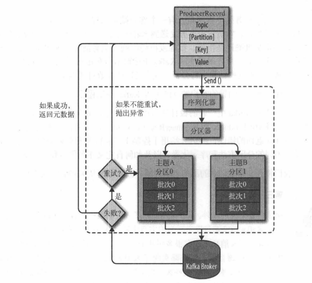

**发送方式**
* 同步发送
    * 返回Future对象，调用get等待获取结果
* 异步发送
    * 指定回调函数
* 单向发送
    * 不等待发送结果返回
    * 一般用于日志等数据丢失问题不大的场景

kafka所有的消息在通信层面都是异步发送，当然应用层可以使用Future.get()来实现同步等待，这个方式一般用于消息顺序发送。

消息只能指定发送到哪一个分区，至于发送到什么分区由分区算法决定


#### 1.3.3.1. 分区
<a href="#menu" >目录</a>

一条完整的消息对象ProducerRecord类型对象,包含topic,key,具体的消息value
```java
public ProducerRecord(String topic, K key, V value) {
    this(topic, (Integer)null, (Long)null, key, value, (Iterable)null);
}
```
* key为null
    * StickyPartitionCache.nextPartition
    * 随机选择分区
* key不为null
    * 而是使用对key进行散列，根据散列值决定消息被发到哪个分区
    * 因此key相同的时候，消息都是发送到同一个分区

默认分区器
```java
//DefaultPartitioner
 public int partition(String topic, Object key, byte[] keyBytes, Object value, byte[] valueBytes, Cluster cluster) {
     ////当key为null时
    if (keyBytes == null) {
        return stickyPartitionCache.partition(topic, cluster);
    } 
    //当key不为null时　
    List<PartitionInfo> partitions = cluster.partitionsForTopic(topic);
    int numPartitions = partitions.size();
    // hash the keyBytes to choose a partition
    return Utils.toPositive(Utils.murmur2(keyBytes)) % numPartitions;
}
//当key为null时－－StickyPartitionCache
public int nextPartition(String topic, Cluster cluster, int prevPartition) {
    List<PartitionInfo> partitions = cluster.partitionsForTopic(topic);
    Integer oldPart = indexCache.get(topic);
    Integer newPart = oldPart;
    // Check that the current sticky partition for the topic is either not set or that the partition that 
    // triggered the new batch matches the sticky partition that needs to be changed.
    if (oldPart == null || oldPart == prevPartition) {
        List<PartitionInfo> availablePartitions = cluster.availablePartitionsForTopic(topic);
        if (availablePartitions.size() < 1) {
            Integer random = Utils.toPositive(ThreadLocalRandom.current().nextInt());
            newPart = random % partitions.size();
        } else if (availablePartitions.size() == 1) {
            newPart = availablePartitions.get(0).partition();
        } else {
            while (newPart == null || newPart.equals(oldPart)) {
                Integer random = Utils.toPositive(ThreadLocalRandom.current().nextInt());
                newPart = availablePartitions.get(random % availablePartitions.size()).partition();
            }
        }
        // Only change the sticky partition if it is null or prevPartition matches the current sticky partition.
        if (oldPart == null) {
            indexCache.putIfAbsent(topic, newPart);
        } else {
            indexCache.replace(topic, prevPartition, newPart);
        }
        return indexCache.get(topic);
    }
    return indexCache.get(topic);
}


```
自定义分区器需要实现Partitioner接口
生产者配置参数 "partitioner.class"进行配置

#### 1.3.3.2. 代码实例
<a href="#menu" >目录</a>

```java

//配置
Properties props = new Properties();
props.put("bootstrap.servers",BROKER_LIST);
props.put(ProducerConfig.BATCH_SIZE_CONFIG,500);
props.put(ProducerConfig.LINGER_MS_CONFIG,"0");
props.put("allow.auto.create.topics","true");
props.put("acks", "all");
props.put("key.serializer", "org.apache.kafka.common.serialization.StringSerializer");
props.put("value.serializer","org.apache.kafka.common.serialization.StringSerializer");

//创建生产者对象
KafkaProducer kafkaProducer = new KafkaProducer(props());
```
kafka提供的发送方法,可以看到，最终都是调用doSend来完成，差别只是在于有没有回调函数
```java
//kafka提供的发送方法
public Future<RecordMetadata> send(ProducerRecord<K, V> record) {
        return send(record, null);
}
public Future<RecordMetadata> send(ProducerRecord<K, V> record, Callback callback) {
    // intercept the record, which can be potentially modified; this method does not throw exceptions
    ProducerRecord<K, V> interceptedRecord = this.interceptors.onSend(record);
    return doSend(interceptedRecord, callback);
}
```
**定义发送的数据**
```java
ProducerRecord record = new ProducerRecord<String, String>("topic","key","data")
```

**发送方式1:发送后不管**

吞吐量最高的方式,但是由于不检测发送是否成功，因此如果发送出现问题，就会导致数据丢失，因此使用场景是需要大通量的数据发送，但是对于数据丢失不敏感的场景，比如日志数据。
```java
kafkaProducer.send(record)
```

**发送方式2:阻塞等待结果、**

同步发送，send()方法会返回Futrue对象，通过调用Futrue对象的get()方法，等待直到结果返回，根据返回的结果可以判断是否发送成功。如果业务要求消息必须是按顺序发送的，那么可以使用同步的方式，并且只能在一个partation上，结合参数设置retries的值让发送失败时重试，设置max_in_flight_requests_per_connection=1，可以控制生产者在收到服务器晌应之前只能发送1个消息，在消息发送成功后立刻flush，从而控制消息顺序发送。
```java
try{
    RecordMetadata　metadata = kafkaProducer.send(record).get();
}catch (Exception e) {
  e.printStackTrace();
}
kafkaProducer.flush();
```
在调用send()方法后再调用get()方法等待结果返回。如果发送失败会抛出异常，如果发送成功会返回一个RecordMetadata对象，然后可以调用offset()方法获取该消息在当前分区的偏移量。

KafkaProducer有两种类型的异常，第一种是可以重试的Retriable，该类异常可以通过重新发送消息解决。例如是连接异常后重新连接、“no leader”异常后重新选取新的leader。KafkaProducer可以配置为遇到该类异常后自动重新发送消息直到超过重试次数。第二类是不可重试的，例如是“message size too large”（消息太大），该类异常会马上返回错误。

**发送方式3：异步回调**

异步发送，在调用send()方法的时候指定一个callback函数，当broker接收到返回的时候，该callback函数会被触发执行。如果业务需要知道消息发送是否成功，并且对消息的顺序不关心，那么可以用异步+回调的方式来发送消息，配合参数retries=0，并将发送失败的消息记录到日志文件中；要使用callback函数，先要实现org.apache.kafka.clients.producer.Callback接口，该接口只有一个onCompletion方法。如果发送异常，onCompletion的参数Exception e会为非空。

```java
kafkaProducer.send(record，
new Callback() {
    @Override
    public void onCompletion(RecordMetadata metadata, Exception exception) {

        if(exception != null){
            log.error("数据发送错误:{}",exception.getMessage());
            return;
        }
        log.info("数据发送结果:{}",metadata.toString());

    }
);


```


目前，kafka的客户端已经不提供同步发送方式，所有的发送都是异步方式。

在kafka-0.8.2之后，producer不再区分同步(sync)和异步方式(async)，所有的请求以异步方式发送，这样提升了客户端效率。producer请求会返回一个应答对象，包括偏移量或者错误信。这种异步方地批量的发送消息到kafka broker节点，因而可以减少server端资源的开销。新的producer和所有的服务器网络通信都是异步地，在ack=-1模式下需要等待所有的replica副本完成复制时，可以大幅减少等待时间。


**异步发送相关参数**

异步发送时，kafka会先把消息存储在缓冲池中，当到达设定条件触发缓冲池消息发送。
* 消息缓存达到batch.size；
* 距离上一次消息发送时间间隔linger.ms；
* 调用flush（）方法，会立刻触发发送，并阻塞到当前缓冲区发送完毕；
* 调用close（），触发发送，完毕后关闭。

```yml
buffer.memory
compression.type
retries
batch.size
linger.ms
client.id
max.in.flight.requests.per.connection
request.timeout.msmax.block.ms
max.request.size
receive.buffer.bytes和send.buffer.bytes
```

#### 1.3.3.3. Ack参数
<a href="#menu" >目录</a>

当producer向leader发送数据时，可以通过request.required.acks参数来设置数据可靠性的级别：
* 1（默认）：这意味着producer在ISR中的leader已成功收到的数据(收到但未保存就会导致数据丢失)并得到确认后发送下一条message。如果leader宕机了，则会丢失数据。可能丢数据，但可能重复数据(收到并保存了，但是回复ack失败，生产者重试发送)。最无用，2个缺点都占到了，因此，不会用到该模式来解决本文的主题。
* 0：这意味着producer无需等待来自broker的确认而继续发送下一批消息。这种情况下数据传输效率最高，但是数据可靠性确是最低的。可能丢数据，不会重复发送,因为0模式下，重试机制失效。
* -1或all：producer需要等待ISR中的所有follower都确认接收到数据后才算一次发送完成，可靠性最高。但是这样也不能保证数据不丢失，比如当ISR中只有leader时，这样就变成了acks=1的情况。 不丢数据，但可能重复数据。

开启失败重试，可能导致发送重复数据。

#### 1.3.3.4. 幂等性问题
<a href="#menu" >目录</a>

幂等性：是指producer无论向broker发送了多少条重复的消息，broker只会持久化一条。

因为发送端重试导致的消息重复发送问题，kafka的幂等性可以保证重复发送的消息只接收一次，只需在生产者加上参数 props.put(“enable.idempotence”, true) 即可，默认是false，表示不开启。

具体实现原理是，kafka每次发送消息会生成PID和Sequence Number，并将这两个属性一起发送给broker，broker会将PID和Sequence Number跟消息绑定一起存起来，下次如果生产者重发相同消息，broker会检查PID和Sequence Number，如果相同不会再接收。

PID：每个新的 Producer 在初始化的时候会被分配一个唯一的 PID，这个PID 对用户完全是透明的。生产者如果重启则会生成新的PID。

Sequence Number：对于每个 PID，该 Producer 发送到每个 Partition 的数据都有对应的序列号，这些序列号是从0开始单调递增的。

**kafka中幂等性存在的问题**

幂等性只解决了当前的会话且当前的分区的幂等性。跨分区、会话不能实现精准一次性投递写入。

当producer重启后，broker分配的PID（producer_id）会发生变化。切换分区后，Patition也发生了变化。最终导致<　PID,Patition,SeqNumber>作为主键的key也会发生变化。


### 1.3.4. 消费者
<a href="#menu" >目录</a>

#### 1.3.4.1. 代码实例
<a href="#menu" >目录</a>

配置和创建消费对象
```java
public Properties props(){
    Properties props = new Properties();
    props.put(ConsumerConfig.BOOTSTRAP_SERVERS_CONFIG,BROKER_LIST);
    //
    props.put("group.id",this.groupId);
    props.put("enable.auto.commit",this.enableAutoCommit);
    props.put("auto.commit.interval.ms","1000");
    props.put("key.deserializer", "org.apache.kafka.common.serialization.StringDeserializer");
    props.put("value.deserializer", "org.apache.kafka.common.serialization.StringDeserializer");
    return props;
}

public void initConsumer(){
    kafkaConsumer = new KafkaConsumer(props());
}
```
这里需要关注两个参数，一个是group.id，如果多个订阅同一个topic的消费者，group.id相同时，消息只能被其中一个消费，如果group.id设置不同，该消息就可被group.id不同的消费者消费。

第二个是enable.auto.commit，是否自动提交offset,如果为true，则每auto.commit.interval.ms提交一次。

消费者消费消息可以订阅topic，也可以单独订阅topic的某一个partition
```java
//订阅topic
kafkaConsumer.subscribe(Arrays.asList(topic));
//单独订阅topic的某一个partition
TopicPartition topicPartition = new TopicPartition(topic,partition);
kafkaConsumer.assign(Arrays.asList(topicPartition));
```
配合key，就可以做同一个topic下的业务消息隔离

下面列出两种消费方式(自动提交offset方式，手动提交方式)

自动提交offset方式
```java
public void consumerByTopicAutoCommit(String topic){
    kafkaConsumer.subscribe(Arrays.asList(topic));

    while(true){
        ConsumerRecords<String, String> records =kafkaConsumer.poll(Duration.ofMillis( 1000 ));
        if(records.count() <= 0) {
            log.warn("未poll到任何消息");
            continue;
        }
        log.info("收到消息:{}条",records.count());
        for (ConsumerRecord<String, String> record : records) {
            log.info("{}收到消息：partition = {},offset = {}, key ={}, value = {}",groupId,
                    record.partition(),record.offset(), record.key(), record.value());
        }
    }
}
```

手动提交方式
```java
public void consumerByTopicUnAutoCommit(String topic){
    int consumerCount = 0 ;
    int maxConsumerCount = 10;

    kafkaConsumer.subscribe(Arrays.asList(topic));
    while(true){
        ConsumerRecords<String, String> records =kafkaConsumer.poll(Duration.ofMillis( 1000 ));
        for (ConsumerRecord<String, String> record : records) {
            log.info("{}收到消息：partition = {},offset = {}, key ={}, value = {}",groupId,
                    record.partition(),record.offset(), record.key(), record.value());
            consumerCount++;
        }

        OffsetCommitCallback offsetCommitCallback = new OffsetCommitCallback(){
            @Override
            public void onComplete(Map<TopicPartition, OffsetAndMetadata> offsets, Exception exception) {

                if(exception != null){
                    log.warn("自动提交offset失败");
                }
                else{
                    offsets.forEach((topicPartition,offsetAndMetadata)->{

                        log.info("{}  {}",topicPartition,offsetAndMetadata);
                    });
                }
            }
        };
        if( consumerCount > maxConsumerCount){
            consumerCount = 0;
            kafkaConsumer.commitAsync(offsetCommitCallback);
        }
    }
}
```
其它消费方式

重新定位分区的offset，重置之后就从这个新的offset开始消费
```java
public void seek(TopicPartition partition, long offset);

//用法
TopicPartition topicPartition =  new TopicPartition(topic, partition);
//订阅分区
kafkaConsumer.assign(Arrays.asList(topicPartition));
//重定位，将会从新的offset开始poll数据
kafkaConsumer.seek(topicPartition,offset);
//数据拉取方式同上
kafkaConsumer.poll()
```

重新消费某个时间之后的数据
```java
//这个方法提供了获取某个时间之后的offset
 public Map<TopicPartition, OffsetAndTimestamp> offsetsForTimes(Map<TopicPartition, Long> timestampsToSearch) {
    return offsetsForTimes(timestampsToSearch, Duration.ofMillis(defaultApiTimeoutMs));
}
public final class OffsetAndTimestamp {
    private final long timestamp;
    private final long offset;
｝
//用法
TopicPartition topicPartition = new TopicPartition(topic,partition);
Map<TopicPartition, Long> timestampsToSearch = new HashMap<>();
timestampsToSearch.put(topicPartition,
        System.currentTimeMillis() - beforeHour * 60 * 60 * 1000 - beforeMinute * 60 * 1000 );

Map<TopicPartition, OffsetAndTimestamp> offsetAndTimestampMap = kafkaConsumer.offsetsForTimes(timestampsToSearch);
kafkaConsumer.seek(topicPartition,offset);
//数据拉取方式同上
kafkaConsumer.poll()
```
获取到某个时间戳之后的offset，再使用seek方法重新定位，就可以拉取该时间戳之后的数据


消费速度控制

提供 pause(Collection< TopicPartition> partitions)和resume(Collection< TopicPartition>
partitions)方法，分别用来暂停某些分区在拉取操作时返回数据给客户端和恢复某些分区向客户端返回数据操作。通过这两个方法可以对消费速度加以控制，结合业务使用。

kafka消费者还提供两个方法返回某个分区的起始offset和最后的offset.
```java
public Map<TopicPartition, Long> beginningOffsets(Collection<TopicPartition> partitions) 
public Map<TopicPartition, Long> endOffsets(Collection<TopicPartition> partitions)
```

#### 1.3.4.2. kafka消费者的三种模式
<a href="#menu" >目录</a>

关键配置及含义
```yml
enable.auto.commit 是否自动提交自己的offset值；默认值时true
auto.commit.interval.ms 自动提交时长间隔；默认值时5000 ms
consumer.commitSync(); offset提交命令；
```

**at most onece模式**

基本思想是保证每一条消息commit成功之后，再进行消费处理；

设置自动提交为false，接收到消息之后，首先commit，然后再进行消费

**at least onece模式**

基本思想是保证每一条消息处理成功之后，再进行commit；

设置自动提交为false；消息处理成功之后，手动进行commit；

采用这种模式时，最好保证消费操作的“幂等性”，防止重复消费；

**exactly onece模式**

核心思想是将offset作为唯一id与消息同时处理，并且保证处理的原子性；

设置自动提交为false；消息处理成功之后再提交；

消息处理完成后，将offset持久化到数据库，下一次消费时如果存在则忽略当前消息


#### 1.3.4.3. 消费者和消费者群组
<a href="#menu" >目录</a>


* 消费者从属于消费者群组，一个群组里的消费者订阅的是同一个主题，每个消费者接收主题的一部分分区的消息
* 如果群组里的消费者数目**小于**分区的数目，则一个消费者会接收多个分区数据
* 如果群组里的消费者数目**大于**分区的数目，则会有消费者闲置
* 同一个主题不同群组间消费消息不互相影响，通过群组实现了广播和多播

**再均衡**
* 当群组加入或者退出消费者时，就会发生再均衡
* 再均衡期间，群组内的消费者无法读取消息
* 每个群组都有一个群组协调器(broker),不同的群组可以有不同的协调器
* 消费者向群组协调器发送心跳来维持它们和群组的从属关系和它们对分区的所有权关系
* 消费者会在轮询消息或者提交偏移量时发送心跳
* 如果超时未收到消费者心跳消息。协调器将认为消费者已经挂掉，就会触发一次再均衡

**分配分区**
* 当消费者要加入群组时，会向群组发送一个JoinGroup的请求
* 第一个假如群组的将称为群主，群主从协调器那里获得群组的成员列表，并负责给每一个成员分配分区。


 
#### 1.3.4.4. 提交偏移量
<a href="#menu" >目录</a>

* Kafka不会像其他JMS队列那样需要得到消费者的确认，消费者可以使用Kafka来追踪消息在分区里的位置(偏移量)

* **提交:** 更新当前位置的操作叫做提交
* 消费者是往_consumer_offset的特殊主题上发送消息，消息包含每个分区的偏移量
    * 如果消费者一直处于运行状态，那么偏移量就没有什么用处
    * 如果发生再均衡之后，消费者可能分到新的分区，就需要从_consumer_offset上读取该分区的偏移量
* 如果提交的偏移量小于客户端处理的最后一个消息的偏移量，那么处于两个偏移量之间的消息会被重复处理
* 如果提交的偏移量大于客户端处理的最后一个消息的偏移量，那么处于两个偏移量之间的消息会丢失


#### 1.3.4.5. 自动提交 
<a href="#menu" >目录</a>

两个参数设置
```yml
enable.auto.commit true/false
auto.commit.interval.ms 提交时间间隔,默认值是5s
```
每次poll调用都会去调用下面的方法，检测是否超时，超时则提交offset
```java
public void maybeAutoCommitOffsetsAsync(long now) {
    //自动提交是否使能
    if (autoCommitEnabled) {
        nextAutoCommitTimer.update(now);
        //超时时间是否到
        if (nextAutoCommitTimer.isExpired()) {
            nextAutoCommitTimer.reset(autoCommitIntervalMs);
            doAutoCommitOffsetsAsync();
        }
    }
}
```
提交之前发生再均衡，将会出现重复消费的问题,一是避免过长的提交间隔，二是监控再平衡事件的发生，在再平衡回调函数中提交offset

不管是自动提交(poll)还是手动提交(commitAsync／commitSync)，最终都是调用
```java
//ConsumerCoordinator
commitOffsetsAsync(final Map<TopicPartition, OffsetAndMetadata> offsets, final OffsetCommitCallback callback)
```

使用手动提交的时候要注意，如果开启了自动提交，如果此时使用手动提交了某个offset，由于poll是提交最后一次offset，如果手动提交和自动提交时的offset不一致，可能会造成重复消费的问题

#### 1.3.4.6. 手动提交当前偏移量
<a href="#menu" >目录</a>

Consumer类

同步提交
```java
//commitSync()根据poll()方法拉取到的最新位移进行阻塞提交
//以下便是消费者同步提交的API，在broker返回响应之前将阻塞
//无参数提交的最后一次offset
void commitSync();
void commitSync(Duration var1);
void commitSync(Map<TopicPartition, OffsetAndMetadata> var1);
void commitSync(Map<TopicPartition, OffsetAndMetadata> var1, Duration var2);
```
异步提交
```java
//
void commitAsync();
void commitAsync(OffsetCommitCallback var1);
void commitAsync(Map<TopicPartition, OffsetAndMetadata> var1, OffsetCommitCallback var2);

public interface OffsetCommitCallback {
    void onComplete(Map<TopicPartition, OffsetAndMetadata> offsets, Exception exception);
}

```
* 异步提交时不会进行阻塞。
* 在成功提交或碰到无法恢复的错误之前，commitSync将会一直重试，而commitAsync不会，因为它收到broker响应之前，可能有一个更大的偏移量提交上去，如果进行重试，将会发生重复消费的问题
* 可以使用序号记录每次提交，在回调函数里面检查序号大小，如果没有更新的提交，则可以进行重试。

如果提交在关闭消费者或分区再均衡前的最后一次提交偏移量，那么为了保证全部提交，异步+同步(try-finaly里提交)提交方式非常适合


#### 1.3.4.7. 提交特定的偏移量
<a href="#menu" >目录</a>

* 以上的无参方法提交的都是最后一次的偏移量
* 可以使用参数Map<　TopicPartition, OffsetAndMetadata> var1 来自定义提交的偏移量。
* 使用场景是消费者收到很多消息，需要在很多时间处理，需要在处理的中间进行提交，防止再均衡导致的重消费问题。

#### 1.3.4.8. 重复消费和消息丢失问题
<a href="#menu" >目录</a>

重复消费是指由于定期提交的延时性，在offset自动提交前消费了一部分消息，但消费者因为故障等问题重新连接kafka之后，再次拉取到的是上一次offset之后的消息，也即故障前消费的一部分消息再次拉取进行了消费


而消息丢失是指，可能拉取消息的线程为A，对消息进行逻辑处理的线程为B，那么A拉取消息并且定期自动提交后，但B尚未处理完已经拉取到并且提交消费位移的消息，此时消费者宕机重启，就会造成上次拉取且提交offset之后的消息丢失。

### 1.3.5. 消费者退出
<a href="#menu" >目录</a>

在停止消费者或者应用程序关闭前，应当显示调用close()，在退出之前，comsumer.close()是非常有必要的，因为它会提交任何还没有提交的东西， 并向群组协调器(broker)发送消息，告知自己要离开群组，接下来就会触发再均衡 ，而不需要等待会话超时。

可以使用ShutdownHook方法进行回调
```java
// mainThread 主线程 此处省略n行代码
Runtime.getRuntime().addShutdownHook(()->{
	comsumer.close();
})；

```

### 1.3.6. 再平衡
<a href="#menu" >目录</a>

#### 1.3.6.1. 再平衡概念
<a href="#menu" >目录</a>

所谓的再平衡，指的是在kafka consumer所订阅的topic发生变化时发生的一种分区重分配机制。一般有三种情况会触发再平衡：
* consumer group中的新增或删除某个consumer，导致其所消费的分区需要分配到组内其他的consumer上；
* consumer订阅的topic发生变化，比如订阅的topic采用的是正则表达式的形式，如test-*此时如果有一个新建了一个topic test-user，那么这个topic的所有分区也是会自动分配给当前的consumer的，此时就会发生再平衡；
* consumer所订阅的topic发生了新增分区的行为，那么新增的分区就会分配给当前的consumer，此时就会触发再平衡

也就是说，当消费者没有指定分区消费的时候(消费分指定分区消费和订阅topic消费两种方式)，只要消费群组内的消费者个数变化(消费者下线或者新增消费者)以及分区个数变化(topic的分区增加或者减少)，就会发生再平衡行为，充分进行分区

#### 1.3.6.2. kafka提供的再平衡策略

<a href="#menu" >目录</a>

该参数由"partition.assignment.strategy"进行配置

* Round Robin：会采用轮询的方式将当前所有的分区依次分配给所有的consumer；
* Range：首先会计算每个consumer可以消费的分区个数，然后按照顺序将指定个数范围的分区分配给各个consumer；
* Sticky：这种分区策略是最新版本中新增的一种策略，其主要实现了两个目的：
    * 将现有的分区尽可能均衡的分配给各个consumer，存在此目的的原因在于Round Robin和Range分配策略实际上都会导致某几个consumer承载过多的分区，从而导致消费压力不均衡；
    * 如果发生再平衡，那么在重新分配前的基础上会尽力保证当前未宕机的consumer所消费的分区不会被分配给其他的consumer上；


#### 1.3.6.3. 再均衡监听器 ConsumerRebalanceListener
<a href="#menu" >目录</a>

在subscribe时可以注册一个再均衡监听器，通过这两个方法可以获得当前消费者再平衡之前订阅的分区和再平衡之后订阅的分区，使用这个监听器的前提是用户使用consumer　group，如果使用独立的consumer或者是直接手动分配分区，监听器是无效的。
```java
//Consumer 类
void subscribe(Collection<String> var1, ConsumerRebalanceListener var2);

public interface ConsumerRebalanceListener {
    void onPartitionsRevoked(Collection<TopicPartition> var1);
    void onPartitionsAssigned(Collection<TopicPartition> var1);
}

```
* 在消费者退出和进行分区再均衡之前，会做一些清理工作，可以使用再均衡监听器
* onPartitionsRevoked
    * 在再均衡之前和消费者读取消息之后被调用，可以在这里提交偏移量，下个接管该分区的消费者就可以知道从哪里读取数据了
* onPartitionsAssigned
    * 在再均衡之后和消费者读取分区之前调用
    


### 1.3.7. 从特定偏移量处开始处理
<a href="#menu" >目录</a>

```java
//指定位置
void seek(TopicPartition var1, long var2);
//分区起始位置
void seekToBeginning(Collection<TopicPartition> var1);
//分区末尾位置
void seekToEnd(Collection<TopicPartition> var1);

```

### 1.3.8. 如何退出
<a href="#menu" >目录</a>

consumer.wakeup()调用时，可以退出poll循环，并抛出WakeupException异常，不需要处理，因为这个异常只是为了退出poll循环

### 1.3.9. 独立消费者
<a href="#menu" >目录</a>

* 场景
    * 一个消费者从一个主题的所有分区读取数据
    * 或者某个特定的分区读取数据
    * 这个时候就不需要消费者群组和再均衡了

* 这种场景就不需要订阅主题，而是进行分配分区

```java
//根据主题获取可用分区
List<PartitionInfo> partitionsFor(String var1);
List<PartitionInfo> partitionsFor(String var1, Duration var2);
//消费者注册分区
void assign(Collection<TopicPartition> var1);
```
这样就不会出现再均衡问题，但是当增加分区时，不会通知消费者，需要消费者手动轮询检测处理。

## 1.4. kafka服务器broker
<a href="#menu" >目录</a>

### 1.4.1. 服务器配置
<a href="#menu" >目录</a>

```yml
1.advertised.listeners

发布到 ZooKeeper 以供客户端使用的侦听器
2.auto.create.topics.enable

在服务器上启用自动创建主题
Default: true
3.auto.leader.rebalance.enable

启用自动领导者平衡。后台线程定期检查分区领导者的分布，可通过“leader.imbalance.check.interval.seconds”进行配置。如果领导者不平衡超过leader.imbalance.per.broker.percentage，则会触发领导者重新平衡到分区的首选领导者。
Default: true
4.background.threads

用于各种后台处理任务的线程数
Default: 10
5.broker.id

此服务器的代理 ID。如果未设置，将生成一个唯一的代理 id。
为避免 zookeeper 生成的代理 id 和用户配置的代理 id 发生冲突，生成的代理 id 从 reserved.broker.max.id + 1 开始。
6.compression.type

指定给定主题的最终压缩类型。此配置接受标准压缩编解码器（‘gzip’、‘snappy’、‘lz4’、‘zstd’）。
还接受相当于不压缩的“未压缩”；和“生产者”，这意味着保留生产者设置的原始压缩编解码器。
7.control.plane.listener.name

用于控制器和broker之间通信的侦听器名称。 Broker 将使用 control.plane.listener.name 来定位侦听器列表中的端点，以侦听来自控制器的连接。例如，如果broker的配置是：
listeners = INTERNAL://192.1.1.8:9092, EXTERNAL://10.1.1.5:9093, CONTROLLER://192.1.1.8:9094
8.delete.topic.enable

启用删除Topic。如果关闭此配置，通过管理工具删除Topic将无效
Default: true
9.leader.imbalance.check.interval.seconds

控制器触发分区重新平衡检查的频率
Default: 300
10.leader.imbalance.per.broker.percentage

每个broker允许的领导者不平衡比率。如果每个broker超过此值，控制器将触发领导者余额。该值以百分比指定。
Default: 10
11.listeners

侦听器列表 - 将侦听的 URI 的逗号分隔列表和侦听器名称。如果侦听器名称不是安全协议，还必须设置 listener.security.protocol.map。
Default: PLAINTEXT://:9092
12.log.dir

保存日志数据的目录（log.dirs 属性的补充）
Default: /tmp/kafka-logs
13.log.dirs

保存日志数据的目录。如果未设置，则使用 log.dir 中的值
Default: null
14.log.flush.interval.messages

消息刷新到磁盘之前在日志分区上累积的消息数
Default: 9223372036854775807
15.log.flush.interval.ms

任何主题中的消息在刷新到磁盘之前保留在内存中的最长时间（以毫秒为单位）。
如果未设置，则使用 log.flush.scheduler.interval.ms 中的值
Default: null
16.log.flush.offset.checkpoint.interval.ms

更新作为日志恢复点的最后一次刷新的持久记录的频率
Default: 60000 (1 minute)
17.log.flush.scheduler.interval.ms

日志刷新器检查是否有任何日志需要刷新到磁盘的频率（以毫秒为单位）
Default: 9223372036854775807
18.log.flush.start.offset.checkpoint.interval.ms

更新日志开始偏移的持久记录的频率
Default: 60000 (1 minute)
19.log.retention.bytes

删除前日志的最大大小
Default: -1
20.log.retention.hours

删除之前保留日志文件的小时数（以小时为单位）
Default: 168
21.log.retention.minutes

删除之前保留日志文件的分钟数（以分钟为单位），次要于 log.retention.ms 属性。如果未设置，则使用 log.retention.hours 中的值
Default: null
22.log.retention.ms

删除之前保留日志文件的毫秒数（以毫秒为单位），如果未设置，则使用 log.retention.minutes 中的值。如果设置为 -1，则不应用时间限制。
Default: null
23.log.roll.hours

推出新日志段之前的最长时间（以小时为单位），次要于 log.roll.ms 属性
Default: 168
24.log.roll.jitter.hours

从 logRollTimeMillis 中减去的最大抖动（以小时为单位），次要于 log.roll.jitter.ms 属性
25.log.roll.jitter.ms

从 logRollTimeMillis 中减去的最大抖动（以毫秒为单位）。如果未设置，则使用 log.roll.jitter.hours 中的值
26.log.roll.ms

推出新日志段之前的最长时间（以毫秒为单位）。如果未设置，则使用 log.roll.hours 中的值
Default: null
27.log.segment.bytes

单个日志文件的最大大小
Default: 1073741824 (1 gibibyte)
28.log.segment.delete.delay.ms

从文件系统中删除文件之前等待的时间
Default: 60000 (1 minute)
29.message.max.bytes

Kafka 允许的最大记录批量大小（如果启用压缩，则在压缩之后）。如果增加了这个值并且有超过 0.10.2 的消费者，消费者的获取大小也必须增加，以便他们可以获取这么大的记录批次。
在最新的消息格式版本中，为了提高效率，记录总是分组为批次。在以前的消息格式版本中，未压缩的记录不分组，并且此限制仅适用于在这种情况下的单个记录。可以使用主题级别 max.message.bytes 配置为每个主题设置。
Default: 1048588
30.metadata.log.dir

这个配置决定了我们在 KRaft 模式下将集群的元数据日志放在哪里。如果未设置，则元数据日志将放置在 log.dirs 中的第一个日志目录中。
31.metadata.log.max.record.bytes.between.snapshots

这是日志中最新快照与生成新快照之前所需的高水位线之间的最大字节数。
Default: 20971520
32.metadata.log.segment.bytes

单个元数据日志文件的最大大小。
Default: 1073741824 (1 gibibyte)
33.metadata.log.segment.ms

推出新元数据日志文件之前的最长时间（以毫秒为单位）。
Default: 604800000 (7 days)
34.metadata.max.retention.bytes

删除旧快照和日志文件之前元数据日志和快照的最大组合大小。由于必须至少存在一个快照才能删除任何日志，因此这是一个软限制。
Default: -1
35.metadata.max.retention.ms

在删除元数据日志文件或快照之前保留它的毫秒数。由于必须至少存在一个快照才能删除任何日志，因此这是一个软限制。
Default: 604800000 (7 days)
36.min.insync.replicas

当生产者将确认设置为“all”（或“-1”）时，min.insync.replicas 指定必须确认写入才能被视为成功的最小副本数。如果无法满足此最小值，则生产者将引发异常（NotEnoughReplicas 或 NotEnoughReplicasAfterAppend）。
当一起使用时，min.insync.replicas 和 acks 允许您强制执行更大的持久性保证。一个典型的场景是创建一个复制因子为 3 的主题，将 min.insync.replicas 设置为 2，并使用“all”的 acks 生成。如果大多数副本没有收到写入，这将确保生产者引发异常。
Default: 1
37.node.id

当 process.roles 为非空时，与此进程正在扮演的角色相关联的节点 ID。在 KRaft 模式下运行时，这是必需的配置。
Default: -1
38.num.io.threads

服务器用于处理请求的线程数，可能包括磁盘 I/O
39.num.network.threads

服务器用于接收来自网络的请求并向网络发送响应的线程数
Default: 3
40.num.recovery.threads.per.data.dir

每个数据目录的线程数，用于在启动时恢复日志并在关闭时刷新
Default: 1
41.num.replica.alter.log.dirs.threads

可以在日志目录之间移动副本的线程数，可能包括磁盘 I/O
Default: null
42.num.replica.alter.log.dirs.threads

The number of threads that can move replicas between log directories, which may include disk I/O
Default: null
43.num.replica.fetchers

用于从源代理复制消息的 fetcher 线程数。增加这个值可以增加follower broker中的I/O并行度。
Default: 1
44.offset.metadata.max.bytes

与偏移提交关联的元数据条目的最大大小
Default: 4096 (4 kibibytes)
45.offsets.commit.required.acks

可以接受提交之前所需的确认。通常，不应覆盖默认值 (-1)
Default: -1
46.offsets.commit.timeout.ms

偏移量提交将被延迟，直到偏移量主题的所有副本都收到提交或达到此超时。这类似于生产者请求超时。
Default: 5000 (5 seconds)
47.offsets.load.buffer.size

将偏移量加载到缓存中时从偏移量段读取的批量大小（软限制，如果记录太大则覆盖）。
48.offsets.retention.check.interval.ms

检查过时偏移的频率
Default: 600000 (10 minutes)
49.offsets.retention.minutes

在消费者组失去所有消费者（即变为空）后，其偏移量将在此保留期内保留，然后被丢弃。对于独立消费者（使用手动分配），偏移量将在最后一次提交时间加上此保留期之后过期。
Default: 10080
50.offsets.topic.compression.codec

偏移主题的压缩编解码器 - 压缩可用于实现“原子”提交
51.offsets.topic.num.partitions

偏移提交主题的分区数（部署后不应更改）
Default: 50
52.offsets.topic.replication.factor

偏移主题的复制因子（设置更高以确保可用性）。在集群大小满足此复制因子要求之前，内部主题创建将失败。
Default: 3
53.offsets.topic.segment.bytes

偏移量主题段字节应保持相对较小，以促进更快的日志压缩和缓存加载
Default: 104857600 (100 mebibytes)
54.queued.max.requests

在阻塞网络线程之前，数据平面允许的排队请求数
Default: 500
55.replica.fetch.min.bytes

每个获取响应的最小字节数。如果没有足够的字节，请等待 replica.fetch.wait.max.ms（broker配置）。
Default: 1
56.replica.fetch.wait.max.ms

跟随者副本发出的每个 fetcher 请求的最大等待时间。该值应始终小于replica.lag.time.max.ms，以防止低吞吐量主题的ISR频繁收缩
Default: 500
57.replica.lag.time.max.ms

如果一个 follower 没有发送任何 fetch 请求或者至少在这个时间内没有消耗到 leader log end offset，leader 将从 isr 中删除该 follower
Default: 30000 (30 seconds)
58.replica.high.watermark.checkpoint.interval.ms

将高水位线保存到磁盘的频率
Default: 5000 (5 seconds)
58.replica.socket.receive.buffer.bytes

网络请求的套接字接收缓冲区
Default: 65536 (64 kibibytes)
59.replica.socket.timeout.ms

网络请求的套接字超时。它的值至少应该是 replica.fetch.wait.max.ms
Default: 30000 (30 seconds)
60.request.timeout.ms

配置控制客户端等待请求响应的最长时间。如果在超时之前没有收到响应，客户端将在必要时重新发送请求，或者如果重试次数用尽，则请求失败。
Default: 30000 (30 seconds)
61.sasl.mechanism.controller.protocol

用于与控制器通信的 SASL 机制。默认为 GSSAPI。
Default: GSSAPI
62.socket.receive.buffer.bytes

套接字服务器套接字的 SO_RCVBUF 缓冲区。如果值为 -1，将使用操作系统默认值。
Default: 102400 (100 kibibytes)
63.socket.request.max.bytes

套接字请求中的最大字节数
Default: 104857600 (100 mebibytes)
64.socket.send.buffer.bytes

套接字服务器套接字的 SO_SNDBUF 缓冲区。如果值为 -1，将使用操作系统默认值。
Default: 102400 (100 kibibytes)
65.transaction.max.timeout.ms

事务允许的最大超时。如果客户端请求的事务时间超过此时间，则代理将在 InitProducerIdRequest 中返回错误。这可以防止客户端超时时间过长，这可能会阻止消费者从事务中包含的主题中读取。
Default: 900000 (15 minutes)
66.transaction.state.log.load.buffer.size

将生产者 ID 和事务加载到缓存中时从事务日志段读取的批量大小（软限制，如果记录太大则覆盖）。
Default: 5242880
67.transaction.state.log.min.isr

覆盖事务主题的 min.insync.replicas 配置。
Default: 2
68.transaction.state.log.num.partitions

事务主题的分区数（部署后不应更改）。
Default: 50
69.transaction.state.log.replication.factor

事务主题的复制因子（设置更高以确保可用性）。在集群大小满足此复制因子要求之前，内部主题创建将失败。
Default: 3
70.transaction.state.log.segment.bytes

事务主题段字节应保持相对较小，以促进更快的日志压缩和缓存加载
Default: 104857600 (100 mebibytes)
71.transactional.id.expiration.ms

事务协调器在其事务 id 过期之前将等待而不接收当前事务的任何事务状态更新的时间（以毫秒为单位）。此设置也会影响生产者 ID 过期 - 在使用给定生产者 ID 的最后一次写入之后，一旦此时间过去，生产者 ID 就会过期。请注意，如果由于主题的保留设置而删除了生产者 ID 的最后一次写入，则生产者 ID 可能会更快过期。
Default: 604800000 (7 days)
72.unclean.leader.election.enable

指示是否启用不在 ISR 集中的副本作为最后的选择作为领导者，即使这样做可能会导致数据丢失
Default: false
73.zookeeper.connect

以 hostname:port 形式指定 ZooKeeper 连接字符串，其中 host 和 port 是 ZooKeeper 服务器的主机和端口。为了在 ZooKeeper 机器关闭时允许通过其他 ZooKeeper 节点进行连接，您还可以以 hostname1:port1,hostname2:port2,hostname3:port3 的形式指定多个主机。
服务器还可以将 ZooKeeper chroot 路径作为其 ZooKeeper 连接字符串的一部分，将其数据放在全局 ZooKeeper 命名空间中的某个路径下。例如，要给出 /chroot/path 的 chroot 路径，您可以将连接字符串指定为 hostname1:port1,hostname2:port2,hostname3:port3/chroot/path。
Default: null
74.zookeeper.connection.timeout.ms

客户端等待与 Zookeeper 建立连接的最长时间。如果未设置，则使用 zookeeper.session.timeout.ms 中的值
Default: null
75.zookeeper.max.in.flight.requests

客户端在阻塞之前将发送给 Zookeeper 的未确认请求的最大数量。
Default: 10
76.zookeeper.session.timeout.ms

Zookeeper 会话超时
Default: 18000 (18 seconds)
77.zookeeper.set.acl

设置客户端使用安全 ACL
Default: false
78.broker.heartbeat.interval.ms

代理心跳之间的时间长度（以毫秒为单位）。在 KRaft 模式下运行时使用。
Default: 2000 (2 seconds)
79.broker.id.generation.enable

在服务器上启用自动代理 ID 生成。启用时，应查看为 reserved.broker.max.id 配置的值。
Default: true
80.broker.session.timeout.ms

如果没有心跳，代理租约持续的时间长度（以毫秒为单位）。在 KRaft 模式下运行时使用。
Default: 9000 (9 seconds)
81.connections.max.idle.ms

空闲连接超时：服务器套接字处理器线程关闭空闲超过此时间的连接
Default: 600000 (10 minutes)
82.controlled.shutdown.enable

启用服务器的受控关闭
Default: true
83.controlled.shutdown.max.retries

受控关闭可能由于多种原因而失败。这决定了发生此类故障时的重试次数
84.default.replication.factor

自动创建主题的默认复制因子
Default: 1
85.delegation.token.expiry.time.ms

需要更新令牌之前的令牌有效时间（以毫秒为单位）。默认值 1 天。
Default: 86400000 (1 day)
86.fetch.max.bytes

将为获取请求返回的最大字节数。必须至少为 1024。
Default: 57671680 (55 mebibytes)
87.group.initial.rebalance.delay.ms

组协调器在执行第一次重新平衡之前等待更多消费者加入新组的时间。更长的延迟意味着可能更少的重新平衡，但会增加处理开始之前的时间。
Default: 3000 (3 seconds)
88.group.max.session.timeout.ms

注册消费者允许的最大会话超时。更长的超时时间让消费者有更多的时间来处理心跳之间的消息，但代价是检测故障的时间更长。
Default: 1800000 (30 minutes)
89.group.max.size

单个消费者组可以容纳的最大消费者数量。
Default: 2147483647
90.initial.broker.registration.timeout.ms

最初向控制器仲裁注册时，在声明失败和退出代理进程之前等待的毫秒数。
Default: 60000 (1 minute)
91.inter.broker.protocol.version

指定将使用哪个版本的代理间协议。在所有代理都升级到新版本后，这通常会遇到问题。
92.log.cleaner.backoff.ms

没有要清理的日志时的睡眠时间
Default: 15000 (15 seconds)
93.log.cleaner.enable

启用日志清理程序以在服务器上运行。如果使用带有 cleanup.policy=compact 的任何主题（包括内部偏移主题），则应启用。如果禁用，这些主题将不会被压缩并不断增长。
Default: true
94.log.cleaner.io.buffer.load.factor

日志清理器重复数据删除缓冲区负载因子。重复数据删除缓冲区可以达到的百分比。较高的值将允许一次清理更多的日志，但会导致更多的哈希冲突
Default: 0.9
95.log.cleaner.io.buffer.size

所有清理线程中用于日志清理 I/O 缓冲区的总内存
Default: 524288
96.log.cleaner.io.max.bytes.per.second

日志清理器将受到限制，使其读取和写入 i/o 的总和平均小于此值
Default: 1.7976931348623157E308
97.log.cleaner.max.compaction.lag.ms

消息在日志中保持不符合压缩条件的最长时间。仅适用于正在压缩的日志。
Default: 9223372036854775807
98.log.cleaner.threads

用于日志清理的后台线程数
Default: 1
99.log.cleanup.policy

超出保留窗口的段的默认清理策略。逗号分隔的有效策略列表。有效策略是：“删除”和“压缩”
Default: delete
100.log.index.interval.bytes

向偏移索引添加条目的时间间隔
Default: 4096 (4 kibibytes)
101.log.index.size.max.bytes

偏移索引的最大大小（以字节为单位）
Default: 10485760 (10 mebibytes)
102.log.message.format.version

指定代理将用于将消息附加到日志的消息格式版本。
该值应该是有效的 ApiVersion。一些示例是：0.8.2、0.9.0.0、0.10.0
103.log.message.timestamp.difference.max.ms

代理接收消息时的时间戳与消息中指定的时间戳之间允许的最大差异。如果 log.message.timestamp.type=CreateTime，如果时间戳的差异超过此阈值，则消息将被拒绝。如果 log.message.timestamp.type=LogAppendTime 则忽略此配置。允许的最大时间戳差异不应大于 log.retention.ms 以避免不必要的频繁日志滚动。
Default: 9223372036854775807
104.log.message.timestamp.type

定义消息中的时间戳是消息创建时间还是日志附加时间。该值应该是 CreateTime 或 LogAppendTime
Default: CreateTime
105.num.partitions

Default: 1
106.replica.fetch.backoff.ms

发生获取分区错误时的休眠时间。
Default: 1000 (1 second)
107.replica.fetch.max.bytes

尝试为每个分区获取的消息字节数。这不是一个绝对最大值，如果 fetch 的第一个非空分区中的第一个记录批大于此值，仍将返回记录批以确保可以进行进度。代理接受的最大记录批量大小通过 message.max.bytes（代理配置）或 max.message.bytes（主题配置）定义。
Default: 1048576 (1 mebibyte)

108.sasl.jaas.config

SASL 连接的 JAAS 登录上下文参数，采用 JAAS 配置文件使用的格式。此处描述了 JAAS 配置文件格式。该值的格式为：loginModuleClass controlFlag (optionName=optionValue)*;。对于代理，配置必须以侦听器前缀和小写的 SASL 机制名称作为前缀。例如，listener.name.sasl_ssl.scram-sha-256.sasl.jaas.config=com.example.ScramLoginModule 需要；

109.sasl.kerberos.kinit.cmd

Kerberos kinit 命令路径。
Default: /usr/bin/kinit
110.sasl.kerberos.min.time.before.relogin

刷新尝试之间的登录线程休眠时间。
Default: 60000

111.sasl.kerberos.principal.to.local.rules

从主体名称映射到短名称（通常是操作系统用户名）的规则列表。规则按顺序评估，与主体名称匹配的第一个规则用于将其映射到短名称。列表中的任何后续规则都将被忽略。默认情况下，{username}/{hostname}@{REALM} 形式的主体名称映射到 {username}。
112.sasl.kerberos.service.name

Kafka 运行的 Kerberos 主体名称。这可以在 Kafka 的 JAAS 配置或 Kafka 的配置中定义。

```
### 1.4.2. 日志
<a href="#menu" >目录</a>

#### 1.4.2.1. 日志文件存储机制
<a href="#menu" >目录</a>

Kafka 中消息是以topic进行分类的，生产者生产消息，消费者消费消息，都是面向topic的。

topic是逻辑上的概念，而partition是物理上的概念，每个partition对应于多个 log 文件，该 log 文件中存储的就是producer生产的数据。Producer生产的数据会被不断追加到该 log 文件末端，且每条数据都有自己的 offset。消费者组中的每个消费者，都会实时记录自己消费到了哪个offset，以便出错恢复时，从上次的位置继续消费。

相关的存储文件存储位置由log.dirs配置,在该路径下，kafka会为每个分区创建一个文件夹，数据文件就存储在这个文件夹里

broker下的分区目录，文件夹名称为topic-partitionNum格式
```yml
log.dirs=/tmp/kafka-logs/broker-0

$ ls 
__consumer_offsets-0   __consumer_offsets-2   __consumer_offsets-30  __consumer_offsets-40  __consumer_offsets-8              test-0     topic11-4  topic2-0  topic2-6
__consumer_offsets-10  __consumer_offsets-20  __consumer_offsets-32  __consumer_offsets-42  cleaner-offset-checkpoint         topic1-0   topic11-5  topic2-1  topic2-7


```

各个分区下的文件
.index存储offset和消息在.log文件中的物理位置，.log文件存储实际的消息数据

.timeindex存储timeStamp和offset的对应关系,通过该文件就可以获得某个时刻对应的offset

```yml
-rw-r--r-- 1 lgj lgj        0 Oct 14 17:34 00000000000000000000.index
-rw-r--r-- 1 lgj lgj     1014 Oct 14 17:34 00000000000000000000.log
-rw-r--r-- 1 lgj lgj       12 Oct 14 17:34 00000000000000000000.timeindex

-rw-r--r-- 1 lgj lgj        0 Oct 14 17:34 00000000000000000014.index
-rw-r--r-- 1 lgj lgj      962 Oct 14 17:34 00000000000000000014.log
-rw-r--r-- 1 lgj lgj       10 Oct 14 17:34 00000000000000000014.snapshot
-rw-r--r-- 1 lgj lgj       12 Oct 14 17:34 00000000000000000014.timeindex

-rw-r--r-- 1 lgj lgj        0 Oct 14 17:34 00000000000000000027.index
-rw-r--r-- 1 lgj lgj      962 Oct 14 17:34 00000000000000000027.log
-rw-r--r-- 1 lgj lgj       10 Oct 14 17:34 00000000000000000027.snapshot
-rw-r--r-- 1 lgj lgj       12 Oct 14 17:34 00000000000000000027.timeindex

-rw-r--r-- 1 lgj lgj 10485760 Oct 14 17:34 00000000000000000040.index
-rw-r--r-- 1 lgj lgj       74 Oct 14 17:34 00000000000000000040.log
-rw-r--r-- 1 lgj lgj       10 Oct 14 17:34 00000000000000000040.snapshot
-rw-r--r-- 1 lgj lgj 10485756 Oct 14 17:34 00000000000000000040.timeindex

-rw-r--r-- 1 lgj lgj        9 Oct 13 15:23 leader-epoch-checkpoint

```
使用工具查看各个文件的信息，如果文件内容为空，则不会输出任何数据
```yml 
 kafka/bin/kafka-dump-log.sh --files <file1,file2...>
```
此时log.segment.bytes的大小为10Ｍ，可以看到，文件基本也是按照每10M创建一个新的文件
```yml
-rw-r--r-- 1 lgj lgj       16 Oct 14 18:34 00000000000000000392.index
-rw-r--r-- 1 lgj lgj    10192 Oct 14 18:34 00000000000000000392.log
-rw-r--r-- 1 lgj lgj       36 Oct 14 18:34 00000000000000000392.timeindex

-rw-r--r-- 1 lgj lgj       16 Oct 14 18:34 00000000000000000448.index
-rw-r--r-- 1 lgj lgj    10192 Oct 14 18:34 00000000000000000448.log
-rw-r--r-- 1 lgj lgj       10 Oct 14 18:34 00000000000000000448.snapshot
-rw-r--r-- 1 lgj lgj       36 Oct 14 18:34 00000000000000000448.timeindex

-rw-r--r-- 1 lgj lgj 10485760 Oct 14 18:34 00000000000000000504.index
-rw-r--r-- 1 lgj lgj     4550 Oct 14 18:34 00000000000000000504.log
-rw-r--r-- 1 lgj lgj       10 Oct 14 18:34 00000000000000000504.snapshot
-rw-r--r-- 1 lgj lgj 10485756 Oct 14 18:34 00000000000000000504.timeindex

```
查看index文件，可以看到存储的是offset和position的对应关系，但是由于使用的是稀疏索引，所以并没有给出每条offset对应的position。
```yml
$ ./kafka-dump-log.sh --files /tmp/kafka-logs/broker-0/topic11-1/00000000000000000448.index
#输出
Dumping /tmp/kafka-logs/broker-0/topic11-1/00000000000000000448.index
offset: 471 position: 4186
offset: 494 position: 8372
```
log.index.size.max.bytes； 来控制创建索引的大小;

查看timeindex文件、
```yml
$ ./kafka-dump-log.sh --files /tmp/kafka-logs/broker-0/topic11-1/00000000000000000448.timeindex
Dumping /tmp/kafka-logs/broker-0/topic11-1/00000000000000000448.timeindex
timestamp: 1665743676233 offset: 471
timestamp: 1665743684240 offset: 494
timestamp: 1665743687516 offset: 503

```

查看log文件
```yml
$ ./kafka-dump-log.sh --files /tmp/kafka-logs/broker-0/topic11-1/00000000000000000448.log      
Dumping /tmp/kafka-logs/broker-0/topic11-1/00000000000000000448.log
Starting offset: 448
#count本次提交的数量
baseOffset: 448 lastOffset: 448 count: 1 baseSequence: -1 lastSequence: -1 producerId: -1 producerEpoch: -1 partitionLeaderEpoch: 0 isTransactional: false isControl: false position: 0 CreateTime: 1665743667009 isvalid: true size: 182 magic: 2 compresscodec: NONE crc: 2143701547

baseOffset: 449 lastOffset: 449 count: 1 baseSequence: -1 lastSequence: -1 producerId: -1 producerEpoch: -1 partitionLeaderEpoch: 0 isTransactional: false isControl: false position: 182 CreateTime: 1665743668016 isvalid: true size: 182 magic: 2 compresscodec: NONE crc: 1720806706

baseOffset: 450 lastOffset: 450 count: 1 baseSequence: -1 lastSequence: -1 producerId: -1 producerEpoch: -1 partitionLeaderEpoch: 0 isTransactional: false isControl: false position: 364 CreateTime: 1665743668996 isvalid: true size: 182 magic: 2 compresscodec: NONE crc: 935984238

baseOffset: 451 lastOffset: 451 count: 1 baseSequence: -1 lastSequence: -1 producerId: -1 producerEpoch: -1 partitionLeaderEpoch: 0 isTransactional: false isControl: false position: 546 CreateTime: 1665743669209 isvalid: true size: 182 magic: 2 compresscodec: NONE crc: 2045152503

```

查看log文件数据
```yml
$ ./kafka-dump-log.sh --files /tmp/kafka-logs/broker-0/topic11-1/00000000000000000448.log --print-data-log
Dumping /tmp/kafka-logs/broker-0/topic11-1/00000000000000000448.log
Starting offset: 448
offset: 448 position: 0 CreateTime: 1665743667009 isvalid: true keysize: 4 valuesize: 108 magic: 2 compresscodec: NONE producerId: -1 producerEpoch: -1 sequence: -1 isTransactional: false headerKeys: [] key: 4508 payload: 123456789123456789123456789123456789123456789123456789123456789123456789123456789123456789123456789123456789
offset: 449 position: 182 CreateTime: 1665743668016 isvalid: true keysize: 4 valuesize: 108 magic: 2 compresscodec: NONE producerId: -1 producerEpoch: -1 sequence: -1 isTransactional: false headerKeys: [] key: 4541 payload: 123456789123456789123456789123456789123456789123456789123456789123456789123456789123456789123456789123456789
offset: 450 position: 364 CreateTime: 1665743668996 isvalid: true keysize: 4 valuesize: 108 magic: 2 compresscodec: NONE producerId: -1 producerEpoch: -1 sequence: -1 isTransactional: false headerKeys: [] key: 4573 payload: 123456789123456789123456789123456789123456789123456789123456789123456789123456789123456789123456789123456789
```

PID Snapshot 是做什么的？用来解决什么问题？

对于每个 Topic-Partition，Broker 都会在内存中维护其 PID 与 sequence number（最后成功写入的 msg 的 sequence number）的对应关系（这个在上面幂等性文章应讲述过，主要是为了不丢补充的实现）。

Broker 重启时，如果想恢复上面的状态信息，那么它读取所有的 log 文件。相比于之下，定期对这个 state 信息做 checkpoint（Snapshot），明显收益是非常大的，此时如果 Broker 重启，只需要读取最近一个 Snapshot 文件，之后的数据再从 log 文件中恢复即可。

这个 PID Snapshot 样式如 00000000000235947656.snapshot，以 .snapshot 作为后缀，其数据格式如下：
```yml
 /usr/local/java18/bin/java -Djava.ext.dirs=/XXX/kafka/libs kafka.tools.DumpLogSegments --files 00000000000235947656.snapshot
Dumping 00000000000235947656.snapshot
producerId: 2000 producerEpoch: 1 coordinatorEpoch: 4 currentTxnFirstOffset: None firstSequence: 95769510 lastSequence: 95769511 lastOffset: 235947654 offsetDelta: 1 timestamp: 1541325156503
producerId: 3000 producerEpoch: 5 coordinatorEpoch: 6 currentTxnFirstOffset: None firstSequence: 91669662 lastSequence: 91669666 lastOffset: 235947651 offsetDelta: 4 timestamp: 1541325156454
```
在实际的使用中，这个 snapshot 文件一般只会保存最近的两个文件。

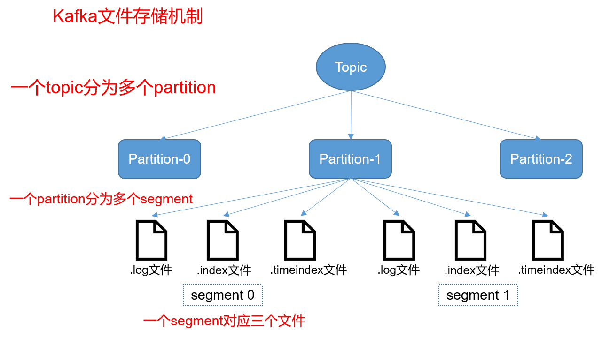

由于生产者生产的消息会不断追加到 log 文件末尾，为防止log文件过大导致数据定位效率低下，Kafka采取了分段和索引机制，

partition 在服务器上的表现形式就是一个一个的文件夹（命名规则：topic名称+分区序号），每个 partition 文件夹下面会有多组 segment（逻辑分组，并不是真实存在），每个 segment 对应三个文件 （.log文件、.index文件、.timeindex文件）。

log文件就实际是存储 message 的地方，而 index 和 timeindex 文件为索引文件，用于检索消息。

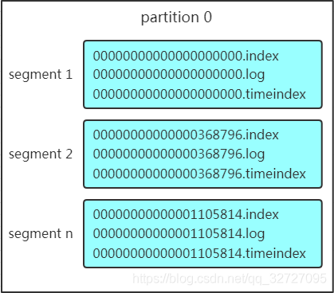
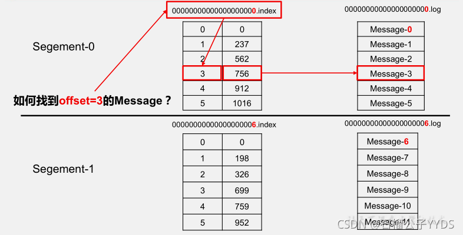
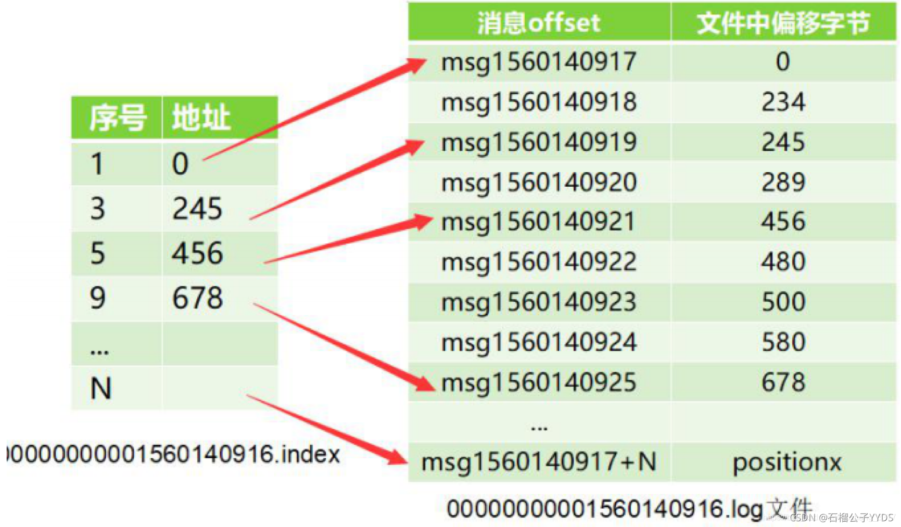

如上图，这个 partition 有三组 segment 文件，每个 log 文件的大小是一样的，但是存储的 message 数量是不一定相等的（每条的 message 大小不一致）。文件的命名是以该 segment 最小 offset 来命名的，如 000.index 存储offset为0~368795的消息，kafka就是利用分段+索引的方式来解决查找效率的问题。

**Message结构**

log 文件就是实际存储 message 的地方，在 producer 往 kafka 写入的也是一条一条的 message，消息主要包含消息体、消息大小、offset、压缩类型…等！主要是下面三个：
1. offset：offset是一个占8byte的有序id号，它可以唯一确定每条消息在parition内的位置。
2. 消息大小：消息大小占用4byte，用于描述消息的大小。
3. 消息体：消息体存放的是实际的消息数据（被压缩过），占用的空间根据具体的消息而不一样。

**存储策略**

无论消息是否被消费，kafka都会保存所有的消息。那对于旧数据有什么删除策略？
1. 基于时间，默认配置是168小时（7天）。
2. 基于大小，默认配置是1073741824。
```yml
#server.properties

#segment文件的大小，默认为 1G
log.segment.bytes=1024*1024*1024
#滚动生成新的segment文件的最大时长
log.roll.hours=24*7
#segment文件保留的最大时长，超时将被删除
log.retention.hours=24*7
```

**索引机制**

在kafka中，每个日志分段文件都对应了两个索引文件.index偏移量索引文件和 .timeindex时间戳索引文件，主要用来提高查找消息的效率。
1. 偏移量索引文件：用来建立消息偏移量(offset)到物理地址之间的映射关系，方便快速定位消息所在的物理文件位置。
2. 时间戳索引文件：则根据指定的时间戳(timestamp)来查找对应的偏移量信息。

Kafka 中的索引文件，以稀疏索引(sparse index)的方式构造消息的索引，它并不保证每个消息在索引文件中都有对应的索引项。每当写入一定量（由 broker 端参数 log.index.interval.bytes 指定，默认值为 4096，即 4KB）的消息时，偏移量索引文件 和 时间戳索引文件 分别增加一个偏移量索引项和时间戳索引项，增大或减小 log.index.interval.bytes 的值，对应地可以缩小或增加索引项的密度。

稀疏索引通过 MappedByteBuffer 将索引文件映射到内存中，以加快索引的查询速度。

偏移量索引文件中的偏移量是单调递增的，查询指定偏移量时，使用二分查找法来快速定位偏移量的位置，如果指定的偏移量不在索引文件中，则会返回小于指定偏移量的最大偏移量。

时间戳索引文件中的时间戳也保持严格的单调递增，查询指定时间戳时，也根据二分查找法来查找不大于该时间戳的最大偏移量，至于要找到对应的物理文件位置还需要根据偏移量索引文件来进行再次定位。

稀疏索引的方式是在磁盘空间、内存空间、查找时间等多方面之间的一个折中。

以偏移量索引文件来做具体分析。偏移量索引项的格式如下图所示。

每个索引项占用 8 个字节，分为两个部分：

(1) relativeOffset: 相对偏移量，表示消息相对于 baseOffset 的偏移量，占用 4 个字节（relativeOffset = offset - baseOffset），当前索引文件的文件名即为 baseOffset 的值。

例如：一个日志片段的 baseOffset 为 32，那么其文件名就是 00000000000000000032.log，offset=35 的消息在索引文件中的 relativeOffset 的值为 35-32=3

(2) position: 物理地址，也就是消息在日志分段文件中对应的物理位置，占用 4 个字节。

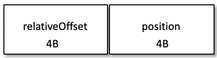
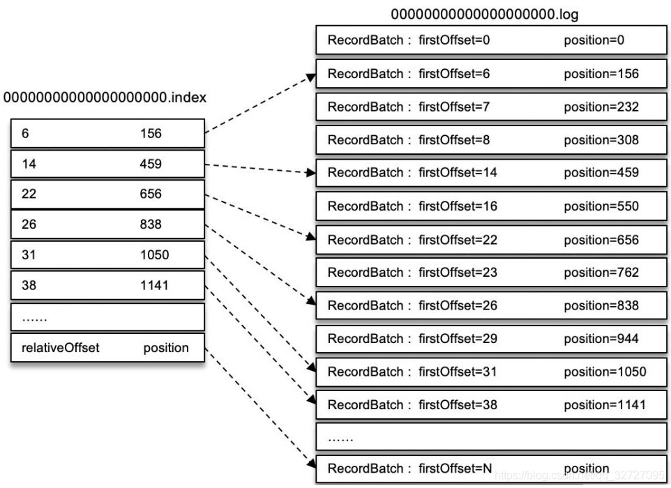

如何通过offset找到对应的消息？

　
1. 先找到 offset=3 的 message 所在的 segment文件（利用二分法查找），先判断.index文件名称offset（baseOffset ）是否小于3；
* 若小于，则继续二分与下一个.inde文件名称offset比较；
* 若大于，则返回上次小于3的.index文件，这里找到的就是在第一个segment文件。

2. 找到的 segment 中的.index文件，用查找的offset 减去.index文件名的offset，也就是00000.index文件，我们要查找的offset为3的message在该.index文件内的索引为3（index采用稀疏存储的方式，它不会为每一条message都建立索引，而是每隔4k左右，建立一条索引，避免索引文件占用过多的空间。缺点是没有建立索引的offset不能一次定位到message的位置，需要做一次顺序扫描，但是扫描的范围很小）。

3. 根据找到的相对offset为3的索引，确定message存储的物理偏移地址为756。

4. 根据物理偏移地址，去.log文件找相应的Message


#### 1.4.2.2. 日志文件清理策略
<a href="#menu" >目录</a>

日志的分段存储，一方面能够减少单个文件内容的大小，另一方面，方便kafka进行日志清理。日志的清理策略有两个（注：清理的是消息，即日志的一条记录，而不是删除整个日志）

* 根据消息的保留时间
    * 当消息在kafka中保存的时间超过了指定的时间，就会触发清理过程
    * 通过log.retention.hours进行设置，默认的保留时间是：7天
* 根据topic存储的数据大小
    * 当topic所占的日志文件大小大于一定的阀值，则可以开始删除最旧的消息
    * 通过log.retention.bytes进行设置

kafka会启动一个后台线程，定期检查是否存在可以删除的消息。当其中任意一个达到要求，都会执行删除。

所以，并不是consumer消费完后，就删除相应的消息，而是根据具体的broker清理策略进行消息清理。这也意味着一条消息可以被不同consumer group的消费者重复消费。

#### 1.4.2.3. 日志压缩策略
<a href="#menu" >目录</a>

Kafka还提供了“日志压缩（Log Compaction）”功能，通过这个功能可以有效的减少日志文件的大小， 缓解磁盘紧张的情况，在很多实际场景中，消息的key和value的值之间的对应关系是不断变化的，就像数据库中的数据会不断被修改一样，消费者只关心key对应的最新的value。

因此，可以开启kafka 的日志压缩功能，服务端会在后台启动启动Cleaner线程池，定期将相同的key进行合并，只保留最新的offset和 value值


### 1.4.3. kafka幂等性和事务
<a href="#menu" >目录</a>

Kafka的事务不同于Rocketmq，Rocketmq是保障本地事务(比如数据库)与mq消息发送的事务一致性，Kafka的事务主要是保障一次发送多条消息的事务一致性(要么同时成功要么同时失败)，一般在kafka的流式计算场景用得多一点，比如，kafka需要对一个topic里的消息做不同的流式计算处理，处理完分别发到不同的topic里，这些topic分别被不同的下游系统消费(比如hbase，redis，es等)，这种我们肯定希望系统发送到多个topic的数据保持事务一致性。Kafka要实现类似Rocketmq的分布式事务需要额外开发功能。

```java

```

### 1.4.4. ISR机制
<a href="#menu" >目录</a>

#### 1.4.4.1. 介绍
<a href="#menu" >目录</a>

ISR(In-Sync Replica)机制也就是kafka的数据同步机制。

kafka 为了保证数据的一致性使用了isr 机制
* 首先我们知道kafka 的数据是多副本的，某个topic的replication-factor为N且N大于1时，每个Partition都会有N个副本(Replica)。kafka的replica包含leader与follower。每个topic 下的每个分区下都有一个leader 和(N-1)个follower，
* 每个follower 的数据都是同步leader的 这里需要注意 是follower 主动拉取leader 的数据
* Replica的个数小于等于Broker的个数，也就是说，对于每个Partition而言，每个Broker上最多只会有一个Replica，因此可以使用Broker id 指定Partition的Replica

假如broker有两个，某个topic的分区有10个，如果replication-factor为1,那么kafka会将者是个分区均匀分到两个broker中，每个broker有５个分区，由于replication-factor为１，因此不存在follower副本。

假如broker有两个，某个topic的分区有10个，如果replication-factor为2,那么kafka会将者是个分区均匀分到两个broker中，每个broker有５个分区，由于replication-factor为２，同时会在另外一个broker创建这５个分区的副本，然后选举出leader副本。

注意:replication-factor不能超过broker的个数

follewer 只是数据的副本提供数据的可恢复性，本身和kafka 的读写性能无关（kafka的读写都是和leader 相关），那么每个分区都有多个副本，这样该如何确定副本的数据和leader 的数据是同步的

isr 的全称是：In-Sync Replicas isr 是一个副本的列表，里面存储的都是能跟leader 数据一致的副本，确定一个副本在isr列表中，有2个判断条件
* 根据副本和leader 的交互时间差，如果大于某个时间差 就认定这个副本不行了，就把此副本从isr 中剔除，此时间差根据
```yml
配置参数rerplica.lag.time.max.ms=10000 
也就是默认10s，isr中的follow没有向isr发送心跳包就会被移除
```
* 根据leader 和副本的信息条数差值决定是否从isr 中剔除此副本，此信息条数差值根据配置参数
```yml
rerplica.lag.max.messages=4000 决定 ，也就是默认消息差大于4000会被移除
```
注意点：kafka后续版本移除了第二个判断条件，只保留了第一个，以内极端情况下，如果producor一次性发来了10000条数据，而默认条数差立马会大于4000

#### 1.4.4.2. HW&LEO
<a href="#menu" >目录</a>

HW (HighWatermark)和LEO与ISR集合紧密相关。HW标记了一个特殊的offset，当消费者处理消息的时候，只能拉取到HW之前的消息，HW之后的消息对消费者来说是不可见的。与ISR集合类似，HW也是由Leader副本管理的。当ISR集合中全部的Fllower副本都拉取HW指定消息进行同步后，Leader副本会递增HW的值。Kafka官方网站将HW之前的消息的状态称为"commit"，其含义是这些消息在多个副本中同时存在，即使此时Leader副本损坏，也不会出现数据丢失。

LEO (Log End Offset)是所有的副本都会有的一个offset标记，它指向追加到当前副本的最后一个消息的offset。当生产者向Leader副本追加消息的时候，Leader副本的LEO标记会递增；当Follower副本成功从Leader副本拉取消息并更新到本地的时候，Follower副本的LEO就会增加。

为了让更好地理解HW和LEO之间的关系，下面通过一个示例进行分析ISR集合、HW与LEO是如何协调工作的:
1. Producer向此Partition推送消息。
2. Leader副本将消息追加到Log中，并递增其LEO。
3. Follower副本从Leader副本拉取消息进行同步。
4. Follower副本将拉取到的消息更新到本地Log中，并递增其LEO。
5. 当ISR集合中所有副本都完成了对新增的消息的同步，Leader副本会递增HW。
在1~5步完成之后，新的消息就对消费者可见了

在分布式存储中，分为同步复制和异步复制。同步复制要求所有的副本都完成复制之后才会认为数据发送成功，存在的问题是如果一个副本复制很慢，将会拖慢整个过程。异步复制只要leader收到消息后就认为数据发送成功，但如果数据还未完成同步到follower，leader就宕机，集群此时会从follower选举新的leader，所有的数据将从新的leader中同步，那么将造成消息丢失。

kafka权衡了上述两种策略，引入了ISR集合的概念，当Follower副本延迟过高时，Follower副本被踢出ISR集合，使得消息依然能快速被提交。

可以通过从ISR集合中踢出高延迟的Follower副本，避免高延迟副本影响集群性能；

当Leader副本宕机时，kafka会优先将ISR集合中的Follower副本选举为Leader副本，新副本包含了HW之前的全部消息，从而避免消息丢失。

注意：Follower副本更新消息时采用的是批量写磁盘，加速了磁盘IO，极大减少了Follower与Leader的差距。


## 1.5. 深入Kafka
<a href="#menu" >目录</a>


### 1.5.1. 集群成员关系
<a href="#menu" >目录</a>

* kafka使用zookeeper来维护集群成员的信息
* 每个broker都有一个唯一的标识符broker ID，这个标识符可以配置文件指定，也可以自动生成，在启动时，通过创建临时节点把自己的ID注册到Zookeeper（/brokers/ids）
* 在broker停机，出现网络分区或长时间垃圾回收停顿时，broker会从Zookeeper上断开连接


### 1.5.2. 控制器
<a href="#menu" >目录</a>

* 控制器
    * 就是一个broker,除了具有一般broker的功能之外。还负责分区首领的选举。
    * 控制器负责主题的创建与删除、分区和副本的管理以及代理故障转移处理等
    * 控制器负责在节点加入或者离开集群时进行分区首领选举，控制器使用epoch来避免脑裂
    * 集群里第一个启动的broker通过在zk里创建一个临时节点/controller让自己成为控制器
   
    * controler_epoch  
        * 用于记录控制器发生变更次数，即记录当前的控制器是第几代控制器（本书中我们称之为控制器轮值次数）。初始值为 0，当控制器发生变更时，每选出一个新的控制器需将该宇段加 1 ，每个向控制器发迭的请求都会带上该字段，如果请求的controller_epoch 的值小于内存中 controller_epoch 的值，则认为这个请求是向己过期的控制器发迭的请求，那么本次请求就是一个无效的请求。若该值大于内存中 controller_epoch 的值，则说明己有新的控制器当选了。通过该值来保证集群控制器的唯一性，进而保证相关操作一致性。该字段对应 ZooKeeper 的 controller_epoch 节点，通过登录 ZooKeeper客户端执行 get/controller_epoch 命令，可以查看该字段对应的值。
    * zkVersion 
        * 作用类似数据库乐观锁，用于更新 ZooKeeper 路径下相应元数据信息，如ontroller epoch, JSR 信息等。
    * leader_epoch
        * 分区 Leader 更新次数。 controller_epoch 是相对代理而言的，而 leader_epoch是相对于分区来说的。由于各请求达到顺序不同，控制器通过 con位oller_epoch 和leader_epoch 来确定具体应该执行哪个命令操作。
    * 己分配副本（ assigned replica ）
        * 每个分区的所有副本集合被称作己分配副本，简写为AR，本书中所有 AR 均表示此含义，而 JSR 是与分区 Leader 保持同步的副本列表。
    * LeaderAndlsr
        *  Kafka 将 Leader 对应的 brokerld 和 ISR 列表封装成一个 LeaderAndlsr类 。 以 JSON 串表示为｛” leader”：Leader 的 brokerld，”leader_epoch”：leader 更新次数，” isr”： ISR 列表｝
    * 优先副本（ preferred replica ）
        * 在 AR 中，第一个副本称为preferredreplica，也就是我们说的优先副本。理想情况下，优先副本即是该分区的 Leader , Kafka 要确保所有主题的优先副本在 Kafka 集群中均衡分布，这样就保证了所有分区的 Leader 均衡分布。保证Leader 在集群中均衡分布很重要，因为所有的读写请求都由分区 Leader 副本进行处理，如果 Leader 分布过于集中，就会造成集群负载不均衡。为了保证优先副本的均衡分布，Kafka 提供了 5 种分区选举器（ PartitionLeaderSelector ），当分区数发生变化或是分区Leader 岩机时就会通过分区选举器及时选出分区新的 Leader 。
    * Leader选举
        * 每个集群节点从zk的/controller获取Leader信息，从中提取leaderId
        * leaderId为-1，说明还没有进行选举，则该节点将带自己的brokerId信息{"version":1,"brokerId":1,"timestamp":xxxx}写入zk节点/controller.写入成功，那么将被选举为Leader
        * 如果创建失败或者读取的leadeId为-1，说明其他节点已经称为Leader,那么将读取zk中已经注册的leaderId读取并缓存到内存中。
        * 其他的节点也会尝试创建，由于控制器节点已经存在，后续创建将会失败，并监听该zk节点，保证控制器下线时其他节点能够接管。
        * 控制器节点下线以后，临时节点删除，其他的broker节点会尝试申请作为控制器，第一个申请到的将作为控制器，并创建控制器节点，其他节点会监听这个新的zk控制器节点


* 集群有节点下线
    * 监听zk路径能够知道哪个broker下线
    * 假如离开的是分区的新首领
        * 控制器将遍历这些分区，并确定谁称为新首领(分区副本列表里的下一个副本)
        * 然后向所有包含新首领或现有跟随者的broker发送请求，该请求消息包含了谁是新首领以及谁是分区跟随者。
        * 随后，新首领开始处理来自生产者和消费者的请求，而跟随者开始从新首领复制消息。
* 集群节点上线
    * 新的节点上线时，会使用broker ID检查新加入的broker是否包含现有分区的副本。
        * 如果有，控制器会把变更通知发送给新加入的broker和其他broker,新的broker开始从首领那里复制消息

* 主题管理
    * 创建主题
        * 当创建一个主题时会在 ZooKeeper 的/brokers/topics 目录下创建一个与主题同名的节点 ， 在该节点下会记录该主题的分区副本分配方案。 
    * 删除主题

### 1.5.3. 协调器
Kafka 提供了消费者协调器（ ConsumerCoordinator ）、组协调器 （ roupCoordinator ）和任务管理协调器 C WorkCoordinator) 3 种协调器（ coordinator ） 。 其中任务管理协调器被 Kafka Conn巳ct用于对 works 的管理，本书不进行介绍，我们重点关注的是消费者协调器和组协调器，这两种协调器与消费者密切相关。
Kafka 的高级消费者即通过 ZooKeeperConsumerConnector 实现的消费者是强依赖于 ZooKeeper的，每一个消费者启动时都会在 ZooKeeper 的／consumers/${group.id }/ids 上注册消费者的客户端id ，即$ {client. id｝，会在该路径以及/brokers/i ds 路径下注册监昕器，用于当代理或是消费者发生变化时，消费者进行平衡操作 。 由于这种方式是每一个消费者对 ZooKeeper 路径分别进行监听，当发生平衡操作时 ， 一个消费组下的所有消费者同时会触发平衡操作，而消费者之间井不知道其他消费者平衡操作的结果，这样就可能导致 Kafka 工作在一个不正确的状态 。 同时这种方式完全依赖于 ZooKeeper，以监听的方式来管理消费者，存在以下两个缺陷 。
* 羊群效应（ herd effect ）
    * 任何代理或是消费者的增、减都会触发所有的消费者同时进行平衡操作 ，每个消费者都对 ZooKeeper 同一个路径进行操作，这样就有可能发生类似死锁的情况，从而导致平衡操作失败 。
* 脑裂问题（ split brain ）
    * 消费者进行平衡操作时每个消费者都与 ZooKeeper 进行通信，以判断消费者或是代理变化情况，由于 ZooKeeper 本身的特性可能导致在同一时候各消费者所获取的状态不一致，这样就会导致 Kafka 运行在一个不正确状态之下 .
    
鉴于旧版高级消费者存在问题，新版消费者进行了重新设计，引入了协调器 。 对于 Kafka引入协调器的发展过程我们不做细化。大家需要知道的是，为了解决消费者依赖 ZooKeeper 所带来的问题， Kafka 在服务端引入了组协调器（ GroupCoordinator ），每个 KafkaServer 启动时都会创建一个 GroupCoordinator 实例，用于管理部分消费组和该消费组下每个消费者的消费偏移量。 同时在客户端引入了消费者协调器（ConsumerCoordinator ），每个 KafkaConsumer 实例化时会实例化一个 ConsumerCoordinator 对象，消费者协调器负责同一个消费组下各消费者与服务端组协调器之间的通信 。

**消费者协调器**
**组协调器**

### 1.5.4. 网络通信服务

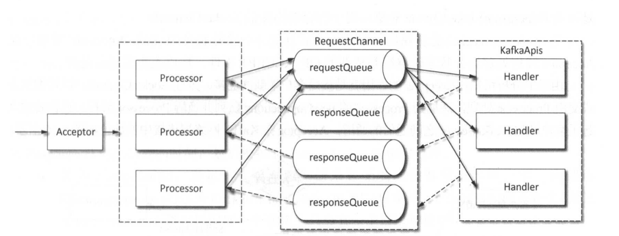

* SocketServer基于Java NIO实现的网络通信组件
* 线程模型
    * 一个Acceptor负责接收客户端所有的连接
    * N ( ${num.network血reads ｝ ）个 Processor 线程 ， 每个 Processor 有多个Selector ， 负责从每个连接中读取请求； M ( ${num.io.threads ｝ ）个 Handler ( KafkaRequestHandler )线程处理请求，井将产生的请求返回给 Processor 线程。、
    * 而 Handler 是由 KafkaRequestHandlerPool管理 ，在 Processor 和 Handler 之间通过 RequestChannel 来缓冲请求，每个 Handler 从RequestChannel.requestQueue 接受 RequestChannel.Request ， 井把 Request 交由 KafkaA pis 的handle（）方法处理 ， 经处理后把对应的 Response 存进 RequestChannel.responseQueues 队列 。

**Acceptor**
* Acceptor 的主要职责是监昕并接受客户端（统指请求发起方） 的请求，建立和客户端的数据传输通道 ServerSocketChannel ，然后为客户端指定一个 Processor。
    
**Processor**
* Processor 也是一个线程类 ，继承 AbstractServerThread 类，主要用于从客户端读取请求数据和将相应的响应结果返回给客户端。

**RequestChannel**
* RequestChannel 是为了给 Processor 线程与 Handler线程之间通信提供数据缓冲，是通信过程中 Request 与 Response 缓存的通道，是 Processor 线程与 Handler 线程交换数据的地方 。

### 1.5.5. 日志管理
<a href="#menu" >目录</a>

日志管理器 （ LogManager）是 Kafka 用来管理所有日志的 ， 也称为日志管理子系统（ LogManagement Subsystem ）。 它负责管理 日 志的创建与删除 、 日志检索 、 日志加载和恢复、检查点及日志文件刷写磁盘 以及日志清理等

#### 1.5.5.1. 日志结构
<a href="#menu" >目录</a>


* Kafka 消息是以主题为基本单位进行组织的， 各个主题之间相互独立 。 
* 每个主题在逻辑结构上又由一个或多个分区构成，分区数可以在创建主题时指定，也可以在主题创建后再修改。 但只能增加一个主题的分区数而不能减少其分区数 。因为减少分区数，还需要进行数据复制，而增加分区就不需要
* 每个分区可以有一个或多个副本，从副本中会选出一个副本作为Leader,Leader负责与客户端进行读写操作，其他副本作为Follower。生产者将消息发送到Leader副本的代理节点，而Follower副本从Leader副本同步数据。

在存储结构 上分区 的每个副本在逻辑上对应一个 Log 对象 ， 每个 Log 又划分为多个LogSegment，每个LogSegment包括一个日志文件和两个索引文件，其中两个索引文件分别为偏移量索引文件和时间戳索引文件。 Log 负责对 LogSegment 的管理，在 Log 对象中维护了 一个 ConcurrentSkipListMap，其底层是一个跳跃表，保存该主题所有分区对应的所有 LogSegment。Kafka 将日志文件封装为 一 个 FileMessageSet 对象，将两个索引文件封装为 Offsetlndex 和Timelndex 对 象。 Log 和 LogSegment 都是逻辑上的概念， Log 是对副本在代理上存储文件的逻辑抽象， LogSegrnnent 是对副本存储文件下每个日志片段的抽象，日志文件和索引文件才与磁盘上的物理存储相对应。假设有一个名为“ log-format”的主题，该主题有 3 个分区，每个分区对应一个副本，则在存储结构中各对象映射关系如图 


在存储结构上每个分区副本对应一个目录，每个分区副本由一个或多个日志段（ LogSegment ）组成。每个日志段在物理结构上对应一个以“ .index ”为文件名后缀的偏移量索引文件、一个以“ .timeindex ”为文件名后缀的时间戳索引文件以及一个以“ .log”为文件名后缀的消息集文件（ FileMessageSet），消息集文件即日志文件或数据文件。需要说明的是 ，时间戳索引文件是在 0.10.1.1 版本新增加的索引文件，在这之前的版本只有偏移量索引文件。
数据文件的大小由配置项 log.segment.bytes 指定，默认为 l GB ( 1 073 741 824 字节），同时 Kafka提供了根据时间来切分日志段的机制，即若数据文件大小没有达到 log.segment.bytes 设置的阔值，但达到了 log.roll.ms 或是 log.roll.hours 设置的阔值，同样会创建新的日志段 ， 在磁盘上创建一个数据文件和两个索引文件。接收消息追加（ append ）操作的日志段也称为活跃段( activeSegment ） 。
由图于 19 也可以看出 ， 分区所对应目录的命名规则为 ： 主题名 ．分区编号，分区编号从 0开始，顺序递增 ， 分区编号最大值为分区总数减 1 ，例如，对“ log-format”主题，其分区目录依次为 log-format-0 、 log-format-I 和 log-format-2。数据文件命名规则为：由数据文件的第一条消息偏移量，也称为基准偏移量（ BaseO:ffset ）， 左补 0 构成 20 位数字字符组成 ， 每个分区第一个数据文件的基准偏移量为 0， 因此每个分区第一个数据文件对应的日志文件为 0000000000000000000.log,两个索引文件分别为 0000000000000000000.index 和 0000000000000000000.timeindex 。后续每个数据文件的基准偏移量为上一个数据文件最后一条消息对应的偏移量 Clog end offset, LEO ）值
加 1 。

**消息结构**

数据文件用来存储消息，每条消息由一个固定长度的消息头和一个可变长度（N 字节〉的净荷(payload ）组成。


|名称|长度(字节)|说明|
|---|---|---|
|CRC32|4|CRC32 校验和
|magic|1|Kafka 服务程序协议版本号 ，用来作兼容，当前版本的 Kafka 该值为 1
|attributes|1|该字段占1字节，其中低两位用来表示压缩方式，第三位表示时间戳类型 ，高 4 位为预留位置，暂无实际意义
|timestamp|8|消息时间戳，当 magic 值大于 0 时消息头必须包括该字段
|key-length|4|消息 Key 的长度
|key|N|消息、 Key 实际数据
|payload-length|4|消息实际数据长度
|payload|N|消息实际数据
在实际存储时一条消息总长度还包括 12 字节额外的开销（ LogOverhead ），这 12 字节包括两部分。其中一部分用 8 字节长度记录消息的偏移量，每条消息的偏移量是相对该分区下第一个数据文件的基准偏移量而言，它唯一确定一条消息在分区下的逻辑位置，同一个分区下的消息偏移量按序递增，若与数据库类比，消息偏移量即为消息的 Id，即自增的主键。另外 4 字节表示消息总长度。


#### 1.5.5.2. 日志管理器启动过程
<a href="#menu" >目录</a>


#### 1.5.5.3. 日志加载及恢复
<a href="#menu" >目录</a>


#### 1.5.5.4. 日志清理
<a href="#menu" >目录</a>


### 1.5.6. 复制
<a href="#menu" >目录</a>

* 副本类型
    * 首领副本
        * 每个分区都有一个，为了保证一致性，所有生产者请求和消费者请求都会经过首领副本
        * 
    * 跟随者副本
        * 首领以外的都是跟随者副本
        * 跟随者副本不处理客户端的请求
        * 唯一的任务就是从首领复制消息，保持数据一致性。
        * 如果首领节点失败，其中一个跟随者将成为首领副本

### 1.5.7. 处理请求
<a href="#menu" >目录</a>

* 消息标准头
    * Request Type 
    * Request Version（客户端版本，根据客户端版本作出不同的响应）
    * Correlation ID .一个具有唯一性的数字，用于标识请求消息，同时也会出现在响应消息和错误日志里
    * Client ID用于标识发送请求的客户端
* 消息线程处理
    * broker会在它监听的每一个端口上运行一个Acceptor线程，这个线程会创建一个连接，并把它交给Processor线程去处理，Processor线程数量是可配置的
    * 网络线程负责从客户端获取请求消息，把它们放进**请求队列**，然后从**响应队列**里获取响应消息，把它们发送给客户端
    * IO线程从**请求队列**里获取请求并处理，处理结果放入**响应队列**

### 1.5.8. 生产请求
<a href="#menu" >目录</a>

* 生产者发送的请求，它包含客户端要写入broker的消息


### 1.5.9. 获取请求
<a href="#menu" >目录</a>

* 在消费者和跟随者副本需要从broker读取消息时发送的请求

### 1.5.10. 其他请求
<a href="#menu" >目录</a>


### 1.5.11. 物理存储
<a href="#menu" >目录</a>


## 1.6. 可靠的数据传递
<a href="#menu" >目录</a>

### 1.6.1. 可靠性保证
<a href="#menu" >目录</a>

### 1.6.2. 复制
<a href="#menu" >目录</a>

### 1.6.3. broker配置
<a href="#menu" >目录</a>


### 1.6.4. 在可靠的系统里使用生产者
<a href="#menu" >目录</a>


### 1.6.5. 在可靠的系统里使用消费者
<a href="#menu" >目录</a>


### 1.6.6. 验证系统可靠性
<a href="#menu" >目录</a>


## 1.7. 构建数据管道
<a href="#menu" >目录</a>


## 1.8. 跨越集群数据镜像
<a href="#menu" >目录</a>

### 1.8.1. 跨集群镜像的使用场景
<a href="#menu" >目录</a>


### 1.8.2. 多集群架构
<a href="#menu" >目录</a>


## 1.9. 管理Kafaka
<a href="#menu" >目录</a>


## 1.10. 监控Kafka
<a href="#menu" >目录</a>

### 1.10.1. broker的度量指标
<a href="#menu" >目录</a>

### 1.10.2. 非同步分区
<a href="#menu" >目录</a>

### 1.10.3. broker度量指标
<a href="#menu" >目录</a>


### 1.10.4. 主题和分区的度量指标
<a href="#menu" >目录</a>

### 1.10.5. Java虚拟机监控
<a href="#menu" >目录</a>

### 1.10.6. 操作系统监控
<a href="#menu" >目录</a>


### 1.10.7. 日志
<a href="#menu" >目录</a>


### 1.10.8. 客户端监控
<a href="#menu" >目录</a>

### 1.10.9. 生产者度量指标

### 1.10.10. 消费者度量指标

### 1.10.11. 配额


### 1.10.12. 延迟监控
<a href="#menu" >目录</a>


### 1.10.13. 端到端监控
<a href="#menu" >目录</a>


## 1.11. 流式处理
<a href="#menu" >目录</a>

### 1.11.1. 什么是流式处理
<a href="#menu" >目录</a>

* 数据流
    * 无边界数据集的抽象表示，无边界意味着无限和持续增长。无限是因为随着时间的推移，新的记录会不断加入进来。
* 事件流是有序的，比如要先存钱再取钱。如果顺序颠倒呈现结果就会不一样。
* 不可变的数据记录
    * 时间一旦发生，就不能被改变
* 事件流是可重播的

* 数据处理的三种范式
    * 请求与响应
        * 延迟最小，响应时间在亚毫秒和毫秒之间 
    * 批处理
        * 具有高延迟和高吞吐量的特点
    * 流式处理

### 1.11.2. 流式处理的概念
<a href="#menu" >目录</a>

**时间**

* 事件时间
    * 追踪事件的发声时间和记录的创建时间
* 日志追加时间 
    * 事件保存到broker的时间
* 处理时间
    * 应用程序在收到事件之后要对齐进行处理的时间

在处理与时间有关的问题时，需要注意时区的问题，整个数据管道应该使用同一个时区，否则操作结果可能会出现混淆。


**状态**

* 本地状态和内部状态

* 外部状态

**流和表的二元性**
流包含了变更，流是一系列事件，每个事件就是一个变更。
表包含了当前的状态，是多个变更所产生的结果。

为了将表转化成流，需要捕捉到表上的所发生的变化，将增删改操作事件保存到流里。

为了将流转化成表，需要应用流里所包含的所有变更，这就叫做流的物化。现在数据库里创建一张表，然后从头到尾遍历流里的所有事件，逐个改变状态。在完成这个过程之后，就得到一张表。


**时间窗口**
* 大部分针对流的操作都是基于时间窗口的，比如移动平均数，一周内销量最好的产品。一般需要关注以下几个点:窗口的大小，窗口移动的频率，窗口的可更新时间多长。


### 1.11.3. 使用场景
<a href="#menu" >目录</a>

### 1.11.4. 流式处理的设计模式
<a href="#menu" >目录</a>

### 1.11.5. 实例
<a href="#menu" >目录</a>


### 1.11.6. 架构概览
<a href="#menu" >目录</a>


### 1.11.7. 如何选择流式处理框架
<a href="#menu" >目录</a>


## 1.12. 线上问题
<a href="#menu" >目录</a>

### 1.12.1. 如何防止消息丢失
<a href="#menu" >目录</a>


消息丢失情况：

**消息发送端：**
* acks=0： 表示producer不需要等待任何broker确认收到消息的回复，就可以继续发送下一条消息。性能最高，但是最容易丢消息。大数据统计报表场景，对性能要求很高，对数据丢失不敏感的情况可以用这种。
* acks=1： 至少要等待leader已经成功将数据写入本地log，但是不需要等待所有follower是否成功写入。就可以继续发送下一条消息。这种情况下，如果follower没有成功备份数据，而此时leader又挂掉，则消息会丢失。
* acks=-1或all： 这意味着leader需要等待所有备份(min.insync.replicas配置的备份个数)都成功写入日志，这种策略会保证只要有一个备份存活就不会丢失数据。这是最强的数据保证。一般除非是金融级别，或跟钱打交道的场景才会使用这种配置。当然如果min.insync.replicas配置的是1则也可能丢消息，跟acks=1情况类似。

**消息消费端：**如果消费这边配置的是自动提交，万一消费到数据还没处理完，就自动提交offset了，但是此时你consumer直接宕机了，未处理完的数据丢失了，下次也消费不到了。


### 1.12.2. 如何防止消息重复
<a href="#menu" >目录</a>

**消息发送端：**发送消息如果配置了重试机制，比如网络抖动时间过长导致发送端发送超时，实际broker可能已经接收到消息，但发送方会重新发送消息

**消息消费端：**如果消费这边配置的是自动提交，刚拉取了一批数据处理了一部分，但还没来得及提交，服务挂了，下次重启又会拉取相同的一批数据重复处理

一般消费端都是要做消费幂等处理的。

消息传递保障
* at most once(消费者最多收到一次消息，0–1次)：acks = 0 可以实现。
    * 由于只要leader收到就会回复ack，所以消息可能会丢失
* at least once(消费者至少收到一次消息，1–多次)：ack = all 可以实现。
* exactly once(消费者刚好收到一次消息)：at least once 加上消费者幂等性可以实现，还可以用kafka生产者的幂等性来实现。

kafka生产者的幂等性：因为发送端重试导致的消息重复发送问题，kafka的幂等性可以保证重复发送的消息只接收一次，只需在生产者加上参数 props.put(“enable.idempotence”, true) 即可，默认是false不开启。
具体实现原理是，kafka每次发送消息会生成PID和Sequence Number，并将这两个属性一起发送给broker，broker会将PID和Sequence Number跟消息绑定一起存起来，下次如果生产者重发相同消息，broker会检查PID和Sequence Number，如果相同不会再接收。

​ PID：每个新的 Producer 在初始化的时候会被分配一个唯一的 PID，这个PID 对用户完全是透明的。生产者如果重启则会生成新的PID。 Sequence Number：对于每个 PID，该 Producer 发送到每个 Partition 的数据都有对应的序列号，这些序列号是从0开始单调递增的。


### 1.12.3. 幂等性如何保证
<a href="#menu" >目录</a>

### 1.12.4. 如何做到顺序消费
<a href="#menu" >目录</a>

如果发送端配置了重试机制，kafka不会等之前那条消息完全发送成功才去发送下一条消息，这样可能会出现，发送了1，2，3条消息，第一条超时了，后面两条发送成功，再重试发送第1条消息，这时消息在broker端的顺序就是2，3，1了

所以，是否一定要配置重试要根据业务情况而定。也可以用同步发送的模式去发消息，当然acks不能设置为0，这样也能保证消息发送的有序。

kafka保证全链路消息顺序消费，需要从发送端开始，将所有有序消息发送到同一个分区，然后用一个消费者去消费，但是这种性能比较低，可以在消费者端接收到消息后将需要保证顺序消费的几条消费发到内存队列(可以搞多个)，一个内存队列开启一个线程顺序处理消息。

### 1.12.5. 解决消息积压问题
<a href="#menu" >目录</a>

* 线上有时因为发送方发送消息速度过快，或者消费方处理消息过慢，可能会导致broker积压大量未消费消息。

此种情况如果积压了上百万未消费消息需要紧急处理，可以修改消费端程序，让其将收到的消息快速转发到其他topic(可以设置很多分区)，然后再启动多个消费者同时消费新主题的不同分区。

* 由于消息数据格式变动或消费者程序有bug，导致消费者一直消费不成功，也可能导致broker积压大量未消费消息。

此种情况可以将这些消费不成功的消息转发到其它队列里去(类似死信队列)，后面再慢慢分析死信队列里的消息处理问题。


### 1.12.6. 延迟队列
<a href="#menu" >目录</a>

延时队列存储的对象是延时消息。所谓的“延时消息”是指消息被发送以后，并不想让消费者立刻获取，而是等待特定的时间后，消费者才能获取这个消息进行消费，延时队列的使用场景有很多， 比如 ：

1）在订单系统中， 一个用户下单之后通常有 30 分钟的时间进行支付，如果 30 分钟之内没有支付成功，那么这个订单将进行异常处理，这时就可以使用延时队列来处理这些订单了。

2）订单完成1小时后通知用户进行评价。

**实现思路：**发送延时消息时先把消息按照不同的延迟时间段发送到指定的队列中（topic_1s，topic_5s，topic_10s，…topic_2h，这个一般不能支持任意时间段的延时），然后通过定时器进行轮训消费这些topic，查看消息是否到期，如果到期就把这个消息发送到具体业务处理的topic中，队列中消息越靠前的到期时间越早，具体来说就是定时器在一次消费过程中，对消息的发送时间做判断，看下是否延迟到对应时间了，如果到了就转发，如果还没到这一次定时任务就可以提前结束了。


### 1.12.7. 消息回溯
<a href="#menu" >目录</a>

如果某段时间对已消费消息计算的结果觉得有问题，可能是由于程序bug导致的计算错误，当程序bug修复后，这时可能需要对之前已消费的消息重新消费，可以指定从多久之前的消息回溯消费，这种可以用consumer的offsetsForTimes、seek等方法指定从某个offset偏移的消息开始消费

# 2. 分区数越多吞吐量越高吗
<a href="#menu" >目录</a>

从压测结果来看，分区数到达某个值吞吐量反而开始下降，实际上很多事情都会有一个临界值，当超过这个临界值之后，很多原本符合既定逻辑的走向又会变得不同。一般情况分区数跟集群机器数量相当就差不多了。

当然吞吐量的数值和走势还会和磁盘、文件系统、 I/O调度策略等因素相关。