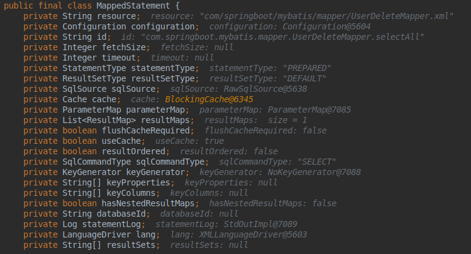
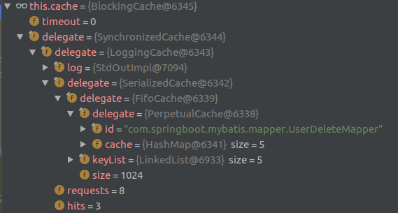

<span id="menu"></span>

<!-- TOC -->

- [1. Mybatis](#1-mybatis)
    - [1.1. 简介](#11-简介)
        - [1.1.1. 传统的JDBC编程](#111-传统的jdbc编程)
        - [1.1.2. ORM模型](#112-orm模型)
        - [1.1.3. HIBERNATE与MYBATIS的对比](#113-hibernate与mybatis的对比)
        - [1.1.4. Mybatis与iBatis的主要差异对比](#114-mybatis与ibatis的主要差异对比)
        - [1.1.5. Mybatis基本构成](#115-mybatis基本构成)
        - [1.1.6. 常见面试题](#116-常见面试题)
    - [1.2. 基本使用例子](#12-基本使用例子)
        - [1.2.1. 依赖](#121-依赖)
        - [1.2.2. yml配置](#122-yml配置)
        - [1.2.3. 启动类添加注解](#123-启动类添加注解)
        - [1.2.4. mapper.xml文件配置](#124-mapperxml文件配置)
    - [1.3. 基本构成](#13-基本构成)
    - [1.4. 配置](#14-配置)
        - [1.4.1. 配置](#141-配置)
        - [1.4.2. 属性（properties）](#142-属性properties)
        - [1.4.3. 设置（settings）](#143-设置settings)
        - [1.4.4. 类型别名（typeAliases）](#144-类型别名typealiases)
        - [1.4.5. 类型处理器（typeHandlers）](#145-类型处理器typehandlers)
        - [1.4.6. 处理枚举类型](#146-处理枚举类型)
        - [1.4.7. 对象工厂（objectFactory）](#147-对象工厂objectfactory)
        - [1.4.8. 插件（plugins）](#148-插件plugins)
        - [1.4.9. 环境配置（environments）](#149-环境配置environments)
        - [1.4.10. 事务管理器（transactionManager）](#1410-事务管理器transactionmanager)
        - [1.4.11. 数据源（dataSource）](#1411-数据源datasource)
        - [1.4.12. 数据库厂商标识（databaseIdProvider）](#1412-数据库厂商标识databaseidprovider)
        - [1.4.13. 映射器（mappers）](#1413-映射器mappers)
    - [1.5. XML 映射文件](#15-xml-映射文件)
        - [1.5.1. select](#151-select)
        - [1.5.2. Insert, Update, Delete 元素的属性](#152-insert-update-delete-元素的属性)
            - [1.5.2.1. 使用JDBC方式返回主键自增的值](#1521-使用jdbc方式返回主键自增的值)
            - [1.5.2.2. 使用selectKey返回主键的值](#1522-使用selectkey返回主键的值)
        - [1.5.3. sql](#153-sql)
        - [1.5.4. 参数](#154-参数)
        - [1.5.5. 字符串替换](#155-字符串替换)
        - [1.5.6. 结果映射](#156-结果映射)
        - [1.5.7. 高级结果映射](#157-高级结果映射)
        - [1.5.8. 结果映射（resultMap）](#158-结果映射resultmap)
        - [1.5.9. 支持的 JDBC 类型](#159-支持的-jdbc-类型)
        - [1.5.10. 构造方法](#1510-构造方法)
        - [1.5.11. 关联](#1511-关联)
        - [1.5.12. 关联的嵌套 Select 查询](#1512-关联的嵌套-select-查询)
        - [1.5.13. 关联的嵌套结果映射](#1513-关联的嵌套结果映射)
        - [1.5.14. 关联的多结果集（ResultSet）](#1514-关联的多结果集resultset)
        - [1.5.15. 集合](#1515-集合)
        - [1.5.16. 集合的嵌套 Select 查询](#1516-集合的嵌套-select-查询)
        - [1.5.17. 集合的嵌套结果映射](#1517-集合的嵌套结果映射)
        - [1.5.18. 集合的多结果集（ResultSet）](#1518-集合的多结果集resultset)
        - [1.5.19. 鉴别器](#1519-鉴别器)
        - [1.5.20. 自动映射](#1520-自动映射)
    - [1.6. 动态 SQL](#16-动态-sql)
        - [1.6.1. if](#161-if)
        - [1.6.2. choose, when, otherwise](#162-choose-when-otherwise)
        - [1.6.3. trim, where, set](#163-trim-where-set)
        - [1.6.4. WHERE](#164-where)
        - [1.6.5. foreach](#165-foreach)
        - [1.6.6. script](#166-script)
        - [1.6.7. bind](#167-bind)
    - [1.7. 插件](#17-插件)
        - [1.7.1. 拦截的接口](#171-拦截的接口)
        - [1.7.2. 拦截器实现](#172-拦截器实现)
        - [1.7.3. 签名说明](#173-签名说明)
        - [1.7.4. 常用工具类MetaObject](#174-常用工具类metaobject)
        - [1.7.5. 在Spring中引入](#175-在spring中引入)
        - [1.7.6. 实现一个插件](#176-实现一个插件)
    - [1.8. 代码生成器](#18-代码生成器)
        - [1.8.1. 创建需要生成的数据表](#181-创建需要生成的数据表)
        - [1.8.2. 创建Mybatis代码自动生成配置文件](#182-创建mybatis代码自动生成配置文件)
        - [1.8.3. 配置运行](#183-配置运行)
    - [1.9. Mybatis整体架构](#19-mybatis整体架构)
        - [1.9.1. 基础支持层](#191-基础支持层)
            - [1.9.1.1. 解析器模块](#1911-解析器模块)
            - [1.9.1.2. 反射模块](#1912-反射模块)
            - [1.9.1.3. 类型转换模块](#1913-类型转换模块)
            - [1.9.1.4. 日志模块](#1914-日志模块)
            - [1.9.1.5. 资源加载模块](#1915-资源加载模块)
            - [1.9.1.6. 数据源模块](#1916-数据源模块)
            - [1.9.1.7. 事务管理](#1917-事务管理)
            - [1.9.1.8. 缓存模块](#1918-缓存模块)
            - [1.9.1.9. Binding 模块](#1919-binding-模块)
        - [1.9.2. 核心处理层](#192-核心处理层)
        - [1.9.3. 接口层](#193-接口层)
        - [1.9.4. 模块说明](#194-模块说明)
    - [1.10. MyBatis实现原理](#110-mybatis实现原理)
        - [1.10.1. 基本的例子](#1101-基本的例子)
        - [1.10.2. 执行流程](#1102-执行流程)
            - [1.10.2.1. 解析XML配置文件](#11021-解析xml配置文件)
            - [1.10.2.2. 获取mapper对象](#11022-获取mapper对象)
            - [1.10.2.3. 执行拦截](#11023-执行拦截)
            - [1.10.2.4. SqlSession处理](#11024-sqlsession处理)
            - [1.10.2.5. MappedStatement](#11025-mappedstatement)
            - [1.10.2.6. Executor](#11026-executor)
                - [1.10.2.6.1. BaseExecutor](#110261-baseexecutor)
                - [1.10.2.6.2. SimpleExecutor](#110262-simpleexecutor)
                - [1.10.2.6.3. BatchExecutor](#110263-batchexecutor)
                - [1.10.2.6.4. ReuseExecutor](#110264-reuseexecutor)
                - [1.10.2.6.5. CachingExecutor](#110265-cachingexecutor)
            - [1.10.2.7. Statement](#11027-statement)
            - [1.10.2.8. ResultSetHandler](#11028-resultsethandler)
            - [1.10.2.9. RowBounds分页说明](#11029-rowbounds分页说明)
    - [1.11. Mybatis 缓存](#111-mybatis-缓存)
        - [1.11.1. 基本概念](#1111-基本概念)
            - [1.11.1.1. 基本介紹](#11111-基本介紹)
            - [1.11.1.2. 基本配置](#11112-基本配置)
        - [1.11.2. 缓存顶层接口](#1112-缓存顶层接口)
            - [1.11.2.1. Cache接口以及实现类](#11121-cache接口以及实现类)
            - [1.11.2.2. CacheKey创建](#11122-cachekey创建)
        - [1.11.3. 缓存实现类](#1113-缓存实现类)
            - [1.11.3.1. PerpetualCache](#11131-perpetualcache)
            - [1.11.3.2. BlockingCache](#11132-blockingcache)
            - [1.11.3.3. FifoCache](#11133-fifocache)
            - [1.11.3.4. LoggingCache](#11134-loggingcache)
            - [1.11.3.5. LruCache](#11135-lrucache)
            - [1.11.3.6. ScheduledCache](#11136-scheduledcache)
            - [1.11.3.7. SerializedCache](#11137-serializedcache)
            - [1.11.3.8. SoftCache](#11138-softcache)
            - [1.11.3.9. SynchronizedCache](#11139-synchronizedcache)
            - [1.11.3.10. TransactionalCache](#111310-transactionalcache)
            - [1.11.3.11. WeakCache](#111311-weakcache)
        - [1.11.4. 缓存实现原理](#1114-缓存实现原理)
            - [1.11.4.1. 一级缓存／二级缓存实现原理](#11141-一级缓存／二级缓存实现原理)
        - [1.11.5. 脏数据的产生和避免](#1115-脏数据的产生和避免)
            - [1.11.5.1. 二级缓存使用场景](#11151-二级缓存使用场景)
        - [1.11.6. 使用自定义缓存](#1116-使用自定义缓存)
    - [1.12. SpringBoot集成Ｍybatis](#112-springboot集成ｍybatis)
        - [1.12.1. 依赖](#1121-依赖)
        - [1.12.2. yml配置](#1122-yml配置)
        - [1.12.3. 启动类添加注解](#1123-启动类添加注解)
        - [1.12.4. 使用druid连接池](#1124-使用druid连接池)
    - [1.13. 实用场景](#113-实用场景)
        - [1.13.1. 自定义TypeHandler](#1131-自定义typehandler)
        - [1.13.2. 使用枚举](#1132-使用枚举)
        - [1.13.3. 多表关联查询](#1133-多表关联查询)
            - [1.13.3.1. 一对一查询](#11331-一对一查询)
            - [1.13.3.2. 一对多查询](#11332-一对多查询)

<!-- /TOC -->

# 1. Mybatis

<a href="#menu">目录</a>

## 1.1. 简介
<a href="#menu">目录</a>

MyBatis是一款优秀的支持自定义SQL查询、 存储过程和高级映射的持久层框架， 消除了几乎所有的JDBC代码和参数的手动设置以及结果集的检索。 MyBatis可以使用XML或注解进行配置和映射， MyBatis通过将参数映射到配置的SQL形成最终执行的SQL语句， 最后将执行SQL的结果映射成Java对象返回。

与其他的ORM（对象关系映射） 框架不同， MyBatis并没有将Java对象与数据库表关联起来， 而是将Java方法与SQL语句关联。 MyBatis允许用户充分利用数据库的各种功能， 例如存储过程、 视图、 各种复杂的查询以及某数据库的专有特性。 如果要对遗留数据库、 不规范的数据库进行操作， 或者要完全控制SQL的执行， MyBatis将会是一个不错的选择。

与JDBC相比， MyBatis简化了相关代码， SQL语句在一行代码中就能执行。 MyBatis提供了一个映射引擎， 声明式地将SQL语句的执行结果与对象树映射起来。 通过使用一种内建的类XML表达式语言， SQL语句可以被动态生成。

MyBatis支持声明式数据缓存（declarative data caching） 。 当一条SQL语句被标记为“可缓存”后， 首次执行它时从数据库获取的所有数据会被存储在高速缓存中， 后面再执行这条语句时就会从高速缓存中读取结果， 而不是再次命中数据库。 MyBatis 提供了默认情况下基于 Java HashMap的缓存实现， 以及用于与OSCache、Ehcache、 Hazelcast和Memcached连接的默认连接器， 同时还提供了API供其他缓存实现使用。

### 1.1.1. 传统的JDBC编程

**流程**
* 使用JDBC编程需要连接数据库，注册驱动和数据库信息
* 操作Connection,打开Statement对象
* 通过Statement执行SQL，返回结果到ResultSet对象
* 使用ResultSet读取数据，然后转化为具体的POJO对象
* 关闭数据库连接资源

jdk的sql只是定义了操作数据库的接口，其实现类要厂商自行解决，所以需要自行加载相应的数据库驱动。

```java
//1.加载驱动程序
Class.forName("com.mysql.jdbc.Driver");
//2. 获得数据库连接
Connection conn = DriverManager.getConnection(URL, USER, PASSWORD);
//3.操作数据库，实现增删改查
Statement stmt = conn.createStatement();
ResultSet rs = stmt.executeQuery("SELECT user_name, age FROM imooc_goddess");
//如果有数据，rs.next()返回true
while(rs.next()){
    System.out.println(rs.getString("user_name")+" 年龄："+rs.getInt("age"));
}
//关闭连接
conn.close();
```
使用PreparedStatement,使用这种方式会对sql语句进行预编译，避免sql注入问题
```java
String sql = "INSERT INTO imooc_goddess(user_name, sex, age, birthday, email, mobile,"+
            "create_user, create_date, update_user, update_date, isdel)"
                +"values("+"?,?,?,?,?,?,?,CURRENT_DATE(),?,CURRENT_DATE(),?)";
//预编译
PreparedStatement ptmt = conn.prepareStatement(sql); //预编译SQL，减少sql执行

//传参
//按顺序将当前值替换sql语句中的'?'
ptmt.setString(1, g.getUser_name());
ptmt.setInt(2, g.getSex());
ptmt.setInt(3, g.getAge());
ptmt.setDate(4, new Date(g.getBirthday().getTime()));
ptmt.setString(5, g.getEmail());
ptmt.setString(6, g.getMobile());
ptmt.setString(7, g.getCreate_user());
ptmt.setString(8, g.getUpdate_user());
ptmt.setInt(9, g.getIsDel());

//执行
ptmt.execute();
```

Statement是java.sql包下的接口，该接口以及实现类定义了操作sql的方法。主要要三个接口
```java
//基本的SQL操作，执行的sql语句要进行拼接
public interface Statement extends Wrapper, AutoCloseable {}
//会对sql语句进行预编译，参数通过方法传入
public interface PreparedStatement extends Statement {}
//在PreparedStatement的基础上，增加对存储过程的支持
public interface CallableStatement extends PreparedStatement {}
```

从上面可以看出，使用传统jdbc的缺点是操作比较复杂，比如要加载驱动，创建连接，自行处理结果集等操作。二是还要自行处理事务，异常处理等工作。

### 1.1.2. ORM模型

* ORM(Object Relation Mapping)对象关系映射
* ORM就是数据库的表和简单的Java对象的映射关系模型，通过这种关系就能迅速地将数据库的表和POJO对象相互转化。整个过程是自动进行的。


### 1.1.3. HIBERNATE与MYBATIS的对比
<a href="#menu">目录</a>

* Hibernate缺点
  * 全表映射问题，比如更新时需要发送所有字段
  * 无法根据不同的条件组装不同的SQL
  * 对多表关联和复杂SQL查询支持较差，需要自己写SQL，返回后需要自己将数据组织为POJO
  * 不能有效支持存储过程
  * 虽然有HQL，但是性能较差


**开发速度的对比**

就开发速度而言，Hibernate的真正掌握要比Mybatis来得难些。Mybatis框架相对简单很容易上手。

**开发工作量的对比**

Hibernate和MyBatis都有相应的代码生成工具。可以生成简单基本的DAO层方法。针对高级查询，Mybatis需要手动编写SQL语句，以及ResultMap。而Hibernate有良好的映射机制，开发者无需关心SQL的生成与结果映射，可以更专注于业务流程。

**sql优化方面**

Hibernate的查询会将表中的所有字段查询出来，这一点会有性能消耗。Hibernate也可以自己写SQL来指定需要查询的字段，但这样就破坏了Hibernate开发的简洁性。而Mybatis的SQL是手动编写的，所以可以按需求指定查询的字段。

Hibernate HQL语句的调优需要将SQL打印出来，而Hibernate的SQL被很多人嫌弃因为太丑了。MyBatis的SQL是自己手动写的所以调整方便。但Hibernate具有自己的日志统计。Mybatis本身不带日志统计，使用Log4j进行日志记录。

**对象管理的对比**

Hibernate 是完整的对象/关系映射解决方案，它提供了对象状态管理（state management）的功能，使开发者不再需要理会底层数据库系统的细节。也就是说，相对于常见的 JDBC/SQL 持久层方案中需要管理 SQL 语句，Hibernate采用了更自然的面向对象的视角来持久化 Java 应用中的数据。

换句话说，使用 Hibernate 的开发者应该总是关注对象的状态（state），不必考虑 SQL 语句的执行。这部分细节已经由 Hibernate 掌管妥当，只有开发者在进行系统性能调优的时候才需要进行了解。而MyBatis在这一块没有文档说明，用户需要对对象自己进行详细的管理。

**缓存机制**

* **Hibernate缓存**
Hibernate一级缓存是Session缓存，利用好一级缓存就需要对Session的生命周期进行管理好。建议在一个Action操作中使用一个Session。一级缓存需要对Session进行严格管理。

Hibernate二级缓存是SessionFactory级的缓存。 SessionFactory的缓存分为内置缓存和外置缓存。内置缓存中存放的是SessionFactory对象的一些集合属性包含的数据(映射元素据及预定SQL语句等),对于应用程序来说,它是只读的。外置缓存中存放的是数据库数据的副本,其作用和一级缓存类似.二级缓存除了以内存作为存储介质外,还可以选用硬盘等外部存储设备。二级缓存称为进程级缓存或SessionFactory级缓存，它可以被所有session共享，它的生命周期伴随着SessionFactory的生命周期存在和消亡。

* **MyBatis缓存**
MyBatis 包含一个非常强大的查询缓存特性,它可以非常方便地配置和定制。MyBatis 3 中的缓存实现的很多改进都已经实现了,使得它更加强大而且易于配置。

默认情况下是没有开启缓存的,除了局部的 session 缓存,可以增强变现而且处理循环 依赖也是必须的。要开启二级缓存,你需要在你的 SQL 映射文件中添加一行: 
```xml
 <cache/>
```
字面上看就是这样。这个简单语句的效果如下:

* 映射语句文件中的所有 select 语句将会被缓存。
* 映射语句文件中的所有 insert,update 和 delete 语句会刷新缓存。
* 缓存会使用 Least Recently Used(LRU,最近最少使用的)算法来收回。
* 根据时间表(比如 no Flush Interval,没有刷新间隔), 缓存不会以任何时间顺序 来刷新。
* 缓存会存储列表集合或对象(无论查询方法返回什么)的 1024 个引用。
* 缓存会被视为是 read/write(可读/可写)的缓存,意味着对象检索不是共享的,而 且可以安全地被调用者修改,而不干扰其他调用者或线程所做的潜在修改。
所有的这些属性都可以通过缓存元素的属性来修改。

比如: 
```xml
<cache  eviction=”FIFO”  flushInterval=”60000″  size=”512″  readOnly=”true”/>
```

这个更高级的配置创建了一个 FIFO 缓存,并每隔 60 秒刷新,存数结果对象或列表的 512 个引用,而且返回的对象被认为是只读的,因此在不同线程中的调用者之间修改它们会 导致冲突。可用的收回策略有, 默认的是 LRU:
* LRU – 最近最少使用的:移除最长时间不被使用的对象。
* FIFO – 先进先出:按对象进入缓存的顺序来移除它们。
* SOFT – 软引用:移除基于垃圾回收器状态和软引用规则的对象。
* WEAK – 弱引用:更积极地移除基于垃圾收集器状态和弱引用规则的对象。
flushInterval(刷新间隔)可以被设置为任意的正整数,而且它们代表一个合理的毫秒 形式的时间段。默认情况是不设置,也就是没有刷新间隔,缓存仅仅调用语句时刷新。

size(引用数目)可以被设置为任意正整数,要记住你缓存的对象数目和你运行环境的 可用内存资源数目。默认值是1024。

readOnly(只读)属性可以被设置为 true 或 false。只读的缓存会给所有调用者返回缓 存对象的相同实例。因此这些对象不能被修改。这提供了很重要的性能优势。可读写的缓存 会返回缓存对象的拷贝(通过序列化) 。这会慢一些,但是安全,因此默认是 false。

相同点：Hibernate和Mybatis的二级缓存除了采用系统默认的缓存机制外，都可以通过实现你自己的缓存或为其他第三方缓存方案，创建适配器来完全覆盖缓存行为。

不同点：Hibernate的二级缓存配置在SessionFactory生成的配置文件中进行详细配置，然后再在具体的表-对象映射中配置是那种缓存。

MyBatis的二级缓存配置都是在每个具体的表-对象映射中进行详细配置，这样针对不同的表可以自定义不同的缓存机制。并且Mybatis可以在命名空间中共享相同的缓存配置和实例，通过Cache-ref来实现。

两者比较：因为Hibernate对查询对象有着良好的管理机制，用户无需关心SQL。所以在使用二级缓存时如果出现脏数据，系统会报出错误并提示。

而MyBatis在这一方面，使用二级缓存时需要特别小心。如果不能完全确定数据更新操作的波及范围，避免Cache的盲目使用。否则，脏数据的出现会给系统的正常运行带来很大的隐患。

### 1.1.4. Mybatis与iBatis的主要差异对比
<a href="#menu">目录</a>

他们都是优秀的持久层框架，MyBatis是现在最常用的持久层框架，可以动态地拼接sql语句，非常人性化，更适合逻辑复杂的sql；iBatis就是MyBatis前身，他们有很多相似的地方，这里主要讲一下sqlMap里面的变化。

**1. 传入参数**
iBatis是parameterClass，而MyBatis是可以不写的，也可以用parameterType;
iBatis的传出参数关键字是：resultClass，而MyBatis是resultMap。

iBatis： 
```xml
<select id="selectDeviceByWhere" parameterClass="Map" resultClass="BaseResultMap"> </select>
```
MyBatis：
```xml
<select id="selectDeviceByWhere" parameterType="Map" resultMap="BaseResultMap"> </select>
```

**2. 接收参数**

IBatis是使用#，MyBatis使用 #和$ 

**3. 判断语句，这个也是非常常用和重要的地方。**

对于MyBatis的很简单，只要在where 或者if 的标签里面添加test=""就可以了，里面写判断条件了。但是IBatis的就麻烦了许多了，它将每个都方法都进行了封装。例如isNull：判断property字段是否是null

```xml
<isNull prepend="and" property="id">   </isNull>
```
isEqual相当于equals，判断状态值。
```xml
<isEqual property="state" compareValue="0">  </isEqual>` 或
<isEqual property="state" compareProperty="nextState">  </isEqual>
```
isEmpty判断参数是否为Null或者空，满足其中一个条件则其true。

isNotEmpty相反，当参数既不为Null也不为空是其为true。

**4. 循环的使用**

iBatis是使用Iterate：这属性遍历整个集合，并为 java.util.List 集合中的元素重复元素体的内容。例如

```xml
<isNotEmpty property="deptIds">
  and dept_id in 
  <iterate property="deptIds" open="(" close=")" conjunction=",">
    #deptIds[]#
        </iterate>
</isNotEmpty>
```
deptIds是数组类型的属性值，当deptIds不为null或“”时，进行deptIds遍历取值。

MyBatis使用的是ForEach方法。他可以遍历List,,Map三种元素。

循环插入：

```xml
<insert id="xxxx" parameterType="CompilingRateDto">
	        insert into cm_compiling_rate (area)
	        values 
	        <foreach collection="compilingRateList" item="compilingRate"  separator="," >
	       		 (#{compilingRate.area})
	         </foreach>
	</insert>
```
循环更新：
```xml
<update id="xxxxx" parameterType="CompilingRateDto">
	        <foreach collection="updateCompilingRateList" item="compiling"  separator=";" >
		        update cm_compiling_rate cr
			      	set  compiling_manpower = #{compiling.compilingManpower},
			     where cr.valid_Month=#{compiling.validMonth}       	
		      </foreach>   	      
	 </update>
```
**5. MyBatis中一条sql结束后可以有“;”，而iBatis会报错**

**6. 存储过程的调用**
```xml
iBatis：

 <procedure id="setCaseQueueStatus.sql" parameterMap="params.caseQueueStatus">
		<![CDATA[
	    	{call CMPCCDATA.PKG_CMPCC_QUEUE_TEASE.PROC_SET_AST_ACCT_STATUS(?,?)}
     		]]>
    </procedure>
   <parameterMap id="params.caseQueueStatus" class="java.util.Map">
	        <parameter property="P_ACCT_SN" jdbcType="VARCHAR" javaType="string" mode="IN" />
	        <parameter property="P_QUEUE_STATUS" jdbcType="VARCHAR" javaType="string" mode="IN" />
    </parameterMap>
```
MyBatis ：
```xml
<select id="xxxxx"  resultType = "java.lang.String" statementType="CALLABLE">
   		{call batch_randomMark()}
</select>
```
通过 statementType 属性将该语句标识为存储过程而非普通 SQL 语句


### 1.1.5. Mybatis基本构成
<a href="#menu">目录</a>


* SqlSessionFactoryBuider(构造器):根据配置信息或者代码生成SqlSeesionFactory
* SqlSeesionFactory(工厂接口):根据工厂来生成SqlSession
* SqlSession(会话):是一个既可以发送sql语句,然后得到Mapper的接口
* SqlMapper:由java接口和xml文件(或注解)构成的,需要给出对应的sql和映射规则.它负责发送sql去执行,并返回结果.


**生命周期**
生命周期就是每一个对象应该存活的时间，而Mybatis也常用于多线程的使用，错误使用会造成严重的多线程并发问题。

* SqlSessionFactoryBuilder
    * SqlSessionFactoryBuilder的作用是用于创建SqlSessionFactory,创建成功后，SqlSessionFactoryBuilder就失去作用。所以它只能存在于创建SqlSessionFactory的方法中，而不要让其长期存在。
* SqlSessionFactory
    * 相当于是一个数据库的连接池，占据着数据库的连接资源。它的作用是创建SqlSession接口对象。它的生命周期等同于Mybatis的应用周期。一般应用我们希望它作为一个单例，让它被应用中共享，否则如果创建多个数据库连接池，这样不利于对数据库资源的控制，导致数据库连接资源被耗尽。
* SqlSession
    * SqlSession相当于一个数据库连接(Connection对象)，你可以在事务里面执行多条SQL,然后通过它的commit(提交事务)、rollback(回滚事务)等方法。处理完整的请求后，应该关闭这条连接，把它归还SqlSessionFactory,否则数据库资源很快耗尽，所以用try...cath....finally语录来保证关闭。

* Mapper
    * 是由SqlSession创建的，一旦处理完相关业务，就应该废弃它。


### 1.1.6. 常见面试题
<a href="#menu">目录</a>

**1、什么是Mybatis？**
* Mybatis是一个半ORM（对象关系映射）框架，它内部封装了JDBC，开发时只需要关注SQL语句本身，不需要花费精力去处理加载驱动、创建连接、创建statement等繁杂的过程。程序员直接编写原生态sql，可以严格控制sql执行性能，灵活度高。
* MyBatis 可以使用 XML 或注解来配置和映射原生信息，将 POJO映射成数据库中的记录，避免了几乎所有的 JDBC 代码和手动设置参数以及获取结果集。
* 通过xml 文件或注解的方式将要执行的各种 statement 配置起来，并通过java对象和 statement中sql的动态参数进行映射生成最终执行的sql语句，最后由mybatis框架执行sql并将结果映射为java对象并返回。（从执行sql到返回result的过程）。

**2、Mybaits的优点：**
* 基于SQL语句编程，相当灵活，不会对应用程序或者数据库的现有设计造成任何影响，SQL写在XML里，解除sql与程序代码的耦合，便于统一管理；提供XML标签，支持编写动态SQL语句，并可重用。
* 与JDBC相比，减少了50%以上的代码量，消除了JDBC大量冗余的代码，不需要手动开关连接；
* 很好的与各种数据库兼容（因为MyBatis使用JDBC来连接数据库，所以只要JDBC支持的数据库MyBatis都支持）。
* 能够与Spring很好的集成；
* 提供映射标签，支持对象与数据库的ORM字段关系映射；提供对象关系映射标签，支持对象关系组件维护。

**3、MyBatis框架的缺点：**
* SQL语句的编写工作量较大，尤其当字段多、关联表多时，对开发人员编写SQL语句的功底有一定要求。
* SQL语句依赖于数据库，导致数据库移植性差，不能随意更换数据库。

**4、MyBatis框架适用场合：**
* MyBatis专注于SQL本身，是一个足够灵活的DAO层解决方案。
* 对性能的要求很高，或者需求变化较多的项目，如互联网项目，MyBatis将是不错的选择。

**5、MyBatis与Hibernate有哪些不同？**
* Mybatis和hibernate不同，它不完全是一个ORM框架，因为MyBatis需要程序员自己编写Sql语句。
* Mybatis直接编写原生态sql，可以严格控制sql执行性能，灵活度高，非常适合对关系数据模型要求不高的软件开发，因为这类软件需求变化频繁，一但需求变化要求迅速输出成果。但是灵活的前提是mybatis无法做到数据库无关性，如果需要实现支持多种数据库的软件，则需要自定义多套sql映射文件，工作量大。 
* Hibernate对象/关系映射能力强，数据库无关性好，对于关系模型要求高的软件，如果用hibernate开发可以节省很多代码，提高效率。 

**6、#{}和${}的区别是什么？**
* #{}是预编译处理，${}是字符串替换。
* Mybatis在处理#{}时，会将sql中的#{}替换为?号，调用PreparedStatement的set方法来赋值；
* Mybatis在处理${}时，就是把${}替换成变量的值。
* 使用#{}可以有效的防止SQL注入，提高系统安全性。

**7、当实体类中的属性名和表中的字段名不一样 ，怎么办 ？**

第1种： 通过在查询的sql语句中定义字段名的别名，让字段名的别名和实体类的属性名一致。

```xml
<select id=”selectorder” parametertype=”int” resultetype=”me.gacl.domain.order”>
select order_id id, order_no orderno ,order_price price form orders where order_id=#{id};
</select>
第2种： 通过<resultMap>来映射字段名和实体类属性名的一一对应的关系。

 <select id="getOrder" parameterType="int" resultMap="orderresultmap">
    select * from orders where order_id=#{id}
</select>

<resultMap type=”me.gacl.domain.order” id=”orderresultmap”>
    <!–用id属性来映射主键字段–>
    <id property=”id” column=”order_id”>

    <!–用result属性来映射非主键字段，property为实体类属性名，column为数据表中的属性–>
    <result property = “orderno” column =”order_no”/>
    <result property=”price” column=”order_price” />
</reslutMap>
```

**8、 模糊查询like语句该怎么写?**

第1种：在Java代码中添加sql通配符。

```java
    string wildcardname = “%smi%”;
    list<name> names = mapper.selectlike(wildcardname);
```
```xml
<select id=”selectlike”>
    select * from foo where bar like #{value}
</select>
```
第2种：在sql语句中拼接通配符，会引起sql注入

```java
string wildcardname = “smi”;
list<name> names = mapper.selectlike(wildcardname);
```
```xml
<select id=”selectlike”>
     select * from foo where bar like "%"#{value}"%"
</select>
```

**9、通常一个Xml映射文件，都会写一个Dao接口与之对应，请问，这个Dao接口的工作原理是什么？Dao接口里的方法，参数不同时，方法能重载吗？**


Dao接口即Mapper接口。接口的全限名，就是映射文件中的namespace的值；接口的方法名，就是映射文件中Mapper的Statement的id值；接口方法内的参数，就是传递给sql的参数。

Mapper接口是没有实现类的，当调用接口方法时，接口全限名+方法名拼接字符串作为key值，可唯一定位一个MapperStatement。在Mybatis中，每一个\< select>、\< insert>、\< update>、\< delete>标签，都会被解析为一个MapperStatement对象。

举例：com.mybatis3.mappers.StudentDao.findStudentById，可以唯一找到namespace为com.mybatis3.mappers.StudentDao下面 id 为 findStudentById 的 MapperStatement。

Mapper接口里的方法，是不能重载的，因为是使用 全限名+方法名 的保存和寻找策略。Mapper 接口的工作原理是JDK动态代理，Mybatis运行时会使用JDK动态代理为Mapper接口生成代理对象proxy，代理对象会拦截接口方法，转而执行MapperStatement所代表的sql，然后将sql执行结果返回。


**10、Mybatis是如何进行分页的？分页插件的原理是什么？**

Mybatis使用RowBounds对象进行分页，它是针对ResultSet结果集执行的内存分页，而非物理分页。可以在sql内直接书写带有物理分页的参数来完成物理分页功能，也可以使用分页插件来完成物理分页。

分页插件的基本原理是使用Mybatis提供的插件接口，实现自定义插件，在插件的拦截方法内拦截待执行的sql，然后重写sql，根据dialect方言，添加对应的物理分页语句和物理分页参数。
 

**11、Mybatis是如何将sql执行结果封装为目标对象并返回的？都有哪些映射形式？**

第一种是使用< resultMap>标签，逐一定义数据库列名和对象属性名之间的映射关系。

第二种是使用sql列的别名功能，将列的别名书写为对象属性名。

有了列名与属性名的映射关系后，Mybatis通过反射创建对象，同时使用反射给对象的属性逐一赋值并返回，那些找不到映射关系的属性，是无法完成赋值的。

 

**12、如何执行批量插入?**

首先,创建一个简单的insert语句:
```xml
<insert id=”insertname”>
      insert into names (name) values (#{value})
</insert>
```
然后在java代码中像下面这样执行批处理插入:
```java
  list<string> names = new arraylist();
    names.add(“fred”);
    names.add(“barney”);
    names.add(“betty”);
    names.add(“wilma”);
 
    // 注意这里 executortype.batch
    sqlsession sqlsession = sqlsessionfactory.opensession(executortype.batch);
    try {
     namemapper mapper = sqlsession.getmapper(namemapper.class);
     for (string name : names) {
         mapper.insertname(name);
     }
     sqlsession.commit();
    }catch(Exception e){
     e.printStackTrace();
     sqlSession.rollback(); 
     throw e; 
    }
     finally {
         sqlsession.close();
    }
```

**13、如何获取自动生成的(主)键值?**

insert 方法总是返回一个int值 ，这个值代表的是插入的行数。

如果采用自增长策略，自动生成的键值在 insert 方法执行完后可以被设置到传入的参数对象中。

示例：
```xml
<insert id=”insertname” usegeneratedkeys=”true” keyproperty=”id”>
     insert into names (name) values (#{name})
</insert>
```
```java
    name name = new name();
    name.setname(“fred”);
 
    int rows = mapper.insertname(name);
    // 完成后,id已经被设置到对象中
    system.out.println(“rows inserted = ” + rows);
    system.out.println(“generated key value = ” + name.getid());
``` 

**14、在mapper中如何传递多个参数?**

（1）第一种：
//DAO层的函数
Public UserselectUser(String name,String area);  
//对应的xml,#{0}代表接收的是dao层中的第一个参数，#{1}代表dao层中第二参数，更多参数一致往后加即可。
```xml
<select id="selectUser"resultMap="BaseResultMap">  
    select *  fromuser_user_t   whereuser_name = #{0} anduser_area=#{1}  
</select>  
```
（2）第二种： 使用 @param 注解:
```java
public interface usermapper {
   user selectuser(@param(“username”) string username,@param(“hashedpassword”) string hashedpassword);
}
```
然后,就可以在xml像下面这样使用(推荐封装为一个map,作为单个参数传递给mapper):
```xml
<select id=”selectuser” resulttype=”user”>
         select id, username, hashedpassword
         from some_table
         where username = #{username}
         and hashedpassword = #{hashedpassword}
</select>
```
（3）第三种：多个参数封装成map
try{
//映射文件的命名空间.SQL片段的ID，就可以调用对应的映射文件中的SQL
//由于我们的参数超过了两个，而方法中只有一个Object参数收集，因此我们使用Map集合来装载我们的参数
```java
Map<String, Object> map = new HashMap();
     map.put("start", start);
     map.put("end", end);
     return sqlSession.selectList("StudentID.pagination", map);
 }catch(Exception e){
     e.printStackTrace();
     sqlSession.rollback();
    throw e; }
finally{
 MybatisUtil.closeSqlSession();
 }
```

**15、Mybatis动态sql有什么用？执行原理？有哪些动态sql？**

Mybatis动态sql可以在Xml映射文件内，以标签的形式编写动态sql，执行原理是根据表达式的值 完成逻辑判断并动态拼接sql的功能。

Mybatis提供了9种动态sql标签：trim | where | set | foreach | if | choose | when | otherwise | bind。

 

**16、Xml映射文件中，除了常见的select|insert|updae|delete标签之外，还有哪些标签？**

答：\< resultMap>、\< parameterMap>、\< sql>、\< include>、\< selectKey>，加上动态sql的9个标签，其中< sql>为sql片段标签，通过\< include>标签引入sql片段，\< selectKey>为不支持自增的主键生成策略标签。

 

**17、Mybatis的Xml映射文件中，不同的Xml映射文件，id是否可以重复？**

不同的Xml映射文件，如果配置了namespace，那么id可以重复；如果没有配置namespace，那么id不能重复；

原因就是namespace+id是作为Map< String, MapperStatement>的key使用的，如果没有namespace，就剩下id，那么，id重复会导致数据互相覆盖。有了namespace，自然id就可以重复，namespace不同，namespace+id自然也就不同。

 

**18、为什么说Mybatis是半自动ORM映射工具？它与全自动的区别在哪里？**

Hibernate属于全自动ORM映射工具，使用Hibernate查询关联对象或者关联集合对象时，可以根据对象关系模型直接获取，所以它是全自动的。而Mybatis在查询关联对象或关联集合对象时，需要手动编写sql来完成，所以，称之为半自动ORM映射工具。

 

**19、 一对一、一对多的关联查询 ？** 

```xml
<mapper namespace="com.lcb.mapping.userMapper">  
    <!--association  一对一关联查询 -->  
    <select id="getClass" parameterType="int" resultMap="ClassesResultMap">  
        select * from class c,teacher t where c.teacher_id=t.t_id and c.c_id=#{id}  
    </select>  
 
    <resultMap type="com.lcb.user.Classes" id="ClassesResultMap">  
        <!-- 实体类的字段名和数据表的字段名映射 -->  
        <id property="id" column="c_id"/>  
        <result property="name" column="c_name"/>  
        <association property="teacher" javaType="com.lcb.user.Teacher">  
            <id property="id" column="t_id"/>  
            <result property="name" column="t_name"/>  
        </association>  
    </resultMap>  
 
 
    <!--collection  一对多关联查询 -->  
    <select id="getClass2" parameterType="int" resultMap="ClassesResultMap2">  
        select * from class c,teacher t,student s where c.teacher_id=t.t_id and c.c_id=s.class_id and c.c_id=#{id}  
    </select>  
 
    <resultMap type="com.lcb.user.Classes" id="ClassesResultMap2">  
        <id property="id" column="c_id"/>  
        <result property="name" column="c_name"/>  
        <association property="teacher" javaType="com.lcb.user.Teacher">  
            <id property="id" column="t_id"/>  
            <result property="name" column="t_name"/>  
        </association>  
 
        <collection property="student" ofType="com.lcb.user.Student">  
            <id property="id" column="s_id"/>  
            <result property="name" column="s_name"/>  
        </collection>  
    </resultMap>  
</mapper> 
```

**20、MyBatis实现一对一有几种方式?具体怎么操作的？**

有联合查询和嵌套查询,联合查询是几个表联合查询,只查询一次, 通过在resultMap里面配置association节点配置一对一的类就可以完成；

嵌套查询是先查一个表，根据这个表里面的结果的 外键id，去再另外一个表里面查询数据,也是通过association配置，但另外一个表的查询通过select属性配置。

 

**21、MyBatis实现一对多有几种方式,怎么操作的？**

        有联合查询和嵌套查询。联合查询是几个表联合查询,只查询一次,通过在resultMap里面的collection节点配置一对多的类就可以完成；嵌套查询是先查一个表,根据这个表里面的 结果的外键id,去再另外一个表里面查询数据,也是通过配置collection,但另外一个表的查询通过select节点配置。

 

**22、Mybatis是否支持延迟加载？如果支持，它的实现原理是什么？**

答：Mybatis仅支持association关联对象和collection关联集合对象的延迟加载，association指的就是一对一，collection指的就是一对多查询。在Mybatis配置文件中，可以配置是否启用延迟加载lazyLoadingEnabled=true|false。

它的原理是，使用CGLIB创建目标对象的代理对象，当调用目标方法时，进入拦截器方法，比如调用a.getB().getName()，拦截器invoke()方法发现a.getB()是null值，那么就会单独发送事先保存好的查询关联B对象的sql，把B查询上来，然后调用a.setB(b)，于是a的对象b属性就有值了，接着完成a.getB().getName()方法的调用。这就是延迟加载的基本原理。

当然了，不光是Mybatis，几乎所有的包括Hibernate，支持延迟加载的原理都是一样的。

 

**23、Mybatis的一级、二级缓存:**

1）一级缓存: 基于 PerpetualCache 的 HashMap 本地缓存，其存储作用域为 Session，当 Session flush 或 close 之后，该 Session 中的所有 Cache 就将清空，默认打开一级缓存。

2）二级缓存与一级缓存其机制相同，默认也是采用 PerpetualCache，HashMap 存储，不同在于其存储作用域为 Mapper(Namespace)，并且可自定义存储源，如 Ehcache。默认不打开二级缓存，要开启二级缓存，使用二级缓存属性类需要实现Serializable序列化接口(可用来保存对象的状态),可在它的映射文件中配置<cache/> ；

3）对于缓存数据更新机制，当某一个作用域(一级缓存 Session/二级缓存Namespaces)的进行了C/U/D 操作后，默认该作用域下所有 select 中的缓存将被 clear。

 

**24、什么是MyBatis的接口绑定？有哪些实现方式？**

接口绑定，就是在MyBatis中任意定义接口,然后把接口里面的方法和SQL语句绑定, 我们直接调用接口方法就可以,这样比起原来了SqlSession提供的方法我们可以有更加灵活的选择和设置。

接口绑定有两种实现方式,一种是通过注解绑定，就是在接口的方法上面加上 @Select、@Update等注解，里面包含Sql语句来绑定；另外一种就是通过xml里面写SQL来绑定, 在这种情况下,要指定xml映射文件里面的namespace必须为接口的全路径名。当Sql语句比较简单时候,用注解绑定, 当SQL语句比较复杂时候,用xml绑定,一般用xml绑定的比较多。

**25、使用MyBatis的mapper接口调用时有哪些要求？**

1.Mapper接口方法名和mapper.xml中定义的每个sql的id相同；
2.Mapper接口方法的输入参数类型和mapper.xml中定义的每个sql 的parameterType的类型相同；
3.Mapper接口方法的输出参数类型和mapper.xml中定义的每个sql的resultType的类型相同；
4.Mapper.xml文件中的namespace即是mapper接口的类路径。

**26、Mapper编写有哪几种方式？**

第一种：接口实现类继承SqlSessionDaoSupport：使用此种方法需要编写mapper接口，mapper接口实现类、mapper.xml文件。
（1）在sqlMapConfig.xml中配置mapper.xml的位置
```xml
<mappers>
    <mapper resource="mapper.xml文件的地址" />
    <mapper resource="mapper.xml文件的地址" />
</mappers>
```
（2）定义mapper接口
（3）实现类集成SqlSessionDaoSupport
mapper方法中可以this.getSqlSession()进行数据增删改查。
（4）spring 配置
```xml
<bean id=" " class="mapper接口的实现">
    <property name="sqlSessionFactory" ref="sqlSessionFactory"></property>
</bean>
```
 
第二种：使用org.mybatis.spring.mapper.MapperFactoryBean：
（1）在sqlMapConfig.xml中配置mapper.xml的位置，如果mapper.xml和mappre接口的名称相同且在同一个目录，这里可以不用配置
```xml
<mappers>
    <mapper resource="mapper.xml文件的地址" />
    <mapper resource="mapper.xml文件的地址" />
</mappers>
```
（2）定义mapper接口：
1.mapper.xml中的namespace为mapper接口的地址
2.mapper接口中的方法名和mapper.xml中的定义的statement的id保持一致
3.Spring中定义
```xml
<bean id="" class="org.mybatis.spring.mapper.MapperFactoryBean">
    <property name="mapperInterface"   value="mapper接口地址" /> 
    <property name="sqlSessionFactory" ref="sqlSessionFactory" /> 
</bean>
```

第三种：使用mapper扫描器：
（1）mapper.xml文件编写：
mapper.xml中的namespace为mapper接口的地址；
mapper接口中的方法名和mapper.xml中的定义的statement的id保持一致；
如果将mapper.xml和mapper接口的名称保持一致则不用在sqlMapConfig.xml中进行配置。 
（2）定义mapper接口：
注意mapper.xml的文件名和mapper的接口名称保持一致，且放在同一个目录
（3）配置mapper扫描器：
```
<bean class="org.mybatis.spring.mapper.MapperScannerConfigurer">
    <property name="basePackage" value="mapper接口包地址"></property>
    <property name="sqlSessionFactoryBeanName" value="sqlSessionFactory"/> 
</bean>
```
（4）使用扫描器后从spring容器中获取mapper的实现对象。

 

**27、简述Mybatis的插件运行原理，以及如何编写一个插件。**

答：Mybatis仅可以编写针对ParameterHandler、ResultSetHandler、StatementHandler、Executor这4种接口的插件，Mybatis使用JDK的动态代理，为需要拦截的接口生成代理对象以实现接口方法拦截功能，每当执行这4种接口对象的方法时，就会进入拦截方法，具体就是InvocationHandler的invoke()方法，当然，只会拦截那些你指定需要拦截的方法。

编写插件：实现Mybatis的Interceptor接口并复写intercept()方法，然后在给插件编写注解，指定要拦截哪一个接口的哪些方法即可，记住，别忘了在配置文件中配置你编写的插件。

## 1.2. 基本使用例子
<a href="#menu">目录</a>

### 1.2.1. 依赖

```xml
<!--mybatis　atarter-->
<dependency>
    <groupId>org.mybatis.spring.boot</groupId>
    <artifactId>mybatis-spring-boot-starter</artifactId>
    <version>2.1.0</version>
</dependency>
<!-- 驱动　-->
<dependency>
    <groupId>mysql</groupId>
    <artifactId>mysql-connector-java</artifactId>
    <version>8.0.15</version>
    <scope>runtime</scope>
</dependency>
```

### 1.2.2. yml配置

先使用插件生成mybatis的mapper和pojo文件。

```yml
spring:
  #数据源
  datasource:
    name: mysqldatasource
    # 数据库连接地址
    url: jdbc:mysql://localhost:3306/test?characterEncoding=utf-8
    username: root
    password: 563739007
    # type: com.alibaba.druid.pool.DruidDataSource
    #驱动
    driver-class-name: com.mysql.cj.jdbc.Driver
    #  filters: stat
    #  maxActive: 20
    #  initialSize: 1
    #  maxWait: 60000
    #  minIdle: 1
    #  timeBetweenEvictionRunsMillis: 60000
    #  minEvictableIdleTimeMillis: 300000
    #  validationQuery: select 'x'
    #  testWhileIdle: true
    #  testOnBorrow: false
    #   testOnReturn: false
    #   poolPreparedStatements: true
    #   maxOpenPreparedStatements: 20
#mybatis相关配置
mybatis:
  #mapper.xml文件位置
  mapper-locations: com.springboot.mybatis.mapper.*
  #其他配置
  configuration:
    log-impl: org.apache.ibatis.logging.stdout.StdOutImpl
    default-executor-type: simple
    cache-enabled: true
```
### 1.2.3. 启动类添加注解

@MapperScan用于定义Mapper.java文件的位置，springboot将会生成mapper接口的代理对象并注入容器中。

```java
@MapperScan("com.springboot.mybatis.mapper")
@SpringBootApplication
public class MybatisApplication {
    public static void main(String[] args) {
        SpringApplication.run(MybatisApplication.class, args);
    }
}

//使用时注入mapper代理对象即可使用
@Autowired
UserDeleteMapper userDeleteMapper;
```

### 1.2.4. mapper.xml文件配置

```java
//实体类
@Data
public class UserDelete implements Serializable {

    private Long id;
    private Long userId;
        public Long getId() {
        return id;
    }
    public void setId(Long id) {
        this.id = id;
    }
    public Long getUserId() {
        return userId;
    }
    public void setUserId(Long userId) {
        this.userId = userId;
    }
}
//mapper接口
public interface UserDeleteMapper {
    int insert(UserDelete record);
    List<UserDelete> selectAll(int id);
}
```
一般实体类中最好不要使用基本类型，因为基本类型默认初始化为０，当在动态SQL中使用　test "userId != null"时会出现问题。

```xml
<?xml version="1.0" encoding="UTF-8"?>
<!DOCTYPE mapper PUBLIC "-//mybatis.org//DTD Mapper 3.0//EN" "http://mybatis.org/dtd/mybatis-3-mapper.dtd">

<!--
  namespace：命名空间，定义对应的mapper.java所在的类。mybatis内部就是通过这个值将mapper接口和xml关联起来
-->
<mapper namespace="com.springboot.mybatis.mapper.UserDeleteMapper">

　<!--
 resultMap用于将返回结果和java实体类的属性建立映射。
 column为数据库表中的字段名称，property为实体类中的属性名称
-->
  <resultMap id="BaseResultMap" type="com.springboot.mybatis.model.UserDelete">
    <result column="id" jdbcType="BIGINT" property="id" />
    <result column="user_id" jdbcType="BIGINT" property="userId" />
  </resultMap>
  <insert id="insert" parameterType="com.springboot.mybatis.model.UserDelete" >
    <selectKey keyProperty="id" order="AFTER" resultType="java.lang.Long">
      SELECT LAST_INSERT_ID()
    </selectKey>
    insert into user_delete (user_id)
    values (${userId})
  </insert>
  <select id="selectAll" resultMap="BaseResultMap" statementType="PREPARED">
    select id, user_id
    from user_delete where id=#{id}
  </select>
</mapper>
```

* 映射XML和接口的命名需要符合如下规则。
  * 当只使用XML而不使用接口的时候， namespace的值可以设置为任意不重复的名称。
  * 标签的id属性值在任何时候都不能出现英文句号“.”， 并且同一个命名空间下不能出现重复的id。
  * 因为接口方法是可以重载的， 所以接口中可以出现多个同名但参数不同的方法， 但是XML中id的值不能重复， 因而接口中的所有同名方法会对应着XML中的同一个id的方法。 最常见的用法就是， 同名方法中其中一个方法增加一个 RowBound 类型的参数用于实现分页查询。

* resultType,resultMap使用区别
  * 当提供的返回类型属性是resultType时，MyBatis会将Map里面的键值对取出赋给resultType所指定的对象对应的属性。所以其实MyBatis的每一个查询映射的返回类型都是ResultMap，只是当提供的返回类型属性是resultType的时候，MyBatis对自动的给把对应的值赋给resultType所指定对象的属性。
  * 当提供的返回类型是resultMap时，因为Map不能很好表示领域模型，就需要自己再进一步的把它转化为对应的对象，这常常在复杂查询中很有作用。

也就是说假如返回的数据的字段和实体类的字段一样，可以直接使用resultType，否则使用resultMap。因为resultMap可以自定义字段映射。当然如果返回的是基本类型，不如只是一个字符串或者数值。可以使用resultType
```xml
<select id="selectName" resultType="java.lang.String" statementType="PREPARED">
  select xxx
</select>
```
当查询返回的结果是多个时，接口中方法的定义必须是List< User>或者User[]。如果是单个结果可以使用User
```java
List<User> selectUsers();
User[] selectUsers();
User selectById();
```

**名称映射规则**

可以通过在resultMap中配置property属性和column属性的映射， 或者在SQL中设置别名这两种方式实现将查询列映射到对象属性的目的。
* property属性或别名要和对象中属性的名字相同， 但是实际匹配时， MyBatis会先将两者都转换为大写形式， 然后再判断是否相同， 即 property=＂ userName＂ 和 property=＂ username＂ 都可以匹配到对象的userName属性上。 判断是否相同的时候要使用USERNAME， 因此在设置property属性或别名的时候， 不需要考虑大小写是否一致， 但是为了便于阅读， 要尽可能按照统一的规则来设置。
* 在数据库中， 由于大多数数据库设置不区分大小写， 因此下画线方式的命名很常见， 如user_name、 user_email。 在Java中， 一般都使用驼峰式命名， 如userName、 userEmail。 因为数据库和 Java 中的这两种命名方式很常见， 因此 MyBatis 还提供了一个全局属性mapUnderscoreToCamelCase， 通过配置这个属性为true可以自动将以下画线方式命名的数据库列映射到Java对象的驼峰式命名属性中。这个属性默认为false， 如果想要使用该功能， 需要设置为true


**mybatis的jdbcType和javaType什么时候用**

如果数据库id字段是int类型，那么它的jdbc就是Integer类型。当实体类的这个映射属性id为Long类型时，如果不设置jdbcType和javaType的话，查询的结果返回给实体时就会转换错误，写了这两个mybatis就会帮我们转换成相应的类型，从来避免发生错误。


## 1.3. 基本构成
<a href="#menu">目录</a>

* SqlSessionFactoryBuild（工厂构造器），根据配置信息或者代码来生成SqlSessionFactory工厂接口
* SqlSessionFactory,工厂类，用于生成SqlSession
* SqlSession,获取mapper代理对象，包含query,update等方法，用于提交sql执行并返回结果。
* SQL mapper，有Java接口和XML文件(可省略)组成，需要给出SQL和接口方法的对应映射，当调用接口方法时，最终会执行映射的  

使用mybatis的基本流程
```java
//1.获取配置的文件流
String resource = "mybatis-config.xml";
InputStream is = Resources.getResourceAsStream(resource);
//２.通过SqlSessionFactoryBuilder创建sqlSessionFactory
SqlSessionFactory sqlSessionFactory = new SqlSessionFactoryBuilder().build(is);
//3. 通过sqlSessionFactory获取SqlSession
SqlSession sqlSession = sqlSessionFactory.openSession();
//４-1.直接通过sqlSession的方法执行并返回结果
List<User> users =  sqlSession.selectList("select * from user");
//4-2.　通过获取mapper代理对象来执行
UserMapper userMapper = sqlSession.getMapper(UserMapper.class);
List<User> users1 = userMapper.select();
//5.关闭sqlSession
sqlSession.close();
```
**生命周期**

 SqlSessionFactoryBuild利用xml配置文件或者编码来获取sqlSessionFactory，可以创建多个sqlSessionFactory。它的作用是仅仅是创建sqlSessionFactory。创建完成已经不再需要，因此生命周期很短

 SqlSessionFactory用于创建SqlSession,因为每次操作数据库都要重新创建一个sqlSession，因此sqlSessionFactory的生命周期是和应用生命周期一样。每个SqlSessionFactory创建时会打开一个数据库的连接，为了避免消耗连接资源，一般一个应用创建一个sqlSessionFactory即可

 SqlSession是一个会话，相当于JDBC的一个连接对象，生命周期是在请求数据库处理事务的过程中。它是一个线程不安全的对象。SqlSession就是数据库的连接，只不过，对它进行了封装后，就成了现在的SqlSession, 通过session工厂，来创建它。由于创建连接非常耗费资源，因此应当使用连接池来复用这些连接。使用连接池一是保证一定的并发性，二是避免重复建立连接导致性能变差。

**mapper**

mapper是一个接口，通过配置文件或者注解，与sql语句进行映射绑定，当调用mapper的方法时(实际上执行的mapper代理的方法)，最终会调用该方法对应的SQL语句。

## 1.4. 配置
<a href="#menu">目录</a>

### 1.4.1. 配置
<a href="#menu">目录</a>

```xml
<?xml version="1.0" encoding="UTF-8" ?>
<configuration>
    <properties/>
    <settings/>
    <typeAliases/>
    <typeHandlers/>
    <objectFactory/>
    <plugins>
      <plugin/>
    </plugins>
    <environments>
      <environment>
        <transactionManager/>
        <dataSource/>
      </environment>
    </environments>
    <databaseIdProvider/>
    <mappers/>
</configuration>
```
**配置结构**
* configuration（配置）
    * properties （属性）
    * settings （设置）
    * typeAliases （类型别名）
    * typeHandlers （类型处理器）
    * objectFactory （对象工厂）
    * plugins （插件）
    * environments （环境配置）
    * environment （环境变量）
    * transactionManager （事务管理器）
    * dataSource （数据源）
    * databaseIdProvider （数据库厂商标识）
    * mappers （映射器）

### 1.4.2. 属性（properties）
<a href="#menu">目录</a>

这些属性都是可外部配置且可动态替换的，既可以在典型的 Java 属性文件中配置，亦可通过 properties 元素的子元素来传递。例如：

```xml
<properties resource="org/mybatis/example/config.properties">
  <property name="username" value="dev_user"/>
  <property name="password" value="F2Fa3!33TYyg"/>
</properties>
```
然后其中的属性就可以在整个配置文件中被用来替换需要动态配置的属性值。比如:
```xml
<dataSource type="POOLED">
  <property name="driver" value="${driver}"/>
  <property name="url" value="${url}"/>
  <property name="username" value="${username}"/>
  <property name="password" value="${password}"/>
</dataSource>
```

这个例子中的 username 和 password 将会由 properties 元素中设置的相应值来替换。 driver 和 url 属性将会由 config.properties 文件中对应的值来替换。这样就为配置提供了诸多灵活选择。

属性也可以被传递到 SqlSessionFactoryBuilder.build()方法中。例如：
```java
SqlSessionFactory factory = new SqlSessionFactoryBuilder().build(reader, props);

// ... 或者 ...

SqlSessionFactory factory = new SqlSessionFactoryBuilder().build(reader, environment, props);
```

如果属性在不只一个地方进行了配置，那么 MyBatis 将按照下面的顺序来加载：

在 properties 元素体内指定的属性首先被读取。
然后根据 properties 元素中的 resource 属性读取类路径下属性文件或根据 url 属性指定的路径读取属性文件，并覆盖已读取的同名属性。
最后读取作为方法参数传递的属性，并覆盖已读取的同名属性。
因此，通过方法参数传递的属性具有最高优先级，resource/url 属性中指定的配置文件次之，最低优先级的是 properties 属性中指定的属性。

从 MyBatis 3.4.2 开始，你可以为占位符指定一个默认值。例如：
```xml
<dataSource type="POOLED">
  <!-- ... -->
  <property name="username" value="${username:ut_user}"/> <!-- 如果属性 'username' 没有被配置，'username' 属性的值将为 'ut_user' -->
</dataSource>
```
这个特性默认是关闭的。如果你想为占位符指定一个默认值， 你应该添加一个指定的属性来开启这个特性。例如：
```xml
<properties resource="org/mybatis/example/config.properties">
  <!-- ... -->
  <property name="org.apache.ibatis.parsing.PropertyParser.enable-default-value" value="true"/> <!-- 启用默认值特性 -->
</properties>
```
提示 如果你已经使用 ":" 作为属性的键（如：db:username） ，或者你已经在 SQL 定义中使用 OGNL 表达式的三元运算符（如： ${tableName != null ? tableName : 'global_constants'}），你应该通过设置特定的属性来修改分隔键名和默认值的字符。例如：
```xml
<properties resource="org/mybatis/example/config.properties">
  <!-- ... -->
  <property name="org.apache.ibatis.parsing.PropertyParser.default-value-separator" value="?:"/> <!-- 修改默认值的分隔符 -->
</properties>
<dataSource type="POOLED">
  <!-- ... -->
  <property name="username" value="${db:username?:ut_user}"/>
</dataSource>
```
### 1.4.3. 设置（settings）

这是 MyBatis 中极为重要的调整设置，它们会改变 MyBatis 的运行时行为。 下表描述了设置中各项的意图、默认值等。

|设置名|	描述|	有效值|	默认值|
|---|---|---|---|
|cacheEnabled|全局地开启或关闭配置文件中的所有映射器已经配置的任何缓存。|true\false|true
|lazyLoadingEnabled|延迟加载的全局开关。当开启时，所有关联对象都会延迟加载。 特定关联关系中可通过设置 fetchType 属性来覆盖该项的开关状态。|true\false|false
|aggressiveLazyLoading|	当开启时，任何方法的调用都会加载该对象的所有属性。 否则，每个属性会按需加载（参考 lazyLoadTriggerMethods)。|	true \false|	false （在 3.4.1 及之前的版本默认值为 true）
|multipleResultSetsEnabled|	是否允许单一语句返回多结果集（需要驱动支持）。|	true \false|	true
|useColumnLabel|	使用列标签代替列名。不同的驱动在这方面会有不同的表现，具体可参考相关驱动文档或通过测试这两种不同的模式来观察所用驱动的结果。|	true \ false|	true
|useGeneratedKeys|	允许 JDBC 支持自动生成主键，需要驱动支持。 如果设置为 true 则这个设置强制使用自动生成主键，尽管一些驱动不能支持但仍可正常工作（比如 Derby）。|	true \false|	False
|autoMappingBehavior|	指定 MyBatis 应如何自动映射列到字段或属性。| NONE 表示取消自动映射；PARTIAL 只会自动映射没有定义嵌套结果集映射的结果集。 FULL 会自动映射任意复杂的结果集（无论是否嵌套）。|	NONE, PARTIAL, FULL	PARTIAL
|autoMappingUnknownColumnBehavior|指定发现自动映射目标未知列（或者未知属性类型）的行为。NONE: 不做任何反应WARNING: 输出提醒日志 ('org.apache.ibatis.session.AutoMappingUnknownColumnBehavior' 的日志等级必须设置为 WARN)FAILING: 映射失败 (抛出 SqlSessionException)|NONE, WARNING, FAILING	|NONE
|defaultExecutorType|配置默认的执行器。SIMPLE 就是普通的执行器；REUSE 执行器会重用预处理语句（prepared tatements）； BATCH 执行器将重用语句并执行批量更新。|	SIMPLE REUSE BATCH|	SIMPLE
|defaultStatementTimeout|设置超时时间，它决定驱动等待数据库响应的秒数。|	任意正整数|	未设置 (null)
|defaultFetchSize|	为驱动的结果集获取数量（fetchSize）设置一个提示值。此参数只可以在查询设置中被覆盖。|任意正整数|	未设置 (null)
|defaultResultSetType|Specifies a scroll strategy when omit it per statement settings. (Since: 3.5.2)	FORWARD_ONLY \SCROLL_SENSITIVE  \SCROLL_INSENSITIVE  \DEFAULT(same behavior with 'Not Set')|Not Set |(null)
|safeRowBoundsEnabled|	允许在嵌套语句中使用分页（RowBounds）。如果允许使用则设置为 false。|true  \ false|False
|safeResultHandlerEnabled|	允许在嵌套语句中使用分页（ResultHandler）。如果允许使用则设置为 false。|	true  \ false|	True
|mapUnderscoreToCamelCase|	是否开启自动驼峰命名规则（camel case）映射，即从经典数据库列名 A_COLUMN 到经典 Java 属性名 aColumn 的类似映射。|	true  \ false	|False
|localCacheScope	|MyBatis 利用本地缓存机制（Local Cache）防止循环引用（circular references）和加速重复嵌套查询。 默认值为 SESSION，这种情况下会缓存一个会话中执行的所有查询。 若设置值为 STATEMENT，本地会话仅用在语句执行上，对相同 SqlSession 的不同调用将不会共享数据。|	SESSION  \STATEMENT|	SESSION
|jdbcTypeForNull|	当没有为参数提供特定的 JDBC 类型时，为空值指定 JDBC 类型。 某些驱动需要指定列的 JDBC 类型，多数情况直接用一般类型即可，比如 NULL、VARCHAR 或 OTHER。|	JdbcType 常量，常用值：NULL, VARCHAR 或 OTHER。	|OTHER
|lazyLoadTriggerMethods	|指定哪个对象的方法触发一次延迟加载。|	用逗号分隔的方法列表。|	equals,clone,hashCode,toString
|defaultScriptingLanguage|	指定动态 SQL 生成的默认语言。	|一个类型别名或完全限定类名。|org.apache.ibatis.scripting.xmltags.XMLLanguageDriver
|defaultEnumTypeHandler	|指定 Enum 使用的默认 TypeHandler 。（新增于 3.4.5）	|一个类型别名或完全限定类名。|	org.apache.ibatis.type.EnumTypeHandler
|callSettersOnNulls	|指定当结果集中值为 null 的时候是否调用映射对象的 setter（map 对象时为 put）方法，这在依赖于 Map.keySet() 或 null 值初始化的时候比较有用。注意基本类型（int、boolean 等）是不能设置成 null 的。|	true  \ false|	false
|returnInstanceForEmptyRow|	当返回行的所有列都是空时，MyBatis默认返回 null。 当开启这个设置时，MyBatis会返回一个空实例。 请注意，它也适用于嵌套的结果集 （如集合或关联）。（新增于 3.4.2）|	true  \ false|	false
|logPrefix|	指定 MyBatis 增加到日志名称的前缀。	任何字符串	未设置
logImpl	指定 MyBatis 所用日志的具体实现，未指定时将自动查找。|	SLF4J  \LOG4J  \ LOG4J2  \ JDK_LOGGING  \COMMONS_LOGGING  \ STDOUT_LOGGING  \ NO_LOGGING|	未设置
|proxyFactory	|指定 Mybatis 创建具有延迟加载能力的对象所用到的代理工具。|	CGLIB  \JAVASSIST	|JAVASSIST （MyBatis 3.3 以上）
|vfsImpl|	指定 VFS 的实现	|自定义 VFS 的实现的类全限定名，以逗号分隔。|	未设置
|useActualParamName	|允许使用方法签名中的名称作为语句参数名称。 为了使用该特性，你的项目必须采用 Java 8 编译，并且加上 -parameters 选项。（新增于 3.4.1）|	true  \ false|	true
|configurationFactory	|指定一个提供 Configuration 实例的类。 这个被返回的 Configuration 实例用来加载被反序列化对象的延迟加载属性值。 这个类必须包含一个签名为static Configuration getConfiguration() 的方法。（新增于 3.2.3）	|类型别名或者全类名.|	未设置

一个配置完整的 settings 元素的示例如下：
```xml
<settings>
  <setting name="cacheEnabled" value="true"/>
  <setting name="lazyLoadingEnabled" value="true"/>
  <setting name="multipleResultSetsEnabled" value="true"/>
  <setting name="useColumnLabel" value="true"/>
  <setting name="useGeneratedKeys" value="false"/>
  <setting name="autoMappingBehavior" value="PARTIAL"/>
  <setting name="autoMappingUnknownColumnBehavior" value="WARNING"/>
  <setting name="defaultExecutorType" value="SIMPLE"/>
  <setting name="defaultStatementTimeout" value="25"/>
  <setting name="defaultFetchSize" value="100"/>
  <setting name="safeRowBoundsEnabled" value="false"/>
  <setting name="mapUnderscoreToCamelCase" value="false"/>
  <setting name="localCacheScope" value="SESSION"/>
  <setting name="jdbcTypeForNull" value="OTHER"/>
  <setting name="lazyLoadTriggerMethods" value="equals,clone,hashCode,toString"/>
</settings>
```

### 1.4.4. 类型别名（typeAliases）
<a href="#menu">目录</a>

类型别名是为 Java 类型设置一个短的名字。 它只和 XML 配置有关，存在的意义仅在于用来减少类完全限定名的冗余。例如：
```xml
<typeAliases>
  <typeAlias alias="Author" type="domain.blog.Author"/>
  <typeAlias alias="Blog" type="domain.blog.Blog"/>
  <typeAlias alias="Comment" type="domain.blog.Comment"/>
  <typeAlias alias="Post" type="domain.blog.Post"/>
  <typeAlias alias="Section" type="domain.blog.Section"/>
  <typeAlias alias="Tag" type="domain.blog.Tag"/>
</typeAliases>
```

当这样配置时，Blog 可以用在任何使用 domain.blog.Blog 的地方。

```xml
<resultMap id="userRoleResultMap"
             type="com.springboot.mybatis.model.SysUser">
</resultMap>
<!--定义类型别名之后就可以直接使用SysUser-->
<resultMap id="userRoleResultMap"
             type="SysUser">
</resultMap>

```

也可以指定一个包名，MyBatis 会在包名下面搜索需要的 Java Bean，比如：
```xml
<typeAliases>
  <package name="domain.blog"/>
</typeAliases>
```
每一个在包 domain.blog 中的 Java Bean，在没有注解的情况下，会使用 Bean 的首字母小写的非限定类名来作为它的别名。 比如 domain.blog.Author 的别名为 author；若有注解，则别名为其注解值。见下面的例子：
```java
@Alias("author")
public class Author {
    ...
}
```
这是一些为常见的 Java 类型内建的相应的类型别名。它们都是不区分大小写的，注意对基本类型名称重复采取的特殊命名风格。

|别名|	映射的类型|
|---|---|
|_byte|	byte
|_long|	long
|_short|	short
|_int|	int
|_integer	|int
|_double|	double
||_float|	float
|_boolean|	boolean
|string	|String
|byte|	Byte
|long	|Long
|short|	Short
|int|	Integer
|integer|	Integer
|double|	Double
|float|	Float
|boolean|	Boolean
|date|	Date
|decimal|	BigDecimal
|bigdecimal|	BigDecimal
|object	|Object
|map|	Map
|hashmap|	HashMap
|list|	List
|arraylist|	ArrayList
|collection|	Collection
|iterator|	Iterator

### 1.4.5. 类型处理器（typeHandlers）
<a href="#menu">目录</a>

无论是 MyBatis 在预处理语句（PreparedStatement）中设置一个参数时，还是从结果集中取出一个值时， 都会用类型处理器将获取的值以合适的方式转换成 Java 类型。下表描述了一些默认的类型处理器。

提示 从 3.4.5 开始，MyBatis 默认支持 JSR-310（日期和时间 API） 。

|类型处理器	|Java 类型|	JDBC 类型
|---|---|---|
|BooleanTypeHandler	|java.lang.Boolean, boolean	|数据库兼容的 BOOLEAN
|ByteTypeHandler	|java.lang.Byte, byte	|数据库兼容的 NUMERIC 或 BYTE
|ShortTypeHandler	|java.lang.Short, short	|数据库兼容的 NUMERIC 或 SMALLINT
|IntegerTypeHandler	|java.lang.Integer, int	|数据库兼容的 NUMERIC 或 INTEGER
|LongTypeHandler	|java.lang.Long, long	|数据库兼容的 NUMERIC 或 BIGINT
|FloatTypeHandler	|java.lang.Float, float	|数据库兼容的 NUMERIC 或 FLOAT
|DoubleTypeHandler	|java.lang.Double, double	|数据库兼容的 NUMERIC 或 DOUBLE
|BigDecimalTypeHandler	|java.math.BigDecimal	|数据库兼容的 NUMERIC 或 DECIMAL
|StringTypeHandler	|java.lang.String	|CHAR, VARCHAR
|ClobReaderTypeHandler	|java.io.Reader	-
|ClobTypeHandler	|java.lang.String	|CLOB, LONGVARCHAR
|NStringTypeHandler	|java.lang.String	|NVARCHAR, NCHAR
|NClobTypeHandler	|java.lang.String	|NCLOB
|BlobInputStreamTypeHandler	|java.io.InputStream	|-
|ByteArrayTypeHandler	|byte[]	|数据库兼容的字节流类型
|BlobTypeHandler	|byte[]	BLOB, |LONGVARBINARY
|DateTypeHandler	|java.util.Date	|TIMESTAMP
|DateOnlyTypeHandler	|java.util.Date	|DATE
|TimeOnlyTypeHandler	|java.util.Date	|TIME
|SqlTimestampTypeHandler	|java.sql.Timestamp	|TIMESTAMP
|SqlDateTypeHandler	|java.sql.Date	|DATE
|SqlTimeTypeHandler	|java.sql.Time	|TIME
|ObjectTypeHandler	|Any	|OTHER 或未指定类型
|EnumTypeHandler	|Enumeration Type	|VARCHAR 或任何兼容的字符串类型，用以存储枚举的名称（而不是索引值）
|EnumOrdinalTypeHandler	|Enumeration Type	|任何兼容的 NUMERIC 或 DOUBLE 类型，存储枚举的序数值（而不是名称）。
|SqlxmlTypeHandler	|java.lang.String	|SQLXML
|InstantTypeHandler	|java.time.Instant	|TIMESTAMP
|LocalDateTimeTypeHandler	|java.time.LocalDateTime	|TIMESTAMP
|LocalDateTypeHandler	|java.time.LocalDate	|DATE
|LocalTimeTypeHandler	|java.time.LocalTime	|TIME
|OffsetDateTimeTypeHandler	|java.time.OffsetDateTime	|TIMESTAMP
|OffsetTimeTypeHandler	|java.time.OffsetTime	|TIME
|ZonedDateTimeTypeHandler	|java.time.ZonedDateTime	|TIMESTAMP
|YearTypeHandler	|java.time.Year	|INTEGER
|MonthTypeHandler	|java.time.Month	|INTEGER
|YearMonthTypeHandler	|java.time.YearMonth	|VARCHAR 或 LONGVARCHAR
|JapaneseDateTypeHandler	|java.time.chrono.JapaneseDate|DATE

你可以重写类型处理器或创建你自己的类型处理器来处理不支持的或非标准的类型。 具体做法为：实现 org.apache.ibatis.type.TypeHandler 接口， 或继承一个很便利的类 org.apache.ibatis.type.BaseTypeHandler， 然后可以选择性地将它映射到一个 JDBC 类型。比如：

```java
// ExampleTypeHandler.java
@MappedJdbcTypes(JdbcType.VARCHAR)
public class ExampleTypeHandler extends BaseTypeHandler<String> {

  @Override
  public void setNonNullParameter(PreparedStatement ps, int i, String parameter, JdbcType jdbcType) throws SQLException {
    ps.setString(i, parameter);
  }

  @Override
  public String getNullableResult(ResultSet rs, String columnName) throws SQLException {
    return rs.getString(columnName);
  }

  @Override
  public String getNullableResult(ResultSet rs, int columnIndex) throws SQLException {
    return rs.getString(columnIndex);
  }

  @Override
  public String getNullableResult(CallableStatement cs, int columnIndex) throws SQLException {
    return cs.getString(columnIndex);
  }
}
```

```xml
<!-- mybatis-config.xml -->
<typeHandlers>
  <typeHandler handler="org.mybatis.example.ExampleTypeHandler"/>
</typeHandlers>
```

使用上述的类型处理器将会覆盖已经存在的处理 Java 的 String 类型属性和 VARCHAR 参数及结果的类型处理器。 要注意 MyBatis 不会通过窥探数据库元信息来决定使用哪种类型，所以你必须在参数和结果映射中指明那是 VARCHAR 类型的字段， 以使其能够绑定到正确的类型处理器上。这是因为 MyBatis 直到语句被执行时才清楚数据类型。

通过类型处理器的泛型，MyBatis 可以得知该类型处理器处理的 Java 类型，不过这种行为可以通过两种方法改变：
* 在类型处理器的配置元素（typeHandler 元素）上增加一个 javaType 属性（比如：javaType="String"）；
* 在类型处理器的类上（TypeHandler class）增加一个 @MappedTypes 注解来指定与其关联的 Java 类型列表。 如果在 javaType 属性中也同时指定，则注解方式将被忽略。

当在 ResultMap 中决定使用哪种类型处理器时，此时 Java 类型是已知的（从结果类型中获得），但是 JDBC 类型是未知的。 因此 Mybatis 使用 javaType=[Java 类型], jdbcType=null 的组合来选择一个类型处理器。 这意味着使用 @MappedJdbcTypes 注解可以限制类型处理器的范围，同时除非显式的设置，否则类型处理器在 ResultMap 中将是无效的。 如果希望在 ResultMap 中使用类型处理器，那么设置 @MappedJdbcTypes 注解的 includeNullJdbcType=true 即可。 然而从 Mybatis 3.4.0 开始，如果只有一个注册的类型处理器来处理 Java 类型，那么它将是 ResultMap 使用 Java 类型时的默认值（即使没有 includeNullJdbcType=true）。

最后，可以让 MyBatis 为你查找类型处理器：
```xml
<!-- mybatis-config.xml -->
<typeHandlers>
  <package name="org.mybatis.example"/>
</typeHandlers>
```

注意在使用自动发现功能的时候，只能通过注解方式来指定 JDBC 的类型。

你可以创建一个能够处理多个类的泛型类型处理器。为了使用泛型类型处理器， 需要增加一个接受该类的 class 作为参数的构造器，这样在构造一个类型处理器的时候 MyBatis 就会传入一个具体的类。

```java
//GenericTypeHandler.java
public class GenericTypeHandler<E extends MyObject> extends BaseTypeHandler<E> {

  private Class<E> type;

  public GenericTypeHandler(Class<E> type) {
    if (type == null) throw new IllegalArgumentException("Type argument cannot be null");
    this.type = type;
  }
```
EnumTypeHandler 和 EnumOrdinalTypeHandler 都是泛型类型处理器，我们将会在接下来的部分详细探讨。

### 1.4.6. 处理枚举类型
<a href="#menu">目录</a>

若想映射枚举类型 Enum，则需要从 EnumTypeHandler 或者 EnumOrdinalTypeHandler 中选一个来使用。

比如说我们想存储取近似值时用到的舍入模式。默认情况下，MyBatis 会利用 EnumTypeHandler 来把 Enum 值转换成对应的名字。

注意 EnumTypeHandler 在某种意义上来说是比较特别的，其他的处理器只针对某个特定的类，而它不同，它会处理任意继承了 Enum 的类。
不过，我们可能不想存储名字，相反我们的 DBA 会坚持使用整形值代码。那也一样轻而易举： 在配置文件中把 EnumOrdinalTypeHandler 加到 typeHandlers 中即可， 这样每个 RoundingMode 将通过他们的序数值来映射成对应的整形数值。
```xml
<!-- mybatis-config.xml -->
<typeHandlers>
  <typeHandler handler="org.apache.ibatis.type.EnumOrdinalTypeHandler" javaType="java.math.RoundingMode"/>
</typeHandlers>
```
但是怎样能将同样的 Enum 既映射成字符串又映射成整形呢？

自动映射器（auto-mapper）会自动地选用 EnumOrdinalTypeHandler 来处理， 所以如果我们想用普通的 EnumTypeHandler，就必须要显式地为那些 SQL 语句设置要使用的类型处理器。

```xml
<!DOCTYPE mapper
    PUBLIC "-//mybatis.org//DTD Mapper 3.0//EN"
    "http://mybatis.org/dtd/mybatis-3-mapper.dtd">

<mapper namespace="org.apache.ibatis.submitted.rounding.Mapper">
	<resultMap type="org.apache.ibatis.submitted.rounding.User" id="usermap">
		<id column="id" property="id"/>
		<result column="name" property="name"/>
		<result column="funkyNumber" property="funkyNumber"/>
		<result column="roundingMode" property="roundingMode"/>
	</resultMap>

	<select id="getUser" resultMap="usermap">
		select * from users
	</select>
	<insert id="insert">
	    insert into users (id, name, funkyNumber, roundingMode) values (
	    	#{id}, #{name}, #{funkyNumber}, #{roundingMode}
	    )
	</insert>

	<resultMap type="org.apache.ibatis.submitted.rounding.User" id="usermap2">
		<id column="id" property="id"/>
		<result column="name" property="name"/>
		<result column="funkyNumber" property="funkyNumber"/>
		<result column="roundingMode" property="roundingMode" typeHandler="org.apache.ibatis.type.EnumTypeHandler"/>
	</resultMap>
	<select id="getUser2" resultMap="usermap2">
		select * from users2
	</select>
	<insert id="insert2">
	    insert into users2 (id, name, funkyNumber, roundingMode) values (
	    	#{id}, #{name}, #{funkyNumber}, #{roundingMode, typeHandler=org.apache.ibatis.type.EnumTypeHandler}
	    )
	</insert>

</mapper>
```


### 1.4.7. 对象工厂（objectFactory）
<a href="#menu">目录</a>

MyBatis 每次创建结果对象的新实例时，它都会使用一个对象工厂（ObjectFactory）实例来完成。 默认的对象工厂需要做的仅仅是实例化目标类，要么通过默认构造方法，要么在参数映射存在的时候通过参数构造方法来实例化。 如果想覆盖对象工厂的默认行为，则可以通过创建自己的对象工厂来实现。比如：
```java
// ExampleObjectFactory.java
public class ExampleObjectFactory extends DefaultObjectFactory {
  public Object create(Class type) {
    return super.create(type);
  }
  public Object create(Class type, List<Class> constructorArgTypes, List<Object> constructorArgs) {
    return super.create(type, constructorArgTypes, constructorArgs);
  }
  public void setProperties(Properties properties) {
    super.setProperties(properties);
  }
  public <T> boolean isCollection(Class<T> type) {
    return Collection.class.isAssignableFrom(type);
  }}
```

```xml
<!-- mybatis-config.xml -->
<objectFactory type="org.mybatis.example.ExampleObjectFactory">
  <property name="someProperty" value="100"/>
</objectFactory>
```

ObjectFactory 接口很简单，它包含两个创建用的方法，一个是处理默认构造方法的，另外一个是处理带参数的构造方法的。 最后，setProperties 方法可以被用来配置 ObjectFactory，在初始化你的 ObjectFactory 实例后， objectFactory 元素体中定义的属性会被传递给 setProperties 方法。

### 1.4.8. 插件（plugins）
<a href="#menu">目录</a>

MyBatis 允许你在已映射语句执行过程中的某一点进行拦截调用。默认情况下，MyBatis 允许使用插件来拦截的方法调用包括：
* Executor (update, query, flushStatements, commit, rollback, getTransaction, close, isClosed)
* ParameterHandler (getParameterObject, setParameters)
* ResultSetHandler (handleResultSets, handleOutputParameters)
* StatementHandler (prepare, parameterize, batch, update, query)

这些类中方法的细节可以通过查看每个方法的签名来发现，或者直接查看 MyBatis 发行包中的源代码。 如果你想做的不仅仅是监控方法的调用，那么你最好相当了解要重写的方法的行为。 因为如果在试图修改或重写已有方法的行为的时候，你很可能在破坏 MyBatis 的核心模块。 这些都是更低层的类和方法，所以使用插件的时候要特别当心。

通过 MyBatis 提供的强大机制，使用插件是非常简单的，只需实现 Interceptor 接口，并指定想要拦截的方法签名即可。

```java
// ExamplePlugin.java
@Intercepts({@Signature(
  type= Executor.class,
  method = "update",
  args = {MappedStatement.class,Object.class})})
public class ExamplePlugin implements Interceptor {
  private Properties properties = new Properties();
  public Object intercept(Invocation invocation) throws Throwable {
    // implement pre processing if need
    Object returnObject = invocation.proceed();
    // implement post processing if need
    return returnObject;
  }
  public void setProperties(Properties properties) {
    this.properties = properties;
  }
}
```
```xml
<!-- mybatis-config.xml -->
<plugins>
  <plugin interceptor="org.mybatis.example.ExamplePlugin">
    <property name="someProperty" value="100"/>
  </plugin>
</plugins>
```

上面的插件将会拦截在 Executor 实例中所有的 “update” 方法调用， 这里的 Executor 是负责执行低层映射语句的内部对象。


除了用插件来修改 MyBatis 核心行为之外，还可以通过完全覆盖配置类来达到目的。只需继承后覆盖其中的每个方法，再把它传递到 SqlSessionFactoryBuilder.build(myConfig) 方法即可。再次重申，这可能会严重影响 MyBatis 的行为，务请慎之又慎。

### 1.4.9. 环境配置（environments）

MyBatis 可以配置成适应多种环境，这种机制有助于将 SQL 映射应用于多种数据库之中， 现实情况下有多种理由需要这么做。例如，开发、测试和生产环境需要有不同的配置；或者想在具有相同 Schema 的多个生产数据库中 使用相同的 SQL 映射。有许多类似的使用场景。

不过要记住：尽管可以配置多个环境，但每个 SqlSessionFactory 实例只能选择一种环境。

所以，如果你想连接两个数据库，就需要创建两个 SqlSessionFactory 实例，每个数据库对应一个。而如果是三个数据库，就需要三个实例，依此类推，记起来很简单：

每个数据库对应一个 SqlSessionFactory 实例
为了指定创建哪种环境，只要将它作为可选的参数传递给 SqlSessionFactoryBuilder 即可。可以接受环境配置的两个方法签名是：

```java
SqlSessionFactory factory = new SqlSessionFactoryBuilder().build(reader, environment);
SqlSessionFactory factory = new SqlSessionFactoryBuilder().build(reader, environment, properties);
如果忽略了环境参数，那么默认环境将会被加载，如下所示：

SqlSessionFactory factory = new SqlSessionFactoryBuilder().build(reader);
SqlSessionFactory factory = new SqlSessionFactoryBuilder().build(reader, properties);
```

环境元素定义了如何配置环境。
```xml
<environments default="development">
  <environment id="development">
    <transactionManager type="JDBC">
      <property name="..." value="..."/>
    </transactionManager>
    <dataSource type="POOLED">
      <property name="driver" value="${driver}"/>
      <property name="url" value="${url}"/>
      <property name="username" value="${username}"/>
      <property name="password" value="${password}"/>
    </dataSource>
  </environment>
</environments>
```

### 1.4.10. 事务管理器（transactionManager）
<a href="#menu">目录</a>

在 MyBatis 中有两种类型的事务管理器（也就是 type=”[JDBC|MANAGED]”）：

JDBC – 这个配置就是直接使用了 JDBC 的提交和回滚设置，它依赖于从数据源得到的连接来管理事务作用域。
MANAGED – 这个配置几乎没做什么。它从来不提交或回滚一个连接，而是让容器来管理事务的整个生命周期（比如 JEE 应用服务器的上下文）。 默认情况下它会关闭连接，然而一些容器并不希望这样，因此需要将 closeConnection 属性设置为 false 来阻止它默认的关闭行为。例如:

```xml
<transactionManager type="MANAGED">
  <property name="closeConnection" value="false"/>
</transactionManager>
```

提示如果你正在使用 Spring + MyBatis，则没有必要配置事务管理器， 因为 Spring 模块会使用自带的管理器来覆盖前面的配置。

这两种事务管理器类型都不需要设置任何属性。它们其实是类型别名，换句话说，你可以使用 TransactionFactory 接口的实现类的完全限定名或类型别名代替它们。

```java
public interface TransactionFactory {
  default void setProperties(Properties props) { // Since 3.5.2, change to default method
    // NOP
  }
  Transaction newTransaction(Connection conn);
  Transaction newTransaction(DataSource dataSource, TransactionIsolationLevel level, boolean autoCommit);
}
```
任何在 XML 中配置的属性在实例化之后将会被传递给 setProperties() 方法。你也需要创建一个 Transaction 接口的实现类，这个接口也很简单：


```java
public interface Transaction {
  Connection getConnection() throws SQLException;
  void commit() throws SQLException;
  void rollback() throws SQLException;
  void close() throws SQLException;
  Integer getTimeout() throws SQLException;
}
```

使用这两个接口，你可以完全自定义 MyBatis 对事务的处理。

### 1.4.11. 数据源（dataSource）
<a href="#menu">目录</a>

dataSource 元素使用标准的 JDBC 数据源接口来配置 JDBC 连接对象的资源。

许多 MyBatis 的应用程序会按示例中的例子来配置数据源。虽然这是可选的，但为了使用延迟加载，数据源是必须配置的。
有三种内建的数据源类型（也就是 type=”[UNPOOLED|POOLED|JNDI]”）：

**UNPOOLED**– 这个数据源的实现只是每次被请求时打开和关闭连接。虽然有点慢，但对于在数据库连接可用性方面没有太高要求的简单应用程序来说，是一个很好的选择。 不同的数据库在性能方面的表现也是不一样的，对于某些数据库来说，使用连接池并不重要，这个配置就很适合这种情形。UNPOOLED 类型的数据源具有以下属性。：
* driver – 这是 JDBC 驱动的 Java 类的完全限定名（并不是 JDBC 驱动中可能包含的数据源类）。
* url – 这是数据库的 JDBC URL 地址。
* username – 登录数据库的用户名。
* password – 登录数据库的密码。
* defaultTransactionIsolationLevel – 默认的连接事务隔离级别。
* defaultNetworkTimeout – The default network timeout value in milliseconds to wait for the database operation to complete. See the API documentation of java.sql.Connection#setNetworkTimeout() for details.
作为可选项，你也可以传递属性给数据库驱动。只需在属性名加上“driver.”前缀即可，例如：

* driver.encoding=UTF8
这将通过 DriverManager.getConnection(url,driverProperties) 方法传递值为 UTF8 的 encoding 属性给数据库驱动。

**POOLED**– 这种数据源的实现利用“池”的概念将 JDBC 连接对象组织起来，避免了创建新的连接实例时所必需的初始化和认证时间。 这是一种使得并发 Web 应用快速响应请求的流行处理方式。

除了上述提到 UNPOOLED 下的属性外，还有更多属性用来配置 POOLED 的数据源：

* poolMaximumActiveConnections – 在任意时间可以存在的活动（也就是正在使用）连接数量，默认值：10
* poolMaximumIdleConnections – 任意时间可能存在的空闲连接数。
* poolMaximumCheckoutTime – 在被强制返回之前，池中连接被检出（checked out）时间，默认值：20000 毫秒（即 20 秒）
* poolTimeToWait – 这是一个底层设置，如果获取连接花费了相当长的时间，连接池会打印状态日志并重新尝试获取一个连接（避免在误配置的情况下一直安静的失败），默认值：20000 毫秒（即 20 秒）。
* poolMaximumLocalBadConnectionTolerance – 这是一个关于坏连接容忍度的底层设置， 作用于每一个尝试从缓存池获取连接的线程。 如果这个线程获取到的是一个坏的连接，那么这个数据源允许这个线程尝试重新获取一个新的连接，但是这个重新尝试的次数不应该超过 poolMaximumIdleConnections 与 poolMaximumLocalBadConnectionTolerance 之和。 默认值：3 （新增于 3.4.5）
* poolPingQuery – 发送到数据库的侦测查询，用来检验连接是否正常工作并准备接受请求。默认是“NO PING QUERY SET”，这会导致多数数据库驱动失败时带有一个恰当的错误消息。
* poolPingEnabled – 是否启用侦测查询。若开启，需要设置 poolPingQuery 属性为一个可执行的 SQL 语句（最好是一个速度非常快的 SQL 语句），默认值：false。
* poolPingConnectionsNotUsedFor – 配置 poolPingQuery 的频率。可以被设置为和数据库连接超时时间一样，来避免不必要的侦测，默认值：0（即所有连接每一时刻都被侦测 — 当然仅当 poolPingEnabled 为 true 时适用）。

**JNDI** – 这个数据源的实现是为了能在如 EJB 或应用服务器这类容器中使用，容器可以集中或在外部配置数据源，然后放置一个 JNDI 上下文的引用。这种数据源配置只需要两个属性：
* initial_context – 这个属性用来在 InitialContext 中寻找上下文（即，initialContext.lookup(initial_context)）。这是个可选属性，如果忽略，那么将会直接从 InitialContext 中寻找 data_source 属性。
* data_source – 这是引用数据源实例位置的上下文的路径。提供了 initial_context 配置时会在其返回的上下文中进行查找，没有提供时则直接在 InitialContext 中查找。
和其他数据源配置类似，可以通过添加前缀“env.”直接把属性传递给初始上下文。比如：
* env.encoding=UTF8
这就会在初始上下文（InitialContext）实例化时往它的构造方法传递值为 UTF8 的 encoding 属性。

你可以通过实现接口 org.apache.ibatis.datasource.DataSourceFactory 来使用第三方数据源：

```java
public interface DataSourceFactory {
  void setProperties(Properties props);
  DataSource getDataSource();
}
```

org.apache.ibatis.datasource.unpooled.UnpooledDataSourceFactory 可被用作父类来构建新的数据源适配器，比如下面这段插入 C3P0 数据源所必需的代码：

```java
import org.apache.ibatis.datasource.unpooled.UnpooledDataSourceFactory;
import com.mchange.v2.c3p0.ComboPooledDataSource;

public class C3P0DataSourceFactory extends UnpooledDataSourceFactory {

  public C3P0DataSourceFactory() {
    this.dataSource = new ComboPooledDataSource();
  }
}
```
为了令其工作，记得为每个希望 MyBatis 调用的 setter 方法在配置文件中增加对应的属性。 下面是一个可以连接至 PostgreSQL 数据库的例子：

```xml
<dataSource type="org.myproject.C3P0DataSourceFactory">
  <property name="driver" value="org.postgresql.Driver"/>
  <property name="url" value="jdbc:postgresql:mydb"/>
  <property name="username" value="postgres"/>
  <property name="password" value="root"/>
</dataSource>
```

### 1.4.12. 数据库厂商标识（databaseIdProvider）
<a href="#menu">目录</a>

MyBatis 可以根据不同的数据库厂商执行不同的语句，这种多厂商的支持是基于映射语句中的 databaseId 属性。 MyBatis 会加载不带 databaseId 属性和带有匹配当前数据库 databaseId 属性的所有语句。 如果同时找到带有 databaseId 和不带 databaseId 的相同语句，则后者会被舍弃。 为支持多厂商特性只要像下面这样在 mybatis-config.xml 文件中加入 databaseIdProvider 即可：

```xml
<databaseIdProvider type="DB_VENDOR" />
```

DB_VENDOR 对应的 databaseIdProvider 实现会将 databaseId 设置为 DatabaseMetaData#getDatabaseProductName() 返回的字符串。 由于通常情况下这些字符串都非常长而且相同产品的不同版本会返回不同的值，所以你可能想通过设置属性别名来使其变短，如下：
```xml
<databaseIdProvider type="DB_VENDOR">
  <property name="SQL Server" value="sqlserver"/>
  <property name="DB2" value="db2"/>
  <property name="Oracle" value="oracle" />
</databaseIdProvider>
```

在提供了属性别名时，DB_VENDOR 的 databaseIdProvider 实现会将 databaseId 设置为第一个数据库产品名与属性中的名称相匹配的值，如果没有匹配的属性将会设置为 “null”。 在这个例子中，如果 getDatabaseProductName() 返回“Oracle (DataDirect)”，databaseId 将被设置为“oracle”。

你可以通过实现接口 org.apache.ibatis.mapping.DatabaseIdProvider 并在 mybatis-config.xml 中注册来构建自己的 DatabaseIdProvider：

```java
public interface DatabaseIdProvider {
  default void setProperties(Properties p) { // Since 3.5.2, change to default method
    // NOP
  }
  String getDatabaseId(DataSource dataSource) throws SQLException;
}
```

### 1.4.13. 映射器（mappers）
<a href="#menu">目录</a>

既然 MyBatis 的行为已经由上述元素配置完了，我们现在就要定义 SQL 映射语句了。 但是首先我们需要告诉 MyBatis 到哪里去找到这些语句。 Java 在自动查找这方面没有提供一个很好的方法，所以最佳的方式是告诉 MyBatis 到哪里去找映射文件。 你可以使用相对于类路径的资源引用， 或完全限定资源定位符（包括 file:/// 的 URL），或类名和包名等。例如：

```xml
<!-- 使用相对于类路径的资源引用 -->
<mappers>
  <mapper resource="org/mybatis/builder/AuthorMapper.xml"/>
  <mapper resource="org/mybatis/builder/BlogMapper.xml"/>
  <mapper resource="org/mybatis/builder/PostMapper.xml"/>
</mappers>
<!-- 使用完全限定资源定位符（URL） -->
<mappers>
  <mapper url="file:///var/mappers/AuthorMapper.xml"/>
  <mapper url="file:///var/mappers/BlogMapper.xml"/>
  <mapper url="file:///var/mappers/PostMapper.xml"/>
</mappers>
<!-- 使用映射器接口实现类的完全限定类名 -->
<mappers>
  <mapper class="org.mybatis.builder.AuthorMapper"/>
  <mapper class="org.mybatis.builder.BlogMapper"/>
  <mapper class="org.mybatis.builder.PostMapper"/>
</mappers>
<!-- 将包内的映射器接口实现全部注册为映射器 -->
<mappers>
  <package name="org.mybatis.builder"/>
</mappers>
```

## 1.5. XML 映射文件
<a href="#menu">目录</a>

MyBatis 的真正强大在于它的映射语句，这是它的魔力所在。由于它的异常强大，映射器的 XML 文件就显得相对简单。如果拿它跟具有相同功能的 JDBC 代码进行对比，你会立即发现省掉了将近 95% 的代码。MyBatis 为聚焦于 SQL 而构建，以尽可能地为你减少麻烦。

* SQL 映射文件只有很少的几个顶级元素（按照应被定义的顺序列出）：
    * cache – 对给定命名空间的缓存配置。
    * cache-ref – 对其他命名空间缓存配置的引用。
    * resultMap – 是最复杂也是最强大的元素，用来描述如何从数据库结果集中来加载对象。
    * parameterMap – 已被废弃！老式风格的参数映射。更好的办法是使用内联参数，此元素可能在将来被移除。文档中不会介绍此元素。
    * sql – 可被其他语句引用的可重用语句块。
    * insert – 映射插入语句
    * update – 映射更新语句
    * delete – 映射删除语句
    * select – 映射查询语句

下一部分将从语句本身开始来描述每个元素的细节。

### 1.5.1. select
<a href="#menu">目录</a>

查询语句是 MyBatis 中最常用的元素之一，光能把数据存到数据库中价值并不大，只有还能重新取出来才有用，多数应用也都是查询比修改要频繁。对每个插入、更新或删除操作，通常间隔多个查询操作。这是 MyBatis 的基本原则之一，也是将焦点和努力放在查询和结果映射的原因。简单查询的 select 元素是非常简单的。比如：

```xml
<select id="selectPerson" parameterType="int" resultType="hashmap">
  SELECT * FROM PERSON WHERE ID = #{id}
</select>
```

这个语句被称作 selectPerson，接受一个 int（或 Integer）类型的参数，并返回一个 HashMap 类型的对象，其中的键是列名，值便是结果行中的对应值。

注意参数符号：
```
#{id}
```
这就告诉 MyBatis 创建一个预处理语句（PreparedStatement）参数，在 JDBC 中，这样的一个参数在 SQL 中会由一个“?”来标识，并被传递到一个新的预处理语句中，就像这样：

// 近似的 JDBC 代码，非 MyBatis 代码...
```java
String selectPerson = "SELECT * FROM PERSON WHERE ID=?";
PreparedStatement ps = conn.prepareStatement(selectPerson);
ps.setInt(1,id);
```

当然，使用 JDBC 意味着需要更多的代码来提取结果并将它们映射到对象实例中，而这就是 MyBatis 节省你时间的地方。参数和结果映射还有更深入的细节。这些细节会分别在后面单独的小节中呈现。

select 元素允许你配置很多属性来配置每条语句的作用细节。
```xml
<select
  id="selectPerson"
  parameterType="int"
  parameterMap="deprecated"
  resultType="hashmap"
  resultMap="personResultMap"
  flushCache="false"
  useCache="true"
  timeout="10"
  fetchSize="256"
  statementType="PREPARED"
  resultSetType="FORWARD_ONLY">
```

Select 元素的属性
|属性|	描述
|---|---|
|id|	在命名空间中唯一的标识符，可以被用来引用这条语句。
|parameterType|	将会传入这条语句的参数类的完全限定名或别名。这个属性是可选的，因为 MyBatis 可以通过类型处理器（TypeHandler） 推断出具体传入语句的参数，默认值为未设置（unset）。
|parameterMap|	这是引用外部 parameterMap 的已经被废弃的方法。请使用内联参数映射和 parameterType 属性。
|resultType|	从这条语句中返回的期望类型的类的完全限定名或别名。 注意如果返回的是集合，那应该设置为集合包含的类型，而不是集合本身。可以使用 resultType 或 resultMap，但不能同时使用。
|resultMap|	外部 resultMap 的命名引用。结果集的映射是 MyBatis 最强大的特性，如果你对其理解透彻，许多复杂映射的情形都能迎刃而解。可以使用 resultMap 或 resultType，但不能同时使用。
|flushCache|	将其设置为 true 后，只要语句被调用，都会导致本地缓存和二级缓存被清空，默认值：false。
|useCache|	将其设置为 true 后，将会导致本条语句的结果被二级缓存缓存起来，默认值：对 select 元素为 true。
|timeout|	这个设置是在抛出异常之前，驱动程序等待数据库返回请求结果的秒数。默认值为未设置（unset）（依赖驱动）。
|fetchSize|	这是一个给驱动的提示，尝试让驱动程序每次批量返回的结果行数和这个设置值相等。 默认值为未设置（unset）（依赖驱动）。
|statementType|	STATEMENT，PREPARED 或 CALLABLE 中的一个。这会让 MyBatis 分别使用 Statement，PreparedStatement 或 CallableStatement，默认值：PREPARED。
|resultSetType|	FORWARD_ONLY，SCROLL_SENSITIVE, SCROLL_INSENSITIVE 或 DEFAULT（等价于 unset） 中的一个，默认值为 unset （依赖驱动）。
|databaseId	|如果配置了数据库厂商标识（databaseIdProvider），MyBatis 会加载所有的不带 databaseId 或匹配当前 databaseId 的语句；如果带或者不带的语句都有，则不带的会被忽略。
|resultOrdered|	这个设置仅针对嵌套结果 select 语句适用：如果为 true，就是假设包含了嵌套结果集或是分组，这样的话当返回一个主结果行的时候，就不会发生有对前面结果集的引用的情况。 这就使得在获取嵌套的结果集的时候不至于导致内存不够用。默认值：false。
|resultSets|	这个设置仅对多结果集的情况适用。它将列出语句执行后返回的结果集并给每个结果集一个名称，名称是逗号分隔的。

insert, update 和 delete数据变更语句 insert，update 和 delete 的实现非常接近：

```xml
<insert
  id="insertAuthor"
  parameterType="domain.blog.Author"
  flushCache="true"
  statementType="PREPARED"
  keyProperty=""
  keyColumn=""
  useGeneratedKeys=""
  timeout="20">

<update
  id="updateAuthor"
  parameterType="domain.blog.Author"
  flushCache="true"
  statementType="PREPARED"
  timeout="20">

<delete
  id="deleteAuthor"
  parameterType="domain.blog.Author"
  flushCache="true"
  statementType="PREPARED"
  timeout="20">
```

### 1.5.2. Insert, Update, Delete 元素的属性
<a href="#menu">目录</a>

|属性	|描述
|---|---|
|id	|命名空间中的唯一标识符，可被用来代表这条语句。
|parameterType|	将要传入语句的参数的完全限定类名或别名。这个属性是可选的，因为 MyBatis 可以通过类型处理器推断出具体传入语句的参数，默认值为未设置（unset）。
|parameterMap|	这是引用外部 parameterMap 的已经被废弃的方法。请使用内联参数映射和 parameterType 属性。
|flushCache|	将其设置为 true 后，只要语句被调用，都会导致本地缓存和二级缓存被清空，默认值：true（对于 insert、update 和 delete 语句）。
|timeout|	这个设置是在抛出异常之前，驱动程序等待数据库返回请求结果的秒数。默认值为未设置（unset）（依赖驱动）。
|statementType|	STATEMENT，PREPARED 或 CALLABLE 的一个。这会让 MyBatis 分别使用 Statement，PreparedStatement 或 CallableStatement，默认值：PREPARED。
useGeneratedKeys	（仅对 insert 和 update 有用）这会令 MyBatis 使用 JDBC 的 getGeneratedKeys 方法来取出由数据库内部生成的主键（比如：像 MySQL 和 SQL Server 这样的关系数据库管理系统的自动递增字段），默认值：false。
|keyProperty|	（仅对 insert 和 update 有用）唯一标记一个属性，MyBatis 会通过 getGeneratedKeys 的返回值或者通过 insert 语句的 selectKey 子元素设置它的键值，默认值：未设置（unset）。如果希望得到多个生成的列，也可以是逗号分隔的属性名称列表。
|keyColumn|	（仅对 insert 和 update 有用）通过生成的键值设置表中的列名，这个设置仅在某些数据库（像 PostgreSQL）是必须的，当主键列不是表中的第一列的时候需要设置。如果希望使用多个生成的列，也可以设置为逗号分隔的属性名称列表。
|databaseId|	如果配置了数据库厂商标识（databaseIdProvider），MyBatis 会加载所有的不带 databaseId 或匹配当前 databaseId 的语句；如果带或者不带的语句都有，则不带的会被忽略。

下面就是 insert，update 和 delete 语句的示例：

它们返回的是成功的条数
```xml
<insert id="insertAuthor">
  insert into Author (id,username,password,email,bio)
  values (#{id},#{username},#{password},#{email},#{bio})
</insert>

<update id="updateAuthor">
  update Author set
    username = #{username},
    password = #{password},
    email = #{email},
    bio = #{bio}
  where id = #{id}
</update>

<delete id="deleteAuthor">
  delete from Author where id = #{id}
</delete>
```

#### 1.5.2.1. 使用JDBC方式返回主键自增的值

首先，如果你的数据库支持自动生成主键的字段（比如 MySQL 和 SQL Server），那么你可以设置 useGeneratedKeys=”true”，然后再把 keyProperty 设置到目标属性上就 OK 了。例如，如果上面的 Author 表已经对 id 使用了自动生成的列类型，那么语句可以修改为：
```xml
//接口方法
int insertAuthor(Author author)//返回的主键保存在入参author的id中

<insert id="insertAuthor" useGeneratedKeys="true"  keyProperty="id">
  insert into Author (username,password,email,bio)
  values (#{username},#{password},#{email},#{bio})
</insert>
```
如果你的数据库还支持多行插入, 你也可以传入一个 Author 数组或集合，并返回自动生成的主键。

```xml

//接口方法
int insertAuthor(List<Author> authors)//返回的主键保存在入参authors的id中


<insert id="insertAuthor" useGeneratedKeys="true"   keyProperty="id">
  insert into Author (username, password, email, bio) values
  <foreach item="item" collection="list" separator=",">
    (#{item.username}, #{item.password}, #{item.email}, #{item.bio})
  </foreach>
</insert>
```

useGeneratedKeys设置为true后， MyBatis会使用JDBC的getGeneratedKeys方法来取出由数据库内部生成的主键。 获得主键值后将其赋值给keyProperty配置的id属性。 当需要设置多个属性时， 使用逗号隔开， 这种情况下通常还需要设置 keyColumn 属性， 按顺序指定数据库的列， 这里列的值会和keyProperty配置的属性一一对应。 由于要使用数据库返回的主键值， 所以SQL上下两部分的列中去掉了id列和对应的＃ {id}属性。

#### 1.5.2.2. 使用selectKey返回主键的值

对于不支持自动生成类型的数据库或可能不支持自动生成主键的 JDBC 驱动，MyBatis 有另外一种方法来生成主键。


selectKey 元素描述如下：
```xml

<!--mysql-->
<insert id="insertAuthor">
  <!--selectKey节点可以放在任意位置-->
  <selectKey keyColumn="id" keyProperty="id" resultType="int" order="AFTER">
    SELECT_LAST_INSERT_ID
  </selectKey>

  insert into Author (username,password,email,bio)
  values (#{username},#{password},#{email},#{bio})
  
</insert>


<!--oracle-->
<insert id="insertAuthor">
  <!--selectKey节点可以放在任意位置-->
  <selectKey keyColumn="id" keyProperty="id" resultType="int" order="BEFORE">
    SELECT SEQ_ID.nextval from dual
  </selectKey>

  insert into Author (id,username,password,email,bio)
  values (＃{id},#{username},#{password},#{email},#{bio})
  
</insert>

```
selectKey标签的keyColumn、 keyProperty和上面useGeneratedKeys的用法含义相同， 这里的resultType用于设置返回值类型。 order属性的设置和使用的数据库有关。 在MySQL数据库中， order属性设置的值是AFTER， 因为当前记录的主键值在insert语句执行成功后才能获取到。 而在Oracle数据库中， order的值要设置为BEFORE， 这是因为Oracle中需要先从序列获取值， 然后将值作为主键插入到数据库中。

Oracle方式的INSERT语句中明确写出了id列和值＃{id}， 因为执行selectKey中的语句后 id 就有值了， 我们需要把这个序列值作为主键值插入到数据库中， 所以必须指定 id列， 如果不指定这一列， 数据库就会因为主键不能为空而抛出异常。

以上是对selectKey标签中属性的介绍， 接着看一下selectKey元素中的内容。 它的内容就是一个独立的SQL语句， 在Oracle示例中， SELECT SEQ_ID.nextval from dual是一个获取序列的SQL语句。

MySQL中的SQL语句SELECT LAST_INSERT_ID（） 用于获取数据库中最后插入的数据的 ID 值。 以下是其他一些支持主键自增的数据库配置 selectKey中回写主键的SQL。

* DB2 使用  VALUES IDENTITY_VAL_LOCAL（） 。
* MYSQL 使用  SELECT LAST_INSERT_ID（） 。
* SQLSERVER 使用  SELECT SCOPE_IDENTITY（） 。
* CLOUDSCAPE 使用  VALUES IDENTITY_VAL_LOCAL（） 。
* DERBY 使用  VALUES IDENTITY_VAL_LOCAL（） 。
* HSQLDB 使用  CALL IDENTITY（） 。
* SYBASE 使用  SELECT@@IDENTITY。
* DB2_MF 使用  SELECT IDENTITY_VAL_LOCAL（） FROM SYSIBM.SYSDUMMY1。
* INFORMIX  使用  select dbinfo（'sqlca.sqlerrd1'） fromsystables where tabid=1。


### 1.5.3. sql
<a href="#menu">目录</a>

这个元素可以被用来定义可重用的 SQL 代码段，这些 SQL 代码可以被包含在其他语句中。它可以（在加载的时候）被静态地设置参数。 在不同的包含语句中可以设置不同的值到参数占位符上。比如：

```xml
<sql id="userColumns"> ${alias}.id,${alias}.username,${alias}.password </sql>
```
这个 SQL 片段可以被包含在其他语句中，例如：

```xml
<select id="selectUsers" resultType="map">
  select
    <include refid="userColumns"><property name="alias" value="t1"/></include>,
    <include refid="userColumns"><property name="alias" value="t2"/></include>
  from some_table t1
    cross join some_table t2
</select>
```
属性值也可以被用在 include 元素的 refid 属性里或 include 元素的内部语句中，例如：
```xml
<sql id="sometable">
  ${prefix}Table
</sql>

<sql id="someinclude">
  from
    <include refid="${include_target}"/>
</sql>

<select id="select" resultType="map">
  select
    field1, field2, field3
  <include refid="someinclude">
    <property name="prefix" value="Some"/>
    <property name="include_target" value="sometable"/>
  </include>
</select>
```
### 1.5.4. 参数
<a href="#menu">目录</a>

```java
//普通基本类型
selectById(int id)
<select id="selectById">
  SELECT * FROM user WHERE id = #{id} 
</select>

//JavaBean参数的属性和数据库字段一致，不用特别设置
insertUsers(User user);
<insert  resultType="User">
  insert into User (username,password,email)
  values (#{username},#{password},#{email}) 
</insert>

//多个参数
//需要使用@Param来指定名称
select(@Param("id") int id，@Param("name") String name)
<select id="select">
  SELECT * FROM user WHERE id = #{id} and name=#{name}
</select>

select(@Param("id") int id，@Param("user") User user)
<select id="select">
  SELECT * FROM user WHERE id = #{id} and name=#{user.name}
</select>

```
首先，像 MyBatis 的其他部分一样，参数也可以指定一个特殊的数据类型。
```
#{property,javaType=int,jdbcType=NUMERIC}
```
如果数据库id字段是int类型，那么它的jdbc就是Integer类型。当实体类的这个映射属性id为Long类型时，如果不设置jdbcType和javaType的话，查询的结果返回给实体时就会转换错误，写了这两个mybatis就会帮我们转换成相应的类型，从来避免发生错误。

像 MyBatis 的其它部分一样，javaType 几乎总是可以根据参数对象的类型确定下来，除非该对象是一个 HashMap。这个时候，你需要显式指定 javaType 来确保正确的类型处理器（TypeHandler）被使用。

提示 JDBC 要求，如果一个列允许 null 值，并且会传递值 null 的参数，就必须要指定 JDBC Type。

要更进一步地自定义类型处理方式，你也可以指定一个特殊的类型处理器类（或别名），比如：
```
#{age,javaType=int,jdbcType=NUMERIC,typeHandler=MyTypeHandler}
```
尽管看起来配置变得越来越繁琐，但实际上，很少需要如此繁琐的配置。

对于数值类型，还有一个小数保留位数的设置，来指定小数点后保留的位数。

```
#{height,javaType=double,jdbcType=NUMERIC,numericScale=2}
```
最后，mode 属性允许你指定 IN，OUT 或 INOUT 参数。如果参数的 mode 为 OUT 或 INOUT，就像你在指定输出参数时所期望的行为那样，参数对象的属性实际值将会被改变。 如果 mode 为 OUT（或 INOUT），而且 jdbcType 为 CURSOR（也就是 Oracle 的 REFCURSOR），你必须指定一个 resultMap 引用来将结果集 ResultMap 映射到参数的类型上。要注意这里的 javaType 属性是可选的，如果留空并且 jdbcType 是 CURSOR，它会被自动地被设为 ResultMap。
```
#{department, mode=OUT, jdbcType=CURSOR, javaType=ResultSet, resultMap=departmentResultMap}
```
MyBatis 也支持很多高级的数据类型，比如结构体（structs），但是当使用 out 参数时，你必须显式设置类型的名称。比如（再次提示，在实际中要像这样不能换行）：
```
#{middleInitial, mode=OUT, jdbcType=STRUCT, jdbcTypeName=MY_TYPE, resultMap=departmentResultMap}
```
尽管所有这些选项很强大，但大多时候你只须简单地指定属性名，其他的事情 MyBatis 会自己去推断，顶多要为可能为空的列指定 jdbcType。
```
#{firstName}
#{middleInitial,jdbcType=VARCHAR}
#{lastName}
```

### 1.5.5. 字符串替换
<a href="#menu">目录</a>

默认情况下,使用 #{} 格式的语法会导致 MyBatis 创建 PreparedStatement 参数占位符并安全地设置参数（就像使用 ? 一样）。 这样做更安全，更迅速，通常也是首选做法，不过有时你就是想直接在 SQL 语句中插入一个不转义的字符串。 比如，像 ORDER BY，你可以这样来使用：

ORDER BY ${columnName}
这里 MyBatis 不会修改或转义字符串。

当 SQL 语句中的元数据（如表名或列名）是动态生成的时候，字符串替换将会非常有用。 举个例子，如果你想通过任何一列从表中 select 数据时，不需要像下面这样写：
```java
@Select("select * from user where id = #{id}")
User findById(@Param("id") long id);

@Select("select * from user where name = #{name}")
User findByName(@Param("name") String name);

@Select("select * from user where email = #{email}")
User findByEmail(@Param("email") String email);

// and more "findByXxx" method
可以只写这样一个方法：
@Select("select * from user where ${column} = #{value}")
User findByColumn(@Param("column") String column, @Param("value") String value);
其中 ${column} 会被直接替换，而 #{value} 会被使用 ? 预处理。 因此你就可以像下面这样来达到上述功能：
User userOfId1 = userMapper.findByColumn("id", 1L);
User userOfNameKid = userMapper.findByColumn("name", "kid");
User userOfEmail = userMapper.findByColumn("email", "noone@nowhere.com");'
```
这个想法也同样适用于用来替换表名的情况。

提示 用这种方式接受用户的输入，并将其用于语句中的参数是不安全的，会导致潜在的 SQL 注入攻击，因此要么不允许用户输入这些字段，要么自行转义并检验。

### 1.5.6. 结果映射
<a href="#menu">目录</a>

resultMap 元素是 MyBatis 中最重要最强大的元素。它可以让你从 90% 的 JDBC ResultSets 数据提取代码中解放出来，并在一些情形下允许你进行一些 JDBC 不支持的操作。实际上，在为一些比如连接的复杂语句编写映射代码的时候，一份 resultMap 能够代替实现同等功能的长达数千行的代码。ResultMap 的设计思想是，对于简单的语句根本不需要配置显式的结果映射，而对于复杂一点的语句只需要描述它们的关系就行了。

你已经见过简单映射语句的示例了，但并没有显式指定 resultMap。比如：
```xml
<select id="selectUsers" resultType="map">
  select id, username, hashedPassword
  from some_table
  where id = #{id}
</select>
```
上述语句只是简单地将所有的列映射到 HashMap 的键上，这由 resultType 属性指定。虽然在大部分情况下都够用，但是 HashMap 不是一个很好的领域模型。你的程序更可能会使用 JavaBean 或 POJO（Plain Old Java Objects，普通老式 Java 对象）作为领域模型。MyBatis 对两者都提供了支持。看看下面这个 JavaBean：
```java
package com.someapp.model;
public class User {
  private int id;
  private String username;
  private String hashedPassword;

  public int getId() {
    return id;
  }
  public void setId(int id) {
    this.id = id;
  }
  public String getUsername() {
    return username;
  }
  public void setUsername(String username) {
    this.username = username;
  }
  public String getHashedPassword() {
    return hashedPassword;
  }
  public void setHashedPassword(String hashedPassword) {
    this.hashedPassword = hashedPassword;
  }
}
```

基于 JavaBean 的规范，上面这个类有 3 个属性：id，username 和 hashedPassword。这些属性会对应到 select 语句中的列名。

这样的一个 JavaBean 可以被映射到 ResultSet，就像映射到 HashMap 一样简单。
```xml
<select id="selectUsers" resultType="com.someapp.model.User">
  select id, username, hashedPassword
  from some_table
  where id = #{id}
</select>
```
类型别名是你的好帮手。使用它们，你就可以不用输入类的完全限定名称了。比如：
```xml
<!-- mybatis-config.xml 中 -->
<typeAlias type="com.someapp.model.User" alias="User"/>

<!-- SQL 映射 XML 中 -->
<select id="selectUsers" resultType="User">
  select id, username, hashedPassword
  from some_table
  where id = #{id}
</select>
```
这些情况下，MyBatis 会在幕后自动创建一个 ResultMap，再基于属性名来映射列到 JavaBean 的属性上。如果列名和属性名没有精确匹配，可以在 SELECT 语句中对列使用别名（这是一个基本的 SQL 特性）来匹配标签。比如：
```xml
<select id="selectUsers" resultType="User">
  select
    user_id             as "id",
    user_name           as "userName",
    hashed_password     as "hashedPassword"
  from some_table
  where id = #{id}
</select>
```
ResultMap 最优秀的地方在于，虽然你已经对它相当了解了，但是根本就不需要显式地用到他们。 上面这些简单的示例根本不需要下面这些繁琐的配置。 但出于示范的原因，让我们来看看最后一个示例中，如果使用外部的 resultMap 会怎样，这也是解决列名不匹配的另外一种方式。
```xml
<resultMap id="userResultMap" type="User">
  <id property="id" column="user_id" />
  <result property="username" column="user_name"/>
  <result property="password" column="hashed_password"/>
</resultMap>
```
而在引用它的语句中使用 resultMap 属性就行了（注意我们去掉了 resultType 属性）。比如:
```xml
<select id="selectUsers" resultMap="userResultMap">
  select user_id, user_name, hashed_password
  from some_table
  where id = #{id}
</select>
```

如果世界总是这么简单就好了。

### 1.5.7. 高级结果映射
<a href="#menu">目录</a>

MyBatis 创建时的一个思想是：数据库不可能永远是你所想或所需的那个样子。 我们希望每个数据库都具备良好的第三范式或 BCNF 范式，可惜它们不总都是这样。 如果能有一种完美的数据库映射模式，所有应用程序都可以使用它，那就太好了，但可惜也没有。 而 ResultMap 就是 MyBatis 对这个问题的答案。

比如，我们如何映射下面这个语句？

```xml
<!-- 非常复杂的语句 -->
<select id="selectBlogDetails" resultMap="detailedBlogResultMap">
  select
       B.id as blog_id,
       B.title as blog_title,
       B.author_id as blog_author_id,
       A.id as author_id,
       A.username as author_username,
       A.password as author_password,
       A.email as author_email,
       A.bio as author_bio,
       A.favourite_section as author_favourite_section,
       P.id as post_id,
       P.blog_id as post_blog_id,
       P.author_id as post_author_id,
       P.created_on as post_created_on,
       P.section as post_section,
       P.subject as post_subject,
       P.draft as draft,
       P.body as post_body,
       C.id as comment_id,
       C.post_id as comment_post_id,
       C.name as comment_name,
       C.comment as comment_text,
       T.id as tag_id,
       T.name as tag_name
  from Blog B
       left outer join Author A on B.author_id = A.id
       left outer join Post P on B.id = P.blog_id
       left outer join Comment C on P.id = C.post_id
       left outer join Post_Tag PT on PT.post_id = P.id
       left outer join Tag T on PT.tag_id = T.id
  where B.id = #{id}
</select>
```

你可能想把它映射到一个智能的对象模型，这个对象表示了一篇博客，它由某位作者所写，有很多的博文，每篇博文有零或多条的评论和标签。 我们来看看下面这个完整的例子，它是一个非常复杂的结果映射（假设作者，博客，博文，评论和标签都是类型别名）。 不用紧张，我们会一步一步来说明。虽然它看起来令人望而生畏，但其实非常简单。

```xml
<!-- 非常复杂的结果映射 -->
<resultMap id="detailedBlogResultMap" type="Blog">
  <constructor>
    <idArg column="blog_id" javaType="int"/>
  </constructor>
  <result property="title" column="blog_title"/>
  <association property="author" javaType="Author">
    <id property="id" column="author_id"/>
    <result property="username" column="author_username"/>
    <result property="password" column="author_password"/>
    <result property="email" column="author_email"/>
    <result property="bio" column="author_bio"/>
    <result property="favouriteSection" column="author_favourite_section"/>
  </association>
  <collection property="posts" ofType="Post">
    <id property="id" column="post_id"/>
    <result property="subject" column="post_subject"/>
    <association property="author" javaType="Author"/>
    <collection property="comments" ofType="Comment">
      <id property="id" column="comment_id"/>
    </collection>
    <collection property="tags" ofType="Tag" >
      <id property="id" column="tag_id"/>
    </collection>
    <discriminator javaType="int" column="draft">
      <case value="1" resultType="DraftPost"/>
    </discriminator>
  </collection>
</resultMap>
```

resultMap 元素有很多子元素和一个值得深入探讨的结构。 下面是resultMap 元素的概念视图。

### 1.5.8. 结果映射（resultMap）
<a href="#menu">目录</a>

resultMap 标签用于配置 Java 对象的属性和查询结果列的对应关系， 通过 resultMap中配置的column和property可以将查询列的值映射到type对象的属性上， 因此当我们使用select ＊ 查询所有列的时候， MyBatis也可以将结果正确地映射到对象上。

```xml
<resultMap id="BaseResultMap" type="com.springboot.mybatis.model.UserDelete">
    <result column="id" jdbcType="BIGINT" property="id" />
    <result column="user_id" jdbcType="BIGINT" property="userId" />
</resultMap>
```
* resultMap的属性
  * id： 必填， 并且唯一。 在select标签中， resultMap指定的值即为此处id所设置的值。
  * type： 必填， 用于配置查询列所映射到的Java对象类型。
  * extends： 选填， 可以配置当前的resultMap继承自其他的resultMap， 属性值为继承resultMap的id。
  * autoMapping： 选填， 可选值为true或false， 用于配置是否启用非映射字段（ 没有在 resultMap 中配置的字段） 的自动映射功能， 该配置可以覆盖全局的autoMappingBehavior配置。

* 以上是resultMap的属性， resultMap包含的所有标签如下。
  * constructor： 配置使用构造方法注入结果.构造方法中的idArg、 arg参数分别对应着resultMap中的id、 result标签， 它们的含义相同， 只是注入方式不同。 包含以下两个子标签。
    * idArg： id参数， 标记结果作为id（ 唯一值） ， 可以帮助提高整体性能。
    * arg： 注入到构造方法的一个普通结果。
  * id： 定义主键
```xml
<id column="id" property="id" /> 
```
  * result： 注入到Java对象属性的普通结果。
    * column： 从数据库中得到的列名， 或者是列的别名。
    * property： 映射到列结果的属性。 可以映射简单的如“username”这样的属性， 也可以映射一些复杂对象中的属性， 例如“address.street.number”， 这会通过“.”方式的属性嵌套赋值。
    * javaType： 一个Java类的完全限定名， 或一个类型别名（ 通过typeAlias配置或者默认的类型） 。 如果映射到一个 JavaBean， MyBatis 通常可以自动判断属性的类型。 如果映射到HashMap， 则需要明确地指定javaType属性。
    * jdbcType： 列对应的数据库类型。 JDBC 类型仅仅需要对插入、 更新、 删除操作可能为空的列进行处理。 这是JDBC jdbcType的需要， 而不是MyBatis的需要。
    * typeHandler： 使用这个属性可以覆盖默认的类型处理器。 这个属性值是类的完全限定名或类型别名。
  * association： 一个复杂的类型关联， 许多结果将包成这种类型。
  * collection： 复杂类型的集合。
  * discriminator： 根据结果值来决定使用哪个结果映射。
  * case： 基于某些值的结果映射。


ResultMap 的属性列表
|属性|	描述
|---|---|
|id|	当前命名空间中的一个唯一标识，用于标识一个结果映射。
|type|	类的完全限定名, 或者一个类型别名（关于内置的类型别名，可以参考上面的表格）。
|autoMapping|	如果设置这个属性，MyBatis将会为本结果映射开启或者关闭自动映射。 这个属性会覆盖全局的属性 autoMappingBehavior。默认值：未设置（unset）。

最佳实践 最好一步步地建立结果映射。单元测试可以在这个过程中起到很大帮助。 如果你尝试一次创建一个像上面示例那样的巨大的结果映射，那么很可能会出现错误而且很难去使用它来完成工作。 从最简单的形态开始，逐步迭代。而且别忘了单元测试！ 使用框架的缺点是有时候它们看上去像黑盒子（无论源代码是否可见）。 为了确保你实现的行为和想要的一致，最好的选择是编写单元测试。提交 bug 的时候它也能起到很大的作用。

下一部分将详细说明每个元素。

id & result
```xml
<id property="id" column="post_id"/>
<result property="subject" column="post_subject"/>
```
这些是结果映射最基本的内容。id 和 result 元素都将一个列的值映射到一个简单数据类型（String, int, double, Date 等）的属性或字段。

这两者之间的唯一不同是，id 元素表示的结果将是对象的标识属性，这会在比较对象实例时用到。 这样可以提高整体的性能，尤其是进行缓存和嵌套结果映射（也就是连接映射）的时候。

两个元素都有一些属性：

Id 和 Result 的属性
|属性|	描述
|---|---|
|property|	映射到列结果的字段或属性。如果用来匹配的 JavaBean 存在给定名字的属性，那么它将会被使用。否则 ||MyBatis| 将会寻找给定名称的字段。 无论是哪一种情形，你都可以使用通常的点式分隔形式进行复杂属性导航。 比如，你可以这样映射一些简单的东西：“username”，或者映射到一些复杂的东西上：“address.street.number”。
|column|	数据库中的列名，或者是列的别名。一般情况下，这和传递给 resultSet.getString(columnName) 方法的参数一样。
|javaType|	一个 Java 类的完全限定名，或一个类型别名（关于内置的类型别名，可以参考上面的表格）。 如果你映射到一个 JavaBean，MyBatis 通常可以推断类型。然而，如果你映射到的是 HashMap，那么你应该明确地指定 javaType 来保证行为与期望的相一致。
|jdbcType|	JDBC 类型，所支持的 JDBC 类型参见这个表格之后的“支持的 JDBC 类型”。 只需要在可能执行插入、更新和删除的且允许空值的列上指定 JDBC 类型。这是 JDBC 的要求而非 MyBatis 的要求。如果你直接面向 JDBC 编程，你需要对可能存在空值的列指定这个类型。
|typeHandler|	我们在前面讨论过默认的类型处理器。使用这个属性，你可以覆盖默认的类型处理器。 这个属性值是一个类型处理器实现类的完全限定名，或者是类型别名。

### 1.5.9. 支持的 JDBC 类型
<a href="#menu">目录</a>

为了以后可能的使用场景，MyBatis 通过内置的 jdbcType 枚举类型支持下面的 JDBC 类型。

|||||||
|---|---|---|---|---|---|
|BIT|	FLOAT|	CHAR	|TIMESTAMP|	OTHER	|UNDEFINED|
|TINYINT|	REAL|	VARCHAR	|BINARY|	BLOB|	NVARCHAR|
|SMALLINT|	DOUBLE|	LONGVARCHAR|	VARBINARY|	CLOB|	NCHAR|
|INTEGER|	NUMERIC|	DATE|	LONGVARBINARY	|BOOLEAN|	NCLOB|
|BIGINT|	DECIMAL|	TIME|	NULL|	CURSOR|	ARRAY|

### 1.5.10. 构造方法
<a href="#menu">目录</a>

通过修改对象属性的方式，可以满足大多数的数据传输对象（Data Transfer Object, DTO）以及绝大部分领域模型的要求。但有些情况下你想使用不可变类。 一般来说，很少改变或基本不变的包含引用或数据的表，很适合使用不可变类。 构造方法注入允许你在初始化时为类设置属性的值，而不用暴露出公有方法。MyBatis 也支持私有属性和私有 JavaBean 属性来完成注入，但有一些人更青睐于通过构造方法进行注入。 constructor 元素就是为此而生的。

看看下面这个构造方法:

```java
public class User {
   //...
   public User(Integer id, String username, int age) {
     //...
  }
//...
}
```
为了将结果注入构造方法，MyBatis 需要通过某种方式定位相应的构造方法。 在下面的例子中，MyBatis 搜索一个声明了三个形参的的构造方法，参数类型以 java.lang.Integer, java.lang.String 和 int 的顺序给出。

```xml
<constructor>
   <idArg column="id" javaType="int"/>
   <arg column="username" javaType="String"/>
   <arg column="age" javaType="_int"/>
</constructor>
当你在处理一个带有多个形参的构造方法时，很容易搞乱 arg 元素的顺序。 从版本 3.4.3 开始，可以在指定参数名称的前提下，以任意顺序编写 arg 元素。 为了通过名称来引用构造方法参数，你可以添加 @Param 注解，或者使用 '-parameters' 编译选项并启用 useActualParamName 选项（默认开启）来编译项目。下面是一个等价的例子，尽管函数签名中第二和第三个形参的顺序与 constructor 元素中参数声明的顺序不匹配。

<constructor>
   <idArg column="id" javaType="int" name="id" />
   <arg column="age" javaType="_int" name="age" />
   <arg column="username" javaType="String" name="username" />
</constructor>
```

如果存在名称和类型相同的属性，那么可以省略 javaType 。

剩余的属性和规则和普通的 id 和 result 元素是一样的。

|属性|	描述|
|---|---|
|column	|数据库中的列名，或者是列的别名。一般情况下，这和传递给 resultSet.getString(columnName) 方法的参数一样。
|javaType|	一个 Java 类的完全限定名，或一个类型别名（关于内置的类型别名，可以参考上面的表格）。 如果你映射到一个 JavaBean，MyBatis 通常可以推断类型。然而，如果你映射到的是 HashMap，那么你应该明确地指定 javaType 来保证行为与期望的相一致。
|jdbcType|	JDBC 类型，所支持的 JDBC 类型参见这个表格之前的“支持的 JDBC 类型”。 只需要在可能执行插入、更新和删除的且允许空值的列上指定 JDBC 类型。这是 JDBC 的要求而非 MyBatis 的要求。如果你直接面向 JDBC 编程，你需要对可能存在空值的列指定这个类型。
|typeHandler	|我们在前面讨论过默认的类型处理器。使用这个属性，你可以覆盖默认的类型处理器。 这个属性值是一个类型处理器实现类的完全限定名，或者是类型别名。
|select|	用于加载复杂类型属性的映射语句的 ID，它会从 column 属性中指定的列检索数据，作为参数传递给此 select 语句。具体请参考关联元素。
|resultMap|	结果映射的 ID，可以将嵌套的结果集映射到一个合适的对象树中。 它可以作为使用额外 select 语句的替代方案。它可以将多表连接操作的结果映射成一个单一的 ResultSet。这样的 ResultSet 将会将包含重复或部分数据重复的结果集。为了将结果集正确地映射到嵌套的对象树中，MyBatis 允许你 “串联”结果映射，以便解决嵌套结果集的问题。想了解更多内容，请参考下面的关联元素。
|name|	构造方法形参的名字。从 3.4.3 版本开始，通过指定具体的参数名，你可以以任意顺序写入 arg 元素。参看上面的解释。

### 1.5.11. 关联
<a href="#menu">目录</a>

```xml
<association property="author" column="blog_author_id" javaType="Author">
  <id property="id" column="author_id"/>
  <result property="username" column="author_username"/>
</association>
```

关联（association）元素处理“有一个”类型的关系。 比如，在我们的示例中，一个博客有一个用户。关联结果映射和其它类型的映射工作方式差不多。 你需要指定目标属性名以及属性的javaType（很多时候 MyBatis 可以自己推断出来），在必要的情况下你还可以设置 JDBC 类型，如果你想覆盖获取结果值的过程，还可以设置类型处理器。

关联的不同之处是，你需要告诉 MyBatis 如何加载关联。MyBatis 有两种不同的方式加载关联：

嵌套 Select 查询：通过执行另外一个 SQL 映射语句来加载期望的复杂类型。
嵌套结果映射：使用嵌套的结果映射来处理连接结果的重复子集。
首先，先让我们来看看这个元素的属性。你将会发现，和普通的结果映射相比，它只在 select 和 resultMap 属性上有所不同。

|属性|	描述
|---|---|
|property|	映射到列结果的字段或属性。如果用来匹配的 JavaBean 存在给定名字的属性，那么它将会被使用。否则 MyBatis 将会寻找给定名称的字段。 无论是哪一种情形，你都可以使用通常的点式分隔形式进行复杂属性导航。 比如，你可以这样映射一些简单的东西：“username”，或者映射到一些复杂的东西上：“address.street.number”。
|javaType|	一个 Java 类的完全限定名，或一个类型别名（关于内置的类型别名，可以参考上面的表格）。 如果你映射到一个 JavaBean，MyBatis 通常可以推断类型。然而，如果你映射到的是 HashMap，那么你应该明确地指定 javaType 来保证行为与期望的相一致。
|jdbcType|	JDBC 类型，所支持的 JDBC 类型参见这个表格之前的“支持的 JDBC 类型”。 只需要在可能执行插入、更新和删除的且允许空值的列上指定 JDBC 类型。这是 JDBC 的要求而非 MyBatis 的要求。如果你直接面向 JDBC 编程，你需要对可能存在空值的列指定这个类型。
|typeHandler|	我们在前面讨论过默认的类型处理器。使用这个属性，你可以覆盖默认的类型处理器。 这个属性值是一个类型处理器实现类的完全限定名，或者是类型别名。

### 1.5.12. 关联的嵌套 Select 查询
<a href="#menu">目录</a>

|属性|	描述
|---|---|
|column|	数据库中的列名，或者是列的别名。一般情况下，这和传递给 resultSet.getString(columnName) 方法的参数一样。 注意：在使用复合主键的时候，你可以使用 column="{prop1=col1,prop2=col2}" 这样的语法来指定多个传递给嵌套 Select 查询语句的列名。这会使得 prop1 和 prop2 作为参数对象，被设置为对应嵌套 Select 语句的参数。
|select|	用于加载复杂类型属性的映射语句的 ID，它会从 column 属性指定的列中检索数据，作为参数传递给目标 select 语句。 具体请参考下面的例子。注意：在使用复合主键的时候，你可以使用 column="{prop1=col1,prop2=col2}" 这样的语法来指定多个传递给嵌套 Select 查询语句的列名。这会使得 prop1 和 prop2 作为参数对象，被设置为对应嵌套 Select 语句的参数。
|fetchType|	可选的。有效值为 lazy 和 eager。 指定属性后，将在映射中忽略全局配置参数 lazyLoadingEnabled，使用属性的值。
示例：

```xml
<resultMap id="blogResult" type="Blog">
  <association property="author" column="author_id" javaType="Author" select="selectAuthor"/>
</resultMap>

<select id="selectBlog" resultMap="blogResult">
  SELECT * FROM BLOG WHERE ID = #{id}
</select>

<select id="selectAuthor" resultType="Author">
  SELECT * FROM AUTHOR WHERE ID = #{id}
</select>
```

就是这么简单。我们有两个 select 查询语句：一个用来加载博客（Blog），另外一个用来加载作者（Author），而且博客的结果映射描述了应该使用 selectAuthor 语句加载它的 author 属性。

其它所有的属性将会被自动加载，只要它们的列名和属性名相匹配。

这种方式虽然很简单，但在大型数据集或大型数据表上表现不佳。这个问题被称为“N+1 查询问题”。 概括地讲，N+1 查询问题是这样子的：

你执行了一个单独的 SQL 语句来获取结果的一个列表（就是“+1”）。
对列表返回的每条记录，你执行一个 select 查询语句来为每条记录加载详细信息（就是“N”）。
这个问题会导致成百上千的 SQL 语句被执行。有时候，我们不希望产生这样的后果。

好消息是，MyBatis 能够对这样的查询进行延迟加载，因此可以将大量语句同时运行的开销分散开来。 然而，如果你加载记录列表之后立刻就遍历列表以获取嵌套的数据，就会触发所有的延迟加载查询，性能可能会变得很糟糕。

所以还有另外一种方法。

### 1.5.13. 关联的嵌套结果映射
<a href="#menu">目录</a>

|属性|	描述
|---|---|
|resultMap|	结果映射的 ID，可以将此关联的嵌套结果集映射到一个合适的对象树中。 它可以作为使用额外 select 语句的替代方案。它可以将多表连接操作的结果映射成一个单一的 ResultSet。这样的 ResultSet 有部分数据是重复的。 为了将结果集正确地映射到嵌套的对象树中, MyBatis 允许你“串联”结果映射，以便解决嵌套结果集的问题。使用嵌套结果映射的一个例子在表格以后。
|columnPrefix|	当连接多个表时，你可能会不得不使用列别名来避免在 ResultSet 中产生重复的列名。指定 columnPrefix 列名前缀允许你将带有这些前缀的列映射到一个外部的结果映射中。 详细说明请参考后面的例子。
|notNullColumn|	默认情况下，在至少一个被映射到属性的列不为空时，子对象才会被创建。 你可以在这个属性上指定非空的列来改变默认行为，指定后，Mybatis 将只在这些列非空时才创建一个子对象。可以使用逗号分隔来指定多个列。默认值：未设置（unset）。
|autoMapping|	如果设置这个属性，MyBatis 将会为本结果映射开启或者关闭自动映射。 这个属性会覆盖全局的属性 autoMappingBehavior。注意，本属性对外部的结果映射无效，所以不能搭配 select 或 resultMap 元素使用。默认值：未设置（unset）。

之前，你已经看到了一个非常复杂的嵌套关联的例子。 下面的例子则是一个非常简单的例子，用于演示嵌套结果映射如何工作。 现在我们将博客表和作者表连接在一起，而不是执行一个独立的查询语句，就像这样：

```xml
<select id="selectBlog" resultMap="blogResult">
  select
    B.id            as blog_id,
    B.title         as blog_title,
    B.author_id     as blog_author_id,
    A.id            as author_id,
    A.username      as author_username,
    A.password      as author_password,
    A.email         as author_email,
    A.bio           as author_bio
  from Blog B left outer join Author A on B.author_id = A.id
  where B.id = #{id}
</select>
```

注意查询中的连接，以及为确保结果能够拥有唯一且清晰的名字，我们设置的别名。 这使得进行映射非常简单。现在我们可以映射这个结果：
```xml
<resultMap id="blogResult" type="Blog">
  <id property="id" column="blog_id" />
  <result property="title" column="blog_title"/>
  <association property="author" column="blog_author_id" javaType="Author" resultMap="authorResult"/>
</resultMap>

<resultMap id="authorResult" type="Author">
  <id property="id" column="author_id"/>
  <result property="username" column="author_username"/>
  <result property="password" column="author_password"/>
  <result property="email" column="author_email"/>
  <result property="bio" column="author_bio"/>
</resultMap>
```
在上面的例子中，你可以看到，博客（Blog）作者（author）的关联元素委托名为 “authorResult” 的结果映射来加载作者对象的实例。

非常重要： id 元素在嵌套结果映射中扮演着非常重要的角色。你应该总是指定一个或多个可以唯一标识结果的属性。 虽然，即使不指定这个属性，MyBatis 仍然可以工作，但是会产生严重的性能问题。 只需要指定可以唯一标识结果的最少属性。显然，你可以选择主键（复合主键也可以）。

现在，上面的示例使用了外部的结果映射元素来映射关联。这使得 Author 的结果映射可以被重用。 然而，如果你不打算重用它，或者你更喜欢将你所有的结果映射放在一个具有描述性的结果映射元素中。 你可以直接将结果映射作为子元素嵌套在内。这里给出使用这种方式的等效例子：
```xml
<resultMap id="blogResult" type="Blog">
  <id property="id" column="blog_id" />
  <result property="title" column="blog_title"/>
  <association property="author" javaType="Author">
    <id property="id" column="author_id"/>
    <result property="username" column="author_username"/>
    <result property="password" column="author_password"/>
    <result property="email" column="author_email"/>
    <result property="bio" column="author_bio"/>
  </association>
</resultMap>
```
那如果博客（blog）有一个共同作者（co-author）该怎么办？select 语句看起来会是这样的：
```xml
<select id="selectBlog" resultMap="blogResult">
  select
    B.id            as blog_id,
    B.title         as blog_title,
    A.id            as author_id,
    A.username      as author_username,
    A.password      as author_password,
    A.email         as author_email,
    A.bio           as author_bio,
    CA.id           as co_author_id,
    CA.username     as co_author_username,
    CA.password     as co_author_password,
    CA.email        as co_author_email,
    CA.bio          as co_author_bio
  from Blog B
  left outer join Author A on B.author_id = A.id
  left outer join Author CA on B.co_author_id = CA.id
  where B.id = #{id}
</select>
```
回忆一下，Author 的结果映射定义如下：
```xml
<resultMap id="authorResult" type="Author">
  <id property="id" column="author_id"/>
  <result property="username" column="author_username"/>
  <result property="password" column="author_password"/>
  <result property="email" column="author_email"/>
  <result property="bio" column="author_bio"/>
</resultMap>
```
由于结果中的列名与结果映射中的列名不同。你需要指定 columnPrefix 以便重复使用该结果映射来映射 co-author 的结果。
```xml
<resultMap id="blogResult" type="Blog">
  <id property="id" column="blog_id" />
  <result property="title" column="blog_title"/>
  <association property="author"
    resultMap="authorResult" />
  <association property="coAuthor"
    resultMap="authorResult"
    columnPrefix="co_" />
</resultMap>
```

### 1.5.14. 关联的多结果集（ResultSet）
<a href="#menu">目录</a>

|属性|	描述
|---|---|
|column|	当使用多个结果集时，该属性指定结果集中用于与 foreignColumn 匹配的列（多个列名以逗号隔开），以识别关系中的父类型与子类型。
|foreignColumn|	指定外键对应的列名，指定的列将与父类型中 column 的给出的列进行匹配。
|resultSet|	指定用于加载复杂类型的结果集名字。
从版本 3.2.3 开始，MyBatis 提供了另一种解决 N+1 查询问题的方法。

某些数据库允许存储过程返回多个结果集，或一次性执行多个语句，每个语句返回一个结果集。 我们可以利用这个特性，在不使用连接的情况下，只访问数据库一次就能获得相关数据。

在例子中，存储过程执行下面的查询并返回两个结果集。第一个结果集会返回博客（Blog）的结果，第二个则返回作者（Author）的结果。

```
SELECT * FROM BLOG WHERE ID = #{id}
SELECT * FROM AUTHOR WHERE ID = #{id}
```
在映射语句中，必须通过 resultSets 属性为每个结果集指定一个名字，多个名字使用逗号隔开。

```xml
<select id="selectBlog" resultSets="blogs,authors" resultMap="blogResult" statementType="CALLABLE">
  {call getBlogsAndAuthors(#{id,jdbcType=INTEGER,mode=IN})}
</select>
```
现在我们可以指定使用 “authors” 结果集的数据来填充 “author” 关联：

```xml
<resultMap id="blogResult" type="Blog">
  <id property="id" column="id" />
  <result property="title" column="title"/>
  <association property="author" javaType="Author" resultSet="authors" column="author_id" foreignColumn="id">
    <id property="id" column="id"/>
    <result property="username" column="username"/>
    <result property="password" column="password"/>
    <result property="email" column="email"/>
    <result property="bio" column="bio"/>
  </association>
</resultMap>
```

你已经在上面看到了如何处理“有一个”类型的关联。但是该怎么处理“有很多个”类型的关联呢？这就是我们接下来要介绍的。

### 1.5.15. 集合
<a href="#menu">目录</a>

```xml
<collection property="posts" ofType="domain.blog.Post">
  <id property="id" column="post_id"/>
  <result property="subject" column="post_subject"/>
  <result property="body" column="post_body"/>
</collection>
```

集合元素和关联元素几乎是一样的，它们相似的程度之高，以致于没有必要再介绍集合元素的相似部分。 所以让我们来关注它们的不同之处吧。

我们来继续上面的示例，一个博客（Blog）只有一个作者（Author)。但一个博客有很多文章（Post)。 在博客类中，这可以用下面的写法来表示：

private List<Post> posts;
要像上面这样，映射嵌套结果集合到一个 List 中，可以使用集合元素。 和关联元素一样，我们可以使用嵌套 Select 查询，或基于连接的嵌套结果映射集合。

### 1.5.16. 集合的嵌套 Select 查询
<a href="#menu">目录</a>

首先，让我们看看如何使用嵌套 Select 查询来为博客加载文章。

```xml
<resultMap id="blogResult" type="Blog">
  <collection property="posts" javaType="ArrayList" column="id" ofType="Post" select="selectPostsForBlog"/>
</resultMap>

<select id="selectBlog" resultMap="blogResult">
  SELECT * FROM BLOG WHERE ID = #{id}
</select>

<select id="selectPostsForBlog" resultType="Post">
  SELECT * FROM POST WHERE BLOG_ID = #{id}
</select>
```

你可能会立刻注意到几个不同，但大部分都和我们上面学习过的关联元素非常相似。 首先，你会注意到我们使用的是集合元素。 接下来你会注意到有一个新的 “ofType” 属性。这个属性非常重要，它用来将 JavaBean（或字段）属性的类型和集合存储的类型区分开来。 所以你可以按照下面这样来阅读映射：

```xml
<collection property="posts" javaType="ArrayList" column="id" ofType="Post" select="selectPostsForBlog"/>
```
读作： “posts 是一个存储 Post 的 ArrayList 集合”

在一般情况下，MyBatis 可以推断 javaType 属性，因此并不需要填写。所以很多时候你可以简略成：

```xml
<collection property="posts" column="id" ofType="Post" select="selectPostsForBlog"/>
```
### 1.5.17. 集合的嵌套结果映射
<a href="#menu">目录</a>


现在你可能已经猜到了集合的嵌套结果映射是怎样工作的——除了新增的 “ofType” 属性，它和关联的完全相同。

首先, 让我们看看对应的 SQL 语句：
```xml
<select id="selectBlog" resultMap="blogResult">
  select
  B.id as blog_id,
  B.title as blog_title,
  B.author_id as blog_author_id,
  P.id as post_id,
  P.subject as post_subject,
  P.body as post_body,
  from Blog B
  left outer join Post P on B.id = P.blog_id
  where B.id = #{id}
</select>
```
我们再次连接了博客表和文章表，并且为每一列都赋予了一个有意义的别名，以便映射保持简单。 要映射博客里面的文章集合，就这么简单：
```xml
<resultMap id="blogResult" type="Blog">
  <id property="id" column="blog_id" />
  <result property="title" column="blog_title"/>
  <collection property="posts" ofType="Post">
    <id property="id" column="post_id"/>
    <result property="subject" column="post_subject"/>
    <result property="body" column="post_body"/>
  </collection>
</resultMap>
```

再提醒一次，要记得上面 id 元素的重要性，如果你不记得了，请阅读关联部分的相关部分。

如果你喜欢更详略的、可重用的结果映射，你可以使用下面的等价形式：
```xml
<resultMap id="blogResult" type="Blog">
  <id property="id" column="blog_id" />
  <result property="title" column="blog_title"/>
  <collection property="posts" ofType="Post" resultMap="blogPostResult" columnPrefix="post_"/>
</resultMap>

<resultMap id="blogPostResult" type="Post">
  <id property="id" column="id"/>
  <result property="subject" column="subject"/>
  <result property="body" column="body"/>
</resultMap>
```

### 1.5.18. 集合的多结果集（ResultSet）
<a href="#menu">目录</a>

像关联元素那样，我们可以通过执行存储过程实现，它会执行两个查询并返回两个结果集，一个是博客的结果集，另一个是文章的结果集：

```
SELECT * FROM BLOG WHERE ID = #{id}
SELECT * FROM POST WHERE BLOG_ID = #{id}
```

在映射语句中，必须通过 resultSets 属性为每个结果集指定一个名字，多个名字使用逗号隔开。
```xml
<select id="selectBlog" resultSets="blogs,posts" resultMap="blogResult">
  {call getBlogsAndPosts(#{id,jdbcType=INTEGER,mode=IN})}
</select>
```
我们指定 “posts” 集合将会使用存储在 “posts” 结果集中的数据进行填充：

```xml
<resultMap id="blogResult" type="Blog">
  <id property="id" column="id" />
  <result property="title" column="title"/>
  <collection property="posts" ofType="Post" resultSet="posts" column="id" foreignColumn="blog_id">
    <id property="id" column="id"/>
    <result property="subject" column="subject"/>
    <result property="body" column="body"/>
  </collection>
</resultMap>
```

注意 对关联或集合的映射，并没有深度、广度或组合上的要求。但在映射时要留意性能问题。 在探索最佳实践的过程中，应用的单元测试和性能测试会是你的好帮手。 而 MyBatis 的好处在于，可以在不对你的代码引入重大变更（如果有）的情况下，允许你之后改变你的想法。

高级关联和集合映射是一个深度话题。文档的介绍只能到此为止。配合少许的实践，你会很快了解全部的用法。

### 1.5.19. 鉴别器
<a href="#menu">目录</a>

```xml
<discriminator javaType="int" column="draft">
  <case value="1" resultType="DraftPost"/>
</discriminator>
```

有时候，一个数据库查询可能会返回多个不同的结果集（但总体上还是有一定的联系的）。 鉴别器（discriminator）元素就是被设计来应对这种情况的，另外也能处理其它情况，例如类的继承层次结构。 鉴别器的概念很好理解——它很像 Java 语言中的 switch 语句。

一个鉴别器的定义需要指定 column 和 javaType 属性。column 指定了 MyBatis 查询被比较值的地方。 而 javaType 用来确保使用正确的相等测试（虽然很多情况下字符串的相等测试都可以工作）。例如：

```xml
<resultMap id="vehicleResult" type="Vehicle">
  <id property="id" column="id" />
  <result property="vin" column="vin"/>
  <result property="year" column="year"/>
  <result property="make" column="make"/>
  <result property="model" column="model"/>
  <result property="color" column="color"/>
  <discriminator javaType="int" column="vehicle_type">
    <case value="1" resultMap="carResult"/>
    <case value="2" resultMap="truckResult"/>
    <case value="3" resultMap="vanResult"/>
    <case value="4" resultMap="suvResult"/>
  </discriminator>
</resultMap>
```

在这个示例中，MyBatis 会从结果集中得到每条记录，然后比较它的 vehicle type 值。 如果它匹配任意一个鉴别器的 case，就会使用这个 case 指定的结果映射。 这个过程是互斥的，也就是说，剩余的结果映射将被忽略（除非它是扩展的，我们将在稍后讨论它）。 如果不能匹配任何一个 case，MyBatis 就只会使用鉴别器块外定义的结果映射。 所以，如果 carResult 的声明如下：

```xml
<resultMap id="carResult" type="Car">
  <result property="doorCount" column="door_count" />
</resultMap>
```

那么只有 doorCount 属性会被加载。这是为了即使鉴别器的 case 之间都能分为完全独立的一组，尽管和父结果映射可能没有什么关系。在上面的例子中，我们当然知道 cars 和 vehicles 之间有关系，也就是 Car 是一个 Vehicle。因此，我们希望剩余的属性也能被加载。而这只需要一个小修改。

```xml
<resultMap id="carResult" type="Car" extends="vehicleResult">
  <result property="doorCount" column="door_count" />
</resultMap>
```

现在 vehicleResult 和 carResult 的属性都会被加载了。

可能有人又会觉得映射的外部定义有点太冗长了。 因此，对于那些更喜欢简洁的映射风格的人来说，还有另一种语法可以选择。例如：

```xml
<resultMap id="vehicleResult" type="Vehicle">
  <id property="id" column="id" />
  <result property="vin" column="vin"/>
  <result property="year" column="year"/>
  <result property="make" column="make"/>
  <result property="model" column="model"/>
  <result property="color" column="color"/>
  <discriminator javaType="int" column="vehicle_type">
    <case value="1" resultType="carResult">
      <result property="doorCount" column="door_count" />
    </case>
    <case value="2" resultType="truckResult">
      <result property="boxSize" column="box_size" />
      <result property="extendedCab" column="extended_cab" />
    </case>
    <case value="3" resultType="vanResult">
      <result property="powerSlidingDoor" column="power_sliding_door" />
    </case>
    <case value="4" resultType="suvResult">
      <result property="allWheelDrive" column="all_wheel_drive" />
    </case>
  </discriminator>
</resultMap>
```

提示 请注意，这些都是结果映射，如果你完全不设置任何的 result 元素，MyBatis 将为你自动匹配列和属性。所以上面的例子大多都要比实际的更复杂。 这也表明，大多数数据库的复杂度都比较高，我们不太可能一直依赖于这种机制。

### 1.5.20. 自动映射
<a href="#menu">目录</a>

正如你在前面一节看到的，在简单的场景下，MyBatis 可以为你自动映射查询结果。但如果遇到复杂的场景，你需要构建一个结果映射。 但是在本节中，你将看到，你可以混合使用这两种策略。让我们深入了解一下自动映射是怎样工作的。

当自动映射查询结果时，MyBatis 会获取结果中返回的列名并在 Java 类中查找相同名字的属性（忽略大小写）。 这意味着如果发现了 ID 列和 id 属性，MyBatis 会将列 ID 的值赋给 id 属性。

通常数据库列使用大写字母组成的单词命名，单词间用下划线分隔；而 Java 属性一般遵循驼峰命名法约定。为了在这两种命名方式之间启用自动映射，需要将 mapUnderscoreToCamelCase 设置为 true。

甚至在提供了结果映射后，自动映射也能工作。在这种情况下，对于每一个结果映射，在 ResultSet 出现的列，如果没有设置手动映射，将被自动映射。在自动映射处理完毕后，再处理手动映射。 在下面的例子中，id 和 userName 列将被自动映射，hashed_password 列将根据配置进行映射。

```xml
<select id="selectUsers" resultMap="userResultMap">
  select
    user_id             as "id",
    user_name           as "userName",
    hashed_password
  from some_table
  where id = #{id}
</select>
<resultMap id="userResultMap" type="User">
  <result property="password" column="hashed_password"/>
</resultMap>
```

有三种自动映射等级：

NONE - 禁用自动映射。仅对手动映射的属性进行映射。
PARTIAL - 对除在内部定义了嵌套结果映射（也就是连接的属性）以外的属性进行映射
FULL - 自动映射所有属性。
默认值是 PARTIAL，这是有原因的。当对连接查询的结果使用 FULL 时，连接查询会在同一行中获取多个不同实体的数据，因此可能导致非预期的映射。 下面的例子将展示这种风险：

```xml
<select id="selectBlog" resultMap="blogResult">
  select
    B.id,
    B.title,
    A.username,
  from Blog B left outer join Author A on B.author_id = A.id
  where B.id = #{id}
</select>
<resultMap id="blogResult" type="Blog">
  <association property="author" resultMap="authorResult"/>
</resultMap>

<resultMap id="authorResult" type="Author">
  <result property="username" column="author_username"/>
</resultMap>
```

在该结果映射中，Blog 和 Author 均将被自动映射。但是注意 Author 有一个 id 属性，在 ResultSet 中也有一个名为 id 的列，所以 Author 的 id 将填入 Blog 的 id，这可不是你期望的行为。 所以，要谨慎使用 FULL。

无论设置的自动映射等级是哪种，你都可以通过在结果映射上设置 autoMapping 属性来为指定的结果映射设置启用/禁用自动映射。

```xml
<resultMap id="userResultMap" type="User" autoMapping="false">
  <result property="password" column="hashed_password"/>
</resultMap>
```


## 1.6. 动态 SQL
<a href="#menu">目录</a>

MyBatis 的强大特性之一便是它的动态 SQL。如果你有使用 JDBC 或其它类似框架的经验，你就能体会到根据不同条件拼接 SQL 语句的痛苦。例如拼接时要确保不能忘记添加必要的空格，还要注意去掉列表最后一个列名的逗号。利用动态 SQL 这一特性可以彻底摆脱这种痛苦。

虽然在以前使用动态 SQL 并非一件易事，但正是 MyBatis 提供了可以被用在任意 SQL 映射语句中的强大的动态 SQL 语言得以改进这种情形。

动态 SQL 元素和 JSTL 或基于类似 XML 的文本处理器相似。在 MyBatis 之前的版本中，有很多元素需要花时间了解。MyBatis 3 大大精简了元素种类，现在只需学习原来一半的元素便可。MyBatis 采用功能强大的基于 OGNL 的表达式来淘汰其它大部分元素。

* if (判断语句)
* choose (when, otherwise) (选择语句)
* trim (where, set)　(用于处理一些sql拼装问题)
* foreach　(循环)

### 1.6.1. if
<a href="#menu">目录</a>

动态 SQL 通常要做的事情是根据条件包含 where 子句的一部分。比如：

```xml
<select id="findActiveBlogWithTitleLike"
     resultType="Blog">
  SELECT * FROM BLOG
  WHERE state = 'ACTIVE'
  <!-- 根据参数title是否为null ,决定是否加入里面的语句-->
  <if test="title != null and title != ''">
    AND title like #{title}
  </if>
</select>
```

这条语句提供了一种可选的查找文本功能。如果没有传入“title”，那么所有处于“ACTIVE”状态的BLOG都会返回；反之若传入了“title”，那么就会对“title”一列进行模糊查找并返回 BLOG 结果（细心的读者可能会发现，“title”参数值是可以包含一些掩码或通配符的）。

如果希望通过“title”和“author”两个参数进行可选搜索该怎么办呢？首先，改变语句的名称让它更具实际意义；然后只要加入另一个条件即可。

```xml
<select id="findActiveBlogLike"
     resultType="Blog">
  SELECT * FROM BLOG WHERE state = ‘ACTIVE’
  <if test="title != null">
    AND title like #{title}
  </if>
  <if test="author != null and author.name != null">
    AND author_name like #{author.name}
  </if>
</select>
```

### 1.6.2. choose, when, otherwise
有时我们不想应用到所有的条件语句，而只想从中择其一项。针对这种情况，MyBatis 提供了 choose 元素，它有点像 Java 中的 switch 语句。

还是上面的例子，但是这次变为提供了“title”就按“title”查找，提供了“author”就按“author”查找的情形，若两者都没有提供，就返回所有符合条件的 BLOG（实际情况可能是由管理员按一定策略选出 BLOG 列表，而不是返回大量无意义的随机结果）。

```xml
<select id="findActiveBlogLike"
     resultType="Blog">
  SELECT * FROM BLOG WHERE state = ‘ACTIVE’
  <choose>
    <when test="title != null">
      AND title like #{title}
    </when>
    <when test="author != null and author.name != null">
      AND author_name like #{author.name}
    </when>
    <otherwise>
      AND featured = 1
    </otherwise>
  </choose>
</select>
``` 

### 1.6.3. trim, where, set
前面几个例子已经合宜地解决了一个臭名昭著的动态 SQL 问题。现在回到“if”示例，这次我们将“ACTIVE = 1”也设置成动态的条件，看看会发生什么。

```xml
<select id="findActiveBlogLike"
     resultType="Blog">
  SELECT * FROM BLOG
  WHERE
  <if test="state != null">
    state = #{state}
  </if>
  <if test="title != null">
    AND title like #{title}
  </if>
  <if test="author != null and author.name != null">
    AND author_name like #{author.name}
  </if>
</select>
```

如果这些条件没有一个能匹配上会发生什么？最终这条 SQL 会变成这样：SELECT * FROM BLOG WHERE

这会导致查询失败。如果仅仅第二个条件匹配又会怎样？这条 SQL 最终会是这样:
```
SELECT * FROM BLOG
WHERE
AND title like ‘someTitle’
```
这个查询也会失败。这个问题不能简单地用条件句式来解决。


### 1.6.4. WHERE

MyBatis 有一个简单的处理，这在 90% 的情况下都会有用。而在不能使用的地方，你可以自定义处理方式来令其正常工作。一处简单的修改就能达到目的：

```xml
<select id="findActiveBlogLike"
     resultType="Blog">
  SELECT * FROM BLOG
  <where>
    <if test="state != null">
         state = #{state}
    </if>
    <if test="title != null">
        AND title like #{title}
    </if>
    <if test="author != null and author.name != null">
        AND author_name like #{author.name}
    </if>
  </where>
</select>
```

where 元素只会在至少有一个子元素的条件返回 SQL 子句的情况下才去插入“WHERE”子句。而且，若语句的开头为“AND”或“OR”，where 元素也会将它们去除。

如果 where 元素没有按正常套路出牌，我们可以通过自定义 trim 元素来定制 where 元素的功能。比如，和 where 元素等价的自定义 trim 元素为：

```xml
<trim prefix="WHERE" prefixOverrides="AND |OR ">
  ...
</trim>
```
prefixOverrides 属性会忽略通过管道分隔的文本序列（注意此例中的空格也是必要的）。它的作用是移除所有指定在 prefixOverrides 属性中的内容，并且插入 prefix 属性中指定的内容。

类似的用于动态更新语句的解决方案叫做 set。set 元素可以用于动态包含需要更新的列，而舍去其它的。比如：

```xml
<update id="updateAuthorIfNecessary">
  update Author
    <set>
      <if test="username != null">username=#{username},</if>
      <if test="password != null">password=#{password},</if>
      <if test="email != null">email=#{email},</if>
      <if test="bio != null">bio=#{bio}</if>
    </set>
  where id=#{id}
</update>
```

这里，set 元素会动态前置 SET 关键字，同时也会删掉无关的逗号，因为用了条件语句之后很可能就会在生成的 SQL 语句的后面留下这些逗号。（译者注：因为用的是“if”元素，若最后一个“if”没有匹配上而前面的匹配上，SQL 语句的最后就会有一个逗号遗留）

若你对 set 元素等价的自定义 trim 元素的代码感兴趣，那这就是它的真面目：

```xml
<trim prefix="SET" suffixOverrides=",">
  ...
</trim>
```

注意这里我们删去的是后缀值，同时添加了前缀值。

### 1.6.5. foreach
动态 SQL 的另外一个常用的操作需求是对一个集合进行遍历，通常是在构建 IN 条件语句的时候。比如：

```xml
<select id="selectPostIn" resultType="domain.blog.Post">
  SELECT *
  FROM POST P
  WHERE ID in
  <foreach item="item" index="index" collection="list"
      open="(" separator="," close=")">
        #{item}
  </foreach>
</select>
```
* collection , selectPostIn传递进来的参数名称
* index ,如果是数组，List,Se则是迭代次数或者下标,如果是map,则是键
* item  ,迭代的值 
* open,close，定义以什么符号将这些值包围起来
* separator，各个元素间的分隔符

注意 你可以将任何可迭代对象（如 List、Set 等）、Map 对象或者数组对象传递给 foreach 作为集合参数。当使用可迭代对象或者数组时，index 是当前迭代的次数，item 的值是本次迭代获取的元素。当使用 Map 对象（或者 Map.Entry 对象的集合）时，index 是键，item 是值。


### 1.6.6. script
For using dynamic SQL in annotated mapper class, script element can be used. For example:

    @Update({"<script>",
      "update Author",
      "  <set>",
      "    <if test='username != null'>username=#{username},</if>",
      "    <if test='password != null'>password=#{password},</if>",
      "    <if test='email != null'>email=#{email},</if>",
      "    <if test='bio != null'>bio=#{bio}</if>",
      "  </set>",
      "where id=#{id}",
      "</script>"})
    void updateAuthorValues(Author author);
### 1.6.7. bind
bind 元素可以从 OGNL 表达式中创建一个变量并将其绑定到上下文。比如：

```xml
<select id="selectBlogsLike" resultType="Blog">
  <bind name="pattern" value="'%' + _parameter.getTitle() + '%'" />
  SELECT * FROM BLOG
  WHERE title LIKE #{pattern}
</select>
```

多数据库支持
一个配置了“_databaseId”变量的 databaseIdProvider 可用于动态代码中，这样就可以根据不同的数据库厂商构建特定的语句。比如下面的例子：

```xml
<insert id="insert">
  <selectKey keyProperty="id" resultType="int" order="BEFORE">
    <if test="_databaseId == 'oracle'">
      select seq_users.nextval from dual
    </if>
    <if test="_databaseId == 'db2'">
      select nextval for seq_users from sysibm.sysdummy1"
    </if>
  </selectKey>
  insert into users values (#{id}, #{name})
</insert>
```

动态 SQL 中的可插拔脚本语言
MyBatis 从 3.2 开始支持可插拔脚本语言，这允许你插入一种脚本语言驱动，并基于这种语言来编写动态 SQL 查询语句。

可以通过实现以下接口来插入一种语言：
```java
public interface LanguageDriver {
  ParameterHandler createParameterHandler(MappedStatement mappedStatement, Object parameterObject, BoundSql boundSql);
  SqlSource createSqlSource(Configuration configuration, XNode script, Class<?> parameterType);
  SqlSource createSqlSource(Configuration configuration, String script, Class<?> parameterType);
}
```
一旦设定了自定义语言驱动，你就可以在 mybatis-config.xml 文件中将它设置为默认语言：

```xml
<typeAliases>
  <typeAlias type="org.sample.MyLanguageDriver" alias="myLanguage"/>
</typeAliases>
<settings>
  <setting name="defaultScriptingLanguage" value="myLanguage"/>
</settings>
```

除了设置默认语言，你也可以针对特殊的语句指定特定语言，可以通过如下的 lang 属性来完成：
```xml
<select id="selectBlog" lang="myLanguage">
  SELECT * FROM BLOG
</select>
```
或者，如果你使用的是映射器接口类，在抽象方法上加上 @Lang 注解即可：
```java
public interface Mapper {
  @Lang(MyLanguageDriver.class)
  @Select("SELECT * FROM BLOG")
  List<Blog> selectBlog();
}
```


## 1.7. 插件
<a href="#menu">目录</a>

MyBatis开放用户实现自己的插件，从而对整个调用过程进行个性化扩展。这是MyBatis整个调用流程的主要参与者。我们可以对其中的一些过程进行拦截，添加自己的功能，比如重写Sql添加分页参数。


 
插件生成的是层层代理对象的责任链模式，通过反射方法运行，性能不高，能不用就不用。而且将修改Mybatis的底层数据，使用不熟悉可能会出现问题。


### 1.7.1. 拦截的接口


MyBatis允许在已映射语句执行过程中的某一点进行拦截调用。 默认情况下， MyBatis允许使用插件来拦截的接口和方法包括以下几个。
* Executor (update、 query、 flushStatements、 commit、 rollback、 getTransaction、 close、 isClosed)
* ParameterHandler(getParameterObject、 setParameters)
* ResultSetHandler (handleResultSets、 handleCursorResultSets、 handleOutputParameters)
* StatementHandler(prepare、 parameterize、 batch、 update、 query)
这4个接口及其包含的方法的细节可以通过查看每个方法的定义来了解。 如果不仅仅是想调用监控方法， 那么应该很好地了解正在重写的方法的行为。 因为在试图修改或重写已有方法行为的时候， 很可能会破坏MyBatis的核心模块。 这些都是底层的类和方法， 所以使用插件的时候要特别当心

Executor

```java
public interface Executor {
    ResultHandler NO_RESULT_HANDLER = null;
    int update(MappedStatement var1, Object var2) throws SQLException;
    <E> List<E> query(MappedStatement var1, Object var2, RowBounds var3, ResultHandler var4, CacheKey var5, BoundSql var6) throws SQLException;
    <E> List<E> query(MappedStatement var1, Object var2, RowBounds var3, ResultHandler var4) throws SQLException;
    <E> Cursor<E> queryCursor(MappedStatement var1, Object var2, RowBounds var3) throws SQLException;
    List<BatchResult> flushStatements() throws SQLException;
    void commit(boolean var1) throws SQLException;
    void rollback(boolean var1) throws SQLException;
    CacheKey createCacheKey(MappedStatement var1, Object var2, RowBounds var3, BoundSql var4);
    boolean isCached(MappedStatement var1, CacheKey var2);
    void clearLocalCache();
    void deferLoad(MappedStatement var1, MetaObject var2, String var3, CacheKey var4, Class<?> var5);
    Transaction getTransaction();
    void close(boolean var1);
    boolean isClosed();
    void setExecutorWrapper(Executor var1);
}
```
 

ParameterHandler
```java
public interface ParameterHandler {
    Object getParameterObject();
    void setParameters(PreparedStatement var1) throws SQLException;
}
```

ResultSetHandler
```java
public interface ResultSetHandler {
    <E> List<E> handleResultSets(Statement var1) throws SQLException;

    <E> Cursor<E> handleCursorResultSets(Statement var1) throws SQLException;

    void handleOutputParameters(CallableStatement var1) throws SQLException;
} 
```

StatementHandler

```java
public interface StatementHandler {
    Statement prepare(Connection var1, Integer var2) throws SQLException;
    void parameterize(Statement var1) throws SQLException;
    void batch(Statement var1) throws SQLException;
    int update(Statement var1) throws SQLException;
    <E> List<E> query(Statement var1, ResultHandler var2) throws SQLException;
    <E> Cursor<E> queryCursor(Statement var1) throws SQLException;
    BoundSql getBoundSql();
    ParameterHandler getParameterHandler();
}
```
 

只要拦截器定义了拦截的接口和方法，后续调用该方法时，将会被拦截。

### 1.7.2. 拦截器实现

如果要实现自己的拦截器，需要实现接口Interceptor

```java
@Slf4j
@Intercepts(@Signature(type = Executor.class,
        method ="update",
        args ={MappedStatement.class,Object.class} ))
public class MyIntercetor implements Interceptor {

    // 
    @Override
    public Object intercept(Invocation invocation) throws Throwable {
        Object result = invocation.proceed();
        return result;
    }
    /*
    
*/ 
    @Override
    public Object plugin(Object target) {
        return Plugin.wrap(target,this);
    }
    //这个方法用来传递插件的参数，可以通过参数来改变插件的行为
    @Override
    public void setProperties(Properties properties) {

    }
}
```
* intercept
    * MyBatis 运行时要执行的拦截方法
* plugin
    * target是被拦截的对象（@Signature的type定义的类），它的作用是给被拦截的对象生成一个代理对象，并返回它。
    * 这个方法的参数target就是拦截器要拦截的对象， 该方法会在创建被拦截的接口实现类时被调用。 该方法的实现很简单， 只需要调用 MyBatis 提供的Plugin（org.apache.ibatis.plugin.Plugin） 类的wrap静态方法就可以通过Java的动态代理拦截目标对象。
    * Plugin.wrap 方法会自动判断拦截器的签名和被拦截对象的接口是否匹配， 只有匹配的情况下才会使用动态代理拦截目标对象， 因此在上面的实现方法中不必做额外的逻辑判断。
* setProperties
    * 允许在pluin元素中配置所需参数，方法在插件初始化就被调用了一次，然后把插件对象存入到配置中，以便以后取出来。

### 1.7.3. 签名说明

**Signature**

```java
public @interface Intercepts {
    Signature[] value();
}
public @interface Signature {
    Class<?> type();

    String method();

    Class<?>[] args();
}
```
Signature　用于定义拦截的接口和方法，type指定接口，method指定类，args指定参数列表，需要和方法中定义的顺序一致

配置
```java
@Intercepts(@Signature(type = Executor.class,
        method ="update",
        args ={MappedStatement.class,Object.class} ))
```
也可以配置多个
```java
@Intercepts({@Signature(
    type = Executor.class,
    method = "query",
    args = {MappedStatement.class, Object.class, RowBounds.class, ResultHandler.class}
), @Signature(
    type = Executor.class,
    method = "query",
    args = {MappedStatement.class, Object.class, RowBounds.class, ResultHandler.class, CacheKey.class, BoundSql.class}
)})
```

**Invocation**

intercept(Invocation invocation)

```java
public class Invocation {
    private final Object target;
    private final Method method;
    private final Object[] args;

    public Invocation(Object target, Method method, Object[] args) {
        this.target = target;
        this.method = method;
        this.args = args;
    }

    public Object getTarget() {
        return this.target;
    }

    public Method getMethod() {
        return this.method;
    }

    public Object[] getArgs() {
        return this.args;
    }

    public Object proceed() throws InvocationTargetException, IllegalAccessException {
        return this.method.invoke(this.target, this.args);
    }
}
```
通过Invocation可以获取到被拦截的方法的调用对象，方法，参数。proceed()用于继续执行并获得最终的结果。

这里使用了设计模式中的责任链模式。

**plugin**

用于给被拦截的对象生成一个代理对象，并返回它。
```java
@Override
public Object plugin(Object o) {
    return Plugin.wrap(o,this);
}
```

对于每次的sql操作，都会创建上面的四大对象，在创建的时候都会为它们创建插件的代理对象.
```java

//以下的方法是在类Configuration中
public Executor newExecutor(Transaction transaction, ExecutorType executorType) {
    .......

    Executor executor = (Executor)this.interceptorChain.pluginAll(executor);
    return executor;
}

public ParameterHandler newParameterHandler(MappedStatement mappedStatement, Object parameterObject, BoundSql boundSql) {
    ParameterHandler parameterHandler = mappedStatement.getLang().createParameterHandler(mappedStatement, parameterObject, boundSql);
    parameterHandler = (ParameterHandler)this.interceptorChain.pluginAll(parameterHandler);
    return parameterHandler;
}

public ResultSetHandler newResultSetHandler(Executor executor, MappedStatement mappedStatement, RowBounds rowBounds, ParameterHandler parameterHandler, ResultHandler resultHandler, BoundSql boundSql) {
    ResultSetHandler resultSetHandler = new DefaultResultSetHandler(executor, mappedStatement, parameterHandler, resultHandler, boundSql, rowBounds);
    ResultSetHandler resultSetHandler = (ResultSetHandler)this.interceptorChain.pluginAll(resultSetHandler);
    return resultSetHandler;
}

public StatementHandler newStatementHandler(Executor executor, MappedStatement mappedStatement, Object parameterObject, RowBounds rowBounds, ResultHandler resultHandler, BoundSql boundSql) {
    StatementHandler statementHandler = new RoutingStatementHandler(executor, mappedStatement, parameterObject, rowBounds, resultHandler, boundSql);
    StatementHandler statementHandler = (StatementHandler)this.interceptorChain.pluginAll(statementHandler);
    return statementHandler;
}
```
通过interceptorChain.pluginAll来创建.interceptorChain在初始化时会将实现Interceptor的类加载进来(如果进行相关配置了的话)
```java
public class InterceptorChain {
    private final List<Interceptor> interceptors = new ArrayList();
    public Object pluginAll(Object target) {
        Interceptor interceptor;
        for(Iterator var2 = this.interceptors.iterator(); var2.hasNext(); target = interceptor.plugin(target)) {
            interceptor = (Interceptor)var2.next();
        }
        return target;
    }
｝
```


 可以看下wrap方法，其实现了JDK的接口InvocationHandler，也就是为传入的target创建了一个代理对象。这里使用了JDK动态代理方式。也可以自己实现其他代理方式，比如cglib.

```java
public class Plugin implements InvocationHandler {
private final Object target;
private final Interceptor interceptor;
private final Map<Class<?>, Set<Method>> signatureMap;
　　 public static Object wrap(Object target, Interceptor interceptor) {
    Map<Class<?>, Set<Method>> signatureMap = getSignatureMap(interceptor);
    Class<?> type = target.getClass();
    Class<?>[] interfaces = getAllInterfaces(type, signatureMap);
    return interfaces.length > 0 ? Proxy.newProxyInstance(type.getClassLoader(), interfaces, new Plugin(target, interceptor, signatureMap)) : target;
}
  public Object invoke(Object proxy, Method method, Object[] args) throws Throwable {
    try {
      Set<Method> methods = (Set)this.signatureMap.get(method.getDeclaringClass());
      //签名中方法是否包含当前执行的method,有则执行插件的拦截方法，没有则直接调用方法
      return methods != null && methods.contains(method) ? this.interceptor.intercept(new Invocation(this.target, method, args)) : method.invoke(this.target, args);
      } catch (Exception var5) {
          throw ExceptionUtil.unwrapThrowable(var5);
      }
  }
}
```

由于使用了动态代理，方法执行时，将会被调用invoke方法，会先判断是否设置了拦截器：methods != null && methods.contains(method)，

如果设置了拦截器，则调用拦截器this.interceptor.intercept(new Invocation(this.target, method, args))

否则直接调用method.invoke(this.target, args);

### 1.7.4. 常用工具类MetaObject

这是mybatis提供的工具类。由于四大对象中提供的setter非常少，当在插件中想要修改四大对象的属性就很麻烦。

Ｍybatis通过MetaObject来实现这个功能

```java
//用于包装对象
public static MetaObject forObject(Object object, ObjectFactory objectFactory, ObjectWrapperFactory objectWrapperFactory, ReflectorFactory reflectorFactory) 
//获取对象中的值
public Object getValue(String name)
//设置对象中的值 
public void setValue(String name, Object value) 
```
一般不直接使用第一个方法。而是通过 SystemMetaObject.forObject(Ｏbject obj）来间接调用。

如下简单的例子
```java
class ClassA{
  private ClassB clb;
}
class ClassB{
  private String name;  
}

ClassA classA = new ClassA(new ClassB());
MetaObject metaObject = SystemMetaObject.forObject(classA）;
metaObject.setValue("clb.name","libai");
String name = metaObject.getValue("clb.name");
```

### 1.7.5. 在Spring中引入

**第一种方式:**

创建拦截器的bean

```java
@Slf4j
@Configuration
public class IntercetorConfiguration {

    @Bean
    public MyIntercetor myIntercetor(){
        return new MyIntercetor();
    }

}
```

**第二种方式**

手动往Configuration中添加拦截器。

```java
@Slf4j
@Configuration
public class IntercetorConfiguration {
  
    @Autowired
    private List<SqlSessionFactory> sqlSessionFactoryList;

    @PostConstruct
    public void addPageInterceptor() {
        MyIntercetor interceptor = new MyIntercetor();

        Iterator var3 = this.sqlSessionFactoryList.iterator();

        while(var3.hasNext()) {
            SqlSessionFactory sqlSessionFactory = (SqlSessionFactory)var3.next();
            sqlSessionFactory.getConfiguration().addInterceptor(interceptor);
        }

    }
}
```

**第三种方式**

如果是纯Spring应用，可在mybatis配置文件中配置

```xml
<plugins>
    <plugin   intercetor="xxx.xxx.MyIntercetor">
            <property   name="xxx"  value="xxx">
    </plugin>
</plugins>
```

由于上面定义的拦截器是拦截Executor的update方法，所以在执行insert,update,delete的操作时，将会被拦截。


### 1.7.6. 实现一个插件

这里拦截StatementHandler的prepare方法，也就是SQL语句预编译之前进行SQL改写。

```java

@Component
@Slf4j
@Intercepts(@Signature(type = StatementHandler.class,
        method ="prepare",
        args ={Connection.class,Integer.class} ))
public class MyInterceptor implements Interceptor {

    @Override
    public Object intercept(Invocation invocation) throws Throwable {
        //获取代理对象
        StatementHandler statementHandler =  (StatementHandler)invocation.getTarget();        
        MetaObject metaObject  = SystemMetaObject.forObject(statementHandler);
        //由于目标类可能被多个拦截器拦截，从而形成多次代理，通过循环可以分离最原始的目标类
        while (metaObject.hasGetter("h")){
            Object object = metaObject.getValue("h");
            metaObject = SystemMetaObject.forObject(object);
        }
        /*
        statementHandler的默认实现是routingStatementHandler。这个类有一个属性statementHandler，属性名就叫delegate，而这个属性的默认实现又是preparedStatementHandler.后面这个类又有属性boundSql，所以，最终形成的写法就是delegate.boundSql。
        所以这也体现了MetaObject工具类的强大，可以通过实例传参，就可以根据属性名获取对应属性值
        */
        BoundSql boundSql = (BoundSql) metaObject.getValue("delegate.boundSql");
        //待执行的sql,这里的sql已经是注入参数的SQL,也就是不带'?'
        String sql = boundSql.getSql();
        //这里可以对sql进行修改，比如添加其他条件，添加分页参数
        sql = sql + " limit 0,10";
        //将新修改的sql重新设回
        metaObject.setValue("delegate.boundSql.sql",sql);
        //原始方法执行
        Object result = invocation.proceed();
        //这里也可以对结果进行修改
        return result;
    }

    @Override
    public Object plugin(Object target) {
        return Plugin.wrap(target,this);
    }

    @Override
    public void setProperties(Properties properties) {
    }
}
```
分页插件实现的难点在于当使用不同的Statement时，执行流程是不一样的。

Statement需要定义statementType="STATEMENT"，这个时候SQL语句不需要进行预编译处理，参数是与xml中配饰的SQL语句拼接在一起的。

```xml
<select id="select" resultMap="BaseResultMap" statementType="STATEMENT">
  select id, name
  from user
  where
    name = '${name}'
</select>
``` 

而当使用PreparedStatement时需要定义statementType="PREPARED"，这个时候SQL语句需要进行预编译处理。CallableStatement(用于调用存储过程)同理。

```xml
  <select id="select" resultMap="BaseResultMap" statementType="PREPARED">
    select id, name
    from user
    where
      name = #{name}
  </select>
```

开发一个分页插件的流程
* 分页参数(每页条数，页码，是否分页标志)传递，通过ThreadLocal实现
* 插件拦截StatementHandler的prepare方法
* 获取实际的sql语句，检测当前是否是查询语句,不是则执行原方法
* 获取分页参数，分页参数不存在则执行原方法
* 判断分页标志是否需要分页
* 获取数据总数
  * prepare方法有connect参数，通过它获取statement,通过statement执行查询总数的sql
  * 查询总数sql：select count(*) as total from  (select * from  sys_role_privilege where role_id=1) as sss;
    * select * from  sys_role_privilege where role_id=1 为原sql.注意需要添加括号以及使用别名
* 回填数据总数到ThreadLocal，应用层就可以查看到
* 修改SQL，添加limit参数
* 重新设置新的SQL到StatementHandler中
* 执行被拦截的方法


## 1.8. 代码生成器
<a href="#menu">目录</a>

### 1.8.1. 创建需要生成的数据表
<a href="#menu">目录</a>

数据表结构
```sql
CREATE TABLE `scheduler` (
  `scheduler_id` int(11) NOT NULL AUTO_INCREMENT COMMENT '任务ID',
  `name` varchar(30) DEFAULT NULL COMMENT '任务名称',
  `groud` varchar(30) DEFAULT NULL COMMENT '任务所在的组',
  `cron` varchar(100) DEFAULT NULL COMMENT '任务时间表达式',
  `create` datetime DEFAULT NULL COMMENT '任务创建时间',
  PRIMARY KEY (`scheduler_id`)
) ENGINE=InnoDB DEFAULT CHARSET=utf8 COMMENT='任务调度表'
```

### 1.8.2. 创建Mybatis代码自动生成配置文件
<a href="#menu">目录</a>

默认名称为：generatorConfig.xml
该配置文件适用于Mysql，其他数据库未进行测试。 
使用该配置文件需要修改的地方 
1. jdbcConnection ：数据库名称，用户名，密码。 
2. targetPackage ：生成代码的目录 
3. table 需要生成的数据表 
4. 如果是用在Eclipse上，targetProject=”src/main/java/“ 应当修改为 targetProject=”项目名称/src/main/java/”，IDEA不需要工程名称。

```xml
<?xml version="1.0" encoding="UTF-8"?>
<!DOCTYPE generatorConfiguration
        PUBLIC "-//mybatis.org//DTD MyBatis Generator Configuration 1.0//EN"
        "http://mybatis.org/dtd/mybatis-generator-config_1_0.dtd">

<generatorConfiguration>
    <!-- <classPathEntry location="F:\.m2\repository\mysql\mysql-connector-java\5.1.38\mysql-connector-java-5.1.38.jar"/> -->
    <classPathEntry location="/home/lgj/.m2/repository/mysql/mysql-connector-java/5.1.29/mysql-connector-java-5.1.29.jar"/>
    <context id="MySqlContext" targetRuntime="MyBatis3Simple" defaultModelType="flat">
        <!-- 设置数据库关键字分隔符 -->
        <property name="beginningDelimiter" value="`"/>
        <property name="endingDelimiter" value="`"/>
        <!-- 设置生成Java文件的编码 GBK或者UTF-8 -->
        <property name="javaFileEncoding" value="UTF-8"/>

        <!--配置生成注释信息，最多配置一个 -->
        <commentGenerator>
            <!-- 阻止生成注释包含时间戳 默认为false -->
            <property name="suppressDate" value="true"/>
            <!-- 注释是否添加数据库表的备注信息 默认为false -->
            <property name="addRemarkComments" value="true"/>
        </commentGenerator>
        <!-- 配置数据库连接信息 -->
        <jdbcConnection driverClass="com.mysql.jdbc.Driver"
                        connectionURL="jdbc:mysql://localhost:3306/spring_boot"
                        userId="root"
                        password="563739007">
            <!--mybatis逆向生成代码实体类属性字段缺失不全问题-->
            <property name="nullCatalogMeansCurrent" value="true"/>        
        </jdbcConnection>
        <!-- 用来控制生成的实体类 -->
        <!-- targetPackage  生成文件存放的目录-->
        <!--
            targetProject: 
            .java 放置在src/main/java/下
        `````.xml 放置在src/main/resources/下
        -->
        <!-- targetPackage  生成文件存放的目录-->
        <javaModelGenerator targetPackage="com.ch12.dao.model"
                            targetProject="src/main/java/">
            <!-- 判断是否对数据库查询结果进行trim操作 -->
            <!-- = true则 this.userName = userName == null ? null : userName.trim(); -->
            <property name="trimStrings" value="false" />
        </javaModelGenerator>
        <!-- 设置生成Mapper.xml文件的属性 位置 可选-->
        <sqlMapGenerator targetPackage="com.ch12.dao.mapper"
                         targetProject="src/main/resources"/>
        <!-- 用于设置 接口类的属性-->
        <!--
            targetRuntime=MyBatis3:
                1.ANNOTATEDMAPPER 基于注解的MAPPER接口，不会有对应的XML文件
                2.MIXEDMAPPER xml和mapper混合形式
                3.XMLMAPPER 所有的方法都在XML中，接口调用依赖XML文件
            targetRuntime=MyBatis3Simple:
                1.ANNOTATEDMAPPER 基于注解的MAPPER接口，不会有对应的XML文件
                2.XMLMAPPER 所有的方法都在XML中，接口调用依赖XML文件
        -->
        <javaClientGenerator type="XMLMAPPER" targetPackage="com.ch12.dao.mapper"
                             targetProject="src/main/java"/>
        <!-- os_favorites  os_receipt_address  os_receipt_address os_user_login   -->
        <!-- 可以配置多个table,每个表单独配置-->
        <!-- type="post" identity="true" :  ORDER = AFTER -->
        <!-- type="pre" identity="false"(only  the value) : ORDER = BEFORE -->
        <!-- 配置需要生成的表 ，如果需要执行时返回主键，就设置generatedKey-->
        <table tableName="sys_user" 
               enableCountByExample="true"
               enableUpdateByExample="true"
               enableDeleteByExample="true"
               enableSelectByExample="true"
               selectByExampleQueryId="true">
                <generatedKey column="id" sqlStatement="MySql" type="post" identity="true"/>
        </table>
    </context>
</generatorConfiguration>
```

配置Maven插件
工程pom文件中添加插件

```xml
 <!-- mybatis generator 自动生成代码插件 -->
 <plugin>
     <groupId>org.mybatis.generator</groupId>
     <artifactId>mybatis-generator-maven-plugin</artifactId>
     <version>1.3.2</version>
     <configuration>
<!--注意这里的 resources/generator/generatorConfig.xml 要与你上面的命名和放置的位置匹配-->
    <configurationFile>${basedir}/src/main/resources/generator/generatorConfig.xml</configurationFile>
         <overwrite>true</overwrite>
         <verbose>true</verbose>
     </configuration>
 </plugin>
```

### 1.8.3. 配置运行
<a href="#menu">目录</a>

选择Maven选项。 
working directory选择你的工程目录。 
Command line 填入：mybatis-generator:generate -e 
最后确认并运行即可。 


运行后出现BUILD SUCCESS说明生成成功，找到相应目录即可发现代码和配置文件已经生成。

```
[INFO] Generating Record class for table scheduler
[INFO] Generating Mapper Interface for table scheduler
[INFO] Generating SQL Map for table scheduler
[INFO] Saving file SchedulerMapper.xml
[INFO] Saving file Scheduler.java
[INFO] Saving file SchedulerMapper.java
[INFO] ------------------------------------------------------------------------
[INFO] BUILD SUCCESS
[INFO] ------------------------------------------------------------------------
[INFO] Total time: 3.364 s
[INFO] Finished at: 2018-07-05T14:42:05+08:00
[INFO] Final Memory: 14M/48M
[INFO] ------------------------------------------------------------------------
```

对于xml文件，如果如下注释含有@mbg.generated，那么这段代码将会被删除，并且被新的替代。如果是自己新增的代码。不应该加入这个注解@mbg.generated
```xml
<select id="selectAll" resultMap="BaseResultMap">
    <!--
      WARNING - @mbg.generated
      This element is automatically generated by MyBatis Generator, do not modify.
    -->
    select id, user_id
    from user_delete
  </select>
```

对于java文件，如果overwrite为true,则原文件内容会被新的完全覆盖。如果overwrite为false.则保留原文件，并新生成新文件，比如User.java.1 。
如果Eclipse编辑器，如果overwrite为true，会保留原文件新增的内容，只更新带注解@mbg.generated的内容。目前只有Eclipse实现这个功能。


## 1.9. Mybatis整体架构

<a href="#menu">目录</a>


MyBatis 的整体架构分为三层 ， 分别是基础支持层 、 核心处理层和接口层


### 1.9.1. 基础支持层
<a href="#menu">目录</a>

基础支持层包含整个 MyBatis 的基础模块，这些模块为核心处理层的功能提供了良好的支
撑。 下面简单描述各个模块的功能，在第 2 章将会详细分析基础支持层中每个模块的实现原理 。

#### 1.9.1.1. 解析器模块

解析器模块的主要提供了两个功能 ： 一个功能是对 XPath 进行封装，为 MyBatis 初始化时解析 mybatis-config.xml 配置文件以及映射配置文件提供支持；另一个功能是为处理动态 SQL 语句中的占位符提供支持。


#### 1.9.1.2. 反射模块

Java 中的反射虽然功能强大，但对大多数开发人员来说，写出高质量的反射代码还是有一定难度的 。 MyBatis 中专门提供了反射模块，该模块对 Java 原生的反射进行了良好的封装，提供了更加简洁易用的 API，方便上层使调用，并且对反射操作进行了一系列优化，例如缓存了类的元数据，提高了反射操作的性能 。

#### 1.9.1.3. 类型转换模块
正如前面示例所示， MyBatis 为简化配置文件提供了别名机制 ， 该机制是类型转换模块的主要功能之一 。 类型转换模块的另一个功能是实现 JDBC 类型与 Java 类型之间的转换，该功能在为 SQL 语句绑定实参以及映射查询结果集时都会涉及。在为 SQL 语句绑定实参时， 会将数据由 Java 类型转换成 JDBC 类型；而在映射结果集时，会将数据由 JDBC 类型转换成 Java 类型。类型转换模块的

#### 1.9.1.4. 日志模块
无论在开发测试环境中，还是在线上生产环境中，日志在整个系统中的地位都是非常重要的。良好的日志功能可以帮助开发人员和测试人员快速定位 Bug 代码，也可以帮助运维人员快速定位性能瓶颈、等问题 。 目前的 Java 世界中存在很多优秀的日志框架，例如 Log4j 、 Log4j2, slf4j 等 。 MyBatis 作为一个设计优良的框架，除了提供详细的日志输出信息，还要能够集成多种日志框架，其日志模块的一个主要功能就是集成第三方日志框架。

#### 1.9.1.5. 资源加载模块
资源加载模块主要是对类加载器进行封装，确定类加载器的使用顺序，并提供了加载类文件以及其他资源文件的功能 。


#### 1.9.1.6. 数据源模块
数据源是实际开发中常用的组件之一。 现在开源的数据源都提供了比较丰富的功能，例如，连接池功能、检测连接状态等，选择性能优秀的数据源组件对于提升 ORM 框架乃至整个应用的性能都是非常重要的。 MyBatis 自身提供了相应的数据源实现，当然 MyBatis 也提供了与第三方数据源集成的接口，这些功能都位于数据源模块之中 。

#### 1.9.1.7. 事务管理
MyBatis 对数据库中的事务进行了抽象，其自身提供了相应的事务接口和简单实现。在很多场景中， MyBatis 会与 Spring 框架集成，并由 Spring 框架管理事务


#### 1.9.1.8. 缓存模块
在优化系统性能时 ，优化数据库性能是非常重要的一个环节，而添加缓存则是优化数据库时最有效的手段之一。正确、合理地使用缓存可以将一部分数据库请求拦截在缓存这一层，如图 1-4 所示，这就能够减少相当一部分数据库的压力。MyBatis 中提供了一级缓存和二级缓存，而这两级缓存都是依赖于基础支持层中的缓存模块实现的。这里需要读者注意的是， MyBatis 中自带的这两级缓存与MyBatis 以及整个应用是运行在同一个 川币4 中的，共享同一块堆内存。如果这两级缓存中的数据量较大， 则可能影响系统中其他功能的运行，所以当需要缓存大量数据时 ，优先考虑使用 Redis 、 Memcache 等缓存产品。

#### 1.9.1.9. Binding 模块
通过前面的示例我们知道，在调用 SqISession 相应方法执行数据库操作时，需要指定映射文件中定义的 SQL 节点，如果出现拼写错误，我们只能在运行时才能发现相应的异常 。 为了尽早发现这种错误， MyBatis 通过 Binding 模块将用户自定义的 Mapper 接口与映射配置文件关联起来，系统可以通过调用自定义 Mapper 接口中的方法执行相应的 SQL 语句完成数据库操作，从而避免上述问题。

开发人员无须编写自定义 Mapper 接口的实现， MyBatis 会自动为其创建动态代理对象 。在有些场景中，自定义Mapper接口可以完全代替映射配置文件，但有的映射规则和 SQL 语句的定义还是写在映射配置文件中比较方便，例如动态 SQL语句的定义 。

### 1.9.2. 核心处理层
<a href="#menu">目录</a>

介绍完 MyBatis 的基础支持层之后，我们来分析 MyBatis 的核心处理层。在核心处理层中实现了MyBatis的核心处理流程，其中包括MyBatis 的初始化以及完成一次数据库操作的涉及的全部流程 。

* **配置解析**
在 MyBatis 初始化过程中，会加载 mybatis-config.xml 配置文件、映射配置文件以及Mapper 接口中的注解信息，解析后的配置信息会形成相应的对象并保存到Configuration 对象中 。 例如，示例中定义的＜resultMap＞节点（即 ResultSet 的映射规则）会被解析成 ResultMap 对象：示例中定义的＜result>节点（即属性映射）会被解析成ResultMapping 对象 。 之后，利用该 Configuration 对象创建 Sq!SessionFactory 对象 。待 MyBatis 初始化之后，开发人员可以通过初始化得到 Sq!SessionFactory 创建Sq!Session 对象并完成数据库操作。

* **SOL 解析与 scripting 模块**
拼凑 SQL 语句是一件烦琐且易出错的过程，为了将开发人员从这项枯燥无趣的工作中解脱出来， MyBatis 实现动态 SQL 语句的功能，提供了多种动态 SQL 语句对应的节点，例如，＜where＞节点、＜if>节点、＜foreach＞节点等。通过这些节点的组合使用， 开发人员可以写出几乎满足所有需求的动态 SQL 语句。MyBatis 中的 scripting 模块会根据用户传入的实参，解析映射文件中定义的动态 SQL节点，并形成数据库可执行的 SQL 语句 。之后会处理 SQL 语句中的占位符，绑定用户传入的实参。

* **SOL 执行**
SQL 语句的执行涉及多个组件 ，其中比较重要的是 Executor 、 StatementHandler 、ParameterHandler 和 R巳sultSetHandler 。 Executor 主要负责维护一级缓存和二级缓存，并提供事务管理的相关操作 ，它会将数据库相关操作委托给 StatementHandler 完成。StatementHandler 首先通过 ParameterHandler 完成 SQL 语句的实参绑定，然后通过java.sql.Statement 对象执行 SQL 语句并得到结果集，最后通过 ResultSetHandler 完成结果集的映射，得到结果对象并返回 。图 1-5 展示了 MyBatis 执行一条 SQL 语句的大致过程。

* **插件**
Mybatis 自身的功能虽然强大，但是并不能完美切合所有 的应用场景，因此 MyBatis提供了插件接口，我们可以通过添加用户自定义插件的方式对 MyBati s 进行扩展。用户自定义插件也可以改变 Mybatis 的默认行为，例如，我们可以拦截 SQL 语句并对其进行重写。由于用户自定义插件会影响 MyBatis 的核心行为，在使用自定义插件之前，开发人员需要了解 MyBatis 内部的原理，这样才能编写出安全、高效的插件。


### 1.9.3. 接口层
<a href="#menu">目录</a>

接口层相对简单，其核心是 SqlSession 接口，该接口中定义了 MyBatis 暴露给应用程序调用的 API，也就是上层应用与 MyBatis 交互的桥梁。接口层在接收到调用请求时，会调用核心处理层的相应模块来完成具体的数据库操作

### 1.9.4. 模块说明
<a href="#menu">目录</a>

* SqlSession 作为MyBatis工作的主要顶层API，表示和数据库交互的会话，完成必要数据库增删改查功能
* Executor MyBatis执行器，是MyBatis 调度的核心，负责SQL语句的生成和查询缓存的维护
* StatementHandler 封装了JDBC Statement操作，负责对JDBCstatement的操作，如设置参数、将Statement结果集转换成List集合。
* ParameterHandler 负责对用户传递的参数转换成JDBC Statement 所需要的参数
* ResultSetHandler *负责将JDBC返回的ResultSet结果集对象转换成List类型的集合；
* TypeHandler 负责java数据类型和jdbc数据类型之间的映射和转换
* MappedStatement MappedStatement维护了一条select|update|delete|insert节点的封装
* SqlSource 负责根据用户传递的parameterObject，动态地生成SQL语句，将信息封装到BoundSql对象中，并返回
* BoundSql 表示动态生成的SQL语句以及相应的参数信息
* Configuration MyBatis所有的配置信息都维持在Configuration对象之中


可以看到SqlSession定义了相关的数据库操作方法
```java

package org.apache.ibatis.session;

import java.io.Closeable;
import java.sql.Connection;
import java.util.List;
import java.util.Map;
import org.apache.ibatis.cursor.Cursor;
import org.apache.ibatis.executor.BatchResult;

public interface SqlSession extends Closeable {
    <T> T selectOne(String var1);
    <T> T selectOne(String var1, Object var2);
    <E> List<E> selectList(String var1);
    <E> List<E> selectList(String var1, Object var2);
    <E> List<E> selectList(String var1, Object var2, RowBounds var3);
    <K, V> Map<K, V> selectMap(String var1, String var2);
    <K, V> Map<K, V> selectMap(String var1, Object var2, String var3);
    <K, V> Map<K, V> selectMap(String var1, Object var2, String var3, RowBounds var4);
    <T> Cursor<T> selectCursor(String var1);
    <T> Cursor<T> selectCursor(String var1, Object var2);
    <T> Cursor<T> selectCursor(String var1, Object var2, RowBounds var3);
    void select(String var1, Object var2, ResultHandler var3);
    void select(String var1, ResultHandler var2);
    void select(String var1, Object var2, RowBounds var3, ResultHandler var4);
    int insert(String var1);
    int insert(String var1, Object var2);
    int update(String var1);
    int update(String var1, Object var2);
    int delete(String var1);
    int delete(String var1, Object var2);
    void commit();
    void commit(boolean var1);
    void rollback();
    void rollback(boolean var1);
    List<BatchResult> flushStatements();
    void close();
    void clearCache();
    Configuration getConfiguration();
    <T> T getMapper(Class<T> var1);
    Connection getConnection();
}


```

## 1.10. MyBatis实现原理
<a href="#menu">目录</a>

### 1.10.1. 基本的例子
<a href="#menu">目录</a>

1. 获取SqlSession
```java
String resource = "allconfig.xml";
InputStream inputStream = Resources.getResourceAsStream(resource);
SqlSessionFactory sqlSessionFactory = new SqlSessionFactoryBuilder().build(inputStream,prop);//注意此处传了prop
SqlSession session = sqlSessionFactory.openSession()

```
2. 执行SQL请求
```java
XxxMapper mapper = session.getMapper(XxxMapper.class);
mapper.xxx()
```


### 1.10.2. 执行流程
<a href="#menu">目录</a>

分析上面的执行流程
```java
//根据资源文件构建sqlSessionFactory
InputStream inputStream = Resources.getResourceAsStream(resource);
SqlSessionFactory sqlSessionFactory = new SqlSessionFactoryBuilder().build(inputStream,prop);
```

#### 1.10.2.1. 解析XML配置文件
<a href="#menu">目录</a>

上面的build()方法有两个作用:
1. 将mybatis的配置文件的输入流转换成Configuration对象,Configuration对象将贯穿整个调用过程
2. 通过Configuration对象创建SqlSessionFactory
```java
public SqlSessionFactory build(Reader reader, String environment, Properties properties) {
    SqlSessionFactory var5;
    try {
        XMLConfigBuilder parser = new XMLConfigBuilder(reader, environment, properties);
        //parser.parse()转换成Configuration对象
        var5 = this.build(parser.parse());
    } catch (Exception var14) {
        throw ExceptionFactory.wrapException("Error building SqlSession.", var14);
    } finally {
        ErrorContext.instance().reset();

        try {
            reader.close();
        } catch (IOException var13) {
        }

    }

    return var5;
}

 public Configuration parse() {
    if (this.parsed) {
        throw new BuilderException("Each XMLConfigBuilder can only be used once.");
    } else {
        this.parsed = true;
        this.parseConfiguration(this.parser.evalNode("/configuration"));
        return this.configuration;
    }
}
//通过不同的方法解析配置文件中不同的节点
private void parseConfiguration(XNode root) {
    try {
        this.propertiesElement(root.evalNode("properties"));
        Properties settings = this.settingsAsProperties(root.evalNode("settings"));
        this.loadCustomVfs(settings);
        this.loadCustomLogImpl(settings);
        this.typeAliasesElement(root.evalNode("typeAliases"));
        this.pluginElement(root.evalNode("plugins"));
        this.objectFactoryElement(root.evalNode("objectFactory"));
        this.objectWrapperFactoryElement(root.evalNode("objectWrapperFactory"));
        this.reflectorFactoryElement(root.evalNode("reflectorFactory"));
        this.settingsElement(settings);
        this.environmentsElement(root.evalNode("environments"));
        this.databaseIdProviderElement(root.evalNode("databaseIdProvider"));
        this.typeHandlerElement(root.evalNode("typeHandlers"));
        this.mapperElement(root.evalNode("mappers"));
    } catch (Exception var3) {
        throw new BuilderException("Error parsing SQL Mapper Configuration. Cause: " + var3, var3);
    }
}
```

#### 1.10.2.2. 获取mapper对象
<a href="#menu">目录</a>

getMapper()通过mapper的类类型获取mapper对象,这是SqlSession类中的方法,由于mapper文件是接口类型,因此这也是获取mapper的代理对象的过程
可以看到,调用的是Configuration的getMapper()方法.
```java
public <T> T getMapper(Class<T> type) {
    return this.configuration.getMapper(type, this);
}
public <T> T getMapper(Class<T> type, SqlSession sqlSession) {
    return this.mapperRegistry.getMapper(type, sqlSession);
}
```

```java
public class MapperRegistry {
  private final Configuration config;
  private final Map<Class<?>, MapperProxyFactory<?>> knownMappers = new HashMap();

  public MapperRegistry(Configuration config) {
      this.config = config;
  }

  public <T> T getMapper(Class<T> type, SqlSession sqlSession) {
      
      MapperProxyFactory<T> mapperProxyFactory = (MapperProxyFactory)this.knownMappers.get(type);
      if (mapperProxyFactory == null) {
          throw new BindingException("Type " + type + " is not known to the MapperRegistry.");
      } else {
          try {
              return mapperProxyFactory.newInstance(sqlSession);
          } catch (Exception var5) {
              throw new BindingException("Error getting mapper instance. Cause: " + var5, var5);
          }
      }
  }
}
```
最终是通过JDK的代理类来Proxy创建mapper的代理对象.
```java
public class MapperProxyFactory<T> {
    private final Class<T> mapperInterface;
    private final Map<Method, MapperMethod> methodCache = new ConcurrentHashMap();

    public MapperProxyFactory(Class<T> mapperInterface) {
        this.mapperInterface = mapperInterface;
    }

    public Class<T> getMapperInterface() {
        return this.mapperInterface;
    }

    public Map<Method, MapperMethod> getMethodCache() {
        return this.methodCache;
    }

    protected T newInstance(MapperProxy<T> mapperProxy) {
      //创建代理对象
        return Proxy.newProxyInstance(this.mapperInterface.getClassLoader(), new Class[]{this.mapperInterface}, mapperProxy);
    }

    public T newInstance(SqlSession sqlSession) {
        MapperProxy<T> mapperProxy = new MapperProxy(sqlSession, this.mapperInterface, this.methodCache);
        return this.newInstance(mapperProxy);
    }
}
```

#### 1.10.2.3. 执行拦截
<a href="#menu">目录</a>

MapperProxy是InvocationHandler的实现类,也就是说执行mapper的相关方法时,将会被invoke方法拦截.
这也是mabatis的执行原理.
```java
public class MapperProxy<T> implements InvocationHandler, Serializable {
    private static final long serialVersionUID = -6424540398559729838L;
    private final SqlSession sqlSession;
    private final Class<T> mapperInterface;
    private final Map<Method, MapperMethod> methodCache;

    public MapperProxy(SqlSession sqlSession, Class<T> mapperInterface, Map<Method, MapperMethod> methodCache) {
        this.sqlSession = sqlSession;
        this.mapperInterface = mapperInterface;
        this.methodCache = methodCache;
    }

    public Object invoke(Object proxy, Method method, Object[] args) throws Throwable {
        try {

            //Object类中的方法,比如toString,wait等方法
            if (Object.class.equals(method.getDeclaringClass())) {
                return method.invoke(this, args);
            }
            //接口的默认方法
            if (method.isDefault()) {
                return this.invokeDefaultMethod(proxy, method, args);
            }
        } catch (Throwable var5) {
            throw ExceptionUtil.unwrapThrowable(var5);
        }
        //构建MapperMethod对象
        //通过method可以获悉接口方法对应的sql等信息
        MapperMethod mapperMethod = this.cachedMapperMethod(method);
        //如果不是则执行最终mybatis相关的处理
        return mapperMethod.execute(this.sqlSession, args);
    }
}
```
方法execute可以看到,最终的调用还是通过sqlsession来执行.
```java
public class MapperMethod {
  private final MapperMethod.SqlCommand command;
  private final MapperMethod.MethodSignature method;

  public MapperMethod(Class<?> mapperInterface, Method method, Configuration config) {
      this.command = new MapperMethod.SqlCommand(config, mapperInterface, method);
      this.method = new MapperMethod.MethodSignature(config, mapperInterface, method);
  }

  public Object execute(SqlSession sqlSession, Object[] args) {
      Object result;
      Object param;
      switch(this.command.getType()) {
      //sql查询类型
      //INSERT,UPDATE,DELETE,SELECT
      case INSERT:
          param = this.method.convertArgsToSqlCommandParam(args);
          result = this.rowCountResult(sqlSession.insert(this.command.getName(), param));
          break;
      case UPDATE:
          param = this.method.convertArgsToSqlCommandParam(args);
          result = this.rowCountResult(sqlSession.update(this.command.getName(), param));
          break;
      case DELETE:
          param = this.method.convertArgsToSqlCommandParam(args);
          result = this.rowCountResult(sqlSession.delete(this.command.getName(), param));
          break;
      case SELECT:
          if (this.method.returnsVoid() && this.method.hasResultHandler()) {
              this.executeWithResultHandler(sqlSession, args);
              result = null;
          } else if (this.method.returnsMany()) {
              result = this.executeForMany(sqlSession, args);
          } else if (this.method.returnsMap()) {
              result = this.executeForMap(sqlSession, args);
          } else if (this.method.returnsCursor()) {
              result = this.executeForCursor(sqlSession, args);
          } else {
              param = this.method.convertArgsToSqlCommandParam(args);
              result = sqlSession.selectOne(this.command.getName(), param);
              if (this.method.returnsOptional() && (result == null || !this.method.getReturnType().equals(result.getClass()))) {
                  result = Optional.ofNullable(result);
              }
          }
          break;
      case FLUSH:
          result = sqlSession.flushStatements();
          break;
      default:
          throw new BindingException("Unknown execution method for: " + this.command.getName());
      }

      if (result == null && this.method.getReturnType().isPrimitive() && !this.method.returnsVoid()) {
          throw new BindingException("Mapper method '" + this.command.getName() + " attempted to return null from a method with a primitive return type (" + this.method.getReturnType() + ").");
      } else {
          return result;
      }
  }
}
```

#### 1.10.2.4. SqlSession处理
<a href="#menu">目录</a>

DefaultSqlSession是SqlSession的实现类

从上面可以看出,会根据SQL操作类型选择SqlSession不同的方法实现 

对于常规的增删改查,最终嗲用的只有两个方法selectList和update方法.
当然还有游标查询,这里不进行说明.

查询时使用selectList,而对于删除,更新,插入则使用update方法
不过还是转交给Executor来执行


```java
public <E> List<E> selectList(String statement, Object parameter, RowBounds rowBounds) {
    List var5;
    try {
        MappedStatement ms = this.configuration.getMappedStatement(statement);
        var5 = this.executor.query(ms, this.wrapCollection(parameter), rowBounds, Executor.NO_RESULT_HANDLER);
    } catch (Exception var9) {
        throw ExceptionFactory.wrapException("Error querying database.  Cause: " + var9, var9);
    } finally {
        ErrorContext.instance().reset();
    }

    return var5;
}
```
```java
public int update(String statement, Object parameter) {
    int var4;
    try {
        this.dirty = true;
        MappedStatement ms = this.configuration.getMappedStatement(statement);
        var4 = this.executor.update(ms, this.wrapCollection(parameter));
    } catch (Exception var8) {
        throw ExceptionFactory.wrapException("Error updating database.  Cause: " + var8, var8);
    } finally {
        ErrorContext.instance().reset();
    }

    return var4;
}
```
这里的参数statement是mapper方法的全限定名称,也就是包名+接口名+方法名,也就是方法的唯一ID,通过这个ID去获取mapper.xml中的mapper方法对应的SQL语句等定义

方法对应的MappedStatement使用configuration.getMappedStatement()来获取,在mybatis启动时已经xml解析,并将相关数据放入Configuration中的一个map中.

```java
//key为方法id
 protected final Map<String, MappedStatement> mappedStatements;
```
#### 1.10.2.5. MappedStatement
<a href="#menu">目录</a>

MappedStatement维护了一条< select|update|delete|insert>节点的封装

```java
public final class MappedStatement {
    private String resource;
    private Configuration configuration;
    private String id;
    private Integer fetchSize;
    private Integer timeout;
    private StatementType statementType;
    private ResultSetType resultSetType;
    private SqlSource sqlSource;
    private Cache cache;
    private ParameterMap parameterMap;
    private List<ResultMap> resultMaps;
    private boolean flushCacheRequired;
    private boolean useCache;
    private boolean resultOrdered;
    private SqlCommandType sqlCommandType;
    private KeyGenerator keyGenerator;
    private String[] keyProperties;
    private String[] keyColumns;
    private boolean hasNestedResultMaps;
    private String databaseId;
    private Log statementLog;
    private LanguageDriver lang;
    private String[] resultSets;

    //setter getter  
}
```
#### 1.10.2.6. Executor
<a href="#menu">目录</a>


```java
public interface Executor {
  ResultHandler NO_RESULT_HANDLER = null;
  // 更新
  int update(MappedStatement ms, Object parameter) throws SQLException;
  // 查询，先查缓存，再查数据库
  <E> List<E> query(MappedStatement ms, Object parameter, RowBounds rowBounds, ResultHandler resultHandler, CacheKey cacheKey, BoundSql boundSql) throws SQLException;
  // 查询
  <E> List<E> query(MappedStatement ms, Object parameter, RowBounds rowBounds, ResultHandler resultHandler) throws SQLException;
  //基于游标查询
  <E> Cursor<E> queryCursor(MappedStatement ms, Object parameter, RowBounds rowBounds) throws SQLException;
  List<BatchResult> flushStatements() throws SQLException;
  // 事务提交
  void commit(boolean required) throws SQLException;
  // 事务回滚
  void rollback(boolean required) throws SQLException;
  // 创建缓存的键对象
  CacheKey createCacheKey(MappedStatement ms, Object parameterObject, RowBounds rowBounds, BoundSql boundSql);
  // 缓存中是否有这个查询的结果
  boolean isCached(MappedStatement ms, CacheKey key);
  // 清空缓存
  void clearLocalCache();
  void deferLoad(MappedStatement ms, MetaObject resultObject, String property, CacheKey key, Class<?> targetType);
  Transaction getTransaction();
  void close(boolean forceRollback);
  boolean isClosed();
  void setExecutorWrapper(Executor executor);
}
```

##### 1.10.2.6.1. BaseExecutor

BaseExecutor是一个抽象类，采用模板方法的设计模式。

　　它实现了Executor接口，实现了执行器的基本功能。

　　具体使用哪一个Executor则是可以在 mybatis 的 config.xml 中进行配置的。默认为SimpleExecutor；

　　配置如下：

```xml
<settings>
    <!--SIMPLE、REUSE、BATCH-->
    <setting name="defaultExecutorType" value="SIMPLE"/>
</settings>
```
如果是springboot,则通过default-executor-type设置
```yml
mybatis:
  configuration:
    default-executor-type: simple
```
**构造函数**

子类的构造方法会调用 BaseExecutor 的构造方法。
默认都支持一级缓存；
```java
public abstract class BaseExecutor implements Executor {
        
  protected BaseExecutor(Configuration configuration, Transaction transaction) {
    this.transaction = transaction;
    this.deferredLoads = new ConcurrentLinkedQueue<DeferredLoad>();
    // 一级缓存
    this.localCache = new PerpetualCache("LocalCache");
    this.localOutputParameterCache = new PerpetualCache("LocalOutputParameterCache");
    this.closed = false;
    this.configuration = configuration;
    this.wrapper = this;
  }
}
```
**update**
insert，update，delete操作都会调用此方法；
调用此方法时会清空一级缓存

```java
@Override
public int update(MappedStatement ms, Object parameter) throws SQLException {
  ErrorContext.instance().resource(ms.getResource()).activity("executing an update").object(ms.getId());
  if (closed) {
    throw new ExecutorException("Executor was closed.");
  }
  // 数据变更操作会清空一级缓存
  clearLocalCache();
  return doUpdate(ms, parameter);
}
```

**query**
查询操作会先在缓存中查询，缓存命中失败后再去数据中查询

```java
@Override
  public <E> List<E> query(MappedStatement ms, Object parameter, RowBounds rowBounds, ResultHandler resultHandler) throws SQLException {
    BoundSql boundSql = ms.getBoundSql(parameter);
    // 创建一级缓存的键对象
    CacheKey key = createCacheKey(ms, parameter, rowBounds, boundSql);
   // 调用下面的 query 方法
    return query(ms, parameter, rowBounds, resultHandler, key, boundSql);
 }

  @SuppressWarnings("unchecked")
  @Override
  public <E> List<E> query(MappedStatement ms, Object parameter, RowBounds rowBounds, ResultHandler resultHandler, CacheKey key, BoundSql boundSql) throws SQLException {
    ErrorContext.instance().resource(ms.getResource()).activity("executing a query").object(ms.getId());
    if (closed) {
      throw new ExecutorException("Executor was closed.");
    }
    if (queryStack == 0 && ms.isFlushCacheRequired()) {
      clearLocalCache();
    }
    List<E> list;
    try {
      queryStack++;
      // 先在缓存中查询，缓存命中失败再去数据库查询
      list = resultHandler == null ? (List<E>) localCache.getObject(key) : null;
      if (list != null) {
        handleLocallyCachedOutputParameters(ms, key, parameter, boundSql);
      } else {
        list = queryFromDatabase(ms, parameter, rowBounds, resultHandler, key, boundSql);
      }
    } finally {
      queryStack--;
    }
    if (queryStack == 0) {
      for (DeferredLoad deferredLoad : deferredLoads) {
        deferredLoad.load();
      }
      // issue #601
      deferredLoads.clear();
      if (configuration.getLocalCacheScope() == LocalCacheScope.STATEMENT) {
        // issue #482
        clearLocalCache();
      }
    }
    return list;
  }
```

**createCacheKey**
一级缓存通过 HashMap 实现，它的键对象根据SQL的ID，参数，SQL本身，分页参数以及JDBC的参数信息构成。

```java
@Override
  // 创建CacheKey对象
  public CacheKey createCacheKey(MappedStatement ms, Object parameterObject, RowBounds rowBounds, BoundSql boundSql) {
    if (closed) {
      throw new ExecutorException("Executor was closed.");
    }
    CacheKey cacheKey = new CacheKey();
    // MappedStatement的id
    cacheKey.update(ms.getId());
    // 分页参数的offset
    cacheKey.update(rowBounds.getOffset());
    // 分页参数的limit
    cacheKey.update(rowBounds.getLimit());
    // SQL语句本身
    cacheKey.update(boundSql.getSql());
    // 传递给jdbc的参数
    List<ParameterMapping> parameterMappings = boundSql.getParameterMappings();
    TypeHandlerRegistry typeHandlerRegistry = ms.getConfiguration().getTypeHandlerRegistry();
    // mimic DefaultParameterHandler logic
    for (ParameterMapping parameterMapping : parameterMappings) {
      if (parameterMapping.getMode() != ParameterMode.OUT) {
        Object value;
        String propertyName = parameterMapping.getProperty();
        if (boundSql.hasAdditionalParameter(propertyName)) {
          value = boundSql.getAdditionalParameter(propertyName);
        } else if (parameterObject == null) {
          value = null;
        } else if (typeHandlerRegistry.hasTypeHandler(parameterObject.getClass())) {
          value = parameterObject;
        } else {
          MetaObject metaObject = configuration.newMetaObject(parameterObject);
          value = metaObject.getValue(propertyName);
        }
        cacheKey.update(value);
      }
    }
    if (configuration.getEnvironment() != null) {
      // issue #176
      cacheKey.update(configuration.getEnvironment().getId());
    }
    return cacheKey;
  }
```
**定义的抽象方法**

```java
// 定义的四个抽象方法，在去掉 do 前缀的相应方法中被调用
protected abstract int doUpdate(MappedStatement ms, Object parameter)
  throws SQLException;

protected abstract List<BatchResult> doFlushStatements(boolean isRollback)
  throws SQLException;

protected abstract <E> List<E> doQuery(MappedStatement ms, Object parameter, RowBounds rowBounds, ResultHandler resultHandler, BoundSql boundSql)
  throws SQLException;

protected abstract <E> Cursor<E> doQueryCursor(MappedStatement ms, Object parameter, RowBounds rowBounds, BoundSql boundSql)
  throws SQLException;
```

##### 1.10.2.6.2. SimpleExecutor
<a href="#menu">目录</a>

最简单的执行器，根据对应的sql直接执行即可，不会做一些额外的操作；
拼接完SQL之后，直接交给 StatementHandler  去执行。

```java

public class SimpleExecutor extends BaseExecutor {
    public SimpleExecutor(Configuration configuration, Transaction transaction) {
        super(configuration, transaction);
    }

    public int doUpdate(MappedStatement ms, Object parameter) throws SQLException {
        Statement stmt = null;

        int var6;
        try {
            Configuration configuration = ms.getConfiguration();
            StatementHandler handler = configuration.newStatementHandler(this, ms, parameter, RowBounds.DEFAULT, (ResultHandler)null, (BoundSql)null);
            stmt = this.prepareStatement(handler, ms.getStatementLog());
            var6 = handler.update(stmt);
        } finally {
            this.closeStatement(stmt);
        }

        return var6;
    }
    public <E> List<E> doQuery(MappedStatement ms, Object parameter, RowBounds rowBounds, ResultHandler resultHandler, BoundSql boundSql) throws SQLException {
        Statement stmt = null;

        List var9;
        try {
            Configuration configuration = ms.getConfiguration();
            StatementHandler handler = configuration.newStatementHandler(this.wrapper, ms, parameter, rowBounds, resultHandler, boundSql);
            stmt = this.prepareStatement(handler, ms.getStatementLog());
            var9 = handler.query(stmt, resultHandler);
        } finally {
            this.closeStatement(stmt);
        }

        return var9;
    }
    protected <E> Cursor<E> doQueryCursor(MappedStatement ms, Object parameter, RowBounds rowBounds, BoundSql boundSql) throws SQLException {
        Configuration configuration = ms.getConfiguration();
        StatementHandler handler = configuration.newStatementHandler(this.wrapper, ms, parameter, rowBounds, (ResultHandler)null, boundSql);
        Statement stmt = this.prepareStatement(handler, ms.getStatementLog());
        stmt.closeOnCompletion();
        return handler.queryCursor(stmt);
    }
    public List<BatchResult> doFlushStatements(boolean isRollback) {
        return Collections.emptyList();
    }
    private Statement prepareStatement(StatementHandler handler, Log statementLog) throws SQLException {
        Connection connection = this.getConnection(statementLog);
        Statement stmt = handler.prepare(connection, this.transaction.getTimeout());
        handler.parameterize(stmt);
        return stmt;
    }
}

```
##### 1.10.2.6.3. BatchExecutor
<a href="#menu">目录</a>
通过批量操作来优化性能。通常需要注意的是批量更新操作，由于内部有缓存的实现，使用完成后记得调用flushStatements来清除缓存。


##### 1.10.2.6.4. ReuseExecutor
<a href="#menu">目录</a>

可重用的执行器，重用的对象是Statement，也就是说该执行器会缓存同一个sql的Statement，省去Statement的重新创建，优化性能。
内部的实现是通过一个HashMap来维护Statement对象的。由于当前Map只在该session中有效，所以使用完成后记得调用flushStatements来清除Map。
 
调用实现的四个抽象方法时会调用 prepareStatement() 

```java
public class ReuseExecutor extends BaseExecutor {


  private final Map<String, Statement> statementMap = new HashMap<String, Statement>();
  
  // 调用父类构造器
  public ReuseExecutor(Configuration configuration, Transaction transaction) {
    super(configuration, transaction);
  }

  
  private Statement prepareStatement(StatementHandler handler, Log statementLog) throws SQLException {
    Statement stmt;
    BoundSql boundSql = handler.getBoundSql();
    String sql = boundSql.getSql();
    if (hasStatementFor(sql)) {
        // 如果缓存了该SQL，则返回其Statement对象
      stmt = getStatement(sql);
      applyTransactionTimeout(stmt);
    } else {
        // 如果没有缓存该SQL，则创建SQL的Statement，并加入缓存
      Connection connection = getConnection(statementLog);
      stmt = handler.prepare(connection, transaction.getTimeout());
      putStatement(sql, stmt);
    }
    handler.parameterize(stmt);
    return stmt;
  }

  // 是否缓存了这个 sql
  private boolean hasStatementFor(String sql) {
    try {
      return statementMap.keySet().contains(sql) && !statementMap.get(sql).getConnection().isClosed();
    } catch (SQLException e) {
      return false;
    }
  }
  
  // 返回指定sql的 Statement
  private Statement getStatement(String s) {
    return statementMap.get(s);
  }

  // 添加SQL和Statement
  private void putStatement(String sql, Statement stmt) {
    statementMap.put(sql, stmt);
  }

}
```

##### 1.10.2.6.5. CachingExecutor

启用于二级缓存时的执行器；
采用静态代理；代理一个 Executor 对象。
 
执行 update 方法前判断是否清空二级缓存；
执行 query 方法前先在二级缓存中查询，命中失败再通过被代理类查询。

这里使用了装饰器模式

```java
public class CachingExecutor implements Executor {
    // 持有的 Executor，最终的操作都由该对象实现
    private final Executor delegate;
    private final TransactionalCacheManager tcm = new TransactionalCacheManager();

    public CachingExecutor(Executor delegate) {
        this.delegate = delegate;
        delegate.setExecutorWrapper(this);
    }
    
    public int update(MappedStatement ms, Object parameterObject) throws SQLException {
      //清空缓存
        this.flushCacheIfRequired(ms);
        return this.delegate.update(ms, parameterObject);
    }
    
    public <E> List<E> query(MappedStatement ms, Object parameterObject, RowBounds rowBounds, ResultHandler resultHandler, CacheKey key, BoundSql boundSql) throws SQLException {
        Cache cache = ms.getCache();
        if (cache != null) {
            this.flushCacheIfRequired(ms);
            if (ms.isUseCache() && resultHandler == null) {
                this.ensureNoOutParams(ms, boundSql);
                //查询缓存
                List<E> list = (List)this.tcm.getObject(cache, key);
                if (list == null) {
                  //缓存不存在则从数据库中读取
                    list = this.delegate.query(ms, parameterObject, rowBounds, resultHandler, key, boundSql);
                    //更新缓存
                    this.tcm.putObject(cache, key, list);
                }

                return list;
            }
        }

        return this.delegate.query(ms, parameterObject, rowBounds, resultHandler, key, boundSql);
    }
        // 是否清空二级缓存
        private void flushCacheIfRequired(MappedStatement ms) {
        Cache cache = ms.getCache();
        if (cache != null && ms.isFlushCacheRequired()) {
            this.tcm.clear(cache);
        }

    }
}
```

从上面可以看出一级缓存是存放在Executor中的localCache,而Executor对象是存在SqlSession中,因此一级缓存是基于SqlSession,只要更换SqlSession,缓存就会失效
而二级缓存是存放在MappedStatement中的cache变量,MappedStatement对象存放在mappedStatements中的,因此可以跨SqlSession.

#### 1.10.2.7. Statement
<a href="#menu">目录</a>


Executor最后是交由Statement进行处理,Statement已经是JDK SQL层面的代码了.

使用何种Statement可以在mapper.xml文件中进行配置.
一共有三种(STATEMENT|PREPARED|CALLABLE),默认是PREPARED
```xml
//statementType (STATEMENT|PREPARED|CALLABLE)
 <select id="selectAll" resultMap="BaseResultMap" statementType="PREPARED">
    select id, user_id
    from user_delete
  </select>
```
STATEMENT:不会对SQL进行预编译处理
PREPARED:会对SQL进行预编译处理
CALLABLE:在PREPARED的基础上增加对存储过程的支持

StatementHandler封装了JDBC Statement操作，负责对JDBCstatement的操作，如设置参数、将Statement结果集转换成List集合。
```java
public interface StatementHandler {
    Statement prepare(Connection var1, Integer var2) throws SQLException;
    void parameterize(Statement var1) throws SQLException;
    void batch(Statement var1) throws SQLException;
    int update(Statement var1) throws SQLException;
    <E> List<E> query(Statement var1, ResultHandler var2) throws SQLException;
    <E> Cursor<E> queryCursor(Statement var1) throws SQLException;
    BoundSql getBoundSql();
    ParameterHandler getParameterHandler();
}
```

它的子类分别为RoutingStatementHandler,BaseStatementHandler,PreparedStatementHandler,CallableStatementHandler,SimpleStatementHandler

其他三个子类分别对应不同的Statement.

RoutingStatementHandler使用装饰器模式,
RoutingStatementHandler的构造器根据StatementType决定使用哪个实现类
```java
public class RoutingStatementHandler implements StatementHandler {
    private final StatementHandler delegate;

    public RoutingStatementHandler(Executor executor, MappedStatement ms, Object parameter, RowBounds rowBounds, ResultHandler resultHandler, BoundSql boundSql) {
        switch(ms.getStatementType()) {
        case STATEMENT:
            this.delegate = new SimpleStatementHandler(executor, ms, parameter, rowBounds, resultHandler, boundSql);
            break;
        case PREPARED:
            this.delegate = new PreparedStatementHandler(executor, ms, parameter, rowBounds, resultHandler, boundSql);
            break;
        case CALLABLE:
            this.delegate = new CallableStatementHandler(executor, ms, parameter, rowBounds, resultHandler, boundSql);
            break;
        default:
            throw new ExecutorException("Unknown statement type: " + ms.getStatementType());
        }

    }
}
```


#### 1.10.2.8. ResultSetHandler
<a href="#menu">目录</a>

在StatementHandler接口在执行完指定的select语句之后，会将查询得到的结果集交给ResultSetHandler 完成映射处理。 ResultSetHandler 除了负责映射select语句查询得到的结果集，还会处理存储过程执行后的输出参数。

```java
public <E> List<E> query(Statement statement, ResultHandler resultHandler) throws SQLException {
    PreparedStatement ps = (PreparedStatement)statement;
    ps.execute();
    return this.resultSetHandler.handleResultSets(ps);
}

```
```java
public interface ResultSetHandler {

    //处理结果集
    <E> List<E> handleResultSets(Statement var1) throws SQLException;
    //基于游标查询时处理结果集
    <E> Cursor<E> handleCursorResultSets(Statement var1) throws SQLException;
    // 处理存储过程执行后的输出参数
    void handleOutputParameters(CallableStatement var1) throws SQLException;
}
```

ResultSetHandler的具体实现类是DefaultResultSetHandler，其实现的步骤就是将Statement执行后的结果集，按照Mapper文件中配置的ResultType或ResultMap来封装成对应的对象，最后将封装的对象返回 。
```java
public List<Object> handleResultSets(Statement stmt) throws SQLException {
    ErrorContext.instance().activity("handling results").object(this.mappedStatement.getId());
    List<Object> multipleResults = new ArrayList();
    int resultSetCount = 0;
    // 获取第一个结果集
    ResultSetWrapper rsw = this.getFirstResultSet(stmt);
    //获得resultMaps
    List<ResultMap> resultMaps = this.mappedStatement.getResultMaps();
    int resultMapCount = resultMaps.size();
    //判断是否有resultMap,没有的话抛出异常
    this.validateResultMapsCount(rsw, resultMapCount);

    while(rsw != null && resultMapCount > resultSetCount) {
        //获得resultMap，实体类和表中数据字段的对应关系
        ResultMap resultMap = (ResultMap)resultMaps.get(resultSetCount);
        //将值设置成对应的resultmap对象
        this.handleResultSet(rsw, resultMap, multipleResults, (ResultMapping)null);
        
        rsw = this.getNextResultSet(stmt);
        this.cleanUpAfterHandlingResultSet();
        ++resultSetCount;
    }

    String[] resultSets = this.mappedStatement.getResultSets();
    if (resultSets != null) {
        while(rsw != null && resultSetCount < resultSets.length) {
            ResultMapping parentMapping = (ResultMapping)this.nextResultMaps.get(resultSets[resultSetCount]);
            if (parentMapping != null) {
                String nestedResultMapId = parentMapping.getNestedResultMapId();
                ResultMap resultMap = this.configuration.getResultMap(nestedResultMapId);
                this.handleResultSet(rsw, resultMap, (List)null, parentMapping);
            }

            rsw = this.getNextResultSet(stmt);
            this.cleanUpAfterHandlingResultSet();
            ++resultSetCount;
        }
    }

    return this.collapseSingleResultList(multipleResults);
}
```
处理完成后将结果返回.上面就是mybatis的执行流程.

#### 1.10.2.9. RowBounds分页说明
<a href="#menu">目录</a>

```java
public class RowBounds {
    public static final int NO_ROW_OFFSET = 0;
    public static final int NO_ROW_LIMIT = 2147483647;
    public static final RowBounds DEFAULT = new RowBounds();
    private final int offset;
    private final int limit;
}
```
当mapper接口的参数有一个RowBounds类型的参数时,查询的结果集会根据RowBounds参数进行分页,但这个是内存分页,也就是说会将所有数据查询出来,再进行分页,效率低,一般不使用.

```java
private <E> Object executeForMany(SqlSession sqlSession, Object[] args) {
    Object param = this.method.convertArgsToSqlCommandParam(args);
    List result;
    //method = MapperMethod.MethodSignature
    //判断是否有RowBounds类型的参数
    if (this.method.hasRowBounds()) {
        RowBounds rowBounds = this.method.extractRowBounds(args);
        //传入rowBounds
        result = sqlSession.selectList(this.command.getName(), param, rowBounds);
    } else {
        //否则rowBounds为null
        result = sqlSession.selectList(this.command.getName(), param);
    }

    if (!this.method.getReturnType().isAssignableFrom(result.getClass())) {
        return this.method.getReturnType().isArray() ? this.convertToArray(result) : this.convertToDeclaredCollection(sqlSession.getConfiguration(), result);
    } else {
        return result;
    }
}

```


## 1.11. Mybatis 缓存
<a href="#menu">目录</a>

### 1.11.1. 基本概念

#### 1.11.1.1. 基本介紹
<a href="#menu">目录</a>

MyBatis内置了查询缓存,包括一级缓存和二级缓存.

**一级缓存**

每当我们使用MyBatis开启一次和数据库的会话，MyBatis会创建出一个SqlSession对象表示一次数据库会话。MyBatis会在表示会话的SqlSession对象中建立一个简单的缓存，将每次查询到的结果结果缓存起来，当下次查询的时候，如果判断先前有个完全一样的查询，会直接从缓存中直接将结果取出，返回给用户，不需要再进行一次数据库查询了.但是由于每次查询都会创建sqlsession，即使是在同一个线程中多次查询，因此这个一级缓存基本没有，每次依然会从数据库进行查询。除非你手动创建sqlSession进行多次查询。 一级缓存默认开启，存在SqlSession的生命周期中。也就是缓存共享于同一个SqlSession。在同一个SqlSession查询中，Mybatis会把执行的方法和参数通过一定的方法生成缓存的键

**二级缓存**

二级缓存存在于SqlSessionFactory生命周期中，也就是缓存共享于同一个SqlSessionFactory。一般全局只创建一个SqlSessionFactory。所以二级缓存是全局有效的。同时用户还可以通过实现接口Cache来实现自定义缓存。

**注意:**缓存使用的是堆内存，使用前应确认是否是必须的，也需要配置好回收策略，避免出现频繁的垃圾回收。

#### 1.11.1.2. 基本配置

全局缓存使能,默认使能,也就是以及缓存是打开的.
```yml
mybatis:
  configuration:
    cache-enabled: true
```
默认情况下，只启用了本地的会话缓存，它仅仅对一个会话中的数据进行缓存。 要启用全局的二级缓存，只需要在你的 SQL 映射文件中添加一行：
```xml
<cache/>
```
基本上就是这样。这个简单语句的效果如下:
* 映射语句文件中的所有 select 语句的结果将会被缓存。
* 映射语句文件中的所有 insert、update 和 delete 语句会刷新缓存。
* 缓存会使用最近最少使用算法（LRU, Least Recently Used）算法来清除不需要的缓存。
* 缓存不会定时进行刷新（也就是说，没有刷新间隔）。
* 缓存会保存列表或对象（无论查询方法返回哪种）的 1024 个引用。
* 缓存会被视为读/写缓存，这意味着获取到的对象并不是共享的，可以安全地被调用者修改，而不干扰其他调用者或线程所做的潜在修改。

提示：缓存只作用于 cache 标签所在的映射文件中的语句。

如果想在mapper.java使用注解CacheNamespace进行配置。如果xml文件中也添加了cache标签进行配置，那么会报错。因为重复配置了。可以使用＠CacheNamespaceRef("当前接口")。一般不会这样同时配置。参照缓存注解CacheNamespaceRef也不是用来解决这个问题的。而是用来解决脏读的。

```java
public @interface CacheNamespace {
    Class<? extends Cache> implementation() default PerpetualCache.class;
    Class<? extends Cache> eviction() default LruCache.class;
    long flushInterval() default 0L;
    int size() default 1024;
    boolean readWrite() default true;
    boolean blocking() default false;
    Property[] properties() default {};
}
public @interface CacheNamespaceRef {
    Class<?> value() default void.class;
    String name() default "";
}
```

这些属性可以通过 cache 元素的属性来修改。比如：

```xml
<cache
  eviction="FIFO"
  flushInterval="60000"
  size="512"
  readOnly="true"
  blocking="true"/>
```
这个更高级的配置创建了一个 FIFO 缓存，每隔 60 秒刷新，最多可以存储结果对象或列表的 512 个引用，而且返回的对象被认为是只读的，因此对它们进行修改可能会在不同线程中的调用者产生冲突。

**可用的清除策略有eviction：**
* LRU – 最近最少使用：移除最长时间不被使用的对象。默认方案。
* FIFO – 先进先出：按对象进入缓存的顺序来移除它们。
* SOFT – 软引用：基于垃圾回收器状态和软引用规则移除对象。
* WEAK – 弱引用：更积极地基于垃圾收集器状态和弱引用规则移除对象。


**flushInterval**（刷新间隔）属性可以被设置为任意的正整数，设置的值应该是一个以毫秒为单位的合理时间量。 默认情况是不设置，也就是没有刷新间隔，缓存仅仅会在调用语句时刷新。

**size**（引用数目）属性可以被设置为任意正整数，要注意欲缓存对象的大小和运行环境中可用的内存资源。默认值是 1024。
**readOnly**（只读）属性可以被设置为 true 或 false。只读的缓存会给所有调用者返回缓存对象的相同实例。 因此这些对象不能被修改。这里并不是修改会报错，因为只读缓存返回的是同一个对象，也就是多个线程读取到的是同一个对象，如果一个线程修改了这个缓存对象，可能会对其他线程造成问题。这就提供了可观的性能提升。而可读写的缓存存储的是序列化之后的对象，返回的对象和原对象只是值相同，但是引用不同，因此可以随便修改对象的属性。 速度上会慢一些，但是更安全，因此默认值是 false。

提示:二级缓存是事务性的。这意味着，当 SqlSession 完成并提交时，或是完成并回滚，但没有执行 flushCache=true 的 insert/delete/update 语句时，缓存会获得更新。


请注意，缓存的配置和缓存实例会被绑定到 SQL 映射文件的命名空间中。 因此，同一命名空间中的所有语句和缓存将通过命名空间绑定在一起。 每条语句可以自定义与缓存交互的方式，或将它们完全排除于缓存之外，这可以通过在每条语句上使用两个简单属性来达成。 默认情况下，语句会这样来配置：

```xml
<select ... flushCache="false" useCache="true"/>
<insert ... flushCache="true"/>
<update ... flushCache="true"/>
<delete ... flushCache="true"/>
```

鉴于这是默认行为，显然你永远不应该以这样的方式显式配置一条语句。但如果你想改变默认的行为，只需要设置 flushCache 和 useCache 属性。比如，某些情况下你可能希望特定 select 语句的结果排除于缓存之外，或希望一条 select 语句清空缓存。类似地，你可能希望某些 update 语句执行时不要刷新缓存。

**cache-ref**

回想一下上一节的内容，对某一命名空间的语句，只会使用该命名空间的缓存进行缓存或刷新。 但你可能会想要在多个命名空间中共享相同的缓存配置和实例。要实现这种需求，你可以使用 cache-ref 元素来引用另一个缓存。

```xml
<cache-ref namespace="com.someone.application.data.SomeMapper"/>
```


### 1.11.2. 缓存顶层接口
<a href="#menu">目录</a>

#### 1.11.2.1. Cache接口以及实现类

Mybatis的缓存是通过Cache接口以及其子类实现的.
```java
public interface Cache {
    String getId();
    void putObject(Object var1, Object var2);
    Object getObject(Object var1);
    Object removeObject(Object var1);
    void clear();
    int getSize();
    default ReadWriteLock getReadWriteLock() {
        return null;
    }
}
```
其中一个实现类是PerpetualCache,是一级缓存的实现方式。

其他的实现类通过装饰器模式来扩展功能，以下是二级缓存的实现方式。
* BlockingCache
* FifoCache
* LoggingCache
* LruCache
* ScheduledCache
* SerializedCache
* SoftCache
* SynchronizedCache
* TransactionalCache
* WeakCache  

#### 1.11.2.2. CacheKey创建

CacheKey是缓存的键对象,根据SQL的ID，参数，SQL本身，分页参数以及JDBC的参数信息构成。

```java
public class CacheKey implements Cloneable, Serializable {
    private static final long serialVersionUID = 1146682552656046210L;
    public static final CacheKey NULL_CACHE_KEY = new NullCacheKey();
    private static final int DEFAULT_MULTIPLYER = 37;
    private static final int DEFAULT_HASHCODE = 17;
    private final int multiplier;
    private int hashcode;
    private long checksum;
    private int count;
    //存放组成缓存键的各个对象
    private List<Object> updateList;

    public CacheKey() {
        this.hashcode = 17;
        this.multiplier = 37;
        this.count = 0;
        this.updateList = new ArrayList();
    }

    public CacheKey(Object[] objects) {
        this();
        this.updateAll(objects);
    }

    public int getUpdateCount() {
        return this.updateList.size();
    }

    public void update(Object object) {
        int baseHashCode = object == null ? 1 : ArrayUtil.hashCode(object);
        ++this.count;
        this.checksum += (long)baseHashCode;
        baseHashCode *= this.count;
        this.hashcode = this.multiplier * this.hashcode + baseHashCode;
        this.updateList.add(object);
    }
}
```

MyBatis认为，对于两次查询，如果以下条件都完全一样，那么就认为它们是完全相同的两次查询:
* 传入的 statementId 
  * 传入的statementId，对于MyBatis而言，你要使用它，必须需要一个statementId，它代表着你将执行什么样的Sql.也就是mapper.java中的方法全限定名称:"com.xxx.XxxMapper.selectAll"
* 查询时要求的结果集中的结果范围 （结果的范围通过rowBounds.offset和rowBounds.limit表示）；
  * MyBatis自身提供的分页功能是通过RowBounds来实现的，它通过rowBounds.offset和rowBounds.limit来过滤查询出来的结果集，这种分页功能是基于查询结果的再过滤，而不是进行数据库的物理分页
* 这次查询所产生的最终要传递给JDBC java.sql.Preparedstatement的Sql语句字符串（boundSql.getSql() ）
  * SQL语句本身，如果使用Preparedstatement则是带?的sql
* 传递给java.sql.Statement要设置的参数值
  

BaseExecutor中获取CacheKey对象
```java
@Override
  // 创建CacheKey对象
  public CacheKey createCacheKey(MappedStatement ms, Object parameterObject, RowBounds rowBounds, BoundSql boundSql) {
    if (closed) {
      throw new ExecutorException("Executor was closed.");
    }
    CacheKey cacheKey = new CacheKey();
    // MappedStatement的id
    cacheKey.update(ms.getId());
    // 分页参数的offset
    cacheKey.update(rowBounds.getOffset());
    // 分页参数的limit
    cacheKey.update(rowBounds.getLimit());
    // SQL语句本身
    cacheKey.update(boundSql.getSql());
    // 传递给jdbc的参数
    List<ParameterMapping> parameterMappings = boundSql.getParameterMappings();
    TypeHandlerRegistry typeHandlerRegistry = ms.getConfiguration().getTypeHandlerRegistry();
    // mimic DefaultParameterHandler logic
    for (ParameterMapping parameterMapping : parameterMappings) {
      if (parameterMapping.getMode() != ParameterMode.OUT) {
        Object value;
        String propertyName = parameterMapping.getProperty();
        if (boundSql.hasAdditionalParameter(propertyName)) {
          value = boundSql.getAdditionalParameter(propertyName);
        } else if (parameterObject == null) {
          value = null;
        } else if (typeHandlerRegistry.hasTypeHandler(parameterObject.getClass())) {
          value = parameterObject;
        } else {
          MetaObject metaObject = configuration.newMetaObject(parameterObject);
          value = metaObject.getValue(propertyName);
        }
        cacheKey.update(value);
      }
    }
    if (configuration.getEnvironment() != null) {
      // issue #176
      cacheKey.update(configuration.getEnvironment().getId());
    }
    return cacheKey;
  }
```

### 1.11.3. 缓存实现类
<a href="#menu">目录</a>

#### 1.11.3.1. PerpetualCache
<a href="#menu">目录</a>

PerpetualCache使用HashMap来存储查询结果，也是一级缓存的实现方式。由于MyBatis每次查询都会创建一个SqlSession,且一级缓存的生命周期和SqlSession。因此每次只有一级缓存时都会找不到缓存数据，都要重新从数据库读取。除非手动创建SqlSession并且每次都使用该SqlSession查询。

这个类也是二级缓存的最终处理类。

```java
public class PerpetualCache implements Cache {
    private Map<Object, Object> cache = new HashMap();
    public void putObject(Object key, Object value) {
        this.cache.put(key, value);
    }
    public Object getObject(Object key) {
        return this.cache.get(key);
    }
}
```

#### 1.11.3.2. BlockingCache
<a href="#menu">目录</a>

BlockingCache 是阻塞版本的缓存装饰器，它保证只有一个线程到数据库中查找指定key对应的数据。

假如线程A 在BlockingCache 中未查找到keyA对应的缓存项时，线程A会获取keyA对应的锁，这样后续线程在查找keyA是会发生阻塞，直到从数据库查询到数据并且更新了缓存，其他线程才会拿到数据。避免并发情况下，大量线程读取不到缓存都去数据库查找，

当cache标签的 blocking设置为true时使用。
```java
public class BlockingCache implements Cache {
   private final Cache delegate;  
   public void putObject(Object key, Object value) {
        try {
            this.delegate.putObject(key, value);
        } finally {
            //更新值时释放锁
            this.releaseLock(key);
        }
    }
    public Object getObject(Object key) {
        //申请锁，超时会释放
        this.acquireLock(key);
        Object value = this.delegate.getObject(key);
        if (value != null) {
            //说明有缓存存在，可以释放锁
            this.releaseLock(key);
        }
        return value;
    }
}
```

#### 1.11.3.3. FifoCache
<a href="#menu">目录</a>
 
按照先进先出方式异常对象。这里使用一个队列来实现。每次插入缓存时查看缓存对象数量是否超过最大size。eviction＝"FIFO"时使用。
```java
public class FifoCache implements Cache {
    private final Cache delegate;
    private final Deque<Object> keyList;
    
    public void putObject(Object key, Object value) {
        this.cycleKeyList(key);
        this.delegate.putObject(key, value);
    }

    public Object getObject(Object key) {
        return this.delegate.getObject(key);
    }
    private void cycleKeyList(Object key) {
        this.keyList.addLast(key);
        //超出长度，移除key和缓存对象
        if (this.keyList.size() > this.size) {
            Object oldestKey = this.keyList.removeFirst();
            this.delegate.removeObject(oldestKey);
        }

    }
}
```

#### 1.11.3.4. LoggingCache
<a href="#menu">目录</a>

使能日志输出时，会打印当前的缓存命中率

```java
public class LoggingCache implements Cache {
    private final Cache delegate;
    public Object getObject(Object key) {
        ++this.requests;
        Object value = this.delegate.getObject(key);
        if (value != null) {
            ++this.hits;
        }
        if (this.log.isDebugEnabled()) {
            this.log.debug("Cache Hit Ratio [" + this.getId() + "]: " + this.getHitRatio());
        }
        return value;
    }
}
```

#### 1.11.3.5. LruCache
<a href="#menu">目录</a>

最近最少使用：移除最长时间不被使用的对象

这里通过重写LinkedHashMap的removeEldestEntry来实现。

```java
public class LruCache implements Cache {
    private final Cache delegate;

    public void setSize(final int size) {
        //最后一个参数为true，则访问某个数据，该数据将会放在链表末尾，最后越靠近链表尾的是热门数据，靠近链表头的是冷门数据
        this.keyMap = new LinkedHashMap<Object, Object>(size, 0.75F, true) {
            private static final long serialVersionUID = 4267176411845948333L;
            //LinkedHashMap插入数据时，如果该方法返回true，LinkedHashMap会删除链表头的一个数据
            protected boolean removeEldestEntry(Entry<Object, Object> eldest) {
                boolean tooBig = this.size() > size;
                if (tooBig) {
                   //可以使用外部类的this
                    LruCache.this.eldestKey = eldest.getKey();
                }

                return tooBig;
            }
        };
    }
    
   　public void putObject(Object key, Object value) {
        this.delegate.putObject(key, value);
        this.cycleKeyList(key);
    }

    public Object getObject(Object key) {
        this.keyMap.get(key);
        return this.delegate.getObject(key);
    }
    private void cycleKeyList(Object key) {
        this.keyMap.put(key, key);
        if (this.eldestKey != null) {
            this.delegate.removeObject(this.eldestKey);
            this.eldestKey = null;
        }
    }
}
```

#### 1.11.3.6. ScheduledCache
<a href="#menu">目录</a>

定时清理所有的缓存

```java
public class ScheduledCache implements Cache {
    private final Cache delegate;
   
   　private boolean clearWhenStale() {
        if (System.currentTimeMillis() - this.lastClear > this.clearInterval) {
            this.clear();
            return true;
        } else {
            return false;
        }
    }
    public void clear() {
        this.lastClear = System.currentTimeMillis();
        this.delegate.clear();
    }
}
```

#### 1.11.3.7. SerializedCache
<a href="#menu">目录</a>

存储的是序列化之后的数据，因此读取的反序列化的数据。当readOnly=false时使用，优点是随便对缓存对象更改，不用考虑是否会影响其他线程的使用。缺点由于要序列化，因此性能会偏差些。

```java
public class SerializedCache implements Cache {
    private final Cache delegate;
   public void putObject(Object key, Object object) {
        if (object != null && !(object instanceof Serializable)) {
            throw new CacheException("SharedCache failed to make a copy of a non-serializable object: " + object);
        } else {
            this.delegate.putObject(key, this.serialize((Serializable)object));
        }
    }

    public Object getObject(Object key) {
        Object object = this.delegate.getObject(key);
        return object == null ? null : this.deserialize((byte[])object);
    }
}
```


#### 1.11.3.8. SoftCache
<a href="#menu">目录</a>

使用SoftReference来实现软引用，当内存不足时，缓存会被回收

```java
public class SoftCache implements Cache {
    private final Cache delegate;
    public void putObject(Object key, Object value) {
        this.removeGarbageCollectedItems();
        this.delegate.putObject(key, new SoftCache.SoftEntry(key, value, this.queueOfGarbageCollectedEntries));
    }

    public Object getObject(Object key) {
        Object result = null;
        SoftReference<Object> softReference = (SoftReference)this.delegate.getObject(key);
        if (softReference != null) {
            result = softReference.get();
            if (result == null) {
                this.delegate.removeObject(key);
            } else {
                synchronized(this.hardLinksToAvoidGarbageCollection) {
                    this.hardLinksToAvoidGarbageCollection.addFirst(result);
                    if (this.hardLinksToAvoidGarbageCollection.size() > this.numberOfHardLinks) {
                        this.hardLinksToAvoidGarbageCollection.removeLast();
                    }
                }
            }
        }

        return result;
    }
    private void removeGarbageCollectedItems() {
        SoftCache.SoftEntry sv;
        while((sv = (SoftCache.SoftEntry)this.queueOfGarbageCollectedEntries.poll()) != null) {
            this.delegate.removeObject(sv.key);
        }

    }
    private static class SoftEntry extends SoftReference<Object> {
        private final Object key;

        SoftEntry(Object key, Object value, ReferenceQueue<Object> garbageCollectionQueue) {
            super(value, garbageCollectionQueue);
            this.key = key;
        }
    }
}
```


#### 1.11.3.9. SynchronizedCache
<a href="#menu">目录</a>


#### 1.11.3.10. TransactionalCache
<a href="#menu">目录</a>


#### 1.11.3.11. WeakCache  
<a href="#menu">目录</a>

使用WeakReference来实现弱引用，当垃圾收集器进行垃圾回收时，缓存会被回收


### 1.11.4. 缓存实现原理


#### 1.11.4.1. 一级缓存／二级缓存实现原理

```java
public <E> List<E> query(MappedStatement ms, Object parameterObject, RowBounds rowBounds, ResultHandler resultHandler, CacheKey key, BoundSql boundSql) throws SQLException {
        //从MappedStatement里获取cache
        //对于一级缓存，mybatis不会初始化MappedStatement的cache属性，因此返回的是null
        //二级缓存返回的是已经创建好的cache实现类
        Cache cache = ms.getCache();
        if (cache != null) {
          //二级缓存处理
            this.flushCacheIfRequired(ms);
            if (ms.isUseCache() && resultHandler == null) {
                this.ensureNoOutParams(ms, boundSql);
                //从缓存中查询
                List<E> list = (List)this.tcm.getObject(cache, key);
                if (list == null) {
                  //缓存不存在，则从数据库中查询
                    list = this.delegate.query(ms, parameterObject, rowBounds, resultHandler, key, boundSql);
                    //写入缓存
                    this.tcm.putObject(cache, key, list);
                }

                return list;
            }
        }
        //一级缓存处理
        //最后是调用BaseExecutor的query进行处理
        //因为每次新的查询都会创建BaseExecutor，BaseExecutor的cache属性就是在创建BaseExecutor时进行初始化，也就是创建PerpetualCache对象
        return this.delegate.query(ms, parameterObject, rowBounds, resultHandler, key, boundSql);
    }
```
MappedStatement保存的mapper.xml文件中每个操作方法的信息，其id就是每个方法的全限定名称。



可以看到这里初始化了cache属性，通过装饰器模式实现级联。



对于mybatis，如果使用接口方式查询(不是手动创建sqlSession),就算在同一个线程里，每次都会创建新的sqlSession和Excutor.对于一级缓存，一级缓存的实现类PerpetualCache每次都会创建新的对象，所以之前的缓存就不存在。而对于二级缓存，都会复用PerpetualCache和其他实现类，所以之前存储的缓存就能够查找到。mybatis就是通过是否重用缓存实现类来实现缓存是基于SqlSession有效还是全局有效。这里不管是一级缓存还是二级缓存都是通过PerpetualCache类的HashMap来存储缓存，其他缓存实现类（比如FifoCache等）只不过是扩展了缓存的功能，通过装饰器模式进行扩展。

一级缓存由于每次都是创建新的PerpetualCache对象，因此没有对其中的hashmap属性的size进行限制,因为查询完成，就失去了强引用，在合适的时候会被垃圾收集器回收。二级缓存会默认设置缓存的大小。

### 1.11.5. 脏数据的产生和避免
<a href="#menu">目录</a>

MyBatis的二级缓存是和命名空间绑定的， 所以通常情况下每一个Mapper映射文件都拥有自己的二级缓存， 不同Mapper的二级缓存互不影响。 在常见的数据库操作中， 多表联合查询非常常见，由于关系型数据库的设计， 使得很多时候需要关联多个表才能获得想要的数据。 在关联多表查询时肯定会将该查询放到某个命名空间下的映射文件中， 这样一个多表的查询就会缓存在该命名空间的二级缓存中。 涉及这些表的增、 删、 改操作通常不在一个映射文件中， 它们的命名空间不同， 因此当有数据变化时， 多表查询的缓存未必会被清空， 这种情况下就会产生脏数据。 

比如在UserＭapper.Xml中关联查询User和Ｒole表的数据，如果ＲoleＭapper.Xml中此时更新了数据。并不会更新命名空间UserＭapper下的二级缓存。此时就会出现脏数据。

该如何避免脏数据的出现呢？ 这时就需要用到参照缓存了。 当某几个表可以作为一个业务整体时， 通常是让几个会关联的 ER 表同时使用同一个二级缓存， 这样就能解决脏数据问题。 
```xml
<mapper namespace="xxx.xxx.UserMapper">
  <cache-ref namespace="xxx.xxx.RoleMapper">
</mapper>

```

虽然这样可以解决脏数据的问题， 但是并不是所有的关联查询都可以这么解决， 如果有几十个表甚至所有表都以不同的关联关系存在于各自的映射文件中时， 使用参照缓存显然没有意义

#### 1.11.5.1. 二级缓存使用场景

二级缓存虽然好处很多， 但并不是什么时候都可以使用。 在以下场景中， 推荐使用二级缓存。
* 以查询为主的应用中， 只有尽可能少的增、 删、 改操作。
* 绝大多数以单表操作存在时， 由于很少存在互相关联的情况， 因此不会出现脏数据。
* 可以按业务划分对表进行分组时， 如关联的表比较少， 可以通过参照缓存进行配置。

除了推荐使用的情况， 如果脏读对系统没有影响， 也可以考虑使用。 在无法保证数据不出现脏读的情况下， 建议在业务层使用可控制的缓存代替二级缓存

### 1.11.6. 使用自定义缓存
<a href="#menu">目录</a>


除了上述自定义缓存的方式，你也可以通过实现你自己的缓存，或为其他第三方缓存方案(比如redis)创建适配器，来完全覆盖缓存行为。

```xml
<cache type="com.domain.something.MyCustomCache">
  <property name="host" value="localhost"/>
</cache>
```
MyCustomCache中有setHost就会自动调用设置host.

从版本 3.4.2 开始，MyBatis 已经支持在所有属性设置完毕之后，调用一个初始化方法。 如果想要使用这个特性，请在你的自定义缓存类里实现 org.apache.ibatis.builder.InitializingObject 接口。

```java
public interface InitializingObject {
  void initialize() throws Exception;
}
```

对缓存的配置（如清除策略、可读或可读写等），不能应用于自定义缓存。


## 1.12. SpringBoot集成Ｍybatis
<a href="#menu">目录</a>

### 1.12.1. 依赖

```xml
<!--mybatis　atarter-->
<dependency>
    <groupId>org.mybatis.spring.boot</groupId>
    <artifactId>mybatis-spring-boot-starter</artifactId>
    <version>2.1.0</version>
</dependency>
<!-- 驱动　-->
<dependency>
    <groupId>mysql</groupId>
    <artifactId>mysql-connector-java</artifactId>
    <version>8.0.15</version>
    <scope>runtime</scope>
</dependency>
```

### 1.12.2. yml配置

先使用插件生成mybatis的mapper和pojo文件。

```yml
spring:
  #数据源
  datasource:
    name: mysqldatasource
    # 数据库连接地址
    url: jdbc:mysql://localhost:3306/test?characterEncoding=utf-8
    username: root
    password: 563739007
    # type: com.alibaba.druid.pool.DruidDataSource
    #驱动
    driver-class-name: com.mysql.cj.jdbc.Driver
    #  filters: stat
    #  maxActive: 20
    #  initialSize: 1
    #  maxWait: 60000
    #  minIdle: 1
    #  timeBetweenEvictionRunsMillis: 60000
    #  minEvictableIdleTimeMillis: 300000
    #  validationQuery: select 'x'
    #  testWhileIdle: true
    #  testOnBorrow: false
    #   testOnReturn: false
    #   poolPreparedStatements: true
    #   maxOpenPreparedStatements: 20
#mybatis相关配置
mybatis:
  #mapper.xml文件位置
  mapper-locations: com.springboot.mybatis.mapper.*
  #其他配置
  configuration:
    log-impl: org.apache.ibatis.logging.stdout.StdOutImpl
    default-executor-type: simple
    cache-enabled: true
```
### 1.12.3. 启动类添加注解

@MapperScan用于定义Mapper.java文件的位置，springboot将会生成mapper接口的代理对象并注入容器中。

```java
@MapperScan("com.springboot.mybatis.mapper")
@SpringBootApplication
public class MybatisApplication {
    public static void main(String[] args) {
        SpringApplication.run(MybatisApplication.class, args);
    }
}

//使用时注入mapper代理对象即可使用
@Autowired
UserDeleteMapper userDeleteMapper;
```

### 1.12.4. 使用druid连接池

```xml
<dependency>
	<groupId>com.alibaba</groupId>
	<artifactId>druid</artifactId>
	<version>1.1.12</version>
</dependency>
```

apache已经出了一套完美支持SpringBoot的方案所以说我们不使用上面的依赖而是使用：

```xml
<dependency>
   <groupId>com.alibaba</groupId>
   <artifactId>druid-spring-boot-starter</artifactId>
   <version>1.1.10</version>
</dependency>
```
更多使用方法参考[druid-starter](https://github.com/alibaba/druid/tree/master/druid-spring-boot-starter)

## 1.13. 实用场景
<a href="#menu">目录</a>

### 1.13.1. 自定义TypeHandler
<a href="#menu">目录</a>

自定义TypeHandler的使用场景是数据库字段和实体类的字段类型不一致，比如如下例子中，数据库存储的可变字符varchar,但是实体类是Date类型。因此需要自定义TypeHandler进行转换。

**数据库表定义**
```sql
create table movie(
  id INT AUTO_INCREMENT PRIMARY KEY,
  name VARCHAR(30),
  creat VARCHAR(30)
);
```
**实体类**
```java
public class Movie {
    private Integer id;
    private String name;
    private Date creat;
}
```

**自定义TypeHandler**

```java
/**
 *  1.@MappedJdbcTypes定义的是JdbcType类型，这里的类型不可自己随意定义，必须要是枚举类org.apache.ibatis.type.JdbcType所枚举的数据类型。
 *  2.@MappedTypes定义的是JavaType的数据类型，描述了哪些Java类型可被拦截。
 *  3.在我们启用了我们自定义的这个TypeHandler之后，数据的读写都会被这个类所过滤
 *
 */
@MappedTypes(Date.class)
@MappedJdbcTypes(JdbcType.VARCHAR)
public class MyDateTypeHandler extends BaseTypeHandler<Date> {

    /**
     * 将时间戳字符串存入数据库
     */
    @Override
    public void setNonNullParameter(PreparedStatement preparedStatement, int i, Date date, JdbcType jdbcType) throws SQLException {
        preparedStatement.setString(i,String.valueOf(date.getTime()));
    }

    /**
     * 把时间戳类型的字符串取出转换为Date
     */
    @Override
    public Date getNullableResult(ResultSet resultSet, String columnName) throws SQLException {
        //虽然数据库该字段为varchar,但是由于是存储的数值，所以这里解析为数值型的，所以不使用getString
        return new Date(resultSet.getLong(columnName)) ;
    }

    /**
     * 把时间戳类型的字符串取出转换为Date
     */
    @Override
    public Date getNullableResult(ResultSet resultSet, int columnIndex) throws SQLException {
        return new Date(resultSet.getLong(columnIndex)) ;
    }

    /**
     * 把时间戳类型的字符串取出转换为Date
     */
    @Override
    public Date getNullableResult(CallableStatement callableStatement, int columnIndex) throws SQLException {
        return new Date(callableStatement.getLong(columnIndex)) ;
    }
}
```

**mapper.xml**
```xml
<resultMap id="BaseResultMap" type="com.springboot.mybatis.model.Movie">
  <result column="id" jdbcType="INTEGER" property="id" />
  <result column="name" jdbcType="VARCHAR" property="name" />
  <result column="creat" jdbcType="VARCHAR" property="creat"
  typeHandler="com.springboot.mybatis.typehandler.MyDateTypeHandler" />
  <!--自定义typeHandler-->

</resultMap>

<insert id="insert" parameterType="com.springboot.mybatis.model.Movie">

  <selectKey keyProperty="id" order="AFTER" resultType="java.lang.Integer">
    SELECT LAST_INSERT_ID()
  </selectKey>
  insert into movie (name, creat)
  values (#{name,jdbcType=VARCHAR}, #{creat,jdbcType=VARCHAR,
  typeHandler=com.springboot.mybatis.typehandler.MyDateTypeHandler})
  <!--自定义typeHandler-->
</insert>
```

经过如上操作,数据库存储的便是字符串型的时间戳
```
1	name-97	1591605008741
```

### 1.13.2. 使用枚举
<a href="#menu">目录</a>

### 1.13.3. 多表关联查询
<a href="#menu">目录</a>

从学生来看，一个学生只有一个数学老师这是一对一关系，但从老师来看，一个数学老师有多个学生，这是一对多。而一个学生有很多个老师，一个老师有很多学生，这是多对多关系。

#### 1.13.3.1. 一对一查询
<a href="#menu">目录</a>

这里假设用户和角色是一对一关系,一个用户拥有一个角色.
```java
public class SysUser {
  .....
  private SysRole role;
}
```
**方式１:使用自动配置结果映射**

使用自动映射就是通过别名让MyBatis自动将值匹配到对应的字段上， 简单的别名映射如user_name 对应 userName。 除此之外 MyBatis 还支持复杂的属性映射， 可以多层嵌套， 例如将role.role_name映射到role.roleName上。 MyBatis会先查找role属性， 如果存在role属性就创建role 对象， 然后在role 对象中继续查找roleName， 将role_name的值绑定到role对象的roleName属性上。注意方法中sys_role查询列的别名都是“role.”前缀， 通过这种方式将role的属性都映射到了SysUser的role属性上。

```xml
<select id="selectUserAndRoleById" resultType="com.springboot.mybatis.model.SysUser">
    select
    u.id,
    u.user_name userName,
    u.user_password userPassword,
    u.user_email userEmail,
    u.create_time createTime,
    u.sex sex,
    u.gender gender,
    u.user_info userInfo,
    r.id "role.id",
    r.role_name "role.roleName",
    r.enable "role.enable",
    r.create_by "role.createBy",
    r.create_time "role.createTime"

    from sys_user u
    inner join sys_user_role ur on u.id =ur.user_id
    inner join sys_role r on ur.role_id =r.id
    where u.id=#{id}
  </select>
```
查询结果
```json
{
  "id": 1001,
  "userName": "test",
  "userPassword": "123456",
  "userEmail": "test@mybatis.com",
  "createTime": "2020-06-08T03:12:00.000+00:00",
  "sex": 1,
  "gender": "女",
  "userInfo": "管理员",
  "sysRole": {
    "id": 1,
    "roleName": "管理员",
    "enable": 1,
    "createBy": "libai",
    "createTime": "2020-06-08T03:12:00.000+00:00"
  }
}
```
关联的嵌套结果映射需要关联多个表将所有需要的值一次性查询出来。 这种方式的好处是减少数据库查询次数， 减轻数据库的压力， 缺点是要写很复杂的SQL， 并且当嵌套结果更复杂时， 不容易一次写正确， 由于要在应用服务器上将结果映射到不同的类上， 因此也会增加应用服务器的压力。 当一定会使用到嵌套结果， 并且整个复杂的SQL执行速度很快时， 建议使用关联的嵌套结果映射。

**方式2:使用resultMap映射**

```xml
<resultMap id="userRoleResultMap" type="com.springboot.mybatis.model.SysUser">

    <id column="id" jdbcType="BIGINT" property="id" />
    <result column="user_name" jdbcType="VARCHAR" property="userName" />
    <result column="user_password" jdbcType="VARCHAR" property="userPassword" />
    <result column="user_email" jdbcType="VARCHAR" property="userEmail" />
    <result column="head_img" jdbcType="VARCHAR" property="headImg" />
    <result column="create_time" jdbcType="TIMESTAMP" property="createTime" />
    <result column="sex" jdbcType="SMALLINT" property="sex" />
    <result column="gender" jdbcType="CHAR" property="gender" />
    <result column="user_info" jdbcType="LONGVARCHAR" property="userInfo" />

    <result column="id" jdbcType="BIGINT" property="role.id" />
    <result column="role_name" jdbcType="VARCHAR" property="role.roleName" />
    <result column="enable" jdbcType="INTEGER" property="role.enable" />
    <result column="create_by" jdbcType="VARCHAR" property="role.createBy" />
    <result column="create_time" jdbcType="TIMESTAMP" property="role.createTime" />
  </resultMap>

  <select id="selectUserAndRoleById" resultMap="userRoleResultMap">
    select
    u.id,
    u.user_name ,
    u.user_password ,
    u.user_email ,
    u.create_time ,
    u.sex ,
    u.gender ,
    u.user_info ,
    r.id,
    r.role_name ,
    r.enable ,
    r.create_by ,
    r.create_time 

    from sys_user u
    inner join sys_user_role ur on u.id =ur.user_id
    inner join sys_role r on ur.role_id =r.id
    where u.id=#{id}
  </select>
```
这种方式使用resultMap来定义映射关系，但是从上面可以看出，重新定义resultMap也是很麻烦的一件事。mybatis支持映射继承。如下，
其中，BaseResultMap定义了user相关的映射关系
```xml
<resultMap id="userRoleResultMap"
             extends="BaseResultMap"
             type="com.springboot.mybatis.model.SysUser">
    <result column="id" jdbcType="BIGINT" property="role.id" />
    <result column="role_name" jdbcType="VARCHAR" property="role.roleName" />
    <result column="enable" jdbcType="INTEGER" property="role.enable" />
    <result column="create_by" jdbcType="VARCHAR" property="role.createBy" />
    <result column="create_time" jdbcType="TIMESTAMP" property="role.createTime" />
  </resultMap>
```　　

*方式3：使用association配置映射**

```xml
<resultMap id="userRoleResultMap"
             extends="BaseResultMap"
             type="com.springboot.mybatis.model.SysUser">
    <association property="role" resultMap="com.springboot.mybatis.mapper.SysRoleMapper.BaseResultMap"
  　　　　　　　　　javaType＝"com.springboot.mybatis.model.SysRole"
                 columnPrefix="role_"/>
  </resultMap>

  <select id="selectUserAndRoleById" resultMap="userRoleResultMap">
    select
    u.id,
    u.user_name ,
    u.user_password ,
    u.user_email ,
    u.create_time ,
    u.sex ,
    u.gender ,
    u.user_info ,
    r.id role_id,
    r.role_name role_role_name,
    r.enable role_enable,
    r.create_by role_create_by,
    r.create_time role_create_time

    from sys_user u
    inner join sys_user_role ur on u.id =ur.user_id
    inner join sys_role r on ur.role_id =r.id
    where u.id=#{id}
  </select>

```

* property,实体类中的属性名，必须
* resultMap，已经配置好的resultMap，如果是其他文件，需要是完全限定名称，当前文件的resultMap只需要id即可
* columnPrefix，查询列的前缀， 配置前缀后， 在子标签配置result的column时可以省略前缀。
* javaType： 属性对应的Java类型。

由于columnPrefix为'role_',所以查询sql要添加前缀role_　：　r.role_name role_role_name,

查询过程
```yml
==>  Preparing: select u.id, u.user_name , u.user_password , u.user_email , u.create_time , u.sex , u.gender , u.user_info , r.id role_id, r.role_name role_role_name, r.enable role_enable, r.create_by role_create_by, r.create_time role_create_time from sys_user u inner join sys_user_role ur on u.id =ur.user_id inner join sys_role r on ur.role_id =r.id where u.id=? 
==> Parameters: 1001(Long)
<==    Columns: id, user_name, user_password, user_email, create_time, sex, gender, user_info, role_id, role_role_name, role_enable, role_create_by, role_create_time
<==        Row: 1001, test, 123456, test@mybatis.com, 2020-06-08 11:12:00, 1, 女, <<BLOB>>, 1, 管理员, 1, libai, 2020-06-08 11:12:00
<==      Total: 1
```


**方式4: association标签的嵌套查询**

association标签的嵌套查询常用的属性如下。
* select： 另一个映射查询的id， MyBatis会额外执行这个查询获取嵌套对象的结果。
* column： 列名（或别名），将主查询中列的结果作为嵌套查询的参数， 配置方式如column={prop1=col1， prop2=col2}， prop1和prop2将作为嵌套查询的参数。
* fetchType： 数据加载方式， 可选值为lazy和eager， 分别为延迟加载和积极加载， 这个配置会覆盖全局的lazyLoadingEnabled配置。

```xml
<!--role xml　里面的selectByPrimaryKey定义，
注意这里不能使用parameterType，否则会报错：java.lang.NoSuchMethodException: java.lang.Long
应该是因为配置了ParameterType 后Mybatis 会自动创建对象并且设置参数. 但java.lang.Long 没有空参数的构造函数报错. 去掉parameterType 后, Mybatis 会自动进行类型匹配.
-->
 <select id="selectByPrimaryKey"  resultMap="BaseResultMap">
    select id, role_name, enable, create_by, create_time
    from sys_role
    where id = #{id,jdbcType=BIGINT}
  </select>

<resultMap id="userRoleResultMap"
            extends="BaseResultMap"
            type="com.springboot.mybatis.model.SysUser">
  <association property="role"
                column="{id=role_id}"
                select="com.springboot.mybatis.mapper.SysRoleMapper.selectByPrimaryKey" />
</resultMap>

<select id="selectUserAndRoleById" resultMap="userRoleResultMap">
  select
    u.id,
    u.user_name ,
    u.user_password ,
    u.user_email ,
    u.create_time ,
    u.sex ,
    u.gender ,
    u.user_info ,
    ur.role_id
  from sys_user u
  inner join sys_user_role ur on u.id =ur.user_id
  where u.id=#{id}
</select>
```

查询过程
```yml
//第一次查询
==>  Preparing: select u.id, u.user_name , u.user_password , u.user_email , u.create_time , u.sex , u.gender , u.user_info , ur.role_id from sys_user u inner join sys_user_role ur on u.id =ur.user_id where u.id=? 
==> Parameters: 1001(Long)
<==    Columns: id, user_name, user_password, user_email, create_time, sex, gender, user_info, role_id
<==        Row: 1001, test, 123456, test@mybatis.com, 2020-06-08 11:12:00, 1, 女, <<BLOB>>, 1

//第二次查询
====>  Preparing: select id, role_name, enable, create_by, create_time from sys_role where id = ? 
====> Parameters: 1(Long)
<====    Columns: id, role_name, enable, create_by, create_time
<====        Row: 1, 管理员, 1, libai, 2020-06-08 11:12:00
<====      Total: 1
<==      Total: 1
```
从日志可以看出，执行了两次查询。

下面使用fetchTy实现懒加载，某些情况下，如果user中有很多role类似的参数需要查询，但是有些属性并不是必须的，这时候可以使用懒加载，需要的时候才加载。将fetchType设置为true。除此之外，还要将全局配置aggressive-lazy-loading设置为false.在 MyBatis 的全局配置中， 有一个参数为 aggressiveLazyLoadin。 这个参数的含义是， 当该参数设置为true时， 对任意延迟属性的调用会使带有延迟加载属性的对象完整加载， 反之， 每种属性都将按需加载。就是因为这个参数默认为 true， 所以当查询sys_user过后并给SysUser对象赋值时， 会调用该对象其他属性的setter方法， 这也会触发上述规则， 导致本该延迟加载的属性直接加载。 为了避免这种情况， 需要在mybatis-config.xml中添加如下配置。

```yml
mybatis:
  configuration:
    aggressive-lazy-loading: false
```
```xml
<resultMap id="userRoleResultMap"
            extends="BaseResultMap"
            type="com.springboot.mybatis.model.SysUser">
  <association property="role"
                column="{id=role_id}"
                fetchType="true"
                select="com.springboot.mybatis.mapper.SysRoleMapper.selectByPrimaryKey" />
</resultMap>
```

这里需要注意的是，如果实体字段上加有FetchType.LAZY，并使用jackson序列化为json串时，会遇到SerializationFeature.FAIL_ON_EMPTY_BEANS异常。
因此，需要修改jackson的配置
```java
@Component
@Slf4j
public class JacksonConfiguration  implements ApplicationContextAware {
    @Override
    public void setApplicationContext(ApplicationContext applicationContext) throws BeansException {
        ObjectMapper objectMapper =  applicationContext.getBean(ObjectMapper.class);
        objectMapper.configure(SerializationFeature.FAIL_ON_EMPTY_BEANS,false);
        log.info("objectMapper　＝　" + objectMapper);
    }
}
```

应用调用
```java
SysUser  sysUser = sysUserService.selectUserAndRoleById();
log.info("获取角色信息");
sysUser.getRole();
```
查询过程
```yml
==>  Preparing: select u.id, u.user_name , u.user_password , u.user_email , u.create_time , u.sex , u.gender , u.user_info , ur.role_id from sys_user u inner join sys_user_role ur on u.id =ur.user_id where u.id=? 
==> Parameters: 1001(Long)
<==    Columns: id, user_name, user_password, user_email, create_time, sex, gender, user_info, role_id
<==        Row: 1001, test, 123456, test@mybatis.com, 2020-06-08 11:12:00, 1, 女, <<BLOB>>, 1
<==      Total: 1
Closing non transactional SqlSession [org.apache.ibatis.session.defaults.DefaultSqlSession@185feeef]

2020-06-09 20:17:02.189  INFO 27454 --- [nio-8080-exec-1] c.s.m.controller.SysUserController       : 获取角色信息

JDBC Connection [HikariProxyConnection@1219654394 wrapping com.mysql.cj.jdbc.ConnectionImpl@3c747200] will not be managed by Spring
==>  Preparing: select id, role_name, enable, create_by, create_time from sys_role where id = ? 
==> Parameters: 1(Long)
<==    Columns: id, role_name, enable, create_by, create_time
<==        Row: 1, 管理员, 1, libai, 2020-06-08 11:12:00
<==      Total: 1
```
可以看到，当调用sysUser.getRole();时，才会执行查询角色信息。从而实现了懒加载。

MyBatis延迟加载是通过动态代理实现的， 当调用配置为延迟加载的属性方法时， 动态代理的操作会被触发， 这些额外的操作就是通过MyBatis的SqlSession去执行嵌套SQL的。 由于在和某些框架集成时， SqlSession 的生命周期交给了框架来管理， 因此当对象超出SqlSession生命周期调用时， 会由于链接关闭等问题而抛出异常。 在和Spring集成时， 要确保只能在Service层调用延迟加载的属性。 当结果从Service层返回至Controller层时， 如果获取延迟加载的属性值， 会因为SqlSession已经关闭而抛出异常。

虽然这个方法已经满足了我们的要求， 但是有些时候还是需要在触发某方法时将所有的数据都加载进来， 而我们已经将aggressiveLazyLoading设置为false， 这种情况又该怎么解决呢？

MyBatis 仍然提供了参数 lazyLoadTriggerMethods 帮助解决这个问题， 这个参数的含义是， 当调用配置中的方法时， 加载全部的延迟加载数据。 默认值为＂ equals， clone， hashCode， toString＂ 。 因此在使用默认值的情况下， 只要调用其中一个方法就可以实现加载调用对象的全部数据
```java
sysUser.equals();
sysUser.clone();
sysUser.hashCode();
sysUser.toString();
```

如果查询的对象要返回前端，因为要经过序列化过程，因此也会发生对象加载。

#### 1.13.3.2. 一对多查询
<a href="#menu">目录</a>

**用户表和角色表一对多查询**

一个用户有多个角色，这就是一对多关系
```java
public class SysUser {
    private List<SysRole> roleList;
}
```

一对多关系使用collection来解决。

这里查询所有用户的所有角色。
```xml
<resultMap id="userRoleListResultMap"
             extends="BaseResultMap"
             type="com.springboot.mybatis.model.SysUser">
    <collection property="roleList" resultMap="com.springboot.mybatis.mapper.SysRoleMapper.BaseResultMap"
                 columnPrefix="role_"/>
  </resultMap>

  <select id="selectUserAndRoleList" resultMap="userRoleListResultMap">
    select
    u.id,
    u.user_name ,
    u.user_password ,
    u.user_email ,
    u.create_time ,
    u.sex ,
    u.gender ,
    u.user_info ,
    r.id role_id,
    r.role_name role_role_name,
    r.enable role_enable,
    r.create_by role_create_by,
    r.create_time role_create_time

    from sys_user u
    inner join sys_user_role ur on u.id =ur.user_id
    inner join sys_role r on ur.role_id =r.id
  </select>
```

查询结果
```yml
==>  Preparing: select u.id, u.user_name , u.user_password , u.user_email , u.create_time , u.sex , u.gender , u.user_info , r.id role_id, r.role_name role_role_name, r.enable role_enable, r.create_by role_create_by, r.create_time role_create_time from sys_user u inner join sys_user_role ur on u.id =ur.user_id inner join sys_role r on ur.role_id =r.id 
==> Parameters: 
<==    Columns: id, user_name, user_password, user_email, create_time, sex, gender, user_info, role_id, role_role_name, role_enable, role_create_by, role_create_time
<==        Row: 1, admin, 123456, admin@mybatis.com, 2020-06-06 17:00:00, 0, 男, <<BLOB>>, 1, 管理员, 1, libai, 2020-06-08 11:12:00
<==        Row: 1, admin, 123456, admin@mybatis.com, 2020-06-06 17:00:00, 0, 男, <<BLOB>>, 2, 管理员, 1, zhangfei, 2020-06-08 11:12:00
<==        Row: 1001, test, 123456, test@mybatis.com, 2020-06-08 11:12:00, 1, 女, <<BLOB>>, 1, 管理员, 1, libai, 2020-06-08 11:12:00
<==        Row: 1001, test, 123456, test@mybatis.com, 2020-06-08 11:12:00, 1, 女, <<BLOB>>, 2, 管理员, 1, zhangfei, 2020-06-08 11:12:00
<==      Total: 4
```
resultMap定义主键之后，会将主键相同的数据进行合并成一条。就比如上面的数据，前两条的主键都为１，角色的主键为1和２，因此合并后的数据为{用户１:{角色１，解决色２}}。假如角色的主键定义为角色名称role_name.那么合并后为{用户１｛角色(因为主键角色名称都为管理员，因此合并后只有一条数据)｝}。

假如不配置主键，那么mybatis就会将所有字段进行比较，只要有一个字段不一致，则不会进行合并。

```json


[
  {
    "id": 1,
    "userName": "admin",
    "userPassword": "123456",
    "userEmail": "admin@mybatis.com",
    "createTime": "Jun 6, 2020 5:00:00 PM",
    "sex": 0,
    "gender": "男",
    "userInfo": "管理员",
    "roleList": [
      {
        "id": 1,
        "roleName": "管理员",
        "enable": 1,
        "createBy": "libai",
        "createTime": "Jun 8, 2020 11:12:00 AM"
      },
      {
        "id": 2,
        "roleName": "管理员",
        "enable": 1,
        "createBy": "zhangfei",
        "createTime": "Jun 8, 2020 11:12:00 AM"
      }
    ]
  },
  {
    "id": 1001,
    "userName": "test",
    "userPassword": "123456",
    "userEmail": "test@mybatis.com",
    "createTime": "Jun 8, 2020 11:12:00 AM",
    "sex": 1,
    "gender": "女",
    "userInfo": "管理员",
    "roleList": [
      {
        "id": 1,
        "roleName": "管理员",
        "enable": 1,
        "createBy": "libai",
        "createTime": "Jun 8, 2020 11:12:00 AM"
      },
      {
        "id": 2,
        "roleName": "管理员",
        "enable": 1,
        "createBy": "zhangfei",
        "createTime": "Jun 8, 2020 11:12:00 AM"
      }
    ]
  }
]
```

**用户表，角色表，权限表一对多查询**

一个角色有多个权限。因此三个表组合为
```java
public class SysUser {
    private List<SysRole> roleList;
}
public class SysRole {
    private List<SysPrivilege> privileges;
}
```

权限表的resultMap
```xml
<resultMap id="BaseResultMap" type="com.springboot.mybatis.model.SysPrivilege">
    <result column="id" jdbcType="BIGINT" property="id" />
    <result column="privilege_name" jdbcType="VARCHAR" property="privilegeName" />
    <result column="privilege_url" jdbcType="VARCHAR" property="privilegeUrl" />
  </resultMap>
```

角色表的resultMap
```xml
<resultMap id="RolePriListResultMap"
             extends="BaseResultMap"
             type="com.springboot.mybatis.model.SysRole">
    <collection property="privileges" resultMap="com.springboot.mybatis.mapper.SysPrivilegeMapper.BaseResultMap"
                columnPrefix="privilege_"/>
</resultMap>
```

用户表的resultMap
```xml
<resultMap id="userRolePriListResultMap"
             extends="BaseResultMap"
             type="com.springboot.mybatis.model.SysUser">
    <collection property="roleList" resultMap="com.springboot.mybatis.mapper.SysRoleMapper.RolePriListResultMap"
                columnPrefix="role_"/>
</resultMap>
```

如上resultMap是一层一层地嵌套

查询配置

注意权限表的字段别名为: role_privilege_privilege_name,前缀还要加上role_privilege_
```xml
  <select id="selectUserAndRoleListAndPriList" resultMap="userRolePriListResultMap">
    select
    u.id,
    u.user_name ,
    u.user_password ,
    u.user_email ,
    u.create_time ,
    u.sex ,
    u.gender ,
    u.user_info ,
    r.id role_id,
    r.role_name role_role_name,
    r.enable role_enable,
    r.create_by role_create_by,
    r.create_time role_create_time,
    p.id role_privilege_id,
    p.privilege_name role_privilege_privilege_name,
    p.privilege_url role_privilege_privilege_url

    from sys_user u
    inner join sys_user_role ur on u.id =ur.user_id
    inner join sys_role r on ur.role_id =r.id
    inner join sys_role_privilege rp on rp.role_id =r.id
    inner join sys_privilege p on rp.privilege_id =p.id
  </select>
```

查询结果
```json
==>  Preparing: select u.id, u.user_name , u.user_password , u.user_email , u.create_time , u.sex , u.gender , u.user_info , r.id role_id, r.role_name role_role_name, r.enable role_enable, r.create_by role_create_by, r.create_time role_create_time, p.id role_privilege_id, p.privilege_name role_privilege_privilege_name, p.privilege_url role_privilege_privilege_url from sys_user u inner join sys_user_role ur on u.id =ur.user_id inner join sys_role r on ur.role_id =r.id inner join sys_role_privilege rp on rp.role_id =r.id inner join sys_privilege p on rp.privilege_id =p.id 
==> Parameters: 
<==    Columns: id, user_name, user_password, user_email, create_time, sex, gender, user_info, role_id, role_role_name, role_enable, role_create_by, role_create_time, role_privilege_id, role_privilege_privilege_name, role_privilege_privilege_url
<==        Row: 1, admin, 123456, admin@mybatis.com, 2020-06-06 17:00:00, 0, 男, <<BLOB>>, 1, 管理员, 1, libai, 2020-06-08 11:12:00, 1, 用户管理, /users
<==        Row: 1001, test, 123456, test@mybatis.com, 2020-06-08 11:12:00, 1, 女, <<BLOB>>, 1, 管理员, 1, libai, 2020-06-08 11:12:00, 1, 用户管理, /users
<==        Row: 1, admin, 123456, admin@mybatis.com, 2020-06-06 17:00:00, 0, 男, <<BLOB>>, 1, 管理员, 1, libai, 2020-06-08 11:12:00, 2, 角色管理, /roles
<==        Row: 1001, test, 123456, test@mybatis.com, 2020-06-08 11:12:00, 1, 女, <<BLOB>>, 1, 管理员, 1, libai, 2020-06-08 11:12:00, 2, 角色管理, /roles
<==        Row: 1, admin, 123456, admin@mybatis.com, 2020-06-06 17:00:00, 0, 男, <<BLOB>>, 1, 管理员, 1, libai, 2020-06-08 11:12:00, 3, 系统日志, /logs
<==        Row: 1001, test, 123456, test@mybatis.com, 2020-06-08 11:12:00, 1, 女, <<BLOB>>, 1, 管理员, 1, libai, 2020-06-08 11:12:00, 3, 系统日志, /logs
<==        Row: 1, admin, 123456, admin@mybatis.com, 2020-06-06 17:00:00, 0, 男, <<BLOB>>, 2, 管理员, 1, zhangfei, 2020-06-08 11:12:00, 4, 人员维护, /persons
<==        Row: 1001, test, 123456, test@mybatis.com, 2020-06-08 11:12:00, 1, 女, <<BLOB>>, 2, 管理员, 1, zhangfei, 2020-06-08 11:12:00, 4, 人员维护, /persons
<==        Row: 1, admin, 123456, admin@mybatis.com, 2020-06-06 17:00:00, 0, 男, <<BLOB>>, 2, 管理员, 1, zhangfei, 2020-06-08 11:12:00, 5, 单位维护, /companies
<==        Row: 1001, test, 123456, test@mybatis.com, 2020-06-08 11:12:00, 1, 女, <<BLOB>>, 2, 管理员, 1, zhangfei, 2020-06-08 11:12:00, 5, 单位维护, /companies
<==        Row: 1, admin, 123456, admin@mybatis.com, 2020-06-06 17:00:00, 0, 男, <<BLOB>>, 2, 管理员, 1, zhangfei, 2020-06-08 11:12:00, 1, 用户管理, /users
<==        Row: 1001, test, 123456, test@mybatis.com, 2020-06-08 11:12:00, 1, 女, <<BLOB>>, 2, 管理员, 1, zhangfei, 2020-06-08 11:12:00, 1, 用户管理, /users
<==      Total: 12
Closing non transactional SqlSession [org.apache.ibatis.session.defaults.DefaultSqlSession@33feeea8]
2020-06-09 23:09:54.982  INFO 7439 --- [nio-8080-exec-1] c.s.m.controller.SysUserController       : sysUser + [
  {
    "id": 1,
    "userName": "admin",
    "userPassword": "123456",
    "userEmail": "admin@mybatis.com",
    "createTime": "Jun 6, 2020 5:00:00 PM",
    "sex": 0,
    "gender": "男",
    "userInfo": "管理员",
    "roleList": [
      {
        "id": 1,
        "roleName": "管理员",
        "enable": 1,
        "createBy": "libai",
        "createTime": "Jun 8, 2020 11:12:00 AM",
        "privileges": [
          {
            "id": 1,
            "privilegeName": "用户管理",
            "privilegeUrl": "/users"
          },
          {
            "id": 2,
            "privilegeName": "角色管理",
            "privilegeUrl": "/roles"
          },
          {
            "id": 3,
            "privilegeName": "系统日志",
            "privilegeUrl": "/logs"
          }
        ]
      },
      {
        "id": 2,
        "roleName": "管理员",
        "enable": 1,
        "createBy": "zhangfei",
        "createTime": "Jun 8, 2020 11:12:00 AM",
        "privileges": [
          {
            "id": 4,
            "privilegeName": "人员维护",
            "privilegeUrl": "/persons"
          },
          {
            "id": 5,
            "privilegeName": "单位维护",
            "privilegeUrl": "/companies"
          },
          {
            "id": 1,
            "privilegeName": "用户管理",
            "privilegeUrl": "/users"
          }
        ]
      }
    ]
  },
  {
    "id": 1001,
    "userName": "test",
    "userPassword": "123456",
    "userEmail": "test@mybatis.com",
    "createTime": "Jun 8, 2020 11:12:00 AM",
    "sex": 1,
    "gender": "女",
    "userInfo": "管理员",
    "roleList": [
      {
        "id": 1,
        "roleName": "管理员",
        "enable": 1,
        "createBy": "libai",
        "createTime": "Jun 8, 2020 11:12:00 AM",
        "privileges": [
          {
            "id": 1,
            "privilegeName": "用户管理",
            "privilegeUrl": "/users"
          },
          {
            "id": 2,
            "privilegeName": "角色管理",
            "privilegeUrl": "/roles"
          },
          {
            "id": 3,
            "privilegeName": "系统日志",
            "privilegeUrl": "/logs"
          }
        ]
      },
      {
        "id": 2,
        "roleName": "管理员",
        "enable": 1,
        "createBy": "zhangfei",
        "createTime": "Jun 8, 2020 11:12:00 AM",
        "privileges": [
          {
            "id": 4,
            "privilegeName": "人员维护",
            "privilegeUrl": "/persons"
          },
          {
            "id": 5,
            "privilegeName": "单位维护",
            "privilegeUrl": "/companies"
          },
          {
            "id": 1,
            "privilegeName": "用户管理",
            "privilegeUrl": "/users"
          }
        ]
      }
    ]
  }
]

```

