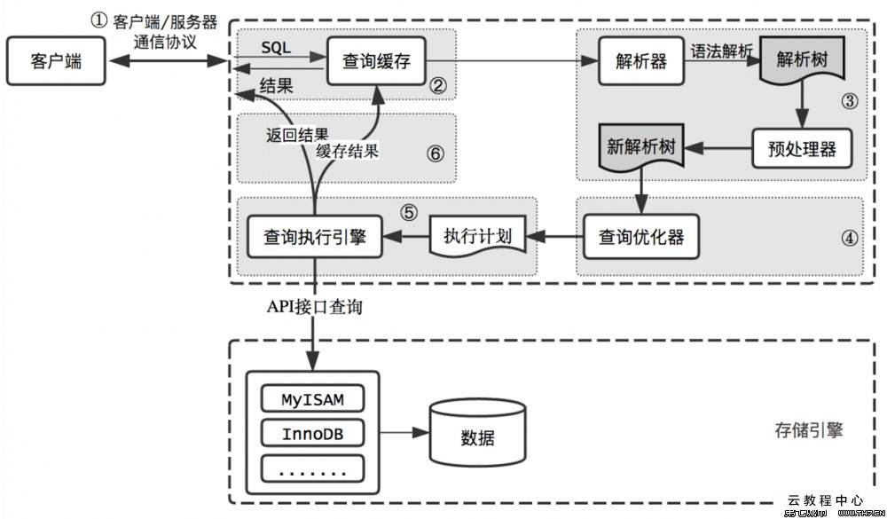
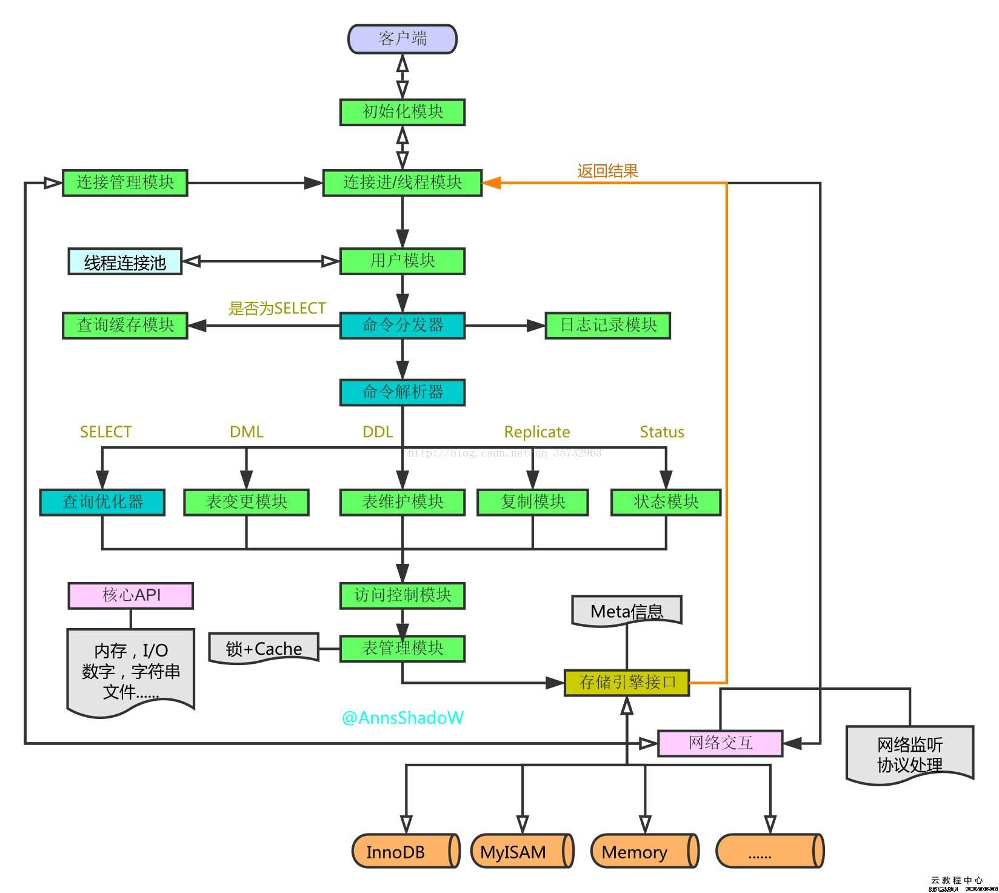
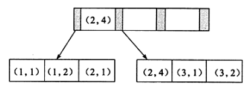
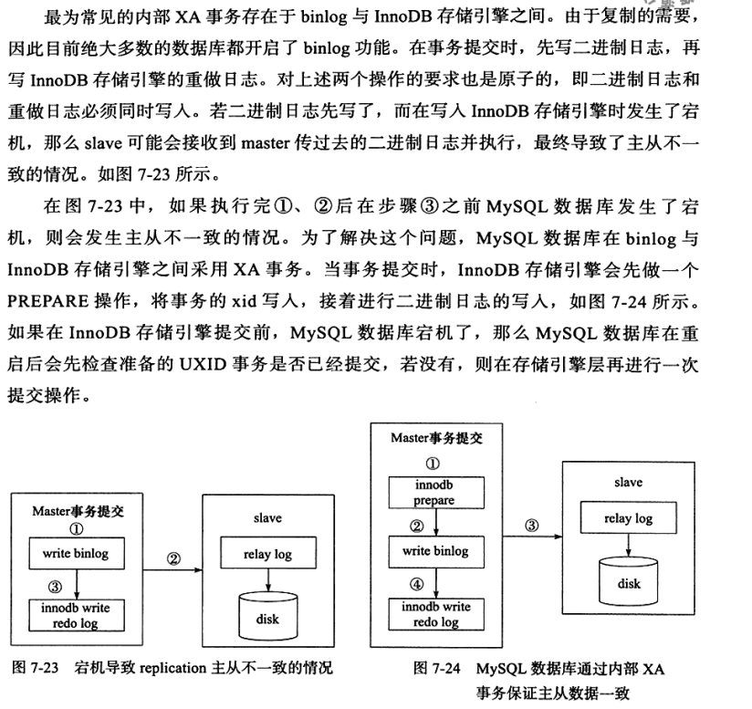
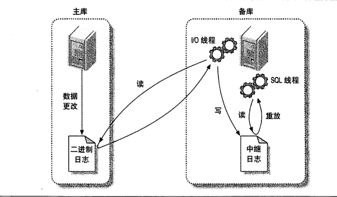

<span id="menu"></span>
<!-- TOC -->

- [1. MySQL](#1-mysql)
    - [1.1. 基本概念](#11-基本概念)
        - [1.1.1. 基本概念](#111-基本概念)
        - [1.1.2. 安装和配置](#112-安装和配置)
        - [1.1.3. 常用工具](#113-常用工具)
        - [1.1.4. 逻辑架构图](#114-逻辑架构图)
        - [1.1.5. OLAP、OLTP的介绍和比较](#115-olapoltp的介绍和比较)
        - [1.1.6. 常用配置](#116-常用配置)
    - [1.2. NoSQL与关系型数据库设计理念比较](#12-nosql与关系型数据库设计理念比较)
        - [1.2.1. 关系型数据库](#121-关系型数据库)
        - [1.2.2. 非关系型数据库](#122-非关系型数据库)
    - [1.3. 使用数据库](#13-使用数据库)
    - [1.4. 数据类型](#14-数据类型)
    - [1.5. 数据更新](#15-数据更新)
    - [1.6. 数据查询](#16-数据查询)
        - [1.6.1. 查询入门](#161-查询入门)
        - [1.6.2. 多表连接查询](#162-多表连接查询)
        - [1.6.3. union 查询](#163-union-查询)
        - [1.6.4. 子查询](#164-子查询)
    - [1.7. 函数](#17-函数)
        - [1.7.1. 聚集函数](#171-聚集函数)
        - [1.7.2. 数学函数](#172-数学函数)
        - [1.7.3. 字符串函数](#173-字符串函数)
        - [1.7.4. 日期和时间函数](#174-日期和时间函数)
        - [1.7.5. 条件判断函数](#175-条件判断函数)
        - [1.7.6. 系统信息函数](#176-系统信息函数)
        - [1.7.7. 加密函数](#177-加密函数)
        - [1.7.8. 其他函数](#178-其他函数)
    - [1.8. 存储过程](#18-存储过程)
        - [1.8.1. 基本概念](#181-基本概念)
        - [1.8.2. 使用存储过程](#182-使用存储过程)
    - [1.9. 视图](#19-视图)
        - [1.9.1. 基本概念](#191-基本概念)
    - [1.10. 存储过程](#110-存储过程)
        - [1.10.1. 为什么要使用存储过程](#1101-为什么要使用存储过程)
        - [1.10.2. 使用存储过程](#1102-使用存储过程)
        - [1.10.3. 存储过程的参数](#1103-存储过程的参数)
        - [1.10.4. 变量](#1104-变量)
        - [1.10.5. 注释](#1105-注释)
        - [1.10.6. MySQL存储过程的控制语句](#1106-mysql存储过程的控制语句)
        - [1.10.7. 查看存储过程](#1107-查看存储过程)
        - [1.10.8. 删除](#1108-删除)
    - [1.11. 游标](#111-游标)
        - [1.11.1. 使用游标](#1111-使用游标)
    - [1.12. 触发器](#112-触发器)
        - [1.12.1. 基本概念](#1121-基本概念)
        - [1.12.2. 触发器操作](#1122-触发器操作)
    - [1.13. 事务](#113-事务)
        - [1.13.1. 基本概念](#1131-基本概念)
            - [1.13.1.1. 事务特点](#11311-事务特点)
            - [1.13.1.2. 锁](#11312-锁)
            - [1.13.1.3. 多版本并发控制](#11313-多版本并发控制)
            - [1.13.1.4. 常见术语](#11314-常见术语)
        - [1.13.2. 基本语句](#1132-基本语句)
    - [1.14. 存储引擎](#114-存储引擎)
        - [1.14.1. 常见的存储引擎](#1141-常见的存储引擎)
            - [1.14.1.1. InnoDB存储引擎](#11411-innodb存储引擎)
            - [1.14.1.2. MyISAM存储引擎](#11412-myisam存储引擎)
            - [1.14.1.3. MEMORY存储引擎](#11413-memory存储引擎)
            - [1.14.1.4. 存储引擎的选择](#11414-存储引擎的选择)
        - [1.14.2. InnoDB存储引擎](#1142-innodb存储引擎)
            - [1.14.2.1. 体系结构](#11421-体系结构)
            - [1.14.2.2. 后台线程](#11422-后台线程)
            - [1.14.2.3. 内存](#11423-内存)
            - [1.14.2.4. checkpoint技术](#11424-checkpoint技术)
            - [1.14.2.5. Master Thread 工作方式](#11425-master-thread-工作方式)
            - [1.14.2.6. InnoDB关键特性](#11426-innodb关键特性)
                - [1.14.2.6.1. 插入缓存](#114261-插入缓存)
                - [1.14.2.6.2. 两次写](#114262-两次写)
                - [1.14.2.6.3. 自适应哈希索引](#114263-自适应哈希索引)
                - [1.14.2.6.4. 异步IO](#114264-异步io)
                - [1.14.2.6.5. 刷新邻接页](#114265-刷新邻接页)
                - [1.14.2.6.6. 启动、关闭与恢复](#114266-启动关闭与恢复)
    - [1.15. MySQL基准测试](#115-mysql基准测试)
        - [1.15.1. 为什么需要基准测试](#1151-为什么需要基准测试)
        - [1.15.2. 基准测试的策略](#1152-基准测试的策略)
        - [1.15.3. 基准测试的方法](#1153-基准测试的方法)
        - [1.15.4. 基准测试工具](#1154-基准测试工具)
        - [1.15.5. 基准测试案例](#1155-基准测试案例)
    - [1.16. 服务器性能剖析](#116-服务器性能剖析)
        - [1.16.1. 性能优化简介](#1161-性能优化简介)
        - [1.16.2. 剖析MYSQL查询](#1162-剖析mysql查询)
    - [1.17. 文件](#117-文件)
        - [1.17.1. 参数文件](#1171-参数文件)
        - [1.17.2. 套接字文件](#1172-套接字文件)
        - [1.17.3. pid文件](#1173-pid文件)
        - [1.17.4. 表结构定义文件](#1174-表结构定义文件)
        - [1.17.5. InnoDB存储引擎文件](#1175-innodb存储引擎文件)
            - [1.17.5.1. 表空间文件](#11751-表空间文件)
            - [1.17.5.2. 重做日志文件](#11752-重做日志文件)
    - [1.18. 表与数据类型优化](#118-表与数据类型优化)
        - [1.18.1. 选择优化的数据类型](#1181-选择优化的数据类型)
        - [1.18.2. 表设计中的陷阱](#1182-表设计中的陷阱)
        - [1.18.3. 范式和反范式](#1183-范式和反范式)
        - [1.18.4. 加快ALTER操作的速度](#1184-加快alter操作的速度)
        - [1.18.5. 总结](#1185-总结)
        - [1.18.6. 日志文件](#1186-日志文件)
        - [1.18.7. socket文件](#1187-socket文件)
        - [1.18.8. pid文件](#1188-pid文件)
        - [1.18.9. MySQL表结构文件](#1189-mysql表结构文件)
        - [1.18.10. 存储引擎文件](#11810-存储引擎文件)
    - [1.19. 表](#119-表)
        - [1.19.1. 索引组织表](#1191-索引组织表)
        - [1.19.2. 逻辑存储结构](#1192-逻辑存储结构)
            - [1.19.2.1. 表空间](#11921-表空间)
            - [1.19.2.2. 段](#11922-段)
            - [1.19.2.3. 区](#11923-区)
            - [1.19.2.4. 页](#11924-页)
            - [1.19.2.5. 行](#11925-行)
        - [1.19.3. 行记录格式](#1193-行记录格式)
        - [1.19.4. 数据页结构](#1194-数据页结构)
        - [1.19.5. Nameed File Formats机制](#1195-nameed-file-formats机制)
        - [1.19.6. 约束](#1196-约束)
            - [1.19.6.1. 数据完整性](#11961-数据完整性)
            - [1.19.6.2. 外键](#11962-外键)
            - [1.19.6.3. 约束和索引的区别](#11963-约束和索引的区别)
        - [1.19.7. 分区表](#1197-分区表)
            - [1.19.7.1. 概述](#11971-概述)
            - [1.19.7.2. 分区类型](#11972-分区类型)
            - [1.19.7.3. 子分区](#11973-子分区)
            - [1.19.7.4. 分区中的NULL值](#11974-分区中的null值)
            - [1.19.7.5. 分区和性能](#11975-分区和性能)
            - [1.19.7.6. 在表和分区间交换数据](#11976-在表和分区间交换数据)
    - [1.20. 索引与算法](#120-索引与算法)
        - [1.20.1. 基本概念](#1201-基本概念)
            - [1.20.1.1. 分类](#12011-分类)
            - [1.20.1.2. 索引用途](#12012-索引用途)
            - [1.20.1.3. 索引优化](#12013-索引优化)
            - [1.20.1.4. 索引的误区](#12014-索引的误区)
        - [1.20.2. 索引概述](#1202-索引概述)
        - [1.20.3. 表和索引结构](#1203-表和索引结构)
            - [1.20.3.1. 索引页和表页](#12031-索引页和表页)
            - [1.20.3.2. 缓冲池和磁盘IO](#12032-缓冲池和磁盘io)
        - [1.20.4. B树和B+树](#1204-b树和b树)
            - [1.20.4.1. B树](#12041-b树)
            - [1.20.4.2. B+树](#12042-b树)
        - [1.20.5. InnoDB B+树索引](#1205-innodb-b树索引)
            - [1.20.5.1. 聚集索引](#12051-聚集索引)
            - [1.20.5.2. 辅助索引](#12052-辅助索引)
            - [1.20.5.3. B+树索引的分裂](#12053-b树索引的分裂)
            - [1.20.5.4. B+树索引的管理](#12054-b树索引的管理)
        - [1.20.6. B+树索引的使用](#1206-b树索引的使用)
            - [1.20.6.1. 不同应用中B+树索引的使用](#12061-不同应用中b树索引的使用)
            - [1.20.6.2. 联合索引](#12062-联合索引)
            - [1.20.6.3. 覆盖索引](#12063-覆盖索引)
            - [1.20.6.4. 优化器选择不使用索引的情况](#12064-优化器选择不使用索引的情况)
            - [1.20.6.5. 索引提示](#12065-索引提示)
            - [1.20.6.6. Multi-Range Read优化](#12066-multi-range-read优化)
            - [1.20.6.7. Index Condition Pushdown 优化](#12067-index-condition-pushdown-优化)
        - [1.20.7. 哈希索引](#1207-哈希索引)
            - [1.20.7.1. InnoDB哈希算法](#12071-innodb哈希算法)
            - [1.20.7.2. 自适应哈希算法](#12072-自适应哈希算法)
        - [1.20.8. 全文索引](#1208-全文索引)
            - [1.20.8.1. 倒排索引](#12081-倒排索引)
            - [1.20.8.2. InnoDB全文索引](#12082-innodb全文索引)
            - [1.20.8.3. 全文索引](#12083-全文索引)
        - [1.20.9. 高性能索引策略](#1209-高性能索引策略)
            - [1.20.9.1. 独立的列](#12091-独立的列)
            - [1.20.9.2. 前缀索引和索引选择性](#12092-前缀索引和索引选择性)
            - [1.20.9.3. 多列索引](#12093-多列索引)
            - [1.20.9.4. 选择合适的索引列顺序](#12094-选择合适的索引列顺序)
            - [1.20.9.5. 聚簇索引](#12095-聚簇索引)
            - [1.20.9.6. 覆盖索引](#12096-覆盖索引)
            - [1.20.9.7. 使用索引扫描来做排序](#12097-使用索引扫描来做排序)
            - [1.20.9.8. 压缩索引](#12098-压缩索引)
            - [1.20.9.9. 冗余和重复索引](#12099-冗余和重复索引)
            - [1.20.9.10. 未使用的索引](#120910-未使用的索引)
            - [1.20.9.11. 索引和锁](#120911-索引和锁)
        - [1.20.10. 索引使用注意事项](#12010-索引使用注意事项)
            - [1.20.10.1. 全表扫描的情况](#120101-全表扫描的情况)
    - [1.21. 锁](#121-锁)
        - [1.21.1. 什么是锁](#1211-什么是锁)
            - [1.21.1.1. 锁](#12111-锁)
        - [1.21.2. lock与latch](#1212-lock与latch)
        - [1.21.3. Innodb存储引擎的锁](#1213-innodb存储引擎的锁)
            - [1.21.3.1. 锁的类型](#12131-锁的类型)
            - [1.21.3.2. 一致性非锁定读](#12132-一致性非锁定读)
            - [1.21.3.3. 一致性锁定读](#12133-一致性锁定读)
            - [1.21.3.4. 自增长与锁](#12134-自增长与锁)
            - [1.21.3.5. 外键和锁](#12135-外键和锁)
        - [1.21.4. 锁的算法](#1214-锁的算法)
            - [1.21.4.1. 行锁的三种算法](#12141-行锁的三种算法)
        - [1.21.5. 锁的问题](#1215-锁的问题)
        - [1.21.6. 阻塞](#1216-阻塞)
        - [1.21.7. 死锁](#1217-死锁)
            - [1.21.7.1. 死锁的概念](#12171-死锁的概念)
            - [1.21.7.2. 死锁的实例](#12172-死锁的实例)
        - [1.21.8. 锁升级](#1218-锁升级)
        - [1.21.9. 乐观锁和悲观锁](#1219-乐观锁和悲观锁)
            - [1.21.9.1. 多版本并发控制MVCC](#12191-多版本并发控制mvcc)
    - [1.22. 事务](#122-事务)
        - [1.22.1. 认识事务](#1221-认识事务)
            - [1.22.1.1. 事务特点](#12211-事务特点)
            - [1.22.1.2. 常见术语](#12212-常见术语)
            - [1.22.1.3. 基本语句](#12213-基本语句)
            - [1.22.1.4. 事务分类](#12214-事务分类)
        - [1.22.2. 事务的实现](#1222-事务的实现)
            - [1.22.2.1. redo](#12221-redo)
            - [1.22.2.2. undo](#12222-undo)
            - [1.22.2.3. purge](#12223-purge)
            - [1.22.2.4. group commit](#12224-group-commit)
        - [1.22.3. 事务控制语句](#1223-事务控制语句)
        - [1.22.4. 隐式提交的SQL语句](#1224-隐式提交的sql语句)
        - [1.22.5. 对于事务操作的统计](#1225-对于事务操作的统计)
        - [1.22.6. 事务的隔离级别](#1226-事务的隔离级别)
        - [1.22.7. 分布式事务](#1227-分布式事务)
            - [1.22.7.1. MYSQL分布式事务](#12271-mysql分布式事务)
            - [1.22.7.2. 内部XA事务](#12272-内部xa事务)
        - [1.22.8. 不好的事务习惯](#1228-不好的事务习惯)
    - [1.23. 备份与恢复](#123-备份与恢复)
    - [1.24. 性能优化基本的分析命令](#124-性能优化基本的分析命令)
        - [1.24.1. explain](#1241-explain)
        - [1.24.2. show indexs](#1242-show-indexs)
        - [1.24.3. show full processlist](#1243-show-full-processlist)
        - [1.24.4. show create table user](#1244-show-create-table-user)
        - [1.24.5. show table status](#1245-show-table-status)
        - [1.24.6. show global|session status](#1246-show-globalsession-status)
        - [1.24.7. show global|session  variables like "xxx"](#1247-show-globalsession--variables-like-xxx)
    - [1.25. 分库分表](#125-分库分表)
        - [1.25.1. 基本概念](#1251-基本概念)
        - [1.25.2. 分布式事务](#1252-分布式事务)
        - [1.25.3. 应对多机数据查询](#1253-应对多机数据查询)
            - [1.25.3.1. 跨库Join](#12531-跨库join)
            - [1.25.3.2. 外键约束](#12532-外键约束)
    - [1.26. 复制](#126-复制)
        - [1.26.1. 复制功能概述](#1261-复制功能概述)
        - [1.26.2. 常见形式](#1262-常见形式)
        - [1.26.3. 主从同步复制原理](#1263-主从同步复制原理)
        - [1.26.4. 主从同步配置](#1264-主从同步配置)
        - [1.26.5. 添加更多从服务器](#1265-添加更多从服务器)
        - [1.26.6. 复制的原理](#1266-复制的原理)
            - [1.26.6.1. 基于语句的复制](#12661-基于语句的复制)
            - [1.26.6.2. 基于行的复制](#12662-基于行的复制)
            - [1.26.6.3. 两种方式比较](#12663-两种方式比较)
            - [1.26.6.4. 复制文件](#12664-复制文件)
            - [1.26.6.5. 发送复制事件到其他备库](#12665-发送复制事件到其他备库)
            - [1.26.6.6. 复制过滤器](#12666-复制过滤器)
        - [1.26.7. 复制拓扑](#1267-复制拓扑)
            - [1.26.7.1. 一主库多备库](#12671-一主库多备库)
            - [1.26.7.2. 主动-主动模式下的主-从复制](#12672-主动-主动模式下的主-从复制)
            - [1.26.7.3. 主动-被动模式下的主-从复制](#12673-主动-被动模式下的主-从复制)
            - [1.26.7.4. 拥有备库的主-主结构](#12674-拥有备库的主-主结构)
            - [1.26.7.5. 环形复制](#12675-环形复制)
            - [1.26.7.6. 主库、分发主库和备库](#12676-主库分发主库和备库)
            - [1.26.7.7. 树或金字塔形](#12677-树或金字塔形)
            - [1.26.7.8. 定制的复制方案](#12678-定制的复制方案)
        - [1.26.8. 复制和容量规划](#1268-复制和容量规划)
            - [1.26.8.1. 为什么复制无法扩展写操作](#12681-为什么复制无法扩展写操作)
            - [1.26.8.2. 备库什么时候开始写延迟](#12682-备库什么时候开始写延迟)
            - [1.26.8.3. 规划冗余容量](#12683-规划冗余容量)
        - [1.26.9. 复制管理和维护](#1269-复制管理和维护)
            - [1.26.9.1. 监控复制](#12691-监控复制)
            - [1.26.9.2. 测量备库延迟](#12692-测量备库延迟)
            - [1.26.9.3. 确定主备是否一致](#12693-确定主备是否一致)
            - [1.26.9.4. 从主库重新同步备库](#12694-从主库重新同步备库)
            - [1.26.9.5. 改变主库](#12695-改变主库)
            - [1.26.9.6. 在一个主从配置中交换角色](#12696-在一个主从配置中交换角色)
        - [1.26.10. 复制的问题和解决方案](#12610-复制的问题和解决方案)
            - [1.26.10.1. 数据损坏或者丢失的错误](#126101-数据损坏或者丢失的错误)
            - [1.26.10.2. 使用非事务型表](#126102-使用非事务型表)
            - [1.26.10.3. 混合事务型和非事务型表](#126103-混合事务型和非事务型表)
            - [1.26.10.4. 不确定语句](#126104-不确定语句)
            - [1.26.10.5. 主库和备库使用不同的存储引擎](#126105-主库和备库使用不同的存储引擎)
            - [1.26.10.6. 备库发生数据改变](#126106-备库发生数据改变)
            - [1.26.10.7. 不唯一的服务器ID](#126107-不唯一的服务器id)
            - [1.26.10.8. 未定义的服务器ID](#126108-未定义的服务器id)
            - [1.26.10.9. 对未复制数据的依赖性](#126109-对未复制数据的依赖性)
            - [1.26.10.10. 丢失的临时表](#1261010-丢失的临时表)
            - [1.26.10.11. 不复制所有的更新](#1261011-不复制所有的更新)
            - [1.26.10.12. Innodb加锁读引起的锁争用](#1261012-innodb加锁读引起的锁争用)
            - [1.26.10.13. 在主主复制结构中写入两台主库](#1261013-在主主复制结构中写入两台主库)
            - [1.26.10.14. 过大的复制延迟](#1261014-过大的复制延迟)
            - [1.26.10.15. 来自主库过大的包](#1261015-来自主库过大的包)
            - [1.26.10.16. 受限制的复制带宽](#1261016-受限制的复制带宽)
            - [1.26.10.17. 磁盘空间不足](#1261017-磁盘空间不足)
            - [1.26.10.18. 复制的局限性](#1261018-复制的局限性)
        - [1.26.11. 复制有多快](#12611-复制有多快)
        - [1.26.12. 复制的高级特性](#12612-复制的高级特性)
        - [1.26.13. 其他复制技术](#12613-其他复制技术)
    - [1.27. 高可用](#127-高可用)
        - [1.27.1. 导致宕积的原因](#1271-导致宕积的原因)
        - [1.27.2. 如何实现高可用](#1272-如何实现高可用)
            - [1.27.2.1. 提升平均失效时间MTBF](#12721-提升平均失效时间mtbf)
            - [1.27.2.2. 降低平均恢复时间](#12722-降低平均恢复时间)
            - [1.27.2.3. 使用复制避免单点故障](#12723-使用复制避免单点故障)
    - [1.28. 分库分表](#128-分库分表)
    - [1.29. 查询性能优化](#129-查询性能优化)
        - [1.29.1. 为什么查询会变慢](#1291-为什么查询会变慢)
        - [1.29.2. 慢查询基础](#1292-慢查询基础)
        - [1.29.3. 重构查询方式](#1293-重构查询方式)
        - [1.29.4. 查询执行的基础](#1294-查询执行的基础)
        - [1.29.5. 查询优化器的局限性](#1295-查询优化器的局限性)
        - [1.29.6. 查询优化器的提示](#1296-查询优化器的提示)
        - [1.29.7. 优化特定类型的查询](#1297-优化特定类型的查询)
        - [1.29.8. 案例学习](#1298-案例学习)
    - [1.30. 性能调优](#130-性能调优)
        - [1.30.1. 选择合适的CPU](#1301-选择合适的cpu)
        - [1.30.2. 内存的重要性](#1302-内存的重要性)
        - [1.30.3. 硬盘对数据库性能的影响](#1303-硬盘对数据库性能的影响)
        - [1.30.4. 合理地设置RAIN](#1304-合理地设置rain)
        - [1.30.5. 操作系统的影响](#1305-操作系统的影响)
        - [1.30.6. 不同文件系统的影响](#1306-不同文件系统的影响)
        - [1.30.7. 选择合适的基准测试](#1307-选择合适的基准测试)
            - [1.30.7.1. sysbench](#13071-sysbench)
            - [1.30.7.2. mysql-tpcc](#13072-mysql-tpcc)
    - [1.31. 数据库管理](#131-数据库管理)
        - [1.31.1. 安全性机制](#1311-安全性机制)
            - [1.31.1.1. 用户创建](#13111-用户创建)
            - [1.31.1.2. 权限管理](#13112-权限管理)
        - [1.31.2. 日志管理](#1312-日志管理)
            - [1.31.2.1. 错误日志](#13121-错误日志)
            - [1.31.2.2. 通用查询日志](#13122-通用查询日志)
            - [1.31.2.3. 二进制日志](#13123-二进制日志)
            - [1.31.2.4. 慢查询日志](#13124-慢查询日志)
            - [1.31.2.5. 操作二进制日志](#13125-操作二进制日志)
        - [1.31.3. 数据库维护和性能提高](#1313-数据库维护和性能提高)
            - [1.31.3.1. 备份与恢复](#13131-备份与恢复)
                - [1.31.3.1.1. 为什么要备份](#131311-为什么要备份)
                - [1.31.3.1.2. 定义恢复需求](#131312-定义恢复需求)
                - [1.31.3.1.3. 设计MYSQL备份方案](#131313-设计mysql备份方案)
                - [1.31.3.1.4. 备份数据](#131314-备份数据)
    - [1.32. SQL实战](#132-sql实战)
        - [1.32.1. 查找最晚入职员工的所有信息](#1321-查找最晚入职员工的所有信息)
        - [1.32.2. 查找入职员工时间排名倒数第三的员工所有信息](#1322-查找入职员工时间排名倒数第三的员工所有信息)
        - [1.32.3. 查找各个部门当前(to_date='9999-01-01')领导当前薪水详情以及其对应部门编号dept_no](#1323-查找各个部门当前to_date9999-01-01领导当前薪水详情以及其对应部门编号dept_no)
        - [1.32.4. 查找所有已经分配部门的员工的last_name和first_name](#1324-查找所有已经分配部门的员工的last_name和first_name)
        - [1.32.5. 查找所有员工的last_name和first_name以及对应部门编号dept_no，也包括展示没有分配具体部门的员工](#1325-查找所有员工的last_name和first_name以及对应部门编号dept_no也包括展示没有分配具体部门的员工)
        - [1.32.6. 查找所有员工入职时候的薪水情况，给出emp_no以及salary， 并按照emp_no进行逆序](#1326-查找所有员工入职时候的薪水情况给出emp_no以及salary-并按照emp_no进行逆序)
        - [1.32.7. 查找薪水涨幅超过15次的员工号emp_no以及其对应的涨幅次数t](#1327-查找薪水涨幅超过15次的员工号emp_no以及其对应的涨幅次数t)
        - [1.32.8. 找出所有员工当前(to_date='9999-01-01')具体的薪水salary情况，对于相同的薪水只显示一次,并按照逆序显示](#1328-找出所有员工当前to_date9999-01-01具体的薪水salary情况对于相同的薪水只显示一次并按照逆序显示)
        - [1.32.9. 获取所有部门当前manager的当前薪水情况，给出dept_no, emp_no以及salary，当前表示to_date='9999-01-01'](#1329-获取所有部门当前manager的当前薪水情况给出dept_no-emp_no以及salary当前表示to_date9999-01-01)
        - [1.32.10. 获取所有非manager的员工emp_no](#13210-获取所有非manager的员工emp_no)
        - [1.32.11. 获取所有员工当前的manager，如果当前的manager是自己的话结果不显示，当前表示to_date='9999-01-01'。](#13211-获取所有员工当前的manager如果当前的manager是自己的话结果不显示当前表示to_date9999-01-01)
        - [1.32.12. 获取所有部门中当前员工薪水最高的相关信息，给出dept_no, emp_no以及其对应的salary](#13212-获取所有部门中当前员工薪水最高的相关信息给出dept_no-emp_no以及其对应的salary)
        - [1.32.13. 从titles表获取按照title进行分组，每组个数大于等于2，给出title以及对应的数目t。](#13213-从titles表获取按照title进行分组每组个数大于等于2给出title以及对应的数目t)
        - [1.32.14. 从titles表获取按照title进行分组，每组个数大于等于2，给出title以及对应的数目t。](#13214-从titles表获取按照title进行分组每组个数大于等于2给出title以及对应的数目t)
        - [1.32.15. 查找employees表所有emp_no为奇数，且last_name不为Mary的员工信息，并按照hire_date逆序排列](#13215-查找employees表所有emp_no为奇数且last_name不为mary的员工信息并按照hire_date逆序排列)
        - [1.32.16. 统计出当前各个title类型对应的员工当前薪水对应的平均工资。结果给出title以及平均工资avg。](#13216-统计出当前各个title类型对应的员工当前薪水对应的平均工资结果给出title以及平均工资avg)
        - [1.32.17. 获取当前（to_date='9999-01-01'）薪水第二多的员工的emp_no以及其对应的薪水salary](#13217-获取当前to_date9999-01-01薪水第二多的员工的emp_no以及其对应的薪水salary)
        - [1.32.18. 查找当前薪水(to_date='9999-01-01')排名第二多的员工编号emp_no、薪水salary、last_name以及first_name，不准使用order by](#13218-查找当前薪水to_date9999-01-01排名第二多的员工编号emp_no薪水salarylast_name以及first_name不准使用order-by)
        - [1.32.19. 查找所有员工的last_name和first_name以及对应的dept_name，也包括暂时没有分配部门的员工](#13219-查找所有员工的last_name和first_name以及对应的dept_name也包括暂时没有分配部门的员工)
        - [1.32.20. 查找员工编号emp_no为10001其自入职以来的薪水salary涨幅值growth](#13220-查找员工编号emp_no为10001其自入职以来的薪水salary涨幅值growth)
        - [1.32.21. **查找所有员工自入职以来的薪水涨幅情况，给出员工编号emp_no以及其对应的薪水涨幅growth，并按照growth进行升序](#13221-查找所有员工自入职以来的薪水涨幅情况给出员工编号emp_no以及其对应的薪水涨幅growth并按照growth进行升序)
        - [1.32.22. 统计各个部门对应员工涨幅的次数总和，给出部门编码dept_no、部门名称dept_name以及次数sum](#13222-统计各个部门对应员工涨幅的次数总和给出部门编码dept_no部门名称dept_name以及次数sum)
        - [1.32.23. 对所有员工的当前(to_date='9999-01-01')薪水按照salary进行按照1-N的排名，相同salary并列且按照emp_no升序排列](#13223-对所有员工的当前to_date9999-01-01薪水按照salary进行按照1-n的排名相同salary并列且按照emp_no升序排列)
        - [1.32.24. 获取所有非manager员工当前的薪水情况，给出dept_no、emp_no以及salary ，当前表示to_date='9999-01-01'](#13224-获取所有非manager员工当前的薪水情况给出dept_noemp_no以及salary-当前表示to_date9999-01-01)
        - [1.32.25. 获取员工其当前的薪水比其manager当前薪水还高的相关信息，当前表示to_date='9999-01-01',](#13225-获取员工其当前的薪水比其manager当前薪水还高的相关信息当前表示to_date9999-01-01)
        - [1.32.26. 汇总各个部门当前员工的title类型的分配数目，结果给出部门编号dept_no、dept_name、其当前员工所有的title以及该类型title对应的数目count](#13226-汇总各个部门当前员工的title类型的分配数目结果给出部门编号dept_nodept_name其当前员工所有的title以及该类型title对应的数目count)
        - [1.32.27. 给出每个员工每年薪水涨幅超过5000的员工编号emp_no、薪水变更开始日期from_date以及薪水涨幅值salary_growth，并按照salary_growth逆序排列。](#13227-给出每个员工每年薪水涨幅超过5000的员工编号emp_no薪水变更开始日期from_date以及薪水涨幅值salary_growth并按照salary_growth逆序排列)
        - [1.32.28. 查找描述信息中包括robot的电影对应的分类名称以及电影数目，而且还需要该分类对应电影数量>=5部](#13228-查找描述信息中包括robot的电影对应的分类名称以及电影数目而且还需要该分类对应电影数量5部)
        - [1.32.29. 使用join查询方式找出没有分类的电影id以及名称](#13229-使用join查询方式找出没有分类的电影id以及名称)
        - [1.32.30. 使用子查询的方式找出属于Action分类的所有电影对应的title,description](#13230-使用子查询的方式找出属于action分类的所有电影对应的titledescription)
        - [1.32.31. 获取select](#13231-获取select)
        - [1.32.32. 将employees表的所有员工的last_name和first_name拼接起来作为Name，中间以一个空格区分](#13232-将employees表的所有员工的last_name和first_name拼接起来作为name中间以一个空格区分)
        - [1.32.33. 创建一个actor表，包含如下列信息](#13233-创建一个actor表包含如下列信息)
        - [1.32.34. 批量插入数据](#13234-批量插入数据)
        - [1.32.35. 批量插入数据，不使用replace操作](#13235-批量插入数据不使用replace操作)
        - [1.32.36. 创建一个actor_name表](#13236-创建一个actor_name表)
        - [1.32.37. 对first_name创建唯一索引uniq_idx_firstname](#13237-对first_name创建唯一索引uniq_idx_firstname)
        - [1.32.38. 针对actor表创建视图actor_name_view](#13238-针对actor表创建视图actor_name_view)
        - [1.32.39. 针对上面的salaries表emp_no字段创建索引idx_emp_no](#13239-针对上面的salaries表emp_no字段创建索引idx_emp_no)
        - [1.32.40. 在last_update后面新增加一列名字为create_date](#13240-在last_update后面新增加一列名字为create_date)
        - [1.32.41. 构造一个触发器audit_log](#13241-构造一个触发器audit_log)
        - [1.32.42. 删除emp_no重复的记录，只保留最小的id对应的记录。](#13242-删除emp_no重复的记录只保留最小的id对应的记录)
        - [1.32.43. 将所有to_date为9999-01-01的全部更新为NULL](#13243-将所有to_date为9999-01-01的全部更新为null)
        - [1.32.44. 将id=5以及emp_no=10001的行数据替换成id=5以及emp_no=10005](#13244-将id5以及emp_no10001的行数据替换成id5以及emp_no10005)
        - [1.32.45. 将titles_test表名修改为titles_2017](#13245-将titles_test表名修改为titles_2017)
        - [1.32.46. 在audit表上创建外键约束，其emp_no对应employees_test表的主键id](#13246-在audit表上创建外键约束其emp_no对应employees_test表的主键id)
        - [1.32.47. 如何获取emp_v和employees有相同的数据no](#13247-如何获取emp_v和employees有相同的数据no)
        - [1.32.48. 将所有获取奖金的员工当前的薪水增加百分之十](#13248-将所有获取奖金的员工当前的薪水增加百分之十)
        - [1.32.49. 针对库中的所有表生成select count(*)对应的SQL语句](#13249-针对库中的所有表生成select-count对应的sql语句)
        - [1.32.50. 将employees表中的所有员工的last_name和first_name通过(')连接起来。](#13250-将employees表中的所有员工的last_name和first_name通过连接起来)
        - [1.32.51. 查找字符串'10,A,B' 中逗号','出现的次数cnt](#13251-查找字符串10ab-中逗号出现的次数cnt)
        - [1.32.52. 获取Employees中的first_name](#13252-获取employees中的first_name)
        - [1.32.53. 按照dept_no进行汇总](#13253-按照dept_no进行汇总)
        - [1.32.54. 查找排除当前最大、最小salary之后的员工的平均工资avg_salary](#13254-查找排除当前最大最小salary之后的员工的平均工资avg_salary)
        - [1.32.55. 分页查询employees表，每5行一页，返回第2页的数据](#13255-分页查询employees表每5行一页返回第2页的数据)
        - [1.32.56. 获取所有员工的emp_no](#13256-获取所有员工的emp_no)
        - [1.32.57. 使用含有关键字exists查找未分配具体部门的员工的所有信息。](#13257-使用含有关键字exists查找未分配具体部门的员工的所有信息)
        - [1.32.58. 获取employees中的行数据，且这些行也存在于emp_v中](#13258-获取employees中的行数据且这些行也存在于emp_v中)
        - [1.32.59. 获取有奖金的员工相关信息。](#13259-获取有奖金的员工相关信息)
        - [1.32.60. 统计salary的累计和running_total](#13260-统计salary的累计和running_total)
        - [1.32.61. 对于employees表中，给出奇数行的first_name](#13261-对于employees表中给出奇数行的first_name)

<!-- /TOC -->
# 1. MySQL
<a href="#menu" >目录</a>

## 1.1. 基本概念
<a href="#menu" >目录</a>

### 1.1.1. 基本概念
* 基本概念
    * 数据库: 物理操作系统文件或者其他形式文件类型的集合。
    * 数据库实例: 数据库运行之后的应用。
    * SQL:一种结构化查询语言，专门用来和数据库进行通信的语言。
    * 数据表: 表是数据的矩阵。在一个数据库中的表看起来像一个简单的电子表格。
    * 列: 表的一个字段，一个表是由一个或者多个列组成
    * 数据类型:每个列都有固定的数据类型，比如数值，字符串等
    * 行：一行（=元组，或记录）是一组相关的数据，例如一条用户订阅的数据。
    * 冗余：存储两倍数据，冗余降低了性能，但提高了数据的安全性。
    * 主键：用于唯一标识表中每个行的一个或者多个列。主键是唯一的。一个数据表中只能包含一个主键。你可以使用主键来查询数据。
    * 外键：用于唯一标识其他表中每个行的一个或者多个列。外键用于关联两个表。外键不能跨引擎。
    * 复合键：复合键（组合键）将多个列作为一个索引键，一般用于复合索引。
    * 索引：使用索引可快速访问数据库表中的特定信息。索引是对数据库表中一列或多列的值进行排序的一种结构。类似于书籍的目录。
    * 参照完整性: 参照的完整性要求关系中不允许引用不存在的实体。与实体完整性是关系模型必须满足的完整性约束条件，目的是保证数据的一致性。
    * SQL:结构化查询语言，用于与数据库通信的语言
* 主键、外键
    * 不要更新主键列中的值
    * 不能重用主键列中的值
    * 不在主键列中使用可能会更改的值，比如名称。

||定义|作用|个数|
|---|---|---|---|
|主键|唯一标识一条记录，不能有重复的，不允许为空|用来保证数据完整性|主键只能有一个|
|外键|表的外键是另一表的主键, 外键可以有重复的, 可以是空值|用来和其他表建立联系用的|一个表可以有多个外键|

创建外键
```sql
FOREIGN KEY (P_Id) REFERENCES Persons(P_Id)
```


**关系型数据库和非关系型数据库的区别**
* 关系型数据库
    * 关系型数据库最典型的数据结构是表，由二维表及其之间的联系所组成的一个数据组织
    * SQLite、Oracle、mysql
    * 特性
        * 关系型数据库，是指采用了关系模型来组织数据的数据库；
        * 关系型数据库的最大特点就是事务的一致性；
        * 简单来说，关系模型指的就是二维表格模型，
        * 而一个关系型数据库就是由二维表及其之间的联系所组成的一个数据组织
    * 优点
        * 容易理解：二维表结构是非常贴近逻辑世界一个概念，关系模型相对网状、层次等其他模型来说更容易理解；
        * 使用方便：通用的SQL语言使得操作关系型数据库非常方便；
        * 易于维护：丰富的完整性(实体完整性、参照完整性和用户定义的完整性)大大减低了数据冗余和数据不一致的概率；
        * 支持SQL，可用于复杂的查询。
    * 缺点
        * 为了维护一致性所付出的巨大代价就是其读写性能比较差；
        * 固定的表结构；
        * 高并发读写需求；
        * 海量数据的高效率读写；

* 非关系型数据库
    * 非关系型数据库严格上不是一种数据库，应该是一种数据结构化存储方法的集合，可以是文档或者键值对等。
    * MongoDb、redis、HBase
    * 特性
        * 使用键值对存储数据；
        * 分布式；
        * 一般不支持ACID特性；  
        * 非关系型数据库严格上不是一种数据库，应该是一种数据结构化存储方法的集合。
    * 优点
        * 无需经过sql层的解析，读写性能很高；
        * 基于键值对，数据没有耦合性，容易扩展；
        * 存储数据的格式：nosql的存储格式是key,value形式、文档形式、图片形式等等，文档形式、图片形式等等，而关系型数据库则只支持基础类型。
        * 2、速度快：nosql可以使用硬盘或者随机存储器作为载体，而关系型数据库只能使用硬盘；
        * 3、高扩展性；
        * 4、成本低：nosql数据库部署简单，基本都是开源软件。
    * 缺点
        * 不提供sql支持，学习和使用成本较高；   
        * 无事务处理，附加功能bi和报表等支持也不好；
        * 数据结构相对复杂，复杂查询方面稍欠。

* SQL (sequel) Structure Query Language 结构化查询语言
    * 主要功能
        * 数据定义语言 DDL
            * 定义数据库涉及各种对象，定义数据的完整性约束，保密限制等约束
        * 数据操作语言 DML
            * 实现对数据的操作(增删改查)
        * 数据控制语言 DCL
            * 实现对数据库的控制，包含数据完整性控制，数据安全性控制
    * 优点
        * 符合SQL语言规范的数据库都能使用
        * 简单易学
        * 高度非过程化，只需指出做什么，不用关注过程

* mysql数据库分类
    * 系统数据库:系统附带的数据库
        * information_schema : 主要存储系统中的一些数据库对象信息，如用户表信息，列信息，权限信息，字符集信息和分区信息
        * performance_schema : 主要存储数据库服务器性能信息
        * mysql : 主要存储系统的用户权限信息
        * test : 自动创建的用户数据库，任何用户都可以使用
    * 用户数据库:　用户自行创建的数据库
    
### 1.1.2. 安装和配置

* 下载[Mysql5.7](https://dev.mysql.com/downloads/mysql/5.7.html#downloads)
* 解压: tar -xvf mysql-xxx.tar 
* 移动: mv mysql-xxx /usr/local/mysql
* 创建mysql用户组和用户并修改权限
    * groupadd mysql
    * useradd -r -g mysql mysql
* 创建数据目录并赋予权限
    * mkdir -p  /data/mysql              #创建目录
    * chown mysql:mysql -R /data/mysql   #赋予权限
* 配置
```yml
[mysqld]
bind-address=0.0.0.0
port=3306
user=mysql

basedir=/usr/local/mysql
datadir=/data/mysql

socket=/tmp/mysql.sock
log-error=/data/mysql/mysql.err
pid-file=/data/mysql/mysql.pid
#character config
character_set_server=utf8mb4
symbolic-links=0
explicit_defaults_for_timestamp=true
```
* 初始化数据库
    * 进入mysql的bin目录
        * cd /usr/local/mysql/bin/
    * 初始化
        * ./mysqld --defaults-file=/etc/my.cnf --basedir=/usr/local/mysql/ --datadir=/data/mysql/ --user=mysql --initialize
    *  查看密码
        * cat /data/mysql/mysql.err
* 启动mysql，并更改root 密码
    * 先将mysql.server放置到/etc/init.d/mysql中
        * cp /usr/local/mysql/support-files/mysql.server /etc/init.d/mysql
    * 启动
        * srvice mysql start
        * 查看是否运行: ps -ef|grep mysql
* 修改密码
    * 登录
        * 可以把bin目录下的mysql链接到/usr/bin下: ln -s  /usr/local/mysql/bin/mysql    /usr/bin/mysql
        * mysql -u root -p
    * 修改密码
        * SET PASSWORD = PASSWORD('123456');
        * ALTER USER 'root'@'localhost' PASSWORD EXPIRE NEVER;
        * FLUSH PRIVILEGES; 
    * 如入法连接
        * use mysql                                            #访问mysql库
        * update user set host = '%' where user = 'root';      #使root能再任何host访问
        * FLUSH PRIVILEGES; 

### 1.1.3. 常用工具
* workbench : 跨平台可视化客户端
* MySQL Administrator : 一个图形交互客户机，用来简化MySQL服务器的管理。
* MySQL Query Browser为一个图形交互客户机，用来编写和执行MySQL命令

### 1.1.4. 逻辑架构图
<a href="#menu" >目录</a>




* 连接--->认证---->确认可执行的权限
* MYSQL5.5及以上提供线程池插件，可以使用池中较少的线程来服务大量的连接
* MYSQL会对SQL进行相对应的优化，以提供最佳的访问性能
* 在解析查询之前，服务器会先检察查询缓存(如果开启的话)，存在缓存则直接将缓存返回客户端，更新操作将会修改缓存，缓存中没有数据，查询之后也会更新缓存。
---
* 每个客户端连接都会在服务器进程中拥有一个线程，这个连接的查询只会在单独的线程中执行，服务器会负责缓存线程，因此不需要为每一个新建的连接创建或者销毁线程。
* 当客户端连接到服务器时，服务器会对它进行认证，认证基于用户名，原始主机信息和密码。如果使用安全套接字SSL的方式连接，还可以使用X5.509证书认证。一旦客户端连接成功，服务器会继续验证客户端是否具有某个操作的执行权限。

---
* MYSQL会解析查询，并创建内部数据结构(解析树)，然后对其进行各种优化，包括重写查询，决定表的读取顺序，以及选择合适的索引等。
* 优化器并不关心表使用的是什么存储引擎。但存储引擎对优化查询是有影响的。优化器会请求存储引擎提供容量或某个具体操作的开销信息，以及表数据的统计信息。
* 对于SELECT查询，在解析优化之前，会先查询缓存，如果能改在其中找到对应的查询，服务器就不需要进行解析查询、优化和执行整个步骤，而是直接返回缓存的值，当修改数据时会更新该缓存。


### 1.1.5. OLAP、OLTP的介绍和比较
<a href="#menu" >目录</a>

**OLTP与OLAP的介绍**

数据处理大致可以分成两大类：联机事务处理OLTP（on-line transaction processing）、联机分析处理OLAP（On-Line Analytical Processing）。OLTP是传统的关系型数据库的主要应用，主要是基本的、日常的事务处理，例如银行交易。OLAP是数据仓库系统的主要应用，支持复杂的分析操作，侧重决策支持，并且提供直观易懂的查询结果。

* **OLTP**：系统强调数据库内存效率，强调内存各种指标的命令率，强调绑定变量，强调并发操作；
* **OLAP**：系统则强调数据分析，强调SQL执行市场，强调磁盘I/O，强调分区等。

**OLTP与OLAP之间的比较：**


**OLTP**
OLTP，也叫联机事务处理（Online Transaction Processing），表示事务性非常高的系统，一般都是高可用的在线系统，以小的事务以及小的查询为主，评估其系统的时候，一般看其每秒执行的Transaction以及Execute SQL的数量。在这样的系统中，单个数据库每秒处理的Transaction往往超过几百个，或者是几千个，Select 语句的执行量每秒几千甚至几万个。典型的OLTP系统有电子商务系统、银行、证券等，如美国eBay的业务数据库，就是很典型的OLTP数据库。

OLTP系统最容易出现瓶颈的地方就是CPU与磁盘子系统。
（1）CPU出现瓶颈常表现在逻辑读总量与计算性函数或者是过程上，逻辑读总量等于单个语句的逻辑读乘以执行次数，如果单个语句执行速度虽然很快，但是执行次数非常多，那么，也可能会导致很大的逻辑读总量。设计的方法与优化的方法就是减少单个语句的逻辑读，或者是减少它们的执行次数。另外，一些计算型的函数，如自定义函数、decode等的频繁使用，也会消耗大量的CPU时间，造成系统的负载升高，正确的设计方法或者是优化方法，需要尽量避免计算过程，如保存计算结果到统计表就是一个好的方法。
（2）磁盘子系统在OLTP环境中，它的承载能力一般取决于它的IOPS处理能力. 因为在OLTP环境中，磁盘物理读一般都是db file sequential read，也就是单块读，但是这个读的次数非常频繁。如果频繁到磁盘子系统都不能承载其IOPS的时候，就会出现大的性能问题。

OLTP比较常用的设计与优化方式为Cache技术与B-tree索引技术，Cache决定了很多语句不需要从磁盘子系统获得数据，所以，Web cache与Oracle data buffer对OLTP系统是很重要的。另外，在索引使用方面，语句越简单越好，这样执行计划也稳定，而且一定要使用绑定变量，减少语句解析，尽量减少表关联，尽量减少分布式事务，基本不使用分区技术、MV技术、并行技术及位图索引。因为并发量很高，批量更新时要分批快速提交，以避免阻塞的发生。

OLTP 系统是一个数据块变化非常频繁，SQL 语句提交非常频繁的系统。 对于数据块来说，应尽可能让数据块保存在内存当中，对于SQL来说，尽可能使用变量绑定技术来达到SQL重用，减少物理I/O 和重复的SQL 解析，从而极大的改善数据库的性能。

这里影响性能除了绑定变量，还有可能是热快（hot block）。 当一个块被多个用户同时读取时，Oracle 为了维护数据的一致性，需要使用Latch来串行化用户的操作。当一个用户获得了latch后，其他用户就只能等待，获取这个数据块的用户越多，等待就越明显。 这就是热快的问题。 这种热快可能是数据块，也可能是回滚端块。 对于数据块来讲，通常是数据库的数据分布不均匀导致，如果是索引的数据块，可以考虑创建反向索引来达到重新分布数据的目的，对于回滚段数据块，可以适当多增加几个回滚段来避免这种争用。

**OLAP**
OLAP，也叫联机分析处理（Online Analytical Processing）系统，有的时候也叫DSS决策支持系统，就是我们说的数据仓库。在这样的系统中，语句的执行量不是考核标准，因为一条语句的执行时间可能会非常长，读取的数据也非常多。所以，在这样的系统中，考核的标准往往是磁盘子系统的吞吐量（带宽），如能达到多少MB/s的流量。

磁盘子系统的吞吐量则往往取决于磁盘的个数，这个时候，Cache基本是没有效果的，数据库的读写类型基本上是db file scattered read与direct path read/write。应尽量采用个数比较多的磁盘以及比较大的带宽，如4Gb的光纤接口。

在OLAP系统中，常使用分区技术、并行技术。

分区技术在OLAP系统中的重要性主要体现在数据库管理上，比如数据库加载，可以通过分区交换的方式实现，备份可以通过备份分区表空间实现，删除数据可以通过分区进行删除，至于分区在性能上的影响，它可以使得一些大表的扫描变得很快（只扫描单个分区）。另外，如果分区结合并行的话，也可以使得整个表的扫描会变得很快。总之，分区主要的功能是管理上的方便性，它并不能绝对保证查询性能的提高，有时候分区会带来性能上的提高，有时候会降低。

并行技术除了与分区技术结合外，在Oracle 10g中，与RAC结合实现多节点的同时扫描，效果也非常不错，可把一个任务，如select的全表扫描，平均地分派到多个RAC的节点上去。

在OLAP系统中，不需要使用绑定（BIND）变量，因为整个系统的执行量很小，分析时间对于执行时间来说，可以忽略，而且可避免出现错误的执行计划。但是OLAP中可以大量使用位图索引，物化视图，对于大的事务，尽量寻求速度上的优化，没有必要像OLTP要求快速提交，甚至要刻意减慢执行的速度。

绑定变量真正的用途是在OLTP系统中，这个系统通常有这样的特点，用户并发数很大，用户的请求十分密集，并且这些请求的SQL 大多数是可以重复使用的。

对于OLAP系统来说，绝大多数时候数据库上运行着的是报表作业，执行基本上是聚合类的SQL 操作，比如group by，这时候，把优化器模式设置为all_rows是恰当的。 而对于一些分页操作比较多的网站类数据库，设置为first_rows会更好一些。 但有时候对于OLAP 系统，我们又有分页的情况下，我们可以考虑在每条SQL 中用hint。 如：Select a.* from table a;

**分开设计与优化**

在设计上要特别注意，如在高可用的OLTP环境中，不要盲目地把OLAP的技术拿过来用。

如分区技术，假设不是大范围地使用分区关键字，而采用其它的字段作为where条件，那么，如果是本地索引，将不得不扫描多个索引，而性能变得更为低下。如果是全局索引，又失去分区的意义。

并行技术也是如此，一般在完成大型任务时才使用，如在实际生活中，翻译一本书，可以先安排多个人，每个人翻译不同的章节，这样可以提高翻译速度。如果只是翻译一页书，也去分配不同的人翻译不同的行，再组合起来，就没必要了，因为在分配工作的时间里，一个人或许早就翻译完了。

位图索引也是一样，如果用在OLTP环境中，很容易造成阻塞与死锁。但是，在OLAP环境中，可能会因为其特有的特性，提高OLAP的查询速度。MV也是基本一样，包括触发器等，在DML频繁的OLTP系统上，很容易成为瓶颈，甚至是Library Cache等待，而在OLAP环境上，则可能会因为使用恰当而提高查询速度。

对于OLAP系统，在内存上可优化的余地很小，增加CPU 处理速度和磁盘I/O 速度是最直接的提高数据库性能的方法，当然这也意味着系统成本的增加。

比如我们要对几亿条或者几十亿条数据进行聚合处理，这种海量的数据，全部放在内存中操作是很难的，同时也没有必要，因为这些数据快很少重用，缓存起来也没有实际意义，而且还会造成物理I/O相当大。 所以这种系统的瓶颈往往是磁盘I/O上面的。

对于OLAP系统，SQL 的优化非常重要，因为它的数据量很大，做全表扫描和索引对性能上来说差异是非常大的。


### 1.1.6. 常用配置
<a href="#menu" >目录</a>

```yml
#客户端设置，即客户端默认的连接参数
[client]　
#默认连接端口
port = 3307　　
#用于本地连接的socket套接字　　　　　　 　　　　　　　　
socket = /data/mysqldata/3307/mysql.sock

#编码	　　
default-character-set = utf8mb4　　
　　　　　
#服务端基本设置
[mysqld]	　　　　　　　　　　　　　　　　　　
port = 3307	MySQL监听端口
#为MySQL客户端程序和服务器之间的本地通讯指定一个套接字文件
socket = /data/mysqldata/3307/mysql.sock　
#pid文件所在目录　	
pid-file = /data/mysqldata/3307/mysql.pid　
#使用该目录作为根目录（安装目录）　
basedir = /usr/local/mysql-5.7.11　
#数据文件存放的目录　　　　　
datadir = /data/mysqldata/3307/data
#MySQL存放临时文件的目录　　　　　
tmpdir = /data/mysqldata/3307/tmp	
#服务端默认编码（数据库级别）　　　　  
character_set_server = utf8mb4
#服务端默认的比对规则，排序规则	　　　　　　 
collation_server = utf8mb4_bin
#MySQL启动用户	　　　　　　 
user = mysql
	　　　　　　　　　　　　　　　　
 #This variable applies when binary logging is enabled. It controls whether stored function creators can be trusted not to create stored functions that will cause 　　　　　　　　　　　　　　　　　　　　　　 
 #unsafe events to be written to the binary log. If set to 0 (the default), users are not permitted to create or alter stored functions unless they have the SUPER 
 #privilege in addition to the CREATE ROUTINE or ALTER ROUTINE privilege. 开启了binlog后，必须设置这个值为1.主要是考虑binlog安全
log_bin_trust_function_creators = 1
#性能优化的引擎，默认关闭
performance_schema = 0	　　　　　　　　　　 
#secure_auth 为了防止低版本的MySQL客户端(<4.1)使用旧的密码认证方式访问高版本的服务器。MySQL 5.6.7开始
secure_auth = 1
#默认为启用值1　　　　　　　　　　　　　　　
secure_auth 
#开启全文索引
#ft_min_word_len = 1	　　　　　　　　　　　 
#自动修复MySQL的myisam表
#myisam_recover	　　　
#明确时间戳默认null方式　　　　　　　　　　　	
explicit_defaults_for_timestamp	　　　　　　	
#计划任务（事件调度器）
event_scheduler	
#跳过外部锁定;External-locking用于多进程条件下为MyISAM数据表进行锁定　　　　　　　　　　　　　　	
skip-external-locking　　　　　　　　　　　　
#跳过客户端域名解析；当新的客户连接mysqld时，mysqld创建一个新的线程来处理请求。该线程先检查是否主机名在主机名缓存中。如果不在，线程试图解析主机名。
skip-name-resolve　　　　　　　　　　　　　　

#使用这一选项以消除MySQL进行DNS解析的时间。但需要注意，如果开启该选项，则所有远程主机连接授权都要使用IP地址方式，否则MySQL将无法正常处理连接请求!
#MySQL绑定IP
#bind-address = 127.0.0.1　　　　　　　　　　
#为了安全起见，复制环境的数据库还是设置--skip-slave-start参数，防止复制随着mysql启动而自动启动
skip-slave-start　　　　　　　　　　　　　　
The number of seconds to wait for more data from a master/slave connection before aborting the read. MySQL主从复制的时候，
#当Master和Slave之间的网络中断，但是Master和Slave无法察觉的情况下（比如防火墙或者路由问题）。
#Slave会等待slave_net_timeout设置的秒数后，才能认为网络出现故障，然后才会重连并且追赶这段时间主库的数据。
#1.用这三个参数来判断主从是否延迟是不准确的Slave_IO_Running,Slave_SQL_Running,Seconds_Behind_Master.还是用pt-heartbeat吧。
#2.slave_net_timeout不要用默认值，设置一个你能接受的延时时间。
slave_net_timeout = 30	　　　　　　　　　　　

#设定是否支持命令load data local infile。如果指定local关键词，则表明支持从客户主机读文件
local-infile = 0	　　　　　　　　　　　　　 
#指定MySQL可能的连接数量。当MySQL主线程在很短的时间内得到非常多的连接请求，该参数就起作用，之后主线程花些时间（尽管很短）检查连接并且启动一个新线程。
#back_log参数的值指出在MySQL暂时停止响应新请求之前的短时间内多少个请求可以被存在堆栈中。
back_log = 1024 　　　　　　　　　　　　　　

　　　　　　　　　　　　　　　　　　　　 
#sql_mode = 'PIPES_AS_CONCAT,ANSI_QUOTES,IGNORE_SPACE,NO_KEY_OPTIONS,NO_TABLE_OPTIONS,NO_FIELD_OPTIONS,NO_AUTO_CREATE_USER,NO_ENGINE_SUBSTITUTION'
#sql_mode,定义了mysql应该支持的sql语法，数据校验等!  NO_AUTO_CREATE_USER：禁止GRANT创建密码为空的用户。
sql_mode = NO_ENGINE_SUBSTITUTION,NO_AUTO_CREATE_USER　　

#NO_ENGINE_SUBSTITUTION 如果需要的存储引擎被禁用或未编译，可以防止自动替换存储引擎
#索引块的缓冲区大小，对MyISAM表性能影响最大的一个参数.决定索引处理的速度，尤其是索引读的速度。默认值是16M，通过检查状态值Key_read_requests
key_buffer_size = 32M　　　　　　　　　　　

#和Key_reads，可以知道key_buffer_size设置是否合理
#一个查询语句包的最大尺寸。消息缓冲区被初始化为net_buffer_length字节，但是可在需要时增加到max_allowed_packet个字节。
#该值太小则会在处理大包时产生错误。如果使用大的BLOB列，必须增加该值。
#这个值来限制server接受的数据包大小。有时候大的插入和更新会受max_allowed_packet 参数限制，导致写入或者更新失败。
max_allowed_packet = 512M　　　　　　　　　　
#线程缓存；主要用来存放每一个线程自身的标识信息，如线程id，线程运行时基本信息等等，我们可以通过 thread_stack 参数来设置为每一个线程栈分配多大的内存。
thread_stack = 256K　　　　　　　　　　　　　
#是MySQL执行排序使用的缓冲大小。如果想要增加ORDER BY的速度，首先看是否可以让MySQL使用索引而不是额外的排序阶段。
#如果不能，可以尝试增加sort_buffer_size变量的大小。
sort_buffer_size = 16M　　　　　　　　　　　 

#如果对表的顺序扫描请求非常频繁，并且你认为频繁扫描进行得太慢，可以通过增加该变量值以及内存缓冲区大小提高其性能。
#是MySQL读入缓冲区大小。对表进行顺序扫描的请求将分配一个读入缓冲区，MySQL会为它分配一段内存缓冲区。read_buffer_size变量控制这一缓冲区的大
read_buffer_size = 16M　　　　　　　　　　　 

#应用程序经常会出现一些两表（或多表）Join的操作需求，MySQL在完成某些 Join 需求的时候（all/index join），为了减少参与Join的“被驱动表”
#读取次数以提高性能，需要使用到 Join Buffer 来协助完成 Join操作。当 Join Buffer 太小，MySQL 不会将该 Buffer 存入磁盘文件，
#而是先将Join Buffer中的结果集与需要 Join 的表进行 Join 操作，
#然后清空 Join Buffer 中的数据，继续将剩余的结果集写入此 Buffer 中，如此往复。这势必会造成被驱动表需要被多次读取，成倍增加 IO 访问，降低效率。
join_buffer_size = 16M　　　　　　　　　　　
#是MySQL的随机读缓冲区大小。当按任意顺序读取行时(例如，按照排序顺序)，将分配一个随机读缓存区。进行排序查询时，MySQL会首先扫描一遍该缓冲，以避免磁盘搜索，
#提高查询速度，如果需要排序大量数据，可适当调高该值。但MySQL会为每个客户连接发放该缓冲空间，所以应尽量适当设置该值，以避免内存开销过大。
read_rnd_buffer_size = 32M　　　　　　　　　
#通信缓冲区在查询期间被重置到该大小。通常不要改变该参数值，但是如果内存不足，可以将它设置为查询期望的大小。
#（即，客户发出的SQL语句期望的长度。如果语句超过这个长度，缓冲区自动地被扩大，直到max_allowed_packet个字节。）
net_buffer_length = 16K　　　　　　　　　　
#当对MyISAM表执行repair table或创建索引时，用以缓存排序索引；设置太小时可能会遇到” myisam_sort_buffer_size is too small”
myisam_sort_buffer_size = 128M　　　　　　  
#默认8M，当对MyISAM非空表执行insert … select/ insert … values(…),(…)或者load data infile时，使用树状cache缓存数据，每个thread分配一个；
#注：当对MyISAM表load 大文件时，调大bulk_insert_buffer_size/myisam_sort_buffer_size/key_buffer_size会极大提升速度
bulk_insert_buffer_size = 32M　　　　　　  
#thread_cahe_size线程池，线程缓存。用来缓存空闲的线程，以至于不被销毁，如果线程缓存在的空闲线程，需要重新建立新连接，
#则会优先调用线程池中的缓存，很快就能响应连接请求。每建立一个连接，都需要一个线程与之匹配
thread_cache_size = 384　　　　　　　　   
 #工作原理： 一个SELECT查询在DB中工作后，DB会把该语句缓存下来，当同样的一个SQL再次来到DB里调用时，DB在该表没发生变化的情况下把结果从缓存中返回给Client。　
 #在数据库写入量或是更新量也比较大的系统，该参数不适合分配过大。而且在高并发，写入量大的系统，建系把该功能禁掉。　　　　　　　　　　　　　　　　　　　　 
query_cache_size = 0　　　　　　　　　   
#决定是否缓存查询结果。这个变量有三个取值：0,1,2，分别代表了off、on、demand。　　　　　　　　　　　　　　　　　    
query_cache_type = 0　　　　　　　　　    　　　　　　
#它规定了内部内存临时表的最大值，每个线程都要分配。（实际起限制作用的是tmp_table_size和max_heap_table_size的最小值。）
#如果内存临时表超出了限制，MySQL就会自动地把它转化为基于磁盘的MyISAM表，存储在指定的tmpdir目录下
tmp_table_size = 1024M　　　　　　　　　　

#独立的内存表所允许的最大容量.# 此选项为了防止意外创建一个超大的内存表导致永尽所有的内存资源.
max_heap_table_size = 512M	　　　　　　  
#mysql打开最大文件数
open_files_limit = 10240　　　　　　　　　 
#MySQL无论如何都会保留一个用于管理员（SUPER）登陆的连接，用于管理员连接数据库进行维护操作，即使当前连接数已经达到了max_connections。
#因此MySQL的实际最大可连接数为max_connections+1；
#这个参数实际起作用的最大值（实际最大可连接数）为16384，即该参数最大值不能超过16384，即使超过也以16384为准；
#增加max_connections参数的值，不会占用太多系统资源。系统资源（CPU、内存）的占用主要取决于查询的密度、效率等；
#该参数设置过小的最明显特征是出现”Too many connections”错误；
max_connections = 2000　　　　　　　　　　 
#用来限制用户资源的，0不限制；对整个服务器的用户限制
max-user-connections = 0　　　　　　　　　 
#max_connect_errors是一个MySQL中与安全有关的计数器值，它负责阻止过多尝试失败的客户端以防止暴力破解密码的情况。max_connect_errors的值与性能并无太大关系。
#当此值设置为10时，意味着如果某一客户端尝试连接此MySQL服务器，但是失败（如密码错误等等）10次，则MySQL会无条件强制阻止此客户端连接。
max_connect_errors = 100000　　　　　　　　 
#表描述符缓存大小，可减少文件打开/关闭次数；　　　　　　　　　　　　　　　　　　　　
table_open_cache = 5120　　　　　　　　　　
#interactive_time -- 指的是mysql在关闭一个交互的连接之前所要等待的秒数(交互连接如mysql gui tool中的连接
interactive_timeout = 86400　　　
#wait_timeout -- 指的是MySQL在关闭一个非交互的连接之前所要等待的秒数　　　　　
wait_timeout = 86400　
#二进制日志缓冲大小　　　　
#我们知道InnoDB存储引擎是支持事务的，实现事务需要依赖于日志技术，为了性能，日志编码采用二进制格式。那么，我们如何记日志呢？有日志的时候，就直接写磁盘？
#可是磁盘的效率是很低的，如果你用过Nginx，，一般Nginx输出access log都是要缓冲输出的。因此，记录二进制日志的时候，我们是否也需要考虑Cache呢？
#答案是肯定的，但是Cache不是直接持久化，于是面临安全性的问题——因为系统宕机时，Cache中可能有残余的数据没来得及写入磁盘。因此，Cache要权衡，要恰到好处：
#既减少磁盘I/O，满足性能要求；又保证Cache无残留，及时持久化，满足安全要求。　　　　　　　
binlog_cache_size = 16M　　　　　　　　　　
#开启慢查询　　　　　　　　　　　　　　　　　　　　 
slow_query_log = 1　　　
#超过的时间为1s；MySQL能够记录执行时间超过参数 long_query_time 设置值的SQL语句，默认是不记录的。　　　　　　　　　　
long_query_time = 1　　　　　　　　　　　

log-slow-admin-statements 
#记录管理语句和没有使用index的查询记录
log-queries-not-using-indexes　　　　　　　

# *** Replication related settings ***
#在复制方面的改进就是引进了新的复制技术：基于行的复制。简言之，这种新技术就是关注表中发生变化的记录，而非以前的照抄 binlog 模式。
#从 MySQL 5.1.12 开始，可以用以下三种模式来实现：基于SQL语句的复制(statement-based replication, SBR)，基于行的复制(row-based replication, RBR)，混合模式复制(mixed-based replication, MBR)。相应地，binlog的格式也有三种：STATEMENT，ROW，MIXED。MBR 模式中，SBR 模式是默认的。
binlog_format = ROW　　　　　　　　　　　　

# 为每个session 最大可分配的内存，在事务过程中用来存储二进制日志的缓存。
#max_binlog_cache_size = 102400　　　
#开启二进制日志功能，binlog数据位置　　　　　　　　　　　  
log-bin = /data/mysqldata/3307/binlog/mysql-bin	　　　　　　　
log-bin-index = /data/mysqldata/3307/binlog/mysql-bin.index
#relay-log日志记录的是从服务器I/O线程将主服务器的二进制日志读取过来记录到从服务器本地文件，
#然后SQL线程会读取relay-log日志的内容并应用到从服务器
relay-log = /data/mysqldata/3307/relay/mysql-relay-bin	　　　　
#binlog传到备机被写道relaylog里，备机的slave sql线程从relaylog里读取然后应用到本地。　　　　　　　　　　　　　　　　　　　　　　　　　　　　　
relay-log-index = /data/mysqldata/3307/relay/mysql-relay-bin.index	
#服务端ID，用来高可用时做区分
server_id = 100　
#log_slave_updates是将从服务器从主服务器收到的更新记入到从服务器自己的二进制日志文件中。　　　　　　　　　　　 	
log_slave_updates = 1
#二进制日志自动删除的天数。默认值为0,表示“没有自动删除”。启动时和二进制日志循环时可能删除。　　　　　　　　　　	
expire-logs-days = 15
#如果二进制日志写入的内容超出给定值，日志就会发生滚动。你不能将该变量设置为大于1GB或小于4096字节。 默认值是1GB。　　　　　　　　　　	
max_binlog_size = 512M　　　　　　　　　　	
#replicate-wild-ignore-table参数能同步所有跨数据库的更新，比如replicate-do-db或者replicate-ignore-db不会同步类似 
replicate-wild-ignore-table = mysql.%
#设定需要复制的Table　　
#replicate-wild-do-table = db_name.%　　	
#复制时跳过一些错误;不要胡乱使用这些跳过错误的参数，除非你非常确定你在做什么。当你使用这些参数时候，MYSQL会忽略那些错误，
#这样会导致你的主从服务器数据不一致。
#slave-skip-errors = 1062,1053,1146　　　　

#这两个参数一般用在主主同步中，用来错开自增值, 防止键值冲突
auto_increment_offset = 1
auto_increment_increment = 2　　　　　　　　

 
#将中继日志的信息写入表:mysql.slave_realy_log_info
relay_log_info_repository = TABLE　　
 #将master的连接信息写入表：mysql.salve_master_info　　　
master_info_repository = TABLE
#中继日志自我修复；当slave从库宕机后，假如relay-log损坏了，导致一部分中继日志没有处理，则自动放弃所有未执行的relay-log，
#并且重新从master上获取日志，这样就保证了relay-log的完整性　　　　　　
relay_log_recovery = on　　　　　　　　　　

# *** innodb setting ***
#InnoDB 用来高速缓冲数据和索引内存缓冲大小。 更大的设置可以使访问数据时减少磁盘 I/O。
innodb_buffer_pool_size = 4G　　　　　　　　
#单独指定数据文件的路径与大小
innodb_data_file_path = ibdata1:1G:autoextend　　
#每次commit 日志缓存中的数据刷到磁盘中。通常设置为 1，意味着在事务提交前日志已被写入磁盘， 事务可以运行更长以及服务崩溃后的修复能力。
#如果你愿意减弱这个安全，或你运行的是比较小的事务处理，可以将它设置为 0 ，以减少写日志文件的磁盘 I/O。这个选项默认设置为 0。
innodb_flush_log_at_trx_commit = 0　　　　　　
　　　　　　　　　　　　　　　　　　　　　　
#sync_binlog=n，当每进行n次事务提交之后，MySQL将进行一次fsync之类的磁盘同步指令来将binlog_cache中的数据强制写入磁盘。
#sync_binlog = 1000　　　　　　　　　　　　

innodb_read_io_threads = 8　
#对于多核的CPU机器，可以修改innodb_read_io_threads和innodb_write_io_threads来增加IO线程，来充分利用多核的性能　
innodb_write_io_threads = 8　　　　　　　　
#Innodb Plugin引擎开始引入多种格式的行存储机制，目前支持：Antelope、Barracuda两种。其中Barracuda兼容Antelope格式。
innodb_file_format = Barracuda　　　　　　
#限制Innodb能打开的表的数量
innodb_open_files = 65536
#开始碎片回收线程。这个应该能让碎片回收得更及时而且不影响其他线程的操作　　　　　　　　　
innodb_purge_threads = 1　　
#分布式事务　　　　　　　
innodb_support_xa = FALSE　
#InnoDB 将日志写入日志磁盘文件前的缓冲大小。理想值为 1M 至 8M。大的日志缓冲允许事务运行时不需要将日志保存入磁盘而只到事务被提交(commit)。
#因此，如果有大的事务处理，设置大的日志缓冲可以减少磁盘I/O。　　　　　　　
innodb_log_buffer_size = 256M　　　　　　

#日志组中的每个日志文件的大小(单位 MB)。如果 n 是日志组中日志文件的数目，那么理想的数值为 1M 至下面设置的缓冲池(buffer pool)大小的 1/n。较大的值，
#可以减少刷新缓冲池的次数，从而减少磁盘 I/O。但是大的日志文件意味着在崩溃时需要更长的时间来恢复数据。
innodb_log_file_size = 1G　　　　　　　 

#指定有三个日志组　　　　　　　　　　　　　　　　　　　
innodb_log_files_in_group = 3　　　　　　
#在回滚(rooled back)之前，InnoDB 事务将等待超时的时间(单位 秒)
#innodb_lock_wait_timeout = 120
#innodb_max_dirty_pages_pct作用：控制Innodb的脏页在缓冲中在那个百分比之下，值在范围1-100,默认为90.这个参数的另一个用处：
#当Innodb的内存分配过大，致使swap占用严重时，可以适当的减小调整这个值，使达到swap空间释放出来。建义：这个值最大在90%，最小在15%。
#太大，缓存中每次更新需要致换数据页太多，太小，放的数据页太小，更新操作太慢。　　　　　
innodb_max_dirty_pages_pct = 75　　　　　
#innodb_buffer_pool_size 一致 可以开启多个内存缓冲池，把需要缓冲的数据hash到不同的缓冲池中，这样可以并行的内存读写。
innodb_buffer_pool_instances = 4 　　　 
#这个参数据控制Innodb checkpoint时的IO能力
innodb_io_capacity = 500　　　　　　　　
#作用：使每个Innodb的表，有自已独立的表空间。如删除文件后可以回收那部分空间。
#分配原则：只有使用不使用。但ＤＢ还需要有一个公共的表空间。
innodb_file_per_table = 1　　　　　　　　
#当更新/插入的非聚集索引的数据所对应的页不在内存中时（对非聚集索引的更新操作通常会带来随机IO），会将其放到一个insert buffer中，
#当随后页面被读到内存中时，会将这些变化的记录merge到页中。当服务器比较空闲时，后台线程也会做merge操作
innodb_change_buffering = inserts　　　　
#该值影响每秒刷新脏页的操作，开启此配置后，刷新脏页会通过判断产生重做日志的速度来判断最合适的刷新脏页的数量；
innodb_adaptive_flushing = 1　　　　　　
#数据库事务隔离级别 ，读取提交内容
transaction-isolation = READ-COMMITTED　
#innodb_flush_method这个参数控制着innodb数据文件及redo log的打开、刷写模式　
#InnoDB使用O_DIRECT模式打开数据文件，用fsync()函数去更新日志和数据文件。
innodb_flush_method = O_DIRECT　　　　　　
#默认设置值为1.设置为0：表示Innodb使用自带的内存分配程序；设置为1：表示InnoDB使用操作系统的内存分配程序。　　　　　　　　　　　　　　　　　　　　　　　
#innodb_use_sys_malloc = 1　　　　　　　　

 

[mysqldump]
#它强制 mysqldump 从服务器查询取得记录直接输出而不是取得所有记录后将它们缓存到内存中
quick　　　　　　　　　　　　　　　　　
#限制server接受的数据包大小;指代mysql服务器端和客户端在一次传送数据包的过程当中数据包的大小
max_allowed_packet = 512M	　　　　
#TCP/IP和套接字通信缓冲区大小,创建长度达net_buffer_length的行	　　
net_buffer_length = 16384	　　　　	　　

[mysql]
#auto-rehash是自动补全的意思
auto-rehash　　　　　　　　　　　　　　

#isamchk数据检测恢复工具
[isamchk]	　　　　　　　　　　　　　　	
key_buffer = 256M
sort_buffer_size = 256M
read_buffer = 2M
write_buffer = 2M

 

[myisamchk]
#使用myisamchk实用程序来获得有关你的数据库桌表的信息、检查和修复他们或优化他们　　　　　　　　　　　　　　
key_buffer = 256M
sort_buffer_size = 256M
read_buffer = 2M
write_buffer = 2M


[mysqlhotcopy]
#mysqlhotcopy使用lock tables、flush tables和cp或scp来快速备份数据库.它是备份数据库或单个表最快的途径,完全属于物理备份,但只能用于备份MyISAM存储引擎和运行在数据库目录所在的机器上.
#与mysqldump备份不同,mysqldump属于逻辑备份,备份时是执行的sql语句.使用mysqlhotcopy命令前需要要安装相应的软件依赖包.
interactive-timeout 

　　　　　　　　　　
```


## 1.2. NoSQL与关系型数据库设计理念比较　　

关系型数据库中的表都是存储一些格式化的数据结构，每个元组字段的组成都一样，即使不是每个元组都需要所有的字段，但数据库会为每个元组分配所有的字段，这样的结构可以便于表与表之间进行连接等操作，但从另一个角度来说它也是关系型数据库性能瓶颈的一个因素。而非关系型数据库以键值对存储，它的结构不固定，每一个元组可以有不一样的字段，每个元组可以根据需要增加一些自己的键值对，这样就不会局限于固定的结构，可以减少一些时间和空间的开销。

### 1.2.1. 关系型数据库
<a href="#menu" >目录</a>
* 关系型数据库中一对多，多对一，多对多关系
    * 一对一
        * 一个学生对应一个身份证帐号
    * 一对多
        * 一个学生只有一个班级，但是一个班级有多名学生
    * 多对多
        * 一个学生可以选择多门课，一门课也可以被多个学生选

* 关系型数据库
    * 关系型数据库：指采用了关系模型来组织数据的数据库。
    关系模型指的就是二维表格模型，而一个关系型数据库就是由二维表及其之间的联系所组成的一个数据组织。
* 关系模型中常用的概念：
    * 关系：一张二维表，每个关系都具有一个关系名，也就是表名
    * 元组：二维表中的一行，在数据库中被称为记录
    * 属性：二维表中的一列，在数据库中被称为字段
    * 域：属性的取值范围，也就是数据库中某一列的取值限制
    * 关键字：一组可以唯一标识元组的属性，数据库中常称为主键，由一个或多个列组成
    * 关系模式：指对关系的描述。其格式为：关系名(属性1，属性2， ... ... ，属性N)，在数据库中成为表结构
* 关系型数据库的优点：
    * 容易理解：二维表结构是非常贴近逻辑世界的一个概念，关系模型相对网状、层次等其他模型来说更容易理解
    * 使用方便：通用的SQL语言使得操作关系型数据库非常方便
    * 易于维护：丰富的完整性(实体完整性、参照完整性和用户定义的完整性)大大减低了数据冗余和数据不一致的概率
* 关系型数据库存在的问题
    * 网站的用户并发性非常高，往往达到每秒上万次读写请求，对于传统关系型数据库来说，硬盘I/O是一个很大的瓶颈
    * 网站每天产生的数据量是巨大的，对于关系型数据库来说，在一张包含海量数据的表中查询，效率是非常低的
    * 在基于web的结构当中，数据库是最难进行横向扩展的，当一个应用系统的用户量和访问量与日俱增的时候，数据库却没有办法像web server和app server那样简单的通过添加更多的硬件和服务节点来扩展性能和负载能力。当需要对数据库系统进行升级和扩展时，往往需要停机维护和数据迁移。
    * 性能欠佳：在关系型数据库中，导致性能欠佳的最主要原因是多表的关联查询，以及复杂的数据分析类型的复杂SQL报表查询。为了保证数据库的ACID特性，必须尽量按照其要求的范式进行设计，关系型数据库中的表都是存储一个格式化的数据结构。
* 数据库事务必须具备ACID特性，ACID分别是Atomic原子性，Consistency一致性，Isolation隔离性，Durability持久性。

* 当今十大主流的关系型数据库
    * Oracle，Microsoft SQL Server，MySQL，PostgreSQL，DB2，
Microsoft Access， SQLite，Teradata，MariaDB(MySQL的一个分支)，SAP

### 1.2.2. 非关系型数据库
<a href="#menu" >目录</a>
* 非关系型数据库：指非关系型的，分布式的，且一般不保证遵循ACID原则的数据存储系统。
* 非关系型数据库结构
    * 非关系型数据库以键值对存储，且结构不固定，每一个元组可以有不一样的字段，每个元组可以根据需要增加一些自己的键值对，不局限于固定的结构，可以减少一些时间和空间的开销。
* 优点
    * 用户可以根据需要去添加自己需要的字段，为了获取用户的不同信息，不像关系型数据库中，要对多表进行关联查询。仅需要根据id取出相应的value就可以完成查询。
    * 适用于SNS(Social Networking Services)中，例如facebook，微博。系统的升级，功能的增加，往往意味着数据结构巨大变动，这一点关系型数据库难以应付，需要新的结构化数据存储。由于不可能用一种数据结构化存储应付所有的新的需求，因此，非关系型数据库严格上不是一种数据库，应该是一种数据结构化存储方法的集合。
* 不足：
    * 只适合存储一些较为简单的数据，对于需要进行较复杂查询的数据，关系型数据库显的更为合适。不适合持久存储海量数据
* 非关系型数据库的分类
    * 非关系型数据库都是针对某些特定的应用需求出现的，因此，对于该类应用，具有极高的性能。依据结构化方法以及应用场合的不同，主要分为以下几类：
        * 面向高性能并发读写的key-value数据库：
            * key-value数据库的主要特点是具有极高的并发读写性能
            * Key-value数据库是一种以键值对存储数据的一种数据库，类似Java中的map。可以将整个数据库理解为一个大的map，每个键都会对应一个唯一的值。
            * 主流代表为Redis， Amazon DynamoDB， Memcached，Microsoft Azure Cosmos DB和Hazelcast
        * 面向海量数据访问的面向文档数据库：
            * 这类数据库的主要特点是在海量的数据中可以快速的查询数据
            * 文档存储通常使用内部表示法，可以直接在应用程序中处理，主要是JSON。JSON文档也可以作为纯文本存储在键值存储或关系数据库系统中。
            * 主流代表为MongoDB，Amazon DynamoDB，Couchbase，Microsoft Azure Cosmos DB和CouchDB
        * 面向搜索数据内容的搜索引擎：
            * 搜索引擎是专门用于搜索数据内容的NoSQL数据库管理系统。
            * 主要是用于对海量数据进行近实时的处理和分析处理，可用于机器学习和数据挖掘
            * 主流代表为Elasticsearch，Splunk，Solr，MarkLogic和Sphinx
        * 面向可扩展性的分布式数据库：
            * 这类数据库的主要特点是具有很强的可拓展性
            * 普通的关系型数据库都是以行为单位来存储数据的，擅长以行为单位的读入处理，比如特定条件数据的获取。因此，关系型数据库也被成为面向���的数据库。相反，面向列的数据库是以列为单位来存储数据的，擅长以列为单位读入数据。
            * 这类数据库想解决的问题就是传统数据库存在可扩展性上的缺陷，这类数据库可以适应数据量的增加以及数据结构的变化，将数据存储在记录中，能够容纳大量动态列。由于列名和记录键不是固定的，并且由于记录可能有数十亿列，因此可扩展性存储可以看作是二维键值存储。
            * 主流代表为Cassandra，HBase，Microsoft Azure Cosmos DB，Datastax Enterprise和Accumulo
* CAP理论
    * NoSQL的基本需求就是支持分布式存储，严格一致性与可用性需要互相取舍
    * CAP理论：一个分布式系统不可能同时满足C(一致性)、A(可用性)、P(分区容错性)三个基本需求，并且最多只能满足其中的两项。对于一个分布式系统来说，分区容错是基本需求，否则不能称之为分布式系统，因此需要在C和A之间寻求平衡
        * C(Consistency)一致性
            * 一致性是指更新操作成功并返回客户端完成后，所有节点在同一时间的数据完全一致。与ACID的C完全不同
        * A(Availability)可用性
            * 可用性是指服务一直可用，而且是正常响应时间。
        * P(Partition tolerance)分区容错性
            * 分区容错性是指分布式系统在遇到某节点或网络分区故障的时候，仍然能够对外提供满足一致性和可用性的服务。

* 关系型与非关系型数据库的比较
    * 成本
        * Nosql数据库简单易部署，基本都是开源软件，不需要像使用Oracle那样花费大量成本购买使用，相比关系型数据库价格便宜。
    * 查询速度
        * Nosql数据库将数据存储于缓存之中，而且不需要经过SQL层的解析，关系型数据库将数据存储在硬盘中，自然查询速度远不及Nosql数据库。
    * 存储数据的格式
        * Nosql的存储格式是key,value形式、文档形式、图片形式等等，所以可以存储基础类型以及对象或者是集合等各种格式，而数据库则只支持基础类型。
    * 扩展性
        * 关系型数据库有类似join这样的多表查询机制的限制导致扩展很艰难。Nosql基于键值对，数据之间没有耦合性，所以非常容易水平扩展。
    * 持久存储
        * Nosql不使用于持久存储，海量数据的持久存储，还是需要关系型数据库
    * 数据一致性 
        * 非关系型数据库一般强调的是数据最终一致性，不像关系型数据库一样强调数据的强一致性，从非关系型数据库中读到的有可能还是处于一个中间态的数据，Nosql不提供对事务的处理。


## 1.3. 使用数据库
<a href="#menu" >目录</a>

* 启停数据库
    * service mysql start|stop|restart
* 连接数据库
    * mysql  -h 127.0.0.1 -P 3349 -u root -p 123456
    * mysql  -h127.0.0.1 -P3349 -uroot -p123456
* 查看mysql支持的存储引擎
    * show engines
    * show variables like "default_storage_engine" 
修改存储引擎，配置文件添加
```
[mysqld]
default_storage_engine=INNODB
```

* 创建数据库
    * create database database_name
    * 命名规范:
        * 由字母，数字，下划线，＠，＃，$组成
        * 首字母不能是数字或者$
        * 标识符不允许是数据库保留字
        * 不允许有空格和特殊字符
        * 长度小于128 
* 查看数据库
    * show databases
* 删除数据库
    * drop database database_name
* 选择数据库据
    * use database_name
* 查看数据表
    * show tables
* 查看数据表结构
    * show columns from table_name
    * desc table_name
* 查看配置文件位置
```
lgj@lgj-Lenovo-G470:~$ mysql --help | grep my.cnf
                      order of preference, my.cnf, $MYSQL_TCP_PORT,
/etc/my.cnf /etc/mysql/my.cnf ~/.my.cnf 

```
按以下顺序读取配置文件
/etc/my.cnf-->/etc/mysql/my.cnf--> ~/.my.cnf 
mysql以读取的最后一个文件配置为准

* 创建表
    * 完整性约束
        * NOT NULL　非空
        * DEFAULT XXX　默认值
        * UNIQUE KEY　唯一约束
        * PRIMARY KEY 主键
        * AUTO_INCREMENT　插入新记录时主键自增
        * FOREIGN KEY　外键
    * 注释
        *  COMMENT "XXXX" 
    * ENGINE=InnoDB InnoDB|MEMORY|MyISAM 引擎
    * 无符号: unsigned

```sql
DROP TABLE IF EXISTS `relation`;
CREATE TABLE `relation`(
   `id` BIGINT   AUTO_INCREMENT COMMENT "ID",
   `followerId` BIGINT NOT NULL  COMMENT "关注者ID",
   `followeeId`  unsigned  BIGINT  default 100 COMMENT "被关注者ID",
    /*单字段主键*/
    PRIMARY KEY (`id`),
    /*多字段主键*/
    PRIMARY KEY (`id`，`followerId`),
    index(`followerId`),
    index(`followeeId`),
    index(`followerId`,`followeeId`)
    /*外键，两个属性名数据类型必须一致*/
    CONSTARAINT 外键约束名　FOREIGN KEY　(属性名１)　REFERENCES 表名(属名２)
)ENGINE=InnoDB DEFAULT CHARSET=utf8 COMMENT="关系表";
```

* 插入数据
    * insert into table_name (xx,xx) value|values(xx,xx),(xx,xx),(xx,xx);

* 查看指令的功能
    * help command
    * help create table

* 修改表结构
    * ALTER TABLE tbl_name
    [alter_specification [, alter_specification] ...]
    [partition_options]
    * 修改表名
        * alter table oldName RENAME newName
    * 增加字段
        * ALTER TABLE tableName ADD 属性名　属性类型　FIRST| AFTER 属性名称
    * 删除字段
        * ALTER TABLE tableName DROP 属性名
    * 修改数据名称或者类型
        * ALTER TABLE tableName modify 属性名 新数据类型
        * ALTER TABLE tableName modify 旧属性名 　新属性名　旧数据类型
        * ALTER TABLE tableName modify 旧属性名 　新属性名　新数据类型
    * 修改字段顺序
        * ALTER TABLE tableName MODIFY　属性名１　数据类型　FIRST|AFTER 属性名2　
* 删除表
    * drop table table_name
* 删除表中数据
    * delete from table_name where xx=xxx
* 查看表结构
    * desc tablename
```
mysql> desc  bit_table;
+-------+--------+------+-----+---------+-------+
| Field | Type   | Null | Key | Default | Extra |
+-------+--------+------+-----+---------+-------+
| id    | bit(8) | YES  |     | NULL    |       |
+-------+--------+------+-----+---------+-------+
```
* 查看表创建时的定义
    * show create table tablename
```
show create  table bit_table;
+-----------+--------------------------------------------------------------------------------------------+
| Table     | Create Table                                                                               |
+-----------+--------------------------------------------------------------------------------------------+
| bit_table | CREATE TABLE `bit_table` (
  `id` bit(8) DEFAULT NULL
) ENGINE=InnoDB DEFAULT CHARSET=utf8 |
+-----------+--------------------------------------------------------------------------------------------+
```
* 查看支持字符集
    * show character set


## 1.4. 数据类型
<a href="#menu" >目录</a>

**整形数据类型**

|数据类型|取值范围|说明|单位|
|---|---|---|---|
|TINYINT|符号值 -128～127,无符号0～255|最小的整数|1字节|
|BIT|符号值 -128～127,无符号0～255|最小的整数|1字节|
|BOOL|符号值 -128～127,无符号0～255|最小的整数|1字节|
|SMALLINT|符号值 -32768～32767,无符号0～65535|小型整数|2字节|
|MEDIUMINT|符号值 -8388608～8388607,无符号0～16777215|中型整数|3字节|
|INT|符号值 -2147683648～2147683647,无符号0～4294967295|标准整数|4字节|
|BIGINT||大型整数|8字节|
* INT(10) 并不是限制其大小，大小都是4字节，唯一不同的是在某些条件下显示的位数不同，不足的补0。比如int(5)--显示-->00023
* 应当选择满足要求的数据类型，比如一个字段年龄最大为120，就没不要使用int类型.

**浮点型数据类型**
|数据类型|取值范围|说明|单位|
|---|---|---|---|
|FLOAT(p,s)|（+-）3.4E38|单精度浮点数|4字节|
|DOUBLE(p,s)|（+-）1.79E308，（+-）2.22E308||双精度浮点数|8字节|
|DECIMAL(p,s)|可变|一般整数|自定义长度|

* 当使用浮点类型时，可以指定其精度(小数点左边到右边所允许的数字总位数)和有效位(小数点右边所允许的数字位数)。
    * 这两个参数由p和s指定,如果数字超过了该列所定义的精度或者有效位，那么该列中存储的数据将会被四舍五入。
    * float(4,2):存储4位数字，两位在左边，两位在右边。存储17.8675将会被四舍五入17.87，178.23将会报错。
* DECIMAL允许最多65个数字。MySQL实现了该类型的直接和高精度计算。
    * 存储的是字符串，因此提供了更高的精度
    * 因为需要额外的空间和计算开销，所以只有需要对小数进行精确计算时才使用DECIMAL，例如财务数据
    * 但是在数据量比较大但对精度要求不高时的浮点类型数据，可以使用BIGINT类型，只要对结果乘以或者除以相应的倍数。

**位类型**
|数据类型|取值范围|说明|单位|
|---|---|---|---|
|BIT(M)|1-8字节，BIT(1)-BIT(64)|||

```
mysql> create table bit_table(id BIT(8));
mysql> INSERT INTO bit_table (id) values (11)
mysql> INSERT INTO bit_table (id) values (12);
mysql> select * from bit_table;
+------+
| id   |
+------+
| 
      |
| 
      |
+------+
mysql> select id+0 from bit_table;
+------+
| id+0 |
+------+
|   11 |
|   12 |
+------+
mysql> select BIN(id+0) from bit_table;
+-----------+
| BIN(id+0) |
+-----------+
| 1011      |
| 1100      |
+-----------+

```
* 插入十进制: INSERT INTO bit_table (id) values (11)
* 插入二进制: INSERT INTO bit_table (id) values (b'11')
**常规字符串类型**
|数据类型|取值范围|说明|单位|
|---|---|---|---|
|char|0~255个字符|定长，效率高，一般用于固定长度的表单提交数据存储,例如：身份证号，手机号，电话，密码等||
|varchar|0～65535个字符|长度可变||


**char和varchar的区别**

char：定长，效率高，一般用于固定长度的表单提交数据存储  ；例如：身份证号，手机号，电话，密码等

varchar：不定长，效率偏低

1、varchar类型的变化
MySQL 数据库的varchar类型在4.1以下的版本中的最大长度限制为255，其数据范围可以是0~255或1~255（根据不同版本数据库来定）。在 MySQL5.0以上的版本中，varchar数据类型的长度支持到了65535，也就是说可以存放65532个字节的数据，起始位和结束位占去了3个字 节，也就是说，在4.1或以下版本中需要使用固定的TEXT或BLOB格式存放的数据可以使用可变长的varchar来存放，这样就能有效的减少数据库文 件的大小。

MySQL 数据库的varchar类型在4.1以下的版本中,nvarchar（存储的是Unicode数据类型的字符）不管是一个字符还是一个汉字,都存为2个字 节 ，一般用作中文或者其他语言输入，这样不容易乱码 ;varchar: 汉字是2个字节,其他字符存为1个字节 ，varchar适合输入英文和数字。

4.0版本以下，varchar(20)，指的是20字节，如果存放UTF8汉字时，只能存6个（每个汉字3字节） ；5.0版本以上，varchar(20)，指的是20字符，无论存放的是数字、字母还是UTF8汉字（每个汉字3字节），都可以存放20个，最大大小是 65532字节 ；varchar(20)在Mysql4中最大也不过是20个字节,但是Mysql5根据编码不同,存储大小也不同，具体有以下规则：

a) 存储限制

varchar 字段是将实际内容单独存储在聚簇索引之外，内容开头用1到2个字节表示实际长度（长度超过255时需要2个字节），因此最大长度不能超过65535。

b) 编码长度限制

字符类型若为gbk，每个字符最多占2个字节，最大长度不能超过32766;

字符类型若为utf8，每个字符最多占3个字节，最大长度不能超过21845。

若定义的时候超过上述限制，则varchar字段会被强行转为text类型，并产生warning。

c) 行长度限制

导致实际应用中varchar长度限制的是一个行定义的长度。 MySQL要求一个行的定义长度不能超过65535。若定义的表长度超过这个值，则提示

ERROR 1118 (42000): Row size too large. The maximum row size for the used table type, not counting BLOBs, is 65535. You have to change some columns to TEXT or BLOBs。

2、CHAR(M), VARCHAR(M)不同之处
CHAR(M)定义的列的长度为固定的，M取值可以为0～255之间，当保存CHAR值时，在它们的右边填充空格以达到指定的长度。当检 索到CHAR值时，尾部的空格被删除掉。在存储或检索过程中不进行大小写转换。CHAR存储定长数据很方便，CHAR字段上的索引效率级高，比如定义 char(10)，那么不论你存储的数据是否达到了10个字节，都要占去10个字节的空间,不足的自动用空格填充。

VARCHAR(M)定义的列的长度为可变长字符串，M取值可以为0~65535之间，(VARCHAR的最大有效长度由最大行大小和使用 的字符集确定。整体最大长度是65,532字节）。VARCHAR值保存时只保存需要的字符数，另加一个字节来记录长度(如果列声明的长度超过255，则 使用两个字节)。VARCHAR值保存时不进行填充。当值保存和检索时尾部的空格仍保留，符合标准SQL。varchar存储变长数据，但存储效率没有 CHAR高。如果一个字段可能的值是不固定长度的，我们只知道它不可能超过10个字符，把它定义为 VARCHAR(10)是最合算的。VARCHAR类型的实际长度是它的值的实际长度+1。为什么”+1″呢？这一个字节用于保存实际使用了多大的长度。 从空间上考虑，用varchar合适；从效率上考虑，用char合适，关键是根据实际情况找到权衡点。

CHAR和VARCHAR最大的不同就是一个是固定长度，一个是可变长度。由于是可变长度，因此实际存储的时候是实际字符串再加上一个记录 字符串长度的字节(如果超过255则需要两个字节)。如果分配给CHAR或VARCHAR列的值超过列的最大长度，则对值进行裁剪以使其适合。如果被裁掉 的字符不是空格，则会产生一条警告。如果裁剪非空格字符，则会造成错误(而不是警告)并通过使用严格SQL模式禁用值的插入。

3、VARCHAR和TEXT、BlOB类型的区别
VARCHAR，BLOB和TEXT类型是变长类型，对于其存储需求取决于列值的实际长度(在前面的表格中用L表示)，而不是取决于类型 的最大可能尺寸。例如，一个VARCHAR(10)列能保存最大长度为10个字符的一个字符串，实际的存储需要是字符串的长度 ，加上1个字节以记录字符串的长度。对于字符串’abcd’，L是4而存储要求是5个字节。

BLOB和TEXT类型需要1，2，3或4个字节来记录列值的长度，这取决于类型的最大可能长度。VARCHAR需要定义大小，有65535字节的最大限制；TEXT则不需要。如果你把一个超过列类型最大长度的值赋给一个BLOB或TEXT列，值被截断以适合它。

一个BLOB是一个能保存可变数量的数据的二进制的大对象。4个BLOB类型TINYBLOB、BLOB、MEDIUMBLOB和LONGBLOB仅仅在他们能保存值的最大长度方面有所不同。

BLOB 可以储存图片，TEXT不行，TEXT只能储存纯文本文件。4个TEXT类型TINYTEXT、TEXT、MEDIUMTEXT和LONGTEXT对应于 4个BLOB类型，并且有同样的最大长度和存储需求。在BLOB和TEXT类型之间的唯一差别是对BLOB值的排序和比较以大小写敏感方式执行，而对 TEXT值是大小写不敏感的。换句话说，一个TEXT是一个大小写不敏感的BLOB。

4、总结char，varchar和text的区别
长度的区别，char范围是0～255，varchar最长是64k，但是注意这里的64k是整个row的长度，要考虑到其它的 column，还有如果存在not null的时候也会占用一位，对不同的字符集，有效长度还不一样，比如utf8的，最多21845，还要除去别的column，但是varchar在一般 情况下存储都够用了。如果遇到了大文本，考虑使用text，最大能到4G。

效率来说基本是char>varchar>text，但是如果使用的是Innodb引擎的话，推荐使用varchar代替char。

char和varchar可以有默认值，text不能指定默认值。

数据库选择合适的数据类型存储还是很有必要的，对性能有一定影响。这里在零碎记录两笔，对于int类型的，如果不需要存取负值，最好加上unsigned；对于经常出现在where语句中的字段，考虑加索引，整形的尤其适合加索引

**text和blog**
|数据类型|取值范围|说明
|---|---|---|
|TINYBLOG|255||
|TINYTEXT|255||
|BLOG|65535||
|TEXT|65535||
|MEDIUMBLOG|16777215||
|MEDIUMTEXT|16777215||
|LONGBLOG|4294967295||
|LONGTEXT|4294967295||

* TEXT是字符类型，BLOG是二进制类型
* 当被装载到文本列中的数据超出了该类型的最大长度，数据将会被截断
* 在向文本装载数据列时，不会消除数据的尾部空格
* 当使用文本列排序或者分组时，只会使用前1024个字节，当然也可以放宽这个限制

* 不要在字符串列中存储数字，数字应当使用数字类型存储效率更高
* 从速度方面考虑，应当使用固定的列类型(CHAR)
* 从节省空间来看，应当使用可变的类型
* 为了将列中的内容限制在一种选择，使用ENUM
* 为了允许在一个列中有多余一个的条目，使用SET
* 对于图像音乐或者其他二进制对象，应当存放在文件系统中，不要使用数据库


**enum set**
|数据类型|取值范围|说明|单位|
|---|---|---|---|
|Enum("","",...)|0-65535|该类型的列只允许所列值之一或者null|
|SET("","",...)|64|不重复的值或者null|


* Enum类型MySQL在内部会将每个值在列表中的位置保存为整数，并且在.frm文件中保存"数字-字符串"映射关系的查找表。列表从左到右从0开始递增。
* 对于枚举类型，需要考虑周全，因为数据量大时增加一个类型会比较费时
* 由于枚举值保存的是数值 ，查找之后还要转换为字符串。所以枚举会增加一些开销。


**ENUM,SET**
|数据类型|取值范围|说明
|---|---|---|
|Enum("1","2")|||
|Set("1","2")|||

* 从速度方面考虑，要选择固定的列，CHAR
* 要节省空间，使用VARCHAR
* 要将列内容限制在某些选择中，ENUM
* 要使某些列是一系列的值，使用 set
* 要搜索的内容区分大小写，text
* 要搜索的内容不区分大小写，blog


**日期和时间类型**
|数据类型|取值范围|说明|字节|
|---|---|---|---|
|DATE|1000-01-01 999-12-31|日期，YYYY-MM-DD|4
|TIME|-835：58：59  838：59：59|时间，HH-MM-SS|3
|DATETIME|1000-01-01 00：00：00 - 9999-12-31 23：59：59|日期和时间|8
|TIMESTAMP|1970-01-01 00：00：00 - 2037 的时间戳||4
|YEAR|1901-2155|年份可以指定两位数字和四位数字的格式|1

* 日期格式的组成部分
|组成部分|定义|范围|
|---|---|---|
|YYYY|年份|1000-9999|
|MM|月份|01-12|
|DD|日|01-31|
|HH|小时|00-23|
|HHH|小时(过去的)|-838～838|
|MI|分钟|00-59|
|SS|秒|00-59|


**修改mysql时区的几种方法**

* 方法一：通过mysql命令行模式下动态修改
1.1 查看mysql当前时间，当前时区
```
> select curtime();   #或select now()也可以
+-----------+
| curtime() |
+-----------+
| 15:18:10  |
+-----------+

mysql> show variables like "%time_zone%";
+------------------+--------+
| Variable_name    | Value  |
+------------------+--------+
| system_time_zone | CST    |
| time_zone        | +08:00 |
+------------------+--------+

```
time_zone说明mysql使用+08:00的时区，system_time_zone说明system使用CST时区
 
* 修改时区
```
> set global time_zone = '+8:00';  ##修改mysql全局时区为北京时间，即我们所在的东8区
> set time_zone = '+8:00';  ##修改当前会话时区
> flush privileges;  #立即生效
```

* 方法二：通过修改my.cnf配置文件来修改时区
```
# vim /etc/my.cnf  ##在[mysqld]区域中加上
default-time_zone = '+8:00'

# /etc/init.d/mysqld restart  ##重启mysql使新时区生效
```


## 1.5. 数据更新

```sql
--插入单条数据
insert into table_name(xx,xx) value|values (xxx,xxx)
--插入多条数据
insert into table_name(xx,xx) value|values (xxx,xxx), (xxx,xxx), (xxx,xxx)
--插入检索出的数据
insert into table1(xx,xxx) select xx,xx from table2;

//
UPDATE [LOW_PRIORITY] [IGNORE] table_reference
    SET assignment_list
    [WHERE where_condition]
    [ORDER BY ...]
    [LIMIT row_count]

--更新数据
update table_name
    set xxx=xxx,
        xxx=xxx,
        where xx=xx

--删除数据
delete from table_name where xx=xx
--删除所有数据
delete from table_name
```

**IGNORE关键字** 如果用UPDATE语句更新多行，并且在更新这些行中的一行或多行时出一个现错误，则整个UPDATE操作被取消（错误发生前更新的所有行被恢复到它们原来的值）。为即使是发生错误，也继续进行更新，可使用IGNORE关键字，如下所示：UPDATE IGNORE customers…

**删除表的内容而不是表** DELETE语句从表中删除行，甚至是删除表中所有行。但是， DELETE不删除表本身。如果省略了WHERE子句，则UPDATE或DELETE将被应用到表中所有的行
**更快的删除** 如果想从表中删除所有行，不要使用DELETE。可使用TRUNCATE TABLE语句，它完成相同的工作，但速度更快（ TRUNCATE实际是删除原来的表并重新创建一个表，而不是逐行删除表中的数据）。

**使用UPDATE或DELETE时所遵循的习惯**
* 除非确实打算更新和删除每一行，否则绝对不要使用不带WHERE子句的UPDATE或DELETE语句。
* 保证每个表都有主键，尽可能像WHERE子句那样使用它（可以指定各主键、多个值或值的范围）。
* 在对UPDATE或DELETE语句使用WHERE子句前，应该先用SELECT进行测试，保证它过滤的是正确的记录，以防编写的WHERE子句不正确。
* 使用强制实施引用完整性的数据库,这样MySQL将不允许删除具有与其他表相关联的数据的行
* MySQL没有撤销（ undo）按钮。应该非常小心地使用UPDATE和DELETE

## 1.6. 数据查询

### 1.6.1. 查询入门
<a href="#menu" >目录</a>

* select 基本语法
```sql
select * 
from table_name
where xx=xxx
group by column1,column1... --分组，多个字段时，先对第一个字段进行分组，分组再按照第二个字段进行分组
order by column　[ASC|DESC] --默认ASC,多字段排序　order by column1 ASC,  by column2 DESC
having  xxx -- 指定分组后的条件
limit start,count --初始偏移量是０，单个参数　limit 0,n 等价于　limit n
```
* 比较运算法

|运算符|名称|示例|运算符|名称|示例|
|---|---|---|---|---|---|
|=|等于|i=5|is not null||id is not null|
|>|大于|id>5|between或者not between|范围| id between 5 and 15|
|<|小于| id < 5|in |在集合里|id in (2,3,4)|
|=>|大于等于|id => 5|Not in |不在集合里|id not in (2,3,4)|
|<=|小于等于| id<=5|Like|字符串匹配,"%"多个字符，"_"单个字符，like不仅可以匹配字符串，还可以是其他类型| name like "%a%"|
|!= 或者<>|不等于|id != 5|Not Like|||
|is null|空值|id is null|Regexp|正则表达式||

* 逻辑运算符 
AND / && /OR /|| /!/NOT 

* 算数运算符
```sql
+ - * / % 
select age+2 as xxx from ...
```


* from
    * 永久表
    * 临时表
    * 虚拟表(视图)
    * 子查询产生的表
        * select e.xxx from table_name wheree xx in (select xxx from table_name from xxx ) e;

* 表的别名
    * from  user as u
    * from user u
* select 
    * select column1,colums2   获取特定的列
    * select *    获取所有的列
    * select table_name.column  获取 表名.列名
    * select u.name 获取 别名.列名
    * select column as new_name  使用别名

* 去除重复的行
    * age 的值有 1,2,3,4,4,4,5
    * select age from user , 会存在重复的age -> 1,2,3,4,4,4,5
    * select distinct age from user,去除重复的数据 -> 1,2,3,4,5

* From
    * from table1  从单表中查询
    * from table1 and table2
    * select e.xxx from (select * from user) e  从子查询中查 
    * select xxx from view_name 从视图中查询
* group by 分组
    * 非 group by 的字段需要使用聚合函数进行聚合

* having 过滤掉不需要的组
    * select age ，SUM(name) AS NAME 
        FROM xxx
        GROUP age
        HAVING SUM(name) > 10
        ORDER BY(xxx);
* order by 
    * 用于排序,默认为升序
    * order by xxx desc 降序
    * 升序: asc 默认值
    * 降序: desc
* 使用时遵循的顺序
    * SELECT-->FROM-->WHERE-->GROUP BY-->HAVING-->ORDER BY-->LIMIT

**正则匹配**
|字符|描述|实例|
|---|---|---|
|*|零个或者多个字符匹配|
|+|一个或者多个字符串匹配|
|?|零个或者一个字符串匹配|
|.|任意单个字符串匹配|
|[xyz]|与xyz中任意一个字符匹配|
|[A-Z]|与任意大写字符匹配|
|[a-z]|与任意小写字符匹配|
|[0-9]|与任意数字匹配|
|^|匹配起始|
|$|匹配结束|
|\||在规则表达式中分隔字符串|
|{n,m}|字符串次数为n-m|
|{n}|字符串次数为n|
|{n,}|字符串至少n次|

```
select xx from xx where name regexp "^a"
```
例子
```
//字符串中出现abc
regexp "abc";

//以a开头的字符串
regexp "^a"

//g至少出现一次或者多次
regexp "g+"

//零个或者多个g
regexp "g*"

```

**统计函数**
* COUNT():计数
    * COUNT(*) 包含null
    * COUNT(field) 忽略null
* AVG(): 平均数。忽略null
* SUM()。忽略null
* MAX()。忽略null
* MIN()。忽略null

```
SELECT COUNT(name) from xxx
```

在进行分组查询时，非分组字段都要使用统计函数
```sql
--- 分组是age,name字段要使用统计函数
select age ,height,count(name) from user group by age，height
```

### 1.6.2. 多表连接查询
<a href="#menu" >目录</a>

**并集Ｕnion**

就是把具有相同字段数目和字段类型的表合并到一起。union去掉重复记录；union all不会去掉重复记录。
```sql
select id,name,address  
    from table1 
    union 
    select * from table3;
+------+-----------+----------+
| id   | name      | address  |
+------+-----------+----------+
|    1 | libai     | shenzhen |
|    2 | lilin     | nanjing  |
|    3 | zhangsan  | fujian   |
|    1 | libai3    | shenzhen |
|    2 | lili3     | nanjing  |
|    3 | zhangsan3 | fujian   |
+------+-----------+----------+

```

**迪卡尔积Cartesian product**

只将将两表关联查询，没有判断条件，查询结果的条数为两表的数据记录之积。实际应用基本不用。

```sql
-- a表有一个字段：name，两条数据分别为　'zhangsan','lisi'
-- b表有一个字段：loc，两条数据分别为　'beijing','shenzhen'

select * from a JOIN b';
--结果

name          loc
zhangsan     beijing 
zhangsan     shenzhen
lisi         beijing 
lisi         shenzhen
```


创建两个数据表stu_info(学生信息表)和stu_score(学生成绩表)。 
如下图所示： 
 
 


一.内连接查询

内连接是最普遍的连接类型，而且是最匀称的。因为他们们要求构成链接的每一部分的每一个表匹配，不匹配的行将会被排除。
* 两种方式
    * 方式１:  select *  from table1 ,table2 where xxx
    * 方式２:  select *  from table1 inner join table2   where  xxx inner join table3 where xxx
使用inner join 或者join 都可以
**内连接相等查询** 
概述：指使用等号”=”比较两个表的连接列的值，相当于两表执行笛卡尔后，取两表连结列值相等的记录。
```sql
 select * from stu_info A inner join stu_score  B where A.id=B.id;
```
可以看到，结果集只包含参与连接的表中与指定字段相符的行。 


**内连接非等值连接**

概述：指使用大于号”>”或小于号”<”比较两个表的连接列的值，相当于两表执行笛卡尔后，取一符合条件的记录。
```sql
select * from stu_info A inner join stu_score  B where A.id>B.id;
```


二.外连接查询 

外连接就是在表关系的迪卡儿积数据记录中，不仅保留表关系中所有匹配的数据记录，还保留部分不匹配的数据记录。
外连接是指使用OUTER JOIN关键字将两个表连接起来，外连接生成的结果集不仅包含符合连接条件的数据，而且还包含左表（左外连接时的表），右表（右外连接时的表）或两边连接表（全外连接时的表）

MySql没有全连接。

语法格式
```sql
SELECT 字段名称 FROM 表1 LEFT|RIGHT|FULL [OUTER] JOIN 表2  ON 表1.字段=表2.字段
```
**左外连接** 
右表未包含在内的部分用NULL表示
如果没有指定连接类型，默认为左外连接
```sql
select * from stu_score A left join stu_info  B on A.id=B.id;
```
 

**右外连接**

```sql
select * from stu_info A right join stu_score  B on A.id=B.id;
```


**多表连接**
```sql
select * from stu_info A right join stu_score  B on A.id=B.id left join xxx on xxx=xx;
```

三.全外连接

全外连接操作就是表关系中的迪卡儿积中，除了选择相匹配的数据记录，还包含关联左右两边表中不匹配的数据记录.Mysql不支持全外连接

* 全外连接：左表和右表都不做限制，所有的记录都显示，两表不足的地方用null 填充；
    * 左外连接=左表全部记录+相关联结果
    * 右外连接=右表全部记录+相关联结果
    * 全外连接=左表全部记录+右表全部记录+相关联结果=左外连接+右外连接-相关联结果（即去重复）

MYSQL 可以使用UNION实现，其操作符用于合并两个或多个 SELECT 语句的结果集。

注释：默认地，UNION 操作符选取不同的值。如果允许重复的值，请使用 UNION ALL。

故实现全外连接可以使用：
```sql
SELECT * FROM emp e LEFT JOIN dept d ON e.deptno=d.deptno
UNION
SELECT * FROM emp e RIGHT JOIN dept d ON e.deptno=d.deptno;
```

### 1.6.3. union 查询

UNION ALL只是简单的将两个结果合并后就返回。这样，如果返回的两个结果集中有重复的数据，那么返回的结果集就会包含重复的数据了。

从效率上说，UNION ALL 要比UNION快很多，所以，如果可以确认合并的两个结果集中不包含重复的数据的话，那么就使用UNION ALL，格式如下：
```sql
select * from A union all select * from B  //A B数据结构一定要一样
```

就是把具有相同字段数目和字段类型的表合并到一起。union去掉重复记录；union all不会去掉重复记录。
```sql
select id,name,address  
    from table1 
    union 
    select * from table3;
+------+-----------+----------+
| id   | name      | address  |
+------+-----------+----------+
|    1 | libai     | shenzhen |
|    2 | lilin     | nanjing  |
|    3 | zhangsan  | fujian   |
|    1 | libai3    | shenzhen |
|    2 | lili3     | nanjing  |
|    3 | zhangsan3 | fujian   |
+------+-----------+----------+

```

使用Union，则所有返回的行都是唯一的，如同您已经对整个结果集合使用了DISTINCT
使用Union all，则不会排重，返回所有的行

如果想使用ORDER BY或LIMIT子句来对全部UNION结果进行分类或限制，则应对单个地SELECT语句加圆括号，并把ORDER BY或LIMIT放到最后一个的后面：　　

```sql
(SELECT uid,umobile,realname FROM users WHERE vip IN (8, 9))       
UNION
(SELECT uid,umobile,realname FROM users WHERE vip NOT IN (8, 9) AND amount > 0   )
 ORDER BY uid desc limit 10
```

如果当union的几个表的数据量很大时，建议还是采用先导出文本，然后用脚本来执行.因为纯粹用sql，效率会比较低，而且它会写临时文件，如果你的磁盘空间不够大，就有可能会出错

**UNION规则**
* UNION必须由两条或两条以上的SELECT语句组成，语句之间用关键字UNION分隔（因此，如果组合4条SELECT语句，将要使用3个UNION关键字）。
* UNION中的每个查询必须包含相同的列、表达式或聚集函数（不过各个列不需要以相同的次序列出）。
* 列数据类型必须兼容：类型不必完全相同，但必须是DBMS可以隐含地转换的类型（例如，不同的数值类型或不同的日期类型）。

### 1.6.4. 子查询

连接查询的性能较差，可以使用子查询来替代。连接查询会先使用迪卡儿积操作，再去除不满足条件的数据记录。进行迪卡儿积时，会生成两个表数据记录数的乘积条数据记录，如果这两张表的数据量比较大，则在进行迪卡儿积操作可能会造成死机。

所谓子查询，就是在一个查询之中嵌套了其他若干查询。子查询经常出现在WHERE或者FROM中。
* where 子句中的子查询：该位置处的子查询一般返回单行单列，多行单列，单行多列数据。
```sql
--　单行单列
select ×　　
    from xxx
    where sal > (
        select sal From where xxxx
    )；
-- 单行多列
select ×　　
    from xxx
    where (name,sal) = (
        select sal From where xxxx
    )；
```
* from　子句中的子查询：该位置处的子查询一般返回多行多列数据记录，可以当作一张临时表


## 1.7. 函数
<a href="#menu" >目录</a>

### 1.7.1. 聚集函数
* 运行在行祖上，计算和返回单个值的函数
* avg
* count
    * count(*) 包括NULL值
    * count(1) 和count(*)一样
    * count(column) 忽略null值
    * 在表没有主键时，count(1)比count(*)快；
    * 有主键时，主键作为计算条件，count(主键)效率最高；
    * 若表格只有一个字段，则count(*)效率较高。
* max
* min
* sum

### 1.7.2. 数学函数
* ABS(x)
    * 返回x的绝对值
* PI()
    * 返回圆周率π，默认显示6位小数
* SQRT(x)
    * 返回非负数的x的二次方根
* MOD(x,y)
    * 返回x被y除后的余数
* CEIL(x)、CEILING(x)
    * 返回不小于x的最小整数
* FLOOR(x)
    * 返回不大于x的最大整数
* ROUND(x)、ROUND(x,y)
    * 前者返回最接近于x的整数，即对x进行四舍五入；后者返回最接近x的数，其值保留到小数点后面y位，若y为负值，则将保留到x到小数点左边y位
* SIGN(x)
    * 返回参数x的符号，-1表示负数，0表示0，1表示正数
* POW(x,y)和、POWER(x,y)
    * 返回x的y次乘方的值
* EXP(x)
    * 返回e的x乘方后的值
* LOG(x)
    * 返回x的自然对数，x相对于基数e的对数
* LOG10(x)
    * 返回x的基数为10的对数
* RADIANS(x)
    * 返回x由角度转化为弧度的值
* DEGREES(x)
    * 返回x由弧度转化为角度的值
* SIN(x)、ASIN(x)
    * 前者返回x的正弦，其中x为给定的弧度值；后者返回x的反正弦值，x为正弦
* COS(x)、ACOS(x)
    * 前者返回x的余弦，其中x为给定的弧度值；后者返回x的反余弦值，x为余弦
* TAN(x)、ATAN(x)
    * 前者返回x的正切，其中x为给定的弧度值；后者返回x的反正切值，x为正切
* COT(x)
    * 返回给定弧度值x的余切

### 1.7.3. 字符串函数
* CHAR_LENGTH(str)
    * 计算字符串字符个数
* CONCAT(s1,s2，...)
    * 返回连接参数产生的字符串，一个或多个待拼接的内容，任意一个为NULL则返回值为NULL
* CONCAT_WS(x,s1,s2,...)
    * 返回多个字符串拼接之后的字符串，每个字符串之间有一个x
* INSERT(s1,x,len,s2)
    * 返回字符串s1，其子字符串起始于位置x，被字符串s2取代len个字符
* LOWER(str)和LCASE(str)、UPPER(str)和UCASE(str)
    * 前两者将str中的字母全部转换成小写，后两者将字符串中的字母全部转换成大写
* LEFT(s,n)、RIGHT(s,n)
    * 前者返回字符串s从最左边开始的n个字符，后者返回字符串s从最右边开始的n个字符
* LPAD(s1,len,s2)、RPAD(s1,len,s2)
    * 前者返回s1，其左边由字符串s2填补到len字符长度，假如s1的长度大于len，则返回值被缩短至len字符；前者返回s1，其右边由字符串s2填补到len字符长度，假如s1的长度大于len，则返回值被缩短至len字符
* LTRIM(s)、RTRIM(s)
    * 前者返回字符串s，其左边所有空格被删除；后者返回字符串s，其右边所有空格被删除
* TRIM(s)
    * 返回字符串s删除了两边空格之后的字符串
* TRIM(s1 FROM s)
    * 删除字符串s两端所有子字符串s1，未指定s1的情况下则默认删除空格
* REPEAT(s,n)
    * 返回一个由重复字符串s组成的字符串，字符串s的数目等于n
* SPACE(n)
    * 返回一个由n个空格组成的字符串
* REPLACE(s,s1,s2)
    * 返回一个字符串，用字符串s2替代字符串s中所有的字符串s1
* STRCMP(s1,s2)
    * 若s1和s2中所有的字符串都相同，则返回0；根据当前分类次序，第一个参数小于第二个则返回-1，其他情况返回1
* SUBSTRING(s,n,len)、MID(s,n,len)
    * 两个函数作用相同，从字符串s中返回一个第n个字符开始、长度为len的字符串
* LOCATE(str1,str)、POSITION(str1 IN str)、INSTR(str,str1)
    * 三个函数作用相同，返回子字符串str1在字符串str中的开始位置（从第几个字符开始）
* REVERSE(s)
    * 将字符串s反转
* ELT(N,str1,str2,str3,str4,...)
    * 返回第N个字符串

 
### 1.7.4. 日期和时间函数
* CURDATE()、CURRENT_DATE()
    * 将当前日期按照"YYYY-MM-DD"或者"YYYYMMDD"格式的值返回，具体格式根据函数用在字符串或是数字语境中而定
* CURRENT_TIMESTAMP()、LOCALTIME()、NOW()、SYSDATE()
    * 这四个函数作用相同，返回当前日期和时间值，格式为"YYYY_MM-DD HH:MM:SS"或"YYYYMMDDHHMMSS"，具体格式根据函数用在字符串或数字语境中而定
* UNIX_TIMESTAMP()、UNIX_TIMESTAMP(date)
    * 前者返回一个格林尼治标准时间1970-01-01 00:00:00到现在的秒数，后者返回一个格林尼治标准时间1970-01-01 00:00:00到指定时间的秒数
* FROM_UNIXTIME(date)
    * 和UNIX_TIMESTAMP互为反函数，把UNIX时间戳转换为普通格式的时间
* UTC_DATE()和UTC_TIME()
    * 前者返回当前UTC（世界标准时间）日期值，其格式为"YYYY-MM-DD"或"YYYYMMDD"，后者返回当前UTC时间值，其格式为"YYYY-MM-DD"或"YYYYMMDD"。具体使用哪种取决于函数用在字符串还是数字语境中
* MONTH(date)和MONTHNAME(date)
    * 前者返回指定日期中的月份，后者返回指定日期中的月份的名称
* DAYNAME(d)、DAYOFWEEK(d)、WEEKDAY(d)
    * DAYNAME(d)返回d对应的工作日的英文名称，如Sunday、Monday等；DAYOFWEEK(d)返回的对应一周中的索引，1表示周日、2表示周一；WEEKDAY(d)表示d对应的工作日索引，0表示周一，1表示周二
* WEEK(d)、WEEKOFYEAD(d)
    * 前者计算日期d是一年中的第几周，后者计算某一天位于一年中的第几周
* DAYOFYEAR(d)、DAYOFMONTH(d)
    * 前者返回d是一年中的第几天，后者返回d是一月中的第几天
* YEAR(date)、QUARTER(date)、MINUTE(time)、SECOND(time)
    * YEAR(date)返回指定日期对应的年份，范围是1970~2069；
    * QUARTER(date)返回date对应一年中的季度，范围是1~4；
    * MINUTE(time)返回time对应的分钟数，范围是0~59；
    * SECOND(time)返回制定时间的秒值
* EXTRACE(type FROM date)
    * 从日期中提取一部分，type可以是YEAR、YEAR_MONTH、DAY_HOUR、DAY_MICROSECOND、DAY_MINUTE、DAY_SECOND
* TIME_TO_SEC(time)
    * 返回以转换为秒的time参数，转换公式为"3600*小时 + 60*分钟 + 秒"
* SEC_TO_TIME()
    * 和TIME_TO_SEC(time)互为反函数，将秒值转换为时间格式
* DATE_ADD(date,INTERVAL expr type)、ADD_DATE(date,INTERVAL expr type)
    * 返回将起始时间加上expr type之后的时间，比如DATE_ADD('2010-12-31 23:59:59', INTERVAL 1 SECOND)表示的就是把第一个时间加1秒
* DATE_SUB(date,INTERVAL expr type)、SUBDATE(date,INTERVAL expr type)
    * 返回将起始时间减去expr type之后的时间
* ADDTIME(date,expr)、SUBTIME(date,expr)
    * 前者进行date的时间加操作，后者进行date的时间减操作

### 1.7.5. 条件判断函数

* IF(expr,v1,v2)
    * 如果expr是TRUE则返回v1，否则返回v2
* IFNULL(v1,v2)
    * 如果v1不为NULL，则返回v1，否则返回v2
* CASE expr WHEN v1 THEN r1 [WHEN v2 THEN v2] [ELSE rn] END
    * 如果expr等于某个vn，则返回对应位置THEN后面的结果，如果与所有值都不想等，则返回ELSE后面的rn
 

### 1.7.6. 系统信息函数

* VERSION()
    * 查看MySQL版本号
* CONNECTION_ID()
    * 查看当前用户的连接数
* USER()、CURRENT_USER()、SYSTEM_USER()、SESSION_USER()
    * 查看当前被MySQL服务器验证的用户名和主机的组合，一般这几个函数的返回值是相同的
* CHARSET(str)
    * 查看字符串str使用的字符集
* COLLATION()
    * 查看字符串排列方式

 

### 1.7.7. 加密函数

* PASSWORD(str)
    * 从原明文密码str计算并返回加密后的字符串密码，注意这个函数的加密是单向的（不可逆），因此不应将它应用在个人的应用程序中而应该只在MySQL服务器的鉴定系统中使用
* MD5(str)
    * 为字符串算出一个MD5 128比特校验和，改值以32位十六进制数字的二进制字符串形式返回
* ENCODE(str, pswd_str)
    * 使用pswd_str作为密码，加密str
* DECODE(crypt_str,pswd_str)
    * 使用pswd_str作为密码，解密加密字符串crypt_str，crypt_str是由ENCODE函数返回的字符串
### 1.7.8. 其他函数
* FORMAT(x,n)
    * 将数字x格式化，并以四舍五入的方式保留小数点后n位，结果以字符串形式返回
* CONV(N,from_base,to_base)
    * 不同进制数之间的转换，返回值为数值N的字符串表示，由from_base进制转换为to_base进制
* INET_ATON(expr)
    * 给出一个作为字符串的网络地址的点地址表示，返回一个代表该地址数值的整数，地址可以使4或8比特
* INET_NTOA(expr)
    * 给定一个数字网络地址（4或8比特），返回作为字符串的该地址的点地址表示
* BENCHMARK(count,expr)
    * 重复执行count次表达式expr，它可以用于计算MySQL处理表达式的速度，结果值通常是0（0只是表示很快，并不是没有速度）。另一个作用是用它在MySQL客户端内部报告语句执行的时间
* CONVERT(str USING charset)
    * 使用字符集charset表示字符串str


## 1.8. 存储过程
<a href="#menu" >目录</a>

### 1.8.1. 基本概念
* 存储过程
    * 将多条SQL语句进行封装，类似于函数。有输入和输出。
* 为什么使用
    * 通过把处理封装在容易使用的单元中，简化复杂的操作（正如前面例子所述）。
    * 由于不要求反复建立一系列处理步骤，这保证了数据的完整性。如果所有开发人员和应用程序都使用同一（试验和测试）存储过程，则所使用的代码都是相同的。这一点的延伸就是防止错误。需要执行的步骤越多，出错的可能性就越大。防止错误保证了数据的一致性。
    * 简化对变动的管理。如果表名、列名或业务逻辑（或别的内容）有变化，只需要更改存储过程的代码。使用它的人员甚至不需要知道这些变化
    * 提高性能。因为使用存储过程比使用单独的SQL语句要快。
    * 存在一些只能用在单个请求中的MySQL元素和特性，存储过程可以使用它们来编写功能更强更灵活的代码
* 缺点
    * 一般来说，存储过程的编写比基本SQL语句复杂，编写存储过程需要更高的技能，更丰富的经验。
    * 你可能没有创建存储过程的安全访问权限。许多数据库管理员限制存储过程的创建权限，允许用户使用存储过程，但不允许他们创建存储过程。

### 1.8.2. 使用存储过程


## 1.9. 视图
<a href="#menu" >目录</a>

### 1.9.1. 基本概念

* 视图是虚拟的表，视图本身不包含数据，原始表数据更改，视图查询将会返回最新的数据
    * 视图的列可以来自不同的表，是表的抽象和在逻辑意义上建立的新关系
    * 视图是由基本表(实表)产生的表(虚表)
    * 视图的建立和删除不影响基本表
    * 对视图的内容的更新(增删改)直接影响基本表
    * 当视图来自于多个基本表时，不允许添加和删除数据
* 使用视图的原因
    * 重用SQL语句
    * 简化复杂的SQL操作，在编写查询后，可以重用它不必知道它的基本查询细节
    * 使用表的部分字段，而不是全表字段，对关键字段进行隐藏，比如密码
    * 保护数据。可以给用户授予表的特定部分的访问权限而不是整个表的访问权限
    * 更改数据格式和表示。视图可返回与底层表的表示和格式不同的数据
* 对视图的操作和普通表的操作一致
* 对视图的操作将会执行视图构成相关的查询语句，因此创建视图的查询语句复杂，比如多表关联，那么查询的性能也会相对降低，因为视图本身不包含数据。
* 视图的规则和限制
    * 与表一样，视图必须唯一命名（不能给视图取与别的视图或表相同的名字）。
    * 对于可以创建的视图数目没有限制。
    * 为了创建视图，必须具有足够的访问权限。这些限制通常由数据库管理人员授予。
    * 视图可以嵌套，即可以利用从其他视图中检索数据的查询来构造一个视图。
    * ORDER BY可以用在视图中，但如果从该视图检索数据SELECT中也含有ORDER BY，那么该视图中的ORDER BY将被覆盖。
    * 视图不能索引，也不能有关联的触发器或默认值。
    * 视图可以和表一起使用。例如，编写一联结表和视图的SELECT语句
* 视图相关操作
    * 创建视图:CREATE VIEW veiew_name AS select xxx
    * show tables 也会列出视图列表
    * show table status from DB_name
    * 通过视图查询数据: select * from veiew_name
    * 查看创建视图： SHOW CREATE VIEW viewname；
    * DESC viewName
    * 用DROP删除视图，其语法为DROP VIEW viewname;。
    * 更新视图时，可以先用DROP再用CREATE，也可以直接用CREATE OR REPLACE VIEW。如果要更新的视图不存在，则第2条更新语句会创建一个视图；如果要更新的视图存在，则第2条更新语句会替换原有视图。也可以使用ALTER VIEW view_name AS select xxx

## 1.10. 存储过程

MySQL 5.0 版本开始支持存储过程。
存储过程（Stored Procedure）是一种在数据库中存储复杂程序，以便外部程序调用的一种数据库对象。
存储过程是为了完成特定功能的SQL语句集，经编译创建并保存在数据库中，用户可通过指定存储过程的名字并给定参数(需要时)来调用执行。
存储过程思想上很简单，就是数据库 SQL 语言层面的代码封装与重用

### 1.10.1. 为什么要使用存储过程
<a href="#menu" >目录</a>

* 好处
    * 通过把处理封装在容易使用的单元中，简化复杂的操作。
    * 由于不要求反复建立一系列处理步骤，这保证了数据的完整性。如果所有开发人员和应用程序都使用同一（试验和测试）存储过程，则所使用的代码都是相同的。这一点的延伸就是防止错误。需要执行的步骤越多，出错的可能性就越大。防止错误保证了数据的一致性。
    * 简化对变动的管理。如果表名、列名或业务逻辑（或别的内容）有变化，只需要更改存储过程的代码。使用它的人员甚至不需要知道这些变化。
    * 提高性能。因为使用存储过程比使用单独的SQL语句要快。
    * 存在一些只能用在单个请求中的MySQL元素和特性，存储过程可以使用它们来编写功能更强更灵活的代码
* 问题
    * 一般来说，存储过程的编写比基本SQL语句复杂，编写存储过程需要更高的技能，更丰富的经验
    * 你可能没有创建存储过程的安全访问权限。许多数据库管理员限制存储过程的创建权限，允许用户使用存储过程，但不允许他们创建存储过程。
    * 存储过程，往往定制化于特定的数据库上，因为支持的编程语言不同。当切换到其他厂商的数据库系统时，需要重写原有的存储过程。
    * 存储过程的性能调校与撰写，受限于各种数据库系统。

### 1.10.2. 使用存储过程
<a href="#menu" >目录</a>

```SQL
CREATE
    [DEFINER = { user | CURRENT_USER }]
　PROCEDURE sp_name ([proc_parameter[,...]])
    [characteristic ...] routine_body
 
proc_parameter:
    [ IN | OUT | INOUT ] param_name type
 
characteristic:
    COMMENT 'string'
  | LANGUAGE SQL
  | [NOT] DETERMINISTIC
  | { CONTAINS SQL | NO SQL | READS SQL DATA | MODIFIES SQL DATA }
  | SQL SECURITY { DEFINER | INVOKER }
 
routine_body:
　　Valid SQL routine statement
 
[begin_label:] BEGIN
　　[statement_list]
　　　　……
END [end_label]
```

* 声明语句结束符，可以自定义:

```sql
DELIMITER $$
或
DELIMITER //
```

* 声明存储过程:
```
CREATE PROCEDURE demo_in_parameter(IN p_in int)       
```

* 存储过程开始和结束符号:
```
BEGIN .... END  
```  

* 变量赋值:
```
SET @p_in=1  
```

* 变量定义:
```
DECLARE l_int int unsigned default 4000000; 
```
* 创建mysql存储过程、存储函数:
```
create procedure 存储过程名(参数)
```

* 函数:
```
create function 存储函数名(参数)
```
**存储过程体**
* 存储过程体包含了在过程调用时必须执行的语句，例如：dml、ddl语句，if-then-else和while-do语句、声明变量的declare语句等
* 过程体格式：以begin开始，以end结束(可嵌套)
```
BEGIN
　　BEGIN
　　　　BEGIN
　　　　　　statements; 
　　　　END
　　END
END
```
每个嵌套块及其中的每条语句，必须以分号结束，表示过程体结束的begin-end块(又叫做复合语句compound statement)，则不需要分号

**为语句块贴标签:**
```
[begin_label:] BEGIN
　　[statement_list]
END [end_label]
```
例如：
```
label1: BEGIN
　　label2: BEGIN
　　　　label3: BEGIN
　　　　　　statements; 
　　　　END label3 ;
　　END label2;
END label1
```
* 标签有两个作用：
    * 1、增强代码的可读性
    * 2、在某些语句(例如:leave和iterate语句)，需要用到标签


**例子**
```sql
mysql> delimiter $$　　#将语句的结束符号从分号;临时改为两个$$(可以是自定义)
mysql> CREATE PROCEDURE delete_matches(IN p_playerno INTEGER)
    -> BEGIN
    -> 　　DELETE FROM MATCHES
    ->    WHERE playerno = p_playerno;
    -> END$$
Query OK, 0 rows affected (0.01 sec)
 
mysql> delimiter;　　#将语句的结束符号恢复为分号

```

解析：默认情况下，存储过程和默认数据库相关联，如果想指定存储过程创建在某个特定的数据库下，那么在过程名前面加数据库名做前缀。 在定义过程时，使用 DELIMITER $$ 命令将语句的结束符号从分号 ; 临时改为两个 $$，使得过程体中使用的分号被直接传递到服务器，而不会被客户端（如mysql）解释。

**调用**
```sql
delete_matches(10);
```
### 1.10.3. 存储过程的参数
<a href="#menu" >目录</a>

MySQL存储过程的参数用在存储过程的定义，共有三种参数类型,IN,OUT,INOUT,形式如：
```
CREATEPROCEDURE 存储过程名([[IN |OUT |INOUT ] 参数名 数据类形...])
```
* IN 输入参数：表示调用者向过程传入值（传入值可以是字面量或变量）
* OUT 输出参数：表示过程向调用者传出值(可以返回多个值)（传出值只能是变量）
* INOUT 输入输出参数：既表示调用者向过程传入值，又表示过程向调用者传出值（值只能是变量）

```sql
mysql> delimiter $$
mysql> create procedure in_param(in p_in int)
    -> begin
    -> 　　select p_in;
    -> 　　set p_in=2;
    ->    select P_in;
    -> end$$
mysql> delimiter ;
 
mysql> set @p_in=1;
 
mysql> call in_param(@p_in);
+------+
| p_in |
+------+
|    1 |
+------+
 
+------+
| P_in |
+------+
|    2 |
+------+
 
mysql> select @p_in;
+-------+
| @p_in |
+-------+
|     1 |
+-------+
```
以上可以看出，p_in 在存储过程中被修改，但并不影响 @p_id 的值，因为前者为局部变量、后者为全局变量。
```sql
mysql> delimiter //
mysql> create procedure out_param(out p_out int)
    ->   begin
    ->     select p_out;
    ->     set p_out=2;
    ->     select p_out;
    ->   end
    -> //
mysql> delimiter ;
 
mysql> set @p_out=1;
 
mysql> call out_param(@p_out);
+-------+
| p_out |
+-------+
|  NULL |
+-------+
　　#因为out是向调用者输出参数，不接收输入的参数，所以存储过程里的p_out为null
+-------+
| p_out |
+-------+
|     2 |
+-------+
 
mysql> select @p_out;
+--------+
| @p_out |
+--------+
|      2 |
+--------+
#调用了out_param存储过程，输出参数，改变了p_out变量的值
```
```sql
mysql> delimiter $$
mysql> create procedure inout_param(inout p_inout int)
    ->   begin
    ->     select p_inout;
    ->     set p_inout=2;
    ->     select p_inout;
    ->   end
    -> $$
mysql> delimiter ;
 
mysql> set @p_inout=1;
 
mysql> call inout_param(@p_inout);
+---------+
| p_inout |
+---------+
|       1 |
+---------+
 
+---------+
| p_inout |
+---------+
|       2 |
+---------+
 
mysql> select @p_inout;
+----------+
| @p_inout |
+----------+
|        2 |
+----------+
#调用了inout_param存储过程，接受了输入的参数，也输出参数，改变了变量
```

### 1.10.4. 变量
<a href="#menu" >目录</a>

**变量定义**
局部变量声明一定要放在存储过程体的开始：

```sql
DECLARE variable_name [,variable_name...] datatype [DEFAULT value];
```
其中，datatype 为 MySQL 的数据类型，如: int, float, date,varchar(length)

例如:
```sql
DECLARE l_int int unsigned default 4000000;  
DECLARE l_numeric number(8,2) DEFAULT 9.95;  
DECLARE l_date date DEFAULT '1999-12-31';  
DECLARE l_datetime datetime DEFAULT '1999-12-31 23:59:59';  
DECLARE l_varchar varchar(255) DEFAULT 'This will not be padded';
```
**变量赋值**
SET 变量名 = 表达式值 [,variable_name = expression ...]

**用户变量**
在MySQL客户端使用用户变量:
```sql
mysql > SELECT 'Hello World' into @x;  
mysql > SELECT @x;  
+-------------+  
|   @x        |  
+-------------+  
| Hello World |  
+-------------+  
mysql > SET @y='Goodbye Cruel World';  
mysql > SELECT @y;  
+---------------------+  
|     @y              |  
+---------------------+  
| Goodbye Cruel World |  
+---------------------+  
 
mysql > SET @z=1+2+3;  
mysql > SELECT @z;  
+------+  
| @z   |  
+------+  
|  6   |  
+------+
```
在存储过程中使用用户变量
```sql
mysql > CREATE PROCEDURE GreetWorld( ) SELECT CONCAT(@greeting,' World');  
mysql > SET @greeting='Hello';  
mysql > CALL GreetWorld( );  
+----------------------------+  
| CONCAT(@greeting,' World') |  
+----------------------------+  
|  Hello World               |  
+----------------------------+
在存储过程间传递全局范围的用户变量

mysql> CREATE PROCEDURE p1()   SET @last_procedure='p1';  
mysql> CREATE PROCEDURE p2() SELECT CONCAT('Last procedure was ',@last_procedure);  
mysql> CALL p1( );  
mysql> CALL p2( );  
+-----------------------------------------------+  
| CONCAT('Last procedure was ',@last_proc       |  
+-----------------------------------------------+  
| Last procedure was p1                         |  
 +-----------------------------------------------+
```

**注意:**
1、用户变量名一般以@开头
2、滥用用户变量会导致程序难以理解及管理

### 1.10.5. 注释
<a href="#menu" >目录</a>

**注释**
MySQL 存储过程可使用两种风格的注释
* 两个横杆--：该风格一般用于单行注释。
* c 风格： 一般用于多行注释。

例如：
```sql
mysql > DELIMITER //  
mysql > CREATE PROCEDURE proc1 --name存储过程名  
     -> (IN parameter1 INTEGER)   
     -> BEGIN   
     -> DECLARE variable1 CHAR(10);   
     -> IF parameter1 = 17 THEN   
     -> SET variable1 = 'birds';   
     -> ELSE 
     -> SET variable1 = 'beasts';   
    -> END IF;   
    -> INSERT INTO table1 VALUES (variable1);  
    -> END   
    -> //  
mysql > DELIMITER ;
```
### 1.10.6. MySQL存储过程的控制语句

**变量作用域**

内部的变量在其作用域范围内享有更高的优先权，当执行到 end。变量时，内部变量消失，此时已经在其作用域外，变量不再可见了，应为在存储过程外再也不能找到这个申明的变量，但是你可以通过 out 参数或者将其值指派给会话变量来保存其值。
```sql
mysql > DELIMITER //  
mysql > CREATE PROCEDURE proc3()  
     -> begin 
     -> declare x1 varchar(5) default 'outer';  
     -> begin 
     -> declare x1 varchar(5) default 'inner';  
      -> select x1;  
      -> end;  
       -> select x1;  
     -> end;  
     -> //  
mysql > DELIMITER ;
```

**if-then-else 语句**
```sql
mysql > DELIMITER //  
mysql > CREATE PROCEDURE proc2(IN parameter int)  
     -> begin 
     -> declare var int;  
     -> set var=parameter+1;  
     -> if var=0 then 
     -> insert into t values(17);  
     -> end if;  
     -> if parameter=0 then 
     -> update t set s1=s1+1;  
     -> else 
     -> update t set s1=s1+2;  
     -> end if;  
     -> end;  
     -> //  
mysql > DELIMITER ;
```

**case语句：**
```sql
mysql > DELIMITER //  
mysql > CREATE PROCEDURE proc3 (in parameter int)  
     -> begin 
     -> declare var int;  
     -> set var=parameter+1;  
     -> case var  
     -> when 0 then   
     -> insert into t values(17);  
     -> when 1 then   
     -> insert into t values(18);  
     -> else   
     -> insert into t values(19);  
     -> end case;  
     -> end;  
     -> //  
mysql > DELIMITER ; 
case
    when var=0 then
        insert into t values(30);
    when var>0 then
    when var<0 then
    else
end case
```

**while ···· end while**
```sql
mysql > DELIMITER //  
mysql > CREATE PROCEDURE proc4()  
     -> begin 
     -> declare var int;  
     -> set var=0;  
     -> while var<6 do  
     -> insert into t values(var);  
     -> set var=var+1;  
     -> end while;  
     -> end;  
     -> //  
mysql > DELIMITER ;
while 条件 do
    --循环体
endwhile
```

**repeat···· end repea**

它在执行操作后检查结果，而 while 则是执行前进行检查。
```sql
mysql > DELIMITER //  
mysql > CREATE PROCEDURE proc5 ()  
     -> begin   
     -> declare v int;  
     -> set v=0;  
     -> repeat  
     -> insert into t values(v);  
     -> set v=v+1;  
     -> until v>=5  
     -> end repeat;  
     -> end;  
     -> //  
mysql > DELIMITER ;
repeat
    --循环体
until 循环条件  
end repeat;
```
**loop ·····endloop**

loop 循环不需要初始条件，这点和 while 循环相似，同时和 repeat 循环一样不需要结束条件, leave 语句的意义是离开循环。
```sql
mysql > DELIMITER //  
mysql > CREATE PROCEDURE proc6 ()  
     -> begin 
     -> declare v int;  
     -> set v=0;  
     -> LOOP_LABLE:loop  
     -> insert into t values(v);  
     -> set v=v+1;  
     -> if v >=5 then 
     -> leave LOOP_LABLE;  
     -> end if;  
     -> end loop;  
     -> end;  
     -> //  
mysql > DELIMITER ;
```
**LABLES 标号：**

标号可以用在 begin repeat while 或者 loop 语句前，语句标号只能在合法的语句前面使用。可以跳出循环，使运行指令达到复合语句的最后一步。

**ITERATE迭代**

ITERATE 通过引用复合语句的标号,来从新开始复合语句:
```sql
mysql > DELIMITER //  
mysql > CREATE PROCEDURE proc10 ()  
     -> begin 
     -> declare v int;  
     -> set v=0;  
     -> LOOP_LABLE:loop  
     -> if v=3 then   
     -> set v=v+1;  
     -> ITERATE LOOP_LABLE;  
     -> end if;  
     -> insert into t values(v);  
     -> set v=v+1;  
     -> if v>=5 then 
     -> leave LOOP_LABLE;  
     -> end if;  
     -> end loop;  
     -> end;  
     -> //  
mysql > DELIMITER ;
```


### 1.10.7. 查看存储过程

为显示用来创建一个存储过程的CREATE语句，使用SHOW CREATEPROCEDURE语句：
为了获得包括何时、由谁创建等详细信息的存储过程列表， 使用SHOWPROCEDURE STATUS。

### 1.10.8. 删除 

```SQL
DROP PROCEDUPR pro_name;
```

## 1.11. 游标

* MySQL检索操作返回一组称为结果集的行。这组返回的行都是与SQL语句相匹配的行（零行或多行）。使用简单的SELECT语句，例如，没有办法得到第一行、下一行或前10行，也不存在每次一行地处理所有行的简单方法（相对于成批地处理它们）。
* 有时，需要在检索出来的行中前进或后退一行或多行。这就是使用游标的原因。 游标（ cursor） 是一个存储在MySQL服务器上的数据库查询，它不是一条SELECT语句，而是被该语句检索出来的结果集。在存储了游标之后，应用程序可以根据需要滚动或浏览其中的数据
* 只能用于存储过程 不像多数DBMS， MySQL游标只能用于存储过程（和函数）。

### 1.11.1. 使用游标

* 使用游标涉及几个明确的步骤
    * 声明一个游标: declare 游标名称 CURSOR for table;(这里的table可以是你查询出来的任意集合)
    * 打开定义的游标:open 游标名称;
    * 获得下一行数据:FETCH  游标名称 into testrangeid,versionid;
    * 需要执行的语句(增删改查):这里视具体情况而定
    * 释放游标:CLOSE 游标名称;
    
注:mysql存储过程每一句后面必须用;结尾，使用的临时字段需要在定义游标之前进行声明。


**方式1：使用loop循环**

```sql
​
-  
BEGIN  

--定义变量  
declare testrangeid BIGINT;  
declare versionid BIGINT;   
declare done int;  
--创建游标，并存储数据  
declare cur_test CURSOR for   
   select id as testrangeid,version_id as versionid from tp_testrange;  
--游标中的内容执行完后将done设置为1  
 DECLARE CONTINUE HANDLER FOR NOT FOUND SET done=1;   
--打开游标  
open cur_test;  
--执行循环  
  posLoop:LOOP  
--判断是否结束循环  
        IF done=1 THEN    
      LEAVE posLoop;  
    END IF;   
--取游标中的值  
    FETCH  cur_test into testrangeid,versionid;  
--执行更新操作  
    update tp_data_execute set version_id=versionid where testrange_id = testrangeid;  
  END LOOP posLoop;  
--释放游标  
CLOSE cur_test;  
```
我们现在要用存储过程做一个功能，统计iphone的总库存是多少，并把总数输出到控制台。
```sql
--在windows系统中写存储过程时，如果需要使用declare声明变量，需要添加这个关键字，否则会报错。  
delimiter //  
drop procedure if exists StatisticStore;  
CREATE PROCEDURE StatisticStore()  
BEGIN  
    --创建接收游标数据的变量  
    declare c int;  
    declare n varchar(20);  
    --创建总数变量  
    declare total int default 0;  
    --创建结束标志变量  
    declare done int default false;  
    --创建游标  
    declare cur cursor for select name,count from store where name = 'iphone';  
    --指定游标循环结束时的返回值  
    declare continue HANDLER for not found set done = true;  
    --设置初始值  
    set total = 0;  
    --打开游标  
    open cur;  
    --开始循环游标里的数据  
    read_loop:loop  
    --根据游标当前指向的一条数据  
    fetch cur into n,c;  
    --判断游标的循环是否结束  
    if done then  
        leave read_loop;    --跳出游标循环  
    end if;  
    --获取一条数据时，将count值进行累加操作，这里可以做任意你想做的操作，  
    set total = total + c;  
    --结束游标循环  
    end loop;  
    --关闭游标  
    close cur;  

    --输出结果  
    select total;  
END;  
--调用存储过程  
call StatisticStore();  

```
fetch是获取游标当前指向的数据行，并将指针指向下一行，当游标已经指向最后一行时继续执行会造成游标溢出。
使用loop循环游标时，他本身是不会监控是否到最后一条数据了，像下面代码这种写法，就会造成死循环；

```sql
read_loop:loop  
fetch cur into n,c;  
set total = total+c;  
end loop;  
```
必须手动判断循环是否结束
```sql
--判断游标的循环是否结束  
if done then  
    leave read_loop;    --跳出游标循环  
end if; 
```

**方式2：使用while循环**

```sql
open cur;  
    fetch cur into n,c;  
    while(not done) do  
        set total = total + c;  
        fetch cur into n,c;  
    end while;  
close cur;  
```

**方式3:是使用repeat执行**
```sql
open cur;  
    repeat  
    fetch cur into n,c;  
    if not done then  
        set total = total + c;  
    end if;  
    until done end repeat;  
    close cur;  
```


## 1.12. 触发器
<a href="#menu" >目录</a>


### 1.12.1. 基本概念
* 触发器
    * 用于在对表进行修改（DELETE，UPDATE，INSERT）时触发其他操作。
    * 仅支持表，不支持视图
    * 每个表仅支持6个触发器，DELETE，INSERT或UPDATE之前或者之后。
    * 可以使用BEGIN和END来标识触发器触发之后的语句
    * 不支持存储过程调用
```SQL
CREATE TRIGGER tri_name AFTER|BEFORE 
INSERT|DELETE|UPDATE ON table_name
FOR EACH ROW 
BEGIN
    SELECT NEW.order_num;
END;
```
* 应用场景
    * 在删除表数据时，将删除的数据存入其他表
    * 保证数据的一致性
### 1.12.2. 触发器操作
* 在创建触发器时，需要给出4条信息：
    * 唯一的触发器名(表中唯一，不同的关联表可以有相同名称的触发器)；
    * 触发器关联的表；
    * 触发器应该响应的活动（DELETE，INSERT或UPDATE）；
    * 触发器何时执行（处理之前或之后）

**创建触发器**
* INSERT
    * 在INSERT触发器代码内，可引用一个名为NEW的虚拟表，访问被插入的行；
    * 在BEFORE INSERT触发器中， NEW中的值也可以被更新（允许更改被插入的值）；
    * 对于AUTO_INCREMENT列， NEW在INSERT执行之前包含0，在INSERT执行之后包含新的自动生成值
```SQL
CREATE TRIGGER tri_name AFTER INSERT ON order
FOR EACH ROW SELECT NEW.order_num;
```

* DELETE
    * 在DELETE触发器代码内，你可以引用一个名为OLD的虚拟表，访问被删除的行；
    * OLD中的值全都是只读的，不能更新

* UPDATE
    * 在UPDATE触发器代码中，你可以引用一个名为OLD的虚拟表访问以前（ UPDATE语句前）的值，引用一个名为NEW的虚拟表访问新更新的值；
    * 在BEFORE UPDATE触发器中， NEW中的值可能也被更新（允许更改将要用于UPDATE语句中的值）；
    * OLD中的值全都是只读的，不能更新。

* 查看触发器
    * SHOW TRIGGERS
* 删除触发器
    * DROP TRIGGER name

## 1.13. 事务
<a href="#menu" >目录</a>

### 1.13.1. 基本概念

#### 1.13.1.1. 事务特点
* 事务:
    * 为了保证数据更新能够从一个一致性状态变更为另一个一致性状态，需要引入事务。数据库事务是指作为单个逻辑工作单元执行的一系列操作（SQL语句）。这些操作要么全部执行，要么全部不执行
* 四个特征 ACID 特性。 
    * 原子性 Atomicity 
        * 事务中的所有操作视为一个原子单元，即对于事务所进行的数据修改等操作只能是完全提交或者完全回滚
    * 一致性 Consistency
        * 事务执行的结果必须是使数据库从一个一致性状态变到另一个一致性状态。所有的变更操作必须应用于事务的修改，以便确保数据的完整性
    * 隔离性 Isolation
        * 一个事务的执行不能其它事务干扰。即一个事务内部的操作及使用的数据对其它并发事务是隔离的，并发执行的各个事务之间不能互相干扰。 这种特性通过锁实现。
    * 持续性 Durability
        * 也称永久性，指一个事务一旦提交，它对数据库中的数据的改变就应该是永久性的。接下来的其它操作或故障不应该对其执行结果有任何影响。

**事务隔离级别**

* 数据并发问题
    * 脏读
        * A事务读到B事务还未提交的更改数据，并且在这个基础上进行操作，如果B事务进行回滚，那么将会出现脏读问题。
    * 不可重复读
        * A事务先开启，第一次读取，B事务开启，B事务修改数据，B事务结束提交，第二次读取，两次读取的数据不一致。
        * A事务多次读取，读取到的数据不一致。也就是读取到别人已经提交的数据。
    * 幻象读
        * 在一个事务中两次查询的数据行数不一样
        * 一个事务查询了几行数据，而另一个事务却在此时插入了新的数据。先前的事务在接下来的查询中就会发现几行数据是它先前所没有的
        * 幻象读侧重新增/删除导致的行数变化，不可重复读侧重已有数据被修改。
        * 因此解决幻象读使用表级锁，不可重复读使用行级锁即可。
    * 第一类丢失更新
        * A事务开始-->查询余额为100-->B事务开始-->B事务修改余额为1000-->B事务提交--->A事务撤销--->余额被撤销到100
        * A事务撤销，把已经提交的B事务数据给覆盖了        
    * 第二类丢失更新
        * A事务开始-->查询余额为100-->B事务开始-->B事务修改余额为1000-->B事务提交--->A事务修改余额为200并提交--->余额为200
        * A事务提交覆盖B事务的提交

* 事务隔离级别
    * InnoDB使用MVCC多版本控制来解决幻读问题
    * MySQL默认的隔离级别是，MySQL默认
    * SERIALIZABLE会给每一行数据上加锁，可能导致大量的锁争用和锁超时。实际应用中很少使用。

|隔离级别|脏读|不可重复读|幻象读|第一类丢失更新|第二类丢失更新|
|---|---|---|---|---|---|
|READ UNCOMMITTED|出现|出现|出现|不出现|出现|
|READ COMMITTED|不出现|出现|出现|不出现|出现|
|REPEATABLE READ|不出现|不出现|出现|不出现|不出现|
|SERIALIZABLE|不出现|不出现|不出现|不出现|不出现|

* 事务隔离级别设定
    * READ UNCOMMITTED 读未提交
        * 所有事务都能看到其他未提交事务的执行结果，会存在脏读问题
        * 开启ＡＢ两个事务，在Ｂ事务更新但是还没提交之前，Ａ事务读取到了更新后的数据，但由于Ｂ事务回滚，Ａ读取到的是脏数据
        * SET GLOBAL TRANSACTION ISOLATION LEVEL READ UNCOMMITTED
    * READ COMMITTED 读已提交
        * 事务只有在提交之后，其他事务才能看到改变 
        * 会存在不可重复读问题，因为其他事务如果在事务提交前和提交后读取，两次读取到的数据是不一致的
        * SET GLOBAL TRANSACTION ISOLATION LEVEL READ COMMITED
    * REPEATABLE READ 可重复读
        * Ｍysql默认隔离级别
        * 能确保同一个事务的多个实例在并发读取数据时，会看到同样的数据行。但是会导致幻读。也就是读取到新增的行 。MYSQL使用mvcc解决这个问题。
        * SET GLOBAL TRANSACTION ISOLATION LEVEL REPEATABLE READ
    * SERIALIZABLE 序列化读
        * 通过强制事务排序，使之不会互相冲突。从而解决幻读的问题。
        * 也就是在每个读的数据行上加上共享锁实现。这种会导致大量的超时和锁争用现象，效率较低
        * SET GLOBAL TRANSACTION ISOLATION LEVEL SERIALIZABLE

* 数据库的两种读，每种读读的数据版本不一样，所以也称为MVCC，即多版本并发控制
    * 快照读 ：读取的是快照版本，也就是历史版本
        * select * from where xxx  这种形式的都是快照读。
    * 当前读 : 读取的是最新版本
        * update , insert ,delete ,select xx from xx for update ,  in share mode 都是当前读
        * 当前读会等待，不会返回数据的历史版本 
* mysql 是如何解决脏读、幻读、不可重复读的
    * 在快照读下是用的mvcc 做的　，mysql RR 下 会产生幻读！！  
    * 快照读下数据的可见返回 = mvcc + 当前事务加锁的行 　
    * 在当前读使用 锁
    * 加上锁了，别的事务要修改只能等待，自然也就没有各种问题了

* 不可重复读是用行锁来解决的，而行锁是通过版本号实现的。
* innodb默认使用的mvcc + 锁的混合模式。innodb的RR模式并没有完全解决幻读的问题。
* mvcc 和 锁 都可以解决幻读、重复读问题。两者方式不一样，前者通过冗余数据，后者通过锁。


**事务日志**
* 为支持事务INNODB存储引擎引入了与事务处理相关的UNDO，REDO日志，同时依赖与数据库提供的锁机制
    * REDO日志
        * 事务执行时需要将执行的事务日志写入到日志文件中，对应的文件为REDO日志，当每条SQL进行数据库更新操作时，首先将REDO日志写入到日志缓冲区。当客户端执行COMMIT 命令提交时，日志缓冲区的内容将会被刷新到磁盘。日志缓冲区的刷新方式或者时间间隔可以通过参数：innodb_flush_log_at_tx_commit控制
    * UNDO日志
        * 主要用于事务异常时的数据回滚，具体内容就是复制事务前的数据库内容到UNDO缓冲区，然后在合适的时间将内容刷新到磁盘
        * 与REDO日志不同的是，磁盘上不存在单独的UNDO日志文件，所有的UNDO日志均存放在表空间对应的.ibd数据文件中，即使MYSQL服务启用了独立表空间依然如此.UNDO日志又称为回滚段。

#### 1.13.1.2. 锁
* 锁类型
    * 共享锁(shared lock)
        * 共享锁粒度是行或者多行，一个事务获取共享锁之后，可以对锁定范围内的数据执行读操作
        * 读锁是共享的，可以多个线程同时读取相同的数据
    * 排他锁(exclusive lock)
        * 粒度和共享锁相同，一个事务获取共享锁之后，可以对锁定范围内的数据执行写操作
        * 写锁是排他锁，任意时刻只能由一个线程操作同一个数据，否则将出现并发问题.获取到写锁时，其他线程禁止读写。
    * 意向锁
        * 是一种表锁，锁定的粒度是整张表，分为意向共享锁和意向排他锁
        * 意向锁表示一个事务有意对数据上共享锁或者排他锁
    * 根据SQL语句判定是读或者写，从而获取到对应的锁

||排他锁　|共享锁|意向共享锁|意向排他锁|
|---|---|---|---|---|
|排他锁|互斥|互斥|互斥|互斥|
|共享锁|互斥|相容|互斥|相容|
|意向共享锁|互斥|互斥|相容|相容|
|意向排他锁|互斥|相容|相容|相容|

* 锁一般由存储引擎管理，但服务器会为ALTER TABLE之类的语句使用表锁，忽略存储引擎的锁机制
* INSERT,UPDATE,DELETE,SELECT FOR UPDATE都会隐式采用行级锁，会根据实际情况确认是否升级为表锁
* 表锁
    * 锁定整张表
    * 性能/内存开销最小
    * 
* 表级锁
    
* 行级锁
    * 锁开销比较大
    * 只在InnoDB和XtraDB实现
    * 锁定一行数据，因此可以提供较大的并发访问
* 死锁
    * 多个事务在同一资源上互相占用，并请求锁定对方所持有的资源，如果对方无法释放该资源的锁定，将会发生死锁
    * 多个事务以不同的顺序访问资源，有可能产生死锁
    * 多个事务锁定同一个资源，也有可能产生死锁
    * InnoDB解决锁超时
        * 当发生死锁并超时时，将持有的最少行级排他锁的事务进行回滚。

* 隐式和显式锁定
    * 隐式锁定
        * InnoDB使用两阶段锁定协议(two-phase locking protocol)
        * 在事务执行过程中，随时都可能进行锁定
        * 锁只有在COMMIT或ROLLBACK时才会进行释放，并且所有的锁是在同一时刻释放。
    * 显示锁定
        * SELECT ... LOCK IN SHARE MODE
        * SELECT ... FOR UPDATE


#### 1.13.1.3. 多版本并发控制

* MVCC是行级锁的一个变种，很多情况下可以避免加锁，所以开销更低。大都实现了非阻塞读操作，写操作也只锁定必要的行。

* InnoDB的实现
    * 每行记录后保存两个隐藏的列来实现
    * 一个列保存了行的创建版本号，一个列保存行的过期(删除)版本号
    * 每开始一个新事务，系统版本号都会自动递增。事务开始时刻的系统版本号会作为事务的版本号。用来和查询到的每行记录的版本号进行比较。
    
#### 1.13.1.4. 常见术语
* 术语：
    * 事务（transaction）指一组SQL语句；
    * 回退（rollback）指撤销指定SQL语句的过程；
    * 提交（commit）指将未存储的SQL语句结果写入数据库表；   
    * 保留点（ savepoint）指事务处理中设置的临时占位符（ placeholder），你可以对它发布回退（与回退整个事务处理不同）。

### 1.13.2. 基本语句
* 启动事务
    * START TRANSATION;
* 回滚事务
    * ROLLBACK;
* 提交事务
    * COMMIT
* 使用保留点
    * 简单的ROLLBACK和COMMIT语句就可以写入或撤销整个事务处理。但是，只是对简单的事务处理才能这样做，更复杂的事务处理可能需要部分提交或回退。
    * 创建保留点
        * SAVEPOINT point1;
    * 回退
        * ROLLBACK TO point1 ; 回退到point1.
    * 可以在MySQL代码中设置任意多的保留点，因为保留点越多，你就越能按自己的意愿灵活地进行回退.
    * 保留点在事务处理完成后自动释放
* 更改默认的提交行为
    * 默认自动提交，也就是事务里面多提语句时，写一句则提交一次
    * SET autocommit=0;
        * 取消自动提交,只有commit之后才会提交
    * autocommit针对单条连接，而不是MySQL服务器

* 如果事务操作中包括事务型(InnoDB)的表和非事务型(MyISAM)的表，回滚时非事务型的表将不会回滚，使用时要注意，尽量不要混合使用。
* 对非事务型的表进行事务操作，不会有错误提示。但是回滚无效。
  
    
## 1.14. 存储引擎
<a href="#menu" >目录</a>

* 查看存储引擎
```SQL
mysql> show engines;
+--------------------+---------+----------------------------------------------------------------+--------------+------+------------+
| Engine             | Support | Comment                                                        | Transactions | XA   | Savepoints |
+--------------------+---------+----------------------------------------------------------------+--------------+------+------------+
| InnoDB             | DEFAULT | Supports transactions, row-level locking, and foreign keys     | YES          | YES  | YES        |
| MRG_MYISAM         | YES     | Collection of identical MyISAM tables                          | NO           | NO   | NO         |
| MEMORY             | YES     | Hash based, stored in memory, useful for temporary tables      | NO           | NO   | NO         |
| BLACKHOLE          | YES     | /dev/null storage engine (anything you write to it disappears) | NO           | NO   | NO         |
| MyISAM             | YES     | MyISAM storage engine                                          | NO           | NO   | NO         |
| CSV                | YES     | CSV storage engine                                             | NO           | NO   | NO         |
| ARCHIVE            | YES     | Archive storage engine                                         | NO           | NO   | NO         |
| PERFORMANCE_SCHEMA | YES     | Performance Schema                                             | NO           | NO   | NO         |
| FEDERATED          | NO      | Federated MySQL storage engine                                 | NULL         | NULL | NULL       |
+--------------------+---------+----------------------------------------------------------------+--------------+------+------------+

```

XA:存储引擎所支持的分布式是否支持XA
Savepoints：事务中的保留点

* 查看默认的存储引擎
    * show variable like "storage_enging%"
### 1.14.1. 常见的存储引擎
   
#### 1.14.1.1. InnoDB存储引擎

InnoDB是事务型数据库的首选引擎，支持事务安全表（ACID），支持行锁定和外键，上图也看到了，InnoDB是默认的MySQL引擎。InnoDB主要特性有：
* InnoDB给MySQL提供了具有提交、回滚和崩溃恢复能力的事物安全（ACID兼容）存储引擎。InnoDB锁定在行级并且也在SELECT语句中提供一个类似Oracle的非锁定读。这些功能增加了多用户部署和性能。在SQL查询中，可以自由地将InnoDB类型的表和其他MySQL的表类型混合起来，甚至在同一个查询中也可以混合
* InnoDB是为处理巨大数据量的最大性能设计。它的CPU效率可能是任何其他基于磁盘的关系型数据库引擎锁不能匹敌的
* InnoDB存储引擎完全与MySQL服务器整合，InnoDB存储引擎为在主内存中缓存数据和索引而维持它自己的缓冲池。InnoDB将它的表和索引在一个逻辑表空间中，表空间可以包含数个文件（或原始磁盘文件）。这与MyISAM表不同，比如在MyISAM表中每个表被存放在分离的文件中。InnoDB表可以是任何尺寸，即使在文件尺寸被限制为2GB的操作系统上
* InnoDB支持外键完整性约束，存储表中的数据时，每张表的存储都按主键顺序存放，如果没有显示在表定义时指定主键，InnoDB会为每一行生成一个6字节的ROWID，并以此作为主键
* InnoDB被用在众多需要高性能的大型数据库站点上
InnoDB不创建目录，使用InnoDB时，MySQL将在MySQL数据目录下创建一个名为ibdata1的10MB大小的自动扩展数据文件，以及两个名为ib_logfile0和ib_logfile1的5MB大小的日志文件

#### 1.14.1.2. MyISAM存储引擎

MyISAM基于ISAM存储引擎，并对其进行扩展。它是在Web、数据仓储和其他应用环境下最常使用的存储引擎之一。MyISAM拥有较高的插入、查询速度，但不支持事物。MyISAM主要特性有：
* 大文件（达到63位文件长度）在支持大文件的文件系统和操作系统上被支持
* 当把删除和更新及插入操作混合使用的时候，动态尺寸的行产生更少碎片。这要通过合并相邻被删除的块，以及若下一个块被删除，就扩展到下一块自动完成
* 每个MyISAM表最大索引数是64，这可以通过重新编译来改变。每个索引最大的列数是16
* 最大的键长度是1000字节，这也可以通过编译来改变，对于键长度超过250字节的情况，一个超过1024字节的键将被用上
* BLOB和TEXT列可以被索引
* NULL被允许在索引的列中，这个值占每个键的0~1个字节
* 所有数字键值以高字节优先被存储以允许一个更高的索引压缩
* 每个MyISAM类型的表都有一个AUTO_INCREMENT的内部列，当INSERT和UPDATE操作的时候该列被更新，同时AUTO_INCREMENT列将被刷新。所以说，MyISAM类型表的AUTO_INCREMENT列更新比InnoDB类型的AUTO_INCREMENT更快
* 可以把数据文件和索引文件放在不同目录
* 每个字符列可以有不同的字符集
* 有VARCHAR的表可以固定或动态记录长度
* VARCHAR和CHAR列可以多达64KB

使用MyISAM引擎创建数据库，将产生3个文件。文件的名字以表名字开始，扩展名之处文件类型：frm文件存储表定义、数据文件的扩展名为.MYD（MYData）、索引文件的扩展名时.MYI（MYIndex）

#### 1.14.1.3. MEMORY存储引擎

MEMORY存储引擎将表中的数据存储到内存中，未查询和引用其他表数据提供快速访问。MEMORY主要特性有：
* MEMORY表的每个表可以有多达32个索引，每个索引16列，以及500字节的最大键长度
* MEMORY存储引擎执行HASH和BTREE缩影
* 可以在一个MEMORY表中有非唯一键值
* MEMORY表使用一个固定的记录长度格式
* MEMORY不支持BLOB或TEXT列
* MEMORY支持AUTO_INCREMENT列和对可包含NULL值的列的索引
* MEMORY表在所由客户端之间共享（就像其他任何非TEMPORARY表）
* MEMORY表内存被存储在内存中，内存是MEMORY表和服务器在查询处理时的空闲中，创建的内部表共享
* 当不再需要MEMORY表的内容时，+要释放被MEMORY表使用的内存，应该执行DELETE FROM或TRUNCATE TABLE，或者删除整个表（使用DROP TABLE）

#### 1.14.1.4. 存储引擎的选择

不同的存储引擎都有各自的特点，以适应不同的需求，如下表所示：


|功 能|MYISAM|Memory|InnoDB|
|---|---|---|---|
|存储限制|256TB|RAM|64TB
|支持事物|No|No|Yes|
|支持全文索引|Yes|No|No|
|支持B数索引|Yes|Yes|Yes|
|支持哈希索引|No|Yes|N|
|支持数据缓存|NA|Yes|Yes|
|索引缓存|Yes|Yes|Yes|
|支持外键|No|No|Yes|
|锁机制|表锁|行锁|表锁|

* 如果要提供提交、回滚、崩溃恢复能力的事物安全（ACID兼容）能力，并要求实现并发控制，InnoDB是一个好的选择
* 如果数据表主要用来插入和查询记录，则MyISAM引擎能提供较高的处理效率
* 如果只是临时存放数据，数据量不大，并且不需要较高的数据安全性，可以选择将数据保存在内存中的Memory引擎，MySQL中使用该引擎作为临时表，存放查询的中间结果
* 如果只有INSERT和SELECT操作，可以选择Archive，Archive支持高并发的插入操作，但是本身不是事务安全的。Archive非常适合存储归档数据，如记录日志信息可以使用Archive
* 使用哪一种引擎需要灵活选择，一个数据库中多个表可以使用不同引擎以满足各种性能和实际需求，使用合适的存储引擎，将会提高整个数据库的性能

### 1.14.2. InnoDB存储引擎

#### 1.14.2.1. 体系结构
<a href="#menu" >目录</a>

#### 1.14.2.2. 后台线程
<a href="#menu" >目录</a>

InnoDB存储引擎是多线程模型，其后台线程负责处理不同的任务

**Master Thread**
非常核心的后台线程，负责将缓冲池中的数据异步刷新到磁盘，保证数据的一致性，包括脏页的刷新，合并插入缓冲(INSERT buffer)、UNDO页的回收。

**IO 线程**
使用大量的AIO来处理写IO请求。可以极大提高数据库的性能。
IO线程负责这些请求的回调处理。
现在默认提供4个读IO线程，4个写IO线程。

```
mysql> show variables like "innodb_%io_threads";
+-------------------------+-------+
| Variable_name           | Value |
+-------------------------+-------+
| innodb_read_io_threads  | 4     |
| innodb_write_io_threads | 4     |
+-------------------------+-------+

```
查看IO线程的状态
```
mysql> show engine innodb status \G
*************************** 1. row ***************************
  Type: InnoDB
  Name: 
Status: 
=====================================
2019-08-29 23:49:55 0x7f653c5d2700 INNODB MONITOR OUTPUT

--------
FILE I/O
--------
I/O thread 0 state: waiting for completed aio requests (insert buffer thread)
I/O thread 1 state: waiting for completed aio requests (log thread)
I/O thread 2 state: waiting for completed aio requests (read thread)
I/O thread 3 state: waiting for completed aio requests (read thread)
I/O thread 4 state: waiting for completed aio requests (read thread)
I/O thread 5 state: waiting for completed aio requests (read thread)
I/O thread 6 state: waiting for completed aio requests (write thread)
I/O thread 7 state: waiting for completed aio requests (write thread)
I/O thread 8 state: waiting for completed aio requests (write thread)
I/O thread 9 state: waiting for completed aio requests (write thread)
Pending normal aio reads: [0, 0, 0, 0] , aio writes: [0, 0, 0, 0] ,


```

**Purge 线程**
事务提交以后，其所使用的undolog可能不再需要。使用Purge 线程来回收已经使用并分配的undolog页。

1.1版本之前这个操作是在Master线程完成，1.1之后可以使用单独的线程。

配置使用单独的线程
```
[mysqld]
innodb_purge_threads=1
```

默认配置使用4个
```
mysql> show variables like "innodb_purge_threads";
+----------------------+-------+
| Variable_name        | Value |
+----------------------+-------+
| innodb_purge_threads | 4     |
+----------------------+-------+

```


#### 1.14.2.3. 内存
<a href="#menu" >目录</a>

innodb是基于���盘存储，并将其中的记录按照页的方式进行管理。在数据库系统中 ，由于CPU速度和磁盘速度的差异，基于磁盘的数据库系统通常使用缓冲池技术来提高数据库的整体性能。

缓冲池简单来说就是一块内存，通过内存的速度来弥补磁盘速度较慢对数据库性能的影响。
* 在数据库中进行读取页的操作，首先将从磁盘读到的页存放在缓冲池中，这个过程称为将页FIX在缓冲池。下一次再读取相同的页时，首先判断该页是否在缓冲池中，若在，则直接读取缓冲池中的数据，若不再，则从磁盘中读取。
* 对于数据库中页的修改操作，则首先修改在缓冲池中的页，然后再以一定的频率刷新到磁盘上。刷新磁盘机制通过Checkpoint的机制刷新回磁盘。

大小配置
```
mysql> show variables like "innodb_buffer_pool_size";
+-------------------------+-----------+
| Variable_name           | Value     |
+-------------------------+-----------+
| innodb_buffer_pool_size | 134217728 |
+-------------------------+-----------+
```

* **缓冲池**
    * 数据页
    * 插入缓冲
    * 锁信息
    * 索引页
    * 自适应哈希索引
    * 数据字典信息
    * 重做日志缓冲
    * 额外内存池

**缓冲池实例**

```
mysql> show variables like "innodb_buffer_pool_instances";
+------------------------------+-------+
| Variable_name                | Value |
+------------------------------+-------+
| innodb_buffer_pool_instances | 1     |
+------------------------------+-------+

```
支持设置多个缓冲池实例。每个页根据哈希值平均分配到不同的缓冲池实例，减少数据库内部的资源竞争，增加数据库的并发处理能力。


#### 1.14.2.4. checkpoint技术
<a href="#menu" >目录</a>

**checkpoint产生的背景**
数据库在发生增删查改操作的时候，为了提高事物操作的效率，都是先在buffer pool中完成的，buffer pool中修改之后的数据，并没有立即写入到磁盘，这有可能会导致内存中数据与磁盘中的数据产生不一致的情况。
事物要求之一是持久性（Durability），buffer pool与磁盘数据的不一致性的情况下发生故障，可能会导致数据无法持久化。
为了防止在内存中修改但尚未写入到磁盘的数据，在发生故障重启数据之后产生事物未持久化的情况，是通过日志(redo log)先行的方式来保证的。
redo log可以在故障重启之后实现“重做”，保证了事物的持久化的特性，但是redo log空间不可能无限制扩大，对于内存中已修改但尚未提交到磁盘的数据，也即脏页，也需要写入磁盘。
对于内存中的脏页，什么时候，什么情况下，将多少脏页写入磁盘，是由多方面因素决定的。
checkpoint的工作之一，就是对于内存中的脏页，在一定条件下将脏页刷新到磁盘。

**checkpoint的分类**
按照checkpoint刷新的方式，MySQL中的checkpoint分为两种，也即sharp checkpoint和fuzzy checkpoint。
sharp checkpoint：在关闭数据库的时候，将buffer pool中的脏页全部刷新到磁盘中。
fuzzy checkpoint：数据库正常运行时，在不同的时机，将部分脏页写入磁盘，进刷新部分脏页到磁盘，也是为了避免一次刷新全部的脏页造成的性能问题。

 

**checkpoint发生的时机**
checkpoint都是将buffer pool中的脏页刷新到磁盘，但是在不同的情况下，checkpoint会被以不同的方式触发，同时写入到磁盘的脏页的数量也不同。

* **Master Thread checkpoint**
　　在Master Thread中，会以每秒或者每10秒一次的频率，将部分脏页从内存中刷新到磁盘，这个过程是异步的。正常的用户线程对数据的操作不会被阻塞。
* **FLUSH_LRU_LIST checkpoint**
FLUSH_LRU_LIST checkpoint是在单独的page cleaner线程中执行的。
MySQL对缓存的管理是通过buffer pool中的LRU列表实现的，LRU 空闲列表中要保留一定数量的空闲页面，来保证buffer pool中有足够的空闲页面来相应外界对数据库的请求。
当这个空间页面数量不足的时候，发生FLUSH_LRU_LIST checkpoint。
空闲页的数量由innodb_lru_scan_depth参数表来控制的，因此在空闲列表页面数量少于配置的值的时候，会发生checkpoint，剔除部分LRU列表尾端的页面。

```mysql> show variables like "innodb_lru%";
+-----------------------+-------+
| Variable_name         | Value |
+-----------------------+-------+
| innodb_lru_scan_depth | 1024  |
+-----------------------+-------+
```


* **Async/Sync Flush checkpoint**
Async/Sync Flush checkpoint是在单独的page cleaner线程中执行的。
Async/Sync Flush checkpoint 发生在重做日志不可用的时候，将buffer pool中的一部分脏页刷新到磁盘中，在脏页写入磁盘之后，事物对应的重做日志也就可以释放了。
关于redo_log文件的的大小，可以通过innodb_log_file_size来配置。

```
mysql> show variables like "innodb_log_file_size";
+----------------------+----------+
| Variable_name        | Value    |
+----------------------+----------+
| innodb_log_file_size | 50331648 |
+----------------------+----------+

```
对于是执行Async Flush checkpoint还是Sync Flush checkpoint，由checkpoint_age以及async_water_mark和sync_water_mark来决定。
定义：
　　checkpoint_age = redo_lsn-checkpoint_lsn，也即checkpoint_age等于最新的lsn减去已经刷新到磁盘的lsn的值
　　async_water_mark 　　= 75%*innodb_log_file_size
　　sync_water_mark 　　 =  90%*innodb_log_file_size
　　1）当checkpoint_age<sync_water_mark的时候，无需执行Flush checkpoint。也就说，redo log剩余空间超过25%的时候，无需执行Async/Sync Flush checkpoint。
　　2）当async_water_mark<checkpoint_age<sync_water_mark的时候，执行Async Flush checkpoint，也就说，redo log剩余空间不足25%，但是大于10%的时候，执行Async Flush checkpoint，刷新到满足条件1
　　3）当checkpoint_age>sync_water_mark的时候，执行sync Flush checkpoint。也就说，redo log剩余空间不足10%的时候，执行Sync Flush checkpoint，刷新到满足条件1。
　　在mysql 5.6之后，不管是Async Flush checkpoint还是Sync Flush checkpoint，都不会阻塞用户的查询进程。　


由于磁盘是一种相对较慢的存储设备，内存与磁盘的交互是一个相对较慢的过程
由于innodb_log_file_size定义的是一个相对较大的值，正常情况下，由前面两种checkpoint刷新脏页到磁盘，在前面两种checkpoint刷新脏页到磁盘之后，脏页对应的redo log空间随即释放，一般不会发生Async/Sync Flush checkpoint。同时也要意识到，为了避免频繁低发生Async/Sync Flush checkpoint，也应该将innodb_log_file_size配置的相对较大一些。

* **Dirty Page too much Checkpoint**
Dirty Page too much Checkpoint是在Master Thread 线程中每秒一次的频率实现的。
Dirty Page too much 意味着buffer pool中的脏页过多，执行checkpoint脏页刷入磁盘，保证buffer pool中有足够的可用页面。
Dirty Page 由innodb_max_dirty_pages_pct配置，innodb_max_dirty_pages_pct的默认值在innodb 1.0之前是90%，之后是75%。

```
mysql> show variables like "innodb_max_dirty_pages_pct";
+----------------------------+-----------+
| Variable_name              | Value     |
+----------------------------+-----------+
| innodb_max_dirty_pages_pct | 75.000000 |
+----------------------------+-----------+
```
**总结：**

MySQL数据库（当然其他关系数据也有类似的机制），为了提高事物操作的效率，在事物提交之后并不会立即将修改后的数据写入磁盘，而是通过日志先行（write log ahead）的方式保证事物的持久性。
对于将事物修改的数据页面，也即脏页，通过异步的方式刷新到磁盘中，checkpoint正是实现这种异步刷新脏页到磁盘的实施者。
不同的情况下，会发生不同的checkpoint，将不同数量的脏页刷新到磁盘，从而到达管理内存（第1,2,4种checkpoint）和redo log可用空间（第3种checkpoint）的目的。 

#### 1.14.2.5. Master Thread 工作方式
<a href="#menu" >目录</a>

#### 1.14.2.6. InnoDB关键特性
插入缓存（insert buffer）、两次写(double write)、自适应哈希(Adaptive Hash index)、异步IO(Async IO)、刷新邻接页(Flush Neighbor Page)


##### 1.14.2.6.1. 插入缓存
<a href="#menu" >目录</a>

**Insert Buffer**
Insert Buffer是InnoDB存储引擎关键特性中最令人激动与兴奋的一个功能。不过这个名字可能会让人认为插入缓冲是缓冲池中的一个组成部分。其实不然，InnoDB缓冲池中有Insert Buffer信息固然不错，但是Insert Buffer和数据页一样，也是物理页的一个组成部分。

一般情况下，主键是行唯一的标识符。通常应用程序中行记录的插入顺序是按照主键递增的顺序进行插入的。因此，插入聚集索引一般是顺序的，不需要磁盘的随机读取。因为，对于此类情况下的插入，速度还是非常快的。（如果主键类是UUID这样的类，那么插入和辅助索引一样，也是随机的。）

如果索引是非聚集的且不唯一。在进行插入操作时，数据的存放对于非聚集索引叶子节点的插入不是顺序的，这时需要离散地访问非聚集索引页，由于随机读取的存在而导致了插入操作性能下降。这是因为B+树的特性决定了非聚集索引插入的离散性。

Insert Buffer的设计，对于非聚集索引的插入和更新操作，不是每一次直接插入到索引页中，而是先判断插入非聚集索引页是否在缓冲池中，若存在，则直接插入，不存在，则先放入一个Insert Buffer对象中。数据库这个非聚集的索引已经插到叶子节点，而实际并没有，只是存放在另一个位置。然后再以一定的频率和情况进行Insert Buffer和辅助索引页子节点的merge（合并）操作，这时通常能将多个插入合并到一个操作中（因为在一个索引页中），这就大大提高了对于非聚集索引插入的性能。

需要满足的两个条件：
* 索引是辅助索引；
* 索引不是唯一的。

辅助索引不能是唯一的，因为在插入缓冲时，数据库并不去查找索引页来判断插入的记录的唯一性。如果去查找肯定又会有离散读取的情况发生，从而导致Insert Buffer失去了意义。

**Change Buffer**
InnoDB从1.0.x版本开始引入了Change Buffer，可将其视为Insert Buffer的升级。从这个版本开始，InnoDB存储引擎可以对DML操作——INSERT、DELETE、UPDATE都进行缓冲，他们分别是：Insert Buffer、Delete Buffer、Purge buffer。

当然和之前Insert Buffer一样，Change Buffer适用的对象依然是非唯一的辅助索引。

对一条记录进行UPDATE操作可能分为两个过程：
* 将记录标记为已删除（Delete Buffer）；
* 真正将记录删除（Purge buffer）。

因此Delete Buffer对应UPDATE操作的第一个过程，即将记录标记为删除。Purge Buffer对应UPDATE操作的第二个过程，即将记录真正的删除。同时，InnoDB存储引擎提供了参数innodb_change_buffering，用来开启各种Buffer的选项。该参数可选的值为：inserts、deletes、purges、changes、all、none。inserts、deletes、purges就是前面讨论过的三种情况。changes表示启用inserts和deletes，all表示启用所有，none表示都不启用。该参数默认值为all。

从InnoDB 1.2.x版本开始，可以通过参数innodb_change_buffer_max_size来控制Change Buffer最大使用内存的数量，innodb_change_buffer_max_size值默认为25，表示最多使用1/4的缓冲池内存空间。而需要注意的是，该参数的最大有效值为50。

在MySQL 5.5版本中通过命令SHOW ENGINE INNODB STATUS，可以观察到类似如下的内容：

```
mysql> SHOW ENGINE INNODB STATUS\G;
……
-------------------------------------
INSERT BUFFER AND ADAPTIVE HASH INDEX
-------------------------------------
Ibuf: size 1, free list len 34397, seg size 34399, 10875 merges
 
merged operations:
 
insert 20462, delete mark 20158, delete 4215
 
discarded operations:
 
insert 0, delete mark 0, delete 0
……
```
可以看到这里显示了merged operations和discarded operation，并且下面具体显示Change Buffer中每个操作的次数。insert表示Insert Buffer；delete mark表示Delete Buffer；delete表示Purge Buffer；discarded operations表示当Change Buffer发生merge时，表已经被删除，此时就无需再将记录合并（merge）到辅助索引中了。

**Merge Insert Buffer**
通过前面的小节读者应该已经知道了Insert/Change Buffer是一棵B+树。若需要实现插入记录的辅助索引页不在缓冲池中，那么需要将辅助索引记录插入到这棵实际B+树中。但是Insert Buffer中的记录何时合并（merge）到真正的辅助索引中呢？

概括地说，Merge Insert Buffer的操作可能发生在以下几种情况下：
* 辅助索引页被读取到缓冲池时；
* Insert Buffer Bitmap页追踪到该辅助索引页已无可用空间时；
* Master Thread。

第一种情况为当辅助索引页被读取到缓冲池中时，例如这在执行正常的SELECT查询操作，这时需要检查Insert Buffer Bitmap页，然后确认该辅助索引页是否有记录存放于Insert Buffer B+树中。若有，则将Insert Buffer B+树中该页的记录插入到该辅助索引页中。可以看到对该页多次的记录操作通过一次操作合并到了原有的辅助索引页中，因此性能会有大幅提高。

Insert Buffer Bitmap页用来追踪每个辅助索引页的可用空间，并至少有1/32页的空间。若插入辅助索引记录时检测到插入记录后可用空间会小于1/32页，则会强制进行一个合并操作，即强制读取辅助索引页，将Insert Buffer B+树中该页的记录及待插入的记录插入到辅助索引页中。这就是上述所说的第二种情况。

还有一种情况，之前在分析Master Thread时曾讲到，在Master Thread线程中每秒或每10秒会进行一次Merge Insert Buffer的操作，不同之处在于每次进行merge操作的页的数量不同。

##### 1.14.2.6.2. 两次写
<a href="#menu" >目录</a>

**doublewrite应用场景**
我们知道，innodb的数据页一般大小是16KB，MySQL存取数据的最小单位也是页，而操作系统并不能保障一个数据页的原子性，也就是说当写入数据时，有可能在一个页中写入一半时（比如8K）数据库宕机，这种情况称为部分写失效（partial page write），从而导致数据丢失。

大家也许会问，难道我不可以根据redo log进行数据恢复吗？答案是肯定的也是否定的，要分为两种情况：1、数据库宕机，物理文件完好无损，是可以通过redo log进行崩溃恢复。2、数据库宕机，正在刷新到磁盘的页发生partial page write，而正好在磁盘上的这个数据页由于宕机发生损坏，这时就无法通过redo log进行数据恢复了，为什么？我们必须要清楚的认识到，redo log里记录的是对页的物理操作！比如一条redo记录"page number xx，偏移量 800 写记录 “this is abc”"，那当页损坏时，这条redo记录还有意义吗？于是在这种特殊情况下，doublewrite就派上用场啦！

**doublewrite体系结构及工作流程**
doublewrite由两部分组成，一部分为内存中的doublewrite buffer，其大小为2MB，另一部分是磁盘上共享表空间（ibdata x）中连续的128个页，即2个区（extent），大小也是2M。doublewrite工作流程如下：

* 当一系列机制（main函数触发、checkpoint等）触发数据缓冲池中的脏页进行刷新时，并不直接写磁盘，而是会通过memcpy函数将脏页先复制到内存中的doublewrite buffer,之后通过doublewrite buffer再分两次、每次1MB顺序写入共享表空间的物理磁盘上。
* 马上调用fsync函数，同步脏页进磁盘。由于在这个过程中，doublewrite页的存储时连续的，因此写入磁盘为顺序写，性能很高；完成doublewrite后，再将脏页写入实际的各个表空间文件，这时写入就是离散的了。各模块协作情况如下图（第一步应为脏页产生的redo记录logbuffer，然后logbuffer写入redo log file，为简化次要步骤直接连线表示）：


查看doublewrite工作情况，可以执行命令：
```
mysql> show global status like 'innodb_dblwr%'\G
*************************** 1. row ***************************
Variable_name: Innodb_dblwr_pages_written
        Value: 61932183
*************************** 2. row ***************************
Variable_name: Innodb_dblwr_writes
        Value: 15237891
2 rows in set (0.00 sec)
```

以上数据显示，doublewrite一共写了 61932183个页，一共写了15237891次，从这组数据我们可以分析，之前讲过在开启doublewrite后，每次脏页刷新必须要先写doublewrite，而doublewrite存在于磁盘上的是两个连续的区，每个区由连续的页组成，一般情况下一个区最多有64个页，所以一次IO写入应该可以最多写64个页。而根据以上我这个系统Innodb_dblwr_pages_written与Innodb_dblwr_writes的比例来看，大概在4左右，远远还没到64，所以从这个角度也可以看出，系统写入压力并不高。

**崩溃恢复**
如果操作系统在将页写入磁盘的过程中发生崩溃，如上图，在恢复过程中，innodb存储引擎可以从共享表空间的doublewrite中找到该页的一个最近的副本，将其复制到表空间文件，再应用redo log，就完成了恢复过程。因为有副本所以也不担心表空间中数据页是否损坏。

##### 1.14.2.6.3. 自适应哈希索引
<a href="#menu" >目录</a>

哈希是一种非常快的查找方法，在一般情况时间复杂度为O(1)。而B+树的查找次数，取决于B+树的高度，在生成环境中，B+树的高度一般为3-4层，不需要查询3-4次。

InnoDB存储引擎会监控对表上各索引页的查询。如果观察到简历哈希索引可以提升速度，这简历哈希索引，称之为自适应哈希索引(Adaptive Hash Index, AHI)。AHI是通过缓冲池的B+树页构造而来的。因此建立的速度非常快，且不要对整张表构建哈希索引。InnoDB存储哟inquiry会自动根据房屋的频率和陌生来自动的为某些热点页建立哈希索引。

AHI有一个要求，对这个页的连续访问模式(查询条件)必须一样的。例如联合索引(a,b)其访问模式可以有以下情况:
* WHERE a=XXX;
* WHERE a=xxx AND b=xxx。

若交替进行上述两张查询，InnoDB存储引擎不会对该页构造AHI。此外AHI还有如下要求：
* 以该模式访问了100次；
* 页通过该模式访问了N次，其中N=页中记录/16。

根据官方文档显示，启用AHI后，读取和写入的速度可以提高2倍，负责索引的链接操作性能可以提高5倍。其设计思想是数据库自由化的，无需DBA对数据库进行人为调整。

##### 1.14.2.6.4. 异步IO
<a href="#menu" >目录</a>

为了提高磁盘操作性能，当前的数据库系统都采用异步IO的方式来处理磁盘操作。InnoDB也是如此。

与AIO对应的是Sync IO，即每进行一次IO操作，需要等待此次操作结束才能继续接下来的操作。但是如果用户发出的是一条索引扫描的查询，那么这条SQL语句可能需要扫描多个索引页，也就是需要进行多次IO操作。在每扫描一个页并等待其完成再进行下一次扫描，这是没有必要的。用户可以在发出一个IO请求后立即再发出另外一个IO请求，当全部IO请求发送完毕后，等待所有IO操作完成，这就是AIO。

AIO的另外一个优势是进行IO Merge操作，也就是将多个IO合并为一个IO操作，这样可以提高IOPS的性能。

在InnoDB 1.1.x之前，AIO的实现是通过InnoDB存储引擎中的代码来模拟的。但是从这之后，提供了内核级别的AIO的支持，称为Native AIO。Native AIO需要操作系统提供支持。Windows和Linux都支持，而Mac则未提供。在选择MySQL数据库服务器的操作系统时，需要考虑这方面的因素。

MySQL可以通过参数innodb_use_native_aio来决定是否启用Native AIO。在InnoDB存储引擎中，read ahead方式的读取都是通过AIO完成，脏页的刷新，也是通过AIO完成。

##### 1.14.2.6.5. 刷新邻接页
<a href="#menu" >目录</a>

InnoDB存储引擎在刷新一个脏页时，会检测该页所在区(extent)的所有页，如果是脏页，那么一起刷新。这样做的好处是通过AIO可以将多个IO写操作合并为一个IO操作。该工作机制在传统机械磁盘下有显著优势。但是需要考虑下吧两个问题:
* 是不是将不怎么脏的页进行写入，而该页之后又会很快变成脏页？
* 固态硬盘有很高IOPS，是否还需要这个特性？

为此InnoDB存储引擎1.2.x版本开始提供参数innodb_flush_neighbors来决定是否启用。对于传统机械硬盘建议使用，而对于固态硬盘可以关闭。


##### 1.14.2.6.6. 启动、关闭与恢复
<a href="#menu" >目录</a>

## 1.15. MySQL基准测试

### 1.15.1. 为什么需要基准测试
<a href="#menu" >目录</a>

### 1.15.2. 基准测试的策略
<a href="#menu" >目录</a>

### 1.15.3. 基准测试的方法
<a href="#menu" >目录</a>

### 1.15.4. 基准测试工具
<a href="#menu" >目录</a>

### 1.15.5. 基准测试案例
<a href="#menu" >目录</a>

## 1.16. 服务器性能剖析

### 1.16.1. 性能优化简介
<a href="#menu" >目录</a>

性能：完成某件任务所需要的时间，也就是说，性能即响应时间。响应时间的变化可以反映优化的效果。

### 1.16.2. 剖析MYSQL查询
<a href="#menu" >目录</a>


## 1.17. 文件

* 参数文件
    * 告诉MYSQL实例启动时在哪里可以找到数据库文件，并且指定某些初始化参数，这些参数定义了某种内存结构的大小等设置，还会介绍各种参数的类型
* 日志文件
    * 用来记录MySQL实例对某种条件作出响应时写入的文件，如错误日志文件，二进制文件等
* socket
    * 当用UNIX域套接字进行连接时需要的文件
* pid文件
    * MySQL实例的进程ID文件
* MySQL表结构文件
    * 用来存放表结构定义文件
* 存储引擎文件
    * 每个存储引擎都会有自己的文件保存数据，用于存储数据和索引。

### 1.17.1. 参数文件
<a href="#menu" >目录</a>

* 告诉MYSQL实例启动时在哪里可以找到数据库文件，并且指定初始化参数，这些参数定义了某种内存结构的大小等设置，还会介绍参数的类型
也就是配置文件
```bash
lgj@lgj-Lenovo-G470:~$ mysql --help | grep my.cnf
                      order of preference, my.cnf, $MYSQL_TCP_PORT,
/etc/my.cnf /etc/mysql/my.cnf ~/.my.cnf 
```
参数文件是以文本方式进行保存的。
例子:
```
port=3306
```

* **参数类型**
    * 动态参数
        * 可以在运行状态下更改的参数,通过set指令进行修改
        * GLOBAL和SESSION标明是基于当前整个实例生命周期还是当前会话。
    * 静态参数
        * 整个生命周期内都不能更改，修改后只能重启才能生效
```sql
SET variable = expr [, variable = expr] ...

variable: {
    user_var_name
  | param_name
  | local_var_name
  | {GLOBAL | @@global.} system_var_name
  | [SESSION | @@session. | @@] system_var_name
}

```


### 1.17.2. 套接字文件
<a href="#menu" >目录</a>

在UNIX系统下本地连接MySQL可以采用Unix域套接字方式，这种方式需要一个套接字(socket)文件

文件位置

```
mysql> show variables like "SOCKET";
+---------------+-----------------------------+
| Variable_name | Value                       |
+---------------+-----------------------------+
| socket        | /var/run/mysqld/mysqld.sock |
+---------------+-----------------------------+

```
### 1.17.3. pid文件
<a href="#menu" >目录</a>

数据库启动时，会将自己的进程ID写入一个pid文件中
```
mysql> show variables like "pid_file";
+---------------+------------------------+
| Variable_name | Value                  |
+---------------+------------------------+
| pid_file      | /run/mysqld/mysqld.pid |
+---------------+------------------------+

```
### 1.17.4. 表结构定义文件
<a href="#menu" >目录</a>

表结构文件后缀名为frm.记录了表的表结构定义。
文件名与表名相同，每个表对应一个同名frm文件，与操作系统和存储引擎无关，即不管MySQL运行在何种操作系统上，使用何种存储引擎，都有这个文件


### 1.17.5. InnoDB存储引擎文件

#### 1.17.5.1. 表空间文件
<a href="#menu" >目录</a>

InnoDB存储引擎在存储设计上模仿了Oracle，将存储的数据按表空间进行存放。默认配置下，会有一个初始化大小为10MB、名为ibdata1的文件。该文件就是默认的表空间文件（tablespace file）。你可以通过参数innodb_data_file_path对其进行设置。格式如下：
```
innodb_data_file_path=datafile_spec1[;datafile_spec2]……
```
```
mysql> show variables like "innodb_data_file_path";
+-----------------------+------------------------+
| Variable_name         | Value                  |
+-----------------------+------------------------+
| innodb_data_file_path | ibdata1:12M:autoextend |
+-----------------------+------------------------+

```
你也可以用多个文件组成一个表空间，同时制定文件的属性，如：

innodb_data_file_path=/db/ibdata1:2000M;/dr2/db/ibdata2:2000M:autoextend

这里将/db/ibdata1和/dr2/db/ibdata2两个文件用来组成表空间。若这两个文件位于不同的磁盘上，则可以对性能带来一定程度的提升。两个文件的文件名后都跟了属性，表示文件idbdata1的大小为2000MB，文件ibdata2的大小为2000MB，但是如果用满了这2000MB后，该文件可以自动增长（autoextend）。

设置innodb_data_file_path参数后，之后对于所有基于InnoDB存储引擎的表的数据都会记录到该文件内。而通过设置参数innodb_file_per_table，我们可以将每个基于InnoDB存储引擎的表单独产生一个表空间，文件名为表名.ibd，这样不用将所有数据都存放于默认的表空间中。下面这台服务器设置了innodb_file_per_table，可以看到：

show variables like 'innodb_file_per_table';

```
mysql> show variables like 'innodb_file_per_table';
+-----------------------+-------+
| Variable_name         | Value |
+-----------------------+-------+
| innodb_file_per_table | ON    |
+-----------------------+-------+

```


#### 1.17.5.2. 重做日志文件
<a href="#menu" >目录</a>

默认情况下会有两个文件，名称分别为ib_logfile0和ib_logfile1。MySQL官方手册中将其称为InnoDB存储引擎的日志文件，不过更准确的定义应该是重做日志文件（redo log file）。为什么强调是重做日志文件呢？因为重做日志文件对于InnoDB存储引擎至关重要，它们记录了对于InnoDB存储引擎的事务日志。

重做日志文件的主要目的是，万一实例或者介质失败（media failure），重做日志文件就能派上用场。如数据库由于所在主机掉电导致实例失败，InnoDB存储引擎会使用重做日志恢复到掉电前的时刻，以此来保证数据的完整性。

每个InnoDB存储引擎至少有1个重做日志文件组（group），每个文件组下至少有2个重做日志文件，如默认的ib_logfile0、ib_logfile1。为了得到更高的可靠性，你可以设置多个镜像日志组（mirrored log groups），将不同的文件组放在不同的磁盘上。日志组中每个重做日志文件的大小一致，并以循环方式使用。InnoDB存储引擎先写重做日志文件1，当达到文件的最后时，会切换至重做日志文件2，当重做日志文件2也被写满时，会再切换到重做日志文件1中。

一个拥有3个重做日志文件的重做日志文件组：


参数innodb_log_file_size、innodb_log_files_in_group、innodb_mirrored_log_groups、innodb_log_group_home_dir影响着重做日志文件的属性。
参数innodb_log_file_size指定了重做日志文件的大小；
innodb_log_files_in_group指定了日志文件组中重做日志文件的数量，默认为2；
innodb_mirrored_log_groups指定了日志镜像文件组的数量，默认为1，代表只有一个日志文件组，没有镜像；
innodb_log_group_home_dir指定了日志文件组所在路径，默认在数据库路径下。以下显示了一个关于重做日志组的配置：
show variables like 'innodb%log%';

```
mysql> show variables like 'innodb%log%';
+----------------------------------+------------+
| Variable_name                    | Value      |
+----------------------------------+------------+
| innodb_api_enable_binlog         | OFF        |
| innodb_flush_log_at_timeout      | 1          |
| innodb_flush_log_at_trx_commit   | 1          |
| innodb_locks_unsafe_for_binlog   | OFF        |
| innodb_log_buffer_size           | 16777216   |
| innodb_log_checksums             | ON         |
| innodb_log_compressed_pages      | ON         |
| innodb_log_file_size             | 50331648   |
| innodb_log_files_in_group        | 2          |
| innodb_log_group_home_dir        | ./         |
| innodb_log_write_ahead_size      | 8192       |
| innodb_max_undo_log_size         | 1073741824 |
| innodb_online_alter_log_max_size | 134217728  |
| innodb_undo_log_truncate         | OFF        |
| innodb_undo_logs                 | 128        |
+----------------------------------+------------+

```
重做日志文件的大小设置对于MySQL数据库各方面还是有影响的。一方面不能设置得太大，如果设置得很大，在恢复时可能需要很长的时间；另一方面又不能太小了，否则可能导致一个事务的日志需要多次切换重做日志文件。

在错误日志中可能会看到如下警告：
```
090924 11：39：44 InnoDB：ERROR：the age of the last checkpoint is 9433712，
InnoDB：which exceeds the log group capacity 9433498.
InnoDB：If you are using big BLOB or TEXT rows，you must set the
InnoDB：combined size of log files at least 10 times bigger than the
InnoDB：largest such row.
090924 11：40：00 InnoDB：ERROR：the age of the last checkpoint is 9433823，
InnoDB：which exceeds the log group capacity 9433498.
InnoDB：If you are using big BLOB or TEXT rows，you must set the
InnoDB：combined size of log files at least 10 times bigger than the
InnoDB：largest such row.
090924 11：40：16 InnoDB：ERROR：the age of the last checkpoint is 9433645，
InnoDB：which exceeds the log group capacity 9433498.
InnoDB：If you are using big BLOB or TEXT rows，you must set the
InnoDB：combined size of log files at least 10 times bigger than the
InnoDB：largest such row.
```

上面错误集中在InnoDB：ERROR：the age of the last checkpoint is 9433645，InnoDB：which exceeds the log group capacity 9433498。这是因为重做日志有一个capacity变量，该值代表了最后的检查点不能超过这个阈值，如果超过则必须将缓冲池（innodb buffer pool）中刷新列表（flush list）中的部分脏数据页写回磁盘。

既然同样是记录事务日志，那和我们之前的二进制日志有什么区别？首先，二进制日志会记录所有与MySQL有关的日志记录，包括InnoDB、MyISAM、Heap等其他存储引擎的日志。而InnoDB存储引擎的重做日志只记录有关其本身的事务日志。其次，记录的内容不同，不管你将二进制日志文件记录的格式设为STATEMENT还是ROW，又或者是MIXED，其记录的都是关于一个事务的具体操作内容。而InnoDB存储引擎的重做日志文件记录的关于每个页（Page）的更改的物理情况（如表3-2所示）。此外，写入的时间也不同，二进制日志文件是在事务提交前进行记录的，而在事务进行的过程中，不断有重做日志条目（redo entry）被写入重做日志文件中。


对于写入重做日志文件的操作不是直接写，而是先写入一个重做日志缓冲（redo log buffer）中，然后根据按照一定的条件写入日志文件。


上面提到了从日志缓冲写入磁盘上的重做日志文件是按一定条件的，那这些条件有哪些呢？
在主线程中每秒会将重做日志缓冲写入磁盘的重做日志文件中，不论事务是否已经提交。
另一个触发这个过程是由参数innodb_flush_log_at_trx_commit控制，表示在提交（commit）操作时，处理重做日志的方式。
参数innodb_flush_log_at_trx_commit可设的值有0、1、2。
* 0代表当提交事务时，并不将事务的重做日志写入磁盘上的日志文件，而是等待主线程每秒的刷新。
* 1是在commit时将重做日志缓冲同步写到磁盘；
* 2是重做日志异步写到磁盘，即不能完全保证commit时肯定会写入重做日志文件，只是有这个动作。

## 1.18. 表与数据类型优化

### 1.18.1. 选择优化的数据类型
<a href="#menu" >目录</a>

* 选择小的数据类型
    * 更小的通常更快，因为它们占用更少的磁盘，内存，和CPU缓存，并且处理时需要的CPU周期也更少
    * 必须满足生命周期内数据类型符合实际需求，创建完成后尤其是数据量大的情况下，修改数据类型是比较麻烦的。
* 简单就好
    * 比如能使用整形就不要使用字符串。
    * 使用日期类型来替换字符串格式的日期数据。
    * 使用整形来保存IP数据
* 尽量避免null
    * 默认值是NULL，最好指定列为你哦not null.
    * 因为查询中包含NULL列，MySQL更难优化，因为NULL的列使得索引，索引统计和值比较都更复杂
    * 并且NULL会使用额外的存储空间，MySQL里也需要特殊的处理。
    * 当可为NULL的列被索引时，每个索引记录需要一个额外的字节，在Myisam里甚至可能导致固定大小的索引变成可变大小的索引。
    * Innodb使用单独的位存储NULL值，所以对于稀疏数据（很多值为NULL，只有少量的值为非NULL）有很好的空间效率，但这一点不使用于MyISAM
* DATETIME和TIMESTAMP
    * 都可以存储相同的数据：时间和日期。精确到秒
    * TIMESTAMP只使用DATERRTIME一半的空间，并且会根据时区变化，具有自动更新的能力。
    * 但是TIMESTAMP的时间范围相对较小


### 1.18.2. 表设计中的陷阱
<a href="#menu" >目录</a>

**太多的列**
MYSQL的存储引擎API工作时需要在服务器层和存储引擎层之间通过行缓冲格式拷贝数据,然后在服务器层将缓冲内容解码成各个列。从行缓冲中将编码过的列转换成行数据结构的操作代价是非常高的。 MYISAM的定长行结构实际上与服务器层的行结构正好匹配,所以不需要转换。然而, MYISAM的变长行结构和 INNODB的行结构则总是需要转换。转换的代价依赖于列的数量。当我们研究一个CPU占用非常高的案例时,发现客户使用了非常宽的表(数千个字段),然而只有一小部分列会实际用到,这时转换的代价就非常高。如果计划使用数千个字段,必须意识到服务器的性能运行特征会有一些不同。

**太多的关联**
所谓的“实体 - 属性 - 值”(EAV)设计模式是一个常见的槽糕设计模式，尤其是在MYSQL下不能靠谱地工作。 MYSQL限制了每个关联操作最多只能有61张表,但是EAV数据库需要许多自关联。我们见过不少EAV数据库最后超过了这个限制。事实上在许多关联少于61张表的情况下，解析和优化査询的代价也会成为 MYSQL的问题。一个粗略的经验法则，如果希望查询执行得快速且并发性好，单个查询最好在12个表以内做关联。

**全能的枚举**

注意防止过度使用枚举(ENUM)。下面是我们见过的一个例子:
```

```
这种模式的 表设计非常凌乱。这样使用枚举值类型也许在任何支持枚举类型的数据库都是一个有问题的设计方案,这里应该用整数作为外键关联到字典表或者查找表来查找具体值。但是在 MYSQL中,当需要在枚举列表中增加一个新的国家时就要做一次 ALTER TABLE 操作。在 MYSQL5.0以及更早的版本中 ALTER TABLE是一种阻塞操作；即使在5.1和更新版本中,如果不是在列表的末尾增加值也会一样需要 ALTER TABLE。

**变相的枚举**

枚举(ENUM)列允许在列中存储一组定义值中的单个值，集合(SET)列则允许在列中存储一组定义值中的一个或多个值。有时候这可能比较容易导致混乱。这是一个例子：
```

```
如果这里真和假两种情况不会同时出现,那么毫无疑问应该使用枚举列代替集合列。

**无可替代的NULL**

我们之前写了避免使用NULL的好处,并且建议尽可能地考虑替代方案。即使需要存储一个事实上的“空值”到表中时,也不一定非得使用NULL。也许可以使用0、某个特殊值，或者空字符串作为代替。
但是遵循这个原则也不要走极端。当确实需要表示未知值时也不要害怕使用NULL在一些场景中,使用NULL可能会比某个神奇常数更好。从特定类型的值域中选择个不可能的值,例如用-1代表一个未知的整数,可能导致代码复杂很多,并容易引入bug,还可能会让事情变得一团槽。处理NULL确实不容易,但有时候会比它的替代方案更好。

下面是一个我们经常看到的例子:
```
CREATE TABLE..(
    dt DATETIME NOT NULL DEFAULT '0000-00-00 00: 00: 00'
```
伪造的全0值可能导致很多问题(可以配置 MYSQL的SQL_MD0E来禁止不可能的日期,对于新应用这是个非常好的实践经验,它不会让创建的数据库里充满不可能的值)。值得一提的是, MYSQL会在索引中存储NULL值,而 Oracle则不会。


### 1.18.3. 范式和反范式
<a href="#menu" >目录</a>

设计关系数据库时，遵从不同的规范要求，设计出合理的关系型数据库，这些不同的规范要求被称为不同的范式，各种范式呈递次规范，越高的范式数据库冗余越小。但是有些时候一昧的追求范式减少冗余，反而会降低数据读写的效率，这个时候就要反范式，利用空间来换时间。

目前关系数据库有六种范式：第一范式（1NF）、第二范式（2NF）、第三范式（3NF）、巴斯-科德范式（BCNF）、第四范式(4NF）和第五范式（5NF，又称完美范式）。满足最低要求的范式是第一范式（1NF）。在第一范式的基础上进一步满足更多规范要求的称为第二范式（2NF），其余范式以次类推。一般说来，数据库只需满足第三范式(3NF）就行了。

* 三范��
    * 第一范式（1NF）--原子性
        * 即表的列的具有原子性,不可再分解，即列的信息，不能分解
        * 比如地址address,还可以分解为省市街道等。
    * 第二范式（2NF）--唯一性
        * 第二范式（2NF）是在第一范式（1NF）的基础上建立起来的，即满足第二范式（2NF）必须先满足第一范式（1NF）。第二范式（2NF）要求数据库表中的每个实例或行必须可以被惟一地区分。为实现区分通常需要我们设计一个主键来实现(这里的主键不包含业务逻辑)
        * 要求记录有惟一标识，即实体的惟一性，即不存在部分依赖
        * 也就是不存在多个主键(包括联合主键)，比如同时存在user_id,localcation_id,非主键属性完全依赖于主键
    * 第三范式（3NF）--冗余性
        * 满足第三范式（3NF）必须先满足第二范式（2NF）。简而言之，第三范式（3NF）要求一个数据库表中不包含已在其它表中已包含的非主键字段。就是说，表的信息，如果能够被推导出来，就不应该单独的设计一个字段来存放(能尽量外键join就用外键join)。很多时候，我们为了满足第三范式往往会把一张表分成多张表
        * 要求任何字段不能由其他字段派生出来，它要求字段没有冗余，即不存在传递依赖； 
        * 如果某一属性依赖于其他非主键属性，而其他非主键属性又依赖于主键，那么这个属性就是间接依赖于主键，这被称作传递依赖于主属性

* 反三范式
    * 没有冗余的数据库未必是最好的数据库，有时为了提高运行效率，就必须降低范式标准，适当保留冗余数据。具体做法是： 在概念数据模型设计时遵守第三范式，降低范式标准的工作放到物理数据模型设计时考虑。降低范式就是增加字段，减少了查询时的关联，提高查询效率，因为在数据库的操作中查询的比例要远远大于DML的比例。但是反范式化一定要适度，并且在原本已满足三范式的基础上再做调整的。   

* 范式的优点和缺点
    * 优点
        * 可以尽量的减少数据冗余 
        * 数据表更新快体积小 
        * 范式化的更新操作比反范式化更快 
        * 范式化的表通常比反范式化更小
    * 缺点
        * 对于查询需要对多个表进行关联，导致性能降低 
        * 更难进行索引优化
* 反范式的优点和缺点
    * 优点
        * 可以减少表的关联 
        * 可以更好地进行索引优化
    * 缺点
        * 存在数据冗余及数据维护异常 
        * 对数据的修改需要更多成本

* 设计时一般都混用范式化设计和反范式化设计

        
### 1.18.4. 加快ALTER操作的速度
<a href="#menu" >目录</a>

Mysql 的alter table 操作的性能对大表来说是个大问题。mysql执行大部分修改表结构操作的方法是用新的结构创建一个空表，从旧表中查出所有数据插入新表，然后删除旧表。这样的操作可能需要很长时间，如果内存不足而表又很大，而且还有很多索引的情况下尤其如此。许多人都有这样的经验，alter table操作需要花费数个小时甚至数天才能完成。 
一般而言，大部分alter table操作将导致mysql服务中断。对常见的场景而言我们会使用两种技巧： 
1.现在一台不提供服务的机器上执行alter table操作，然后和提供服务的主库进行切换； 
2.另外一种技巧是“影子拷贝”。影子拷贝的技巧是用要求的表结构创建一张和源表无关的新表，然后通过重命名和删表操作交换两张表。也有一些工具可以完成影子拷贝工作。 

### 1.18.5. 总结
<a href="#menu" >目录</a>

良好的schema设计原则是普遍适用的，但mysql有它自己的实现细节要注意。概括来说，尽可能保持任何东西小而简单总是好的。设计时尽量遵循简单原则：
* 尽量避免过度设计，例如会导致极其复杂查询的schema设计，或者有多列的表设计（很多的意思是介于有点多和非常多之间）
* 使用小而简单的合适数据类型，除非真实数据模型中有确切的需要，否则应该尽可能避免使用null值
* 尽量使用相同的数据类型存储相似或相关的值，尤其是要在关联条件中使用的列。
* 注意可变长字符串，其在临时表和排序时可能导致悲观的按最大长度分配内存。
* 尽量使用整型定义标识列。
* 避免使用mysql已经遗弃的特性，例如指定浮点数的精度，或者整数的显示宽度。
* 小心使用enum和set。最好避免使用bit。


### 1.18.6. 日志文件
<a href="#menu" >目录</a>

* 用来记录运行时产生的日志，比如慢查询日志，二进制日志

### 1.18.7. socket文件
<a href="#menu" >目录</a>

* 当用UNIX域套接字进行连接时需要的文件 

### 1.18.8. pid文件
<a href="#menu" >目录</a>

* MYSQL实例的进程PID文件


### 1.18.9. MySQL表结构文件
<a href="#menu" >目录</a>

* 表结构定义文件 

### 1.18.10. 存储引擎文件
<a href="#menu" >目录</a>

* 存储了记录和索引等数据

## 1.19. 表

### 1.19.1. 索引组织表
<a href="#menu" >目录</a>

在InnoDB 存储引擎中，表都是根据主键顺序组织存放的，这种存储方式的额表称为索引组织表。在InnoDB存储引擎表中，每张表都有个主键(Primary key)，如果在创建表时 没有显示地定义主键，则InnoDB存储引擎会按如下方式选择或创建主键：
* 首先判断表是否有非空的唯一索引(Unique not null),如果有，则该列即为主键。
* 如果不符合上述条件，InnoDB存储引擎自动创建一个6字节大小的指针。
当表中有多个非空唯一索引时，InnoDB 存储引擎将选择建表时第一个定义的非空唯一索引为主键。这里需要注意的是，主键的选择根据的是定义索引的顺序，而不是建表时列的顺序


### 1.19.2. 逻辑存储结构
<a href="#menu" >目录</a>

InnoDB存储引擎的逻辑存储结构和Oracle大致相同，所有数据都被逻辑地存放在一个空间中，我们称之为表空间（tablespace）。表空间又由段（segment）、区（extent）、页（page）组成。页在一些文档中有时也称为块（block），1 extent = 64 pages,InnoDB存储引擎的逻辑存储结构大致如图所示。


#### 1.19.2.1. 表空间
<a href="#menu" >目录</a>

表空间可以看做是InnoDB存储引擎逻辑结构的最高层，所有的数据都是存放在表空间中。默认情况下InnoDB存储引擎有一个共享表空间ibdata1，即所有数据都放在这个表空间内。如果我们启用了参数innodb_file_per_table，则每张表内的数据可以单独放到一个表空间内。

对于启用了innodb_file_per_table的参数选项，需要注意的是，每张表的表空间内存放的只是数据、索引和插入缓冲，其他类的数据，如撤销（Undo）信息、系统事务信息、二次写缓冲（double write buffer）等还是存放在原来的共享表空间内。这也就说明了另一个问题：即使在启用了参数innodb_file_per_table之后，共享表空间还是会不断地增加其大小。

#### 1.19.2.2. 段
<a href="#menu" >目录</a>
上图中显示了表空间是由各个段组成的，常见的段有数据段、索引段、回滚段等。InnoDB存储引擎表是索引组织的（index organized），因此数据即索引，索引即数据。那么数据段即为B+树的页节点（上图的leaf node segment），索引段即为B+树的非索引节点（上图的non-leaf node segment）。

与Oracle不同的是，InnoDB存储引擎对于段的管理是由引擎本身完成，这和Oracle的自动段空间管理（ASSM）类似，没有手动段空间管理（MSSM）的方式，这从一定程度上简化了DBA的管理。

需要注意的是，并不是每个对象都有段。因此更准确地说，表空间是由分散的页和段组成。

#### 1.19.2.3. 区
<a href="#menu" >目录</a>

区是由64个连续的页组成的，每个页大小为16KB，即每个区的大小为1MB。对于大的数据段，InnoDB存储引擎最多每次可以申请4个区，以此来保证数据的顺序性能。

在我们启用了参数innodb_file_per_talbe后，创建的表默认大小是96KB。区是64个连续的页，那创建的表的大小至少是1MB才对啊？其实这是因为在每个段开始时，先有32个页大小的碎片页（fragment page）来存放数据，当这些页使用完之后才是64个连续页的申请。

#### 1.19.2.4. 页
<a href="#menu" >目录</a>

同大多数数据库一样，InnoDB有页（page）的概念（也可以称为块），页是InnoDB磁盘管理的最小单位。与Oracle类似的是，Microsoft SQL Server数据库默认每页大小为8KB，不同于InnoDB页的大小（16KB），且不可以更改（也许通过更改源码可以）。

* 常见的页类型有：
    * 数据页（B-tree Node）。
    * Undo页（Undo Log Page）。
    * 系统页（System Page）。
    * 事务数据页（Transaction system Page）。
    * 插入缓冲位图页（Insert Buffer Bitmap）。
    * 插入缓冲空闲列表页（Insert Buffer Free List）。
    * 未压缩的二进制大对象页（Uncompressed BLOB Page）。
    * 压缩的二进制大对象页（Compressed BLOB Page）。


#### 1.19.2.5. 行
<a href="#menu" >目录</a>

InnoDB存储引擎是面向行的（row-oriented），也就是说数据的存放按行进行存放。每个页存放的行记录也是有硬性定义的，最多允许存放16KB/2～200行的记录，即7992行记录。这里提到面向行（row-oriented）的数据库，那么也就是说，还存在有面向列（column-orientied）的数据库。MySQL infobright储存引擎就是按列来存放数据的，这对于数据仓库下的分析类SQL语句的执行以及数据压缩很有好处。类似的数据库还有Sybase IQ、Google Big Table。面向列的数据库是当前数据库发展的一个方向。


### 1.19.3. 行记录格式
<a href="#menu" >目录</a>

### 1.19.4. 数据页结构
<a href="#menu" >目录</a>

### 1.19.5. Nameed File Formats机制
<a href="#menu" >目录</a>

### 1.19.6. 约束
<a href="#menu" >目录</a>

#### 1.19.6.1. 数据完整性
<a href="#menu" >目录</a>

关系型数据库和文件系统的不同点是其本身能保证存储数据的完整性，不需要应用程序的控制，而文件系统一般需要在程序端进行控制。约束机制提供了一条强大的途径来保证数据库中数据的完整性。

* 数据完整性的表现形式
    * 选择合适的数据类型确保一个数据值满足特定条件，比如enum和set
    * 外键约束
    * 编写触发器
    * 还可以考虑用DEFAULT约束作为强制域的一个方面

* InnoDB提供以下约束
    * Primary Key
    * Unique Key
    * Foreign Key
    * Default
    * Not NULL

#### 1.19.6.2. 外键

MySQL 外键约束（FOREIGN KEY）用来在两个表的数据之间建立链接，它可以是一列或者多列。一个表可以有一个或多个外键。
外键对应的是参照完整性，一个表的外键可以为空值，若不为空值，则每一个外键的值必须等于另一个表中主键的某个值。
外键是表的一个字段，不是本表的主键，但对应另一个表的主键。定义外键后，不允许删除另一个表中具有关联关系的行。
外键的主要作用是保持数据的一致性、完整性。例如，部门表 tb_dept 的主键是 id，在员工表 tb_emp5 中有一个键 deptId 与这个 id 关联。
主表（父表）：对于两个具有关联关系的表而言，相关联字段中主键所在的表就是主表。
从表（子表）：对于两个具有关联关系的表而言，相关联字段中外键所在的表就是从表。


**基本概念**
* MySQL中“键”和“索引”的定义相同，所以外键和主键一样也是索引的一种。不同的是MySQL会自动为所有表的主键进行索引，但是外键字段必须由用户进行明确的索引。用于外键关系的字段必须在所有的参照表中进行明确地索引，InnoDB不能自动地创建索引。
* 外键可以是一对一的，一个表的记录只能与另一个表的一条记录连接，或者是一对多的，一个表的记录与另一个表的多条记录连接。
* 如果需要更好的性能，并且不需要完整性检查，可以选择使用MyISAM表类型，如果想要在MySQL中根据参照完整性来建立表并且希望在此基础上保持良好的性能，最好选择表结构为innoDB类型。

**选取设置 MySQL 外键约束的字段**
定义一个外键时，需要遵守下列规则：
* 父表必须已经存在于数据库中，或者是当前正在创建的表。如果是后一种情况，则父表与子表是同一个表，这样的表称为自参照表，这种结构称为自参照完整性。
* 必须为父表定义主键。
* 主键不能包含空值，但允许在外键中出现空值。也就是说，只要外键的每个非空值出现在指定的主键中，这个外键的内容就是正确的。
* 在父表的表名后面指定列名或列名的组合。这个列或列的组合必须是父表的主键或候选键。
* 外键中列的数目必须和父表的主键中列的数目相同。
* 外键中列的数据类型必须和父表主键中对应列的数据类型相同。

**外键的使用条件**
* 两个表必须是InnoDB表，MyISAM表暂时不支持外键
* 外键列必须建立了索引，MySQL 4.1.2以后的版本在建立外键时会自动创建索引，但如果在较早的版本则需要显式建立；
* 外键关系的两个表的列必须是数据类型相似，也就是可以相互转换类型的列，比如int和tinyint可以，而int和char则不可以；
* 外键的好处：可以使得两张表关联，保证数据的一致性和实现一些级联操作。

**外键的定义语法**
```
[CONSTRAINT symbol] FOREIGN KEY [id] (index_col_name, ...)

REFERENCES tbl_name (index_col_name1, ...)

//可以设置两个场景，更新和删除
[ON DELETE {RESTRICT | CASCADE | SET NULL | NO ACTION | SET DEFAULT}]

[ON UPDATE {RESTRICT | CASCADE | SET NULL | NO ACTION | SET DEFAULT}]
```
* symbol：定义的外键约束的名称，一个表中不能有相同名称的外键
* index_col_name: 表示子表需要添加外健约束的字段列
* tbl_name: 主表名即被子表外键所依赖的表的名称；
* index_col_name1:主键列表示主表中定义的主键列或者列组合。


该语法可以在 CREATE TABLE 和 ALTER TABLE 时使用，如果不指定CONSTRAINT symbol，MYSQL会自动生成一个名字。
ON DELETE、ON UPDATE表示事件触发限制，可设参数：
* RESTRICT（拒绝删除要求，直到使用删除键值的辅助表被手工删除，并且没有参照时(这是默认设置，也是最安全的设置）
* CASCADE（跟随外键改动,外键删除也跟着删除，更新也跟着更新）
* SET NULL（设空值）
* SET DEFAULT（设默认值）
* NO ACTION（无动作，默认的）

**外键约束使用最多的两种情况**
* 父表更新时子表也更新，父表删除时如果子表有匹配的项，删除失败；
* 父表更新时子表也更新，父表删除时子表匹配的项也删除。
前一种情况，在外键定义中，我们使用ON UPDATE CASCADE ON DELETE RESTRICT；后一种情况，可以使用ON UPDATE CASCADE ON DELETE CASCADE。


**使用实例**
* 创建表时设置
```
mysql> CREATE TABLE tb_emp6
    -> (
    -> id INT(11) PRIMARY KEY,
    -> name VARCHAR(25),
    -> deptId INT(11),
    -> salary FLOAT,
    -> CONSTRAINT fk_emp_dept1
    -> FOREIGN KEY(deptId) REFERENCES tb_dept1(id)
    -> );
```
* 修改表时添加
```
ALTER TABLE <数据表名> ADD CONSTRAINT <索引名>
FOREIGN KEY(<列名>) REFERENCES <主表名> (<列名>);

mysql> ALTER TABLE tb_emp2
    -> ADD CONSTRAINT fk_tb_dept1
    -> FOREIGN KEY(deptId)
    -> REFERENCES tb_dept1(id);
```
* 删除外键

对于数据库中定义的外键，如果不再需要，可以将其删除。外键一旦删除，就会解除主表和从表间的关联关系，MySQL 中删除外键的语法格式如下：
```
ALTER TABLE <表名> DROP FOREIGN KEY <外键约束名>;
```

#### 1.19.6.3. 约束和索引的区别
<a href="#menu" >目录</a>

约束是一个逻辑的概念，用来保证数据的完整性
而索引是一个数据结构，既有逻辑上的概念，在数据库中还代表数据的存储方式

### 1.19.7. 分区表
<a href="#menu" >目录</a>

#### 1.19.7.1. 概述
<a href="#menu" >目录</a>

分区功能是在数据层面实现，与存储引擎无关，但是有些存储引擎不支持比如CSV，FEDORATED，MERGE等。
MySQL5.1版本增加了对分区的支持，分区的过程使用将一个表或索引分解为多个更小、更可管理的部分。
就访问数据库而言，从逻辑上讲只有一个表或一个索引。但是物理上这个表或索引可能由数十个物理分区组成，每个分区都是独立的对象，可以独立处理，也可以作为一个更大的对象的一部分进行处理。

* 分区类型
    * 水平分区:按行分区，仅支持这个
    * 垂直分区:按列分区
* 分区索引类型
    * 局部分区索引:一个分区中既存放数据又存放索引，MySQL仅支持这个
    * 全局分区:数据存放在各个分区，所有的索引都放在不同的对象中 


#### 1.19.7.2. 分区类型
<a href="#menu" >目录</a>

#### 1.19.7.3. 子分区
<a href="#menu" >目录</a>

#### 1.19.7.4. 分区中的NULL值
<a href="#menu" >目录</a>

#### 1.19.7.5. 分区和性能
<a href="#menu" >目录</a>

#### 1.19.7.6. 在表和分区间交换数据
<a href="#menu" >目录</a>

## 1.20. 索引与算法

### 1.20.1. 基本概念

数据库对象索引其实与书的目录相似，主要为了提高检索速度。由于数据存储在数据库表中所以索引是创建在数据库表对象上的，由表中的一个或者多个字段生成的键组成，这些键存储在数据结构(B\B+树或者哈希表)中，所以分为Ｂ型树索引和哈希索引。

Ｉnnodb和ＭyISAM支持Ｂ型树索引，MEMORY存储引擎支hash索引。

#### 1.20.1.1. 分类
* 索引类型
    * primary key 主键索引
    * normal：表示普通索引
    * unique：表示唯一的，不允许重复的索引，如果该字段信息保证不会重复例如身份证号用作索引时，可设置为unique
    * full textl: 表示 全文搜索的索引。 FULLTEXT 用于搜索很长一篇文章的时候，效果最好。用在比较短的文本，如果就一两行字的，普通的 INDEX 也可以。
    * 联合索引

* 创建索引语法
```SQL
CREATE [UNIQUE | FULLTEXT | SPATIAL] INDEX index_name
    [index_type]
    ON tbl_name (key_part,...)
    [index_option]
    [algorithm_option | lock_option] ...

key_part:
    col_name [(length)] [ASC | DESC]

index_option:
    KEY_BLOCK_SIZE [=] value
  | index_type
  | WITH PARSER parser_name
  | COMMENT 'string'

index_type:
    USING {BTREE | HASH}

algorithm_option:
    ALGORITHM [=] {DEFAULT | INPLACE | COPY}

lock_option:
    LOCK [=] {DEFAULT | NONE | SHARED | EXCLUSIVE}

```
* 例子
```SQL
-- 语法： INDEX|KEY 索引名称　（属性名(长度)　ASC|DESC,...）

--创建普通索引
CREATE INDEX|KEY index_name ON table_name(col_name);
--创建唯一索引
CREATE UNIQUE INDEX|KEY index_name ON table_name(col_name);
--创建普通组合索引
CREATE INDEX|KEY index_name ON table_name(col_name_1,col_name_2);
--创建唯一组合索引
CREATE UNIQUE INDEX|KEY index_name ON table_name(col_name_1,col_name_2);

-- 全文索引　FULLTEXT　INDEX|KEY
-- 创建表时直接指定索引

CREATE TABLE table_name (
    ID INT NOT NULL,
    col_name VARCHAR (16) NOT NULL,
    INDEX index_name (col_name)
);

--　通过alter创建
ALTER TABLE tableName ADD INDEX|KEY   索引名称　（属性名(长度)　ASC|DESC,...）

alter table bit_table add UNIQUE INDEX (id_index(1) asc);
desc bit_table;
+-------+--------+------+-----+---------+-------+
| Field | Type   | Null | Key | Default | Extra |
+-------+--------+------+-----+---------+-------+
| id    | bit(8) | YES  | UNI | NULL    |       |
+-------+--------+------+-----+---------+-------+

```
MYSQL所支持的存储引擎对每个表至少支持16个索引，总索引长度至少为256个字节。

* 删除索引
```SQL
DROP INDEX index_name ON tbl_name
    [algorithm_option | lock_option] ...

algorithm_option:
    ALGORITHM [=] {DEFAULT|INPLACE|COPY}

lock_option:
    LOCK [=] {DEFAULT|NONE|SHARED|EXCLUSIVE}
```

确认查询使用的索引: EXPLAIN select语句
```
show create table test_table;
test_table | CREATE TABLE `test_table` (
  `id` bigint(20) DEFAULT NULL,
  `name` varchar(25) DEFAULT NULL,
  KEY `name_index` (`name`(15))
) ENGINE=InnoDB DEFAULT CHARSET=utf8 |

explain select * from test_table where name='libai' \G
*************************** 1. row ***************************
           id: 1
  select_type: SIMPLE
        table: test_table
   partitions: NULL
         type: ref
possible_keys: name_index
          key: name_index
      key_len: 48
          ref: const
         rows: 1
     filtered: 100.00
        Extra: Using where
1 row in set, 1 warning (0.02 sec)

```
#### 1.20.1.2. 索引用途
<a href="#menu" >目录</a>

* 数据完整性
    * 使用主键索引或者唯一键来确保数据唯一性
    * 主键
        * 每个表只能有一个主键
        * 主键不能包含NULL值
        * 如果定义了AUTO_INCREMENT,那么此列必须是主键
    * 唯一键
        * 表可以有多个唯一键
        * 唯一键可以包含NULL值，可以有多个NULL值
* 优化数据访问
    * 使用索引可以减少查询时扫描的行数，提高访问效率
    * 即使添加索引，数据库依然会自行决定是否使用索引，有时候使用全表扫描反而更加高效。这取决于所要求的行数。
    * 查询结果的记录数量小于表中记录一定比例的时候。这个主要是由于索引扫描后要利用索引中的指针去逐一访问记录，假设每个记录都使用索引访问，则读取磁盘的次数是查询包含的记录数T，而如果表扫描则读取磁盘的次数是存储记录的块数B，如果T>B 的话索引就没有优势了。对于大多数数据库来说，这个比例是10%（oracle，postgresql等），即先对结果数量估算，如果小于这个比例用索引，大于的话即直接表扫描
* 表连接
    * 在需要连接的列上使用索引可以显著提高性能，可以快速在另一个表中查询到匹配值。
* 结果排序
    * 索引本身是有序存储的，如果使用ORDER BY，可以快速获取到排序的数据。如果没有索引，则先查找，再内部排序。
* 聚合操作
    * 聚合操作的字段添加索引也可以提高速度

**索引的优点**
* 减少服务器需要扫描的数据量
* 可以帮助服务器避免排序和临时表
* 将随机IO变为顺序IO

#### 1.20.1.3. 索引优化

索引虽然好处很多，但过多的使用索引可能带来相反的问题，索引也是有缺点的：
* 虽然索引大大提高了查询速度，同时却会降低更新表的速度，如对表进行INSERT,UPDATE和DELETE。因为更新表时，mysql不仅要保存数据，还要保存一下索引文件
* 建立索引会占用磁盘空间的索引文件。一般情况这个问题不太严重，但如果你在要给大表上建了多种组合索引，索引文件会膨胀很宽
* 索引只是提高效率的一个方式，如果mysql有大数据量的表，就要花时间研究建立最优的索引，或优化查询语句。

* 使用索引技巧：
    * 索引不会包含有NULL的列.只要列中包含有NULL值，都将不会被包含在索引中，复合索引中只要有一列含有NULL值，那么这一列对于此复合索引就是无效的。
    * 使用短索引
        * 对串列进行索引，如果可以就应该指定一个前缀长度。例如，如果有一个char（255）的列，如果在前10个或20个字符内，多数值是唯一的，那么就不要对整个列进行索引。短索引不仅可以提高查询速度而且可以节省磁盘空间和I/O操作。
    * 索引列排序
        * mysql查询只使用一个索引，因此如果where子句中已经使用了索引的话，那么order by中的列是不会使用索引的。因此数据库默认排序可以符合要求的情况下不要使用排序操作，尽量不要包含多个列的排序，如果需要最好给这些列建复合索引。
    * like语句操作
        * 一般情况下不鼓励使用like操作，如果非使用不可，注意正确的使用方式。like ‘%aaa%’不会使用索引，而like ‘aaa%’可以使用索引。
    * 不要在列上进行运算
    * 不使用NOT IN 、<>、！=操作，但<,<=，=，>,>=,BETWEEN,IN是可以用到索引的
    * 索引要建立在经常进行select操作的字段上。
        * 这是因为，如果这些列很少用到，那么有无索引并不能明显改变查询速度。相反，由于增加了索引，反而降低了系统的维护速度和增大了空间需求。
    * 索引要建立在值比较唯一的字段上。
    * 对于那些定义为text、image和bit数据类型的列不应该增加索引。因为这些列的数据量要么相当大，要么取值很少。
    * 在where和join中出现的列需要建立索引。
    * where的查询条件里有不等号(where column != …),mysql将无法使用索引。
    * 如果where字句的查询条件里使用了函数(如：where DAY(column)=…),mysql将无法使用索引。
    * 在join操作中(需要从多个数据表提取数据时)，mysql只有在主键和外键的数据类型相同时才能使用索引，否则及时建立了索引也不会使用。

#### 1.20.1.4. 索引的误区
目前，MySQL的服务器可以提供足够大的内存来提供缓存索引相关数据，提高性能，因此有些规范不再适合当前的硬件环境。
* 误区
    * 索引层级不要超过5层
    * 单表的索引数不要超过6个
        * 不要给表的索引数目设置上限，保证性能才是最主要的。
    * 不应该索引不稳定的列
   
   
### 1.20.2. 索引概述
<a href="#menu" >目录</a>

* 支持的索引
    * B+树索引
    * 全文索引
    * 哈希索引
* B+树索引就是传统意义上的索引，这是目前关系型数据库中查找最为常用和最为有效的索引
* B+树索引并不能找到一个给定键值的具体行，能找到的是数据行所在的页。然后数据库把页读入带内存，再在内存中进行查找，最后得到要查找的数据。

### 1.20.3. 表和索引结构

#### 1.20.3.1. 索引页和表页
<a href="#menu" >目录</a>

表和索引行都被存储在页中，Innodb的数据页是16K，只能修改源码并重新编译。页的大小决定了一个页可以存储多少个索引行，表行，以及一共需要多少个页来存储表或者索引。当表和索引被加载或者重组时，每个页都会预留出一定比例的空闲空间以 满足向其添加新的表行或索引行的需求。
缓存池和IO都是基于页的，例如一次将一个完整的页读取到缓冲池，也就是一次IO会读入多条记录到缓冲池。

#### 1.20.3.2. 缓冲池和磁盘IO

关系型数据库最重要的一个目标是确保表或者索引中的数据是随时可用的，所以使用了缓冲池来最小化磁盘操作。
缓存管理器将尽力确保经常使用的数据被保存在池中，以避免不必要的磁盘读。


### 1.20.4. B树和B+树
<a href="#menu" >目录</a>

注意：只有B树和B+树，没有B-树。

#### 1.20.4.1. B树
b树（balance tree）和b+树应用在数据库索引，可以认为是m叉的多路平衡查找树，但是从理论上讲，二叉树查找速度和比较次数都是最小的，为什么不用二叉树呢？ 
因为我们要考虑磁盘IO的影响，它相对于内存来说是很慢的。数据库索引是存储在磁盘上的，当数据量大时，就不能把整个索引全部加载到内存了，只能逐一加载每一个磁盘页（对应索引树的节点）。所以我们要减少IO次数，对于树来说，IO次数就是树的高度，而“矮胖”就是b树的特征之一，它的每个节点最多包含m个孩子，m称为b树的阶，m的大小取决于磁盘页的大小。

一个M阶的b树具有如下几个特征：
* 定义任意非叶子结点最多只有M个儿子，且M>2；
* 根结点的儿子数为[2, M]；
* 除根结点以外的非叶子结点的儿子数为[M/2, M]，向上取整；
* 非叶子结点的关键字个数=儿子数-1；
* 所有叶子结点位于同一层；
* k个关键字把节点拆成k+1段，分别指向k+1个儿子，同时满足查找树的大小关系。

有关b树的一些特性，注意与后面的b+树区分：
* 关键字集合分布在整颗树中；
* 任何一个关键字出现且只出现在一个结点中；
* 搜索有可能在非叶子结点结束；
* 其搜索性能等价于在关键字全集内做一次二分查找；

**b树查询过程**
如图是一个3阶b树，讲一下查询元素5的过程： 


1. 第一次磁盘IO，把9所在节点读到内存，把目标数5和9比较，小，找小于9对应的节点；


2. 第二次磁盘IO，还是读节点到内存，在内存中把5依次和2、6比较，定位到2、6中间区域对应的节点； 
3. 第三次磁盘IO就不上图了，跟第二步一样，然后就找到了目标5。

可以看到，b树在查询时的比较次数并不比二叉树少，尤其是节点中的数非常多时，但是内存的比较速度非常快，耗时可以忽略，所以只要树的高度低，IO少，就可以提高查询性能，这是b树的优势之一。

**b树的插入删除元素操作**： 
比如我们要在下图中插入元素4： 


1. 首先自顶向下查询找到4应该在的位置，即3、5之间； 
2. 但是3阶b树的节点最多只能有2个元素，所以把3、4、5里面的中间元素4上移（中间元素上移是插入操作的关键）； 
3. 上一层节点加入4之后也超载了，继续中间元素上移的操作，现在根节点变成了4、9； 
4. 还要满足查找树的性质，所以对元素进行调整以满足大小关系，始终维持多路平衡也是b树的优势，最后变成这样： 


**删除操作**
再比如我们要删除元素11： 
1，自顶向下查询到11，删掉它； 
2，然后不满足b树的条件了，因为元素12所在的节点只有一个孩子了，所以我们要“左旋”，元素12下来，元素13上去： 


这时如果再删除15呢？很简单，当元素个数太少以至于不能再旋转时，12直接上去就行了。


#### 1.20.4.2. B+树

b+树，是b树的一种变体，查询性能更好。m阶的b+树的特征：
* 有n棵子树的非叶子结点中含有n个关键字（b树是n-1个），这些关键字不保存数据，只用来索引，所有数据都保存在叶子节点（b树是每个关键字都保存数据）。
* 所有的叶子结点中包含了全部关键字的信息，及指向含这些关键字记录的指针，且叶子结点本身依关键字的大小自小而大顺序链接。
* 所有的非叶子结点可以看成是索引部分，结点中仅含其子树中的最大（或最小）关键字。
* 通常在b+树上有两个头指针，一个指向根结点，一个指向关键字最小的叶子结点。
* 同一个数字会在不同节点中重复出现，根节点的最大元素就是b+树的最大元素。


**b+树相比于b树的查询优势：**
* b+树的中间节点不保存数据，所以磁盘页能容纳更多节点元素，更“矮胖”；
* b+树查询必须查找到叶子节点，b树只要匹配到即可不用管元素位置，因此b+树查找更稳定（并不慢）；
* 对于范围查找来说，b+树只需遍历叶子节点链表即可，b树却需要重复地中序遍历，如下两图：


### 1.20.5. InnoDB B+树索引
<a href="#menu" >目录</a>

B+树索引本质就是B+树在数据库中的实现。但是B+树索引的一个特点是高扇出性，因此在数据库中，B+树索引的高度一般都在2-4层，也就是说查找某一键值的行记录时只需要2-4次IO。

* B+树索引分类
    * 聚集索引(clustered index)
        * 也叫主键索引，存放一整行的数据
    * 辅助索引(secondary index/non-clustered index)
        * 存放主键值，通过主键值去聚集索引查找数据
        * 如果是MyISAM,则存放的是数据指针，MyISAM没有

* 索引能够加快访问数据的速度，因为存储引擎不再需要全表扫描来获取需要的数据。


B+树索引适合查找类型:
* 全值匹配
* 匹配最左前缀(多列索引)
* 匹配列前缀
* 匹配范围值
* 只访问索引的查找(覆盖索引)


#### 1.20.5.1. 聚集索引
<a href="#menu" >目录</a>

* 聚集索引就是按照每张表的主键构造一棵B+树，同时叶子节点中存放的即为整张表的行记录数据，也是聚集索引的叶子节点称为数据页，每个数据页之间都通过一个双向链表进行链接。
* 由于实际的数据页只能按照一棵B+树进行排序，每张表只能有一个聚集索引。
* 在多数情况下，查询优化器倾向于采用聚集索引，因为聚集索引能够在B+树的叶子节点上直接找到数据
* 由于定义了数据的逻辑顺序，聚集索引能够特别快的访问针对范围值的查询，查询优化器能够快速发现某一段范围的数据页需要扫描。


什么叫索引项的排序方式和表中数据记录排序方式一致呢？
我们把一本字典看做是数据库的表，那么字典的拼音目录就是聚集索引，它按照A-Z排列。实际存储的字也是按A-Z排列的。这就是索引项的排序方式和表中数据记录排序方式一致。

对于Innodb，主键毫无疑问是一个聚集索引。但是当一个表没有主键，或者没有一个索引，Innodb会如何处理呢。请看如下规则:
* 如果一个主键被定义了，那么这个主键就是作为聚集索引。
* 如果没有主键被定义，那么该表的第一个唯一非空索引被作为聚集索引。
* 如果没有主键也没有合适的唯一索引，那么innodb内部会生成一个隐藏的主键作为聚集索引，这个隐藏的主键是一个6个字节的列，该列的值会随着数据的插入自增。

* 聚集索引的存储不是物理上连续的，而是逻辑上连续的
    * 如果聚集索引按照特定顺序存放物理记录，则维护成本很高
    * 页通过双向链表连接，页按照主键的顺序排序
    * 每个页中的记录也是通过双向链表进行维护的，物理存储上同样不按照主键存储。
    
* 对于主键的排序查找和范围查找速度很快，叶子节点的数据就是用户所要查询的数据

#### 1.20.5.2. 辅助索引
<a href="#menu" >目录</a>

* 辅助索引：辅助索引中索引的逻辑顺序与磁盘上行的物理存储顺序不同，一个表中可以拥有多个非聚集索引。叶子节点并不包含行记录的全部数据。叶子节点除了包含键值(该键值是下一层级页中的最大键值)以外，还存储了一个指向该行数据的聚集索引键的书签。该书签用来告诉存储引擎哪里可以找到与索引相对应的行数据。
* 由于InnoDD存储引擎表是索引组织表，因此InnoDB存储引擎的书签就是相应行数据的聚集索引键。
* 辅助索引的存在并不会影响数据在聚集索引中的组织，因此每张表上可以有多个辅助索引。
* 当通过辅助索引查找数据时，InnoDB会遍历辅助索引并通过页级别的指针获得指向主键索引的主键，然后通过主键索引来找到一个完整的行记录。
    * 比如在一棵高度为3的辅助索引中查找数据
        * 先从辅助索引树遍历3次查找到指定主键
        * 如果聚集索引树的高度同样为3，那么还需要对聚集索引树进行性3次查找，最终找到一个完整的行数据所在的页
        * 因此一共需要6次逻辑IO访问以得到最终的数据页。
        


我们直接看B+树的Leaf Level中的叶节点，只存放了辅助索引那列的数据，并不包含整个行的数据，但是他后面存放了一个“指针”，比如黄色的Rudd，后面存的是4:705:01，代表完整的行记录在第705页的第一条记录。
所以非聚集索引有二次查询的问题：
非聚集索引叶节点仍然是索引节点，只是有一个指针指向对应的数据块，因此如果使用非聚集索引查询，而查询列中包含了其他该索引没有覆盖的列，那么他还要进行第二次的查询，查询节点上对应的数据行的数据。
如何解决非聚集索引二次查询的问题：
建立两列以上的索引，即可查询复合索引里的列的数据而不需要进行回表二次查询，如index(col1, col2)，执行下面的语句：
select col1, col2 from t1 where col1 = '213';

因为复合索引的列包括了col1和col2，不需要查询别的列，所以不需要进行二次查询。
要注意使用复合索引需要满足最左侧索引的原则，也就是查询的时候如果where条件里面没有最左边的一到多列，索引就不会起作用。（看不懂的话后面讲）
通俗的讲讲最左索引原则吧:
假设创建了复合索引index(A,B,C)，那么其实相当于创建了如下三个组合索引：
index(A,B,C)
index(A,B)
index(A)
这就是最左索引原则，就是从最左侧开始组合。


#### 1.20.5.3. B+树索引的分裂
<a href="#menu" >目录</a>

#### 1.20.5.4. B+树索引的管理
<a href="#menu" >目录</a>

### 1.20.6. B+树索引的使用
<a href="#menu" >目录</a>

#### 1.20.6.1. 不同应用中B+树索引的使用


在OLTP应用中，查询操作只取很少的数据，比如根据主键获取信息。在这种情况下，B+树索引建立后，对该索引的使用应该只是通过该索引取得表中少部分的数据。这时建立B+树索引才是有意义的，否则建立了，优化器也可能选择不使用索引

在OLAP应用中，需要访问表大量的数据。对于OLAP中复杂的查询，要涉及多张表之间的联接操作，因此索引的添加还是有必要的。

#### 1.20.6.2. 联合索引


联合索引是指对表上多个列进行索引。和单个索引的创建一样:index(a,b);

从本质上，联合索引也是一棵B+树。如图所示。



比如对于索引index(a,b)，先按a进行排序，如果a相同，再按b进行排序。
因此查询时，查询条件a=xxx或者a=xxx and b=xxx,都是能够使用索引的，单独的b=xxx就不会使用索引。
同时，联合索引还有助于排序查询
比如
a=xxx order by b 可以直接获取到结果

a=xxx order by c ,由于ac不是联合索引，因此还需要进行一次filesort操作。

#### 1.20.6.3. 覆盖索引

InnoDB支持覆盖索引(covering index,或称索引覆盖)，即从辅助索引中就可以得到查询的记录，而不需要查询聚集索引的记录。
使用覆盖索引的一个好处是辅助索引不包含整行记录的所有信息，因此其大小要远小于聚集索引，因此可以减少大量的IO操作。
覆盖索引是优化器自动选择的，不需要用户参与。


#### 1.20.6.4. 优化器选择不使用索引的情况
如果MySQL估计使用索引比全表扫描更慢，则不使用索引。例如，如果列key均匀分布在1和100之间，下面的查询使用索引就不是很好：select * from table_name where key>1 and key<90;

**1.索引无法存储null值**
a.单列索引无法储null值，复合索引无法储全为null的值。
b.查询时，采用is null条件时，不能利用到索引，只能全表扫描。

为什么索引列无法存储Null值？
a.索引是有序的。NULL值进入索引时，无法确定其应该放在哪里。（将索引列值进行建树，其中必然涉及到诸多的比较操作，null 值是不确定值无法　　
比较，无法确定null出现在索引树的叶子节点位置。）　
b.如果需要把空值存入索引，方法有二：其一，把NULL值转为一个特定的值，在WHERE中检索时，用该特定值查找。其二，建立一个复合索引。例如　
create index ind_a on table(col1,1);  通过在复合索引中指定一个非空常量值，而使构成索引的列的组合中，不可能出现全空值。　

　　

**2.不适合键值较少的列（重复数据较多的列）**
假如索引列TYPE有5个键值，如果有1万条数据，那么 WHERE TYPE = 1将访问表中的2000个数据块。
再加上访问索引块，一共要访问大于200个的数据块。
如果全表扫描，假设10条数据一个数据块，那么只需访问1000个数据块，既然全表扫描访问的数据块少一些，肯定就不会利用索引了。

**3.前导模糊查询不能利用索引(like '%XX'或者like '%XX%')**
假如有这样一列code的值为'AAA','AAB','BAA','BAB' ,如果where code like '%AB'条件，由于前面是模糊的，所以不能利用索引的顺序，必须一个个去找，看是否满足条件。这样会导致全索引扫描或者全表扫描。如果是这样的条件where code like 'A % '，就可以查找CODE中A开头的CODE的位置，当碰到B开头的数据时，就可以停止查找了，因为后面的数据一定不满足要求。这样就可以利用索引了。

**4.索引失效的几种情况**
1.如果条件中有or，即使其中有条件带索引也不会使用(这也是为什么尽量少用or的原因)
要想使用or，又想让索引生效，只能将or条件中的每个列都加上索引
2.对于多列索引，不是使用的第一部分，则不会使用索引
3.like查询以%开头
4.如果列类型是字符串，那一定要在条件中将数据使用引号引用起来,否则不使用索引
5.如果mysql估计使用全表扫描要比使用索引快,则不使用索引

**5.MySQL主要提供2种方式的索引：B-Tree索引，Hash索引**
B树索引具有范围查找和前缀查找的能力，对于有N节点的B树，检索一条记录的复杂度为O(LogN)。相当于二分查找。
哈希索引只能做等于查找，但是无论多大的Hash表，查找复杂度都是O(1)。
显然，如果值的差异性大，并且以等值查找（=、 <、>、in）为主，Hash索引是更高效的选择，它有O(1)的查找复杂度。
如果值的差异性相对较差，并且以范围查找为主，B树是更好的选择，它支持范围查找。

#### 1.20.6.5. 索引提示

#### 1.20.6.6. Multi-Range Read优化

#### 1.20.6.7. Index Condition Pushdown 优化

### 1.20.7. 哈希索引
<a href="#menu" >目录</a>

哈希索引基于哈希表实现，只有精确匹配索引所有列的查询才有效。
哈希索引将所有的哈希码存储在索引中，同时在哈希表中保存指向每个数据行的指针。

哈希索引通过链地址法解决哈希冲突。

在Mysql中，只有Memory显示支持哈希索引，Memory同样也支持B-TREE索引。InnoDB支持自适应哈希算法。

* 哈希索引限制
    * 哈希索引只包含哈希值和行指针，而不存储字段值，所以不能使用索引中的值来避免读取行，不过，访问内存中的行的速度很快，所以大部分情况下这一点对性能的影响并不明显。
    * 哈希索引数据并不是按照索引值顺序存储的，所以也就无法用于排序
    * 哈希索引也不支持部分索引列匹配查找，因为哈希索引始终是使用索引列的全部内容来计算哈希值的。
    * 哈希索引只支持等值比较查询，包括=、IN()、<=>、也不支持任何范围查询。
    * 访问哈希索引的数据非常快，除非有很多哈希冲突（不同的索引列值却有相同的哈希值）。当出现哈希冲突的时候，存储引擎必须遍历链表中所有的行指针，逐行进行比较，直到找到所有符合条件的行。
    * 如果哈希冲突很多的话，一些索引维护操作的代价也会很高。例如，如果在某个选择性很低（哈希冲突很多）的列上建立哈希索引，那么当从表中删除一行时，存储引擎需要遍历对应哈希值的链表中的每一行，找到并删除对应的引用，冲突越多，代价越大。 

**验证“哈希索引基于哈希表实现，只有精确匹配索引所有列的查询才有效”**
举例：

```
CREATE TABLE `white_user` (
`id` bigint(20) NOT NULL AUTO_INCREMENT,
`teacherEmail` varchar(30) DEFAULT NULL,
`whiteFlag` int(1) DEFAULT '0',
`creationTime` datetime DEFAULT NULL,
PRIMARY KEY (`id`),
KEY `PK_INDEX` (`teacherEmail`,`whiteFlag`) USING HASH
) ENGINE=MEMORY AUTO_INCREMENT=64 DEFAULT CHARSET=utf8;
```
针对以下四种情况：只有前两种可以使用到hash索引
第一种：EXPLAIN select id,t.teacherEmail from white_user t where whiteflag=1 and teacheremail='testdemo2';
第二种：EXPLAIN select id,t.teacherEmail from white_user t where teacheremail='testdemo2' and whiteflag=1 ;
第三种：EXPLAIN select id,t.teacherEmail from white_user t where teacheremail='testdemo2';
第四种：EXPLAIN select id,t.teacherEmail from white_user t where whiteflag=1 ;

#### 1.20.7.1. InnoDB哈希算法

nnoDB存储引擎使用哈希算法对字典进行查找，其冲突机制采用链表方式，哈希函数采用除法散列方式。对于缓冲池页的哈希表来说，在缓冲池中的Page页都有一个chain指针，它指向相同哈希函数值的页。而对于除法散列，m的取值为略大于2倍的缓冲池页数量的质数。

例如：当前参数innodb_buffer_pool_size的设置大小为10MB，则共有640个16KB的页。那对于缓冲池页内存的哈希表来说，需要分配640×2=1280个槽，但是1280不是质数，需要取比1 280略大的一个质数，应该是1399，所以在启动时会分配1399个槽的哈希表，用来哈希查询所在缓冲池中的页。哈希表本身需要20个字节，每个槽需要4个字节，因此一共需要20+4×1399=5616个字节。其中哈希表的20个字节从innodb_additional_mem_pool_size中进行分配，4×1399=5596个字节从系统申请分配。因此在对InnoDB存储引擎进行内存分配规划时，也应该规划好哈希表这部分内存，这部分内存一般从系统分配，没有参数可以控制。对于前面我们说的128GB的缓冲池内存，则分配的哈希表和槽一共需要差不多640MB的额外内存空间。

那InnoDB存储引擎对于页是怎么进行查找的呢？上面只是给出了一般的算法，怎么将要查找的页转换成自然数呢？

InnoDB存储引擎的表空间都有一个space号，我们要查的应该是某个表空间的某个连续16KB的页，即偏移量offset。InnoDB存储引擎将space左移20位，然后加上这个space和offset，即关键字K=space<<20+space+offset，然后通过除法散列到各个槽中。


#### 1.20.7.2. 自适应哈希算法

当InnoDB注意到某些索引值使用很频繁，他会在内存中基于B+Tree索引之上再建立一个哈希索引。这样就使得B+Tree索引也具有哈希索引的一些优点，比如快速的哈希查找。这是一个自动进行的过程，不过也可以关闭。


自适应哈希索引采用之前，我们讨论哈希表的方式实现。不同的是，这又是数据库自己创建并使用的，DBA本身并不能对其进行干预。当在配置文件中启用了参数innodb_adaptive_hash_index后，数据库启动时会自动创建槽数为innodb_buffer_pool_size/256个的哈希表。例如，对当前参数innodb_buffer_pool_size设置为10MB，则启动时InnoDB存储引擎会创建一个有10M/256=40 960个槽的自适应哈希表。

自适应哈希索引经哈希函数映射到一个哈希表中，因此自适应哈希索引对于字典类型的查找非常快速，如SELECT * FROM TABLE WHERE index_col='xxx'，但是对于范围查找就无能为力了。通过命令SHOW ENGINE INNODB STATUS可以看到当前自适应哈希索引的使用状况，如：
```
show engine innodb status\G


INSERT BUFFER AND ADAPTIVE HASH INDEX

Ibuf: size 1, free list len 0, seg size 2, 0 merges
merged operations:
 insert 0, delete mark 0, delete 0
discarded operations:
 insert 0, delete mark 0, delete 0
Hash table size 34673, node heap has 0 buffer(s)
Hash table size 34673, node heap has 0 buffer(s)
Hash table size 34673, node heap has 0 buffer(s)
Hash table size 34673, node heap has 0 buffer(s)
Hash table size 34673, node heap has 0 buffer(s)
Hash table size 34673, node heap has 0 buffer(s)
Hash table size 34673, node heap has 0 buffer(s)
Hash table size 34673, node heap has 0 buffer(s)
0.00 hash searches/s, 0.00 non-hash searches/s


```

现在可以看到自适应哈希索引的使用信息了，包括自适应哈希索引的大小、使用情况、每秒使用自适应哈希索引搜索的情况。需要注意的是，哈希索引只能用来搜索等值的查询，如select * from table where index_col='xxx'，而对于其他查找类型，如范围查找，是不能使用哈希索引的。因此，这里出现了non-hash searches/s的情况。hash searches：non-hash searches可以大概知道使用哈希索引后的效率。

由于自适应哈希索引是由InnoDB存储引擎自己控制的，所以这里的信息只供我们参考而已。不过我们可以通过参数innodb_adaptive_hash_index来禁用或启动此特性，默认为开启。

### 1.20.8. 全文索引
<a href="#menu" >目录</a>

从InnoDB 1.2.x开始支持全文索引，其支持MyISAM存储引擎的全部功能，并且还支持其他的一些特性。

```
select * from where xxx like "%sss%";
```
这种全文查找即使字段使用了索引，查询时也不会走索引。


#### 1.20.8.1. 倒排索引
<a href="#menu" >目录</a>

全文索引通常使用倒排索引(inverted index)来实现.倒排索引和B+索引一样，也是一种索引结构。它在辅助表中存储了单词与单词自身在一个或者多个文档中所在位置之间的映射，其拥有两种表现形式：
* inverted file index ,其形式是{单词，单词所在的文档ID}
* full inverted index ，其表现形式{单词，{单词所在的文档ID，在文档中的位置}}

#### 1.20.8.2. InnoDB全文索引
InnoDB全文索引采用的是 full inverted index 

#### 1.20.8.3. 全文索引

```
mysql> help match ;
Name: 'MATCH AGAINST'
Description:
Syntax:
MATCH (col1,col2,...) AGAINST (expr [search_modifier])

MySQL has support for full-text indexing and searching:

o A full-text index in MySQL is an index of type FULLTEXT.

o Full-text indexes can be used only with InnoDB or MyISAM tables, and
  can be created only for CHAR, VARCHAR, or TEXT columns.

o As of MySQL 5.7.6, MySQL provides a built-in full-text ngram parser
  that supports Chinese, Japanese, and Korean (CJK), and an installable
  MeCab full-text parser plugin for Japanese. Parsing differences are
  outlined in
  http://dev.mysql.com/doc/refman/5.7/en/fulltext-search-ngram.html,
  and
  http://dev.mysql.com/doc/refman/5.7/en/fulltext-search-mecab.html.

o A FULLTEXT index definition can be given in the CREATE TABLE
  statement when a table is created, or added later using ALTER TABLE
  or CREATE INDEX.

o For large data sets, it is much faster to load your data into a table
  that has no FULLTEXT index and then create the index after that, than
  to load data into a table that has an existing FULLTEXT index.

Full-text searching is performed using MATCH() ... AGAINST syntax.
MATCH() takes a comma-separated list that names the columns to be
searched. AGAINST takes a string to search for, and an optional
modifier that indicates what type of search to perform. The search
string must be a string value that is constant during query evaluation.
This rules out, for example, a table column because that can differ for
each row.

There are three types of full-text searches:

o A natural language search interprets the search string as a phrase in
  natural human language (a phrase in free text). There are no special
  operators, with the exception of double quote (") characters. The
  stopword list applies. For more information about stopword lists, see
  http://dev.mysql.com/doc/refman/5.7/en/fulltext-stopwords.html.

  Full-text searches are natural language searches if the IN NATURAL
  LANGUAGE MODE modifier is given or if no modifier is given. For more
  information, see
  http://dev.mysql.com/doc/refman/5.7/en/fulltext-natural-language.html
  .

o A boolean search interprets the search string using the rules of a
  special query language. The string contains the words to search for.
  It can also contain operators that specify requirements such that a
  word must be present or absent in matching rows, or that it should be
  weighted higher or lower than usual. Certain common words (stopwords)
  are omitted from the search index and do not match if present in the
  search string. The IN BOOLEAN MODE modifier specifies a boolean
  search. For more information, see
  http://dev.mysql.com/doc/refman/5.7/en/fulltext-boolean.html.

o A query expansion search is a modification of a natural language
  search. The search string is used to perform a natural language
  search. Then words from the most relevant rows returned by the search
  are added to the search string and the search is done again. The
  query returns the rows from the second search. The IN NATURAL
  LANGUAGE MODE WITH QUERY EXPANSION or WITH QUERY EXPANSION modifier
  specifies a query expansion search. For more information, see
  http://dev.mysql.com/doc/refman/5.7/en/fulltext-query-expansion.html.

URL: http://dev.mysql.com/doc/refman/5.7/en/fulltext-search.html

```

使用案例

```
Examples:
mysql> SELECT id, body, MATCH (title,body) AGAINST
    ('Security implications of running MySQL as root'
    IN NATURAL LANGUAGE MODE) AS score
    FROM articles WHERE MATCH (title,body) AGAINST
    ('Security implications of running MySQL as root'
    IN NATURAL LANGUAGE MODE);
+----+-------------------------------------+-----------------+
| id | body                                | score           |
+----+-------------------------------------+-----------------+
|  4 | 1. Never run mysqld as root. 2. ... | 1.5219271183014 |
|  6 | When configured properly, MySQL ... | 1.3114095926285 |
+----+-------------------------------------+-----------------+

```
MySQL通过MATCH (col1,col2,...) AGAINST (expr [search_modifier])来使用全文索引。
MATCH：指定需要被查询的列，AGAINST指定了何种方法进行查询。

* search_modifier
    * IN NATURAL LANGUAGE MODE 
    * IN NATURAL LANGUAGE MODE WITH QUERY EXPANSION
    * IN BOOLEAN MODE
    * IN BOOLEAN MODE WITH QUERY EXPANSION

**NATURAL LANGUAGE** 
表示查询带有指定word的文档。
```
select  * from  tableName where MATCH(body(查询的字段)) AGAINST ('xxxx(查询的单词)' IN NATURAL LANGUAGE MODE);
```
该模式是数据库默认模式，因此可以省略
```
select  * from  tableName where MATCH(body) AGAINST ('xxxx');
```

在WHERE中使用全文索引查询，查询返回的结果是根据相关性进行降序排序。相关性是一个非负的浮点数字，0表示没有任何相关性。
* 相关性计算依据 ：
    * word是否在文档中出现
    * 在文档中出现的次数
    * 在索引列中的数量
    * 多少个文档包含该word.

**BOOLEAN MODE**

查询字符串前后都有特殊的含义.

以下标识name单词必须出现，query单词一定不存在
```
AGAINST ('+name -query' IN BOOLEAN  MODE);
```
* 操作符介绍
    * "+":表示该单词必须存在
    * "-":表示该单词必须被排除
    * "(no operator)": 可选的，出现的话相关性会更高
    * "@distance": 表示但吃之间的距离是否在距离字节之内
        * AGAINST ('"name query"@30' IN BOOLEAN  MODE); name, query两个单词的距离在30字节之内
    * ">"：出现该单词增加相关性
    * "<":出现该单词降低相关性
    * "~":出现该单词，相关性为负
    * "*":表示以该单词开头的单词，li*可以匹配li,liw,lisd
    * """: 表示短语
        * 'like hot',表示两个单词
        * '"like hot"',表示一个短语like hot.

**QUERY EXPANSION**

MYSQL还支持全文索引的扩展查询


### 1.20.9. 高性能索引策略
<a href="#menu" >目录</a>

#### 1.20.9.1. 独立的列
<a href="#menu" >目录</a>

索引不能是**表达式的一部分**，也不能是**函数的参数**，如，下面这个查询无法使用索引：
```
SELECT actor_id FROM actor WHERE actor_id+1=5;
```

#### 1.20.9.2. 前缀索引和索引选择性
<a href="#menu" >目录</a>

如果需要索引很长的字符串，可以索引开始的部分字符，可以大大节约索引空间从而提高索引效率，但是降低了索引的选择性（不重复的索引值和数据表的记录总数）。为了决定前缀的合适长度，第一种方法是需要找到最常见的值的列表，然后和最常见的前缀列表进行比较。第二种方法是计算完整列的选择性，并使前缀的选择性接近于完整列的选择性：

创建前缀索引：ALTER TABLE sakila.city_demo ADD KEY (city(7));

* 优点：使索引更小更快的有效办法；
* 缺点：无法使用前缀索引做覆盖扫描，无法使用前缀索引做ORDER BY，GROUP BY；


#### 1.20.9.3. 多列索引
<a href="#menu" >目录</a>
在多个列上建立单独的索引大部分情况下不能提高mysql的查询性能，在老版本的mysql中，只能使用其中某一个单列索引，然而这种情况下没有哪一个单例索引是非常有效的。MySQL5.0和更新版本中引入了“索引合并”，能够同时使用多个单例索引进行扫描，并将结果进行合并，包括：OR条件的联合（union），AND条件的相交（intersection），组合这两种情况的联合及相交。

索引合并策略有时候是一种优化的结果，但实际上说明了表上的索引建的很糟糕：
* 当出现服务器对多个索引做相交操作时（通常有多个AND条件），通常意味着需要一个包含所有相关列的多列索引；
* 当服务器需要对多个索引做联合操作时（通常有多个OR条件），通常需要耗费大量的CPU资源和内存资源在算法的缓存，排序和合并操作上。
* 优化器不会把这些计算到“查询成本”中，优化器只关心随机页面读取，使得查询的成本被低估导致该执行计划还不如走全表扫描。
* 如果在explain中看到索引合并，应该好好检查一下查询和表的结构，看是不是已经是最优的，也可以通过参数optimizer_switch来关闭索引合并功能。

#### 1.20.9.4. 选择合适的索引列顺序
<a href="#menu" >目录</a>
　当不需要考虑排序和分组时，将选择性最高的列放在前面通常是很好的，这是后索引的作用只是用于优化where条件的查询，对于在where子句中使用了索引部分前缀列的查询来说选择性也更高。然而，性能不只是依赖于所有索引列的选择性（整体基数），也和查询条件的具体值有关（值得分布）。

#### 1.20.9.5. 聚簇索引
<a href="#menu" >目录</a>

* 优点：
    * 把相关的数据保存在一起减少磁盘IO；
    * 聚簇索引将索引和数据页保存在同一个B-Tree中，数据访问更快，不用回表查询；
    * 使用覆盖索引扫描得查询可以直接使用叶结点中的主键值；
* 缺点：
    * 如果数据全都放在内存中，则访问顺序没那么重要了，聚簇索引就没优势；
    * 插入数据的速度依赖于插入顺序，按照主键的顺序插入是加载数据到InnoDB表中速度最快的方式，如果不按主键顺序加载数据，那么在加载完成后最好使用optimize table命令重新组织一下表；
    * 更新聚簇索引列的代价很高，因为会强制InnoDB将每个被更新的行移动到新的位置；
    * 基于聚簇索引列的表在插入新行，或者主键被更新导致需要移动行的时候，可能会面临“页分裂”的问题，页分裂会导致表占用更多的磁盘空间；
    * 聚簇索引可能会导致全表扫描变慢，尤其是行比较稀疏，或者由于分页导致数据存储不连续的时候；
    * 二级索引（非聚簇）可能比想象中的更大，因为在二级索引的叶子节点包含了引用行的主键列；且需要两次索引查找；
* InnoDB和MyISAM的数据分布对比：
    * MyISAM的数据分布：按照数据插入顺序存储在磁盘上，叶子节点存储的是“行号”，这种分布方式很容易创建索引，且二级索引和主键索引的存储方式相同；
    * InnoDB的数据分布：聚簇索引的每一个叶子节点都包含了主键值，事务ID，用于事务和MVCC的回滚指针以及所有剩余列，二级索引和聚簇索引很不同，叶子节点存储的是主键值，这种策略减少了当出现行移动或者数据页分裂时二级索引的维护工作。

#### 1.20.9.6. 覆盖索引

* 优点：
    * 索引的条目通常要小于数据行的大小，如果只需要读索引，MySQL就会极大地减少数据访问量；
    * 索引是按列值顺序存储的（至少在一个单页内），所以对于I/O密集型的范围查询回比从磁盘读取每一行数据的I/O要少的多；
    * 一些存储引擎如MyISAM在内存中只缓存索引，数据则依赖操作系统来缓存，因此访问数据需要一次系统调用；
    * 由于InnoDB的聚簇索引，覆盖索引对InnDB表特别有用，InnoDB的二级索引在叶子节点中保存了行的主键值，所以如果二级主键能够覆盖查询，可以避免对主键索引的二级查询；

#### 1.20.9.7. 使用索引扫描来做排序
<a href="#menu" >目录</a>

MySQL有两种方式可以生成有序的结果：通过排序操作或者按照索引顺序扫描，如果explain出来的type列的值为index，则说明mysql使用了索引扫描来做排序；
扫描索引本身虽然很快，但如果索引不能覆盖查询所需的全部列，就不得不每扫描一条索引记录就回表查询一次对应得行，这基本都是随机I/O操作，所以按索引顺序读取数据得速度通常要比顺序地全表扫描还要慢；
只有当索引得列顺序和order by子句得顺序完全一致，并且所有列得排序方向都一样时，MySQL才能够使用索引来对结果做排序；如果查询需要关联多张表，则只有当order by子句引用得字段全部为第一个表时才能使用索引做排序。

#### 1.20.9.8. 压缩索引
<a href="#menu" >目录</a>

MyISAM压缩每个索引块的方法是，先完全保存索引块中得第一个值，然后将其他值和第一个值进行比较得到相同前缀得字节数和剩余得不同后缀部分，把这部分存储起来即可。
* 优点：使用得空间减小；
* 缺点：有些操作可能变慢，MyISAM查找时无法在索引块使用二分查找而只能从头开始扫描；

#### 1.20.9.9. 冗余和重复索引
<a href="#menu" >目录</a>

MySQL允许在相同列上创建多个索引，并需要单独维护重复索引，并且优化器在优化查询得时候也需要逐个地进行考虑，影响性能；重复索引是指在相同得列上按照相同得顺序创建相同类型得索引（如创建主键，加上唯一限制后，又加索引会创建三个重复二等索引），应该避免，并及时删除；冗余索引不等于重复索引，如创建了索引（A，B）后又创建了索引（A），A是冗余索引因为它是前一个索引得前缀索引，但如果再创建索引（B，A）或者（B）则不是冗余索引；

解决冗余和重复索引得方法很简单，删除这些索引就可以了，但是要先找出这些索引。可以通过写一些复杂得访问INFORMATION_SCHEMA表得查询来找，或者使用common_schema中得一些视图来定位。

#### 1.20.9.10. 未使用的索引
<a href="#menu" >目录</a>

有些索引是没有使用，建立就没有必要，可以通过以下方式查看未使用的索引。
定位未使用得索引：在Percona Server或MariaDB中先打开userstates服务器变量（默认是关闭的），然后让服务器运行一段时间再通过查询INFORMATION_SCHEMA.INDEX_STATISTICS就能查到每个索引得使用频率；

#### 1.20.9.11. 索引和锁
<a href="#menu" >目录</a>

索引可以让查询锁定更少得行，如果你的查询不访问那些不需要的行，那么就会锁定更少的行。
虽然InnoDB行锁得效率很高，内存使用也很少，但是锁定行的时候仍然会带来额外开销，其次，锁定超过需要的行会增加锁争用并减少并发性。

InnoDB只有在访问行的时候才会对其加锁。而索引能减少访问的行数，因此可以减少锁的数量。

5.1版本之后，过滤掉无效的行之后，会对这些行的锁进行释放，旧的版本是事务提交之后才会释放锁。

### 1.20.10. 索引使用注意事项

#### 1.20.10.1. 全表扫描的情况
<a href="#menu" >目录</a>

* 使用null做为判断条件 
如：select account from member where nickname = null; 
建议在设计字段时尽量将字段的默认值设为0，改为select account where nickname = 0; 

* 左模糊查询Like %XXX% 
如：select account from member where nickname like ‘%XXX%’ 或者 select account from member where nickname like ‘%XXX’ 
建议使用select account from member where nickname like ‘XXX%’，如果必须要用到做查询，需要评估对当前表全表扫描造成的后果； 刘加东@酷听说 

* 使用or做为连接条件 
如：select account from member where id = 1 or id = 2; 
建议使用union all,改为 select account from member where id = 1 union all select account from member where id = 2; 

* 使用in时(not in) 
如：select account from member where id in (1,2,3) 
如果是连续数据，可以改为select account where id between 1 and 3;当数据较少时也可以参考union用法； 
或者：select account from member where id in (select accountid from department where id = 3 )，可以改为select account from member where id exsits (select accountid from department where id = 3) 
not in 可以对应 not exists; 

* 使用not in时 
如select account where id not in (1,2,3) 

* 使用！=或<>时 
建议使用 <,<=,=,>,>=,between等； 

* 对字段有操作时也会引起权标索引 
如select account where salary * 0.8 = 1000 或者 select account where sustring(nickname,1,3) = ‘zhangxiaolong’; 

* 使用count(*)时 
如select count(*) from member； 
建议使用select count(1) from member; 

* 使用参数做为查询条件时 
如select account from member where nickname = @name 
由于SQL语句在编译执行时并��确定参数，这将无法通过索引进行数据查询，所以尽量避免；


## 1.21. 锁

### 1.21.1. 什么是锁
<a href="#menu" >目录</a>

数据库系统使用锁是为了支持对共享资源进行并发访问，提供数据一致性和完整性。


#### 1.21.1.1. 锁
* 共享锁(shared lock)和排他锁(exclusive lock)
    * 读锁是共享的，可以多个线程同时读取相同的数据
    * 写锁是排他锁，任意时刻只能由一个线程操作同一个数据，否则将出现并发问题.获取到写锁时，其他线程禁止读写。
    * 根据SQL语句判定是读或者写，从而获取到对应的锁
* 锁一般由存储引擎管理，但服务器会为ALTER TABLE之类的语句使用表锁，忽略存储引擎的锁机制
* INSERT,UPDATE,DELETE,SELECT FOR UPDATE都会隐式采用行级锁，会根据实际情况确认是否升级为表锁
* 表锁
    * 锁定整张表
    * 性能/内存开销最小
    * MyISAM只支持表锁
* 表级锁
    
* 行级锁
    * 锁开销比较大
    * 只在InnoDB和XtraDB实现
    * 锁定一行数据，因此可以提供较大的并发访问
* 死锁
    * 多个事务在同一资源上互相占用，并请求锁定对方所持有的资源，如果对方无法释放该资源的锁定，将会发生死锁
    * 多个事务以不同的顺序访问资源，有可能产生死锁
    * 多个事务锁定同一个资源，也有可能产生死锁
    * InnoDB解决锁超时
        * 当发生死锁并超时时，将持有的最少行级排他锁的事务进行回滚。

* 隐式和显式锁定
    * 隐式锁定
        * InnoDB使用两阶段锁定协议(two-phase locking protocol)
        * 在事务执行过程中，随时都可能进行锁定
        * 锁只有在COMMIT或ROLLBACK时才会进行释放，并且所有的锁是在同一时刻释放。
    * 显示锁定
        * SELECT ... LOCK IN SHARE MODE
            * 读共享模式，其他事务可以并发获取读锁
        * SELECT ... FOR UPDATE
            * 将会给该行加锁


   
   

### 1.21.2. lock与latch
<a href="#menu" >目录</a>

* latch一般称为闩锁(轻量级的锁),因为其要求锁定的时间必须非常短。若持续的时间长,则应用的性能会非常差。在 InnoDB存储引擎中, latch又可以分为 mutex(互斥量)和 relock(读写锁)。其目的是用来保证并发线程操作临界资源的正确性,并且通常没有死锁检测的机制。
* lock的对象是事务,用来锁定的是数据库中的对象,如表、页、行。并且一般lock的对象仅在事务 commit或 rollback后进行释放(不同事务隔离级别释放的时间可能不同)。此外,lock,正如在大多数数据库中一样,是有死锁机制的。下表显示了lock与latch的不同。

lock与latch的比较
|条目|lock	|latch|
|---|---|---|
|对象|	事务|	线程
|保护	|数据库内容|	内存数据结构
|持续时间|	整个事务过程	|临界资源
|模式	|行锁、表锁、意向锁	读写锁、互斥量
|死锁	|通过 waits-for graph、 time out等机制进行无死锁检测与处理机制。|	无死锁检测与处理机制。仅通过应用程序加锁的顺序( lock leveling)保证无死锁的情况发生
|存在于|	Lock Manager的哈希表中|	每个数据结构的对象中

### 1.21.3. Innodb存储引擎的锁
<a href="#menu" >目录</a>

#### 1.21.3.1. 锁的类型
<a href="#menu" >目录</a>

* 行级锁
    * 共享锁(S Lock)，允许事务读一行数据
    * 排它锁(X Lock)，允许事务删除或更新一行数据
    * 一个事务获取到共享锁，其他事务只能获取到共享锁。一个事务获取到共享锁，其他事务无法获取带任何锁。也就是只有读读共享。

* 意向锁
    * 意向��是将锁定的对象分为多个层次，意味着事务希望在更细粒度上进行加锁，这种锁定方式允许在行级上和表级上的锁同时存在
    * 意向锁为表级锁
    * 分类
        * 意向共享锁(IS LOCK)：事务想要获得一张表中某几行的共享锁 
        * 意向排他锁(IX LOCK)：事务想要获得一张表中某几行的排他锁 

锁的兼容性
||IS|IX|S|X|
|---|---|---|---|---|
|IS|兼容|兼容|兼容|不兼容|
|IX|兼容|兼容|不兼容|不兼容|
|S|兼容|不兼容|兼容|不兼容|
|X|不兼容|不兼容|不兼容|不兼容|

当一个事务请求的锁模式与当前的锁兼容，InnoDB就将请求的锁授予该事务；反之如果请求不兼容，则该事务就等待锁释放

意向锁是InnoDB自动加的，不需要用户干预。

对于insert、update、delete，InnoDB会自动给涉及的数据加排他锁（X）；对于一般的Select语句，InnoDB不会加任何锁，事务可以通过以下语句给显示加共享锁或排他锁。

共享锁：select * from table_name where .....lock in share mode
排他锁：select * from table_name where .....for update


查看锁情况
```
mysql> show engine innodb status \G


Trx id counter 518146
Purge done for trx's n:o < 0 undo n:o < 0 state: running but idle
History list length 0
LIST OF TRANSACTIONS FOR EACH SESSION:
---TRANSACTION 421547932116832, not started
0 lock struct(s), heap size 1136, 0 row lock(s)
```

#### 1.21.3.2. 一致性非锁定读
<a href="#menu" >目录</a>

#### 1.21.3.3. 一致性锁定读
<a href="#menu" >目录</a>

#### 1.21.3.4. 自增长与锁
<a href="#menu" >目录</a>

#### 1.21.3.5. 外键和锁
<a href="#menu" >目录</a>


### 1.21.4. 锁的算法
<a href="#menu" >目录</a>

#### 1.21.4.1. 行锁的三种算法

* Record Lock:单个记录上的锁
    * 锁定索引记录，如果没有定义索引，会使用隐式的主键来进行锁定
* Gap Lock:间隙锁，锁定一个范围，但不包含记录本身
* Next-Key Lock: Gap Lock + Record Lock,锁定一个范围，并且锁定记录本身
    * 锁定的不是一个值，而是一个范围
    * 比如一列的值为 10,11,12,13
        * 可锁定的区间为 (-无穷大，10)，[10,11),[11,12),[12,无穷大),
    * 可以解决Phantom Problem
    * 当查询的索引含有唯一属性时，会进行优化，降级为Record Lock,仅锁住索引本身，而不是范围。

**Phantom Problem问��**
默认的事务隔离级别下，Innodb存储引擎采用Next-Key Lock解决幻象问题(Phantom Problem)

Phantom Problem:只在同一事务下，连续两次读取数据不一致(增加了行数据)。

比如数据表中age列数据分别为4，5,6,7

如下语句，锁的将不会是5,6,7，这三列数据，而是(4,正无穷大)范围的列。
```
select age from xxx where age > 4 for update;
```

### 1.21.5. 锁的问题
<a href="#menu" >目录</a>

* 数据并发问题
    * 脏读
        * A事务读到B事务还未提交的更改数据，并且在这个基础上进行操作，如果B事务进行回滚，那么将会出现脏读问题。
    * 不可重复读
        * A事务先开启，第一次读取，B事务开启，B事务修改数据，B事务结束提交，第二次读取，两次读取的数据不一致。
        * A事务多次读取，读取到的数据不一致。也就是读取到别人已经提交的数据。
    * 幻象读
        * A事务读取到B事务新增的数据。
        * 幻象读侧重新增数据，不可重复读侧重已有数据被修改。
        * 因此解决幻象读使用表级锁，不可重复读使用行级锁即可。
    * 第一类丢失更新
        * A事务开始-->查询余额为100-->B事务开始-->B事务修改余额为1000-->B事务提交--->A事务撤销--->余额被撤销到100
        * A事务撤销，把已经提交的B事务数据给覆盖了        
    * 第二类丢失更新
        * A事务开始-->查询余额为100-->B事务开始-->B事务修改余额为1000-->B事务提交--->A事务修改余额为200并提交--->余额为200
        * A事务提交覆盖B事务的提交

### 1.21.6. 阻塞
<a href="#menu" >目录</a>

```
mysql> show variables like "%innodb_lock_wait%";
+--------------------------+-------+
| Variable_name            | Value |
+--------------------------+-------+
| innodb_lock_wait_timeout | 50    |
+--------------------------+-------+
mysql> show variables like "%rollback_on%";
+----------------------------+-------+
| Variable_name              | Value |
+----------------------------+-------+
| innodb_rollback_on_timeout | OFF   |
+----------------------------+-------+

```
innodb_lock_wait_timeout ： 等待锁的超时时间，默认50s
innodb_rollback_on_timeout:超时是否回滚

当发生超时时，数据库会抛出1205错误。

### 1.21.7. 死锁
<a href="#menu" >目录</a>

#### 1.21.7.1. 死锁的概念

死锁指两个或者两个以上的事务在执行过程中，引争夺锁资源而造成互相等待的现象。若无外力作用，事务将无法推进下去。

InnoDB死锁产生时解决:锁并发等待时，会检测是否存在回路(互相持有对方请求的资源)，若存在则有死锁，然后选择undo量最小的事务进行回滚。

**避免死锁**：
有多种方法可以避免死锁，这里只介绍常见的三种：
1、如果不同程序会并发存取多个表，尽量约定以相同的顺序访问表，可以大大降低死锁机会。
2、在同一个事务中，尽可能做到一次锁定所需要的所有资源，减少死锁产生概率；
3、对于非常容易产生死锁的业务部分，可以尝试使用升级锁定颗粒度，通过表级锁定来减少死锁产生的概率；

#### 1.21.7.2. 死锁的实例

|事务1|事务2|
|---|---|
|BEGIN;||
|SELECT * FROM user WHERE age=1 for update;  |BEGIN;|
||SELECT * FROM user WHERE age=2 for update;|
|SELECT * FROM user WHERE age=2 for update;因为持有age=2的事务2还没有提交，所以这里就阻塞等待|-|
||SELECT * FROM user WHERE age=1 for update;抛出错误，发生死锁异常|
|||

### 1.21.8. 锁升级
<a href="#menu" >目录</a>

锁升级是将当前的锁的粒度降低，比如行锁升级为页锁，页锁升级为表锁。

InnoDB在绝大部分情况会使用行级锁，因为事务和行锁往往是我们选择InnoDB的原因，但是有些情况我们也考虑使用表级锁。
1、当事务需要更新大部分数据时，表又比较大，如果使用默认的行锁，不仅效率低，而且还容易造成其他事务长时间等待和锁冲突。
2、事务比较复杂，很可能引起死锁导致回滚。

### 1.21.9. 乐观锁和悲观锁

* 悲观锁
    * 假定会发生并发冲突，屏蔽一切可能违反数据完整性的操作
    * 悲观锁，从字面理解就是很悲观，每次去拿数据的时候都认为别人会修改，所以在每次拿的时候对数据上锁，这样就保证了数据的准确性。比如mysql中的表锁，行锁。
* 乐观锁
    * 假设不会发生并发冲突，只在提交操作时检查是否违反数据完整性。
    * 在每次去拿数据的时候认为别人不会修改，不对数据上锁，但是在提交更新的时候会判断在此期间数据是否被更改，如果被更改则提交失败。
    * 实现方案
        * 增加版本字段
        * 对字段进行比较

#### 1.21.9.1. 多版本并发控制MVCC

* Multi-Version Concurrency Control,乐观锁的一种实现方式

* MVCC是行级锁的一个变种，很多情况下可以避免加锁，所以开销更低。大都实现了非阻塞读操作，写操作也只锁定必要的行。

* InnoDB的实现
    * 每行记录后保存两个隐藏的列来实现
    * 一个列保存了行的创建版本号，一个列保存行的过期(删除)版本号
    * 每开始一个新事务，系统版本号都会自动递增。事务开始时刻的系统版本号会作为事务的版本号。用来和查询到的每行记录的版本号进行比较。

**特点**
* MVCC其实广泛应用于数据库技术，像Oracle,PostgreSQL等也引入了该技术，即适用范围广
* MVCC并没有简单的使用数据库的行锁，而是使用了行级锁，row_level_lock,而非InnoDB中的innodb_row_lock.


**基本原理**
MVCC的实现，通过保存数据在某个时间点的快照来实现的。这意味着一个事务无论运行多长时间，在同一个事务里能够看到数据一致的视图。根据事务开始的时间不同，同时也意味着在同一个时刻不同事务看到的相同表里的数据可能是不同的。

MVCC只在REPEATABLE READ和READ COMMITTED两个隔离级别下工作，其他两个隔离级别都和MVCC不兼容。因此READ UNCOMMITTE总是读取最新的数据行，而不是符合当前事务版本的数据行，而序列化则会对所有读取的行都加锁。

**基本特征**
* 每行数据都存在一个版本，每次数据更新时都更新该版本。每开始一个新事务，系统版本号都会自动递增。事务开始时刻的系统版本号会作为事务的版本号，用来和查询到的没行记录的版本号进行比较。
* 修改时Copy出当前版本随意修改，各个事务之间无干扰。
* 保存时比较版本号，如果成功（commit），则覆盖原记录；失败则放弃copy（rollback）

**InnoDB存储引擎MVCC的实现策略**
在每一行数据中额外保存两个隐藏的列：当前行创建时的版本号和删除时的版本号（可能为空，其实还有一列称为回滚指针，用于事务回滚，不在本文范畴）。这里的版本号并不是实际的时间值，而是系统版本号。每开始新的事务，系统版本号都会自动递增。事务开始时刻的系统版本号会作为事务的版本号，用来和查询每行记录的版本号进行比较。

每个事务又有自己的版本号，这样事务内执行CRUD操作时，就通过版本号的比较来达到数据版本控制的目的。

**MVCC下InnoDB的增删查改是怎么工作的**
1.插入数据（insert）:为新插入的每一行保存当前系统版本号作为行版本号。

执行一条数据语句：insert into testmvcc values(1,"test");

假设事务id为1，那么插入后的数据行如下：


 

2、在更新操作的时候，采用的是先标记旧的那行记录为已删除，并且删除版本号是事务版本号，然后插入一行新的记录的方式。

比如，针对上面那行记录，事务Id为2 要把name字段更新

update table set name= 'new_value' where id=1;


 

3、删除操作的时候，为删除的每一行保存当前系统版本号作为行删除版本号。比如

delete from table where id=1;


 

4、查询操作：

从上面的描述可以看到，在查询时要符合以下两个条件的记录才能被事务查询出来：

1) 删除版本号未指定或者大于当前事务版本号，即查询事务开启后确保读取的行未被删除。(即上述事务id为2的事务查询时，依然能读取到事务id为3所删除的数据行)

2) 创建版本号 小于或者等于 当前事务版本号 ，就是说记录创建是在当前事务中（等于的情况）或者在当前事务启动之前的其他事物进行的insert。

（即事务id为2的事务只能读取到create version<=2的已提交的事务的数据集）

补充：

1.MVCC手段只适用于Msyql隔离级别中的读已提交（Read committed）和可重复读（Repeatable Read）.

2.Read uncimmitted由于存在脏读，即能读到未提交事务的数据行，所以不适用MVCC.

原因是MVCC的创建版本和删除版本只要在事务提交后才会产生。

3.串行化由于是会对所涉及到的表加锁，并非行锁，自然也就不存在行的版本控制问题。

4.通过以上总结，可知，MVCC主要作用于事务性的，有行锁控制的数据库模型。

**关于Mysql中MVCC的总结**
客观上，我们认为他就是乐观锁的一整实现方式，就是每行都有版本号，保存时根据版本号决定是否成功。

但由于Mysql的写操作会加排他锁（前文有讲），如果锁定了还算不算是MVCC？

了解乐观锁的小伙伴们，都知道其主要依靠版本控制，即消除锁定，二者相互矛盾，so从某种意义上来说，Mysql的MVCC并非真正的MVCC，他只是借用MVCC的名号实现了读的非阻塞而已。


## 1.22. 事务

### 1.22.1. 认识事务
<a href="#menu" >目录</a>

#### 1.22.1.1. 事务特点

* 事务:
    * 数据库事务是指作为单个逻辑工作单元执行的一系列操作（SQL语句）。这些操作要么全部执行，要么全部不执行
* 四个特征 ACID 特性。 
    * 原子性 Atomicity 
        * 事务是数据库的逻辑工作单位，事务中包含的各操作要么都做，要么都不做 
    * 一致性 Consistency
        * 事务执行的结果必须是使数据库从一个一致性状态变到另一个一致性状态。因此当数据库只包含成功事务提交的结果时，就说数据库处于一致性状态。如果数据库系统 运行中发生故障，有些事务尚未完成就被迫中断，这些未完成事务对数据库所做的修改有一部分已写入物理数据库，这时数据库就处于一种不正确的状态，或者说是 不一致的状态。 
    * 隔离性 Isolation
        * 一个事务的执行不能其它事务干扰。即一个事务内部的操作及使用的数据对其它并发事务是隔离的，并发执行的各个事务之间不能互相干扰。 
    * 持续性 Durability
        * 也称永久性，指一个事务一旦提交，它对数据库中的数据的改变就应该是永久性的。接下来的其它操作或故障不应该对其执行结果有任何影响。
* 数据并发问题
    * 脏读
        * A事务读到B事务还未提交的更改数据，并且在这个基础上进行操作，如果B事务进行回滚，那么将会出现脏读问题。
    * 不可重复读
        * A事务先开启，第一次读取，B事务开启，B事务修改数据，B事务结束提交，第二次读取，两次读取的数据不一致。
        * A事务多次读取，读取到的数据不一致。也就是读取到别人已经提交的数据。
    * 幻象读
        * A事务读取到B事务新增的数据。
        * 幻象读侧重新增数据，不可重复读侧重已有数据被修改。
        * 因此解决幻象读使用表级锁，不可重复读使用行级锁即可。
    * 第一类丢失更新
        * A事务开始-->查询余额为100-->B事务开始-->B事务修改余额为1000-->B事务提交--->A事务撤销--->余额被撤销到100
        * A事务撤销，把已经提交的B事务数据给覆盖了        
    * 第二类丢失更新
        * A事务开始-->查询余额为100-->B事务开始-->B事务修改余额为1000-->B事务提交--->A事务修改余额为200并提交--->余额为200
        * A事务提交覆盖B事务的提交

* 事务隔离级别
    * InnoDB使用MVCC多版本控制来解决幻读问题
    * MySQL默认的隔离级别是，MySQL默认
    * SERIALIZABLE会给每一行数据上加锁，可能导致大量的锁争用和锁超时。实际应用中很少使用。

|隔离级别|脏读|不可重复读|幻象读|第一类丢失更新|第二类丢失更新|
|---|---|---|---|---|---|
|READ UNCOMMITED|出现|出现|出现|不出现|出现|
|READ UNCOMMITED|不出现|出现|出现|不出现|出现|
|REPEATABLE READ|不出现|不出现|出现|不出现|不出现|
|SERIALIZABLE|不出现|不出现|不出现|不出现|不出现|

* 如果事务操作中包括事务型(InnoDB)的表和非事务型(MyISAM)的表，回滚时非事务型的表将不会回滚，使用时要注意，尽量不要混合使用。
* 对非事务型的表进行事务操作，不会有错误提示。但是回滚无效。

 
#### 1.22.1.2. 常见术语
* 术语：
    * 事务（transaction）指一组SQL语句；
    * 回退（rollback）指撤销指定SQL语句的过程；
    * 提交（commit）指将未存储的SQL语句结果写入数据库表；   
    * 保留点（ savepoint）指事务处理中设置的临时占位符（ placeholder），你可以对它发布回退（与回退整个事务处理不同）。

#### 1.22.1.3. 基本语句
* 启动事务
    * START TRANSATION;
* 回滚事务
    * ROLLBACK;
* 提交事务
    * COMMIT
* 使用保留点
    * 简单的ROLLBACK和COMMIT语句就可以写入或撤销整个事务处理。但是，只是对简单的事务处理才能这样做，更复杂的事务处理可能需要部分提交或回退。
    * 创建保留点
        * SAVEPOINT point1;
    * 回退
        * ROLLBACK TO point1 ; 回退到point1.
    * 可以在MySQL代码中设置任意多的保留点，因为保留点越多，你就越能按自己的意愿灵活地进行回退.
    * 保留点在事务处理完成后自动释放
* 更改默认的提交行为
    * 默认自动提交，也就是事务里面多提语句时，写一句则提交一次
    * SET autocommit=0;
        * 取消自动提交,只有commit之后才会提交
    * autocommit针对单条连接，而不是MySQL服务器

#### 1.22.1.4. 事务分类

* 扁平事务Flat Transactions
* 带有保存点的扁平事务 Flat Transactions with savepoints
* 链事务 Chained Transactions 
* 嵌套事务 Nested Transactions
* 分布式事务 Distributed Transactions

**扁平事务**
扁平事务 是事务类型中最简单的一种，但是在实际生产环境中，这可能是使用最频繁的事务，在扁平事务中，所有操作都处于同一层次，其由BEGIN WORK开始，由COMMIT WORK或ROLLBACK WORK结束，其间的操作是源自的，要么都执行，要么都回滚，因此扁平事务是应用程序称为原子操作的的基本组成模块

下面显示了扁平事务的三种不同结果：


给出的扁平事务的三种情况，同时也给出了一个典型的事务处理应用中，每个结果大概占用的百分比。再次提醒，扁平事务虽然简单，但是在实际环境中使用最为频繁，也正因为其简单，使用频繁，故每个数据库系统都实现了对扁平事务的支持。

扁平事务的主要限制是不能提交或者回滚事务的某一部分，或分几个步骤提交。
下面给出一个扁平事务不足以支持的例子。例如用户在旅行网站上进行自己的旅行度假计划，用户设想从杭州到意大利的佛罗伦萨，这两个城市没有直达的班机，需要用户预订并转呈航班，需要或者搭火车等待。用户预订旅行度假的事务为

```
S1：预订杭州到上海的高铁

S2：上海浦东国际机场坐飞机，预订到米兰的航班

S3：在米兰转火车前往佛罗伦萨，预订去佛罗伦萨的火车
```

但是当用户执行到S3时，发现由于飞机到达米兰的时间太晚，已经没有当天的火车，这时用户希望在米兰当地住一晚，第二天出发去佛罗伦萨。这时如果事务为扁平事务，需要回滚之前S1 S2 S3的三个操作，这个代价明显很大，因为当再次进行该事务是，S1 S2的执行计划是不变的，也就是说，如果支持有计划的回滚操作，那么不需要终止整个事务，因此就出现了带有保存点的扁平事务。

**带有保存点的扁平事务**
带有保存点的扁平事务 除了支持扁平事务支持的操作外，允许在事务执行过程中回滚同一事务中较早的一个状态。这是因为某些事务可能在执行过程中出现的错误并不会导致所有的操作都无效，放弃整个事务不合乎要求，开销太大，保存点用来通知事务系统应该记住事务当前的状态，以便当之后发生错误时，事务能回到保存点当时的状态。

对于扁平的事务来说，隐式的设置了一个保存点。然而整个事务中，只有这一个保存点，因此，回滚只能会滚到事务开始时的状态，保存点用SAVE WORK函数来建立，通知系统记录当前的处理状态。当出现问题时，保存点能用作内部的重启动点，根据应用逻辑，决定是回到最近一个保存点还是其他更早的保存点。图显示了事务中使用的保存点


显示了如何在事务中使用保存点，灰色背景部分表示由ROLLBACK WORK而导致部分回滚，实际并没有执行操作，当用BEGIN WORK开启一个事务时，隐式地包含了一个保存点，当事务通过ROLLBACK WORK：2发出部分回滚命令时，事务会滚到保存点2，接着依次执行，并再次执行到ROLLBACK WORK：7，知道最后COMMIT WORK操作，表示事务结束，除灰色阴影部分的操作外，其余操作都已经执行，并且提交。

另一个需要注意的是，保存点在事务内部是递增的，从图中可以看出，有人可能会想，返回保存点2以后，下一个保存点可以为3，因为之前的工作已经终止，然而新的保存点编号为5，这意味着ROLLBACKU 不影响保存点的计数，并且单调递增编号能保持事务执行的整个历史过程，包括在执行过程中想法的改变。

此外，当事务通过ROLLBACK WORK：2命令发出部分回滚命令时，要记住事务并没有完全被回滚，只是回滚到保存点2而已，这代表当前事务是活跃的，如果想要回滚事务，还需要执行ROLLBACKUP WORK。

**链事务**
链事务 可视为保存点模式的一种变种，带有保存点的扁平事务，当发生系统崩溃是，所有的的保存点都将消失，因为其保存点是易失的，这意味着当进行恢复时，事务需要从开始处重新执行，而不能从最近的一个保存点继续执行

链事务的思想是：在提交一个事务时，释放不需要的数据对象，将必要的处理上下文隐式地传给下一个要开始的事务，提交事务操作和开始下一个事务操作 将合并为一个原子操作，这意味着下一个事务将看到上一个事务的结果，就好像一个事务中进行的一样，如图显示了链事务的工作方式：


链事务与带有保存点的扁平事务不同的是，带有保存点的扁平事务能回滚到任意正确的保存点，而链事务中的回滚仅限当前事务，即只能恢复到最近的一个保存点，对于锁的处理，两者也不相同，锁事务在执行COMMIT后即释放了当前所持有的锁，而带有保存点的扁平事务不影响迄今为止所持有的锁。

**嵌套事务**

嵌套事务 是一个层次结构框架，由一个顶层事务(top-level transaction)控制着各个层次的事务，顶层事务之下嵌套的事务被称为子事务，其控制每一个局部的变换，结构如下


如图可以发现，在恢复时采用保存点技术比嵌套查询有更大的灵活性。例如在完成Tk3这事务时，可以会滚到保存点S2的状态。而在嵌套查询的层次结构中，这是不被允许的。

* 下面给出MOSS对嵌套事务的定义
    * 嵌套事务是由若干事务组成的一棵树，子树既可以是嵌套事务也可以是扁平事务
    * 处在叶节点的事务是扁平事务，但是每个事务从根到叶节点的距离可以说是不同的
    * 位于根节点的事务称为顶层事务，其他称为自事务。事务的前驱称(predecessor)为父事务(parent)，事务的下一层称为儿子事务(child)
    * 子事务既可以提交也可以回滚。但是它的提交操作并不马上生效。除非其父事务已经提交。因此可以推论出，任何子事务都在顶层事务提交后才真正的提交
    * 树中的任意事务回滚会引起它的所有子事务一同回滚，故子事务仅保留ACI特性而不具有D特性

在Moss的理论中，实际的工作是交由叶子节点完成，即只有叶子节点的事务才能才能访问数据库、发送信息、获取其他类型的资源。而高层的事务仅负责逻辑控制。决定合适调用相关的子事务。即使一个系统不支持嵌套事务，用户也可以通过保存点技术来模拟嵌套事务，如图


但是用保存点技术来模拟嵌套事务在锁的持有方面还是与嵌套查询有些区别。当通过保存点技术来模拟嵌套事务时，用户无法选择哪些锁需要被子事务集成，哪些需要被父事务保留，这就是说，无论有多少个保存点，所有被锁住的队形都可以被得到和访问。而在嵌套查询中，不同的子事务在数据库对象上持有的锁是不同观点。例如一个父事务P1 其持有对象X和Y的排他锁，现在要开始调用子事务P11 ,那么父事务P1 可以不传递锁，也可以传递所有的锁，也可以只传递一个排他锁，如果子事务P11 中还持有对象Z的排他锁，那么通过反向继承(counter-inherited)父事务P1 将持有3个对象X Y Z的排他锁。如果这时再次调用一个子事务P12 ，那么它可以传递哪里已经持有的锁。

然而，如果系统支持嵌套事务中并行地执行的各个子事务，在这种情况下，采用保存点的扁平事务来模拟嵌套事务就不切实际了。这从另一个方面反映出，想要实现事务间的并行性，需要真正支持的嵌套事务。

**分布式事务**
分布式事务 通常是一个分布式环境下运行的扁平事务，因此需要根据数据所在位置访问网络中的不同节点。

假如一个用户在ATM机上进行银行的转账操作，例如持卡人从招商银行存储卡转账10 000 元到工商银行的存储卡。这种情况下，可以将ATM机视为节点A，招商银行的后台数据库视为节点B，工商银行的后台数据库视为C，这个转账的操作可分解为以下的步骤

```
节点A发出转账命令
节点B执行存储卡中的余额减去10 000
节点C执行存储卡终端的余额增加10 000
节点A通知用户操作完成或者节点A通知用户操作失败
```
这里需要使用到分布式事务，因为节点A不能通过一台数据库就完成任务，其需要访问网络中两个节点的数据库，而在每个节点的数据库执行的实务操作有都是扁平的，对于分布式事务，其同样需要满足ACID特性，要么都发生，要么都失败。对于上述例子，如果2 3 步中任何一个操作失败，都会导致整个分布式事务回滚，若非这样，结果非常可怕。

对于InnoDB存储引擎来说，其支持扁平事务，带保存点的事务，链事务，分布式事务。对于嵌套事务，其原生不支持。因此对有并发事务需求的用户来说,MySQL数据库或InnoDB存储引擎就显得无能为力，然而用户仍可以通过带保存点的事务来模拟串行的嵌套事务。

### 1.22.2. 事务的实现
<a href="#menu" >目录</a>

* redo log 称为重做日志
    * 用来保证事务的原子性和持久性。通常是物理日志，记录的是页的物理修改操作。
    * 基本是顺序写，在运行阶段不需要对其进行读取
* undo log
    * 用来保证事务的一致性。undo是逻辑日志，根据每行记录进行记录。
    * undo log 不是redo log 的逆过程。
    * 用来帮助实现事务回滚和MVCC功能
    * 随机读写

#### 1.22.2.1. redo
<a href="#menu" >目录</a>

* 重做日志包含两部分
    * 内存中的重做日志缓冲 redo log buffer，其是易失的
    * 重做日志文件 redo log file ,其是持久的
    * 重做日志是在存储引擎层产生

* 持久性实现
    * 当事务提交时(commit),必须将该事务所有的日志写入到重做日志文件(redo log 文件和undo log 文件)进行持久化。写入日志成功才能算提交成功。
    * 重做日志日志是先写入日志缓冲区，再同步到硬盘
    * 重做日志日志刷新到磁盘的策略
        * innodb_flush_log_at_trx_commit 控制
        * 可以根据硬盘性能，数据库性能，数据重要性做不同的选择
        * 0:事务提交时不进行写入重做日志操作，这个操作在master thread中 完成，而该线程隔1s进行一次fstync操作。
        * 1:事务提交时必须调用一次fsync操作
        * 2:表示事务提交时将重做日志写入重做日志文件，但写入的是文件系统的缓存，没有fsync同步到文件。
            * 数据库发生宕积，操作系统没有宕积，重启数据库之后仍然可以将这部分数据fsync到文件，不会发生事务丢失
            * 操作系统宕积，会丢失还未同步到文件的事务信息
        * 不同配置下插入50万行下的性能对比
            * 0: 13.90秒
            * 1: 1分53.11秒
            * 2: 23.37秒

```
+--------------------------------+-------+
| Variable_name                  | Value |
+--------------------------------+-------+
| innodb_flush_log_at_trx_commit | 1     |
+--------------------------------+-------+

```

* log block 
    * 重做日志以512字节进行存储，意味着重做日志缓存、重做日志文件都是以块(block)的方式进行保存，称为重做日志块(log block),每块大小为512字节。
    * 若大于512字节，则需要进行分割进行存储
    * 由于重做日志块的大小和磁盘扇区一样都是512字节。因此重做日志的写入可以保证原子性，不需要双写技术
* 当发生宕积时，数据库通过redo日志进行数据恢复。所以只要事务消息写入redo 日志，还没有同步到数据库文件，即使发生宕积，数据也能够恢复。

#### 1.22.2.2. undo 
<a href="#menu" >目录</a>

* undo log用于实现事务回滚。
* 存放位置
    * 数据库内部的一个特殊段(segment)中，这个段称为undo 段。
    * 该段位于共享表空间内。
* undo 并不是将数据库物理地恢复到事务执行之前的状态，而是逻辑地恢复到原来的样子
    * 比如插入100万条数据，表空间增大，回滚后，表的空间不会因此收缩。
    * 进行回滚时，实际做的是与之前相反的操作
        * 对于insert,则回滚执行delete
        * 对于delete,则回滚执行insert
        * 对于update,则回滚执行想法的update
* undo 的另一个功能MVCC
    * 存储引擎的MVCC是通过undo实现的
    * 当用户读取一行记录时，若该记录已经被其他事务占用，当前事务可以通过undo读取之前的版本信息，以实现非锁定读。
* undo log 也会产生redo log,也就是redo luo 的产生会伴随着redo log的产生，这是因为undo log也需要持久性的保护。

* 存储管理
    * Innodb存储引擎对undo的管理采用段的方式
    * 存储引擎有回滚段(rollback segment)，每个回滚段记录了1024个undo log segment.而在每个undo log segment段中进行undo页的申请。

* 事务在undo log segment分配页并写入undo log 的这个过程同样需要写入重做日志。事务提交时，InnoDB存储引擎会做
    * 将undo log 放入列表中，以供之后的perge操作
    * 判断undo log 所在的页是否可以重用，若可以则分配给下个事务使用

* 事务提交后并不能马上删除undo log及undo log 所在的页。这是因为可能还有其他事务需要通过undo log来得到行记录之前的版本，故事务 提交时将undo log放入一个链表中，是否删除undo log以及undo log所在的页由purge线程来判断。

* 若为一个事务分配一个单独的undo页，会非常浪费存储空间，特别是对于OLTP的应用类型。因为在事务提交时，可能并不能 马上释放页。
    * Innodb实现了undo 页的重用
    * 当事务进行提交时，首先将undo log放入链表中，然后判断undo 页的使用空间是否小于3/4,若是则表示该页可以被重用，之后新的undo log记录在当前undo log的后面。
    * 由于存放undo log的列表是以记录进行组织的，而undo页可能存放折不同事务的undo log。因此purge操作需要设计磁盘的离散化读取操作，因此purge是一个缓慢的操作。 

```
mysql> show variables like "%undo%";
+--------------------------+------------+
| Variable_name            | Value      |
+--------------------------+------------+
| innodb_max_undo_log_size | 1073741824 |
//rollback segment文件所在的路径
| innodb_undo_directory    | ./         |
//
| innodb_undo_log_truncate | OFF        |
//rollback segment的个数
| innodb_undo_logs         | 128        |
//rollback segment文件的数量
| innodb_undo_tablespaces  | 0          |
+--------------------------+------------+

```
#### 1.22.2.3. purge 
<a href="#menu" >目录</a>

Innodb支持MVCC，所以删除和更新记录不能在事务提交时进行处理。因为这时其他事务可能正在引用这一行，故需要保存记录之前的版本。而是否删除由purge来进行判断。若该行记录已经不会被任何其他事务引用，那么就可以进行真正的删除操作。

purge操作是清理之前的delete和update操作，将上述操作最终完成。

#### 1.22.2.4. group commit 
<a href="#menu" >目录</a>

为了提高fsync的效率，当前数据库都提供了group commit 的功能，即一次fsync可以刷新确保多个事务日志被写入文件。

对于Innodb,事务进行提交时会有两个操作
* 修改内存中事务对应的信息，并将日志写入重做日志缓冲
* 调用fsync将确保日志都从重做日志缓冲写入磁盘
 使用group commit 的功能，可以一次fsync可以刷新确保多个事务日志被写入文件


### 1.22.3. 事务控制语句
<a href="#menu" >目录</a>

默认情况下，事务都是自动提交的，即执行SQL语句后就会马上执行COMMIT操作。可以通过SET AUTOCOMMIT=0禁止当前会话的自动提交。

* 启动事务
    * START TRANSATION;|BEGIN;
    * 存储过程中数据库分析器会将BEGIN解析为BEGIN ... END,因此在使用存储过程时必须使用 START TRANSATION启动事务。
* 回滚事务
    * ROLLBACK;
* 提交事务
    * COMMIT
* 使用保留点
    * 简单的ROLLBACK和COMMIT语句就可以写入或撤销整个事务处理。但是，只是对简单的事务处理才能这样做，更复杂的事务处理可能需要部分提交或回退。
    * 创建保留点
        * SAVEPOINT point1;
    * 回退
        * ROLLBACK TO point1 ; 回退到point1.
        * 回退并不代表结束事务，需要显示调用ROLLBACK或者COMMIT。
    * 删除
        * RELEASE SAVEPOINT point1;删除保留点point1
    * 可以在MySQL代码中设置任意多的保留点，因为保留点越多，你就越能按自己的意愿灵活地进行回退.
    * 保留点在事务处理完成后自动释放
* 更改默认的提交行为
    * 默认自动提交，也就是事务里面多提语句时，写一句则提交一次
    * SET autocommit=0;
        * 取消自动提交,只有commit之后才会提交
    * autocommit针对单条连接，而不是MySQL服务器
* 设置事务隔离级别
    * SET TRANSACTION READ UNCOMMITED|READ COMMITED|REPEATABLE READ | SERIALIZABLE;

    

### 1.22.4. 隐式提交的SQL语句
<a href="#menu" >目录</a>

### 1.22.5. 对于事务操作的统计
<a href="#menu" >目录</a>

### 1.22.6. 事务的隔离级别
<a href="#menu" >目录</a>

|隔离级别|脏读|不可重复读|幻象读|第一类丢失更新|第二类丢失更新|
|---|---|---|---|---|---|
|READ UNCOMMITED|出现|出现|出现|不出现|出现|
|READ UNCOMMITED|不出现|出现|出现|不出现|出现|
|REPEATABLE READ|不出现|不出现|出现|不出现|不出现|
|SERIALIZABLE|不出现|不出现|不出现|不出现|不出现|

Innodb默认使用REPEATABLE READ
事务隔离级别越低，事务请求的锁越少或保持锁的时间就越短，并发性也越高，但会更容易出现数据不一致的问题。

### 1.22.7. 分布式事务

#### 1.22.7.1. MYSQL分布式事务
<a href="#menu" >目录</a>

Innodb存储引擎提供了对XA事务的支持，并通过XA事务来支持分布式事务的实现。
分布式事务指的是允许多个独立的事务参与到一个全局事务中，只要其中一个事务发生异常回滚内，其他的事务也要执行回滚操作，以保持数据的一致性，也就是分布式事务具有原子性。

在使用分布式事务时，InnoDB的事务隔离级别必须设置为Serialiaable

XA事务是一种规范，因此允许实现XA的数据库共同完成分布式事务。比如MySQL和Oracle.

* XA事务组成
    * 资源管理器： 提供访问事务资源的方法，通常一个数据库就是一个资源管理器
    * 事务管理器：协调参与全局事务中的各个事务，需要和参与全局事务的所有资源管理器进行通信
    * 应用程序： 定义事务的边界，指定全局事务中的边界
* 分布式事务使用两阶段提交方式
    * 阶段1: 所有参与者开始准备，告诉事务管理器它们好提交了
    * 阶段2: 事务管理器告诉资源管理器执行ROLLBACK还是COMMIT。
        * 如果任意一个节点不能提交，则所有的节点将被告知需要回滚。
相关命令
```
XA [START|BEGIN] xid [JOIN|RESUME]
XA END xid [SUSPEND [FOR MIGRATE]]
XA PREPARE xid
XA COMMIT xid [ONE PHASE]
XA ROLLBACK xid
XA RECOVER

```

#### 1.22.7.2. 内部XA事务
<a href="#menu" >目录</a>

内部XA事务： 在存储引擎和插件之间，又或者在存储引擎与存储引擎之间使用。




### 1.22.8. 不好的事务习惯

**在循环中提交**

**使用自动提交**

**使用自动回滚**

**长事务**
事务太长可能会导致严重的并发问题，并且回滚和记录日志也很耗时，应当将长事务进行分解成小事务。

## 1.23. 备份与恢复

## 1.24. 性能优化基本的分析命令
<a href="#menu" >目录</a>

### 1.24.1. explain
<a href="#menu" >目录</a>
```SQL
mysql> explain select * from user;
| id | select_type | table | partitions | type | possible_keys | key  | key_len | ref  | rows | filtered | Extra |
|  1 | SIMPLE      | user  | NULL       | ALL  | NULL          | NULL | NULL    | NULL |    4 |   100.00 | NULL  |

```

* id	
    * 查询的序号，包含一组数字，表示查询中执行select子句或操作表的顺序
    * id相同，执行顺序从上往下
    * id不同，id值越大，优先级越高，越先执行
* select_type
    * 查询类型，主要用于区别普通查询，联合查询，子查询等的复杂查询
    * simple ——简单的select查询，查询中不包含子查询或者UNION
    * primary ——查询中若包含任何复杂的子部分，最外层查询被标记
    * subquery——在select或where列表中包含了子查询
    * derived——在from列表中包含的子查询被标记为derived（衍生），MySQL会递归执行这些子查询，把结果放到临时表中
    * union——如果第二个select出现在UNION之后，则被标记为UNION，如果union包含在from子句的子查询中，外层select被标记为derived
    * union result UNION 的结果
* table
    * 输出的行所引用的表
* type	
    * 显示联结类型，显示查询使用了何种类型，按照从最佳到最坏类型排序
    * system：表中仅有一行（=系统表）这是const联结类型的一个特例。
    * const：表示通过索引一次就找到，const用于比较primary key或者unique索引。因为只匹配一行数据，所以如果将主键置于where列表中，mysql能将该查询转换为一个常量
    * eq_ref:唯一性索引扫描，对于每个索引键，表中只有一条记录与之匹配。常见于唯一索引或者主键扫描
    * ref:非唯一性索引扫描，返回匹配某个单独值的所有行，本质上也是一种索引访问，它返回所有匹配某个单独值的行，可能会找多个符合条件的行，属于查找和扫描的混合体
    * range:只检索给定范围的行，使用一个索引来选择行。key列显示使用了哪个索引，一般就是where语句中出现了between,in等范围的查询。这种范围扫描索引扫描比全表扫描要好，因为它开始于索引的某一个点，而结束另一个点，不用全表扫描
    * index:index 与all区别为index类型只遍历索引树。通常比all快，因为索引文件比数据文件小很多。
    * all：遍历全表以找到匹配的行
    * 一般保证查询至少达到range级别，最好能达到ref。
* possible_keys
    * 指出MySQL能使用哪个索引在该表中找到行
* key	
    * 显示MySQL实际决定使用的键(索引)。如果没有选择索引,键是NULL。查询中如果使用覆盖索引，则该索引和查询的select字段重叠。
* key_len	
    * 表示索引中使用的字节数，该列计算查询中使用的索引的长度在不损失精度的情况下，长度越短越好。如果键是NULL,则长度为NULL。该字段显示为索引字段的最大可能长度，并非实际使用长度。
* ref	
    * 显示索引的哪一列被使用了，如果有可能是一个常数，哪些列或常量被用于查询索引列上的值
* rows	
    * 根据表统计信息以及索引选用情况，大致估算出找到所需的记录所需要读取的行数
* Extra	
    * 包含不适合在其他列中显示，但是十分重要的额外信息
    * Using filesort：说明mysql会对数据适用一个外部的索引排序。而不是按照表内的索引顺序进行读取。MySQL中无法利用索引完成排序操作称为“文件排序”  
    * Using temporary:使用了临时表保存中间结果，mysql在查询结果排序时使用临时表。常见于排序order by和分组查询group by。
    * Using index:表示相应的select操作用使用覆盖索引，避免访问了表的数据行。如果同时出现using where，表名索引被用来执行索引键值的查找；如果没有同时出现using where，表名索引用来读取数据而非执行查询动作。
    * Using where :表明使用where过滤
    * using join buffer:使用了连接缓存
    * impossible where:where子句的值总是false，不能用来获取任何元组
    * select tables optimized away：在没有group by子句的情况下，基于索引优化Min、max操作或者对于MyISAM存储引擎优化count（*），不必等到执行阶段再进行计算，查询执行计划生成的阶段即完成优化。
    * distinct：优化distinct操作，在找到第一匹配的元组后即停止找同样值的动作。

### 1.24.2. show indexs
<a href="#menu" >目录</a>

查看表的索引信息
```SQL
mysql> show INDEX FROM  user \G
*************************** 1. row ***************************
        Table: user
   Non_unique: 0
     Key_name: PRIMARY
 Seq_in_index: 1
  Column_name: user_id
    Collation: A
  Cardinality: 0
     Sub_part: NULL
       Packed: NULL
         Null: 
   Index_type: BTREE
      Comment: 
Index_comment: 
1 row in set (0.00 sec)

```

||说明|
|---|---|
|Table|表的名称|
|Non_unique|如果索引不能包括重复词，则为0。如果可以，则为1。|
|Key_name |索引的名称|
|Seq_in_index |索引中的列序列号，从1开始。|
|Column_name|列名称|
|Collation|列以什么方式存储在索引中。在MySQL中，有值‘A’（升序）或NULL（无分类）|
|Cardinality|索引中唯一值的数目的估计值。通过运行ANALYZE TABLE或myisamchk -a可以更新。基数根据被存储为整数的统计数据来计数，所以即使对于小型表，该值也没有必要是精确的。基数越大，当进行联合时，MySQL使用该索引的机会就越大|
|Sub_part |如果列只是被部分地编入索引，则为被编入索引的字符的数目。如果整列被编入索引，则为NULL|
|Packed|指示关键字如何被压缩。如果没有被压缩，则为NULL|
|Null|如果列含有NULL，则含有YES。如果没有，则该列含有NO。|
|Index_type |用过的索引方法（BTREE, FULLTEXT, HASH, RTREE）。|
|Comment |多种评注。|

### 1.24.3. show full processlist

processlist命令的输出结果显示了有哪些线程在运行，可以检查当前数据库的运行状态，两种方式使用这个命令。

```
mysql> show full processlist;
+----+------+-----------+-----------+---------+------+----------+-----------------------+
| Id | User | Host      | db        | Command | Time | State    | Info                  |
+----+------+-----------+-----------+---------+------+----------+-----------------------+
| 14 | lgj  | localhost | microblog | Query   |    0 | starting | show full processlist |
+----+------+-----------+-----------+---------+------+----------+-----------------------+

```
* id： 一个标识 
* user： 显示当前用户，如果不是root，这 个命令就只显示你权限范围内的sql语句。 
* host： 显示这个语句是从哪个ip的哪个端口上发出的 
* db： 显示 这个进程目前连接的数据库。 
* command：显示当前连接的执行的命令，一般就是休眠（sleep），查询（query），连接 （connect）。 
* time： 此这个状态持续的时间，单位是秒。 
* state： 显示使用当前连接的sql语句的状态，只是语句执行中的某一个状态，一个sql语句，已查询为例，可能需要经过copying to tmp table，Sorting result，Sending data等状态才可以完成 
* info： 显示这个sql语句，因为长度有限，所以长的sql语句就显示不全，但是一个判断问题语句的重要依据。

|状态 |	描述|
|---|---|
|Checking table|	正在检查数据表（这是自动的）。
|Closing tables|	正在将表中修改的数据刷新到磁盘中，同时正在关闭已经用完的表。这是一个很快的操作，如果不是这样的话，就应该确认磁盘空间是否已经满了或者磁盘是否正处于重负中。
|Connect Out|	复制从服务器正在连接主服务器。
|Copying to tmp table on disk|	由于临时结果集大于tmp_table_size，正在将临时表从内存存储转为磁盘存储以此节省内存。
|Creating tmp table|	正在创建临时表以存放部分查询结果。
|deleting from main table|	服务器正在执行多表删除中的第一部分，刚删除第一个表。
|deleting from reference tables|	服务器正在执行多表删除中的第二部分，正在删除其他表的记录。
|Flushing tables|	正在执行FLUSH TABLES，等待其他线程关闭数据表。
|Killed|	发送了一个kill请求给某线程，那么这个线程将会检查kill标志位，同时会放弃下一个kill请求。MySQL会在每次的主循环中检查kill标志位，不过有些情况下该线程可能会过一小段才能死掉。如果该线程程被其他线程锁住了，那么kill请求会在锁释放时马上生效。
|Locked|	被其他查询锁住了。	 
|Sending data	|正在处理SELECT查询的记录，同时正在把结果发送给客户端。
|Sorting for group|	正在为GROUP BY做排序。
|Sorting for order|正在为ORDER BY做排序。
|Opening tables	|这个过程应该会很快，除非受到其他因素的干扰。例如，在执ALTER TABLE或LOCK TABLE语句行完以前，数据表无法被其他线程打开。正尝试打开一个表。
|Removing duplicates|	正在执行一个SELECT DISTINCT方式的查询，但是MySQL无法在前一个阶段优化掉那些重复的记录。因此，MySQL需要再次去掉重复的记录，然后再把结果发送给客户端。	 
|Reopen table	|获得了对一个表的锁，但是必须在表结构修改之后才能获得这个锁。已经释放锁，关闭数据表，正尝试重新打开数据表。
|Repair by sorting|	修复指令正在排序以创建索引。
|Repair with keycache|	修复指令正在利用索引缓存一个一个地创建新索引。它会比Repair by sorting慢些。
|Searching rows for update	|正在讲符合条件的记录找出来以备更新。它必须在UPDATE要修改相关的记录之前就完成了。
|Sleeping	|正在等待客户端发送新请求.
|System lock|	正在等待取得一个外部的系统锁。如果当前没有运行多个mysqld服务器同时请求同一个表，那么可以通过增加--skip-external-locking参数来禁止外部系统锁。
|Upgrading lock|	INSERT DELAYED正在尝试取得一个锁表以插入新记录。
|Updating	|正在搜索匹配的记录，并且修改它们。
|User Lock|	正在等待GET_LOCK()。
|Waiting for tables|	该线程得到通知，数据表结构已经被修改了，需要重新打开数据表以取得新的结构。然后，为了能的重新打开数据表，必须等到所有其他线程关闭这个表。以下几种情况下会产生这个通知：FLUSH TABLES tbl_name, ALTER TABLE, RENAME TABLE, REPAIR TABLE, ANALYZE TABLE,或OPTIMIZE TABLE。
|waiting for handler insert	|INSERT DELAYED已经处理完了所有待处理的插入操作，正在等待新的请求。


### 1.24.4. show create table user

查看表创建内容

```SQL
mysql> show create table user \G
*************************** 1. row ***************************
       Table: user
Create Table: CREATE TABLE `user` (
  `user_id` bigint(20) NOT NULL AUTO_INCREMENT COMMENT '??ID',
  `user_number` bigint(20) DEFAULT NULL COMMENT '????',
  `nick_name` varchar(30) DEFAULT NULL COMMENT '??',
  `login_password` varchar(50) NOT NULL COMMENT '????',
  `salt` varchar(50) DEFAULT NULL COMMENT '?????',
  `actual_name` varchar(100) DEFAULT NULL COMMENT '????',
  `gender` varchar(10) DEFAULT NULL COMMENT '??',
  `age` tinyint(3) unsigned DEFAULT NULL COMMENT '??',
  `header_url` varchar(100) DEFAULT NULL COMMENT '??URL',
  `status` tinyint(4) DEFAULT NULL COMMENT '??',
  `email` varchar(30) DEFAULT NULL COMMENT '????',
  `email_active` tinyint(4) DEFAULT NULL COMMENT '??????',
  `phone_num` varchar(20) DEFAULT NULL COMMENT '????',
  `register_time` timestamp NOT NULL DEFAULT CURRENT_TIMESTAMP COMMENT '????',
  `last_login_time` datetime DEFAULT NULL COMMENT '??????',
  `update_time` timestamp NOT NULL DEFAULT CURRENT_TIMESTAMP ON UPDATE CURRENT_TIMESTAMP COMMENT '????',
  `login_nums` int(11) DEFAULT NULL COMMENT '????',
  PRIMARY KEY (`user_id`)
) ENGINE=InnoDB DEFAULT CHARSET=utf8 COMMENT='???'
1 row in set (0.00 sec)

```

### 1.24.5. show table status
```SQL
mysql> show table status \G
*************************** 1. row ***************************
           Name: QRTZ_BLOB_TRIGGERS
         Engine: InnoDB
        Version: 10
     Row_format: Dynamic
           Rows: 0
 Avg_row_length: 0
    Data_length: 16384
Max_data_length: 0
   Index_length: 0
      Data_free: 0
 Auto_increment: NULL
    Create_time: 2019-08-24 03:12:25
    Update_time: NULL
     Check_time: NULL
      Collation: latin1_swedish_ci
       Checksum: NULL
 Create_options: 
        Comment: 

```

|名称|说明|
|---|---|
|Name|表名称|
|Engine|表的存储引擎|
|Version|版本|
|Row_format|行格式。对于MyISAM引擎，这可能是Dynamic，Fixed或Compressed。动态行的行长度可变，例如Varchar或Blob类型字段。固定行是指行长度不变，例如Char和Integer类型字段。|
|Rows|表中的行数。对于非事务性表，这个值是精确的，对于事务性引擎，这个值通常是估算的|
|Avg_row_length|平均每行包括的字节数 |
|Data_length|整个表的数据量(单位：字节)|
|Max_data_length|表可以容纳的最大数据量|
|Index_length| 索引占用磁盘的空间大小 |
|Data_free|对于MyISAM引擎，标识已分配，但现在未使用的空间，并且包含了已被删除行的空间|
|Auto_increment|下一个Auto_increment的值|
|Create_time|表的创建时间|
|Update_time|表的最近更新时间|
|Check_time|使用 check table 或myisamchk工具检查表的最近时间|
|Collation|表的默认字符集和字符排序规则|
|Checksum|如果启用，则对整个表的内容计算时的校验和|
|Create_options|指表创建时的其他所有选项|
|Comment|包含了其他额外信息，对于MyISAM引擎，包含了注释徐标新，如果表使用的是innodb引擎 ，将现实表的剩余空间。如果是一个视图，注释里面包含了VIEW字样。|

### 1.24.6. show global|session status
查看当前服务器内部信息。

```
mysql> show global status;

| Variable_name                                 | Value                                            |

| Aborted_clients                               | 1                                                |
| Aborted_connects                              | 0                                                |
| Binlog_cache_disk_use                         | 0                                                |
| Binlog_cache_use                              | 0                                                |
| Binlog_stmt_cache_disk_use                    | 0                                                |
| Binlog_stmt_cache_use                         | 0                                                |

```


### 1.24.7. show global|session  variables like "xxx"

查看数据库系统变量的当前值


## 1.25. 分库分表

### 1.25.1. 基本概念
* 数据拆分
    * 垂直拆分
        * 垂直拆分是按照不同的业务进行拆分，比如用户服务，订单服务分别使用不同的数据库
        * 问题
            * 单机的ACID被打破，单机的数据库事务无法使用。需要引入复杂的分布式事务
            * 无法进行跨表JOIN操作
            * 无法使用外键跨库约束
            * 存储过程以及触发器也无法跨库
    * 水平拆分
        * 水平拆分是由于单表数据量增加到上千或者上亿的数据量，造成查询效率低，因此需要将数据进行分表
        * 问题
            * 单机的ACID被打破，单机的数据库事务无法使用。需要引入复杂的分布式事务
            * 无法进行跨表JOIN操作
            * 无法使用外键跨库约束 
            * 依赖单库的自动ID作为主键受到限制，需要自行实现分布式ID生成
            * 针对单个表的逻辑查询可能要跨库
    * 分库分表后使用数据库中间件，比如MyCAT,sharding-jdbc

### 1.25.2. 分布式事务
<a href="#menu" >目录</a>

### 1.25.3. 应对多机数据查询
<a href="#menu" >目录</a>

#### 1.25.3.1. 跨库Join
* 应用层处理，将单次Join操作分成多次查询
* 数据冗余，将表增加字段，冗余其他表的数据，需要考虑数据一致性问题
* 借助外部系统，比如搜索引擎解决一些跨库问题
#### 1.25.3.2. 外键约束
* 跨库不支持外键约束
* 需要应用层解决跨库数据一致性问题


## 1.26. 复制

<a href="#menu" >目录</a>


### 1.26.1. 复制功能概述 

**复制解决了什么问题**
* 实现在不同服务器上的数据分布
    * 利用二进制日志增量进行
    * 不需要太多的带宽
    * 但是使用基于行的复制在进行性大批量的更改时会对带宽带来一定的压力，特别是在跨IDC环境下进行复制，因该分批进行 
* 实现数据读取的负载均衡
    * 需要其他组件配合完成
    * 利用DNS轮询的方式把程序的读连接到不同的备份数据库
    * 使用LVS，haproxy这样的代理方式
* 增强数据的安全性
    * 利用备库的备份来减少主库的负载
    * 复制并不代表备份
    * 方便进行数据库的高可用架构的部署
    * 避免MYSQL单点失败
* 实现数据的高可用和故障切换
* 实现数据库的在线升级

* 复制方式
    * 基于行的复制
    * 基于语句的复制(逻辑复制)
    * 这两种方式都是通过在主库上记录二进制日志，在备库上重放日志的方式来实现异步的数据复制
    * 意味着在同一时间点备库上的数据可能与主库存在不一致，并且无法保证主备之间的延迟。
    
* MYSQL复制大部分是相互兼容的，新版本的服务器可以作为老版本服务器的备库，通常老版本作为新版本的备库通常是不行的。因为无法解析新版本所采用新的特性或者语法。另外所使用的二进制文件的格式也可能不相同。

### 1.26.2. 常见形式
* 多主方式 ，主主之间互相复制
* 一主一从
* 一主多从
* 多主一从
* 联级复制，树形结构
### 1.26.3. 主从同步复制原理
* 主库将所有的写操作记录在binlog日志中，并生成log dump线程，将binlog日志传给从库的I/O线程
* 从库生成两个线程，一个是I/O线程，另一个是SQL线程
* I/O线程去请求主库的binlog日志，并将binlog日志中的文件写入relay log（中继日志）中
* SQL线程会读取relay loy中的内容，并解析成具体的操作，来实现主从的操作一致，达到最终数据一致的目的


### 1.26.4. 主从同步配置

* 主数据库
```cnf
[mysqld]
## 同一局域网内注意要唯一
server-id=100  
## 开启二进制日志功能，可以随便取（关键）
log-bin=mysql-bin

bind-address = 0.0.0.0
```
配置完成后需重启
在Master数据库创建数据同步用户，授予用户 slave REPLICATION SLAVE权限和REPLICATION CLIENT权限，用于在主从库之间同步数据。
```SQL
CREATE USER 'slave'@'%' IDENTIFIED BY '123456';
GRANT REPLICATION SLAVE, REPLICATION CLIENT ON *.* TO 'slave'@'%';
```
* 从数据库
```
[mysqld]
## 设置server_id,注意要唯一
server-id=101  
## 开启二进制日志功能，以备Slave作为其它Slave的Master时使用
log-bin=mysql-slave-bin   
## relay_log配置中继日志
relay_log=edu-mysql-relay-bin 

bind-address = 0.0.0.0
```
* 链接Master(主)和Slave(从)
Master进入mysql，执行show master status;
获取到bin文件名称(File),偏移位置(Position)
File和Position字段的值后面将会用到，在后面的操作完成之前，需要保证Master库不能做任何操作，否则将会引起状态变化，File和Position字段的值变化。
在Slave 中进入 mysql，执行
```SQL
change master to master_host='172.17.0.2', master_user='slave', master_password='123456', master_port=3306, master_log_file='mysql-bin.000001', master_log_pos= 2830, master_connect_retry=30;
```
master_port：Master的端口号，指的是容器的端口号
master_user：用于数据同步的用户
master_password：用于同步的用户的密码
master_log_file：指定 Slave 从哪个日志文件开始复制数据，即上文中提到的 File 字段的值
master_log_pos：从哪个 Position 开始读，即上文中提到的 Position 字段的值
master_connect_retry：如果连接失败，重试的时间间隔，单位是秒，默认是60秒

* 在Slave 中的mysql终端执行show slave status \G;用于查看主从同步状态。

当前情况下，SlaveIORunning 和 SlaveSQLRunning 都是No，因为我们还没有开启主从复制过程。使用start slave开启主从复制过程，然后再次查询主从同步状态show slave status \G;两者为YES

* 在master 查看从机
```SQL
mysql> show slave hosts ;
+-----------+------+------+-----------+--------------------------------------+
| Server_id | Host | Port | Master_id | Slave_UUID                           |
+-----------+------+------+-----------+--------------------------------------+
|       101 |      | 3306 |       100 | 9e7dc405-a842-11e9-b616-0242ac110003 |
+-----------+------+------+-----------+--------------------------------------+

```
### 1.26.5. 添加更多从服务器

有时候我们希望配置多台从服务器。如果是新建立的主从环境，没有什么数据，那么无论多少从服务器，搭建方式和上面说的没有什么两样。重点是，如果在已经运行了一段��间的主从环境中添加更多的从服务器，那么这台从服务器的配置就有点不一样。原因是：在主从配置的过程中，我们需要对服务器进行锁表操作，也就是说，任何数据都不可以继续写入，且持续的时间有可能会很长，在生产环境下，基本上是不允许的。
也就是说，我们不能在主服务器上下手，相反，我们应该在已经存在的从服务器这边下手。基本过程如下：

* 停止旧slave服务器的MySQL服务
* 把旧的slave服务器上的数据复制到新的从服务器里
* 为新服务器分配唯一的server-id和开启其他选项
* 重启服务器

### 1.26.6. 复制的原理
<a href="#menu" >目录</a>

#### 1.26.6.1. 基于语句的复制
<a href="#menu" >目录</a>

#### 1.26.6.2. 基于行的复制
<a href="#menu" >目录</a>

#### 1.26.6.3. 两种方式比较
<a href="#menu" >目录</a>

#### 1.26.6.4. 复制文件
<a href="#menu" >目录</a>

#### 1.26.6.5. 发送复制事件到其他备库
<a href="#menu" >目录</a>

#### 1.26.6.6. 复制过滤器
<a href="#menu" >目录</a>

### 1.26.7. 复制拓扑
<a href="#menu" >目录</a>

#### 1.26.7.1. 一主库多备库
<a href="#menu" >目录</a>

#### 1.26.7.2. 主动-主动模式下的主-从复制
<a href="#menu" >目录</a>

#### 1.26.7.3. 主动-被动模式下的主-从复制
<a href="#menu" >目录</a>

#### 1.26.7.4. 拥有备库的主-主结构
<a href="#menu" >目录</a>

#### 1.26.7.5. 环形复制
<a href="#menu" >目录</a>

#### 1.26.7.6. 主库、分发主库和备库
<a href="#menu" >目录</a>

#### 1.26.7.7. 树或金字塔形
<a href="#menu" >目录</a>

#### 1.26.7.8. 定制的复制方案
<a href="#menu" >目录</a>


### 1.26.8. 复制和容量规划
<a href="#menu" >目录</a>

#### 1.26.8.1. 为什么复制无法扩展写操作
<a href="#menu" >目录</a>


#### 1.26.8.2. 备库什么时候开始写延迟
<a href="#menu" >目录</a>


#### 1.26.8.3. 规划冗余容量
<a href="#menu" >目录</a>

### 1.26.9. 复制管理和维护
<a href="#menu" >目录</a>

#### 1.26.9.1. 监控复制
<a href="#menu" >目录</a>

#### 1.26.9.2. 测量备库延迟
<a href="#menu" >目录</a>

#### 1.26.9.3. 确定主备是否一致
<a href="#menu" >目录</a>

#### 1.26.9.4. 从主库重新同步备库
<a href="#menu" >目录</a>

#### 1.26.9.5. 改变主库
<a href="#menu" >目录</a>

#### 1.26.9.6. 在一个主从配置中交换角色
<a href="#menu" >目录</a>


### 1.26.10. 复制的问题和解决方案
<a href="#menu" >目录</a>

#### 1.26.10.1. 数据损坏或者丢失的错误
<a href="#menu" >目录</a>

**主库意外关闭**
* 问题
    * 如果没有设置主库的sync_binlog选项，就可能在崩溃前没有将最后几个二进制日志事件刷新到磁盘。备库IO线程因此也处于读不到尚未写入磁盘时间的状态。
    * 当主库重新启动，备库将重连到主库并再次尝试去读该事件，但主库会告诉从库没有这个二进制日志偏移量。二进制日志转储线程通常很快，因此这种情况并不经常发生。
* 解决
    * 指定备库从下一个二进制日志开头读日志。但是一些日志将永久丢失，建议使用Percona Toolkit中的pt-table-checksum工具来检查主备一致性，以便于修复。
    * 可以开启sync_binlog来避免事件丢失
    * 即使开启，MyISAM表的数据仍然可能在崩溃的时候损坏，对于InnoDB,如果innodb_flush_log_trx_commit没有设为1，也可能丢失数据，但是不会损坏。

* innodb_flush_log_trx_commit
    * 0代表当提交事务时，并不将事务的重做日志写入磁盘上的日志文件，而是等待主线程每秒的刷新。当宕机时，丢失1秒的事务。
    * 1和2有点相同，但是不同的地方在于：1表示在执行commit时将重做日志缓冲同步写到磁盘，即伴有fsync的调用。2表示将重做日志异步写到磁盘，即写到文件系统的缓存中。由操作系统控制刷新。因此不能完全保证在执行commit时肯定会写入重做日志文件，只是有这个动作的发生。
    * 因此为了保证事务的ACID中的持久性，必须将innodb_flush_log_at_trx_commit设置为1，也就是每当有事务提交时，就必须确保事务都已经写入重做日志文件。那么当数据库因为意外发生宕机时，可以通过重做日志文件恢复，并保证可以恢复已经提交的事务。而将该参数设置为0或者2，都有可能发生恢复时部分事务的丢失。不同之处在于，设置为2时，当mysql数据库发生宕机而操作系统及服务器并没有发生宕机时，由于此时未写入磁盘的事务日志保存在文件系统缓存中，当恢复时同样能保证数据不丢失。

**备库意外关闭**

* 当备库在一次非计划中的关闭后重启时，会去读master.info文件以找到上次停止复制的位置。


#### 1.26.10.2. 使用非事务型表
<a href="#menu" >目录</a>

#### 1.26.10.3. 混合事务型和非事务型表
<a href="#menu" >目录</a>

#### 1.26.10.4. 不确定语句
<a href="#menu" >目录</a>

#### 1.26.10.5. 主库和备库使用不同的存储引擎
<a href="#menu" >目录</a>

#### 1.26.10.6. 备库发生数据改变
<a href="#menu" >目录</a>

#### 1.26.10.7. 不唯一的服务器ID
<a href="#menu" >目录</a>

#### 1.26.10.8. 未定义的服务器ID
<a href="#menu" >目录</a>

#### 1.26.10.9. 对未复制数据的依赖性
<a href="#menu" >目录</a>

#### 1.26.10.10. 丢失的临时表
<a href="#menu" >目录</a>

#### 1.26.10.11. 不复制所有的更新
<a href="#menu" >目录</a>

#### 1.26.10.12. Innodb加锁读引起的锁争用
<a href="#menu" >目录</a>

#### 1.26.10.13. 在主主复制结构中写入两台主库
<a href="#menu" >目录</a>

#### 1.26.10.14. 过大的复制延迟
<a href="#menu" >目录</a>

#### 1.26.10.15. 来自主库过大的包
<a href="#menu" >目录</a>

#### 1.26.10.16. 受限制的复制带宽
<a href="#menu" >目录</a>

#### 1.26.10.17. 磁盘空间不足
<a href="#menu" >目录</a>

#### 1.26.10.18. 复制的局限性
<a href="#menu" >目录</a>


### 1.26.11. 复制有多快
<a href="#menu" >目录</a>

复制是由主库发起的，只要复制线程被唤醒并且能够通过网络传输数据，事件很快会达到备库。


### 1.26.12. 复制的高级特性
<a href="#menu" >目录</a>

* 增加多线程(并行)复制以减少当前单线程复制的瓶颈
* 半同步复制
    * 半同步复制在提交的过程中增加了一个延迟，当提交事务时，在客户端接收到查询反馈前必须保证二进制日志已经传输到至少一台备库上。主库将事务提交到磁盘上之后会增加一些延迟，当然也增加了客户端的延迟。
    * 误解
        * 在备库提示其已经收到事件前，还会阻塞主库上的事务提交。事实上主库上已经完成事务提交，只有通知客户端被延迟了
        * 直到备库执行完事务后，才不会阻塞客户端。备库在接收到事务后发送反馈而非完成事务后发送
        * 半同步不总是能够工作。如果备库一致没有回应已收到的事件，会超时并转化为正常的异步复制模式
    * 使用半同步复制相比在主库上进行同步持久化速度更快
        * 写入远程的内存比写入本地的磁盘（写入并刷新）要更快
* 复制心跳
    * 保证备库一直和主库相联系，如果心跳停止，备库检测会检测到。


### 1.26.13. 其他复制技术
<a href="#menu" >目录</a>

* Tungsten Replicator

## 1.27. 高可用

### 1.27.1. 导致宕积的原因
<a href="#menu" >目录</a>

* 磁盘空间耗尽
* 连接客户端过多
* 数据库并发访问较大
* 运行糟糕的SQL
* 糟糕的表和索引设计
* 复制问题导致主备数据不一致
* 数据丢失(误操作)并且没有可用备份的数据

### 1.27.2. 如何实现高可用
<a href="#menu" >目录</a>

#### 1.27.2.1. 提升平均失效时间MTBF

* 测试恢复工具和流程，包括从备份中恢复数据。
* 遵从最小权限原则
* 保持系统干净，整洁
* 使用好的命名和组织约定来避免产生混乱，例如服务器是用于开发还是用于生产环境
* 谨慎安排升级数据库服务器
* 在升级前，使用诸如 Percona Toolkit 中的 pt-upgrade 之类的工具仔细检查系统
* 使用 InnoDB 并进行适当的配置，确保 InnoDB 是默认存储引擎。如果存储引擎被禁止，服务器就无法启动。
* 确认几本的服务器配置是正确的。
* 通过 skip_name_resolve 禁止 DNS。
* 除非能证明有效，否则禁用查询缓存。
* 避免使用复杂的特性，例如复制过滤和触发器，除非确实需要。
* 监控重要的组件和功能，特别是像磁盘空间和 RAID 卷状态这样的关键项目，但也要避免误报，只有当确实发生问题时才发送告警。
* 尽量记录服务器的状态和性能指数，如果可能就尽量久的保存。
* 定期检查复制的完整性。
* 将备库设置为只读，不要让复制自动启动。
* 定期进行查询语句审查。
* 归档并清理不需要的数据。
* 为文件系统保留一些空间。在 GNU/Linux 中，可以使用 -m 选项来为文件系统本身保留空间。还可以在 LVM 卷组中留下一些空闲空间。或者，更简单的方法，仅仅创建一个巨大的空文件，在文件系统快满时，直接将其删除。
* 养成习惯，评估和管理系统的改变，状态以及性能信息。

#### 1.27.2.2. 降低平均恢复时间

#### 1.27.2.3. 使用复制避免单点故障

## 1.28. 分库分表


## 1.29. 查询性能优化

### 1.29.1. 为什么查询会变慢
<a href="#menu" >目录</a>

### 1.29.2. 慢查询基础
<a href="#menu" >目录</a>

### 1.29.3. 重构查询方式
<a href="#menu" >目录</a>


### 1.29.4. 查询执行的基础
<a href="#menu" >目录</a>


### 1.29.5. 查询优化器的局限性
<a href="#menu" >目录</a>


### 1.29.6. 查询优化器的提示
<a href="#menu" >目录</a>


### 1.29.7. 优化特定类型的查询
<a href="#menu" >目录</a>


### 1.29.8. 案例学习
<a href="#menu" >目录</a>


## 1.30. 性能调优

### 1.30.1. 选择合适的CPU
<a href="#menu" >目录</a>

* OLTP
    * 在线事务处理
    * 日常事务处理应用中
    * 用户操作的并发量大
    * 事务处理的时间一般较短
    * 查询的语句较为简单,一般都走索引
    * 复杂的查询较少
* OLAP
    * 在线分析处理
    * 多用于数据仓库或者数据集中,需要执行复杂的SQL语句

综上，OLAP数据库应用本身对CPU的要求比较高，因为需要执行比较，排序，连接等非常耗时的操作。OLTP对CPU要求较低，但并发高，因此是IO密集型，因此需要在IO上进行优化。

此外，为了获得更多内存的支持，因此应该选择64位的机器。

### 1.30.2. 内存的重要性
<a href="#menu" >目录</a>

内存越大，可利用的数据缓冲区越大，可以减少IO次数，因此性能能够得到提升。

当然，并不是越大越好，当超过数据的大小，增加再多的内存也没有用。

```
mysql> show global status like "innodb%read%";
+---------------------------------------+---------+
| Variable_name                         | Value   |
+---------------------------------------+---------+
| Innodb_buffer_pool_read_ahead_rnd     | 0       |
| Innodb_buffer_pool_read_ahead         | 0       |
| Innodb_buffer_pool_read_ahead_evicted | 0       |
| Innodb_buffer_pool_read_requests      | 1855    |
| Innodb_buffer_pool_reads              | 435     |
| Innodb_data_pending_reads             | 0       |
| Innodb_data_read                      | 8704512 |
| Innodb_data_reads                     | 638     |
| Innodb_pages_read                     | 434     |
| Innodb_rows_read                      | 11      |
+---------------------------------------+---------+

```
通常InnoDB存储引擎的缓冲池的命中率不应该小于99%。
缓冲池命中率 = (Innodb_buffer_pool_read_requests)/(Innodb_buffer_pool_read_requests + Innodb_buffer_pool_read_ahead + Innodb_buffer_pool_reads)
平均每次读取的字节数 = Innodb_data_read/Innodb_data_reads

Innodb_buffer_pool_reads：表示从物理磁盘读取的页数
Innodb_buffer_pool_read_ahead：预读的页数
Innodb_buffer_pool_read_ahead_evicted：预读的页数，但是没有被读取就从缓冲池中被替换的页的数量，一般用来判断预读的效率。
Innodb_buffer_pool_read_requests：从缓冲池中读取的次数。
Innodb_data_read：总共读入的字节数。
Innodb_data_reads：发起读请求的次数，每次读取可能需要读取多个页。


### 1.30.3. 硬盘对数据库性能的影响
<a href="#menu" >目录</a>


### 1.30.4. 合理地设置RAIN
<a href="#menu" >目录</a>


### 1.30.5. 操作系统的影响
<a href="#menu" >目录</a>


### 1.30.6. 不同文件系统的影响
<a href="#menu" >目录</a>


### 1.30.7. 选择合适的基准测试
<a href="#menu" >目录</a>


#### 1.30.7.1. sysbench
<a href="#menu" >目录</a>


#### 1.30.7.2. mysql-tpcc
<a href="#menu" >目录</a>

## 1.31. 数据库管理
<a href="#menu" >目录</a>

### 1.31.1. 安全性机制
<a href="#menu" >目录</a>
* 权限表
    * 系统表 mysql.user
        * 用户字段
        * 权限字段
        * 安全字段
        * 资源控制字段
    * mysql.db
    * mysql.host

* 登录: mysql -h hostname|hostIP -p port -u username -P password

#### 1.31.1.1. 用户创建

* 创建普通用户
```sql
CREATE USER username [IDENTIFIED BY [PASSWORD] 'password'],...

--username　用户名，由用户名和主机名构成
--IDENTIFIED BY 用来设置密码
--password用户密码，如果该值为普通字符串，则PASSWORD不需要，该关键字用来实现对密码进行加密

--例子，方式１
CREATE USER 'myname'@'localhost' IDENTIFIED BY '123456' 
--方式２,直接插入mysql.user表
INSERT INTO user(Host,User,Password) Values('host','name',PASSWORD('password'))
--密码必须使用PASSWORD()函数进行加密

-- 如果报错，先执行以下语句，设置完成也需要下面这命令使设置生效
flush privileges;
--查看
select * from user where User='myname'\G

--以上两种方式不便为用户设置权限，需要使用ＧＲＡＮＴ
-- priv_type 权限
-- databasename.tablename 权限范围: 数据库.表
GRANT priv_type ON databasename.tablename
    TO username [IDENTIFIED BY [PASSWORD] 'password'],...


```

**修改超级用户root的密码**

```sql
--- 三种方式
--使用mysqladmin命令
mysqladmin -u username -p password "new_password"
--使用SET直接设置
SET PASSWORD=PASSWORD('new password') 
--直接更新mysql.user表
UPDATE user SET password=PASSWORD("new password") WHERE user='root' and host='xxx';
```

**利用超级用户root修改普通用户帐号和密码**
```sql
GRANT priv_type ON database.table
    TO user [IDENTIFIED BY [PASSWORD] "new_password"]

SET PASSWORD FOR 'username'@'host'=PASSWORD("new_password")

--直接更新mysql.user表
UPDATE user SET password=PASSWORD("new password") WHERE user='root' and host='xxx';
```

**删除普通用户帐号**
```sql
--
DROP USER user1,...

DELETE FROM user WHERE user="xxx" and host="xxx" 
```

#### 1.31.1.2. 权限管理

```sql
GRANT priv_type [(column list)] ON database.table
    TO user [IDENTIFIED BY [PASSWORD] "new_password"]...
    [WITH with-option[with-option]...]
```
* priv_type 权限的类型
* column list 权限所作用的字段，没有则是全表
* user: 用户名和主机构成
* IDENTIFIED BY ：　用于设置密码，不设置则不需要
* with-option
    * GRANT OPTION : 被授权的用户可以将权限授权给其他用户
    * MAX_QUERIES_PER_HOUR count: 设置每个小时可以执行count次查询
    * MAX_UPDATES_PER_HOUR count:　设置每个小时可以执行count次更新
    * MAX_CONNECTIONS_PER_HOUR count:　设置每个小时可以建立　count次连接
    * MAX_USER_CONNECTIONS count:　设置单个用户同时具有count个连接

* 查看用户所拥有的权限
    * SHOW GRANTS FOR username@host
* 收回权限
```sql
REVOKE priv_type [(column list)] ON database.table
    FROM user [IDENTIFIED BY [PASSWORD] "new_password"],...
```
### 1.31.2. 日志管理
<a href="#menu" >目录</a>

在MYSQL中，除了二进制日志文件外，其他日志文件都是文本文件。默认情况下，只会启动错误日志文件，而其他日志文件则需要手动启动才可以被启动
* 二进制日志：该日志文件会以二进制形式记录数据库的各种操作，但是却不记录查询操作
* 错误日志: 记录mysql启动，关闭，运行时的错误信息
* 通用查询日志: 该日志记录MYSQL启动和关闭信息，客户端的连接信息，更新数据记录ＳＱＬ语句和查询数据记录SQL
* 慢查询日志：记录执行时间超过指定时间的各种操作，通过分析工具分析慢查询日志可以定位MYSQL服务器性能瓶颈
* 中继日志(relay log)：主从复制时使用的日志。


当存储事务日志的磁盘坏掉，数据是无法恢复的！因此选择一个可靠的磁盘还是相当有必要的，比如我们可以给我们的数据做raid10或者raid1（推荐使用raid10）来提供这种保障。事务日志不能帮助我们恢复数据，它的作用在于当操作系统崩溃时（比如异常断电）它能够保障已经提交的事物不丢失，而未提交的事物能回滚。如果想要恢复日志还得依赖于二进制日志。 


#### 1.31.2.1. 错误日志
<a href="#menu" >目录</a>

记录数据库启动、运行、关闭过程中所有的错误信息，也包括一些警告信息或者正确信息。

配置
```
[mysqld]
error-bin=dir/filename

```
```
mysql> show variables like "log_error";
+---------------+--------------------------+
| Variable_name | Value                    |
+---------------+--------------------------+
| log_error     | /var/log/mysql/error.log |
+---------------+--------------------------+

```

文件内容
```
lgj@lgj-Lenovo-G470:~$ cat /var/log/mysql/error.log 
2019-09-01T16:08:29.763333Z 0 [Warning] TIMESTAMP with implicit DEFAULT value is deprecated. Please use --explicit_defaults_for_timestamp server option (see documentation for more details).
2019-09-01T16:08:29.764547Z 0 [Note] /usr/sbin/mysqld (mysqld 5.7.25-0ubuntu0.18.04.2-log) starting as process 1537 ...
2019-09-01T16:08:29.883509Z 0 [Note] InnoDB: PUNCH HOLE support available
2019-09-01T16:08:29.883547Z 0 [Note] InnoDB: Mutexes and rw_locks use GCC atomic builtins
2019-09-01T16:08:29.883553Z 0 [Note] InnoDB: Uses event mutexes
2019-09-01T16:08:45.723104Z 0 [Note] Server hostname (bind-address): '0.0.0.0'; port: 3306
2019-09-01T16:08:45.723133Z 0 [Note]   - '0.0.0.0' resolves to '0.0.0.0';
2019-09-01T16:08:45.723208Z 0 [Note] Server socket created on IP: '0.0.0.0'.
2019-09-01T16:08:52.062686Z 0 [Note] /usr/sbin/mysqld: ready for connections.
Version: '5.7.25-0ubuntu0.18.04.2-log'  socket: '/var/run/mysqld/mysqld.sock'  port: 3306  (Ubuntu)

```

**删除错误日志**
```
mysqladmin -u root -p flush-logs
```

#### 1.31.2.2. 通用查询日志
<a href="#menu" >目录</a>

它是用来保存所有跟查询相关的日志，这种日志类型默认是关闭状态的，因为MySQL的用户有很多，如果将每个用户的查询操作都记录下来的话，将会降低服务器的性能。查询日志常见的几个参数：

配置
```
[mysqld]
log=dir/filename
```


```sql
--查看是否记录所有语句的日志信息于一般查询日志文件（general_log），默认是关闭状态。
show  variables like '%general_log%';
+------------------+------------------------------------+
| Variable_name    | Value                              |
+------------------+------------------------------------+
| general_log      | OFF                                |
| general_log_file | /var/lib/mysql/lgj-Lenovo-G470.log |
+------------------+------------------------------------+


mysql> show global variables like 'log_output';    #它有三个值，即{TABLE|FILE|NONE}，分别表示记录在表中（table），文件（file）中或是不记录（none）。注意，只有og_output的值等于 FILE时，general_log_file的参数才会有意义。且 table和file 可以同时出现，用逗号分隔即可
+---------------+-------+
| Variable_name | Value |
+---------------+-------+
| log_output    | FILE  |
+---------------+-------+

```

**停用通用日志**
```
方式１是不进行配置
方式２

set global general_log=off
```
**删除**
```
mysqladmin -u root -p flush-logs
```
服务器会创建一个新的查询日志，覆盖掉旧的查询日志，如果需要备份，应该先备份再执行上述命令。该命令也会删除错误日志文件。


#### 1.31.2.3. 二进制日志
<a href="#menu" >目录</a>

* 什么是二进制文件
    * 只记录修改相关的操作，记录了当前服务器的数据修改和有潜在可能性影响数据修改的语句。它用来实现复制的基本凭据。也就是说，你可以将生成环境中的MySQL的二进制文件拿到线下的服务器上运行一下，理论上你会拿到和生成环境中一样的数据，因此，二进制日志也叫复制日志。二进制日志文件默认在数据目录下，通常情况下为mysql-bin#（例如：mysql-bin.000001，mysql-bin000002）。
* 查看MySQL日志文件
    * 由于二进制文件格式是二进制类型的，我们不能用cat等查看普通文本类命令去查看这些二进制日志，我们可以通过mysqlbinlog来查看：　mysqlbinlog　filename 。注意“show master status; ”查看当前使用的二进制日志和下一个事件开始时的基于的位置。

```

MariaDB [(none)]> show binlog events\G    　　#查看mysql的日志
*************************** 1. row ***************************
   Log_name: mysql-bin.000001
        Pos: 4
 Event_type: Format_desc        　　　　　　　　#事件类型
  Server_id: 1                    　　　　　　　#指定服务器的唯一标识。
End_log_pos: 245
       Info: Server ver: 5.5.36-MariaDB-log, Binlog ver: 4
```

**二进制日志作用**
* 恢复
    * 某些数据的恢复需要二进制日志
* 复制
    * 将二进制文件复制到从数据库，进行数据 复制
* 审计
    * 可以对文件进行审计，判断是否有注入攻击

* 通过参数 log-bin=[name]可以启动二进制日志。如果不指定name,则默认进制文件名称为主机名和序列号组成

存放位置
```
mysql> show variables like "datadir";
+---------------+-----------------+
| Variable_name | Value           |
+---------------+-----------------+
| datadir       | /var/lib/mysql/ |
+---------------+-----------------+

```

开启二进制日志会使性能下降1%。但由于数据恢复和复制的需要，性能可以忽略不计。

以下配置影响二进制日志
* max_binlog_size
    * 超过该值，则产生新的二进制文件
    * 默认值:104857600字节
* binlog_cache_size
    * 默认值32k
* sync_binlog
* binlog-do-db
* binlog-ignore-db
* log-slave-update
* binlog-format

* 当使用事务的表存储引擎时，所有未提交的二进制日志会被记录到一个缓存中，等该事务提交时直接将缓冲中的二进制日志写入二进制文件。而该缓冲的大小由binlog_cache_size决定，默认值32k
```
mysql> show variables like "binlog_cache_size";
+-------------------+-------+
| Variable_name     | Value |
+-------------------+-------+
| binlog_cache_size | 32768 |
+-------------------+-------+

```
* binlog_cache是基于会话的，也就是一个事务就需要申请一个binlog_cache_size大小的缓存。因此不能设置过大。设置太小如果超过该值，缓存中的信息又被写入一个临时文件中去。

Binlog_cache_use:使用缓冲写二进制日志的次数
Binlog_cache_disk_use:使用临时文件写二进制日志的次数
目的是要降低写入临时文件的次数
```
mysql> show global status like "binlog_cache%";
+-----------------------+-------+
| Variable_name         | Value |
+-----------------------+-------+
| Binlog_cache_disk_use | 0     |
| Binlog_cache_use      | 0     |
+-----------------------+-------+

```

* 二进制日志并不是每次写的时候都会同步到磁盘，因此在操作系统发生宕积时，可能会有一部分数据没有写入二进制文件。造成数据丢失。
mysql> show variables like "sync_binlog";
+---------------+-------+
| Variable_name | Value |
+---------------+-------+
| sync_binlog   | 1     |
+---------------+-------+
sync_binlog表示每写缓冲多少次就同步到磁盘。设置为1表示每次写缓存就写入日志文件。
但仍然有个问题，数据已经写入文件，但是事务还没提交就宕机了。重启之后由于COMMIT没有发生，事务就会被回滚，但是二进制日志已经记录了该事务信息，不能被回滚。
这个问题可以通过innodb_support_xa解决，默认打开。这个参数与XA事务有关，但它同时也确保了二进制日志和InnoDB存储引擎数据文件的同步。

mysql> show variables like "innodb_support_xa";
+-------------------+-------+
| Variable_name     | Value |
+-------------------+-------+
| innodb_support_xa | ON    |
+-------------------+-------+


* 参数binlog-do-db和binlog-ignore-db表示需要写入或者忽略哪些库的日志，默认为空，表示需要同步所有库的日志到二进制日志文件。这个是动态参数，可以在运行时进行修改。

* 如果当前数据库是复制中的从机角色，则它不会将从master取得并执行的二进制日志写入自己的二进制日志文件中去。如果需要写入，要设置log-slave-update.如果需要搭建master->slave->slave.则必须设置该参数。

* binlog_format(二进制日志的格式)
    * STATEMENT
        * 和5.1之前一样，记录的是逻辑SQL语句
    * ROW(默认值)
        * 不是简单的SQL语句，而是记录表的行更改情况，如果设置为ROW，可以将InnoDB的事务隔离级别设为READ COMMITTED，以获得更好的并发性。
        * 使用ROW会使数据库的恢复和复制带来更好的可靠性
        * 有些语句下ROW格式需要更大的容量，这是因为数据库不是记录逻辑的SQL操作，而是记录对于每行的修改。也就是说也会增加网络传输的负载
    * MIXED
        * 默认使用STATEMENT，某些情况下使用ROW。可能的情况有：
            * 表的存储引擎为NDB，这时对表的DML操作都会以ROW格式进行记录
            * 使用UUID(),USER(),CURRENT_USER(),FOUND_ROWS(),ROW_COUNT()等不确定函数
            * 使用INSERT DELAY语句
            * 使用用户自定义函数(UDF)
            * 使用临时表
    * NDB不支持 STATEMENT格式，NDB不支持ROW格式，其他存储引擎所有的格式都支持。

            
```
mysql> show variables like "binlog_format";
+---------------+-------+
| Variable_name | Value |
+---------------+-------+
| binlog_format | ROW   |
+---------------+-------+
```

**暂停二进制日志**
* SET SQL_LOG_BIN=0|1  0:暂停，1:开启

**删除二进制日志文件**
* RESET MASTER
    * 删除所有二进制文件
* PURGE MASTER LOGS TO filename.number
    * 删除编号小于这个编号的二进制文件
* PURGE MASTER LOGS BEFORE 'yyyy-mm-dd hh:MM:ss'
    * 删除时间之前的二进制文件

    

#### 1.31.2.4. 慢查询日志
<a href="#menu" >目录</a>

查询执行时长超过指定时长的查询，即为慢查询。这里的慢不一定是查询语句存在问题，可能是因为访问你的资源当时不被许可访问，就好比你将一个一个MySQL库中的一个表添加写锁，那么别人就没有办法去查询这个表的内容啦，等到你将这个表锁解开之后，访问这张表的查询语句才会被执行。
　　慢查询日志是我们通常拿来定位系统上查询操作执行速度过慢时常用到的一个评估工具，所以在生产环境中很有必要启用慢查询日志功能的！它默认情况下也是没有启用的。慢查询常见的几个参数

```
show  variables like '%_query_%';
+------------------------------+-----------------------------------------+
| Variable_name                | Value                                   |
+------------------------------+-----------------------------------------+
#慢查询的时长，超出这个时长的都被记录为慢查询。单位s
| long_query_time              | 0.000000                                |
#是否启用慢查询日志，它的输出位置也取决log_output={table|file|none}。
| slow_query_log               | ON                                      |
 #查看定义慢查询日志的文件
| slow_query_log_file          | /var/lib/mysql/lgj-Lenovo-G470-slow.log |
+------------------------------+-----------------------------------------+
```

**设置**
```
[mysqld]
log-slow-queries[=dir/filename]
long_query_time=10
```

**删除**
```
mysqladmin -u root -p flush-logs
```


#### 1.31.2.5. 操作二进制日志

**启动**
```yml
[mysqld]
#filename 格式为filename.number ,不设置dir/filename则默认为:主机名-bin.number,保存到默认目录－数据库数据文件里
#每次重启，日志文件会重新生成，filename不会改变，num会递增
#一般不要把二进制日志文件和数据文件放在同一个磁盘，这样存放数据文件的磁盘损坏了，还可以使用二进制文件恢复数据
log-bin[=dir/filename]
```
### 1.31.3. 数据库维护和性能提高
<a href="#menu" >目录</a>


#### 1.31.3.1. 备份与恢复

##### 1.31.3.1.1. 为什么要备份
<a href="#menu" >目录</a>

* 数据损失的原因
    * 存储介质故障:保存数据的磁盘文件存坏，用户没有数据库备份导致数据彻底丢失
    * 用户错误操作，误删除数据
    * 服务器彻底崩溃，系统需要重建

##### 1.31.3.1.2. 定义恢复需求
<a href="#menu" >目录</a>

* 在不导致严重后果的情况下，可以容忍丢失多少数据
* 恢复需要多少时间内完成
* 需要恢复什么数据？恢复整个数据库，单个数据库，单个表，或者仅仅是特定的事务和语句

##### 1.31.3.1.3. 设计MYSQL备份方案
<a href="#menu" >目录</a>

备份的类型

* 根据是否需要数据库离线
    * 冷备（cold backup）：需要关mysql服务，读写请求均不允许状态下进行；
    * 温备（warm backup）： 服务在线，但仅支持读请求，不允许写请求；
    * 热备（hot backup）：备份的同时，业务不受影响。
* 注意：
    * 这种类型的备份，取决于业务的需求，而不是备份工具
    * MyISAM不支持热备，InnoDB支持热备，但是需要专门的工具

* 根据要备份的数据集合的范围
    * 完全备份：full backup，备份全部字符集。
    * 增量备份: incremental backup 上次完全备份或增量备份以来改变了的数据，不能单独使用，要借助完全备份，备份的频率取决于数据的更新频率。
    * 差异备份：differential backup 上次完全备份以来改变了的数据。
    * 建议的恢复策略：
        * 完全+增量+二进制日志
        * 完全+差异+二进制日志
        
* 根据备份数据或文件
    * 物理备份：直接备份数据文件
        * 优点：
            * 备份和恢复操作都比较简单，能够跨mysql的版本，
            * 恢复速度快，属于文件系统级别的
        * 建议：
            * 不要假设备份一定可用，要测试
            * mysql>check tables；检测表是否可用
    * 逻辑备份: 备份表中的数据和代码
        * 优点：
            * 恢复简单、
            * 备份的结果为ASCII文件，可以编辑
            * 与存储引擎无关
            * 可以通过网络备份和恢复
        * 缺点：
            * 备份或恢复都需要mysql服务器进程参与
            * 备份结果占据更多的空间，
            * 浮点数可能会丢失精度
            * 还原之后，缩影需要重建


##### 1.31.3.1.4. 备份数据
<a href="#menu" >目录</a>

**mysqldump工具备份**
备份整个数据库
```
$> mysqldump -u root -h host -p dbname > backdb.sql
```

备份数据库中的某个表
```
$> mysqldump -u root -h host -p dbname tbname1, tbname2 > backdb.sql
```

备份多个数据库
```
$> mysqldump -u root -h host -p --databases dbname1, dbname2 > backdb.sql
```
备份系统中所有数据库
```
$> mysqldump -u root -h host -p --all -databases > backdb.sql
```

**直接复制整个数据库目录(对于InnoDB存储引擎不适用)备份**

由于ＭYSQL服务器的数据文件是基于磁盘的文本文件。最简单最直接的备份操作就是数据文件直接复制出来。由于ＭYSQL服务器的数据文件在服务器运行时期，总是在打开和使用状态，因此文本文件副本备份不一定有效，因此，在具体复制数据文件时，需要先停止MySQL数据库服务器。

为了保证锁备份数据的完整性，在停止MySQL数据库服务器之前，需要先执行FLUSH TABLES语句将所有数据写入到数据文件的文本文件里。实际这种方法并不被推荐，因为实际上服务器并不允许出现停止的情况，同时对于Innodb并不适合。

```
show  variables like 'datadir';
+---------------+-----------------+
| Variable_name | Value           |
+---------------+-----------------+
| datadir       | /var/lib/mysql/ |
+---------------+-----------------+
```
* windowns: installpath/mysql/data
* linux: /var/lib/mysql

在复制前需要先执行如下命令：
```
MYSQL> LOCK TABLES;
# 在复制过程中允许客户继续查询表，
MYSQL> FLUSH TABLES;
# 将激活的索引页写入硬盘。
**mysqlhotcopy工具备份**
```
备份数据库或表最快的途径，只能运行在数据库目录所在的机器上，并且只能备份MyISAM类型的表。

要使用该备份方法必须可以访问备份的表文件。
```
$> mysqlhotcopy -u root -p dbname /path/to/new_directory;
#将数据库复制到new_directory目录。
```

**mysql命令导入sql文件还原**
```
$> mysql -u root -p [dbname] < backup.sql
# 执行前需要先创建dbname数据库，如果backup.sql是mysqldump创建的备份文件则执行是不需要dbname。
MYSQL> source backup.sql;
# 执行source命令前需要先选择数据库。
```

**直接复制数据库目录还原**
注： 该方式必须确保原数据库和待还原的数据库主版本号一致，并且只适用于MyISAM引擎的表。
* 关闭mysql服务。
* 将备份的文件或目录覆盖mysql的data目录。
* 启动mysql服务。
* 对于linux系统，复制完文件后需要将文件的用户和组更改为mysql运行的用户和组。

**mysqlhotcopy快速恢复**
停止mysql服务，将备份数据库文件复制到存放数据的位置（mysql的data文件夹），重先启动mysql服务即可(可能需要指定数据库文件的所有者)。
```
$> cp -R /usr/backup/test /usr/local/mysql/data
# 如果恢复的数据库已经存在，则使用DROP语句删除已经存在的数据库之后，恢复才能成功，还需要保证数据库版本兼容。
```
相同版本数据库之间迁移
```
$> mysqldump -h www.abc.com -uroot -p password dbname | 
$> mysqldump -h www.bcd.com -uroot -p password
# 将服务器www.abc.com的数据库dbname迁移到服务器www.bcd.com的相同版本数据库上。
```

**不同版本的mysql数据库之间的迁移**


* 表的导出和导入

SELECT ...... INTO OUTFILE 导出文本文件,该方法只能导出到数据库服务器上，并且导出文件不能已存在。
```
MYSQL> SELECT ...... INTO OUTFILE filename [OPTIONS]
MYSQL> SELECT * FROM test.person INTO OUTFILE "C:\person0.txt";
# 将表person里的数据导入为文本文件person0.txt。
```
* OPTIONS


mysqldump文件导出文本文件(和INTO OUTFILE不一样的是该方法所有的选项不需要添加引号)
```
$> mysqldump -T path -u root -p dbname [tables] [OPTIONS]
# -T参数表明导出文本文件。path导出数据的目录。
$> mysqldump -T C:\test person -u root -p
# 将test表中的person表导出到文本文件。执行成功后test目录下会有两个文件，person.sql和person.txt
```


mysql命令导出文本文件
```
MYSQL> mysql -u root -p --execute="SELECT * FROM person;" test > C:\person3.txt;
# 将test数据库中的person表数据导出到person3.txt文本文件中。--vartical参数可以将一行分为多行显示。
MYSQL> mysql -u root -p --vartical --execute="SELECT * FROM person;" test > C:\person3.txt;
# --html将表导出为html文件，--xml文件将表导出为xml文件
```
LOAD DATA INFILE导入文本文件
```
MYSQL> LOAD DATA INFILE 'filename.txt' INTO TABLE tablename [OPTIONS] [IGNORE number LINES];
# [IGNORE number LINES]表示忽略行数
MYSQL> LOAD DATA INFILE 'C:\person0.txt' INTO TABLE test.person;
```
mysqlimport导入文本文件
```
$> mysqlimport -u root -p dbname filename.txt [OPSTONS]
# 导入的表名有文件名决定，导入数据之前表必须存在
$> mysqlimport -uroot -p test C:\backup\person.txt
# 将数据导入到test数据库的person表中。
```

使用mysqlbinlog恢复数据
```
$> mysqlbinlog [option] filename | mysql -u user -p password
# filename为二进制日志文件，
$> mysqlbinlog --stop-date="2013-03-30 15:27:47" D:\MySQL\log\binlog\binlog.000008 | mysql -u root -p password
# 根据日志文件binlog.000008将数据恢复到2013-03-30 15:27:47以前的操作。
```

启动二进制日志
```
log-bin = path/filename #日志文件存储目录和文件名
expire_log_days = 10    #日志自动删除时间
max_binlog_size = 100M  # 日志文件最大大小
```
查看二进制日志
```
MYSQL> SHOW VARIABLES LIKE 'log_%';
MYSQL> SHOW BINARY LOGS;
$> mysqlbinlog filename
# filename为二进制日志文件名。
```
删除二进制日志
```
MYSQL> RESET MASTER; #删除所有二进制日志
MYSQL> PURGE {MASTER | BINARY} LOGS TO 'log_name';  #删除文件编号小于log_name编号的文件
MYSQL> PURGE {MASTER | BINARY} LOGS BEFORE 'date';  #删除指定日期以前的文件
```

暂时停止二进制日志（不需要重启mysql服务）

```
MYSQL> SET sql_log_bin = {0|1}  #暂停或启动二进制日志。
```


## 1.32. SQL实战
<a href="#menu" >目录</a>

本文内容来源于[牛课网题库](https://www.nowcoder.com/ta/sql?page=0)

### 1.32.1. 查找最晚入职员工的所有信息
<a href="#menu" >目录</a> 

```SQL
CREATE TABLE `employees` (
`emp_no` int(11) NOT NULL,
`birth_date` date NOT NULL,
`first_name` varchar(14) NOT NULL,
`last_name` varchar(16) NOT NULL,
`gender` char(1) NOT NULL,
`hire_date` date NOT NULL,
PRIMARY KEY (`emp_no`));
```
解答
```SQL
select * from employees 
    order by hire_date desc limit 1;
```
### 1.32.2. 查找入职员工时间排名倒数第三的员工所有信息

<a href="#menu" >目录</a> 

```SQL
CREATE TABLE `employees` (
`emp_no` int(11) NOT NULL,
`birth_date` date NOT NULL,
`first_name` varchar(14) NOT NULL,
`last_name` varchar(16) NOT NULL,
`gender` char(1) NOT NULL,
`hire_date` date NOT NULL,
PRIMARY KEY (`emp_no`));
```
使用子查询
```SQL
select * from  employees where hire_date =  (
    select hire_date
  from employees 
   order by hire_date  desc 
       limit 2,1 );
```
不使用子查询
```SQL
select *
  from employees 
   order by hire_date  desc 
       limit 2,1 ;
```

### 1.32.3. 查找各个部门当前(to_date='9999-01-01')领导当前薪水详情以及其对应部门编号dept_no

<a href="#menu" >目录</a> 

```SQL
CREATE TABLE `dept_manager` (
`dept_no` char(4) NOT NULL,
`emp_no` int(11) NOT NULL,
`from_date` date NOT NULL,
`to_date` date NOT NULL,
PRIMARY KEY (`emp_no`,`dept_no`));

CREATE TABLE `salaries` (
`emp_no` int(11) NOT NULL,
`salary` int(11) NOT NULL,
`from_date` date NOT NULL,
`to_date` date NOT NULL,
PRIMARY KEY (`emp_no`,`from_date`));
```
使用内连接查询
```SQL
select s.*,d.dept_no
    from  salaries s  inner join dept_manager d 
    where d.to_date='9999-01-01' 
          and s.to_date='9999-01-01'
          and d.emp_no = s.emp_no;
```

### 1.32.4. 查找所有已经分配部门的员工的last_name和first_name
<a href="#menu" >目录</a> 

```SQL
CREATE TABLE `dept_emp` (
`emp_no` int(11) NOT NULL,
`dept_no` char(4) NOT NULL,
`from_date` date NOT NULL,
`to_date` date NOT NULL,
PRIMARY KEY (`emp_no`,`dept_no`));

CREATE TABLE `employees` (
`emp_no` int(11) NOT NULL,
`birth_date` date NOT NULL,
`first_name` varchar(14) NOT NULL,
`last_name` varchar(16) NOT NULL,
`gender` char(1) NOT NULL,
`hire_date` date NOT NULL,
PRIMARY KEY (`emp_no`));
```

```SQL
select e.last_name ,e.first_name,d.dept_no
    from  employees e inner join dept_emp d
      where e.emp_no = d.emp_no;
```

### 1.32.5. 查找所有员工的last_name和first_name以及对应部门编号dept_no，也包括展示没有分配具体部门的员工
<a href="#menu" >目录</a> 

```sql
CREATE TABLE `dept_emp` (
`emp_no` int(11) NOT NULL,
`dept_no` char(4) NOT NULL,
`from_date` date NOT NULL,
`to_date` date NOT NULL,
PRIMARY KEY (`emp_no`,`dept_no`));

CREATE TABLE `employees` (
`emp_no` int(11) NOT NULL,
`birth_date` date NOT NULL,
`first_name` varchar(14) NOT NULL,
`last_name` varchar(16) NOT NULL,
`gender` char(1) NOT NULL,
`hire_date` date NOT NULL,
PRIMARY KEY (`emp_no`));
```
```SQL
select e.last_name,e.first_name,d.dept_no
    from employees e left join  dept_emp d
      on e.emp_no = d.emp_no;
```

### 1.32.6. 查找所有员工入职时候的薪水情况，给出emp_no以及salary， 并按照emp_no进行逆序
<a href="#menu" >目录</a> 

```SQL
CREATE TABLE `employees` (
`emp_no` int(11) NOT NULL,
`birth_date` date NOT NULL,
`first_name` varchar(14) NOT NULL,
`last_name` varchar(16) NOT NULL,
`gender` char(1) NOT NULL,
`hire_date` date NOT NULL,
PRIMARY KEY (`emp_no`));

CREATE TABLE `salaries` (
`emp_no` int(11) NOT NULL,
`salary` int(11) NOT NULL,
`from_date` date NOT NULL,
`to_date` date NOT NULL,
PRIMARY KEY (`emp_no`,`from_date`));
```
from_date 是涨薪的起始日期，
因为是入职时的薪水，因此需要s.from_date = e.hire_date
```SQL
select e.emp_no,s.salary
    from  salaries s inner join   employees e 
    where s.from_date = e.hire_date
      and  s.emp_no =  e.emp_no
     order by   e.emp_no desc;
```

### 1.32.7. 查找薪水涨幅超过15次的员工号emp_no以及其对应的涨幅次数t
<a href="#menu" >目录</a> 

```SQL
CREATE TABLE `salaries` (
`emp_no` int(11) NOT NULL,
`salary` int(11) NOT NULL,
`from_date` date NOT NULL,
`to_date` date NOT NULL,
PRIMARY KEY (`emp_no`,`from_date`));
```


1、用COUNT()函数和GROUP BY语句可以统计同一emp_no值的记录条数
2、根据题意，输出的涨幅次数为t，故用AS语句将COUNT(emp_no)的值转换为t
3、由于WHERE后不可跟COUNT()函数，故用HAVING语句来限定t>15的条件
```SQL
SELECT emp_no, COUNT(emp_no) AS t
  FROM salaries
	GROUP BY emp_no HAVING t > 15;
```
### 1.32.8. 找出所有员工当前(to_date='9999-01-01')具体的薪水salary情况，对于相同的薪水只显示一次,并按照逆序显示
<a href="#menu" >目录</a> 

```SQL
CREATE TABLE `salaries` (
`emp_no` int(11) NOT NULL,
`salary` int(11) NOT NULL,
`from_date` date NOT NULL,
`to_date` date NOT NULL,
PRIMARY KEY (`emp_no`,`from_date`));
```
GROUP BY :值相同的为一组
ORDER BY　salary desc：降序排序
```SQL
SELECT salary 
    FROM   salaries
      WHERE to_date='9999-01-01'
        GROUP BY salary
        ORDER BY salary desc;
```
### 1.32.9. 获取所有部门当前manager的当前薪水情况，给出dept_no, emp_no以及salary，当前表示to_date='9999-01-01'
<a href="#menu" >目录</a> 

```SQL
CREATE TABLE `dept_manager` (
`dept_no` char(4) NOT NULL,
`emp_no` int(11) NOT NULL,
`from_date` date NOT NULL,
`to_date` date NOT NULL,
PRIMARY KEY (`emp_no`,`dept_no`));

CREATE TABLE `salaries` (
`emp_no` int(11) NOT NULL,
`salary` int(11) NOT NULL,
`from_date` date NOT NULL,
`to_date` date NOT NULL,
PRIMARY KEY (`emp_no`,`from_date`));
```

```SQL
select d.dept_no,d.emp_no,s.salary
    from dept_manager d inner join salaries s
        where d.emp_no = s.emp_no
        and d.to_date='9999-01-01'
        and  s.to_date='9999-01-01';
```

### 1.32.10. 获取所有非manager的员工emp_no
<a href="#menu" >目录</a> 

```SQL
CREATE TABLE `dept_manager` (
`dept_no` char(4) NOT NULL,
`emp_no` int(11) NOT NULL,
`from_date` date NOT NULL,
`to_date` date NOT NULL,
PRIMARY KEY (`emp_no`,`dept_no`));

CREATE TABLE `employees` (
`emp_no` int(11) NOT NULL,
`birth_date` date NOT NULL,
`first_name` varchar(14) NOT NULL,
`last_name` varchar(16) NOT NULL,
`gender` char(1) NOT NULL,
`hire_date` date NOT NULL,
PRIMARY KEY (`emp_no`));
```
使用not in 和子查询来解决．
```SQL
select emp_no 
    from employees 
      where emp_no not in 
        (
            select emp_no
              from dept_manager
        );
```
<a href="#menu" >目录</a> 

### 1.32.11. 获取所有员工当前的manager，如果当前的manager是自己的话结果不显示，当前表示to_date='9999-01-01'。
结果第一列给出当前员工的emp_no,第二列给出其manager对应的manager_no。

```SQL
CREATE TABLE `dept_emp` (
`emp_no` int(11) NOT NULL,
`dept_no` char(4) NOT NULL,
`from_date` date NOT NULL,
`to_date` date NOT NULL,
PRIMARY KEY (`emp_no`,`dept_no`));

CREATE TABLE `dept_manager` (
`dept_no` char(4) NOT NULL,
`emp_no` int(11) NOT NULL,
`from_date` date NOT NULL,
`to_date` date NOT NULL,
PRIMARY KEY (`emp_no`,`dept_no`));

```
dept_emp是员工表，dept_manager是部门表
员工不一有manager，所以要通过e.dept_no = m.dept_no过滤掉没有manager的员工


```SQL
select e.emp_no emp_no,m.emp_no manager_no 
    from  dept_manager m inner join dept_emp e
        where e.dept_no = m.dept_no
        and e.emp_no != m.emp_no
         and  m.to_date='9999-01-01' 
         and m.to_date = e.to_date;
```
<a href="#menu" >目录</a> 

### 1.32.12. 获取所有部门中当前员工薪水最高的相关信息，给出dept_no, emp_no以及其对应的salary

```SQL
CREATE TABLE `dept_emp` (
`emp_no` int(11) NOT NULL,
`dept_no` char(4) NOT NULL,
`from_date` date NOT NULL,
`to_date` date NOT NULL,
PRIMARY KEY (`emp_no`,`dept_no`));

CREATE TABLE `salaries` (
`emp_no` int(11) NOT NULL,
`salary` int(11) NOT NULL,
`from_date` date NOT NULL,
`to_date` date NOT NULL,
PRIMARY KEY (`emp_no`,`from_date`));


```
求解的是每个部门工资最高的员工
所以group by　使用d.dept_no，按照部门分组．
但是分组后
```SQL
select d.dept_no, d.emp_no ,max(s.salary)
    from  dept_emp d inner join salaries s
       on d.emp_no = s.emp_no
        where d.to_date = '9999-01-01'  and  s.to_date = '9999-01-01' 
            group by d.dept_no
```
<a href="#menu" >目录</a> 

### 1.32.13. 从titles表获取按照title进行分组，每组个数大于等于2，给出title以及对应的数目t。

```SQL
CREATE TABLE IF NOT EXISTS "titles" (
`emp_no` int(11) NOT NULL,
`title` varchar(50) NOT NULL,
`from_date` date NOT NULL,
`to_date` date DEFAULT NULL);


```
使用group by 分组，使用count统计个数
```SQL
select  title,count(title)
    from titles
        group by title;
```
<a href="#menu" >目录</a> 

### 1.32.14. 从titles表获取按照title进行分组，每组个数大于等于2，给出title以及对应的数目t。

注意对于重复的emp_no进行忽略。

```SQL
CREATE TABLE IF NOT EXISTS "titles" (
`emp_no` int(11) NOT NULL,
`title` varchar(50) NOT NULL,
`from_date` date NOT NULL,
`to_date` date DEFAULT NULL);


```
使用distinct对结果去重
```SQL
select  title,count(distinct emp_no) t
    from  titles
        group by title
        having t >= 2;
```
<a href="#menu" >目录</a> 

### 1.32.15. 查找employees表所有emp_no为奇数，且last_name不为Mary的员工信息，并按照hire_date逆序排列

```SQL
CREATE TABLE `employees` (
`emp_no` int(11) NOT NULL,
`birth_date` date NOT NULL,
`first_name` varchar(14) NOT NULL,
`last_name` varchar(16) NOT NULL,
`gender` char(1) NOT NULL,
`hire_date` date NOT NULL,
PRIMARY KEY (`emp_no`));


```
```SQL
select * 
    from employees 
        where (emp_no%2 = 1)
        and last_name != 'Mary'
        order by hire_date desc;
```
<a href="#menu" >目录</a> 

### 1.32.16. 统计出当前各个title类型对应的员工当前薪水对应的平均工资。结果给出title以及平均工资avg。

```SQL
CREATE TABLE `salaries` (
`emp_no` int(11) NOT NULL,
`salary` int(11) NOT NULL,
`from_date` date NOT NULL,
`to_date` date NOT NULL,
PRIMARY KEY (`emp_no`,`from_date`));

CREATE TABLE IF NOT EXISTS "titles" (
`emp_no` int(11) NOT NULL,
`title` varchar(50) NOT NULL,
`from_date` date NOT NULL,
`to_date` date DEFAULT NULL);

```
```SQL
select t.title title ,avg(s.salary) avg
    from salaries s  inner join titles t
        where  s.emp_no = t.emp_no
        and s.to_date='9999-01-01'  and t.to_date='9999-01-01' 
        group by t.title;
```
<a href="#menu" >目录</a> 

### 1.32.17. 获取当前（to_date='9999-01-01'）薪水第二多的员工的emp_no以及其对应的薪水salary

```SQL
CREATE TABLE `salaries` (
`emp_no` int(11) NOT NULL,
`salary` int(11) NOT NULL,
`from_date` date NOT NULL,
`to_date` date NOT NULL,
PRIMARY KEY (`emp_no`,`from_date`));


```
因为是第二大，使用　desc降序排序
limit 1,1限制第二条数据
```SQL
select emp_no ,salary
    from salaries 
        where to_date='9999-01-01'
        order  by salary desc 
        limit 1,1;
```
<a href="#menu" >目录</a> 

### 1.32.18. 查找当前薪水(to_date='9999-01-01')排名第二多的员工编号emp_no、薪水salary、last_name以及first_name，不准使用order by

```SQL
CREATE TABLE `employees` (
`emp_no` int(11) NOT NULL,
`birth_date` date NOT NULL,
`first_name` varchar(14) NOT NULL,
`last_name` varchar(16) NOT NULL,
`gender` char(1) NOT NULL,
`hire_date` date NOT NULL,
PRIMARY KEY (`emp_no`));

CREATE TABLE `salaries` (
`emp_no` int(11) NOT NULL,
`salary` int(11) NOT NULL,
`from_date` date NOT NULL,
`to_date` date NOT NULL,
PRIMARY KEY (`emp_no`,`from_date`));


```
先去除第一大，再获取第二大
```SQL
select s.emp_no,s.salary,e.last_name,e.first_name 
    from employees e inner join salaries s
        on e.emp_no = s.emp_no
            where  s.to_date='9999-01-01'
                and s.salary = 
                    (
		                //获取第二大工资
                        select  max(salary)
                        from salaries
                        //去除第一大
                            where  salary not in 
                                (
                                    select  max(salary)
                                        from salaries
                                        where  to_date='9999-01-01'
                                )
                             and   to_date='9999-01-01'
                    );
```
<a href="#menu" >目录</a> 

### 1.32.19. 查找所有员工的last_name和first_name以及对应的dept_name，也包括暂时没有分配部门的员工

```SQL
CREATE TABLE `departments` (
`dept_no` char(4) NOT NULL,
`dept_name` varchar(40) NOT NULL,
PRIMARY KEY (`dept_no`));

CREATE TABLE `dept_emp` (
`emp_no` int(11) NOT NULL,
`dept_no` char(4) NOT NULL,
`from_date` date NOT NULL,
`to_date` date NOT NULL,
PRIMARY KEY (`emp_no`,`dept_no`));

CREATE TABLE `employees` (
`emp_no` int(11) NOT NULL,
`birth_date` date NOT NULL,
`first_name` varchar(14) NOT NULL,
`last_name` varchar(16) NOT NULL,
`gender` char(1) NOT NULL,
`hire_date` date NOT NULL,
PRIMARY KEY (`emp_no`));


```

本题思路为运用两次LEFT JOIN连接嵌套
1、第一次LEFT JOIN连接employees表与dept_emp表，得到所有员工的last_name和first_name以及对应的dept_no，也包括暂时没有分配部门的员工
2、第二次LEFT JOIN连接上表与departments表，即连接dept_no与dept_name，得到所有员工的last_name和first_name以及对应的dept_name，也包括暂时没有分配部门的员工
```SQL
select  e.last_name,e.first_name,dp.dept_name
     from (employees e left join dept_emp de on e.emp_no = de.emp_no )
           left join  departments dp on de.dept_no = dp.dept_no;
```
<a href="#menu" >目录</a> 

### 1.32.20. 查找员工编号emp_no为10001其自入职以来的薪水salary涨幅值growth
```SQL
CREATE TABLE `salaries` (
`emp_no` int(11) NOT NULL,
`salary` int(11) NOT NULL,
`from_date` date NOT NULL,
`to_date` date NOT NULL,
PRIMARY KEY (`emp_no`,`from_date`));


```
to_date 是每一次薪资变化的记录时间
所以查找to_date最大和最小时的薪资差值即可
```SQL
select 
    (select salary
           from salaries
           where  emp_no = 10001 
           order  by to_date desc limit 1
    )
     - 
     (select salary
           from salaries
           where  emp_no = 10001 
           order  by to_date asc limit 1
    )
    as growth;
   
```
<a href="#menu" >目录</a> 

### 1.32.21. **查找所有员工自入职以来的薪水涨幅情况，给出员工编号emp_no以及其对应的薪水涨幅growth，并按照growth进行升序

```SQL
CREATE TABLE `employees` (
`emp_no` int(11) NOT NULL,
`birth_date` date NOT NULL,
`first_name` varchar(14) NOT NULL,
`last_name` varchar(16) NOT NULL,
`gender` char(1) NOT NULL,
`hire_date` date NOT NULL,
PRIMARY KEY (`emp_no`));

CREATE TABLE `salaries` (
`emp_no` int(11) NOT NULL,
`salary` int(11) NOT NULL,
`from_date` date NOT NULL,
`to_date` date NOT NULL,
PRIMARY KEY (`emp_no`,`from_date`));


```
```SQL
select a.emp_no, (b.salary - c.salary) as growth
from
    employees as a
    inner join salaries as b
    on a.emp_no = b.emp_no and b.to_date = '9999-01-01'
    inner join salaries as c
    on a.emp_no = c.emp_no and a.hire_date = c.from_date
order by growth asc
```
<a href="#menu" >目录</a> 

### 1.32.22. 统计各个部门对应员工涨幅的次数总和，给出部门编码dept_no、部门名称dept_name以及次数sum

```SQL
CREATE TABLE `departments` (
`dept_no` char(4) NOT NULL,
`dept_name` varchar(40) NOT NULL,
PRIMARY KEY (`dept_no`));

CREATE TABLE `dept_emp` (
`emp_no` int(11) NOT NULL,
`dept_no` char(4) NOT NULL,
`from_date` date NOT NULL,
`to_date` date NOT NULL,
PRIMARY KEY (`emp_no`,`dept_no`));

CREATE TABLE `salaries` (
`emp_no` int(11) NOT NULL,
`salary` int(11) NOT NULL,
`from_date` date NOT NULL,
`to_date` date NOT NULL,
PRIMARY KEY (`emp_no`,`from_date`));

```
先dept_emp  de  inner join  salaries s　去除没有部门的员工
再inner join  departments 获得部门表信息　
再对dept_no进行分组
```SQL
select dp.dept_no,dp.dept_name,count(s.salary)
    from (dept_emp  de  inner join  salaries s
            on de.emp_no = s.emp_no) 
        inner join  departments  dp  on  dp.dept_no = de.dept_no
        group by dp.dept_no;
```
<a href="#menu" >目录</a> 

### 1.32.23. 对所有员工的当前(to_date='9999-01-01')薪水按照salary进行按照1-N的排名，相同salary并列且按照emp_no升序排列

```SQL
CREATE TABLE `salaries` (
`emp_no` int(11) NOT NULL,
`salary` int(11) NOT NULL,
`from_date` date NOT NULL,
`to_date` date NOT NULL,
PRIMARY KEY (`emp_no`,`from_date`));


```

<a href="#menu" >目录</a> 

### 1.32.24. 获取所有非manager员工当前的薪水情况，给出dept_no、emp_no以及salary ，当前表示to_date='9999-01-01'

```SQL
CREATE TABLE `dept_emp` (
`emp_no` int(11) NOT NULL,
`dept_no` char(4) NOT NULL,
`from_date` date NOT NULL,
`to_date` date NOT NULL,
PRIMARY KEY (`emp_no`,`dept_no`));

CREATE TABLE `dept_manager` (
`dept_no` char(4) NOT NULL,
`emp_no` int(11) NOT NULL,
`from_date` date NOT NULL,
`to_date` date NOT NULL,
PRIMARY KEY (`emp_no`,`dept_no`));

CREATE TABLE `employees` (
`emp_no` int(11) NOT NULL,
`birth_date` date NOT NULL,
`first_name` varchar(14) NOT NULL,
`last_name` varchar(16) NOT NULL,
`gender` char(1) NOT NULL,
`hire_date` date NOT NULL,
PRIMARY KEY (`emp_no`));

CREATE TABLE `salaries` (
`emp_no` int(11) NOT NULL,
`salary` int(11) NOT NULL,
`from_date` date NOT NULL,
`to_date` date NOT NULL,
PRIMARY KEY (`emp_no`,`from_date`));


```


<a href="#menu" >目录</a> 

### 1.32.25. 获取员工其当前的薪水比其manager当前薪水还高的相关信息，当前表示to_date='9999-01-01',

结果第一列给出员工的emp_no，
第二列给出其manager的manager_no，
第三列给出该员工当前的薪水emp_salary,
第四列给该员工对应的manager当前的薪水manager_salary

```SQL
CREATE TABLE `dept_emp` (
`emp_no` int(11) NOT NULL,
`dept_no` char(4) NOT NULL,
`from_date` date NOT NULL,
`to_date` date NOT NULL,
PRIMARY KEY (`emp_no`,`dept_no`));

CREATE TABLE `dept_manager` (
`dept_no` char(4) NOT NULL,
`emp_no` int(11) NOT NULL,
`from_date` date NOT NULL,
`to_date` date NOT NULL,
PRIMARY KEY (`emp_no`,`dept_no`));

CREATE TABLE `salaries` (
`emp_no` int(11) NOT NULL,
`salary` int(11) NOT NULL,
`from_date` date NOT NULL,
`to_date` date NOT NULL,
PRIMARY KEY (`emp_no`,`from_date`));
```


<a href="#menu" >目录</a> 

### 1.32.26. 汇总各个部门当前员工的title类型的分配数目，结果给出部门编号dept_no、dept_name、其当前员工所有的title以及该类型title对应的数目count

```SQL
CREATE TABLE `departments` (
`dept_no` char(4) NOT NULL,
`dept_name` varchar(40) NOT NULL,
PRIMARY KEY (`dept_no`));

CREATE TABLE `dept_emp` (
`emp_no` int(11) NOT NULL,
`dept_no` char(4) NOT NULL,
`from_date` date NOT NULL,
`to_date` date NOT NULL,
PRIMARY KEY (`emp_no`,`dept_no`));

CREATE TABLE IF NOT EXISTS `titles` (
`emp_no` int(11) NOT NULL,
`title` varchar(50) NOT NULL,
`from_date` date NOT NULL,
`to_date` date DEFAULT NULL);
```
```
s
```

<a href="#menu" >目录</a> 

### 1.32.27. 给出每个员工每年薪水涨幅超过5000的员工编号emp_no、薪水变更开始日期from_date以及薪水涨幅值salary_growth，并按照salary_growth逆序排列。
提示：在sqlite中获取datetime时间对应的年份函数为strftime('%Y', to_date)

```SQL
CREATE TABLE `salaries` (
`emp_no` int(11) NOT NULL,
`salary` int(11) NOT NULL,
`from_date` date NOT NULL,
`to_date` date NOT NULL,
PRIMARY KEY (`emp_no`,`from_date`));
```
```
s
```

<a href="#menu" >目录</a> 

### 1.32.28. 查找描述信息中包括robot的电影对应的分类名称以及电影数目，而且还需要该分类对应电影数量>=5部

```SQL
film表
字段	说明
film_id	电影id
title	电影名称
description	电影描述信息

CREATE TABLE IF NOT EXISTS film (
film_id smallint(5)  NOT NULL DEFAULT '0',
title varchar(255) NOT NULL,
description text,
PRIMARY KEY (film_id));
category表
字段	说明
category_id	电影分类id
name	电影分类名称
last_update	电影分类最后更新时间

CREATE TABLE category  (
category_id  tinyint(3)  NOT NULL ,
name  varchar(25) NOT NULL, `last_update` timestamp,
PRIMARY KEY ( category_id ));
film_category表
字段	说明
film_id	电影id
category_id	电影分类id
last_update	电影id和分类id对应关系的最后更新时间

CREATE TABLE film_category  (
film_id  smallint(5)  NOT NULL,
category_id  tinyint(3)  NOT NULL, `last_update` timestamp);

```

```
s
```

<a href="#menu" >目录</a> 

### 1.32.29. 使用join查询方式找出没有分类的电影id以及名称

```SQL
film表
字段	说明
film_id	电影id
title	电影名称
description	电影描述信息

CREATE TABLE IF NOT EXISTS film (
film_id smallint(5)  NOT NULL DEFAULT '0',
title varchar(255) NOT NULL,
description text,
PRIMARY KEY (film_id));
category表
字段	说明
category_id	电影分类id
name	电影分类名称
last_update	电影分类最后更新时间

CREATE TABLE category  (
category_id  tinyint(3)  NOT NULL ,
name  varchar(25) NOT NULL, `last_update` timestamp,
PRIMARY KEY ( category_id ));
film_category表
字段	说明
film_id	电影id
category_id	电影分类id
last_update	电影id和分类id对应关系的最后更新时间

CREATE TABLE film_category  (
film_id  smallint(5)  NOT NULL,
category_id  tinyint(3)  NOT NULL, `last_update` timestamp);
```
```
s
```

<a href="#menu" >目录</a> 

### 1.32.30. 使用子查询的方式找出属于Action分类的所有电影对应的title,description

```SQL
lm表
字段	说明
film_id	电影id
title	电影名称
description	电影描述信息

CREATE TABLE IF NOT EXISTS film (
film_id smallint(5)  NOT NULL DEFAULT '0',
title varchar(255) NOT NULL,
description text,
PRIMARY KEY (film_id));
category表
字段	说明
category_id	电影分类id
name	电影分类名称
last_update	电影分类最后更新时间

CREATE TABLE category  (
category_id  tinyint(3)  NOT NULL ,
name  varchar(25) NOT NULL, `last_update` timestamp,
PRIMARY KEY ( category_id ));
film_category表
字段	说明
film_id	电影id
category_id	电影分类id
last_update	电影id和分类id对应关系的最后更新时间

CREATE TABLE film_category  (
film_id  smallint(5)  NOT NULL,
category_id  tinyint(3)  NOT NULL, `last_update` timestamp);

```

```SQL
子查询解法：

select f.title,f.description from film as f
where f.film_id in (select fc.film_id from film_category as fc
               where fc.category_id in (select c.category_id from category as c
                                        where c.name = 'Action'));
```

```SQL
非子查询解法：

select f.title,f.description
from film as f inner join film_category as fc on f.film_id = fc.film_id
               inner join category as c on c.category_id = fc.category_id
where c.name = 'Action';
```

<a href="#menu" >目录</a>

### 1.32.31. 获取select


获取select * from employees对应的执行计划

```SQL
EXPLAIN SELECT * FROM employees
```

<a href="#menu" >目录</a> 

### 1.32.32. 将employees表的所有员工的last_name和first_name拼接起来作为Name，中间以一个空格区分

```SQL
CREATE TABLE `employees` ( `emp_no` int(11) NOT NULL,
`birth_date` date NOT NULL,
`first_name` varchar(14) NOT NULL,
`last_name` varchar(16) NOT NULL,
`gender` char(1) NOT NULL,
`hire_date` date NOT NULL,
PRIMARY KEY (`emp_no`));
```

```SQL
select last_name||" "||first_name as name from employees
select concat（last_name，‘ ’，first_name）as name from employees
```


<a href="#menu" >目录</a> 

### 1.32.33. 创建一个actor表，包含如下列信息

```SQL
列表	类型	是否为NULL	含义
actor_id	smallint(5)	not null	主键id
first_name	varchar(45)	not null	名字
last_name	varchar(45)	not null	姓氏
last_update	timestamp	not null	最后更新时间，默认是系统的当前时间
```
```SQL

根据题意，本题关键点是actor_id的主键设置与last_update的默认获取系统时间：
1、在actor_id字段末尾加上PRIMARY KEY是将该字段设置为主键，
或者在表的最后一行加上PRIMARY KEY(actor_id)
2、在last_update末尾加上DEFAULT是为该字段设置默认值，
且默认值为(datetime('now','localtime'))，即获得系统时间，注意最外层的括号不可省略
CREATE TABLE actor(
  actor_id smallint(5) PRIMARY KEY NOT NULL,
  first_name varchar(45) NOT NULL,
  last_name varchar(45) NOT NULL,
  last_update timestamp NOT NULL default (datetime('now','localtime'))
);
```


<a href="#menu" >目录</a> 

### 1.32.34. 批量插入数据

```SQL
对于表actor批量插入如下数据
CREATE TABLE IF NOT EXISTS actor (
actor_id smallint(5) NOT NULL PRIMARY KEY,
first_name varchar(45) NOT NULL,
last_name varchar(45) NOT NULL,
last_update timestamp NOT NULL DEFAULT (datetime('now','localtime')))
```
```SQL
方法一：利用VALUES(value1, value2, ...), (value1, value2, ...), ...(value1, value2, ...),
INSERT INTO actor
VALUES (1, 'PENELOPE', 'GUINESS', '2006-02-15 12:34:33'),
(2, 'NICK', 'WAHLBERG', '2006-02-15 12:34:33')

方法二：利用 UNION SELECT 批量插入
INSERT INTO actor
SELECT 1, 'PENELOPE', 'GUINESS', '2006-02-15 12:34:33'
UNION SELECT 2, 'NICK', 'WAHLBERG', '2006-02-15 12:34:33'
```

<a href="#menu" >目录</a> 

### 1.32.35. 批量插入数据，不使用replace操作
```
对于表actor批量插入如下数据,如果数据已经存在，请忽略，不使用replace操作
CREATE TABLE IF NOT EXISTS actor (
actor_id smallint(5) NOT NULL PRIMARY KEY,
first_name varchar(45) NOT NULL,
last_name varchar(45) NOT NULL,
last_update timestamp NOT NULL DEFAULT (datetime('now','localtime')))
```
```SQL
insert IGNORE into actor
values(3,'ED','CHASE','2006-02-15 12:34:33');
```

<a href="#menu" >目录</a> 

### 1.32.36. 创建一个actor_name表

```
对于如下表actor，其对应的数据为:
actor_id	first_name	last_name	last_update
1	PENELOPE	GUINESS	2006-02-15 12:34:33
2	NICK	WAHLBERG	2006-02-15 12:34:33

创建一个actor_name表，将actor表中的所有first_name以及last_name导入改表。 actor_name表结构如下：
列表	类型	是否为NULL	含义
first_name	varchar(45)	not null	名字
last_name	varchar(45)	not null	姓氏
```
```SQL
create table actor_name
select first_name,last_name from actor;
```

<a href="#menu" >目录</a> 

### 1.32.37. 对first_name创建唯一索引uniq_idx_firstname
```SQL
针对如下表actor结构创建索引：
CREATE TABLE IF NOT EXISTS actor (
actor_id smallint(5) NOT NULL PRIMARY KEY,
first_name varchar(45) NOT NULL,
last_name varchar(45) NOT NULL,
last_update timestamp NOT NULL DEFAULT (datetime('now','localtime')))
对first_name创建唯一索引uniq_idx_firstname，对last_name创建普通索引idx_lastname
```
```


先用 CREATE UNIQUE INDEX ... ON ... 对first_name创建唯一索引值，
再用 CREATE INDEX ... ON ... 对last_name创建普通索引值
CREATE UNIQUE INDEX uniq_idx_firstname ON actor(first_name);
CREATE INDEX idx_lastname ON actor(last_name);
```

<a href="#menu" >目录</a> 

### 1.32.38. 针对actor表创建视图actor_name_view
```SQL
针对actor表创建视图actor_name_view，只包含first_name以及last_name两列，并对这两列重新命名，first_name为first_name_v，last_name修改为last_name_v：
CREATE TABLE IF NOT EXISTS actor (
actor_id smallint(5) NOT NULL PRIMARY KEY,
first_name varchar(45) NOT NULL,
last_name varchar(45) NOT NULL,
last_update timestamp NOT NULL DEFAULT (datetime('now','localtime')))
```
```SQL
方法一：注意 CREATE VIEW ... AS ... 的 AS 是创建视图语法中的一部分，而后面的两个 AS 只是为字段创建别名

CREATE VIEW actor_name_view AS
SELECT first_name AS fist_name_v, last_name AS last_name_v
FROM actor 
方法二：直接在视图名的后面用小括号创建视图中的字段名
CREATE VIEW actor_name_view (fist_name_v, last_name_v) AS
SELECT first_name, last_name FROM actor 
```

<a href="#menu" >目录</a> 

### 1.32.39. 针对上面的salaries表emp_no字段创建索引idx_emp_no
```SQL
针对salaries表emp_no字段创建索引idx_emp_no，查询emp_no为10005, 使用强制索引。
CREATE TABLE `salaries` (
`emp_no` int(11) NOT NULL,
`salary` int(11) NOT NULL,
`from_date` date NOT NULL,
`to_date` date NOT NULL,
PRIMARY KEY (`emp_no`,`from_date`));

create index idx_emp_no on salaries(emp_no);
```
```
SELECT * FROM salaries FORCE INDEX idx_emp_no WHERE emp_no = 10005
```

<a href="#menu" >目录</a> 

### 1.32.40. 在last_update后面新增加一列名字为create_date

```SQL
存在actor表，包含如下列信息：
CREATE TABLE IF NOT EXISTS actor (
actor_id smallint(5) NOT NULL PRIMARY KEY,
first_name varchar(45) NOT NULL,
last_name varchar(45) NOT NULL,
last_update timestamp NOT NULL DEFAULT (datetime('now','localtime')));
现在在last_update后面新增加一列名字为create_date, 类型为datetime, NOT NULL，默认值为'0000 00:00:00'
```
```
ALTER TABLE actor ADD COLUMN create_date datetime NOT NULL DEFAULT '0000-00-00 00:00:00';
其中 ADD 后的 COLUMN 可省略，NOT NULL 和 DEFAULT '0000-00-00 00:00:00' 可交换：
ALTER TABLE actor ADD create_date datetime DEFAULT '0000-00-00 00:00:00' NOT NULL ;
```

<a href="#menu" >目录</a> 

### 1.32.41. 构造一个触发器audit_log

```SQL
构造一个触发器audit_log，在向employees_test表中插入一条数据的时候，触发插入相关的数据到audit中。
CREATE TABLE employees_test(
ID INT PRIMARY KEY NOT NULL,
NAME TEXT NOT NULL,
AGE INT NOT NULL,
ADDRESS CHAR(50),
SALARY REAL
);

CREATE TABLE audit(
EMP_no INT NOT NULL,
NAME TEXT NOT NULL
);
```

```SQL
链接：https://www.nowcoder.com/questionTerminal/7e920bb2e1e74c4e83750f5c16033e2e
来源：牛客网

1.创建触发器使用语句：CREATE TRIGGER trigname;
2.指定触发器触发的事件在执行某操作之前还是之后，使用语句：
BEFORE/AFTER [INSERT/UPDATE/ADD] ON tablename
3.触发器触发的事件写在BEGIN和END之间；
4.触发器中可以通过NEW获得触发事件之后2对应的tablename的相关列的值，
OLD获得触发事件之前的2对应的tablename的相关列的值

CREATE TRIGGER audit_log AFTER INSERT ON employees_test
BEGIN
    INSERT INTO audit VALUES(NEW.ID,NEW.NAME);
END;
```


### 1.32.42. 删除emp_no重复的记录，只保留最小的id对应的记录。

```SQL
删除emp_no重复的记录，只保留最小的id对应的记录。
CREATE TABLE IF NOT EXISTS titles_test (
id int(11) not null primary key,
emp_no int(11) NOT NULL,
title varchar(50) NOT NULL,
from_date date NOT NULL,
to_date date DEFAULT NULL);

insert into titles_test values ('1', '10001', 'Senior Engineer', '1986-06-26', '9999-01-01'),
('2', '10002', 'Staff', '1996-08-03', '9999-01-01'),
('3', '10003', 'Senior Engineer', '1995-12-03', '9999-01-01'),
('4', '10004', 'Senior Engineer', '1995-12-03', '9999-01-01'),
('5', '10001', 'Senior Engineer', '1986-06-26', '9999-01-01'),
('6', '10002', 'Staff', '1996-08-03', '9999-01-01'),
('7', '10003', 'Senior Engineer', '1995-12-03', '9999-01-01');
```


<a href="#menu" >目录</a> 

### 1.32.43. 将所有to_date为9999-01-01的全部更新为NULL
```SQL
将所有to_date为9999-01-01的全部更新为NULL,且 from_date更新为2001-01-01。
CREATE TABLE IF NOT EXISTS titles_test (
id int(11) not null primary key,
emp_no int(11) NOT NULL,
title varchar(50) NOT NULL,
from_date date NOT NULL,
to_date date DEFAULT NULL);

insert into titles_test values ('1', '10001', 'Senior Engineer', '1986-06-26', '9999-01-01'),
('2', '10002', 'Staff', '1996-08-03', '9999-01-01'),
('3', '10003', 'Senior Engineer', '1995-12-03', '9999-01-01'),
('4', '10004', 'Senior Engineer', '1995-12-03', '9999-01-01'),
('5', '10001', 'Senior Engineer', '1986-06-26', '9999-01-01'),
('6', '10002', 'Staff', '1996-08-03', '9999-01-01'),
('7', '10003', 'Senior Engineer', '1995-12-03', '9999-01-01');
```
```SQL
另外要注意若干列 to_date = NULL 和 from_date = '2001-01-01' 之间只能用逗号连接，切勿用 AND 连接。

UPDATE titles_test SET to_date = NULL, from_date = '2001-01-01'
WHERE to_date = '9999-01-01';
```

<a href="#menu" >目录</a> 

### 1.32.44. 将id=5以及emp_no=10001的行数据替换成id=5以及emp_no=10005

```SQL
将id=5以及emp_no=10001的行数据替换成id=5以及emp_no=10005,其他数据保持不变，使用replace实现。
CREATE TABLE IF NOT EXISTS titles_test (
id int(11) not null primary key,
emp_no int(11) NOT NULL,
title varchar(50) NOT NULL,
from_date date NOT NULL,
to_date date DEFAULT NULL);

insert into titles_test values ('1', '10001', 'Senior Engineer', '1986-06-26', '9999-01-01'),
('2', '10002', 'Staff', '1996-08-03', '9999-01-01'),
('3', '10003', 'Senior Engineer', '1995-12-03', '9999-01-01'),
('4', '10004', 'Senior Engineer', '1995-12-03', '9999-01-01'),
('5', '10001', 'Senior Engineer', '1986-06-26', '9999-01-01'),
('6', '10002', 'Staff', '1996-08-03', '9999-01-01'),
('7', '10003', 'Senior Engineer', '1995-12-03', '9999-01-01');
```

```SQL
方法一：全字段更新替换。由于 REPLACE 的新记录中 id=5，与表中的主键 id=5 冲突，故会替换掉表中 id=5 的记录，否则会插入一条新记录（例如新插入的记录 id = 10）。并且要将所有字段的值写出，否则将置为空。可参考：
http://blog.csdn.net/zhangjg_blog/article/details/23267761


REPLACE INTO titles_test VALUES (5, 10005, 'Senior Engineer', '1986-06-26', '9999-01-01')
方法二：运用REPLACE(X,Y,Z)函数。其中X是要处理的字符串，Y是X中将要被替换的字符串，Z是用来替换Y的字符串，最终返回替换后的字符串。以下语句用 UPDATE和REPLACE 配合完成，用REPLACE函数替换后的新值复制给 id=5 的 emp_no。REPLACE的参数为整型时也可通过。可参考：
http://www.cnblogs.com/huangtailang/p/5cfbd242cae2bcc929c81c266d0c875b.html
http://sqlite.org/lang_corefunc.html#replace


UPDATE titles_test SET emp_no = REPLACE(emp_no,10001,10005) WHERE id = 5
/** 另外可以利用OJ系统的漏洞，不用 REPLACE 实现  **/

UPDATE titles_test SET emp_no = 10005 WHERE id = 5
```

<a href="#menu" >目录</a> 


### 1.32.45. 将titles_test表名修改为titles_2017
```SQL
将titles_test表名修改为titles_2017。
CREATE TABLE IF NOT EXISTS titles_test (
id int(11) not null primary key,
emp_no int(11) NOT NULL,
title varchar(50) NOT NULL,
from_date date NOT NULL,
to_date date DEFAULT NULL);

insert into titles_test values ('1', '10001', 'Senior Engineer', '1986-06-26', '9999-01-01'),
('2', '10002', 'Staff', '1996-08-03', '9999-01-01'),
('3', '10003', 'Senior Engineer', '1995-12-03', '9999-01-01'),
('4', '10004', 'Senior Engineer', '1995-12-03', '9999-01-01'),
('5', '10001', 'Senior Engineer', '1986-06-26', '9999-01-01'),
('6', '10002', 'Staff', '1996-08-03', '9999-01-01'),
('7', '10003', 'Senior Engineer', '1995-12-03', '9999-01-01');
```
```
ALTER TABLE titles_test RENAME TO titles_2017
```

<a href="#menu" >目录</a> 

### 1.32.46. 在audit表上创建外键约束，其emp_no对应employees_test表的主键id
```SQL
在audit表上创建外键约束，其emp_no对应employees_test表的主键id。
CREATE TABLE employees_test(
ID INT PRIMARY KEY NOT NULL,
NAME TEXT NOT NULL,
AGE INT NOT NULL,
ADDRESS CHAR(50),
SALARY REAL
);

CREATE TABLE audit(
EMP_no INT NOT NULL,
create_date datetime NOT NULL
);
```
```SQL
drop table audit;
CREATE TABLE audit(
    EMP_no INT NOT NULL,
    create_date datetime NOT NULL,
    foreign key(EMP_no) references employees_test(ID));

```

<a href="#menu" >目录</a> 


  
### 1.32.47. 如何获取emp_v和employees有相同的数据no

```SQL
存在如下的视图：
create view emp_v as select * from employees where emp_no >10005;
如何获取emp_v和employees有相同的数据？
CREATE TABLE `employees` (
`emp_no` int(11) NOT NULL,
`birth_date` date NOT NULL,
`first_name` varchar(14) NOT NULL,
`last_name` varchar(16) NOT NULL,
`gender` char(1) NOT NULL,
`hire_date` date NOT NULL,
PRIMARY KEY (`emp_no`));
输出格式:
emp_no	birth_date	first_name	last_name	gender	hire_date
10006	1953-04-20	Anneke	Preusig	F	1989-06-02
10007	1957-05-23	Tzvetan	Zielinski	F	1989-02-10
10008	1958-02-19	Saniya	Kalloufi	M	1994-09-15
10009	1952-04-19	Sumant	Peac	F	1985-02-18
10010	1963-06-01	Duangkaew	Piveteau	F	1989-08-24
10011	1953-11-07	Mary	Sluis	F	1990-01-22
```

```SQL
由于视图 emp_v 的记录是从 employees 中导出的，所以要判断两者中相等的数据，只需要判断emp_no相等即可。
方法一：用 WHERE 选取二者 emp_no 相等的记录

SELECT em.* FROM employees AS em, emp_v AS ev WHERE em.emp_no = ev.emp_no
方法二：用 INTERSECT 关键字求 employees 和 emp_v 的交集
可参考：http://www.sqlite.org/lang_select.html


SELECT * FROM employees INTERSECT SELECT * FROM emp_v
方法三：仔细一想，emp_v的全部记录均由 employees 导出，因此可以投机取巧，直接输出 emp_v 所有记录

SELECT * FROM emp_v
【错误方法：】用以下方法直接输出 *，会得到两张表中符合条件的重复记录，因此不合题意，必须在 * 前加表名作限定

SELECT * FROM employees, emp_v WHERE employees.emp_no = emp_v.emp_no
```

<a href="#menu" >目录</a> 


### 1.32.48. 将所有获取奖金的员工当前的薪水增加百分之十

```SQL
将所有获取奖金的员工当前的薪水增加10%。
create table emp_bonus(
emp_no int not null,
recevied datetime not null,
btype smallint not null);
CREATE TABLE `salaries` (
`emp_no` int(11) NOT NULL,
`salary` int(11) NOT NULL,
`from_date` date NOT NULL,
`to_date` date NOT NULL, PRIMARY KEY (`emp_no`,`from_date`));
```

```


按照正常的逻辑以及之前题目的尿性，要先选出符合条件的 emp_no，即用 INNER JOIN 连接 salaries 和 emp_bonus，且用 s.to_date = '9999-01-01' 表示当前薪水，然后再用 UPDATE ... SET ... WHERE ... IN ... 语句来更新表中数据。

UPDATE salaries SET salary = salary * 1.1 WHERE emp_no IN
(SELECT s.emp_no FROM salaries AS s INNER JOIN emp_bonus AS eb 
ON s.emp_no = eb.emp_no AND s.to_date = '9999-01-01')
但又发现题目测试用例没设置好，emp_bonus里面的全部 emp_no 都是当前获奖的所有员工，于是就有了以下简易答案：

UPDATE salaries SET salary = salary * 1.1 WHERE emp_no IN 
(SELECT emp_no FROM emp_bonus)
谁知道还能继续投机取巧，估计是OJ系统的问题，将所有 salary 都上涨10%也能通过，于是又有了以下终极版最短答案：

UPDATE salaries SET salary = salary * 1.1 
```

<a href="#menu" >目录</a> 

### 1.32.49. 针对库中的所有表生成select count(*)对应的SQL语句

```SQL
针对库中的所有表生成select count(*)对应的SQL语句
CREATE TABLE `employees` (
`emp_no` int(11) NOT NULL,
`birth_date` date NOT NULL,
`first_name` varchar(14) NOT NULL,
`last_name` varchar(16) NOT NULL,
`gender` char(1) NOT NULL,
`hire_date` date NOT NULL,
PRIMARY KEY (`emp_no`));

create table emp_bonus(
emp_no int not null,
recevied datetime not null,
btype smallint not null);

CREATE TABLE `dept_emp` (
`emp_no` int(11) NOT NULL,
`dept_no` char(4) NOT NULL,
`from_date` date NOT NULL,
`to_date` date NOT NULL,
PRIMARY KEY (`emp_no`,`dept_no`));

CREATE TABLE `dept_manager` (
`dept_no` char(4) NOT NULL,
`emp_no` int(11) NOT NULL,
`from_date` date NOT NULL,
`to_date` date NOT NULL,
PRIMARY KEY (`emp_no`,`dept_no`));

CREATE TABLE `salaries` (
`emp_no` int(11) NOT NULL,
`salary` int(11) NOT NULL,
`from_date` date NOT NULL,
`to_date` date NOT NULL,
PRIMARY KEY (`emp_no`,`from_date`));
输出格式:
cnts
select count(*) from employees;
select count(*) from departments;
select count(*) from dept_emp;
select count(*) from dept_manager;
select count(*) from salaries;
select count(*) from titles;
select count(*) from emp_bonus;
```
```SQL
select concat('select count(*) from', ' ', TABLE_NAME, ';') as cnts
 from (select table_name from information_schema.tables where table_schema='shop') as hi;
```

<a href="#menu" >目录</a> 

### 1.32.50. 将employees表中的所有员工的last_name和first_name通过(')连接起来。
```SQL
将employees表中的所有员工的last_name和first_name通过(')连接起来。
CREATE TABLE `employees` (
`emp_no` int(11) NOT NULL,
`birth_date` date NOT NULL,
`first_name` varchar(14) NOT NULL,
`last_name` varchar(16) NOT NULL,
`gender` char(1) NOT NULL,
`hire_date` date NOT NULL,
PRIMARY KEY (`emp_no`));
输出格式:
name
Facello'Georgi
Simmel'Bezalel
Bamford'Parto
Koblick'Chirstian
Maliniak'Kyoichi
Preusig'Anneke
```
```SQL
select concat(last_name,"‘",first_name) as name 
from employees;
```

<a href="#menu" >目录</a> 

### 1.32.51. 查找字符串'10,A,B' 中逗号','出现的次数cnt

```SQL
select length('10,A,B') -length(replace('10,A,B',",",""))
```

<a href="#menu" >目录</a> 

### 1.32.52. 获取Employees中的first_name
```SQL
获取Employees中的first_name，查询按照first_name最后两个字母，按照升序进行排列
CREATE TABLE `employees` (
`emp_no` int(11) NOT NULL,
`birth_date` date NOT NULL,
`first_name` varchar(14) NOT NULL,
`last_name` varchar(16) NOT NULL,
`gender` char(1) NOT NULL,
`hire_date` date NOT NULL,
PRIMARY KEY (`emp_no`));
输出格式：
first_name
Chirstian
Tzvetan
Bezalel
Duangkaew
```
```


本题考查 substr(X,Y,Z) 或 substr(X,Y) 函数的使用。其中X是要截取的字符串。Y是字符串的起始位置（注意第一个��符的位置为1��而不为0），取值范围是±(1~length(X))，当Y等于length(X)时，则截取最后一个字符；当Y等于负整数-n时，则从倒数第n个字符处截取。Z是要截取字符串的长度，取值范围是正整数，若Z省略，则从Y处一直截取到字符串末尾；若Z大于剩下的字符串长度，也是截取到字符串末尾为止。

SELECT first_name FROM employees ORDER BY substr(first_name,length(first_name)-1) 

SELECT first_name FROM employees ORDER BY substr(first_name,-2) 
```

<a href="#menu" >目录</a> 

### 1.32.53. 按照dept_no进行汇总
```SQL
按照dept_no进行汇总，属于同一个部门的emp_no按照逗号进行连接，结果给出dept_no以及连接出的结果employees
CREATE TABLE `dept_emp` (
`emp_no` int(11) NOT NULL,
`dept_no` char(4) NOT NULL,
`from_date` date NOT NULL,
`to_date` date NOT NULL,
PRIMARY KEY (`emp_no`,`dept_no`));
输出格式:
dept_no	employees
d001	10001,10002
d002	10006
d003	10005
```
```SQL
select dept_no,group_concat(emp_no SEPARATOR ',') from dept_emp group by dept_no;
```

<a href="#menu" >目录</a> 

### 1.32.54. 查找排除当前最大、最小salary之后的员工的平均工资avg_salary
```SQL
查找排除当前最大、最小salary之后的员工的平均工资avg_salary。
CREATE TABLE `salaries` ( `emp_no` int(11) NOT NULL,
`salary` int(11) NOT NULL,
`from_date` date NOT NULL,
`to_date` date NOT NULL,
PRIMARY KEY (`emp_no`,`from_date`));
输出格式:
avg_salary
69462.5555555556
```
```SQL
select avg(salary) as avg_salary from salaries
where
salary not in (select min(salary )from salaries  ) and
salary not in  (select max(salary )from salaries  ) and
to_date='9999-01-01'
```

<a href="#menu" >目录</a> 

### 1.32.55. 分页查询employees表，每5行一页，返回第2页的数据
```SQL
分页查询employees表，每5行一页，返回第2页的数据
CREATE TABLE `employees` (
`emp_no` int(11) NOT NULL,
`birth_date` date NOT NULL,
`first_name` varchar(14) NOT NULL,
`last_name` varchar(16) NOT NULL,
`gender` char(1) NOT NULL,
`hire_date` date NOT NULL,
PRIMARY KEY (`emp_no`));
```

```SQL
根据题意，每行5页，返回第2页的数据，即返回第6~10条记录，以下有两种方法可以解决：
方法一：利用 LIMIT 和 OFFSET 关键字。LIMIT 后的数字代表返回几条记录，OFFSET 后的数字代表从第几条记录开始返回（第一条记录序号为0），也可理解为跳过多少条记录后开始返回。

SELECT * FROM employees LIMIT 5 OFFSET 5
方法二：只利用 LIMIT 关键字。注意：在 LIMIT X,Y 中，Y代表返回几条记录，X代表从第几条记录开始返回（第一条记录序号为0），切勿记反。

SELECT * FROM employees LIMIT 5,5
```

<a href="#menu" >目录</a> 

### 1.32.56. 获取所有员工的emp_no
```SQL
获取所有员工的emp_no、部门编号dept_no以及对应的bonus类型btype和recevied，没有分配具体的员工不显示
CREATE TABLE `dept_emp` ( `emp_no` int(11) NOT NULL,
`dept_no` char(4) NOT NULL,
`from_date` date NOT NULL,
`to_date` date NOT NULL,
PRIMARY KEY (`emp_no`,`dept_no`));

CREATE TABLE `dept_manager` (
`dept_no` char(4) NOT NULL,
`emp_no` int(11) NOT NULL,
`from_date` date NOT NULL,
`to_date` date NOT NULL,
PRIMARY KEY (`emp_no`,`dept_no`));

CREATE TABLE `employees` (
`emp_no` int(11) NOT NULL,
`birth_date` date NOT NULL,
`first_name` varchar(14) NOT NULL,
`last_name` varchar(16) NOT NULL,
`gender` char(1) NOT NULL,
`hire_date` date NOT NULL,
PRIMARY KEY (`emp_no`));

CREATE TABLE `salaries` (
`emp_no` int(11) NOT NULL,
`salary` int(11) NOT NULL,
`from_date` date NOT NULL,
`to_date` date NOT NULL,
PRIMARY KEY (`emp_no`,`from_date`));
输出格式:
e.emp_no	dept_no	btype	recevied
10001	d001	1	2010-01-01
10002	d001	2	2010-10-01
10003	d004	3	2011-12-03
```

```SQL
本题严谨的思路为，先将 employees与dept_emp 用 INNER JOIN 连接，挑选出分配了部门的员工，再用 LEFT JOIN 连接 emp_bonus（在前面的题中可看到此表），分配了奖金的员工显示奖金类型和授予时间，没分配奖金的员工则不显示。

SELECT em.emp_no, de.dept_no, eb.btype, eb.recevied
FROM employees AS em INNER JOIN dept_emp AS de
ON em.emp_no = de.emp_no
LEFT JOIN emp_bonus AS eb 
ON de.emp_no = eb.emp_no
由于dept_emp表中都是已分配部门的员工，因此只用 dept_emp表与emp_bonus表就可以解决问题：

SELECT de.emp_no, de.dept_no, eb.btype, eb.recevied
FROM dept_emp AS de LEFT JOIN emp_bonus AS eb 
ON de.emp_no = eb.emp_no
```

<a href="#menu" >目录</a> 

### 1.32.57. 使用含有关键字exists查找未分配具体部门的员工的所有信息。
```SQL
使用含有关键字exists查找未分配具体部门的员工的所有信息。
CREATE TABLE `employees` (
`emp_no` int(11) NOT NULL,
`birth_date` date NOT NULL,
`first_name` varchar(14) NOT NULL,
`last_name` varchar(16) NOT NULL,
`gender` char(1) NOT NULL,
`hire_date` date NOT NULL,
PRIMARY KEY (`emp_no`));

CREATE TABLE `dept_emp` (
`emp_no` int(11) NOT NULL,
`dept_no` char(4) NOT NULL,
`from_date` date NOT NULL,
`to_date` date NOT NULL,
PRIMARY KEY (`emp_no`,`dept_no`));
输出格式:
emp_no	birth_date	first_name	last_name	gender	hire_date
10011	1953-11-07	Mary	Sluis	F	1990-01-22
```
```SQL
本题用 EXISTS 关键字的方法如下：意为在 employees 中挑选出令(SELECT emp_no FROM dept_emp WHERE emp_no = employees.emp_no)不成立的记录，也就是当 employees.emp_no=10011的时候。反之，把NOT去掉，则输出 employees.emp_no=10001~10010时的记录。

SELECT * FROM employees WHERE NOT EXISTS 
(SELECT emp_no FROM dept_emp WHERE emp_no = employees.emp_no)
由于 OJ系统没有限制我们只能使用 EXISTS 关键字，因此还能用 NOT IN 关键字替换，即在employees 中选出 dept_emp 中没有的 emp_no。

SELECT * FROM employees WHERE emp_no NOT IN (SELECT emp_no FROM dept_emp)
```

<a href="#menu" >目录</a> 

### 1.32.58. 获取employees中的行数据，且这些行也存在于emp_v中
```SQL
存在如下的视图：
create view emp_v as select * from employees where emp_no >10005;
CREATE TABLE `employees` (
`emp_no` int(11) NOT NULL,
`birth_date` date NOT NULL,
`first_name` varchar(14) NOT NULL,
`last_name` varchar(16) NOT NULL,
`gender` char(1) NOT NULL,
`hire_date` date NOT NULL,
PRIMARY KEY (`emp_no`));
获取employees中的行数据，且这些行也存在于emp_v中。注意不能使用intersect关键字。
输出格式:
emp_no	birth_date	first_name	last_name	gender	hire_date
10006	1953-04-20	Anneke	Preusig	F	1989-06-02
10007	1957-05-23	Tzvetan	Zielinski	F	1989-02-10
10008	1958-02-19	Saniya	Kalloufi	M	1994-09-15
```
```SQL
链接：https://www.nowcoder.com/questionTerminal/2556c1fcc92c490d9bf331ab07dfb7dc
来源：牛客网

根据题意，不能使用 INTERSECT 关键字，但由于视图 emp_v 的记录是从 employees 中导出的，
因此要判断两者中相等的数据，只需要判断emp_no相等即可。
方法一：用 WHERE 选取二者 emp_no 相等的记录

SELECT em.* FROM employees AS em, emp_v AS ev WHERE em.emp_no = ev.emp_no
方法二：由于emp_v的全部记录均由 employees 导出，因此可以投机取巧，直接输出 emp_v 所有记录

SELECT * FROM emp_v
```

<a href="#menu" >目录</a> 

### 1.32.59. 获取有奖金的员工相关信息。
```SQL
获取有奖金的员工相关信息。
CREATE TABLE `employees` (
`emp_no` int(11) NOT NULL,
`birth_date` date NOT NULL,
`first_name` varchar(14) NOT NULL,
`last_name` varchar(16) NOT NULL,
`gender` char(1) NOT NULL,
`hire_date` date NOT NULL,
PRIMARY KEY (`emp_no`));

CREATE TABLE `dept_emp` (
`emp_no` int(11) NOT NULL,
`dept_no` char(4) NOT NULL,
`from_date` date NOT NULL,
`to_date` date NOT NULL,
PRIMARY KEY (`emp_no`,`dept_no`));

create table emp_bonus(
emp_no int not null,
recevied datetime not null,
btype smallint not null);

CREATE TABLE `salaries` (
`emp_no` int(11) NOT NULL,
`salary` int(11) NOT NULL,
`from_date` date NOT NULL,
`to_date` date NOT NULL, PRIMARY KEY (`emp_no`,`from_date`));
给出emp_no、first_name、last_name、奖金类型btype、对应的当前薪水情况salary以及奖金金额bonus。 bonus类型btype为1其奖金为薪水salary的10%，btype为2其奖金为薪水的20%，其他类型均为薪水的30%。 当前薪水表示to_date='9999-01-01'
输出格式:
emp_no	first_name	last_name	btype	salary	bonus
10001	Georgi	Facello	1	88958	8895.8
10002	Bezalel	Simmel	2	72527	14505.4
10003	Parto	Bamford	3	43311	12993.3
```
```


select e.emp_no,e.first_name,e.last_name,eb.btype,s.salary,case
when eb.btype='1' then s.salary*0.1 
when eb.btype='2' then s.salary*0.2
else salary*0.3 end as bonus
from employees e right join emp_bonus eb
on e.emp_no = eb.emp_no left join salaries s
on eb.emp_no = s.emp_no and s.to_date='9999-01-01';
```


<a href="#menu" >目录</a> 

### 1.32.60. 统计salary的累计和running_total
```SQL
按照salary的累计和running_total，其中running_total为前两个员工的salary累计和，其他以此类推。
 具体结果如下Demo展示。。
CREATE TABLE `salaries` ( `emp_no` int(11) NOT NULL,
`salary` int(11) NOT NULL,
`from_date` date NOT NULL,
`to_date` date NOT NULL,
PRIMARY KEY (`emp_no`,`from_date`));
输出格式:
emp_no	salary	running_total
10001	88958	88958
10002	72527	161485
10003	43311	204796
```
```


题的思路为复用 salaries 表进行子查询，最后以 s1.emp_no 排序输出求和结果。
1、输出的第三个字段，是由一个 SELECT 子查询构成。将子查询内复用的 salaries 表记为 s2，
主查询的 salaries 表记为 s1，当主查询的 s1.emp_no 确定时，对子查询中不大于
 s1.emp_no 的 s2.emp_no 所对应的薪水求和
2、注意是对员工当前的薪水求和，所以在主查询和子查询内都要加限定条件 to_date = '9999-01-01'

SELECT s1.emp_no, s1.salary, 
(SELECT SUM(s2.salary) FROM salaries AS s2 
 WHERE s2.emp_no <= s1.emp_no AND s2.to_date = '9999-01-01') AS running_total 
FROM salaries AS s1 WHERE s1.to_date = '9999-01-01' ORDER BY s1.emp_no
```

<a href="#menu" >目录</a> 

### 1.32.61. 对于employees表中，给出奇数行的first_name

```SQL
对于employees表中，给出奇数行的first_name
CREATE TABLE `employees` (
`emp_no` int(11) NOT NULL,
`birth_date` date NOT NULL,
`first_name` varchar(14) NOT NULL,
`last_name` varchar(16) NOT NULL,
`gender` char(1) NOT NULL,
`hire_date` date NOT NULL,
PRIMARY KEY (`emp_no`));
输出格式:
first_name
Georgi
Chirstian
```
```
SELECT e1.first_name FROM
employees e1
WHERE
(SELECT count(*) FROM employees e2
WHERE e1.first_name <=e2.first_name)%2=1;
```

