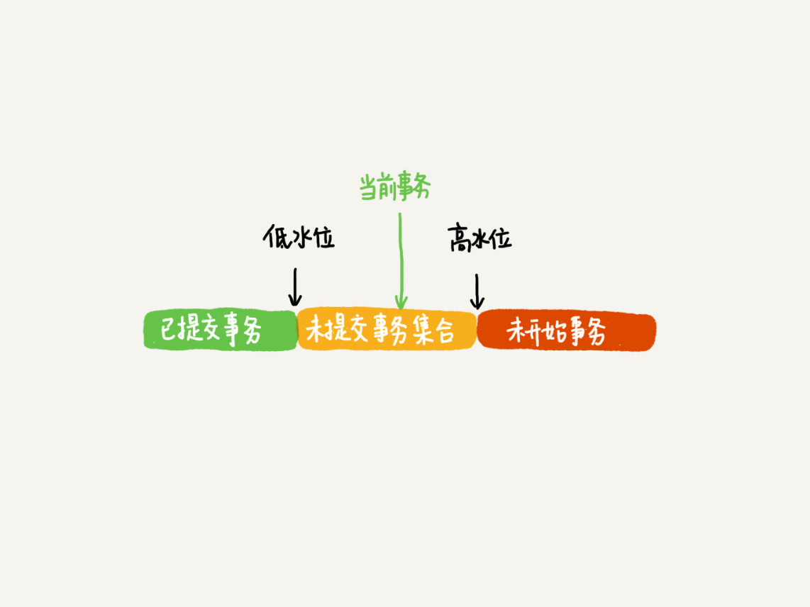
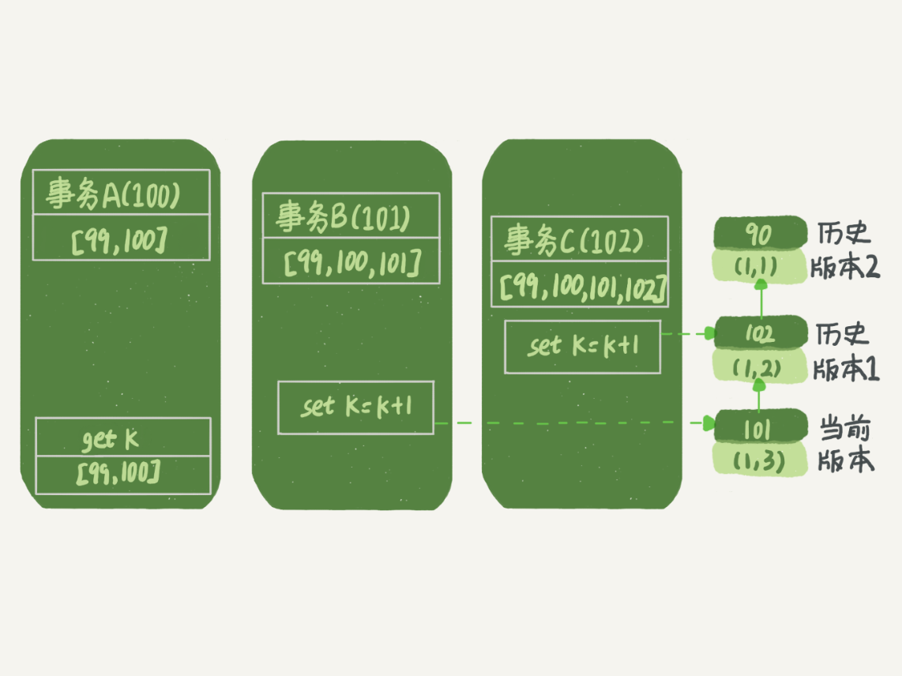
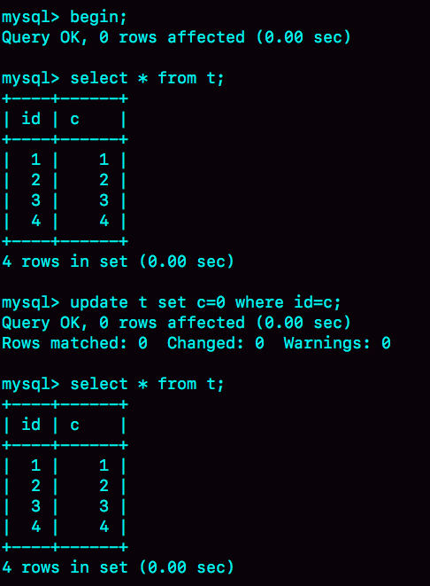
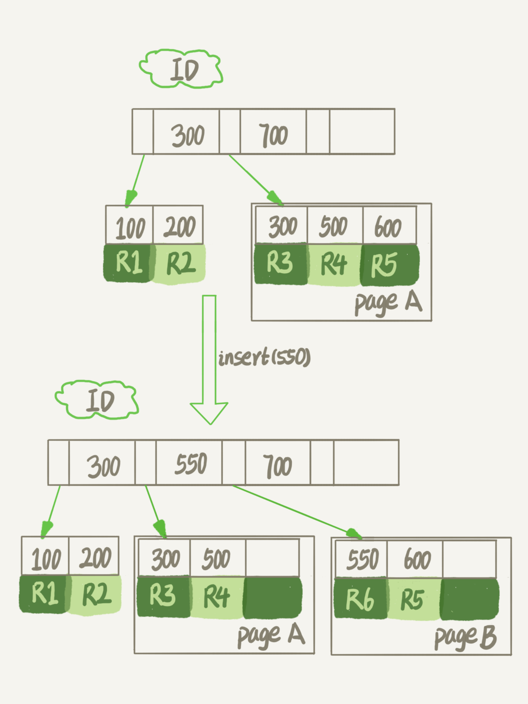
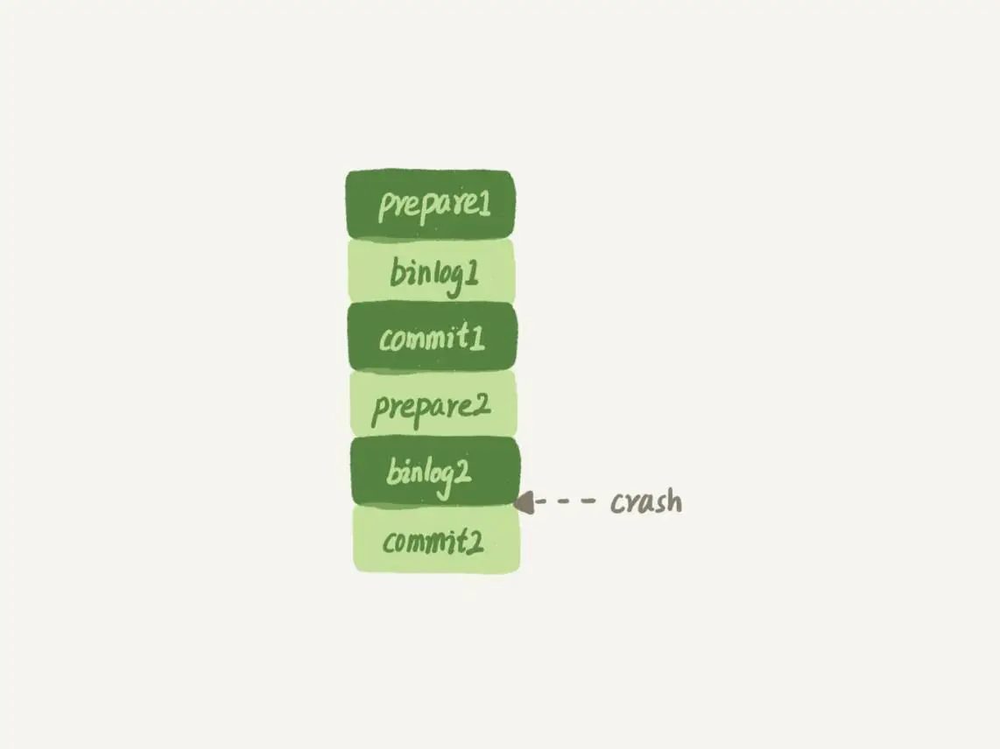
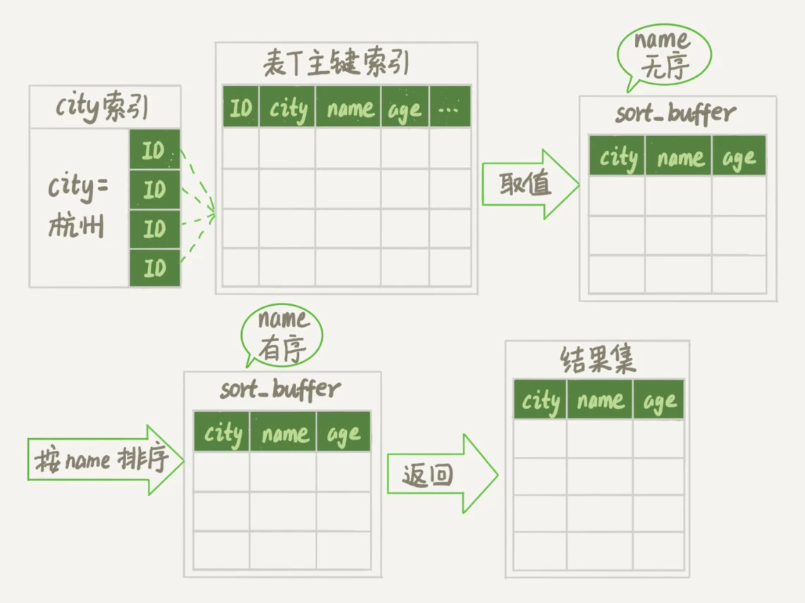
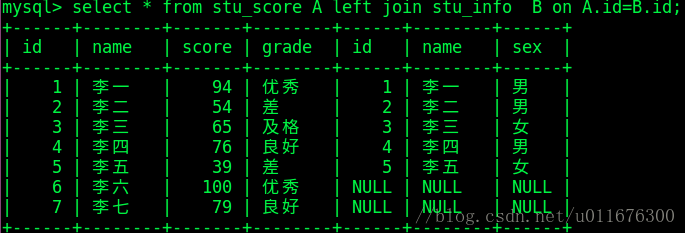

<span id="menu"></span>
<!-- TOC -->

- [1. MySQL](#1-mysql)
  - [1.1. 基本概念](#11-基本概念)
    - [1.1.1. 基本概念](#111-基本概念)
    - [1.1.2. 安装和配置](#112-安装和配置)
      - [1.1.2.1. 目录结构](#1121-目录结构)
      - [1.1.2.2. 配置](#1122-配置)
      - [1.1.2.3. 系统变量](#1123-系统变量)
      - [1.1.2.4. 状态变量](#1124-状态变量)
      - [1.1.2.5. 常用操作](#1125-常用操作)
    - [1.1.3. 系统数据库](#113-系统数据库)
    - [1.1.4. 常用工具](#114-常用工具)
    - [1.1.5. 逻辑架构图](#115-逻辑架构图)
    - [1.1.6. OLAP、OLTP的介绍和比较](#116-olapoltp的介绍和比较)
    - [1.1.7. NoSQL与关系型数据库设计理念比较](#117-nosql与关系型数据库设计理念比较)
      - [1.1.7.1. 关系型数据库](#1171-关系型数据库)
      - [1.1.7.2. 非关系型数据库](#1172-非关系型数据库)
  - [1.2. 管理员常用的命令](#12-管理员常用的命令)
    - [1.2.1. 权限工作原理](#121-权限工作原理)
    - [1.2.2. 权限生效时间](#122-权限生效时间)
    - [1.2.3. 查看所有用户](#123-查看所有用户)
    - [1.2.4. 创建用户](#124-创建用户)
    - [1.2.5. 修改密码](#125-修改密码)
    - [1.2.6. 给用户授权](#126-给用户授权)
    - [1.2.7. 查看用户权限](#127-查看用户权限)
    - [1.2.8. 撤销用户权限](#128-撤销用户权限)
    - [1.2.9. 删除用户](#129-删除用户)
  - [1.3. MySQL45讲](#13-mysql45讲)
    - [1.3.1. 一条SQL查询语句是如何执行的](#131-一条sql查询语句是如何执行的)
    - [1.3.2. 日志系统:一条SQL更新语句是如何执行的](#132-日志系统一条sql更新语句是如何执行的)
    - [1.3.3. 事务隔离:为什么你改了我还是看不见](#133-事务隔离为什么你改了我还是看不见)
    - [1.3.4. 深入浅出索引(上)](#134-深入浅出索引上)
    - [1.3.5. 深入浅出索引(下)](#135-深入浅出索引下)
    - [1.3.6. 全局锁和表锁:给表加个字段怎么有这么多阻碍](#136-全局锁和表锁给表加个字段怎么有这么多阻碍)
    - [1.3.7. 行锁功过:怎么减少行锁对性能的影响](#137-行锁功过怎么减少行锁对性能的影响)
    - [1.3.8. 事务到底是隔离还是不隔离的](#138-事务到底是隔离还是不隔离的)
    - [1.3.9. 普通索引还是唯一索引](#139-普通索引还是唯一索引)
    - [1.3.10. MYSQL为什么有些时候会选错索引](#1310-mysql为什么有些时候会选错索引)
    - [1.3.11. 怎么给字符字段加索引](#1311-怎么给字符字段加索引)
    - [1.3.12. 为什么我的MySQL会抖一下](#1312-为什么我的mysql会抖一下)
    - [1.3.13. 为什么表数据会删掉一半，表文件大小不变](#1313-为什么表数据会删掉一半表文件大小不变)
    - [1.3.14. count(*)这么慢，怎么半](#1314-count这么慢怎么半)
    - [1.3.15. 日志索引相关问题](#1315-日志索引相关问题)
    - [1.3.16. order by怎么工作](#1316-order-by怎么工作)
    - [1.3.17. 如何正确的显示随机消息](#1317-如何正确的显示随机消息)
    - [1.3.18. 为什么这些SQL语句逻辑相同，性能却差异很大](#1318-为什么这些sql语句逻辑相同性能却差异很大)
    - [1.3.19. 为什么只查询一行的语句，也执行这么慢](#1319-为什么只查询一行的语句也执行这么慢)
    - [1.3.20. 幻读是什么，幻读有什么问题](#1320-幻读是什么幻读有什么问题)
    - [1.3.21. 为什么我只改一行的语句，锁这么多](#1321-为什么我只改一行的语句锁这么多)
    - [1.3.22. MySQL有哪些饮鸩止渴提高性能的方法](#1322-mysql有哪些饮鸩止渴提高性能的方法)
    - [1.3.23. MySQL是如何保证数据不丢失的](#1323-mysql是如何保证数据不丢失的)
    - [1.3.24. MySQL是怎么保证主备数据一致的](#1324-mysql是怎么保证主备数据一致的)
    - [1.3.25. MySQL怎么保证高可用](#1325-mysql怎么保证高可用)
    - [1.3.26. 备库为什么会延迟好几个小时](#1326-备库为什么会延迟好几个小时)
    - [1.3.27. 主库出现问题，从库怎么半](#1327-主库出现问题从库怎么半)
    - [1.3.28. 读写分离有哪些坑](#1328-读写分离有哪些坑)
    - [1.3.29. 如何判断一个数据库是不是出现问题了](#1329-如何判断一个数据库是不是出现问题了)
    - [1.3.30. 用动态的观点看加锁](#1330-用动态的观点看加锁)
    - [1.3.31. 误删数据库处理](#1331-误删数据库处理)
    - [1.3.32. 为什么还有kill不掉的语句](#1332-为什么还有kill不掉的语句)
    - [1.3.33. 查询过多会不会把数据库打爆](#1333-查询过多会不会把数据库打爆)
    - [1.3.34. 到底可不可用join](#1334-到底可不可用join)
    - [1.3.35. join怎么优化](#1335-join怎么优化)
    - [1.3.36. 为什么临时表可以重名](#1336-为什么临时表可以重名)
    - [1.3.37. 什么时候使用内部临时表](#1337-什么时候使用内部临时表)
    - [1.3.38. 都说Innodb好，那还要不要使用Memory引擎](#1338-都说innodb好那还要不要使用memory引擎)
    - [1.3.39. 自增主键为什么不是连续的](#1339-自增主键为什么不是连续的)
    - [1.3.40. insert为什么锁这么多](#1340-insert为什么锁这么多)
    - [1.3.41. 怎么最快地复制一张表](#1341-怎么最快地复制一张表)
    - [1.3.42. grant之后要跟着flush privileges么](#1342-grant之后要跟着flush-privileges么)
    - [1.3.43. 要不要使用分区表](#1343-要不要使用分区表)
    - [1.3.44. 答疑](#1344-答疑)
    - [1.3.45. 自增id用完怎么办](#1345-自增id用完怎么办)
    - [1.3.46. 每课一题](#1346-每课一题)
  - [1.4. 使用数据库](#14-使用数据库)
    - [1.4.1. 数据类型](#141-数据类型)
      - [1.4.1.1. 字符集](#1411-字符集)
      - [1.4.1.2. 整形数据类型](#1412-整形数据类型)
      - [1.4.1.3. 浮点型数据类型](#1413-浮点型数据类型)
      - [1.4.1.4. 位类型](#1414-位类型)
      - [1.4.1.5. 常规字符串类型](#1415-常规字符串类型)
      - [1.4.1.6. ENUM,SET](#1416-enumset)
      - [1.4.1.7. 日期和时间类型](#1417-日期和时间类型)
      - [1.4.1.8. 数据类型选型的建议](#1418-数据类型选型的建议)
    - [1.4.2. 运算符](#142-运算符)
    - [1.4.3. 数据库基本操作](#143-数据库基本操作)
    - [1.4.4. 表的创建和修改](#144-表的创建和修改)
    - [1.4.5. 数据插入|更新|删除](#145-数据插入更新删除)
    - [1.4.6. 数据查询](#146-数据查询)
      - [1.4.6.1. 查询入门](#1461-查询入门)
        - [1.4.6.1.1. 基本用法](#14611-基本用法)
        - [1.4.6.1.2. limit 优化](#14612-limit-优化)
      - [1.4.6.2. 多表连接查询](#1462-多表连接查询)
        - [1.4.6.2.1. 并集Union](#14621-并集union)
        - [1.4.6.2.2. 迪卡尔积Cartesian product](#14622-迪卡尔积cartesian-product)
        - [1.4.6.2.3. 内连接查询](#14623-内连接查询)
        - [1.4.6.2.4. 外连接查询](#14624-外连接查询)
        - [1.4.6.2.5. 全外连接](#14625-全外连接)
        - [1.4.6.2.6. 连接３个或者更多的表](#14626-连接３个或者更多的表)
        - [1.4.6.2.7. 自连接](#14627-自连接)
        - [1.4.6.2.8. 相等连接和不等连接](#14628-相等连接和不等连接)
        - [1.4.6.2.9. 表连接原理](#14629-表连接原理)
        - [1.4.6.2.10. on和where的区别](#146210-on和where的区别)
        - [1.4.6.2.11. 总结](#146211-总结)
      - [1.4.6.3. 集合](#1463-集合)
      - [1.4.6.4. 子查询](#1464-子查询)
  - [1.5. 索引](#15-索引)
  - [1.6. 函数](#16-函数)
    - [1.6.1. 聚集函数](#161-聚集函数)
    - [1.6.2. 数学函数](#162-数学函数)
    - [1.6.3. 字符串函数](#163-字符串函数)
    - [1.6.4. 日期和时间函数](#164-日期和时间函数)
    - [1.6.5. 条件判断函数](#165-条件判断函数)
    - [1.6.6. 系统信息函数](#166-系统信息函数)
    - [1.6.7. 加密函数](#167-加密函数)
    - [1.6.8. 其他函数](#168-其他函数)
  - [1.7. 视图](#17-视图)
    - [1.7.1. 基本概念](#171-基本概念)
  - [1.8. 存储过程](#18-存储过程)
    - [1.8.1. 基本概念](#181-基本概念)
    - [1.8.2. 使用存储过程](#182-使用存储过程)
    - [1.8.3. 使用存储过程](#183-使用存储过程)
    - [1.8.4. 存储过程的参数](#184-存储过程的参数)
    - [1.8.5. 变量](#185-变量)
    - [1.8.6. 注释](#186-注释)
    - [1.8.7. MySQL存储过程的控制语句](#187-mysql存储过程的控制语句)
    - [1.8.8. 查看存储过程](#188-查看存储过程)
    - [1.8.9. 删除](#189-删除)
  - [1.9. 游标](#19-游标)
    - [1.9.1. 使用游标](#191-使用游标)

<!-- /TOC -->

# 1. MySQL
<a href="#menu" >目录</a>

## 1.1. 基本概念
<a href="#menu" >目录</a>

### 1.1.1. 基本概念

* 数据库(DataBase,DB)
    * 长期保存在计算机的存储设备上，按照一定的规则组织起来，可以被各种用户或者应用共享的数据集合
* 数据库管理系统(Database Managerment System ,DBMS)
    * 管理数据库的系统软件，比如MySQL
* 数据库系统(Database Symterm,DBS)
    * 计算机引入数据库后的系统，DBS是由计算机硬件、操作系统、DBMS、数据库、应用程序和用户等组成的一个整体。

* 数据库存储的一些特点
    * 数据存放在表中，然后表存放在数据库中
    * ⼀个库中可以有多张表，每张表具有唯⼀的名称（表名）来标识⾃⼰
    * 表中有⼀个或多个列，列又称为“字段”，相当于java中的“属性”	
    * 表中每⼀⾏数据，相当于java中的“对象”
* 基本概念
    * 数据库: 物理操作系统文件或者其他形式文件类型的集合。
    * 数据库实例: 数据库运行之后的应用。
    * SQL:一种结构化查询语言，专门用来和数据库进行通信的语言。
    * 数据表: 表是数据的矩阵。在一个数据库中的表看起来像一个简单的电子表格。
    * 列: 表的一个字段，一个表是由一个或者多个列组成
    * 行：一行（=元组，或记录）是一组相关的数据，例如一条用户订阅的数据。
    * 表：行的集合
    * 结果集:ＳＱＬ查询结果
    * 数据类型:每个列都有固定的数据类型，比如数值，字符串等    
    * 冗余：存储两倍数据，冗余降低了性能，但提高了数据的安全性。
    * 主键：用于唯一标识表中每个行的一个或者多个列。主键是唯一的。一个数据表中只能包含一个主键。你可以使用主键来查询数据。
    * 外键：用于唯一标识其他表中每个行的一个或者多个列。外键用于关联两个表。外键不能跨引擎。
    * 复合键：复合键（组合键）将多个列作为一个索引键，一般用于复合索引。
    * 索引：使用索引可快速访问数据库表中的特定信息。索引是对数据库表中一列或多列的值进行排序的一种结构。类似于书籍的目录。
    * 参照完整性: 参照的完整性要求关系中不允许引用不存在的实体。与实体完整性是关系模型必须满足的完整性约束条件，目的是保证数据的一致性。
    * SQL:结构化查询语言，用于与数据库通信的语言
* 主键、外键
    * 不要更新主键列中的值
    * 不能重用主键列中的值
    * 不在主键列中使用可能会更改的值，比如名称。

||定义|作用|个数|
|---|---|---|---|
|主键|唯一标识一条记录，不能有重复的，不允许为空|用来保证数据完整性|主键只能有一个|
|外键|表的外键是另一表的主键, 外键可以有重复的, 可以是空值|用来和其他表建立联系用的|一个表可以有多个外键|

创建外键
```sql
FOREIGN KEY (P_Id) REFERENCES Persons(P_Id)
```


**关系型数据库和非关系型数据库的区别**
* 关系型数据库
    * 关系型数据库最典型的数据结构是表，由二维表及其之间的联系所组成的一个数据组织
    * SQLite、Oracle、mysql
    * 特性
        * 关系型数据库，是指采用了关系模型来组织数据的数据库；
        * 关系型数据库的最大特点就是事务的一致性；
        * 简单来说，关系模型指的就是二维表格模型，
        * 而一个关系型数据库就是由二维表及其之间的联系所组成的一个数据组织
    * 优点
        * 容易理解：二维表结构是非常贴近逻辑世界一个概念，关系模型相对网状、层次等其他模型来说更容易理解；
        * 使用方便：通用的SQL语言使得操作关系型数据库非常方便；
        * 易于维护：丰富的完整性(实体完整性、参照完整性和用户定义的完整性)大大减低了数据冗余和数据不一致的概率；
        * 支持SQL，可用于复杂的查询。
    * 缺点
        * 为了维护一致性所付出的巨大代价就是其读写性能比较差；
        * 固定的表结构；
        * 高并发读写需求；
        * 海量数据的高效率读写；

* 非关系型数据库
    * 非关系型数据库严格上不是一种数据库，应该是一种数据结构化存储方法的集合，可以是文档或者键值对等。
    * MongoDb、redis、HBase
    * 特性
        * 使用键值对存储数据；
        * 分布式；
        * 一般不支持ACID特性；  
        * 非关系型数据库严格上不是一种数据库，应该是一种数据结构化存储方法的集合。
    * 优点
        * 无需经过sql层的解析，读写性能很高；
        * 基于键值对，数据没有耦合性，容易扩展；
        * 存储数据的格式：nosql的存储格式是key,value形式、文档形式、图片形式等等，文档形式、图片形式等等，而关系型数据库则只支持基础类型。
        * 2、速度快：nosql可以使用硬盘或者随机存储器作为载体，而关系型数据库只能使用硬盘；
        * 3、高扩展性；
        * 4、成本低：nosql数据库部署简单，基本都是开源软件。
    * 缺点
        * 不提供sql支持，学习和使用成本较高；   
        * 无事务处理，附加功能bi和报表等支持也不好；
        * 数据结构相对复杂，复杂查询方面稍欠。

* SQL (sequel) Structure Query Language 结构化查询语言
    * 主要功能
        * 数据定义语言 DDL
            * 定义数据库涉及各种对象，定义数据的完整性约束，保密限制等约束
        * 数据操作语言 DML
            * 实现对数据的操作(增删改查)
        * 数据控制语言 DCL
            * 实现对数据库的控制，包含数据完整性控制，数据安全性控制
    * 优点
        * 符合SQL语言规范的数据库都能使用
        * 简单易学
        * 高度非过程化，只需指出做什么，不用关注过程

* mysql数据库分类
    * 系统数据库:系统附带的数据库
        * information_schema : 主要存储系统中的一些数据库对象信息，如用户表信息，列信息，权限信息，字符集信息和分区信息
        * performance_schema : 主要存储数据库服务器性能信息
        * mysql : 主要存储系统的用户权限信息
        * test : 自动创建的用户数据库，任何用户都可以使用
    * 用户数据库:　用户自行创建的数据库
    
### 1.1.2. 安装和配置

* 下载[Mysql5.7](https://dev.mysql.com/downloads/mysql/5.7.html#downloads)
* 解压: tar -xvf mysql-xxx.tar 
* 移动: mv mysql-xxx /usr/local/mysql
* 创建mysql用户组和用户并修改权限
    * groupadd mysql
    * useradd -r -g mysql mysql
* 创建数据目录并赋予权限
    * mkdir -p  /data/mysql              #创建目录
    * chown mysql:mysql -R /data/mysql   #赋予权限

#### 1.1.2.1. 目录结构

* bin目录
    * 用于放置一些可执行文件，如mysql.exe、mysqld.exe、mysqlshow.exe等。
* data目录
    * 用于放置一些日志文件以及数据库。
* include目录
    * 用于放置一些头文件，如：mysql.h、mysql_ername.h等。
* lib目录
    * 用于放置一系列库文件。
* share目录
    * 用于存放字符集、语言等信息。
* my.ini
    * 是MySQL数据库中使用的配置文件。
* my-huge.ini
    * 适合超大型数据库的配置文件。
* my-large.ini
    * 适合大型数据库的配置文件。
* my-medium.ini
    * 适合中型数据库的配置文件。
* my-small.ini
    * 适合小型数据库的配置文件。
* my-template.ini
    * 是配置文件的模板，MySQL配置向导将该配置文件中选择项写入到my.ini文件。
* my-innodb-heavy-4G.ini
    * 表示该配置文件只对于InnoDB存储引擎有效，而且服务器的内存不能小于4GB。

#### 1.1.2.2. 配置

* 查看配置文件位置
```
lgj@lgj-Lenovo-G470:~$ mysql --help | grep my.cnf
                      order of preference, my.cnf, $MYSQL_TCP_PORT,
/etc/my.cnf /etc/mysql/my.cnf ~/.my.cnf 

```
**配置文件的优先级**

按以下顺序读取配置文件
/etc/my.cnf-->/etc/mysql/my.cnf--> ~/.my.cnf -->命令行中的启动选项
mysql以读取的最后一个文件配置为准

**同一个配置文件中多个组的优先级**

同一个程序可以访问配置文件中的多个组，比如 mysqld 可以访问 [mysqld] 、 [servr]组.如果在同一个配置文件中〈比如~/.my.cnf) ， 在 [mysqld] 、 [server]组里出现了同样的启动选项,则以最后出现的为准。


在配置文件中指定启动选项的语法类似于命令行语法，但是在配置文件中只能使用长形式的选项，而且在配置文件中指定的启动选项不允许加一前缀，并且每行只指定一个选项，等号=周围可以有空白字符〈在命令行中，选项名、=、选项值之间不允许有空白字符).另外，在配置文件中，我们可以使用#来添加注释，从#出现直到行尾的内容都属于注释内容，MySQL 程序会忽略这些注释内容 

在配置文件中，不同的选项组是给不同的程序使用的.如果选项组名称与程序名称相同，则组中的选项将专门应用于该程序.例如，[mysqld] 和 [mysql] 组分别应用于 mysqld 服务器程序和 mysql 客户端程序.不过有两个选项组比较特别
* [sever] 组下面的启动选项将作用于所有的服务器程序:
* [cliet]组下面的启动逃项将作用于所有的客户端程序.

程序的对应类别和能读取的组
|程序名| 类别| 能读取的组|
|---|---|---|
|mysqld |启动服务辑 |[mysqld] 、 [sever]
|mysqld_safe |启动服务器 |[mysqld] 、 [server] 、 [mysqld_safe]
|mysql.serverer |启动服务器 |[mysqld] 、 [sever]、 [mysql.servr]
|mysql |启动客户瑞 |[mysql] 、 [client]
|mysqladmin |启动客户端 |[mysqladmin] 、[client]
|mysqldump |启动客户端 |[mysqldump] 、 [client]


**特定 MySQL 版本的专用选项组**

我们可以在选项组的名称后加上特定的 MySQL 版本号.比如对于 [mysqld] 选项组来说，我们可以定义一个 [mysqld-5 .7] 的~项组.它的含义和 [mysqld] 一样，只不过只有版本号为 5.7的 mysqld 程序才能使用这个选项组中的选项.


```yml

#加载其他配置文件，目录中的所有cnf文件将会被加载进来
!includedir /etc/mysql/conf.d/
!includedir /etc/mysql/mysql.conf.d/


#客户端设置，即客户端默认的连接参数
[client]　
#默认连接端口
port = 3307　　
#用于本地连接的socket套接字　　　　　　 　　　　　　　　
socket = /data/mysqldata/3307/mysql.sock

#编码	　　
default-character-set = utf8mb4　　
　　　　　
#服务端基本设置
[mysqld]	　　　　　　　　　　　　　　　　　　
port = 3307	MySQL监听端口
#为MySQL客户端程序和服务器之间的本地通讯指定一个套接字文件
socket = /data/mysqldata/3307/mysql.sock　
#pid文件所在目录　	
pid-file = /data/mysqldata/3307/mysql.pid　
#使用该目录作为根目录（安装目录）　
basedir = /usr/local/mysql-5.7.11　
#数据文件存放的目录　　　　　
datadir = /data/mysqldata/3307/data
#MySQL存放临时文件的目录　　　　　
tmpdir = /data/mysqldata/3307/tmp	
#服务端默认编码（数据库级别）　　　　  
character_set_server = utf8mb4
#服务端默认的比对规则，排序规则	　　　　　　 
collation_server = utf8mb4_bin
#MySQL启动用户	　　　　　　 
user = mysql
	　　　　　　　　　　　　　　　　
 #This variable applies when binary logging is enabled. It controls whether stored function creators can be trusted not to create stored functions that will cause 　　　　　　　　　　　　　　　　　　　　　　 
 #unsafe events to be written to the binary log. If set to 0 (the default), users are not permitted to create or alter stored functions unless they have the SUPER 
 #privilege in addition to the CREATE ROUTINE or ALTER ROUTINE privilege. 开启了binlog后，必须设置这个值为1.主要是考虑binlog安全
log_bin_trust_function_creators = 1
#性能优化的引擎，默认关闭
performance_schema = 0	　　　　　　　　　　 
#secure_auth 为了防止低版本的MySQL客户端(<4.1)使用旧的密码认证方式访问高版本的服务器。MySQL 5.6.7开始
secure_auth = 1
#默认为启用值1　　　　　　　　　　　　　　　
secure_auth 
#开启全文索引
#ft_min_word_len = 1	　　　　　　　　　　　 
#自动修复MySQL的myisam表
#myisam_recover	　　　
#明确时间戳默认null方式　　　　　　　　　　　	
explicit_defaults_for_timestamp	　　　　　　	
#计划任务（事件调度器）
event_scheduler	
#跳过外部锁定;External-locking用于多进程条件下为MyISAM数据表进行锁定　　　　　　　　　　　　　　	
skip-external-locking　　　　　　　　　　　　
#跳过客户端域名解析；当新的客户连接mysqld时，mysqld创建一个新的线程来处理请求。该线程先检查是否主机名在主机名缓存中。如果不在，线程试图解析主机名。
skip-name-resolve　　　　　　　　　　　　　　

#使用这一选项以消除MySQL进行DNS解析的时间。但需要注意，如果开启该选项，则所有远程主机连接授权都要使用IP地址方式，否则MySQL将无法正常处理连接请求!
#MySQL绑定IP
#bind-address = 127.0.0.1　　　　　　　　　　
#为了安全起见，复制环境的数据库还是设置--skip-slave-start参数，防止复制随着mysql启动而自动启动
skip-slave-start　　　　　　　　　　　　　　
The number of seconds to wait for more data from a master/slave connection before aborting the read. MySQL主从复制的时候，
#当Master和Slave之间的网络中断，但是Master和Slave无法察觉的情况下（比如防火墙或者路由问题）。
#Slave会等待slave_net_timeout设置的秒数后，才能认为网络出现故障，然后才会重连并且追赶这段时间主库的数据。
#1.用这三个参数来判断主从是否延迟是不准确的Slave_IO_Running,Slave_SQL_Running,Seconds_Behind_Master.还是用pt-heartbeat吧。
#2.slave_net_timeout不要用默认值，设置一个你能接受的延时时间。
slave_net_timeout = 30	　　　　　　　　　　　

#设定是否支持命令load data local infile。如果指定local关键词，则表明支持从客户主机读文件
local-infile = 0	　　　　　　　　　　　　　 
#指定MySQL可能的连接数量。当MySQL主线程在很短的时间内得到非常多的连接请求，该参数就起作用，之后主线程花些时间（尽管很短）检查连接并且启动一个新线程。
#back_log参数的值指出在MySQL暂时停止响应新请求之前的短时间内多少个请求可以被存在堆栈中。
back_log = 1024 　　　　　　　　　　　　　　

　　　　　　　　　　　　　　　　　　　　 
#sql_mode = 'PIPES_AS_CONCAT,ANSI_QUOTES,IGNORE_SPACE,NO_KEY_OPTIONS,NO_TABLE_OPTIONS,NO_FIELD_OPTIONS,NO_AUTO_CREATE_USER,NO_ENGINE_SUBSTITUTION'
#sql_mode,定义了mysql应该支持的sql语法，数据校验等!  NO_AUTO_CREATE_USER：禁止GRANT创建密码为空的用户。
sql_mode = NO_ENGINE_SUBSTITUTION,NO_AUTO_CREATE_USER　　

#NO_ENGINE_SUBSTITUTION 如果需要的存储引擎被禁用或未编译，可以防止自动替换存储引擎
#索引块的缓冲区大小，对MyISAM表性能影响最大的一个参数.决定索引处理的速度，尤其是索引读的速度。默认值是16M，通过检查状态值Key_read_requests
key_buffer_size = 32M　　　　　　　　　　　

#和Key_reads，可以知道key_buffer_size设置是否合理
#一个查询语句包的最大尺寸。消息缓冲区被初始化为net_buffer_length字节，但是可在需要时增加到max_allowed_packet个字节。
#该值太小则会在处理大包时产生错误。如果使用大的BLOB列，必须增加该值。
#这个值来限制server接受的数据包大小。有时候大的插入和更新会受max_allowed_packet 参数限制，导致写入或者更新失败。
max_allowed_packet = 512M　　　　　　　　　　
#线程缓存；主要用来存放每一个线程自身的标识信息，如线程id，线程运行时基本信息等等，我们可以通过 thread_stack 参数来设置为每一个线程栈分配多大的内存。
thread_stack = 256K　　　　　　　　　　　　　
#是MySQL执行排序使用的缓冲大小。如果想要增加ORDER BY的速度，首先看是否可以让MySQL使用索引而不是额外的排序阶段。
#如果不能，可以尝试增加sort_buffer_size变量的大小。
sort_buffer_size = 16M　　　　　　　　　　　 

#如果对表的顺序扫描请求非常频繁，并且你认为频繁扫描进行得太慢，可以通过增加该变量值以及内存缓冲区大小提高其性能。
#是MySQL读入缓冲区大小。对表进行顺序扫描的请求将分配一个读入缓冲区，MySQL会为它分配一段内存缓冲区。read_buffer_size变量控制这一缓冲区的大
read_buffer_size = 16M　　　　　　　　　　　 

#应用程序经常会出现一些两表（或多表）Join的操作需求，MySQL在完成某些 Join 需求的时候（all/index join），为了减少参与Join的“被驱动表”
#读取次数以提高性能，需要使用到 Join Buffer 来协助完成 Join操作。当 Join Buffer 太小，MySQL 不会将该 Buffer 存入磁盘文件，
#而是先将Join Buffer中的结果集与需要 Join 的表进行 Join 操作，
#然后清空 Join Buffer 中的数据，继续将剩余的结果集写入此 Buffer 中，如此往复。这势必会造成被驱动表需要被多次读取，成倍增加 IO 访问，降低效率。
join_buffer_size = 16M　　　　　　　　　　　
#是MySQL的随机读缓冲区大小。当按任意顺序读取行时(例如，按照排序顺序)，将分配一个随机读缓存区。进行排序查询时，MySQL会首先扫描一遍该缓冲，以避免磁盘搜索，
#提高查询速度，如果需要排序大量数据，可适当调高该值。但MySQL会为每个客户连接发放该缓冲空间，所以应尽量适当设置该值，以避免内存开销过大。
read_rnd_buffer_size = 32M　　　　　　　　　
#通信缓冲区在查询期间被重置到该大小。通常不要改变该参数值，但是如果内存不足，可以将它设置为查询期望的大小。
#（即，客户发出的SQL语句期望的长度。如果语句超过这个长度，缓冲区自动地被扩大，直到max_allowed_packet个字节。）
net_buffer_length = 16K　　　　　　　　　　
#当对MyISAM表执行repair table或创建索引时，用以缓存排序索引；设置太小时可能会遇到” myisam_sort_buffer_size is too small”
myisam_sort_buffer_size = 128M　　　　　　  
#默认8M，当对MyISAM非空表执行insert … select/ insert … values(…),(…)或者load data infile时，使用树状cache缓存数据，每个thread分配一个；
#注：当对MyISAM表load 大文件时，调大bulk_insert_buffer_size/myisam_sort_buffer_size/key_buffer_size会极大提升速度
bulk_insert_buffer_size = 32M　　　　　　  
#thread_cahe_size线程池，线程缓存。用来缓存空闲的线程，以至于不被销毁，如果线程缓存在的空闲线程，需要重新建立新连接，
#则会优先调用线程池中的缓存，很快就能响应连接请求。每建立一个连接，都需要一个线程与之匹配
thread_cache_size = 384　　　　　　　　   
 #工作原理： 一个SELECT查询在DB中工作后，DB会把该语句缓存下来，当同样的一个SQL再次来到DB里调用时，DB在该表没发生变化的情况下把结果从缓存中返回给Client。　
 #在数据库写入量或是更新量也比较大的系统，该参数不适合分配过大。而且在高并发，写入量大的系统，建系把该功能禁掉。　　　　　　　　　　　　　　　　　　　　 
query_cache_size = 0　　　　　　　　　   
#决定是否缓存查询结果。这个变量有三个取值：0,1,2，分别代表了off、on、demand。　　　　　　　　　　　　　　　　　    
query_cache_type = 0　　　　　　　　　    　　　　　　
#它规定了内部内存临时表的最大值，每个线程都要分配。（实际起限制作用的是tmp_table_size和max_heap_table_size的最小值。）
#如果内存临时表超出了限制，MySQL就会自动地把它转化为基于磁盘的MyISAM表，存储在指定的tmpdir目录下
tmp_table_size = 1024M　　　　　　　　　　

#独立的内存表所允许的最大容量.# 此选项为了防止意外创建一个超大的内存表导致永尽所有的内存资源.
max_heap_table_size = 512M	　　　　　　  
#mysql打开最大文件数
open_files_limit = 10240　　　　　　　　　 
#MySQL无论如何都会保留一个用于管理员（SUPER）登陆的连接，用于管理员连接数据库进行维护操作，即使当前连接数已经达到了max_connections。
#因此MySQL的实际最大可连接数为max_connections+1；
#这个参数实际起作用的最大值（实际最大可连接数）为16384，即该参数最大值不能超过16384，即使超过也以16384为准；
#增加max_connections参数的值，不会占用太多系统资源。系统资源（CPU、内存）的占用主要取决于查询的密度、效率等；
#该参数设置过小的最明显特征是出现”Too many connections”错误；
max_connections = 2000　　　　　　　　　　 
#用来限制用户资源的，0不限制；对整个服务器的用户限制
max-user-connections = 0　　　　　　　　　 
#max_connect_errors是一个MySQL中与安全有关的计数器值，它负责阻止过多尝试失败的客户端以防止暴力破解密码的情况。max_connect_errors的值与性能并无太大关系。
#当此值设置为10时，意味着如果某一客户端尝试连接此MySQL服务器，但是失败（如密码错误等等）10次，则MySQL会无条件强制阻止此客户端连接。
max_connect_errors = 100000　　　　　　　　 
#表描述符缓存大小，可减少文件打开/关闭次数；　　　　　　　　　　　　　　　　　　　　
table_open_cache = 5120　　　　　　　　　　
#interactive_time -- 指的是mysql在关闭一个交互的连接之前所要等待的秒数(交互连接如mysql gui tool中的连接
interactive_timeout = 86400　　　
#wait_timeout -- 指的是MySQL在关闭一个非交互的连接之前所要等待的秒数　　　　　
wait_timeout = 86400　
#二进制日志缓冲大小　　　　
#我们知道InnoDB存储引擎是支持事务的，实现事务需要依赖于日志技术，为了性能，日志编码采用二进制格式。那么，我们如何记日志呢？有日志的时候，就直接写磁盘？
#可是磁盘的效率是很低的，如果你用过Nginx，，一般Nginx输出access log都是要缓冲输出的。因此，记录二进制日志的时候，我们是否也需要考虑Cache呢？
#答案是肯定的，但是Cache不是直接持久化，于是面临安全性的问题——因为系统宕机时，Cache中可能有残余的数据没来得及写入磁盘。因此，Cache要权衡，要恰到好处：
#既减少磁盘I/O，满足性能要求；又保证Cache无残留，及时持久化，满足安全要求。　　　　　　　
binlog_cache_size = 16M　　　　　　　　　　
#开启慢查询　　　　　　　　　　　　　　　　　　　　 
slow_query_log = 1　　　
#超过的时间为1s；MySQL能够记录执行时间超过参数 long_query_time 设置值的SQL语句，默认是不记录的。　　　　　　　　　　
long_query_time = 1　　　　　　　　　　　

log-slow-admin-statements 
#记录管理语句和没有使用index的查询记录
log-queries-not-using-indexes　　　　　　　

# *** Replication related settings ***
#在复制方面的改进就是引进了新的复制技术：基于行的复制。简言之，这种新技术就是关注表中发生变化的记录，而非以前的照抄 binlog 模式。
#从 MySQL 5.1.12 开始，可以用以下三种模式来实现：基于SQL语句的复制(statement-based replication, SBR)，基于行的复制(row-based replication, RBR)，混合模式复制(mixed-based replication, MBR)。相应地，binlog的格式也有三种：STATEMENT，ROW，MIXED。MBR 模式中，SBR 模式是默认的。
binlog_format = ROW　　　　　　　　　　　　

# 为每个session 最大可分配的内存，在事务过程中用来存储二进制日志的缓存。
#max_binlog_cache_size = 102400　　　
#开启二进制日志功能，binlog数据位置　　　　　　　　　　　  
log-bin = /data/mysqldata/3307/binlog/mysql-bin	　　　　　　　
log-bin-index = /data/mysqldata/3307/binlog/mysql-bin.index
#relay-log日志记录的是从服务器I/O线程将主服务器的二进制日志读取过来记录到从服务器本地文件，
#然后SQL线程会读取relay-log日志的内容并应用到从服务器
relay-log = /data/mysqldata/3307/relay/mysql-relay-bin	　　　　
#binlog传到备机被写道relaylog里，备机的slave sql线程从relaylog里读取然后应用到本地。　　　　　　　　　　　　　　　　　　　　　　　　　　　　　
relay-log-index = /data/mysqldata/3307/relay/mysql-relay-bin.index	
#服务端ID，用来高可用时做区分
server_id = 100　
#log_slave_updates是将从服务器从主服务器收到的更新记入到从服务器自己的二进制日志文件中。　　　　　　　　　　　 	
log_slave_updates = 1
#二进制日志自动删除的天数。默认值为0,表示“没有自动删除”。启动时和二进制日志循环时可能删除。　　　　　　　　　　	
expire-logs-days = 15
#如果二进制日志写入的内容超出给定值，日志就会发生滚动。你不能将该变量设置为大于1GB或小于4096字节。 默认值是1GB。　　　　　　　　　　	
max_binlog_size = 512M　　　　　　　　　　	
#replicate-wild-ignore-table参数能同步所有跨数据库的更新，比如replicate-do-db或者replicate-ignore-db不会同步类似 
replicate-wild-ignore-table = mysql.%
#设定需要复制的Table　　
#replicate-wild-do-table = db_name.%　　	
#复制时跳过一些错误;不要胡乱使用这些跳过错误的参数，除非你非常确定你在做什么。当你使用这些参数时候，MYSQL会忽略那些错误，
#这样会导致你的主从服务器数据不一致。
#slave-skip-errors = 1062,1053,1146　　　　

#这两个参数一般用在主主同步中，用来错开自增值, 防止键值冲突
auto_increment_offset = 1
auto_increment_increment = 2　　　　　　　　

 
#将中继日志的信息写入表:mysql.slave_realy_log_info
relay_log_info_repository = TABLE　　
 #将master的连接信息写入表：mysql.salve_master_info　　　
master_info_repository = TABLE
#中继日志自我修复；当slave从库宕机后，假如relay-log损坏了，导致一部分中继日志没有处理，则自动放弃所有未执行的relay-log，
#并且重新从master上获取日志，这样就保证了relay-log的完整性　　　　　　
relay_log_recovery = on　　　　　　　　　　

# *** innodb setting ***
#InnoDB 用来高速缓冲数据和索引内存缓冲大小。 更大的设置可以使访问数据时减少磁盘 I/O。
innodb_buffer_pool_size = 4G　　　　　　　　
#单独指定数据文件的路径与大小
innodb_data_file_path = ibdata1:1G:autoextend　　
#每次commit 日志缓存中的数据刷到磁盘中。通常设置为 1，意味着在事务提交前日志已被写入磁盘， 事务可以运行更长以及服务崩溃后的修复能力。
#如果你愿意减弱这个安全，或你运行的是比较小的事务处理，可以将它设置为 0 ，以减少写日志文件的磁盘 I/O。这个选项默认设置为 0。
innodb_flush_log_at_trx_commit = 0　　　　　　
　　　　　　　　　　　　　　　　　　　　　　
#sync_binlog=n，当每进行n次事务提交之后，MySQL将进行一次fsync之类的磁盘同步指令来将binlog_cache中的数据强制写入磁盘。
#sync_binlog = 1000　　　　　　　　　　　　

innodb_read_io_threads = 8　
#对于多核的CPU机器，可以修改innodb_read_io_threads和innodb_write_io_threads来增加IO线程，来充分利用多核的性能　
innodb_write_io_threads = 8　　　　　　　　
#Innodb Plugin引擎开始引入多种格式的行存储机制，目前支持：Antelope、Barracuda两种。其中Barracuda兼容Antelope格式。
innodb_file_format = Barracuda　　　　　　
#限制Innodb能打开的表的数量
innodb_open_files = 65536
#开始碎片回收线程。这个应该能让碎片回收得更及时而且不影响其他线程的操作　　　　　　　　　
innodb_purge_threads = 1　　
#分布式事务　　　　　　　
innodb_support_xa = FALSE　
#InnoDB 将日志写入日志磁盘文件前的缓冲大小。理想值为 1M 至 8M。大的日志缓冲允许事务运行时不需要将日志保存入磁盘而只到事务被提交(commit)。
#因此，如果有大的事务处理，设置大的日志缓冲可以减少磁盘I/O。　　　　　　　
innodb_log_buffer_size = 256M　　　　　　

#日志组中的每个日志文件的大小(单位 MB)。如果 n 是日志组中日志文件的数目，那么理想的数值为 1M 至下面设置的缓冲池(buffer pool)大小的 1/n。较大的值，
#可以减少刷新缓冲池的次数，从而减少磁盘 I/O。但是大的日志文件意味着在崩溃时需要更长的时间来恢复数据。
innodb_log_file_size = 1G　　　　　　　 

#指定有三个日志组　　　　　　　　　　　　　　　　　　　
innodb_log_files_in_group = 3　　　　　　
#在回滚(rooled back)之前，InnoDB 事务将等待超时的时间(单位 秒)
#innodb_lock_wait_timeout = 120
#innodb_max_dirty_pages_pct作用：控制Innodb的脏页在缓冲中在那个百分比之下，值在范围1-100,默认为90.这个参数的另一个用处：
#当Innodb的内存分配过大，致使swap占用严重时，可以适当的减小调整这个值，使达到swap空间释放出来。建义：这个值最大在90%，最小在15%。
#太大，缓存中每次更新需要致换数据页太多，太小，放的数据页太小，更新操作太慢。　　　　　
innodb_max_dirty_pages_pct = 75　　　　　
#innodb_buffer_pool_size 一致 可以开启多个内存缓冲池，把需要缓冲的数据hash到不同的缓冲池中，这样可以并行的内存读写。
innodb_buffer_pool_instances = 4 　　　 
#这个参数据控制Innodb checkpoint时的IO能力
innodb_io_capacity = 500　　　　　　　　
#作用：使每个Innodb的表，有自已独立的表空间。如删除文件后可以回收那部分空间。
#分配原则：只有使用不使用。但ＤＢ还需要有一个公共的表空间。
innodb_file_per_table = 1　　　　　　　　
#当更新/插入的非聚集索引的数据所对应的页不在内存中时（对非聚集索引的更新操作通常会带来随机IO），会将其放到一个insert buffer中，
#当随后页面被读到内存中时，会将这些变化的记录merge到页中。当服务器比较空闲时，后台线程也会做merge操作
innodb_change_buffering = inserts　　　　
#该值影响每秒刷新脏页的操作，开启此配置后，刷新脏页会通过判断产生重做日志的速度来判断最合适的刷新脏页的数量；
innodb_adaptive_flushing = 1　　　　　　
#数据库事务隔离级别 ，读取提交内容
transaction-isolation = READ-COMMITTED　
#innodb_flush_method这个参数控制着innodb数据文件及redo log的打开、刷写模式　
#InnoDB使用O_DIRECT模式打开数据文件，用fsync()函数去更新日志和数据文件。
innodb_flush_method = O_DIRECT　　　　　　
#默认设置值为1.设置为0：表示Innodb使用自带的内存分配程序；设置为1：表示InnoDB使用操作系统的内存分配程序。　　　　　　　　　　　　　　　　　　　　　　　
#innodb_use_sys_malloc = 1　　　　　　　　

 

[mysqldump]
#它强制 mysqldump 从服务器查询取得记录直接输出而不是取得所有记录后将它们缓存到内存中
quick　　　　　　　　　　　　　　　　　
#限制server接受的数据包大小;指代mysql服务器端和客户端在一次传送数据包的过程当中数据包的大小
max_allowed_packet = 512M	　　　　
#TCP/IP和套接字通信缓冲区大小,创建长度达net_buffer_length的行	　　
net_buffer_length = 16384	　　　　	　　

[mysql]
#auto-rehash是自动补全的意思
auto-rehash　　　　　　　　　　　　　　

#isamchk数据检测恢复工具
[isamchk]	　　　　　　　　　　　　　　	
key_buffer = 256M
sort_buffer_size = 256M
read_buffer = 2M
write_buffer = 2M

 

[myisamchk]
#使用myisamchk实用程序来获得有关你的数据库桌表的信息、检查和修复他们或优化他们　　　　　　　　　　　　　　
key_buffer = 256M
sort_buffer_size = 256M
read_buffer = 2M
write_buffer = 2M


[mysqlhotcopy]
#mysqlhotcopy使用lock tables、flush tables和cp或scp来快速备份数据库.它是备份数据库或单个表最快的途径,完全属于物理备份,但只能用于备份MyISAM存储引擎和运行在数据库目录所在的机器上.
#与mysqldump备份不同,mysqldump属于逻辑备份,备份时是执行的sql语句.使用mysqlhotcopy命令前需要要安装相应的软件依赖包.
interactive-timeout 

　　　　　　　　　　
```

**时区**

MySQL 时区默认是服务器的时区。

```yml
show variables like "%time_zone%";
+------------------+--------+
| Variable_name    | Value  |
+------------------+--------+
| system_time_zone | CST    |
| time_zone        | +08:00 |
+------------------+--------+

```

修改

在 [mysqld] 之下加:default-time-zone=timezone 来修改时区。如： default-time-zone = '+8:00' 

另外也可以通过命令 set time_zone = timezone ,比如北京时间（GMT+0800）:set time_zone = '+8:00';

```yml
 set time_zone = '+8:00';
Query OK, 0 rows affected (0.00 sec)

mysql> select now();
+---------------------+
| now()               |
+---------------------+
| 2021-02-22 18:08:25 |
+---------------------+
1 row in set (0.00 sec)

mysql> set time_zone = '+10:00';
Query OK, 0 rows affected (0.00 sec)

mysql> select now();
+---------------------+
| now()               |
+---------------------+
| 2021-02-22 20:08:32 |
+---------------------+

```
#### 1.1.2.3. 系统变量

查看系统变量：show variables　或者　show variables　like 'xxx%';

#### 1.1.2.4. 状态变量

状态变量是用来显示服务器程序运行状态的，所以它们的值只能由服务器程序自己来设置，不能入为设置.与系统变量类似，状态变量也有 GLOBAL 和 SESSION 两个作用范围，查看'状态变量的语句可以这么写 SHOW (GLOBAL|SESSION) STATUS (LlKE 匹配的模式);

#### 1.1.2.5. 常用操作

* 初始化数据库
    * 进入mysql的bin目录
        * cd /usr/local/mysql/bin/
    * 初始化
        * ./mysqld --defaults-file=/etc/my.cnf --basedir=/usr/local/mysql/ --datadir=/data/mysql/ --user=mysql --initialize
    * 查看密码
        * cat /data/mysql/mysql.err
* 启动mysql，并更改root 密码
    * 先将mysql.server放置到/etc/init.d/mysql中
        * cp /usr/local/mysql/support-files/mysql.server /etc/init.d/mysql
* 启动｜查看状态｜停止
    * srvice mysql start|status|restart|stop
    * 查看是否运行: ps -ef|grep mysql
* 查看版本　mysql -V 或者　mysql --version,登录的情况下使用:select version()
* mysql服务器默认是使用3306作为监听端口，如果已经被占用，则使用mysqlld
* 修改密码
    * 登录连接
        * 可以把bin目录下的mysql链接到/usr/bin下: ln -s  /usr/local/mysql/bin/mysql    /usr/bin/mysql
        * mysql -h host -P 3306 -u usename -ppassword（－p和密码之间不要有空格，其他参数可以有空格）
            * 注意事项：不要在命令中输入密码，以防别人通过ps查看历史命令，使用-p即可
        * 退出命令
            * quit
            * exit
            * \q
    * 修改密码
        * SET PASSWORD = PASSWORD('123456');
        * ALTER USER 'root'@'localhost' PASSWORD EXPIRE NEVER;
        * FLUSH PRIVILEGES; 
    * 连接
        * use mysql                                            #访问mysql库
        * update user set host = '%' where user = 'root';      #使root能再任何host访问
        * FLUSH PRIVILEGES; 

### 1.1.3. 系统数据库

```yml
show databases
    -> ;
+--------------------+
| Database           |
+--------------------+
| information_schema |
| mysql              |
| performance_schema |
| test               |
+--------------------+

```
* information_schema
    * 主要存储系统中的一些数据库对象信息，比如用户表信息，列信息，权限信息，字符集信息，分区信息
* performance_schema
    * 存储数据库服务性能信息
* mysql
    * 主要存储系统的用户权限信息
* test
    * 自动创建的测试数据库，任何用户都可以使用


数据库对象是指存储、管理和使用数据的不同结构形式，主要包含表、视图、存储过程、函数、触发器和事件等

### 1.1.4. 常用工具
* workbench : 跨平台可视化客户端
* MySQL Administrator : 一个图形交互客户机，用来简化MySQL服务器的管理。
* MySQL Query Browser为一个图形交互客户机，用来编写和执行MySQL命令

### 1.1.5. 逻辑架构图
<a href="#menu" >目录</a>


**连接管理**
* 客户端进程可以通过TCP/IP，命名管道或者共享内存,unix域套接字等几种方式与mysql服务器进程进行连接，每当有一个客户端进程连接到服务器，服务器都会创建一个线程转么处理与这个客户端的交互。当断开连接时，服务器并不会立即把该线程销毁，而是缓存起来，当有新的连接时，继续复用该空闲线程。从而降低系统创建／销毁线程的开销。创建过多的线程也会影响服务器系统性能，因此也要限制连接到服务器的客户端数量。
* 在客户端程序发起连续时 ， 需要携带主机信息、用户名、密码等信息，服务器程序会对客户端程序提供的这些信息进行认证.如果认证失败 ， 服务辑程序会拒绝连接.另外，如果客户端程序和服务器程序不运行在一台计算机上，我们还可以通过采用传输层安全性 (TransportLayer Security, TLS) 协议对连接进行加密，从而保证数据传输的安全性。
* 当连接建立后，与该客户端关联的服务器线程会 一直等待客户端发送过来的请求.

**解析和优化**
* 查询缓存
    * mysql会把刚刚处理过的查询请求和结果缓存起来，如果有同样的请求(没有任何字符上的不同)，将会直接返回该缓存。
    * 如果请求中包含某些系统函数，用户自定义变量和函数，系统表，这些请求不被缓存。
    * MySQL 的缓存系统会监测涉及的每张衰，只要该袤的结构或者数据被修改，该表缓存数据将会被删除
    * 虽然查询缓存有时可以提升革统性能，但也不得不因维护这块级存 而造成一些开销，比如每次都要去查询缓存中检索，查询请求处理完后需要酬查询缓存，需要维护该查询缓存对应的内存区域等.从 MySQL 5 .7.20 开始，不才在荐使用查询缓存 ， 在MySQL8.0 中直接将其删除.
        * 原因
            * 首先，查询缓存的效果取决于缓存的命中率，只有命中缓存的查询效果才能有改善，因此无法预测其性能。
            * 其次，查询缓存的另一个大问题是它受到单个互斥锁的保护。在具有多个内核的服务器上，大量查询会导致大量的互斥锁争用。
* 语法解析
    * 判断语法是否正确
    * 从语句中提取关键信息，比如涉及的表，相关参数
* 查询优化
    * 对查询行为进行优化。优化的结果就是生成一个执行计划，这个执行计划表明了应该佼用哪些索引执行查询，以及表之间的连接顺序是啥样，等等.我们可以使用 EXPLAIN 语句来查看某个语句的执行计划
     
**存储引擎**

到服务器程序完成了查询优化为止，还没有真正地去访问真实的表中数据(在查询优化期间可能访问表中少量数据). MySQL 服务器把
数据的存储和提取操作都封装到了一个名为存储引擎的模块中.我们知道，表是由一行一行的记录组成的，但这只是一个逻辑上的概念.在物理上如何表示记录，怎么从表中读取数据，以及怎么把数据写入具体的物理存储器上，都是存储引擎负责的事情.为了实现不同的功能，MySQL 提供了各式各样的存储引擎，不同存储引擎管理的表可能有不同的存储结构， 采用的存取算法也可能不同.


* 连接--->认证---->确认可执行的权限
* MYSQL5.5及以上提供线程池插件，可以使用池中较少的线程来服务大量的连接
* MYSQL会对SQL进行相对应的优化，以提供最佳的访问性能
* 在解析查询之前，服务器会先检察查询缓存(如果开启的话)，存在缓存则直接将缓存返回客户端，更新操作将会修改缓存，缓存中没有数据，查询之后也会更新缓存。

* 每个客户端连接都会在服务器进程中拥有一个线程，这个连接的查询只会在单独的线程中执行，服务器会负责缓存线程，因此不需要为每一个新建的连接创建或者销毁线程。
* 当客户端连接到服务器时，服务器会对它进行认证，认证基于用户名，原始主机信息和密码。如果使用安全套接字SSL的方式连接，还可以使用X5.509证书认证。一旦客户端连接成功，服务器会继续验证客户端是否具有某个操作的执行权限。

* MYSQL会解析查询，并创建内部数据结构(解析树)，然后对其进行各种优化，包括重写查询，决定表的读取顺序，以及选择合适的索引等。
* 优化器并不关心表使用的是什么存储引擎。但存储引擎对优化查询是有影响的。优化器会请求存储引擎提供容量或某个具体操作的开销信息，以及表数据的统计信息。
* 对于SELECT查询，在解析优化之前，会先查询缓存，如果能改在其中找到对应的查询，服务器就不需要进行解析查询、优化和执行整个步骤，而是直接返回缓存的值，当修改数据时会更新该缓存。


### 1.1.6. OLAP、OLTP的介绍和比较
<a href="#menu" >目录</a>

**OLTP与OLAP的介绍**

数据处理大致可以分成两大类：联机事务处理OLTP（on-line transaction processing）、联机分析处理OLAP（On-Line Analytical Processing）。OLTP是传统的关系型数据库的主要应用，主要是基本的、日常的事务处理，例如银行交易。OLAP是数据仓库系统的主要应用，支持复杂的分析操作，侧重决策支持，并且提供直观易懂的查询结果。

* **OLTP**：系统强调数据库内存效率，强调内存各种指标的命令率，强调绑定变量，强调并发操作；
* **OLAP**：系统则强调数据分析，强调SQL执行市场，强调磁盘I/O，强调分区等。

**OLTP与OLAP之间的比较：**


**OLTP**
OLTP，也叫联机事务处理（Online Transaction Processing），表示事务性非常高的系统，一般都是高可用的在线系统，以小的事务以及小的查询为主，评估其系统的时候，一般看其每秒执行的Transaction以及Execute SQL的数量。在这样的系统中，单个数据库每秒处理的Transaction往往超过几百个，或者是几千个，Select 语句的执行量每秒几千甚至几万个。典型的OLTP系统有电子商务系统、银行、证券等，如美国eBay的业务数据库，就是很典型的OLTP数据库。

OLTP系统最容易出现瓶颈的地方就是CPU与磁盘子系统。
1. CPU出现瓶颈常表现在逻辑读总量与计算性函数或者是过程上，逻辑读总量等于单个语句的逻辑读乘以执行次数，如果单个语句执行速度虽然很快，但是执行次数非常多，那么，也可能会导致很大的逻辑读总量。设计的方法与优化的方法就是减少单个语句的逻辑读，或者是减少它们的执行次数。另外，一些计算型的函数，如自定义函数、decode等的频繁使用，也会消耗大量的CPU时间，造成系统的负载升高，正确的设计方法或者是优化方法，需要尽量避免计算过程，如保存计算结果到统计表就是一个好的方法。
2. 磁盘子系统在OLTP环境中，它的承载能力一般取决于它的IOPS处理能力. 因为在OLTP环境中，磁盘物理读一般都是db file sequential read，也就是单块读，但是这个读的次数非常频繁。如果频繁到磁盘子系统都不能承载其IOPS的时候，就会出现大的性能问题。

OLTP比较常用的设计与优化方式为Cache技术与B-tree索引技术，Cache决定了很多语句不需要从磁盘子系统获得数据，所以，Web cache与Oracle data buffer对OLTP系统是很重要的。另外，在索引使用方面，语句越简单越好，这样执行计划也稳定，而且一定要使用绑定变量，减少语句解析，尽量减少表关联，尽量减少分布式事务，基本不使用分区技术、MV技术、并行技术及位图索引。因为并发量很高，批量更新时要分批快速提交，以避免阻塞的发生。

OLTP 系统是一个数据块变化非常频繁，SQL 语句提交非常频繁的系统。 对于数据块来说，应尽可能让数据块保存在内存当中，对于SQL来说，尽可能使用变量绑定技术来达到SQL重用，减少物理I/O 和重复的SQL 解析，从而极大的改善数据库的性能。

这里影响性能除了绑定变量，还有可能是热快（hot block）。 当一个块被多个用户同时读取时，Oracle 为了维护数据的一致性，需要使用Latch来串行化用户的操作。当一个用户获得了latch后，其他用户就只能等待，获取这个数据块的用户越多，等待就越明显。 这就是热快的问题。 这种热快可能是数据块，也可能是回滚端块。 对于数据块来讲，通常是数据库的数据分布不均匀导致，如果是索引的数据块，可以考虑创建反向索引来达到重新分布数据的目的，对于回滚段数据块，可以适当多增加几个回滚段来避免这种争用。

**OLAP**

OLAP，也叫联机分析处理（Online Analytical Processing）系统，有的时候也叫DSS决策支持系统，就是我们说的数据仓库。在这样的系统中，语句的执行量不是考核标准，因为一条语句的执行时间可能会非常长，读取的数据也非常多。所以，在这样的系统中，考核的标准往往是磁盘子系统的吞吐量（带宽），如能达到多少MB/s的流量。

磁盘子系统的吞吐量则往往取决于磁盘的个数，这个时候，Cache基本是没有效果的，数据库的读写类型基本上是db file scattered read与direct path read/write。应尽量采用个数比较多的磁盘以及比较大的带宽，如4Gb的光纤接口。

在OLAP系统中，常使用分区技术、并行技术。

分区技术在OLAP系统中的重要性主要体现在数据库管理上，比如数据库加载，可以通过分区交换的方式实现，备份可以通过备份分区表空间实现，删除数据可以通过分区进行删除，至于分区在性能上的影响，它可以使得一些大表的扫描变得很快（只扫描单个分区）。另外，如果分区结合并行的话，也可以使得整个表的扫描会变得很快。总之，分区主要的功能是管理上的方便性，它并不能绝对保证查询性能的提高，有时候分区会带来性能上的提高，有时候会降低。

并行技术除了与分区技术结合外，在Oracle 10g中，与RAC结合实现多节点的同时扫描，效果也非常不错，可把一个任务，如select的全表扫描，平均地分派到多个RAC的节点上去。

在OLAP系统中，不需要使用绑定（BIND）变量，因为整个系统的执行量很小，分析时间对于执行时间来说，可以忽略，而且可避免出现错误的执行计划。但是OLAP中可以大量使用位图索引，物化视图，对于大的事务，尽量寻求速度上的优化，没有必要像OLTP要求快速提交，甚至要刻意减慢执行的速度。

绑定变量真正的用途是在OLTP系统中，这个系统通常有这样的特点，用户并发数很大，用户的请求十分密集，并且这些请求的SQL 大多数是可以重复使用的。

对于OLAP系统来说，绝大多数时候数据库上运行着的是报表作业，执行基本上是聚合类的SQL 操作，比如group by，这时候，把优化器模式设置为all_rows是恰当的。 而对于一些分页操作比较多的网站类数据库，设置为first_rows会更好一些。 但有时候对于OLAP 系统，我们又有分页的情况下，我们可以考虑在每条SQL 中用hint。 如：Select a.* from table a;

**分开设计与优化**

在设计上要特别注意，如在高可用的OLTP环境中，不要盲目地把OLAP的技术拿过来用。

如分区技术，假设不是大范围地使用分区关键字，而采用其它的字段作为where条件，那么，如果是本地索引，将不得不扫描多个索引，而性能变得更为低下。如果是全局索引，又失去分区的意义。

并行技术也是如此，一般在完成大型任务时才使用，如在实际生活中，翻译一本书，可以先安排多个人，每个人翻译不同的章节，这样可以提高翻译速度。如果只是翻译一页书，也去分配不同的人翻译不同的行，再组合起来，就没必要了，因为在分配工作的时间里，一个人或许早就翻译完了。

位图索引也是一样，如果用在OLTP环境中，很容易造成阻塞与死锁。但是，在OLAP环境中，可能会因为其特有的特性，提高OLAP的查询速度。MV也是基本一样，包括触发器等，在DML频繁的OLTP系统上，很容易成为瓶颈，甚至是Library Cache等待，而在OLAP环境上，则可能会因为使用恰当而提高查询速度。

对于OLAP系统，在内存上可优化的余地很小，增加CPU 处理速度和磁盘I/O 速度是最直接的提高数据库性能的方法，当然这也意味着系统成本的增加。

比如我们要对几亿条或者几十亿条数据进行聚合处理，这种海量的数据，全部放在内存中操作是很难的，同时也没有必要，因为这些数据快很少重用，缓存起来也没有实际意义，而且还会造成物理I/O相当大。 所以这种系统的瓶颈往往是磁盘I/O上面的。

对于OLAP系统，SQL 的优化非常重要，因为它的数据量很大，做全表扫描和索引对性能上来说差异是非常大的。


### 1.1.7. NoSQL与关系型数据库设计理念比较　　
<a href="#menu" >目录</a>

关系型数据库中的表都是存储一些格式化的数据结构，每个元组字段的组成都一样，即使不是每个元组都需要所有的字段，但数据库会为每个元组分配所有的字段，这样的结构可以便于表与表之间进行连接等操作，但从另一个角度来说它也是关系型数据库性能瓶颈的一个因素。而非关系型数据库以键值对存储，它的结构不固定，每一个元组可以有不一样的字段，每个元组可以根据需要增加一些自己的键值对，这样就不会局限于固定的结构，可以减少一些时间和空间的开销。

#### 1.1.7.1. 关系型数据库
<a href="#menu" >目录</a>
* 关系型数据库中一对多，多对一，多对多关系
    * 一对一
        * 一个学生对应一个身份证帐号
    * 一对多
        * 一个学生只有一个班级，但是一个班级有多名学生
    * 多对多
        * 一个学生可以选择多门课，一门课也可以被多个学生选

* 关系型数据库
    * 关系型数据库：指采用了关系模型来组织数据的数据库。
    关系模型指的就是二维表格模型，而一个关系型数据库就是由二维表及其之间的联系所组成的一个数据组织。
* 关系模型中常用的概念：
    * 关系：一张二维表，每个关系都具有一个关系名，也就是表名
    * 元组：二维表中的一行，在数据库中被称为记录
    * 属性：二维表中的一列，在数据库中被称为字段
    * 域：属性的取值范围，也就是数据库中某一列的取值限制
    * 关键字：一组可以唯一标识元组的属性，数据库中常称为主键，由一个或多个列组成
    * 关系模式：指对关系的描述。其格式为：关系名(属性1，属性2， ... ... ，属性N)，在数据库中成为表结构
* 关系型数据库的优点：
    * 容易理解：二维表结构是非常贴近逻辑世界的一个概念，关系模型相对网状、层次等其他模型来说更容易理解
    * 使用方便：通用的SQL语言使得操作关系型数据库非常方便
    * 易于维护：丰富的完整性(实体完整性、参照完整性和用户定义的完整性)大大减低了数据冗余和数据不一致的概率
* 关系型数据库存在的问题
    * 网站的用户并发性非常高，往往达到每秒上万次读写请求，对于传统关系型数据库来说，硬盘I/O是一个很大的瓶颈
    * 网站每天产生的数据量是巨大的，对于关系型数据库来说，在一张包含海量数据的表中查询，效率是非常低的
    * 在基于web的结构当中，数据库是最难进行横向扩展的，当一个应用系统的用户量和访问量与日俱增的时候，数据库却没有办法像web server和app server那样简单的通过添加更多的硬件和服务节点来扩展性能和负载能力。当需要对数据库系统进行升级和扩展时，往往需要停机维护和数据迁移。
    * 性能欠佳：在关系型数据库中，导致性能欠佳的最主要原因是多表的关联查询，以及复杂的数据分析类型的复杂SQL报表查询。为了保证数据库的ACID特性，必须尽量按照其要求的范式进行设计，关系型数据库中的表都是存储一个格式化的数据结构。
* 数据库事务必须具备ACID特性，ACID分别是Atomic原子性，Consistency一致性，Isolation隔离性，Durability持久性。

* 当今十大主流的关系型数据库
    * Oracle，Microsoft SQL Server，MySQL，PostgreSQL，DB2，
Microsoft Access， SQLite，Teradata，MariaDB(MySQL的一个分支)，SAP

#### 1.1.7.2. 非关系型数据库
<a href="#menu" >目录</a>

* 非关系型数据库：指非关系型的，分布式的，且一般不保证遵循ACID原则的数据存储系统。
* 非关系型数据库结构
    * 非关系型数据库以键值对存储，且结构不固定，每一个元组可以有不一样的字段，每个元组可以根据需要增加一些自己的键值对，不局限于固定的结构，可以减少一些时间和空间的开销。
* 优点
    * 用户可以根据需要去添加自己需要的字段，为了获取用户的不同信息，不像关系型数据库中，要对多表进行关联查询。仅需要根据id取出相应的value就可以完成查询。
    * 适用于SNS(Social Networking Services)中，例如facebook，微博。系统的升级，功能的增加，往往意味着数据结构巨大变动，这一点关系型数据库难以应付，需要新的结构化数据存储。由于不可能用一种数据结构化存储应付所有的新的需求，因此，非关系型数据库严格上不是一种数据库，应该是一种数据结构化存储方法的集合。
* 不足：
    * 只适合存储一些较为简单的数据，对于需要进行较复杂查询的数据，关系型数据库显的更为合适。不适合持久存储海量数据
* 非关系型数据库的分类
    * 非关系型数据库都是针对某些特定的应用需求出现的，因此，对于该类应用，具有极高的性能。依据结构化方法以及应用场合的不同，主要分为以下几类：
        * 面向高性能并发读写的key-value数据库：
            * key-value数据库的主要特点是具有极高的并发读写性能
            * Key-value数据库是一种以键值对存储数据的一种数据库，类似Java中的map。可以将整个数据库理解为一个大的map，每个键都会对应一个唯一的值。
            * 主流代表为Redis， Amazon DynamoDB， Memcached，Microsoft Azure Cosmos DB和Hazelcast
        * 面向海量数据访问的面向文档数据库：
            * 这类数据库的主要特点是在海量的数据中可以快速的查询数据
            * 文档存储通常使用内部表示法，可以直接在应用程序中处理，主要是JSON。JSON文档也可以作为纯文本存储在键值存储或关系数据库系统中。
            * 主流代表为MongoDB，Amazon DynamoDB，Couchbase，Microsoft Azure Cosmos DB和CouchDB
        * 面向搜索数据内容的搜索引擎：
            * 搜索引擎是专门用于搜索数据内容的NoSQL数据库管理系统。
            * 主要是用于对海量数据进行近实时的处理和分析处理，可用于机器学习和数据挖掘
            * 主流代表为Elasticsearch，Splunk，Solr，MarkLogic和Sphinx
        * 面向可扩展性的分布式数据库：
            * 这类数据库的主要特点是具有很强的可拓展性
            * 普通的关系型数据库都是以行为单位来存储数据的，擅长以行为单位的读入处理，比如特定条件数据的获取。因此，关系型数据库也被成为面向���的数据库。相反，面向列的数据库是以列为单位来存储数据的，擅长以列为单位读入数据。
            * 这类数据库想解决的问题就是传统数据库存在可扩展性上的缺陷，这类数据库可以适应数据量的增加以及数据结构的变化，将数据存储在记录中，能够容纳大量动态列。由于列名和记录键不是固定的，并且由于记录可能有数十亿列，因此可扩展性存储可以看作是二维键值存储。
            * 主流代表为Cassandra，HBase，Microsoft Azure Cosmos DB，Datastax Enterprise和Accumulo
* CAP理论
    * NoSQL的基本需求就是支持分布式存储，严格一致性与可用性需要互相取舍
    * CAP理论：一个分布式系统不可能同时满足C(一致性)、A(可用性)、P(分区容错性)三个基本需求，并且最多只能满足其中的两项。对于一个分布式系统来说，分区容错是基本需求，否则不能称之为分布式系统，因此需要在C和A之间寻求平衡
        * C(Consistency)一致性
            * 一致性是指更新操作成功并返回客户端完成后，所有节点在同一时间的数据完全一致。与ACID的C完全不同
        * A(Availability)可用性
            * 可用性是指服务一直可用，而且是正常响应时间。
        * P(Partition tolerance)分区容错性
            * 分区容错性是指分布式系统在遇到某节点或网络分区故障的时候，仍然能够对外提供满足一致性和可用性的服务。

* 关系型与非关系型数据库的比较
    * 成本
        * Nosql数据库简单易部署，基本都是开源软件，不需要像使用Oracle那样花费大量成本购买使用，相比关系型数据库价格便宜。
    * 查询速度
        * Nosql数据库将数据存储于缓存之中，而且不需要经过SQL层的解析，关系型数据库将数据存储在硬盘中，自然查询速度远不及Nosql数据库。
    * 存储数据的格式
        * Nosql的存储格式是key,value形式、文档形式、图片形式等等，所以可以存储基础类型以及对象或者是集合等各种格式，而数据库则只支持基础类型。
    * 扩展性
        * 关系型数据库有类似join这样的多表查询机制的限制导致扩展很艰难。Nosql基于键值对，数据之间没有耦合性，所以非常容易水平扩展。
    * 持久存储
        * Nosql不使用于持久存储，海量数据的持久存储，还是需要关系型数据库
    * 数据一致性 
        * 非关系型数据库一般强调的是数据最终一致性，不像关系型数据库一样强调数据的强一致性，从非关系型数据库中读到的有可能还是处于一个中间态的数据，Nosql不提供对事务的处理。

## 1.2. 管理员常用的命令
<a href="#menu" >目录</a>

### 1.2.1. 权限工作原理
<a href="#menu" >目录</a>

### 1.2.2. 权限生效时间
<a href="#menu" >目录</a>

### 1.2.3. 查看所有用户
<a href="#menu" >目录</a>

用户信息存放在数据库mysql表user中

```sql
select user,host from user;
+------------------+-----------+
| user             | host      |
+------------------+-----------+
| debian-sys-maint | localhost |
| mymane           | localhost |
| mysql.session    | localhost |
| mysql.sys        | localhost |
| root             | localhost |
+------------------+-----------+

```

### 1.2.4. 创建用户
<a href="#menu" >目录</a>


### 1.2.5. 修改密码
<a href="#menu" >目录</a>


### 1.2.6. 给用户授权
<a href="#menu" >目录</a>

### 1.2.7. 查看用户权限
<a href="#menu" >目录</a>


### 1.2.8. 撤销用户权限
<a href="#menu" >目录</a>

### 1.2.9. 删除用户
<a href="#menu" >目录</a>


## 1.3. MySQL45讲
<a href="#menu" >目录</a>

### 1.3.1. 一条SQL查询语句是如何执行的
<a href="#menu" >目录</a>

```sql
mysql> select * from T where ID=10；
```
我们看到的只是输入一条语句，返回一个结果，却不知道这条语句在 MySQL 内部的执行过程。所以今天我想和你一起把 MySQL 拆解一下，看看里面都有哪些“零件”，希望借由这个拆解过程，让你对MySQL 有更深入的理解。这样当我们碰到 MySQL 的一些异常或者问题时，就能够直戳本质，更为快速地定位并解决问题。下面我给出的是 MySQL 的基本架构示意图，从中你可以清楚地看到 SQL 语句在 MySQL 的各个功能模块中的执行过程。


大体来说，MySQL 可以分为 Server 层和存储引擎层两部分。

Server 层包括连接器、查询缓存、分析器、优化器、执行器等，涵盖 MySQL 的大多数核心服务功能，以及所有的内置函数（如日期、时间、数学和加密函数等），所有跨存储引擎的功能都在这一层实现，比如存储过程、触发器、视图等。

而存储引擎层负责数据的存储和提取。其架构模式是插件式的，支持 InnoDB、MyISAM、Memory 等多个存储引擎。现在最常用的存储引擎是 InnoDB，它从 MySQL 5.5.5 版本开始成为了默认存储引擎。

也就是说，你执行 create table 建表的时候，如果不指定引擎类型，默认使用的就是 InnoDB。不过，你也可以通过指定存储引擎的类型来选择别的引擎，比如在 create table 语句中使用 engine=memory, 来指定使用内存引擎创建表。不同存储引擎的表数据存取方式不同，支持的功能也不同，在后面的文章中，我们会讨论到引擎的选择。

从图中不难看出，不同的存储引擎共用一个 Server 层，也就是从连接器到执行器的部分。你可以先对每个组件的名字有个印象，接下来我会结合开头提到的那条 SQL 语句，带你走一遍整个执行流程，依次看下每个组件的作用。

**连接器**

第一步，你会先连接到这个数据库上，这时候接待你的就是连接器。连接器负责跟客户端建立连接、获取权限、维持和管理连接。连接命令一般是这么写的
```shell
：mysql -h$ip -P$port -u$user -p
```
输完命令之后，你就需要在交互对话里面输入密码。虽然密码也可以直接跟在 -p 后面写在命令行中，但这样可能会导致你的密码泄露。如果你连的是生产服务器，强烈建议你不要这么做。

连接命令中的 mysql 是客户端工具，用来跟服务端建立连接。在完成经典的 TCP 握手后，连接器就要开始认证你的身份，这个时候用的就是你输入的用户名和密码。
* 如果用户名或密码不对，你就会收到一个"Access denied for user"的错误，然后客户端程序结束执行。
* 如果用户名密码认证通过，连接器会到权限表里面查出你拥有的权限。之后，这个连接里面的权限判断逻辑，都将依赖于此时读到的权限。

这就意味着，一个用户成功建立连接后，即使你用管理员账号对这个用户的权限做了修改，也不会影响已经存在连接的权限。修改完成后，只有再新建的连接才会使用新的权限设置。

连接完成后，如果你没有后续的动作，这个连接就处于空闲状态，你可以在 show processlist 命令中看到它。文本中这个图是 show processlist 的结果，其中的 Command 列显示为“Sleep”的这一行，就表示现在系统里面有一个空闲连接。


客户端如果太长时间没动静，连接器就会自动将它断开。这个时间是由参数wait_timeout控制的，默认值是8小时。

如果在连接被断开之后，客户端再次发送请求的话，就会收到一个错误提醒： Lost connection to MySQL server during query。这时候如果你要继续，就需要重连，然后再执行请求了。

数据库里面，长连接是指连接成功后，如果客户端持续有请求，则一直使用同一个连接。短连接则是指每次执行完很少的几次查询就断开连接，下次查询再重新建立一个。

建立连接的过程通常是比较复杂的，所以我建议你在使用中要尽量减少建立连接的动作，也就是尽量使用长连接。

但是全部使用长连接后，你可能会发现，有些时候MySQL占用内存涨得特别快，这是因为MySQL在执行过程中临时使用的内存是管理在连接对象里面的。这些资源会在连接断开的时候才释放。所以如果长连接累积下来，可能导致内存占用太大，被系统强行杀掉（OOM），从现象看就是MySQL异常重启了。

怎么解决这个问题呢？你可以考虑以下两种方案。
* 定期断开长连接。使用一段时间，或者程序里面判断执行过一个占用内存的大查询后，断开连接，之后要查询再重连。
* 如果你用的是MySQL 5.7或更新版本，可以在每次执行一个比较大的操作后，通过执行 mysql_reset_connection来重新初始化连接资源。这个过程不需要重连和重新做权限验证，但是会将连接恢复到刚刚创建完时的状态。

**查询缓存**

连接建立完成后，你就可以执行select语句了。执行逻辑就会来到第二步：查询缓存。

MySQL拿到一个查询请求后，会先到查询缓存看看，之前是不是执行过这条语句。之前执行过的语句及其结果可能会以key-value对的形式，被直接缓存在内存中。key是查询的语句，value是查询的结果。如果你的查询能够直接在这个缓存中找到key，那么这个value就会被直接返回给客户端。

如果语句不在查询缓存中，就会继续后面的执行阶段。执行完成后，执行结果会被存入查询缓存中。你可以看到，如果查询命中缓存，MySQL不需要执行后面的复杂操作，就可以直接返回结果，这个效率会很高。

但是大多数情况下我会建议你不要使用查询缓存，为什么呢？因为查询缓存往往弊大于利。

查询缓存的失效非常频繁，只要有对一个表的更新，这个表上所有的查询缓存都会被清空。因此很可能你费劲地把结果存起来，还没使用呢，就被一个更新全清空了。对于更新压力大的数据库来说，查询缓存的命中率会非常低。除非你的业务就是有一张静态表，很长时间才会更新一次。比如，一个系统配置表，那这张表上的查询才适合使用查询缓存。

好在MySQL也提供了这种“按需使用”的方式。你可以将参数query_cache_type设置成DEMAND，这样对于默认的SQL语句都不使用查询缓存。而对于你确定要使用查询缓存的语句，可以用SQL_CACHE显式指定，像下面这个语句一样：
```
mysql> select SQL_CACHE * from T where ID=10；
```

需要注意的是，MySQL 8.0版本直接将查询缓存的整块功能删掉了，也就是说8.0开始彻底没有这个功能了。

**分析器**

如果没有命中查询缓存，就要开始真正执行语句了。首先，MySQL需要知道你要做什么，因此需要对SQL语句做解析。

分析器先会做“词法分析”。你输入的是由多个字符串和空格组成的一条SQL语句，MySQL需要识别出里面的字符串分别是什么，代表什么。

MySQL从你输入的"select"这个关键字识别出来，这是一个查询语句。它也要把字符串“T”识别成“表名T”，把字符串“ID”识别成“列ID”。

做完了这些识别以后，就要做“语法分析”。根据词法分析的结果，语法分析器会根据语法规则，判断你输入的这个SQL语句是否满足MySQL语法。

如果你的语句不对，就会收到“You have an error in your SQL syntax”的错误提醒，比如下面这个语句select少打了开头的字母“s”。
```
mysql> elect * from t where ID=1;

ERROR 1064 (42000): You have an error in your SQL syntax; check the manual that corresponds to your MySQL server version for the right syntax to use near 'elect * from t where ID=1' at line 1
```

一般语法错误会提示第一个出现错误的位置，所以你要关注的是紧接“use near”的内容。

**优化器**

经过了分析器，MySQL就知道你要做什么了。在开始执行之前，还要先经过优化器的处理。

优化器是在表里面有多个索引的时候，决定使用哪个索引；或者在一个语句有多表关联（join）的时候，决定各个表的连接顺序。比如你执行下面这样的语句，这个语句是执行两个表的join：
```
mysql> select * from t1 join t2 using(ID)  where t1.c=10 and t2.d=20;
```

既可以先从表t1里面取出c=10的记录的ID值，再根据ID值关联到表t2，再判断t2里面d的值是否等于20。
也可以先从表t2里面取出d=20的记录的ID值，再根据ID值关联到t1，再判断t1里面c的值是否等于10。
这两种执行方法的逻辑结果是一样的，但是执行的效率会有不同，而优化器的作用就是决定选择使用哪一个方案。

优化器阶段完成后，这个语句的执行方案就确定下来了，然后进入执行器阶段。如果你还有一些疑问，比如优化器是怎么选择索引的，有没有可能选择错等等，没关系，我会在后面的文章中单独展开说明优化器的内容。

**执行器**

MySQL通过分析器知道了你要做什么，通过优化器知道了该怎么做，于是就进入了执行器阶段，开始执行语句。

开始执行的时候，要先判断一下你对这个表T有没有执行查询的权限，如果没有，就会返回没有权限的错误，如下所示(在工程实现上，如果命中查询缓存，会在查询缓存放回结果的时候，做权限验证。查询也会在优化器之前调用precheck验证权限)。
```
mysql> select * from T where ID=10;

ERROR 1142 (42000): SELECT command denied to user 'b'@'localhost' for table 'T'
```

如果有权限，就打开表继续执行。打开表的时候，执行器就会根据表的引擎定义，去使用这个引擎提供的接口。

比如我们这个例子中的表T中，ID字段没有索引，那么执行器的执行流程是这样的：
* 调用InnoDB引擎接口取这个表的第一行，判断ID值是不是10，如果不是则跳过，如果是则将这行存在结果集中；
* 调用引擎接口取“下一行”，重复相同的判断逻辑，直到取到这个表的最后一行。
* 执行器将上述遍历过程中所有满足条件的行组成的记录集作为结果集返回给客户端。

至此，这个语句就执行完成了。

对于有索引的表，执行的逻辑也差不多。第一次调用的是“取满足条件的第一行”这个接口，之后循环取“满足条件的下一行”这个接口，这些接口都是引擎中已经定义好的。

你会在数据库的慢查询日志中看到一个rows_examined的字段，表示这个语句执行过程中扫描了多少行。这个值就是在执行器每次调用引擎获取数据行的时候累加的。

在有些场景下，执行器调用一次，在引擎内部则扫描了多行，因此引擎扫描行数跟rows_examined并不是完全相同的。我们后面会专门有一篇文章来讲存储引擎的内部机制，里面会有详细的说明。

**小结**
今天我给你介绍了MySQL的逻辑架构，希望你对一个SQL语句完整执行流程的各个阶段有了一个初步的印象。由于篇幅的限制，我只是用一个查询的例子将各个环节过了一遍。如果你还对每个环节的展开细节存有疑问，也不用担心，后续在实战章节中我还会再提到它们。

我给你留一个问题吧，如果表T中没有字段k，而你执行了这个语句 select * from T where k=1, 那肯定是会报“不存在这个列”的错误： “Unknown column ‘k’ in ‘where clause’”。你觉得这个错误是在我们上面提到的哪个阶段报出来的呢？(分析器)


### 1.3.2. 日志系统:一条SQL更新语句是如何执行的
<a href="#menu" >目录</a>

一条查询语句的执行过程一般是经过连接器、分析器、优化器、执行器等功能模块，最后到达存储引擎。

那么，一条更新语句的执行流程又是怎样的呢？

之前你可能经常听DBA同事说，MySQL可以恢复到半个月内任意一秒的状态，惊叹的同时，你是不是心中也会不免会好奇，这是怎样做到的呢？

我们还是从一个表的一条更新语句说起，下面是这个表的创建语句，这个表有一个主键ID和一个整型字段c：
```
mysql> create table T(ID int primary key, c int);
```
如果要将ID=2这一行的值加1，SQL语句就会这么写：
```
mysql> update T set c=c+1 where ID=2;
```
前面我有跟你介绍过SQL语句基本的执行链路，这里我再把那张图拿过来，你也可以先简单看看这个图回顾下。首先，可以确定的说，查询语句的那一套流程，更新语句也是同样会走一遍。


MySQL的逻辑架构图
你执行语句前要先连接数据库，这是连接器的工作。

前面我们说过，在一个表上有更新的时候，跟这个表有关的查询缓存会失效，所以这条语句就会把表T上所有缓存结果都清空。这也就是我们一般不建议使用查询缓存的原因。

接下来，分析器会通过词法和语法解析知道这是一条更新语句。优化器决定要使用ID这个索引。然后，执行器负责具体执行，找到这一行，然后更新。

与查询流程不一样的是，更新流程还涉及两个重要的日志模块，它们正是我们今天要讨论的主角：redo log（重做日志）和 binlog（归档日志）。如果接触MySQL，那这两个词肯定是绕不过的，我后面的内容里也会不断地和你强调。不过话说回来，redo log和binlog在设计上有很多有意思的地方，这些设计思路也可以用到你自己的程序里。

**重要的日志模块：redo log**

不知道你还记不记得《孔乙己》这篇文章，酒店掌柜有一个粉板，专门用来记录客人的赊账记录。如果赊账的人不多，那么他可以把顾客名和账目写在板上。但如果赊账的人多了，粉板总会有记不下的时候，这个时候掌柜一定还有一个专门记录赊账的账本。

如果有人要赊账或者还账的话，掌柜一般有两种做法：

一种做法是直接把账本翻出来，把这次赊的账加上去或者扣除掉；
另一种做法是先在粉板上记下这次的账，等打烊以后再把账本翻出来核算。
在生意红火柜台很忙时，掌柜一定会选择后者，因为前者操作实在是太麻烦了。首先，你得找到这个人的赊账总额那条记录。你想想，密密麻麻几十页，掌柜要找到那个名字，可能还得带上老花镜慢慢找，找到之后再拿出算盘计算，最后再将结果写回到账本上。

这整个过程想想都麻烦。相比之下，还是先在粉板上记一下方便。你想想，如果掌柜没有粉板的帮助，每次记账都得翻账本，效率是不是低得让人难以忍受？

同样，在MySQL里也有这个问题，如果每一次的更新操作都需要写进磁盘，然后磁盘也要找到对应的那条记录，然后再更新，整个过程IO成本、查找成本都很高。为了解决这个问题，MySQL的设计者就用了类似酒店掌柜粉板的思路来提升更新效率。

而粉板和账本配合的整个过程，其实就是MySQL里经常说到的WAL技术，WAL的全称是Write-Ahead Logging，它的关键点就是先写日志，再写磁盘，也就是先写粉板，等不忙的时候再写账本。

具体来说，当有一条记录需要更新的时候，InnoDB引擎就会先把记录写到redo log（粉板）里面，并更新内存，这个时候更新就算完成了。同时，InnoDB引擎会在适当的时候，将这个操作记录更新到磁盘里面，而这个更新往往是在系统比较空闲的时候做，这就像打烊以后掌柜做的事。

如果今天赊账的不多，掌柜可以等打烊后再整理。但如果某天赊账的特别多，粉板写满了，又怎么办呢？这个时候掌柜只好放下手中的活儿，把粉板中的一部分赊账记录更新到账本中，然后把这些记录从粉板上擦掉，为记新账腾出空间。

与此类似，InnoDB的redo log是固定大小的，比如可以配置为一组4个文件，每个文件的大小是1GB，那么这块“粉板”总共就可以记录4GB的操作。从头开始写，写到末尾就又回到开头循环写，如下面这个图所示。


write pos是当前记录的位置，一边写一边后移，写到第3号文件末尾后就回到0号文件开头。checkpoint是当前要擦除的位置，也是往后推移并且循环的，擦除记录前要把记录更新到数据文件。

write pos和checkpoint之间的是“粉板”上还空着的部分，可以用来记录新的操作。如果write pos追上checkpoint，表示“粉板”满了，这时候不能再执行新的更新，得停下来先擦掉一些记录，把checkpoint推进一下。

有了redo log，InnoDB就可以保证即使数据库发生异常重启，之前提交的记录都不会丢失，这个能力称为crash-safe。

要理解crash-safe这个概念，可以想想我们前面赊账记录的例子。只要赊账记录记在了粉板上或写在了账本上，之后即使掌柜忘记了，比如突然停业几天，恢复生意后依然可以通过账本和粉板上的数据明确赊账账目。

**重要的日志模块：binlog**

前面我们讲过，MySQL整体来看，其实就有两块：一块是Server层，它主要做的是MySQL功能层面的事情；还有一块是引擎层，负责存储相关的具体事宜。上面我们聊到的粉板redo log是InnoDB引擎特有的日志，而Server层也有自己的日志，称为binlog（归档日志）。

我想你肯定会问，为什么会有两份日志呢？

因为最开始MySQL里并没有InnoDB引擎。MySQL自带的引擎是MyISAM，但是MyISAM没有crash-safe的能力，binlog日志只能用于归档。而InnoDB是另一个公司以插件形式引入MySQL的，既然只依靠binlog是没有crash-safe能力的，所以InnoDB使用另外一套日志系统——也就是redo log来实现crash-safe能力。

这两种日志有以下三点不同。

redo log是InnoDB引擎特有的；binlog是MySQL的Server层实现的，所有引擎都可以使用。

redo log是物理日志，记录的是“在某个数据页上做了什么修改”；binlog是逻辑日志，记录的是这个语句的原始逻辑，比如“给ID=2这一行的c字段加1 ”。

redo log是循环写的，空间固定会用完；binlog是可以追加写入的。“追加写”是指binlog文件写到一定大小后会切换到下一个，并不会覆盖以前的日志。

有了对这两个日志的概念性理解，我们再来看执行器和InnoDB引擎在执行这个简单的update语句时的内部流程。

执行器先找引擎取ID=2这一行。ID是主键，引擎直接用树搜索找到这一行。如果ID=2这一行所在的数据页本来就在内存中，就直接返回给执行器；否则，需要先从磁盘读入内存，然后再返回。

执行器拿到引擎给的行数据，把这个值加上1，比如原来是N，现在就是N+1，得到新的一行数据，再调用引擎接口写入这行新数据。

引擎将这行新数据更新到内存中，同时将这个更新操作记录到redo log里面，此时redo log处于prepare状态。然后告知执行器执行完成了，随时可以提交事务。

执行器生成这个操作的binlog，并把binlog写入磁盘。

执行器调用引擎的提交事务接口，引擎把刚刚写入的redo log改成提交（commit）状态，更新完成。

这里我给出这个update语句的执行流程图，图中浅色框表示是在InnoDB内部执行的，深色框表示是在执行器中执行的。


update语句执行流程

你可能注意到了，最后三步看上去有点“绕”，将redo log的写入拆成了两个步骤：prepare和commit，这就是"两阶段提交"。

**两阶段提交**

为什么必须有“两阶段提交”呢？这是为了让两份日志之间的逻辑一致。要说明这个问题，我们得从文章开头的那个问题说起：怎样让数据库恢复到半个月内任意一秒的状态？

前面我们说过了，binlog会记录所有的逻辑操作，并且是采用“追加写”的形式。如果你的DBA承诺说半个月内可以恢复，那么备份系统中一定会保存最近半个月的所有binlog，同时系统会定期做整库备份。这里的“定期”取决于系统的重要性，可以是一天一备，也可以是一周一备。

当需要恢复到指定的某一秒时，比如某天下午两点发现中午十二点有一次误删表，需要找回数据，那你可以这么做：
* 首先，找到最近的一次全量备份，如果你运气好，可能就是昨天晚上的一个备份，从这个备份恢复到临时库；
* 然后，从备份的时间点开始，将备份的binlog依次取出来，重放到中午误删表之前的那个时刻。
这样你的临时库就跟误删之前的线上库一样了，然后你可以把表数据从临时库取出来，按需要恢复到线上库去。

好了，说完了数据恢复过程，我们回来说说，为什么日志需要“两阶段提交”。这里不妨用反证法来进行解释。

由于redo log和binlog是两个独立的逻辑，如果不用两阶段提交，要么就是先写完redo log再写binlog，或者采用反过来的顺序。我们看看这两种方式会有什么问题。

仍然用前面的update语句来做例子。假设当前ID=2的行，字段c的值是0，再假设执行update语句过程中在写完第一个日志后，第二个日志还没有写完期间发生了crash，会出现什么情况呢？

* 先写redo log后写binlog。假设在redo log写完，binlog还没有写完的时候，MySQL进程异常重启。由于我们前面说过的，redo log写完之后，系统即使崩溃，仍然能够把数据恢复回来，所以恢复后这一行c的值是1。
但是由于binlog没写完就crash了，这时候binlog里面就没有记录这个语句。因此，之后备份日志的时候，存起来的binlog里面就没有这条语句。
然后你会发现，如果需要用这个binlog来恢复临时库的话，由于这个语句的binlog丢失，这个临时库就会少了这一次更新，恢复出来的这一行c的值就是0，与原库的值不同。
* 先写binlog后写redo log。如果在binlog写完之后crash，由于redo log还没写，崩溃恢复以后这个事务无效，所以这一行c的值是0。但是binlog里面已经记录了“把c从0改成1”这个日志。所以，在之后用binlog来恢复的时候就多了一个事务出来，恢复出来的这一行c的值就是1，与原库的值不同。

可以看到，如果不使用“两阶段提交”，那么数据库的状态就有可能和用它的日志恢复出来的库的状态不一致。

你可能会说，这个概率是不是很低，平时也没有什么动不动就需要恢复临时库的场景呀？

其实不是的，不只是误操作后需要用这个过程来恢复数据。当你需要扩容的时候，也就是需要再多搭建一些备库来增加系统的读能力的时候，现在常见的做法也是用全量备份加上应用binlog来实现的，这个“不一致”就会导致你的线上出现主从数据库不一致的情况。

简单说，redo log和binlog都可以用于表示事务的提交状态，而两阶段提交就是让这两个状态保持逻辑上的一致。

**小结**
今天，我介绍了MySQL里面最重要的两个日志，即物理日志redo log和逻辑日志binlog。

redo log用于保证crash-safe能力。innodb_flush_log_at_trx_commit这个参数设置成1的时候，表示每次事务的redo log都直接持久化到磁盘。这个参数我建议你设置成1，这样可以保证MySQL异常重启之后数据不丢失。

sync_binlog这个参数设置成1的时候，表示每次事务的binlog都持久化到磁盘。这个参数我也建议你设置成1，这样可以保证MySQL异常重启之后binlog不丢失。

我还跟你介绍了与MySQL日志系统密切相关的“两阶段提交”。两阶段提交是跨系统维持数据逻辑一致性时常用的一个方案，即使你不做数据库内核开发，日常开发中也有可能会用到。

文章的最后，我给你留一个思考题吧。前面我说到定期全量备份的周期“取决于系统重要性，有的是一天一备，有的是一周一备”。那么在什么场景下，一天一备会比一周一备更有优势呢？或者说，它影响了这个数据库系统的哪个指标？


### 1.3.3. 事务隔离:为什么你改了我还是看不见
<a href="#menu" >目录</a>

提到事务，你肯定不陌生，和数据库打交道的时候，我们总是会用到事务。最经典的例子就是转账，你要给朋友小王转100块钱，而此时你的银行卡只有100块钱。

转账过程具体到程序里会有一系列的操作，比如查询余额、做加减法、更新余额等，这些操作必须保证是一体的，不然等程序查完之后，还没做减法之前，你这100块钱，完全可以借着这个时间差再查一次，然后再给另外一个朋友转账，如果银行这么整，不就乱了么？这时就要用到“事务”这个概念了。

简单来说，事务就是要保证一组数据库操作，要么全部成功，要么全部失败。在MySQL中，事务支持是在引擎层实现的。你现在知道，MySQL是一个支持多引擎的系统，但并不是所有的引擎都支持事务。比如MySQL原生的MyISAM引擎就不支持事务，这也是MyISAM被InnoDB取代的重要原因之一。

今天的文章里，我将会以InnoDB为例，剖析MySQL在事务支持方面的特定实现，并基于原理给出相应的实践建议，希望这些案例能加深你对MySQL事务原理的理解。

**隔离性与隔离级别**

提到事务，你肯定会想到ACID（Atomicity、Consistency、Isolation、Durability，即原子性、一致性、隔离性、持久性），今天我们就来说说其中I，也就是“隔离性”。

当数据库上有多个事务同时执行的时候，就可能出现脏读（dirty read）、不可重复读（non-repeatable read）、幻读（phantom read）的问题，为了解决这些问题，就有了“隔离级别”的概念。

在谈隔离级别之前，你首先要知道，你隔离得越严实，效率就会越低。因此很多时候，我们都要在二者之间寻找一个平衡点。SQL标准的事务隔离级别包括：读未提交（read uncommitted）、读提交（read committed）、可重复读（repeatable read）和串行化（serializable ）。下面我逐一为你解释：
* 读未提交是指，一个事务还没提交时，它做的变更就能被别的事务看到。
* 读提交是指，一个事务提交之后，它做的变更才会被其他事务看到。
* 可重复读是指，一个事务执行过程中看到的数据，总是跟这个事务在启动时看到的数据是一致的。当然在可重复读隔离级别下，未提交变更对其他事务也是不可见的。
* 串行化，顾名思义是对于同一行记录，“写”会加“写锁”，“读”会加“读锁”。当出现读写锁冲突的时候，后访问的事务必须等前一个事务执行完成，才能继续执行。
其中“读提交”和“可重复读”比较难理解，所以我用一个例子说明这几种隔离级别。假设数据表T中只有一列，其中一行的值为1，下面是按照时间顺序执行两个事务的行为。
```
mysql> create table T(c int) engine=InnoDB;
insert into T(c) values(1);
```


我们来看看在不同的隔离级别下，事务A会有哪些不同的返回结果，也就是图里面V1、V2、V3的返回值分别是什么。
* 若隔离级别是“读未提交”， 则V1的值就是2。这时候事务B虽然还没有提交，但是结果已经被A看到了。因此，V2、V3也都是2。
* 若隔离级别是“读提交”，则V1是1，V2的值是2。事务B的更新在提交后才能被A看到。所以， V3的值也是2。
* 若隔离级别是“可重复读”，则V1、V2是1，V3是2。之所以V2还是1，遵循的就是这个要求：事务在执行期间看到的数据前后必须是一致的。
* 若隔离级别是“串行化”，则在事务B执行“将1改成2”的时候，会被锁住。直到事务A提交后，事务B才可以继续执行。所以从A的角度看， V1、V2值是1，V3的值是2。

在实现上，数据库里面会创建一个视图，访问的时候以视图的逻辑结果为准。在“可重复读”隔离级别下，这个视图是在事务启动时创建的，整个事务存在期间都用这个视图。在“读提交”隔离级别下，这个视图是在每个SQL语句开始执行的时候创建的。这里需要注意的是，“读未提交”隔离级别下直接返回记录上的最新值，没有视图概念；而“串行化”隔离级别下直接用加锁的方式来避免并行访问。

我们可以看到在不同的隔离级别下，数据库行为是有所不同的。Oracle数据库的默认隔离级别其实就是“读提交”，因此对于一些从Oracle迁移到MySQL的应用，为保证数据库隔离级别的一致，你一定要记得将MySQL的隔离级别设置为“读提交”。

配置的方式是，将启动参数transaction-isolation的值设置成READ-COMMITTED。你可以用show variables来查看当前的值。
```
mysql> show variables like 'transaction_isolation';
+-----------------------+----------------+
| Variable_name | Value |
+-----------------------+----------------+
| transaction_isolation | READ-COMMITTED |
+-----------------------+----------------+
```

总结来说，存在即合理，哪个隔离级别都有它自己的使用场景，你要根据自己的业务情况来定。我想你可能会问那什么时候需要“可重复读”的场景呢？我们来看一个数据校对逻辑的案例。

假设你在管理一个个人银行账户表。一个表存了每个月月底的余额，一个表存了账单明细。这时候你要做数据校对，也就是判断上个月的余额和当前余额的差额，是否与本月的账单明细一致。你一定希望在校对过程中，即使有用户发生了一笔新的交易，也不影响你的校对结果。

这时候使用“可重复读”隔离级别就很方便。事务启动时的视图可以认为是静态的，不受其他事务更新的影响。

**事务隔离的实现**

理解了事务的隔离级别，我们再来看看事务隔离具体是怎么实现的。这里我们展开说明“可重复读”。

在MySQL中，实际上每条记录在更新的时候都会同时记录一条回滚操作。记录上的最新值，通过回滚操作，都可以得到前一个状态的值。

假设一个值从1被按顺序改成了2、3、4，在回滚日志里面就会有类似下面的记录。


当前值是4，但是在查询这条记录的时候，不同时刻启动的事务会有不同的read-view。如图中看到的，在视图A、B、C里面，这一个记录的值分别是1、2、4，同一条记录在系统中可以存在多个版本，就是数据库的多版本并发控制（MVCC）。对于read-view A，要得到1，就必须将当前值依次执行图中所有的回滚操作得到。

同时你会发现，即使现在有另外一个事务正在将4改成5，这个事务跟read-view A、B、C对应的事务是不会冲突的。

你一定会问，回滚日志总不能一直保留吧，什么时候删除呢？答案是，在不需要的时候才删除。也就是说，系统会判断，当没有事务再需要用到这些回滚日志时，回滚日志会被删除。

什么时候才不需要了呢？就是当系统里没有比这个回滚日志更早的read-view的时候。

基于上面的说明，我们来讨论一下为什么建议你尽量不要使用长事务。

长事务意味着系统里面会存在很老的事务视图。由于这些事务随时可能访问数据库里面的任何数据，所以这个事务提交之前，数据库里面它可能用到的回滚记录都必须保留，这就会导致大量占用存储空间。

在MySQL 5.5及以前的版本，回滚日志是跟数据字典一起放在ibdata文件里的，即使长事务最终提交，回滚段被清理，文件也不会变小。我见过数据只有20GB，而回滚段有200GB的库。最终只好为了清理回滚段，重建整个库。

除了对回滚段的影响，长事务还占用锁资源，也可能拖垮整个库，这个我们会在后面讲锁的时候展开。

如前面所述，长事务有这些潜在风险，我当然是建议你尽量避免。其实很多时候业务开发同学并不是有意使用长事务，通常是由于误用所致。MySQL的事务启动方式有以下几种：

* 显式启动事务语句， begin 或 start transaction。配套的提交语句是commit，回滚语句是rollback。
* set autocommit=0，这个命令会将这个线程的自动提交关掉。意味着如果你只执行一个select语句，这个事务就启动了，而且并不会自动提交。这个事务持续存在直到你主动执行commit 或 rollback 语句，或者断开连接。

有些客户端连接框架会默认连接成功后先执行一个set autocommit=0的命令。这就导致接下来的查询都在事务中，如果是长连接，就导致了意外的长事务。

因此，我会建议你总是使用set autocommit=1, 通过显式语句的方式来启动事务。

但是有的开发同学会纠结“多一次交互”的问题。对于一个需要频繁使用事务的业务，第二种方式每个事务在开始时都不需要主动执行一次 “begin”，减少了语句的交互次数。如果你也有这个顾虑，我建议你使用commit work and chain语法。

在autocommit为1的情况下，用begin显式启动的事务，如果执行commit则提交事务。如果执行 commit work and chain，则是提交事务并自动启动下一个事务，这样也省去了再次执行begin语句的开销。同时带来的好处是从程序开发的角度明确地知道每个语句是否处于事务中。

你可以在information_schema库的innodb_trx这个表中查询长事务，比如下面这个语句，用于查找持续时间超过60s的事务。
```
select * from information_schema.innodb_trx where TIME_TO_SEC(timediff(now(),trx_started))>60
```

**小结**

这篇文章里面，我介绍了MySQL的事务隔离级别的现象和实现，根据实现原理分析了长事务存在的风险，以及如何用正确的方式避免长事务。希望我举的例子能够帮助你理解事务，并更好地使用MySQL的事务特性。


### 1.3.4. 深入浅出索引(上)
<a href="#menu" >目录</a>

提到数据库索引，我想你并不陌生，在日常工作中会经常接触到。比如某一个SQL查询比较慢，分析完原因之后，你可能就会说“给某个字段加个索引吧”之类的解决方案。但到底什么是索引，索引又是如何工作的呢？今天就让我们一起来聊聊这个话题吧。

数据库索引的内容比较多，我分成了上下两篇文章。索引是数据库系统里面最重要的概念之一，所以我希望你能够耐心看完。在后面的实战文章中，我也会经常引用这两篇文章中提到的知识点，加深你对数据库索引的理解。

一句话简单来说，索引的出现其实就是为了提高数据查询的效率，就像书的目录一样。一本500页的书，如果你想快速找到其中的某一个知识点，在不借助目录的情况下，那我估计你可得找一会儿。同样，对于数据库的表而言，索引其实就是它的“目录”。

**索引的常见模型**

索引的出现是为了提高查询效率，但是实现索引的方式却有很多种，所以这里也就引入了索引模型的概念。可以用于提高读写效率的数据结构很多，这里我先给你介绍三种常见、也比较简单的数据结构，它们分别是哈希表、有序数组和搜索树。

下面我主要从使用的角度，为你简单分析一下这三种模型的区别。

哈希表是一种以键-值（key-value）存储数据的结构，我们只要输入待查找的值即key，就可以找到其对应的值即Value。哈希的思路很简单，把值放在数组里，用一个哈希函数把key换算成一个确定的位置，然后把value放在数组的这个位置。

不可避免地，多个key值经过哈希函数的换算，会出现同一个值的情况。处理这种情况的一种方法是，拉出一个链表。

假设，你现在维护着一个身份证信息和姓名的表，需要根据身份证号查找对应的名字，这时对应的哈希索引的示意图如下所示：


图1 哈希表示意图

图中，User2和User4根据身份证号算出来的值都是N，但没关系，后面还跟了一个链表。假设，这时候你要查ID_card_n2对应的名字是什么，处理步骤就是：首先，将ID_card_n2通过哈希函数算出N；然后，按顺序遍历，找到User2。

需要注意的是，图中四个ID_card_n的值并不是递增的，这样做的好处是增加新的User时速度会很快，只需要往后追加。但缺点是，因为不是有序的，所以哈希索引做区间查询的速度是很慢的。

你可以设想下，如果你现在要找身份证号在[ID_card_X, ID_card_Y]这个区间的所有用户，就必须全部扫描一遍了。

所以，哈希表这种结构适用于只有等值查询的场景，比如Memcached及其他一些NoSQL引擎。

而有序数组在等值查询和范围查询场景中的性能就都非常优秀。还是上面这个根据身份证号查名字的例子，如果我们使用有序数组来实现的话，示意图如下所示：


图2 有序数组示意图

这里我们假设身份证号没有重复，这个数组就是按照身份证号递增的顺序保存的。这时候如果你要查ID_card_n2对应的名字，用二分法就可以快速得到，这个时间复杂度是O(log(N))。

同时很显然，这个索引结构支持范围查询。你要查身份证号在[ID_card_X, ID_card_Y]区间的User，可以先用二分法找到ID_card_X（如果不存在ID_card_X，就找到大于ID_card_X的第一个User），然后向右遍历，直到查到第一个大于ID_card_Y的身份证号，退出循环。

如果仅仅看查询效率，有序数组就是最好的数据结构了。但是，在需要更新数据的时候就麻烦了，你往中间插入一个记录就必须得挪动后面所有的记录，成本太高。

所以，有序数组索引只适用于静态存储引擎，比如你要保存的是2017年某个城市的所有人口信息，这类不会再修改的数据。

二叉搜索树也是课本里的经典数据结构了。还是上面根据身份证号查名字的例子，如果我们用二叉搜索树来实现的话，示意图如下所示：


图3 二叉搜索树示意图

二叉搜索树的特点是：每个节点的左儿子小于父节点，父节点又小于右儿子。这样如果你要查ID_card_n2的话，按照图中的搜索顺序就是按照UserA -> UserC -> UserF -> User2这个路径得到。这个时间复杂度是O(log(N))。

当然为了维持O(log(N))的查询复杂度，你就需要保持这棵树是平衡二叉树。为了做这个保证，更新的时间复杂度也是O(log(N))。

树可以有二叉，也可以有多叉。多叉树就是每个节点有多个儿子，儿子之间的大小保证从左到右递增。二叉树是搜索效率最高的，但是实际上大多数的数据库存储却并不使用二叉树。其原因是，索引不止存在内存中，还要写到磁盘上。

你可以想象一下一棵100万节点的平衡二叉树，树高20。一次查询可能需要访问20个数据块。在机械硬盘时代，从磁盘随机读一个数据块需要10 ms左右的寻址时间。也就是说，对于一个100万行的表，如果使用二叉树来存储，单独访问一个行可能需要20个10 ms的时间，这个查询可真够慢的。

为了让一个查询尽量少地读磁盘，就必须让查询过程访问尽量少的数据块。那么，我们就不应该使用二叉树，而是要使用“N叉”树。这里，“N叉”树中的“N”取决于数据块的大小。

以InnoDB的一个整数字段索引为例，这个N差不多是1200。这棵树高是4的时候，就可以存1200的3次方个值，这已经17亿了。考虑到树根的数据块总是在内存中的，一个10亿行的表上一个整数字段的索引，查找一个值最多只需要访问3次磁盘。其实，树的第二层也有很大概率在内存中，那么访问磁盘的平均次数就更少了。

N叉树由于在读写上的性能优点，以及适配磁盘的访问模式，已经被广泛应用在数据库引擎中了。

不管是哈希还是有序数组，或者N叉树，它们都是不断迭代、不断优化的产物或者解决方案。数据库技术发展到今天，跳表、LSM树等数据结构也被用于引擎设计中，这里我就不再一一展开了。

你心里要有个概念，数据库底层存储的核心就是基于这些数据模型的。每碰到一个新数据库，我们需要先关注它的数据模型，这样才能从理论上分析出这个数据库的适用场景。

截止到这里，我用了半篇文章的篇幅和你介绍了不同的数据结构，以及它们的适用场景，你可能会觉得有些枯燥。但是，我建议你还是要多花一些时间来理解这部分内容，毕竟这是数据库处理数据的核心概念之一，在分析问题的时候会经常用到。当你理解了索引的模型后，就会发现在分析问题的时候会有一个更清晰的视角，体会到引擎设计的精妙之处。

现在，我们一起进入相对偏实战的内容吧。

在MySQL中，索引是在存储引擎层实现的，所以并没有统一的索引标准，即不同存储引擎的索引的工作方式并不一样。而即使多个存储引擎支持同一种类型的索引，其底层的实现也可能不同。由于InnoDB存储引擎在MySQL数据库中使用最为广泛，所以下面我就以InnoDB为例，和你分析一下其中的索引模型。

**InnoDB 的索引模型**

在InnoDB中，表都是根据主键顺序以索引的形式存放的，这种存储方式的表称为索引组织表。又因为前面我们提到的，InnoDB使用了B+树索引模型，所以数据都是存储在B+树中的。

每一个索引在InnoDB里面对应一棵B+树。

假设，我们有一个主键列为ID的表，表中有字段k，并且在k上有索引。

这个表的建表语句是：
```
mysql> create table T(
id int primary key, 
k int not null, 
name varchar(16),
index (k))engine=InnoDB;
```

表中R1~R5的(ID,k)值分别为(100,1)、(200,2)、(300,3)、(500,5)和(600,6)，两棵树的示例示意图如下。


图4 InnoDB的索引组织结构

从图中不难看出，根据叶子节点的内容，索引类型分为主键索引和非主键索引。

主键索引的叶子节点存的是整行数据。在InnoDB里，主键索引也被称为聚簇索引（clustered index）。

非主键索引的叶子节点内容是主键的值。在InnoDB里，非主键索引也被称为二级索引（secondary index）。

根据上面的索引结构说明，我们来讨论一个问题：基于主键索引和普通索引的查询有什么区别？
* 如果语句是select * from T where ID=500，即主键查询方式，则只需要搜索ID这棵B+树；
* 如果语句是select * from T where k=5，即普通索引查询方式，则需要先搜索k索引树，得到ID的值为500，再到ID索引树搜索一次。这个过程称为回表。
也就是说，基于非主键索引的查询需要多扫描一棵索引树。因此，我们在应用中应该尽量使用主键查询。

**索引维护**

B+树为了维护索引有序性，在插入新值的时候需要做必要的维护。以上面这个图为例，如果插入新的行ID值为700，则只需要在R5的记录后面插入一个新记录。如果新插入的ID值为400，就相对麻烦了，需要逻辑上挪动后面的数据，空出位置。

而更糟的情况是，如果R5所在的数据页已经满了，根据B+树的算法，这时候需要申请一个新的数据页，然后挪动部分数据过去。这个过程称为页分裂。在这种情况下，性能自然会受影响。

除了性能外，页分裂操作还影响数据页的利用率。原本放在一个页的数据，现在分到两个页中，整体空间利用率降低大约50%。

当然有分裂就有合并。当相邻两个页由于删除了数据，利用率很低之后，会将数据页做合并。合并的过程，可以认为是分裂过程的逆过程。

基于上面的索引维护过程说明，我们来讨论一个案例：

你可能在一些建表规范里面见到过类似的描述，要求建表语句里一定要有自增主键。当然事无绝对，我们来分析一下哪些场景下应该使用自增主键，而哪些场景下不应该。

自增主键是指自增列上定义的主键，在建表语句中一般是这么定义的： NOT NULL PRIMARY KEY AUTO_INCREMENT。

插入新记录的时候可以不指定ID的值，系统会获取当前ID最大值加1作为下一条记录的ID值。

也就是说，自增主键的插入数据模式，正符合了我们前面提到的递增插入的场景。每次插入一条新记录，都是追加操作，都不涉及到挪动其他记录，也不会触发叶子节点的分裂。

而有业务逻辑的字段做主键，则往往不容易保证有序插入，这样写数据成本相对较高。

除了考虑性能外，我们还可以从存储空间的角度来看。假设你的表中确实有一个唯一字段，比如字符串类型的身份证号，那应该用身份证号做主键，还是用自增字段做主键呢？

由于每个非主键索引的叶子节点上都是主键的值。如果用身份证号做主键，那么每个二级索引的叶子节点占用约20个字节，而如果用整型做主键，则只要4个字节，如果是长整型（bigint）则是8个字节。

显然，主键长度越小，普通索引的叶子节点就越小，普通索引占用的空间也就越小。

所以，从性能和存储空间方面考量，自增主键往往是更合理的选择。

有没有什么场景适合用业务字段直接做主键的呢？还是有的。比如，有些业务的场景需求是这样的：
* 只有一个索引；
* 该索引必须是唯一索引。

你一定看出来了，这就是典型的KV场景。

由于没有其他索引，所以也就不用考虑其他索引的叶子节点大小的问题。

这时候我们就要优先考虑上一段提到的“尽量使用主键查询”原则，直接将这个索引设置为主键，可以避免每次查询需要搜索两棵树。

**小结**

今天，我跟你分析了数据库引擎可用的数据结构，介绍了InnoDB采用的B+树结构，以及为什么InnoDB要这么选择。B+树能够很好地配合磁盘的读写特性，减少单次查询的磁盘访问次数。

由于InnoDB是索引组织表，一般情况下我会建议你创建一个自增主键，这样非主键索引占用的空间最小。但事无绝对，我也跟你讨论了使用业务逻辑字段做主键的应用场景。

最后，我给你留下一个问题吧。对于上面例子中的InnoDB表T，如果你要重建索引 k，你的两个SQL语句可以这么写：

```
alter table T drop index k;
alter table T add index(k);
```

如果你要重建主键索引，也可以这么写：
```
alter table T drop primary key;
alter table T add primary key(id);
```


### 1.3.5. 深入浅出索引(下)
<a href="#menu" >目录</a>

在上一篇文章中，我和你介绍了InnoDB索引的数据结构模型，今天我们再继续聊聊跟MySQL索引有关的概念。

在开始这篇文章之前，我们先来看一下这个问题：

在下面这个表T中，如果我执行 select * from T where k between 3 and 5，需要执行几次树的搜索操作，会扫描多少行？

下面是这个表的初始化语句。
```
mysql> create table T (
ID int primary key,
k int NOT NULL DEFAULT 0, 
s varchar(16) NOT NULL DEFAULT '',
index k(k))
engine=InnoDB;

insert into T values(100,1, 'aa'),(200,2,'bb'),(300,3,'cc'),(500,5,'ee'),(600,6,'ff'),(700,7,'gg');
```

图1 InnoDB的索引组织结构

现在，我们一起来看看这条SQL查询语句的执行流程：
* 在k索引树上找到k=3的记录，取得 ID = 300；
* 再到ID索引树查到ID=300对应的R3；
* 在k索引树取下一个值k=5，取得ID=500；
* 再回到ID索引树查到ID=500对应的R4；
* 在k索引树取下一个值k=6，不满足条件，循环结束。

在这个过程中，回到主键索引树搜索的过程，我们称为回表。可以看到，这个查询过程读了k索引树的3条记录（步骤1、3和5），回表了两次（步骤2和4）。

在这个例子中，由于查询结果所需要的数据只在主键索引上有，所以不得不回表。那么，有没有可能经过索引优化，避免回表过程呢？

**覆盖索引**

如果执行的语句是select ID from T where k between 3 and 5，这时只需要查ID的值，而ID的值已经在k索引树上了，因此可以直接提供查询结果，不需要回表。也就是说，在这个查询里面，索引k已经“覆盖了”我们的查询需求，我们称为覆盖索引。

由于覆盖索引可以减少树的搜索次数，显著提升查询性能，所以使用覆盖索引是一个常用的性能优化手段。

需要注意的是，在引擎内部使用覆盖索引在索引k上其实读了三个记录，R3~R5（对应的索引k上的记录项），但是对于MySQL的Server层来说，它就是找引擎拿到了两条记录，因此MySQL认为扫描行数是2。

备注：关于如何查看扫描行数的问题，我将会在第16文章《如何正确地显示随机消息？》中，和你详细讨论。

基于上面覆盖索引的说明，我们来讨论一个问题：在一个市民信息表上，是否有必要将身份证号和名字建立联合索引？

假设这个市民表的定义是这样的：

```
CREATE TABLE `tuser` (
  `id` int(11) NOT NULL,
  `id_card` varchar(32) DEFAULT NULL,
  `name` varchar(32) DEFAULT NULL,
  `age` int(11) DEFAULT NULL,
  `ismale` tinyint(1) DEFAULT NULL,
  PRIMARY KEY (`id`),
  KEY `id_card` (`id_card`),
  KEY `name_age` (`name`,`age`)
) ENGINE=InnoDB
```

我们知道，身份证号是市民的唯一标识。也就是说，如果有根据身份证号查询市民信息的需求，我们只要在身份证号字段上建立索引就够了。而再建立一个（身份证号、姓名）的联合索引，是不是浪费空间？

如果现在有一个高频请求，要根据市民的身份证号查询他的姓名，这个联合索引就有意义了。它可以在这个高频请求上用到覆盖索引，不再需要回表查整行记录，减少语句的执行时间。

当然，索引字段的维护总是有代价的。因此，在建立冗余索引来支持覆盖索引时就需要权衡考虑了。这正是业务DBA，或者称为业务数据架构师的工作。

**最左前缀原则**

看到这里你一定有一个疑问，如果为每一种查询都设计一个索引，索引是不是太多了。如果我现在要按照市民的身份证号去查他的家庭地址呢？虽然这个查询需求在业务中出现的概率不高，但总不能让它走全表扫描吧？反过来说，单独为一个不频繁的请求创建一个（身份证号，地址）的索引又感觉有点浪费。应该怎么做呢？

这里，我先和你说结论吧。B+树这种索引结构，可以利用索引的“最左前缀”，来定位记录。

为了直观地说明这个概念，我们用（name，age）这个联合索引来分析。

图2 （name，age）索引示意图

可以看到，索引项是按照索引定义里面出现的字段顺序排序的。

当你的逻辑需求是查到所有名字是“张三”的人时，可以快速定位到ID4，然后向后遍历得到所有需要的结果。

如果你要查的是所有名字第一个字是“张”的人，你的SQL语句的条件是"where name like ‘张%’"。这时，你也能够用上这个索引，查找到第一个符合条件的记录是ID3，然后向后遍历，直到不满足条件为止。

可以看到，不只是索引的全部定义，只要满足最左前缀，就可以利用索引来加速检索。这个最左前缀可以是联合索引的最左N个字段，也可以是字符串索引的最左M个字符。

基于上面对最左前缀索引的说明，我们来讨论一个问题：在建立联合索引的时候，如何安排索引内的字段顺序。

这里我们的评估标准是，索引的复用能力。因为可以支持最左前缀，所以当已经有了(a,b)这个联合索引后，一般就不需要单独在a上建立索引了。因此，第一原则是，如果通过调整顺序，可以少维护一个索引，那么这个顺序往往就是需要优先考虑采用的。

所以现在你知道了，这段开头的问题里，我们要为高频请求创建(身份证号，姓名）这个联合索引，并用这个索引支持“根据身份证号查询地址”的需求。

那么，如果既有联合查询，又有基于a、b各自的查询呢？查询条件里面只有b的语句，是无法使用(a,b)这个联合索引的，这时候你不得不维护另外一个索引，也就是说你需要同时维护(a,b)、(b) 这两个索引。

这时候，我们要考虑的原则就是空间了。比如上面这个市民表的情况，name字段是比age字段大的 ，那我就建议你创建一个（name,age)的联合索引和一个(age)的单字段索引。

**索引下推**

上一段我们说到满足最左前缀原则的时候，最左前缀可以用于在索引中定位记录。这时，你可能要问，那些不符合最左前缀的部分，会怎么样呢？

我们还是以市民表的联合索引（name, age）为例。如果现在有一个需求：检索出表中“名字第一个字是张，而且年龄是10岁的所有男孩”。那么，SQL语句是这么写的：
```
mysql> select * from tuser where name like '张%' and age=10 and ismale=1;
```

你已经知道了前缀索引规则，所以这个语句在搜索索引树的时候，只能用 “张”，找到第一个满足条件的记录ID3。当然，这还不错，总比全表扫描要好。

然后呢？

当然是判断其他条件是否满足。

在MySQL 5.6之前，只能从ID3开始一个个回表。到主键索引上找出数据行，再对比字段值。

而MySQL 5.6 引入的索引下推优化（index condition pushdown)， 可以在索引遍历过程中，对索引中包含的字段先做判断，直接过滤掉不满足条件的记录，减少回表次数。

图3和图4，是这两个过程的执行流程图。


图3 无索引下推执行流程


图4 索引下推执行流程
在图3和4这两个图里面，每一个虚线箭头表示回表一次。

图3中，在(name,age)索引里面我特意去掉了age的值，这个过程InnoDB并不会去看age的值，只是按顺序把“name第一个字是’张’”的记录一条条取出来回表。因此，需要回表4次。

图4跟图3的区别是，InnoDB在(name,age)索引内部就判断了age是否等于10，对于不等于10的记录，直接判断并跳过。在我们的这个例子中，只需要对ID4、ID5这两条记录回表取数据判断，就只需要回表2次。

**小结**

今天这篇文章，我和你继续讨论了数据库索引的概念，包括了覆盖索引、前缀索引、索引下推。你可以看到，在满足语句需求的情况下， 尽量少地访问资源是数据库设计的重要原则之一。我们在使用数据库的时候，尤其是在设计表结构时，也要以减少资源消耗作为目标。


### 1.3.6. 全局锁和表锁:给表加个字段怎么有这么多阻碍
<a href="#menu" >目录</a>

天我要跟你聊聊MySQL的锁。数据库锁设计的初衷是处理并发问题。作为多用户共享的资源，当出现并发访问的时候，数据库需要合理地控制资源的访问规则。而锁就是用来实现这些访问规则的重要数据结构。

根据加锁的范围，MySQL里面的锁大致可以分成全局锁、表级锁和行锁三类。今天这篇文章，我会和你分享全局锁和表级锁。而关于行锁的内容，我会留着在下一篇文章中再和你详细介绍。

这里需要说明的是，锁的设计比较复杂，这两篇文章不会涉及锁的具体实现细节，主要介绍的是碰到锁时的现象和其背后的原理。

**全局锁**

顾名思义，全局锁就是对整个数据库实例加锁。MySQL提供了一个加全局读锁的方法，命令是 Flush tables with read lock (FTWRL)。当你需要让整个库处于只读状态的时候，可以使用这个命令，之后其他线程的以下语句会被阻塞：数据更新语句（数据的增删改）、数据定义语句（包括建表、修改表结构等）和更新类事务的提交语句。

全局锁的典型使用场景是，做全库逻辑备份。也就是把整库每个表都select出来存成文本。

以前有一种做法，是通过FTWRL确保不会有其他线程对数据库做更新，然后对整个库做备份。注意，在备份过程中整个库完全处于只读状态。

但是让整库都只读，听上去就很危险：
* 如果你在主库上备份，那么在备份期间都不能执行更新，业务基本上就得停摆；
* 如果你在从库上备份，那么备份期间从库不能执行主库同步过来的binlog，会导致主从延迟。
看来加全局锁不太好。但是细想一下，备份为什么要加锁呢？我们来看一下不加锁会有什么问题。

假设你现在要维护“极客时间”的购买系统，关注的是用户账户余额表和用户课程表。

现在发起一个逻辑备份。假设备份期间，有一个用户，他购买了一门课程，业务逻辑里就要扣掉他的余额，然后往已购课程里面加上一门课。

如果时间顺序上是先备份账户余额表(u_account)，然后用户购买，然后备份用户课程表(u_course)，会怎么样呢？你可以看一下这个图：


图1 业务和备份状态图

可以看到，这个备份结果里，用户A的数据状态是“账户余额没扣，但是用户课程表里面已经多了一门课”。如果后面用这个备份来恢复数据的话，用户A就发现，自己赚了。

作为用户可别觉得这样可真好啊，你可以试想一下：如果备份表的顺序反过来，先备份用户课程表再备份账户余额表，又可能会出现什么结果？

也就是说，不加锁的话，备份系统备份的得到的库不是一个逻辑时间点，这个视图是逻辑不一致的。

说到视图你肯定想起来了，我们在前面讲事务隔离的时候，其实是有一个方法能够拿到一致性视图的，对吧？

是的，就是在可重复读隔离级别下开启一个事务。

备注：如果你对事务隔离级别的概念不是很清晰的话，可以再回顾一下第3篇文章《事务隔离：为什么你改了我还看不见？》中的相关内容。

官方自带的逻辑备份工具是mysqldump。当mysqldump使用参数–single-transaction的时候，导数据之前就会启动一个事务，来确保拿到一致性视图。而由于MVCC的支持，这个过程中数据是可以正常更新的。

你一定在疑惑，有了这个功能，为什么还需要FTWRL呢？一致性读是好，但前提是引擎要支持这个隔离级别。比如，对于MyISAM这种不支持事务的引擎，如果备份过程中有更新，总是只能取到最新的数据，那么就破坏了备份的一致性。这时，我们就需要使用FTWRL命令了。

所以，single-transaction方法只适用于所有的表使用事务引擎的库。如果有的表使用了不支持事务的引擎，那么备份就只能通过FTWRL方法。这往往是DBA要求业务开发人员使用InnoDB替代MyISAM的原因之一。

你也许会问，既然要全库只读，为什么不使用set global readonly=true的方式呢？确实readonly方式也可以让全库进入只读状态，但我还是会建议你用FTWRL方式，主要有两个原因：
* 一是，在有些系统中，readonly的值会被用来做其他逻辑，比如用来判断一个库是主库还是备库。因此，修改global变量的方式影响面更大，我不建议你使用。
* 二是，在异常处理机制上有差异。如果执行FTWRL命令之后由于客户端发生异常断开，那么MySQL会自动释放这个全局锁，整个库回到可以正常更新的状态。而将整个库设置为readonly之后，如果客户端发生异常，则数据库就会一直保持readonly状态，这样会导致整个库长时间处于不可写状态，风险较高。

业务的更新不只是增删改数据（DML)，还有可能是加字段等修改表结构的操作（DDL）。不论是哪种方法，一个库被全局锁上以后，你要对里面任何一个表做加字段操作，都是会被锁住的。

但是，即使没有被全局锁住，加字段也不是就能一帆风顺的，因为你还会碰到接下来我们要介绍的表级锁。

**表级锁**

MySQL里面表级别的锁有两种：一种是表锁，一种是元数据锁（meta data lock，MDL)。

表锁的语法是 lock tables … read/write。与FTWRL类似，可以用unlock tables主动释放锁，也可以在客户端断开的时候自动释放。需要注意，lock tables语法除了会限制别的线程的读写外，也限定了本线程接下来的操作对象。

举个例子, 如果在某个线程A中执行lock tables t1 read, t2 write; 这个语句，则其他线程写t1、读写t2的语句都会被阻塞。同时，线程A在执行unlock tables之前，也只能执行读t1、读写t2的操作。连写t1都不允许，自然也不能访问其他表。

在还没有出现更细粒度的锁的时候，表锁是最常用的处理并发的方式。而对于InnoDB这种支持行锁的引擎，一般不使用lock tables命令来控制并发，毕竟锁住整个表的影响面还是太大。

另一类表级的锁是MDL（metadata lock)。MDL不需要显式使用，在访问一个表的时候会被自动加上。MDL的作用是，保证读写的正确性。你可以想象一下，如果一个查询正在遍历一个表中的数据，而执行期间另一个线程对这个表结构做变更，删了一列，那么查询线程拿到的结果跟表结构对不上，肯定是不行的。

因此，在MySQL 5.5版本中引入了MDL，当对一个表做增删改查操作的时候，加MDL读锁；当要对表做结构变更操作的时候，加MDL写锁。

* 读锁之间不互斥，因此你可以有多个线程同时对一张表增删改查。
* 读写锁之间、写锁之间是互斥的，用来保证变更表结构操作的安全性。因此，如果有两个线程要同时给一个表加字段，其中一个要等另一个执行完才能开始执行。

虽然MDL锁是系统默认会加的，但却是你不能忽略的一个机制。比如下面这个例子，我经常看到有人掉到这个坑里：给一个小表加个字段，导致整个库挂了。

你肯定知道，给一个表加字段，或者修改字段，或者加索引，需要扫描全表的数据。在对大表操作的时候，你肯定会特别小心，以免对线上服务造成影响。而实际上，即使是小表，操作不慎也会出问题。我们来看一下下面的操作序列，假设表t是一个小表。

备注：这里的实验环境是MySQL 5.6。


我们可以看到session A先启动，这时候会对表t加一个MDL读锁。由于session B需要的也是MDL读锁，因此可以正常执行。

之后session C会被blocked，是因为session A的MDL读锁还没有释放，而session C需要MDL写锁，因此只能被阻塞。

如果只有session C自己被阻塞还没什么关系，但是之后所有要在表t上新申请MDL读锁的请求也会被session C阻塞。前面我们说了，所有对表的增删改查操作都需要先申请MDL读锁，就都被锁住，等于这个表现在完全不可读写了。

如果某个表上的查询语句频繁，而且客户端有重试机制，也就是说超时后会再起一个新session再请求的话，这个库的线程很快就会爆满。

你现在应该知道了，事务中的MDL锁，在语句执行开始时申请，但是语句结束后并不会马上释放，而会等到整个事务提交后再释放。

基于上面的分析，我们来讨论一个问题，如何安全地给小表加字段？

首先我们要解决长事务，事务不提交，就会一直占着MDL锁。在MySQL的information_schema 库的 innodb_trx 表中，你可以查到当前执行中的事务。如果你要做DDL变更的表刚好有长事务在执行，要考虑先暂停DDL，或者kill掉这个长事务。

但考虑一下这个场景。如果你要变更的表是一个热点表，虽然数据量不大，但是上面的请求很频繁，而你不得不加个字段，你该怎么做呢？

这时候kill可能未必管用，因为新的请求马上就来了。比较理想的机制是，在alter table语句里面设定等待时间，如果在这个指定的等待时间里面能够拿到MDL写锁最好，拿不到也不要阻塞后面的业务语句，先放弃。之后开发人员或者DBA再通过重试命令重复这个过程。

MariaDB已经合并了AliSQL的这个功能，所以这两个开源分支目前都支持DDL NOWAIT/WAIT n这个语法。
```
ALTER TABLE tbl_name NOWAIT add column ...
ALTER TABLE tbl_name WAIT N add column ... 
```

**小结**

今天，我跟你介绍了MySQL的全局锁和表级锁。

全局锁主要用在逻辑备份过程中。对于全部是InnoDB引擎的库，我建议你选择使用–single-transaction参数，对应用会更友好。

表锁一般是在数据库引擎不支持行锁的时候才会被用到的。如果你发现你的应用程序里有lock tables这样的语句，你需要追查一下，比较可能的情况是：

要么是你的系统现在还在用MyISAM这类不支持事务的引擎，那要安排升级换引擎；
要么是你的引擎升级了，但是代码还没升级。我见过这样的情况，最后业务开发就是把lock tables 和 unlock tables 改成 begin 和 commit，问题就解决了。
MDL会直到事务提交才释放，在做表结构变更的时候，你一定要小心不要导致锁住线上查询和更新。

最后，我给你留一个问题吧。备份一般都会在备库上执行，你在用–single-transaction方法做逻辑备份的过程中，如果主库上的一个小表做了一个DDL，比如给一个表上加了一列。这时候，从备库上会看到什么现象呢？

你可以把你的思考和观点写在留言区里，我会在下一篇文章的末尾和你讨论这个问题。感谢你的收听，也欢迎你把这篇文章分享给更多的朋友一起阅读。

说明：这篇文章没有介绍到物理备份，物理备份会有一篇单独的文章。

上期问题时间
上期的问题是关于对联合主键索引和InnoDB索引组织表的理解。

我直接贴@老杨同志 的回复略作修改如下（我修改的部分用橙色标出）：

表记录
–a--|–b--|–c--|–d--
1 2 3 d
1 3 2 d
1 4 3 d
2 1 3 d
2 2 2 d
2 3 4 d
主键 a，b的聚簇索引组织顺序相当于 order by a,b ，也就是先按a排序，再按b排序，c无序。

索引 ca 的组织是先按c排序，再按a排序，同时记录主键
–c--|–a--|–主键部分b-- （注意，这里不是ab，而是只有b）
2 1 3
2 2 2
3 1 2
3 1 4
3 2 1
4 2 3
这个跟索引c的数据是一模一样的。

索引 cb 的组织是先按c排序，在按b排序，同时记录主键
–c--|–b--|–主键部分a-- （同上）
2 2 2
2 3 1
3 1 2
3 2 1
3 4 1
4 3 2

所以，结论是ca可以去掉，cb需要保留。


### 1.3.7. 行锁功过:怎么减少行锁对性能的影响
<a href="#menu" >目录</a>

MySQL的行锁是在引擎层由各个引擎自己实现的。但并不是所有的引擎都支持行锁，比如MyISAM引擎就不支持行锁。不支持行锁意味着并发控制只能使用表锁，对于这种引擎的表，同一张表上任何时刻只能有一个更新在执行，这就会影响到业务并发度。InnoDB是支持行锁的，这也是MyISAM被InnoDB替代的重要原因之一。

我们今天就主要来聊聊InnoDB的行锁，以及如何通过减少锁冲突来提升业务并发度。

顾名思义，行锁就是针对数据表中行记录的锁。这很好理解，比如事务A更新了一行，而这时候事务B也要更新同一行，则必须等事务A的操作完成后才能进行更新。

当然，数据库中还有一些没那么一目了然的概念和设计，这些概念如果理解和使用不当，容易导致程序出现非预期行为，比如两阶段锁。

**从两阶段锁说起**

我先给你举个例子。在下面的操作序列中，事务B的update语句执行时会是什么现象呢？假设字段id是表t的主键。


这个问题的结论取决于事务A在执行完两条update语句后，持有哪些锁，以及在什么时候释放。你可以验证一下：实际上事务B的update语句会被阻塞，直到事务A执行commit之后，事务B才能继续执行。

知道了这个答案，你一定知道了事务A持有的两个记录的行锁，都是在commit的时候才释放的。

也就是说，在InnoDB事务中，行锁是在需要的时候才加上的，但并不是不需要了就立刻释放，而是要等到事务结束时才释放。这个就是两阶段锁协议。

知道了这个设定，对我们使用事务有什么帮助呢？那就是，如果你的事务中需要锁多个行，要把最可能造成锁冲突、最可能影响并发度的锁尽量往后放。我给你举个例子。

假设你负责实现一个电影票在线交易业务，顾客A要在影院B购买电影票。我们简化一点，这个业务需要涉及到以下操作：
* 从顾客A账户余额中扣除电影票价；
* 给影院B的账户余额增加这张电影票价；
* 记录一条交易日志。

也就是说，要完成这个交易，我们需要update两条记录，并insert一条记录。当然，为了保证交易的原子性，我们要把这三个操作放在一个事务中。那么，你会怎样安排这三个语句在事务中的顺序呢？

试想如果同时有另外一个顾客C要在影院B买票，那么这两个事务冲突的部分就是语句2了。因为它们要更新同一个影院账户的余额，需要修改同一行数据。

根据两阶段锁协议，不论你怎样安排语句顺序，所有的操作需要的行锁都是在事务提交的时候才释放的。所以，如果你把语句2安排在最后，比如按照3、1、2这样的顺序，那么影院账户余额这一行的锁时间就最少。这就最大程度地减少了事务之间的锁等待，提升了并发度。

好了，现在由于你的正确设计，影院余额这一行的行锁在一个事务中不会停留很长时间。但是，这并没有完全解决你的困扰。

如果这个影院做活动，可以低价预售一年内所有的电影票，而且这个活动只做一天。于是在活动时间开始的时候，你的MySQL就挂了。你登上服务器一看，CPU消耗接近100%，但整个数据库每秒就执行不到100个事务。这是什么原因呢？

这里，我就要说到死锁和死锁检测了。

**死锁和死锁检测**

当并发系统中不同线程出现循环资源依赖，涉及的线程都在等待别的线程释放资源时，就会导致这几个线程都进入无限等待的状态，称为死锁。这里我用数据库中的行锁举个例子。


这时候，事务A在等待事务B释放id=2的行锁，而事务B在等待事务A释放id=1的行锁。 事务A和事务B在互相等待对方的资源释放，就是进入了死锁状态。当出现死锁以后，有两种策略：
* 一种策略是，直接进入等待，直到超时。这个超时时间可以通过参数innodb_lock_wait_timeout来设置。
* 另一种策略是，发起死锁检测，发现死锁后，主动回滚死锁链条中的某一个事务，让其他事务得以继续执行。将参数innodb_deadlock_detect设置为on，表示开启这个逻辑。

在InnoDB中，innodb_lock_wait_timeout的默认值是50s，意味着如果采用第一个策略，当出现死锁以后，第一个被锁住的线程要过50s才会超时退出，然后其他线程才有可能继续执行。对于在线服务来说，这个等待时间往往是无法接受的。

但是，我们又不可能直接把这个时间设置成一个很小的值，比如1s。这样当出现死锁的时候，确实很快就可以解开，但如果不是死锁，而是简单的锁等待呢？所以，超时时间设置太短的话，会出现很多误伤。

所以，正常情况下我们还是要采用第二种策略，即：主动死锁检测，而且innodb_deadlock_detect的默认值本身就是on。主动死锁检测在发生死锁的时候，是能够快速发现并进行处理的，但是它也是有额外负担的。

你可以想象一下这个过程：每当一个事务被锁的时候，就要看看它所依赖的线程有没有被别人锁住，如此循环，最后判断是否出现了循环等待，也就是死锁。

那如果是我们上面说到的所有事务都要更新同一行的场景呢？

每个新来的被堵住的线程，都要判断会不会由于自己的加入导致了死锁，这是一个时间复杂度是O(n)的操作。假设有1000个并发线程要同时更新同一行，那么死锁检测操作就是100万这个量级的。虽然最终检测的结果是没有死锁，但是这期间要消耗大量的CPU资源。因此，你就会看到CPU利用率很高，但是每秒却执行不了几个事务。

根据上面的分析，我们来讨论一下，怎么解决由这种热点行更新导致的性能问题呢？问题的症结在于，死锁检测要耗费大量的CPU资源。

* 一种头痛医头的方法，就是如果你能确保这个业务一定不会出现死锁，可以临时把死锁检测关掉。但是这种操作本身带有一定的风险，因为业务设计的时候一般不会把死锁当做一个严重错误，毕竟出现死锁了，就回滚，然后通过业务重试一般就没问题了，这是业务无损的。而关掉死锁检测意味着可能会出现大量的超时，这是业务有损的。
* 另一个思路是控制并发度。根据上面的分析，你会发现如果并发能够控制住，比如同一行同时最多只有10个线程在更新，那么死锁检测的成本很低，就不会出现这个问题。一个直接的想法就是，在客户端做并发控制。但是，你会很快发现这个方法不太可行，因为客户端很多。我见过一个应用，有600个客户端，这样即使每个客户端控制到只有5个并发线程，汇总到数据库服务端以后，峰值并发数也可能要达到3000。

因此，这个并发控制要做在数据库服务端。如果你有中间件，可以考虑在中间件实现；如果你的团队有能修改MySQL源码的人，也可以做在MySQL里面。基本思路就是，对于相同行的更新，在进入引擎之前排队。这样在InnoDB内部就不会有大量的死锁检测工作了。

可能你会问，如果团队里暂时没有数据库方面的专家，不能实现这样的方案，能不能从设计上优化这个问题呢？

你可以考虑通过将一行改成逻辑上的多行来减少锁冲突。还是以影院账户为例，可以考虑放在多条记录上，比如10个记录，影院的账户总额等于这10个记录的值的总和。这样每次要给影院账户加金额的时候，随机选其中一条记录来加。这样每次冲突概率变成原来的1/10，可以减少锁等待个数，也就减少了死锁检测的CPU消耗。

这个方案看上去是无损的，但其实这类方案需要根据业务逻辑做详细设计。如果账户余额可能会减少，比如退票逻辑，那么这时候就需要考虑当一部分行记录变成0的时候，代码要有特殊处理。

**小结**

今天，我和你介绍了MySQL的行锁，涉及了两阶段锁协议、死锁和死锁检测这两大部分内容。

其中，我以两阶段协议为起点，和你一起讨论了在开发的时候如何安排正确的事务语句。这里的原则/我给你的建议是：如果你的事务中需要锁多个行，要把最可能造成锁冲突、最可能影响并发度的锁的申请时机尽量往后放。

但是，调整语句顺序并不能完全避免死锁。所以我们引入了死锁和死锁检测的概念，以及提供了三个方案，来减少死锁对数据库的影响。减少死锁的主要方向，就是控制访问相同资源的并发事务量。

最后，我给你留下一个问题吧。如果你要删除一个表里面的前10000行数据，有以下三种方法可以做到：
* 第一种，直接执行delete from T limit 10000;
* 第二种，在一个连接中循环执行20次 delete from T limit 500;
* 第三种，在20个连接中同时执行delete from T limit 500。

你会选择哪一种方法呢？为什么呢？

你可以把你的思考和观点写在留言区里，我会在下一篇文章的末尾和你讨论这个问题。感谢你的收听，也欢迎你把这篇文章分享给更多的朋友一起阅读。

**上期问题时间**

上期我给你留的问题是：当备库用–single-transaction做逻辑备份的时候，如果从主库的binlog传来一个DDL语句会怎么样？

假设这个DDL是针对表t1的， 这里我把备份过程中几个关键的语句列出来：

```
Q1:SET SESSION TRANSACTION ISOLATION LEVEL REPEATABLE READ;
Q2:START TRANSACTION  WITH CONSISTENT SNAPSHOT；
/* other tables */
Q3:SAVEPOINT sp;
/* 时刻 1 */
Q4:show create table `t1`;
/* 时刻 2 */
Q5:SELECT * FROM `t1`;
/* 时刻 3 */
Q6:ROLLBACK TO SAVEPOINT sp;
/* 时刻 4 */
/* other tables */
```

在备份开始的时候，为了确保RR（可重复读）隔离级别，再设置一次RR隔离级别(Q1);

启动事务，这里用 WITH CONSISTENT SNAPSHOT确保这个语句执行完就可以得到一个一致性视图（Q2)；

设置一个保存点，这个很重要（Q3）；

show create 是为了拿到表结构(Q4)，然后正式导数据 （Q5），回滚到SAVEPOINT sp，在这里的作用是释放 t1的MDL锁 （Q6。当然这部分属于“超纲”，上文正文里面都没提到。

DDL从主库传过来的时间按照效果不同，我打了四个时刻。题目设定为小表，我们假定到达后，如果开始执行，则很快能够执行完成。

参考答案如下：

如果在Q4语句执行之前到达，现象：没有影响，备份拿到的是DDL后的表结构。

如果在“时刻 2”到达，则表结构被改过，Q5执行的时候，报 Table definition has changed, please retry transaction，现象：mysqldump终止；

如果在“时刻2”和“时刻3”之间到达，mysqldump占着t1的MDL读锁，binlog被阻塞，现象：主从延迟，直到Q6执行完成。

从“时刻4”开始，mysqldump释放了MDL读锁，现象：没有影响，备份拿到的是DDL前的表结构。


### 1.3.8. 事务到底是隔离还是不隔离的
<a href="#menu" >目录</a>

我在第3篇文章和你讲事务隔离级别的时候提到过，如果是可重复读隔离级别，事务T启动的时候会创建一个视图read-view，之后事务T执行期间，即使有其他事务修改了数据，事务T看到的仍然跟在启动时看到的一样。也就是说，一个在可重复读隔离级别下执行的事务，好像与世无争，不受外界影响。

但是，我在上一篇文章中，和你分享行锁的时候又提到，一个事务要更新一行，如果刚好有另外一个事务拥有这一行的行锁，它又不能这么超然了，会被锁住，进入等待状态。问题是，既然进入了等待状态，那么等到这个事务自己获取到行锁要更新数据的时候，它读到的值又是什么呢？

我给你举一个例子吧。下面是一个只有两行的表的初始化语句。

```
mysql> CREATE TABLE `t` (
  `id` int(11) NOT NULL,
  `k` int(11) DEFAULT NULL,
  PRIMARY KEY (`id`)
) ENGINE=InnoDB;
insert into t(id, k) values(1,1),(2,2);
```


图1 事务A、B、C的执行流程

这里，我们需要注意的是事务的启动时机。

begin/start transaction 命令并不是一个事务的起点，在执行到它们之后的第一个操作InnoDB表的语句（第一个快照读语句），事务才真正启动。如果你想要马上启动一个事务，可以使用start transaction with consistent snapshot 这个命令。

* 第一种启动方式，一致性视图是在执行第一个快照读语句时创建的；
* 第二种启动方式，一致性视图是在执行 start transaction with consistent snapshot 时创建的。


还需要注意的是，在整个专栏里面，我们的例子中如果没有特别说明，都是默认autocommit=1。

在这个例子中，事务C没有显式地使用begin/commit，表示这个update语句本身就是一个事务，语句完成的时候会自动提交。事务B在更新了行之后查询; 事务A在一个只读事务中查询，并且时间顺序上是在事务B的查询之后。

这时，如果我告诉你事务B查到的k的值是3，而事务A查到的k的值是1，你是不是感觉有点晕呢？

所以，今天这篇文章，我其实就是想和你说明白这个问题，希望借由把这个疑惑解开的过程，能够帮助你对InnoDB的事务和锁有更进一步的理解。

在MySQL里，有两个“视图”的概念：
* 一个是view。它是一个用查询语句定义的虚拟表，在调用的时候执行查询语句并生成结果。创建视图的语法是create view ... ，而它的查询方法与表一样。
* 另一个是InnoDB在实现MVCC时用到的一致性读视图，即consistent read view，用于支持RC（Read Committed，读提交）和RR（Repeatable Read，可重复读）隔离级别的实现。
它没有物理结构，作用是事务执行期间用来定义“我能看到什么数据”。

在第3篇文章《事务隔离：为什么你改了我还看不见？》中，我跟你解释过一遍MVCC的实现逻辑。今天为了说明查询和更新的区别，我换一个方式来说明，把read view拆开。你可以结合这两篇文章的说明来更深一步地理解MVCC。

**“快照”在MVCC里是怎么工作的？**

在可重复读隔离级别下，事务在启动的时候就“拍了个快照”。注意，这个快照是基于整库的。

这时，你会说这看上去不太现实啊。如果一个库有100G，那么我启动一个事务，MySQL就要拷贝100G的数据出来，这个过程得多慢啊。可是，我平时的事务执行起来很快啊。

实际上，我们并不需要拷贝出这100G的数据。我们先来看看这个快照是怎么实现的。

InnoDB里面每个事务有一个唯一的事务ID，叫作transaction id。它是在事务开始的时候向InnoDB的事务系统申请的，是按申请顺序严格递增的。

而每行数据也都是有多个版本的。每次事务更新数据的时候，都会生成一个新的数据版本，并且把transaction id赋值给这个数据版本的事务ID，记为row trx_id。同时，旧的数据版本要保留，并且在新的数据版本中，能够有信息可以直接拿到它。

也就是说，数据表中的一行记录，其实可能有多个版本(row)，每个版本有自己的row trx_id。

如图2所示，就是一个记录被多个事务连续更新后的状态。


图2 行状态变更图

图中虚线框里是同一行数据的4个版本，当前最新版本是V4，k的值是22，它是被transaction id 为25的事务更新的，因此它的row trx_id也是25。

你可能会问，前面的文章不是说，语句更新会生成undo log（回滚日志）吗？那么，undo log在哪呢？

实际上，图2中的三个虚线箭头，就是undo log；而V1、V2、V3并不是物理上真实存在的，而是每次需要的时候根据当前版本和undo log计算出来的。比如，需要V2的时候，就是通过V4依次执行U3、U2算出来。

明白了多版本和row trx_id的概念后，我们再来想一下，InnoDB是怎么定义那个“100G”的快照的。

按照可重复读的定义，一个事务启动的时候，能够看到所有已经提交的事务结果。但是之后，这个事务执行期间，其他事务的更新对它不可见。

因此，一个事务只需要在启动的时候声明说，“以我启动的时刻为准，如果一个数据版本是在我启动之前生成的，就认；如果是我启动以后才生成的，我就不认，我必须要找到它的上一个版本”。

当然，如果“上一个版本”也不可见，那就得继续往前找。还有，如果是这个事务自己更新的数据，它自己还是要认的。

在实现上， InnoDB为每个事务构造了一个数组，用来保存这个事务启动瞬间，当前正在“活跃”的所有事务ID。“活跃”指的就是，启动了但还没提交。

数组里面事务ID的最小值记为低水位，当前系统里面已经创建过的事务ID的最大值加1记为高水位。

这个视图数组和高水位，就组成了当前事务的一致性视图（read-view）。

而数据版本的可见性规则，就是基于数据的row trx_id和这个一致性视图的对比结果得到的。

这个视图数组把所有的row trx_id 分成了几种不同的情况。



图3 数据版本可见性规则

这样，对于当前事务的启动瞬间来说，一个数据版本的row trx_id，有以下几种可能：
* 如果落在绿色部分，表示这个版本是已提交的事务或者是当前事务自己生成的，这个数据是可见的；
* 如果落在红色部分，表示这个版本是由将来启动的事务生成的，是肯定不可见的；
* 如果落在黄色部分，那就包括两种情况
    * a. 若 row trx_id在数组中，表示这个版本是由还没提交的事务生成的，不可见；
    * b. 若 row trx_id不在数组中，表示这个版本是已经提交了的事务生成的，可见。

比如，对于图2中的数据来说，如果有一个事务，它的低水位是18，那么当它访问这一行数据时，就会从V4通过U3计算出V3，所以在它看来，这一行的值是11。

你看，有了这个声明后，系统里面随后发生的更新，是不是就跟这个事务看到的内容无关了呢？因为之后的更新，生成的版本一定属于上面的2或者3(a)的情况，而对它来说，这些新的数据版本是不存在的，所以这个事务的快照，就是“静态”的了。

所以你现在知道了，InnoDB利用了“所有数据都有多个版本”的这个特性，实现了“秒级创建快照”的能力。

接下来，我们继续看一下图1中的三个事务，分析下事务A的语句返回的结果，为什么是k=1。

这里，我们不妨做如下假设：
* 事务A开始前，系统里面只有一个活跃事务ID是99；
* 事务A、B、C的版本号分别是100、101、102，且当前系统里只有这四个事务；
* 三个事务开始前，(1,1）这一行数据的row trx_id是90。

这样，事务A的视图数组就是[99,100], 事务B的视图数组是[99,100,101], 事务C的视图数组是[99,100,101,102]。

为了简化分析，我先把其他干扰语句去掉，只画出跟事务A查询逻辑有关的操作：



图4 事务A查询数据逻辑图

从图中可以看到，第一个有效更新是事务C，把数据从(1,1)改成了(1,2)。这时候，这个数据的最新版本的row trx_id是102，而90这个版本已经成为了历史版本。

第二个有效更新是事务B，把数据从(1,2)改成了(1,3)。这时候，这个数据的最新版本（即row trx_id）是101，而102又成为了历史版本。

你可能注意到了，在事务A查询的时候，其实事务B还没有提交，但是它生成的(1,3)这个版本已经变成当前版本了。但这个版本对事务A必须是不可见的，否则就变成脏读了。

好，现在事务A要来读数据了，它的视图数组是[99,100]。当然了，读数据都是从当前版本读起的。所以，事务A查询语句的读数据流程是这样的：
* 找到(1,3)的时候，判断出row trx_id=101，比高水位大，处于红色区域，不可见；
* 接着，找到上一个历史版本，一看row trx_id=102，比高水位大，处于红色区域，不可见；
* 再往前找，终于找到了（1,1)，它的row trx_id=90，比低水位小，处于绿色区域，可见。
这样执行下来，虽然期间这一行数据被修改过，但是事务A不论在什么时候查询，看到这行数据的结果都是一致的，所以我们称之为一致性读。

这个判断规则是从代码逻辑直接转译过来的，但是正如你所见，用于人肉分析可见性很麻烦。

所以，我来给你翻译一下。一个数据版本，对于一个事务视图来说，除了自己的更新总是可见以外，有三种情况：
* 版本未提交，不可见；
* 版本已提交，但是是在视图创建后提交的，不可见；
* 版本已提交，而且是在视图创建前提交的，可见。

现在，我们用这个规则来判断图4中的查询结果，事务A的查询语句的视图数组是在事务A启动的时候生成的，这时候：
* (1,3)还没提交，属于情况1，不可见；
* (1,2)虽然提交了，但是是在视图数组创建之后提交的，属于情况2，不可见；
* (1,1)是在视图数组创建之前提交的，可见。

你看，去掉数字对比后，只用时间先后顺序来判断，分析起来是不是轻松多了。所以，后面我们就都用这个规则来分析。

**更新逻辑**

细心的同学可能有疑问了：事务B的update语句，如果按照一致性读，好像结果不对哦？

你看图5中，事务B的视图数组是先生成的，之后事务C才提交，不是应该看不见(1,2)吗，怎么能算出(1,3)来？


图5 事务B更新逻辑图

是的，如果事务B在更新之前查询一次数据，这个查询返回的k的值确实是1。

但是，当它要去更新数据的时候，就不能再在历史版本上更新了，否则事务C的更新就丢失了。因此，事务B此时的set k=k+1是在（1,2）的基础上进行的操作。

所以，这里就用到了这样一条规则：更新数据都是先读后写的，而这个读，只能读当前的值，称为“当前读”（current read）。

因此，在更新的时候，当前读拿到的数据是(1,2)，更新后生成了新版本的数据(1,3)，这个新版本的row trx_id是101。

所以，在执行事务B查询语句的时候，一看自己的版本号是101，最新数据的版本号也是101，是自己的更新，可以直接使用，所以查询得到的k的值是3。

这里我们提到了一个概念，叫作当前读。其实，除了update语句外，select语句如果加锁，也是当前读。

所以，如果把事务A的查询语句select * from t where id=1修改一下，加上lock in share mode 或 for update，也都可以读到版本号是101的数据，返回的k的值是3。下面这两个select语句，就是分别加了读锁（S锁，共享锁）和写锁（X锁，排他锁）。
```
mysql> select k from t where id=1 lock in share mode;
mysql> select k from t where id=1 for update;
```

再往前一步，假设事务C不是马上提交的，而是变成了下面的事务C’，会怎么样呢？


图6 事务A、B、C'的执行流程

事务C’的不同是，更新后并没有马上提交，在它提交前，事务B的更新语句先发起了。前面说过了，虽然事务C’还没提交，但是(1,2)这个版本也已经生成了，并且是当前的最新版本。那么，事务B的更新语句会怎么处理呢？

这时候，我们在上一篇文章中提到的“两阶段锁协议”就要上场了。事务C’没提交，也就是说(1,2)这个版本上的写锁还没释放。而事务B是当前读，必须要读最新版本，而且必须加锁，因此就被锁住了，必须等到事务C’释放这个锁，才能继续它的当前读。


图7 事务B更新逻辑图（配合事务C'）
到这里，我们把一致性读、当前读和行锁就串起来了。

现在，我们再回到文章开头的问题：事务的可重复读的能力是怎么实现的？

可重复读的核心就是一致性读（consistent read）；而事务更新数据的时候，只能用当前读。如果当前的记录的行锁被其他事务占用的话，就需要进入锁等待。

而读提交的逻辑和可重复读的逻辑类似，它们最主要的区别是：
* 在可重复读隔离级别下，只需要在事务开始的时候创建一致性视图，之后事务里的其他查询都共用这个一致性视图；
* 在读提交隔离级别下，每一个语句执行前都会重新算出一个新的视图。
那么，我们再看一下，在读提交隔离级别下，事务A和事务B的查询语句查到的k，分别应该是多少呢？

这里需要说明一下，“start transaction with consistent snapshot; ”的意思是从这个语句开始，创建一个持续整个事务的一致性快照。所以，在读提交隔离级别下，这个用法就没意义了，等效于普通的start transaction。

下面是读提交时的状态图，可以看到这两个查询语句的创建视图数组的时机发生了变化，就是图中的read view框。（注意：这里，我们用的还是事务C的逻辑直接提交，而不是事务C’）


图8 读提交隔离级别下的事务状态图

这时，事务A的查询语句的视图数组是在执行这个语句的时候创建的，时序上(1,2)、(1,3)的生成时间都在创建这个视图数组的时刻之前。但是，在这个时刻：
* (1,3)还没提交，属于情况1，不可见；
* (1,2)提交了，属于情况3，可见。
* 
所以，这时候事务A查询语句返回的是k=2。

显然地，事务B查询结果k=3。

**小结**

InnoDB的行数据有多个版本，每个数据版本有自己的row trx_id，每个事务或者语句有自己的一致性视图。普通查询语句是一致性读，一致性读会根据row trx_id和一致性视图确定数据版本的可见性。
* 对于可重复读，查询只承认在事务启动前就已经提交完成的数据；
* 对于读提交，查询只承认在语句启动前就已经提交完成的数据；
* 而当前读，总是读取已经提交完成的最新版本。

你也可以想一下，为什么表结构不支持“可重复读”？这是因为表结构没有对应的行数据，也没有row trx_id，因此只能遵循当前读的逻辑。

当然，MySQL 8.0已经可以把表结构放在InnoDB字典里了，也许以后会支持表结构的可重复读。

又到思考题时间了。我用下面的表结构和初始化语句作为试验环境，事务隔离级别是可重复读。现在，我要把所有“字段c和id值相等的行”的c值清零，但是却发现了一个“诡异”的、改不掉的情况。请你构造出这种情况，并说明其原理。

```
mysql> CREATE TABLE `t` (
  `id` int(11) NOT NULL,
  `c` int(11) DEFAULT NULL,
  PRIMARY KEY (`id`)
) ENGINE=InnoDB;
insert into t(id, c) values(1,1),(2,2),(3,3),(4,4);
```


复现出来以后，请你再思考一下，在实际的业务开发中有没有可能碰到这种情况？你的应用代码会不会掉进这个“坑”里，你又是怎么解决的呢？

你可以把你的思考和观点写在留言区里，我会在下一篇文章的末尾和你讨论这个问题。感谢你的收听，也欢迎你把这篇文章分享给更多的朋友一起阅读。

**上期问题时间**

我在上一篇文章最后，留给你的问题是：怎么删除表的前10000行。比较多的留言都选择了第二种方式，即：在一个连接中循环执行20次 delete from T limit 500。

确实是这样的，第二种方式是相对较好的。

第一种方式（即：直接执行delete from T limit 10000）里面，单个语句占用时间长，锁的时间也比较长；而且大事务还会导致主从延迟。

第三种方式（即：在20个连接中同时执行delete from T limit 500），会人为造成锁冲突。


### 1.3.9. 普通索引还是唯一索引

<a href="#menu" >目录</a>


在前面的基础篇文章中，我给你介绍过索引的基本概念，相信你已经了解了唯一索引和普通索引的区别。今天我们就继续来谈谈，在不同的业务场景下，应该选择普通索引，还是唯一索引？

假设你在维护一个市民系统，每个人都有一个唯一的身份证号，而且业务代码已经保证了不会写入两个重复的身份证号。如果市民系统需要按照身份证号查姓名，就会执行类似这样的SQL语句：

```
select name from CUser where id_card = 'xxxxxxxyyyyyyzzzzz';
```

所以，你一定会考虑在id_card字段上建索引。

由于身份证号字段比较大，我不建议你把身份证号当做主键，那么现在你有两个选择，要么给id_card字段创建唯一索引，要么创建一个普通索引。如果业务代码已经保证了不会写入重复的身份证号，那么这两个选择逻辑上都是正确的。

现在我要问你的是，从性能的角度考虑，你选择唯一索引还是普通索引呢？选择的依据是什么呢？

简单起见，我们还是用第4篇文章《深入浅出索引（上）》中的例子来说明，假设字段 k 上的值都不重复。


图1 InnoDB的索引组织结构

接下来，我们就从这两种索引对查询语句和更新语句的性能影响来进行分析。

**查询过程**

假设，执行查询的语句是 select id from T where k=5。这个查询语句在索引树上查找的过程，先是通过B+树从树根开始，按层搜索到叶子节点，也就是图中右下角的这个数据页，然后可以认为数据页内部通过二分法来定位记录。
* 对于普通索引来说，查找到满足条件的第一个记录(5,500)后，需要查找下一个记录，直到碰到第一个不满足k=5条件的记录。
* 对于唯一索引来说，由于索引定义了唯一性，查找到第一个满足条件的记录后，就会停止继续检索。
那么，这个不同带来的性能差距会有多少呢？答案是，微乎其微。

你知道的，InnoDB的数据是按数据页为单位来读写的。也就是说，当需要读一条记录的时候，并不是将这个记录本身从磁盘读出来，而是以页为单位，将其整体读入内存。在InnoDB中，每个数据页的大小默认是16KB。

因为引擎是按页读写的，所以说，当找到k=5的记录的时候，它所在的数据页就都在内存里了。那么，对于普通索引来说，要多做的那一次“查找和判断下一条记录”的操作，就只需要一次指针寻找和一次计算。

当然，如果k=5这个记录刚好是这个数据页的最后一个记录，那么要取下一个记录，必须读取下一个数据页，这个操作会稍微复杂一些。

但是，我们之前计算过，对于整型字段，一个数据页可以放近千个key，因此出现这种情况的概率会很低。所以，我们计算平均性能差异时，仍可以认为这个操作成本对于现在的CPU来说可以忽略不计。

**更新过程**

为了说明普通索引和唯一索引对更新语句性能的影响这个问题，我需要先跟你介绍一下change buffer。

当需要更新一个数据页时，如果数据页在内存中就直接更新，而如果这个数据页还没有在内存中的话，在不影响数据一致性的前提下，InooDB会将这些更新操作缓存在change buffer中，这样就不需要从磁盘中读入这个数据页了。在下次查询需要访问这个数据页的时候，将数据页读入内存，然后执行change buffer中与这个页有关的操作。通过这种方式就能保证这个数据逻辑的正确性。

需要说明的是，虽然名字叫作change buffer，实际上它是可以持久化的数据。也就是说，change buffer在内存中有拷贝，也会被写入到磁盘上。

将change buffer中的操作应用到原数据页，得到最新结果的过程称为merge。除了访问这个数据页会触发merge外，系统有后台线程会定期merge。在数据库正常关闭（shutdown）的过程中，也会执行merge操作。

显然，如果能够将更新操作先记录在change buffer，减少读磁盘，语句的执行速度会得到明显的提升。而且，数据读入内存是需要占用buffer pool的，所以这种方式还能够避免占用内存，提高内存利用率。

那么，什么条件下可以使用change buffer呢？

对于唯一索引来说，所有的更新操作都要先判断这个操作是否违反唯一性约束。比如，要插入(4,400)这个记录，就要先判断现在表中是否已经存在k=4的记录，而这必须要将数据页读入内存才能判断。如果都已经读入到内存了，那直接更新内存会更快，就没必要使用change buffer了。

因此，唯一索引的更新就不能使用change buffer，实际上也只有普通索引可以使用。

change buffer用的是buffer pool里的内存，因此不能无限增大。change buffer的大小，可以通过参数innodb_change_buffer_max_size来动态设置。这个参数设置为50的时候，表示change buffer的大小最多只能占用buffer pool的50%。

现在，你已经理解了change buffer的机制，那么我们再一起来看看如果要在这张表中插入一个新记录(4,400)的话，InnoDB的处理流程是怎样的。

第一种情况是，这个记录要更新的目标页在内存中。这时，InnoDB的处理流程如下：
* 对于唯一索引来说，找到3和5之间的位置，判断到没有冲突，插入这个值，语句执行结束；
* 对于普通索引来说，找到3和5之间的位置，插入这个值，语句执行结束。
这样看来，普通索引和唯一索引对更新语句性能影响的差别，只是一个判断，只会耗费微小的CPU时间。

但，这不是我们关注的重点。

第二种情况是，这个记录要更新的目标页不在内存中。这时，InnoDB的处理流程如下：
* 对于唯一索引来说，需要将数据页读入内存，判断到没有冲突，插入这个值，语句执行结束；
* 对于普通索引来说，则是将更新记录在change buffer，语句执行就结束了。
将数据从磁盘读入内存涉及随机IO的访问，是数据库里面成本最高的操作之一。change buffer因为减少了随机磁盘访问，所以对更新性能的提升是会很明显的。

之前我就碰到过一件事儿，有个DBA的同学跟我反馈说，他负责的某个业务的库内存命中率突然从99%降低到了75%，整个系统处于阻塞状态，更新语句全部堵住。而探究其原因后，我发现这个业务有大量插入数据的操作，而他在前一天把其中的某个普通索引改成了唯一索引。

**change buffer的使用场景**

通过上面的分析，你已经清楚了使用change buffer对更新过程的加速作用，也清楚了change buffer只限于用在普通索引的场景下，而不适用于唯一索引。那么，现在有一个问题就是：普通索引的所有场景，使用change buffer都可以起到加速作用吗？

因为merge的时候是真正进行数据更新的时刻，而change buffer的主要目的就是将记录的变更动作缓存下来，所以在一个数据页做merge之前，change buffer记录的变更越多（也就是这个页面上要更新的次数越多），收益就越大。

因此，对于写多读少的业务来说，页面在写完以后马上被访问到的概率比较小，此时change buffer的使用效果最好。这种业务模型常见的就是账单类、日志类的系统。

反过来，假设一个业务的更新模式是写入之后马上会做查询，那么即使满足了条件，将更新先记录在change buffer，但之后由于马上要访问这个数据页，会立即触发merge过程。这样随机访问IO的次数不会减少，反而增加了change buffer的维护代价。所以，对于这种业务模式来说，change buffer反而起到了副作用。

**索引选择和实践**

回到我们文章开头的问题，普通索引和唯一索引应该怎么选择。其实，这两类索引在查询能力上是没差别的，主要考虑的是对更新性能的影响。所以，我建议你尽量选择普通索引。

如果所有的更新后面，都马上伴随着对这个记录的查询，那么你应该关闭change buffer。而在其他情况下，change buffer都能提升更新性能。

在实际使用中，你会发现，普通索引和change buffer的配合使用，对于数据量大的表的更新优化还是很明显的。

特别地，在使用机械硬盘时，change buffer这个机制的收效是非常显著的。所以，当你有一个类似“历史数据”的库，并且出于成本考虑用的是机械硬盘时，那你应该特别关注这些表里的索引，尽量使用普通索引，然后把change buffer 尽量开大，以确保这个“历史数据”表的数据写入速度。

**change buffer 和 redo log**

理解了change buffer的原理，你可能会联想到我在前面文章中和你介绍过的redo log和WAL。

在前面文章的评论中，我发现有同学混淆了redo log和change buffer。WAL 提升性能的核心机制，也的确是尽量减少随机读写，这两个概念确实容易混淆。所以，这里我把它们放到了同一个流程里来说明，便于你区分这两个概念。

备注：这里，你可以再回顾下第2篇文章《日志系统：一条SQL更新语句是如何执行的？》中的相关内容。

现在，我们要在表上执行这个插入语句：
```
mysql> insert into t(id,k) values(id1,k1),(id2,k2);
```

这里，我们假设当前k索引树的状态，查找到位置后，k1所在的数据页在内存(InnoDB buffer pool)中，k2所在的数据页不在内存中。如图2所示是带change buffer的更新状态图。


图2 带change buffer的更新过程

分析这条更新语句，你会发现它涉及了四个部分：内存、redo log（ib_log_fileX）、 数据表空间（t.ibd）、系统表空间（ibdata1）。

这条更新语句做了如下的操作（按照图中的数字顺序）：
* Page 1在内存中，直接更新内存；
* Page 2没有在内存中，就在内存的change buffer区域，记录下“我要往Page 2插入一行”这个信息
* 将上述两个动作记入redo log中（图中3和4）。

做完上面这些，事务就可以完成了。所以，你会看到，执行这条更新语句的成本很低，就是写了两处内存，然后写了一处磁盘（两次操作合在一起写了一次磁盘），而且还是顺序写的。

同时，图中的两个虚线箭头，是后台操作，不影响更新的响应时间。

那在这之后的读请求，要怎么处理呢？

比如，我们现在要执行 select * from t where k in (k1, k2)。这里，我画了这两个读请求的流程图。

如果读语句发生在更新语句后不久，内存中的数据都还在，那么此时的这两个读操作就与系统表空间（ibdata1）和 redo log（ib_log_fileX）无关了。所以，我在图中就没画出这两部分。


图3 带change buffer的读过程

从图中可以看到：
* 读Page 1的时候，直接从内存返回。有几位同学在前面文章的评论中问到，WAL之后如果读数据，是不是一定要读盘，是不是一定要从redo log里面把数据更新以后才可以返回？其实是不用的。你可以看一下图3的这个状态，虽然磁盘上还是之前的数据，但是这里直接从内存返回结果，结果是正确的。
* 要读Page 2的时候，需要把Page 2从磁盘读入内存中，然后应用change buffer里面的操作日志，生成一个正确的版本并返回结果。

可以看到，直到需要读Page 2的时候，这个数据页才会被读入内存。

所以，如果要简单地对比这两个机制在提升更新性能上的收益的话，redo log 主要节省的是随机写磁盘的IO消耗（转成顺序写），而change buffer主要节省的则是随机读磁盘的IO消耗。

**小结**

今天，我从普通索引和唯一索引的选择开始，和你分享了数据的查询和更新过程，然后说明了change buffer的机制以及应用场景，最后讲到了索引选择的实践。

由于唯一索引用不上change buffer的优化机制，因此如果业务可以接受，从性能角度出发我建议你优先考虑非唯一索引。

最后，又到了思考题时间。

通过图2你可以看到，change buffer一开始是写内存的，那么如果这个时候机器掉电重启，会不会导致change buffer丢失呢？change buffer丢失可不是小事儿，再从磁盘读入数据可就没有了merge过程，就等于是数据丢失了。会不会出现这种情况呢？

你可以把你的思考和观点写在留言区里，我会在下一篇文章的末尾和你讨论这个问题。感谢你的收听，也欢迎你把这篇文章分享给更多的朋友一起阅读。

**补充：**

评论区大家对“是否使用唯一索引”有比较多的讨论，主要是纠结在“业务可能无法确保”的情况。这里，我再说明一下：

首先，业务正确性优先。咱们这篇文章的前提是“业务代码已经保证不会写入重复数据”的情况下，讨论性能问题。如果业务不能保证，或者业务就是要求数据库来做约束，那么没得选，必须创建唯一索引。这种情况下，本篇文章的意义在于，如果碰上了大量插入数据慢、内存命中率低的时候，可以给你多提供一个排查思路。
然后，在一些“归档库”的场景，你是可以考虑使用唯一索引的。比如，线上数据只需要保留半年，然后历史数据保存在归档库。这时候，归档数据已经是确保没有唯一键冲突了。要提高归档效率，可以考虑把表里面的唯一索引改成普通索引。

**上期问题时间**

上期的问题是：如何构造一个“数据无法修改”的场景。评论区里已经有不少同学给出了正确答案，这里我再描述一下。


这样，session A看到的就是我截图的效果了。

其实，还有另外一种场景，同学们在留言区都还没有提到。


这个操作序列跑出来，session A看的内容也是能够复现我截图的效果的。这个session B’启动的事务比A要早，其实是上期我们描述事务版本的可见性规则时留的彩蛋，因为规则里还有一个“活跃事务的判断”，我是准备留到这里再补充的。

当我试图在这里讲述完整规则的时候，发现第8篇文章《事务到底是隔离的还是不隔离的？》中的解释引入了太多的概念，以致于分析起来非常复杂。

因此，我重写了第8篇，这样我们人工去判断可见性的时候，才会更方便。【看到这里，我建议你能够再重新打开第8篇文章并认真学习一次。如果学习的过程中，有任何问题，也欢迎你给我留言】

用新的方式来分析session B’的更新为什么对session A不可见就是：在session A视图数组创建的瞬间，session B’是活跃的，属于“版本未提交，不可见”这种情况。

业务中如果要绕过这类问题，@约书亚提供了一个“乐观锁”的解法，大家可以去上一篇的留言区看一下。

评论区留言点赞板：

@某、人、@夏日雨、@周巘、@李金刚 等同学提了一个很好的问题，就是我们今天答案的session B’ 的情况；
@justin 提到了提交和未提交版本的区别对待，@倪大人 提到了读提交和当前读的区别，都是经过了思考后提出的好问题，大家可以去留言区看看。


### 1.3.10. MYSQL为什么有些时候会选错索引
<a href="#menu" >目录</a>

前面我们介绍过索引，你已经知道了在MySQL中一张表其实是可以支持多个索引的。但是，你写SQL语句的时候，并没有主动指定使用哪个索引。也就是说，使用哪个索引是由MySQL来确定的。

不知道你有没有碰到过这种情况，一条本来可以执行得很快的语句，却由于MySQL选错了索引，而导致执行速度变得很慢？

我们一起来看一个例子吧。

我们先建一个简单的表，表里有a、b两个字段，并分别建上索引：

```
CREATE TABLE `t` (
  `id` int(11) NOT NULL,
  `a` int(11) DEFAULT NULL,
  `b` int(11) DEFAULT NULL,
  PRIMARY KEY (`id`),
  KEY `a` (`a`),
  KEY `b` (`b`)
) ENGINE=InnoDB；
```
然后，我们往表t中插入10万行记录，取值按整数递增，即：(1,1,1)，(2,2,2)，(3,3,3) 直到(100000,100000,100000)。

我是用存储过程来插入数据的，这里我贴出来方便你复现：
```
delimiter ;;
create procedure idata()
begin
  declare i int;
  set i=1;
  while(i<=100000)do
    insert into t values(i, i, i);
    set i=i+1;
  end while;
end;;
delimiter ;
call idata();
```

接下来，我们分析一条SQL语句：
```
mysql> select * from t where a between 10000 and 20000;
```
你一定会说，这个语句还用分析吗，很简单呀，a上有索引，肯定是要使用索引a的。

你说得没错，图1显示的就是使用explain命令看到的这条语句的执行情况。


图1 使用explain命令查看语句执行情况

从图1看上去，这条查询语句的执行也确实符合预期，key这个字段值是’a’，表示优化器选择了索引a。

不过别急，这个案例不会这么简单。在我们已经准备好的包含了10万行数据的表上，我们再做如下操作。


图2 session A和session B的执行流程

这里，session A的操作你已经很熟悉了，它就是开启了一个事务。随后，session B把数据都删除后，又调用了 idata这个存储过程，插入了10万行数据。

这时候，session B的查询语句select * from t where a between 10000 and 20000就不会再选择索引a了。我们可以通过慢查询日志（slow log）来查看一下具体的执行情况。

为了说明优化器选择的结果是否正确，我增加了一个对照，即：使用force index(a)来让优化器强制使用索引a（这部分内容，我还会在这篇文章的后半部分中提到）。

下面的三条SQL语句，就是这个实验过程。
```
set long_query_time=0;
select * from t where a between 10000 and 20000; /*Q1*/
select * from t force index(a) where a between 10000 and 20000;/*Q2*/
```
* 第一句，是将慢查询日志的阈值设置为0，表示这个线程接下来的语句都会被记录入慢查询日志中；
* 第二句，Q1是session B原来的查询；
* 第三句，Q2是加了force index(a)来和session B原来的查询语句执行情况对比。

如图3所示是这三条SQL语句执行完成后的慢查询日志。


图3 slow log结果

可以看到，Q1扫描了10万行，显然是走了全表扫描，执行时间是40毫秒。Q2扫描了10001行，执行了21毫秒。也就是说，我们在没有使用force index的时候，MySQL用错了索引，导致了更长的执行时间。

这个例子对应的是我们平常不断地删除历史数据和新增数据的场景。这时，MySQL竟然会选错索引，是不是有点奇怪呢？今天，我们就从这个奇怪的结果说起吧。

**优化器的逻辑**

在第一篇文章中，我们就提到过，选择索引是优化器的工作。

而优化器选择索引的目的，是找到一个最优的执行方案，并用最小的代价去执行语句。在数据库里面，扫描行数是影响执行代价的因素之一。扫描的行数越少，意味着访问磁盘数据的次数越少，消耗的CPU资源越少。

当然，扫描行数并不是唯一的判断标准，优化器还会结合是否使用临时表、是否排序等因素进行综合判断。

我们这个简单的查询语句并没有涉及到临时表和排序，所以MySQL选错索引肯定是在判断扫描行数的时候出问题了。

那么，问题就是：扫描行数是怎么判断的？

MySQL在真正开始执行语句之前，并不能精确地知道满足这个条件的记录有多少条，而只能根据统计信息来估算记录数。

这个统计信息就是索引的“区分度”。显然，一个索引上不同的值越多，这个索引的区分度就越好。而一个索引上不同的值的个数，我们称之为“基数”（cardinality）。也就是说，这个基数越大，索引的区分度越好。

我们可以使用show index方法，看到一个索引的基数。如图4所示，就是表t的show index 的结果 。虽然这个表的每一行的三个字段值都是一样的，但是在统计信息中，这三个索引的基数值并不同，而且其实都不准确。


图4 表t的show index 结果

那么，MySQL是怎样得到索引的基数的呢？这里，我给你简单介绍一下MySQL采样统计的方法。

为什么要采样统计呢？因为把整张表取出来一行行统计，虽然可以得到精确的结果，但是代价太高了，所以只能选择“采样统计”。

采样统计的时候，InnoDB默认会选择N个数据页，统计这些页面上的不同值，得到一个平均值，然后乘以这个索引的页面数，就得到了这个索引的基数。

而数据表是会持续更新的，索引统计信息也不会固定不变。所以，当变更的数据行数超过1/M的时候，会自动触发重新做一次索引统计。

在MySQL中，有两种存储索引统计的方式，可以通过设置参数innodb_stats_persistent的值来选择：
* 设置为on的时候，表示统计信息会持久化存储。这时，默认的N是20，M是10。
* 设置为off的时候，表示统计信息只存储在内存中。这时，默认的N是8，M是16。

由于是采样统计，所以不管N是20还是8，这个基数都是很容易不准的。

但，这还不是全部。

你可以从图4中看到，这次的索引统计值（cardinality列）虽然不够精确，但大体上还是差不多的，选错索引一定还有别的原因。

其实索引统计只是一个输入，对于一个具体的语句来说，优化器还要判断，执行这个语句本身要扫描多少行。

接下来，我们再一起看看优化器预估的，这两个语句的扫描行数是多少。


图5 意外的explain结果

rows这个字段表示的是预计扫描行数。

其中，Q1的结果还是符合预期的，rows的值是104620；但是Q2的rows值是37116，偏差就大了。而图1中我们用explain命令看到的rows是只有10001行，是这个偏差误导了优化器的判断。

到这里，可能你的第一个疑问不是为什么不准，而是优化器为什么放着扫描37000行的执行计划不用，却选择了扫描行数是100000的执行计划呢？

这是因为，如果使用索引a，每次从索引a上拿到一个值，都要回到主键索引上查出整行数据，这个代价优化器也要算进去的。

而如果选择扫描10万行，是直接在主键索引上扫描的，没有额外的代价。

优化器会估算这两个选择的代价，从结果看来，优化器认为直接扫描主键索引更快。当然，从执行时间看来，这个选择并不是最优的。

使用普通索引需要把回表的代价算进去，在图1执行explain的时候，也考虑了这个策略的代价 ，但图1的选择是对的。也就是说，这个策略并没有问题。

所以冤有头债有主，MySQL选错索引，这件事儿还得归咎到没能准确地判断出扫描行数。至于为什么会得到错误的扫描行数，这个原因就作为课后问题，留给你去分析了。

既然是统计信息不对，那就修正。analyze table t 命令，可以用来重新统计索引信息。我们来看一下执行效果。


图6 执行analyze table t 命令恢复的explain结果
这回对了。

所以在实践中，如果你发现explain的结果预估的rows值跟实际情况差距比较大，可以采用这个方法来处理。

其实，如果只是索引统计不准确，通过analyze命令可以解决很多问题，但是前面我们说了，优化器可不止是看扫描行数。

依然是基于这个表t，我们看看另外一个语句：
```
mysql> select * from t where (a between 1 and 1000)  and (b between 50000 and 100000) order by b limit 1;
```

从条件上看，这个查询没有符合条件的记录，因此会返回空集合。

在开始执行这条语句之前，你可以先设想一下，如果你来选择索引，会选择哪一个呢？

为了便于分析，我们先来看一下a、b这两个索引的结构图。


图7 a、b索引的结构图

如果使用索引a进行查询，那么就是扫描索引a的前1000个值，然后取到对应的id，再到主键索引上去查出每一行，然后根据字段b来过滤。显然这样需要扫描1000行。

如果使用索引b进行查询，那么就是扫描索引b的最后50001个值，与上面的执行过程相同，也是需要回到主键索引上取值再判断，所以需要扫描50001行。

所以你一定会想，如果使用索引a的话，执行速度明显会快很多。那么，下面我们就来看看到底是不是这么一回事儿。

图8是执行explain的结果。

mysql> explain select * from t where (a between 1 and 1000) and (b between 50000 and 100000) order by b limit 1;


图8 使用explain方法查看执行计划 2
可以看到，返回结果中key字段显示，这次优化器选择了索引b，而rows字段显示需要扫描的行数是50198。

从这个结果中，你可以得到两个结论：

扫描行数的估计值依然不准确；

这个例子里MySQL又选错了索引。

**索引选择异常和处理**


其实大多数时候优化器都能找到正确的索引，但偶尔你还是会碰到我们上面举例的这两种情况：原本可以执行得很快的SQL语句，执行速度却比你预期的慢很多，你应该怎么办呢？

一种方法是，像我们第一个例子一样，采用force index强行选择一个索引。MySQL会根据词法解析的结果分析出可能可以使用的索引作为候选项，然后在候选列表中依次判断每个索引需要扫描多少行。如果force index指定的索引在候选索引列表中，就直接选择这个索引，不再评估其他索引的执行代价。

我们来看看第二个例子。刚开始分析时，我们认为选择索引a会更好。现在，我们就来看看执行效果：


图9 使用不同索引的语句执行耗时

可以看到，原本语句需要执行2.23秒，而当你使用force index(a)的时候，只用了0.05秒，比优化器的选择快了40多倍。

也就是说，优化器没有选择正确的索引，force index起到了“矫正”的作用。

不过很多程序员不喜欢使用force index，一来这么写不优美，二来如果索引改了名字，这个语句也得改，显得很麻烦。而且如果以后迁移到别的数据库的话，这个语法还可能会不兼容。

但其实使用force index最主要的问题还是变更的及时性。因为选错索引的情况还是比较少出现的，所以开发的时候通常不会先写上force index。而是等到线上出现问题的时候，你才会再去修改SQL语句、加上force index。但是修改之后还要测试和发布，对于生产系统来说，这个过程不够敏捷。

所以，数据库的问题最好还是在数据库内部来解决。那么，在数据库里面该怎样解决呢？

既然优化器放弃了使用索引a，说明a还不够合适，所以第二种方法就是，我们可以考虑修改语句，引导MySQL使用我们期望的索引。比如，在这个例子里，显然把“order by b limit 1” 改成 “order by b,a limit 1” ，语义的逻辑是相同的。

我们来看看改之后的效果：


图10 order by b,a limit 1 执行结果
之前优化器选择使用索引b，是因为它认为使用索引b可以避免排序（b本身是索引，已经是有序的了，如果选择索引b的话，不需要再做排序，只需要遍历），所以即使扫描行数多，也判定为代价更小。

现在order by b,a 这种写法，要求按照b,a排序，就意味着使用这两个索引都需要排序。因此，扫描行数成了影响决策的主要条件，于是此时优化器选了只需要扫描1000行的索引a。

当然，这种修改并不是通用的优化手段，只是刚好在这个语句里面有limit 1，因此如果有满足条件的记录， order by b limit 1和order by b,a limit 1 都会返回b是最小的那一行，逻辑上一致，才可以这么做。

如果你觉得修改语义这件事儿不太好，这里还有一种改法，图11是执行效果。
```
mysql> select * from  (select * from t where (a between 1 and 1000)  and (b between 50000 and 100000) order by b limit 100)alias limit 1;
```


图11 改写SQL的explain
在这个例子里，我们用limit 100让优化器意识到，使用b索引代价是很高的。其实是我们根据数据特征诱导了一下优化器，也不具备通用性。

第三种方法是，在有些场景下，我们可以新建一个更合适的索引，来提供给优化器做选择，或删掉误用的索引。

不过，在这个例子中，我没有找到通过新增索引来改变优化器行为的方法。这种情况其实比较少，尤其是经过DBA索引优化过的库，再碰到这个bug，找到一个更合适的索引一般比较难。

如果我说还有一个方法是删掉索引b，你可能会觉得好笑。但实际上我碰到过两次这样的例子，最终是DBA跟业务开发沟通后，发现这个优化器错误选择的索引其实根本没有必要存在，于是就删掉了这个索引，优化器也就重新选择到了正确的索引。

**小结**

今天我们一起聊了聊索引统计的更新机制，并提到了优化器存在选错索引的可能性。

对于由于索引统计信息不准确导致的问题，你可以用analyze table来解决。

而对于其他优化器误判的情况，你可以在应用端用force index来强行指定索引，也可以通过修改语句来引导优化器，还可以通过增加或者删除索引来绕过这个问题。

你可能会说，今天这篇文章后面的几个例子，怎么都没有展开说明其原理。我要告诉你的是，今天的话题，我们面对的是MySQL的bug，每一个展开都必须深入到一行行代码去量化，实在不是我们在这里应该做的事情。

所以，我把我用过的解决方法跟你分享，希望你在碰到类似情况的时候，能够有一些思路。

你平时在处理MySQL优化器bug的时候有什么别的方法，也发到评论区分享一下吧。

最后，我给你留下一个思考题。前面我们在构造第一个例子的过程中，通过session A的配合，让session B删除数据后又重新插入了一遍数据，然后就发现explain结果中，rows字段从10001变成37000多。

而如果没有session A的配合，只是单独执行delete from t 、call idata()、explain这三句话，会看到rows字段其实还是10000左右。你可以自己验证一下这个结果。

这是什么原因呢？也请你分析一下吧。

你可以把你的分析结论写在留言区里，我会在下一篇文章的末尾和你讨论这个问题。感谢你的收听，也欢迎你把这篇文章分享给更多的朋友一起阅读。

上期问题时间
我在上一篇文章最后留给你的问题是，如果某次写入使用了change buffer机制，之后主机异常重启，是否会丢失change buffer和数据。

这个问题的答案是不会丢失，留言区的很多同学都回答对了。虽然是只更新内存，但是在事务提交的时候，我们把change buffer的操作也记录到redo log里了，所以崩溃恢复的时候，change buffer也能找回来。

在评论区有同学问到，merge的过程是否会把数据直接写回磁盘，这是个好问题。这里，我再为你分析一下。

merge的执行流程是这样的：

从磁盘读入数据页到内存（老版本的数据页）；

从change buffer里找出这个数据页的change buffer 记录(可能有多个），依次应用，得到新版数据页；

写redo log。这个redo log包含了数据的变更和change buffer的变更。

到这里merge过程就结束了。这时候，数据页和内存中change buffer对应的磁盘位置都还没有修改，属于脏页，之后各自刷回自己的物理数据，就是另外一个过程了。

评论区留言点赞板：

@某、人 把02篇的redo log更新细节和change buffer的更新串了起来；
@Ivan 回复了其他同学的问题，并联系到Checkpoint机制；
@约书亚 问到了merge和redolog的关系。


### 1.3.11. 怎么给字符字段加索引
<a href="#menu" >目录</a>

现在，几乎所有的系统都支持邮箱登录，如何在邮箱这样的字段上建立合理的索引，是我们今天要讨论的问题。

假设，你现在维护一个支持邮箱登录的系统，用户表是这么定义的：

```
mysql> create table SUser(
ID bigint unsigned primary key,
email varchar(64), 
... 
)engine=innodb; 
```

由于要使用邮箱登录，所以业务代码中一定会出现类似于这样的语句：
```
mysql> select f1, f2 from SUser where email='xxx';
```

从第4和第5篇讲解索引的文章中，我们可以知道，如果email这个字段上没有索引，那么这个语句就只能做全表扫描。

同时，MySQL是支持前缀索引的，也就是说，你可以定义字符串的一部分作为索引。默认地，如果你创建索引的语句不指定前缀长度，那么索引就会包含整个字符串。

比如，这两个在email字段上创建索引的语句：
```
mysql> alter table SUser add index index1(email);

或
mysql> alter table SUser add index index2(email(6));
```

第一个语句创建的index1索引里面，包含了每个记录的整个字符串；而第二个语句创建的index2索引里面，对于每个记录都是只取前6个字节。

那么，这两种不同的定义在数据结构和存储上有什么区别呢？如图2和3所示，就是这两个索引的示意图。


图1 email 索引结构

索引结构.webp)

图2 email(6) 索引结构

从图中你可以看到，由于email(6)这个索引结构中每个邮箱字段都只取前6个字节（即：zhangs），所以占用的空间会更小，这就是使用前缀索引的优势。

但，这同时带来的损失是，可能会增加额外的记录扫描次数。

接下来，我们再看看下面这个语句，在这两个索引定义下分别是怎么执行的。
```
select id,name,email from SUser where email='zhangssxyz@xxx.com';
```

如果使用的是index1（即email整个字符串的索引结构），执行顺序是这样的：
* 从index1索引树找到满足索引值是’zhangssxyz@xxx.com’的这条记录，取得ID2的值；
* 到主键上查到主键值是ID2的行，判断email的值是正确的，将这行记录加入结果集；
* 取index1索引树上刚刚查到的位置的下一条记录，发现已经不满足email='zhangssxyz@xxx.com’的条件了，循环结束。

这个过程中，只需要回主键索引取一次数据，所以系统认为只扫描了一行。

如果使用的是index2（即email(6)索引结构），执行顺序是这样的：
* 从index2索引树找到满足索引值是’zhangs’的记录，找到的第一个是ID1；
* 到主键上查到主键值是ID1的行，判断出email的值不是’zhangssxyz@xxx.com’，这行记录丢弃；
* 取index2上刚刚查到的位置的下一条记录，发现仍然是’zhangs’，取出ID2，再到ID索引上取整行然后判断，这次值对了，将这行记录加入结果集；
* 重复上一步，直到在idxe2上取到的值不是’zhangs’时，循环结束。

在这个过程中，要回主键索引取4次数据，也就是扫描了4行。

通过这个对比，你很容易就可以发现，使用前缀索引后，可能会导致查询语句读数据的次数变多。

但是，对于这个查询语句来说，如果你定义的index2不是email(6)而是email(7），也就是说取email字段的前7个字节来构建索引的话，即满足前缀’zhangss’的记录只有一个，也能够直接查到ID2，只扫描一行就结束了。

也就是说使用前缀索引，定义好长度，就可以做到既节省空间，又不用额外增加太多的查询成本。

于是，你就有个问题：当要给字符串创建前缀索引时，有什么方法能够确定我应该使用多长的前缀呢？

实际上，我们在建立索引时关注的是区分度，区分度越高越好。因为区分度越高，意味着重复的键值越少。因此，我们可以通过统计索引上有多少个不同的值来判断要使用多长的前缀。

首先，你可以使用下面这个语句，算出这个列上有多少个不同的值：
```
mysql> select count(distinct email) as L from SUser;
```

然后，依次选取不同长度的前缀来看这个值，比如我们要看一下4~7个字节的前缀索引，可以用这个语句：
```
mysql> select 
  count(distinct left(email,4)）as L4,
  count(distinct left(email,5)）as L5,
  count(distinct left(email,6)）as L6,
  count(distinct left(email,7)）as L7,
from SUser;
```
当然，使用前缀索引很可能会损失区分度，所以你需要预先设定一个可以接受的损失比例，比如5%。然后，在返回的L4~L7中，找出不小于 L * 95%的值，假设这里L6、L7都满足，你就可以选择前缀长度为6。

**前缀索引对覆盖索引的影响**

前面我们说了使用前缀索引可能会增加扫描行数，这会影响到性能。其实，前缀索引的影响不止如此，我们再看一下另外一个场景。

你先来看看这个SQL语句：
```
select id,email from SUser where email='zhangssxyz@xxx.com';
```

与前面例子中的SQL语句
```
select id,name,email from SUser where email='zhangssxyz@xxx.com';
```

相比，这个语句只要求返回id和email字段。

所以，如果使用index1（即email整个字符串的索引结构）的话，可以利用覆盖索引，从index1查到结果后直接就返回了，不需要回到ID索引再去查一次。而如果使用index2（即email(6)索引结构）的话，就不得不回到ID索引再去判断email字段的值。

即使你将index2的定义修改为email(18)的前缀索引，这时候虽然index2已经包含了所有的信息，但InnoDB还是要回到id索引再查一下，因为系统并不确定前缀索引的定义是否截断了完整信息。

也就是说，使用前缀索引就用不上覆盖索引对查询性能的优化了，这也是你在选择是否使用前缀索引时需要考虑的一个因素。

**其他方式**

对于类似于邮箱这样的字段来说，使用前缀索引的效果可能还不错。但是，遇到前缀的区分度不够好的情况时，我们要怎么办呢？

比如，我们国家的身份证号，一共18位，其中前6位是地址码，所以同一个县的人的身份证号前6位一般会是相同的。

假设你维护的数据库是一个市的公民信息系统，这时候如果对身份证号做长度为6的前缀索引的话，这个索引的区分度就非常低了。

按照我们前面说的方法，可能你需要创建长度为12以上的前缀索引，才能够满足区分度要求。

但是，索引选取的越长，占用的磁盘空间就越大，相同的数据页能放下的索引值就越少，搜索的效率也就会越低。

那么，如果我们能够确定业务需求里面只有按照身份证进行等值查询的需求，还有没有别的处理方法呢？这种方法，既可以占用更小的空间，也能达到相同的查询效率。

答案是，有的。

第一种方式是使用倒序存储。如果你存储身份证号的时候把它倒过来存，每次查询的时候，你可以这么写：
```
mysql> select field_list from t where id_card = reverse('input_id_card_string');
```

由于身份证号的最后6位没有地址码这样的重复逻辑，所以最后这6位很可能就提供了足够的区分度。当然了，实践中你不要忘记使用count(distinct)方法去做个验证。

第二种方式是使用hash字段。你可以在表上再创建一个整数字段，来保存身份证的校验码，同时在这个字段上创建索引。
```
mysql> alter table t add id_card_crc int unsigned, add index(id_card_crc);
```
然后每次插入新记录的时候，都同时用crc32()这个函数得到校验码填到这个新字段。由于校验码可能存在冲突，也就是说两个不同的身份证号通过crc32()函数得到的结果可能是相同的，所以你的查询语句where部分要判断id_card的值是否精确相同。
```
mysql> select field_list from t where id_card_crc=crc32('input_id_card_string') and id_card='input_id_card_string'
```
这样，索引的长度变成了4个字节，比原来小了很多。

接下来，我们再一起看看使用倒序存储和使用hash字段这两种方法的异同点。

首先，它们的相同点是，都不支持范围查询。倒序存储的字段上创建的索引是按照倒序字符串的方式排序的，已经没有办法利用索引方式查出身份证号码在[ID_X, ID_Y]的所有市民了。同样地，hash字段的方式也只能支持等值查询。

它们的区别，主要体现在以下三个方面：
* 从占用的额外空间来看，倒序存储方式在主键索引上，不会消耗额外的存储空间，而hash字段方法需要增加一个字段。当然，倒序存储方式使用4个字节的前缀长度应该是不够的，如果再长一点，这个消耗跟额外这个hash字段也差不多抵消了。
* 在CPU消耗方面，倒序方式每次写和读的时候，都需要额外调用一次reverse函数，而hash字段的方式需要额外调用一次crc32()函数。如果只从这两个函数的计算复杂度来看的话，reverse函数额外消耗的CPU资源会更小些。
* 从查询效率上看，使用hash字段方式的查询性能相对更稳定一些。因为crc32算出来的值虽然有冲突的概率，但是概率非常小，可以认为每次查询的平均扫描行数接近1。而倒序存储方式毕竟还是用的前缀索引的方式，也就是说还是会增加扫描行数。

**小结**

在今天这篇文章中，我跟你聊了聊字符串字段创建索引的场景。我们来回顾一下，你可以使用的方式有：

直接创建完整索引，这样可能比较占用空间；

创建前缀索引，节省空间，但会增加查询扫描次数，并且不能使用覆盖索引；

倒序存储，再创建前缀索引，用于绕过字符串本身前缀的区分度不够的问题；

创建hash字段索引，查询性能稳定，有额外的存储和计算消耗，跟第三种方式一样，都不支持范围扫描。

在实际应用中，你要根据业务字段的特点选择使用哪种方式。

好了，又到了最后的问题时间。

如果你在维护一个学校的学生信息数据库，学生登录名的统一格式是”学号@gmail.com", 而学号的规则是：十五位的数字，其中前三位是所在城市编号、第四到第六位是学校编号、第七位到第十位是入学年份、最后五位是顺序编号。

系统登录的时候都需要学生输入登录名和密码，验证正确后才能继续使用系统。就只考虑登录验证这个行为的话，你会怎么设计这个登录名的索引呢？

你可以把你的分析思路和设计结果写在留言区里，我会在下一篇文章的末尾和你讨论这个问题。感谢你的收听，也欢迎你把这篇文章分享给更多的朋友一起阅读。

上期问题时间
上篇文章中的第一个例子，评论区有几位同学说没有复现，大家要检查一下隔离级别是不是RR（Repeatable Read，可重复读），创建的表t是不是InnoDB引擎。我把复现过程做成了一个视频，供你参考。

### 1.3.12. 为什么我的MySQL会抖一下
<a href="#menu" >目录</a>

平时的工作中，不知道你有没有遇到过这样的场景，一条SQL语句，正常执行的时候特别快，但是有时也不知道怎么回事，它就会变得特别慢，并且这样的场景很难复现，它不只随机，而且持续时间还很短。

看上去，这就像是数据库“抖”了一下。今天，我们就一起来看一看这是什么原因。

**你的SQL语句为什么变“慢”了**

在前面第2篇文章《日志系统：一条SQL更新语句是如何执行的？》中，我为你介绍了WAL机制。现在你知道了，InnoDB在处理更新语句的时候，只做了写日志这一个磁盘操作。这个日志叫作redo log（重做日志），也就是《孔乙己》里咸亨酒店掌柜用来记账的粉板，在更新内存写完redo log后，就返回给客户端，本次更新成功。

做下类比的话，掌柜记账的账本是数据文件，记账用的粉板是日志文件（redo log），掌柜的记忆就是内存。

掌柜总要找时间把账本更新一下，这对应的就是把内存里的数据写入磁盘的过程，术语就是flush。在这个flush操作执行之前，孔乙己的赊账总额，其实跟掌柜手中账本里面的记录是不一致的。因为孔乙己今天的赊账金额还只在粉板上，而账本里的记录是老的，还没把今天的赊账算进去。

当内存数据页跟磁盘数据页内容不一致的时候，我们称这个内存页为“脏页”。内存数据写入到磁盘后，内存和磁盘上的数据页的内容就一致了，称为“干净页”。

不论是脏页还是干净页，都在内存中。在这个例子里，内存对应的就是掌柜的记忆。

接下来，我们用一个示意图来展示一下“孔乙己赊账”的整个操作过程。假设原来孔乙己欠账10文，这次又要赊9文。


图1 “孔乙己赊账”更新和flush过程

回到文章开头的问题，你不难想象，平时执行很快的更新操作，其实就是在写内存和日志，而MySQL偶尔“抖”一下的那个瞬间，可能就是在刷脏页（flush）。

那么，什么情况会引发数据库的flush过程呢？

我们还是继续用咸亨酒店掌柜的这个例子，想一想：掌柜在什么情况下会把粉板上的赊账记录改到账本上？

**第一种场景是，粉板满了，记不下了。这时候如果再有人来赊账，掌柜就只得放下手里的活儿，将粉板上的记录擦掉一些，留出空位以便继续记账。当然在擦掉之前，他必须先将正确的账目记录到账本中才行。**

这个场景，对应的就是InnoDB的redo log写满了。这时候系统会停止所有更新操作，把checkpoint往前推进，redo log留出空间可以继续写。我在第二讲画了一个redo log的示意图，这里我改成环形，便于大家理解。


图2 redo log状态图

checkpoint可不是随便往前修改一下位置就可以的。比如图2中，把checkpoint位置从CP推进到CP’，就需要将两个点之间的日志（浅绿色部分），对应的所有脏页都flush到磁盘上。之后，图中从write pos到CP’之间就是可以再写入的redo log的区域。

**第二种场景是，这一天生意太好，要记住的事情太多，掌柜发现自己快记不住了，赶紧找出账本把孔乙己这笔账先加进去。**

这种场景，对应的就是系统内存不足。当需要新的内存页，而内存不够用的时候，就要淘汰一些数据页，空出内存给别的数据页使用。如果淘汰的是“脏页”，就要先将脏页写到磁盘。
你一定会说，这时候难道不能直接把内存淘汰掉，下次需要请求的时候，从磁盘读入数据页，然后拿redo log出来应用不就行了？这里其实是从性能考虑的。如果刷脏页一定会写盘，就保证了每个数据页有两种状态：
* 一种是内存里存在，内存里就肯定是正确的结果，直接返回；
* 另一种是内存里没有数据，就可以肯定数据文件上是正确的结果，读入内存后返回。
这样的效率最高。


**第三种场景是，生意不忙的时候，或者打烊之后。这时候柜台没事，掌柜闲着也是闲着，不如更新账本。**

这种场景，对应的就是MySQL认为系统“空闲”的时候。当然，MySQL“这家酒店”的生意好起来可是会很快就能把粉板记满的，所以“掌柜”要合理地安排时间，即使是“生意好”的时候，也要见缝插针地找时间，只要有机会就刷一点“脏页”。

第四种场景是，年底了咸亨酒店要关门几天，需要把账结清一下。这时候掌柜要把所有账都记到账本上，这样过完年重新开张的时候，就能就着账本明确账目情况了。
这种场景，对应的就是MySQL正常关闭的情况。这时候，MySQL会把内存的脏页都flush到磁盘上，这样下次MySQL启动的时候，就可以直接从磁盘上读数据，启动速度会很快。

**接下来，你可以分析一下上面四种场景对性能的影响。**

其中，第三种情况是属于MySQL空闲时的操作，这时系统没什么压力，而第四种场景是数据库本来就要关闭了。这两种情况下，你不会太关注“性能”问题。所以这里，我们主要来分析一下前两种场景下的性能问题。

第一种是“redo log写满了，要flush脏页”，这种情况是InnoDB要尽量避免的。因为出现这种情况的时候，整个系统就不能再接受更新了，所有的更新都必须堵住。如果你从监控上看，这时候更新数会跌为0。

第二种是“内存不够用了，要先将脏页写到磁盘”，这种情况其实是常态。InnoDB用缓冲池（buffer pool）管理内存，缓冲池中的内存页有三种状态：
* 第一种是，还没有使用的；
* 第二种是，使用了并且是干净页；
* 第三种是，使用了并且是脏页。

InnoDB的策略是尽量使用内存，因此对于一个长时间运行的库来说，未被使用的页面很少。

而当要读入的数据页没有在内存的时候，就必须到缓冲池中申请一个数据页。这时候只能把最久不使用的数据页从内存中淘汰掉：如果要淘汰的是一个干净页，就直接释放出来复用；但如果是脏页呢，就必须将脏页先刷到磁盘，变成干净页后才能复用。

所以，刷脏页虽然是常态，但是出现以下这两种情况，都是会明显影响性能的：
* 一个查询要淘汰的脏页个数太多，会导致查询的响应时间明显变长；
* 日志写满，更新全部堵住，写性能跌为0，这种情况对敏感业务来说，是不能接受的。

所以，InnoDB需要有控制脏页比例的机制，来尽量避免上面的这两种情况。

**InnoDB刷脏页的控制策略**

接下来，我就来和你说说InnoDB脏页的控制策略，以及和这些策略相关的参数。

首先，你要正确地告诉InnoDB所在主机的IO能力，这样InnoDB才能知道需要全力刷脏页的时候，可以刷多快。

这就要用到innodb_io_capacity这个参数了，它会告诉InnoDB你的磁盘能力。这个值我建议你设置成磁盘的IOPS。磁盘的IOPS可以通过fio这个工具来测试，下面的语句是我用来测试磁盘随机读写的命令：
```
 fio -filename=$filename -direct=1 -iodepth 1 -thread -rw=randrw -ioengine=psync -bs=16k -size=500M -numjobs=10 -runtime=10 -group_reporting -name=mytest 
```


其实，因为没能正确地设置innodb_io_capacity参数，而导致的性能问题也比比皆是。之前，就曾有其他公司的开发负责人找我看一个库的性能问题，说MySQL的写入速度很慢，TPS很低，但是数据库主机的IO压力并不大。经过一番排查，发现罪魁祸首就是这个参数的设置出了问题。

他的主机磁盘用的是SSD，但是innodb_io_capacity的值设置的是300。于是，InnoDB认为这个系统的能力就这么差，所以刷脏页刷得特别慢，甚至比脏页生成的速度还慢，这样就造成了脏页累积，影响了查询和更新性能。

虽然我们现在已经定义了“全力刷脏页”的行为，但平时总不能一直是全力刷吧？毕竟磁盘能力不能只用来刷脏页，还需要服务用户请求。所以接下来，我们就一起看看InnoDB怎么控制引擎按照“全力”的百分比来刷脏页。

根据我前面提到的知识点，试想一下，如果你来设计策略控制刷脏页的速度，会参考哪些因素呢？

这个问题可以这么想，如果刷太慢，会出现什么情况？首先是内存脏页太多，其次是redo log写满。

所以，InnoDB的刷盘速度就是要参考这两个因素：一个是脏页比例，一个是redo log写盘速度。

InnoDB会根据这两个因素先单独算出两个数字。

参数innodb_max_dirty_pages_pct是脏页比例上限，默认值是75%。InnoDB会根据当前的脏页比例（假设为M），算出一个范围在0到100之间的数字，计算这个数字的伪代码类似这样：
```
F1(M)
{
  if M>=innodb_max_dirty_pages_pct then
      return 100;
  return 100*M/innodb_max_dirty_pages_pct;
}
```
InnoDB每次写入的日志都有一个序号，当前写入的序号跟checkpoint对应的序号之间的差值，我们假设为N。InnoDB会根据这个N算出一个范围在0到100之间的数字，这个计算公式可以记为F2(N)。F2(N)算法比较复杂，你只要知道N越大，算出来的值越大就好了。

然后，根据上述算得的F1(M)和F2(N)两个值，取其中较大的值记为R，之后引擎就可以按照innodb_io_capacity定义的能力乘以R%来控制刷脏页的速度。

上述的计算流程比较抽象，不容易理解，所以我画了一个简单的流程图。图中的F1、F2就是上面我们通过脏页比例和redo log写入速度算出来的两个值。


图3 InnoDB刷脏页速度策略

现在你知道了，InnoDB会在后台刷脏页，而刷脏页的过程是要将内存页写入磁盘。所以，无论是你的查询语句在需要内存的时候可能要求淘汰一个脏页，还是由于刷脏页的逻辑会占用IO资源并可能影响到了你的更新语句，都可能是造成你从业务端感知到MySQL“抖”了一下的原因。

要尽量避免这种情况，你就要合理地设置innodb_io_capacity的值，并且平时要多关注脏页比例，不要让它经常接近75%。

其中，脏页比例是通过Innodb_buffer_pool_pages_dirty/Innodb_buffer_pool_pages_total得到的，具体的命令参考下面的代码：
```
mysql> select VARIABLE_VALUE into @a from global_status where VARIABLE_NAME = 'Innodb_buffer_pool_pages_dirty';
select VARIABLE_VALUE into @b from global_status where VARIABLE_NAME = 'Innodb_buffer_pool_pages_total';
select @a/@b;
```

接下来，我们再看一个有趣的策略。

一旦一个查询请求需要在执行过程中先flush掉一个脏页时，这个查询就可能要比平时慢了。而MySQL中的一个机制，可能让你的查询会更慢：在准备刷一个脏页的时候，如果这个数据页旁边的数据页刚好是脏页，就会把这个“邻居”也带着一起刷掉；而且这个把“邻居”拖下水的逻辑还可以继续蔓延，也就是对于每个邻居数据页，如果跟它相邻的数据页也还是脏页的话，也会被放到一起刷。

在InnoDB中，innodb_flush_neighbors 参数就是用来控制这个行为的，值为1的时候会有上述的“连坐”机制，值为0时表示不找邻居，自己刷自己的。

找“邻居”这个优化在机械硬盘时代是很有意义的，可以减少很多随机IO。机械硬盘的随机IOPS一般只有几百，相同的逻辑操作减少随机IO就意味着系统性能的大幅度提升。

而如果使用的是SSD这类IOPS比较高的设备的话，我就建议你把innodb_flush_neighbors的值设置成0。因为这时候IOPS往往不是瓶颈，而“只刷自己”，就能更快地执行完必要的刷脏页操作，减少SQL语句响应时间。

在MySQL 8.0中，innodb_flush_neighbors参数的默认值已经是0了。

**小结**

今天这篇文章，我延续第2篇中介绍的WAL的概念，和你解释了这个机制后续需要的刷脏页操作和执行时机。利用WAL技术，数据库将随机写转换成了顺序写，大大提升了数据库的性能。

但是，由此也带来了内存脏页的问题。脏页会被后台线程自动flush，也会由于数据页淘汰而触发flush，而刷脏页的过程由于会占用资源，可能会让你的更新和查询语句的响应时间长一些。在文章里，我也给你介绍了控制刷脏页的方法和对应的监控方式。

文章最后，我给你留下一个思考题吧。

一个内存配置为128GB、innodb_io_capacity设置为20000的大规格实例，正常会建议你将redo log设置成4个1GB的文件。

但如果你在配置的时候不慎将redo log设置成了1个100M的文件，会发生什么情况呢？又为什么会出现这样的情况呢？

你可以把你的分析结论写在留言区里，我会在下一篇文章的末尾和你讨论这个问题。感谢你的收听，也欢迎你把这篇文章分享给更多的朋友一起阅读。

上期问题时间
上期我留给你的问题是，给一个学号字段创建索引，有哪些方法。

由于这个学号的规则，无论是正向还是反向的前缀索引，重复度都比较高。因为维护的只是一个学校的，因此前面6位（其中，前三位是所在城市编号、第四到第六位是学校编号）其实是固定的，邮箱后缀都是@gamil.com，因此可以只存入学年份加顺序编号，它们的长度是9位。

而其实在此基础上，可以用数字类型来存这9位数字。比如201100001，这样只需要占4个字节。其实这个就是一种hash，只是它用了最简单的转换规则：字符串转数字的规则，而刚好我们设定的这个背景，可以保证这个转换后结果的唯一性。

评论区中，也有其他一些很不错的见解。

评论用户@封建的风 说，一个学校的总人数这种数据量，50年才100万学生，这个表肯定是小表。为了业务简单，直接存原来的字符串。这个答复里面包含了“优化成本和收益”的思想，我觉得值得at出来。

@小潘 同学提了另外一个极致的方向。如果碰到表数据量特别大的场景，通过这种方式的收益是很不错的。

评论区留言点赞板：

@lttzzlll ，提到了用整型存“四位年份+五位编号”的方法；
由于整个学号的值超过了int上限，@老杨同志 也提到了用8个字节的bigint来存的方法。


### 1.3.13. 为什么表数据会删掉一半，表文件大小不变
<a href="#menu" >目录</a>

经常会有同学来问我，我的数据库占用空间太大，我把一个最大的表删掉了一半的数据，怎么表文件的大小还是没变？

那么今天，我就和你聊聊数据库表的空间回收，看看如何解决这个问题。

这里，我们还是针对MySQL中应用最广泛的InnoDB引擎展开讨论。一个InnoDB表包含两部分，即：表结构定义和数据。在MySQL 8.0版本以前，表结构是存在以.frm为后缀的文件里。而MySQL 8.0版本，则已经允许把表结构定义放在系统数据表中了。因为表结构定义占用的空间很小，所以我们今天主要讨论的是表数据。

接下来，我会先和你说明为什么简单地删除表数据达不到表空间回收的效果，然后再和你介绍正确回收空间的方法。

**参数innodb_file_per_table**

表数据既可以存在共享表空间里，也可以是单独的文件。这个行为是由参数innodb_file_per_table控制的：
* 这个参数设置为OFF表示的是，表的数据放在系统共享表空间，也就是跟数据字典放在一起；
* 这个参数设置为ON表示的是，每个InnoDB表数据存储在一个以 .ibd为后缀的文件中。

从MySQL 5.6.6版本开始，它的默认值就是ON了。

我建议你不论使用MySQL的哪个版本，都将这个值设置为ON。因为，一个表单独存储为一个文件更容易管理，而且在你不需要这个表的时候，通过drop table命令，系统就会直接删除这个文件。而如果是放在共享表空间中，即使表删掉了，空间也是不会回收的。

所以，将innodb_file_per_table设置为ON，是推荐做法，我们接下来的讨论都是基于这个设置展开的。

我们在删除整个表的时候，可以使用drop table命令回收表空间。但是，我们遇到的更多的删除数据的场景是删除某些行，这时就遇到了我们文章开头的问题：表中的数据被删除了，但是表空间却没有被回收。

我们要彻底搞明白这个问题的话，就要从数据删除流程说起了。

**数据删除流程**

我们先再来看一下InnoDB中一个索引的示意图。在前面第4和第5篇文章中，我和你介绍索引时曾经提到过，InnoDB里的数据都是用B+树的结构组织的。


图1 B+树索引示意图
假设，我们要删掉R4这个记录，InnoDB引擎只会把R4这个记录标记为删除。如果之后要再插入一个ID在300和600之间的记录时，可能会复用这个位置。但是，磁盘文件的大小并不会缩小。

现在，你已经知道了InnoDB的数据是按页存储的，那么如果我们删掉了一个数据页上的所有记录，会怎么样？

答案是，整个数据页就可以被复用了。

但是，数据页的复用跟记录的复用是不同的。

记录的复用，只限于符合范围条件的数据。比如上面的这个例子，R4这条记录被删除后，如果插入一个ID是400的行，可以直接复用这个空间。但如果插入的是一个ID是800的行，就不能复用这个位置了。

而当整个页从B+树里面摘掉以后，可以复用到任何位置。以图1为例，如果将数据页page A上的所有记录删除以后，page A会被标记为可复用。这时候如果要插入一条ID=50的记录需要使用新页的时候，page A是可以被复用的。

如果相邻的两个数据页利用率都很小，系统就会把这两个页上的数据合到其中一个页上，另外一个数据页就被标记为可复用。

进一步地，如果我们用delete命令把整个表的数据删除呢？结果就是，所有的数据页都会被标记为可复用。但是磁盘上，文件不会变小。

你现在知道了，delete命令其实只是把记录的位置，或者数据页标记为了“可复用”，但磁盘文件的大小是不会变的。也就是说，通过delete命令是不能回收表空间的。这些可以复用，而没有被使用的空间，看起来就像是“空洞”。

实际上，不止是删除数据会造成空洞，插入数据也会。

如果数据是按照索引递增顺序插入的，那么索引是紧凑的。但如果数据是随机插入的，就可能造成索引的数据页分裂。

假设图1中page A已经满了，这时我要再插入一行数据，会怎样呢？



图2 插入数据导致页分裂

可以看到，由于page A满了，再插入一个ID是550的数据时，就不得不再申请一个新的页面page B来保存数据了。页分裂完成后，page A的末尾就留下了空洞（注意：实际上，可能不止1个记录的位置是空洞）。

另外，更新索引上的值，可以理解为删除一个旧的值，再插入一个新值。不难理解，这也是会造成空洞的。

也就是说，经过大量增删改的表，都是可能是存在空洞的。所以，如果能够把这些空洞去掉，就能达到收缩表空间的目的。

而重建表，就可以达到这样的目的。

**重建表**

试想一下，如果你现在有一个表A，需要做空间收缩，为了把表中存在的空洞去掉，你可以怎么做呢？

你可以新建一个与表A结构相同的表B，然后按照主键ID递增的顺序，把数据一行一行地从表A里读出来再插入到表B中。

由于表B是新建的表，所以表A主键索引上的空洞，在表B中就都不存在了。显然地，表B的主键索引更紧凑，数据页的利用率也更高。如果我们把表B作为临时表，数据从表A导入表B的操作完成后，用表B替换A，从效果上看，就起到了收缩表A空间的作用。

这里，你可以使用alter table A engine=InnoDB命令来重建表。在MySQL 5.5版本之前，这个命令的执行流程跟我们前面描述的差不多，区别只是这个临时表B不需要你自己创建，MySQL会自动完成转存数据、交换表名、删除旧表的操作。


图3 改锁表DDL

显然，花时间最多的步骤是往临时表插入数据的过程，如果在这个过程中，有新的数据要写入到表A的话，就会造成数据丢失。因此，在整个DDL过程中，表A中不能有更新。也就是说，这个DDL不是Online的。

而在MySQL 5.6版本开始引入的Online DDL，对这个操作流程做了优化。

我给你简单描述一下引入了Online DDL之后，重建表的流程：
* 建立一个临时文件，扫描表A主键的所有数据页；
* 用数据页中表A的记录生成B+树，存储到临时文件中；
* 生成临时文件的过程中，将所有对A的操作记录在一个日志文件（row log）中，对应的是图中state2的状态；
* 临时文件生成后，将日志文件中的操作应用到临时文件，得到一个逻辑数据上与表A相同的数据文件，对应的就是图中state3的状态；
* 用临时文件替换表A的数据文件。


图4 Online DDL

可以看到，与图3过程的不同之处在于，由于日志文件记录和重放操作这个功能的存在，这个方案在重建表的过程中，允许对表A做增删改操作。这也就是Online DDL名字的来源。

我记得有同学在第6篇讲表锁的文章《全局锁和表锁 ：给表加个字段怎么索这么多阻碍？》的评论区留言说，DDL之前是要拿MDL写锁的，这样还能叫Online DDL吗？

确实，图4的流程中，alter语句在启动的时候需要获取MDL写锁，但是这个写锁在真正拷贝数据之前就退化成读锁了。

为什么要退化呢？为了实现Online，MDL读锁不会阻塞增删改操作。

那为什么不干脆直接解锁呢？为了保护自己，禁止其他线程对这个表同时做DDL。

而对于一个大表来说，Online DDL最耗时的过程就是拷贝数据到临时表的过程，这个步骤的执行期间可以接受增删改操作。所以，相对于整个DDL过程来说，锁的时间非常短。对业务来说，就可以认为是Online的。

需要补充说明的是，上述的这些重建方法都会扫描原表数据和构建临时文件。对于很大的表来说，这个操作是很消耗IO和CPU资源的。因此，如果是线上服务，你要很小心地控制操作时间。如果想要比较安全的操作的话，我推荐你使用GitHub开源的gh-ost来做。

**Online 和 inplace**

说到Online，我还要再和你澄清一下它和另一个跟DDL有关的、容易混淆的概念inplace的区别。

你可能注意到了，在图3中，我们把表A中的数据导出来的存放位置叫作tmp_table。这是一个临时表，是在server层创建的。

在图4中，根据表A重建出来的数据是放在“tmp_file”里的，这个临时文件是InnoDB在内部创建出来的。整个DDL过程都在InnoDB内部完成。对于server层来说，没有把数据挪动到临时表，是一个“原地”操作，这就是“inplace”名称的来源。

所以，我现在问你，如果你有一个1TB的表，现在磁盘间是1.2TB，能不能做一个inplace的DDL呢？

答案是不能。因为，tmp_file也是要占用临时空间的。

我们重建表的这个语句alter table t engine=InnoDB，其实隐含的意思是：
```
alter table t engine=innodb,ALGORITHM=inplace;
```

跟inplace对应的就是拷贝表的方式了，用法是：
```
alter table t engine=innodb,ALGORITHM=copy;
```

当你使用ALGORITHM=copy的时候，表示的是强制拷贝表，对应的流程就是图3的操作过程。

但我这样说你可能会觉得，inplace跟Online是不是就是一个意思？

其实不是的，只是在重建表这个逻辑中刚好是这样而已。

比如，如果我要给InnoDB表的一个字段加全文索引，写法是：

alter table t add FULLTEXT(field_name);
这个过程是inplace的，但会阻塞增删改操作，是非Online的。

如果说这两个逻辑之间的关系是什么的话，可以概括为：
* DDL过程如果是Online的，就一定是inplace的；
* 反过来未必，也就是说inplace的DDL，有可能不是Online的。截止到MySQL 8.0，添加全文索引（FULLTEXT index）和空间索引(SPATIAL index)就属于这种情况。

最后，我们再延伸一下。

在第10篇文章《MySQL为什么有时候会选错索引》的评论区中，有同学问到使用optimize table、analyze table和alter table这三种方式重建表的区别。这里，我顺便再简单和你解释一下。
* 从MySQL 5.6版本开始，alter table t engine = InnoDB（也就是recreate）默认的就是上面图4的流程了；
* analyze table t 其实不是重建表，只是对表的索引信息做重新统计，没有修改数据，这个过程中加了MDL读锁；
* optimize table t 等于recreate+analyze。

**小结**

今天这篇文章，我和你讨论了数据库中收缩表空间的方法。

现在你已经知道了，如果要收缩一个表，只是delete掉表里面不用的数据的话，表文件的大小是不会变的，你还要通过alter table命令重建表，才能达到表文件变小的目的。我跟你介绍了重建表的两种实现方式，Online DDL的方式是可以考虑在业务低峰期使用的，而MySQL 5.5及之前的版本，这个命令是会阻塞DML的，这个你需要特别小心。

最后，又到了我们的课后问题时间。

假设现在有人碰到了一个“想要收缩表空间，结果适得其反”的情况，看上去是这样的：

一个表t文件大小为1TB；

对这个表执行 alter table t engine=InnoDB；

发现执行完成后，空间不仅没变小，还稍微大了一点儿，比如变成了1.01TB。

你觉得可能是什么原因呢 ？

你可以把你觉得可能的原因写在留言区里，我会在下一篇文章的末尾把大家描述的合理的原因都列出来，以后其他同学就不用掉到这样的坑里了。感谢你的收听，也欢迎你把这篇文章分享给更多的朋友一起阅读。

上期问题时间
在上期文章最后，我留给你的问题是，如果一个高配的机器，redo log设置太小，会发生什么情况。

每次事务提交都要写redo log，如果设置太小，很快就会被写满，也就是下面这个图的状态，这个“环”将很快被写满，write pos一直追着CP。


### 1.3.14. count(*)这么慢，怎么半
<a href="#menu" >目录</a>

在开发系统的时候，你可能经常需要计算一个表的行数，比如一个交易系统的所有变更记录总数。这时候你可能会想，一条select count(*) from t 语句不就解决了吗？

但是，你会发现随着系统中记录数越来越多，这条语句执行得也会越来越慢。然后你可能就想了，MySQL怎么这么笨啊，记个总数，每次要查的时候直接读出来，不就好了吗。

那么今天，我们就来聊聊count(*)语句到底是怎样实现的，以及MySQL为什么会这么实现。然后，我会再和你说说，如果应用中有这种频繁变更并需要统计表行数的需求，业务设计上可以怎么做。

**count(*)的实现方式**

你首先要明确的是，在不同的MySQL引擎中，count(*)有不同的实现方式。
* MyISAM引擎把一个表的总行数存在了磁盘上，因此执行count(*)的时候会直接返回这个数，效率很高；
* 而InnoDB引擎就麻烦了，它执行count(*)的时候，需要把数据一行一行地从引擎里面读出来，然后累积计数。
这里需要注意的是，我们在这篇文章里讨论的是没有过滤条件的count(*)，如果加了where 条件的话，MyISAM表也是不能返回得这么快的。

在前面的文章中，我们一起分析了为什么要使用InnoDB，因为不论是在事务支持、并发能力还是在数据安全方面，InnoDB都优于MyISAM。我猜你的表也一定是用了InnoDB引擎。这就是当你的记录数越来越多的时候，计算一个表的总行数会越来越慢的原因。

**那为什么InnoDB不跟MyISAM一样，也把数字存起来呢？**

这是因为即使是在同一个时刻的多个查询，由于多版本并发控制（MVCC）的原因，InnoDB表“应该返回多少行”也是不确定的。这里，我用一个算count(*)的例子来为你解释一下。

假设表t中现在有10000条记录，我们设计了三个用户并行的会话。
* 会话A先启动事务并查询一次表的总行数；
* 会话B启动事务，插入一行后记录后，查询表的总行数；
* 会话C先启动一个单独的语句，插入一行记录后，查询表的总行数。

我们假设从上到下是按照时间顺序执行的，同一行语句是在同一时刻执行的。


图1 会话A、B、C的执行流程

你会看到，在最后一个时刻，三个会话A、B、C会同时查询表t的总行数，但拿到的结果却不同。

这和InnoDB的事务设计有关系，可重复读是它默认的隔离级别，在代码上就是通过多版本并发控制，也就是MVCC来实现的。每一行记录都要判断自己是否对这个会话可见，因此对于count(*)请求来说，InnoDB只好把数据一行一行地读出依次判断，可见的行才能够用于计算“基于这个查询”的表的总行数。

备注：如果你对MVCC记忆模糊了，可以再回顾下第3篇文章《事务隔离：为什么你改了我还看不见？》和第8篇文章《事务到底是隔离的还是不隔离的？》中的相关内容。

当然，现在这个看上去笨笨的MySQL，在执行count(*)操作的时候还是做了优化的。

你知道的，InnoDB是索引组织表，主键索引树的叶子节点是数据，而普通索引树的叶子节点是主键值。所以，普通索引树比主键索引树小很多。对于count(*)这样的操作，遍历哪个索引树得到的结果逻辑上都是一样的。因此，MySQL优化器会找到最小的那棵树来遍历。在保证逻辑正确的前提下，尽量减少扫描的数据量，是数据库系统设计的通用法则之一。

如果你用过show table status 命令的话，就会发现这个命令的输出结果里面也有一个TABLE_ROWS用于显示这个表当前有多少行，这个命令执行挺快的，那这个TABLE_ROWS能代替count(*)吗？

你可能还记得在第10篇文章《 MySQL为什么有时候会选错索引？》中我提到过，索引统计的值是通过采样来估算的。实际上，TABLE_ROWS就是从这个采样估算得来的，因此它也很不准。有多不准呢，官方文档说误差可能达到40%到50%。所以，show table status命令显示的行数也不能直接使用。

到这里我们小结一下：
* MyISAM表虽然count(*)很快，但是不支持事务；
* show table status命令虽然返回很快，但是不准确；
* InnoDB表直接count(*)会遍历全表，虽然结果准确，但会导致性能问题。

那么，回到文章开头的问题，如果你现在有一个页面经常要显示交易系统的操作记录总数，到底应该怎么办呢？答案是，我们只能自己计数。

接下来，我们讨论一下，看看自己计数有哪些方法，以及每种方法的优缺点有哪些。

这里，我先和你说一下这些方法的基本思路：你需要自己找一个地方，把操作记录表的行数存起来。

**用缓存系统保存计数**

对于更新很频繁的库来说，你可能会第一时间想到，用缓存系统来支持。

你可以用一个Redis服务来保存这个表的总行数。这个表每被插入一行Redis计数就加1，每被删除一行Redis计数就减1。这种方式下，读和更新操作都很快，但你再想一下这种方式存在什么问题吗？

没错，缓存系统可能会丢失更新。

Redis的数据不能永久地留在内存里，所以你会找一个地方把这个值定期地持久化存储起来。但即使这样，仍然可能丢失更新。试想如果刚刚在数据表中插入了一行，Redis中保存的值也加了1，然后Redis异常重启了，重启后你要从存储redis数据的地方把这个值读回来，而刚刚加1的这个计数操作却丢失了。

当然了，这还是有解的。比如，Redis异常重启以后，到数据库里面单独执行一次count(*)获取真实的行数，再把这个值写回到Redis里就可以了。异常重启毕竟不是经常出现的情况，这一次全表扫描的成本，还是可以接受的。

但实际上，将计数保存在缓存系统中的方式，还不只是丢失更新的问题。即使Redis正常工作，这个值还是逻辑上不精确的。

你可以设想一下有这么一个页面，要显示操作记录的总数，同时还要显示最近操作的100条记录。那么，这个页面的逻辑就需要先到Redis里面取出计数，再到数据表里面取数据记录。

我们是这么定义不精确的：
* 一种是，查到的100行结果里面有最新插入记录，而Redis的计数里还没加1；
* 另一种是，查到的100行结果里没有最新插入的记录，而Redis的计数里已经加了1。

这两种情况，都是逻辑不一致的。

我们一起来看看这个时序图。


图2 会话A、B执行时序图

图2中，会话A是一个插入交易记录的逻辑，往数据表里插入一行R，然后Redis计数加1；会话B就是查询页面显示时需要的数据。

在图2的这个时序里，在T3时刻会话B来查询的时候，会显示出新插入的R这个记录，但是Redis的计数还没加1。这时候，就会出现我们说的数据不一致。

你一定会说，这是因为我们执行新增记录逻辑时候，是先写数据表，再改Redis计数。而读的时候是先读Redis，再读数据表，这个顺序是相反的。那么，如果保持顺序一样的话，是不是就没问题了？我们现在把会话A的更新顺序换一下，再看看执行结果。


图3 调整顺序后，会话A、B的执行时序图

你会发现，这时候反过来了，会话B在T3时刻查询的时候，Redis计数加了1了，但还查不到新插入的R这一行，也是数据不一致的情况。

在并发系统里面，我们是无法精确控制不同线程的执行时刻的，因为存在图中的这种操作序列，所以，我们说即使Redis正常工作，这个计数值还是逻辑上不精确的。

**在数据库保存计数**

根据上面的分析，用缓存系统保存计数有丢失数据和计数不精确的问题。那么，如果我们把这个计数直接放到数据库里单独的一张计数表C中，又会怎么样呢？

首先，这解决了崩溃丢失的问题，InnoDB是支持崩溃恢复不丢数据的。

备注：关于InnoDB的崩溃恢复，你可以再回顾一下第2篇文章《日志系统：一条SQL更新语句是如何执行的？》中的相关内容。

然后，我们再看看能不能解决计数不精确的问题。

你会说，这不一样吗？无非就是把图3中对Redis的操作，改成了对计数表C的操作。只要出现图3的这种执行序列，这个问题还是无解的吧？

这个问题还真不是无解的。

我们这篇文章要解决的问题，都是由于InnoDB要支持事务，从而导致InnoDB表不能把count(*)直接存起来，然后查询的时候直接返回形成的。

所谓以子之矛攻子之盾，现在我们就利用“事务”这个特性，把问题解决掉。


图4 会话A、B的执行时序图

我们来看下现在的执行结果。虽然会话B的读操作仍然是在T3执行的，但是因为这时候更新事务还没有提交，所以计数值加1这个操作对会话B还不可见。

因此，会话B看到的结果里， 查计数值和“最近100条记录”看到的结果，逻辑上就是一致的。

**不同的count用法**

在前面文章的评论区，有同学留言问到：在select count(?) from t这样的查询语句里面，count(*)、count(主键id)、count(字段)和count(1)等不同用法的性能，有哪些差别。今天谈到了count(*)的性能问题，我就借此机会和你详细说明一下这几种用法的性能差别。

需要注意的是，下面的讨论还是基于InnoDB引擎的。

这里，首先你要弄清楚count()的语义。count()是一个聚合函数，对于返回的结果集，一行行地判断，如果count函数的参数不是NULL，累计值就加1，否则不加。最后返回累计值。

所以，count(*)、count(主键id)和count(1) 都表示返回满足条件的结果集的总行数；而count(字段），则表示返回满足条件的数据行里面，参数“字段”不为NULL的总个数。

至于分析性能差别的时候，你可以记住这么几个原则：
* server层要什么就给什么；
* InnoDB只给必要的值；
*现在的优化器只优化了count(*)的语义为“取行数”，其他“显而易见”的优化并没有做。

这是什么意思呢？接下来，我们就一个个地来看看。

**对于count(主键id)来说**，InnoDB引擎会遍历整张表，把每一行的id值都取出来，返回给server层。server层拿到id后，判断是不可能为空的，就按行累加。

**对于count(1)来说**，InnoDB引擎遍历整张表，但不取值。server层对于返回的每一行，放一个数字“1”进去，判断是不可能为空的，按行累加。

单看这两个用法的差别的话，你能对比出来，count(1)执行得要比count(主键id)快。因为从引擎返回id会涉及到解析数据行，以及拷贝字段值的操作。

**对于count(字段)来说**：
* 如果这个“字段”是定义为not null的话，一行行地从记录里面读出这个字段，判断不能为null，按行累加；
* 如果这个“字段”定义允许为null，那么执行的时候，判断到有可能是null，还要把值取出来再判断一下，不是null才累加。

也就是前面的第一条原则，server层要什么字段，InnoDB就返回什么字段。

但是count(*)是例外，并不会把全部字段取出来，而是专门做了优化，不取值。count(*)肯定不是null，按行累加。

看到这里，你一定会说，优化器就不能自己判断一下吗，主键id肯定非空啊，为什么不能按照count(*)来处理，多么简单的优化啊。

当然，MySQL专门针对这个语句进行优化，也不是不可以。但是这种需要专门优化的情况太多了，而且MySQL已经优化过count(*)了，你直接使用这种用法就可以了。

```
所以结论是：按照效率排序的话，count(字段)<count(主键id)<count(1)≈count(*)，所以我建议你，尽量使用count(*)。
```

**小结**

今天，我和你聊了聊MySQL中获得表行数的两种方法。我们提到了在不同引擎中count(*)的实现方式是不一样的，也分析了用缓存系统来存储计数值存在的问题。

其实，把计数放在Redis里面，不能够保证计数和MySQL表里的数据精确一致的原因，是这两个不同的存储构成的系统，不支持分布式事务，无法拿到精确一致的视图。而把计数值也放在MySQL中，就解决了一致性视图的问题。

InnoDB引擎支持事务，我们利用好事务的原子性和隔离性，就可以简化在业务开发时的逻辑。这也是InnoDB引擎备受青睐的原因之一。

最后，又到了今天的思考题时间了。

在刚刚讨论的方案中，我们用了事务来确保计数准确。由于事务可以保证中间结果不被别的事务读到，因此修改计数值和插入新记录的顺序是不影响逻辑结果的。但是，从并发系统性能的角度考虑，你觉得在这个事务序列里，应该先插入操作记录，还是应该先更新计数表呢？

你可以把你的思考和观点写在留言区里，我会在下一篇文章的末尾给出我的参考答案。感谢你的收听，也欢迎你把这篇文章分享给更多的朋友一起阅读。

上期问题时间
上期我给你留的问题是，什么时候使用alter table t engine=InnoDB会让一个表占用的空间反而变大。

在这篇文章的评论区里面，大家都提到了一个点，就是这个表，本身就已经没有空洞的了，比如说刚刚做过一次重建表操作。

在DDL期间，如果刚好有外部的DML在执行，这期间可能会引入一些新的空洞。

@飞翔 提到了一个更深刻的机制，是我们在文章中没说的。在重建表的时候，InnoDB不会把整张表占满，每个页留了1/16给后续的更新用。也就是说，其实重建表之后不是“最”紧凑的。

假如是这么一个过程：

将表t重建一次；

插入一部分数据，但是插入的这些数据，用掉了一部分的预留空间；

这种情况下，再重建一次表t，就可能会出现问题中的现象。

评论区留言点赞板：

@W_T 等同学提到了数据表本身紧凑的情况；
@undifined 提了一个好问题， @帆帆帆帆帆帆帆帆 同学回答了这个问题；
@陈飞 @郜 @wang chen wen 都提了很不错的问题，大家可以去看看。


### 1.3.15. 日志索引相关问题
<a href="#menu" >目录</a>

在今天这篇答疑文章更新前，MySQL实战这个专栏已经更新了14篇。在这些文章中，大家在评论区留下了很多高质量的留言。现在，每篇文章的评论区都有热心的同学帮忙总结文章知识点，也有不少同学提出了很多高质量的问题，更有一些同学帮忙解答其他同学提出的问题。

在浏览这些留言并回复的过程中，我倍受鼓舞，也尽我所知地帮助你解决问题、和你讨论。可以说，你们的留言活跃了整个专栏的氛围、提升了整个专栏的质量，谢谢你们。

评论区的大多数留言我都直接回复了，对于需要展开说明的问题，我都拿出小本子记了下来。这些被记下来的问题，就是我们今天这篇答疑文章的素材了。

到目前为止，我已经收集了47个问题，很难通过今天这一篇文章全部展开。所以，我就先从中找了几个联系非常紧密的问题，串了起来，希望可以帮你解决关于日志和索引的一些疑惑。而其他问题，我们就留着后面慢慢展开吧。

**日志相关问题**

我在第2篇文章《日志系统：一条SQL更新语句是如何执行的？》中，和你讲到binlog（归档日志）和redo log（重做日志）配合崩溃恢复的时候，用的是反证法，说明了如果没有两阶段提交，会导致MySQL出现主备数据不一致等问题。

在这篇文章下面，很多同学在问，在两阶段提交的不同瞬间，MySQL如果发生异常重启，是怎么保证数据完整性的？

现在，我们就从这个问题开始吧。

我再放一次两阶段提交的图，方便你学习下面的内容。


图1 两阶段提交示意图

这里，我要先和你解释一个误会式的问题。有同学在评论区问到，这个图不是一个update语句的执行流程吗，怎么还会调用commit语句？

他产生这个疑问的原因，是把两个“commit”的概念混淆了：
* 他说的“commit语句”，是指MySQL语法中，用于提交一个事务的命令。一般跟begin/start transaction 配对使用。
* 而我们图中用到的这个“commit步骤”，指的是事务提交过程中的一个小步骤，也是最后一步。当这个步骤执行完成后，这个事务就提交完成了。
* “commit语句”执行的时候，会包含“commit 步骤”。
而我们这个例子里面，没有显式地开启事务，因此这个update语句自己就是一个事务，在执行完成后提交事务时，就会用到这个“commit步骤“。

接下来，我们就一起分析一下在两阶段提交的不同时刻，MySQL异常重启会出现什么现象。

如果在图中时刻A的地方，也就是写入redo log 处于prepare阶段之后、写binlog之前，发生了崩溃（crash），由于此时binlog还没写，redo log也还没提交，所以崩溃恢复的时候，这个事务会回滚。这时候，binlog还没写，所以也不会传到备库。到这里，大家都可以理解。

大家出现问题的地方，主要集中在时刻B，也就是binlog写完，redo log还没commit前发生crash，那崩溃恢复的时候MySQL会怎么处理？

我们先来看一下崩溃恢复时的判断规则。
* 如果redo log里面的事务是完整的，也就是已经有了commit标识，则直接提交；
* 如果redo log里面的事务只有完整的prepare，则判断对应的事务binlog是否存在并完整：
    * 如果是，则提交事务；
    * 否则，回滚事务。

这里，时刻B发生crash对应的就是2(a)的情况，崩溃恢复过程中事务会被提交。

现在，我们继续延展一下这个问题。

**追问1：MySQL怎么知道binlog是完整的?**

回答：一个事务的binlog是有完整格式的：
* statement格式的binlog，最后会有COMMIT；
* row格式的binlog，最后会有一个XID event。
另外，在MySQL 5.6.2版本以后，还引入了binlog-checksum参数，用来验证binlog内容的正确性。对于binlog日志由于磁盘原因，可能会在日志中间出错的情况，MySQL可以通过校验checksum的结果来发现。所以，MySQL还是有办法验证事务binlog的完整性的。

**追问2：redo log 和 binlog是怎么关联起来的?**

回答：它们有一个共同的数据字段，叫XID。崩溃恢复的时候，会按顺序扫描redo log：
* 如果碰到既有prepare、又有commit的redo log，就直接提交；
* 如果碰到只有parepare、而没有commit的redo log，就拿着XID去binlog找对应的事务。

**追问3：处于prepare阶段的redo log加上完整binlog，重启就能恢复，MySQL为什么要这么设计?**

回答：其实，这个问题还是跟我们在反证法中说到的数据与备份的一致性有关。在时刻B，也就是binlog写完以后MySQL发生崩溃，这时候binlog已经写入了，之后就会被从库（或者用这个binlog恢复出来的库）使用。

所以，在主库上也要提交这个事务。采用这个策略，主库和备库的数据就保证了一致性。

**追问4：如果这样的话，为什么还要两阶段提交呢？干脆先redo log写完，再写binlog。崩溃恢复的时候，必须得两个日志都完整才可以。是不是一样的逻辑？**

回答：其实，两阶段提交是经典的分布式系统问题，并不是MySQL独有的。

如果必须要举一个场景，来说明这么做的必要性的话，那就是事务的持久性问题。

对于InnoDB引擎来说，如果redo log提交完成了，事务就不能回滚（如果这还允许回滚，就可能覆盖掉别的事务的更新）。而如果redo log直接提交，然后binlog写入的时候失败，InnoDB又回滚不了，数据和binlog日志又不一致了。

两阶段提交就是为了给所有人一个机会，当每个人都说“我ok”的时候，再一起提交。

**追问5：不引入两个日志，也就没有两阶段提交的必要了。只用binlog来支持崩溃恢复，又能支持归档，不就可以了？**

回答：这位同学的意思是，只保留binlog，然后可以把提交流程改成这样：… -> “数据更新到内存” -> “写 binlog” -> “提交事务”，是不是也可以提供崩溃恢复的能力？

答案是不可以。

如果说历史原因的话，那就是InnoDB并不是MySQL的原生存储引擎。MySQL的原生引擎是MyISAM，设计之初就有没有支持崩溃恢复。

InnoDB在作为MySQL的插件加入MySQL引擎家族之前，就已经是一个提供了崩溃恢复和事务支持的引擎了。

InnoDB接入了MySQL后，发现既然binlog没有崩溃恢复的能力，那就用InnoDB原有的redo log好了。

而如果说实现上的原因的话，就有很多了。就按照问题中说的，只用binlog来实现崩溃恢复的流程，我画了一张示意图，这里就没有redo log了。



图2 只用binlog支持崩溃恢复

这样的流程下，binlog还是不能支持崩溃恢复的。我说一个不支持的点吧：binlog没有能力恢复“数据页”。

如果在图中标的位置，也就是binlog2写完了，但是整个事务还没有commit的时候，MySQL发生了crash。

重启后，引擎内部事务2会回滚，然后应用binlog2可以补回来；但是对于事务1来说，系统已经认为提交完成了，不会再应用一次binlog1。

但是，InnoDB引擎使用的是WAL技术，执行事务的时候，写完内存和日志，事务就算完成了。如果之后崩溃，要依赖于日志来恢复数据页。

也就是说在图中这个位置发生崩溃的话，事务1也是可能丢失了的，而且是数据页级的丢失。此时，binlog里面并没有记录数据页的更新细节，是补不回来的。

你如果要说，那我优化一下binlog的内容，让它来记录数据页的更改可以吗？但，这其实就是又做了一个redo log出来。

所以，至少现在的binlog能力，还不能支持崩溃恢复。

**追问6：那能不能反过来，只用redo log，不要binlog？**

回答：如果只从崩溃恢复的角度来讲是可以的。你可以把binlog关掉，这样就没有两阶段提交了，但系统依然是crash-safe的。

但是，如果你了解一下业界各个公司的使用场景的话，就会发现在正式的生产库上，binlog都是开着的。因为binlog有着redo log无法替代的功能。

一个是归档。redo log是循环写，写到末尾是要回到开头继续写的。这样历史日志没法保留，redo log也就起不到归档的作用。

一个就是MySQL系统依赖于binlog。binlog作为MySQL一开始就有的功能，被用在了很多地方。其中，MySQL系统高可用的基础，就是binlog复制。

还有很多公司有异构系统（比如一些数据分析系统），这些系统就靠消费MySQL的binlog来更新自己的数据。关掉binlog的话，这些下游系统就没法输入了。

总之，由于现在包括MySQL高可用在内的很多系统机制都依赖于binlog，所以“鸠占鹊巢”redo log还做不到。你看，发展生态是多么重要。

**追问7：redo log一般设置多大？**

回答：redo log太小的话，会导致很快就被写满，然后不得不强行刷redo log，这样WAL机制的能力就发挥不出来了。

所以，如果是现在常见的几个TB的磁盘的话，就不要太小气了，直接将redo log设置为4个文件、每个文件1GB吧。

**追问8：正常运行中的实例，数据写入后的最终落盘，是从redo log更新过来的还是从buffer pool更新过来的呢？**

回答：这个问题其实问得非常好。这里涉及到了，“redo log里面到底是什么”的问题。

实际上，redo log并没有记录数据页的完整数据，所以它并没有能力自己去更新磁盘数据页，也就不存在“数据最终落盘，是由redo log更新过去”的情况。
* 如果是正常运行的实例的话，数据页被修改以后，跟磁盘的数据页不一致，称为脏页。最终数据落盘，就是把内存中的数据页写盘。这个过程，甚至与redo log毫无关系。
* 在崩溃恢复场景中，InnoDB如果判断到一个数据页可能在崩溃恢复的时候丢失了更新，就会将它读到内存，然后让redo log更新内存内容。更新完成后，内存页变成脏页，就回到了第一种情况的状态。

**追问9：redo log buffer是什么？是先修改内存，还是先写redo log文件？**

回答：这两个问题可以一起回答。

在一个事务的更新过程中，日志是要写多次的。比如下面这个事务：
```
begin;
insert into t1 ...
insert into t2 ...
commit;
```

这个事务要往两个表中插入记录，插入数据的过程中，生成的日志都得先保存起来，但又不能在还没commit的时候就直接写到redo log文件里。

所以，redo log buffer就是一块内存，用来先存redo日志的。也就是说，在执行第一个insert的时候，数据的内存被修改了，redo log buffer也写入了日志。

但是，真正把日志写到redo log文件（文件名是 ib_logfile+数字），是在执行commit语句的时候做的。

（这里说的是事务执行过程中不会“主动去刷盘”，以减少不必要的IO消耗。但是可能会出现“被动写入磁盘”，比如内存不够、其他事务提交等情况。这个问题我们会在后面第22篇文章《MySQL有哪些“饮鸩止渴”的提高性能的方法？》中再详细展开）。

单独执行一个更新语句的时候，InnoDB会自己启动一个事务，在语句执行完成的时候提交。过程跟上面是一样的，只不过是“压缩”到了一个语句里面完成。

以上这些问题，就是把大家提过的关于redo log和binlog的问题串起来，做的一次集中回答。如果你还有问题，可以在评论区继续留言补充。

**业务设计问题**

接下来，我再和你分享@ithunter 同学在第8篇文章《事务到底是隔离的还是不隔离的？》的评论区提到的跟索引相关的一个问题。我觉得这个问题挺有趣、也挺实用的，其他同学也可能会碰上这样的场景，在这里解答和分享一下。

问题是这样的（我文字上稍微做了点修改，方便大家理解）：

```
业务上有这样的需求，A、B两个用户，如果互相关注，则成为好友。设计上是有两张表，一个是like表，一个是friend表，like表有user_id、liker_id两个字段，我设置为复合唯一索引即uk_user_id_liker_id。语句执行逻辑是这样的：

以A关注B为例：
第一步，先查询对方有没有关注自己（B有没有关注A）
select * from like where user_id = B and liker_id = A;

如果有，则成为好友
insert into friend;

没有，则只是单向关注关系
insert into like;

但是如果A、B同时关注对方，会出现不会成为好友的情况。因为上面第1步，双方都没关注对方。第1步即使使用了排他锁也不行，因为记录不存在，行锁无法生效。请问这种情况，在MySQL锁层面有没有办法处理？
```

首先，我要先赞一下这样的提问方式。虽然极客时间现在的评论区还不能追加评论，但如果大家能够一次留言就把问题讲清楚的话，其实影响也不大。所以，我希望你在留言提问的时候，也能借鉴这种方式。

接下来，我把@ithunter 同学说的表模拟出来，方便我们讨论。

```
CREATE TABLE `like` (
  `id` int(11) NOT NULL AUTO_INCREMENT,
  `user_id` int(11) NOT NULL,
  `liker_id` int(11) NOT NULL,
  PRIMARY KEY (`id`),
  UNIQUE KEY `uk_user_id_liker_id` (`user_id`,`liker_id`)
) ENGINE=InnoDB;

CREATE TABLE `friend` (
  id` int(11) NOT NULL AUTO_INCREMENT,
  `friend_1_id` int(11) NOT NULL,
  `firned_2_id` int(11) NOT NULL,
  UNIQUE KEY `uk_friend` (`friend_1_id`,`firned_2_id`)
  PRIMARY KEY (`id`)
) ENGINE=InnoDB;
```

虽然这个题干中，并没有说到friend表的索引结构。但我猜测friend_1_id和friend_2_id也有索引，为便于描述，我给加上唯一索引。

顺便说明一下，“like”是关键字，我一般不建议使用关键字作为库名、表名、字段名或索引名。

我把他的疑问翻译一下，在并发场景下，同时有两个人，设置为关注对方，就可能导致无法成功加为朋友关系。

现在，我用你已经熟悉的时刻顺序表的形式，把这两个事务的执行语句列出来：


图3 并发“喜欢”逻辑操作顺序

由于一开始A和B之间没有关注关系，所以两个事务里面的select语句查出来的结果都是空。

因此，session 1的逻辑就是“既然B没有关注A，那就只插入一个单向关注关系”。session 2也同样是这个逻辑。

这个结果对业务来说就是bug了。因为在业务设定里面，这两个逻辑都执行完成以后，是应该在friend表里面插入一行记录的。

如提问里面说的，“第1步即使使用了排他锁也不行，因为记录不存在，行锁无法生效”。不过，我想到了另外一个方法，来解决这个问题。

首先，要给“like”表增加一个字段，比如叫作 relation_ship，并设为整型，取值1、2、3。
```
值是1的时候，表示user_id 关注 liker_id;
值是2的时候，表示liker_id 关注 user_id;
值是3的时候，表示互相关注。
```
然后，当 A关注B的时候，逻辑改成如下所示的样子：

应用代码里面，比较A和B的大小，如果A<B，就执行下面的逻辑
```
mysql> begin; /*启动事务*/
insert into `like`(user_id, liker_id, relation_ship) values(A, B, 1) on duplicate key update relation_ship=relation_ship | 1;
select relation_ship from `like` where user_id=A and liker_id=B;
/*代码中判断返回的 relation_ship，
  如果是1，事务结束，执行 commit
  如果是3，则执行下面这两个语句：
  */
insert ignore into friend(friend_1_id, friend_2_id) values(A,B);
commit;
```
如果A>B，则执行下面的逻辑
```
mysql> begin; /*启动事务*/
insert into `like`(user_id, liker_id, relation_ship) values(B, A, 2) on duplicate key update relation_ship=relation_ship | 2;
select relation_ship from `like` where user_id=B and liker_id=A;
/*代码中判断返回的 relation_ship，
  如果是2，事务结束，执行 commit
  如果是3，则执行下面这两个语句：
*/
insert ignore into friend(friend_1_id, friend_2_id) values(B,A);
commit;
```
这个设计里，让“like”表里的数据保证user_id < liker_id，这样不论是A关注B，还是B关注A，在操作“like”表的时候，如果反向的关系已经存在，就会出现行锁冲突。

然后，insert … on duplicate语句，确保了在事务内部，执行了这个SQL语句后，就强行占住了这个行锁，之后的select 判断relation_ship这个逻辑时就确保了是在行锁保护下的读操作。

操作符 “|” 是按位或，连同最后一句insert语句里的ignore，是为了保证重复调用时的幂等性。

这样，即使在双方“同时”执行关注操作，最终数据库里的结果，也是like表里面有一条关于A和B的记录，而且relation_ship的值是3， 并且friend表里面也有了A和B的这条记录。

不知道你会不会吐槽：之前明明还说尽量不要使用唯一索引，结果这个例子一上来我就创建了两个。这里我要再和你说明一下，之前文章我们讨论的，是在“业务开发保证不会插入重复记录”的情况下，着重要解决性能问题的时候，才建议尽量使用普通索引。

而像这个例子里，按照这个设计，业务根本就是保证“我一定会插入重复数据，数据库一定要要有唯一性约束”，这时就没啥好说的了，唯一索引建起来吧。

**小结**

这是专栏的第一篇答疑文章。

我针对前14篇文章，大家在评论区中的留言，从中摘取了关于日志和索引的相关问题，串成了今天这篇文章。这里我也要再和你说一声，有些我答应在答疑文章中进行扩展的话题，今天这篇文章没来得及扩展，后续我会再找机会为你解答。所以，篇幅所限，评论区见吧。

最后，虽然这篇是答疑文章，但课后问题还是要有的。

我们创建了一个简单的表t，并插入一行，然后对这一行做修改。
```
mysql> CREATE TABLE `t` (
`id` int(11) NOT NULL primary key auto_increment,
`a` int(11) DEFAULT NULL
) ENGINE=InnoDB;
insert into t values(1,2);
```

这时候，表t里有唯一的一行数据(1,2)。假设，我现在要执行：
```
mysql> update t set a=2 where id=1;
```

你会看到这样的结果：


结果显示，匹配(rows matched)了一行，修改(Changed)了0行。

仅从现象上看，MySQL内部在处理这个命令的时候，可以有以下三种选择：
* 更新都是先读后写的，MySQL读出数据，发现a的值本来就是2，不更新，直接返回，执行结束；
* MySQL调用了InnoDB引擎提供的“修改为(1,2)”这个接口，但是引擎发现值与原来相同，不更新，直接返回；
* InnoDB认真执行了“把这个值修改成(1,2)"这个操作，该加锁的加锁，该更新的更新。

你觉得实际情况会是以上哪种呢？你可否用构造实验的方式，来证明你的结论？进一步地，可以思考一下，MySQL为什么要选择这种策略呢？

你可以把你的验证方法和思考写在留言区里，我会在下一篇文章的末尾和你讨论这个问题。感谢你的收听，也欢迎你把这篇文章分享给更多的朋友一起阅读。

**上期问题时间**

上期的问题是，用一个计数表记录一个业务表的总行数，在往业务表插入数据的时候，需要给计数值加1。

逻辑实现上是启动一个事务，执行两个语句：

insert into 数据表；

update 计数表，计数值加1。

从系统并发能力的角度考虑，怎么安排这两个语句的顺序。

这里，我直接复制 @阿建 的回答过来供你参考：

并发系统性能的角度考虑，应该先插入操作记录，再更新计数表。
知识点在《行锁功过：怎么减少行锁对性能的影响？》
因为更新计数表涉及到行锁的竞争，先插入再更新能最大程度地减少事务之间的锁等待，提升并发度。

评论区有同学说，应该把update计数表放后面，因为这个计数表可能保存了多个业务表的计数值。如果把update计数表放到事务的第一个语句，多个业务表同时插入数据的话，等待时间会更长。

这个答案的结论是对的，但是理解不太正确。即使我们用一个计数表记录多个业务表的行数，也肯定会给表名字段加唯一索引。类似于下面这样的表结构：
```
CREATE TABLE `rows_stat` (
  `table_name` varchar(64) NOT NULL,
  `row_count` int(10) unsigned NOT NULL,
  PRIMARY KEY (`table_name`)
) ENGINE=InnoDB;
```

在更新计数表的时候，一定会传入where table_name=$table_name，使用主键索引，更新加行锁只会锁在一行上。

而在不同业务表插入数据，是更新不同的行，不会有行锁。

评论区留言点赞板：

@北天魔狼、@斜面镜子 Bil 和@Bin 等同学，都给出了正确答案；
@果然如此 同学提了一个好问题，虽然引入事务，避免看到”业务上还没提交的更新”，但是Redis的计数被提前看到了。核心原因还是两个系统，不支持一致性视图；
@ 帆帆帆帆帆帆帆帆 同学的问题提醒了大家，count(id)也是可以走普通索引得到的


### 1.3.16. order by怎么工作
<a href="#menu" >目录</a>

在你开发应用的时候，一定会经常碰到需要根据指定的字段排序来显示结果的需求。还是以我们前面举例用过的市民表为例，假设你要查询城市是“杭州”的所有人名字，并且按照姓名排序返回前1000个人的姓名、年龄。

假设这个表的部分定义是这样的：

```
CREATE TABLE `t` (
  `id` int(11) NOT NULL,
  `city` varchar(16) NOT NULL,
  `name` varchar(16) NOT NULL,
  `age` int(11) NOT NULL,
  `addr` varchar(128) DEFAULT NULL,
  PRIMARY KEY (`id`),
  KEY `city` (`city`)
) ENGINE=InnoDB;
```

这时，你的SQL语句可以这么写：
```
select city,name,age from t where city='杭州' order by name limit 1000  ;
```

这个语句看上去逻辑很清晰，但是你了解它的执行流程吗？今天，我就和你聊聊这个语句是怎么执行的，以及有什么参数会影响执行的行为。

**全字段排序**

前面我们介绍过索引，所以你现在就很清楚了，为避免全表扫描，我们需要在city字段加上索引。

在city字段上创建索引之后，我们用explain命令来看看这个语句的执行情况。


图1 使用explain命令查看语句的执行情况

Extra这个字段中的“Using filesort”表示的就是需要排序，MySQL会给每个线程分配一块内存用于排序，称为sort_buffer。

为了说明这个SQL查询语句的执行过程，我们先来看一下city这个索引的示意图。


图2 city字段的索引示意图

从图中可以看到，满足city='杭州’条件的行，是从ID_X到ID_(X+N)的这些记录。

通常情况下，这个语句执行流程如下所示 ：
* 初始化sort_buffer，确定放入name、city、age这三个字段；
* 从索引city找到第一个满足city='杭州’条件的主键id，也就是图中的ID_X；
* 到主键id索引取出整行，取name、city、age三个字段的值，存入sort_buffer中；
* 从索引city取下一个记录的主键id；
* 重复步骤3、4直到city的值不满足查询条件为止，对应的主键id也就是图中的ID_Y；
* 对sort_buffer中的数据按照字段name做快速排序；
* 按照排序结果取前1000行返回给客户端。

我们暂且把这个排序过程，称为全字段排序，执行流程的示意图如下所示，下一篇文章中我们还会用到这个排序。



图3 全字段排序

图中“按name排序”这个动作，可能在内存中完成，也可能需要使用外部排序，这取决于排序所需的内存和参数sort_buffer_size。

```
sort_buffer_size，就是MySQL为排序开辟的内存（sort_buffer）的大小。如果要排序的数据量小于sort_buffer_size，排序就在内存中完成。但如果排序数据量太大，内存放不下，则不得不利用磁盘临时文件辅助排序。

你可以用下面介绍的方法，来确定一个排序语句是否使用了临时文件。

/* 打开optimizer_trace，只对本线程有效 */
SET optimizer_trace='enabled=on'; 

/* @a保存Innodb_rows_read的初始值 */
select VARIABLE_VALUE into @a from  performance_schema.session_status where variable_name = 'Innodb_rows_read';

/* 执行语句 */
select city, name,age from t where city='杭州' order by name limit 1000; 

/* 查看 OPTIMIZER_TRACE 输出 */
SELECT * FROM `information_schema`.`OPTIMIZER_TRACE`\G

/* @b保存Innodb_rows_read的当前值 */
select VARIABLE_VALUE into @b from performance_schema.session_status where variable_name = 'Innodb_rows_read';

/* 计算Innodb_rows_read差值 */
select @b-@a;
```

这个方法是通过查看 OPTIMIZER_TRACE 的结果来确认的，你可以从 number_of_tmp_files中看到是否使用了临时文件。


图4 全排序的OPTIMIZER_TRACE部分结果

number_of_tmp_files表示的是，排序过程中使用的临时文件数。你一定奇怪，为什么需要12个文件？内存放不下时，就需要使用外部排序，外部排序一般使用归并排序算法。可以这么简单理解，MySQL将需要排序的数据分成12份，每一份单独排序后存在这些临时文件中。然后把这12个有序文件再合并成一个有序的大文件。

如果sort_buffer_size超过了需要排序的数据量的大小，number_of_tmp_files就是0，表示排序可以直接在内存中完成。

否则就需要放在临时文件中排序。sort_buffer_size越小，需要分成的份数越多，number_of_tmp_files的值就越大。

接下来，我再和你解释一下图4中其他两个值的意思。

我们的示例表中有4000条满足city='杭州’的记录，所以你可以看到 examined_rows=4000，表示参与排序的行数是4000行。

sort_mode 里面的packed_additional_fields的意思是，排序过程对字符串做了“紧凑”处理。即使name字段的定义是varchar(16)，在排序过程中还是要按照实际长度来分配空间的。

同时，最后一个查询语句select @b-@a 的返回结果是4000，表示整个执行过程只扫描了4000行。

这里需要注意的是，为了避免对结论造成干扰，我把internal_tmp_disk_storage_engine设置成MyISAM。否则，select @b-@a的结果会显示为4001。

这是因为查询OPTIMIZER_TRACE这个表时，需要用到临时表，而internal_tmp_disk_storage_engine的默认值是InnoDB。如果使用的是InnoDB引擎的话，把数据从临时表取出来的时候，会让Innodb_rows_read的值加1。

**rowid排序**

在上面这个算法过程里面，只对原表的数据读了一遍，剩下的操作都是在sort_buffer和临时文件中执行的。但这个算法有一个问题，就是如果查询要返回的字段很多的话，那么sort_buffer里面要放的字段数太多，这样内存里能够同时放下的行数很少，要分成很多个临时文件，排序的性能会很差。

所以如果单行很大，这个方法效率不够好。

那么，如果MySQL认为排序的单行长度太大会怎么做呢？

接下来，我来修改一个参数，让MySQL采用另外一种算法。
```
SET max_length_for_sort_data = 16;
```

max_length_for_sort_data，是MySQL中专门控制用于排序的行数据的长度的一个参数。它的意思是，如果单行的长度超过这个值，MySQL就认为单行太大，要换一个算法。

city、name、age 这三个字段的定义总长度是36，我把max_length_for_sort_data设置为16，我们再来看看计算过程有什么改变。

新的算法放入sort_buffer的字段，只有要排序的列（即name字段）和主键id。

但这时，排序的结果就因为少了city和age字段的值，不能直接返回了，整个执行流程就变成如下所示的样子：
* 初始化sort_buffer，确定放入两个字段，即name和id；
* 从索引city找到第一个满足city='杭州’条件的主键id，也就是图中的ID_X；
* 到主键id索引取出整行，取name、id这两个字段，存入sort_buffer中；
* 从索引city取下一个记录的主键id；
* 重复步骤3、4直到不满足city='杭州’条件为止，也就是图中的ID_Y；
* 对sort_buffer中的数据按照字段name进行排序；
* 遍历排序结果，取前1000行，并按照id的值回到原表中取出city、name和age三个字段返回给客户端。

这个执行流程的示意图如下，我把它称为rowid排序。


图5 rowid排序

对比图3的全字段排序流程图你会发现，rowid排序多访问了一次表t的主键索引，就是步骤7。

需要说明的是，最后的“结果集”是一个逻辑概念，实际上MySQL服务端从排序后的sort_buffer中依次取出id，然后到原表查到city、name和age这三个字段的结果，不需要在服务端再耗费内存存储结果，是直接返回给客户端的。

根据这个说明过程和图示，你可以想一下，这个时候执行select @b-@a，结果会是多少呢？

现在，我们就来看看结果有什么不同。

首先，图中的examined_rows的值还是4000，表示用于排序的数据是4000行。但是select @b-@a这个语句的值变成5000了。

因为这时候除了排序过程外，在排序完成后，还要根据id去原表取值。由于语句是limit 1000，因此会多读1000行。


图6 rowid排序的OPTIMIZER_TRACE部分输出
从OPTIMIZER_TRACE的结果中，你还能看到另外两个信息也变了。
* sort_mode变成了< sort_key, rowid>，表示参与排序的只有name和id这两个字段。
* number_of_tmp_files变成10了，是因为这时候参与排序的行数虽然仍然是4000行，但是每一行都变小了，因此需要排序的总数据量就变小了，需要的临时文件也相应地变少了。

**全字段排序 VS rowid排序**

我们来分析一下，从这两个执行流程里，还能得出什么结论。

如果MySQL实在是担心排序内存太小，会影响排序效率，才会采用rowid排序算法，这样排序过程中一次可以排序更多行，但是需要再回到原表去取数据。

如果MySQL认为内存足够大，会优先选择全字段排序，把需要的字段都放到sort_buffer中，这样排序后就会直接从内存里面返回查询结果了，不用再回到原表去取数据。

这也就体现了MySQL的一个设计思想：如果内存够，就要多利用内存，尽量减少磁盘访问。

对于InnoDB表来说，rowid排序会要求回表多造成磁盘读，因此不会被优先选择。

这个结论看上去有点废话的感觉，但是你要记住它，下一篇文章我们就会用到。

看到这里，你就了解了，MySQL做排序是一个成本比较高的操作。那么你会问，是不是所有的order by都需要排序操作呢？如果不排序就能得到正确的结果，那对系统的消耗会小很多，语句的执行时间也会变得更短。

其实，并不是所有的order by语句，都需要排序操作的。从上面分析的执行过程，我们可以看到，MySQL之所以需要生成临时表，并且在临时表上做排序操作，其原因是原来的数据都是无序的。

你可以设想下，如果能够保证从city这个索引上取出来的行，天然就是按照name递增排序的话，是不是就可以不用再排序了呢？

确实是这样的。

所以，我们可以在这个市民表上创建一个city和name的联合索引，对应的SQL语句是：
```
alter table t add index city_user(city, name);
```

作为与city索引的对比，我们来看看这个索引的示意图。

图7 city和name联合索引示意图

在这个索引里面，我们依然可以用树搜索的方式定位到第一个满足city='杭州’的记录，并且额外确保了，接下来按顺序取“下一条记录”的遍历过程中，只要city的值是杭州，name的值就一定是有序的。

这样整个查询过程的流程就变成了：
* 从索引(city,name)找到第一个满足city='杭州’条件的主键id；
* 到主键id索引取出整行，取name、city、age三个字段的值，作为结果集的一部分直接返回；
* 从索引(city,name)取下一个记录主键id；
* 重复步骤2、3，直到查到第1000条记录，或者是不满足city='杭州’条件时循环结束。


图8 引入(city,name)联合索引后，查询语句的执行计划

可以看到，这个查询过程不需要临时表，也不需要排序。接下来，我们用explain的结果来印证一下。


图9 引入(city,name)联合索引后，查询语句的执行计划

从图中可以看到，Extra字段中没有Using filesort了，也就是不需要排序了。而且由于(city,name)这个联合索引本身有序，所以这个查询也不用把4000行全都读一遍，只要找到满足条件的前1000条记录就可以退出了。也就是说，在我们这个例子里，只需要扫描1000次。

既然说到这里了，我们再往前讨论，这个语句的执行流程有没有可能进一步简化呢？不知道你还记不记得，我在第5篇文章《 深入浅出索引（下）》中，和你介绍的覆盖索引。

这里我们可以再稍微复习一下。覆盖索引是指，索引上的信息足够满足查询请求，不需要再回到主键索引上去取数据。

按照覆盖索引的概念，我们可以再优化一下这个查询语句的执行流程。

针对这个查询，我们可以创建一个city、name和age的联合索引，对应的SQL语句就是：
```
alter table t add index city_user_age(city, name, age);
```

这时，对于city字段的值相同的行来说，还是按照name字段的值递增排序的，此时的查询语句也就不再需要排序了。这样整个查询语句的执行流程就变成了：
* 从索引(city,name,age)找到第一个满足city='杭州’条件的记录，取出其中的city、name和age这三个字段的值，作为结果集的一部分直接返回；
* 从索引(city,name,age)取下一个记录，同样取出这三个字段的值，作为结果集的一部分直接返回；
* 重复执行步骤2，直到查到第1000条记录，或者是不满足city='杭州’条件时循环结束。


图10 引入(city,name,age)联合索引后，查询语句的执行流程

然后，我们再来看看explain的结果。


图11 引入(city,name,age)联合索引后，查询语句的执行计划
可以看到，Extra字段里面多了“Using index”，表示的就是使用了覆盖索引，性能上会快很多。

当然，这里并不是说要为了每个查询能用上覆盖索引，就要把语句中涉及的字段都建上联合索引，毕竟索引还是有维护代价的。这是一个需要权衡的决定。

**小结**

今天这篇文章，我和你介绍了MySQL里面order by语句的几种算法流程。

在开发系统的时候，你总是不可避免地会使用到order by语句。你心里要清楚每个语句的排序逻辑是怎么实现的，还要能够分析出在最坏情况下，每个语句的执行对系统资源的消耗，这样才能做到下笔如有神，不犯低级错误。

最后，我给你留下一个思考题吧。

假设你的表里面已经有了city_name(city, name)这个联合索引，然后你要查杭州和苏州两个城市中所有的市民的姓名，并且按名字排序，显示前100条记录。如果SQL查询语句是这么写的 ：
```
mysql> select * from t where city in ('杭州',"苏州") order by name limit 100;
```

那么，这个语句执行的时候会有排序过程吗，为什么？

如果业务端代码由你来开发，需要实现一个在数据库端不需要排序的方案，你会怎么实现呢？

进一步地，如果有分页需求，要显示第101页，也就是说语句最后要改成 “limit 10000,100”， 你的实现方法又会是什么呢？

你可以把你的思考和观点写在留言区里，我会在下一篇文章的末尾和你讨论这个问题。感谢你的收听，也欢迎你把这篇文章分享给更多的朋友一起阅读。

上期问题时间
上期的问题是，当MySQL去更新一行，但是要修改的值跟原来的值是相同的，这时候MySQL会真的去执行一次修改吗？还是看到值相同就直接返回呢？

这是第一次我们课后问题的三个选项都有同学选的，所以我要和你需要详细说明一下。

第一个选项是，MySQL读出数据，发现值与原来相同，不更新，直接返回，执行结束。这里我们可以用一个锁实验来确认。

假设，当前表t里的值是(1,2)。


图12 锁验证方式
session B的update 语句被blocked了，加锁这个动作是InnoDB才能做的，所以排除选项1。

第二个选项是，MySQL调用了InnoDB引擎提供的接口，但是引擎发现值与原来相同，不更新，直接返回。有没有这种可能呢？这里我用一个可见性实验来确认。

假设当前表里的值是(1,2)。


图13 可见性验证方式
session A的第二个select 语句是一致性读（快照读)，它是不能看见session B的更新的。

现在它返回的是(1,3)，表示它看见了某个新的版本，这个版本只能是session A自己的update语句做更新的时候生成。（如果你对这个逻辑有疑惑的话，可以回顾下第8篇文章《事务到底是隔离的还是不隔离的？》中的相关内容）

所以，我们上期思考题的答案应该是选项3，即：InnoDB认真执行了“把这个值修改成(1,2)"这个操作，该加锁的加锁，该更新的更新。

然后你会说，MySQL怎么这么笨，就不会更新前判断一下值是不是相同吗？如果判断一下，不就不用浪费InnoDB操作，多去更新一次了？

其实MySQL是确认了的。只是在这个语句里面，MySQL认为读出来的值，只有一个确定的 (id=1), 而要写的是(a=3)，只从这两个信息是看不出来“不需要修改”的。

作为验证，你可以看一下下面这个例子。


图14 可见性验证方式--对照
补充说明：

上面我们的验证结果都是在binlog_format=statement格式下进行的。

@didiren 补充了一个case， 如果是binlog_format=row 并且binlog_row_image=FULL的时候，由于MySQL需要在binlog里面记录所有的字段，所以在读数据的时候就会把所有数据都读出来了。

根据上面说的规则，“既然读了数据，就会判断”， 因此在这时候，select * from t where id=1，结果就是“返回 (1,2)”。

同理，如果是binlog_row_image=NOBLOB, 会读出除blob 外的所有字段，在我们这个例子里，结果还是“返回 (1,2)”。

对应的代码如图15所示。这是MySQL 5.6版本引入的，在此之前我没有看过。所以，特此说明。


图15 binlog_row_image=FULL读字段逻辑
类似的，@mahonebags 同学提到了timestamp字段的问题。结论是：如果表中有timestamp字段而且设置了自动更新的话，那么更新“别的字段”的时候，MySQL会读入所有涉及的字段，这样通过判断，就会发现不需要修改。

这两个点我会在后面讲更新性能的文章中再展开。

评论区留言点赞板：

@Gavin 、@melon、@阿建 等同学提到了锁验证法；
@郭江伟 同学提到了两个点，都非常好，有去实际验证。结论是这样的：
第一，hexdump看出来没改应该是WAL机制生效了，要过一会儿，或者把库shutdown看看。
第二，binlog没写是MySQL Server层知道行的值没变，所以故意不写的，这个是在row格式下的策略。你可以把binlog_format 改成statement再验证下。


### 1.3.17. 如何正确的显示随机消息
<a href="#menu" >目录</a>

我在上一篇文章，为你讲解完order by语句的几种执行模式后，就想到了之前一个做英语学习App的朋友碰到过的一个性能问题。今天这篇文章，我就从这个性能问题说起，和你说说MySQL中的另外一种排序需求，希望能够加深你对MySQL排序逻辑的理解。

这个英语学习App首页有一个随机显示单词的功能，也就是根据每个用户的级别有一个单词表，然后这个用户每次访问首页的时候，都会随机滚动显示三个单词。他们发现随着单词表变大，选单词这个逻辑变得越来越慢，甚至影响到了首页的打开速度。

现在，如果让你来设计这个SQL语句，你会怎么写呢？

为了便于理解，我对这个例子进行了简化：去掉每个级别的用户都有一个对应的单词表这个逻辑，直接就是从一个单词表中随机选出三个单词。这个表的建表语句和初始数据的命令如下：
```
mysql> CREATE TABLE `words` (
  `id` int(11) NOT NULL AUTO_INCREMENT,
  `word` varchar(64) DEFAULT NULL,
  PRIMARY KEY (`id`)
) ENGINE=InnoDB;

delimiter ;;
create procedure idata()
begin
  declare i int;
  set i=0;
  while i<10000 do
    insert into words(word) values(concat(char(97+(i div 1000)), char(97+(i % 1000 div 100)), char(97+(i % 100 div 10)), char(97+(i % 10))));
    set i=i+1;
  end while;
end;;
delimiter ;

call idata();
```

为了便于量化说明，我在这个表里面插入了10000行记录。接下来，我们就一起看看要随机选择3个单词，有什么方法实现，存在什么问题以及如何改进。

**内存临时表**

首先，你会想到用order by rand()来实现这个逻辑。
```
mysql> select word from words order by rand() limit 3;
```
这个语句的意思很直白，随机排序取前3个。虽然这个SQL语句写法很简单，但执行流程却有点复杂的。

我们先用explain命令来看看这个语句的执行情况。


图1 使用explain命令查看语句的执行情况

Extra字段显示Using temporary，表示的是需要使用临时表；Using filesort，表示的是需要执行排序操作。

因此这个Extra的意思就是，需要临时表，并且需要在临时表上排序。

这里，你可以先回顾一下上一篇文章中全字段排序和rowid排序的内容。我把上一篇文章的两个流程图贴过来，方便你复习。


图2 全字段排序


图3 rowid排序

然后，我再问你一个问题，你觉得对于临时内存表的排序来说，它会选择哪一种算法呢？回顾一下上一篇文章的一个结论：对于InnoDB表来说，执行全字段排序会减少磁盘访问，因此会被优先选择。

我强调了“InnoDB表”，你肯定想到了，对于内存表，回表过程只是简单地根据数据行的位置，直接访问内存得到数据，根本不会导致多访问磁盘。优化器没有了这一层顾虑，那么它会优先考虑的，就是用于排序的行越少越好了，所以，MySQL这时就会选择rowid排序。

理解了这个算法选择的逻辑，我们再来看看语句的执行流程。同时，通过今天的这个例子，我们来尝试分析一下语句的扫描行数。

这条语句的执行流程是这样的：
* 创建一个临时表。这个临时表使用的是memory引擎，表里有两个字段，第一个字段是double类型，为了后面描述方便，记为字段R，第二个字段是varchar(64)类型，记为字段W。并且，这个表没有建索引。
* 从words表中，按主键顺序取出所有的word值。对于每一个word值，调用rand()函数生成一个大于0小于1的随机小数，并把这个随机小数和word分别存入临时表的R和W字段中，到此，扫描行数是10000。
* 现在临时表有10000行数据了，接下来你要在这个没有索引的内存临时表上，按照字段R排序。
* 初始化 sort_buffer。sort_buffer中有两个字段，一个是double类型，另一个是整型。
* 从内存临时表中一行一行地取出R值和位置信息（我后面会和你解释这里为什么是“位置信息”），分别存入sort_buffer中的两个字段里。这个过程要对内存临时表做全表扫描，此时扫描行数增加10000，变成了20000。
* 在sort_buffer中根据R的值进行排序。注意，这个过程没有涉及到表操作，所以不会增加扫描行数。
* 排序完成后，取出前三个结果的位置信息，依次到内存临时表中取出word值，返回给客户端。这个过程中，访问了表的三行数据，总扫描行数变成了20003。

接下来，我们通过慢查询日志（slow log）来验证一下我们分析得到的扫描行数是否正确。
```
Query_time: 0.900376  Lock_time: 0.000347 Rows_sent: 3 Rows_examined: 20003
SET timestamp=1541402277;
select word from words order by rand() limit 3;
```
其中，Rows_examined：20003就表示这个语句执行过程中扫描了20003行，也就验证了我们分析得出的结论。

这里插一句题外话，在平时学习概念的过程中，你可以经常这样做，先通过原理分析算出扫描行数，然后再通过查看慢查询日志，来验证自己的结论。我自己就是经常这么做，这个过程很有趣，分析对了开心，分析错了但是弄清楚了也很开心。

现在，我来把完整的排序执行流程图画出来。


图4 随机排序完整流程图1

图中的pos就是位置信息，你可能会觉得奇怪，这里的“位置信息”是个什么概念？在上一篇文章中，我们对InnoDB表排序的时候，明明用的还是ID字段。

这时候，我们就要回到一个基本概念：MySQL的表是用什么方法来定位“一行数据”的。

在前面第4和第5篇介绍索引的文章中，有几位同学问到，如果把一个InnoDB表的主键删掉，是不是就没有主键，就没办法回表了？

其实不是的。如果你创建的表没有主键，或者把一个表的主键删掉了，那么InnoDB会自己生成一个长度为6字节的rowid来作为主键。

这也就是排序模式里面，rowid名字的来历。实际上它表示的是：每个引擎用来唯一标识数据行的信息。
* 对于有主键的InnoDB表来说，这个rowid就是主键ID；
* 对于没有主键的InnoDB表来说，这个rowid就是由系统生成的；
* MEMORY引擎不是索引组织表。在这个例子里面，你可以认为它就是一个数组。因此，这个rowid其实就是数组的下标。
* 
到这里，我来稍微小结一下：order by rand()使用了内存临时表，内存临时表排序的时候使用了rowid排序方法。

**磁盘临时表**

那么，是不是所有的临时表都是内存表呢？

其实不是的。tmp_table_size这个配置限制了内存临时表的大小，默认值是16M。如果临时表大小超过了tmp_table_size，那么内存临时表就会转成磁盘临时表。

磁盘临时表使用的引擎默认是InnoDB，是由参数internal_tmp_disk_storage_engine控制的。

当使用磁盘临时表的时候，对应的就是一个没有显式索引的InnoDB表的排序过程。

为了复现这个过程，我把tmp_table_size设置成1024，把sort_buffer_size设置成 32768, 把 max_length_for_sort_data 设置成16。
```
set tmp_table_size=1024;
set sort_buffer_size=32768;
set max_length_for_sort_data=16;
/* 打开 optimizer_trace，只对本线程有效 */
SET optimizer_trace='enabled=on'; 

/* 执行语句 */
select word from words order by rand() limit 3;

/* 查看 OPTIMIZER_TRACE 输出 */
SELECT * FROM `information_schema`.`OPTIMIZER_TRACE`\G
```


图5 OPTIMIZER_TRACE部分结果

然后，我们来看一下这次OPTIMIZER_TRACE的结果。

因为将max_length_for_sort_data设置成16，小于word字段的长度定义，所以我们看到sort_mode里面显示的是rowid排序，这个是符合预期的，参与排序的是随机值R字段和rowid字段组成的行。

这时候你可能心算了一下，发现不对。R字段存放的随机值就8个字节，rowid是6个字节（至于为什么是6字节，就留给你课后思考吧），数据总行数是10000，这样算出来就有140000字节，超过了sort_buffer_size 定义的 32768字节了。但是，number_of_tmp_files的值居然是0，难道不需要用临时文件吗？

这个SQL语句的排序确实没有用到临时文件，采用是MySQL 5.6版本引入的一个新的排序算法，即：优先队列排序算法。接下来，我们就看看为什么没有使用临时文件的算法，也就是归并排序算法，而是采用了优先队列排序算法。

其实，我们现在的SQL语句，只需要取R值最小的3个rowid。但是，如果使用归并排序算法的话，虽然最终也能得到前3个值，但是这个算法结束后，已经将10000行数据都排好序了。

也就是说，后面的9997行也是有序的了。但，我们的查询并不需要这些数据是有序的。所以，想一下就明白了，这浪费了非常多的计算量。

而优先队列算法，就可以精确地只得到三个最小值，执行流程如下：
* 对于这10000个准备排序的(R,rowid)，先取前三行，构造成一个堆；（对数据结构印象模糊的同学，可以先设想成这是一个由三个元素组成的数组）
* 取下一个行(R’,rowid’)，跟当前堆里面最大的R比较，如果R’小于R，把这个(R,rowid)从堆中去掉，换成(R’,rowid’)；
* 重复第2步，直到第10000个(R’,rowid’)完成比较。

这里我简单画了一个优先队列排序过程的示意图。


图6 优先队列排序算法示例

图6是模拟6个(R,rowid)行，通过优先队列排序找到最小的三个R值的行的过程。整个排序过程中，为了最快地拿到当前堆的最大值，总是保持最大值在堆顶，因此这是一个最大堆。

图5的OPTIMIZER_TRACE结果中，filesort_priority_queue_optimization这个部分的chosen=true，就表示使用了优先队列排序算法，这个过程不需要临时文件，因此对应的number_of_tmp_files是0。

这个流程结束后，我们构造的堆里面，就是这个10000行里面R值最小的三行。然后，依次把它们的rowid取出来，去临时表里面拿到word字段，这个过程就跟上一篇文章的rowid排序的过程一样了。

我们再看一下上面一篇文章的SQL查询语句：
```
select city,name,age from t where city='杭州' order by name limit 1000  ;
```

你可能会问，这里也用到了limit，为什么没用优先队列排序算法呢？原因是，这条SQL语句是limit 1000，如果使用优先队列算法的话，需要维护的堆的大小就是1000行的(name,rowid)，超过了我设置的sort_buffer_size大小，所以只能使用归并排序算法。

总之，不论是使用哪种类型的临时表，order by rand()这种写法都会让计算过程非常复杂，需要大量的扫描行数，因此排序过程的资源消耗也会很大。

再回到我们文章开头的问题，怎么正确地随机排序呢？

**随机排序方法**

我们先把问题简化一下，如果只随机选择1个word值，可以怎么做呢？思路上是这样的：

取得这个表的主键id的最大值M和最小值N;

用随机函数生成一个最大值到最小值之间的数 X = (M-N)*rand() + N;

取不小于X的第一个ID的行。

我们把这个算法，暂时称作随机算法1。这里，我直接给你贴一下执行语句的序列:
```
mysql> select max(id),min(id) into @M,@N from t ;
set @X= floor((@M-@N+1)*rand() + @N);
select * from t where id >= @X limit 1;
```

这个方法效率很高，因为取max(id)和min(id)都是不需要扫描索引的，而第三步的select也可以用索引快速定位，可以认为就只扫描了3行。但实际上，这个算法本身并不严格满足题目的随机要求，因为ID中间可能有空洞，因此选择不同行的概率不一样，不是真正的随机。

比如你有4个id，分别是1、2、4、5，如果按照上面的方法，那么取到 id=4的这一行的概率是取得其他行概率的两倍。

如果这四行的id分别是1、2、40000、40001呢？这个算法基本就能当bug来看待了。

所以，为了得到严格随机的结果，你可以用下面这个流程:
* 取得整个表的行数，并记为C。
* 取得 Y = floor(C * rand())。 floor函数在这里的作用，就是取整数部分。
* 再用limit Y,1 取得一行。

我们把这个算法，称为随机算法2。下面这段代码，就是上面流程的执行语句的序列。
```
mysql> select count(*) into @C from t;
set @Y = floor(@C * rand());
set @sql = concat("select * from t limit ", @Y, ",1");
prepare stmt from @sql;
execute stmt;
DEALLOCATE prepare stmt;
```

由于limit 后面的参数不能直接跟变量，所以我在上面的代码中使用了prepare+execute的方法。你也可以把拼接SQL语句的方法写在应用程序中，会更简单些。

这个随机算法2，解决了算法1里面明显的概率不均匀问题。

MySQL处理limit Y,1 的做法就是按顺序一个一个地读出来，丢掉前Y个，然后把下一个记录作为返回结果，因此这一步需要扫描Y+1行。再加上，第一步扫描的C行，总共需要扫描C+Y+1行，执行代价比随机算法1的代价要高。

当然，随机算法2跟直接order by rand()比起来，执行代价还是小很多的。

你可能问了，如果按照这个表有10000行来计算的话，C=10000，要是随机到比较大的Y值，那扫描行数也跟20000差不多了，接近order by rand()的扫描行数，为什么说随机算法2的代价要小很多呢？我就把这个问题留给你去课后思考吧。

现在，我们再看看，如果我们按照随机算法2的思路，要随机取3个word值呢？你可以这么做：
* 取得整个表的行数，记为C；
* 根据相同的随机方法得到Y1、Y2、Y3；
* 再执行三个limit Y, 1语句得到三行数据。

我们把这个算法，称作随机算法3。下面这段代码，就是上面流程的执行语句的序列。
```
mysql> select count(*) into @C from t;
set @Y1 = floor(@C * rand());
set @Y2 = floor(@C * rand());
set @Y3 = floor(@C * rand());
select * from t limit @Y1，1； //在应用代码里面取Y1、Y2、Y3值，拼出SQL后执行
select * from t limit @Y2，1；
select * from t limit @Y3，1；
```

**小结**

今天这篇文章，我是借着随机排序的需求，跟你介绍了MySQL对临时表排序的执行过程。

如果你直接使用order by rand()，这个语句需要Using temporary 和 Using filesort，查询的执行代价往往是比较大的。所以，在设计的时候你要量避开这种写法。

今天的例子里面，我们不是仅仅在数据库内部解决问题，还会让应用代码配合拼接SQL语句。在实际应用的过程中，比较规范的用法就是：尽量将业务逻辑写在业务代码中，让数据库只做“读写数据”的事情。因此，这类方法的应用还是比较广泛的。

最后，我给你留下一个思考题吧。

上面的随机算法3的总扫描行数是 C+(Y1+1)+(Y2+1)+(Y3+1)，实际上它还是可以继续优化，来进一步减少扫描行数的。

我的问题是，如果你是这个需求的开发人员，你会怎么做，来减少扫描行数呢？说说你的方案，并说明你的方案需要的扫描行数。

你可以把你的设计和结论写在留言区里，我会在下一篇文章的末尾和你讨论这个问题。感谢你的收听，也欢迎你把这篇文章分享给更多的朋友一起阅读。


### 1.3.18. 为什么这些SQL语句逻辑相同，性能却差异很大
<a href="#menu" >目录</a>

在MySQL中，有很多看上去逻辑相同，但性能却差异巨大的SQL语句。对这些语句使用不当的话，就会不经意间导致整个数据库的压力变大。

我今天挑选了三个这样的案例和你分享。希望再遇到相似的问题时，你可以做到举一反三、快速解决问题。

**案例一：条件字段函数操作**

假设你现在维护了一个交易系统，其中交易记录表tradelog包含交易流水号（tradeid）、交易员id（operator）、交易时间（t_modified）等字段。为了便于描述，我们先忽略其他字段。这个表的建表语句如下：

```
mysql> CREATE TABLE `tradelog` (
  `id` int(11) NOT NULL,
  `tradeid` varchar(32) DEFAULT NULL,
  `operator` int(11) DEFAULT NULL,
  `t_modified` datetime DEFAULT NULL,
  PRIMARY KEY (`id`),
  KEY `tradeid` (`tradeid`),
  KEY `t_modified` (`t_modified`)
) ENGINE=InnoDB DEFAULT CHARSET=utf8mb4;
```

假设，现在已经记录了从2016年初到2018年底的所有数据，运营部门有一个需求是，要统计发生在所有年份中7月份的交易记录总数。这个逻辑看上去并不复杂，你的SQL语句可能会这么写：
```
mysql> select count(*) from tradelog where month(t_modified)=7;
```
由于t_modified字段上有索引，于是你就很放心地在生产库中执行了这条语句，但却发现执行了特别久，才返回了结果。

如果你问DBA同事为什么会出现这样的情况，他大概会告诉你：如果对字段做了函数计算，就用不上索引了，这是MySQL的规定。

现在你已经学过了InnoDB的索引结构了，可以再追问一句为什么？为什么条件是where t_modified='2018-7-1’的时候可以用上索引，而改成where month(t_modified)=7的时候就不行了？

下面是这个t_modified索引的示意图。方框上面的数字就是month()函数对应的值。


图1 t_modified索引示意图

如果你的SQL语句条件用的是where t_modified='2018-7-1’的话，引擎就会按照上面绿色箭头的路线，快速定位到 t_modified='2018-7-1’需要的结果。

实际上，B+树提供的这个快速定位能力，来源于同一层兄弟节点的有序性。

但是，如果计算month()函数的话，你会看到传入7的时候，在树的第一层就不知道该怎么办了。

也就是说，对索引字段做函数操作，可能会破坏索引值的有序性，因此优化器就决定放弃走树搜索功能。

需要注意的是，优化器并不是要放弃使用这个索引。

在这个例子里，放弃了树搜索功能，优化器可以选择遍历主键索引，也可以选择遍历索引t_modified，优化器对比索引大小后发现，索引t_modified更小，遍历这个索引比遍历主键索引来得更快。因此最终还是会选择索引t_modified。

接下来，我们使用explain命令，查看一下这条SQL语句的执行结果。


图2 explain 结果

key="t_modified"表示的是，使用了t_modified这个索引；我在测试表数据中插入了10万行数据，rows=100335，说明这条语句扫描了整个索引的所有值；Extra字段的Using index，表示的是使用了覆盖索引。

也就是说，由于在t_modified字段加了month()函数操作，导致了全索引扫描。为了能够用上索引的快速定位能力，我们就要把SQL语句改成基于字段本身的范围查询。按照下面这个写法，优化器就能按照我们预期的，用上t_modified索引的快速定位能力了。
```
mysql> select count(*) from tradelog where
    -> (t_modified >= '2016-7-1' and t_modified<'2016-8-1') or
    -> (t_modified >= '2017-7-1' and t_modified<'2017-8-1') or 
    -> (t_modified >= '2018-7-1' and t_modified<'2018-8-1');
```

当然，如果你的系统上线时间更早，或者后面又插入了之后年份的数据的话，你就需要再把其他年份补齐。

到这里我给你说明了，由于加了month()函数操作，MySQL无法再使用索引快速定位功能，而只能使用全索引扫描。

不过优化器在个问题上确实有“偷懒”行为，即使是对于不改变有序性的函数，也不会考虑使用索引。比如，对于select * from tradelog where id + 1 = 10000这个SQL语句，这个加1操作并不会改变有序性，但是MySQL优化器还是不能用id索引快速定位到9999这一行。所以，需要你在写SQL语句的时候，手动改写成 where id = 10000 -1才可以。

**案例二：隐式类型转换**

接下来我再跟你说一说，另一个经常让程序员掉坑里的例子。

我们一起看一下这条SQL语句：
```
mysql> select * from tradelog where tradeid=110717;
```

交易编号tradeid这个字段上，本来就有索引，但是explain的结果却显示，这条语句需要走全表扫描。你可能也发现了，tradeid的字段类型是varchar(32)，而输入的参数却是整型，所以需要做类型转换。

那么，现在这里就有两个问题：

数据类型转换的规则是什么？

为什么有数据类型转换，就需要走全索引扫描？

先来看第一个问题，你可能会说，数据库里面类型这么多，这种数据类型转换规则更多，我记不住，应该怎么办呢？

这里有一个简单的方法，看 select “10” > 9的结果：
* 如果规则是“将字符串转成数字”，那么就是做数字比较，结果应该是1；
* 如果规则是“将数字转成字符串”，那么就是做字符串比较，结果应该是0。

验证结果如图3所示。


图3 MySQL中字符串和数字转换的效果示意图

从图中可知，select “10” > 9返回的是1，所以你就能确认MySQL里的转换规则了：在MySQL中，字符串和数字做比较的话，是将字符串转换成数字。

这时，你再看这个全表扫描的语句：
```
mysql> select * from tradelog where tradeid=110717;
```
就知道对于优化器来说，这个语句相当于：
```
mysql> select * from tradelog where  CAST(tradid AS signed int) = 110717;
```

也就是说，这条语句触发了我们上面说到的规则：对索引字段做函数操作，优化器会放弃走树搜索功能。

现在，我留给你一个小问题，id的类型是int，如果执行下面这个语句，是否会导致全表扫描呢？
```
select * from tradelog where id="83126";
```

你可以先自己分析一下，再到数据库里面去验证确认。

接下来，我们再来看一个稍微复杂点的例子。

**案例三：隐式字符编码转换**

假设系统里还有另外一个表trade_detail，用于记录交易的操作细节。为了便于量化分析和复现，我往交易日志表tradelog和交易详情表trade_detail这两个表里插入一些数据。
```
mysql> CREATE TABLE `trade_detail` (
  `id` int(11) NOT NULL,
  `tradeid` varchar(32) DEFAULT NULL,
  `trade_step` int(11) DEFAULT NULL, /*操作步骤*/
  `step_info` varchar(32) DEFAULT NULL, /*步骤信息*/
  PRIMARY KEY (`id`),
  KEY `tradeid` (`tradeid`)
) ENGINE=InnoDB DEFAULT CHARSET=utf8;

insert into tradelog values(1, 'aaaaaaaa', 1000, now());
insert into tradelog values(2, 'aaaaaaab', 1000, now());
insert into tradelog values(3, 'aaaaaaac', 1000, now());

insert into trade_detail values(1, 'aaaaaaaa', 1, 'add');
insert into trade_detail values(2, 'aaaaaaaa', 2, 'update');
insert into trade_detail values(3, 'aaaaaaaa', 3, 'commit');
insert into trade_detail values(4, 'aaaaaaab', 1, 'add');
insert into trade_detail values(5, 'aaaaaaab', 2, 'update');
insert into trade_detail values(6, 'aaaaaaab', 3, 'update again');
insert into trade_detail values(7, 'aaaaaaab', 4, 'commit');
insert into trade_detail values(8, 'aaaaaaac', 1, 'add');
insert into trade_detail values(9, 'aaaaaaac', 2, 'update');
insert into trade_detail values(10, 'aaaaaaac', 3, 'update again');
insert into trade_detail values(11, 'aaaaaaac', 4, 'commit');
```
这时候，如果要查询id=2的交易的所有操作步骤信息，SQL语句可以这么写：
```
mysql> select d.* from tradelog l, trade_detail d where d.tradeid=l.tradeid and l.id=2; /*语句Q1*/
```


图4 语句Q1的explain 结果

我们一起来看下这个结果：
* 第一行显示优化器会先在交易记录表tradelog上查到id=2的行，这个步骤用上了主键索引，rows=1表示只扫描一行；
* 第二行key=NULL，表示没有用上交易详情表trade_detail上的tradeid索引，进行了全表扫描。

在这个执行计划里，是从tradelog表中取tradeid字段，再去trade_detail表里查询匹配字段。因此，我们把tradelog称为驱动表，把trade_detail称为被驱动表，把tradeid称为关联字段。

接下来，我们看下这个explain结果表示的执行流程：


图5 语句Q1的执行过程

图中：
* 第1步，是根据id在tradelog表里找到L2这一行；
* 第2步，是从L2中取出tradeid字段的值；
* 第3步，是根据tradeid值到trade_detail表中查找条件匹配的行。explain的结果里面第二行的key=NULL表示的就是，这个过程是通过遍历主键索引的方式，一个一个地判断tradeid的值是否匹配。
进行到这里，你会发现第3步不符合我们的预期。因为表trade_detail里tradeid字段上是有索引的，我们本来是希望通过使用tradeid索引能够快速定位到等值的行。但，这里并没有。

如果你去问DBA同学，他们可能会告诉你，因为这两个表的字符集不同，一个是utf8，一个是utf8mb4，所以做表连接查询的时候用不上关联字段的索引。这个回答，也是通常你搜索这个问题时会得到的答案。

但是你应该再追问一下，为什么字符集不同就用不上索引呢？

我们说问题是出在执行步骤的第3步，如果单独把这一步改成SQL语句的话，那就是：
```
mysql> select * from trade_detail where tradeid=$L2.tradeid.value; 
```
其中，$L2.tradeid.value的字符集是utf8mb4。

参照前面的两个例子，你肯定就想到了，字符集utf8mb4是utf8的超集，所以当这两个类型的字符串在做比较的时候，MySQL内部的操作是，先把utf8字符串转成utf8mb4字符集，再做比较。

这个设定很好理解，utf8mb4是utf8的超集。类似地，在程序设计语言里面，做自动类型转换的时候，为了避免数据在转换过程中由于截断导致数据错误，也都是“按数据长度增加的方向”进行转换的。

因此， 在执行上面这个语句的时候，需要将被驱动数据表里的字段一个个地转换成utf8mb4，再跟L2做比较。

也就是说，实际上这个语句等同于下面这个写法：
```
select * from trade_detail  where CONVERT(traideid USING utf8mb4)=$L2.tradeid.value;
``` 
CONVERT()函数，在这里的意思是把输入的字符串转成utf8mb4字符集。

这就再次触发了我们上面说到的原则：对索引字段做函数操作，优化器会放弃走树搜索功能。

到这里，你终于明确了，字符集不同只是条件之一，连接过程中要求在被驱动表的索引字段上加函数操作，是直接导致对被驱动表做全表扫描的原因。

作为对比验证，我给你提另外一个需求，“查找trade_detail表里id=4的操作，对应的操作者是谁”，再来看下这个语句和它的执行计划。
```
mysql>select l.operator from tradelog l , trade_detail d where d.tradeid=l.tradeid and d.id=4;
```


图6 explain 结果

这个语句里trade_detail 表成了驱动表，但是explain结果的第二行显示，这次的查询操作用上了被驱动表tradelog里的索引(tradeid)，扫描行数是1。

这也是两个tradeid字段的join操作，为什么这次能用上被驱动表的tradeid索引呢？我们来分析一下。

假设驱动表trade_detail里id=4的行记为R4，那么在连接的时候（图5的第3步），被驱动表tradelog上执行的就是类似这样的SQL 语句：
```
select operator from tradelog  where traideid =$R4.tradeid.value;
```

这时候$R4.tradeid.value的字符集是utf8, 按照字符集转换规则，要转成utf8mb4，所以这个过程就被改写成：
```
select operator from tradelog  where traideid =CONVERT($R4.tradeid.value USING utf8mb4); 
```
你看，这里的CONVERT函数是加在输入参数上的，这样就可以用上被驱动表的traideid索引。

理解了原理以后，就可以用来指导操作了。如果要优化语句
```
select d.* from tradelog l, trade_detail d where d.tradeid=l.tradeid and l.id=2;
```

的执行过程，有两种做法：
* 比较常见的优化方法是，把trade_detail表上的tradeid字段的字符集也改成utf8mb4，这样就没有字符集转换的问题了。
alter table trade_detail modify tradeid varchar(32) CHARACTER SET utf8mb4 default null;
* 如果能够修改字段的字符集的话，是最好不过了。但如果数据量比较大， 或者业务上暂时不能做这个DDL的话，那就只能采用修改SQL语句的方法了。
```
mysql> select d.* from tradelog l , trade_detail d where d.tradeid=CONVERT(l.tradeid USING utf8) and l.id=2; 
```

图7 SQL语句优化后的explain结果

这里，我主动把 l.tradeid转成utf8，就避免了被驱动表上的字符编码转换，从explain结果可以看到，这次索引走对了。

**小结**

今天我给你举了三个例子，其实是在说同一件事儿，即：对索引字段做函数操作，可能会破坏索引值的有序性，因此优化器就决定放弃走树搜索功能。

第二个例子是隐式类型转换，第三个例子是隐式字符编码转换，它们都跟第一个例子一样，因为要求在索引字段上做函数操作而导致了全索引扫描。

MySQL的优化器确实有“偷懒”的嫌疑，即使简单地把where id+1=1000改写成where id=1000-1就能够用上索引快速查找，也不会主动做这个语句重写。

因此，每次你的业务代码升级时，把可能出现的、新的SQL语句explain一下，是一个很好的习惯。


### 1.3.19. 为什么只查询一行的语句，也执行这么慢
<a href="#menu" >目录</a>

一般情况下，如果我跟你说查询性能优化，你首先会想到一些复杂的语句，想到查询需要返回大量的数据。但有些情况下，“查一行”，也会执行得特别慢。今天，我就跟你聊聊这个有趣的话题，看看什么情况下，会出现这个现象。

需要说明的是，如果MySQL数据库本身就有很大的压力，导致数据库服务器CPU占用率很高或ioutil（IO利用率）很高，这种情况下所有语句的执行都有可能变慢，不属于我们今天的讨论范围。

为了便于描述，我还是构造一个表，基于这个表来说明今天的问题。这个表有两个字段id和c，并且我在里面插入了10万行记录。
```
mysql> CREATE TABLE `t` (
  `id` int(11) NOT NULL,
  `c` int(11) DEFAULT NULL,
  PRIMARY KEY (`id`)
) ENGINE=InnoDB;

delimiter ;;
create procedure idata()
begin
  declare i int;
  set i=1;
  while(i<=100000)do
    insert into t values(i,i);
    set i=i+1;
  end while;
end;;
delimiter ;

call idata();
```
接下来，我会用几个不同的场景来举例，有些是前面的文章中我们已经介绍过的知识点，你看看能不能一眼看穿，来检验一下吧。

**第一类：查询长时间不返回**

如图1所示，在表t执行下面的SQL语句：
```
mysql> select * from t where id=1;
```

查询结果长时间不返回。


一般碰到这种情况的话，大概率是表t被锁住了。接下来分析原因的时候，一般都是首先执行一下show processlist命令，看看当前语句处于什么状态。

然后我们再针对每种状态，去分析它们产生的原因、如何复现，以及如何处理。

**等MDL锁**

如图2所示，就是使用show processlist命令查看Waiting for table metadata lock的示意图。


图2 Waiting for table metadata lock状态示意图

出现这个状态表示的是，现在有一个线程正在表t上请求或者持有MDL写锁，把select语句堵住了。

在第6篇文章《全局锁和表锁 ：给表加个字段怎么有这么多阻碍？》中，我给你介绍过一种复现方法。但需要说明的是，那个复现过程是基于MySQL 5.6版本的。而MySQL 5.7版本修改了MDL的加锁策略，所以就不能复现这个场景了。

不过，在MySQL 5.7版本下复现这个场景，也很容易。如图3所示，我给出了简单的复现步骤。


图3 MySQL 5.7中Waiting for table metadata lock的复现步骤

session A 通过lock table命令持有表t的MDL写锁，而session B的查询需要获取MDL读锁。所以，session B进入等待状态。

这类问题的处理方式，就是找到谁持有MDL写锁，然后把它kill掉。

但是，由于在show processlist的结果里面，session A的Command列是“Sleep”，导致查找起来很不方便。不过有了performance_schema和sys系统库以后，就方便多了。（MySQL启动时需要设置performance_schema=on，相比于设置为off会有10%左右的性能损失)

通过查询sys.schema_table_lock_waits这张表，我们就可以直接找出造成阻塞的process id，把这个连接用kill 命令断开即可。


图4 查获加表锁的线程id

**等flush**

接下来，我给你举另外一种查询被堵住的情况。

我在表t上，执行下面的SQL语句：
```
mysql> select * from information_schema.processlist where id=1;
```

这里，我先卖个关子。

你可以看一下图5。我查出来这个线程的状态是Waiting for table flush，你可以设想一下这是什么原因。


图5 Waiting for table flush状态示意图

这个状态表示的是，现在有一个线程正要对表t做flush操作。MySQL里面对表做flush操作的用法，一般有以下两个：

```
flush tables t with read lock;
flush tables with read lock;
```

这两个flush语句，如果指定表t的话，代表的是只关闭表t；如果没有指定具体的表名，则表示关闭MySQL里所有打开的表。

但是正常这两个语句执行起来都很快，除非它们也被别的线程堵住了。

所以，出现Waiting for table flush状态的可能情况是：有一个flush tables命令被别的语句堵住了，然后它又堵住了我们的select语句。

现在，我们一起来复现一下这种情况，复现步骤如图6所示：


图6 Waiting for table flush的复现步骤

在session A中，我故意每行都调用一次sleep(1)，这样这个语句默认要执行10万秒，在这期间表t一直是被session A“打开”着。然后，session B的flush tables t命令再要去关闭表t，就需要等session A的查询结束。这样，session C要再次查询的话，就会被flush 命令堵住了。

图7是这个复现步骤的show processlist结果。这个例子的排查也很简单，你看到这个show processlist的结果，肯定就知道应该怎么做了。


图 7 Waiting for table flush的show processlist 结果

**等行锁**

现在，经过了表级锁的考验，我们的select 语句终于来到引擎里了。
```
mysql> select * from t where id=1 lock in share mode; 
```

上面这条语句的用法你也很熟悉了，我们在第8篇《事务到底是隔离的还是不隔离的？》文章介绍当前读时提到过。

由于访问id=1这个记录时要加读锁，如果这时候已经有一个事务在这行记录上持有一个写锁，我们的select语句就会被堵住。

复现步骤和现场如下：


图 8 行锁复现


图 9 行锁show processlist 现场

显然，session A启动了事务，占有写锁，还不提交，是导致session B被堵住的原因。

这个问题并不难分析，但问题是怎么查出是谁占着这个写锁。如果你用的是MySQL 5.7版本，可以通过sys.innodb_lock_waits 表查到。

查询方法是：
```
mysql> select * from t sys.innodb_lock_waits where locked_table=`'test'.'t'`\G
```

图10 通过sys.innodb_lock_waits 查行锁

可以看到，这个信息很全，4号线程是造成堵塞的罪魁祸首。而干掉这个罪魁祸首的方式，就是KILL QUERY 4或KILL 4。

不过，这里不应该显示“KILL QUERY 4”。这个命令表示停止4号线程当前正在执行的语句，而这个方法其实是没有用的。因为占有行锁的是update语句，这个语句已经是之前执行完成了的，现在执行KILL QUERY，无法让这个事务去掉id=1上的行锁。

实际上，KILL 4才有效，也就是说直接断开这个连接。这里隐含的一个逻辑就是，连接被断开的时候，会自动回滚这个连接里面正在执行的线程，也就释放了id=1上的行锁。

**第二类：查询慢**

经过了重重封“锁”，我们再来看看一些查询慢的例子。

先来看一条你一定知道原因的SQL语句：
```
mysql> select * from t where c=50000 limit 1;
```

由于字段c上没有索引，这个语句只能走id主键顺序扫描，因此需要扫描5万行。

作为确认，你可以看一下慢查询日志。注意，这里为了把所有语句记录到slow log里，我在连接后先执行了 set long_query_time=0，将慢查询日志的时间阈值设置为0。


图11 全表扫描5万行的slow log

Rows_examined显示扫描了50000行。你可能会说，不是很慢呀，11.5毫秒就返回了，我们线上一般都配置超过1秒才算慢查询。但你要记住：坏查询不一定是慢查询。我们这个例子里面只有10万行记录，数据量大起来的话，执行时间就线性涨上去了。

扫描行数多，所以执行慢，这个很好理解。

但是接下来，我们再看一个只扫描一行，但是执行很慢的语句。

如图12所示，是这个例子的slow log。可以看到，执行的语句是
```
mysql> select * from t where id=1；
```
虽然扫描行数是1，但执行时间却长达800毫秒。


图12 扫描一行却执行得很慢

是不是有点奇怪呢，这些时间都花在哪里了？

如果我把这个slow log的截图再往下拉一点，你可以看到下一个语句，select * from t where id=1 lock in share mode，执行时扫描行数也是1行，执行时间是0.2毫秒。


图 13 加上lock in share mode的slow log

看上去是不是更奇怪了？按理说lock in share mode还要加锁，时间应该更长才对啊。

可能有的同学已经有答案了。如果你还没有答案的话，我再给你一个提示信息，图14是这两个语句的执行输出结果。


图14 两个语句的输出结果

第一个语句的查询结果里c=1，带lock in share mode的语句返回的是c=1000001。看到这里应该有更多的同学知道原因了。如果你还是没有头绪的话，也别着急。我先跟你说明一下复现步骤，再分析原因。


图15 复现步骤

你看到了，session A先用start transaction with consistent snapshot命令启动了一个事务，之后session B才开始执行update 语句。

session B执行完100万次update语句后，id=1这一行处于什么状态呢？你可以从图16中找到答案。


图16 id=1的数据状态

session B更新完100万次，生成了100万个回滚日志(undo log)。

带lock in share mode的SQL语句，是当前读，因此会直接读到1000001这个结果，所以速度很快；而select * from t where id=1这个语句，是一致性读，因此需要从1000001开始，依次执行undo log，执行了100万次以后，才将1这个结果返回。

注意，undo log里记录的其实是“把2改成1”，“把3改成2”这样的操作逻辑，画成减1的目的是方便你看图。

**小结**

今天我给你举了在一个简单的表上，执行“查一行”，可能会出现的被锁住和执行慢的例子。这其中涉及到了表锁、行锁和一致性读的概念。

在实际使用中，碰到的场景会更复杂。但大同小异，你可以按照我在文章中介绍的定位方法，来定位并解决问题。


### 1.3.20. 幻读是什么，幻读有什么问题 
<a href="#menu" >目录</a>

在上一篇文章最后，我给你留了一个关于加锁规则的问题。今天，我们就从这个问题说起吧。

为了便于说明问题，这一篇文章，我们就先使用一个小一点儿的表。建表和初始化语句如下（为了便于本期的例子说明，我把上篇文章中用到的表结构做了点儿修改）：

```
CREATE TABLE `t` (
  `id` int(11) NOT NULL,
  `c` int(11) DEFAULT NULL,
  `d` int(11) DEFAULT NULL,
  PRIMARY KEY (`id`),
  KEY `c` (`c`)
) ENGINE=InnoDB;

insert into t values(0,0,0),(5,5,5),
(10,10,10),(15,15,15),(20,20,20),(25,25,25);
```
这
个表除了主键id外，还有一个索引c，初始化语句在表中插入了6行数据。

上期我留给你的问题是，下面的语句序列，是怎么加锁的，加的锁又是什么时候释放的呢？
```
begin;
select * from t where d=5 for update;
commit;
```
比较好理解的是，这个语句会命中d=5的这一行，对应的主键id=5，因此在select 语句执行完成后，id=5这一行会加一个写锁，而且由于两阶段锁协议，这个写锁会在执行commit语句的时候释放。

由于字段d上没有索引，因此这条查询语句会做全表扫描。那么，其他被扫描到的，但是不满足条件的5行记录上，会不会被加锁呢？

我们知道，InnoDB的默认事务隔离级别是可重复读，所以本文接下来没有特殊说明的部分，都是设定在可重复读隔离级别下。

**幻读是什么？**

现在，我们就来分析一下，如果只在id=5这一行加锁，而其他行的不加锁的话，会怎么样。

下面先来看一下这个场景：


图 1 假设只在id=5这一行加行锁
可以看到，session A里执行了三次查询，分别是Q1、Q2和Q3。它们的SQL语句相同，都是select * from t where d=5 for update。这个语句的意思你应该很清楚了，查所有d=5的行，而且使用的是当前读，并且加上写锁。现在，我们来看一下这三条SQL语句，分别会返回什么结果。

Q1只返回id=5这一行；

在T2时刻，session B把id=0这一行的d值改成了5，因此T3时刻Q2查出来的是id=0和id=5这两行；

在T4时刻，session C又插入一行（1,1,5），因此T5时刻Q3查出来的是id=0、id=1和id=5的这三行。

其中，Q3读到id=1这一行的现象，被称为“幻读”。也就是说，幻读指的是一个事务在前后两次查询同一个范围的时候，后一次查询看到了前一次查询没有看到的行。

这里，我需要对“幻读”做一个说明：

在可重复读隔离级别下，普通的查询是快照读，是不会看到别的事务插入的数据的。因此，幻读在“当前读”下才会出现。

上面session B的修改结果，被session A之后的select语句用“当前读”看到，不能称为幻读。幻读仅专指“新插入的行”。

如果只从第8篇文章《事务到底是隔离的还是不隔离的？》我们学到的事务可见性规则来分析的话，上面这三条SQL语句的返回结果都没有问题。

因为这三个查询都是加了for update，都是当前读。而当前读的规则，就是要能读到所有已经提交的记录的最新值。并且，session B和sessionC的两条语句，执行后就会提交，所以Q2和Q3就是应该看到这两个事务的操作效果，而且也看到了，这跟事务的可见性规则并不矛盾。

但是，这是不是真的没问题呢？

不，这里还真就有问题。

幻读有什么问题？
首先是语义上的。session A在T1时刻就声明了，“我要把所有d=5的行锁住，不准别的事务进行读写操作”。而实际上，这个语义被破坏了。

如果现在这样看感觉还不明显的话，我再往session B和session C里面分别加一条SQL语句，你再看看会出现什么现象。


图 2 假设只在id=5这一行加行锁--语义被破坏
session B的第二条语句update t set c=5 where id=0，语义是“我把id=0、d=5这一行的c值，改成了5”。

由于在T1时刻，session A 还只是给id=5这一行加了行锁， 并没有给id=0这行加上锁。因此，session B在T2时刻，是可以执行这两条update语句的。这样，就破坏了 session A 里Q1语句要锁住所有d=5的行的加锁声明。

session C也是一样的道理，对id=1这一行的修改，也是破坏了Q1的加锁声明。

其次，是数据一致性的问题。

我们知道，锁的设计是为了保证数据的一致性。而这个一致性，不止是数据库内部数据状态在此刻的一致性，还包含了数据和日志在逻辑上的一致性。

为了说明这个问题，我给session A在T1时刻再加一个更新语句，即：update t set d=100 where d=5。


图 3 假设只在id=5这一行加行锁--数据一致性问题
update的加锁语义和select ...for update 是一致的，所以这时候加上这条update语句也很合理。session A声明说“要给d=5的语句加上锁”，就是为了要更新数据，新加的这条update语句就是把它认为加上了锁的这一行的d值修改成了100。

现在，我们来分析一下图3执行完成后，数据库里会是什么结果。

经过T1时刻，id=5这一行变成 (5,5,100)，当然这个结果最终是在T6时刻正式提交的;

经过T2时刻，id=0这一行变成(0,5,5);

经过T4时刻，表里面多了一行(1,5,5);

其他行跟这个执行序列无关，保持不变。

这样看，这些数据也没啥问题，但是我们再来看看这时候binlog里面的内容。

T2时刻，session B事务提交，写入了两条语句；

T4时刻，session C事务提交，写入了两条语句；

T6时刻，session A事务提交，写入了update t set d=100 where d=5 这条语句。

我统一放到一起的话，就是这样的：

```
update t set d=5 where id=0; /*(0,0,5)*/
update t set c=5 where id=0; /*(0,5,5)*/

insert into t values(1,1,5); /*(1,1,5)*/
update t set c=5 where id=1; /*(1,5,5)*/

update t set d=100 where d=5;/*所有d=5的行，d改成100*/

```
好，你应该看出问题了。这个语句序列，不论是拿到备库去执行，还是以后用binlog来克隆一个库，这三行的结果，都变成了 (0,5,100)、(1,5,100)和(5,5,100)。

也就是说，id=0和id=1这两行，发生了数据不一致。这个问题很严重，是不行的。

到这里，我们再回顾一下，这个数据不一致到底是怎么引入的？

我们分析一下可以知道，这是我们假设“select * from t where d=5 for update这条语句只给d=5这一行，也就是id=5的这一行加锁”导致的。

所以我们认为，上面的设定不合理，要改。

那怎么改呢？我们把扫描过程中碰到的行，也都加上写锁，再来看看执行效果。


图 4 假设扫描到的行都被加上了行锁
由于session A把所有的行都加了写锁，所以session B在执行第一个update语句的时候就被锁住了。需要等到T6时刻session A提交以后，session B才能继续执行。

这样对于id=0这一行，在数据库里的最终结果还是 (0,5,5)。在binlog里面，执行序列是这样的：

```
insert into t values(1,1,5); /*(1,1,5)*/
update t set c=5 where id=1; /*(1,5,5)*/

update t set d=100 where d=5;/*所有d=5的行，d改成100*/

update t set d=5 where id=0; /*(0,0,5)*/
update t set c=5 where id=0; /*(0,5,5)*/

```
可以看到，按照日志顺序执行，id=0这一行的最终结果也是(0,5,5)。所以，id=0这一行的问题解决了。

但同时你也可以看到，id=1这一行，在数据库里面的结果是(1,5,5)，而根据binlog的执行结果是(1,5,100)，也就是说幻读的问题还是没有解决。为什么我们已经这么“凶残”地，把所有的记录都上了锁，还是阻止不了id=1这一行的插入和更新呢？

原因很简单。在T3时刻，我们给所有行加锁的时候，id=1这一行还不存在，不存在也就加不上锁。

也就是说，即使把所有的记录都加上锁，还是阻止不了新插入的记录，这也是为什么“幻读”会被单独拿出来解决的原因。

到这里，其实我们刚说明完文章的标题 ：幻读的定义和幻读有什么问题。

接下来，我们再看看InnoDB怎么解决幻读的问题。

如何解决幻读？
现在你知道了，产生幻读的原因是，行锁只能锁住行，但是新插入记录这个动作，要更新的是记录之间的“间隙”。因此，为了解决幻读问题，InnoDB只好引入新的锁，也就是间隙锁(Gap Lock)。

顾名思义，间隙锁，锁的就是两个值之间的空隙。比如文章开头的表t，初始化插入了6个记录，这就产生了7个间隙。


图 5 表t主键索引上的行锁和间隙锁
这样，当你执行 select * from t where d=5 for update的时候，就不止是给数据库中已有的6个记录加上了行锁，还同时加了7个间隙锁。这样就确保了无法再插入新的记录。

也就是说这时候，在一行行扫描的过程中，不仅将给行加上了行锁，还给行两边的空隙，也加上了间隙锁。

现在你知道了，数据行是可以加上锁的实体，数据行之间的间隙，也是可以加上锁的实体。但是间隙锁跟我们之前碰到过的锁都不太一样。

比如行锁，分成读锁和写锁。下图就是这两种类型行锁的冲突关系。


图6 两种行锁间的冲突关系
也就是说，跟行锁有冲突关系的是“另外一个行锁”。

但是间隙锁不一样，跟间隙锁存在冲突关系的，是“往这个间隙中插入一个记录”这个操作。间隙锁之间都不存在冲突关系。

这句话不太好理解，我给你举个例子：


图7 间隙锁之间不互锁
这里session B并不会被堵住。因为表t里并没有c=7这个记录，因此session A加的是间隙锁(5,10)。而session B也是在这个间隙加的间隙锁。它们有共同的目标，即：保护这个间隙，不允许插入值。但，它们之间是不冲突的。

间隙锁和行锁合称next-key lock，每个next-key lock是前开后闭区间。也就是说，我们的表t初始化以后，如果用select * from t for update要把整个表所有记录锁起来，就形成了7个next-key lock，分别是 (-∞,0]、(0,5]、(5,10]、(10,15]、(15,20]、(20, 25]、(25, +suprenum]。

备注：这篇文章中，如果没有特别说明，我们把间隙锁记为开区间，把next-key lock记为前开后闭区间。

你可能会问说，这个suprenum从哪儿来的呢？

这是因为+∞是开区间。实现上，InnoDB给每个索引加了一个不存在的最大值suprenum，这样才符合我们前面说的“都是前开后闭区间”。

间隙锁和next-key lock的引入，帮我们解决了幻读的问题，但同时也带来了一些“困扰”。

在前面的文章中，就有同学提到了这个问题。我把他的问题转述一下，对应到我们这个例子的表来说，业务逻辑这样的：任意锁住一行，如果这一行不存在的话就插入，如果存在这一行就更新它的数据，代码如下：

```
begin;
select * from t where id=N for update;

/*如果行不存在*/
insert into t values(N,N,N);
/*如果行存在*/
update t set d=N set id=N;

commit;
```
可能你会说，这个不是insert ... on duplicate key update 就能解决吗？但其实在有多个唯一键的时候，这个方法是不能满足这位提问同学的需求的。至于为什么，我会在后面的文章中再展开说明。

现在，我们就只讨论这个逻辑。

这个同学碰到的现象是，这个逻辑一旦有并发，就会碰到死锁。你一定也觉得奇怪，这个逻辑每次操作前用for update锁起来，已经是最严格的模式了，怎么还会有死锁呢？

这里，我用两个session来模拟并发，并假设N=9。


图8 间隙锁导致的死锁
你看到了，其实都不需要用到后面的update语句，就已经形成死锁了。我们按语句执行顺序来分析一下：

session A 执行select ... for update语句，由于id=9这一行并不存在，因此会加上间隙锁(5,10);

session B 执行select ... for update语句，同样会加上间隙锁(5,10)，间隙锁之间不会冲突，因此这个语句可以执行成功；

session B 试图插入一行(9,9,9)，被session A的间隙锁挡住了，只好进入等待；

session A试图插入一行(9,9,9)，被session B的间隙锁挡住了。

至此，两个session进入互相等待状态，形成死锁。当然，InnoDB的死锁检测马上就发现了这对死锁关系，让session A的insert语句报错返回了。

你现在知道了，间隙锁的引入，可能会导致同样的语句锁住更大的范围，这其实是影响了并发度的。其实，这还只是一个简单的例子，在下一篇文章中我们还会碰到更多、更复杂的例子。

你可能会说，为了解决幻读的问题，我们引入了这么一大串内容，有没有更简单一点的处理方法呢。

我在文章一开始就说过，如果没有特别说明，今天和你分析的问题都是在可重复读隔离级别下的，间隙锁是在可重复读隔离级别下才会生效的。所以，你如果把隔离级别设置为读提交的话，就没有间隙锁了。但同时，你要解决可能出现的数据和日志不一致问题，需要把binlog格式设置为row。这，也是现在不少公司使用的配置组合。

前面文章的评论区有同学留言说，他们公司就使用的是读提交隔离级别加binlog_format=row的组合。他曾问他们公司的DBA说，你为什么要这么配置。DBA直接答复说，因为大家都这么用呀。

所以，这个同学在评论区就问说，这个配置到底合不合理。

关于这个问题本身的答案是，如果读提交隔离级别够用，也就是说，业务不需要可重复读的保证，这样考虑到读提交下操作数据的锁范围更小（没有间隙锁），这个选择是合理的。

但其实我想说的是，配置是否合理，跟业务场景有关，需要具体问题具体分析。

但是，如果DBA认为之所以这么用的原因是“大家都这么用”，那就有问题了，或者说，迟早会出问题。

比如说，大家都用读提交，可是逻辑备份的时候，mysqldump为什么要把备份线程设置成可重复读呢？（这个我在前面的文章中已经解释过了，你可以再回顾下第6篇文章《全局锁和表锁 ：给表加个字段怎么有这么多阻碍？》的内容）

然后，在备份期间，备份线程用的是可重复读，而业务线程用的是读提交。同时存在两种事务隔离级别，会不会有问题？

进一步地，这两个不同的隔离级别现象有什么不一样的，关于我们的业务，“用读提交就够了”这个结论是怎么得到的？

如果业务开发和运维团队这些问题都没有弄清楚，那么“没问题”这个结论，本身就是有问题的。

**小结**
今天我们从上一篇文章的课后问题说起，提到了全表扫描的加锁方式。我们发现即使给所有的行都加上行锁，仍然无法解决幻读问题，因此引入了间隙锁的概念。

我碰到过很多对数据库有一定了解的业务开发人员，他们在设计数据表结构和业务SQL语句的时候，对行锁有很准确的认识，但却很少考虑到间隙锁。最后的结果，就是生产库上会经常出现由于间隙锁导致的死锁现象。

行锁确实比较直观，判断规则也相对简单，间隙锁的引入会影响系统的并发度，也增加了锁分析的复杂度，但也有章可循。下一篇文章，我就会为你讲解InnoDB的加锁规则，帮你理顺这其中的“章法”。

作为对下一篇文章的预习，我给你留下一个思考题。


图9 事务进入锁等待状态
如果你之前没有了解过本篇文章的相关内容，一定觉得这三个语句简直是风马牛不相及。但实际上，这里session B和session C的insert 语句都会进入锁等待状态。

你可以试着分析一下，出现这种情况的原因是什么？

这里需要说明的是，这其实是我在下一篇文章介绍加锁规则后才能回答的问题，是留给你作为预习的，其中session C被锁住这个分析是有点难度的。如果你没有分析出来，也不要气馁，我会在下一篇文章和你详细说明。

你也可以说说，你的线上MySQL配置的是什么隔离级别，为什么会这么配置？你有没有碰到什么场景，是必须使用可重复读隔离级别的呢？

你可以把你的碰到的场景和分析写在留言区里，我会在下一篇文章选取有趣的评论跟大家一起分享和分析。感谢你的收听，也欢迎你把这篇文章分享给更多的朋友一起阅读。

上期问题时间
我们在本文的开头回答了上期问题。有同学的回答中还说明了读提交隔离级别下，在语句执行完成后，是只有行锁的。而且语句执行完成后，InnoDB就会把不满足条件的行行锁去掉。

当然了，c=5这一行的行锁，还是会等到commit的时候才释放的。

评论区留言点赞板：

@薛畅 、@张永志同学给出了正确答案。而且提到了在读提交隔离级别下，是只有行锁的。
@帆帆帆帆帆帆帆帆、@欧阳成 对上期的例子做了验证，需要说明一下，需要在启动配置里面增加performance_schema=on，才能用上这个功能，performance_schema库里的表才有数据。

### 1.3.21. 为什么我只改一行的语句，锁这么多
<a href="#menu" >目录</a>

在上一篇文章中，我和你介绍了间隙锁和next-key lock的概念，但是并没有说明加锁规则。间隙锁的概念理解起来确实有点儿难，尤其在配合上行锁以后，很容易在判断是否会出现锁等待的问题上犯错。

所以今天，我们就先从这个加锁规则开始吧。

首先说明一下，这些加锁规则我没在别的地方看到过有类似的总结，以前我自己判断的时候都是想着代码里面的实现来脑补的。这次为了总结成不看代码的同学也能理解的规则，是我又重新刷了代码临时总结出来的。所以，这个规则有以下两条前提说明：

MySQL后面的版本可能会改变加锁策略，所以这个规则只限于截止到现在的最新版本，即5.x系列<=5.7.24，8.0系列 <=8.0.13。

如果大家在验证中有发现bad case的话，请提出来，我会再补充进这篇文章，使得一起学习本专栏的所有同学都能受益。

因为间隙锁在可重复读隔离级别下才有效，所以本篇文章接下来的描述，若没有特殊说明，默认是可重复读隔离级别。

我总结的加锁规则里面，包含了两个“原则”、两个“优化”和一个“bug”。

原则1：加锁的基本单位是next-key lock。希望你还记得，next-key lock是前开后闭区间。

原则2：查找过程中访问到的对象才会加锁。

优化1：索引上的等值查询，给唯一索引加锁的时候，next-key lock退化为行锁。

优化2：索引上的等值查询，向右遍历时且最后一个值不满足等值条件的时候，next-key lock退化为间隙锁。

一个bug：唯一索引上的范围查询会访问到不满足条件的第一个值为止。

我还是以上篇文章的表t为例，和你解释一下这些规则。表t的建表语句和初始化语句如下。

```
CREATE TABLE `t` (
  `id` int(11) NOT NULL,
  `c` int(11) DEFAULT NULL,
  `d` int(11) DEFAULT NULL,
  PRIMARY KEY (`id`),
  KEY `c` (`c`)
) ENGINE=InnoDB;

insert into t values(0,0,0),(5,5,5),
(10,10,10),(15,15,15),(20,20,20),(25,25,25);
```
接下来的例子基本都是配合着图片说明的，所以我建议你可以对照着文稿看，有些例子可能会“毁三观”，也建议你读完文章后亲手实践一下。

案例一：等值查询间隙锁
第一个例子是关于等值条件操作间隙：


图1 等值查询的间隙锁
由于表t中没有id=7的记录，所以用我们上面提到的加锁规则判断一下的话：

根据原则1，加锁单位是next-key lock，session A加锁范围就是(5,10]；

同时根据优化2，这是一个等值查询(id=7)，而id=10不满足查询条件，next-key lock退化成间隙锁，因此最终加锁的范围是(5,10)。

所以，session B要往这个间隙里面插入id=8的记录会被锁住，但是session C修改id=10这行是可以的。

案例二：非唯一索引等值锁
第二个例子是关于覆盖索引上的锁：


图2 只加在非唯一索引上的锁
看到这个例子，你是不是有一种“该锁的不锁，不该锁的乱锁”的感觉？我们来分析一下吧。

这里session A要给索引c上c=5的这一行加上读锁。

根据原则1，加锁单位是next-key lock，因此会给(0,5]加上next-key lock。

要注意c是普通索引，因此仅访问c=5这一条记录是不能马上停下来的，需要向右遍历，查到c=10才放弃。根据原则2，访问到的都要加锁，因此要给(5,10]加next-key lock。

但是同时这个符合优化2：等值判断，向右遍历，最后一个值不满足c=5这个等值条件，因此退化成间隙锁(5,10)。

根据原则2 ，只有访问到的对象才会加锁，这个查询使用覆盖索引，并不需要访问主键索引，所以主键索引上没有加任何锁，这就是为什么session B的update语句可以执行完成。

但session C要插入一个(7,7,7)的记录，就会被session A的间隙锁(5,10)锁住。

需要注意，在这个例子中，lock in share mode只锁覆盖索引，但是如果是for update就不一样了。 执行 for update时，系统会认为你接下来要更新数据，因此会顺便给主键索引上满足条件的行加上行锁。

这个例子说明，锁是加在索引上的；同时，它给我们的指导是，如果你要用lock in share mode来给行加读锁避免数据被更新的话，就必须得绕过覆盖索引的优化，在查询字段中加入索引中不存在的字段。比如，将session A的查询语句改成select d from t where c=5 lock in share mode。你可以自己验证一下效果。

案例三：主键索引范围锁
第三个例子是关于范围查询的。

举例之前，你可以先思考一下这个问题：对于我们这个表t，下面这两条查询语句，加锁范围相同吗？

```
mysql> select * from t where id=10 for update;
mysql> select * from t where id>=10 and id<11 for update;
```
你可能会想，id定义为int类型，这两个语句就是等价的吧？其实，它们并不完全等价。

在逻辑上，这两条查语句肯定是等价的，但是它们的加锁规则不太一样。现在，我们就让session A执行第二个查询语句，来看看加锁效果。


图3 主键索引上范围查询的锁
现在我们就用前面提到的加锁规则，来分析一下session A 会加什么锁呢？

开始执行的时候，要找到第一个id=10的行，因此本该是next-key lock(5,10]。 根据优化1， 主键id上的等值条件，退化成行锁，只加了id=10这一行的行锁。

范围查找就往后继续找，找到id=15这一行停下来，因此需要加next-key lock(10,15]。

所以，session A这时候锁的范围就是主键索引上，行锁id=10和next-key lock(10,15]。这样，session B和session C的结果你就能理解了。

这里你需要注意一点，首次session A定位查找id=10的行的时候，是当做等值查询来判断的，而向右扫描到id=15的时候，用的是范围查询判断。

案例四：非唯一索引范围锁
接下来，我们再看两个范围查询加锁的例子，你可以对照着案例三来看。

需要注意的是，与案例三不同的是，案例四中查询语句的where部分用的是字段c。


图4 非唯一索引范围锁
这次session A用字段c来判断，加锁规则跟案例三唯一的不同是：在第一次用c=10定位记录的时候，索引c上加了(5,10]这个next-key lock后，由于索引c是非唯一索引，没有优化规则，也就是说不会蜕变为行锁，因此最终sesion A加的锁是，索引c上的(5,10] 和(10,15] 这两个next-key lock。

所以从结果上来看，sesson B要插入（8,8,8)的这个insert语句时就被堵住了。

这里需要扫描到c=15才停止扫描，是合理的，因为InnoDB要扫到c=15，才知道不需要继续往后找了。

案例五：唯一索引范围锁bug
前面的四个案例，我们已经用到了加锁规则中的两个原则和两个优化，接下来再看一个关于加锁规则中bug的案例。


图5 唯一索引范围锁的bug
session A是一个范围查询，按照原则1的话，应该是索引id上只加(10,15]这个next-key lock，并且因为id是唯一键，所以循环判断到id=15这一行就应该停止了。

但是实现上，InnoDB会往前扫描到第一个不满足条件的行为止，也就是id=20。而且由于这是个范围扫描，因此索引id上的(15,20]这个next-key lock也会被锁上。

所以你看到了，session B要更新id=20这一行，是会被锁住的。同样地，session C要插入id=16的一行，也会被锁住。

照理说，这里锁住id=20这一行的行为，其实是没有必要的。因为扫描到id=15，就可以确定不用往后再找了。但实现上还是这么做了，因此我认为这是个bug。

我也曾找社区的专家讨论过，官方bug系统上也有提到，但是并未被verified。所以，认为这是bug这个事儿，也只能算我的一家之言，如果你有其他见解的话，也欢迎你提出来。

案例六：非唯一索引上存在"等值"的例子
接下来的例子，是为了更好地说明“间隙”这个概念。这里，我给表t插入一条新记录。

mysql> insert into t values(30,10,30);
新插入的这一行c=10，也就是说现在表里有两个c=10的行。那么，这时候索引c上的间隙是什么状态了呢？你要知道，由于非唯一索引上包含主键的值，所以是不可能存在“相同”的两行的。


图6 非唯一索引等值的例子
可以看到，虽然有两个c=10，但是它们的主键值id是不同的（分别是10和30），因此这两个c=10的记录之间，也是有间隙的。

图中我画出了索引c上的主键id。为了跟间隙锁的开区间形式进行区别，我用(c=10,id=30)这样的形式，来表示索引上的一行。

现在，我们来看一下案例六。

这次我们用delete语句来验证。注意，delete语句加锁的逻辑，其实跟select ... for update 是类似的，也就是我在文章开始总结的两个“原则”、两个“优化”和一个“bug”。


图7 delete 示例
这时，session A在遍历的时候，先访问第一个c=10的记录。同样地，根据原则1，这里加的是(c=5,id=5)到(c=10,id=10)这个next-key lock。

然后，session A向右查找，直到碰到(c=15,id=15)这一行，循环才结束。根据优化2，这是一个等值查询，向右查找到了不满足条件的行，所以会退化成(c=10,id=10) 到 (c=15,id=15)的间隙锁。

也就是说，这个delete语句在索引c上的加锁范围，就是下图中蓝色区域覆盖的部分。


图8 delete加锁效果示例
这个蓝色区域左右两边都是虚线，表示开区间，即(c=5,id=5)和(c=15,id=15)这两行上都没有锁。

案例七：limit 语句加锁
例子6也有一个对照案例，场景如下所示：


图9 limit 语句加锁
这个例子里，session A的delete语句加了 limit 2。你知道表t里c=10的记录其实只有两条，因此加不加limit 2，删除的效果都是一样的，但是加锁的效果却不同。可以看到，session B的insert语句执行通过了，跟案例六的结果不同。

这是因为，案例七里的delete语句明确加了limit 2的限制，因此在遍历到(c=10, id=30)这一行之后，满足条件的语句已经有两条，循环就结束了。

因此，索引c上的加锁范围就变成了从（c=5,id=5)到（c=10,id=30)这个前开后闭区间，如下图所示：


图10 带limit 2的加锁效果
可以看到，(c=10,id=30）之后的这个间隙并没有在加锁范围里，因此insert语句插入c=12是可以执行成功的。

这个例子对我们实践的指导意义就是，在删除数据的时候尽量加limit。这样不仅可以控制删除数据的条数，让操作更安全，还可以减小加锁的范围。

案例八：一个死锁的例子
前面的例子中，我们在分析的时候，是按照next-key lock的逻辑来分析的，因为这样分析比较方便。最后我们再看一个案例，目的是说明：next-key lock实际上是间隙锁和行锁加起来的结果。

你一定会疑惑，这个概念不是一开始就说了吗？不要着急，我们先来看下面这个例子：


图11 案例八的操作序列
现在，我们按时间顺序来分析一下为什么是这样的结果。

session A 启动事务后执行查询语句加lock in share mode，在索引c上加了next-key lock(5,10] 和间隙锁(10,15)；

session B 的update语句也要在索引c上加next-key lock(5,10] ，进入锁等待；

然后session A要再插入(8,8,8)这一行，被session B的间隙锁锁住。由于出现了死锁，InnoDB让session B回滚。

你可能会问，session B的next-key lock不是还没申请成功吗？

其实是这样的，session B的“加next-key lock(5,10] ”操作，实际上分成了两步，先是加(5,10)的间隙锁，加锁成功；然后加c=10的行锁，这时候才被锁住的。

也就是说，我们在分析加锁规则的时候可以用next-key lock来分析。但是要知道，具体执行的时候，是要分成间隙锁和行锁两段来执行的。

**小结**
这里我再次说明一下，我们上面的所有案例都是在可重复读隔离级别(repeatable-read)下验证的。同时，可重复读隔离级别遵守两阶段锁协议，所有加锁的资源，都是在事务提交或者回滚的时候才释放的。

在最后的案例中，你可以清楚地知道next-key lock实际上是由间隙锁加行锁实现的。如果切换到读提交隔离级别(read-committed)的话，就好理解了，过程中去掉间隙锁的部分，也就是只剩下行锁的部分。

其实读提交隔离级别在外键场景下还是有间隙锁，相对比较复杂，我们今天先不展开。

另外，在读提交隔离级别下还有一个优化，即：语句执行过程中加上的行锁，在语句执行完成后，就要把“不满足条件的行”上的行锁直接释放了，不需要等到事务提交。

也就是说，读提交隔离级别下，锁的范围更小，锁的时间更短，这也是不少业务都默认使用读提交隔离级别的原因。

不过，我希望你学过今天的课程以后，可以对next-key lock的概念有更清晰的认识，并且会用加锁规则去判断语句的加锁范围。

在业务需要使用可重复读隔离级别的时候，能够更细致地设计操作数据库的语句，解决幻读问题的同时，最大限度地提升系统并行处理事务的能力。

经过这篇文章的介绍，你再看一下上一篇文章最后的思考题，再来尝试分析一次。

我把题目重新描述和简化一下：还是我们在文章开头初始化的表t，里面有6条记录，图12的语句序列中，为什么session B的insert操作，会被锁住呢？


图12 锁分析思考题
另外，如果你有兴趣多做一些实验的话，可以设计好语句序列，在执行之前先自己分析一下，然后实际地验证结果是否跟你的分析一致。

对于那些你自己无法解释的结果，可以发到评论区里，后面我争取挑一些有趣的案例在文章中分析。

你可以把你关于思考题的分析写在留言区，也可以分享你自己设计的锁验证方案，我会在下一篇文章的末尾选取有趣的评论跟大家分享。感谢你的收听，也欢迎你把这篇文章分享给更多的朋友一起阅读。

上期问题时间
上期的问题，我在本期继续作为了课后思考题，所以会在下篇文章再一起公布“答案”。

这里，我展开回答一下评论区几位同学的问题。

@令狐少侠 说，以前一直认为间隙锁只在二级索引上有。现在你知道了，有间隙的地方就可能有间隙锁。
@浪里白条 同学问，如果是varchar类型，加锁规则是什么样的。
回答：实际上在判断间隙的时候，varchar和int是一样的，排好序以后，相邻两个值之间就有间隙。
有几位同学提到说，上一篇文章自己验证的结果跟案例一不同，就是在session A执行完这两个语句：
begin;
select * from t where d=5 for update; /*Q1*/
以后，session B 的update 和session C的insert 都会被堵住。这是不是跟文章的结论矛盾？

其实不是的，这个例子用的是反证假设，就是假设不堵住，会出现问题；然后，推导出session A需要锁整个表所有的行和所有间隙。

评论区留言点赞板：

@ 某、人 、@郭江伟 两位同学尝试分析了上期问题，并给了有启发性的解答。

### 1.3.22. MySQL有哪些饮鸩止渴提高性能的方法 
<a href="#menu" >目录</a>

不知道你在实际运维过程中有没有碰到这样的情景：业务高峰期，生产环境的MySQL压力太大，没法正常响应，需要短期内、临时性地提升一些性能。

我以前做业务护航的时候，就偶尔会碰上这种场景。用户的开发负责人说，不管你用什么方案，让业务先跑起来再说。

但，如果是无损方案的话，肯定不需要等到这个时候才上场。今天我们就来聊聊这些临时方案，并着重说一说它们可能存在的风险。

短连接风暴
正常的短连接模式就是连接到数据库后，执行很少的SQL语句就断开，下次需要的时候再重连。如果使用的是短连接，在业务高峰期的时候，就可能出现连接数突然暴涨的情况。

我在第1篇文章《基础架构：一条SQL查询语句是如何执行的？》中说过，MySQL建立连接的过程，成本是很高的。除了正常的网络连接三次握手外，还需要做登录权限判断和获得这个连接的数据读写权限。

在数据库压力比较小的时候，这些额外的成本并不明显。

但是，短连接模型存在一个风险，就是一旦数据库处理得慢一些，连接数就会暴涨。max_connections参数，用来控制一个MySQL实例同时存在的连接数的上限，超过这个值，系统就会拒绝接下来的连接请求，并报错提示“Too many connections”。对于被拒绝连接的请求来说，从业务角度看就是数据库不可用。

在机器负载比较高的时候，处理现有请求的时间变长，每个连接保持的时间也更长。这时，再有新建连接的话，就可能会超过max_connections的限制。

碰到这种情况时，一个比较自然的想法，就是调高max_connections的值。但这样做是有风险的。因为设计max_connections这个参数的目的是想保护MySQL，如果我们把它改得太大，让更多的连接都可以进来，那么系统的负载可能会进一步加大，大量的资源耗费在权限验证等逻辑上，结果可能是适得其反，已经连接的线程拿不到CPU资源去执行业务的SQL请求。

那么这种情况下，你还有没有别的建议呢？我这里还有两种方法，但要注意，这些方法都是有损的。

第一种方法：先处理掉那些占着连接但是不工作的线程。

max_connections的计算，不是看谁在running，是只要连着就占用一个计数位置。对于那些不需要保持的连接，我们可以通过kill connection主动踢掉。这个行为跟事先设置wait_timeout的效果是一样的。设置wait_timeout参数表示的是，一个线程空闲wait_timeout这么多秒之后，就会被MySQL直接断开连接。

但是需要注意，在show processlist的结果里，踢掉显示为sleep的线程，可能是有损的。我们来看下面这个例子。


图1 sleep线程的两种状态
在上面这个例子里，如果断开session A的连接，因为这时候session A还没有提交，所以MySQL只能按照回滚事务来处理；而断开session B的连接，就没什么大影响。所以，如果按照优先级来说，你应该优先断开像session B这样的事务外空闲的连接。

但是，怎么判断哪些是事务外空闲的呢？session C在T时刻之后的30秒执行show processlist，看到的结果是这样的。


图2 sleep线程的两种状态，show processlist结果
图中id=4和id=5的两个会话都是Sleep 状态。而要看事务具体状态的话，你可以查information_schema库的innodb_trx表。


图3 从information_schema.innodb_trx查询事务状态
这个结果里，trx_mysql_thread_id=4，表示id=4的线程还处在事务中。

因此，如果是连接数过多，你可以优先断开事务外空闲太久的连接；如果这样还不够，再考虑断开事务内空闲太久的连接。

从服务端断开连接使用的是kill connection + id的命令， 一个客户端处于sleep状态时，它的连接被服务端主动断开后，这个客户端并不会马上知道。直到客户端在发起下一个请求的时候，才会收到这样的报错“ERROR 2013 (HY000): Lost connection to MySQL server during query”。

从数据库端主动断开连接可能是有损的，尤其是有的应用端收到这个错误后，不重新连接，而是直接用这个已经不能用的句柄重试查询。这会导致从应用端看上去，“MySQL一直没恢复”。

你可能觉得这是一个冷笑话，但实际上我碰到过不下10次。

所以，如果你是一个支持业务的DBA，不要假设所有的应用代码都会被正确地处理。即使只是一个断开连接的操作，也要确保通知到业务开发团队。

第二种方法：减少连接过程的消耗。

有的业务代码会在短时间内先大量申请数据库连接做备用，如果现在数据库确认是被连接行为打挂了，那么一种可能的做法，是让数据库跳过权限验证阶段。

跳过权限验证的方法是：重启数据库，并使用–skip-grant-tables参数启动。这样，整个MySQL会跳过所有的权限验证阶段，包括连接过程和语句执行过程在内。

但是，这种方法特别符合我们标题里说的“饮鸩止渴”，风险极高，是我特别不建议使用的方案。尤其你的库外网可访问的话，就更不能这么做了。

在MySQL 8.0版本里，如果你启用–skip-grant-tables参数，MySQL会默认把 --skip-networking参数打开，表示这时候数据库只能被本地的客户端连接。可见，MySQL官方对skip-grant-tables这个参数的安全问题也很重视。

除了短连接数暴增可能会带来性能问题外，实际上，我们在线上碰到更多的是查询或者更新语句导致的性能问题。其中，查询问题比较典型的有两类，一类是由新出现的慢查询导致的，一类是由QPS（每秒查询数）突增导致的。而关于更新语句导致的性能问题，我会在下一篇文章和你展开说明。

慢查询性能问题
在MySQL中，会引发性能问题的慢查询，大体有以下三种可能：

索引没有设计好；

SQL语句没写好；

MySQL选错了索引。

接下来，我们就具体分析一下这三种可能，以及对应的解决方案。

导致慢查询的第一种可能是，索引没有设计好。

这种场景一般就是通过紧急创建索引来解决。MySQL 5.6版本以后，创建索引都支持Online DDL了，对于那种高峰期数据库已经被这个语句打挂了的情况，最高效的做法就是直接执行alter table 语句。

比较理想的是能够在备库先执行。假设你现在的服务是一主一备，主库A、备库B，这个方案的大致流程是这样的：

在备库B上执行 set sql_log_bin=off，也就是不写binlog，然后执行alter table 语句加上索引；

执行主备切换；

这时候主库是B，备库是A。在A上执行 set sql_log_bin=off，然后执行alter table 语句加上索引。

这是一个“古老”的DDL方案。平时在做变更的时候，你应该考虑类似gh-ost这样的方案，更加稳妥。但是在需要紧急处理时，上面这个方案的效率是最高的。

导致慢查询的第二种可能是，语句没写好。

比如，我们犯了在第18篇文章《为什么这些SQL语句逻辑相同，性能却差异巨大？》中提到的那些错误，导致语句没有使用上索引。

这时，我们可以通过改写SQL语句来处理。MySQL 5.7提供了query_rewrite功能，可以把输入的一种语句改写成另外一种模式。

比如，语句被错误地写成了 select * from t where id + 1 = 10000，你可以通过下面的方式，增加一个语句改写规则。

```
mysql> insert into query_rewrite.rewrite_rules(pattern, replacement, pattern_database) values ("select * from t where id + 1 = ?", "select * from t where id = ? - 1", "db1");

call query_rewrite.flush_rewrite_rules();
```
这里，call query_rewrite.flush_rewrite_rules()这个存储过程，是让插入的新规则生效，也就是我们说的“查询重写”。你可以用图4中的方法来确认改写规则是否生效。


图4 查询重写效果
导致慢查询的第三种可能，就是碰上了我们在第10篇文章《MySQL为什么有时候会选错索引？》中提到的情况，MySQL选错了索引。

这时候，应急方案就是给这个语句加上force index。

同样地，使用查询重写功能，给原来的语句加上force index，也可以解决这个问题。

上面我和你讨论的由慢查询导致性能问题的三种可能情况，实际上出现最多的是前两种，即：索引没设计好和语句没写好。而这两种情况，恰恰是完全可以避免的。比如，通过下面这个过程，我们就可以预先发现问题。

上线前，在测试环境，把慢查询日志（slow log）打开，并且把long_query_time设置成0，确保每个语句都会被记录入慢查询日志；

在测试表里插入模拟线上的数据，做一遍回归测试；

观察慢查询日志里每类语句的输出，特别留意Rows_examined字段是否与预期一致。（我们在前面文章中已经多次用到过Rows_examined方法了，相信你已经动手尝试过了。如果还有不明白的，欢迎给我留言，我们一起讨论）。

不要吝啬这段花在上线前的“额外”时间，因为这会帮你省下很多故障复盘的时间。

如果新增的SQL语句不多，手动跑一下就可以。而如果是新项目的话，或者是修改了原有项目的 表结构设计，全量回归测试都是必要的。这时候，你需要工具帮你检查所有的SQL语句的返回结果。比如，你可以使用开源工具pt-query-digest(https://www.percona.com/doc/percona-toolkit/3.0/pt-query-digest.html)。

QPS突增问题
有时候由于业务突然出现高峰，或者应用程序bug，导致某个语句的QPS突然暴涨，也可能导致MySQL压力过大，影响服务。

我之前碰到过一类情况，是由一个新功能的bug导致的。当然，最理想的情况是让业务把这个功能下掉，服务自然就会恢复。

而下掉一个功能，如果从数据库端处理的话，对应于不同的背景，有不同的方法可用。我这里再和你展开说明一下。

一种是由全新业务的bug导致的。假设你的DB运维是比较规范的，也就是说白名单是一个个加的。这种情况下，如果你能够确定业务方会下掉这个功能，只是时间上没那么快，那么就可以从数据库端直接把白名单去掉。

如果这个新功能使用的是单独的数据库用户，可以用管理员账号把这个用户删掉，然后断开现有连接。这样，这个新功能的连接不成功，由它引发的QPS就会变成0。

如果这个新增的功能跟主体功能是部署在一起的，那么我们只能通过处理语句来限制。这时，我们可以使用上面提到的查询重写功能，把压力最大的SQL语句直接重写成"select 1"返回。

当然，这个操作的风险很高，需要你特别细致。它可能存在两个副作用：

如果别的功能里面也用到了这个SQL语句模板，会有误伤；

很多业务并不是靠这一个语句就能完成逻辑的，所以如果单独把这一个语句以select 1的结果返回的话，可能会导致后面的业务逻辑一起失败。

所以，方案3是用于止血的，跟前面提到的去掉权限验证一样，应该是你所有选项里优先级最低的一个方案。

同时你会发现，其实方案1和2都要依赖于规范的运维体系：虚拟化、白名单机制、业务账号分离。由此可见，更多的准备，往往意味着更稳定的系统。

**小结**
今天这篇文章，我以业务高峰期的性能问题为背景，和你介绍了一些紧急处理的手段。

这些处理手段中，既包括了粗暴地拒绝连接和断开连接，也有通过重写语句来绕过一些坑的方法；既有临时的高危方案，也有未雨绸缪的、相对安全的预案。

在实际开发中，我们也要尽量避免一些低效的方法，比如避免大量地使用短连接。同时，如果你做业务开发的话，要知道，连接异常断开是常有的事，你的代码里要有正确地重连并重试的机制。

DBA虽然可以通过语句重写来暂时处理问题，但是这本身是一个风险高的操作，做好SQL审计可以减少需要这类操作的机会。

其实，你可以看得出来，在这篇文章中我提到的解决方法主要集中在server层。在下一篇文章中，我会继续和你讨论一些跟InnoDB有关的处理方法。

最后，又到了我们的思考题时间了。

今天，我留给你的课后问题是，你是否碰到过，在业务高峰期需要临时救火的场景？你又是怎么处理的呢？

你可以把你的经历和经验写在留言区，我会在下一篇文章的末尾选取有趣的评论跟大家一起分享和分析。感谢你的收听，也欢迎你把这篇文章分享给更多的朋友一起阅读。

上期问题时间
前两期我给你留的问题是，下面这个图的执行序列中，为什么session B的insert语句会被堵住。


我们用上一篇的加锁规则来分析一下，看看session A的select语句加了哪些锁：

由于是order by c desc，第一个要定位的是索引c上“最右边的”c=20的行，所以会加上间隙锁(20,25)和next-key lock (15,20]。

在索引c上向左遍历，要扫描到c=10才停下来，所以next-key lock会加到(5,10]，这正是阻塞session B的insert语句的原因。

在扫描过程中，c=20、c=15、c=10这三行都存在值，由于是select *，所以会在主键id上加三个行锁。

因此，session A 的select语句锁的范围就是：

索引c上 (5, 25)；

主键索引上id=10、15、20三个行锁。

这里，我再啰嗦下，你会发现我在文章中，每次加锁都会说明是加在“哪个索引上”的。因为，锁就是加在索引上的，这是InnoDB的一个基础设定，需要你在分析问题的时候要一直记得。

评论区留言点赞板：

@HuaMax 给出了正确的解释。

@Justin 同学提了个好问题，<=到底是间隙锁还是行锁？其实，这个问题，你要跟“执行过程”配合起来分析。在InnoDB要去找“第一个值”的时候，是按照等值去找的，用的是等值判断的规则；找到第一个值以后，要在索引内找“下一个值”，对应于我们规则中说的范围查找。

@信信 提了一个不错的问题，要知道最终的加锁是根据实际执行情况来的。所以，如果一个select * from ... for update 语句，优化器决定使用全表扫描，那么就会把主键索引上next-key lock全加上。

@nero 同学的问题，提示我需要提醒大家注意，“有行”才会加行锁。如果查询条件没有命中行，那就加next-key lock。当然，等值判断的时候，需要加上优化2（即：索引上的等值查询，向右遍历时且最后一个值不满足等值条件的时候，next-key lock退化为间隙锁。）。

@小李子、@发条橙子同学，都提了很好的问题，这期高质量评论很多，你也都可以去看看。

最后，我要为元旦期间还坚持学习的同学们，点个赞 ^_^


### 1.3.23. MySQL是如何保证数据不丢失的
<a href="#menu" >目录</a>

今天这篇文章，我会继续和你介绍在业务高峰期临时提升性能的方法。从文章标题“MySQL是怎么保证数据不丢的？”，你就可以看出来，今天我和你介绍的方法，跟数据的可靠性有关。

在专栏前面文章和答疑篇中，我都着重介绍了WAL机制（你可以再回顾下第2篇、第9篇、第12篇和第15篇文章中的相关内容），得到的结论是：只要redo log和binlog保证持久化到磁盘，就能确保MySQL异常重启后，数据可以恢复。

评论区有同学又继续追问，redo log的写入流程是怎么样的，如何保证redo log真实地写入了磁盘。那么今天，我们就再一起看看MySQL写入binlog和redo log的流程。

binlog的写入机制
其实，binlog的写入逻辑比较简单：事务执行过程中，先把日志写到binlog cache，事务提交的时候，再把binlog cache写到binlog文件中。

一个事务的binlog是不能被拆开的，因此不论这个事务多大，也要确保一次性写入。这就涉及到了binlog cache的保存问题。

系统给binlog cache分配了一片内存，每个线程一个，参数 binlog_cache_size用于控制单个线程内binlog cache所占内存的大小。如果超过了这个参数规定的大小，就要暂存到磁盘。

事务提交的时候，执行器把binlog cache里的完整事务写入到binlog中，并清空binlog cache。状态如图1所示。


图1 binlog写盘状态
可以看到，每个线程有自己binlog cache，但是共用同一份binlog文件。

图中的write，指的就是指把日志写入到文件系统的page cache，并没有把数据持久化到磁盘，所以速度比较快。
图中的fsync，才是将数据持久化到磁盘的操作。一般情况下，我们认为fsync才占磁盘的IOPS。
write 和fsync的时机，是由参数sync_binlog控制的：

sync_binlog=0的时候，表示每次提交事务都只write，不fsync；

sync_binlog=1的时候，表示每次提交事务都会执行fsync；

sync_binlog=N(N>1)的时候，表示每次提交事务都write，但累积N个事务后才fsync。

因此，在出现IO瓶颈的场景里，将sync_binlog设置成一个比较大的值，可以提升性能。在实际的业务场景中，考虑到丢失日志量的可控性，一般不建议将这个参数设成0，比较常见的是将其设置为100~1000中的某个数值。

但是，将sync_binlog设置为N，对应的风险是：如果主机发生异常重启，会丢失最近N个事务的binlog日志。

redo log的写入机制
接下来，我们再说说redo log的写入机制。

在专栏的第15篇答疑文章中，我给你介绍了redo log buffer。事务在执行过程中，生成的redo log是要先写到redo log buffer的。

然后就有同学问了，redo log buffer里面的内容，是不是每次生成后都要直接持久化到磁盘呢？

答案是，不需要。

如果事务执行期间MySQL发生异常重启，那这部分日志就丢了。由于事务并没有提交，所以这时日志丢了也不会有损失。

那么，另外一个问题是，事务还没提交的时候，redo log buffer中的部分日志有没有可能被持久化到磁盘呢？

答案是，确实会有。

这个问题，要从redo log可能存在的三种状态说起。这三种状态，对应的就是图2 中的三个颜色块。


图2 MySQL redo log存储状态
这三种状态分别是：

存在redo log buffer中，物理上是在MySQL进程内存中，就是图中的红色部分；

写到磁盘(write)，但是没有持久化（fsync)，物理上是在文件系统的page cache里面，也就是图中的黄色部分；

持久化到磁盘，对应的是hard disk，也就是图中的绿色部分。

日志写到redo log buffer是很快的，wirte到page cache也差不多，但是持久化到磁盘的速度就慢多了。

为了控制redo log的写入策略，InnoDB提供了innodb_flush_log_at_trx_commit参数，它有三种可能取值：

设置为0的时候，表示每次事务提交时都只是把redo log留在redo log buffer中;

设置为1的时候，表示每次事务提交时都将redo log直接持久化到磁盘；

设置为2的时候，表示每次事务提交时都只是把redo log写到page cache。

InnoDB有一个后台线程，每隔1秒，就会把redo log buffer中的日志，调用write写到文件系统的page cache，然后调用fsync持久化到磁盘。

注意，事务执行中间过程的redo log也是直接写在redo log buffer中的，这些redo log也会被后台线程一起持久化到磁盘。也就是说，一个没有提交的事务的redo log，也是可能已经持久化到磁盘的。

实际上，除了后台线程每秒一次的轮询操作外，还有两种场景会让一个没有提交的事务的redo log写入到磁盘中。

一种是，redo log buffer占用的空间即将达到 innodb_log_buffer_size一半的时候，后台线程会主动写盘。注意，由于这个事务并没有提交，所以这个写盘动作只是write，而没有调用fsync，也就是只留在了文件系统的page cache。

另一种是，并行的事务提交的时候，顺带将这个事务的redo log buffer持久化到磁盘。假设一个事务A执行到一半，已经写了一些redo log到buffer中，这时候有另外一个线程的事务B提交，如果innodb_flush_log_at_trx_commit设置的是1，那么按照这个参数的逻辑，事务B要把redo log buffer里的日志全部持久化到磁盘。这时候，就会带上事务A在redo log buffer里的日志一起持久化到磁盘。

这里需要说明的是，我们介绍两阶段提交的时候说过，时序上redo log先prepare， 再写binlog，最后再把redo log commit。

如果把innodb_flush_log_at_trx_commit设置成1，那么redo log在prepare阶段就要持久化一次，因为有一个崩溃恢复逻辑是要依赖于prepare 的redo log，再加上binlog来恢复的。（如果你印象有点儿模糊了，可以再回顾下第15篇文章中的相关内容）。

每秒一次后台轮询刷盘，再加上崩溃恢复这个逻辑，InnoDB就认为redo log在commit的时候就不需要fsync了，只会write到文件系统的page cache中就够了。

通常我们说MySQL的“双1”配置，指的就是sync_binlog和innodb_flush_log_at_trx_commit都设置成 1。也就是说，一个事务完整提交前，需要等待两次刷盘，一次是redo log（prepare 阶段），一次是binlog。

这时候，你可能有一个疑问，这意味着我从MySQL看到的TPS是每秒两万的话，每秒就会写四万次磁盘。但是，我用工具测试出来，磁盘能力也就两万左右，怎么能实现两万的TPS？

解释这个问题，就要用到组提交（group commit）机制了。

这里，我需要先和你介绍日志逻辑序列号（log sequence number，LSN）的概念。LSN是单调递增的，用来对应redo log的一个个写入点。每次写入长度为length的redo log， LSN的值就会加上length。

LSN也会写到InnoDB的数据页中，来确保数据页不会被多次执行重复的redo log。关于LSN和redo log、checkpoint的关系，我会在后面的文章中详细展开。

如图3所示，是三个并发事务(trx1, trx2, trx3)在prepare 阶段，都写完redo log buffer，持久化到磁盘的过程，对应的LSN分别是50、120 和160。


图3 redo log 组提交
从图中可以看到，

trx1是第一个到达的，会被选为这组的 leader；

等trx1要开始写盘的时候，这个组里面已经有了三个事务，这时候LSN也变成了160；

trx1去写盘的时候，带的就是LSN=160，因此等trx1返回时，所有LSN小于等于160的redo log，都已经被持久化到磁盘；

这时候trx2和trx3就可以直接返回了。

所以，一次组提交里面，组员越多，节约磁盘IOPS的效果越好。但如果只有单线程压测，那就只能老老实实地一个事务对应一次持久化操作了。

在并发更新场景下，第一个事务写完redo log buffer以后，接下来这个fsync越晚调用，组员可能越多，节约IOPS的效果就越好。

为了让一次fsync带的组员更多，MySQL有一个很有趣的优化：拖时间。在介绍两阶段提交的时候，我曾经给你画了一个图，现在我把它截过来。


图4 两阶段提交
图中，我把“写binlog”当成一个动作。但实际上，写binlog是分成两步的：

先把binlog从binlog cache中写到磁盘上的binlog文件；

调用fsync持久化。

MySQL为了让组提交的效果更好，把redo log做fsync的时间拖到了步骤1之后。也就是说，上面的图变成了这样：


图5 两阶段提交细化
这么一来，binlog也可以组提交了。在执行图5中第4步把binlog fsync到磁盘时，如果有多个事务的binlog已经写完了，也是一起持久化的，这样也可以减少IOPS的消耗。

不过通常情况下第3步执行得会很快，所以binlog的write和fsync间的间隔时间短，导致能集合到一起持久化的binlog比较少，因此binlog的组提交的效果通常不如redo log的效果那么好。

如果你想提升binlog组提交的效果，可以通过设置 binlog_group_commit_sync_delay 和 binlog_group_commit_sync_no_delay_count来实现。

binlog_group_commit_sync_delay参数，表示延迟多少微秒后才调用fsync;

binlog_group_commit_sync_no_delay_count参数，表示累积多少次以后才调用fsync。

这两个条件是或的关系，也就是说只要有一个满足条件就会调用fsync。

所以，当binlog_group_commit_sync_delay设置为0的时候，binlog_group_commit_sync_no_delay_count也无效了。

之前有同学在评论区问到，WAL机制是减少磁盘写，可是每次提交事务都要写redo log和binlog，这磁盘读写次数也没变少呀？

现在你就能理解了，WAL机制主要得益于两个方面：

redo log 和 binlog都是顺序写，磁盘的顺序写比随机写速度要快；

组提交机制，可以大幅度降低磁盘的IOPS消耗。

分析到这里，我们再来回答这个问题：如果你的MySQL现在出现了性能瓶颈，而且瓶颈在IO上，可以通过哪些方法来提升性能呢？

针对这个问题，可以考虑以下三种方法：

设置 binlog_group_commit_sync_delay 和 binlog_group_commit_sync_no_delay_count参数，减少binlog的写盘次数。这个方法是基于“额外的故意等待”来实现的，因此可能会增加语句的响应时间，但没有丢失数据的风险。

将sync_binlog 设置为大于1的值（比较常见是100~1000）。这样做的风险是，主机掉电时会丢binlog日志。

将innodb_flush_log_at_trx_commit设置为2。这样做的风险是，主机掉电的时候会丢数据。

我不建议你把innodb_flush_log_at_trx_commit 设置成0。因为把这个参数设置成0，表示redo log只保存在内存中，这样的话MySQL本身异常重启也会丢数据，风险太大。而redo log写到文件系统的page cache的速度也是很快的，所以将这个参数设置成2跟设置成0其实性能差不多，但这样做MySQL异常重启时就不会丢数据了，相比之下风险会更小。

**小结**
在专栏的第2篇和第15篇文章中，我和你分析了，如果redo log和binlog是完整的，MySQL是如何保证crash-safe的。今天这篇文章，我着重和你介绍的是MySQL是“怎么保证redo log和binlog是完整的”。

希望这三篇文章串起来的内容，能够让你对crash-safe这个概念有更清晰的理解。

之前的第15篇答疑文章发布之后，有同学继续留言问到了一些跟日志相关的问题，这里为了方便你回顾、学习，我再集中回答一次这些问题。

问题1：执行一个update语句以后，我再去执行hexdump命令直接查看ibd文件内容，为什么没有看到数据有改变呢？

回答：这可能是因为WAL机制的原因。update语句执行完成后，InnoDB只保证写完了redo log、内存，可能还没来得及将数据写到磁盘。

问题2：为什么binlog cache是每个线程自己维护的，而redo log buffer是全局共用的？

回答：MySQL这么设计的主要原因是，binlog是不能“被打断的”。一个事务的binlog必须连续写，因此要整个事务完成后，再一起写到文件里。

而redo log并没有这个要求，中间有生成的日志可以写到redo log buffer中。redo log buffer中的内容还能“搭便车”，其他事务提交的时候可以被一起写到磁盘中。

问题3：事务执行期间，还没到提交阶段，如果发生crash的话，redo log肯定丢了，这会不会导致主备不一致呢？

回答：不会。因为这时候binlog 也还在binlog cache里，没发给备库。crash以后redo log和binlog都没有了，从业务角度看这个事务也没有提交，所以数据是一致的。

问题4：如果binlog写完盘以后发生crash，这时候还没给客户端答复就重启了。等客户端再重连进来，发现事务已经提交成功了，这是不是bug？

回答：不是。

你可以设想一下更极端的情况，整个事务都提交成功了，redo log commit完成了，备库也收到binlog并执行了。但是主库和客户端网络断开了，导致事务成功的包返回不回去，这时候客户端也会收到“网络断开”的异常。这种也只能算是事务成功的，不能认为是bug。

实际上数据库的crash-safe保证的是：

如果客户端收到事务成功的消息，事务就一定持久化了；

如果客户端收到事务失败（比如主键冲突、回滚等）的消息，事务就一定失败了；

如果客户端收到“执行异常”的消息，应用需要重连后通过查询当前状态来继续后续的逻辑。此时数据库只需要保证内部（数据和日志之间，主库和备库之间）一致就可以了。

最后，又到了课后问题时间。

今天我留给你的思考题是：你的生产库设置的是“双1”吗？ 如果平时是的话，你有在什么场景下改成过“非双1”吗？你的这个操作又是基于什么决定的？

另外，我们都知道这些设置可能有损，如果发生了异常，你的止损方案是什么？

你可以把你的理解或者经验写在留言区，我会在下一篇文章的末尾选取有趣的评论和你一起分享和分析。感谢你的收听，也欢迎你把这篇文章分享给更多的朋友一起阅读。

上期问题时间
我在上篇文章最后，想要你分享的是线上“救火”的经验。

@Long 同学，在留言中提到了几个很好的场景。

其中第3个问题，“如果一个数据库是被客户端的压力打满导致无法响应的，重启数据库是没用的。”，说明他很好地思考了。
这个问题是因为重启之后，业务请求还会再发。而且由于是重启，buffer pool被清空，可能会导致语句执行得更慢。

他提到的第4个问题也很典型。有时候一个表上会出现多个单字段索引（而且往往这是因为运维工程师对索引原理不够清晰做的设计），这样就可能出现优化器选择索引合并算法的现象。但实际上，索引合并算法的效率并不好。而通过将其中的一个索引改成联合索引的方法，是一个很好的应对方案。

还有其他几个同学提到的问题场景，也很好，很值得你一看。

@Max 同学提到一个很好的例子：客户端程序的连接器，连接完成后会做一些诸如show columns的操作，在短连接模式下这个影响就非常大了。
这个提醒我们，在review项目的时候，不止要review我们自己业务的代码，也要review连接器的行为。一般做法就是在测试环境，把general_log打开，用业务行为触发连接，然后通过general log分析连接器的行为。

@Manjusaka 同学的留言中，第二点提得非常好：如果你的数据库请求模式直接对应于客户请求，这往往是一个危险的设计。因为客户行为不可控，可能突然因为你们公司的一个运营推广，压力暴增，这样很容易把数据库打挂。
在设计模型里面设计一层，专门负责管理请求和数据库服务资源，对于比较重要和大流量的业务，是一个好的设计方向。

@Vincent 同学提了一个好问题，用文中提到的DDL方案，会导致binlog里面少了这个DDL语句，后续影响备份恢复的功能。由于需要另一个知识点（主备同步协议），我放在后面的文章中说明。


### 1.3.24. MySQL是怎么保证主备数据一致的
<a href="#menu" >目录</a>


在前面的文章中，我不止一次地和你提到了binlog，大家知道binlog可以用来归档，也可以用来做主备同步，但它的内容是什么样的呢？为什么备库执行了binlog就可以跟主库保持一致了呢？今天我就正式地和你介绍一下它。

毫不夸张地说，MySQL能够成为现下最流行的开源数据库，binlog功不可没。

在最开始，MySQL是以容易学习和方便的高可用架构，被开发人员青睐的。而它的几乎所有的高可用架构，都直接依赖于binlog。虽然这些高可用架构已经呈现出越来越复杂的趋势，但都是从最基本的一主一备演化过来的。

今天这篇文章我主要为你介绍主备的基本原理。理解了背后的设计原理，你也可以从业务开发的角度，来借鉴这些设计思想。

MySQL主备的基本原理
如图1所示就是基本的主备切换流程。


图 1 MySQL主备切换流程
在状态1中，客户端的读写都直接访问节点A，而节点B是A的备库，只是将A的更新都同步过来，到本地执行。这样可以保持节点B和A的数据是相同的。

当需要切换的时候，就切成状态2。这时候客户端读写访问的都是节点B，而节点A是B的备库。

在状态1中，虽然节点B没有被直接访问，但是我依然建议你把节点B（也就是备库）设置成只读（readonly）模式。这样做，有以下几个考虑：

有时候一些运营类的查询语句会被放到备库上去查，设置为只读可以防止误操作；

防止切换逻辑有bug，比如切换过程中出现双写，造成主备不一致；

可以用readonly状态，来判断节点的角色。

你可能会问，我把备库设置成只读了，还怎么跟主库保持同步更新呢？

这个问题，你不用担心。因为readonly设置对超级(super)权限用户是无效的，而用于同步更新的线程，就拥有超级权限。

接下来，我们再看看节点A到B这条线的内部流程是什么样的。图2中画出的就是一个update语句在节点A执行，然后同步到节点B的完整流程图。


图2 主备流程图
图2中，包含了我在上一篇文章中讲到的binlog和redo log的写入机制相关的内容，可以看到：主库接收到客户端的更新请求后，执行内部事务的更新逻辑，同时写binlog。

备库B跟主库A之间维持了一个长连接。主库A内部有一个线程，专门用于服务备库B的这个长连接。一个事务日志同步的完整过程是这样的：

在备库B上通过change master命令，设置主库A的IP、端口、用户名、密码，以及要从哪个位置开始请求binlog，这个位置包含文件名和日志偏移量。

在备库B上执行start slave命令，这时候备库会启动两个线程，就是图中的io_thread和sql_thread。其中io_thread负责与主库建立连接。

主库A校验完用户名、密码后，开始按照备库B传过来的位置，从本地读取binlog，发给B。

备库B拿到binlog后，写到本地文件，称为中转日志（relay log）。

sql_thread读取中转日志，解析出日志里的命令，并执行。

这里需要说明，后来由于多线程复制方案的引入，sql_thread演化成为了多个线程，跟我们今天要介绍的原理没有直接关系，暂且不展开。

分析完了这个长连接的逻辑，我们再来看一个问题：binlog里面到底是什么内容，为什么备库拿过去可以直接执行。

binlog的三种格式对比
我在第15篇答疑文章中，和你提到过binlog有两种格式，一种是statement，一种是row。可能你在其他资料上还会看到有第三种格式，叫作mixed，其实它就是前两种格式的混合。

为了便于描述binlog的这三种格式间的区别，我创建了一个表，并初始化几行数据。

```
mysql> CREATE TABLE `t` (
  `id` int(11) NOT NULL,
  `a` int(11) DEFAULT NULL,
  `t_modified` timestamp NOT NULL DEFAULT CURRENT_TIMESTAMP,
  PRIMARY KEY (`id`),
  KEY `a` (`a`),
  KEY `t_modified`(`t_modified`)
) ENGINE=InnoDB;

insert into t values(1,1,'2018-11-13');
insert into t values(2,2,'2018-11-12');
insert into t values(3,3,'2018-11-11');
insert into t values(4,4,'2018-11-10');
insert into t values(5,5,'2018-11-09');
```
如果要在表中删除一行数据的话，我们来看看这个delete语句的binlog是怎么记录的。

注意，下面这个语句包含注释，如果你用MySQL客户端来做这个实验的话，要记得加-c参数，否则客户端会自动去掉注释。

mysql> delete from t /*comment*/  where a>=4 and t_modified<='2018-11-10' limit 1;
当binlog_format=statement时，binlog里面记录的就是SQL语句的原文。你可以用

```
mysql> show binlog events in 'master.000001';
```
命令看binlog中的内容。


图3 statement格式binlog 示例
现在，我们来看一下图3的输出结果。

第一行SET @@SESSION.GTID_NEXT='ANONYMOUS’你可以先忽略，后面文章我们会在介绍主备切换的时候再提到；
第二行是一个BEGIN，跟第四行的commit对应，表示中间是一个事务；
第三行就是真实执行的语句了。可以看到，在真实执行的delete命令之前，还有一个“use ‘test’”命令。这条命令不是我们主动执行的，而是MySQL根据当前要操作的表所在的数据库，自行添加的。这样做可以保证日志传到备库去执行的时候，不论当前的工作线程在哪个库里，都能够正确地更新到test库的表t。
use 'test’命令之后的delete 语句，就是我们输入的SQL原文了。可以看到，binlog“忠实”地记录了SQL命令，甚至连注释也一并记录了。
最后一行是一个COMMIT。你可以看到里面写着xid=61。你还记得这个XID是做什么用的吗？如果记忆模糊了，可以再回顾一下第15篇文章中的相关内容。
为了说明statement 和 row格式的区别，我们来看一下这条delete命令的执行效果图：


图4 delete执行warnings
可以看到，运行这条delete命令产生了一个warning，原因是当前binlog设置的是statement格式，并且语句中有limit，所以这个命令可能是unsafe的。

为什么这么说呢？这是因为delete 带limit，很可能会出现主备数据不一致的情况。比如上面这个例子：

如果delete语句使用的是索引a，那么会根据索引a找到第一个满足条件的行，也就是说删除的是a=4这一行；

但如果使用的是索引t_modified，那么删除的就是 t_modified='2018-11-09’也就是a=5这一行。

由于statement格式下，记录到binlog里的是语句原文，因此可能会出现这样一种情况：在主库执行这条SQL语句的时候，用的是索引a；而在备库执行这条SQL语句的时候，却使用了索引t_modified。因此，MySQL认为这样写是有风险的。

那么，如果我把binlog的格式改为binlog_format=‘row’， 是不是就没有这个问题了呢？我们先来看看这时候binog中的内容吧。


图5 row格式binlog 示例
可以看到，与statement格式的binlog相比，前后的BEGIN和COMMIT是一样的。但是，row格式的binlog里没有了SQL语句的原文，而是替换成了两个event：Table_map和Delete_rows。

Table_map event，用于说明接下来要操作的表是test库的表t;

Delete_rows event，用于定义删除的行为。

其实，我们通过图5是看不到详细信息的，还需要借助mysqlbinlog工具，用下面这个命令解析和查看binlog中的内容。因为图5中的信息显示，这个事务的binlog是从8900这个位置开始的，所以可以用start-position参数来指定从这个位置的日志开始解析。

```
mysqlbinlog  -vv data/master.000001 --start-position=8900;
```


图6 row格式binlog 示例的详细信息
从这个图中，我们可以看到以下几个信息：

server id 1，表示这个事务是在server_id=1的这个库上执行的。
每个event都有CRC32的值，这是因为我把参数binlog_checksum设置成了CRC32。
Table_map event跟在图5中看到的相同，显示了接下来要打开的表，map到数字226。现在我们这条SQL语句只操作了一张表，如果要操作多张表呢？每个表都有一个对应的Table_map event、都会map到一个单独的数字，用于区分对不同表的操作。
我们在mysqlbinlog的命令中，使用了-vv参数是为了把内容都解析出来，所以从结果里面可以看到各个字段的值（比如，@1=4、 @2=4这些值）。
binlog_row_image的默认配置是FULL，因此Delete_event里面，包含了删掉的行的所有字段的值。如果把binlog_row_image设置为MINIMAL，则只会记录必要的信息，在这个例子里，就是只会记录id=4这个信息。
最后的Xid event，用于表示事务被正确地提交了。
你可以看到，当binlog_format使用row格式的时候，binlog里面记录了真实删除行的主键id，这样binlog传到备库去的时候，就肯定会删除id=4的行，不会有主备删除不同行的问题。

为什么会有mixed格式的binlog？
基于上面的信息，我们来讨论一个问题：为什么会有mixed这种binlog格式的存在场景？推论过程是这样的：

因为有些statement格式的binlog可能会导致主备不一致，所以要使用row格式。
但row格式的缺点是，很占空间。比如你用一个delete语句删掉10万行数据，用statement的话就是一个SQL语句被记录到binlog中，占用几十个字节的空间。但如果用row格式的binlog，就要把这10万条记录都写到binlog中。这样做，不仅会占用更大的空间，同时写binlog也要耗费IO资源，影响执行速度。
所以，MySQL就取了个折中方案，也就是有了mixed格式的binlog。mixed格式的意思是，MySQL自己会判断这条SQL语句是否可能引起主备不一致，如果有可能，就用row格式，否则就用statement格式。
也就是说，mixed格式可以利用statment格式的优点，同时又避免了数据不一致的风险。

因此，如果你的线上MySQL设置的binlog格式是statement的话，那基本上就可以认为这是一个不合理的设置。你至少应该把binlog的格式设置为mixed。

比如我们这个例子，设置为mixed后，就会记录为row格式；而如果执行的语句去掉limit 1，就会记录为statement格式。

当然我要说的是，现在越来越多的场景要求把MySQL的binlog格式设置成row。这么做的理由有很多，我来给你举一个可以直接看出来的好处：恢复数据。

接下来，我们就分别从delete、insert和update这三种SQL语句的角度，来看看数据恢复的问题。

通过图6你可以看出来，即使我执行的是delete语句，row格式的binlog也会把被删掉的行的整行信息保存起来。所以，如果你在执行完一条delete语句以后，发现删错数据了，可以直接把binlog中记录的delete语句转成insert，把被错删的数据插入回去就可以恢复了。

如果你是执行错了insert语句呢？那就更直接了。row格式下，insert语句的binlog里会记录所有的字段信息，这些信息可以用来精确定位刚刚被插入的那一行。这时，你直接把insert语句转成delete语句，删除掉这被误插入的一行数据就可以了。

如果执行的是update语句的话，binlog里面会记录修改前整行的数据和修改后的整行数据。所以，如果你误执行了update语句的话，只需要把这个event前后的两行信息对调一下，再去数据库里面执行，就能恢复这个更新操作了。

其实，由delete、insert或者update语句导致的数据操作错误，需要恢复到操作之前状态的情况，也时有发生。MariaDB的Flashback工具就是基于上面介绍的原理来回滚数据的。

虽然mixed格式的binlog现在已经用得不多了，但这里我还是要再借用一下mixed格式来说明一个问题，来看一下这条SQL语句：

```
mysql> insert into t values(10,10, now());
```
如果我们把binlog格式设置为mixed，你觉得MySQL会把它记录为row格式还是statement格式呢？

先不要着急说结果，我们一起来看一下这条语句执行的效果。


图7 mixed格式和now()
可以看到，MySQL用的居然是statement格式。你一定会奇怪，如果这个binlog过了1分钟才传给备库的话，那主备的数据不就不一致了吗？

接下来，我们再用mysqlbinlog工具来看看：


图8 TIMESTAMP 命令
从图中的结果可以看到，原来binlog在记录event的时候，多记了一条命令：SET TIMESTAMP=1546103491。它用 SET TIMESTAMP命令约定了接下来的now()函数的返回时间。

因此，不论这个binlog是1分钟之后被备库执行，还是3天后用来恢复这个库的备份，这个insert语句插入的行，值都是固定的。也就是说，通过这条SET TIMESTAMP命令，MySQL就确保了主备数据的一致性。

我之前看过有人在重放binlog数据的时候，是这么做的：用mysqlbinlog解析出日志，然后把里面的statement语句直接拷贝出来执行。

你现在知道了，这个方法是有风险的。因为有些语句的执行结果是依赖于上下文命令的，直接执行的结果很可能是错误的。

所以，用binlog来恢复数据的标准做法是，用 mysqlbinlog工具解析出来，然后把解析结果整个发给MySQL执行。类似下面的命令：

```
mysqlbinlog master.000001  --start-position=2738 --stop-position=2973 | mysql -h127.0.0.1 -P13000 -u$user -p$pwd;
```
这个命令的意思是，将 master.000001 文件里面从第2738字节到第2973字节中间这段内容解析出来，放到MySQL去执行。

循环复制问题
通过上面对MySQL中binlog基本内容的理解，你现在可以知道，binlog的特性确保了在备库执行相同的binlog，可以得到与主库相同的状态。

因此，我们可以认为正常情况下主备的数据是一致的。也就是说，图1中A、B两个节点的内容是一致的。其实，图1中我画的是M-S结构，但实际生产上使用比较多的是双M结构，也就是图9所示的主备切换流程。


图 9 MySQL主备切换流程--双M结构
对比图9和图1，你可以发现，双M结构和M-S结构，其实区别只是多了一条线，即：节点A和B之间总是互为主备关系。这样在切换的时候就不用再修改主备关系。

但是，双M结构还有一个问题需要解决。

业务逻辑在节点A上更新了一条语句，然后再把生成的binlog 发给节点B，节点B执行完这条更新语句后也会生成binlog。（我建议你把参数log_slave_updates设置为on，表示备库执行relay log后生成binlog）。

那么，如果节点A同时是节点B的备库，相当于又把节点B新生成的binlog拿过来执行了一次，然后节点A和B间，会不断地循环执行这个更新语句，也就是循环复制了。这个要怎么解决呢？

从上面的图6中可以看到，MySQL在binlog中记录了这个命令第一次执行时所在实例的server id。因此，我们可以用下面的逻辑，来解决两个节点间的循环复制的问题：

规定两个库的server id必须不同，如果相同，则它们之间不能设定为主备关系；

一个备库接到binlog并在重放的过程中，生成与原binlog的server id相同的新的binlog；

每个库在收到从自己的主库发过来的日志后，先判断server id，如果跟自己的相同，表示这个日志是自己生成的，就直接丢弃这个日志。

按照这个逻辑，如果我们设置了双M结构，日志的执行流就会变成这样：

从节点A更新的事务，binlog里面记的都是A的server id；

传到节点B执行一次以后，节点B生成的binlog 的server id也是A的server id；

再传回给节点A，A判断到这个server id与自己的相同，就不会再处理这个日志。所以，死循环在这里就断掉了。

**小结**
今天这篇文章，我给你介绍了MySQL binlog的格式和一些基本机制，是后面我要介绍的读写分离等系列文章的背景知识，希望你可以认真消化理解。

binlog在MySQL的各种高可用方案上扮演了重要角色。今天介绍的可以说是所有MySQL高可用方案的基础。在这之上演化出了诸如多节点、半同步、MySQL group replication等相对复杂的方案。

我也跟你介绍了MySQL不同格式binlog的优缺点，和设计者的思考。希望你在做系统开发时候，也能借鉴这些设计思想。

最后，我给你留下一个思考题吧。

说到循环复制问题的时候，我们说MySQL通过判断server id的方式，断掉死循环。但是，这个机制其实并不完备，在某些场景下，还是有可能出现死循环。

你能构造出一个这样的场景吗？又应该怎么解决呢？

你可以把你的设计和分析写在评论区，我会在下一篇文章跟你讨论这个问题。感谢你的收听，也欢迎你把这篇文章分享给更多的朋友一起阅读。

上期问题时间
上期我留给你的问题是，你在什么时候会把线上生产库设置成“非双1”。我目前知道的场景，有以下这些：

业务高峰期。一般如果有预知的高峰期，DBA会有预案，把主库设置成“非双1”。

备库延迟，为了让备库尽快赶上主库。@永恒记忆和@Second Sight提到了这个场景。

用备份恢复主库的副本，应用binlog的过程，这个跟上一种场景类似。

批量导入数据的时候。

一般情况下，把生产库改成“非双1”配置，是设置innodb_flush_logs_at_trx_commit=2、sync_binlog=1000。

评论区留言点赞板：

@way 同学提到了一个有趣的现象，由于从库设置了 binlog_group_commit_sync_delay和binlog_group_commit_sync_no_delay_count导致一直延迟的情况。我们在主库设置这两个参数，是为了减少binlog的写盘压力。备库这么设置，尤其在“快要追上”的时候，就反而会受这两个参数的拖累。一般追主备就用“非双1”（追上记得改回来）。

@一大只 同学验证了在sync_binlog=0的情况下，设置sync_delay和sync_no_delay_count的现象，点赞这种发现边界的意识和手动验证的好习惯。是这样的：sync_delay和sync_no_delay_count的逻辑先走，因此该等还是会等。等到满足了这两个条件之一，就进入sync_binlog阶段。这时候如果判断sync_binlog=0，就直接跳过，还是不调fsync。

@锅子 同学提到，设置sync_binlog=0的时候，还是可以看到binlog文件马上做了修改。这个是对的，我们说“写到了page cache”，就是文件系统的page cache。而你用ls命令看到的就是文件系统返回的结果。


### 1.3.25. MySQL怎么保证高可用
<a href="#menu" >目录</a>

在上一篇文章中，我和你介绍了binlog的基本内容，在一个主备关系中，每个备库接收主库的binlog并执行。

正常情况下，只要主库执行更新生成的所有binlog，都可以传到备库并被正确地执行，备库就能达到跟主库一致的状态，这就是最终一致性。

但是，MySQL要提供高可用能力，只有最终一致性是不够的。为什么这么说呢？今天我就着重和你分析一下。

这里，我再放一次上一篇文章中讲到的双M结构的主备切换流程图。


图 1 MySQL主备切换流程--双M结构
主备延迟
主备切换可能是一个主动运维动作，比如软件升级、主库所在机器按计划下线等，也可能是被动操作，比如主库所在机器掉电。

接下来，我们先一起看看主动切换的场景。

在介绍主动切换流程的详细步骤之前，我要先跟你说明一个概念，即“同步延迟”。与数据同步有关的时间点主要包括以下三个：

主库A执行完成一个事务，写入binlog，我们把这个时刻记为T1;

之后传给备库B，我们把备库B接收完这个binlog的时刻记为T2;

备库B执行完成这个事务，我们把这个时刻记为T3。

所谓主备延迟，就是同一个事务，在备库执行完成的时间和主库执行完成的时间之间的差值，也就是T3-T1。

你可以在备库上执行show slave status命令，它的返回结果里面会显示seconds_behind_master，用于表示当前备库延迟了多少秒。

seconds_behind_master的计算方法是这样的：

每个事务的binlog 里面都有一个时间字段，用于记录主库上写入的时间；

备库取出当前正在执行的事务的时间字段的值，计算它与当前系统时间的差值，得到seconds_behind_master。

可以看到，其实seconds_behind_master这个参数计算的就是T3-T1。所以，我们可以用seconds_behind_master来作为主备延迟的值，这个值的时间精度是秒。

你可能会问，如果主备库机器的系统时间设置不一致，会不会导致主备延迟的值不准？

其实不会的。因为，备库连接到主库的时候，会通过执行SELECT UNIX_TIMESTAMP()函数来获得当前主库的系统时间。如果这时候发现主库的系统时间与自己不一致，备库在执行seconds_behind_master计算的时候会自动扣掉这个差值。

需要说明的是，在网络正常的时候，日志从主库传给备库所需的时间是很短的，即T2-T1的值是非常小的。也就是说，网络正常情况下，主备延迟的主要来源是备库接收完binlog和执行完这个事务之间的时间差。

所以说，主备延迟最直接的表现是，备库消费中转日志（relay log）的速度，比主库生产binlog的速度要慢。接下来，我就和你一起分析下，这可能是由哪些原因导致的。

主备延迟的来源
首先，有些部署条件下，备库所在机器的性能要比主库所在的机器性能差。

一般情况下，有人这么部署时的想法是，反正备库没有请求，所以可以用差一点儿的机器。或者，他们会把20个主库放在4台机器上，而把备库集中在一台机器上。

其实我们都知道，更新请求对IOPS的压力，在主库和备库上是无差别的。所以，做这种部署时，一般都会将备库设置为“非双1”的模式。

但实际上，更新过程中也会触发大量的读操作。所以，当备库主机上的多个备库都在争抢资源的时候，就可能会导致主备延迟了。

当然，这种部署现在比较少了。因为主备可能发生切换，备库随时可能变成主库，所以主备库选用相同规格的机器，并且做对称部署，是现在比较常见的情况。

追问1：但是，做了对称部署以后，还可能会有延迟。这是为什么呢？

这就是第二种常见的可能了，即备库的压力大。一般的想法是，主库既然提供了写能力，那么备库可以提供一些读能力。或者一些运营后台需要的分析语句，不能影响正常业务，所以只能在备库上跑。

我真就见过不少这样的情况。由于主库直接影响业务，大家使用起来会比较克制，反而忽视了备库的压力控制。结果就是，备库上的查询耗费了大量的CPU资源，影响了同步速度，造成主备延迟。

这种情况，我们一般可以这么处理：

一主多从。除了备库外，可以多接几个从库，让这些从库来分担读的压力。

通过binlog输出到外部系统，比如Hadoop这类系统，让外部系统提供统计类查询的能力。

其中，一主多从的方式大都会被采用。因为作为数据库系统，还必须保证有定期全量备份的能力。而从库，就很适合用来做备份。

备注：这里需要说明一下，从库和备库在概念上其实差不多。在我们这个专栏里，为了方便描述，我把会在HA过程中被选成新主库的，称为备库，其他的称为从库。

追问2：采用了一主多从，保证备库的压力不会超过主库，还有什么情况可能导致主备延迟吗？

这就是第三种可能了，即大事务。

大事务这种情况很好理解。因为主库上必须等事务执行完成才会写入binlog，再传给备库。所以，如果一个主库上的语句执行10分钟，那这个事务很可能就会导致从库延迟10分钟。

不知道你所在公司的DBA有没有跟你这么说过：不要一次性地用delete语句删除太多数据。其实，这就是一个典型的大事务场景。

比如，一些归档类的数据，平时没有注意删除历史数据，等到空间快满了，业务开发人员要一次性地删掉大量历史数据。同时，又因为要避免在高峰期操作会影响业务（至少有这个意识还是很不错的），所以会在晚上执行这些大量数据的删除操作。

结果，负责的DBA同学半夜就会收到延迟报警。然后，DBA团队就要求你后续再删除数据的时候，要控制每个事务删除的数据量，分成多次删除。

另一种典型的大事务场景，就是大表DDL。这个场景，我在前面的文章中介绍过。处理方案就是，计划内的DDL，建议使用gh-ost方案（这里，你可以再回顾下第13篇文章《为什么表数据删掉一半，表文件大小不变？》中的相关内容）。

追问3：如果主库上也不做大事务了，还有什么原因会导致主备延迟吗？

造成主备延迟还有一个大方向的原因，就是备库的并行复制能力。这个话题，我会留在下一篇文章再和你详细介绍。

其实还是有不少其他情况会导致主备延迟，如果你还碰到过其他场景，欢迎你在评论区给我留言，我来和你一起分析、讨论。

由于主备延迟的存在，所以在主备切换的时候，就相应的有不同的策略。

可靠性优先策略
在图1的双M结构下，从状态1到状态2切换的详细过程是这样的：

判断备库B现在的seconds_behind_master，如果小于某个值（比如5秒）继续下一步，否则持续重试这一步；

把主库A改成只读状态，即把readonly设置为true；

判断备库B的seconds_behind_master的值，直到这个值变成0为止；

把备库B改成可读写状态，也就是把readonly 设置为false；

把业务请求切到备库B。

这个切换流程，一般是由专门的HA系统来完成的，我们暂时称之为可靠性优先流程。


图2 MySQL可靠性优先主备切换流程
备注：图中的SBM，是seconds_behind_master参数的简写。

可以看到，这个切换流程中是有不可用时间的。因为在步骤2之后，主库A和备库B都处于readonly状态，也就是说这时系统处于不可写状态，直到步骤5完成后才能恢复。

在这个不可用状态中，比较耗费时间的是步骤3，可能需要耗费好几秒的时间。这也是为什么需要在步骤1先做判断，确保seconds_behind_master的值足够小。

试想如果一开始主备延迟就长达30分钟，而不先做判断直接切换的话，系统的不可用时间就会长达30分钟，这种情况一般业务都是不可接受的。

当然，系统的不可用时间，是由这个数据可靠性优先的策略决定的。你也可以选择可用性优先的策略，来把这个不可用时间几乎降为0。

可用性优先策略
如果我强行把步骤4、5调整到最开始执行，也就是说不等主备数据同步，直接把连接切到备库B，并且让备库B可以读写，那么系统几乎就没有不可用时间了。

我们把这个切换流程，暂时称作可用性优先流程。这个切换流程的代价，就是可能出现数据不一致的情况。

接下来，我就和你分享一个可用性优先流程产生数据不一致的例子。假设有一个表 t：

```
mysql> CREATE TABLE `t` (
  `id` int(11) unsigned NOT NULL AUTO_INCREMENT,
  `c` int(11) unsigned DEFAULT NULL,
  PRIMARY KEY (`id`)
) ENGINE=InnoDB;

insert into t(c) values(1),(2),(3);
```
这个表定义了一个自增主键id，初始化数据后，主库和备库上都是3行数据。接下来，业务人员要继续在表t上执行两条插入语句的命令，依次是：

```
insert into t(c) values(4);
insert into t(c) values(5);
```
假设，现在主库上其他的数据表有大量的更新，导致主备延迟达到5秒。在插入一条c=4的语句后，发起了主备切换。

图3是可用性优先策略，且binlog_format=mixed时的切换流程和数据结果。


图3 可用性优先策略，且binlog_format=mixed
现在，我们一起分析下这个切换流程：

步骤2中，主库A执行完insert语句，插入了一行数据（4,4），之后开始进行主备切换。

步骤3中，由于主备之间有5秒的延迟，所以备库B还没来得及应用“插入c=4”这个中转日志，就开始接收客户端“插入 c=5”的命令。

步骤4中，备库B插入了一行数据（4,5），并且把这个binlog发给主库A。

步骤5中，备库B执行“插入c=4”这个中转日志，插入了一行数据（5,4）。而直接在备库B执行的“插入c=5”这个语句，传到主库A，就插入了一行新数据（5,5）。

最后的结果就是，主库A和备库B上出现了两行不一致的数据。可以看到，这个数据不一致，是由可用性优先流程导致的。

那么，如果我还是用可用性优先策略，但设置binlog_format=row，情况又会怎样呢？

因为row格式在记录binlog的时候，会记录新插入的行的所有字段值，所以最后只会有一行不一致。而且，两边的主备同步的应用线程会报错duplicate key error并停止。也就是说，这种情况下，备库B的(5,4)和主库A的(5,5)这两行数据，都不会被对方执行。

图4中我画出了详细过程，你可以自己再分析一下。


图4 可用性优先策略，且binlog_format=row
从上面的分析中，你可以看到一些结论：

使用row格式的binlog时，数据不一致的问题更容易被发现。而使用mixed或者statement格式的binlog时，数据很可能悄悄地就不一致了。如果你过了很久才发现数据不一致的问题，很可能这时的数据不一致已经不可查，或者连带造成了更多的数据逻辑不一致。

主备切换的可用性优先策略会导致数据不一致。因此，大多数情况下，我都建议你使用可靠性优先策略。毕竟对数据服务来说的话，数据的可靠性一般还是要优于可用性的。

但事无绝对，有没有哪种情况数据的可用性优先级更高呢？

答案是，有的。

我曾经碰到过这样的一个场景：

有一个库的作用是记录操作日志。这时候，如果数据不一致可以通过binlog来修补，而这个短暂的不一致也不会引发业务问题。
同时，业务系统依赖于这个日志写入逻辑，如果这个库不可写，会导致线上的业务操作无法执行。
这时候，你可能就需要选择先强行切换，事后再补数据的策略。

当然，事后复盘的时候，我们想到了一个改进措施就是，让业务逻辑不要依赖于这类日志的写入。也就是说，日志写入这个逻辑模块应该可以降级，比如写到本地文件，或者写到另外一个临时库里面。

这样的话，这种场景就又可以使用可靠性优先策略了。

接下来我们再看看，按照可靠性优先的思路，异常切换会是什么效果？

假设，主库A和备库B间的主备延迟是30分钟，这时候主库A掉电了，HA系统要切换B作为主库。我们在主动切换的时候，可以等到主备延迟小于5秒的时候再启动切换，但这时候已经别无选择了。


图5 可靠性优先策略，主库不可用
采用可靠性优先策略的话，你就必须得等到备库B的seconds_behind_master=0之后，才能切换。但现在的情况比刚刚更严重，并不是系统只读、不可写的问题了，而是系统处于完全不可用的状态。因为，主库A掉电后，我们的连接还没有切到备库B。

你可能会问，那能不能直接切换到备库B，但是保持B只读呢？

这样也不行。

因为，这段时间内，中转日志还没有应用完成，如果直接发起主备切换，客户端查询看不到之前执行完成的事务，会认为有“数据丢失”。

虽然随着中转日志的继续应用，这些数据会恢复回来，但是对于一些业务来说，查询到“暂时丢失数据的状态”也是不能被接受的。

聊到这里你就知道了，在满足数据可靠性的前提下，MySQL高可用系统的可用性，是依赖于主备延迟的。延迟的时间越小，在主库故障的时候，服务恢复需要的时间就越短，可用性就越高。

**小结**
今天这篇文章，我先和你介绍了MySQL高可用系统的基础，就是主备切换逻辑。紧接着，我又和你讨论了几种会导致主备延迟的情况，以及相应的改进方向。

然后，由于主备延迟的存在，切换策略就有不同的选择。所以，我又和你一起分析了可靠性优先和可用性优先策略的区别。

在实际的应用中，我更建议使用可靠性优先的策略。毕竟保证数据准确，应该是数据库服务的底线。在这个基础上，通过减少主备延迟，提升系统的可用性。

最后，我给你留下一个思考题吧。

一般现在的数据库运维系统都有备库延迟监控，其实就是在备库上执行 show slave status，采集seconds_behind_master的值。

假设，现在你看到你维护的一个备库，它的延迟监控的图像类似图6，是一个45°斜向上的线段，你觉得可能是什么原因导致呢？你又会怎么去确认这个原因呢？


图6 备库延迟
你可以把你的分析写在评论区，我会在下一篇文章的末尾跟你讨论这个问题。感谢你的收听，也欢迎你把这篇文章分享给更多的朋友一起阅读。

上期问题时间
上期我留给你的问题是，什么情况下双M结构会出现循环复制。

一种场景是，在一个主库更新事务后，用命令set global server_id=x修改了server_id。等日志再传回来的时候，发现server_id跟自己的server_id不同，就只能执行了。

另一种场景是，有三个节点的时候，如图7所示，trx1是在节点 B执行的，因此binlog上的server_id就是B，binlog传给节点 A，然后A和A’搭建了双M结构，就会出现循环复制。


图7 三节点循环复制
这种三节点复制的场景，做数据库迁移的时候会出现。

如果出现了循环复制，可以在A或者A’上，执行如下命令：

stop slave；
CHANGE MASTER TO IGNORE_SERVER_IDS=(server_id_of_B);
start slave;
这样这个节点收到日志后就不会再执行。过一段时间后，再执行下面的命令把这个值改回来。

stop slave；
CHANGE MASTER TO IGNORE_SERVER_IDS=();
start slave;


### 1.3.26. 备库为什么会延迟好几个小时
<a href="#menu" >目录</a>

在上一篇文章中，我和你介绍了几种可能导致备库延迟的原因。你会发现，这些场景里，不论是偶发性的查询压力，还是备份，对备库延迟的影响一般是分钟级的，而且在备库恢复正常以后都能够追上来。

但是，如果备库执行日志的速度持续低于主库生成日志的速度，那这个延迟就有可能成了小时级别。而且对于一个压力持续比较高的主库来说，备库很可能永远都追不上主库的节奏。

这就涉及到今天我要给你介绍的话题：备库并行复制能力。

为了便于你理解，我们再一起看一下第24篇文章《MySQL是怎么保证主备一致的？》的主备流程图。


图1 主备流程图
谈到主备的并行复制能力，我们要关注的是图中黑色的两个箭头。一个箭头代表了客户端写入主库，另一箭头代表的是备库上sql_thread执行中转日志（relay log）。如果用箭头的粗细来代表并行度的话，那么真实情况就如图1所示，第一个箭头要明显粗于第二个箭头。

在主库上，影响并发度的原因就是各种锁了。由于InnoDB引擎支持行锁，除了所有并发事务都在更新同一行（热点行）这种极端场景外，它对业务并发度的支持还是很友好的。所以，你在性能测试的时候会发现，并发压测线程32就比单线程时，总体吞吐量高。

而日志在备库上的执行，就是图中备库上sql_thread更新数据(DATA)的逻辑。如果是用单线程的话，就会导致备库应用日志不够快，造成主备延迟。

在官方的5.6版本之前，MySQL只支持单线程复制，由此在主库并发高、TPS高时就会出现严重的主备延迟问题。

从单线程复制到最新版本的多线程复制，中间的演化经历了好几个版本。接下来，我就跟你说说MySQL多线程复制的演进过程。

其实说到底，所有的多线程复制机制，都是要把图1中只有一个线程的sql_thread，拆成多个线程，也就是都符合下面的这个模型：


图2 多线程模型
图2中，coordinator就是原来的sql_thread, 不过现在它不再直接更新数据了，只负责读取中转日志和分发事务。真正更新日志的，变成了worker线程。而work线程的个数，就是由参数slave_parallel_workers决定的。根据我的经验，把这个值设置为8~16之间最好（32核物理机的情况），毕竟备库还有可能要提供读查询，不能把CPU都吃光了。

接下来，你需要先思考一个问题：事务能不能按照轮询的方式分发给各个worker，也就是第一个事务分给worker_1，第二个事务发给worker_2呢？

其实是不行的。因为，事务被分发给worker以后，不同的worker就独立执行了。但是，由于CPU的调度策略，很可能第二个事务最终比第一个事务先执行。而如果这时候刚好这两个事务更新的是同一行，也就意味着，同一行上的两个事务，在主库和备库上的执行顺序相反，会导致主备不一致的问题。

接下来，请你再设想一下另外一个问题：同一个事务的多个更新语句，能不能分给不同的worker来执行呢？

答案是，也不行。举个例子，一个事务更新了表t1和表t2中的各一行，如果这两条更新语句被分到不同worker的话，虽然最终的结果是主备一致的，但如果表t1执行完成的瞬间，备库上有一个查询，就会看到这个事务“更新了一半的结果”，破坏了事务逻辑的原子性。

所以，coordinator在分发的时候，需要满足以下这两个基本要求：

不能造成更新覆盖。这就要求更新同一行的两个事务，必须被分发到同一个worker中。

同一个事务不能被拆开，必须放到同一个worker中。

各个版本的多线程复制，都遵循了这两条基本原则。接下来，我们就看看各个版本的并行复制策略。

MySQL 5.5版本的并行复制策略
官方MySQL 5.5版本是不支持并行复制的。但是，在2012年的时候，我自己服务的业务出现了严重的主备延迟，原因就是备库只有单线程复制。然后，我就先后写了两个版本的并行策略。

这里，我给你介绍一下这两个版本的并行策略，即按表分发策略和按行分发策略，以帮助你理解MySQL官方版本并行复制策略的迭代。

按表分发策略
按表分发事务的基本思路是，如果两个事务更新不同的表，它们就可以并行。因为数据是存储在表里的，所以按表分发，可以保证两个worker不会更新同一行。

当然，如果有跨表的事务，还是要把两张表放在一起考虑的。如图3所示，就是按表分发的规则。


图3 按表并行复制程模型
可以看到，每个worker线程对应一个hash表，用于保存当前正在这个worker的“执行队列”里的事务所涉及的表。hash表的key是“库名.表名”，value是一个数字，表示队列中有多少个事务修改这个表。

在有事务分配给worker时，事务里面涉及的表会被加到对应的hash表中。worker执行完成后，这个表会被从hash表中去掉。

图3中，hash_table_1表示，现在worker_1的“待执行事务队列”里，有4个事务涉及到db1.t1表，有1个事务涉及到db2.t2表；hash_table_2表示，现在worker_2中有一个事务会更新到表t3的数据。

假设在图中的情况下，coordinator从中转日志中读入一个新事务T，这个事务修改的行涉及到表t1和t3。

现在我们用事务T的分配流程，来看一下分配规则。

由于事务T中涉及修改表t1，而worker_1队列中有事务在修改表t1，事务T和队列中的某个事务要修改同一个表的数据，这种情况我们说事务T和worker_1是冲突的。

按照这个逻辑，顺序判断事务T和每个worker队列的冲突关系，会发现事务T跟worker_2也冲突。

事务T跟多于一个worker冲突，coordinator线程就进入等待。

每个worker继续执行，同时修改hash_table。假设hash_table_2里面涉及到修改表t3的事务先执行完成，就会从hash_table_2中把db1.t3这一项去掉。

这样coordinator会发现跟事务T冲突的worker只有worker_1了，因此就把它分配给worker_1。

coordinator继续读下一个中转日志，继续分配事务。

也就是说，每个事务在分发的时候，跟所有worker的冲突关系包括以下三种情况：

如果跟所有worker都不冲突，coordinator线程就会把这个事务分配给最空闲的woker;

如果跟多于一个worker冲突，coordinator线程就进入等待状态，直到和这个事务存在冲突关系的worker只剩下1个；

如果只跟一个worker冲突，coordinator线程就会把这个事务分配给这个存在冲突关系的worker。

这个按表分发的方案，在多个表负载均匀的场景里应用效果很好。但是，如果碰到热点表，比如所有的更新事务都会涉及到某一个表的时候，所有事务都会被分配到同一个worker中，就变成单线程复制了。

按行分发策略
要解决热点表的并行复制问题，就需要一个按行并行复制的方案。按行复制的核心思路是：如果两个事务没有更新相同的行，它们在备库上可以并行执行。显然，这个模式要求binlog格式必须是row。

这时候，我们判断一个事务T和worker是否冲突，用的就规则就不是“修改同一个表”，而是“修改同一行”。

按行复制和按表复制的数据结构差不多，也是为每个worker，分配一个hash表。只是要实现按行分发，这时候的key，就必须是“库名+表名+唯一键的值”。

但是，这个“唯一键”只有主键id还是不够的，我们还需要考虑下面这种场景，表t1中除了主键，还有唯一索引a：

```
CREATE TABLE `t1` (
  `id` int(11) NOT NULL,
  `a` int(11) DEFAULT NULL,
  `b` int(11) DEFAULT NULL,
  PRIMARY KEY (`id`),
  UNIQUE KEY `a` (`a`)
) ENGINE=InnoDB;

insert into t1 values(1,1,1),(2,2,2),(3,3,3),(4,4,4),(5,5,5);
```
假设，接下来我们要在主库执行这两个事务：


图4 唯一键冲突示例
可以看到，这两个事务要更新的行的主键值不同，但是如果它们被分到不同的worker，就有可能session B的语句先执行。这时候id=1的行的a的值还是1，就会报唯一键冲突。

因此，基于行的策略，事务hash表中还需要考虑唯一键，即key应该是“库名+表名+索引a的名字+a的值”。

比如，在上面这个例子中，我要在表t1上执行update t1 set a=1 where id=2语句，在binlog里面记录了整行的数据修改前各个字段的值，和修改后各个字段的值。

因此，coordinator在解析这个语句的binlog的时候，这个事务的hash表就有三个项:

key=hash_func(db1+t1+“PRIMARY”+2), value=2; 这里value=2是因为修改前后的行id值不变，出现了两次。

key=hash_func(db1+t1+“a”+2), value=1，表示会影响到这个表a=2的行。

key=hash_func(db1+t1+“a”+1), value=1，表示会影响到这个表a=1的行。

可见，相比于按表并行分发策略，按行并行策略在决定线程分发的时候，需要消耗更多的计算资源。你可能也发现了，这两个方案其实都有一些约束条件：

要能够从binlog里面解析出表名、主键值和唯一索引的值。也就是说，主库的binlog格式必须是row；

表必须有主键；

不能有外键。表上如果有外键，级联更新的行不会记录在binlog中，这样冲突检测就不准确。

但，好在这三条约束规则，本来就是DBA之前要求业务开发人员必须遵守的线上使用规范，所以这两个并行复制策略在应用上也没有碰到什么麻烦。

对比按表分发和按行分发这两个方案的话，按行分发策略的并行度更高。不过，如果是要操作很多行的大事务的话，按行分发的策略有两个问题：

耗费内存。比如一个语句要删除100万行数据，这时候hash表就要记录100万个项。

耗费CPU。解析binlog，然后计算hash值，对于大事务，这个成本还是很高的。

所以，我在实现这个策略的时候会设置一个阈值，单个事务如果超过设置的行数阈值（比如，如果单个事务更新的行数超过10万行），就暂时退化为单线程模式，退化过程的逻辑大概是这样的：

coordinator暂时先hold住这个事务；

等待所有worker都执行完成，变成空队列；

coordinator直接执行这个事务；

恢复并行模式。

读到这里，你可能会感到奇怪，这两个策略又没有被合到官方，我为什么要介绍这么详细呢？其实，介绍这两个策略的目的是抛砖引玉，方便你理解后面要介绍的社区版本策略。

MySQL 5.6版本的并行复制策略
官方MySQL5.6版本，支持了并行复制，只是支持的粒度是按库并行。理解了上面介绍的按表分发策略和按行分发策略，你就理解了，用于决定分发策略的hash表里，key就是数据库名。

这个策略的并行效果，取决于压力模型。如果在主库上有多个DB，并且各个DB的压力均衡，使用这个策略的效果会很好。

相比于按表和按行分发，这个策略有两个优势：

构造hash值的时候很快，只需要库名；而且一个实例上DB数也不会很多，不会出现需要构造100万个项这种情况。

不要求binlog的格式。因为statement格式的binlog也可以很容易拿到库名。

但是，如果你的主库上的表都放在同一个DB里面，这个策略就没有效果了；或者如果不同DB的热点不同，比如一个是业务逻辑库，一个是系统配置库，那也起不到并行的效果。

理论上你可以创建不同的DB，把相同热度的表均匀分到这些不同的DB中，强行使用这个策略。不过据我所知，由于需要特地移动数据，这个策略用得并不多。

MariaDB的并行复制策略
在第23篇文章中，我给你介绍了redo log组提交(group commit)优化， 而MariaDB的并行复制策略利用的就是这个特性：

能够在同一组里提交的事务，一定不会修改同一行；

主库上可以并行执行的事务，备库上也一定是可以并行执行的。

在实现上，MariaDB是这么做的：

在一组里面一起提交的事务，有一个相同的commit_id，下一组就是commit_id+1；

commit_id直接写到binlog里面；

传到备库应用的时候，相同commit_id的事务分发到多个worker执行；

这一组全部执行完成后，coordinator再去取下一批。

当时，这个策略出来的时候是相当惊艳的。因为，之前业界的思路都是在“分析binlog，并拆分到worker”上。而MariaDB的这个策略，目标是“模拟主库的并行模式”。

但是，这个策略有一个问题，它并没有实现“真正的模拟主库并发度”这个目标。在主库上，一组事务在commit的时候，下一组事务是同时处于“执行中”状态的。

如图5所示，假设了三组事务在主库的执行情况，你可以看到在trx1、trx2和trx3提交的时候，trx4、trx5和trx6是在执行的。这样，在第一组事务提交完成的时候，下一组事务很快就会进入commit状态。


图5 主库并行事务
而按照MariaDB的并行复制策略，备库上的执行效果如图6所示。


图6 MariaDB 并行复制，备库并行效果
可以看到，在备库上执行的时候，要等第一组事务完全执行完成后，第二组事务才能开始执行，这样系统的吞吐量就不够。

另外，这个方案很容易被大事务拖后腿。假设trx2是一个超大事务，那么在备库应用的时候，trx1和trx3执行完成后，就只能等trx2完全执行完成，下一组才能开始执行。这段时间，只有一个worker线程在工作，是对资源的浪费。

不过即使如此，这个策略仍然是一个很漂亮的创新。因为，它对原系统的改造非常少，实现也很优雅。

MySQL 5.7的并行复制策略
在MariaDB并行复制实现之后，官方的MySQL5.7版本也提供了类似的功能，由参数slave-parallel-type来控制并行复制策略：

配置为DATABASE，表示使用MySQL 5.6版本的按库并行策略；

配置为 LOGICAL_CLOCK，表示的就是类似MariaDB的策略。不过，MySQL 5.7这个策略，针对并行度做了优化。这个优化的思路也很有趣儿。

你可以先考虑这样一个问题：同时处于“执行状态”的所有事务，是不是可以并行？

答案是，不能。

因为，这里面可能有由于锁冲突而处于锁等待状态的事务。如果这些事务在备库上被分配到不同的worker，就会出现备库跟主库不一致的情况。

而上面提到的MariaDB这个策略的核心，是“所有处于commit”状态的事务可以并行。事务处于commit状态，表示已经通过了锁冲突的检验了。

这时候，你可以再回顾一下两阶段提交，我把前面第23篇文章中介绍过的两阶段提交过程图贴过来。


图7 两阶段提交细化过程图
其实，不用等到commit阶段，只要能够到达redo log prepare阶段，就表示事务已经通过锁冲突的检验了。

因此，MySQL 5.7并行复制策略的思想是：

同时处于prepare状态的事务，在备库执行时是可以并行的；

处于prepare状态的事务，与处于commit状态的事务之间，在备库执行时也是可以并行的。

我在第23篇文章，讲binlog的组提交的时候，介绍过两个参数：

binlog_group_commit_sync_delay参数，表示延迟多少微秒后才调用fsync;

binlog_group_commit_sync_no_delay_count参数，表示累积多少次以后才调用fsync。

这两个参数是用于故意拉长binlog从write到fsync的时间，以此减少binlog的写盘次数。在MySQL 5.7的并行复制策略里，它们可以用来制造更多的“同时处于prepare阶段的事务”。这样就增加了备库复制的并行度。

也就是说，这两个参数，既可以“故意”让主库提交得慢些，又可以让备库执行得快些。在MySQL 5.7处理备库延迟的时候，可以考虑调整这两个参数值，来达到提升备库复制并发度的目的。

MySQL 5.7.22的并行复制策略
在2018年4月份发布的MySQL 5.7.22版本里，MySQL增加了一个新的并行复制策略，基于WRITESET的并行复制。

相应地，新增了一个参数binlog-transaction-dependency-tracking，用来控制是否启用这个新策略。这个参数的可选值有以下三种。

COMMIT_ORDER，表示的就是前面介绍的，根据同时进入prepare和commit来判断是否可以并行的策略。

WRITESET，表示的是对于事务涉及更新的每一行，计算出这一行的hash值，组成集合writeset。如果两个事务没有操作相同的行，也就是说它们的writeset没有交集，就可以并行。

WRITESET_SESSION，是在WRITESET的基础上多了一个约束，即在主库上同一个线程先后执行的两个事务，在备库执行的时候，要保证相同的先后顺序。

当然为了唯一标识，这个hash值是通过“库名+表名+索引名+值”计算出来的。如果一个表上除了有主键索引外，还有其他唯一索引，那么对于每个唯一索引，insert语句对应的writeset就要多增加一个hash值。

你可能看出来了，这跟我们前面介绍的基于MySQL 5.5版本的按行分发的策略是差不多的。不过，MySQL官方的这个实现还是有很大的优势：

writeset是在主库生成后直接写入到binlog里面的，这样在备库执行的时候，不需要解析binlog内容（event里的行数据），节省了很多计算量；

不需要把整个事务的binlog都扫一遍才能决定分发到哪个worker，更省内存；

由于备库的分发策略不依赖于binlog内容，所以binlog是statement格式也是可以的。

因此，MySQL 5.7.22的并行复制策略在通用性上还是有保证的。

当然，对于“表上没主键”和“外键约束”的场景，WRITESET策略也是没法并行的，也会暂时退化为单线程模型。

**小结**
在今天这篇文章中，我和你介绍了MySQL的各种多线程复制策略。

为什么要有多线程复制呢？这是因为单线程复制的能力全面低于多线程复制，对于更新压力较大的主库，备库是可能一直追不上主库的。从现象上看就是，备库上seconds_behind_master的值越来越大。

在介绍完每个并行复制策略后，我还和你分享了不同策略的优缺点：

如果你是DBA，就需要根据不同的业务场景，选择不同的策略；
如果是你业务开发人员，也希望你能从中获取灵感用到平时的开发工作中。
从这些分析中，你也会发现大事务不仅会影响到主库，也是造成备库复制延迟的主要原因之一。因此，在平时的开发工作中，我建议你尽量减少大事务操作，把大事务拆成小事务。

官方MySQL5.7版本新增的备库并行策略，修改了binlog的内容，也就是说binlog协议并不是向上兼容的，在主备切换、版本升级的时候需要把这个因素也考虑进去。

最后，我给你留下一个思考题吧。

假设一个MySQL 5.7.22版本的主库，单线程插入了很多数据，过了3个小时后，我们要给这个主库搭建一个相同版本的备库。

这时候，你为了更快地让备库追上主库，要开并行复制。在binlog-transaction-dependency-tracking参数的COMMIT_ORDER、WRITESET和WRITE_SESSION这三个取值中，你会选择哪一个呢？

你选择的原因是什么？如果设置另外两个参数，你认为会出现什么现象呢？

你可以把你的答案和分析写在评论区，我会在下一篇文章跟你讨论这个问题。感谢你的收听，也欢迎你把这篇文章分享给更多的朋友一起阅读。

上期问题时间
上期的问题是，什么情况下，备库的主备延迟会表现为一个45度的线段？评论区有不少同学的回复都说到了重点：备库的同步在这段时间完全被堵住了。

产生这种现象典型的场景主要包括两种：

一种是大事务（包括大表DDL、一个事务操作很多行）；
还有一种情况比较隐蔽，就是备库起了一个长事务，比如
```
begin; 
select * from t limit 1;
```
然后就不动了。

这时候主库对表t做了一个加字段操作，即使这个表很小，这个DDL在备库应用的时候也会被堵住，也不能看到这个现象。

评论区还有同学说是不是主库多线程、从库单线程，备库跟不上主库的更新节奏导致的？今天这篇文章，我们刚好讲的是并行复制。所以，你知道了，这种情况会导致主备延迟，但不会表现为这种标准的呈45度的直线。

评论区留言点赞板：

@易翔 、 @万勇、@老杨同志 等同学的回复都提到了我们上面说的场景；

@Max 同学提了一个很不错的问题。主备关系里面，备库主动连接，之后的binlog发送是主库主动推送的。之所以这么设计也是为了效率和实时性考虑，毕竟靠备库轮询，会有时间差。


### 1.3.27. 主库出现问题，从库怎么半
<a href="#menu" >目录</a>

在前面的第24、25和26篇文章中，我和你介绍了MySQL主备复制的基础结构，但这些都是一主一备的结构。

大多数的互联网应用场景都是读多写少，因此你负责的业务，在发展过程中很可能先会遇到读性能的问题。而在数据库层解决读性能问题，就要涉及到接下来两篇文章要讨论的架构：一主多从。

今天这篇文章，我们就先聊聊一主多从的切换正确性。然后，我们在下一篇文章中再聊聊解决一主多从的查询逻辑正确性的方法。

如图1所示，就是一个基本的一主多从结构。


图1 一主多从基本结构
图中，虚线箭头表示的是主备关系，也就是A和A’互为主备， 从库B、C、D指向的是主库A。一主多从的设置，一般用于读写分离，主库负责所有的写入和一部分读，其他的读请求则由从库分担。

今天我们要讨论的就是，在一主多从架构下，主库故障后的主备切换问题。

如图2所示，就是主库发生故障，主备切换后的结果。


图2 一主多从基本结构--主备切换
相比于一主一备的切换流程，一主多从结构在切换完成后，A’会成为新的主库，从库B、C、D也要改接到A’。正是由于多了从库B、C、D重新指向的这个过程，所以主备切换的复杂性也相应增加了。

接下来，我们再一起看看一个切换系统会怎么完成一主多从的主备切换过程。

基于位点的主备切换
这里，我们需要先来回顾一个知识点。

当我们把节点B设置成节点A’的从库的时候，需要执行一条change master命令：

```
CHANGE MASTER TO 
MASTER_HOST=$host_name 
MASTER_PORT=$port 
MASTER_USER=$user_name 
MASTER_PASSWORD=$password 
MASTER_LOG_FILE=$master_log_name 
MASTER_LOG_POS=$master_log_pos  
```
这条命令有这么6个参数：

MASTER_HOST、MASTER_PORT、MASTER_USER和MASTER_PASSWORD四个参数，分别代表了主库A’的IP、端口、用户名和密码。
最后两个参数MASTER_LOG_FILE和MASTER_LOG_POS表示，要从主库的master_log_name文件的master_log_pos这个位置的日志继续同步。而这个位置就是我们所说的同步位点，也就是主库对应的文件名和日志偏移量。
那么，这里就有一个问题了，节点B要设置成A’的从库，就要执行change master命令，就不可避免地要设置位点的这两个参数，但是这两个参数到底应该怎么设置呢？

原来节点B是A的从库，本地记录的也是A的位点。但是相同的日志，A的位点和A’的位点是不同的。因此，从库B要切换的时候，就需要先经过“找同步位点”这个逻辑。

这个位点很难精确取到，只能取一个大概位置。为什么这么说呢？

我来和你分析一下看看这个位点一般是怎么获取到的，你就清楚其中不精确的原因了。

考虑到切换过程中不能丢数据，所以我们找位点的时候，总是要找一个“稍微往前”的，然后再通过判断跳过那些在从库B上已经执行过的事务。

一种取同步位点的方法是这样的：

等待新主库A’把中转日志（relay log）全部同步完成；

在A’上执行show master status命令，得到当前A’上最新的File 和 Position；

取原主库A故障的时刻T；

用mysqlbinlog工具解析A’的File，得到T时刻的位点。

```
mysqlbinlog File --stop-datetime=T --start-datetime=T

```

图3 mysqlbinlog 部分输出结果
图中，end_log_pos后面的值“123”，表示的就是A’这个实例，在T时刻写入新的binlog的位置。然后，我们就可以把123这个值作为$master_log_pos ，用在节点B的change master命令里。

当然这个值并不精确。为什么呢？

你可以设想有这么一种情况，假设在T这个时刻，主库A已经执行完成了一个insert 语句插入了一行数据R，并且已经将binlog传给了A’和B，然后在传完的瞬间主库A的主机就掉电了。

那么，这时候系统的状态是这样的：

在从库B上，由于同步了binlog， R这一行已经存在；

在新主库A’上， R这一行也已经存在，日志是写在123这个位置之后的；

我们在从库B上执行change master命令，指向A’的File文件的123位置，就会把插入R这一行数据的binlog又同步到从库B去执行。

这时候，从库B的同步线程就会报告 Duplicate entry ‘id_of_R’ for key ‘PRIMARY’ 错误，提示出现了主键冲突，然后停止同步。

所以，通常情况下，我们在切换任务的时候，要先主动跳过这些错误，有两种常用的方法。

一种做法是，主动跳过一个事务。跳过命令的写法是：

```
set global sql_slave_skip_counter=1;
start slave;
```
因为切换过程中，可能会不止重复执行一个事务，所以我们需要在从库B刚开始接到新主库A’时，持续观察，每次碰到这些错误就停下来，执行一次跳过命令，直到不再出现停下来的情况，以此来跳过可能涉及的所有事务。

另外一种方式是，通过设置slave_skip_errors参数，直接设置跳过指定的错误。

在执行主备切换时，有这么两类错误，是经常会遇到的：

1062错误是插入数据时唯一键冲突；
1032错误是删除数据时找不到行。
因此，我们可以把slave_skip_errors 设置为 “1032,1062”，这样中间碰到这两个错误时就直接跳过。

这里需要注意的是，这种直接跳过指定错误的方法，针对的是主备切换时，由于找不到精确的同步位点，所以只能采用这种方法来创建从库和新主库的主备关系。

这个背景是，我们很清楚在主备切换过程中，直接跳过1032和1062这两类错误是无损的，所以才可以这么设置slave_skip_errors参数。等到主备间的同步关系建立完成，并稳定执行一段时间之后，我们还需要把这个参数设置为空，以免之后真的出现了主从数据不一致，也跳过了。

GTID
通过sql_slave_skip_counter跳过事务和通过slave_skip_errors忽略错误的方法，虽然都最终可以建立从库B和新主库A’的主备关系，但这两种操作都很复杂，而且容易出错。所以，MySQL 5.6版本引入了GTID，彻底解决了这个困难。

那么，GTID到底是什么意思，又是如何解决找同步位点这个问题呢？现在，我就和你简单介绍一下。

GTID的全称是Global Transaction Identifier，也就是全局事务ID，是一个事务在提交的时候生成的，是这个事务的唯一标识。它由两部分组成，格式是：

```
GTID=server_uuid:gno
```
其中：

server_uuid是一个实例第一次启动时自动生成的，是一个全局唯一的值；
gno是一个整数，初始值是1，每次提交事务的时候分配给这个事务，并加1。
这里我需要和你说明一下，在MySQL的官方文档里，GTID格式是这么定义的：

GTID=source_id:transaction_id
这里的source_id就是server_uuid；而后面的这个transaction_id，我觉得容易造成误导，所以我改成了gno。为什么说使用transaction_id容易造成误解呢？

因为，在MySQL里面我们说transaction_id就是指事务id，事务id是在事务执行过程中分配的，如果这个事务回滚了，事务id也会递增，而gno是在事务提交的时候才会分配。

从效果上看，GTID往往是连续的，因此我们用gno来表示更容易理解。

GTID模式的启动也很简单，我们只需要在启动一个MySQL实例的时候，加上参数gtid_mode=on和enforce_gtid_consistency=on就可以了。

在GTID模式下，每个事务都会跟一个GTID一一对应。这个GTID有两种生成方式，而使用哪种方式取决于session变量gtid_next的值。

如果gtid_next=automatic，代表使用默认值。这时，MySQL就会把server_uuid:gno分配给这个事务。
a. 记录binlog的时候，先记录一行 SET @@SESSION.GTID_NEXT=‘server_uuid:gno’;
b. 把这个GTID加入本实例的GTID集合。

如果gtid_next是一个指定的GTID的值，比如通过set gtid_next='current_gtid’指定为current_gtid，那么就有两种可能：
a. 如果current_gtid已经存在于实例的GTID集合中，接下来执行的这个事务会直接被系统忽略；
b. 如果current_gtid没有存在于实例的GTID集合中，就将这个current_gtid分配给接下来要执行的事务，也就是说系统不需要给这个事务生成新的GTID，因此gno也不用加1。

注意，一个current_gtid只能给一个事务使用。这个事务提交后，如果要执行下一个事务，就要执行set 命令，把gtid_next设置成另外一个gtid或者automatic。

这样，每个MySQL实例都维护了一个GTID集合，用来对应“这个实例执行过的所有事务”。

这样看上去不太容易理解，接下来我就用一个简单的例子，来和你说明GTID的基本用法。

我们在实例X中创建一个表t。

```
CREATE TABLE `t` (
  `id` int(11) NOT NULL,
  `c` int(11) DEFAULT NULL,
  PRIMARY KEY (`id`)
) ENGINE=InnoDB;

insert into t values(1,1);
```


图4 初始化数据的binlog
可以看到，事务的BEGIN之前有一条SET @@SESSION.GTID_NEXT命令。这时，如果实例X有从库，那么将CREATE TABLE和insert语句的binlog同步过去执行的话，执行事务之前就会先执行这两个SET命令， 这样被加入从库的GTID集合的，就是图中的这两个GTID。

假设，现在这个实例X是另外一个实例Y的从库，并且此时在实例Y上执行了下面这条插入语句：

```
insert into t values(1,1);
```
并且，这条语句在实例Y上的GTID是 “aaaaaaaa-cccc-dddd-eeee-ffffffffffff:10”。

那么，实例X作为Y的从库，就要同步这个事务过来执行，显然会出现主键冲突，导致实例X的同步线程停止。这时，我们应该怎么处理呢？

处理方法就是，你可以执行下面的这个语句序列：

```
set gtid_next='aaaaaaaa-cccc-dddd-eeee-ffffffffffff:10';
begin;
commit;
set gtid_next=automatic;
start slave;
```
其中，前三条语句的作用，是通过提交一个空事务，把这个GTID加到实例X的GTID集合中。如图5所示，就是执行完这个空事务之后的show master status的结果。


图5 show master status结果
可以看到实例X的Executed_Gtid_set里面，已经加入了这个GTID。

这样，我再执行start slave命令让同步线程执行起来的时候，虽然实例X上还是会继续执行实例Y传过来的事务，但是由于“aaaaaaaa-cccc-dddd-eeee-ffffffffffff:10”已经存在于实例X的GTID集合中了，所以实例X就会直接跳过这个事务，也就不会再出现主键冲突的错误。

在上面的这个语句序列中，start slave命令之前还有一句set gtid_next=automatic。这句话的作用是“恢复GTID的默认分配行为”，也就是说如果之后有新的事务再执行，就还是按照原来的分配方式，继续分配gno=3。

基于GTID的主备切换
现在，我们已经理解GTID的概念，再一起来看看基于GTID的主备复制的用法。

在GTID模式下，备库B要设置为新主库A’的从库的语法如下：

```
CHANGE MASTER TO 
MASTER_HOST=$host_name 
MASTER_PORT=$port 
MASTER_USER=$user_name 
MASTER_PASSWORD=$password 
master_auto_position=1 
```
其中，master_auto_position=1就表示这个主备关系使用的是GTID协议。可以看到，前面让我们头疼不已的MASTER_LOG_FILE和MASTER_LOG_POS参数，已经不需要指定了。

我们把现在这个时刻，实例A’的GTID集合记为set_a，实例B的GTID集合记为set_b。接下来，我们就看看现在的主备切换逻辑。

我们在实例B上执行start slave命令，取binlog的逻辑是这样的：

实例B指定主库A’，基于主备协议建立连接。

实例B把set_b发给主库A’。

实例A’算出set_a与set_b的差集，也就是所有存在于set_a，但是不存在于set_b的GITD的集合，判断A’本地是否包含了这个差集需要的所有binlog事务。
a. 如果不包含，表示A’已经把实例B需要的binlog给删掉了，直接返回错误；
b. 如果确认全部包含，A’从自己的binlog文件里面，找出第一个不在set_b的事务，发给B；

之后就从这个事务开始，往后读文件，按顺序取binlog发给B去执行。

其实，这个逻辑里面包含了一个设计思想：在基于GTID的主备关系里，系统认为只要建立主备关系，就必须保证主库发给备库的日志是完整的。因此，如果实例B需要的日志已经不存在，A’就拒绝把日志发给B。

这跟基于位点的主备协议不同。基于位点的协议，是由备库决定的，备库指定哪个位点，主库就发哪个位点，不做日志的完整性判断。

基于上面的介绍，我们再来看看引入GTID后，一主多从的切换场景下，主备切换是如何实现的。

由于不需要找位点了，所以从库B、C、D只需要分别执行change master命令指向实例A’即可。

其实，严谨地说，主备切换不是不需要找位点了，而是找位点这个工作，在实例A’内部就已经自动完成了。但由于这个工作是自动的，所以对HA系统的开发人员来说，非常友好。

之后这个系统就由新主库A’写入，主库A’的自己生成的binlog中的GTID集合格式是：server_uuid_of_A’:1-M。

如果之前从库B的GTID集合格式是 server_uuid_of_A:1-N， 那么切换之后GTID集合的格式就变成了server_uuid_of_A:1-N, server_uuid_of_A’:1-M。

当然，主库A’之前也是A的备库，因此主库A’和从库B的GTID集合是一样的。这就达到了我们预期。

GTID和在线DDL
接下来，我再举个例子帮你理解GTID。

之前在第22篇文章《MySQL有哪些“饮鸩止渴”提高性能的方法？》中，我和你提到业务高峰期的慢查询性能问题时，分析到如果是由于索引缺失引起的性能问题，我们可以通过在线加索引来解决。但是，考虑到要避免新增索引对主库性能造成的影响，我们可以先在备库加索引，然后再切换。

当时我说，在双M结构下，备库执行的DDL语句也会传给主库，为了避免传回后对主库造成影响，要通过set sql_log_bin=off关掉binlog。

评论区有位同学提出了一个问题：这样操作的话，数据库里面是加了索引，但是binlog并没有记录下这一个更新，是不是会导致数据和日志不一致？

这个问题提得非常好。当时，我在留言的回复中就引用了GTID来说明。今天，我再和你展开说明一下。

假设，这两个互为主备关系的库还是实例X和实例Y，且当前主库是X，并且都打开了GTID模式。这时的主备切换流程可以变成下面这样：

在实例X上执行stop slave。

在实例Y上执行DDL语句。注意，这里并不需要关闭binlog。

执行完成后，查出这个DDL语句对应的GTID，并记为 server_uuid_of_Y:gno。

到实例X上执行以下语句序列：

```
set GTID_NEXT="server_uuid_of_Y:gno";
begin;
commit;
set gtid_next=automatic;
start slave;
```
这样做的目的在于，既可以让实例Y的更新有binlog记录，同时也可以确保不会在实例X上执行这条更新。

接下来，执行完主备切换，然后照着上述流程再执行一遍即可。
**小结**
在今天这篇文章中，我先和你介绍了一主多从的主备切换流程。在这个过程中，从库找新主库的位点是一个痛点。由此，我们引出了MySQL 5.6版本引入的GTID模式，介绍了GTID的基本概念和用法。

可以看到，在GTID模式下，一主多从切换就非常方便了。

因此，如果你使用的MySQL版本支持GTID的话，我都建议你尽量使用GTID模式来做一主多从的切换。

在下一篇文章中，我们还能看到GTID模式在读写分离场景的应用。

最后，又到了我们的思考题时间。

你在GTID模式下设置主从关系的时候，从库执行start slave命令后，主库发现需要的binlog已经被删除掉了，导致主备创建不成功。这种情况下，你觉得可以怎么处理呢？

你可以把你的方法写在留言区，我会在下一篇文章的末尾和你讨论这个问题。感谢你的收听，也欢迎你把这篇文章分享给更多的朋友一起阅读。

上期问题时间
上一篇文章最后，我给你留的问题是，如果主库都是单线程压力模式，在从库追主库的过程中，binlog-transaction-dependency-tracking 应该选用什么参数？

这个问题的答案是，应该将这个参数设置为WRITESET。

由于主库是单线程压力模式，所以每个事务的commit_id都不同，那么设置为COMMIT_ORDER模式的话，从库也只能单线程执行。

同样地，由于WRITESET_SESSION模式要求在备库应用日志的时候，同一个线程的日志必须与主库上执行的先后顺序相同，也会导致主库单线程压力模式下退化成单线程复制。

所以，应该将binlog-transaction-dependency-tracking 设置为WRITESET。

评论区留言点赞板：

@慧鑫coming 问了一个好问题，对同一行作更新的几个事务，如果commit_id相同，是不是在备库并行执行的时候会导致数据不一致？这个问题的答案是更新同一行的事务是不可能同时进入commit状态的。
@老杨同志 对这个问题给出了更详细的回答，大家可以去看一下。

### 1.3.28. 读写分离有哪些坑
<a href="#menu" >目录</a>

在上一篇文章中，我和你介绍了一主多从的结构以及切换流程。今天我们就继续聊聊一主多从架构的应用场景：读写分离，以及怎么处理主备延迟导致的读写分离问题。

我们在上一篇文章中提到的一主多从的结构，其实就是读写分离的基本结构了。这里，我再把这张图贴过来，方便你理解。


图1 读写分离基本结构
读写分离的主要目标就是分摊主库的压力。图1中的结构是客户端（client）主动做负载均衡，这种模式下一般会把数据库的连接信息放在客户端的连接层。也就是说，由客户端来选择后端数据库进行查询。

还有一种架构是，在MySQL和客户端之间有一个中间代理层proxy，客户端只连接proxy， 由proxy根据请求类型和上下文决定请求的分发路由。


图2 带proxy的读写分离架构
接下来，我们就看一下客户端直连和带proxy的读写分离架构，各有哪些特点。

客户端直连方案，因为少了一层proxy转发，所以查询性能稍微好一点儿，并且整体架构简单，排查问题更方便。但是这种方案，由于要了解后端部署细节，所以在出现主备切换、库迁移等操作的时候，客户端都会感知到，并且需要调整数据库连接信息。
你可能会觉得这样客户端也太麻烦了，信息大量冗余，架构很丑。其实也未必，一般采用这样的架构，一定会伴随一个负责管理后端的组件，比如Zookeeper，尽量让业务端只专注于业务逻辑开发。

带proxy的架构，对客户端比较友好。客户端不需要关注后端细节，连接维护、后端信息维护等工作，都是由proxy完成的。但这样的话，对后端维护团队的要求会更高。而且，proxy也需要有高可用架构。因此，带proxy架构的整体就相对比较复杂。

理解了这两种方案的优劣，具体选择哪个方案就取决于数据库团队提供的能力了。但目前看，趋势是往带proxy的架构方向发展的。

但是，不论使用哪种架构，你都会碰到我们今天要讨论的问题：由于主从可能存在延迟，客户端执行完一个更新事务后马上发起查询，如果查询选择的是从库的话，就有可能读到刚刚的事务更新之前的状态。

这种“在从库上会读到系统的一个过期状态”的现象，在这篇文章里，我们暂且称之为“过期读”。

前面我们说过了几种可能导致主备延迟的原因，以及对应的优化策略，但是主从延迟还是不能100%避免的。

不论哪种结构，客户端都希望查询从库的数据结果，跟查主库的数据结果是一样的。

接下来，我们就来讨论怎么处理过期读问题。

这里，我先把文章中涉及到的处理过期读的方案汇总在这里，以帮助你更好地理解和掌握全文的知识脉络。这些方案包括：

强制走主库方案；
sleep方案；
判断主备无延迟方案；
配合semi-sync方案；
等主库位点方案；
等GTID方案。
强制走主库方案
强制走主库方案其实就是，将查询请求做分类。通常情况下，我们可以将查询请求分为这么两类：

对于必须要拿到最新结果的请求，强制将其发到主库上。比如，在一个交易平台上，卖家发布商品以后，马上要返回主页面，看商品是否发布成功。那么，这个请求需要拿到最新的结果，就必须走主库。

对于可以读到旧数据的请求，才将其发到从库上。在这个交易平台上，买家来逛商铺页面，就算晚几秒看到最新发布的商品，也是可以接受的。那么，这类请求就可以走从库。

你可能会说，这个方案是不是有点畏难和取巧的意思，但其实这个方案是用得最多的。

当然，这个方案最大的问题在于，有时候你会碰到“所有查询都不能是过期读”的需求，比如一些金融类的业务。这样的话，你就要放弃读写分离，所有读写压力都在主库，等同于放弃了扩展性。

因此接下来，我们来讨论的话题是：可以支持读写分离的场景下，有哪些解决过期读的方案，并分析各个方案的优缺点。

Sleep 方案
主库更新后，读从库之前先sleep一下。具体的方案就是，类似于执行一条select sleep(1)命令。

这个方案的假设是，大多数情况下主备延迟在1秒之内，做一个sleep可以有很大概率拿到最新的数据。

这个方案给你的第一感觉，很可能是不靠谱儿，应该不会有人用吧？并且，你还可能会说，直接在发起查询时先执行一条sleep语句，用户体验很不友好啊。

但，这个思路确实可以在一定程度上解决问题。为了看起来更靠谱儿，我们可以换一种方式。

以卖家发布商品为例，商品发布后，用Ajax（Asynchronous JavaScript + XML，异步JavaScript和XML）直接把客户端输入的内容作为“新的商品”显示在页面上，而不是真正地去数据库做查询。

这样，卖家就可以通过这个显示，来确认产品已经发布成功了。等到卖家再刷新页面，去查看商品的时候，其实已经过了一段时间，也就达到了sleep的目的，进而也就解决了过期读的问题。

也就是说，这个sleep方案确实解决了类似场景下的过期读问题。但，从严格意义上来说，这个方案存在的问题就是不精确。这个不精确包含了两层意思：

如果这个查询请求本来0.5秒就可以在从库上拿到正确结果，也会等1秒；

如果延迟超过1秒，还是会出现过期读。

看到这里，你是不是有一种“你是不是在逗我”的感觉，这个改进方案虽然可以解决类似Ajax场景下的过期读问题，但还是怎么看都不靠谱儿。别着急，接下来我就和你介绍一些更准确的方案。

判断主备无延迟方案
要确保备库无延迟，通常有三种做法。

通过前面的第25篇文章，我们知道show slave status结果里的seconds_behind_master参数的值，可以用来衡量主备延迟时间的长短。

所以第一种确保主备无延迟的方法是，每次从库执行查询请求前，先判断seconds_behind_master是否已经等于0。如果还不等于0 ，那就必须等到这个参数变为0才能执行查询请求。

seconds_behind_master的单位是秒，如果你觉得精度不够的话，还可以采用对比位点和GTID的方法来确保主备无延迟，也就是我们接下来要说的第二和第三种方法。

如图3所示，是一个show slave status结果的部分截图。


图3 show slave status结果
现在，我们就通过这个结果，来看看具体如何通过对比位点和GTID来确保主备无延迟。

第二种方法，对比位点确保主备无延迟：

Master_Log_File和Read_Master_Log_Pos，表示的是读到的主库的最新位点；
Relay_Master_Log_File和Exec_Master_Log_Pos，表示的是备库执行的最新位点。
如果Master_Log_File和Relay_Master_Log_File、Read_Master_Log_Pos和Exec_Master_Log_Pos这两组值完全相同，就表示接收到的日志已经同步完成。

第三种方法，对比GTID集合确保主备无延迟：

Auto_Position=1 ，表示这对主备关系使用了GTID协议。
Retrieved_Gtid_Set，是备库收到的所有日志的GTID集合；
Executed_Gtid_Set，是备库所有已经执行完成的GTID集合。
如果这两个集合相同，也表示备库接收到的日志都已经同步完成。

可见，对比位点和对比GTID这两种方法，都要比判断seconds_behind_master是否为0更准确。

在执行查询请求之前，先判断从库是否同步完成的方法，相比于sleep方案，准确度确实提升了不少，但还是没有达到“精确”的程度。为什么这么说呢？

我们现在一起来回顾下，一个事务的binlog在主备库之间的状态：

主库执行完成，写入binlog，并反馈给客户端；

binlog被从主库发送给备库，备库收到；

在备库执行binlog完成。

我们上面判断主备无延迟的逻辑，是“备库收到的日志都执行完成了”。但是，从binlog在主备之间状态的分析中，不难看出还有一部分日志，处于客户端已经收到提交确认，而备库还没收到日志的状态。

如图4所示就是这样的一个状态。


图4 备库还没收到trx3
这时，主库上执行完成了三个事务trx1、trx2和trx3，其中：

trx1和trx2已经传到从库，并且已经执行完成了；

trx3在主库执行完成，并且已经回复给客户端，但是还没有传到从库中。

如果这时候你在从库B上执行查询请求，按照我们上面的逻辑，从库认为已经没有同步延迟，但还是查不到trx3的。严格地说，就是出现了过期读。

那么，这个问题有没有办法解决呢？

配合semi-sync
要解决这个问题，就要引入半同步复制，也就是semi-sync replication。

semi-sync做了这样的设计：

事务提交的时候，主库把binlog发给从库；

从库收到binlog以后，发回给主库一个ack，表示收到了；

主库收到这个ack以后，才能给客户端返回“事务完成”的确认。

也就是说，如果启用了semi-sync，就表示所有给客户端发送过确认的事务，都确保了备库已经收到了这个日志。

在第25篇文章的评论区，有同学问到：如果主库掉电的时候，有些binlog还来不及发给从库，会不会导致系统数据丢失？

答案是，如果使用的是普通的异步复制模式，就可能会丢失，但semi-sync就可以解决这个问题。

这样，semi-sync配合前面关于位点的判断，就能够确定在从库上执行的查询请求，可以避免过期读。

但是，semi-sync+位点判断的方案，只对一主一备的场景是成立的。在一主多从场景中，主库只要等到一个从库的ack，就开始给客户端返回确认。这时，在从库上执行查询请求，就有两种情况：

如果查询是落在这个响应了ack的从库上，是能够确保读到最新数据；

但如果是查询落到其他从库上，它们可能还没有收到最新的日志，就会产生过期读的问题。

其实，判断同步位点的方案还有另外一个潜在的问题，即：如果在业务更新的高峰期，主库的位点或者GTID集合更新很快，那么上面的两个位点等值判断就会一直不成立，很可能出现从库上迟迟无法响应查询请求的情况。

实际上，回到我们最初的业务逻辑里，当发起一个查询请求以后，我们要得到准确的结果，其实并不需要等到“主备完全同步”。

为什么这么说呢？我们来看一下这个时序图。


图5 主备持续延迟一个事务
图5所示，就是等待位点方案的一个bad case。图中备库B下的虚线框，分别表示relaylog和binlog中的事务。可以看到，图5中从状态1 到状态4，一直处于延迟一个事务的状态。

备库B一直到状态4都和主库A存在延迟，如果用上面必须等到无延迟才能查询的方案，select语句直到状态4都不能被执行。

但是，其实客户端是在发完trx1更新后发起的select语句，我们只需要确保trx1已经执行完成就可以执行select语句了。也就是说，如果在状态3执行查询请求，得到的就是预期结果了。

到这里，我们小结一下，semi-sync配合判断主备无延迟的方案，存在两个问题：

一主多从的时候，在某些从库执行查询请求会存在过期读的现象；

在持续延迟的情况下，可能出现过度等待的问题。

接下来，我要和你介绍的等主库位点方案，就可以解决这两个问题。

等主库位点方案
要理解等主库位点方案，我需要先和你介绍一条命令：

select master_pos_wait(file, pos[, timeout]);
这条命令的逻辑如下：

它是在从库执行的；

参数file和pos指的是主库上的文件名和位置；

timeout可选，设置为正整数N表示这个函数最多等待N秒。

这个命令正常返回的结果是一个正整数M，表示从命令开始执行，到应用完file和pos表示的binlog位置，执行了多少事务。

当然，除了正常返回一个正整数M外，这条命令还会返回一些其他结果，包括：

如果执行期间，备库同步线程发生异常，则返回NULL；

如果等待超过N秒，就返回-1；

如果刚开始执行的时候，就发现已经执行过这个位置了，则返回0。

对于图5中先执行trx1，再执行一个查询请求的逻辑，要保证能够查到正确的数据，我们可以使用这个逻辑：

trx1事务更新完成后，马上执行show master status得到当前主库执行到的File和Position；

选定一个从库执行查询语句；

在从库上执行select master_pos_wait(File, Position, 1)；

如果返回值是>=0的正整数，则在这个从库执行查询语句；

否则，到主库执行查询语句。

我把上面这个流程画出来。


图6 master_pos_wait方案
这里我们假设，这条select查询最多在从库上等待1秒。那么，如果1秒内master_pos_wait返回一个大于等于0的整数，就确保了从库上执行的这个查询结果一定包含了trx1的数据。

步骤5到主库执行查询语句，是这类方案常用的退化机制。因为从库的延迟时间不可控，不能无限等待，所以如果等待超时，就应该放弃，然后到主库去查。

你可能会说，如果所有的从库都延迟超过1秒了，那查询压力不就都跑到主库上了吗？确实是这样。

但是，按照我们设定不允许过期读的要求，就只有两种选择，一种是超时放弃，一种是转到主库查询。具体怎么选择，就需要业务开发同学做好限流策略了。

GTID方案
如果你的数据库开启了GTID模式，对应的也有等待GTID的方案。

MySQL中同样提供了一个类似的命令：

 select wait_for_executed_gtid_set(gtid_set, 1);
这条命令的逻辑是：

等待，直到这个库执行的事务中包含传入的gtid_set，返回0；

超时返回1。

在前面等位点的方案中，我们执行完事务后，还要主动去主库执行show master status。而MySQL 5.7.6版本开始，允许在执行完更新类事务后，把这个事务的GTID返回给客户端，这样等GTID的方案就可以减少一次查询。

这时，等GTID的执行流程就变成了：

trx1事务更新完成后，从返回包直接获取这个事务的GTID，记为gtid1；

选定一个从库执行查询语句；

在从库上执行 select wait_for_executed_gtid_set(gtid1, 1)；

如果返回值是0，则在这个从库执行查询语句；

否则，到主库执行查询语句。

跟等主库位点的方案一样，等待超时后是否直接到主库查询，需要业务开发同学来做限流考虑。

我把这个流程图画出来。


图7 wait_for_executed_gtid_set方案
在上面的第一步中，trx1事务更新完成后，从返回包直接获取这个事务的GTID。问题是，怎么能够让MySQL在执行事务后，返回包中带上GTID呢？

你只需要将参数session_track_gtids设置为OWN_GTID，然后通过API接口mysql_session_track_get_first从返回包解析出GTID的值即可。

在专栏的第一篇文章中，我介绍mysql_reset_connection的时候，评论区有同学留言问这类接口应该怎么使用。

这里我再回答一下。其实，MySQL并没有提供这类接口的SQL用法，是提供给程序的API(https://dev.mysql.com/doc/refman/5.7/en/c-api-functions.html)。

比如，为了让客户端在事务提交后，返回的GITD能够在客户端显示出来，我对MySQL客户端代码做了点修改，如下所示：


图8 显示更新事务的GTID--代码
这样，就可以看到语句执行完成，显示出GITD的值。


图9 显示更新事务的GTID--效果
当然了，这只是一个例子。你要使用这个方案的时候，还是应该在你的客户端代码中调用mysql_session_track_get_first这个函数。

**小结**
在今天这篇文章中，我跟你介绍了一主多从做读写分离时，可能碰到过期读的原因，以及几种应对的方案。

这几种方案中，有的方案看上去是做了妥协，有的方案看上去不那么靠谱儿，但都是有实际应用场景的，你需要根据业务需求选择。

即使是最后等待位点和等待GTID这两个方案，虽然看上去比较靠谱儿，但仍然存在需要权衡的情况。如果所有的从库都延迟，那么请求就会全部落到主库上，这时候会不会由于压力突然增大，把主库打挂了呢？

其实，在实际应用中，这几个方案是可以混合使用的。

比如，先在客户端对请求做分类，区分哪些请求可以接受过期读，而哪些请求完全不能接受过期读；然后，对于不能接受过期读的语句，再使用等GTID或等位点的方案。

但话说回来，过期读在本质上是由一写多读导致的。在实际应用中，可能会有别的不需要等待就可以水平扩展的数据库方案，但这往往是用牺牲写性能换来的，也就是需要在读性能和写性能中取权衡。

最后 ，我给你留下一个问题吧。

假设你的系统采用了我们文中介绍的最后一个方案，也就是等GTID的方案，现在你要对主库的一张大表做DDL，可能会出现什么情况呢？为了避免这种情况，你会怎么做呢？

你可以把你的分析和方案设计写在评论区，我会在下一篇文章跟你讨论这个问题。感谢你的收听，也欢迎你把这篇文章分享给更多的朋友一起阅读。

上期问题时间
上期给你留的问题是，在GTID模式下，如果一个新的从库接上主库，但是需要的binlog已经没了，要怎么做？

@某、人同学给了很详细的分析，我把他的回答略做修改贴过来。

如果业务允许主从不一致的情况，那么可以在主库上先执行show global variables like ‘gtid_purged’，得到主库已经删除的GTID集合，假设是gtid_purged1；然后先在从库上执行reset master，再执行set global gtid_purged =‘gtid_purged1’；最后执行start slave，就会从主库现存的binlog开始同步。binlog缺失的那一部分，数据在从库上就可能会有丢失，造成主从不一致。

如果需要主从数据一致的话，最好还是通过重新搭建从库来做。

如果有其他的从库保留有全量的binlog的话，可以把新的从库先接到这个保留了全量binlog的从库，追上日志以后，如果有需要，再接回主库。

如果binlog有备份的情况，可以先在从库上应用缺失的binlog，然后再执行start slave。

评论区留言点赞板：

@悟空 同学级联实验，验证了seconds_behind_master的计算逻辑。

@_CountingStars 问了一个好问题：MySQL是怎么快速定位binlog里面的某一个GTID位置的？答案是，在binlog文件头部的Previous_gtids可以解决这个问题。

@王朋飞 同学问了一个好问题，sql_slave_skip_counter跳过的是一个event，由于MySQL总不能执行一半的事务，所以既然跳过了一个event，就会跳到这个事务的末尾，因此set global sql_slave_skip_counter=1;start slave是可以跳过整个事务的。


### 1.3.29. 如何判断一个数据库是不是出现问题了
<a href="#menu" >目录</a>

我在第25和27篇文章中，和你介绍了主备切换流程。通过这些内容的讲解，你应该已经很清楚了：在一主一备的双M架构里，主备切换只需要把客户端流量切到备库；而在一主多从架构里，主备切换除了要把客户端流量切到备库外，还需要把从库接到新主库上。

主备切换有两种场景，一种是主动切换，一种是被动切换。而其中被动切换，往往是因为主库出问题了，由HA系统发起的。

这也就引出了我们今天要讨论的问题：怎么判断一个主库出问题了？

你一定会说，这很简单啊，连上MySQL，执行个select 1就好了。但是select 1成功返回了，就表示主库没问题吗？

select 1判断
实际上，select 1成功返回，只能说明这个库的进程还在，并不能说明主库没问题。现在，我们来看一下这个场景。

```
set global innodb_thread_concurrency=3;

CREATE TABLE `t` (
  `id` int(11) NOT NULL,
  `c` int(11) DEFAULT NULL,
  PRIMARY KEY (`id`)
) ENGINE=InnoDB;

 insert into t values(1,1)
```


图1 查询blocked
我们设置innodb_thread_concurrency参数的目的是，控制InnoDB的并发线程上限。也就是说，一旦并发线程数达到这个值，InnoDB在接收到新请求的时候，就会进入等待状态，直到有线程退出。

这里，我把innodb_thread_concurrency设置成3，表示InnoDB只允许3个线程并行执行。而在我们的例子中，前三个session 中的sleep(100)，使得这三个语句都处于“执行”状态，以此来模拟大查询。

你看到了， session D里面，select 1是能执行成功的，但是查询表t的语句会被堵住。也就是说，如果这时候我们用select 1来检测实例是否正常的话，是检测不出问题的。

在InnoDB中，innodb_thread_concurrency这个参数的默认值是0，表示不限制并发线程数量。但是，不限制并发线程数肯定是不行的。因为，一个机器的CPU核数有限，线程全冲进来，上下文切换的成本就会太高。

所以，通常情况下，我们建议把innodb_thread_concurrency设置为64~128之间的值。这时，你一定会有疑问，并发线程上限数设置为128够干啥，线上的并发连接数动不动就上千了。

产生这个疑问的原因，是搞混了并发连接和并发查询。

并发连接和并发查询，并不是同一个概念。你在show processlist的结果里，看到的几千个连接，指的就是并发连接。而“当前正在执行”的语句，才是我们所说的并发查询。

并发连接数达到几千个影响并不大，就是多占一些内存而已。我们应该关注的是并发查询，因为并发查询太高才是CPU杀手。这也是为什么我们需要设置innodb_thread_concurrency参数的原因。

然后，你可能还会想起我们在第7篇文章中讲到的热点更新和死锁检测的时候，如果把innodb_thread_concurrency设置为128的话，那么出现同一行热点更新的问题时，是不是很快就把128消耗完了，这样整个系统是不是就挂了呢？

实际上，在线程进入锁等待以后，并发线程的计数会减一，也就是说等行锁（也包括间隙锁）的线程是不算在128里面的。

MySQL这样设计是非常有意义的。因为，进入锁等待的线程已经不吃CPU了；更重要的是，必须这么设计，才能避免整个系统锁死。

为什么呢？假设处于锁等待的线程也占并发线程的计数，你可以设想一下这个场景：

线程1执行begin; update t set c=c+1 where id=1, 启动了事务trx1， 然后保持这个状态。这时候，线程处于空闲状态，不算在并发线程里面。

线程2到线程129都执行 update t set c=c+1 where id=1; 由于等行锁，进入等待状态。这样就有128个线程处于等待状态；

如果处于锁等待状态的线程计数不减一，InnoDB就会认为线程数用满了，会阻止其他语句进入引擎执行，这样线程1不能提交事务。而另外的128个线程又处于锁等待状态，整个系统就堵住了。

下图2显示的就是这个状态。


图2 系统锁死状态（假设等行锁的语句占用并发计数）
这时候InnoDB不能响应任何请求，整个系统被锁死。而且，由于所有线程都处于等待状态，此时占用的CPU却是0，而这明显不合理。所以，我们说InnoDB在设计时，遇到进程进入锁等待的情况时，将并发线程的计数减1的设计，是合理而且是必要的。

虽然说等锁的线程不算在并发线程计数里，但如果它在真正地执行查询，就比如我们上面例子中前三个事务中的select sleep(100) from t，还是要算进并发线程的计数的。

在这个例子中，同时在执行的语句超过了设置的innodb_thread_concurrency的值，这时候系统其实已经不行了，但是通过select 1来检测系统，会认为系统还是正常的。

因此，我们使用select 1的判断逻辑要修改一下。

查表判断
为了能够检测InnoDB并发线程数过多导致的系统不可用情况，我们需要找一个访问InnoDB的场景。一般的做法是，在系统库（mysql库）里创建一个表，比如命名为health_check，里面只放一行数据，然后定期执行：

mysql> select * from mysql.health_check; 
使用这个方法，我们可以检测出由于并发线程过多导致的数据库不可用的情况。

但是，我们马上还会碰到下一个问题，即：空间满了以后，这种方法又会变得不好使。

我们知道，更新事务要写binlog，而一旦binlog所在磁盘的空间占用率达到100%，那么所有的更新语句和事务提交的commit语句就都会被堵住。但是，系统这时候还是可以正常读数据的。

因此，我们还是把这条监控语句再改进一下。接下来，我们就看看把查询语句改成更新语句后的效果。

更新判断
既然要更新，就要放个有意义的字段，常见做法是放一个timestamp字段，用来表示最后一次执行检测的时间。这条更新语句类似于：

mysql> update mysql.health_check set t_modified=now();
节点可用性的检测都应该包含主库和备库。如果用更新来检测主库的话，那么备库也要进行更新检测。

但，备库的检测也是要写binlog的。由于我们一般会把数据库A和B的主备关系设计为双M结构，所以在备库B上执行的检测命令，也要发回给主库A。

但是，如果主库A和备库B都用相同的更新命令，就可能出现行冲突，也就是可能会导致主备同步停止。所以，现在看来mysql.health_check 这个表就不能只有一行数据了。

为了让主备之间的更新不产生冲突，我们可以在mysql.health_check表上存入多行数据，并用A、B的server_id做主键。

```
mysql> CREATE TABLE `health_check` (
  `id` int(11) NOT NULL,
  `t_modified` timestamp NOT NULL DEFAULT CURRENT_TIMESTAMP,
  PRIMARY KEY (`id`)
) ENGINE=InnoDB;

```
/* 检测命令 */
insert into mysql.health_check(id, t_modified) values (@@server_id, now()) on duplicate key update t_modified=now();
由于MySQL规定了主库和备库的server_id必须不同（否则创建主备关系的时候就会报错），这样就可以保证主、备库各自的检测命令不会发生冲突。

更新判断是一个相对比较常用的方案了，不过依然存在一些问题。其中，“判定慢”一直是让DBA头疼的问题。

你一定会疑惑，更新语句，如果失败或者超时，就可以发起主备切换了，为什么还会有判定慢的问题呢？

其实，这里涉及到的是服务器IO资源分配的问题。

首先，所有的检测逻辑都需要一个超时时间N。执行一条update语句，超过N秒后还不返回，就认为系统不可用。

你可以设想一个日志盘的IO利用率已经是100%的场景。这时候，整个系统响应非常慢，已经需要做主备切换了。

但是你要知道，IO利用率100%表示系统的IO是在工作的，每个请求都有机会获得IO资源，执行自己的任务。而我们的检测使用的update命令，需要的资源很少，所以可能在拿到IO资源的时候就可以提交成功，并且在超时时间N秒未到达之前就返回给了检测系统。

检测系统一看，update命令没有超时，于是就得到了“系统正常”的结论。

也就是说，这时候在业务系统上正常的SQL语句已经执行得很慢了，但是DBA上去一看，HA系统还在正常工作，并且认为主库现在处于可用状态。

之所以会出现这个现象，根本原因是我们上面说的所有方法，都是基于外部检测的。外部检测天然有一个问题，就是随机性。

因为，外部检测都需要定时轮询，所以系统可能已经出问题了，但是却需要等到下一个检测发起执行语句的时候，我们才有可能发现问题。而且，如果你的运气不够好的话，可能第一次轮询还不能发现，这就会导致切换慢的问题。

所以，接下来我要再和你介绍一种在MySQL内部发现数据库问题的方法。

内部统计
针对磁盘利用率这个问题，如果MySQL可以告诉我们，内部每一次IO请求的时间，那我们判断数据库是否出问题的方法就可靠得多了。

其实，MySQL 5.6版本以后提供的performance_schema库，就在file_summary_by_event_name表里统计了每次IO请求的时间。

file_summary_by_event_name表里有很多行数据，我们先来看看event_name='wait/io/file/innodb/innodb_log_file’这一行。


图3 performance_schema.file_summary_by_event_name的一行
图中这一行表示统计的是redo log的写入时间，第一列EVENT_NAME 表示统计的类型。

接下来的三组数据，显示的是redo log操作的时间统计。

第一组五列，是所有IO类型的统计。其中，COUNT_STAR是所有IO的总次数，接下来四列是具体的统计项， 单位是皮秒；前缀SUM、MIN、AVG、MAX，顾名思义指的就是总和、最小值、平均值和最大值。

第二组六列，是读操作的统计。最后一列SUM_NUMBER_OF_BYTES_READ统计的是，总共从redo log里读了多少个字节。

第三组六列，统计的是写操作。

最后的第四组数据，是对其他类型数据的统计。在redo log里，你可以认为它们就是对fsync的统计。

在performance_schema库的file_summary_by_event_name表里，binlog对应的是event_name = "wait/io/file/sql/binlog"这一行。各个字段的统计逻辑，与redo log的各个字段完全相同。这里，我就不再赘述了。

因为我们每一次操作数据库，performance_schema都需要额外地统计这些信息，所以我们打开这个统计功能是有性能损耗的。

我的测试结果是，如果打开所有的performance_schema项，性能大概会下降10%左右。所以，我建议你只打开自己需要的项进行统计。你可以通过下面的方法打开或者关闭某个具体项的统计。

如果要打开redo log的时间监控，你可以执行这个语句：

```
mysql> update setup_instruments set ENABLED='YES', Timed='YES' where name like '%wait/io/file/innodb/innodb_log_file%';
```
假设，现在你已经开启了redo log和binlog这两个统计信息，那要怎么把这个信息用在实例状态诊断上呢？

很简单，你可以通过MAX_TIMER的值来判断数据库是否出问题了。比如，你可以设定阈值，单次IO请求时间超过200毫秒属于异常，然后使用类似下面这条语句作为检测逻辑。

```
mysql> select event_name,MAX_TIMER_WAIT  FROM performance_schema.file_summary_by_event_name where event_name in ('wait/io/file/innodb/innodb_log_file','wait/io/file/sql/binlog') and MAX_TIMER_WAIT>200*1000000000;
```
发现异常后，取到你需要的信息，再通过下面这条语句：

```
mysql> truncate table performance_schema.file_summary_by_event_name;
```
把之前的统计信息清空。这样如果后面的监控中，再次出现这个异常，就可以加入监控累积值了。

**小结**
今天，我和你介绍了检测一个MySQL实例健康状态的几种方法，以及各种方法存在的问题和演进的逻辑。

你看完后可能会觉得，select 1这样的方法是不是已经被淘汰了呢，但实际上使用非常广泛的MHA（Master High Availability），默认使用的就是这个方法。

MHA中的另一个可选方法是只做连接，就是 “如果连接成功就认为主库没问题”。不过据我所知，选择这个方法的很少。

其实，每个改进的方案，都会增加额外损耗，并不能用“对错”做直接判断，需要你根据业务实际情况去做权衡。

我个人比较倾向的方案，是优先考虑update系统表，然后再配合增加检测performance_schema的信息。

最后，又到了我们的思考题时间。

今天，我想问你的是：业务系统一般也有高可用的需求，在你开发和维护过的服务中，你是怎么判断服务有没有出问题的呢？

你可以把你用到的方法和分析写在留言区，我会在下一篇文章中选取有趣的方案一起来分享和分析。感谢你的收听，也欢迎你把这篇文章分享给更多的朋友一起阅读。

上期问题时间
上期的问题是，如果使用GTID等位点的方案做读写分离，在对大表做DDL的时候会怎么样。

假设，这条语句在主库上要执行10分钟，提交后传到备库就要10分钟（典型的大事务）。那么，在主库DDL之后再提交的事务的GTID，去备库查的时候，就会等10分钟才出现。

这样，这个读写分离机制在这10分钟之内都会超时，然后走主库。

这种预期内的操作，应该在业务低峰期的时候，确保主库能够支持所有业务查询，然后把读请求都切到主库，再在主库上做DDL。等备库延迟追上以后，再把读请求切回备库。

通过这个思考题，我主要想让关注的是，大事务对等位点方案的影响。

当然了，使用gh-ost方案来解决这个问题也是不错的选择。

评论区留言点赞板：

### 1.3.30. 用动态的观点看加锁 
<a href="#menu" >目录</a>

在第20和21篇文章中，我和你介绍了InnoDB的间隙锁、next-key lock，以及加锁规则。在这两篇文章的评论区，出现了很多高质量的留言。我觉得通过分析这些问题，可以帮助你加深对加锁规则的理解。

所以，我就从中挑选了几个有代表性的问题，构成了今天这篇答疑文章的主题，即：用动态的观点看加锁。

为了方便你理解，我们再一起复习一下加锁规则。这个规则中，包含了两个“原则”、两个“优化”和一个“bug”：

原则1：加锁的基本单位是next-key lock。希望你还记得，next-key lock是前开后闭区间。
原则2：查找过程中访问到的对象才会加锁。
优化1：索引上的等值查询，给唯一索引加锁的时候，next-key lock退化为行锁。
优化2：索引上的等值查询，向右遍历时且最后一个值不满足等值条件的时候，next-key lock退化为间隙锁。
一个bug：唯一索引上的范围查询会访问到不满足条件的第一个值为止。
接下来，我们的讨论还是基于下面这个表t：

```
CREATE TABLE `t` (
  `id` int(11) NOT NULL,
  `c` int(11) DEFAULT NULL,
  `d` int(11) DEFAULT NULL,
  PRIMARY KEY (`id`),
  KEY `c` (`c`)
) ENGINE=InnoDB;

insert into t values(0,0,0),(5,5,5),
(10,10,10),(15,15,15),(20,20,20),(25,25,25);
```
不等号条件里的等值查询
有同学对“等值查询”提出了疑问：等值查询和“遍历”有什么区别？为什么我们文章的例子里面，where条件是不等号，这个过程里也有等值查询？

我们一起来看下这个例子，分析一下这条查询语句的加锁范围：

begin;
select * from t where id>9 and id<12 order by id desc for update;
利用上面的加锁规则，我们知道这个语句的加锁范围是主键索引上的 (0,5]、(5,10]和(10, 15)。也就是说，id=15这一行，并没有被加上行锁。为什么呢？

我们说加锁单位是next-key lock，都是前开后闭区间，但是这里用到了优化2，即索引上的等值查询，向右遍历的时候id=15不满足条件，所以next-key lock退化为了间隙锁 (10, 15)。

但是，我们的查询语句中where条件是大于号和小于号，这里的“等值查询”又是从哪里来的呢？

要知道，加锁动作是发生在语句执行过程中的，所以你在分析加锁行为的时候，要从索引上的数据结构开始。这里，我再把这个过程拆解一下。

如图1所示，是这个表的索引id的示意图。


图1 索引id示意图
首先这个查询语句的语义是order by id desc，要拿到满足条件的所有行，优化器必须先找到“第一个id<12的值”。

这个过程是通过索引树的搜索过程得到的，在引擎内部，其实是要找到id=12的这个值，只是最终没找到，但找到了(10,15)这个间隙。

然后向左遍历，在遍历过程中，就不是等值查询了，会扫描到id=5这一行，所以会加一个next-key lock (0,5]。

也就是说，在执行过程中，通过树搜索的方式定位记录的时候，用的是“等值查询”的方法。

等值查询的过程
与上面这个例子对应的，是@发条橙子同学提出的问题：下面这个语句的加锁范围是什么？

begin;
select id from t where c in(5,20,10) lock in share mode;
这条查询语句里用的是in，我们先来看这条语句的explain结果。


图2 in语句的explain结果
可以看到，这条in语句使用了索引c并且rows=3，说明这三个值都是通过B+树搜索定位的。

在查找c=5的时候，先锁住了(0,5]。但是因为c不是唯一索引，为了确认还有没有别的记录c=5，就要向右遍历，找到c=10才确认没有了，这个过程满足优化2，所以加了间隙锁(5,10)。

同样的，执行c=10这个逻辑的时候，加锁的范围是(5,10] 和 (10,15)；执行c=20这个逻辑的时候，加锁的范围是(15,20] 和 (20,25)。

通过这个分析，我们可以知道，这条语句在索引c上加的三个记录锁的顺序是：先加c=5的记录锁，再加c=10的记录锁，最后加c=20的记录锁。

你可能会说，这个加锁范围，不就是从(5,25)中去掉c=15的行锁吗？为什么这么麻烦地分段说呢？

因为我要跟你强调这个过程：这些锁是“在执行过程中一个一个加的”，而不是一次性加上去的。

理解了这个加锁过程之后，我们就可以来分析下面例子中的死锁问题了。

如果同时有另外一个语句，是这么写的：

select id from t where c in(5,20,10) order by c desc for update;
此时的加锁范围，又是什么呢？

我们现在都知道间隙锁是不互锁的，但是这两条语句都会在索引c上的c=5、10、20这三行记录上加记录锁。

这里你需要注意一下，由于语句里面是order by c desc， 这三个记录锁的加锁顺序，是先锁c=20，然后c=10，最后是c=5。

也就是说，这两条语句要加锁相同的资源，但是加锁顺序相反。当这两条语句并发执行的时候，就可能出现死锁。

关于死锁的信息，MySQL只保留了最后一个死锁的现场，但这个现场还是不完备的。

有同学在评论区留言到，希望我能展开一下怎么看死锁。现在，我就来简单分析一下上面这个例子的死锁现场。

怎么看死锁？
图3是在出现死锁后，执行show engine innodb status命令得到的部分输出。这个命令会输出很多信息，有一节LATESTDETECTED DEADLOCK，就是记录的最后一次死锁信息。


图3 死锁现场
我们来看看这图中的几个关键信息。

这个结果分成三部分：

(1) TRANSACTION，是第一个事务的信息；
(2) TRANSACTION，是第二个事务的信息；
WE ROLL BACK TRANSACTION (1)，是最终的处理结果，表示回滚了第一个事务。
第一个事务的信息中：

WAITING FOR THIS LOCK TO BE GRANTED，表示的是这个事务在等待的锁信息；
index c of table `test`.`t`，说明在等的是表t的索引c上面的锁；
lock mode S waiting 表示这个语句要自己加一个读锁，当前的状态是等待中；
Record lock说明这是一个记录锁；
n_fields 2表示这个记录是两列，也就是字段c和主键字段id；
0: len 4; hex 0000000a; asc ;;是第一个字段，也就是c。值是十六进制a，也就是10；
1: len 4; hex 0000000a; asc ;;是第二个字段，也就是主键id，值也是10；
这两行里面的asc表示的是，接下来要打印出值里面的“可打印字符”，但10不是可打印字符，因此就显示空格。
第一个事务信息就只显示出了等锁的状态，在等待(c=10,id=10)这一行的锁。
当然你是知道的，既然出现死锁了，就表示这个事务也占有别的锁，但是没有显示出来。别着急，我们从第二个事务的信息中推导出来。
第二个事务显示的信息要多一些：

“ HOLDS THE LOCK(S)”用来显示这个事务持有哪些锁；
index c of table `test`.`t` 表示锁是在表t的索引c上；
hex 0000000a和hex 00000014表示这个事务持有c=10和c=20这两个记录锁；
WAITING FOR THIS LOCK TO BE GRANTED，表示在等(c=5,id=5)这个记录锁。
从上面这些信息中，我们就知道：

“lock in share mode”的这条语句，持有c=5的记录锁，在等c=10的锁；

“for update”这个语句，持有c=20和c=10的记录锁，在等c=5的记录锁。

因此导致了死锁。这里，我们可以得到两个结论：

由于锁是一个个加的，要避免死锁，对同一组资源，要按照尽量相同的顺序访问；

在发生死锁的时刻，for update 这条语句占有的资源更多，回滚成本更大，所以InnoDB选择了回滚成本更小的lock in share mode语句，来回滚。

怎么看锁等待？
看完死锁，我们再来看一个锁等待的例子。

在第21篇文章的评论区，@Geek_9ca34e 同学做了一个有趣验证，我把复现步骤列出来：


图4 delete导致间隙变化
可以看到，由于session A并没有锁住c=10这个记录，所以session B删除id=10这一行是可以的。但是之后，session B再想insert id=10这一行回去就不行了。

现在我们一起看一下此时show engine innodb status的结果，看看能不能给我们一些提示。锁信息是在这个命令输出结果的TRANSACTIONS这一节。你可以在文稿中看到这张图片


图 5 锁等待信息
我们来看几个关键信息。

index PRIMARY of table `test`.`t` ，表示这个语句被锁住是因为表t主键上的某个锁。

lock_mode X locks gap before rec insert intention waiting 这里有几个信息：

insert intention表示当前线程准备插入一个记录，这是一个插入意向锁。为了便于理解，你可以认为它就是这个插入动作本身。
gap before rec 表示这是一个间隙锁，而不是记录锁。
那么这个gap是在哪个记录之前的呢？接下来的0~4这5行的内容就是这个记录的信息。

n_fields 5也表示了，这一个记录有5列：

0: len 4; hex 0000000f; asc ;;第一列是主键id字段，十六进制f就是id=15。所以，这时我们就知道了，这个间隙就是id=15之前的，因为id=10已经不存在了，它表示的就是(5,15)。
1: len 6; hex 000000000513; asc ;;第二列是长度为6字节的事务id，表示最后修改这一行的是trx id为1299的事务。
2: len 7; hex b0000001250134; asc % 4;; 第三列长度为7字节的回滚段信息。可以看到，这里的acs后面有显示内容(%和4)，这是因为刚好这个字节是可打印字符。
后面两列是c和d的值，都是15。
因此，我们就知道了，由于delete操作把id=10这一行删掉了，原来的两个间隙(5,10)、(10,15）变成了一个(5,15)。

说到这里，你可以联合起来再思考一下这两个现象之间的关联：

session A执行完select语句后，什么都没做，但它加锁的范围突然“变大”了；

第21篇文章的课后思考题，当我们执行select * from t where c>=15 and c<=20 order by c desc lock in share mode; 向左扫描到c=10的时候，要把(5, 10]锁起来。

也就是说，所谓“间隙”，其实根本就是由“这个间隙右边的那个记录”定义的。

update的例子
看过了insert和delete的加锁例子，我们再来看一个update语句的案例。在留言区中@信信 同学做了这个试验：


图 6 update 的例子
你可以自己分析一下，session A的加锁范围是索引c上的 (5,10]、(10,15]、(15,20]、(20,25]和(25,suprenum]。

之后session B的第一个update语句，要把c=5改成c=1，你可以理解为两步：

插入(c=1, id=5)这个记录；

删除(c=5, id=5)这个记录。

按照我们上一节说的，索引c上(5,10)间隙是由这个间隙右边的记录，也就是c=10定义的。所以通过这个操作，session A的加锁范围变成了图7所示的样子：


图 7 session B修改后， session A的加锁范围
好，接下来session B要执行 update t set c = 5 where c = 1这个语句了，一样地可以拆成两步：

插入(c=5, id=5)这个记录；

删除(c=1, id=5)这个记录。

第一步试图在已经加了间隙锁的(1,10)中插入数据，所以就被堵住了。

**小结**
今天这篇文章，我用前面第20和第21篇文章评论区的几个问题，再次跟你复习了加锁规则。并且，我和你重点说明了，分析加锁范围时，一定要配合语句执行逻辑来进行。

在我看来，每个想认真了解MySQL原理的同学，应该都要能够做到：通过explain的结果，就能够脑补出一个SQL语句的执行流程。达到这样的程度，才算是对索引组织表、索引、锁的概念有了比较清晰的认识。你同样也可以用这个方法，来验证自己对这些知识点的掌握程度。

在分析这些加锁规则的过程中，我也顺便跟你介绍了怎么看show engine innodb status输出结果中的事务信息和死锁信息，希望这些内容对你以后分析现场能有所帮助。

老规矩，即便是答疑文章，我也还是要留一个课后问题给你的。

上面我们提到一个很重要的点：所谓“间隙”，其实根本就是由“这个间隙右边的那个记录”定义的。

那么，一个空表有间隙吗？这个间隙是由谁定义的？你怎么验证这个结论呢？

你可以把你关于分析和验证方法写在留言区，我会在下一篇文章的末尾和你讨论这个问题。感谢你的收听，也欢迎你把这篇文章分享给更多的朋友一起阅读。

上期问题时间
我在上一篇文章最后留给的问题，是分享一下你关于业务监控的处理经验。

在这篇文章的评论区，很多同学都分享了不错的经验。这里，我就选择几个比较典型的留言，和你分享吧：

@老杨同志 回答得很详细。他的主要思路就是关于服务状态和服务质量的监控。其中，服务状态的监控，一般都可以用外部系统来实现；而服务的质量的监控，就要通过接口的响应时间来统计。
@Ryoma 同学，提到服务中使用了healthCheck来检测，其实跟我们文中提到的select 1的模式类似。
@强哥 同学，按照监控的对象，将监控分成了基础监控、服务监控和业务监控，并分享了每种监控需要关注的对象。
这些都是很好的经验，你也可以根据具体的业务场景借鉴适合自己的方案。


### 1.3.31. 误删数据库处理
<a href="#menu" >目录</a>

今天我要和你讨论的是一个沉重的话题：误删数据。

在前面几篇文章中，我们介绍了MySQL的高可用架构。当然，传统的高可用架构是不能预防误删数据的，因为主库的一个drop table命令，会通过binlog传给所有从库和级联从库，进而导致整个集群的实例都会执行这个命令。

虽然我们之前遇到的大多数的数据被删，都是运维同学或者DBA背锅的。但实际上，只要有数据操作权限的同学，都有可能踩到误删数据这条线。

今天我们就来聊聊误删数据前后，我们可以做些什么，减少误删数据的风险，和由误删数据带来的损失。

为了找到解决误删数据的更高效的方法，我们需要先对和MySQL相关的误删数据，做下分类：

使用delete语句误删数据行；

使用drop table或者truncate table语句误删数据表；

使用drop database语句误删数据库；

使用rm命令误删整个MySQL实例。

误删行
在第24篇文章中，我们提到如果是使用delete语句误删了数据行，可以用Flashback工具通过闪回把数据恢复回来。

Flashback恢复数据的原理，是修改binlog的内容，拿回原库重放。而能够使用这个方案的前提是，需要确保binlog_format=row 和 binlog_row_image=FULL。

具体恢复数据时，对单个事务做如下处理：

对于insert语句，对应的binlog event类型是Write_rows event，把它改成Delete_rows event即可；

同理，对于delete语句，也是将Delete_rows event改为Write_rows event；

而如果是Update_rows的话，binlog里面记录了数据行修改前和修改后的值，对调这两行的位置即可。

如果误操作不是一个，而是多个，会怎么样呢？比如下面三个事务：

```
(A)delete ...
(B)insert ...
(C)update ...
```
现在要把数据库恢复回这三个事务操作之前的状态，用Flashback工具解析binlog后，写回主库的命令是：

```
(reverse C)update ...
(reverse B)delete ...
(reverse A)insert ...
```
也就是说，如果误删数据涉及到了多个事务的话，需要将事务的顺序调过来再执行。

需要说明的是，我不建议你直接在主库上执行这些操作。

恢复数据比较安全的做法，是恢复出一个备份，或者找一个从库作为临时库，在这个临时库上执行这些操作，然后再将确认过的临时库的数据，恢复回主库。

为什么要这么做呢？

这是因为，一个在执行线上逻辑的主库，数据状态的变更往往是有关联的。可能由于发现数据问题的时间晚了一点儿，就导致已经在之前误操作的基础上，业务代码逻辑又继续修改了其他数据。所以，如果这时候单独恢复这几行数据，而又未经确认的话，就可能会出现对数据的二次破坏。

当然，我们不止要说误删数据的事后处理办法，更重要是要做到事前预防。我有以下两个建议：

把sql_safe_updates参数设置为on。这样一来，如果我们忘记在delete或者update语句中写where条件，或者where条件里面没有包含索引字段的话，这条语句的执行就会报错。

代码上线前，必须经过SQL审计。

你可能会说，设置了sql_safe_updates=on，如果我真的要把一个小表的数据全部删掉，应该怎么办呢？

如果你确定这个删除操作没问题的话，可以在delete语句中加上where条件，比如where id>=0。

但是，delete全表是很慢的，需要生成回滚日志、写redo、写binlog。所以，从性能角度考虑，你应该优先考虑使用truncate table或者drop table命令。

使用delete命令删除的数据，你还可以用Flashback来恢复。而使用truncate /drop table和drop database命令删除的数据，就没办法通过Flashback来恢复了。为什么呢？

这是因为，即使我们配置了binlog_format=row，执行这三个命令时，记录的binlog还是statement格式。binlog里面就只有一个truncate/drop 语句，这些信息是恢复不出数据的。

那么，如果我们真的是使用这几条命令误删数据了，又该怎么办呢？

误删库/表
这种情况下，要想恢复数据，就需要使用全量备份，加增量日志的方式了。这个方案要求线上有定期的全量备份，并且实时备份binlog。

在这两个条件都具备的情况下，假如有人中午12点误删了一个库，恢复数据的流程如下：

取最近一次全量备份，假设这个库是一天一备，上次备份是当天0点；

用备份恢复出一个临时库；

从日志备份里面，取出凌晨0点之后的日志；

把这些日志，除了误删除数据的语句外，全部应用到临时库。

这个流程的示意图如下所示：


图1 数据恢复流程-mysqlbinlog方法
关于这个过程，我需要和你说明如下几点：

为了加速数据恢复，如果这个临时库上有多个数据库，你可以在使用mysqlbinlog命令时，加上一个–database参数，用来指定误删表所在的库。这样，就避免了在恢复数据时还要应用其他库日志的情况。

在应用日志的时候，需要跳过12点误操作的那个语句的binlog：

如果原实例没有使用GTID模式，只能在应用到包含12点的binlog文件的时候，先用–stop-position参数执行到误操作之前的日志，然后再用–start-position从误操作之后的日志继续执行；
如果实例使用了GTID模式，就方便多了。假设误操作命令的GTID是gtid1，那么只需要执行set gtid_next=gtid1;begin;commit; 先把这个GTID加到临时实例的GTID集合，之后按顺序执行binlog的时候，就会自动跳过误操作的语句。
不过，即使这样，使用mysqlbinlog方法恢复数据还是不够快，主要原因有两个：

如果是误删表，最好就是只恢复出这张表，也就是只重放这张表的操作，但是mysqlbinlog工具并不能指定只解析一个表的日志；

用mysqlbinlog解析出日志应用，应用日志的过程就只能是单线程。我们在第26篇文章中介绍的那些并行复制的方法，在这里都用不上。

一种加速的方法是，在用备份恢复出临时实例之后，将这个临时实例设置成线上备库的从库，这样：

在start slave之前，先通过执行
change replication filter replicate_do_table = (tbl_name) 命令，就可以让临时库只同步误操作的表；

这样做也可以用上并行复制技术，来加速整个数据恢复过程。

这个过程的示意图如下所示。


图2 数据恢复流程-master-slave方法
可以看到，图中binlog备份系统到线上备库有一条虚线，是指如果由于时间太久，备库上已经删除了临时实例需要的binlog的话，我们可以从binlog备份系统中找到需要的binlog，再放回备库中。

假设，我们发现当前临时实例需要的binlog是从master.000005开始的，但是在备库上执行show binlogs 显示的最小的binlog文件是master.000007，意味着少了两个binlog文件。这时，我们就需要去binlog备份系统中找到这两个文件。

把之前删掉的binlog放回备库的操作步骤，是这样的：

从备份系统下载master.000005和master.000006这两个文件，放到备库的日志目录下；

打开日志目录下的master.index文件，在文件开头加入两行，内容分别是 “./master.000005”和“./master.000006”;

重启备库，目的是要让备库重新识别这两个日志文件；

现在这个备库上就有了临时库需要的所有binlog了，建立主备关系，就可以正常同步了。

不论是把mysqlbinlog工具解析出的binlog文件应用到临时库，还是把临时库接到备库上，这两个方案的共同点是：误删库或者表后，恢复数据的思路主要就是通过备份，再加上应用binlog的方式。

也就是说，这两个方案都要求备份系统定期备份全量日志，而且需要确保binlog在被从本地删除之前已经做了备份。

但是，一个系统不可能备份无限的日志，你还需要根据成本和磁盘空间资源，设定一个日志保留的天数。如果你的DBA团队告诉你，可以保证把某个实例恢复到半个月内的任意时间点，这就表示备份系统保留的日志时间就至少是半个月。

另外，我建议你不论使用上述哪种方式，都要把这个数据恢复功能做成自动化工具，并且经常拿出来演练。为什么这么说呢？

这里的原因，主要包括两个方面：

虽然“发生这种事，大家都不想的”，但是万一出现了误删事件，能够快速恢复数据，将损失降到最小，也应该不用跑路了。

而如果临时再手忙脚乱地手动操作，最后又误操作了，对业务造成了二次伤害，那就说不过去了。

延迟复制备库
虽然我们可以通过利用并行复制来加速恢复数据的过程，但是这个方案仍然存在“恢复时间不可控”的问题。

如果一个库的备份特别大，或者误操作的时间距离上一个全量备份的时间较长，比如一周一备的实例，在备份之后的第6天发生误操作，那就需要恢复6天的日志，这个恢复时间可能是要按天来计算的。

那么，我们有什么方法可以缩短恢复数据需要的时间呢？

如果有非常核心的业务，不允许太长的恢复时间，我们可以考虑搭建延迟复制的备库。这个功能是MySQL 5.6版本引入的。

一般的主备复制结构存在的问题是，如果主库上有个表被误删了，这个命令很快也会被发给所有从库，进而导致所有从库的数据表也都一起被误删了。

延迟复制的备库是一种特殊的备库，通过 CHANGE MASTER TO MASTER_DELAY = N命令，可以指定这个备库持续保持跟主库有N秒的延迟。

比如你把N设置为3600，这就代表了如果主库上有数据被误删了，并且在1小时内发现了这个误操作命令，这个命令就还没有在这个延迟复制的备库执行。这时候到这个备库上执行stop slave，再通过之前介绍的方法，跳过误操作命令，就可以恢复出需要的数据。

这样的话，你就随时可以得到一个，只需要最多再追1小时，就可以恢复出数据的临时实例，也就缩短了整个数据恢复需要的时间。

预防误删库/表的方法
虽然常在河边走，很难不湿鞋，但终究还是可以找到一些方法来避免的。所以这里，我也会给你一些减少误删操作风险的建议。

第一条建议是，账号分离。这样做的目的是，避免写错命令。比如：

我们只给业务开发同学DML权限，而不给truncate/drop权限。而如果业务开发人员有DDL需求的话，也可以通过开发管理系统得到支持。
即使是DBA团队成员，日常也都规定只使用只读账号，必要的时候才使用有更新权限的账号。
第二条建议是，制定操作规范。这样做的目的，是避免写错要删除的表名。比如：

在删除数据表之前，必须先对表做改名操作。然后，观察一段时间，确保对业务无影响以后再删除这张表。
改表名的时候，要求给表名加固定的后缀（比如加_to_be_deleted)，然后删除表的动作必须通过管理系统执行。并且，管理系删除表的时候，只能删除固定后缀的表。
rm删除数据
其实，对于一个有高可用机制的MySQL集群来说，最不怕的就是rm删除数据了。只要不是恶意地把整个集群删除，而只是删掉了其中某一个节点的数据的话，HA系统就会开始工作，选出一个新的主库，从而保证整个集群的正常工作。

这时，你要做的就是在这个节点上把数据恢复回来，再接入整个集群。

当然了，现在不止是DBA有自动化系统，SA（系统管理员）也有自动化系统，所以也许一个批量下线机器的操作，会让你整个MySQL集群的所有节点都全军覆没。

应对这种情况，我的建议只能是说尽量把你的备份跨机房，或者最好是跨城市保存。

**小结**
今天，我和你讨论了误删数据的几种可能，以及误删后的处理方法。

但，我要强调的是，预防远比处理的意义来得大。

另外，在MySQL的集群方案中，会时不时地用到备份来恢复实例，因此定期检查备份的有效性也很有必要。

如果你是业务开发同学，你可以用show grants命令查看账户的权限，如果权限过大，可以建议DBA同学给你分配权限低一些的账号；你也可以评估业务的重要性，和DBA商量备份的周期、是否有必要创建延迟复制的备库等等。

数据和服务的可靠性不止是运维团队的工作，最终是各个环节一起保障的结果。

今天的课后话题是，回忆下你亲身经历过的误删数据事件吧，你用了什么方法来恢复数据呢？你在这个过程中得到的经验又是什么呢？

你可以把你的经历和经验写在留言区，我会在下一篇文章的末尾选取有趣的评论和你一起讨论。感谢你的收听，也欢迎你把这篇文章分享给更多的朋友一起阅读。

上期问题时间
我在上一篇文章给你留的问题，是关于空表的间隙的定义。

一个空表就只有一个间隙。比如，在空表上执行：

begin;
select * from t where id>1 for update;
这个查询语句加锁的范围就是next-key lock (-∞, supremum]。

验证方法的话，你可以使用下面的操作序列。你可以在图4中看到显示的结果。


图3 复现空表的next-key lock


图4 show engine innodb status 部分结果
评论区留言点赞板：

@老杨同志 给出了正确的分析和SQL语句验证方法；
@库淘淘 指出了show engine innodb status验证结论。

赞这些思考和反馈。

### 1.3.32. 为什么还有kill不掉的语句
<a href="#menu" >目录</a>

在MySQL中有两个kill命令：一个是kill query +线程id，表示终止这个线程中正在执行的语句；一个是kill connection +线程id，这里connection可缺省，表示断开这个线程的连接，当然如果这个线程有语句正在执行，也是要先停止正在执行的语句的。

不知道你在使用MySQL的时候，有没有遇到过这样的现象：使用了kill命令，却没能断开这个连接。再执行show processlist命令，看到这条语句的Command列显示的是Killed。

你一定会奇怪，显示为Killed是什么意思，不是应该直接在show processlist的结果里看不到这个线程了吗？

今天，我们就来讨论一下这个问题。

其实大多数情况下，kill query/connection命令是有效的。比如，执行一个查询的过程中，发现执行时间太久，要放弃继续查询，这时我们就可以用kill query命令，终止这条查询语句。

还有一种情况是，语句处于锁等待的时候，直接使用kill命令也是有效的。我们一起来看下这个例子：


图1 kill query 成功的例子
可以看到，session C 执行kill query以后，session B几乎同时就提示了语句被中断。这，就是我们预期的结果。

收到kill以后，线程做什么？
但是，这里你要停下来想一下：session B是直接终止掉线程，什么都不管就直接退出吗？显然，这是不行的。

我在第6篇文章中讲过，当对一个表做增删改查操作时，会在表上加MDL读锁。所以，session B虽然处于blocked状态，但还是拿着一个MDL读锁的。如果线程被kill的时候，就直接终止，那之后这个MDL读锁就没机会被释放了。

这样看来，kill并不是马上停止的意思，而是告诉执行线程说，这条语句已经不需要继续执行了，可以开始“执行停止的逻辑了”。

其实，这跟Linux的kill命令类似，kill -N pid并不是让进程直接停止，而是给进程发一个信号，然后进程处理这个信号，进入终止逻辑。只是对于MySQL的kill命令来说，不需要传信号量参数，就只有“停止”这个命令。

实现上，当用户执行kill query thread_id_B时，MySQL里处理kill命令的线程做了两件事：

把session B的运行状态改成THD::KILL_QUERY(将变量killed赋值为THD::KILL_QUERY)；

给session B的执行线程发一个信号。

为什么要发信号呢？

因为像图1的我们例子里面，session B处于锁等待状态，如果只是把session B的线程状态设置THD::KILL_QUERY，线程B并不知道这个状态变化，还是会继续等待。发一个信号的目的，就是让session B退出等待，来处理这个THD::KILL_QUERY状态。

上面的分析中，隐含了这么三层意思：

一个语句执行过程中有多处“埋点”，在这些“埋点”的地方判断线程状态，如果发现线程状态是THD::KILL_QUERY，才开始进入语句终止逻辑；

如果处于等待状态，必须是一个可以被唤醒的等待，否则根本不会执行到“埋点”处；

语句从开始进入终止逻辑，到终止逻辑完全完成，是有一个过程的。

到这里你就知道了，原来不是“说停就停的”。

接下来，我们再看一个kill不掉的例子，也就是我们在前面第29篇文章中提到的 innodb_thread_concurrency 不够用的例子。

首先，执行set global innodb_thread_concurrency=2，将InnoDB的并发线程上限数设置为2；然后，执行下面的序列：


图2 kill query 无效的例子
可以看到：

sesssion C执行的时候被堵住了；

但是session D执行的kill query C命令却没什么效果，

直到session E执行了kill connection命令，才断开了session C的连接，提示“Lost connection to MySQL server during query”，

但是这时候，如果在session E中执行show processlist，你就能看到下面这个图。


图3 kill connection之后的效果
这时候，id=12这个线程的Commnad列显示的是Killed。也就是说，客户端虽然断开了连接，但实际上服务端上这条语句还在执行过程中。

为什么在执行kill query命令时，这条语句不像第一个例子的update语句一样退出呢？

在实现上，等行锁时，使用的是pthread_cond_timedwait函数，这个等待状态可以被唤醒。但是，在这个例子里，12号线程的等待逻辑是这样的：每10毫秒判断一下是否可以进入InnoDB执行，如果不行，就调用nanosleep函数进入sleep状态。

也就是说，虽然12号线程的状态已经被设置成了KILL_QUERY，但是在这个等待进入InnoDB的循环过程中，并没有去判断线程的状态，因此根本不会进入终止逻辑阶段。

而当session E执行kill connection 命令时，是这么做的，

把12号线程状态设置为KILL_CONNECTION；

关掉12号线程的网络连接。因为有这个操作，所以你会看到，这时候session C收到了断开连接的提示。

那为什么执行show processlist的时候，会看到Command列显示为killed呢？其实，这就是因为在执行show processlist的时候，有一个特别的逻辑：

如果一个线程的状态是KILL_CONNECTION，就把Command列显示成Killed。
所以其实，即使是客户端退出了，这个线程的状态仍然是在等待中。那这个线程什么时候会退出呢？

答案是，只有等到满足进入InnoDB的条件后，session C的查询语句继续执行，然后才有可能判断到线程状态已经变成了KILL_QUERY或者KILL_CONNECTION，再进入终止逻辑阶段。

到这里，我们来小结一下。

这个例子是kill无效的第一类情况，即：线程没有执行到判断线程状态的逻辑。跟这种情况相同的，还有由于IO压力过大，读写IO的函数一直无法返回，导致不能及时判断线程的状态。

另一类情况是，终止逻辑耗时较长。这时候，从show processlist结果上看也是Command=Killed，需要等到终止逻辑完成，语句才算真正完成。这类情况，比较常见的场景有以下几种：

超大事务执行期间被kill。这时候，回滚操作需要对事务执行期间生成的所有新数据版本做回收操作，耗时很长。

大查询回滚。如果查询过程中生成了比较大的临时文件，加上此时文件系统压力大，删除临时文件可能需要等待IO资源，导致耗时较长。

DDL命令执行到最后阶段，如果被kill，需要删除中间过程的临时文件，也可能受IO资源影响耗时较久。

之前有人问过我，如果直接在客户端通过Ctrl+C命令，是不是就可以直接终止线程呢？

答案是，不可以。

这里有一个误解，其实在客户端的操作只能操作到客户端的线程，客户端和服务端只能通过网络交互，是不可能直接操作服务端线程的。

而由于MySQL是停等协议，所以这个线程执行的语句还没有返回的时候，再往这个连接里面继续发命令也是没有用的。实际上，执行Ctrl+C的时候，是MySQL客户端另外启动一个连接，然后发送一个kill query 命令。

所以，你可别以为在客户端执行完Ctrl+C就万事大吉了。因为，要kill掉一个线程，还涉及到后端的很多操作。

另外两个关于客户端的误解
在实际使用中，我也经常会碰到一些同学对客户端的使用有误解。接下来，我们就来看看两个最常见的误解。

第一个误解是：如果库里面的表特别多，连接就会很慢。

有些线上的库，会包含很多表（我见过最多的一个库里有6万个表）。这时候，你就会发现，每次用客户端连接都会卡在下面这个界面上。


图4 连接等待
而如果db1这个库里表很少的话，连接起来就会很快，可以很快进入输入命令的状态。因此，有同学会认为是表的数目影响了连接性能。

从第一篇文章你就知道，每个客户端在和服务端建立连接的时候，需要做的事情就是TCP握手、用户校验、获取权限。但这几个操作，显然跟库里面表的个数无关。

但实际上，正如图中的文字提示所说的，当使用默认参数连接的时候，MySQL客户端会提供一个本地库名和表名补全的功能。为了实现这个功能，客户端在连接成功后，需要多做一些操作：

执行show databases；

切到db1库，执行show tables；

把这两个命令的结果用于构建一个本地的哈希表。

在这些操作中，最花时间的就是第三步在本地构建哈希表的操作。所以，当一个库中的表个数非常多的时候，这一步就会花比较长的时间。

也就是说，我们感知到的连接过程慢，其实并不是连接慢，也不是服务端慢，而是客户端慢。

图中的提示也说了，如果在连接命令中加上-A，就可以关掉这个自动补全的功能，然后客户端就可以快速返回了。

这里自动补全的效果就是，你在输入库名或者表名的时候，输入前缀，可以使用Tab键自动补全表名或者显示提示。

实际使用中，如果你自动补全功能用得并不多，我建议你每次使用的时候都默认加-A。

其实提示里面没有说，除了加-A以外，加–quick(或者简写为-q)参数，也可以跳过这个阶段。但是，这个–quick是一个更容易引起误会的参数，也是关于客户端常见的一个误解。

你看到这个参数，是不是觉得这应该是一个让服务端加速的参数？但实际上恰恰相反，设置了这个参数可能会降低服务端的性能。为什么这么说呢？

MySQL客户端发送请求后，接收服务端返回结果的方式有两种：

一种是本地缓存，也就是在本地开一片内存，先把结果存起来。如果你用API开发，对应的就是mysql_store_result 方法。

另一种是不缓存，读一个处理一个。如果你用API开发，对应的就是mysql_use_result方法。

MySQL客户端默认采用第一种方式，而如果加上–quick参数，就会使用第二种不缓存的方式。

采用不缓存的方式时，如果本地处理得慢，就会导致服务端发送结果被阻塞，因此会让服务端变慢。关于服务端的具体行为，我会在下一篇文章再和你展开说明。

那你会说，既然这样，为什么要给这个参数取名叫作quick呢？这是因为使用这个参数可以达到以下三点效果：

第一点，就是前面提到的，跳过表名自动补全功能。
第二点，mysql_store_result需要申请本地内存来缓存查询结果，如果查询结果太大，会耗费较多的本地内存，可能会影响客户端本地机器的性能；
第三点，是不会把执行命令记录到本地的命令历史文件。
所以你看到了，–quick参数的意思，是让客户端变得更快。

**小结**
在今天这篇文章中，我首先和你介绍了MySQL中，有些语句和连接“kill不掉”的情况。

这些“kill不掉”的情况，其实是因为发送kill命令的客户端，并没有强行停止目标线程的执行，而只是设置了个状态，并唤醒对应的线程。而被kill的线程，需要执行到判断状态的“埋点”，才会开始进入终止逻辑阶段。并且，终止逻辑本身也是需要耗费时间的。

所以，如果你发现一个线程处于Killed状态，你可以做的事情就是，通过影响系统环境，让这个Killed状态尽快结束。

比如，如果是第一个例子里InnoDB并发度的问题，你就可以临时调大innodb_thread_concurrency的值，或者停掉别的线程，让出位子给这个线程执行。

而如果是回滚逻辑由于受到IO资源限制执行得比较慢，就通过减少系统压力让它加速。

做完这些操作后，其实你已经没有办法再对它做什么了，只能等待流程自己完成。

最后，我给你留下一个思考题吧。

如果你碰到一个被killed的事务一直处于回滚状态，你认为是应该直接把MySQL进程强行重启，还是应该让它自己执行完成呢？为什么呢？

你可以把你的结论和分析写在留言区，我会在下一篇文章的末尾和你讨论这个问题。感谢你的收听，也欢迎你把这篇文章分享给更多的朋友一起阅读。

上期问题时间
我在上一篇文章末尾，给你留下的问题是，希望你分享一下误删数据的处理经验。

@苍茫 同学提到了一个例子，我觉得值得跟大家分享一下。运维的同学直接拷贝文本去执行，SQL语句截断，导致数据库执行出错。

从浏览器拷贝文本执行，是一个非常不规范的操作。除了这个例子里面说的SQL语句截断问题，还可能存在乱码问题。

一般这种操作，如果脚本的开发和执行不是同一个人，需要开发同学把脚本放到git上，然后把git地址，以及文件的md5发给运维同学。

这样就要求运维同学在执行命令之前，确认要执行的文件的md5，跟之前开发同学提供的md5相同才能继续执行。

另外，我要特别点赞一下@苍茫 同学复现问题的思路和追查问题的态度。

@linhui0705 同学提到的“四个脚本”的方法，我非常推崇。这四个脚本分别是：备份脚本、执行脚本、验证脚本和回滚脚本。如果能够坚持做到，即使出现问题，也是可以很快恢复的，一定能降低出现故障的概率。

不过，这个方案最大的敌人是这样的思想：这是个小操作，不需要这么严格。

@Knight²º¹⁸ 给了一个保护文件的方法，我之前没有用过这种方法，不过这确实是一个不错的思路。

为了数据安全和服务稳定，多做点预防方案的设计讨论，总好过故障处理和事后复盘。方案设计讨论会和故障复盘会，这两种会议的会议室气氛完全不一样。经历过的同学一定懂的。

### 1.3.33. 查询过多会不会把数据库打爆
<a href="#menu" >目录</a>
<a href="#menu" >目录</a>

我经常会被问到这样一个问题：我的主机内存只有100G，现在要对一个200G的大表做全表扫描，会不会把数据库主机的内存用光了？

这个问题确实值得担心，被系统OOM（out of memory）可不是闹着玩的。但是，反过来想想，逻辑备份的时候，可不就是做整库扫描吗？如果这样就会把内存吃光，逻辑备份不是早就挂了？

所以说，对大表做全表扫描，看来应该是没问题的。但是，这个流程到底是怎么样的呢？

全表扫描对server层的影响
假设，我们现在要对一个200G的InnoDB表db1. t，执行一个全表扫描。当然，你要把扫描结果保存在客户端，会使用类似这样的命令：

mysql -h$host -P$port -u$user -p$pwd -e "select * from db1.t" > $target_file
你已经知道了，InnoDB的数据是保存在主键索引上的，所以全表扫描实际上是直接扫描表t的主键索引。这条查询语句由于没有其他的判断条件，所以查到的每一行都可以直接放到结果集里面，然后返回给客户端。

那么，这个“结果集”存在哪里呢？

实际上，服务端并不需要保存一个完整的结果集。取数据和发数据的流程是这样的：

获取一行，写到net_buffer中。这块内存的大小是由参数net_buffer_length定义的，默认是16k。

重复获取行，直到net_buffer写满，调用网络接口发出去。

如果发送成功，就清空net_buffer，然后继续取下一行，并写入net_buffer。

如果发送函数返回EAGAIN或WSAEWOULDBLOCK，就表示本地网络栈（socket send buffer）写满了，进入等待。直到网络栈重新可写，再继续发送。

这个过程对应的流程图如下所示。


图1 查询结果发送流程
从这个流程中，你可以看到：

一个查询在发送过程中，占用的MySQL内部的内存最大就是net_buffer_length这么大，并不会达到200G；

socket send buffer 也不可能达到200G（默认定义/proc/sys/net/core/wmem_default），如果socket send buffer被写满，就会暂停读数据的流程。

也就是说，MySQL是“边读边发的”，这个概念很重要。这就意味着，如果客户端接收得慢，会导致MySQL服务端由于结果发不出去，这个事务的执行时间变长。

比如下面这个状态，就是我故意让客户端不去读socket receive buffer中的内容，然后在服务端show processlist看到的结果。


图2 服务端发送阻塞
如果你看到State的值一直处于“Sending to client”，就表示服务器端的网络栈写满了。

我在上一篇文章中曾提到，如果客户端使用–quick参数，会使用mysql_use_result方法。这个方法是读一行处理一行。你可以想象一下，假设有一个业务的逻辑比较复杂，每读一行数据以后要处理的逻辑如果很慢，就会导致客户端要过很久才会去取下一行数据，可能就会出现如图2所示的这种情况。

因此，对于正常的线上业务来说，如果一个查询的返回结果不会很多的话，我都建议你使用mysql_store_result这个接口，直接把查询结果保存到本地内存。

当然前提是查询返回结果不多。在第30篇文章评论区，有同学说到自己因为执行了一个大查询导致客户端占用内存近20G，这种情况下就需要改用mysql_use_result接口了。

另一方面，如果你在自己负责维护的MySQL里看到很多个线程都处于“Sending to client”这个状态，就意味着你要让业务开发同学优化查询结果，并评估这么多的返回结果是否合理。

而如果要快速减少处于这个状态的线程的话，将net_buffer_length参数设置为一个更大的值是一个可选方案。

与“Sending to client”长相很类似的一个状态是“Sending data”，这是一个经常被误会的问题。有同学问我说，在自己维护的实例上看到很多查询语句的状态是“Sending data”，但查看网络也没什么问题啊，为什么Sending data要这么久？

实际上，一个查询语句的状态变化是这样的（注意：这里，我略去了其他无关的状态）：

MySQL查询语句进入执行阶段后，首先把状态设置成“Sending data”；
然后，发送执行结果的列相关的信息（meta data) 给客户端；
再继续执行语句的流程；
执行完成后，把状态设置成空字符串。
也就是说，“Sending data”并不一定是指“正在发送数据”，而可能是处于执行器过程中的任意阶段。比如，你可以构造一个锁等待的场景，就能看到Sending data状态。


图3 读全表被锁


图 4 Sending data状态
可以看到，session B明显是在等锁，状态显示为Sending data。

也就是说，仅当一个线程处于“等待客户端接收结果”的状态，才会显示"Sending to client"；而如果显示成“Sending data”，它的意思只是“正在执行”。

现在你知道了，查询的结果是分段发给客户端的，因此扫描全表，查询返回大量的数据，并不会把内存打爆。

在server层的处理逻辑我们都清楚了，在InnoDB引擎里面又是怎么处理的呢？ 扫描全表会不会对引擎系统造成影响呢？

全表扫描对InnoDB的影响
在第2和第15篇文章中，我介绍WAL机制的时候，和你分析了InnoDB内存的一个作用，是保存更新的结果，再配合redo log，就避免了随机写盘。

内存的数据页是在Buffer Pool (BP)中管理的，在WAL里Buffer Pool 起到了加速更新的作用。而实际上，Buffer Pool 还有一个更重要的作用，就是加速查询。

在第2篇文章的评论区有同学问道，由于有WAL机制，当事务提交的时候，磁盘上的数据页是旧的，那如果这时候马上有一个查询要来读这个数据页，是不是要马上把redo log应用到数据页呢？

答案是不需要。因为这时候内存数据页的结果是最新的，直接读内存页就可以了。你看，这时候查询根本不需要读磁盘，直接从内存拿结果，速度是很快的。所以说，Buffer Pool还有加速查询的作用。

而Buffer Pool对查询的加速效果，依赖于一个重要的指标，即：内存命中率。

你可以在show engine innodb status结果中，查看一个系统当前的BP命中率。一般情况下，一个稳定服务的线上系统，要保证响应时间符合要求的话，内存命中率要在99%以上。

执行show engine innodb status ，可以看到“Buffer pool hit rate”字样，显示的就是当前的命中率。比如图5这个命中率，就是99.0%。


图5 show engine innodb status显示内存命中率
如果所有查询需要的数据页都能够直接从内存得到，那是最好的，对应的命中率就是100%。但，这在实际生产上是很难做到的。

InnoDB Buffer Pool的大小是由参数 innodb_buffer_pool_size确定的，一般建议设置成可用物理内存的60%~80%。

在大约十年前，单机的数据量是上百个G，而物理内存是几个G；现在虽然很多服务器都能有128G甚至更高的内存，但是单机的数据量却达到了T级别。

所以，innodb_buffer_pool_size小于磁盘的数据量是很常见的。如果一个 Buffer Pool满了，而又要从磁盘读入一个数据页，那肯定是要淘汰一个旧数据页的。

InnoDB内存管理用的是最近最少使用 (Least Recently Used, LRU)算法，这个算法的核心就是淘汰最久未使用的数据。

下图是一个LRU算法的基本模型。


图6 基本LRU算法
InnoDB管理Buffer Pool的LRU算法，是用链表来实现的。

在图6的状态1里，链表头部是P1，表示P1是最近刚刚被访问过的数据页；假设内存里只能放下这么多数据页；

这时候有一个读请求访问P3，因此变成状态2，P3被移到最前面；

状态3表示，这次访问的数据页是不存在于链表中的，所以需要在Buffer Pool中新申请一个数据页Px，加到链表头部。但是由于内存已经满了，不能申请新的内存。于是，会清空链表末尾Pm这个数据页的内存，存入Px的内容，然后放到链表头部。

从效果上看，就是最久没有被访问的数据页Pm，被淘汰了。

这个算法乍一看上去没什么问题，但是如果考虑到要做一个全表扫描，会不会有问题呢？

假设按照这个算法，我们要扫描一个200G的表，而这个表是一个历史数据表，平时没有业务访问它。

那么，按照这个算法扫描的话，就会把当前的Buffer Pool里的数据全部淘汰掉，存入扫描过程中访问到的数据页的内容。也就是说Buffer Pool里面主要放的是这个历史数据表的数据。

对于一个正在做业务服务的库，这可不妙。你会看到，Buffer Pool的内存命中率急剧下降，磁盘压力增加，SQL语句响应变慢。

所以，InnoDB不能直接使用这个LRU算法。实际上，InnoDB对LRU算法做了改进。


图 7 改进的LRU算法
在InnoDB实现上，按照5:3的比例把整个LRU链表分成了young区域和old区域。图中LRU_old指向的就是old区域的第一个位置，是整个链表的5/8处。也就是说，靠近链表头部的5/8是young区域，靠近链表尾部的3/8是old区域。

改进后的LRU算法执行流程变成了下面这样。

图7中状态1，要访问数据页P3，由于P3在young区域，因此和优化前的LRU算法一样，将其移到链表头部，变成状态2。

之后要访问一个新的不存在于当前链表的数据页，这时候依然是淘汰掉数据页Pm，但是新插入的数据页Px，是放在LRU_old处。

处于old区域的数据页，每次被访问的时候都要做下面这个判断：

若这个数据页在LRU链表中存在的时间超过了1秒，就把它移动到链表头部；
如果这个数据页在LRU链表中存在的时间短于1秒，位置保持不变。1秒这个时间，是由参数innodb_old_blocks_time控制的。其默认值是1000，单位毫秒。
这个策略，就是为了处理类似全表扫描的操作量身定制的。还是以刚刚的扫描200G的历史数据表为例，我们看看改进后的LRU算法的操作逻辑：

扫描过程中，需要新插入的数据页，都被放到old区域;

一个数据页里面有多条记录，这个数据页会被多次访问到，但由于是顺序扫描，这个数据页第一次被访问和最后一次被访问的时间间隔不会超过1秒，因此还是会被保留在old区域；

再继续扫描后续的数据，之前的这个数据页之后也不会再被访问到，于是始终没有机会移到链表头部（也就是young区域），很快就会被淘汰出去。

可以看到，这个策略最大的收益，就是在扫描这个大表的过程中，虽然也用到了Buffer Pool，但是对young区域完全没有影响，从而保证了Buffer Pool响应正常业务的查询命中率。

**小结**
今天，我用“大查询会不会把内存用光”这个问题，和你介绍了MySQL的查询结果，发送给客户端的过程。

由于MySQL采用的是边算边发的逻辑，因此对于数据量很大的查询结果来说，不会在server端保存完整的结果集。所以，如果客户端读结果不及时，会堵住MySQL的查询过程，但是不会把内存打爆。

而对于InnoDB引擎内部，由于有淘汰策略，大查询也不会导致内存暴涨。并且，由于InnoDB对LRU算法做了改进，冷数据的全表扫描，对Buffer Pool的影响也能做到可控。

当然，我们前面文章有说过，全表扫描还是比较耗费IO资源的，所以业务高峰期还是不能直接在线上主库执行全表扫描的。

最后，我给你留一个思考题吧。

我在文章中说到，如果由于客户端压力太大，迟迟不能接收结果，会导致MySQL无法发送结果而影响语句执行。但，这还不是最糟糕的情况。

你可以设想出由于客户端的性能问题，对数据库影响更严重的例子吗？或者你是否经历过这样的场景？你又是怎么优化的？

你可以把你的经验和分析写在留言区，我会在下一篇文章的末尾和你讨论这个问题。感谢你的收听，也欢迎你把这篇文章分享给更多的朋友一起阅读。

上期问题时间
上期的问题是，如果一个事务被kill之后，持续处于回滚状态，从恢复速度的角度看，你是应该重启等它执行结束，还是应该强行重启整个MySQL进程。

因为重启之后该做的回滚动作还是不能少的，所以从恢复速度的角度来说，应该让它自己结束。

当然，如果这个语句可能会占用别的锁，或者由于占用IO资源过多，从而影响到了别的语句执行的话，就需要先做主备切换，切到新主库提供服务。

切换之后别的线程都断开了连接，自动停止执行。接下来还是等它自己执行完成。这个操作属于我们在文章中说到的，减少系统压力，加速终止逻辑。

评论区留言点赞板：

@HuaMax 的回答中提到了对其他线程的影响；
@夹心面包 @Ryoma @曾剑 同学提到了重启后依然继续做回滚操作的逻辑。


### 1.3.34. 到底可不可用join

在实际生产中，关于join语句使用的问题，一般会集中在以下两类：

我们DBA不让使用join，使用join有什么问题呢？

如果有两个大小不同的表做join，应该用哪个表做驱动表呢？

今天这篇文章，我就先跟你说说join语句到底是怎么执行的，然后再来回答这两个问题。

为了便于量化分析，我还是创建两个表t1和t2来和你说明。

```
CREATE TABLE `t2` (
  `id` int(11) NOT NULL,
  `a` int(11) DEFAULT NULL,
  `b` int(11) DEFAULT NULL,
  PRIMARY KEY (`id`),
  KEY `a` (`a`)
) ENGINE=InnoDB;

drop procedure idata;
delimiter ;;
create procedure idata()
begin
  declare i int;
  set i=1;
  while(i<=1000)do
    insert into t2 values(i, i, i);
    set i=i+1;
  end while;
end;;
delimiter ;
call idata();

create table t1 like t2;
insert into t1 (select * from t2 where id<=100)
```
可以看到，这两个表都有一个主键索引id和一个索引a，字段b上无索引。存储过程idata()往表t2里插入了1000行数据，在表t1里插入的是100行数据。

```
Index Nested-Loop Join
```
我们来看一下这个语句：

```
select * from t1 straight_join t2 on (t1.a=t2.a);
```
如果直接使用join语句，MySQL优化器可能会选择表t1或t2作为驱动表，这样会影响我们分析SQL语句的执行过程。所以，为了便于分析执行过程中的性能问题，我改用straight_join让MySQL使用固定的连接方式执行查询，这样优化器只会按照我们指定的方式去join。在这个语句里，t1 是驱动表，t2是被驱动表。

现在，我们来看一下这条语句的explain结果。


图1 使用索引字段join的 explain结果
可以看到，在这条语句里，被驱动表t2的字段a上有索引，join过程用上了这个索引，因此这个语句的执行流程是这样的：

从表t1中读入一行数据 R；

从数据行R中，取出a字段到表t2里去查找；

取出表t2中满足条件的行，跟R组成一行，作为结果集的一部分；

重复执行步骤1到3，直到表t1的末尾循环结束。

这个过程是先遍历表t1，然后根据从表t1中取出的每行数据中的a值，去表t2中查找满足条件的记录。在形式上，这个过程就跟我们写程序时的嵌套查询类似，并且可以用上被驱动表的索引，所以我们称之为“Index Nested-Loop Join”，简称NLJ。

它对应的流程图如下所示：


图2 Index Nested-Loop Join算法的执行流程
在这个流程里：

对驱动表t1做了全表扫描，这个过程需要扫描100行；

而对于每一行R，根据a字段去表t2查找，走的是树搜索过程。由于我们构造的数据都是一一对应的，因此每次的搜索过程都只扫描一行，也是总共扫描100行；

所以，整个执行流程，总扫描行数是200。

现在我们知道了这个过程，再试着回答一下文章开头的两个问题。

先看第一个问题：能不能使用join?

假设不使用join，那我们就只能用单表查询。我们看看上面这条语句的需求，用单表查询怎么实现。

执行select * from t1，查出表t1的所有数据，这里有100行；

循环遍历这100行数据：

从每一行R取出字段a的值$R.a；
执行select * from t2 where a=$R.a；
把返回的结果和R构成结果集的一行。
可以看到，在这个查询过程，也是扫描了200行，但是总共执行了101条语句，比直接join多了100次交互。除此之外，客户端还要自己拼接SQL语句和结果。

显然，这么做还不如直接join好。

我们再来看看第二个问题：怎么选择驱动表？

在这个join语句执行过程中，驱动表是走全表扫描，而被驱动表是走树搜索。

假设被驱动表的行数是M。每次在被驱动表查一行数据，要先搜索索引a，再搜索主键索引。每次搜索一棵树近似复杂度是以2为底的M的对数，记为log2M，所以在被驱动表上查一行的时间复杂度是 2*log2M。

假设驱动表的行数是N，执行过程就要扫描驱动表N行，然后对于每一行，到被驱动表上匹配一次。

因此整个执行过程，近似复杂度是 N + N*2*log2M。

显然，N对扫描行数的影响更大，因此应该让小表来做驱动表。

如果你没觉得这个影响有那么“显然”， 可以这么理解：N扩大1000倍的话，扫描行数就会扩大1000倍；而M扩大1000倍，扫描行数扩大不到10倍。

到这里小结一下，通过上面的分析我们得到了两个结论：

使用join语句，性能比强行拆成多个单表执行SQL语句的性能要好；

如果使用join语句的话，需要让小表做驱动表。

但是，你需要注意，这个结论的前提是“可以使用被驱动表的索引”。

接下来，我们再看看被驱动表用不上索引的情况。

Simple Nested-Loop Join
现在，我们把SQL语句改成这样：

select * from t1 straight_join t2 on (t1.a=t2.b);
由于表t2的字段b上没有索引，因此再用图2的执行流程时，每次到t2去匹配的时候，就要做一次全表扫描。

你可以先设想一下这个问题，继续使用图2的算法，是不是可以得到正确的结果呢？如果只看结果的话，这个算法是正确的，而且这个算法也有一个名字，叫做“Simple Nested-Loop Join”。

但是，这样算来，这个SQL请求就要扫描表t2多达100次，总共扫描100*1000=10万行。

这还只是两个小表，如果t1和t2都是10万行的表（当然了，这也还是属于小表的范围），就要扫描100亿行，这个算法看上去太“笨重”了。

当然，MySQL也没有使用这个Simple Nested-Loop Join算法，而是使用了另一个叫作“Block Nested-Loop Join”的算法，简称BNL。

Block Nested-Loop Join
这时候，被驱动表上没有可用的索引，算法的流程是这样的：

把表t1的数据读入线程内存join_buffer中，由于我们这个语句中写的是select *，因此是把整个表t1放入了内存；

扫描表t2，把表t2中的每一行取出来，跟join_buffer中的数据做对比，满足join条件的，作为结果集的一部分返回。

这个过程的流程图如下：


图3 Block Nested-Loop Join 算法的执行流程
对应地，这条SQL语句的explain结果如下所示：


图4 不使用索引字段join的 explain结果
可以看到，在这个过程中，对表t1和t2都做了一次全表扫描，因此总的扫描行数是1100。由于join_buffer是以无序数组的方式组织的，因此对表t2中的每一行，都要做100次判断，总共需要在内存中做的判断次数是：100*1000=10万次。

前面我们说过，如果使用Simple Nested-Loop Join算法进行查询，扫描行数也是10万行。因此，从时间复杂度上来说，这两个算法是一样的。但是，Block Nested-Loop Join算法的这10万次判断是内存操作，速度上会快很多，性能也更好。

接下来，我们来看一下，在这种情况下，应该选择哪个表做驱动表。

假设小表的行数是N，大表的行数是M，那么在这个算法里：

两个表都做一次全表扫描，所以总的扫描行数是M+N；

内存中的判断次数是M*N。

可以看到，调换这两个算式中的M和N没差别，因此这时候选择大表还是小表做驱动表，执行耗时是一样的。

然后，你可能马上就会问了，这个例子里表t1才100行，要是表t1是一个大表，join_buffer放不下怎么办呢？

join_buffer的大小是由参数join_buffer_size设定的，默认值是256k。如果放不下表t1的所有数据话，策略很简单，就是分段放。我把join_buffer_size改成1200，再执行：

```
select * from t1 straight_join t2 on (t1.a=t2.b);
```
执行过程就变成了：

扫描表t1，顺序读取数据行放入join_buffer中，放完第88行join_buffer满了，继续第2步；

扫描表t2，把t2中的每一行取出来，跟join_buffer中的数据做对比，满足join条件的，作为结果集的一部分返回；

清空join_buffer；

继续扫描表t1，顺序读取最后的12行数据放入join_buffer中，继续执行第2步。

执行流程图也就变成这样：


图5 Block Nested-Loop Join -- 两段
图中的步骤4和5，表示清空join_buffer再复用。

这个流程才体现出了这个算法名字中“Block”的由来，表示“分块去join”。

可以看到，这时候由于表t1被分成了两次放入join_buffer中，导致表t2会被扫描两次。虽然分成两次放入join_buffer，但是判断等值条件的次数还是不变的，依然是(88+12)*1000=10万次。

我们再来看下，在这种情况下驱动表的选择问题。

假设，驱动表的数据行数是N，需要分K段才能完成算法流程，被驱动表的数据行数是M。

注意，这里的K不是常数，N越大K就会越大，因此把K表示为λ*N，显然λ的取值范围是(0,1)。

所以，在这个算法的执行过程中：

扫描行数是 N+λ*N*M；

内存判断 N*M次。

显然，内存判断次数是不受选择哪个表作为驱动表影响的。而考虑到扫描行数，在M和N大小确定的情况下，N小一些，整个算式的结果会更小。

所以结论是，应该让小表当驱动表。

当然，你会发现，在N+λ*N*M这个式子里，λ才是影响扫描行数的关键因素，这个值越小越好。

刚刚我们说了N越大，分段数K越大。那么，N固定的时候，什么参数会影响K的大小呢？（也就是λ的大小）答案是join_buffer_size。join_buffer_size越大，一次可以放入的行越多，分成的段数也就越少，对被驱动表的全表扫描次数就越少。

这就是为什么，你可能会看到一些建议告诉你，如果你的join语句很慢，就把join_buffer_size改大。

理解了MySQL执行join的两种算法，现在我们再来试着回答文章开头的两个问题。

第一个问题：能不能使用join语句？

如果可以使用Index Nested-Loop Join算法，也就是说可以用上被驱动表上的索引，其实是没问题的；

如果使用Block Nested-Loop Join算法，扫描行数就会过多。尤其是在大表上的join操作，这样可能要扫描被驱动表很多次，会占用大量的系统资源。所以这种join尽量不要用。

所以你在判断要不要使用join语句时，就是看explain结果里面，Extra字段里面有没有出现“Block Nested Loop”字样。

第二个问题是：如果要使用join，应该选择大表做驱动表还是选择小表做驱动表？

如果是Index Nested-Loop Join算法，应该选择小表做驱动表；

如果是Block Nested-Loop Join算法：

在join_buffer_size足够大的时候，是一样的；
在join_buffer_size不够大的时候（这种情况更常见），应该选择小表做驱动表。
所以，这个问题的结论就是，总是应该使用小表做驱动表。

当然了，这里我需要说明下，什么叫作“小表”。

我们前面的例子是没有加条件的。如果我在语句的where条件加上 t2.id<=50这个限定条件，再来看下这两条语句：

select * from t1 straight_join t2 on (t1.b=t2.b) where t2.id<=50;
select * from t2 straight_join t1 on (t1.b=t2.b) where t2.id<=50;
注意，为了让两条语句的被驱动表都用不上索引，所以join字段都使用了没有索引的字段b。

但如果是用第二个语句的话，join_buffer只需要放入t2的前50行，显然是更好的。所以这里，“t2的前50行”是那个相对小的表，也就是“小表”。

我们再来看另外一组例子：

```
select t1.b,t2.* from  t1  straight_join t2 on (t1.b=t2.b) where t2.id<=100;
select t1.b,t2.* from  t2  straight_join t1 on (t1.b=t2.b) where t2.id<=100;
```
这个例子里，表t1 和 t2都是只有100行参加join。但是，这两条语句每次查询放入join_buffer中的数据是不一样的：

表t1只查字段b，因此如果把t1放到join_buffer中，则join_buffer中只需要放入b的值；
表t2需要查所有的字段，因此如果把表t2放到join_buffer中的话，就需要放入三个字段id、a和b。
这里，我们应该选择表t1作为驱动表。也就是说在这个例子里，“只需要一列参与join的表t1”是那个相对小的表。

所以，更准确地说，在决定哪个表做驱动表的时候，应该是两个表按照各自的条件过滤，过滤完成之后，计算参与join的各个字段的总数据量，数据量小的那个表，就是“小表”，应该作为驱动表。

**小结**
今天，我和你介绍了MySQL执行join语句的两种可能算法，这两种算法是由能否使用被驱动表的索引决定的。而能否用上被驱动表的索引，对join语句的性能影响很大。

通过对Index Nested-Loop Join和Block Nested-Loop Join两个算法执行过程的分析，我们也得到了文章开头两个问题的答案：

如果可以使用被驱动表的索引，join语句还是有其优势的；

不能使用被驱动表的索引，只能使用Block Nested-Loop Join算法，这样的语句就尽量不要使用；

在使用join的时候，应该让小表做驱动表。

最后，又到了今天的问题时间。

我们在上文说到，使用Block Nested-Loop Join算法，可能会因为join_buffer不够大，需要对被驱动表做多次全表扫描。

我的问题是，如果被驱动表是一个大表，并且是一个冷数据表，除了查询过程中可能会导致IO压力大以外，你觉得对这个MySQL服务还有什么更严重的影响吗？（这个问题需要结合上一篇文章的知识点）

你可以把你的结论和分析写在留言区，我会在下一篇文章的末尾和你讨论这个问题。感谢你的收听，也欢迎你把这篇文章分享给更多的朋友一起阅读。

上期问题时间
我在上一篇文章最后留下的问题是，如果客户端由于压力过大，迟迟不能接收数据，会对服务端造成什么严重的影响。

这个问题的核心是，造成了“长事务”。

至于长事务的影响，就要结合我们前面文章中提到的锁、MVCC的知识点了。

如果前面的语句有更新，意味着它们在占用着行锁，会导致别的语句更新被锁住；
当然读的事务也有问题，就是会导致undo log不能被回收，导致回滚段空间膨胀。
评论区留言点赞板：

@老杨同志 提到了更新之间会互相等锁的问题。同一个事务，更新之后要尽快提交，不要做没必要的查询，尤其是不要执行需要返回大量数据的查询；
@长杰 同学提到了undo表空间变大，db服务堵塞，服务端磁盘空间不足的例子。


### 1.3.35. join怎么优化
<a href="#menu" >目录</a>

在上一篇文章中，我和你介绍了join语句的两种算法，分别是Index Nested-Loop Join(NLJ)和Block Nested-Loop Join(BNL)。

我们发现在使用NLJ算法的时候，其实效果还是不错的，比通过应用层拆分成多个语句然后再拼接查询结果更方便，而且性能也不会差。

但是，BNL算法在大表join的时候性能就差多了，比较次数等于两个表参与join的行数的乘积，很消耗CPU资源。

当然了，这两个算法都还有继续优化的空间，我们今天就来聊聊这个话题。

为了便于分析，我还是创建两个表t1、t2来和你展开今天的问题。

```
create table t1(id int primary key, a int, b int, index(a));
create table t2 like t1;
drop procedure idata;
delimiter ;;
create procedure idata()
begin
  declare i int;
  set i=1;
  while(i<=1000)do
    insert into t1 values(i, 1001-i, i);
    set i=i+1;
  end while;
  
  set i=1;
  while(i<=1000000)do
    insert into t2 values(i, i, i);
    set i=i+1;
  end while;

end;;
delimiter ;
call idata();
```
为了便于后面量化说明，我在表t1里，插入了1000行数据，每一行的a=1001-id的值。也就是说，表t1中字段a是逆序的。同时，我在表t2中插入了100万行数据。

Multi-Range Read优化
在介绍join语句的优化方案之前，我需要先和你介绍一个知识点，即：Multi-Range Read优化(MRR)。这个优化的主要目的是尽量使用顺序读盘。

在第4篇文章中，我和你介绍InnoDB的索引结构时，提到了“回表”的概念。我们先来回顾一下这个概念。回表是指，InnoDB在普通索引a上查到主键id的值后，再根据一个个主键id的值到主键索引上去查整行数据的过程。

然后，有同学在留言区问到，回表过程是一行行地查数据，还是批量地查数据？

我们先来看看这个问题。假设，我执行这个语句：

select * from t1 where a>=1 and a<=100;
主键索引是一棵B+树，在这棵树上，每次只能根据一个主键id查到一行数据。因此，回表肯定是一行行搜索主键索引的，基本流程如图1所示。


图1 基本回表流程
如果随着a的值递增顺序查询的话，id的值就变成随机的，那么就会出现随机访问，性能相对较差。虽然“按行查”这个机制不能改，但是调整查询的顺序，还是能够加速的。

因为大多数的数据都是按照主键递增顺序插入得到的，所以我们可以认为，如果按照主键的递增顺序查询的话，对磁盘的读比较接近顺序读，能够提升读性能。

这，就是MRR优化的设计思路。此时，语句的执行流程变成了这样：

根据索引a，定位到满足条件的记录，将id值放入read_rnd_buffer中;

将read_rnd_buffer中的id进行递增排序；

排序后的id数组，依次到主键id索引中查记录，并作为结果返回。

这里，read_rnd_buffer的大小是由read_rnd_buffer_size参数控制的。如果步骤1中，read_rnd_buffer放满了，就会先执行完步骤2和3，然后清空read_rnd_buffer。之后继续找索引a的下个记录，并继续循环。

另外需要说明的是，如果你想要稳定地使用MRR优化的话，需要设置set optimizer_switch="mrr_cost_based=off"。（官方文档的说法，是现在的优化器策略，判断消耗的时候，会更倾向于不使用MRR，把mrr_cost_based设置为off，就是固定使用MRR了。）

下面两幅图就是使用了MRR优化后的执行流程和explain结果。


图2 MRR执行流程


图3 MRR执行流程的explain结果
从图3的explain结果中，我们可以看到Extra字段多了Using MRR，表示的是用上了MRR优化。而且，由于我们在read_rnd_buffer中按照id做了排序，所以最后得到的结果集也是按照主键id递增顺序的，也就是与图1结果集中行的顺序相反。

到这里，我们小结一下。

MRR能够提升性能的核心在于，这条查询语句在索引a上做的是一个范围查询（也就是说，这是一个多值查询），可以得到足够多的主键id。这样通过排序以后，再去主键索引查数据，才能体现出“顺序性”的优势。

Batched Key Access
理解了MRR性能提升的原理，我们就能理解MySQL在5.6版本后开始引入的Batched Key Acess(BKA)算法了。这个BKA算法，其实就是对NLJ算法的优化。

我们再来看看上一篇文章中用到的NLJ算法的流程图：


图4 Index Nested-Loop Join流程图
NLJ算法执行的逻辑是：从驱动表t1，一行行地取出a的值，再到被驱动表t2去做join。也就是说，对于表t2来说，每次都是匹配一个值。这时，MRR的优势就用不上了。

那怎么才能一次性地多传些值给表t2呢？方法就是，从表t1里一次性地多拿些行出来，一起传给表t2。

既然如此，我们就把表t1的数据取出来一部分，先放到一个临时内存。这个临时内存不是别人，就是join_buffer。

通过上一篇文章，我们知道join_buffer 在BNL算法里的作用，是暂存驱动表的数据。但是在NLJ算法里并没有用。那么，我们刚好就可以复用join_buffer到BKA算法中。

如图5所示，是上面的NLJ算法优化后的BKA算法的流程。


图5 Batched Key Acess流程
图中，我在join_buffer中放入的数据是P1~P100，表示的是只会取查询需要的字段。当然，如果join buffer放不下P1~P100的所有数据，就会把这100行数据分成多段执行上图的流程。

那么，这个BKA算法到底要怎么启用呢？

如果要使用BKA优化算法的话，你需要在执行SQL语句之前，先设置

set optimizer_switch='mrr=on,mrr_cost_based=off,batched_key_access=on';
其中，前两个参数的作用是要启用MRR。这么做的原因是，BKA算法的优化要依赖于MRR。

BNL算法的性能问题
说完了NLJ算法的优化，我们再来看BNL算法的优化。

我在上一篇文章末尾，给你留下的思考题是，使用Block Nested-Loop Join(BNL)算法时，可能会对被驱动表做多次扫描。如果这个被驱动表是一个大的冷数据表，除了会导致IO压力大以外，还会对系统有什么影响呢？

在第33篇文章中，我们说到InnoDB的LRU算法的时候提到，由于InnoDB对Bufffer Pool的LRU算法做了优化，即：第一次从磁盘读入内存的数据页，会先放在old区域。如果1秒之后这个数据页不再被访问了，就不会被移动到LRU链表头部，这样对Buffer Pool的命中率影响就不大。

但是，如果一个使用BNL算法的join语句，多次扫描一个冷表，而且这个语句执行时间超过1秒，就会在再次扫描冷表的时候，把冷表的数据页移到LRU链表头部。

这种情况对应的，是冷表的数据量小于整个Buffer Pool的3/8，能够完全放入old区域的情况。

如果这个冷表很大，就会出现另外一种情况：业务正常访问的数据页，没有机会进入young区域。

由于优化机制的存在，一个正常访问的数据页，要进入young区域，需要隔1秒后再次被访问到。但是，由于我们的join语句在循环读磁盘和淘汰内存页，进入old区域的数据页，很可能在1秒之内就被淘汰了。这样，就会导致这个MySQL实例的Buffer Pool在这段时间内，young区域的数据页没有被合理地淘汰。

也就是说，这两种情况都会影响Buffer Pool的正常运作。

大表join操作虽然对IO有影响，但是在语句执行结束后，对IO的影响也就结束了。但是，对Buffer Pool的影响就是持续性的，需要依靠后续的查询请求慢慢恢复内存命中率。

为了减少这种影响，你可以考虑增大join_buffer_size的值，减少对被驱动表的扫描次数。

也就是说，BNL算法对系统的影响主要包括三个方面：

可能会多次扫描被驱动表，占用磁盘IO资源；

判断join条件需要执行M*N次对比（M、N分别是两张表的行数），如果是大表就会占用非常多的CPU资源；

可能会导致Buffer Pool的热数据被淘汰，影响内存命中率。

我们执行语句之前，需要通过理论分析和查看explain结果的方式，确认是否要使用BNL算法。如果确认优化器会使用BNL算法，就需要做优化。优化的常见做法是，给被驱动表的join字段加上索引，把BNL算法转成BKA算法。

接下来，我们就具体看看，这个优化怎么做？

BNL转BKA
一些情况下，我们可以直接在被驱动表上建索引，这时就可以直接转成BKA算法了。

但是，有时候你确实会碰到一些不适合在被驱动表上建索引的情况。比如下面这个语句：

select * from t1 join t2 on (t1.b=t2.b) where t2.b>=1 and t2.b<=2000;
我们在文章开始的时候，在表t2中插入了100万行数据，但是经过where条件过滤后，需要参与join的只有2000行数据。如果这条语句同时是一个低频的SQL语句，那么再为这个语句在表t2的字段b上创建一个索引就很浪费了。

但是，如果使用BNL算法来join的话，这个语句的执行流程是这样的：

把表t1的所有字段取出来，存入join_buffer中。这个表只有1000行，join_buffer_size默认值是256k，可以完全存入。

扫描表t2，取出每一行数据跟join_buffer中的数据进行对比，

如果不满足t1.b=t2.b，则跳过；
如果满足t1.b=t2.b, 再判断其他条件，也就是是否满足t2.b处于[1,2000]的条件，如果是，就作为结果集的一部分返回，否则跳过。
我在上一篇文章中说过，对于表t2的每一行，判断join是否满足的时候，都需要遍历join_buffer中的所有行。因此判断等值条件的次数是1000*100万=10亿次，这个判断的工作量很大。


图6 explain结果


图7 语句执行时间
可以看到，explain结果里Extra字段显示使用了BNL算法。在我的测试环境里，这条语句需要执行1分11秒。

在表t2的字段b上创建索引会浪费资源，但是不创建索引的话这个语句的等值条件要判断10亿次，想想也是浪费。那么，有没有两全其美的办法呢？

这时候，我们可以考虑使用临时表。使用临时表的大致思路是：

把表t2中满足条件的数据放在临时表tmp_t中；

为了让join使用BKA算法，给临时表tmp_t的字段b加上索引；

让表t1和tmp_t做join操作。

此时，对应的SQL语句的写法如下：

```
create temporary table temp_t(id int primary key, a int, b int, index(b))engine=innodb;
insert into temp_t select * from t2 where b>=1 and b<=2000;
select * from t1 join temp_t on (t1.b=temp_t.b);
```
图8就是这个语句序列的执行效果。


图8 使用临时表的执行效果
可以看到，整个过程3个语句执行时间的总和还不到1秒，相比于前面的1分11秒，性能得到了大幅提升。接下来，我们一起看一下这个过程的消耗：

执行insert语句构造temp_t表并插入数据的过程中，对表t2做了全表扫描，这里扫描行数是100万。

之后的join语句，扫描表t1，这里的扫描行数是1000；join比较过程中，做了1000次带索引的查询。相比于优化前的join语句需要做10亿次条件判断来说，这个优化效果还是很明显的。

总体来看，不论是在原表上加索引，还是用有索引的临时表，我们的思路都是让join语句能够用上被驱动表上的索引，来触发BKA算法，提升查询性能。

扩展-hash join
看到这里你可能发现了，其实上面计算10亿次那个操作，看上去有点儿傻。如果join_buffer里面维护的不是一个无序数组，而是一个哈希表的话，那么就不是10亿次判断，而是100万次hash查找。这样的话，整条语句的执行速度就快多了吧？

确实如此。

这，也正是MySQL的优化器和执行器一直被诟病的一个原因：不支持哈希join。并且，MySQL官方的roadmap，也是迟迟没有把这个优化排上议程。

实际上，这个优化思路，我们可以自己实现在业务端。实现流程大致如下：

select * from t1;取得表t1的全部1000行数据，在业务端存入一个hash结构，比如C++里的set、PHP的dict这样的数据结构。

select * from t2 where b>=1 and b<=2000; 获取表t2中满足条件的2000行数据。

把这2000行数据，一行一行地取到业务端，到hash结构的数据表中寻找匹配的数据。满足匹配的条件的这行数据，就作为结果集的一行。

理论上，这个过程会比临时表方案的执行速度还要快一些。如果你感兴趣的话，可以自己验证一下。

**小结**
今天，我和你分享了Index Nested-Loop Join（NLJ）和Block Nested-Loop Join（BNL）的优化方法。

在这些优化方法中：

BKA优化是MySQL已经内置支持的，建议你默认使用；

BNL算法效率低，建议你都尽量转成BKA算法。优化的方向就是给被驱动表的关联字段加上索引；

基于临时表的改进方案，对于能够提前过滤出小数据的join语句来说，效果还是很好的；

MySQL目前的版本还不支持hash join，但你可以配合应用端自己模拟出来，理论上效果要好于临时表的方案。

最后，我给你留下一道思考题吧。

我们在讲join语句的这两篇文章中，都只涉及到了两个表的join。那么，现在有一个三个表join的需求，假设这三个表的表结构如下：

```
CREATE TABLE `t1` (
 `id` int(11) NOT NULL,
 `a` int(11) DEFAULT NULL,
 `b` int(11) DEFAULT NULL,
 `c` int(11) DEFAULT NULL,
  PRIMARY KEY (`id`)
) ENGINE=InnoDB;

create table t2 like t1;
create table t3 like t2;
insert into ... //初始化三张表的数据
```
语句的需求实现如下的join逻辑：

```
select * from t1 join t2 on(t1.a=t2.a) join t3 on (t2.b=t3.b) where t1.c>=X and t2.c>=Y and t3.c>=Z;
```
现在为了得到最快的执行速度，如果让你来设计表t1、t2、t3上的索引，来支持这个join语句，你会加哪些索引呢？

同时，如果我希望你用straight_join来重写这个语句，配合你创建的索引，你就需要安排连接顺序，你主要考虑的因素是什么呢？

你可以把你的方案和分析写在留言区，我会在下一篇文章的末尾和你讨论这个问题。感谢你的收听，也欢迎你把这篇文章分享给更多的朋友一起阅读。

上期问题时间
我在上篇文章最后留给你的问题，已经在本篇文章中解答了。

这里我再根据评论区留言的情况，简单总结下。根据数据量的大小，有这么两种情况：

@长杰 和 @老杨同志 提到了数据量小于old区域内存的情况；
@Zzz 同学，很认真地看了其他同学的评论，并且提了一个很深的问题。对被驱动表数据量大于Buffer Pool的场景，做了很细致的推演和分析。
给这些同学点赞，非常好的思考和讨论。


### 1.3.36. 为什么临时表可以重名
<a href="#menu" >目录</a>

在上一篇文章中，我们在优化join查询的时候使用到了临时表。当时，我们是这么用的：

```
create temporary table temp_t like t1;
alter table temp_t add index(b);
insert into temp_t select * from t2 where b>=1 and b<=2000;
select * from t1 join temp_t on (t1.b=temp_t.b);
```
你可能会有疑问，为什么要用临时表呢？直接用普通表是不是也可以呢？

今天我们就从这个问题说起：临时表有哪些特征，为什么它适合这个场景？

这里，我需要先帮你厘清一个容易误解的问题：有的人可能会认为，临时表就是内存表。但是，这两个概念可是完全不同的。

内存表，指的是使用Memory引擎的表，建表语法是create table … engine=memory。这种表的数据都保存在内存里，系统重启的时候会被清空，但是表结构还在。除了这两个特性看上去比较“奇怪”外，从其他的特征上看，它就是一个正常的表。

而临时表，可以使用各种引擎类型 。如果是使用InnoDB引擎或者MyISAM引擎的临时表，写数据的时候是写到磁盘上的。当然，临时表也可以使用Memory引擎。

弄清楚了内存表和临时表的区别以后，我们再来看看临时表有哪些特征。

临时表的特性
为了便于理解，我们来看下下面这个操作序列：


图1 临时表特性示例
可以看到，临时表在使用上有以下几个特点：

建表语法是create temporary table …。

一个临时表只能被创建它的session访问，对其他线程不可见。所以，图中session A创建的临时表t，对于session B就是不可见的。

临时表可以与普通表同名。

session A内有同名的临时表和普通表的时候，show create语句，以及增删改查语句访问的是临时表。

show tables命令不显示临时表。

由于临时表只能被创建它的session访问，所以在这个session结束的时候，会自动删除临时表。也正是由于这个特性，临时表就特别适合我们文章开头的join优化这种场景。为什么呢？

原因主要包括以下两个方面：

不同session的临时表是可以重名的，如果有多个session同时执行join优化，不需要担心表名重复导致建表失败的问题。

不需要担心数据删除问题。如果使用普通表，在流程执行过程中客户端发生了异常断开，或者数据库发生异常重启，还需要专门来清理中间过程中生成的数据表。而临时表由于会自动回收，所以不需要这个额外的操作。

临时表的应用
由于不用担心线程之间的重名冲突，临时表经常会被用在复杂查询的优化过程中。其中，分库分表系统的跨库查询就是一个典型的使用场景。

一般分库分表的场景，就是要把一个逻辑上的大表分散到不同的数据库实例上。比如。将一个大表ht，按照字段f，拆分成1024个分表，然后分布到32个数据库实例上。如下图所示：


图2 分库分表简图
一般情况下，这种分库分表系统都有一个中间层proxy。不过，也有一些方案会让客户端直接连接数据库，也就是没有proxy这一层。

在这个架构中，分区key的选择是以“减少跨库和跨表查询”为依据的。如果大部分的语句都会包含f的等值条件，那么就要用f做分区键。这样，在proxy这一层解析完SQL语句以后，就能确定将这条语句路由到哪个分表做查询。

比如下面这条语句：

select v from ht where f=N;
这时，我们就可以通过分表规则（比如，N%1024)来确认需要的数据被放在了哪个分表上。这种语句只需要访问一个分表，是分库分表方案最欢迎的语句形式了。

但是，如果这个表上还有另外一个索引k，并且查询语句是这样的：

select v from ht where k >= M order by t_modified desc limit 100;
这时候，由于查询条件里面没有用到分区字段f，只能到所有的分区中去查找满足条件的所有行，然后统一做order by 的操作。这种情况下，有两种比较常用的思路。

第一种思路是，在proxy层的进程代码中实现排序。

这种方式的优势是处理速度快，拿到分库的数据以后，直接在内存中参与计算。不过，这个方案的缺点也比较明显：

需要的开发工作量比较大。我们举例的这条语句还算是比较简单的，如果涉及到复杂的操作，比如group by，甚至join这样的操作，对中间层的开发能力要求比较高；

对proxy端的压力比较大，尤其是很容易出现内存不够用和CPU瓶颈的问题。

另一种思路就是，把各个分库拿到的数据，汇总到一个MySQL实例的一个表中，然后在这个汇总实例上做逻辑操作。

比如上面这条语句，执行流程可以类似这样：

在汇总库上创建一个临时表temp_ht，表里包含三个字段v、k、t_modified；
在各个分库上执行
select v,k,t_modified from ht_x where k >= M order by t_modified desc limit 100;
把分库执行的结果插入到temp_ht表中；
执行
select v from temp_ht order by t_modified desc limit 100; 
得到结果。

这个过程对应的流程图如下所示：


图3 跨库查询流程示意图
在实践中，我们往往会发现每个分库的计算量都不饱和，所以会直接把临时表temp_ht放到32个分库中的某一个上。这时的查询逻辑与图3类似，你可以自己再思考一下具体的流程。

为什么临时表可以重名？
你可能会问，不同线程可以创建同名的临时表，这是怎么做到的呢？

接下来，我们就看一下这个问题。

我们在执行

```
create temporary table temp_t(id int primary key)engine=innodb;
```
这个语句的时候，MySQL要给这个InnoDB表创建一个frm文件保存表结构定义，还要有地方保存表数据。

这个frm文件放在临时文件目录下，文件名的后缀是.frm，前缀是“#sql{进程id}_{线程id}_序列号”。你可以使用select @@tmpdir命令，来显示实例的临时文件目录。

而关于表中数据的存放方式，在不同的MySQL版本中有着不同的处理方式：

在5.6以及之前的版本里，MySQL会在临时文件目录下创建一个相同前缀、以.ibd为后缀的文件，用来存放数据文件；
而从 5.7版本开始，MySQL引入了一个临时文件表空间，专门用来存放临时文件的数据。因此，我们就不需要再创建ibd文件了。
从文件名的前缀规则，我们可以看到，其实创建一个叫作t1的InnoDB临时表，MySQL在存储上认为我们创建的表名跟普通表t1是不同的，因此同一个库下面已经有普通表t1的情况下，还是可以再创建一个临时表t1的。

为了便于后面讨论，我先来举一个例子。


图4 临时表的表名
这个进程的进程号是1234，session A的线程id是4，session B的线程id是5。所以你看到了，session A和session B创建的临时表，在磁盘上的文件不会重名。

MySQL维护数据表，除了物理上要有文件外，内存里面也有一套机制区别不同的表，每个表都对应一个table_def_key。

一个普通表的table_def_key的值是由“库名+表名”得到的，所以如果你要在同一个库下创建两个同名的普通表，创建第二个表的过程中就会发现table_def_key已经存在了。
而对于临时表，table_def_key在“库名+表名”基础上，又加入了“server_id+thread_id”。
也就是说，session A和sessionB创建的两个临时表t1，它们的table_def_key不同，磁盘文件名也不同，因此可以并存。

在实现上，每个线程都维护了自己的临时表链表。这样每次session内操作表的时候，先遍历链表，检查是否有这个名字的临时表，如果有就优先操作临时表，如果没有再操作普通表；在session结束的时候，对链表里的每个临时表，执行 “DROP TEMPORARY TABLE +表名”操作。

这时候你会发现，binlog中也记录了DROP TEMPORARY TABLE这条命令。你一定会觉得奇怪，临时表只在线程内自己可以访问，为什么需要写到binlog里面？

这，就需要说到主备复制了。

临时表和主备复制
既然写binlog，就意味着备库需要。

你可以设想一下，在主库上执行下面这个语句序列：

```
create table t_normal(id int primary key, c int)engine=innodb;/*Q1*/
create temporary table temp_t like t_normal;/*Q2*/
insert into temp_t values(1,1);/*Q3*/
insert into t_normal select * from temp_t;/*Q4*/
```
如果关于临时表的操作都不记录，那么在备库就只有create table t_normal表和insert into t_normal select * from temp_t这两个语句的binlog日志，备库在执行到insert into t_normal的时候，就会报错“表temp_t不存在”。

你可能会说，如果把binlog设置为row格式就好了吧？因为binlog是row格式时，在记录insert into t_normal的binlog时，记录的是这个操作的数据，即：write_row event里面记录的逻辑是“插入一行数据（1,1)”。

确实是这样。如果当前的binlog_format=row，那么跟临时表有关的语句，就不会记录到binlog里。也就是说，只在binlog_format=statment/mixed 的时候，binlog中才会记录临时表的操作。

这种情况下，创建临时表的语句会传到备库执行，因此备库的同步线程就会创建这个临时表。主库在线程退出的时候，会自动删除临时表，但是备库同步线程是持续在运行的。所以，这时候我们就需要在主库上再写一个DROP TEMPORARY TABLE传给备库执行。

之前有人问过我一个有趣的问题：MySQL在记录binlog的时候，不论是create table还是alter table语句，都是原样记录，甚至于连空格都不变。但是如果执行drop table t_normal，系统记录binlog就会写成：

```
DROP TABLE `t_normal` /* generated by server */
```
也就是改成了标准的格式。为什么要这么做呢 ？

现在你知道原因了，那就是：drop table命令是可以一次删除多个表的。比如，在上面的例子中，设置binlog_format=row，如果主库上执行 "drop table t_normal, temp_t"这个命令，那么binlog中就只能记录：

```
DROP TABLE `t_normal` /* generated by server */
```
因为备库上并没有表temp_t，将这个命令重写后再传到备库执行，才不会导致备库同步线程停止。

所以，drop table命令记录binlog的时候，就必须对语句做改写。“/* generated by server */”说明了这是一个被服务端改写过的命令。

说到主备复制，还有另外一个问题需要解决：主库上不同的线程创建同名的临时表是没关系的，但是传到备库执行是怎么处理的呢？

现在，我给你举个例子，下面的序列中实例S是M的备库。


图5 主备关系中的临时表操作
主库M上的两个session创建了同名的临时表t1，这两个create temporary table t1 语句都会被传到备库S上。

但是，备库的应用日志线程是共用的，也就是说要在应用线程里面先后执行这个create 语句两次。（即使开了多线程复制，也可能被分配到从库的同一个worker中执行）。那么，这会不会导致同步线程报错 ？

显然是不会的，否则临时表就是一个bug了。也就是说，备库线程在执行的时候，要把这两个t1表当做两个不同的临时表来处理。这，又是怎么实现的呢？

MySQL在记录binlog的时候，会把主库执行这个语句的线程id写到binlog中。这样，在备库的应用线程就能够知道执行每个语句的主库线程id，并利用这个线程id来构造临时表的table_def_key：

session A的临时表t1，在备库的table_def_key就是：库名+t1+“M的serverid”+“session A的thread_id”;

session B的临时表t1，在备库的table_def_key就是 ：库名+t1+“M的serverid”+“session B的thread_id”。

由于table_def_key不同，所以这两个表在备库的应用线程里面是不会冲突的。

**小结**
今天这篇文章，我和你介绍了临时表的用法和特性。

在实际应用中，临时表一般用于处理比较复杂的计算逻辑。由于临时表是每个线程自己可见的，所以不需要考虑多个线程执行同一个处理逻辑时，临时表的重名问题。在线程退出的时候，临时表也能自动删除，省去了收尾和异常处理的工作。

在binlog_format='row’的时候，临时表的操作不记录到binlog中，也省去了不少麻烦，这也可以成为你选择binlog_format时的一个考虑因素。

需要注意的是，我们上面说到的这种临时表，是用户自己创建的 ，也可以称为用户临时表。与它相对应的，就是内部临时表，在第17篇文章中我已经和你介绍过。

最后，我给你留下一个思考题吧。

下面的语句序列是创建一个临时表，并将其改名：


图6 关于临时表改名的思考题
可以看到，我们可以使用alter table语法修改临时表的表名，而不能使用rename语法。你知道这是什么原因吗？

你可以把你的分析写在留言区，我会在下一篇文章的末尾和你讨论这个问题。感谢你的收听，也欢迎你把这篇文章分享给更多的朋友一起阅读。

上期问题时间
上期的问题是，对于下面这个三个表的join语句，

```
select * from t1 join t2 on(t1.a=t2.a) join t3 on (t2.b=t3.b) where t1.c>=X and t2.c>=Y and t3.c>=Z;
```
如果改写成straight_join，要怎么指定连接顺序，以及怎么给三个表创建索引。

第一原则是要尽量使用BKA算法。需要注意的是，使用BKA算法的时候，并不是“先计算两个表join的结果，再跟第三个表join”，而是直接嵌套查询的。

具体实现是：在t1.c>=X、t2.c>=Y、t3.c>=Z这三个条件里，选择一个经过过滤以后，数据最少的那个表，作为第一个驱动表。此时，可能会出现如下两种情况。

第一种情况，如果选出来是表t1或者t3，那剩下的部分就固定了。

如果驱动表是t1，则连接顺序是t1->t2->t3，要在被驱动表字段创建上索引，也就是t2.a 和 t3.b上创建索引；

如果驱动表是t3，则连接顺序是t3->t2->t1，需要在t2.b 和 t1.a上创建索引。

同时，我们还需要在第一个驱动表的字段c上创建索引。

第二种情况是，如果选出来的第一个驱动表是表t2的话，则需要评估另外两个条件的过滤效果。

总之，整体的思路就是，尽量让每一次参与join的驱动表的数据集，越小越好，因为这样我们的驱动表就会越小。

评论区留言点赞板：

@库淘淘 做了实验验证；
@poppy同学做了很不错的分析；
@dzkk 同学在评论中介绍了MariaDB支持的hash join，大家可以了解一下；
@老杨同志提了一个好问题，如果语句使用了索引a，结果还要对a排序，就不用MRR优化了，否则回表完还要增加额外的排序过程，得不偿失。


### 1.3.37. 什么时候使用内部临时表 
<a href="#menu" >目录</a>


今天是大年初二，在开始我们今天的学习之前，我要先和你道一声春节快乐！

在第16和第34篇文章中，我分别和你介绍了sort buffer、内存临时表和join buffer。这三个数据结构都是用来存放语句执行过程中的中间数据，以辅助SQL语句的执行的。其中，我们在排序的时候用到了sort buffer，在使用join语句的时候用到了join buffer。

然后，你可能会有这样的疑问，MySQL什么时候会使用内部临时表呢？

今天这篇文章，我就先给你举两个需要用到内部临时表的例子，来看看内部临时表是怎么工作的。然后，我们再来分析，什么情况下会使用内部临时表。

union 执行流程
为了便于量化分析，我用下面的表t1来举例。

```
create table t1(id int primary key, a int, b int, index(a));
delimiter ;;
create procedure idata()
begin
  declare i int;

  set i=1;
  while(i<=1000)do
    insert into t1 values(i, i, i);
    set i=i+1;
  end while;
end;;
delimiter ;
call idata();
```
然后，我们执行下面这条语句：

```
(select 1000 as f) union (select id from t1 order by id desc limit 2);
```
这条语句用到了union，它的语义是，取这两个子查询结果的并集。并集的意思就是这两个集合加起来，重复的行只保留一行。

下图是这个语句的explain结果。


图1 union语句explain 结果
可以看到：

第二行的key=PRIMARY，说明第二个子句用到了索引id。
第三行的Extra字段，表示在对子查询的结果集做union的时候，使用了临时表(Using temporary)。
这个语句的执行流程是这样的：

创建一个内存临时表，这个临时表只有一个整型字段f，并且f是主键字段。

执行第一个子查询，得到1000这个值，并存入临时表中。

执行第二个子查询：

拿到第一行id=1000，试图插入临时表中。但由于1000这个值已经存在于临时表了，违反了唯一性约束，所以插入失败，然后继续执行；
取到第二行id=999，插入临时表成功。
从临时表中按行取出数据，返回结果，并删除临时表，结果中包含两行数据分别是1000和999。

这个过程的流程图如下所示：


图 2 union 执行流程
可以看到，这里的内存临时表起到了暂存数据的作用，而且计算过程还用上了临时表主键id的唯一性约束，实现了union的语义。

顺便提一下，如果把上面这个语句中的union改成union all的话，就没有了“去重”的语义。这样执行的时候，就依次执行子查询，得到的结果直接作为结果集的一部分，发给客户端。因此也就不需要临时表了。


图3 union all的explain结果
可以看到，第二行的Extra字段显示的是Using index，表示只使用了覆盖索引，没有用临时表了。

group by 执行流程
另外一个常见的使用临时表的例子是group by，我们来看一下这个语句：

select id%10 as m, count(*) as c from t1 group by m;
这个语句的逻辑是把表t1里的数据，按照 id%10 进行分组统计，并按照m的结果排序后输出。它的explain结果如下：


图4 group by 的explain结果
在Extra字段里面，我们可以看到三个信息：

Using index，表示这个语句使用了覆盖索引，选择了索引a，不需要回表；
Using temporary，表示使用了临时表；
Using filesort，表示需要排序。
这个语句的执行流程是这样的：

创建内存临时表，表里有两个字段m和c，主键是m；

扫描表t1的索引a，依次取出叶子节点上的id值，计算id%10的结果，记为x；

如果临时表中没有主键为x的行，就插入一个记录(x,1);
如果表中有主键为x的行，就将x这一行的c值加1；
遍历完成后，再根据字段m做排序，得到结果集返回给客户端。

这个流程的执行图如下：


图5 group by执行流程
图中最后一步，对内存临时表的排序，在第17篇文章中已经有过介绍，我把图贴过来，方便你回顾。


图6 内存临时表排序流程
其中，临时表的排序过程就是图6中虚线框内的过程。

接下来，我们再看一下这条语句的执行结果：


图 7 group by执行结果
如果你的需求并不需要对结果进行排序，那你可以在SQL语句末尾增加order by null，也就是改成：

select id%10 as m, count(*) as c from t1 group by m order by null;
这样就跳过了最后排序的阶段，直接从临时表中取数据返回。返回的结果如图8所示。


图8 group + order by null 的结果（内存临时表）
由于表t1中的id值是从1开始的，因此返回的结果集中第一行是id=1；扫描到id=10的时候才插入m=0这一行，因此结果集里最后一行才是m=0。

这个例子里由于临时表只有10行，内存可以放得下，因此全程只使用了内存临时表。但是，内存临时表的大小是有限制的，参数tmp_table_size就是控制这个内存大小的，默认是16M。

如果我执行下面这个语句序列：

```
set tmp_table_size=1024;
select id%100 as m, count(*) as c from t1 group by m order by null limit 10;
```
把内存临时表的大小限制为最大1024字节，并把语句改成id % 100，这样返回结果里有100行数据。但是，这时的内存临时表大小不够存下这100行数据，也就是说，执行过程中会发现内存临时表大小到达了上限（1024字节）。

那么，这时候就会把内存临时表转成磁盘临时表，磁盘临时表默认使用的引擎是InnoDB。 这时，返回的结果如图9所示。


图9 group + order by null 的结果（磁盘临时表）
如果这个表t1的数据量很大，很可能这个查询需要的磁盘临时表就会占用大量的磁盘空间。

group by 优化方法 --索引
可以看到，不论是使用内存临时表还是磁盘临时表，group by逻辑都需要构造一个带唯一索引的表，执行代价都是比较高的。如果表的数据量比较大，上面这个group by语句执行起来就会很慢，我们有什么优化的方法呢？

要解决group by语句的优化问题，你可以先想一下这个问题：执行group by语句为什么需要临时表？

group by的语义逻辑，是统计不同的值出现的个数。但是，由于每一行的id%100的结果是无序的，所以我们就需要有一个临时表，来记录并统计结果。

那么，如果扫描过程中可以保证出现的数据是有序的，是不是就简单了呢？

假设，现在有一个类似图10的这么一个数据结构，我们来看看group by可以怎么做。


图10 group by算法优化-有序输入
可以看到，如果可以确保输入的数据是有序的，那么计算group by的时候，就只需要从左到右，顺序扫描，依次累加。也就是下面这个过程：

当碰到第一个1的时候，已经知道累积了X个0，结果集里的第一行就是(0,X);
当碰到第一个2的时候，已经知道累积了Y个1，结果集里的第二行就是(1,Y);
按照这个逻辑执行的话，扫描到整个输入的数据结束，就可以拿到group by的结果，不需要临时表，也不需要再额外排序。

你一定想到了，InnoDB的索引，就可以满足这个输入有序的条件。

在MySQL 5.7版本支持了generated column机制，用来实现列数据的关联更新。你可以用下面的方法创建一个列z，然后在z列上创建一个索引（如果是MySQL 5.6及之前的版本，你也可以创建普通列和索引，来解决这个问题）。

alter table t1 add column z int generated always as(id % 100), add index(z);
这样，索引z上的数据就是类似图10这样有序的了。上面的group by语句就可以改成：

select z, count(*) as c from t1 group by z;
优化后的group by语句的explain结果，如下图所示：


图11 group by 优化的explain结果
从Extra字段可以看到，这个语句的执行不再需要临时表，也不需要排序了。

group by优化方法 --直接排序
所以，如果可以通过加索引来完成group by逻辑就再好不过了。但是，如果碰上不适合创建索引的场景，我们还是要老老实实做排序的。那么，这时候的group by要怎么优化呢？

如果我们明明知道，一个group by语句中需要放到临时表上的数据量特别大，却还是要按照“先放到内存临时表，插入一部分数据后，发现内存临时表不够用了再转成磁盘临时表”，看上去就有点儿傻。

那么，我们就会想了，MySQL有没有让我们直接走磁盘临时表的方法呢？

答案是，有的。

在group by语句中加入SQL_BIG_RESULT这个提示（hint），就可以告诉优化器：这个语句涉及的数据量很大，请直接用磁盘临时表。

MySQL的优化器一看，磁盘临时表是B+树存储，存储效率不如数组来得高。所以，既然你告诉我数据量很大，那从磁盘空间考虑，还是直接用数组来存吧。

因此，下面这个语句

select SQL_BIG_RESULT id%100 as m, count(*) as c from t1 group by m;
的执行流程就是这样的：

初始化sort_buffer，确定放入一个整型字段，记为m；

扫描表t1的索引a，依次取出里面的id值, 将 id%100的值存入sort_buffer中；

扫描完成后，对sort_buffer的字段m做排序（如果sort_buffer内存不够用，就会利用磁盘临时文件辅助排序）；

排序完成后，就得到了一个有序数组。

根据有序数组，得到数组里面的不同值，以及每个值的出现次数。这一步的逻辑，你已经从前面的图10中了解过了。

下面两张图分别是执行流程图和执行explain命令得到的结果。


图12 使用 SQL_BIG_RESULT的执行流程图


图13 使用 SQL_BIG_RESULT的explain 结果
从Extra字段可以看到，这个语句的执行没有再使用临时表，而是直接用了排序算法。

基于上面的union、union all和group by语句的执行过程的分析，我们来回答文章开头的问题：MySQL什么时候会使用内部临时表？

如果语句执行过程可以一边读数据，一边直接得到结果，是不需要额外内存的，否则就需要额外的内存，来保存中间结果；

join_buffer是无序数组，sort_buffer是有序数组，临时表是二维表结构；

如果执行逻辑需要用到二维表特性，就会优先考虑使用临时表。比如我们的例子中，union需要用到唯一索引约束， group by还需要用到另外一个字段来存累积计数。

**小结**
通过今天这篇文章，我重点和你讲了group by的几种实现算法，从中可以总结一些使用的指导原则：

如果对group by语句的结果没有排序要求，要在语句后面加 order by null；

尽量让group by过程用上表的索引，确认方法是explain结果里没有Using temporary 和 Using filesort；

如果group by需要统计的数据量不大，尽量只使用内存临时表；也可以通过适当调大tmp_table_size参数，来避免用到磁盘临时表；

如果数据量实在太大，使用SQL_BIG_RESULT这个提示，来告诉优化器直接使用排序算法得到group by的结果。

最后，我给你留下一个思考题吧。

文章中图8和图9都是order by null，为什么图8的返回结果里面，0是在结果集的最后一行，而图9的结果里面，0是在结果集的第一行？

你可以把你的分析写在留言区里，我会在下一篇文章和你讨论这个问题。感谢你的收听，也欢迎你把这篇文章分享给更多的朋友一起阅读。

上期问题时间
上期的问题是：为什么不能用rename修改临时表的改名。

在实现上，执行rename table语句的时候，要求按照“库名/表名.frm”的规则去磁盘找文件，但是临时表在磁盘上的frm文件是放在tmpdir目录下的，并且文件名的规则是“#sql{进程id}_{线程id}_序列号.frm”，因此会报“找不到文件名”的错误。

评论区留言点赞板：

@poppy 同学，通过执行语句的报错现象推测了这个实现过程。


### 1.3.38. 都说Innodb好，那还要不要使用Memory引擎
<a href="#menu" >目录</a>

我在上一篇文章末尾留给你的问题是：两个group by 语句都用了order by null，为什么使用内存临时表得到的语句结果里，0这个值在最后一行；而使用磁盘临时表得到的结果里，0这个值在第一行？

今天我们就来看看，出现这个问题的原因吧。

内存表的数据组织结构
为了便于分析，我来把这个问题简化一下，假设有以下的两张表t1 和 t2，其中表t1使用Memory 引擎， 表t2使用InnoDB引擎。

```
create table t1(id int primary key, c int) engine=Memory;
create table t2(id int primary key, c int) engine=innodb;
insert into t1 values(1,1),(2,2),(3,3),(4,4),(5,5),(6,6),(7,7),(8,8),(9,9),(0,0);
insert into t2 values(1,1),(2,2),(3,3),(4,4),(5,5),(6,6),(7,7),(8,8),(9,9),(0,0);
然后，我分别执行select * from t1和select * from t2。

```


图1 两个查询结果-0的位置
可以看到，内存表t1的返回结果里面0在最后一行，而InnoDB表t2的返回结果里0在第一行。

出现这个区别的原因，要从这两个引擎的主键索引的组织方式说起。

表t2用的是InnoDB引擎，它的主键索引id的组织方式，你已经很熟悉了：InnoDB表的数据就放在主键索引树上，主键索引是B+树。所以表t2的数据组织方式如下图所示：


图2 表t2的数据组织
主键索引上的值是有序存储的。在执行select *的时候，就会按照叶子节点从左到右扫描，所以得到的结果里，0就出现在第一行。

与InnoDB引擎不同，Memory引擎的数据和索引是分开的。我们来看一下表t1中的数据内容。


图3 表t1 的数据组织
可以看到，内存表的数据部分以数组的方式单独存放，而主键id索引里，存的是每个数据的位置。主键id是hash索引，可以看到索引上的key并不是有序的。

在内存表t1中，当我执行select *的时候，走的是全表扫描，也就是顺序扫描这个数组。因此，0就是最后一个被读到，并放入结果集的数据。

可见，InnoDB和Memory引擎的数据组织方式是不同的：

InnoDB引擎把数据放在主键索引上，其他索引上保存的是主键id。这种方式，我们称之为索引组织表（Index Organizied Table）。
而Memory引擎采用的是把数据单独存放，索引上保存数据位置的数据组织形式，我们称之为堆组织表（Heap Organizied Table）。
从中我们可以看出，这两个引擎的一些典型不同：

InnoDB表的数据总是有序存放的，而内存表的数据就是按照写入顺序存放的；

当数据文件有空洞的时候，InnoDB表在插入新数据的时候，为了保证数据有序性，只能在固定的位置写入新值，而内存表找到空位就可以插入新值；

数据位置发生变化的时候，InnoDB表只需要修改主键索引，而内存表需要修改所有索引；

InnoDB表用主键索引查询时需要走一次索引查找，用普通索引查询的时候，需要走两次索引查找。而内存表没有这个区别，所有索引的“地位”都是相同的。

InnoDB支持变长数据类型，不同记录的长度可能不同；内存表不支持Blob 和 Text字段，并且即使定义了varchar(N)，实际也当作char(N)，也就是固定长度字符串来存储，因此内存表的每行数据长度相同。

由于内存表的这些特性，每个数据行被删除以后，空出的这个位置都可以被接下来要插入的数据复用。比如，如果要在表t1中执行：

```
delete from t1 where id=5;
insert into t1 values(10,10);
select * from t1;
```
就会看到返回结果里，id=10这一行出现在id=4之后，也就是原来id=5这行数据的位置。

需要指出的是，表t1的这个主键索引是哈希索引，因此如果执行范围查询，比如

select * from t1 where id<5;
是用不上主键索引的，需要走全表扫描。你可以借此再回顾下第4篇文章的内容。那如果要让内存表支持范围扫描，应该怎么办呢 ？

hash索引和B-Tree索引
实际上，内存表也是支B-Tree索引的。在id列上创建一个B-Tree索引，SQL语句可以这么写：

alter table t1 add index a_btree_index using btree (id);
这时，表t1的数据组织形式就变成了这样：


图4 表t1的数据组织--增加B-Tree索引
新增的这个B-Tree索引你看着就眼熟了，这跟InnoDB的b+树索引组织形式类似。

作为对比，你可以看一下这下面这两个语句的输出：


图5 使用B-Tree和hash索引查询返回结果对比
可以看到，执行select * from t1 where id<5的时候，优化器会选择B-Tree索引，所以返回结果是0到4。 使用force index强行使用主键id这个索引，id=0这一行就在结果集的最末尾了。

其实，一般在我们的印象中，内存表的优势是速度快，其中的一个原因就是Memory引擎支持hash索引。当然，更重要的原因是，内存表的所有数据都保存在内存，而内存的读写速度总是比磁盘快。

但是，接下来我要跟你说明，为什么我不建议你在生产环境上使用内存表。这里的原因主要包括两个方面：

锁粒度问题；

数据持久化问题。

内存表的锁
我们先来说说内存表的锁粒度问题。

内存表不支持行锁，只支持表锁。因此，一张表只要有更新，就会堵住其他所有在这个表上的读写操作。

需要注意的是，这里的表锁跟之前我们介绍过的MDL锁不同，但都是表级的锁。接下来，我通过下面这个场景，跟你模拟一下内存表的表级锁。


图6 内存表的表锁--复现步骤
在这个执行序列里，session A的update语句要执行50秒，在这个语句执行期间session B的查询会进入锁等待状态。session C的show processlist 结果输出如下：


图7 内存表的表锁--结果
跟行锁比起来，表锁对并发访问的支持不够好。所以，内存表的锁粒度问题，决定了它在处理并发事务的时候，性能也不会太好。

数据持久性问题
接下来，我们再看看数据持久性的问题。

数据放在内存中，是内存表的优势，但也是一个劣势。因为，数据库重启的时候，所有的内存表都会被清空。

你可能会说，如果数据库异常重启，内存表被清空也就清空了，不会有什么问题啊。但是，在高可用架构下，内存表的这个特点简直可以当做bug来看待了。为什么这么说呢？

我们先看看M-S架构下，使用内存表存在的问题。


图8 M-S基本架构
我们来看一下下面这个时序：

业务正常访问主库；

备库硬件升级，备库重启，内存表t1内容被清空；

备库重启后，客户端发送一条update语句，修改表t1的数据行，这时备库应用线程就会报错“找不到要更新的行”。

这样就会导致主备同步停止。当然，如果这时候发生主备切换的话，客户端会看到，表t1的数据“丢失”了。

在图8中这种有proxy的架构里，大家默认主备切换的逻辑是由数据库系统自己维护的。这样对客户端来说，就是“网络断开，重连之后，发现内存表数据丢失了”。

你可能说这还好啊，毕竟主备发生切换，连接会断开，业务端能够感知到异常。

但是，接下来内存表的这个特性就会让使用现象显得更“诡异”了。由于MySQL知道重启之后，内存表的数据会丢失。所以，担心主库重启之后，出现主备不一致，MySQL在实现上做了这样一件事儿：在数据库重启之后，往binlog里面写入一行DELETE FROM t1。

如果你使用是如图9所示的双M结构的话：


图9 双M结构
在备库重启的时候，备库binlog里的delete语句就会传到主库，然后把主库内存表的内容删除。这样你在使用的时候就会发现，主库的内存表数据突然被清空了。

基于上面的分析，你可以看到，内存表并不适合在生产环境上作为普通数据表使用。

有同学会说，但是内存表执行速度快呀。这个问题，其实你可以这么分析：

如果你的表更新量大，那么并发度是一个很重要的参考指标，InnoDB支持行锁，并发度比内存表好；

能放到内存表的数据量都不大。如果你考虑的是读的性能，一个读QPS很高并且数据量不大的表，即使是使用InnoDB，数据也是都会缓存在InnoDB Buffer Pool里的。因此，使用InnoDB表的读性能也不会差。

所以，我建议你把普通内存表都用InnoDB表来代替。但是，有一个场景却是例外的。

这个场景就是，我们在第35和36篇说到的用户临时表。在数据量可控，不会耗费过多内存的情况下，你可以考虑使用内存表。

内存临时表刚好可以无视内存表的两个不足，主要是下面的三个原因：

临时表不会被其他线程访问，没有并发性的问题；

临时表重启后也是需要删除的，清空数据这个问题不存在；

备库的临时表也不会影响主库的用户线程。

现在，我们回过头再看一下第35篇join语句优化的例子，当时我建议的是创建一个InnoDB临时表，使用的语句序列是：

```
create temporary table temp_t(id int primary key, a int, b int, index(b))engine=innodb;
insert into temp_t select * from t2 where b>=1 and b<=2000;
select * from t1 join temp_t on (t1.b=temp_t.b);
```
了解了内存表的特性，你就知道了， 其实这里使用内存临时表的效果更好，原因有三个：

相比于InnoDB表，使用内存表不需要写磁盘，往表temp_t的写数据的速度更快；

索引b使用hash索引，查找的速度比B-Tree索引快；

临时表数据只有2000行，占用的内存有限。

因此，你可以对第35篇文章的语句序列做一个改写，将临时表t1改成内存临时表，并且在字段b上创建一个hash索引。

```
create temporary table temp_t(id int primary key, a int, b int, index (b))engine=memory;
insert into temp_t select * from t2 where b>=1 and b<=2000;
select * from t1 join temp_t on (t1.b=temp_t.b);
```


图10 使用内存临时表的执行效果
可以看到，不论是导入数据的时间，还是执行join的时间，使用内存临时表的速度都比使用InnoDB临时表要更快一些。

**小结**
今天这篇文章，我从“要不要使用内存表”这个问题展开，和你介绍了Memory引擎的几个特性。

可以看到，由于重启会丢数据，如果一个备库重启，会导致主备同步线程停止；如果主库跟这个备库是双M架构，还可能导致主库的内存表数据被删掉。

因此，在生产上，我不建议你使用普通内存表。

如果你是DBA，可以在建表的审核系统中增加这类规则，要求业务改用InnoDB表。我们在文中也分析了，其实InnoDB表性能还不错，而且数据安全也有保障。而内存表由于不支持行锁，更新语句会阻塞查询，性能也未必就如想象中那么好。

基于内存表的特性，我们还分析了它的一个适用场景，就是内存临时表。内存表支持hash索引，这个特性利用起来，对复杂查询的加速效果还是很不错的。

最后，我给你留一个问题吧。

假设你刚刚接手的一个数据库上，真的发现了一个内存表。备库重启之后肯定是会导致备库的内存表数据被清空，进而导致主备同步停止。这时，最好的做法是将它修改成InnoDB引擎表。

假设当时的业务场景暂时不允许你修改引擎，你可以加上什么自动化逻辑，来避免主备同步停止呢？

你可以把你的思考和分析写在评论区，我会在下一篇文章的末尾跟你讨论这个问题。感谢你的收听，也欢迎你把这篇文章分享给更多的朋友一起阅读。

上期问题时间
今天文章的正文内容，已经回答了我们上期的问题，这里就不再赘述了。

评论区留言点赞板：

@老杨同志、@poppy、@长杰 这三位同学给出了正确答案，春节期间还持续保持跟进学习，给你们点赞。

### 1.3.39. 自增主键为什么不是连续的
<a href="#menu" >目录</a>

在第4篇文章中，我们提到过自增主键，由于自增主键可以让主键索引尽量地保持递增顺序插入，避免了页分裂，因此索引更紧凑。

之前我见过有的业务设计依赖于自增主键的连续性，也就是说，这个设计假设自增主键是连续的。但实际上，这样的假设是错的，因为自增主键不能保证连续递增。

今天这篇文章，我们就来说说这个问题，看看什么情况下自增主键会出现 “空洞”？

为了便于说明，我们创建一个表t，其中id是自增主键字段、c是唯一索引。

```
CREATE TABLE `t` (
  `id` int(11) NOT NULL AUTO_INCREMENT,
  `c` int(11) DEFAULT NULL,
  `d` int(11) DEFAULT NULL,
  PRIMARY KEY (`id`),
  UNIQUE KEY `c` (`c`)
) ENGINE=InnoDB;
```
自增值保存在哪儿？
在这个空表t里面执行insert into t values(null, 1, 1);插入一行数据，再执行show create table命令，就可以看到如下图所示的结果：


图1 自动生成的AUTO_INCREMENT值
可以看到，表定义里面出现了一个AUTO_INCREMENT=2，表示下一次插入数据时，如果需要自动生成自增值，会生成id=2。

其实，这个输出结果容易引起这样的误解：自增值是保存在表结构定义里的。实际上，表的结构定义存放在后缀名为.frm的文件中，但是并不会保存自增值。

不同的引擎对于自增值的保存策略不同。

MyISAM引擎的自增值保存在数据文件中。
InnoDB引擎的自增值，其实是保存在了内存里，并且到了MySQL 8.0版本后，才有了“自增值持久化”的能力，也就是才实现了“如果发生重启，表的自增值可以恢复为MySQL重启前的值”，具体情况是：
在MySQL 5.7及之前的版本，自增值保存在内存里，并没有持久化。每次重启后，第一次打开表的时候，都会去找自增值的最大值max(id)，然后将max(id)+1作为这个表当前的自增值。
举例来说，如果一个表当前数据行里最大的id是10，AUTO_INCREMENT=11。这时候，我们删除id=10的行，AUTO_INCREMENT还是11。但如果马上重启实例，重启后这个表的AUTO_INCREMENT就会变成10。
也就是说，MySQL重启可能会修改一个表的AUTO_INCREMENT的值。
在MySQL 8.0版本，将自增值的变更记录在了redo log中，重启的时候依靠redo log恢复重启之前的值。
理解了MySQL对自增值的保存策略以后，我们再看看自增值修改机制。

自增值修改机制
在MySQL里面，如果字段id被定义为AUTO_INCREMENT，在插入一行数据的时候，自增值的行为如下：

如果插入数据时id字段指定为0、null 或未指定值，那么就把这个表当前的 AUTO_INCREMENT值填到自增字段；

如果插入数据时id字段指定了具体的值，就直接使用语句里指定的值。

根据要插入的值和当前自增值的大小关系，自增值的变更结果也会有所不同。假设，某次要插入的值是X，当前的自增值是Y。

如果X<Y，那么这个表的自增值不变；

如果X≥Y，就需要把当前自增值修改为新的自增值。

新的自增值生成算法是：从auto_increment_offset开始，以auto_increment_increment为步长，持续叠加，直到找到第一个大于X的值，作为新的自增值。

其中，auto_increment_offset 和 auto_increment_increment是两个系统参数，分别用来表示自增的初始值和步长，默认值都是1。

备注：在一些场景下，使用的就不全是默认值。比如，双M的主备结构里要求双写的时候，我们就可能会设置成auto_increment_increment=2，让一个库的自增id都是奇数，另一个库的自增id都是偶数，避免两个库生成的主键发生冲突。

当auto_increment_offset和auto_increment_increment都是1的时候，新的自增值生成逻辑很简单，就是：

如果准备插入的值>=当前自增值，新的自增值就是“准备插入的值+1”；

否则，自增值不变。

这就引入了我们文章开头提到的问题，在这两个参数都设置为1的时候，自增主键id却不能保证是连续的，这是什么原因呢？

自增值的修改时机
要回答这个问题，我们就要看一下自增值的修改时机。

假设，表t里面已经有了(1,1,1)这条记录，这时我再执行一条插入数据命令：

insert into t values(null, 1, 1); 
这个语句的执行流程就是：

执行器调用InnoDB引擎接口写入一行，传入的这一行的值是(0,1,1);

InnoDB发现用户没有指定自增id的值，获取表t当前的自增值2；

将传入的行的值改成(2,1,1);

将表的自增值改成3；

继续执行插入数据操作，由于已经存在c=1的记录，所以报Duplicate key error，语句返回。

对应的执行流程图如下：


图2 insert(null, 1,1)唯一键冲突
可以看到，这个表的自增值改成3，是在真正执行插入数据的操作之前。这个语句真正执行的时候，因为碰到唯一键c冲突，所以id=2这一行并没有插入成功，但也没有将自增值再改回去。

所以，在这之后，再插入新的数据行时，拿到的自增id就是3。也就是说，出现了自增主键不连续的情况。

如图3所示就是完整的演示结果。


图3 一个自增主键id不连续的复现步骤
可以看到，这个操作序列复现了一个自增主键id不连续的现场(没有id=2的行）。可见，唯一键冲突是导致自增主键id不连续的第一种原因。

同样地，事务回滚也会产生类似的现象，这就是第二种原因。

下面这个语句序列就可以构造不连续的自增id，你可以自己验证一下。

```
insert into t values(null,1,1);
begin;
insert into t values(null,2,2);
rollback;
insert into t values(null,2,2);
```
//插入的行是(3,2,2)
你可能会问，为什么在出现唯一键冲突或者回滚的时候，MySQL没有把表t的自增值改回去呢？如果把表t的当前自增值从3改回2，再插入新数据的时候，不就可以生成id=2的一行数据了吗？

其实，MySQL这么设计是为了提升性能。接下来，我就跟你分析一下这个设计思路，看看自增值为什么不能回退。

假设有两个并行执行的事务，在申请自增值的时候，为了避免两个事务申请到相同的自增id，肯定要加锁，然后顺序申请。

假设事务A申请到了id=2， 事务B申请到id=3，那么这时候表t的自增值是4，之后继续执行。

事务B正确提交了，但事务A出现了唯一键冲突。

如果允许事务A把自增id回退，也就是把表t的当前自增值改回2，那么就会出现这样的情况：表里面已经有id=3的行，而当前的自增id值是2。

接下来，继续执行的其他事务就会申请到id=2，然后再申请到id=3。这时，就会出现插入语句报错“主键冲突”。

而为了解决这个主键冲突，有两种方法：

每次申请id之前，先判断表里面是否已经存在这个id。如果存在，就跳过这个id。但是，这个方法的成本很高。因为，本来申请id是一个很快的操作，现在还要再去主键索引树上判断id是否存在。

把自增id的锁范围扩大，必须等到一个事务执行完成并提交，下一个事务才能再申请自增id。这个方法的问题，就是锁的粒度太大，系统并发能力大大下降。

可见，这两个方法都会导致性能问题。造成这些麻烦的罪魁祸首，就是我们假设的这个“允许自增id回退”的前提导致的。

因此，InnoDB放弃了这个设计，语句执行失败也不回退自增id。也正是因为这样，所以才只保证了自增id是递增的，但不保证是连续的。

自增锁的优化
可以看到，自增id锁并不是一个事务锁，而是每次申请完就马上释放，以便允许别的事务再申请。其实，在MySQL 5.1版本之前，并不是这样的。

接下来，我会先给你介绍下自增锁设计的历史，这样有助于你分析接下来的一个问题。

在MySQL 5.0版本的时候，自增锁的范围是语句级别。也就是说，如果一个语句申请了一个表自增锁，这个锁会等语句执行结束以后才释放。显然，这样设计会影响并发度。

MySQL 5.1.22版本引入了一个新策略，新增参数innodb_autoinc_lock_mode，默认值是1。

这个参数的值被设置为0时，表示采用之前MySQL 5.0版本的策略，即语句执行结束后才释放锁；

这个参数的值被设置为1时：

普通insert语句，自增锁在申请之后就马上释放；
类似insert … select这样的批量插入数据的语句，自增锁还是要等语句结束后才被释放；
这个参数的值被设置为2时，所有的申请自增主键的动作都是申请后就释放锁。

你一定有两个疑问：为什么默认设置下，insert … select 要使用语句级的锁？为什么这个参数的默认值不是2？

答案是，这么设计还是为了数据的一致性。

我们一起来看一下这个场景：


图4 批量插入数据的自增锁
在这个例子里，我往表t1中插入了4行数据，然后创建了一个相同结构的表t2，然后两个session同时执行向表t2中插入数据的操作。

你可以设想一下，如果session B是申请了自增值以后马上就释放自增锁，那么就可能出现这样的情况：

session B先插入了两个记录，(1,1,1)、(2,2,2)；
然后，session A来申请自增id得到id=3，插入了（3,5,5)；
之后，session B继续执行，插入两条记录(4,3,3)、 (5,4,4)。
你可能会说，这也没关系吧，毕竟session B的语义本身就没有要求表t2的所有行的数据都跟session A相同。

是的，从数据逻辑上看是对的。但是，如果我们现在的binlog_format=statement，你可以设想下，binlog会怎么记录呢？

由于两个session是同时执行插入数据命令的，所以binlog里面对表t2的更新日志只有两种情况：要么先记session A的，要么先记session B的。

但不论是哪一种，这个binlog拿去从库执行，或者用来恢复临时实例，备库和临时实例里面，session B这个语句执行出来，生成的结果里面，id都是连续的。这时，这个库就发生了数据不一致。

你可以分析一下，出现这个问题的原因是什么？

其实，这是因为原库session B的insert语句，生成的id不连续。这个不连续的id，用statement格式的binlog来串行执行，是执行不出来的。

而要解决这个问题，有两种思路：

一种思路是，让原库的批量插入数据语句，固定生成连续的id值。所以，自增锁直到语句执行结束才释放，就是为了达到这个目的。

另一种思路是，在binlog里面把插入数据的操作都如实记录进来，到备库执行的时候，不再依赖于自增主键去生成。这种情况，其实就是innodb_autoinc_lock_mode设置为2，同时binlog_format设置为row。

因此，在生产上，尤其是有insert … select这种批量插入数据的场景时，从并发插入数据性能的角度考虑，我建议你这样设置：innodb_autoinc_lock_mode=2 ，并且 binlog_format=row.这样做，既能提升并发性，又不会出现数据一致性问题。

需要注意的是，我这里说的批量插入数据，包含的语句类型是insert … select、replace … select和load data语句。

但是，在普通的insert语句里面包含多个value值的情况下，即使innodb_autoinc_lock_mode设置为1，也不会等语句执行完成才释放锁。因为这类语句在申请自增id的时候，是可以精确计算出需要多少个id的，然后一次性申请，申请完成后锁就可以释放了。

也就是说，批量插入数据的语句，之所以需要这么设置，是因为“不知道要预先申请多少个id”。

既然预先不知道要申请多少个自增id，那么一种直接的想法就是需要一个时申请一个。但如果一个select … insert语句要插入10万行数据，按照这个逻辑的话就要申请10万次。显然，这种申请自增id的策略，在大批量插入数据的情况下，不但速度慢，还会影响并发插入的性能。

因此，对于批量插入数据的语句，MySQL有一个批量申请自增id的策略：

语句执行过程中，第一次申请自增id，会分配1个；

1个用完以后，这个语句第二次申请自增id，会分配2个；

2个用完以后，还是这个语句，第三次申请自增id，会分配4个；

依此类推，同一个语句去申请自增id，每次申请到的自增id个数都是上一次的两倍。

举个例子，我们一起看看下面的这个语句序列：

```
insert into t values(null, 1,1);
insert into t values(null, 2,2);
insert into t values(null, 3,3);
insert into t values(null, 4,4);
create table t2 like t;
insert into t2(c,d) select c,d from t;
insert into t2 values(null, 5,5);
```
insert…select，实际上往表t2中插入了4行数据。但是，这四行数据是分三次申请的自增id，第一次申请到了id=1，第二次被分配了id=2和id=3， 第三次被分配到id=4到id=7。

由于这条语句实际只用上了4个id，所以id=5到id=7就被浪费掉了。之后，再执行insert into t2 values(null, 5,5)，实际上插入的数据就是（8,5,5)。

这是主键id出现自增id不连续的第三种原因。

**小结**
今天，我们从“自增主键为什么会出现不连续的值”这个问题开始，首先讨论了自增值的存储。

在MyISAM引擎里面，自增值是被写在数据文件上的。而在InnoDB中，自增值是被记录在内存的。MySQL直到8.0版本，才给InnoDB表的自增值加上了持久化的能力，确保重启前后一个表的自增值不变。

然后，我和你分享了在一个语句执行过程中，自增值改变的时机，分析了为什么MySQL在事务回滚的时候不能回收自增id。

MySQL 5.1.22版本开始引入的参数innodb_autoinc_lock_mode，控制了自增值申请时的锁范围。从并发性能的角度考虑，我建议你将其设置为2，同时将binlog_format设置为row。我在前面的文章中其实多次提到，binlog_format设置为row，是很有必要的。今天的例子给这个结论多了一个理由。

最后，我给你留一个思考题吧。

在最后一个例子中，执行insert into t2(c,d) select c,d from t;这个语句的时候，如果隔离级别是可重复读（repeatable read），binlog_format=statement。这个语句会对表t的所有记录和间隙加锁。

你觉得为什么需要这么做呢？

你可以把你的思考和分析写在评论区，我会在下一篇文章和你讨论这个问题。感谢你的收听，也欢迎你把这篇文章分享给更多的朋友一起阅读。

上期问题时间
上期的问题是，如果你维护的MySQL系统里有内存表，怎么避免内存表突然丢数据，然后导致主备同步停止的情况。

我们假设的是主库暂时不能修改引擎，那么就把备库的内存表引擎先都改成InnoDB。对于每个内存表，执行

set sql_log_bin=off;
alter table tbl_name engine=innodb;
这样就能避免备库重启的时候，数据丢失的问题。

由于主库重启后，会往binlog里面写“delete from tbl_name”，这个命令传到备库，备库的同名的表数据也会被清空。

因此，就不会出现主备同步停止的问题。

如果由于主库异常重启，触发了HA，这时候我们之前修改过引擎的备库变成了主库。而原来的主库变成了新备库，在新备库上把所有的内存表（这时候表里没数据）都改成InnoDB表。

所以，如果我们不能直接修改主库上的表引擎，可以配置一个自动巡检的工具，在备库上发现内存表就把引擎改了。

同时，跟业务开发同学约定好建表规则，避免创建新的内存表。

评论区留言点赞板：

大家在春节期间还坚持看专栏，并且深入地思考和回复，给大家点赞。
@长杰 同学提到的将数据保存到InnoDB表用来持久化，也是一个方法。不过，我还是建议釜底抽薪，直接修改备库的内存表的引擎。
@老杨同志 提到的是主库异常重启的场景，这时候是不会报主备不一致的，因为主库重启的时候写了delete from tbl_name，主备的内存表都清空了。


### 1.3.40. insert为什么锁这么多
<a href="#menu" >目录</a>

在上一篇文章中，我提到MySQL对自增主键锁做了优化，尽量在申请到自增id以后，就释放自增锁。

因此，insert语句是一个很轻量的操作。不过，这个结论对于“普通的insert语句”才有效。也就是说，还有些insert语句是属于“特殊情况”的，在执行过程中需要给其他资源加锁，或者无法在申请到自增id以后就立马释放自增锁。

那么，今天这篇文章，我们就一起来聊聊这个话题。

insert … select 语句
我们先从昨天的问题说起吧。表t和t2的表结构、初始化数据语句如下，今天的例子我们还是针对这两个表展开。

```
CREATE TABLE `t` (
  `id` int(11) NOT NULL AUTO_INCREMENT,
  `c` int(11) DEFAULT NULL,
  `d` int(11) DEFAULT NULL,
  PRIMARY KEY (`id`),
  UNIQUE KEY `c` (`c`)
) ENGINE=InnoDB;

insert into t values(null, 1,1);
insert into t values(null, 2,2);
insert into t values(null, 3,3);
insert into t values(null, 4,4);

create table t2 like t
```
现在，我们一起来看看为什么在可重复读隔离级别下，binlog_format=statement时执行：

```
insert into t2(c,d) select c,d from t;
```
这个语句时，需要对表t的所有行和间隙加锁呢？

其实，这个问题我们需要考虑的还是日志和数据的一致性。我们看下这个执行序列：


图1 并发insert场景
实际的执行效果是，如果session B先执行，由于这个语句对表t主键索引加了(-∞,1]这个next-key lock，会在语句执行完成后，才允许session A的insert语句执行。

但如果没有锁的话，就可能出现session B的insert语句先执行，但是后写入binlog的情况。于是，在binlog_format=statement的情况下，binlog里面就记录了这样的语句序列：

```
insert into t values(-1,-1,-1);
insert into t2(c,d) select c,d from t;
```
这个语句到了备库执行，就会把id=-1这一行也写到表t2中，出现主备不一致。

insert 循环写入
当然了，执行insert … select 的时候，对目标表也不是锁全表，而是只锁住需要访问的资源。

如果现在有这么一个需求：要往表t2中插入一行数据，这一行的c值是表t中c值的最大值加1。

此时，我们可以这么写这条SQL语句 ：

```
insert into t2(c,d)  (select c+1, d from t force index(c) order by c desc limit 1);
```
这个语句的加锁范围，就是表t索引c上的(4,supremum]这个next-key lock和主键索引上id=4这一行。

它的执行流程也比较简单，从表t中按照索引c倒序，扫描第一行，拿到结果写入到表t2中。

因此整条语句的扫描行数是1。

这个语句执行的慢查询日志（slow log），如下图所示：


图2 慢查询日志--将数据插入表t2
通过这个慢查询日志，我们看到Rows_examined=1，正好验证了执行这条语句的扫描行数为1。

那么，如果我们是要把这样的一行数据插入到表t中的话：

insert into t(c,d)  (select c+1, d from t force index(c) order by c desc limit 1);
语句的执行流程是怎样的？扫描行数又是多少呢？

这时候，我们再看慢查询日志就会发现不对了。


图3 慢查询日志--将数据插入表t
可以看到，这时候的Rows_examined的值是5。

我在前面的文章中提到过，希望你都能够学会用explain的结果来“脑补”整条语句的执行过程。今天，我们就来一起试试。

如图4所示就是这条语句的explain结果。


图4 explain结果
从Extra字段可以看到“Using temporary”字样，表示这个语句用到了临时表。也就是说，执行过程中，需要把表t的内容读出来，写入临时表。

图中rows显示的是1，我们不妨先对这个语句的执行流程做一个猜测：如果说是把子查询的结果读出来（扫描1行），写入临时表，然后再从临时表读出来（扫描1行），写回表t中。那么，这个语句的扫描行数就应该是2，而不是5。

所以，这个猜测不对。实际上，Explain结果里的rows=1是因为受到了limit 1 的影响。

从另一个角度考虑的话，我们可以看看InnoDB扫描了多少行。如图5所示，是在执行这个语句前后查看Innodb_rows_read的结果。


图5 查看 Innodb_rows_read变化
可以看到，这个语句执行前后，Innodb_rows_read的值增加了4。因为默认临时表是使用Memory引擎的，所以这4行查的都是表t，也就是说对表t做了全表扫描。

这样，我们就把整个执行过程理清楚了：

创建临时表，表里有两个字段c和d。

按照索引c扫描表t，依次取c=4、3、2、1，然后回表，读到c和d的值写入临时表。这时，Rows_examined=4。

由于语义里面有limit 1，所以只取了临时表的第一行，再插入到表t中。这时，Rows_examined的值加1，变成了5。

也就是说，这个语句会导致在表t上做全表扫描，并且会给索引c上的所有间隙都加上共享的next-key lock。所以，这个语句执行期间，其他事务不能在这个表上插入数据。

至于这个语句的执行为什么需要临时表，原因是这类一边遍历数据，一边更新数据的情况，如果读出来的数据直接写回原表，就可能在遍历过程中，读到刚刚插入的记录，新插入的记录如果参与计算逻辑，就跟语义不符。

由于实现上这个语句没有在子查询中就直接使用limit 1，从而导致了这个语句的执行需要遍历整个表t。它的优化方法也比较简单，就是用前面介绍的方法，先insert into到临时表temp_t，这样就只需要扫描一行；然后再从表temp_t里面取出这行数据插入表t1。

当然，由于这个语句涉及的数据量很小，你可以考虑使用内存临时表来做这个优化。使用内存临时表优化时，语句序列的写法如下：

```
create temporary table temp_t(c int,d int) engine=memory;
insert into temp_t  (select c+1, d from t force index(c) order by c desc limit 1);
insert into t select * from temp_t;
drop table temp_t;
```
insert 唯一键冲突
前面的两个例子是使用insert … select的情况，接下来我要介绍的这个例子就是最常见的insert语句出现唯一键冲突的情况。

对于有唯一键的表，插入数据时出现唯一键冲突也是常见的情况了。我先给你举一个简单的唯一键冲突的例子。


图6 唯一键冲突加锁
这个例子也是在可重复读（repeatable read）隔离级别下执行的。可以看到，session B要执行的insert语句进入了锁等待状态。

也就是说，session A执行的insert语句，发生主键冲突的时候，并不只是简单地报错返回，还在冲突的索引上加了锁。我们前面说过，一个next-key lock就是由它右边界的值定义的。这时候，session A持有索引c上的(5,10]共享next-key lock（读锁）。

至于为什么要加这个读锁，其实我也没有找到合理的解释。从作用上来看，这样做可以避免这一行被别的事务删掉。

这里官方文档有一个描述错误，认为如果冲突的是主键索引，就加记录锁，唯一索引才加next-key lock。但实际上，这两类索引冲突加的都是next-key lock。

备注：这个bug，是我在写这篇文章查阅文档时发现的，已经发给官方并被verified了。

有同学在前面文章的评论区问到，在有多个唯一索引的表中并发插入数据时，会出现死锁。但是，由于他没有提供复现方法或者现场，我也无法做分析。所以，我建议你在评论区发问题的时候，尽量同时附上复现方法，或者现场信息，这样我才好和你一起分析问题。

这里，我就先和你分享一个经典的死锁场景，如果你还遇到过其他唯一键冲突导致的死锁场景，也欢迎给我留言。


图7 唯一键冲突--死锁
在session A执行rollback语句回滚的时候，session C几乎同时发现死锁并返回。

这个死锁产生的逻辑是这样的：

在T1时刻，启动session A，并执行insert语句，此时在索引c的c=5上加了记录锁。注意，这个索引是唯一索引，因此退化为记录锁（如果你的印象模糊了，可以回顾下第21篇文章介绍的加锁规则）。

在T2时刻，session B要执行相同的insert语句，发现了唯一键冲突，加上读锁；同样地，session C也在索引c上，c=5这一个记录上，加了读锁。

T3时刻，session A回滚。这时候，session B和session C都试图继续执行插入操作，都要加上写锁。两个session都要等待对方的行锁，所以就出现了死锁。

这个流程的状态变化图如下所示。


图8 状态变化图--死锁
insert into … on duplicate key update
上面这个例子是主键冲突后直接报错，如果是改写成

insert into t values(11,10,10) on duplicate key update d=100; 
的话，就会给索引c上(5,10] 加一个排他的next-key lock（写锁）。

insert into … on duplicate key update 这个语义的逻辑是，插入一行数据，如果碰到唯一键约束，就执行后面的更新语句。

注意，如果有多个列违反了唯一性约束，就会按照索引的顺序，修改跟第一个索引冲突的行。

现在表t里面已经有了(1,1,1)和(2,2,2)这两行，我们再来看看下面这个语句执行的效果：


图9 两个唯一键同时冲突
可以看到，主键id是先判断的，MySQL认为这个语句跟id=2这一行冲突，所以修改的是id=2的行。

需要注意的是，执行这条语句的affected rows返回的是2，很容易造成误解。实际上，真正更新的只有一行，只是在代码实现上，insert和update都认为自己成功了，update计数加了1， insert计数也加了1。

**小结**
今天这篇文章，我和你介绍了几种特殊情况下的insert语句。

insert … select 是很常见的在两个表之间拷贝数据的方法。你需要注意，在可重复读隔离级别下，这个语句会给select的表里扫描到的记录和间隙加读锁。

而如果insert和select的对象是同一个表，则有可能会造成循环写入。这种情况下，我们需要引入用户临时表来做优化。

insert 语句如果出现唯一键冲突，会在冲突的唯一值上加共享的next-key lock(S锁)。因此，碰到由于唯一键约束导致报错后，要尽快提交或回滚事务，避免加锁时间过长。

最后，我给你留一个问题吧。

你平时在两个表之间拷贝数据用的是什么方法，有什么注意事项吗？在你的应用场景里，这个方法，相较于其他方法的优势是什么呢？

你可以把你的经验和分析写在评论区，我会在下一篇文章的末尾选取有趣的评论来和你一起分析。感谢你的收听，也欢迎你把这篇文章分享给更多的朋友一起阅读。

上期问题时间
我们已经在文章中回答了上期问题。

有同学提到，如果在insert … select 执行期间有其他线程操作原表，会导致逻辑错误。其实，这是不会的，如果不加锁，就是快照读。

一条语句执行期间，它的一致性视图是不会修改的，所以即使有其他事务修改了原表的数据，也不会影响这条语句看到的数据。

评论区留言点赞板：

@长杰 同学回答得非常准确。


### 1.3.41. 怎么最快地复制一张表
<a href="#menu" >目录</a>

我在上一篇文章最后，给你留下的问题是怎么在两张表中拷贝数据。如果可以控制对源表的扫描行数和加锁范围很小的话，我们简单地使用insert … select 语句即可实现。

当然，为了避免对源表加读锁，更稳妥的方案是先将数据写到外部文本文件，然后再写回目标表。这时，有两种常用的方法。接下来的内容，我会和你详细展开一下这两种方法。

为了便于说明，我还是先创建一个表db1.t，并插入1000行数据，同时创建一个相同结构的表db2.t。

```
create database db1;
use db1;

create table t(id int primary key, a int, b int, index(a))engine=innodb;
delimiter ;;
  create procedure idata()
  begin
    declare i int;
    set i=1;
    while(i<=1000)do
      insert into t values(i,i,i);
      set i=i+1;
    end while;
  end;;
delimiter ;
call idata();

create database db2;
create table db2.t like db1.t
```
假设，我们要把db1.t里面a>900的数据行导出来，插入到db2.t中。

mysqldump方法
一种方法是，使用mysqldump命令将数据导出成一组INSERT语句。你可以使用下面的命令：

mysqldump -h$host -P$port -u$user --add-locks --no-create-info --single-transaction  --set-gtid-purged=OFF db1 t --where="a>900" --result-file=/client_tmp/t.sql
把结果输出到临时文件。

这条命令中，主要参数含义如下：

–single-transaction的作用是，在导出数据的时候不需要对表db1.t加表锁，而是使用START TRANSACTION WITH CONSISTENT SNAPSHOT的方法；

–add-locks设置为0，表示在输出的文件结果里，不增加" LOCK TABLES t WRITE;" ；

–no-create-info的意思是，不需要导出表结构；

–set-gtid-purged=off表示的是，不输出跟GTID相关的信息；

–result-file指定了输出文件的路径，其中client表示生成的文件是在客户端机器上的。

通过这条mysqldump命令生成的t.sql文件中就包含了如图1所示的INSERT语句。


图1 mysqldump输出文件的部分结果
可以看到，一条INSERT语句里面会包含多个value对，这是为了后续用这个文件来写入数据的时候，执行速度可以更快。

如果你希望生成的文件中一条INSERT语句只插入一行数据的话，可以在执行mysqldump命令时，加上参数–skip-extended-insert。

然后，你可以通过下面这条命令，将这些INSERT语句放到db2库里去执行。

mysql -h127.0.0.1 -P13000  -uroot db2 -e "source /client_tmp/t.sql"
需要说明的是，source并不是一条SQL语句，而是一个客户端命令。mysql客户端执行这个命令的流程是这样的：

打开文件，默认以分号为结尾读取一条条的SQL语句；

将SQL语句发送到服务端执行。

也就是说，服务端执行的并不是这个“source t.sql"语句，而是INSERT语句。所以，不论是在慢查询日志（slow log），还是在binlog，记录的都是这些要被真正执行的INSERT语句。

导出CSV文件
另一种方法是直接将结果导出成.csv文件。MySQL提供了下面的语法，用来将查询结果导出到服务端本地目录：

select * from db1.t where a>900 into outfile '/server_tmp/t.csv';
我们在使用这条语句时，需要注意如下几点。

这条语句会将结果保存在服务端。如果你执行命令的客户端和MySQL服务端不在同一个机器上，客户端机器的临时目录下是不会生成t.csv文件的。

into outfile指定了文件的生成位置（/server_tmp/），这个位置必须受参数secure_file_priv的限制。参数secure_file_priv的可选值和作用分别是：

如果设置为empty，表示不限制文件生成的位置，这是不安全的设置；
如果设置为一个表示路径的字符串，就要求生成的文件只能放在这个指定的目录，或者它的子目录；
如果设置为NULL，就表示禁止在这个MySQL实例上执行select … into outfile 操作。
这条命令不会帮你覆盖文件，因此你需要确保/server_tmp/t.csv这个文件不存在，否则执行语句时就会因为有同名文件的存在而报错。

这条命令生成的文本文件中，原则上一个数据行对应文本文件的一行。但是，如果字段中包含换行符，在生成的文本中也会有换行符。不过类似换行符、制表符这类符号，前面都会跟上“\”这个转义符，这样就可以跟字段之间、数据行之间的分隔符区分开。

得到.csv导出文件后，你就可以用下面的load data命令将数据导入到目标表db2.t中。

load data infile '/server_tmp/t.csv' into table db2.t;
这条语句的执行流程如下所示。

打开文件/server_tmp/t.csv，以制表符(\t)作为字段间的分隔符，以换行符（\n）作为记录之间的分隔符，进行数据读取；

启动事务。

判断每一行的字段数与表db2.t是否相同：

若不相同，则直接报错，事务回滚；
若相同，则构造成一行，调用InnoDB引擎接口，写入到表中。
重复步骤3，直到/server_tmp/t.csv整个文件读入完成，提交事务。

你可能有一个疑问，如果binlog_format=statement，这个load语句记录到binlog里以后，怎么在备库重放呢？

由于/server_tmp/t.csv文件只保存在主库所在的主机上，如果只是把这条语句原文写到binlog中，在备库执行的时候，备库的本地机器上没有这个文件，就会导致主备同步停止。

所以，这条语句执行的完整流程，其实是下面这样的。

主库执行完成后，将/server_tmp/t.csv文件的内容直接写到binlog文件中。

往binlog文件中写入语句load data local infile ‘/tmp/SQL_LOAD_MB-1-0’ INTO TABLE `db2`.`t`。

把这个binlog日志传到备库。

备库的apply线程在执行这个事务日志时：
a. 先将binlog中t.csv文件的内容读出来，写入到本地临时目录/tmp/SQL_LOAD_MB-1-0 中；
b. 再执行load data语句，往备库的db2.t表中插入跟主库相同的数据。

执行流程如图2所示：


图2 load data的同步流程
注意，这里备库执行的load data语句里面，多了一个“local”。它的意思是“将执行这条命令的客户端所在机器的本地文件/tmp/SQL_LOAD_MB-1-0的内容，加载到目标表db2.t中”。

也就是说，load data命令有两种用法：

不加“local”，是读取服务端的文件，这个文件必须在secure_file_priv指定的目录或子目录下；

加上“local”，读取的是客户端的文件，只要mysql客户端有访问这个文件的权限即可。这时候，MySQL客户端会先把本地文件传给服务端，然后执行上述的load data流程。

另外需要注意的是，select …into outfile方法不会生成表结构文件, 所以我们导数据时还需要单独的命令得到表结构定义。mysqldump提供了一个–tab参数，可以同时导出表结构定义文件和csv数据文件。这条命令的使用方法如下：

mysqldump -h$host -P$port -u$user ---single-transaction  --set-gtid-purged=OFF db1 t --where="a>900" --tab=$secure_file_priv
这条命令会在$secure_file_priv定义的目录下，创建一个t.sql文件保存建表语句，同时创建一个t.txt文件保存CSV数据。

物理拷贝方法
前面我们提到的mysqldump方法和导出CSV文件的方法，都是逻辑导数据的方法，也就是将数据从表db1.t中读出来，生成文本，然后再写入目标表db2.t中。

你可能会问，有物理导数据的方法吗？比如，直接把db1.t表的.frm文件和.ibd文件拷贝到db2目录下，是否可行呢？

答案是不行的。

因为，一个InnoDB表，除了包含这两个物理文件外，还需要在数据字典中注册。直接拷贝这两个文件的话，因为数据字典中没有db2.t这个表，系统是不会识别和接受它们的。

不过，在MySQL 5.6版本引入了可传输表空间(transportable tablespace)的方法，可以通过导出+导入表空间的方式，实现物理拷贝表的功能。

假设我们现在的目标是在db1库下，复制一个跟表t相同的表r，具体的执行步骤如下：

执行 create table r like t，创建一个相同表结构的空表；

执行alter table r discard tablespace，这时候r.ibd文件会被删除；

执行flush table t for export，这时候db1目录下会生成一个t.cfg文件；

在db1目录下执行cp t.cfg r.cfg; cp t.ibd r.ibd；这两个命令；

执行unlock tables，这时候t.cfg文件会被删除；

执行alter table r import tablespace，将这个r.ibd文件作为表r的新的表空间，由于这个文件的数据内容和t.ibd是相同的，所以表r中就有了和表t相同的数据。

至此，拷贝表数据的操作就完成了。这个流程的执行过程图如下：


图3 物理拷贝表
关于拷贝表的这个流程，有以下几个注意点：

在第3步执行完flsuh table命令之后，db1.t整个表处于只读状态，直到执行unlock tables命令后才释放读锁；

在执行import tablespace的时候，为了让文件里的表空间id和数据字典中的一致，会修改t.ibd的表空间id。而这个表空间id存在于每一个数据页中。因此，如果是一个很大的文件（比如TB级别），每个数据页都需要修改，所以你会看到这个import语句的执行是需要一些时间的。当然，如果是相比于逻辑导入的方法，import语句的耗时是非常短的。

**小结**
今天这篇文章，我和你介绍了三种将一个表的数据导入到另外一个表中的方法。

我们来对比一下这三种方法的优缺点。

物理拷贝的方式速度最快，尤其对于大表拷贝来说是最快的方法。如果出现误删表的情况，用备份恢复出误删之前的临时库，然后再把临时库中的表拷贝到生产库上，是恢复数据最快的方法。但是，这种方法的使用也有一定的局限性：

必须是全表拷贝，不能只拷贝部分数据；
需要到服务器上拷贝数据，在用户无法登录数据库主机的场景下无法使用；
由于是通过拷贝物理文件实现的，源表和目标表都是使用InnoDB引擎时才能使用。
用mysqldump生成包含INSERT语句文件的方法，可以在where参数增加过滤条件，来实现只导出部分数据。这个方式的不足之一是，不能使用join这种比较复杂的where条件写法。

用select … into outfile的方法是最灵活的，支持所有的SQL写法。但，这个方法的缺点之一就是，每次只能导出一张表的数据，而且表结构也需要另外的语句单独备份。

后两种方式都是逻辑备份方式，是可以跨引擎使用的。

最后，我给你留下一个思考题吧。

我们前面介绍binlog_format=statement的时候，binlog记录的load data命令是带local的。既然这条命令是发送到备库去执行的，那么备库执行的时候也是本地执行，为什么需要这个local呢？如果写到binlog中的命令不带local，又会出现什么问题呢？

你可以把你的分析写在评论区，我会在下一篇文章的末尾和你讨论这个问题。感谢你的收听，也欢迎你把这篇文章分享给更多的朋友一起阅读。

上期问题时间
我在上篇文章最后给你留下的思考题，已经在今天这篇文章的正文部分做了回答。

上篇文章的评论区有几个非常好的留言，我在这里和你分享一下。

@huolang 同学提了一个问题：如果sessionA拿到c=5的记录锁是写锁，那为什么sessionB和sessionC还能加c=5的读锁呢？

这是因为next-key lock是先加间隙锁，再加记录锁的。加间隙锁成功了，加记录锁就会被堵住。如果你对这个过程有疑问的话，可以再复习一下第30篇文章中的相关内容。

@一大只 同学做了一个实验，验证了主键冲突以后，insert语句加间隙锁的效果。比我在上篇文章正文中提的那个回滚导致死锁的例子更直观，体现了他对这个知识点非常好的理解和思考，很赞。

@roaming 同学验证了在MySQL 8.0版本中，已经能够用临时表处理insert … select写入原表的语句了。

@老杨同志 的回答提到了我们本文中说到的几个方法。


### 1.3.42. grant之后要跟着flush privileges么
<a href="#menu" >目录</a>

在MySQL里面，grant语句是用来给用户赋权的。不知道你有没有见过一些操作文档里面提到，grant之后要马上跟着执行一个flush privileges命令，才能使赋权语句生效。我最开始使用MySQL的时候，就是照着一个操作文档的说明按照这个顺序操作的。

那么，grant之后真的需要执行flush privileges吗？如果没有执行这个flush命令的话，赋权语句真的不能生效吗？

接下来，我就先和你介绍一下grant语句和flush privileges语句分别做了什么事情，然后再一起来分析这个问题。

为了便于说明，我先创建一个用户：

create user 'ua'@'%' identified by 'pa';
这条语句的逻辑是创建一个用户’ua’@’%’，密码是pa。注意，在MySQL里面，用户名(user)+地址(host)才表示一个用户，因此 ua@ip1 和 ua@ip2代表的是两个不同的用户。

这条命令做了两个动作：

磁盘上，往mysql.user表里插入一行，由于没有指定权限，所以这行数据上所有表示权限的字段的值都是N；

内存里，往数组acl_users里插入一个acl_user对象，这个对象的access字段值为0。

图1就是这个时刻用户ua在user表中的状态。


图1 mysql.user 数据行
在MySQL中，用户权限是有不同的范围的。接下来，我就按照用户权限范围从大到小的顺序依次和你说明。

全局权限
全局权限，作用于整个MySQL实例，这些权限信息保存在mysql库的user表里。如果我要给用户ua赋一个最高权限的话，语句是这么写的：

```
grant all privileges on *.* to 'ua'@'%' with grant option;
```
这个grant命令做了两个动作：

磁盘上，将mysql.user表里，用户’ua’@’%'这一行的所有表示权限的字段的值都修改为‘Y’；

内存里，从数组acl_users中找到这个用户对应的对象，将access值（权限位）修改为二进制的“全1”。

在这个grant命令执行完成后，如果有新的客户端使用用户名ua登录成功，MySQL会为新连接维护一个线程对象，然后从acl_users数组里查到这个用户的权限，并将权限值拷贝到这个线程对象中。之后在这个连接中执行的语句，所有关于全局权限的判断，都直接使用线程对象内部保存的权限位。

基于上面的分析我们可以知道：

grant 命令对于全局权限，同时更新了磁盘和内存。命令完成后即时生效，接下来新创建的连接会使用新的权限。

对于一个已经存在的连接，它的全局权限不受grant命令的影响。

需要说明的是，一般在生产环境上要合理控制用户权限的范围。我们上面用到的这个grant语句就是一个典型的错误示范。如果一个用户有所有权限，一般就不应该设置为所有IP地址都可以访问。

如果要回收上面的grant语句赋予的权限，你可以使用下面这条命令：

revoke all privileges on *.* from 'ua'@'%';
这条revoke命令的用法与grant类似，做了如下两个动作：

磁盘上，将mysql.user表里，用户’ua’@’%'这一行的所有表示权限的字段的值都修改为“N”；

内存里，从数组acl_users中找到这个用户对应的对象，将access的值修改为0。

db权限
除了全局权限，MySQL也支持库级别的权限定义。如果要让用户ua拥有库db1的所有权限，可以执行下面这条命令：

grant all privileges on db1.* to 'ua'@'%' with grant option;
基于库的权限记录保存在mysql.db表中，在内存里则保存在数组acl_dbs中。这条grant命令做了如下两个动作：

磁盘上，往mysql.db表中插入了一行记录，所有权限位字段设置为“Y”；

内存里，增加一个对象到数组acl_dbs中，这个对象的权限位为“全1”。

图2就是这个时刻用户ua在db表中的状态。


图2 mysql.db 数据行
每次需要判断一个用户对一个数据库读写权限的时候，都需要遍历一次acl_dbs数组，根据user、host和db找到匹配的对象，然后根据对象的权限位来判断。

也就是说，grant修改db权限的时候，是同时对磁盘和内存生效的。

grant操作对于已经存在的连接的影响，在全局权限和基于db的权限效果是不同的。接下来，我们做一个对照试验来分别看一下。


图3 权限操作效果
需要说明的是，图中set global sync_binlog这个操作是需要super权限的。

可以看到，虽然用户ua的super权限在T3时刻已经通过revoke语句回收了，但是在T4时刻执行set global的时候，权限验证还是通过了。这是因为super是全局权限，这个权限信息在线程对象中，而revoke操作影响不到这个线程对象。

而在T5时刻去掉ua对db1库的所有权限后，在T6时刻session B再操作db1库的表，就会报错“权限不足”。这是因为acl_dbs是一个全局数组，所有线程判断db权限都用这个数组，这样revoke操作马上就会影响到session B。

这里在代码实现上有一个特别的逻辑，如果当前会话已经处于某一个db里面，之前use这个库的时候拿到的库权限会保存在会话变量中。

你可以看到在T6时刻，session C和session B对表t的操作逻辑是一样的。但是session B报错，而session C可以执行成功。这是因为session C在T2 时刻执行的use db1，拿到了这个库的权限，在切换出db1库之前，session C对这个库就一直有权限。

表权限和列权限
除了db级别的权限外，MySQL支持更细粒度的表权限和列权限。其中，表权限定义存放在表mysql.tables_priv中，列权限定义存放在表mysql.columns_priv中。这两类权限，组合起来存放在内存的hash结构column_priv_hash中。

这两类权限的赋权命令如下：

```
create table db1.t1(id int, a int);

grant all privileges on db1.t1 to 'ua'@'%' with grant option;
GRANT SELECT(id), INSERT (id,a) ON mydb.mytbl TO 'ua'@'%' with grant option;
```
跟db权限类似，这两个权限每次grant的时候都会修改数据表，也会同步修改内存中的hash结构。因此，对这两类权限的操作，也会马上影响到已经存在的连接。

看到这里，你一定会问，看来grant语句都是即时生效的，那这么看应该就不需要执行flush privileges语句了呀。

答案也确实是这样的。

flush privileges命令会清空acl_users数组，然后从mysql.user表中读取数据重新加载，重新构造一个acl_users数组。也就是说，以数据表中的数据为准，会将全局权限内存数组重新加载一遍。

同样地，对于db权限、表权限和列权限，MySQL也做了这样的处理。

也就是说，如果内存的权限数据和磁盘数据表相同的话，不需要执行flush privileges。而如果我们都是用grant/revoke语句来执行的话，内存和数据表本来就是保持同步更新的。

因此，正常情况下，grant命令之后，没有必要跟着执行flush privileges命令。

flush privileges使用场景
那么，flush privileges是在什么时候使用呢？显然，当数据表中的权限数据跟内存中的权限数据不一致的时候，flush privileges语句可以用来重建内存数据，达到一致状态。

这种不一致往往是由不规范的操作导致的，比如直接用DML语句操作系统权限表。我们来看一下下面这个场景：


图4 使用flush privileges
可以看到，T3时刻虽然已经用delete语句删除了用户ua，但是在T4时刻，仍然可以用ua连接成功。原因就是，这时候内存中acl_users数组中还有这个用户，因此系统判断时认为用户还正常存在。

在T5时刻执行过flush命令后，内存更新，T6时刻再要用ua来登录的话，就会报错“无法访问”了。

直接操作系统表是不规范的操作，这个不一致状态也会导致一些更“诡异”的现象发生。比如，前面这个通过delete语句删除用户的例子，就会出现下面的情况：


图5 不规范权限操作导致的异常
可以看到，由于在T3时刻直接删除了数据表的记录，而内存的数据还存在。这就导致了：

T4时刻给用户ua赋权限失败，因为mysql.user表中找不到这行记录；

而T5时刻要重新创建这个用户也不行，因为在做内存判断的时候，会认为这个用户还存在。

**小结**
今天这篇文章，我和你介绍了MySQL用户权限在数据表和内存中的存在形式，以及grant和revoke命令的执行逻辑。

grant语句会同时修改数据表和内存，判断权限的时候使用的是内存数据。因此，规范地使用grant和revoke语句，是不需要随后加上flush privileges语句的。

flush privileges语句本身会用数据表的数据重建一份内存权限数据，所以在权限数据可能存在不一致的情况下再使用。而这种不一致往往是由于直接用DML语句操作系统权限表导致的，所以我们尽量不要使用这类语句。

另外，在使用grant语句赋权时，你可能还会看到这样的写法：

grant super on *.* to 'ua'@'%' identified by 'pa';
这条命令加了identified by ‘密码’， 语句的逻辑里面除了赋权外，还包含了：

如果用户’ua’@’%'不存在，就创建这个用户，密码是pa；

如果用户ua已经存在，就将密码修改成pa。

这也是一种不建议的写法，因为这种写法很容易就会不慎把密码给改了。

“grant之后随手加flush privileges”，我自己是这么使用了两三年之后，在看代码的时候才发现其实并不需要这样做，那已经是2011年的事情了。

去年我看到一位小伙伴这么操作的时候，指出这个问题时，他也觉得很神奇。因为，他和我一样看的第一份文档就是这么写的，自己也一直是这么用的。

所以，今天的课后问题是，请你也来说一说，在使用数据库或者写代码的过程中，有没有遇到过类似的场景：误用了很长时间以后，由于一个契机发现“啊，原来我错了这么久”？

你可以把你的经历写在留言区，我会在下一篇文章的末尾选取有趣的评论和你分享。感谢你的收听，也欢迎你把这篇文章分享给更多的朋友一起阅读。

上期问题时间
上期的问题是，MySQL解析statement格式的binlog的时候，对于load data命令，解析出来为什么用的是load data local。

这样做的一个原因是，为了确保备库应用binlog正常。因为备库可能配置了secure_file_priv=null，所以如果不用local的话，可能会导入失败，造成主备同步延迟。

另一种应用场景是使用mysqlbinlog工具解析binlog文件，并应用到目标库的情况。你可以使用下面这条命令 ：

mysqlbinlog $binlog_file | mysql -h$host -P$port -u$user -p$pwd
把日志直接解析出来发给目标库执行。增加local，就能让这个方法支持非本地的$host。

评论区留言点赞板：

@poppy 、@库淘淘 两位同学提到了第一个场景；
@王显伟 @lionetes 两位同学帮忙回答了 @undifined 同学的疑问，拷贝出来的文件要确保MySQL进程可以读。


### 1.3.43. 要不要使用分区表
<a href="#menu" >目录</a>

分区表是什么？
为了说明分区表的组织形式，我先创建一个表t：

```
CREATE TABLE `t` (
  `ftime` datetime NOT NULL,
  `c` int(11) DEFAULT NULL,
  KEY (`ftime`)
) ENGINE=InnoDB DEFAULT CHARSET=latin1
PARTITION BY RANGE (YEAR(ftime))
(PARTITION p_2017 VALUES LESS THAN (2017) ENGINE = InnoDB,
 PARTITION p_2018 VALUES LESS THAN (2018) ENGINE = InnoDB,
 PARTITION p_2019 VALUES LESS THAN (2019) ENGINE = InnoDB,
PARTITION p_others VALUES LESS THAN MAXVALUE ENGINE = InnoDB);
insert into t values('2017-4-1',1),('2018-4-1',1);

```

图1 表t的磁盘文件
我在表t中初始化插入了两行记录，按照定义的分区规则，这两行记录分别落在p_2018和p_2019这两个分区上。

可以看到，这个表包含了一个.frm文件和4个.ibd文件，每个分区对应一个.ibd文件。也就是说：

对于引擎层来说，这是4个表；
对于Server层来说，这是1个表。
你可能会觉得这两句都是废话。其实不然，这两句话非常重要，可以帮我们理解分区表的执行逻辑。

分区表的引擎层行为
我先给你举个在分区表加间隙锁的例子，目的是说明对于InnoDB来说，这是4个表。


图2 分区表间隙锁示例
这里顺便复习一下，我在第21篇文章和你介绍的间隙锁加锁规则。

我们初始化表t的时候，只插入了两行数据， ftime的值分别是，‘2017-4-1’ 和’2018-4-1’ 。session A的select语句对索引ftime上这两个记录之间的间隙加了锁。如果是一个普通表的话，那么T1时刻，在表t的ftime索引上，间隙和加锁状态应该是图3这样的。


图3 普通表的加锁范围
也就是说，‘2017-4-1’ 和’2018-4-1’ 这两个记录之间的间隙是会被锁住的。那么，sesion B的两条插入语句应该都要进入锁等待状态。

但是，从上面的实验效果可以看出，session B的第一个insert语句是可以执行成功的。这是因为，对于引擎来说，p_2018和p_2019是两个不同的表，也就是说2017-4-1的下一个记录并不是2018-4-1，而是p_2018分区的supremum。所以T1时刻，在表t的ftime索引上，间隙和加锁的状态其实是图4这样的：


图4 分区表t的加锁范围
由于分区表的规则，session A的select语句其实只操作了分区p_2018，因此加锁范围就是图4中深绿色的部分。

所以，session B要写入一行ftime是2018-2-1的时候是可以成功的，而要写入2017-12-1这个记录，就要等session A的间隙锁。

图5就是这时候的show engine innodb status的部分结果。


图5 session B被锁住信息
看完InnoDB引擎的例子，我们再来一个MyISAM分区表的例子。

我首先用alter table t engine=myisam，把表t改成MyISAM表；然后，我再用下面这个例子说明，对于MyISAM引擎来说，这是4个表。


图6 用MyISAM表锁验证
在session A里面，我用sleep(100)将这条语句的执行时间设置为100秒。由于MyISAM引擎只支持表锁，所以这条update语句会锁住整个表t上的读。

但我们看到的结果是，session B的第一条查询语句是可以正常执行的，第二条语句才进入锁等待状态。

这正是因为MyISAM的表锁是在引擎层实现的，session A加的表锁，其实是锁在分区p_2018上。因此，只会堵住在这个分区上执行的查询，落到其他分区的查询是不受影响的。

看到这里，你可能会说，分区表看来还不错嘛，为什么不让用呢？我们使用分区表的一个重要原因就是单表过大。那么，如果不使用分区表的话，我们就是要使用手动分表的方式。

接下来，我们一起看看手动分表和分区表有什么区别。

比如，按照年份来划分，我们就分别创建普通表t_2017、t_2018、t_2019等等。手工分表的逻辑，也是找到需要更新的所有分表，然后依次执行更新。在性能上，这和分区表并没有实质的差别。

分区表和手工分表，一个是由server层来决定使用哪个分区，一个是由应用层代码来决定使用哪个分表。因此，从引擎层看，这两种方式也是没有差别的。

其实这两个方案的区别，主要是在server层上。从server层看，我们就不得不提到分区表一个被广为诟病的问题：打开表的行为。

分区策略
每当第一次访问一个分区表的时候，MySQL需要把所有的分区都访问一遍。一个典型的报错情况是这样的：如果一个分区表的分区很多，比如超过了1000个，而MySQL启动的时候，open_files_limit参数使用的是默认值1024，那么就会在访问这个表的时候，由于需要打开所有的文件，导致打开表文件的个数超过了上限而报错。

下图就是我创建的一个包含了很多分区的表t_myisam，执行一条插入语句后报错的情况。


图 7 insert 语句报错
可以看到，这条insert语句，明显只需要访问一个分区，但语句却无法执行。

这时，你一定从表名猜到了，这个表我用的是MyISAM引擎。是的，因为使用InnoDB引擎的话，并不会出现这个问题。

MyISAM分区表使用的分区策略，我们称为通用分区策略（generic partitioning），每次访问分区都由server层控制。通用分区策略，是MySQL一开始支持分区表的时候就存在的代码，在文件管理、表管理的实现上很粗糙，因此有比较严重的性能问题。

从MySQL 5.7.9开始，InnoDB引擎引入了本地分区策略（native partitioning）。这个策略是在InnoDB内部自己管理打开分区的行为。

MySQL从5.7.17开始，将MyISAM分区表标记为即将弃用(deprecated)，意思是“从这个版本开始不建议这么使用，请使用替代方案。在将来的版本中会废弃这个功能”。

从MySQL 8.0版本开始，就不允许创建MyISAM分区表了，只允许创建已经实现了本地分区策略的引擎。目前来看，只有InnoDB和NDB这两个引擎支持了本地分区策略。

接下来，我们再看一下分区表在server层的行为。

分区表的server层行为
如果从server层看的话，一个分区表就只是一个表。

这句话是什么意思呢？接下来，我就用下面这个例子来和你说明。如图8和图9所示，分别是这个例子的操作序列和执行结果图。


图8 分区表的MDL锁


图9 show processlist结果
可以看到，虽然session B只需要操作p_2107这个分区，但是由于session A持有整个表t的MDL锁，就导致了session B的alter语句被堵住。

这也是DBA同学经常说的，分区表，在做DDL的时候，影响会更大。如果你使用的是普通分表，那么当你在truncate一个分表的时候，肯定不会跟另外一个分表上的查询语句，出现MDL锁冲突。

到这里我们小结一下：

MySQL在第一次打开分区表的时候，需要访问所有的分区；

在server层，认为这是同一张表，因此所有分区共用同一个MDL锁；

在引擎层，认为这是不同的表，因此MDL锁之后的执行过程，会根据分区表规则，只访问必要的分区。

而关于“必要的分区”的判断，就是根据SQL语句中的where条件，结合分区规则来实现的。比如我们上面的例子中，where ftime=‘2018-4-1’，根据分区规则year函数算出来的值是2018，那么就会落在p_2019这个分区。

但是，如果这个where 条件改成 where ftime>=‘2018-4-1’，虽然查询结果相同，但是这时候根据where条件，就要访问p_2019和p_others这两个分区。

如果查询语句的where条件中没有分区key，那就只能访问所有分区了。当然，这并不是分区表的问题。即使是使用业务分表的方式，where条件中没有使用分表的key，也必须访问所有的分表。

我们已经理解了分区表的概念，那么什么场景下适合使用分区表呢？

分区表的应用场景
分区表的一个显而易见的优势是对业务透明，相对于用户分表来说，使用分区表的业务代码更简洁。还有，分区表可以很方便的清理历史数据。

如果一项业务跑的时间足够长，往往就会有根据时间删除历史数据的需求。这时候，按照时间分区的分区表，就可以直接通过alter table t drop partition …这个语法删掉分区，从而删掉过期的历史数据。

这个alter table t drop partition …操作是直接删除分区文件，效果跟drop普通表类似。与使用delete语句删除数据相比，优势是速度快、对系统影响小。

**小结**
这篇文章，我主要和你介绍的是server层和引擎层对分区表的处理方式。我希望通过这些介绍，你能够对是否选择使用分区表，有更清晰的想法。

需要注意的是，我是以范围分区（range）为例和你介绍的。实际上，MySQL还支持hash分区、list分区等分区方法。你可以在需要用到的时候，再翻翻手册。

实际使用时，分区表跟用户分表比起来，有两个绕不开的问题：一个是第一次访问的时候需要访问所有分区，另一个是共用MDL锁。

因此，如果要使用分区表，就不要创建太多的分区。我见过一个用户做了按天分区策略，然后预先创建了10年的分区。这种情况下，访问分区表的性能自然是不好的。这里有两个问题需要注意：

分区并不是越细越好。实际上，单表或者单分区的数据一千万行，只要没有特别大的索引，对于现在的硬件能力来说都已经是小表了。

分区也不要提前预留太多，在使用之前预先创建即可。比如，如果是按月分区，每年年底时再把下一年度的12个新分区创建上即可。对于没有数据的历史分区，要及时的drop掉。

至于分区表的其他问题，比如查询需要跨多个分区取数据，查询性能就会比较慢，基本上就不是分区表本身的问题，而是数据量的问题或者说是使用方式的问题了。

当然，如果你的团队已经维护了成熟的分库分表中间件，用业务分表，对业务开发同学没有额外的复杂性，对DBA也更直观，自然是更好的。

最后，我给你留下一个思考题吧。

我们举例的表中没有用到自增主键，假设现在要创建一个自增字段id。MySQL要求分区表中的主键必须包含分区字段。如果要在表t的基础上做修改，你会怎么定义这个表的主键呢？为什么这么定义呢？

你可以把你的结论和分析写在留言区，我会在下一篇文章的末尾和你讨论这个问题。感谢你的收听，也欢迎你把这篇文章分享给更多的朋友一起阅读。

上期问题时间
上篇文章后面还不够多，可能很多同学还没来记得看吧，我们就等后续有更多留言的时候，再补充本期的“上期问题时间”吧。

@夹心面包 提到了在grant的时候是支持通配符的："_"表示一个任意字符，“%”表示任意字符串。这个技巧在一个分库分表方案里面，同一个分库上有多个db的时候，是挺方便的。不过我个人认为，权限赋值的时候，控制的精确性还是要优先考虑的。

### 1.3.44. 答疑
<a href="#menu" >目录</a>

在我看来，能够帮我们扩展一个逻辑的边界的问题，就是好问题。因为通过解决这样的问题，能够加深我们对这个逻辑的理解，或者帮我们关联到另外一个知识点，进而可以帮助我们建立起自己的知识网络。

在工作中会问好问题，是一个很重要的能力。

经过这段时间的学习，从评论区的问题我可以感觉出来，紧跟课程学习的同学，对SQL语句执行性能的感觉越来越好了，提出的问题也越来越细致和精准了。

接下来，我们就一起看看同学们在评论区提到的这些好问题。在和你一起分析这些问题的时候，我会指出它们具体是在哪篇文章出现的。同时，在回答这些问题的过程中，我会假设你已经掌握了这篇文章涉及的知识。当然，如果你印象模糊了，也可以跳回文章再复习一次。

join的写法
在第35篇文章《join语句怎么优化？》中，我在介绍join执行顺序的时候，用的都是straight_join。@郭健 同学在文后提出了两个问题：

如果用left join的话，左边的表一定是驱动表吗？

如果两个表的join包含多个条件的等值匹配，是都要写到on里面呢，还是只把一个条件写到on里面，其他条件写到where部分？

为了同时回答这两个问题，我来构造两个表a和b：

```
create table a(f1 int, f2 int, index(f1))engine=innodb;
create table b(f1 int, f2 int)engine=innodb;
insert into a values(1,1),(2,2),(3,3),(4,4),(5,5),(6,6);
insert into b values(3,3),(4,4),(5,5),(6,6),(7,7),(8,8);
```
表a和b都有两个字段f1和f2，不同的是表a的字段f1上有索引。然后，我往两个表中都插入了6条记录，其中在表a和b中同时存在的数据有4行。

@郭健 同学提到的第二个问题，其实就是下面这两种写法的区别：

```
select * from a left join b on(a.f1=b.f1) and (a.f2=b.f2); /*Q1*/
select * from a left join b on(a.f1=b.f1) where (a.f2=b.f2);/*Q2*/
```
我把这两条语句分别记为Q1和Q2。

首先，需要说明的是，这两个left join语句的语义逻辑并不相同。我们先来看一下它们的执行结果。


图1 两个join的查询结果
可以看到：

语句Q1返回的数据集是6行，表a中即使没有满足匹配条件的记录，查询结果中也会返回一行，并将表b的各个字段值填成NULL。
语句Q2返回的是4行。从逻辑上可以这么理解，最后的两行，由于表b中没有匹配的字段，结果集里面b.f2的值是空，不满足where 部分的条件判断，因此不能作为结果集的一部分。
接下来，我们看看实际执行这两条语句时，MySQL是怎么做的。

我们先一起看看语句Q1的explain结果：


图2 Q1的explain结果
可以看到，这个结果符合我们的预期：

驱动表是表a，被驱动表是表b；
由于表b的f1字段上没有索引，所以使用的是Block Nexted Loop Join（简称BNL） 算法。
看到BNL算法，你就应该知道这条语句的执行流程其实是这样的：

把表a的内容读入join_buffer 中。因为是select * ，所以字段f1和f2都被放入join_buffer了。

顺序扫描表b，对于每一行数据，判断join条件（也就是a.f1=b.f1 and a.f2=b.f2)是否满足，满足条件的记录, 作为结果集的一行返回。如果语句中有where子句，需要先判断where部分满足条件后，再返回。

表b扫描完成后，对于没有被匹配的表a的行（在这个例子中就是(1,1)、(2,2)这两行），把剩余字段补上NULL，再放入结果集中。

对应的流程图如下：


图3 left join -BNL算法
可以看到，这条语句确实是以表a为驱动表，而且从执行效果看，也和使用straight_join是一样的。

你可能会想，语句Q2的查询结果里面少了最后两行数据，是不是就是把上面流程中的步骤3去掉呢？我们还是先看一下语句Q2的expain结果吧。


图4 Q2的explain结果
这里先和你说一句题外话，专栏马上就结束了，我也和你一起根据explain结果“脑补”了很多次一条语句的执行流程了，所以我希望你已经具备了这个能力。今天，我们再一起分析一次SQL语句的explain结果。

可以看到，这条语句是以表b为驱动表的。而如果一条join语句的Extra字段什么都没写的话，就表示使用的是Index Nested-Loop Join（简称NLJ）算法。

因此，语句Q2的执行流程是这样的：顺序扫描表b，每一行用b.f1到表a中去查，匹配到记录后判断a.f2=b.f2是否满足，满足条件的话就作为结果集的一部分返回。

那么，为什么语句Q1和Q2这两个查询的执行流程会差距这么大呢？其实，这是因为优化器基于Q2这个查询的语义做了优化。

为了理解这个问题，我需要再和你交代一个背景知识点：在MySQL里，NULL跟任何值执行等值判断和不等值判断的结果，都是NULL。这里包括， select NULL = NULL 的结果，也是返回NULL。

因此，语句Q2里面where a.f2=b.f2就表示，查询结果里面不会包含b.f2是NULL的行，这样这个left join的语义就是“找到这两个表里面，f1、f2对应相同的行。对于表a中存在，而表b中匹配不到的行，就放弃”。

这样，这条语句虽然用的是left join，但是语义跟join是一致的。

因此，优化器就把这条语句的left join改写成了join，然后因为表a的f1上有索引，就把表b作为驱动表，这样就可以用上NLJ 算法。在执行explain之后，你再执行show warnings，就能看到这个改写的结果，如图5所示。


图5 Q2的改写结果
这个例子说明，即使我们在SQL语句中写成left join，执行过程还是有可能不是从左到右连接的。也就是说，使用left join时，左边的表不一定是驱动表。

这样看来，如果需要left join的语义，就不能把被驱动表的字段放在where条件里面做等值判断或不等值判断，必须都写在on里面。那如果是join语句呢？

这时候，我们再看看这两条语句：

```
select * from a join b on(a.f1=b.f1) and (a.f2=b.f2); /*Q3*/
select * from a join b on(a.f1=b.f1) where (a.f2=b.f2);/*Q4*/
```
我们再使用一次看explain 和 show warnings的方法，看看优化器是怎么做的。


图6 join语句改写
可以看到，这两条语句都被改写成：

```
select * from a join b where (a.f1=b.f1) and (a.f2=b.f2);
```
执行计划自然也是一模一样的。

也就是说，在这种情况下，join将判断条件是否全部放在on部分就没有区别了。

Simple Nested Loop Join 的性能问题
我们知道，join语句使用不同的算法，对语句的性能影响会很大。在第34篇文章《到底可不可以使用join？》的评论区中，@书策稠浊 和 @朝夕心 两位同学提了一个很不错的问题。

我们在文中说到，虽然BNL算法和Simple Nested Loop Join 算法都是要判断M*N次（M和N分别是join的两个表的行数），但是Simple Nested Loop Join 算法的每轮判断都要走全表扫描，因此性能上BNL算法执行起来会快很多。

为了便于说明，我还是先为你简单描述一下这两个算法。

BNL算法的执行逻辑是：

首先，将驱动表的数据全部读入内存join_buffer中，这里join_buffer是无序数组；

然后，顺序遍历被驱动表的所有行，每一行数据都跟join_buffer中的数据进行匹配，匹配成功则作为结果集的一部分返回。

Simple Nested Loop Join算法的执行逻辑是：顺序取出驱动表中的每一行数据，到被驱动表去做全表扫描匹配，匹配成功则作为结果集的一部分返回。

这两位同学的疑问是，Simple Nested Loop Join算法，其实也是把数据读到内存里，然后按照匹配条件进行判断，为什么性能差距会这么大呢？

解释这个问题，需要用到MySQL中索引结构和Buffer Pool的相关知识点：

在对被驱动表做全表扫描的时候，如果数据没有在Buffer Pool中，就需要等待这部分数据从磁盘读入；
从磁盘读入数据到内存中，会影响正常业务的Buffer Pool命中率，而且这个算法天然会对被驱动表的数据做多次访问，更容易将这些数据页放到Buffer Pool的头部（请参考第35篇文章中的相关内容)；

即使被驱动表数据都在内存中，每次查找“下一个记录的操作”，都是类似指针操作。而join_buffer中是数组，遍历的成本更低。

所以说，BNL算法的性能会更好。

distinct 和 group by的性能
在第37篇文章《什么时候会使用内部临时表？》中，@老杨同志 提了一个好问题：如果只需要去重，不需要执行聚合函数，distinct 和group by哪种效率高一些呢？

我来展开一下他的问题：如果表t的字段a上没有索引，那么下面这两条语句：

```
select a from t group by a order by null;
select distinct a from t;
```
的性能是不是相同的?

首先需要说明的是，这种group by的写法，并不是SQL标准的写法。标准的group by语句，是需要在select部分加一个聚合函数，比如：

```
select a,count(*) from t group by a order by null;
```
这条语句的逻辑是：按照字段a分组，计算每组的a出现的次数。在这个结果里，由于做的是聚合计算，相同的a只出现一次。

备注：这里你可以顺便复习一下第37篇文章中关于group by的相关内容。

没有了count(*)以后，也就是不再需要执行“计算总数”的逻辑时，第一条语句的逻辑就变成是：按照字段a做分组，相同的a的值只返回一行。而这就是distinct的语义，所以不需要执行聚合函数时，distinct 和group by这两条语句的语义和执行流程是相同的，因此执行性能也相同。

这两条语句的执行流程是下面这样的。

创建一个临时表，临时表有一个字段a，并且在这个字段a上创建一个唯一索引；

遍历表t，依次取数据插入临时表中：

如果发现唯一键冲突，就跳过；
否则插入成功；
遍历完成后，将临时表作为结果集返回给客户端。

备库自增主键问题
除了性能问题，大家对细节的追问也很到位。在第39篇文章《自增主键为什么不是连续的？》评论区，@帽子掉了 同学问到：在binlog_format=statement时，语句A先获取id=1，然后语句B获取id=2；接着语句B提交，写binlog，然后语句A再写binlog。这时候，如果binlog重放，是不是会发生语句B的id为1，而语句A的id为2的不一致情况呢？

首先，这个问题默认了“自增id的生成顺序，和binlog的写入顺序可能是不同的”，这个理解是正确的。

其次，这个问题限定在statement格式下，也是对的。因为row格式的binlog就没有这个问题了，Write row event里面直接写了每一行的所有字段的值。

而至于为什么不会发生不一致的情况，我们来看一下下面的这个例子。

```
create table t(id int auto_increment primary key);
insert into t values(null);

```

图7 insert 语句的binlog
可以看到，在insert语句之前，还有一句SET INSERT_ID=1。这条命令的意思是，这个线程里下一次需要用到自增值的时候，不论当前表的自增值是多少，固定用1这个值。

这个SET INSERT_ID语句是固定跟在insert语句之前的，比如@帽子掉了同学提到的场景，主库上语句A的id是1，语句B的id是2，但是写入binlog的顺序先B后A，那么binlog就变成：

```
SET INSERT_ID=2;
```
语句B；
```
SET INSERT_ID=1;
```
语句A；
你看，在备库上语句B用到的INSERT_ID依然是2，跟主库相同。

因此，即使两个INSERT语句在主备库的执行顺序不同，自增主键字段的值也不会不一致。

**小结**
今天这篇答疑文章，我选了4个好问题和你分享，并做了分析。在我看来，能够提出好问题，首先表示这些同学理解了我们文章的内容，进而又做了深入思考。有你们在认真的阅读和思考，对我来说是鼓励，也是动力。

说实话，短短的三篇答疑文章无法全部展开同学们在评论区留下的高质量问题，之后有的同学还会二刷，也会有新的同学加入，大家想到新的问题就请给我留言吧，我会继续关注评论区，和你在评论区交流。

老规矩，答疑文章也是要有课后思考题的。

在第8篇文章的评论区， @XD同学提到一个问题：他查看了一下innodb_trx，发现这个事务的trx_id是一个很大的数（281479535353408），而且似乎在同一个session中启动的会话得到的trx_id是保持不变的。当执行任何加写锁的语句后，trx_id都会变成一个很小的数字（118378）。

你可以通过实验验证一下，然后分析看看，事务id的分配规则是什么，以及MySQL为什么要这么设计呢？

你可以把你的结论和分析写在留言区，我会在下一篇文章和你讨论这个问题。感谢你的收听，也欢迎你把这篇文章分享给更多的朋友一起阅读。

上期问题时间
上期的问题是，怎么给分区表t创建自增主键。由于MySQL要求主键包含所有的分区字段，所以肯定是要创建联合主键的。

这时候就有两种可选：一种是(ftime, id)，另一种是(id, ftime)。

如果从利用率上来看，应该使用(ftime, id)这种模式。因为用ftime做分区key，说明大多数语句都是包含ftime的，使用这种模式，可以利用前缀索引的规则，减少一个索引。

这时的建表语句是：

CREATE TABLE `t` (
  `id` int(11) NOT NULL AUTO_INCREMENT,
  `ftime` datetime NOT NULL,
  `c` int(11) DEFAULT NULL,
  PRIMARY KEY (`ftime`,`id`)
) ENGINE=MyISAM DEFAULT CHARSET=latin1
PARTITION BY RANGE (YEAR(ftime))
(PARTITION p_2017 VALUES LESS THAN (2017) ENGINE = MyISAM,
 PARTITION p_2018 VALUES LESS THAN (2018) ENGINE = MyISAM,
 PARTITION p_2019 VALUES LESS THAN (2019) ENGINE = MyISAM,
 PARTITION p_others VALUES LESS THAN MAXVALUE ENGINE = MyISAM);
当然，我的建议是你要尽量使用InnoDB引擎。InnoDB表要求至少有一个索引，以自增字段作为第一个字段，所以需要加一个id的单独索引。

CREATE TABLE `t` (
  `id` int(11) NOT NULL AUTO_INCREMENT,
  `ftime` datetime NOT NULL,
  `c` int(11) DEFAULT NULL,
  PRIMARY KEY (`ftime`,`id`),
  KEY `id` (`id`)
) ENGINE=InnoDB DEFAULT CHARSET=latin1
PARTITION BY RANGE (YEAR(ftime))
(PARTITION p_2017 VALUES LESS THAN (2017) ENGINE = InnoDB,
 PARTITION p_2018 VALUES LESS THAN (2018) ENGINE = InnoDB,
 PARTITION p_2019 VALUES LESS THAN (2019) ENGINE = InnoDB,
 PARTITION p_others VALUES LESS THAN MAXVALUE ENGINE = InnoDB);
当然把字段反过来，创建成：

  PRIMARY KEY (`id`,`ftime`),
  KEY `id` (`ftime`)
也是可以的。

评论区留言点赞板：

@夹心面包 、@郭江伟 同学提到了最后一种方案。

@aliang 同学提了一个好问题，关于open_files_limit和innodb_open_files的关系，我在回复中做了说明，大家可以看一下。

@万勇 提了一个好问题，实际上对于现在官方的版本，将字段加在中间还是最后，在性能上是没差别的。但是，我建议大家养成习惯（如果你是DBA就帮业务开发同学养成习惯），将字段加在最后面，因为这样还是比较方便操作的。这个问题，我也在评论的答复中做了说明，你可以看一下。

### 1.3.45. 自增id用完怎么办 
<a href="#menu" >目录</a>


MySQL 里有很多自增的 id，每个自增 id 都是定义了初始值，然后不停地往上加步长。虽然自然数是没有上限的，但是在计算机里，只要定义了表示这个数的字节长度，那它就有上限。比如，无符号整型 (unsigned int) 是 4 个字节，上限就是 232-1。既然自增 id 有上限，就有可能被用完。但是，自增 id 用完了会怎么样呢？今天这篇文章，我们就来看看 MySQL 里面的几种自增 id，一起分析一下它们的值达到上限以后，会出现什么情况。表定义自增值 id说到自增 id，你第一个想到的应该就是表结构定义里的自增字段，也就是我在第 39 篇文章《自增主键为什么不是连续的？》中和你介绍过的自增主键 id。表定义的自增值达到上限后的逻辑是：再申请下一个 id 时，得到的值保持不变。我们可以通过下面这个语句序列验证一下：create table t(id int unsigned auto_increment primary key) auto_increment=4294967295;insert into t values(null);//成功插入一行 4294967295show create table t;/* CREATE TABLE `t` (  `id` int(10) unsigned NOT NULL AUTO_INCREMENT,  PRIMARY KEY (`id`)) ENGINE=InnoDB AUTO_INCREMENT=4294967295;*/insert into t values(null);//Duplicate entry '4294967295' for key 'PRIMARY'可以看到，第一个 insert 语句插入数据成功后，这个表的 AUTO_INCREMENT 没有改变（还是 4294967295），就导致了第二个 insert 语句又拿到相同的自增 id 值，再试图执行插入语句，报主键冲突错误

可以看到，第一个 insert 语句插入数据成功后，这个表的 AUTO_INCREMENT 没有改变（还是 4294967295），就导致了第二个 insert 语句又拿到相同的自增 id 值，再试图执行插入语句，报主键冲突错误。232-1（4294967295）不是一个特别大的数，对于一个频繁插入删除数据的表来说，是可能会被用完的。因此在建表的时候你需要考察你的表是否有可能达到这个上限，如果有可能，就应该创建成 8 个字节的 bigint unsigned。InnoDB 系统自增 row_id如果你创建的 InnoDB 表没有指定主键，那么 InnoDB 会给你创建一个不可见的，长度为 6 个字节的 row_id。InnoDB 维护了一个全局的 dict_sys.row_id 值，所有无主键的 InnoDB 表，每插入一行数据，都将当前的 dict_sys.row_id 值作为要插入数据的 row_id，然后把 dict_sys.row_id 的值加 1。实际上，在代码实现时 row_id 是一个长度为 8 字节的无符号长整型 (bigint unsigned)。但是，InnoDB 在设计时，给 row_id 留的只是 6 个字节的长度，这样写到数据表中时只放了最后 6 个字节，所以 row_id 能写到数据表中的值，就有两个特征：row_id 写入表中的值范围，是从 0 到 248-1；当 dict_sys.row_id=248时，如果再有插入数据的行为要来申请 row_id，拿到以后再取最后 6 个字节的话就是 0。也就是说，写入表的 row_id 是从 0 开始到 248-1。达到上限后，下一个值就是 0，然后继续循环。

当然，248-1 这个值本身已经很大了，但是如果一个 MySQL 实例跑得足够久的话，还是可能达到这个上限的。在 InnoDB 逻辑里，申请到 row_id=N 后，就将这行数据写入表中；如果表中已经存在 row_id=N 的行，新写入的行就会覆盖原有的行。要验证这个结论的话，你可以通过 gdb 修改系统的自增 row_id 来实现。注意，用 gdb 改变量这个操作是为了便于我们复现问题，只能在测试环境使用。图 1 row_id 用完的验证序列图 2 row_id 用完的效果验证可以看到，在我用 gdb 将 dict_sys.row_id 设置为 248之后，再插入的 a=2 的行会出现在表 t 的第一行，因为这个值的 row_id=0。之后再插入的 a=3 的行，由于 row_id=1，就覆盖了之前 a=1 的行，因为 a=1 这一行的 row_id 也是 1。从这个角度看，我们还是应该在 InnoDB 表中主动创建自增主键。因为，表自增 id 到达上限后，再插入数据时报主键冲突错误，是更能被接受的。毕竟覆盖数据，就意味着数据丢失，影响的是数据可靠性；报主键冲突，是插入失败，影响的是可用性。而一般情况下，可靠性优先于可用性。

Xid在第 15 篇文章《答疑文章（一）：日志和索引相关问题》中，我和你介绍 redo log 和 binlog 相配合的时候，提到了它们有一个共同的字段叫作 Xid。它在 MySQL 中是用来对应事务的。那么，Xid 在 MySQL 内部是怎么生成的呢？MySQL 内部维护了一个全局变量 global_query_id，每次执行语句的时候将它赋值给 Query_id，然后给这个变量加 1。如果当前语句是这个事务执行的第一条语句，那么 MySQL 还会同时把 Query_id 赋值给这个事务的 Xid。而 global_query_id 是一个纯内存变量，重启之后就清零了。所以你就知道了，在同一个数据库实例中，不同事务的 Xid 也是有可能相同的。但是 MySQL 重启之后会重新生成新的 binlog 文件，这就保证了，同一个 binlog 文件里，Xid 一定是惟一的。虽然 MySQL 重启不会导致同一个 binlog 里面出现两个相同的 Xid，但是如果 global_query_id 达到上限后，就会继续从 0 开始计数。从理论上讲，还是就会出现同一个 binlog 里面出现相同 Xid 的场景。因为 global_query_id 定义的长度是 8 个字节，这个自增值的上限是 264-1。要出现这种情况，必须是下面这样的过程：执行一个事务，假设 Xid 是 A；接下来执行 264次查询语句，让 global_query_id 回到 A；再启动一个事务，这个事务的 Xid 也是 A。不过，264这个值太大了，大到你可以认为这个可能性只会存在于理论上。


Innodb trx_idXid 和 InnoDB 的 trx_id 是两个容易混淆的概念。Xid 是由 server 层维护的。InnoDB 内部使用 Xid，就是为了能够在 InnoDB 事务和 server 之间做关联。但是，InnoDB 自己的 trx_id，是另外维护的。其实，你应该非常熟悉这个 trx_id。它就是在我们在第 8 篇文章《事务到底是隔离的还是不隔离的？》中讲事务可见性时，用到的事务 id（transaction id）。InnoDB 内部维护了一个 max_trx_id 全局变量，每次需要申请一个新的 trx_id 时，就获得 max_trx_id 的当前值，然后并将 max_trx_id 加 1。InnoDB 数据可见性的核心思想是：每一行数据都记录了更新它的 trx_id，当一个事务读到一行数据的时候，判断这个数据是否可见的方法，就是通过事务的一致性视图与这行数据的 trx_id 做对比。对于正在执行的事务，你可以从 information_schema.innodb_trx 表中看到事务的 trx_id。我在上一篇文章的末尾留给你的思考题，就是关于从 innodb_trx 表里面查到的 trx_id 的。现在，我们一起来看一个事务现场：

session B 里，我从 innodb_trx 表里查出的这两个字段，第二个字段 trx_mysql_thread_id 就是线程 id。显示线程 id，是为了说明这两次查询看到的事务对应的线程 id 都是 5，也就是 session A 所在的线程。可以看到，T2 时刻显示的 trx_id 是一个很大的数；T4 时刻显示的 trx_id 是 1289，看上去是一个比较正常的数字。这是什么原因呢？实际上，在 T1 时刻，session A 还没有涉及到更新，是一个只读事务。而对于只读事务，InnoDB 并不会分配 trx_id。也就是说：在 T1 时刻，trx_id 的值其实就是 0。而这个很大的数，只是显示用的。一会儿我会再和你说说这个数据的生成逻辑。直到 session A 在 T3 时刻执行 insert 语句的时候，InnoDB 才真正分配了 trx_id。所以，T4 时刻，session B 查到的这个 trx_id 的值就是 1289。需要注意的是，除了显而易见的修改类语句外，如果在 select 语句后面加上 for update，这个事务也不是只读事务。在上一篇文章的评论区，有同学提出，实验的时候发现不止加 1。这是因为：update 和 delete 语句除了事务本身，还涉及到标记删除旧数据，也就是要把数据放到 purge 队列里等待后续物理删除，这个操作也会把 max_trx_id+1， 因此在一个事务中至少加 2；InnoDB 的后台操作，比如表的索引信息统计这类操作，也是会启动内部事务的，因此你可能看到，trx_id 值并不是按照加 1 递增的。

那么，T2 时刻查到的这个很大的数字是怎么来的呢？其实，这个数字是每次查询的时候由系统临时计算出来的。它的算法是：把当前事务的 trx 变量的指针地址转成整数，再加上 248。使用这个算法，就可以保证以下两点：因为同一个只读事务在执行期间，它的指针地址是不会变的，所以不论是在 innodb_trx 还是在 innodb_locks 表里，同一个只读事务查出来的 trx_id 就会是一样的。如果有并行的多个只读事务，每个事务的 trx 变量的指针地址肯定不同。这样，不同的并发只读事务，查出来的 trx_id 就是不同的。那么，为什么还要再加上 248呢？在显示值里面加上 248，目的是要保证只读事务显示的 trx_id 值比较大，正常情况下就会区别于读写事务的 id。但是，trx_id 跟 row_id 的逻辑类似，定义长度也是 8 个字节。因此，在理论上还是可能出现一个读写事务与一个只读事务显示的 trx_id 相同的情况。不过这个概率很低，并且也没有什么实质危害，可以不管它。另一个问题是，只读事务不分配 trx_id，有什么好处呢？一个好处是，这样做可以减小事务视图里面活跃事务数组的大小。因为当前正在运行的只读事务，是不影响数据的可见性判断的。所以，在创建事务的一致性视图时，InnoDB 就只需要拷贝读写事务的 trx_id。另一个好处是，可以减少 trx_id 的申请次数。在 InnoDB 里，即使你只是执行一个普通的 select 语句，在执行过程中，也是要对应一个只读事务的。所以只读事务优化后，普通的查询语句不需要申请 trx_id，就大大减少了并发事务申请 trx_id 的锁冲突。

由于只读事务不分配 trx_id，一个自然而然的结果就是 trx_id 的增加速度变慢了。但是，max_trx_id 会持久化存储，重启也不会重置为 0，那么从理论上讲，只要一个 MySQL 服务跑得足够久，就可能出现 max_trx_id 达到 248-1 的上限，然后从 0 开始的情况。当达到这个状态后，MySQL 就会持续出现一个脏读的 bug，我们来复现一下这个 bug。首先我们需要把当前的 max_trx_id 先修改成 248-1。注意：这个 case 里使用的是可重复读隔离级别。具体的操作流程如下：

由于我们已经把系统的 max_trx_id 设置成了 248-1，所以在 session A 启动的事务 TA 的低水位就是 248-1。在 T2 时刻，session B 执行第一条 update 语句的事务 id 就是 248-1，而第二条 update 语句的事务 id 就是 0 了，这条 update 语句执行后生成的数据版本上的 trx_id 就是 0。在 T3 时刻，session A 执行 select 语句的时候，判断可见性发现，c=3 这个数据版本的 trx_id，小于事务 TA 的低水位，因此认为这个数据可见。但，这个是脏读。由于低水位值会持续增加，而事务 id 从 0 开始计数，就导致了系统在这个时刻之后，所有的查询都会出现脏读的。并且，MySQL 重启时 max_trx_id 也不会清 0，也就是说重启 MySQL，这个 bug 仍然存在。那么，这个 bug 也是只存在于理论上吗？假设一个 MySQL 实例的 TPS 是每秒 50 万，持续这个压力的话，在 17.8 年后，就会出现这个情况。如果 TPS 更高，这个年限自然也就更短了。但是，从 MySQL 的真正开始流行到现在，恐怕都还没有实例跑到过这个上限。不过，这个 bug 是只要 MySQL 实例服务时间够长，就会必然出现的。当然，这个例子更现实的意义是，可以加深我们对低水位和数据可见性的理解。你也可以借此机会再回顾下第 8 篇文章《事务到底是隔离的还是不隔离的？》中的相关内容


thread_id接下来，我们再看看线程 id（thread_id）。其实，线程 id 才是 MySQL 中最常见的一种自增 id。平时我们在查各种现场的时候，show processlist 里面的第一列，就是 thread_id。thread_id 的逻辑很好理解：系统保存了一个全局变量 thread_id_counter，每新建一个连接，就将 thread_id_counter 赋值给这个新连接的线程变量。thread_id_counter 定义的大小是 4 个字节，因此达到 232-1 后，它就会重置为 0，然后继续增加。但是，你不会在 show processlist 里看到两个相同的 thread_id。这，是因为 MySQL 设计了一个唯一数组的逻辑，给新线程分配 thread_id 的时候，逻辑代码是这样的：do {  new_id= thread_id_counter++;} while (!thread_ids.insert_unique(new_id).second);这个代码逻辑简单而且实现优雅，相信你一看就能明白。

**小结**今天这篇文章，我给你介绍了 MySQL 不同的自增 id 达到上限以后的行为。数据库系统作为一个可能需要 7*24 小时全年无休的服务，考虑这些边界是非常有必要的。每种自增 id 有各自的应用场景，在达到上限后的表现也不同：表的自增 id 达到上限后，再申请时它的值就不会改变，进而导致继续插入数据时报主键冲突的错误。row_id 达到上限后，则会归 0 再重新递增，如果出现相同的 row_id，后写的数据会覆盖之前的数据。Xid 只需要不在同一个 binlog 文件中出现重复值即可。虽然理论上会出现重复值，但是概率极小，可以忽略不计。InnoDB 的 max_trx_id 递增值每次 MySQL 重启都会被保存起来，所以我们文章中提到的脏读的例子就是一个必现的 bug，好在留给我们的时间还很充裕。thread_id 是我们使用中最常见的，而且也是处理得最好的一个自增 id 逻辑了。当然，在 MySQL 里还有别的自增 id，比如 table_id、binlog 文件序号等，就留给你去验证和探索了。不同的自增 id 有不同的上限值，上限值的大小取决于声明的类型长度。而我们专栏声明的上限 id 就是 45，所以今天这篇文章也是我们的最后一篇技术文章了。既然没有下一个 id 了，课后也就没有思考题了。今天，我们换一个轻松的话题，请你来说说，读完专栏以后有什么感想吧。这个“感想”，既可以是你读完专栏前后对某一些知识点的理解发生的变化，也可以是你积累的学习专栏文章的好方法，当然也可以是吐槽或者对未来的期望

### 1.3.46. 每课一题
<a href="#menu" >目录</a>

## 1.4. 使用数据库
<a href="#menu" >目录</a>


### 1.4.1. 数据类型
<a href="#menu" >目录</a>

#### 1.4.1.1. 字符集


```
mysql> show character set;
+----------+---------------------------------+---------------------+--------+
| Charset  | Description                     | Default collation   | Maxlen |
+----------+---------------------------------+---------------------+--------+
| big5     | Big5 Traditional Chinese        | big5_chinese_ci     |      2 |
| dec8     | DEC West European               | dec8_swedish_ci     |      1 |
| cp850    | DOS West European               | cp850_general_ci    |      1 |
| hp8      | HP West European                | hp8_english_ci      |      1 |
| koi8r    | KOI8-R Relcom Russian           | koi8r_general_ci    |      1 |
| latin1   | cp1252 West European            | latin1_swedish_ci   |      1 |
| latin2   | ISO 8859-2 Central European     | latin2_general_ci   |      1 |
| swe7     | 7bit Swedish                    | swe7_swedish_ci     |      1 |
| ascii    | US ASCII                        | ascii_general_ci    |      1 |
| ujis     | EUC-JP Japanese                 | ujis_japanese_ci    |      3 |
| sjis     | Shift-JIS Japanese              | sjis_japanese_ci    |      2 |
| hebrew   | ISO 8859-8 Hebrew               | hebrew_general_ci   |      1 |
| tis620   | TIS620 Thai                     | tis620_thai_ci      |      1 |
| euckr    | EUC-KR Korean                   | euckr_korean_ci     |      2 |
| koi8u    | KOI8-U Ukrainian                | koi8u_general_ci    |      1 |
| gb2312   | GB2312 Simplified Chinese       | gb2312_chinese_ci   |      2 |
| greek    | ISO 8859-7 Greek                | greek_general_ci    |      1 |
| cp1250   | Windows Central European        | cp1250_general_ci   |      1 |
| gbk      | GBK Simplified Chinese          | gbk_chinese_ci      |      2 |
| latin5   | ISO 8859-9 Turkish              | latin5_turkish_ci   |      1 |
| armscii8 | ARMSCII-8 Armenian              | armscii8_general_ci |      1 |
| utf8     | UTF-8 Unicode                   | utf8_general_ci     |      3 |
| ucs2     | UCS-2 Unicode                   | ucs2_general_ci     |      2 |
| cp866    | DOS Russian                     | cp866_general_ci    |      1 |
| keybcs2  | DOS Kamenicky Czech-Slovak      | keybcs2_general_ci  |      1 |
| macce    | Mac Central European            | macce_general_ci    |      1 |
| macroman | Mac West European               | macroman_general_ci |      1 |
| cp852    | DOS Central European            | cp852_general_ci    |      1 |
| latin7   | ISO 8859-13 Baltic              | latin7_general_ci   |      1 |
| utf8mb4  | UTF-8 Unicode                   | utf8mb4_general_ci  |      4 |
| cp1251   | Windows Cyrillic                | cp1251_general_ci   |      1 |
| utf16    | UTF-16 Unicode                  | utf16_general_ci    |      4 |
| utf16le  | UTF-16LE Unicode                | utf16le_general_ci  |      4 |
| cp1256   | Windows Arabic                  | cp1256_general_ci   |      1 |
| cp1257   | Windows Baltic                  | cp1257_general_ci   |      1 |
| utf32    | UTF-32 Unicode                  | utf32_general_ci    |      4 |
| binary   | Binary pseudo charset           | binary              |      1 |
| geostd8  | GEOSTD8 Georgian                | geostd8_general_ci  |      1 |
| cp932    | SJIS for Windows Japanese       | cp932_japanese_ci   |      2 |
| eucjpms  | UJIS for Windows Japanese       | eucjpms_japanese_ci |      3 |
| gb18030  | China National Standard GB18030 | gb18030_chinese_ci  |      4 |
+----------+---------------------------------+---------------------+--------+

```

mysql默认的字符集是latin1
```yml
#自定义单个列或者表的字符集
CREATE TABLE `relation`(
   `name` BIGINT  character set utf8 AUTO_INCREMENT COMMENT "ID",
)ENGINE=InnoDB DEFAULT CHARSET=utf8 COMMENT="关系表";

```

#### 1.4.1.2. 整形数据类型

|数据类型|取值范围|说明|单位|Java对应的类型|
|---|---|---|---|---|
|TINYINT|符号值 -128～127,无符号0～255|最小的整数|1字节|Integer
|BIT|符号值 -128～127,无符号0～255|最小的整数|1字节|Boolean
|BOOL|符号值 -128～127,无符号0～255|最小的整数|1字节|
|SMALLINT|符号值 -32768～32767,无符号0～65535|小型整数|2字节|Integer
|MEDIUMINT|符号值 -8388608～8388607,无符号0～16777215|中型整数|3字节|Integer
|INT|符号值 -2147683648～2147683647,无符号0～4294967295|标准整数|4字节|Integer
|BIGINT||大型整数|8字节|BigInteger
* INT(10) 并不是限制其大小，大小都是4字节，唯一不同的是在某些条件下显示的位数不同，不足的补0。超过的⽆视长度⽽直接显⽰整个数字，但这要整型设置了unsigned	 zerofill才有效，比如int(5)--显示-->00023
* 应当选择满足要求的数据类型，比如一个字段年龄最大为120，就没必要使用int类型.

整数类型和浮点数类型可以通过unsigned的标识来禁止存放负数。

#### 1.4.1.3. 浮点型数据类型

|数据类型|取值范围|说明|单位|Java对应的类型|
|---|---|---|---|---|
|FLOAT(p,s)|（+-）3.4E38|单精度浮点数|4字节|Float
|DOUBLE(p,s)|（+-）1.79E308，（+-）2.22E308|双精度浮点数|8字节|Double
|DECIMAL(p,s)|可变|一般整数|自定义长度|BigDecimal

* 当使用浮点类型时，可以指定其精度(小数点左边到右边所允许的数字总位数)和有效位(小数点右边所允许的数字位数)。
    * 这两个参数由p和s指定,如果数字超过了该列所定义的精度或者有效位，那么该列中存储的数据将会被四舍五入。
    * float(4,2):存储4位数字，两位在左边，两位在右边。存储17.8675将会被四舍五入17.87，178.23将会报错。
* DECIMAL允许最多65个数字。MySQL实现了该类型的直接和高精度计算。
    * 存储的是字符串，因此提供了更高的精度
    * 因为需要额外的空间和计算开销，所以只有需要对小数进行精确计算时才使用DECIMAL，例如财务数据
    * 但是在数据量比较大但对精度要求不高时的浮点类型数据，可以使用BIGINT类型，只要对结果乘以或者除以相应的倍数。
* float和double在不指定精度时，默认会按照实际的精度来显⽰，⽽DECIMAL在不指定精度时，默认整数为10，⼩数为0。
* decimal采⽤的是四舍五⼊
* float和double采⽤的是四舍六⼊五成双
      * 就是5以下舍弃5以上进位，如果需要处理数字为5的时候，需要看5后⾯是否还有不为0的任何数字，如果有，则直接进位，如果没有，需要看5前⾯的数字，若是奇数则进位，若是偶数则将5舍掉
```yml
create table f_test( a FLOAT(38,30), b DEC(38,30));

mysql> INSERT INTO f_test values(123756.000000000000005,123756.000000000000005); 
mysql> INSERT INTO f_test values(123756.100000000000005,123756.100000000000005); 

 select * from f_test \G                                                  *************************** 1. row ***************************
a: 123756.000000000000000000000000000000
b: 123756.000000000000005000000000000000
*************************** 2. row ***************************
a: 123756.101562500000000000000000000000
b: 123756.100000000000005000000000000000

```

可以看到FLOAT最终呈现的值和插入的值不一致，因此当对金额等等精确度要求高时，应当使用DECIMAL


#### 1.4.1.4. 位类型
|数据类型|取值范围|说明|单位|
|---|---|---|---|
|BIT(M)|1-8字节，BIT(1)-BIT(64)|||

* 插入十进制值:values (11)
* 插入二进制值：values (b'11')
* 显示二进制值:BIN(xx)
```yml
mysql> create table bit_table(id BIT(8));
mysql> INSERT INTO bit_table (id) values (11);
mysql> INSERT INTO bit_table (id) values (12);
mysql> select * from bit_table;
+------+
| id   |
+------+
| 
      |
| 
      |
+------+
mysql> select id+0 from bit_table;
+------+
| id+0 |
+------+
|   11 |
|   12 |
+------+
mysql> select BIN(id+0) from bit_table;
+-----------+
| BIN(id+0) |
+-----------+
| 1011      |
| 1100      |
+-----------+

```
* 插入十进制: INSERT INTO bit_table (id) values (11)
* 插入二进制: INSERT INTO bit_table (id) values (b'11')
 
#### 1.4.1.5. 常规字符串类型
|数据类型|取值范围|说明|单位|Java对应的类型
|---|---|---|---|---|
|char|0~255个字符|定长，效率高，一般用于固定长度的表单提交数据存储,例如：身份证号，手机号，电话，密码等|一个字符|String
|varchar|0～65535个字符|长度可变|一个字符|String


**char和varchar的区别**

* char：定长，效率高，一般用于固定长度的表单提交数据存储  ；例如：身份证号，手机号，电话，密码等
* varchar：不定长，效率偏低

1. varchar类型的变化

MySQL 数据库的varchar类型在4.1以下的版本中的最大长度限制为255，其数据范围可以是0~255或1~255（根据不同版本数据库来定）。在 MySQL5.0以上的版本中，varchar数据类型的长度支持到了65535，也就是说可以存放65532个字节的数据，起始位和结束位占去了3个字 节，也就是说，在4.1或以下版本中需要使用固定的TEXT或BLOB格式存放的数据可以使用可变长的varchar来存放，这样就能有效的减少数据库文 件的大小。

MySQL 数据库的varchar类型在4.1以下的版本中,varchar（存储的是Unicode数据类型的字符）不管是一个字符还是一个汉字,都存为2个字节 ，一般用作中文或者其他语言输入，这样不容易乱码 ;varchar: 汉字是2个字节,其他字符存为1个字节 ，varchar适合输入英文和数字。

4.0版本以下，varchar(20)，指的是20字节，如果存放UTF8汉字时，只能存6个（每个汉字3字节） ；5.0版本以上，varchar(20)，指的是20字符，无论存放的是数字、字母还是UTF8汉字（每个汉字3字节），都可以存放20个，最大大小是 65532字节 ；varchar(20)在Mysql4中最大也不过是20个字节,但是Mysql5根据编码不同,存储大小也不同，具体有以下规则：
* 存储限制
    * varchar 字段是将实际内容单独存储在聚簇索引之外，内容开头用1到2个字节表示实际长度（长度超过255时需要2个字节），因此最大长度不能超过65535。
* 编码长度限制
    * 字符类型若为gbk，每个字符最多占2个字节，最大长度不能超过32766;
    * 字符类型若为utf8，每个字符最多占3个字节，最大长度不能超过21845。
    * 若定义的时候超过上述限制，则varchar字段会被强行转为text类型，并产生warning。
* 行长度限制
    * 导致实际应用中varchar长度限制的是一个行定义的长度。 MySQL要求一个行的定义长度不能超过65535。若定义的表长度超过这个值，则提示ERROR 1118 (42000): Row size too large. The maximum row size for the used table type, not counting BLOBs, is 65535. You have to change some columns to TEXT or BLOBs。

2. CHAR(M), VARCHAR(M)不同之处
CHAR(M)定义的列的长度为固定的，M取值可以为0～255之间，当保存CHAR值时，在它们的右边填充空格以达到指定的长度。当检 索到CHAR值时，尾部的空格被删除掉。在存储或检索过程中不进行大小写转换。CHAR存储定长数据很方便，CHAR字段上的索引效率级高，比如定义 char(10)，那么不论你存储的数据是否达到了10个字节，都要占去10个字节的空间,不足的自动用空格填充。

VARCHAR(M)定义的列的长度为可变长字符串，M取值可以为0~65535之间，(VARCHAR的最大有效长度由最大行大小和使用 的字符集确定。整体最大长度是65,532字节）。VARCHAR值保存时只保存需要的字符数，另加一个字节来记录长度(如果列声明的长度超过255，则 使用两个字节)。VARCHAR值保存时不进行填充。当值保存和检索时尾部的空格仍保留，符合标准SQL。varchar存储变长数据，但存储效率没有 CHAR高。如果一个字段可能的值是不固定长度的，我们只知道它不可能超过10个字符，把它定义为 VARCHAR(10)是最合算的。VARCHAR类型的实际长度是它的值的实际长度+1。为什么”+1″呢？这一个字节用于保存实际使用了多大的长度。 从空间上考虑，用varchar合适；从效率上考虑，用char合适，关键是根据实际情况找到权衡点。

CHAR和VARCHAR最大的不同就是一个是固定长度，一个是可变长度。由于是可变长度，因此实际存储的时候是实际字符串再加上一个记录 字符串长度的字节(如果超过255则需要两个字节)。如果分配给CHAR或VARCHAR列的值超过列的最大长度，则对值进行裁剪以使其适合。如果被裁掉 的字符不是空格，则会产生一条警告。如果裁剪非空格字符，则会造成错误(而不是警告)并通过使用严格SQL模式禁用值的插入。

3. VARCHAR和TEXT、BlOB类型的区别
VARCHAR，BLOB和TEXT类型是变长类型，对于其存储需求取决于列值的实际长度(在前面的表格中用L表示)，而不是取决于类型 的最大可能尺寸。例如，一个VARCHAR(10)列能保存最大长度为10个字符的一个字符串，实际的存储需要是字符串的长度 ，加上1个字节以记录字符串的长度。对于字符串’abcd’，L是4而存储要求是5个字节。

BLOB和TEXT类型需要1，2，3或4个字节来记录列值的长度，这取决于类型的最大可能长度。VARCHAR需要定义大小，有65535字节的最大限制；TEXT则不需要。如果你把一个超过列类型最大长度的值赋给一个BLOB或TEXT列，值被截断以适合它。

一个BLOB是一个能保存可变数量的数据的二进制的大对象。4个BLOB类型TINYBLOB、BLOB、MEDIUMBLOB和LONGBLOB仅仅在他们能保存值的最大长度方面有所不同。

BLOB 可以储存图片，TEXT不行，TEXT只能储存纯文本文件。4个TEXT类型TINYTEXT、TEXT、MEDIUMTEXT和LONGTEXT对应于 4个BLOB类型，并且有同样的最大长度和存储需求。在BLOB和TEXT类型之间的唯一差别是对BLOB值的排序和比较以大小写敏感方式执行，而对 TEXT值是大小写不敏感的。换句话说，一个TEXT是一个大小写不敏感的BLOB。

4. 总结char，varchar和text的区别
长度的区别，char范围是0～255，varchar最长是64k，但是注意这里的64k是整个row的长度，要考虑到其它的 column，还有如果存在not null的时候也会占用一位，对不同的字符集，有效长度还不一样，比如utf8的，最多21845，还要除去别的column，但是varchar在一般 情况下存储都够用了。如果遇到了大文本，考虑使用text，最大能到4G。

效率来说基本是char>varchar>text，但是如果使用的是Innodb引擎的话，推荐使用varchar代替char。

char和varchar可以有默认值，text不能指定默认值。

数据库选择合适的数据类型存储还是很有必要的，对性能有一定影响。这里在零碎记录两笔，对于int类型的，如果不需要存取负值，最好加上unsigned；对于经常出现在where语句中的字段，考虑加索引，整形的尤其适合加索引

**text和blog**
|数据类型|取值范围|说明|java对应类型|
|---|---|---|---|
|TINYBLOG|255|||
|TINYTEXT|255|||
|BLOG|65535|||
|TEXT|65535|||
|MEDIUMBLOG|16777215|||
|MEDIUMTEXT|16777215|||
|LONGBLOG|4294967295|||
|LONGTEXT|4294967295|||

* TEXT是字符类型，BLOG是二进制类型
* 当被装载到文本列中的数据超出了该类型的最大长度，数据将会被截断
* 在向文本装载数据列时，不会消除数据的尾部空格
* 当使用文本列排序或者分组时，只会使用前1024个字节，当然也可以放宽这个限制

* 不要在字符串列中存储数字，数字应当使用数字类型存储效率更高
* 从速度方面考虑，应当使用固定的列类型(CHAR)
* 从节省空间来看，应当使用可变的类型
* 为了将列中的内容限制在一种选择，使用ENUM
* 为了允许在一个列中有多余一个的条目，使用SET
* 对于图像音乐或者其他二进制对象，应当存放在文件系统中，不要使用数据库


**enum set**
|数据类型|取值范围|说明|单位|
|---|---|---|---|
|Enum("","",...)|0-65535|该类型的列只允许所列值之一或者null|
|SET("","",...)|64|不重复的值或者null|


* Enum类型MySQL在内部会将每个值在列表中的位置保存为整数，并且在.frm文件中保存"数字-字符串"映射关系的查找表。列表从左到右从0开始递增。
* 对于枚举类型，需要考虑周全，因为数据量大时增加一个类型会比较费时
* 由于枚举值保存的是数值 ，查找之后还要转换为字符串。所以枚举会增加一些开销。


#### 1.4.1.6. ENUM,SET
|数据类型|取值范围|说明
|---|---|---|
|Enum("1","2")|||
|Set("1","2")|||

* 从速度方面考虑，要选择固定的列，CHAR
* 要节省空间，使用VARCHAR
* 要将列内容限制在某些选择中，ENUM
* 要使某些列是一系列的值，使用 set
* 要搜索的内容区分大小写，text
* 要搜索的内容不区分大小写，blog


#### 1.4.1.7. 日期和时间类型
|数据类型|取值范围|说明|字节|java对应类型|
|---|---|---|---|---|
|DATE|1000-01-01 9999-12-31|日期，YYYY-MM-DD|4|Date
|TIME|-835：58：59  838：59：59|时间，HH-MM-SS|3|Time
|DATETIME|1000-01-01 00：00：00 - 9999-12-31 23：59：59|日期和时间|8|Timestamp
|TIMESTAMP|1970-01-01 00：00：00 - 2037 的时间戳||4|Timestamp
|YEAR|1901-2155|年份可以指定两位数字和四位数字的格式|1

* 日期格式的组成部分
|组成部分|定义|范围|
|---|---|---|
|YYYY|年份|1000-9999|
|MM|月份|01-12|
|DD|日|01-31|
|HH|小时|00-23|
|HHH|小时(过去的)|-838～838|
|MI|分钟|00-59|
|SS|秒|00-59|


**修改mysql时区的几种方法**

* 方法一：通过mysql命令行模式下动态修改
1.1 查看mysql当前时间，当前时区
```
> select curtime();   #或select now()也可以
+-----------+
| curtime() |
+-----------+
| 15:18:10  |
+-----------+

mysql> show variables like "%time_zone%";
+------------------+--------+
| Variable_name    | Value  |
+------------------+--------+
| system_time_zone | CST    |
| time_zone        | +08:00 |
+------------------+--------+

```
time_zone说明mysql使用+08:00的时区，system_time_zone说明system使用CST时区
 
* 修改时区
```
> set global time_zone = '+8:00';  ##修改mysql全局时区为北京时间，即我们所在的东8区
> set time_zone = '+8:00';  ##修改当前会话时区
> flush privileges;  #立即生效
```

* 方法二：通过修改my.cnf配置文件来修改时区
```
# vim /etc/my.cnf  ##在[mysqld]区域中加上
default-time_zone = '+8:00'

# /etc/init.d/mysqld restart  ##重启mysql使新时区生效
```

#### 1.4.1.8. 数据类型选型的建议

* 选⼩不选⼤：⼀般情况下选择可以正确存储数据的最⼩数据类型，越⼩的数据类型通常更快，占⽤磁盘，内存和CPU缓存更⼩。
* 简单就好：简单的数据类型的操作通常需要更少的CPU周期，例如：整型⽐字符操作代价要⼩得多，因为字符集和校对规则(排序规则)使字符⽐整型⽐较更加复杂。
* 尽量避免NULL：尽量制定列为NOT	NULL，除⾮真的需要NULL类型的值，有NULL的列值会使得索引、索引统计和值⽐较更加复杂。
* 浮点类型的建议统⼀选择decimal
* 记录时间的建议使⽤int或者bigint类型，将时间转换为时间戳格式，如将时间转换为秒、毫秒，进⾏存储，⽅便⾛索引

### 1.4.2. 运算符
<a href="#menu" >目录</a>

* 比较运算法

|运算符|名称|示例|运算符|名称|示例|
|---|---|---|---|---|---|
|=|等于|i=5|is not null||id is not null|
|>|大于|id>5|between或者not between|范围| id between 5 and 15|
|<|小于| id < 5|in |在集合里|id in (2,3,4)|
|=>|大于等于|id => 5|Not in |不在集合里|id not in (2,3,4)|
|<=|小于等于| id<=5|Like|字符串匹配,"%"多个字符，"_"单个字符，like不仅可以匹配字符串，还可以是其他类型| name like "%a%"|
|!= 或者<>|不等于|id != 5|Not Like|||
|is null|空值|id is null|Regexp|正则表达式||

MYSQL正则
|模式字符|含义|
|---|---|
|^|匹配字符串开始部分|
|$|匹配字符串的结束部分|
|.|匹配任意字符|
|[字符集合]|匹配字符集中的任意一个字符|
|[^字符集合]|匹配字符集外的任意一个字符|
|str1\|str2\|str3|匹配任意一个字符串|
|*|匹配字符，最多一个|
|＋|匹配字符，包含一个|
|字符串[n]|字符串出现n个|
|字符串(m,n)|字符串出现至少m次，最多n次|

例子
```sql
-- 以字符cxx开头
REGEXP '^cxx'

-- 以字符cxx结尾
REGEXP  'cxx$'

-- 匹配三个字符
REGEXP  '^c...$'

-- 匹配字符集中的任意一个字符
select 'aaa' REGEXP '[abc]', 'ddd' REGEXP '[e]';
+----------------------+--------------------+
| 'aaa' REGEXP '[abc]' | 'ddd' REGEXP '[e]' |
+----------------------+--------------------+
|                    1 |                  0 |
+----------------------+--------------------+
-- *  匹配字符，最多一个,可以为０;＋ 匹配字符，包含一个
mysql> select 'abc' REGEXP 'd*', 'abc' REGEXP 'd+';
+-------------------+-------------------+
| 'abc' REGEXP 'd*' | 'abc' REGEXP 'd+' |
+-------------------+-------------------+
|                 1 |                 0 |
+-------------------+-------------------+

--　匹配单个或者多个字符
select 'abcefg' REGEXP 'abc', 'abcefg' REGEXP 'qqq|cef', 'abcefg' REGEXP 'aa|bb';
+-----------------------+---------------------------+-------------------------+
| 'abcefg' REGEXP 'abc' | 'abcefg' REGEXP 'qqq|cef' | 'abcefg' REGEXP 'aa|bb' |
+-----------------------+---------------------------+-------------------------+
|                     1 |                         1 |                       0 |
+-----------------------+---------------------------+-------------------------+

mysql> select 'aaadddd' REGEXP 'a{3}', 'ababab' REGEXP 'ab{2}';
+-------------------------+-------------------------+
| 'aaadddd' REGEXP 'a{3}' | 'ababab' REGEXP 'ab{2}' |
+-------------------------+-------------------------+
|                       1 |                       0 |
+-------------------------+-------------------------+


```

* 逻辑运算符 
    * 与:　AND－－－&&
    * 或:　OR---|| 
    * 非:　!---NOT 
    * 异或:　XOR

* 算数运算符
```sql
+ - * / % 
select age+2 as xxx from ...
```

* 位运算符
    * 按位与　& 
    * 按位或　|
    * 按位取反　~
    * 按位异或　^
    * 左移　<<
    * 右移　>>
```SQL
mysql> select 5&6,BIN(5&6);
+-----+----------+
| 5&6 | BIN(5&6) |
+-----+----------+
|   4 | 100      |
+-----+----------+
```

### 1.4.3. 数据库基本操作

* 启停数据库
    * service mysql start|stop|restart
* 连接数据库
    * mysql  -h 127.0.0.1 -P 3349 -u root -p 123456
    * mysql  -h127.0.0.1 -P3349 -uroot -p123456
* 查看mysql支持的存储引擎
    * show engines
    * show variables like "default_storage_engine" 
修改存储引擎，配置文件添加
```yml
[mysqld]
default_storage_engine=INNODB
```

执行语句可以以;,\g,\G结尾

* 创建数据库
    * create database [if not exists]　database_name
    * 命名规范:
        * 由字母，数字，下划线，＠，＃，$组成
        * 首字母不能是数字或者$
        * 标识符不允许是数据库保留字
        * 不允许有空格和特殊字符
        * 长度小于128 
* 查看数据库
    * show databases　
* 删除数据库
    * drop database [if exists] database_name，如果没有if exists，数据库不存在时会报错
* 选择数据库据
    * use database_name
* 查看当前所在的数据库
    * select database()
* 查看数据表
    * show tables
* 查看数据表结构
    * show columns from table_name
    * desc table_name
* 查看存储引擎
    * SHOW ENGINES;
* 查看系统变量和变量值
    * SHOW VARIABLES;
* 创建表
    * 完整性约束
        * NOT NULL　非空
        * DEFAULT XXX　默认值
        * UNIQUE KEY　唯一约束
        * PRIMARY KEY 主键
        * AUTO_INCREMENT　插入新记录时主键自增
        * FOREIGN KEY　外键
    * 注释
        *  COMMENT "XXXX" 
    * ENGINE=InnoDB InnoDB|MEMORY|MyISAM 引擎
    * 无符号: unsigned

### 1.4.4. 表的创建和修改

```sql
#不需要反引号也可以
DROP TABLE IF EXISTS `relation`;
CREATE TABLE `relation`(
  　/*定义字段时指定主键*/
   `id` BIGINT  PRIMARY KEY AUTO_INCREMENT COMMENT "ID",
   `followerId` BIGINT NOT NULL  COMMENT "关注者ID",
   `followeeId`  unsigned  BIGINT  default 100 COMMENT "被关注者ID",
    /*单独指定主键*/
    /*单字段主键*/
    PRIMARY KEY (`id`),
    /*多字段主键*/
    PRIMARY KEY (`id`，`followerId`),
    index(`followerId`),
    index(`followerId`,`followeeId`)
    /*外键，两个属性名数据类型必须一致*/
    CONSTARAINT 外键约束名　FOREIGN KEY　(属性名１)　REFERENCES 表名(属名２)
)ENGINE=InnoDB DEFAULT CHARSET=utf8 COMMENT="关系表";
```
指定AUTO_INCREMENT的起始值和步长
```sql
CREATE TABLE `table_name` (
    `id` INT(11) NOT NULL AUTO_INCREMENT,
    ......
)AUTO_INCREMENT = 100  STEP = 2; 
```

每个数据表可以设置一个主键，来标识行的唯一性，需要使用关键字PRIMARY KEY。

mysql主键可以用整数类型、自增长整数类型、UUID类型或者字符串类型。类型详细介绍：1、整数类型，最常见的主键类型之一，在MySQL中，可以使用不同的长度；2、自增长整数类型，可以自动分配唯一的整数值作为主键，这个类型非常适合用作主键，特别是在需要高并发插入数据的场景中；3、UUID类型，一种128位的全局唯一标识符，可以确保数据的全局唯一性；4、字符串类型，不推荐使用等。

1. 整数类型（INT）：整数类型是最常见的主键类型之一。在MySQL中，INT类型可以使用不同的长度，如INT（11）、INT（10）、INT（5）等。一般来说，INT（11）是最常见的选择，它可以存储从-2147483648到2147483647之间的整数值。如果数据量比较大，可以选择BIGINT类型，它可以存储更大范围的整数值。

2. 自增长整数类型（AUTO_INCREMENT）：自增长整数类型在MySQL中很常用，它可以自动分配唯一的整数值作为主键。在创建表时，可以将某一列的类型设置为INT（11）或BIGINT，并设置其为自增长属性。每次插入新行时，MySQL会自动为该列生成一个唯一的整数值。自增长整数类型非常适合用作主键，特别是在需要高并发插入数据的场景中。

3. UUID类型（UNIVERSALLY UNIQUE IDENTIFIER）：UUID是一种128位的全局唯一标识符。在MySQL中，可以将主键的类型设置为UUID，使用UUID()函数生成唯一的标识符。UUID类型可以确保数据的全局唯一性，但它的缺点是占用空间比较大。

4. 字符串类型（VARCHAR）：字符串类型可以作为主键，但不推荐使用。使用字符串作为主键可能会降低查询性能，因为字符串比整数类型的比较更慢。此外，字符串类型的主键也会占用更多的存储空间。如果非要使用字符串作为主键，可以将其设置为较短的长度，以减小存储空间的占用量。


MySQL主键可以使用整数类型（INT或BIGINT），自增长整数类型（AUTO_INCREMENT），UUID类型或者字符串类型（VARCHAR）。在选择主键类型时，需要根据具体应用的需求和数据的特性进行合理的选择。对于大多数情况来说，整数类型的主键是最常见和最可靠的选择，可以提供较高的性能和可扩展性。

在创建表的时候给主键字段添加一个属性：AUTO_INCREMENT。这样，MySQL就会为这个字段自动分配一个递增的数字作为主键。

mysql主键可以用整数类型、自增长整数类型、UUID类型或者字符串类型。类型详细介绍：1、整数类型，最常见的主键类型之一，在MySQL中，可以使用不同的长度；2、自增长整数类型，可以自动分配唯一的整数值作为主键，这个类型非常适合用作主键，特别是在需要高并发插入数据的场景中；3、UUID类型，一种128位的全局唯一标识符，可以确保数据的全局唯一性；4、字符串类型，不推荐使用等。


自增主键最大值取决于该字段的数据类型大小，但也许会存在用完的一天，自增主键字段在达到定义类型上限后，再插入一行记录，则会报主键冲突的错误。

MySQL中主键是一种非常重要的数据结构，可以用来保证数据的唯一性和完整性。但是当主键自动用完了，这就会给数据库的使用带来很大的困扰。本文将介绍几种解决方法，帮助用户在遇到这种情况时快速解决问题。

1. 重新设计主键

当MySQL的主键用完时，重新设计主键是解决问题的最常见方法。可以使用UUID或GUID等全局唯一标识符来替代主键。这些标识符可以在不同的服务器之间保证唯一性，而且使用方便，不会对数据库的性能产生太大影响。

2. 手动插入主键

当MySQL的主键用完时，可以手动插入主键。这种方法需要用户对数据库的结构和数据有一定的了解，需要手动插入主键值。但是这种方法比较繁琐，容易出错，而且容易影响数据库的性能。

3. 使用分布式数据库

当MySQL的主键用完时，可以使用分布式数据库来解决问题。分布式数据库可以将数据分散到不同的服务器上，从而避免主键用完的问题。但是这种方法需要用户对分布式数据库的结构和数据有一定的了解，需要对数据进行分片和管理。

4. 压缩数据库

当MySQL的主键用完时，可以使用压缩数据库来解决问题。压缩数据库可以将数据压缩到较小的空间中，从而减少主键的使用。但是这种方法需要用户对数据库的结构和数据有一定的了解，需要对数据进行压缩和管理。

当MySQL的主键用完时，重新设计主键、手动插入主键、使用分布式数据库和压缩数据库是解决问题的几种方法。用户可以根据自己的需要和实际情况选择合适的方法来解决问题。在使用这些方法时，需要注意数据的完整性和唯一性，以保证数据库的正常运行。

一般来说如果单表数据量过大，那么将会导致查询等操作效率降低，此时应该考虑分库分表，


当一个新记录被插入到表格里时，mysql会在auto-increment字段中找到当前最大的值，并将其加上1，作为新记录的主键。(在事务结束之前，这个空间将被锁定，以确保不存在其他客户端插入相同的编号)。如果插入失败，则该值将被保留，下次再尝试插入同样的值时将继续递增。当我们删除AUTO_INCREMENT列的值时，这些新数据将被放置在遗漏的数字上。如果表被清空，AUTO_INCREMENT将重新设置为1。

通常我们不需要过于关注自增主键的原理，只需要在创建表的时候加上AUTO_INCREMENT属性即可。当我们需要使用主键时，MySQL就会自动帮我们生成一个递增的编号。

不过需要注意的是，在MySQL中自增主键并不是万能的。它适用于递增的数据字段，但并不适用于不规则的主键。此外，在高并发的情况下使用自增主键可能会导致一些性能问题，因此在实际应用中需要充分考虑使用自增主键的合理性。


多字段主键的最大优点是可以在多个字段的组合下唯一标识一条记录，可以避免出现重复的数据。其次，使用多字段主键可以更好地表示记录的含义，可以使查询更加准确。但是，多字段主键也有一定的缺点，例如在联合主键的情况下，插入和更新记录较为复杂，因为必须同时考虑联合主键中的所有字段，增加了开发人员的工作难度。


* 查看指令的功能
    * help command
    * help create table

* 修改表结构
    * ALTER TABLE tbl_name
    [alter_specification [, alter_specification] ...]
    [partition_options]
    * 修改表名
        * alter table oldName RENAME newName
    * 增加字段
        * ALTER TABLE tableName ADD 属性名　属性类型　FIRST| AFTER 属性名称
    * 删除字段
        * ALTER TABLE tableName DROP 属性名
    * 修改数据名称或者类型
        * ALTER TABLE tableName modify 属性名 新数据类型
        * ALTER TABLE tableName modify 旧属性名 　新属性名　旧数据类型
        * ALTER TABLE tableName modify 旧属性名 　新属性名　新数据类型
    * 修改字段顺序
        * ALTER TABLE tableName MODIFY　属性名１　数据类型　FIRST|AFTER 属性名2　
* 删除表
    * drop table table_name
* 删除表中数据
    * delect from table_name ; 将会删除所有数据。
    * delete from table_name where xx=xxx
* 查看表结构
    * desc tablename
```yml
mysql> desc  bit_table;
+-------+--------+------+-----+---------+-------+
| Field | Type   | Null | Key | Default | Extra |
+-------+--------+------+-----+---------+-------+
| id    | bit(8) | YES  |     | NULL    |       |
+-------+--------+------+-----+---------+-------+
```
* 查看表创建时的定义
    * show create table tablename
```yml
show create  table bit_table;
+-----------+--------------------------------------------------------------------------------------------+
| Table     | Create Table                                                                               |
+-----------+--------------------------------------------------------------------------------------------+
| bit_table | CREATE TABLE `bit_table` (
  `id` bit(8) DEFAULT NULL
) ENGINE=InnoDB DEFAULT CHARSET=utf8 |
+-----------+--------------------------------------------------------------------------------------------+
```
* 查看支持字符集
    * show character set


### 1.4.5. 数据插入|更新|删除

**插入数据**
```sql
insert into table_name (xx,xx) value|values(xx,xx),(xx,xx),(xx,xx);
```

```sql
--插入单条数据
insert into table_name(xx,xx) value|values (xxx,xxx)
--插入多条数据
insert into table_name(xx,xx) value|values (xxx,xxx), (xxx,xxx), (xxx,xxx)
--插入检索出的数据
insert into table1(xx,xxx) select xx,xx from table2;
```

**更新数据**

```sql
//
UPDATE [LOW_PRIORITY] [IGNORE] table_reference
    SET assignment_list
    [WHERE where_condition]
    [ORDER BY ...]
    [LIMIT row_count]

--更新数据
update table_name
    set xxx=xxx,
        xxx=xxx,
        where xx=xx
```

**删除数据**
```sql
--删除数据
delete from table_name where xx=xx
--删除所有数据
delete from table_name
```

**IGNORE关键字** 如果用UPDATE语句更新多行，并且在更新这些行中的一行或多行时出一个现错误，则整个UPDATE操作被取消（错误发生前更新的所有行被恢复到它们原来的值）。为即使是发生错误，也继续进行更新，可使用IGNORE关键字，如下所示：UPDATE IGNORE customers…

**删除表的内容而不是表** DELETE语句从表中删除行，甚至是删除表中所有行。但是， DELETE不删除表本身。如果省略了WHERE子句，则UPDATE或DELETE将被应用到表中所有的行
**更快的删除** 如果想从表中删除所有行，不要使用DELETE。可使用TRUNCATE TABLE语句，它完成相同的工作，但速度更快（ TRUNCATE实际是删除原来的表并重新创建一个表，而不是逐行删除表中的数据）。

**使用UPDATE或DELETE时所遵循的习惯**
* 除非确实打算更新和删除每一行，否则绝对不要使用不带WHERE子句的UPDATE或DELETE语句。
* 保证每个表都有主键，尽可能像WHERE子句那样使用它（可以指定各主键、多个值或值的范围）。
* 在对UPDATE或DELETE语句使用WHERE子句前，应该先用SELECT进行测试，保证它过滤的是正确的记录，以防编写的WHERE子句不正确。
* 使用强制实施引用完整性的数据库,这样MySQL将不允许删除具有与其他表相关联的数据的行
* MySQL没有撤销（ undo）按钮。应该非常小心地使用UPDATE和DELETE

### 1.4.6. 数据查询

#### 1.4.6.1. 查询入门
<a href="#menu" >目录</a>


##### 1.4.6.1.1. 基本用法

* select 基本语法
```sql
select * 
from table_name
where xx=xxx and|or xx=xx  
group by column1,column1... --分组，多个字段时，先对第一个字段进行分组，分组再按照第二个字段进行分组
order by column　[ASC|DESC] --默认ASC,多字段排序　order by column1 ASC,  by column2 DESC
having  xxx -- 指定分组后的条件
limit start,count --初始偏移量是０，单个参数　limit 0,n 等价于　limit n
```
* from
    * 永久表
    * 临时表(子查询返回的表)
        * select e.xxx from table_name where xx in (select xxx from table_name from xxx ) e;
    * 虚拟表(视图)
        * select * from viewname

* select 查询的结果集
  * select结构
    * 该表的列名
    * 字符，比如数字或者字符串
    * 表达式，比如money-100
    * 调用内建函数
    * 调用用户自定义函数
    * 去除重复的行：select distinct column1 from xxx;
  * 示例
    * select "7" from user; 返回的结果集的行数和表中现有的行数一样
    * select column1,colums2   获取特定的列
    * select *    获取所有的列
    * select table_name.column  获取 表名.列名
    * select u.name 获取 别名.列名
    * select column as new_name  使用别名 
    * select CURDATE() from xxx,调用内建函数
    * select CURDATE();　直接调用内建函数

      
```sql
select "7" from user;
+---+
| 7 |
+---+
| 7 |
| 7 |
| 7 |
| 7 |
| 7 |
| 7 |
| 7 |
| 7 |
+---+
```

* 表的别名
    * from  user as u
    * from user u

* where　查询限制的条件
    * 基本使用
      * where name="libai"
      * where id=1234
    * not 增加理解难度，一般不用
      *  where id < 1234 等价于　where not (id >= 1234)
    * null
      * where name is null
      * where name is not null   
      * 错误用法:where name = null ,将不会返回任何数据
      * 注意：where name =　"libai"　并不会将name为null的数据行查找出来，如果需要同时将name为null的行查找出来，应当使用where name =　"libai"　or name is null;
    * and & or　
      * and 相当于与，必须两个条件符合
      * or　相当于或，有一个条件符合即可
      * 其他方式
        * where xx=xxx and xx=xxx and xx=xxx
        * where xx=xxx and (xx=xxx or xx=xxx)
    * 比较操作符=,!=,<,>，<=,>=,<>,like,in,between 
      * != 等价<>
      * like字符模糊查询 
        * LIKE运算符要对字段数据进行逐一扫描匹配，实际执行的效率比较差,在确定使用通配符后，除非绝对有必要，否则不要把它们用在字符串的开始处。把通配符置于搜索模式的开始处，搜索起来是最慢的
        * “%”通配符可以到匹配任意字符，但是不能匹配 NULL。也就是说 “%”匹配不到数据表中值为 NULL 的记录。
        * 通配符％:0个或者多个字符
        * 通配符_:单个字符     
        * where name [not] like "li%" 
        * like 默认不区分大小写，需要加上BINARY才会区分
          * 由于数据存储编码问题，在某些情况下，MySQL进行LIKE搜索返回的数据除了符合要求的数据外，往往还会返回许多不相干的数据，这时候也需要在LIKE后面加上BINARY操作符进行二进制比较
          * SELECT * FROM username WHERE LIKE BINARY '%azz%'
          * SELECT * FROM username WHERE LIKE BINARY '%Azz%'
          * 当LIKE匹配时加上BINARY操作符之后，则会严格区分英文大小写，因此检索的内容中如果出现中英文混合且需要忽略英文大小写的时候，就会遇见问题，这个时候可以引入MySQL中的UPPER()和COUNT()函数：
            * UPPER() ：将英文字符转成大写，同UCASE()
            * CONCAT()：将多个字符串连接成一个字符串 
          * 所以，当我们要进行中英文混合匹配检索且要忽略英文大小写时候，可以用下面的语句：
            * SELECT * FROM username WHERE UPPER(username) LIKE BINARY CONCAT('%',UPPER('a中文b')，'%'); 
        * 如果查询内容中包含通配符，可以使用“\”转义符
          *  where name  like "%\%" ,查询结尾为％的记录      
      * in
        * select * from where field in (value1,value2,value3,…) 
        * select * from where field not in (value1,value2,value3,…)
        * SELECT * FROM article WHERE uid IN(SELECT uid FROM user WHERE status=0),子查询必须是单个字段
        * SELECT * FROM user WHERE uid IN(1,2,'3','c')，IN 列表项不仅支持数字，也支持字符甚至时间日期类型等，并且可以将这些不同类型的数据项混合排列而无须跟 column 的类型保持一致
        * SELECT * FROM user WHERE uid IN(1,2) OR username IN('admin','manong')，一个 IN 只能对一个字段进行范围比对，如果要指定更多字段，可以使用 AND 或 OR 逻辑运算符：
        * 列表项固定的时候，可以用or替代
          * SELECT * FROM user WHERE uid IN (2,3,5)
          * SELECT * FROM user WHERE (uid=2 OR uid=3 OR uid=5)
          * 如果是对索引字段进行操作，使用 OR 效率高于 IN，但对于列表项不确定的时候（如需要子查询得到结果），就必须使用 IN 运算符。另外，对于子查询表数据小于主查询的时候，也是适用 IN 运算符的。
          * in或or在字段没有添加索引的情况下,所连接的字段越多(1 or 2 or 3 or 4 or…)，or比in的查询效率低很多。
        * 解决查询效率低的问题
          * 仍使用in子查询，多查询一次
            * SELECT * FROM basic_zdjbxx WHERE suiji IN ( SELECT zdcode FROM ( SELECT zdcode FROM basic_h WHERE zdcode != "" ) AS h )
          * 使用LEFT JOIN
            * SELECT zd.* FROM ( SELECT DISTINCT zdcode FROM basic_h WHERE zdcode != "" ) AS h LEFT JOIN basic_zdjbxx zd ON zd.suiji = h.zdcode
      * between value1  and value2
        * 示例
          * where id between 1 and 5
          * where create_time between cast('1990-12-13' as DATE) and cast('1991-12-13' as DATE);这里cast用于将字符串转换为　DATE类型
        * 区间是闭合的[value1,value2],也可以使用not between，此时区间为小于value1,大于value2，如果是
        (value1,value2)只能使用<、>号
        * BETWEEN函数只能用于数值类型的列，不能用于字符类型的列
        * BETWEEN函数的效率比较高，但是如果需要查询的数据量很大，还是要注意优化查询语句，避免影响数据库的性能
    * 使用正则表达式
      * where name REGEXP '^A'
* 去除重复的行
    * age 的值有 1,2,3,4,4,4,5
    * select age from user , 会存在重复的age -> 1,2,3,4,4,4,5
    * select distinct age from user,去除重复的数据 -> 1,2,3,4,5
    * 由于去重复过程会先将数据进行排序，所以非必要情况下不要使用

* From
    * from table1  从单表中查询
    * from table1 and table2
    * select e.xxx from (select * from user) e  从子查询中查 
    * select xxx from view_name 从视图中查询
* group by 分组
    * 非 group by 的字段需要使用聚合函数进行聚合

* having 过滤掉不需要的组
    * select age ，count(name) AS NAME 
        FROM xxx
        GROUP age
        HAVING count(name) > 10
        ORDER BY(xxx);
* order by 
    * 用法
        * 单个列，order by surname
        * 多个列，order by surname.first,先按照surname排序，排序结果内部再按first排序
    * 用于排序,默认为升序
    * order by xxx desc 降序
    * 升序: asc 默认值
    * 降序: desc
    * 根据表达式排序
      * order by right(name,3) 根据字段name的末尾3位进行排序
        * mysql函数right(str,len),str 待截取的字符串，len 截取的长度
    * 根据数字占位符排序
      * order by 2,3
        * 根据查询返回的第2和第3个列排序（列从1开始计数）。
      * 不建议使用，应当使用列名称
* limit a,b
    * limit a, a为限制返回的行数，此时偏移量为０，等价于　limit 0,a
    * limit a,b，偏移量为a，b为返回的行数
* 使用时遵循的顺序
    * SELECT-->FROM-->WHERE-->GROUP BY-->HAVING-->ORDER BY-->LIMI


**正则匹配**

|字符|描述|实例|
|---|---|---|
|*|零个或者多个字符匹配|
|+|一个或者多个字符串匹配|
|?|零个或者一个字符串匹配|
|.|任意单个字符串匹配|
|[xyz]|与xyz中任意一个字符匹配|
|[A-Z]|与任意大写字符匹配|
|[a-z]|与任意小写字符匹配|
|[0-9]|与任意数字匹配|
|^|匹配起始|
|$|匹配结束|
|\||在规则表达式中分隔字符串|
|{n,m}|字符串次数为n-m|
|{n}|字符串次数为n|
|{n,}|字符串至少n次|

```yml
select xx from xx where name regexp "^a"
```
例子
```yml
//字符串中出现abc
regexp "abc";

//以a开头的字符串
regexp "^a"

//g至少出现一次或者多次
regexp "g+"

//零个或者多个g
regexp "g*"

```

**统计函数**
* COUNT():计数
    * COUNT(*) 包含null
    * COUNT(field) 忽略null
* AVG(): 平均数。忽略null
* SUM()。忽略null
* MAX()。忽略null
* MIN()。忽略null

```
SELECT COUNT(name) from xxx
```

在进行分组查询时，非分组字段都要使用统计函数
```sql
--- 分组是age,name字段要使用统计函数
select age ,height,count(name) from user group by age，height
```

##### 1.4.6.1.2. limit 优化

用法:limit m,n; 从第m行开始，获取n行数据。m从0开始算起。limit n:获取最前面的n条数据

```yml
select * from user limit m,n;
```

对于上面的语句，mysql的实现原理是读取前面的m+n条数据，再扔掉前面的m条数据。因此当m非常大时，将会造成很大的性能问题。

```
select * from product limit 10, 20 0.016秒
select * from product limit 100, 20 0.016秒
select * from product limit 1000, 20 0.047秒
select * from product limit 10000, 20 0.094秒
我们已经看出随着起始记录的增加，时间也随着增大， 这说明分页语句limit跟起始页码是有很大关系的，那么我们把起始记录改为40w看下（也就是记录的一般左右）
select * from product limit 400000, 20 3.229秒

```
从中我们也能总结出两件事情：
* limit语句的查询时间与起始记录的位置成正比
* mysql的limit语句是很方便，但是对记录很多的表并不适合直接使用。

**优化手段**

利用表的覆盖索引来加速分页查询

我们都知道，利用了索引查询的语句中如果只包含了那个索引列（覆盖索引），那么这种情况会查询很快。

因为利用索引查找有优化算法，且数据就在查询索引上面，不用再去找相关的数据地址了，这样节省了很多时间。另外Mysql中也有相关的索引缓存，在并发高的时候利用缓存就效果更好了。

在我们的例子中，我们知道id字段是主键，自然就包含了默认的主键索引。现在让我们看看利用覆盖索引的查询效果如何：

这次我们之间查询最后一页的数据（利用覆盖索引，只包含id列），如下：
select id from product limit 866613, 20 0.2秒
相对于查询了所有列的37.44秒，提升了大概100多倍的速度

那么如果我们也要查询所有列，有两种方法，一种是id>=的形式，另一种就是利用join，看下实际情况：

SELECT * FROM product WHERE ID > =(select id from product limit 866613, 1) limit 20
查询时间为0.2秒，简直是一个质的飞跃啊，哈哈

另一种写法
SELECT * FROM product a JOIN (select id from product limit 866613, 20) b ON a.ID = b.id
查询时间也很短，赞！


#### 1.4.6.2. 多表连接查询
<a href="#menu" >目录</a>

##### 1.4.6.2.1. 并集Union
<a href="#menu" >目录</a>

就是把具有相同字段数目和字段类型的表合并到一起。union去掉重复记录；union all不会去掉重复记录。
```sql
select id,name,address  
    from table1 
    union 
    select * from table3;
+------+-----------+----------+
| id   | name      | address  |
+------+-----------+----------+
|    1 | libai     | shenzhen |
|    2 | lilin     | nanjing  |
|    3 | zhangsan  | fujian   |
|    1 | libai3    | shenzhen |
|    2 | lili3     | nanjing  |
|    3 | zhangsan3 | fujian   |
+------+-----------+----------+

```
UNION ALL只是简单的将两个结果合并后就返回。这样，如果返回的两个结果集中有重复的数据，那么返回的结果集就会包含重复的数据了。

从效率上说，UNION ALL 要比UNION快很多，所以，如果可以确认合并的两个结果集中不包含重复的数据的话，那么就使用UNION ALL，格式如下：
```sql
select * from A union all select * from B  //A B数据结构一定要一样
```

就是把具有相同字段数目和字段类型的表合并到一起。union去掉重复记录；union all不会去掉重复记录。
```sql
select id,name,address  
    from table1 
    union 
    select * from table3;
+------+-----------+----------+
| id   | name      | address  |
+------+-----------+----------+
|    1 | libai     | shenzhen |
|    2 | lilin     | nanjing  |
|    3 | zhangsan  | fujian   |
|    1 | libai3    | shenzhen |
|    2 | lili3     | nanjing  |
|    3 | zhangsan3 | fujian   |
+------+-----------+----------+

```

使用Union，则所有返回的行都是唯一的，如同您已经对整个结果集合使用了DISTINCT
使用Union all，则不会排重，返回所有的行

如果想使用ORDER BY或LIMIT子句来对全部UNION结果进行分类或限制，则应对单个地SELECT语句加圆括号，并把ORDER BY或LIMIT放到最后一个的后面：　　

```sql
(SELECT uid,umobile,realname FROM users WHERE vip IN (8, 9))       
UNION
(SELECT uid,umobile,realname FROM users WHERE vip NOT IN (8, 9) AND amount > 0   )
 ORDER BY uid desc limit 10
```

如果当union的几个表的数据量很大时，建议还是采用先导出文本，然后用脚本来执行.因为纯粹用sql，效率会比较低，而且它会写临时文件，如果你的磁盘空间不够大，就有可能会出错

**UNION规则**
* UNION必须由两条或两条以上的SELECT语句组成，语句之间用关键字UNION分隔（因此，如果组合4条SELECT语句，将要使用3个UNION关键字）。
* UNION中的每个查询必须包含相同的列、表达式或聚集函数（不过各个列不需要以相同的次序列出）。
* 列数据类型必须兼容：类型不必完全相同，但必须是DBMS可以隐含地转换的类型（例如，不同的数值类型或不同的日期类型）。

##### 1.4.6.2.2. 迪卡尔积Cartesian product

只将将两表关联查询，没有判断条件，查询结果的条数为两表的数据记录之积。实际应用基本不用。

```sql
-- a表有一个字段：name，两条数据分别为　'zhangsan','lisi'
-- b表有一个字段：loc，两条数据分别为　'beijing','shenzhen'

select * from a JOIN b';
--结果

name          loc
zhangsan     beijing 
zhangsan     shenzhen
lisi         beijing 
lisi         shenzhen
```
出现上面的结果是因为没有指定两个表是如何连接造成的，也就是说没有设定限定条件


##### 1.4.6.2.3. 内连接查询
<a href="#menu" >目录</a>

内连接是最普遍的连接类型，而且是最匀称的。因为他们们要求构成链接的每一部分的每一个表匹配，不匹配的行将会被排除。
* 两种方式
    * 方式１:  select *  from table1 ,table2 ON table1.xxx = table2.XXX
    * 方式２:  select *  from table1 inner join table2   where  ON table1.xxx = table2.XXX  [inner join table3 where ON table1.xxx = table3.XXX]
使用inner join 或者join 都可以


**内连接相等查询** 

概述：指使用等号”=”比较两个表的连接列的值，相当于两表执行笛卡尔后，取两表连结列值相等的记录。
```sql
 select * from stu_info A inner join stu_score  B where A.id=B.id;
```
可以看到，结果集只包含参与连接的表中与指定字段相符的行。 


**内连接非等值连接**

概述：指使用大于号”>”或小于号”<”比较两个表的连接列的值，相当于两表执行笛卡尔后，取一符合条件的记录。
```sql
select * from stu_info A inner join stu_score  B where A.id>B.id;
```


##### 1.4.6.2.4. 外连接查询 
<a href="#menu" >目录</a>

**外连接就是在表关系的迪卡儿积数据记录中，不仅保留表关系中所有匹配的数据记录，还保留部分不匹配的数据记录。**
外连接是指使用OUTER JOIN关键字将两个表连接起来，外连接生成的结果集不仅包含符合连接条件的数据，而且还包含左表（左外连接时的表），右表（右外连接时的表）或两边连接表（全外连接时的表）

MySql没有全连接。

语法格式
```sql
SELECT 字段名称 FROM 表1 LEFT|RIGHT|FULL [OUTER] JOIN 表2  ON 表1.字段=表2.字段
```
**左外连接** 
右表未包含在内的部分用NULL表示
如果没有指定连接类型，默认为左外连接
```sql
select * from stu_score A left join stu_info  B on A.id=B.id;
```
 

**右外连接**

```sql
select * from stu_info A right join stu_score  B on A.id=B.id;
```


**多表连接**
```sql
select * from stu_info A right join stu_score  B on A.id=B.id left join xxx on xxx=xx;
```

从上面可以看出，外连接查询相比于内连接查询，仍保留未符合条件的数据。举个例子，有一个员工表，和一个部门表，需要注意的是有的员工并不是都有部门。
* 当查找有部门的员工名字及其部门名称，这时候使用内连接进行查询
* 当查找所有员工的名字及其部门名称，没有部门的员工也要保留，这个时候就需要使用外连接查询。

##### 1.4.6.2.5. 全外连接
<a href="#menu" >目录</a>

全外连接操作就是表关系中的迪卡儿积中，除了选择相匹配的数据记录，还包含关联左右两边表中不匹配的数据记录.Mysql不支持全外连接

* 全外连接：左表和右表都不做限制，所有的记录都显示，两表不足的地方用null 填充；
    * 左外连接=左表全部记录+相关联结果
    * 右外连接=右表全部记录+相关联结果
    * 全外连接=左表全部记录+右表全部记录+相关联结果=左外连接+右外连接-相关联结果（即去重复）

MYSQL 可以使用UNION实现，其操作符用于合并两个或多个 SELECT 语句的结果集。

注释：默认地，UNION 操作符选取不同的值。如果允许重复的值，请使用 UNION ALL。

故实现全外连接可以使用：
```sql
SELECT * FROM emp e LEFT JOIN dept d ON e.deptno=d.deptno
UNION
SELECT * FROM emp e RIGHT JOIN dept d ON e.deptno=d.deptno;
```

##### 1.4.6.2.6. 连接３个或者更多的表
<a href="#menu" >目录</a>

两表连接的例子
```sql
select xxx from table1 join table2 on table1.xx = table2.xx where xxx
```
三表连接的例子
```sql
select xxx from table1 join table2 
on table1.xx = table2.xx 
join table3 
on table1.xx = table3.xx
....
where xxx
```
**多表连接中各表在from中出现的顺序并不会影响结果。**

在多表连接中，像上面的例子，table3并不是与table2进行连接，而是table1和table2连接后生成的临时表，这个临时表再和这个table3进行连接。

**其他例子**


1. 连续两次使用同一个表

在MySQL中，我们可以使用别名（AS）来为每个连接创建一个独立的标识符。例如，我们有一个学生表格，其中包含每个学生的成绩和信息。我们可以通过以下查询语句来同时获取每个学生在数学和英语考试的成绩：

```sql
SELECT math.student_id, math.score AS math_score, eng.score AS eng_score
FROM scores math
LEFT JOIN scores eng ON eng.student_id = math.student_id
WHERE math.subject = 'mathematics' AND eng.subject = 'english';
```

订单表orders中有两个字段buyer和seller，分别对应订单的购买者和销售者。这两个字段都对应users表中的user_id字段，需要连接两次users表来查询买家和卖家的姓名。那么，我们可以使用以下语句来进行多次连接查询：
```sql
SELECT buyers.name AS buyer_name, sellers.name AS seller_name, orders.order_num
FROM orders
JOIN users AS buyers
ON buyers.user_id = orders.buyer
JOIN users AS sellers
ON sellers.user_id = orders.seller;
```
这条语句中，我们将users表连接了两次，分别对应买家和卖家的信息。通过别名AS将连接得到的结果分别命名为buyer_name和seller_name，方便后续调用。

2. 将子查询结果作为查询表

```sql
SELECT e.name, m.name AS manager
FROM employee e
LEFT JOIN (
  SELECT id, name
  FROM employee
) m ON m.id = e.manager_id;
```


##### 1.4.6.2.7. 自连接
<a href="#menu" >目录</a>

自连接就是对表自身进行连接

比如，一张员工表
```yml
emp
员工id   员工名称　　　领导id
id      emp_name   mgr_id
1         libai     5
2         wangwu    5
5        zhangsan   null
```
要求列出所有员工的名称以及领导的名称，此时可以使用自连接方式查询

```sql
select  e.emp_name,mgr.name 
from  emp e join emp mgr
on e.mgr_id = mgr.id
```

##### 1.4.6.2.8. 相等连接和不等连接
<a href="#menu" >目录</a>

```sql
/*相等/不等连接*/
on xxx = xxx 
on xxx != xxx
/*范围连接*/
on xxx < xxx 
on xxx < xxx  and  xxx >  xxx
```

##### 1.4.6.2.9. 表连接原理
<a href="#menu" >目录</a>

MySQL是一个高效的SQL关系型数据库管理系统，而表连接是它的重要特性之一。在MySQL中，表连接是通过在两个或多个表之间建立连接，使它们共同参与到一个查询中，从而实现所需数据的获取。

MySQL表连接的原理是通过在两个或多个表中共同的字段进行比较，将数据表中的数据聚合在一起。这种方式可以将数据从多个表中联合查询，并以一致的方式呈现给用户。在MySQL中，可以通过 INNER JOIN、LEFT JOIN、RIGHT JOIN 和 FULL OUTER JOIN等方式进行表连接。如果使用错误的方法或语句，则可能存在一些风险，例如性能降低、数据丢失等问题。


为避免表连接过程中带来的性能问题，有一些优化技巧需要注意。首先需要明确表连接的对象，如果需要连接的表数量很大，则应该考虑对这些表进行分区或分片。其次，需要对数据表添加索引，以便加快连接时的速度。另外，可以使用子查询或者临时表等中间过渡方式来减少表连接，提高查询效率。此外，需要尽可能地避免在连接过程中使用非常复杂的语句，以免影响查询性能。


表连接是MySQL的一个核心特性，在实际应用中极其重要。通过连接两个或多个表，可以轻松实现数据的获取和整合。在开始实施表连接之前，需要明确表连接的原理和使用方法，并在实施过程中注意一些优化技巧。通过严格遵循最佳实践，我们可以充分发挥MySQL表连接的优势，确保查询的准确性和速度。

##### 1.4.6.2.10. on和where的区别
<a href="#menu" >目录</a>

内连接时，即使将on用where替换掉，也能得到相同的结果，但是标准做法是on确定连接条件，where再进行进一步的过滤

外连接的时候，不允许使用where替换on，会报错。

连接查询中，on是用来确定两张表的关联关系，关联好之后生成一个临时表，之后where对这个临时表再进行过滤筛选。

标准做法
```sql
select xxx from table1 join  table2 on table1.xx = table2.xxx where xxx 
```


##### 1.4.6.2.11. 总结
<a href="#menu" >目录</a>

　

```yml
员工表
emp

id   name        dept_id
1    zhangsan      10
2    lisi          20
3    angwu         80


部门表
dept

id dept_id dept_name
1   10      AAA
2   20      BBB
3   30      CCC
4   40      DDD
```

**迪卡儿积**

把所有的组合全部找出来
```sql
select name,dept_name from emp join dept;

name         dept_name
zhangsan     AAA
zhangsan     BBB
zhangsan     CCC
zhangsan     DDD
lisi         AAA
lisi         BBB
lisi         CCC
lisi         DDD
angwu        AAA
angwu        BBB
angwu        CCC
angwu        DDD

```

**内连接查询**

迪卡儿积结果中找出符合条件的
```sql
select name,dept_name from emp  [inner] join dept on  emp.dept_id = dept.dept_id;

name         dept_name
zhangsan     AAA
lisi         BBB
```

**左外连接查询**

除了內连接的结果，还把左表的不符合条件的行数也查找出来
```sql
select name,dept_name from emp  left join dept on  emp.dept_id = dept.dept_id;

name         dept_name
zhangsan     AAA
lisi         BBB
angwu        null

```

**右外连接查询**

除了內连接的结果，还把右表的不符合条件的行数也查找出来

```sql
select name,dept_name from emp  right join dept on  emp.dept_id = dept.dept_id;

name         dept_name
zhangsan     AAA
lisi         BBB
null         CCC
null         DDD

```

**使用union模拟全外连接**

左外连接＋右外连接－重复的结果
```sql
select name,dept_name from emp  left join dept on  emp.dept_id = dept.dept_id
union
select name,dept_name from emp  right join dept on  emp.dept_id = dept.dept_id;

name         dept_name
zhangsan     AAA
lisi         BBB
angwu        null
null         CCC
null         DDD

```


#### 1.4.6.3. 集合
<a href="#menu" >目录</a>


#### 1.4.6.4. 子查询
<a href="#menu" >目录</a>

连接查询的性能较差，可以使用子查询来替代。连接查询会先使用迪卡儿积操作，再去除不满足条件的数据记录。进行迪卡儿积时，会生成两个表数据记录数的乘积条数据记录，如果这两张表的数据量比较大，则在进行迪卡儿积操作可能会造成死机。

所谓子查询，就是在一个查询之中嵌套了其他若干查询。子查询经常出现在WHERE或者FROM中。
* where 子句中的子查询：该位置处的子查询一般返回单行单列，多行单列，单行多列数据。
```sql
--　单行单列
select ×　　
    from xxx
    where sal > (
        select sal From where xxxx
    )；
-- 单行多列
select ×　　
    from xxx
    where (name,sal) = (
        select sal From where xxxx
    )；
```
* from　子句中的子查询：该位置处的子查询一般返回多行多列数据记录，可以当作一张临时表

## 1.5. 索引
<a href="#menu" >目录</a>

**索引的作用**
* 保持数据完整性
    * 使用主键和唯一键来来保证唯一性
    * 主键
        * 每个表只能有一个主键
        * 主键不能是null值
        * 通过主键可以获取任意特定行
        * 如果定义了列为auto　increment自增，那么此列必须是主键的一部分
    * 唯一键
        * 表可以有多个唯一键
        * 可以是null值，可以有多个列为null值
* 优化数据访问性能
    * 让优化器在执行查询时不必检索表中的所有数据，通过限制需要访问的行的数目，可以显著提高查询速度
    * 使用索引并不一定的是最高效的，有时候优化器会选择全表扫描
* 改进表的连接操作
    * 在需要连接的列上使用索引可以显著提升性能。并可以在另一个表中找到一个匹配的值
* 对结果进行排序
    * 索引会把数据存储在一个有序的表格中
* 简化聚合数据操作

**索引类型分类**

* 主键索引
    * 作为主键，
    * PRIMARY KEY|INDEX (`id`),
* 普通索引
    * 不附加任何条件的索引
    * KEY|INDEX `name_index` (`name`),
* 唯一索引
    * 索引列的值必须唯一，但允许有空值。如果是组合索引，则列值的组合必须唯一
    * UNIQUE KEY|INDEX `age` (`age`),
* 联合索引
    * KEY|INDEX `age_name` (`age`,`name`)
* 全文索引
    * 主要关联在CHAR ,VARCHAR,TEXT的字段上，以便能够快速地查询数量量较大的字符串类型的字段
    * 默认情况下，搜索不区分大小写，如果是二进制类型，则区分大小写。
    * FULLTEXT KEY `content_index` (`content`)

但是当在MySQL中存储了文本,比如某个字段的值为坚决贯彻党的十八大精神,我们想用贯彻和十八大作为关键字时都可以搜索到这条记录.那么只能使用like关键字.而对于like我们知道,当不是用左边前缀搜索的时候,无法命中索引,因此对于这条语句select * from articles where content like '%贯彻%',MySQL只能进行全表扫描,逐一进行匹配.这样的效率极其低下.

而全文索引呢,通过建立倒排索引,可以极大的提升检索效率.

索引操作
```yml
# 创建索引

#在已经存在的表上创建索引
CREATE UNIQUE INDEX indexName ON mytable(username(length)) 
#修改
ALTER table mytable ADD UNIQUE [indexName] (username(length))
#在建表时创建
UNIQUE [indexName] (username(length))  

#删除索引
DROP INDEX [indexName] ON mytable; 

#使用ALTER 命令添加和删除索引
ALTER TABLE tbl_name ADD PRIMARY KEY (column_list): 该语句添加一个主键，这意味着索引值必须是唯一的，且不能为NULL。
ALTER TABLE tbl_name ADD UNIQUE index_name (column_list): 这条语句创建索引的值必须是唯一的（除了NULL外，NULL可能会出现多次）。
ALTER TABLE tbl_name ADD INDEX index_name (column_list): 添加普通索引，索引值可出现多次。
ALTER TABLE tbl_name ADD FULLTEXT index_name (column_list):该语句指定了索引为 FULLTEXT ，用于全文索引。
#使用 ALTER 命令删除主键：
#删除主键时只需指定PRIMARY KEY，但在删除索引时，你必须知道索引名。
ALTER TABLE testalter_tbl DROP PRIMARY KEY;
ALTER TABLE testalter_tbl DROP  KEY　KEY_NAME;
```

查询表中的索引
```yml
CREATE TABLE `index_t` (
  `name` varchar(100) DEFAULT NULL,
  `id` int(11) NOT NULL,
  `age` int(11) NOT NULL,
  #主键索引
  PRIMARY KEY|INDEX (`id`),
  #唯一索引
  UNIQUE KEY|INDEX `age` (`age`),
  #普通索引
  KEY|INDEX `name_index` (`name`),
  #联合索引
  KEY|INDEX `age_name` (`age`,`name`),
  #全文索引
  FULLTEXT KEY `content_index` (`content`)

) ENGINE=InnoDB DEFAULT CHARSET=utf8 |


show index from index_t\G
*************************** 1. row ***************************
        Table: index_t
   Non_unique: 0
     Key_name: PRIMARY
 Seq_in_index: 1
  Column_name: id
    Collation: A
  Cardinality: 0
     Sub_part: NULL
       Packed: NULL
         Null: 
   Index_type: BTREE
      Comment: 
Index_comment: 

```

查看查询时使用的缓存

```yml
explain select * from index_t where age < 15\G
*************************** 1. row ***************************
           id: 1
  select_type: SIMPLE
        table: index_t
   partitions: NULL
         type: range
possible_keys: age,age_name
          key: age_name
      key_len: 4
          ref: NULL
         rows: 1
     filtered: 100.00
        Extra: Using where; Using index
1 row in set, 1 warning (0.00 sec)

mysql> explain select * from index_t where age=10 \G
*************************** 1. row ***************************
           id: 1
  select_type: SIMPLE
        table: index_t
   partitions: NULL
         type: const
possible_keys: age,age_name
          key: age
      key_len: 4
          ref: const
         rows: 1
     filtered: 100.00
        Extra: NULL
        
 explain select * from index_t where age=10 && name = 'libai' \G
*************************** 1. row ***************************
           id: 1
  select_type: SIMPLE
        table: index_t
   partitions: NULL
         type: const
possible_keys: age,name_index,age_name
          key: age
      key_len: 4
          ref: const
         rows: 1
     filtered: 100.00
        Extra: NULL

```


## 1.6. 函数
<a href="#menu" >目录</a>

### 1.6.1. 聚集函数
* 运行在行祖上，计算和返回单个值的函数
* avg
* count
    * count(*) 包括NULL值
    * count(1) 和count(*)一样
    * count(column) 忽略null值
    * 在表没有主键时，count(1)比count(*)快；
    * 有主键时，主键作为计算条件，count(主键)效率最高；
    * 若表格只有一个字段，则count(*)效率较高。
* max
* min
* sum

### 1.6.2. 数学函数
* ABS(x)
    * 返回x的绝对值
* PI()
    * 返回圆周率π，默认显示6位小数
* SQRT(x)
    * 返回非负数的x的二次方根
* MOD(x,y)
    * 返回x被y除后的余数
* CEIL(x)、CEILING(x)
    * 返回不小于x的最小整数
* FLOOR(x)
    * 返回不大于x的最大整数
* ROUND(x)、ROUND(x,y)
    * 前者返回最接近于x的整数，即对x进行四舍五入；后者返回最接近x的数，其值保留到小数点后面y位，若y为负值，则将保留到x到小数点左边y位
* SIGN(x)
    * 返回参数x的符号，-1表示负数，0表示0，1表示正数
* POW(x,y)和、POWER(x,y)
    * 返回x的y次乘方的值
* EXP(x)
    * 返回e的x乘方后的值
* LOG(x)
    * 返回x的自然对数，x相对于基数e的对数
* LOG10(x)
    * 返回x的基数为10的对数
* RADIANS(x)
    * 返回x由角度转化为弧度的值
* DEGREES(x)
    * 返回x由弧度转化为角度的值
* SIN(x)、ASIN(x)
    * 前者返回x的正弦，其中x为给定的弧度值；后者返回x的反正弦值，x为正弦
* COS(x)、ACOS(x)
    * 前者返回x的余弦，其中x为给定的弧度值；后者返回x的反余弦值，x为余弦
* TAN(x)、ATAN(x)
    * 前者返回x的正切，其中x为给定的弧度值；后者返回x的反正切值，x为正切
* COT(x)
    * 返回给定弧度值x的余切

### 1.6.3. 字符串函数
* CHAR_LENGTH(str)
    * 计算字符串字符个数
* CONCAT(s1,s2，...)
    * 返回连接参数产生的字符串，一个或多个待拼接的内容，任意一个为NULL则返回值为NULL
* CONCAT_WS(x,s1,s2,...)
    * 返回多个字符串拼接之后的字符串，每个字符串之间有一个x
* INSERT(s1,x,len,s2)
    * 返回字符串s1，其子字符串起始于位置x，被字符串s2取代len个字符
* LOWER(str)和LCASE(str)、UPPER(str)和UCASE(str)
    * 前两者将str中的字母全部转换成小写，后两者将字符串中的字母全部转换成大写
* LEFT(s,n)、RIGHT(s,n)
    * 前者返回字符串s从最左边开始的n个字符，后者返回字符串s从最右边开始的n个字符
* LPAD(s1,len,s2)、RPAD(s1,len,s2)
    * 前者返回s1，其左边由字符串s2填补到len字符长度，假如s1的长度大于len，则返回值被缩短至len字符；前者返回s1，其右边由字符串s2填补到len字符长度，假如s1的长度大于len，则返回值被缩短至len字符
* LTRIM(s)、RTRIM(s)
    * 前者返回字符串s，其左边所有空格被删除；后者返回字符串s，其右边所有空格被删除
* TRIM(s)
    * 返回字符串s删除了两边空格之后的字符串
* TRIM(s1 FROM s)
    * 删除字符串s两端所有子字符串s1，未指定s1的情况下则默认删除空格
* REPEAT(s,n)
    * 返回一个由重复字符串s组成的字符串，字符串s的数目等于n
* SPACE(n)
    * 返回一个由n个空格组成的字符串
* REPLACE(s,s1,s2)
    * 返回一个字符串，用字符串s2替代字符串s中所有的字符串s1
* STRCMP(s1,s2)
    * 若s1和s2中所有的字符串都相同，则返回0；根据当前分类次序，第一个参数小于第二个则返回-1，其他情况返回1
* SUBSTRING(s,n,len)、MID(s,n,len)
    * 两个函数作用相同，从字符串s中返回一个第n个字符开始、长度为len的字符串
* LOCATE(str1,str)、POSITION(str1 IN str)、INSTR(str,str1)
    * 三个函数作用相同，返回子字符串str1在字符串str中的开始位置（从第几个字符开始）
* REVERSE(s)
    * 将字符串s反转
* ELT(N,str1,str2,str3,str4,...)
    * 返回第N个字符串

 
### 1.6.4. 日期和时间函数
* CURDATE()、CURRENT_DATE()
    * 将当前日期按照"YYYY-MM-DD"或者"YYYYMMDD"格式的值返回，具体格式根据函数用在字符串或是数字语境中而定
* CURRENT_TIMESTAMP()、LOCALTIME()、NOW()、SYSDATE()
    * 这四个函数作用相同，返回当前日期和时间值，格式为"YYYY_MM-DD HH:MM:SS"或"YYYYMMDDHHMMSS"，具体格式根据函数用在字符串或数字语境中而定
* UNIX_TIMESTAMP()、UNIX_TIMESTAMP(date)
    * 前者返回一个格林尼治标准时间1970-01-01 00:00:00到现在的秒数，后者返回一个格林尼治标准时间1970-01-01 00:00:00到指定时间的秒数
* FROM_UNIXTIME(date)
    * 和UNIX_TIMESTAMP互为反函数，把UNIX时间戳转换为普通格式的时间
* UTC_DATE()和UTC_TIME()
    * 前者返回当前UTC（世界标准时间）日期值，其格式为"YYYY-MM-DD"或"YYYYMMDD"，后者返回当前UTC时间值，其格式为"YYYY-MM-DD"或"YYYYMMDD"。具体使用哪种取决于函数用在字符串还是数字语境中
* MONTH(date)和MONTHNAME(date)
    * 前者返回指定日期中的月份，后者返回指定日期中的月份的名称
* DAYNAME(d)、DAYOFWEEK(d)、WEEKDAY(d)
    * DAYNAME(d)返回d对应的工作日的英文名称，如Sunday、Monday等；DAYOFWEEK(d)返回的对应一周中的索引，1表示周日、2表示周一；WEEKDAY(d)表示d对应的工作日索引，0表示周一，1表示周二
* WEEK(d)、WEEKOFYEAD(d)
    * 前者计算日期d是一年中的第几周，后者计算某一天位于一年中的第几周
* DAYOFYEAR(d)、DAYOFMONTH(d)
    * 前者返回d是一年中的第几天，后者返回d是一月中的第几天
* YEAR(date)、QUARTER(date)、MINUTE(time)、SECOND(time)
    * YEAR(date)返回指定日期对应的年份，范围是1970~2069；
    * QUARTER(date)返回date对应一年中的季度，范围是1~4；
    * MINUTE(time)返回time对应的分钟数，范围是0~59；
    * SECOND(time)返回制定时间的秒值
* EXTRACE(type FROM date)
    * 从日期中提取一部分，type可以是YEAR、YEAR_MONTH、DAY_HOUR、DAY_MICROSECOND、DAY_MINUTE、DAY_SECOND
* TIME_TO_SEC(time)
    * 返回以转换为秒的time参数，转换公式为"3600*小时 + 60*分钟 + 秒"
* SEC_TO_TIME()
    * 和TIME_TO_SEC(time)互为反函数，将秒值转换为时间格式
* DATE_ADD(date,INTERVAL expr type)、ADD_DATE(date,INTERVAL expr type)
    * 返回将起始时间加上expr type之后的时间，比如DATE_ADD('2010-12-31 23:59:59', INTERVAL 1 SECOND)表示的就是把第一个时间加1秒
* DATE_SUB(date,INTERVAL expr type)、SUBDATE(date,INTERVAL expr type)
    * 返回将起始时间减去expr type之后的时间
* ADDTIME(date,expr)、SUBTIME(date,expr)
    * 前者进行date的时间加操作，后者进行date的时间减操作

### 1.6.5. 条件判断函数

* IF(expr,v1,v2)
    * 如果expr是TRUE则返回v1，否则返回v2
* IFNULL(v1,v2)
    * 如果v1不为NULL，则返回v1，否则返回v2
* CASE expr WHEN v1 THEN r1 [WHEN v2 THEN v2] [ELSE rn] END
    * 如果expr等于某个vn，则返回对应位置THEN后面的结果，如果与所有值都不想等，则返回ELSE后面的rn
 

### 1.6.6. 系统信息函数

* VERSION()
    * 查看MySQL版本号
* CONNECTION_ID()
    * 查看当前用户的连接数
* USER()、CURRENT_USER()、SYSTEM_USER()、SESSION_USER()
    * 查看当前被MySQL服务器验证的用户名和主机的组合，一般这几个函数的返回值是相同的
* CHARSET(str)
    * 查看字符串str使用的字符集
* COLLATION()
    * 查看字符串排列方式

 

### 1.6.7. 加密函数

* PASSWORD(str)
    * 从原明文密码str计算并返回加密后的字符串密码，注意这个函数的加密是单向的（不可逆），因此不应将它应用在个人的应用程序中而应该只在MySQL服务器的鉴定系统中使用
* MD5(str)
    * 为字符串算出一个MD5 128比特校验和，改值以32位十六进制数字的二进制字符串形式返回
* ENCODE(str, pswd_str)
    * 使用pswd_str作为密码，加密str
* DECODE(crypt_str,pswd_str)
    * 使用pswd_str作为密码，解密加密字符串crypt_str，crypt_str是由ENCODE函数返回的字符串
### 1.6.8. 其他函数
* FORMAT(x,n)
    * 将数字x格式化，并以四舍五入的方式保留小数点后n位，结果以字符串形式返回
* CONV(N,from_base,to_base)
    * 不同进制数之间的转换，返回值为数值N的字符串表示，由from_base进制转换为to_base进制
* INET_ATON(expr)
    * 给出一个作为字符串的网络地址的点地址表示，返回一个代表该地址数值的整数，地址可以使4或8比特
* INET_NTOA(expr)
    * 给定一个数字网络地址（4或8比特），返回作为字符串的该地址的点地址表示
* BENCHMARK(count,expr)
    * 重复执行count次表达式expr，它可以用于计算MySQL处理表达式的速度，结果值通常是0（0只是表示很快，并不是没有速度）。另一个作用是用它在MySQL客户端内部报告语句执行的时间
* CONVERT(str USING charset)
    * 使用字符集charset表示字符串str


## 1.7. 视图
<a href="#menu" >目录</a>

### 1.7.1. 基本概念

* 视图是虚拟的表，视图本身不包含数据，原始表数据更改，视图查询将会返回最新的数据
    * 视图的列可以来自不同的表，是表的抽象和在逻辑意义上建立的新关系
    * 视图是由基本表(实表)产生的表(虚表)
    * 视图的建立和删除不影响基本表
    * 对视图的内容的更新(增删改)直接影响基本表
    * 当视图来自于多个基本表时，不允许添加和删除数据
* 使用视图的原因
    * 重用SQL语句
    * 简化复杂的SQL操作，在编写查询后，可以重用它不必知道它的基本查询细节
    * 使用表的部分字段，而不是全表字段，对关键字段进行隐藏，比如密码
    * 保护数据。可以给用户授予表的特定部分的访问权限而不是整个表的访问权限
    * 更改数据格式和表示。视图可返回与底层表的表示和格式不同的数据
* 对视图的操作和普通表的操作一致
* 对视图的操作将会执行视图构成相关的查询语句，因此创建视图的查询语句复杂，比如多表关联，那么查询的性能也会相对降低，因为视图本身不包含数据。
* 视图的规则和限制
    * 与表一样，视图必须唯一命名（不能给视图取与别的视图或表相同的名字）。
    * 对于可以创建的视图数目没有限制。
    * 为了创建视图，必须具有足够的访问权限。这些限制通常由数据库管理人员授予。
    * 视图可以嵌套，即可以利用从其他视图中检索数据的查询来构造一个视图。
    * ORDER BY可以用在视图中，但如果从该视图检索数据SELECT中也含有ORDER BY，那么该视图中的ORDER BY将被覆盖。
    * 视图不能索引，也不能有关联的触发器或默认值。
    * 视图可以和表一起使用。例如，编写一联结表和视图的SELECT语句
* 视图相关操作
    * 创建视图:CREATE VIEW veiew_name AS select xxx
    * show tables 也会列出视图列表
    * show table status from DB_name
    * 通过视图查询数据: select * from veiew_name
    * 查看创建视图： SHOW CREATE VIEW viewname；
    * DESC viewName
    * 用DROP删除视图，其语法为DROP VIEW viewname;。
    * 更新视图时，可以先用DROP再用CREATE，也可以直接用CREATE OR REPLACE VIEW。如果要更新的视图不存在，则第2条更新语句会创建一个视图；如果要更新的视图存在，则第2条更新语句会替换原有视图。也可以使用ALTER VIEW view_name AS select xxx

## 1.8. 存储过程

### 1.8.1. 基本概念
* 存储过程
    * 将多条SQL语句进行封装，类似于函数。有输入和输出。
* 为什么使用
    * 通过把处理封装在容易使用的单元中，简化复杂的操作
    * 由于不要求反复建立一系列处理步骤，这保证了数据的完整性。如果所有开发人员和应用程序都使用同一（试验和测试）存储过程，则所使用的代码都是相同的。这一点的延伸就是防止错误。需要执行的步骤越多，出错的可能性就越大。防止错误保证了数据的一致性。
    * 简化对变动的管理。如果表名、列名或业务逻辑（或别的内容）有变化，只需要更改存储过程的代码。使用它的人员甚至不需要知道这些变化
    * 提高性能。因为使用存储过程比使用单独的SQL语句要快。
    * 存在一些只能用在单个请求中的MySQL元素和特性，存储过程可以使用它们来编写功能更强更灵活的代码
* 缺点
    * 一般来说，存储过程的编写比基本SQL语句复杂，编写存储过程需要更高的技能，更丰富的经验
    * 你可能没有创建存储过程的安全访问权限。许多数据库管理员限制存储过程的创建权限，允许用户使用存储过程，但不允许他们创建存储过程。
    * 存储过程，往往定制化于特定的数据库上，因为支持的编程语言不同。当切换到其他厂商的数据库系统时，需要重写原有的存储过程。
    * 存储过程的性能调校与撰写，受限于各种数据库系统。
### 1.8.2. 使用存储过程

MySQL 5.0 版本开始支持存储过程。
存储过程（Stored Procedure）是一种在数据库中存储复杂程序，以便外部程序调用的一种数据库对象。
存储过程是为了完成特定功能的SQL语句集，经编译创建并保存在数据库中，用户可通过指定存储过程的名字并给定参数(需要时)来调用执行。
存储过程思想上很简单，就是数据库 SQL 语言层面的代码封装与重用


### 1.8.3. 使用存储过程
<a href="#menu" >目录</a>

```SQL
CREATE
    [DEFINER = { user | CURRENT_USER }]
　PROCEDURE pro_name ([proc_parameter[,...]])
    [characteristic ...] routine_body

--pro_name 存储过程的名字

--　参数列表
proc_parameter:
    [ IN | OUT | INOUT ] param_name type

--存储出过程的特性
characteristic:
    COMMENT 'string'
  | LANGUAGE SQL
  | [NOT] DETERMINISTIC
  | { CONTAINS SQL | NO SQL | READS SQL DATA | MODIFIES SQL DATA }
  | SQL SECURITY { DEFINER | INVOKER }
 
routine_body:
　　Valid SQL routine statement
 
[begin_label:] BEGIN
　　[statement_list]
　　　　……
END [end_label]
```

* 声明语句结束符，可以自定义:

```sql
DELIMITER $$
或
DELIMITER //
```

* 声明存储过程:
```
CREATE PROCEDURE demo_in_parameter(IN p_in int)       
```

* 存储过程开始和结束符号:
```
BEGIN .... END  
```  

* 变量赋值:
```
SET @p_in=1  
```

* 变量定义:
```
DECLARE l_int int unsigned default 4000000; 
```
* 创建mysql存储过程、存储函数:
```
create procedure 存储过程名(参数)
```

* 函数:
```
create function 存储函数名(参数)
```
**存储过程体**
* 存储过程体包含了在过程调用时必须执行的语句，例如：dml、ddl语句，if-then-else和while-do语句、声明变量的declare语句等
* 过程体格式：以begin开始，以end结束(可嵌套)
```
BEGIN
　　BEGIN
　　　　BEGIN
　　　　　　statements; 
　　　　END
　　END
END
```
每个嵌套块及其中的每条语句，必须以分号结束，表示过程体结束的begin-end块(又叫做复合语句compound statement)，则不需要分号

**为语句块贴标签:**
```
[begin_label:] BEGIN
　　[statement_list]
END [end_label]
```
例如：
```
label1: BEGIN
　　label2: BEGIN
　　　　label3: BEGIN
　　　　　　statements; 
　　　　END label3 ;
　　END label2;
END label1
```
* 标签有两个作用：
    * 1、增强代码的可读性
    * 2、在某些语句(例如:leave和iterate语句)，需要用到标签


**例子**
```sql
mysql> delimiter $$　　--将语句的结束符号从分号;临时改为两个$$(可以是自定义)
mysql> CREATE PROCEDURE delete_matches(IN p_playerno INTEGER)
    -> BEGIN
    -> 　　DELETE FROM MATCHES
    ->    WHERE playerno = p_playerno;
    -> END$$
Query OK, 0 rows affected (0.01 sec)
 
mysql> delimiter;　　--将语句的结束符号恢复为分号

```

解析：默认情况下，存储过程和默认数据库相关联，如果想指定存储过程创建在某个特定的数据库下，那么在过程名前面加数据库名做前缀。 在定义过程时，使用 DELIMITER $$ 命令将语句的结束符号从分号 ; 临时改为两个 $$，使得过程体中使用的分号被直接传递到服务器，而不会被客户端（如mysql）解释。

**调用**
```sql
delete_matches(10);
```
### 1.8.4. 存储过程的参数
<a href="#menu" >目录</a>

MySQL存储过程的参数用在存储过程的定义，共有三种参数类型,IN,OUT,INOUT,形式如：
```
CREATEPROCEDURE 存储过程名([[IN |OUT |INOUT ] 参数名 数据类形...])
```
* IN 输入参数：表示调用者向过程传入值（传入值可以是字面量或变量）
* OUT 输出参数：表示过程向调用者传出值(可以返回多个值)（传出值只能是变量）
* INOUT 输入输出参数：既表示调用者向过程传入值，又表示过程向调用者传出值（值只能是变量）

```sql
mysql> delimiter $$
mysql> create procedure in_param(in p_in int)
    -> begin
    -> 　　select p_in;
    -> 　　set p_in=2;
    ->    select P_in;
    -> end$$
mysql> delimiter ;
 
mysql> set @p_in=1;
 
mysql> call in_param(@p_in);
+------+
| p_in |
+------+
|    1 |
+------+
 
+------+
| P_in |
+------+
|    2 |
+------+
 
mysql> select @p_in;
+-------+
| @p_in |
+-------+
|     1 |
+-------+
```
以上可以看出，p_in 在存储过程中被修改，但并不影响 @p_id 的值，因为前者为局部变量、后者为全局变量。
```sql
mysql> delimiter //
mysql> create procedure out_param(out p_out int)
    ->   begin
    ->     select p_out;
    ->     set p_out=2;
    ->     select p_out;
    ->   end
    -> //
mysql> delimiter ;
 
mysql> set @p_out=1;
 
mysql> call out_param(@p_out);
+-------+
| p_out |
+-------+
|  NULL |
+-------+
　　#因为out是向调用者输出参数，不接收输入的参数，所以存储过程里的p_out为null
+-------+
| p_out |
+-------+
|     2 |
+-------+
 
mysql> select @p_out;
+--------+
| @p_out |
+--------+
|      2 |
+--------+
#调用了out_param存储过程，输出参数，改变了p_out变量的值
```
```sql
mysql> delimiter $$
mysql> create procedure inout_param(inout p_inout int)
    ->   begin
    ->     select p_inout;
    ->     set p_inout=2;
    ->     select p_inout;
    ->   end
    -> $$
mysql> delimiter ;
 
mysql> set @p_inout=1;
 
mysql> call inout_param(@p_inout);
+---------+
| p_inout |
+---------+
|       1 |
+---------+
 
+---------+
| p_inout |
+---------+
|       2 |
+---------+
 
mysql> select @p_inout;
+----------+
| @p_inout |
+----------+
|        2 |
+----------+
#调用了inout_param存储过程，接受了输入的参数，也输出参数，改变了变量
```

### 1.8.5. 变量
<a href="#menu" >目录</a>

**变量定义**
局部变量声明一定要放在存储过程体的开始：

```sql
DECLARE variable_name [,variable_name...] datatype [DEFAULT value];
```
其中，datatype 为 MySQL 的数据类型，如: int, float, date,varchar(length)

例如:
```sql
DECLARE l_int int unsigned default 4000000;  
DECLARE l_numeric number(8,2) DEFAULT 9.95;  
DECLARE l_date date DEFAULT '1999-12-31';  
DECLARE l_datetime datetime DEFAULT '1999-12-31 23:59:59';  
DECLARE l_varchar varchar(255) DEFAULT 'This will not be padded';
```
**变量赋值**
SET 变量名 = 表达式值 [,variable_name = expression ...]

**用户变量**
在MySQL客户端使用用户变量:
```sql
mysql > SELECT 'Hello World' into @x;  
mysql > SELECT @x;  
+-------------+  
|   @x        |  
+-------------+  
| Hello World |  
+-------------+  
mysql > SET @y='Goodbye Cruel World';  
mysql > SELECT @y;  
+---------------------+  
|     @y              |  
+---------------------+  
| Goodbye Cruel World |  
+---------------------+  
 
mysql > SET @z=1+2+3;  
mysql > SELECT @z;  
+------+  
| @z   |  
+------+  
|  6   |  
+------+
```
在存储过程中使用用户变量
```sql
mysql > CREATE PROCEDURE GreetWorld( ) SELECT CONCAT(@greeting,' World');  
mysql > SET @greeting='Hello';  
mysql > CALL GreetWorld( );  
+----------------------------+  
| CONCAT(@greeting,' World') |  
+----------------------------+  
|  Hello World               |  
+----------------------------+
在存储过程间传递全局范围的用户变量

mysql> CREATE PROCEDURE p1()   SET @last_procedure='p1';  
mysql> CREATE PROCEDURE p2() SELECT CONCAT('Last procedure was ',@last_procedure);  
mysql> CALL p1( );  
mysql> CALL p2( );  
+-----------------------------------------------+  
| CONCAT('Last procedure was ',@last_proc       |  
+-----------------------------------------------+  
| Last procedure was p1                         |  
 +-----------------------------------------------+
```

**注意:**
1、用户变量名一般以@开头
2、滥用用户变量会导致程序难以理解及管理

### 1.8.6. 注释
<a href="#menu" >目录</a>

**注释**
MySQL 存储过程可使用两种风格的注释
* 两个横杆--：该风格一般用于单行注释。
* c 风格： 一般用于多行注释。

例如：
```sql
mysql > DELIMITER //  
mysql > CREATE PROCEDURE proc1 --name存储过程名  
     -> (IN parameter1 INTEGER)   
     -> BEGIN   
     -> DECLARE variable1 CHAR(10);   
     -> IF parameter1 = 17 THEN   
     -> SET variable1 = 'birds';   
     -> ELSE 
     -> SET variable1 = 'beasts';   
    -> END IF;   
    -> INSERT INTO table1 VALUES (variable1);  
    -> END   
    -> //  
mysql > DELIMITER ;
```
### 1.8.7. MySQL存储过程的控制语句

**变量作用域**

内部的变量在其作用域范围内享有更高的优先权，当执行到 end。变量时，内部变量消失，此时已经在其作用域外，变量不再可见了，应为在存储过程外再也不能找到这个申明的变量，但是你可以通过 out 参数或者将其值指派给会话变量来保存其值。
```sql
mysql > DELIMITER //  
mysql > CREATE PROCEDURE proc3()  
     -> begin 
     -> declare x1 varchar(5) default 'outer';  
     -> begin 
     -> declare x1 varchar(5) default 'inner';  
      -> select x1;  
      -> end;  
       -> select x1;  
     -> end;  
     -> //  
mysql > DELIMITER ;
```

**if-then-else 语句**
```sql
mysql > DELIMITER //  
mysql > CREATE PROCEDURE proc2(IN parameter int)  
     -> begin 
     -> declare var int;  
     -> set var=parameter+1;  
     -> if var=0 then 
     -> insert into t values(17);  
     -> end if;  
     -> if parameter=0 then 
     -> update t set s1=s1+1;  
     -> else 
     -> update t set s1=s1+2;  
     -> end if;  
     -> end;  
     -> //  
mysql > DELIMITER ;
```

**case语句：**
```sql
mysql > DELIMITER //  
mysql > CREATE PROCEDURE proc3 (in parameter int)  
     -> begin 
     -> declare var int;  
     -> set var=parameter+1;  
     -> case var  
     -> when 0 then   
     -> insert into t values(17);  
     -> when 1 then   
     -> insert into t values(18);  
     -> else   
     -> insert into t values(19);  
     -> end case;  
     -> end;  
     -> //  
mysql > DELIMITER ; 
case
    when var=0 then
        insert into t values(30);
    when var>0 then
    when var<0 then
    else
end case
```

**while ···· end while**
```sql
mysql > DELIMITER //  
mysql > CREATE PROCEDURE proc4()  
     -> begin 
     -> declare var int;  
     -> set var=0;  
     -> while var<6 do  
     -> insert into t values(var);  
     -> set var=var+1;  
     -> end while;  
     -> end;  
     -> //  
mysql > DELIMITER ;
while 条件 do
    --循环体
endwhile
```

**repeat···· end repea**

它在执行操作后检查结果，而 while 则是执行前进行检查。
```sql
mysql > DELIMITER //  
mysql > CREATE PROCEDURE proc5 ()  
     -> begin   
     -> declare v int;  
     -> set v=0;  
     -> repeat  
     -> insert into t values(v);  
     -> set v=v+1;  
     -> until v>=5  
     -> end repeat;  
     -> end;  
     -> //  
mysql > DELIMITER ;
repeat
    --循环体
until 循环条件  
end repeat;
```
**loop ·····endloop**

loop 循环不需要初始条件，这点和 while 循环相似，同时和 repeat 循环一样不需要结束条件, leave 语句的意义是离开循环。
```sql
mysql > DELIMITER //  
mysql > CREATE PROCEDURE proc6 ()  
     -> begin 
     -> declare v int;  
     -> set v=0;  
     -> LOOP_LABLE:loop  
     -> insert into t values(v);  
     -> set v=v+1;  
     -> if v >=5 then 
     -> leave LOOP_LABLE;  
     -> end if;  
     -> end loop;  
     -> end;  
     -> //  
mysql > DELIMITER ;
```
**LABLES 标号：**

标号可以用在 begin repeat while 或者 loop 语句前，语句标号只能在合法的语句前面使用。可以跳出循环，使运行指令达到复合语句的最后一步。

**ITERATE迭代**

ITERATE 通过引用复合语句的标号,来从新开始复合语句:
```sql
mysql > DELIMITER //  
mysql > CREATE PROCEDURE proc10 ()  
     -> begin 
     -> declare v int;  
     -> set v=0;  
     -> LOOP_LABLE:loop  
     -> if v=3 then   
     -> set v=v+1;  
     -> ITERATE LOOP_LABLE;  
     -> end if;  
     -> insert into t values(v);  
     -> set v=v+1;  
     -> if v>=5 then 
     -> leave LOOP_LABLE;  
     -> end if;  
     -> end loop;  
     -> end;  
     -> //  
mysql > DELIMITER ;
```


### 1.8.8. 查看存储过程

为显示用来创建一个存储过程的CREATE语句，使用SHOW CREATEPROCEDURE语句：
为了获得包括何时、由谁创建等详细信息的存储过程列表， 使用SHOWPROCEDURE STATUS。

### 1.8.9. 删除 

```SQL
DROP PROCEDUPR pro_name;
```

## 1.9. 游标

* MySQL检索操作返回一组称为结果集的行。这组返回的行都是与SQL语句相匹配的行（零行或多行）。使用简单的SELECT语句，例如，没有办法得到第一行、下一行或前10行，也不存在每次一行地处理所有行的简单方法（相对于成批地处理它们）。
* 有时，需要在检索出来的行中前进或后退一行或多行。这就是使用游标的原因。 游标（ cursor） 是一个存储在MySQL服务器上的数据库查询，它不是一条SELECT语句，而是被该语句检索出来的结果集。在存储了游标之后，应用程序可以根据需要滚动或浏览其中的数据
* 只能用于存储过程 不像多数DBMS， MySQL游标只能用于存储过程（和函数）。

### 1.9.1. 使用游标

* 使用游标涉及几个明确的步骤
    * 声明一个游标: declare 游标名称 CURSOR for table;(这里的table可以是你查询出来的任意集合)
    * 打开定义的游标:open 游标名称;
    * 获得下一行数据:FETCH  游标名称 into testrangeid,versionid;
    * 需要执行的语句(增删改查):这里视具体情况而定
    * 释放游标:CLOSE 游标名称;
    
注:mysql存储过程每一句后面必须用;结尾，使用的临时字段需要在定义游标之前进行声明。


**方式1：使用loop循环**

```sql
​
-  
BEGIN  

--定义变量  
declare testrangeid BIGINT;  
declare versionid BIGINT;   
declare done int;  
--创建游标，并存储数据  
declare cur_test CURSOR for   
   select id as testrangeid,version_id as versionid from tp_testrange;  
--游标中的内容执行完后将done设置为1  
 DECLARE CONTINUE HANDLER FOR NOT FOUND SET done=1;   
--打开游标  
open cur_test;  
--执行循环  
  posLoop:LOOP  
--判断是否结束循环  
        IF done=1 THEN    
      LEAVE posLoop;  
    END IF;   
--取游标中的值  
    FETCH  cur_test into testrangeid,versionid;  
--执行更新操作  
    update tp_data_execute set version_id=versionid where testrange_id = testrangeid;  
  END LOOP posLoop;  
--释放游标  
CLOSE cur_test;  
```
我们现在要用存储过程做一个功能，统计iphone的总库存是多少，并把总数输出到控制台。
```sql
--在windows系统中写存储过程时，如果需要使用declare声明变量，需要添加这个关键字，否则会报错。  
delimiter //  
drop procedure if exists StatisticStore;  
CREATE PROCEDURE StatisticStore()  
BEGIN  
    --创建接收游标数据的变量  
    declare c int;  
    declare n varchar(20);  
    --创建总数变量  
    declare total int default 0;  
    --创建结束标志变量  
    declare done int default false;  
    --创建游标  
    declare cur cursor for select name,count from store where name = 'iphone';  
    --指定游标循环结束时的返回值  
    declare continue HANDLER for not found set done = true;  
    --设置初始值  
    set total = 0;  
    --打开游标  
    open cur;  
    --开始循环游标里的数据  
    read_loop:loop  
    --根据游标当前指向的一条数据  
    fetch cur into n,c;  
    --判断游标的循环是否结束  
    if done then  
        leave read_loop;    --跳出游标循环  
    end if;  
    --获取一条数据时，将count值进行累加操作，这里可以做任意你想做的操作，  
    set total = total + c;  
    --结束游标循环  
    end loop;  
    --关闭游标  
    close cur;  

    --输出结果  
    select total;  
END;  
--调用存储过程  
call StatisticStore();  

```
fetch是获取游标当前指向的数据行，并将指针指向下一行，当游标已经指向最后一行时继续执行会造成游标溢出。
使用loop循环游标时，他本身是不会监控是否到最后一条数据了，像下面代码这种写法，就会造成死循环；

```sql
read_loop:loop  
fetch cur into n,c;  
set total = total+c;  
end loop;  
```
必须手动判断循环是否结束
```sql
--判断游标的循环是否结束  
if done then  
    leave read_loop;    --跳出游标循环  
end if; 
```

**方式2：使用while循环**

```sql
open cur;  
    fetch cur into n,c;  
    while(not done) do  
        set total = total + c;  
        fetch cur into n,c;  
    end while;  
close cur;  
```

**方式3:是使用repeat执行**
```sql
open cur;  
    repeat  
    fetch cur into n,c;  
    if not done then  
        set total = total + c;  
    end if;  
    until done end repeat;  
    close cur;  
```


