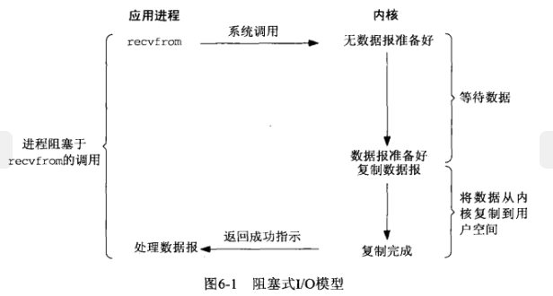
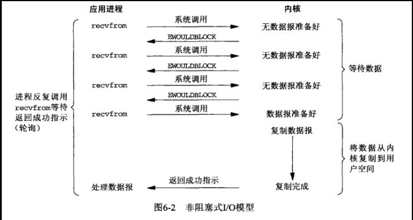
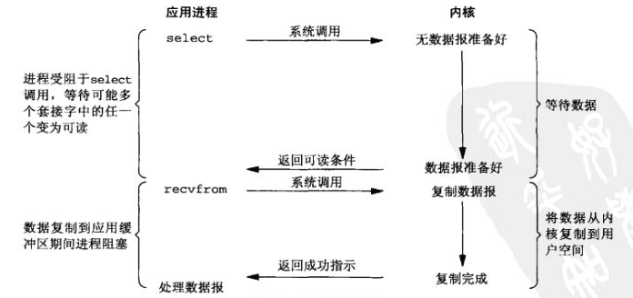
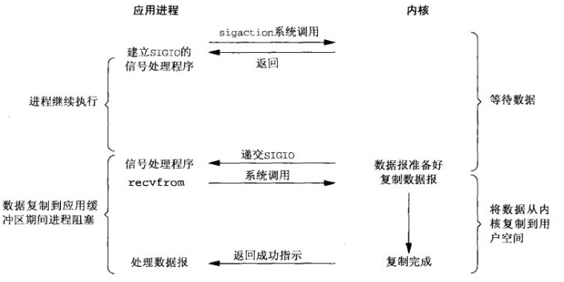
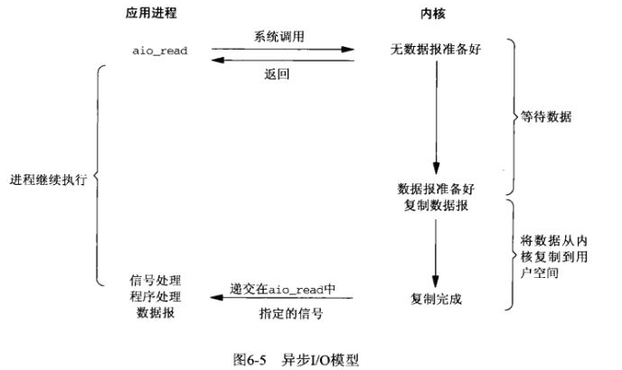
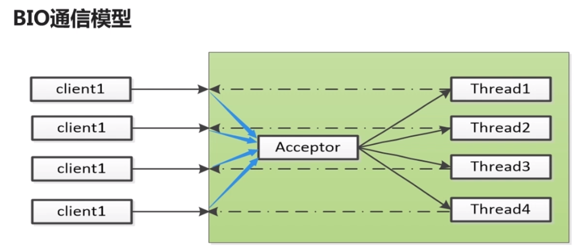
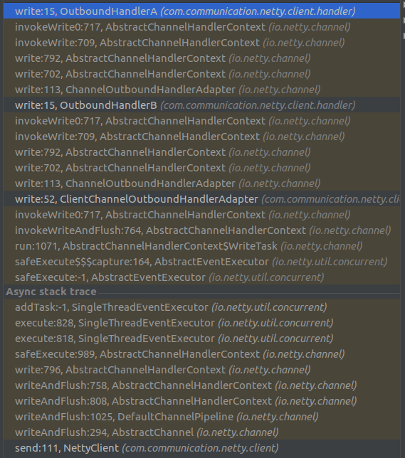
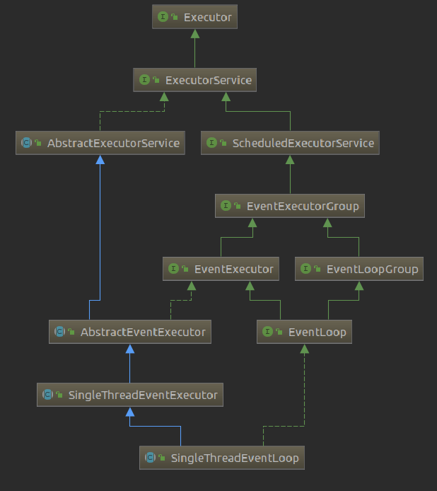

<span id="menu">
<!-- TOC -->

- [1. IO模型](#1-io模型)
  - [1.1. Linux网络IO模型介绍](#11-linux网络io模型介绍)
  - [1.2. Java IO 演进之路](#12-java-io-演进之路)
  - [1.3. Java IO对比](#13-java-io对比)
    - [1.3.1. BIO编程](#131-bio编程)
    - [1.3.2. NIO编程](#132-nio编程)
    - [1.3.3. AIO编程](#133-aio编程)
  - [1.4. IO模型对比总结](#14-io模型对比总结)
  - [1.5. 选择Netty的理由](#15-选择netty的理由)
  - [1.6. 实现自定义协议](#16-实现自定义协议)
- [2. Netty](#2-netty)
  - [2.1. Netty基本案例](#21-netty基本案例)
  - [2.2. TCP粘包拆包](#22-tcp粘包拆包)
    - [2.2.1. 粘包拆包基本概念](#221-粘包拆包基本概念)
    - [2.2.2. 行拆包器LineBasedFrameDecoder](#222-行拆包器linebasedframedecoder)
    - [2.2.3. 分隔符拆包器DelimiterBasedFrameDecoder](#223-分隔符拆包器delimiterbasedframedecoder)
    - [2.2.4. 固定长度的拆包器FixedLengthFrameDecoder](#224-固定长度的拆包器fixedlengthframedecoder)
    - [2.2.5. 基于数据包长度的拆包器LengthFieldBasedFrameDecoder](#225-基于数据包长度的拆包器lengthfieldbasedframedecoder)
  - [2.3. 私有协议开发](#23-私有协议开发)
    - [2.3.1. Netty协议栈功能设计](#231-netty协议栈功能设计)
    - [2.3.2. Netty协议栈开发](#232-netty协议栈开发)
  - [2.4. 服务端创建流程分析](#24-服务端创建流程分析)
  - [2.5. 客户端创建流程分析](#25-客户端创建流程分析)
  - [2.6. ByteBuf说明](#26-bytebuf说明)
    - [2.6.1. ByteBuf功能说明](#261-bytebuf功能说明)
    - [2.6.2. ByteBuf源码分析](#262-bytebuf源码分析)
      - [2.6.2.1. 主要继承关系](#2621-主要继承关系)
    - [2.6.3. ByteBuf辅助类](#263-bytebuf辅助类)
  - [2.7. Channel和Unsafe](#27-channel和unsafe)
    - [2.7.1. Channel功能说明](#271-channel功能说明)
    - [2.7.2. Channel源码分析](#272-channel源码分析)
      - [2.7.2.1. 继承体系](#2721-继承体系)
  - [2.8. ChannelPipeline和ChannelHandler](#28-channelpipeline和channelhandler)
    - [2.8.1. ChannelPipeline功能说明](#281-channelpipeline功能说明)
    - [2.8.2. ChannelPipeline源码分析](#282-channelpipeline源码分析)
      - [2.8.2.1. ChannelPipeline与ChannelHandlerContext继承关系](#2821-channelpipeline与channelhandlercontext继承关系)
      - [2.8.2.2. ChannelHandler添加处理](#2822-channelhandler添加处理)
      - [2.8.2.3. ChannelPipeline的inbound事件](#2823-channelpipeline的inbound事件)
      - [2.8.2.4. ChannelPipeline的outbound事件](#2824-channelpipeline的outbound事件)
    - [2.8.3. ChannelHandler功能说明](#283-channelhandler功能说明)
    - [2.8.4. netty提供的部分ChannelHandler](#284-netty提供的部分channelhandler)
      - [2.8.4.1. ByteToMessageDecoder](#2841-bytetomessagedecoder)
      - [2.8.4.2. LengthFieldBasedFrameDecoder](#2842-lengthfieldbasedframedecoder)
      - [2.8.4.3. MessageToMessageDecoder](#2843-messagetomessagedecoder)
      - [2.8.4.4. MessageToMessageEncoder](#2844-messagetomessageencoder)
      - [2.8.4.5. MessageToByteEncoder](#2845-messagetobyteencoder)
      - [2.8.4.6. LengthFieldPrepender](#2846-lengthfieldprepender)
  - [2.9. EventLoop和EventLoopGroup](#29-eventloop和eventloopgroup)
    - [2.9.1. Reactor线程模型](#291-reactor线程模型)
      - [2.9.1.1. Reactor单线程模型](#2911-reactor单线程模型)
      - [2.9.1.2. Reactor多线程模型](#2912-reactor多线程模型)
      - [2.9.1.3. 主从Reactor多线程模型](#2913-主从reactor多线程模型)
      - [2.9.1.4. Netty线程模型](#2914-netty线程模型)
      - [2.9.1.5. 最佳实践](#2915-最佳实践)
    - [2.9.2. NioEventLoop 源码分析](#292-nioeventloop-源码分析)
      - [2.9.2.1. netty的select过程分析](#2921-netty的select过程分析)
  - [2.10. Future和Promise](#210-future和promise)
    - [2.10.1. 继承体系](#2101-继承体系)
    - [2.10.2. Future](#2102-future)
    - [2.10.3. Promise](#2103-promise)
  - [2.11. Netty架构分析](#211-netty架构分析)
    - [2.11.1. netty逻辑架构](#2111-netty逻辑架构)
      - [2.11.1.1. Reactor通信调度层](#21111-reactor通信调度层)
      - [2.11.1.2. 职责链ChannelPipeline](#21112-职责链channelpipeline)
      - [2.11.1.3. ChannelHandler](#21113-channelhandler)
    - [2.11.2. 关键质量属性](#2112-关键质量属性)
      - [2.11.2.1. 高性能](#21121-高性能)
      - [2.11.2.2. 可靠性](#21122-可靠性)
        - [2.11.2.2.1. 链路有效性检测](#211221-链路有效性检测)
        - [2.11.2.2.2. 内存保护机制](#211222-内存保护机制)
        - [2.11.2.2.3. 优雅停机](#211223-优雅停机)
      - [2.11.2.3. 可定制性](#21123-可定制性)
      - [2.11.2.4. 可扩展性](#21124-可扩展性)
  - [2.12. Java多线程编程在Netty中的应用](#212-java多线程编程在netty中的应用)
  - [2.13. 高性能之道](#213-高性能之道)
    - [2.13.1. RPC性能模型分析](#2131-rpc性能模型分析)
    - [2.13.2. Netty高性能之道](#2132-netty高性能之道)
      - [2.13.2.1. 异步非阻塞通信](#21321-异步非阻塞通信)
      - [2.13.2.2. 高效的Reactor线程模型](#21322-高效的reactor线程模型)
      - [2.13.2.3. 无锁化的串行设计](#21323-无锁化的串行设计)
      - [2.13.2.4. 高效的并发编程](#21324-高效的并发编程)
      - [2.13.2.5. 零拷贝](#21325-零拷贝)
      - [2.13.2.6. 内存池](#21326-内存池)
      - [2.13.2.7. 灵活的TCP参数配置](#21327-灵活的tcp参数配置)
  - [2.14. 可靠性](#214-可靠性)
    - [2.14.1. 高可靠性设计](#2141-高可靠性设计)
      - [2.14.1.1. 网络通信类故障](#21411-网络通信类故障)
      - [2.14.1.2. 链路有效性检测](#21412-链路有效性检测)
      - [2.14.1.3. 内存保护](#21413-内存保护)
      - [2.14.1.4. 流量整形](#21414-流量整形)
      - [2.14.1.5. 优雅停机接口](#21415-优雅停机接口)
    - [2.14.2. 优化建议](#2142-优化建议)

<!-- /TOC -->

# 1. IO模型
<a href="#menu" >目录</a>

## 1.1. Linux网络IO模型介绍
<a href="#menu" >目录</a>

在进行网络编程时，我们常常见到同步(Sync)/异步(Async)，阻塞(Block)/非阻塞(Unblock)四种调用方式：

* 同步：所谓同步，就是在发出一个功能调用时，在没有得到结果之前，该调用就不返回。也就是必须一件一件事做,等前一件做完了才能做下一件事。例如普通B/S模式（同步）：提交请求->等待服务器处理->处理完毕返回 这个期间客户端浏览器不能干任何事
* 异步：异步的概念和同步相对。当一个异步过程调用发出后，调用者不能立刻得到结果。实际处理这个调用的部件在完成后，通过状态、通知和回调来通知调用者。例如 ajax请求（异步）: 请求通过事件触发->服务器处理（这是浏览器仍然可以作其他事情）->处理完毕
* 阻塞: 阻塞调用是指调用结果返回之前，当前线程会被挂起（线程进入非可执行状态，在这个状态下，cpu不会给线程分配时间片，即线程暂停运行）。函数只有在得到结果之后才会返回。有人也许会把阻塞调用和同步调用等同起来，实际上他是不同的。对于同步调用来说，很多时候当前线程还是激活的，只是从逻辑上当前函数没有返回而已。 例如，我们在socket中调用recv函数，如果缓冲区中没有数据，这个函数就会一直等待，直到有数据才返回。而此时，当前线程还会继续处理各种各样的消息。
* 非阻塞:  非阻塞和阻塞的概念相对应，指在不能立刻得到结果之前，该函数不会阻塞当前线程，而会立刻返回。

对象的阻塞模式和阻塞函数调用: 对象是否处于阻塞模式和函数是不是阻塞调用有很强的相关性，但是并不是一一对应的。阻塞对象上可以有非阻塞的调用方式，我们可以通过一定的API去轮询状 态，在适当的时候调用阻塞函数，就可以避免阻塞。而对于非阻塞对象，调用特殊的函数也可以进入阻塞调用。函数select就是这样的一个例子。

**同步和异步**
* 同步IO: 需要用户进程主动将存放在内核缓冲区的数据拷贝到用户进程中
* 异步IO: 内核会自动将数据从内核缓冲区拷贝到用户缓冲区，然后再通知用户

**阻塞和非阻塞**

现在操作系统都是采用虚拟存储器，那么对32位操作系统而言，它的寻址空间（虚拟储存空间）为4G（2的32次方）。操作系统的核心是内核，独立于普通的应用程序，可以访问受保护的内存空间，也有访问底层硬件设备的所有权限。为了保证用户进程不能直接操作内核，保证内核的安全，操作系统将虚拟空间划分为两个部分，一个部分为内核空间，一部分为用户空间。

pic/netty/IO调用过程.png
在Linux里面，分为用户空间和内核空间，当调用系统调用的时候，就进入内核空间，当调用返回的时候，就回到用户空间。对于IO操作，包括两个过程，IO系统调用(read,write)和实际的IO操作(将内核的数据发送到物理设备，或者从物理设备读取到内核缓冲区)。当进行系统调用之后立即返回则是非阻塞的，如果是等待IO操作完成才返回，则是阻塞型的。

在IO多路复用中，是通过select，poll,epoll获取到有事件的fd列表，此时是阻塞调用，因为需要等待至少有一个fd事件发生，当然也有超时(没有一个fd事件发生)返回的。之后调用read或者write，由于此时fd上一定有事件发生，所以无所谓fd是否设置为非阻塞型。在Java的nio中，必须设置为非阻塞，不然会报错java.nio.channels.IllegalBlockingModeException。


**Linux下的五种I/O模型**
* 同步
    * 阻塞I/O（blocking I/O）
    * 非阻塞I/O （nonblocking I/O）
    * I/O复用(select 和poll，epoll) （I/O multiplexing）
    * 信号驱动I/O （signal driven I/O (SIGIO)）
* 异步
    * 异步I/O （asynchronous I/O (the POSIX aio_functions)）

**阻塞I/O**



简介：进程会一直阻塞，直到数据拷贝完成. 应用程序调用一个IO函数，导致应用程序阻塞，等待数据准备好。 如果数据没有准备好，一直等待….数据准备好了，从内核拷贝到用户空间,IO函数返回成功指示。

**非阻塞I/O**



简介：非阻塞IO通过进程反复调用IO函数（多次系统调用，并马上返回）；在数据拷贝的过程中，进程是阻塞的；我们把一个SOCKET接口设置为非阻塞就是告诉内核，当所请求的I/O操作无法完成时，不要将进程睡眠，而是返回一个错误。这样我们的I/O操作函数将不断的测试数据是否已经准备好，如果没有准备好，继续测试，直到数据准备好为止。在这个不断测试的过程中，会大量的占用CPU的时间。


**I/O复用**



主要是select和epoll；对一个IO端口，两次调用，两次返回，比阻塞IO并没有什么优越性；关键是能实现同时对多个IO端口进行监听； I/O复用模型会用到select、poll、epoll函数，这几个函数也会使进程阻塞，但是和阻塞I/O所不同的的，这两个函数可以同时阻塞多个I/O操作。而且可以同时对多个读操作，多个写操作的I/O函数进行检测，直到有数据可读或可写时，才真正调用I/O操作函数。


**信号驱动I/O**



首先我们允许套接口进行信号驱动I/O,并安装一个信号处理函数，进程继续运行并不阻塞。当数据准备好时，进程会收到一个SIGIO信号，可以在信号处理函数中调用I/O操作函数处理数据。

**异步I/O**



 当一个异步过程调用发出后，调用者不能立刻得到结果。实际处理这个调用的部件在完成后，通过状态、通知和回调来通知调用者的输入输出操作


**select、poll、epoll简介**

epoll跟select都能提供多路I/O复用的解决方案。在现在的Linux内核里有都能够支持，其中epoll是Linux所特有，而select则应该是POSIX所规定，一般操作系统均有实现

* select：
    * select本质上是通过设置或者检查存放fd标志位的数据结构来进行下一步处理。这样所带来的缺点是：
    * 1. 单个进程可监视的fd数量被限制，即能监听端口的大小有限。一般来说这个数目和系统内存关系很大，具体数目可以cat /proc/sys/fs/file-max察看。32位机默认是1024个。64位机默认是2048.
    * 2. 对socket进行扫描时是线性扫描，即采用轮询的方法，效率较低：当套接字比较多的时候，每次select()都要通过遍历FD_SETSIZE个Socket来完成调度,不管哪个Socket是活跃的,都遍历一遍。这会浪费很多CPU时间。如果能给套接字注册某个回调函数，当他们活跃时，自动完成相关操作，那就避免了轮询，这正是epoll与kqueue做的。
    * 3. 需要维护一个用来存放大量fd的数据结构，这样会使得用户空间和内核空间在传递该结构时复制开销大
* poll：
    * poll本质上和select没有区别，它将用户传入的数组拷贝到内核空间，然后查询每个fd对应的设备状态，如果设备就绪则在设备等待队列中加入一项并继续遍历，如果遍历完所有fd后没有发现就绪设备，则挂起当前进程，直到设备就绪或者主动超时，被唤醒后它又要再次遍历fd。这个过程经历了多次无谓的遍历。
    * 它没有最大连接数的限制，原因是它是基于链表来存储的，但是同样有一个缺点：大量的fd的数组被整体复制于用户态和内核地址空间之间，而不管这样的复制是不是有意。                                                                                                                        
    * poll还有一个特点是“水平触发”，如果报告了fd后，没有被处理，那么下次poll时会再次报告该fd。
* epoll:
    * epoll支持水平触发和边缘触发，最大的特点在于边缘触发，它只告诉进程哪些fd刚刚变为就需态，并且只会通知一次。还有一个特点是，epoll使用“事件”的就绪通知方式，通过epoll_ctl注册fd，一旦该fd就绪，内核就会采用类似callback的回调机制来激活该fd，epoll_wait便可以收到通知
    * epoll的优点：
        * 没有最大并发连接的限制，能打开的FD的上限远大于1024（1G的内存上能监听约10万个端口）；
        * 效率提升，不是轮询的方式，不会随着FD数目的增加效率下降。只有活跃可用的FD才会调用callback函数；即Epoll最大的优点就在于它只管你“活跃”的连接，而跟连接总数无关，因此在实际的网络环境中，Epoll的效率就会远远高于select和poll。
        * 内存拷贝，利用mmap()文件映射内存加速与内核空间的消息传递；即epoll使用mmap减少复制开销。

* 支持一个进程所能打开的最大连接数
    * select
        * 单个进程所能打开的最大连接数有FD_SETSIZE宏定义，其大小是32个整数的大小（在32位的机器上，大小就是32*32，同理64位机器上FD_SETSIZE为32*64），当然我们可以对进行修改，然后重新编译内核，但是性能可能会受到影响，这需要进一步的测试。
    * poll
        * poll本质上和select没有区别，但是它没有最大连接数的限制，原因是它是基于链表来存储的
    * epoll
        * 虽然连接数有上限，但是很大，1G内存的机器上可以打开10万左右的连接，2G内存的机器可以打开20万左右的连接
* FD剧增后带来的IO效率问题
    * select
        * 因为每次调用时都会对连接进行线性遍历，所以随着FD的增加会造成遍历速度慢的“线性下降性能问题”。
    * poll 同上
    * epoll
        * 因为epoll内核中实现是根据每个fd上的callback函数来实现的，只有活跃的socket才会主动调用callback，所以在活跃socket较少的情况下，使用epoll没有前面两者的线性下降的性能问题，但是所有socket都很活跃的情况下，可能会有性能问题。
* 消息传递方式
    * select
        * 内核需要将消息传递到用户空间，都需要内核拷贝动作
    * poll 同上
    * epoll
        * epoll通过内核和用户空间共享一块内存来实现的。

在选择select，poll，epoll时要根据具体的使用场合以及这三种方式的自身特点。
1. 表面上看epoll的性能最好，但是在连接数少并且连接都十分活跃的情况下，select和poll的性能可能比epoll好，毕竟epoll的通知机制需要很多函数回调。
2. select低效是因为每次它都需要轮询。但低效也是相对的，视情况而定，也可通过良好的设计改善


## 1.2. Java IO 演进之路
<a href="#menu" >目录</a>

* 在JDK 1.4推出NIO之前，基于Java的所有Socket通信都采用同步阻塞模式BIO，这种一请求一响应的通信模型简化了上层的应用开发，但是在性能和可靠性上却存在很大的瓶颈。

* JDK 1.4 推出了NIO 1.0，主要的类和接口如下
    * 进行异步IO操作的缓冲区ByteBuffer等
    * 进行异步IO操作的管道Pipe
    * 进行各种IO操作的Channel,包括ServerSocketChannel,SocketChannel
    * 多种字符集的编码能力和解码能力
    * 实现非阻塞IO操作的多路复用器Selector
    * 正则表达式类库
    * 文件通道FileChannel
* NIO 1.0的问题
    * 没有统一的文件属性(例如读写权限)
    * API能力较弱，例如目录的级联创建和递归遍历，需要自己实现
    * 底层存储系统的一些高级API无法使用
    * 所有的文件操作都是同步阻塞调用，不支持异步文件操作
* JDK 1.7 推出 NIO2.0
    * 提供能够批量获取文件属性的API，这些API具有平台无关性，不与特定的文件系统相耦合。另外还提供了标准文件系统的SPI，供各个服务提供商扩展实现
    * 提供AIO功能，包括对配置和多播数据报的支持
    * 完成JSR-51定义的通道功能，包括对配置和多播数据报的支持。

## 1.3. Java IO对比
<a href="#menu" >目录</a>

### 1.3.1. BIO编程
<a href="#menu" >目录</a>

网络编程的基本模型是C/S模型，即两个进程间的通信：客户端-服务器。

服务端提供IP和监听端口，客户端通过连接操作向服务端监听的地址发起连接请求，通过三次握手连接，如果连接成功建立，双方就可以通过套接字进行通信。

传统的同步阻塞模型开发中，Server  Socket负责绑定IP地址，启动监听端口；Socket负责发起连接操作。连接成功后，双方通过输入和输出流进行同步阻塞式通信。 

简单的描述一下BIO的服务端通信模型：采用BIO通信模型的服务端，通常由一个独立的Acceptor线程负责监听客户端的连接，它接收到客户端连接请求之后为每个客户端创建一个新的线程进行链路处理没处理完成后，通过输出流返回应答给客户端，线程销毁。即典型的一请求一应答通信模型。为什么需要每个线程处理一个连接:因为是阻塞式IO，读写过程都是阻塞的，如果发生长时间的阻塞并且只使用一个线程处理，就会导致大并发下处理不即时。

传统BIO通信模型图


该模型最大的问题就是缺乏弹性伸缩能力，当客户端并发访问量增加后，服务端的线程个数和客户端并发访问数呈1:1的正比关系，Java中的线程也是比较宝贵的系统资源，线程数量快速膨胀后，系统的性能将急剧下降。

**客户端**
```java
//创建一个流socket并且进行连接，连接失败将会抛出异常
Socket  socket = new Socket(host,port);

//下面的write和read都是阻塞的
//发送数据
OutputStream outputStream = socket.getOutputStream();
outputStream.write(byte b[]);
outputStream.flush();

//读取数据
InputStream inputStream = socket.getInputStream();
//返回的是读取到的字节
int n = inputStream.read(byte b[]);
```
**server端**
```java
//创建ServerSocket
ServerSocket serverSocket = new ServerSocket(port);
//由于bio读写都是阻塞的，所以必须使用单独的线程处理每一个socket连接
while(true){
    //等待客户端连接
    Socket socket =  serverSocket.accept();

    //将socket 提交给新线程进行处理
    run(){
        //如果是长连接，则使用while进行轮询，否则读取和回复数据之后则关闭socket
        while(true){
            //读数据
            //写数据
        }
    }
}
```

### 1.3.2. NIO编程
<a href="#menu" >目录</a>

NIO我们一般认为是New I/O（也是官方的叫法），因为它是相对于老的I/O类库新增的（其实在JDK 1.4中就已经被引入了，但这个名词还会继续用很久，即使它们在现在看来已经是“旧”的了，所以也提示我们在命名时，需要好好考虑），做了很大的改变。但民间跟多人称之为Non-block I/O，即非阻塞I/O，因为这样叫，更能体现它的特点。而下文中的NIO，不是指整个新的I/O库，而是非阻塞I/O。

NIO提供了与传统BIO模型中的Socket和ServerSocket相对应的SocketChannel和ServerSocketChannel两种不同的套接字通道实现。

新增的着两种通道都支持阻塞和非阻塞两种模式。

阻塞模式使用就像传统中的支持一样，比较简单，但是性能和可靠性都不好；非阻塞模式正好与之相反。

对于低负载、低并发的应用程序，可以使用同步阻塞I/O来提升开发速率和更好的维护性；对于高负载、高并发的（网络）应用，应使用NIO的非阻塞模式来开发。

下面会先对基础知识进行介绍。

**缓冲区 Buffer**
Buffer是一个对象，包含一些要写入或者读出的数据。

在NIO库中，所有数据都是用缓冲区处理的。在读取数据时，它是直接读到缓冲区中的；在写入数据时，也是写入到缓冲区中。任何时候访问NIO中的数据，都是通过缓冲区进行操作。

缓冲区实际上是一个数组，并提供了对数据结构化访问以及维护读写位置等信息。

具体的缓存区有这些：ByteBuffe、CharBuffer、 ShortBuffer、IntBuffer、LongBuffer、FloatBuffer、DoubleBuffer。他们实现了相同的接口：Buffer。

**通道 Channel**
我们对数据的读取和写入要通过Channel，它就像水管一样，是一个通道。通道不同于流的地方就是通道是双向的，可以用于读、写和同时读写操作。

底层的操作系统的通道一般都是全双工的，所以全双工的Channel比流能更好的映射底层操作系统的API。

Channel主要分两大类：

SelectableChannel：用户网络读写
FileChannel：用于文件操作
后面代码会涉及的ServerSocketChannel和SocketChannel都是SelectableChannel的子类。

**多路复用器 Selector**

Selector是Java  NIO 编程的基础。

Selector提供选择已经就绪的任务的能力：Selector会不断轮询注册在其上的Channel，如果某个Channel上面发生读或者写事件，这个Channel就处于就绪状态，会被Selector轮询出来，然后通过SelectionKey可以获取就绪Channel的集合，进行后续的I/O操作。

一个Selector可以同时轮询多个Channel，因为JDK使用了epoll()代替传统的select实现，所以没有最大连接句柄1024/2048的限制。所以，只需要一个线程负责Selector的轮询，就可以接入成千上万的客户端。

**客户端**

客户端也可以使用selector

```java
//创建socketChannel
SocketChannel socketChannel = SocketChannel.open();
//连接
socketChannel.connect(new InetSocketAddress(host,port));

//发送数据
ByteBuffer writeBuf = ByteBuffer.wrap(data.toString().getBytes("UTF-8"));
socketChannel.write(writeBuf)

//读取数据
ByteBuffer readBuf = ByteBuffer.allocate(1024);
socketChannel.read(readBuf);
readBuf.flip();
byte[] readData = new byte[readBuf.remaining()];
readBuf.get(readData);
clientDataHandler.handler(new String(readData,"UTF-8"));
```
**server端**
```java
//创建服务器通道
ServerSocketChannel serverSocketChannel = ServerSocketChannel.open();
//配置为非阻塞，必须
serverSocketChannel.configureBlocking(false);
//监听端口
serverSocketChannel.bind(new InetSocketAddress(port));

//开启多路复用器
Selector selector = Selector.open();
//绑定多路复用器到channel，并设定关注事件
serverSocketChannel.register(selector, SelectionKey.OP_ACCEPT);
//创建线程进行轮询多路复用器
new WorkHandle(selector).start();

public void run() {

    log.info("事件处理....");
    while (true){
        try{
            //监听事件，没有事件发生将阻塞
            selector.select();
            //获取事件列表
            Iterator<SelectionKey> selectionKeyIterator =   selector.selectedKeys().iterator();

            while (selectionKeyIterator.hasNext()){
                SelectionKey selectionKey = selectionKeyIterator.next();
                
                //无效事件
                if(!selectionKey.isValid())
                {
                    continue;
                }
                //连接事件
                if(selectionKey.isAcceptable()){

                    accept(selectionKey);
                }
                //channel有数据可读
                if(selectionKey.isReadable()){
                    //数据读完有两种操作
                    //1.在当前线程处理，适用于处理时间不长的任务，时间太长会影响其他key的处理
                    //2.创建新线程进行处理，适用于处理时间较长的任务
                    read(selectionKey);
                    write(selectionKey);
                }
                //可写事件，最好不要监听可写事件，也就是 不要配置SelectionKey.OP_WRITE
                //因为在空闲的时候，可写事件一定会发生，导致空轮询
                if(selectionKey.isWritable()){
                    //write(selectionKey);
                }
                //移除事件
                selectionKeyIterator.remove();


            }

        }
        catch(Exception ex){
            log.error(ex.getMessage());
        }

    }
}

public void accept(SelectionKey selectionKey){
    try{
        ServerSocketChannel serverSocketChannel = (ServerSocketChannel) selectionKey.channel();
        SocketChannel channel = serverSocketChannel.accept();

        channel.configureBlocking(false);
        channel.register(selector,SelectionKey.OP_READ);
        log.info("与客户端[{}]连接成功",channel.getRemoteAddress());

    }
    catch(Exception ex){
        log.error(ex.getMessage());
    }

}

public void read(SelectionKey selectionKey){

    try{
        SocketChannel channel = (SocketChannel)selectionKey.channel();
        log.info("读取客户端[{}]数据",channel.getRemoteAddress());

        ByteBuffer readByteBUffer = ByteBuffer.allocate(1024);

        int count = channel.read(readByteBUffer);
        if(count == -1){
            selectionKey.channel().close();
            selectionKey.cancel();
            return;
        }
        readByteBUffer.flip();
        byte[] readData = new byte[readByteBUffer.remaining()];
        readByteBUffer.get(readData);
        log.info("接收到来自客户端的数据:"+new String(readData,"UTF-8"));


    }
    catch(Exception ex){
        log.error(ex.getMessage());
    }

}

public void write(SelectionKey selectionKey){
    try{
        SocketChannel channel = (SocketChannel)selectionKey.channel();
        log.info("向客户端[{}]写入数据",channel.getRemoteAddress());
        String str = "服务端返回的数据:" + new Random().nextInt(100);
        ByteBuffer writeBuffer = ByteBuffer.wrap(str.getBytes("UTF-8"));
        // writeBuffer.flip();
        channel.write(writeBuffer);
    }
    catch(Exception ex){
        log.error(ex.getMessage());
    }
}

```

* 可以看到，创建NIO服务端的主要步骤如下：
    * 打开ServerSocketChannel，监听客户端连接
    * 绑定监听端口，设置连接为非阻塞模式
    * 创建Reactor线程，创建多路复用器并启动线程
    * 将ServerSocketChannel注册到Reactor线程中的Selector上，监听ACCEPT事件
    * Selector轮询准备就绪的key
    * Selector监听到新的客户端接入，处理新的接入请求，完成TCP三次握手，建立物理链路
    * 设置客户端链路为非阻塞模式
    * 将新接入的客户端连接注册到Reactor线程的Selector上，监听读操作，读取客户端发送的网络消息
    * 异步读取客户端消息到缓冲区
    * 对Buffer编解码，处理半包消息，将解码成功的消息封装成Task
    * 将应答消息编码为Buffer，调用SocketChannel的write将消息异步发送给客户端

因为应答消息的发送，SocketChannel也是异步非阻塞的，所以不能保证一次把需要发送的数据发送完，此时就会出现写半包的问题。我们需要注册写操作，不断轮询Selector将没有发送完的消息发送完毕，然后通过Buffer的hasRemain()方法判断消息是否发送完成。


### 1.3.3. AIO编程
<a href="#menu" >目录</a>

NIO 2.0引入了新的异步通道的概念，并提供了异步文件通道和异步套接字通道的实现。

异步的套接字通道时真正的异步非阻塞I/O，对应于UNIX网络编程中的事件驱动I/O（AIO）。他不需要过多的Selector对注册的通道进行轮询即可实现异步读写，从而简化了NIO的编程模型。


**客户端**

```java
AsynchronousSocketChannel asynSocketChannel  = AsynchronousSocketChannel.open();
asynSocketChannel.connect(new InetSocketAddress(host,port),
                         null, new CompletionHandler<Void, Object>() {
    @Override
    public void completed(Void result, Object attachment) {
        //连接成功处理
    }

    @Override
    public void failed(Throwable exc, Object attachment) {
        //连接失败处理
    }
});

//读写数据和前面使用通道读写数据基本一致，只是多提供了参数CompletionHandler进行异步数据回调处理
```

**server端**

由于异步IO没有继承SelectableChannel接口。因此不能使用IO多路复用器。也是需要单独的线程来处理每一个连接。

```java
AsynchronousServerSocketChannel socketChannel =  AsynchronousServerSocketChannel.open();
socketChannel.bind(new InetSocketAddress(port));

while(true){
    Future<AsynchronousSocketChannel> future =  socketChannel.accept();
    AsynchronousSocketChannel channel = future.get();
    log.info("连接成功:{}",channel.getRemoteAddress());
    //提交线程池处理，线程池通过channel来读写数据
    executorService.submit(new SocketHandler(channel));

}
```

## 1.4. IO模型对比总结
<a href="#menu" >目录</a>

||同步阻塞IO(BIO)|伪异步IO|非阻塞IO(NIO)|异步IO(AIO)|
|---|---|---|---|--|
|客户端个数:IO线程|1：1|M：N(M>=N)|M:1|M:0(不需要启动额外的线程)|
|IO类型(阻塞)|阻塞|阻塞|非阻塞|非阻塞|
|IO类型(同步)|同步|同步|IO多路复用|异步|
|API使用难度|简单|简单|复杂|非常复杂|
|调试难度|简单|简单|复杂|复杂|
|可靠性 |非常差|差|高|高|
|吞吐量|低|中|高|高|

## 1.5. 选择Netty的理由
<a href="#menu" >目录</a>

**Java NIO的问题**
* API复杂使用麻烦
* 需要具备其他的知识运用，比如多线程网络编程等
* 可靠性需要自行处理，比如断线重连，拆包问题，网络拥塞等问题
* NIO epoll bug,会导致Selector空轮询。新版本概率较低，不确定完全解决。

**选择Netty的理由**
* API使用简单,开发门槛低
* 功能强大，预置多种编解码能力，支持多种主流协议
* 定制能力强
* 性能高
* 成熟稳定
* 社区活跃，迭代快

## 1.6. 实现自定义协议
<a href="#menu" >目录</a>

实现自定义的应用层协议，也就是意味着要针对传输层协议进行开发，传输层有TCP、UDP两种协议，TCP传输具有可靠性，UDP传输不管数据是否送达，一般选择TCP。TCP是字节流服务,是为数据的可靠传输而设计的。如果数据在传输中丢失或者损坏，TCP会保证再次发送数据，如果数据包乱序到达，TCP会将其置回正确的顺序。对于连接来说，如果数据到来的速度太快,TCP会降低速度，以免数据丢包。程序永远不需要担心接收到乱序或者不正确的数据。不过，相对来说，这种可靠性需要速度作为代价，同时，建立和撤销连接也需要耗费时间。

用户数据报协议(User Datagram Protocol ,UDP)是在IP之上发送数据的令一种传输层协议，速度很快，但是不可靠，并且发送不需要进行连接，只要有接收方的地址(host:port)即可。当发送数据时，无法确定数据是否会到达，也不知道数据的各个部分是否会以发送时的顺序到达。UDP适合在速度要求较高但是对可靠性要求不高的场景,如音频和多媒体的应用,如果要求可靠性，可以在应用层自行解决。

* TCP通信协议
    * TCP是面向连接的；
    * 每条TCP连接只能由于两个端点，一对一通信；
    * TCP提供可靠的交付服务，传输数据无差错，不丢失，不重复，且按时序到达；
    * TCP提供全双工通信；
    * 面向字节流，TCP根据对方给出的窗口和当前的网络拥塞程度决定一个报文应该包含多少个字节。
* UDP通信协议
    * 无连接；
    * UDP使用尽最大努力交付，不保证可靠性UDP是面向报文的，UDP对应用层交付下来的报文，既不合并，也不拆分，而是保留报文的边界；
    * 应用层交给UDP多长的报文，UDP就照样发送，即一次发送一个报文；
    * UDP没有拥塞控制；
    * UDP支持一对一，一对多，多对一和多对多的交互通信。
    * UDP的首部开销小，只有8字节。

**实现通信常见的问题**
* 收到的信息不完整，或者比预期更多（半包，粘包）
* BIO读写阻塞导致线程挂起
* 物理链路意外断开，程序不能发觉异常导致挂起
* 多线程共享同一socket导致数据错乱
* 长时间占用大量空闲socket


**常见解决方案**
* 不要使用BIO,使用NIO
* 制定消息格式(解决半粘包)
* 规定通讯工作流程(合理使用队列、线程池、连接池)
* 加入心跳检测机制(解决异常断开导致连接不可用)
* 加入链接回收机制(按空闲或超时时间等规则终止链接)
* 异常处理(不可复用异常发生时及时关闭连接)
* 即时重发(连接不可用时，即时选用另一条连接重发)

可以用并发性能来衡量一个服务器同时响应多个客户的能力。一个具有好的并发性能的服务器，必须符合两个条件：
* 能同时接收并处理多个客户连接；
* 对于每个客户，都会迅速给予响应。

对于NIO，一般是全局只有一个selector,也就是只用一个线程区监听读写连接事件的发生。就可以不要像BIO一样为每一个连接分配一个线程。从读事件里面获取到接收数据之后，可以在当前线程里面进行处理，也可以创建新线程处理，方案选择参考数据处理的负责程度，如果应用的中大部分操作都是在内存中进行处理，可以不创建线程处理。如果还涉及到数据库等比较耗时的操作，需要创建新线程进行处理，一般使用线程池。使用线程池需要考虑线程池数量的大小，一般是和CPU数量一致或者加1。如果IO阻塞比较多的场景，可以适当增加线程数量。通常还需要防止死锁的发生，导致线程泄漏(线程长时间阻塞，导致线程名存实亡)。


# 2. Netty
<a href="#menu" >目录</a>


## 2.1. Netty基本案例
<a href="#menu" >目录</a>

## 2.2. TCP粘包拆包
<a href="#menu" >目录</a>

### 2.2.1. 粘包拆包基本概念
<a href="#menu" >目录</a>

TCP是个流协议，所谓流，就是没有界限的一串数据。TCP底层并不了解上层业务数据的具体数据的具体含义，它会根据TCP缓冲区的世纪情况进行包的划分，所以每发送一个数据包，可能包含多个的上层业务数据包。也有可能一个大的业务数据包分成多个TCP数据包进行发送。

而对于接收端，并不知道接收的数据流包含了多少个业务数据包。因此需要在整个发送层面做粘包/拆包处理。

**粘包、拆包表现形式**

第一种情况，接收端正常收到两个数据包，即没有发生拆包和粘包的现象。


第二种情况，接收端只收到一个数据包，由于TCP是不会出现丢包的，所以这一个数据包中包含了发送端发送的两个数据包的信息，这种现象即为粘包。这种情况由于接收端不知道这两个数据包的界限，所以对于接收端来说很难处理。


第三种情况，这种情况有两种表现形式，如下图。接收端收到了两个数据包，但是这两个数据包要么是不完整的，要么就是多出来一块，这种情况即发生了拆包和粘包。这两种情况如果不加特殊处理，对于接收端同样是不好处理的。


* 粘包和半包定义如下：
    * 理想情况下，发送端发送一个数据帧，底层的TCP也将这个数据帧完整地发送出去。而接收端也是接收到一个完整的数据帧。
    * 粘包，就是接收端读取的时候，多个发送过来的 数据帧 “粘”在了一起。换句话说，接收端读取一次的 字节流 ，读到了发送端的 多个数据帧 ，是为粘包。
    * 半包，就是发送端的数据帧 “拆”开了，形成一个破碎的包，我们定义这种为半包。


**如何解决呢？**

* 基本思路是，在接收端，需要根据自定义协议来，来读取底层的数据包，重新组装我们应用层的数据包，这个过程通常在接收端称为拆包。

* 拆包的原理
    * 接收端应用层不断从底层的TCP 缓冲区中读取数据。
    * 每次读取完，判断一下是否为一个完整的应用层数据包。如果是，上层应用层数据包读取完成。
    * 如果不是，那就保留该数据在应用层缓冲区，然后继续从 TCP 缓冲区中读取，直到得到一个完整的应用层数据包为止。
    * 至此，**半包**问题得以解决。
    * 如果从TCP底层读到了多个应用层数据包，则将整个应用层缓冲区，拆成一个一个的独立的应用层数据包，返回给调用程序。
    * 至此，**粘包**问题得以解决。

**粘包、拆包发生原因**
* 要发送的数据大于TCP发送缓冲区剩余空间大小，将会发生拆包。
* 待发送数据大于MSS（最大报文长度），TCP在传输前将进行拆包。
* 要发送的数据小于TCP发送缓冲区的大小，TCP将多次写入缓冲区的数据一次发送出去，将会发生粘包。
* 接收数据端的应用层没有及时读取接收缓冲区中的数据，将发生粘包。

**粘包、拆包解决办法**
通过以上分析，我们清楚了粘包或拆包发生的原因，那么如何解决这个问题呢？解决问题的关键在于如何给每个数据包添加边界信息，常用的方法有如下几个：
* 发送端给每个数据包添加包首部，首部中应该至少包含数据包的长度，这样接收端在接收到数据后，通过读取包首部的长度字段，便知道每一个数据包的实际长度了。
* 发送端将每个数据包封装为固定长度（不够的可以通过补0填充），这样接收端每次从接收缓冲区中读取固定长度的数据就自然而然的把每个数据包拆分开来。
* 可以在数据包之间设置边界，如添加特殊符号，这样，接收端通过这个边界就可以将不同的数据包拆分开。

**Netty 中的拆包器大致如下：**
* 固定长度的拆包器 **FixedLengthFrameDecoder**
    * 每个应用层数据包的都拆分成都是固定长度的大小，比如 1024字节。
* 行拆包器 **LineBasedFrameDecoder**
    * 每个应用层数据包，都以换行符作为分隔符，进行分割拆分。每一个发送数据的字符串末尾都要加上"\r\n"
* 分隔符拆包器 **DelimiterBasedFrameDecoder**
    * 每个应用层数据包，都通过自定义的分隔符，进行分割拆分。
    * 这个版本，是LineBasedFrameDecoder 的通用版本，本质上是一样的。
* 基于数据包长度的拆包器 **LengthFieldBasedFrameDecoder**
    * 将应用层数据包的长度，作为接收端应用层数据包的拆分依据。按照应用层数据包的大小，拆包。这个拆包器，有一个要求，就是应用层协议中包含数据包的长度。

### 2.2.2. 行拆包器LineBasedFrameDecoder
<a href="#menu" >目录</a>

```java
//客户端配置
bootstrap.handler(new ChannelInitializer(){
    @Override
    protected void initChannel(Channel channel) throws Exception {
        //输入
        channel.pipeline().addLast(new LineBasedFrameDecoder(1024));
        channel.pipeline().addLast(new StringDecoder());
        channel.pipeline().addLast(new ClientChannelInboundHandlerAdapter());
    }
});
//服务端配置
serverBootstrap.group(master,worker)
    .channel(NioServerSocketChannel.class)
    .childHandler(new ChannelInitializer<SocketChannel>(){
        @Override
        protected void initChannel(SocketChannel socketChannel) throws Exception {
            //输入
            socketChannel.pipeline().addLast(new LineBasedFrameDecoder(1024));
            socketChannel.pipeline().addLast(new StringDecoder());
            socketChannel.pipeline().addLast(new ServerChannelInboundHandlerAdapter());
        }
    });
            
```
StringDecoder和LineBasedFrameDecoder是netty提供的。注意上面的添加顺序，LineBasedFrameDecoder是用于拆包，StringDecoder是用于数据转换，ServerChannelInboundHandlerAdapter是面向使用者，自定义,用户获取最终的数据并处理

netty从通道获取到数据之后，会将字节数据存放在ByteBuf缓冲区中，StringDecoder用于将ByteBuf格式的数据转为字符串，避免使用者进行转换。
```java
//使用StringDecoder前
@Override
public void channelRead(ChannelHandlerContext ctx, Object msg) throws Exception {
    //自行进行转换
    ByteBuf byteBuf = ByteBuf(msg);
    byte[] readData = new byte[byteBuf.readableBytes()];
    byteBuf.readBytes(readData);
    log.info("收到客户端数据　= "+new String(readData));
 
}
//使用StringDecoder后
@Override
public void channelRead(ChannelHandlerContext ctx, Object msg) throws Exception {
    //使用StringDecoder后，内部会将ByteBuf数据转换为String,因此这里的msg类型已经是String
    log.info("收到客户端数据msg = " + msg);
}

```

LineBasedFrameDecoder用于半包和粘包处理，它的工作原理是遍历ByteBuf中的可读字节，判断是否有"\n"或者"\r\n"，如果有，就以这个为结束位置，从可读索引位置到结束位置区间的字节就组成了一行。如果到了最大长度还没找到换行分隔符，就会抛出异常。可以在ServerChannelInboundHandlerAdapter的exceptionCaught()方法里面捕捉到。

```java
public LineBasedFrameDecoder(int maxLength) {
    this(maxLength, true, false);
}
```
如果向定义自己的分隔符，可以使用DelimiterBasedFrameDecoder

### 2.2.3. 分隔符拆包器DelimiterBasedFrameDecoder
<a href="#menu" >目录</a>

```java
//自定义分隔符
ByteBuf delimiter = UnpooledcopiedBuffer("&^*".getBytes);
socketChannel.pipeline().addLast(new DelimiterBasedFrameDecoder(1024,delimiter));

```

### 2.2.4. 固定长度的拆包器FixedLengthFrameDecoder
<a href="#menu" >目录</a>

frameLength用于定义解析一帧数据的长度frameLength
```java
public FixedLengthFrameDecoder(int frameLength) {
    ObjectUtil.checkPositive(frameLength, "frameLength");
    this.frameLength = frameLength;
}
socketChannel.pipeline().addLast(new FixedLengthFrameDecoder(10));
```
FixedLengthFrameDecoder是根据固定长度frameLength进行解码的。比如frameLength是10，客户端发送多个"123456" 6个字节字节数据，接收端收到第一帧之后会等待第二帧数据，最终接收的数据是"1234561234"--"5612345612"...。如果发送的超过10个字节，则会截断，剩下的作为下一帧的数据。

### 2.2.5. 基于数据包长度的拆包器LengthFieldBasedFrameDecoder
<a href="#menu" >目录</a>

LengthFieldBasedFrameDecoder一般用于自定义协议开发

```java
/**
*
* @param maxFrameLength  帧的最大长度
* @param lengthFieldOffset length字段偏移的地址
* @param lengthFieldLength length字段所占的字节长
* @param lengthAdjustment 修改帧数据长度字段中定义的值，可以为负数 因为有时候我们习惯把头部记入长度,若为负数,则说明要推后多少个字段
* @param initialBytesToStrip 解析时候跳过多少个长度
* @param failFast 为true，当frame长度超过maxFrameLength时立即报TooLongFrameException异常，为false，读取完整个帧再报异
*/

public LengthFieldBasedFrameDecoder(int maxFrameLength, int lengthFieldOffset, int lengthFieldLength) {
    this(maxFrameLength, lengthFieldOffset, lengthFieldLength, 0, 0);
}

public LengthFieldBasedFrameDecoder(int maxFrameLength, int lengthFieldOffset, int lengthFieldLength, int lengthAdjustment, int initialBytesToStrip) {
    this(maxFrameLength, lengthFieldOffset, lengthFieldLength, lengthAdjustment, initialBytesToStrip, true);
}

public LengthFieldBasedFrameDecoder(int maxFrameLength, int lengthFieldOffset, int lengthFieldLength, int lengthAdjustment, int initialBytesToStrip, boolean failFast) {
    this(ByteOrder.BIG_ENDIAN, maxFrameLength, lengthFieldOffset, lengthFieldLength, lengthAdjustment, initialBytesToStrip, failFast);
}
```

**2 bytes length field at offset 0, do not strip header**

The value of the length field in this example is 12 (0x0C) which represents the length of "123456789012". By default, the decoder assumes that the length field represents the number of the bytes that follows the length field. Therefore, it can be decoded with the simplistic parameter combination.
* lengthFieldOffset   = 0
* lengthFieldLength   = 2
* lengthAdjustment    = 0
* initialBytesToStrip = 0 (= do not strip header)
```yml
 BEFORE DECODE (14 bytes)         AFTER DECODE (14 bytes)
 +--------+----------------+      +--------+----------------+
 | Length | Actual Content |----->| Length | Actual Content |
 | 0x000C | "123456789012" |      | 0x000C | "123456789012" |
 +--------+----------------+      +--------+----------------+
``` 
**2 bytes length field at offset 0, strip header**

Because we can get the length of the content by calling ByteBuf.readableBytes(), you might want to strip the length field by specifying initialBytesToStrip. In this example, we specified 2, that is same with the length of the length field, to strip the first two bytes.
* lengthFieldOffset   = 0
* lengthFieldLength   = 2
* lengthAdjustment    = 0
* initialBytesToStrip = 2 (= the length of the Length field)
```yml
 BEFORE DECODE (14 bytes)         AFTER DECODE (12 bytes)
 +--------+----------------+      +----------------+
 | Length | Actual Content |----->| Actual Content |
 | 0x000C | "123456789012" |      | "123456789012" |
 +--------+----------------+      +----------------+
``` 
**2 bytes length field at offset 0, do not strip header, the length field represents the length of the whole message**

In most cases, the length field represents the length of the message body only, as shown in the previous examples. However, in some protocols, the length field represents the length of the whole message, including the message header. In such a case, we specify a non-zero lengthAdjustment. Because the length value in this example message is always greater than the body length by 2, we specify -2 as lengthAdjustment for compensation.
* lengthFieldOffset   =  0
* lengthFieldLength   =  2
* lengthAdjustment    = -2 (= the length of the Length field)
* initialBytesToStrip =  0
```yml
 BEFORE DECODE (14 bytes)         AFTER DECODE (14 bytes)
 +--------+----------------+      +--------+----------------+
 | Length | Actual Content |----->| Length | Actual Content |
 | 0x000E | "123456789012" |      | 0x000E | "123456789012" |
 +--------+----------------+      +--------+----------------+
```
**3 bytes length field at the end of 5 bytes header, do not strip header**

The following message is a simple variation of the first example. An extra header value is prepended to the message. lengthAdjustment is zero again because the decoder always takes the length of the prepended data into account during frame length calculation.
* lengthFieldOffset   = 2 (= the length of Header 1)
* lengthFieldLength   = 3
* lengthAdjustment    = 0
* initialBytesToStrip = 0
```yml
 BEFORE DECODE (17 bytes)                      AFTER DECODE (17 bytes)
 +----------+----------+----------------+      +----------+----------+----------------+
 | Header 1 |  Length  | Actual Content |----->| Header 1 |  Length  | Actual Content |
 |  0xCAFE  | 0x00000C | "123456789012" |      |  0xCAFE  | 0x00000C | "123456789012" |
 +----------+----------+----------------+      +----------+----------+----------------+
```
**3 bytes length field at the beginning of 5 bytes header, do not strip header**

This is an advanced example that shows the case where there is an extra header between the length field and the message body. You have to specify a positive lengthAdjustment so that the decoder counts the extra header into the frame length calculation.
* lengthFieldOffset   = 0
* lengthFieldLength   = 3
* lengthAdjustment    = 2 (= the length of Header 1)
* initialBytesToStrip = 0
```yml
 BEFORE DECODE (17 bytes)                      AFTER DECODE (17 bytes)
 +----------+----------+----------------+      +----------+----------+----------------+
 |  Length  | Header 1 | Actual Content |----->|  Length  | Header 1 | Actual Content |
 | 0x00000C |  0xCAFE  | "123456789012" |      | 0x00000C |  0xCAFE  | "123456789012" |
 +----------+----------+----------------+      +----------+----------+----------------+
```
**2 bytes length field at offset 1 in the middle of 4 bytes header, strip the first header field and the length field**

This is a combination of all the examples above. There are the prepended header before the length field and the extra header after the length field. The prepended header affects the lengthFieldOffset and the extra header affects the lengthAdjustment. We also specified a non-zero initialBytesToStrip to strip the length field and the prepended header from the frame. If you don't want to strip the prepended header, you could specify 0 for initialBytesToSkip.
* lengthFieldOffset   = 1 (= the length of HDR1)
* lengthFieldLength   = 2
* lengthAdjustment    = 1 (= the length of HDR2)
* initialBytesToStrip = 3 (= the length of HDR1 + LEN)
```yml
 BEFORE DECODE (16 bytes)                       AFTER DECODE (13 bytes)
 +------+--------+------+----------------+      +------+----------------+
 | HDR1 | Length | HDR2 | Actual Content |----->| HDR2 | Actual Content |
 | 0xCA | 0x000C | 0xFE | "123456789012" |      | 0xFE | "123456789012" |
 +------+--------+------+----------------+      +------+----------------+
``` 
**2 bytes length field at offset 1 in the middle of 4 bytes header, strip the first header field and the length field, the length field represents the length of the whole message**

Let's give another twist to the previous example. The only difference from the previous example is that the length field represents the length of the whole message instead of the message body, just like the third example. We have to count the length of HDR1 and Length into lengthAdjustment. Please note that we don't need to take the length of HDR2 into account because the length field already includes the whole header length.
* lengthFieldOffset   =  1
* lengthFieldLength   =  2
* lengthAdjustment    = -3 (= the length of HDR1 + LEN, negative)
* initialBytesToStrip =  3
```yml
 BEFORE DECODE (16 bytes)                       AFTER DECODE (13 bytes)
 +------+--------+------+----------------+      +------+----------------+
 | HDR1 | Length | HDR2 | Actual Content |----->| HDR2 | Actual Content |
 | 0xCA | 0x0010 | 0xFE | "123456789012" |      | 0xFE | "123456789012" |
 +------+--------+------+----------------+      +------+----------------+
```


## 2.3. 私有协议开发
<a href="#menu" >目录</a>

### 2.3.1. Netty协议栈功能设计
<a href="#menu" >目录</a>

**网络拓扑图**

所有的节点都是平等的么，不区分服务端和客户端。一个Netty节点既可以作为客户端连接其他节点，也可以作为服务端等待其他节点连接。连接可以是长连接或者短连接。

**协议栈功能描述**
* 基于Netty的NIO通信框架，提高性能的异步通信能力
* 提供消息的编解码，实现POJO的序列化和反序列化
* 提供基于IP地址的白名单接入认证机制
* 链路有效性校验机制
* 链路的断连重连机制

双方通信链路成功之后，都可以进行全双工通信。无论是客户端还是服务端，都可以主动发送消息给对方。双方心跳方式采用PING-PONG，也就是作为客户端，当空闲时主动发送心跳消息Ping，服务端回应心跳消息Pong。如果对方长时间没有收到Ping或者Ｐong消息，说明对方已经挂了。可以断开当前连接并重新发起新的连接等操作。

**消息定义**

|名称|类型|长度|描述|
|---|---|---|---|
|header|Header|可变|请求头，比如长度，crc等参数|
|body|Object|可变|请求体，实际有效的数据|

Header定义
|名称|类型|长度|描述|
|---|---|---|---|
|length|int|32|整个消息的长度，包括消息头和消息体|
|id|long|64|消息的唯一标识|
|type|byte|8|消息类型。业务请求消息，业务响应消息，业务one way消息，握手请求消息，握手应答消息，心跳请求消息，心跳应答消息|
|priority|byte|8|消息优先级，越大越优先处理|
|attachment|Map<　Object,Object>|可变|附件，用于扩展|
|crc|int|32|所有非crc字段的校验码|

**链路的关闭**

在以下情况，客户端和服务端需要关闭连接
* 当对方正常主动关闭连接时，自己会收到通知，也需要关闭连接，释放资源
* 消息读写过程中发生了IO异常，需要主动关闭
* 心跳超时，需要主动关闭连接
* 发生编码异常等不可恢复的错误时，需要主动关闭连接

**可靠性设计**

* 心跳机制
  * 当与服务端的T时间内没有读写消息时，客户端主动发送PING消息
  * 当发送PING消息发送后，下一个Ｔ时间内还没收到PONG消息或者其他业务，则失败计数器加1
  * 当收到PONG消息或者其他业务消息后，就将失败计数器清0,当失败计数器达到N次时，说明与服务器长时间通信失败，则主动关闭连接并在一定时间后发起重新连接操作
  * 服务器也是类似，时间T内没有收到PING和业务消息，则服务端的失败计数器＋１，收到则清零
  * 失败计数器达到N之后，则关闭链路释放资源，等到客户端发起重连

通过PING-PONG机制，客户端都能即时关闭连接释放资源。如果读写数据过程中发生异常，说明对方已经无预警关闭连接，需要关闭本方的连接。如果是客户端，需要重新发起连接。如果是服务端，需要清空缓存的半包信息，等待客户端重连。

* 重连机制
  　计算机的连接资源有限，当失去通信之后，需要立即关闭连接释放资源，并保存相关信息，以便进行问题查找。并即时进行重新连接操作。
* 重复登录保护
  看场景，有的需要客户端提高并发处理能力，会让客户端创建连接池。有的场景为了避免客户端无限制创建连接导致句柄资源耗尽，需要对单个客户端维持连接的最大次数进行限制
* 消息缓存重发
无论是客户端还是服务端，当发生链路中断后，在链路恢复之前，缓存在消息队列中的消息不能丢失，等待链路恢复之后，重新发送这些消息，保证链路中断期间消息不丢失。同时还需要考虑内存的限制，需要设置消息缓存的上限。

**安全性设计**

可以进行IP验证和用户名密码验证，或者SSL/TSL安全传输。

**可扩展性设计**

* 一是消息的可扩展性，可以在通信协议上添加Ｍap类型可扩展字段。
* 二是流程可扩展性，可方便地通过继承，在处理链中插入新的责任类对处理流程进行扩展


### 2.3.2. Netty协议栈开发
<a href="#menu" >目录</a>


## 2.4. 服务端创建流程分析
<a href="#menu" >目录</a>

```

```
```java
 //bossGroup接受传入的连接
EventLoopGroup bossGroup = new NioEventLoopGroup();
//一旦bossGroup接受连接并注册到workerGroup，workerGroup则处理连接相关的流量
EventLoopGroup workerGroup = new NioEventLoopGroup();
try {

    ServerBootstrap serverBootstrap = new ServerBootstrap();
    //用于设置服务端
    serverBootstrap.group(bossGroup, workerGroup)
            .channel(NioServerSocketChannel.class)
            .option(ChannelOption.SO_BACKLOG, 1024)
            .childHandler(new ChildChannelHandler());

    //绑定端口，同步等待成功
    serverBootstrap.bind(port).sync();

} catch (Exception ex) {
    ex.printStackTrace();
} finally {
    log.info("shutdownGracefully....");
    //  bossGroup.shutdownGracefully();
    //  workerGroup.shutdownGracefully();
}
```

**步骤1**
创建ServerBootstrap实例。ServerBootstrap是服务端的启动辅助类，提供一系列方法用于设置服务端启动的相关参数，底层通过门面模式对各种能力进行抽象和封装。

```java
ServerBootstrap serverBootstrap = new ServerBootstrap();
```
**步骤2**
设置并绑定Reactor线程池EventLoopGroup.如果只有一个，则该线程池负责连接处理和IO读写处理。如果有两个线程池，一个用于连接处理，另一个用于IO读写处理。
NioEventLoopGroup可自行设置线程池大小以及线程工厂，默认的线程数量是CPU核心数量*2.

```java
EventLoopGroup bossGroup = new NioEventLoopGroup();

public ServerBootstrap group(EventLoopGroup group) {
    return this.group(group, group);
}
public ServerBootstrap group(EventLoopGroup parentGroup, EventLoopGroup childGroup){}
```
**步骤3**
设置并绑定服务端Channel.
服务端需要创建NioServerSocketChannel，客户端则为NioSocketChannel
```java
channel(NioServerSocketChannel.class)
```

**步骤4**
配置TCP相关参数
```java
option(ChannelOption.SO_BACKLOG, 1024)
```
**步骤5**
配置消息处理责任链。
常见的处理有消息编解码，消息处理，定时心跳处理。

```java
childHandler(new ChildChannelHandler());

public class ChildChannelHandler extends ChannelInitializer<SocketChannel> {


    @Override
    protected void initChannel(SocketChannel socketChannel) throws Exception {
        //  socketChannel.pipeline().addLast(new LineBasedFrameDecoder(1024));
        //  socketChannel.pipeline().addLast(new StringDecoder());
        // socketChannel.pipeline().addLast(new StringEncoder());
        // CoderUtil.DelimiterBasedFramDecoder(socketChannel,1024);
        //  socketChannel.pipeline().addLast(new TimeServerHandler());
        //  socketChannel.pipeline().addLast(new NettyConnectServerHandler());

        // socketChannel.pipeline().addLast(new MsgpackDecoder());
        //  socketChannel.pipeline().addLast(new MsgpackEncoder());
        CoderConfig.JsonCoder(socketChannel);
        socketChannel.pipeline().addLast(new MsgServerHandler());
    }
}


```
**步骤6**

绑定端口，可以选择同步或者异步方式，异步方式需要添加监听器。
在绑定监听端口之前系统会做一系列的初始化和检测工作，完成之后，会启动端口，并将ServerSocketChannel注册到Selector上监听客户端连接。
```java

public ChannelFuture bind(int inetPort) {
    return this.bind(new InetSocketAddress(inetPort));
}

public interface ChannelFuture extends Future<Void> {
    Channel channel();

    ChannelFuture addListener(GenericFutureListener<? extends Future<? super Void>> var1);

    ChannelFuture addListeners(GenericFutureListener... var1);

    ChannelFuture removeListener(GenericFutureListener<? extends Future<? super Void>> var1);

    ChannelFuture removeListeners(GenericFutureListener... var1);

    ChannelFuture sync() throws InterruptedException;

    ChannelFuture syncUninterruptibly();

    ChannelFuture await() throws InterruptedException;

    ChannelFuture awaitUninterruptibly();
}


    
//绑定端口，同步等待成功
serverBootstrap.bind(port).sync();

//绑定端口，异步方式，需要添加GenericFutureListener监听器
serverBootstrap.bind(port).addListener(new GenericFutureListener{
    xxx
};


```
**步骤7**
Selector轮询，由Rector线程NioEventLoop负责调度和执行Selector轮询操作，选择就绪的Channel集合。
```java
 private void select() throws IOException {
    Selector selector = this.selector;

    try {
        int selectCnt = 0;
        long currentTimeNanos = System.nanoTime();
        long selectDeadLineNanos = currentTimeNanos + this.delayNanos(currentTimeNanos);

        while(true) {
            long timeoutMillis = (selectDeadLineNanos - currentTimeNanos + 500000L) / 1000000L;
            if (timeoutMillis <= 0L) {
                if (selectCnt == 0) {
                    selector.selectNow();
                    selectCnt = 1;
                }
                break;
            }

            int selectedKeys = selector.select(timeoutMillis);
            ++selectCnt;
            if (selectedKeys != 0 || this.oldWakenUp || this.wakenUp.get() || this.hasTasks()) {
                break;
            }

            if (SELECTOR_AUTO_REBUILD_THRESHOLD > 0 && selectCnt >= SELECTOR_AUTO_REBUILD_THRESHOLD) {
                logger.warn("Selector.select() returned prematurely {} times in a row; rebuilding selector.", selectCnt);
                this.rebuildSelector();
                selector = this.selector;
                selector.selectNow();
                selectCnt = 1;
                break;
            }

            currentTimeNanos = System.nanoTime();
        }

        if (selectCnt > 3 && logger.isDebugEnabled()) {
            logger.debug("Selector.select() returned prematurely {} times in a row.", selectCnt - 1);
        }
    } catch (CancelledKeyException var10) {
        if (logger.isDebugEnabled()) {
            logger.debug(CancelledKeyException.class.getSimpleName() + " raised by a Selector - JDK bug?", var10);
        }
    }

}
    
```


## 2.5. 客户端创建流程分析
<a href="#menu" >目录</a>

```

```


**步骤1**
**步骤2**
**步骤3**
**步骤4**
**步骤5**
**步骤6**
**步骤7**
**步骤8**
**步骤9**


## 2.6. ByteBuf说明
<a href="#menu" >目录</a>

### 2.6.1. ByteBuf功能说明
<a href="#menu" >目录</a>

缓冲区是用于存放即将要发送给通道的数据或者装载从通道获取的数据。JDK NIO中使用的是缓冲类是Buffer，其子类一共有7种(除了布尔类型的所有基本类型)，比如IntBuffer,FloatBuffer等。其中常用的类是ByteBuffer,它的主要缺点是:
* ByteBuffer长度固定，一旦分配完成，它的容量是不能动态扩展和收缩的，当需要编码的POJO对象大于容量时，则会发生越界异常
* ByteBuffer有一个位置指针position,当读或者写数据前都要调用flip()和clean()等，否则会出现错误。
* ByteBuffer的功能有限，一些高级特性需要使用者自行实现

因此netty就自行实现了类似功能的缓冲区ByteBuf。
* 7种基本类型，byte数组，ByteBuffer(ByteBuf)等的读写
* 缓冲区自身的copy和slice等
* 设置网络字节序
* 构造缓冲区实例
* 操作位置指针等方法
* 参考ByteBuffer的实现，增加额外的功能，解决它原有的缺点
* 聚合ByteBuffer，减少自身代码量

**ByteBuffer**

在ByteBuffer中，主要有几个变量
```
mark <= position <= limit <= capacity
```
* mark初始值为-1,当想重新读数据时，可以用于标记pos的位置
* position用于标记下一个要写入或者读取的位置。
* limit表示最大可读或者可写的位置
* capacity表示ＢyteBuffer的容量

```java
//写状态转换为读状态
public final Buffer flip() {
    limit = position;
    position = 0;
    mark = -1;
    return this;
}
//读状态转换为写状态
public final Buffer clear() {
    position = 0;
    limit = capacity;
    mark = -1;
    return this;
}
```

**ByteBuf**

ByteBuf通过两个位置指针readIndex和writeIndex来指示读写位置。两者初始值都是0,当读一个字节或者写一个字节，readIndex和writeIndex就分别自增1.读取之后０－readIndex之间的数据已经为无效数据，可以释放掉。readIndex和writeIndex之间的数据是可读取的，writeIndex和capacity之间的空间是可写。这种方式就避免了ByteBuffer中忘记flip或者clear而出现错误。
```yml
|-discardable bytes-|-readable bytes -|- writeable bytes-|
0       <=      readIndex    <=    writeIndex   <=    capacity
```

**ByteBuf动态扩展**

ByteBuffer是每次put　byte[]操作都要检测剩余可写空间是否足够，不足够时会抛出异常。ByteBuf会进行动态扩容。

ByteBuf处理
```java
public ByteBuf writeBytes(byte[] src, int srcIndex, int length) {
    //检查空间是否足够
    this.ensureWritable(length);
    this.setBytes(this.writerIndex, src, srcIndex, length);
    this.writerIndex += length;
    return this;
}

public ByteBuf ensureWritable(int minWritableBytes) {
    this.ensureWritable0(ObjectUtil.checkPositiveOrZero(minWritableBytes, "minWritableBytes"));
    return this;
}

final void ensureWritable0(int minWritableBytes) {
    int writerIndex = this.writerIndex();
    int targetCapacity = writerIndex + minWritableBytes;
    if (targetCapacity <= this.capacity()) {
        //容量满足
        this.ensureAccessible();
    } else if (checkBounds && targetCapacity > this.maxCapacity) {
        //可写空间超过定义的最大空间
        this.ensureAccessible();
        throw new IndexOutOfBoundsException(String.format("writerIndex(%d) + minWritableBytes(%d) exceeds maxCapacity(%d): %s", writerIndex, minWritableBytes, this.maxCapacity, this));
    } else {
        //当前容量<可写空间<定义的最大空间
        //获取当前可写的字节
        int fastWritable = this.maxFastWritableBytes();
        //获取新容量
        int newCapacity = fastWritable >= minWritableBytes ? writerIndex + fastWritable : this.alloc().calculateNewCapacity(targetCapacity, this.maxCapacity);
        //扩容
        this.capacity(newCapacity);
    }
}

```

**ByteBuf重用缓冲空间**

当读取一部分字节数据之后，discardable bytes部分已经是无效数据，为了避免写数据过多超过ByteBuf容量造成扩容，因此应当重用discardable bytes部分的空间。
ByteBuf提供了discardReadBytes来实现这个功能，原理就是数组复制，然后调整readIndex和writeIndex。由于数组复制是一个比较耗时的操作，应当避免频繁调用避免性能下降。

```java
 public ByteBuf discardReadBytes() {
    if (readerIndex == 0) {
        ensureAccessible();
        return this;
    }

    if (readerIndex != writerIndex) {
        //数组复制
        setBytes(0, this, readerIndex, writerIndex - readerIndex);
        //重设readIndex和writeIndex
        writerIndex -= readerIndex;
        adjustMarkers(readerIndex);
        readerIndex = 0;
    } else {
        ensureAccessible();
        adjustMarkers(readerIndex);
        writerIndex = readerIndex = 0;
    }
    return this;
}
```

**ByteBuf Clean操作**

和ByteBuffer一样，ByteBuf Clean操作只是改变读写Index,并不会清除缓冲区的内容
```java
public ByteBuf clear() {
    readerIndex = writerIndex = 0;
    return this;
}
```

**ByteBuf Mark和Reset**

和ByteBuffer一样，有时需要对读过的数据进行重读或者写过的位置进行重写，可以通过Mark和Reset来实现。
```java
@Override
public ByteBuf markReaderIndex() {
    markedReaderIndex = readerIndex;
    return this;
}

@Override
public ByteBuf resetReaderIndex() {
    readerIndex(markedReaderIndex);
    return this;
}

@Override
public ByteBuf markWriterIndex() {
    markedWriterIndex = writerIndex;
    return this;
}

@Override
public ByteBuf resetWriterIndex() {
    writerIndex(markedWriterIndex);
    return this;
}

```

**ByteBuf查找操作**

提供了查找字节的方法
* indexOf()
* bytesBefore
* .....

**ByteBuf缓冲视图**

类似于数据库的视图，ByteBuf提供了多个接口用于创建某个ByteBuf的视图或者复制ByteBuf.
* duplicate: 返回的ByteBuf具有独立的读写索引，但是内容和原来的共享，任何一边修改复制前的内容都会影响另一边的内容。双方持有的是同一个内容的指针引用
* copy: 内容和索引独立
* slice: 返回可读的子缓冲，且索引独立

**转换成Jdk的ByteBuffer**

返回的ByteBuffer与原来的读写索引独立，但是共享内容。也就是共享同一内容的指针，一边修改，会影响到另一边的内容
```java
public abstract int nioBufferCount();
public abstract ByteBuffer nioBuffer();
public abstract ByteBuffer nioBuffer(int index, int length);
public abstract ByteBuffer internalNioBuffer(int index, int length);
//可返回的ByteBuffer数目由nioBufferCount决定
public abstract ByteBuffer[] nioBuffers();
public abstract ByteBuffer[] nioBuffers(int index, int length);
```

```java
ByteBuf byteBuf = Unpooled.buffer(100);
for(int i = 0; i< 100; i++){
    byteBuf.writeByte(i);
}
int nioBufferCount = byteBuf.nioBufferCount();
log.info("nioBufferCount = " + nioBufferCount);

ByteBuffer byteBuffer =  byteBuf.nioBuffer();
//ByteBuf修改index　50 为61
byteBuf.setByte(50,61);
byte data = byteBuffer.get(50);
log.info("ByteBuf修改index50 为61,ByteBuffer data = " + data);

//ByteBuffer修改index 14为99
byteBuffer.put(14,(byte)99);
byte data1 = byteBuf.getByte(14);
log.info("ByteBuffer修改index14为99,　ByteBuf data1 = " + data1);
//输出
nioBufferCount = 1
ByteBuf修改index50 为61,ByteBuffer data = 61
ByteBuffer修改index14为99,　ByteBuf data1 = 99
```

### 2.6.2. ByteBuf源码分析
<a href="#menu" >目录</a>

#### 2.6.2.1. 主要继承关系
<a href="#menu" >目录</a>

```java
|---ByteBuf (implements ReferenceCounted, Comparable<ByteBuf> )
    |---AbstractByteBuf
        |---AbstractDerivedByteBuf
            |---ReadOnlyByteBuf
            |---DuplicatedByteBuf
            |---AbstractUnpooledSlicedByteBuf
        |---AbstractReferenceCountedByteBuf
            |---AbstractPooledDerivedByteBuf
            |---ReadOnlyByteBufferBuf
            |---CompositeByteBuf
            |---FixedCompositeByteBuf
            |---PooledByteBuf
                |---PooledHeapByteBuf
                |---PooledDirectByteBuf
            |---UnpooledDirectByteBuf
                |---UnpooledUnsafeDirectByteBuf
            |---UnpooledHeapByteBuf
                |---UnpooledUnsafeHeapByteBuf
    |---EmptyByteBuf
    |---ReplayingDecoderByteBuf
    |---WrappedByteBuf
    |---WrappedByteBuf
```

从内存分配角度来看，ByteBuf可以分为两类。一般最佳实践是在IO通信线程的读写缓冲区使用堆外缓冲区，后端业务消息的编解码使用堆内缓冲。
* 堆内存(HeapByteBuf)字节缓冲区，特点是内存的分配和回收速度快，可以被JVM自动回收，缺点是如果进行IO读写，需要额外多做一次内存复制，将堆内存对应的缓冲区复制到内核Channel中，性能会有一定的下降
* 直接内存(DirectByteBuf)字节缓冲区，非堆内存，堆外分配，相比堆内存，分配和回收速度慢一些，只有在Full gc才会回收，但是写入或者从socket channel中读取时，少了一次内存复制，性能相对好一些。

从内存回收来看，分为基于对象池的ByteBuf和普通ByteBuf.两者的主要区别就是对象池的缓冲区可以重用ByteBuf对象，它自己维护了一个内存池，可以循环利用创建的ByteBuf,提升内存的使用率，降低由于高负载导致的频繁gc。

//TODO:ByteBuf源码分析


### 2.6.3. ByteBuf辅助类
<a href="#menu" >目录</a>


## 2.7. Channel和Unsafe
<a href="#menu" >目录</a>

### 2.7.1. Channel功能说明
<a href="#menu" >目录</a>

Netty的Channel也是重新设计的，Channel是抽象出来的网络IO读写的相关接口。不使用JDK的NIO的Channel的原因
* JDK的SocketChannel和ServerSocketChannel没有统一的Channel接口供业务开发者使用
* JDK的SocketChannel和ServerSocketChannel的主要职责是网络IO操作，由于是SPI类接口，由具体的虚拟机厂家来提供，所以通过继承该SPI功能类来扩展功能的难度很大。直接实现SocketChannel和ServerSocketChannel的难度也很大
* Netty的Channel能够跟netty整体结合起来，而且自定义功能实现更加灵活


Netty的Channel主要设计理念
* 在Channel接口层，采用Facade模式进行统一封装，将网络IO操作以及相关联的其他操作封装起来，统一对外提供
* Channel接口尽量大而全，公共功能在抽象父类中实现，最大程度程度实现功能和接口的重用
* 具体实现采用聚合而非包含的方式，将相关功能类聚合在Channel中，由Channel统一负责分配和调度，功能实现更加灵活。

```java
package io.netty.channel;

public interface Channel extends AttributeMap, ChannelOutboundInvoker, Comparable<Channel> {
    //通道的唯一id,生成策略:1.机器的MAC地址，2.当前进程的ID
    ChannelId id();
    //channel需要注册到EventLoop的多路复用器上，用于处理IO事件，这个就是获取通道注册的EventLoop对象，EventLoop本质是处理网络事件的Reactor线程
    EventLoop eventLoop();
    //服务端返回null,客户端返回创建它的SeverSocketChannel
    Channel parent();
    ChannelConfig config();
    boolean isOpen();
    boolean isRegistered();
    boolean isActive();
    //ChannelMetadata有当前TCP连接的配置参数
    ChannelMetadata metadata();
    //本地的绑定地址和连接的客户端地址
    SocketAddress localAddress();
    SocketAddress remoteAddress();
    ChannelFuture closeFuture();
    boolean isWritable();
    long bytesBeforeUnwritable();
    long bytesBeforeWritable();
    Channel.Unsafe unsafe();
    ChannelPipeline pipeline();
    ByteBufAllocator alloc();
    Channel read();
    Channel flush();

}

public interface ChannelOutboundInvoker {
    ChannelFuture bind(SocketAddress var1);
    ChannelFuture connect(SocketAddress var1);
    ChannelFuture connect(SocketAddress var1, SocketAddress var2);
    ChannelFuture disconnect();
    ChannelFuture close();
    ChannelFuture deregister();
    ChannelFuture bind(SocketAddress var1, ChannelPromise var2);
    ChannelFuture connect(SocketAddress var1, ChannelPromise var2);
    ChannelFuture connect(SocketAddress var1, SocketAddress var2, ChannelPromise var3);
    ChannelFuture disconnect(ChannelPromise var1);
    ChannelFuture close(ChannelPromise var1);
    ChannelFuture deregister(ChannelPromise var1);
    /**
    从当前的Channel中读取数据到第一个inbound缓冲区中，如果数据被成功读取，将会触发ChannelHandler.channelRead事件。读取操作完成，会触发ChannelHandler.readComplet事件／ChannelHandler可以决定是否需要继续读取数据，如果已经有读操作请求被挂起，则后续读操作将会被忽略
    */
    ChannelOutboundInvoker read();
    //将当前的msg通过ChannelPipeline写入到目标Channel中，write只是将消息存入到环形数组中，并没有真正发送，只有调用flush才会被写入到Channel中，并发送给对方
    ChannelFuture write(Object var1);
    ChannelFuture write(Object var1, ChannelPromise var2);
    ChannelOutboundInvoker flush();
    ChannelFuture writeAndFlush(Object var1, ChannelPromise var2);
    ChannelFuture writeAndFlush(Object var1);
    ChannelPromise newPromise();
    ChannelProgressivePromise newProgressivePromise();
    ChannelFuture newSucceededFuture();
    ChannelFuture newFailedFuture(Throwable var1);
    ChannelPromise voidPromise();
}

```


### 2.7.2. Channel源码分析
<a href="#menu" >目录</a>

#### 2.7.2.1. 继承体系
<a href="#menu" >目录</a>

主要继承关系
```java
|---Channel(extends AttributeMap, ChannelOutboundInvoker, Comparable<Channel> )
    |---UnixChannel
    |---DatagramChannel
    |---DuplexChannel
    |---AbstractChannel
        |---AbstractNioChannel
            |---AbstractNioMessageChannel
                |---NioServerSocketChannel　服务端Ｃhannel
            |---AbstractNioByteChannel
                |---NioSocketChannel 客户端Channel
    |---UdtChannel
    |---Http2StreamChannel
    |---ServerChannel
        |---ServerSocketChannel
            |---NioServerSocketChannel
    |---SctpChannel
```
//TODO:CHANNEL源码分析

## 2.8. ChannelPipeline和ChannelHandler
<a href="#menu" >目录</a>

Ｎetty的Channel过滤器实现原理与Server Filter机制一致，它将Channel的数据管道抽象为ChannelPipeline,消息在ChannelPipeline中流动和传递。ChannelPipeline持有的IO事件拦截器ChannelHandler的链表，由ChannelＨandler对IO事件进行拦截和处理，可以方便通过新增和删除ChannelHandler来实现不同业务逻辑的定制，不需要对已有的ChannelHandler进行修改，就能改实现数据处理过程的功能扩展。


### 2.8.1. ChannelPipeline功能说明
<a href="#menu" >目录</a>

ChannelPipeline 继承于ChannelInboundInvoker和ChannelOutboundInvoker，并且ChannelPipeline是和Channel绑定的，因此也可以调用IO相关方法(read,connect,write等)。

```java
//ChannelPipeline的实现类是DefaultChannelPipeline
public interface ChannelPipeline extends ChannelInboundInvoker, ChannelOutboundInvoker, Iterable<Entry<String, ChannelHandler>> {
    ChannelPipeline addFirst(String var1, ChannelHandler var2);
    ChannelPipeline addFirst(EventExecutorGroup var1, String var2, ChannelHandler var3);
    ChannelPipeline addLast(String var1, ChannelHandler var2);
    ChannelPipeline addLast(EventExecutorGroup var1, String var2, ChannelHandler var3);
    ChannelPipeline addBefore(String var1, String var2, ChannelHandler var3);
    ChannelPipeline addBefore(EventExecutorGroup var1, String var2, String var3, ChannelHandler var4);
    ChannelPipeline addAfter(String var1, String var2, ChannelHandler var3);
    ChannelPipeline addAfter(EventExecutorGroup var1, String var2, String var3, ChannelHandler var4);
    ChannelPipeline addFirst(ChannelHandler... var1);
    ChannelPipeline addFirst(EventExecutorGroup var1, ChannelHandler... var2);
    ChannelPipeline addLast(ChannelHandler... var1);
    ChannelPipeline addLast(EventExecutorGroup var1, ChannelHandler... var2);
    ChannelPipeline remove(ChannelHandler var1);
    ChannelHandler remove(String var1);
    <T extends ChannelHandler> T remove(Class<T> var1);
    ChannelHandler removeFirst();
    ChannelHandler removeLast();
    ChannelPipeline replace(ChannelHandler var1, String var2, ChannelHandler var3);
    ChannelHandler replace(String var1, String var2, ChannelHandler var3);
    <T extends ChannelHandler> T replace(Class<T> var1, String var2, ChannelHandler var3);
    ChannelHandler first();
    ChannelHandlerContext firstContext();
    ChannelHandler last();
    ChannelHandlerContext lastContext();
    ChannelHandler get(String var1);
    <T extends ChannelHandler> T get(Class<T> var1);
    ChannelHandlerContext context(ChannelHandler var1);
    ChannelHandlerContext context(String var1);
    ChannelHandlerContext context(Class<? extends ChannelHandler> var1);
    Channel channel();
    List<String> names();
    Map<String, ChannelHandler> toMap();
    ChannelPipeline fireChannelRegistered();
    ChannelPipeline fireChannelUnregistered();
    ChannelPipeline fireChannelActive();
    ChannelPipeline fireChannelInactive();
    ChannelPipeline fireExceptionCaught(Throwable var1);
    ChannelPipeline fireUserEventTriggered(Object var1);
    ChannelPipeline fireChannelRead(Object var1);
    ChannelPipeline fireChannelReadComplete();
    ChannelPipeline fireChannelWritabilityChanged();
    ChannelPipeline flush();
}

```

**ChannelPipeline的事件处理过程**

当发送一个IO请求(写事件或者连接事件)时，会经过层层的Outbound Handler进行处理，最后由最后一个将数据发送出去。当内部调用read从通道中读取数据之后，再经过层层的Inbound Handler进行处理，最后一层的Inbound Handler可以通过addLast()进行添加。其中第一个Head Handler,最后一个为Tail Handler.
```yml
                                                 I/O Request
                                            via Channel or
                                        ChannelHandlerContext
                                                      |
  +---------------------------------------------------+---------------+
  |                           ChannelPipeline         |               |
  |                                                  \|/              |
  |    +---------------------+            +-----------+----------+    |
  |    | Inbound Handler  N  |            | Outbound Handler  1  |    |
  |    +----------+----------+            +-----------+----------+    |
  |              /|\                                  |               |
  |               |                                  \|/              |
  |    +----------+----------+            +-----------+----------+    |
  |    | Inbound Handler N-1 |            | Outbound Handler  2  |    |
  |    +----------+----------+            +-----------+----------+    |
  |              /|\                                  .               |
  |               .                                   .               |
  | ChannelHandlerContext.fireIN_EVT() ChannelHandlerContext.OUT_EVT()|
  |        [ method call]                       [method call]         |
  |               .                                   .               |
  |               .                                  \|/              |
  |    +----------+----------+            +-----------+----------+    |
  |    | Inbound Handler  2  |            | Outbound Handler M-1 |    |
  |    +----------+----------+            +-----------+----------+    |
  |              /|\                                  |               |
  |               |                                  \|/              |
  |    +----------+----------+            +-----------+----------+    |
  |    | Inbound Handler  1  |            | Outbound Handler  M  |    |
  |    +----------+----------+            +-----------+----------+    |
  |              /|\                                  |               |
  +---------------+-----------------------------------+---------------+
                  |                                  \|/
  +---------------+-----------------------------------+---------------+
  |               |                                   |               |
  |       [ Socket.read() ]                    [ Socket.write() ]     |
  |                                                                   |
  |  Netty Internal I/O Threads (Transport Implementation)            |
  +-------------------------------------------------------------------+
```

Ｎetty中的事件分为Inbound事件和Outbound事件。Inbound事件主要由IO线程触发，比如链路建立事件，链路关闭事件，读事件，异常通知事件。Outbound事件通常是由用户主动触发的事件，比如发起连接，绑定操作，消息发送等操作。

```java
//Inbound event propagation methods:
//channel注册事件
ChannelHandlerContext.fireChannelRegistered()
//tcp链路建立成功，ch激活事件
ChannelHandlerContext.fireChannelActive()
//读事件
ChannelHandlerContext.fireChannelRead(Object)
//读完成事件
ChannelHandlerContext.fireChannelReadComplete()
//异常事件，比如读写异常，或者pipeline处理出现异常等
ChannelHandlerContext.fireExceptionCaught(Throwable)
//用户自定义事件
ChannelHandlerContext.fireUserEventTriggered(Object)
//可写状态变化事件
ChannelHandlerContext.fireChannelWritabilityChanged()
//链路不可用
ChannelHandlerContext.fireChannelInactive()
//取消注册事件
ChannelHandlerContext.fireChannelUnregistered()

//Outbound event propagation methods:
//绑定本地地址事件
ChannelOutboundInvoker.bind(SocketAddress, ChannelPromise)
//连接服务端事件
ChannelOutboundInvoker.connect(SocketAddress, SocketAddress, ChannelPromise)
//写事件
ChannelOutboundInvoker.write(Object, ChannelPromise)
//刷新事件
ChannelHandlerContext.flush()
//读事件
ChannelHandlerContext.read()
//断开连接事件
ChannelOutboundInvoker.disconnect(ChannelPromise)
//关闭事件
ChannelOutboundInvoker.close(ChannelPromise)
//
ChannelOutboundInvoker.deregister(ChannelPromise)
```

**添加自定义Handler**

一般输入事件拦截器和输出事件拦截器分别继承ChannelInboundHandlerAdapter和ChannelOutboundHandlerAdapter。由于pipeline是一个链表结构，因此可以将handler添加在任何位置，ChannelPipeline提供了各种方法来实现添加，比如addFirst，addLast，addAfter，addBefore，remove等。

```java
@Slf4j
public class InboundHandlerA extends ChannelInboundHandlerAdapter {
    @Override
    public void channelRead(ChannelHandlerContext ctx, Object msg) throws Exception {
        //先执行相关操作
        log.info(ctx.name()+"- InboundHandlerA - channelRead");
        //最后再调用super.channelRead
        super.channelRead(ctx, msg);
    }
}
@Slf4j
public class OutboundHandlerA  extends ChannelOutboundHandlerAdapter {
    @Override
    public void write(ChannelHandlerContext ctx, Object msg, ChannelPromise promise) throws Exception {
        log.info(ctx.name()+"- OutboundHandlerA - write");
        super.write(ctx, msg, promise);
    }
}
```
ChannelHandler在ChannelPipeline中是一个链表结构，如果不调用super.Xxxxx,则不会调用下一个handler.应当且必须只在最后一个才不调用super.Xxxxx。

```java
bootstrap.handler(new ChannelInitializer(){
    @Override
    protected void initChannel(Channel channel) throws Exception {

        ChannelPipeline pipeline = channel.pipeline();
        //输入
        pipeline.addLast("1", new InboundHandlerA());
        pipeline.addLast("2", new InboundHandlerB());
        //输出
        pipeline.addLast("3", new OutboundHandlerA());
        pipeline.addLast("4", new OutboundHandlerB());
        //输入
        pipeline.addLast(new LengthFieldBasedFrameDecoder(1024,0,1,0,1));
        pipeline.addLast(new StringDecoder());

        pipeline.addLast("5",new ClientChannelInboundHandlerAdapter());
        //输出
        channel.pipeline().addLast("6",new ClientChannelOutboundHandlerAdapter());
    }
});
```
从上面来看整个pipeline链是InboundHandlerA --> InboundHandlerB  --> OutboundHandlerA --> OutboundHandlerB --> LengthFieldBasedFrameDecoder --> StringDecoder --> ClientChannelInboundHandlerAdapter --> ClientChannelOutboundHandlerAdapter


输出
```yml
#发送数据
c.c.netty.client.NettyClient - 发送数据....
c.c.n.c.ClientChannelOutboundHandlerAdapter - 6  - ClientChannelOutboundHandlerAdapter---write
c.c.n.c.handler.OutboundHandlerB - 4- OutboundHandlerB - write
c.c.n.c.handler.OutboundHandlerA - 3- OutboundHandlerA - write
c.c.netty.client.NettyClient - 数据发送完成....
#读取数据
c.c.n.client.handler.InboundHandlerA - 1- InboundHandlerA - channelRead
c.c.n.client.handler.InboundHandlerB - 2- InboundHandlerB - channelRead
c.c.n.c.ClientChannelInboundHandlerAdapter - 5  - ClientChannelInboundHandlerAdapter--channelRead
c.c.n.c.ClientChannelInboundHandlerAdapter - msg = abcde
```
从输出可以看出，pileline的handler顺序和调用的顺序。对于InBound,调用的顺序和链表的顺序一致。对于OutBound,调用的顺序和链表的顺序相反。

注意这里有一个处理顺序的问题。比如读数据是Inbound事件，最初从channel读取出来的数据存放在ByteBuf数组类型，如果中间不经过任何编解码，那么最终由最后一个ChannelInboundHandler处理,触发调用的方法是channelRead，此时的msg类型就是ByteBuf数组类型。

上面经过了编辑码器，LengthFieldBasedFrameDecoder用于处理粘包问题，处理结果仍是ByteBuf数组类型。StringDecoder用于将ByteBuf数组类型转化为String类型，处理结果是String类型,最后一个ChannelInboundHandler是ClientChannelInboundHandlerAdapter，上一层的处理结果是String类型，所以此时的msg也是String类型。


ChannelPipeline支持动态添加或者删除ChannelHandler,ChannelPipeline是线程安全的，Ｎ个业务线程可以并发操作ChannelPipeline而不存在线程并发问题也就是添加删除ChannelHandler等操作是线程安全的，内部使用了synchronized。但是ChannelHandler不是线程安全。


### 2.8.2. ChannelPipeline源码分析
<a href="#menu" >目录</a>

ChannelPipeline实际上是一个ChannelHandler的容器，内部维护了一个ChannelHandler的链表和迭代器，可以方便地实现ChannelHandler的查找，添加删除。

#### 2.8.2.1. ChannelPipeline与ChannelHandlerContext继承关系
<a href="#menu" >目录</a>

```java
|---interface ChannelPipeline extends ChannelInboundInvoker, ChannelOutboundInvoker
    |--- DefaultChannelPipeline

public class DefaultChannelPipeline implements ChannelPipeline {
    final AbstractChannelHandlerContext head;
    final AbstractChannelHandlerContext tail;
}
//构造器
protected DefaultChannelPipeline(Channel channel) {
    this.channel = ObjectUtil.checkNotNull(channel, "channel");
    succeededFuture = new SucceededChannelFuture(channel, null);
    voidPromise =  new VoidChannelPromise(channel, true);
    //默认会创建两个ChannelHandlerContext最为tail和head
    //后续的addFirst和addLast并不是替换head和tail指针。
    //addFirst是在head和head.next之间插入handler
    //addLast是在tail.prev和tail之间插入handler
    tail = new TailContext(this);
    head = new HeadContext(this);

    head.next = tail;
    tail.prev = head;
}


public interface ChannelHandlerContext extends AttributeMap, ChannelInboundInvoker, ChannelOutboundInvoker {

}
abstract class AbstractChannelHandlerContext implements ChannelHandlerContext, ResourceLeakHint {
    volatile AbstractChannelHandlerContext next;
    volatile AbstractChannelHandlerContext prev;
}
```
ChannelHandlerContext代表了一个ChannelHandler和ChannelPipeline之间的关系，ChannelHandlerContext创建于ChannelHandler被载入到ChannelPipeline的时候，ChannelHandlerContext主要功能是管理在同一ChannelPipeline中各个ChannelHandler的交互

从上面可以看出ChannelPipeline中定义了两个参数head和tail.是pipeline中的两个头尾节点，ChannelHandlerContext可以认为是ChannelHandler的管理类。除了切换ChannelHandler的执行，从继承上看，还可以执行read,write等IO操作。

一个ChannelHandler可以属于多个ChannelPipeline，它也可以绑定多个ChannelHandlerContext实例，如果一个ChannelHandler想要有这样的功能，就必须以@Sharable注解注释这个ChannelHandler，否则，尝试将其加入到不止一个ChannelPipeline中去的时候，会报出异常，很明显，使用这样的支持多线程的channel你必须保证该类是线程安全的，无状态的。

#### 2.8.2.2. ChannelHandler添加处理
<a href="#menu" >目录</a>

```java
@Override
public final ChannelPipeline addFirst(EventExecutorGroup group, String name, ChannelHandler handler) {
    final AbstractChannelHandlerContext newCtx;
    //同步
    synchronized (this) {
        //检测是否重复添加
        checkMultiplicity(handler);
        //如果name是null，则会自动生成一个新的name。同时同一个pipeline中也不能使用同名handler,否则这里将会抛出异常
        name = filterName(name, handler);
        //创建AbstractChannelHandlerContext对象，
        newCtx = newContext(group, name, handler);
        //插入链表中
        addFirst0(newCtx);

        // If the registered is false it means that the channel was not registered on an eventLoop yet.
        // In this case we add the context to the pipeline and add a task that will call
        // ChannelHandler.handlerAdded(...) once the channel is registered.
        if (!registered) {
            newCtx.setAddPending();
            callHandlerCallbackLater(newCtx, true);
            return this;
        }

        EventExecutor executor = newCtx.executor();
        if (!executor.inEventLoop()) {
            callHandlerAddedInEventLoop(newCtx, executor);
            return this;
        }
    }
    callHandlerAdded0(newCtx);
    return this;
}

private void addFirst0(AbstractChannelHandlerContext newCtx) {
    AbstractChannelHandlerContext nextCtx = head.next;
    newCtx.prev = head;
    newCtx.next = nextCtx;
    head.next = newCtx;
    nextCtx.prev = newCtx;
}
private void addLast0(AbstractChannelHandlerContext newCtx) {
    AbstractChannelHandlerContext prev = tail.prev;
    newCtx.prev = prev;
    newCtx.next = tail;
    prev.next = newCtx;
    tail.prev = newCtx;
}
```

checkMultiplicity检测是否重复添加ChannelHandler。当同一个ChannelHandler对象添加到同一个Bootstrap的pipeline或者不同Bootstrap的pipeline，将会报错，因此这种做法可能会出现并发安全问题。如果在ChannelHandler类上添加注解@ChannelHandler.Sharable，将不会进行报错。这个检测就是通过下面的checkMultiplicity来进行检测。

```java
private static void checkMultiplicity(ChannelHandler handler) {
    if (handler instanceof ChannelHandlerAdapter) {
        ChannelHandlerAdapter h = (ChannelHandlerAdapter)handler;
        //isSharable是检查是否有注解Sharable。
        if (!h.isSharable() && h.added) {
            throw new ChannelPipelineException(h.getClass().getName() + " is not a @Sharable handler, so can't be added or removed multiple times.");
        }

        h.added = true;
    }

}
```
#### 2.8.2.3. ChannelPipeline的inbound事件
<a href="#menu" >目录</a>

这里以read事件举例。

在NIO中，selector会不断地select,以便获取fd的事件列表，当发生读事件时，将会调用程序中的read方法，经过一系列的调用，最终会调用ChannelHandler的channelRead方法。

```java
NioEventLoop.class
//处理SelectionKey
private void processSelectedKey(SelectionKey k, AbstractNioChannel ch) {
    NioUnsafe unsafe = ch.unsafe();
    if (!k.isValid()) {
        NioEventLoop eventLoop;
        try {
            eventLoop = ch.eventLoop();
        } catch (Throwable var6) {
            return;
        }

        if (eventLoop == this) {
            unsafe.close(unsafe.voidPromise());
        }

    } else {
        try {
            /*获取此键的 ready 操作集合。可保证返回的集合仅包含对于此键的通道而言有效的操作位。*/
            int readyOps = k.readyOps();
            //连接事件
            if ((readyOps & 8) != 0) {
                int ops = k.interestOps();
                ops &= -9;
                k.interestOps(ops);
                unsafe.finishConnect();
            }
            //写
            if ((readyOps & 4) != 0) {
                ch.unsafe().forceFlush();
            }
　　　　　　　//accept或者读事件
            if ((readyOps & 17) != 0 || readyOps == 0) {
                //读操作
                unsafe.read();
            }
        } catch (CancelledKeyException var7) {
            unsafe.close(unsafe.voidPromise());
        }

    }
}
```

```java
NioByteUnsafe.class
 public final void read() {
    ChannelConfig config = AbstractNioByteChannel.this.config();
    if (AbstractNioByteChannel.this.shouldBreakReadReady(config)) {
        AbstractNioByteChannel.this.clearReadPending();
    } else {
        ChannelPipeline pipeline = AbstractNioByteChannel.this.pipeline();
        ByteBufAllocator allocator = config.getAllocator();
        Handle allocHandle = this.recvBufAllocHandle();
        allocHandle.reset(config);
        ByteBuf byteBuf = null;
        boolean close = false;

        try {
            do {
                byteBuf = allocHandle.allocate(allocator);
                allocHandle.lastBytesRead(AbstractNioByteChannel.this.doReadBytes(byteBuf));
                if (allocHandle.lastBytesRead() <= 0) {
                    byteBuf.release();
                    byteBuf = null;
                    close = allocHandle.lastBytesRead() < 0;
                    if (close) {
                        AbstractNioByteChannel.this.readPending = false;
                    }
                    break;
                }

                allocHandle.incMessagesRead(1);
                AbstractNioByteChannel.this.readPending = false;
                //在这里调用pipeline的read处理
                pipeline.fireChannelRead(byteBuf);
                byteBuf = null;
            } while(allocHandle.continueReading());

            allocHandle.readComplete();
             //在这里调用pipeline的ReadComplete处理
            pipeline.fireChannelReadComplete();
            if (close) {
                this.closeOnRead(pipeline);
            }
        } catch (Throwable var11) {
            this.handleReadException(pipeline, byteBuf, var11, close, allocHandle);
        } finally {
            if (!AbstractNioByteChannel.this.readPending && !config.isAutoRead()) {
                this.removeReadOp();
            }

        }

    }
}
```

```java
DefaultChannelPipeline.class
public final ChannelPipeline fireChannelRead(Object msg) {
    AbstractChannelHandlerContext.invokeChannelRead(this.head, msg);
    return this;
}
static void invokeChannelRead(final AbstractChannelHandlerContext next, Object msg) {
    final Object m = next.pipeline.touch(ObjectUtil.checkNotNull(msg, "msg"), next);
    EventExecutor executor = next.executor();
    if (executor.inEventLoop()) {
        next.invokeChannelRead(m);
    } else {
        executor.execute(new Runnable() {
            public void run() {
                next.invokeChannelRead(m);
            }
        });
    }

}
//AbstractChannelHandlerContext.class
private void invokeChannelRead(Object msg) {
    if (this.invokeHandler()) {
        try {
            ((ChannelInboundHandler)this.handler()).channelRead(this, msg);
        } catch (Throwable var3) {
            this.invokeExceptionCaught(var3);
        }
    } else {
        this.fireChannelRead(msg);
    }

}
//AbstractChannelHandlerContext.class
public ChannelHandlerContext fireChannelRead(Object msg) {
    //最终执行的是自己定义的inboundhandler的channelRead
    //当调用 super.channelRead时，最终又调用的又是这个方法
    invokeChannelRead(this.findContextInbound(32), msg);
    return this;
}
//获取下一个要执行的ChannelHandler
private AbstractChannelHandlerContext findContextInbound(int mask) {
    AbstractChannelHandlerContext ctx = this;
    EventExecutor currentExecutor = this.executor();

    do {
        ctx = ctx.next;
    } while(skipContext(ctx, currentExecutor, mask, 510));

    return ctx;
}
//自己定义的inboundhandler
//当调用 super.channelRead时，最终又调用的是上面的fireChannelRead(Object msg)
@Override
public void channelRead(ChannelHandlerContext ctx, Object msg) throws Exception {
    //  super.channelRead(ctx, msg);
    log.info(ctx.name() + "  - ClientChannelInboundHandlerAdapter--channelRead");
    log.info("msg = " + msg);

    super.channelRead(ctx, msg);
}
public void channelRead(ChannelHandlerContext ctx, Object msg) throws Exception {
    ctx.fireChannelRead(msg);
}

```
分析完成


#### 2.8.2.4. ChannelPipeline的outbound事件
<a href="#menu" >目录</a>

outbound事件的执行流程和上面相似。先通过pipeline获取AbstractChannelHandlerContext对象，再通过context执行。这一步会提交线程池处理，也就是异步处理写操作。最终是调用Channel的Unsafe接口的实现类执行相关的io操作。由于调用关系比较复杂，这里暂时不进行分析。



```java
public ChannelFuture writeAndFlush(Object msg) {
    return this.pipeline.writeAndFlush(msg);
}

public final ChannelFuture writeAndFlush(Object msg) {
    return this.tail.writeAndFlush(msg);
}
//当应用代码调用super.write(ctx, msg, promise);时，会再调用下面的方法，这个方法会进行handle切换
private void write(Object msg, boolean flush, ChannelPromise promise) {
    ObjectUtil.checkNotNull(msg, "msg");
    try {
        if (isNotValidPromise(promise, true)) {
            ReferenceCountUtil.release(msg);
            // cancelled
            return;
        }
    } catch (RuntimeException e) {
        ReferenceCountUtil.release(msg);
        throw e;
    }
    //查找下一个要执行的context
    final AbstractChannelHandlerContext next = findContextOutbound(flush ?
            (MASK_WRITE | MASK_FLUSH) : MASK_WRITE);
    final Object m = pipeline.touch(msg, next);
    EventExecutor executor = next.executor();
    if (executor.inEventLoop()) {
        if (flush) {
            next.invokeWriteAndFlush(m, promise);
        } else {
            next.invokeWrite(m, promise);
        }
    } else {
        final WriteTask task = WriteTask.newInstance(next, m, promise, flush);
        if (!safeExecute(executor, task, promise, m, !flush)) {
            // We failed to submit the WriteTask. We need to cancel it so we decrement the pending bytes
            // and put it back in the Recycler for re-use later.
            //
            // See https://github.com/netty/netty/issues/8343.
            task.cancel();
        }
    }
}
//只查找Outbound的context
private AbstractChannelHandlerContext findContextOutbound(int mask) {
    AbstractChannelHandlerContext ctx = this;
    EventExecutor currentExecutor = executor();
    do {
        ctx = ctx.prev;
    } while (skipContext(ctx, currentExecutor, mask, MASK_ONLY_OUTBOUND));
    return ctx;
}
    
```


### 2.8.3. ChannelHandler功能说明
<a href="#menu" >目录</a>

```java
|---interface ChannelHandler
    |--- abstract class ChannelHandlerAdapter
        |--- ChannelOutboundHandlerAdapter　 extends ChannelHandlerAdapter implements ChannelOutboundHandler
        |--- ChannelInboundHandlerAdapter　 extends ChannelHandlerAdapter implements ChannelInboundHandler
    |--- interface ChannelOutboundHandler 
    |--- interface ChannelInboundHandler 
```
用户自定义的ChannelHandler都可以通过继承或者实现上面的类来实现。一般是ChannelOutboundHandlerAdapter和ChannelInboundHandlerAdapter。

//TODO: netty提供的部分ChannelHandler
### 2.8.4. netty提供的部分ChannelHandler
<a href="#menu" >目录</a>

#### 2.8.4.1. ByteToMessageDecoder 
<a href="#menu" >目录</a>

Netty 的解码器有很多种，比如基于长度的，基于分割符的，私有协议的。但是，总体的思路都是一致的。
* 拆包思路：当数据满足了 解码条件时，将其拆开。放到数组。然后发送到业务 handler 处理。
* 半包思路：当读取的数据不够时，先存起来，直到满足解码条件后，放进数组。送到业务 handler 处理。

而实现这个逻辑的就是：ByteToMessageDecoder。

看名字的意思是：将字节转换成消息的解码器.


#### 2.8.4.2. LengthFieldBasedFrameDecoder 
<a href="#menu" >目录</a>

#### 2.8.4.3. MessageToMessageDecoder 
<a href="#menu" >目录</a>

#### 2.8.4.4. MessageToMessageEncoder 
<a href="#menu" >目录</a>

#### 2.8.4.5. MessageToByteEncoder 
<a href="#menu" >目录</a>

#### 2.8.4.6. LengthFieldPrepender 
<a href="#menu" >目录</a>


## 2.9. EventLoop和EventLoopGroup
<a href="#menu" >目录</a>

Netty线程模型的设计，既提升了框架的并发性能，又能在很大程度避免锁，局部实现了无所化设计。

### 2.9.1. Reactor线程模型
#### 2.9.1.1. Reactor单线程模型
<a href="#menu" >目录</a>

* 单线程模型，是指所有的IO操作都在同一个NIO线程上完成。
    * 作为NIO服务端，接收客户端的TCP连接,读取通信对端的请求或者应答消息
    * 作为NIO客户端，向服务端发起TCP连接，向通信对端发送消息或者应答消息
    * 读取通信对端的信息和向通信对端发送信息

* Netty是基于NIO,所有的IO操作都是异步非阻塞，原则上可以处理所有的IO操作。但仅适用于负载较低的场景。对于高并发，高负载并不适合
    * 一个NIO线程同时处理成百上千的链路，性能上无法支撑。即使NIO线程的CPU负荷达到100%，也无法满足海量消息的编码，解码，读取和发送。
    * 当NIO线程负载过重之后，处理速度将变慢，这会导致大量客户端连接超时，超时之后 往往进行重发，更加重了NIO线程的负载，最终导致大量消息积压和处理超时，成为系统的性能瓶颈
    * 可靠性问题，一旦NIO线程意外跑飞，或者进入死循环，会导致系统通信模型不可用，不能接收或处理外部消息，造成节点故障

#### 2.9.1.2. Reactor多线程模型
<a href="#menu" >目录</a>

* 与单线程最大的区别是有一组NIO线程来处理IO操作。
* 特点
    * 有一个专门的NIO线程用于监听服务端，接收客户端的TCP连接请求。
    * 网络IO操作的读写等由一个NIO线程池负责，由这些NIO线程负责消息的读取，解码，编码和发送
    * 一个NIO线程可以处理多条链路，但是一个链路只对应一个NIO线程，防止发生并发操作问题。

在绝大多数场景下，上述方式只使用一个线程处理连接监听链路任务，基本上满足要求。但是在特别大的并发下，或者需要进行握手安全认证等操作，可能会存在性能问题，因此出现第三种模型：主从Reactor多线程模型

#### 2.9.1.3. 主从Reactor多线程模型
<a href="#menu" >目录</a>

* 一个线程池负责处理连接操作，一个线程池负责处理IO读写操作、
* 连接线程池仅仅用于客户端的登录，握手和安全认证。一旦链路建立成功，就将链路注册到后端IO线程池上，由IO线程池负责后续的IO操作。

#### 2.9.1.4. Netty线程模型
<a href="#menu" >目录</a>

Netty的线程模型由用户自行设置。
两种方式，一种是单线程池模型，连接和IO操作是由单个线程池负责处理。一种是双线程池模型，连接和IO操作是由两个线程池负责处理
线程池的线程数量也可以在定义EventLoopGroup时指定。
客户端只能设置单个线程池，服务端可以设置两个。

ServerBootstrap 有两个方法用于设置线程池，分别用于设置单个和双个线程池。
```java
public ServerBootstrap group(EventLoopGroup group) {
        return this.group(group, group);
    }

public ServerBootstrap group(EventLoopGroup parentGroup, EventLoopGroup childGroup);

 //bossGroup接受传入的连接
EventLoopGroup bossGroup = new NioEventLoopGroup();
//一旦bossGroup接受连接并注册到workerGroup，workerGroup则处理连接相关的流量
EventLoopGroup workerGroup = new NioEventLoopGroup();
try {

    ServerBootstrap serverBootstrap = new ServerBootstrap();
    //用于设置服务端
    serverBootstrap.group(bossGroup, workerGroup)
            .channel(NioServerSocketChannel.class)
            .option(ChannelOption.SO_BACKLOG, 1024)
            .option(ChannelOption.CONNECT_TIMEOUT_MILLIS,3000)
            .childHandler(new ChildChannelHandler());
}
```

* Netty用于接收客户端请求的线程池职责
    * 接收客户端TCP连接，初始化Channel参数
    * 将链路状态变更事件通知给ChannelPipeline

* Netty用于处理IO请求的线程池职责
    * 异步读取通信对端的数据报，发送事件到ChannelPipeline
    * 异步发送消息到通信对端，调用ChannelPipeline的消息发送接口
    * 执行系统调用Task
    * 执行定时任务Task,例如链路空闲状态监测定时任务

* Netty读取到数据之后，直接调用ChannelPipeline的fireChannelRead(Object msg).只要用户不切换线程，一直都是IO线程处理，这种串行化方式避免了多线程操作导致的锁的竞争，从性能角度看是最优的。

#### 2.9.1.5. 最佳实践
<a href="#menu" >目录</a>

* 服务端创建两个线程池，用于隔离连接和IO操作
* 尽量不要在ChannelHandler中启动用户线程(解码后用于将POJO消息派发到业务线程除外)
* 解码放在NIO线程中进行，不要放到业务线程
* 如果业务简单，可以很快完成，就直接在IO线程中进行处理。业务复杂，耗时较长，就另起业务线程进行处理。

### 2.9.2. NioEventLoop 源码分析



```java
public final class NioEventLoop extends SingleThreadEventLoop
```

* NioEventLoop作用
    * IO线程的读写
    * 系统Task,通过调用NioEventLoop的execute(Runable task)方法实现，Netty有很多系统Task,创建它们的主要原因是：当IO线程和用户线程同时操作网络资源时，为了防止并发操作导致的锁竞争，将用户线程的操作封装成Task放入消息队列，由IO线程负责执行，这样就实现了局部无锁化。
    * 定时任务,通过NioEventLoop的schedule(Runnable command, long delay, TimeUnit unit) 实现。

#### 2.9.2.1. netty的select过程分析
```java
@Override
protected void run() {
int selectCnt = 0;
for (;;) {
    try {
        int strategy;
        try {
            strategy = selectStrategy.calculateStrategy(selectNowSupplier, hasTasks());
            switch (strategy) {
            case SelectStrategy.CONTINUE:
                continue;

            case SelectStrategy.BUSY_WAIT:
                // fall-through to SELECT since the busy-wait is not supported with NIO

            case SelectStrategy.SELECT:
                long curDeadlineNanos = nextScheduledTaskDeadlineNanos();
                if (curDeadlineNanos == -1L) {
                    curDeadlineNanos = NONE; // nothing on the calendar
                }
                nextWakeupNanos.set(curDeadlineNanos);
                try {
                    if (!hasTasks()) {
                        strategy = select(curDeadlineNanos);
                    }
                } finally {
                    // This update is just to help block unnecessary selector wakeups
                    // so use of lazySet is ok (no race condition)
                    nextWakeupNanos.lazySet(AWAKE);
                }
                // fall through
            default:
            }
        } catch (IOException e) {
            // If we receive an IOException here its because the Selector is messed up. Let's rebuild
            // the selector and retry. https://github.com/netty/netty/issues/8566
            rebuildSelector0();
            selectCnt = 0;
            handleLoopException(e);
            continue;
        }

        selectCnt++;
        cancelledKeys = 0;
        needsToSelectAgain = false;
        final int ioRatio = this.ioRatio;
        boolean ranTasks;
        if (ioRatio == 100) {
            try {
                if (strategy > 0) {
                    processSelectedKeys();
                }
            } finally {
                // Ensure we always run tasks.
                ranTasks = runAllTasks();
            }
        } else if (strategy > 0) {
            final long ioStartTime = System.nanoTime();
            try {
                processSelectedKeys();
            } finally {
                // Ensure we always run tasks.
                final long ioTime = System.nanoTime() - ioStartTime;
                ranTasks = runAllTasks(ioTime * (100 - ioRatio) / ioRatio);
            }
        } else {
            ranTasks = runAllTasks(0); // This will run the minimum number of tasks
        }

        if (ranTasks || strategy > 0) {
            if (selectCnt > MIN_PREMATURE_SELECTOR_RETURNS && logger.isDebugEnabled()) {
                logger.debug("Selector.select() returned prematurely {} times in a row for Selector {}.",
                        selectCnt - 1, selector);
            }
            selectCnt = 0;
        } else if (unexpectedSelectorWakeup(selectCnt)) { // Unexpected wakeup (unusual case)
            selectCnt = 0;
        }
    } catch (CancelledKeyException e) {
        // Harmless exception - log anyway
        if (logger.isDebugEnabled()) {
            logger.debug(CancelledKeyException.class.getSimpleName() + " raised by a Selector {} - JDK bug?",
                    selector, e);
        }
    } catch (Throwable t) {
        handleLoopException(t);
    }
    // Always handle shutdown even if the loop processing threw an exception.
    try {
        if (isShuttingDown()) {
            closeAll();
            if (confirmShutdown()) {
                return;
            }
        }
    } catch (Throwable t) {
        handleLoopException(t);
    }
}
}

```

selector.select() 应该 一直阻塞，直到有就绪事件到达，但很遗憾，由于 Java NIO 实现上存在 bug，select() 可能在没有任何就绪事件的情况下返回，从而导致 while(true) 被不断执行，最后导致某个 CPU 核心的利用率飙升到 100%，这就是臭名昭著的 Java NIO 的 epoll bug。

实际上，这是 Linux 系统下 poll/epoll 实现导致的 bug，但 Java NIO 并未完善处理它，所以也可以说是 Java NIO 的 bug。该问题最早在 Java 6 发现，随后很多版本声称解决了该问题，但实际上只是降低了该 bug 的出现频率，起码从网上搜索看，Java 8 还是存在该问题。


Netty的解决办法
* 对Selector的select操作周期进行统计，每完成一次空的select操作进行一次计数，
* 若在某个周期内连续发生N次空轮询，则触发了epoll死循环bug。
* 重建Selector，判断是否是其他线程发起的重建请求，若不是则将原SocketChannel从旧的Selector上去除注册，重新注册到新的Selector上，并将原来的Selector关闭。


## 2.10. Future和Promise
<a href="#menu" >目录</a>

### 2.10.1. 继承体系

```java
|---java.util.concurrent.Future<V>
    |--- Future<V>
        |---abstract class AbstractFuture<V> implements Future<V>
        |---Promise<V> extends Future<V>
        |---ScheduledFuture<V> extends Future<V>, java.util.concurrent.ScheduledFuture<V>
        |---ProgressiveFuture<V> extends Future<V>
        |---ChannelGroupFuture extends Future<Void>, Iterable<ChannelFuture>
        |---ChannelFuture extends Future<Void>
```

### 2.10.2. Future
<a href="#menu" >目录</a>

```java
//jdk Future
public interface Future<V> {
    //尝试取消异步操作，结果未知，如果操作已经完成，或者由于其他原因拒绝，取消操作将会失败
    boolean cancel(boolean mayInterruptIfRunning);
    boolean isCancelled();
    boolean isDone();
    //获取异步结果，阻塞等待
    V get() throws InterruptedException, ExecutionException;
    V get(long timeout, TimeUnit unit)
        throws InterruptedException, ExecutionException, TimeoutException;
}
//netty future
public interface Future<V> extends java.util.concurrent.Future<V> {
    boolean isSuccess();
    boolean isCancellable();
    Throwable cause();
    Future<V> addListener(GenericFutureListener<? extends Future<? super V>> var1);
    Future<V> addListeners(GenericFutureListener... var1);
    Future<V> removeListener(GenericFutureListener<? extends Future<? super V>> var1);
    Future<V> removeListeners(GenericFutureListener... var1);
    Future<V> sync() throws InterruptedException;
    Future<V> syncUninterruptibly();
    Future<V> await() throws InterruptedException;
    Future<V> awaitUninterruptibly();
    boolean await(long var1, TimeUnit var3) throws InterruptedException;
    boolean await(long var1) throws InterruptedException;
    boolean awaitUninterruptibly(long var1, TimeUnit var3);
    boolean awaitUninterruptibly(long var1);
    V getNow();
    boolean cancel(boolean var1);
}
public interface ChannelFuture extends Future<Void> {

　　//Returns a channel where the I/O operation associated with this future takes place.
    Channel channel();
    @Override
    ChannelFuture addListener(GenericFutureListener<? extends Future<? super Void>> listener);
    @Override
    ChannelFuture addListeners(GenericFutureListener<? extends Future<? super Void>>... listeners);
    @Override
    ChannelFuture removeListener(GenericFutureListener<? extends Future<? super Void>> listener);
    @Override
    ChannelFuture removeListeners(GenericFutureListener<? extends Future<? super Void>>... listeners);
    @Override
    ChannelFuture sync() throws InterruptedException;
    @Override
    ChannelFuture syncUninterruptibly();
    @Override
    ChannelFuture await() throws InterruptedException;
    @Override
    ChannelFuture awaitUninterruptibly();
}
public interface GenericFutureListener<F extends Future<?>> extends EventListener {
    void operationComplete(F future) throws Exception;
}
```

在netty中，所有的io操作都是异步的，任何io调用都会立即返回，比如read,write等。

ChannelFuture都有两种状态uncompleted和completed.当开始一个io操作时，一个新的ChannelFuter被创建，此时处于uncompleted状态，一旦io操作成功状态将会改为completed.

```yml
uncompleted
---isDone()--false ;  isSuccess()--false ; isCancelled()--false ; cause()--null;

completed success
---isDone()--true ;  isSuccess()--true ; 

completed failure
---isDone()--true ;  cause()--non null;


completed cancellation
---isDone()--true ; isCancelled()--true ;

```
使用例子
```JAVA
ChannelFuture channelFuture =  bootstrap.connect(host,port);
//方式1,阻塞等待
channelFuture.sync();
//获取结果
channelFuture.get();
//方式２,添加监听器，在监听器里等待结果，推荐这种方式
channelFuture.addListener(new ChannelFutureListener() {
    @Override
    public void operationComplete(ChannelFuture channelFuture) throws Exception {
        
    }
});
```
不要在channelhandler中调用future.await()方法，会导致死锁。原因是发起io操作之后，由io线程负责异步通知发起io操作的用户线程，如果io操作的线程和用户线程是同一个线程，就会导致io线程等待自己通知操作完成。会导致死锁。

future.await(timeout)是io调用本身的超时，是应用代码层面的，如果没有关闭相关资源，io操作仍然会成功。也可以设置tcp相关的超时，比如连接超时bootstrap.option(ChannelOption.CONNECT_TIMEOUT_MILLIS,100);超时则会返回错误。


### 2.10.3. Promise
<a href="#menu" >目录</a> 


```java
public interface Promise<V> extends Future<V> {
    Promise<V> setSuccess(V var1);
    boolean trySuccess(V var1);
    Promise<V> setFailure(Throwable var1);
    boolean tryFailure(Throwable var1);
    boolean setUncancellable();
    Promise<V> addListener(GenericFutureListener<? extends Future<? super V>> var1);
    Promise<V> addListeners(GenericFutureListener... var1);
    Promise<V> removeListener(GenericFutureListener<? extends Future<? super V>> var1);
    Promise<V> removeListeners(GenericFutureListener... var1);
    Promise<V> await() throws InterruptedException;
    Promise<V> awaitUninterruptibly();
    Promise<V> sync() throws InterruptedException;
    Promise<V> syncUninterruptibly();
}

public interface ChannelPromise extends ChannelFuture, Promise<Void> {
    Channel channel();
    ChannelPromise setSuccess(Void var1);
    ChannelPromise setSuccess();
    boolean trySuccess();
    ChannelPromise setFailure(Throwable var1);
    ChannelPromise addListener(GenericFutureListener<? extends Future<? super Void>> var1);
    ChannelPromise addListeners(GenericFutureListener... var1);
    ChannelPromise removeListener(GenericFutureListener<? extends Future<? super Void>> var1);
    ChannelPromise removeListeners(GenericFutureListener... var1);
    ChannelPromise sync() throws InterruptedException;
    ChannelPromise syncUninterruptibly();
    ChannelPromise await() throws InterruptedException;
    ChannelPromise awaitUninterruptibly();
}


``` 

可以看到ChannelPromise比ChannelFuture多了几个setXxxx方法，用于设置结果。比如写操作，将会创建一个ChannelPromise。
```java
public ChannelFuture write(Object msg) {
    return this.write(msg, this.newPromise());
}
public ChannelPromise newPromise() {
    return new DefaultChannelPromise(this.channel(), this.executor());
}   
```

## 2.11. Netty架构分析
<a href="#menu" >目录</a>

### 2.11.1. netty逻辑架构
<a href="#menu" >目录</a>

#### 2.11.1.1. Reactor通信调度层

由一系列辅助类完成，包括Reactor线程NioEventLoop及其父类，NioSocketChannle,NioServerSocketChannle及其父类，ByteBuf相关缓冲类，Unsafe类等。该层的主要职责是监听网络的读写和连接操作，负责将网络层的数据读取到内存缓冲区，然后触发各种网络事件，比如连接事件，读事件，写事件等，将这些事件触发到pipeline中，最后有ChannelHandler进行处理。

#### 2.11.1.2. 职责链ChannelPipeline

负责事件在职责链中的有序传播，可以动态增删职责链中处理类。该层通常用于数据的编解码。

#### 2.11.1.3. ChannelHandler

### 2.11.2. 关键质量属性
<a href="#menu" >目录</a>

#### 2.11.2.1. 高性能

* 性能问题
  * 架构不合理
  * 编码问题，比如锁的使用
  * 硬件配置低
  * 带宽磁盘等限制io性能

* netty是如何实现高性能的
  * 采用异步非阻塞io类库，基于Reactor模式实现，解决了传统同步阻塞IO模式下高并发场景下的低性能
  * TCP接收和发送缓冲区使用直接内存代替堆内存，避免了内存复制，提升IO读写和写入性能
  * 支持通过内存池的方式循环利用ByteBuf，避免了频繁创建和销毁ByteBuf带来的性能损耗
  * 可配置的IO线程数，tcp参数等，满足不同的场景
  * 采用环形数组缓冲区实现无锁化并发编程，代替传统的线程安全容器和锁
  * 关键资源的处理使用单线程串行化的方式，避免多线程并发访问带来的锁竞争问题和额外的cpu消耗
  * 通过引用计数器及时地申请释放不再被引用的对象，细粒度的内存管理降低了gc的频率，减少了频繁gc带来的时延增大和cpu损耗。
  
  
#### 2.11.2.2. 可靠性
<a href="#menu" >目录</a>

##### 2.11.2.2.1. 链路有效性检测

netty提供了空闲检测机制，当按照设置的时间内没有读写事件发生，将会触发调用channelIdle。在心跳机制里，可以在读写空闲发送心跳消息。当达到一定次数没有收到对端的心跳响应，可以判断对端发生异常。可以关闭相关资源，然后进行监听端口或者发起重新连接
```java
@Slf4j
public class ClientIdleStateHandller extends IdleStateHandler {
    //当设置为0时，将不会触发该事件
    public ClientIdleStateHandller(long readerIdleTime, long writerIdleTime, long allIdleTime, TimeUnit unit) {
        super(readerIdleTime, writerIdleTime, allIdleTime, unit);
    }
    @Override
    protected void channelIdle(ChannelHandlerContext ctx, IdleStateEvent evt) throws Exception {

        IdleState idleState =  evt.state();
        if(idleState == IdleState.READER_IDLE){
            log.info("读空闲");
        }

        if(idleState == IdleState.WRITER_IDLE){
            log.info("写空闲");

        }

        super.channelIdle(ctx, evt);
    }
}
//使用
pipeline.addLast( new ClientIdleStateHandller(5,4,1, TimeUnit.SECONDS));
                
```

##### 2.11.2.2.2. 内存保护机制

* netty内存保护机制
  * 通过对象引用计数器对netty的ByteBuf等内置对象进行细粒度的内存申请和释放，对非法的对象引用进行检测和保护
  * 通过内存池来重用ByteBuf,节省内存
  * 可设置的内存容量上限，避免ByteBuf无限扩容

##### 2.11.2.2.3. 优雅停机

优雅停机是指当系统退出时，JVM通过注册的ShutdownHook拦截到退出信号，然后执行退出操作，释放相关资源，将缓冲区的消息处理完成或者清空，将待刷新的数据持久化，等待这些操作完成后再退出。

```java

//EventExecutorGroup
Future<?> shutdownGracefully()
Future<?> shutdownGracefully(long var1, long var3, TimeUnit var5);
Channel.close();
Unsafe.close();
//强制关闭
Unsafe.closeForcibly();
ChannelPipeline.close();
```

#### 2.11.2.3. 可定制性
<a href="#menu" >目录</a>

* 责任链模式，ChannelPipeline基于责任链模式开发，便于业务逻辑的拦截，定制和扩展
* 基于接口的开发，关键的类库都提供了接口或者抽象类，用户也可以自定义实现相关接口
* 提供了大量的工厂类，通过重载这些工厂类可以创建出想要实现的对象
* 大量的参数可配置


#### 2.11.2.4. 可扩展性
<a href="#menu" >目录</a>

基于netty的nio框架，可以方便地进行应用层协议扩展，比如http,websocket等。

## 2.12. Java多线程编程在Netty中的应用
<a href="#menu" >目录</a>

netty大量地使用了jdk中多线程的操作，比如synchronized的使用，volatile，原子类，读写锁，线程池等。

## 2.13. 高性能之道
<a href="#menu" >目录</a>

### 2.13.1. RPC性能模型分析
<a href="#menu" >目录</a>

**影响RPC性能原因**
* IO模型的选择，传统的BIO需要一个线程管理一个连接，当连接膨胀到上千时，导致应用线程创建过多，将会严重影响性能
* 序列化，网络传输的字节序列，而应用上一般是对象，要实现转换，就需要进行序列化和反序列化操作，好的序列化框架是序列化之后的码流较小，序列化过程较快，还有一个指标是跨平台性。

**影响IO通信性能问题**
* IＯ模型,BIO,NIO,AIO,不同的模型很大程度上决定了通信的性能
* 协议，不同的协议码流大小是不一样的，像http码流就比较大，通常做好自定义协议
* 线程控制。比如数据报如何读取，读取之后如何处理，是单线程处理还是多线程处理，线程数如何设置。多线程会可能会带来锁竞争，同时线程数过多也会导致上下文切换时间增加，导致性能不升反降。


### 2.13.2. Netty高性能之道
<a href="#menu" >目录</a>

#### 2.13.2.1. 异步非阻塞通信
<a href="#menu" >目录</a>

在IO编程中，当需要同时处理多个客户端的连接时，可以利用多线程或者IO多路复用技术进行处理。IO多路复用技术是通过把多个IO的阻塞复用到同一个select的阻塞上，从而使得系统在单线程的情况下可以同时处理多个客户端请求，与传统的多线程多进程相比，IO多路复用的最大优势是系统开销小，系统不需要创建新的额外进程或者线程，也不需要维护这些进程或者线程的运行，节省了计算机的资源。

JDK1.4提供了NIO,1.5使用epoll替换传统的select/poll，极大提升了NIO的性能。传统的BIO使用的是Socket和ＳervcerSocket，NIO提供了SocketChannel和ServerSocketChannel两种套接字通信实现。这两种都支持阻塞和非阻塞模式。一般来说，低负载，低并发的应用可以使用实现简单的同步阻塞IO,而高并发高负载则使用NIO的非阻塞模式进行开发。

Netty的IO线程NioEventLoop聚合了多路复用器Selector,使用的还是JDK的实现，同时也解决了JDK中的epoll空循环问题。一个IO线程可以并发处理N个客户端连接和读写操作，使得架构的性能，弹性伸缩能力和可靠性都得到了极大的提升。


#### 2.13.2.2. 高效的Reactor线程模型
<a href="#menu" >目录</a>

在网络通信中，如果是长连接，那么io读写的事件将远远大于连接事件

**Reactor线程模型**
* Reactor单线程模型
  * 连接和io读写都用同一个线程
* Reactor多线程模型
  * 连接使用一个线程，io读写使用多线程
* 主从Reactor多线程模型
  * 连接和io读写都使用多线程

从上到下，处理的并发越多。

```java
//通过设置线程池的线程数量来缺点不同的reactor模型
//如果不配置线程数，那么默认是cpu*2
//单线程
private EventLoopGroup master = new NioEventLoopGroup(1);
ServerBootstrap serverBootstrap = new ServerBootstrap();
//如果为null,会报错
serverBootstrap.group(master,master);

//多线程
private EventLoopGroup master = new NioEventLoopGroup(1);
private EventLoopGroup worker = new NioEventLoopGroup();
ServerBootstrap serverBootstrap = new ServerBootstrap();
serverBootstrap.group(master,worker);

//主从
private EventLoopGroup master = new NioEventLoopGroup();
private EventLoopGroup worker = new NioEventLoopGroup();
ServerBootstrap serverBootstrap = new ServerBootstrap();
serverBootstrap.group(master,worker);

```

#### 2.13.2.3. 无锁化的串行设计
<a href="#menu" >目录</a>

为了尽可能提升性能，netty采用了串行无锁化设计，在IO线程内部进行串行化操作，避免多线程竞争导致的性能下降。netty读取到消息之后，会调用ChannelPipeline的fireChannelRead().只要用户不主动切换线程一直都会由NioEventLopp调用到用户的Handler,期间不进行切换。这种串行化处理方式避免了多线程操作导致的锁竞争。

#### 2.13.2.4. 高效的并发编程
<a href="#menu" >目录</a>

* volatile的大量正确使用
* cas和原子类的广泛使用
* 线程安全容器的使用
* 通过读写锁提升并发性能

#### 2.13.2.5. 零拷贝
<a href="#menu" >目录</a>
//TODO:netty零拷贝

#### 2.13.2.6. 内存池
<a href="#menu" >目录</a>
//TODO:netty内存池


#### 2.13.2.7. 灵活的TCP参数配置
<a href="#menu" >目录</a>

```java
serverBootstrap.option(ChannelOption.SO_RCVBUF,100).childOption(ChannelOption.SO_RCVBUF,100);
```
　


## 2.14. 可靠性
<a href="#menu" >目录</a>

### 2.14.1. 高可靠性设计
<a href="#menu" >目录</a>

#### 2.14.1.1. 网络通信类故障
<a href="#menu" >目录</a>

**客户端超时连接**


```JAVA
//BIO Socket
public void connect(SocketAddress endpoint)
public void connect(SocketAddress endpoint, int timeout)
//SocketChannel
ChannelFuture connect(SocketAddress var1);
ChannelFuture connect(SocketAddress var1, SocketAddress var2);
ChannelFuture connect(SocketAddress var1, ChannelPromise var2);
ChannelFuture connect(SocketAddress var1, SocketAddress var2, ChannelPromise var3);
```
从上面可以看出，传统的同步阻塞的连接有超时连接，而NIO由于是非阻塞的，所以没有超时连接，只有回调函数。如果想要实现超时连接，就需要用户自己实现。

netty的实现

```JAVA
//设置连接超时时间
serverBootstrap.group(bossGroup, workerGroup).option.(ChannelOption.CONNECT_TIMEOUT_MILLIS,3000);
```

Netty在发起连接的时候，会根据超时时间创建schedule定时任务，定时时间到检测是否连接成功
AbstractNioChannel类的内部类AbstractNioUnsafe
```java
public final void connect(final SocketAddress remoteAddress, SocketAddress localAddress, ChannelPromise promise) {
    if (promise.setUncancellable() && this.ensureOpen(promise)) {
        try {
            if (AbstractNioChannel.this.connectPromise != null) {
                throw new ConnectionPendingException();
            }

            boolean wasActive = AbstractNioChannel.this.isActive();
            //连接
            if (AbstractNioChannel.this.doConnect(remoteAddress, localAddress)) {
                this.fulfillConnectPromise(promise, wasActive);
            } else {
                AbstractNioChannel.this.connectPromise = promise;
                AbstractNioChannel.this.requestedRemoteAddress = remoteAddress;
                //获取超时参数
                int connectTimeoutMillis = AbstractNioChannel.this.config().getConnectTimeoutMillis();
                if (connectTimeoutMillis > 0) {
                    //创建定时任务
                    AbstractNioChannel.this.connectTimeoutFuture = AbstractNioChannel.this.eventLoop().schedule(new Runnable() {
                        public void run() {
                            ChannelPromise connectPromise = AbstractNioChannel.this.connectPromise;
                            ConnectTimeoutException cause = new ConnectTimeoutException("connection timed out: " + remoteAddress);
                            if (connectPromise != null && connectPromise.tryFailure(cause)) {
                                AbstractNioUnsafe.this.close(AbstractNioUnsafe.this.voidPromise());
                            }

                        }
                    }, (long)connectTimeoutMillis, TimeUnit.MILLISECONDS);
                }

                promise.addListener(new ChannelFutureListener() {
                    public void operationComplete(ChannelFuture future) throws Exception {
                        if (future.isCancelled()) {
                            if (AbstractNioChannel.this.connectTimeoutFuture != null) {
                                AbstractNioChannel.this.connectTimeoutFuture.cancel(false);
                            }

                            AbstractNioChannel.this.connectPromise = null;
                            AbstractNioUnsafe.this.close(AbstractNioUnsafe.this.voidPromise());
                        }

                    }
                });
            }
        } catch (Throwable var6) {
            promise.tryFailure(this.annotateConnectException(var6, remoteAddress));
            this.closeIfClosed();
        }

    }
}
```
Netty客户端超时配置方便，用户无需关心底层如何实现。

**链路关闭**

如果通信对端关闭了链路，会触发inboundＨandler的channelUnregistered和channelInactive方法，可以在里面做相关处理并关闭连接，释放fd.如果对方关闭了链路，还发送数据，将会抛出异常java.nio.channels.ClosedChannelException。

**定制IO故障**

用户需要对一些异常进行定制化处理
* 客户端断连重连机制
* 消息的缓存重发
* 接口日志中详细记录故障细节
* 运维相关功能，例如告警，触发邮件通知等

Netty当底层发生IO异常时，底层的资源由它释放，同时将异常堆栈信息以事件的形式通知给上层用户。
```java
public class ChannelInboundHandlerAdapter{

    //异常处理
    public void exceptionCaught(ChannelHandlerContext ctx, Throwable cause) throws Exception {
        ctx.fireExceptionCaught(cause);
    }
}
```

#### 2.14.1.2. 链路有效性检测
<a href="#menu" >目录</a>

**心跳检测机制**
* ping-ping: 区分心跳和响应，一般由客户端发送心跳请求，服务端响应
* ping-pong: 不区分心跳和响应，双方都会向对方发送心跳请求

netty可以使用IdleStateHandler来在读或者写空闲时向对方发送心跳消息。读写空闲时超时计数器自增，在收到其他业务消息或者心跳消息时，将超时计数器清零。


#### 2.14.1.3. 内存保护
<a href="#menu" >目录</a>


#### 2.14.1.4. 流量整形
<a href="#menu" >目录</a>


#### 2.14.1.5. 优雅停机接口
<a href="#menu" >目录</a>


### 2.14.2. 优化建议
<a href="#menu" >目录</a>


