<span id="menu" >
<!-- TOC -->

- [1. Redis(Remote Dictionary Server)](#1-redisremote-dictionary-server)
  - [1.1. 简介](#11-简介)
    - [1.1.1. 特性](#111-特性)
    - [1.1.2. 应⽤场景](#112-应场景)
    - [1.1.3. 常⻅客户端](#113-常客户端)
    - [1.1.4. 与memcache对⽐](#114-与memcache对)
    - [1.1.5. 安装使⽤](#115-安装使)
    - [1.1.6. 常⽤配置说明](#116-常配置说明)
    - [1.1.7. info 命令](#117-info-命令)
    - [1.1.8. 常⻅⾯试题](#118-常试题)
  - [1.2. 常⽤数据结构](#12-常数据结构)
    - [1.2.1. redis-cli和redis-server](#121-redis-cli和redis-server)
    - [1.2.2. Redis 性能测试](#122-redis-性能测试)
    - [1.2.3. 多数据库](#123-多数据库)
    - [1.2.4. 基本数据类型](#124-基本数据类型)
    - [1.2.5. 字符串](#125-字符串)
    - [1.2.6. 列表](#126-列表)
    - [1.2.7. 散列](#127-散列)
    - [1.2.8. 集合](#128-集合)
    - [1.2.9. 有序集合](#129-有序集合)
    - [1.2.10. HyperLogLog去重计数⽅案](#1210-hyperloglog去重计数案)
        - [1.2.10.0.1. 基本使⽤](#121001-基本使)
      - [1.2.10.1. 实现原理](#12101-实现原理)
    - [1.2.11. BITMAP](#1211-bitmap)
      - [1.2.11.1. 基本操作](#12111-基本操作)
      - [1.2.11.2. 使⽤场景](#12112-使场景)
      - [1.2.11.3. BITCOUNT实现原理](#12113-bitcount实现原理)
    - [1.2.12. 布隆过滤器](#1212-布隆过滤器)
      - [1.2.12.1. 基本原理](#12121-基本原理)
      - [1.2.12.2. 使⽤](#12122-使)
    - [1.2.13. 限流](#1213-限流)
    - [1.2.14. 事务](#1214-事务)
      - [1.2.14.1. 错误处理](#12141-错误处理)
      - [1.2.14.2. WATCH命令介绍](#12142-watch命令介绍)
      - [1.2.14.3. 优化](#12143-优化)
    - [1.2.15. 键](#1215-键)
      - [1.2.15.1. SCAN](#12151-scan)
        - [1.2.15.1.1. 基本⽤法](#121511-基本法)
        - [1.2.15.1.2. SCAN命令的保证](#121512-scan命令的保证)
        - [1.2.15.1.3. 每次执⾏返回的元素](#121513-每次执返回的元素)
        - [1.2.15.1.4. COUNT选项](#121514-count选项)
        - [1.2.15.1.5. MATCH选项](#121515-match选项)
        - [1.2.15.1.6. 并发执⾏多个迭代](#121516-并发执多个迭代)
        - [1.2.15.1.7. 中途停⽌迭代](#121517-中途停迭代)
        - [1.2.15.1.8. 使⽤错误的游标进⾏增量式迭代](#121518-使错误的游标进增量式迭代)
        - [1.2.15.1.9. 迭代终结的保证](#121519-迭代终结的保证)
      - [1.2.15.2. SORT](#12152-sort)
        - [1.2.15.2.1. ⼀般SORT的⽤法](#121521-般sort的法)
        - [1.2.15.2.2. 使⽤ALPHA](#121522-使alpha)
        - [1.2.15.2.3. 使⽤LIMIT](#121523-使limit)
        - [1.2.15.2.4. 使⽤外部KEY](#121524-使外部key)
        - [1.2.15.2.5. 保存排序结果](#121525-保存排序结果)
        - [1.2.15.2.6. sort命令问题](#121526-sort命令问题)
    - [1.2.16. 管道](#1216-管道)
    - [1.2.17. 连接](#1217-连接)
    - [1.2.18. Server（服务器）](#1218-server服务器)
  - [1.3. 数据结构和对象实现原理](#13-数据结构和对象实现原理)
    - [1.3.1. 对象](#131-对象)
      - [1.3.1.1. 对象类型和编码](#1311-对象类型和编码)
        - [1.3.1.1.1. ziplist压缩列表](#13111-ziplist压缩列表)
      - [1.3.1.2. 内存回收](#1312-内存回收)
      - [1.3.1.3. 对象共享](#1313-对象共享)
      - [1.3.1.4. 对象空转时⻓](#1314-对象空转时)
    - [1.3.2. 简单动态字符串](#132-简单动态字符串)
    - [1.3.3. 链表](#133-链表)
    - [1.3.4. 字典](#134-字典)
      - [1.3.4.1. 字典数据结构](#1341-字典数据结构)
      - [1.3.4.2. hash函数](#1342-hash函数)
      - [1.3.4.3. Rehash](#1343-rehash)
      - [1.3.4.4. 渐进式Hash](#1344-渐进式hash)
      - [1.3.4.5. rehash流程](#1345-rehash流程)
      - [1.3.4.6. 何时rehash](#1346-何时rehash)
    - [1.3.5. 跳跃表](#135-跳跃表)
      - [1.3.5.1. 跳跃表结构](#1351-跳跃表结构)
      - [1.3.5.2. Ｒedis跳表数据结构](#1352-ｒedis跳表数据结构)
      - [1.3.5.3. Ｒedis跳表说明](#1353-ｒedis跳表说明)
    - [1.3.6. 整数集合](#136-整数集合)
    - [1.3.7. 压缩列表](#137-压缩列表)
  - [1.4. 持久化](#14-持久化)
    - [1.4.1. Redis持久化](#141-redis持久化)
    - [1.4.2. RDB持久化](#142-rdb持久化)
      - [1.4.2.1. 快照条件](#1421-快照条件)
      - [1.4.2.2. 快照原理](#1422-快照原理)
      - [1.4.2.3. 优点和缺点](#1423-优点和缺点)
    - [1.4.3. AOF持久化(append-only file)](#143-aof持久化append-only-file)
      - [1.4.3.1. 基本实现](#1431-基本实现)
      - [1.4.3.2. 重写AOF⽂件](#1432-重写aof件)
      - [1.4.3.3. 重启加载](#1433-重启加载)
      - [1.4.3.4. 优点和缺点](#1434-优点和缺点)
    - [1.4.4. RDB和AOF选择](#144-rdb和aof选择)
    - [1.4.5. 验证快照⽂件和AOF⽂件](#145-验证快照件和aof件)
    - [1.4.6. 备份 Redis数据](#146-备份-redis数据)
    - [1.4.7. 问题定位和优化](#147-问题定位和优化)
      - [1.4.7.1. fork操作](#1471-fork操作)
      - [1.4.7.2. ⼦进程开销监控和优化](#1472-进程开销监控和优化)
      - [1.4.7.3. AOF追加阻塞](#1473-aof追加阻塞)
  - [1.5. 集群](#15-集群)
    - [1.5.1. Redis单机模式，主从模式，哨兵模式(sentinel)，集群模式(cluster)优缺点分析](#151-redis单机模式主从模式哨兵模式sentinel集群模式cluster优缺点分析)
    - [1.5.2. 复制Replication](#152-复制replication)
      - [1.5.2.1. cap原理](#1521-cap原理)
      - [1.5.2.2. 配置](#1522-配置)
      - [1.5.2.3. 原理](#1523-原理)
      - [1.5.2.4. 传输延迟](#1524-传输延迟)
      - [1.5.2.5. 拓扑结构](#1525-拓扑结构)
      - [1.5.2.6. 数据库崩溃处理](#1526-数据库崩溃处理)
      - [1.5.2.7. ⽆硬盘复制](#1527-硬盘复制)
      - [1.5.2.8. 增量复制](#1528-增量复制)
      - [1.5.2.9. ⼼跳机制](#1529-跳机制)
      - [1.5.2.10. 开发与运维中的问题](#15210-开发与运维中的问题)
        - [1.5.2.10.1. 读写分离](#152101-读写分离)
        - [1.5.2.10.2. 主从配置不⼀致](#152102-主从配置不致)
        - [1.5.2.10.3. 规避全量复制](#152103-规避全量复制)
        - [1.5.2.10.4. 规避复制⻛暴](#152104-规避复制暴)
    - [1.5.3. 哨兵Sentinel](#153-哨兵sentinel)
      - [1.5.3.1. 什么是哨兵](#1531-什么是哨兵)
      - [1.5.3.2. 基本操作](#1532-基本操作)
      - [1.5.3.3. 配置 Sentinel](#1533-配置-sentinel)
      - [1.5.3.4. 每个 Sentinel都需要定期执⾏的任务](#1534-每个-sentinel都需要定期执的任务)
      - [1.5.3.5. ⾃动发现 Sentinel和从服务器](#1535-动发现-sentinel和从服务器)
      - [1.5.3.6. Sentinel API](#1536-sentinel-api)
      - [1.5.3.7. 故障转移](#1537-故障转移)
      - [1.5.3.8. TILT模式](#1538-tilt模式)
      - [1.5.3.9. .](#1539-)
        - [1.5.3.9.1. 三个定时监控](#15391-三个定时监控)
        - [1.5.3.9.2. 主观下线和客观下线](#15392-主观下线和客观下线)
        - [1.5.3.9.3. 领导者Sentinel节点选举](#15393-领导者sentinel节点选举)
        - [1.5.3.9.4. 故障转移](#15394-故障转移)
      - [1.5.3.10. ⾼可⽤读写分离](#15310-可读写分离)
        - [1.5.3.10.1. 哨兵的部署](#153101-哨兵的部署)
    - [1.5.4. 集群Cluster](#154-集群cluster)
      - [1.5.4.1. 集群简介](#1541-集群简介)
      - [1.5.4.2. ⼀致性哈希和哈希槽对⽐](#1542-致性哈希和哈希槽对)
      - [1.5.4.3. 集群功能限制](#1543-集群功能限制)
      - [1.5.4.4. Redis Cluster master-slave model](#1544-redis-cluster-master-slave-model)
      - [1.5.4.5. 集群配置](#1545-集群配置)
        - [1.5.4.5.1. 集群节点通信端⼝](#15451-集群节点通信端)
        - [1.5.4.5.2. 集群节点通信消息说明](#15452-集群节点通信消息说明)
        - [1.5.4.5.3. 消息正⽂](#15453-消息正)
        - [1.5.4.5.4. 集群配置参数](#15454-集群配置参数)
        - [1.5.4.5.5. 集群配置](#15455-集群配置)
        - [1.5.4.5.6. 集群节点更新](#15456-集群节点更新)
      - [1.5.4.6. 集群数据分布](#1546-集群数据分布)
        - [1.5.4.6.1. 分布规则](#15461-分布规则)
        - [1.5.4.6.2. 集群功能限制](#15462-集群功能限制)
      - [1.5.4.7. Redis集群数据共享](#1547-redis集群数据共享)
      - [1.5.4.8. Redis集群中的主从复制](#1548-redis集群中的主从复制)
      - [1.5.4.9. Redis集群的⼀致性保证（guarantee）](#1549-redis集群的致性保证guarantee)
      - [1.5.4.10. 节点通信](#15410-节点通信)
        - [1.5.4.10.1. 通信流程](#154101-通信流程)
        - [1.5.4.10.2. Gossip消息](#154102-gossip消息)
        - [1.5.4.10.3. 节点选择](#154103-节点选择)
      - [1.5.4.11. 集群伸缩](#15411-集群伸缩)
        - [1.5.4.11.1. 伸缩原理](#154111-伸缩原理)
        - [1.5.4.11.2. 扩容集群](#154112-扩容集群)
        - [1.5.4.11.3. 收缩集群](#154113-收缩集群)
      - [1.5.4.12. 请求路由](#15412-请求路由)
        - [1.5.4.12.1. 请求重定向](#154121-请求重定向)
      - [1.5.4.13. 故障转移](#15413-故障转移)
        - [1.5.4.13.1. 故障发现](#154131-故障发现)
        - [1.5.4.13.2. 故障恢复](#154132-故障恢复)
        - [1.5.4.13.3. 故障转移时间](#154133-故障转移时间)
      - [1.5.4.14. 集群运维](#15414-集群运维)
        - [1.5.4.14.1. 集群完整性](#154141-集群完整性)
        - [1.5.4.14.2. 带宽消耗](#154142-带宽消耗)
        - [1.5.4.14.3. PubSub⼴播问题](#154143-pubsub播问题)
        - [1.5.4.14.4. 集群倾斜](#154144-集群倾斜)
        - [1.5.4.14.5. 集群读写分离](#154145-集群读写分离)
        - [1.5.4.14.6. ⼿动故障转移](#154146-动故障转移)
        - [1.5.4.14.7. 数据迁移](#154147-数据迁移)
  - [1.6. 过期时间与内存优化](#16-过期时间与内存优化)
    - [1.6.1. 实现访问频率](#161-实现访问频率)
    - [1.6.2. 键的过期策略](#162-键的过期策略)
    - [1.6.3. 源码分析](#163-源码分析)
  - [1.7. 内存优化](#17-内存优化)
    - [1.7.1. 内存消耗](#171-内存消耗)
      - [1.7.1.1. 内存使⽤统计](#1711-内存使统计)
      - [1.7.1.2. 内存消耗划分](#1712-内存消耗划分)
      - [1.7.1.3. ⼦进程内存消耗](#1713-进程内存消耗)
    - [1.7.2. 内存管理](#172-内存管理)
      - [1.7.2.1. 设置内存上限](#1721-设置内存上限)
      - [1.7.2.2. 动态调整内存上限](#1722-动态调整内存上限)
    - [1.7.3. 内存优化](#173-内存优化)
      - [1.7.3.1. redisObject对象](#1731-redisobject对象)
      - [1.7.3.2. 缩减键值对象](#1732-缩减键值对象)
      - [1.7.3.3. 共享对象池](#1733-共享对象池)
      - [1.7.3.4. 控制键的数量](#1734-控制键的数量)
  - [1.8. Redis安全](#18-redis安全)
    - [1.8.1. Redis安全⻛险](#181-redis安全险)
    - [1.8.2. Redis密码机制](#182-redis密码机制)
    - [1.8.3. 指令安全](#183-指令安全)
    - [1.8.4. 防⽕墙](#184-防墙)
    - [1.8.5. bind](#185-bind)
    - [1.8.6. 端⼝安全](#186-端安全)
    - [1.8.7. Lua脚本安全](#187-lua脚本安全)
    - [1.8.8. SSL代理](#188-ssl代理)
  - [1.9. 发布订阅](#19-发布订阅)
    - [1.9.1. PubSub缺点](#191-pubsub缺点)
    - [1.9.2. Redis Stream](#192-redis-stream)
  - [1.10. LUA脚本](#110-lua脚本)
    - [1.10.1. 脚本介绍](#1101-脚本介绍)
    - [1.10.2. LUA语法](#1102-lua语法)
    - [1.10.3. Redis使⽤LUA](#1103-redis使lua)
      - [1.10.3.1. 常⽤命令](#11031-常命令)
    - [1.10.4. 在脚本中调⽤Redis命令](#1104-在脚本中调redis命令)
      - [1.10.4.1. 集群环境下使⽤](#11041-集群环境下使)
      - [1.10.4.2. 脚本执⾏时间](#11042-脚本执时间)
      - [1.10.4.3. Jedis操作LUA](#11043-jedis操作lua)
      - [1.10.4.4. 例⼦:redis分布式锁使⽤lua](#11044-例redis分布式锁使lua)
  - [1.11. 客户端](#111-客户端)
    - [1.11.1. 通信协议](#1111-通信协议)
    - [1.11.2. 客户端管理](#1112-客户端管理)
      - [1.11.2.1. Redis 的info 命令](#11121-redis-的info-命令)
      - [1.11.2.2. 客户端API](#11122-客户端api)
    - [1.11.3. 客户端常⻅异常](#1113-客户端常异常)
    - [1.11.4. 客户端案例分析](#1114-客户端案例分析)
      - [1.11.4.1. Redis内存陡增](#11141-redis内存陡增)
      - [1.11.4.2. 客户端周期性超时](#11142-客户端周期性超时)
  - [1.12. 服务端](#112-服务端)
    - [1.12.1. 线程模型](#1121-线程模型)
    - [1.12.2. 事件驱动模型](#1122-事件驱动模型)
      - [1.12.2.1. 事件结构体](#11221-事件结构体)
      - [1.12.2.2. 核心方法main](#11222-核心方法main)
      - [文件事件和时间事件](#文件事件和时间事件)
    - [1.12.3. 客户端请求处理](#1123-客户端请求处理)
    - [1.12.4. 阻塞问题](#1124-阻塞问题)
      - [1.12.4.1. 发现阻塞](#11241-发现阻塞)
      - [1.12.4.2. 内在原因](#11242-内在原因)
        - [1.12.4.2.1. API使⽤不合理](#112421-api使不合理)
        - [1.12.4.2.2. CPU饱和](#112422-cpu饱和)
        - [1.12.4.2.3. 持久化阻塞](#112423-持久化阻塞)
      - [1.12.4.3. 外在原因](#11243-外在原因)
        - [1.12.4.3.1. CPU竞争](#112431-cpu竞争)
        - [1.12.4.3.2. 内存交换](#112432-内存交换)
        - [1.12.4.3.3. ⽹络问题](#112433-络问题)
  - [1.13. 慢查询⽇志](#113-慢查询志)
  - [1.14. 监视器](#114-监视器)
  - [1.15. Redis使⽤注意事项](#115-redis使注意事项)
    - [1.15.1. Linux配置优化](#1151-linux配置优化)
      - [1.15.1.1. 内存分配控制](#11511-内存分配控制)
      - [1.15.1.2. swappiness](#11512-swappiness)
    - [1.15.2. flushall/flushdb误操作](#1152-flushallflushdb误操作)
      - [1.15.2.1. 借助AOF机制恢复](#11521-借助aof机制恢复)
      - [1.15.2.2. RDB问题](#11522-rdb问题)
      - [1.15.2.3. 从节点有什么变化](#11523-从节点有什么变化)
      - [1.15.2.4. 快速恢复数据](#11524-快速恢复数据)
    - [1.15.3. 安全的redis](#1153-安全的redis)
    - [1.15.4. bigkey处理](#1154-bigkey处理)
    - [1.15.5. 热点key](#1155-热点key)
  - [1.16. 关于redis性能问题分析和优化](#116-关于redis性能问题分析和优化)
    - [1.16.1. 如何查看Redis性能](#1161-如何查看redis性能)
    - [1.16.2. 内存](#1162-内存)
    - [1.16.3. 命令处理数](#1163-命令处理数)
    - [1.16.4. 延迟时间](#1164-延迟时间)
    - [1.16.5. 内存碎⽚率](#1165-内存碎率)
    - [1.16.6. 回收key](#1166-回收key)
  - [1.17. 缓存设计](#117-缓存设计)
    - [1.17.1. 缓存更新策略](#1171-缓存更新策略)
      - [1.17.1.1. 缓存更新策略](#11711-缓存更新策略)
      - [1.17.1.2. 双写⼀致性](#11712-双写致性)
        - [1.17.1.2.1. 先更新数据库，再更新缓存](#117121-先更新数据库再更新缓存)
        - [1.17.1.2.2. 先删除缓存，再更新数据库](#117122-先删除缓存再更新数据库)
        - [1.17.1.2.3. 先更新数据库，再删除缓存](#117123-先更新数据库再删除缓存)
    - [1.17.2. 缓存粒度控制](#1172-缓存粒度控制)
    - [1.17.3. 缓存穿透、缓存击穿、缓存雪崩](#1173-缓存穿透缓存击穿缓存雪崩)
      - [1.17.3.1. 缓存穿透](#11731-缓存穿透)
      - [1.17.3.2. 缓存雪崩](#11732-缓存雪崩)
  - [1.18. 客户端](#118-客户端)
    - [1.18.1. Jedis](#1181-jedis)
      - [1.18.1.1. 锁分析](#11811-锁分析)
        - [1.18.1.1.1. 获取锁](#118111-获取锁)
        - [1.18.1.1.2. 看门狗实现](#118112-看门狗实现)
        - [1.18.1.1.3. 操作锁](#118113-操作锁)
        - [1.18.1.1.4. 释放锁](#118114-释放锁)
  - [1.19. 应用](#119-应用)
    - [1.19.1. Redis实现访问控制频率](#1191-redis实现访问控制频率)

<!-- /TOC -->


# 1. Redis(Remote Dictionary Server)


## 1.1. 简介

Redis（Remote Dictionary Server）是⼀个开源的（BSD许可）使⽤ANSI C语⾔编写的，内存中的数据结构存储系统(key-value)，它可以⽤作数据库、缓存和消息中间件，它使⽤字典结构存储数据，它⽀持多种类型的数据结构，如字符串（strings），散列（hashes），列表（lists），集合（sets），有序集合（sorted
sets），bitmaps，hyperloglogs和地理空间（geospatial）索引半径查询。Redis内置了复制（replication），LUA脚本（Lua scripting），LRU驱动事件（LRU eviction），事务（transactions）和不同级别的磁盘持久化（persistence），并通过 Redis哨兵（Sentinel）和⾃动分区（Cluster）提供⾼可⽤性（high availability）

### 1.1.1. 特性

* 速度快
    * Redis是⽤C语⾔实现的,所有数据存储在计算机内存中。读写性能可以达到10万/秒，当然这也取决于机器的性能
    * Redis的所有数据都是存放在内存中的，内存操作速度相⽐磁盘操作快很多。
    * Redis是⽤C语⾔实现的，⼀般来说C语⾔实现的程序“距离”操作系统更近，执⾏速度相对会更快。
    * Redis使⽤了单线程架构，预防了多线程可能产⽣的竞争问题。
    * 作者对于Redis源代码可以说是精打细磨，曾经有⼈评价Redis是少有的集性能和优雅于⼀⾝的开源代码
* 持久化
    * Redis将内存中的数据定期保存到⽂件系统中。当Redis节点故障时，数据⽂件中可以从Redis数据⽂件恢复。
* ⽀持多种数据结构
    * ⽀持多种数据结构：String、List、Set、Hash、Sorted Set、地理空间(geospatial),HyperLogLog（⽤于计数统计）等等。
    * ⽀持多种编程语⾔API
    * ⽀持Java、C、C++、Go、C#、php、Python、Ruby、Lua、Node.js
* 功能丰富
    * 管道（Pipelining）命令，⽀持事务、发布/订阅、LUA脚本等功能
* 主从复制
    * 主服务器（master）执⾏添加、修改、删除，从服务器执⾏查询。
* ⾼可⽤及分布式
    * Redis-Sentinel（v2.8）⽀持⾼可⽤ ,Redis-Cluster（v3.0）⽀持分布式
* 版本号
    * ⾮稳定版本使⽤奇数，2.7、2.9
    * 稳定版本使⽤偶数，2.8、3.0

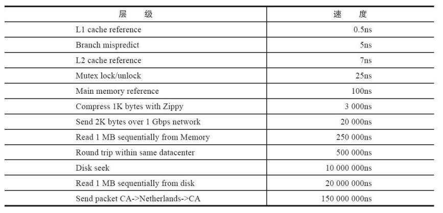


### 1.1.2. 应⽤场景

* 会话缓存（Session Cache）
    * 最常⽤的情景是会话缓存。⽤Redis缓存会话⽐其他存储（如Memcached）的优势在于：Redis提供持久化。当维护⼀个不是严格要求⼀致性的缓存时，如果⽤户的购物⻋信息全部丢失，⼤部分⼈都会不⾼兴的。
* 对象缓存
    * 做Java项⽬的时候，通常会了加快查询效率，减少和数据库的连接次数，我们都会在代码中加⼊缓存功能。Redis的⾼效缓存给我们解决了难题
* 分布式锁
    * 在互联⽹产品应⽤中，有些场景需要加锁处理，⽐如：秒杀，全局递增ID，分布式批处理。Redis提供⼀些命令SETNX，GETSET，可以⽅便实现分布式锁机制。
* 队列
    * Reids在内存存储引擎领域的⼀⼤优点是提供 list和 set操作，这使得Redis能作为⼀个很好的消息队列平台来使⽤。
* 排⾏榜/计数器
    * Redis在内存中对数字进⾏递增或递减的操作实现的⾮常好。集合（Set）和有序集合（SortedSet）也使得我们在执⾏这些操作的时候变的⾮常简单，Redis只是正好提供了这两种数据结构。所以，我们要从排序集合中获取到排名最靠前的10个⽤户–我们称之为“user_scores”
* 流量控制
    * 借助过期时间配置实现请求流量控制
* 布隆过滤器
    * 解决缓存击穿问题

在社区论坛中的应⽤

1. 记录帖⼦的点赞数、评论数和点击数 (hash)
2. 记录⽤户的帖⼦ ID列表 (排序)，便于快速显⽰⽤户的帖⼦列表 (zset)。
3. 记录帖⼦的标题、摘要、作者和封⾯信息，⽤于列表⻚展⽰ (hash)。
4. 记录帖⼦的点赞⽤户 ID列表，评论 ID列表，⽤于显⽰和去重计数 (zset)。
5. 缓存近期热帖内容 (帖⼦内容空间占⽤⽐较⼤)，减少数据库压⼒ (hash)。
6. 记录帖⼦的相关⽂章 ID，根据内容推荐相关帖⼦ (list)。
7. 如果帖⼦ ID是整数⾃增的，可以使⽤ Redis来分配帖⼦ ID(计数器)。
8. 收藏集和帖⼦之间的关系 (zset)。
9. 记录热榜帖⼦ ID列表，总热榜和分类热榜 (zset)。
10. 缓存⽤户⾏为历史，进⾏恶意⾏为过滤 (zset,hash)。

### 1.1.3. 常⻅客户端

* Jedis
    * 使⽤阻塞的I/O，且其⽅法调⽤都是同步的，程序流需要等到sockets处理完I/O才能执⾏，不⽀持异步。Jedis客户端实例不是线程安全的，所以需要通过连接池来使⽤Jedis。
* Redisson
    * 基于Netty框架的事件驱动的通信层，其⽅法调⽤是异步的。Redisson的API是线程安全的，所以可以操作单个Redisson连接来完成各种操作
* RedLock
    * 分布式锁实现

### 1.1.4. 与memcache对⽐

* Redis和Memcache都是将数据存放在内存中，都是内存数据库。不过memcache还可⽤于缓存其他东⻄，例如图⽚、视频等等。
* Redis不仅仅⽀持简单的k/v类型的数据，同时还提供list，set，hash等数据结构的存储。
* 虚拟内存–Redis当物理内存⽤完时，可以将⼀些很久没⽤到的value交换到磁盘
* 过期策略–memcache在set时就指定，例如set key1 0 0 8,即永不过期。Redis可以通过例如expire设定，例如expire name 10
* 分布式–设定memcache集群，利⽤magent做⼀主多从;redis可以做⼀主多从。都可以⼀主⼀从
* 存储数据安全–memcache挂掉后，数据没了；redis可以定期保存到磁盘（持久化）
* 灾难恢复–memcache挂掉后，数据不可恢复; redis数据丢失后可以通过aof恢复
* Redis⽀持数据的备份，即master-slave模式的数据备份。
* 性能上：
    * Redis只使⽤单核，⽽Memcached可以使⽤多核，所以平均每⼀个核上Redis在存储⼩数据时⽐Memcached性能更⾼。⽽在100k以上的数据中，Memcached性能要⾼于Redis。
* 内存空间和数据量⼤⼩：
    * Memcached可以修改最⼤内存，采⽤LRU算法。Memcached单个key-value⼤⼩有限，⼀个value最⼤只⽀持1MB，⽽Redis最⼤⽀持512MB
* 操作便利上：
    * Memcached数据结构单⼀，⽽Redis⽀持更加丰富的数据类型，在服务器端直接对数据进⾏丰富的操作,这样可以减少⽹络IO次数和数据体积。
* 可靠性上：
    * MemCached不⽀持数据持久化，断电或重启后数据消失。Redis⽀持数据持久化和数据恢复和集群，允许单点故障。
* 应⽤场景：
    * Memcached：动态系统中减轻数据库负载，提升性能；做缓存，适合多读少写，⼤数据量的情况（如⼈⼈⽹⼤量查询⽤户信息、好友信息、⽂章信息等）。
    * Redis：适⽤于对读写效率要求都很⾼，数据处理业务复杂和对安全性要求较⾼的系统（如新浪微博的计数和微博发布部分系统，对数据安全性、读写要求都很⾼）
    * 有持久化需求或者对数据结构和处理有⾼级要求的应⽤，选择redis，其他简单的key/value存储，选择memcache。
* 性能上：性能上都很出⾊，具体到细节，由于Redis只使⽤单核，⽽Memcached可以使⽤多核，所以平均每⼀个核上Redis在存储⼩数据时⽐Memcached性能更⾼。⽽在100k以上的数据中，Memcached性能要⾼于Redis，虽然Redis最近也在存储⼤数据的性能上进⾏优化，但是⽐起Memcached，还是稍有逊⾊。
* 内存空间和数据量⼤⼩：
    * MemCached可以修改最⼤内存，采⽤LRU算法。
    * Redis增加了VM的特性，突破了物理内存的限制。
* 操作便利上：
    * MemCached数据结构单⼀，仅⽤来缓存数据
    * ⽽Redis⽀持更加丰富的数据类型，也可以在服务器端直接对数据进⾏丰富的操作,这样可以减少⽹络IO次数和数据体积。
* 可靠性上：
    * MemCached不⽀持数据持久化，断电或重启后数据消失，但其稳定性是有保证的。
    * Redis⽀持数据持久化和数据恢复，允许单点故障，但是同时也会付出性能的代价。
* 应⽤场景：
    * Memcached：动态系统中减轻数据库负载，提升性能；做缓存，适合多读少写，⼤数据量的情况（如⼈⼈⽹⼤量查询⽤户信息、好友信息、⽂章信息等）。
    * Redis：适⽤于对读写效率要求都很⾼，数据处理业务复杂和对安全性要求较⾼的系统（如新浪微博的计数和微博发布部分系统，对数据安全性、读写要求都很⾼）。
* 需要慎重考虑的部分
    * Memcached单个key-value⼤⼩有限，⼀个value最⼤只⽀持1MB，⽽Redis最⼤⽀持512MB
    * Memcached只是个内存缓存，对可靠性⽆要求；⽽Redis更倾向于内存数据库，因此对对可靠性⽅⾯要
    * 从本质上讲，Memcached只是⼀个单⼀key-value内存Cache；⽽Redis则是⼀个数据结构内存数据库，⽀持五种数据类型，因此Redis除单纯缓存作⽤外，还可以处理⼀些简单的逻辑运算，Redis不仅可以缓存，⽽且还可以作为数据库⽤

### 1.1.5. 安装使⽤

```yml
wget http://download.redis.io/releases/redis-x.x.x.tar.gz
$ tar xzf redis-x.x.x.tar.gz
$ ln -s redis-x.x.x redis
$ cd redis
$ make
$ make install
```


编译完成后将会在bin<a href="#menu"  >目录</a> 中⽣成相关的脚本和默认配置⽂件，主要是redis-server,redis-cli.可以将相关运⾏⽂件放到∕usr/local/bin。就可以直接运⾏。

|可执⾏⽂件	|作⽤|
|---|---|
|redis-server	|启动redis
|redis-cli|	启动客户端
|redis-benchmark |基准测试⼯具
|redis-check-aof	|aof持久化⽂件检测和修复⼯具
|redis-check-dump |rdb持久化⽂件检测和修复⼯具
|redis-sentinel	|启动redis sentinel

* 启动: redis-server redis.conf
* 客户端连接: redis-cli -h 127.0.0. -p 6379
* 停⽌redis: redis-cli shutdown,服务端会优雅关闭，先断开连接，⽣成持久化⽂件。直接使⽤kill不会进⾏持久化操作。
* redis-cli shutdown nosave|save ,是否关闭前进⾏持久化操作，默认是save

### 1.1.6. 常⽤配置说明

<a href="#menu"  >目录</a> 


```yml
################################## INCLUDES
###################################
#这在你有标准配置模板但是每个redis服务器又需要个性设置的时候很有用。
# include /path/to/local.conf
# include /path/to/other.conf

################################ GENERAL
#####################################

#是否在后台执行，yes：后台运行；no：不是后台运行（老版本默认）
daemonize yes

#3.2里的参数，是否开启保护模式，默认开启。要是配置里没有指定bind和密码。开启该参数后，redis只会本地进行访问，拒绝外部访问。要是开启了密码和bind，可以开启。否则最好关闭，设置为no。
protected-mode yes
#redis的进程文件
pidfile /var/run/redis/redis-server.pid

#redis监听的端口号。
port 6379

#此TCP三次握手后，会将接受的连接放入队列中，tcpbacklog就是队列的大小，当然此值必须不大于Linux系统定义的/proc/sys/net/core/somaxconn值，默认是511，而Linux的默认参数值是128。当系统并发量大并且客户端速度缓慢的时候，可以将这二个参数一起参考设定。该内核参数默认值一般是128，对于负载很大的服务程序来说大大的不够。一般会将它修改为2048或者更大。在/etc/sysctl.conf中添加:net.core.somaxconn = 2048，然后在终端中执行sysctl -p。
tcp-backlog 511

#指定 redis 只接收来自于该 IP 地址的请求，如果不进行设置或者设置为0.0.0.0，那么将处理所有请求
bind 127.0.0.1

#配置unix socket来让redis支持监听本地连接。
# unixsocket /var/run/redis/redis.sock
#配置unix socket使用文件的权限
# unixsocketperm 700

#此参数为设置客户端空闲超过timeout，服务端会断开连接，为0则服务端不会主动断开连接，不能小于0。
timeout 0

#tcp keepalive参数。如果设置不为0，就使用配置tcp的SO_KEEPALIVE值，使用keepalive有两个好处:检测挂掉的对端。降低中间设备出问题而导致网络看似连接却已经与对端端口的问题。在Linux内核中，设置了keepalive，redis会定时给对端发送ack。检测到对端关闭需要两倍的设置值。
#检测TCP连接活性的周期，默认值为0，也就是不进行检测，如果需要设置，建议为60，那么Redis会每隔60秒对它创建的TCP连接进行活性检测，防止大量死连接占用系统资源
tcp-keepalive 0

#指定了服务端日志的级别。级别包括：debug（很多信息，方便开发、测试），verbose（许多有用的信息，但是没有debug级别信息多），notice（适当的日志级别，适合生产环境），warn（只有非常重要的信息）
loglevel notice

#指定了记录日志的文件。空字符串的话，日志会打印到标准输出设备。后台运行的redis标准输出
是/dev/null。
logfile /var/log/redis/redis-server.log
# syslog-enabled no

#syslog的标识符。
# syslog-ident redis

#日志的来源、设备
# syslog-facility local0

#数据库的数量，默认使用的数据库是DB 0。可以通过”SELECT “命令选择一个db
databases 16

################################ SNAPSHOTTING
################################
# 快照配置
# if-elseif-elseif
# 注释掉“save”这一行配置项就可以让保存数据库功能失效
# 设置sedis进行数据库镜像的频率。
# 900秒（15分钟）内至少1个key值改变（则进行数据库保存--持久化）
# 300秒（5分钟）内至少10个key值改变（则进行数据库保存--持久化）
# 60秒（1分钟）内至少10000个key值改变（则进行数据库保存--持久化）
save 900 1
save 300 10
save 60 10000

#当RDB持久化出现错误后，是否依然进行继续进行工作，yes：不能进行工作，no：可以继续进行工
作，可以通过info中的rdb_last_bgsave_status了解RDB持久化是否有错误
stop-writes-on-bgsave-error yes

#使用压缩rdb文件，rdb文件压缩使用LZF压缩算法，yes：压缩，但是需要一些cpu的消耗。no：不
压缩，需要更多的磁盘空间
rdbcompression yes

#是否校验rdb文件。从rdb格式的第五个版本开始，在rdb文件的末尾会带上CRC64的校验和。这跟有利于文件的容错性，但是在保存rdb文件的时候，会有大概10%的性能损耗，所以如果你追求高性能，可以关闭该配置。
rdbchecksum yes

#rdb文件的名称
dbfilename dump.rdb

#数据目录，数据库的写入会在这个目录。rdb、aof文件也会写在这个目录
dir /var/lib/redis

################################# REPLICATION
#################################
#复制选项，slave复制对应的master。
# slaveof <masterip> <masterport>

#如果master设置了requirepass，那么slave要连上master，需要有master的密码才行。
masterauth就是用来配置master的密码，这样可以在连上master后进行认证。
# masterauth <master-password>

#当从库同主机失去连接或者复制正在进行，从机库有两种运行方式：1) 如果slave-serve-stale-data设置为yes(默认设置)，从库会继续响应客户端的请求。2) 如果slave-serve-stale-data设置为no，除去INFO和SLAVOF命令之外的任何请求都会返回一个错误”SYNC withmaster in progress”。
slave-serve-stale-data yes

#作为从服务器，默认情况下是只读的（yes），可以修改成NO，用于写（不建议）。
slave-read-only yes

#是否使用socket方式复制数据。目前redis复制提供两种方式，disk和socket。如果新的slave连上来或者重连的slave无法部分同步，就会执行全量同步，master会生成rdb文件。有2种方式：disk方式是master创建一个新的进程把rdb文件保存到磁盘，再把磁盘上的rdb文件传递给slave。socket是master创建一个新的进程，直接把rdb文件以socket的方式发给slave。disk方式的时候，当一个rdb保存的过程中，多个slave都能共享这个rdb文件。socket的方式就的一个个slave顺序复制。在磁盘速度缓慢，网速快的情况下推荐用socket方式。
repl-diskless-sync no

#diskless复制的延迟时间，防止设置为0。一旦复制开始，节点不会再接收新slave的复制请求直到下一个rdb传输。所以最好等待一段时间，等更多的slave连上来。
repl-diskless-sync-delay 5

#slave根据指定的时间间隔向服务器发送ping请求。时间间隔可以通过repl_ping_slave_period 来设置，默认10秒。
# repl-ping-slave-period 10

#复制连接超时时间。master和slave都有超时时间的设置。master检测到slave上次发送的时间超过repl-timeout，即认为slave离线，清除该slave信息。slave检测到上次和master交互的时间超过repl-timeout，则认为master离线。需要注意的是repl-timeout需要设置一个比repl-ping-slave-period更大的值，不然会经常检测到超时。
# repl-timeout 60

#是否禁止复制tcp链接的tcp nodelay参数，可传递yes或者no。默认是no，即使用tcpnodelay。如果master设置了yes来禁止tcp nodelay设置，在把数据复制给slave的时候，会减少包的数量和更小的网络带宽。但是这也可能带来数据的延迟。默认我们推荐更小的延迟，但是在数据量传输很大的场景下，建议选择yes。
repl-disable-tcp-nodelay no

#复制缓冲区大小，这是一个环形复制缓冲区，用来保存最新复制的命令。这样在slave离线的时候，不需要完全复制master的数据，如果可以执行部分同步，只需要把缓冲区的部分数据复制给slave，就能恢复正常复制状态。缓冲区的大小越大，slave离线的时间可以更长，复制缓冲区只有在有slave连接的时候才分配内存。没有slave的一段时间，内存会被释放出来，默认1m。
# repl-backlog-size 5mb

#master没有slave一段时间会释放复制缓冲区的内存，repl-backlog-ttl用来设置该时间长度。单位为秒。
# repl-backlog-ttl 3600

#当master不可用，Sentinel会根据slave的优先级选举一个master。最低的优先级的slave，当选master。而配置成0，永远不会被选举。
slave-priority 100

#redis提供了可以让master停止写入的方式，如果配置了min-slaves-to-write，健康的slave的个数小于N，mater就禁止写入。master最少得有多少个健康的slave存活才能执行写命令。这个配置虽然不能保证N个slave都一定能接收到master的写操作，但是能避免没有足够健康的slave的时候，master不能写入来避免数据丢失。设置为0是关闭该功能。

#延迟小于min-slaves-max-lag秒的slave才认为是健康的slave。
# min-slaves-max-lag 10

# 设置1或另一个设置为0禁用这个特性。
# Setting one or the other to 0 disables the feature.
# By default min-slaves-to-write is set to 0 (feature disabled) and
# min-slaves-max-lag is set to 10.

################################## SECURITY
###################################
#requirepass配置可以让用户使用AUTH命令来认证密码，才能使用其他命令。这让redis可以使用在不受信任的网络中。为了保持向后的兼容性，可以注释该命令，因为大部分用户也不需要认证。使用requirepass的时候需要注意，因为redis太快了，每秒可以认证15w次密码，简单的密码很容易被攻破，所以最好使用一个更复杂的密码。
# requirepass foobared

#把危险的命令给修改成其他名称。比如CONFIG命令可以重命名为一个很难被猜到的命令，这样用户不能使用，而内部工具还能接着使用。
# rename-command CONFIG b840fc02d524045429941cc15f59e41cb7be6c52

#设置成一个空的值，可以禁止一个命令
# rename-command CONFIG ""
################################### LIMITS
####################################

# 设置能连上redis的最大客户端连接数量。默认是10000个客户端连接。由于redis不区分连接是客户端连接还是内部打开文件或者和slave连接等，所以maxclients最小建议设置到32。如果超过了maxclients，redis会给新的连接发送’max number of clients reached’，并关闭连接。
# maxclients 10000

#redis配置的最大内存容量。当内存满了，需要配合maxmemory-policy策略进行处理。注意slave的输出缓冲区是不计算在maxmemory内的。所以为了防止主机内存使用完，建议设置的maxmemory需要更小一些。
# maxmemory <bytes>

#内存容量超过maxmemory后的处理策略。
#volatile-lru：利用LRU算法移除设置过过期时间的key。
#volatile-random：随机移除设置过过期时间的key。
#volatile-ttl：移除即将过期的key，根据最近过期时间来删除（辅以TTL）
#allkeys-lru：利用LRU算法移除任何key。
#allkeys-random：随机移除任何key。
#noeviction：不移除任何key，只是返回一个写错误。
#上面的这些驱逐策略，如果redis没有合适的key驱逐，对于写命令，还是会返回错误。redis将不再接收写请求，只接收get请求。写命令包括：set setnx setex append incr decr rpush lpush rpushx lpushx linsert lset rpoplpush sadd sinter sinterstore sunions unionstore sdiff sdiffstore zadd zincrby zunionstore zinterstore hset  hsetnx hmset hincrby incrby decrby getset mset msetnx exec sort。
# maxmemory-policy noeviction

#lru检测的样本数。使用lru或者ttl淘汰算法，从需要淘汰的列表中随机选择sample个key，选出闲置时间最长的key移除。
# maxmemory-samples 5


############################## APPEND ONLY MODE
###############################
#默认redis使用的是rdb方式持久化，这种方式在许多应用中已经足够用了。但是redis如果中途宕机，会导致可能有几分钟的数据丢失，根据save来策略进行持久化，Append Only File是另一种持久化方式，可以提供更好的持久化特性。Redis会把每次写入的数据在接收后都写入appendonly.aof 文件，每次启动时Redis都会先把这个文件的数据读入内存里，先忽略RDB文件。
appendonly no

#no表示不执行fsync，由操作系统保证数据同步到磁盘，速度最快。
#always表示每次写入都执行fsync，以保证数据同步到磁盘。
#everysec表示每秒执行一次fsync，可能会导致丢失这1s数据。
appendfsync everysec

# 在aof重写或者写入rdb文件的时候，会执行大量IO，此时对于everysec和always的aof模式来说，执行fsync会造成阻塞过长时间，no-appendfsync-on-rewrite字段设置为默认设置为no。如果对延迟要求很高的应用，这个字段可以设置为yes，否则还是设置为no，这样对持久化特性来说这是更安全的选择。设置为yes表示rewrite期间对新写操作不fsync,暂时存在内存中,等rewrite完成后再写入，默认为no，建议yes。Linux的默认fsync策略是30秒。可能丢失30秒数据。
no-appendfsync-on-rewrite no

#aof自动重写配置。当目前aof文件大小超过上一次重写的aof文件大小的百分之多少进行重写，即当aof文件增长到一定大小的时候Redis能够调用bgrewriteaof对日志文件进行重写。当前AOF文件大小是上次日志重写得到AOF文件大小的二倍（设置为100）时，自动启动新的日志重写过程。
auto-aof-rewrite-percentage 100
#设置允许重写的最小aof文件大小，避免了达到约定百分比但尺寸仍然很小的情况还要重写
auto-aof-rewrite-min-size 64mb

#aof文件可能在尾部是不完整的，当redis启动的时候，aof文件的数据被载入内存。重启可能发生在redis所在的主机操作系统宕机后，尤其在ext4文件系统没有加上data=ordered选项（redis宕机或者异常终止不会造成尾部不完整现象。）出现这种现象，可以选择让redis退出，或者导入尽可能多的数据。如果选择的是yes，当截断的aof文件被导入的时候，会自动发布一个log给客户端然后load。如果是no，用户必须手动redis-check-aof修复AOF文件才可以。
aof-load-truncated yes

################################ LUA SCRIPTING
###############################
# 如果达到最大时间限制（毫秒），redis会记个log，然后返回error。当一个脚本超过了最大时限。只有SCRIPT KILL和SHUTDOWN NOSAVE可以用。第一个可以杀没有调write命令的东西。要是已经调用了write，只能用第二个命令杀。
lua-time-limit 5000

################################ REDIS CLUSTER
###############################
#集群开关，默认是不开启集群模式。
# cluster-enabled yes

#集群配置文件的名称，每个节点都有一个集群相关的配置文件，持久化保存集群的信息。这个文件并不需要手动配置，这个配置文件有Redis生成并更新，每个Redis集群节点需要一个单独的配置文件，请确保与实例运行的系统中配置文件名称不冲突
# cluster-config-file nodes-6379.conf

#节点互连超时的阀值。集群节点超时毫秒数
# cluster-node-timeout 15000

#在进行故障转移的时候，全部slave都会请求申请为master，但是有些slave可能与master断开连接一段时间了，导致数据过于陈旧，这样的slave不应该被提升为master。该参数就是用来判断slave节点与master断线的时间是否过长。判断方法是：
#比较slave断开连接的时间和(node-timeout * slave-validity-factor) + repl-ping-
slave-period
#如果节点超时时间为三十秒, 并且slave-validity-factor为10,假设默认的repl-ping-
slave-period是10秒，即如果超过310秒slave将不会尝试进行故障转移
# cluster-slave-validity-factor 10

#master的slave数量大于该值，slave才能迁移到其他孤立master上，如这个参数若被设为2，那
么只有当一个主节点拥有2 个可工作的从节点时，它的一个从节点会尝试迁移。
# cluster-migration-barrier 1

#默认情况下，集群全部的slot有节点负责，集群状态才为ok，才能提供服务。设置为no，可以在slot没有全部分配的时候提供服务。不建议打开该配置，这样会造成分区的时候，小分区的master一直在接受写请求，而造成很长时间数据不一致。
# cluster-require-full-coverage yes

################################## SLOW LOG
###################################
###slog log是用来记录redis运行中执行比较慢的命令耗时。当命令的执行超过了指定时间，就记录在slow log中，slog log保存在内存中，所以没有IO操作。
#执行时间比slowlog-log-slower-than大的请求记录到slowlog里面，单位是微秒，所以1000000就是1秒。注意，负数时间会禁用慢查询日志，而0则会强制记录所有命令。
slowlog-log-slower-than 10000

#慢查询日志长度。当一个新的命令被写进日志的时候，最老的那个记录会被删掉。这个长度没有限制。只要有足够的内存就行。你可以通过 SLOWLOG RESET 来释放内存。
slowlog-max-len 128

################################ LATENCY MONITOR
##############################
#延迟监控功能是用来监控redis中执行比较缓慢的一些操作，用LATENCY打印redis实例在跑命令时的耗时图表。只记录大于等于下边设置的值的操作。0的话，就是关闭监视。默认延迟监控功能是关闭的，如果你需要打开，也可以通过CONFIG SET命令动态设置。
latency-monitor-threshold 0

############################# EVENT NOTIFICATION
##############################
#键空间通知使得客户端可以通过订阅频道或模式，来接收那些以某种方式改动了 Redis 数据集的事件。因为开启键空间通知功能需要消耗一些 CPU ，所以在默认配置下，该功能处于关闭状态。
#notify-keyspace-events 的参数可以是以下字符的任意组合，它指定了服务器该发送哪些类型的通知：
##K 键空间通知，所有通知以 __keyspace@__ 为前缀
##E 键事件通知，所有通知以 __keyevent@__ 为前缀
##g DEL 、 EXPIRE 、 RENAME 等类型无关的通用命令的通知
##$ 字符串命令的通知
##l 列表命令的通知
##s 集合命令的通知
##z 有序集合命令的通知
##x 过期事件：每当有过期键被删除时发送
##e 驱逐(evict)事件：每当有键因为 maxmemory 政策而被删除时发送
##A 参数 g$lshzxe 的别名
#输入的参数中至少要有一个 K 或者 E，否则的话，不管其余的参数是什么，都不会有任何 通知被分发。详细使用可以参考http://redis.io/topics/notifications

############################### ADVANCED CONFIG
###############################
#数据量小于等于hash-max-ziplist-entries的用ziplist，大于hash-max-ziplist-entries用hash
hash-max-ziplist-entries 512
#value大小小于等于hash-max-ziplist-value的用ziplist，大于hash-max-ziplist-value用hash。
hash-max-ziplist-value 64

#数据量小于等于list-max-ziplist-entries用ziplist，大于list-max-ziplist-entries用list。
list-max-ziplist-entries 512
#value大小小于等于list-max-ziplist-value的用ziplist，大于list-max-ziplist-value用list。
list-max-ziplist-value 64

#数据量小于等于set-max-intset-entries用iniset，大于set-max-intset-entries用set。
set-max-intset-entries 512

#数据量小于等于zset-max-ziplist-entries用ziplist，大于zset-max-ziplist-entries用zset。
zset-max-ziplist-entries 128
#value大小小于等于zset-max-ziplist-value用ziplist，大于zset-max-ziplist-value用zset。
zset-max-ziplist-value 64

#value大小小于等于hll-sparse-max-bytes使用稀疏数据结构（sparse），大于hll-sparse-max-bytes使用稠密的数据结构（dense）。一个比16000大的value是几乎没用的，建议的value大概为3000。如果对CPU要求不高，对空间要求较高的，建议设置到10000左右。
hll-sparse-max-bytes 3000

#Redis将在每100毫秒时使用1毫秒的CPU时间来对redis的hash表进行重新hash，可以降低内存的使用。当你的使用场景中，有非常严格的实时性需要，不能够接受Redis时不时的对请求有2毫秒的延迟的话，把这项配置为no。如果没有这么严格的实时性要求，可以设置为yes，以便能够尽可能快的释放内存。
activerehashing yes

##对客户端输出缓冲进行限制可以强迫那些不从服务器读取数据的客户端断开连接，用来强制关闭传输缓慢的客户端。
#对于normal client，第一个0表示取消hard limit，第二个0和第三个0表示取消softlimit，normal client默认取消限制，因为如果没有寻问，他们是不会接收数据的。
client-output-buffer-limit normal 0 0 0
#对于slave client和MONITER client，如果client-output-buffer一旦超过256mb，又或者超过64mb持续60秒，那么服务器就会立即断开客户端连接。

client-output-buffer-limit slave 256mb 64mb 60
#对于pubsub client，如果client-output-buffer一旦超过32mb，又或者超过8mb持续60秒，那么服务器就会立即断开客户端连接。
client-output-buffer-limit pubsub 32mb 8mb 60

#redis执行任务的频率为1s除以hz。
hz 10

#在aof重写的时候，如果打开了aof-rewrite-incremental-fsync开关，系统会每32MB执行一次fsync。这对于把文件写入磁盘是有帮助的，可以避免过大的延迟峰值。
aof-rewrite-incremental-fsync yes

```

### 1.1.7. info 命令

Redis Info信息包括Server,Clients,Memory,Persistence,Stats,Replication,CPU,Commandstats,Cluster,Keyspace等。

在客户端执⾏ info 或者info [section]


```yml
# Server
#Redis 服务器版本
redis_version:5.0.3
#Git SHA1
redis_git_sha1:00000000
#Git dirty flag
redis_git_dirty:0
#Git dirty flag
redis_build_id:fba7e8a72b50cd84
#运行模式，单机或者集群
redis_mode:standalone
#服务器的宿主操作系统
os:Linux 4.15.0-46-generic x86_64
#架构（32 或 64 位）
arch_bits:64
# Redis 所使用的事件处理机制
multiplexing_api:epoll
#原子处理api
atomicvar_api:atomic-builtin
#编译 Redis 时所使用的 GCC 版本
gcc_version:7.3.0
#服务器进程的 PID
process_id:23560
#Redis 服务器的随机标识符（用于 Sentinel 和集群）
run_id:da97e23eb244c7c162ba30894d1682d121593947
#TCP/IP 监听端口
tcp_port:6379
#自 Redis 服务器启动以来，经过的秒数
uptime_in_seconds:2294
#
uptime_in_days:0
#redis内部调度（进行关闭timeout的客户端，删除过期key等等）频率，程序规定serverCron每

#自增的时钟，用于LRU管理,该时钟100ms(hz=10,因此每1000ms/10=100ms执行一次定时任务)更
新一次。
lru_clock:16316798
#执行文件
executable:/home/lgj/java/redis-5.0.3/user/./redis-server
#配置文件路径
config_file:
#已连接客户端的数量（不包括通过从属服务器连接的客户端）
connected_clients:2
#当前连接的客户端当中，最大输入缓存
client_recent_max_input_buffer:2
#当前连接的客户端当中，最长的输出列表
client_recent_max_output_buffer:0
#正在等待阻塞命令（BLPOP、BRPOP、BRPOPLPUSH）的客户端的数量
blocked_clients:1

#由 Redis 分配器分配的内存总量，以字节（byte）为单位
used_memory:596928
#以人类可读的格式返回 Redis 分配的内存总量
used_memory_human:582.94K
#从操作系统的角度，返回 Redis 已分配的内存总量（俗称常驻集大小）。这个值和 top 、 ps等
命令的输出一致。
used_memory_rss:6782976
#以人类可读的格式，从操作系统的角度，返回 Redis 已分配的内存总量（俗称常驻集大小）。这个
值和 top 、 ps等命令的输出一致。
used_memory_rss_human:6.47M
# redis的内存消耗峰值(以字节为单位)
used_memory_peak:596928
#以人类可读的格式返回redis的内存消耗峰值
used_memory_peak_human:582.94K
#(used_memory/ used_memory_peak) *100%
used_memory_peak_perc:100.17%
#Redis为了维护数据集的内部机制所需的内存开销，包括所有客户端输出缓冲区、查询缓冲区、AOF
重写缓冲区和主从复制的backlog。
used_memory_overhead:580344
# Redis服务器启动时消耗的内存
used_memory_startup:513392
#used_memory—used_memory_overhead
used_memory_dataset:16584
#100%*(used_memory_dataset/(used_memory—used_memory_startup))
used_memory_dataset_perc:19.85%
#
allocator_allocated:1134384
#
allocator_resident:14098432
#整个系统内存
total_system_memory:10418728960
#以人类可读的格式，显示整个系统内存
total_system_memory_human:9.70G
#Lua脚本存储占用的内存
used_memory_lua:37888
# 以人类可读的格式，显示Lua脚本存储占用的内存
used_memory_lua_human:37.00K
#
used_memory_scripts:0
#
used_memory_scripts_human:0B
#
number_of_cached_scripts:0
#Redis实例的最大内存配置
maxmemory:0
#以人类可读的格式，显示Redis实例的最大内存配置
maxmemory_human:0B
#当达到maxmemory时的淘汰策略
maxmemory_policy:noeviction
#used_memory_rss/ used_memory
allocator_frag_ratio:1.23
#
allocator_frag_bytes:266448
#
allocator_rss_ratio:10.06
#
allocator_rss_bytes:12697600
#
rss_overhead_ratio:0.48
#
rss_overhead_bytes:-7315456
#
mem_fragmentation_ratio:12.22
#
mem_fragmentation_bytes:6228040
#
mem_not_counted_for_evict:0
#
mem_replication_backlog:0
#
mem_clients_slaves:0
#
mem_clients_normal:66616
#
mem_aof_buffer:0
#内存分配器
mem_allocator:jemalloc-5.1.0
#表示没有活动的defrag任务正在运行，1表示有活动的defrag任务正在运行（defrag:表示内存碎
片整理）
active_defrag_running:0
# 0表示不存在延迟释放（也有资料翻译未惰性删除）的挂起对象

lazyfree_pending_objects:0

# Persistence
#服务器是否正在载入持久化文件
loading:0
# 离最近一次成功生成rdb文件，写入命令的个数，即有多少个写入命令没有持久化
rdb_changes_since_last_save:7
# 服务器是否正在创建rdb文件
rdb_bgsave_in_progress:0
#离最近一次成功创建rdb文件的时间戳。当前时间戳 - rdb_last_save_time=多少秒未成功生成
rdb文件
rdb_last_save_time:1610150024
#最近一次rdb持久化是否成功
rdb_last_bgsave_status:ok
#最近一次成功生成rdb文件耗时秒数
rdb_last_bgsave_time_sec:-1
#如果服务器正在创建rdb文件，那么这个域记录的就是当前的创建操作已经耗费的秒数
rdb_current_bgsave_time_sec:-1
#RDB过程中父进程与子进程相比执行了多少修改(包括读缓冲区，写缓冲区，数据修改等)。
rdb_last_cow_size:0
#是否开启了aof
aof_enabled:0
#标识aof的rewrite操作是否在进行中
aof_rewrite_in_progress:0
#rewrite任务计划，当客户端发送bgrewriteaof指令，如果当前rewrite子进程正在执行，那么
将客户端请求的bgrewriteaof变为计划任务，待aof子进程结束后执行rewrite
aof_rewrite_scheduled:0
#最近一次aof rewrite耗费的时长
aof_last_rewrite_time_sec:-1
# 如果rewrite操作正在进行，则记录所使用的时间，单位秒
aof_current_rewrite_time_sec:-1
#上次bgrewriteaof操作的状态
aof_last_bgrewrite_status:ok
#上次aof写入状态
aof_last_write_status:ok
#AOF过程中父进程与子进程相比执行了多少修改(包括读缓冲区，写缓冲区，数据修改等)。
aof_last_cow_size:0

#新创建连接个数,如果新创建连接过多，过度地创建和销毁连接对性能有影响，说明短连接严重或连
接池使用有问题，需调研代码的连接设置
total_connections_received:3
#redis处理的命令数
total_commands_processed:21
#redis当前的qps，redis内部较实时的每秒执行的命令数
instantaneous_ops_per_sec:0
#redis网络入口流量字节数
total_net_input_bytes:694
#redis网络出口流量字节数
total_net_output_bytes:35973
# redis网络入口kps

#redis网络出口kps
instantaneous_output_kbps:0.00
# 拒绝的连接个数，redis连接个数达到maxclients限制，拒绝新连接的个数
rejected_connections:0
#主从完全同步成功次数
sync_full:0
#主从部分同步成功次数
sync_partial_ok:0
#主从部分同步失败次数
sync_partial_err:0
#运行以来过期的key的数量
expired_keys:0
# 过期的比率
expired_stale_perc:0.00
#过期计数
expired_time_cap_reached_count:0
#运行以来剔除(超过了maxmemory后)的key的数量
evicted_keys:0
#命中次数
keyspace_hits:1
#没命中次数
keyspace_misses:0
#当前使用中的频道数量
pubsub_channels:0
#当前使用的模式的数量
pubsub_patterns:0
#最近一次fork操作阻塞redis进程的耗时数，单位微秒
latest_fork_usec:0
#是否已经缓存了到该地址的连接
migrate_cached_sockets:0
#从实例到期key数量
slave_expires_tracked_keys:0
#主动碎片整理命中次数
active_defrag_hits:0
#主动碎片整理未命中次数
active_defrag_misses:0

#主动碎片整理key命中次数
active_defrag_key_hits:0
#主动碎片整理key未命中次数
active_defrag_key_misses:0

#实例的角色，是master or slave
role:master
#连接的slave实例个数
connected_slaves:0
#主实例启动随机字符串
master_replid:610c819d6b9c4f7c9af2dd3cbe5e86a23ef9ea6b
#主实例启动随机字符串2
master_replid2:0000000000000000000000000000000000000000
#主从同步偏移量,此值如果和上面的offset相同说明主从一致没延迟，与master_replid可被用来

#: 主从同步偏移量2,此值如果和上面的offset相同说明主从一致没延迟
second_repl_offset:-1
# 复制积压缓冲区是否开启
repl_backlog_active:0

#复制积压缓冲大小
repl_backlog_size:1048576
#复制缓冲区里偏移量的大小
repl_backlog_first_byte_offset:0
#此值等于 master_repl_offset - repl_backlog_first_byte_offset,该值不会超过
repl_backlog_size的大小
repl_backlog_histlen:0

#将所有redis主进程在核心态所占用的CPU时求和累计起来
used_cpu_sys:1.720221
#将所有redis主进程在用户态所占用的CPU时求和累计起来
used_cpu_user:1.976231
#将后台进程在核心态所占用的CPU时求和累计起来
used_cpu_sys_children:0.000000
# 将后台进程在用户态所占用的CPU时求和累计起来
used_cpu_user_children:0.000000

#db0的key的数量,以及带有生存期的key的数,平均存活时间
db0:keys=6,expires=0,avg_ttl=0

```


### 1.1.8. 常⻅⾯试题


1、什么是Redis？

2、Redis相⽐memcached有哪些优势？

3、Redis⽀持哪⼏种数据类型？

4、Redis主要消耗什么物理资源？

5、Redis的全称是什么？

6、Redis有哪⼏种数据淘汰策略？

7、Redis官⽅为什么不提供Windows版本？

8、⼀个字符串类型的值能存储最⼤容量是多少？

9、为什么Redis需要把所有数据放到内存中？

10、Redis集群⽅案应该怎么做？都有哪些⽅案？

11、Redis集群⽅案什么情况下会导致整个集群不可⽤？

12、MySQL⾥有2000w数据，redis中只存20w的数据，如何保证redis中的数据都是热点数据？

13、Redis有哪些适合的场景？

14、Redis⽀持的Java客户端都有哪些？官⽅推荐⽤哪个？

15、Redis和Redisson有什么关系？

16、Jedis与Redisson对⽐有什么优缺点？

17、Redis如何设置密码及验证密码？

18、说说Redis哈希槽的概念？

19、Redis集群的主从复制模型是怎样的？

20、Redis集群会有写操作丢失吗？为什么？

21、Redis集群之间是如何复制的？

22、Redis集群最⼤节点个数是多少？

23、Redis集群如何选择数据库？

24、怎么测试Redis的连通性？

25、Redis中的管道有什么⽤？

26、怎么理解Redis事务？

27、Redis事务相关的命令有哪⼏个？

28、Redis key的过期时间和永久有效分别怎么设置？

29、Redis如何做内存优化？

30、Redis回收进程如何⼯作的？

31、Redis回收使⽤的是什么算法？

32、Redis如何做⼤量数据插⼊？

33、为什么要做Redis分区？

34、你知道有哪些Redis分区实现⽅案？

35、Redis分区有什么缺点？

36、Redis持久化数据和缓存怎么做扩容？

37、分布式Redis是前期做还是后期规模上来了再做好？为什么？

38、Twemproxy是什么？

39、⽀持⼀致性哈希的客户端有哪些？

40、Redis与其他key-value存储有什么不同？

41、Redis的内存占⽤情况怎么样？

42、都有哪些办法可以降低Redis的内存使⽤情况呢？

43、查看Redis使⽤情况及状态信息⽤什么命令？

44、Redis的内存⽤完了会发⽣什么？

45、Redis是单线程的，如何提⾼多核CPU的利⽤率？

46、⼀个Redis实例最多能存放多少的keys？List、Set、Sorted Set他们最多能存放多少元素？

47、Redis常⻅性能问题和解决⽅案？

48、Redis提供了哪⼏种持久化⽅式？

49、如何选择合适的持久化⽅式？

50、修改配置不重启Redis会实时⽣效吗？

* Ｒedis为什么这么快
    * 数据的读写是基于内存的，所以操作⾮常快
    * 单线程处理读写，没有锁竞争问题
    * 使⽤多路 I/O复⽤模型,降低了io读写的阻塞情况
    * 数据结构和算法的良好使⽤，⽐如字符串使⽤sds，减少了内存分配和回收的次数。
    * 主从复制时采⽤增量复制，减少了复制过程对cpu和⽹络带宽的占⽤
    * 集群通信时的数据结构中，存储哈希槽的变量使⽤位图实现，降低了通信时对带宽的占⽤。

## 1.2. 常⽤数据结构

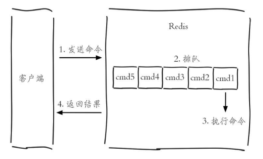


### 1.2.1. redis-cli和redis-server

* redis-cli
    * redis-cli -p 3306指定连接的端⼝
    * redis-cli -h 127.0.0.1指定连接的host
    * 如果没有-p、-h,默认连接127.0.0.1：6379
    * redis-cli -c以集群⽅式运⾏
    * redis-cli -r 3 ping指定执⾏命令的次数
    * redis-cli -r 3 -i 1 ping,指定每隔1秒执⾏⼀次命令，必须和-r⼀起使⽤，毫秒则为 -i 0.05
    * -a
        * 如果Redis配置了密码，可以⽤-a（auth）选项，有了这个选项就不需要⼿动输⼊auth命令
    * --scan和--pattern
        * --scan选项和--pattern选项⽤于扫描指定模式的键，相当于使⽤scan命令
    * --slave
        * --slave选项是把当前客户端模拟成当前Redis服务器节点的从节点，可以⽤来获取当前Redis节点的更新操作
        * 可以⽤来查看其他客户端对服务器的修改
    * -rdb
        * --rdb选项会请求Redis实例⽣成并发送RDB持久化⽂件，保存在本地。可使⽤它做持久化⽂件的定期备份。
    * --pipe
        * --pipe选项⽤于将命令封装成Redis通信协议定义的数据格式，批量发送给Redis执⾏
    * redis-cli SHUTDOWN，先断开所有客户端连接，然后根据配置执⾏持久化，最后完成退出
* redis-server
    * redis-server --test-memory 1024 #操作检测当前操作系统能否提供1G的内存给Redis
    * redis-server除了启动Redis外，还有⼀个--test-memory选项。redis-server --test-memory可以⽤来检测当前操作系统能否稳定地分配指定容量的内存给Redis，通过这种检测可以有效避免因为内存问题造成Redis崩溃

redis的配置既可以通过配置⽂件进⾏配置，也可以通过客户端命令来进⾏配置

```yml
config set slowlog-max-len 1000
#持久化到配置文件
config rewrite
```

### 1.2.2. Redis 性能测试

redis提供了性能测试工具redis-benchmark
```yml
redis-benchmark [option] [option value]

```

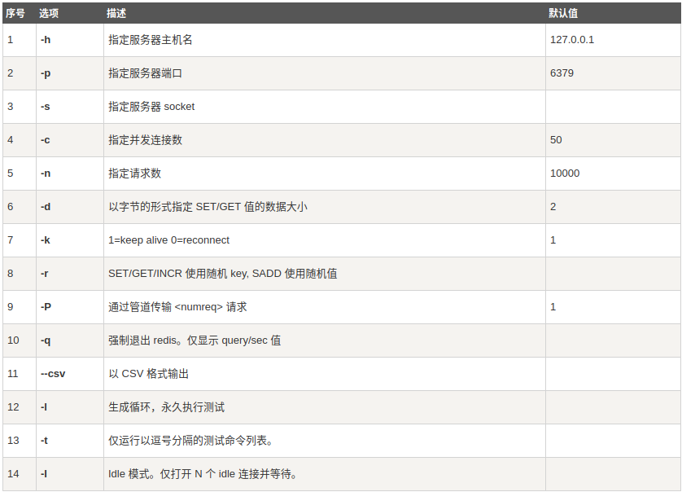


```yml
#以下实例同时执行 10000 个请求来检测性能：
./redis-benchmark -n 10000  -q
PING_INLINE: 75757.58 requests per second
PING_BULK: 77519.38 requests per second
SET: 64516.13 requests per second
GET: 67567.57 requests per second
INCR: 78125.00 requests per second
LPUSH: 73529.41 requests per second
RPUSH: 64516.13 requests per second
LPOP: 76335.88 requests per second
RPOP: 79365.08 requests per second
SADD: 76335.88 requests per second
HSET: 80000.00 requests per second
SPOP: 79365.08 requests per second
LPUSH (needed to benchmark LRANGE): 76923.08 requests per second
LRANGE_100 (first 100 elements): 76923.08 requests per second
LRANGE_300 (first 300 elements): 68027.21 requests per second
LRANGE_500 (first 450 elements): 76335.88 requests per second
LRANGE_600 (first 600 elements): 75187.97 requests per second
MSET (10 keys): 65789.48 requests per second

#测试set
./redis-benchmark -t set -q 
SET: 72568.94 requests per second

#以管道方式测试set
./redis-benchmark -t set -P 2  -q 
SET: 156739.81 requests per second


```

### 1.2.3. 多数据库

redis是⼀个字典结构的存储服务器，⽽实际上⼀个redis实例提供了多个⽤来存储数据的字典，客户端可以指定将数据存储在哪个字典中，类似于多数据库的概念，实际上并不是存在多个数据库，⽽是存在多个存储字典，每个字典可以理解为⼀个独⽴的数据库。每个数据库对外都是⼀个以0开始的递增命名。默认⽀持16个，可以修改参数databases来修改。客户端默认连接的是0号数据库。可以通过命令select no.进⾏选择。常规的读写命令是针对单个数据库的。但是有些命令是针对所有数据库有效，⽐如清除命令FLUSHHALL.实际使⽤中，应该不同的应⽤使⽤不同的redis实例，⽽不应该使⽤不同的数据库进⾏隔离。

### 1.2.4. 基本数据类型

<a href="#menu"  >目录</a> 

|类型	|结构存储的值|
|---|---|
|String |字符串，整数，或者浮点数
|List	|⼀个链表，链表上每个节点都包含了⼀个字符串
|Hash |包含键值对的⽆序散列表
|Set	|包含字符串的⽆序收集器，并且每个字符串都是独⼀⽆⼆的
|ZSet |包含字符串的有序收集器，并且每个字符串都是独⼀⽆⼆的


### 1.2.5. 字符串

* SET
    * SET key value [EX seconds] [PX milliseconds] [NX|XX]
        * EX second：设置键的过期时间为 second秒。SET key value EX second效果等同于SETEX key second value。
        * PX millisecond：设置键的过期时间为millisecond毫秒。SET key value PX millisecond效果等同于 PSETEX key millisecond value。
        * NX：只在键不存在时，才对键进⾏设置操作。SET key value NX效果等同于 SETNX keyvalue。
        * XX：只在键已经存在时，才对键进⾏设置操作将字符串值 value关联到 key。
        * 因为 SET命令可以通过参数来实现和 SETNX、SETEX和 PSETEX三个命令的效果，所以将来的Redis版本可能会废弃并最终移除 SETNX、SETEX和 PSETEX这三个命令
        * SET key-with-expire-time "hello" EX 10086
* SETBIT
    * SETBIT key offset value
    * offset参数必须⼤于或等于 0，⼩于 2^32 (bit映射被限制在 512 MB之内)。
    * 返回值:指定偏移量原来储存的位
    * SETBIT bit 10086 1
* SETEX
    * SETEX key seconds value
    * SETEX cache_user_id 60 10086
* SETNX
    * SETNX key value
    * 将 key的值设为 value，当且仅当 key不存在。
* SETRANGE
    * SETRANGE key offset value
    * ⽤ value参数覆写(overwrite)给定 key所储存的字符串值，从偏移量 offset开始。
    * SETRANGE命令会确保字符串⾜够⻓以便将 value设置在指定的偏移量上，如果给定 key原来储存的字符串⻓度⽐偏移量⼩(⽐如字符串只有 5个字符⻓，但你设置的 offset是 10 )，那么原字符和偏移量之间的空⽩将⽤零字节(zerobytes, "\x00" )来填充
    * 返回值:被 SETRANGE修改之后，字符串的⻓度。
* APPEND
    * 如果 key已经存在并且是⼀个字符串，APPEND命令将 value追加到 key原来的值的末尾。
    * 如果 key不存在，APPEND就简单地将给定 key设为 value，就像执⾏ SET key value⼀样。
    * 追加 value之后，key中字符串的⻓度。
    * 例⼦: APPEND myphone "nokia"
* BITCOUNT
    * BITCOUNT key [start] [end]
    * 计算给定字符串中，被设置为 1的⽐特位的数量。
* BITOP
    * BITOP operation destkey key [key ...]
    * 对⼀个或多个保存⼆进制位的字符串 key进⾏位元操作，并将结果保存到 destkey上。
    * operation可以是 AND、OR、NOT、XOR这四种操作中的任意⼀种：
        * BITOP AND destkey key [key ...]，对⼀个或多个 key求逻辑并，并将结果保存到 destkey。
        * BITOP OR destkey key [key ...]，对⼀个或多个 key求逻辑或，并将结果保存到 destkey。
        * BITOP XOR destkey key [key ...]，对⼀个或多个 key求逻辑异或，并将结果保存到destkey。
        * BITOP NOT destkey key，对给定 key求逻辑⾮，并将结果保存到 destkey。
* DECR
    * DECR key
    * 将 key中储存的数字值减⼀。
    * 如果 key不存在，那么 key的值会先被初始化为 0，然后再执⾏ DECR操作。
    * 如果值包含错误的类型，或字符串类型的值不能表⽰为数字，那么返回⼀个错误
* DECRBY
    * DECRBY key decrement
    * 将 key所储存的值减去减量 decrement。
    * 如果 key不存在，那么 key的值会先被初始化为 0，然后再执⾏ DECRBY操作。
    * 如果值包含错误的类型，或字符串类型的值不能表⽰为数字，那么返回⼀个错误。
* INCR
* INCRBY
* INCRBYFLOAT
    * INCRBYFLOAT key increment
    * 为 key中所储存的值加上浮点数增量 increment。
    * 如果 key不存在，那么 INCRBYFLOAT会先将 key的值设为 0，再执⾏加法操作。
    * 如果命令执⾏成功，那么 key的值会被更新为（执⾏加法之后的）新值，并且新值会以字符串的形式返回给调⽤者。
* GET
* GETBIT
* GETBIT key offset
    * 对 key所储存的字符串值，获取指定偏移量上的位(bit)。
    * 当 offset⽐字符串值的⻓度⼤，或者 key不存在时，返回 0。
* GETRANGE
    * GETRANGE key start end
    * 返回 key中字符串值的⼦字符串，字符串的截取范围由 start和 end两个偏移量决定(包括 start和end在内)。
    * 负数偏移量表⽰从字符串最后开始计数，-1表⽰最后⼀个字符，-2表⽰倒数第⼆个，以此类推。
* GETSET
    * GETSET key value
    * 将给定 key的值设为 value，并返回 key的旧值(old value)。
* MGET
    * MGET key [key ...]
    * 返回所有(⼀个或多个)给定 key的值。
    * 如果给定的 key⾥⾯，有某个 key不存在，那么这个 key返回特殊值 nil。因此，该命令永不失败。
* MSET
    * MSET key value [key value ...]
    * 同时设置⼀个或多个 key-value对。
* MSETNX
    * MSETNX key value [key value ...]
    * 同时设置⼀个或多个 key-value对，当且仅当所有给定 key都不存在。
    * 即使只有⼀个给定 key已存在，MSETNX也会拒绝执⾏所有给定 key的设置操作。
* PSETEX
    * 这个命令和 SETEX命令相似，但它以毫秒为单位设置 key的⽣存时间，⽽不是像 SETEX命令那样，以秒为单位。
* STRLEN
    * STRLEN key
    *　返回 key所储存的字符串值的⻓度。

### 1.2.6. 列表

* BLPOP
    * BLPOP key [key ...] timeout
    * 它是 LPOP命令的阻塞版本，当给定列表内没有任何元素可供弹出的时候，连接将被 BLPOP命令阻塞，直到等待超时或发现可弹出元素为⽌。
    * 当给定多个 key参数时，按参数 key的先后顺序依次检查各个列表，弹出第⼀个⾮空列表的头元素。
* BRPOP
    * BRPOP key [key ...] timeout
    * BRPOP是列表的阻塞式(blocking)弹出原语。
* RPOPLPUSH
    * RPOPLPUSH source destination
    * 命令 RPOPLPUSH在⼀个原⼦时间内，执⾏以下两个动作：
        * 将列表 source中的最后⼀个元素(尾元素)弹出，并返回给客户端。
        * 将source弹出的元素插⼊到列表 destination，作为 destination列表的的头元素。
* BRPOPLPUSH
    * BRPOPLPUSH source destination timeout
    * BRPOPLPUSH是 RPOPLPUSH的阻塞版本，当给定列表 source不为空时，BRPOPLPUSH的表现和 RPOPLPUSH⼀样。
* LINDEX
    * LINDEX key index
    * 返回列表 key中，下标为 index的元素。
* LINSERT
    * LINSERT key BEFORE|AFTER pivot value
    * 将值 value插⼊到列表 key当中，位于值 pivot之前或之后。
    * 当 pivot不存在于列表 key时，不执⾏任何操作。
    * 当 key不存在时，key被视为空列表，不执⾏任何操作。
    * 如果 key不是列表类型，返回⼀个错误。
* LLEN
    * LLEN key
    * 返回列表 key的⻓度。
    * 如果 key不存在，则 key被解释为⼀个空列表，返回 0 .
    * 如果 key不是列表类型，返回⼀个错误。
* LPOP
    * LPOP key
    * 移除并返回列表 key的头元素。
* LPUSH
    * LPUSH key value [value ...]
    * 将⼀个或多个值 value插⼊到列表 key的表头
    * 如果 key不存在，⼀个空列表会被创建并执⾏ LPUSH操作。
* LPUSHX
    * LPUSHX key value
    * 将值 value插⼊到列表 key的表头，当且仅当 key存在并且是⼀个列表。
    * 和 LPUSH命令相反，当 key不存在时，LPUSHX命令什么也不做。
* RPUSH
    * RPUSH key value [value ...]
    * 将⼀个或多个值 value插⼊到列表 key的表尾(最右边)
* RPUSHX
    * RPUSHX key value
    * 将值 value插⼊到列表 key的表尾，当且仅当 key存在并且是⼀个列表。
    * 和 RPUSH命令相反，当 key不存在时，RPUSHX命令什么也不做。
* LRANGE
    * LRANGE key start stop
    * 返回列表 key中指定区间内的元素，区间以偏移量 start和 stop指定。
* LREM
    * LREM key count value
    * 根据参数 count的值，移除列表中与参数 value相等的元素。
    * count的值可以是以下⼏种：
        * count > 0 :从表头开始向表尾搜索，移除与 value相等的元素，数量为 count。
        * count < 0 :从表尾开始向表头搜索，移除与 value相等的元素，数量为 count的绝对值。
        * count = 0 :移除表中所有与 value相等的值。
* LSET
    * LSET key index value
    * 将列表 key下标为 index的元素的值设置为 value。
* LTRIM
    * LTRIM key start stop
    * 对⼀个列表进⾏修剪(trim)，就是说，让列表只保留指定区间内的元素，不在指定区间之内的元素都将被删除。
* RPOP
    * RPOP key
    * 移除并返回列表 key的尾元素。

**使⽤场景**
* lpush+lpop=Stack（栈）
* lpush+rpop=Queue（队列）
* lpush+ltrim=Capped Collection（有限集合）
* lpush+brpop=Message Queue（消息队列）
* 消息队列
  * 可作为简单的消息队列，同时还可以使⽤阻塞读写
* ⽂章列表

### 1.2.7. 散列

<a href="#menu"  >目录</a> 

* HDEL
    * HDEL key field [field ...]
    * 删除哈希表 key中的⼀个或多个指定域，不存在的域将被忽略。
    * 返回值:被成功移除的域的数量，不包括被忽略的域。
* HEXISTS
    * HEXISTS key field
    * 查看哈希表 key中，给定域 field是否存在。
    * 返回值：
        * 如果哈希表含有给定域，返回 1。
        * 如果哈希表不含有给定域，或 key不存在，返回 0。
* HGET
    * HGET key field
    * 返回哈希表 key中给定域 field的值。不存在时，返回 nil。
* HGETALL
    * HGETALL key
    * 返回哈希表 key中，所有的域和值。
    * 在返回值⾥，紧跟每个域名(field name)之后是域的值(value)，所以返回值的⻓度是哈希表⼤⼩的两倍。
    * 返回值⽐较多时，有阻塞的可能性
* HINCRBY
    * HINCRBY key field increment
    * 为哈希表 key中的域 field的值加上增量 increment。
* HINCRBYFLOAT
* HKEYS
    * HKEYS key返回哈希表 key中的所有域。
    * HMSET website google www.google.com yahoo www.yahoo.com
    * HKEYS website --> 1) "google" 2) "yahoo"
* HLEN
    * HLEN key
    * 返回哈希表 key中域的数量。
* HMGET
    * HMGET key field [field ...]
    * 返回哈希表 key中，⼀个或多个给定域的值
* HMSET
    * HMSET key field value [field value ...]
    * 同时将多个 field-value (域-值)对设置到哈希表 key中。
* HSET
    * HSET key field value
    * 将哈希表 key中的域 field的值设为 value。
* HSETNX
    * HSETNX key field value
    * 将哈希表 key中的域 field的值设置为 value，当且仅当域 field不存在
* HVALS
    * HVALS key
    * 返回哈希表 key中所有域的值。

散列表可以⽤于存储对象信息，⽐如⽤户信息
```yml
hset userInfo user:10012 name libai
hset userInfo user:10012 age 17
hset userInfo user:10012 address guangdong

hset userInfo user:10034 name zhangfei
hset userInfo user:10034 age 27
hset userInfo user:10034 address guangdong
```

哈希类型是稀疏的，⽽关系型数据库是完全结构化的,每个键可以有不同的field,关系型数据库可以做复杂的关系查询，⽽Redis去模拟关系型复杂查询开发困难，维护成本⾼

其他存储⽤户信息的⽅式


```yml
#set方式，缺点:占用较多的键，内存占用较多。
set user:10012:name libai
set user:10012:age 17

#先序列化再set,修改麻烦，每次修改都要反序列化和序列化
set user:10012 serialize(user)
```


### 1.2.8. 集合

集合（set）类型也是⽤来保存多个的字符串元素，但和列表类型不⼀样的是，集合中不允许有重复元素，并且集合中的元素是⽆序的，不能通过索引下标获取元素。⼀个集合最多可以存储232-1个元素。Redis除了⽀持集合内的增删改查，同时还⽀持多个集合取交集、并集、差集，合理地使⽤好集合类型，能在实际开发中解决很多实际问题。

* SADD
    * SADD key member [member ...]
    * 将⼀个或多个member元素加⼊到集合 key当中，已经存在于集合的member元素将被忽略。
* SCARD
    * SCARD key
    * 返回集合 key的基数(集合中元素的数量)。
* SDIFF
    * SDIFF key [key ...]
    * 返回⼀个集合的全部成员，该集合是所有给定集合之间的差集。
    * 不存在的 key被视为空集
    * 返回值:差集成员的列表。
```yml
redis> SMEMBERS peter's_movies
1) "bet man"
2) "start war"
3) "2012"

redis> SMEMBERS joe's_movies
1) "hi, lady"
2) "Fast Five"
3) "2012"

redis> SDIFF peter's_movies joe's_movies
1) "bet man"
2) "start war"
```
* SDIFFSTORE
    * SDIFFSTORE destination key [key ...]
    * 这个命令的作⽤和 SDIFF类似，但它将结果保存到 destination集合，⽽不是简单地返回结果集。
    * 如果 destination集合已经存在，则将其覆盖。
    * destination可以是 key本⾝
    * 返回值:结果集中的元素数量。
* SINTER
    * SINTER key [key ...]
    * 返回⼀个集合的全部成员，该集合是所有给定集合的交集。
    * 不存在的 key被视为空集。
    * 当给定集合当中有⼀个空集时，结果也为空集(根据集合运算定律)。
    * 返回值:交集成员的列表

* SINTERSTORE
    * SINTERSTORE destination key [key ...]
    * 这个命令类似于 SINTER命令，但它将结果保存到 destination集合，⽽不是简单地返回结果集。
    * 如果 destination集合已经存在，则将其覆盖。
    * destination可以是 key本⾝
    * 返回值:结果集中的成员数量。
* SUNION
    * SUNION key [key ...]
    * 返回⼀个集合的全部成员，该集合是所有给定集合的并集。
* SUNIONSTORE
    * SUNIONSTORE destination key [key ...]
    * 这个命令类似于 SUNION命令，但它将结果保存到 destination集合，⽽不是简单地返回结果集。
* SISMEMBER
    * SISMEMBER key member
    * 判断member元素是否集合 key的成员。
* SMEMBERS
    * SMEMBERS key
    * 返回集合 key中的所有成员。
    * 不存在的 key被视为空集合
* SMOVE
    * SMOVE source destination member
    * 将member元素从 source集合移动到 destination集合
* SPOP
    * SPOP key
    * 移除并返回集合中的⼀个随机元素。
    * 如果只想获取⼀个随机元素，但不想该元素从集合中被移除的话，可以使⽤ SRANDMEMBER命令
* SRANDMEMBER
* SREM
    * SREM key member [member ...]
    * 移除集合 key中的⼀个或多个member元素，不存在的member元素会被忽略

使⽤场景
* 标签−多个⽤户
* ⽤户−多个标签
* 共同兴趣∕共同关注(交集)

### 1.2.9. 有序集合


有序集合中的元素不能重复，但是score可以重复
* ZADD
    * ZADD key score member [[score member] [score member] ...]
    * 将⼀个或多个member元素及其 score值加⼊到有序集 key当中。
    * score值可以是整数值或双精度浮点数。
    * 返回值:被成功添加的新成员的数量，不包括那些被更新的、已经存在的成员。
```yml
redis> ZADD page_rank 10 google.com
(integer) 1
```
* ZCARD
    * ZCARD key
    * 返回有序集 key的数量。
* ZCOUNT
    * ZCOUNT key min max
    * 返回有序集 key中，score值在min和max之间(默认包括 score值等于min或max )的成员的数量。
* ZINCRBY
    * ZINCRBY key increment member
    * 为有序集 key的成员member的 score值加上增量 increment.increment可为赋值
* ZRANGE
    * ZRANGE key start stop [WITHSCORES]
    * 返回有序集 key中，指定区间内的成员。
    * 其中成员的位置按 score值递增(从⼩到⼤)来排序。
    * 具有相同 score值的成员按字典序(lexicographical order )来排列。
    * 如果你需要成员按 score值递减(从⼤到⼩)来排列，请使⽤ ZREVRANGE命令。
    * 下标参数 start和 stop都以 0为底，也就是说，以 0表⽰有序集第⼀个成员，以 1表⽰有序集第⼆个成员，以此类推。
    * 你也可以使⽤负数下标，以 -1表⽰最后⼀个成员，-2表⽰倒数第⼆个成员，以此类推。
    * 超出范围的下标并不会引起错误。
        * ⽐如说，当 start的值⽐有序集的最⼤下标还要⼤，或是 start > stop时，ZRANGE命令只是简单地返回⼀个空列表。
        * 另⼀⽅⾯，假如 stop参数的值⽐有序集的最⼤下标还要⼤，那么 Redis将 stop当作最⼤下标来处理。
    * 可以通过使⽤WITHSCORES选项，来让成员和它的 score值⼀并返回，返回列表以value1,score1, ..., valueN,scoreN的格式表⽰。
* ZRANGEBYSCORE
    * ZRANGEBYSCORE key min max [WITHSCORES] [LIMIT offset count]
    * 返回有序集 key中，所有 score值介于min和max之间(包括等于min或max )的成员。有序集成员按 score值递增(从⼩到⼤)次序排列。
    * 具有相同 score值的成员按字典序(lexicographical order)来排列(该属性是有序集提供的，不需要额外的计算)。
    * 可选的 LIMIT参数指定返回结果的数量及区间(就像SQL中的 SELECT LIMIT offset, count )，注意当offset很⼤时，定位 offset的操作可能需要遍历整个有序集，此过程最坏复杂度为O(N)时间。
    * 可选的WITHSCORES参数决定结果集是单单返回有序集的成员，还是将有序集成员及其 score值⼀起返回。
    * 区间及⽆限
        * min和max可以是 -inf和 +inf，这样⼀来，你就可以在不知道有序集的最低和最⾼ score值的情况下，使⽤ ZRANGEBYSCORE这类命令。
        * 默认情况下，区间的取值使⽤闭区间 (⼩于等于或⼤于等于)，你也可以通过给参数前增加 (符号来使⽤可选的开区间 (⼩于或⼤于)。举个例⼦：
```yml
ZRANGEBYSCORE zset (1 5
返回所有符合条件 1 < score <= 5 的成员，而

ZRANGEBYSCORE zset (5 (10
则返回所有符合条件 5 < score < 10 的成员

redis> ZRANGEBYSCORE salary -inf +inf	# 显示整个有序集
redis> ZRANGEBYSCORE salary -inf +inf WITHSCORES	# 显示整个有序集及成员的
score 值
redis> ZRANGEBYSCORE salary -inf 5000 WITHSCORES	# 显示工资 <=5000 的所有
成员
redis> ZRANGEBYSCORE salary (5000 400000	# 显示工资大于 5000 小于等
于 400000 的成员

```

* ZRANK
    * ZRANK key member
    * 返回有序集 key中成员member的排名。其中有序集成员按 score值递增(从⼩到⼤)顺序排列。
    * 排名以 0为底，也就是说，score值最⼩的成员排名为 0。
* ZREM
    * ZREM key member [member ...]
    * 移除有序集 key中的⼀个或多个成员，不存在的成员将被忽略。
* ZREMRANGEBYRANK
    * ZREMRANGEBYRANK key start stop
    * 移除有序集 key中，指定排名(rank)区间内的所有成员。
    * 区间分别以下标参数 start和 stop指出，包含 start和 stop在内
    * 下标参数 start和 stop都以 0为底
* ZREMRANGEBYSCORE
    * ZREMRANGEBYSCORE key min max
    * 移除有序集 key中，所有 score值介于min和max之间(包括等于min或max )的成员。
* ZREVRANGE
    * ZREVRANGE key start stop [WITHSCORES]
    * 返回有序集 key中，指定区间内的成员。
    * 其中成员的位置按 score值递减(从⼤到⼩)来排列。
    * 具有相同 score值的成员按字典序的逆序(reverse lexicographical order)排列。
    * 除了成员按 score值递减的次序排列这⼀点外，ZREVRANGE命令的其他⽅⾯和 ZRANGE命令⼀样。
* ZREVRANGEBYSCORE
    * ZREVRANGEBYSCORE key max min [WITHSCORES] [LIMIT offset count]
    * 返回有序集 key中，score值介于max和min之间(默认包括等于max或min )的所有的成员。有序集成员按 score值递减(从⼤到⼩)的次序排列。
    * 具有相同 score值的成员按字典序的逆序(reverse lexicographical order )排列。
    * 除了成员按 score值递减的次序排列这⼀点外，ZREVRANGEBYSCORE命令的其他⽅⾯和
    * ZRANGEBYSCORE命令⼀样
* ZREVRANK
    * ZREVRANK key member
    * 返回有序集 key中成员member的排名。其中有序集成员按 score值递减(从⼤到⼩)排序。
    * 排名以 0为底，也就是说，score值最⼤的成员排名为 0。
    * 使⽤ ZRANK命令可以获得成员按 score值递增(从⼩到⼤)排列的排名
* ZSCORE
    * ZSCORE key member
    * 如果member元素不是有序集 key的成员，或 key不存在，返回 nil。
* ZUNIONSTORE
    * ZUNIONSTORE destination numkeys key [key ...] [WEIGHTS weight [weight ...]] [AGGREGATESUM|MIN|MAX]
    * 计算给定的⼀个或多个有序集的并集，其中给定 key的数量必须以 numkeys参数指定，并将该并集(结果集)储存到 destination。
    * 默认情况下，结果集中某个成员的 score值是所有给定集下该成员 score值之和。
* WEIGHTS
    * 使⽤WEIGHTS选项，你可以为每个给定有序集分别指定⼀个乘法因⼦(multiplicationfactor)，每个给定有序集的所有成员的 score值在传递给聚合函数(aggregation function)之前都要先乘以该有序集的因⼦。
    * 如果没有指定WEIGHTS选项，乘法因⼦默认设置为 1。
* AGGREGATE
    * 使⽤ AGGREGATE选项，你可以指定并集的结果集的聚合⽅式。
    * 默认使⽤的参数 SUM，可以将所有集合中某个成员的 score值之和作为结果集中该成员的score值；使⽤参数MIN，可以将所有集合中某个成员的最⼩ score值作为结果集中该成员的 score值；⽽参数MAX则是将所有集合中某个成员的最⼤ score值作为结果集中该成员的 score值。
* ZINTERSTORE
    * ZINTERSTORE destination numkeys key [key ...] [WEIGHTS weight [weight ...]] [AGGREGATE SUM|MIN|MAX]
    * 计算给定的⼀个或多个有序集的交集，其中给定 key的数量必须以 numkeys参数指定，并将该交集(结果集)储存到 destination。
    * 默认情况下，结果集中某个成员的 score值是所有给定集下该成员 score值之和.
    * 关于WEIGHTS和 AGGREGATE选项的描述，参⻅ ZUNIONSTORE命令。

列表，集合，有序集合的异同

|数据结构| 是否允许重复元素| 是否有序 |有序实现⽅式 应⽤场景
|---|---|---|---|
|列表	|是	|是	|索引下标	|时间轴，消息队列
|集合	|否	|否	|⽆	|标签，社交
|有序集合 |否	|是	|scope	|排⾏榜，社交

### 1.2.10. HyperLogLog去重计数⽅案

HyperLogLog提供不精确的去重计数⽅案，虽然不精确但是也不是⾮常不精确，标准误差是 0.81%.可以⽤这个来实现每⽇的登录⽤户计数。

**命令**
* pfadd 添加
    * pfadd key element [element …]
* pfcount 计算元素数
    * pfcount key [key …]
* pfmerge　合并
    * pfmerge destkey sourcekey [sourcekey ...]

##### 1.2.10.0.1. 基本使⽤


使⽤set集合实现去重

使⽤sadd添加数据，使⽤scard进⾏计数。
```yml
127.0.0.1:6379> sadd uv-key user1
(integer) 1
127.0.0.1:6379> sadd uv-key user2
(integer) 1
127.0.0.1:6379> sadd uv-key user3
(integer) 1
127.0.0.1:6379> sadd uv-key user1
(integer) 0
127.0.0.1:6379> scard uv-key
(integer) 3
```


使⽤HyperLogLog实现去重
```yml
127.0.0.1:6379> pfadd uv-key1 user1
(integer) 1
127.0.0.1:6379> pfadd uv-key1 user2
(integer) 1
127.0.0.1:6379> pfadd uv-key1 user4
(integer) 1
127.0.0.1:6379> pfadd uv-key1 user3
(integer) 1
127.0.0.1:6379> pfcount uv-key1
(integer) 4
```

使⽤set集合的问题是占⽤的空间⽐较⼤，当数据量⾮常⼤时，占⽤的空间是⾮常可观的。在100万数据的情况下，两者使用的空间可达到84M:15k. HyperLogLog虽然不精确，但是相对节省很多的空间。所以使用上如果对精确度要求不高，可以选用HyperLogLog。比如每天的用户登录数，对于误差0.81%是可以接受的。


#### 1.2.10.1. 实现原理

Redis对 HyperLogLog的存储进⾏了优化，在计数⽐较⼩时，它的存储空间采⽤稀疏矩阵存储，空间占⽤很⼩，仅仅在计数慢慢变⼤，稀疏矩阵占⽤空间渐渐超过了阈值时才会⼀次性转变成稠密矩阵，才会占⽤ 12k的空间。

### 1.2.11. BITMAP

<a href="#menu"  >目录</a> 

#### 1.2.11.1. 基本操作


* SETBIT
    * SETBIT key offset value
    * offset参数必须⼤于或等于 0，⼩于 2^32 (bit映射被限制在 512 MB之内，2^32∕(8 * 1024 *1024) = 512M)。
    * 返回值:指定偏移量原来储存的位
    * value为0｜１
    * SETBIT bit 10086 1

* GETBIT
    * GETBIT key offset
    * 对 key所储存的字符串值，获取指定偏移量上的位(bit)。
    * 当 offset⽐字符串值的⻓度⼤，或者 key不存在时，返回 0。
* BITCOUNT
    * BITCOUNT key [start] [end]
    * start和end可以不用设置，其单位为字节，无法精确到offset
    * 计算给定key中，被设置为 1的⽐特位的数量。
* BITOP
    * BITOP operation destkey key [key ...]
    * 对⼀个或多个保存⼆进制位的字符串 key进⾏位元操作，并将结果保存到 destkey上。再使用BITCOUNT命令计算其中1的个数
    * operation可以是 AND、OR、NOT、XOR这四种操作中的任意⼀种：
    * BITOP AND destkey key [key ...]，对⼀个或多个 key求逻辑并，并将结果保存到 destkey。
    * BITOP OR destkey key [key ...]，对⼀个或多个 key求逻辑或，并将结果保存到 destkey。
    * BITOP XOR destkey key [key ...]，对⼀个或多个 key求逻辑异或，并将结果保存到destkey。
    * BITOP NOT destkey key，对给定 key求逻辑⾮(按位取反)，并将结果保存到 destkey。

其底层是使⽤sds中的数组来保存。

#### 1.2.11.2. 使⽤场景

由于⽤户的id是唯⼀的，因此可以利⽤BITMAP来实现以下功能。
* ⽤户周活跃
* ⽤户签到
* 在线⽤户
* 统计活跃⽤户

#### 1.2.11.3. BITCOUNT实现原理

**轮询法**

BITCOUNT⽤于对该key的值中bit为1的个数进⾏技术。常规的⽅法是循环计数，最⼤偏移量为2^32，那么就要进⾏2^32次⽅轮询计数，将会⾮常浪费性能。

注意由于SDS是动态扩容∕缩容，因此遍历的次数和最⼤偏移量有关。

**查表法**

另⼀种更省时间的做法是使⽤查表法，每次设置bit时都会将记录位数组中含１的数量。

|位数组	|bit数量|
|---|---|
|0000 0000| 56
|0000 0001| 453
|1111 1111| 45

⽐如上表总数为:56 * 0 + 453 * 1 + 45 * 8.

但是查表法需要额外的内存空间。

**汉明算法**


```cpp
public static int conut(int data){

    data = (data & 0x55555555) + ((data >>1) & 0x55555555);
    data = (data & 0x33333333) + ((data >>2) & 0x33333333);
    data = (data & 0x0F0F0F0F) + ((data >>4) & 0x0F0F0F0F);
    data = (data * (0x01010101))>>24;
}
```
汉明算法不需要额外的存储空间，只是单纯的计算操作。

REDIS实现: redis使⽤了查表和汉明算法相结合。

### 1.2.12. 布隆过滤器

<a href="#menu"  >目录</a> 

#### 1.2.12.1. 基本原理


**布隆过滤器使⽤场景**

* 原本有10亿个号码，现在⼜来了10万个号码，要快速准确判断这10万个号码是否在10亿个号码库中？
    * 解决办法⼀：将10亿个号码存⼊数据库中，进⾏数据库查询，准确性有了，但是速度会⽐较慢。
    * 解决办法⼆：将10亿号码放⼊内存中，⽐如Redis缓存中，这⾥我们算⼀下占⽤内存⼤⼩：10亿*8字节=8GB，通过内存查询，准确性和速度都有了，但是⼤约8gb的内存空间，挺浪费内存空间的。
    * 需要爬⾍的⽹站千千万万，对于⼀个新的⽹站url，我们如何判断这个url我们是否已经爬过了？
        * 解决办法还是上⾯的两种，很显然，都不太好。
    * 同理还有垃圾邮箱的过滤。

那么对于类似这种，⼤数据量集合，如何准确快速的判断某个数据是否在⼤数据量集合中，并且不占⽤内存，布隆过滤器应运⽽⽣了。

这⾥就可以使⽤布隆过滤器，它说不存在⼀定不存在，说存在不⼀定存在，也就是判断存在时是有误差的。

布隆过滤器的原理是⼀个键经过多个哈希函数获得不同的哈希值，然后使⽤bitmap存储，bitmap中该hash所在的位就设置为1.当进⾏检测是否存在时，也对请求键进⾏哈希，然后和bitmap中的数据进⾏⽐较，如果有⼀个为0，则⼀定不存在，如果全为１，就可能存在，因为不同的键会哈希到同⼀个值。

这⾥的关键是要增加哈希结果得到平均性，越平均结果越准确。

**布隆过滤器优缺点**
* 优点：优点很明显，⼆进制组成的数组，占⽤内存极少，并且插⼊和查询速度都⾜够快。
* 缺点：随着数据的增加，误判率会增加；还有⽆法判断数据⼀定存在；另外还有⼀个重要缺点，⽆法删除数据。


#### 1.2.12.2. 使⽤

编译安装
```yml
cd redis_home && mkdir modules && cd modules

git clone https://github.com/RedisLabsModules/redisbloom.gi
#编译插件
make

#配置文件配置，集群每个都要配置，配置的目录为redis-server的相对目录
loadmodule ../module/redisbloom/redisbloom.so
```

* redis布隆过滤器主要就两个命令：
    * bf.add添加元素到布隆过滤器中：bf.add urls https://jaychen.cc。
    * bf.exists判断某个元素是否在过滤器中：bf.exists urls https://jaychen.cc。

上⾯说过布隆过滤器存在误判的情况，在 redis中有两个值决定布隆过滤器的准确率：
* error_rate：允许布隆过滤器的错误率，这个值越低过滤器的位数组的⼤⼩越⼤，占⽤空间也就越⼤。
* initial_size：布隆过滤器可以储存的元素个数，当实际存储的元素个数超过这个值之后，过滤器的准确率会下降。

redis中有⼀个命令可以来设置这两个值：bf.reserve urls 0.01 100

如果不使⽤ bf.reserve，默认的error_rate是 0.01，默认的initial_size是 100。
```yml
127.0.0.1:6379> bf.add urls bbb.com
(integer) 1
127.0.0.1:6379> bf.exists urls bbb.com
(integer) 1
127.0.0.1:6379> bf.exists urls bba.com
(integer) 0
```


布隆过滤器的initial_size估计的过⼤，会浪费存储空间，估计的过⼩，就会影响准确率，⽤户在使⽤之前⼀定要尽可能地精确估计好元素数量，还需要加上⼀定的冗余空间以避免实际元素可能会意外⾼出估计值很多。

布隆过滤器的error_rate越⼩，需要的存储空间就越⼤，对于不需要过于精确的场合，error_rate设置稍⼤⼀点也⽆伤⼤雅。⽐如在新闻去重上⽽⾔，误判率⾼⼀点只会让⼩部分⽂章不能让合适的⼈看到，⽂章的整体阅读量不会因为这点误判率就带来巨⼤的改变。

对于没有相关⽅法的客户端，可以使⽤lua脚本来调⽤。

### 1.2.13. 限流

redis提供了redis cell，其实现了漏桶限流功能。

[下载地址](https://github.com/brandur/redis-cell)


### 1.2.14. 事务


Redis事务是⼀组命令的集合。事务同命令⼀样都是Redis的最⼩执⾏单位，⼀个事务的命令要么全部执⾏成功，要么全部执⾏失败。

事务的基本操作

```yml
127.0.0.1:6379> multi
OK
//发送语句
127.0.0.1:6379> set k1 1
QUEUED
127.0.0.1:6379> exec
1) OK
//提交事务
```


开始事务之后，发送给Redis的命令都会放⼊⼀个事务队列中，当提交exec命令时，将会按照提交的顺序执⾏之前的所有命令。执⾏时不会插⼊其他命令，所以这组事务中的所有命令具有原⼦性。事务中的每个命令的执⾏结果都是最后⼀起返回的，⽆法将前⼀条的命令作为下⼀条命令的参数，要实现这个功能，可以使⽤lua脚本。
* MULTI
    * 标记⼀个事务块的开始。
    * 事务块内的多条命令会按照先后顺序被放进⼀个队列当中，最后由 EXEC命令原⼦性(atomic)地执⾏。
* UNWATCH
    * 取消WATCH命令对所有 key的监视。
    * 如果在执⾏WATCH命令之后，EXEC命令或 DISCARD命令先被执⾏了的话，那么就不需要再执⾏UNWATCH了。
    * 因为 EXEC命令会执⾏事务，因此WATCH命令的效果已经产⽣了；⽽ DISCARD命令在取消事务的同时也会取消所有对 key的监视，因此这两个命令执⾏之后，就没有必要执⾏ UNWATCH了。
* WATCH
    * WATCH key [key ...]
    * 监视⼀个(或多个) key，如果在事务执⾏之前这个(或这些) key被其他命令所改动，那么事务将被打断。
* DISCARD
    * 取消事务，放弃执⾏事务块内的所有命令。
    * 如果正在使⽤WATCH命令监视某个(或某些) key，那么取消所有监视，等同于执⾏命令UNWATCH。
* EXEC
    * 执⾏所有事务块内的命令。
    * 假如某个(或某些) key正处于WATCH命令的监视之下，且事务块中有和这个(或这些) key相关的命令，那么 EXEC命令只在这个(或这些) key没有被其他命令所改动的情况下执⾏并⽣效，否则该事务被打断(abort)。

#### 1.2.14.1. 错误处理

<a href="#menu"  >目录</a> 

REDIS事务具有原⼦性、⼀致性、隔离性。当配置持久化时，事务也具有持久性。

* 导致命令执⾏错误的场景
    * 语法错误
        * 指的是指令不存在或者参数不对
        * 因为是在执⾏之前进⾏检查，只要出现语法错误，所有的命令都不会得到执⾏
    * 运⾏错误。
        * 运⾏错误指在命令执⾏时出现的错误
        * ⽐如字符串类型的命令操作列表类型的键
        * 因为在执⾏时才会发现错误，因此其他没出现错误的命令依然能够执⾏，只有错误的命令执⾏失败
* 为什么不⽀持回滚
    * 以上的两个错误在研发阶段都可以发现并解决，在⽣产环境并不会出现。并且⼀般客户端都已经封装好，并不会出现上述错误。
    * 回滚实现复杂，可能会降低吞吐量。
* 执⾏事务时服务器停机
    * 如果服务器没有持久化配置，那么数据库数据将会是空⽩的，因此也就不存在什么⼀致性问题如果配置了持久化rdb模式∕aof模式，服务器重启之后饥饿以根据现有的rdb∕aof⽂件来恢复数据，从⽽将数据库还原到⼀个⼀致的状态，如果不存在rdb⽂件，则数据库将会是空⽩的

* 由于事务是单线程处理，因此也就不存在事务并发的执⾏，也就没有了隔离性问题


#### 1.2.14.2. WATCH命令介绍

* WATCH key [key ...]
    * 监视⼀个(或多个) key，如果在事务执⾏之前这个(或这些) key被其他命令所改动，那么事务将被打断。
* UNWATCH
    * 取消WATCH命令对所有 key的监视。

由于在提交事务之前，其他客户端可能会对当前事务的键进⾏操作，因此可以使⽤WATCH对某个键进⾏监视，如果发⽣修改，事务将不会的到执⾏。


WATCH必须在事务开始之前执⾏。

watch可以实现乐观锁。


#### 1.2.14.3. 优化

上⾯的 Redis事务在发送每个指令到事务缓存队列时都要经过⼀次⽹络读写，当⼀个事务内部的指令较多时，需要的⽹络 IO时间也会线性增⻓。所以通常 Redis的客户端在执⾏事务时都会结合 pipeline⼀起使⽤，这样可以将多次 IO操作压缩为单次 IO操作。⽐如我们在使⽤ Python的 Redis客户端时执⾏事务时是要强制使⽤pipeline的。
```yml
pipe = redis.pipeline(transaction=true)
pipe.multi()
pipe.incr("books")
pipe.incr("books")
values = pipe.execute()
```

### 1.2.15. 键

* DEL
    * DEL key [key ...]
    * 删除给定的⼀个或多个 key。
    * 返回值：被删除 key的数量。
* DUMP
    * DUMP key
    * 序列化给定 key，并返回被序列化的值，使⽤ RESTORE命令可以将这个值反序列化为 Redis键。
```yml
redis> SET greeting "hello, dumping world!"
OK
redis> DUMP greeting
"\x00\x15hello, dumping world!\x06\x00E\xa0Z\x82\xd8r\xc1\xde"
```
* EXISTS
    * EXISTS key
    * 检查给定 key是否存在。
    * 返回值：若 key存在，返回 1，否则返回 0。
* EXPIRE
    * EXPIRE key seconds
    * 为给定 key设置⽣存时间，当 key过期时(⽣存时间为 0 )，它会被⾃动删除。
    * 使⽤ PERSIST命令可以在不删除 key的情况下，移除 key的⽣存时间，让 key重新成为⼀个『持久的』(persistent) key。
* EXPIREAT
    * EXPIREAT key timestamp
    * EXPIREAT的作⽤和 EXPIRE类似，都⽤于为 key设置⽣存时间。
    * 不同在于 EXPIREAT命令接受的时间参数是 UNIX时间戳(unix timestamp)。
    * 返回值：如果⽣存时间设置成功，返回 1。当 key不存在或没办法设置⽣存时间，返回 0。
* KEYS
    * KEYS pattern
    * 查找所有符合给定模式 pattern的 key。
        * '*':匹配任意个字符
        * '?':匹配⼀个字符
        * '[]':匹配括号间的任意字符，⽐如 a[ b-d ],匹配ab,ac,ad
        * '\x':匹配字符x，⽤于转义字符
```yml
KEYS * 匹配数据库中所有 key 。
KEYS h?llo 匹配 hello ， hallo 和 hxllo 等。
KEYS h*llo 匹配 hllo 和 heeeeello 等。
KEYS h[ae]llo 匹配 hello 和 hallo ，但不匹配 hillo 。
特殊符号用 \ 隔开
```


keys算法是遍历算法，复杂度是O(n)，如果实例中有千万级以上的 key，这个指令就会导致 Redis服务卡顿，所有读写 Redis的其它的指令都会被延后甚⾄会超时报错，因为Redis是单线程程序，顺序执⾏所有指令，其它指令必须等到当前的 keys指令执⾏完了才可以继续

* MIGRATE
    * MIGRATE host port key destination-db timeout [COPY] [REPLACE]
    * 将 key原⼦性地从当前实例传送到⽬标实例的指定数据库上，⼀旦传送成功，key保证会出现在⽬标实例上，⽽当前实例上的 key会被删除。
    * 这个命令是⼀个原⼦操作，它在执⾏的时候会阻塞进⾏迁移的两个实例，直到以下任意结果发⽣：迁移成功，迁移失败，等到超时。
    * 命令的内部实现是这样的：它在当前实例对给定 key执⾏ DUMP命令，将它序列化，然后传送到⽬标实例，⽬标实例再使⽤ RESTORE对数据进⾏反序列化，并将反序列化所得的数据添加到数据库中；当前实例就像⽬标实例的客户端那样，只要看到 RESTORE命令返回OK，它就会调⽤ DEL删除⾃⼰数据库上的 key。
    * timeout参数以毫秒为格式，指定当前实例和⽬标实例进⾏沟通的最⼤间隔时间。这说明操作并不⼀定要在 timeout毫秒内完成，只是说数据传送的时间不能超过这个 timeout数。
    * MIGRATE命令需要在给定的时间规定内完成 IO操作。如果在传送数据时发⽣ IO错误，或者达到了超时时间，那么命令会停⽌执⾏，并返回⼀个特殊的错误：IOERR。
    * 当 IOERR出现时，有以下两种可能：
        * key可能存在于两个实例
        * key可能只存在于当前实例
        * 唯⼀不可能发⽣的情况就是丢失 key，因此，如果⼀个客户端执⾏MIGRATE命令，并且不幸遇上 IOERR错误，那么这个客户端唯⼀要做的就是检查⾃⼰数据库上的 key是否已经被正确地删除。
    * 如果有其他错误发⽣，那么MIGRATE保证 key只会出现在当前实例中。（当然，⽬标实例的给定数据库上可能有和 key同名的键，不过这和MIGRATE命令没有关系）。
    * 可选项：
        * COPY：不移除源实例上的 key。
        * REPLACE：替换⽬标实例上已存在的 key。
* MOVE
    * MOVE key db
    * 将当前数据库的 key移动到给定的数据库 db当中。
    * 如果当前数据库(源数据库)和给定数据库(⽬标数据库)有相同名字的给定 key，或者 key不存在于当前数据库，那么MOVE没有任何效果
    * 返回值：移动成功返回 1，失败则返回 0。
* OBJECT subcomand key
    * subcomand = encoding ：返回值的编码方式
    * subcomand = freq，返回 访问频率
    * subcomand = idletime ,空闲时间
    * subcomand = refcount,返回对象引用数　
* PERSIST
    * PERSIST key
    * 移除给定 key的⽣存时间，将这个 key从『易失的』(带⽣存时间 key )转换成『持久的』(⼀个不带⽣存时间、永不过期的 key )。
* PEXPIRE
    * PEXPIRE key milliseconds
    * 这个命令和 EXPIRE命令的作⽤类似，但是它以毫秒为单位设置 key的⽣存时间，⽽不像 EXPIRE命令那样，以秒为单位。
* PEXPIREAT
    * PEXPIREAT key milliseconds-timestamp
    * 这个命令和 EXPIREAT命令类似，但它以毫秒为单位设置 key的过期 unix时间戳，⽽不是像EXPIREAT那样，以秒为单位。
* PTTL
    * PTTL key
    * 这个命令类似于 TTL命令，但它以毫秒为单位返回 key的剩余⽣存时间，⽽不是像 TTL命令那样，以秒为单位。
* RANDOMKEY
    * 从当前数据库中随机返回(不删除)⼀个 key。
* RENAME
    * RENAME key newkey
    * 将 key改名为 newkey。
        * 当 key和 newkey相同，或者 key不存在时，返回⼀个错误。
        * 当 newkey已经存在时，RENAME命令将覆盖旧值
* RENAMENX
    * RENAMENX key newkey
    * 当且仅当 newkey不存在时，将 key改名为 newkey。
    * 当 key不存在时，返回⼀个错误。
* RESTORE
* TTL
    * TTL key
    * 以秒为单位，返回给定 key的剩余⽣存时间(TTL, time to live)。
* TYPE
    * TYPE key
    * 返回 key所储存的值的类型。
    * 返回值：
        * none (key不存在)
        * string (字符串)
        * list (列表)
        * set (集合)
        * zset (有序集)
        * hash (哈希表)

#### 1.2.15.1. SCAN

<a href="#menu"  >目录</a> 

* SCAN cursor [MATCH pattern] [COUNT count]
* SCAN命令及其相关的 SSCAN命令、HSCAN命令和 ZSCAN命令都⽤于增量地迭代（incrementallyiterate）⼀集元素（a collection of elements）：
    * SCAN命令⽤于迭代当前数据库中的数据库键。
    * SSCAN命令⽤于迭代集合键中的元素。
    * HSCAN命令⽤于迭代哈希键中的键值对。
    * ZSCAN命令⽤于迭代有序集合中的元素（包括元素成员和元素分值）。以上列出的四个命令都⽀持增量式迭代，它们每次执⾏都只会返回少量元素，所以这些命令可以⽤于⽣产环境，⽽不会出现像 KEYS命令、SMEMBERS命令带来的问题——当 KEYS命令被⽤于处理⼀个⼤的数据库时，⼜或者 SMEMBERS命令被⽤于处理⼀个⼤的集合键时，它们可能会阻塞服务器达数秒之久。

不过，增量式迭代命令也不是没有缺点的：举个例⼦，使⽤ SMEMBERS命令可以返回集合键当前包含的所有元素，但是对于 SCAN这类增量式迭代命令来说，因为在对键进⾏增量式迭代的过程中，键可能会被修改，所以增量式迭代命令只能对被返回的元素提供有限的保证（offer limited guarantees about the returned
elements）。

因为 SCAN、SSCAN、HSCAN和 ZSCAN四个命令的⼯作⽅式都⾮常相似，所以这个⽂档会⼀并介绍这四个命令，但是要记住：

* SSCAN命令、HSCAN命令和 ZSCAN命令的第⼀个参数总是⼀个数据库键。
*　⽽ SCAN命令则不需要在第⼀个参数提供任何数据库键——因为它迭代的是当前数据库中的所有数据库键。

scan相⽐keys具备有以下特点:

1. 复杂度虽然也是O(n)，但是它是通过游标分步进⾏的，不会阻塞线程;
2. 提供 limit参数，可以控制每次返回结果的最⼤条数，limit只是⼀个 hint，返回的结果可多可少;
3. 同 keys⼀样，它也提供模式匹配功能;
4. 服务器不需要为游标保存状态，游标的唯⼀状态就是 scan返回给客户端的游标整数;
5. 返回的结果可能会有重复，需要客户端去重复，这点⾮常重要;
6. 遍历的过程中如果有数据修改，改动后的数据能不能遍历到是不确定的;
7. 单次返回的结果是空的并不意味着遍历结束，⽽要看返回的游标值是否为零;


##### 1.2.15.1.1. 基本⽤法


SCAN命令是⼀个基于游标的迭代器（cursor based iterator）：SCAN命令每次被调⽤之后，都会向⽤户返回⼀个新的游标，⽤户在下次迭代时需要使⽤这个新游标作为 SCAN命令的游标参数，以此来延续之前的迭代过程。

当 SCAN命令的游标参数被设置为 0时，服务器将开始⼀次新的迭代，⽽当服务器向⽤户返回值为 0的游标时，表⽰迭代已结束。

以下是⼀个 SCAN命令的迭代过程⽰例：

```yml
redis 127.0.0.1:6379> scan 0
1) "17"
2) 1) "key:12"
2) "key:8"
3) "key:4"
4) "key:14"
5) "key:16"
6) "key:17"
7) "key:15"
8) "key:10"
9) "key:3"
10) "key:7"
11) "key:1"

redis 127.0.0.1:6379> scan 17
1) "0"
2) 1) "key:5"
2) "key:18"
3) "key:0"
4) "key:2"
5) "key:19"
6) "key:13"
7) "key:6"
8) "key:9"
9) "key:11"
```

在上⾯这个例⼦中，第⼀次迭代使⽤ 0作为游标，表⽰开始⼀次新的迭代。

第⼆次迭代使⽤的是第⼀次迭代时返回的游标，也即是命令回复第⼀个元素的值——17。

从上⾯的⽰例可以看到，SCAN命令的回复是⼀个包含两个元素的数组，第⼀个数组元素是⽤于进⾏下⼀次迭代的新游标，⽽第⼆个数组元素则是⼀个数组，这个数组中包含了所有被迭代的元素。

在第⼆次调⽤ SCAN命令时，命令返回了游标 0，这表⽰迭代已经结束，整个数据集（collection）已经被完整遍历过了。

以 0作为游标开始⼀次新的迭代，⼀直调⽤ SCAN命令，直到命令返回游标 0，我们称这个过程为⼀次完整遍历（full iteration）。


##### 1.2.15.1.2. SCAN命令的保证


SCAN命令，以及其他增量式迭代命令，在进⾏完整遍历的情况下可以为⽤户带来以下保证：从完整遍历开始直到完整遍历结束期间，⼀直存在于数据集内的所有元素都会被完整遍历返回；这意味着，如果有⼀个元素，它从遍历开始直到遍历结束期间都存在于被遍历的数据集当中，那么 SCAN命令总会在某次迭代中将这个元素返回给⽤户。

然⽽因为增量式命令仅仅使⽤游标来记录迭代状态，所以这些命令带有以下缺点：

同⼀个元素可能会被返回多次。处理重复元素的⼯作交由应⽤程序负责，⽐如说，可以考虑将迭代返回的元素仅仅⽤于可以安全地重复执⾏多次的操作上。
如果⼀个元素是在迭代过程中被添加到数据集的，⼜或者是在迭代过程中从数据集中被删除的，那么这个元素可能会被返回，也可能不会，这是未定义的（undefined）。


##### 1.2.15.1.3. 每次执⾏返回的元素


增量式迭代命令并不保证每次执⾏都返回某个给定数量的元素。

增量式命令甚⾄可能会返回零个元素，但只要命令返回的游标不是 0，应⽤程序就不应该将迭代视作结束。

不过命令返回的元素数量总是符合⼀定规则的，在实际中：

对于⼀个⼤数据集来说，增量式迭代命令每次最多可能会返回数⼗个元素；
⽽对于⼀个⾜够⼩的数据集来说，如果这个数据集的底层表⽰为编码数据结构（encoded data
structure，适⽤于是⼩集合键、⼩哈希键和⼩有序集合键），那么增量迭代命令将在⼀次调⽤中返回数据集中的所有元素。

最后，⽤户可以通过增量式迭代命令提供的 COUNT选项来指定每次迭代返回元素的最⼤值。


##### 1.2.15.1.4. COUNT选项

虽然增量式迭代命令不保证每次迭代所返回的元素数量，但我们可以使⽤ COUNT选项，对命令的⾏为进⾏⼀定程度上的调整。

基本上，COUNT选项的作⽤就是让⽤户告知迭代命令，在每次迭代中应该从数据集⾥返回多少元素。

虽然 COUNT选项只是对增量式迭代命令的⼀种提⽰（hint），但是在⼤多数情况下，这种提⽰都是有效的。

COUNT参数的默认值为 10。


在迭代⼀个⾜够⼤的、由哈希表实现的数据库、集合键、哈希键或者有序集合键时，如果⽤户没有使⽤MATCH选项，那么命令返回的元素数量通常和 COUNT选项指定的⼀样，或者⽐ COUNT选项指定的数量稍多⼀些。
在迭代⼀个编码为整数集合（intset，⼀个只由整数值构成的⼩集合）、或者编码为压缩列表（ziplist，由不同值构成的⼀个⼩哈希或者⼀个⼩有序集合）时，增量式迭代命令通常会⽆视 COUNT选项指定的值，在第⼀次迭代就将数据集包含的所有元素都返回给⽤户。

并⾮每次迭代都要使⽤相同的 COUNT值。⽤户可以在每次迭代中按⾃⼰的需要随意改变 COUNT值，只要记得将上次迭代返回的游标⽤到下次迭代⾥⾯就可以了。


##### 1.2.15.1.5. MATCH选项


和 KEYS命令⼀样，增量式迭代命令也可以通过提供⼀个 glob⻛格的模式参数，让命令只返回和给定模式相匹配的元素，这⼀点可以通过在执⾏增量式迭代命令时，通过给定MATCH < pattern >参数来实现。

以下是⼀个使⽤MATCH选项进⾏迭代的⽰例：


```yml
redis 127.0.0.1:6379> sadd myset 1 2 3 foo foobar feelsgood
(integer) 6

redis 127.0.0.1:6379> sscan myset 0 match f*
1) "0"
2) 1) "foo"
3) "feelsgood"
4) "foobar"
```


需要注意的是，对元素的模式匹配⼯作是在命令从数据集中取出元素之后，向客户端返回元素之前的这段时间内进⾏的，所以如果被迭代的数据集中只有少量元素和模式相匹配，那么迭代命令或许会在多次执⾏中都不返回任何元素。

以下是这种情况的⼀个例⼦：


```yml
redis 127.0.0.1:6379> scan 0 MATCH *11*
1) "288"
2) 1) "key:911"

redis 127.0.0.1:6379> scan 288 MATCH *11*
1) "224"
2) (empty list or set)

redis 127.0.0.1:6379> scan 224 MATCH *11*
1) "80"
2) (empty list or set)

redis 127.0.0.1:6379> scan 80 MATCH *11*
1) "176"
2) (empty list or set)

redis 127.0.0.1:6379> scan 176 MATCH *11* COUNT 1000
1) "0"
```

如你所⻅，以上的⼤部分迭代都不返回任何元素。

在最后⼀次迭代，我们通过将 COUNT选项的参数设置为 1000，强制命令为本次迭代扫描更多元素，从⽽使得命令返回的元素也变多了。


##### 1.2.15.1.6. 并发执⾏多个迭代


在同⼀时间，可以有任意多个客户端对同⼀数据集进⾏迭代，客户端每次执⾏迭代都需要传⼊⼀个游标，并在迭代执⾏之后获得⼀个新的游标，⽽这个游标就包含了迭代的所有状态，因此，服务器⽆须为迭代记录任何状态。


##### 1.2.15.1.7. 中途停⽌迭代


因为迭代的所有状态都保存在游标⾥⾯，⽽服务器⽆须为迭代保存任何状态，所以客户端可以在中途停⽌⼀个迭代，⽽⽆须对服务器进⾏任何通知。

即使有任意数量的迭代在中途停⽌，也不会产⽣任何问题。


##### 1.2.15.1.8. 使⽤错误的游标进⾏增量式迭代


使⽤间断的（broken）、负数、超出范围或者其他⾮正常的游标来执⾏增量式迭代并不会造成服务器崩溃，但可能会让命令产⽣未定义的⾏为。

未定义⾏为指的是，增量式命令对返回值所做的保证可能会不再为真。

只有两种游标是合法的：

在开始⼀个新的迭代时，游标必须为 0。
增量式迭代命令在执⾏之后返回的，⽤于延续（continue）迭代过程的游标。


##### 1.2.15.1.9. 迭代终结的保证

增量式迭代命令所使⽤的算法只保证在数据集的⼤⼩有界（bounded）的情况下，迭代才会停⽌，换句话说，如果被迭代数据集的⼤⼩不断地增⻓的话，增量式迭代命令可能永远也⽆法完成⼀次完整迭代。

从直觉上可以看出，当⼀个数据集不断地变⼤时，想要访问这个数据集中的所有元素就需要做越来越多的⼯作，能否结束⼀个迭代取决于⽤户执⾏迭代的速度是否⽐数据集增⻓的速度更快。


#### 1.2.15.2. SORT

<a href="#menu"  >目录</a> 

SORT key [BY pattern] [LIMIT offset count] [GET pattern [GET pattern ...]] [ASC | DESC] [ALPHA]
[STORE destination]返回或保存给定列表、集合、有序集合 key中经过排序的元素。排序默认以数字作为对象，值被解释为双精度浮点数，然后进⾏⽐较。


##### 1.2.15.2.1. ⼀般SORT的⽤法

最简单的 SORT使⽤⽅法是 SORT key和 SORT key DESC：
* SORT key返回键值从⼩到⼤排序的结果。
* SORT key DESC返回键值从⼤到⼩排序的结果。假设 today_cost列表保存了今⽇的开销⾦额，那么可以⽤ SORT命令对它进⾏排序：


```yml
redis> LPUSH today_cost 30 1.5 10 8
(integer) 4

redis> SORT today_cost
1) "1.5"
2) "8"
3) "10"
4) "30"

redis 127.0.0.1:6379> SORT today_cost DESC
1) "30"
2) "10"
3) "8"
4) "1.5"
```


##### 1.2.15.2.2. 使⽤ALPHA


因为 SORT命令默认排序对象为数字，当需要对字符串进⾏排序时，需要显式地在 SORT命令之后添加
ALPHA修饰符：

```yml
redis> LPUSH website "www.reddit.com"
(integer) 1
redis> LPUSH website "www.slashdot.com"
(integer) 2
redis> LPUSH website "www.infoq.com"
(integer) 3
redis> SORT website ALPHA
1) "www.infoq.com"
2) "www.reddit.com"
3) "www.slashdot.com"
```


如果系统正确地设置了 LC_COLLATE环境变量的话，Redis能识别 UTF-8编码。


##### 1.2.15.2.3. 使⽤LIMIT


排序之后返回元素的数量可以通过 LIMIT修饰符进⾏限制，修饰符接受 offset和 count两个参数：

offset指定要跳过的元素数量。count指定跳过 offset个指定的元素之后，要返回多少个对象。以下例⼦返回排序结果的前 5个对象( offset为 0表⽰没有元素被跳过)。


```yml
# 添加测试数据，列表值为 1 指 10
redis 127.0.0.1:6379> RPUSH rank 1 3 5 7 9
(integer) 5
redis 127.0.0.1:6379> RPUSH rank 2 4 6 8 10
(integer) 10
# 返回列表中最小的 5 个值
redis 127.0.0.1:6379> SORT rank LIMIT 0 5
1) "1"
2) "2"
3) "3"
4) "4"
5) "5"
可以组合使用多个修饰符。以下例子返回从大到小排序的前 5 个对象。

redis 127.0.0.1:6379> SORT rank LIMIT 0 5 DESC
1) "10"
2) "9"
3) "8"
4) "7"
5) "6"
```


##### 1.2.15.2.4. 使⽤外部KEY


可以使⽤外部 key的数据作为权重，代替默认的直接对⽐键值的⽅式来进⾏排序。

假设现在有⽤户数据如下：

|uid |user_name_{uid} |user_level_{uid}
|---|---|---|
|1	|admin	|9999
|2	|jack	|10
|3	|peter	|25
|4	|mary	|70


以下代码将数据输⼊到 Redis中：

```yml
redis 127.0.0.1:6379> LPUSH uid 1
(integer) 1

redis 127.0.0.1:6379> SET user_name_1 admin
OK

redis 127.0.0.1:6379> SET user_level_1 9999
OK

# jack

redis 127.0.0.1:6379> LPUSH uid 2
(integer) 2

redis 127.0.0.1:6379> SET user_name_2 jack
OK

redis 127.0.0.1:6379> SET user_level_2 10
OK

redis 127.0.0.1:6379> LPUSH uid 3
(integer) 3

redis 127.0.0.1:6379> SET user_name_3 peter
OK

redis 127.0.0.1:6379> SET user_level_3 25

redis 127.0.0.1:6379> LPUSH uid 4
(integer) 4

redis 127.0.0.1:6379> SET user_name_4 mary
OK

redis 127.0.0.1:6379> SET user_level_4 70
OK
```


**BY选项**

默认情况下，SORT uid直接按 uid中的值排序：


```yml
redis 127.0.0.1:6379> SORT uid
1) "1"	# admin
2) "2"	# jack
3) "3"	# peter
4) "4"	# mary
```


通过使⽤ BY选项，可以让 uid按其他键的元素来排序。

⽐如说，以下代码让 uid键按照 user_level_{uid}的⼤⼩来排序：


```yml
redis 127.0.0.1:6379> SORT uid BY user_level_*
1) "2"	# jack , level = 10
2) "3"	# peter, level = 25
3) "4"	# mary, level = 70
4) "1"	# admin, level = 9999
```


user_level_*是⼀个占位符，它先取出 uid中的值，然后再⽤这个值来查找相应的键。

⽐如在对 uid列表进⾏排序时，程序就会先取出 uid的值 1、2、3、4，然后使⽤ user_level_1、
user_level_2、user_level_3和 user_level_4的值作为排序 uid的权重。

GET选项使⽤ GET选项，可以根据排序的结果来取出相应的键值。

⽐如说，以下代码先排序 uid，再取出键 user_name_{uid}的值：


```yml
redis 127.0.0.1:6379> SORT uid GET user_name_*
1) "admin"
2) "jack"
3) "peter"
4) "mary"
```
组合使⽤ BY和 GET通过组合使⽤ BY和 GET，可以让排序结果以更直观的⽅式显⽰出来。

⽐如说，以下代码先按 user_level_{uid}来排序 uid列表，再取出相应的 user_name_{uid}的值：


```yml
redis 127.0.0.1:6379> SORT uid BY user_level_* GET user_name_*
1) "jack"	# level = 10
2) "peter"	# level = 25
3) "mary"	# level = 70
4) "admin"	# level = 9999
```


现在的排序结果要⽐只使⽤ SORT uid BY user_level_*要直观得多。

获取多个外部键可以同时使⽤多个 GET选项，获取多个外部键的值。

以下代码就按 uid分别获取 user_level_{uid}和 user_name_{uid}：


```yml
redis 127.0.0.1:6379> SORT uid GET user_level_* GET user_name_*
1) "9999"	# level
2) "admin"	# name
3) "10"
4) "jack"
5) "25"
6) "peter"
7) "70"
8) "mary"
```


GET有⼀个额外的参数规则，那就是——可以⽤ #获取被排序键的值。

以下代码就将 uid的值、及其相应的 user_level_*和 user_name_*都返回为结果：


```yml
redis 127.0.0.1:6379> SORT uid GET # GET user_level_* GET user_name_*
1) "1"	# uid
2) "9999"	# level
3) "admin"	# name
4) "2"
5) "10"
6) "jack"
7) "3"
8) "25"
9) "peter"
10) "4"
11) "70"
12) "mary"
```


获取外部键，但不进⾏排序通过将⼀个不存在的键作为参数传给 BY选项，可以让 SORT跳过排序操作，直接返回结果：


```yml
redis 127.0.0.1:6379> SORT uid BY not-exists-key
1) "4"
2) "3"
3) "2"
4) "1"

```

这种⽤法在单独使⽤时，没什么实际⽤处。

不过，通过将这种⽤法和 GET选项配合，就可以在不排序的情况下，获取多个外部键，相当于执⾏⼀个整合的获取操作（类似于 SQL数据库的 join关键字）。

以下代码演⽰了，如何在不引起排序的情况下，使⽤ SORT、BY和 GET获取多个外部键：


```yml
redis 127.0.0.1:6379> SORT uid BY not-exists-key GET # GET user_level_* GET
```
将哈希表作为 GET或 BY的参数除了可以将字符串键之外，哈希表也可以作为 GET或 BY选项的参数来使⽤。

⽐如说，对于前⾯给出的⽤户信息表：

|uid |user_name_{uid} |user_level_{uid}
|---|---|---|
|1	|admin	|9999
|2	|jack	|10
|3	|peter	|25
|4	|mary	|70


我们可以不将⽤户的名字和级别保存在 user_name_{uid}和 user_level_{uid}两个字符串键中，⽽是⽤⼀个带有name域和 level域的哈希表 user_info_{uid}来保存⽤户的名字和级别信息：


```yml
redis 127.0.0.1:6379> HMSET user_info_1 name admin level 9999
OK

redis 127.0.0.1:6379> HMSET user_info_2 name jack level 10
OK

redis 127.0.0.1:6379> HMSET user_info_3 name peter level 25
OK

redis 127.0.0.1:6379> HMSET user_info_4 name mary level 70
OK
```


之后，BY和 GET选项都可以⽤ key->field的格式来获取哈希表中的域的值，其中 key表⽰哈希表键，⽽
field则表⽰哈希表的域：


```yml
redis 127.0.0.1:6379> SORT uid BY user_info_*->level
1) "2"
2) "3"
3) "4"
4) "1"

redis 127.0.0.1:6379> SORT uid BY user_info_*->level GET user_info_*->name
1) "jack"
2) "peter"
3) "mary"
4) "admin"
```


##### 1.2.15.2.5. 保存排序结果


默认情况下，SORT操作只是简单地返回排序结果，并不进⾏任何保存操作。

通过给 STORE选项指定⼀个 key参数，可以将排序结果保存到给定的键上。

如果被指定的 key已存在，那么原有的值将被排序结果覆盖。

```yml
redis 127.0.0.1:6379> RPUSH numbers 1 3 5 7 9
(integer) 5

redis 127.0.0.1:6379> RPUSH numbers 2 4 6 8 10
(integer) 10

redis 127.0.0.1:6379> LRANGE numbers 0 -1
1) "1"
2) "3"
3) "5"
4) "7"
5) "9"
6) "2"
7) "4"
8) "8"
9)  "10"

redis 127.0.0.1:6379> SORT numbers STORE sorted-numbers
(integer) 10

redis 127.0.0.1:6379> LRANGE sorted-numbers 0 -1
1) "1"
2) "2"
3) "3"
4) "4"
5) "5"
6) "6"
7) "7"
8) "8"
9) "9"
10) "10"
```


可以通过将 SORT命令的执⾏结果保存，并⽤ EXPIRE为结果设置⽣存时间，以此来产⽣⼀个 SORT操作的结果缓存。

这样就可以避免对 SORT操作的频繁调⽤：只有当结果集过期时，才需要再调⽤⼀次 SORT操作。

另外，为了正确实现这⼀⽤法，你可能需要加锁以避免多个客户端同时进⾏缓存重建(也就是多个客户端，同⼀时间进⾏ SORT操作，并保存为结果集)，具体参⻅ SETNX命令。


##### 1.2.15.2.6. sort命令问题


sort的时间复杂度是O(n+mlog(m)) ,其中n是要待排序的列表中的元素个数，m是要返回的个数。排序前也会建⽴⼀个n⻓度的容器来存放结果。同时运⾏多个sort命令进⾏⼤数据量的运算会严重影响性能。因此使⽤时要注意

1. 尽可能减少待排序键中元素的数量n
2. 使⽤limit来限制返回的数据
3. 如果数据量⽐较⼤，尽可能使⽤store参数将结果缓存

### 1.2.16. 管道

Redis是⼀个cs模式的tcp server，使⽤和http类似的请求响应协议。

⼀个client可以通过⼀个socket连接发起多个请求命令。

每个请求命令发出后client通常会阻塞并等待redis服务处理，redis处理完后请求命令后会将结果通过响应报⽂返回给client。客户端和服务端通过⽹络进⾏连接。这样的连接可能⾮常快（在⼀个回路⽹络中），也可能⾮常慢（在⼴域⽹上经过多个结点才能互通的两个主机）。但是⽆论是否存在⽹络延迟，数据包从客户端传输到服务端，以及客户端从服务端获得相应都需要花费⼀些时间。这段时间就成为往返时延(Round Trip Time)。因此当客户端需要执⾏⼀串请求的时候，很容易看出它对性能的影响（例如往同⼀个队列中加⼊⼤量元素，或者往数据库中插⼊⼤量的键）。如果RTT时⻓为250毫秒（在基于⼴域⽹的低速连接环境下），即使服务器每秒可以处理10万个请求，但是实际上我们依然只能每秒处理最多4个请求。如果处于⼀个回路⽹络中，RTT时⻓则相当短（我的主机ping 127.0.0.1时只需要0.044ms），但是如果你执⾏⼀⼤串写⼊请求的时候，还是会有点⻓。幸运的是，redis给我们提供了管道技术

Pipeline虽然好⽤，但是每次Pipeline组装的命令个数不能没有节制，否则⼀次组装Pipeline数据量过⼤，⼀⽅⾯会增加客户端的等待时间，另⼀⽅⾯会造成⼀定的⽹络阻塞，可以将⼀次包含⼤量命令的Pipeline拆分成多次较⼩的Pipeline来完成

Redis客户端执⾏⼀条命令分为如下四个过程：发送命令∕命令排队∕命令执⾏∕返回结果，其中发送命令＋返回结果称为Round Trip Time（RTT，往返时间）。

Pipeline（流⽔线）机制能改善上⾯这类问题，它能将⼀组Redis命令进⾏组装，通过⼀次RTT传输给Redis，再将这组Redis命令的执⾏结果按顺序返回给客户端。

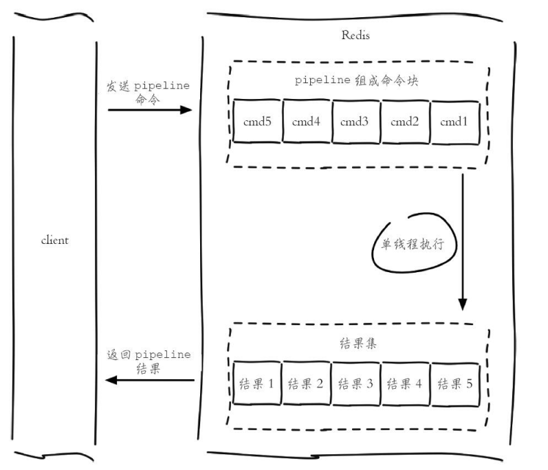

Redis客户端与 Redis服务器之间使⽤ TCP协议进⾏连接，⼀个客户端可以通过⼀个 socket连接发起多个请求命令。每个请求命令发出后 client通常会阻塞并等待 redis服务器处理，redis处理完请求命令后会将结果通过响应报⽂返回给 client，因此当执⾏多条命令的时候都需要等待上⼀条命令执⾏完毕才能执⾏

管道（pipeline）可以⼀次性发送多条命令并在执⾏完后⼀次性将结果返回，pipeline通过减少客户端与 redis的通信次数来实现降低往返延时时间，⽽且 Pipeline实现的原理是队列，⽽队列的原理是时先进先出，这样就保证数据的顺序性。Pipeline的默认的同步的个数为53个，也就是说 arges中累加到53条数据时会把数据提交。其过程如下图所⽰：client可以将三个命令放到⼀个 tcp报⽂⼀起发送，server则可以将三条命令的处理结果放到⼀个 tcp报⽂返回。

需要注意到是⽤ pipeline⽅式打包命令发送，redis必须在处理完所有命令前先缓存起所有命令的处理结果。
打包的命令越多，缓存消耗内存也越多。所以并不是打包的命令越多越好。具体多少合适需要根据具体情况测试。

注意pipeline并不能保证原⼦性。

**Redis管道技术**

⼀个请求/相应服务可以实现为，即使客户端没有读取到旧请求的响应，服务端依旧可以处理新请求。通过这种⽅式，可以完全⽆需等待服务端应答地发送多条指令给服务端，并最终⼀次性读取所有应答。管道技术最显著的优势是提⾼了redis服务的性能。

**⽹络通信流程**

1. 客户端进程调⽤write将消息写到操作系统内核为套接字分配的发送缓冲 sendbuffer。
2. 客户端操作系统内核将发送缓冲的内容发送到⽹卡，⽹卡硬件将数据通过「⽹际路由」送到服务器的⽹卡。
3. 服务器操作系统内核将⽹卡的数据放到内核为套接字分配的接收缓冲 recv buffer。
4. 服务器进程调⽤ read从接收缓冲中取出消息进⾏处理。
5. 服务器进程调⽤write将响应消息写到内核为套接字分配的发送缓冲 send buffer。
6. 服务器操作系统内核将发送缓冲的内容发送到⽹卡，⽹卡硬件将数据通过「⽹际路由」送到客户端的⽹卡。
7. 客户端操作系统内核将⽹卡的数据放到内核为套接字分配的接收缓冲 recv buffer。
8. 客户端进程调⽤ read从接收缓冲中取出消息返回给上层业务逻辑进⾏处理。
9. 结束

我们开始以为write操作是要等到对⽅收到消息才会返回，但实际上不是这样的。write操作只负责将数据写到本地操作系统内核的发送缓冲然后就返回了。剩下的事交给操作系统内核异步将数据送到⽬标机器。但是如果发送缓冲满了，那么就需要等待缓冲空出空闲空间来，这个就是写操作 IO操作的真正耗时。我们开始以为read操作是从⽬标机器拉取数据，但实际上不是这样的。read操作只负责将数据从本地操作系统内核的接收缓冲中取出来就了事了。但是如果缓冲是空的，那么就需要等待数据到来，这个就是读操作 IO操作的真正耗时。

所以对于 value = redis.get(key)这样⼀个简单的请求来说，write操作⼏乎没有耗时，直接写到发送缓冲就返回，⽽ read就会⽐较耗时了，因为它要等待消息经过⽹络路由到⽬标机器处理后的响应消息,再回送到当前的内核读缓冲才可以返回。这才是⼀个⽹络来回的真正开销。

⽽对于管道来说，连续的write操作根本就没有耗时，之后第⼀个 read操作会等待⼀个⽹络的来回开销，然后所有的响应消息就都已经回送到内核的读缓冲了，后续的 read操作直接就可以从缓冲拿到结果，瞬间就返回了Pipeline在某些场景下⾮常有⽤，⽐如有多个 command需要被“及时的”提交，⽽且他们对相应结果没有互相依赖，对结果响应也⽆需⽴即获得，那么 pipeline就可以充当这种“批处理”的⼯具；⽽且在⼀定程度上，可以较⼤的提升性能，性能提升的原因主要是 TCP连接中减少了“交互往返”的时间。

不过在编码时请注意，pipeline期间将“独占”链接，此期间将不能进⾏⾮“管道”类型的其他操作，直到 pipeline关闭；如果你的 pipeline的指令集很庞⼤，为了不⼲扰链接中的其他操作，你可以为 pipeline操作新建 Client链接，让 pipeline和其他正常操作分离在2个 client中。不过 pipeline事实上所能容忍的操作个数，和 socket-


output缓冲区⼤⼩/返回结果的数据尺⼨都有很⼤的关系；同时也意味着每个 redis-server同时所能⽀撑的pipeline链接的个数，也是有限的，这将受限于 server的物理内存或⽹络接⼝的缓冲能⼒。


Pipeline管道机制不单单是为了减少RTT的一种方式，它实际上大大提高了Redis的QPS。原因是，在没有使用管道机制的情况下，从访问数据结构和产生回复的角度来看，为每个命令提供服务是非常便宜的。但是从底层套接字的角度来看，这是非常昂贵的，这涉及read（）和write（）系统调用，从用户态切换到内核态，这种上下文切换开销是巨大。而使用Pipeline的情况下，通常使用单个read（）系统调用读取许多命令，然后使用单个write（）系统调用传递多个回复,这样就提高了QPS

**批量命令与Pipeline对比**
* 批量命令是原子的，Pipeline 是非原子的
* 批量命令是一个命令多个 key,Pipeline支持多个命令
* 批量命令是 Redis服务端实现的，而Pipeline需要服务端和客户端共同实现

**性能测试**

```yml
#测试单个命令
./redis-benchmark -t set  -q 
SET: 67934.78 requests per second

#测试pipeline命令，-P用于测试pipeline命令，其后面的参数为命令的个数
./redis-benchmark -t set -P 1  -q 
SET: 78247.26 requests per second

./redis-benchmark -t set -P 100  -q  
SET: 1492537.25 requests per second
```


**jedis使⽤实例**
```java
Pipeline pipeline = jedis.pipelined();
pipeline.set("k1","1223");
pipeline.rpush("k2","2234");
//调用这个时才会将命令发送出去，并等待结果返回
List<Object> result = pipeline.syncAndReturnAll();
//输出
[OK, 2]


//res.get()必须在sync()后面执行，否则会报错
Pipeline pipeline = jedis.pipelined();
Response<String> res1 =  pipeline.set("k1","1223");
Response<Long> res2 = pipeline.rpush("k2","2234");
//调用这个时才会将命令发送出去
pipeline.sync();

System.out.println(res1.get());
System.out.println(res2.get());


```

### 1.2.17. 连接

* AUTH
    * AUTH password
    * 通过设置配置⽂件中 requirepass项的值(使⽤命令 CONFIG SET requirepass password )，可以使⽤密码来保护 Redis服务器。
    * 如果开启了密码保护的话，在每次连接 Redis服务器之后，就要使⽤ AUTH命令解锁，解锁之后才能使⽤其他 Redis命令。
    * 如果 AUTH命令给定的密码 password和配置⽂件中的密码相符的话，服务器会返回OK并开始接受命令输⼊。
    * 另⼀⽅⾯，假如密码不匹配的话，服务器将返回⼀个错误，并要求客户端需重新输⼊密码。
* ECHO
    * ECHO message
    * 打印⼀个特定的信息message，测试时使⽤。
* PING
    * PING
    * 使⽤客户端向 Redis服务器发送⼀个 PING，如果服务器运作正常的话，会返回⼀个 PONG。
    * 通常⽤于测试与服务器的连接是否仍然⽣效，或者⽤于测量延迟值。
* QUIT
    * QUIT
    * 请求服务器关闭与当前客户端的连接。
    * ⼀旦所有等待中的回复(如果有的话)顺利写⼊到客户端，连接就会被关闭
* SELECT
    * SELECT index
    * 切换到指定的数据库，数据库索引号 index⽤数字值指定，以 0作为起始索引值。
    * 默认使⽤ 0号数据库

### 1.2.18. Server（服务器）

<a href="#menu"  >目录</a> 

* BGREWRITEAOF
    * 执⾏⼀个 AOF⽂件重写操作。重写会创建⼀个当前 AOF⽂件的体积优化版本。
    * 即使 BGREWRITEAOF执⾏失败，也不会有任何数据丢失，因为旧的 AOF⽂件在BGREWRITEAOF成功之前不会被修改。
    * 重写操作只会在没有其他持久化⼯作在后台执⾏时被触发，也就是说：
        * 如果 Redis的⼦进程正在执⾏快照的保存⼯作，那么 AOF重写的操作会被预定(scheduled)，等到保存⼯作完成之后再执⾏ AOF重写。在这种情况下，BGREWRITEAOF的返回值仍然是OK，但还会加上⼀条额外的信息，说明 BGREWRITEAOF要等到保存操作完成之后才能执⾏。在 Redis 2.6或以上的版本，可以使⽤ INFO命令查看 BGREWRITEAOF是否被预定。
        * 如果已经有别的 AOF⽂件重写在执⾏，那么 BGREWRITEAOF返回⼀个错误，并且这个新的BGREWRITEAOF请求也不会被预定到下次执⾏。
* BGSAVE
    * 在后台异步(Asynchronously)保存当前数据库的数据到磁盘。
    * BGSAVE命令执⾏之后⽴即返回OK，然后 Redis fork出⼀个新⼦进程，原来的 Redis进程(⽗进程)继续处理客户端请求，⽽⼦进程则负责��数据保存到磁盘，然后退出。
* CONFIG GET
    * CONFIG GET parameter
    * CONFIG GET命令⽤于取得运⾏中的 Redis服务器的配置参数(configuration parameters)
    * 例子
        * 执⾏ CONFIG GET s*命令，服务器就会返回所有以 s开头的配置参数及参数的值：
        * 使⽤命令 CONFIG GET *，可以列出 CONFIG GET命令⽀持的所有参数：
        * CONFIG GET save单个参数
* CONFIG RESETSTAT
    * CONFIG RESETSTAT
    * 重置 INFO命令中的某些统计数据，包括：
        * Keyspace hits (键空间命中次数)
        * Keyspace misses (键空间不命中次数)
        * Number of commands processed (执⾏命令的次数)
        * Number of connections received (连接服务器的次数)
        * Number of expired keys (过期key的数量)
        * Number of rejected connections (被拒绝的连接数量)
        * Latest fork(2) time(最后执⾏ fork(2)的时间)
        * The aof_delayed_fsync counter(aof_delayed_fsync计数器的值)

* CONFIG REWRITE
    * CONFIG REWRITE
    * CONFIG REWRITE命令对启动 Redis服务器时所指定的 redis.conf⽂件进⾏改写：因为 CONFIGSET命令可以对服务器的当前配置进⾏修改，⽽修改后的配置可能和 redis.conf⽂件中所描述的配置不⼀样，CONFIG REWRITE的作⽤就是通过尽可能少的修改，将服务器当前所使⽤的配置记录到 redis.conf⽂件中。
    * 重写会以⾮常保守的⽅式进⾏：
        * 原有 redis.conf⽂件的整体结构和注释会被尽可能地保留。
        * 如果⼀个选项已经存在于原有 redis.conf⽂件中，那么对该选项的重写会在选项原本所在的位置（⾏号）上进⾏。
        * 如果⼀个选项不存在于原有 redis.conf⽂件中，并且该选项被设置为默认值，那么重写程序不会将这个选项添加到重写后的 redis.conf⽂件中。
        * 如果⼀个选项不存在于原有 redis.conf⽂件中，并且该选项被设置为⾮默认值，那么这个选项将被添加到重写后的 redis.conf⽂件的末尾。
        * 未使⽤的⾏会被留⽩。⽐如说，如果你在原有 redis.conf⽂件上设置了数个关于 save选项的参数，但现在你将这些 save参数的⼀个或全部都关闭了，那么这些不再使⽤的参数原本所在的⾏就会变成空⽩的。
    * 即使启动服务器时所指定的 redis.conf⽂件已经不再存在，CONFIG REWRITE命令也可以重新构建并⽣成出⼀个新的 redis.conf⽂件。
    * 另⼀⽅⾯，如果启动服务器时没有载⼊ redis.conf⽂件，那么执⾏ CONFIG REWRITE命令将引发⼀个错误。
* CONFIG SET
    * CONFIG SET parameter value
    * CONFIG SET命令可以动态地调整 Redis服务器的配置(configuration)⽽⽆须重启。
    * CONFIG SET可以修改的配置参数可以使⽤命令 CONFIG GET *来列出，所有被 CONFIG SET修改的配置参数都会⽴即⽣效。

* DBSIZE
    * 返回当前数据库的 key的数量。
* DEBUG OBJECT
    * DEBUG OBJECT key
    * DEBUG OBJECT是⼀个调试命令，它不应被客户端所使⽤
* DEBUG SEGFAULT
    * 执⾏⼀个不合法的内存访问从⽽让 Redis崩溃，仅在开发时⽤于 BUG模拟。
* FLUSHALL
    * 清空整个 Redis服务器的数据(删除所有数据库的所有 key )。
* FLUSHDB
    * 清空当前数据库中的所有 key。
* INFO
    * INFO [section]
    * 以⼀种易于解释（parse）且易于阅读的格式，返回关于 Redis服务器的各种信息和统计数值。
    * 通过给定可选的参数 section，可以让命令只返回某⼀部分的信息：
    * server :⼀般 Redis服务器信息，包含以下域：
        * redis_version : Redis服务器版本
        * redis_git_sha1 : Git SHA1
        * redis_git_dirty : Git dirty flag
        * os : Redis服务器的宿主操作系统
        * arch_bits :架构（32或 64位）
        * multiplexing_api : Redis所使⽤的事件处理机制
        * gcc_version :编译 Redis时所使⽤的 GCC版本
        * process_id :服务器进程的 PID
        * run_id : Redis服务器的随机标识符（⽤于 Sentinel和集群）
        * tcp_port : TCP/IP监听端⼝
        * uptime_in_seconds :⾃ Redis服务器启动以来，经过的秒数
        * uptime_in_days :⾃ Redis服务器启动以来，经过的天数
        * lru_clock :以分钟为单位进⾏⾃增的时钟，⽤于 LRU管理
    * clients :已连接客户端信息，包含以下域：
        * connected_clients :已连接客户端的数量（不包括通过从属服务器连接的客户端）
        * client_longest_output_list :当前连接的客户端当中，最⻓的输出列表
        * client_longest_input_buf :当前连接的客户端当中，最⼤输⼊缓存
        * blocked_clients :正在等待阻塞命令（BLPOP、BRPOP、BRPOPLPUSH）的客户端的数量
    * memory :内存信息，包含以下域：
        * used_memory :由 Redis分配器分配的内存总量，以字节（byte）为单位
        * used_memory_human :以⼈类可读的格式返回 Redis分配的内存总量
        * used_memory_rss :从操作系统的⾓度，返回 Redis已分配的内存总量（俗称常驻集⼤⼩）。这个值和 top、ps等命令的输出⼀致。
        * used_memory_peak : Redis的内存消耗峰值（以字节为单位）
        * used_memory_peak_human :以⼈类可读的格式返回 Redis的内存消耗峰值
        * used_memory_lua : Lua引擎所使⽤的内存⼤⼩（以字节为单位）
        * mem_fragmentation_ratio : used_memory_rss和 used_memory之间的⽐率
        * mem_allocator :在编译时指定的，Redis所使⽤的内存分配器。可以是 libc、jemalloc或者tcmalloc。
        * 在理想情况下，used_memory_rss的值应该只⽐ used_memory稍微⾼⼀点⼉。
        * 当 rss > used，且两者的值相差较⼤时，表⽰存在（内部或外部的）内存碎⽚。
        * 内存碎⽚的⽐率可以通过mem_fragmentation_ratio的值看出。
        * 当 used > rss时，表⽰ Redis的部分内存被操作系统换出到交换空间了，在这种情况下，操作可能会产⽣明显的延迟。
        * Because Redis does not have control over how its allocations are mapped to memorypages, high used_memory_rss is often the result of a spike in memory usage.
        * 当 Redis释放内存时，分配器可能会，也可能不会，将内存返还给操作系统。
        * 如果 Redis释放了内存，却没有将内存返还给操作系统，那么 used_memory的值可能和操作系统显⽰的 Redis内存占⽤并不⼀致。
        * 查看 used_memory_peak的值可以验证这种情况是否发⽣。
    * persistence : RDB和 AOF的相关信息
    * stats :⼀般统计信息
    * replication :主/从复制信息
    * cpu : CPU计算量统计信息
    * commandstats : Redis命令统计信息
    * cluster : Redis集群信息
    * keyspace :数据库相关的统计信息
    * all :返回所有信息
    * default :返回默认选择的信息
    * 当不带参数直接调⽤ INFO命令时，使⽤ default作为默认参数。
* LASTSAVE
    * 返回最近⼀次 Redis成功将数据保存到磁盘上的时间，以 UNIX时间戳格式表⽰。
* MONITOR
    * 实时打印出 Redis服务器接收到的命令，调试⽤。
* SYNC
   * ⽤于复制功能(replication)的内部命令。新版本已经不用
* PSYNC
    * PSYNC < MASTER_RUN_ID>
    * ⽤于复制功能(replication)的内部命令。
* SAVE
    * SAVE命令执⾏⼀个同步保存操作，将当前 Redis实例的所有数据快照(snapshot)以 RDB⽂件的形式保存到硬盘。
* SHUTDOWN
    * SHUTDOWN命令执⾏以下操作：
        * 停⽌所有客户端
        * 如果有⾄少⼀个保存点在等待，执⾏ SAVE命令
        * 如果 AOF选项被打开，更新 AOF⽂件
        * 关闭 redis服务器(server)
    * 如果持久化被打开的话，SHUTDOWN命令会保证服务器正常关闭⽽不丢失任何数据。
    * 另⼀⽅⾯，假如只是单纯地执⾏ SAVE命令，然后再执⾏QUIT命令，则没有这⼀保证——因为在执⾏ SAVE之后、执⾏QUIT之前的这段时间中间，其他客户端可能正在和服务器进⾏通讯，这时如果执⾏QUIT就会造成数据丢失。
    * SAVE和 NOSAVE修饰符
        * 通过使⽤可选的修饰符，可以修改 SHUTDOWN命令的表现。⽐如说：
        * 执⾏ SHUTDOWN SAVE会强制让数据库执⾏保存操作，即使没有设定(configure)保存点
        * 执⾏ SHUTDOWN NOSAVE会阻⽌数据库执⾏保存操作，即使已经设定有⼀个或多个保存点(你可以将这⼀⽤法看作是强制停⽌服务器的⼀个假想的 ABORT命令)
* SLAVEOF
    * SLAVEOF host port
    * SLAVEOF命令⽤于在 Redis运⾏时动态地修改复制(replication)功能的⾏为。
    * 通过执⾏ SLAVEOF host port命令，可以将当前服务器转变为指定服务器的从属服务器(slave server)。
    * 如果当前服务器已经是某个主服务器(master server)的从属服务器，那么执⾏ SLAVEOF host port将使当前服务器停⽌对旧主服务器的同步，丢弃旧数据集，转⽽开始对新主服务器进⾏同步。
    * 另外，对⼀个从属服务器执⾏命令 SLAVEOF NO ONE将使得这个从属服务器关闭复制功能，并从从属服务器转变回主服务器，原来同步所得的数据集不会被丢弃。
    * 利⽤『SLAVEOF NO ONE不会丢弃同步所得数据集』这个特性，可以在主服务器失败的时候，将从属服务器⽤作新的主服务器，从⽽实现⽆间断运⾏。
* SLOWLOG
    * SLOWLOG subcommand [argument]
    * 什么是 SLOWLOG
        * Slow log是 Redis⽤来记录查询执⾏时间的⽇志系统。
        * 查询执⾏时间指的是不包括像客户端响应(talking)、发送回复等 IO操作，⽽单单是执⾏⼀个查询命令所耗费的时间。
        * 另外，slow log保存在内存⾥⾯，读写速度⾮常快，因此你可以放⼼地使⽤它，不必担⼼因为开启 slow log⽽损害 Redis的速度。设置 SLOWLOG

Slow log的⾏为由两个配置参数(configuration parameter)指定，可以通过改写 redis.conf⽂件或者⽤CONFIG GET和 CONFIG SET命令对它们动态地进⾏修改。

第⼀个选项是 slowlog-log-slower-than，它决定要对执⾏时间⼤于多少微秒(microsecond，1秒 = 1,000,000微秒)的查询进⾏记录。

⽐如执⾏以下命令将让 slow log记录所有查询时间⼤于等于 100微秒的查询：
```yml
CONFIG SET slowlog-log-slower-than 100
```
⽽以下命令记录所有查询时间⼤于 1000微秒的查询：
```yml
CONFIG SET slowlog-log-slower-than 1000
```
另⼀个选项是 slowlog-max-len，它决定 slow log最多能保存多少条⽇志，slow log本⾝是⼀个 FIFO队列，当队列⼤⼩超过 slowlog-max-len时，最旧的⼀条⽇志将被删除，⽽最新的⼀条⽇志加⼊到 slow log，以此类推。

以下命令让 slow log最多保存 1000条⽇志：

使⽤ CONFIG GET命令可以查询两个选项的当前值：
```yml
redis> CONFIG GET slowlog-log-slower-than
1) "slowlog-log-slower-than"
2) "1000"

redis> CONFIG GET slowlog-max-len
1) "slowlog-max-len"
2) "1000"
```

**查看 slow log**

要查看 slow log，可以使⽤ SLOWLOG GET或者 SLOWLOG GET number命令，前者打印所有 slow log，最⼤⻓度取决于 slowlog-max-len选项的值，⽽ SLOWLOG GET number则只打印指定数量的⽇志。

最新的⽇志会最先被打印：

```yml
# 为测试需要，将 slowlog-log-slower-than 设成了 10 微秒

1) 1) (integer) 12	# 唯一性(unique)的日志标识符
2) (integer) 1324097834	# 被记录命令的执行时间点，以 UNIX 时间戳
格式表示
3) (integer) 16	# 查询执行时间，以微秒为单位
4) 1) "CONFIG"	# 执行的命令，以数组的形式排列
2) "GET"	# 这里完整的命令是 CONFIG GET
slowlog-log-slower-than
3) "slowlog-log-slower-than"

2) 1) (integer) 11
2) (integer) 1324097825
3) (integer) 42
4) 1) "CONFIG"
2) "GET"
3) "*"

3) 1) (integer) 10
2) (integer) 1324097820
3) (integer) 11
4) 1) "CONFIG"
2) "GET"
3) "slowlog-log-slower-than"
```


⽇志的唯⼀ id只有在 Redis服务器重启的时候才会重置，这样可以避免对⽇志的重复处理(⽐如你可能会想在每次发现新的慢查询时发邮件通知你)。

查看当前⽇志的数量

使⽤命令 SLOWLOG LEN可以查看当前⽇志的数量。

请注意这个值和 slower-max-len的区别，它们⼀个是当前⽇志的数量，⼀个是允许记录的最⼤⽇志的数量。
```yml
redis> SLOWLOG LEN 
(integer) 14
```
**清空⽇志**

使⽤命令 SLOWLOG RESET可以清空 slow log。


* TIME
   * 返回当前服务器时间。

## 1.3. 数据结构和对象实现原理

### 1.3.1. 对象

* 前⾯章节介绍了Redis所有的主要数结构，但是Redis并没有使⽤这些数据结构来实现键值对数据库。⽽是基于这些数据结构创建不同的对象。
* 字符串对象，列表对象，哈希对象，集合对象，⽆序集合对象。
* 每种对象⾄少使⽤了前⾯⼀种数据结构实现
* Redis在执⾏命令之前，会根据对象的类型来判断是否可以执⾏给定的命令
* 使⽤对象可以针对不同的应⽤场景，为对象设置多种不同的数据结构实现，从⽽优化对象在不同场景下的使⽤效率。
* Redis的垃圾回收是基于引⽤计数器实现，当程序不再使⽤某个对象时，这个对象所占⽤的内存将会被释放掉
* Redsi还通过引⽤计数法实现了对象共享机制，这⼀机制在适当的条件下，通过让多个数据库键共享同⼀个对象来节约内存。
* Redis的对象还带有访问时间记录信息，该记录⽤于计算数据库键的空转时⻓，在服务器启⽤maxmemory功能的情况下，空转时⻓较⼤的键可能会优先被删除。

#### 1.3.1.1. 对象类型和编码

**对象结构题定义**
```cpp
typedef struct redisObject {
//类型 4bit
unsigned type:4;
//编码 4bit
unsigned encoding:4;
//24bit
unsigned lru:LRU_BITS; /* LRU time (relative to global lru_clock) or
* LFU data (least significant 8 bits frequency
* and most significant 16 bits access time). */
//引用计数器 4bytes
int refcount;
//指向底层数据结构的指针
//void *p指的是一个空指针 ,占据的字节和int地址一样
// 8bytes，64-bit system,
} robj;
```


不同的对象具有不同的类型 type(4bit)，同⼀个类型的 type会有不同的存储形式encoding(4bit)，为了记录对象的 LRU信息，使⽤了 24个 bit来记录LRU信息。每个对象都有个引⽤计数，当引⽤计数为零时，对象就会被销毁，内存被回收。ptr指针将指向对象内容 (body)的具体存储位置。从上⾯可以看出，⼀个redisObject对象⾄少是16个字节
* type字段：表⽰当前对象使⽤的数据类型，Redis主要⽀持5种数据类型：string、hash、list、set、zset。可以使⽤type{key}命令查看对象所属类型，type命令返回的是值对象类型，键都是string类型。
*  encoding字段：表⽰Redis内部编码类型，encoding在Redis内部使⽤，代表当前对象内部采⽤哪种数据结构实现。理解Redis内部编码⽅式对于优化内存⾮常重要，同⼀个对象采⽤不同的编码实现内存占⽤存在明显差异。
* lru字段：记录对象最后⼀次被访问的时间，当配置了maxmemory和maxmemory-policy=volatile-lru或者allkeys-lru时，⽤于辅助LRU算法删除键数据。可以使⽤object idletime{key}命令在不更新lru字段情况下查看当前键的空闲时间.可以使⽤scan+object idletime命令批量查询哪些键⻓时间未被访问，找出⻓时间不访问的键进⾏清理，可降低内存占⽤

```yml
127.0.0.1:6379> object idletime k1
(integer) 75071
127.0.0.1:6379> object idletime k1
(integer) 75073
127.0.0.1:6379> object idletime k1
(integer) 75074
127.0.0.1:6379> object idletime k1
```
* refcount字段：记录当前对象被引⽤的次数，⽤于通过引⽤次数回收内存，当refcount=0时，可以安全回收当前对象空间。使⽤object refcount{key}获取当前对象引⽤。当对象为整数且范围在[0-9999]时，Redis可以使⽤共享对象的⽅式来节省内存。
```yml
127.0.0.1:6379> object refcount k1
(integer) 2147483647
```
* ptr字段：与对象的数据内容相关，如果是整数，直接存储数据；否则表⽰指向数据的指针。

对象的类型

|类型常量|	对象的名称	|TYPE命令输出|
|---|---|---|
|REDIS_STRING |字符串对象	|string
|REDIS_LIST	|列表对象	|list
|REDIS_HASH	|哈希对象	|hash
|REDIS_SET	|集合对象	|set
|REDIS_ZET	|有序集合对象 |zset

使⽤TYPE命令查看键的类型

对象的编码对象的ptr指针指向对象的底层实现数据结构，⽽这些数据结构由对象的encoding属性决定。


|编码常量	|编码所对应的底层数据结构|
|---|---|
|REDIS_ENCODING_INT	|long类型的整数|
|REDIS_ENCODING_EMBSTR|	embstr编码的简单动态字符串
|REDIS_ENCODING_RAW	|简单动态字符串
|REDIS_ENCODING_HT	|字典
|REDIS_ENCODING_LINKEDLIST |双端链表,5.0不再使⽤
|REDIS_ENCODING_ZIPLIST	|压缩列表
|REDIS_ENCODING_INTSET	|整数集合
|REDIS_ENCODING_SKIPLIST	|跳跃表和字典

不同类型和编码的对象

|类型	|编码	|对象
|---|---|---|
|REDIS_STRING |REDIS_ENCODING_INT	|使⽤整数值实现的字符串对象。
|REDIS_STRING |REDIS_ENCODING_EMBSTR|使⽤ embstr编码的简单动态字符串实现的字符串对象。
|REDIS_STRING| REDIS_ENCODING_RAW|使⽤简单动态字符串实现的字符串对象。
|REDIS_LIST	|REDIS_ENCODING_ZIPLIST|使⽤压缩列表实现的列表对象。
|REDIS_LIST	|REDIS_ENCODING_LINKEDLIST|使⽤双端链表实现的列表对象。
|REDIS_HASH|	REDIS_ENCODING_ZIPLIST|使⽤压缩列表实现的哈希对象。
|REDIS_HASH	|REDIS_ENCODING_HT|使⽤字典实现的哈希对象。
|REDIS_SET	|REDIS_ENCODING_INTSET|使⽤整数集合实现的集合对象。
|REDIS_SET|	REDIS_ENCODING_HT|使⽤字典实现的集合对象。
|REDIS_ZSET|	REDIS_ENCODING_ZIPLIST|使⽤压缩列表实现的有序集合对象。
|REDIS_ZSET	|REDIS_ENCODING_SKIPLIST	|使⽤跳跃表和字典实现的有序集合对象。

Redis作者想通过不同编码实现效率和空间的平衡。⽐如当我们的存储只有10个元素的列表，当使⽤双向链表数据结构时，必然需要维护⼤量的内部字段如每个元素需要：前置指针，后置指针，数据指针等，造成空间浪费，如果采⽤连续内存结构的压缩列表（ziplist），将会节省⼤量内存，⽽由于数据⻓度较⼩，存取操作时间复杂度即使为O（n2）性能也可满⾜需求。

编码类型转换在Redis写⼊数据时⾃动完成，这个转换过程是不可逆的，转换规则只能从⼩内存编码向⼤内存编码转换

* String
    * int：8个字节的⻓整型。
    * embstr ：⼩于等于44个字节的字符串。
    * raw ：⼤于44个字节的字符串。
* hash
    * ziplist
        * 当哈希类型元素个数⼩于hash-max-ziplist-entries配置（默认512个）、同时所有值都⼩于hash-max-ziplist-value配置（默认64字节）时，Redis会使⽤ziplist作为哈希的内部实现，ziplist使⽤更加紧凑的结构实现多个元素的连续存储，所以在节省内存⽅⾯⽐hashtable更加优秀。
    * hashtable
        * 当哈希类型⽆法满⾜ziplist的条件时，Redis会使⽤hashtable作为哈希的内部实现，因为此时ziplist的读写效率会下降，⽽hashtable的读写时间复杂度为O（1）
* list
    * zipList
        * 当列表的元素个数⼩于list-max-ziplist-entries配置（默认512个），同时列表中每个元素的值都⼩于list-max-ziplist-value配置时（默认64字节），Redis会选⽤ziplist来作为列表的内部实现来减少内存的使⽤。
    * linkedList
        * 当列表类型⽆法满⾜ziplist的条件时，Redis会使⽤linkedlist作为列表的内部实现
        * Redis3.2版本提供了quicklist内部编码，简单地说它是以⼀个ziplist为节点的linkedlist，它结合了ziplist和linkedlist两者的优势，为列表类型提供了⼀种更为优秀的内部编码实现
* set
    * intset
        * 当集合中的元素都是整数且元素个数⼩于set-maxintset-entries配置（默认512个）时，Redis会选⽤intset来作为集合的内部实现，从⽽减少内存的使⽤
    * hashtable
        * 当集合类型⽆法满⾜intset的条件时，Redis会使⽤hashtable作为集合的内部实现。
* zset
    * ziplist 压缩列表
        * 当有序集合的元素个数⼩于zset-max-ziplistentries配置（默认128个），同时每个元素的值都⼩于zset-max-ziplist-value配置（默认64字节）时，Redis会⽤ziplist来作为有序集合的内部实现，ziplist可以有效减少内存的使⽤。
    * skiplist 跳跃表
        * 当ziplist条件不满⾜时，有序集合会使⽤skiplist作为内部实现，因为此时ziplist的读写效率会下降。

* 查看键对应的编码
```yml
OBJECT ENCODING key 或者 debug object key

```
**OBJECT ENCODING对不同编码的输出**

|对象所使⽤的底层数据结构| 编码常量|	OBJECT ENCODING命令输出|
|---|---|---|
|整数	|REDIS_ENCODING_INT	|"int"
|embstr	|编码的简单动态字符串（SDS）REDIS_ENCODING_EMBSTR |"embstr"
|简单动态字符串	|REDIS_ENCODING_RAW|	"raw"
|字典	|REDIS_ENCODING_HT|	"hashtable"
|双端链表	|REDIS_ENCODING_LINKEDLIST |"linkedlist"
|压缩列表	|REDIS_ENCODING_ZIPLIST	|"ziplist"
|整数集合	|REDIS_ENCODING_INTSET	|"intset"
|跳跃表和字典	|REDIS_ENCODING_SKIPLIST	|"skiplist"

通过 encoding属性来设定对象所使⽤的编码，⽽不是为特定类型的对象关联⼀种固定的编码，极⼤地提升了Redis的灵活性和效率，因为 Redis可以根据不同的使⽤场景来为⼀个对象设置不同的编码，从⽽优化对象在某⼀场景下的效率。

举个例⼦，在列表对象包含的元素⽐较少时，Redis使⽤压缩列表作为列表对象的底层实现：

因为压缩列表⽐双端链表更节约内存，并且在元素数量较少时，在内存中以连续块⽅式保存的压缩列表⽐起双端链表可以更快被载⼊到缓存中；随着列表对象包含的元素越来越多，使⽤压缩列表来保存元素的优势逐渐消失时，对象就会将底层实现从压缩列表转向功能更强、也更适合保存⼤量元素的双端链表上⾯；

其他类型的对象也会通过使⽤多种不同的编码来进⾏类似的优化。

Redis这样设计有两个好处：
* 第⼀，可以改进内部编码，⽽对外的数据结构和命令没有影响，这样⼀旦开发出更优秀的内部编码，⽆需改动外部数据结构和命令，例如Redis3.2提供了quicklist，结合了ziplist和linkedlist两者的优势，为列表类型提供了⼀种更为优秀的内部编码实现，⽽对外部⽤户来说基本感知不到。
* 第⼆，多种内部编码实现可以在不同场景下发挥各⾃的优势，例如ziplist⽐较节省内存，但是在列表元素⽐较多的情况下，性能会有所下降，这时候Redis会根据配置选项将列表类型的内部实现转换为linkedlist。


##### 1.3.1.1.1. ziplist压缩列表

ziplist编码结构,⼀个ziplist可以包含多个entry（元素），每个entry保存具体的数据（整数或者字节数组）


```YML
<zlbytes><zltail><zllen><entry-1><entry-2><	  ><entry-n><zlend>
```

ziplist结构字段含义
* zlbytes：记录整个压缩列表所占字节⻓度，⽅便重新调整ziplist空间。类型是int-32，⻓度为4字节。
* zltail：记录距离尾节点的偏移量，⽅便尾节点弹出操作。类型是int-32，⻓度为4字节。
* zllen：记录压缩链表节点数量，当⻓度超过216-2时需要遍历整个列表获取⻓度，⼀般很少⻅。类型是int-16，⻓度为2字节。
* entry：记录具体的节点，⻓度根据实际存储的数据⽽定。
    * prev_entry_bytes_length：记录前⼀个节点所占空间，⽤于快速定位上⼀个节点，可实现列表反向迭代
    * encoding：标⽰当前节点编码和⻓度，前两位表⽰编码类型：字符串/整数，其余位表⽰数据⻓度。
    * contents：保存节点的值，针对实际数据⻓度做内存占⽤优化。
* zlend：记录列表结尾，占⽤⼀个字节。默认为255

该数据结构特点如下：
* 内部表现为数据紧凑排列的⼀块连续内存数组。
* 可以模拟双向链表结构，以O（1）时间复杂度⼊队和出队。
* 新增删除操作涉及内存重新分配或释放，加⼤了操作的复杂性。
* 读写操作涉及复杂的指针移动，最坏时间复杂度为O（n2）。
* 适合存储⼩对象和⻓度有限的数据。

#### 1.3.1.2. 内存回收

<a href="#menu"  >目录</a>

因为 C语⾔并不具备⾃动的内存回收功能，所以 Redis在⾃⼰的对象系统中构建了⼀个引⽤计数（reference counting）技术实现的内存回收机制，通过这⼀机制，程序可以通过跟踪对象的引⽤计数信息，在适当的时候⾃动释放对象并进⾏内存回收。

每个对象的引⽤计数信息由 redisObject结构的 refcount属性记录：

```cpp
typedef struct redisObject {
    // ...
    // 引用计数
    int refcount;
    // ...
} robj;
```
对象的引⽤计数信息会随着对象的使⽤状态⽽不断变化：
* 在创建⼀个新对象时，引⽤计数的值会被初始化为 1；
* 当对象被⼀个新程序使⽤时，它的引⽤计数值会被增⼀；
* 当对象不再被⼀个程序使⽤时，它的引⽤计数值会被减⼀；
* 当对象的引⽤计数值变为 0时，对象所占⽤的内存会被释放。

修改对象引⽤计数的 API

|函数	|作⽤|
|---|---|
|incrRefCount |将对象的引⽤计数值增⼀。
|decrRefCount| 将对象的引⽤计数值减⼀，当对象的引⽤计数值等于 0时，释放对象。
|resetRefCount|将对象的引⽤计数值设置为 0，但并不释放对象，这个函数通常在需要重新设置对象的引⽤计数值时使⽤。


对象的整个⽣命周期可以划分为创建对象、操作对象、释放对象三个阶段。

作为例⼦，以下代码展⽰了⼀个字符串对象从创建到释放的整个过程：

```cpp
// 创建一个字符串对象 s ，对象的引用计数为 1
robj *s = createStringObject(...)
// 将对象 s 的引用计数减一，使得对象的引用计数变为 0
// 导致对象 s 被释放
decrRefCount(s)
```


其他不同类型的对象也会经历类似的过程。

#### 1.3.1.3. 对象共享

<a href="#menu"  >目录</a> 

除了⽤于实现引⽤计数内存回收机制之外，对象的引⽤计数属性还带有对象共享的作⽤。

举个例⼦，假设键 A创建了⼀个包含整数值 100的字符串对象作为值对象。

未被共享的字符串对象
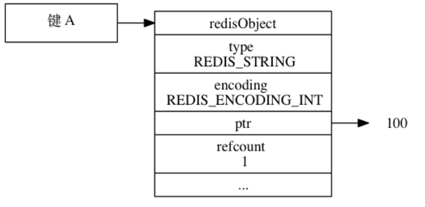

如果这时键 B也要创建⼀个同样保存了整数值 100的字符串对象作为值对象，那么服务器有以下两种做法：为键 B新创建⼀个包含整数值 100的字符串对象；让键 A和键 B共享同⼀个字符串对象；以上两种⽅法很明显是第⼆种⽅法更节约内存在 Redis中，让多个键共享同⼀个值对象需要执⾏以下两个步骤：

1. 将数据库键的值指针指向⼀个现有的值对象；
2. 将被共享的值对象的引⽤计数增⼀。

举个例⼦，上图就展⽰了包含整数值 100的字符串对象同时被键 A和键 B共享之后的样⼦，可以看到，除了对象的引⽤计数从之前的 1变成了 2之外，其他属性都没有变化。

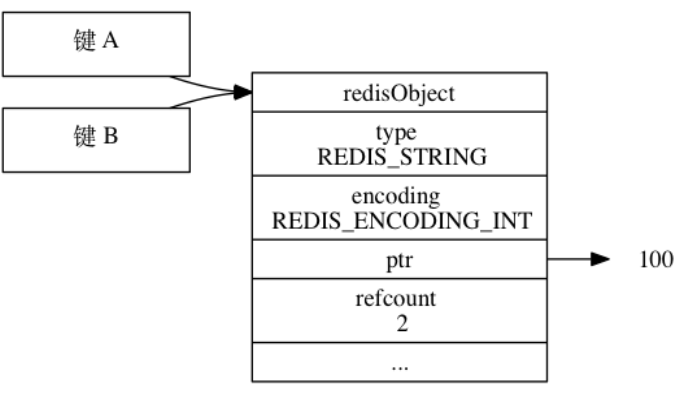

共享对象机制对于节约内存⾮常有帮助，数据库中保存的相同值对象越多，对象共享机制就能节约越多的内存。

⽐如说，假设数据库中保存了整数值 100的键不只有键 A和键 B两个，⽽是有⼀百个，那么服务器只需要⽤⼀个字符串对象的内存就可以保存原本需要使⽤⼀百个字符串对象的内存才能保存的数据。

⽬前来说，Redis会在初始化服务器时，创建⼀万个字符串对象，这些对象包含了从 0到 9999的所有整数值，当服务器需要⽤到值为 0到 9999的字符串对象时，服务器就会使⽤这些共享对象，⽽不是新创建对象。

注意:创建共享字符串对象的数量可以通过修改 redis.h/REDIS_SHARED_INTEGERS常量来修改。

举个例⼦，如果我们创建⼀个值为 100的键 A，并使⽤OBJECT REFCOUNT命令查看键 A的值对象的引⽤计数，我们会发现值对象的引⽤计数为 2：

```yml
redis> SET A 100
OK
redis> OBJECT REFCOUNT A
(integer) 2

```
引⽤这个值对象的两个程序分别是持有这个值对象的服务器程序，以及共享这个值对象的键 A，如图 8-22所⽰。


如果这时我们再创建⼀个值为 100的键 B，那么键 B也会指向包含整数值 100的共享对象，使得共享对象的引⽤计数值变为 3：

另外，这些共享对象不单单只有字符串键可以使⽤，那些在数据结构中嵌套了字符串对象的对象（linkedlist编码的列表对象、hashtable编码的哈希对象、hashtable编码的集合对象、以及 zset编码的有序集合对象）都可以使⽤这些共享对象。

**为什么 Redis不共享包含字符串的对象？**

当服务器考虑将⼀个共享对象设置为键的值对象时，程序需要先检查给定的共享对象和键想创建的⽬标对象是否完全相同，只有在共享对象和⽬标对象完全相同的情况下，程序才会将共享对象⽤作键的值对象，⽽⼀个共享对象保存的值越复杂，验证共享对象和⽬标对象是否相同所需的复杂度就会越⾼，消耗的 CPU时间也会越多：
* 如果共享对象是保存整数值的字符串对象，那么验证操作的复杂度为O(1)；
* 如果共享对象是保存字符串值的字符串对象，那么验证操作的复杂度为O(N)；
* 如果共享对象是包含了多个值（或者对象的）对象，⽐如列表对象或者哈希对象，那么验证操作的复杂度将会是O(N^2)。

因此，尽管共享更复杂的对象可以节约更多的内存，但受到 CPU时间的限制，Redis只对包含整数值的字符串对象进⾏共享。


#### 1.3.1.4. 对象空转时⻓


除了前⾯介绍过的 type、encoding、ptr和 refcount四个属性之外，redisObject结构包含的最后⼀个属性为lru属性，该属性记录了对象最后⼀次被命令程序访问的时间：

```cpp
typedef struct redisObject {
    unsigned lru:22;
}
```
OBJECT IDLETIME命令可以打印出给定键的空转时⻓，这⼀空转时⻓就是通过将当前时间减去键的值对象的lru时间计算得出的：

```yml
redis> SET msg "hello world"
OK
# 等待一小段时间
redis> OBJECT IDLETIME msg
(integer) 20
# 等待一阵子
redis> OBJECT IDLETIME msg
(integer) 180
# 访问 msg 键的值
redis> GET msg
"hello world"
# 键处于活跃状态，空转时长为 0
redis> OBJECT IDLETIME msg
(integer) 0
```


注意OBJECT IDLETIME命令的实现是特殊的，这个命令在访问键的值对象时，不会修改值对象的 lru属性。

除了可以被OBJECT IDLETIME命令打印出来之外，键的空转时⻓还有另外⼀项作⽤：如果服务器打开了
maxmemory选项，并且服务器⽤于回收内存的算法为 volatile-lru或者 allkeys-lru，那么当服务器占⽤的内存数超过了maxmemory选项所设置的上限值时，空转时⻓较⾼的那部分键会优先被服务器释放，从⽽回收内存。

### 1.3.2. 简单动态字符串

* C语⾔中的字符串是以空字符'\0'结尾的字符序列
* Redis没有使⽤C语⾔的传统的字符串，⽽是使⽤SDS(Simple Dynamic String)简单动态字符串,SDS具有'\0'结尾的字符数组
* Redis中的字符串对象都是使⽤SDS，包括键，键值为字符串的存储对象
* 除了⽤于字符串，SDS还被⽤作缓冲区(buffer)，AOF中的AOF缓冲区，和客户端状态中的输⼊缓冲区SDS的定义,⽀持多种⻓度5,8,16,32,64。


```cpp

struct __attribute__ ((__packed__)) sdshdr5 {
    unsigned char flags; /* 3 lsb of type, and 5 msb of string length */
    char buf[];
}

struct __attribute__ ((__packed__)) sdshdr8 {
    uint8_t len; /* used */
    uint8_t alloc; /* excluding the header and null terminator */
    unsigned char flags; /* 3 lsb of type, 5 unused bits */
    char buf[];
};
struct __attribute__ ((__packed__)) sdshdr16 {
    uint16_t len; /* used */
    uint16_t alloc; /* excluding the header and null terminator */
    unsigned char flags; /* 3 lsb of type, 5 unused bits */
    char buf[];
};
struct __attribute__ ((__packed__)) sdshdr32 {
    //实际字符串长度，不包含空字符
    uint32_t len; /* used */
    //总空间
    uint32_t alloc; /* excluding the header and null terminator */
    //用于定义类型 指示当前是 sdshdr8|sdshdr32|sdshdr64
    unsigned char flags; /* 3 lsb of type, 5 unused bits */
    //字符数组，字符数组是以'\0'结尾
    char buf[];
};
struct __attribute__ ((__packed__)) sdshdr64 {
    uint64_t len; /* used */
    uint64_t alloc; /* excluding the header and null terminator */
    unsigned char flags; /* 3 lsb of type, 5 unused bits */
    char buf[];
};
```


redis会根据字符数组buf的⻓度决定使⽤何种数据结构。

字符串"redis"的存储结构为{'r','e','d','i','s','\0'}

与C字符串相⽐
* 获取字符串⻓度从C字符串的O(n)变为SDS的O(1).提升了性能
* 杜绝缓冲区溢的可能性
    * C字符串在进⾏复制时，如果原字符串⻓度不⾜，将可能发⽣溢出，导致不可预知的错误。需要先判断空间是否⾜够再进⾏复制。
    * SDS会先检查空间是否⾜够，不⾜够先进⾏扩容
* SDS空间分配
    * 空间预分配
        * 如果对SDS修改之后，SDS(len)⼩于1MB，那么程序分配和len属性同样⼤⼩的空间。
            * 如果进⾏修改之后，len变为13个字节，那么将分配13个字节，最终=13+13+1.
        * 如果对SDS修改之后，SDS(len)⼤于等于1MB，那么程序会分配1MB的未使⽤空间.
            * 如果进⾏修改之后，len变为30MB,修改后将为30MB+1MB+1byte
        * 通过预分配，Redis可以减少连续执⾏字符串增⻓操作所需的内存分配次数
    * 惰性空间释放
        * ⽤于优化SDS的字符串缩短操作。
        * 当SDS的API需要缩短字符串操作时，并不⽴即进⾏内存重分配回收不⽤的空间。
* ⼆进制安全
    * C字符串必须为可⻅字符。并且字符串⾥⾯不能包含空字符。当保存⾳频，视频等数据时就会存在问题。
    * ⽽SDS则没有这种限制，可以保存任何数据
* 兼容部分C字符串函数(通过重写)

**追加字符串操作**
```cpp
static inline size_t sdslen(const sds s) {
    //这里的sds是SDS数据结构中字符数组
    //它的前一个地址便是flag
    unsigned char flags = s[-1];
    switch(flags&SDS_TYPE_MASK) {
        case SDS_TYPE_5:
        return SDS_TYPE_5_LEN(flags);
        case SDS_TYPE_8:
        return SDS_HDR(8,s)->len;
        case SDS_TYPE_16:
        return SDS_HDR(16,s)->len;
        case SDS_TYPE_32:
        return SDS_HDR(32,s)->len;
        case SDS_TYPE_64:
        return SDS_HDR(64,s)->len;
    }
    return 0;
}

sds sdscatlen(sds s, const void *t, size_t len) {
    //计算字符数组长度
    size_t curlen = sdslen(s);
    //按需调整空间，如果 capacity 不够容纳追加的内容，就会重新分配字节数组并复制原字符
    串的内容到新数组中
    s = sdsMakeRoomFor(s,len);
    if (s == NULL) return NULL; // 内存不足
    memcpy(s+curlen, t, len); // 追加目标字符串的内容到字节数组中
    sdssetlen(s, curlen+len); // 设置追加后的长度值
    s[curlen+len] = '\0'; // 让字符串以\0 结尾，便于调试打印，还可以直接使用 glibc
    的字符串	函数进行操作
    return s;
}
```


Redis规定字符串的⻓度不得超过 512M字节。创建字符串时 len和 capacity⼀样⻓，不会多分配冗余空间，这是因为绝⼤多数场景下我们不会使⽤ append操作来修改字符串。

Ｃ字符串和SDS对⽐

|c字符串	|SDS|
|---|---|
|获取字符串⻓度的复杂度为O(N)	|获取字符串⻓度的复杂度为O(1)
|API不安全，可能会造成缓冲区溢出	|API是安全的，不会造成缓冲区溢出
|修改字符串⻓度N次必须要执⾏N次的内存分配 |修改字符串⻓度N次最多要执⾏N次的内存分配
|只能保存⽂本数据	|可以保存⽂本或者⼆进制数据
|可以使⽤< string.h>库中的所有函数|	可以使⽤< string.h>库中的部分函数

Redis的字符串有两种存储⽅式，在⻓度特别短时，使⽤ emb形式存储 (embeded)，当⻓度超过 44时，使⽤raw形式存储。

**原理**

在64bit系统中，⼀个redisObject⾄少占⽤16个字节。

字符串使⽤的是sds.当字符串⼤⼩⼩与256字节时，使⽤sdshdr8。
```cpp
struct __attribute__ ((__packed__)) sdshdr8 {
    uint8_t len; /* used */
    uint8_t alloc; /* excluding the header and null terminator */
    unsigned char flags; /* 3 lsb of type, 5 unused bits */
    char buf[];
};
```


从上⾯可以看出，⼀个sds对象⾄少是3个字节。⽽分别配⼀个字符串对象，⾄少需要19(16+3)字节。

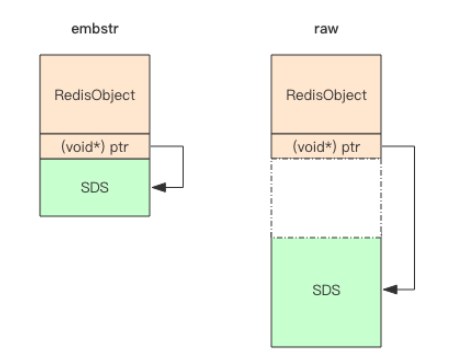

embstr存储形式是这样⼀种存储形式，它将 RedisObject对象头和 SDS对象连续存在⼀起，使⽤malloc⽅法⼀次分配。⽽ raw存储形式不⼀样，它需要两次malloc，两个对象头在内存地址上⼀般是不连续的。

⽽内存分配器 jemalloc/tcmalloc等分配内存⼤⼩的单位都是 2、4、8、16、32、64等等，为了能容纳⼀个完整的 embstr对象，jemalloc最少会分配 32字节的空间，如果字符串再稍微⻓⼀点，那就是 64字节的空间。如果总体超出了 64字节，Redis认为它是⼀个⼤字符串，不再使⽤ emdstr形式存储，⽽该⽤ raw形式。

当分配的⻓度是64字节时，buf的⻓度便是64-19＝45.由于buf还有⼀个字符串末尾字符'\0'，所以最终字符串⻓度为64-19-1.当字符串⻓度超过44字节时，使⽤ raw形式存储。

字符串在⻓度⼩于 1M之前，扩容空间采⽤加倍策略，也就是保留 100%的冗余空间。当⻓度超过 1M之后，为了避免加倍后的冗余空间过⼤⽽导致浪费，每次扩容只会多分配 1M⼤⼩的冗余空间。

### 1.3.3. 链表


链表数据结构，可以看到Redis是⼀个双向链表结构。⾮环形链表。


```cpp
typedef struct listNode {
    //前节点
    struct listNode *prev;
    //后节点
    struct listNode *next;
    //节点值，void 型，可以保存任何数据
    void *value;
} listNode;

typedef struct list {
    //头节点
    listNode *head;
    //尾节节点
    listNode *tail;
    //节点值复制函数
    void *(*dup)(void *ptr);
    //节点值释放函数
    void (*free)(void *ptr);
    //节点值对比函数
    int (*match)(void *ptr, void *key);
    //链表长度
    unsigned long len;
} list;
```

链表⼴泛⽤于Redis各种功能，⽐如列表，发布订阅，慢查询，监视器等。


### 1.3.4. 字典

#### 1.3.4.1. 字典数据结构

dict是 Redis服务器中出现最为频繁的复合型数据结构，除了 hash结构的数据会⽤到字典外，整个 Redis数据库的所有 key和 value也组成了⼀个全局字典，还有带过期时间的 key集合也是⼀个字典。zset集合中存储value和 score值的映射关系也是通过 dict结构实现的。

Redis⾥⾯ set的结构底层实现也是字典，只不过所有的 value都是 NULL，其它的特性和字典⼀模⼀样。


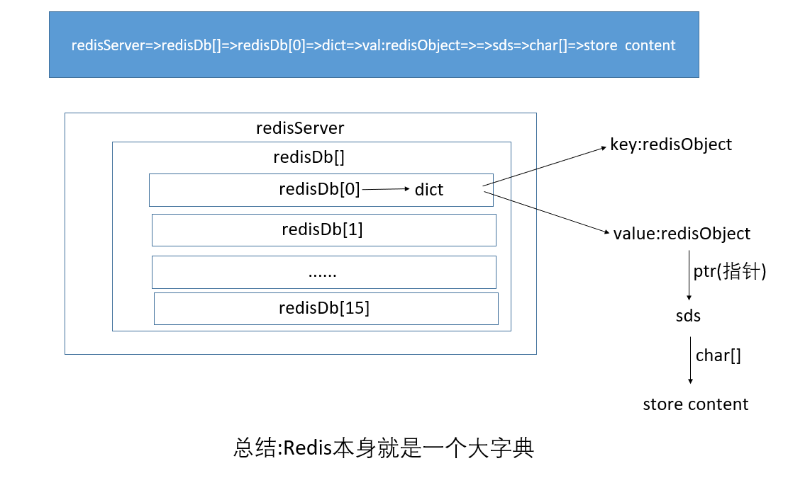

```cpp
typedef struct redisDb {
    dict *dict;	/* The keyspace for this DB */
    dict *expires;	/* Timeout of keys with a timeout set */
    dict *blocking_keys;	/* Keys with clients waiting for data
    (BLPOP)*/
    dict *ready_keys;	/* Blocked keys that received a PUSH */
    dict *watched_keys;	/* WATCHED keys for MULTI/EXEC CAS */
    int id;	/* Database ID */
    long long avg_ttl;	/* Average TTL, just for stats */
    unsigned long expires_cursor; /* Cursor of the active expire cycle. */
    list *defrag_later;	/* List of key names to attempt to defrag
    one by one, gradually. */
    } redisDb;

typedef struct dict {
    dictType *type;
    void *privdata;
    dictht ht[2];
    long rehashidx; /* rehashing not in progress if rehashidx == -1 */
    unsigned long iterators; /* number of iterators currently running */
} dict;


```
* 字典，⼜称符号表(symbol table),关联数组(associative array)或映射(map)，是⼀种⽤于保存键值对(key-value)的抽象数据结构。
* Redis底层就是在字典数据结构之上实现的
    * set key value ,保存⼀个键值对
* 采⽤链地址法解决hash冲突

字典所⽤的哈希表定义
```cpp
typedef struct dictht {
    //哈希数组表
    dictEntry **table;
    //哈希表大小
    unsigned long size;
    //哈希表大小掩码，用于计算索引值
    //总是等于size-1
    unsigned long sizemask;
    //该hash表已有节点的数量
    unsigned long used;
} dictht;
```


哈希表节点定义


```cpp
typedef struct dictEntry {
    //键
    void *key;
    //值，可保存浮点，整形，或者其他类型数据
    union {
        void *val;
        uint64_t u64;
        int64_t s64;
        double d;
    } v;
    //指向下一个节点
    struct dictEntry *next;
} dictEntry;
```


字典结构定义
```cpp
typedef struct dict {
    //类型特定函数
    dictType *type;
    //私有数据
    void *privdata;
    //哈希表
    dictht ht[2];
    //记录rehash 进度，不在rehash时为－１
    long rehashidx; /* rehashing not in progress if rehashidx == -1 */
    unsigned long iterators; /* number of iterators currently running */
} dict;
typedef struct dictType {
    //计算哈希值的函数
    uint64_t (*hashFunction)(const void *key);
    //复制键的函数
    void *(*keyDup)(void *privdata, const void *key);
    //复制值的函数
    void *(*valDup)(void *privdata, const void *obj);
    //对比键的函数
    int (*keyCompare)(void *privdata, const void *key1, const void *key2);
    //销毁键的函数
    void (*keyDestructor)(void *privdata, void *key);
    //销毁值的函数
    void (*valDestructor)(void *privdata, void *obj);
} dictType;
```


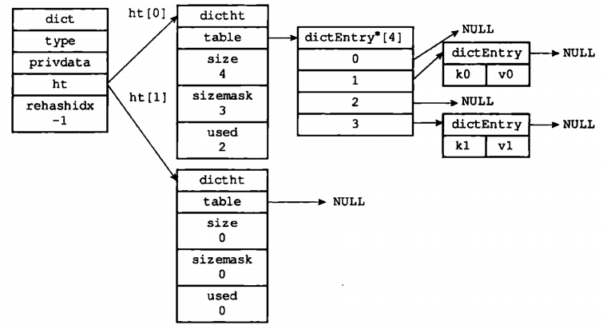

⼀般情况下字典只使⽤ht[0]存储数据，ht[1]在reshah时使⽤。dict结构内部包含两个 hashtable，通常情况下只有⼀个 hashtable是有值的。但是在dict扩容缩容时，需要分配新的 hashtable，然后进⾏渐进式搬迁，这时候两个 hashtable存储的分别是旧的 hashtable和新的 hashtable。待搬迁结束后，旧的 hashtable被删除，新的hashtable取⽽代之。


#### 1.3.4.2. hash函数


hashtable的性能好不好完全取决于 hash函数的质量。hash函数如果可以将 key打散的⽐较均匀，那么这个hash函数就是个好函数。Redis的字典默认的 hash函数是siphash。siphash算法即使在输⼊ key很⼩的情况下，也可以产⽣随机性特别好的输出，⽽且它的性能也⾮常突出。对于 Redis这样的单线程来说，字典数据结构如此普遍，字典操作也会⾮常频繁，hash函数⾃然也是越快越好。

如果 hash函数存在偏向性，⿊客就可能利⽤这种偏向性对服务器进⾏攻击。存在偏向性的 hash函数在特定模式下的输⼊会导致 hash第⼆维链表⻓度极为不均匀，甚⾄所有的元素都集中到个别链表中，直接导致查找效率急剧下降，从O(1)退化到O(n)。有限的服务器计算能⼒将会被 hashtable的查找效率彻底拖垮。这就是所谓hash攻击。


#### 1.3.4.3. Rehash

随着操作的不断进⾏，哈希表的键值对数量不断增多或者减少，为了让哈希表的负载因⼦维持在⼀个合理的范围内，需要对字典表进⾏重新扩展或者收缩

哈希表装填因⼦定义为：α=填⼊表中的元素个数 /哈希表的⻓度. α是哈希表装满程度的标志因⼦。由于表⻓是定值，α与“填⼊表中的元素个数”成正⽐，所以，α越⼤，填⼊表中的元素较多，产⽣冲突的可能性就越⼤；α越⼩，填⼊表中的元素较少，产⽣冲突的可能性就越⼩。

load_factor = ht[0].used /ht[1].size

**Rehash步骤**
* 为字典ht[1]哈希表分配空间，这个哈希表空间的⼤⼩取决于要执⾏的操作，以及ht[0]当前包含的键值对数量(也就是ht[0].used属性的值)
* 如果执⾏的是扩展操作，那么ht[1]的⼤⼩为第⼀个⼤于等于ht[0].used * 2的2的n次幂
* 如果执⾏的是收缩操作，那么ht[1]的⼤⼩为第⼀个⼤于等于ht[0].used的2的2的次幂
* 将保存的ht[0]中的所有键值对rehash到ht[1]上⾯，
* 将ht[0]包含的所有键值对都迁移到ht[1]之后(ht[0]变为空表)，释放ht[0],将ht[1]设置为ht[0],并在ht[1]创建⼀个空⽩哈希表，为下⼀次rehash作准备。

⽐如原ht[0]的used为4，5×２＝10，那么第⼀个超过它的２的n次⽅是16.因此ht[1]的⼤⼩设置为16。

为什么要这么设计，因为当len的⻓度为２的幂次⽅时，index=hash%len = hash & (len-1).

**哈希表扩展和收缩**
* 当以下任意条件被满⾜时，程序开始对哈希表进⾏扩展操作
    * 服务器⽬前没有执⾏BGSAVE或者BGREWRITEAOF命令，但是哈希表的负载因⼦⼤于等于1
    * 服务器⽬前正在执⾏BGSAVE或者BGREWRITEAOF，并且负载因⼦⼤于等于5
        * 负载因⼦=哈希表使⽤的节点数量/哈希表⼤⼩
        * 由于这两个命令采⽤写时复制来优化⼦进程的使⽤效率，所以在⼦进程执⾏期间，为了避免哈希表扩展操作，提⾼了负载因⼦。这样限制可以在这两个命令执⾏期间进⾏哈希表扩展操作。
* 收缩条件
    * 当负载因⼦⼩于0.1时，程序⾃动开始对哈希表执⾏收缩操作。

#### 1.3.4.4. 渐进式Hash

rehash需要将ht[0]的键值rehash到ht[1],但这个过程并不是⼀次性完成，⽽是分多次渐进式完成。⽐如说⼏千万个键值对，很难在⼀瞬间完成rehash,庞⼤的计算会导致服务器在⼀段时间内停⽌服务。

**渐进式ReHash**
* 为ht[1]分配空间，让字典同时拥有ht[0],ht[1]
* 在字典中维持⼀个索引计数器变量rehashidx，并将它的值设置为0,标识rehash⼯作正是开始
* 在rehash进⾏期间，每次对字典执⾏添加，删除，查找或者更新操作时，程序除了在ht[0]上执⾏指定的操作以外，还会顺带将ht[0]哈希表在rehashidx索引上的所有键值对rehash到ht[1],当rehash⼯作完成，程序将rehashidx属性+1;
    * 添加:新添加的数据会被添加到ht[1],不会添加到ht[0]
    * 查找:先找ht[0],找不到找ht[1]
    * 随着操作的不断进⾏，最终在某个时间点上，ht[0]的所有键值对都会被rehash⾄ht[1],这时rehashidx设置为-1，表⽰操作完成。

渐进式rehash的好处在于它采取分⽽治之的⽅式，将rehash键值对所需的计算⼯作均摊到对字典的每个添加，删除和更新操作上，从⽽避免了瞬间执⾏所带来的庞⼤的计算量。

#### 1.3.4.5. rehash流程

每次调⽤dictAddRaw添加字典数据时，就会检测当前是否需要进⾏rehash,是的话就执⾏rehash。这是通过dict->rehashidx变量来确定的，rehashidx记录rehash时当前执⾏rehash的字典的桶的位置。⾮rehash状态时为-1.

```cpp
dictEntry *dictAddRaw(dict *d, void *key, dictEntry **existing)
{
    long index;
    dictEntry *entry;
    dictht *ht;
    // ((d)->rehashidx != -1)
    //当前正在进行rehash，是的话就执行rehash
    if (dictIsRehashing(d)) _dictRehashStep(d);

    /* Get the index of the new element, or -1 if
    * the element already exists. */
    if ((index = _dictKeyIndex(d, key, dictHashKey(d,key), existing)) ==


    /* Allocate the memory and store the new entry.
    * Insert the element in top, with the assumption that in a database
    * system it is more likely that recently added entries are accessed
    * more frequently. */
    //如果当前正在进行rehash，则只添加到ht[1]
    ht = dictIsRehashing(d) ? &d->ht[1] : &d->ht[0];
    //分配空间
    entry = zmalloc(sizeof(*entry));
    entry->next = ht->table[index];

    ht->table[index] = entry;
    ht->used++;

    /* Set the hash entry fields. */
    dictSetKey(d, entry, key);
    return entry;
}
```            


rehash是以bucket(桶)为基本单位进⾏渐进式的数据迁移的，每步完成⼀个bucket的迁移，直⾄所有数据迁移完毕。⼀个bucket对应哈希表数组中的⼀条entry链表。新版本的dictRehash()还加⼊了⼀个最⼤访问空桶数(empty_visits)的限制来进⼀步减⼩可能引起阻塞的时间。


```cpp
static void _dictRehashStep(dict *d) {
    if (d->iterators == 0) dictRehash(d,1);
}
/*
d: 需要复制的字典，n:用于限制每次复制的量级大小，n越大，rehash越多.
返回值未用到
*/
int dictRehash(dict *d, int n) {
    //限制访问到空桶的次数,避免长时间阻塞
    int empty_visits = n*10; /* Max number of empty buckets to visit. */

    if (!dictIsRehashing(d)) return 0;

    while(n-- && d->ht[0].used != 0) {
    dictEntry *de, *nextde;

    /* Note that rehashidx can't overflow as we are sure there are more
    * elements because ht[0].used != 0 */
    assert(d->ht[0].size > (unsigned long)d->rehashidx);
    //从rehashidx开始，查找到有数据的桶的位置
    while(d->ht[0].table[d->rehashidx] == NULL) {
        d->rehashidx++;
        //限制
        if (--empty_visits == 0) return 1;
    }
    de = d->ht[0].table[d->rehashidx];
    /* Move all the keys in this bucket from the old to the new hash HT

    //将ht[0]桶位置所有节点数据复制到ht[1]
    while(de) {
    uint64_t h;


    /* Get the index in the new hash table */
    h = dictHashKey(d, de->key) & d->ht[1].sizemask;
    de->next = d->ht[1].table[h];
    d->ht[1].table[h] = de;
    d->ht[0].used--;
    d->ht[1].used++;

    //清空ht[0]的桶位置数据
    d->ht[0].table[d->rehashidx] = NULL;
    d->rehashidx++;


    /* Check if we already rehashed the whole table... */
    if (d->ht[0].used == 0) {
    zfree(d->ht[0].table);
    d->ht[0] = d->ht[1];
    //复制完成则初始化ht[1],table = null,size = used = 0
    _dictReset(&d->ht[1]);
    d->rehashidx = -1;
    return 0;
}

```
渐进式哈希的精髓在于：数据的迁移不是⼀次性完成的，⽽是可以通过dictRehash()这个函数分步规划的，并且调⽤⽅可以及时知道是否需要继续进⾏渐进式哈希操作。如果dict数据结构中存储了海量的数据，那么⼀次性迁移势必带来redis性能的下降，别忘了redis是单线程模型，在实时性要求⾼的场景下这可能是致命的。⽽渐进式哈希则将这种代价可控地分摊了，调⽤⽅可以在dict做插⼊，删除，更新的时候执⾏dictRehash()，最⼩化数据迁移的代价。

#### 1.3.4.6. 何时rehash

从上⾯可以看出，程序是通过rehashidx变量来检测是否进⾏rehash。那么什么时候置零是关键。

**扩容∕缩容初始化**

不管是扩容还是缩容，每次都会调⽤dictExpand进⾏ht[1]的初始化。

```cpp

int dictExpand(dict *d, unsigned long size)
{
    /* the size is invalid if it is smaller than the number of
    * elements already inside the hash table */
    if (dictIsRehashing(d) || d->ht[0].used > size)
    return DICT_ERR;

    dictht n; /* the new hash table */
    //两倍扩容或者缩容，新的size为２的n次方
    unsigned long realsize = _dictNextPower(size);

    /* Rehashing to the same table size is not useful. */
    if (realsize == d->ht[0].size) return DICT_ERR;

    /* Allocate the new hash table and initialize all pointers to NULL */
    n.sizemask = realsize-1;
    n.table = zcalloc(realsize*sizeof(dictEntry*));
    n.used = 0;

    /* Is this the first initialization? If so it's not really a rehashing
    * we just set the first hash table so that it can accept keys. */
    if (d->ht[0].table == NULL) {
        d->ht[0] = n;
        return DICT_OK;
    }

    /* Prepare a second hash table for incremental rehashing */
    d->ht[1] = n;
    d->rehashidx = 0;
    return DICT_OK;
}
```


```yml
# 负载因子 = 哈希表已保存节点数量 / 哈希表大小
load_factor = ht[0].used / ht[0].size;
```

**扩容**

在上⾯的dictAddRaw中调⽤了_dictKeyIndex⽅法

```cpp
        
static long _dictKeyIndex(dict *d, const void *key, uint64_t hash,dictEntry **existing)
{
    unsigned long idx, table;
    dictEntry *he;
    if (existing) *existing = NULL;

    /* Expand the hash table if needed */
    //检测是否需要进行扩容
    if (_dictExpandIfNeeded(d) == DICT_ERR)
    return -1;
    for (table = 0; table <= 1; table++) {
        idx = hash & d->ht[table].sizemask;
        /* Search if this slot does not already contain the given key */
        he = d->ht[table].table[idx];
        while(he) {
            if (key==he->key || dictCompareKeys(d, key, he->key)) {
                if (existing) *existing = he;
                return -1;
            }
            he = he->next;
        }
        if (!dictIsRehashing(d)) break;
    }
    return idx;

}
/* Expand the hash table if needed */
static int _dictExpandIfNeeded(dict *d)
{
    /* Incremental rehashing already in progress. Return. */
    if (dictIsRehashing(d)) return DICT_OK;

    /* If the hash table is empty expand it to the initial size. */
    if (d->ht[0].size == 0) return dictExpand(d, DICT_HT_INITIAL_SIZE);

    /* If we reached the 1:1 ratio, and we are allowed to resize the hash
    * table (global setting) or we should avoid it but the ratio between
    * elements/buckets is over the "safe" threshold, we resize doubling
    * the number of buckets. */
    //dict_force_resize_ratio = 5
    if (d->ht[0].used >= d->ht[0].size &&
    (dict_can_resize ||
    d->ht[0].used/d->ht[0].size > dict_force_resize_ratio))
    {
        return dictExpand(d, d->ht[0].used*2);
    }
    return DICT_OK;
}
```


从上⾯可以看出，当字典的哈希表中节点的数量used超过桶数量size的５倍时，则会进⾏扩容。扩容⼤⼩⾄少为当前⼤⼩的两倍。

当以下条件被满⾜时，程序会⾃动开始对哈希表执⾏扩展操作：
* 服务器当前没有进⾏ rehash；
* 哈希表已保存节点数量⼤于哈希表⼤⼩；
* dict_can_resize参数为 1，或者负载因⼦⼤于设定的⽐率（默认为 5）；

```cpp
void updateDictResizePolicy(void) {
    if (!hasActiveChildProcess())
        //子进程空闲的时候允许
        dictEnableResize();
        else
        //子进程在工作时禁止
        dictDisableResize();
    }

    /* Return true if there are no active children processes doing RDB saving,
    * AOF rewriting, or some side process spawned by a loaded module. */
    int hasActiveChildProcess() {
    return server.rdb_child_pid != -1 ||
    server.aof_child_pid != -1 ||
    server.module_child_pid != -1;
}
```


也就是正常情况下，当 hash表中元素的个数等于第⼀维数组的⻓度时，就会开始扩容，扩容的新数组是原数组⼤⼩的 2倍。但存在⼦进程运⾏时，尽量不执⾏rehash，此时只有负载因此超过阈值时才会强制进⾏rehash.

**收缩**

```cpp

/* Resize the table to the minimal size that contains all the elements,
* but with the invariant of a USED/BUCKETS ratio near to <= 1 */
int dictResize(dict *d)
{
    unsigned long minimal;

    if (!dict_can_resize || dictIsRehashing(d)) return DICT_ERR;
    minimal = d->ht[0].used;
    if (minimal < DICT_HT_INITIAL_SIZE)
    minimal = DICT_HT_INITIAL_SIZE;
    return dictExpand(d, minimal);
}

void tryResizeHashTables(int dbid) {
    if (htNeedsResize(server.db[dbid].dict))
    dictResize(server.db[dbid].dict);
    if (htNeedsResize(server.db[dbid].expires))
    dictResize(server.db[dbid].expires);
}
//
#define dictSlots(d) ((d)->ht[0].size+(d)->ht[1].size)
#define dictSize(d) ((d)->ht[0].used+(d)->ht[1].used)
int htNeedsResize(dict *dict) {
    long long size, used;
    //实际返回的是ht[0]的数据
    size = dictSlots(dict);
    used = dictSize(dict);
    //DICT_HT_INITIAL_SIZE 默认为 4，HASHTABLE_MIN_FILL 默认为 10。
    return (size > DICT_HT_INITIAL_SIZE &&
    (used*100/size < HASHTABLE_MIN_FILL));
}
```


当 ht[]哈希表的⼤⼩之和⼤于 DICT_HT_INITIAL_SIZE（默认 4），且已保存节点数量与总⼤⼩之⽐⼩于 4，HASHTABLE_MIN_FILL（默认 10，也就是 10%），会对哈希表进⾏收缩操作。收缩操作不考虑是否存在⼦进程在执⾏任务。

redis通过tryResizeHashTables⽅法执⾏去检测是否需要rehash.⽽该⽅法的上层调⽤为serverCron()，这是redis的定时任务，其调⽤频率由配置⽂件中的hz（定时任务间隔时间t = 1000ms/hz）决定。
```cpp
serverCron(){
    databasesCron();
}
databasesCron(){
    /* Resize */
    for (j = 0; j < dbs_per_call; j++) {
        tryResizeHashTables(resize_db % server.dbnum);
        resize_db++;
    }
}
```

**总结:**redis启动之后会以hz的频率创建⼀个定时任务，在定时任务中检测是否需要执⾏rehash，需要则创建ht[1]，ht[1]的table的size必须是２的n次⽅，同时置 rehashidx变量为0。当添加字典数据时再进⾏rehash.

### 1.3.5. 跳跃表

<a href="#menu"  >目录</a> 

#### 1.3.5.1. 跳跃表结构

* 跳跃表是⼀种有序的数据结构，通过在每个节点中维持多个指向其他节点的指针，从⽽达到快速访问节点的⽬的。
* 跳跃表⽀持平均O(logN),最坏O(n)复杂度的节点查找，还可以通过顺序性操作来处理节点
* 在⼤部分情况下，跳跃表的效率可以和平衡数相媲美，跳跃表实现更为简单。
* 跳跃表是有序集合的底层实现之⼀
    * 如果⼀个有序集合包含的元素数量⽐较多使⽤跳跃表
    * 有序集合中元素的成员是⽐较⻓的字符串的时候使⽤跳跃表


* 原链表保存所有的数据，并且根据⼀定的规则进⾏⾼顺序存放，因可以获取范围值
* 原链表之上是不同的层级，每层节点是抽取下⼀层的节点，节点从左到右也是排序的
* 搜索节点时是从最顶层往下搜索
* 跳跃表可以减少⽐较的次数，⽐如搜索8，只需要⽐较三次即可、如果是链表，需要⽐较8次。


**总结**
* 跳跃表是有序集合的底层实现之⼀
* Redis的跳跃表由zskiplist和zskiplistNode两个结构组成，其中zskiplist⽤于保存跳跃表信息(⽐如表头节点，表尾节点，⻓度)，⽽zskiplistNode则⽤于跳跃表节点
* 每⼀个跳跃表层⾼在1-32之间的随机数
* 在同⼀个跳跃表中，多个节点可以包含相同的分值，但每个节点的成员对象必须是唯⼀的。
* 跳跃表中的节点按照分值⼤⼩进⾏排序，当分值相同时，节点按照成员对象的⼤⼩进⾏排序。


#### 1.3.5.2. Ｒedis跳表数据结构


```cpp
typedef struct zskiplistNode {
    sds ele;
    double score;
    struct zskiplistNode *backward;
    struct zskiplistLevel {
        struct zskiplistNode *forward;
        unsigned long span;
    } level[];
} zskiplistNode;

typedef struct zskiplist {
    struct zskiplistNode *header, *tail;
    unsigned long length;
    int level;
} zskiplist;
typedef struct zset {
    dict *dict;
    zskiplist *zsl;
} zset;
```

#### 1.3.5.3. Ｒedis跳表说明

Ｒedis跳表是有序集合键的底层实现之⼀,如果⼀个有序集合包含的元素数量⽐较多,⼜或者有序集合中元素的成员是⽐较⻓的字符串时, Redis就会使⽤跳跃表来作为有序集合健的底层实现。

跳跃表在链表的基础上增加了多级索引以提升查找的效率，但其是⼀个空间换时间的⽅案，必然会带来⼀个问题——索引是占内存的。原始链表中存储的有可能是很⼤的对象，⽽索引结点只需要存储关键值值和⼏个指针，并不需要存储对象，因此当节点本⾝⽐较⼤或者元素数量⽐较多的时候，其优势必然会被放⼤，⽽缺点则可以忽略。


* header:指向跳跃表的表头节点，通过这个指针程序定位表头节点的时间复杂度就为O(1)
* tail:指向跳跃表的表尾节点,通过这个指针程序定位表尾节点的时间复杂度就为O(1)
* level:记录⽬前跳跃表内,层数最⼤的那个节点的层数(表头节点的层数不计算在内)，通过这个属性可以再O(1)的时间复杂度内获取层⾼最好的节点的层数。
* length:记录跳跃表的⻓度,也即是,跳跃表⽬前包含节点的数量(表头节点不计算在内)，通过这个属性，程序可以再O(1)的时间复杂度内返回跳跃表的⻓度。

结构右⽅的是四个 zskiplistNode结构,该结构包含以下属性
* 层(level):
    * 节点中⽤1、2、L3等字样标记节点的各个层,L1代表第⼀层,L代表第⼆层,以此类推。
    * 每个层都带有两个属性:前进指针和跨度。前进指针⽤于访问位于表尾⽅向的其他节点,⽽跨度则记录了前进指针所指向节点和当前节点的距离(跨度越⼤、距离越远)。在上图中,连线上带有数字的箭头就代表前进指针,⽽那个数字就是跨度。当程序从表头向表尾进⾏遍历时,访问会沿着层的前进指针进⾏。
    * 每次创建⼀个新跳跃表节点的时候,程序都根据幂次定律(powerlaw,越⼤的数出现的概率越⼩)随机⽣成⼀个介于1和32之间的值作为level数组的⼤⼩,这个⼤⼩就是层的“⾼度”。
* 后退(backward)指针：
    * 节点中⽤BW字样标记节点的后退指针,它指向位于当前节点的前⼀个节点。后退指针在程序从表尾向表头遍历时使⽤。与前进指针所不同的是每个节点只有⼀个后退指针，因此每次只能后退⼀个节点。
* 分值(score):
    * 各个节点中的1.0、2.0和3.0是节点所保存的分值。在跳跃表中,节点按各⾃所保存的分值从⼩到⼤排列。
* 成员对象(ele):
    * 各个节点中的o1、o2和o3是节点所保存的成员对象。在同⼀个跳跃表中,各个节点保存的成员对象必须是唯⼀的,但是多个节点保存的分值却可以是相同的:分值相同的节点将按照成员对象在字典序中的⼤⼩来进⾏排序,成员对象较⼩的节点会排在前⾯(靠近表头的⽅向),⽽成员对象较⼤的节点则会排在后⾯(靠近表尾的⽅向)。


### 1.3.6. 整数集合


### 1.3.7. 压缩列表

<a href="#menu"  >目录</a> 

压缩列表是列表键和哈希键的底层实现之⼀，当⼀个列表键只包含少量的列表项,并且每个列表项要么就是⼩整数值，要么就是⻓度⽐较短的字符串，Redis就会使⽤压缩列表来做列表键的底层实现。

压缩列表是⼀种数据结构，这种数据结构的功能是将⼀系列数据与其编码信息存储在⼀块连续的内存区域，这块内存物理上是连续的，逻辑上被分为多个组成部分，其⽬的是在⼀定可控的时间复杂读条件下尽可能的减少不必要的内存开销，从⽽达到节省内存的效果

Redis对于每种数据结构、⽆论是列表、哈希表还是有序集合，在决定是否应⽤压缩列表作为当前数据结构类型的底层编码的时候都会依赖⼀个开关和⼀个阈值，开关⽤来决定我们是否要启⽤压缩列表编码，阈值总的来说通常指当前结构存储的key数量有没有达到⼀个数值（条件），或者是value值⻓度有没有达到⼀定的⻓度（条件）。任何策略都有其应⽤场景，不同场景应⽤不同策略。为什么当前结构存储的数据条⽬达到⼀定数值使⽤压缩列表就不好？压缩列表的新增、删除的操作平均时间复杂度为O(N)，随着N的增⼤，时间必然会增加，他不像哈希表可以以O(1)的时间复杂度找到存取位置，然⽽在⼀定N内的时间复杂度我们可以容忍。然⽽压缩列表利⽤巧妙的编码技术除了存储内容尽可能的减少不必要的内存开销，将数据存储于连续的内存区域，这对于Redis本⾝来说是有意义的，因为Redis是⼀款内存数据库软件，想办法尽可能减少内存的开销是Redis设计者⼀定要考虑的事情。

另外，经过仔细琢磨，我认为使⽤压缩列表的好处除了节约内存之外，还有减少内存碎⽚的作⽤，我把这种⾏为叫做"合并存储"，也就是将很多⼩的数据块存储在⼀个⽐较⼤的内存区域，试想想，如果我们将要存储的数据都是很⼩的条⽬，我们为每⼀个数据条⽬都单独的申请内存，结果是这些条⽬将有可能分散在内存的每⼀个⾓落，最终导致碎⽚增加，这是⼀件令⼈头疼的事情

## 1.4. 持久化

### 1.4.1. Redis持久化

Redis提供了多种不同级别的持久化⽅式：
* RDB持久化可以在指定的时间间隔内⽣成数据集的时间点快照（point-in-time snapshot）。
* AOF持久化记录服务器执⾏的所有写操作命令，并在服务器启动时，通过重新执⾏这些命令来还原数据集。AOF⽂件中的命令全部以 Redis协议的格式来保存，新命令会被追加到⽂件的末尾。Redis还可以在后台对 AOF⽂件进⾏重写（rewrite），使得 AOF⽂件的体积不会超出保存数据集状态所需的实际⼤⼩。
* Redis还可以同时使⽤ AOF持久化和 RDB持久化。在这种情况下，当 Redis重启时，它会优先使⽤AOF⽂件来还原数据集，因为 AOF⽂件保存的数据集通常⽐ RDB⽂件所保存的数据集更完整。
* 你甚⾄可以关闭持久化功能，让数据只在服务器运⾏时存在。

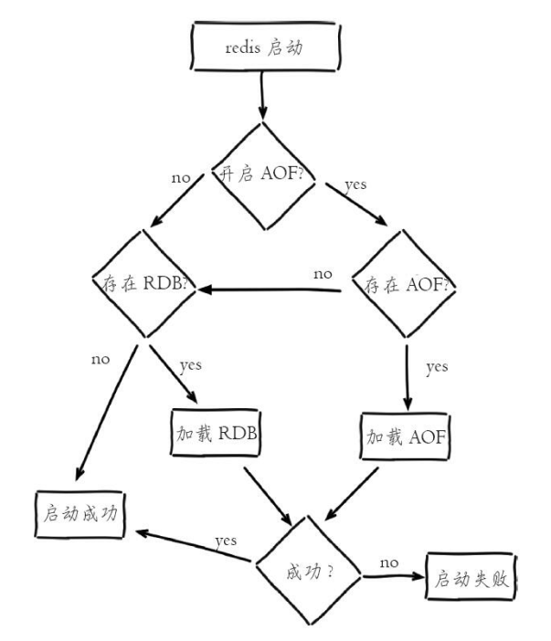

### 1.4.2. RDB持久化

#### 1.4.2.1. 快照条件

* 快照
    * RDB⽅式的持久化是通过快照⽅式完成的。当符合⼀定条件时会⾃动将内存中的所有数据⽣成⼀份副本并存储在硬盘上，这个过程即为”快照“
* 快照情况
    * 根据配置规则(save)进⾏快照
    * ⽤户执⾏SAVE或者BGSAVE命令
    * 执⾏FLUSHALL命令
    * 执⾏复制时

**根据配置规则进⾏⾃动快照**

配置⽂件配置
```yml
# save 时间窗口(秒) 改动的键的个数
# 900 秒内有一个键改动
save 900 1
save 300 10
save 60 10000
```
配置多条时，多条的关系是和”或“，只要有⼀个满⾜就会执⾏RDB操作。

**其他配置**
```yml
rdbcompression yes #指定存储至本地数据库时是否压缩数据，默认是yes，redis采用LZF压
缩，如果为了节省CPU时间
#可以关闭该选项，但会导致数据库文件扁的巨大

dbfilename dump.rdb #指定rdb保存到本地数据库文件名

stop-writes-on-bgsave-error yes #当硬盘因为权限等原因无法写入时，停止写入

rdbchecksum yes	#对rdb文件进行校验
```

**⽤户执⾏SAVE或者BGSAVE命令**

* SAVE
    * 同步执⾏快照操作，直到快照完成。会阻塞客户端的请求，因此可能造成客户端较⻓的响应时间
* BGSAVE 
    * 异步执⾏，可以通过LASTSAVE查看最近⼀次成功执⾏快照的时间(时间戳)
    * 阻塞只发⽣在fork阶段，⼀般时间很短
    * 随着Redis占⽤的内存越来越多，那么创建⼦进程所消耗的时间也越来越多，因此也会出现系统⻓时间的停顿，⽆法响应客户端。
    * 显然bgsave命令是针对save阻塞问题做的优化。因此Redis内部所有的涉及RDB的操作都采⽤bgsave的⽅式，⽽save命令已经废弃

**执⾏FLUSHALL命令**

FLUSHALL会清除数据库中的所有数据，只要⾃动快照的条件不为空，则会执⾏⼀次快照。

**执⾏复制时**

当设置了主从模式，Redis会在复制初始化时进⾏⾃动快照。


#### 1.4.2.2. 快照原理


Redis默认将快照⽂件存储在Redis当前进程的⼯作<a href="#menu"  >目录</a> 中的dump.rdb⽂件中。可以通过配置dir和dbfilename两个参数分别指定快照⽂件的存储路径和⽂件名

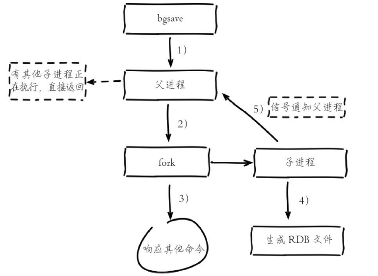


**快照流程**
* 执⾏bgsave命令，Redis⽗进程判断当前是否存在正在执⾏的⼦进程，如RDB/AOF⼦进程，如果存在bgsave命令直接返回
* ⽗进程执⾏fork操作创建⼦进程，fork操作过程中⽗进程会阻塞，通过info stats命令查看latest_fork_usec选项，可以获取最近⼀个fork操作的耗时，单位为微秒。
* ⽗进程fork完成后，bgsave命令返回“Background saving started”信息并不再阻塞⽗进程，可以继续响应其他命令。
* ⽗进程继续接收并处理客户端发来的命令，⽽⼦进程开始将内存中的数据写⼊硬盘中的临时⽂件。
    * 采⽤写时复制策略，fork时刻⽗⼦进程共享同⼀个内存数据，当⽗进程需要修改某⽚数据时，会复制该⽚数据出来进⾏修改以保证⼦进程数据不受影响。
* 所以RDB保存的是fork时刻的数据
* ⼦进程创建RDB⽂件，根据⽗进程内存⽣成临时快照⽂件，完成后对原有⽂件进⾏原⼦替换。执⾏lastsave命令可以获取最后⼀次⽣成RDB的时间，对应info统计的rdb_last_save_time选项。
* 进程发送信号给⽗进程表⽰完成，⽗进程更新统计信息，具体⻅info Persistence下的rdb_*相关选项。


```yml
127.0.0.1:6379> info Persistence
# Persistence
loading:0
rdb_changes_since_last_save:0
rdb_bgsave_in_progress:0
rdb_last_save_time:1609197656
rdb_last_bgsave_status:ok
rdb_last_bgsave_time_sec:0
rdb_current_bgsave_time_sec:-1
rdb_last_cow_size:360448
aof_enabled:0
aof_rewrite_in_progress:0
aof_rewrite_scheduled:0
aof_last_rewrite_time_sec:-1
aof_current_rewrite_time_sec:-1
aof_last_bgrewrite_status:ok
aof_last_write_status:ok
aof_last_cow_size:0
```

* RDB⽂件是经过压缩的⼆进制⽂件，可以通过rdbcompression禁⽤压缩以便节省CPU占⽤。
* Redis启动后会读取RDB⽂件，将数据从硬盘载⼊内存中。通常⼀个记录1000万个字符串类型键，⼤⼩为1GB的快照⽂件载⼊需要花费20-30秒。
* ⼀旦快照过程Redis异常退出，就会丢失最后⼀次快照之后修改的内容

**写时复制策略**

在执⾏fork的时候操作系统Unix会使⽤写时复制(copy-on-write)策略,即fork函数发⽣的⼀刻⽗⼦进程共享同⼀内存数据,当⽗进程要更改其中某⽚数据的时候,操作系统会将该⽚数据复制⼀份以保证⼦进程的数据不受影响,所以新的RDB⽂件存储的是执⾏fork⼀刻的内存数据.注意写时复制机制在fork的时候并不是产⽣两份内存副本.

当进⾏快照的过程中,如果写⼊操作较多,造成fork前后数据差异较⼤.是会使得内存使⽤量显著超过实际⼤⼩的.因为内存中不仅保存了当前的数据库数据,还保存了新增的数据.

**RDB⽂件的处理**

保存：RDB⽂件保存在dir配置指定的<a href="#menu"  >目录</a> 下，⽂件名通过dbfilename配置指定。可以通过执⾏config setdir{newDir}和config set dbfilename{newFileName}运⾏期动态执⾏，当下次运⾏时RDB⽂件会保存到新<a href="#menu"  >目录</a> 当遇到坏盘或磁盘写满等情况时，可以通过config set dir{newDir}在线修改⽂件路径到可⽤的磁盘路径，之后执⾏bgsave进⾏磁盘切换，同样适⽤于AOF持久化⽂件。

压缩：Redis默认采⽤LZF算法对⽣成的RDB⽂件做压缩处理，压缩后的⽂件远远⼩于内存⼤⼩，默认开启，可以通过参数config setrdbcompression{yes|no}动态修改。

虽然压缩RDB会消耗CPU，但可⼤幅降低⽂件的体积，⽅便保存到硬盘或通过⽹络发送给从节点，因此线上建议开启。

如果Redis加载损坏的RDB⽂件时拒绝启动，可以使⽤Redis提供的redis-check-dump⼯具检测RDB⽂件并获取对应的错误报告。


#### 1.4.2.3. 优点和缺点

* RDB的优点：
    * RDB是⼀个紧凑压缩的⼆进制⽂件，代表Redis在某个时间点上的数据快照。⾮常适⽤于备份，全量复制等场景。⽐如每6⼩时执⾏bgsave备份，并把RDB⽂件拷⻉到远程机器或者⽂件系统中（如hdfs），⽤于灾难恢复。
    * Redis加载RDB恢复数据远远快于AOF的⽅式。
* RDB的缺点：
    * RDB⽅式数据没办法做到实时持久化/秒级持久化。因为bgsave每次运⾏都要执⾏fork操作创建⼦进程，属于重量级操作，频繁执⾏成本过⾼。
    * RDB⽂件使⽤特定⼆进制格式保存，Redis版本演进过程中有多个格式的RDB版本，存在⽼版本Redis服务⽆法兼容新版RDB格式的问题。

针对RDB不适合实时持久化的问题，Redis提供了AOF持久化⽅式来解决。

### 1.4.3. AOF持久化(append-only file)


AOF（append only file）持久化：以独⽴⽇志的⽅式记录每次写命令，重启时再重新执⾏AOF⽂件中的命令达到恢复数据的⽬的。AOF的主要作⽤是解决了数据持久化的实时性，⽬前已经是Redis持久化的主流⽅式。
如果同时配置了rdb和aof，则aof⽅式优先。

#### 1.4.3.1. 基本实现


AOF是将Redis执⾏的每⼀条写命令追加到硬盘⽂件中。AOF⽂件的内容是Redis客户端向服务端发送的原始通信协议的内容.

**开启AOF**
```yml
#开启
appendonly yes
#文件配置
appendfilename xxx.aof
```

aof⽂件位置和rdb⽂件位置⼀样，都是dir进⾏配置

**aof⽂件内容**
```yml   
*2
$6
SELECT
$1
0
*3
$3
set
$4
data
$1
1
*3
$3
set
$4
data
$1
2
*3
```
可以看到，保存的是原始命令

* 同步硬盘数据
    * ⽂件同步
        * 在向硬盘写⼊⽂件时，⾄少会发⽣三件事：
            * file.write()对⽂件进⾏写⼊时，写⼊的内容⾸先会被存储到缓冲区，然后操作系统会在将来的某个时候将缓冲区的内容写⼊到硬盘中。
            * ⽤户可以⾃⾏调⽤file.flush（）请求操作系统尽快将缓冲区写⼊硬盘，但何时写⼊仍然由操作系统控制。
            * ⽤户还可以命令操作系统将⽂件同步(sync)到硬盘，同步操作会⼀直阻塞直到数据被写⼊硬盘。

虽然更改数据库内容时，命令会记录到aof⽂件中，但是由于计算机缓存的存在，命令不会⽴即被写⼊到⽂件中，⽽是存在于硬盘缓存中。默认情况下30秒执⾏⼀次同步硬盘操作，以便将数据更新到硬盘中。这种情况下仍然可能会导致数据丢失。

* appendfsync always|everysec|no
    * always
        * 每次执⾏写⼊都会进⾏同步.命令写⼊aof_buf后调⽤fsync操作同步到aof⽂件，fsync完成后线程返回
        * 配置为always时，每次写⼊都要同步AOF⽂件，在⼀般的SATA硬盘上，Redis只能⽀持⼤约⼏百TPS写⼊，显然跟Redis⾼性能特性背道⽽驰，不建议配置。
    * everysec
        * 每秒执⾏⼀次。命令写⼊aof_buf后调⽤write操作，write操作完成后线程返回。fsyn同步⽂件操作由专门的线程每秒调⽤⼀次进⾏同步
        * 配置为everysec，是建议的同步策略，也是默认配置，做到兼顾性能和数据安全性。理论上只有在系统突然宕机的情况下丢失1秒的数据
    * no
        * 不主动进⾏同步，⽽是交由操作系统(30秒⼀次)。
        * 配置为no，由于操作系统每次同步AOF⽂件的周期不可控，⽽且会加⼤每次同步硬盘的数据量，虽然提升了性能，但数据安全性⽆法保证。
    * 考虑到性能和数据可靠性，建议使⽤everysec

* 系统调⽤write和fsync说明：
    * write操作会触发延迟写（delayed write）机制。Linux在内核提供⻚缓冲区⽤来提⾼硬盘IO性能。write操作在写⼊系统缓冲区后直接返回。同步硬盘操作依赖于系统调度机制，例如：缓冲区⻚空间写满或达到特定时间周期。同步⽂件之前，如果此时系统故障宕机，缓冲区内数据将丢失。
    * fsync针对单个⽂件操作（⽐如AOF⽂件），做强制硬盘同步，fsync将阻塞直到写⼊硬盘完成后返回，保证了数据持久化
* AOF为什么直接采⽤⽂本协议格式？可能的理由如下：
    * 开启AOF后，所有写⼊命令都包含追加操作，直接采⽤协议格式，避免了⼆次处理开销。
* AOF为什么把命令追加到aof_buf中
    * Redis使⽤单线程响应命令，如果每次写AOF⽂件命令都直接追加到硬盘，那么性能完全取决于当前硬盘负载。先写⼊缓冲区aof_buf中，还有另⼀个好处，Redis可以提供多种缓冲区同步硬盘的策略，在性能和安全性⽅⾯做出平衡。


#### 1.4.3.2. 重写AOF⽂件

AOF重写和 RDB创建快照⼀样，都巧妙地利⽤了写时复制机制。

AOF⽅式将会记录每⼀条命令。导致的问题就是⽂件膨胀，因为对⼀个键进⾏多次操作时，前⾯的命令就⽆效了，⽐如多次对同⼀个键进⾏set操作。

**⾃动⽅式**

可以通过以下参数进⾏设置，⾃动进⾏压缩优化
```yml
#代表当前AOF⽂件空间（aof_current_size）和上⼀次重写后AOF⽂件空间（aof_base_size）的⽐值。
auto-aof-rewrite-percentage 100
#允许重写的最⼩⽂件⼤⼩，只有超过并满⾜上⾯的条件才允许重写。因为⼩⽂件时没必要考虑占⽤空间。
auto-aof-rewrite-min-size 100mb
```
⾃动触发时机=aof_current_size>auto-aof-rewrite-minsize&&（aof_current_size-aof_base_size）/aof_base_size>=auto-aof-rewritepercentage

其中aof_current_size和aof_base_size可以在info Persistence统计信息中查看。

**⼿动⽅式**

也可以发送BGREWRITEAOF让Redis服务器执⾏AOF重写

**AOF重写执⾏过程**

以下是 AOF重写的执⾏步骤：
* 执⾏AOF重写请求
    * 如果当前进程正在执⾏AOF重写，请求不执⾏并返回
    * 如果当前进程正在执⾏bgsave操作，重写命令延迟到bgsave完成之后再执⾏
* ⽗进程执⾏fork创建⼦进程，开销等同于bgsave过程。
* 主进程fork操作完成后，继续响应其他命令。所有修改命令依然写⼊AOF缓冲区并根据appendfsync策略同步到硬盘，保证原有AOF机制正确性
* 由于fork操作运⽤写时复制技术，⼦进程只能共享fork操作时的内存数据。由于⽗进程依然响应命令，Redis使⽤“AOF重写缓冲区”保存这部分新数据，防⽌新AOF⽂件⽣成期间丢失这部分数据。
* ⼦进程根据内存快照，按照命令合并规则写⼊到新的AOF⽂件。每次批量写⼊硬盘数据量由配置aof-rewrite-incremental-fsync控制，默认为32MB，防⽌单次刷盘数据过多造成硬盘阻塞。
* 新AOF⽂件写⼊完成后，⼦进程发送信号给⽗进程，⽗进程更新统计信息，具体⻅info persistence下的aof_*相关统计
* ⽗进程把AOF重写缓冲区的数据写⼊到新的AOF⽂件。
* 使⽤新AOF⽂件替换⽼⽂件，完成AOF重写。

AOF重写降低了⽂件占⽤空间，除此之外，另⼀个⽬的是：更⼩的AOF⽂件可以更快地被Redis加载。

#### 1.4.3.3. 重启加载

AOF和RDB⽂件都可以⽤于服务器重启时的数据恢复.如果存在aof⽂件，就加载aof⽂件，如果没有，再检查是否有rdb⽂件，有就加载rdb⽂件。


#### 1.4.3.4. 优点和缺点

使⽤ AOF持久化会让 Redis变得⾮常耐久（much more durable）：你可以设置不同的 fsync策略，⽐如⽆ fsync，每秒钟⼀次 fsync，或者每次执⾏写⼊命令时 fsync。AOF的默认策略为每秒钟 fsync⼀次，在这种配置下，Redis仍然可以保持良好的性能，并且就算发⽣故障停机，也最多只会丢失⼀秒钟的数据（fsync会在后台线程执⾏，所以主线程可以继续努⼒地处理命令请求）。

AOF⽂件是⼀个只进⾏追加操作的⽇志⽂件（append only log），因此对 AOF⽂件的写⼊不需要进⾏seek，即使⽇志因为某些原因⽽包含了未写⼊完整的命令（⽐如写⼊时磁盘已满，写⼊中途停机，等等），redis-check-aof⼯具也可以轻易地修复这种问题。

Redis可以在 AOF⽂件体积变得过⼤时，⾃动地在后台对 AOF进⾏重写：重写后的新 AOF⽂件包含了恢复当前数据集所需的最⼩命令集合。整个重写操作是绝对安全的，因为 Redis在创建新 AOF⽂件的过程中，会继续将命令追加到现有的 AOF⽂件⾥⾯，即使重写过程中发⽣停机，现有的 AOF⽂件也不会丢失。⽽⼀旦新 AOF⽂件创建完毕，Redis就会从旧 AOF⽂件切换到新 AOF⽂件，并开始对新 AOF⽂件进⾏追加操作。

AOF⽂件有序地保存了对数据库执⾏的所有写⼊操作，这些写⼊操作以 Redis协议的格式保存，因此AOF⽂件的内容⾮常容易被⼈读懂，对⽂件进⾏分析（parse）也很轻松。导出（export）AOF⽂件也⾮常简单：举个例⼦，如果你不⼩⼼执⾏了 FLUSHALL命令，但只要 AOF⽂件未被重写，那么只要停⽌服务器，移除 AOF⽂件末尾的 FLUSHALL命令，并重启 Redis，就可以将数据集恢复到 FLUSHALL执⾏之前的状态。

对于相同的数据集来说，AOF⽂件的体积通常要⼤于 RDB⽂件的体积。

根据所使⽤的 fsync策略，AOF的速度可能会慢于 RDB。在⼀般情况下，每秒 fsync的性能依然⾮常⾼，⽽关闭 fsync可以让 AOF的速度和 RDB⼀样快，即使在⾼负荷之下也是如此。不过在处理巨⼤的写⼊载⼊时，RDB可以提供更有保证的最⼤延迟时间（latency）。

AOF在过去曾经发⽣过这样的 bug：因为个别命令的原因，导致 AOF⽂件在重新载⼊时，⽆法将数据集恢复成保存时的原样。（举个例⼦，阻塞命令 BRPOPLPUSH就曾经引起过这样的 bug。）测试套件⾥为这种情况添加了测试：它们会⾃动⽣成随机的、复杂的数据集，并通过重新载⼊这些数据来确保⼀切正常。虽然这种 bug在 AOF⽂件中并不常⻅，但是对⽐来说，RDB⼏乎是不可能出现这种 bug的

### 1.4.4. RDB和AOF选择

* RDB
    * 优点：RDB是⼀个⾮常紧凑的⽂件，它保存了 Redis在某个时间点上的数据集。这种⽂件⾮常适合⽤于进⾏备份。
    * 缺点：如果你需要尽量避免在服务器故障时丢失数据，那么 RDB不适合你。虽然 Redis允许你设置不同的保存点（save point）来控制保存 RDB⽂件的频率，但是，因为RDB⽂件需要保存整个数据集的状态，所以它并不是⼀个轻松的操作。因此你可能会⾄少 5分钟才保存⼀次 RDB⽂件。
    * 在这种情况下，⼀旦发⽣故障停机，你就可能会丢失好⼏分钟的数据。
* AOF
    * 优点：使⽤ AOF持久化会让 Redis变得⾮常耐久：你可以设置不同的 fsync策略，⽐如⽆ fsync，每秒钟⼀次 fsync，或者每次执⾏写⼊命令时 fsync。AOF的默认策略为每秒钟 fsync⼀次，在这种配置下，Redis仍然可以保持良好的性能，并且就算发⽣故障停机，也最多只会丢失⼀秒钟的数据（fsync会在后台线程执⾏，所以主线程可以继续努⼒地处理命令请求）。
    * 缺点：对于相同的数据集来说，AOF⽂件的体积通常要⼤于 RDB⽂件的体积。根据所使⽤的fsync策略，AOF的速度可能会慢于 RDB。

### 1.4.5. 验证快照⽂件和AOF⽂件

服务器可能在程序正在对快照⽂件或者AOF⽂件进⾏写⼊时停机，如果停机造成了快照⽂件、AOF⽂件出错（corrupt），那么 Redis在重启时会拒绝载⼊这个⽂件，从⽽确保数据的⼀致性不会被破坏。

验证快照⽂件
```yml
redis-check-dump xxx.rdb
```

当发⽣这种情况时，可以⽤以下⽅法来修复出错的 AOF⽂件：
* 为现有的 AOF⽂件创建⼀个备份。
* 使⽤ Redis附带的 redis-check-aof程序，对原来的 AOF⽂件进⾏修复。

```yml
$ redis-check-aof --fix xxx.aof`
```

（可选）使⽤ diff -u对⽐修复后的 AOF⽂件和原始 AOF⽂件的备份，查看两个⽂件之间的不同之处。重启 Redis服务器，等待服务器载⼊修复后的 AOF⽂件，并进⾏数据恢复。

AOF⽂件可能存在结尾不完整的情况，⽐如机器突然掉电导致AOF尾部⽂件命令写⼊不全。Redis为我们提供了aof-load-truncated配置来兼容这种情况，默认开启。加载AOF时，当遇到此问题时会忽略并继续启动

### 1.4.6. 备份 Redis数据

磁盘故障，节点失效，诸如此类的问题都可能让你的数据消失不⻅，不进⾏备份是⾮常危险的。

Redis对于数据备份是⾮常友好的，因为你可以在服务器运⾏的时候对 RDB⽂件进⾏复制：RDB⽂件⼀旦被创建，就不会进⾏任何修改。当服务器要创建⼀个新的 RDB⽂件时，它先将⽂件的内容保存在⼀个临时⽂件⾥⾯，当临时⽂件写⼊完毕时，程序才使⽤ rename(2)原⼦地⽤临时⽂件替换原来的 RDB⽂件。

这也就是说，⽆论何时，复制 RDB⽂件都是绝对安全的。

以下是我们的建议：
* 创建⼀个定期任务（cron job），每⼩时将⼀个 RDB⽂件备份到⼀个⽂件夹，并且每天将⼀个 RDB⽂件备份到另⼀个⽂件夹。
* 确保快照的备份都带有相应的⽇期和时间信息，每次执⾏定期任务脚本时，使⽤ find命令来删除过期的快照：⽐如说，你可以保留最近 48⼩时内的每⼩时快照，还可以保留最近⼀两个⽉的每⽇快照。
* ⾄少每天⼀次，将 RDB备份到你的数据中⼼之外，或者⾄少是备份到你运⾏ Redis服务器的物理机器之外。

### 1.4.7. 问题定位和优化

#### 1.4.7.1. fork操作


当Redis做RDB或AOF重写时，⼀个必不可少的操作就是执⾏fork操作创建⼦进程，对于⼤多数操作系统来说fork是个重量级错误。虽然fork创建的⼦进程不需要拷⻉⽗进程的物理内存空间，但是会复制⽗进程的空间内存⻚表。例如对于10GB的Redis进程，需要复制⼤约20MB的内存⻚表，因此fork操作耗时跟进程总内存量息息相关，如果使⽤虚拟化技术，特别是Xen虚拟机，fork操作会更耗时。

fork耗时问题定位：对于⾼流量的Redis实例OPS可达5万以上，如果fork操作耗时在秒级别将拖慢Redis⼏万条命令执⾏，对线上应⽤延迟影响⾮常明显。正常情况下fork耗时应该是每GB消耗20毫秒左右。可以在infostats统计中查latest_fork_usec指标获取最近⼀次fork操作耗时，单位微秒。

如何改善fork操作的耗时：
1. 优先使⽤物理机或者⾼效⽀持fork操作的虚拟化技术，避免使⽤Xen。
2. 控制Redis实例最⼤可⽤内存，fork耗时跟内存量成正⽐，线上建议每个Redis实例内存控制在10GB以内。
3. 合理配置Linux内存分配策略，避免物理内存不⾜导致fork失败，具体细节⻅12.1节“Linux配置优化”。
4. 降低fork操作的频率，如适度放宽AOF⾃动触发时机，避免不必要的全量复制等

#### 1.4.7.2. ⼦进程开销监控和优化


⼦进程负责AOF或者RDB⽂件的重写，它的运⾏过程主要涉及CPU、内存、硬盘三部分的消耗。

1. CPU
* CPU开销分析。⼦进程负责把进程内的数据分批写⼊⽂件，这个过程属于CPU密集操作，通常⼦进程对单核CPU利⽤率接近90%.
* CPU消耗优化。Redis是CPU密集型服务，不要做绑定单核CPU操作。由于⼦进程⾮常消耗CPU，会和⽗进程产⽣单核资源竞争。

不要和其他CPU密集型服务部署在⼀起，造成CPU过度竞争。如果部署多个Redis实例，尽量保证同⼀时刻只有⼀个⼦进程执⾏重写⼯作

2. 内存
* 内存消耗分析。⼦进程通过fork操作产⽣，占⽤内存⼤⼩等同于⽗进程，理论上需要两倍的内存来完成持久化操作，但Linux有写时复制机制（copy-on-write）。⽗⼦进程会共享相同的物理内存⻚，当⽗进程处理写请求时会把要修改的⻚创建副本，⽽⼦进程在fork操作过程中共享整个⽗进程内存快照。
* 内存消耗监控。RDB重写时，Redis⽇志输出容如下：


```yml
* Background saving started by pid 7692
* DB saved on disk
* RDB: 5 MB of memory used by copy-on-write
* Background saving terminated with success
```


如果重写过程中存在内存修改操作，⽗进程负责创建所修改内存⻚的副本，从⽇志中可以看出这部分内存消耗了5MB，可以等价认为RDB重写消耗了5MB的内存。

AOF重写时，Redis⽇志输出容如下：


```yml
* Background append only file rewriting started by pid 8937
* AOF rewrite child asks to stop sending diffs.
* Parent agreed to stop sending diffs. Finalizing AOF...
* Concatenating 0.00 MB of AOF diff received from parent.
* SYNC append only file rewrite performed
* AOF rewrite: 53 MB of memory used by copy-on-write
* Background AOF rewrite terminated with success
* Residual parent diff successfully flushed to the rewritten AOF (1.49 MB)
* Background AOF rewrite finished successfully
```


⽗进程维护⻚副本消耗同RDB重写过程类似，不同之处在于AOF重写需要AOF重写缓冲区，因此根据以上⽇志可以预估内存消耗为：53MB+1.49MB，也就是AOF重写时⼦进程消耗的内存量。
避免在⼤量写⼊时做⼦进程重写操作，这样将导致⽗进程维护⼤量⻚副本，造成内存消耗。

内存消耗优化：同CPU优化⼀样，如果部署多个Redis实例，尽量保证同⼀时刻只有⼀个⼦进程在⼯作

3. 硬盘:
* 不要和其他⾼硬盘负载的服务部署在⼀起。如：存储服务、消息队列服务等。
* AOF重写时会消耗⼤量硬盘IO，可以开启配置no-appendfsync-onrewrite，默认关闭。表⽰在AOF重写期间不做fsync操作。
* 当开启AOF功能的Redis⽤于⾼流量写⼊场景时，如果使⽤普通机械磁盘，写⼊吞吐⼀般在100MB/s左右，这时Redis实例的瓶颈主要在AOF同步硬盘上。
* 对于单机配置多个Redis实例的情况，可以配置不同实例分盘存储AOF⽂件，分摊硬盘写⼊压⼒。


#### 1.4.7.3. AOF追加阻塞

当开启AOF持久化时，常⽤的同步硬盘的策略是everysec，⽤于平衡性能和数据安全性。对于这种⽅式，Redis使⽤另⼀条线程每秒执⾏fsync同步硬盘。当系统硬盘资源繁忙时，会造成Redis主线程阻塞

**阻塞流程分析:**
* 主线程负责写⼊AOF缓冲区。
* AOF线程负责每秒执⾏⼀次同步磁盘操作，并记录最近⼀次同步时间。
* 主线程负责对⽐上次AOF同步时间：
    * 如果距上次同步成功时间在2秒内，主线程直接返回。
    * 如果距上次同步成功时间超过2秒，主线程将会阻塞，直到同步操作完成。

通过对AOF阻塞流程可以发现两个问题：
1. everysec配置最多可能丢失2秒数据，不是1秒。
2. 如果系统fsync缓慢，将会导致Redis主线程阻塞影响效率

发⽣AOF阻塞时，Redis输出如下⽇志，⽤于记录AOF fsync阻塞导致拖慢Redis服务的⾏为：
```yml
Asynchronous AOF fsync is taking too long (disk is busy). Writing the AOF
buffer
without waiting for fsync to complete, this may slow down Redis
```


每当发⽣AOF追加阻塞事件发⽣时，在info Persistence统计中，aof_delayed_fsync指标会累加，查看这个指标⽅便定位AOF阻塞问题。
AOF同步最多允许2秒的延迟，当延迟发⽣时说明硬盘存在⾼负载问题，可以通过监控⼯具如iotop，定位消耗硬盘IO资源的进程。

优化AOF追加阻塞问题主要是优化系统硬盘负载

## 1.5. 集群


### 1.5.1. Redis单机模式，主从模式，哨兵模式(sentinel)，集群模式(cluster)优缺点分析

**单机模式**

Redis单副本，采⽤单个 Redis节点部署架构，没有备⽤节点实时同步数据，不提供数据持久化和备份策略，适⽤于数据可靠性要求不⾼的纯缓存业务场景。

优点：

1. 架构简单，部署⽅便。
2. ⾼性价⽐：缓存使⽤时⽆需备⽤节点(单实例可⽤性可以⽤ supervisor或 crontab保证)，当然为了满⾜
业务的⾼可⽤性，也可以牺牲⼀个备⽤节点，但同时刻只有⼀个实例对外提供服务。
3. ⾼性能。

缺点：

1. 不保证数据的可靠性。
2. 在缓存使⽤，进程重启后，数据丢失，即使有备⽤的节点解决⾼可⽤性，但是仍然不能解决缓存预热问
题，因此不适⽤于数据可靠性要求⾼的业务。
3. ⾼性能受限于单核 CPU的处理能⼒(Redis是单线程机制)，CPU为主要瓶颈，所以适合操作命令简单，
排序、计算较少的场景。也可以考虑⽤Memcached替代。

**主从模式**

Redis采⽤主从(可以多从)部署结构，相较于单副本⽽⾔最⼤的特点就是主从实例间数据实时同步，并且提供数据持久化和备份策略。主从实例部署在不同的物理服务器上，根据公司的基础环境配置，可以实现同时对外提供服务和读写分离策略。

优点：

1. ⾼可靠性：⼀⽅⾯，采⽤双机主备架构，能够在主库出现故障时⾃动进⾏主备切换，从库提升为主库提
供服务，保证服务平稳运⾏;另⼀⽅⾯，开启数据持久化功能和配置合理的备份策略，能有效的解决数据误操作和数据异常丢失的问题。
2. 读写分离策略：从节点可以扩展主库节点的读能⼒，有效应对⼤并发量的读操作。

缺点：

1. 故障恢复复杂，如果没有 RedisHA系统(需要开发)，当主库节点出现故障时，需要⼿动将⼀个从节点晋
升为主节点，同时需要通知业务⽅变更配置，并且需要让其它从库节点去复制新主库节点，整个过程需要⼈为⼲预，⽐较繁琐。
2. 主库的写能⼒受到单机的限制，可以考虑分⽚。
3. 主库的存储能⼒受到单机的限制，可以考虑 Pika。
4. 原⽣复制的弊端在早期的版本中也会⽐较突出，如：Redis复制中断后，Slave会发起 psync，此时如果
同步不成功，则会进⾏全量同步，主库执⾏全量备份的同时可能会造成毫秒或秒级的卡顿;⼜由于 COW机制，导致极端情况下的主库内存溢出，程序异常退出或宕机;主库节点⽣成备份⽂件导致服务器磁盘 IO和CPU(压缩)资源消耗;发送数 GB⼤⼩的备份⽂件导致服务器出⼝带宽暴增，阻塞请求，建议升级到最新版本。

**哨兵模式**

Redis Sentinel是 2.8版本后推出的原⽣⾼可⽤解决⽅案，其部署架构主要包括两部分：Redis Sentinel集群和Redis数据集群。其中 Redis Sentinel集群是由若⼲ Sentinel节点组成的分布式集群，可以实现故障发现、故障⾃动转移、配置中⼼和客户端通知。Redis Sentinel的节点数量要满⾜ 2n+1(n>=1)的奇数个。

优点：

1. Redis Sentinel集群部署简单。
2. 能够解决 Redis主从模式下的⾼可⽤切换问题。
3. 很⽅便实现 Redis数据节点线性扩展，轻松突破 Redis⾃⾝单线程瓶颈，可极⼤满⾜ Redis⼤容量或⾼
性能的业务需求。
4. 可以实现⼀套 Sentinel监控⼀组 Redis数据节点或多组数据节点。

缺点：

1. 部署相对 Redis主从模式要复杂⼀些，原理理解更繁琐。
2. 资源浪费，Redis数据节点中 slave节点作为备份节点不提供服务。
3. Redis Sentinel主要是针对 Redis数据节点中的主节点的⾼可⽤切换，对 Redis的数据节点做失败判定分
为主观下线和客观下线两种，对于 Redis的从节点有对节点做主观下线操作，并不执⾏故障转移。
4. 不能解决读写分离问题，实现起来相对复杂。

**集群模式**

Redis Cluster是 3.0版后推出的 Redis分布式集群解决⽅案，主要解决 Redis分布式⽅⾯的需求，⽐如，当遇到单机内存，并发和流量等瓶颈的时候，Redis Cluster能起到很好的负载均衡的⽬的。Redis Cluster集群节点最⼩配置 6个节点以上(3主 3从)，其中主节点提供读写操作，从节点作为备⽤节点，不提供请求，只作为故障转移使⽤。Redis Cluster采⽤虚拟槽分区，所有的键根据哈希函数映射到 0〜16383个整数槽内，每个节点负责维护⼀部分槽以及槽所印映射的键值数据。

优点：

1. ⽆中⼼架构。
2. 数据按照 slot存储分布在多个节点，节点间数据共享，可动态调整数据分布。
3. 可扩展性：可线性扩展到 1000多个节点，节点可动态添加或删除。
4. ⾼可⽤性：部分节点不可⽤时，集群仍可⽤。通过增加 Slave做 standby数据副本，能够实现故障⾃动
failover，节点之间通过 gossip协议交换状态信息，⽤投票机制完成 Slave到Master的⾓⾊提升。
5. 降低运维成本，提⾼系统的扩展性和可⽤性。

缺点：

1. Client实现复杂，驱动要求实现 Smart Client，缓存 slots mapping信息并及时更新，提⾼了开发难度，客户端的不成熟影响业务的稳定性。⽬前仅 JedisCluster相对成熟，异常处理部分还不完善，⽐如常⻅的“max redirect exception”。
2. 节点会因为某些原因发⽣阻塞(阻塞时间⼤于 clutser-node-timeout)，被判断下线，这种 failover是没有必要的。
3. 数据通过异步复制，不保证数据的强⼀致性。
4. 多个业务使⽤同⼀套集群时，⽆法根据统计区分冷热数据，资源隔离性较差，容易出现相互影响的情况。
5. Slave在集群中充当“冷备”，不能缓解读压⼒，当然可以通过 SDK的合理设计来提⾼ Slave资源的利⽤率。
6. Key批量操作限制，如使⽤mset、mget⽬前只⽀持具有相同 slot值的 Key执⾏批量操作。对于映射为不同 slot值的 Key由于 Keys不⽀持跨 slot查询，所以执⾏mset、mget、sunion等操作⽀持不友好。
7. Key事务操作⽀持有限，只⽀持多 key在同⼀节点上的事务操作，当多个 Key分布于不同的节点上时⽆法使⽤事务功能。
8. Key作为数据分区的最⼩粒度，不能将⼀个很⼤的键值对象如 hash、list等映射到不同的节点。
9. 不⽀持多数据库空间，单机下的 redis可以⽀持到 16个数据库，集群模式下只能使⽤ 1个数据库空间，即 db 0。
10. 复制结构只⽀持⼀层，从节点只能复制主节点，不⽀持嵌套树状复制结构。
11. 避免产⽣ hot-key，导致主库节点成为系统的短板。
12. 避免产⽣ big-key，导致⽹卡撑爆、慢查询等。
13. 重试时间应该⼤于 cluster-node-time时间。
14. Redis Cluster不建议使⽤ pipeline和multi-keys操作，减少max redirect产⽣的场景。

### 1.5.2. 复制Replication

<a href="#menu"  >目录</a> 

Redis使⽤异步复制。从 Redis 2.8开始，从服务器会以每秒⼀次的频率向主服务器报告复制流（replication stream）的处理进度。

⼀个主服务器（MASTER）可以有多个从服务器(SLAVE)。

不仅主服务器可以有从服务器，从服务器也可以有⾃⼰的从服务器，多个从服务器之间可以构成⼀个树状结构。

复制功能不会阻塞主服务器：即使有⼀个或多个从服务器正在进⾏初次同步，主服务器也可以继续处理命令请求。

只有主数据库可以执⾏写请求,从数据库只能执⾏读请求

复制功能也不会阻塞从服务器：只要在 redis.conf⽂件中进⾏了相应的设置，即使从服务器正在进⾏初次同步，服务器也可以使⽤旧版本的数据集来处理命令查询。

不过，在从服务器删除旧版本数据集并载⼊新版本数据集的那段时间内，连接请求会被阻塞。

你还可以配置从服务器，让它在与主服务器之间的连接断开时，向客户端发送⼀个错误。

复制功能可以单纯地⽤于数据冗余（data redundancy），也可以通过让多个从服务器处理只读命令请求来提升扩展性（scalability）：⽐如说，繁重的SORT命令可以交给附属节点去运⾏。

可以通过复制功能来让主服务器免于执⾏持久化操作：只要关闭主服务器的持久化功能，然后由从服务器去执⾏持久化操作即可。

主从复制问题
1. Master下线,⽆法执⾏写请求
2. 当主数据库出现问题,⽆法⾃动执⾏Failover操作

#### 1.5.2.1. cap原理

CAP原理就好⽐分布式领域的⽜顿定律，它是分布式存储的理论基⽯。⾃打 CAP的论⽂发表之后，分布式存储中间件犹如⾬后春笋般⼀个⼀个涌现出来。理解这个原理其实很简单，本节我们⾸先对这个原理进⾏⼀些简单的讲解。

* C - Consistent，⼀致性
* A - Availability，可⽤性
* P - Partition tolerance，分区容忍性

分布式系统的节点往往都是分布在不同的机器上进⾏⽹络隔离开的，这意味着必然会有⽹络断开的⻛险，这个⽹络断开的场景的专业词汇叫着「⽹络分区」。在⽹络分区发⽣时，两个分布式节点之间⽆法进⾏通信，我们对⼀个节点进⾏的修改操作将⽆法同步到另外⼀个节点，所以数据的「⼀致性」将⽆法满⾜，因为两个分布式节点的数据不再保持⼀致。除⾮我们牺牲「可⽤性」，也就是暂停分布式节点服务，在⽹络分区发⽣时，不再提供修改数据的功能，直到⽹络状况完全恢复正常再继续对外提供服务。

⼀句话概括 CAP原理就是——⽹络分区发⽣时，⼀致性和可⽤性两难全。

最终⼀致 Redis的主从数据是异步同步的，所以分布式的 Redis系统并不满⾜「⼀致性」要求。当客户端在Redis的主节点修改了数据后，⽴即返回，即使在主从⽹络断开的情况下，主节点依旧可以正常对外提供修改服务，所以 Redis满⾜「可⽤性」。Redis保证「最终⼀致性」，从节点会努⼒追赶主节点，最终从节点的状态会和主节点的状态将保持⼀致。如果⽹络断开了，主从节点的数据将会出现⼤量不⼀致，⼀旦⽹络恢复，从节点会采⽤多种策略努⼒追赶上落后的数据，继续尽⼒保持和主节点⼀致。

#### 1.5.2.2. 配置

<a href="#menu"  >目录</a> 

参与复制的Redis实例划分为主节点（master）和从节点（slave）。默认情况下，Redis都是主节点。每个从节点只能有⼀个主节点，⽽主节点可以同时具有多个从节点。复制的数据流是单向的，只能由主节点复制到从节点。配置复制的⽅式有以下三种：
* 在配置⽂件中加⼊slaveof {masterHost} {masterPort}随Redis启动⽣效。
* 在redis-server启动命令后加⼊--slaveof {masterHost} {masterPort}⽣效。
* 直接客户端⾥使⽤命令：slaveof {masterHost} {masterPort}⽣效,也可以使⽤该命令进⾏切主

主节点6379复制状态信息：

```yml
127.0.0.1:6379>info replication
# Replication
role:master
connected_slaves:1
slave0:ip=127.0.0.1,port=6379,state=online,offset=43,lag=0
```
从节点6380复制状态信息：

```yml

127.0.0.1:6380>info replication
# Replication
role:slave
master_host:127.0.0.1
master_port:6380
master_link_status:up
master_last_io_seconds_ago:4
master_sync_in_progress:0
```
**断开复制**

执⾏slaveof no one来断开与主节点复制关系.

**配置从服务器**

配置⼀个从服务器⾮常简单，只要在配置⽂件中增加以下的这⼀⾏就可以了：
```yml
slaveof 主数据库IP 主数据库端口
slaveof 192.168.1.1 6379
```

另外⼀种⽅法是调⽤ SLAVEOF命令，输⼊主服务器的 IP和端⼝，然后同步就会开始：
```yml
127.0.0.1:6379> SLAVEOF 192.168.1.1 10086
OK
```


**配置只读**

从服务器⽀持只读模式，并且该模式为从服务器的默认模式。

只读模式由 redis.conf⽂件中的 slave-read-only yes|no选项控制，也可以通过 CONFIG SET命令来开启或关闭这个模式。

5.0之后使⽤下⾯两个来配置

```yml
replicaof 127.0.0.1 6379
replica-read-only no
```
修改从节点的数据并不会通知主节点，因此会造成主从节点数据不⼀致

只读从服务器会拒绝执⾏任何写命令，所以不会出现因为操作失误⽽将数据不⼩⼼写⼊到了从服务器的情况。

即使从服务器是只读的，DEBUG和 CONFIG等管理式命令仍然是可以使⽤的，所以我们还是不应该将服务器暴露给互联⽹或者任何不可信⽹络。不过，使⽤ redis.conf中的命令改名选项，我们可以通过禁⽌执⾏某些命令来提升只读从服务器的安全性。

你可能会感到好奇，既然从服务器上的写数据会被重同步数据覆盖，也可能在从服务器重启时丢失，那么为什么要让⼀个从服务器变得可写呢？

原因是，⼀些不重要的临时数据，仍然是可以保存在从服务器上⾯的。⽐如说，客户端可以在从服务器上保存主服务器的可达性（reachability）信息，从⽽实现故障转移（failover）策略

**从服务器相关配置**

如果主服务器通过 requirepass选项设置了密码，那么为了让从服务器的同步操作可以顺利进⾏，我们也必须为从服务器进⾏相应的⾝份验证设置。

对于⼀个正在运⾏的服务器，可以使⽤客户端输⼊以下命令：
```yml
config set masterauth <password>
```
要永久地设置这个密码，那么可以将它加⼊到配置⽂件中：masterauth < password>

另外还有⼏个选项，它们和主服务器执⾏部分重同步时所使⽤的复制流缓冲区有关

主服务器只在有⾄少 N个从服务器的情况下，才执⾏写操作

为了保证数据的安全性，可以通过配置，让主服务器只在有⾄少 N个当前已连接从服务器的情况下，才执⾏写命令。

不过，因为 Redis使⽤异步复制，所以主服务器发送的写数据并不⼀定会被从服务器接收到，因此，数据丢失的可能性仍然是存在的。


以下是这个特性的运作原理：
* 从服务器以每秒⼀次的频率 PING主服务器⼀次，并报告复制流的处理情况。
* 主服务器会记录各个从服务器最后⼀次向它发送 PING的时间。
* ⽤户可以通过配置，指定⽹络延迟的最⼤值min-slaves-max-lag，以及执⾏写操作所需的⾄少从服务器数量min-slaves-to-write。
* 如果⾄少有min-slaves-to-write个从服务器，并且这些服务器的延迟值都少于min-slaves-max-lag秒，那么主服务器就会执⾏客户端请求的写操作。

你可以将这个特性看作 CAP理论中的 C的条件放宽版本：尽管不能保证写操作的持久性，但起码丢失数据的窗⼝会被严格限制在指定的秒数中。

另⼀⽅⾯，如果条件达不到min-slaves-to-write和min-slaves-max-lag所指定的条件，那么写操作就不会被执⾏，主服务器会向请求执⾏写操作的客户端返回⼀个错误。

以下是这个特性的两个选项和它们所需的参数：

```yml
min-slaves-to-write <number of slaves>
min-slaves-max-lag <number of seconds>
```


查看复制相关信息


```yml

127.0.0.1:6379> info replication
# Replication
role:master
connected_slaves:1
slave0:ip=127.0.0.1,port=6380,state=online,offset=123,lag=1
master_replid:bd9c6bcbb926a44b270cf5068e611ac9b318dec7
master_replid2:0000000000000000000000000000000000000000
master_repl_offset:123
second_repl_offset:-1
repl_backlog_active:1
repl_backlog_size:1048576
repl_backlog_first_byte_offset:1
repl_backlog_histlen:123


127.0.0.1:6380> info replication
# Replication
role:slave
master_host:127.0.0.1
master_port:6379
master_link_status:up
master_last_io_seconds_ago:3
master_sync_in_progress:0
slave_repl_offset:235
slave_priority:100
slave_read_only:1
master_replid:bd9c6bcbb926a44b270cf5068e611ac9b318dec7
master_replid2:0000000000000000000000000000000000000000
master_repl_offset:235
second_repl_offset:-1
repl_backlog_active:1
repl_backlog_size:1048576
repl_backlog_first_byte_offset:1
repl_backlog_histlen:235

```


#### 1.5.2.3. 原理


* ⽆论是初次连接还是重新连接，当建⽴⼀个从服务器时，从服务器都将向主服务器发送⼀个 SYNC命令。
* 接到 SYNC命令的主服务器将开始执⾏ BGSAVE，并在保存操作执⾏期间，将所有新执⾏的写⼊命令都保存到⼀个缓冲区⾥⾯。
* 当 BGSAVE执⾏完毕后，主服务器将执⾏保存操作所得的 .rdb⽂件发送给从服务器，从服务器接收这个.rdb⽂件，并将⽂件中的数据载⼊到内存中。
* 之后主服务器会以 Redis命令协议的格式，将写命令缓冲区中积累的所有内容都发送给从服务器。

你可以通过 telnet命令来亲⾃验证这个同步过程：⾸先连上⼀个正在处理命令请求的 Redis服务器，然后向它发送 SYNC命令，过⼀阵⼦，你将看到 telnet会话（session）接收到服务器发来的⼤段数据（.rdb⽂
件），之后还会看到，所有在服务器执⾏过的写命令，都会重新发送到 telnet会话来。

```yml
127.0.0.1:6379> sync
Entering replica output mode... (press Ctrl-C to quit)
SYNC with master, discarding 224 bytes of bulk transfer...
SYNC done. Logging commands from master.
```


即使有多个从服务器同时向主服务器发送 SYNC，主服务器也只需执⾏⼀次 BGSAVE命令，就可以处理所有这些从服务器的同步请求。

从服务器可以在主从服务器之间的连接断开时进⾏⾃动重连，在 Redis 2.8版本之前，断线之后重连的从服务器总要执⾏⼀次完整重同步（full resynchronization）操作，但是从 Redis 2.8版本开始，从服务器可以根据主服务器的情况来选择执⾏完整重同步还是部分重同步（partial resynchronization）。

**乐观复制**

Redis采⽤了乐观复制的复制策略.容忍在⼀定时间内主从数据的不⼀致,但是最终的数据会同步.主数据库执⾏完客户端请求的命令之后会⽴即将命令在主数据库的执⾏结果返回给客户端,并异步地将命令同步给从数据库,⽽不会等待从数据库接收并执⾏返回后主数据库再将结果返回给客户端.这个特性保证了启动数据库复制后主数据库的性能不会受到影响,但也因此在很短的时间内存在主从数据库数据不⼀致的问题.假如写主数据库成功后但是命令还没发送给从数据库两者⽹络连接断开,此时⼆者的数据就会是不⼀样.同时主数据库是⽆法得知某个命令最终同步给了多少个从数据库.


```yml
#默认是关闭的,打开并配置可以降低主从架构中因为网络分区导致的数据不一致的问题
#只有3个或者3个以上的从数据库连接到主数据库时,主数据库才可写的
min-slaves-to-write 3
#允许从数据库最长失去连接的时间(秒),超过这个时间则判定为失去连接.主数据库和从数据库之间有心跳机制
#两个一起配置时，也就是说只有当从机达到3个并且通信延迟都低于10s时才可写
min-slaves-max-lag 10
```


#### 1.5.2.4. 传输延迟

主从节点⼀般部署在不同机器上，复制时的⽹络延迟就成为需要考虑的问题，Redis为我们提供了repl-disable-tcp-nodelay参数⽤于控制是否关闭TCP_NODELAY，默认关闭，说明如下：
* 当关闭时，主节点产⽣的命令数据⽆论⼤⼩都会及时地发送给从节点，这样主从之间延迟会变⼩，但增加了⽹络带宽的消耗。适⽤于主从之间的⽹络环境良好的场景，如同机架或同机房部署。
* 当开启时，主节点会合并较⼩的TCP数据包从⽽节省带宽。默认发送时间间隔取决于Linux的内核，⼀般默认为40毫秒。这种配置节省了带宽但增⼤主从之间的延迟。适⽤于主从⽹络环境复杂或带宽紧张的场景，如跨机房部署。

部署主从节点时需要考虑⽹络延迟、带宽使⽤率、防灾级别等因素，如要求低延迟时，建议同机架或同机房部署并关闭repl-disable-tcp-nodelay；如果考虑⾼容灾性，可以同城跨机房部署并开启repl-disable-tcp-
nodelay

#### 1.5.2.5. 拓扑结构

Redis的复制拓扑结构可以⽀持单层或多层复制关系，根据拓扑复杂性可以分为以下三种：⼀主⼀从、⼀主多从、树状主从结构。

**⼀主⼀从结构**

⼀主⼀从结构是最简单的复制拓扑结构，⽤于主节点出现宕机时从节点提供故障转移⽀持。当应⽤写命令并发量较⾼且需要持久化时，可以只在从节点上开启AOF，这样既保证数据安全性同时也避免了持久化对主节点的性能⼲扰。但需要注意的是，当主节点关闭持久化功能时，如果主节点脱机要避免⾃动重启操作。因为主节点之前没有开启持久化功能⾃动重启后数据集为空，这时从节点如果继续复制主节点会导致从节点数据也被清空的情况，丧失了持久化的意义。安全的做法是在从节点上执⾏slaveof no one断开与主节点的复制关系，再重启主节点从⽽避免这⼀问题。

**⼀主多从结构**

⼀主多从结构（⼜称为星形拓扑结构）使得应⽤端可以利⽤多个从节点实现读写分离。对于读占⽐较⼤的场景，可以把读命令发送到从节点来分担主节点压⼒。同时在⽇常开发中如果需要执⾏⼀些⽐较耗时的读命令，如：keys、sort等，可以在其中⼀台从节点上执⾏，防⽌慢查询对主节点造成阻塞从⽽影响线上服务的稳定性。对于写并发量较⾼的场景，多个从节点会导致主节点写命令的多次发送从⽽过度消耗⽹络带宽，同时也加重了主节点的负载影响服务稳定性。

**树状主从结构**

树状主从结构（⼜称为树状拓扑结构）使得从节点不但可以复制主节点数据，同时可以作为其他从节点的主节点继续向下层复制。通过引⼊复制中间层，可以有效降低主节点负载和需要传送给从节点的数据量。所⽰，

数据写⼊节点A后会同步到B和C节点，B节点再把数据同步到D和E节点，数据实现了⼀层⼀层的向下复制。当主节点需要挂载多个从节点时为了避免对主节点的性能⼲扰，可以采⽤树状主从结构降低主节点压⼒

在⼤多数场景中,是读多写少.因此可以设置主数据库只⽤于写操作,从数据库只⽤于读操作.

#### 1.5.2.6. 数据库崩溃处理

<a href="#menu"  >目录</a> 


**从数据崩溃**

从数据库崩溃，重启之后主数据库⾃动将数据复制到从数据库

**主数据库崩溃**
* 从数据库使⽤SLAVEOF NO ONE命令将从数据库提升为主数据库
* 主数据库配置为从数据库，启动之后从新的主数据库中进⾏数据同步
* 如果原来有多个从数据库，也要将这些从数据库指向新的主数据库

**上⾯有两个问题**
* 崩溃之后的操作都是⼿动操作，操作⿇烦。后续使⽤哨兵模式解决
* 主数据库崩溃之后不要直接重启，由于重启之后，主数据库为空，由于复制，导致所有的从数据库数据也被清空

#### 1.5.2.7. ⽆硬盘复制

<a href="#menu"  >目录</a> 

使⽤RDB⽅式执⾏复制的问题
* 即使数据库禁⽤RDB快照(没有save相关的配置)，但是在执⾏复制时仍然会⽣成RDB⽂件，数据库重启时将会从该rdb⽂件恢复数据，由于rdb⽂件⽣成时间的不确定性，因此可能会产⽣丢失数据
* 复制初始化时⽣成rdb⽂件时，如果硬盘性能缓慢，将会对这以过程的性能产⽣影响。

可以使⽤⽆硬盘复制⽅式
```yml
repl-diskless-sync yes
```
在进⾏复制初始化时不会将快照内容存储到硬盘上，⽽是直接通过⽹络发送给从数据库，避免硬盘的性能瓶颈⽆盘复制适⽤于主节点所在机器磁盘性能较差但⽹络带宽较充裕的场景。注意⽆盘复制⽬前依然处于试验阶段，线上使⽤需要做好充分测试。

#### 1.5.2.8. 增量复制

从服务器对主服务器的复制可以分为以下两种情况
* 从服务器⾸次连接主服务器，或者是连接到新的主服务器，需要进⾏数据同步
* 从服务断线重连，也需要进⾏数据同步

第⼀种情况没有什么问题，毕竟此时从数据库什么都没有，需要进⾏全量同步。但是第⼆种场景，从数据库已经有部分主数据库的数据了，如果此时进⾏全量同步，会浪费不必要的资源，尤其是在要复制的数据⽐较⼤的情况下。因为全量同步每次都要⽣成rdb⽂件并将该⽂件传输到从机。

可以使⽤增量复制，只复制增加的数据。

2.8版本开始使⽤PSYNC命令代替SYNC命令，该命令具有全量同步和部分重同步的作⽤。

当⾸次连接时，会进⾏全量同步。

当从节点正在复制主节点时，如果出现⽹络闪断和其他异常，从节点会让主节点补发丢失的命令数据，主节点只需要将复制缓冲区的数据发送到从节点就能够保证数据的⼀致性，相⽐较全量复制，成本⼩很多

**实现步骤**
* 从数据库会存储主数据库的运⾏ID，每个Redis运⾏实例均会有⼀个唯⼀的ID，每当实例重启后，就会⾃动⽣成⼀个新的运⾏ID
* 主从连接建⽴后，发送的是PSYNC，格式为 ”PSYNC主数据库的运⾏ID断开前最新的命令偏移量“
    * 主数据库收到该命令后会执⾏以下判断
        * 判断从数据库传送过来的运⾏ID是否和⾃⼰的相同，确保从数据库之前确实和⾃⼰同步过。以免从数据库拿到错误的数据。
        * 判断偏移量是否在积压队列⾥
    * 如果判断不满⾜，则进⾏全量复制
* 在复制同步阶段，主数据库每将⼀个命令传送给从数据库时，都会把该命令存放到⼀个积压队列中，并记录下当前积压队列存放的命令的偏移范围。
* 同时，从数据库接收到主数据库的命令，会记录该命令的偏移量

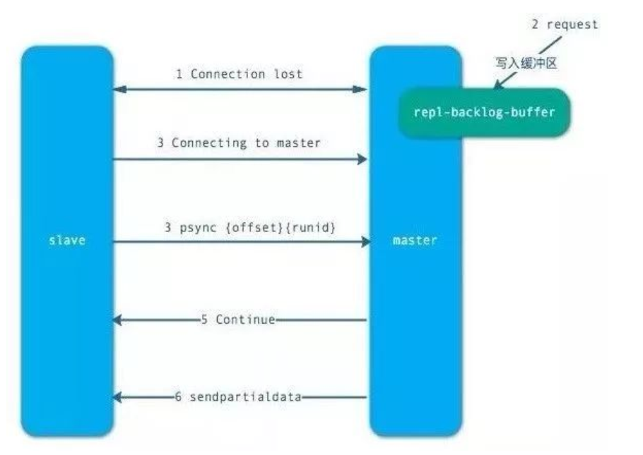

**积压队列**
* ⼀个固定⻓度的循环队列，默认情况下为1MB
* 参数repl-backlog-size进⾏调整
* 积压队列越⼤，允许主从断线的时间越⻓。

1. psync命令需要3个组件⽀持
* 主从节点各⾃复制偏移量
* 主节点复制积压缓冲区
* 主节点运⾏ ID

2. 主从节点各⾃复制偏移量
* 参与复制的主从节点都会维护⾃⾝的复制偏移量。
* 主节点在处理完写⼊命令后，会把命令的字节⻓度做累加记录，统计信息在 info replication中的masterreploffset指标中。
* 从节点每秒钟上报⾃⾝的的复制偏移量给主节点，因此主节点也会保存从节点的复制偏移量。
* 从节点在接收到主节点发送的命令后，也会累加⾃⾝的偏移量，统计信息在 info replication中。
* 通过对⽐主从节点的复制偏移量，可以判断主从节点数据是否⼀致。

3. 主节点复制积压缓冲区
* 复制积压缓冲区是⼀个保存在主节点的⼀个固定⻓度的先进先出的队列，默认⼤⼩ 1MB。
* 这个队列在 slave连接时创建。这时主节点响应写命令时，不但会把命令发送给从节点，也会写⼊复制缓冲区。
* 他的作⽤就是⽤于部分复制和复制命令丢失的数据补救。通过 info replication可以看到相关信息。

4. 主节点运⾏ID
* 每个 redis启动的时候，都会⽣成⼀个 40位的运⾏ ID。
* 运⾏ ID的主要作⽤是⽤来识别 Redis节点。如果使⽤ ip+port的⽅式，那么如果主节点重启修改了
* RDB/AOF数据，从节点再基于偏移量进⾏复制将是不安全的。所以，当运⾏ id变化后，从节点将进⾏全量复制。也就是说，redis重启后，默认从节点会进⾏全量复制。

5. 如果在重启时不改变运⾏ID呢？
* 可以通过 debug reload命令重新加载 RDB并保持运⾏ ID不变，从⽽有效的避免不必要的全量复制。
* 缺点是：debug reload命令会阻塞当前 Redis节点主线程，因此对于⼤数据量的主节点或者⽆法容忍阻塞的节点，需要谨慎使⽤。⼀般通过故障转移机制可以解决这个问题。


#### 1.5.2.9. ⼼跳机制

主从节点在建⽴复制后，他们之间维护着⻓连接并彼此发送⼼跳命令。

⼼跳的关键机制如下：
* 主从都有⼼跳检测机制，各⾃模拟成对⽅的客户端进⾏通信，通过 client list命令查看复制相关客户端信息，主节点的连接状态为 flags = M，从节点的连接状态是 flags = S。
* 主节点默认每隔 10秒对从节点发送 ping命令，可修改配置 repl-ping-slave-period控制发送频率。
* 从节点在主线程每隔⼀秒发送 replconf ack{offset}命令，给主节点上报⾃⾝当前的复制偏移量。
* 主节点收到 replconf信息后，判断从节点超时时间，如果超过 repl-timeout 60秒，则判断节点下线。

#### 1.5.2.10. 开发与运维中的问题

<a href="#menu"  >目录</a> 


##### 1.5.2.10.1. 读写分离


对于读占⽐较⾼的场景，可以通过把⼀部分读流量分摊到从节点（slave）来减轻主节点（master）压⼒，同时需要注意永远只对主节点执⾏写操作

当使⽤从节点响应读请求时，业务端可能会遇到如下问题：

**数据延迟**

Redis复制数据的延迟由于异步复制特性是⽆法避免的，延迟取决于⽹络带宽和命令阻塞情况，⽐如刚在主节点写⼊数据后⽴刻在从节点上读取可能获取不到。需要业务场景允许短时间内的数据延迟。对于⽆法容忍⼤量延迟场景，可以编写外部监控程序监听主从节点的复制偏移量，当延迟较⼤时触发报警或者通知客户端避免读取延迟过⾼的从节点
* 监控程序（monitor）定期检查主从节点的偏移量，主节点偏移量在info replication的master_repl_offset指标记录，从节点偏移量可以查询主节点的slave0字段的offset指标，它们的差值就是主从节点延迟的字节量
* 当延迟字节量过⾼时，⽐如超过10MB。监控程序触发报警并通知客户端从节点延迟过⾼。可以采⽤Zookeeper的监听回调机制实现客户端通知。
* 客户端接到具体的从节点⾼延迟通知后，修改读命令路由到其他从节点或主节点上。当延迟恢复后，再次通知客户端，恢复从节点的读命令请求。

这种⽅案的成本⽐较⾼，需要单独修改适配Redis的客户端类库。如果涉及多种语⾔成本将会扩⼤。客户端逻辑需要识别出读写请求并⾃动路由，还需要维护故障和恢复的通知。采⽤此⽅案视具体的业务⽽定，如果允许不⼀致性或对延迟不敏感的业务可以忽略，也可以采⽤Redis集群⽅案做⽔平扩展

**读到过期数据**

当主节点存储⼤量设置超时的数据时，如缓存数据，Redis内部需要维护过期数据删除策略，删除策略主要有两种：惰性删除和定时删除
* 惰性删除：主节点每次处理读取命令时，都会检查键是否超时，如果超时则执⾏del命令删除键对象，之后del命令也会异步发送给从节点。需要注意的是为了保证复制的⼀致性，从节点⾃⾝永远不会主动删除超时数据.
* 定时删除：Redis主节点在内部定时任务会循环采样⼀定数量的键，当发现采样的键过期时执⾏del命令，之后再同步给从节点如果此时数据⼤量超时，主节点采样速度跟不上过期速度且主节点没有读取过期键的操作，那么从节点将⽆法收到del命令这时在从节点上可以读取到已经超时的数据.从节点读取数据之前会检查键的过期时间来决定是否返回数据，

**从节点故障问题**

对于从节点的故障问题，需要在客户端维护可⽤从节点列表，当从节点故障时⽴刻切换到其他从节点或主节点上。这个过程类似上⽂提到的针对延迟过⾼的监控处理，需要开发⼈员改造客户端类库。


##### 1.5.2.10.2. 主从配置不⼀致


主从配置不⼀致是⼀个容易忽视的问题。对于有些配置主从之间是可以不⼀致，⽐如：主节点关闭AOF在从节点开启。但对于内存相关的配置必须要⼀致，⽐如maxmemory，ash-max-ziplist-entries等参数。当配置的maxmemory从节点⼩于主节点，如果复制的数据量超过从节点maxmemory时，它会根据maxmemory-policy策略进⾏内存溢出控制，此时从节点数据已经丢失，但主从复制流程依然正常进⾏，复制偏移量也正常。修复这类问题也只能⼿动进⾏全量复制。当压缩列表相关参数不⼀致时，虽然主从节点存储的数据⼀致但实际内存占⽤情况差异会⽐较⼤


##### 1.5.2.10.3. 规避全量复制


全量复制是⼀个⾮常消耗资源的操作，前⾯做了具体说明。因此如何规避全量复制是需要重点关注的运维点。
下⾯我们对需要进⾏全量复制的场景逐个分析：
* 第⼀次建⽴复制：由于是第⼀次建⽴复制，从节点不包含任何主节点数据，因此必须进⾏全量复制才能完成数据同步。对于这种情况全量复制⽆法避免。当对数据量较⼤且流量较⾼的主节点添加从节点时，建议在低峰时进⾏操作，或者尽量规避使⽤⼤数据量的Redis节点。·节点运⾏ID不匹配：当主从复制关系建⽴后，从节点会保存主节点的运⾏ID，如果此时主节点因故障重启，那么它的运⾏ID会改变，从节点发现主节点运⾏ID不匹配时，会认为⾃⼰复制的是⼀个新的主节点从⽽进⾏全量复制。对于这种情况应该从架构上规避，⽐如提供故障转移功能。当主节点发⽣故障后，⼿动提升从节点为主节点或者采⽤⽀持⾃动故障转移的哨兵或集群⽅案。
* 复制积压缓冲区不⾜：当主从节点⽹络中断后，从节点再次连上主节点时会发送psync{offset}{runId}命令请求部分复制，如果请求的偏移量不在主节点的积压缓冲区内，则⽆法提供给从节点数据，因此部分复制会退化为全量复制。针对这种情况需要根据⽹络中断时⻓，写命令数据量分析出合理的积压缓冲区⼤⼩。⽹络中断⼀般有闪断、机房割接、⽹络分区等情况。这时⽹络中断的时⻓⼀般在分钟级（net_break_time）。写命令数据量可以统计⾼峰期主节点每秒info replication的master_repl_offset差值获取（write_size_per_minute）。积压缓冲区默认为1MB，对于⼤流量场景显然不够，这时需要增⼤积压缓冲区，保证repl_backlog_size>net_break_time*write_size_per_minute，从⽽避免因复制积压缓冲区不⾜造成的全量复制。


##### 1.5.2.10.4. 规避复制⻛暴


复制⻛暴是指⼤量从节点对同⼀主节点或者对同⼀台机器的多个主节点短时间内发起全量复制的过程。复制⻛暴对发起复制的主节点或者机器造成⼤量开销，导致CPU、内存、带宽消耗。因此我们应该分析出复制⻛暴发⽣的场景，提前采⽤合理的⽅式规避。规避⽅式有如下⼏个。

**单主节点复制⻛暴**

单主节点复制⻛暴⼀般发⽣在主节点挂载多个从节点的场景。当主节点重启恢复后，从节点会发起全量复制流程，这时主节点就会为从节点创建RDB快照，如果在快照创建完毕之前，有多个从节点都尝试与主节点进⾏全量同步，那么其他从节点将共享这份RDB快照。这点Redis做了优化，有效避免了创建多个快照。但是，同时向多个从节点发送RDB快照，可能使主节点的⽹络带宽消耗严重，造成主节点的延迟变⼤，极端情况会发⽣主从节点连接断开，导致复制失败。

解决⽅案⾸先可以减少主节点（master）挂载从节点（slave）的数量，或者采⽤树状复制结构，加⼊中间层从节点⽤来保护主节点.


从节点采⽤树状树⾮常有⽤，⽹络开销交给位于中间层的从节点，⽽不必消耗顶层的主节点。但是这种树状结构也带来了运维的复杂性，增加了⼿动和⾃动处理故障转移的难度

**单机器复制⻛暴**

由于Redis的单线程架构，通常单台机器会部署多个Redis实例。当⼀台机器（machine）上同时部署多个主节点（master）时,如果这台机器出现故障或⽹络⻓时间中断，当它重启恢复后，会有⼤量从节点（slave）针对这台机器的主节点进⾏全量复制，会造成当前机器⽹络带宽耗尽
* 应该把主节点尽量分散在多台机器上，避免在单台机器上部署过多的主节点。
* 当主节点所在机器故障后提供故障转移机制，避免机器恢复后进⾏密集的全量复制

### 1.5.3. 哨兵Sentinel

Redis的主从复制模式下，⼀旦主节点由于故障不能提供服务，需要⼈⼯将从节点晋升为主节点，同时还要通知应⽤⽅更新主节点地址，⽆法实现⾃动化。对于应⽤⽅来说⽆法及时感知到主节点的变化，必然会造成⼀定的写数据丢失和读数据错误，甚⾄可能造成应⽤⽅服务不可⽤。对于Redis的运维⽅来说，整个故障转移的过程是需要⼈⼯来介⼊的，故障转移实时性和准确性上都⽆法得到保障.哨兵模式可以解决

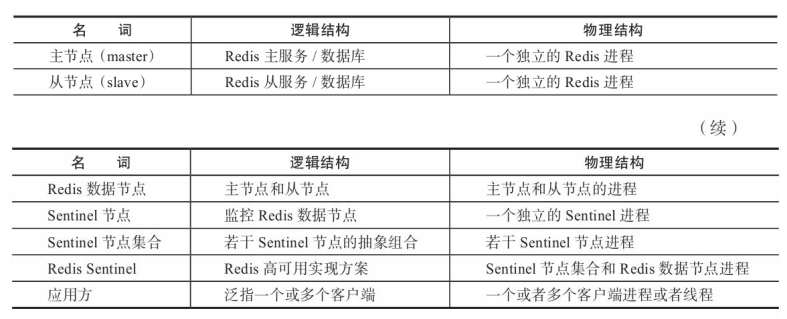


redis Sentinel是⼀个分布式架构，其中包含若⼲个Sentinel节点和Redis数据节点，每个Sentinel节点会对数据节点和其余Sentinel节点进⾏监控，当它发现节点不可达时，会对节点做下线标识。如果被标识的是主节点，它还会和其他Sentinel节点进⾏“协商”，当⼤多数Sentinel节点都认为主节点不可达时，它们会选举出⼀个Sentinel节点来完成⾃动故障转移的⼯作，同时会将这个变化实时通知给Redis应⽤⽅。整个过程完全是⾃动的，不需要⼈⼯来介⼊，所以这套⽅案很有效地解决了Redis的⾼可⽤问题

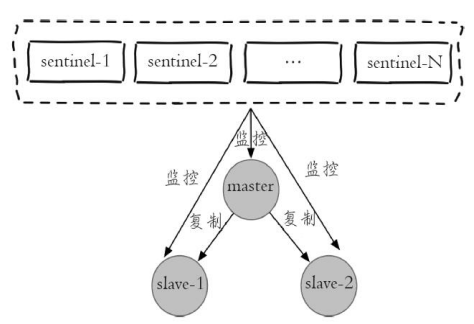

**整个故障转移的处理逻辑**
* 主节点出现故障，此时两个从节点与主节点失去连接，主从复制失败
* 每个Sentinel节点通过定期监控发现主节点出现了故障。
* 多个Sentinel节点对主节点的故障达成⼀致，选举出某个Sentinel节点作为领导者负责故障转移Sentinel领导者节点执⾏了故障转移，整个过程和主从模式下的故障转移⼀样，只不过是⾃动化进⾏
* Sentinel领导者节点执⾏了故障转移，整个过程和主从模式下的故障转移⼀样，只不过是⾃动化进⾏

**Redis Sentinel具有以下⼏个功能：**
* 监控：Sentinel节点会定期检测Redis数据节点、其余Sentinel节点是否可达。
* 通知：Sentinel节点会将故障转移的结果通知给应⽤⽅。
* 主节点故障转移：实现从节点晋升为主节点并维护后续正确的主从关系。
* 配置提供者：在Redis Sentinel结构中，客户端在初始化的时候连接的是Sentinel节点集合，从中获取主节点信息。

**Redis Sentinel包含了若个Sentinel节点**
* 对于节点的故障判断是由多个Sentinel节点共同完成，这样可以有效地防⽌误判。
* Sentinel节点集合是由若⼲个Sentinel节点组成的，这样即使个别Sentinel节点不可⽤，整个Sentinel节点集合依然是健壮的。

Sentinel节点本⾝就是独⽴的Redis节点，只不过它们有⼀些特殊，它们不存储数据，只⽀持部分命令

#### 1.5.3.1. 什么是哨兵


1. 监控主数据库和从数据库是否正常运⾏。
2. 主数据库出现故障时⾃动将从数据库转换为主数据库
3. 哨兵是⼀个独⽴的进程，⼀个主从复制结构可以有多个哨兵，提⾼可⽤性。哨兵之间也可以互相监控。

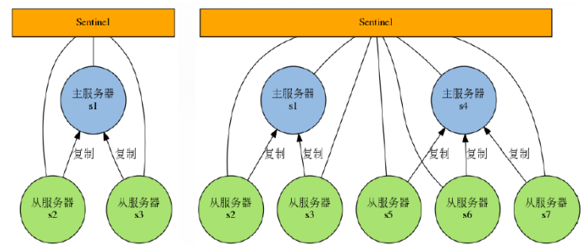


Redis的 Sentinel系统⽤于管理多个 Redis服务器（instance），该系统执⾏以下三个任务：
* 监控（Monitoring）：Sentinel会不断地检查你的主服务器和从服务器是否运作正常。
* 提醒（Notification）：当被监控的某个 Redis服务器出现问题时，Sentinel可以通过 API向管理员或者其他应⽤程序发送通知。
* ⾃动故障迁移（Automatic failover）：当⼀个主服务器不能正常⼯作时，Sentinel会开始⼀次⾃动故障迁移操作，它会将失效主服务器的其中⼀个从服务器升级为新的主服务器，并让失效主服务器的其他从服务器改为复制新的主服务器；当客户端试图连接失效的主服务器时，集群也会向客户端返回新主服务器的地址，使得集群可以使⽤新主服务器代替失效服务器。


Redis Sentinel是⼀个分布式系统，你可以在⼀个架构中运⾏多个 Sentinel进程（progress），这些进程使⽤流⾔协议（gossip protocols)来接收关于主服务器是否下线的信息，并使⽤投票协议（agreement protocols）来决定是否执⾏⾃动故障迁移，以及选择哪个从服务器作为新的主服务器。

虽然 Redis Sentinel释出为⼀个单独的可执⾏⽂件 redis-sentinel，但实际上它只是⼀个运⾏在特殊模式下的Redis服务器，你可以在启动⼀个普通 Redis服务器时通过给定 --sentinel选项来启动 Redis Sentinel。

#### 1.5.3.2. 基本操作

<a href="#menu"  >目录</a> 

哨兵配置

```yml
sentinel monitor master-name ip_host port quorum
sentinel monitor mymaster 127.0.0.1 6379 1

sentinel monitor mymaster 127.0.0.1 6379 1
sentinel down-after-milliseconds mymaster 60000
sentinel failover-timeout mymaster 180000
sentinel parallel-syncs mymaster 1
```

Redis Sentinel中的数据节点和普通的Redis数据节点在配置上没有任何区别，只不过是添加了⼀些Sentinel节点对它们进⾏监控。

mymaster表⽰要监控的主数据库的名字，可以⾃定义，由⼤⼩写字⺟，数字，".-_"组成。后边为主数据库的地址.最后的quorum表⽰最低通过的票数。也就是执⾏故障恢复操作前⾄少有⼏个哨兵节点同意。

配置哨兵时，只需要配置主数据库即可，会⾃动从主数据库中读取到其所有的从数据库地址等信息。

⼀个哨兵节点可以监控多个主从系统，只要按照上⾯的配置多个即可。

**启动**


```yml
#对于 redis-sentinel程序，你可以⽤以下命令来启动 Sentinel系统：
redis-sentinel /path/to/sentinel.conf
#对于 redis-server程序，你可以⽤以下命令来启动⼀个运⾏在 Sentinel模式下的 Redis服务器：
redis-server /path/to/sentinel.conf --sentinel
```

两种⽅法都可以启动⼀个 Sentinel实例。

启动 Sentinel实例必须指定相应的配置⽂件，系统会使⽤配置⽂件来保存 Sentinel的当前状态，并在
Sentinel重启时通过载⼊配置⽂件来进⾏状态还原。

如果启动 Sentinel时没有指定相应的配置⽂件，或者指定的配置⽂件不可写（not writable），那么 Sentinel会拒绝启动。

**查看信息**
```yml
redis-cli -h 127.0.0.1 -p 26379 info Sentinel
# Sentinel
sentinel_masters:1
sentinel_tilt:0
sentinel_running_scripts:0
sentinel_scripts_queue_length:0
master0:name=mymaster,status=ok,address=127.0.0.1:6379,slaves=2,sentinels=3
```

#### 1.5.3.3. 配置 Sentinel

Redis源码中包含了⼀个名为 sentinel.conf的⽂件，这个⽂件是⼀个带有详细注释的 Sentinel配置⽂件⽰例。

运⾏⼀个 Sentinel所需的最少配置如下所⽰：
```yml
sentinel monitor mymaster 127.0.0.1 6379 <quorum>
sentinel down-after-milliseconds mymaster 30000
sentinel parallel-syncs mymaster 1
sentinel failover-timeout mymaster 180000
#sentinel auth-pass <master-name> <password>
#sentinel notification-script <master-name> <script-path>
#sentinel client-reconfig-script <master-name> <script-path>

#当所有节点启动后，配置文件中的内容发生了变化
#entinel节点自动发现了从节点、其余Sentinel节点。
#去掉了默认配置，例如parallel-syncs、failover-timeout参数。
#添加了配置纪元相关参数。
port 26379
dir "/opt/soft/redis/data"
sentinel monitor mymaster 127.0.0.1 6379 2
sentinel config-epoch mymaster 0
sentinel leader-epoch mymaster 0
#发现两个slave节点
sentinel known-slave mymaster 127.0.0.1 6380
sentinel known-slave mymaster 127.0.0.1 6381
#发现两个sentinel节点
sentinel known-sentinel mymaster 127.0.0.1 26380
282a70ff56c36ed56e8f7ee6ada74124140d6f53
sentinel known-sentinel mymaster 127.0.0.1 26381
f714470d30a61a8e39ae031192f1feae7eb5b2be
sentinel current-epoch 0
```


第⼀⾏配置指⽰ Sentinel去监视⼀个名为mymaster的主服务器，这个主服务器的 IP地址为 127.0.0.1，端⼝号为 6379，⽽将这个主服务器判断为失效⾄少需要 2个 Sentinel同意（只要同意 Sentinel的数量不达标，⾃动故障迁移就不会执⾏）。

< quorum>参数⽤于故障发现和判定，例如将quorum配置为2，代表⾄少有2个Sentinel节点认为主节点不可达，那么这个不可达的判定才是客观的。对于< quorum>设置的越⼩，那么达到下线的条件越宽松，反之越严格。⼀般建议将其设置为Sentinel节点的⼀半加1。同时< quorum>还与Sentinel节点的领导者选举有关，⾄少要有max（quorum，num（sentinels）/2+1）个Sentinel节点参与选举，才能选出领导者
Sentinel，从⽽完成故障转移。例如有5个Sentinel节点，quorum=4，那么⾄少要有max（quorum，
num（sentinels）/2+1）=4个在线Sentinel节点才可以进⾏领导者选举。

不过要注意，⽆论你设置要多少个 Sentinel同意才能判断⼀个服务器失效，⼀个 Sentinel都需要获得系统中多数（majority）Sentinel的⽀持，才能发起⼀次⾃动故障迁移，并预留⼀个给定的配置纪元
（configuration Epoch，⼀个配置纪元就是⼀个新主服务器配置的版本号）。

换句话说，在只有少数（minority）Sentinel进程正常运作的情况下，Sentinel是不能执⾏⾃动故障迁移的。

其他选项的基本格式如下：
```yml
sentinel <选项的名字> <主服务器的名字> <选项的值>
```
**各个选项的功能如下：**
* down-after-milliseconds选项指定了 Sentinel认为服务器已经断线所需的毫秒数。
    * 当Sentinel节点集合对主节点故障判定达成⼀致时，Sentinel领导者节点会做故障转移操作，选出新的主节点，原来的从节点会向新的主节点发起复制操作，parallel-syncs就是⽤来限制在⼀次故障转移之后，每次向新的主节点发起复制操作的从节点个数。如果这个参数配置的⽐较⼤，那么多个从节点会向新的主节点同时发起复制操作，尽管复制操作通常不会阻塞主节点，但是同时向主节点发起复制，必然会对主节点所在的机器造成⼀定的⽹络和磁盘IO开销。
* parallel-syncs选项指定了在执⾏故障转移时，最多可以有多少个从服务器同时对新的主服务器进⾏同步，这个数字越⼩，完成故障转移所需的时间就越⻓。
    * 如果从服务器被设置为允许使⽤过期数据集（参⻅对 redis.conf⽂件中对 slave-serve-stale-data选项的说明），那么你可能不希望所有从服务器都在同⼀时间向新的主服务器发送同步请求，因为尽管复制过程的绝⼤部分步骤都不会阻塞从服务器，但从服务器在载⼊主服务器发来的 RDB⽂件时，仍然会造成从服务器在⼀段时间内不能处理命令请求：如果全部从服务器⼀起对新的主服务器进⾏同步，那么就可能会造成所有从服务器在短时间内全部不可⽤的情况出现。
    * 你可以通过将这个值设为 1来保证每次只有⼀个从服务器处于不能处理命令请求的状态。
* failover-timeout
    * 通常被解释成故障转移超时时间，但实际上它作⽤于故障转移的各个阶段：
        * 1. 选出合适从节点。
        * 2. 晋升选出的从节点为主节点。
        * 3. 命令其余从节点复制新的主节点。
        * 4. 等待原主节点恢复后命令它去复制新的主节点。
* failover-timeout的作⽤具体体现在四个⽅⾯：
    * 如果Redis Sentinel对⼀个主节点故障转移失败，那么下次再对该主节点做故障转移的起始时间是failover-timeout的2倍。
    * 在2阶段时，如果Sentinel节点向1阶段选出来的从节点执⾏slaveof no one⼀直失败（例如该从节点此时出现故障），当此过程超过failover-timeout时，则故障转移失败。
    * 在2阶段如果执⾏成功，Sentinel节点还会执⾏info命令来确认1阶段选出来的节点确实晋升为主节点，如果此过程执⾏时间超过ailovertimeout时，则故障转移失败。
    * 如果3阶段执⾏时间超过了failover-timeout（不包含复制时间），则故障转移失败。注意即使超过了这个时间，Sentinel节点也会最终配置从节点去同步最新的主节点。
* sentinel auth-pass
    * 如果Sentinel监控的主节点配置了密码，sentinel auth-pass配置通过添加主节点的密码，防⽌Sentinel节点对主节点⽆法监控。
* sentinel notification-script
    * sentinel notification-script的作⽤是在故障转移期间，当⼀些警告级别的Sentinel事件发⽣（指重要事件，例如-sdown：客观下线、-odown：主观下线）时，会触发对应路径的shell脚本，并向脚本发送相应的事件参数。
* sentinel client-reconfig-script
    * sentinel client-reconfig-script的作⽤是在故障转移结束后，会触发对应路径的脚本，并向脚本发送故障转移结果的相关参数。

有关sentinel notification-script和sentinel client-reconfig-script有⼏点需要注意：
* < script-path>必须有可执⾏权限。
* < script-path>开头必须包含shell脚本头（例如#!/bin/sh）
* Redis规定脚本的最⼤执⾏时间不能超过60秒，超过后脚本将被杀掉。
* 如果shell脚本以exit 1结束，那么脚本稍后重试执⾏。如果以exit 2或者更⾼的值结束，那么脚本不会重试。正常返回值是exit 0。
* 如果需要运维的Redis Sentinel⽐较多，建议不要使⽤这种脚本的形式来进⾏通知，这样会增加部署的成本。

**监控多个主节点**

监控多个主节点，只要添加多个master配置即可，其他配置也⼀并添加
```yml
sentinel monitor mymaster 127.0.0.1 6379 2
```
**调整配置**

和普通的Redis数据节点⼀样，Sentinel节点也⽀持动态地设置参数，⽽且和普通的Redis数据节点⼀样并不是⽀持所有的参数

主要配置的是上⾯的参数
```yml
sentinel set master-name <param> <value>
```
* sentinel set命令只对当前Sentinel节点有效。
* sentinel set命令如果执⾏成功会⽴即刷新配置⽂件，这点和Redis普通数据节点设置配置需要执⾏config rewrite刷新到配置⽂件不同。
* 建议所有Sentinel节点的配置尽可能⼀致，这样在故障发现和转移时⽐较容易达成⼀致
* Sentinel对外不⽀持config命令

#### 1.5.3.4. 每个 Sentinel都需要定期执⾏的任务

* 每个 Sentinel以每秒钟⼀次的频率向它所知的主服务器、从服务器以及其他 Sentinel实例发送⼀个PING命令。
* 如果⼀个实例（instance）距离最后⼀次有效回复 PING命令的时间超过 down-after-milliseconds选项所指定的值，那么这个实例会被 Sentinel标记为主观下线。⼀个有效回复可以是：+PONG、-LOADING或者 -MASTERDOWN。
* 如果⼀个主服务器被标记为主观下线，那么正在监视这个主服务器的所有 Sentinel要以每秒⼀次的频率确认主服务器的确进⼊了主观下线状态。
* 如果⼀个主服务器被标记为主观下线，并且有⾜够数量的 Sentinel（⾄少要达到配置⽂件指定的数量）在指定的时间范围内同意这⼀判断，那么这个主服务器被标记为客观下线。
* 在⼀般情况下，每个 Sentinel会以每 10秒⼀次的频率向它已知的所有主服务器和从服务器发送 INFO命令。当⼀个主服务器被 Sentinel标记为客观下线时，Sentinel向下线主服务器的所有从服务器发送INFO命令的频率会从 10秒⼀次改为每秒⼀次。
* 当没有⾜够数量的 Sentinel同意主服务器已经下线，主服务器的客观下线状态就会被移除。当主服务器重新向 Sentinel的 PING命令返回有效回复时，主服务器的主管下线状态就会被移除。

#### 1.5.3.5. ⾃动发现 Sentinel和从服务器

⼀个 Sentinel可以与其他多个 Sentinel进⾏连接，各个 Sentinel之间可以互相检查对⽅的可⽤性，并进⾏信息交换。

你⽆须为运⾏的每个 Sentinel分别设置其他 Sentinel的地址，因为 Sentinel可以通过发布与订阅功能来⾃动发现正在监视相同主服务器的其他 Sentinel，这⼀功能是通过向频道 sentinel:hello发送信息来实现的。

与此类似，你也不必⼿动列出主服务器属下的所有从服务器，因为 Sentinel可以通过询问主服务器来获得所有从服务器的信息。
* 每个 Sentinel会以每两秒⼀次的频率，通过发布与订阅功能，向被它监视的所有主服务器和从服务器的sentinel:hello频道发送⼀条信息，信息中包含了 Sentinel的 IP地址、端⼝号和运⾏ ID（runid）。
* 每个 Sentinel都订阅了被它监视的所有主服务器和从服务器的 sentinel:hello频道，查找之前未出现过的sentinel（looking for unknown sentinels）。当⼀个 Sentinel发现⼀个新的 Sentinel时，它会将新的Sentinel添加到⼀个列表中，这个列表保存了 Sentinel已知的，监视同⼀个主服务器的所有其他Sentinel。
* Sentinel发送的信息中还包括完整的主服务器当前配置（configuration）。如果⼀个 Sentinel包含的主服务器配置⽐另⼀个 Sentinel发送的配置要旧，那么这个 Sentinel会⽴即升级到新配置上。
* 在将⼀个新 Sentinel添加到监视主服务器的列表上⾯之前，Sentinel会先检查列表中是否已经包含了和要添加的 Sentinel拥有相同运⾏ ID或者相同地址（包括 IP地址和端⼝号）的 Sentinel，如果是的话，Sentinel会先移除列表中已有的那些拥有相同运⾏ ID或者相同地址的 Sentinel，然后再添加新
Sentinel。


#### 1.5.3.6. Sentinel API

在默认情况下，Sentinel使⽤ TCP端⼝ 26379（普通 Redis服务器使⽤的是 6379）。

Sentinel接受 Redis协议格式的命令请求，所以你可以使⽤ redis-cli或者任何其他 Redis客户端来与 Sentinel进⾏通讯。

有两种⽅式可以和 Sentinel进⾏通讯：
* 第⼀种⽅法是通过直接发送命令来查询被监视 Redis服务器的当前状态，以及 Sentinel所知道的关于其他 Sentinel的信息，诸如此类。
* 另⼀种⽅法是使⽤发布与订阅功能，通过接收 Sentinel发送的通知：当执⾏故障转移操作，或者某个被监视的服务器被判断为主观下线或者客观下线时，Sentinel就会发送相应的信息。

Sentinel命令以下列出的是 Sentinel接受的命令：
* PING：返回 PONG。
* SENTINEL masters：列出所有被监视的主服务器，以及这些主服务器的当前状态。
* SENTINEL slaves < master name>：列出给定主服务器的所有从服务器，以及这些从服务器的当前状态。
* SENTINEL get-master-addr-by-name < master name>：返回给定名字的主服务器的 IP地址和端⼝号。
如果这个主服务器正在执⾏故障转移操作，或者针对这个主服务器的故障转移操作已经完成，那么这个命令返回新的主服务器的 IP地址和端⼝号。
* SENTINEL reset < pattern>：重置所有名字和给定模式 pattern相匹配的主服务器。pattern参数是⼀个Glob⻛格的模式。重置操作清楚主服务器⽬前的所有状态，包括正在执⾏中的故障转移，并移除⽬前已经发现和关联的，主服务器的所有从服务器和 Sentinel。
* SENTINEL failover < master name>：当主服务器失效时，在不询问其他 Sentinel意⻅的情况下，强制开始⼀次⾃动故障迁移（不过发起故障转移的 Sentinel会向其他 Sentinel发送⼀个新的配置，其他Sentinel会根据这个配置进⾏相应的更新）。

**发布与订阅信息**

客户端可以将 Sentinel看作是⼀个只提供了订阅功能的 Redis服务器：你不可以使⽤ PUBLISH命令向这个服务器发送信息，但你可以⽤ SUBSCRIBE命令或者 PSUBSCRIBE命令，通过订阅给定的频道来获取相应的事件提醒。

⼀个频道能够接收和这个频道的名字相同的事件。⽐如说，名为 +sdown的频道就可以接收所有实例进⼊主观下线（SDOWN）状态的事件。

通过执⾏ PSUBSCRIBE *命令可以接收所有事件信息。

以下列出的是客户端可以通过订阅来获得的频道和信息的格式：第⼀个英⽂单词是频道/事件的名字，其余的是数据的格式。

注意，当格式中包含 instance details字样时，表⽰频道所返回的信息中包含了以下⽤于识别⽬标实例的内容：
```yml
<instance-type> <name> <ip> <port> @ <master-name> <master-ip> <master-port>
```


@字符之后的内容⽤于指定主服务器，这些内容是可选的，它们仅在@字符之前的内容指定的实例不是主服务器时使⽤。


```yml
+reset-master <instance details> ：主服务器已被重置。
+slave <instance details> ：一个新的从服务器已经被 Sentinel 识别并关联。
+failover-state-reconf-slaves <instance details> ：故障转移状态切换到了
+failover-detected <instance details> ：另一个 Sentinel 开始了一次故障转移操作，
或者一个从服务器转换成了主服务器。
+slave-reconf-sent <instance details> ：领头（leader）的 Sentinel 向实例发送了
SLAVEOF 命令，为实例设置新的主服务器。
+slave-reconf-inprog <instance details> ：实例正在将自己设置为指定主服务器的从服务器，但相应的同步过程仍未完成。
+slave-reconf-done <instance details> ：从服务器已经成功完成对新主服务器的同步。
-dup-sentinel <instance details> ：对给定主服务器进行监视的一个或多个 Sentinel 已
经因为重复出现而被移除 ——当 Sentinel 实例重启的时候，就会出现这种情况。
+sentinel <instance details> ：一个监视给定主服务器的新 Sentinel 已经被识别并添
加。
+sdown <instance details> ：给定的实例现在处于主观下线状态。
-sdown <instance details> ：给定的实例已经不再处于主观下线状态。
+odown <instance details> ：给定的实例现在处于客观下线状态。
-odown <instance details> ：给定的实例已经不再处于客观下线状态。
+new-epoch <instance details> ：当前的纪元（epoch）已经被更新。
+try-failover <instance details> ：一个新的故障迁移操作正在执行中，等待被大多数
Sentinel 选中（waiting to be elected by the majority）。
+elected-leader <instance details> ：赢得指定纪元的选举，可以进行故障迁移操作了。
+failover-state-select-slave <instance details> ：故障转移操作现在处于 select-
slave 状态 ——Sentinel 正在寻找可以升级为主服务器的从服务器。
no-good-slave <instance details> ：Sentinel 操作未能找到适合进行升级的从服务器。
Sentinel 会在一段时间之后再次尝试寻找合适的从服务器来进行升级，又或者直接放弃执行故障转
移操作。
selected-slave <instance details> ：Sentinel 顺利找到适合进行升级的从服务器。
failover-state-send-slaveof-noone <instance details> ：Sentinel 正在将指定的
从服务器升级为主服务器，等待升级功能完成。
failover-end-for-timeout <instance details> ：故障转移因为超时而中止，不过最终所
有从服务器都会开始复制新的主服务器（slaves will eventually be configured to
replicate with the new master anyway）。
failover-end <instance details> ：故障转移操作顺利完成。所有从服务器都开始复制新的
主服务器了。
+switch-master <master name> <oldip> <oldport> <newip> <newport> ：配置变更，
主服务器的 IP 和地址已经改变。这是绝大多数外部用户都关心的信息。
+tilt ：进入 tilt 模式。
-tilt ：退出 tilt 模式。
```


#### 1.5.3.7. 故障转移

**⼀次故障转移操作由以下步骤组成：**
* 发现主服务器已经进⼊客观下线状态。
* 对我们的当前纪元进⾏⾃增（详情请参考 Raft leader election），并尝试在这个纪元中当选。
* 如果当选失败，那么在设定的故障迁移超时时间的两倍之后，重新尝试当选。如果当选成功，那么执⾏以下步骤。
* 选出⼀个从服务器，并将它升级为主服务器。
* 向被选中的从服务器发送 SLAVEOF NO ONE命令，让它转变为主服务器。
* 通过发布与订阅功能，将更新后的配置传播给所有其他 Sentinel，其他 Sentinel对它们⾃⼰的配置进⾏更新。
* 向已下线主服务器的从服务器发送 SLAVEOF命令，让它们去复制新的主服务器。
* 当所有从服务器都已经开始复制新的主服务器时，领头 Sentinel终⽌这次故障迁移操作。

每当⼀个 Redis实例被重新配置（reconfigured）——⽆论是被设置成主服务器、从服务器、⼜或者被设置成其他主服务器的从服务器——Sentinel都会向被重新配置的实例发送⼀个 CONFIG REWRITE命令，从⽽确保这些配置会持久化在硬盘⾥。

**Sentinel使⽤以下规则来选择新的主服务器：**
* 在失效主服务器属下的从服务器当中，那些被标记为主观下线、已断线、或者最后⼀次回复 PING命令的时间⼤于五秒钟的从服务器都会被淘汰。
* 在失效主服务器属下的从服务器当中，那些与失效主服务器连接断开的时⻓超过 down-after选项指定的时⻓⼗倍的从服务器都会被淘汰。
* 在经历了以上两轮淘汰之后剩下来的从服务器中，我们选出复制偏移量（replication offset）最⼤的那个从服务器作为新的主服务器；如果复制偏移量不可⽤，或者从服务器的复制偏移量相同，那么带有最⼩运⾏ ID的那个从服务器成为新的主服务器。

Sentinel⾃动故障迁移的⼀致性特质: Sentinel⾃动故障迁移使⽤ Raft算法来选举领头（leader）Sentinel，从⽽确保在⼀个给定的纪元（epoch）⾥，只有⼀个领头产⽣。

这表⽰在同⼀个纪元中，不会有两个 Sentinel同时被选中为领头，并且各个 Sentinel在同⼀个纪元中只会对⼀个领头进⾏投票。

更⾼的配置纪元总是优于较低的纪元，因此每个 Sentinel都会主动使⽤更新的纪元来代替⾃⼰的配置。

简单来说，我们可以将 Sentinel配置看作是⼀个带有版本号的状态。⼀个状态会以最后写⼊者胜出（last-write-wins）的⽅式（也即是，最新的配置总是胜出）传播⾄所有其他 Sentinel。

举个例⼦，当出现⽹络分割（network partitions）时，⼀个 Sentinel可能会包含了较旧的配置，⽽当这个Sentinel接到其他 Sentinel发来的版本更新的配置时，Sentinel就会对⾃⼰的配置进⾏更新。

如果要在⽹络分割出现的情况下仍然保持⼀致性，那么应该使⽤min-slaves-to-write选项，让主服务器在连接的从实例少于给定数量时停⽌执⾏写操作，与此同时，应该在每个运⾏ Redis主服务器或从服务器的机器上运⾏Redis Sentinel进程。

Sentinel状态的持久化: Sentinel的状态会被持久化在 Sentinel配置⽂件⾥⾯。

每当 Sentinel接收到⼀个新的配置，或者当领头 Sentinel为主服务器创建⼀个新的配置时，这个配置会与配置纪元⼀起被保存到磁盘⾥⾯。

这意味着停⽌和重启 Sentinel进程都是安全的。

Sentinel在⾮故障迁移的情况下对实例进⾏重新配置,即使没有⾃动故障迁移操作在进⾏，Sentinel总会尝试将当前的配置设置到被监视的实例上⾯。特别是：

根据当前的配置，如果⼀个从服务器被宣告为主服务器，那么它会代替原有的主服务器，成为新的主服务器，并且成为原有主服务器的所有从服务器的复制对象。那些连接了错误主服务器的从服务器会被重新配置，使得这些从服务器会去复制正确的主服务器。不过，在以上这些条件满⾜之后，Sentinel在对实例进⾏重新配置之前仍然会等待⼀段⾜够⻓的时间，确保可以接收到其他 Sentinel发来的配置更新，从⽽避免⾃⾝因为保存了过期的配置⽽对实例进⾏了不必要的重新配置。

#### 1.5.3.8. TILT模式

Redis Sentinel严重依赖计算机的时间功能：⽐如说，为了判断⼀个实例是否可⽤，Sentinel会记录这个实例最后⼀次相应 PING命令的时间，并将这个时间和当前时间进⾏对⽐，从⽽知道这个实例有多⻓时间没有和Sentinel进⾏任何成功通讯。

不过，⼀旦计算机的时间功能出现故障，或者计算机⾮常忙碌，⼜或者进程因为某些原因⽽被阻塞时，Sentinel可能也会跟着出现故障。

TILT模式是⼀种特殊的保护模式：当 Sentinel发现系统有些不对劲时，Sentinel就会进⼊ TILT模式。

因为 Sentinel的时间中断器默认每秒执⾏ 10次，所以我们预期时间中断器的两次执⾏之间的间隔为 100毫秒左右。Sentinel的做法是，记录上⼀次时间中断器执⾏时的时间，并将它和这⼀次时间中断器执⾏的时间进⾏对⽐：

如果两次调⽤时间之间的差距为负值，或者⾮常⼤（超过 2秒钟），那么 Sentinel进⼊ TILT模式。如果Sentinel已经进⼊ TILT模式，那么 Sentinel延迟退出 TILT模式的时间。当 Sentinel进⼊ TILT模式时，它仍然会继续监视所有⽬标，但是：它不再执⾏任何操作，⽐如故障转移。当有实例向这个 Sentinel发送 SENTINEL is-master-down-by-addr命令时，Sentinel返回负值：因为这个 Sentinel所进⾏的下线判断已经不再准确。如果 TILT可以正常维持 30秒钟，那么 Sentinel退出 TILT模式。

#### 1.5.3.9. .

<a href="#menu"  >目录</a> 


##### 1.5.3.9.1. 三个定时监控


Redis Sentinel通过三个定时监控任务完成对各个节点发现和监控。
* 每隔10秒，每个Sentinel节点会向主节点和从节点发送info命令获取最新的拓扑结构
    * 这个定时任务的作⽤具体可以表现在三个⽅⾯：
        * 通过向主节点执⾏info命令，获取从节点的信息，这也是为什么Sentinel节点不需要显式配置监控从节点。
        * 当有新的从节点加⼊时都可以⽴刻感知出来。
        * 节点不可达或者故障转移后，可以通过info命令实时更新节点拓扑信息。
* 每隔2秒，每个Sentinel节点会向Redis数据节点的__sentinel__：hello频道上发送该Sentinel节点对于主节点的判断以及当前Sentinel节点的信息，同时每个Sentinel节点也会订阅该频道，来了解其他Sentinel节点以及它们对主节点的判断，所以这个定时任务可以完成以下两个⼯作
    * 发现新的Sentinel节点：通过订阅主节点的__sentinel__：hello了解其他的Sentinel节点信息，如果是新加⼊的Sentinel节点，将该Sentinel节点信息保存起来，并与该Sentinel节点创建连接Sentinel节点之间交换主节点的状态，作为后⾯客观下线以及领导者选举的依据
* 每隔1秒，每个Sentinel节点会向主节点、从节点、其余Sentinel节点发送⼀条ping命令做⼀次⼼跳检测，来确认这些节点当前是否可达。通过上⾯的定时任务，Sentinel节点对主节点、从节点、其余Sentinel节点都建⽴起连接，实现了对每个节点的监控，这个定时任务是节点失败判定的重要依据。


##### 1.5.3.9.2. 主观下线和客观下线


前⾯说过，Redis的 Sentinel中关于下线（down）有两个不同的概念：

* 主观下线（Subjectively Down，简称 SDOWN）指的是单个 Sentinel实例对服务器做出的下线判断。
    * 第三个定时任务，每个Sentinel节点会每隔1秒对主节点、从节点、其他Sentinel节点发送ping命令做⼼跳检测，当这些节点超过down-after-milliseconds没有进⾏有效回复，Sentinel节点就会对该节点做失败判定，这个⾏为叫做主观下线。从字⾯意思也可以很容易看出主观下线是当前Sentinel节点的⼀家之⾔，存在误判的可能
* 客观下线（Objectively Down，简称ODOWN）指的是多个 Sentinel实例在对同⼀个服务器做出SDOWN判断，并且通过 SENTINEL is-master-down-by-addr命令互相交流之后，得出的服务器下线判断。（⼀个 Sentinel可以通过向另⼀个 Sentinel发送 SENTINEL is-master-down-by-addr命令来询问对⽅是否认为给定的服务器已下线。）
    * Sentinel主观下线的节点是主节点时，该Sentinel节点会通过sentinel ismaster-down-by-addr命令向其他Sentinel节点询问对主节点的判断，当超过< quorum>个数，Sentinel节点认为主节点确实有问题，这时该Sentinel节点会做出客观下线的决定，这样客观下线的含义是⽐较明显了，也就是⼤部分Sentinel节点都对主节点的下线做了同意的判定，那么这个判定就是客观的

如果⼀个服务器没有在master-down-after-milliseconds选项所指定的时间内，对向它发送 PING命令的Sentinel返回⼀个有效回复（valid reply），那么 Sentinel就会将这个服务器标记为主观下线。

服务器对 PING命令的有效回复可以是以下三种回复的其中⼀种：
* 返回 +PONG。
* 返回 -LOADING错误。
* 返回 -MASTERDOWN错误。

如果服务器返回除以上三种回复之外的其他回复，⼜或者在指定时间内没有回复 PING命令，那么 Sentinel认为服务器返回的回复⽆效（non-valid）。

注意，⼀个服务器必须在master-down-after-milliseconds毫秒内，⼀直返回⽆效回复才会被 Sentinel标记为主观下线。

举个例⼦，如果master-down-after-milliseconds选项的值为 30000毫秒（30秒），那么只要服务器能在每29秒之内返回⾄少⼀次有效回复，这个服务器就仍然会被认为是处于正常状态的。

从主观下线状态切换到客观下线状态并没有使⽤严格的法定⼈数算法（strong quorum algorithm），⽽是使⽤了流⾔协议：如果 Sentinel在给定的时间范围内，从其他 Sentinel那⾥接收到了⾜够数量的主服务器下线报告，那么 Sentinel就会将主服务器的状态从主观下线改变为客观下线。如果之后其他 Sentinel不再报告主服务器已下线，那么客观下线状态就会被移除。

客观下线条件只适⽤于主服务器：对于任何其他类型的 Redis实例，Sentinel在将它们判断为下线前不需要进⾏协商，所以从服务器或者其他 Sentinel永远不会达到客观下线条件。

只要⼀个 Sentinel发现某个主服务器进⼊了客观下线状态，这个 Sentinel就可能会被其他 Sentinel推选出，并对失效的主服务器执⾏⾃动故障迁移操作。


##### 1.5.3.9.3. 领导者Sentinel节点选举


这⾥使⽤的是Raft算法。

假如Sentinel节点对于主节点已经做了客观下线，那么是不是就可以⽴即进⾏故障转移了？当然不是，实际上故障转移的⼯作只需要⼀个Sentinel节点来完成即可，所以Sentinel节点之间会做⼀个领导者选举的⼯作，选出⼀个Sentinel节点作为领导者进⾏故障转移的⼯作。Redis使⽤了Raft算法实现领导者选举，因为Raft算法相对⽐较抽象和复杂，以及篇幅所限，所以这⾥给出⼀个Redis Sentinel进⾏领导者选举的⼤致思路：

* 每个在线的Sentinel节点都有资格成为领导者，当它确认主节点主观下线时候，会向其他Sentinel节点发送sentinel is-master-down-by-addr命令，要求将⾃⼰设置为领导者。
* 收到命令的Sentinel节点，如果没有同意过其他Sentinel节点的sentinelis-master-down-by-addr命令，将同意该请求，否则拒绝。
* 如果该Sentinel节点发现⾃⼰的票数已经⼤于等于max（quorum，num（sentinels）/2+1），那么它将成为领导者。
* 如果此过程没有选举出领导者，将进⼊下⼀次选举。展⽰了⼀次领导者选举的⼤致过程：
    * s1（sentinel-1）最先完成了客观下线，它会向s2（sentinel-2）和s3（sentinel-3）发送sentinel is-master-down-by-addr命令，s2和s3同意选其为领导者。
    * s1此时已经拿到2张投票，满⾜了⼤于等于max（quorum，num（sentinels）/2+1）=2的条件，所以此时s1成为领导者。

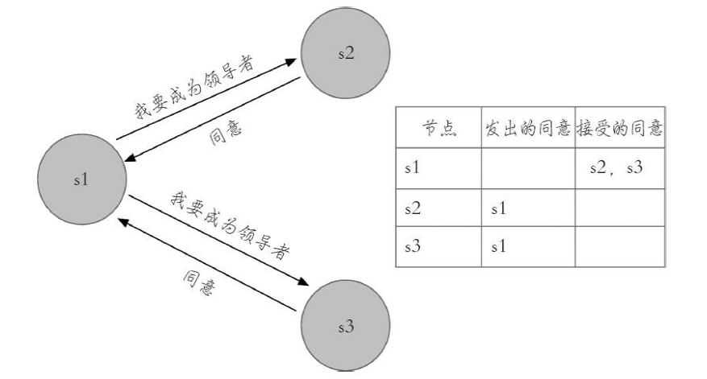

由于每个Sentinel节点只有⼀票，所以当s2向s1和s3索要投票时，只能获取⼀票，⽽s3由于最后完成主观下线，当s3向s1和s2索要投票时⼀票都得不到。实际上Redis Sentinel实现会更简单⼀些，因为⼀旦有⼀个
Sentinel节点获得了max（quorum，num（sentinels）/2+1）的票数，其他Sentinel节点再去确认已经没有意义了，因为每个Sentinel节点只有⼀票，如果读者有兴趣的话，可以修改sentinel.c源码，在Sentinel的执⾏命令列表中添加monitor命令：


##### 1.5.3.9.4. 故障转移


领导者选举出的Sentinel节点负责故障转移，具体步骤如下：
* 在从节点列表中选出⼀个节点作为新的主节点，选择⽅法如下：
    * 过滤：“不健康”（主观下线、断线）、5秒内没有回复过Sentinel节点ping响应、与主节点失联超过down-after-milliseconds*10秒。
    * 选择slave-priority（从节点优先级）最⾼的从节点列表，如果存在则返回，不存在则继续。
    * 选择复制偏移量最⼤的从节点（复制的最完整），如果存在则返回，不存在则继续。
    * 选择runid最⼩的从节点。
* Sentinel领导者节点会对第⼀步选出来的从节点执⾏slaveof no one命令让其成为主节点。
* Sentinel领导者节点会向剩余的从节点发送命令，让它们成为新主节点的从节点，复制规则和parallel-syncs参数有关。
* Sentinel节点集合会将原来的主节点更新为从节点，并保持着对其关注，当其恢复后命令它去复制新的主节点

#### 1.5.3.10. ⾼可⽤读写分离

<a href="#menu"  >目录</a> 

从节点⼀般可以起到两个作⽤：第⼀，当主节点出现故障时，作为主节点的后备“顶”上来实现故障转移，Redis Sentinel已经实现了该功能的⾃动化，实现了真正的⾼可⽤。第⼆，扩展主节点的读能⼒，尤其是在读多写少的场景⾮常适⽤。

如果实⾏读写分离，从节点不是⾼可⽤的，如果slave-1节点出现故障，⾸先客户端client-1将与其失联，其次Sentinel节点只会对该节点做主观下线，因为Redis Sentinel的故障转移是针对主节点的。所以很多时候，Redis Sentinel中的从节点仅仅是作为主节点⼀个热备，不让它参与客户端的读操作，就是为了保证整体⾼可⽤性，


##### 1.5.3.10.1. 哨兵的部署

**Sentinel节点不应该部署在⼀台物理“机器”上。**

这⾥特意强调物理机是因为⼀台物理机做成了若⼲虚拟机或者现今⽐较流⾏的容器，它们虽然有不同的IP地址，但实际上它们都是同⼀台物理机，同⼀台物理机意味着如果这台机器有什么硬件故障，所有的虚拟机都会受到影响，为了实现Sentinel节点集合真正的⾼可⽤，请勿将Sentinel节点部署在同⼀台物理机器上。

**部署⾄少三个且奇数个的Sentinel节点。**

3个以上是通过增加Sentinel节点的个数提⾼对于故障判定的准确性，因为领导者选举需要⾄少⼀半加1个节点，奇数个节点可以在满⾜该条件的基础上节省⼀个节点。

**只有⼀套Sentinel，还是每个主节点配置⼀套Sentinel？**

⽅案⼀：⼀套Sentinel，很明显这种⽅案在⼀定程度上降低了维护成本，因为只需要维护固定个数的Sentinel节点，集中对多个Redis数据节点进⾏管理就可以了。但是这同时也是它的缺点，如果这套Sentinel节点集合出现异常，可能会对多个Redis数据节点造成影响。还有如果监控的Redis数据节点较多，会造成Sentinel节点产⽣过多的⽹络连接，也会有⼀定的影响。

⽅案⼆：多套Sentinel，显然这种⽅案的优点和缺点和上⾯是相反的，每个Redis主节点都有⾃⼰的Sentinel节点集合，会造成资源浪费。但是优点也很明显，每套Redis Sentinel都是彼此隔离的。

如果Sentinel节点集合监控的是同⼀个业务的多个主节点集合，那么使⽤⽅案⼀、否则⼀般建议采⽤⽅案⼆。

### 1.5.4. 集群Cluster


#### 1.5.4.1. 集群简介

Redis集群是⼀个可以在多个 Redis节点之间进⾏数据共享的设施（installation）。


Redis提供的分布式数据库⽅案，集群通过分⽚来进⾏数据共享，并提供复制和故障转移功能。⼀个Redis集群通常由多个节点（node）组成，在刚开始的时候，每个节点都是相互独⽴的，它们都处于⼀个只包含⾃⼰的集群当中，要组建⼀个真正可⼯作的集群，必须将这些独⽴的节点连接起来，构成⼀个包含多个节点的集群。
* 3.0 version⽀持
* Redis集群⽆中⼼节点
* 由多个Redis服务器组成的分布式⽹络服务集群
* 每个Redis服务器被称为节点Node,节点之间会相互通信（gossip）协议，两两相连。

Redis集群不⽀持那些需要同时处理多个键的 Redis命令，因为执⾏这些命令需要在多个 Redis节点之间移动数据，并且在⾼负载的情况下，这些命令将降低 Redis集群的性能，并导致不可预测的⾏为。

Redis集群通过分区（partition）来提供⼀定程度的可⽤性（availability）：即使集群中有⼀部分节点失效或者⽆法进⾏通讯，集群也可以继续处理命令请求。

Redis集群提供了以下两个好处：
* 将数据⾃动切分（split）到多个节点的能⼒。
* 当集群中的⼀部分节点失效或者⽆法进⾏通讯时，仍然可以继续处理命令请求的能⼒。
* 
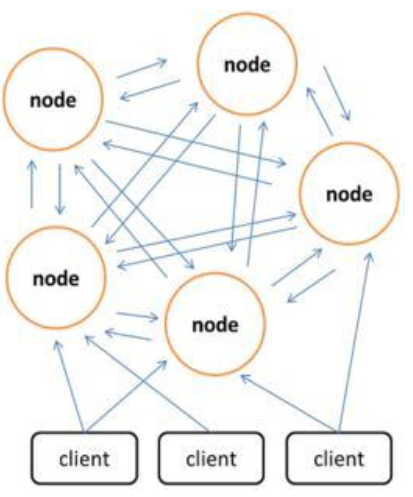

#### 1.5.4.2. ⼀致性哈希和哈希槽对⽐

⼀致性哈希⽤于解决分布式缓存系统中的数据选择节点存储问题和数据选择节点读取问题以及在增删节点后减少数据缓存的消失范畴，防⽌雪崩的发⽣。

哈希槽是在redis cluster集群⽅案中采⽤的，redis cluster集群没有采⽤⼀致性哈希⽅案，⽽是采⽤数据分⽚中的哈希槽来进⾏数据存储与读取的。

**节点取余分区**

⽤特定的数据，如Redis的键或⽤户ID，再根据节点数量N使⽤公式：hash（key）%N计算出哈希值，⽤来决定数据映射到哪⼀个节点上。这种⽅案存在⼀个问题：当节点数量变化时，如扩容或收缩节点，数据节点映射关系需要重新计算，会导致数据的重新迁移。

这种⽅式的突出优点是简单性，常⽤于数据库的分库分表规则，⼀般采⽤预分区的⽅式，提前根据数据量规划好分区数，⽐如划分为512或1024张表，保证可⽀撑未来⼀段时间的数据量，再根据负载情况将表迁移到其他数据库中。扩容时通常采⽤翻倍扩容，避免数据映射全部被打乱导致全量迁移的情况，

**⼀致性哈希**

⼀致性hash是⼀个0-2^32的闭合圆，（拥有2^23个桶空间，每个桶⾥⾯可以存储很多数据，可以理解为s3的存储桶）所有节点存储的数据都是不⼀样的。计算⼀致性哈希是采⽤的是如下步骤：
* 对节点进⾏hash,通常使⽤其节点的ip或者是具有唯⼀标⽰的数据进⾏hash(ip),将其值分布在这个闭合圆上。
* 将存储的key进⾏hash(key),然后将其值要分布在这个闭合圆上。
* 从hash(key)在圆上映射的位置开始顺时针⽅向找到的⼀个节点即为存储key的节点。如果到圆上的0处都未找到节点，那么0位置后的顺时针⽅向的第⼀个节点就是key的存储节点。

**⼀致性哈希分区存在⼏个问题：**
* 加减节点会造成哈希环中部分数据⽆法命中，需要⼿动处理或者忽略这部分数据，因此⼀致性哈希常⽤于缓存场景。
* 当使⽤少量节点时，节点变化将⼤范围影响哈希环中数据映射，因此这种⽅式不适合少量数据节点的分布式⽅案。
* 普通的⼀致性哈希分区在增减节点时需要增加⼀倍或减去⼀半节点才能保证数据和负载的均衡。

为了解决雪崩现象和数据倾斜现象，提出了虚拟节点这个概念。就是将真实节点计算多个哈希形成多个虚拟节点并放置到哈希环上，定位算法不变，只是多了⼀步虚拟节点到真实节点映射的过程

为什么要使⽤闭合的哈希环?举个例⼦，如果在2^23-3处有⼀个key,⽽2^23-3~2^23处并没有节点,那么这个key该存在哪⾥节点呢？

**哈希槽**

redis cluster采⽤数据分⽚的哈希槽来进⾏数据存储和数据的读取。redis cluster⼀共有2^14（16384）个槽，所有的master节点都会有⼀个槽区⽐如0〜1000，槽数是可以迁移的。master节点的slave节点不分配槽，只拥有读权限。但是注意在代码中redis cluster执⾏读写操作的都是master节点，并不是你想的读是从节点，写是主节点。第⼀次新建redis cluster时，16384个槽是被master节点均匀分布的。

**对⽐**

1. 它并不是闭合的，key的定位规则是根据CRC-16(key)%16384的值来判断属于哪个槽区，从⽽判断该key属于哪个节点，⽽⼀致性哈希是根据hash(key)的值来顺时针找第⼀个hash(ip)的节点，从⽽确定key存储在哪个节点。
2. ⼀致性哈希是创建虚拟节点来实现节点宕机后的数据转移并保证数据的安全性和集群的可⽤性的。redis
cluster是采⽤master节点有多个slave节点机制来保证数据的完整性的,master节点写⼊数据，slave节点同步数据。当master节点挂机后，slave节点会通过选举机制选举出⼀个节点变成master节点，实现⾼可⽤。但是这⾥有⼀点需要考虑，如果master节点存在热点缓存，某⼀个时刻某个key的访问急剧增⾼，这时该mater节点可能操劳过度⽽死，随后从节点选举为主节点后，同样宕机，⼀次类推，造成缓存雪崩。

哈希槽可以很⽅便地扩展和删除节点，只要进⾏哈希槽移动即可。移动哈希槽的时候并不需要停⽌redis运⾏。

**Redis虚拟槽分区的特点:**

1. 解耦数据和节点之间的关系，简化了节点扩容和收缩难度。
2. 节点⾃⾝维护槽的映射关系，不需要客户端或者代理服务维护槽分区元数据。
3. ⽀持节点、槽、键之间的映射查询，⽤于数据路由、在线伸缩等场景。

#### 1.5.4.3. 集群功能限制

1. key批量操作⽀持有限。如mset、mget，⽬前只⽀持具有相同slot值的key执⾏批量操作。对于映射为不同slot值的key由于执⾏mget、mget等操作可能存在于多个节点上因此不被⽀持。
2. key事务操作⽀持有限。同理只⽀持多key在同⼀节点上的事务操作，当多个key分布在不同的节点上时⽆法使⽤事务功能。
3. key作为数据分区的最⼩粒度，因此不能将⼀个⼤的键值对象如hash、list等映射到不同的节点。
4. 不⽀持多数据库空间。单机下的Redis可以⽀持16个数据库，集群模式下只能使⽤⼀个数据库空间，即db0。
5. 复制结构只⽀持⼀层，从节点只能复制主节点，不⽀持嵌套树状复制结构。

某些键经过哈希之后可能哈希到不同的节点中，但是某些命令需要操作所有的数据，这个时候执⾏将会报错。可以通过hash tags解决这个问题，格式为AA{XX}BB。也就是对键进⾏哈希时只对{}的字符串进⾏哈希。⽐如｛key｝A和{key}B的哈希结果⼀致，都会存放在同⼀个节点。


#### 1.5.4.4. Redis Cluster master-slave model

为了在主节点的⼦集出现故障或⽆法与⼤多数节点通信时保持可⽤，Redis Cluster使⽤主从模型，其中每个哈希槽都有从 1（主节点本⾝）到 N个副本（N-1其他从属节点）。

在我们的⽰例群集中，节点 A、B、C，如果节点 B发⽣故障，群集将⽆法继续，因为我们不再能够为范围5501-11000的哈希槽提供资源。

但是，当创建集群（或稍后时间）时，我们会向每个主节点添加⼀个从属节点，以便最终群集由主节点的 A、B、C和作为主节点的 A1、B1、C1组成。这样，如果节点 B发⽣故障，系统可以继续。

节点 B1复制 B，B发⽣故障，群集将提升节点 B1作为新主节点，并将继续正常运⾏。

但是，请注意，如果节点 B和 B1同时失败，则 Redis群集将⽆法继续运⾏。

在redis集群模式下，⾄少有三个主节点，为了实现⾼可⽤，最好配置1-Ｎ个从节点

#### 1.5.4.5. 集群配置

##### 1.5.4.5.1. 集群节点通信端⼝


Redis集群中每个redis实例（可能⼀台机部署多个实例）会使⽤两个Tcp端⼝，⼀个⽤于给客户端（redis-cli或应⽤程序等）使⽤的端⼝，另⼀个是⽤于集群中实例相互通信的内部总线端⼝，且第⼆个端⼝⽐第⼀个端⼝⼀定⼤10000.内部总线端⼝通信使⽤特殊协议，以便实现集群内部⾼带宽低时延的数据交换。所以配置redis实例时只需要指明第⼀个端⼝就可以了。实际使⽤时需要注意服务器要开放这两个端⼝和防⽕墙的配置。


##### 1.5.4.5.2. 集群节点通信消息说明

Redis集群并没有使⽤⼀致性hash，⽽是引⼊了哈希槽的概念。Redis集群有16384个哈希槽，每个key通过CRC16校验后对16384取模来决定放置哪个槽，集群的每个节点负责⼀部分hash槽。但为什么哈希槽的数量是16384（2^14）个呢，这个问题在github上有⼈提过，作者也给出了解答

集群创建成功后，先进⾏握⼿(cluster meet),握⼿成功后节点之间会定期发送⼼跳信息(PING/PONG),交换数据信息。

在这⾥需要关注三点

1. 交换什么数据信息
2. 数据信息有多⼤
3. 定期的频率

集群中的各个节点通过发送和接收消息（message）来进⾏通信，我们称发送消息的节点为发送者（sender），接收消息的节点为接收者（receiver）

**节点发送的消息主要有以下五种：**
* MEET消息：当发送者接到客户端发送的CLUSTER MEET命令时，发送者会向接收者发送MEET消息，请求接收者加⼊到发送者当前所处的集群⾥⾯
* PING消息：集群⾥的每个节点默认每隔⼀秒钟就会从已知节点列表中随机选出五个节点，然后对这五个节点中最⻓时间没有发送过PING消息的节点发送PING消息，以此来检测被选中的节点是否在线。除此之外，如果节点A最后⼀次收到节点B发送的PONG消息的时间，距离当前时间已经超过了节点A的cluster-node-timeout选项设置时⻓的⼀半，那么节点A也会向节点B发送PING消息，这可以防⽌节点A因为⻓时间没有随机选中节点B作为PING消息的发送对象⽽导致对节点B的信息更新滞后
* PONG消息：当接收者收到发送者发来的MEET消息或者PING消息时，为了向发送者确认这条MEET消息或者PING消息已到达，接收者会向发送者返回⼀条PONG消息。另外，⼀个节点也可以通过向集群⼴播⾃⼰的PONG消息来让集群中的其他节点⽴即刷新关于这个节点的认识，例如当⼀次故障转移操作成功执⾏之后，新的主节点会向集群⼴播⼀条PONG消息，以此来让集群中的其他节点⽴即知道这个节点已经变成了主节点，并且接管了已下线节点负责的槽
* FAIL消息：当⼀个主节点A判断另⼀个主节点B已经进⼊FAIL状态时，节点A会向集群⼴播⼀条关于节点B的FAIL消息，所有收到这条消息的节点都会⽴即将节点B标记为已下线
* PUBLISH消息：当节点接收到⼀个PUBLISH命令时，节点会执⾏这个命令，并向集群⼴播⼀条PUBLISH消息，所有接收到这条PUBLISH消息的节点都会执⾏相同的PUBLISH命令

交换的数据信息格式如下,由消息头（header）和消息正⽂（data）组成

```cpp
typedef struct {
    char sig[4];	/* Signature "RCmb" (Redis Cluster message bus). */
    uint32_t totlen;	/* Total length of this message */
    uint16_t ver;	/* Protocol version, currently set to 1. */
    uint16_t port;	/* TCP base port number. */
    uint16_t type;	/* Message type ，用于区分meet ,ping ,pong等消息*/
    uint16_t count;	/* 消息体包含的节点数量，仅用于 meet ,ping ,pong消息*/
    uint64_t currentEpoch; /* The epoch accordingly to the sending node.

    uint64_t configEpoch; /* The config epoch if it's a master, or the

    epoch advertised by its master if it is a
    slave. */
    uint64_t offset;	/* Master replication offset if node is a master or
    processed replication offset if node is a slave.

    char sender[CLUSTER_NAMELEN]; /* Name of the sender node */
    unsigned char myslots[CLUSTER_SLOTS/8]; /*发送节点负责的槽信息*/
    char slaveof[CLUSTER_NAMELEN];
    char myip[NET_IP_STR_LEN];	/* Sender IP, if not all zeroed. */
    char notused1[34]; /* 34 bytes reserved for future usage. */
    uint16_t cport;	/* Sender TCP cluster bus port */
    uint16_t flags;	/* Sender node flags */
    unsigned char state; /* Cluster state from the POV of the sender */
    unsigned char mflags[3]; /* Message flags: CLUSTERMSG_FLAG[012]_... */
    union clusterMsgData data;/*消息正文**/
} clusterMsg;
```
消息头⾥⾯有个myslots的char数组，⻓度为16384/8，这其实是⼀个bitmap,每⼀个位代表⼀个槽，如果该位为1，表⽰这个槽是属于这个节点的。每个节点管理多个槽，如果使⽤int整形来表⽰⼀个槽，那么将会⼤⼤增加了数据的传输量。
* 16384/8/1024=2k
* 65536/8/1024=8k CRC16算法最多可以分配65536（2^16）个槽位。当选取最⼤的65536时，myslots将会达到8k的⼤⼩，当选取16384时，myslots仅需要2k⼤⼩。可以⼤⼤减少对带宽的占⽤。

同时16384 ＝ ２^14,crc % 16384 = crc & 16383

**那为什么不使⽤⽐16384更⼩的数值呢？**

作者认为⼀般情况下，集群中的主节点很少超过1000个，在极端的情况下，16384∕1000＝16,也就是每个节点分配到的哈希槽数量是16个，如果哈希槽数量减少，那么可能会导致数据不够平均，导致有些节点请求⾼，有些节点请求少,也就是负载不均衡。

综合以上情况，16384是⼀个⽐较合理的值。


##### 1.5.4.5.3. 消息正⽂


消息的正⽂是⼀个联合体结构，根据clusterMsg∕type进⾏决定是何种内容。


```cpp
union clusterMsgData {
    /* PING, MEET and PONG */
    struct {
    /* Array of N clusterMsgDataGossip structures */
        clusterMsgDataGossip gossip[1];
    } ping;
    /* FAIL */
    struct {
        clusterMsgDataFail about;
    } fail;
    /* PUBLISH */
    struct {
        clusterMsgDataPublish msg;
    } publish;
    /* UPDATE */
    struct {
        clusterMsgDataUpdate nodecfg;
    } update;
    /* MODULE */
    struct {
        clusterMsgModule msg;
    } module;
};
```


MEET、PING、PONG三种消息都使⽤相同的消息正⽂，所以节点通过消息头clusterMsg结构的type属性来判断⼀条消息是MEET消息、PING消息还是PONG消息

**clusterMsgDataGossip**
```cpp
typedef struct {
    char nodename[CLUSTER_NAMELEN];
    uint32_t ping_sent;
    uint32_t pong_received;
    char ip[NET_IP_STR_LEN]; /* IP address last time it was seen */
    uint16_t port;	/* base port last time it was seen */
    uint16_t cport;	/* cluster port last time it was seen */
    uint16_t flags;	/* node->flags copy */
    uint32_t notused1;
} clusterMsgDataGossip;
```

##### 1.5.4.5.4. 集群配置参数

* cluster-enabled yes|no:集群使能
* cluster-config-file filename:这不是⽤户可编辑的配置⽂件，⽽是 Redis群集节点在每次发⽣更改时⾃动保留群集配置（基本状态）的⽂件，以便能够在启动时重新读取它。该⽂件列出了群集中的其他节点、其状态、持久性变量等内容。通常，由于某些消息接收，此⽂件在磁盘上被重写和刷新。
* cluster-node-timeout milliseconds:集群节点的超时时限
* cluster-slave-validity-factor < factor>:
    * If set to zero, a slave will always consider itself valid, and will therefore always try to failover amaster, regardless of the amount of time the link between the master and the slave remaineddisconnected. If the value is positive, a maximum disconnection time is calculated as the nodetimeout value multiplied by the factor provided with this option, and if the node is a slave, itwill not try to start a failover if the master link was disconnected for more than the specifiedamount of time. For example, if the node timeout is set to 5 seconds and the validity factor isset to 10, a slave disconnected from the master for more than 50 seconds will not try to failover its master. Note that any value different than zero may result in Redis Cluster beingunavailable after a master failure if there is no slave that is able to failover it. In that case thecluster will return to being available only when the original master rejoins the cluster.
* cluster-migration-barrier < count>:
    * Minimum number of slaves a master will remain connected with, for another slave to migrateto a master which is no longer covered by any slave. See the appropriate section about replicamigration in this tutorial for more information.
* cluster-require-full-coverage < yes/no>:
    * If this is set to yes, as it is by default, the cluster stops accepting writes if some percentage ofthe key space is not covered by any node. If the option is set to no, the cluster will still servequeries even if only requests about a subset of keys can be processed.
* cluster-allow-reads-when-down < yes/no>:
    * If this is set to no, as it is by default, a node in a Redis Cluster will stop serving all traffic whenthe cluster is marked as failed, either when a node can't reach a quorum of masters or whenfull coverage is not met. This prevents reading potentially inconsistent data from a node thatis unaware of changes in the cluster. This option can be set to yes to allow reads from a nodeduring the fail state, which is useful for applications that want to prioritize read availability butstill want to prevent inconsistent writes. It can also be used for when using Redis Cluster withonly one or two shards, as it allows the nodes to continue serving writes when a master failsbut automatic failover is impossible.


##### 1.5.4.5.5. 集群配置


这⾥配置３主３从的集群，端⼝为7000-7005，单独创建每⼀个⽂件夹7000-7005

```yml
port 7000
# 开启集群模式
cluster-enabled yes
# 集群内部配置文件
cluster-config-file nodes.conf
# 节点超时时间，单位毫秒
cluster-node-timeout 5000
appendonly yes
```
集群的通信端⼝为 port+1000,⽆需配置集群节点的host，在创建集群时会指定host。

集群模式的Redis除了原有的配置⽂件之外⼜加了⼀份集群配置⽂件。当集群内节点信息发⽣变化，如添加节点、节点下线、故障转移等。节点会⾃动保存集群状态到配置⽂件中。需要注意的是，Redis⾃动维护集群配置⽂件，不要⼿动修改，防⽌节点重启时产⽣集群信息错乱。
```YML
cfb28ef1deee4e0fa78da86abe5d24566744411e 127.0.0.1:6379 myself,master - 0 00connected vars currentEpoch 0 lastVoteEpoch 0
```


⽂件内容记录了集群初始状态，这⾥最重要的是节点ID，它是⼀个40位16进制字符串，⽤于唯⼀标识集群内⼀个节点，之后很多集群操作都要借助于节点ID来完成。需要注意是，节点ID不同于运⾏ID。节点ID在集群初始化时只创建⼀次，节点重启时会加载集群配置⽂件进⾏重⽤，⽽Redis的运⾏ID每次重启都会变化

然后分别启动各个实例: nohup ./redis-server redis.conf &

**创建集群**
```yml
./redis-cli --cluster create 127.0.0.1:7001 127.0.0.1:7002 127.0.0.1:7003
127.0.0.1:7004 127.0.0.1:7005 127.0.0.1:7006 --cluster-replicas 1
```
--cluster-replicas⽤于定义从节点的数量
```yml
>>> Performing hash slots allocation on 6 nodes...
Master[0] -> Slots 0 - 5460
Master[1] -> Slots 5461 - 10922
Master[2] -> Slots 10923 - 16383
Adding replica 127.0.0.1:7004 to 127.0.0.1:7001
Adding replica 127.0.0.1:7005 to 127.0.0.1:7002
Adding replica 127.0.0.1:7006 to 127.0.0.1:7003
>>> Trying to optimize slaves allocation for anti-affinity
[WARNING] Some slaves are in the same host as their master
M: c1c70d6679f37e8ce109e508e740012e5eeed7b7 127.0.0.1:7001
slots:[0-5460] (5461 slots) master
M: 7c24e251f8b97840165dc8a42a94117d1dad5635 127.0.0.1:7002
slots:[5461-10922] (5462 slots) master
M: d1bb13e9d6296075821cd5e0c76818ddba930f97 127.0.0.1:7003
149 / 256


Redis.md	1/15/2021

slots:[10923-16383] (5461 slots) master
S: f2b7fe6e7aff7036f4351a63c5ea23b83a2505cc 127.0.0.1:7004
replicates d1bb13e9d6296075821cd5e0c76818ddba930f97
S: 86717fdabb9a5e5e01ddbd4b3341167d13239e9f 127.0.0.1:7005
replicates c1c70d6679f37e8ce109e508e740012e5eeed7b7
S: bcb12326918a1eb5a6324f87fed6b921e29b123a 127.0.0.1:7006
replicates 7c24e251f8b97840165dc8a42a94117d1dad5635
Can I set the above configuration? (type 'yes' to accept): yes
>>> Nodes configuration updated
>>> Assign a different config epoch to each node
>>> Sending CLUSTER MEET messages to join the cluster
Waiting for the cluster to join
	 
>>> Performing Cluster Check (using node 127.0.0.1:7001)
M: c1c70d6679f37e8ce109e508e740012e5eeed7b7 127.0.0.1:7001
slots:[0-5460] (5461 slots) master
1 additional replica(s)
S: f2b7fe6e7aff7036f4351a63c5ea23b83a2505cc 127.0.0.1:7004
slots: (0 slots) slave
replicates d1bb13e9d6296075821cd5e0c76818ddba930f97
S: bcb12326918a1eb5a6324f87fed6b921e29b123a 127.0.0.1:7006
slots: (0 slots) slave
replicates 7c24e251f8b97840165dc8a42a94117d1dad5635
M: 7c24e251f8b97840165dc8a42a94117d1dad5635 127.0.0.1:7002
slots:[5461-10922] (5462 slots) master
1 additional replica(s)
S: 86717fdabb9a5e5e01ddbd4b3341167d13239e9f 127.0.0.1:7005
slots: (0 slots) slave
replicates c1c70d6679f37e8ce109e508e740012e5eeed7b7
M: d1bb13e9d6296075821cd5e0c76818ddba930f97 127.0.0.1:7003
slots:[10923-16383] (5461 slots) master
1 additional replica(s)
```
⾄此，集群创建完成

查看⽣成的节点配置⽂件cluster-config-file,该⽂件记录了各个节点的id，地址，⾓⾊等信息
```yml
c1c70d6679f37e8ce109e508e740012e5eeed7b7 127.0.0.1:7001@17001 myself,master-0 1609454017000 1 connected 0-5460
f2b7fe6e7aff7036f4351a63c5ea23b83a2505cc 127.0.0.1:7004@17004 slave
d1bb13e9d6296075821cd5e0c76818ddba930f97 0 1609454018837 4 connected
bcb12326918a1eb5a6324f87fed6b921e29b123a 127.0.0.1:7006@17006 slave
7c24e251f8b97840165dc8a42a94117d1dad5635 0 1609454019000 6 connected
7c24e251f8b97840165dc8a42a94117d1dad5635 127.0.0.1:7002@17002 master - 0
1609454019842 2 connected 5461-10922
86717fdabb9a5e5e01ddbd4b3341167d13239e9f 127.0.0.1:7005@17005 slave
c1c70d6679f37e8ce109e508e740012e5eeed7b7 0 1609454020845 5 connected
d1bb13e9d6296075821cd5e0c76818ddba930f97 127.0.0.1:7003@17003 master - 0
1609454018000 3 connected 10923-16383
vars currentEpoch 6 lastVoteEpoch 0
```

以集群⽅式连接:./redis-cli -c -p 7000
```yml
127.0.0.1:7000> set mykey data
-> Redirected to slot [14687] located at 127.0.0.1:7002
OK

//在客户端7001读取数据
127.0.0.1:7001> get mykey
-> Redirected to slot [14687] located at 127.0.0.1:7002
"data"
```


Redis集群模式下的主从复制使⽤了之前介绍的Redis复制流程，依然⽀持全量和部分复制

集群客户端命令

```yml
cluster nodes ：列出集群当前已知的所有节点（node），以及这些节点的相关信息。
节点
cluster meet <ip> <port> ：将 ip 和 port 所指定的节点添加到集群当中，让它成为集群
的一份子。
cluster forget <node_id> ：从集群中移除 node_id 指定的节点。
cluster replicate <node_id> ：将当前节点设置为 node_id 指定的节点的从节点。
cluster saveconfig ：将节点的配置文件保存到硬盘里面。
槽(slot)
#例子:cluster addslots {0...5461}
cluster addslots <slot> [slot ...] ：将一个或多个槽（slot）指派（assign）给当
前节点。
cluster delslots <slot> [slot ...] ：移除一个或多个槽对当前节点的指派。
cluster flushslots ：移除指派给当前节点的所有槽，让当前节点变成一个没有指派任何槽的节点。
cluster setslot <slot> node <node_id> ：将槽 slot 指派给 node_id 指定的节点，
如果槽已经指派给另一个节点，那么先让另一个节点删除该槽>，然后再进行指派。
cluster setslot <slot> migrating <node_id> ：将本节点的槽 slot 迁移到node_id
指定的节点中。
cluster setslot <slot> importing <node_id> ：从 node_id 指定的节点中导入槽
slot 到本节点。
cluster setslot <slot> stable ：取消对槽 slot 的导入（import）或者迁移（
migrate）。
键
cluster keyslot <key> ：计算键 key 应该被放置在哪个槽上。
cluster countkeysinslot <slot> ：返回槽 slot 目前包含的键值对数量。
cluster getkeysinslot <slot> <count> ：返回 count 个 slot 槽中的键
```


验证上⾯所讲的slot tags,可以看到只对{}的a进⾏计算哈希槽的位置。
```yml
127.0.0.1:7001> cluster keyslot qq
(integer) 5598
127.0.0.1:7001> cluster keyslot qq{a}
(integer) 15495
127.0.0.1:7001> cluster keyslot qqa{a}
(integer) 15495
127.0.0.1:7001> cluster keyslot aaaa{a}
(integer) 15495
```


master下线

正常情况下的集群信息，之后将7000实例关闭。
```yml
d874d47aaf96734c7a6052573c04e101ada00cfd 127.0.0.1:7000@17000 master - 0
1604656230035 1 connected 0-5460
eb605b7cdd7d69fe899185aedd500f072a2218ba 127.0.0.1:7001@17001 master - 0
1604656228531 2 connected 5461-10922
736eed3d85b7599b2c02f4ce0a4180f68f4d7c3e 127.0.0.1:7005@17005 slave
d874d47aaf96734c7a6052573c04e101ada00cfd 0 1604656228530 6 connected
ecb73644c89a28bf3349dcf50ea765fa193f0131 127.0.0.1:7003@17003 slave
eb605b7cdd7d69fe899185aedd500f072a2218ba 0 1604656229533 4 connected
97ba08a86c4b24f3c59f6bc5aeb7e3198268d8be 127.0.0.1:7004@17004 slave
fee26a9ff28e8eb45a82a7f51962bfd7d3adbf01 0 1604656228531 5 connected
fee26a9ff28e8eb45a82a7f51962bfd7d3adbf01 127.0.0.1:7002@17002 myself,master-0 1604656229000 3 connected 10923-16383
```


关闭之后，可以看到7000状态变更为fail,它的从机7005转变为master。此时重启7000，7000将会转变为7005的从机。
```yml
d874d47aaf96734c7a6052573c04e101ada00cfd 127.0.0.1:7000@17000 master,fail -1604656304778 1604656303775 1 disconnected
eb605b7cdd7d69fe899185aedd500f072a2218ba 127.0.0.1:7001@17001 master - 0
1604656325000 2 connected 5461-10922
736eed3d85b7599b2c02f4ce0a4180f68f4d7c3e 127.0.0.1:7005@17005 master - 0
1604656325988 7 connected 0-5460
ecb73644c89a28bf3349dcf50ea765fa193f0131 127.0.0.1:7003@17003 slave
eb605b7cdd7d69fe899185aedd500f072a2218ba 0 1604656325000 4 connected
97ba08a86c4b24f3c59f6bc5aeb7e3198268d8be 127.0.0.1:7004@17004 slave
fee26a9ff28e8eb45a82a7f51962bfd7d3adbf01 0 1604656324480 5 connected
fee26a9ff28e8eb45a82a7f51962bfd7d3adbf01 127.0.0.1:7002@17002 myself,master-0 1604656325000 3 connected 10923-16383
```


集群状态信息
```yml
127.0.0.1:7001> cluster info
cluster_state:ok
cluster_slots_assigned:16384
cluster_slots_ok:16384
cluster_slots_pfail:0
cluster_slots_fail:0
cluster_known_nodes:6
cluster_size:3
cluster_current_epoch:6
cluster_my_epoch:1
cluster_stats_messages_ping_sent:390
cluster_stats_messages_pong_sent:401
cluster_stats_messages_sent:791
cluster_stats_messages_ping_received:396
cluster_stats_messages_pong_received:390
cluster_stats_messages_meet_received:5
cluster_stats_messages_received:791
```

redis-cli --cluster命令
```yml
$ ./redis-cli --cluster help
Cluster Manager Commands:
create	host1:port1 ... hostN:portN
--cluster-replicas <arg>
check	host:port
--cluster-search-multiple-owners
info	host:port
fix	host:port
--cluster-search-multiple-owners
--cluster-fix-with-unreachable-masters
reshard	host:port
--cluster-from <arg>
--cluster-to <arg>
--cluster-slots <arg>
--cluster-yes
--cluster-timeout <arg>
--cluster-pipeline <arg>
--cluster-replace
rebalance	host:port
--cluster-weight <node1=w1...nodeN=wN>
--cluster-use-empty-masters
--cluster-timeout <arg>
--cluster-simulate
--cluster-pipeline <arg>
--cluster-threshold <arg>
--cluster-replace
add-node	new_host:new_port existing_host:existing_port
--cluster-slave
--cluster-master-id <arg>
del-node	host:port node_id
call	host:port command arg arg .. arg
set-timeout	host:port milliseconds
#将单节点的数据导入集群中
import	host:port
--cluster-from <arg>
--cluster-copy
--cluster-replace
backup	host:port backup_directory
help
```
添加节点和删除节点
```yml
./redis-cli --cluster del-node 127.0.0.1:7007 6ed572eea6cbe50ec73c5e0b81b1db65199e4e4d

#添加节点，作为master
./redis-cli --cluster add-node 127.0.0.1:7007 127.0.0.1:7006
#添加节点，作为slave
./redis-cli --cluster add-node 127.0.0.1:7007 127.0.0.1:7006 --cluster-
slave --cluster-master-id eb1bc2b7c28256951a309f73bb84e8703bdd162c
```


也可以以同样的⽅式删除主节点，但是为了删除主节点，它必须为空。如果主节点不为空，则需要将数据从它重新reshard到所有其他主节点之前。当然也可以执⾏⼿动故障转移(连接从节点之后使⽤命令:cluster
failover）.让它变为从节点后直接删除。

新添加的master节点有两个特点

1. 它不保存任何数据，因为它没有分配的哈希插槽。
2. 因为它是没有分配插槽的主服务器，所以当从站想要成为主服务器时，它不参与选举过程。

给新添加的节点分配插槽

```yml
./redis-cli --cluster reshard 127.0.0.1:7006 --cluster-from
fee26a9ff28e8eb45a82a7f51962bfd7d3adbf01,736eed3d85b7599b2c02f4ce0a4180f68f4d7c3e --cluster-to eb1bc2b7c28256951a309f73bb84e8703bdd162c --cluster-slots 1024
```
* --cluster-from：表⽰slot⽬前所在的节点的node ID，多个ID⽤逗号分隔
* --cluster-to：表⽰需要新分配节点的node ID（貌似每次只能分配⼀个）
* --cluster-slots：分配的slot数量

如果报错：[ERR] Not all 16384 slots are covered by nodes. 。则先使⽤--cluster check命令检查出出问题的节点，再使⽤--cluster fix进⾏修复.

##### 1.5.4.5.6. 集群节点更新


在集群中，只有主节点参与读写，从节点只是做备份。对于集群节点版本更新，如果是从节点，就直接停⽌然后以新的版本启动即可。如果是主节点，则建议的过程是：

1. 使⽤ CLUSTER故障转移触发主服务器到其从属服务器之⼀的⼿动故障转移（连接从节点之后使⽤命令:cluster failover）。
2. 等主⼈变成slave。
3. 最后像升级slave⼀样升级节点。
4. 如果希望主节点是刚刚升级的节点，请触发新的⼿动故障转移，以便将升级的节点返回为主节点。

#### 1.5.4.6. 集群数据分布

分布式数据库⾸先要解决把整个数据集按照分区规则映射到多个节点的问题，即把数据集划分到多个节点上，每个节点负责整体数据的⼀个⼦集，从⽽降低每个节点的请求量，达到负载均衡的效果。


##### 1.5.4.6.1. 分布规则


由于Redis Cluster采⽤哈希分区规则

常⻅的哈希分区规则

**节点取余分区:**

⽤特定的数据，如Redis的键或⽤户ID，再根据节点数量N使⽤公式：hash（key）%N计算出哈希值，⽤来决定数据映射到哪⼀个节点上。这种⽅案存在⼀个问题：当节点数量变化时，如扩容或收缩节点，数据节点映射关系需要重新计算，会导致数据的重新迁移。这种⽅式的突出优点是简单性，常⽤于数据库的分库分表规则，⼀般采⽤预分区的⽅式，提前根据数据量规划好分区数，⽐如划分为512或1024张表，保证可⽀撑未来⼀段时间的数据量，再根据负载情况将表迁移到其他数据库中。扩容时通常采⽤翻倍扩容，避免数据映射全部被打乱导致全量迁移的情况

**⼀致性哈希分区:**

⼀致性哈希分区（Distributed Hash Table）实现思路是为系统中每个节点分配⼀个token，范围⼀般在0~232，这些token构成⼀个哈希环。数据读写执⾏节点查找操作时，先根据key计算hash值，然后顺时针找到第⼀个⼤于等于该哈希值的token节点.

这种⽅式相⽐节点取余最⼤的好处在于加⼊和删除节点只影响哈希环中相邻的节点，对其他节点⽆影响。但⼀致性哈希分区存在⼏个问题：
* 加减节点会造成哈希环中部分数据⽆法命中，需要⼿动处理或者忽略这部分数据，因此⼀致性哈希常⽤于缓存场景。
* 当使⽤少量节点时，节点变化将⼤范围影响哈希环中数据映射，因此这种⽅式不适合少量数据节点的分布式⽅案。
* 普通的⼀致性哈希分区在增减节点时需要增加⼀倍或减去⼀半节点才能保证数据和负载的均衡

**虚拟槽分区**

虚拟槽分区巧妙地使⽤了哈希空间，使⽤分散度良好的哈希函数把所有数据映射到⼀个固定范围的整数集合中，整数定义为槽（slot）。这个范围⼀般远远⼤于节点数，⽐如Redis Cluster槽范围是0~16383。槽是集群内数据管理和迁移的基本单位。采⽤⼤范围槽的主要⽬的是为了⽅便数据拆分和集群扩展。每个节点会负责⼀定数量的槽.

当前集群有5个节点，每个节点平均⼤约负责3276个槽。由于采⽤⾼质量的哈希算法，每个槽所映射的数据通常⽐较均匀，将数据平均划分到5个节点进⾏数据分区。Redis Cluster就是采⽤虚拟槽分区，下⾯就介绍


**Redis数据分区⽅法.**

Redis Cluser采⽤虚拟槽分区，所有的键根据哈希函数映射到0~16383整数槽内，计算公式：slot=CRC16（key）&16383。每⼀个节点负责维护⼀部分槽以及槽所映射的键值数据

**Redis虚拟槽分区的特点：**
* 解耦数据和节点之间的关系，简化了节点扩容和收缩难度。
* 节点⾃⾝维护槽的映射关系，不需要客户端或者代理服务维护槽分区元数据。
* ⽀持节点、槽、键之间的映射查询，⽤于数据路由、在线伸缩等场景。

**节点取余分区和虚拟槽分区的区别**
* 使⽤节点取余分区，当增加节点或者删除节点时，键哈希到的节点⼤部分将改变，导致⼤量的数据⽆效
* 虚拟槽分区只影响到重新分配槽的节点。

##### 1.5.4.6.2. 集群功能限制


* key批量操作⽀持有限。如mset、mget，⽬前只⽀持具有相同slot值的key执⾏批量操作。对于映射为不同slot值的key由于执⾏mget、mget等操作可能存在于多个节点上因此不被⽀持。
* key事务操作⽀持有限。同理只⽀持多key在同⼀节点上的事务操作，当多个key分布在不同的节点上时⽆法使⽤事务功能。
* key作为数据分区的最⼩粒度，因此不能将⼀个⼤的键值对象如hash、list等映射到不同的节点。
* 不⽀持多数据库空间。单机下的Redis可以⽀持16个数据库，集群模式下只能使⽤⼀个数据库空间，即db0。
* 复制结构只⽀持⼀层，从节点只能复制主节点，不⽀持嵌套树状复制结构。

#### 1.5.4.7. Redis集群数据共享

Redis集群使⽤数据分⽚（sharding）⽽⾮⼀致性哈希（consistency hashing）来实现：⼀个 Redis集群包含16384个哈希槽（hash slot），数据库中的每个键都属于这 16384个哈希槽的其中⼀个，集群使⽤公式
CRC16(key) % 16384来计算键 key属于哪个槽，其中 CRC16(key)语句⽤于计算键 key的 CRC16校验和。

集群中的每个节点负责处理⼀部分哈希槽。举个例⼦，⼀个集群可以有三个哈希槽，其中：

节点 A负责处理 0号⾄ 5500号哈希槽。节点 B负责处理 5501号⾄ 11000号哈希槽。节点 C负责处理 11001号⾄ 16384号哈希槽。这种将哈希槽分布到不同节点的做法使得⽤户可以很容易地向集群中添加或者删除节点。⽐如说：

如果⽤户将新节点 D添加到集群中，那么集群只需要将节点 A、B、C中的某些槽移动到节点 D就可以了。
与此类似，如果⽤户要从集群中移除节点 A，那么集群只需要将节点 A中的所有哈希槽移动到节点 B和节点C，然后再移除空⽩（不包含任何哈希槽）的节点 A就可以了。因为将⼀个哈希槽从⼀个节点移动到另⼀个节点不会造成节点阻塞，所以⽆论是添加新节点还是移除已存在节点，⼜或者改变某个节点包含的哈希槽数量，都不会造成集群下线。

#### 1.5.4.8. Redis集群中的主从复制

为了使得集群在⼀部分节点下线或者⽆法与集群的⼤多数（majority）节点进⾏通讯的情况下，仍然可以正常运作，Redis集群对节点使⽤了主从复制功能：集群中的每个节点都有 1个⾄ N个复制品（replica），其中


⼀个复制品为主节点（master），⽽其余的 N-1个复制品为从节点（slave）。

在之前列举的节点 A、B、C的例⼦中，如果节点 B下线了，那么集群将⽆法正常运⾏，因为集群找不到节点来处理 5501号⾄ 11000号的哈希槽。

另⼀⽅⾯，假如在创建集群的时候（或者⾄少在节点 B下线之前），我们为主节点 B添加了从节点 B1，那么当主节点 B下线的时候，集群就会将 B1设置为新的主节点，并让它代替下线的主节点 B，继续处理 5501号⾄11000号的哈希槽，这样集群就不会因为主节点 B的下线⽽⽆法正常运作了。

不过如果节点 B和 B1都下线的话，Redis集群还是会停⽌运作。

#### 1.5.4.9. Redis集群的⼀致性保证（guarantee）

<a href="#menu"  >目录</a> 

Redis集群不保证数据的强⼀致性（strong consistency）：在特定条件下，Redis集群可能会丢失已经被执⾏过的写命令。

使⽤异步复制（asynchronous replication）是 Redis集群可能会丢失写命令的其中⼀个原因。考虑以下这个写命令的例⼦：
* 客户端向主节点 B发送⼀条写命令。
* 主节点 B执⾏写命令，并向客户端返回命令回复。
* 主节点 B将刚刚执⾏的写命令复制给它的从节点 B1、B2和 B3。

如你所⻅，主节点对命令的复制⼯作发⽣在返回命令回复之后，因为如果每次处理命令请求都需要等待复制操作完成的话，那么主节点处理命令请求的速度将极⼤地降低——我们必须在性能和⼀致性之间做出权衡。

如果真的有必要的话，Redis集群可能会在将来提供同步地（synchronou）执⾏写命令的⽅法。Redis集群另外⼀种可能会丢失命令的情况是，集群出现⽹络分裂（network partition），并且⼀个客户端与⾄少包括⼀个主节点在内的少数（minority）实例被孤⽴。

举个例⼦，假设集群包含 A、B、C、A1、B1、C1六个节点，其中 A、B、C为主节点，⽽ A1、B1、C1分别为三个主节点的从节点，另外还有⼀个客户端 Z1。

假设集群中发⽣⽹络分裂，那么集群可能会分裂为两⽅，⼤多数（majority）的⼀⽅包含节点 A、C、A1、B1和 C1，⽽少数（minority）的⼀⽅则包含节点 B和客户端 Z1。

在⽹络分裂期间，主节点 B仍然会接受 Z1发送的写命令：
* 如果⽹络分裂出现的时间很短，那么集群会继续正常运⾏；
* 但是，如果⽹络分裂出现的时间⾜够⻓，使得⼤多数⼀⽅将从节点 B1设置为新的主节点，并使⽤ B1来代替原来的主节点 B，那么 Z1发送给主节点 B的写命令将丢失。

注意，在⽹络分裂出现期间，客户端 Z1可以向主节点 B发送写命令的最⼤时间是有限制的，这⼀时间限制称为节点超时时间（node timeout），是 Redis集群的⼀个重要的配置选项：
* 对于⼤多数⼀⽅来说，如果⼀个主节点未能在节点超时时间所设定的时限内重新联系上集群，那么集群会将这个主节点视为下线，并使⽤从节点来代替这个主节点继续⼯作。
* 对于少数⼀⽅，如果⼀个主节点未能在节点超时时间所设定的时限内重新联系上集群，那么它将停⽌处理写命令，并向客户端报告错误。


#### 1.5.4.10. 节点通信

##### 1.5.4.10.1. 通信流程


在分布式存储中需要提供维护节点元数据信息的机制，所谓元数据是指：节点负责哪些数据，是否出现故障等状态信息。常⻅的元数据维护⽅式分为：集中式和P2P⽅式。Redis集群采⽤P2P的Gossip（流⾔）协议，Gossip协议⼯作原理就是节点彼此不断通信交换信息，⼀段时间后所有的节点都会知道集群完整的信息。

**通信过程说明**
* 集群中的每个节点都会单独开辟⼀个TCP通道，⽤于节点之间彼此通信，通信端⼝号在基础端⼝上加10000。
* 每个节点在固定周期内通过特定规则选择⼏个节点发送ping消息
* 接收到ping消息的节点⽤pong消息作为响应

集群中每个节点通过⼀定规则挑选要通信的节点，每个节点可能知道全部节点，也可能仅知道部分节点，只要这些节点彼此可以正常通信，最终它们会达到⼀致的状态。当节点出故障、新节点加⼊、主从⾓⾊变化、槽信息变更等事件发⽣时，通过不断的ping/pong消息通信，经过⼀段时间后所有的节点都会知道整个集群全部节点的最新状态，从⽽达到集群状态同步的⽬的。


##### 1.5.4.10.2. Gossip消息


Gossip协议的主要职责就是信息交换。信息交换的载体就是节点彼此发送的Gossip消息，了解这些消息有助于我们理解集群如何完成信息交换。常⽤的Gossip消息可分为：ping消息、pong消息、meet消息、fail消息等
* meet消息：⽤于通知新节点加⼊。消息发送者通知接收者加⼊到当前集群，meet消息通信正常完成后，接收节点会加⼊到集群中并进⾏周期性的ping、pong消息交换。
* ping消息：集群内交换最频繁的消息，集群内每个节点每秒向多个其他节点发送ping消息，⽤于检测节点是否在线和交换彼此状态信息。ping消息发送封装了⾃⾝节点和部分其他节点的状态数据
* pong消息：当接收到ping、meet消息时，作为响应消息回复给发送⽅确认消息正常通信。pong消息内部封装了⾃⾝状态数据。节点也可以向集群内⼴播⾃⾝的pong消息来通知整个集群对⾃⾝状态进⾏更新。
* fail消息：当节点判定集群内另⼀个节点下线时，会向集群内⼴播⼀个fail消息，其他节点接收到fail消息之后把对应节点更新为下线状态。

所有的消息格式划分为：消息头和消息体。消息头包含发送节点⾃⾝状态数据，接收节点根据消息头就可以获取到发送节点的相关数据，结构如下：

```cpp
typedef struct {
    char sig[4]; /* 消息标识头 值为Rcmb*/
    uint32_t totlen; /* 消息总长度 */
    uint16_t ver; /* 协议版本*/
    uint16_t type; /* 消息类型,用于区分meet,ping,pong等消息 */
    uint16_t count; /* 消息体包含的节点数量，仅用于meet,ping,ping消息类型*/
    uint64_t currentEpoch; /* 当前发送节点的配置纪元 */
    uint64_t configEpoch; /* 主节点/从节点的主节点配置纪元 */
    uint64_t offset; /* 复制偏移量 */
    char sender[CLUSTER_NAMELEN]; /* 发送节点的nodeId */
    unsigned char myslots[CLUSTER_SLOTS/8]; /* 发送节点负责的槽信息 */
    char slaveof[CLUSTER_NAMELEN]; /* 如果发送节点是从节点，记录对应主节点的
    nodeId */
    uint16_t port; /* 端口号 */
    uint16_t flags; /* 发送节点标识,区分主从角色，是否下线等 */
    unsigned char state; /* 发送节点所处的集群状态 */
    unsigned char mflags[3]; /* 消息标识 */
    union clusterMsgData data /* 消息正文 */;
} clusterMsg;
```


集群内所有的消息都采⽤相同的消息头结构clusterMsg，它包含了发送节点关键信息，如节点id、槽映射、节点标识（主从⾓⾊，是否下线）等。消息体在Redis内部采⽤clusterMsgData结构声明，结构如下：


```cpp
union clusterMsgData {
    /* ping,meet,pong消息体*/
    struct {
    /* gossip消息结构数组 */
    clusterMsgDataGossip gossip[1];
    } ping;
    /* FAIL 消息体 */
    struct {
    clusterMsgDataFail about;
    } fail;
    // ...
}
```


当接收到ping、meet消息时，接收节点会解析消息内容并根据⾃⾝的识别情况做出相应处理

接收节点收到ping/meet消息时，执⾏解析消息头和消息体流程：
* 解析消息头过程：消息头包含了发送节点的信息，如果发送节点是新节点且消息是meet类型，则加⼊到本地节点列表；如果是已知节点，则尝试更新发送节点的状态，如槽映射关系、主从⾓⾊等状态。
* 解析消息体过程：如果消息体的clusterMsgDataGossip数组包含的节点是新节点，则尝试发起与新节点的meet握⼿流程；如果是已知节点，则根据cluster MsgDataGossip中的flags字段判断该节点是否下线，⽤于故障转移。

消息处理完后回复pong消息，内容同样包含消息头和消息体，发送节点接收到回复的pong消息后，采⽤类似的流程解析处理消息并更新与接收节点最后通信时间，完成⼀次消息通信


##### 1.5.4.10.3. 节点选择


虽然Gossip协议的信息交换机制具有天然的分布式特性，但它是有成本的。由于内部需要频繁地进⾏节点信息交换，⽽ping/pong消息会携带当前节点和部分其他节点的状态数据，势必会加重带宽和计算的负担。Redis集群内节点通信采⽤固定频率（定时任务每秒执⾏10次）。因此节点每次选择需要通信的节点列表变得⾮常重要。通信节点选择过多虽然可以做到信息及时交换但成本过⾼。节点选择过少会降低集群内所有节点彼此信息交换频率，从⽽影响故障判定、新节点发现等需求的速度。因此Redis集群的Gossip协议需要兼顾信息交换实时性和成本开销.

消息交换的成本主要体现在单位时间选择发送消息的节点数量和每个消息携带的数据量。

```cpp
int serverCron(struct aeEventLoop *eventLoop, long long id, void
*clientData) {
    /* Run the Redis Cluster cron. */
    //
    run_with_period(100) {
    if (server.cluster_enabled) clusterCron();
    }
}
```


#### 1.5.4.11. 集群伸缩


##### 1.5.4.11.1. 伸缩原理


Redis集群可以实现对节点的灵活上下线控制。其中原理可抽象为槽和对应数据在不同节点之间灵活移动。

三个主节点分别维护⾃⼰负责的槽和对应的数据，如果希望加⼊1个节点实现集群扩容时，需要通过相关命令把⼀部分槽和数据迁移给新节点

集群的⽔平伸缩的上层原理：集群伸缩=槽和数据在节点之间的移动


##### 1.5.4.11.2. 扩容集群

**Redis集群扩容操作**

* 准备新节点
* 加⼊集群
    * 集群内新旧节点经过⼀段时间的ping/pong消息通信之后，所有节点会发现新节点并将它们的状态保存到本地。
    * 新节点刚开始都是主节点状态，但是由于没有负责的槽，所以不能接受任何读写操作。对于新节点的后续操作我们⼀般有两种选择：
        * 为它迁移槽和数据实现扩容。
        * 作为其他主节点的从节点负责故障转移。
* 迁移槽和数据
    * 加⼊集群后需要为新节点迁移槽和相关数据，槽在迁移过程中集群可以正常提供读写服务
    * 槽是Redis集群管理数据的基本单位，⾸先需要为新节点制定槽的迁移计划，确定原有节点的哪些槽需要迁移到新节点。迁移计划需要确保每个节点负责相似数量的槽，从⽽保证各节点的数据均匀。

```yml
./redis-cli --cluster reshard 127.0.0.1:7006 --cluster-from
fee26a9ff28e8eb45a82a7f51962bfd7d3adbf01,736eed3d85b7599b2c02f4ce0a4180f68f4d7c3e --cluster-to eb1bc2b7c28256951a309f73bb84e8703bdd162c --cluster-slots 1024
```
* --cluster-from：表⽰slot⽬前所在的节点的node ID，多个ID⽤逗号分隔
* --cluster-to：表⽰需要新分配节点的node ID（貌似每次只能分配⼀个）
* --cluster-slots：分配的slot数量


##### 1.5.4.11.3. 收缩集群

* ⾸先需要确定下线节点是否有负责的槽，如果是，需要把槽迁移到其他节点，保证节点下线后整个集群槽节点映射的完整性。
* 当下线节点不再负责槽或者本⾝是从节点时，就可以通知集群内其他节点忘记下线节点，当所有的节点忘记该节点后可以正常关闭

迁移槽和数据之后，使⽤cluster del-node ip:port node-id来删除集权中该节点的信息，删除之后就不会再发送⼼跳消息。

#### 1.5.4.12. 请求路由

##### 1.5.4.12.1. 请求重定向


在集群模式下，Redis接收任何键相关命令时⾸先计算键对应的槽，再根据槽找出所对应的节点，如果节点是⾃⾝，则处理键命令；否则回复MOVED重定向错误，通知客户端请求正确的节点。这个过程称为MOVED重定向.节点对于不属于它的键命令只回复重定向响应.并不进⾏转发。

每个节点都保存了整个集群节点和对应的哈希槽信息。因此当客户端请求的key不再当前的服务器时，该服务器可以快速的返回重定向响应。

重定向信息包含了键所对应的槽以及负责该槽的节点地址，根据这些信息客户端就可以向正确的节点发起请求.

* 键命令执⾏步骤主要分两步
    * 计算槽
        * 根据键的有效部分使⽤CRC16函数计算出散列值，再取对16383的余数，使每个键都可以映射到0~16383槽范围内
        * 如果键内容包含{和}⼤括号字符，则计算槽的有效部分是括号内的内容；否则采⽤键的全内容计算槽
            * 例如在集群模式下使⽤mget等命令优化批量调⽤时，键列表必须具有相同的slot，否则会报错
    * 查找槽所对应的节点
    * 返回重定向信息给客户端
```yml
-> Redirected to slot [12706] located at 127.0.0.1:7003
OK
127.0.0.1:7003> get k1
"1234"
```


#### 1.5.4.13. 故障转移

##### 1.5.4.13.1. 故障发现


集群内某个节点出现问题时，需要通过⼀种健壮的⽅式保证识别出节点是否发⽣了故障。Redis集群内节点通过ping/pong消息实现节点通信，消息不但可以传播节点槽信息，还可以传播其他状态如：主从状态、节点故障等。因此故障发现也是通过消息传播机制实现的，主要环节包括：主观下线（pfail）和客观下线（fail）

**主观下线**
* 指某个节点认为另⼀个节点不可⽤，即下线状态，这个状态并不是最终的故障判定，只能代表⼀个节点的意⻅，可能存在误判情况
* 集群中每个节点都会定期向其他节点发送ping消息，接收节点回复pong消息作为响应。如果在cluster-node-timeout时间内通信⼀直失败，则发送节点会认为接收节点存在故障，把接收节点标记为主观下线（pfail）状态

**流程说明**
* 节点a发送ping消息给节点b，如果通信正常将接收到pong消息，节点a更新最近⼀次与节点b的通信时间。
* 如果节点a与节点b通信出现问题则断开连接，下次会进⾏重连。如果⼀直通信失败，则节点a记录的与节点b最后通信时间将⽆法更新。
* 节点a内的定时任务检测到与节点b最后通信时间超⾼cluster-nodetimeout时，更新本地对节点b的状态为主观下线（pfail）

主观下线简单来讲就是，当cluster-note-timeout时间内某节点⽆法与另⼀个节点顺利完成ping消息通信时，则将该节点标记为主观下线状态。每个节点内的cluster State结构都需要保存其他节点信息，⽤于从⾃⾝视⾓判断其他节点的状态

Redis集群对于节点最终是否故障判断⾮常严谨，只有⼀个节点认为主观下线并不能准确判断是否故障

**客观下线**

指标记⼀个节点真正的下线，集群内多个节点都认为该节点不可⽤，从⽽达成共识的结果。如果是持有槽的主节点故障，需要为该节点进⾏故障转移

当某个节点判断另⼀个节点主观下线后，相应的节点状态会跟随消息在集群内传播。ping/pong消息的消息体会携带集群1/10的其他节点状态数据，当接受节点发现消息体中含有主观下线的节点状态时，会在本地找到故障节点的ClusterNode结构，保存到下线报告链表中

通过Gossip消息传播，集群内节点不断收集到故障节点的下线报告。当半数以上持有槽的主节点都标记某个节点是主观下线时。触发客观下线流程。这⾥有两个问题：
* 为什么必须是负责槽的主节点参与故障发现决策？因为集群模式下只有处理槽的主节点才负责读写请求和集群槽等关键信息维护，⽽从节点只进⾏主节点数据和状态信息的复制。
* 为什么半数以上处理槽的主节点？必须半数以上是为了应对⽹络分区等原因造成的集群分割情况，被分割的⼩集群因为⽆法完成从主观下线到客观下线这⼀关键过程，从⽽防⽌⼩集群完成故障转移之后继续对外提供服务。
* 
假设节点a标记节点b为主观下线，⼀段时间后节点a通过消息把节点b的状态发送到其他节点，当节点c接受到消息并解析出消息体含有节点b的pfail状态时，会触发客观下线流程.

**流程说明**
* 当消息体内含有其他节点的pfail状态会判断发送节点的状态，如果发送节点是主节点则对报告的pfail状态处理，从节点则忽略。
* 找到pfail对应的节点结构，更新clusterNode内部下线报告链表。
* 根据更新后的下线报告链表告尝试进⾏客观下线
    * 维护下线报告链表
        * 每个节点ClusterNode结构中都会存在⼀个下线链表结构，保存了其他主节点针对当前节点的下线报告clusterNodeFailReport
        * 下线报告中保存了报告故障的节点结构和最近收到下线报告的时间，当接收到fail状态时，会维护对应节点的下线上报链表
        * 每个下线报告都存在有效期，每次在尝试触发客观下线时，都会检测下线报告是否过期，对于过期的下线报告将被删除。如果在cluster-node-time*2的时间内该下线报告没有得到更新则过期并删除
        * 下线报告的有效期限是server.cluster_node_timeout*2，主要是针对故障误报的情况。例如节点A在上⼀⼩时报告节点B主观下线，但是之后⼜恢复正常。现在⼜有其他节点上报节点B主观下线，根据实际情况之前的属于误报不能被使⽤
        * 如果在cluster-node-time*2时间内⽆法收集到⼀半以上槽节点的下线报告，那么之前的下线报告将会过期，也就是说主观下线上报的速度追赶不上下线报告过期的速度，那么故障节点将永远⽆法被标记为客观下线从⽽导致故障转移失败。因此不建议将cluster-node-time设置得过⼩

* 尝试客观下线
    * 集群中的节点每次接收到其他节点的pfail状态，都会尝试触发客观下线
    * 流程说明
        * ⾸先统计有效的下线报告数量，如果⼩于集群内持有槽的主节点总数的⼀半则退出
        * 当下线报告⼤于槽主节点数量⼀半时，标记对应故障节点为客观下线状态向集群⼴播⼀条fail消息，通知所有的节点将故障节点标记为客观下线，fail消息的消息体只包含故障节点的ID
            * ⼴播fail消息是客观下线的最后⼀步，它承担着⾮常重要的职责：
                * 通知集群内所有的节点标记故障节点为客观下线状态并⽴刻⽣效。
                * 通知故障节点的从节点触发故障转移流程
            * 需要理解的是，尽管存在⼴播fail消息机制，但是集群所有节点知道故障节点进⼊客观下线状态是不确定的。⽐如当出现⽹络分区时有可能集群被分割为⼀⼤⼀⼩两个独⽴集群中。⼤的集群持有半数槽节点可以完成客观下线并⼴播fail消息，但是⼩集群⽆法接收到fail消息。但是当⽹络恢复后，只要故障节点变为客观下线，最终总会通过Gossip消息传播⾄集群的所有节点
    * ⽹络分区会导致分割后的⼩集群⽆法收到⼤集群的fail消息，因此如果故障节点所有的从节点都在⼩集群内将导致⽆法完成后续故障转移，因此部署主从结构时需要根据⾃⾝机房/机架拓扑结构，降低主从被分区的可能性。

```yml
typedef struct clusterNodeFailReport {
    struct clusterNode *node; /* 报告该节点为主观下线的节点 */
    mstime_t time; /* 最近收到下线报告的时间 */
} clusterNodeFailReport;

```

##### 1.5.4.13.2. 故障恢复


故障节点变为客观下线后，如果下线节点是持有槽的主节点则需要在它的从节点中选出⼀个替换它，从⽽保证集群的⾼可⽤。下线主节点的所有从节点承担故障恢复的义务，当从节点通过内部定时任务发现⾃⾝复制的主节点进⼊客观下线时，将会触发故障恢复流程

* 资格检查
    * 每个从节点都要检查最后与主节点断线时间，判断是否有资格替换故障的主节点。如果从节点与主节点断线时间超过cluster-node-time*cluster-slave-validity-factor，则当前从节点不具备故障转移资格。参数cluster-slavevalidity-factor⽤于从节点的有效因⼦，默认为10。
* 准备选举时间
    * 当从节点符合故障转移资格后，更新触发故障选举的时间，只有到达该时间后才能执⾏后续流程
    * 这⾥之所以采⽤延迟触发机制，主要是通过对多个从节点使⽤不同的延迟选举时间来⽀持优先级问题。复制偏移量越⼤说明从节点延迟越低，那么它应该具有更⾼的优先级来替换故障主节点
* 发起选举
    * 当从节点定时任务检测到达故障选举时间（failover_auth_time）到达后，发起选举流程如下
        * 更新配置纪元
            * 配置纪元是⼀个只增不减的整数，每个主节点⾃⾝维护⼀个配置纪元（clusterNode.configEpoch）标⽰当前主节点的版本，所有主节点的配置纪元都不相等，从节点会复制主节点的配置纪元。整个集群⼜维护⼀个全局的配置纪元（clusterState.current Epoch），⽤于记录集群内所有主节点配置纪元的最⼤版本
            * 配置纪元会跟随ping/pong消息在集群内传播，当发送⽅与接收⽅都是主节点且配置纪元相等时代表出现了冲突，nodeId更⼤的⼀⽅会递增全局配置纪元并赋值给当前节点来区分冲突
        * 配置纪元的主要作⽤
            * 标⽰集群内每个主节点的不同版本和当前集群最⼤的版本。
            * 每次集群发⽣重要事件时，这⾥的重要事件指出现新的主节点（新加⼊的或者由从节点转换⽽来），从节点竞争选举。都会递增集群全局的配置纪元并赋值给相关主节点，⽤于记录这⼀关键事件。
            * 主节点具有更⼤的配置纪元代表了更新的集群状态，因此当节点间进⾏ping/pong消息交换时，如出现slots等关键信息不⼀致时，以配置纪元更⼤的⼀⽅为准，防⽌过时的消息状态污染集群
        * 配置纪元的应⽤场景有：
            * 新节点加⼊。
            * 槽节点映射冲突检测。
            * 从节点投票选举冲突检测
    * ⼴播选举消息
        * 在集群内⼴播选举消息（FAILOVER_AUTH_REQUEST），并记录已发送过消息的状态，保证该从节点在⼀个配置纪元内只能发起⼀次选举。消息内容如同ping消息只是将type类型变为FAILOVER_AUTH_REQUEST
* 选举投票
    * 只有持有槽的主节点才会处理故障选举消息（FAILOVER_AUTH_REQUEST），因为每个持有槽的节点在⼀个配置纪元内都有唯⼀的⼀张选票，当接到第⼀个请求投票的从节点消息时回复FAILOVER_AUTH_ACK消息作为投票，之后相同配置纪元内其他从节点的选举消息将忽略。
    * 投票过程其实是⼀个领导者选举的过程，如集群内有N个持有槽的主节点代表有N张选票。由于在每个配置纪元内持有槽的主节点只能投票给⼀个从节点，因此只能有⼀个从节点获得N/2+1的选票，保证能够找出唯⼀的从节点。
    * Redis集群没有直接使⽤从节点进⾏领导者选举，主要因为从节点数必须⼤于等于3个才能保证凑够N/2+1个节点，将导致从节点资源浪费。使⽤集群内所有持有槽的主节点进⾏领导者选举，即使只有⼀个从节点也可以完成选举过程。
    * 当从节点收集到N/2+1个持有槽的主节点投票时，从节点可以执⾏替换主节点操作，例如集群内有5个持有槽的主节点，主节点b故障后还有4个，当其中⼀个从节点收集到3张投票时代表获得了⾜够的选票可以进⾏替换主节点操作
    * 故障主节点也算在投票数内，假设集群内节点规模是3主3从，其中有2个主节点部署在⼀台机器上，当这台机器宕机时，由于从节点⽆法收集到3/2+1个主节点选票将导致故障转移失败。这个问题也适⽤于故障发现环节。因此部署集群时所有主节点最少需要部署在3台物理机上才能避免单点
    * 投票作废：每个配置纪元代表了⼀次选举周期，如果在开始投票之后的cluster-node-timeout*2时间内从节点没有获取⾜够数量的投票，则本次选举作废。从节点对配置纪元⾃增并发起下⼀轮投票，直到选举成功为⽌。
* 替换主节点
    * 当从节点收集到⾜够的选票之后，触发替换主节点操作：
        * 当前从节点取消复制变为主节点。
        * 执⾏clusterDelSlot操作撤销故障主节点负责的槽，并执⾏clusterAddSlot把这些槽委派给⾃⼰。
        * 向集群⼴播⾃⼰的pong消息，通知集群内所有的节点当前从节点变为主节点并接管了故障主节点的槽信息

**总结**

在⼀个集群中，每个节点都会定期向其他节点发送ping命令，并通过有没有回复来判断⽬标节点是否已经下线。集群中的每个节点每隔1秒就会随机选择5个节点，然后选择其中最久没有响应的节点发送PING命令。

如果⼀定时间内⽬标节点没有响应回复，则发起ping命令的节点会认为⽬标节点疑似下线(PFAIL)。如果要使得整个集群中的所有节点都认为某⼀节点已经下线，需要⼀定数量的节点认为该节点疑似下线才可以。

具体过程:

1. ⼀旦节点A认为节点B是疑似下线状态，就会在集群中传播该消息，所有其他节点收到消息后都会记录下这⼀信息
2. 当集群中的某⼀节点Ｃ收集到半数以上的节点认为B是疑似下线的状态的时候，就会将B标记为下线FAIL，并且向集群中的其他机诶但那传播该消息，从⽽使得B在整个集群中下线

在集群中，如果⼀个主数据库下线时，就会选择⼀个从数据库作为主数据库(如果有从数据库的话)。选择过程和哨兵选主⼀样，使⽤的是Raft算法。

过程如下

1. 发现其复制的主数据库下线的从数据库A向每个集群中的节点发送请求，要求对⽅选⾃⼰称为主数据库2. 如果收到请求的节点没有选过其他⼈，则会同意将A设置成主数据库
2. 如果A发现有超过集群中节点总数⼀半的节点同意选⾃⼰成为主数据库，则A则成功成为主数据库
3. 当有多个从数据库争夺成为主数据库，上述的过程可能失败，则这些从数据库会在等待⼀个随机的时间之后再重新发起参选请求，直到选举成功。

当某个从数据库当选为主数据库之后，会通过命令slaveof on one将⾃⼰转换成主数据库，并将旧的主数据库的插槽转换给⾃⼰负责

如果没有从数据库进⾏故障恢复，整个集群默认会进⼊下线状态⽆法继续⼯作，如果仍需要继续⼯作，则将参数cluster-require-full-coverage设置为no


##### 1.5.4.13.3. 故障转移时间


故障转移时间

1. 主观下线（pfail）识别时间=cluster-node-timeout。
2. 主观下线状态消息传播时间<=cluster-node-timeout/2。消息通信机制对超过cluster-node-timeout/2未
通信节点会发起ping消息，消息体在选择包含哪些节点时会优先选取下线状态节点，所以通常这段时间内能够收集到半数以上主节点的pfail报告从⽽完成故障发现。
3. 从节点转移时间<=1000毫秒。由于存在延迟发起选举机制，偏移量最⼤的从节点会最多延迟1秒发起选
举。通常第⼀次选举就会成功，所以从节点执⾏转移时间在1秒以内

故障转移时间: failover-time(毫秒) ≤ cluster-node-timeout + cluster-node-timeout/2 + 1000

#### 1.5.4.14. 集群运维

##### 1.5.4.14.1. 集群完整性

为了保证集群完整性，默认情况下当集群16384个槽任何⼀个没有指派到节点时整个集群不可⽤。执⾏任何键命令返回（error）CLUSTERDOWNHash slot not served错误。这是对集群完整性的⼀种保护措施，保证所有的槽都指派给在线的节点。但是当持有槽的主节点下线时，从故障发现到⾃动完成转移期间整个集群是不可⽤状态，对于⼤多数业务⽆法容忍这种情况，因此建议将参数cluster-require-full-coverage配置为no，当主节点故障时只影响它负责槽的相关命令执⾏，不会影响其他主节点的可⽤性。


##### 1.5.4.14.2. 带宽消耗


集群内Gossip消息通信本⾝会消耗带宽，官⽅建议集群最⼤规模在1000以内，也是出于对消息通信成本的考虑，因此单集群不适合部署超⼤规模的节点。

集群内所有节点通过ping/pong消息彼此交换信息，节点间消息通信对带宽的消耗体现在以下⼏个⽅⾯：
* 消息发送频率：跟cluster-node-timeout密切相关，当节点发现与其他节点最后通信时间超过cluster-node-timeout/2时会直接发送ping消息。
* 消息数据量：每个消息主要的数据占⽤包含：slots槽数组（2KB空间）和整个集群1/10的状态数据（10个节点状态数据约1KB）。
* 节点部署的机器规模：机器带宽的上线是固定的，因此相同规模的集群分布的机器越多每台机器划分的节点越均匀，则集群内整体的可⽤带宽越⾼

集群带宽消耗主要分为：读写命令消耗+Gossip消息消耗。因此搭建Redis集群时需要根据业务数据规模和消息通信成本做出合理规划：

1. 在满⾜业务需要的情况下尽量避免⼤集群。同⼀个系统可以针对不同业务场景拆分使⽤多套集群。这样每个集群既满⾜伸缩性和故障转移要求，还可以规避⼤规模集群的弊端。如笔者维护的⼀个推荐系统，根据数据特征使⽤了5个Redis集群，每个集群节点规模控制在100以内。
2. 适度提⾼cluster-node-timeout降低消息发送频率，同时cluster-nodetimeout还影响故障转移的速度，因此需要根据⾃⾝业务场景兼顾⼆者的平衡。
3. 如果条件允许集群尽量均匀部署在更多机器上。避免集中部署，如集群有60个节点，集中部署在3台机器上每台部署20个节点，这时机器带宽消耗将⾮常严重。


##### 1.5.4.14.3. PubSub⼴播问题


##### 1.5.4.14.4. 集群倾斜


集群倾斜指不同节点之间数据量和请求量出现明显差异，这种情况将加⼤负载均衡和开发运维的难度

**数据倾斜**

数据倾斜主要分为以下⼏种：
* 节点和槽分配严重不均。
* 不同槽对应键数量差异过⼤。
    * 默认的crc16的计算结果会⽐较平均
    * 当使⽤hash tag 时，可能会导致⼤量不同的键哈希到同⼀个节点
* 集合对象包含⼤量元素。
    * 对于⼤集合对象的识别可以使⽤redis-cli --bigkeys命令识别。找出⼤集合之后可以根据业务场景进⾏拆分。同时集群槽数据迁移是对键执⾏migrate操作完成，过⼤的键集合如⼏百兆，容易造成migrate命令超时导致数据迁移失败。
* 内存相关配置不⼀致。
    * 内存相关配置指hash-max-ziplist-value、setmax-intset-entries等压缩数据结构配置。当集群⼤量使⽤hash、set等数据结构时，如果内存压缩数据结构配置不⼀致，极端情况下会相差数倍的内存，从⽽造成节点内存量倾斜

**请求倾斜**

集群内特定节点请求量/流量过⼤将导致节点之间负载不均，影响集群均衡和运维成本。常出现在热点键场景，当键命令消耗较低时如⼩对象的get、set、incr等，即使请求量差异较⼤⼀般也不会产⽣负载严重不均。
但是当热点键对应⾼算法复杂度的命令或者是⼤对象操作如hgetall、smembers等，会导致对应节点负载过⾼的情况。避免⽅式如下：

1. 合理设计键，热点⼤集合对象做拆分或使⽤hmget替代hgetall避免整体读取。
2. 不要使⽤热键作为hash_tag，避免映射到同⼀槽。
3. 对于⼀致性要求不⾼的场景，客户端可使⽤本地缓存减少热键调⽤


##### 1.5.4.14.5. 集群读写分离


集群默认的读写都是在主节点上进⾏，从节点只是复制主节点的数据。

集群模式下从节点不接受任何读写请求，发送过来的键命令会重定向到负责槽的主节点上（其中包括它的主节点）。当需要使⽤从节点分担主节点读压⼒时，可以使⽤readonly命令打开客户端连接只读状态。之前的复制配置slave-read-only在集群模式下⽆效。当开启只读状态时，从节点接收读命令处理流程变为：如果对应的槽属于⾃⼰正在复制的主节点则直接执⾏读命令，否则返回重定向信息。

readonly命令是连接级别⽣效，因此每次新建连接时都需要执⾏readonly开启只读状态。执⾏readwrite命令可以关闭连接只读状态。

集群模式下读写分离涉及对客户端修改如下：

1. 维护每个主节点可⽤从节点列表。
2. 针对读命令维护请求节点路由。
3. 从节点新建连接开启readonly状态。

集群模式下读写分离成本⽐较⾼，可以直接扩展主节点数量提⾼集群性能，⼀般不建议集群模式下做读写分离。

集群读写分离有时⽤于特殊业务场景如：

1. 利⽤复制的最终⼀致性使⽤多个从节点做跨机房部署降低读命令⽹络延迟。
2. 主节点故障转移时间过⻓，业务端把读请求路由给从节点保证读操作可⽤。

以上场景也可以在不同机房独⽴部署Redis集群解决，通过客户端多写来维护，读命令直接请求到最近机房的Redis集群，或者当⼀个集群节点故障时客户端转向另⼀个集群。


##### 1.5.4.14.6. ⼿动故障转移


Redis集群提供了⼿动故障转移功能：指定从节点发起转移流程，主从节点⾓⾊进⾏切换，从节点变为新的主节点对外提供服务，旧的主节点变为它的从节点

在从节点上执⾏cluster failover命令发起转移流程，默认情况下转移期间客户端请求会有短暂的阻塞，但不会丢失数据

流程如下:

1. 从节点通知主节点停⽌处理所有客户端请求
2. 主节点发送对应从节点延迟复制的数据。
3. 从节点接收处理复制延迟的数据，直到主从复制偏移量⼀致为⽌，保证复制数据不丢失。
4. 从节点⽴刻发起投票选举（这⾥不需要延迟触发选举）。选举成功后断开复制变为新的主节点，之后
向集群⼴播主节点pong消息
5. 旧主节点接受到消息后更新⾃⾝配置变为从节点，解除所有客户端请求阻塞，这些请求会被重定向到新
主节点上执⾏。
6. 旧主节点变为从节点后，向新的主节点发起全量复制流程。

主从节点转移后，新的从节点由于之前没有缓存主节点信息⽆法使⽤部分复制功能，所以会发起全量复制，当节点包含⼤量数据时会严重消耗CPU和⽹络资源，线上不要频繁操作。Redis4.0的Psync2将有效改善这⼀问题。

⼿动故障转移的应⽤场景主要如下：
1. 主节点迁移：运维Redis集群过程中经常遇到调整节点部署的问题，如节点所在的⽼机器替换到新机器等。由于从节点默认不响应请求可以安全下线关闭，但直接下线主节点会导致故障⾃动转移期间主节点⽆法对外提供服务，影响线上业务的稳定性。这时可以使⽤⼿动故障转移，把要下线的主节点安全的替换为从节点后，再做下线操作操作
2. 强制故障转移。当⾃动故障转移失败时，只要故障的主节点有存活的从节点就可以通过⼿动转移故障强制让从节点替换故障的主节点，保证集群的可⽤性。

⾃动故障转移失败的场景有:

1. 主节点和它的所有从节点同时故障。这个问题需要通过调整节点机器部署拓扑做规避，保证主从节点不在同⼀机器/机架上。除⾮机房内⼤⾯积故障，否则两台机器/机架同时故障概率很低。
2. 所有从节点与主节点复制断线时间超过cluster-slave-validityfactor*cluster-node-tineout+repl-ping-slave-period，导致从节点被判定为没有故障转移资格，⼿动故障转移从节点不做中断超时检查。
3. 由于⽹络不稳定等问题，故障发现或故障选举时间⽆法在cluster-nodetimeout*2内完成，流程会不断重试，最终从节点复制中断时间超时，失去故障转移资格⽆法完成转移
4. 集群内超过⼀半以上的主节点同时故障。

根据以上情况，cluster failover命令提供了两个参数force/takeover提供⽀持：

1. cluster failover force——⽤于当主节点宕机且⽆法⾃动完成故障转移情况。从节点接到cluster failover force请求时，从节点直接发起选举，不再跟主节点确认复制偏移量（从节点复制延迟的数据会丢失），当从节点选举成功后替换为新的主节点并⼴播集群配置。
2. cluster failover takeover——⽤于集群内超过⼀半以上主节点故障的场景，因为从节点⽆法收到半数以上主节点投票，所以⽆法完成选举过程。可以执⾏cluster failover takeover强制转移，接到命令的从节点不再进⾏选举流程⽽是直接更新本地配置纪元并替换主节点。takeover故障转移由于没有通过领导者选举发起故障转移，会导致配置纪元存在冲突的可能。当冲突发⽣时，集群会以nodeId字典序更⼤的⼀⽅配置为准。因此要⼩⼼集群分区后，⼿动执⾏takeover导致的集群冲突问题。也就是脑裂时，使⽤takeover，会导致⽹络恢复后，出现负责相同槽的主节点，导致冲突。当机房专线恢复后，Redis集群会拥有两套持有相同槽信息的主节点。这时集群会使⽤配置纪元更⼤的主节点槽信息，配置纪元相等时使⽤nodeId更⼤的⼀⽅，因此最终会以哪个主节点为准是不确定的。如果集群以机房A的主节点槽信息为准，则这段时间内对机房B的写⼊数据将会丢失。

在集群可以⾃动完成故障转移的情况下，不要使⽤clusterfailover takeover强制⼲扰集群选举机制，该操作主要⽤于半数以上主节点故障时采取的强制措施，

⼿动故障转移时，在满⾜当前需求的情况下建议优先级：cluster failover>cluster failover force>cluster failover takeover。


##### 1.5.4.14.7. 数据迁移

## 1.6. 过期时间与内存优化

```yml
设置时顺便设置超时时间
set key val px|ex time
//设置超时时间，单位秒
EXPIRE
//设置超时时间，使用时间戳，单位秒
EXPIREAT
//设置超时时间，单位毫秒
PEXPIRE
//设置超时时间，使用时间戳，单位毫秒
PEXPIREAT
//返回剩余时间，单位秒
TTL
//返回剩余时间，单位毫秒
PTTL
```


EXPIRE/PEXPIRE只能对String类型的设置过期时间，⽆法对其他类型中的每个键值对设置过期时间。

两种解决⽅案:

1. 对整个数据集合进⾏设置过期时间，过期时间到会进⾏内存回收，Redis⽀持这种⽅式。
2. 将数据保存在zset ,scope存放时间戳，读取的时候进⾏判断是否丢弃。

### 1.6.1. 实现访问频率

<a href="#menu"  >目录</a> 

**⽅式1，实现单位时间的访问限制**


```cpp
if(exist key){
    incr key;
    if(key < limit){
        return true;
    }
    else{
        return false;
    }
}
else {
    incr key;
    expire key time;
    return true;
}
```

由于组合了多个操作，因此需要注意原⼦性问题，可以使⽤LUA脚本。

这种⽅式优点问题，实现的是单位时间内的访问限制,⽽不是单位时间窗⼝内的访问限制。

**⽅式2，实现单位窗⼝时间的访问限制需要使⽤列表键来实现**

```cpp
/当前列表键的数据量
    listLen = key.length;
    if(listLen < limit)
    {
    //value为当前时间
        lpush key now();
    }
    else{
    //获取最早的键
    firstTime = LINDEX KEY -1;
    if（now() - firstTime > 1minute ）{
    //最早的值已经超过1分钟，移除该值 并添加当前值
        return true;
    }
    else{
        return false;
    }
}
```

### 1.6.2. 键的过期策略

* volatile-lru	使⽤LRU算法删除键，只对设置了过期时间的键有效
* allkeys-lru 使⽤LRU算法删除键，对所有的键有效
* volatile-lfu 使⽤LFU算法删除键，只对设置了过期时间的键有效
* allkeys-lfu 使⽤LFU算法删除键，对所有的键有效
* volatile-random  使⽤随机算法删除键，只对设置了过期时间的键有效
* allkeys-random  使⽤随机算法删除键，对所有的键有效
* volatile-ttl 删除过期时间最近的⼀个键
* noeviction 不删除，只返回错误

由参数maxmemory-policy进⾏配置

**三种过期策略**

* 定时删除
    * 含义：在设置key的过期时间的同时，为该key创建⼀个定时器，让定时器在key的过期时间来临时，对key进⾏删除
    * 优点：保证内存被尽快释放
    * 缺点：
        * 若过期key很多，删除这些key会占⽤很多的CPU时间，在CPU时间紧张的情况下，CPU不能把所有的时间⽤来做要紧的事⼉，还需要去花时间删除这些key
        * 定时器的创建耗时，若为每⼀个设置过期时间的key创建⼀个定时器（将会有⼤量的定时器产⽣），性能影响严重
* 惰性删除
    * 含义：key过期的时候不删除，每次从数据库获取key的时候去检查是否过期，若过期，则删除，返回null。
    * 优点：删除操作只发⽣在从数据库取出key的时候发⽣，⽽且只删除当前key，所以对CPU时间的占⽤是⽐较少的，⽽且此时的删除是已经到了⾮做不可的地步（如果此时还不删除的话，我们就会获取到了已经过期的key了）
    * 缺点：若⼤量的key在超出超时时间后，很久⼀段时间内，都没有被获取过，那么可能发⽣内存泄露（⽆⽤的垃圾占⽤了⼤量的内存）
* 定期删除
    * 含义：每隔⼀段时间执⾏⼀次删除过期key操作
    * 优点：
        * 通过限制删除操作的时⻓和频率，来减少删除操作对CPU时间的占⽤–处理"定时删除"的缺点
        * 定期删除过期key–处理"惰性删除"的缺点
    * 缺点
        * 在内存友好⽅⾯，不如"定时删除"
        * 在CPU时间友好⽅⾯，不如"惰性删除"
    * 难点
        * 合理设置删除操作的执⾏时⻓（每次删除执⾏多⻓时间）和执⾏频率（每隔多⻓时间做⼀次删除）（这个要根据服务器运⾏情况来定了）

**Redis采⽤的过期策略**
* 惰性删除+定期删除
    * 惰性删除流程
        * 在进⾏get或setnx等操作时，先检查key是否过期，
        * 若过期，删除key，然后执⾏相应操作；
        * 若没过期，直接执⾏相应操作
    * 定期删除流程（简单⽽⾔，对指定个数个库的每⼀个库随机删除⼩于等于指定个数个过期key）
        * 遍历每个数据库（就是redis.conf中配置的"database"数量，默认为16）
        * 检查当前库中的指定个数个key（默认是每个库检查20个key，注意相当于该循环执⾏20次，循环体时下边的描述）
            * 如果当前库中没有⼀个key设置了过期时间，直接执⾏下⼀个库的遍历
            * 随机获取⼀个设置了过期时间的key，检查该key是否过期，如果过期，删除key
            * 判断定期删除操作是否已经达到指定时⻓，若已经达到，直接退出定期删除。
**注意：**
* 对于定期删除，在程序中有⼀个全局变量current_db来记录下⼀个将要遍历的库，假设有16个库，我们这⼀次定期删除遍历了10个，那此时的current_db就是11，下⼀次定期删除就从第11个库开始遍历，假设current_db等于15了，那么之后遍历就再从0号库开始（此时current_db==0）
* 由于在实际中并没有操作过定期删除的时⻓和频率，所以这两个值的设置⽅式作为疑问？

**RDB对过期key的处理**
* 过期key对RDB没有任何影响
* 从内存数据库持久化数据到RDB⽂件
    * 持久化key之前，会检查是否过期，过期的key不进⼊RDB⽂件
* 从RDB⽂件恢复数据到内存数据库
    * 数据载⼊数据库之前，会对key先进⾏过期检查，如果过期，不导⼊数据库（主库情况）

**AOF对过期key的处理**
* 过期key对AOF没有任何影响
* 从内存数据库持久化数据到AOF⽂件：
    * 当key过期后，还没有被删除，此时进⾏执⾏持久化操作（该key是不会进⼊aof⽂件的，因为没有发⽣修改命令）
    * 当key过期后，在发⽣删除操作时，程序会向aof⽂件追加⼀条del命令（在将来的以aof⽂件恢复数据的时候该过期的键就会被删掉）
* AOF重写
    * 重写时，会先判断key是否过期，已过期的key不会重写到aof⽂件

**从库的过期策略**

从库不会进⾏过期扫描，从库对过期的处理是被动的。主库在 key到期时，会在 AOF⽂件⾥增加⼀条 del指令，同步到所有的从库，从库通过执⾏这条 del指令来删除过期的key。

因为指令同步是异步进⾏的，所以主库过期的 key的 del指令没有及时同步到从库的话，会出现主从数据的不⼀致，主库没有的数据在从库⾥还存在，⽐如上⼀节的集群环境分布式锁的算法漏洞就是因为这个同步延迟产⽣的。

### 1.6.3. 源码分析

processCommand为执⾏客户端命令的⽅法，如果配置⽂件⾥设置了最⼤的内存限制值 并且当前不是处在lua脚本超时时间期，就会尝试进⾏内存回收操作。


```cpp
int processCommand(client *c) {

    /* Handle the maxmemory directive.
    *
    * Note that we do not want to reclaim memory if we are here reentering
    * the event loop since there is a busy Lua script running in timeout
    * condition, to avoid mixing the propagation of scripts with the
    * propagation of DELs due to eviction. */
    //如果配置文件里设置了最大的内存限制值 并且当前不是处在lua脚本超时时间期
    if (server.maxmemory && !server.lua_timedout) {
        //执行回收内存操作
        int out_of_memory = freeMemoryIfNeededAndSafe() == C_ERR;
        /* freeMemoryIfNeeded may flush slave output buffers. This may
        result
        * into a slave, that may be the active client, to be freed. */
        if (server.current_client == NULL) return C_ERR;
        /* It was impossible to free enough memory, and the command theclient
        * is trying to execute is denied during OOM conditions or theclient
        * is in MULTI/EXEC context? Error. */
        if (out_of_memory &&
        (c->cmd->flags & CMD_DENYOOM ||
        (c->flags & CLIENT_MULTI &&
        c->cmd->proc != execCommand &&
        c->cmd->proc != discardCommand)))
        {
            flagTransaction(c);
            addReply(c, shared.oomerr);
            return C_OK;
        }
        /* Save out_of_memory result at script start, otherwise if we check
        OOM
        * untill first write within script, memory used by lua stack and
        * arguments might interfere. */
        if (c->cmd->proc == evalCommand || c->cmd->proc == evalShaCommand)
        {
            server.lua_oom = out_of_memory;
        }
    }

}

```
**数据结构**


```cpp
typedef struct dict {
    dictType *type;
    void *privdata;
    dictht ht[2];
    long rehashidx; // rehashing not in progress if rehashidx == -1
    unsigned long iterators; // number of iterators currently running
} dict;
typedef struct dictEntry {
    void *key;
    union {
    void *val;
    uint64_t u64;
    int64_t s64;
    double d;
    } v;
    struct dictEntry *next;
} dictEntry;
typedef struct redisObject {
    unsigned type:4;
    unsigned encoding:4;
    //高16位存储访问时间，db.c--updateLFU

    //低8位存储访问此时
    unsigned lru:LRU_BITS; //LRU time (relative to global lru_clock) or
    // LFU data (least significant 8 bits frequency
    // and most significant 16 bits access time).
    int refcount;
    void *ptr;
} robj;
```


```cpp
#define MAXMEMORY_FLAG_LRU (1<<0)
#define MAXMEMORY_FLAG_LFU (1<<1)
#define MAXMEMORY_FLAG_ALLKEYS (1<<2)
#define MAXMEMORY_FLAG_NO_SHARED_INTEGERS \
(MAXMEMORY_FLAG_LRU|MAXMEMORY_FLAG_LFU)
//根据LRU算法生成的过期时间来删除。
#define MAXMEMORY_VOLATILE_LRU ((0<<8)|MAXMEMORY_FLAG_LRU)
//根据设置过期时间，删除最少使用的key （实际过程中比较常用的方式配置）
#define MAXMEMORY_VOLATILE_LFU ((1<<8)|MAXMEMORY_FLAG_LFU)
//根据最近过期时间来删除（辅以TTL）
#define MAXMEMORY_VOLATILE_TTL (2<<8)
//根据过期设置来随机删除key。
#define MAXMEMORY_VOLATILE_RANDOM (3<<8)
//根据LRU算法删除任何key。
#define MAXMEMORY_ALLKEYS_LRU
((4<<8)|MAXMEMORY_FLAG_LRU|MAXMEMORY_FLAG_ALLKEYS)
//所有的key,删除最少使用的key
#define MAXMEMORY_ALLKEYS_LFU
((5<<8)|MAXMEMORY_FLAG_LFU|MAXMEMORY_FLAG_ALLKEYS)
// 无差别随机删。
#define MAXMEMORY_ALLKEYS_RANDOM ((6<<8)|MAXMEMORY_FLAG_ALLKEYS)
//谁也不删，直接在写操作时返回错误
#define MAXMEMORY_NO_EVICTION (7<<8)

```

**真正执⾏回收操作的函数**

从下⾯可以看出，在执⾏客户端命令时，执⾏内存回收的条件是：
* 当前不是处在lua脚本超时时间期
* 主机才会进⾏内存回收
* 配置的策略不是MAXMEMORY_NO_EVICTION
* 使⽤的内存值超过最⼤配置值时

evict.c

```cpp

int freeMemoryIfNeeded(void) {
    int keys_freed = 0;
    /* By default replicas should ignore maxmemory
    * and just be masters exact copies. */
    //当是从机时masterhost便有值

    //所以当从机时忽略，只有主机才进行处理，从机同步主机即可
    if (server.masterhost && server.repl_slave_ignore_maxmemory) return   C_OK;
    size_t mem_reported, mem_tofree, mem_freed;
    mstime_t latency, eviction_latency, lazyfree_latency;
    long long delta;
    int slaves = listLength(server.slaves);
    int result = C_ERR;
    /* When clients are paused the dataset should be static not just from
    the
    * POV of clients not being able to write, but also from the POV of
    * expires and evictions of keys not being performed. */
    if (clientsArePaused()) return C_OK;
    //当use超过max，将会返回c_err,因此，只有超过最大值时才会进行内存回收
    if (getMaxmemoryState(&mem_reported,NULL,&mem_tofree,NULL) == C_OK)   return C_OK;
    //初始化已经释放的内存值
    mem_freed = 0;
    latencyStartMonitor(latency);
    //当策略是拒绝删除时的处理
    if (server.maxmemory_policy == MAXMEMORY_NO_EVICTION)
    goto cant_free; /* We need to free memory, but policy forbids. */
    //当已经释放的内存小于要去释放的内存
    while (mem_freed < mem_tofree) {
        int j, k, i;
        static unsigned int next_db = 0;
        sds bestkey = NULL;
        int bestdbid;
        redisDb *db;
        dict *dict;
        dictEntry *de;
        //LRU或者LFU
        if (server.maxmemory_policy &
        (MAXMEMORY_FLAG_LRU|MAXMEMORY_FLAG_LFU) ||
        //或者根据最近过期时间来删除
        server.maxmemory_policy == MAXMEMORY_VOLATILE_TTL)
        {
        struct evictionPoolEntry *pool = EvictionPoolLRU;
        while(bestkey == NULL) {
            unsigned long total_keys = 0, keys;
            /* We don't want to make local-db choices when expiring
            keys,
            * so to start populate the eviction pool sampling keys
            from
            * every DB. */
            for (i = 0; i < server.dbnum; i++) {
                //遍历所有的数据库
                db = server.db+i;
                //确认是否对所有键有效
                //获取包括所有键的字典还是只是设立了过期时间的字典
                dict = (server.maxmemory_policy &
                MAXMEMORY_FLAG_ALLKEYS) ?
                db->dict : db->expires;
                //如果key的数量不为０
                if ((keys = dictSize(dict)) != 0) {
                    //pool存放要删除的节点列表，剩余时间小的在左边，剩余时间多的    右边
                    evictionPoolPopulate(i, dict, db->dict, pool);
                    total_keys += keys;
                }
            }
            if (!total_keys) break; /* No keys to evict. */
            /* Go backward from best to worst element to evict. */
            //获取最佳要删除的key，也就是pool数组最右边的数据
            for (k = EVPOOL_SIZE-1; k >= 0; k--) {
                if (pool[k].key == NULL) continue;
                bestdbid = pool[k].dbid;
                if (server.maxmemory_policy & MAXMEMORY_FLAG_ALLKEYS) {
                    de = dictFind(server.db[pool[k].dbid].dict,
                    pool[k].key);
                } else {
                    de = dictFind(server.db[pool[k].dbid].expires,
                    pool[k].key);
                }
                /* Remove the entry from the pool. */
                if (pool[k].key != pool[k].cached)
                sdsfree(pool[k].key);
                pool[k].key = NULL;
                pool[k].idle = 0;
                /* If the key exists, is our pick. Otherwise it is
                * a ghost and we need to try the next element. */
                if (de) {
                    bestkey = dictGetKey(de);
                    break;
                } else {
                    /* Ghost... Iterate again. */
                    }
                }
            }
        }
        /* volatile-random and allkeys-random policy */
        //随机选择一个
        else if (server.maxmemory_policy == MAXMEMORY_ALLKEYS_RANDOM ||
        server.maxmemory_policy == MAXMEMORY_VOLATILE_RANDOM)
        {
            /* When evicting a random key, we try to evict a key for
            * each DB, so we use the static 'next_db' variable to
            * incrementally visit all DBs. */
            for (i = 0; i < server.dbnum; i++) {
                j = (++next_db) % server.dbnum;
                db = server.db+j;
                dict = (server.maxmemory_policy ==
                MAXMEMORY_ALLKEYS_RANDOM) ?
                db->dict : db->expires;
                if (dictSize(dict) != 0) {
                    de = dictGetRandomKey(dict);
                    bestkey = dictGetKey(de);
                    bestdbid = j;
                    break;
                }
            }
        }
        /* Finally remove the selected key. */
        if (bestkey) {
            db = server.db+bestdbid;
            robj *keyobj = createStringObject(bestkey,sdslen(bestkey));
            propagateExpire(db,keyobj,server.lazyfree_lazy_eviction);
            /* We compute the amount of memory freed by db*Delete() alone.
            * It is possible that actually the memory needed to propagate
            * the DEL in AOF and replication link is greater than the one
            * we are freeing removing the key, but we can't account for
            * that otherwise we would never exit the loop.
            *
            * AOF and Output buffer memory will be freed eventually so
            * we only care about memory used by the key space. */
            delta = (long long) zmalloc_used_memory();
            latencyStartMonitor(eviction_latency);
            //同步异步删除策略
            if (server.lazyfree_lazy_eviction)
            dbAsyncDelete(db,keyobj);
            else
            dbSyncDelete(db,keyobj);
            signalModifiedKey(NULL,db,keyobj);
            latencyEndMonitor(eviction_latency);
            latencyAddSampleIfNeeded("eviction-del",eviction_latency);
            delta -= (long long) zmalloc_used_memory();
            mem_freed += delta;
            server.stat_evictedkeys++;
            notifyKeyspaceEvent(NOTIFY_EVICTED, "evicted",
            keyobj, db->id);
            decrRefCount(keyobj);
            keys_freed++;
            /* When the memory to free starts to be big enough, we may
            * start spending so much time here that is impossible to
            * deliver data to the slaves fast enough, so we force the
            * transmission here inside the loop. */
            if (slaves) flushSlavesOutputBuffers();
            /* Normally our stop condition is the ability to release
            * a fixed, pre-computed amount of memory. However when we
            * are deleting objects in another thread, it's better to
            * check, from time to time, if we already reached our target
            * memory, since the "mem_freed" amount is computed only
            * across the dbAsyncDelete() call, while the thread can
            * release the memory all the time. */
            if (server.lazyfree_lazy_eviction && !(keys_freed % 16)) {
                if (getMaxmemoryState(NULL,NULL,NULL,NULL) == C_OK) {
                /* Let's satisfy our stop condition. */
                mem_freed = mem_tofree;
                }
            }
        } else {
            goto cant_free; /* nothing to free... */
        }
    }
    result = C_OK;
    cant_free:
    /* We are here if we are not able to reclaim memory. There is only one
    * last thing we can try: check if the lazyfree thread has jobs in
    queue
    * and wait... */
    if (result != C_OK) {
        latencyStartMonitor(lazyfree_latency);
            while(bioPendingJobsOfType(BIO_LAZY_FREE)) {
                if (getMaxmemoryState(NULL,NULL,NULL,NULL) == C_OK) {
                result = C_OK;
                break;
            }
            usleep(1000);
        }
        latencyEndMonitor(lazyfree_latency);
        latencyAddSampleIfNeeded("eviction-lazyfree",lazyfree_latency);
    }
    latencyEndMonitor(latency);
    latencyAddSampleIfNeeded("eviction-cycle",latency);
    return result;
}
```
获取需要删除的k-v对象，存放在pool中
```cpp
void evictionPoolPopulate(int dbid, dict *sampledict, dict *keydict, struct
evictionPoolEntry *pool) {
    int j, k, count;
    dictEntry *samples[server.maxmemory_samples];
    //随机获取需要删除的k-v，返回的count为需要删除的数量
    //maxmemory_samples是至少要删除的数量，默认为5
    count = dictGetSomeKeys(sampledict,samples,server.maxmemory_samples);
    for (j = 0; j < count; j++) {
        unsigned long long idle;
        sds key;
        robj *o;
        dictEntry *de;
        de = samples[j];
        key = dictGetKey(de);
        /* If the dictionary we are sampling from is not the main
        * dictionary (but the expires one) we need to lookup the key
        * again in the key dictionary to obtain the value object. */
        //如果是根据最近过期时间来删除
        if (server.maxmemory_policy != MAXMEMORY_VOLATILE_TTL) {
            if (sampledict != keydict) de = dictFind(keydict, key);
            o = dictGetVal(de);
        }
        //以下是根据策略获取k-v对象的空闲时间
        /* Calculate the idle time according to the policy. This is called
        * idle just because the code initially handled LRU, but is in fact
        * just a score where an higher score means better candidate. */
        if (server.maxmemory_policy & MAXMEMORY_FLAG_LRU) {
        //当为LRU时，当前时间和上次访问时间的差值
        //差值idle越大，排序时将放在右边
            idle = estimateObjectIdleTime(o);
        } else if (server.maxmemory_policy & MAXMEMORY_FLAG_LFU) {
        /* When we use an LRU policy, we sort the keys by idle time
        * so that we expire keys starting from greater idle time.
        * However when the policy is an LFU one, we have a frequency
        * estimation, and we want to evict keys with lower frequency
        * first. So inside the pool we put objects using the inverted
        * frequency subtracting the actual frequency to the maximum
        * frequency of 255. */
        //访问越多，对象的lru & oxFF越大，那么idle越小
        //那么排序时就能放在左边，因为删除的是最右的数据，
            idle = 255-LFUDecrAndReturn(o);
        } else if (server.maxmemory_policy == MAXMEMORY_VOLATILE_TTL) {
        /* In this case the sooner the expire the better. */
        /* 之所以这里直接使用dictGetVal(de)是因为当存储的对象的值能够用long类
        型表示的时候，
        redis直接在(void)类型的ptr中存储long类型的数据 */
        //??????不理解
            idle = ULLONG_MAX - (long)dictGetVal(de);
        } else {
            serverPanic("Unknown eviction policy in
            evictionPoolPopulate()");
        }
        /* Insert the element inside the pool.
        * First, find the first empty bucket or the first populated
        * bucket that has an idle time smaller than our idle time. */
        k = 0;
        //EVPOOL_SIZE = 16
        //寻找插入位置
        //[2,3,5] 插入 1 , k--> 0 ,插入到最左
        //[2,3,5] 插入 4 , k--> 2 ,插入到中间
        //[2,3,5] 插入 7 , k--> 3 ，插入到最右
        while (k < EVPOOL_SIZE
        && pool[k].key
        && pool[k].idle < idle) {
            k++;
        }
        //数组已经满了
        if (k == 0 && pool[EVPOOL_SIZE-1].key != NULL) {
        /* Can't insert if the element is < the worst element we have
        * and there are no empty buckets. */
        //为什么不要break中断循环???
             continue;
        }
        //插入到最右，插入前不需要什么处理
        else if (k < EVPOOL_SIZE && pool[k].key == NULL) {
        /* Inserting into empty position. No setup needed before
        insert. */
        } else {
            //插入到最左或者中间
            /* Inserting in the middle. Now k points to the first element
            * greater than the element to insert. */
            if (pool[EVPOOL_SIZE-1].key == NULL) {
                //有剩余空间可插入
                /* Free space on the right? Insert at k shifting
                * all the elements from k to end to the right. */
                /* Save SDS before overwriting. */
                sds cached = pool[EVPOOL_SIZE-1].cached;
                //将k位置的内存移动到k+1
                memmove(pool+k+1,pool+k,
                sizeof(pool[0])*(EVPOOL_SIZE-k-1));
                pool[k].cached = cached;
            } else {
                //没有空间可插入，忽略掉空余时间最小的，因为空余时间最小，它很快会被删            除，没必要在这里进行处理
                /* No free space on right? Insert at k-1 */
                k--;
                /* Shift all elements on the left of k (included) to the
                * left, so we discard the element with smaller idle time.
                */
                sds cached = pool[0].cached; /* Save SDS before
                overwriting. */
                if (pool[0].key != pool[0].cached) sdsfree(pool[0].key);
                memmove(pool,pool+1,sizeof(pool[0])*k);
                pool[k].cached = cached;
            }
        }
        /* Try to reuse the cached SDS string allocated in the pool entry,
        * because allocating and deallocating this object is costly
        * (according to the profiler, not my fantasy. Remember:
        * premature optimizbla bla bla bla. */
        int klen = sdslen(key);
        if (klen > EVPOOL_CACHED_SDS_SIZE) {
            pool[k].key = sdsdup(key);
        } else {
            memcpy(pool[k].cached,key,klen+1);
            sdssetlen(pool[k].cached,klen);
            pool[k].key = pool[k].cached;
        }
        pool[k].idle = idle;
        pool[k].dbid = dbid;
    }
}
```
**回收策略**
1. 如果是从机，直接返回，从机只同步主机数据，不执⾏回收操作
2. 如果配置的策略是noeviction，返回错误
3. 获取可删除的键数量mem_tofree,⼀般是超出最⼤内存限制值的部分
4. 循环处理，直到删除的键数量达到mem_tofree(每次循环只删除⼀个键)
    * 获取选择要删除的k-v对象的bestkey
        * 当策略是LFU|LRU|TTL
            * 根据maxmemory-samples(默认５)从数据库中随机获取maxmemory-samples个k-v对象
            * 使⽤⽅法evictionPoolPopulate实现
            * 该⽅法先从字典⾥⾯随机获取maxmemory-samples个键值对象，然后根据不同的删除策略进⾏排序
            * 排序的结果放⼊pool数组中，index越靠后说明最应当被删除
                * 每个redisObject都有⼀个lru属性（24bits），⾼16存储最新的访问时间(⾮确却时间)，低8位存储访问的counter
                * 如果是LRU
                    * 根据lru⾼16存储的值进⾏排序
                * 如果是LFU
                    * 根据counter进⾏排序
                * 如果是TTL
    * 当是随机删除
        * 循环扫描16个数据库，随机选择⼀个键作为bestkey
    * 执⾏真正的删除操作
        * 根据配置可选同步或者异步删除
        * 如果有从机，则同步数据到从机

## 1.7. 内存优化

### 1.7.1. 内存消耗

<a href="#menu"  >目录</a> 

有些内存消耗是必不可少的，⽽有些可以通过参数调整和合理使⽤来规避内存浪费。内存消耗可以分为进程⾃⾝消耗和⼦进程消耗。

#### 1.7.1.1. 内存使⽤统计

⾸先需要了解Redis⾃⾝使⽤内存的统计数据，可通过执⾏info memory命令获取内存相关指标


```yml
127.0.0.1:8202> info memory
# Memory
used_memory:2658624
used_memory_human:2.54M
used_memory_rss:6381568
used_memory_rss_human:6.09M
used_memory_peak:2699504
used_memory_peak_human:2.57M
used_memory_peak_perc:98.49%
used_memory_overhead:2579208
used_memory_startup:1463872
used_memory_dataset:79416
used_memory_dataset_perc:6.65%
allocator_allocated:3052848
allocator_active:3379200
allocator_resident:11427840
total_system_memory:10418728960
total_system_memory_human:9.70G
used_memory_lua:37888
used_memory_lua_human:37.00K
used_memory_scripts:0
used_memory_scripts_human:0B
number_of_cached_scripts:0
maxmemory:0
maxmemory_human:0B
maxmemory_policy:noeviction
allocator_frag_ratio:1.11
allocator_frag_bytes:326352
allocator_rss_ratio:3.38
allocator_rss_bytes:8048640
rss_overhead_ratio:0.56
rss_overhead_bytes:-5046272
mem_fragmentation_ratio:2.44
mem_fragmentation_bytes:3763968
mem_not_counted_for_evict:0
mem_replication_backlog:1048576
mem_clients_slaves:16922
mem_clients_normal:49694
mem_aof_buffer:0
mem_allocator:jemalloc-5.1.0
active_defrag_running:0
lazyfree_pending_objects:0

```
* used_memory :由 Redis分配器分配的内存总量，以字节（byte）为单位
* used_memory_human :以⼈类可读的格式返回 Redis分配的内存总量
* used_memory_rss :从操作系统的⾓度，返回 Redis已分配的内存总量（俗称常驻集⼤⼩）。这个值和top、ps等命令的输出⼀致。
* used_memory_peak : Redis的内存消耗峰值（以字节为单位）
* used_memory_peak_human :以⼈类可读的格式返回 Redis的内存消耗峰值
* used_memory_lua : Lua引擎所使⽤的内存⼤⼩（以字节为单位）
* mem_fragmentation_ratio : used_memory_rss和 used_memory之间的⽐率
* mem_allocator :在编译时指定的，Redis所使⽤的内存分配器。可以是 libc、jemalloc或者 tcmalloc需要
  
重点关注的指标有：used_memory_rss和used_memory以及它们的⽐值mem_fragmentation_ratio。
* 当mem_fragmentation_ratio>1时，说明(used_memory_rss - used_memory)多出的部分内存并没有⽤于数据存储，⽽是被内存碎⽚所消耗，如果两者相差很⼤，说明碎⽚率严重。
* 当mem_fragmentation_ratio<1时，这种情况⼀般出现在操作系统把Redis内存交换（Swap）到硬盘导致，出现这种情况时要格外关注，由于硬盘速度远远慢于内存，Redis性能会变得很差，甚⾄僵死。


#### 1.7.1.2. 内存消耗划分

Redis进程内消耗主要包括：⾃⾝内存+对象内存+缓冲内存+内存碎⽚，其中Redis空进程⾃⾝内存消耗⾮常少，通常used_memory_rss在3MB左右，used_memory在800KB左右，⼀个空的Redis进程消耗内存可以忽略不计.
* used_memory（⾃⾝内存，对象内存，缓冲内存）
* (used_memory_rss - used_memory)(内存碎⽚)

**对象内存**

对象内存是Redis内存占⽤最⼤的⼀块，存储着⽤户所有的数据。Redis所有的数据都采⽤key-value数据类型，每次创建键值对时，⾄少创建两个类型对象：key对象和value对象。对象内存消耗可以简单理解为sizeof（keys）+sizeof（values）。键对象都是字符串，在使⽤Redis时很容易忽略键对内存消耗的影响，应当避免使⽤过⻓的键。value对象更复杂些，主要包含5种基本数据类型：字符串、列表、哈希、集合、有序集合。其他数据类型都是建⽴在这5种数据结构之上实现的，如：Bitmaps和HyperLogLog使⽤字符串实现，GEO使⽤有序集合实现等。每种value对象类型根据使⽤规模不同，占⽤内存不同。在使⽤时⼀定要合理预估并监控value对象占⽤情况，避免内存溢出。

**缓冲内存**

缓冲内存主要包括：客户端缓冲、复制积压缓冲区、AOF缓冲区。

客户端缓冲指的是所有接⼊到Redis服务器TCP连接的输⼊输出缓冲。输⼊缓冲⽆法控制，最⼤空间为1G，如果超过将断开连接。输出缓冲通过参数client-output-buffer-limit控制，如下所⽰：
* 普通客户端：除了复制和订阅的客户端之外的所有连接，Redis的默认配置是：client-output-buffer-limit normal000，Redis并没有对普通客户端的输出缓冲区做限制，⼀般普通客户端的内存消耗可以忽略不计，但是当有⼤量慢连接客户端接⼊时这部分内存消耗就不能忽略了，可以设置maxclients做限制。特别是当使⽤⼤量数据输出的命令且数据⽆法及时推送给客户端时，如monitor命令，容易造成Redis服务器内存突然飙升。
* 从客户端：主节点会为每个从节点单独建⽴⼀条连接⽤于命令复制，默认配置是：client-output-
buffer-limit slave256mb64mb60。当主从节点之间⽹络延迟较⾼或主节点挂载⼤量从节点时这部分内存消耗将占⽤很⼤⼀部分，建议主节点挂载的从节点不要多于2个，主从节点不要部署在较差的⽹络环境下，如异地跨机房环境，防⽌复制客户端连接缓慢造成溢出订阅客户端：当使⽤发布订阅功能时，连接客户端使⽤单独的输出缓冲区，默认配置为：client-output-buffer-limit pubsub32mb8mb60，当订阅服务的消息⽣产快于消费速度时，输出缓冲区会产⽣积压造成输出缓冲区空间溢出。
* 订阅客户端：当使⽤发布订阅功能时，连接客户端使⽤单独的输出缓冲区，默认配置为：client-
output-buffer-limit pubsub32mb8mb60，当订阅服务的消息⽣产快于消费速度时，输出缓冲区会产⽣积压造成输出缓冲区空间溢出。
* 输⼊输出缓冲区在⼤流量的场景中容易失控，造成Redis内存的不稳定，需要重点监控，具体细节⻅4.4节中客户端管理部分。
复制积压缓冲区：Redis在2.8版本之后提供了⼀个可重⽤的固定⼤⼩缓冲区⽤于实现部分复制功能，根据repl-backlog-size参数控制，默认1MB。对于复制积压缓冲区整个主节点只有⼀个，所有的从节点共享此缓冲区，因此可以设置较⼤的缓冲区空间，如100MB，这部分内存投⼊是有价值的，可以有效避免全量复制
AOF缓冲区：这部分空间⽤于在Redis重写期间保存最近的写⼊命令，具体细节⻅5.2节。AOF缓冲区空间消耗⽤户⽆法控制，消耗的内存取决于AOF重写时间和写⼊命令量，这部分空间占⽤通常很⼩。

**内存碎⽚**

Redis默认的内存分配器采⽤jemalloc，可选的分配器还有：glibc、tcmalloc。内存分配器为了更好地管理和重复利⽤内存，分配内存策略⼀般采⽤固定范围的内存块进⾏分配。例如jemalloc在64位系统中将内存空间划分为：⼩、⼤、巨⼤三个范围。每个范围内⼜划分为多个⼩的内存块单位，如下所⽰：
* ⼩：[8byte]，[16byte，32byte，48byte，...，128byte]，[192byte 256byte，...，512byte]，[768byte，1024byte，...，3840byte]
* ⼤：[4KB，8KB，12KB，...，4072KB]
* 巨⼤：[4MB，8MB，12MB，...]⽐如当保存5KB对象时jemalloc可能会采⽤8KB的块存储，⽽剩下的3KB空间变为了内存碎⽚不能再分配给其他对象存储。内存碎⽚问题虽然是所有内存服务的通病，但是jemalloc针对碎⽚化问题专门做了优化，⼀般不会存在过度碎⽚化的问题，正常的碎⽚率（
mem_fragmentation_ratio）在1.03左右。但是当存储的数据⻓短差异较⼤时，以下场景容易出现⾼内存碎⽚问题：
频繁做更新操作，例如频繁对已存在的键执⾏append、setrange等更新操作。
⼤量过期键删除，键对象过期删除后，释放的空间⽆法得到充分利⽤，导致碎⽚率上升。

出现⾼内存碎⽚问题时常⻅的解决⽅式如下：
* 数据对⻬：在条件允许的情况下尽量做数据对⻬，⽐如数据尽量采⽤数字类型或者固定⻓度字符串等，但是这要视具体的业务⽽定，有些场景⽆法做到。
* 安全重启：重启节点可以做到内存碎⽚重新整理，因此可以利⽤⾼可⽤架构，如Sentinel或Cluster，将碎⽚率过⾼的主节点转换为从节点，进⾏安全重启


#### 1.7.1.3. ⼦进程内存消耗

⼦进程内存消耗主要指执⾏AOF/RDB重写时Redis创建的⼦进程内存消耗。Redis执⾏fork操作产⽣的⼦进程内存占⽤量对外表现为与⽗进程相同，理论上需要⼀倍的物理内存来完成重写操作。但Linux具有写时复制技术（copy-on-write），⽗⼦进程会共享相同的物理内存⻚，当⽗进程处理写请求时会对需要修改的⻚复制出⼀份副本完成写操作，⽽⼦进程依然读取fork时整个⽗进程的内存快照

⼦进程内存消耗总结如下：
* Redis产⽣的⼦进程并不需要消耗1倍的⽗进程内存，实际消耗根据期间写⼊命令量决定，但是依然要预留出⼀些内存防⽌溢出。
* 需要设置sysctl vm.overcommit_memory=1允许内核可以分配所有的物理内存，防⽌Redis进程执⾏fork时因系统剩余内存不⾜⽽失败。
排查当前系统是否⽀持并开启THP，如果开启建议关闭，防⽌copy-onwrite期间内存过度消耗。

### 1.7.2. 内存管理

#### 1.7.2.1. 设置内存上限


Redis使⽤maxmemory参数限制最⼤可⽤内存。限制内存的⽬的主要有：
* ⽤于缓存场景，当超出内存上限maxmemory时使⽤LRU等删除策略释放空间。
* 防⽌所⽤内存超过服务器物理内存

需要注意，maxmemory限制的是Redis实际使⽤的内存量，也就是used_memory统计项对应的内存。由于内存碎⽚率的存在，实际消耗的内存可能会⽐maxmemory设置的更⼤，实际使⽤时要⼩⼼这部分内存溢出。通过设置内存上限可以⾮常⽅便地实现⼀台服务器部署多个Redis进程的内存控制。⽐如⼀台24GB内存的服务器，为系统预留4GB内存，预留4GB空闲内存给其他进程或Redis fork进程，留给Redis16GB内存，这样可以部署4个maxmemory=4GB的Redis进程。得益于Redis单线程架构和内存限制机制，即使没有采⽤虚拟化，不同的Redis进程之间也可以很好地实现CPU和内存的隔离性

#### 1.7.2.2. 动态调整内存上限

Redis默认⽆限使⽤服务器内存，为防⽌极端情况下导致系统内存耗尽，建议所有的Redis进程都要配置
maxmemory。

Redis的内存上限可以通过config set maxmemory进⾏动态修改，即修改最⼤可⽤内存。注意不能超过系统的物理内存。

### 1.7.3. 内存优化

<a href="#menu"  >目录</a> 


#### 1.7.3.1. redisObject对象

Redis存储的所有值对象在内部定义为redisObject结构体。

Redis存储的数据都使⽤redisObject来封装，包括string、hash、list、set、zset在内的所有数据类型。

⾼并发写⼊场景中，在条件允许的情况下，建议字符串⻓度控制在39字节以内，减少创建redisObject内存分配次数，从⽽提⾼性能。

#### 1.7.3.2. 缩减键值对象

降低Redis内存使⽤最直接的⽅式就是缩减键（key）和值（value）的⻓度。
* key⻓度：如在设计键时，在完整描述业务情况下，键值越短越好。如user：{uid}：friends：
notify：{fid}可以简化为u：{uid}：fs：nt：{fid}。
* value⻓度：值对象缩减⽐较复杂，常⻅需求是把业务对象序列化成⼆进制数组放⼊Redis。⾸先应该在业务上精简业务对象，去掉不必要的属性避免存储⽆效数据。其次在序列化⼯具选择上，应该选择更⾼效的序列化⼯具来降低字节数组⼤⼩

值对象除了存储⼆进制数据之外，通常还会使⽤通⽤格式存储数据⽐如：json、xml等作为字符串存储在
Redis中。这种⽅式优点是⽅便调试和跨语⾔，但是同样的数据相⽐字节数组所需的空间更⼤，在内存紧张的情况下，可以使⽤通⽤压缩算法压缩json、xml后再存⼊Redis，从⽽降低内存占⽤，例如使⽤GZIP压缩后的json可降低约60%的空间。

当频繁压缩解压json等⽂本数据时，开发⼈员需要考虑压缩速度和计算开销成本，这⾥推荐使⽤Google的Snappy压缩⼯具，在特定的压缩率情况下效率远远⾼于GZIP等传统压缩⼯具，且⽀持所有主流语⾔环境。


#### 1.7.3.3. 共享对象池

共享对象池是指Redis内部维护[0-9999]的整数对象池。创建⼤量的整数类型redisObject存在内存开销，每个redisObject内部结构⾄少占16字节，甚⾄超过了整数⾃⾝空间消耗。所以Redis内存维护⼀个[0-9999]的整数对象池，⽤于节约内存。除了整数值对象，其他类型如list、hash、set、zset内部元素也可以使⽤整数对象池。因此开发中在满⾜需求的前提下，尽量使⽤整数对象以节省内存

整数对象池在Redis中通过变量REDIS_SHARED_INTEGERS定义，不能通过配置修改。可以通过object
refcount命令查看对象引⽤数验证是否启⽤整数对象池技术，如下

```yml
127.0.0.1:6379> set k1 123
OK
127.0.0.1:6379> set k2 123
OK
127.0.0.1:6379> set k3 123
OK
127.0.0.1:6379> object refcount k1
(integer) 2147483647
127.0.0.1:6379> object refcount k2
(integer) 2147483647
127.0.0.1:6379> object refcount k3
(integer) 2147483647

127.0.0.1:6379> set key 10000
OK
127.0.0.1:6379> object refcount key
(integer) 1
127.0.0.1:6379> set key aaa
OK
127.0.0.1:6379> object refcount key
(integer) 1
```


```cpp

#define OBJ_SHARED_INTEGERS 10000
//INT_MAX = 2^31 - 1 =2147483647。
#define OBJ_SHARED_REFCOUNT INT_MAX	/* Global object never destroyed.*/
#define OBJ_STATIC_REFCOUNT (INT_MAX-1) /* Object allocated in the stack.*/

void createSharedObjects(void) {
    .....
    //初始化共享对象
    for (j = 0; j < OBJ_SHARED_INTEGERS; j++) {
        shared.integers[j] =
        makeObjectShared(createObject(OBJ_STRING,(void*)(long)j));
        shared.integers[j]->encoding = OBJ_ENCODING_INT;
    }
    .....
}
robj *makeObjectShared(robj *o) {
    serverAssert(o->refcount == 1);
    //使得对象为共享，设置为obj_shared_refcount 其大小为int_max
    o->refcount = OBJ_SHARED_REFCOUNT;
    return o;
}
robj *createStringObjectFromLongLongWithOptions(long long value, int valueobj) {
    robj *o;
    if (server.maxmemory == 0 ||
    !(server.maxmemory_policy & MAXMEMORY_FLAG_NO_SHARED_INTEGERS))
    {
        /* If the maxmemory policy permits, we can still return shared
        integers
        * even if valueobj is true. */
        valueobj = 0;
    }
    if (value >= 0 && value < OBJ_SHARED_INTEGERS && valueobj == 0) {
        incrRefCount(shared.integers[value]);
        //从缓存中获取缓存的数值对象
        o = shared.integers[value];
    } else {
        if (value >= LONG_MIN && value <= LONG_MAX) {
            o = createObject(OBJ_STRING, NULL);
            o->encoding = OBJ_ENCODING_INT;
            o->ptr = (void*)((long)value);
        } else {
            o = createObject(OBJ_STRING,sdsfromlonglong(value));
        }
    }
    return o;
}//创建的对象refcount初始值为1
robj *createObject(int type, void *ptr) {
    robj *o = zmalloc(sizeof(*o));
    o->type = type;
    o->encoding = OBJ_ENCODING_RAW;
    o->ptr = ptr;
    o->refcount = 1;
    /* Set the LRU to the current lruclock (minutes resolution), or
    * alternatively the LFU counter. */
    if (server.maxmemory_policy & MAXMEMORY_FLAG_LFU) {
        o->lru = (LFUGetTimeInMinutes()<<8) | LFU_INIT_VAL;
    } else {
        o->lru = LRU_CLOCK();
    }
    return o;
}
```


从上⾯可以看出，当数值为缓存对象的时候，object redcount返回的是2147483647。否则返回该对象的引⽤计数器。

需要注意的是对象池并不是只要存储[0-9999]的整数就可以⼯作。当设置maxmemory并启⽤LRU相关淘汰策略如：volatile-lru，allkeys-lru时，Redis禁⽌使⽤共享对象池.
```yml

127.0.0.1:6379> config set maxmemory-policy volatile-lru
OK
127.0.0.1:6379> config get maxmemory-policy
1) "maxmemory-policy"
2) "volatile-lru"
127.0.0.1:6379> set k1 123
OK
#说明此时用的不是缓冲池
127.0.0.1:6379> object refcount k1
(integer) 1
```


**为什么开启maxmemory和LRU淘汰策略后对象池⽆效？**

LRU算法需要获取对象最后被访问时间，以便淘汰最⻓未访问数据，每个对象最后访问时间存储在redisObject对象的lru字段。对象共享意味着多个引⽤共享同⼀个redisObject，这时lru字段也会被共享，导致⽆法获取每个对象的最后访问时间。如果没有设置maxmemory，直到内存被⽤尽Redis也不会触发内存回收，所以共享对象池可以正常⼯作。

综上所述，共享对象池与maxmemory+LRU策略冲突，使⽤时需要注意。对于ziplist编码的值对象，即使内部数据为整数也⽆法使⽤共享对象池，因为ziplist使⽤压缩且内存连续的结构，对象共享判断成本过⾼，
ziplist编码细节后⾯内容详细说明。

**为什么只有整数对象池？**

⾸先整数对象池复⽤的⼏率最⼤，其次对象共享的⼀个关键操作就是判断相等性，Redis之所以只有整数对象池，是因为整数⽐较算法时间复杂度为O（1），只保留⼀万个整数为了防⽌对象池浪费。如果是字符串判断相等性，时间复杂度变为O（n），特别是⻓字符串更消耗性能（浮点数在Redis内部使⽤字符串存储）。对于更复杂的数据结构如hash、list等，相等性判断需要O（n2）。对于单线程的Redis来说，这样的开销显然不合理，因此Redis只保留整数共享对象池


#### 1.7.3.4. 控制键的数量


## 1.8. Redis安全

### 1.8.1. Redis安全⻛险

* Redis所在的机器有外⽹IP。
* Redis以默认端⼝6379为启动端⼝，并且是对外⽹开放的。
* Redis没有设置密码。
* Redis的bind设置为0.0.0.0或者""。
* Redis是以root⽤户启动的。

前⾯4点可以让攻击者轻易地通过redis-cli访问，如果还是root⽤户启动，更会导致的攻击者对系统有更⼤的访问权限，会造成⾮常严重的安全问题。

利⽤ Redis⾃⾝的提供的 config命令，可以进⾏写⽂件操作，攻击者可以成功将⾃⼰的公钥写⼊⽬标服务器的/root/.ssh⽂件夹的authotrized_keys⽂件中，进⽽可以直接使⽤对应的私钥登录⽬标服务器。

### 1.8.2. Redis密码机制

<a href="#menu"  >目录</a> 

redis提供密码机制，配置参数是 requirepass。可以在配置⽂件⾥⾯配置，或者启动时配置
```yml
redis-server --requirepass 123456
```


客户端此时可以访问，但是对数据进⾏操作时，将会提⽰需要登录权限。可以通过auth 命令验证密码。
```yml
127.0.0.1:6379> set a 1
(error) NOAUTH Authentication required.
127.0.0.1:6379> auth 123456
OK
127.0.0.1:6379> set a 1
OK
```


或者在连接时验证
```yml
redis-cli –h 127.0.0.1 –p 6379 –a 123456
```
* 密码要⾜够复杂（64个字节以上），因为Redis的性能很⾼，如果密码⽐较简单，完全是可以在⼀段时间内通过暴⼒破解来破译密码。
* 如果是主从结构的Redis，不要忘记在从节点的配置中加⼊masterauth（master的密码）配置，否则会造成主从节点同步失效。
* auth是通过明⽂进⾏传输的，所以也不是100%可靠，如果被攻击者劫持也相当危险。

### 1.8.3. 指令安全

Redis有⼀些⾮常危险的指令，这些指令会对 Redis的稳定以及数据安全造成⾮常严重的影响。⽐如 keys指令会导致 Redis卡顿，flushdb和 flushall会让 Redis的所有数据全部清空。如何避免⼈为操作失误导致这些灾难性的后果也是运维⼈员特别需要注意的⻛险点之⼀。
* keys：如果键值较多，存在阻塞Redis的可能性。
* flushall/flushdb：数据全部被清除。
* save：如果键值较多，存在阻塞Redis的可能性。
* debug：例如debug reload会重启Redis。
* config：config应该交给管理员使⽤。
* shutdown：停⽌Redis。

Redis在配置⽂件中提供了 rename-command指令⽤于将某些危险的指令修改成特别的名称，⽤来避免⼈为误操作。⽐如在配置⽂件的 security块增加下⾯的内容:
```yml
rename-command keys abckeysabc
```

如果还想执⾏ keys⽅法，那就不能直接敲 keys命令了，⽽需要键⼊ abckeysabc。如果想完全封杀某条指令，可以将指令 rename成空串，就⽆法通过任何字符串指令来执⾏这条指令了。

```yml
rename-command flushall ""
```
使⽤了rename-command时可能会带来如下⿇烦：
* 管理员要对⾃⼰的客户端进⾏修改，例如jedis.flushall（）操作内部使⽤的是flushall命令，如果⽤rename-command后需要修改为新的命令，有⼀定的开发和维护成本。
* rename-command配置不⽀持config set，所以在启动前⼀定要确定哪些命令需要使⽤rename-command。
* 如果AOF和RDB⽂件包含了rename-command之前的命令，Redis将⽆法启动，因为此时它识别不了rename-command之前的命令。
* Redis源码中有⼀些命令是写死的，rename-command可能造成Redis⽆法正常⼯作。例如Sentinel节点在修改配置时直接使⽤了config命令，如果对config使⽤rename-command，会造成Redis Sentinel⽆法正常⼯作

在使⽤rename-command的相关配置时，需要注意以下⼏点：
* 对于⼀些危险的命令（例如flushall），不管是内⽹还是外⽹，⼀律使⽤rename-command配置
* 建议第⼀次配置Redis时，就应该配置rename-command，因为renamecommand不⽀持config set。
* 如果涉及主从关系，⼀定要保持主从节点配置的⼀致性，否则存在主从数据不⼀致的可能性

### 1.8.4. 防⽕墙

可以使⽤防⽕墙限制输⼊和输出的IP或者IP范围、端⼝或者端⼝范围

### 1.8.5. bind

bind不是指定只接收某个客户端的请求，⽽是指定其和哪个⽹卡绑定。如果配置为0.0.0.0,则不限制任何⽹卡。

### 1.8.6. 端⼝安全

<a href="#menu"  >目录</a> 

Redis默认会监听 *:6379，如果当前的服务器主机有外⽹地址，Redis的服务将会直接暴露在公⽹上，任何⼀个初级⿊客使⽤适当的⼯具对 IP地址进⾏端⼝扫描就可以探测出来。

Redis的服务地址⼀旦可以被外⽹直接访问，内部的数据就彻底丧失了安全性。⾼级⼀点的⿊客们可以通过Redis执⾏ Lua脚本拿到服务器权限，恶意的竞争对⼿们甚⾄会直接清空你的 Redis数据库。

```yml
bind 10.100.20.13
```

所以，运维⼈员务必在 Redis的配置⽂件中指定监听的 IP地址，避免这样的惨剧发⽣。更进⼀步，还可以增加Redis的密码访问限制，客户端必须使⽤ auth指令传⼊正确的密码才可以访问 Redis，这样即使地址暴露出去了，普通⿊客也⽆法对 Redis进⾏任何指令操作。

```yml
requirepass yoursecurepasswordhereplease
```
密码控制也会影响到从库复制，从库必须在配置⽂件⾥使⽤masterauth指令配置相应的密码才可以进⾏复制操作。
```yml
masterauth yoursecurepasswordhereplease
```

### 1.8.7. Lua脚本安全

开发者必须禁⽌ Lua脚本由⽤户输⼊的内容 (UGC)⽣成，这可能会被⿊客利⽤以植⼊恶意的攻击代码来得到Redis的主机权限。同时，我们应该让 Redis以普通⽤户的⾝份启动，这样即使存在恶意代码⿊客也⽆法拿到root权限。

### 1.8.8. SSL代理

Redis并不⽀持 SSL链接，意味着客户端和服务器之间交互的数据不应该直接暴露在公⽹上传输，否则会有被窃听的⻛险。如果必须要⽤在公⽹上，可以考虑使⽤ SSL代理。SSL代理⽐较常⻅的有 ssh，不过 Redis官⽅推荐使⽤ spiped⼯具，可能是因为spiped的功能相对⽐较单⼀，使⽤也⽐较简单，易于理解。下⾯这张图是使⽤ spiped对 ssh通道进⾏⼆次加密 (因为 ssh通道也可能存在 bug)

同样 SSL代理也可以⽤在主从复制上，如果 Redis主从实例需要跨机房复制，spiped也可以派上⽤场


## 1.9. 发布订阅

### 1.9.1. PubSub缺点


PubSub的⽣产者传递过来⼀个消息，Redis会直接找到相应的消费者传递过去。如果⼀个消费者都没有，那么消息直接丢弃。如果开始有三个消费者，⼀个消费者突然挂掉了，⽣产者会继续发送消息，另外两个消费者可以持续收到消息。但是挂掉的消费者重新连上的时候，这断连期间⽣产者发送的消息，对于这个消费者来说就是彻底丢失了。如果 Redis停机重启，PubSub的消息是不会持久化的，毕竟 Redis宕机就相当于⼀个消费者都没有，所有的消息直接被丢弃。正是因为 PubSub有这些缺点，它⼏乎找不到合适的应⽤场景

近期 Redis5.0新增了 Stream数据结构，这个功能给 Redis带来了持久化消息队列。


### 1.9.2. Redis Stream

Redis Stream 是 Redis 5.0 版本新增加的数据结构。

Redis Stream 主要用于消息队列（MQ，Message Queue），Redis 本身是有一个 Redis 发布订阅 (pub/sub) 来实现消息队列的功能，但它有个缺点就是消息无法持久化，如果出现网络断开、Redis 宕机等，消息就会被丢弃。

简单来说发布订阅 (pub/sub) 可以分发消息，但无法记录历史消息。

而 Redis Stream 提供了消息的持久化和主备复制功能，可以让任何客户端访问任何时刻的数据，并且能记住每一个客户端的访问位置，还能保证消息不丢失。

Redis Stream 的结构如下所示，它有一个消息链表，将所有加入的消息都串起来，每个消息都有一个唯一的 ID 和对应的内容：


每个 Stream 都有唯一的名称，它就是 Redis 的 key，在我们首次使用 xadd 指令追加消息时自动创建。

* Consumer Group ：消费组，使用 XGROUP CREATE 命令创建，一个消费组有多个消费者(Consumer)。
* last_delivered_id ：游标，每个消费组会有个游标 last_delivered_id，任意一个消费者读取了消息都会使游标 last_delivered_id 往前移动。
* pending_ids ：消费者(Consumer)的状态变量，作用是维护消费者的未确认的 id。 pending_ids 记录了当前已经被客户端读取的消息，但是还没有 ack (Acknowledge character：确认字符）。

**消息队列相关命令：**
* XADD - 添加消息到末尾
    * XADD key ID field value [field value ...]
    * 参数说明
      * key ：队列名称，如果不存在就创建
      * ID ：消息 id，使用 * 表示由 redis 生成，可以自定义，但是要自己保证递增性。
      * field value ： 记录。
* XTRIM - 对流进行修剪，限制长度
    * XTRIM key MAXLEN [~] count
    * XTRIM mystream MAXLEN 2　：　删除最早的消息，只保留MAXLEN个消息
    * 参数说明
      * key ：队列名称
      * MAXLEN ：长度
      * count ：数量
* XDEL - 删除消息
    * XDEL key ID [ID ...]
    * 参数说明
        * key：队列名称
        * ID ：消息 ID
* XLEN - 获取流包含的元素数量，即消息长度
* XRANGE - 获取消息列表，会自动过滤已经删除的消息
    * XRANGE key start end [COUNT count]
    * XRANGE writers - + COUNT 2
    * 参数说明
        * key ：队列名
        * start ：开始值， - 表示最小值
        * end ：结束值， + 表示最大值
        * count ：数量
* XREVRANGE - 反向获取消息列表，ID 从大到小
    * XREVRANGE key end start [COUNT count]
    * 参数说明
        * key ：队列名
        * end ：结束值， + 表示最大值
        * start ：开始值， - 表示最小值
        * count ：数量

* XREAD - 以阻塞或非阻塞方式获取消息列表
    * XREAD [COUNT count] [BLOCK milliseconds] STREAMS key [key ...] id [id ...]
    * 参数说明
        * count ：数量
        * milliseconds ：可选，阻塞毫秒数，没有设置就是非阻塞模式
        * key ：队列名
        * id ：消息 ID
**消费者组相关命令：**
* XGROUP CREATE - 创建消费者组
    * XGROUP [CREATE key groupname id-or-$] [SETID key groupname id-or-$] [DESTROY key groupname] [DELCONSUMER key groupname consumername]   
    * 参数说明
        * key ：队列名称，如果不存在就创建
        * groupname ：组名。
        * $ ： 表示从尾部开始消费，只接受新消息，当前 Stream 消息会全部忽略。
    * 使用
        * 从头开始消费:XGROUP CREATE mystream consumer-group-name 0-0  
        * 从尾部开始消费:XGROUP CREATE mystream consumer-group-name $
* XREADGROUP GROUP - 读取消费者组中的消息
    * XREADGROUP GROUP group consumer [COUNT count] [BLOCK milliseconds] [NOACK] STREAMS key [key ...] ID [ID ...]
    * 参数说明
        * group ：消费组名
        * consumer ：消费者名。
        * count ： 读取数量。
        * milliseconds ： 阻塞毫秒数。
        * key ： 队列名。
        * ID ： 消息 ID。
    * XREADGROUP GROUP consumer-group-name consumer-name COUNT 1 STREAMS mystream >
* XACK - 将消息标记为"已处理"
* XGROUP SETID - 为消费者组设置新的最后递送消息ID
* XGROUP DELCONSUMER - 删除消费者
* XGROUP DESTROY - 删除消费者组
* XPENDING - 显示待处理消息的相关信息
* XCLAIM - 转移消息的归属权
* XINFO - 查看流和消费者组的相关信息；
* XINFO GROUPS - 打印消费者组的信息；
* XINFO STREAM - 打印流信息


XADD:使用 XADD 向队列添加消息，如果指定的队列不存在，则创建一个队列，XADD 语法格式：

XADD key ID field value [field value ...]
key ：队列名称，如果不存在就创建
ID ：消息 id，我们使用 * 表示由 redis 生成，可以自定义，但是要自己保证递增性。
field value ： 记录。

```yml
127.0.0.1:6379> xadd mystream * key1 val1 key2 val2
#返回的是id
"1611155590971-0"
127.0.0.1:6379> xlen mystream
(integer) 1
127.0.0.1:6379> xadd mystream * key3 val1 key4 val2
"1611155621426-0"
127.0.0.1:6379> xadd mystream * key3 val1 key4 val2
"1611155624226-0"
127.0.0.1:6379> xadd mystream * key3 val1 key4 val2
"1611155624890-0"
127.0.0.1:6379> xlen mystream
(integer) 4
127.0.0.1:6379> xrange mystream
(error) ERR wrong number of arguments for 'xrange' command
127.0.0.1:6379> xrange mystream - +
1) 1) "1611155590971-0"
   1) 1) "key1"
      1) "val1"
      2) "key2"
      3) "val2"
2) 1) "1611155621426-0"
   1) 1) "key3"
      1) "val1"
      2) "key4"
      3) "val2"
3) 1) "1611155624226-0"
   1) 1) "key3"
      2) "val1"
      3) "key4"
      4) "val2"
4) 1) "1611155624890-0"
   1) 1) "key3"
      1) "val1"
      2) "key4"
      3) "val2"
```

## 1.10. LUA脚本


### 1.10.1. 脚本介绍

减少⽹络开销，多个请求可以合并为⼀个请求
原⼦操作，redis会将脚本中的所有命令合并为⼀个整体执⾏，中间不会被其他命令插⼊。事务完成的功能都可以使⽤脚本完成
复⽤，客户端发送的脚本会永久存储在redis中，其他客户端可以复⽤这个脚本⽽不需要代码完成同样的逻辑。


```yml
127.0.0.1:6379> eval "return 1+1" 0
(integer) 2
# 将脚本加载到redis服务器中
127.0.0.1:6379> script load "return 2+8"
# 返回该脚本的sha1值
"344c13d2615544c2972bccebae8a30102eb8d5fd"
#使用evalsha 和sha1值执行
127.0.0.1:6379> evalsha 344c13d2615544c2972bccebae8a30102eb8d5fd 0
(integer) 10
```


Redis是通过在服务器中内嵌了⼀个Lua环境来实现可运⾏lua脚本。

### 1.10.2. LUA语法

关键词

以下列出了 Lua的保留关键字。保留关键字不能作为常量或变量或其他⽤户⾃定义标⽰符：

```yml
and	break  do	else  elseif	end	false for  function if	in	local nil	not	or	repeat return	then true until while
```

**数据类型**
1. 数值(number):内部以double表⽰.
2. 字符串(string):总是以零结尾,但可以包含任意字符(包括零),因此并不等价于C字符串,⽽是其超集.
3. 布尔(boolean):只有"true"和"false"两个值.
4. 函数(function):Lua的关键概念之⼀.不简单等同于C的函数或函数指针.
5. 表(table):异构的Hash表.Lua的关键概念之⼀.
6. userdata:⽤户(⾮脚本⽤户)定义的C数据结构.脚本⽤户只能使⽤它,不能定义.
7. 线程(thread):Lua协作线程(coroutine),与⼀般操作系统的抢占式线程不⼀样.
8. nil:代表什么也没有,可以与C的NULL类⽐,但它不是空指针.

**变量**
* Lua的变量分为全局变量和局部变量，全局变量⽆需⽣命就可以使⽤，默认值是nil.
* 删除全局变量的⽅法是将其值设置为nil,全局变量没有声明和未声明之分，只有nil和⾮nil的区分。
* redis中不能使⽤全局变量，只允许局部变量以防⽌脚本之间相互影响。声明局部变量的⽅法使⽤local修饰
    * local name
* 变量名⾮数字开头，只能包含字⺟、数字、下划线。区分⼤⼩写。变量么不能与LUA的关键字相同。


单⾏注释两个减号是单⾏注释:
```lua
--
```
多⾏注释

```lua
--[[
多行注释
多行注释
--]]
```

赋值是改变⼀个变量的值和改变表域的最基本的⽅法。
```lua
a = "hello" .. "world"
```
t.n = t.n + 1 Lua可以对多个变量同时赋值，变量列表和值列表的各个元素⽤逗号分开，赋值语句右边的值会依次赋给左边的变量。


```lua
a, b = 10, 2*x	<-->	a=10; b=2*x
```


遇到赋值语句Lua会先计算右边所有的值然后再执⾏赋值操作，所以我们可以这样进⾏交换变量的值：

```lua
x, y = y, x	-- swap 'x' for 'y'
a[i], a[j] = a[j], a[i]	-- swap 'a[i]' for 'a[j]'
```


当变量个数和值的个数不⼀致时，Lua会⼀直以变量个数为基础采取以下策略：

* a. 变量个数 > 值的个数	按变量个数补足nil
* b. 变量个数 < 值的个数	多余的值会被忽略
```lua
a, b, c = 0, 1
print(a,b,c) --> 0 1 nil
a, b = a+1, b+1, b+2 -- value of b+2 is ignored
print(a,b) --> 1 2
a, b, c = 0
print(a,b,c) --> 0 nil nil
```

**操作符**

算术运算符


|操作符 |描述 |实例|
|---|---|---|
|+	|加法 |A + B输出结果 30
|-	|减法 |A - B输出结果 -10
|*	|乘法 |A * B输出结果 200
|/	|除法 |B / A w输出结果 2
|%	|取余 |B % A输出结果 0
|^	|乘幂 |A^2输出结果 100
|-	|负号 |-A输出结果 -10

关系运算符
|操作符 |描述	|实例
|---|---|---|
|==	|等于，检测两个值是否相等，相等返回 true，否则返回 false	|(A == B)为 false。
|~=	|不等于，检测两个值是否相等，相等返回 false，否则返回 true	|(A ~= B)为 true
|` >	|⼤于，如果左边的值⼤于右边的值，返回 true，否则返回 false	|(A > B)为 false。
|<	|⼩于，如果左边的值⼤于右边的值，返回 false，否则返回 true	|(A < B)为 true。
|>=	|⼤于等于，如果左边的值⼤于等于右边的值，返回 true，否则返回 false |(A >= B)返回 false。
|<=	|⼩于等于，如果左边的值⼩于等于右边的值，返回 true，否则返回 false |(A <= B)返回 true。

逻辑运算符
|操作符 |描述	|实例
|---|---|---|
|and	|逻辑与操作符。若 A为 false，则返回 A，否则返回 B。	|(A and B)为 false。
|or	|逻辑或操作符。若 A为 true，则返回 A，否则返回 B。	|(A or B)为 true。
|not|逻辑⾮操作符。与逻辑运算结果相反，如果条件为 true，逻辑⾮为false。|not(A and B)为true。


其他运算符

|操作符 |描述	|实例
|---|---|---|
|..	|连接两个字符串|a..b，其中 a为 "Hello "，b为 "World",输出结果为 "HelloWorld"。
|#|⼀元运算符，返回字符串或表的⻓度。|#"Hello"返回 5


**实例**

if语句
```lua
if(布尔表达式)
then
--[ 在布尔表达式为 true 时执行的语句 --]
end
----
if(布尔表达式)
then
--[ 布尔表达式为 true 时执行该语句块 --]
else
--[ 布尔表达式为 false 时执行该语句块 --]
end
---
if( 布尔表达式 1)
then
    --[ 布尔表达式 1 为 true 时执行该语句块 --]
    if(布尔表达式 2)
    then
    --[ 布尔表达式 2 为 true 时执行该语句块 --]
    end
end
```


循环语句
* while循环,在条件为 true时，让程序重复地执⾏某些语句。执⾏语句前会先检查条件是否为 true。
* for循环,重复执⾏指定语句，重复次数可在 for语句中控制。
* repeat...until,重复执⾏循环，直到指定的条件为真时为⽌
* 循环嵌套,可以在循环内嵌套⼀个或多个循环语句（while do ... end;for ... do ... end;repeat ... until;）


```lua
while(condition)
do
    statements
end
---

for var=exp1,exp2,exp3 do
    <执行体>
end
---

repeat
    statements
until( condition )
---
for init,max/min value, increment
    do
        for init,max/min value, increment
            do
                statements
        end
        statements
end
---
while(condition)
    do
        while(condition)
            do
                statements
        end
        statements
end
---
repeat
    statements
    repeat
        statements
    until( condition )
until( condition )
```

表类型 table是 Lua的⼀种数据结构⽤来帮助我们创建不同的数据类型，如：数组、字典等。Lua table使⽤关联型数组，你可以⽤任意类型的值来作数组的索引，但这个值不能是 nil。Lua table是不固定⼤⼩的，你可以根据⾃⼰需要进⾏扩容。Lua也是通过table来解决模块（module）、包（package）和对象（Object）的。
例如string.format表⽰使⽤"format"来索引table string。

table(表)的构造构造器是创建和初始化表的表达式。表是Lua特有的功能强⼤的东⻄。最简单的构造函数是{}，⽤来创建⼀个空表。可以直接初始化数组:

```lua
-- 初始化表
mytable = {}
-- 指定值
mytable[1]= "Lua"
-- 移除引用
mytable = nil
-- lua 垃圾回收会释放内存
```

Table操作以下列出了 Table操作常⽤的⽅法：
* table.concat (table [, sep [, start [, end]]]):
    * concat是concatenate(连锁,连接)的缩写. table.concat()函数列出参数中指定table的数组部分从start位置到end位置的所有元素,元素间以指定的分隔符(sep)隔开。
* table.insert (table, [pos,] value):
    * 在table的数组部分指定位置(pos)插⼊值为value的⼀个元素. pos参数可选,默认为数组部分末尾.
* table.maxn (table)
    * 指定table中所有正数key值中最⼤的key值.如果不存在key值为正数的元素,则返回0。(Lua5.2之后该⽅法已经不存在了,本⽂使⽤了⾃定义函数实现)
* table.remove (table [, pos])
    * 返回table数组部分位于pos位置的元素.其后的元素会被前移. pos参数可选,默认为table⻓度,即从最后⼀个元素删起。
* table.sort (table [, comp])
    * 对给定的table进⾏升序排序。

**函数定义**
```lua
optional_function_scope function function_name( argument1, argument2,argument3..., argumentn)
    function_body
        return result_params_comma_separated
end
```
解析：
* optional_function_scope:该参数是可选的制定函数是全局函数还是局部函数，未设置该参数默认为全局函数，如果你需要设置函数为局部函数需要使⽤关键字 local。
* function_name:指定函数名称。
* argument1, argument2, argument3..., argumentn:函数参数，多个参数以逗号隔开，函数也可以不带参数。
* function_body:函数体，函数中需要执⾏的代码语句块。
* result_params_comma_separated:函数返回值，Lua语⾔函数可以返回多个值，每个值以逗号隔开。

以下实例定义了函数max()，参数为 num1, num2，⽤于⽐较两值的⼤⼩，并返回最⼤值：
```lua
--[[ 函数返回两个值的最大值 --]]
function max(num1, num2)
    if (num1 > num2) then
        result = num1;
    else
        result = num2;
    end
    return result;
end
-- 调用函数
print("两值比较最大值为 ",max(10,4))
print("两值比较最大值为 ",max(5,6))
```

多返回值

```lua
function maximum (a)
    local mi = 1	-- 最大值索引
    local m = a[mi]	-- 最大值
    for i,val in ipairs(a) do
        if val > m 
        then
            mi = i
            m = val
        end
    end
    return m, mi
end
```

可变参数 Lua函数可以接受可变数⽬的参数，和 C语⾔类似，在函数参数列表中使⽤三点 ...表⽰函数有可变的参数。

```lua
function add(...)
```

Lua迭代器迭代器（iterator）是⼀种对象，它能够⽤来遍历标准模板库容器中的部分或全部元素，每个迭代器对象代表容器中的确定的地址。在 Lua中迭代器是⼀种⽀持指针类型的结构，它可以遍历集合的每⼀个元素。

泛型 for迭代器泛型 for在⾃⼰内部保存迭代函数，实际上它保存三个值：迭代函数、状态常量、控制变量。泛型 for迭代器提供了集合的 key/value对，语法格式如下：
```lua
for k, v in pairs(t) do
    print(k, v)
end
```


### 1.10.3. Redis使⽤LUA


#### 1.10.3.1. 常⽤命令

* EVAL
    * EVAL script numkeys key [key ...] arg [arg ...]
    * script参数是⼀段 Lua 5.1脚本程序，它会被运⾏在 Redis服务器上下⽂中，这段脚本不必(也不应该)定义为⼀个 Lua函数。
    * numkeys参数⽤于指定键名参数的个数。
    * 键名参数 key [key ...]从 EVAL的第三个参数开始算起，表⽰在脚本中所⽤到的那些 Redis键(key)，这些键名参数可以在 Lua中通过全局变量 KEYS数组，⽤ 1为基址的形式访问( KEYS[1]，KEYS[2]，以此类推)。
    * 在命令的最后，那些不是键名参数的附加参数 arg [arg ...]，可以在 Lua中通过全局变量 ARGV数组访问，访问的形式和 KEYS变量类似( ARGV[1]、ARGV[2]，诸如此类)。

在集群环境下，数据分散在不同的节点上，意味着在脚本执⾏前就

上⾯这⼏段⻓⻓的说明可以⽤⼀个简单的例⼦来概括：
```lua
> eval "return {KEYS[1],KEYS[2],ARGV[1],ARGV[2]}" 2 key1 key2 first second
1) "key1"
2) "key2"
3) "first"
4) "second"
```

在 Lua脚本中，可以使⽤两个不同函数来执⾏ Redis命令，它们分别是：
```lua
redis.call()
redis.pcall()
```
* EVALSHA
    * EVALSHA sha1 numkeys key [key ...] arg [arg ...]
    * 根据给定的 sha1校验码，对缓存在服务器中的脚本进⾏求值。
    * 将脚本缓存到服务器的操作可以通过 SCRIPT LOAD命令进⾏。
    * 这个命令的其他地⽅，⽐如参数的传⼊⽅式，都和 EVAL命令⼀样。

```lua
redis> SCRIPT LOAD "return 'hello moto'"
"232fd51614574cf0867b83d384a5e898cfd24e5a"

redis> EVALSHA "232fd51614574cf0867b83d384a5e898cfd24e5a" 0
"hello moto"
```
* SCRIPT EXISTS
    * SCRIPT EXISTS script [script ...]
    * 给定⼀个或多个脚本的 SHA1校验和，返回⼀个包含 0和 1的列表，表⽰校验和所指定的脚本是否已经被保存在缓存当中。
```lua
redis> SCRIPT LOAD "return 'hello moto'"	# 载入一个脚本
"232fd51614574cf0867b83d384a5e898cfd24e5a"

redis> SCRIPT EXISTS 232fd51614574cf0867b83d384a5e898cfd24e5a
1) (integer) 1

redis> SCRIPT FLUSH	# 清空缓存
OK

redis> SCRIPT EXISTS 232fd51614574cf0867b83d384a5e898cfd24e5a
1) (integer) 0
```

* SCRIPT FLUSH
    * SCRIPT FLUSH
    * 清除所有 Lua脚本缓存。
* SCRIPT KILL
    * SCRIPT KILL
    * 杀死当前正在运⾏的 Lua脚本，当且仅当这个脚本没有执⾏过任何写操作时，这个命令才⽣效。
    * Lua脚本正在向Redis执⾏写命令，要么等待脚本执⾏结束要么使⽤shutdown save停掉Redis服
    * 这个命令主要⽤于终⽌运⾏时间过⻓的脚本，⽐如⼀个因为 BUG⽽发⽣⽆限 loop的脚本，诸如此类。
    * SCRIPT KILL执⾏之后，当前正在运⾏的脚本会被杀死，执⾏这个脚本的客户端会从 EVAL命令的阻塞当中退出，并收到⼀个错误作为返回值。
    * 另⼀⽅⾯，假如当前正在运⾏的脚本已经执⾏过写操作，那么即使执⾏ SCRIPT KILL，也⽆法将它杀死，因为这是违反 Lua脚本的原⼦性执⾏原则的。在这种情况下，唯⼀可⾏的办法是使⽤SHUTDOWN NOSAVE命令，通过停⽌整个 Redis进程来停⽌脚本的运⾏，并防⽌不完整(half-written)的信息被写⼊数据库中。

Redis提供了⼀个lua-time-limit参数，默认是5秒，它是Lua脚本的“超时时间”，但这个超时时间仅仅是当Lua脚本时间超过lua-time-limit后，向其他命令调⽤发送BUSY的信号，但是并不会停⽌掉服务端和客户端的脚本执⾏，所以当达到lua-time-limit值之后，其他客户端在执⾏正常的命令时，将会收到“Busy Redis is busy running a script”错误，并且提⽰使⽤script kill或者shutdown nosave命令来杀掉这个busy的脚本
* SCRIPT LOAD
    * SCRIPT LOAD script
    * 将脚本 script添加到脚本缓存中，但并不⽴即执⾏这个脚本。
    * EVAL命令也会将脚本添加到脚本缓存中，但是它会⽴即对输⼊的脚本进⾏求值。
    * 如果给定的脚本已经在缓存⾥⾯了，那么不做动作。
    * 在脚本被加⼊到缓存之后，通过 EVALSHA命令，可以使⽤脚本的 SHA1校验和来调⽤这个脚本。
    * 脚本可以在缓存中保留⽆限⻓的时间，直到执⾏ SCRIPT FLUSH为⽌。
    * redis不会对该脚本进⾏持久化，当重启的时候将不会存在
```yml
127.0.0.1:6379> script load "redis.call('set',KEYS[1],ARGV[1])"
"7cfb4342127e7ab3d63ac05e0d3615fd50b45b06"
127.0.0.1:6379> evalsha "7cfb4342127e7ab3d63ac05e0d3615fd50b45b06" 1 key1
asdas
(nil)
127.0.0.1:6379> get key1
"asdas"
127.0.0.1:6379> script exists 7cfb4342127e7ab3d63ac05e0d3615fd50b45b06
1) (integer) 1
127.0.0.1:6379> script exists 7cfb4342127e7ab3d63ac05e0d3615fd50b45b0a
\1) (integer) 0
```


**脚本的原⼦性**

Redis使⽤单个 Lua解释器去运⾏所有脚本，并且，Redis也保证脚本会以原⼦性(atomic)的⽅式执⾏：当某个脚本正在运⾏的时候，不会有其他脚本或 Redis命令被执⾏。这和使⽤MULTI / EXEC包围的事务很类似。在其他别的客户端看来，脚本的效果(effect)要么是不可⻅的(not visible)，要么就是已完成的(already
completed)。

另⼀⽅⾯，这也意味着，执⾏⼀个运⾏缓慢的脚本并不是⼀个好主意。写⼀个跑得很快很顺溜的脚本并不难，因为脚本的运⾏开销(overhead)⾮常少，但是当你不得不使⽤⼀些跑得⽐较慢的脚本时，请⼩⼼，因为当这些蜗⽜脚本在慢吞吞地运⾏的时候，其他客户端会因为服务器正忙⽽⽆法执⾏命令。

**错误处理**

前⾯的命令介绍部分说过，redis.call()和 redis.pcall()的唯⼀区别在于它们对错误处理的不同。

当 redis.call()在执⾏命令的过程中发⽣错误时，脚本会停⽌执⾏，并返回⼀个脚本错误，错误的输出信息会说明错误造成的原因：
```yml
redis> eval "return redis.call('get', 'foo')" 0
(error) ERR Error running script (call to
f_282297a0228f48cd3fc6a55de6316f31422f5d17): ERR Operation against a key
holding the wrong kind of value
```

和 redis.call()不同，redis.pcall()出错时并不引发(raise)错误，⽽是返回⼀个带 err域的 Lua表(table)，⽤于表⽰错误：
```yml
redis 127.0.0.1:6379> EVAL "return redis.pcall('get', 'foo')" 0
(error) ERR Operation against a key holding the wrong kind of value
127.0.0.1:6379> eval "redis.call('set',KEYS[1],ARGV[1])" 1 key1 dsd
(nil)
127.0.0.1:6379> eval "redis.call('set',KEYS[1],ARGV[1])" 1 key1 dsd
(nil)
127.0.0.1:6379> get key1
"dsd"
127.0.0.1:6379> eval "redis.call('set',KEYS[1],ARGV[1])" 1 key1 dsdsadas
(nil)
127.0.0.1:6379> get key1
"dsdsadas"
127.0.0.1:6379> script load "redis.call('set',KEYS[1],ARGV[1])"
"7cfb4342127e7ab3d63ac05e0d3615fd50b45b06"
127.0.0.1:6379> evalsha "7cfb4342127e7ab3d63ac05e0d3615fd50b45b06" 1 key1
asdas
(nil)
127.0.0.1:6379> get key1
"asdas"
127.0.0.1:6379>
```


### 1.10.4. 在脚本中调⽤Redis命令

```yml
redis.call('set','foo','bar')
local value=redis.call('get','foo')
```
* redis.call()函数返回的值就是Redis命令的执⾏结果。
* redis.call()出现错误时会继续执⾏，redis.pcall()会记录错误并继续执⾏

Redis返回值类型和Lua数据类型的转换规则（从脚本中返回则正好相反）：


|Redis返回值类型| Lua数据类型|
|---|---|
|整数|	数字类型
|字符串|	字符串类型
|多⾏字符串|	表类型（数组形式）
|状态回复|	表类型(只有⼀个OK字段存储信息)
|错误回复|	表类型(只有⼀个err字段存储信息)


#### 1.10.4.1. 集群环境下使⽤

Redis要求单个Lua脚本操作的key必须在同⼀个节点上，但是Cluster会将数据⾃动分布到不同的节点(虚拟的16384个slot，具体看官⽅⽂档)，阿⾥云集群版的官⽹其实也有对应说明：在Redis集群版实例中，事务、脚本等命令要求所有的key必须在同⼀个slot中，如果不在同⼀个slot中将返回以下错误信息(:command keys mustin same slot)

CLUSTER KEYSLOT key的⽂档中提供了解决⽅法，你需要将把key中的⼀部分使⽤{}包起来，redis将通过{}中间的内容作为计算slot的key，类似key1{mykey}、key2{mykey}（如果你的key是“REDIS_LOCK_FORPR”，可以将该key的⼀部分⽤{}括起来，例如“REDIS_LOCK_{FORPR}”）这样的都会存放到同⼀个slot中

对于脚本，传⼊的key也必须为上⾯的格式。

```yml
set key{mykey} 1
传入的key也必须是同样的格式。
jedis.eval("redis.call('get',KEYS[1])", 0, "key{mykey}");
```


#### 1.10.4.2. 脚本执⾏时间

如果脚本执⾏较复杂的任务，导致执⾏时间过⻓，或者脚本有问题，导致陷⼊死循环，导致redis⽆法即时执⾏其他的命令。redis提供了参数lua-time-limit参数限制脚本的最⻓运⾏时间。默认为5s。当脚本超过这个时间，其他命令将会返回BUSY错误，但脚本不会停⽌执⾏。此时能执⾏的命令只有两个：SCRIPT KILL和SHUTDOWNNOSAVE.

当执⾏SCRIPT KILL时，如果脚本已经对数据进⾏了修改，⽐如执⾏了set命令，脚本将不会被终⽌，因为为了保证脚本的原⼦性要求。否则可以终⽌脚本。

SHUTDOWN NOSAVE 会强制终⽌redis，并且不会进⾏持久化，也就是说上⼀次快照之后的数据全丢失。

204 / 256


Redis.md	1/15/2021

#### 1.10.4.3. Jedis操作LUA


普通使⽤

```java
String helloLua = (String)jedis.eval("return 'Hello Lua'");
System.out.println(helloLua);
// 执行带参数的脚本
jedis.eval("redis.call('set',KEYS[1],ARGV[1])", 1, "lua-key","lua-value");
String luaKey = jedis.get("lua-key");
System.out.println(luaKey);
// 缓存脚本，返回sha1签名标识
String sha1 =
(String)jedis.scriptLoad("redis.call('set',KEYS[1],ARGV[1])");
// 通过标识执行脚本
jedis.evalsha(sha1, 1, new String[] {"sha-key","sha-val1"});
// 获取执行脚本后的数据
String value = jedis.get("sha-key");
System.out.println(value);

```


存储复杂对象

先定义⼀个可序列的对象Role

```java
public class Role implements Serializable {

    private static final long serialVersionUID = 247558898916003817L;
    private long id;
    private String roleName;
    private String note;
    // get set
}
```


通过Spring提供的DefaultRedisScript对象执⾏Lua脚本来操作对象


```java
public void testRedisScript() {
    ApplicationContext applicationContext = new
    ClassPathXmlApplicationContext("spring.xml");
    RedisTemplate rt = applicationContext.getBean(RedisTemplate.class);
    // 定义默认脚本封装类
    DefaultRedisScript<Role> rs = new DefaultRedisScript<>();
    // 设置脚本
    rs.setScriptText("redis.call('set',KEYS[1],ARGV[1]) return
    redis.call('get', KEYS[1])");
    // 定义操作的key列表
    List<String> keyList = new ArrayList<>();
    keyList.add("role1");

    // 需要序列化保存和获取的对象
    Role role = new Role();
    role.setId(1L);
    role.setNote("note1");
    role.setRoleName("roleName1");
    // 获得标识字符串
    String sha1 = rs.getSha1();
    System.out.println(sha1);
    // 设置返回结果类型，如果没有这句，则返回为空
    rs.setResultType(Role.class);
    // 定义序列化器
    JdkSerializationRedisSerializer jdk = new
    JdkSerializationRedisSerializer();
    // 执行脚本，第一个参数是RedisScript接口对象，第二个是参数序列化器
    // 第三个是结果序列化器，第四个是Redis的key列表，最后是参数列表
    Role obj = (Role)rt.execute(rs, jdk, jdk, keyList, role);
    System.out.println(obj);
}
```


使⽤脚本⽂件

当Lua脚本存在⽐较多的逻辑时，显然使⽤上⾯的⽅式明显不合适，这时就有必要单独编写⼀个Lua⽂件。

test.lua


```lua
redis.call('set', KEYS[1], ARGV[1])
redis.call('set', KEYS[2], ARGV[2])
local n1 = tonumber(redis.call('get', KEYS[1]))
local n2 = tonumber(redis.call('get', KEYS[2]))
if n1 > n2 then
    return 1
end
if n1 == n2 then
    return 0
end
if n1 < n2 then
    return 2
end
```


如果我们将sha1这个标识字符串保存起来，那么就可以通过这个标识反复执⾏Lua脚本⽂件。只需传递sha1标识和参数即可，⽆需传递脚本，有利于系统性能的提⾼。这⾥是采⽤的Java Redis操作Redis，还可以使⽤
Spring的RedisScript操作⽂件，这样就可以序列化直接操作对象。

```java


* 运行Lua文件脚本
* @author liu
*/
public class TestLuaFile {

    @SuppressWarnings({ "resource", "rawtypes" })
    @Test
    public void testLuaFile() {
        ApplicationContext applicationContext = new
        ClassPathXmlApplicationContext("spring.xml");
        RedisTemplate rt = applicationContext.getBean(RedisTemplate.class);
        // 读入文件流
        String path =
        this.getClass().getClassLoader().getResource("test.lua").getPath();
        System.out.println(path);
        File file = new File(path);
        byte[] bytes = getFileToByte(file);
        Jedis jedis =
        (Jedis)rt.getConnectionFactory().getConnection().getNativeConnection();
        // 发送文件二进制给Redis，返回sha1标识
        byte[] sha1 = jedis.scriptLoad(bytes);
        // 使用返回的标识执行，2表示有两个键
        Object obj = jedis.evalsha(sha1, 2, "key1".getBytes(),
        "key2".getBytes(), "2".getBytes(), "4".getBytes());
        System.out.println(obj);
    }

    * 把文件转化为二进制数组
    * @param file 文件
    * @return 二进制数组
    */
    public byte[] getFileToByte(File file) {
        byte[] by = new byte[(int)file.length()];
        InputStream is = null;
        try {
            is = new FileInputStream(file);
            ByteArrayOutputStream bytestream = new ByteArrayOutputStream();
            byte[] bb = new byte[2048];
            // 从此输入流中读入bb.length个字节放进bb数组
            int ch = is.read(bb);
            while(ch != -1) {
                // 将bb数组中的内容写入到输出流
                bytestream.write(bb, 0, ch);
                ch = is.read(bb);
            }
            // 将输出流中的内容复制到by数组
            by = bytestream.toByteArray();
        } catch (Exception e) {
            e.printStackTrace();
        } finally {
            try {
                is.close();
            } catch (IOException e) {
                e.printStackTrace();
            }
        }
        return by;
    }
}
```


#### 1.10.4.4. 例⼦:redis分布式锁使⽤lua


```java
<T, R> RFuture<R> evalWriteAsync(String key, Codec codec, RedisCommand<T>
evalCommandType,
String script, List<Object> keys, Object ... params);

<T> RFuture<T> tryLockInnerAsync(long leaseTime, TimeUnit unit, long
threadId, RedisStrictCommand<T> command) {
    internalLockLeaseTime = unit.toMillis(leaseTime);

    return commandExecutor.evalWriteAsync(getName(),
    LongCodec.INSTANCE, command,
    "if (redis.call('exists', KEYS[1]) == 0) then " +
    "redis.call('hset', KEYS[1], ARGV[2], 1); " +
    "redis.call('pexpire', KEYS[1], ARGV[1]); " +
    "return nil; " +
    "end; " +
    "if (redis.call('hexists', KEYS[1], ARGV[2]) == 1) then "

    "redis.call('hincrby', KEYS[1], ARGV[2], 1); " +
    "redis.call('pexpire', KEYS[1], ARGV[1]); " +
    "return nil; " +
    "end; " +
    "return redis.call('pttl', KEYS[1]);",
    Collections.<Object>singletonList(getName()),
    internalLockLeaseTime, getLockName(threadId));
}

```

## 1.11. 客户端


### 1.11.1. 通信协议

Redis的通信协议⾸先是以⾏来划分，每⾏以\r\n(换⾏符)⾏结束。每⼀⾏都有⼀个消息头，消息头共分为5种分别如下:
* (+)表⽰⼀个正确的状态信息，具体信息是当前⾏+后⾯的字符。
* (-)表⽰⼀个错误信息，具体信息是当前⾏−后⾯的字符。
* (*)表⽰消息体总共有多少⾏，不包括当前⾏,*后⾯是具体的⾏数。
* ()表⽰下⼀⾏数据⻓度，不包括换⾏符⻓度\r\n,后⾯则是对应的⻓度的数据。
* ( 表⽰返回⼀个数值，：后⾯是相应的数字节符。

**发送命令格式**

RESP的规定⼀条命令的格式如下，CRLF代表"\r\n"。
```yml
*<参数数量> CRLF
$<参数1的字节数量> CRLF
<参数1> CRLF
...
$<参数N的字节数量> CRLF
<参数N> CRLF
```
**返回结果格式**
* 状态回复：在RESP中第⼀个字节为"+"。
    * +OK
* 错误回复：在RESP中第⼀个字节为"-"。
    * -ERR unknown command 'sethx'
* 整数回复：在RESP中第⼀个字节为"："。
    * ：1
* 字符串回复：在RESP中第⼀个字节为"$",$后面的数字为返回结果的长度
    * get hello-->$5\r\nworld\r\n”
* 多条字符串回复：在RESP中第⼀个字节为"*"。格式：*返回结果数\r\n$字符长度\r\字符\r\n$字符序列长度\r\字符序列

有一点需要注意， 无论是字符串回复还是多条字符串回复， 如果有nil值， 那么会返回$-1。

举个例⼦：set demo 123456

```yml
*3 #消息一共有三行
$3 #第一行有长度为3
set #第一行的消息
$4 #第二行长度为4
demo #第二行的消息
$6 #第三行长度为6
123456 #第三行的消息
#返回结果
+OK #操作成功
```
上⾯只是格式化显⽰的结果.真实的传输的是*3\r\n$3\r\nset\r\n$4\r\ndemo\r\n$6\r\n123456\r\n


jedis的处理
```java
public static final byte DOLLAR_BYTE = '$';
public static final byte ASTERISK_BYTE = '*';
public static final byte PLUS_BYTE = '+';
public static final byte MINUS_BYTE = '-';
public static final byte COLON_BYTE = ':';

private static Object process(final RedisInputStream is) {

    final byte b = is.readByte();
    if (b == PLUS_BYTE) {
        return processStatusCodeReply(is);
    } else if (b == DOLLAR_BYTE) {
        return processBulkReply(is);
    } else if (b == ASTERISK_BYTE) {
        return processMultiBulkReply(is);
    } else if (b == COLON_BYTE) {
        return processInteger(is);
    } else if (b == MINUS_BYTE) {
        processError(is);
        return null;
    } else {
        throw new JedisConnectionException("Unknown reply: " + (char) b);
    }
}

```


### 1.11.2. 客户端管理

#### 1.11.2.1. Redis 的info 命令

* server : ⼀般 Redis 服务器信息，包含以下域：
    * redis_version : Redis 服务器版本
    * redis_git_sha1 : Git SHA1
    * redis_git_dirty : Git dirty flag
    * os : Redis 服务器的宿主操作系统
    * arch_bits : 架构（32 或 64 位）
    * multiplexing_api : Redis 所使⽤的事件处理机制
    * gcc_version : 编译 Redis 时所使⽤的 GCC 版本
    * process_id : 服务器进程的 PID
    * run_id : Redis服务器的随机标识符（⽤于 Sentinel和集群）
    * tcp_port : TCP/IP监听端⼝
    * uptime_in_seconds :⾃ Redis服务器启动以来，经过的秒数
    * uptime_in_days :⾃ Redis服务器启动以来，经过的天数
    * lru_clock :以分钟为单位进⾏⾃增的时钟，⽤于 LRU管理

* clients :已连接客户端信息，包含以下域：
    * connected_clients :已连接客户端的数量（不包括通过从属服务器连接的客户端）
    * client_longest_output_list :当前连接的客户端当中，最⻓的输出列表
    * client_longest_input_buf :当前连接的客户端当中，最⼤输⼊缓存
    * blocked_clients :正在等待阻塞命令（BLPOP、BRPOP、BRPOPLPUSH）的客户端的数量
* memory :内存信息，包含以下域：
    * used_memory :由 Redis分配器分配的内存总量，以字节（byte）为单位
    * used_memory_human :以⼈类可读的格式返回 Redis分配的内存总量
    * used_memory_rss :从操作系统的⾓度，返回 Redis已分配的内存总量（俗称常驻集⼤⼩）。这个值和 top、ps等命令的输出⼀致。
    * used_memory_peak : Redis的内存消耗峰值（以字节为单位）
    * used_memory_peak_human :以⼈类可读的格式返回 Redis的内存消耗峰值
    * used_memory_lua : Lua引擎所使⽤的内存⼤⼩（以字节为单位）
    * mem_fragmentation_ratio : used_memory_rss和 used_memory之间的⽐率
    * mem_allocator :在编译时指定的，Redis所使⽤的内存分配器。可以是 libc、jemalloc或者tcmalloc。在理想情况下，used_memory_rss的值应该只⽐ used_memory稍微⾼⼀点⼉。当rss > used，且两者的值相差较⼤时，表⽰存在（内部或外部的）内存碎⽚。内存碎⽚的⽐率可以通过mem_fragmentation_ratio的值看出。当 used > rss时，表⽰ Redis的部分内存被操作系统换出到交换空间了，在这种情况下，操作可能会产⽣明显的延迟。当 Redis释放内存时，分配器可能会，也可能不会，将内存返还给操作系统。如果 Redis释放了内存，却没有将内存返还给操作系统，那么 used_memory的值可能和操作系统显⽰的 Redis内存占⽤并不⼀致。查看
    * used_memory_peak的值可以验证这种情况是否发⽣。
* persistence : RDB和 AOF的相关信息
* stats :⼀般统计信息
* replication :主/从复制信息
* cpu : CPU计算量统计信息
* commandstats : Redis命令统计信息
* cluster : Redis集群信息
* keyspace :数据库相关的统计信息


#### 1.11.2.2. 客户端API

查询连接的客户端信息

```yml
redis> CLIENT LIST
id=3 addr=127.0.0.1:53074 fd=8 name= age=1164 idle=0 flags=N db=0 sub=0
psub=0 multi=-1 qbuf=26 qbuf-free=32742 obl=0 oll=0 omem=0 events=r
cmd=client
```
* CLIENT LIST
    * 返回所有连接到服务器的客户端信息和统计数据。
    * 命令返回多⾏字符串，这些字符串按以下形式被格式化：
        * 每个已连接客户端对应⼀⾏（以 LF分割）
        * 每⾏字符串由⼀系列属性=值形式的域组成，每个域之间以空格分开
    * 以下是域的含义：
        * id：客户端连接的唯⼀标识，这个id是随着Redis的连接⾃增的，重启Redis后会重置为0
        * addr：客户端的地址和端⼝
        * fd：套接字所使⽤的⽂件描述符
        * age：以秒计算的已连接时⻓
        * idle：以秒计算的空闲时⻓
        * flags：客户端 flag（⻅下⽂）
        * db：该客户端正在使⽤的数据库 ID
        * sub：已订阅频道的数量
        * psub：已订阅模式的数量
        * multi：在事务中被执⾏的命令数量
        * qbuf：输⼊缓冲区的⻓度（0表⽰没有查询在等待）
        * qbuf-free：输⼊缓冲区的剩余空间（0表⽰没有剩余空间）
        * obl：固定缓冲区的⻓度(个)
        * oll：动态缓冲区列表的⻓度（个）
        * omem：输出缓存的内存占⽤量(字节数)
        * events：⽂件描述符事件（⻅下⽂）
        * cmd：最近⼀次执⾏的命令
    * 客户端 flag可以由以下部分组成：
        * O：客户端是MONITOR模式下的附属节点（slave）
        * S：客户端是⼀般模式下（normal）的附属节点
        * M：客户端是主节点（master）
        * x：客户端正在执⾏事务
        * b：客户端正在等待阻塞事件
        * i：客户端正在等待 VM I/O操作（已废弃）
        * d：⼀个受监视（watched）的键已被修改，EXEC命令将失败
        * c :在将回复完整地写出之后，关闭链接
        * u :客户端未被阻塞（unblocked）
        * A :尽可能快地关闭连接
        * N :未设置任何 flag
    * ⽂件描述符事件可以是：
        * r :客户端套接字（在事件 loop中）是可读的（readable）
        * w :客户端套接字（在事件 loop中）是可写的（writeable）

**输⼊缓冲区**
* 输⼊缓冲区：qbuf、qbuf-free
    * Redis为每个客户端分配了输⼊缓冲区，它的作⽤是将客户端发送的命令临时保存，同时Redis从会输⼊缓冲区拉取命令并执⾏，输⼊缓冲区为客户端发送命令到Redis执⾏命令提供了缓冲功能.client list中qbuf和qbuf-free分别代表这个缓冲区的总容量和剩余容量，Redis没有提供相应的配置来规定每个缓冲区的⼤⼩，输⼊缓冲区会根据输⼊内容⼤⼩的不同动态调整，只是要求每个客户端缓冲区的⼤⼩不能超过1G，超过后客户端将被关闭
    * 输⼊缓冲区不受maxmemory控制，假设⼀个Redis实例设置了maxmemory为4G，已经存储了2G数据，但是如果此时输⼊缓冲区使⽤了3G，已经超过maxmemory限制，可能会产⽣数据丢失、键值淘汰、OOM等情况
    * 输⼊缓冲区过⼤主要是因为Redis的处理速度跟不上输⼊缓冲区的输⼊速度，并且每次进⼊输⼊缓冲区的命令包含了⼤量bigkey，从⽽造成了输⼊缓冲区过⼤的情况。还有⼀种情况就是Redis发⽣了阻塞，短期内不能处理命令，造成客户端输⼊的命令积压在了输⼊缓冲区，造成了输⼊缓冲区过⼤
    * 如何快速发现和监控
        * 通过定期执⾏client list命令，收集qbuf和qbuf-free找到异常的连接记录并分析，最终找到可能出问题的客户端。
            * 优点：精准分析每个客户端来定位问题
            * 缺点:执⾏速度较慢，尤其是存在⼤量连接的情况，频繁执⾏会存在阻塞redis的问题
        * 通过info命令的info clients模块，找到最⼤的输⼊缓冲区，
            * 优点:执⾏速度较快，分析过程⽐较简单
            * 缺点:不能精确定位到客户端，不能显⽰所有输⼊缓冲区的总量，只能显⽰最⼤值
* 输⼊缓冲区问题出现概率⽐较低，但是也要做好防范，在开发中要减少bigkey、减少Redis阻塞、合理的监控报警。


```yml
127.0.0.1:8207> info clients
# Clients
connected_clients:2
client_recent_max_input_buffer:2
client_recent_max_output_buffer:0
blocked_clients:0
```


**输出缓冲区**

* 输出缓冲区：obl、oll、omem
    * Redis为每个客户端分配了输出缓冲区，它的作⽤是保存命令执⾏的结果返回给客户端，为Redis和客户端交互返回结果提供缓冲
    * 与输⼊缓冲区不同的是，输出缓冲区的容量可以通过参数client-outputbuffer-limit来进⾏设置，并且输出缓冲区做得更加细致，按照客户端的不同分为三种：普通客户端、发布订阅客户端、slave客户端，
    * client-output-buffer-limit < class> < hard limit> < soft limit> < soft seconds>
        * < class>：客户端类型，分为三种。a）normal：普通客户端；b）slave：slave客户端，⽤于复制；c）pubsub：发布订阅客户端。
        * < hard limit>：如果客户端使⽤的输出缓冲区⼤于< hard limit>，客户端会被⽴即关闭。
        * < soft limit>和< soft seconds>：如果客户端使⽤的输出缓冲区超过了< softlimit>并且持续了< soft limit>秒，客户端会被⽴即关闭
* Redis的默认配置是：
    * client-output-buffer-limit normal 0 0 0
    * client-output-buffer-limit slave 256mb 64mb 60
    * client-output-buffer-limit pubsub 32mb 8mb 60
* 和输⼊缓冲区相同的是，输出缓冲区也不会受到maxmemory的限制，如果使⽤不当同样会造成maxmemory⽤满产⽣的数据丢失、键值淘汰、OOM等情况
* 实际上输出缓冲区由两部分组成：固定缓冲区（16KB）和动态缓冲区，其中固定缓冲区返回⽐较⼩的执⾏结果，⽽动态缓冲区返回⽐较⼤的结果，例如⼤的字符串、hgetall、smembers命令的结果等
* 固定缓冲区使⽤的是字节数组，动态缓冲区使⽤的是列表。当固定缓冲区存满后会将Redis新的返回结果存放在动态缓冲区的队列中，队列中的每个对象就是每个返回结果
* 监控输出缓冲区的⽅法有两种
    * 通过定期执⾏client list命令
    * 通过info命令的info clients模块，找到输出缓冲区列表最⼤对象数
* 输出缓冲区预防
    * 进⾏上述监控，设置阀值，超过阀值及时处理。
    * 限制普通客户端输出缓冲区的，把错误扼杀在摇篮中
    * 适当增⼤slave的输出缓冲区的，如果master节点写⼊较⼤，slave客户端的输出缓冲区可能会⽐较⼤，⼀旦slave客户端连接因为输出缓冲区溢出被kill，会造成复制重连。
    * 限制容易让输出缓冲区增⼤的命令，例如，⾼并发下的monitor命令就是⼀个危险的命令。
    * 及时监控内存，⼀旦发现内存抖动频繁，可能就是输出缓冲区过⼤

```cpp
typedef struct client {
    // 动态缓冲区列表
    list *reply;
    // 动态缓冲区列表的长度(对象个数)
    unsigned long reply_bytes;
    // 固定缓冲区已经使用的字节数
    int bufpos;
    // 字节数组作为固定缓冲区,PROTO_REPLY_CHUNK_BYTES = 16k
    char buf[REDIS_REPLY_CHUNK_BYTES];
} redisClient;

```
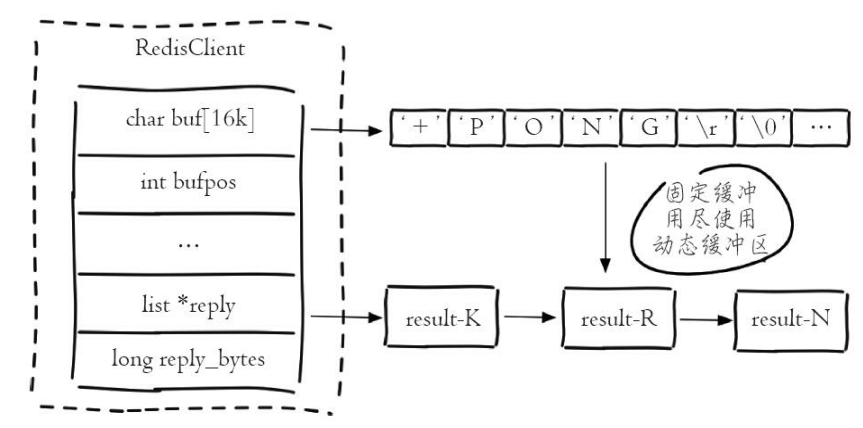

**客户端存活状态**

client list中的age和idle分别代表当前客户端已经连接的时间和最近⼀次的空闲时间。

**客户端的限制maxclients和timeout**

Redis提供了maxclients参数来限制最⼤客户端连接数，⼀旦连接数超过maxclients，新的连接将被拒绝。
maxclients默认值是10000

```yml
#代表当前Redis节点的客户端连接数，需要重点监控，一旦超过maxclients，新的客户端连接
将被拒绝。
connected_clients:1
#当前所有输入缓冲区中占用的最大容量
client_recent_max_input_buffer:2
#当前所有输出缓冲区中队列对象个数的最大值
client_recent_max_output_buffer:0
#正在执行阻塞命令（例如blpop、brpop、brpoplpush）的客户端个数。
blocked_clients:0
```


配置参数timeout⽤于检测连接超时时间，当某个客户端的空闲时间超过timeout时，就会将该客户端的连接关闭。此时客户端再次发送命令会导致连接异常。

默认的timeout为0,从代码可以看出，当为0时不进⾏超时检测。但实际开发中，如果不进⾏超时设置，如果客户端异常关闭，没有通知server关闭连接，那么将导致server保持⼤量的⽆效连接。因此实际开发时，应当设置⼀个偏⼤的超时连接，尽量减少正常情况下的连接异常，同时也要做好连接异常的情况下的重连接操作。

```java
int clientsCronHandleTimeout(client *c, mstime_t now_ms) {
    time_t now = now_ms/1000;

   if (server.maxidletime &&
        /* This handles the idle clients connection timeout if set. */
        !(c->flags & CLIENT_SLAVE) && /* No timeout for slaves and
        monitors */
        !(c->flags & CLIENT_MASTER) && /* No timeout for masters */
        !(c->flags & CLIENT_BLOCKED) && /* No timeout for BLPOP */
        !(c->flags & CLIENT_PUBSUB) && /* No timeout for Pub/Sub clients
        */
        (now - c->lastinteraction > server.maxidletime))
        {
            serverLog(LL_VERBOSE,"Closing idle client");
            freeClient(c);
            return 1;
        } else if (c->flags & CLIENT_BLOCKED) {
            /* Cluster: handle unblock & redirect of clients blocked
            * into keys no longer served by this server. */
            if (server.cluster_enabled) {
                if (clusterRedirectBlockedClientIfNeeded(c))
                unblockClient(c);
            }
        }
    return 0;
}
```


其他命令

* CLIENT GETNAME
    * 返回 CLIENT SETNAME命令为连接设置的名字。
    * 因为新创建的连接默认是没有名字的，对于没有名字的连接，CLIENT GETNAME返回空⽩回复。
* CLIENT KILL
    * CLIENT KILL ip:port
    * 关闭地址为 ip:port的客户端。
    * ip:port应该和 CLIENT LIST命令输出的其中⼀⾏匹配。
    * 因为 Redis使⽤单线程设计，所以当 Redis正在执⾏命令的时候，不会有客户端被断开连接。
    * 如果要被断开连接的客户端正在执⾏命令，那么当这个命令执⾏之后，在发送下⼀个命令的时候，它就会收到⼀个⽹络错误，告知它⾃⾝的连接已被关闭。
* CLIENT SETNAME
    * CLIENT SETNAME connection-name
    * 为当前连接分配⼀个名字。这个名字会显⽰在 CLIENT LIST命令的结果中，⽤于识别当前正在与服务器进⾏连接的客户端。
* client pause timeout(毫秒)
    * client pause命令⽤于阻塞客户端timeout毫秒数，在此期间客户端所有操作将被阻塞。
    * 使⽤场景
        * client pause只对普通和发布订阅客户端有效，对于主从复制（从节点内部伪装了⼀个客户端）是⽆效的，也就是此期间主从复制是正常进⾏的，所以此命令可以⽤来让主从复制保持⼀致。
        * client pause可以⽤⼀种可控的⽅式将客户端连接从⼀个Redis节点切换到另⼀个Redis节点

### 1.11.3. 客户端常⻅异常

<a href="#menu"  >目录</a> 

* 连接池资源不⾜，⽆法从连接池获取到连接
    * 连接池设置过⼩，⽆法应对⾼并发场景
    * 使⽤完连接后没有释放
    * 执⾏⻓耗时操作
    * 服务端阻塞
* 客户端读写超时
    * 读写超时间设置得过短。
    * 命令本⾝就⽐较慢。
    * 客户端与服务端⽹络不正常。
    * Redis⾃⾝发⽣阻塞。
* 客户端连接超时
    * 连接超时设置得过短
    * Redis发⽣阻塞，造成tcp-backlog已满，造成新的连接失败
    * ⽹络问题
* 客户端缓冲区异常
    * 输出缓冲区满
    * ⻓时间闲置连接被服务端主动断开
    * 不正常并发读写

### 1.11.4. 客户端案例分析
<a href="#menu" >目录</a>


#### 1.11.4.1. Redis内存陡增

**服务端现象:** 主节点内存陡增，⽽从节点并没有变化 **客户端现象:**客户端发⽣Redis OOM异常分析原因：
* 确实有⼤量的写⼊，但是主从复制出现问题，可以通过dbsize查看主从节点的键个数
* 通过 info client和 client list查看缓存不正常的连接

* 处理
    * 使⽤client kill杀掉这个客户端

#### 1.11.4.2. 客户端周期性超时

**服务端现象:**服务端并没有明显的异常，只是有⼀些慢查询操作分析:
* ⽹络原因:客户端和服务端之间的⽹络出现周期性的问题，经过观察⽹络是正常的
* 存在⽐较耗时的命令，导致其他命令没能得到即时执⾏，需要设置慢查询功能查看

## 1.12. 服务端
<a href="#menu" >目录</a>

本章节是基于6.0版本进行分析。6.0版本在新增可多线程处理

### 1.12.1. 线程模型
<a href="#menu" >目录</a>

redis 5.0以下是单线程处理客户端请求，6.0使⽤多线程来接收客户端数据。

但是进⾏复制持久化操作时，会使⽤fork()创建进程进⾏异步处理；只有处理客户端读写数据时是单线程。

Redis单线程为什么还能这么快？
* 纯内存访问，Redis将所有数据放在内存中，内存的响应时⻓⼤约为100纳秒，这是Redis达到每秒万级别访问的重要基础。正因为 Redis是单线程，所以要⼩⼼使⽤ Redis指令，对于那些时间复杂度为O(n)级别的指令，⼀定要谨慎使⽤，⼀不⼩⼼就可能会导致 Redis卡顿。
* 阻塞I/O，Redis使⽤epoll作为I/O多路复⽤技术的实现，再加上Redis⾃⾝的事件处理模型将epoll中的连接、读写、关闭都转换为事件，不在⽹络I/O上浪费过多的时间
* 单线程避免了线程切换和竞态产⽣的消耗。

**Redis单线程如何处理那么多的并发客户端连接？**

Redis使⽤的是IO多路复⽤器，可以使⽤单线程处理多个客户端连接管理。

**指令队列**

Redis会将每个客户端套接字都关联⼀个指令队列。客户端的指令通过队列来排队进⾏顺序处理，先到先服务。

**响应队列**

Redis同样也会为每个客户端套接字关联⼀个响应队列。Redis服务器通过响应队列来将指令的返回结果回复给客户端。如果队列为空，那么意味着连接暂时处于空闲状态，不需要去获取写事件，也就是可以将当前的客户端描述符从write_fds⾥⾯移出来。等到队列有数据了，再将描述符放进去。避免 select系统调⽤⽴即返回写事件，结果发现没什么数据可以写。出这种情况的线程会飙⾼ CPU。

**定时任务**

服务器处理要响应 IO事件外，还要处理其它事情。⽐如定时任务就是⾮常重要的⼀件事。如果线程阻塞在select系统调⽤上，定时任务将⽆法得到准时调度。那 Redis是如何解决这个问题的呢？

Redis的定时任务会记录在⼀个称为最⼩堆的数据结构中。这个堆中，最快要执⾏的任务排在堆的最上⽅。在每个循环周期，Redis都会将最⼩堆⾥⾯已经到点的任务⽴即进⾏处理。处理完毕后，将最快要执⾏的任务还需要的时间记录下来，这个时间就是 select系统调⽤的 timeout参数。因为 Redis知道未来 timeout时间内，没有其它定时任务需要处理，所以可以安⼼睡眠 timeout的时间。

Nginx和 Node的事件处理原理和 Redis也是类似的


### 1.12.2. 事件驱动模型
<a href="#menu" >目录</a>

redis的服务器是一个事件驱动模型。驱动整个服务运转的关键技术就是IO多路复用

#### 1.12.2.1. 事件结构体

```cpp
ae.h

typedef struct aeFileEvent {
    int mask; /* one of AE_(READABLE|WRITABLE|BARRIER) */
    //读方法处理
    aeFileProc *rfileProc;
    //写方法处理
    aeFileProc *wfileProc;
    //指向对应的客户端对象。
    void *clientData;
} aeFileEvent;

/* Time event structure */
typedef struct aeTimeEvent {
    //时间事件id
    long long id; /* time event identifier. */
    //时间秒数/ms
    long when_sec; /* seconds */    
    long when_ms; /* milliseconds */
    //时间事件中的处理函数
    aeTimeProc *timeProc;
    //被删除的时候将会调用的方法
    aeEventFinalizerProc *finalizerProc;
    void *clientData;
    //时间结构体内的前／后一个结构体
    struct aeTimeEvent *prev;
    struct aeTimeEvent *next;
    int refcount; /* refcount to prevent timer events from being
  		   * freed in recursive time event calls. */
} aeTimeEvent;
//FireEvent只是用来标记要处理的文件Event。
/* fired结构体，用来表示将要被处理的文件事件 */
typedef struct aeFiredEvent {
	//文件描述符id
    int fd;
    int mask;
} aeFiredEvent;
/* 创建aeEventLoop，内部的fileEvent和Fired事件的个数为setSize个 */
aeEventLoop *aeCreateEventLoop(int setsize); 
/* 删除EventLoop，释放相应的事件所占的空间 */
void aeDeleteEventLoop(aeEventLoop *eventLoop); 
/* 设置eventLoop中的停止属性为1 */
void aeStop(aeEventLoop *eventLoop); 
/* 在eventLoop中创建文件事件 */
int aeCreateFileEvent(aeEventLoop *eventLoop, int fd, int mask, aeFileProc *proc, void *clientData); 
/* 删除文件事件 */
void aeDeleteFileEvent(aeEventLoop *eventLoop, int fd, int mask); 
//根据文件描述符id，找出文件的属性，是读事件还是写事件
int aeGetFileEvents(aeEventLoop *eventLoop, int fd); 
 /* 在eventLoop中添加时间事件，创建的时间为当前时间加上自己传入的时间 */
long long aeCreateTimeEvent(aeEventLoop *eventLoop, long long milliseconds,
        aeTimeProc *proc, void *clientData,
        aeEventFinalizerProc *finalizerProc);
//根据时间id，删除时间事件，涉及链表的操作
int aeDeleteTimeEvent(aeEventLoop *eventLoop, long long id); 
/* 处理eventLoop中的所有类型事件 */
int aeProcessEvents(aeEventLoop *eventLoop, int flags); 
/* 让某事件等待 */
int aeWait(int fd, int mask, long long milliseconds); 
/* ae事件执行主程序 */
void aeMain(aeEventLoop *eventLoop); 
char *aeGetApiName(void);
/* 每次eventLoop事件执行完后又重新开始执行时调用 */
void aeSetBeforeSleepProc(aeEventLoop *eventLoop, aeBeforeSleepProc *beforesleep); 
/* 获取eventLoop的大小 */
int aeGetSetSize(aeEventLoop *eventLoop);
/* EventLoop重新调整大小 */ 
int aeResizeSetSize(aeEventLoop *eventLoop, int setsize); 
```

分为两类事件：文件事件(socket可读或可写)和时间事件(定时任务)，redis表示事件循环中的事件封装的结构体是struct aeEventLoop

```cpp
ae.h
/* State of an event based program */
typedef struct aeEventLoop {
    int maxfd;   /* highest file descriptor currently registered */
    int setsize; /* max number of file descriptors tracked */
    long long timeEventNextId;
    time_t lastTime;     /* Used to detect system clock skew */
    aeFileEvent *events; /* Registered events */ /*文件事件数组，存储所有注册的文件事件*/
    aeFiredEvent *fired; /* Fired events */      /*存储被触发的文件事件*/
    aeTimeEvent *timeEventHead;                  /*事件事件链表的头结点，所有的定时任务存储在该链表中，这是一个无序的链表，因此处理超时事件的复杂度为O(n),这个数据结构可以优化*/
    int stop;     /*标识时间循环是否结束*/
    void *apidata; /* This is used for polling API specific data */
    aeBeforeSleepProc *beforesleep;       /*调用epool_wait阻塞程序之前调用*/
    aeBeforeSleepProc *aftersleep;        /*阻塞程序之后调用，epoll_wait之后还要处理定时事件，因此epoll_wait阻塞的时间需要关注*/
    int flags;
} aeEventLoop;
```

#### 1.12.2.2. 核心方法main

事件驱动程序的写法一般都是固定：一个死循环，等待事件的发生并处理，处理完开始下一次循环，redis的写法也是如此

aeMain在服务端启动的main中调用
```cpp
void aeMain(aeEventLoop *eventLoop) {
    eventLoop->stop = 0;
    while (!eventLoop->stop) {
        aeProcessEvents(eventLoop, AE_ALL_EVENTS|
                                   AE_CALL_BEFORE_SLEEP|
                                   AE_CALL_AFTER_SLEEP);
    }
}
```

```cpp
int aeProcessEvents(aeEventLoop *eventLoop, int flags)
{
    aeTimeEvent *shortest = NULL;
    if (flags & AE_TIME_EVENTS && !(flags & AE_DONT_WAIT))
            shortest = aeSearchNearestTimer(eventLoop);
    //...........

    numevents = aeApiPoll(eventLoop, tvp);

    /* After sleep callback. */
    if (eventLoop->aftersleep != NULL && flags & AE_CALL_AFTER_SLEEP)
        eventLoop->aftersleep(eventLoop);

    for (j = 0; j < numevents; j++) {
        //循环处理所有事件
        aeFileEvent *fe = &eventLoop->events[eventLoop->fired[j].fd];
        int mask = eventLoop->fired[j].mask;
        int fd = eventLoop->fired[j].fd;
        int fired = 0; /* Number of events fired for current fd. */

        /* Normally we execute the readable event first, and the writable
            * event laster. This is useful as sometimes we may be able
            * to serve the reply of a query immediately after processing the
            * query.
            *
            * However if AE_BARRIER is set in the mask, our application is
            * asking us to do the reverse: never fire the writable event
            * after the readable. In such a case, we invert the calls.
            * This is useful when, for instance, we want to do things
            * in the beforeSleep() hook, like fsynching a file to disk,
            * before replying to a client. */
        int invert = fe->mask & AE_BARRIER;

        /* Note the "fe->mask & mask & ..." code: maybe an already
            * processed event removed an element that fired and we still
            * didn't processed, so we check if the event is still valid.
            *
            * Fire the readable event if the call sequence is not
            * inverted. */
        if (!invert && fe->mask & mask & AE_READABLE) {
            //读事件处理，此时clientData还没有数据
            fe->rfileProc(eventLoop,fd,fe->clientData,mask);
            fired++;
            fe = &eventLoop->events[fd]; /* Refresh in case of resize. */
        }

        /* Fire the writable event. */
        if (fe->mask & mask & AE_WRITABLE) {
            //写事件处理
            if (!fired || fe->wfileProc != fe->rfileProc) {
                fe->wfileProc(eventLoop,fd,fe->clientData,mask);
                fired++;
            }
        }

        /* If we have to invert the call, fire the readable event now
            * after the writable one. */
        if (invert) {
            fe = &eventLoop->events[fd]; /* Refresh in case of resize. */
            if ((fe->mask & mask & AE_READABLE) &&
                (!fired || fe->wfileProc != fe->rfileProc))
            {
                fe->rfileProc(eventLoop,fd,fe->clientData,mask);
                fired++;
            }
        }

        processed++;
    }

    /* Check time events */
    if (flags & AE_TIME_EVENTS)
        processed += processTimeEvents(eventLoop);

    return processed; /* return the number of processed file/time events */
    
}
```

aeProcessEvents是redis事件循环的执行函数，该函数的执行流程可以总结为：
1. 调用aeSearchNearestTimer函数遍历时间事件链表，找到最近要发生的超时事件
2. 调用aeApiPoll 执行IO多路复用函数(linux下调用epoll)，阻塞等待文件事件的发生。这里需要注意的是，调用aeApiPoll时传的第二个参数是个时间时间结构体aeTimeEvent，这是从时间时间链表中找到的最早的超时时间。该参数有什么用呢? 答案是，调用epoll_wait时需要传入一个超时事件的参数，这个参数表示的意思是阻塞等待的最长时间，如果在该超时时间之内，还没有事件准备就绪的话，epoll_wait就会返回。这里把这个参数设置为最早的超时事件，目的是为了保证定时器的精度，即如果没有文件事件准备就绪的话，最早的超时事件也会被处理。
3. 回调处理文件事件
4. 调用processTimeEvents处理时间事件。


#### 文件事件和时间事件

**文件事件**

redis分为客户端程序和服务器程序，客户端通过TCP socket与服务器连接交互，因此，文件事件指的是socket可读可写事件。socket读写操作分为阻塞和非阻塞模式，redis采用的是非阻塞IO模式。

* 阻塞IO	
    * 当我们调用套接字的读写方法，默认它们是阻塞的。当用户线程发出IO请求之后，内核会去查看数据是否就绪，如果没有就绪就会等待数据就绪，而用户线程就会处于阻塞状态，用户线程交出CPU。当数据就绪之后，内核会将数据拷贝到用户线程，并返回结果给用户线程，用户线程才解除block状态。

* 非阻塞IO
    * 用户线程需要不断地询问内核数据是否就绪，也就说非阻塞IO不会交出CPU，而会一直占用CPU。
    * 非阻塞 IO 在套接字对象上提供了一个选项Non_Blocking，当这个选项打开时，读写方法不会阻塞，而是能读多少读多少，能写多少写多少。能读/写多少取决于内核为套接字分配的读/写缓冲区内部的数据字节数，读方法和写方法都会通过返回值来告知程序实际读写了多少字节。

在非阻塞模式下，可以使用IO多路复用来同时处理多条网络连接。redis会根据不同的操作系统采用不同的多路复用机制，linux上使用的是epoll。


aeApiPoll 用于获取就绪事件
```cpp
//ae_epoll.c

static int aeApiPoll(aeEventLoop *eventLoop, struct timeval *tvp) {
    aeApiState *state = eventLoop->apidata;
    int retval, numevents = 0;

    retval = epoll_wait(state->epfd,state->events,eventLoop->setsize,
            tvp ? (tvp->tv_sec*1000 + tvp->tv_usec/1000) : -1);
    if (retval > 0) {
        //有事件发生
        int j;

        numevents = retval;
        for (j = 0; j < numevents; j++) {
            int mask = 0;
            struct epoll_event *e = state->events+j;

            if (e->events & EPOLLIN) mask |= AE_READABLE;
            if (e->events & EPOLLOUT) mask |= AE_WRITABLE;
            if (e->events & EPOLLERR) mask |= AE_WRITABLE|AE_READABLE;
            if (e->events & EPOLLHUP) mask |= AE_WRITABLE|AE_READABLE;
            eventLoop->fired[j].fd = e->data.fd;
            eventLoop->fired[j].mask = mask;
        }
    }
    return numevents;
}
```


这是非常标准的也是固定的epoll的写法。函数首先需要通过eventLoop->apidata字段获取epoll模型对应的aeApiState结构体对象，才能调用epoll_wait函数等待事件的发生;epoll_wait函数将已触发的事件存储到aeApiState对象的events字段，Redis再次遍历所有已触发事件，将其封装在eventLoop->fired数组，数组元素类型为结构体aeFiredEvent，只有两个字段，fd表示发生事件的socket文件描述符，mask表示发生的事件类型，如AE_READABLE可读事件和AE_WRITABLE可写事件。


**相关知识点**

select事件的模型 
* 创建所关注的事件的描述符集合（fd_set)，对于一个描述符，可以关注其上面的读(read)、写(write)、异常(exception)事件,所以通常，要创建三个fd_set， 一个用来收集关注读事件的描述符，一个用来收集关注写事件的描述符，另外一个用来收集关注 异常事件的描述符集合。
* 轮询所有fd_set中的每一个fd ，检查是否有相应的事件发生，如果有，就进行处理。
    
poll和上面的区别是可以复用文件描述符，上面对一个文件需要轮询3个文件描述符集合，而poll只需要一个，效率更高

epoll是poll的升级版本，把描述符列表交给内核，一旦有事件发生，内核把发生事件的描述符列表通知给进程，这样就避免了轮询整个描述符列表。效率极大提高 


**int epoll_wait(int epfd, struct epoll_event * events, int maxevents, int timeout);**
等待事件的产生，类似于select()调用。参数events用来从内核得到事件的集合，maxevents告之内核这个events有多大，这个 maxevents的值不能大于创建epoll_create()时的size，参数timeout是超时时间（毫秒，0会立即返回，-1将不确定，也有说法说是永久阻塞）。该函数返回需要处理的事件数目，如返回0表示已超时。如果返回–1，则表示出现错误，需要检查 errno错误码判断错误类型。
* 第1个参数 epfd是 epoll的描述符。
* 第2个参数 events则是分配好的 epoll_event结构体数组，epoll将会把发生的事件复制到 events数组中（events不可以是空指针，内核只负责把数据复制到这个 events数组中，不会去帮助我们在用户态中分配内存。内核这种做法效率很高）。
* 第3个参数 maxevents表示本次可以返回的最大事件数目，通常 maxevents参数与预分配的events数组的大小是相等的。
* 第4个参数 timeout表示在没有检测到事件发生时最多等待的时间（单位为毫秒），如果 timeout为0，则表示 epoll_wait在 rdllist链表中为空，立刻返回，不会等待。


### 1.12.3. 客户端请求处理
<a href="#menu" >目录</a>

redis服务端的main程序在server.c中

```cpp
void main(){

    ...
    if (!server.sentinel_mode) {
        InitServerLast();
    }else {
        InitServerLast();
        sentinelIsRunning();
    }
    ...
}
```
线程初始化
```cpp
void InitServerLast() {
    //Initialize the background system, spawning the thread.
    bioInit();
    //io线程初始化
    //Initialize the data structures needed for threaded I/O.
    initThreadedIO();
    set_jemalloc_bg_thread(server.jemalloc_bg_thread);
    server.initial_memory_usage = zmalloc_used_memory();
}
```

```cpp
void initThreadedIO(void) {
    io_threads_active = 0; /* We start with threads not active. */

    /* Don't spawn any thread if the user selected a single thread:
     * we'll handle I/O directly from the main thread. */
    if (server.io_threads_num == 1) return;

    if (server.io_threads_num > IO_THREADS_MAX_NUM) {
        serverLog(LL_WARNING,"Fatal: too many I/O threads configured. "
                             "The maximum number is %d.", IO_THREADS_MAX_NUM);
        exit(1);
    }

    /* Spawn and initialize the I/O threads. */
    //根据配置的线程数初始化,配置文件中可以配置线程数目
    for (int i = 0; i < server.io_threads_num; i++) {
        /* Things we do for all the threads including the main thread. */
        io_threads_list[i] = listCreate();
        if (i == 0) continue; /* Thread 0 is the main thread. */

        /* Things we do only for the additional threads. */
        pthread_t tid;
        pthread_mutex_init(&io_threads_mutex[i],NULL);
        io_threads_pending[i] = 0;
        pthread_mutex_lock(&io_threads_mutex[i]); /* Thread will be stopped. */
        //线程启动之后，会执行方法IOThreadMain
        if (pthread_create(&tid,NULL,IOThreadMain,(void*)(long)i) != 0) {
            serverLog(LL_WARNING,"Fatal: Can't initialize IO thread.");
            exit(1);
        }
        io_threads[i] = tid;
    }
}
```

IOThreadMain便是io线程运行的线程代码
```cpp
//networking.c
void *IOThreadMain(void *myid) {
    /* The ID is the thread number (from 0 to server.iothreads_num-1), and is
     * used by the thread to just manipulate a single sub-array of clients. */
    long id = (unsigned long)myid;
    char thdname[16];

    snprintf(thdname, sizeof(thdname), "io_thd_%ld", id);
    redis_set_thread_title(thdname);
    redisSetCpuAffinity(server.server_cpulist);

    while(1) {
        /* Wait for start */
        for (int j = 0; j < 1000000; j++) {
            if (io_threads_pending[id] != 0) break;
        }

        /* Give the main thread a chance to stop this thread. */
        if (io_threads_pending[id] == 0) {
            pthread_mutex_lock(&io_threads_mutex[id]);
            pthread_mutex_unlock(&io_threads_mutex[id]);
            continue;
        }

        serverAssert(io_threads_pending[id] != 0);

        if (tio_debug) printf("[%ld] %d to handle\n", id, (int)listLength(io_threads_list[id]));

        /* Process: note that the main thread will never touch our list
         * before we drop the pending count to 0. */
        listIter li;
        listNode *ln;
        listRewind(io_threads_list[id],&li);
        while((ln = listNext(&li))) {
            client *c = listNodeValue(ln);
            //写事件
            if (io_threads_op == IO_THREADS_OP_WRITE) {
                //写处理
                writeToClient(c,0);
            }
            //读事件 
            else if (io_threads_op == IO_THREADS_OP_READ) {
                readQueryFromClient(c->conn);
            } else {
                serverPanic("io_threads_op value is unknown");
            }
        }
        listEmpty(io_threads_list[id]);
        io_threads_pending[id] = 0;

        if (tio_debug) printf("[%ld] Done\n", id);
    }
}
```

io_threads_list用于存放客户端的请求信息。

```cpp

void readQueryFromClient(connection *conn) {
    client *c = connGetPrivateData(conn);
    int nread, readlen;
    size_t qblen;

    /* Check if we want to read from the client later when exiting from
     * the event loop. This is the case if threaded I/O is enabled. */
    if (postponeClientRead(c)) return;

    readlen = PROTO_IOBUF_LEN;
    /* If this is a multi bulk request, and we are processing a bulk reply
     * that is large enough, try to maximize the probability that the query
     * buffer contains exactly the SDS string representing the object, even
     * at the risk of requiring more read(2) calls. This way the function
     * processMultiBulkBuffer() can avoid copying buffers to create the
     * Redis Object representing the argument. */
    if (c->reqtype == PROTO_REQ_MULTIBULK && c->multibulklen && c->bulklen != -1
        && c->bulklen >= PROTO_MBULK_BIG_ARG)
    {
        ssize_t remaining = (size_t)(c->bulklen+2)-sdslen(c->querybuf);

        /* Note that the 'remaining' variable may be zero in some edge case,
         * for example once we resume a blocked client after CLIENT PAUSE. */
        if (remaining > 0 && remaining < readlen) readlen = remaining;
    }

    qblen = sdslen(c->querybuf);
    if (c->querybuf_peak < qblen) c->querybuf_peak = qblen;
    c->querybuf = sdsMakeRoomFor(c->querybuf, readlen);
    nread = connRead(c->conn, c->querybuf+qblen, readlen);
    if (nread == -1) {
        if (connGetState(conn) == CONN_STATE_CONNECTED) {
            return;
        } else {
            serverLog(LL_VERBOSE, "Reading from client: %s",connGetLastError(c->conn));
            freeClientAsync(c);
            return;
        }
    } else if (nread == 0) {
        serverLog(LL_VERBOSE, "Client closed connection");
        freeClientAsync(c);
        return;
    } else if (c->flags & CLIENT_MASTER) {
        /* Append the query buffer to the pending (not applied) buffer
         * of the master. We'll use this buffer later in order to have a
         * copy of the string applied by the last command executed. */
        c->pending_querybuf = sdscatlen(c->pending_querybuf,
                                        c->querybuf+qblen,nread);
    }

    sdsIncrLen(c->querybuf,nread);
    c->lastinteraction = server.unixtime;
    if (c->flags & CLIENT_MASTER) c->read_reploff += nread;
    server.stat_net_input_bytes += nread;
    if (sdslen(c->querybuf) > server.client_max_querybuf_len) {
        sds ci = catClientInfoString(sdsempty(),c), bytes = sdsempty();

        bytes = sdscatrepr(bytes,c->querybuf,64);
        serverLog(LL_WARNING,"Closing client that reached max query buffer length: %s (qbuf initial bytes: %s)", ci, bytes);
        sdsfree(ci);
        sdsfree(bytes);
        freeClientAsync(c);
        return;
    }

    /* There is more data in the client input buffer, continue parsing it
     * in case to check if there is a full command to execute. */
     processInputBuffer(c);
}
```


### 1.12.4. 阻塞问题

<a href="#menu"  >目录</a> 

Redis是典型的单线程架构，所有的读写操作都是在⼀条主线程中完成的。当Redis⽤于⾼并发场景时，这条线程就变成了它的⽣命线。如果出现阻塞，哪怕是很短时间，对于我们的应⽤来说都是噩梦。导致阻塞问题的场景⼤致分为内在原因和外在原因：
* 内在原因包括：不合理地使⽤API或数据结构、CPU饱和、持久化阻塞等。
* 外在原因包括：CPU竞争、内存交换、⽹络问题等。

#### 1.12.4.1. 发现阻塞

当Redis阻塞时，线上应⽤服务应该最先感知到，这时应⽤⽅会收到⼤量Redis超时异常，⽐如Jedis客户端会抛出JedisConnectionException异常。常⻅的做法是在应⽤⽅加⼊异常统计并通过邮件/短信/微信报警，以便及时发现通知问题。开发⼈员需要处理如何统计异常以及触发报警的时机。何时触发报警⼀般根据应⽤的并发量决定，如1分钟内超过10个异常触发报警。在实现异常统计时要注意，由于Redis调⽤API会分散在项⽬的多个地⽅，每个地⽅都监听异常并加⼊监控代码必然难以维护。这时可以借助于⽇志系统，如Java语⾔可以使⽤logback或log4j。当异常发⽣时，异常信息最终会被⽇志系统收集到Appender（输出⽬的地），默认的
Appender⼀般是具体的⽇志⽂件，开发⼈员可以⾃定义⼀个Appender，⽤于专门统计异常和触发报警逻辑除了在应⽤⽅加⼊统计报警逻辑之外，还可以借助Redis监控系统发现阻塞问题，当监控系统检测到Redis运⾏期的⼀些关键指标出现不正常时会触发报警。监控系统所监控的关键指标有很多，如命令耗时、慢查询、持久化阻塞、连接拒绝、CPU/内存/⽹络/磁盘使⽤过载等。

#### 1.12.4.2. 内在原因


##### 1.12.4.2.1. API使⽤不合理


API使⽤不合理导致慢查询。

Redis原⽣提供慢查询统计功能，执⾏slowlog get{n}命令可以获取最近的n条慢查询命令。慢查询本⾝只记录了命令执⾏时间，不包括数据⽹络传输时间和命令排队时间，因此客户端发⽣阻塞异常后，可能不是当前命令缓慢，⽽是在等待其他命令执⾏。需要重点⽐对异常和慢查询发⽣的时间点，确认是否有慢查询造成的命令阻塞排队

**慢查询**

发现慢查询后，开发⼈员需要作出及时调整。可以按照以下两个⽅向去调整：
* 修改为低算法度的命令，如hgetall改为hmget等，禁⽤keys、sort等命令。
* 调整⼤对象：缩减⼤对象数据或把⼤对象拆分为多个⼩对象，防⽌⼀次命令操作过多的数据。⼤对象拆分过程需要视具体的业务决定，如⽤户好友集合存储在Redis中，有些热点⽤户会关注⼤量好友，这时可以按时间或其他维度拆分到多个集合中.

**⼤对象**

如何发现⼤对象 Redis本⾝提供发现⼤对象的⼯具，对应命令：redis-cli -h{ip} -p{port} bigkeys。内部原理采⽤分段进⾏scan操作，把历史扫描过的最⼤对象统计出来便于分析优化


```yml
# Scanning the entire keyspace to find biggest keys as well as
# average sizes per key type. You can use -i 0.1 to sleep 0.1 sec
# per 100 SCAN commands (not usually needed).
[00.00%] Biggest string found so far 'ptc:-571805194744395733' with 17
bytes
[00.00%] Biggest string found so far 'RVF#2570599,1' with 3881 bytes
[00.01%] Biggest hash found so far 'pcl:8752795333786343845' with 208
218 / 256


Redis.md	1/15/2021


[00.37%] Biggest string found so far 'RVF#1224557,1' with 3882 bytes
[00.75%] Biggest string found so far 'ptc:2404721392920303995' with 4791
bytes
[04.64%] Biggest string found so far 'pcltm:614' with 5176729 bytes
[08.08%] Biggest string found so far 'pcltm:8561' with 11669889 bytes
[21.08%] Biggest string found so far 'pcltm:8598' with 12300864 bytes
..忽略更多输出...
-------- summary -------
Sampled 3192437 keys in the keyspace!
Total key length in bytes is 78299956 (avg len 24.53)
Biggest string found 'pcltm:121' has 17735928 bytes
Biggest hash found 'pcl:3650040409957394505' has 209 fields
2526878 strings with 954999242 bytes (79.15% of keys, avg size 377.94)
0 lists with 0 items (00.00% of keys, avg size 0.00)
0 sets with 0 members (00.00% of keys, avg size 0.00)
665559 hashs with 19013973 fields (20.85% of keys, avg size 28.57)
0 zsets with 0 members (00.00% of keys, avg size 0.00)
```


##### 1.12.4.2.2. CPU饱和


单线程的Redis处理命令时只能使⽤⼀个CPU。⽽CPU饱和是指Redis把单核CPU使⽤率跑到接近100%。使⽤top命令很容易识别出对应Redis进程的CPU使⽤率。

对于这种情况，垂直层⾯的命令优化很难达到效果，这时就需要做集群化⽔平扩展来分摊OPS压⼒。如果只有⼏百或⼏千OPS的Redis实例就接近CPU饱和是很不正常的，有可能使⽤了⾼算法复杂度的命令。还有⼀种情况是过度的内存优化，这种情况有些隐蔽，需要我们根据infocommandstats统计信息分析出命令不合理开销时间

##### 1.12.4.2.3. 持久化阻塞

对于开启了持久化功能的Redis节点，需要排查是否是持久化导致的阻塞。持久化引起主线程阻塞的操作主要有：fork阻塞、AOF刷盘阻塞、HugePage写操作阻塞

**fork阻塞**

fork操作发⽣在RDB和AOF重写时，Redis主线程调⽤fork操作产⽣共享内存的⼦进程，由⼦进程完成持久化⽂件重写⼯作。如果fork操作本⾝耗时过⻓，必然会导致主线程的阻塞。可以执⾏info stats命令获取到
latest_fork_usec指标，表⽰Redis最近⼀次fork操作耗时，如果耗时很⼤，⽐如超过1秒，则需要做出优化调整，如避免使⽤过⼤的内存实例和规避fork缓慢的操作系统等

**AOF刷盘阻塞**

当我们开启AOF持久化功能时，⽂件刷盘的⽅式⼀般采⽤每秒⼀次，后台线程每秒对AOF⽂件做fsync操作。
当硬盘压⼒过⼤时，fsync操作需要等待，直到写⼊完成。如果主线程发现距离上⼀次的fsync成功超过2秒，为了数据安全性它会阻塞直到后台线程执⾏fsync操作完成。这种阻塞⾏为主要是硬盘压⼒引起，可以查看Redis⽇志识别出这种情况

也可以查看info persistence统计中的aof_delayed_fsync指标，每次发⽣fdatasync阻塞主线程时会累加。


硬盘压⼒可能是Redis进程引起的，也可能是其他进程引起的，可以使⽤iotop查看具体是哪个进程消耗过多的硬盘资源。

**HugePage写操作阻塞**

⼦进程在执⾏重写期间利⽤Linux写时复制技术降低内存开销，因此只有写操作时Redis才复制要修改的内存⻚。对于开启Transparent HugePages的操作系统，每次写命令引起的复制内存⻚单位由4K变为2MB，放⼤了512倍，会拖慢写操作的执⾏时间，导致⼤量写操作慢查询。例如简单的incr命令也会出现在慢查询中

#### 1.12.4.3. 外在原因


##### 1.12.4.3.1. CPU竞争


CPU竞争问题如下：
* 进程竞争：Redis是典型的CPU密集型应⽤，不建议和其他多核CPU密集型服务部署在⼀起。当其他进程过度消耗CPU时，将严重影响Redis吞吐量。可以通过top、sar等命令定位到CPU消耗的时间点和具体进程，这个问题⽐较容易发现，需要调整服务之间部署结构。
* 绑定CPU：部署Redis时为了充分利⽤多核CPU，通常⼀台机器部署多个实例。常⻅的⼀种优化是把Redis进程绑定到CPU上，⽤于降低CPU频繁上下⽂切换的开销

当Redis⽗进程创建⼦进程进⾏RDB/AOF重写时，如果做了CPU绑定，会与⽗进程共享使⽤⼀个CPU。⼦进程重写时对单核CPU使⽤率通常在90%以上，⽗进程与⼦进程将产⽣激烈CPU竞争，极⼤影响Redis稳定性。因此对于开启了持久化或参与复制的主节点不建议绑定CPU。


##### 1.12.4.3.2. 内存交换

内存交换（swap）对于Redis来说是⾮常致命的，Redis保证⾼性能的⼀个重要前提是所有的数据在内存中。
如果操作系统把Redis使⽤的部分内存换出到硬盘，由于内存与硬盘读写速度差⼏个数量级，会导致发⽣交换后的Redis性能急剧下降

```yml
lgj@lgj-Lenovo-G470:~$ cat /proc/7739/smaps |grep Swap
Swap:	0 kB
SwapPss:	0 kB
Swap:	0 kB
```
如果交换量都是0KB或者个别的是4KB，则是正常现象，说明Redis进程内存没有被交换。预防内存交换的⽅法有：
* 保证机器充⾜的可⽤内存。
* 确保所有Redis实例设置最⼤可⽤内存（maxmemory），防⽌极端情况下Redis内存不可控的增⻓。
* 降低系统使⽤swap优先级，如echo10>/proc/sys/vm/swappiness


##### 1.12.4.3.3. ⽹络问题


⽹络问题经常是引起Redis阻塞的问题点。常⻅的⽹络问题主要有：连接拒绝、⽹络延迟、⽹卡软中断等。

**连接拒绝**

当出现⽹络闪断或者连接数溢出时，客户端会出现⽆法连接Redis的情况。我们需要区分这三种情况：⽹络闪断、Redis连接拒绝、连接溢出。
* 第⼀种情况：⽹络闪断。⼀般发⽣在⽹络割接或者带宽耗尽的情况，对于⽹络闪断的识别⽐较困难，常⻅的做法可以通过sar-n DEV查看本机历史流量是否正常，或者借助外部系统监控⼯具（如Ganglia）进⾏识别。具体问题定位需要更上层的运维⽀持，对于重要的Redis服务需要充分考虑部署架构的优化，尽量避免客户端与Redis之间异地跨机房调⽤。
* 第⼆种情况：Redis连接拒绝。Redis通过maxclients参数控制客户端最⼤连接数，默认10000。当Redis连接数⼤于maxclients时会拒绝新的连接进⼊，info stats的rejected_connections统计指标记录所有被拒绝连接的数

Redis使⽤多路复⽤IO模型可⽀撑⼤量连接，但是不代表可以⽆限连接。客户端访问Redis时尽量采⽤NIO⻓连接或者连接池的⽅式。

Redis⽤于⼤量分布式节点访问且⽣命周期⽐较短的场景时，如⽐较典型的在Map/Reduce中使⽤Redis。因为客户端服务存在频繁启动和销毁的情况且默认Redis不会主动关闭⻓时间闲置连接或检查关闭⽆效的TCP连接，因此会导致Redis连接数快速消耗且⽆法释放的问题。这种场景下建议设置tcp-keepalive和timeout参数让Redis主动检查和关闭⽆效连接

* 第三种情况：连接溢出。这是指操作系统或者Redis客户端在连接时的问题。这个问题的原因⽐较多，下⾯就分别介绍两种原因：进程限制、backlog队列溢出
    * 进程限制
        * 客户端想成功连接上Redis服务需要操作系统和Redis的限制都通过才可以,操作系统⼀般会对进程使⽤的资源做限制，其中⼀项是对进程可打开最⼤⽂件数控制，通过ulimit-n查看，通常默认1024。由于Linux系统对TCP连接也定义为⼀个⽂件句柄，因此对于⽀撑⼤量连接的Redis来说需要增⼤这个值，如设置ulimit-n65535，防⽌Too many open files错误。
    * backlog队列溢出
        * 系统对于特定端⼝的TCP连接使⽤backlog队列保存。Redis默认的⻓度为511，通过tcp-backlog参数设置。如果Redis⽤于⾼并发场景为了防⽌缓慢连接占⽤，可适当增⼤这个设置，但必须⼤于操作系统允许值才能⽣效。当Redis启动时如果tcp-backlog设置⼤于系统允许值将以系统值为准
    * 如果怀疑是backlog队列溢出，线上可以使⽤cron定时执⾏netstat-s|grepoverflowed统计，查看是否有持续增⻓的连接拒绝情况

**⽹络延迟**

⽹络延迟取决于客户端到Redis服务器之间的⽹络环境。主要包括它们之间的物理拓扑和带宽占⽤情况。常⻅的物理拓扑按⽹络延迟由快到慢可分为：同物理机>同机架>跨机架>同机房>同城机房>异地机房。但它们容灾性正好相反，同物理机容灾性最低⽽异地机房容灾性最⾼。Redis提供了测量机器之间⽹络延迟的⼯具，在redis-cli -h {host} -p {port}命令后⾯加⼊如下参数进⾏延迟测试：
* --latency：持续进⾏延迟测试，分别统计：最⼩值、最⼤值、平均值、采样次数。
* --latency-history：统计结果同--latency，但默认每15秒完成⼀⾏统计，可通过-i参数控制采样时间。
* --latency-dist：使⽤统计图的形式展⽰延迟统计，每1秒采样⼀次。

络延迟问题经常出现在跨机房的部署结构上，对于机房之间延迟⽐较严重的场景需要调整拓扑结构，如把客户端和Redis部署在同机房或同城机房等。带宽瓶颈通常出现在以下⼏个⽅⾯：
* 机器⽹卡带宽。
* 机架交换机带宽。
* 机房之间专线带宽。带宽占⽤主要根据当时使⽤率是否达到瓶颈有关，如频繁操作Redis的⼤对象对于千兆⽹卡的机器很容易达到⽹卡瓶颈，因此需要重点监控机器流量，及时发现⽹卡打满产⽣的⽹络延迟或通信中断等情况，⽽机房专线和交换机带宽⼀般由上层运维监控⽀持，通常出现瓶颈的概率较⼩。

**⽹卡软中断**

⽹卡软中断是指由于单个⽹卡队列只能使⽤⼀个CPU，⾼并发下⽹卡数据交互都集中在同⼀个CPU，导致⽆法充分利⽤多核CPU的情况。⽹卡软中断瓶颈⼀般出现在⽹络⾼流量吞吐的场景，如下使⽤“top+数字1”命令可以很明显看到CPU1的软中断指标（si）过⾼：


## 1.13. 慢查询⽇志

* 慢查询⽇志⽤于记录执⾏时间超过阈值的命令，记录的数据存放在内存慢查询列表中
* 参数配置
    * slowlog-log-slower-than
        * 超过多少微秒则记录
        * CONFIG set slowlog-log-slower-than 100
        * 等于0,记录所有命令，⼩于0,对于任何命令都不会记录
    * slowlog-max-len
        * 指定服务器最多保存多少条慢查询⽇志
        * 当等于时则先删除旧的⽇志删除，类似⼀个固定⻓度的List
        * CONFIG set slowlog-max-len 5
        * 实际上Redis使⽤了⼀个列表来存储慢查询⽇志，slowlog-max-len就是列表的最⼤⻓度。⼀个新的命令满⾜慢查询条件时被插⼊到这个列表中，当慢查询⽇志列表已处于其最⼤⻓度时，最早插⼊的⼀个命令将从列表中移出
    * 查看⽇志，slowlog get [n]
        * 显⽰信息:⽇志的唯⼀标识,命令执⾏时的UNIX时间戳，命令执⾏的时⻓(微秒)，命令以及命令参数
        * n指定条数
    * 获取慢查询⽇志列表当前的⻓度
        * slowlog len
    * 慢查询⽇志重置
        * slowlog reset

运⾏时修改,如果要Redis将配置持久化到本地配置⽂件，需要执⾏config rewrite命令
```yml
config set slowlog-log-slower-than 20000
config set slowlog-max-len 1000
config rewrite
```


可以看到每个慢查询⽇志有4个属性组成，分别是慢查询⽇志的标识id、发⽣时间戳、命令耗时、执⾏命令和参数

```yml
127.0.0.1:6379> slowlog get
1) 1) (integer) 0
2) (integer) 1608887795
3) (integer) 29965
4) 1) "hset"
2) "myhash"
3) "aa"
4) "123"
5) "127.0.0.1:47874"
6) ""

```

**使⽤注意事项**
* slowlog-max-len配置建议
    * 线上建议调⼤慢查询列表，记录慢查询时Redis会对⻓命令做截断操作，并不会占⽤⼤量内存。增⼤慢查询列表可以减缓慢查询被剔除的可能，例如线上可设置为1000以上
* slowlog-log-slower-than配置建议：
    * 默认值超过10毫秒判定为慢查询，需要根据Redis并发量调整该值。由于Redis采⽤单线程响应命令，对于⾼流量的场景，如果命令执⾏时间在1毫秒以上，那么Redis最多可⽀撑OPS不到1000。因此对于⾼OPS场景的Redis建议设置为1毫秒
* 慢查询只记录命令执⾏时间，并不包括命令排队和⽹络传输时间。因此客户端执⾏命令的时间会⼤于命令实际执⾏时间。因为命令执⾏排队机制，慢查询会导致其他命令级联阻塞，因此当客户端出现请求超时，需要检查该时间点是否有对应的慢查询，从⽽分析出是否为慢查询导致的命令级联阻塞
* 由于慢查询⽇志是⼀个先进先出的队列，也就是说如果慢查询⽐较多的情况下，可能会丢失部分慢查询命令，为了防⽌这种情况发⽣，可以定期执⾏slow get命令将慢查询⽇志持久化到其他存储中（例如MySQL），然后可以制作可视化界⾯进⾏查询，Redis私有云CacheCloud提供了这样的功能，好的⼯具可以让问题排查事半功倍

慢查询的记录放在⼀个链表中slowlog。


```cpp
typedef struct slowlogEntry {
    robj **argv;
    int argc;
    long long id;	/* Unique entry identifier. */
    long long duration; /* Time spent by the query, in microseconds. */
    time_t time;	/* Unix time at which the query was executed. */
    sds cname;	/* Client name. */
    sds peerid;	/* Client network address. */
} slowlogEntry;
```


## 1.14. 监视器

通过monitor命令，客户端可以将⾃⼰变成⼀个监视器，实时地接收并打印出服务器当前处理的命令列表。当⼀个客户端向服务器发送⼀条命令时，服务器除了会处理这条请求之外，还会将这条命令请求的信息发送给所有的监视器。


```yml
# 客户端１将自己变成monitor
127.0.0.1:6379> monitor
OK
#监视器打印服务器收到的命令: 发送时间 [数据库 ip:port] 命令
1608995071.451475 [0 127.0.0.1:59002] "COMMAND"
1608995103.143606 [0 127.0.0.1:59002] "set" "k1" "123"
1608995106.719686 [0 127.0.0.1:59002] "get" "k1"

#客户端２执行操作
127.0.0.1:6379> set k1 123
OK
127.0.0.1:6379> get k1
"123"
127.0.0.1:6379>
```

当⾼并发环境下，将会导致输出缓冲区累计较多的命令，导致内存使⽤量暴增，因此在⽣产环境中，⾮⽐要情况下不应当使⽤monitor命令。

## 1.15. Redis使⽤注意事项

### 1.15.1. Linux配置优化

#### 1.15.1.1. 内存分配控制

REDIS启动时会有下⾯的提⽰

```yml
# WARNING overcommit_memory is set to 0! Background save may fail under lowmemory condition. To fix this issue add 'vm.overcommit_memory = 1' to
/etc/sysctl.conf and then reboot or run the command 'sysctl
vm.overcommit_memory=1' for this to
```


⽇志中的Background save代表的是bgsave和bgrewriteaof，如果当前可⽤内存不⾜，操作系统应该如何处理fork操作。如果vm.overcommit_memory=0，代表如果没有可⽤内存(物理内存与swap之和)，就申请内存失败，对应到Redis就是执⾏fork失败

Linux操作系统对⼤部分申请内存的请求都回复yes，以便能运⾏更多的程序。因为申请内存后，并不会⻢上使⽤内存，这种技术叫做overcommit。如果Redis在启动时有上⾯的⽇志，说明
vm.overcommit_memory=0，Redis提⽰把它设置为1.

Redis建议把这个值设置为1，是为了让fork操作能够在低内存下也执⾏成功。
* vm.overcommit_memory
    * 0:表⽰内核将检查是否有⾜够的可⽤内存，如果有，则内存申请通过，否则申请失败并把错误返回给应⽤进程
    * 1:表⽰内核允许超量使⽤内存直到⽤完为⽌
    * 2:表⽰内核绝不过量使⽤内存，即系统整个内存地址空间不能超过swap+50%的RAM的值，50%是overcommit_ratio的默认值，也可以进⾏修改

vm.overcommit_memory=0，代表如果没有可⽤内存，就申请内存失败，对应到Redis就是执⾏fork失败。
Redis建议把这个值设置为1，是为了让fork操作能够在低内存下也执⾏成功

获取和设置
```yml
# 两个参数位于/proc/sys/vm下
lgj@lgj-Lenovo-G470:/proc/sys/vm$ ls -l over*
-rw-r--r-- 1 root root 0 Sep 6 13:49 overcommit_kbytes
-rw-r--r-- 1 root root 0 Sep 6 13:48 overcommit_memory
-rw-r--r-- 1 root root 0 Sep 6 13:49 overcommit_ratio
# 设置

echo "vm.overcommit_memory=1" >> /etc/sysctl.conf
sysctl vm.overcommit_memory=1
```


最佳实践
* Redis设置合理的maxmemory，保证机器有20%~30%的闲置内存。
* 集中化管理AOF重写和RDB的bgsave。
* 设置vm.overcommit_memory=1，防⽌极端情况下会造成fork失败。


#### 1.15.1.2. swappiness

### 1.15.2. flushall/flushdb误操作

<a href="#menu"  >目录</a> 

* flushdb⽤于清除当前数据库的数据
* flushall⽤于清除所有数据库的数据

⼀旦发⽣误操作，可能会发⽣严重的问题。
* 被误操作flush后，根据当前Redis是缓存还是存储使⽤策略有所不同：
    * 缓存：对于业务数据的正确性可能造成损失还⼩⼀点，因为缓存中的数据可以从数据源重新进⾏构建，如果业务⽅并发量很⼤，可能会对后端数据源造成⼀定的负载压⼒，这个问题也是不容忽视。
    * 存储：对业务⽅可能会造成巨⼤的影响，也许flush操作后的数据是重要配置，也可能是⼀些基础数据，也可能是业务上的重要⼀环，如果没有提前做业务降级操作，那么最终反馈到⽤户的应⽤可能就是报错或者空⽩⻚⾯等，其后果不堪设想。即使做了相应的降级或者容错处理，对于⽤户体验也有⼀定的影响

#### 1.15.2.1. 借助AOF机制恢复


Redis执⾏了flush操作后，AOF持久化⽂件会受到什么影响呢？如下所⽰：
* appendonly no：对AOF持久化没有任何影响，因为根本就不存在AOF⽂件。
* appendonly yes：只不过是在AOF⽂件中追加了⼀条flush的记录

虽然Redis中的数据被清除掉了，但是AOF⽂件还保存着flush操作之前完整的数据，这对恢复数据是很有帮助的

**注意事项**
* 如果发⽣了AOF重写，Redis遍历所有数据库重新⽣成AOF⽂件，并会覆盖之前的AOF⽂件。所以如果AOF重写发⽣了，也就意味着之前的数据就丢掉了，那么利⽤AOF⽂件来恢复的办法就失效了。所以当误操作后，需要考虑如下两件事。
    * 调⼤AOF重写参数auto-aof-rewrite-percentage和auto-aof-rewrite-minsize，让Redis不能产⽣AOF⾃动重写。
    * 拒绝⼿动bgrewriteaof
* 如果要⽤AOF⽂件进⾏数据恢复，那么必须要将AOF⽂件中的如果要⽤AOF⽂件进⾏数据恢复，那么必须要将AOF⽂件中的flushall相关操作去掉，为了更加安全，可以在去掉之后使⽤redis-check-aof这个⼯具去检验和修复⼀下AOF⽂件，确保AOF⽂件格式正确，保证数据恢复正常

#### 1.15.2.2. RDB问题

* 如果没有开启RDB的⾃动策略,那么除⾮⼿动执⾏过save、bgsave或者发⽣了主从的全量复制，否则RDB⽂件也会保存flush操作之前的数据，可以作为恢复数据的数据源.RDB⽂件中的数据可能没有AOF实时性⾼，也就是说，RDB⽂件很可能很久以前主从全量复制⽣成的，或者之前⽤save、bgsave备份的
* 如果开启了RDB的⾃动策略，由于flush涉及键值数量较多，RDB⽂件会被清除，意味着使⽤RDB恢复基本⽆望

综上所述，如果AOF已经开启了，那么⽤AOF来恢复是⽐较合理的⽅式，但是如果AOF关闭了，那么RDB虽然数据不是很实时，但是也能恢复部分数据，完全取决于RDB是什么时候备份的。当然RDB并不是⼀⽆是处，它的恢复速度要⽐AOF快很多，但是总体来说对于flush操作之后不是最好的恢复数据源。

#### 1.15.2.3. 从节点有什么变化

Redis从节点同步了主节点的flush命令，所以从节点的数据也是被清除了，从节点的RDB和AOF的变化与主节点没有任何区别


#### 1.15.2.4. 快速恢复数据

* 防⽌AOF重写。快速修改Redis主从的auto-aof-rewrite-percentage和auto-aof-rewrite-min-size变为⼀个很⼤的值，从⽽防⽌了AOF重写的发⽣
* 掉主从AOF⽂件中的flush相关内容
* 重启Redis主节点服务器，恢复数据。

### 1.15.3. 安全的redis

### 1.15.4. bigkey处理

bigkey是指key对应的value所占的内存空间⽐较⼤.例如⼀个字符串类型的value可以最⼤存到512MB
* 字符串类型：体现在单个value值很⼤，⼀般认为超过10KB就是bigkey，但这个值和具体的OPS相关。
* ⾮字符串类型：哈希、列表、集合、有序集合，体现在元素个数过多

bigkey的危害体现在三个⽅⾯：
* 内存空间不均匀（平衡）：例如在Redis Cluster中，bigkey会造成节点的内存空间使⽤不均匀。
* 超时阻塞：由于Redis单线程的特性，操作bigkey⽐较耗时，也就意味着阻塞Redis可能性增⼤。
* ⽹络拥塞：每次获取bigkey产⽣的⽹络流量较⼤，假设⼀个bigkey为1MB，每秒访问量为1000，那么每秒产⽣1000MB的流量，对于普通的千兆⽹卡（按照字节算是128MB/s）的服务器来说简直是灭顶之灾，⽽且⼀般服务器会采⽤单机多实例的⽅式来部署，也就是说⼀个bigkey可能会对其他实例造成影响，其后果不堪设想。

如果这个bigkey存在但是⼏乎不被访问，那么只有内存空间不均匀的问题存在，相对于另外两个问题没有那么重要紧急，但是如果bigkey是⼀个热点key（频繁访问），那么其带来的危害不可想象.

**发现bigkey**

* 被动收集
    * 通过对异常的分析通常能找到异常原因可能是bigkey,因为频繁访问bitkey,会导致慢查询和⽹卡跑满。建议修改Redis客户端，当抛出异常时打印出所操作的key，⽅便排查bigkey问题。
* scan+debug object
    * 如果怀疑存在bigkey，可以使⽤scan命令渐进的扫描出所有的key，分别计算每个key的serializedlength，找到对应bigkey进⾏相应的处理和报警，这种⽅式是⽐较推荐的⽅式

```yml
172.18.0.1:8202> set mykey z0123456789
-> Redirected to slot [14687] located at 172.18.0.1:8206
OK
172.18.0.1:8206> debug object mykey
Value at:0x7f020b40e1c0 refcount:1 encoding:embstr serializedlength:12
lru:7470909 lru_seconds_idle:9
172.18.0.1:8206> strlen mykey
(integer) 11
```


serializedlength不代表真实的字节⼤⼩，它返回对象使⽤RDB编码序列化后的⻓度，值会偏⼩，但是对于排查bigkey有⼀定辅助作⽤，因为不是每种数据结构都有类似strlen这样的⽅法
* 如果键值个数⽐较多，scan+debug object会⽐较慢，可以利⽤Pipeline机制完成。
* 对于元素个数较多的数据结构，debug object执⾏速度⽐较慢，存在阻塞Redis的可能。
* 如果有从节点，可以考虑在从节点上执⾏

**如何删除**

使⽤delete key删除String类型的bigkey很快，但其他类型的bigkey很慢。

对于其他类型，可以使⽤hscan,sscan,zscan获取部分元素，再对应使⽤类型⾥的删除元素的⽅式进⾏删除，⽐如hdel.

但存在则合理，如果这个bitkey经常被访问，如果删除了，还是会重新写⼊，此时就要从业务上去处理，避免bitkey的出现。

### 1.15.5. 热点key

**热点key:访问频率⾼的key**

所谓热key问题就是，突然有⼏⼗万的请求去访问redis上的某个特定key。那么，这样会造成流量过于集中，达到物理⽹卡上限，从⽽导致这台redis的服务器宕机。

热门新闻事件或商品通常会给系统带来巨⼤的流量，对存储这类信息的Redis来说却是⼀个巨⼤的挑战。以Redis Cluster为例，它会造成整体流量的不均衡，个别节点出现OPS过⼤的情况，极端情况下热点key甚⾄会超过Redis本⾝能够承受的OPS

**产⽣的问题**
* 当某⼀热点的Key在某⼀主机上超过该主机⽹卡上限时，由于流量的过度集中，会导致服务器中其它服务⽆法进⾏。
* 热点Key的缓存过多，超过⽬前的缓存容量时，就会导致缓存分⽚服务被打垮现象的产⽣。当缓存服务崩溃后，此时再有请求产⽣，会请求到后台DB上，由于其本⾝性能较弱，在⾯临⼤请求时很容易发⽣请求穿透现象，会进⼀步导致“雪崩”现象，严重影响设备的性能。

**如何动态识别KEY为热点数据**

* 事前预估
    * ⽐如秒杀商品的缓存
    * 热点新闻预估
* 客户端
    * redis客户端发起redis请求的时候，为每个KEY计数,存在本地缓存，或数据库
* 代理层
    * redis集群架构加⼀层，Twemproxy、Codis代理，由代理统计。（推荐）
* 服务端
    * monitor命令，该命令可以实时抓取出redis服务器接收到的命令，然后写代码统计出热key是啥。当然，也有现成的分析⼯具可以给你使⽤，⽐如redis-faina。但是该命令在⾼并发的条件下，有内存增暴增的隐患，还会降低redis的性能。
    * hotkeys参数，redis 4.0.3提供了redis-cli的热点key发现功能，执⾏redis-cli时加上–hotkeys选项即可。但是该参数在执⾏的时候，如果key⽐较多，执⾏起来⽐较慢。
* 机器TCP流量
    * Redis客户端使⽤TCP协议与服务端进⾏交互，通信协议采⽤的是RESP。⾃⼰写程序监听端⼝，按照RESP协议规则解析数据，进⾏分析。缺点就是开发成本⾼，维护困难，有丢包可能性。

**解决热点key问题的三种⽅案**

* 拆分复杂数据结构
    * 如果当前key的类型是⼀个⼆级数据结构，例如哈希类型。如果该哈希元素个数较多，可以考虑将当前hash进⾏拆分，这样该热点key可以拆分为若⼲个新的key分布到不同Redis节点上，从⽽减轻压⼒。
* 迁移热点key
    * 以Redis Cluster为例，可以将热点key所在的slot单独迁移到⼀个新的Redis节点上，但此操作会增加运维成本。
* 本地缓存加通知机制
    * 可以将热点key放在业务端的本地缓存中，因为是在业务端的本地内存中，处理能⼒要⾼出Redis数⼗倍，但当数据更新时，此种模式会造成各个业务端和Redis数据不⼀致，通常会使⽤发布订阅机制来解决类似问题。
    * 使⽤本地缓存则存在以下问题：
        * 需要提前获知热点
        * 缓存容量有限
        * 不⼀致性时间增⻓
        * 热点Key遗漏

**热点key重建优化**

⼀般使⽤缓存＋过期时间来实现缓存的定期更新

但这⾥存在两个问题：

1. 当前key是⼀个热点key,请求量很⼤
2. 当key失效时，会存在多个并发缓存同时重建缓存，重建缓存可能是⼀个复杂的操作，⽐如多次查询数据
库，多个服务依赖等，导致重建缓存过程时间较⻓

在缓存失效的瞬间，有⼤量线程来重建缓存，造成后端负载加⼤，甚⾄可能会让应⽤崩溃。

所以，⼀定要减少重建缓存的次数

解决⽅案:
* 使⽤分布式锁
    * 这种⽅案思路⽐较简单，但是存在⼀定的隐患，如果构建缓存过程出现问题或者时间较⻓，可能会存在死锁和线程池阻塞的⻛险，但是这种⽅法能够较好地降低后端存储负载，并在⼀致性上做得⽐较好
* 永远不过期
    * 这种⽅案由于没有设置真正的过期时间，实际上已经不存在热点key产⽣的⼀系列危害，但是会存在数据不⼀致的情况，同时代码复杂度会增⼤。数据不⼀致的问题可以⼿动更新缓存。

## 1.16. 关于redis性能问题分析和优化

### 1.16.1. 如何查看Redis性能

info命令输出的数据可以分为10个分类，分别是：
server,clients,memory,persistence,stats,replication,cpu,commandstats,cluster,keyspace

为了快速定位并解决性能问题，这⾥选择5个关键性的数据指标，它包含了⼤多数⼈在使⽤Redis上会经常碰到的性能问题

### 1.16.2. 内存


used_memory字段数据表⽰的是：由Redis分配器分配的内存总量，以字节（byte）为单位。其中used_memory_human和used_memory是⼀样的，以G为单位显⽰

```yml
info memory
# Memory
used_memory:8589645288
used_memory_human:8.00G
used_memory_rss:9439997952
used_memory_peak:9082282776
used_memory_peak_human:8.46G
used_memory_lua:35840
mem_fragmentation_ratio:1.10
mem_allocator:jemalloc-3.6.0
```
* used_memory是Redis使⽤的内存总量，包含了实际缓存占⽤的内存和Redis⾃⾝运⾏所占⽤的内存(如元数据、lua)，是由Redis使⽤内存分配器分配的内存，所以这个数据不包括内存碎⽚浪费掉的内存，其他字段代表的含义，都以字节为单位：
    * used_memory_rss：从操作系统上显⽰已经分配的内存总量。
    * mem_fragmentation_ratio：内存碎⽚率。
    * used_memory_lua：Lua脚本引擎所使⽤的内存⼤⼩。
    * mem_allocator：在编译时指定的Redis使⽤的内存分配器，可以是libc、jemalloc、tcmalloc。

**因内存交换引起的性能问题** 内存使⽤率是Redis服务最关键的⼀部分。如果Redis实例的内存使⽤率超过可⽤最⼤内存 (used_memory >可⽤最⼤内存)，那么操作系统开始进⾏内存与swap空间交换，把内存中旧的或不再使⽤的内容写⼊硬盘上（硬盘上的这块空间叫Swap分区），以便留出新的物理内存给新⻚或活动⻚(page)使⽤。

如果Redis进程上发⽣内存交换，那么Redis和依赖Redis上数据的应⽤会受到严重的性能影响。通过查看
used_memory指标可知道Redis正在使⽤的内存情况，如果used_memory>可⽤最⼤内存，那就说明Redis实例正在进⾏内存交换或者已经内存交换完毕。

**跟踪内存使⽤率** 若是在使⽤Redis期间没有开启rdb快照或aof持久化策略，那么缓存数据在Redis崩溃时就有丢失的危险。因为当Redis内存使⽤率超过可⽤内存的95%时，部分数据开始在内存与swap空间来回交换，这时就可能有丢失数据的危险。

当开启并触发快照功能时，Redis会fork⼀个⼦进程把当前内存中的数据完全复制⼀份写⼊到硬盘上。因此若是当前使⽤内存超过可⽤内存的45%时触发快照功能，那么此时进⾏的内存交换会变的⾮常危险(可能会丢失数据)。倘若在这个时候实例上有⼤量频繁的更新操作，问题会变得更加严重。

通过减少Redis的内存占⽤率，来避免这样的问题，或者使⽤下⾯的技巧来避免内存交换发⽣：

假如缓存数据⼩于4GB，就使⽤32位的Redis实例。因为32位实例上的指针⼤⼩只有64位的⼀半，它的内存空间占⽤空间会更少些。这有⼀个坏处就是，假设物理内存超过4GB，那么32位实例能使⽤的内存仍然会被限制在4GB以下。要是实例同时也共享给其他⼀些应⽤使⽤的话，那可能需要更⾼效的64位Redis实例，这种情况下切换到32位是不可取的。不管使⽤哪种⽅式，Redis的dump⽂件在32位和64位之间是互相兼容的，因此倘若有减少占⽤内存空间的需求，可以尝试先使⽤32位，后⾯再切换到64位上。


尽可能的使⽤Hash数据结构。因为Redis在储存⼩于100个字段的Hash结构上，其存储效率是⾮常⾼的。所以在不需要集合(set)操作或list的push/pop操作的时候，尽可能的使⽤Hash结构。⽐如，在⼀个web应⽤程序中，需要存储⼀个对象表⽰⽤户信息，使⽤单个key表⽰⼀个⽤户，其每个属性存储在Hash的字段⾥，这样要⽐给每个属性单独设置⼀个key-value要⾼效的多。通常情况下倘若有数据使⽤string结构，⽤多个key存储时，那么应该转换成单key多字段的Hash结构。如上述例⼦中介绍的Hash结构应包含，单个对象的属性或者单个⽤户各种各样的资料。Hash结构的操作命令是HSET(key, fields, value)和HGET(key, field)，使⽤它可以存储或从Hash中取出指定的字段。

设置key的过期时间。⼀个减少内存使⽤率的简单⽅法就是，每当存储对象时确保设置key的过期时间。倘若key在明确的时间周期内使⽤或者旧key不⼤可能被使⽤时，就可以⽤Redis过期时间命令(expire,expireat,
pexpire, pexpireat)去设置过期时间，这样Redis会在key过期时⾃动删除key。假如你知道每秒钟有多少个新key-value被创建，那可以调整key的存活时间，并指定阀值去限制Redis使⽤的最⼤内存。

回收key。在Redis配置⽂件中(⼀般叫Redis.conf)，通过设置“maxmemory”属性的值可以限制Redis最⼤使⽤的内存，修改后重启实例⽣效。也可以使⽤客户端命令config set maxmemory去修改值，这个命令是⽴即⽣效的，但会在重启后会失效，需要使⽤config rewrite命令去刷新配置⽂件。若是启⽤了Redis快照功能，应该设置“maxmemory”值为系统可使⽤内存的45%，因为快照时需要⼀倍的内存来复制整个数据集，也就是说如果当前已使⽤45%，在快照期间会变成95%(45%+45%+5%)，其中5%是预留给其他的开销。如果没开启快照功能，maxmemory最⾼能设置为系统可⽤内存的95%。

当内存使⽤达到设置的最⼤阀值时，需要选择⼀种key的回收策略，可在Redis.conf配置⽂件中修
改“maxmemory-policy”属性值。若是Redis数据集中的key都设置了过期时间，那么“volatile-ttl”策略是⽐较好的选择。但如果key在达到最⼤内存限制时没能够迅速过期，或者根本没有设置过期时间。那么设置为“allkeys-lru”值⽐较合适，它允许Redis从整个数据集中挑选最近最少使⽤的key进⾏删除(LRU淘汰算法)。Redis还提供了⼀些其他淘汰策略，如下：
* volatile-lru：使⽤LRU算法从已设置过期时间的数据集合中淘汰数据。
* volatile-ttl：从已设置过期时间的数据集合中挑选即将过期的数据淘汰。
* volatile-random：从已设置过期时间的数据集合中随机挑选数据淘汰。
* allkeys-lru：使⽤LRU算法从所有数据集合中淘汰数据。
* allkeys-random：从数据集合中任意选择数据淘汰
* no-enviction：禁⽌淘汰数据。

通过设置maxmemory为系统可⽤内存的45%或95%(取决于持久化策略)和设置“maxmemory-
policy”为“volatile-ttl”或“allkeys-lru”(取决于过期设置)，可以⽐较准确的限制Redis最⼤内存使⽤率，在绝⼤多数场景下使⽤这2种⽅式可确保Redis不会进⾏内存交换。倘若你担⼼由于限制了内存使⽤率导致丢失数据的话，可以设置noneviction值禁⽌淘汰数据。

### 1.16.3. 命令处理数

<a href="#menu"  >目录</a> 

在info信息⾥的total_commands_processed字段显⽰了Redis服务处理命令的总数，其命令来⾃⼀个或多个Redis客户端

```yml
info stats
# Stats
total_connections_received:843391006
total_commands_processed:3946780282
instantaneous_ops_per_sec:1447
total_net_input_bytes:5060670300797
total_net_output_bytes:13788457111609
instantaneous_input_kbps:1399.63
instantaneous_output_kbps:2863.71
rejected_connections:0
sync_full:2
sync_partial_ok:1
sync_partial_err:0
expired_keys:231497375
evicted_keys:0
keyspace_hits:613100363
keyspace_misses:252710911
pubsub_channels:0
pubsub_patterns:0
latest_fork_usec:60179
```


分析命令处理总数，诊断响应延迟在Redis实例中，跟踪命令处理总数是解决响应延迟问题最关键的部分，因为Redis是个单线程模型，客户端过来的命令是按照顺序执⾏的。⽐较常⻅的延迟是带宽，通过千兆⽹卡的延迟⼤约有200μs。倘若明显看到命令的响应时间变慢，延迟⾼于200μs，那可能是Redis命令队列⾥等待处理的命令数量⽐较多。如上所述，延迟时间增加导致响应时间变慢可能是由于⼀个或多个慢命令引起的，这时可以看到每秒命令处理数在明显下降，甚⾄于后⾯的命令完全被阻塞，导致Redis性能降低。要分析解决这个性能问题，需要跟踪命令处理数的数量和延迟时间。

⽐如可以写个脚本，定期记录total_commands_processed的值。当客户端明显发现响应时间过慢时，可以通过记录的total_commands_processed历史数据值来判断命理处理总数是上升趋势还是下降趋势，以便排查问题。

使⽤命令处理总数解决延迟时间增加通过与记录的历史数据⽐较得知，命令处理总数确实是处于上升或下降状态，那么可能是有2个原因引起的:

命令队列⾥的命令数量过多，后⾯命令⼀直在等待中

⼏个慢命令阻塞Redis

下⾯有三个办法可以解决，因上⾯2条原因引起的响应延迟问题。
* 使⽤多参数命令：若是客户端在很短的时间内发送⼤量的命令过来，会发现响应时间明显变慢，这由于后⾯命令⼀直在等待队列中前⾯⼤量命令执⾏完毕。有个⽅法可以改善延迟问题，就是通过单命令多参数的形式取代多命令单参数的形式。举例来说，循环使⽤LSET命令去添加1000个元素到list结构中，是性能⽐较差的⼀种⽅式，更好的做法是在客户端创建⼀个1000元素的列表，⽤单个命令LPUSH或
RPUSH，通过多参数构造形式⼀次性把1000个元素发送的Redis服务上。下⾯是Redis的⼀些操作命令，有单个参数命令和⽀持多个参数的命令，通过这些命令可尽量减少使⽤多命令的次数。
* 管道命令：另⼀个减少多命令的⽅法是使⽤管道(pipeline)，把⼏个命令合并⼀起执⾏，从⽽减少因⽹络开销引起的延迟问题。因为10个命令单独发送到服务端会引起10次⽹络延迟开销，使⽤管道会⼀次性把执⾏结果返回，仅需要⼀次⽹络延迟开销。Redis本⾝⽀持管道命令，⼤多数客户端也⽀持，倘若当前实例延迟很明显，那么使⽤管道去降低延迟是⾮常有效的。
* 避免操作⼤集合的慢命令：如果命令处理频率过低导致延迟时间增加，这可能是因为使⽤了⾼时间复杂度的命令操作导致，这意味着每个命令从集合中获取数据的时间增⼤。所以减少使⽤⾼时间复杂的命令，能显著的提⾼的Redis的性能。

### 1.16.4. 延迟时间

<a href="#menu"  >目录</a> 

Redis的延迟数据是⽆法从info信息中获取的。可以⽤ Redis-cli⼯具加 --latency参数运⾏，如:


```yml
redis-cli --latency -h 127.0.0.1 -p 6379
```


由于当前服务器不同的运⾏情况，延迟时间可能有所误差，通常1G⽹卡的延迟时间是200μs，Redis的响应延迟时间以毫秒为单位


```yml
[root@localhost ~]# redis-cli --latency -h 127.0.0.1 -p 6379
min: 0, max: 1, avg: 0.07 (12596 samples)
```


跟踪Redis延迟性能 Redis之所以这么流⾏的主要原因之⼀就是低延迟特性带来的⾼性能，所以说解决延迟问题是提⾼Redis性能最直接的办法。拿1G带宽来说，若是延迟时间远⾼于200μs，那明显是出现了性能问题。虽然在服务器上会有⼀些慢的IO操作，但Redis是单核接受所有客户端的请求，所有请求是按良好的顺序排队执⾏。因此若是⼀个客户端发过来的命令是个慢操作，那么其他所有请求必须等待它完成后才能继续执⾏。

使⽤延迟命令提⾼性能⼀旦确定延迟时间是个性能问题后，这⾥有⼏个办法可以⽤来分析解决性能问题。

1. 使⽤slowlog查出引发延迟的慢命令：Redis中的slowlog命令可以让我们快速定位到那些超出指定执⾏时间的慢命令，默认情况下命令若是执⾏时间超过10ms就会被记录到⽇志。slowlog只会记录其命令执⾏的时间，不包含io往返操作，也不记录单由⽹络延迟引起的响应慢。通常1gb带宽的⽹络延迟，预期在200μs左右，倘若⼀个命令仅执⾏时间就超过10ms，那⽐⽹络延迟慢了近50倍。想要查看所有执⾏时间⽐较慢的命令，可以通过使⽤Redis-cli⼯具，输⼊slowlog get命令查看，返回结果的第三个字段以微妙位单位显⽰命令的执⾏时间。假如只需要查看最后10个慢命令，输⼊slowlog get 10即可

```yml
slowlog get
1) 1) (integer) 12849
2) (integer) 1495630160
3) (integer) 61916
4) 1) "KEYS"
5) "20170524less*"
6) 1) (integer) 12848
7) (integer) 1495629901
8) (integer) 59368
9) 1) "KEYS"
10) "20170524more*"
11) 1) (integer) 12847
12) (integer) 1495629504
13) (integer) 59522
14) 1) "KEYS"
15) "sou_dzmore_16_*"
16) 1) (integer) 12846
17) (integer) 1495629504
18) (integer) 57941
19) 1) "KEYS"
20) "sou_dz_16_*"
21) 1) (integer) 12845
22) (integer) 1495629504
23) (integer) 15053
24) 1) "KEYS"
25) "list_dingzhis_16_*"
26) 1) (integer) 12844
2) (integer) 1495629504
3) (integer) 24391
4) 1) "KEYS"
5) "cache_kwnew_*"
6) 1) (integer) 12843
7) (integer) 1495629469
8) (integer) 57001
9) 1) "KEYS"
10) "sou_dzmore_15_*"
11) 1) (integer) 12842
12) (integer) 1495629469
3) (integer) 61131
4) 1) "KEYS"
2) "sou_dz_15_*"
3) 1) (integer) 12841
2) (integer) 1495629469
3) (integer) 10035
4) 1) "KEYS"
5) "ztlistnew_dingzhi_15_*"
6)  1) (integer) 12840
7) (integer) 1495629469
8) (integer) 17974
9) 1) "KEYS"
10) "list_dingzhis_15_*"

```


图中字段分别意思是：

1. ⽇志的唯⼀标识符
2. 被记录命令的执⾏时间点，以 UNIX时间戳格式表⽰
3. 查询执⾏时间，以微秒为单位
4. 执⾏的命令，以数组的形式排列。完整命令是config get *

倘若你想⾃定义慢命令的标准，可以调整触发⽇志记录慢命令的阀值。若是很少或没有命令超过10ms，想降低记录的阀值，⽐如5毫秒，可在Redis-cli⼯具中输⼊下⾯的命令配置：
```yml
config set slowlog-log-slower-than 5000也可以在Redis.config配置⽂件中设置，以微妙位单位。
```
2. 监控客户端的连接：因为Redis是单线程模型(只能使⽤单核)，来处理所有客户端的请求，但由于客户端连接数的增⻓，处理请求的线程资源开始降低分配给单个客户端连接的处理时间，这时每个客户端需要花费更多的时间去等待Redis共享服务的响应。这种情况下监控客户端连接数是⾮常重要的，因为客户端创建连接数的数量可能超出预期的数量，也可能是客户端端没有有效的释放连接。在Redis-cli⼯具中输⼊info clients可以查看到当前实例的所有客户端连接信息。如下图，第⼀个字段(connected_clients)显⽰当前实例客户端连接的总数：


```yml
info clients
# Clients
connected_clients:21
client_longest_output_list:0
client_biggest_input_buf:13856
blocked_clients:0
```


Redis默认允许客户端连接的最⼤数量是10000。若是看到连接数超过5000以上，那可能会影响Redis的性能。
倘若⼀些或⼤部分客户端发送⼤量的命令过来，这个数字会低的多。

3. 限制客户端连接数:⾃Redis2.6以后，允许使⽤者在配置⽂件(Redis.conf)maxclients属性上修改客户端连接的最⼤数，也可以通过在Redis-cli⼯具上输⼊config set maxclients去设置最⼤连接数。根据连接数负载的情况，这个数字应该设置为预期连接数峰值的110到150之间，若是连接数超出这个数字后，Redis会拒绝并⽴刻关闭新来的连接。通过设置最⼤连接数来限制⾮预期数量的连接数增⻓，是⾮常重要的。另外，新连接尝试失败会返回⼀个错误消息，这可以让客户端知道，Redis此时有⾮预期数量的连接数，以便执⾏对应的处理措施。上述⼆种做法对控制连接数的数量和持续保持Redis的性能最优是⾮常重要的，

4. 加强内存管理:较少的内存会引起Redis延迟时间增加。如果Redis占⽤内存超出系统可⽤内存，操作系统会把Redis进程的⼀部分数据，从物理内存交换到硬盘上，内存交换会明显的增加延迟时间。关于怎么监控和减少内存使⽤，可查看used_memory介绍章节。

5. 性能数据指标:分析解决Redis性能问题，通常需要把延迟时间的数据变化与其他性能指标的变化相关联起来。命令处理总数下降的发⽣可能是由慢命令阻塞了整个系统，但如果命令处理总数的增加，同时内存使⽤率也增加，那么就可能是由于内存交换引起的性能问题。对于这种性能指标相关联的分析，需要从历史数据上来观察到数据指标的重要变化，此外还可以观察到单个性能指标相关联的所有其他性能指标信息。这些数据可以在Redis上收集，周期性的调⽤内容为Redis info的脚本，然后分析输出的信息，记录到⽇志⽂件中。当延迟发⽣变化时，⽤⽇志⽂件配合其他数据指标，把数据串联起来排查定位问题。

### 1.16.5. 内存碎⽚率


info信息中的mem_fragmentation_ratio给出了内存碎⽚率的数据指标，它是由操系统分配的内存除以Redis分配的内存得出：
```yml
mem_fragmentation_ratio = used_memory_rss / used_memory
used_memory和used_memory_rss都包含的内存分配有：
```
* ⽤户定义的数据：内存被⽤来存储key-value值。
* 内部开销：存储内部Redis信息⽤来表⽰不同的数据类型。

used_memory_rss的rss是Resident Set Size的缩写，表⽰该进程所占物理内存的⼤⼩，是操作系统分配给
Redis实例的内存⼤⼩。除了⽤户定义的数据和内部开销以外，used_memory_rss指标还包含了内存碎⽚的开销，内存碎⽚是由操作系统低效的分配/回收物理内存导致的。

操作系统负责分配物理内存给各个应⽤进程，Redis使⽤的内存与物理内存的映射是由操作系统上虚拟内存管理分配器完成的。举个例⼦来说，Redis需要分配连续内存块来存储1G的数据集，这样的话更有利，但可能物理内存上没有超过1G的连续内存块，那操作系统就不得不使⽤多个不连续的⼩内存块来分配并存储这1G数据，也就导致内存碎⽚的产⽣。

内存分配器另⼀个复杂的层⾯是，它经常会预先分配⼀些内存块给引⽤，这样做会使加快应⽤程序的运⾏。

理解资源性能跟踪内存碎⽚率对理解Redis实例的资源性能是⾮常重要的。内存碎⽚率稍⼤于1是合理的，这个值表⽰内存碎⽚率⽐较低，也说明redis没有发⽣内存交换。但如果内存碎⽚率超过1.5，那就说明Redis消耗了实际需要物理内存的150%，其中50%是内存碎⽚率。若是内存碎⽚率低于1的话，说明Redis内存分配超出了物理内存，操作系统正在进⾏内存交换。内存交换会引起⾮常明显的响应延迟，可查看used_memory介绍章节。

```yml
used_memory:21189222536
used_memory_human:19.73G
used_memory_rss:21901688832
used_memory_peak:27350156888
used_memory_peak_human:25.47G
used_memory_lua:35840
mem_fragmentation_ratio:1.03
mem_allocator:jemalloc-3.6.0
```


⽤内存碎⽚率预测性能问题倘若内存碎⽚率超过了1.5，那可能是操作系统或Redis实例中内存管理变差的表现。下⾯有3种⽅法解决内存管理变差的问题，并提⾼Redis性能：

1. 重启Redis服务器：如果内存碎⽚率超过1.5，重启Redis服务器可以让额外产⽣的内存碎⽚失效并重新作为新内存来使⽤，使操作系统恢复⾼效的内存管理。额外碎⽚的产⽣是由于Redis释放了内存块，但内存分配器并没有返回内存给操作系统，这个内存分配器是在编译时指定的，可以是libc、jemalloc或者tcmalloc。通过⽐较used_memory_peak, used_memory_rss和used_memory_metrics的数据指标值可以检查额外内存碎⽚的占⽤。从名字上可以看出，used_memory_peak是过去Redis内存使⽤的峰值，⽽不是当前使⽤内存的值。如果

used_memory_peak和used_memory_rss的值⼤致上相等，⽽且⼆者明显超过了used_memory值，这说明额外的内存碎⽚正在产⽣。在Redis-cli⼯具上输⼊info memory可以查看上⾯三个指标的信息：

在重启服务器之前，需要在Redis-cli⼯具上输⼊shutdown save命令，意思是强制让Redis数据库执⾏保存操作并关闭Redis服务，这样做能保证在执⾏Redis关闭时不丢失任何数据。在重启后，Redis会从硬盘上加载持久化的⽂件，以确保数据集持续可⽤。

2. 限制内存交换：如果内存碎⽚率低于1，Redis实例可能会把部分数据交换到硬盘上。内存交换会严重影响Redis的性能，所以应该增加可⽤物理内存或减少实Redis内存占⽤。可查看used_memory章节的优化建议。

**3.修改内存分配器：**Redis⽀持glibc’s malloc、jemalloc11、tcmalloc⼏种不同的内存分配器，每个分配器在内存分配和碎⽚上都有不同的实现。不建议普通管理员修改Redis默认内存分配器，因为这需要完全理解这⼏种内存分配器的差异，也要重新编译Redis。这个⽅法更多的是让其了解Redis内存分配器所做的⼯作，当然也是改善内存碎⽚问题的⼀种办法。

### 1.16.6. 回收key

<a href="#menu"  >目录</a> 

info信息中的evicted_keys字段显⽰的是，因为maxmemory限制导致key被回收删除的数量。回收key的情况只会发⽣在设置maxmemory值后，不设置会发⽣内存交换。当Redis由于内存压⼒需要回收⼀个key时，Redis⾸先考虑的不是回收最旧的数据，⽽是在最近最少使⽤的key或即将过期的key中随机选择⼀个key，从数据集中删除。

这可以在配置⽂件中设置maxmemory-policy值为“volatile-lru”或“volatile-ttl”，来确定Redis是使⽤lru策略还是过期时间策略。倘若所有的key都有明确的过期时间，那过期时间回收策略是⽐较合适的。若是没有设置key的过期时间或者说没有⾜够的过期key，那设置lru策略是⽐较合理的，这可以回收key⽽不⽤考虑其过期状态。


```yml
total_connections_received:843708918
total_commands_processed:3947987793
instantaneous_ops_per_sec:1360
total_net_input_bytes:5061895225788
total_net_output_bytes:13791028024582
instantaneous_input_kbps:1247.52
instantaneous_output_kbps:2756.92
rejected_connections:0
sync_full:2
sync_partial_ok:1
sync_partial_err:0
expired_keys:231544806
evicted_keys:0
keyspace_hits:613324172
keyspace_misses:252815503
pubsub_channels:0
pubsub_patterns:0
latest_fork_usec:60179
```


根据key回收定位性能问题跟踪key回收是⾮常重要的，因为通过回收key，可以保证合理分配Redis有限的内存资源。如果evicted_keys值经常超过0，那应该会看到客户端命令响应延迟时间增加，因为Redis不但要处理客户端过来的命令请求，还要频繁的回收满⾜条件的key。需要注意的是，回收key对性能的影响远没有内存交换严重，若是在强制内存交换和设置回收策略做⼀个选择的话，选择设置回收策略是⽐较合理的，因为把内存数据交换到硬盘上对性能影响⾮常⼤(⻅前⾯章节)。

减少回收key以提升性能减少回收key的数量是提升Redis性能的直接办法，下⾯有2种⽅法可以减少回收key的数量：

1. 增加内存限制：倘若开启快照功能，maxmemory需要设置成物理内存的45%，这⼏乎不会有引发内存交换的危险。若是没有开启快照功能，设置系统可⽤内存的95%是⽐较合理的，具体参考前⾯的快照和maxmemory限制章节。如果maxmemory的设置是低于45%或95%(视持久化策略)，通过增加maxmemory的值能让Redis在内存中存储更多的key，这能显著减少回收key的数量。若是maxmemory已经设置为推荐的阀值后，增加
maxmemory限制不但⽆法提升性能，反⽽会引发内存交换，导致延迟增加、性能降低。maxmemory的值可以在Redis-cli⼯具上输⼊config set maxmemory命令来设置。需要注意的是，这个设置是⽴即⽣效的，但重启后丢失，需要永久化保存的话，再输⼊config rewrite命令会把内存中的新配置刷新到配置⽂件中。

2. 对实例进⾏分⽚：分⽚是把数据分割成合适⼤⼩，分别存放在不同的Redis实例上，每⼀个实例都包含整个数据集的⼀部分。通过分⽚可以把很多服务器联合起来存储数据，相当于增加总的物理内存，使其在没有内存交换和回收key的策略下也能存储更多的key。假如有⼀个⾮常⼤的数据集，maxmemory已经设置，实际内存使⽤也已经超过了推荐设置的阀值，那通过数据分⽚能明显减少key的回收，从⽽提⾼Redis的性能。分⽚的实现有很多种⽅法，下⾯是Redis实现分⽚的⼏种常⻅⽅式：
* a. Hash分⽚：⼀个⽐较简单的⽅法实现，通过Hash函数计算出key的Hash值，然后值所在范围对应特定的Redis实例。
* b.代理分⽚：客户端把请求发送到代理上，代理通过分⽚配置表选择对应的Redis实例。如Twitter的Twemproxy，豌⾖荚的codis。c.⼀致性Hash分⽚ d.虚拟桶分⽚

## 1.17. 缓存设计


由于数据库应对⼤并发能⼒有限，因此系统中增加缓存，可以提⾼系统的读写能⼒，降低数据库的访问压⼒。但使⽤缓存的问题是，会导致数据库和缓存的在⼀定的时间内出现数据不⼀致的问题，造成脏读问题。

缓存的使⽤场景基本包含如下两种：
*开销⼤的复杂计算：以MySQL为例⼦，⼀些复杂的操作或者计算（例如⼤量联表操作、⼀些分组计算），如果不加缓存，不但⽆法满⾜⾼并发量，同时也会给MySQL带来巨⼤的负担。
* 加速请求响应：即使查询单条后端数据⾜够快（例如select*from tablewhere id=），那么依然可以使⽤缓存，以Redis为例⼦，每秒可以完成数万次读写，并且提供的批量操作可以优化整个IO链的响应时间

### 1.17.1. 缓存更新策略

<a href="#menu"  >目录</a> 

#### 1.17.1.1. 缓存更新策略


缓存中的数据通常都是有⽣命周期的，需要在指定时间后被删除或更新，这样可以保证缓存空间在⼀个可控的范围。但是缓存中的数据会和数据源中的真实数据有⼀段时间窗⼝的不⼀致，需要利⽤某些策略进⾏更新。

* LRU/LFU/FIFO算法剔除
    * 使⽤场景。
        * 剔除算法通常⽤于缓存使⽤量超过了预设的最⼤值时候，如何对现有的数据进⾏剔除。例如Redis使⽤maxmemory-policy这个配置作为内存最⼤值后对于数据的剔除策略。
    * ⼀致性。
        * 要清理哪些数据是由具体算法决定，开发⼈员只能决定使⽤哪种算法，所以数据的⼀致性是最差的。
    * 维护成本。
        * 算法不需要开发⼈员⾃⼰来实现，通常只需要配置最⼤maxmemory和对应的策略即可。
        * 开发⼈员只需要知道每种算法的含义，选择适合⾃⼰的算法即可。
* 超时剔除
    * 使⽤场景。
        * 超时剔除通过给缓存数据设置过期时间，让其在过期时间后⾃动删除，例如Redis提供的expire命令。如果业务可以容忍⼀段时间内，缓存层数据和存储层数据不⼀致，那么可以为其设置过期时间。在数据过期后，再从真实数据源获取数据，重新放到缓存并设置过期时间。例如⼀个视频的描述信息，可以容忍⼏分钟内数据不⼀致，但是涉及交易⽅⾯的业务，后果可想⽽知。
    * ⼀致性。
        * ⼀段时间窗⼝内（取决于过期时间⻓短）存在⼀致性问题，即缓存数据和真实数据源的数据不⼀致。
    * 维护成本。
        * 维护成本不是很⾼，只需设置expire过期时间即可，当然前提是应⽤⽅允许这段时间可能发⽣的数据不⼀致。
* 主动更新
    * 使⽤场景。
        * 应⽤⽅对于数据的⼀致性要求⾼，需要在真实数据更新后，⽴即更新缓存数据。例如可以利⽤消息系统或者其他⽅式通知缓存更新。
    * ⼀致性。
        * 
        * ⼀致性最⾼，但如果主动更新发⽣了问题，那么这条数据很可能很⻓时间不会更新，所以建议结合超时剔除⼀起使⽤效果会更好。
    * 维护成本。
        * 维护成本会⽐较⾼，开发者需要⾃⼰来完成更新，并保证更新操作的正确性。

* 最佳实践
    * 低⼀致性业务建议配置最⼤内存和淘汰策略的⽅式使⽤。
    * ⾼⼀致性业务可以结合使⽤超时剔除和主动更新，这样即使主动更新出了问题，也能保证数据过期时间后删除脏数据。


#### 1.17.1.2. 双写⼀致性

当使⽤缓存时，系统读取数据，先从缓存中读取，如果缓存中不存在，再去数据库中读取，如果从数据库读取成功，再将数据库中读取到的数据存⼊缓存。

这⾥就涉及到缓存的更新了。如果通过设置缓存过期策略来删除缓存中的数据，这种⽅式的问题是会维持较⻓的数据不⼀致状态，读到脏数据。


对于⾼并发系统，更新数据库∕读数据库∕更新缓存∕读取缓存∕删除缓存的操作并不⼀定按预想的操作来执⾏。

常⽤的缓存更新策略如下:
* 先更新数据库，再更新缓存
* 先删除缓存，再更新数据库
* 先更新数据库，再删除缓存


##### 1.17.1.2.1. 先更新数据库，再更新缓存

**线程安全⾓度**
1. 线程A更新了数据库
2. 线程B更新了数据库
3. 线程B更新了缓存
4. 线程A更新了缓存


这就出现请求A更新缓存应该⽐请求B更新缓存早才对，但是因为⽹络等原因，B却⽐A更早更新了缓存。这就导致了脏数据，因此不考虑。

**业务场景⾓度**
* 如果你是⼀个写数据库场景⽐较多，⽽读数据场景⽐较少的业务需求，采⽤这种⽅案就会导致，数据压根还没读到，缓存就被频繁的更新，浪费性能。
* 如果你写⼊数据库的值，并不是直接写⼊缓存的，⽽是要经过⼀系列复杂的计算再写⼊缓存。那么，每次写⼊数据库后，都再次计算写⼊缓存的值，⽆疑是浪费性能的。显然，删除缓存更为适合。


##### 1.17.1.2.2. 先删除缓存，再更新数据库


该⽅案会导致不⼀致的原因是。同时有⼀个请求A进⾏更新操作，另⼀个请求B进⾏查询操作。那么会出现如下情形:

1. 请求A进⾏写操作，删除缓存
2. 请求B查询发现缓存不存在
3. 请求B去数据库查询得到旧值
4. 请求B将旧值写⼊缓存
5. 请求A将新值写⼊数据库上述情况就会导致不⼀致的情形出现。⽽且，如果不采⽤给缓存设置过期时间策略，该数据永远都是脏数据。

**采⽤延时双删策略**

更新完数据库之后，等待⼀段时间再次删除缓存。需要根据业务决定延迟多⻓时间。

在⾼并发环境下，仍然存在问题异步，删除期间仍然会有很多线程读到脏数据。

如果删除失败，缓存中会存在脏数据。


##### 1.17.1.2.3. 先更新数据库，再删除缓存

假设这会有两个请求，⼀个请求A做查询操作，⼀个请求B做更新操作，那么会有如下情形产⽣
1. 缓存刚好失效
2. 请求A查询数据库，得⼀个旧值
3. 请求B将新值写⼊数据库
4. 请求B删除缓存
5. 请求A将查到的旧值写⼊缓存

如果发⽣上述情况，确实是会发⽣脏数据。

发⽣上述情况有⼀个先天性条件，就是步骤（3）的写数据库操作⽐步骤（2）的读数据库操作耗时更短，才有可能使得步骤（4）先于步骤（5）。可是，⼤家想想，数据库的读操作的速度远快于写操作的（不然做读写分离⼲嘛，做读写分离的意义就是因为读操作⽐较快，耗资源少），因此步骤（3）耗时⽐步骤（2）更短，这⼀情形很难出现。

这⾥还有⼀个问题和上⾯的⼀样，也就是缓存删除失败的情况下，仍然存在脏数据的问题。

这⾥可以把删除的键放⼊消息中间件中，消费者从消息中间件获取删除的key，然后删除缓存直到成功。当然这种会对业务代码侵⼊性较⼤。可以使⽤定阅binlog来解决，单独的线程监测数据库binlog的变化，从⽽可以获得需要删除的key.

上述的订阅binlog程序在mysql中有现成的中间件叫canal，可以完成订阅binlog⽇志的功能。

在⾼并发环境下，仍然存在问题异步，删除期间仍然会有很多线程读到脏数据。

### 1.17.2. 缓存粒度控制

<a href="#menu"  >目录</a> 

这⾥的缓存粒度指的是缓存⼀个对象时，缓存的是全部属性还是部分属性。需要从内存占⽤，代码维护和通⽤性去考虑。

### 1.17.3. 缓存穿透、缓存击穿、缓存雪崩

<a href="#menu"  >目录</a> 

#### 1.17.3.1. 缓存穿透

缓存穿透是指缓存和数据库中都没有的数据，⽽⽤户不断发起请求，如发起为id为“-1”的数据或id为特别⼤不存在的数据。这时的⽤户很可能是攻击者，攻击会导致数据库压⼒过⼤。

缓存穿透将导致不存在的数据每次请求都要到存储层去查询，失去了缓存保护后端存储的意义。

缓存穿透问题可能会使后端存储负载加⼤，由于很多后端存储不具备⾼并发性，甚⾄可能造成后端存储宕掉。
通常可以在程序中分别统计总调⽤数、缓存层命中数、存储层命中数，如果发现⼤量存储层空命中，可能就是出现了缓存穿透问题。

**原因:**
1. 业务问题，请求了错误的缓存键
2. 恶意攻击，爬⾍等造成⼤量空命中

⼀个⼀定不存在缓存及查询不到的数据，由于缓存是不命中时被动写的，并且出于容错考虑，如果从存储层查不到数据则不写⼊缓存，这将导致这个不存在的数据每次请求都要到存储层去查询，失去了缓存的意义。

**解决⽅法：**
1. 缓存空对象当缓存和数据库中都查找不到时，就将缓存中的值设置为null。但这种⽅式会造成缓存存储⼤量的⽆效空数据，可以对这个这些键值设置过期时间。同时为了保证缓存⼀致性，当更新数据库时，也要对缓存进⾏处理，⽐如删除或者更新缓存。
2. 使⽤布隆过滤器将key使⽤不布隆过滤器存储起来，当访问时，先访布隆过滤器，如果判定不存在，则就不访问缓存和数据库了。当这也需要注意布隆过滤器的数据更新问题。但存在的问题是当删除数据库中的数据时，⽆法同步删除布隆过滤器中的数据。这就造成，布隆过滤器判定存在，但实际上数据库中已经没有对应的数据。

**缓存击穿**
缓存击穿是指缓存中没有但数据库中有的数据（⼀般是缓存时间到期），这时由于并发⽤户特别多，同时读缓存没读到数据，⼜同时去数据库去取数据，引起数据库压⼒瞬间增⼤，造成过⼤压⼒
缓存雪崩
缓存雪崩是指缓存中数据⼤批量到过期时间，⽽查询数据量巨⼤，引起数据库压⼒过⼤甚⾄down机。和缓存击穿不同的是，缓存击穿指并发查同⼀条数据，缓存雪崩是不同数据都过期了，很多数据都查不到从⽽查数据库。

**如何选择**

1. 针对于⼀些恶意攻击，攻击带过来的⼤量key是不存在的，那么我们采⽤第⼀种⽅案就会缓存⼤量不存在key的数据。
2. 此时我们采⽤第⼀种⽅案就不合适了，我们完全可以先对使⽤第⼆种⽅案进⾏过滤掉这些key。
3. 针对这种key异常多、请求重复率⽐较低的数据，我们就没有必要进⾏缓存，使⽤第⼆种⽅案直接过滤掉。
4. ⽽对于空数据的key有限的，重复率⽐较⾼的，我们则可以采⽤第⼀种⽅式进⾏缓存。

**缓存击穿**

key对应的数据存在，但在redis中过期，此时若有⼤量并发请求过来，这些请求发现缓存过期⼀般都会从后端DB加载数据并回设到缓存，这个时候⼤并发的请求可能会瞬间把后端DB压垮。

**互斥锁解决**

上⾯的现象是多个线程同时去查询数据库的这条数据，那么我们可以在第⼀个查询数据的请求上使⽤⼀个互斥锁来锁住它。

其他的线程⾛到这⼀步拿不到锁就等着，等第⼀个线程查询到了数据，然后做缓存。后⾯的线程进来发现已经有缓存了，就直接⾛缓存。

```java
Object getData(){
    value = cache.get(key);
    if(value != null ) return value;
    try{
        lock.lock();
        value = cache.get(key);
        if(value != null ) return value;
        value = db.get();
        cache.set(value)
    }
    finaly{
        lock.release();
    }
}
//优化，上面的问题是假如有1000个请求，那么等第一个线程更新缓存后，后续的线程都要枷锁解锁排队处理
Object getData(){
    value = cache.get(key);
    if(value != null ) return value;
    try{
        //获取锁失败不会阻塞
        if(lock.tryLock()){
            value = cache.get(key);
            if(value != null ) return value;
            value = db.get();
            cache.set(value)
        }
        else{
            //
            sleep(100);
            getData();
        }
    }
    finaly{
        lock.release();
    }
}
```

后台刷新缓存

后台定义⼀个job(定时任务)专门主动更新缓存数据.⽐如,⼀个缓存中的数据过期时间是30分钟,那么job每隔29分钟定时刷新数据(将从数据库中查到的数据更新到缓存中).

这种⽅案⽐较容易理解，但会增加系统复杂度。⽐较适合那些 key相对固定,cache粒度较⼤的业务，key⽐较分散的则不太适合，实现起来也⽐较复杂。

建议：⾼热点key，写定时器更新key的过期时间，最好是在并发量最⼩的时候。

分级缓存采⽤ L1 (⼀级缓存)和 L2(⼆级缓存)缓存⽅式，L1缓存失效时间短，L2缓存失效时间⻓。请求优先从 L1缓存获取数据，如果 L1缓存未命中则加锁，只有 1个线程获取到锁,这个线程再从数据库中读取数据并将数据再更新到到 L1缓存和 L2缓存中，⽽其他线程依旧从 L2缓存获取数据并返回。

这种⽅式，主要是通过避免缓存同时失效并结合锁机制实现。所以，当数据更新时，只能淘汰 L1缓存，不能同时将 L1和 L2中的缓存同时淘汰。L2缓存中可能会存在脏数据，需要业务能够容忍这种短时间的不⼀致。


⽽且，这种⽅案可能会造成额外的缓存空间浪费。

#### 1.17.3.2. 缓存雪崩

缓存雪崩指的缓存宕掉∕⼤量的缓存同时失效之后，所有的请求都指向数据库，导致数据库⽆法处理如此⼤的并发请求，导致数据库出现问题。

当缓存服务器重启或者⼤量缓存集中在某⼀个时间段失效，这样在失效的时候，也会给后端系统(⽐如DB)带来很⼤压⼒。

与缓存击穿的区别在于这⾥针对很多key缓存，前者则是某⼀个key。
* 保证缓存层服务⾼可⽤性。
* 依赖隔离组件为后端限流并降级

⽆论是缓存层还是存储层都会有出错的概率，可以将它们视同为资源。作为并发量较⼤的系统，假如有⼀个资源不可⽤，可能会造成线程全部阻塞（hang）在这个资源上，造成整个系统不可⽤。降级机制在⾼并发系统中是⾮常普遍的：⽐如推荐服务中，如果个性化推荐服务不可⽤，可以降级补充热点数据，不⾄于造成前端⻚⾯是开天窗。在实际项⽬中，我们需要对重要的资源（例如Redis、MySQL、HBase、外部接⼝）都进⾏隔离，让每种资源都单独运⾏在⾃⼰的线程池中，即使个别资源出现了问题，对其他服务没有影响。但是线程池如何管理，⽐如如何关闭资源池、开启资源池、资源池阀值管理，这些做起来还是相当复杂的。这⾥推荐⼀个Java依赖隔离⼯具hystrix.

**提前演练**

在项⽬上线前，演练缓存层宕掉后，应⽤以及后端的负载情况以及可能出现的问题，在此基础上做⼀些预案设定

## 1.18. 客户端


### 1.18.1. Jedis

<a href="#menu"  >目录</a> 


```xml
<dependency>
    <groupId>redis.clients</groupId>
    <artifactId>jedis</artifactId>
    <version>2.8.2</version>
</dependency>
```
```java
# 1. 生成一个Jedis对象，这个对象负责和指定Redis实例进行通信
Jedis jedis = new Jedis("127.0.0.1", 6379);
# 2. jedis执行set操作
jedis.set("hello", "world");
# 3. jedis执行get操作, value="world"
String value = jedis.get("hello");
```
```xml
<dependency>
    <groupId>org.redisson</groupId>
    <artifactId>redisson</artifactId>
    <version>3.13.2</version>
</dependency>
```

```java
config.useSingleServer().setAddress("redis://127.0.0.1:6379");

config.useClusterServers();
config.useReplicatedServers();
config.useSentinelServers();
*/
// 2. Create Redisson instance

RedissonClient redisson = Redisson.create(config);

RedissonReactiveClient redissonReactive = Redisson.createReactive(config);

RedissonRxClient redissonRx = Redisson.createRx(config);

// 4. Get Redis based Lock
RLock lock = redisson.getLock("myLock");
RLockReactive lockReactive = redissonReactive.getLock("myLock");
RLockRx lockRx = redissonRx.getLock("myLock");

```


#### 1.18.1.1. 锁分析

<a href="#menu"  >目录</a> 


##### 1.18.1.1.1. 获取锁

```java
public RLock getLock(String name) {
    return new RedissonLock(this.connectionManager.getCommandExecutor(),
    name);
}

public RedissonLock(CommandAsyncExecutor commandExecutor, String name) {
    super(commandExecutor, name);
    this.commandExecutor = commandExecutor;
    this.id = commandExecutor.getConnectionManager().getId();
    //看门狗超时时间，默认是30000ms ,也就是30ms,这么长
    this.internalLockLeaseTime =commandExecutor.getConnectionManager().getCfg().getLockWatchdogTimeout();
    this.entryName = this.id + ":" + name;
    this.pubSub =commandExecutor.getConnectionManager().getSubscribeService().getLockPubSub();
}

```

##### 1.18.1.1.2. 看门狗实现


<a href="#menu"  >目录</a> 

RedissonLock.class
```java
private void renewExpiration() {
    RedissonLock.ExpirationEntry ee = (RedissonLock.ExpirationEntry)EXPIRATION_RENEWAL_MAP.get(this.getEntryName());
    if (ee != null) {
        Timeout task =this.commandExecutor.getConnectionManager().newTimeout(new TimerTask() {
            public void run(Timeout timeout) throws Exception {
                RedissonLock.ExpirationEntry ent = (RedissonLock.ExpirationEntry)RedissonLock.EXPIRATION_RENEWAL_MAP.get(Redis
                sonLock.this.getEntryName());
                if (ent != null) {
                    Long threadId = ent.getFirstThreadId();
                    if (threadId != null) {
                        //通过lua脚本重新设置redission的lock key 的超时时间
                        RFuture<Boolean> future =  RedissonLock.this.renewExpirationAsync(threadId);
                        future.onComplete((res, e) -> {
                            if (e != null) {
                                RedissonLock.log.error("Can't update lock "+ RedissonLock.this.getName() + " expiration", e);
                            } else {
                                if (res) {
                                     RedissonLock.this.renewExpiration();
                                }
                            }
                        });
                    }
                }
            }
            //超时时间除以3。
            //也就是redis lock key 的超时时间为30s，但是redission的看门狗唤醒时间为30/3＝10s.唤醒之后重新设置redis lock key 的超时时间为30s
        }, this.internalLockLeaseTime / 3L, TimeUnit.MILLISECONDS);
        ee.setTimeout(task);
    }
}
```

**更新超时时间**

通过lua脚本实现

RedissonLock.class

```java
protected RFuture<Boolean> renewExpirationAsync(long threadId) {
    return this.evalWriteAsync(this.getName(),
    LongCodec.INSTANCE,
    RedisCommands.EVAL_BOOLEAN,
    //key 是否存在，存在则设置超时时间
    "if (redis.call('hexists', KEYS[1], ARGV[2]) == 1)
    then
    //成功则返回１
    redis.call('pexpire', KEYS[1], ARGV[1]);
    return 1;
    end;
    //失败返回0
    return 0;",
    //要设置的lock key
    Collections.singletonList(this.getName()),
    //时间，默认30s
    this.internalLockLeaseTime,
    this.getLockName(threadId));
}
```


这⾥有个问题，何时创建看门狗。

renewExpiration()在scheduleExpirationRenewal中进⾏调⽤，scheduleExpirationRenewal⼜是何时进⾏调⽤的？

RedissonLock.class

```java
private void scheduleExpirationRenewal(long threadId) {
    RedissonLock.ExpirationEntry entry = new  RedissonLock.ExpirationEntry();
    RedissonLock.ExpirationEntry oldEntry =
    (RedissonLock.ExpirationEntry)EXPIRATION_RENEWAL_MAP.putIfAbsent(this.getEntryName(), entry);
    if (oldEntry != null) {
        oldEntry.addThreadId(threadId);
    } else {
        entry.addThreadId(threadId);
         //在这里进行调用
        this.renewExpiration();
    }
}
```


看下⾯两张图,从参数可以看出，是在执⾏set lock key成功之后调⽤scheduleExpirationRenewal的。

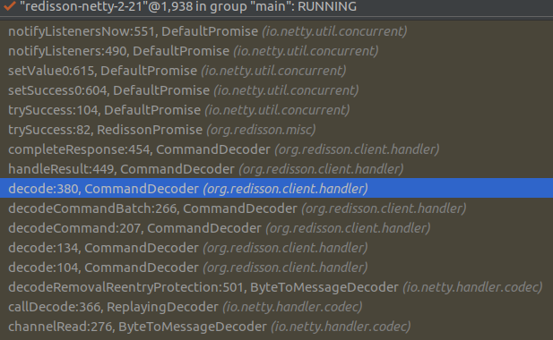
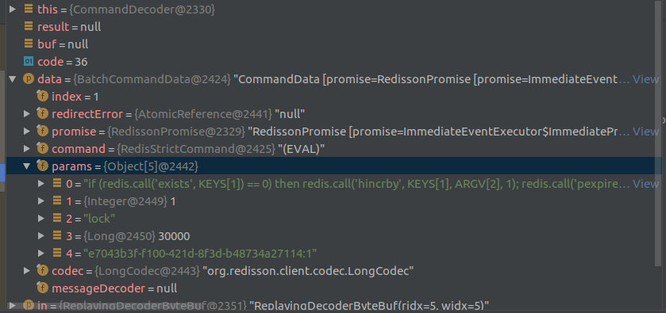


##### 1.18.1.1.3. 操作锁


<a href="#menu"  >目录</a> 

```java
public void lock() {
    try {
        this.lock(-1L, (TimeUnit)null, false);
    } catch (InterruptedException var2) {
        throw new IllegalStateException();
    }
}
private void lock(long leaseTime, TimeUnit unit, boolean interruptibly)
throws InterruptedException {
    //当前线程id
    long threadId = Thread.currentThread().getId();
    //异步执行set lock key
    Long ttl = this.tryAcquire(leaseTime, unit, threadId);
    if (ttl != null) {
        //发布订阅 channel .当删除key 时，会向channel发布
        LockPubSub.UNLOCK_MESSAGE 为0
        RFuture<RedissonLockEntry> future = this.subscribe(threadId);
        if (interruptibly) {
            this.commandExecutor.syncSubscriptionInterrupted(future);
        } else {
            this.commandExecutor.syncSubscription(future);
        }
        try {
            while(true) {
                ttl = this.tryAcquire(leaseTime, unit, threadId);
                if (ttl == null) {
                    return;
                }
                if (ttl >= 0L) {
                try {
                    ((RedissonLockEntry)future.getNow()).getLatch().tryAcquire(ttl, TimeUnit.MILLISECONDS);
                } catch (InterruptedException var13) {
                    if (interruptibly) {
                        throw var13;
                    }
                    ((RedissonLockEntry)future.getNow()).getLatch().tryAcquire(ttl,TimeUnit.MILLISECONDS);
                }
                } else if (interruptibly) {
                    ((RedissonLockEntry)future.getNow()).getLatch().acquire();
                } else {
                    ((RedissonLockEntry)future.getNow()).getLatch().acquireUninterruptibly();
                }
            }
        } finally {
            this.unsubscribe(future, threadId);
        }
    }
}
```


tryAcquire() 之后会调⽤tryLockInnerAsync⽅法，不管是lock.lock()还是lock.tryLock()。都会调⽤这个⽅法实现。

```java
<T> RFuture<T> tryLockInnerAsync(long leaseTime, TimeUnit unit, long threadId, RedisStrictCommand<T> command) {
    this.internalLockLeaseTime = unit.toMillis(leaseTime);
    return this.evalWriteAsync(this.getName(),
    LongCodec.INSTANCE,
    command,
    //key 不存在，说明可以加锁
    //KEYS[1] lock key
    //ARGV[1] 超时时间
    //ARGV[2] 唯一的字符串格式id，对于同一个线程多次调用lock(),该值一样，用于该值实现可重入特性
    /*
    * Redis Hincrby 命令用于为哈希表中的字段值加上指定增量值。
    * 增量也可以为负数，相当于对指定字段进行减法操作。
    * 如果哈希表的 key 不存在，一个新的哈希表被创建并执行 HINCRBY 命令。
    * 如果指定的字段不存在，那么在执行命令前，字段的值被初始化为 0 。
    * 对一个储存字符串值的字段执行 HINCRBY 命令将造成一个错误。
    */
    //所以redission使用的hash类型类存储lock key
    //HSET key field value
    // key 为lock key , field为唯一id , value为当前线程申请锁的次数
    "if (redis.call('exists', KEYS[1]) == 0)
    then redis.call('hincrby', KEYS[1], ARGV[2], 1);
    redis.call('pexpire', KEYS[1], ARGV[1]);
    return nil;
    end;
    //上面设置成功
    if (redis.call('hexists', KEYS[1], ARGV[2]) == 1)
    then redis.call('hincrby', KEYS[1], ARGV[2], 1);
    redis.call('pexpire', KEYS[1], ARGV[1]);
    return nil;
    end;
    //返回 lock key的剩余失效时间
    return redis.call('pttl', KEYS[1]);",
    //KEYS[1] lock key
    Collections.singletonList(this.getName()),
    //超时时间
    this.internalLockLeaseTime,
    //
    this.getLockName(threadId));
}
```
* ⾸先尝试获取锁，具体代码下⾯再看，返回结果是已存在的锁的剩余存活时间，为 null则说明没有已存在的锁并成功获得锁。
* 如果获得锁则结束流程，回去执⾏业务逻辑。
* 如果没有获得锁，则需等待锁被释放，并通过 Redis的 channel订阅锁释放的消息，这⾥的具体实现本⽂也不深⼊，只是简单提⼀下 Redisson在执⾏ Redis命令时提供了同步和异步的两种实现，但实际上同步的实现都是基于异步的，具体做法是使⽤ Netty中的异步⼯具 Future和 FutureListener结合 JDK中的CountDownLatch⼀起实现。
* 订阅锁的释放消息成功后，进⼊⼀个不断重试获取锁的循环，循环中每次都先试着获取锁，并得到已存在的锁的剩余存活时间。
* 如果在重试中拿到了锁，则结束循环，跳过第 6步。
* 如果锁当前是被占⽤的，那么等待释放锁的消息，具体实现使⽤了 JDK并发的信号量⼯具 Semaphore来阻塞线程，当锁释放并发布释放锁的消息后，信号量的 release()⽅法会被调⽤，此时被信号量阻塞的等待队列中的⼀个线程就可以继续尝试获取锁了。
* 在成功获得锁后，就没必要继续订阅锁的释放消息了，因此要取消对 Redis上相应 channel的订阅。

```java
public RFuture<E> subscribe(final String entryName, final String channelName) {
    final AtomicReference<Runnable> listenerHolder = new AtomicReference();
    final AsyncSemaphore semaphore = this.service.getSemaphore(new  ChannelName(channelName));
    final RPromise<E> newPromise = new RedissonPromise<E>() {
        public boolean cancel(boolean mayInterruptIfRunning) {
            return semaphore.remove((Runnable)listenerHolder.get());
        }
    }
    Runnable listener = new Runnable() {
        public void run() {
            E entry =(PubSubEntry)PublishSubscribe.this.entries.get(entryName);
            if (entry != null) {
                entry.acquire();
                semaphore.release();
                entry.getPromise().onComplete(new
                TransferListener(newPromise));
            } else {
                E value = PublishSubscribe.this.createEntry(newPromise);
                value.acquire();
                E oldValue = (PubSubEntry)PublishSubscribe.this.entries.putIfAbsent(entryName, value);
                if (oldValue != null) {
                    oldValue.acquire();
                    semaphore.release();
                    oldValue.getPromise().onComplete(new
                    TransferListener(newPromise));
                } else {
                    RedisPubSubListener<Object> listener =
                    PublishSubscribe.this.createListener(channelName, value);
                    PublishSubscribe.this.service.subscribe(LongCodec.INSTANCE, channelName,
                    semaphore, new RedisPubSubListener[]{listener});
                }
            }
        }
    };
    semaphore.acquire(listener);
    listenerHolder.set(listener);
    return newPromise;
}

```
* 上⾯说过 Redisson实现的执⾏ Redis命令都是异步的，但是它在异步的基础上提供了以同步的⽅式获得执⾏结果的封装。
* 前⾯提到分布式锁要确保未来的⼀段时间内锁⼀定能够被释放，因此要对锁设置超时释放的时间，在我们没有指定该时间的情况下，Redisson默认指定为30秒。
* 在成功获取到锁的情况下，为了避免业务中对共享资源的操作还未完成，锁就被释放掉了，需要定期（锁失效时间的三分之⼀）刷新锁失效的时间，这⾥ Redisson使⽤了 Netty的 TimerTask、Timeout⼯具来实现该任务调度。
* 获取锁真正执⾏的命令，Redisson使⽤ EVAL命令执⾏上⾯的 Lua脚本来完成获取锁的操作：
* 如果通过 exists命令发现当前 key不存在，即锁没被占⽤，则执⾏ hset写⼊ Hash类型数据 key:全局锁名称（例如共享资源ID）, field:锁实例名称（Redisson客户端ID:线程ID）, value:1，并执⾏ pexpire对该key设置失效时间，返回空值 nil，⾄此获取锁成功。
* 如果通过 hexists命令发现 Redis中已经存在当前 key和 field的 Hash数据，说明当前线程之前已经获取到锁，因为这⾥的锁是可重⼊的，则执⾏ hincrby对当前 key field的值加⼀，并重新设置失效时间，返回空值，⾄此重⼊获取锁成功。
* 最后是锁已被占⽤的情况，即当前 key已经存在，但是 Hash中的 Field与当前值不同，则执⾏ pttl获取锁的剩余存活时间并返回，⾄此获取锁失败。


##### 1.18.1.1.4. 释放锁


强制释放锁，不管有没有线程持有锁
```java
public RFuture<Boolean> forceUnlockAsync() {
    this.cancelExpirationRenewal((Long)null);
    return this.evalWriteAsync(
    this.getName(),
    LongCodec.INSTANCE,
    RedisCommands.EVAL_BOOLEAN,
    //Redis Publish 命令用于将信息发送到指定的频道。
    //PUBLISH channel message
    //如果删除成功
    "if (redis.call('del', KEYS[1]) == 1)
    //发布到通道
    then redis.call('publish', KEYS[2], ARGV[1]);
    return 1
    else
    return 0
    end",
    Arrays.asList(this.getName(),
    this.getChannelName()),
    LockPubSub.UNLOCK_MESSAGE);
}
```


优雅释放没有线程持有锁，才会释放锁

```java
protected RFuture<Boolean> unlockInnerAsync(long threadId) {
    return this.evalWriteAsync(
    this.getName(),
    LongCodec.INSTANCE,
    RedisCommands.EVAL_BOOLEAN,
    //不存在，说明已经被删除
    "if (redis.call('hexists', KEYS[1], ARGV[3]) == 0)
    then return nil;
    end;
    //存在，减１
    local counter = redis.call('hincrby', KEYS[1], ARGV[3], -1);
    if (counter > 0)
    //大于0 说明还有unlock完，重新添加超时时间
    then redis.call('pexpire', KEYS[1], ARGV[2]);
    return 0;
    //等于0,说明已经unlock完成，可以删除key
    //删除key
    else redis.call('del', KEYS[1]);
    //发布 LockPubSub.UNLOCK_MESSAGE
    redis.call('publish', KEYS[2], ARGV[1]);
    return 1;
    end;
    return nil;",
    Arrays.asList(this.getName(), // KEYS[1]
    this.getChannelName()), // KEYS[2]
    LockPubSub.UNLOCK_MESSAGE, //ARGV[1]
    this.internalLockLeaseTime, //ARGV[2]
    this.getLockName(threadId));//ARGV[3]
}
```
* 使⽤ EVAL命令执⾏ Lua脚本来释放锁：
* key不存在，说明锁已释放，直接执⾏ publish命令发布释放锁消息并返回 1。
* key存在，但是 field在 Hash中不存在，说明⾃⼰不是锁持有者，⽆权释放锁，返回 nil。
* 因为锁可重⼊，所以释放锁时不能把所有已获取的锁全都释放掉，⼀次只能释放⼀把锁，因此执⾏hincrby对锁的值减⼀。
* 释放⼀把锁后，如果还有剩余的锁，则刷新锁的失效时间并返回 0；如果刚才释放的已经是最后⼀把锁，则执⾏ del命令删除锁的 key，并发布锁释放消息，返回 1。
* 上⾯执⾏结果返回 nil的情况（即第2中情况），因为⾃⼰不是锁的持有者，不允许释放别⼈的锁，故抛出异常。
* 执⾏结果返回 1的情况，该锁的所有实例都已全部释放，所以不需要再刷新锁的失效时间。

## 1.19. 应用

### 1.19.1. Redis实现访问控制频率

<a href="#menu"  >目录</a> 

做服务接⼝时通常需要⽤到请求频率限制 Rate limiting，例如限制⼀个⽤户1分钟内最多可以范围100次

主要⽤来保证服务性能和保护数据安全

因为如果不进⾏限制，服务调⽤者可以随意访问，想调⼏次就调⼏次，会给服务造成很⼤的压⼒，降低性能，再⽐如有的接⼝需要验证调⽤者⾝份，如果不进⾏访问限制，调⽤者可以进⾏暴⼒尝试

**⽅案⼀：string**

通过为⽤户使⽤⼀个名为 rate.limiting:userId的字符串类型键，每次访问都使⽤ INCR命令递增该键的键值。
如果递增后的值为 1（第⼀次访问），则要为键设置过期时间 60秒。这样每次⽤户访问都读取该键值，当键值超过100时，说明访问频率超过了限制，需要稍后访问。该键过期后会⾃动删除，所以下⼀分钟⽤户访问次数⼜会重新计算。


伪代码如下：


```yml
$isKeyExists = EXISTS rate.limiting:$userId	// 存在返回 1，不存在返回 0
if $isKeyExists is 1
    $times = INCR rate.limiting:$userId
if $times > 100	// 第100次访问会增加到101
    print 访问频率超过限制，请稍后再试
exit
else
    MULTI	//此处，如果不加事务，竞态条件可能出现
    INCR rate.limiting:$userId
    EXPIRE $keyName, 60
    EXEC
```


上⾯为什么要⽤MULTI，那是因为如果在执⾏完INCR rate.limiting:$userId之后，如果（出现故障）没有设置过期时间，那么该键将永远存在，所以需要加上事务。

**⽅案⼆：list**

事实上，⽅案⼀有个问题。如果⼀个⽤户在第⼀分钟的最后⼀秒访问了99次，在下⼀分钟的第⼀秒访问了100次，相当于在两秒访问了199次，与⼀分钟内最多只能访问100次相⽐还是差距⽐较⼤，尽管这种情况⽐较极端，但是依然存在。如果要实现粒度更⼩的控制⽅式，精确的保证每分钟最多访问100次，就需要使⽤第⼆种⽅案。

第⼆种⽅案需要记录⽤户每次的访问时间，因此对于每个⽤户，⽤列表类型的键记录他最近100次访问的时间。如果键中的元素超过100个，就判断时间最早的元素距离现在的时间是否⼩于1分钟，如果是，则表⽰⽤户最近1分钟的访问次数超过100次，如果不是就将当前时间加⼊列表中，同时把最早的元素删除

伪代码如下：


```yml
$limitLength = LLEN rate.limiting:$userId
if $limitLength < 100
    LPUSH rate.limiting:$userId, now()
else
    $time = LINDEX rate.limiting:$userId, -1 // 取最后一个元素
    if now() - $time < 60
    print 访问频率超过限制，请稍后再试
else
    LPUSH rate.limiting:$userId, now()
    LTRIM rate.limiting:$userId, 0, 99	// 删除[0~99]以外的元素
```


这种⽅式 now()的功能是获得当前的 Unix时间，由于要记录当前访问时间，所以当要限制 “A时间最多访问B次”时,如果”B”⽐较⼤，会占⽤较多内存，实际使⽤时要去权衡。⽽且这种⽅法会出现就竞态条件，可以通过脚本避免。

但是在⾼并发的缓存系统中，⼤量使⽤事务是⾮常糟糕的，可以⽤redis⾃带的lua脚本功能实现多个操作的“原⼦性”

**⽅案三：使⽤lua脚本实现频率限制**

把限制逻辑封装到⼀个Lua脚本中，调⽤时只需传⼊：key、限制数量、过期时间，调⽤结果就会指明是否运⾏访问


```lua
local notexists = redis.call(\"set\", KEYS[1], 1, \"NX\", \"EX\",
tonumber(ARGV[2]))
if (notexists) then
    return 1
end
local current = tonumber(redis.call(\"get\", KEYS[1]))
if (current == nil) then
    local result = redis.call(\"incr\", KEYS[1])
    redis.call(\"expire\", KEYS[1], tonumber(ARGV[2]))
    return result
end
if (current >= tonumber(ARGV[1])) then
    error(\"too many requests\")
end
local result = redis.call(\"incr\", KEYS[1])
return result
```


