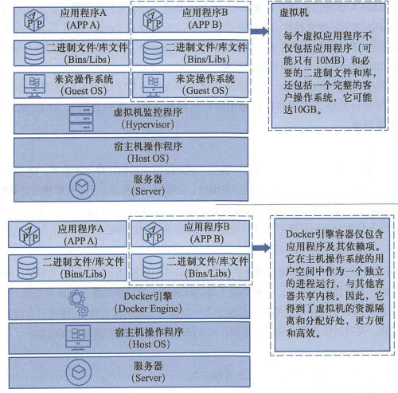
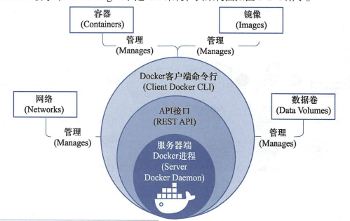
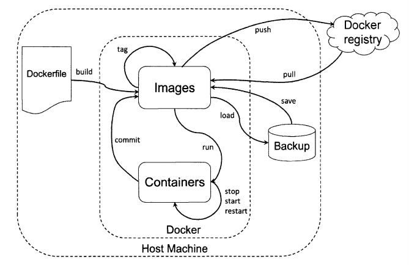
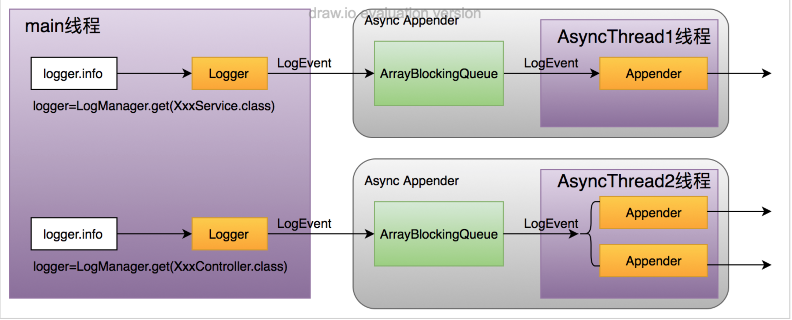
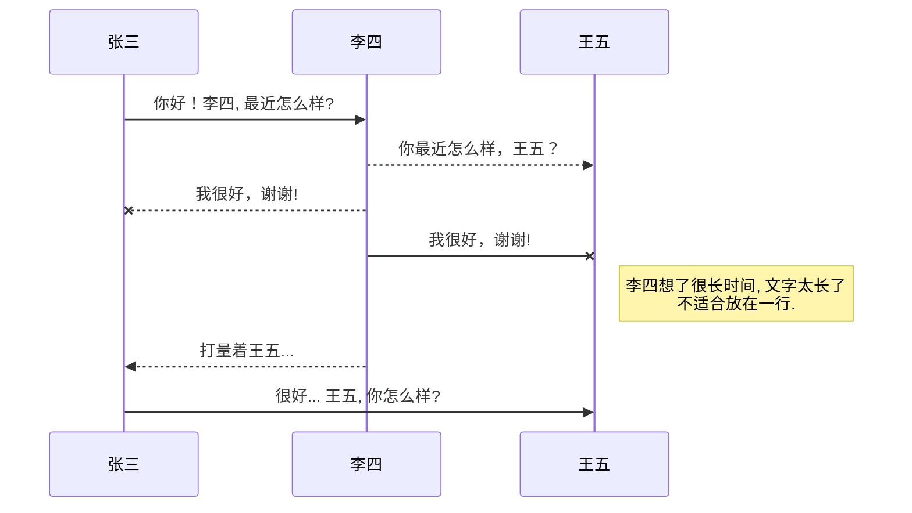
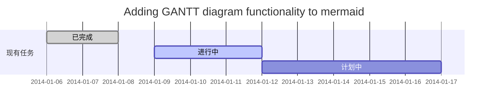
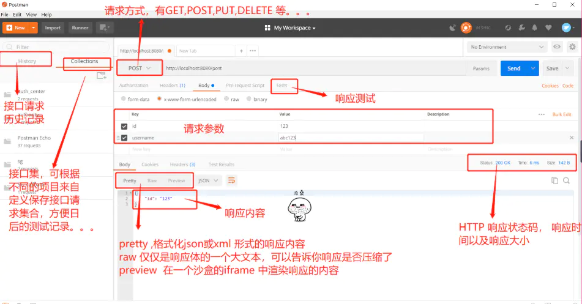
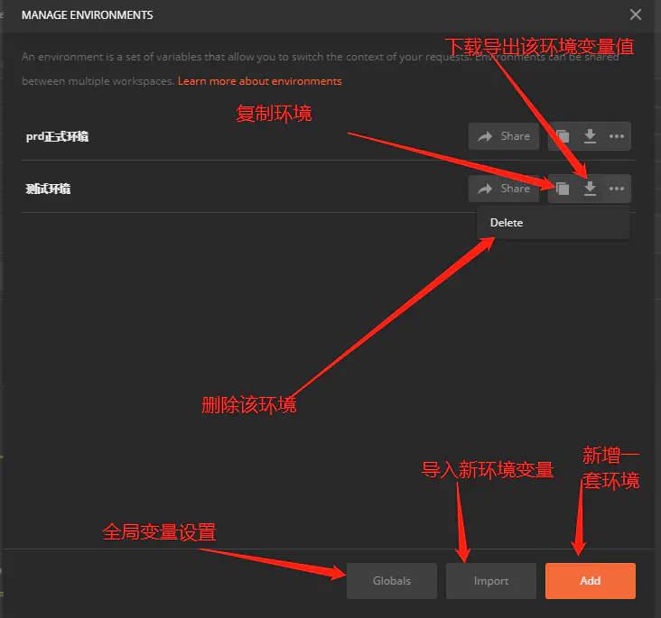
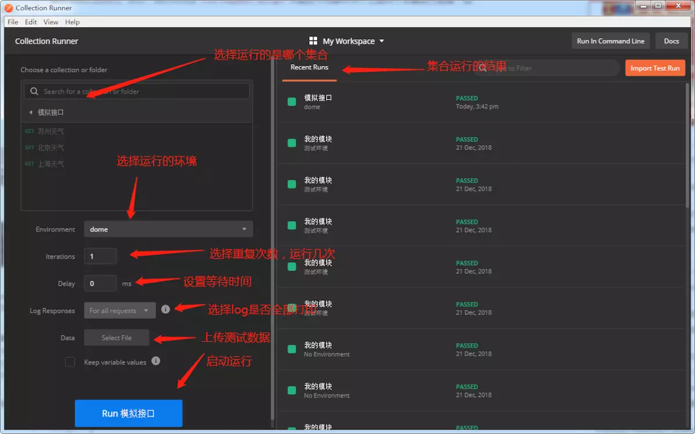
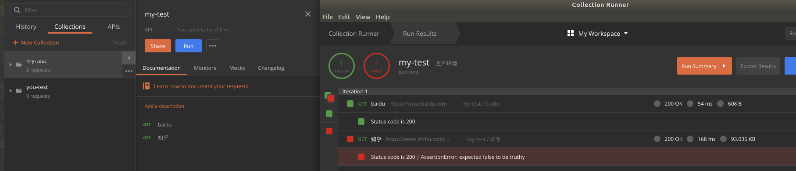

<span id="menu"></span>

<!-- TOC -->

- [1. 基础工具](#1-基础工具)
    - [1.1. 技术社区](#11-技术社区)
    - [1.2. 常用工具](#12-常用工具)
        - [1.2.1. 编译器](#121-编译器)
        - [1.2.2. IDEA插件](#122-idea插件)
        - [1.2.3. HTTP请求](#123-http请求)
        - [1.2.4. 前端开发编辑](#124-前端开发编辑)
        - [1.2.5. 绘图工具](#125-绘图工具)
            - [1.2.5.1. 思维导图](#1251-思维导图)
            - [1.2.5.2. UML](#1252-uml)
        - [1.2.6. 编辑器](#126-编辑器)
        - [1.2.7. 调优工具](#127-调优工具)
        - [1.2.8. 压测工具](#128-压测工具)
        - [1.2.9. 版本管理](#129-版本管理)
        - [1.2.10. 其他](#1210-其他)
    - [1.3. Git](#13-git)
        - [1.3.1. 集中式vs分布式](#131-集中式vs分布式)
        - [1.3.2. 基本概念](#132-基本概念)
        - [1.3.3. 分支的概念](#133-分支的概念)
            - [1.3.3.1. 常用分支说明](#1331-常用分支说明)
        - [1.3.4. 工作区、版本库和暂存区](#134-工作区版本库和暂存区)
        - [1.3.5. 常用命令](#135-常用命令)
        - [1.3.6. 远程仓库版本回退](#136-远程仓库版本回退)
        - [1.3.7. Git开发流程](#137-git开发流程)
    - [1.4. Maven](#14-maven)
        - [1.4.1. 基本概念](#141-基本概念)
        - [1.4.2. Maven 安装](#142-maven-安装)
        - [1.4.3. 设置镜像库](#143-设置镜像库)
        - [1.4.4. 仓库](#144-仓库)
        - [1.4.5. POM文件说明](#145-pom文件说明)
            - [1.4.5.1. POM 文件基本结构](#1451-pom-文件基本结构)
            - [1.4.5.2. 基本配置说明](#1452-基本配置说明)
            - [1.4.5.3. 构建设置](#1453-构建设置)
            - [1.4.5.4. 更多项目信息](#1454-更多项目信息)
            - [1.4.5.5. 环境设置](#1455-环境设置)
        - [1.4.6. 基本命令](#146-基本命令)
        - [1.4.7. Maven依赖冲突的产生原因和解决方式](#147-maven依赖冲突的产生原因和解决方式)
        - [1.4.8. maven搭建父子项目](#148-maven搭建父子项目)
            - [1.4.8.1. 创建父项目](#1481-创建父项目)
            - [1.4.8.2. 创建子项目](#1482-创建子项目)
            - [1.4.8.3. 说明](#1483-说明)
        - [1.4.9. 创建Maven插件](#149-创建maven插件)
    - [1.5. Gradle](#15-gradle)
        - [1.5.1. 基本介绍](#151-基本介绍)
        - [1.5.2. 安装](#152-安装)
            - [1.5.2.1. Ubuntu下安装](#1521-ubuntu下安装)
    - [1.6. Docker](#16-docker)
        - [1.6.1. Docker基础](#161-docker基础)
            - [1.6.1.1. 容器和传统虚拟机的差异](#1611-容器和传统虚拟机的差异)
            - [1.6.1.2. 容器技术的优点](#1612-容器技术的优点)
            - [1.6.1.3. 基本概念](#1613-基本概念)
            - [1.6.1.4. Docker引擎](#1614-docker引擎)
            - [1.6.1.5. 命名](#1615-命名)
            - [1.6.1.6. docker的8个使用场景](#1616-docker的8个使用场景)
            - [1.6.1.7. Docker 安装](#1617-docker-安装)
            - [1.6.1.8. 常用指令](#1618-常用指令)
        - [1.6.2. docker 核心原理](#162-docker-核心原理)
            - [1.6.2.1. 内核知识](#1621-内核知识)
            - [1.6.2.2. 架构概览](#1622-架构概览)
            - [1.6.2.3. client和daemon](#1623-client和daemon)
        - [1.6.3. 镜像](#163-镜像)
            - [1.6.3.1. 基本概念](#1631-基本概念)
            - [1.6.3.2. 本地镜像的管理](#1632-本地镜像的管理)
            - [1.6.3.3. Docker Hub 简介](#1633-docker-hub-简介)
        - [1.6.4. Docker File](#164-docker-file)
            - [1.6.4.1. Docker File中的命令](#1641-docker-file中的命令)
            - [1.6.4.2. docker build 说明](#1642-docker-build-说明)
        - [1.6.5. 容器](#165-容器)
            - [1.6.5.1. 容器的管理操作](#1651-容器的管理操作)
            - [1.6.5.2. 容器内部信息的获取](#1652-容器内部信息的获取)
            - [1.6.5.3. 容器的启动过程](#1653-容器的启动过程)
        - [1.6.6. 容器网络](#166-容器网络)
            - [1.6.6.1. 基本原理](#1661-基本原理)
            - [1.6.6.2. docker网络模式](#1662-docker网络模式)
            - [1.6.6.3. 自定义网路](#1663-自定义网路)
            - [1.6.6.4. 容器之间的通信](#1664-容器之间的通信)
            - [1.6.6.5. 容器与外部通信](#1665-容器与外部通信)
            - [1.6.6.6. 容器间通信](#1666-容器间通信)
        - [1.6.7. 数据卷](#167-数据卷)
            - [1.6.7.1. 基本概念](#1671-基本概念)
            - [1.6.7.2. 数据卷操作](#1672-数据卷操作)
            - [1.6.7.3. 共享数据卷](#1673-共享数据卷)
        - [1.6.8. 案例](#168-案例)
            - [1.6.8.1. docker 安装Mysqk主从复制](#1681-docker-安装mysqk主从复制)
            - [1.6.8.2. docker 安装mycat](#1682-docker-安装mycat)
        - [1.6.9. Docker Compose](#169-docker-compose)
            - [1.6.9.1. 编排和部署](#1691-编排和部署)
            - [1.6.9.2. 多容器的问题](#1692-多容器的问题)
            - [1.6.9.3. Docker Compose 概述与安装](#1693-docker-compose-概述与安装)
            - [1.6.9.4. 安装 Docker Compose](#1694-安装-docker-compose)
            - [1.6.9.5. 基本使用](#1695-基本使用)
            - [1.6.9.6. 快速入门](#1696-快速入门)
                - [1.6.9.6.1. 工程、服务、容器](#16961-工程服务容器)
                - [1.6.9.6.2. Docker Compose 常用命令与配置](#16962-docker-compose-常用命令与配置)
                - [1.6.9.6.3. docker-compose.yml 属性](#16963-docker-composeyml-属性)
                    - [1.6.9.6.3.1. 基本例子](#169631-基本例子)
                    - [1.6.9.6.3.2. 配置选项](#169632-配置选项)
            - [1.6.9.7. Docker Compose 其它](#1697-docker-compose-其它)
                - [1.6.9.7.1. Compose 原理](#16971-compose-原理)
    - [1.7. Jenkins](#17-jenkins)
    - [1.8. VIM](#18-vim)
        - [1.8.1. 命令模式](#181-命令模式)
        - [1.8.2. 常用命令](#182-常用命令)
    - [1.9. NMON监控工具](#19-nmon监控工具)
    - [1.10. 正则表达式](#110-正则表达式)
    - [1.11. curl命令](#111-curl命令)
    - [1.12. 常见时区缩写](#112-常见时区缩写)
    - [1.13. 日志](#113-日志)
        - [1.13.1. SLF4J](#1131-slf4j)
            - [1.13.1.1. 基本介绍](#11311-基本介绍)
            - [1.13.1.2. 依赖](#11312-依赖)
            - [1.13.1.3. slf4j绑定log4j2日志系统启动分析](#11313-slf4j绑定log4j2日志系统启动分析)
            - [1.13.1.4. slf4j绑定logback日志系统启动分析](#11314-slf4j绑定logback日志系统启动分析)
            - [1.13.1.5. 总结](#11315-总结)
        - [1.13.2. LOG4J2](#1132-log4j2)
            - [1.13.2.1. 基本特性](#11321-基本特性)
            - [1.13.2.2. 配置文件优先级](#11322-配置文件优先级)
            - [1.13.2.3. 配置文件](#11323-配置文件)
            - [1.13.2.4. 执行流程](#11324-执行流程)
            - [1.13.2.5. 同步日志和异步日志](#11325-同步日志和异步日志)
                - [1.13.2.5.1. AsyncAppender](#113251-asyncappender)
                - [1.13.2.5.2. AsyncLogger](#113252-asynclogger)
        - [1.13.3. LOGBACK](#1133-logback)
    - [1.14. Markdown语法](#114-markdown语法)
        - [1.14.1. 标题](#1141-标题)
        - [1.14.2. 列表](#1142-列表)
        - [1.14.3. 插入图片和链接](#1143-插入图片和链接)
        - [1.14.4. 粗体和斜体](#1144-粗体和斜体)
        - [1.14.5. 代码引用](#1145-代码引用)
        - [1.14.6. 表格](#1146-表格)
        - [1.14.7. 数学公式](#1147-数学公式)
        - [1.14.8. 插入UML图](#1148-插入uml图)
        - [1.14.9. 插入甘特图](#1149-插入甘特图)
        - [1.14.10. 其他](#11410-其他)
        - [1.14.11. 注脚](#11411-注脚)
    - [1.15. VSCODE](#115-vscode)
        - [1.15.1. 常用插件](#1151-常用插件)
        - [1.15.2. 插件开发](#1152-插件开发)
    - [1.16. IDEA](#116-idea)
        - [1.16.1. 常用快捷键](#1161-常用快捷键)
        - [1.16.2. 常用插件](#1162-常用插件)
    - [1.17. 接口测试工具](#117-接口测试工具)
        - [1.17.1. jmeter](#1171-jmeter)
        - [1.17.2. Postman](#1172-postman)
            - [1.17.2.1. 安装运行](#11721-安装运行)
            - [1.17.2.2. 基础功能介绍](#11722-基础功能介绍)
            - [1.17.2.3. 请求区域介绍](#11723-请求区域介绍)
            - [1.17.2.4. 接口集导入和导出](#11724-接口集导入和导出)
            - [1.17.2.5. 环境变量](#11725-环境变量)
            - [1.17.2.6. 将返回值的某个数据设置为环境变量](#11726-将返回值的某个数据设置为环境变量)
            - [1.17.2.7. 其他的常用tests方法](#11727-其他的常用tests方法)
            - [1.17.2.8. 使用postman进行接口自动化测试](#11728-使用postman进行接口自动化测试)
    - [1.18. npm工具](#118-npm工具)
        - [1.18.1. 基本概念](#1181-基本概念)
        - [1.18.2. package.json](#1182-packagejson)
        - [1.18.3. npm 常用工具](#1183-npm-常用工具)
        - [1.18.4. NPM仓库](#1184-npm仓库)
        - [1.18.5. 包格式](#1185-包格式)
        - [1.18.6. 使用 npm 命令安装模块](#1186-使用-npm-命令安装模块)
        - [1.18.7. 全局安装与本地安装](#1187-全局安装与本地安装)
        - [1.18.8. 查看安装信息](#1188-查看安装信息)
        - [1.18.9. 卸载模块](#1189-卸载模块)
        - [1.18.10. 更新模块](#11810-更新模块)
        - [1.18.11. 搜索模块](#11811-搜索模块)
        - [1.18.12. 使用淘宝 NPM 镜像](#11812-使用淘宝-npm-镜像)
    - [1.19. Java 服务的线上应急、和技术攻关](#119-java-服务的线上应急和技术攻关)
        - [1.19.1. 线上应急的目标、 原则和方法](#1191-线上应急的目标-原则和方法)
            - [1.19.1.1. 应急目标](#11911-应急目标)
            - [1.19.1.2. 应急原则](#11912-应急原则)
            - [1.19.1.3. 线上应急的方法和流程](#11913-线上应急的方法和流程)
    - [1.20. 软件开发](#120-软件开发)
        - [1.20.1. 常用的４种开发方式](#1201-常用的４种开发方式)
            - [1.20.1.1. 瀑布式开发](#12011-瀑布式开发)
            - [1.20.1.2. 迭代式开发](#12012-迭代式开发)
            - [1.20.1.3. 螺旋式开发](#12013-螺旋式开发)
            - [1.20.1.4. 敏捷软件开发](#12014-敏捷软件开发)
            - [1.20.1.5. 敏捷开发 2.0](#12015-敏捷开发-20)
            - [1.20.1.6. 总结](#12016-总结)
    - [1.21. 面试考察](#121-面试考察)
        - [1.21.1. 技术广度的考察](#1211-技术广度的考察)
        - [1.21.2. 底层技术的考察](#1212-底层技术的考察)
        - [1.21.3. 技术深度的考察](#1213-技术深度的考察)
    - [1.22. 墨菲定律与康威定律](#122-墨菲定律与康威定律)
        - [1.22.1. 墨菲定律](#1221-墨菲定律)
        - [1.22.2. 康威定律](#1222-康威定律)
    - [1.23. 程序员的职业素养](#123-程序员的职业素养)

<!-- /TOC -->

# 1. 基础工具

## 1.1. 技术社区
<a href="#menu" >目录</a>


* [博客园](https://www.cnblogs.com/)
* [开源中国](https://www.oschina.net/)
* [stackoverflow](https://stackoverflow.com/)
* [CSDN](https://www.csdn.net/)
* [掘金](https://juejin.im/)
* [技术文档下载](http://www.java1234.com/)
* [leetcode](https://leetcode.com/)
* [牛客网](https://www.nowcoder.com/)


## 1.2. 常用工具


### 1.2.1. 编译器
* IDEA （个人觉得IDEA比较好用）
* Eclipse
* MyEclipse

### 1.2.2. IDEA插件
* Lombok： 使用注解，免去实体类中get /set/构造器等代码 ，需要引入lombok包
* Alibaba Java Coding Guidelines ：《阿里巴巴Java开发规约》扫描插件,安装后右键单击选择扫描，会提示哪些地方不符合规范
* MyBatis plugin ： 可以从mybatis mappe接口的方法直接跳转到mapper.xml配置文件
* jclasslib: JClassLib不但是一个字节码阅读器而且还包含一个类库允许开发者读取,修改,写入Java Class文件与字节码


### 1.2.3. HTTP请求
* POSTMAN（https://www.getpostman.com/）:一款功能强大的网页调试与发送网页HTTP请求的工具
* curl指令

### 1.2.4. 前端开发编辑
* [vscode](https://code.visualstudio.com/Download)
* IDEA
* Brackets   代码提示，颜色区分
* sublime_text_3   这个Linux下安装后，不支持中文输入，网上有解决办法。

### 1.2.5. 绘图工具
#### 1.2.5.1. 思维导图
* MindMaster   多平台，免费，可以导出为图片。
#### 1.2.5.2. UML
* https://www.draw.io/ ：在线UML绘制工具，可以保存到本地或者Github
* Dia
```bash
//安装Dia
sudo apt install dia
//运行Dia
dia
```
### 1.2.6. 编辑器
* VIM
* GEDIT　

### 1.2.7. 调优工具
* visualVm(https://visualvm.github.io/):是一款免费的,集成了多个 JDK 命令行工具的可视化工具,它能为您提供强大的分析能力,对 Java 应用程序做性能分析和调优.

### 1.2.8. 压测工具
* Jmeter   可以开多个线程对接口进行压测，并分析压测结果。

### 1.2.9. 版本管理
* git     
* svn
* 码云
* Git在线练习 [try git](https://try.github.io/)/[git real](https://www.pluralsight.com/courses/code-school-git-real)/[Learn Git Branching](https://learngitbranching.js.org/)

### 1.2.10. 其他
* SpringBoot Banner 字符生成 [根据图片生成](https://www.degraeve.com/img2txt.php)/[根据文字生成](http://patorjk.com/software/taag/#p=display&f=3D-ASCII&t=MicroBlog%0A)


## 1.3. Git
<a href="#menu" >目录</a>

### 1.3.1. 集中式vs分布式

**Subversion属于集中式的版本控制系统**

集中式的版本控制系统都有一个单一的集中管理的服务器，保存所有文件的修订版本，而协同工作的人们都通过客户端连到这台服务器，取出最新的文件或者提交更新。

* Subversion的特点概括起来主要由以下几条：
    * 每个版本库有唯一的URL（官方地址），每个用户都从这个地址获取代码和数据；
    * 获取代码的更新，也只能连接到这个唯一的版本库，同步以取得最新数据；
    * 提交必须有网络连接（非本地版本库）；
    * 提交需要授权，如果没有写权限，提交会失败；
    * 提交并非每次都能够成功。如果有其他人先于你提交，会提示“改动基于过时的版本，先更新再提交”… 诸如此类；
    * 冲突解决是一个提交速度的竞赛：手快者，先提交，平安无事；手慢者，后提交，可能遇到麻烦的冲突解决。

* 好处：每个人都可以一定程度上看到项目中的其他人正在做些什么。而管理员也可以轻松掌控每个开发者的权限。
* 缺点：中央服务器的单点故障。
    * 若是宕机一小时，那么在这一小时内，谁都无法提交更新、还原、对比等，也就无法协同工作。如果中央服务器的磁盘发生故障，并且没做过备份或者备份得不够及时的话，还会有丢失数据的风险。最坏的情况是彻底丢失整个项目的所有历史更改记录，被客户端提取出来的某些快照数据除外，但这样的话依然是个问题，你不能保证所有的数据都已经有人提取出来。

Subversion原理上只关心文件内容的具体差异。每次记录有哪些文件作了更新，以及都更新了哪些行的什么内容。

**Git属于分布式的版本控制系统**

Git记录版本历史只关心文件数据的整体是否发生变化。Git 不保存文件内容前后变化的差异数据。

实际上，Git 更像是把变化的文件作快照后，记录在一个微型的文件系统中。每次提交更新时，它会纵览一遍所有文件的指纹信息并对文件作一快照，然后保存一个指向这次快照的索引。为提高性能，若文件没有变化，Git 不会再次保存，而只对上次保存的快照作一连接。

在分布式版本控制系统中，客户端并不只提取最新版本的文件快照，而是把原始的代码仓库完整地镜像下来。这么一来，任何一处协同工作用的服务器发生故障，事后都可以用任何一个镜像出来的本地仓库恢复。这类系统都可以指定和若干不同的远端代码仓库进行交互。籍此，你就可以在同一个项目中，分别和不同工作小组的人相互协作。你可以根据需要设定不同的协作流程。

另外，因为Git在本地磁盘上就保存着所有有关当前项目的历史更新，并且Git中的绝大多数操作都只需要访问本地文件和资源，不用连网，所以处理起来速度飞快。用SVN的话，没有网络或者断开VPN你就无法做任何事情。但用Git的话，就算你在飞机或者火车上，都可以非常愉快地频繁提交更新，等到了有网络的时候再上传到远程的镜像仓库。换作其他版本控制系统，这么做几乎不可能，抑或是非常麻烦。

* Git具有以下特点：
    * Git中每个克隆(clone)的版本库都是平等的。你可以从任何一个版本库的克隆来创建属于你自己的版本库，同时你的版本库也可以作为源提供给他人，只要你愿意。
    * Git的每一次提取操作，实际上都是一次对代码仓库的完整备份。
    * 提交完全在本地完成，无须别人给你授权，你的版本库你作主，并且提交总是会成功。
    * 甚至基于旧版本的改动也可以成功提交，提交会基于旧的版本创建一个新的分支。
    * Git的提交不会被打断，直到你的工作完全满意了，PUSH给他人或者他人PULL你的版本库，合并会发生在PULL和PUSH过程中，不能自动解决的冲突会提示您手工完成。
    * 冲突解决不再像是SVN一样的提交竞赛，而是在需要的时候才进行合并和冲突解决。
    * Git 也可以模拟集中式的工作模式
    * Git版本库统一放在服务器中
    * 可以为 Git 版本库进行授权：谁能创建版本库，谁能向版本库PUSH，谁能够读取（克隆）版本库
    * 团队的成员先将服务器的版本库克隆到本地；并经常的从服务器的版本库拉（PULL）最新的更新；
    * 团队的成员将自己的改动推（PUSH）到服务器的版本库中，当其他人和版本库同步（PULL）时，会自动获取改变
    * Git 的集中式工作模式非常灵活
    * 你完全可以在脱离Git服务器所在网络的情况下，如移动办公／出差时，照常使用代码库
    * 你只需要在能够接入Git服务器所在网络时，PULL和PUSH即可完成和服务器同步以及提交
    * Git提供 rebase 命令，可以让你的改动看起来是基于最新的代码实现的改动
    * Git 有更多的工作模式可以选择，远非 Subversion可比


### 1.3.2. 基本概念
* 工作区：当前的工作目录
* 本地库: 工作区有一个隐藏目录.git，这个不算工作区，而是Git的版本库
  Git的版本库里存了很多东西，其中最重要的就是称为stage（或者叫index）的暂存区，还有Git为我们自动创建的第一个分支master，以及指向master的一个指针叫HEAD

* 远端仓库: 存放在GitHub网站上的版本库

工作区---git add --> 暂存区 ---git commit--->本地仓库---git push --->远程仓库


* 分支相当于给当前的文件创建一个副本，在副本上进行修改，可以创建无数个分支进行同步开发，开发完成后再进行合并操作。

### 1.3.3. 分支的概念

**分支的概念**
在介绍两种方法之前，我们需要先了解一下分支的概念： 
分支是用来标记特定代码的提交，每一个分支通过SHA1sum值来标识，所以对分支的操作是轻量级的，你改变的仅仅是SHA1sum值。

如下图所示，当前有2个分支，A,C,E属于master分支，而A,B，D,F属于dev分支。

```
A----C----E（master）
 \
  B---D---F(dev)
```
它们的head指针分别指向E和F，对上述做如下操作：
```
git checkout master  //选择or切换到master分支
git merge dev        //将dev分支合并到当前分支(master)中
```
合并完成后：
```
A---C---E---G(master)
 \         /
  B---D---F（dev）
```
现在ABCDEFG属于master，G是一次合并后的结果，是将E和Ｆ的代码合并后的结果，可能会出现冲突。而ABDF依然属于dev分支。可以继续在dev的分支上进行开发:

```
A---C---E---G---H(master)
 \         /
  B---D---F---I（dev）
```


#### 1.3.3.1. 常用分支说明

* Master
    * master永远都是发布版本的最新代码。
    * master永远都是通过合并分支来改变，不允许提交代码。
    * master发布完需要添加标签，标签为当前的版本号。
    * 这样做的好处是为了更清楚的找到每个版本对应的代码，如果以后想做热修复可以直接将对应版本号的标签分支出来修改。
* Vx.x.x_Develop
    * 有新版本需要开发，从Master上建分支并且修改代码的VersionName和VersionCode提交
    * 不允许在develop分支上直接修改代码进行提交，develop只能通过合并module和hot_fix分支进行改变，这样才能解决动态发布。
* Vx.x.x_Release
    * 这个分支是和Develop分支一样都从Master上建分支并且修改代码的VersionName和VersionCode提交
    * 这个分支的作用主要是解决动态发布。什么是动态发布，举个栗子：假如并行开发两个功能模块moduleA、moduleB，在测试完成准备发布同时，由于公司层面或者一些其他原因导致moduleB不能上线，只单独上线moduleA。
    * 这样我们将moduleA分支合并到Vx.x.x_Release分支，由于代码的修改只在各自的module分支上进行修改，所以合并之后的Vx.x.x_Release+moduleA就是经过测试可以发布代码，经过简单的回归测试就可以进行发布了，发布之后将Vx.x.x_Release合并到master上并且添加当前发布版本号的标签。
* Vx.x.x_Hot_Fix
    * hot_fix是用来做线上版本热修复的分支，一般都是从master分支出来的。假如要修改V1.7.0的bug，就从master标签为V1.7.0拉出来hot_fix分支，进行修改代码、测试，发布补丁包之后将hot_fix合并到master和develop上，保持master和develop是最新的代码，最后删除hot_fix分支。
* Vx.x.x_ModuleX
    * 根据功能进行分支moduleA、moduleB、moduleC等等，如果存在develop分支那么就在它上分支出来，如果develop不存在那么就在master上拉出分支。在开发测试阶段任何对代码的修改都需要在各自的module上进行，修改完成在合并到develop上进行测试，当版本发布了删除对应的module分支。

不允许在develop上进行修改代码提交，更禁止在master上对代码进行修改提交。develop只允许通过合并module和hot_fix分支进行修改，master只允许通过合并发布之后的develop和发布之后的hot_fix分支进行修改。


### 1.3.4. 工作区、版本库和暂存区

* Workspace： 工作区，就是你平时存放项目代码的地方
* Index / Stage： 暂存区，用于临时存放你的改动，事实上它只是一个文件，保存即将提交到文件列表信息
* Repository： 仓库区（或版本库），就是安全存放数据的位置，这里面有你提交到所有版本的数据。其中HEAD指向最新放入仓库的版本
* Remote： 远程仓库，托管代码的服务器，可以简单的认为是你项目组中的一台电脑用于远程数据交换


* 工作区--(git add .) -->暂存区--git commit ->版本库---git push --->远端仓库
* git管理的文件有三种状态：已修改（modified）,已暂存（staged）,已提交(committed)

版本控制就是对文件的版本控制，要对文件进行修改、提交等操作，首先要知道文件当前在什么状态，不然可能会提交了现在还不想提交的文件，或者要提交的文件没提交上.GIT不关心文件两个版本之间的具体差别，而是关心文件的整体是否有改变，若文件被改变，在添加提交时就生成文件新版本的快照，而判断文件整体是否改变的方法就是用
SHA-1算法计算文件的校验和。

* Untracked:   未跟踪, 此文件在文件夹中, 但并没有加入到git库, 不参与版本控制. 通过git add 状态变为Staged.
* Unmodify:   文件已经入库, 未修改, 即版本库中的文件快照内容与文件夹中完全一致. 这种类型的文件有两种去处, 如果它被修改, 而变为Modified.如果使用git rm移出版本库, 则成为Untracked文件
* Modified: 文件已修改, 仅仅是修改, 并没有进行其他的操作. 这个文件也有两个去处, 通过git add可进入暂存staged状态, 使用git checkout 则丢弃修改过,  返回到unmodify状态, 这个git checkout即从库中取出文件, 覆盖当前修改
* Staged: 暂存状态. 执行git commit则将修改同步到库中, 这时库中的文件和本地文件又变为一致, 文件为Unmodify状态. 执行git reset HEAD filename取消暂存,文件状态为Modified

* 文件状态改变
    * 新建文件--->Untracked
    * 使用add命令将新建的文件加入到暂存区--->Staged
    * 使用commit命令将暂存区的文件提交到本地仓库--->Unmodified
    * 如果对Unmodified状态的文件进行修改---> modified
    * 如果对Unmodified状态的文件进行remove操作--->Untracked


* 当执行git reset HEAD 时，暂存区的目录树会被重写，会被master分支指向的目录树所替换，但是工作区内容不变。存在--hard参数工作区内容才会被恢复到上一版本
* 当执行git rm --cached < file>,会直接从暂存区删除文件，工作区则不会做出改变
* 当执行git checkout . 或者　git checkout --< file> 时，会用暂存区全部或者指定的文件替换工作区的文件，这个操作很危险，会擦除上一次git add之后新增的并且没有添加到暂存区的内容
* 当执行当执行git checkout HEAD . 或者　git checkout HEAD < file> 时，会用仓库中HEAD指向的master分支中的全部或者部分文件替换暂存区和工作区的文件。这个很危险，因为会清除暂存区中未提交的或者工作区中未添加的内容。


### 1.3.5. 常用命令
* 查看版本
    * git --version
* 配置
    * 配置文件
        * 版本库配置文件，优先级最高位于版本库.git/config中
            * 进入工作空间
            * git config -e 打开，编辑
        * 全局配置文件，优先级次之，用户目录下的.gitconfig
            * git config -e --global 打开编辑
        * 系统级配置文件,优先级最低，/etc/gitconfig
            * git config -e --system
    * 配置用户名和邮箱
        * git config --global user.name "xxx"
        * git config --global user.name 读取配置信息用户名称
        * git config --unset  --global user.name 删除用户信息
        * git config --global user.email "xxx@xxx"
    * 查看配置值
        * git config user.name
* 为命令设置别名
    * git config --global alias.st status
    * 那么　git st 等价于　git status
* 初始化一个仓库，将会在当前目录创建.git目录
    * git init
* 为本地仓库关联远程仓库
    * git remote add origin git@github.com:yourName/yourRepo.git 
        * origin 为自定义名称，可以取github　或者　gitee,就可以关联不同的远端库了
        * 推送时：git push github master 或者git push gitee master
    * git remote -v 查看关联的远端仓库
    * git remote rm origin 删除关联的远程库信息

* 从远程仓库获取
    * 克隆远程仓库
        * git clone 仓库地址  默认为master分支
        * git clone git@github.com:github-book/git-tutorial.git
        * 执行 git clone命令后我们会默认处于 master 分支下，同时系统会自动将 origin 设置成该远程仓库的标识符。也就是说，当前本地仓库的 master 分支与 GitHub 端远程仓库（ origin）的 master 分支在内容上是完全相同的。
        * git clone默认会把远程仓库整个给clone下来 .但只会在本地默认创建一个master分支 ,如果远程还有其他的分支，此时用git branch -a查看所有分支

    * 获取远程的 feature-D 分支
        * 方式1：　
            * git checkout -b feature-D origin/feature-D
                * -b 参数的后面是本地仓库中新建分支的名称
                * origin/feature-D:以名为 origin 的仓库（这里指 GitHub 端的仓库）的 feature-D 分支为来源
            * git checkout -t origin/feature-D
                * 使用-t参数，它默认会在本地建立一个和远程分支名字一样的分支
            * git fetch origin feature-D:feature-D
                * 不过通过fetch命令来建立的本地分支不是一个track branch，而且成功后不会自动切换到该分支上　　

                * 从远程仓库获取
    * 将远端分支合并到本地分支
        * git pull origin 远程分支名称
        * 如果两人同时修改了同一部分的源代码， push 时就很容易发生冲突。所以多名开发者在同一个分支中进行作业时，为减少冲突情况的发生，建议更频繁地进行 push 和 pull 操作。
    
* 将更新的文件提交到本地暂存区
    * git add .    添加所有的文件
    * git add demo.text 只添加demo.text文件
* 将本地暂存区的文件提交到本地仓库
    * git commit -m "xxxx"  添加一行信息
    * git commit 不加-m,将会弹出新编辑窗口，需要按照以下格式编写，如果此时想终止提交，需将编辑器内容清空，并直接关闭，提交会被终止。
        * 第一行：用一行文字简述提交的更改内容
        * 第二行: 空行
        * 第三行以后，详细描述更改的内容
    * git commit --amend 
        * 修改上一条的提交信息，修改完可以使用git log　查看

* 查看工作区和暂存区的状态
    * git status
    * 显示工作目录和暂存区的状态。使用此命令能看到那些修改被暂存到了, 哪些没有, 哪些文件没有被Git tracked到。git status不显示已经commit到项目历史中去的信息。看项目历史的信息要使用git log.
* 查看提交日志
    * git log 
        * 提交ID
        * 提交人
        * 提交时间
        * 提交前后差别
    * git log --pretty=short 只显示提交信息的第一行
    * git log --pretty=oneline 只显示一行信息(版本号+注释)
    * git log xx.file 只显示指定目录或者文件的日志
    * git log -p xx.file 显示文件前后差别
    * git log --graph 以图表形式查看分支
    * git log --graph --oneline 查看每次提交的短ID
    * git reflog 查看当前仓库的操作日志，获取短ID
* git命令log与reflog的比较
    * git log 命令可以显示所有提交过的版本信息,不包括已经被删除的 commit 记录和 reset 的操作
    * git reflog 可以查看所有分支的所有操作记录（包括已经被删除的 commit 记录和 reset 的操作）
    * 执行 git reset --hard HEAD~1，退回到上一个版本，用git log则是看不出来被删除的commitid，用git reflog则可以看到被删除的commitid
    
* 查看更改前后的区别
    * git diff之后按enter键查看更多的更改内容
    * 显示的内容差异内容中，"+"表示添加的内容，"-"表示减少的内容
    * git diff 显示暂存区和工作区的区别
    * git diff --cached 显示暂存区和仓库的区别
    * git diff master 或者　git diff HEAD 显示仓库和工作区的区别
    
* 分支操作
    * 分支管理
        * master 应当为稳定分支，不应该在master上修改代码
        * dev 开发分支，比如说加新功能
        * fix 修复Bug分支
        * 每一次和master合并分支前，应当使用git pull 拉取远端仓库最新的代码，避免在push时出现冲突。
    * git branch //查看本地所有分支 
    * git branch -r //查看远程所有分支
    * git branch -a //查看本地和远程的所有分支
    * git branch branchname //新建分支
    * git branch -d branchname//删除本地分支
    * git branch -d -r branchname //删除远程分支，删除后还需推送到服务器
    * git push origin:branchname  //删除后推送至服务器
    * git branch -m oldbranch newbranc //重命名本地分支
    * 显示所有分支
        * git branch  带*的是当前的分支
        * git branch -a 显示远程分支和本地分支
    * 创建，切换分支
        * git branch name 创建分支
        * git checkout name 切换分支
        * git checkout -b name 创建并切换分支name
        * git checkout - 切回上一个分支        
* 合并分支
    * git merge
        * merge 会把其他分支和你当前的commit 合并在一起，形成一个新的 commit 提交
        * 注意每次合并前必须git add和git commit 
        * master：　１--2-->3 ;bugFix:>4-->5,git git merge --no-ff bugFix -->　1-->2-->3-->6,
        * git merge --no-ff feature-A  合并当前分支和feature-A
        * --no-ff：不使用fast-forward方式合并，保留分支的commit历史
        * --squash：使用squash方式合并，把分支多次commit历史压缩为一次
    * git rebase
        * git checkout bugFix; git rebase master
            * 将bugFix分支的几次commit放到master后面
        * master：　１--2-->3 ;bugFix:>4-->5,git rebase master -->　1-->2-->3-->4-->5
        * rebase会把你当前分支的 commit 放到公共分支的最后面,所以叫变基。就好像你从公共分支又重新拉出来这个分支一样。
        * 举例:如果你从 master 拉了个feature分支出来,然后你提交了几个 commit,这个时候刚好有人把他开发的东西合并到 master 了,这个时候 master 就比你拉分支的时候多了几个 commit,如果这个时候你 rebase master 的话，就会把你当前的几个 commit，放到那个人 commit 的后面。
        * 压缩历史
            * 在创建分支后，会在该分支上进行开发，期间可能会发生n次提交。如果进行合并，这个分支记录也会跟着一起被记录到主分支。因此需要对这些分支上的各个提交合并为一个提交记录。
            * git rebase -i HEAD~2 合并最近的两次提交

* 更改提交
    * 本地仓库回退
        * git reset是回退本地仓库到指定版本
        * git reset HEAD就是回退到当前版本
        * git reset --hard  HEAD^ 恢复到上一次提交
        * git reset --hard  HEAD^^^^^ 恢复到前5次提交
        * git reset --hard  HEAD~2  恢复到前两次提交
        * git reset --hard  commitID;  git log 的长ID或者git reflog的短ID
        * --hard参数会将工作区也回退到回退的版本，不加则只回退暂存区。最好不要使用--hard参数，会删掉工作区上一版本之后新修改的内容。
    * 远程版本回退
        * 先使用git reset 回退本地分支
        * 再使用 git push -f origin master 强制推送到远端分支

* 冲突消除
    * 如果两个分支修改了同一个文件的。在进行合并的时候就会提示哪个文件发生冲突，无法合并。
 ```
 <<<<<<HEAD
 - feature-A
 =========
 - fix-B
 >>>>>>feature-B
 ```
 =====以上的部分是当前HEAD的内容，以下是要合并的feature-B的内容。
 修改之后，重新合并即可。


* 推送分支
    * git push <远程主机名> <本地分支名>:<远程分支名>
    * 推送master
        * git push origin master|其他分支名称
    * 远程已有remote_branch分支并且已经关联本地分支local_branch且本地已经切换到local_branch
        * git push
    * 远程已有remote_branch分支但未关联本地分支local_branch且本地已经切换到local_branch
        * git push -u origin/remote_branch
    * 远程没有remote_branch分支，并且本地已经切换到local_branch
        *  git push origin local_branch:remote_branch    

    
* 标签tag
    * 相当于一个时刻的文件快照。比如说给每一个发布版本定版本号1.0/2.0/3.0.每个版本号打一次标签。再去寻找时就不用从数量庞大的提交记录中寻找。
    * git tag v1.0 给当前分支打包，标签为v1.0
    * git tag v0.9 f52c633 通过提交ID打标签
    * git tag -a v0.1 -m "version 0.1 released" 1094adb  -a指定标签名。-m 指定说明
    * git show v1.0  查看说明
    * git tag  查看所有的标签
* 忽略文件上传
    * 在使用git 时，有些文件不想提交，比如密码文件，编译出来的文件，这时候可以使用该功能进行忽略
    * 工作区创建.gitignore
        * *.class 忽略class结尾的文件
        * aa.text 忽略aa.text文件
        * target 忽略target 下的所有文件
    * 如果之前已经提交过，必须先执行如下清空缓存,否则远端的文件还是会存在。须在当前的工作目录执行。
        * git rm -r --cached .
* git clone和git pull的区别
    * 需不需要本地文件夹是仓库 
        * git clone是将整个工程复制下来所以，不需要本地是仓库（没有.git文件夹）
        * git pull需要先初始化本地文件夹文一个仓库

* git fetch 用法
    * git fetch 命令：git fetch <远程主机名> //这个命令将某个远程主机的更新全部取回本地
    * 如果只想取回特定分支的更新，可以指定分支名：
        * git fetch <远程主机名> <分支名> //注意之间有空格
    * 最常见的命令如取回origin 主机的master 分支：
        * git fetch origin master
    * 取回更新后，会返回一个FETCH_HEAD ，指的是某个branch在服务器上的最新状态，我们可以在本地通过它查看刚取回的更新信息：
        * git log -p FETCH_HEAD
* git pull 用法
    * 前面提到，git pull 的过程可以理解为：
        * git fetch origin master //从远程主机的master分支拉取最新内容 
        * git merge FETCH_HEAD    //将拉取下来的最新内容合并到当前所在的分支中
    * 即将远程主机的某个分支的更新取回，并与本地指定的分支合并，完整格式可表示为：
    * git pull <远程主机名> <远程分支名>:<本地分支名>
    * 如果远程分支是与当前分支合并，则冒号后面的部分可以省略：
        * git pull origin next
* git fetch & pull详解
    * git fetch是将远程主机的最新内容拉到本地，用户在检查了以后决定是否合并到工作本机分支中。
    * 而git pull 则是将远程主机的最新内容拉下来后直接合并，即：git pull = git fetch + git merge，这样可能会产生冲突，需要手动解决。

git log显示乱码处理
```
git config --global i18n.commitencoding utf-8  --注释：该命令表示提交命令的时候使用utf-8编码集提交
git config --global i18n.logoutputencoding utf-8 --注释：该命令表示日志输出时使用utf-8编码集显示
export LESSCHARSET=utf-8  --注释：设置LESS字符集为utf-8
```
### 1.3.6. 远程仓库版本回退
<a href="#menu" >目录</a>

有两种方法：git reset 和 git revert

一. 问题
如果提交了一个错误的版本，怎么回退版本？
如果提交了一个错误的版本到远程分支（一个人用），怎么回退版本？
如果提交了一个错误的版本到公共远程分支，怎么回退版本？

二. 本地分支版本回退
git reflog 找到要回退的版本 commit id：xxxxx
git reset --hard xxxxx 回退版本

三. 自己远程分支版本回退
首先回退本地分支：
1. get reflog
2. git reset --hard xxxx
接着强制推送到远程分支：
git push -f


四. 公共远程分支版本回退
考虑这样一种情况：假如你的远程 master 分支情况是这样的：

A1-A2-B1
其中A、B分别代表两个人，A1、A2、B1代表各自的提交。并且所有人的本地分支都已经更新到最新版本，和远程分支一致。

这个时候你发现 A2 这次提交有错误，你用 reset 回滚远程分支 master 到A1，那么理想状态是你的队友 Tony 一拉代码 git pull，他们的 master 分支也回滚了，然而现实却是，Tony 会看到下面的提示：

$ git status
On branch master
Your branch is ahead of 'origin/master' by 2 commits.
  (use "git push" to publish your local commits)
nothing to commit, working directory clean
也就是说，Tony 的分支并没有主动回退，而是比远程分支超前了两次提交，因为远程分支回退了嘛。

这时，Tony 应该：

1. git reflog 找出 B1 的 commitid
2. git checkout tony_branch 回到自己的分支
3. git reset --hard B1 回到被覆盖的B1的提交
4. git checkout -b tony_backup 拉个分支，用于保存 B1
5. git checkout tony_branch  回到自己分支
6. git reset --hard 0bbbb 回到自己分支最前端
这时，B1的那次提交被找回来了，接着要将本地 master 与远程 master 保持一致：

git reset --hard origin/master
这时，Tony 的 master 分支才算真正回退了，也就是说你的回滚才对 Tony 生效，这时 Tony 的本地 master 是这样的：

A1
接着 Tony 要再次合并那个被丢掉的 B1 到 master：

git checkout master
git merge tony_backup
这时，Tony 的 master 是这样的：A1-B1

五. 公共远程分支回退使用 git revert
使用 git reset 回退公共远程分支的版本后，需要其他所有人手动用远程 master 分支覆盖本地 master 分支，显然，这不是优雅的回退方法，下面我们使用另个一个命令来回退版本：

git revert HEAD                     //撤销最近一次提交
git revert HEAD~1                //撤销上上次的提交，注意：数字从0开始
git revert 0ffaacc                  //撤销0ffaacc这次提交
git revert 命令意思是撤销某次提交。它会产生一个新的提交，虽然代码回退了，但是版本依然是向前的，所以，当你用 revert 回退之后，所有人 pull 之后，他们的代码也自动的回退了。

但是，要注意以下几点：

revert 是撤销一次提交，所以后面的 commit id 是你需要回滚到的版本的前一次提交
使用 revert HEAD 是撤销最近的一次提交，如果你最近一次提交是用revert 命令产生的，那么你再执行一次，就相当于撤销了上次的撤销操作，换句话说，你连续执行两次 revert HEAD 命令，就跟没执行是一样的
使用 revert HEAD~1 表示撤销最近2次提交，这个数字是从 0 开始的，如果你之前撤销过产生了commi id，那么也会计算在内的。
如果使用 revert 撤销的不是最近一次提交，那么一定会有代码冲突，需要你合并代码，合并代码只需要把当前的代码全部去掉，保留之前版本的代码就可以了.
git revert 命令的好处就是不会丢掉别人的提交，即使你撤销后覆盖了别人的提交，他更新代码后，可以在本地用 reset 向前回滚，找到自己的代码，然后拉一下分支，再回来合并上去就可以找回被你覆盖的提交了。

六. 如果错的太远，revert 又要解决大面积冲突，可以从错误提交的前一次拉取一份代码放到其他目录，然后将 master 的代码全部删除，把那份新的代码放上去，然后提交。

### 1.3.7. Git开发流程

**开发流程**
* 令 master 分支时常保持可以部署的状态
* 进行新的作业时要从 master 分支创建新分支，新分支名称要具有描述性
* 在2新建的本地仓库分支中进行提交
* 在 GitHub 端仓库创建同名分支，定期 push
* 需要帮助或反馈时创建 Pull Request，以 Pull Request 进行交流
* 让其他开发者进行审查，确认作业完成后与 master 分支合并
* 与 master 分支合并后立刻部署.没有进行过测试或者测试未通过的代码绝不可以合并到master 分支。

**注意点**
* 进行新的作业时要从 master 分支创建新分支，无论是添加新功能还是修复 BUG 都是如此。此外，新分支的名称要具有描述性。
* 在新创建的分支中进行提交
* 定期 push
* 使用 Pull Request
* 务必让其他开发者进行审查
* 代码合并至 master 分支并且通过所有自动测试之后，需要立刻进行部署。在部署之后，需要确认刚刚合并的代码是否存在问题。


## 1.4. Maven
<a href="#menu" >目录</a>

### 1.4.1. 基本概念
<a href="#menu" >目录</a>

* Maven
    * 项目构建工具
    * 统一开发规范与工具
    * 统一管理jar包

用户可以将创建的jar包上传到官方提供的maven仓库,当在配置文件中引入该依赖时,maven会自动从中央仓库中搜索并下载到本地仓库.
本地仓库和远程仓库是这样的，Maven工程首先会从本地仓库中获取jar包，当无法获取指定jar包时，本地仓库会从远程仓库（中央仓库）中下载jar包，并放入本地仓库以备将来使用。
### 1.4.2. Maven 安装

**Linux下安装**

* 下载地址:https://maven.apache.org/download.cgi
* 解压: tar -zvxf apache-maven-3.6.2-bin.tar.gz
* 配置maven环境变量
```
vi /etc/profile

添加环境变量
export MAVEN_HOME=/var/local/apache-maven-3.6.2
export PATH=$PATH:$MAVEN_HOME/bin
```
* 编辑之后记得使用source /etc/profile命令是改动生效。
* 验证
```
maven -version
```
<<<<<<< HEAD

* maven 仓库: https://mvnrepository.com/

=======

* maven 仓库: https://mvnrepository.com/

>>>>>>> f8130b5d89391dae80063f768014ceede084a325
### 1.4.3. 设置镜像库

```bash

#查看maven 位置
whereis maven
# 
maven: /etc/maven /usr/share/maven

#
/etc/maven$ ls -l 
total 24
drwxr-xr-x 2 root root  4096 Jan  2  2019 logging
-rw-r--r-- 1 root root   220 Oct 18  2017 m2.conf
-rw-r--r-- 1 root root 10211 Oct 18  2017 settings.xml
-rw-r--r-- 1 root root  3645 Oct 18  2017 toolchains.xml
```
settings.xml就是maven的配置文件
设置阿里云镜像
```xml
<settings>
    <mirrors>
        <mirror>
            <id>alimaven</id>
            <name>aliyun maven</name>
            <url>http://maven.aliyun.com/nexus/content/groups/public/</url>
            <!-- 标识为中央仓库的镜像　-->
            <mirrorOf>central</mirrorOf>
        </mirror>
    </mirrors>
</settings>
```
### 1.4.4. 仓库

**MAVEN仓库**
* 本地仓库
    * ~/.m2/repository
    * 自定义仓库目录，~/.m2/settings.xml,该文件默认不存在，可以从maven目录／conf/setting.xml复制
```xml
<settings><localRepository>新仓库目录</localRepository></settings>
```
在项目根目录下，使用命令: mvn install可以将其其打包并安装到本地目录，以便供其他项目使用
* 远程仓库
    * 中央仓库
    * 私服
    * 其他公共库


**镜像仓库**
```xml
<settings>
    <mirrors>
        <mirror>
            <id>alimaven</id>
            <name>aliyun maven</name>
            <url>http://maven.aliyun.com/nexus/content/groups/public/</url>
            <!-- 标识为中央仓库的镜像　-->
            <mirrorOf>central</mirrorOf>
        </mirror>
    </mirrors>
</settings>
```
如果仓库Ｘ可以提供仓库Ｙ存储的所有内容，那么就可以认为Ｘ是Ｙ的一个镜像。id,name,url标识该镜像仓库的唯一标识。

* mirrorOf的值为
    * '*' ,匹配所有远程仓库
    * 'external:*',匹配所有不在本机上的远程仓库
    * 'repo1,repo2',匹配repo1和repo2仓库
    * '*,!repo1',匹配所有远程仓库，除了repo1外

### 1.4.5. POM文件说明


#### 1.4.5.1. POM 文件基本结构

groupId、artifactId、version共同组成一个jar包的唯一标识.也就是坐标。

```xml
<project xmlns="http://maven.apache.org/POM/4.0.0" 
    xmlns:xsi="http://www.w3.org/2001/XMLSchema-instance" 
    xsi:schemaLocation="http://maven.apache.org/POM/4.0.0 http://maven.apache.org/xsd/maven-4.0.0.xsd">
    
    <modelVersion>4.0.0</modelVersion>
    <!-- 以下五个元素就是依赖的坐标(唯一标识)-->
    <groupId>com.xrq.withmaven</groupId>
    <artifactId>withmaven</artifactId>
    <version>0.0.1-SNAPSHOT</version>
    <packaging>jar</packaging>
    <classifier>jdk17</classifier>
    <!--
        name:用户描述项目的名称，无关紧要的东西，可选
        url:应该是只是写明开发团队的网站，无关紧要，可选
    -->
    <name>...</name>
    <url>...</url>


    <parent> 
        <groupId>org.codehaus.mojo</groupId> 
        <artifactId>my-parent</artifactId> 
        <version>2.0</version> 
        <relativePath>../my-parent</relativePath> 
    </parent>

    <modules> 
        <module>taobao-user</module>
        <module>taobao-pic</module>
    </modules>

    <properties>
        <!--使用时　$(xxx) -->
        <xxx></xxx>
    </properties>

    <!-- 依赖引入-->
    <dependencies>
        <dependency>
            <groupId>com.xrq.withmaven</groupId>
            <artifactId>withmaven</artifactId>
            <version>0.0.1-SNAPSHOT</version>
            <classifier>jdk17</classifier>
            <type>依赖的类型，对应于项目的packing，默认是jar</type>
            <scope></scope>
            <systemPath>配合 scope=system时使用</systemPath>
            <optional><optional>
            <excutions>
            <excution>
                <groupId>com.xrq.withmaven</groupId>
                <artifactId>withmaven</artifactId>
                <version>0.0.1-SNAPSHOT</version>
            </excution>
            </excutions>
        </dependency>
    </dependencies>
    <build>
        <plugins>
            <plugin>
                <groupId>com.xrq.withmaven</groupId>
                <artifactId>withmaven</artifactId>
                <version>0.0.1-SNAPSHOT</version>
                <configuration>
                </configuration>
            </plugin>
        </plugins>
    </build>

     <!--构建设置 -->
  <build>...</build>
  <reporting>...</reporting>
 
  <!-- 更多项目信息 -->
  <name>...</name>
  <description>...</description>
  <url>...</url>
  <inceptionYear>...</inceptionYear>
  <licenses>...</licenses>
  <organization>...</organization>
  <developers>...</developers>
  <contributors>...</contributors>
 
  <!-- 环境设置-->
  <issueManagement>...</issueManagement>
  <ciManagement>...</ciManagement>
  <mailingLists>...</mailingLists> 
  <scm>...</scm>
  <prerequisites>...</prerequisites>
  <repositories>...</repositories>
  <pluginRepositories>...</pluginRepositories>
  <distributionManagement>...</distributionManagement>
  <profiles>...</profiles>
  
</project>
```

#### 1.4.5.2. 基本配置说明
一个完整的坐标信息(依赖的唯一标识)，由 groupId、artifactId、version、packaging、classifier 组成.groupId、artifactId 和 version 是必需的，packaging 是可选的，默认是 jar，而 classifier 是不能直接定义的.

* parent 
    * 继承的父依赖
    * relativePath是可选的,用于定义父pom的位置,默认值为../pom.xml.其查找顺序：relativePath元素中的地址–本地仓库–远程仓库.设定一个空值将始终从仓库中获取，不从本地路径获取。
* modelVersion
    * 指定了当前Maven模型的版本号，对于Maven2和Maven3来说，它只能是4.0.0
* groupId
    * 顾名思义，这个应该是公司名或是组织名。一般来说groupId是由三个部分组成，每个部分之间以"."分隔，第一部分是项目用途，比如用于商业的就是"com"，用于非营利性组织的就　　是"org"；第二部分是公司名，比如"tengxun"、"baidu"、"alibaba"；第三部分是你的项目名
* artifactId
    * 可以认为是Maven构建的项目名，比如你的项目中有子项目，就可以使用"项目名-子项目名"的命名方式
* version
    * 版本号，SNAPSHOT意为快照，说明该项目还在开发中，是不稳定的版本。在Maven中很重要的一点是，groupId、artifactId、version三个元素生成了一个Maven项目的基本坐标，这非常重要，我在使用和研究Maven的时候多次感受到了这点。
* packing
    * 项目打包的类型，可以使jar、war、rar、ear、pom，默认是jar
    * pom工程：用在父级工程或聚合工程中。用来做jar包的版本控制。
    * war工程：将会打包成war，直接发布到容器上。
    * jar工程：将会打包成jar用作jar包使用。可以直接运行jar文件。一般工具类也是打包成jar.
* modules:对于多模块的project,outer-module没有必需考虑inner-module的dependencies,当列出modules的时候，modules的顺序是不重要的，因为maven会自动根据依赖关系来拓扑排序，
```xml
<modules>
    <module>taobao-user</module>
    <module>taobao-pic</module>
</modules>
```
* properties:是为pom定义一些常量，在pom中的其它地方可以直接引用。
```xml
<properties>
      <file.encoding>UTF-8</file_encoding>
      <Java.source.version>1.5</java_source_version>
      <java.target.version>1.5</java_target_version>
</properties>
```
使用方式 如下 ：${file.encoding}
* dependencies和dependency
    * 前者包含后者。前面说了，Maven的一个重要作用就是统一管理jar包，为了一个项目可以build或运行，项目中不可避免的，会依赖很多其他的jar包，在Maven中，这些依赖就被称为dependency。
* properties
    * properties是用来定义一些配置属性的，例如project.build.sourceEncoding（项目构建源码编码方式），可以设置为UTF-8，防止中文乱码，也可定义相关构建版本号，便于日后统一升级。
* build
    * build表示与构建相关的配置，比如build下有finalName，表示的就是最终构建之后的名称。
* classifier
    * 定义构件输出的附属构件
    * 不能直接定义一个 Maven 项目的 classifier，因为附属构件不是由 Maven 项目构建的时候直接默认生成的，而是由附加的其他插件生成的。
* scope 依赖范围
    * compile
        * 默认情况，编译依赖范围，对编译，测试，运行都有用
    * test
        * 测试依赖范围，只对测试classpath有效，也就是运行测试代码时才会被编译进去
    * provided
        * 提供依赖范围，对于编译和测试有效，对于运行正式代码无效
    * runtime
        * 运行时依赖范围，对于测试和运行有效，但在编译主代码时无效
        * 比如JDBC接口，只有在执行测试或者运行时才需要实现上述接口的JDBC驱动
    * system
        * 系统依赖范围
        * 系统依赖范围。该依赖与编译、测试、运行三种classpath的关系，和provided依赖范围完全一致。但是，使用system范围依赖时必须通过systemPath元素显式地指定依赖文件的路径。由于此类依赖不是通过Maven仓库解析的，而且往往与本机系统绑定，可能造成构建的不可移植，因此应该谨慎使用

|scope|	编译	|测试	|运行
|---|---|---|---|
|compile	|Y	|Y	|Y
|test		|-   |Y	|-
|provided	|Y	|Y	|-
|runtime	|-	|Y	|Y
|system	    |Y	|Y	|-

* systemPath
当maven依赖本地而非repository中的jar包，sytemPath指明本地jar包路径,例如：
```xml
<dependency>
    <groupid>org.hamcrest</groupid>
    <artifactid>hamcrest-core</artifactid>
    <version>1.5</version>
    <scope>system</scope>
    <systempath>${basedir}/WebContent/WEB-INF/lib/hamcrest-core-1.3.jar</systempath>
</dependency>
```

* optional
    * 可选依赖，true | false，默认为false。
    * A引入依赖Ｃ，Ｂ引入Ａ，如果依赖Ｃ的optional为true,则Ｂ中不会引入Ｃ。此时，Ｂ如果需要依赖Ｃ，则需要显式引入Ｃ。
    * 使用场景是比如Ａ中的接口具体实现由Ｃ和Ｄ两种实现，但Ａ打包时，只是引入Ｃ，并将可选设置为true。Ｂ引入时可以自行选择引入Ｃ或者Ｄ
* excutions
    * 排除依赖 
* type
    * 有时候我们引入某一个依赖时，必须指定type，这是因为用于匹配dependency引用和dependencyManagement部分的最小信息集实际上是{groupId，artifactId，type，classifier}。在很多情况下，这些依赖关系将引用没有classifier的jar依赖。这允许我们将标识设置为{groupId，artifactId}，因为type的默认值是jar，并且默认classifier为null。
    * type的值一般有jar、war、pom等，声明引入的依赖的类型 
* classifier
    * 分类
    * Classifier可能是最容易被忽略的Maven特性，但它确实非常重要，我们也需要它来帮助规划坐标。设想这样一个情况，有一个jar项目dog-cli-1.0.jar，运行它用户就能在命令行上画一只小狗出来。现在用户的要求是希望你能提供一个zip包，里面不仅包含这个可运行的jar，还得包含源代码和文档，换句话说，这是比较正式的分发包。这个文件名应该是怎样的呢？dog-cli-1.0.zip？不够清楚，仅仅从扩展名很难分辨什么是Maven默认生成的构件，什么是额外配置生成分发包。如果能是dog-cli-1.0-dist.zip就最好了。这里的dist就是classifier，默认Maven只生成一个构件，我们称之为主构件，那当我们希望Maven生成其他附属构件的时候，就能用上classifier。常见的classifier还有如dog-cli-1.0-sources.jar表示源码包，dog-cli-1.0-javadoc.jar表示JavaDoc包等等。

classifier它表示在相同版本下针对不同的环境或者jdk使用的jar,如果配置了这个元素，则会将这个元素名在加在最后来查找相应的jar，例如：

```xml
给相同的version，构建不同的环境使用依赖
<classifier>jdk17</classifier>
<classifier>jdk18</classifier>
```
* 其中groupId, artifactId, version这三个组合标示依赖的具体工程，而且这个依赖工程必需是maven中心包管理范围内的，如果碰上非开源包，maven支持不了这个包，那么则有三种方法处理：
    * 本地安装这个插件install plugin。例如：mvn install:intall-file -Dfile=non-maven-proj.jar -DgroupId=som.group -DartifactId=non-maven-proj -Dversion=1
    * 创建自己的repositories并且部署这个包，使用类似上面的deploy:deploy-file命令，
    * 设置scope为system,并且指定系统路径


**传递性依赖**
我们的工程，所使用的大多数情况下，不会只有一成依赖关系，例如 a依赖b，我们用a->b表示，那么，a->b，b->c，则a对于b是第一依赖，b对于c是第二依赖，而a对于c是传递性依赖

传递性依赖的scope传递规则，与第一依赖和第二依赖有关，下表第一列表示第一依赖，第一行表示第二依赖
|	       |compile	  |test	|provided	|runtime
|---|---|---|---|
|compile   |compile	  |	-	|   -       |runtime
|test	   |test	  |	-   |   -       |test
|provided  |provided  |	-   |provided	|provided
|runtime   |runtie	  |	-	|   -       |runtime
* 从上表我们可以轻松得到几点信息
    * 第二依赖为complie不改变第一依赖
    * 第二依赖test不传递依赖
    * 第二依赖provided只传递provided
    * 第二依赖runtime对compile第一依赖的传递依赖是runtime

**依赖调节**
<<<<<<< HEAD

如果一个项目中同时引入两种依赖Ａ->B->C->D(ver-1.0)和Ａ->B->D(ver-2.0)，则Ｄ版本会依据以下规范引入
* 路径最近者优先,也就是以上会引入D(ver-2.0)
* 如果路径相同，则第一声明优先

=======

如果一个项目中同时引入两种依赖Ａ->B->C->D(ver-1.0)和Ａ->B->D(ver-2.0)，则Ｄ版本会依据以下规范引入
* 路径最近者优先,也就是以上会引入D(ver-2.0)
* 如果路径相同，则第一声明优先

>>>>>>> f8130b5d89391dae80063f768014ceede084a325
**版本锁定原则**

面对众多的依赖，版本锁定这一种方式不需要考虑依赖的路径、声明优化等因素，可以直接锁定所依赖jar包的版本，锁定后不会考虑声明顺序及路径。
主要是使用dependencyManageme’标签来是实现
```xml
<!-- 锁定版本，struts2-2.3.24、spring4.2.4、hibernate5.0.7 -->
<dependencyManagement>
    <dependencies>
        <dependency>
            <groupId>org.apache.struts</groupId>
            <artifactId>struts2-core</artifactId>
            <version>${struts.version}</version>
        </dependency>
        <dependency>
            <groupId>org.springframework</groupId>
            <artifactId>spring-context</artifactId>
            <version>${spring.version}</version>
        </dependency>
        <dependency>
            <groupId>org.hibernate</groupId>
            <artifactId>hibernate-core</artifactId>
            <version>${hibernate.version}</version>
        </dependency>
    </dependencies>
</dependencyManagement>

```
注意：在工程中锁定依赖的版本并不代表在工程中添加了依赖， 如果工程需要添加锁定版本的依赖则需要单独添加标签，依然需要使用dependencies标签来引入依赖,只是不必再指定版本号.

**dependencyManagement和dependencise的区别**

dependencyManagement标签和denpendencise标签和可作为同级标签，也可作为上下级标签；
* 同级：dependencyManagement标签功能在于“申明”依赖，denpendencise标签在于“申明和使用”依赖
* 上下级： 因为dependencyManagement 申明一个依赖需要借助denpendencise标签，此时denpendencise标签为子标签
<<<<<<< HEAD

* 关于“申明”和“申明和使用”依赖的解释：
    * dependencyManagement标签申明依赖，主要功能为是版本version控制；
    * 尤其在多模构建项目时，在统一的父模块中（父模块配置为<packaging>pom</packaging>），通过dependencyManagement标签，申明依赖，确认了依赖的版本version信息，子模块只需要通过denpendencise标签来引入依赖，不用指定版本，默认用的就是父类版本；
    * 此时要注意： 子项目依赖父类没有申明的依赖，一定要加版本号，此时子类会仓库自行找对应的依赖信息；子项目依赖父类申明的依赖，version版本和父类不同，此时子类也会在仓库中找对应自己的依赖信息；

=======

* 关于“申明”和“申明和使用”依赖的解释：
    * dependencyManagement标签申明依赖，主要功能为是版本version控制；
    * 尤其在多模构建项目时，在统一的父模块中（父模块配置为<packaging>pom</packaging>），通过dependencyManagement标签，申明依赖，确认了依赖的版本version信息，子模块只需要通过denpendencise标签来引入依赖，不用指定版本，默认用的就是父类版本；
    * 此时要注意： 子项目依赖父类没有申明的依赖，一定要加版本号，此时子类会仓库自行找对应的依赖信息；子项目依赖父类申明的依赖，version版本和父类不同，此时子类也会在仓库中找对应自己的依赖信息；

>>>>>>> f8130b5d89391dae80063f768014ceede084a325
**Maven的目录结构：**

```
- root
    - src
        - main
            - java
            - resource
        - test 
            - java
    - target
        - classes
        - xxx.jar
    - pom.xml
```
* main目录下是项目的主要代码，test目录下存放测试相关的代码
* 编译输出后的代码会放在target目录下
* src/main/java下存放Java代码，src/main/resources下存放配置文件
* 这里没有webapp，Web项目会有webapp目录，webapp下存放Web应用相关代码
* pom.xml是Maven项目的配置文件


**POM关系**
POM有3个很重要的关系：依赖、继承、合成。

* 依赖关系
```xml
<dependencies></dependencies>
```
* 继承
```xml
<parent></parent>
```
* 合成
```xml
<modules> 
  <module><module>  
</modules>  
```


#### 1.4.5.3. 构建设置

* defaultGoal:默认的目标，必须跟命令行上的参数相同，如：jar:jar,或者与时期parse相同,例如install
* directory:指定build target目标的目录，默认为$(basedir}/target,即项目根目录下的target
* finalName:指定去掉后缀的工程名字，例如：默认为${artifactId}-${version}
* filters:用于定义指定filter属性的位置，例如filter元素赋值filters/filter1.properties,那么这个文件里面就可以定义name=value对，这个name=value对的值就可以在工程pom中通过${name}引用，默认的filter目录是${basedir}/src/main/fiters/

**resources:描述工程中资源的位置**
```xml
<resource> 
    <targetPath>META-INF/plexus</targetPath> 
    <filtering>false</filtering> 
    <directory>${basedir}/src/main/plexus</directory> 
    <includes> 
        <include>configuration.xml</include> 
    </includes> 
    <excludes> 
        <exclude>**/*.properties</exclude> 
    </excludes> 
</resource>
```
* targetPath:指定build资源到哪个目录，默认是base directory
* filtering:指定是否将filter文件(即上面说的filters里定义的*.property文件)的变量值在这个resource文件有效,例如上面就指定那些变量值在configuration文件无效。
* directory:指定属性文件的目录，build的过程需要找到它，并且将其放到targetPath下，默认的directory是${basedir}/src/main/resources
* includes:指定包含文件的patterns,符合样式并且在directory目录下的文件将会包含进project的资源文件。
* excludes:指定不包含在内的patterns,如果inclues与excludes有冲突，那么excludes胜利，那些符合冲突的样式的文件是不会包含进来的。
* testResources:这个模块包含测试资源元素，其内容定义与resources类似，不同的一点是默认的测试资源路径是${basedir}/src/test/resources,测试资源是不部署的。

**plugins配置**
```xml
<plugin> 
    <groupId>org.apache.maven.plugins</groupId> 
    <artifactId>maven-jar-plugin</artifactId> 
    <version>2.0</version> 
    <extensions>false</extensions> 
    <inherited>true</inherited> 
    <configuration> 
        <classifier>test</classifier> 
    </configuration> 
    <dependencies>...</dependencies> 
    <executions>...</executions> 
</plugin>
```
* extensions:true or false, 决定是否要load这个plugin的extensions，默认为true.
* inherited:是否让子pom继承，ture or false 默认为true.
* configuration:通常用于私有不开源的plugin,不能够详细了解plugin的内部工作原理，但使plugin满足的properties
* dependencies:与pom基础的dependencies的结构和功能都相同，只是plugin的dependencies用于plugin,而pom的denpendencies用于项目本身。在plugin的dependencies主要用于改变plugin原来的dependencies，例如排除一些用不到的dependency或者修改dependency的版本等，详细请看pom的denpendencies.
* executions:plugin也有很多个目标，每个目标具有不同的配置，executions就是设定plugin的目标

```xml
<execution> 
    <id>echodir</id> 
    <goals> 
        <goal>run</goal> 
    </goals> 
    <phase>verify</phase> 
    <inherited>false</inherited> 
    <configuration> 
        <tasks> 
        <echo>Build Dir: ${project.build.directory}</echo> 
        </tasks> 
    </configuration> 
</execution> 
```
* id:标识符
* goals:里面列出一系列的goals元素，例如上面的run goal
* phase:声明goals执行的时期，例如：verify
* inherited:是否传递execution到子pom里。
* configuration:设置execution下列表的goals的设置，而不是plugin所有的goals的设置


**pluginManagement配置：**
pluginManagement的作用类似于denpendencyManagement,只是denpendencyManagement是用于管理项目jar包依赖，pluginManagement是用于管理plugin。与pom build里的plugins区别是，这里的plugin是列出来，然后让子pom来决定是否引用。

```xml
<pluginManagement> 
    <plugins> 
    <plugin> 
        <groupId>org.apache.maven.plugins</groupId> 
        <artifactId>maven-jar-plugin</artifactId> 
        <version>2.2</version> 
        <executions> 
        <execution> 
            <id>pre-process-classes</id> 
            <phase>compile</phase> 
            <goals> 
            <goal>jar</goal> 
            </goals> 
            <configuration> 
            <classifier>pre-process</classifier> 
            </configuration> 
        </execution> 
        </executions> 
    </plugin> 
    </plugins> 
</pluginManagement> 
```
子pom引用方法： 
在pom的build里的plugins引用： 
```xml
<plugins> 
    <plugin> 
    <groupId>org.apache.maven.plugins</groupId> 
    <artifactId>maven-jar-plugin</artifactId> 
    </plugin> 
</plugins>
```

**build里的directories:**
```xml
<sourceDirectory>${basedir}/src/main/java</sourceDirectory> 
<scriptSourceDirectory>${basedir}/src/main/scripts</scriptSourceDirectory> 
<testSourceDirectory>${basedir}/src/test/java</testSourceDirectory> 
<outputDirectory>${basedir}/target/classes</outputDirectory> 
<testOutputDirectory>${basedir}/target/test-classes</testOutputDirectory>

```

**build 里面的Extensions：**
它们是一系列build过程中要使用的产品，他们会包含在running bulid‘s classpath里面。他们可以开启extensions，也可以通过提供条件来激活plugins。简单来讲，extensions是在build过程被激活的产品 
```xml
<extensions> 
    <extension> 
    <groupId>org.apache.maven.wagon</groupId> 
    <artifactId>wagon-ftp</artifactId> 
    <version>1.0-alpha-3</version> 
    </extension> 
</extensions> 
```

#### 1.4.5.4. 更多项目信息

* name:项目除了artifactId外，可以定义多个名称
* description: 项目描述
* url: 项目url
* inceptionYear:创始年份

licenses
```xml
<licenses>
  <license>
    <name>Apache 2</name>
    <url>http://www.apache.org/licenses/LICENSE-2.0.txt</url>
    <distribution>repo</distribution>
    <comments>A business-friendly OSS license</comments>
  </license>
</licenses>
```

配置组织信息:
```xml
<organization>
    <name>Codehaus Mojo</name>
    <url>http://mojo.codehaus.org</url>
</organization>
```


#### 1.4.5.5. 环境设置

**issueManagement**

issueManagement:bug跟踪管理系统,定义defect tracking system缺陷跟踪系统，比如有（bugzilla,testtrack,clearquest等）.

例如:
```xml
<issueManagement> 
    <system>Bugzilla</system> 
    <url>http://127.0.0.1/bugzilla/</url> 
</issueManagement> 
```

**Repositories**

仓库：Repositories：pom里面的仓库与setting.xml里的仓库功能是一样的。主要的区别在于，pom里的仓库是个性化的。比如一家大公司里的setting文件是公用 的，所有项目都用一个setting文件，但各个子项目却会引用不同的第三方库，所以就需要在pom里设置自己需要的仓库地址。

repositories：要成为maven2的repository artifact，必须具有pom文件在$BASE_REPO/groupId/artifactId/version/artifactId-version.pom .
BASE_REPO可以是本地，也可以是远程的。repository元素就是声明那些去查找的repositories .
默认的central Maven repository在http://repo1.maven.org/maven2/
```xml
<repositories> 
    <repository> 
      <releases> 
        <enabled>false</enabled> 
        <updatePolicy>always</updatePolicy> 
        <checksumPolicy>warn</checksumPolicy> 
      </releases> 
      <snapshots> 
        <enabled>true</enabled> 
        <updatePolicy>never</updatePolicy> 
        <checksumPolicy>fail</checksumPolicy> 
      </snapshots> 
      <id>codehausSnapshots</id> 
      <name>Codehaus Snapshots</name> 
      <url>http://snapshots.maven.codehaus.org/maven2</url> 
      <layout>default</layout> 
    </repository> 
</repositories> 
```
* release和snapshots：是artifact的两种policies，pom可以选择那种政策有效。 
* enable：本别指定两种类型是否可用，true or false 
* updatePolicy:说明更新发生的频率always 或者 never 或者 daily（默认的）或者 interval:X（X是分钟数） 
* checksumPolicy：当Maven的部署文件到仓库中，它也部署了相应的校验和文件。您可以选择忽略，失败，或缺少或不正确的校验和警告。
* layout：maven1.x与maven2有不同的layout，所以可以声明为default或者是legacy（遗留方式maven1.x）。

 

**插件仓库：**
pluginRepositories：与Repositories具有类似的结构，只是Repositories是dependencies的home，而这个是plugins 的home。

 

**分发管理:**
distributionManagement :管理distribution和supporting files。 
* downloadUrl：是其他项目为了抓取本项目的pom’s artifact而指定的url，就是说告诉pom upload的地址也就是别人可以下载的地址。 
* status：这里的状态不要受到我们的设置，maven会自动设置project的状态，有效的值：none：没有声明状态，pom默认的；converted：本project是管理员从原先的maven版本convert到maven2的；partner：以前叫做synched，意思是与partner repository已经进行了同步；deployed：至今为止最经常的状态，意思是制品是从maven2 instance部署的，人工在命令行deploy的就会得到这个；verified：本制品已经经过验证，也就是已经定下来了最终版。 
* repository：声明deploy过程中current project会如何变成repository，说明部署到repository的信息。 
```xml
<repository> 
    <uniqueVersion>false</uniqueVersion> 
    <id>corp1</id> 
    <name>Corporate Repository</name> 
    <url>scp://repo1/maven2</url> 
    <layout>default</layout> 
</repository> 
<snapshotRepository> 
    <uniqueVersion>true</uniqueVersion> 
    <id>propSnap</id> 
    <name>Propellors Snapshots</name> 
    <url>sftp://propellers.Net/maven</url> 
    <layout>legacy</layout> 
</snapshotRepository> 
```
* id, name:：唯一性的id，和可读性的name 
* uniqueVersion：指定是否产生一个唯一性的version number还是使用address里的其中version部分。true or false 
* url：说明location和transport protocol 
* layout：default或者legacy
 
**profiles**
profiles:pom4.0的一个新特性就是具有根据environment来修改设置的能力

它包含可选的activation（profile的触发器）和一系列的changes。例如test过程可能会指向不同的数据库（相对最终的deployment）或者不同的dependencies或者不同的repositories，并且是根据不同的JDK来改变的。那么结构如下： 
```xml
<profiles> 
<profile> 
    <id>test</id> 
    <activation>...</activation> 
    <build>...</build> 
    <modules>...</modules> 
    <repositories>...</repositories> 
    <pluginRepositories>...</pluginRepositories> 
    <dependencies>...</dependencies> 
    <reporting>...</reporting> 
    <dependencyManagement>...</dependencyManagement> 
    <distributionManagement>...</distributionManagement> 
</profile> 
</profiles> 
```

Activation： 
触发这个profile的条件配置如下例：（只需要其中一个成立就可以激活profile，如果第一个条件满足了，那么后面就不会在进行匹配。
```xml 
<profile> 
    <id>test</id> 
    <activation> 
    <activeByDefault>false</activeByDefault> 
    <jdk>1.5</jdk> 
    <os> 
        <name>Windows XP</name> 
        <family>Windows</family> 
        <arch>x86</arch> 
        <version>5.1.2600</version> 
    </os> 
    <property> 
        <name>mavenVersion</name> 
        <value>2.0.3</value> 
    </property> 
    <file> 
        <exists>${basedir}/file2.properties</exists> 
        <missing>${basedir}/file1.properties</missing> 
    </file> 
    </activation> 
```
激活profile的方法有多个：setting文件的activeProfile元素明确指定激活的profile的ID，在命令行上明确激活Profile用-P flag 参数 .查看某个build会激活的profile列表可以用：mvn help:active-profiles 


### 1.4.6. 基本命令
<a href="#menu" >目录</a>

* mvn compile 编译源代码
* mvn test-compile 编译测试代码
* mvn test 运行测试代码
* mvn site 生成site
* mvn install 打包并安装到本地仓库　～/.m2/repository
* mvn package 打包
* mvn -Dmaven.test.skip package 打包时忽略测试
* mvn clear 清除产生的项目
* mvn idea:idea 生成idea项目
* mvn eclipse:eclipse生成ecllipse项目文件
* mvn dependency:tree 打印依赖树形结构
* mvn dependency:list 打印依赖列表
* mvn dependency:analyze 命令可以分析当前项目的依赖，我们可以根据这个结果删除多余的依赖。
```
＃mvn dependency:analyze

项目中使用到的，但是没有显示生命的依赖
[WARNING] Used undeclared dependencies found:
[WARNING]    org.springframework.boot:spring-boot:jar:2.3.0.RELEASE:compile
[WARNING]    org.springframework.boot:spring-boot-test:jar:2.3.0.RELEASE:test
[WARNING]    org.junit.jupiter:junit-jupiter-api:jar:5.6.2:test
[WARNING]    org.springframework.boot:spring-boot-autoconfigure:jar:2.3.0.RELEASE:compile
项目中未使用的，但是已经显式声明了
[WARNING] Unused declared dependencies found:
[WARNING]    org.springframework.boot:spring-boot-starter-web:jar:2.3.0.RELEASE:compile
[WARNING]    org.springframework.cloud:spring-cloud-starter-netflix-eureka-server:jar:2.2.2.RELEASE:compile
[WARNING]    org.springframework.boot:spring-boot-starter-test:jar:2.3.0.RELEASE:test

```
### 1.4.7. Maven依赖冲突的产生原因和解决方式
<a href="#menu" >目录</a>

**依赖冲突产生的原因：**
* 如果项目的依赖A和依赖B同时引入了依赖C。
* 如果依赖C在A和B中的版本不一致就可能依赖冲突。
* 比如 项目 <- A, B， A <- C(1.0)，B <- C(1.1)。
* 那么maven如果选择高版本C(1.1)来导入(这个选择maven会根据不等路径短路径原则和同等路径第一声明原则选取)，C(1.0)中的类c在C(1.1)中被修改而不存在了。
* 在编译期可能并不会报错，因为编译的目的只是把业务源代码编译成class文件，所以如果项目源代码中没有引入共有依赖C因升级而缺失的类c，就不会出现编译失败。除非源代码就引入了共有依赖C因升级而缺失的类c则会直接编译失败。
* 在运行期，很有可能出现依赖A在执行过程中调用C(1.0)以前有但是升级到C(1.1)就缺失的类c，导致运行期失败，出现很典型的依赖冲突时的NoClassDefFoundError错误。
* 如果是升级后出现原有的方法被修改而不存在的情况时，就会抛出NoSuchMethodError错误

**怎么来解决依赖冲突**
* 首先可以借助Maven查看依赖的依赖树来分析一下：mvn dependency:tree，或者使用IDEA的插件Maven Helper插件来可视化地分析依赖关系。这个过程后可以明确哪些dependency引入了可能会冲突的依赖。
* 比如我们的项目引入A的依赖C为1.1版本，引入的B会在内部依赖C的1.0版本，那么Maven Helper插件会出现依赖冲突提示，会提示B引入的C的1.0版本和当前选用的C的1.1版本冲突因而被忽略(1.0 omitted for conflict with 1.1)。
* 如果这时候打war包出来启动很有可能会遇到因依赖冲突而出现的NoClassDefFoundError或NoSuchMethodError，导致编译期正常的代码无法在运行期跑起来。
由于A引入的C的版本高而B依赖的C版本低，我们优先会选择兼容高版本C的方案，即试图把B的版本调高以使得引入的依赖C可以和A引入的依赖A达到一致的版本，以此来解决依赖冲突。当然这是一个理想状况。
* 如果找到了目前已有的所有的B的版本，均发现其依赖的C没有与A一致的1.1版本，比如B是一个许久未升级的旧项目，那么也可以考虑把A的版本拉低以使得C的版本降到与B一致的1.0版本，当然这也可能会反过来导致A不能正常工作。
* 上面已经可以看出来解决依赖冲突这件事情并不简单，很难顾及两边，很多情况下引入不同版本依赖的很可能超过两方而是更多方。
* 那么来考虑一下妥协的方案，如果A引入的C使用的功能并不跟被抛弃的类或方法有关，而是其他在1.1版本中仍然没有改变的类或方法，那么可以考虑直接使用旧的1.0版本，那么可以使用exclusion标签来在A中排除掉对C的依赖，那么A在使用到C的功能时会使用B引入的1.0旧版本C。即A其实向B妥协使用了B依赖的C。

Maven Helper插件安装完成后,在打开的pom文件的下方可以看到Dependency Analyzer按钮.

mvn dependency:tree
```
[INFO] com.mq:rabbitmq:jar:0.0.1-SNAPSHOT
[INFO] +- org.springframework.boot:spring-boot-starter-web:jar:2.1.3.RELEASE:compile
[INFO] |  +- org.springframework.boot:spring-boot-starter:jar:2.1.3.RELEASE:compile
[INFO] |  |  +- org.springframework.boot:spring-boot:jar:2.1.3.RELEASE:compile
[INFO] |  |  +- org.springframework.boot:spring-boot-autoconfigure:jar:2.1.3.RELEASE:compile
[INFO] |  |  +- org.springframework.boot:spring-boot-starter-logging:jar:2.1.3.RELEASE:compile
[INFO] |  |  |  +- ch.qos.logback:logback-classic:jar:1.2.3:compile
.....
```

### 1.4.8. maven搭建父子项目

* 父工程
    * 父工程又称为父控制器，只是一个简单的工程，不能单独运行。作用是将子模块跟子工程聚合在一起。父控制器中的pom.xml配置，在子模块跟子工程中都可以被继承。
* 子工程
    * 项目中创建的具有业务逻辑并且可以单独部署的的子模块称为子工程，一个项目中不同的子工程通过在pom.xml中添加同一个父工程而整合在一起。
* 子模块
    * 提取出了一些子工程中通用的模块，做成jar包。当子工程需要使用的时候只要在pom.xml中添加依赖就好了

#### 1.4.8.1. 创建父项目

```xml
<?xml version="1.0" encoding="UTF-8"?>
<project xmlns="http://maven.apache.org/POM/4.0.0"
         xmlns:xsi="http://www.w3.org/2001/XMLSchema-instance"
         xsi:schemaLocation="http://maven.apache.org/POM/4.0.0 http://maven.apache.org/xsd/maven-4.0.0.xsd">
    <modelVersion>4.0.0</modelVersion>

    <groupId>com.taobao</groupId>
    <artifactId>parent</artifactId>
    <packaging>pom</packaging>
    <version>1.0-SNAPSHOT</version>
    <modules>
        <module>taobao-user</module>
        <module>taobao-pic</module>
    </modules>

    <properties>
        <fastjson-ver>1.2.56</fastjson-ver>
    </properties>

    <dependencyManagement>

        <dependencies>
            <dependency>
                <groupId>com.alibaba</groupId>
                <artifactId>fastjson</artifactId>
                <version>1.2.56</version>
            </dependency>
        </dependencies>
    </dependencyManagement>
</project>
```

#### 1.4.8.2. 创建子项目

分别创建两个子项目

```xml
<?xml version="1.0" encoding="UTF-8"?>
<project xmlns="http://maven.apache.org/POM/4.0.0"
         xmlns:xsi="http://www.w3.org/2001/XMLSchema-instance"
         xsi:schemaLocation="http://maven.apache.org/POM/4.0.0 http://maven.apache.org/xsd/maven-4.0.0.xsd">
    <parent>
        <artifactId>parent</artifactId>
        <groupId>com.taobao</groupId>
        <version>1.0-SNAPSHOT</version>
    </parent>
    <modelVersion>4.0.0</modelVersion>

    <artifactId>taobao-pic</artifactId>
</project>
```

```xml
<?xml version="1.0" encoding="UTF-8"?>
<project xmlns="http://maven.apache.org/POM/4.0.0"
         xmlns:xsi="http://www.w3.org/2001/XMLSchema-instance"
         xsi:schemaLocation="http://maven.apache.org/POM/4.0.0 http://maven.apache.org/xsd/maven-4.0.0.xsd">
    <parent>
        <artifactId>parent</artifactId>
        <groupId>com.taobao</groupId>
        <version>1.0-SNAPSHOT</version>
    </parent>
    <modelVersion>4.0.0</modelVersion>

    <artifactId>taobao-user</artifactId>

    <dependencies>
        <dependency>
            <groupId>com.alibaba</groupId>
            <artifactId>fastjson</artifactId>
        </dependency>
    </dependencies>
</project>
```

#### 1.4.8.3. 说明

上面分别创建了一个父项目com.taobao.parent和两个子项目com.taobao.user,com.taobao.pic

当创建子项目之后.父项目的pom文件中便会自动添加以下内容.
```xml
<modules>
    <module>taobao-user</module>
    <module>taobao-pic</module>
</modules>
```

在我们项目顶层的POM文件中，我们会看到dependencyManagement元素。通过它元素来管理jar包的版本，让子项目中引用一个依赖而不用显示的列出版本号。Maven会沿着父子层次向上走，直到找到一个拥有dependencyManagement元素的项目，然后它就会使用在这个dependencyManagement元素中指定的版本号。

父pom中指定fastjson包的版本
```xml
<dependencyManagement>
    <dependencies>
        <dependency>
            <groupId>com.alibaba</groupId>
            <artifactId>fastjson</artifactId>
            <version>1.2.56</version>
        </dependency>
    </dependencies>
</dependencyManagement>
```

子pom文件直接引入,无需定义版本号
```xml
<dependencies>
    <dependency>
        <groupId>com.alibaba</groupId>
        <artifactId>fastjson</artifactId>
    </dependency>
</dependencies>
```

综上所述,使用父子工程主要是为了方便jar包的版本管理, 子模块需要引jar不需要加版本信息，但是需要特殊版本时也要引入特殊版本，重点提一下在parent中用dependencyManagement这个标签的原因，如果子模块依赖的jar包没有版本信息就从父工程的dependencyManagement这个标签去找对应的版本。

### 1.4.9. 创建Maven插件
<a href="#menu" >目录</a>

**POM文件**
```xml
<?xml version="1.0" encoding="UTF-8"?>
<project
  xmlns="http://maven.apache.org/POM/4.0.0"
  xmlns:xsi="http://www.w3.org/2001/XMLSchema-instance"
  xsi:schemaLocation="
    http://maven.apache.org/POM/4.0.0
    http://maven.apache.org/maven-v4_0_0.xsd
  "
>
  <modelVersion>4.0.0</modelVersion>
  <!--任意名称-->
  <groupId>com.my.plugin</groupId>
  <!--
      命名规范：插件命名为<yourplugin>-maven-plugin。而maven-<yourplugin>-plugin是Maven官方插件命名规范，不可使用。
  -->
  <artifactId>countPlugin-maven-plugin</artifactId>
  <version>1.0.0</version>
  <!--必须是这个maven-plugin-->
  <packaging>maven-plugin</packaging>
  <dependencies>

   <!-- 插件相关注解 -->
    <dependency>
      <groupId>org.apache.maven.plugin-tools</groupId>
      <artifactId>maven-plugin-annotations</artifactId>
      <version>3.2</version>
      <scope>provided</scope>
    </dependency>
    <!--插件依赖类-->
    <dependency>
      <groupId>org.apache.maven</groupId>
      <artifactId>maven-plugin-api</artifactId>
      <version>3.5.3</version>
    </dependency>
  </dependencies>


</project>

```

**创建插件执行类AbstractMojo**

* 重写execute()，该方法就是运行插件时实际执行的方法
* @Mojo(name="count"),该注解时是运行时的命令
* @Parameter定义配置属性，引入插件时使用configuration进行配置

```java
@Mojo(name="count")
public class CountMojo extends AbstractMojo {

    @Parameter
    private String name;

    @Parameter
    private String basedir;


    public void execute() throws MojoExecutionException, MojoFailureException {

        System.out.println("CountMojo execute");
        System.out.println("name=" + name + "  " + basedir );
    }
}
```
插件编写完成。需要安装到本地仓库: mvn install 

**项目中使用插件**
```xml
<build>
    <plugins>
        <plugin>
            <groupId>com.my.plugin</groupId>
            <artifactId>countPlugin-maven-plugin</artifactId>
            <version>1.0.0</version>
            <configuration>
                <name>libai</name>
                <basedir>${basedir} </basedir>
            </configuration>
        </plugin>
    </plugins>
</build>
```

**运行插件**

通过完全格式的命令执行插件
```
mvn groupId ：artifactId:version:goal
```
则执行本插件命令为：
```
mvn com.my.plugin:countPlugin-maven-plugin:1.0.0:count
```
count是@Mojo(name="count")配置的运行名称

因为插件命名遵守${prefix}-maven-plugin,所以可以这样执行
```
mvn countPlugin:count
```

**参数配置说明**

注解说明
```java
public @interface Parameter {
	//别名
    String alias() default "";
	//属性，通过命令行可配置
    String property() default "";
	//默认值
    String defaultValue() default "";
	//是否必须，默认false
    boolean required() default false;
	//是否只读，默认false
    boolean readonly() default false;
}

```

代码中使用
```java
@Parameter(property = "sayHi.url",defaultValue = "fxtahe.com")
private String url;
```

插件中配置
```xml
<configuration>
    <url>www.baidu.com</url>
</configuration>
```

可以配置参数类型（具体配置：https://maven.apache.org/guides/plugin/guide-java-plugin-development.html）
* boolean
* Integer整型
* Double/double、Float/float
* Date
* File
* URL
* Text
* Enums
* 数组
* 集合
* Map
* Properties
* 对象

**隐式变量**

maven提供三个隐式变量，用来访问系统环境变量、POM信息和maven的setting
* ${basedir} 项目根目录
* ${project.build.directory} 构建目录，缺省为target
* ${project.build.outputDirectory} 构建过程输出目录，缺省为target/classes
* ${project.build.finalName} 产出物名称，缺省为 ${project.artifactId}- ${project.version}
* ${project.packaging} 打包类型，缺省为jar
* ${project.xxx} 当前pom文件的任意节点的内容
```xml
<configuration>
    <basedir>${basedir}</basedir>
</configuration>
```

## 1.5. Gradle
<a href="#menu" >目录</a>

### 1.5.1. 基本介绍
<a href="#menu" >目录</a>

Gradle 是一种构建工具，它抛弃了基于XML的构建脚本，取而代之的是采用一种基于Groovy（现在也支持 Kotlin）的内部领域特定语言

**Gradle特点**
* Gradle是很成熟的技术，可以处理大规模构建
* Gradle对多语言、多平台支持性更好
* Gradle关注在构建效率上
* Gradle发布很频繁，重要feature开发计划透明化
* Gradle社区很活跃，并且增加迅速


### 1.5.2. 安装
<a href="#menu" >目录</a>

#### 1.5.2.1. Ubuntu下安装
<a href="#menu" >目录</a>

下载地址[http://services.gradle.org/distributions/](http://services.gradle.org/distributions/)

这里下载gradle-5.6-all.zip包

下载完成后，进入下载包所在位置，解压到/opt/gradle/
```bash
sudo unzip gradle-5.6-all.zip -d /opt/gradle/
```
修改环境配置变量文件/etc/profile

```
sudo vim /etc/profile
```
文件末尾添加
```
export GRADLE_HOME=/opt/gradle/gradle-5.6
export PATH=$GRADLE_HOME/bin:$PATH
```
使之生效
```
source profile
```

查看是否安装成功
```bash
lgj@lgj-Lenovo-G470:/opt/gradle$ gradle -v

Welcome to Gradle 5.6!

Here are the highlights of this release:
 - Incremental Groovy compilation
 - Groovy compile avoidance
 - Test fixtures for Java projects
 - Manage plugin versions via settings script

For more details see https://docs.gradle.org/5.6/release-notes.html


------------------------------------------------------------
Gradle 5.6
------------------------------------------------------------

Build time:  2019-08-1421:05:25 UTC
Revision:     f0b9d60906c7b8c42cd6c61a39ae7b74767bb012

Kotlin:       1.3.41
Groovy:      2.5.4
Ant:          Apache Ant(TM) version 1.9.14 compiled on March 122019
JVM:          1.8.0_191 (Oracle Corporation25.191-b12)
OS:           Linux 4.15.0-46-generic amd64

```
如果没显示，重启机器再尝试


## 1.6. Docker
<a href="#menu" >目录</a>

### 1.6.1. Docker基础

#### 1.6.1.1. 容器和传统虚拟机的差异

Docker 和传统虚拟化方式有一些不同之处，传统虚拟机技术是虚拟出 套硬件后，在其上运行一个完整的操作系统，在该系统上再运行所需应用进程；而容器内的应用进程直接运行于宿主的内核，容器内没有自己的内核，并且也没有进行硬件虚拟。 因此，容器要比传统虚拟机更为轻便



|特性 |容器器 |虚拟机|
|---|---|---|
|启动 |秒级 |分钟级
|硬盘使用 |一般为 MB |一般为 GB
|性能 |接近原生 |弱于
|系统支持量 |单机支持上千个容器 |一般几十个


#### 1.6.1.2. 容器技术的优点

* 更高效地利用系统资源
    * 容器不需要进行硬件虚拟及运行完整操作系统等额外开销，且 Docker 对系统资源的利用率更高。 无论是应用执行、文件存储，还是在减少内存损耗方面 ， 都要比传统虚拟机技术更高效。 因此，相比传统的虚拟机技术，一个相同配置的主机，往往可以运行更多数量的应用 。
* 更快速的启动时间
    * 传统的虚拟机技术启动应用服务往往需要数分钟，而 Docker 容器应用，由于直接运行于宿主内核，无须启动完整的操作系统，因此可以达到秒级甚至毫秒级的启动时间，大大节约了开发 、 测试 、 部署的时间 。
* 一致的运行环境
    * 在开发过程中，一个常见的问题是环境一致性问题。 由于开发环境 、 测试环境 、 生产环境不一致，导致有些 Bug 未在开发过程中被发现。 而 Docker 的镜像提供了除内核外完整的运行时环境，确保了应用运行环境的一致性。
* 持续交付和部署
    * 对开发和运维人员来说，最希望的就是一次创建或配置可以在任意地方正常运行。使用 Docker 可以通过定制应用镜像来实现持续集戚、持续交付和部署。 开发人员可以通过Dockerfile来进行镜像构建，并结合持续集成（ Continuous Integration ） 系统进行集成测试，而运维人员则可以直接在生产环境中快速部署该镜像，甚至结合持续部署（ Continuous Delivery/Deployment ）系统进行自动部署。
    * 别外，使用 Dockerfile 可使镜像构建透明化，不仅方便开发团队理解应用运行环境，而且也方便运维团队理解应用运行所需的条件，更好地帮助人们在生产环境中部署该镜像 。
* 更轻松地迁移
    由于 Docker 确保了执行环境的一致性，因此使得应用的迁移更加容易。 Docker 可以在很多平台上运行，无论是在物理机、虚拟机、 公有云、私有云，还是在便携式计算机中，其运行结果是一致的 。 因此用户可以很轻易地将在一个平台上运行的应用迁移到另 个平台上，而不用担心运行环境的变化导致应用无法正常运行的情况。
* 更轻松地维护和扩展
    * Docker 使用的分层存储及镜像的技术，使得应用重复部分的复用更为容易，也使得应用的维护和更新更加简单，还使得基于基础镜像进一步扩展镜像变得非常简单。 此外，Docker 团队同各个开源项目团队一起维护了一大批高质量的官方镜像，既可以直接在生产环境使用，又可以作为基础进一步定制，大大降低了应用服务的镜像制作成本。
* 应用镜像仓库
    * 镜像仓库提供了镜像发布，版本管理的功能

#### 1.6.1.3. 基本概念

* Docker： 可以让开发者打包它们的应用和依赖包到一个可移植的容器中，然后将其发布到任何流行该的Linux机器上。利用docker,可以实现软件一次配置，出处运行。
* DockerHub:存储DOCKER镜像远程仓库，类似GitHub,用户可以进行对镜像进行存储，分享，管理。
* Docker是一种容器，容器是一种轻量级的虚拟技术，和容器相对应的是更为重量级的虚拟技术是虚拟机,它几乎没有任何额外开销,首先你在享有Docker带来的虚拟化能力的时候无需担心它带来的额外开销。其次，相比于虚拟机，你可以在同一台机器上创建更多数量的容器。

```

```


* Docker也可以被称为轻量级虚拟化技术,与传统的VM相比,更轻量,启动速度更快,单台硬件上可以同时跑成百上千个容器.

Docker是一个典型的C/S结构的程序，其主要功能都集成在DockerDaemon中。可以把DockerDaemon理解为Docker的Server端，保证了容器技术的实现。在DockerDaemon的外层，包裹着一层RESTAPI，这些接口由DockerDaemon提供，井可以使用它们对DockerDaemon进行操作。这些能够操作Docker服务的API，称为Docker API.Docker软件不仅包含了DockerDaemon服务端，还打包进了DockerCLI客户端程序。DockerCLI将DockerRESTAPI中的操作中继到命令行中的命令，这就是使用Docker所输入的命令了。当我们启动Docker服务时，其实启动的是DockerDaemon，而当我们使用Docker命令进行操作时，其实是控制DockerCLI通过DockerRESTAPI发送控制命令到DockerDaemon。

在Docker所提供的容器技术中，主要有镜像、容器、数据卷、网络四大核心模块。镜像是容器所打包的应用程序、系统类库等运行时环境的文件，Docker为镜像提供了一种类似Git的版本管理方式，这种形式实现了镜像之间相同的基础部分的共享，也大幅减少了镜像所占用的存储空间。容器也是Docker中重要的概念，在Docker中，容器代表的是被容器技术所隔离的运行时环境。另外，Docker还提供网络、数据卷等其他辅助模块，为容器提供网络连接、数据存储等层面的支持。上述组件都可以通过DockerCLI的docker命令进行配置和操作.

Docker作为一款优秀的容器集成软件，和传统的容器虚拟化工具相比，有着非常多的改进与优化。采用Libcontainer作为容器技术支撑的Docker，通过Linux内核命名空间实现了程序进程、网络、文件系统、IPC等的分离，充分保障了容器的隔离性。而通过使用Linux控制群组，Docker可以让用户根据自己的需求，将己经虚拟的CPU、内存等硬件资源进行配置，在资源被充分利用的同时使资源的分配更可控。

重新定义的镜像技术，更是为Docker增光添彩。Docker不改变基础镜像只进行上层写操作的增量镜像技术，大大增加了基础镜像可共享的内容。这不但可以让更多的容器共享同一个基础镜像，还减少了迁移过程中所需要传输镜像的体积，并且避免了修改容器和写入镜像时多次重复操作。

在安全性上，有着内核级隔离的Docker容器，可以保障运行在容器之中的应用程序，不会干扰其他容器中的应用程序的运行，也不会受到其他容器中应用程序及其依赖库的影响，这样可以有效防范漏洞的产生并抑制漏洞的扩散。因为它高度解捐了应用程序间的关系，当遇到故障或者问题时，我们可以很容易地通过替换问题模块所在的模块来进行修复，其他模块的程序和相关依赖不会受到替换过程的影响，整个过程就像更换汽车零部件一样。


* 发布流程
    * 开发工程师开发,提交代码到代码服务器(github等)
    * Jenkins拉取代码
    * 构建Docker镜像,并进行测试
    * 自动集成测试通过以后,就可以将之前构建的镜像推送到私有Register
    * 运维使用新版的Docker镜像进行部署


* Docker特点
    * 隔离性
        * 主机和容器，容器和容器之间的进程，网络，消息和文件系统相互隔离
    * 可度量性
    * 移植性
    * 安全性

**运行环境**
* 支持所有的Linux系列系统,可通过Boot2Docker工具实现在OS X和WIN上运行
* 必须是64位的机器上运行仅支持(X86_64和AMD64),不支持32位
* 系统的Linux内核必须是3.8及以上版本的,内核支持Device Mapper,AUFS,VFS,btrfs等存储格式
* 内核必须支持cgoups和命名空间

#### 1.6.1.4. Docker引擎



* 服务器 （ Docker Daemon )
    * 后台运行的是 Docker Daemon 进程。 Daemon 进程用于管理 Docker 对象，包括镜像(Images ）、容器（ Containers ）、网络 （ Networks ）和数据卷（ Data Volumes ）。
* REST 接口
    * 该接口是同 Daemon 交互的 API接口 。
* 客户端（ Docker Client)
    * 客户端使用 REST AP！接口同 Docker Daemon 进行访问 。

* Docker组件
    * 客户端
        * 用于向Docker服务器发出请求命令,比如运行容器等操作
        * 客户端和服务器可以运行在同一主机上,客户端也可以连接到远端的Docker服务器
    * 服务器
        * Docker的守护进行,管理Docker相关模块
        * 也可称为守护进程
    * 镜像Image
        * 只读的静态模板，保存容器需要的环境和应用的执行代码，可以把镜像看成容器的代码。
        * 当代码运行起来就成了容器
        * 镜像采用分层机制，每个镜像都是只读的
        * 可以将写数据的层通过联合文件附加到原有的镜像之上，这种增量式修改使得镜像非常容易存储，传输和更新。
    * 容器 container
        * 是一个运行时环境，是镜像的运行实例
        * 容器是可读写的
        * 可以在容器中运行多个服务
    * 仓库 Registry
        * 用于存放镜像
        * 可以从仓库中拉取镜像，向仓库传送镜像
        * 可以创建私有和公有的仓库  
        
#### 1.6.1.5. 命名

Namespace/Repository:Tag

* Namespace：镜像的命名空间，用于区别构建镜像的组织或个人，所以我们在构建自己的镜像时，可以将自己的名字或代号放在命名空间里 。
* Repository：镜像的档案名称，通常采用这个镜像中所包含的应用程序或者微服务的名字作为镜像的档案名称。
* Tag：镜像的标签，类似于 Git 中的 Tag，我们习惯采用镜像的 Tag 来区别镜像的版本，所以镜像的 Tag 通常采用镜像所包含的应用程序或者微服务的版本来制定。

每个镜像都有一个独立的 Image ID。镜像的 ID 是长度为 64 位的十六进制字符串，通过它也可以区分不同的镜像

#### 1.6.1.6. docker的8个使用场景
<a href="#menu" >目录</a>

* 简化配置
    * 虚拟机的最大好处是能在你的硬件设施上运行各种配置不一样的平台(软件, 系统), Docker在降低额外开销的情况下提供了同样的功能. 它能让你将运行环境和配置放在代码汇总然后部署, 同一个Docker的配置可以在不同的环境环境中使用, 这样就降低了硬件要求和应用环境之间耦合度.
* 代码流水线管理
    * 代码从开发者的机器到最终在生产环境上的部署, 需要经过很多的中坚环境. 而每一个中间环境都有自己微小的差别,  Docker给应用提供了一个从开发到上线均一致的环境, 让代码的流水线变得简单不少.
* 提升开发效率
    * 不同环境中, 开发者的共同目标:
        * 想让开发环境尽量贴近生产环境.
        * 想快速搭建开发环境
    * 开发环境的机器通常内存比较小, 之前使用虚拟的时候, 我们经常需要为开发环境的机器加内存, 而现在Docker可以轻易的让几十个服务在Docker中跑起来.
* 隔离应用
    * 开发时会在一个台机器上运行不同的应用.
        * 为了降低成本, 进行服务器整合
        * 将一个整体式的应用拆分成低耦合的单个服务(微服务架构)
* 整合服务器
    * Docker隔离应用的能力使得Docker可以整合多个服务器以降低成本. 由于没有多个操作系统的内存占用, 以及能在多个实例之间共享没有使用的内存, Docker可以比虚拟机提供更好的服务器整合解决方案.
* 调试能力
    * Docker提供了很多的工具, 这些工具不一定只是针对容器, 但是却适用于容器. 他们提供了很多功能, 包括可以为容器设置检查点, 设置版本, 查看两个容器之间的差别, 这些特性可以帮助调试Bug.
* 多租户环境
    * 多租户环境的应用中, 它可以避免关键应用的重写.我们一个特别的关于这个场景的例子是为loT(物联网)的应用开发一个快速, 易用的多租户环境. 这种多租户的基本代码非常复杂, 很难处理, 重新规划以应用不但消耗时间, 也浪费金钱.
    * 使用Docker, 可以为每一个租户的应用层的多个实例创建隔离的环境, 这不仅简单而且成本低廉, 因为Docker环境启动的速度快, diff命令很高效.
* 快速部署
    * Docker为进程创建一个容器, 不需要启动一个操作系统, 时间缩短为秒级别.
    * 可以在数据中心创建销毁资源而无须担心重新启动带来的开销. 通常数据中心的资源利用率只有30% , 通过使用Docker并进行有效的资源分配可以提高资源的利用率.


#### 1.6.1.7. Docker 安装
<a href="#menu" >目录</a>

* 文档地址 https://docs.docker.com/install/linux/docker-ce/ubuntu/#install-from-a-package

```bash
# 查看可以安装的版本
lgj@lgj-Lenovo-G470:~/Downloads$ apt-cache madison docker-ce
 docker-ce | 5:18.09.7~3-0~ubuntu-bionic | https://mirrors.aliyun.com/docker-ce/linux/ubuntu bionic/edge amd64 Packages
 docker-ce | 5:18.09.6~3-0~ubuntu-bionic | https://mirrors.aliyun.com/docker-ce/linux/ubuntu bionic/edge amd64 Packages
 docker-ce | 5:18.09.5~3-0~ubuntu-bionic | https://mirrors.aliyun.com/docker-ce/linux/ubuntu bionic/edge amd64 Packages
 docker-ce | 5:18.09.4~3-0~ubuntu-bionic | https://mirrors.aliyun.com/docker-ce/linux/ubuntu bionic/edge amd64 Packages
 docker-ce | 5:18.09.3~3-0~ubuntu-bionic | https://mirrors.aliyun.com/docker-ce/linux/ubuntu bionic/edge amd64 Packages
 docker-ce | 5:18.09.2~3-0~ubuntu-bionic | https://mirrors.aliyun.com/docker-ce/linux/ubuntu bionic/edge amd64 Packages
 docker-ce | 5:18.09.1~3-0~ubuntu-bionic | https://mirrors.aliyun.com/docker-ce/linux/ubuntu bionic/edge amd64 Packages
 docker-ce | 5:18.09.0~3-0~ubuntu-bionic | https://mirrors.aliyun.com/docker-ce/linux/ubuntu bionic/edge amd64 Packages
 docker-ce | 18.06.3~ce~3-0~ubuntu | https://mirrors.aliyun.com/docker-ce/linux/ubuntu bionic/edge amd64 Packages
 docker-ce | 18.06.2~ce~3-0~ubuntu | https://mirrors.aliyun.com/docker-ce/linux/ubuntu bionic/edge amd64 Packages
 docker-ce | 18.06.1~ce~3-0~ubuntu | https://mirrors.aliyun.com/docker-ce/linux/ubuntu bionic/edge amd64 Packages
 docker-ce | 18.06.0~ce~3-0~ubuntu | https://mirrors.aliyun.com/docker-ce/linux/ubuntu bionic/edge amd64 Packages
 docker-ce | 18.05.0~ce~3-0~ubuntu | https://mirrors.aliyun.com/docker-ce/linux/ubuntu bionic/edge amd64 Packages
 docker-ce | 18.03.1~ce~3-0~ubuntu | https://mirrors.aliyun.com/docker-ce/linux/ubuntu bionic/edge amd64 Packages
#安装
lgj@lgj-Lenovo-G470:~/Downloads$ sudo apt-get install  docker-ce=18.06.3~ce~3-0~ubuntu
#查看安装成功与否
lgj@lgj-Lenovo-G470:~$ docker version
Client:
 Version:           18.06.3-ce
 API version:       1.38
 Go version:        go1.10.3
 Git commit:        d7080c1
 Built:             Wed Feb20 02:28:102019
 OS/Arch:           linux/amd64
 Experimental:      false

Server:
 Engine:
  Version:          18.06.3-ce
  API version:      1.38 (minimum version 1.12)
  Go version:       go1.10.3
  Git commit:       d7080c1
  Built:            Wed Feb20 02:26:342019
  OS/Arch:          linux/amd64
  Experimental:     false


```

**查看docker相关信息**

返回容器和镜像的数量,使用的执行驱动和存储驱动,以及基本配置
```
lgj@lgj-Lenovo-G470:~$ docker info
Client:
 Debug Mode: false

Server:
 Containers: 14
  Running: 0
  Paused: 0
  Stopped: 14
 Images: 11
 Server Version: 19.03.1
 Storage Driver: overlay2
  Backing Filesystem: extfs
  Supports d_type: true
  Native Overlay Diff: true
 Logging Driver: json-file
 Cgroup Driver: cgroupfs
 Plugins:
  Volume: local
  Network: bridge host ipvlan macvlan null overlay
  Log: awslogs fluentd gcplogs gelf journald json-file local logentries splunk syslog
 Swarm: inactive
 Runtimes: runc
 Default Runtime: runc
 Init Binary: docker-init
 containerd version: 894b81a4b802e4eb2a91d1ce216b8817763c29fb
 runc version: 425e105d5a03fabd737a126ad93d62a9eeede87f
 init version: fec3683
 Security Options:
  apparmor
  seccomp
   Profile: default
 Kernel Version: 4.15.0-46-generic
 Operating System: Ubuntu 18.04.2 LTS
 OSType: linux
 Architecture: x86_64
 CPUs: 4
 Total Memory: 9.703GiB
 Name: lgj-Lenovo-G470
 ID: NNMX:QTBV:M2EV:N2DP:2UYP:2HYT:AA2A:5HAN:MSW6:XLNI:ZHH7:B2CQ
 Docker Root Dir: /var/lib/docker
 Debug Mode: false
 Username: lgjlife
 Registry: https://index.docker.io/v1/
 Labels:
 Experimental: false
 Insecure Registries:
  127.0.0.0/8
 Live Restore Enabled: false

WARNING: No swap limit support
```
            
#### 1.6.1.8. 常用指令
<a href="#menu" >目录</a>

* 安装
   * 安装 sudo snap install docker
   * 移除 sudo snap remove docker
   * 查看snap安装的文件： snap list docker 
* 查看版本号: docker --version
* 查看支持的指令： docker
* 查看本地镜像：docker images
* 查看安装的容器: docker ps -a
* 查看正在运行的容器: docker ps 
* 查看容器信息: docker inspect 容器名称/ID

|子命令分类|子命令|
|---|---|
|环境信息|info，version|
|容器生命周期管理|create,exec,kill,pause,restart,rm,run,start,stop,unpause|
|镜像仓库命令|login,logout,pull,push,search|
|镜像管理|build,images,import,rmi,save,tag,commit|
|容器运维操作|attach,export,inspect,port,ps,rename,stats,top,wait,cp,diff,update|
|容器资源管理|volumn,network|
|系统日志信息|event,history,logs|




### 1.6.2. docker 核心原理

#### 1.6.2.1. 内核知识

docker 容器本质上是宿主主机上的进程．docker通过namespace实现了资源隔离．通过cgroups实现了资源限制．通过写时复制机制实现高效的文件操作
Linux内核实现namespace的目的是实现轻量级虚拟化(容器)服务．在同一个namespace下的进程可以感知彼此的变化，而对外界的进程一无所知．

namespace的六项隔离
|namespace|系统调用参数|隔离内容|
|---|---|---|
|UTS|CLONE_NEWUTS|主机名和域名
|IPC|CLONE_NEWIPC|信号量，消息队列和共享内存
|PID|CLONE_NEWPID|进程编号
|network|CLONE_NEWNET|网络
|Mount|CLONE_NESW|挂载点
|User|CLONE_NEWUSER|用户和用户组


#### 1.6.2.2. 架构概览

#### 1.6.2.3. client和daemon

### 1.6.3. 镜像
<a href="#menu" >目录</a>

#### 1.6.3.1. 基本概念
<a href="#menu" >目录</a>


* 镜像是一个包含程序运行必要依赖环境和代码的只读文件，采用分层的文件系统，将每一次改变以读写层的形式增加到原来的只读文件上
* 镜像是虚拟机运行环境中硬盘数据的副本,是运行虚拟环境的基础.
* 镜像名称
    * Namespace/Repository:Tag
    * Namespace:镜像的命名空间，用于区别构建镜像的组织或个人，所以我们在构建自己的镜像时，可以将自己的名字或代号放在命名空间里 
    * Repository:镜像的档案名称，通常采用这个镜像中所包含的应用程序或者微服务的名字作为镜像的档案名称。
    * Tag:镜像的标签，类似于 Git 中的 Tag，我们习惯采用镜像的 Tag 来区别镜像的版本，所以镜像的 Tag 通常采用镜像所包含的应用程序或者微服务的版本来制定。
    * 除了可以通过 Namespace 、 Repository 、 Tag 组成的字符串来识别镜像，每个镜像都有一个独立的 Image ID。镜像的 ID 是长度为 64 位的十六进制字符串
    
* Docker镜像的系统结构(由上而下)
    * kernel(bootfs),启动文件系统
    * ubuntu(根镜像),操作系统层
    * add nginx （镜像1）
    * add vim (镜像2)
    * 可读写(容器)
* 镜像的本质是磁盘上一系列文件的集合。创建新的镜像是在原有的镜像文件上进行增删改，镜像之间并不孤立，而是上层依赖下层。
* 镜像的写时复制机制
    * 概念
        * 在一些编程语言中，写时复制是指在复制某个数组或对象时，复制的过程并不是马上发生，而是先进行一些标记动作，只有需要对复制的数组或对象进行修改时，才会真正复制出这个变量的副本。 Docker 镜像的写时复制机制与之相似。
        * 通过镜像在 Docker 中运行容器时，并不是马上就把镜像的所有内容复制到沙盒环境下，只是直接把沙盒环境建立在镜像的基础上。容器运行的沙盒环境其实就是镜像之上的一层新的可读写的镜像层，原有的镜像以只读的方式被衔接在新镜像层的下方。也就是说，容器的启动并不需要任何复制，也不需要单独开辟硬盘空间，只有容器中的程序对文件进行修改时，才会将原有镜像中这个需要被修改的文件复制到沙盒环境的镜像层中。
    * 流程
        * 创建一个容器时，实际上是在该镜像上创建一个空的可读写文件系统层级。可以将这个容器当成一个临时镜像。
        * 原镜像的内容都是以只读方式挂载进来的，容器会读取镜像的内容。
        * 一旦涉及到修改镜像文件，便会触发Docker从原镜像中复制这个文件到临时镜像中，所有修改均发生在临时镜像中。不会对原镜像产生任何影响。 
    * 好处
        * Docker 的写时复制机制既保证了原有镜像不会受到容器运行的影响，又通过消除容器启动时复制镜像到沙盒环境的过程，大幅提升了容器的启动速度。 

镜像是容器的基础，每次执行 docker run的时候都会指定哪个镜像作为容器运行的基础。镜像是多层存储，每一层是在前一层的基础上进行的修改；容器同样也是多层存储，是在以镜像为基础层，并在其基础上加一层作为容器运行时的存储层。 

当运行一个容器的时候（如果不使用卷的话），做的任何文件修改都会被记录于容器存储层里。 而 Docker 提供了一个 docker commit 命令，可以将容器的存储层保存下来成为镜像。 在原有镜像的基础上，再叠加上容器的存储层，构成新的镜像，以后运行这个新镜像的时候，就会拥有原有容器最后的文件变化

慎用 docker commit . 使用 docker commit 命令虽然可以比较直观地帮助理解镜像分层存储的概念 ，但是实际环境中并不会这样使用 ．因为当修改容器内容之后，比如修改文件，安装软件包，编译构建等，就会有大量的无关内容被添加进来，如果没有清理，将造成新创建的镜像臃肿

使用docker commit意味着所有对镜像的操作都是黑箱操作,除了制作镜像的人才知道做了什么操作．因此构建镜像应当使用dockerfile．


#### 1.6.3.2. 本地镜像的管理
<a href="#menu" >目录</a>

* 查看本地镜像
    * docker images　列出所有的镜像(不包括虚悬镜像)
        * docker images -a: 列出所有的镜像
        * docker images ubuntu ，列出指定名称镜像
        * docker images ubuntu:18.04　列出指定镜像
    * 显示参数说明
        * REPOSITORY
            * 镜像仓库
        * TAG
            * 镜像标签，没指定则latest
        * IMAGE ID
            * 镜像ID
        * CREATE
            * 创建时间信息
        * VIRTUAL SIZE
            * 镜像所占用的虚拟大小，包括所有共享文件的大小
    * 镜像的完整标识
        * 仓库：TAG
```
REPOSITORY            TAG                 IMAGE ID            CREATED             SIZE
nginx                 latest              6678c7c2e56c        2 months ago        127MB
dockercompose_jdk-1   latest              33e52c041a84        5 months ago        488MB
dockercompose_jdk-2   latest              33e52c041a84        5 months ago        488MB
<none>                <none>              c6df48a614a6        9 months ago        574MB

```

docker images 列表中的镜像体积总和并非是所有镜像的实际硬盘消耗。 由于 Docker 镜像是多层存储结构，并且可以继承 、 复用，因此不同的镜像可能会因为使用相同的基础镜像，从而拥有共同的层。 由于 Docker 使用 Union FS,相同的层只需要保存一份即可，因此实际镜像硬盘占用空间很可能要比这个列表镜像大小的总和要小得多 。

**虚悬镜像**：在上面的镜像列表中还可以看到一个特殊的镜像，这个镜像既没有仓库名，也没有标签，均为＂＜none＞ ” 。这个镜像原本是有镜像名和标签的，比如原来为“mongo:3.2”，随着官方镜像维护，发布了新版本后，重新执行“docker pull mongo:3.2”命令时，mongo:3.2＂这个镜像名被转移到了新下载的镜像上，而旧的镜像上的这个名称则被取消，从而成为了“＜none>”这个标签的镜像。 除了 docker pull 可能导致这种情况， docker build 也同样可以导致这种现象。 由于新旧镜像同名，旧镜像名称被取消，因而出现仓库名 、 标签均为“＜none>”的镜像。 这类无标签镜像也被称为虚悬镜像 （ dangling image ）.虚悬镜像已经没有作用，可以随意删除．


* 下载镜像
    * docker run 时，如果本地没有，则从仓库下载
    * docker search 搜索镜像，先查找本地库，再查找docker hub
        * 显示信息说明
            * mame
                * 镜像名称,由命名空间和仓库名称组成
            * description 
                * 镜像描述
            * stars
                * 评分
            * official
                * 是否为官方镜像
            * automated
                * 是否使用了自动构建
    * 拉取镜像到本地: docker pull ［options］ [Docker Registry 地址］〈仓库名〉：〈标签〉
        * 从docker hub 拉取 
            * 下载最近的版本: docker pull ubuntu
            * 指定版本: docker pull ubuntu:18
        * 从私有库拉取
            * docker pull 192.168.200.11:5000/ubuntu/1.04.3.tar:latest
* 推送docker镜像到dockerhub
```
lgj@lgj-Lenovo-G470:~$ docker push --help
Usage:	docker push [OPTIONS] NAME[:TAG]
Push an image or a repository to a registry
Options:
      --disable-content-trust   Skip image signing (default true)

```
* 删除镜像
    * docker rmi name|id

* 创建本地镜像
    * 基于容器创建
        * docker commit -m="xxxx" --author="xxx"  containName|id  xxx/xxx:1.0
```bash
lgj@lgj-Lenovo-G470:~$ docker commit --help

Usage:	docker commit [OPTIONS] CONTAINER [REPOSITORY[:TAG]]

Create a new image from a container's changes

Options:
  -a, --author string    Author (e.g., "John Hannibal Smith <hannibal@a-team.com>")
  -c, --change list      Apply Dockerfile instruction to the created image
  -m, --message string   Commit message
  -p, --pause            Pause container during commit (default true)

```

* 镜像迁移
    * 导出
        * docker save 命令是把镜像写出到输出流中，可以通过-o 或--output 参数将导出的镜像数据写入到指定文件，也可以使用＞写出到指定文件
        * docker save -o redis.tar redis:4.0 [xx:1.0...] (支持多个导出)
        * docker save --output redis.tar redis:4.0
        * docker save redis:4.0>redis.tar
    * 导入
        * docker load 命令从输入流中读取镜像数据，可以通过-i 或--input 参数将指定的文件传入镜像数据，也可以通过＜来完成：
        * docker load -i redis.tar
        * docker load < redis.tar

#### 1.6.3.3. Docker Hub 简介

Docker提供了部署在互联网服务器上的镜像仓库。而Docker Hub就是由Docker官方提供的镜像仓库.镜像仓库分为本地镜像仓库和远程镜像仓库。本地镜像仓库主要支持我们对镜像的操作并为容器的运行提供镜像，远程镜像仓库更多地用于对镜像的分发

镜像仓库主要囊括了镜像管理系统和用户系统。镜像管理系统为镜像仓库提供了类似代码库式的镜像存取和管理方式，而用户系统则为镜像仓库中的镜像管理操作的授权提供支持。
如果需要上传镜像,需要进行登录认证操作

```
docker login -u <username> -p <password> <server>
```
在最后还可以给出需要连接的镜像仓库服务器的地址 。如果没有给出镜像仓库服务器的地址，会采用 Docker Daemon 中的默认值 .


### 1.6.4. Docker File
<a href="#menu" >目录</a>

#### 1.6.4.1. Docker File中的命令

**FROM**
* 功能为指定基础镜像，并且必须是第一条指令。
* 如果不以任何镜像为基础，那么写法为：FROM scratch。
* 同时意味着接下来所写的指令将作为镜像的第一层开始

* 语法：
    * FROM image
    * FROM image:tag
    * FROM image:digest 
    * 三种写法，其中tag和digest 是可选项，如果没有选择，那么默认值为latest

**RUN**
* 功能为运行指定的命令
* RUN命令有两种格式
    * RUN command
    * RUN ["executable", "param1", "param2"]

第一种后边直接跟shell命令
在linux操作系统上默认 /bin/sh -c
在windows操作系统上默认 cmd /S /C
第二种是类似于函数调用。
可将executable理解成为可执行文件，后面就是两个参数。

两种写法比对：
RUN /bin/bash -c 'source $HOME/.bashrc; echo $HOME
RUN ["/bin/bash", "-c", "echo hello"]
注意：多行命令不要写多个RUN，原因是Dockerfile中每一个指令都会建立一层.
多少个RUN就构建了多少层镜像，会造成镜像的臃肿、多层，不仅仅增加了构件部署的时间，还容易出错。
RUN书写时的换行符是\
多条命令:
RUN apt-get update && \
    apt install vim


**RUN & CMD**

不要把RUN和CMD搞混了。
RUN是构建容器时就运行的命令以及提交运行结果
CMD是容器启动时执行的命令，在构建时并不运行，构建时仅仅指定了这个命令到底是个什么样子

**LABEL**

功能是为镜像指定标签
* 语法：
    * LABEL key=value key=value key=value ...
 一个Dockerfile种可以有多个LABEL，如下：
LABEL "com.example.vendor"="ACME Incorporated"
LABEL com.example.label-with-value="foo"
LABEL version="1.0"
LABEL description="This text illustrates \
that label-values can span multiple lines."
 但是并不建议这样写，最好就写成一行，如太长需要换行的话则使用\符号

如下：

LABEL multi.label1="value1" \
multi.label2="value2" \
other="value3"
 
说明：LABEL会继承基础镜像种的LABEL，如遇到key相同，则值覆盖

**MAINTAINER**
指定作者
* 语法：
    * MAINTAINER name

**EXPOSE**

EXPOSE　9001　9002　....

功能为暴漏容器运行时的监听端口给外部
但是EXPOSE并不会使容器访问主机的端口
如果想使得容器与主机的端口有映射关系，必须在容器启动的时候加上 -P参数

用户要将 EXPOSE 和在运行时使用的－p ＜宿主端口〉：〈容器端口〉区分开来。 “－p”可映射宿主端口和容器端口，换句话说，就是将容器的对应端口服务公开给外界访问，而EXPOSE 仅仅是声明容器打算使用什么端口而已，并不会自动在宿主进行端口映射。

**ENV**

功能为设置环境变量
语法有两种
1. ENV key value
2. ENV key=value ...
两者的区别就是第一种是一次设置一个，第二种是一次设置多个

取值使用　$key取值

**ADD**
一个复制命令，把文件复制到景象中。
如果把虚拟机与容器想象成两台linux服务器的话，那么这个命令就类似于scp，只是scp需要加用户名和密码的权限验证，而ADD不用。
语法如下：

1. ADD src... dest
2. ADD ["src",... "dest"]

dest路径的填写可以是容器内的绝对路径，也可以是相对于工作目录的相对路径
src可以是一个本地文件或者是一个本地压缩文件，还可以是一个url
如果把src写成一个url，那么ADD就类似于wget命令

如以下写法都是可以的：
ADD test relativeDir/ 
ADD test /relativeDir
ADD http://example.com/foobar /
尽量不要把scr写成一个文件夹，如果src是一个文件夹了，复制整个目录的内容,包括文件系统元数据

＜源路径>，可以是一个 URL ，这种情况下， Docker 引擎会试图去下载这个链接的文件并放到〈 目标路径〉去。 下载后的文件权限自动设置为 600 ，如果这并不是想要的权限，那么还需要增加额外的一层 RUN 进行权限调整。 另外，如果下载的是个压缩包，那么需要解压缩，此时也一样需要额外的一层 RUN 指令进行解压缩。所以不如直接使用 RUN指令 ， 然后使用 wget 或者 curl 工具下载，处理权限，解压缩，然后清理无用文件更合理。因此 ， 这个功能其实并不实用，而且不推荐使用 。如果〈源路径＞为一个 tar 压缩文件，且压缩格式为 gzip 、 bzip2 及汩的情况下，那么ADD 指令将会自动解压缩这个压缩文件至IJ ＜ 目标路径＞。最适合使用 ADD 的场合，就是所提及的需要自动解压缩的场合。因此在 COPY 和 ADD 指令中选择的时候，可以遵循这样的原则，所有的文件复制均使用 COPY 指令，仅在需要自动解压缩的场合使用 ADD 指令。

**COPY**

指令将从构建上下文目录中＜源路径＞的文件／目录复制到新的一层镜像内的〈目标路径〉位置

语法如下：
1. COPY src... dest
2. COPY ["src",... "dest"]
与ADD的区别
COPY的src只能是本地文件，其他用法一致

〈源路径〉可以是多个，甚至可以是通配符',其通配符规则要满足 Go 的filepath.Match规则：
```
'*'                                  匹配0或多个非/的字符
'?'                                  匹配1个非/的字符
'[' [ '^' ] { character-range } ']'  字符组（必须非空）(支持三种格式[abc],[^abc],[a-c])
c                                    匹配字符c（c != '*', '?', '\\', '['）
'\\' c                               匹配字符c(可上面c的区别是 可以支持字符 * ? \\ [的匹配)

```
〈目标路径〉可以是容器内的绝对路径，也可以是相对于工作目录的相对路径 （工作目录可以用 WORKDIR 指令来指定）。 目标路径不需要事先创建，如果目录不存在，那么会在复制文件前先行创建缺失目录。
此外，还需要注意一点，使用 COPY 指令，源文件的各种无数据都会保留 。 比如读 、写、执行权限，文件变更时间等。 这个特性对于镜像定制很有用 。 特别是构建相关文件都在使用 Git 进行管理的时候

**CMD**
* 功能为容器启动时要运行的命令
* 语法有三种写法
    * CMD ["command","param1","param2"]
    * CMD ["param1","param2"] ,(在指定了 ENTRYPOINT 指令后，用 CMD指定具体的参数。)
    * CMD command param1 param2

第三种比较好理解了，就时shell这种执行方式和写法
第一种和第二种其实都是可执行文件加上参数的形式

举例说明两种写法：
第一种写法:CMD [ "echo", "$HOME" ],
第三种写法在执行时会转换，CMD echo $HOME 转换成　CMD [ "sh", "-c", "echo $HOME" 

补充细节：这里边包括参数的一定要用双引号，就是",不能是单引号。千万不能写成单引号。
原因是参数传递后，docker解析的是一个JSON array

提到CMD ，就不得不提容器中的应用在前台执行和后台执行的问题。 这是初学者常出现的一个混淆。
Docker 不是虚拟机，容器中的应用都应该在前台执行，而不是像虚拟机、物理机那样，用叩start/systemd 去启动后台服务，容器内没有后台服务的概念。
一些初学者写：CMD service nginx start

然后发现容器执行后就立即退出了，甚至在容器内使用 systemctl 命令，结果却发现根本执行不了 。 这就是因为没有搞明白前台、后台的概念，没有区分容器和虚拟机的差异，依旧在以传统虚拟机的角度去理解容器。对于容器而言，其启动程序就是容器应用进程，容器就是为了主进程而存在的 。 主进程退出，容器就失去了存在的意义，从而退出，其他辅助进程不是它需要关心的东西。
而使用 service nginx start 命令，则是希望用upstart来以后台守护进程的形式启动 nginx服务。

 CMD service nginx start 会被理解为 CMD [”sh”,”-c”,”service nginx　start＂］，因此主进程实际上是 sh 。 那么当 service nginx start命令结束后， sh 也就结束了 。作为主进程退出了，自然就会令容器退出 。

正确的做法是直接执行 nginx 可执行文件，并且要求以前台形式运行。 比如：CMD ["nginx","-g","daemon off;"]


**ENTRYPOINT**
功能是启动时的默认命令
语法如下：
1. ENTRYPOINT ["可执行文件", "param1", "param2"]
2. ENTRYPOINT command param1 param2

如果从上到下看到这里的话，那么你应该对这两种语法很熟悉啦。
第一种就是可执行文件加参数
第二种就是写shell

与CMD比较说明（这俩命令太像了，而且还可以配合使用）：

1. 相同点：
只能写一条，如果写了多条，那么只有最后一条生效
容器启动时才运行，运行时机相同

2. 不同点：
ENTRYPOINT不会被运行的command覆盖，而CMD则会被覆盖
如果我们在Dockerfile种同时写了ENTRYPOINT和CMD，并且CMD指令不是一个完整的可执行命令，那么CMD指定的内容将会作为ENTRYPOINT的参数

如下：
FROM ubuntu
ENTRYPOINT ["top", "-b"]
CMD ["-c"]
如果我们在Dockerfile种同时写了ENTRYPOINT和CMD，并且CMD是一个完整的指令，那么它们两个会互相覆盖，谁在最后谁生效

如下：
```
FROM ubuntu
ENTRYPOINT ["top", "-b"]
CMD ls -al
```
那么将执行ls -al ,top -b不会执行。

ENTRYPOINT特殊应用场景：
docker run container-name xxx，如果dockerfile内部使用的是CMD,则这里的xxx会替换CMD定义的命令．而ENTRYPOINT就不存在这个问题．

```
FROM ubuntu
ENTRYPOINT ls -l
```
docker run container-name -a ,最终启动时执行的命令是　ls -a -l

```
FROM ubuntu
CMD ls -l
```
docker run container-name -a ,-a　替换了　ls -l,最终启动时执行的命令是-a,将会报错


**VOLUME**
可实现挂载功能，可以将内地文件夹或者其他容器种得文件夹挂在到这个容器种
语法为：
```
VOLUME ["路径1"，＂路径2＂...]
VOLUME 路径
```
说明：
["/data"]可以是一个JsonArray ，也可以是多个值。所以如下几种写法都是正确的

VOLUME ["/var/log/"]
VOLUME /var/log
VOLUME /var/log /var/db
一般的使用场景为需要持久化存储数据时

容器使用的是AUFS，这种文件系统不能持久化数据，当容器关闭后，所有的更改都会丢失。

所以当数据需要持久化时用这个命令。


容器运行时应该尽量保持容器存储层不发生写操作，数据库类需要保存动态数据的应用，其数据库文件应该保存于卷 （ Volume ）中 ，后面会进一步介绍 Docker 卷的概念。 为了防止运行时用户忘记将动态文件所保存的目录挂载为卷，在 Dockerfile 中，可以事先指定某些目录挂载为匿名卷，这样在运行时如果用户不指定挂载，其应用也可以正常运行，不会向容器存储层写入大量数据。

VOLUME /data

这里的“／data”目录就会在运行时自动挂载为匿名卷，任何向“／data”中写入的信息都不会记录进窑器存储层，从而保证了容器存储层的无状态化。 
当然，运行时可以覆盖这个挂载设置。 比如：docker run -d -v mydata:/data xxxx
在这行命令中就将 mydata 这个卷挂载到了“／data”这个位置， 替代了 Dockerfile 中定义的匿名卷的挂载配置。


**USER**
设置启动容器的用户，可以是用户名或UID，所以，只有下面的两种写法是正确的
```
USER daemo
USER UID
```

注意：如果设置了容器以daemon用户去运行，那么RUN, CMD 和 ENTRYPOINT 都会以这个用户去运行

和 WORKDIR 一样 ， USER 只是帮助开发者切换到指定用户而已，这个用户必须是事先建立好的，否则无法切换。


**WORKDIR**
语法：
WORKDIR /path/to/workdir

设置工作目录，对RUN,CMD,ENTRYPOINT,COPY,ADD生效。如果不存在则会创建，也可以设置多次。
相当于创建一个目录并进入该目录，后续上述指令的执行就在该目录下执行

如：
```
WORKDIR /a
WORKDIR b
WORKDIR c
RUN pwd
```

pwd执行的结果是/a/b/c

WORKDIR也可以解析环境变量
如：
```
ENV DIRPATH /path
WORKDIR $DIRPATH/$DIRNAME
RUN pwd
```

pwd的执行结果是/path/$DIRNAME

**ARG**
语法：
ARG name[default value]
设置变量命令，ARG命令定义了一个变量，在docker build创建镜像的时候，使用 --build-arg varname=value来指定参数

如果用户在build镜像时指定了一个参数没有定义在Dockerfile种，那么将有一个Warning

提示如下：

[Warning] One or more build-args [foo] were not consumed.
    

我们可以定义一个或多个参数，如下：
```
FROM busybox
ARG user1
ARG buildno
```
也可以给参数一个默认值：
```
FROM busybox
ARG user1=someuser
ARG buildno=1
```

如果我们给了ARG定义的参数默认值，那么当build镜像时没有指定参数值，将会使用这个默认值

ARG 和 ENV 一样，都是设置环境变量。 所不同的是， ARG 所设置的是构建环境的环境变量 ，在将来容器运行时是不会存在这些环境变量的 。 但是不要因此就使用 ARG 保存密码之类的信息，因为 docker history 还是可以看到所有值的 。


**ONBUILD**

语法：
ONBUILD [INSTRUCTION]
这个命令只对当前镜像的子镜像生效。
比如当前镜像为A，在Dockerfile种添加：
ONBUILD RUN ls -al
这个 ls -al 命令不会在A镜像构建或启动的时候执行
此时有一个镜像B是基于A镜像构建的，那么这个ls -al 命令会在B镜像构建的时候被执行。

**STOPSIGNAL**

语法：
STOPSIGNAL signal
STOPSIGNAL命令是的作用是当容器推出时给系统发送什么样的指令

**HEALTHCHECK**
容器健康状况检查命令

语法有两种：
1. HEALTHCHECK [OPTIONS] CMD command
2. HEALTHCHECK NONE
第一个的功能是在容器内部运行一个命令来检查容器的健康状况
第二个的功能是在基础镜像中取消健康检查命令
[OPTIONS]的选项支持以下三中选项：
    --interval=DURATION 两次检查默认的时间间隔为30秒
    --timeout=DURATION 健康检查命令运行超时时长，默认30秒
    --retries=N 当连续失败指定次数后，则容器被认为是不健康的，状态为unhealthy，默认次数是3

注意：
HEALTHCHECK命令只能出现一次，如果出现了多次，只有最后一个生效。
CMD后边的命令的返回值决定了本次健康检查是否成功，具体的返回值如下：
0: success - 表示容器是健康的
1: unhealthy - 表示容器已经不能工作了
2: reserved - 保留值
例子：
HEALTHCHECK --interval=5m --timeout=3s \
CMD curl -f http://localhost/ || exit 1
健康检查命令是：curl -f http://localhost/ || exit 
两次检查的间隔时间是5秒
命令超时时间为3秒    


#### 1.6.4.2. docker build 说明 
<a href="#menu" >目录</a>

docker build　用于使用dockerfile构建镜像

```

lgj@lgj-Lenovo-G470:~$ docker build --help

Usage:	docker build [OPTIONS] PATH|URL|-

Build an image from a Dockerfile

Options:
      --add-host list           Add a custom host-to-IP mapping (host:ip)
      --build-arg list          Set build-time variables
      --cache-from strings      Images to consider as cache sources
      --cgroup-parent string    Optional parent cgroup for the container
      --compress                Compress the build context using gzip
      --cpu-period int          Limit the CPU CFS (Completely Fair Scheduler) period
      --cpu-quota int           Limit the CPU CFS (Completely Fair Scheduler) quota
  -c, --cpu-shares int          CPU shares (relative weight)
      --cpuset-cpus string      CPUs in which to allow execution (0-3, 0,1)
      --cpuset-mems string      MEMs in which to allow execution (0-3, 0,1)
      --disable-content-trust   Skip image verification (default true)
  -f, --file string             Name of the Dockerfile (Default is 'PATH/Dockerfile')
      --force-rm                Always remove intermediate containers
      --iidfile string          Write the image ID to the file
      --isolation string        Container isolation technology
      --label list              Set metadata for an image
  -m, --memory bytes            Memory limit
      --memory-swap bytes       Swap limit equal to memory plus swap: '-1' to enable unlimited swap
      --network string          Set the networking mode for the RUN instructions during build (default "default")
      --no-cache                Do not use cache when building the image
      --pull                    Always attempt to pull a newer version of the image
  -q, --quiet                   Suppress the build output and print image ID on success
      --rm                      Remove intermediate containers after a successful build (default true)
      --security-opt strings    Security options
      --shm-size bytes          Size of /dev/shm
  -t, --tag list                Name and optionally a tag in the 'name:tag' format
      --target string           Set the target build stage to build.
      --ulimit ulimit           Ulimit options (default [])

```
```
OPTIONS说明：

--build-arg=[] :设置镜像创建时的变量；
--cpu-shares :设置 cpu 使用权重；
--cpu-period :限制 CPU CFS周期；
--cpu-quota :限制 CPU CFS配额；
--cpuset-cpus :指定使用的CPU id；
--cpuset-mems :指定使用的内存 id；
--disable-content-trust :忽略校验，默认开启；
-f :指定要使用的Dockerfile路径；
--force-rm :设置镜像过程中删除中间容器；
--isolation :使用容器隔离技术；
--label=[] :设置镜像使用的元数据；
-m :设置内存最大值；
--memory-swap :设置Swap的最大值为内存+swap，"-1"表示不限swap；
--no-cache :创建镜像的过程不使用缓存；
--pull :尝试去更新镜像的新版本；
--quiet, -q :安静模式，成功后只输出镜像 ID；
--rm :设置镜像成功后删除中间容器；
--shm-size :设置/dev/shm的大小，默认值是64M；
--ulimit :Ulimit配置。
--tag, -t: 镜像的名字及标签，通常 name:tag 或者 name 格式；可以在一次构建中为一个镜像设置多个标签。
--network: 默认 default。在构建期间设置RUN指令的网络模式
```
* 例子
    * 使用当前目录的 Dockerfile 创建镜像，标签为 runoob/ubuntu:v1。
        * docker build -t runoob/ubuntu:v1 . 
    * 使用URL github.com/creack/docker-firefox 的 Dockerfile 创建镜像。
        * docker build github.com/creack/docker-firefox
    * 也可以通过 -f Dockerfile 文件的位置：
        * docker build -f /path/to/a/Dockerfile .

<a href="#menu" >目录</a>


### 1.6.5. 容器
<a href="#menu" >目录</a>

#### 1.6.5.1. 容器的管理操作
* 创建容器
    * docker create image-name
        * 创建的容器处于停止状态
    * docker run image-name [COMMAND(命令)] [ARGS....(命令参数)]
        * 创建并运行容器

* 容器标识符
    * 容器名称，不配置则自动生成
    * 容器短ID和长ID     
命令介绍
```
dpcker run - i -t --name=xxxx ubuntu /bin/bash
```
镜像后面是执行的命令，上面是执行bash shell。
常用
-i:打开容器的标准输入
-t:为容器建立一个命令行终端
--name:设置容器名称，没有则随机生成
--ip:设置容器ip , -v [host-dir]:[container-dir]:[rw|ro]
-p:开放的端口,　-p hostPort:containerPort
-d：以后台方式运行，不显示控制台
```bash
Usage:	docker run [OPTIONS] IMAGE [COMMAND] [ARG...]

Run a command in a new container

Options:
      --add-host list                  Add a custom host-to-IP mapping
                                       (host:ip)
  -a, --attach list                    Attach to STDIN, STDOUT or STDERR
      --blkio-weight uint16            Block IO (relative weight),
                                       between 10 and 1000, or 0 to
                                       disable (default 0)
      --blkio-weight-device list       Block IO weight (relative device
                                       weight) (default [])
      --cap-add list                   Add Linux capabilities
      --cap-drop list                  Drop Linux capabilities
      --cgroup-parent string           Optional parent cgroup for the
                                       container
      --cidfile string                 Write the container ID to the file
      --cpu-period int                 Limit CPU CFS (Completely Fair
                                       Scheduler) period
      --cpu-quota int                  Limit CPU CFS (Completely Fair
                                       Scheduler) quota
      --cpu-rt-period int              Limit CPU real-time period in
                                       microseconds
      --cpu-rt-runtime int             Limit CPU real-time runtime in
                                       microseconds
  -c, --cpu-shares int                 CPU shares (relative weight)
      --cpus decimal                   Number of CPUs
      --cpuset-cpus string             CPUs in which to allow execution
                                       (0-3, 0,1)
      --cpuset-mems string             MEMs in which to allow execution
                                       (0-3, 0,1)
  -d, --detach                         Run container in background and
                                       print container ID
      --detach-keys string             Override the key sequence for
                                       detaching a container
      --device list                    Add a host device to the container
      --device-cgroup-rule list        Add a rule to the cgroup allowed
                                       devices list
      --device-read-bps list           Limit read rate (bytes per second)
                                       from a device (default [])
      --device-read-iops list          Limit read rate (IO per second)
                                       from a device (default [])
      --device-write-bps list          Limit write rate (bytes per
                                       second) to a device (default [])
      --device-write-iops list         Limit write rate (IO per second)
                                       to a device (default [])
      --disable-content-trust          Skip image verification (default true)
      --dns list                       Set custom DNS servers
      --dns-option list                Set DNS options
      --dns-search list                Set custom DNS search domains
      --entrypoint string              Overwrite the default ENTRYPOINT
                                       of the image
  -e, --env list                       Set environment variables
      --env-file list                  Read in a file of environment variables
      --expose list                    Expose a port or a range of ports
      --group-add list                 Add additional groups to join
      --health-cmd string              Command to run to check health
      --health-interval duration       Time between running the check
                                       (ms|s|m|h) (default 0s)
      --health-retries int             Consecutive failures needed to
                                       report unhealthy
      --health-start-period duration   Start period for the container to
                                       initialize before starting
                                       health-retries countdown
                                       (ms|s|m|h) (default 0s)
      --health-timeout duration        Maximum time to allow one check to
                                       run (ms|s|m|h) (default 0s)
      --help                           Print usage
  -h, --hostname string                Container host name
      --init                           Run an init inside the container
                                       that forwards signals and reaps
                                       processes
  -i, --interactive                    Keep STDIN open even if not attached
      --ip string                      IPv4 address (e.g., 172.30.100.104)
      --ip6 string                     IPv6 address (e.g.,2001:db8::33)
      --ipc string                     IPC mode to use
      --isolation string               Container isolation technology
      --kernel-memory bytes            Kernel memory limit
  -l, --label list                     Set meta data on a container
      --label-file list                Read in a line delimited file of labels
      --link list                      Add link to another container
      --link-local-ip list             Container IPv4/IPv6 link-local
                                       addresses
      --log-driver string              Logging driver for the container
      --log-opt list                   Log driver options
      --mac-address string             Container MAC address (e.g.,
                                       92:d0:c6:0a:29:33)
  -m, --memory bytes                   Memory limit
      --memory-reservation bytes       Memory soft limit
      --memory-swap bytes              Swap limit equal to memory plus
                                       swap: '-1' to enable unlimited swap
      --memory-swappiness int          Tune container memory swappiness
                                       (0 to 100) (default -1)
      --mount mount                    Attach a filesystem mount to the
                                       container
      --name string                    Assign a name to the container
      --network string                 Connect a container to a network
                                       (default "default")
      --network-alias list             Add network-scoped alias for the
                                       container
      --no-healthcheck                 Disable any container-specified
                                       HEALTHCHECK
      --oom-kill-disable               Disable OOM Killer
      --oom-score-adj int              Tune host's OOM preferences (-1000
                                       to 1000)
      --pid string                     PID namespace to use
      --pids-limit int                 Tune container pids limit (set -1
                                       for unlimited)
      --privileged                     Give extended privileges to this
                                       container
  -p, --publish list                   Publish a container's port(s) to
                                       the host
  -P, --publish-all                    Publish all exposed ports to
                                       random ports
      --read-only                      Mount the container's root
                                       filesystem as read only
      --restart string                 Restart policy to apply when a
                                       container exits (default "no")
      --rm                             Automatically remove the container
                                       when it exits
      --runtime string                 Runtime to use for this container
      --security-opt list              Security Options
      --shm-size bytes                 Size of /dev/shm
      --sig-proxy                      Proxy received signals to the
                                       process (default true)
      --stop-signal string             Signal to stop a container
                                       (default "SIGTERM")
      --stop-timeout int               Timeout (in seconds) to stop a
                                       container
      --storage-opt list               Storage driver options for the
                                       container
      --sysctl map                     Sysctl options (default map[])
      --tmpfs list                     Mount a tmpfs directory
  -t, --tty                            Allocate a pseudo-TTY
      --ulimit ulimit                  Ulimit options (default [])
  -u, --user string                    Username or UID (format:
                                       <name|uid>[:<group|gid>])
      --userns string                  User namespace to use
      --uts string                     UTS namespace to use
  -v, --volume list                    Bind mount a volume
      --volume-driver string           Optional volume driver for the
                                       container
      --volumes-from list              Mount volumes from the specified
                                       container(s)
  -w, --workdir string                 Working directory inside the container

``` 
* 查看容器
    * 查看全部的容器 docker ps -a
    * 查看正在运行的容器 docker ps 
    * 显示的参数列表
        * CONTAINER ID：容器的唯一ID
        * IMAGE：创建容器时使用的镜像
        * COMMAND：容器最后运行的命令
        * CREATE：创建容器的时间
        * STATUS：容器的状态
            * 正常 ： Up 49s
            * 异常 : exited（0），数字为错误码
        * PORTS ： 开放的端口
        * NAMES : 容器的名称，不使用--name指定则系统随机生成
```
Usage:	docker ps [OPTIONS]

List containers

Options:
  -a, --all             Show all containers (default shows just running)
  -f, --filter filter   Filter output based on conditions provided
      --format string   Pretty-print containers using a Go template
  -n, --last int        Show n last created containers (includes all states) (default -1), -n 5
  -l, --latest          Show the latest created container (includes all states)
      --no-trunc        Don't truncate output
  -q, --quiet           Only display numeric IDs
  -s, --size            Display total file sizes

```
* 启动容器
    * docker start name|id
    * docker restart name|id 重启
* 终止容器
    * docker stop name|id
* 删除容器
    * docker rm name|id

* 暂停和恢复
    * docker pause cantainer_name
    * docker unpause cantainer_name
以上操作可能会出现无法执行的问题，执行以下指令再操作
```
sudo aa-remove-unknown
```

* 容器自动重启
    * docker run --reatart=always xxx : 容器任何情况下异常退出都会自动重启
    * docker run --reatart=on-failure xxx: 退出代码为非0时才会自动重启
    * docker run --reatart=on-failure:5 xxx: 退出代码为非0时才会自动重启,并且最多重启5次

* docker top命令
    * 执行效果类似于linux的ps命令
    * docker top name|id

* 在容器中执行命令(exec)
    * docker exec web ps
    * 后台执行,添加- d参数
* 进入容器
    * docker attach docker_name


* 创建本地镜像
    * 基于容器创建
        * docker commit -m="xxxx" --author="xxx"  containName|id  xxx/xxx:1.0
```bash
lgj@lgj-Lenovo-G470:~$ docker commit --help

Usage:	docker commit [OPTIONS] CONTAINER [REPOSITORY[:TAG]]

Create a new image from a container's changes

Options:
  -a, --author string    Author (e.g., "John Hannibal Smith <hannibal@a-team.com>")
  -c, --change list      Apply Dockerfile instruction to the created image
  -m, --message string   Commit message
  -p, --pause            Pause container during commit (default true)

```

**容器的导入／导出**

包括 Docker 在内的虚拟化技术，进行快速迁移是重要的目标之一，前面的章节中谈到了镜像的迁移，在某些场合下也需要对容器进行迁移。我们了解了将容器提交成镜像的方法，结合导入／导出容器的命令，可以实现将容器转换成镜像，再通过镜像运行成容器完成迁移。不过这种方式过于烦琐，还要浪费时间去处理生成的这些无用镜像。好在Docker 也为容器提供了导入／导出的方法，通过容器的导入／导出命令，让我们可以轻松地完成对容器的迁移。

不论容器是否处于运行的状态，都可以使用 docker export 命令将容器保存到一个压缩文件中。
* 导出:docker export -o web.tar d68d9aaf5d05
```
lgj@lgj-Lenovo-G470:~/Desktop$ docker export --help

Usage:	docker export [OPTIONS] CONTAINER

Export a container's filesystem as a tar archive

Options:
  -o, --output string   Write to a file, instead of STDOUT

```

* 导入:docker import web.tar 
```
Usage:	docker import [OPTIONS] file|URL|- [REPOSITORY[:TAG]]

Import the contents from a tarball to create a filesystem image

Options:
  -c, --change list      Apply Dockerfile instruction to the created image
  -m, --message string   Set commit message for imported image

```

虽然容器的导入和镜像的导入都是导入到主机的本地镜像库中，但两者还是有区别的，因为容器的导出文件与镜像的导出文件在结构上是有差异的。容器的导出文件着重记录容器导出时容器内的状况，包括容器中所有的文件：而镜像的导出文件，除了记录所有镜像层的文件，还保持着镜像原有的元数据信息。所以，在使用空间上镜像的导出文件一般会比容器的导出文件大一些。


#### 1.6.5.2. 容器内部信息的获取
<a href="#menu" >目录</a>

* 查看容器日志
    * docker logs -f --tail=5 name|id
```bash
lgj@lgj-Lenovo-G470:~$ docker logs --help

Usage:	docker logs [OPTIONS] CONTAINER

Fetch the logs of a container

Options:
      --details        Show extra details provided to logs
  -f, --follow         Follow log output //动态更新
      --since string   Show logs since timestamp (e.g.2013-01-02T13:23:37) or relative (e.g. 42m for 42 minutes)
      --tail string    Number of lines to show from the end of the logs (default "all") //显示行数
  -t, --timestamps     Show timestamps
      --until string   Show logs before a timestamp (e.g.2013-01-02T13:23:37) or relative (e.g. 42m for 42 minutes)

```

* 查看容器进程
    * docker top name|id
* 显示一个或者多个容器的统计信息
    * docker stats
    
```bash
lgj@lgj-Lenovo-G470:~$ docker stats --help

Usage:	docker stats [OPTIONS] [CONTAINER...]

Display a live stream of container(s) resource usage statistics

Options:
  -a, --all             Show all containers (default shows just running)
      --format string   Pretty-print images using a Go template
      --no-stream       Disable streaming stats and only pull the first result
      --no-trunc        Do not truncate output

```
可以查看内存占用率等信息
```
CONTAINER ID  NAME   CPU %  MEM USAGE / LIMIT     MEM %  NET I/O      BLOCK I/O    PIDS
17f22be07c51  mycat  0.00%  1.613MiB / 9.703GiB   0.02%  9.11kB / 0B  9.61MB / 0B  1

```
* 查看容器信息
    * 查看全部信息
        * docker inspect name|id
    * 格式化查看某一项
        * docker inspect mycat --format|-f="{{.State.Status}}"
    * 显示的信息
        * Id：容器 ID 。
        * Created：容器创建时间。
        * Path：容器启动命令。
        * Args：启动命令附带的参数。
        * State：容器的状态。
        * Image：容器所基于的镜像，展示的是镜像的校验码。
        * ResolvConfPath ：容器的配置文件路径。
        * HostnamePath：容器的 hostname 文件的存储位置。
        * HostsPath：容器的 hosts 文件的存储位置。
        * LogPath：容器日志记录文件。
        * Name：容器的名称。
        * RestartCount：容器的重启次数。
        * Driver：文件系统驱动。
        * MountLabel：挂载标签。
        * ProcessLabel：进程标签。
        * AppArmorProfile：安全配置。
        * ExecIDs：执行 ID 。
        * HostConfig：主机配置 。
        * GraphDriver：图形驱动。
        * Mounts：挂载数据卷。
        * Config：容器配置。
        * NetworkSettings ：网络配置
        
* docker attach container-name 
连接正在运行的容器，观察容器的运行情况，或与容器的主进程进行交互

* 容器内执行命令
    * docker exec -it container_name /bin/bash 执行时确保容器处于运行状态

**events,history,logs**
* docker events
    * 打印实时的系统事件
* docker history image-name
    * 镜像的历史版本信息
* docker logs container-name
    * 容器中进程的执行日志

#### 1.6.5.3. 容器的启动过程
<a href="#menu" >目录</a>

* 创建容器时， Docker会先检查本地镜像库中是否有指定用于创建容器的镜像，如果没有在本地镜像库中找到镜像， Docker 会先从远程仓库中查找井下载到本地
* Docker 会创建容器的实例，将镜像以只读的方式挂载在为容器分配的文件系统上,并在只读镜像层的外侧，创建一个读写的层 。
* Docker 会配置容器的网络，连接到宿主机中专用的网桥上，并为容器分配网络地址。
* 当我们启动已经创建好的容器时，所指定的应用程序会被运行，且容器会绑定到这个程序的启动进程上。当容器所绑定的进程结束时，容器也会随之停止


### 1.6.6. 容器网络
<a href="#menu" >目录</a>


#### 1.6.6.1. 基本原理
<a href="#menu" >目录</a>


容器技术的特点就是隔离性，网络作为计算机重要的资源之一，自然也在容器隔离的范围之内。 Docker 通过 Network Namespace 的方式，为每一个容器建立了独立的网络，形成了完全与宿主机隔离的环境。 Network Namespace 与我们之前谈到的用于隔离应用运行环境的 Namespace 技术相似，是用来隔离应用运行的网络环境的。它能让应用运行所在的网络环境完全虚拟出来，并能提供独立的网络设备、协议栈、 IP 路由表、防火墙、／proc/net 目录、 Isys!class/net 目录、端口套接字等的支持。运行在 Network Namespace下的应用，就如同拥有了单独的网络硬件和单独的网络配置。

默认情况下， Docker 启动时会在宿主机上架设一个名为 dockerO 的虚拟网络，用来连接宿主机与容器。既然容器的网络是以独立隔离的形式存在的，那么 Docker 又是如何利用 dockerO 来实现容器与宿主机，乃至外界网络之间的相互通信的呢？

容器启动时， Docker 会把容器内通过 Network Namespace 建立的独立网络，通过 Veth Pair 连接到 dockerO 所在的虚拟网络上 。 Veth Pair 是专门用于虚拟网卡间通信的通道，它就像普通的数据管道一样，将容器中的网络数据包传递到 dockerO 上，也将 dockerO 发出的数据包传递到容器中。通过 Veth Pair 在本来己经隔离的 Network Namespace 打出了一个小洞，把容器内部网络与容器外部网络连接起来。

当容器内部的网络通过 Veth Pair 连接到 dockerO 上时，它就与其他连接到 dockerO 上的容器同属于一个子网中，而宿主机也通过虚拟网卡连接到了 dockerO上。也就是说，宿主机与容器间通过 dockerO 达到了互相访问的目的。


Docker的本地网络实现其实就是利用了Linux上的网络命名空间和虚拟网络设备（特别是veth pair）。

直观上看，要实现网络通信，机器需要至少一个网络接口（物理接口或虚拟接口）与外界相通，并可以收发数据包；此外，如果不同子网之间要进行通信，需要额外的路由机制。

Docker中的网络接口默认都是虚拟的接口。虚拟接口的最大优势就是转发效率极高。这是因为Linux通过在内核中进行数据复制来实现虚拟接口之间的数据转发，即发送接口的发送缓存中的数据包将被直接复制到接收接口的接收缓存中，而无需通过外部物理网络设备进行交换。对于本地系统和容器内系统来看，虚拟接口跟一个正常的以太网卡相比并无区别，只是它速度要快得多。

Docker容器网络就很好地利用了Linux虚拟网络技术，在本地主机和容器内分别创建一个虚拟接口，并让它们彼此连通（这样的一对接口叫做veth pair）。


一般情况下，Docker创建一个容器的时候，会具体执行如下操作：
* 创建一对虚拟接口，分别放到本地主机和新容器的命名空间中；
* 本地主机一端的虚拟接口连接到默认的docker0网桥或指定网桥上，并具有一个以veth开头的唯一名字，如veth1234；
* 容器一端的虚拟接口将放到新创建的容器中，并修改名字作为eth0。这个接口只在容器的命名空间可见；
* 从网桥可用地址段中获取一个空闲地址分配给容器的eth0（例如172.17.0.2/16），并配置默认路由网关为docker0网卡的内部接口docker0的IP地址（例如172.17.42.1/16）。
完成这些之后，容器就可以使用它所能看到的eth0虚拟网卡来连接其他容器和访问外部网络。用户也可以通过docker network命令来手动管理网络。


 Docker所提供的容器技术，是基于LinuxKernel提供的LinuxContainer的。在LinuxContainer中，包含能够用于隔离程序进程的Namespaces。而在Namespaces技术里，存在一个用于隔离程序对网络信息调用的子模块，也就是NetworkNamespaces。每个被NetworkNamespaces隔离的空间都拥有自己的网络设备、IP地址、路由表、防火墙、网络配置、端口表等。Docker正是借助NetworkNamespaces完成了对容器网络的隔离。

 被隔离在 Network Namespaces 中的程序，是无法了解其他 Network Namespaces 或宿主机的网络环境与配置的。网络是双向的，既然不能了解对方的信息，就不能建立网络的连接 。 所以，通过 Network Namespaces，只具备了隔离网络的功能，还没有完成与其他网络连接的任务。

 要突破 Network Namespaces 的隔离，可以使用 Veth Pair CVirtual Ethernet Pair）来实现 。 Veth Pair 是一个虚拟网络通道，功能十分简单，就是将来自通道一端的数据输送到
另外一端。这个简单的功能，正好可以帮助我们打穿被 Network Namespaces 隔离的网络，让内外网络能够通信

Veth Pair 打通了 Network Namespaces，实现了容器所隔离的网络环境与容器外部的网络通信 。 但 Veth Pair 只提供了两个端点，所以只能连接某两个网络终端。对于可能运行着众多容器的宿主机来说，如果只使用 Veth Pair 需要建立非常冗杂的数据隧道。因此，Docker 利用 Linux Bridge 把 Veth Pair 的一端都连接到宿主机中某个网桥所构成的交换机中，把容器连接不同的外部网络的任务由 Veth Pair 转移到了网桥上。这样，每个容器只需要建立一个 Veth Pair，就能连接任意外部的可达网络。并且，由于多个容器都连接到了同一个网桥，所以可以很容易地利用网桥构建的子网实现容器间的网络访问。

利用 Linux Bridge，不但不用为容器设置众多复杂的 Veth Pair 通信通道，也很容易地实现了容器间的网络连接。但用于连接容器的网桥，只是宿主机系统中虚拟生成的，与宿主机真实的网卡仍然不能互通。所以要实现容器与宿主机以外的网络互通，需要借助其他技术。在 Docker 的实现中，使用 Iptables 来解决这个问题。

Iptables 是 Linux 中用于管理网络过滤的程序，能够根据指定的规则，对位于 Linux内核中的 netfilter 进行操作，实现对网络信息包过滤的功能。利用 Iptables，还可以实现端口的映射，让宿主机外部访问到容器的端口正是通过端口映射实现的。除了能够实现容器与宿主机外部网络进行沟通， Iptables 还能起到防火墙的作用，可以增强 Docker 网络的安全性

所以， Docker 网络主要是由 Network Namespace 、 Veth Pair 、 Linux Bridge 、 Iptables等技术实现的。
* Network Namespace：实现了网络资源的隔离 。对隔离环境提供了网络设备、协议械、路由表、防火墙、／proc/net 目录、／sys/class/net 目录、端口表等网络配置和实现。
* Veth Pair：实现了打穿隔离环境的网络传输数据通道。在 Docker 中，它的一端连接到容器中虚拟的网卡上，另一端连接到宿主机中专用的网桥上，通过这种方式实现了 Docker 容器与外部网络的互通。
* Linux Bridge：放置在宿主机中的网桥，起到网络交换机的作用。因为容器网络通过 Veth Pair 连接到了网桥上，所以它能够在容器问转发网络数据。


#### 1.6.6.2. docker网络模式
<a href="#menu" >目录</a>

安装Docker时，它会自动创建三个网络，bridge（创建容器默认连接到此网络，也就是在不使用--network参数时）、 none 、host。还有以后一种自定义模式，自定义模式有三种：bridge、overlay、macvlan。
* host：容器将不会虚拟出自己的网卡，配置自己的IP等，而是使用宿主机的IP和端口。
* Container：创建的容器不会创建自己的网卡，配置自己的IP，而是和一个指定的容器共享IP、端口范围。
* None：该模式关闭了容器的网络功能。
* Bridge：此模式会为每一个容器分配、设置IP等，并将容器连接到一个docker0虚拟网桥，通过docker0网桥以及Iptables nat表配置与宿主机通信

在使用docker run命令启动容器的时候，可以通过--net参数来指定容器的网络配置。
有5个可选值bridge、none、container、host和用户定义的网络：
* --net=bridge：默认值，在Docker网桥docker0上为容器创建新的网络栈。
* --net=none：让Docker将新容器放到隔离的网络栈中，但是不进行网络配置。之后，用户可以自行进行配置。
* --net=container：NAME_or_ID：让Docker将新建容器的进程放到一个已存在容器的网络栈中，新容器进程有自己的文件系统、进程列表和资源限制，但会和已存在的容器共享IP地址和端口等网络资源，两者进程可以直接通过lo环回接口通信。
* --net=host：告诉Docker不要将容器网络放到隔离的命名空间中，即不要容器化容器内的网络。此时容器使用本地主机的网络，它拥有完全的本地主机接口访问权限。容器进程可以跟主机其他root进程一样打开低范围的端口，可以访问本地网络服务，比如D-bus，还可以让容器做一些影响整个主机系统的事情，比如重启主机。因此使用这个选项的时候要非常小心。如果进一步的使用--privileged=true参数，容器甚至会被允许直接配置主机的网络栈。
* --net=user_defined_network：用户自行用network相关命令创建一个网络，通过这种方式将容器连接到指定的已创建网络上去。

查看docker网络
```
lgj@lgj-Lenovo-G470:$ docker network ls
NETWORK ID          NAME                DRIVER              SCOPE
43f480b04c30        bridge              bridge              local
b213652ffd3d        host                host                local
ba9675414ac1        none                null                local
```
这三个网络都是 Docker 的默认实现， bridge 网络是 Docker 容器中默认使用的网络。在宿主机的网络中，它对应着 dockerO 网络，一旦安装了 Docker，就可以看到 Docker 在宿主机中创建的 dockerO 网络。 dockerO 在 Docker 中扮演着网桥的角色，也就是容器网络模型中的网络

ifconfig 可以看到docker的默认分配地址是172.17.0.1
```bash
lgj@lgj-Lenovo-G470:~$ ifconfig
docker0: flags=4099<UP,BROADCAST,MULTICAST>  mtu 1500
        inet 172.17.0.1  netmask255.255.0.0  broadcast 172.17.255.255
        ether 02:42:d8:73:72:ea  txqueuelen 0  (Ethernet)
        RX packets 0  bytes 0 (0.0 B)
        RX errors 0  dropped 0  overruns 0  frame 0
        TX packets 0  bytes 0 (0.0 B)
        TX errors 0  dropped 0 overruns 0  carrier 0  collisions 0

```

在默认情况下，创建的容器会被 Docker 连接到 bridge 这个网络上，这个网络所使用的正是宿主机中的 dockerO 网。如果想改变容器使用的网络，可以在创建容器时使用--network 参数进行修改。

none 网络表示不使用网络。容器如果绑定在 none 网络上，则 Docker 不会为容器分配带有网络连接的网络枝，而是通过一个无连接的网络让容器处于与外界网络环境完全隔离的状态 。

host 网络直接使用宿主机的网络环境。容器如果绑定在 host 网络中，则 Docker 会直接采用宿主机内的网卡作为容器的网络连接对象。也就是说，其他与宿主机同在一个子网的机器也能发现容器的存在 。


* Docker设置固定IP
    * Docker安装后，默认会创建下面三种网络类型
        * docker network ls 查看
            * bridge：桥接网络
                * 默认情况下启动的Docker容器，都是使用 bridge，Docker安装时创建的桥接网络，每次Docker容器重启时，会按照顺序获取对应的IP地址，这个就导致重启下，Docker的IP地址就变了
            * none：无指定网络
                * 使用 --network=none ，docker 容器就不会分配局域网的IP
            * host： 主机网络
                * 使用 --network=host，此时，Docker 容器的网络会附属在主机上，两者是互通的。

* 创建容器时指定IP
    * --net mynetwork 指定网络
    * --ip 172.18.0.5 指定ip
    * docker run --net mynetwork --ip 172.18.0.5 -p 7205:6379 --name redis7205 -d redis-cluster:5.0.3 redis-server /etc/redis/redis.conf
    * 查看 docker inspect redis7205 |grep IPAddress
    * docker inspect --format '{{.NetworkSettings.IPAddress}}' mysqlslaver

#### 1.6.6.3. 自定义网路
<a href="#menu" >目录</a>

如果没有为容器选定网络，则 Docker 会将新创建的容器连接到 bridge 默认网络上 。这样在一个网络中的容器，就有了互相进行访问的可能性，这在某些情况下并不是我们所期望的 。 有时，对于由数个容器所组成的一个小型模块，我们希望这些容器只能相互访问，而不能访问其他容器， 1 也不能被其他容器访问。此时，就需要为这几个容器单独分配网络，让它们连接到一个独立的网络中，从而隔绝其他网络中的容器对这几个容器的连接。

* 创建自定义网络：（设置固定IP）
    *  创建自定义网络，并且指定网段：172.18.0.0/16
    *  docker network create --subnet=172.18.0.0/16 mynetwork
```
Usage:	docker network create [OPTIONS] NETWORK

Create a network

Options:
      --attachable           Enable manual container attachment
      --aux-address map      Auxiliary IPv4 or IPv6 addresses used by Network driver (default map[])
      --config-from string   The network from which copying the configuration
      --config-only          Create a configuration only network
  -d, --driver string        Driver to manage the Network (default "bridge")
      --gateway strings      IPv4 or IPv6 Gateway for the master subnet
      --ingress              Create swarm routing-mesh network
      --internal             Restrict external access to the network
      --ip-range strings     Allocate container ip from a sub-range
      --ipam-driver string   IP Address Management Driver (default "default")
      --ipam-opt map         Set IPAM driver specific options (default map[])
      --ipv6                 Enable IPv6 networking
      --label list           Set metadata on a network
  -o, --opt map              Set driver specific options (default map[])
      --scope string         Control the network's scope
      --subnet strings       Subnet in CIDR format that represents a network segment
```
|名称，简写|默认|说明
|---|---|---|
|--attachable|false|启用手动容器安装
|--aux-address|map[]|网络驱动程序使用的辅助IPv4或IPv6地址
|--driver, -d|bridge|驱动程序管理网络
|--gateway|-|用于主子网的IPv4或IPv6网关
|--internal|false|限制对网络的外部访问
|--ip-range|-|从子范围分配容器ip
|--ipam-driver|default|IP地址管理驱动程序
|--ipam-opt|map[]|设置IPAM驱动程序的具体选项
|--ipv6|false|启用IPv6网络
|--label|-|在网络上设置元数据
|--opt, -o|map[]|设置驱动程序特定选项
|--subnet|-|表示网段的CIDR格式的子网

相关命令
|命令名称|说明
|---|---|
|docker network connect|将容器连接到网络
|docker network create|创建一个网络
|docker network disconnect|断开容器的网络
|docker network inspect|显示一个或多个网络的详细信息
|docker network ls|列出网络
|docker network prune|删除所有未使用的网络
|docker network rm|删除一个或多个网络


#### 1.6.6.4. 容器之间的通信
<a href="#menu" >目录</a>

容器之间可通过IP，DockerDNSServer和joined容器三种方式通信。

**IP通信**

两个容器要能通信，必须要有属于同一个网络的网卡。满足这个条件后，容器就可以通过IP交互了。具体做法是在容器创建时通过--network指定相应的网络，或者通过dockernetworkconnect将现有容器加入到指定网络。

**Docker DNS Server**

通过IP访问容器虽然满足了通信的需求，但还是不够灵活。因为我们在部署应用之前可能无法确定IP，部署之后再指定要访问的IP会比较麻烦。对于这个问题，可以通过docker自带的DNS服务解决。

从Docker1.10版本开始，dockerdaemon实现了一个内嵌的DNSserver，使容器可以直接通过"容器名"通信。方法很简单，只要在启动时用--name为容器命名就可以了。

下面启动两个容器box1和box2，并且在上面定义的网络模式bridge2中：
docker run -it --network=bridge2 --name box1 busybox
docker run -it --network=bridge2 --name box2 busybox
可以使用ping box1|box2进行测试

使用dockerDNS有个限制：只能在user-defined网络中使用。也就是说，默认的bridge网络是无法使用DNS的。

**joined 容器**

joined容器是另一种实现容器间通信的方式。它可以使两个或多个容器共享一个网络栈，共享网卡和配置信息，joined容器之间可以通过127.0.0.1直接通信

先创建一个http容器，名字为box1
docker run -it --name box1 http
然后创建busybox容器并通过--network=container:box1指定jointed容器为box1：
docker run -it --network=container:box1 busybox

busybox和box1的网卡mac地址与IP完全一样，它们共享了相同的网络栈。busybox可以直接用127.0.0.1访问box1的http服务。

joined 容器非常适合以下场景：

不同容器中的程序希望通过 loopback 高效快速地通信，比如 web server 与 app server。

希望监控其他容器的网络流量，比如运行在独立容器中的网络监控程序。

#### 1.6.6.5. 容器与外部通信
<a href="#menu" >目录</a>

在默认情况下，容器位于Docker管理的dockerO网桥中，这个网桥搭建在宿主机的一张虚拟网卡上，不与宿主机的其他网络挂钩。也就是说，容器所在的网络环境其实是隔绝在宿主机内的，宿主机外的计算机和程序是无法发觉和发现容器网络的存在的，也无法连接到容器上。
数据从容器网络传输到dockerO或其他宿主机上的虚拟网卡后，会被转发到其他的宿主机网卡上。如果这些网卡能够访问外部网络，那么容器自然也就拥有了访问外部网络的权利。
要使容器与外部通信都正常运作，最关键的就是要保证网络数据转发，也就是IPforward功能正常启用。Docker daemon启动时，我们可以通过--ip-forward参数来控制Docker是否使用IP forward，默认配置是开启使用，所以通常情况下不需要对其专门进行设置。如果Docker daemon己经开启了对IP forward的支持，但容器仍然无法连接外部网络，可以检查宿主机系统中的IP forward 是否被禁用 。

```
lgj@lgj-Lenovo-G470:~$ sysctl net.ipv4.conf.all.forwarding
net.ipv4.conf.all.forwarding = 1

```

容器可以通过虚拟网卡在宿主机内的转接，访问到宿主机外部的网络。外部网络想要访问容器，则需要实现端口映射。只有将容器的端口映射到宿主机上，位于宿主机外部网络上的计算机和其中的程序，才能够通过访问宿主机的方式访问到容器中。

实现外部与容器通信的端口映射方案，是基于 Iptables 这个防火墙的，更确切地说，是基于 Iptables 中的 DNAT (Destination Network AddressTranslation，目标地址转换〉的 。
当我们通过启动容器时传递的－P 或－p 参数使容器内的端口映射到宿主机上时，Docker 会在 Iptables 中增加一条通过容器网络连接到容器上的 DNAT 。在 Iptables 的规则中，可以看到这条转发记录。


在 Iptables 的规则列表中可以发现相应的转发规则。转发源是在－p 参数没有传入具体的监昕地址时默认的全部地址 0.0.0.0，目标地址是容器在容器网络中的地址和端口 。
```
#创建一个容器,端口映射3521:3621
lgj@lgj-Lenovo-G470:~$ docker run -it -p 3521:3621 openjdk-vim:8 /bin/bash

#查看转发规则
lgj@lgj-Lenovo-G470:~$ sudo iptables -t nat -L -n
Chain PREROUTING (policy ACCEPT)
target     prot opt source               destination         
DOCKER     all  --  0.0.0.0/0            0.0.0.0/0            ADDRTYPE match dst-type LOCAL

Chain INPUT (policy ACCEPT)
target     prot opt source               destination         

Chain OUTPUT (policy ACCEPT)
target     prot opt source               destination         
DOCKER     all  --  0.0.0.0/0           !127.0.0.0/8          ADDRTYPE match dst-type LOCAL

Chain POSTROUTING (policy ACCEPT)
target     prot opt source               destination         
MASQUERADE  all  --  172.17.0.0/16        0.0.0.0/0           
MASQUERADE  all  --  172.18.0.0/16        0.0.0.0/0           
MASQUERADE  tcp  --  172.17.0.3           172.17.0.3           tcp dpt:3621

Chain DOCKER (2 references)
target     prot opt source               destination         
RETURN     all  --  0.0.0.0/0            0.0.0.0/0           
RETURN     all  --  0.0.0.0/0            0.0.0.0/0           
DNAT       tcp  --  0.0.0.0/0            0.0.0.0/0            tcp dpt:3521 to:172.17.0.3:3621

```

* 配置容器端口
    * 大写 -P
        * docker run|create -P
            * 随机分配一个49000～49900内未分配的端口
    * 小写 -p
        * docker run|create -p  ip:hostPort:containerPort
        * docker run|create -p  ip::containerPort
            * 主机的随机端口和容器的端口进行映射
        * docker run|create -p  hostPort:containerPort
    * 查看容器端口映射情况
        * docker port name|id  5000  查看容器5000端口与主机端口映射情况
    * 查看容器所有信息，包括端口映射
        * docker inspect name|id 
        
#### 1.6.6.6. 容器间通信
<a href="#menu" >目录</a>


```yml
# 创建容器vim-1.0
lgj@lgj-Lenovo-G470:~$ docker run -it --name vim-1.0 openjdk-vim:8  /bin/bash
# 创建容器vim-1.1 并使用--link指定需要进行访问的容器
lgj@lgj-Lenovo-G470:~$ docker run -it --name vim-1.2 --link vim-1.0  openjdk-vim:8  /bin/bash

#ping 进行网络测试,可以联通
root@0a322b390ec2:/# ping vim-1.0
PING vim-1.0 (172.17.0.2) 56(84) bytes of data.
64 bytes from vim-1.0 (172.17.0.2): icmp_seq=1 ttl=64 time=0.098 ms
64 bytes from vim-1.0 (172.17.0.2): icmp_seq=2 ttl=64 time=0.136 ms
64 bytes from vim-1.0 (172.17.0.2): icmp_seq=3 ttl=64 time=0.160 ms

```
在容器的信息中，展示了连接到的容器，以及这个容器在当前容器中的别名 
```yml
"HostConfig": {
            "Links": [
                "/vim-1.0:/vim-1.1/vim-1.0"
            ],
}
```

容器间通信的主要目的并不是实现网络的访问，而是将容器间访问的方式更抽象化 。我们知道， Docker 设计的目的是快速部署，而快速部署需要解决的问题就是减少和避免因为宿主机环境变化而带来的配置和适配时间问题 。 网络作为宿主机环境的重要组成部分之一，自然也是影响 Docker 是否能够完成快速部署最重要的因素之一。

同在一个容器网络中的容器因为连接了同一个子网，所以它们之间进行网络访问是非常容易的。然而由于宿主机的网络环境并不固定，也就不能保证 Docker 申请到的容器网络的网段总是一致。如果让容器中的程序以其他容器在网络中的 IP 地址进行访问，则势必会因宿主机网络环境的改变而引起容器网络的改变，进而导致网络访问并不牢靠。在这种情况下，就需要修改容器中访问其他容器所使用的 IP 地址，但这样做就达不到Docker 快速部署的目的。

Docker 通过修改 hosts 的方式实现了 一种既简单又无须修改 IP 地址的方案 。我们使用 Docker 连接其他容器时， Docker 会在／etc/hosts 中添加一条基于容器名称或别名的条目，这条解析的指向正是被连接的容器。当我们需要在容器中使用被连接容器地址的时候，只使用容器的名称或设置的别名即可 。 这种方式巧妙地利用了域名解析机制实现了变化的 IP 到固定的名称的转变，无须再考虑容器 IP 因为网络环境而发生变化的问题 。

当我们创建容器并且使用了容器间连接时， Docker 会在容器中做两件事情。第一件事情是修改／etc/hosts 文件，第二件事情是增加相关的环境变量

查看上述-1.1的host文件
```
root@e100b11eef79:/# cat /etc/hosts
127.0.0.1	localhost
::1	localhost ip6-localhost ip6-loopback
fe00::0	ip6-localnet
ff00::0	ip6-mcastprefix
ff02::1	ip6-allnodes
ff02::2	ip6-allrouters
172.17.0.2	vim-1.0 97570007328c
172.17.0.3	e100b11eef79

```
被连接容器的容器皿前 12 位及容器名称都会被解析到被连接容器的IP上。


### 1.6.7. 数据卷
<a href="#menu" >目录</a>


#### 1.6.7.1. 基本概念
<a href="#menu" >目录</a>

容器内的文件环境，是由联合文件系统提供的一个临时层，虽然能够让程序随意操作其中的文件，但所有的读写都是在黑盒环境中进行的。当容器停止运行并被删除时，这个临时记录着文件修改的层就会被一同丢弃。即使我们能够通过提交镜像的方式保存容器中文件的修改，但利用这种方式实现文件的持久化不但操作过于烦琐，也不便于进行自动化管理，仍然达不到我们想要的效果。更何况通过镜像的方式保存文件，只解决了文件的输出问题，并没有解决文件输入的问题。

为了达到从外界获取文件以及持久化存储文件的目的， Docker 提出了数据卷（ Data Volume ）的概念。简而言之，数据卷就是一个挂载在容器内文件系统中的文件或目录。在容器中，数据卷和其他的文件或目录看起来别无二致，但是因为数据卷是从外界挂载在容器中的，所以它可以脱离容器的生命周期而独立存在。正是由于数据卷的生命周期并不等同于容器的生命周期，在容器退出乃至删除之后，数据卷仍不会受到影响，会依然存在于 Docker 之中 。所以，如果通过数据卷保存文件，那么这些文件就不会因为容器的终结而消失。


* 数据卷作用
    * 是一个目录或者文件，绑定到容器的目录或者文件，两处内容同步更新   
    * 绕过"拷贝写"系统，以达到本地磁盘IO性能
    * 绕过"拷贝写"系统，有些文件不需要在docker commit 的时候打包进镜像中
    * 在多个容器之间共享目录
    * 在宿主和容器之间共享目录
    * 在宿主和容器之间共享单个文件

* 数据卷的特点
    * 数据卷中的数据并不继承于镜像，也不在联合文件系统临时层所管理的范围内，所以镜像层的写时复制机制不会作用于数据卷中的数据，而这些数据也不会被 docker commit 提交到新的镜像之中
    * 因为文件的操作不是在沙盒环境中进行的，而是直接作用于宿主机内真实的硬盘 IO 中，所以我们对数据卷中数据的操作会马上产生效果，并且操作速度也要比对临时层中数据的操作来得快。
    * 数据卷不依赖于容器，它的生命周期也不受容器的控制，所以，我们能够安全地存储文件到数据卷中 。 也正是因为数据卷独立于容器之外，所以多个容器可以共享同一个数据卷。通过数据卷，我们就可以实现在容器之间进行文件数据的共享了。
    * 数据卷为容器提供了持续稳定的存储空间，数据卷中文件的更新，也不会影响到使用它的容器


**数据卷**
数据卷（ Data Volumes ）是一个可供一个或多个容器使用的特殊目录，它绕过UFS,
可以提供很多如下有用的特性。
① 数据卷可以在容器之间共享和重用 。
② 对数据卷的修改会立马生效。
③ 对数据卷的更新，不会影响镜像。
④ 数据卷默认会一直存在，即使容器被删除。
数据卷的使用，类似于 Linux 下对目录或文件进行 mount 操作，镜像中被指定为挂载点的目录中的文件会被隐藏掉，能显示的是挂载的数据卷。

**数据卷容器**
数据卷容器（ Data Volume Containers ）涉及容器间共享的持久化、序列化的数据。 数据卷容器，其实就是一个正常的容器，专门用来提供数据卷供其他容器挂载的

数据卷其实就是放置在数据主机内的一个特殊目录，只是 Docker将其封装在容器中进行展示。通过 Docker 的封装，程序在容器中就无法判断数据卷到底从何处挂载，也觉察不出数据卷与其他文件或目录有任何区别，它们甚至不知道容器中哪些目录是数据卷，哪些又不是。正是 Docker 为数据卷设计的良好的封装性，使迁移过程结束后，程序不会因为数据卷在本地环境中的改变，而不能正常运
行 。

通过创建容器而创建的数据卷，会自动挂载到容器之中，成为容器中目录树的一部分。对于通过－v 参数指定的，并且己经存在于宿主机中的数据卷， Docker 也会找到它们并进行挂载。
对于那些通过 docker volume create 命令创建的数据卷，我们可以在使用 docker create或 docker m 命令时，采用－v < name>:< dest>的形式来实现数据卷的挂载。


在－v < name>:< dest>这种参形式中，name 表示数据卷的名称 。因为我们使用 了定义的数据卷名称，所以可以比较方便地配置数据卷，否则需要输入冗长的数据卷随机名称。而 < dest 表示数据卷挂载到容器中的路径，如果容器中对应的目录己经存在，那么挂载操作会把原有的目录暂时隐藏，数据卷会被替换到那个地方去。
其实－v < name>:< dest>与－v < dest>类似，只是因为我们没有在－v < dest>这种形式中给出数据卷，所以 Docker 会自动创建一个数据卷用于挂载，而这个创建的数据卷没有直接
展示给我们。

既然 Docker 能够将这些宿主机中的特殊目录挂载到容器里作为数据卷，那自然也能将宿主机中其他己经存在的目录挂载到容器中当作数据卷。在创建容器时，可以使用” -v < src>:< dest>这种参数形式，挂载宿主机中的目录到容器中。

我们除了挂载宿主机的目录作为数据卷，还可以挂载单个文件到容器之中。不过更推荐以目录的形式挂载数据卷，因为如果直接挂载文件到容器里，当我们在容器中使用Vim 或其他文件编辑工具对文件进行修改时，可能会造成文件 inode(inode）信息的改变。而这些改变并不在容器内外同步，这就会造成一些意想不到的错误。挂载文件更适用于文件不被修改的场景，例如挂载配置文件到容器中。

因为－v < src>:< dest>与－v < name>:< dest>两种参数传入形式是一致的，为了保证不出现歧义，在使用－v 挂载宿主机目录或文件时，必须使用目录或文件的绝对路径。

使用挂载宿主机目录或文件成为数据卷的方式，可以非常方便地在容器内部与外部之间共享文件。特别是将配置、代码类可能需要临时修改的文件，通过主机目录挂载的方式放置到容器中时，修改结果会马上体现到容器里，让修改文件变得更加简单。

#### 1.6.7.2. 数据卷操作
<a href="#menu" >目录</a>

* 创建数据卷
    * 创建数据卷
        * 创建的数据卷一般在/var/lib/docker/volumes中
        * 方式1
            * 创建容器时使用-v参数创建
            * docker run|create -v /aaa 
            * 会在容器中自动创建/aaa目录,并在主机/var/lib/docker中创建数据卷,容器对/aaa进行操作(添加文件修改文件等操作),也同时对数据卷进行操作
        * docker volume create
            * 返回唯一ID字符串(64个字符)
        * docker volume create  name
            * 自定义数据卷名字
        * 查看创建的数据卷信息:docker volume inspect my-redis,显示如下信息
            * "CreatedAt": "2019-10-17T01:36:22+08:00",
            * "Driver": "local",
            * "Labels": {},
            * "Mountpoint": "/var/lib/docker/volumes/my-redis/_data",
            * "Name": "my-redis",
            * "Options": {},
            * "Scope": "local"
    * 挂载数据卷
        * docker run|create -v name:/aaa 
        * 创建时挂载容器中的/aaa目录到数据卷,name这里可以使用数据卷的名称或者唯一ID
    * 挂载宿主机目录或文件到容器中
        * 为了避免和上面的挂载数据卷冲突,路径需要是绝对路径
        * -v 本地目录(文件):容器目录(文件) ，本地目录为绝对目录，可以是文件 
        * docker run -v /xx/xx.text:/xx/xx.text
        * dockerfile 也类似
            * volume /xxx/xxx:/xx/xx

    * docker inspect -f="{{.Mounts}}"
    
    * 主机上的数据卷位置为/var/lib/docker/volumes

数据卷默认的权限是读写，可以通过如下方式改变, -v  /aaa:rw|wo|ro

指定两个数据卷:
docker run -it  --name vim-1.3 -v ~/aname -v ~/aname1  -v /xx/xx.text:/xx/xx.text -v /aa:/bb openjdk-vim:8 /bin/bash
```yml
"Mounts": [
            # 这两种是绑定主机目录到容器目录
            {
                "Type": "bind",
                "Source": "/aa",
                "Destination": "/bb",
                "Mode": "",
                "RW": true,
                "Propagation": "rprivate"
            },
            {
                "Type": "bind",
                "Source": "/xx/xx.text",
                "Destination": "/xx/xx.text",
                "Mode": "",
                "RW": true,
                "Propagation": "rprivate"
            },
            #  这两种是绑定数据卷到容器目录
            {
                "Type": "volume",
                "Name": "bcdecf8775299f04605baa3a3f9de95f58af7b12cebb0a6c3de96d6afe92cfbd",
                "Source": "/var/lib/docker/volumes/bcdecf8775299f04605baa3a3f9de95f58af7b12cebb0a6c3de96d6afe92cfbd/_data",
                "Destination": "/home/lgj/aname",
                "Driver": "local",
                "Mode": "",
                "RW": true,
                "Propagation": ""
            },
            {
                "Type": "volume",
                "Name": "ba84d853878a43f2b15a79ecb6969e817ea781ada28e3629f9a488a937f675ed",
                "Source": "/var/lib/docker/volumes/ba84d853878a43f2b15a79ecb6969e817ea781ada28e3629f9a488a937f675ed/_data",
                "Destination": "/home/lgj/aname1",
                "Driver": "local",
                "Mode": "",
                "RW": true,
                "Propagation": ""
            },
            
        ],


```
* 数据卷管理
    * docker volume ls  列出数据卷
    * docker volume rm volume_id  根据数据卷ID删除 
    * docker rm -v name|id  随容器删除，数据卷没被其他容器使用才会被删除
```
docker volume  --help

Usage:	docker volume COMMAND

Manage volumes

Commands:
  create      Create a volume
  inspect     Display detailed information on one or more volumes
  ls          List volumes
  prune       Remove all unused local volumes
  rm          Remove one or more volumes

```

#### 1.6.7.3. 共享数据卷
<a href="#menu" >目录</a>

若要更好地在容器之间共享数据卷，可以使用数据卷容器来实现。通过数据卷容器，我们可以更轻松地将数据卷进行归类和汇总，也能更好地管理容器与数据卷之间的关系，并且可以更加合理地控制数据卷的生命周期。


随容器创建的数据卷最好也随容器删除。而需要长期存储数据的数据卷，特别是用于持久化保存数据的数据卷，可以通过挂载宿主机目录的方式来实现。不过这种方式仍然存在弊端一一容易破坏 Docker 的统一性。为了解决这个问题，我们可以使用数据卷容器来管理数据卷。

数据卷容器是专门用于存放数据卷的容器，我们在其他的容器中需要使用数据卷时，就不再把宿主机的目录当作数据卷进行挂载，而是从数据卷容器中将数据卷挂载

数据卷是独立于容器而存在的，那么，数据卷容器又是如何管理数据卷的呢？其实，数据卷容器并没有直接管理或控制数据卷，它只是其他容器使用数据卷的桥梁。我们知道，使用－v 参数删除数据卷时， Docker 会保证此数据卷没有被其他容器所使用。而当我们使用数据卷容器进行数据卷的挂载时，虽然数据卷被其他容器所引用和使用，而其他容器在删除时也能尝试对数据卷进行删除，但是由于数据卷仍然被数据卷容器所引用，Docker 就不会删除这个数据卷以及其中的数据。这样就有力地保证了数据卷的安全，我们也能通过数据卷容器来清楚地了解数据卷的状态，而不需要在 docker volume list 的结果中逐个核对。

因为数据卷容器只是其他容器与数据卷连接的桥梁，而数据卷也可以独立于容器存在。所以我们在其他容器中通过数据卷容器来访问数据卷时，并不需要保证数据卷容器必须在运行的状态。也就是说，其他容器只是利用数据卷容器所给出的数据卷信息，在Docker 中找到对应的数据卷，并不是一直通过数据卷容器来访问数据卷，因此数据卷容器的运行与否，并不影响其他容器对数据卷的使用。

数据卷容器和上面的容器创建方法一样,但是作为数据卷容器,需要使用-v参数创建多个数据卷.

* 共享数据卷
    * docker run --volumes-from=aaa(数据卷容器的名字)   --name=bbb(本容器名字)    xxxx(其他参数)
    * 容器bbb 将共享容器aaa的数据卷
    * 无论是声明数据卷的容器还是后续引用该数据卷的容器，容器的停止和删除都不会导致数据卷本身删除。如果需要将数据卷删除，那么需要删除所有它依赖的容器，并且在删除最后一个依赖的容器时加入-v标识。docker rm -v name|id
    * 可以使用多个--volumes-from实现挂载多个数据卷容器

```
＃创建数据卷容器volumn-container
docker run -it --name volumn-container -v /aaa openjdk-vim:8  /bin/bash
#可以看到容器已经创建了挂载的目录aaa
root@9aaa3f1c7161:/# ls -l
total 72
drwxr-xr-x   2 root root 4096 May  6 01:06 aaa

#创建普通容器container-1
docker run --volumes-from=volumn-container -it --name container-1  openjdk-vim:8  /bin/bash

＃可以看到container-1中自动创建了目录aaa，只要这两个容器对目录aaa的任何操作都会反映到其他容器
root@97a3791361b8:/# ls -l
total 72
drwxr-xr-x   2 root root 4096 May  6 01:07 aaa

```

### 1.6.8. 案例
<a href="#menu" >目录</a>

#### 1.6.8.1. docker 安装Mysqk主从复制
* https://www.cnblogs.com/songwenjie/p/9371422.html

#### 1.6.8.2. docker 安装mycat


* 安装openjdk:8镜像
    * docker pull  openjdk:8
* 下载mycat
    * http://www.mycat.io/
    * http://dl.mycat.io/1.6.7.1/
* 

### 1.6.9. Docker Compose
<a href="#menu" >目录</a>

#### 1.6.9.1. 编排和部署

**编排(orchestration)**
编排指根据被部署的对象之间的耦合关系，以及被部署对象对环境的依赖，制定部署流程中各个动作的执行顺序，部署过程所需要的依赖文件和被部署文件的存储位置和获取方式，以及如何验证部署成功。这些信息都会在编排工具中以指定的格式(比如配置文件或特定的代码)来要求运维人员定义并保存起来，从而保证这个流程能够随时在全新的环境中可靠有序地重现出来。

**部署(deployment)**
部署是指按照编排所指定的内容和流程，在目标机器上执行环境初始化，存放指定的依赖文件，运行指定的部署动作，最终按照编排中的规则来确认部署成功。

所以说，编排是一个指挥家，他的大脑里存储了整个乐曲此起彼伏的演奏流程，对于每一个小节每一段音乐的演奏方式都了然于胸。而部署就是整个乐队，他们严格按照指挥家的意图用乐器来完成乐谱的执行。最终，两者通过协作就能把每一位演奏者独立的演奏通过组合、重叠、衔接来形成高品位的交响乐。这也是 docker compose 要完成的使命。

#### 1.6.9.2. 多容器的问题

* 要从Dockerfile build image 或者去dockerhub拉取image
* 要创建多个container
* 要管理这些container（启动停止删除）

Docker Compose 通过文本的方式，把要处理的容器按照顺序执行，如果是多容器也就是通过一条命令就搞定了

#### 1.6.9.3. Docker Compose 概述与安装

* 使用 Docker 的时候，定义 Dockerfile 文件，然后使用 docker build、docker run 等命令操作容器。然而微服务架构的应用系统一般包含若干个微服务，每个微服务一般都会部署多个实例，如果每个微服务都要手动启停，那么效率之低，维护量之大可想而知
* 使用 Docker Compose 可以轻松、高效的管理容器，它是一个用于定义和运行多容器 Docker 的应用程序工具

#### 1.6.9.4. 安装 Docker Compose

安装 Docker Compose 可以通过下面命令自动下载适应版本的 Compose，并为安装脚本添加执行权限
```
sudo curl -L https://github.com/docker/compose/releases/download/1.21.2/docker-compose-$(uname -s)-$(uname -m) -o /usr/local/bin/docker-compose
sudo chmod +x /usr/local/bin/docker-compose

或者

sudo apt install docker-compose
```

查看安装是否成功
```
docker-compose -v

docker-compose version 1.8.0, build unknown

```

#### 1.6.9.5. 基本使用

* Compose 的使用方式非常简单，基本上就是下面的三板斧：
    * 定义 Dockerfile
    * 定义 docker-compose.yml
    * 运行 docker-compose up
    * 其实 compose 提供的命令可以管理应用的整个生命周期：

* Start, stop, rebuild services
    * 查看运行中 service 的状态
    * 输出运行中 service 的日志
    * 在 service 中执行一次性的命令

Compose 是一个用户定义和运行多个容器的 Docker 应用程序。在 Compose 中你可以使用 YAML 文件来配置你的应用服务。然后，只需要一个简单的命令，就可以创建并启动你配置的所有服务。

使用 Compose 基本会有如下三步流程：
* 在 Dockfile 中定义你的应用环境，使其可以在任何地方复制。
* 在 docker-compose.yml 中定义组成应用程序的服务，以便它们可以在隔离的环境中一起运行。
* 最后，运行dcoker-compose up，Compose 将启动并运行整个应用程序。

#### 1.6.9.6. 快速入门

打包项目，获得 jar 包 docker-demo-0.0.1-SNAPSHOT.jar
```
mvn clean package
```

在 jar 包所在路径创建 Dockerfile 文件，添加以下内容
```
FROM java:8
VOLUME /tmp
ADD docker-demo-0.0.1-SNAPSHOT.jar app.jar
RUN bash -c 'touch /app.jar'
EXPOSE 9000
ENTRYPOINT ["java","-Djava.security.egd=file:/dev/./urandom","-jar","app.jar"]
```

在 jar 包所在路径创建文件 docker-compose.yml，添加以下内容
```
version: '2' # 表示当前的配置文件使用的语法版本。
services: # services 中的内容指明该应用一共定义了多少个服务(容器镜像)
  docker-demo:  # 指定服务名称
    build: .  # 指定 Dockerfile 所在路径
    ports:    # 指定端口映射
      - "9000:8761"
```

在 docker-compose.yml 所在路径下执行该命令 Compose 就会自动构建镜像并使用镜像启动容器
```
docker-compose up
docker-compose up -d  // 后台启动并运行容器
```

访问 http://localhost:9000/hello 即可访问微服务接口

##### 1.6.9.6.1. 工程、服务、容器

* Docker Compose 将所管理的容器分为三层，分别是工程（project）、服务（service）、容器（container）
* Docker Compose 运行目录下的所有文件（docker-compose.yml）组成一个工程,一个工程包含多个服务，每个服务中定义了容器运行的镜像、参数、依赖，一个服务可包括多个容器实例

##### 1.6.9.6.2. Docker Compose 常用命令与配置

ps：列出所有运行容器
```
docker-compose ps
```

logs：查看服务日志输出
```
docker-compose logs
```
port：打印绑定的公共端口，下面命令可以输出 eureka 服务 8761 端口所绑定的公共端口
```
docker-compose port eureka 8761
```
build：构建或者重新构建服务
```
docker-compose build
```
start：启动指定服务已存在的容器
```
docker-compose start eureka
```
stop：停止已运行的服务的容器
```
docker-compose stop eureka
```
rm：删除指定服务的容器
```
docker-compose rm eureka
```
up：构建、启动容器
```
docker-compose up
```

kill：通过发送 SIGKILL 信号来停止指定服务的容器
```
docker-compose kill eureka
```
pull：下载服务镜像

scale：设置指定服务运行容器的个数，以 service=num 形式指定
```
docker-compose scale user=3 movie=3
```


run：在一个服务上执行一个命令
```
docker-compose run web bash
```

##### 1.6.9.6.3. docker-compose.yml 属性


* version：指定 docker-compose.yml 文件的写法格式
* services：多个容器集合
    * 一个service代表一个container，这个container可以从dockerhub的image来创建，或者从本地的Dockerfile build出来的image来创建。
    * service的启动类似docker run，我们可以给其指定network和volme，所以可以给service指定network和volume的引用
* build：配置构建时，Compose 会利用它自动构建镜像，该值可以是一个路径，也可以是一个对象，用于指定 Dockerfile 参数

###### 1.6.9.6.3.1. 基本例子

```yml
#docker-Compse的版本
version: '3'

#建立2个service 一个wordpress 一个 mysql
services:

  wordpress:
    image: wordpress
#端口映射80 映射到8080端口
    ports:
      - 8080:80
#环境变量2个
    environment:
      WORDPRESS_DB_HOST: mysql
      WORDPRESS_DB_PASSWORD: root
    networks:
      - my-bridge
  mysql:
    image: mysql
    environment:
      MYSQL_ROOT_PASSWORD: root
      MYSQL_DATABASE: wordpress
    volumes:
      - mysql-data:/var/lib/mysql
    networks:
      - my-bridge
#建立一个volumes 
volumes:
  mysql-data:
#建立一个networks
networks:
  my-bridge:
    driver: bridge
```

###### 1.6.9.6.3.2. 配置选项
<a href="#menu" >目录</a>

**bulid**
服务除了可以基于指定的镜像，还可以基于一份 Dockerfile，在使用 up 启动之时执行构建任务，这个构建标签就是 build，它可以指定 Dockerfile 所在文件夹的路径。Compose 将会利用它自动构建这个镜像，然后使用这个镜像启动服务容器

```yml
build: /path/to/build/dir
```
也可以是相对路径
```yml
build: ./dir
```
设定上下文根目录，然后以该目录为准指定 Dockerfile
```yml
build:
  context: ../
  dockerfile: path/of/Dockerfile
```
例子
```yml
version: '3'
services:
  webapp:
    build: ./dir
```
如果 context 中有指定的路径，并且可以选定 Dockerfile 和 args。那么 arg 这个标签，就像 Dockerfile 中的 ARG 指令，它可以在构建过程中指定环境变量，但是在构建成功后取消，在 docker-compose.yml 文件中也支持这样的写法：
```yml
version: '3'
services:
  webapp:
    build:
      context: ./dir
      dockerfile: Dockerfile-alternate
      args:
        buildno: 1
```
与 ENV 不同的是，ARG 可以为空值
```yml
args:
  - buildno
  - password
```
如果要指定 image 以及 build ，选项格式为
```
build: ./dir
image: webapp:tag
```
这会在 ./dir 目录生成一个名为 webaapp 和标记为 tag 的镜像

Note:当用(Version 3) Compose 文件在群集模式下部署堆栈时，该选项被忽略。因为 docker stack 命令只接受预先构建的镜像


**context**
context 选项可以是 Dockerfile 的文件路径，也可以是到链接到 git 仓库的 url

当提供的值是相对路径时，它被解析为相对于撰写文件的路径，此目录也是发送到 Docker 守护进程的 context
```yml
build:
  context: ./dir
```

**dockerfile**
使用此 dockerfile 文件来构建，必须指定构建路径

```yml
build:
  context: .
  dockerfile: Dockerfile-alternate
```

**args**
添加构建参数，这些参数是仅在构建过程中可访问的环境变量

首先， 在Dockerfile中指定参数：

```yml
ARG buildno
ARG password

RUN echo "Build number: $buildno"
RUN script-requiring-password.sh "$password"
```

然后指定 build 下的参数,可以传递映射或列表
```yml
build:
  context: .
  args:
    buildno: 1
    password: secret
```
或
```yml
build:
  context: .
  args:
    - buildno=1
    - password=secret
```

指定构建参数时可以省略该值，在这种情况下，构建时的值默认构成运行环境中的值
```yml
args:
  - buildno
  - password
```
Note： YAML 布尔值（true，false，yes，no，on，off）必须使用引号括起来，以为了能够正常被解析为字符串

**cache_from**
编写缓存解析镜像列表
```yml
build:
  context: .
  cache_from:
    - alpine:latest
    - corp/web_app:3.14
```

**labels**
使用 Docker标签 将元数据添加到生成的镜像中，可以使用数组或字典。

建议使用反向 DNS 标记来防止签名与其他软件所使用的签名冲突

```yml
build:
  context: .
  labels:
    com.example.description: "Accounting webapp"
    com.example.department: "Finance"
    com.example.label-with-empty-value: ""
```
或
```yml
build:
  context: .
  labels:
    - "com.example.description=Accounting webapp"
    - "com.example.department=Finance"
    - "com.example.label-with-empty-value"
```

**shm_size**
设置容器 /dev/shm 分区的大小，值为表示字节的整数值或表示字符的字符串
```yml
build:
  context: .
  shm_size: '2gb'
```
或
```yml
build:
  context: .
  shm_size: 10000000
```

**target**
根据对应的 Dockerfile 构建指定 Stage

```yml
build:
    context: .
    target: prod
```

**cap_add、cap_drop**
添加或删除容器功能，可查看 man 7 capabilities

```yml
cap_add:
  - ALL

cap_drop:
  - NET_ADMIN
  - SYS_ADMIN
```
Note:当用(Version 3) Compose 文件在群集模式下部署堆栈时，该选项被忽略。因为 docker stack 命令只接受预先构建的镜像

**command**
覆盖容器启动后默认执行的命令

```yml
command: bundle exec thin -p 3000
```
该命令也可以是一个列表，方法类似于 dockerfile:
```yml
command: ["bundle", "exec", "thin", "-p", "3000"]
```

**configs**
使用服务 configs 配置为每个服务赋予相应的访问权限，支持两种不同的语法。

Note: 配置必须存在或在 configs 此堆栈文件的顶层中定义，否则堆栈部署失效

1. SHORT 语法
SHORT 语法只能指定配置名称，这允许容器访问配置并将其安装在 /< config_name> 容器内，源名称和目标装入点都设为配置名称。

```yml
version: "3.3"
services:
  redis:
    image: redis:latest
    deploy:
      replicas: 1
    configs:
      - my_config
      - my_other_config
configs:
  my_config:
    file: ./my_config.txt
  my_other_config:
    external: true
```
以上实例使用 SHORT 语法将 redis 服务访问授予 my_config 和 my_other_config ,并被 my_other_config 定义为外部资源，这意味着它已经在 Docker 中定义。可以通过 docker config create 命令或通过另一个堆栈部署。如果外部部署配置都不存在，则堆栈部署会失败并出现 config not found 错误。

Note: config 定义仅在 3.3 版本或在更高版本的撰写文件格式中受支持，YAML 的布尔值（true, false, yes, no, on, off）必须要使用引号引起来（单引号、双引号均可），否则会当成字符串解析。

2. LONG 语法
LONG 语法提供了创建服务配置的更加详细的信息

source:Docker 中存在的配置的名称
target:要在服务的任务中装载的文件的路径或名称。如果未指定则默认为 /<source>
uid 和 gid:在服务的任务容器中拥有安装的配置文件的数字 UID 或 GID。如果未指定，则默认为在Linux上。Windows不支持。
mode:在服务的任务容器中安装的文件的权限，以八进制表示法。例如，0444 代表文件可读的。默认是 0444。如果配置文件无法写入，是因为它们安装在临时文件系统中，所以如果设置了可写位，它将被忽略。可执行位可以设置。如果您不熟悉 UNIX 文件权限模式，Unix Permissions Calculator
下面示例在容器中将 my_config 名称设置为 redis_config，将模式设置为 0440（group-readable）并将用户和组设置为 103。该　｀redis　服务无法访问 my_other_config 配置。
```yml
version: "3.3"
services:
  redis:
    image: redis:latest
    deploy:
      replicas: 1
    configs:
      - source: my_config
        target: /redis_config
        uid: '103'
        gid: '103'
        mode: 0440
configs:
  my_config:
    file: ./my_config.txt
  my_other_config:
    external: true
```
可以同时授予多个配置的服务相应的访问权限，也可以混合使用 LONG 和 SHORT 语法。定义配置并不意味着授予服务访问权限。

**cgroup_parent**
可以为容器选择一个可选的父 cgroup

```yml
cgroup_parent: m-executor-abcd
```
注意：当 使用（Version 3）Compose 文件在群集模式下部署堆栈时，忽略此选项

**container_name**
为自定义的容器指定一个名称，而不是使用默认的名称

```yml
container_name: my-web-container
```
因为 docker 容器名称必须是唯一的，所以如果指定了一个自定义的名称，不能扩展一个服务超过 1 个容器

**credential_spec**
为托管服务账户配置凭据规范，此选项仅适用于 Windows 容器服务

在 credential_spec 上的配置列表格式为 file://< filename> 或 registry://<value-name>

使用 file: 应该注意引用的文件必须存在于　CredentialSpecs,docker 数据目录的子目录中。在 Windows 上，该目录默认为 C:\ProgramData\Docker\。以下示例从名为C:\ProgramData\Docker\CredentialSpecs\my-credential-spec.json 的文件加载凭证规范 ：
```yml
credential_spec:
  file: my-credential-spec.json
```
使用 registry: 将从守护进程主机上的 Windows 注册表中读取凭据规范。其注册表值必须位于：

```yml
HKLM\SOFTWARE\Microsoft\Windows NT\CurrentVersion\Virtualization\Containers\CredentialSpecs
```
下面的示例通过 my-credential-spec 注册表中指定的值加载凭证规范：
```yml
credential_spec:
  registry: my-credential-spec
```

**deploy**
指定与部署和运行服务相关的配置
```yml
version: '3'
services:
  redis:
    image: redis:alpine
    deploy:
      replicas: 6
      update_config:
        parallelism: 2
        delay: 10s
      restart_policy:
        condition: on-failure
```
这里有几个子选项

1. endpoint_mode
指定连接到群组外部客户端服务发现方法

endpoint_mode:vip ：Docker 为该服务分配了一个虚拟 IP(VIP),作为客户端的 “前端“ 部位用于访问网络上的服务。
endpoint_mode: dnsrr : DNS轮询（DNSRR）服务发现不使用单个虚拟 IP。Docker为服务设置 DNS 条目，使得服务名称的 DNS 查询返回一个 IP 地址列表，并且客户端直接连接到其中的一个。如果想使用自己的负载平衡器，或者混合 Windows 和 Linux 应用程序，则 DNS 轮询调度（round-robin）功能就非常实用。
version: "3.3"
```yml
services:
  wordpress:
    image: wordpress
    ports:
      - 8080:80
    networks:
      - overlay
    deploy:
      mode: replicated
      replicas: 2
      endpoint_mode: vip

  mysql:
    image: mysql
    volumes:
       - db-data:/var/lib/mysql/data
    networks:
       - overlay
    deploy:
      mode: replicated
      replicas: 2
      endpoint_mode: dnsrr

volumes:
  db-data:

networks:
  overlay:
```
相关信息：Swarm 模式 CLI 命令 、Configure 服务发现

2. labels
指定服务的标签，这些标签仅在服务上设置。

```yml
version: "3"
services:
  web:
    image: web
    deploy:
      labels:
        com.example.description: "This label will appear on the web service"
```
通过将 deploy 外面的 labels 标签来设置容器上的 labels
```yml
version: "3"
services:
  web:
    image: web
    labels:
      com.example.description: "This label will appear on all containers for the web service"
```

3. mode
global:每个集节点只有一个容器
replicated:指定容器数量（默认）
```yml
version: '3'
services:
  worker:
    image: dockersamples/examplevotingapp_worker
    deploy:
      mode: global
```

4. placement
指定 constraints 和 preferences
```yml
version: '3'
services:
  db:
    image: postgres
    deploy:
      placement:
        constraints:
          - node.role == manager
          - engine.labels.operatingsystem == ubuntu 14.04
        preferences:
          - spread: node.labels.zone
```

５.replicas
如果服务是 replicated（默认)，需要指定运行的容器数量

```yml
version: '3'
services:
  worker:
    image: dockersamples/examplevotingapp_worker
    networks:
      - frontend
      - backend
    deploy:
      mode: replicated
      replicas: 6
```

6. resources
配置资源限制

```yml
version: '3'
services:
  redis:
    image: redis:alpine
    deploy:
      resources:
        limits:
          cpus: '0.50'
          memory: 50M
        reservations:
          cpus: '0.25'
          memory: 20M
```

此例子中，redis 服务限制使用不超过 50M 的内存和 0.50（50％）可用处理时间（CPU），并且 保留 20M 了内存和 0.25 CPU时间

7. restart_policy
配置容器的重新启动，代替 restart

condition:值可以为 none 、on-failure 以及 any(默认)
delay: 尝试重启的等待时间，默认为 0
max_attempts:在放弃之前尝试重新启动容器次数（默认：从不放弃）。如果重新启动在配置中没有成功 window，则此尝试不计入配置max_attempts 值。例如，如果 max_attempts 值为 2，并且第一次尝试重新启动失败，则可能会尝试重新启动两次以上。
windows:在决定重新启动是否成功之前的等时间，指定为持续时间（默认值：立即决定）。
```yml
version: "3"
services:
  redis:
    image: redis:alpine
    deploy:
      restart_policy:
        condition: on-failure
        delay: 5s
        max_attempts: 3
        window: 120s
```

8. update_config
配置更新服务，用于无缝更新应用（rolling update)

parallelism：一次性更新的容器数量
delay：更新一组容器之间的等待时间。
failure_action：如果更新失败，可以执行的的是 continue、rollback 或 pause （默认）
monitor：每次任务更新后监视失败的时间(ns|us|ms|s|m|h)（默认为0）
max_failure_ratio：在更新期间能接受的失败率
order：更新次序设置，top-first（旧的任务在开始新任务之前停止）、start-first（新的任务首先启动，并且正在运行的任务短暂重叠）（默认 stop-first）
```yml
version: '3.4'
services:
  vote:
    image: dockersamples/examplevotingapp_vote:before
    depends_on:
      - redis
    deploy:
      replicas: 2
      update_config:
        parallelism: 2
        delay: 10s
        order: stop-first
```

不支持 Docker stack desploy 的几个子选项 
build、cgroup_parent、container_name、devices、tmpfs、external_links、inks、network_mode、restart、security_opt、stop_signal、sysctls、userns_mode

**devices**
设置映射列表，与 Docker 客户端的 --device 参数类似 :

```yml
devices:
  - "/dev/ttyUSB0:/dev/ttyUSB0"

```

**depends_on**
此选项解决了启动顺序的问题

在使用 Compose 时，最大的好处就是少打启动命令，但是一般项目容器启动的顺序是有要求的，如果直接从上到下启动容器，必然会因为容器依赖问题而启动失败。例如在没启动数据库容器的时候启动了应用容器，这时候应用容器会因为找不到数据库而退出，为了避免这种情况我们需要加入一个标签，就是 depends_on，这个标签解决了容器的依赖、启动先后的问题。

指定服务之间的依赖关系，有两种效果

docker-compose up 以依赖顺序启动服务，下面例子中 redis 和 db 服务在 web 启动前启动
docker-compose up SERVICE 自动包含 SERVICE 的依赖性，下面例子中，例如下面容器会先启动 redis 和 db 
两个服务，最后才启动 web 服务：
```yml
version: '3'
services:
  web:
    build: .
    depends_on:
      - db
      - redis
  redis:
    image: redis
  db:
    image: postgres
```

注意的是，默认情况下使用 docker-compose up web 这样的方式启动 web 服务时，也会启动 redis 和 db 两个服务，因为在配置文件中定义了依赖关系

**dns**
自定义 DNS 服务器，与 --dns 具有一样的用途，可以是单个值或列表
```yml
dns: 8.8.8.8
dns:
  - 8.8.8.8
  - 9.9.9.9
```
**dns_search**
自定义 DNS 搜索域，可以是单个值或列表

```yml
dns_search: example.com
dns_search:
  - dc1.example.com
  - dc2.example.com
```

**tmpfs**
挂载临时文件目录到容器内部，与 run 的参数一样效果，可以是单个值或列表
```yml
tmpfs: /run
tmpfs:
  - /run
  - /tmp
```

**entrypoint**
在 Dockerfile 中有一个指令叫做 ENTRYPOINT 指令，用于指定接入点。在 docker-compose.yml 中可以定义接入点，覆盖 Dockerfile 中的定义：

```yml
entrypoint: /code/entrypoint.sh
```
entrypoint 也可以是一个列表，方法类似于 dockerfile
```yml
entrypoint:
    - php
    - -d
    - zend_extension=/usr/local/lib/php/extensions/no-debug-non-zts-20100525/xdebug.so
    - -d
    - memory_limit=-1
    - vendor/bin/phpunit
```

**env_file**
从文件中添加环境变量。可以是单个值或是列表 
如果已经用 docker-compose -f FILE 指定了 Compose 文件，那么 env_file 路径值为相对于该文件所在的目录

但 environment 环境中的设置的变量会会覆盖这些值，无论这些值未定义还是为 None
```yml
env_file: .env
```
或者根据 docker-compose.yml 设置多个：
```yml
env_file:
  - ./common.env
  - ./apps/web.env
  - /opt/secrets.env
```
环境配置文件 env_file 中的声明每行都是以 VAR=VAL 格式，其中以 # 开头的被解析为注释而被忽略

注意环境变量配置列表的顺序*,例如下面例子

docker_compose.yml
```yml
services:
  some-service:
    env_file:
      - a.env
      - b.env
```
a.env 文件
```yml
# 2. a.env
VAR=1
```
b.env文件

对于在文件a.env 中指定的相同变量但在文件 b.env 中分配了不同的值，如果 b.env 像下面列在 a.env 之后，则刚在 a.env 设置的值被 b.env 相同变量的值覆盖，此时 $VAR 值为 hello。此外，这里所说的环境变量是对宿主机的 Compose 而言的，如果在配置文件中有 build 操作，这些变量并不会进入构建过程中，如果要在构建中使用变量还是首选 arg 标签

**environment**
添加环境变量，可以使用数组或字典。与上面的 env_file 选项完全不同，反而和 arg 有几分类似，这个标签的作用是设置镜像变量，它可以保存变量到镜像里面，也就是说启动的容器也会包含这些变量设置，这是与 arg 最大的不同。 
一般 arg 标签的变量仅用在构建过程中。而 environment 和 Dockerfile 中的 ENV 指令一样会把变量一直保存在镜像、容器中，类似 docker run -e 的效果
```yml
environment:
  RACK_ENV: development
  SHOW: 'true'
  SESSION_SECRET:
```
或
```yml
environment:
  - RACK_ENV=development
  - SHOW=true
  - SESSION_SECRET
```

**expose**
暴露端口，但不映射到宿主机，只被连接的服务访问。这个标签与 Dockerfile 中的 EXPOSE 指令一样，用于指定暴露的端口，但是只是作为一种参考，实际上 docker-compose.yml 的端口映射还得 ports 这样的标签

```yml
expose:
 - "3000"
 - "8000"
```

**external_links**
链接到 docker-compose.yml 外部的容器，甚至 并非 Compose 项目文件管理的容器。参数格式跟 links 类似

在使用Docker过程中，会有许多单独使用 docker run 启动的容器的情况，为了使 Compose 能够连接这些不在docker-compose.yml 配置文件中定义的容器，那么就需要一个特殊的标签，就是 external_links，它可以让Compose 项目里面的容器连接到那些项目配置外部的容器（前提是外部容器中必须至少有一个容器是连接到与项目内的服务的同一个网络里面）。

格式如下
```yml
external_links:
 - redis_1
 - project_db_1:mysql
 - project_db_1:postgresql
```

**extra_hosts**
添加主机名的标签，就是往 /etc/hosts 文件中添加一些记录，与 Docker 客户端 中的 --add-host 类似：

```yml
extra_hosts:
 - "somehost:162.242.195.82"
 - "otherhost:50.31.209.229"
```

具有 IP 地址和主机名的条目在 /etc/hosts 内部容器中创建。启动之后查看容器内部 hosts ，例如：

```yml
162.242.195.82  somehost
50.31.209.229   otherhost
```

**healthcheck**
用于检查测试服务使用的容器是否正常

```yml
healthcheck:
  test: ["CMD", "curl", "-f", "http://localhost"]
  interval: 1m30s
  timeout: 10s
  retries: 3
  start_period: 40s
```
interval，timeout 以及 start_period 都定为持续时间

test 必须是字符串或列表，如果它是一个列表，第一项必须是 NONE，CMD 或 CMD-SHELL ；如果它是一个字符串，则相当于指定CMD-SHELL 后跟该字符串。
```yml
# 3. Hit the local web app
test: ["CMD", "curl", "-f", "http://localhost"]

# 4. As above, but wrapped in /bin/sh. Both forms below are equivalent.
test: ["CMD-SHELL", "curl -f http://localhost || exit 1"]
test: curl -f https://localhost || exit 1
```

如果需要禁用镜像的所有检查项目，可以使用 disable:true,相当于 test:["NONE"]

```yml
healthcheck:
  disable: true
```

**image**
从指定的镜像中启动容器，可以是存储仓库、标签以及镜像 ID

```yml
image: redis
image: ubuntu:14.04
image: tutum/influxdb
image: example-registry.com:4000/postgresql
image: a4bc65fd
```

如果镜像不存在，Compose 会自动拉去镜像

**isolation**
Linux 上仅仅支持 default 值

**labels**
使用 Docker 标签将元数据添加到容器，可以使用数组或字典。与 Dockerfile 中的 LABELS 类似：
```yml
labels:
  com.example.description: "Accounting webapp"
  com.example.department: "Finance"
  com.example.label-with-empty-value: ""

labels:
  - "com.example.description=Accounting webapp"
  - "com.example.department=Finance"
  - "com.example.label-with-empty-value"
```

**links**
链接到其它服务的中的容器，可以指定服务名称也可以指定链接别名（SERVICE：ALIAS)，与 Docker 客户端的 --link 有一样效果，会连接到其它服务中的容器
```yml
web:
  links:
   - db
   - db:database
   - redis
```

使用的别名将会自动在服务容器中的 /etc/hosts 里创建。例如：
```yml
172.12.2.186  db
172.12.2.186  database
172.12.2.187  redis
```

相应的环境变量也将被创建

**logging**
配置日志服务

```yml
logging:
  driver: syslog
  options:
    syslog-address: "tcp://192.168.0.42:123"
```

该 driver值是指定服务器的日志记录驱动程序，默认值为 json-file,与 --log-diver 选项一样

```yml
driver: "json-file"
driver: "syslog"
driver: "none"
```

注意：只有驱动程序 json-file 和 journald 驱动程序可以直接从 docker-compose up 和 docker-compose logs 获取日志。使用任何其他方式不会显示任何日志。

对于可选值，可以使用 options 指定日志记录中的日志记录选项

```yml
driver: "syslog"
options:
  syslog-address: "tcp://192.168.0.42:123"
```

默认驱动程序 json-file 具有限制存储日志量的选项，所以，使用键值对来获得最大存储大小以及最小存储数量

```yml
options:
  max-size: "200k"
  max-file: "10"
```

上面实例将存储日志文件，直到它们达到max-size:200kB，存储的单个日志文件的数量由该 max-file 值指定。随着日志增长超出最大限制，旧日志文件将被删除以存储新日志

docker-compose.yml 限制日志存储的示例
```yml
services:
  some-service:
    image: some-service
    logging:
      driver: "json-file"
      options:
        max-size: "200k"
        max-file: "10"
```

**network_mode**
网络模式，用法类似于 Docke 客户端的 --net 选项，格式为：service:[service name]

```yml
network_mode: "bridge"
network_mode: "host"
network_mode: "none"
network_mode: "service:[service name]"
network_mode: "container:[container name/id]"
```

可以指定使用服务或者容器的网络

**networks**
加入指定网络
```yml
services:
  some-service:
    networks:
     - some-network
     - other-network
```

**aliases**
同一网络上的其他容器可以使用服务器名称或别名来连接到其他服务的容器

```yml
services:
  some-service:
    networks:
      some-network:
        aliases:
         - alias1
         - alias3
      other-network:
        aliases:
         - alias2
```
下面实例中，提供 web 、worker以及db 服务，伴随着两个网络 new 和 legacy 。
```yml
version: '2'

services:
  web:
    build: ./web
    networks:
      - new

  worker:
    build: ./worker
    networks:
      - legacy

  db:
    image: mysql
    networks:
      new:
        aliases:
          - database
      legacy:
        aliases:
          - mysql

networks:
  new:
  legacy:
```

相同的服务可以在不同的网络有不同的别名

**ipv4_address、ipv6_address**
为服务的容器指定一个静态 IP 地址
```yml
version: '2.1'

services:
  app:
    image: busybox
    command: ifconfig
    networks:
      app_net:
        ipv4_address: 172.16.238.10
        ipv6_address: 2001:3984:3989::10

networks:
  app_net:
    driver: bridge
    enable_ipv6: true
    ipam:
      driver: default
      config:
      -
        subnet: 172.16.238.0/24
      -
        subnet: 2001:3984:3989::/64
```

**PID**
```yml
pid: "host"
```

将 PID 模式设置为主机 PID 模式，可以打开容器与主机操作系统之间的共享 PID 地址空间。使用此标志启动的容器可以访问和操作宿主机的其他容器，反之亦然。

**ports**
映射端口

1. SHORT 语法
可以使用 HOST:CONTAINER 的方式指定端口，也可以指定容器端口（选择临时主机端口），宿主机会随机映射端口
```yml
ports:
 - "3000"
 - "3000-3005"
 - "8000:8000"
 - "9090-9091:8080-8081"
 - "49100:22"
 - "127.0.0.1:8001:8001"
 - "127.0.0.1:5000-5010:5000-5010"
 - "6060:6060/udp"
```

注意：当使用 HOST:CONTAINER 格式来映射端口时，如果使用的容器端口小于 60 可能会得到错误得结果，因为YAML 将会解析 xx:yy 这种数字格式为 60 进制，所以建议采用字符串格式。

2. LONG 语法
LONG 语法支持 SHORT 语法不支持的附加字段
```yml
target：容器内的端口
published：公开的端口
protocol： 端口协议（tcp 或 udp）
mode：通过host 用在每个节点还是哪个发布的主机端口或使用 ingress 用于集群模式端口进行平衡负载，
ports:
  - target: 80
    published: 8080
    protocol: tcp
    mode: host
```

**secrets**
通过 secrets为每个服务授予相应的访问权限

1. SHORT 语法
```yml
version: "3.1"
services:
  redis:
    image: redis:latest
    deploy:
      replicas: 1
    secrets:
      - my_secret
      - my_other_secret
secrets:
  my_secret:
    file: ./my_secret.txt
  my_other_secret:
    external: true
```

2.. LONG 语法
LONG 语法可以添加其他选项
```yml
source：secret 名称
target：在服务任务容器中需要装载在 /run/secrets/ 中的文件名称，如果 source 未定义，那么默认为此值
uid&gid：在服务的任务容器中拥有该文件的 UID 或 GID 。如果未指定，两者都默认为 0。
mode：以八进制表示法将文件装载到服务的任务容器中 /run/secrets/ 的权限。例如，0444 代表可读。
version: "3.1"
services:
  redis:
    image: redis:latest
    deploy:
      replicas: 1
    secrets:
      - source: my_secret
        target: redis_secret
        uid: '103'
        gid: '103'
        mode: 0440
secrets:
  my_secret:
    file: ./my_secret.txt
  my_other_secret:
    external: true
```

**security_opt**
为每个容器覆盖默认的标签。简单说来就是管理全部服务的标签，比如设置全部服务的 user 标签值为 USER

```yml
security_opt:
  - label:user:USER
  - label:role:ROLE

```

**stop_grace_period**
在发送 SIGKILL 之前指定 stop_signal ，如果试图停止容器（如果它没有处理 SIGTERM（或指定的任何停止信号）），则需要等待的时间


```yml
stop_grace_period: 1s
stop_grace_period: 1m30s
```

默认情况下，stop 在发送SIGKILL之前等待10秒钟容器退出

**stop_signal**
设置另一个信号来停止容器。在默认情况下使用的 SIGTERM 来停止容器。设置另一个信号可以使用 stop_signal 标签：

```yml
stop_signal: SIGUSR1
```

**sysctls**
在容器中设置的内核参数，可以为数组或字典

```yml
sysctls:
  net.core.somaxconn: 1024
  net.ipv4.tcp_syncookies: 0

sysctls:
  - net.core.somaxconn=1024
  - net.ipv4.tcp_syncookies=0
```

**ulimits**
覆盖容器的默认限制，可以单一地将限制值设为一个整数，也可以将soft/hard 限制指定为映射

```yml
ulimits:
  nproc: 65535
  nofile:
    soft: 20000
    hard: 40000
```

**userns_mode**
```yml
userns_mode: "host"
```

**volumes**
挂载一个目录或者一个已存在的数据卷容器，可以直接使用 HOST:CONTAINER 这样的格式，或者使用 HOST:CONTAINER:ro 这样的格式，后者对于容器来说，数据卷是只读的，这样可以有效保护宿主机的文件系统
```yml
version: "3.2"
services:
  web:
    image: nginx:alpine
    volumes:
      - type: volume
        source: mydata
        target: /data
        volume:
          nocopy: true
      - type: bind
        source: ./static
        target: /opt/app/static

  db:
    image: postgres:latest
    volumes:
      - "/var/run/postgres/postgres.sock:/var/run/postgres/postgres.sock"
      - "dbdata:/var/lib/postgresql/data"

volumes:
  mydata:
  dbdata:
```

Compose 的数据卷指定路径可以是相对路径，使用 . 或者 .. 来指定相对目录。

数据卷的格式可以是下面多种形式：

```yml
volumes:
  # 只是指定一个路径，Docker 会自动在创建一个数据卷（这个路径是容器内部的）。
  - /var/lib/mysql

  # 使用绝对路径挂载数据卷
  - /opt/data:/var/lib/mysql

  # 以 Compose 配置文件为中心的相对路径作为数据卷挂载到容器。
  - ./cache:/tmp/cache

  # 使用用户的相对路径（~/ 表示的目录是 /home/<用户目录>/ 或者 /root/）。
  - ~/configs:/etc/configs/:ro

  # 已经存在的命名的数据卷。
  - datavolume:/var/lib/mysql
```

如果你不使用宿主机的路径，可以指定一个 volume_driver
```yml
volume_driver: mydriver
```

1. SHORT 语法
可以选择在主机（HOST:CONTAINER）或访问模式（HOST:CONTAINER:ro）上指定路径。

可以在主机上挂载相对路径，该路径相对于正在使用的 Compose 配置文件的目录进行扩展。相对路径应始终以 . 或 .. 开头
```yml
volumes:
  # Just specify a path and let the Engine create a volume
  - /var/lib/mysql

  # Specify an absolute path mapping
  - /opt/data:/var/lib/mysql

  # Path on the host, relative to the Compose file
  - ./cache:/tmp/cache

  # User-relative path
  - ~/configs:/etc/configs/:ro

  # Named volume
  - datavolume:/var/lib/mysql
```
2. LONG 语法
LONG 语法有些附加字段
```yml
type：安装类型，可以为 volume、bind 或 tmpfs
source：安装源，主机上用于绑定安装的路径或定义在顶级 volumes密钥中卷的名称 ,不适用于 tmpfs 类型安装。
target：卷安装在容器中的路径
read_only：标志将卷设置为只读
bind：配置额外的绑定选项
propagation：用于绑定的传播模式
volume：配置额外的音量选项
nocopy：创建卷时禁止从容器复制数据的标志
tmpfs：配置额外的 tmpfs 选项
size：tmpfs 的大小，以字节为单位
version: "3.2"
services:
  web:
    image: nginx:alpine
    ports:
      - "80:80"
    volumes:
      - type: volume
        source: mydata
        target: /data
        volume:
          nocopy: true
      - type: bind
        source: ./static
        target: /opt/app/static

networks:
  webnet:

volumes:
  mydata:
```

**volumes_from**
从其它容器或者服务挂载数据卷，可选的参数是 :ro 或 :rw，前者表示容器只读，后者表示容器对数据卷是可读可写的（默认情况为可读可写的）。
```yml
volumes_from:
  - service_name
  - service_name:ro
  - container:container_name
  - container:container_name:rw
```
**用于服务、群集以及堆栈文件的卷**

在使用服务，群集和 docker-stack.yml 文件时，请记住支持服务的任务（容器）可以部署在群集中的任何节点上，并且每次更新服务时都可能是不同的节点。

在缺少指定源的命名卷的情况下，Docker 为支持服务的每个任务创建一个匿名卷。关联的容器被移除后，匿名卷不会保留。

如果希望数据持久存在，请使用可识别多主机的命名卷和卷驱动程序，以便可以从任何节点访问数据。或者，对该服务设置约束，以便将其任务部署在具有该卷的节点上。

下面一个例子，Docker Labs 中 votingapp 示例的 docker-stack.yml文件中定义了一个称为 db 的服务。它被配置为一个命名卷来保存群体上的数据， 并且仅限于在节点上运行。下面是来自该文件的部分内容：db postgres manager
```yml
version: "3"
services:
  db:
    image: postgres:9.4
    volumes:
      - db-data:/var/lib/postgresql/data
    networks:
      - backend
    deploy:
      placement:
        constraints: [node.role == manager]
```
**restart**
默认值为 no ，即在任何情况下都不会重新启动容器；当值为 always 时，容器总是重新启动；当值为 on-failure 时，当出现 on-failure 报错容器退出时，容器重新启动。
```yml
restart: "no"
restart: always
restart: on-failure
restart: unless-stopped
```

**其他选项**
关于标签：cpu_shares、cpu_quota、 cpuse、domainname、hostname、 ipc、 mac_address、privileged、 read_only、 shm_size、stdin_open、tty、 user、 working_dir

上面这些都是一个单值的标签，类似于使用 docker run 的效果
```yml
cpu_shares: 73
cpu_quota: 50000
cpuset: 0,1

user: postgresql
working_dir: /code

domainname: foo.com
hostname: foo
ipc: host
mac_address: 02:42:ac:11:65:43

privileged: true


read_only: true
shm_size: 64M
stdin_open: true
tty: true
```

**持续时间**
某些配置选项如 check 的子选项interval以及timeout 的设置格式
```yml
2.5s
10s
1m30s
2h32m
5h34m56s
```
支持的单位有 us、ms、s、m 以及 h

**指定字节值**
某些选项如 bulid 的子选项 shm_size
```yml
2b
1024kb
2048k
300m
1gb
```
支持的单位是 b，k，m 以及 g，或 kb， mb 和 gb。目前不支持十进制值

**extends**
这个标签可以扩展另一个服务，扩展内容可以是来自在当前文件，也可以是来自其他文件，相同服务的情况下，后来者会有选择地覆盖原有配置
```yml
extends:
  file: common.yml
  service: webapp
```
用户可以在任何地方使用这个标签，只要标签内容包含 file 和 service 两个值就可以了。file 的值可以是相对或者绝对路径，如果不指定 file 的值，那么 Compose 会读取当前 YML 文件的信息。


#### 1.6.9.7. Docker Compose 其它
<a href="#menu" >目录</a>

更新容器

当服务的配置发生更改时，可使用 docker-compose up 命令更新配置
此时，Compose 会删除旧容器并创建新容器，新容器会以不同的 IP 地址加入网络，名称保持不变，任何指向旧容起的连接都会被关闭，重新找到新容器并连接上去

* links:服务之间可以使用服务名称相互访问，links 允许定义一个别名，从而使用该别名访问其它服务
```
version: '2'
services:
    web:
        build: .
        links:
            - "db:database"
    db:
        image: postgres
```

这样 Web 服务就可以使用 db 或 database 作为 hostname 访问 db 服务了

##### 1.6.9.7.1. Compose 原理
<a href="#menu" >目录</a>


**project**
通过 docker compose 管理的一个项目被抽象称为一个 project，它是由一组关联的应用容器组成的一个完整的业务单元。简单点说就是一个 docker-compose.yml 文件定义一个 project。
我们可以在执行 docker-compose 命令时通过 -p 选项指定 project 的名称，如果不指定，则默认是 docker-compose.yml 文件所在的目录名称。

**service**
运行一个应用的容器，实际上可以是一个或多个运行相同镜像的容器。可以通过 docker-compose up 命令的 --scale 选项指定某个 service 运行的容器个数，比如：
```
$ docker-compose up -d --scale redis=2
```
compose 的调用流程


右上角的 docker-compose 定义了一组 service 来组成一个 project，通过 docker-compose.yml 中 service 的定义与 container 建立关系(service 与容器的对应关系)，最后使用 container 来完成对 docker-py(Python 版的 docker client) 的调用，向 docker daemon 发起 http 请求。注意，这里的 project, service 和 container 对应的都是 docker-compose 实现中的数据结构。下面让我们结合上图来介绍 docker-compose 工作的大致流程。

**首先**，用户执行的 docker-compose up 命令调用了命令行中的启动方法，功能非常简单。一个 docker-compose.yml 文件定义了一个 project，docker-compose up 提供的命令行参数则作为这个 project 的启动参数交由 project 模块处理。

**然后**，如果当前宿主机已经存在与该应用对应的容器，docker-compose 则进行行为逻辑判断。如果用户指定可以重新启动已有服务，docker-compose 就会执行 service 模块的容器重启方法，否则就直接启动已有容器。这两种操作的区别在于前者会停止旧的容器，创建并启动新的容器，并把旧容器移除掉。在这个过程中创建容器的各项自定义参数都是从 docker-compose up 命令和 docker-compose.yml 中传入的。

**接下来**，启动容器的方法也很简洁，这个方法中完成了一个 docker 容器启动所需的主要参数的封装，并在 container 模块执行启动。

**最后**，contaier 模块会调用 docker-py 客户端来执行向 docker daemon 发起创建容器的 POST 请求。

## 1.7. Jenkins
<a href="#menu" >目录</a>

Jenkins 是一个开源软件项目，旨在提供一个开放易用的软件平台，使软件的持续集
成变成可能。 Jenkins 是基于 Java 开发的一种持续集成工具，用于监控持续重复的工作，
功能如下。
① 持续的软件版本发布／测试项目 。
② 监控外部调用执行的工作。


## 1.8. VIM
<a href="#menu" >目录</a>

* 安装
    * apt-get update && apt install vim

* 启动配置文件
    * /etc/vim/vimrc 全局配置文件
    * ~/vimrc

* 支持鼠标操作
    * 输入命令 set mouse=a

### 1.8.1. 命令模式


基本上 vi/vim 共分为三种模式，分别是命令模式（Command mode），输入模式（Insert mode）和底线命令模式（Last line mode）。 这三种模式的作用分别是：

**命令模式**：
用户刚刚启动 vi/vim，便进入了命令模式。

此状态下敲击键盘动作会被Vim识别为命令，而非输入字符。比如我们此时按下i，并不会输入一个字符，i被当作了一个命令。

以下是常用的几个命令：
* i 切换到输入模式，以输入字符。
* x 删除当前光标所在处的字符。
* : 切换到底线命令模式，以在最底一行输入命令。
若想要编辑文本：启动Vim，进入了命令模式，按下i，切换到输入模式。

命令模式只有一些最基本的命令，因此仍要依靠底线命令模式输入更多命令。

**输入模式**
在命令模式下按下i就进入了输入模式。

在输入模式中，可以使用以下按键：

* 字符按键以及Shift组合，输入字符
* ENTER，回车键，换行
* BACK SPACE，退格键，删除光标前一个字符
* DEL，删除键，删除光标后一个字符
* 方向键，在文本中移动光标
* HOME/END，移动光标到行首/行尾
* Page Up/Page Down，上/下翻页
* Insert，切换光标为输入/替换模式，光标将变成竖线/下划线
* ESC，退出输入模式，切换到命令模式
* Ctrl+q　是 Linux 快捷键，　当 Ctrl+s 锁定屏幕后，只能用　Ctrl+q 退出

**底线命令模式**
在命令模式下按下:（英文冒号）就进入了底线命令模式。

底线命令模式可以输入单个或多个字符的命令，可用的命令非常多。

在底线命令模式中，基本的命令有（已经省略了冒号）：
* q 退出程序
* w 保存文件
* 按ESC键可随时退出底线命令模式。


### 1.8.2. 常用命令


第一部份：一般模式可用的光标移动、复制粘贴、搜索替换等
**移动光标的方法**
|||
|---|---|
|h 或 向左箭头键(←)|	光标向左移动一个字符
|j 或 向下箭头键(↓)|	光标向下移动一个字符
|k 或 向上箭头键(↑)	|光标向上移动一个字符
|l 或 向右箭头键(→)|	光标向右移动一个字符

如果你将右手放在键盘上的话，你会发现 hjkl 是排列在一起的，因此可以使用这四个按钮来移动光标。 如果想要进行多次移动的话，例如向下移动 30 行，可以使用 "30j" 或 "30↓" 的组合按键， 亦即加上想要进行的次数(数字)后，按下动作即可！
|||
|---|---|
|[Ctrl] + [f]|	屏幕『向下』移动一页，相当于 [Page Down]按键 (常用)
|[Ctrl] + [b]|	屏幕『向上』移动一页，相当于 [Page Up] 按键 (常用)
|[Ctrl] + [d]|	屏幕『向下』移动半页
|[Ctrl] + [u]|	屏幕『向上』移动半页
|+	|光标移动到非空格符的下一行
|-	|光标移动到非空格符的上一行
|n< space>	|那个 n 表示『数字』，例如20 。按下数字后再按空格键，光标会向右移动这一行的 n 个字|符。例如20< space> 则光标会向后面移动20 个字符距离。
|0 或功能键[Home]|	这是数字『 0 』：移动到这一行的最前面字符处 (常用)
|$ 或功能键[End]|	移动到这一行的最后面字符处(常用)
|H|	光标移动到这个屏幕的最上方那一行的第一个字符
|M	|光标移动到这个屏幕的中央那一行的第一个字符
|L|	光标移动到这个屏幕的最下方那一行的第一个字符
|G|	移动到这个档案的最后一行(常用)
|nG||	n 为数字。移动到这个档案的第 n 行。例如20G 则会移动到这个档案的第20 行(可配合 :set nu)
|gg	|移动到这个档案的第一行，相当于 1G 啊！ (常用)
|n< Enter>|	n 为数字。光标向下移动 n 行(常用)

**搜索替换**

|||
|---|---|
|/word	|向光标之下寻找一个名称为 word 的字符串。例如要在档案内搜寻 vbird 这个字符串，就输入 /vbird 即可！ (常用)
|?word|	向光标之上寻找一个字符串名称为 word 的字符串。
|n|	这个 n 是英文按键。代表重复前一个搜寻的动作。举例来说， 如果刚刚我们执行 /vbird 去向下搜寻 vbird 这个字符串，则按下 n 后，会向下继续搜寻下一个名称为 vbird 的字符串。如果是执行 ?vbird 的话，那么按下 n 则会向上继续搜寻名称为 vbird 的字符串！
|N|	这个 N 是英文按键。与 n 刚好相反，为『反向』进行前一个搜寻动作。 例如 /vbird 后，按下 N 则表示『向上』搜寻 vbird 。
|使用 /word 配合 n 及 N 是非常有帮助的！可以让你重复的找到一些你搜寻的关键词！
|:n1,n2s/word1/word2/g	n1 与 n2 为数字。在第 n1 与 n2 行之间寻找 word1 这个字符串，并将该字符串取代为 word2 ！举例来说，在 100 到200 行之间搜寻 vbird 并取代为 VBIRD 则：『:100,200s/vbird/VBIRD/g』。(常用)
|:1,$s/word1/word2/g 或 :%s/word1/word2/g|	从第一行到最后一行寻找 word1 字符串，并将该字符串取代为 word2 ！(常用)
|:1,$s/word1/word2/gc 或 :%s/word1/word2/gc|	从第一行到最后一行寻找 word1 字符串，并将该字符串取代为 word2 ！且在取代前显示提示字符给用户确认 (confirm) 是否需要取代！(常用)

**删除、复制粘贴**

|||
|---|---|
|x, X|	在一行字当中，x 为向后删除一个字符 (相当于 [del] 按键)， X 为向前删除一个字符(相当于 [backspace] 亦即是退格键) (常用)
|nx	|n 为数字，连续向后删除 n 个字符。举例来说，我要连续删除 10 个字符， 『10x』。
|dd	|删除游标所在的那一整行(常用)
|ndd|	n 为数字。删除光标所在的向下 n 行，例如20dd 则是删除20 行 (常用)
|d1G|	删除光标所在到第一行的所有数据
|dG|	删除光标所在到最后一行的所有数据
|d$|	删除游标所在处，到该行的最后一个字符
|d0|	那个是数字的 0 ，删除游标所在处，到该行的最前面一个字符
|yy	|复制游标所在的那一行(常用)
|nyy|	n 为数字。复制光标所在的向下 n 行，例如20yy 则是复制20 行(常用)
|y1G|	复制游标所在行到第一行的所有数据
|yG|	复制游标所在行到最后一行的所有数据
|y0|	复制光标所在的那个字符到该行行首的所有数据
|y$|	复制光标所在的那个字符到该行行尾的所有数据
|p, P|	p 为将已复制的数据在光标下一行贴上，P 则为贴在游标上一行！ 举例来说，我目前光标在第20 行，且已经复制了 10 行数据。则按下 p 后， 那 10 行数据会贴在原本的20 行之后，亦即由21 行开始贴。但如果是按下 P 呢？ 那么原本的第20 行会被推到变成 30 行。 (常用)
|J|	将光标所在行与下一行的数据结合成同一行
|c|	重复删除多个数据，例如向下删除 10 行，[ 10cj ]
|u|	复原前一个动作。(常用)
|[Ctrl]+r|	重做上一个动作。(常用)
|这个 u 与 [Ctrl]+r 是很常用的指令！一个是复原，另一个则是重做一次～ 利用这两个功能按键，你的编辑，嘿嘿！很快乐的啦！
|.|不要怀疑！这就是小数点！意思是重复前一个动作的意思。 如果你想要重复删除、重复贴上等等动作，按下小数点『.』就好了！ (常用)

**第二部份：一般模式切换到编辑模式的可用的按钮说明**

* 进入输入或取代的编辑模式

|||
|---|---|
|i, I|	进入输入模式(Insert mode)：i 为『从目前光标所在处输入』， I 为『在目前所在行的第一个非空格符处开始输入』。 (常用)
|a, A	|进入输入模式(Insert mode)：a 为『从目前光标所在的下一个字符处开始输入』， A 为『从光标所在行的最后一个字符处开始输入』。(常用)
|o, O	|进入输入模式(Insert mode)：这是英文字母 o 的大小写。o 为『在目前光标所在的下一行处输入新的一行』； O 为在目前光标所在处的上一行输入新的一行！(常用)
|r, R	|进入取代模式(Replace mode)：r 只会取代光标所在的那一个字符一次；R会一直取代光标所在的文字，直到按下 ESC 为止；(常用)
|上面这些按键中，在 vi 画面的左下角处会出现『--INSERT--』或『--REPLACE--』的字样。 由名称就知道该动作了吧！！特别注意的是，我们上面也提过了，你想要在档案里面输入字符时， 一定要在左下角处看到 INSERT 或 REPLACE 才能输入喔！
|[Esc]|	退出编辑模式，回到一般模式中(常用)

**第三部份：一般模式切换到指令行模式的可用的按钮说明**
* 指令行的储存、离开等指令

|||
|---|---|
|:w	|将编辑的数据写入硬盘档案中(常用)
|:w!|	若文件属性为『只读』时，强制写入该档案。不过，到底能不能写入， 还是跟你对该档案的档案权限有关啊！
|:q|	离开 vi (常用)
|:q!|	若曾修改过档案，又不想储存，使用 ! 为强制离开不储存档案。注意一下啊，那个惊叹号 (!) 在 vi 当中，常常具有『强制』的意思～
|:wq|	储存后离开，若为 :wq! 则为强制储存后离开 (常用)
|ZZ|	这是大写的 Z 喔！若档案没有更动，则不储存离开，若档案已经被更动过，则储存后离开！
|:w|[filename]	将编辑的数据储存成另一个档案（类似另存新档）
|:r| [filename]	在编辑的数据中，读入另一个档案的数据。亦即将 『filename』 这个档案内容加到游标所在行后面
|:n1,n2 w [filename]	将 n1 到 n2 的内容储存成 filename 这个档案。
|:! command	|暂时离开 vi 到指令行模式下执行 command 的显示结果！例如『:! ls /home』即可在 vi 当中察看 /home 底下以 ls 输出的档案信息！

* vim 环境的变更

|||
|---|---|
|:set nu|	显示行号，设定之后，会在每一行的前缀显示该行的行号
|:set nonu	|与 set nu 相反，为取消行号！

特别注意，在 vi/vim 中，数字是很有意义的！数字通常代表重复做几次的意思！ 也有可能是代表去到第几个什么什么的意思。

举例来说，要删除 50 行，则是用 『50dd』 对吧！ 数字加在动作之前，如我要向下移动20 行呢？那就是『20j』或者是『20↓』即可。


## 1.9. NMON监控工具

<a href="#menu" >目录</a>

* 安装
    * sudo apt -install nmon
* 使用 
    * 执行命令: nmon
* 常用命令
```bash
 Use these keys to toggle statistics on/off:                                                                                                                                                             │
│     c = CPU        l = CPU Long-term   - = Faster screen updates                                                                                                                                         │
│     m = Memory     j = Filesystems     + = Slower screen updates                                                                                                                                         │
│     d = Disks      n = Network         V = Virtual Memory                                                                                                                                                │
│     r = Resource   N = NFS             v = Verbose hints                                                                                                                                                 │
│     k = kernel     t = Top-processes   . = only busy disks/procs                                                                                                                                         │
│     h = more options                   q = Quit  

```

## 1.10. 正则表达式
正则表达式(regular expression)描述了一种字符串匹配的模式（pattern），可以用来检查一个串是否含有某种子串、将匹配的子串替换或者从某个串中取出符合某个条件的子串等。

**非打印字符**
非打印字符也可以是正则表达式的组成部分。下表列出了表示非打印字符的转义序列：

**普通字符**
普通字符包括没有显式指定为元字符的所有可打印和不可打印字符。这包括所有大写和小写字母、所有数字、所有标点符号和一些其他符号。

|字符|	描述
|---|---|
|\cx|	匹配由x指明的控制字符。例如， \cM 匹配一个 Control-M 或回车符。x 的值必须为 A-Z 或 a-z 之一。否则，将 c 视为一个原义的 'c' 字符。
|\f	|匹配一个换页符。等价于 \x0c 和 \cL。
|\n	|匹配一个换行符。等价于 \x0a 和 \cJ。
|\r	|匹配一个回车符。等价于 \x0d 和 \cM。
|\s	|匹配任何空白字符，包括空格、制表符、换页符等等。等价于 [ \f\n\r\t\v]。注意 Unicode 正则表达式会匹配全角空格符。
|\S	|匹配任何非空白字符。等价于 [^ \f\n\r\t\v]。
|\t	|匹配一个制表符。等价于 \x09 和 \cI。
|\v	|匹配一个垂直制表符。等价于 \x0b 和 \cK。


**特殊字符**
所谓特殊字符，就是一些有特殊含义的字符，如上面说的 runoo*b 中的 *，简单的说就是表示任何字符串的意思。如果要查找字符串中的 * 符号，则需要对 * 进行转义，即在其前加一个 \: runo\*ob 匹配 runo*ob。

许多元字符要求在试图匹配它们时特别对待。若要匹配这些特殊字符，必须首先使字符"转义"，即，将反斜杠字符\ 放在它们前面。下表列出了正则表达式中的特殊字符：

|特别字符|	描述
|---|---|
|$|	匹配输入字符串的结尾位置。如果设置了 RegExp 对象的 Multiline 属性，则 \$ 也匹配 '\n' 或 '\r'。要匹配 $ 字符本身，请使用 \\$。
|( )|	标记一个子表达式的开始和结束位置。子表达式可以获取供以后使用。要匹配这些字符，请使用 \\( 和 \\)。
|*|	匹配前面的子表达式零次或多次。要匹配 * 字符，请使用 \\*。
|+|	匹配前面的子表达式一次或多次。要匹配 + 字符，请使用 \\+。
|.|	匹配除换行符 \n 之外的任何单字符。要匹配 . ，请使用 \\. 。
|[|	标记一个中括号表达式的开始。要匹配 [，请使用 \\[。
|?|	匹配前面的子表达式零次或一次，或指明一个非贪婪限定符。要匹配 ? 字符，请使用 \\?。
|\\|	将下一个字符标记为或特殊字符、或原义字符、或向后引用、或八进制转义符。例如\|'n'\| 匹配字符 'n'。'\n' 匹配换行符。序列 '\\\\' 匹配 "\\"，而 '\\(' 则匹配 "("。
|^|	匹配输入字符串的开始位置，除非在方括号表达式中使用，此时它表示不接受该字符集合。要匹配 ^ 字符本身，请使用 \\^。
|{|	标记限定符表达式的开始。要匹配 {，请使用 \\\{。
|\||	指明两项之间的一个选择。要匹配 \|，请使用 \\\|。

**限定符**
限定符用来指定正则表达式的一个给定组件必须要出现多少次才能满足匹配。有 * 或 + 或 ? 或 {n} 或 {n,} 或 {n,m} 共6种。

正则表达式的限定符有：

|字符|	描述
|---|---|
|*|	匹配前面的子表达式零次或多次。例如，zo* 能匹配 "z" 以及 "zoo"。* 等价于{0,}。
|+|	匹配前面的子表达式一次或多次。例如，'zo+' 能匹配 "zo" 以及 "zoo"，但不能匹配 "z"。+ 等价于 {1,}。
|?|	匹配前面的子表达式零次或一次。例如，"do(es)?" 可以匹配 "do" 、 "does" 中的 "does" 、 "doxy" 中的 "do" 。? 等价于 {0,1}。
|{n}|	n 是一个非负整数。匹配确定的 n 次。例如，'o{2}' 不能匹配 "Bob" 中的 'o'，但是能匹配 "food" 中的两个 o。
|{n,}|	n 是一个非负整数。至少匹配n 次。例如，'o{2,}' 不能匹配 "Bob" 中的 'o'，但能匹配 "foooood" 中的所有 o。'o{1,}' 等价于 'o+'。'o{0,}' 则等价于 'o*'。
|{n,m}|	m 和 n 均为非负整数，其中n <= m。最少匹配 n 次且最多匹配 m 次。例如，"o{1,3}" 将匹配 "fooooood" 中的前三个 o。'o{0,1}' 等价于 'o?'。请注意在逗号和两个数之间不能有空格。

**定位符**
定位符使您能够将正则表达式固定到行首或行尾。它们还使您能够创建这样的正则表达式，这些正则表达式出现在一个单词内、在一个单词的开头或者一个单词的结尾。

定位符用来描述字符串或单词的边界，^ 和 $ 分别指字符串的开始与结束，\b 描述单词的前或后边界，\B 表示非单词边界。

正则表达式的定位符有：

|字符|	描述|
|---|---|
|^|	匹配输入字符串开始的位置。如果设置了 RegExp 对象的 Multiline 属性，^ 还会与 \n 或 \r 之后的位置匹配。
|$|	匹配输入字符串结尾的位置。如果设置了 RegExp 对象的 Multiline 属性，$ 还会与 \n 或 \r 之前的位置匹配。
|\b|	匹配��个单词边界，即字与空格间的位置。
|\B|	非单词边界匹配。

* 注意：不能将限定符与定位符一起使用。由于在紧靠换行或者单词边界的前面或后面不能有一个以上位置，因此不允许诸如 ^* 之类的表达式。
* 若要匹配一行文本开始处的文本，请在正则表达式的开始使用 ^ 字符。不要将 ^ 的这种用法与中括号表达式内的用法混淆。
* 若要匹配一行文本的结束处的文本，请在正则表达式的结束处使用 $ 字符。

**速记理解技巧编辑**
.,[ ],^,$
四个字符是所有语言都支持的正则表达式，所以这四个是基础的正则表达式。正则难理解因为里面有一个等价的概念，这个概念大大增加了理解难度，让很多初学者看起来会懵，如果把等价都恢复成原始写法，自己书写正则就超级简单了，就像说话一样去写你的正则了：

**等价：**
等价是等同于的意思，表示同样的功能，用不同符号来书写。
?,*,+,\d,\w 都是等价字符
　　?等价于匹配长度{0,1}
　　*等价于匹配长度{0,} 
　　+等价于匹配长度{1,}
　　\d等价于[0-9]
\D等价于[^0-9]
　　\w等价于[A-Za-z_0-9]
\W等价于[^A-Za-z_0-9]。

**常用运算符与表达式：**
　　^ 开始
　　（） 域段
　　[] 包含,默认是一个字符长度
　　[^] 不包含,默认是一个字符长度
　　{n,m} 匹配长度 
　　. 任何单个字符(\. 字符点)
　　| 或
　　\ 转义
　　$ 结尾
　　[A-Z]26个大写字母
　　[a-z]26个小写字母
　　[0-9] 0至9数字
[A-Za-z0-9]26个大写字母、26个小写字母和0至9数字
　　， 分割
　　.
　　
**分割语法：**
　　[A,H,T,W] 包含A或H或T或W字母
　　[a,h,t,w] 包含a或h或t或w字母
　　[0,3,6,8] 包含0或3或6或8数字

**语法与释义：**
　　基础语法 "^([]{})([]{})([]{})$"
　　正则字符串 = "开始（[包含内容]{长度}）（[包含内容]{长度}）（[包含内容]{长度}）结束" 
　　
　　?,*,+,\d,\w 这些都是简写的,完全可以用[]和{}代替，在(?:)(?=)(?!)(?<=)(?<!)(?i)(*?)(+?)这种特殊组合情况下除外。
　　初学者可以忽略?,*,+,\d,\w一些简写标示符，学会了基础使用再按表自己去等价替换


**实例**
```
1.验证用户名和密码：（"^[a-zA-Z]\w{5,15}$"）正确格式："[A-Z][a-z]_[0-9]"组成,并且第一个字必须为字母6~16位；
2.验证电话号码：（"^(\d{3,4}-)\d{7,8}$"）正确格式：xxx/xxxx-xxxxxxx/xxxxxxxx；
3.验证手机号码："^1[3|4|5|7|8][0-9]{9}$"；
4.验证身份证号（15位）："\d{14}[[0-9],0-9xX]"，（18位）："\d{17}(\d|X|x)"；
5.验证Email地址：("^\w+([-+.]\w+)*@\w+([-.]\w+)*\.\w+([-.]\w+)*$")；
6.只能输入由数字和26个英文字母组成的字符串：("^[A-Za-z0-9]+$")；
7.整数或者小数：^[0-9]+([.][0-9]+){0,1}$
8.只能输入数字："^[0-9]*$"。
9.只能输入n位的数字："^\d{n}$"。
10.只能输入至少n位的数字："^\d{n,}$"。
11.只能输入m~n位的数字："^\d{m,n}$"。
12.只能输入零和非零开头的数字："^(0|[1-9][0-9]*)$"。
13.只能输入有两位小数的正实数："^[0-9]+(\.[0-9]{2})?$"。
14.只能输入有1~3位小数的正实数："^[0-9]+(\.[0-9]{1,3})?$"。
15.只能输入非零的正整数："^\+?[1-9][0-9]*$"。
16.只能输入非零的负整数："^\-[1-9][0-9]*$"。
17.只能输入长度为3的字符："^.{3}$"。
18.只能输入由26个英文字母组成的字符串："^[A-Za-z]+$"。
19.只能输入由26个大写英文字母组成的字符串："^[A-Z]+$"。
20.只能输入由26个小写英文字母组成的字符串："^[a-z]+$"。
21.验证是否含有^%&',;=?$\"等字符："[%&',;=?$\\^]+"。
22.只能输入汉字："^[\u4e00-\u9fa5]{0,}$"。
23.验证URL："^http://([\w-]+\.)+[\w-]+(/[\w-./?%&=]*)?$"。
24.验证一年的12个月："^(0?[1-9]|1[0-2])$"正确格式为："01"～"09"和"10"～"12"。
25.验证一个月的31天："^((0?[1-9])|((1|2)[0-9])|30|31)$"正确格式为；"01"～"09"、"10"～"29"和“30”~“31”。
26.获取日期正则表达式：\\d{4}[年|\-|\.]\d{\1-\12}[月|\-|\.]\d{\1-\31}日?
评注：可用来匹配大多数年月日信息。
27.匹配双字节字符(包括汉字在内)：[^\x00-\xff]
评注：可以用来计算字符串的长度（一个双字节字符长度计2，ASCII字符计1）
28.匹配空白行的正则表达式：\n\s*\r
评注：可以用来删除空白行
29.匹配HTML标记的正则表达式：<(\S*?)[^>]*>.*?</>|<.*? />
评注：网上流传的版本太糟糕，上面这个也仅仅能匹配部分，对于复杂的嵌套标记依旧无能为力
30.匹配首尾空白字符的正则表达式：^\s*|\s*$
评注：可以用来删除行首行尾的空白字符(包括空格、制表符、换页符等等)，非常有用的表达式
31.匹配网址URL的正则表达式：[a-zA-z]+://[^\s]*
评注：网上流传的版本功能很有限，上面这个基本可以满足需求
32.匹配帐号是否合法(字母开头，允许5-16字节，允许字母数字下划线)：^[a-zA-Z][a-zA-Z0-9_]{4,15}$
评注：表单验证时很实用
33.匹配腾讯QQ号：[1-9][0-9]{4,}
评注：腾讯QQ号从10 000 开始
34.匹配中国邮政编码：[1-9]\\d{5}(?!\d)
评注：中国邮政编码为6位数字
35.匹配ip地址：([1-9]{1,3}\.){3}[1-9]。
```


## 1.11. curl命令
<a href="#menu" >目录</a>

curl 是一种命令行工具，作用是发出网络请求，然后获取数据，显示在"标准输出"（stdout）上面。它支持多种协议，下面列举其常用功能。

**查看网页源码**
直接在 curl 命令后加上网址，就可以看到网页源码。以网址 www.sina.com为例（选择该网址，主要因为它的网页代码较短）。
```
$ curl www.sina.com
<html>
<head><title>301 Moved Permanently</title></head>
<body bgcolor="white">
<center><h1>301 Moved Permanently</h1></center>
<hr><center>nginx</center>
</body>
</html>
```
如果要把这个网页保存下来，可以使用 -o 参数：

$ curl -o [文件名] www.sina.com
**自动跳转**
有的网址是自动跳转的。使用 -L 参数，curl 就会跳转到新的网址。
```
$ curl -L www.sina.com
```
键入上面的命令，结果自动跳转为 www.sina.com.cn。

**显示头信息**
-i 参数可以显示 http response 的头信息，连同网页代码一起。-I 参数则只显示 http response 的头信息。
```
$ curl -i www.sina.com
HTTP/1.1 301 Moved Permanently
Server: nginx
Date: Tue,23 Aug2016 08:30:16 GMT
Content-Type: text/html
Location: http://www.sina.com.cn/
Expires: Tue,23 Aug2016 08:32:16 GMT
Cache-Control: max-age=120
Age: 102
Content-Length: 178
X-Cache: HIT from xd33-83.sina.com.cn

<html>
<head><title>301 Moved Permanently</title></head>
<body bgcolor="white">
<center><h1>301 Moved Permanently</h1></center>
<hr><center>nginx</center>
</body>
</html>
```
**显示通信过程**
-v 参数可以显示一次 http 通信的整个过程，包括端口连接和 http request 头信息。

```html
$ curl -v www.sina.com
* Rebuilt URL to: www.sina.com/
* Hostname was NOT found in DNS cache
*   Trying202.108.33.60...
* Connected to www.sina.com (202.108.33.60) port 80 (#0)
> GET / HTTP/1.1
> User-Agent: curl/7.35.0
> Host: www.sina.com
> Accept: */*
> 
< HTTP/1.1 301 Moved Permanently
* Server nginx is not blacklisted
< Server: nginx
< Date: Tue,23 Aug2016 08:48:14 GMT
< Content-Type: text/html
< Location: http://www.sina.com.cn/
< Expires: Tue,23 Aug2016 08:50:14 GMT
< Cache-Control: max-age=120
< Age: 40
< Content-Length: 178
< X-Cache: HIT from xd33-81.sina.com.cn
< 
<html>
<head><title>301 Moved Permanently</title></head>
    <body bgcolor="white">
        <center><h1>301 Moved Permanently</h1></center>
        <hr><center>nginx</center>
    </body>
</html>
```
* Connection #0 to host www.sina.com left intact
如果觉得上面的信息还不够，那么下面的命令可以查看更详细的通信过程。
```
$ curl --trace output.txt www.sina.com
```
或者
```
$ curl --trace-ascii output.txt www.sina.com
```
运行后，打开 output.txt 文件查看。

**发送表单信息**
发送表单信息有 GET 和 POST 两种方法。GET 方法相对简单，只要把数据附在网址后面就行。
```
$ curl example.com/form.cgi?data=xxx
```
POST 方法必须把数据和网址分开，curl 就要用到 --data 或者 -d 参数。

$ curl -X POST --data "data=xxx" example.com/form.cgi
如果你的数据没有经过表单编码，还可以让 curl 为你编码，参数是--data-urlencode。
```
$ curl -X POST--data-urlencode "date=April 1" example.com/form.cgi
```

**HTTP动词**
curl 默认的 HTTP 动词是 GET，使用 -X 参数可以支持其他动词。

```
$ curl -X POST www.example.com
$ curl -X DELETE www.example.com
```

**User Agent字段**
这个字段是用来表示客户端的设备信息。服务器有时会根据这个字段，针对不同设备，返回不同格式的网页，比如手机版和桌面版。
浏览器的 User Agent 是：

```
Mozilla/5.0 (Windows NT 10.0; WOW64) AppleWebKit/537.36 (KHTML, like Gecko) Chrome/51.0.2704.84 Safari/537.36
```
curl 可以这样模拟：

```
$ curl --user-agent "[User Agent]" [URL]
```

**cookie**
使用 --cookie 参数，可以让 curl 发送 cookie。

```
$ curl --cookie "name=xxx" www.example.com
```

至于具体的 cookie 的值，可以从 http response 头信息的 Set-Cookie 字段中得到。

**增加头信息**
有时需要在 http request 之中，自行增加一个头信息。--header 参数就可以起到这个作用。

```
$ curl --header "Content-Type:application/json" http://example.com
```

**HTTP认证**
有些网域需要 HTTP 认证，这时 curl 需要用到 --user 或者 -u 参数。

```
$ curl --user name:password example.com
```

**附录 curl 命令完整的参数**
```bash
$ curl --help
Usage: curl [options...] <url>
Options: (H) means HTTP/HTTPS only, (F) means FTP only
     --anyauth       Pick "any" authentication method (H)
 -a, --append        Append to target file when uploading (F/SFTP)
     --basic         Use HTTP Basic Authentication (H)
     --cacert FILE   CA certificate to verify peer against (SSL)
     --capath DIR    CA directory to verify peer against (SSL)
 -E, --cert CERT[:PASSWD] Client certificate file and password (SSL)
     --cert-type TYPE Certificate file type (DER/PEM/ENG) (SSL)
     --ciphers LIST  SSL ciphers to use (SSL)
     --compressed    Request compressed response (using deflate or gzip)
 -K, --config FILE   Specify which config file to read
     --connect-timeout SECONDS  Maximum time allowed for connection
 -C, --continue-at OFFSET  Resumed transfer offset
 -b, --cookie STRING/FILE  String or file to read cookies from (H)
 -c, --cookie-jar FILE  Write cookies to this file after operation (H)
     --create-dirs   Create necessary local directory hierarchy
     --crlf          Convert LF to CRLF in upload
     --crlfile FILE  Get a CRL list in PEM format from the given file
 -d, --data DATA     HTTP POST data (H)
     --data-ascii DATA  HTTP POST ASCII data (H)
     --data-binary DATA  HTTP POST binary data (H)
     --data-urlencode DATA  HTTP POST data url encoded (H)
     --delegation STRING GSS-API delegation permission
     --digest        Use HTTP Digest Authentication (H)
     --disable-eprt  Inhibit using EPRT or LPRT (F)
     --disable-epsv  Inhibit using EPSV (F)
     --dns-servers    DNS server addrs to use: 1.1.1.1;2.2.2.2
     --dns-interface  Interface to use for DNS requests
     --dns-ipv4-addr  IPv4 address to use for DNS requests, dot notation
     --dns-ipv6-addr  IPv6 address to use for DNS requests, dot notation
 -D, --dump-header FILE  Write the headers to this file
     --egd-file FILE  EGD socket path for random data (SSL)
     --engine ENGINE  Crypto engine (SSL). "--engine list" for list
 -f, --fail          Fail silently (no output at all) on HTTP errors (H)
 -F, --form CONTENT  Specify HTTP multipart POST data (H)
     --form-string STRING  Specify HTTP multipart POST data (H)
     --ftp-account DATA  Account data string (F)
     --ftp-alternative-to-user COMMAND  String to replace "USER [name]" (F)
     --ftp-create-dirs  Create the remote dirs if not present (F)
     --ftp-method [MULTICWD/NOCWD/SINGLECWD] Control CWD usage (F)
     --ftp-pasv      Use PASV/EPSV instead of PORT (F)
 -P, --ftp-port ADR  Use PORT with given address instead of PASV (F)
     --ftp-skip-pasv-ip Skip the IP address for PASV (F)
     --ftp-pret      Send PRET before PASV (for drftpd) (F)
     --ftp-ssl-ccc   Send CCC after authenticating (F)
     --ftp-ssl-ccc-mode ACTIVE/PASSIVE  Set CCC mode (F)
     --ftp-ssl-control Require SSL/TLS for ftp login, clear for transfer (F)
 -G, --get           Send the -d data with a HTTP GET (H)
 -g, --globoff       Disable URL sequences and ranges using {} and []
 -H, --header LINE   Custom header to pass to server (H)
 -I, --head          Show document info only
 -h, --help          This help text
     --hostpubmd5 MD5  Hex encoded MD5 string of the host public key. (SSH)
 -0, --http1.0       Use HTTP 1.0 (H)
     --http1.1       Use HTTP 1.1 (H)
     --http2.0       Use HTTP2.0 (H)
     --ignore-content-length  Ignore the HTTP Content-Length header
 -i, --include       Include protocol headers in the output (H/F)
 -k, --insecure      Allow connections to SSL sites without certs (H)
     --interface INTERFACE  Specify network interface/address to use
 -4, --ipv4          Resolve name to IPv4 address
 -6, --ipv6          Resolve name to IPv6 address
 -j, --junk-session-cookies Ignore session cookies read from file (H)
     --keepalive-time SECONDS  Interval between keepalive probes
     --key KEY       Private key file name (SSL/SSH)
     --key-type TYPE Private key file type (DER/PEM/ENG) (SSL)
     --krb LEVEL     Enable Kerberos with specified security level (F)
     --libcurl FILE  Dump libcurl equivalent code of this command line
     --limit-rate RATE  Limit transfer speed to this rate
 -l, --list-only     List only mode (F/POP3)
     --local-port RANGE  Force use of these local port numbers
 -L, --location      Follow redirects (H)
     --location-trusted like --location and send auth to other hosts (H)
 -M, --manual        Display the full manual
     --mail-from FROM  Mail from this address (SMTP)
     --mail-rcpt TO  Mail to this/these addresses (SMTP)
     --mail-auth AUTH  Originator address of the original email (SMTP)
     --max-filesize BYTES  Maximum file size to download (H/F)
     --max-redirs NUM  Maximum number of redirects allowed (H)
 -m, --max-time SECONDS  Maximum time allowed for the transfer
     --metalink      Process given URLs as metalink XML file
     --negotiate     Use HTTP Negotiate Authentication (H)
 -n, --netrc         Must read .netrc for user name and password
     --netrc-optional Use either .netrc or URL; overrides -n
     --netrc-file FILE  Set up the netrc filename to use
 -N, --no-buffer     Disable buffering of the output stream
     --no-keepalive  Disable keepalive use on the connection
     --no-sessionid  Disable SSL session-ID reusing (SSL)
     --noproxy       List of hosts which do not use proxy
     --ntlm          Use HTTP NTLM authentication (H)
     --oauth2-bearer TOKEN  OAuth2 Bearer Token (IMAP, POP3, SMTP)
 -o, --output FILE   Write output to <file> instead of stdout
     --pass PASS     Pass phrase for the private key (SSL/SSH)
     --post301       Do not switch to GET after following a 301 redirect (H)
     --post302       Do not switch to GET after following a 302 redirect (H)
     --post303       Do not switch to GET after following a 303 redirect (H)
 -#, --progress-bar  Display transfer progress as a progress bar
     --proto PROTOCOLS  Enable/disable specified protocols
     --proto-redir PROTOCOLS  Enable/disable specified protocols on redirect
 -x, --proxy [PROTOCOL://]HOST[:PORT] Use proxy on given port
     --proxy-anyauth Pick "any" proxy authentication method (H)
     --proxy-basic   Use Basic authentication on the proxy (H)
     --proxy-digest  Use Digest authentication on the proxy (H)
     --proxy-negotiate Use Negotiate authentication on the proxy (H)
     --proxy-ntlm    Use NTLM authentication on the proxy (H)
 -U, --proxy-user USER[:PASSWORD]  Proxy user and password
     --proxy1.0 HOST[:PORT]  Use HTTP/1.0 proxy on given port
 -p, --proxytunnel   Operate through a HTTP proxy tunnel (using CONNECT)
     --pubkey KEY    Public key file name (SSH)
 -Q, --quote CMD     Send command(s) to server before transfer (F/SFTP)
     --random-file FILE  File for reading random data from (SSL)
 -r, --range RANGE   Retrieve only the bytes within a range
     --raw           Do HTTP "raw", without any transfer decoding (H)
 -e, --referer       Referer URL (H)
 -J, --remote-header-name Use the header-provided filename (H)
 -O, --remote-name   Write output to a file named as the remote file
     --remote-name-all Use the remote file name for all URLs
 -R, --remote-time   Set the remote file's time on the local output
 -X, --request COMMAND  Specify request command to use
     --resolve HOST:PORT:ADDRESS  Force resolve of HOST:PORT to ADDRESS
     --retry NUM   Retry request NUM times if transient problems occur
     --retry-delay SECONDS When retrying, wait this many seconds between each
     --retry-max-time SECONDS  Retry only within this period
     --sasl-ir       Enable initial response in SASL authentication
 -S, --show-error    Show error. With -s, make curl show errors when they occur
 -s, --silent        Silent mode. Don't output anything
     --socks4 HOST[:PORT]  SOCKS4 proxy on given host + port
     --socks4a HOST[:PORT]  SOCKS4a proxy on given host + port
     --socks5 HOST[:PORT]  SOCKS5 proxy on given host + port
     --socks5-hostname HOST[:PORT] SOCKS5 proxy, pass host name to proxy
     --socks5-gssapi-service NAME  SOCKS5 proxy service name for gssapi
     --socks5-gssapi-nec  Compatibility with NEC SOCKS5 server
 -Y, --speed-limit RATE  Stop transfers below speed-limit for 'speed-time' secs
 -y, --speed-time SECONDS  Time for trig speed-limit abort. Defaults to 30
     --ssl           Try SSL/TLS (FTP, IMAP, POP3, SMTP)
     --ssl-reqd      Require SSL/TLS (FTP, IMAP, POP3, SMTP)
 -2, --sslv2         Use SSLv2 (SSL)
 -3, --sslv3         Use SSLv3 (SSL)
     --ssl-allow-beast Allow security flaw to improve interop (SSL)
     --stderr FILE   Where to redirect stderr. - means stdout
     --tcp-nodelay   Use the TCP_NODELAY option
 -t, --telnet-option OPT=VAL  Set telnet option
     --tftp-blksize VALUE  Set TFTP BLKSIZE option (must be >512)
 -z, --time-cond TIME  Transfer based on a time condition
 -1, --tlsv1         Use TLSv1 (SSL)
     --trace FILE    Write a debug trace to the given file
     --trace-ascii FILE  Like --trace but without the hex output
     --trace-time    Add time stamps to trace/verbose output
     --tr-encoding   Request compressed transfer encoding (H)
 -T, --upload-file FILE  Transfer FILE to destination
     --url URL       URL to work with
 -B, --use-ascii     Use ASCII/text transfer
 -u, --user USER[:PASSWORD][;OPTIONS]  Server user, password and login options
     --tlsuser USER  TLS username
     --tlspassword STRING TLS password
     --tlsauthtype STRING  TLS authentication type (default SRP)
 -A, --user-agent STRING  User-Agent to send to server (H)
 -v, --verbose       Make the operation more talkative
 -V, --version       Show version number and quit
 -w, --write-out FORMAT  What to output after completion
     --xattr        Store metadata in extended file attributes
 -q                 If used as the first parameter disables .curlrc
```

## 1.12. 常见时区缩写
<a href="#menu" >目录</a>

IDLE +12:00 国际日期变更线，东边 
NZDT +13:00 新西兰夏时制 
NZST +12:00 新西兰标准时间 
NZT +12:00 新西兰时间 
AESST +11:00 澳大利亚东部标准夏时制 
ACSST +10:30 中澳大利亚标准夏时制 
CADT +10:30 中澳大利亚夏时制 
SADT +10:30 南澳大利亚夏时制 
AEST +10:00 澳大利亚东部标准时间 
EAST +10:00 东澳大利亚标准时间 
GST +10:00 关岛标准时间，俄罗斯时区 9 
LIGT +10:00 澳大利亚墨尔本 
SAST +09:30 南澳大利亚标准时间 
CAST +09:30 中澳大利亚标准时间 
AWSST +09:00 澳大利亚西部标准夏时制 
JST +09:00 日本标准时间，（俄罗斯时区 8） 
KST +09:00 韩国标准时间 
WDT +09:00 西澳大利亚夏时制
SST +02:00 瑞典夏时制 
BST +01:00 英国夏时制 
CET +01:00 中欧时间
FST +01:00 法国夏时制 
MET +01:00 中欧时间 
MEWT +01:00 中欧冬时制
NDT -02:30 纽芬兰（Newfoundland）白昼时间
ADT -03:00 大西洋白昼时间 
AWT -03:00 (未知) 
BRT -03:00 Brasilia 时间 
NFT -03:30 纽芬兰（Newfoundland）标准时间 
NST -03:30 纽芬兰（Newfoundland）标准时间 
AST -04:00 大西洋标准时间（加拿大） 
ACST -04:00 Atlantic/Porto Acre 夏令时 
ACT -05:00 Atlantic/Porto Acre 标准时间 
EDT -04:00 东部白昼时间 
CDT -05:00 中部白昼时间 
EST -05:00 东部标准时间 
CST -06:00 中部标准时间 
MDT -06:00 山区白昼时间 
MST -07:00 山区标准时间 
PDT -07:00 太平洋白昼时间 
AKDT -08:00 阿拉斯加白昼时间 
PST -08:00 太平洋标准时间 
YDT -08:00 Yukon 白昼时间 
AKST -09:00 阿拉斯加标准时间 
HDT -09:00 夏威仪/阿拉斯加白昼时间 
YST -09:00 Yukon 标准时 
MART -09:30 马克萨司群岛时间 
AHST -10:00 夏威夷-阿拉斯加标准时间
HST -10:00 夏威夷标准时间 
CAT -10:00 中阿拉斯加时间 
NT -11:00 州时间（Nome Time） 
IDLW -12:00 国际日期变更线，西边


## 1.13. 日志 

### 1.13.1. SLF4J

#### 1.13.1.1. 基本介绍 
<a href="#menu" >目录</a>


commons-logging和slf4j都是日志的接口，供用户使用，而没有提供实现！log4j,logback等等才是日志的真正实现。
slf4j是门面模式的典型应用.门面模式，其核心为外部与一个子系统的通信必须通过一个统一的外观对象进行，使得子系统更易于使用.

当我们调用接口时，接口的工厂会自动寻找恰当的实现(通过寻找类路径中是否有相关的实现类，比如log4j,logback)，返回一个实现的实例给我服务。这些过程都是透明化的，用户不需要进行任何操作

* 日志实现(log4j、logback、log4j2)
    * log4j是apache实现的一个开源日志组件
    * logback同样是由log4j的作者设计完成的，拥有更好的特性，用来取代log4j的一个日志框架，是slf4j的原生实现
    * log4j2是log4j 1.x和logback的改进版，据说采用了一些新技术（无锁异步、等等），使得日志的吞吐量、性能比log4j 1.x提高10倍，并解决了一些死锁的bug，而且配置更加简单灵活。


**为什么需要日志接口，直接使用具体的实现不就行了吗？**
接口用于定制规范，可以有多个实现，使用时是面向接口的(导入的包都是slf4j的包而不是具体某个日志框架中的包)，即直接和接口交互，不直接使用实现，所以可以任意的更换实现而不用更改代码中的日志相关代码。

比如：slf4j定义了一套日志接口，项目中使用的日志框架是logback，开发中调用的所有接口都是slf4j的，不直接使用logback，调用是 自己的工程调用slf4j的接口，slf4j的接口去调用logback的实现，可以看到整个过程应用程序并没有直接使用logback，当项目需要更换更加优秀的日志框架时(如log4j2)只需要引入Log4j2的jar和Log4j2对应的配置文件即可，完全不用更改Java代码中的日志相关的代码logger.info(“xxx”)，也不用修改日志相关的类的导入的包(import org.slf4j.Logger; import org.slf4j.LoggerFactory;)

使用日志接口便于更换为其他日志框架
log4j、logback、log4j2都是一种日志具体实现框架，所以既可以单独使用也可以结合slf4j一起搭配使用。

#### 1.13.1.2. 依赖

SpringBoot默认使用logback,spring-boot-starter中已经包含日志的依赖
```xml
<dependency>
    <groupId>org.springframework.boot</groupId>
    <artifactId>spring-boot-starter</artifactId>
</dependency>
```
更换为log4j2,先移除logback的依赖
```xml
<dependency>
    <groupId>org.springframework.boot</groupId>
    <artifactId>spring-boot-starter</artifactId>
    <exclusions>
        <exclusion>
            <groupId>org.springframework.boot</groupId>
            <artifactId>spring-boot-starter-logging</artifactId>
        </exclusion>
    </exclusions>
</dependency>

<dependency>
    <groupId>org.springframework.boot</groupId>
    <artifactId>spring-boot-starter-log4j2</artifactId>
</dependency>
```

#### 1.13.1.3. slf4j绑定log4j2日志系统启动分析
<a href="#menu" >目录</a>

```java
public class LogUtil {
	//获取Logger
	public static Logger testLog = LoggerFactory.getLogger(LogUtil.class);
}
```
也就是以下方法
LoggerFactory.class
```java
public static Logger getLogger(String name) {
    ILoggerFactory iLoggerFactory = getILoggerFactory();
    return iLoggerFactory.getLogger(name);
}
```
```java
public static ILoggerFactory getILoggerFactory() {
    if (INITIALIZATION_STATE == 0) {
        Class var0 = LoggerFactory.class;
        synchronized(LoggerFactory.class) {
            if (INITIALIZATION_STATE == 0) {
                INITIALIZATION_STATE = 1;
                performInitialization();
            }
        }
    }

    switch(INITIALIZATION_STATE) {
    case 1:
        return SUBST_FACTORY;
    case 2:
        throw new IllegalStateException("org.slf4j.LoggerFactory in failed state. Original exception was thrown EARLIER. See also http://www.slf4j.org/codes.html#unsuccessfulInit");
    case 3:
        return StaticLoggerBinder.getSingleton().getLoggerFactory();
    case 4:
        return NOP_FALLBACK_FACTORY;
    default:
        throw new IllegalStateException("Unreachable code");
    }
}
private static final void performInitialization() {
    //调用bind方法
    bind();
    if (INITIALIZATION_STATE == 3) {
        versionSanityCheck();
    }

}
```

查看bind方法
```java
 private static final void bind() {
    String msg;
    try {
        Set<URL> staticLoggerBinderPathSet = null;
        if (!isAndroid()) {
            staticLoggerBinderPathSet = findPossibleStaticLoggerBinderPathSet();
            reportMultipleBindingAmbiguity(staticLoggerBinderPathSet);
        }

        StaticLoggerBinder.getSingleton();
        //设置初始化状态为3
        INITIALIZATION_STATE = 3;
        reportActualBinding(staticLoggerBinderPathSet);
        fixSubstituteLoggers();
        replayEvents();
        SUBST_FACTORY.clear();
    } catch (NoClassDefFoundError var2) {
        msg = var2.getMessage();
        if (!messageContainsOrgSlf4jImplStaticLoggerBinder(msg)) {
            failedBinding(var2);
            throw var2;
        }

        INITIALIZATION_STATE = 4;
        Util.report("Failed to load class \"org.slf4j.impl.StaticLoggerBinder\".");
        Util.report("Defaulting to no-operation (NOP) logger implementation");
        Util.report("See http://www.slf4j.org/codes.html#StaticLoggerBinder for further details.");
    } catch (NoSuchMethodError var3) {
        msg = var3.getMessage();
        if (msg != null && msg.contains("org.slf4j.impl.StaticLoggerBinder.getSingleton()")) {
            INITIALIZATION_STATE = 2;
            Util.report("slf4j-api 1.6.x (or later) is incompatible with this binding.");
            Util.report("Your binding is version 1.5.5 or earlier.");
            Util.report("Upgrade your binding to version 1.6.x.");
        }

        throw var3;
    } catch (Exception var4) {
        failedBinding(var4);
        throw new IllegalStateException("Unexpected initialization failure", var4);
    }

}
```
staticLoggerBinderPathSet存放的是StaticLoggerBinder类的类路径.
findPossibleStaticLoggerBinderPathSet()发现可能的binder路径，从类路径中寻找org/slf4j/impl/StaticLoggerBinder.class类：LoggerFactory.java

如果类中同时引入了logback和log4j2相关的包,将会触发警告.也就是同时发现了两个StaticLoggerBinder.class的实现类
```
SLF4J: Class path contains multiple SLF4J bindings.
SLF4J: Found binding in [jar:file:/home/lgj/.m2/repository/ch/qos/logback/logback-classic/1.2.3/logback-classic-1.2.3.jar!/org/slf4j/impl/StaticLoggerBinder.class]
SLF4J: Found binding in [jar:file:/home/lgj/.m2/repository/org/apache/logging/log4j/log4j-slf4j-impl/2.11.2/log4j-slf4j-impl-2.11.2.jar!/org/slf4j/impl/StaticLoggerBinder.class]
SLF4J: See http://www.slf4j.org/codes.html#multiple_bindings for an explanation.
SLF4J: Actual binding is of type [ch.qos.logback.classic.util.ContextSelectorStaticBinder]
```

获取到staticLoggerBinderPathSet,可以看到初始化状态为3.
```java
 case 3:
        return StaticLoggerBinder.getSingleton().getLoggerFactory();
```

```java
public final class StaticLoggerBinder implements LoggerFactoryBinder {
    public static String REQUESTED_API_VERSION = "1.6";
    private static final String LOGGER_FACTORY_CLASS_STR = Log4jLoggerFactory.class.getName();
    private static final StaticLoggerBinder SINGLETON = new StaticLoggerBinder();

    //最终返回的是log4j2的工厂类Log4jLoggerFactory
   
    private final ILoggerFactory loggerFactory = new Log4jLoggerFactory();

    private StaticLoggerBinder() {
    }

    public static StaticLoggerBinder getSingleton() {
        return SINGLETON;
    }

    public ILoggerFactory getLoggerFactory() {
        return this.loggerFactory;
    }

    public String getLoggerFactoryClassStr() {
        return LOGGER_FACTORY_CLASS_STR;
    }
}
```

返回到最开始的地方
```java
public static Logger getLogger(String name) {
    ILoggerFactory iLoggerFactory = getILoggerFactory();

    //如果是log4j2,则为Log4jLoggerFactory
    //如果是logback,则为LoggerContext
    return iLoggerFactory.getLogger(name);
}
```
获取到ILoggerFactory后,则调用方法getLogger.
调用的是其抽象父类的方法
Log4jLoggerFactory.class
```java
public class Log4jLoggerFactory extends AbstractLoggerAdapter<Logger> implements ILoggerFactory {
    private static final String FQCN = Log4jLoggerFactory.class.getName();
    private static final String PACKAGE = "org.slf4j";

    public Log4jLoggerFactory() {
    }

    protected Logger newLogger(String name, LoggerContext context) {
        String key = "ROOT".equals(name) ? "" : name;
        return new Log4jLogger(context.getLogger(key), name);
    }

    protected LoggerContext getContext() {
        Class<?> anchor = StackLocatorUtil.getCallerClass(FQCN, "org.slf4j");
        return anchor == null ? LogManager.getContext() : this.getContext(StackLocatorUtil.getCallerClass(anchor));
    }
}
```
AbstractLoggerAdapter的getLogger
```java
public L getLogger(String name) {
    LoggerContext context = this.getContext();
    ConcurrentMap<String, L> loggers = this.getLoggersInContext(context);
    L logger = loggers.get(name);
    if (logger != null) {
        return logger;
    } else {
        loggers.putIfAbsent(name, this.newLogger(name, context));
        return loggers.get(name);
    }
}
```
```java

protected LoggerContext getContext() {
    Class<?> anchor = StackLocatorUtil.getCallerClass(FQCN, "org.slf4j");
    //anchor = 
    org.slf4j.LoggerFactory
    return anchor == null ? LogManager.getContext() : this.getContext(StackLocatorUtil.getCallerClass(anchor));
}
```
最终调用的是log4j2中的Log4jContextFactory的getContext方法
```java
 public static LoggerContext getContext(ClassLoader loader, boolean currentContext) {
    try {
        return factory.getContext(FQCN, loader, (Object)null, currentContext);
    } catch (IllegalStateException var3) {
        LOGGER.warn(var3.getMessage() + " Using SimpleLogger");
        return (new SimpleLoggerContextFactory()).getContext(FQCN, loader, (Object)null, currentContext);
    }
}

public LoggerContext getContext(String fqcn, ClassLoader loader, Object externalContext, boolean currentContext) {
    LoggerContext ctx = this.selector.getContext(fqcn, loader, currentContext);
    if (externalContext != null && ctx.getExternalContext() == null) {
        ctx.setExternalContext(externalContext);
    }

    if (ctx.getState() == State.INITIALIZED) {
        // //初始获取，会解析配置文件log4j2.xml
        ctx.start();
    }

    return ctx;
}
    
```

没有配置的情况下，默认的配置为

```java
public class DefaultConfiguration extends AbstractConfiguration {
    public static final String DEFAULT_NAME = "Default";
    public static final String DEFAULT_LEVEL = "org.apache.logging.log4j.level";
    public static final String DEFAULT_PATTERN = "%d{HH:mm:ss.SSS} [%thread] %-5level %logger{36} - %msg%n";

    public DefaultConfiguration() {
        super((LoggerContext)null, ConfigurationSource.NULL_SOURCE);
        this.setToDefault();
    }

    protected void doConfigure() {
    }
}
//默认的配置
 protected void setToDefault() {
    this.setName("Default@" + Integer.toHexString(this.hashCode()));
    //layout
    Layout<? extends Serializable> layout = PatternLayout.newBuilder().withPattern("%d{HH:mm:ss.SSS} [%thread] %-5level %logger{36} - %msg%n").withConfiguration(this).build();
    //Console Appender
    Appender appender = ConsoleAppender.createDefaultAppenderForLayout(layout);
    appender.start();
    this.addAppender(appender);
    LoggerConfig rootLoggerConfig = this.getRootLogger();
    rootLoggerConfig.addAppender(appender, (Level)null, (Filter)null);
    Level defaultLevel = Level.ERROR;
    String levelName = PropertiesUtil.getProperties().getStringProperty("org.apache.logging.log4j.level", defaultLevel.name());
    Level level = Level.valueOf(levelName);
    rootLoggerConfig.setLevel(level != null ? level : defaultLevel);
}
    

```
可以看到AbstractConfiguration有多个不同的子类,用于支持不同的配置方式.
AbstractConfiguration.png


#### 1.13.1.4. slf4j绑定logback日志系统启动分析
<a href="#menu" >目录</a>

再回到getILoggerFactory()方法

```java
public static ILoggerFactory getILoggerFactory() {
        if (INITIALIZATION_STATE == 0) {
            Class var0 = LoggerFactory.class;
            synchronized(LoggerFactory.class) {
                if (INITIALIZATION_STATE == 0) {
                    INITIALIZATION_STATE = 1;
                    performInitialization();
                }
            }
        }

        switch(INITIALIZATION_STATE) {
        case 1:
            return SUBST_FACTORY;
        case 2:
            throw new IllegalStateException("org.slf4j.LoggerFactory in failed state. Original exception was thrown EARLIER. See also http://www.slf4j.org/codes.html#unsuccessfulInit");
        case 3:
            return StaticLoggerBinder.getSingleton().getLoggerFactory();
        case 4:
            return NOP_FALLBACK_FACTORY;
        default:
            throw new IllegalStateException("Unreachable code");
        }
    }
```
performInitialization()搜索到的Slf4j StaticLoggerBinder实现类是org.slf4j.impl.StaticLoggerBinder
```java
public class StaticLoggerBinder implements LoggerFactoryBinder {
    public static String REQUESTED_API_VERSION = "1.7.16";
    static final String NULL_CS_URL = "http://logback.qos.ch/codes.html#null_CS";
    private static StaticLoggerBinder SINGLETON = new StaticLoggerBinder();
    private static Object KEY = new Object();
    private boolean initialized = false;
    private LoggerContext defaultLoggerContext = new LoggerContext();
    private final ContextSelectorStaticBinder contextSelectorBinder = ContextSelectorStaticBinder.getSingleton();

    private StaticLoggerBinder() {
        this.defaultLoggerContext.setName("default");
    }

    public static StaticLoggerBinder getSingleton() {
        return SINGLETON;
    }

    static void reset() {
        SINGLETON = new StaticLoggerBinder();
        SINGLETON.init();
    }

    void init() {
        try {
            try {
                //加载配置文件
                (new ContextInitializer(this.defaultLoggerContext)).autoConfig();
            } catch (JoranException var2) {
                Util.report("Failed to auto configure default logger context", var2);
            }

            if (!StatusUtil.contextHasStatusListener(this.defaultLoggerContext)) {
                StatusPrinter.printInCaseOfErrorsOrWarnings(this.defaultLoggerContext);
            }
            //初始化
            this.contextSelectorBinder.init(this.defaultLoggerContext, KEY);
            this.initialized = true;
        } catch (Exception var3) {
            Util.report("Failed to instantiate [" + LoggerContext.class.getName() + "]", var3);
        }

    }

    public ILoggerFactory getLoggerFactory() {
        if (!this.initialized) {
            //没有初始化
            return this.defaultLoggerContext;
        } else if (this.contextSelectorBinder.getContextSelector() == null) {
            throw new IllegalStateException("contextSelector cannot be null. See also http://logback.qos.ch/codes.html#null_CS");
        } else {
            return this.contextSelectorBinder.getContextSelector().getLoggerContext();
        }
    }

    public String getLoggerFactoryClassStr() {
        return this.contextSelectorBinder.getClass().getName();
    }

    static {
        SINGLETON.init();
    }
}

```

获取到ILoggerFactory之后,就通过工厂类来获取logger

```java
public static Logger getLogger(String name) {
    ILoggerFactory iLoggerFactory = getILoggerFactory();
    return iLoggerFactory.getLogger(name);
}
```
 ch.qos.logback.classic.LoggerContext
```java
public class LoggerContext extends ContextBase implements ILoggerFactory, LifeCycle {
    public static final boolean DEFAULT_PACKAGING_DATA = false;

    //root 已经创建好
    final Logger root = new Logger("ROOT", (Logger)null, this);
    //统计logger的数量
    private int size;
    private int noAppenderWarning = 0;
    private final List<LoggerContextListener> loggerContextListenerList = new ArrayList();
    //存放logger缓存
    private Map<String, Logger> loggerCache = new ConcurrentHashMap();
    private LoggerContextVO loggerContextRemoteView = new LoggerContextVO(this);
    private final TurboFilterList turboFilterList = new TurboFilterList();
    private boolean packagingDataEnabled = false;
    private int maxCallerDataDepth = 8;
    int resetCount = 0;
    private List<String> frameworkPackages;

     public final Logger getLogger(String name) {
        if (name == null) {
            throw new IllegalArgumentException("name argument cannot be null");
        } else if ("ROOT".equalsIgnoreCase(name)) {
            return this.root;
        } else {
            int i = 0;
            Logger logger = this.root;

            //先从缓存查询
            Logger childLogger = (Logger)this.loggerCache.get(name);
            if (childLogger != null) {
                return childLogger;
            } else {
                int h;
                do {
                    h = LoggerNameUtil.getSeparatorIndexOf(name, i);
                    String childName;
                    if (h == -1) {
                        childName = name;
                    } else {
                        childName = name.substring(0, h);
                    }

                    i = h + 1;
                    synchronized(logger) {
                        childLogger = logger.getChildByName(childName);
                        if (childLogger == null) {
                            //创建子logger
                            childLogger = logger.createChildByName(childName);
                            this.loggerCache.put(childName, childLogger);
                            this.incSize();
                        }
                    }

                    logger = childLogger;
                } while(h != -1);

                return childLogger;
            }
        }
    }

    Logger createChildByName(String childName) {
        int i_index = LoggerNameUtil.getSeparatorIndexOf(childName, this.name.length() + 1);
        if (i_index != -1) {
            throw new IllegalArgumentException("For logger [" + this.name + "] child name [" + childName + " passed as parameter, may not include '.' after index" + (this.name.length() + 1));
        } else {
            if (this.childrenList == null) {
                this.childrenList = new CopyOnWriteArrayList();
            }

            Logger childLogger = new Logger(childName, this, this.loggerContext);
            this.childrenList.add(childLogger);
            childLogger.effectiveLevelInt = this.effectiveLevelInt;
            return childLogger;
        }
    }
    
}
```
#### 1.13.1.5. 总结 
<a href="#menu" >目录</a>

1. 先搜索类路径下StaticLoggerBinder的实现类,由日志实现库提供
2. 获取日志库对应的ILoggerFactory,ILoggerFactory用于创建Logger
3. ILoggerFactory读取配置文件,创建Logger.所有的Logger都是rootLogger的子Logger
4. 通过Slf4j的Logger接口调用info等方法
5. 交由日志实现类处理
6. 生成LogEvent对象,这个对象包括,日志时间,级别,内容,线程等信息
7. 循环执行logger对应的appender

### 1.13.2. LOG4J2

<a href="#menu" >目录</a>

#### 1.13.2.1. 基本特性
<a href="#menu" >目录</a>

* Log4j2旨在用作审计日志框架。 Log4j 1.x和Logback都会在重新配置时丢失事件。 Log4j2不会。在Logback中，Appender中的异常永远不会对应用程序可见。在Log4j中，可以将Appender配置为允许异常渗透到应用程序。
* Log4j2包含基于LMAX Disruptor库的下一代异步记录器。在多线程场景中，异步记录器的吞吐量比Log4j 1.x和Logback高10倍，延迟低几个数量级。
* Log4j2对于独立应用程序是无垃圾的，对于稳定状态日志记录期间的Web应用程序来说是低垃圾。这减少了垃圾收集器的压力，并且可以提供更好的响应时间性能。
* Log4j2使用插件系统，通过添加新的Appender，过滤器，布局，查找和模式转换器，可以非常轻松地扩展框架，而无需对Log4j进行任何更改。
* 由于插件系统配置更简单。配置中的条目不需要指定类名。
* 支持自定义日志级别。可以在代码或配置中定义自定义日志级别。
* 支持lambda表达式。只有在启用了请求的日志级别时，在Java 8上运行的客户端代码才能使用lambda表达式来延迟构造日志消息。不需要显式级别检查，从而产生更清晰的代码。
* 支持Message对象。消息允许支持有趣和复杂的构造通过日志系统传递并被有效地操作。用户可以自由创建自己的消息类型，并编写自定义布局，过滤器和查找来操作它们。
* Log4j 1.x支持Appender上的过滤器。 Logback添加了TurboFilters，允许在事件由Logger处理之前过滤事件。 Log4j2支持可以配置为在Logger处理事件之前处理事件的过滤器，因为它们由Logger或Appender处理。
* 许多Logback Appender不接受布局，只会以固定格式发送数据。大多数Log4j2 Appender接受布局，允许以任何所需格式传输数据。
* Log4j 1.x和Logback中的布局返回一个String。这导致了Logback Encoders中讨论的问题。 Log4j2采用更简单的方法，Layouts总是返回一个字节数组。这样做的好处是，它意味着它们几乎可以在任何Appender中使用，而不仅仅是写入OutputStream的Appender。
* Syslog Appender支持TCP和UDP，并支持BSD syslog和RFC 5424格式。
* Log4j2利用Java 5并发支持并在尽可能低的级别执行锁定。 Log4j 1.x已知死锁问题。其中许多都是在Logback中修复的，但许多Logback类仍然需要在相当高的级别进行同步。
* 它是一个Apache Software Foundation项目，遵循所有ASF项目使用的社区和支持模型。如果您想贡献或获得提交更改的权利，请按照贡献中列出的路径进行操作。


#### 1.13.2.2. 配置文件优先级
<a href="#menu" >目录</a>

* Log4j will inspect the "log4j.configurationFile" system property and, if set, will attempt to load the configuration using the ConfigurationFactory that matches the file extension.
* If no system property is set the properties ConfigurationFactory will look for log4j2-test.properties in the classpath.
* If no such file is found the YAML ConfigurationFactory will look for log4j2-test.yaml or log4j2-test.yml in the classpath.
* If no such file is found the JSON ConfigurationFactory will look for log4j2-test.json or log4j2-test.jsn in the classpath.
* If no such file is found the XML ConfigurationFactory will look for log4j2-test.xml in the classpath.
* If a test file cannot be located the properties ConfigurationFactory will look for log4j2.properties on the classpath.
* If a properties file cannot be located the YAML ConfigurationFactory will look for log4j2.yaml or log4j2.yml on the classpath.
* If a YAML file cannot be located the JSON ConfigurationFactory will look for log4j2.json or log4j2.jsn on the classpath.
* If a JSON file cannot be located the XML ConfigurationFactory will try to locate log4j2.xml on the classpath.
* If no configuration file could be located the DefaultConfiguration will be used. This will cause logging output to go to the console.

#### 1.13.2.3. 配置文件
<a href="#menu" >目录</a>

```xml
<?xml version="1.0" encoding="UTF-8"?>
 <!--日志级别以及优先级排序: OFF > FATAL > ERROR > WARN > INFO > DEBUG > TRACE > ALL -->
 <!--Configuration后面的status，这个用于设置log4j2自身内部的信息输出，可以不设置，当设置成trace时，你会看到log4j2内部各种详细输出-->
 <!--monitorInterval：Log4j能够自动检测修改配置 文件和重新配置本身，设置间隔秒数-->
 <configuration status="WARN" monitorInterval="30">
     <!--先定义所有的appender-->
     <appenders>
     <!--这个输出控制台的配置-->
         <console name="Console" target="SYSTEM_OUT">
         <!--输出日志的格式-->
             <PatternLayout pattern="[%d{HH:mm:ss:SSS}] [%p] - %l - %m%n"/>
         </console>
     <!--文件会打印出所有信息，这个log每次运行程序会自动清空，由append属性决定，这个也挺有用的，适合临时测试用-->
     <File name="log" fileName="log/test.log" append="false">
        <PatternLayout pattern="%d{HH:mm:ss.SSS} %-5level %class{36} %L %M - %msg%xEx%n"/>
     </File>
     <!-- 这个会打印出所有的info及以下级别的信息，每次大小超过size，则这size大小的日志会自动存入按年份-月份建立的文件夹下面并进行压缩，作为存档-->
         <RollingFile name="RollingFileInfo" fileName="${sys:user.home}/logs/info.log"
                      filePattern="${sys:user.home}/logs/$${date:yyyy-MM}/info-%d{yyyy-MM-dd}-%i.log">
             <!--控制台只输出level及以上级别的信息（onMatch），其他的直接拒绝（onMismatch）-->        
             <ThresholdFilter level="info" onMatch="ACCEPT" onMismatch="DENY"/>
             <PatternLayout pattern="[%d{HH:mm:ss:SSS}] [%p] - %l - %m%n"/>
             <Policies>
                 <TimeBasedTriggeringPolicy/>
                 <SizeBasedTriggeringPolicy size="100 MB"/>
             </Policies>
         </RollingFile>
         <RollingFile name="RollingFileWarn" fileName="${sys:user.home}/logs/warn.log"
                      filePattern="${sys:user.home}/logs/$${date:yyyy-MM}/warn-%d{yyyy-MM-dd}-%i.log">
             <ThresholdFilter level="warn" onMatch="ACCEPT" onMismatch="DENY"/>
             <PatternLayout pattern="[%d{HH:mm:ss:SSS}] [%p] - %l - %m%n"/>
             <Policies>
                 <TimeBasedTriggeringPolicy/>
                 <SizeBasedTriggeringPolicy size="100 MB"/>
             </Policies>
         <!-- DefaultRolloverStrategy属性如不设置，则默认为最多同一文件夹下7个文件，这里设置了20 -->
             <DefaultRolloverStrategy max="20"/>
         </RollingFile>
         <RollingFile name="RollingFileError" fileName="${sys:user.home}/logs/error.log"
                      filePattern="${sys:user.home}/logs/$${date:yyyy-MM}/error-%d{yyyy-MM-dd}-%i.log">
             <ThresholdFilter level="error" onMatch="ACCEPT" onMismatch="DENY"/>
             <PatternLayout pattern="[%d{HH:mm:ss:SSS}] [%p] - %l - %m%n"/>
             <Policies>
                 <TimeBasedTriggeringPolicy/>
                 <SizeBasedTriggeringPolicy size="100 MB"/>
             </Policies>
         </RollingFile>
     </appenders>
     <!--然后定义logger，只有定义了logger并引入的appender，appender才会生效-->
     <loggers>
         <!--过滤掉spring和mybatis的一些无用的DEBUG信息-->
         <logger name="org.springframework" level="INFO"></logger>
         <logger name="org.mybatis" level="INFO"></logger>
         <root level="all">
             <appender-ref ref="Console"/>
             <appender-ref ref="RollingFileInfo"/>
             <appender-ref ref="RollingFileWarn"/>
             <appender-ref ref="RollingFileError"/>
         </root>
     </loggers>
 </configuration>
```
**对于Appender的理解**
* 简单说Appender就是一个管道，定义了日志内容的去向(保存位置)。
* 配置一个或者多个Filter，Filter的过滤机制和Servlet的Filter有些差别，下文会进行说明。
* 配置Layout来控制日志信息的输出格式。
* 配置Policies以控制日志何时(When)进行滚动。
* 配置Strategy以控制日志如何(How)进行滚动。

**对于Logger的理解**
简单说Logger就是一个路由器，指定类、包中的日志信息流向哪个管道，以及控制他们的流量(日志级别)


* 配置文件节点解析　　　　
    * 根节点Configuration有两个属性:status和monitorinterval,有两个子节点:Appenders和Loggers(表明可以定义多个Appender和Logger).
        * status用来指定log4j本身的打印日志的级别.
        * monitorinterval用于指定log4j自动重新配置的监测间隔时间，单位是s,最小是5s.
    * Appenders节点，常见的有三种子节点:Console、RollingFile、File.
        * Console节点用来定义输出到控制台的Appender.
        * name:指定Appender的名字.
        * target:SYSTEM_OUT 或 SYSTEM_ERR,一般只设置默认:SYSTEM_OUT.
        * PatternLayout:输出格式，不设置默认为:%m%n.
        * File节点用来定义输出到指定位置的文件的Appender.
        * name:指定Appender的名字.
        * fileName:指定输出日志的目的文件带全路径的文件名.
        * PatternLayout:输出格式，不设置默认为:%m%n.
        * RollingFile节点用来定义超过指定大小自动删除旧的创建新的的Appender.
        * name:指定Appender的名字.
        * fileName:指定输出日志的目的文件带全路径的文件名.
        * PatternLayout:输出格式，不设置默认为:%m%n.
        * filePattern:指定新建日志文件的名称格式.
        * Policies:指定滚动日志的策略，就是什么时候进行新建日志文件输出日志.
        * TimeBasedTriggeringPolicy:Policies子节点，基于时间的滚动策略，interval属性用来指定多久滚动一次，默认是1 hour。modulate=true用来调整时间：比如现在是早上3am，interval是4，那么第一次滚动是在4am，接着是8am，12am...而不是7am.
        * SizeBasedTriggeringPolicy:Policies子节点，基于指定文件大小的滚动策略，size属性用来定义每个日志文件的大小.
        * DefaultRolloverStrategy:用来指定同一个文件夹下最多有几个日志文件时开始删除最旧的，创建新的(通过max属性)。
    * Loggers节点，常见的有两种:Root和Logger.
        * Root节点用来指定项目的根日志，如果没有单独指定Logger，那么就会默认使用该Root日志输出
            * level:日志输出级别，共有8个级别，按照从低到高为：All < Trace < Debug < Info < Warn < Error < Fatal < OFF.
            * AppenderRef：Root的子节点，用来指定该日志输出到哪个Appender.
        * Logger节点用来单独指定日志的形式，比如要为指定包下的class指定不同的日志级别等。
            * level:日志输出级别，共有8个级别，按照从低到高为：All < Trace < Debug < Info < Warn < Error < Fatal < OFF.
            * name:用来指定该Logger所适用的类或者类所在的包全路径,继承自Root节点.
            * AppenderRef：Logger的子节点，用来指定该日志输出到哪个Appender,如果没有指定，就会默认继承自Root.如果指定了，那么会在指定的这个Appender和Root的Appender中都会输出，此时我们可以设置Logger的additivity="false"只在自定义的Appender中进行输出。
        * 关于日志level.
            * 共有8个级别，按照从低到高为：All < Trace < Debug < Info < Warn < Error < Fatal < OFF.
                * All:最低等级的，用于打开所有日志记录.
                * Trace:是追踪，就是程序推进以下，你就可以写个trace输出，所以trace应该会特别多，不过没关系，我们可以设置最低日志级别不让他输出.
                * Debug:指出细粒度信息事件对调试应用程序是非常有帮助的.
                * Info:消息在粗粒度级别上突出强调应用程序的运行过程.
                * Warn:输出警告及warn以下级别的日志.
                * Error:输出错误信息日志.
                * Fatal:输出每个严重的错误事件将会导致应用程序的退出的日志.
                * OFF:最高等级的，用于关闭所有日志记录.
            * 程序会打印高于或等于所设置级别的日志，设置的日志等级越高，打印出来的日志就越少。

**Pattern及各个参数的意义**

```xml
<PatternLayout pattern="%d{HH:mm:ss.SSS} %-5level %class{36} %L %M - %msg%xEx%n"/>
```
* %c
    * 列出logger名字空间的全称，如果加上{<层数>}表示列出从最内层算起的指定层数的名字空间
    * 例子
        * 假设当前logger名字空间是"a.b.c"
        * %c	a.b.c
        * %c{2}	b.c
        * %20c	（若名字空间长度小于20，则左边用空格填充）
        * %-20c	（若名字空间长度小于20，则右边用空格填充）
        * %.30c	（若名字空间长度超过30，截去多余字符）
        * %20.30c	（若名字空间长度小于20，则左边用空格填充；若名字空间长度超过30，截去多余字符）
        * %-20.30c	（若名字空间长度小于20，则右边用空格填充；若名字空间长度超过30，截去多余字符）
        * %c{1}	org.apache.commons.Foo ---	Foo
        * %c{2}	org.apache.commons.Foo---	commons.Foo
        * %c{10}	org.apache.commons.Foo	---org.apache.commons.Foo
        * %c{-1}	org.apache.commons.Foo	---apache.commons.Foo
        * %c{-2}	org.apache.commons.Foo	---commons.Foo
        * %c{-10}	org.apache.commons.Foo	---org.apache.commons.Foo
        * %c{1.}	org.apache.commons.Foo	---o.a.c.Foo
        * %c{1.1.~.~}	org.apache.commons.test.Foo	  ---o.a.~.~.Foo
        * %c{.}	org.apache.commons.test.Foo	---....Foo
* %C
    * 列出调用logger的类的全名（包含包路径）
    * 例子
        * 假设当前类是"org.apache.xyz.SomeClass"
        * %C	org.apache.xyz.SomeClass
        * %C{1}	SomeClass
* %d
    * 显示日志记录时间，{<日期格式>}使用ISO8601定义的日期格式
    * 例子
        * %d{ISO8601}	2005-10-12 22:23:30,117
        * %d{DATE}	12 Oct 2005 22:23:30,117
        * %d{ABSOLUTE}	22:23:30,117
        * %d{yyyy/MM/dd HH:mm:ss,SSS}	2005/10/12 22:23:30,117
* %F
    * 显示调用logger的源文件名
    * 例子
        * %F	MyClass.java
        
* %l
    * 输出日志事件的发生位置，包括类目名、发生的线程，以及在代码中的行数
    * 例子
        * %l	MyClass.main(MyClass.java:129)
* %L
    * 显示调用logger的代码行
    * 例子
        * %L	129
* %m
    * 显示输出消息
    * 例子
        * %m	This is a message for debug
* %M
    * 显示调用logger的方法名
    * 例子
        * %M	main
* %n
    * 当前平台下的换行符
    * 例子
        * %n	Windows平台下表示rn UNIX平台下表示n
* %p
    * 显示该条日志的优先级
    * 例子
        * %p	INFO
* %r
    * 显示从程序启动时到记录该条日志时已经经过的毫秒数
    * 例子
        * %r	1215
* %t
    * 输出产生该日志事件的线程名
    * 例子
        * %t	MyClass
* %x
    * 按NDC（Nested Diagnostic Context，线程堆栈）顺序输出日志
    * 例子
        * 假设某程序调用顺序是MyApp调用com.foo.Bar
        * %c %x - %m%n	MyApp - Call com.foo.Bar.com.foo.Bar - Log in Bar MyApp - Return to MyApp.
* %X
    * 按MDC（Mapped Diagnostic Context，线程映射表）输出日志。通常用于多个客户端连接同一台服务器，方便服务器区分是那个客户端访问留下来的日志。
    * 例子
        * %X{5}	（记录代号为5的客户端的日志）
* %%
    * 显示一个百分号
    * 例子
        * %%	% 
        
有些特殊符号不能直接打印，需要使用实体名称或者编号
```

//
& —— &amp; 或者 &#38;
< —— &lt;  或者 &#60;
> —— &gt;  或者 &#62;
“ —— &quot; 或者 &#34;
‘ —— &apos; 或者 &#39;
```

[更多配置参考官网文档：http://logging.apache.org/log4j/2.x/manual/layouts.html](http://logging.apache.org/log4j/2.x/manual/layouts.html)

#### 1.13.2.4. 执行流程

* Log4j2中日志输出的详细过程如下：
    * 1.首先使用全局Filter对日志事件进行过滤。
        * Log4j2中的日志Level分为8个级别，优先级从高到低依次为OFF、FATAL、ERROR、WARN、INFO、DEBUG、TRACE、 ALL。
        * 全局Filter的Level为ALL，表示允许输出所有级别的日志。logger.info()请求输出INFO级别的日志，通过。
    * 2.使用Logger的Level对日志事件进行过滤。
        * Logger的Level为TRACE，表示允许输出TRACE级别及以上级别的日志。logger.info()请求输出INFO级别的日志，通过。
    * 3.生成日志输出内容Message。
        * 使用占位符的方式输出日志，输出语句为logger.info("increase {} from {} to {}", arg1, arg2, arg3)的形式，最终输出时{}占位符处的内容将用arg1,arg2,arg3的字符串填充。
        * log4j2用Object[ ]保存参数信息，在这一阶段会将Object[ ]转换为String[]，生成含有输出模式串"increase {} from {} to {}"和参数数组String[]的Message，为后续日志格式化输出做准备。
    * 4.生成LogEvent。
        * LogEvent中含有loggerName（日志的输出者），level（日志级别），timeMillis（日志的输出时间），message（��志��出内容），threadName（线程名称）等信息。
        * 在上述程序中，生成的LogEvent的属性值为loggerName=com.meituan.Main，Level=INFO，timeMillis=1505659461759，message为步骤3中创建的Message，threadNama=main。
    * 5.使用Logger配置的Filter对日志事件进行过滤。
        * Logger配置的Filter的Level为DEBUG，表示允许输出DEBUG及以上级别的日志。logger.info()请求输出INFO级别的日志，通过。
    * 6.使用Logger对应的Appender配置的Filter对日志事件进行过滤。
        * Appender配置的Filter配置的INFO级别日志onMatch=ACCEPT，表示允许输出INFO级别的日志。logger.info()请求输出INFO级别的日志，通过。
    * 7.判断是否需要触发rollover。
        * 此步骤不是日志输出的必须步骤，如配置的Appender为无需进行rollover的Appender，则无此步骤。
        * 因为使用RollingFileAppender，且配置了基于文件大小的rollover触发策略，在此阶段会判断是否需要触发rollover。判断方式为当前的文件大小是否达到了指定的size，如果达到了，触发rollover操作。关于Log4j2中的RollingFileAppender的rollover，可参见Log4j2中RollingFile的文件滚动更新机制。
    * 8.PatternLayout对LogEvent进行格式化，生成可输出的字符串。
        * PatternLayout将根据Pattern的模式，利用各种Converter对LogEvent的相关信息进行转换，最终拼接成可输出的日志字符串。
        * 如DatePatternConverter对LogEvent的日志输出时间进行格式化转换；LevelPatternConverter对LogEvent的日志级别信息进行格式化转换；
        * LoggerPatternConverter对*LogEvent的Logger的名字进行格式化转换；MessagePatternConverter对LogEvent的日志输出内容进行格式化转换等
    * 使用OutputStream，将日志输出到文件。
        * 将日志字符串序列化为字节数组，使用字节流OutoutStream将日志输出到文件中。如果配置了immediateFlush为true，打开app.log就可观察到输出的日志了

#### 1.13.2.5. 同步日志和异步日志
<a href="#menu" >目录</a>

所谓同步日志，即当输出日志时，必须等待日志输出语句执行完毕后，才能执行后面的业务逻辑语句。

使用异步日志进行输出时，日志输出语句与业务逻辑语句并不是在同一个线程中运行，而是有专门的线程用于进行日志输出操作，处理业务逻辑的主线程不用等待即可执行后续业务逻辑。

Log4j2中的异步日志实现方式有AsyncAppender和AsyncLogger两种。

其中，AsyncAppender采用了ArrayBlockingQueue来保存需要异步输出的日志事件；AsyncLogger则使用了Disruptor框架来实现高吞吐。


 
||日志输出方式|
|---|---|
|sync	|同步打印日志，日志输出与业务逻辑在同一线程内，当日志输出完毕，才能进行后续业务逻辑操作
|Async Appender	|异步打印日志，内部采用ArrayBlockingQueue，对每个AsyncAppender创建一个线程用于处理日志输出。
|Async Logger	|异步打印日志，采用了高性能并发框架Disruptor，创建一个线程用于处理日志输出。


##### 1.13.2.5.1. AsyncAppender

```XML
<?xml version="1.0" encoding="UTF-8"?>
<Configuration status="warn">
  <Appenders>
    <RollingFile name="MyFile" fileName="logs/app.log">
      <PatternLayout>
        <Pattern>%d %p %c{1.} [%t] %m%n</Pattern>
      </PatternLayout>
      <SizeBasedTriggeringPolicy size="500MB"/>
    </RollingFile>

    
    <Async name="Async">
      <AppenderRef ref="MyFile"/>
    </Async>


  </Appenders>
  <Loggers>
    <Root level="error">
      <AppenderRef ref="Async"/>
    </Root>
  </Loggers>
</Configuration>
```
AsyncAppender的常用参数

|参数名| 类型| 说明|
|---|---|---|
|name	|String	|Async Appender的名字。
|AppenderRef	|String| 异步调用的Appender的名字，可以配置多个。
|blocking|	boolean|	默认为true。如果为true，appender将一直等待直到queue中有空闲；如果为false，当队列满的时候，日志事件将被丢弃。(如果配置了error appender，要丢弃的日志事件将由error appender处理)
|bufferSize|	integer|	队列中可存储的日志事件的最大数量，默认为128。(源码中为128，Log4j2官网为1024，官网信息有误)





每个Async Appender，内部维护了一个ArrayBlockingQueue，并将创建一个线程用于输出日志事件，如果配置了多个AppenderRef，将分别使用对应的Appender进行日志输出。

##### 1.13.2.5.2. AsyncLogger

Log4j2中的AsyncLogger的内部使用了Disruptor框架。

使用时必须引入该依赖

```xml
<!-- https://mvnrepository.com/artifact/com.lmax/disruptor -->
<dependency>
    <groupId>com.lmax</groupId>
    <artifactId>disruptor</artifactId>
    <version>3.4.2</version>
</dependency>

```

**Disruptor简介**
Disruptor是英国外汇交易公司LMAX开发的一个高性能队列，基于Disruptor开发的系统单线程能支撑每秒600万订单。

目前，包括Apache Strom、Log4j2在内的很多知名项目都应用了Disruptor来获取高性能。

Disruptor框架内部核心数据结构为RingBuffer，其为无锁环形队列


* 单线程每秒能够处理600万订单，Disruptor为什么这么快？
    * a.lock-free-使用了CAS来实现线程安全
        * ArrayBlockingQueue使用锁实现并发控制，当get或put时，当前访问线程将上锁，当多生产者、多消费者的大量并发情形下，由于锁竞争、线程切换等，会有性能损失。
        * Disruptor通过CAS实现多生产者、多消费者对RingBuffer的并发访问。CAS相当于乐观锁，其性能优于Lock的性��。
    * b.使用缓存行填充解决伪共享问题
        * 计算机体系结构中，内存的访问速度远远低于CPU的运行速度，在内存和CPU之间，加入Cache，CPU首先访问Cache中的数据，CaChe未命中，才访问内存中的数据。
        * 伪共享：Cache是以缓存行（cache line）为单位存储的，当多个线程修改互相独立的变量时，如果这些变量共享同一个缓存行，就会无意中影响彼此的性能。

```XML
<?xml version="1.0" encoding="UTF-8"?>
<Configuration status="debug" name="MyApp" packages="">
    <Appenders>
        <Console name="Console" target="SYSTEM_OUT">
            <PatternLayout pattern="%d{HH:mm:ss.SSS} [%t] %-5level %logger{36} - %msg%n" />
        </Console>
        <RollingFile name="RollingFile" fileName="logs/app.log"
                     filePattern="logs/app-%d{yyyy-MM-dd HH}.log">
            <PatternLayout>
                <Pattern>%d %p %c{1.} [%t] %m%n</Pattern>
            </PatternLayout>
            <Policies>
                <SizeBasedTriggeringPolicy size="500MB"/>
            </Policies>
        </RollingFile>
        <RollingFile name="RollingFile2" fileName="logs/app2.log"
                     filePattern="logs/app2-%d{yyyy-MM-dd HH}.log">
            <PatternLayout>
                <Pattern>%d %p %c{1.} [%t] %m%n</Pattern>
            </PatternLayout>
            <Policies>
                <SizeBasedTriggeringPolicy size="500MB"/>
            </Policies>
        </RollingFile>
    </Appenders>
    <Loggers>
        <AsyncLogger name="com.meituan.Main" level="trace" additivity="false">
            <appender-ref ref="RollingFile"/>
        </AsyncLogger>
        <AsyncLogger name="RollingFile2" level="trace" additivity="false">
            <appender-ref ref="RollingFile2"/>
        </AsyncLogger>
        <Root level="debug">
            <AppenderRef ref="Console"/>
            <AppenderRef ref="RollingFile"/>
        </Root>
    </Loggers>
</Configuration>
```
**additivity属性**
它是 子Logger 是否继承 父Logger 的 输出源（appender）的标志位。具体说，默认情况下子Logger会继承父Logger的appender，也就是说子Logger会在父Logger的appender里输出。若是additivity设为false，则子Logger只会在自己的appender里输出，而不会在父Logger的appender里输出。

优化Log4j2的配置方案：1） 混合异步和同步Logger；root logger 为同步，其它为异步；2）AsyncLogger 的additivity属性设置为false；


上述log4j2.xml中配置了两个AsyncLogger，名字分别为com.meituan.Main和RollingFile2
并且，在main方法中分别使用两个logger来输出两条日志。 

在加载log4j2.xml的启动阶段，如果检测到配置了AsyncRoot或AsyncLogger，将启动一个disruptor实例。


上述程序中，main线程作为生产者，EventProcessor线程作为消费者。
**生产者生产消息**
当运行到类似于logger.info、logger.debug的输出语句时，将生成的LogEvent放入RingBuffer中。
**消费者消费消息**
如果RingBuffer中有LogEvent需要处理，EventProcessor线程从RingBuffer中取出LogEvent，调用Logger相关联的Appender输出LogEvent（具体输出过程与同步过程相同，同样需要过滤器过滤、PatternLayout格式化等步骤）。

如果RingBuffer中没有LogEvent需要处理，EventProcessor线程将处于等待阻塞状态（默认策略）。

需要注意的是，虽然在log4j2.xml中配置了多个AsyncLogger，但是并不是每个AsyncLogger对应着一个处理线程，而是仅仅有一个EventProcessor线程进行日志的异步处理。

* Log4j 2的异步记录日志在一定程度上提供更好的吞吐量，但是一旦队列已满，appender线程需要等待，这个时候就需要设置等待策略，AsyncAppender是依赖于消费者最序列最后的消费者，会持续等待。至于异步性能图可以看下官方提供的吞吐量比较图，差异很明显。
* 因为AsyncAppender是采用Disruptor，通过环形队列无阻塞队列作为缓冲，多生产者多线程的竞争是通过CAS实现，无锁化实现，可以降低极端大的日志量时候的延迟尖峰，Disruptor 可是号称一个线程里每秒处理600万订单的高性能队列。


### 1.13.3. LOGBACK
<a href="#menu" >目录</a>


## 1.14. Markdown语法
<a href="#menu" >目录</a>

### 1.14.1. 标题

```
# 一级标题
## 二级标题
### 三级标题
#### 四级标题
##### 五级标题
###### 六级标题 
```
"#" 和标题之间有一个空格

### 1.14.2. 列表

方式1:

使用"-"

```
- 1
    - 2
```
- 1
    - 2

方式2:

使用"*"

```
* 1
    * 2
```
* 1
    * 2

方式3:
使用数字

1. 内容1
2. 内容2


### 1.14.3. 插入图片和链接

```

[链接说明](链接地址)

```

### 1.14.4. 粗体和斜体

Markdown 的粗体和斜体也非常简单，用两个 * 包含一段文本就是粗体的语法，用一个 * 包含一段文本就是斜的语法。

### 1.14.5. 代码引用

需要引用代码时，如果引用的语句只有一段，不分行，可以用 ` 将语句包起来。如果引用的语句为多行，可以将```置于这段代码的首行和末行。

可以在```后面添加语言 


### 1.14.6. 表格

```

| Tables        | Are           | Cool  |
| ------------- |:-------------:| -----:|
| col 3 is      | right-aligned | $1600 |
| col 2 is      | centered      |   $12 |
| zebra stripes | are neat      |    $1 |

```
第二行的的冒号":"指明对齐方式


### 1.14.7. 数学公式

公式之间需要通过两个'$'包裹起来


|公式|markdown|公式|markdown|公式|markdown|
|---|---|---|---|---|---|
|$\frac{7x+5}{1+y^2}$|\frac{7x+5}{1+y^2}|$z=z_l$|$z=z_l|$\cdots$|\cdots|
|$\frac{d}{dx}e^{ax}=ae^{ax}\quad\sum_{i=1}^{n}{(X_i-\overline{X})^2}$|\frac{d}{dx}e^{ax}=ae^{ax}\quad\sum_{i=1}^{n}{(X_i-\overline{X})^2}
|$\sqrt{2},\sqrt[n]{3}$|\sqrt{2},\sqrt[n]{3}|$\vec{a}\cdot\vec{b}$|\vec{a}\cdot\vec{b}|
|$\int ^2_3 x^2 {\rm d}x$|\int ^2_3 x^2 {\rm d}x|$\sum \frac{1}{i^2}$|\sum \frac{1}{i^2}|
|$A$|A|$\alpha$|\alpha|$B$|B|
|$\beta$|\beta|$\Gamma$|\Gamma|$\gamma$|\gamma
|$\varepsilon$|\varepsilon|$Z$|Z|$\zeta$|\zeta
|$\eta$|\eta|$\Theta$|\Theta|$\theta$|\theta
|$\iota$|\iota|$\kappa$|\kappa|$\Lambda$|\Lambda
|$\lambda$|\lambda|$\mu$|\mu|$\nu$|\nu
|$\Xi$|\Xi|$\xi$|\xi|$\omicron$|\omicron
|$\Pi$|\Pi|$\pi$|\pi|$\rho$|\rho
|$\Sigma$|\Sigma|$\sigma$|\sigma|
|$\omega$|\omega|$\Omega$|\Omega|$\psi$|\psi|
|$\chi$|\chi|$\varphi$|\varphi|$\phi$|\phi|
|$\upsilon$|\upsilon|$\tau$|\tau|$\Psi$|\Psi|
|$X$|X|$\phi$|phi|$\Upsilon$|\Upsilon
|$T$|T|$\sin$|\sin|$\lg7$|\lg7|
|$\log_2 10$|\log_2 10|$\ln15$|\ln15|$\pm$|\pm|
|$\times$|\times|$\div$|\div|$\sum$|\sum
|$\neq$|\neq|$\prod$|\prod|$\leq$|\leq
|$\geq$|\geq


### 1.14.8. 插入UML图
---------------------------
[参考文档](https://mermaidjs.github.io/#/sequenceDiagram)

```
mermaid
sequenceDiagram

张三 ->> 李四: 你好！李四, 最近怎么样?
李四-->>王五: 你最近怎么样，王五？
李四--x 张三: 我很好，谢谢!
李四-x 王五: 我很好，谢谢!
Note right of 王五: 李四想了很长时间, 文字太长了<br/>不适合放在一行.

李四-->>张三: 打量着王五...
张三->>王五: 很好... 王五, 你怎么样?
```



### 1.14.9. 插入甘特图
---------------------------
[参考文档](https://mermaidjs.github.io/#/gantt)


```
mermaid
gantt
        dateFormat  YYYY-MM-DD
        title Adding GANTT diagram functionality to mermaid
        section 现有任务
        已完成               :done,    des1, 2014-01-06,2014-01-08
        进行中               :active,  des2, 2014-01-09, 3d
        计划中               :         des3, after des2, 5d
```



### 1.14.10. 其他


```
- [ ] 计划任务
- [x] 完成任务
```

- [ ] 计划任务
- [x] 完成任务

### 1.14.11. 注脚

一个具有注脚的文本。[^1]

[^1]: 注脚的解释

## 1.15. VSCODE
<a href="#menu" >目录</a>

### 1.15.1. 常用插件


* Draw.io Integration
    * 流程图工具
    * 使用: new file -- filename.drawio
* vscode-blink-maid 
    * 思维导图
* VueHelper
* Vue snippets
* vscode-pdf
* shell

### 1.15.2. 插件开发 


## 1.16. IDEA 

### 1.16.1. 常用快捷键
<a href="#menu" >目录</a>

```
Ctrl+Shift + Enter，语句完成
“！”，否定完成，输入表达式时按 “！”键
Ctrl+E，最近的文件
Ctrl+Shift+E，最近更改的文件
Shift+Click，可以关闭文件
Ctrl+[ OR ]，可以跑到大括号的开头与结尾
Ctrl+F12，可以显示当前文件的结构
Ctrl+F7，可以查询当前元素在当前文件中的引用，然后按 F3 可以选择
Ctrl+N，可以快速打开类
Ctrl+Shift+N，可以快速打开文件
Alt+Q，可以看到当前方法的声明
Ctrl+P，可以显示参数信息
Ctrl+Shift+Insert，可以选择剪贴板内容并插入
Alt+Insert，可以生成构造器/Getter/Setter等
Ctrl+Alt+V，可以引入变量。例如：new String(); 自动导入变量定义
Ctrl+Alt+T，可以把代码包在一个块内，例如：try/catch
Ctrl+Enter，导入包，自动修正
Ctrl+Alt+L，格式化代码
Ctrl+Alt+I，将选中的代码进行自动缩进编排，这个功能在编辑 JSP 文件时也可以工作
Ctrl+Alt+O，优化导入的类和包
Ctrl+R，替换文本
Ctrl+F，查找文本
Ctrl+Shift+Space，自动补全代码
Ctrl+空格，代码提示（与系统输入法快捷键冲突）
Ctrl+Shift+Alt+N，查找类中的方法或变量
Alt+Shift+C，最近的更改
Alt+Shift+Up/Down，上/下移一行
Shift+F6，重构 – 重命名
Ctrl+X，删除行
Ctrl+D，复制行
Ctrl+/或Ctrl+Shift+/，注释（//或者/**/）
Ctrl+J，自动代码（例如：serr）
Ctrl+Alt+J，用动态模板环绕
Ctrl+H，显示类结构图（类的继承层次）
Ctrl+Q，显示注释文档
Alt+F1，查找代码所在位置
Alt+1，快速打开或隐藏工程面板
Ctrl+Alt+left/right，返回至上次浏览的位置
Alt+left/right，切换代码视图
Alt+Up/Down，在方法间快速移动定位
Ctrl+Shift+Up/Down，向上/下移动语句
F2 或 Shift+F2，高亮错误或警告快速定位
Tab，代码标签输入完成后，按 Tab，生成代码
Ctrl+Shift+F7，高亮显示所有该文本，按 Esc 高亮消失
Alt+F3，逐个往下查找相同文本，并高亮显示
Ctrl+Up/Down，光标中转到第一行或最后一行下
Ctrl+B/Ctrl+Click，快速打开光标处的类或方法（跳转到定义处）
Ctrl+Alt+B/更新为Ctrl+Shift+I，跳转到方法实现处
Ctrl+Shift+Backspace，跳转到上次编辑的地方
Ctrl+O，重写方法
Ctrl+Alt+Space，类名自动完成
Ctrl+Alt+Up/Down，快速跳转搜索结果
Ctrl+Shift+J，整合两行
Alt+F8，计算变量值
Ctrl+Shift+V，可以将最近使用的剪贴板内容选择插入到文本
Ctrl+Alt+Shift+V，简单粘贴
Shift+Esc，不仅可以把焦点移到编辑器上，而且还可以隐藏当前（或最后活动的）工具窗口
F12，把焦点从编辑器移到最近使用的工具窗口
Shift+F1，要打开编辑器光标字符处使用的类或者方法 Java 文档的浏览器
Ctrl+W，可以选择单词继而语句继而行继而函数
Ctrl+Shift+W，取消选择光标所在词
Alt+F7，查找整个工程中使用地某一个类、方法或者变量的位置
Ctrl+I，实现方法
Ctrl+Shift+U，大小写转化
Ctrl+Y，删除当前行


Shift+Enter，向下插入新行
psvm/sout，main/System.out.println(); Ctrl+J���查看更多
Ctrl+Shift+F，全局查找
Ctrl+F，查找/Shift+F3，向上查找/F3，向下查找
Ctrl+Shift+S，高级搜索
Ctrl+U，转到父类
Ctrl+Alt+S，打开设置对话框
Alt+Shift+Inert，开启/关闭列选择模式
Ctrl+Alt+Shift+S，打开当前项目/模块属性
Ctrl+G，定位行
Alt+Home，跳转到导航栏
Ctrl+Enter，上插一行
Ctrl+Backspace，按单词删除
Ctrl+”+/-”，当前方法展开、折叠
Ctrl+Shift+”+/-”，全部展开、折叠
【调试部分、编译】
Ctrl+F2，停止
Alt+Shift+F9，选择 Debug
Alt+Shift+F10，选择 Run
Ctrl+Shift+F9，编译
Ctrl+Shift+F10，运行
Ctrl+Shift+F8，查看断点
F8，步过
F7，步入
Shift+F7，智能步入
Shift+F8，步出
Alt+Shift+F8，强制步过
Alt+Shift+F7，强制步入
Alt+F9，运行至光标处
Ctrl+Alt+F9，强制运行至光标处
F9，恢复程序
Alt+F10，定位到断点
Ctrl+F8，切换行断点
Ctrl+F9，生成项目
Alt+1，项目
Alt+2，收藏
Alt+6，TODO
Alt+7，结构
Ctrl+Shift+C，复制路径
Ctrl+Alt+Shift+C，复制引用，必须选择类名
Ctrl+Alt+Y，同步
Ctrl+~，快速切换方案（界面外观、代码风格、快捷键映射等菜单）
Shift+F12，还原默认布局
Ctrl+Shift+F12，隐藏/恢复所有窗口
Ctrl+F4，关闭
Ctrl+Shift+F4，关闭活动选项卡
Ctrl+Tab，转到下一个拆分器
Ctrl+Shift+Tab，转到上一个拆分器
【重构】
Ctrl+Alt+Shift+T，弹出重构菜单
Shift+F6，重命名
F6，移动
F5，复制
Alt+Delete，安全删除
Ctrl+Alt+N，内联
【查找】
Ctrl+F，查找
Ctrl+R，替换
F3，查找下一个
Shift+F3，查找上一个
Ctrl+Shift+F，在路径中查找
Ctrl+Shift+R，在路径中替换
Ctrl+Shift+S，搜索结构
Ctrl+Shift+M，替换结构
Alt+F7，查找用法
Ctrl+Alt+F7，显示用法
Ctrl+F7，在文件中查找用法
Ctrl+Shift+F7，在文件中高亮显示用法
```

### 1.16.2. 常用插件
<a href="#menu" >目录</a>

**Maven Helper**

分析依赖冲突插件

此插件可用来方便显示maven的依赖树，在没有此插件时，如果想看maven的依赖树需要输入命令行： mvn dependency:tree  才可查看依赖。如果想看是否有依赖包冲突的话也需要输入命令行等等的操作。而如果安装Maven Helper插件就可免去命令行困扰。通过界面即可操作完成

**GenerateAllSetter**
GenerateAllSetter可以一键将对象属性都 set 出来.在方法中的对象使用快捷键：Alt+Enter

**Lombok Plugin**
Lombok必须安装该插件才能使用

**Lua**
编写Lua脚本时可以高亮关键字

**Free Mybatis plugin**
可以方便地在xml和java的mapper文件之间跳转

**zookeeper**
安装之后查看操作各个节点

**Alibaba Java Coding Guidelines**
阿里代码规约检测：

**Key promoter X**
快捷键提示工

**IdeaJad**
查看class文件

**CodeMaker**
代码生成工具

**JUnitGenerator**
单元测试测试生成工具

**GsonFormat**
JSON转领域对象工具

**String Manipulation**
字符串工具


**Iedis**
Redis可视化

**Kubernetes**
K8s工具

**Translation**
中英文翻译工具：

## 1.17. 接口测试工具
<a href="#menu" >目录</a>

### 1.17.1. jmeter
<a href="#menu" >目录</a>

### 1.17.2. Postman
<a href="#menu" >目录</a>


#### 1.17.2.1. 安装运行

Postman是一款功能强大的网页调试与发送网页HTTP请求的Chrome插件

下载地址:https://www.postman.com/downloads/

解压之后,移动到某个目录.

修改/etc/profile,添加Postman的环境变量
```bash
export PATH=$PATH:Postman所在目录
```
然后执行以下命令使修改生效:source /etc/profile

运行Postman: Postman


#### 1.17.2.2. 基础功能介绍



collection在postman里面相当于一个文件夹，可以把同一个项目的请求放在一个Collection里方便管理和分享，Collection里面也可以再建文件夹。

#### 1.17.2.3. 请求区域介绍


* Authorization：身份验证，主要用来填写用户名密码，以及一些验签字段,postman有一个helpers可以帮助我们简化一些重复和复杂的任务。当前的一套helpers可以帮助你解决一些authentication protocols的问题。；
* Headers：请求的头部信息
* Body：post请求时必须要带的参数，里面放一些key-value键值对
* Pre-requerst Script:可以让你在 请求之前自定义请求数据，这个运行在请求之前，语法使用JavaScript语句。
* tests：tests标签功能比较强大，通常用来写测试，它是运行在请求之后。支持JavaScript语法。postman每次执行request的时候，会执行tests。测试结果会在tests的tab上面显示一个通过的数量以及对错情况。这个后面会进行详解，它也可以用来设计用例，比如要测试返回结果是否含有某一字符串
* form-data：,它将表单数据处理为一条消息，以标签为单元，用分隔符分开。既可以单独上传键值对，也可以直接上传文件（当上传字段是文件时，会有Content-Type来说明文件类型,但该文件不会作为历史保存，只能在每次需要发送请求的时候，重新添加文件。）；post请求里较常用的一种
* x-www-form-urlencoded：对应信息头-application/x-www-from-urlencoded，会将表单内的数据转换为键值对；
* raw：可以上传任意类型的文本，比如text、json、xml等,所有填写的text都会随着请求发送；
* binary：对应信息头-Content-Type:application/octet-stream，只能上传二进制文件，且没有键值对，一次只能上传一个文件, 也不能保存历史，每次选择文件，提交；

#### 1.17.2.4. 接口集导入和导出

提供了import和export工具对接口集导入和导出

#### 1.17.2.5. 环境变量

* Global---全局
* Enviroment --- 环境变量
* Local --- 局部
* Data ---- 数据
优先级从高到底	Data ---- > Local ---- > Enviroment ---- > Global



#### 1.17.2.6. 将返回值的某个数据设置为环境变量

在某些时候，我们需要获取到一个变量，并保存下来，因为在后面我们会使用到。比如token，sign等信息

这时候就需要用到tests区域了，使用其强大的js语法

下面是一个简单的将返回值的某个数据设置为环境变量或者全局变量的介绍：


定义一个xxx，获取body中返回的所有参数,并转化为JSON格式	var xxx = JSON.parse(responseBody);

//把json字符串转化为对象。parse()会进行json格式的检查是一个安全的函数， 如：检查json中某个数组元素的个数(这里检测programs的长度)

var data = JSON.parse(responseBody);tests["program's lenght"] = data.programs.length === 5;

将返回中的值设置为一个环境变量, pm.environment.set("key",xxx.data.value);或者postman.setEnvironmentVariable("key", "value");

将返回中的值设置为一个全局变量，pm.globals.set("key",xxx.data.value);或者postman.setGlobalVariable("key", "value");

//注意：Global后面不能加S，value值一定要指定到某个具体节点


在设置过变量后，调用变量的时候，在postman里也比较方便，直接使用{{变量名}}就可以了

#### 1.17.2.7. 其他的常用tests方法

测试response Headers中的某个元素是否存在	tests["元素Content-Type是否存在"] = postman.getResponseHeader("Content-Type");

定义一个xxx，获取headers值	var xxx = postman.getResponseHeader("key");

将Headers中的值设置为一个环境变量 postman.setEnvironmentVariable("key",xxx);或者pm.environment.set("key",xxx);

检查response的code值是否为200	tests["Status code is 200"] = responseCode.code === 200;

tests["Status code is 200"]是指为这个断言起个名称叫”Status code is 200”，这个名称可以自行修改。

responseCode.code === 200中的responseCode是内置对象，responseCode对象中有个属性是code，是指HTTP状态码的code，判断code是否为200.

综合起来，这句代码的意思是：名称为”Status code is 200”的断言中，判断responseCode对象的code属性值（HTTP状态码）是否为200。


检查response的body中是否包含字符串	tests["Body matches string"] = responseBody.has("type");

//	tests["Body matches string"]中的tests是一个内置对象，

tests["Body matches string"]是指为这个断言起个名称叫”Body matches string”，这个名称可以自行修改。

这句代码的意思是：名称为”Body matches string”的断言中判断响应正文中是否包含：type这个字段。type无论是key或者value，只要匹配就可以。多个类型可用“，”分割。


检查Response Body是否等于字符串	tests["测试点"] = responseBody === "Response Body返回的内容";

//这个可以用在接口返回内容为纯字符串时，直接检查整个返回结果的正确性


检查Response time 是否小于200ms	tests["Response time 小于200毫秒"] = responseTime < 200;


检查Response time 是否大于200ms	tests["Response time 大于200毫秒"] = responseTime > 200;


postman.setNextRequest('Request 4')

//	postman.setNextRequest()是一个带有一个参数的函数，它是接下来要运行的请求的名称或ID。往往用来跳转至某个接口，只在运行该集合时有用，单独运行无效


 var jsonObject = xml2Json(responseBody);

//转换XML body为JSON对象


设置一个随机数变量	pm.globals.set("type",parseInt(4*Math.random())+1);

//针对不同类型的课程类型，设置一个1到4的随机整数，字段名是type,parselnt 是强制转换为整数

校验接口返回是否有数据	tests["获取第一个结果"] = xxx.content.jieguo[0];

//我的程序设置的是如果当前没有数据，则只返回content[]，所以这句断言可以校验，如果content里还有数据，则视为返回不为空

#### 1.17.2.8. 使用postman进行接口自动化测试

首先，既然是自动化测试，那么我们肯定需要工具 (Postman) 或者代码能帮我们直接判断结果是否符合预期。那么在接口测试上，大体就两个思路：
* 判断请求返回的 code 是否符合预期
* 判断请求返回的内容中是否包含预期的内容（关键字）。

* 步骤
    * 在tests中添加tests代码,比如: tests["Status code is 200"] = responseCode.code === 100;填写完成必须保存Save
    * 点击接口右侧工具RUN进入测试页面,再点击运行即可




## 1.18. npm工具
<a href="#menu" >目录</a>

### 1.18.1. 基本概念

ＮPM 是 JavaScript 的一个包管理工具，最初是为 NodeJS 来设计使用的，现在也广泛的被使用在各种 JavaScript 项目上

NPM一般是随同NodeJS一起安装，常见的使用场景有以下几种：
* 允许用户从NPM服务器下载别人编写的第三方包到本地使用。
* 允许用户从NPM服务器下载并安装别人编写的命令行程序到本地使用。
* 允许用户将自己编写的包或命令行程序上传到NPM服务器供别人使用。

由于新版的nodejs已经集成了npm，所以之前npm也一并安装好了。同样可以通过输入 "npm -v" 来测试是否成功安装。命令如下，出现版本提示表示安装成功:

```
$ npm -v
2.3.0
```
如果你安装的是旧版本的 npm，可以很容易得通过 npm 命令来升级，命令如下：
```
$ sudo npm install npm -g
```

### 1.18.2. package.json

package.json 位于模块的目录下，用于定义包的属性。接下来让我们来看下 express 包的 package.json 文件，位于 node_modules/express/package.json 内容：
```json
{
  "name": "express",
  "description": "Fast, unopinionated, minimalist web framework",
  "version": "4.13.3",
  "author": {
    "name": "TJ Holowaychuk",
    "email": "tj@vision-media.ca"
  },
  "contributors": [
    {
      "name": "Aaron Heck
```

Package.json 属性说明
* name - 包名。
* version - 包的版本号。
* description - 包的描述。
* homepage - 包的官网 url 。
* author - 包的作者姓名。
* contributors - 包的其他贡献者姓名。
* dependencies - 依赖包列表。如果依赖包没有安装，npm 会自动将依赖包安装在 node_module 目录下。
* repository - 包代码存放的地方的类型，可以是 git 或 svn，git 可在 Github 上。
* main - main 字段指定了程序的主入口文件，require('moduleName') 就会加载这个文件。这个字段的默认值是模块根目录下面的 index.js。
* keywords - 关键字

### 1.18.3. npm 常用工具

```
更新全局包：
npm update <name> -g

更新生产环境依赖包：
npm update <name> --save

更新开发环境依赖包：
npm update <name> --save-dev
npm install <name>安装nodejs的依赖包

例如npm install express 就会默认安装express的最新版本，也可以通过在后面加版本号的方式安装指定版本，如npm install express@3.0.6

npm install <name> -g  将包安装到全局环境中

但是代码中，直接通过require()的方式是没有办法调用全局安装的包的。全局的安装是供命令行使用的，就好像全局安装了vmarket后，就可以在命令行中直接运行vm命令

npm install <name> --save  安装的同时，将信息写入package.json中

项目路径中如果有package.json文件时，直接使用npm install方法就可以根据dependencies配置安装所有的依赖包

这样代码提交到github时，就不用提交node_modules这个文件夹了。

npm init  会引导你创建一个package.json文件，包括名称、版本、作者这些信息等

npm remove <name>移除

npm update <name>更新

npm ls 列出当前安装的了所有包

npm root 查看当前包的安装路径

npm root -g  查看全局的包的安装路径

npm help  帮助，如果要单独查看install命令的帮助，可以使用的npm help install
```


### 1.18.4. NPM仓库

NPM仓库是一个公共的 JavaScript 包的数据库，我们可以在这个仓库中找到想要的第三方依赖包，也可以把自己写的一些js包发布到上面供其他人使用。

### 1.18.5. 包格式

```
1） 包含package.json文件的文件夹
2） 包含1）的压缩包
3） 解析为2）的URL
4）在npm仓库中发布的带有<name>@<version>的3）的
5） 在npm仓库中发布的带有<name>@<tag>指向1）的
6） 解析为1）的git地址
```

### 1.18.6. 使用 npm 命令安装模块
npm 安装 Node.js 模块语法格式如下：
```
$ npm install <Module Name>
```
以下实例，我们使用 npm 命令安装常用的 Node.js web框架模块 express:
```
$ npm install express
```
安装好之后，express 包就放在了工程目录下的 node_modules 目录中，因此在代码中只需要通过 require('express') 的方式就好，无需指定第三方包路径。
```
var express = require('express');
```

### 1.18.7. 全局安装与本地安装
npm 的包安装分为本地安装（local）、全局安装（global）两种，从敲的命令行来看，差别只是有没有-g而已，比如
```
npm install express      # 本地安装
npm install express -g   # 全局安装
```
如果出现以下错误：

npm err! Error: connect ECONNREFUSED 127.0.0.1:8087 
解决办法为：
```
$ npm config set proxy null
```
**本地安装**

1. 将安装包放在 ./node_modules 下（运行 npm 命令时所在的目录），如果没有 node_modules 目录，会在当前执行 npm 命令的目录下生成 node_modules 目录。
2. 可以通过 require() 来引入本地安装的包。

**全局安装**

1. 将安装包放在 /usr/local 下或者你 node 的安装目录。
2. 可以直接在命令行里使用。
如果你希望具备两者功能，则需要在两个地方安装它或使用 npm link。

接下来我们使用全局方式安装 express
```
$ npm install express -g
```

### 1.18.8. 查看安装信息

```
你可以使用以下命令来查看所有全局安装的模块：
npm list -g

如果要查看某个模块的版本号，可以使用命令如下：
$ npm list grunt
```

### 1.18.9. 卸载模块
我们可以使用以下命令来卸载 Node.js 模块。
```
$ npm uninstall express
```

卸载后，你可以到 /node_modules/ 目录下查看包是否还存在，或者使用以下命令查看：
```
$ npm ls
```

### 1.18.10. 更新模块
我们可以使用以下命令更新模块：
```
$ npm update express
```
### 1.18.11. 搜索模块
使用以下来搜索模块：
```
$ npm search express
```

### 1.18.12. 使用淘宝 NPM 镜像

大家都知道国内直接使用 npm 的官方镜像是非常慢的，这里推荐使用淘宝 NPM 镜像。

淘宝 NPM 镜像是一个完整 npmjs.org 镜像，你可以用此代替官方版本(只读)，同步频率目前为 10分钟 一次以保证尽量与官方服务同步。

你可以使用淘宝定制的 cnpm (gzip 压缩支持) 命令行工具代替默认的 npm:
```
$ npm install -g cnpm --registry=https://registry.npm.taobao.org
```
这样就可以使用 cnpm 命令来安装模块了：
```
$ cnpm install [name]
```

**安装cnpm**

(1)输入以下命令
```
npm install -g cnpm --registry=https://registry.npm.taobao.org
```
(2)输入cnpm -v输入是否正常，这里肯定会出错。
```
cnpm -v
```


## 1.19. Java 服务的线上应急、和技术攻关
<a href="#menu" >目录</a>

### 1.19.1. 线上应急的目标、 原则和方法
<a href="#menu" >目录</a>


#### 1.19.1.1. 应急目标

在生产环境发生故障时快速恢复服务，避免或减少故障造成的损失，避免或减少故障对客户的影响 。

#### 1.19.1.2. 应急原则

* 应第一时间恢复系统而不是彻底解决问题，快速止损。
* 有明显的资金损失时，要在第一时间升级，快速止损 。
* 应急指挥要围绕目标，快速启动应急过程和快速决策止损方案。
* 当前应急责任人如果在短时间内不能解决问题，则必须进行升级处理。
* 应急过程中在不影响用户体验的前提下，要保留部分现场和数据。

#### 1.19.1.3. 线上应急的方法和流程

线上应急一般分为 6 个阶段：发现问题、定位问题、解决问题、消除影响、回顾问题、避免措施。

**发现问题**

发现问题时通常通过自动化的监控和报警系统来实现.

通常我们会对系统层面、应用层面和数据库层面进行监控。
对系统层面的监控包括对系统的 CPU 利用率、系统负载、内存使用情况、网络 I/O 负载、磁盘负载、 I/O 等待、交换区的使用、线程数及打开的文件句柄数等进行监控 ， 一旦超出阔值，就需要报警。
对应用层面的监控包括对服务接口的响应时间、吞吐量、调用频次、接口成功率及接口的波动率等进行监控。对资源层的监控包括对数据库、缓存和消息队列的监控。我们通常会对数据库的负载、慢SQL、连接数等进行监控；对缓存的连接数、占用内存、吞吐量、响应时间等进行监控；以及对消息队列的响应时间、吞吐量、负载、积压情况等进行监控。

## 1.20. 软件开发
<a href="#menu" >目录</a>

### 1.20.1. 常用的４种开发方式
<a href="#menu" >目录</a>

#### 1.20.1.1. 瀑布式开发 

瀑布式开发是由 WW.Royce 在 1970 年提出的软件开发模型，是一种比较老的计算机软件开发模式， 也是典型的预见性的开发模式。在瀑布式开发中，开发严格遵循预先计划的需求分析、设计、编码、集成、测试、维护的步骤进行，步骤的成果作为衡量进度的方法，例如需求规格、设计文档、测试计划和代码审阅等 。 瀑布式开发最早强调系统开发应有完整的周期，且必须完整地经历每个周期内的每个开发阶段，井系统化地考量分析所涉及的技术、时间与资源投入等 。

瀑布式开发的主要问题是它的严格分级导致自由度降低，项目早期即作出承诺会导致对后期需求的变化难以调整且代价很大，这在需求不明晰并且在项目进行过程中可能有变化的情况下基本上是不可行的 

#### 1.20.1.2. 迭代式开发

法代式开发也被称为迭代增量式开发，是一种与传统的瀑布式开发相反的软件开发过程，它弥补了传统开发方式的一些弱点，有更高的成功率。在迭代式开发中，整个开发工作被组织为一系列短小的、固定长度的小项目，每次选代都包括需求分析、设计、实现与测试。采用迭代式开发时， 工作可以在需求被完整地确定之前启动 ， 并在一次选代中完成系统的一部分功能或业务，再通过客户的反馈来细化需求，并开始新一轮的迭代

是代式开发有如下特点:
* 次只设计和实现产品的一部分。
* 一步一步地完成 。
* 每次设计和实现一个阶段，这叫作一个迭代。


#### 1.20.1.3. 螺旋式开发

螺旋式开发是由巴利 · 玻姆 CBa町 Boehm ）在 1988 年正式发表的软件系统开发模型，它兼顾 了快速原型的法代特征及瀑布模型的系统化和严格监控，其最大的特点是引入了其他模型不具备的风险分析，使软件在无法排除重大风险时有机会停止，以减少损失 。 同时，在每个法代阶段构建原型是螺旋模型用来减少风险的方法 。 螺旋模型更适合大型的昂贵的系统级的软件开发 ， 一开始应用的规模很小，当项目被定义得更好、更稳定时逐渐展开。其核心在于不需要在刚开始时就把所有事情都定义清楚，可以先定义最重要的功能去实现它，然后听取客户的意见，再进入下一个阶段，如此不断循环、重复，直到得到满意的产品。螺旋模型在很大程度上是一种风险驱动的方法体系，因为在每个阶段及经常发生的循环之前，都必须先进行风险评估。

它具有如下特点
* 制定计划：确定软件目标，选定实施方案，弄清楚项目开发的限制条件 。
* 风险分析 ： 分析、评估所选方案，考虑如何识别和消除风险 。
* 实施工程：实施软件开发和验证。
* 客户评估：评价开发工作，提出修正建议，制定下一步计划。

#### 1.20.1.4. 敏捷软件开发

敏捷软件开发又被称为敏捷开发，是一种从 1990 年开始逐渐引起人们的广泛关注的新型软件开发方式，具有应对快速变化的需求的软件开发能力。它的具体名称、理念、过程、 术语都不尽相同，相对于非敏捷开发，更强调程序员团队与业务专家之间的紧密协作及面对面沟通，比单纯通过书面文档沟通更有效，能更频繁地交付新的软件版本，使自我组织、自我约束的团队能够更好地适应需求的变化，也更注重软件开发过程中人的作用 。

敏捷软件开发有如下特点。
* 首要任务是尽早地、持续地交付可评价的软件，以使客户满意。
* 乐于接受需求变更，即使在开发后期也是如此 。敏捷软件开发能够驾驭需求的变化，从而为客户赢得竞争优势 。
* 频繁交付可使用的软件，交付的间隔越短越好，可以从几个月缩减到几个星期。
* 在整个项目开发期间，业务人员和开发人员必须朝夕 工作在一起。
* 围绕那些有推动力的人们来构建项目，给予他们所需的环境和支持，并且相信他们能够把工作做好。
* 开发团队及在开发团队内部进行最快速、有效的传递信息的方法是面对面交谈。
* 可使用的软件是进度的主要衡量指标。
* 提倡可持续发展。出资人、开发人员及使用者应该共同维持稳定的开发速度。
* 为了增强敏捷能力，应持续关注技术上的杰出成果和良好的设计。
* 简洁，最小化那些没有必要投入的工作量是至关重要的。
* 最好的架构、需求和设计都源于自我组织的团队。
* 团队定期反思如何变得更有战斗力，然后相应地转变井调整其行为。

#### 1.20.1.5. 敏捷开发 2.0 

敏捷开发 2.0 是相对于敏捷开发而言的，敏捷开发意味着让我们全面拥抱需求的变化， 但是对于瞬息万变的市场反馈还远远不足以应对，因此为了更加快速地发现问题和得到市场的快速反馈，引入了持续集成（ Continuous Integration, CI ）和持续交付（ Continuous Deliv巳ry, CD ),来更加高效地进行敏捷开发，即敏捷开发 2.0 。

* 持续集成 ： 是一种软件开发实践，要求团队成员经常集成其工作，每个人至少每天集成一次会导致每天有多个集成 。 集成是通过自动化的构建进行验证的，这些构建运行回归测试，以尽快检测集成中的错误。团队慢慢会发现，这种方法有利于集成问题的大幅减少，更快地实现有凝聚力的软件开发方式 。
* 持续交付：是在持续集成的基础上，将集成后的代码部署到更贴近真实的运行环境的预生产环境中。比如，我们完成单元测试后，可以把代码部署到连接数据库的 Staging 环境中进行测试。如果代码没有任何问题，则可以继续部署到生产环境中 。
* 持续部署：是持续交付的更高级阶段，即所有通过了自动化测试的改动都自动地部署到生产环境中。大多数公司如果没有受制度的约束或其他条件的影响，则都应该以持续部署为目标 。 在很多业务场景里， 一种业务需要等待其他功能完成了才能上线， 这使得持续部署不可能实现。虽然可以使用功能转换解决很多这样的问题，但并不是每次都会这样 。 所以，持续部署是否适合某个公司是基于该公司的业务需求的，而不是技术限制

而持续集成和持续交付又涉及软件开发的各个方面，它不仅是项目构架上的决策，也需要考虑如何测试、如何配置不同的环境变量和应对异常等 。 所 以在一开始我们就要考虑好程序的架构、自动化测试、祸合关系、打包部署和容错机制等 。 通过持续集成和持续交付可以不断提升团队在软件开发环节中的各方面能力 。

DevOps 不能只 关注开发及运维 ，还应该关注产品、开发、测试、运维 ， 甚至对客户的需求也要有了解。而敏捷开发 2.0 要求将大而全的项目拆分成小的相对独立的服务 ， 从一开始就不仅仅只关注自动化部署，还要关注整个项目是否具备自动化的、可快速扩展的、完善的容错机制，以及零岩机和便捷的监控管理。为了实现敏捷开发 2.0 ， 我们需要采用持续部署 、 微服务和容器这三种技术方案。
* 持续部署：能够持续自动反馈应用程序的提交状态，减少错误等 ； 同时为产品的交付提供了质量保证，能快速投入市场。
* 微服务：使技术选型、构架系统更自由：开发更快速、周期更短 ： 服务更容易扩展 。
* 容器 ： 使部署成百上千的微服务更加容易，系统更加稳定。

#### 1.20.1.6. 总结

瀑布式开发：在从需求到设计、从设计到编码、从编码到测试、从测试到提交的每个开发阶段都要做到最好，特别是在前期阶段设计得越完美，提交后的损失就越少。然而现在的系统很复杂且多变，所以很难在现实中应用瀑布式开发。

* 迭代式开发：不要求每个阶段的任务都做到最好，可以容忍一些不足，先不去完善它，将主要功能先搭建起来，以最短的时间及最少的损失完成一个不完美的成果直至提交，然后通过客户或用户的反馈信息，在这个不完美的成果上逐步进行完善。
* 螺旋开发：在很大程度上是一种风险驱动的方法体系，因为在每个阶段及经常发生的循环之前，都必须先进行风险评估。
* 敏捷开发：和迭代式开发相比，两者都强调在较短的开发周期内提交软件，但是，敏捷开发的周期可能更短且更强调队伍中的高度协作。敏捷方法有时被误认为是无计划性和纪律性的方法，实际上更确切的说法是敏捷方法强调适应性而非预见性，适应性的方法主要用于快速适应需求的变化。当项 目的需求有变化时，团队能够迅速应对新的需求 。


## 1.21. 面试考察
<a href="#menu" >目录</a>

### 1.21.1. 技术广度的考察
<a href="#menu" >目录</a>

首先考察候选人技术面的完整性，因为工作中是需要具备一定的技术视野的，不能说光知道消息中间件，但是分布式缓存却一无所知。

类似于以前高考的时候，你语文特别好，结果物理特别差，那也是不太合适的。

所以工程师首先要避免自己的技术短板，尤其是三到五年经验的同学，已经彻底度过了自己人生的职场生涯的初期小白入门菜鸟阶段。

所以，务必在工作三到五年的时候，保证自己的技术绝对没有任何短板，整体技术栈要或多或少都知道一些，不能出现盲区。


比如，我现在问你，你们公司有没有什么业务场景是可以用NoSQL的?现在国内各个公司用NoSQL的技术都有哪些选型?具体NoSQL可以解决什么问题?

如果你一问三不知，这就是典型的技术短板，你至少需要大概知道，每个技术一般在什么情况下用，怎么来用，解决的是什么问题。

因此，上面说的消息中间件、分布式缓存、海量数据、分布式搜索、NoSQL、分布式架构、高并发、高可用、高性能这些技术。并不是说真的要求工作几年的同学都要精通到源码层面。

而是说你工作几年以后，应该有一定的技术广度，开阔的技术视野。


### 1.21.2. 底层技术的考察
<a href="#menu" >目录</a>

现在很多互联网大厂都会有基本功的考察，举个例子，Java虚拟机的核心原理、内存模型、垃圾回收、线上FullGC卡顿性能优化、线上OOM内存溢出问题你处理。

Java并发中的volatile、锁优化、AQS源码;

Netty背后的IO、网络相关的知识。

其实这种底层技术，是线上高负载大型系统的架构设计和开发，必须要具备的。

因为底层技术不扎实，很多中间件或其他高阶的技术，都无法深入理解其原理。

而且很多时候，解决线上系统的生产故障，都需要这些技术。因此，底层技术的掌握是一个优秀工程师必须具备的素养。


### 1.21.3. 技术深度的考察
<a href="#menu" >目录</a>

此外，我们一定会深入考察候选人平时工作中熟悉的以及常用的一些技术。

举个例子，比如你项目里用了Redis或者是Elasticsearch。

只要你用过了，而且是你某个项目里的核心技术，那么一定会用连环炮式的发问，深入各种细节、底层、生产环境可能遇到的技术挑战。

总之，就是要用压力测试出来你在这块技术水平掌握的到底有多深，实践经验有多强。

一个好的面试官，自己本身技术功底扎实，是可以对一个技术问出一连串的连环炮的，就比如上面的那个消息中间件的连环炮发问。

而且只要面试官在一个技术上的深度超过候选人，那么通过不断加深的发问，是可以考察出来一个候选人在自己最熟悉的技术领域的技术深度的。

举个例子，比如说你对一个技术的掌握是否达到了源码级别?

是否对某个框架，或者是中间件深入的理解底层的源码实现，从源码级别说清楚他的架构原理?

是否对这个技术有过线上的高可用部署，承载过高并发流量的访问?

是否对这个技术在线上生产环境解决过各种各样的复杂技术挑战?

是否基于这个技术落地到你的业务系统中，设计出各种复杂的系统架构?

通过这种连环炮，可以非常好的考察出某个候选人对技术深度的掌握。

技术深度的考察是中大型互联网公司面试官对一个高级/资深的候选人必须考察的。

因为如果一个人工作5年以上，来应聘高级职位的话，那我们绝对是要求他对至少一个技术领域有着较为深入的研究的。

比如说起码你得深入阅读过某个热门技术的核心源码，有一定的技术功底，可以解决一些复杂的线上故障。

技术广度决定了你可以利用各种技术来做项目，但是技术深度决定了你的技术功底。

你未来学新东西有多快，线上系统出了故障你能否快速定位和解决，你能否基于对技术的深刻理解为公司的项目设计和开发出复杂而且优秀的架构出来，这都取决于技术深度。

你只有真正了解了面试官的选拔标准，考察范围，才能更好的进行针对性的准备，成为行走的“offer收割机”

## 1.22. 墨菲定律与康威定律
<a href="#menu" >目录</a>

### 1.22.1. 墨菲定律

* 任何事情都没有表面看起来那么简单
* 所有的事都会比你预计的时间长
* 可能出错的事总会出错
* 如果你担心某种事情发生，那么它就有可能发生

### 1.22.2. 康威定律

* 系统架构是公司组织架构的反映
* 应该按照业务闭环进行系统拆分／组织架构划分，实现闭环／高内聚／低耦合，减少沟通成本
* 如果沟通出现问题，那么就应该老率进行系统和组织架构的调整
* 在合适的时机进行系统拆分，不要一开始就把系统／服务拆的非常细．虽然闭环，但是每个人维护的系统多，维护成本高．

## 1.23. 程序员的职业素养
<a href="#menu" >目录</a>

* 专业
    * 清楚自己要什么
    * 担当责任