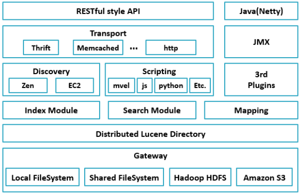
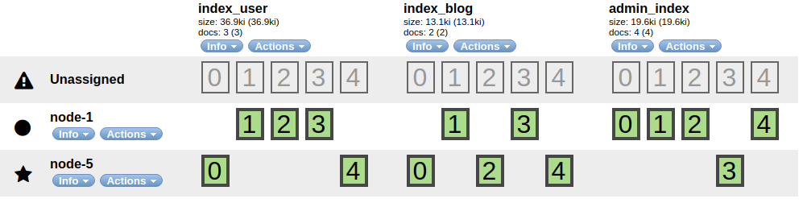

<span id="menu"></span>

<!-- TOC -->

- [1. Elasticsearch搜索引擎](#1-elasticsearch搜索引擎)
  - [1.1. 基本概念](#11-基本概念)
  - [1.2. 全文搜索](#12-全文搜索)
  - [1.3. 基础知识](#13-基础知识)
  - [1.4. 安装与配置](#14-安装与配置)
    - [1.4.1. 配置文件说明](#141-配置文件说明)
      - [1.4.1.1. elasticsearch.yml](#1411-elasticsearchyml)
    - [1.4.2. 安装中文分词器](#142-安装中文分词器)
    - [1.4.3. 启动](#143-启动)
    - [1.4.4. elasticsearch-head的使用](#144-elasticsearch-head的使用)
  - [1.5. 辅助工具](#15-辅助工具)
- [2. Elasticsearch工作流程](#2-elasticsearch工作流程)
  - [2.1. 启动过程](#21-启动过程)
  - [2.2. 故障检测](#22-故障检测)
  - [2.3. 与El通信](#23-与el通信)
    - [2.3.1. 索引数据](#231-索引数据)
    - [2.3.2. 查询数据](#232-查询数据)
- [3. 索引](#3-索引)
  - [3.1. 索引](#31-索引)
  - [3.2. 映射配置](#32-映射配置)
- [4. 集群管理](#4-集群管理)
  - [4.1. 集群健康](#41-集群健康)
  - [4.2. 添加索引](#42-添加索引)
- [5. 数据](#5-数据)
  - [5.1. 文档](#51-文档)
  - [5.2. 处理冲突](#52-处理冲突)
- [6. 分布式增删改查](#6-分布式增删改查)
  - [6.1. 路由文档到分片](#61-路由文档到分片)
  - [6.2. 分片交互](#62-分片交互)
    - [6.2.1. 新建，索引和删除文档](#621-新建索引和删除文档)
    - [6.2.2. 索引文档](#622-索引文档)
- [7. ELK应用](#7-elk应用)
  - [7.1. Logstash](#71-logstash)
    - [7.1.1. 配置文件](#711-配置文件)
  - [7.2. Kibana](#72-kibana)
- [8. 面试小结之Elasticsearch篇](#8-面试小结之elasticsearch篇)

<!-- /TOC -->


# 1. Elasticsearch搜索引擎
<a href="#menu" >目录</a>

Elasticsearch是一个基于Lucene构建的开源、分布式、RestFul接口全文搜索引擎。同时还是一个分布式文档数据库，其中每个字段均是被索引的数据且可被搜索。它能够扩展至数以百计的服务器存储以及处理PB级的数据。它可以在很短的时间内处理和分析大量的数据。

**Elasticsearch的特点**
1. 可以作为一个大型分布式集群（数百台服务器）技术，处理PB级数据，服务大公司；也可以运行在单机上，服务小公司
2. Elasticsearch不是什么新技术，主要是将全文检索、数据分析以及分布式技术，合并在了一起，才形成了独一无二的ES；lucene（全文检索），商用的数据分析软件（也是有的），分布式数据库（mycat）
3. 对用户而言，是开箱即用的，非常简单，作为中小型的应用，直接3分钟部署一下ES，就可以作为生产环境的系统来使用了，数据量不大，操作不是太复杂
4. 数据库的功能面对很多领域是不够用的（事务，还有各种联机事务型的操作）；特殊的功能，比如全文检索，同义词处理，相关度排名，复杂数据分析，海量数据的近实时处理；Elasticsearch作为传统数据库的一个补充，提供了数据库所不不能提供的很多功能


**优点**
* 横向可扩展性：只需要增加一台服务器，配置好相关参数，就可启动加入集群
* 分片机制提供更好的分布性：同一个索引分成多个分片(sharding)
* 高可用:提供复制机制，一个分片可以设置多个复制，使得某台服务器在宕积的情况下，集群仍然可以照常运行，并会把服务器宕机丢失的数据信息复制恢复到其他可用的节点上
* 使用简单

**ElasticSearch使用场景**
* 存储
    * ElasticSearch天然支持分布式，具备存储海量数据的能力，其搜索和数据分析的功能都建立在ElasticSearch存储的海量的数据之上；ElasticSearch很方便的作为海量数据的存储工具，特别是在数据量急剧增长的当下，ElasticSearch结合爬虫等数据收集工具可以发挥很大用处
* 搜索
    * ElasticSearch使用倒排索引，每个字段都被索引且可用于搜索，更是提供了丰富的搜索api，在海量数据下近实时实现近秒级的响应,基于Lucene的开源搜索引擎，为搜索引擎（全文检索，高亮，搜索推荐等）提供了检索的能力。 具体场景:
      * Stack Overflow（国外的程序异常讨论论坛），IT问题，程序的报错，提交上去，有人会跟你讨论和回答，全文检索，搜索相关问题和答案，程序报错了，就会将报错信息粘贴到里面去，搜索有没有对应的答案；
      * GitHub（开源代码管理），搜索上千亿行代码；
      * 电商网站，检索商品；
      * 日志数据分析，logstash采集日志，ElasticSearch进行复杂的数据分析（ELK技术，elasticsearch+logstash+kibana）；
* 数据分析
    * ElasticSearch也提供了大量数据分析的api和丰富的聚合能力，支持在海量数据的基础上进行数据的分析和处理。具体场景：
    * 爬虫爬取不同电商平台的某个商品的数据，通过ElasticSearch进行数据分析（各个平台的历史价格、购买力等等）；


**架构**



1. Gateway是ES用来存储索引的文件系统，支持多种类型。
2. Gateway的上层是一个分布式的lucene框架。
3. Lucene之上是ES的模块，包括：索引模块、搜索模块、映射解析模块等
4. ES模块之上是 Discovery、Scripting和第三方插件。Discovery是ES的节点发现模块，不同机器上的ES节点要组成集群需要进行消息通信，集群内部需要选举master节点，这些工作都是由Discovery模块完成。支持多种发现机制，如 Zen 、EC2、gce、Azure。Scripting用来支持在查询语句中插入javascript、python等脚本语言，scripting模块负责解析这些脚本，使用脚本语句性能稍低。ES也支持多种第三方插件。
5. 再上层是ES的传输模块和JMX.传输模块支持多种传输协议，如 Thrift、memecached、http，默认使用http。JMX是java的管理框架，用来管理ES应用。
6. 最上层是ES提供给用户的接口，可以通过RESTful接口和ES集群进行交互。

目前市场上开放源代码的最好全文检索引擎工具包就属于 Apache 的 Lucene了。但是 Lucene 只是一个工具包，它不是一个完整的全文检索引擎。Lucene 的目的是为软件开发人员提供一个简单易用的工具包，以方便的在目标系统中实现全文检索的功能，或者是以此为基础建立起完整的全文检索引擎。目前以 Lucene 为基础建立的开源可用全文搜索引擎主要是 Solr 和 Elasticsearch。Solr 和 Elasticsearch 都是比较成熟的全文搜索引擎，能完成的功能和性能也基本一样。但是 ES 本身就具有分布式的特性和易安装使用的特点，而 Solr 的分布式需要借助第三方来实现，例如通过使用 ZooKeeper 来达到分布式协调管理。不管是 Solr 还是 Elasticsearch 底层都是依赖于 Lucene，而 Lucene 能实现全文搜索主要是因为它实现了倒排索引的查询结构。

**ElasticSearch核心概念**

* Near Realtime (NRT)近实时：数据提交索引后，立马就可以搜索到。
* Cluster集群：一个集群由一个唯一的名字标识，默认为“elasticsearch”。集群名称非常重要，具体相同集群名的节点才会组成一个集群。集群名称可以在配置文件中指定。集群中有多个节点，其中有一个为主节点，这个主节点是可以通过选举产生的，主从节点是对于集群内部来说的。ElasticSearch的一个概念就是去中心化，字面上理解就是无中心节点，这是对于集群外部来说的，因为从外部来看ElasticSearch集群，在逻辑上是个整体，你与任何一个节点的通信和与整个ElasticSearch集群通信是等价的。
* Node 节点：存储集群的数据，参与集群的索引和搜索功能。像集群有名字，节点也有自己的名称，默认在启动时会以一个随机的UUID的前七个字符作为节点的名字，你可以为其指定任意的名字。通过集群名在网络中发现同伴组成集群。一个节点也可是集群。每一个运行实例称为一个节点,每一个运行实例既可以在同一机器上,也可以在不同的机器上。所谓运行实例,就是一个服务器进程，在测试环境中可以在一台服务器上运行多个服务器进程，在生产环境中建议每台服务器运行一个服务器进程。
* Index 索引: 一个索引是一个文档的集合（等同于solr中的集合）。每个索引有唯一的名字，通过这个名字来操作它。一个集群中可以有任意多个索引。索引作动词时，指索引数据、或对数据进行索引。Type 类型：指在一个索引中，可以索引不同类型的文档，如用户数据、博客数据。从6.0.0 版本起已废弃，一个索引中只存放一类数据。Elasticsearch里的索引概念是名词而不是动词，在elasticsearch里它支持多个索引。 一个索引就是一个拥有相似特征的文档的集合。比如说，你可以有一个客户数据的索引，另一个产品目录的索引，还有一个订单数据的索引。一个索引由一个名字来 标识（必须全部是小写字母的），并且当我们要对这个索引中的文档进行索引、搜索、更新和删除的时候，都要使用到这个名字。在一个集群中，你能够创建任意多个索引。
* Document 文档：被索引的一条数据，索引的基本信息单元，以JSON格式来表示。一个文档是一个可被索引的基础信息单元。比如，你可以拥有某一个客户的文档、某一个产品的一个文档、某个订单的一个文档。文档以JSON格式来表示，而JSON是一个到处存在的互联网数据交互格式。在一个index/type里面，你可以存储任意多的文档。注意，一个文档物理上存在于一个索引之中，但文档必须被索引/赋予一个索引的type。
* Shard 分片：在创建一个索引时可以指定分成多少个分片来存储。每个分片本身也是一个功能完善且独立的“索引”，可以被放置在集群的任意节点上（分片数创建索引时指定，创建后不可改了。备份数可以随时改）。索引分片，ElasticSearch可以把一个完整的索引分成多个分片，这样的好处是可以把一个大的索引拆分成多个，分布到不同的节点上。构成分布式搜索。分片的数量只能在索引创建前指定，并且索引创建后不能更改。分片的好处：
    * 允许我们水平切分/扩展容量
    * 可在多个分片上进行分布式的、并行的操作，提高系统的性能和吞吐量。
* Replication 备份： 一个分片可以有多个备份（副本）。备份的好处：
    * 高可用扩展搜索的并发能力、吞吐量。
    * 搜索可以在所有的副本上并行运行。
* primary shard：主分片，每个文档都存储在一个分片中，当你存储一个文档的时候，系统会首先存储在主分片中，然后会复制到不同的副本中。默认情况下，一个索引有5个主分片。你可以在事先制定分片的数量，当分片一旦建立，分片的数量则不能修改。
* replica shard：副本分片，每一个分片有零个或多个副本。副本主要是主分片的复制，其中有两个目的：
    * 增加高可用性：当主分片失败的时候，可以从副本分片中选择一个作为主分片。
    * 提高性能：当查询的时候可以到主分片或者副本分片中进行查询。默认情况下，一个主分配有一个副本，但副本的数量可以在后面动态的配置增加。副本必须部署在不同的节点上，不能部署在和主分片相同的节点上。
* term索引词：在elasticsearch中索引词(term)是一个能够被索引的精确值。foo，Foo几个单词是不相同的索引词。索引词(term)是可以通过term查询进行准确搜索。
* text文本：是一段普通的非结构化文字，通常，文本会被分析称一个个的索引词，存储在elasticsearch的索引库中，为了让文本能够进行搜索，文本字段需要事先进行分析；当对文本中的关键词进行查询的时候，搜索引擎应该根据搜索条件搜索出原文本。
* analysis：分析是将文本转换为索引词的过程，分析的结果依赖于分词器，比如： FOO BAR, Foo-Bar, foo bar这几个单词有可能会被分析成相同的索引词foo和bar，这些索引词存储在elasticsearch的索引库中。当用 FoO:bAR进行全文搜索的时候，搜索引擎根据匹配计算也能在索引库中搜索出之前的内容。这就是elasticsearch的搜索分析。
* routing路由：当存储一个文档的时候，他会存储在一个唯一的主分片中，具体哪个分片是通过散列值的进行选择。默认情况下，这个值是由文档的id生成。如果文档有一个指定的父文档，从父文档ID中生成，该值可以在存储文档的时候进行修改。
* type类型：在一个索引中，你可以定义一种或多种类型。一个类型是你的索引的一个逻辑上的分类/分区，其语义完全由你来定。通常，会为具有一组相同字段的文档定义一个类型。比如说，我们假设你运营一个博客平台 并且将你所有的数据存储到一个索引中。在这个索引中，你可以为用户数据定义一个类型，为博客数据定义另一个类型，当然，也可以为评论数据定义另一个类型。
* template：索引可使用预定义的模板进行创建,这个模板称作Index templatElasticSearch。模板设置包括settings和mappings。
* mapping：映射像关系数据库中的表结构，每一个索引都有一个映射，它定义了索引中的每一个字段类型，以及一个索引范围内的设置。一个映射可以事先被定义，或者在第一次存储文档的时候自动识别。
* field：一个文档中包含零个或者多个字段，字段可以是一个简单的值（例如字符串、整数、日期），也可以是一个数组或对象的嵌套结构。字段类似于关系数据库中的表中的列。每个字段都对应一个字段类型，例如整数、字符串、对象等。字段还可以指定如何分析该字段的值。
* source field：默认情况下，你的原文档将被存储在_source这个字段中，当你查询的时候也是返回这个字段。这允许您可以从搜索结果中访问原始的对象，这个对象返回一个精确的json字符串，这个对象不显示索引分析后的其他任何数据。
id：一个文件的唯一标识，如果在存库的时候没有提供id，系统会自动生成一个id，文档的index/type/id必须是唯一的。
* recovery：代表数据恢复或叫数据重新分布，ElasticSearch在有节点加入或退出时会根据机器的负载对索引分片进行重新分配，挂掉的节点重新启动时也会进行数据恢复。
* River：代表ElasticSearch的一个数据源，也是其它存储方式（如：数据库）同步数据到ElasticSearch的一个方法。它是以插件方式存在的一个ElasticSearch服务，通过读取river中的数据并把它索引到ElasticSearch中，官方的river有couchDB的，RabbitMQ的，Twitter的，Wikipedia的，river这个功能将会在后面的文件中重点说到。
* gateway：代表ElasticSearch索引的持久化存储方式，ElasticSearch默认是先把索引存放到内存中，当内存满了时再持久化到硬盘。当这个ElasticSearch集群关闭再重新启动时就会从gateway中读取索引数据。ElasticSearch支持多种类型的gateway，有本地文件系统(默认), 分布式文件系统，Hadoop的HDFS和amazon的s3云存储服务。
* discovery.zen：代表ElasticSearch的自动发现节点机制，ElasticSearch是一个基于p2p的系统，它先通过广播寻找存在的节点，再通过多播协议来进行节点之间的通信，同时也支持点对点的交互。
* Transport：代表ElasticSearch内部节点或集群与客户端的交互方式，默认内部是使用tcp协议进行交互，同时它支持http协议（json格式）、thrift、servlet、memcached、zeroMQ等的传输协议（通过插件方式集成）。

**与关系型数据库对比**

|RDBMS|EL|
|---|---|
|数据库database|索引index|
|表table|类型type|
|行row|文档document|
|列column|字段field|
|表结构schema|映射mapping|
|索引|反向索引|
|SQL|查询ＤＳＬ|
|select | get http://|
|update| put http://|
|delete |delete http://|


## 1.1. 基本概念
<a href="#menu" >目录</a>

* 索引
    * 逻辑数据的存储，可以看作一个数据库
    * 一个索引有一个或者多个分片，每个分片可以有多个副本
* 文档类型
    * 可以看作数据库的表名，用于区分不同类型文档
* 文档 document
    * 索引和搜索时使用的主要数据载体，包含一个或者多个存有数据的字段，可以看作数据库的一行数据
* 文档ID
    * 索引的唯一标识符，如果索引建立时不指定，el将会随机生成一个随机字符串当作文档哪个ID
    * 两个不同的文档类型可以有相同的文档ID
* 字段 Field
    * 文档的一部分，包含名称和值两部分
* 词 term
    * 搜索的词
* 标记 token
    * 表示字段在文本中出现的词，由这个词的文本、开始偏移量以及类型组成

* 倒排索引
文档1： 中国伟大
文档2： 中建公司

|词|计数|文档|
|---|---|---|
|中|2|<1><2>|
|中国|1|<1>|
|公司|1|<2>|
|...|...|...|

每一个词指向包含它的文档编号。这样就可以执行一种非常高效且快速的搜索，比如基于词的查询。此外，每个词有一个计数，告诉Lucene该词出现的频率。


* 输入数据分析
    * 传入文档中的数据怎么转化为到排索引，这个过程叫做分析
    * 分析的工作由分析器完成，分析器由一个分词器和零或多个标记过滤器组成，也可以有零个或多个字符映射器
        * 分词器
            * 把文本分隔成多个标记‘
            * 基本就是词加上一些额外的信息，比如该词在原始文本中的位置和长度
            * 分词器的处理结果称为标记流（ token stream），它是一个接一个的标记，准备被过滤器处理
        * 过滤器
            * 小写过滤器，把所有标记变为小写
            * 同义词过滤器，基于基本的同义词规则，把一个标记换成另一个同义的标记。
            * 多语言词干提取过滤器（ multiple language stemming filter）：减少标记（实际上是标记中的文本部分），得到词根或者基本形式，即词干
            * 过滤器是一个接一个进行处理，可以使用多个过滤器进行处理
        * 字符映射器
            * 对未经分析的文本其作用，在分词器之前进行工作
            * 可以将文本中的Html标签去除

* el集群基本概念
    * 节点和集群
        * el可以作为一个独立的搜索的服务器
        * 但为了处理大型数据集，实现容错和可用性，可以多个服务器组成集群。
    * 分片
        * 当存在大量的文档时，由于内存的限制、硬盘能力、处理能力不足、无法足够快地响应客户端请求等，一个节点可能不够
        * 在这种情况下，数据可以分为较小的称为分片（ shard）的部分（其中每个分片都是一个独立的Apache Lucene索引）。每个分片可以放在不同的服务器上
        * 当你查询的索引分布在多个分片上时， Elasticsearch会把查询发送给每个相关的分片，并将结果合并在一起，而应用程序并不知道分片的存在
    * 副本
        * 副本（ replica）只是一个分片的精确复制，每个分片可以有零个或多个副本
        * 副本分为主分片和副本分片
        * 主分片不可用时，则集群将副本分片提升为主分片
        * 使用副本机制可以提高查询吞吐量和实现高可用
        * 索引建立时，副本只是作为额外的位置来存放数据
        * 索引查询时，el会尽量平衡分片和它副本之间的负载
        
* 索引建立和搜索
    * 索引建立
        * 发送一个新的文档给集群，这个节点是任意选择的。
        * 这个节点知道目标索引有多少分片，并且能够确定哪个分片应该用来存储你的文档
        * Elasticsearch使用文档的唯一标识符来计算文档应该被放到哪个分片中
    * 索引查询
        * 使用文档标识符进行查询，根据ID确认持有的节点和分片，然后转发请求，获取结果，返回给客户端

* Elasticsearch架构特点
    * 合理的默认配置，使得用户在简单安装后能直接使用，而不需要额外的调优，这其中包括内置的发现(例如字段类型检测)和自动配置功能
    * 默认的分布式工作模式，每个节点总是假定自己是某个集群的一部分或将是某个集群的一部分
    * 对等架构，可以避免单点故障，节点会自动连接到集群中的其他节点，进行相互的数据交换和监控操作。这其中包括索引分片的自动复制
    * 容易扩充新节点至集群，不论是从数据容量的角度还是数量的角度
    * 没有对索引中的数据结构强加任何限制
    * 准实时搜索和版本同步，由于分布式特性，无法保证数据实时同步，el尝试解决这些问题，并且提供额外的机制用于版本同步。

## 1.2. 全文搜索
<a href="#menu" >目录</a>

全文搜索是指计算机搜索程序通过扫描文章中的每一个词，对每一个词建立一个索引，指明该词在文章中出现的次数和位置。当用户查询的时候，搜索程序根据事先建立的索引进行查找，并将查找的结果反馈给客户。

lucene 是一个开放源代码的全文检索引擎工具包，但它不是一个完整的全文检索引擎，而是一个全文检索引擎的架构，提供了完整的查询引擎和索引引擎，部分文本分析引擎（英文与德文两种西方语言）。es在它的基础上实现了分布式集群以及对外http访问接口等功能。

**倒排索引**

倒排索引是全文搜索中的关键技术。

比如有两个文章:

* 文章1: lucene 是一个开放源代码的全文检索引擎工具包
* 文章2: lucene 不是一个完整的全文检索引擎

程序会先对内容进行分词，去掉没多大意义的词(比如是／不是／一个)。

假设经过分词以后

* 文章1: [lucene|全文检索|工具包]
* 文章2: [lucene|全文检索|引擎]

之后就是建立倒排索引

|关键词|文章号[出现频率]|出现位置｜
|---|---|
|lucene|1[1],2[1]|1
|全文检索|1[1],2[1]|1
|工具包|1[1]|18
|引擎|2[1]|12

通过倒排索引，就可以很方便的查找到关键词所在的文章和位置。

当不使用倒排索引时，要查找关键字在哪里，就需要进行全文章的遍历，速度会是非常慢的。


## 1.3. 基础知识
<a href="#menu" >目录</a>

* 索引词
    * 在elastiasearch中索引词（term）是一个能够被索引的精确值。foo,Foo,FOO几个单词是不同的索引词。索引词（term）是可以通过term查询进行准确的搜索。
* 文本(text)
    文本是一段普通的非结构化文字。通常，文本会被分拆成一个个的索引词，存储在elasticsearch的索引库中。为了让文本能够进行搜索，文本字段需要事先进行分析了；当对文本中的关键词进行查询的时候，搜索引擎应该根据搜索条件搜索出原文本。
* 分析(analysis)
    * 分析是将文本转换为索引词的过程，分析的结果依赖于分词器。比如：FOO BAR，Foo-Bar和foo bar这几个词有可能会被分析成相同的索引词foo和bar，这些索引词存储在Elasticsearch的索引库中。
* 集群(cluster)
    * 集群由一个或多个节点组成，对外提供服务，对外提供索引和搜索功能。在所有节点，一个集群有一个唯一的名称默认为“elasticsearch”.此名称是很重要的，因为每个节点只能是集群的一部分，当该节点被设置为相同的集群名称时，就会自动加入集群。当需要有多个集群的时候，要确保每个集群的名称不能重复，，否则节点可能会加入到错误的集群。请注意，一个节点只能加入到一个集群。此外，你还可以拥有多个独立的集群，每个集群都有其不同的集群名称。
* 节点(node)
    * 一个节点是一个逻辑上独立的服务,它是集群的一部分,可以存储数据,并参与集群的索引和搜索功能。就像集群一样,节点也有唯一的名字,在启动的时候分配。如果你不想要默认名称,你可以定义任何你想要的节点名.这个名字在理中很重要,在Elasticsearch集群通过节点名称进行管理和通信.一个节点可以被配置加入到一个特定的集群。默认情况下,每个节点会加人名为Elasticsearch 的集祥中,这意味着如果你在网热动多个节点,如果网络畅通,他们能彼此发现井自动加人名为Elasticsearch 的一个集群中,你可以拥有多个你想要的节点。当网络没有集祥运行的时候,只要启动一个节点,这个节点会默认生成一个新的集群,这个集群会有一个节点。
* 分片(shard)
    * 分片是单个Lucene 实例,这是Elasticsearch管理的比较底层的功能。索引是指向主分片和副本分片的逻辑空间。对于使用,只需要指定分片的数量,其他不需要做过多的事情。在开发使用的过程中,我们对应的对象都是索引,Elasticsearch 会自动管理集群中所有的分片,当发生故障的时候,Elasticsearch 会把分片移动到不同的节点或者添加新的节点。
    * 一个索引可以存储很大的数据,这些空间可以超过一个节点的物理存储的限制。例如,十亿个文档占用磁盘空间为1TB。仅从单个节点搜索可能会很慢,还有一台物理机器也不一定能存储这么多的数据。为了解决这一问题,Elasticsearch将索引分解成多个分片。当你创建一个索引,你可以简单地定义你想要的分片数量。每个分片本身是一个全功能的、独立的单元,可以托管在集群中的任何节点。
    * 主分片
        * 每个文档都存储在一个分片中,当你存储一个文档的时候,系统会首先存储在主分片中,然后会复制到不同的副本中。
        * 默认情况下,一个索引有5个主分片。 你可以事先制定分片的数量,当分片一旦建立,则分片的数量不能修改。
    * 副本分片
        * 每一个分片有零个或多个副本。副本主要是主分片的复制,其中有两个目的:
            * 增加高可用性:当主分片失败的时候,可以从副本分片中选择一个作为主分片。
            * 提高性能:当查询的时候可以到主分片或者副本分片中进行查询。默认情況下,一个主分片配有一个副本,但副本的数量可以在后面动态地配置增加。副本分片必部署在不同的节点上,不能部署在和主分片相同的节点上。
    * 分片主要有两个很重要的原因是:
        * 允许水平分割扩展数据。
        * 允许分配和井行操作(可能在多个节点上)从而提高性能和吞吐量。
    * 这些很强大的功能对用户来说是透明的,你不需要做什么操作,系统会自动处理。
* 索引(index)
    * 索引是具有相同结构的文档集合。例如,可以有一个客户信息的索引,包括一个产品目录的索引,一个订单数据的索引。 在系统上索引的名字全部小写,通过这个名字可以用来执行索引、搜索、更新和删除操作等。在单个集群中,可以定义多个你想要的索引。
* 类型(type)
    * 在索引中,可以定义一个或多个类型,类型是索引的逻辑分区。在一般情况下,一种类型被定义为具有一组公共字段的文档。例如,让我们假设你运行一个博客平台,并把所有的数据存储在一个索引中。在这个索引中,你可以定义一种类型为用户数据,一种类型为博客数据,另一种类型为评论数据。
* 文档(doc)
    * 文档是存储在Elasticsearch中的一个JSON格式的字符串。它就像在关系数据库中表的一行。每个存储在索引中的一个文档都有一个类型和一个ID,每个文档都是一个JSON对象,存储了零个或者多个字段,或者键值对。原始的JSON 文档假存储在一个叫作Sour的字段中。当搜索文档的时候默认返回的就是这个字段。
* 映射
    * 映射像关系数据库中的表结构,每一个索引都有一个映射,它定义了索引中的每一个字段类型,以及一个索引范围内的设置。一个映射可以事先被定义,或者在第一次存储文档的时候自动识别。
* 字段
    * 文档中包含零个或者多个字段,字段可以是一个简单的值(例如字符串、整数、日期),也可以是一个数组或对象的嵌套结构。字段类似于关系数据库中表的列。每个字段都对应一个字段类型,例如整数、字符串、对象等。字段还可以指定如何分析该字段的值。
* 主键
    * ID是一个文件的唯一标识,如果在存库的时候没有提供ID,系统会自动生成一个ID,文档的index/type/id必须是唯一的。
* 复制
    * 复制是一个非常有用的功能,不然会有单点问题。 当网络中的某个节点出现问题的时候,复制可以对故障进行转移,保证系统的高可用。因此,Elasticsearch 允许你创建一个或多个拷贝,你的索引分片就形成了所谓的副本或副本分片。
    * 复制是重要的,主要的原因有:
        * 它提供丁高可用性,当节点失败的时候不受影响。需要注意的是,一个复制的分片不会存储在同一个节点中。
        * 它允许你扩展搜索量,提高并发量,因为搜索可以在所有副本上并行执行。
        * 每个索引可以拆分成多个分片。索引可以复制零个或者多个分片.一旦复制,每个索引就有了主分片和副本分片.分片的数量和副本的数量可以在创建索引时定义.当创建索引后,你可以随时改变副本的数量,但你不能改变分片的数量.
    * 默认情況下,每个索引分配5个分片和一个副本,这意味着你的集群节点至少要有两个节点,你将拥有5个主要的分片和5个副本分片共计10个分片.
    * 每个Elasticsearch分片是一个Lucene 的索引。有文档存储数量限制,你可以在一个单一的Lucene索引中存储的最大值为lucene-5843,极限是2147483519(=integer.max_value-128)个文档。你可以使用cat/shards API监控分片的大小。


## 1.4. 安装与配置
<a href="#menu" >目录</a>

新创建的目录中。应该可以看到下面的目录结构：
|目录 |描述|
|---|---|
|bin| 运行Elasticsearch实例和插件管理所需的脚本
|config| 配置文件所在的目录
|lib| Elasticsearch使用的库
Elasticsearch启动后，会创建如下目录（如果目录不存在）：
|目 录 |描 述
|---|---|
|data| Elasticsearch使用的所有数据的存储位置
|logs| 关于事件和错误记录的文件
|plugins| 存储所安装插件的地方
|work| Elasticsearch使用的临时文件

### 1.4.1. 配置文件说明
<a href="#menu" >目录</a>


* elasticsearch.yml  Elasticsearch配置文件
* jvm.options jvm参数配置
* log4j2.properties 日志配置


#### 1.4.1.1. elasticsearch.yml
<a href="#menu" >目录</a>

```yml
cluster.name: elasticsearch                 配置集群名称，默认elasticsearch
node.name: node1                            配置节点名称
node.master: true                           配置当前节点是否具有可选为master节点的资格，默认值为true
node.data: true                             配置当前节点是否允许存储数据，默认值为true
node.rack: rack314                          每个节点都可以定义一些与之关联的通用属性，用于后期集群进行碎片分配时的过滤
node.max_local_storage_nodes: 1             默认情况下，多个节点可以在同一个安装路径启动，如果你想让你的es只启动一个节点，可以进行如下设置
index.number_of_shards: 5                   配置索引的默认分片数，默认值为5
index.number_of_replicas: 1                 配置索引的默认副本数，默认值为1
path.conf: /path/to/conf                    配置文件所在的位置，即elasticsearch.yml和logging.yml所在的位置
path.data: /path/to/data                    分配给当前节点的索引数据所在的位置
path.work: /path/to/work                    临时文件位置
path.logs: /path/to/logs                    日志文件所在位置
path.plugins: /path/to/plugins              插件安装位置
plugin.mandatory: mapper-attachments,lang-groovy 
                                            插件托管位置，若列表中的某一个插件未安装，则节点无法启动： 
bootstrap.mlockall: true                    JVM开始交换时，ElasticSearch表现并不好：你需要保障JVM不进行交换，可以将bootstrap.mlockall设置为true禁止交换
network.bind_host: 192.168.0.1              默认情况下，ElasticSearch使用0.0.0.0地址，并为http传输开启9200-9300端口，为节点到节点的通信开启9300-9400端口，也可以自行设置IP地址
network.publish_host: 192.168.0.1           publish_host设置其他节点连接此节点的地址，如果不设置的话，则自动获取，publish_host的地址必须为真实地址
network.host: 192.168.0.1                   bind_host和publish_host可以一起设置
transport.tcp.port: 9300                    配置节点之间交互的端口, 默认 9300-9400 。可以为它指定一个值或一个区间，当为区间时会取用区间第一个可用的端口。
transport.tcp.compress: true                节点间交互时，可以设置是否压缩，转为为不压缩
http.port: 9200                             可以为Http传输监听定制端口,默认 9200-9300 。可以为它指定一个值或一个区间，当为区间时会取用区间第一个可用的端口。
http.max_content_length: 100mb              设置内容的最大长度
http.enabled: false                         禁止HTTP 
http.cors.enabled: true                     设置运行跨域访问，默认为false
http.cors.allow-origin: "*"                 设置跨域访问的允许范围
gateway.type: local                         网关允许在所有集群重启后持有集群状态，集群状态的变更都会被保存下来，当第一次启用集群时，可以从网关中读取到状态
gateway.recover_after_nodes: 1              允许在N个节点启动后恢复过程
gateway.recover_after_time: 5m              设置初始化恢复过程的超时时间
gateway.expected_nodes: 2                   设置该集群中可存在的节点上限
cluster.routing.allocation.node_initial_primaries_recoveries: 4 
                                            设置一个节点的并发数量，有两种情况，一种是在初始复苏过程中，另一种是在添加、删除节点及调整时
indices.recovery.max_size_per_sec: 0        设置复苏时的吞吐量，默认情况下是无限的
indices.recovery.concurrent_streams: 5      设置从对等节点恢复片段时打开的流的数量上限
discovery.zen.minimum_master_nodes: 1       设置一个集群中主节点的数量，当多于三个节点时，该值可在2-4之间
discovery.zen.ping.timeout: 3s              设置ping其他节点时的超时时间，网络比较慢时可将该值设大
discovery.zen.ping.multicast.group:224.2.2.4组地址
discovery.zen.ping.multicast.port：54328    端口
discovery.zen.ping.multicast.ttl:3          广播消息ttl
discovery.zen.ping.multicast.address:null   绑定的地址，null表示绑定所有可用的网络接口
discovery.zen.ping.multicast.enabled:true   多播自动发现禁用开关，默认值为true

discovery.zen.ping.unicast.hosts: ["host1", "host2:port", "host3[portX-portY]"] 
                                            设置新节点被启动时能够发现的主节点列表（主要用于不同网段机器连接）


action.destructive_requires_name            设置是否可以通过正则或者_all删除或者关闭索引，默认false 允许 可设置true不允许
action.auto_create_index: true              是否允许自动创建索引，除了true或者false,还可以使用名字匹配模式
action.auto_create_index: -an*,+a*,-*       允许自动创建以a开头的索引，但以an开头的索引则允许。其他索引也必须手动创建（因为指令中的-*）。注意顺序，匹配到就不会继续往下匹配。
```

### 1.4.2. 安装中文分词器


elasticsearch 本身对中文支持不够好，所以需要中文的分词插件，目前主流的都用 IK。 以下这是 Google的中文词条。

IK Analyzer是一个开源的，基于java语言开发的轻量级的中文分词工具包。从2006年12月推出1.0版开始， IKAnalyzer已经推出了4个大版本。最初，它是以开源项目Luence为应用主体的，结合词典分词和文法分析算法的中文分词组件。从3.0版本开始，IK发展为面向Java的公用分词组件，独立于Lucene项目，同时提供了对Lucene的默认优化实现。在2012版本中，IK实现了简单的分词歧义排除算法，标志着IK分词器从单纯的词典分词向模拟语义分词衍化。


下载地址[https://github.com/medcl/elasticsearch-analysis-ik]

然后在plugins创建目录ik，将压缩包复制到ik目录下解压:unzip elasticsearch-analysis-ik-6.5.4.zip

启动时显示则安装成功
```yml
[2020-12-24T19:02:26,524][INFO ][o.e.p.PluginsService     ] [node-1] loaded plugin [analysis-ik]

```

**验证**

* ik_max_word和ik_smart
    * ik_max_word: 将文本按最细粒度的组合来拆分，比如会将“中华五千年华夏”拆分为“五千年、五千、五千年华、华夏、千年华夏”，总之是可能的组合；
    * ik_smart: 最粗粒度的拆分，比如会将“五千年华夏”拆分为“五千年、华夏”
* 当不添加分词类别，Elastic对于汉字默认使用standard只是将汉字拆分成一个个的汉字，而我们ik则更加的智能，下面通过几个案例来说明。

默认情况下
```yml
curl -X GET -H "Content-Type: application/json"  "http://localhost:9200/_analyze?pretty=true" -d'{"text":"中华五千年华夏"}'
```

返回
```json
{
  "tokens" : [
    {
      "token" : "中",
      "start_offset" : 0,
      "end_offset" : 1,
      "type" : "<IDEOGRAPHIC>",
      "position" : 0
    },
    {
      "token" : "华",
      "start_offset" : 1,
      "end_offset" : 2,
      "type" : "<IDEOGRAPHIC>",
      "position" : 1
    },
    {
      "token" : "五",
      "start_offset" : 2,
      "end_offset" : 3,
      "type" : "<IDEOGRAPHIC>",
      "position" : 2
    },
    {
      "token" : "千",
      "start_offset" : 3,
      "end_offset" : 4,
      "type" : "<IDEOGRAPHIC>",
      "position" : 3
    },
    {
      "token" : "年",
      "start_offset" : 4,
      "end_offset" : 5,
      "type" : "<IDEOGRAPHIC>",
      "position" : 4
    },
    {
      "token" : "华",
      "start_offset" : 5,
      "end_offset" : 6,
      "type" : "<IDEOGRAPHIC>",
      "position" : 5
    },
    {
      "token" : "夏",
      "start_offset" : 6,
      "end_offset" : 7,
      "type" : "<IDEOGRAPHIC>",
      "position" : 6
    }
  ]
}

```

ik_smart分词
```yml
curl -X GET -H "Content-Type: application/json"  "http://localhost:9200/_analyze?pretty=true" -d'{"text":"中华五千年华夏","analyzer": "ik_smart"}' 

```
```json
{
  "tokens" : [
    {
      "token" : "中华",
      "start_offset" : 0,
      "end_offset" : 2,
      "type" : "CN_WORD",
      "position" : 0
    },
    {
      "token" : "五千年",
      "start_offset" : 2,
      "end_offset" : 5,
      "type" : "TYPE_CQUAN",
      "position" : 1
    },
    {
      "token" : "华夏",
      "start_offset" : 5,
      "end_offset" : 7,
      "type" : "CN_WORD",
      "position" : 2
    }
  ]
}

```
 ik_max_word分词
```yml
curl -X GET -H "Content-Type: application/json"  "http://localhost:9200/_analyze?pretty=true" -d'{"text":"中华五千年华夏","analyzer": "ik_max_word"}'

```

```json
{
  "tokens" : [
    {
      "token" : "中华",
      "start_offset" : 0,
      "end_offset" : 2,
      "type" : "CN_WORD",
      "position" : 0
    },
    {
      "token" : "五千",
      "start_offset" : 2,
      "end_offset" : 4,
      "type" : "TYPE_CNUM",
      "position" : 1
    },
    {
      "token" : "千年",
      "start_offset" : 3,
      "end_offset" : 5,
      "type" : "CN_WORD",
      "position" : 2
    },
    {
      "token" : "年华",
      "start_offset" : 4,
      "end_offset" : 6,
      "type" : "CN_WORD",
      "position" : 3
    },
    {
      "token" : "年",
      "start_offset" : 4,
      "end_offset" : 5,
      "type" : "COUNT",
      "position" : 4
    },
    {
      "token" : "华夏",
      "start_offset" : 5,
      "end_offset" : 7,
      "type" : "CN_WORD",
      "position" : 5
    }
  ]
}

```

**自定义分词**

IK 很友好，为我们提供热更新 IK 分词，在配置文件 {ES_HOME}/plugins/ik/config/IKAnalyzer.cfg.xml

```xml
<?xml version="1.0" encoding="UTF-8"?>
<!DOCTYPE properties SYSTEM "http://java.sun.com/dtd/properties.dtd">
<properties>
    <comment>IK Analyzer 扩展配置</comment>
    <!--用户可以在这里配置自己的扩展字典 -->
    <entry key="ext_dict">custom/mydict.dic;custom/single_word_low_freq.dic</entry>
     <!--用户可以在这里配置自己的扩展停止词字典-->
    <entry key="ext_stopwords">custom/ext_stopword.dic</entry>
    <!--用户可以在这里配置远程扩展字典 -->
    <entry key="remote_ext_dict">location</entry>
    <!--用户可以在这里配置远程扩展停止词字典-->
    <entry key="remote_ext_stopwords">http://xxx.com/xxx.dic</entry>
</properties>
```

我们一般将需要自动更新的热词放在一个UTF8的txt文件里，再利用 nginx ，当 .txt 文件修改时，http server 会在客户端请求该文件时自动返回相应的 Last-Modified 和 ETag。可以另外做一个工具来从业务系统提取相关词汇，并更新这个 .txt 文件。


### 1.4.3. 启动

配置完成后，进入bin目录下执行
```java
./elasticsearch 
```

启动成功后浏览器访问:http://localhost:9200/  。9200是配置文件中的http.port。

```json
{
  "name" : "node-1",
  "cluster_name" : "elasticsearch",
  "cluster_uuid" : "3eiz8kCQQfuVIQ0q7XNH2w",
  "version" : {
    "number" : "6.5.4",
    "build_flavor" : "default",
    "build_type" : "tar",
    "build_hash" : "d2ef93d",
    "build_date" : "2018-12-17T21:17:40.758843Z",
    "build_snapshot" : false,
    "lucene_version" : "7.5.0",
    "minimum_wire_compatibility_version" : "5.6.0",
    "minimum_index_compatibility_version" : "5.0.0"
  },
  "tagline" : "You Know, for Search"
}
```

如果要配置集群，主要需要配置以下参数
```yml
cluster.name: elasticsearch　# 集群名称，必须一样
node.name: node-2
network.host: 127.0.0.1
transport.tcp.port: 9301 #集群间通信端口
discovery.zen.ping.unicast.hosts: ["127.0.0.1:9300", "127.0.0.1:9301", "127.0.0.1:9302"]
```

### 1.4.4. elasticsearch-head的使用

ealsticsearch只是后端提供各种api，那么怎么直观的使用它呢？elasticsearch-head将是一款专门针对于elasticsearch的客户端工具

elasticsearch-head配置包，下载地址：https://github.com/mobz/elasticsearch-head

elasticsearch-head是一个基于node.js的前端工程，启动elasticsearch-head的步骤如下（这里针对的是elasticsearch 5.x以上的版本）：

1. 进入elasticsearch-head的文件夹
2. 执行 npm install
3. 执行 npm run start

在浏览器访问http://localhost:9100，可看到如下界面，表示启动成功：


## 1.5. 辅助工具
<a href="#menu" >目录</a>

**Beats**

它是一个代理，将不同类型的数据发送到el中，官方提供。由三个部分组成
* Filebeat：用来搜集日志
* Topbeat：搜集系统基础设置信息，比如cpu、内存、进程的统计信息
* Ｐacketbeat网络包分析工具，统计收集网络信息

**Shield**

为el带来企业级的安全性，加密通信、认证保护。收费。

**Watcher**

el的警报和通知工。主动监测el的状态，并在有异常的时候进行提醒。收费。

**Marvel**

管理和监控工具，监测集群索引和节点的活动，快速诊断问题。收费。


# 2. Elasticsearch工作流程
<a href="#menu" >目录</a>

## 2.1. 启动过程
<a href="#menu" >目录</a>

* 当节点启动时，它使用发现模块来发现同一个集群(集群名称需要一样)中的其他节点，并与他们连接，默认情况下节点会发送广播请求，以找到拥有相同集群名称的其他节点。
* 集群中的一个节点被选为主(master)节点。该节点负责集群的状态管理以及在集群拓扑变化时做出反映，分发索引分片至集群相应的节点上去。
* 用户不需要关注哪个是master,请求可以发送到任何的节点其内部会自行转发处理。
* 管理节点读取集群的状态信息，如果有必要，它会进行会恢复处理，在该阶段，管理节点会检查哪些索引分片，并决定哪些分片将用作主分片，然后整个集群进入**黄色状态**。
* 黄色状态意味着集群可以进行查询，但是系统的吞吐量以及各种可能的状态是未知的(可以理解为所有的主分片已经分配，但是副本分片还没有分配)
* el寻找冗余的分片用作副本，如果某个主分片的副本数过少，管理节点将决定基于某个主分片创建分片和副本，如果主分片和副本分片已经分配好，那么将进入**绿色状态**

## 2.2. 故障检测
<a href="#menu" >目录</a>

* 集群正常工作时，管理节点会监控所有可用的节点，检查它们是否正常工作。
* 如果任何节点在预订的超时时间内不响应，则认为该节点已经断开，然后错误处理开始启动
    * 这意味着集群-分片之间重新做平衡，选择新的主节点等
    * 对每个丢失的主分片，一个新的主分片将会从原来的主分片副本中选出来


## 2.3. 与El通信
<a href="#menu" >目录</a>

### 2.3.1. 索引数据
<a href="#menu" >目录</a>


* 索引操作只能发生在主分片上，而不是副本，当一个索引请求被发送到一个节点上时
* 如果该节点没有对应的主分片或者只有副本，那么这个请求会被转发到拥有正确的主分片节点。
* 然后该主节点会将请求发送到各个副本，然后等待响应，当达到规定数目的副本返回响应，完成索引过程并返回响应给客户端。


### 2.3.2. 查询数据
<a href="#menu" >目录</a>


* 查询分为分散阶段和合并阶段
    * 分散阶段
        * 查询请求分发到包含相关文档的多个分片中执行查询
    * 合并阶段
        * 从众多分片中收集返回结果，。然后进行合并，排序等操作之后再返回客户端。


# 3. 索引
<a href="#menu" >目录</a>

索引是具有相同结构的文档集合。对es的操作大部分操作是基于索引来完成的。



索引信息
```yml

{
    "state": "open",
    "settings": {
        "index": {
            "number_of_shards": "5",
            "blocks": {
                "read_only_allow_delete": "true"
            },
            "provided_name": "index_user",
            "creation_date": "1563199743234",
            "number_of_replicas": "1",
            "uuid": "Oo00fLRNRyWwSiqWY6_guQ",
            "version": {
                "created": "6050499"
            }
        }
    },
    "mappings": {
        "user": {
            "properties": {
                "salt": {
                "type": "text",
                "fields": {
                "keyword": {
                    "ignore_above": 256,
                    "type": "keyword"
                }
            }
        },
        "gender": {
            "type": "text",
                "fields": {
                "keyword": {
                    "ignore_above": 256,
                    "type": "keyword"
                }
            }
        },
        "registerTime": {
        "type": "date"
    },
    "nickName": {
        "type": "text",
            "fields": {
            "keyword": {
                "ignore_above": 256,
                "type": "keyword"
            }
        }
    },

    },
    "aliases": [ ],
        "primary_terms": {
            "0": 10,
            "1": 10,
            "2": 10,
            "3": 10,
            "4": 10
        },
    "in_sync_allocations": {
        "0": [
            "TcVO4P-BSmS9i16xzCUxMw"
            ,
            "BLFjXoYiRYWMxhsKADj-kQ"
        ],
        "1": [
            "1cjJgRbTTs2XxETqQtN5NQ"
            ,
            "ka_LzVLFTh-558k5aSrqLQ"
        ],
        "2": [
            "M4a_3EOUTf-Qvj9RYOg-3g"
            ,
            "1_XkQ_6uSL6gbA1WDiJP5g"
        ],
        "3": [
            "ron40qNDQS-7ivA765Jw8A"
            ,
            "N4kES974QTqTQnERJisePA"
        ],
        "4": [
            "qqmO9xTOTgqH00E01HQHwA"
            ,
            "-Res1zvqQHWuvNnM506vag"
        ]
    }
}

```
分片信息
```yml
{
    "state": "STARTED",
    "primary": true,
    "node": "8StKNMLeQDGRLWv_E4O4Sw",
    "relocating_node": null,
    "shard": 3,
    "index": "index_user",
    "allocation_id": {
        "id": "N4kES974QTqTQnERJisePA"
    }
}
```

## 3.1. 索引
<a href="#menu" >目录</a>

* 分片和副本
    * 每个索引是由一个或者多个分片组成，每个分片包含了文档集的一部分
    * 每个分片可以有副本，每个副本是分片的完整数据副本
    * 创建索引，可以指定分片和副本数，也可以按照配置文件中的默认值
    * 分片分为主分片和副分片副本。
    * 更多分片使索引能传送到更多服务器，意味着可以处理更多文件，而不会降低性能。
    * 更多分片意味着获取特定文档所需的资源量会减少，因为相较于部署更少分片时，存储在单个分片中的文件数量更少。
    * 更多分片意味着搜索索引时会面临更多问题，因为必须从更多分片中合并结果，使得查询的聚合阶段需要更多资源。
    * 更多副本会增强集群系统的容错性，因为当原始分片不可用时，其副本将替代原始分片发挥作用。只拥有单个副本，集群可能在不丢失数据的情况下遗失分片。当有两个副本时，即使丢失了原始分片及其中一个副本，一切工作仍可以很好地持续下去。
    * 更多副本意味着查询吞吐量将会增加，因为执行查询可以使用分片或分片的任一副本。
    * 一旦建立好分片，就无法更新分片数量，涉及到数据迁移的问题。副本数量可以改变。

## 3.2. 映射配置
<a href="#menu" >目录</a>

* Elasticsearch有以下核心类型
    * string 字符串
    * number 数字
    * date 日期
    * boolean 布尔型
    * binary 二进制

现在来讨论Elasticsearch中可用的每个核心类型，以及它们用来定义行为的属性。

* **公共属性**
    * index_name：该属性定义将存储在索引中的字段名称。若未定义，字段将以对象的名字来命名。
    * index：可设置值为analyzed和no。另外，对基于字符串的字段，也可以设置为not_analyzed。如果设置为analyzed，该字段将被编入索引以供搜索。如果设置为no，将无法搜索该字段。默认值为analyzed。在基于字符串的字段中，还有一个额外的选项not_analyzed。此设置意味着字段将不经分析而编入索引，使用原始值被编入索引，在搜索的过程中必须全部匹配。索引属性设置为no将使include_in_all属性失效。
    * store：这个属性的值可以是yes或no，指定了该字段的原始值是否被写入索引中。默认值设置为no，这意味着在结果中不能返回该字段（然而，如果你使用_source字段，即使没有存储也可返回这个值），但是如果该值编入索引，仍可以基于它来搜索数据。
    * boost：该属性的默认值是1。基本上，它定义了在文档中该字段的重要性。 boost的值越高，字段中值的重要性也越高。
    * null_value：如果该字段并非索引文档的一部分，此属性指定应写入索引的值。默认的行为是忽略该字段。
    * copy_to：此属性指定一个字段，字段的所有值都将复制到该指定字段。
    * include_in_all：此属性指定该字段是否应包括在_all字段中。默认情况下，如果使用_all字段，所有字段都会包括在其中。 2.4节将更详细地介绍_all字段。
* **字符串**
字符串是最基本的文本类型，我们能够用它存储一个或多个字符。字符串字段的示例定义如
下所示：

```json
"contents" : { "type" : "string", "store" : "no", "index" :"analyzed" }
```
* 除了公共属性，基于字符串的字段还可以使用以下属性。
    * term_vector ： 此 属 性 的 值 可 以 设 置 为 no （ 默 认 值 ）、 yes 、 with_offsets 、with_positions和with_positions_offsets。它定义是否要计算该字段的Lucene词向量（ term vector）。如果你使用高亮，那就需要计算这个词向量。
    * omit_norms：该属性可以设置为true或false。对于经过分析的字符串字段，默认值为false，而对于未经分析但已编入索引的字符串字段，默认值设置为true。当属性为true时，它会禁用Lucene对该字段的加权基准计算（ norms calculation），这样就无法使用索引期间的加权，从而可以为只用于过滤器中的字段节省内存（在计算所述文件的得分时不会被考虑在内）。
    * analyzer：该属性定义用于索引和搜索的分析器名称。它默认为全局定义的分析器名称。
    * index_analyzer：该属性定义了用于建立索引的分析器名称。
    * search_analyzer：该属性定义了的分析器，用于处理发送到特定字段的那部分查询字符串。
    * norms.enabled：此属性指定是否为字段加载加权基准（ norms）。默认情况下，为已分析字段设置为true（这意味着字段可加载加权基准），而未经分析字段则设置为false。
    * norms.loading：该属性可设置eager和lazy。第一个属性值表示此字段总是载入加权基准。第二个属性值是指只在需要时才载入。
    * position_offset_gap：此属性的默认值为0，它指定索引中在不同实例中具有相同名称的字段的差距。若想让基于位置的查询（如短语查询）只与一个字段实例相匹配，可将该属性值设为较高值。
    * index_options：该属性定义了信息列表（ postings list）的索引选项（ 2.2.4节将详细讨论）。可能的值是docs（仅对文档编号建立索引）， freqs（对文档编号和词频建立索引），positions（对文档编号、词频和它们的位置建立索引）， offsets（对文档编号、词频、它们的位置和偏移量建立索引）。对于经分析的字段，此属性的默认值是positions，对于未经分析的字段，默认值为docs。
    * ignore_above：该属性定义字段中字符的最大值。当字段的长度高于指定值时，分析器会将其忽略。
* **数值**

* 这一核心类型汇集了所有适用的数值字段类型Elasticsearch中可使用以下类型（使用type属性指定）。
    * byte：定义字节值，例如1。
    * short：定义短整型值，例如12。
    * integer：定义整型值，例如134。
    * long：定义长整型值，例如123456789。   
    * float：定义浮点值，例如12.23。
    * double：定义双精度值，例如123.45。
* 数值类型字段的定义如下所示：
```json
"price" : { "type" : "float", "store" : "yes", "precision_step" : "4" }
```
* 除了公共属性，以下属性也适用于数值字段。
    * precision_step：此属性指定为某个字段中每个值生成的词条数。值越低，产生的词条数越高。对于每个值的词条数更高的字段，范围查询（ range query）会更快，但索引会稍微大点，默认值为4。
    * ignore_malformed：此属性值可以设为true或false。默认值是false。若要忽略格式错误的值，则应设置属性值为true。
    * 布尔值
        布尔值核心类型是专为索引布尔值（ true或false）设计的。基于布尔值类型的字段定义如下所示："allowed" : { "type" : "boolean", "store": "yes" }
    * 二进制
        * 二进制字段是存储在索引中的二进制数据的Base64表示，可用来存储以二进制形式正常写入的数据，例如图像。基于此类型的字段在默认情况下只被存储，而不索引，因此只能提取，但无法对其执行搜索操作。二进制类型只支持index_name属性。基于binary字段的字段定义如下所示："image" : { "type" : "binary" }
    * 日期
        * 日期核心类型被设计用于日期的索引。它遵循一个特定的、可改变的格式，并默认使用UTC保存。能被Elasticsearch理解的默认日期格式是相当普遍的，它允许指定日期，也可指定时间，例如， 2012-12-24T12:10:22。基于日期类型的字段的示例定义如下所示："published" : { "type" : "date", "store" : "yes", "format" :"YYYY-mm-dd" }使用上述字段的示例文档如下所示{"name" : "Sample document","published" : "2012-12-22"}
* 除了公共属性，日期类型的字段还可以设置以下属性。
    * format：此属性指定日期的格式。默认值为dateOptionalTime。对于格式的完整列表，请 访 问 http://www.elasticsearch.org/guide/en/elasticsearch/reference/current/mapping-dateormat.html。
    * precision_step：此属性指定在该字段中的每个值生成的词条数。该值越低，产生的词条数越高，从而范围查询的速度越快（但索引大小增加）。默认值是4。
    * ignore_malformed：此属性值可以设为true或false，默认值是false。若要忽略格式错误的值，则应设置属性值为true。

* 多字段
    * 有时候你希望两个字段中有相同的字段值，例如，一个字段用于搜索，一个字段用于排序；或一个经语言分析器分析，一个只基于空白字符来分析。 Elasticsearch允许加入多字段对象来拓展字段定义，从而解决这个需求。它允许把几个核心类型映射到单个字段，并逐个分析。例如，想计算切面并在name字段中搜索，可以定义以下字段：

```json
"name": {
    "type": "string",
    "fields": {
        "facet": { "type" : "string", "index": "not_analyzed" }
    }
}
```
上述定义将创建两个字段：我们将第一个字段称为name，第二个称为name.facet。当然，你不必在索引的过程中指定两个独立字段，指定一个name字段就足够了。 Elasticsearch会处理余下的工作，将该字段的数值复制到多字段定义的所有字段。

* **IP地址类型**
Elasticsearch添加了IP字段类型，以数字形式简化IPv4地址的使用。此字段类型可以帮搜索作为IP地址索引的数据、对这些数据排序，并使用IP值做范围查询。基于IP地址类型的字段示例定义如下所示：
```json
"address" : { "type" : "ip", "store" : "yes" }
```
除公共属性外， IP地址类型的字段还可以设置precision_step属性。该属性指定了字段中的每个值生成的词条数。值越低，词条数越高。对于每个值的词条数更高的字段，范围查询会更快，但索引会稍微大点，默认值为4。

* **使用分析器**
正如我们提到的那样，对于字符串类型的字段，可以指定Elasticsearch应该使用哪个分析器。
回想第1章的内容，分析器是一个用于分析数据或以我们想要的方式查询数据的工具。例如，用
空格和小写字符把单词隔开时，不必担心用户发送的单词是小写还是大写。 Elasticsearch使我们
能够在索引和查询时使用不同的分析器，并且可以在搜索过程的每个阶段选择处理数据的方式。
使用分析器时，只需在指定字段的正确属性上设置它的名字，就这么简单。

* 开箱即用的分析器,Elasticsearch允许我们使用众多默认定义的分析器中的一种。如下分析器可以开箱即用。
    * standard：方便大多数欧洲语言的标准分析器（关于参数的完整列表，请参阅http://www.lasticsearch.org/guide/en/elasticsearch/reference/current/analysis-standard-analyzer.html）。
    * simple：这个分析器基于非字母字符来分离所提供的值，并将其转换为小写形式。
    * whitespace：这个分析器基于空格字符来分离所提供的值。
    * stop：这个分析器类似于simple分析器，但除了simple分析器的功能，它还能基于所提供的停用词（ stop word）过滤数据（参数的完整列表，请参阅http://www.elasticsearch.rg/guide/en/elasticsearch/reference/current/analysis-stop-analyzer.html）。
    * keyword：这是一个非常简单的分析器，只传入提供的值。你可以通过指定字段为not_analyzed来达到相同的目的。
    * pattern：这个分析器通过使用正则表达式灵活地分离文本（参数的完整列表，请参阅http://www.elasticsearch.org/guide/en/elasticsearch/reference/current/analysis-pattern-analyzer.html）。
    * language：这个分析器旨在特定的语言环境下工作。该分析器所支持语言的完整列表可参考http://www.elasticsearch.org/guide/en/elasticsearch/reference/current/nalysis-lang-analyzer. tml。
    * snowball：这个分析器类似于standard分析器，但提供了词干提取算法（ stemmingalgorithm ， 参 数 的 完 整 列 表 请 参 阅 http://www.elasticsearch.org/guide/en/elasticsearch/eference/current/analysis-snowball-analyzer.html）。


# 4. 集群管理
<a href="#menu" >目录</a>

一个节点(node)就是一个Elasticsearch实例， 而一个集群(cluster)由一个或多个节点组成， 它们具有相同的 cluster.name 它们协同工作， 分享数据和负载。 当加入新的节点或者删除一个节点时， 集群就会感知到并平衡数据。

集群中一个节点会被选举为主节点(master),它将临时管理集群级别的一些变更， 例如新建或删除索引、 增加或移除节点等。主节点不参与文档级别的变更或搜索， 这意味着在流量增长的时候， 该主节点不会成为集群的瓶颈。 任何节点都可以成为主节点。 我们例子中的集群只有一个节点， 所以它会充当主节点的角色。

做为用户， 我们能够与集群中的任何节点通信， 包括主节点。 每一个节点都知道文档存在于哪个节点上，它们可以转发请求到相应的节点上。 我们访问的节点负责收集各节点返回的数据， 最后一起返回给客户端。 这一切都由Elasticsearch处理。

## 4.1. 集群健康
<a href="#menu" >目录</a>

|颜色| 意义|
|---|---|
|green| 所有主要分片和复制分片都可用
|yellow| 所有主要分片可用， 但不是所有复制分片都可用
|red| 不是所有的主要分片都可用

比如你定义三个分片，每个分片有2个副本。
* 当只启动一个节点时，主分片可用，但是副本只有一个。此时为**yellow**
* 当启动两个节点时，主分片和副本分片都可用，此时为**green**.此时el平衡负载，可能两个节点都有主分片。
* 此时关闭一个节点，必然至少有一个主分片被关掉，此时状态为**red**.经过内部调整，被关掉的主分片的副本分片升级为主分片，此时所有主要分片可用， 但不是所有复制分片都可用，因此为yellow

## 4.2. 添加索引
<a href="#menu" >目录</a>


为了将数据添加到Elasticsearch， 我们需要索引(index)——一个存储关联数据的地方。 实际上， 索引只是一个用来指向一个或多个分片(shards)的“逻辑命名空间(logical namespace)”.
一个分片(shard)是一个最小级别“工作单元(worker unit)”,它只是保存了索引中所有数据的一部分。 在接下来的《深入分片》 一章， 我们将详细说明分片的工作原理， 但是现在我们只要知道分片就是一个Lucene实例， 并且它本身就是一个完整的搜索引擎。 我们的文档存储在分片中， 并且在分片中被索引， 但是我们的应用程序不会直接与它们通信， 取而代之的是， 直接与索引通信。
分片是Elasticsearch在集群中分发数据的关键。 把分片想象成数据的容器。 文档存储在分片中， 然后分片分配到你集群中的节点上。 当你的集群扩容或缩小， Elasticsearch将会自动在你的节点间迁移分片， 以使集群保持平衡。
分片可以是主分片(primary shard)或者是复制分片(replica shard)。 你索引中的每个文档属于一个单独的主分片， 所以主分片的数量决定了索引最多能存储多少数据。
理论上主分片能存储的数据大小是没有限制的， 限制取决于你实际的使用情况。 分片的最大容量完全取决于你的使用状况： 硬件存储的大小、 文档的大小和复杂度、 如何索引和查询你的文档， 以及你期望的响应时间。
复制分片只是主分片的一个副本， 它可以防止硬件故障导致的数据丢失， 同时可以提供读请求， 比如搜索或者从别的shard取回文档。
当索引创建完成的时候， 主分片的数量就固定了， 但是复制分片的数量可以随时调整。
让我们在集群中唯一一个空节点上创建一个叫做 blogs 的索引。 默认情况下， 一个索引被分配5个主分片，但是为了演示的目的， 我们只分配3个主分片和一个复制分片（每个主分片都有一个复制分片）

```json
PUT /blogs
{
    "settings" : {
        "number_of_shards" : 3,
        "number_of_replicas" : 1
    }
}
```


# 5. 数据
<a href="#menu" >目录</a>

## 5.1. 文档
<a href="#menu" >目录</a>

在Elasticsearch中， 文档(document)这个术语有着特殊含义。 它特指最顶层结构或者根对象(root object)序列化成的JSON数据（以唯一ID标识并存储于Elasticsearch中） 。

**文档元数据**
一个文档不只有数据。 它还包含了元数据(metadata)——关于文档的信息。 三个必须的元数据节点是：
|节点| 说明
|---|---|
|_index| 文档存储的地方
|_type| 文档代表的对象的类
|_id| 文档的唯一标识

**_index**
索引(index)类似于关系型数据库里的“数据库”——它是我们存储和索引关联数据的地方。
提示：
事实上，我们的数据被存储和索引在分片(shards)中， 索引只是一个把一个或多个分片分组在一起的逻辑空间。 然而， 这只是一些内部细节——我们的程序完全不用关心分片。 对于我们的程序而言， 文档存储在索引(index)中。 剩下的细节由Elasticsearch关心既可。

索引名必须是全部小写，不能以下划线开头，不能包含逗号。 让我们使用 website 做为索引名。

**_type**
在应用中， 我们使用对象表示一些“事物”， 例如一个用户、 一篇博客、 一个评论， 或者一封邮件。 每个对象都属于一个类(class)， 这个类定义了属性或与对象关联的数据。 user 类的对象可能包含姓名、 性别、 年龄和Email地址。
在关系型数据库中， 我们经常将相同类的对象存储在一个表里， 因为它们有着相同的结构。 同理， 在Elasticsearch中， 我们使用相同类型(type)的文档表示相同的“事物”， 因为他们的数据结构也是相同的。
每个类型(type)都有自己的映射(mapping)或者结构定义， 就像传统数据库表中的列一样。 所有类型下的文档被存储在同一个索引下， 但是类型的映射(mapping)会告诉Elasticsearch不同的文档如何被索引。 我们将会在《映射》 章节探讨如何定义和管理映射， 但是现在我们将依赖ELasticsearch去自动处理数据结构。
_type 的名字可以是大写或小写， 不能包含下划线或逗号。 我们将使用 `blog 做为类型名。

**_id**
d仅仅是一个字符串， 它与 _index 和 _type 组合时， 就可以在ELasticsearch中唯一标识一个文档。 当创建一个文档， 你可以自定义 _id ， 也可以让Elasticsearch帮你自动生成。


## 5.2. 处理冲突
<a href="#menu" >目录</a>

当某个文档被并发修改时，如何确保修改丢失?

在数据库中， 有两种通用的方法确保在并发更新时修改不丢失：
* 悲观并发控制
    * 这在关系型数据库中被广泛的使用， 假设冲突的更改经常发生， 为了解决冲突我们把访问区块化。 典型的例子是在读一行数据前锁定这行， 然后确保只有加锁的那个线程可以修改这行数据。
* 乐观并发控制
    * 被Elasticsearch使用， 假设冲突不经常发生， 也不区块化访问， 然而， 如果在读写过程中数据发生了变化， 更新操作将失败。 这时候由程序决定在失败后如何解决冲突。 实际情况中， 可以重新尝试更新， 刷新数据（重新读取） 或者直接反馈给用户。

Elasticsearch是分布式的。 当文档被创建、 更新或删除， 文档的新版本会被复制到集群的其它节点。 Elasticsearch即是同步的又是异步的， 意思是这些复制请求都是平行发送的， 并无序(out of sequence)的到达目的地。 这就需要一种方法确保老版本的文档永远不会覆盖新的版本.

每个文档都有一个 _version 号码， 这个号码在文档被改变时加一。Elasticsearch使用这个_version 保证所有修改都被正确排序。 当一个旧版本出现在新版本之后， 它会被简单的忽略。


# 6. 分布式增删改查
<a href="#menu" >目录</a>

## 6.1. 路由文档到分片
<a href="#menu" >目录</a>

当你索引一个文档， 它被存储在单独一个主分片上。 Elasticsearch是如何知道文档属于哪个分片的呢？ 当你创建一个新文档， 它是如何知道是应该存储在分片1还是分片2上的呢？
进程不能是随机的， 因为我们将来要检索文档。 事实上， 它根据一个简单的算法决定：shard = hash(routing) % number_of_primary_shards ，routing 值是一个任意字符串， 它默认是 _id 但也可以自定义。 这个 routing 字符串通过哈希函数生成一个数字， 然后除以主切片的数量得到一个余数(remainder)， 余数的范围永远是 0 到 number_of_primary_shards - 1 ， 这个数字就是特定文档所在的分片。
这也解释了为什么主分片的数量只能在创建索引时定义且不能修改： 如果主分片的数量在未来改变了， 所有先前的路由值就失效了， 文档也就永远找不到了。
有时用户认为固定数量的主分片会让之后的扩展变得很困难。 现实中， 有些技术会在你需要的时候让扩展变得容易。

## 6.2. 分片交互
<a href="#menu" >目录</a>

每个节点都能够接收客户端的请求，每个节点都能知道任意文档所在的节点，所以也可以将请求转发到需要的节点。

### 6.2.1. 新建，索引和删除文档
<a href="#menu" >目录</a>


新建、索引和删除请求都是写(write)操作， 它们必须在主分片上成功完成才能复制到相关的复制分片上。

* 在主分片和复制分片上成功新建、 索引或删除一个文档必要的顺序步骤：
1. 客户端给 Node 1 发送新建、 索引或删除请求。
2. 节点使用文档的 _id 确定文档属于分片 0 。 它转发请求到 Node 3 ， 分片 0 位于这个节点上。
3. Node 3 在主分片上执行请求， 如果成功， 它转发请求到相应的位于 Node 1 和 Node 2 的复制节点上。 当所有的复制节点报告成功， Node 3 报告成功到请求的节点， 请求的节点再报告给客户端。


客户端接收到成功响应的时候， 文档的修改已经被应用于主分片和所有的复制分片。 你的修改生效了。
有很多可选的请求参数允许你更改这一过程。 你可能想牺牲一些安全来提高性能。 这一选项很少使用因为Elasticsearch已经足够快， 不过为了内容的完整我们将做一些阐述。

**replication**

复制默认的值是 sync 。 这将导致主分片得到复制分片的成功响应后才返回。
如果你设置 replication 为 async ， 请求在主分片上被执行后就会返回给客户端。 它依旧会转发请求给复制节点， 但你将不知道复制节点成功与否。
上面的这个选项不建议使用。 默认的 sync 复制允许Elasticsearch强制反馈传输。 async 复制可能会因为在不等待其它分片就绪的情况下发送过多的请求而使Elasticsearch过载。

**consistency**

默认主分片在尝试写入时需要规定数量(quorum)或过半的分片（可以是主节点或复制节点） 可用。 这是防止数据被写入到错的网络分区。 规定的数量计算公式如下：
int( (primary + number_of_replicas) / 2 ) + 1
consistency 允许的值为 one （只有一个主分片） ， all （所有主分片和复制分片） 或者默认的 quorum 或过半分片。
注意 number_of_replicas 是在索引中的的设置， 用来定义复制分片的数量， 而不是现在活动的复制节点的数量。 如果你定义了索引有3个复制节点， 那规定数量是：

int( (primary + 3 replicas) / 2 ) + 1 = 3
但如果你只有2个节点， 那你的活动分片不够规定数量， 也就不能索引或删除任何文档。

**timeout**
当分片副本不足时会怎样？ Elasticsearch会等待更多的分片出现。 默认等待一分钟。 如果需要， 你可以设置 timeout 参数让它终止的更早： 100 表示100毫秒， 30s 表示30秒。
注意：
新索引默认有 1 个复制分片， 这意味着为了满足 quorum 的要求需要两个活动的分片。 当然， 这个默认设置将阻止我们在单一节点集群中进行操作。 为了避开这个问题， 规定数量只有在 number_of_replicas 大于一时才生效。

### 6.2.2. 索引文档
<a href="#menu" >目录</a>


文档能够从主分片或任意一个复制分片被检索。


1. 客户端给 Node 1 发送get请求。
2. 节点使用文档的 _id 确定文档属于分片 0 。 分片 0 对应的复制分片在三个节点上都有。 此时， 它转发请求到 Node 2 。
3. Node 2 返回endangered给 Node 1 然后返回给客户端。

对于读请求， 为了平衡负载， 请求节点会为每个请求选择不同的分片——它会循环所有分片副本。

可能的情况是， 一个被索引的文档已经存在于主分片上却还没来得及同步到复制分片上。 这时复制分片会报告文档未找到，主分片会成功返回文档。一旦索引请求成功返回给用户，文档则在主分片和复制分片都是可用的。

# 7. ELK应用
<a href="#menu" >目录</a>

日志主要包括系统日志、应用程序日志和安全日志。系统运维和开发人员可以通过日志了解服务器软硬件信息、检查配置过程中的错误及错误发生的原因。经常分析日志可以了解服务器的负荷，性能安全性，从而及时采取措施纠正错误。

通常，日志被分散的储存不同的设备上。如果你管理数百上千台服务器，你还在使用依次登录每台机器的传统方法查阅日志。这样是不是感觉很繁琐和效率低下。当务之急我们使用集中化的日志管理，例如：开源的syslog，将所有服务器上的日志收集汇总。集中化管理日志后，日志的统计和检索又成为一件比较麻烦的事情，一般我们使用grep、awk和wc等Linux命令能实现检索和统计，但是对于要求更高的查询、排序和统计等要求和庞大的机器数量依然使用这样的方法难免有点力不从心。

开源实时日志分析ELK平台能够完美的解决我们上述的问题，ELK由ElasticSearch、Logstash和Kiabana三个开源工具组成。

整个架构为: 各个服务将日志发送到kafka===>Logstash===>ElasticSearch===>Kiabana

* Kafka：接收用户日志的消息队列
* Logstash是一个完全开源的工具，他可以对你的日志进行收集、过滤，并将其存储供以后使用（如，搜索）。
* Elasticsearch是个开源分布式搜索引擎，它的特点有：分布式，零配置，自动发现，索引自动分片，索引副本机制，restful风格接口，多数据源，自动搜索负载等。
* Kibana 也是一个开源和免费的工具，它Kibana可以为 Logstash 和 ElasticSearch 提供的日志分析友好的 Web 界面，可以帮助您汇总、分析和搜索重要数据日志。


## 7.1. Logstash
<a href="#menu" >目录</a>

下载地址:[https://www.elastic.co/cn/downloads/logstash]

bin目录里启动:　./logstash -f xxx.conf
 
官方文档: [https://www.elastic.co/guide/en/logstash/6.8/index.html]


### 7.1.1. 配置文件


## 7.2. Kibana
<a href="#menu" >目录</a>


下载地址[https://www.elastic.co/cn/downloads/kibana]

配置文件config/kibana.yml: elasticsearch.url: "http://localhost:9200"

启动：　./bin/kibana

访问地址
```
log   [15:16:23.617] [info][listening] Server running at http://localhost:5601
log   [15:16:24.105] [info][status][plugin:spaces@6.5.4] Status changed from yellow to green - Ready
```


# 8. 面试小结之Elasticsearch篇
<a href="#menu" >目录</a>

**Elasticsearch是如何实现Master选举的？**
* Elasticsearch的选主是ZenDiscovery模块负责的，主要包含Ping（节点之间通过这个RPC来发现彼此）和Unicast（单播模块包含一个主机列表以控制哪些节点需要ping通）这两部分；
* 对所有可以成为master的节点（node.master: true）根据nodeId字典排序，每次选举每个节点都把自己所知道节点排一次序，然后选出第一个（第0位）节点，暂且认为它是master节点。
* 如果对某个节点的投票数达到一定的值（可以成为master节点数n/2+1）并且该节点自己也选举自己，那这个节点就是master。否则重新选举一直到满足上述条件。
* 补充：master节点的职责主要包括集群、节点和索引的管理，不负责文档级别的管理；data节点可以关闭http功能。

**Elasticsearch中的节点（比如共20个），其中的10个选了一个master，另外10个选了另一个master，怎么办？**

* 当集群master候选数量不小于3个时，可以通过设置最少投票通过数量（discovery.zen.minimum_master_nodes）超过所有候选节点一半以上来解决脑裂问题；
* 当候选数量为两个时，只能修改为唯一的一个master候选，其他作为data节点，避免脑裂问题。

**客户端在和集群连接时，如何选择特定的节点执行请求的？**

* TransportClient利用transport模块远程连接一个elasticsearch集群。它并不加入到集群中，只是简单的获得一个或者多个初始化的transport地址，并以 轮询 的方式与这些地址进行通信。

**详细描述一下Elasticsearch索引文档的过程。**
* 协调节点默认使用文档ID参与计算（也支持通过routing），以便为路由提供合适的分片。
shard = hash(document_id) % (num_of_primary_shards)
* 当分片所在的节点接收到来自协调节点的请求后，会将请求写入到Memory Buffer，然后定时（默认是每隔1秒）写入到Filesystem Cache，这个从Momery Buffer到Filesystem Cache的过程就叫做refresh；
* 当然在某些情况下，存在Momery Buffer和Filesystem Cache的数据可能会丢失，ES是通过translog的机制来保证数据的可靠性的。其实现机制是接收到请求后，同时也会写入到translog中，当Filesystem cache中的数据写入到磁盘中时，才会清除掉，这个过程叫做flush；
* 在flush过程中，内存中的缓冲将被清除，内容被写入一个新段，段的fsync将创建一个新的提交点，并将内容刷新到磁盘，旧的translog将被删除并开始一个新的translog。
* flush触发的时机是定时触发（默认30分钟）或者translog变得太大（默认为512M）时；


* 补充：关于Lucene的Segement：
    * Lucene索引是由多个段组成，段本身是一个功能齐全的倒排索引。
    * 段是不可变的，允许Lucene将新的文档增量地添加到索引中，而不用从头重建索引。
    * 对于每一个搜索请求而言，索引中的所有段都会被搜索，并且每个段会消耗CPU的时钟周、文件句柄和内存。这意味着段的数量越多，搜索性能会越低。
    * 为了解决这个问题，Elasticsearch会合并小段到一个较大的段，提交新的合并段到磁盘，并删除那些旧的小段。
    
**详细描述一下Elasticsearch更新和删除文档的过程**
* 删除和更新也都是写操作，但是Elasticsearch中的文档是不可变的，因此不能被删除或者改动以展示其变更；
* 磁盘上的每个段都有一个相应的.del文件。当删除请求发送后，文档并没有真的被删除，而是在.del文件中被标记为删除。该文档依然能匹配查询，但是会在结果中被过滤掉。当段合并时，在.del文件中被标记为删除的文档将不会被写入新段。
* 在新的文档被创建时，Elasticsearch会为该文档指定一个版本号，当执行更新时，旧版本的文档在.del文件中被标记为删除，新版本的文档被索引到一个新段。旧版本的文档依然能匹配查询，但是会在结果中被过滤掉。

**详细描述一下Elasticsearch搜索的过程。**
* 搜索被执行成一个两阶段过程，我们称之为 Query Then Fetch；
* 在初始查询阶段时，查询会广播到索引中每一个分片拷贝（主分片或者副本分片）。 每个分片在本地执行搜索并构建一个匹配文档的大小为 from + size 的优先队列。PS：在搜索的时候是会查询Filesystem Cache的，但是有部分数据还在Memory Buffer，所以搜索是近实时的。
* 每个分片返回各自优先队列中 所有文档的 ID 和排序值 给协调节点，它合并这些值到自己的优先队列中来产生一个全局排序后的结果列表。
* 接下来就是 取回阶段，协调节点辨别出哪些文档需要被取回并向相关的分片提交多个 GET 请求。每个分片加载并 丰富 文档，如果有需要的话，接着返回文档给协调节点。一旦所有的文档都被取回了，协调节点返回结果给客户端。
* 补充：Query Then Fetch的搜索类型在文档相关性打分的时候参考的是本分片的数据，这样在文档数量较少的时候可能不够准确，DFS Query Then Fetch增加了一个预查询的处理，询问Term和Document frequency，这个评分更准确，但是性能会变差。


**在Elasticsearch中，是怎么根据一个词找到对应的倒排索引的？**

* SEE：
    * Lucene的索引文件格式(1)
    * Lucene的索引文件格式(2)

**Elasticsearch在部署时，对Linux的设置有哪些优化方法？**
* 64GB内存的机器是非常理想的，但是32GB和16GB机器也是很常见的。少于8GB会适得其反。
* 如果你要在更快的 CPUs 和更多的核心之间选择，选择更多的核心更好。多个内核提供的额外并发远胜过稍微快一点点的时钟频率。
* 如果你负担得起 SSD，它将远远超出任何旋转介质。 基于 SSD 的节点，查询和索引性能都有提升。如果你负担得起，SSD 是一个好的选择。
* 即使数据中心们近在咫尺，也要避免集群跨越多个数据中心。绝对要避免集群跨越大的地理距离。
* 请确保运行你应用程序的 JVM 和服务器的 JVM 是完全一样的。 在 Elasticsearch 的几个地方，使用 Java 的本地序列化。
* 通过设置gateway.recover_after_nodes、gateway.expected_nodes、gateway.recover_after_time可以在集群重启的时候避免过多的分片交换，这可能会让数据恢复从数个小时缩短为几秒钟。
* Elasticsearch 默认被配置为使用单播发现，以防止节点无意中加入集群。只有在同一台机器上运行的节点才会自动组成集群。最好使用单播代替组播。
* 不要随意修改垃圾回收器（CMS）和各个线程池的大小。
* 把你的内存的（少于）一半给 Lucene（但不要超过 32 GB！），通过ES_HEAP_SIZE 环境变量设置。
* 内存交换到磁盘对服务器性能来说是致命的。如果内存交换到磁盘上，一个 100 微秒的操作可能变成 10 毫秒。 再想想那么多 10 微秒的操作时延累加起来。 不难看出 swapping 对于性能是多么可怕。
* Lucene 使用了大量的文件。同时，Elasticsearch 在节点和 HTTP 客户端之间进行通信也使用了大量的套接字。 所有这一切都需要足够的文件描述符。你应该增加你的文件描述符，设置一个很大的值，如 64,000。

* 补充：索引阶段性能提升方法
    * 使用批量请求并调整其大小：每次批量数据 5–15 MB 大是个不错的起始点。
    * 存储：使用 SSD
    * 段和合并：Elasticsearch 默认值是 20 MB/s，对机械磁盘应该是个不错的设置。如果你用的是 SSD，可以考虑提高到 100–200 MB/s。如果你在做批量导入，完全不在意搜索，你可以彻底关掉合并限流。另外还可以增加 index.translog.flush_threshold_size 设置，从默认的 512 MB 到更大一些的值，比如 1 GB，这可以在一次清空触发的时候在事务日志里积累出更大的段。 
    * 如果你的搜索结果不需要近实时的准确度，考虑把每个索引的index.refresh_interval 改到30s。
    * 如果你在做大批量导入，考虑通过设置index.number_of_replicas: 0 关闭副本。

**对于GC方面，在使用Elasticsearch时要注意什么？**
* SEE：https://elasticsearch.cn/article/32
* 倒排词典的索引需要常驻内存，无法GC，需要监控data node上segment memory增长趋势。
* 各类缓存，field cache, filter cache, indexing cache, bulk queue等等，要设置合理的大小，并且要应该根据最坏的情况来看heap是否够用，也就是各类缓存全部占满的时候，还有heap空间可以分配给其他任务吗？避免采用clear cache等“自欺欺人”的方式来释放内存。
* 避免返回大量结果集的搜索与聚合。确实需要大量拉取数据的场景，可以采用scan & scroll api来实现。
* cluster stats驻留内存并无法水平扩展，超大规模集群可以考虑分拆成多个集群通过tribe node连接。
想知道heap够不够，必须结合实际应用场景，并对集群的heap使用情况做持续的监控。


**Elasticsearch对于大数据量（上亿量级）的聚合如何实现？**
* Elasticsearch 提供的首个近似聚合是cardinality 度量。它提供一个字段的基数，即该字段的distinct或者unique值的数目。它是基于HLL算法的。HLL 会先对我们的输入作哈希运算，然后根据哈希运算的结果中的 bits 做概率估算从而得到基数。其特点是：可配置的精度，用来控制内存的使用（更精确 ＝ 更多内存）；小的数据集精度是非常高的；我们可以通过配置参数，来设置去重需要的固定内存使用量。无论数千还是数十亿的唯一值，内存使用量只与你配置的精确度相关。

**在并发情况下，Elasticsearch如果保证读写一致？**
* 可以通过版本号使用乐观并发控制，以确保新版本不会被旧版本覆盖，由应用层来处理具体的冲突；
另外对于写操作，一致性级别支持quorum/one/all，默认为quorum，即只有当大多数分片可用时才允许写操作。但即使大多数可用，也可能存在因为网络等原因导致写入副本失败，这样该副本被认为故障，分片将会在一个不同的节点上重建。
* 对于读操作，可以设置replication为sync(默认)，这使得操作在主分片和副本分片都完成后才会返回；* 如果设置replication为async时，也可以通过设置搜索请求参数_preference为primary来查询主分片，确保文档是最新版本。

**如何监控Elasticsearch集群状态？**
* Marvel 让你可以很简单的通过 Kibana 监控 Elasticsearch。你可以实时查看你的集群健康状态和性能，也可以分析过去的集群、索引和节点指标。

**介绍下你们电商搜索的整体技术架构**


**介绍一下你们的个性化搜索方案？**

* SEE 基于word2vec和Elasticsearch实现个性化搜索

**是否了解字典树？**

* 常用字典数据结构如下所示：


* Trie的核心思想是空间换时间，利用字符串的公共前缀来降低查询时间的开销以达到提高效率的目的。它有3个基本性质：
根节点不包含字符，除根节点外每一个节点都只包含一个字符。
从根节点到某一节点，路径上经过的字符连接起来，为该节点对应的字符串。
每个节点的所有子节点包含的字符都不相同。


可以看到，trie树每一层的节点数是26^i级别的。所以为了节省空间，我们还可以用动态链表，或者用数组来模拟动态。而空间的花费，不会超过单词数×单词长度。
实现：对每个结点开一个字母集大小的数组，每个结点挂一个链表，使用左儿子右兄弟表示法记录这棵树；
对于中文的字典树，每个节点的子节点用一个哈希表存储，这样就不用浪费太大的空间，而且查询速度上可以保留哈希的复杂度O(1)。

**拼写纠错是如何实现的？**
* 拼写纠错是基于编辑距离来实现；编辑距离是一种标准的方法，它用来表示经过插入、删除和替换操作从一个字符串转换到另外一个字符串的最小操作步数；
* 编辑距离的计算过程：比如要计算batyu和beauty的编辑距离，先创建一个7×8的表（batyu长度为5，coffee长度为6，各加2），接着，在如下位置填入黑色数字。其他格的计算过程是取以下三个值的最小值：
如果最上方的字符等于最左方的字符，则为左上方的数字。否则为左上方的数字+1。（对于3,3来说为0）
左方数字+1（对于3,3格来说为2）
上方数字+1（对于3,3格来说为2）
最终取右下角的值即为编辑距离的值3。


对于拼写纠错，我们考虑构造一个度量空间（Metric Space），该空间内任何关系满足以下三条基本条件：
d(x,y) = 0 -- 假如x与y的距离为0，则x=y
d(x,y) = d(y,x)  -- x到y的距离等同于y到x的距离
d(x,y) + d(y,z) >= d(x,z) -- 三角不等式
* 根据三角不等式，则满足与query距离在n范围内的另一个字符转B，其与A的距离最大为d+n，最小为d-n。
* BK树的构造就过程如下：每个节点有任意个子节点，每条边有个值表示编辑距离。所有子节点到父节点的边上标注n表示编辑距离恰好为n。比如，我们有棵树父节点是”book”和两个子节点”cake”和”books”，”book”到”books”的边标号1，”book”到”cake”的边上标号4。从字典里构造好树后，无论何时你想插入新单词时，计算该单词与根节点的编辑距离，并且查找数值为d(neweord, root)的边。递归得与各子节点进行比较，直到没有子节点，你就可以创建新的子节点并将新单词保存在那。比如，插入”boo”到刚才上述例子的树中，我们先检查根节点，查找d(“book”, “boo”) = 1的边，然后检查标号为1的边的子节点，得到单词”books”。我们再计算距离d(“books”, “boo”)=2，则将新单词插在”books”之后，边标号为2。
* 查询相似词如下：计算单词与根节点的编辑距离d，然后递归查找每个子节点标号为d-n到d+n（包含）的边。假如被检查的节点与搜索单词的距离d小于n，则返回该节点并继续查询。比如输入cape且最大容忍距离为1，则先计算和根的编辑距离d(“book”, “cape”)=4，然后接着找和根节点之间编辑距离为3到5的，这个就找到了cake这个节点，计算d(“cake”, “cape”)=1，满足条件所以返回cake，然后再找和cake节点编辑距离是0到2的，分别找到cape和cart节点，这样就得到cape这个满足条件的结果。


