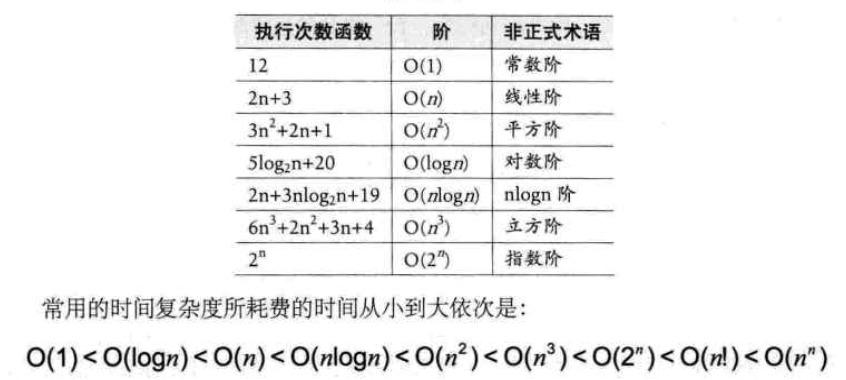
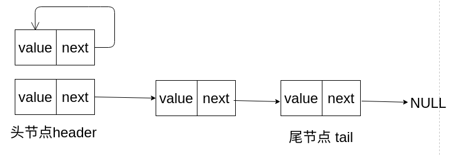
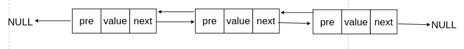
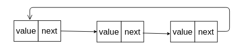
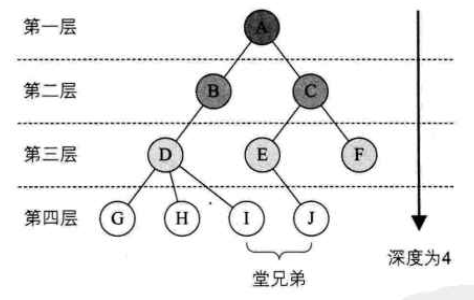
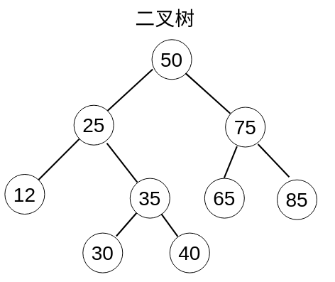
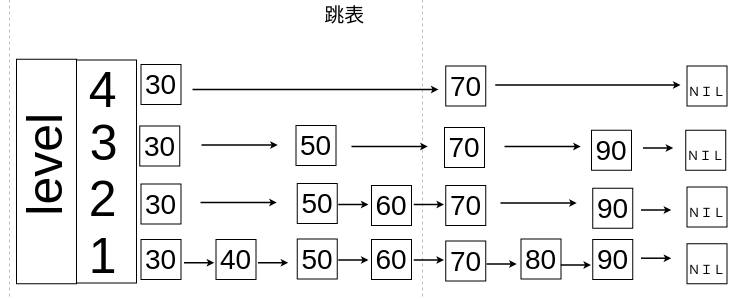
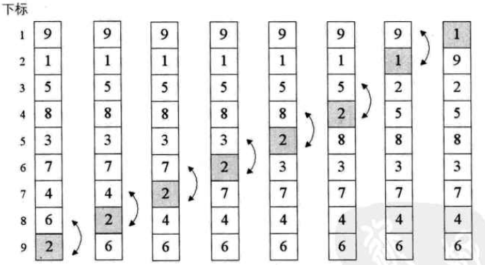

<span id="menu"></span>
<!-- TOC -->

- [1. 数据结构绪论](#1-数据结构绪论)
- [2. 算法](#2-算法)
- [3. 线性表](#3-线性表)
- [4. 栈和队列](#4-栈和队列)
- [5. 字符串](#5-字符串)
  - [5.1. KMP算法](#51-kmp算法)
- [6. 树](#6-树)
  - [6.1. 树的基本知识](#61-树的基本知识)
  - [6.2. 常见树结构比较](#62-常见树结构比较)
  - [6.3. 二叉树](#63-二叉树)
  - [6.4. 平衡二叉树](#64-平衡二叉树)
  - [6.5. B树](#65-b树)
  - [6.6. B+树](#66-b树)
  - [6.7. 红黑树](#67-红黑树)
  - [6.8. 跳表](#68-跳表)
- [7. 图](#7-图)
- [8. 查找](#8-查找)
  - [8.1. 散列表](#81-散列表)
  - [8.2. 跳表](#82-跳表)
- [9. 排序算法](#9-排序算法)
  - [9.1. 基本概念](#91-基本概念)
  - [9.2. 冒泡排序 Bubble Sort](#92-冒泡排序-bubble-sort)
  - [9.3. 简单选择排序 Simple Selection Sort](#93-简单选择排序-simple-selection-sort)
  - [9.4. 直接插入排序 Straight Insertion Sort](#94-直接插入排序-straight-insertion-sort)
  - [9.5. 希尔排序 Shell Sort](#95-希尔排序-shell-sort)
  - [9.6. 堆排序](#96-堆排序)
  - [9.7. 归并排序](#97-归并排序)
  - [9.8. 快速排序 QuickSort](#98-快速排序-quicksort)
  - [9.9. 总结](#99-总结)
- [10. 五大常用算法](#10-五大常用算法)
  - [10.1. 分治算法](#101-分治算法)
    - [10.1.1. 基础原理说明](#1011-基础原理说明)
    - [10.1.2. 例子](#1012-例子)
  - [10.2. 动态规划](#102-动态规划)
    - [10.2.1. 基础原理说明](#1021-基础原理说明)
    - [10.2.2. 例子](#1022-例子)
  - [10.3. 贪心算法](#103-贪心算法)
    - [10.3.1. 基础原理说明](#1031-基础原理说明)
    - [10.3.2. 例子](#1032-例子)
  - [10.4. 回溯法](#104-回溯法)
    - [10.4.1. 基础原理说明](#1041-基础原理说明)
    - [10.4.2. 例子](#1042-例子)
  - [10.5. 分支限界法](#105-分支限界法)
    - [10.5.1. 基础原理说明](#1051-基础原理说明)
    - [10.5.2. 例子](#1052-例子)
- [11. 剑指Offer](#11-剑指offer)
  - [11.1. 第二章](#111-第二章)
    - [11.1.1. 数据结构](#1111-数据结构)
      - [11.1.1.1. 数组中的重复数字](#11111-数组中的重复数字)
      - [11.1.1.2. 不修改数组找出重复的数字](#11112-不修改数组找出重复的数字)
      - [11.1.1.3. 二维数组中的查找](#11113-二维数组中的查找)
      - [11.1.1.4. 替换空格](#11114-替换空格)
      - [11.1.1.5. 从尾到头打印链表](#11115-从尾到头打印链表)
      - [11.1.1.6. 重建二叉树](#11116-重建二叉树)
      - [11.1.1.7. 二叉树的下一个节点](#11117-二叉树的下一个节点)
      - [11.1.1.8. 用两个栈实现队列](#11118-用两个栈实现队列)
      - [11.1.1.9. 用两个队列实现栈](#11119-用两个队列实现栈)
    - [11.1.2. 递归和循环](#1112-递归和循环)
      - [11.1.2.1. 斐波那契数列](#11121-斐波那契数列)
      - [11.1.2.2. 青蛙跳台阶问题](#11122-青蛙跳台阶问题)
    - [11.1.3. 查找和排序](#1113-查找和排序)
      - [11.1.3.1. 旋转数组的最小数字](#11131-旋转数组的最小数字)
    - [11.1.4. 回溯法](#1114-回溯法)
      - [11.1.4.1. 矩阵中的路径](#11141-矩阵中的路径)
      - [11.1.4.2. 机器人的运动范围](#11142-机器人的运动范围)
    - [11.1.5. 动态规划和贪婪算法](#1115-动态规划和贪婪算法)
      - [11.1.5.1. 剪绳子](#11151-剪绳子)
      - [11.1.5.2. 动态规划](#11152-动态规划)
      - [11.1.5.3. 贪婪算法](#11153-贪婪算法)
    - [11.1.6. 位运算](#1116-位运算)
      - [11.1.6.1. 二进制中1的个数](#11161-二进制中1的个数)
  - [11.2. 第三章](#112-第三章)
    - [11.2.1. 代码的完整性](#1121-代码的完整性)
      - [11.2.1.1. 数字的整数次方](#11211-数字的整数次方)
      - [11.2.1.2. 打印从1到最大的n位数](#11212-打印从1到最大的n位数)
      - [11.2.1.3. 删除链表的节点](#11213-删除链表的节点)
      - [11.2.1.4. 正则表达式匹配](#11214-正则表达式匹配)
      - [11.2.1.5. 表示数值的字符串](#11215-表示数值的字符串)
      - [11.2.1.6. 调整数组顺序使奇数位于偶数前面](#11216-调整数组顺序使奇数位于偶数前面)
    - [11.2.2. 代码的鲁棒性](#1122-代码的鲁棒性)
      - [11.2.2.1. 链表中环的入口节点](#11221-链表中环的入口节点)
      - [11.2.2.2. 反转链表](#11222-反转链表)
      - [11.2.2.3. 合并两个排序的链表](#11223-合并两个排序的链表)
      - [11.2.2.4. 树的子结构](#11224-树的子结构)
  - [11.3. 第四章](#113-第四章)
    - [11.3.1. 画图解决](#1131-画图解决)
      - [11.3.1.1. 二叉树的镜像](#11311-二叉树的镜像)
      - [11.3.1.2. 对称的二叉树](#11312-对称的二叉树)
      - [11.3.1.3. 顺时针打印矩阵](#11313-顺时针打印矩阵)
    - [11.3.2. 举例法](#1132-举例法)
      - [11.3.2.1. 包含min函数的栈](#11321-包含min函数的栈)
      - [11.3.2.2. 栈的压入弹出序列](#11322-栈的压入弹出序列)
      - [11.3.2.3. 从上到下打印二叉树](#11323-从上到下打印二叉树)
      - [11.3.2.4. 之字形打印二叉树](#11324-之字形打印二叉树)
      - [11.3.2.5. 二叉搜索树的后续遍历序列](#11325-二叉搜索树的后续遍历序列)
      - [11.3.2.6. 二叉树中和为某一值的路径](#11326-二叉树中和为某一值的路径)
    - [11.3.3. 分解法](#1133-分解法)
      - [11.3.3.1. 复杂链表的复制](#11331-复杂链表的复制)
      - [11.3.3.2. 二叉搜索数与双向链表](#11332-二叉搜索数与双向链表)
      - [11.3.3.3. 序列化二叉树](#11333-序列化二叉树)
      - [11.3.3.4. 字符串的序列](#11334-字符串的序列)
  - [11.4. 第五章](#114-第五章)
    - [11.4.1. 时间效率](#1141-时间效率)
      - [11.4.1.1. 数组中出现次数超过一般的数字](#11411-数组中出现次数超过一般的数字)
      - [11.4.1.2. 最小的k个数](#11412-最小的k个数)
      - [11.4.1.3. 数据流中的中位数](#11413-数据流中的中位数)
      - [11.4.1.4. 连续子数组的最大和](#11414-连续子数组的最大和)
      - [11.4.1.5. -n中１出现的次数](#11415--n中１出现的次数)
      - [11.4.1.6. 数字序列中某一位的数字](#11416-数字序列中某一位的数字)
      - [11.4.1.7. 把数组排成最小的数](#11417-把数组排成最小的数)
      - [11.4.1.8. 把数字翻转成字符串](#11418-把数字翻转成字符串)
      - [11.4.1.9. 礼物的最大值](#11419-礼物的最大值)
      - [11.4.1.10. 最长的不含重复字符的子字符串](#114110-最长的不含重复字符的子字符串)
    - [11.4.2. 时间效率和空间效率的平衡](#1142-时间效率和空间效率的平衡)
      - [11.4.2.1. 丑数](#11421-丑数)
      - [11.4.2.2. 第一个只出现一次的字符](#11422-第一个只出现一次的字符)
      - [11.4.2.3. 数组中的逆序树](#11423-数组中的逆序树)
      - [11.4.2.4. 两个链表的第一个公共节点](#11424-两个链表的第一个公共节点)
  - [11.5. 第六章](#115-第六章)
    - [11.5.1. 知识迁移能力](#1151-知识迁移能力)
      - [11.5.1.1. 在排序数组中查找数字](#11511-在排序数组中查找数字)
      - [11.5.1.2. 缺失的数字](#11512-缺失的数字)
      - [11.5.1.3. 数组中数值和下标相等的元素](#11513-数组中数值和下标相等的元素)
      - [11.5.1.4. 二叉啊搜索树的第k个大节点](#11514-二叉啊搜索树的第k个大节点)
      - [11.5.1.5. 二叉树的深度](#11515-二叉树的深度)
      - [11.5.1.6. 平衡二叉树](#11516-平衡二叉树)
      - [11.5.1.7. 数组中数字出现的次数](#11517-数组中数字出现的次数)
      - [11.5.1.8. 数组中唯一只出现一次的数字](#11518-数组中唯一只出现一次的数字)
      - [11.5.1.9. 和为s的数字](#11519-和为s的数字)
      - [11.5.1.10. 和为s的连续正数序列](#115110-和为s的连续正数序列)
      - [11.5.1.11. 反转字符串](#115111-反转字符串)
      - [11.5.1.12. 左旋转字符串](#115112-左旋转字符串)
      - [11.5.1.13. 滑动窗口的最大值](#115113-滑动窗口的最大值)
      - [11.5.1.14. 队列的最大值](#115114-队列的最大值)
    - [11.5.2. 抽象建模能力](#1152-抽象建模能力)
      - [11.5.2.1. n个塞子的点数](#11521-n个塞子的点数)
      - [11.5.2.2. 扑克牌中的顺子](#11522-扑克牌中的顺子)
      - [11.5.2.3. 圆圈中最后剩下的数字](#11523-圆圈中最后剩下的数字)
      - [11.5.2.4. 股票的最大利润](#11524-股票的最大利润)
    - [11.5.3. 发散思维能力](#1153-发散思维能力)
      - [11.5.3.1. 求1+2+....n](#11531-求12n)
      - [11.5.3.2. 不用加减乘除做加法](#11532-不用加减乘除做加法)
      - [11.5.3.3. 构建乘积数组](#11533-构建乘积数组)
  - [11.6. 第七章](#116-第七章)
      - [11.6.0.4. 字符串转换成整数](#11604-字符串转换成整数)
      - [11.6.0.5. 树中两个节点的最低公共祖先](#11605-树中两个节点的最低公共祖先)
- [12. 算法面试指南](#12-算法面试指南)
  - [12.1. 栈和队列](#121-栈和队列)
    - [12.1.1. 设计一个有getMin功能的栈（士★☆☆☆）](#1211-设计一个有getmin功能的栈士)
    - [12.1.2. 由两个栈组成的队列（尉★★☆☆）](#1212-由两个栈组成的队列尉)
    - [12.1.3. 如何仅用递归函数和栈操作逆序一个栈（尉★★☆☆）](#1213-如何仅用递归函数和栈操作逆序一个栈尉)
    - [12.1.4. 猫狗队列（士★☆☆☆）](#1214-猫狗队列士)
    - [12.1.5. 用一个栈实现另一个栈的排序（士★☆☆☆）](#1215-用一个栈实现另一个栈的排序士)
    - [12.1.6. 用栈来求解汉诺塔问题（校★★★☆）](#1216-用栈来求解汉诺塔问题校)
    - [12.1.7. 生成窗口最大值数组（尉★★☆☆）](#1217-生成窗口最大值数组尉)
    - [12.1.8. 构造数组的MaxTree（校★★★☆）](#1218-构造数组的maxtree校)
    - [12.1.9. 求最大子矩阵的大小（校★★★☆）](#1219-求最大子矩阵的大小校)
    - [12.1.10. 最大值减去最小值小于或等于num的子数组数量（校★★★☆）](#12110-最大值减去最小值小于或等于num的子数组数量校)
  - [12.2. 链表问题](#122-链表问题)
    - [12.2.1. 打印两个有序链表的公共部分（士★☆☆☆）](#1221-打印两个有序链表的公共部分士)
    - [12.2.2. 在单链表和双链表中删除倒数第K 个节点（士★☆☆☆）](#1222-在单链表和双链表中删除倒数第k-个节点士)
    - [12.2.3. 删除链表的中间节点和a/b 处的节点（士★☆☆☆）](#1223-删除链表的中间节点和ab-处的节点士)
    - [12.2.4. 反转单向和双向链表（士★☆☆☆）](#1224-反转单向和双向链表士)
    - [12.2.5. 反转部分单向链表（士★☆☆☆）](#1225-反转部分单向链表士)
    - [12.2.6. 环形单链表的约瑟夫问题（原问题：士★☆☆☆进阶：校★★★☆）](#1226-环形单链表的约瑟夫问题原问题士进阶校)
    - [12.2.7. 判断一个链表是否为回文结构（普通解法士★☆☆☆）（进阶解法尉★★☆☆）](#1227-判断一个链表是否为回文结构普通解法士进阶解法尉)
    - [12.2.8. 将单向链表按某值划分成左边小、中间相等、右边大的形式（尉★★☆☆）](#1228-将单向链表按某值划分成左边小中间相等右边大的形式尉)
    - [12.2.9. 复制含有随机指针节点的链表（尉★★☆☆）](#1229-复制含有随机指针节点的链表尉)
    - [12.2.10. 两个单链表生成相加链表（士★☆☆☆）](#12210-两个单链表生成相加链表士)
    - [12.2.11. 两个单链表相交的一系列问题（将★★★★）](#12211-两个单链表相交的一系列问题将)
    - [12.2.12. 将单链表的每K个节点之间逆序（尉★★☆☆）](#12212-将单链表的每k个节点之间逆序尉)
    - [12.2.13. 删除无序单链表中值重复出现的节点（士★☆☆☆）](#12213-删除无序单链表中值重复出现的节点士)
    - [12.2.14. 在单链表中删除指定值的节点（士★☆☆☆）](#12214-在单链表中删除指定值的节点士)
    - [12.2.15. 将搜索二叉树转换成双向链表（尉★★☆☆）](#12215-将搜索二叉树转换成双向链表尉)
    - [12.2.16. 单链表的选择排序（士★☆☆☆）](#12216-单链表的选择排序士)
    - [12.2.17. 一种怪异的节点删除方式（士★☆☆☆）](#12217-一种怪异的节点删除方式士)
    - [12.2.18. 向有序的环形单链表中插入新节点（士★☆☆☆）](#12218-向有序的环形单链表中插入新节点士)
    - [12.2.19. 合并两个有序的单链表（士★☆☆☆）](#12219-合并两个有序的单链表士)
    - [12.2.20. 按照左右半区的方式重新组合单链表（士★☆☆☆）](#12220-按照左右半区的方式重新组合单链表士)
  - [12.3. 二叉树问题](#123-二叉树问题)
    - [12.3.1. 分别用递归和非递归方式实现二叉树先序、中序和后序遍历（校★★★☆）](#1231-分别用递归和非递归方式实现二叉树先序中序和后序遍历校)
    - [12.3.2. 打印二叉树的边界节点（尉★★☆☆）](#1232-打印二叉树的边界节点尉)
    - [12.3.3. 如何较为直观地打印二叉树（尉★★☆☆）](#1233-如何较为直观地打印二叉树尉)
    - [12.3.4. 二叉树的序列化和反序列化（士★☆☆☆）](#1234-二叉树的序列化和反序列化士)
    - [12.3.5. 遍历二叉树的神级方法（将★★★★）](#1235-遍历二叉树的神级方法将)
    - [12.3.6. 在二叉树中找到累加和为指定值的最长路径长度（尉★★☆☆）](#1236-在二叉树中找到累加和为指定值的最长路径长度尉)
    - [12.3.7. 找到二叉树中的最大搜索二叉子树（尉★★☆☆）](#1237-找到二叉树中的最大搜索二叉子树尉)
    - [12.3.8. 找到二叉树中符合搜索二叉树条件的最大拓扑结构（校★★★☆）](#1238-找到二叉树中符合搜索二叉树条件的最大拓扑结构校)
    - [12.3.9. 二叉树的按层打印与ZigZag打印（尉★★☆☆）](#1239-二叉树的按层打印与zigzag打印尉)
    - [12.3.10. 调整搜索二叉树中两个错误的节点（原问题：尉★★☆☆）（进阶问题：将★★★★）](#12310-调整搜索二叉树中两个错误的节点原问题尉进阶问题将)
    - [12.3.11. 判断t1 树是否包含t2 树全部的拓扑结构（士★☆☆☆）](#12311-判断t1-树是否包含t2-树全部的拓扑结构士)
    - [12.3.12. 判断t1 树中是否有与t2 树拓扑结构完全相同的子树（校★★★☆）](#12312-判断t1-树中是否有与t2-树拓扑结构完全相同的子树校)
    - [12.3.13. 判断二叉树是否为平衡二叉树（士★☆☆☆）](#12313-判断二叉树是否为平衡二叉树士)
    - [12.3.14. 根据后序数组重建搜索二叉树（士★☆☆☆）](#12314-根据后序数组重建搜索二叉树士)
    - [12.3.15. 判断一棵二叉树是否为搜索二叉树和完全二叉树（士★☆☆☆）](#12315-判断一棵二叉树是否为搜索二叉树和完全二叉树士)
    - [12.3.16. 通过有序数组生成平衡搜索二叉树（士★☆☆☆）](#12316-通过有序数组生成平衡搜索二叉树士)
    - [12.3.17. 在二叉树中找到一个节点的后继节点（尉★★☆☆）](#12317-在二叉树中找到一个节点的后继节点尉)
    - [12.3.18. 在二叉树中找到两个节点的最近公共祖先（原问题：士★☆☆☆）（进阶问题：尉★★☆☆再进阶问题：校★★★☆）](#12318-在二叉树中找到两个节点的最近公共祖先原问题士进阶问题尉再进阶问题校)
    - [12.3.19. Tarjan算法与并查集解决二叉树节点间最近公共祖先的批量查询问题（校★★★☆）](#12319-tarjan算法与并查集解决二叉树节点间最近公共祖先的批量查询问题校)
    - [12.3.20. 二叉树节点间的最大距离问题（尉★★☆☆）](#12320-二叉树节点间的最大距离问题尉)
    - [12.3.21. 先序、中序和后序数组两两结合重构二叉树（先序与中序结合士★☆☆☆）（中序与后序结合士★☆☆☆先序与后序结合尉★★☆☆）](#12321-先序中序和后序数组两两结合重构二叉树先序与中序结合士中序与后序结合士先序与后序结合尉)
    - [12.3.22. 通过先序和中序数组生成后序数组（士★☆☆☆）](#12322-通过先序和中序数组生成后序数组士)
    - [12.3.23. 统计和生成所有不同的二叉树（尉★★☆☆）](#12323-统计和生成所有不同的二叉树尉)
    - [12.3.24. 统计完全二叉树的节点数（尉★★☆☆）](#12324-统计完全二叉树的节点数尉)
  - [12.4. 递归和动态规划](#124-递归和动态规划)
    - [12.4.1. 斐波那契系列问题的递归和动态规划（将★★★★）](#1241-斐波那契系列问题的递归和动态规划将)
    - [12.4.2. 矩阵的最小路径和（尉★★☆☆）](#1242-矩阵的最小路径和尉)
    - [12.4.3. 换钱的最少货币数（尉★★☆☆）](#1243-换钱的最少货币数尉)
    - [12.4.4. 换钱的方法数（尉★★☆☆）](#1244-换钱的方法数尉)
    - [12.4.5. 最长递增子序列（校★★★☆）](#1245-最长递增子序列校)
    - [12.4.6. 汉诺塔问题（校★★★☆）](#1246-汉诺塔问题校)
    - [12.4.7. 最长公共子序列问题（尉★★☆☆）](#1247-最长公共子序列问题尉)
    - [12.4.8. 最长公共子串问题（校★★★☆）](#1248-最长公共子串问题校)
    - [12.4.9. 最小编辑代价（校★★★☆）](#1249-最小编辑代价校)
    - [12.4.10. 字符串的交错组成（校★★★☆）](#12410-字符串的交错组成校)
    - [12.4.11. 龙与地下城游戏问题（尉★★☆☆）](#12411-龙与地下城游戏问题尉)
    - [12.4.12. 数字字符串转换为字母组合的种数（尉★★☆☆）](#12412-数字字符串转换为字母组合的种数尉)
    - [12.4.13. 表达式得到期望结果的组成种数（校★★★☆）](#12413-表达式得到期望结果的组成种数校)
    - [12.4.14. 排成一条线的纸牌博弈问题（尉★★☆☆）](#12414-排成一条线的纸牌博弈问题尉)
    - [12.4.15. 跳跃游戏（士★☆☆☆）](#12415-跳跃游戏士)
    - [12.4.16. 数组中的最长连续序列（尉★★☆☆）](#12416-数组中的最长连续序列尉)
    - [12.4.17. N皇后问题（校★★★☆）](#12417-n皇后问题校)
  - [12.5. 字符串问题](#125-字符串问题)
    - [12.5.1. 判断两个字符串是否互为变形词（士★☆☆☆）](#1251-判断两个字符串是否互为变形词士)
    - [12.5.2. 字符串中数字子串的求和（士★☆☆☆）](#1252-字符串中数字子串的求和士)
    - [12.5.3. 去掉字符串中连续出现k 个0 的子串（士★☆☆☆）](#1253-去掉字符串中连续出现k-个0-的子串士)
    - [12.5.4. 判断两个字符串是否互为旋转词（士★☆☆☆）](#1254-判断两个字符串是否互为旋转词士)
    - [12.5.5. 将整数字符串转成整数值（尉★★☆☆）](#1255-将整数字符串转成整数值尉)
    - [12.5.6. 替换字符串中连续出现的指定字符串（士★☆☆☆）](#1256-替换字符串中连续出现的指定字符串士)
    - [12.5.7. 字符串的统计字符串（士★☆☆☆）](#1257-字符串的统计字符串士)
    - [12.5.8. 判断字符数组中是否所有的字符都只出现过一次（按要求1 实现的方法士★☆☆☆）（按要求2 实现的方法尉★★☆☆）](#1258-判断字符数组中是否所有的字符都只出现过一次按要求1-实现的方法士按要求2-实现的方法尉)
    - [12.5.9. 在有序但含有空的数组中查找字符串（尉★★☆☆）](#1259-在有序但含有空的数组中查找字符串尉)
    - [12.5.10. 字符串的调整与替换（士★☆☆☆）](#12510-字符串的调整与替换士)
    - [12.5.11. 翻转字符串（士★☆☆☆）](#12511-翻转字符串士)
    - [12.5.12. 数组中两个字符串的最小距离（尉★★☆☆）](#12512-数组中两个字符串的最小距离尉)
    - [12.5.13. 添加最少字符使字符串整体都是回文字符串（校★★★☆）](#12513-添加最少字符使字符串整体都是回文字符串校)
    - [12.5.14. 括号字符串的有效性和最长有效长度（原问题士★☆☆☆）（补充问题尉★★☆☆）](#12514-括号字符串的有效性和最长有效长度原问题士补充问题尉)
    - [12.5.15. 公式字符串求值（校★★★☆）](#12515-公式字符串求值校)
    - [12.5.16. 左边必有1 的二进制字符串数量（校★★★☆）](#12516-左边必有1-的二进制字符串数量校)
    - [12.5.17. 拼接所有字符串产生字典顺序最小的大写字符串（校★★★☆）](#12517-拼接所有字符串产生字典顺序最小的大写字符串校)
    - [12.5.18. 找到字符串的最长无重复字符子串（尉★★☆☆）](#12518-找到字符串的最长无重复字符子串尉)
    - [12.5.19. 找到被指的新类型字符（士★☆☆☆）](#12519-找到被指的新类型字符士)
    - [12.5.20. 最小包含子串的长度（校★★★☆）](#12520-最小包含子串的长度校)
    - [12.5.21. 回文最少分割数（尉★★★☆）](#12521-回文最少分割数尉)
    - [12.5.22. 字符串匹配问题（校★★★☆）](#12522-字符串匹配问题校)
    - [12.5.23. 字典树（前缀树）的实现（尉★★☆☆）](#12523-字典树前缀树的实现尉)
  - [12.6. 大数据和空间限制](#126-大数据和空间限制)
    - [12.6.1. 认识布隆过滤器（尉★★☆☆）](#1261-认识布隆过滤器尉)
    - [12.6.2. 只用2 GB 内存在20 亿个整数中找到出现次数最多的数（士★☆☆☆） .](#1262-只用2-gb-内存在20-亿个整数中找到出现次数最多的数士-)
    - [12.6.3. 亿个非负整数中找到没出现的数（尉★★☆☆）](#1263-亿个非负整数中找到没出现的数尉)
    - [12.6.4. 找到100 亿个URL 中重复的URL 以及搜索词汇的top K 问题（士★☆☆☆）](#1264-找到100-亿个url-中重复的url-以及搜索词汇的top-k-问题士)
    - [12.6.5. 亿个非负整数中找到出现两次的数和所有数的中位数（尉★★☆☆）](#1265-亿个非负整数中找到出现两次的数和所有数的中位数尉)
    - [12.6.6. 一致性哈希算法的基本原理（尉★★☆☆）](#1266-一致性哈希算法的基本原理尉)
  - [12.7. 位运算](#127-位运算)
    - [12.7.1. 不用额外变量交换两个整数的值（士★☆☆☆）](#1271-不用额外变量交换两个整数的值士)
    - [12.7.2. 不用任何比较判断找出两个数中较大的数（校★★★☆）](#1272-不用任何比较判断找出两个数中较大的数校)
    - [12.7.3. 只用位运算不用算术运算实现整数的加减乘除运算（尉★★☆☆）](#1273-只用位运算不用算术运算实现整数的加减乘除运算尉)
    - [12.7.4. 整数的二进制表达中有多少个1 （尉★★☆☆）](#1274-整数的二进制表达中有多少个1-尉)
    - [12.7.5. 在其他数都出现偶数次的数组中找到出现奇数次的数（尉★★☆☆）](#1275-在其他数都出现偶数次的数组中找到出现奇数次的数尉)
    - [12.7.6. 在其他数都出现k 次的数组中找到只出现一次的数（尉★★☆☆）](#1276-在其他数都出现k-次的数组中找到只出现一次的数尉)
  - [12.8. 数组和矩阵问题](#128-数组和矩阵问题)
    - [12.8.1. 转圈打印矩阵（士★☆☆☆）](#1281-转圈打印矩阵士)
    - [12.8.2. 将正方形矩阵顺时针转动90 °（士★☆☆☆）](#1282-将正方形矩阵顺时针转动90-士)
    - [12.8.3. "之"字形打印矩阵（士★☆☆☆）](#1283-之字形打印矩阵士)
    - [12.8.4. 找到无序数组中最小的k 个数（O(Nlogk)的方法尉★★☆☆）（O(N)的方法将★★★★）](#1284-找到无序数组中最小的k-个数onlogk的方法尉on的方法将)
    - [12.8.5. 需要排序的最短子数组长度（士★☆☆☆）](#1285-需要排序的最短子数组长度士)
    - [12.8.6. 在数组中找到出现次数大于N/K 的数（校★★★☆）](#1286-在数组中找到出现次数大于nk-的数校)
    - [12.8.7. 在行列都排好序的矩阵中找数（士★☆☆☆）](#1287-在行列都排好序的矩阵中找数士)
    - [12.8.8. 最长的可整合子数组的长度（尉★★☆☆）](#1288-最长的可整合子数组的长度尉)
    - [12.8.9. 不重复打印排序数组中相加和为给定值的所有二元组和三元组（尉★★☆☆）](#1289-不重复打印排序数组中相加和为给定值的所有二元组和三元组尉)
    - [12.8.10. 未排序正数数组中累加和为给定值的最长子数组长度（尉★★☆☆）](#12810-未排序正数数组中累加和为给定值的最长子数组长度尉)
    - [12.8.11. 未排序数组中累加和为给定值的最长子数组系列问题（尉★★☆☆）](#12811-未排序数组中累加和为给定值的最长子数组系列问题尉)
    - [12.8.12. 未排序数组中累加和小于或等于给定值的最长子数组长度（校★★★☆）](#12812-未排序数组中累加和小于或等于给定值的最长子数组长度校)
    - [12.8.13. 计算数组的小和（校★★★☆）](#12813-计算数组的小和校)
    - [12.8.14. 自然数数组的排序（士★☆☆☆）](#12814-自然数数组的排序士)
    - [12.8.15. 奇数下标都是奇数或者偶数下标都是偶数（士★☆☆☆）](#12815-奇数下标都是奇数或者偶数下标都是偶数士)
    - [12.8.16. 子数组的最大累加和问题（士★☆☆☆）](#12816-子数组的最大累加和问题士)
    - [12.8.17. 子矩阵的最大累加和问题（尉★★☆☆）](#12817-子矩阵的最大累加和问题尉)
    - [12.8.18. 在数组中找到一个局部最小的位置（尉★★☆☆）](#12818-在数组中找到一个局部最小的位置尉)
    - [12.8.19. 数组中子数组的最大累乘积（尉★★☆☆）](#12819-数组中子数组的最大累乘积尉)
    - [12.8.20. 打印N 个数组整体最大的Top K（尉★★☆☆）](#12820-打印n-个数组整体最大的top-k尉)
    - [12.8.21. 边界都是1 的最大正方形大小（尉★★☆☆）](#12821-边界都是1-的最大正方形大小尉)
    - [12.8.22. 不包含本位置值的累乘数组（士★☆☆☆）](#12822-不包含本位置值的累乘数组士)
    - [12.8.23. 数组的partition 调整（士★☆☆☆）](#12823-数组的partition-调整士)
    - [12.8.24. 求最短通路值（尉★★☆☆）](#12824-求最短通路值尉)
    - [12.8.25. 数组中未出现的最小正整数（尉★★☆☆）](#12825-数组中未出现的最小正整数尉)
    - [12.8.26. 数组排序之后相邻数的最大差值（尉★★☆☆）](#12826-数组排序之后相邻数的最大差值尉)
  - [12.9. 其他](#129-其他)
    - [12.9.1. 从5 随机到7 随机及其扩展（原问题尉★★☆☆补充问题尉★★☆☆）（进阶问题校★★★☆）](#1291-从5-随机到7-随机及其扩展原问题尉补充问题尉进阶问题校)
    - [12.9.2. 一行代码求两个数的最大公约数（士★★☆☆）](#1292-一行代码求两个数的最大公约数士)
    - [12.9.3. 有关阶乘的两个问题（原问题尉★★☆☆进阶问题校★★★☆）](#1293-有关阶乘的两个问题原问题尉进阶问题校)
    - [12.9.4. 判断一个点是否在矩形内部（尉★★☆☆）](#1294-判断一个点是否在矩形内部尉)
    - [12.9.5. 判断一个点是否在三角形内部（尉★★☆☆）](#1295-判断一个点是否在三角形内部尉)
    - [12.9.6. 折纸问题（尉★★☆☆）](#1296-折纸问题尉)
    - [12.9.7. 蓄水池算法（尉★★☆☆）](#1297-蓄水池算法尉)
    - [12.9.8. 设计有setAll功能的哈希表（士★☆☆☆）](#1298-设计有setall功能的哈希表士)
    - [12.9.9. 最大的leftMax与rightMax之差的绝对值（校★★★☆）](#1299-最大的leftmax与rightmax之差的绝对值校)
    - [12.9.10. 设计可以变更的缓存结构（尉★★☆☆）](#12910-设计可以变更的缓存结构尉)
    - [12.9.11. 设计RandomPool结构（尉★★☆☆）](#12911-设计randompool结构尉)
    - [12.9.12. 调整[0 ,x)区间上的数出现的概率（士★☆☆☆）](#12912-调整0-x区间上的数出现的概率士)
    - [12.9.13. 路径数组变为统计数组（校★★★☆）](#12913-路径数组变为统计数组校)
    - [12.9.14. 正数数组的最小不可组成和（尉★★☆☆）](#12914-正数数组的最小不可组成和尉)
    - [12.9.15. 一种字符串和数字的对应关系（校★★★☆）](#12915-一种字符串和数字的对应关系校)
    - [12.9.16. 到n 中1 出现的次数（校★★★☆）](#12916-到n-中1-出现的次数校)
    - [12.9.17. 从N 个数中等概率打印M 个数（士★☆☆☆）](#12917-从n-个数中等概率打印m-个数士)
    - [12.9.18. 判断一个数是否是回文数（士★☆☆☆）](#12918-判断一个数是否是回文数士)
    - [12.9.19. 在有序旋转数组中找到最小值（尉★★☆☆）](#12919-在有序旋转数组中找到最小值尉)
    - [12.9.20. 在有序旋转数组中找到一个数（尉★★☆☆）](#12920-在有序旋转数组中找到一个数尉)
    - [12.9.21. 数字的英文表达和中文表达（校★★★☆）](#12921-数字的英文表达和中文表达校)
    - [12.9.22. 分糖果问题（校★★★☆）](#12922-分糖果问题校)
    - [12.9.23. 一种消息接收并打印的结构设计（尉★★☆☆）](#12923-一种消息接收并打印的结构设计尉)
    - [12.9.24. 设计一个没有扩容负担的堆结构（将★★★★）](#12924-设计一个没有扩容负担的堆结构将)
    - [12.9.25. 在两个长度相等的排序数组中找到上中位数（尉★★☆☆）](#12925-在两个长度相等的排序数组中找到上中位数尉)
    - [12.9.26. 随时找到数据流的中位数（将★★★★）](#12926-随时找到数据流的中位数将)
    - [12.9.27. 在两个排序数组中找到第K 小的数（将★★★★）](#12927-在两个排序数组中找到第k-小的数将)
    - [12.9.28. 两个有序数组间相加和的TOP K 问题（尉★★☆☆）](#12928-两个有序数组间相加和的top-k-问题尉)
    - [12.9.29. 出现次数的TOP K 问题（原问题尉★★☆☆进阶问题校★★★☆）](#12929-出现次数的top-k-问题原问题尉进阶问题校)
    - [12.9.30. Manacher算法（将★★★★）](#12930-manacher算法将)
    - [12.9.31. KMP 算法（将★★★★）](#12931-kmp-算法将)
    - [12.9.32. 丢棋子问题（校★★★☆）](#12932-丢棋子问题校)
    - [12.9.33. 画匠问题（校★★★☆）](#12933-画匠问题校)
    - [12.9.34. 邮局选址问题（校★★★☆）](#12934-邮局选址问题校)
- [13. 算法精选](#13-算法精选)
  - [13.1. 链表](#131-链表)
    - [13.1.1. 如何反转一个单链表](#1311-如何反转一个单链表)
    - [13.1.2. 判断链表中是否有环](#1312-判断链表中是否有环)
  - [13.2. 堆栈，队列](#132-堆栈队列)
    - [13.2.1. 判断括号字符串是否有效](#1321-判断括号字符串是否有效)
    - [13.2.2. 用栈实现队列](#1322-用栈实现队列)
    - [13.2.3. 用队列实现栈](#1323-用队列实现栈)
  - [13.3. 优先队列](#133-优先队列)
    - [13.3.1. 返回数据流中的第K大元素](#1331-返回数据流中的第k大元素)
    - [13.3.2. 返回滑动窗口中的最大值](#1332-返回滑动窗口中的最大值)
  - [13.4. 哈希表](#134-哈希表)
    - [13.4.1. 判断有效的字母异位词](#1341-判断有效的字母异位词)
    - [13.4.2. 找出数组中和为目标值的两个数，三个数，四个数](#1342-找出数组中和为目标值的两个数三个数四个数)
  - [13.5. 树](#135-树)
    - [13.5.1. 验证二叉搜索树](#1351-验证二叉搜索树)
    - [13.5.2. 二叉树的最近公共祖先](#1352-二叉树的最近公共祖先)
    - [13.5.3. 二叉搜索树的最近公共祖先](#1353-二叉搜索树的最近公共祖先)
  - [13.6. 分治递归](#136-分治递归)
    - [13.6.1. 实现计算x的n次幂函数](#1361-实现计算x的n次幂函数)
    - [13.6.2. 找出数组中出现次数大于n/2的元素](#1362-找出数组中出现次数大于n2的元素)
  - [13.7. 贪心算法](#137-贪心算法)
    - [13.7.1. 计算买股票的最佳时机](#1371-计算买股票的最佳时机)
  - [13.8. 广度优先搜索／深度优先搜索](#138-广度优先搜索深度优先搜索)
    - [13.8.1. 二叉树层次遍历](#1381-二叉树层次遍历)
    - [13.8.2. 二叉树最大深度](#1382-二叉树最大深度)
    - [13.8.3. 二叉树最小深度](#1383-二叉树最小深度)
    - [13.8.4. 生成所有可能的有效括号组合](#1384-生成所有可能的有效括号组合)
  - [13.9. 剪枝](#139-剪枝)
    - [13.9.1. 如何使Ｎ皇后彼此之间不能相互攻击](#1391-如何使ｎ皇后彼此之间不能相互攻击)
    - [13.9.2. 判断数独是否有效](#1392-判断数独是否有效)
    - [13.9.3. 解决数独问题](#1393-解决数独问题)
  - [13.10. 二分查找](#1310-二分查找)
    - [13.10.1. 实现一个求解平方根的函数](#13101-实现一个求解平方根的函数)
  - [13.11. 字典树](#1311-字典树)
    - [13.11.1. 二维网格中的单词搜索问题](#13111-二维网格中的单词搜索问题)
    - [13.11.2. 实现一个字典树](#13112-实现一个字典树)
  - [13.12. 位运算](#1312-位运算)
    - [13.12.1. 二进制数中的比特位统计问题](#13121-二进制数中的比特位统计问题)
    - [13.12.2. 判断一个数是否为2的幂次方](#13122-判断一个数是否为2的幂次方)
    - [13.12.3. N皇后问题的另一种解法](#13123-n皇后问题的另一种解法)
  - [13.13. 动态规划](#1313-动态规划)
    - [13.13.1. 爬楼梯问题](#13131-爬楼梯问题)
    - [13.13.2. 三角形的最小路径和](#13132-三角形的最小路径和)
    - [13.13.3. 乘积最大子序列](#13133-乘积最大子序列)
    - [13.13.4. 用动态规划解决买卖股票问题](#13134-用动态规划解决买卖股票问题)
    - [13.13.5. 最长上升子序列](#13135-最长上升子序列)
    - [13.13.6. 不同面值硬笔的对换问题](#13136-不同面值硬笔的对换问题)
    - [13.13.7. 计算最短逻辑距离问题](#13137-计算最短逻辑距离问题)
  - [13.14. 并查集](#1314-并查集)
    - [13.14.1. 二维网格中小岛数量统计](#13141-二维网格中小岛数量统计)
    - [13.14.2. 计算矩阵中的朋友圈总数](#13142-计算矩阵中的朋友圈总数)
  - [13.15. LRU缓存](#1315-lru缓存)
    - [13.15.1. 设计一个LRU缓存](#13151-设计一个lru缓存)
  - [13.16. 布隆过滤器](#1316-布隆过滤器)
- [14. LeetCode](#14-leetcode)
  - [14.1. 数组](#141-数组)
    - [14.1.1. 简单](#1411-简单)
      - [14.1.1.1. 题目1:两数之和](#14111-题目1两数之和)
      - [14.1.1.2. 题目26 RemoveDuplicates](#14112-题目26-removeduplicates)
    - [14.1.2. 中等](#1412-中等)
    - [14.1.3. 困难](#1413-困难)
  - [14.2. 动态规划](#142-动态规划)
    - [14.2.1. 简单](#1421-简单)
    - [14.2.2. 中等](#1422-中等)
    - [14.2.3. 困难](#1423-困难)
  - [14.3. 数学](#143-数学)
    - [14.3.1. 简单](#1431-简单)
    - [14.3.2. 中等](#1432-中等)
    - [14.3.3. 困难](#1433-困难)
  - [14.4. 字符串](#144-字符串)
    - [14.4.1. 简单](#1441-简单)
      - [14.4.1.1. 题目13:字母转换数字](#14411-题目13字母转换数字)
      - [14.4.1.2. 题目67:二进制字符串相加](#14412-题目67二进制字符串相加)
    - [14.4.2. 中等](#1442-中等)
    - [14.4.3. 困难](#1443-困难)
  - [14.5. 树](#145-树)
    - [14.5.1. 简单](#1451-简单)
    - [14.5.2. 中等](#1452-中等)
    - [14.5.3. 困难](#1453-困难)
  - [14.6. 哈希表](#146-哈希表)
    - [14.6.1. 简单](#1461-简单)
    - [14.6.2. 中等](#1462-中等)
    - [14.6.3. 困难](#1463-困难)
  - [14.7. 深度优先搜索](#147-深度优先搜索)
    - [14.7.1. 简单](#1471-简单)
    - [14.7.2. 中等](#1472-中等)
    - [14.7.3. 困难](#1473-困难)
  - [14.8. 二分查找](#148-二分查找)
    - [14.8.1. 简单](#1481-简单)
    - [14.8.2. 中等](#1482-中等)
    - [14.8.3. 困难](#1483-困难)
  - [14.9. 贪心算法](#149-贪心算法)
    - [14.9.1. 简单](#1491-简单)
    - [14.9.2. 中等](#1492-中等)
    - [14.9.3. 困难](#1493-困难)
  - [14.10. 广度优先算法](#1410-广度优先算法)
    - [14.10.1. 简单](#14101-简单)
    - [14.10.2. 中等](#14102-中等)
    - [14.10.3. 困难](#14103-困难)
  - [14.11. 双指针](#1411-双指针)
    - [14.11.1. 简单](#14111-简单)
    - [14.11.2. 中等](#14112-中等)
    - [14.11.3. 困难](#14113-困难)
  - [14.12. 栈](#1412-栈)
    - [14.12.1. 简单](#14121-简单)
    - [14.12.2. 中等](#14122-中等)
    - [14.12.3. 困难](#14123-困难)
  - [14.13. 回溯算法](#1413-回溯算法)
    - [14.13.1. 简单](#14131-简单)
    - [14.13.2. 中等](#14132-中等)
    - [14.13.3. 困难](#14133-困难)
  - [14.14. 设计](#1414-设计)
    - [14.14.1. 简单](#14141-简单)
    - [14.14.2. 中等](#14142-中等)
      - [14.14.2.1. 题目146:LRU缓存机制](#141421-题目146lru缓存机制)
    - [14.14.3. 困难](#14143-困难)
  - [14.15. 位运算](#1415-位运算)
    - [14.15.1. 简单](#14151-简单)
      - [14.15.1.1. 题目136:只出现一次的数字](#141511-题目136只出现一次的数字)
      - [14.15.1.2. 题目169:多数元素](#141512-题目169多数元素)
      - [14.15.1.3. 题目191:位1的个数](#141513-题目191位1的个数)
      - [14.15.1.4. 题目389:找不同](#141514-题目389找不同)
      - [14.15.1.5. 插入](#141515-插入)
      - [14.15.1.6. 整数转换](#141516-整数转换)
      - [14.15.1.7. 消失的数字](#141517-消失的数字)
    - [14.15.2. 中等](#14152-中等)
    - [14.15.3. 困难](#14153-困难)
  - [14.16. 排序](#1416-排序)
    - [14.16.1. 简单](#14161-简单)
    - [14.16.2. 中等](#14162-中等)
    - [14.16.3. 困难](#14163-困难)
  - [14.17. 图](#1417-图)
    - [14.17.1. 简单](#14171-简单)
    - [14.17.2. 中等](#14172-中等)
    - [14.17.3. 困难](#14173-困难)
  - [14.18. 链表](#1418-链表)
    - [14.18.1. 简单](#14181-简单)
      - [14.18.1.1. 题目21:合并有序链表](#141811-题目21合并有序链表)
      - [14.18.1.2. 题目0202:返回倒数第 k 个节点](#141812-题目0202返回倒数第-k-个节点)
      - [14.18.1.3. 题目0207:链表相交](#141813-题目0207链表相交)
    - [14.18.2. 中等](#14182-中等)
    - [14.18.3. 困难](#14183-困难)
  - [14.19. 堆](#1419-堆)
    - [14.19.1. 简单](#14191-简单)
    - [14.19.2. 中等](#14192-中等)
    - [14.19.3. 困难](#14193-困难)
  - [14.20. 并查集](#1420-并查集)
    - [14.20.1. 简单](#14201-简单)
    - [14.20.2. 中等](#14202-中等)
    - [14.20.3. 困难](#14203-困难)
  - [14.21. Ｓliding Window](#1421-ｓliding-window)
    - [14.21.1. 简单](#14211-简单)
    - [14.21.2. 中等](#14212-中等)
    - [14.21.3. 困难](#14213-困难)
  - [14.22. 分治算法](#1422-分治算法)
    - [14.22.1. 简单](#14221-简单)
    - [14.22.2. 中等](#14222-中等)
    - [14.22.3. 困难](#14223-困难)
  - [14.23. 字典树](#1423-字典树)
    - [14.23.1. 简单](#14231-简单)
    - [14.23.2. 中等](#14232-中等)
    - [14.23.3. 困难](#14233-困难)
  - [14.24. 递归](#1424-递归)
    - [14.24.1. 简单](#14241-简单)
    - [14.24.2. 中等](#14242-中等)
    - [14.24.3. 困难](#14243-困难)
  - [14.25. 线段树](#1425-线段树)
    - [14.25.1. 简单](#14251-简单)
    - [14.25.2. 中等](#14252-中等)
    - [14.25.3. 困难](#14253-困难)
  - [14.26. Ordered Map](#1426-ordered-map)
    - [14.26.1. 简单](#14261-简单)
    - [14.26.2. 中等](#14262-中等)
    - [14.26.3. 困难](#14263-困难)
  - [14.27. 队列](#1427-队列)
    - [14.27.1. 简单](#14271-简单)
    - [14.27.2. 中等](#14272-中等)
    - [14.27.3. 困难](#14273-困难)
  - [14.28. 极小化极大](#1428-极小化极大)
    - [14.28.1. 简单](#14281-简单)
    - [14.28.2. 中等](#14282-中等)
    - [14.28.3. 困难](#14283-困难)
  - [14.29. 树状数组](#1429-树状数组)
    - [14.29.1. 简单](#14291-简单)
    - [14.29.2. 中等](#14292-中等)
    - [14.29.3. 困难](#14293-困难)
  - [14.30. Line　Ｓweep](#1430-lineｓweep)
    - [14.30.1. 简单](#14301-简单)
    - [14.30.2. 中等](#14302-中等)
    - [14.30.3. 困难](#14303-困难)
  - [14.31. Random](#1431-random)
    - [14.31.1. 简单](#14311-简单)
    - [14.31.2. 中等](#14312-中等)
    - [14.31.3. 困难](#14313-困难)
  - [14.32. 拓扑排序](#1432-拓扑排序)
    - [14.32.1. 简单](#14321-简单)
    - [14.32.2. 中等](#14322-中等)
    - [14.32.3. 困难](#14323-困难)
  - [14.33. 脑筋急转弯](#1433-脑筋急转弯)
    - [14.33.1. 简单](#14331-简单)
    - [14.33.2. 中等](#14332-中等)
    - [14.33.3. 困难](#14333-困难)
  - [14.34. 几何](#1434-几何)
    - [14.34.1. 简单](#14341-简单)
    - [14.34.2. 中等](#14342-中等)
    - [14.34.3. 困难](#14343-困难)
  - [14.35. 二叉搜索树](#1435-二叉搜索树)
    - [14.35.1. 简单](#14351-简单)
    - [14.35.2. 中等](#14352-中等)
    - [14.35.3. 困难](#14353-困难)
  - [14.36. Rejection Sampling](#1436-rejection-sampling)
    - [14.36.1. 简单](#14361-简单)
    - [14.36.2. 中等](#14362-中等)
    - [14.36.3. 困难](#14363-困难)
  - [14.37. 蓄水池搜样](#1437-蓄水池搜样)
    - [14.37.1. 简单](#14371-简单)
    - [14.37.2. 中等](#14372-中等)
    - [14.37.3. 困难](#14373-困难)
  - [14.38. 记忆化](#1438-记忆化)
    - [14.38.1. 简单](#14381-简单)
    - [14.38.2. 中等](#14382-中等)
    - [14.38.3. 困难](#14383-困难)

<!-- /TOC -->

# 1. 数据结构绪论
<a href="#menu" >目录</a>

* 数据结构
    * 是相互之间存在一种或者多种的特定关系的数据集合

* 逻辑结构
    * 是指数据对象中数据元素之间的相互关系
    * 分类
        * 集合结构
        * 线性结构
        * 树形结构
        * 图形结构
    * 物理结构
        * 是指数据的逻辑结构在计算机中的存储形式
        * 顺序存储结构
            * 地址连续
        * 链式存储结构
            * 地址不一定连续
# 2. 算法
<a href="#menu" >目录</a>

* 算法
    * 算法是解决特定问题的描述，在计算机中表现为指令的有限序列，并且每条指令表示一个或者多个操作
* 算法特性
    * 输入输出
        * 算法具有零个或者多个输入
        * 算法至少有一个或者多个输出
    * 有穷性
        * 指算法在执行有限的步骤之后，自动结束而不会出现无限循环，并且一个步骤在可接受的时间内完成
    * 确定性
        * 算法的每一个步骤都具有确定的含义，不会出现二义性
    * 可行性
        * 算法的每一步必须是可行的，也就是说，每一步都能够通过执行有限的次数完成

* 算法设计要求
    * 正确性
        * 算法至少应该具有输入，输出和加工处理无歧义性，能够正确反映问题的需求，能够得到问题的正确答案
    * 可读性
        * 算法设计的另一个目的是为了便于阅读，理解和交流
    * 健壮性
        * 当输入数据不合法时，算法也能作出相关处理，而不是产生异常或者莫名奇妙的结果
    * 时间效率高和存储量低
* 算法效率的度量方法
    * 事后统计
        * 比如通过测试运行时间进行对比
    * 事前分析估算  
        * 决定因素
            * 算法采用的策略
            * 编译产生的代码质量
            * 问题的输入和输出
            * 机器执行指令的速度

* 推导大O阶方法
    * 用常数1取代运行时间中的所有加法常数
    * 在修改后的运行次数函数中，只保留最高阶
    * 如果高阶项存在且不是1,则去除与这个项相乘的常数，得到的结果就是大O阶

* 大O阶分类
    * 常数阶: O(1)
    * 线性阶: O(n)
    * 对数阶: O(log2^n)
    * 平方阶: O(n^2)
    * 立方阶: O(n^3)


算法中log级别的时间复杂度都是由于使用了分治思想,这个底数直接由分治的复杂度决定。如果采用二分法,那么就会以2为底数,三分法就会以3为底数,其他亦然。

* 对算法的分析，一种是计算所有情况的平均值，这种计算方法称为平均时间复杂度。另一种是计算最坏情况下的时间复杂度，这种称为最坏时间复杂度。


# 3. 线性表
<a href="#menu" >目录</a>

* 线性表顺序存储结构
    * 用一段地址连续的存储单元依次存储线性表的数据元素
    * 优点
        * 无需为表示表中元素之间的逻辑关系而增加额外的存储空间 
        * 可以快速地存取表中任意位置的元素 
    * 缺点
        * 插入和删除需要移动大量的元素
        * 当线性表长度变化比较大时，难以确定存储空间的容量
        * 造成存储空间的碎片
* 线性表链式存储结构
    * 用一组任意存储单元存储线性表中的元素，这些存储单元可以是连续的，也可以是不连续的
    * 链式存储结构除存储元素本身的信息外，还需要存储指向其他元素的地址的信息
    * 优点
        * 添加，删除不需要移动大量的元素
        * 不需要预先分配存储空间，用多少分配多少。
    * 缺点
        * 不能O（1）读取或者设置任意位置的元素

**单向链表**



**双向链表**



**循环链表**



# 4. 栈和队列
<a href="#menu" >目录</a>

* 栈 stack
    * 基本概念 
        * 限定仅在表尾进行插入和删除操作的线性表
        * 栈的两端分别为栈底和栈顶
        * 栈的插入操作，叫做进栈。也称压栈，入栈
        * 栈的删除操作，叫做出栈/弹栈
    * 栈的基本方法：
        * empty()  如果栈为空返回true，否则返回false  
        * size()   返回栈中元素的个数  
        * pop()    删除栈顶元素但不返回其值  
        * top()    返回栈顶的元素，但不删除该元素  
        * push()   在栈顶压入新元素  

* 队列 queue
    * 只允许在一端进行插入操作，而在另一端进行删除操作的线性表
    * 队列是一种先进先出(First In First Out)的线性表(FIFO) ,允许插入的一端称为队尾，允许删除的一端称为队头。
    * 队列的基本方法：
        * q.empty()    如果队列为空返回true，否则返回false  
        * size()       返回队列中元素的个数  
        * pop()        删除队列首元素但不返回其值  
        * front()      返回队首元素的值，但不删除该元素  
        * push()       在队尾压入新元素  
        * back()       返回队列尾元素的值，但不删除该元素
# 5. 字符串
<a href="#menu" >目录</a>


## 5.1. KMP算法
<a href="#menu" >目录</a>


# 6. 树
<a href="#menu" >目录</a>

## 6.1. 树的基本知识
<a href="#menu" >目录</a>

* 树: 树是n（n>=0）个节点的有限集，n=０称为空树，在任意一棵非空的树中，有且仅有一个根节点(root).其余节点构成的结构称为子树.子树之间不会相交，但某些结构例外，比如b+树，叶子节点是通过链表相连
* 度:　节点拥有的直接子树数目
* 节点分类
    * 根节点
    * 内部节点
    * 叶子节点／端节点
* 节点之间的关系
    * 节点得到子树的根称为该节点的孩子(child).该节点称为孩子节点的双亲。同一个双亲之间的孩子称为兄弟节点
* 节点的层次level
    * 节点的层次从根开始，根为第一层，根的孩子称为第二层，以此类推。树中节点的最大层次称为树的深度(depth)或者高度
* 有序树和无序树，如果每个子树以及整体上看，从左到右都是有序的，那么称为有序树

计算机科学中的树
* 二叉树	
    * ▪ 二叉树 ▪ 二叉查找树	▪ 笛卡尔树	▪ Top tree ▪ T树			
* 自平衡二叉查找树	
    * ▪ AA树	▪ AVL树	▪ 红黑树 ▪ 伸展树 ▪ 树堆	▪ 节点大小平衡树		
* B树	
    * ▪ B树	▪ B+树	▪ B*树	▪ Bx树 ▪ UB树	▪ 2-3树	▪ 2-3-4树	▪ (a,b)-树 ▪ Dancing tree	▪ H树		
* Trie	
    * ▪ 前缀树	▪ 后缀树	▪ 基数树  ▪ 空间划分树	▪ 四叉树	▪ 八叉树	▪ k-d树	▪ vp-树 ▪ R树	▪ R*树	▪ R+树	▪ X树 ▪ M树	▪ 线段树	▪ 希尔伯特R树	▪ 优先R树
* 非二叉树	
    * ▪ Exponential tree	▪ Fusion tree	▪ 区间树	▪ PQ tree ▪ Range tree	▪ SPQR tree	▪ Van Emde Boas tree	
* 其他类型	
    * ▪ 堆	▪ 散列树	▪ Finger tree	▪ Metric tree ▪ Cover tree	▪ BK-tree	▪ Doubly-chained tree	▪ iDistance▪ Link-cut tree	▪ 树状数组		




## 6.2. 常见树结构比较
<a href="#menu" >目录</a>

* AVL树:最早的平衡二叉树之一。应用相对其他数据结构比较少。windows对进程地址空间的管理用到了AVL树
* 红黑树:平衡二叉树，广泛用在C++的STL中。map和set都是用红黑树实现的。我们熟悉的STL的map容器底层是RBtree,当然指的不是unordered_map,后者是hash。
* B/B+树用在磁盘文件组织 数据索引和数据库索引
* Trie树 字典树，用在统计和排序大量字符串

**AVL**

是一种高度平衡的二叉树，所以通常的结果是，维护这种高度平衡所付出的代价比从中获得的效率收益还大，故而实际的应用不多，更多的地方是用追求局部而不是非常严格整体平衡的红黑树。当然，如果场景中对插入删除不频繁，只是对查找特别有要求，AVL还是优于红黑的。

平衡二叉树，一般是用平衡因子差值决定并通过旋转来实现，左右子树树高差不超过1，那么和红黑树比较它是严格的平衡二叉树，平衡条件非常严格（树高差只有1），只要插入或删除不满足上面的条件就要通过旋转来保持平衡。由于旋转是非常耗费时间的。我们可以推出AVL树适合用于插入删除次数比较少，但查找多的情况。

**红黑树**

平衡二叉树，通过对任何一条从根到叶子的简单路径上各个节点的颜色进行约束，确保没有一条路径会比其他路径长2倍，因而是近似平衡的。所以相对于严格要求平衡的AVL树来说，它的旋转保持平衡次数较少。用于搜索时，插入删除次数多的情况下我们就用红黑树来取代AVL。

* 应用
    * STL
    * epoll在内核中的实现，用红黑树管理事件块
    * nginx中，用红黑树管理timer等
    * Java的TreeMap实现
    * 著名的linux进程调度Completely Fair Scheduler,用红黑树管理进程控制块

**B和B+**

特点是一样的，是多路查找树，一般用于数据库系统中，因为它们分支多层数少，磁盘IO是非常耗时的，而像大量数据存储在磁盘中所以要有效的减少磁盘IO次数避免磁盘频繁的查找,y一个节点就是一页的数据，这样可以一次性读取大量的磁盘中的数据。B+树是B树的变种树，有n棵子树的节点中含有n个关键字，每个关键字不保存数据，只用来索引，数据都保存在叶子节点。是为文件系统而生的。

主要用在文件系统以及数据库中做索引等，比如Mysql：B-Tree Index

**trie 树**

又名单词查找树，一种树形结构，常用来操作字符串。它是不同字符串的相同前缀只保存一份。相对直接保存字符串肯定是节省空间的，但是它保存大量字符串时会很耗费内存（是内存）。

一个典型应用是前缀匹配，比如下面这个很常见的场景，在我们输入时，搜索引擎会给予提示还有比如IP选路，也是前缀匹配，一定程度会用到trie

**跳表**

Redis中就使用跳表，而不是红黑树来存储管理其中的元素（应该说的是一级元素-直接的Key,里面的value应该是有不同的数据结构）。

首先，跳表是skiplist？不是ziplist。ziplist在redis中是一个非常省内存的链表（代价是性能略低），所以在hash元素的个数很少（比如只有几十个），
那么用这个结构来存储则可以在性能损失很小的情况下节约很多内存（redis是内存数据库啊，能省还是要省的）。好这个问题清楚了。

Redis作者描述的使用跳表的原因:
* 跳表的一个缺点是耗内存（因为要重复分层存节点），但是作者也说了，可以调参数来降低内存消耗，和那些平衡树结构达到差不多。
* redis经查有范围操作，这样利用跳表里面的双向链表，可以方便地操作。另外还有缓存区域化（cache locality）不会比平衡树差。
* 实现简单。zrank操作能够到O(log(N)).

在server端，对并发和性能有要求的情况下，如何选择合适的数据结构（这里是跳跃表和红黑树）。
如果单纯比较性能，跳跃表和红黑树可以说相差不大，但是加上并发的环境就不一样了，
如果要更新数据，跳跃表需要更新的部分就比较少，锁的东西也就比较少，所以不同线程争锁的代价就相对少了，
而红黑树有个平衡的过程，牵涉到大量的节点，争锁的代价也就相对较高了。性能也就不如前者了。
在并发环境下skiplist有另外一个优势，红黑树在插入和删除的时候可能需要做一些rebalance的操作，这样的操作可能会涉及到整个树的其他部分，
而skiplist的操作显然更加局部性一些，锁需要盯住的节点更少，因此在这样的情况下性能好一些。

## 6.3. 二叉树
<a href="#menu" >目录</a>

* 二叉树特点
    * 每个节点最多两颗子树
    * 左右子树是有顺序的
    * 即使某节点只有一棵子树，也要区分左子树和右子树
* 特殊二叉树
    * 斜二叉树: 从根节点开始，整个树结构只有左子树或者右子树，这种结构查找最慢。最好不要出现
    * 满二叉树: 所有节点都有左右子树，且所有的叶子节点是在同一层。这种查找效率最高
* 二叉树性质
    * 性质1：非空二叉树中的叶子结点的数量等于双分支结点（度为2的结点）的数量加1.
    * 性质2：二叉树的第i层上最多有2^(i-1)(i>=1)个节点。
        * 第1层是根节点，只有一个节点，2^(1-1)=1
        * 第2层是2个节点，2^(2-1)=2
        * 第3层是4个节点，2^(３-1)=４
    * 性质3：高度（或深度）为i的二叉树最多有2^(i-1)(i>=1)个节点。也可以认为高度为i的二叉树有2^(i-1)个结点，那么该二叉树为满二叉树。
    
* 二叉树遍历
    * 二叉树的遍历（traversing binary tree）是指从根结点出发，按照某种次序依次访问二叉树中所有的结点，使得每个结点被访问依次且仅被访问一次。
    * 前序遍历：根结点 ---> 左子树 ---> 右子树
    * 中序遍历：左子树---> 根结点 ---> 右子树
    * 后序遍历：左子树 ---> 右子树 ---> 根结点
    * 层次遍历：仅仅需按层次遍历就可以
    

* 前序遍历：50  25  12  35  30  40  75  65  85
* 中序遍历：12  25  30  35  40  50  65  75  85  
* 后序遍历：12  30  40  35  25  65  85  75  50
* 层次遍历：50  25  75  12  35  65  85  30  40

**创建二叉树**

二叉树的节点包括数据，左子树的指针，右子树的指针。
```java
public class BinaryTree {

    private Node root ;
    private class Node{

        private int data;
        private Node left;
        private Node right;

        public Node(int data){
            this.data = data;
        }
    }

    public void insertData(int data){
        if(root == null){
            root = new Node(data);
            return;
        }
        Node temp =  root;
        while(true){
            if(data < temp.data ){
                if(temp.left == null){
                    temp.left = new Node(data);
                    return;
                }
                else {
                    temp =temp.left;
                }
            }
            else if(data >= temp.data ){
                if(temp.right == null){
                    temp.right = new Node(data);
                    return;
                }
                else {
                    temp =temp.right;
                }
            }
        }

    }
}

```

**前序遍历**

递归版本
```java
public void preOrderTraverse1(Node node){
    if (node == null) return;
    System.out.print(node.data + "  "  );
    preOrderTraverse1(node.left);
    preOrderTraverse1(node.right);
}
```

非递归版本

依据前序遍历的顺序，优先訪问根结点。然后在訪问左子树和右子树。所以。对于随意结点node。第一部分即直接訪问之，之后在推断左子树是否为空，不为空时即反复上面的步骤，直到其为空。若为空。则须要訪问右子树。注意。在訪问过左孩子之后。须要反过来訪问其右孩子。所以，须要栈这样的数据结构的支持。对于随意一个结点node，详细过程例如以下：
* 訪问之，并把结点node入栈。当前结点置为左孩子；
* 推断结点node是否为空，若为空。则取出栈顶结点并出栈，将右孩子置为当前结点；否则反复a)步直到当前结点为空或者栈为空（能够发现栈中的结点就是为了訪问右孩子才存储的）

```java
//前序便利－－非递归方式
public void preOrderTraverse2(Node node){

    if (node == null) return;

    Stack<Node> stack = new Stack<>();
    Node temp = node;

    while(temp != null || !stack.isEmpty()){

        if (temp != null){
            System.out.print(temp.data + "  ");
            stack.push(temp);
            temp = temp.left;
        }
        else {
            //
            Node node1  =  stack.pop();
            temp = node1.right;
        }
    }
}
```
**中序遍历** 
递归版本
```java
public void inOrderTraverse1(Node node){
    if (node == null) return;
    inOrderTraverse1(node.left);
    System.out.print(node.data + "  "  );
    inOrderTraverse1(node.right);
}
```
非递归版本
```java
//中序便利－－非递归方式
public void inOrderTraverse2(Node node){

    Stack<Node> stack = new Stack<>();
    Node temp = node;

    while(temp != null || !stack.isEmpty()){

        if (temp != null){

            stack.push(temp);
            temp = temp.left;
        }
        else {
            //
            Node node1  =  stack.pop();
            System.out.print(node1.data + "  ");
            temp = node1.right;
        }
    }
}
```

**后序遍历** 
递归版本
```java
public void postOrderTraverse1(Node node){
    if (node == null) return;
    postOrderTraverse1(node.left);
    postOrderTraverse1(node.right);
    System.out.print(node.data + "  "  );
}
```
**层次遍历** 

层次遍历的代码比較简单。仅仅须要一个队列就可以。先在队列中增加根结点。之后对于随意一个结点来说。在其出队列的时候，訪问之。同一时候假设左孩子和右孩子有不为空的入队列。

```java
public void  levelTraverse(Node node){

    if (node == null) return;
    LinkedList<Node> nodes = new LinkedList<>();

    nodes.add(node);

    while(!nodes.isEmpty()){
　　　　　//获取队尾数据
        Node temp = nodes.poll();
        System.out.print(temp.data + "  ");
        //向队头添加
        if(temp.left != null){
            nodes.add(temp.left);
        }
        if(temp.right != null){
            nodes.add(temp.right);
        }
    }
}
```

## 6.4. 平衡二叉树
<a href="#menu" >目录</a>

平衡二叉树（Balanced Binary Tree）又被称为AVL树（有别于AVL算法），且具有以下性质：它是一 棵空树或它的左右两个子树的高度差的绝对值不超过1，并且左右两个子树都是一棵平衡二叉树。这个方案很好的解决了二叉查找树退化成链表的问题，把插入，查找，删除的时间复杂度最好情况和最坏情况都维持在O(logN)。但是频繁旋转会使插入和删除牺牲掉O(logN)左右的时间，不过相对二叉查找树来说，时间上稳定了很多.

平衡二叉树大部分操作和二叉查找树类似，主要不同在于插入删除的时候平衡二叉树的平衡可能被改变，并且只有从那些插入点到根结点的路径上的结点的平衡性可能被改变，因为只有这些结点的子树可能变化。


## 6.5. B树
<a href="#menu" >目录</a>

是一种多路搜索树（并不是二叉的）：
* 定义任意非叶子结点最多只有M个儿子；且M>2；
* 根结点的儿子数为[2, M]；
* 除根结点以外的非叶子结点的儿子数为[M/2, M]；
* 每个结点存放至少M/2-1（取上整）和至多M-1个关键字；（至少2个关键字）
* 非叶子结点的关键字个数=指向儿子的指针个数-1；
* 非叶子结点的关键字：K[1], K[2], …, K[M-1]；且K[i] < K[i+1]；
* 非叶子结点的指针：P[1], P[2], …, P[M]；其中P[1]指向关键字小于K[1]的子树，P[M]指向关键字大于K[M-1]的子树，其它P[i]指向关键字属于(K[i-1], K[i])的子树；
* 所有叶子结点位于同一层；

B-树的搜索，从根结点开始，对结点内的关键字（有序）序列进行二分查找，如果命中则结束，否则进入查询关键字所属范围的儿子结点；重复，直到所对应的儿子指针为空，或已经是叶子结点；

B-树的特性：
* 关键字集合分布在整颗树中；
* 任何一个关键字出现且只出现在一个结点中；
* 搜索有可能在非叶子结点结束；
* 其搜索性能等价于在关键字全集内做一次二分查找；
* 自动层次控制；

由于限制了除根结点以外的非叶子结点，至少含有M/2个儿子，确保了结点的至少利用率，其最底搜索性能为：其中，M为设定的非叶子结点最多子树个数，N为关键字总数；所以B-树的性能总是等价于二分查找（与M值无关），也就没有B树平衡的问题；由于M/2的限制，在插入结点时，如果结点已满，需要将结点分裂为两个各占M/2的结点；删除结点时，需将两个不足M/2的兄弟结点合并；

* 度数：在树中，每个节点的子节点（子树）的个数就称为该节点的度（degree）。
* 阶数：（Order）阶定义为一个节点的子节点数目的最大值。（自带最大值属性）

**B树的插入**

B树的插入是指插入一条记录，如果B树已存在需要插入的键值时，用新的值替换旧的值；若B树不存在这个值时，则是在叶子结点进行插入操作。对高度为h的m阶B树，新结点一般插第h层。通过检索可以确定关键码应插入的位置，

* 若该结点中关键码个数小于等于m-1，则直接插入就可
* 若该结点中关键码个数等于m-1，则将引起结点的分裂，以中间的关键码为界将结点一分为二，产生了一个新的结点，并将中间关键码插入到父结点中；

重复上述过程，最坏情况一直分裂到根结点， 建立一个新的根结点，整个B树就增加一层。

下面以5阶B树举例，根据B树的定义，结点最多有4个值，最少有2个值。

* 在空树插入39，此时就有一个值，根结点也是叶子结点


* 继续插入22，97和41值，根结点变为4个值，符合要求


* 插入53值


* 插入之后发现超过结点最多只有4个值，所以要以中间值进行分开，分开后当前结点要指向父结点，分裂之后，发现符合要求


* 插入13，21，40，同样造成分裂，


* 紧接着插入30，27，33，36，24，34，35


* 将26再次插入进去


* 发现有5个值，超过B树的定义，需要以27为中心分裂，27进军父结点


* 发现父结点也超过4个，再次分裂


* 最后插入17，28，29，31，32的记录


**B树的删除**

B树删除：首先要查找该值是否在B树中存在，如果存在，判断该元素是否存在左右孩子结点，如果有，则上移孩子结点中的相近结点（左孩子最右边的结点或者有孩子最左边的结点）到父结点中，然后根据移动之后的情况；如果没有，进行直接删除；如果不存在对应的值，则删除失败。
* 如果当前要删除的值位于非叶子结点，则用后继值覆盖要删除的值，再用后继值所在的分支删除该后继值。（该后继值必须位于叶子结点上）
* 该结点值个数不小于Math.ceil(m/2)-1（取上线函数），结束删除操作，否则下一步
* 如果兄弟结点值个数大于Math.ceil(m/2)-1，则父结点中下移到该结点，兄弟的一个值上移，删除操作结束。

将父结点的key下移与当前的结点和他的兄弟姐妹结点key合并，形成一个新的结点，有些结点可能有左兄弟，也有右兄弟，我们可以任意选择一个兄弟结点即可。

下面以5阶B树举例进行删除，根据B树的定义，结点最多有4个值，最少有2个值

* 原始状态


* 在上面的B树删除21，删除之后结点个数大于等于2，所以删除结束


* 删除27之后为


27处于非叶子结点，用27的后继替换。也即是28替换27，然后在右孩子结点删除28，如上。

发现删除，当前叶子结点的记录的个数已经小于2，而兄弟结点中有3个记录我们可以从兄弟结点中借取一个key，父结点中的28就下移，兄弟结点中的26就上移,删除结束，结果如下


* 删除32


删除之后发现，当前结点中有key，而兄弟都有两个key，所以只能让父结点的30下移到和孩子一起合并，成为新的结点，并指向父结点，经拆封发现符合要求


## 6.6. B+树
<a href="#menu" >目录</a>

B+树：在B-树基础上，为叶子结点增加链表指针，所有关键字都在叶子结点中出现，非叶子结点作为叶子结点的索引；B+树总是到叶子结点才命中；

B+树是B-树的变体，也是一种多路搜索树：
* 其定义基本与B-树同
* 非叶子结点的子树指针与关键字个数相同；
* 非叶子结点的子树指针P[i]，指向关键字值属于[K[i], K[i+1])的子树
* 为所有叶子结点增加一个链指针；
* 所有关键字都在叶子结点出现；

B+的搜索与B-树也基本相同，区别是B+树只有达到叶子结点才命中（B-树可以在非叶子结点命中），其性能也等价于在关键字全集做一次二分查找；

B+的特性：
* 所有关键字都出现在叶子结点的链表中（稠密索引），且链表中的关键字恰好是有序的；
* 不可能在非叶子结点命中；
* 非叶子结点相当于是叶子结点的索引（稀疏索引），叶子结点相当于是存储（关键字）数据的数据层；
* 更适合文件索引系统；

**为什么说B+树比B树更适合做操作系统的数据库索引和文件索引？**
* B+树的磁盘读写的代价更低.B+树内部结点没有指向关键字具体信息的指针，这样内部结点相对B树更小。
* B+树的查询更加的稳定.因为非终端结点并不是最终指向文件内容的结点，仅仅是作为叶子结点中关键字的索引。这样所有的关键字的查找都会走一条从根结点到叶子结点的路径。所有的关键字查询长度都是相同的，查询效率相当。

**B+树插入**

* 若为空树，直接插入，此时也就是根结点
* 对于叶子结点：根据key找叶子结点，对叶子结点进行插入操作。插入后，如果当前结点key的个数不大于m-1，则插入就结束。反之将这个叶子结点分成左右两个叶子结点进行操作，左叶子结点包含了前m/2个记录，右结点包含剩下的记录key，将第m/2+1个记录的key进位到父结点中（父结点必须是索引类型结点），进位到父结点中的key左孩子指针向左结点,右孩子指针向右结点。
* 针对索引结点：如果当前结点key的个数小于等于m-1，插入结束。反之将这个索引类型结点分成两个索引结点，左索引结点包含前(m-1)/2个数据，右结点包含m-(m-1)/2个数据，然后将第m/2个key父结点中，进位到父结点的key左孩子指向左结点, 父结点的key右孩子指向右结点。

下面以5阶B+树举例进行插入，根据B+树的定义，结点最多有4个值，最少有2个值。

* 空树插入5，8，10，15


* 插入16
 


* 超过了最大值4，所以分裂，以中间为准


* 插入17，18


* 结点的关键字等于5，大于4，进行分裂。


符合条件，插入完成。

 

**B+树删除**


下面以5阶B+树举例进行删除，根据B+树的定义，结点最多有4个值，最少有2个值。

* 下面是初始状态


* 删除22，删除后个数为2，删除结束


* 删除15，结果如下：


删除之后，只有一个值，而兄弟有三个值，所以从兄弟结点借一个关键字，并更新索引结点


* 删除7


 

## 6.7. 红黑树
<a href="#menu" >目录</a>

红黑树结构复杂，但它的操作能够保证在最坏情况下的运行时间。可以在O(logn)时间内完成查找，插入和删除操作。相对AVL(自平衡二叉查找树)牺牲了部分平衡性以换取插入、删除操作时少量的旋转操作，整体性能优于AVL树。

* 红黑树（RBT）的定义：它或者是一颗空树，或者是具有一下性质的二叉查找树：
    * 1.节点非红即黑。
    * 2.根节点是黑色。
    * 3.所有NULL结点称为叶子节点，且认为颜色为黑。
    * 4.所有红节点的子节点都为黑色，即不存在连续的红节点。
    * 5.从任一节点到其叶子节点的所有路径上都包含相同数目的黑节点（包括叶子节点）。


## 6.8. 跳表
<a href="#menu" >目录</a>

对数据结构中的数据常见的操作有：查找、插入、删除。有序数组的二分查找操作速度很快，但是插入、删除操作很耗时，并且对内存要求很苛刻。那么有什么数据结构能够做到查找、插入、删除操作速度都很快而且对内存要求不高呢？——答案是：跳表。

跳表是什么？即：把有序链表改造位支持“二分查找”算法，这种链表叫做跳表。 跳表的二分查找算法其实是一种“类似二分查找算法”。

跳表是一个各方面性能都比较优秀的“动态数据结构”。可以进行快速的插入、删除、查找操作。代码实现也不复杂。甚至能替代“红黑树”。时间复杂度：O(logn)，空间复杂度：O(n)。

redis缓存数据库的有序集合(SortedSet)用的就是跳表实现。



如图所示，跳表的结构是分层，第一层存储全部数据，第二层抽取部分数据组成一个数据结构，第三层再从第二层中的数据抽取一部分数据。以此类推。

当搜索80时，搜索的顺序：
* 先搜索顶层4，80大于70，且该层的最大数据是70，因此往下一层搜索
* 搜索第三层，80在70和90之间，因此继续往下层搜索
* 搜索第二层，80在70和90之间，因此继续往下层搜索
* 搜索第一层，往右搜索就能搜索到80，搜索结束

这种搜索方式相比顺序查找效率高。

# 7. 图
<a href="#menu" >目录</a>


# 8. 查找
<a href="#menu" >目录</a>


## 8.1. 散列表

<a href="#menu" >目录</a>

* 散列技术是在记录的存储位置和它的关键字之间建立一个确定的对应关系f,使得每个关键字key对应一个存储位置f(key).查找时，根据这个确定的对应关系找到给定值key的映射f(key).
* 这种对应关系f为散列函数(哈希函数)。采用散列技术将记录存储在一块连续的存储空间中，这块连续存储空间称为散列表或者哈希表。关键字对应的记录存储位置称为散列地址
* 存储位置=f(关键字)
* 散列冲突
    * f（key1） = f(key2),同一个关键字的计算的位置一样
* 散列函数要求
    * 计算简单，可以提高效率
    * 散列地址分布均匀，分布越均匀，散列冲突出现的概率越小
* 散列方法
    * 直接定址法
        * f(key) = a  * key + b
    * 数字分析法
    * 平方取中法
    * 折叠法
    * 除留余数法
    * 随机数法
* 解决散列冲突的方法
    * 开放定址法: 一旦发生了冲突，就去寻找下一个空的散列地址，只要散列表足够大，空的散列地址总能找到，并将记录存入
    * 再散列函数法: 冲突时更换新的散列函数
    * 链地址法: 如果发生冲突，桶位置上是一个链表结构，链表存储冲突的元素，缺点是查找时需要遍历链表
    * 公共溢出区法: 为所有冲突的关键字位置建立一个公共的溢出区来存放。查找时先在基表里面查找，找不到再到公共溢出区顺序查找

* 查找性能分析
    * 取决因素
        * 散列函数是否均匀，越均匀发生散列冲突概率越小
        * 处理散列冲突的方法
        * 散列表的装填因子
            * 装填因子=实际的元素数量/总数量，装填因子越大，散列冲突的概率越大

## 8.2. 跳表
<a href="#menu" >目录</a>

# 9. 排序算法
<a href="#menu" >目录</a>

## 9.1. 基本概念

* 内排序
    * 待排序的所有记录全部放置在内存中
* 外排序
    * 由于记录太多，不能同时放置在内存，整个排序过程需要在内外存之间多次交换数据才能进行
* 影响排序性能
    * 时间性能
    * 辅助空间
    * 算法的复杂性

## 9.2. 冒泡排序 Bubble Sort
<a href="#menu" >目录</a>

* 基本思路:两两比较相邻的数据，如果反序则交换，直到没有反序为止。




```java
 //普通交换排序，不符合两两相邻比较
    public static int[] sort(int[] arr){

        for (int i = 0; i < arr.length-1; i++) {
            for (int j = i+1; j < arr.length; j++) {
                if(arr[i] <= arr[j]){
                    swap(arr, i, j);
                }
            }
        }
        return arr;
    }
    //冒泡排序
    public static int[] sort1(int[] arr){

        for (int i = 0; i < arr.length; i++) {
            for (int j = arr.length-1; j > i; j--) {
                if(arr[j-1] >= arr[j]){
                    swap(arr, j-1, j);
                }
            }
        }
        return arr;
    }
    //优化
    public static int[] sort2(int[] arr){

        boolean flag = true;
        for (int i = 0; i < arr.length && flag == true; i++) {            
            flag = false;
            for (int j = arr.length-1; j > i; j--) {
                if(arr[j-1] >= arr[j]){
                    swap(arr, j-1, j);
                    flag = true;
                }
            }
        }
        return arr;
    }
    public static void swap(int[] arr,int i , int j){        
        int temp = arr[i];
        arr[i] = arr[j];
        arr[j] = temp;
    }
```
* 时间复杂度: f(n) = 1 + 2 + 3 + n = (n-1)* n /2 ,因此时间复杂度是O（n^2）。

## 9.3. 简单选择排序 Simple Selection Sort
<a href="#menu" >目录</a>

* 思路： 通过n-1次关键字间的比较，从n-i+1个记录中选出关键字最小的记录，并和第i（1<= i <= n）个记录作交换。就是循环一次找出当前最小值的坐标，然后将最小值和i位置进行交换。

时间复杂度是O（n^2）。相比与冒泡排序，减少了交换的次数。
```java
public static int[] sort(int[] arr){

        int min = 0;
        for (int i = 0; i < arr.length-1; i++) {
            min = i;
            for (int j = i+1; j < arr.length; j++) {
                 if(arr[j] < arr[min]){
                     min = j;
                 }
            }
            if(min != i){
                swap(arr, i, min);
            }
        }
        return arr;
    }
    public static void swap(int[] arr,int i , int j){
        
        int temp = arr[i];
        arr[i] = arr[j];
        arr[j] = temp;

    }
```
## 9.4. 直接插入排序 Straight Insertion Sort
<a href="#menu" >目录</a>

将一个记录插入到已经排好序的有序表中，从而得到一个新的，记录数增1的有序表
```
[8,2,4,5,1] 
第一次比较8和2,2比8小，2拿出来，8往后移动，2插入原来8的位置0,变成[2,8,4,5,1]，然后i++
第二次比较8和4,4比8小，4拿出来，8往后移动，由于4比2大，不会继续往前比较，4插入原来8的位置1,变成[2,4,8,5,1]，然后i++
```
基本有序的情况下，为O（n），平均情况下时间复杂度也是O(n^2)
```java
public static int[] sort(int[] arr){

        for (int i = 0; i < arr.length-1; i++) {
            if(arr[i] > arr[i+1]){
                int j=i+1;
                int data = arr[j];
                while(  (j > 0) && (arr[j-1]> data)){
                    arr[j] = arr[j-1];
                    j--;
                }            
                arr[j] = data;
            }
        }
        return arr;
    }
```


## 9.5. 希尔排序 Shell Sort
<a href="#menu" >目录</a>

希尔排序(Shell Sort)是插入排序的一种，它是针对直接插入排序算法的改进。该方法又称缩小增量排序，因DL．Shell于1959年提出而得名。

希尔排序实质上是一种分组插入方法。它的基本思想是：对于n个待排序的数列，取一个小于n的整数gap(gap被称为步长)将待排序元素分成若干个组子序列，所有距离为gap的倍数的记录放在同一个组中；然后，对各组内的元素进行直接插入排序。 这一趟排序完成之后，每一个组的元素都是有序的。然后减小gap的值，并重复执行上述的分组和排序。重复这样的操作，当gap=1时，整个数列就是有序的。

**代码实现**
```java
void shell_sort1(int a[], int n)
{
    int i,j,gap;

    // gap为步长，每次减为原来的一半。
    for (gap = n / 2; gap > 0; gap /= 2)
    {
        // 共gap个组，对每一组都执行直接插入排序
        for (i = 0 ;i < gap; i++)
        {
            for (j = i + gap; j < n; j += gap) 
            {
                // 如果a[j] < a[j-gap]，则寻找a[j]位置，并将后面数据的位置都后移。
                if (a[j] < a[j - gap])
                {
                    int tmp = a[j];
                    int k = j - gap;
                    while (k >= 0 && a[k] > tmp)
                    {
                        a[k + gap] = a[k];
                        k -= gap;
                    }
                    a[k + gap] = tmp;
                }
            }
        }

    }
}
```

在上面的希尔排序中，首先要选取步长gap的值。选取了gap之后，就将数列分成了gap个组，对于每一个组都执行直接插入排序。在排序完所有的组之后，将gap的值减半；继续对数列进行分组，然后进行排序。重复这样的操作，直到gap<0为止。此时，数列也就是有序的了。

为了便于观察，我们将希尔排序中的直接插入排序独立出来，得到代码(二)。
```java
/*
 * 对希尔排序中的单个组进行排序
 *
 * 参数说明：
 *     a -- 待排序的数组
 *     n -- 数组总的长度
 *     i -- 组的起始位置
 *     gap -- 组的步长
 *
 *  组是"从i开始，将相隔gap长度的数都取出"所组成的！
 */
void group_sort(int a[], int n, int i,int gap)
{
    int j;

    for (j = i + gap; j < n; j += gap) 
    {
        // 如果a[j] < a[j-gap]，则寻找a[j]位置，并将后面数据的位置都后移。
        if (a[j] < a[j - gap])
        {
            int tmp = a[j];
            int k = j - gap;
            while (k >= 0 && a[k] > tmp)
            {
                a[k + gap] = a[k];
                k -= gap;
            }
            a[k + gap] = tmp;
        }
    }
}

/*
 * 希尔排序
 *
 * 参数说明：
 *     a -- 待排序的数组
 *     n -- 数组的长度
 */
void shell_sort2(int a[], int n)
{
    int i,gap;

    // gap为步长，每次减为原来的一半。
    for (gap = n / 2; gap > 0; gap /= 2)
    {
        // 共gap个组，对每一组都执行直接插入排序
        for (i = 0 ;i < gap; i++)
            group_sort(a, n, i, gap);
    }
}

```
下面以数列{80,30,60,40,20,10,50,70}为例，演示它的希尔排序过程。

第1趟：(gap=4)

当gap=4时,意味着将数列分为4个组： {80,20},{30,10},{60,50},{40,70}。 对应数列： {80,30,60,40,20,10,50,70}
对这4个组分别进行排序，排序结果： {20,80},{10,30},{50,60},{40,70}。 对应数列： {20,10,50,40,80,30,60,70}

第2趟：(gap=2)

当gap=2时,意味着将数列分为2个组：{20,50,80,60}, {10,40,30,70}。 对应数列： {20,10,50,40,80,30,60,70}

* 注意
    * {20,50,80,60}实际上有两个有序的数列{20,80}和{50,60}组成。
    * {10,40,30,70}实际上有两个有序的数列{10,30}和{40,70}组成。
     
对这2个组分别进行排序，排序结果：{20,50,60,80}, {10,30,40,70}。 对应数列： {20,10,50,30,60,40,80,70}
 
第3趟：(gap=1)

当gap=1时,意味着将数列分为1个组：{20,10,50,30,60,40,80,70}

注意：{20,10,50,30,60,40,80,70}实际上有两个有序的数列{20,50,60,80}和{10,30,40,70}组成。
对这1个组分别进行排序，排序结果：{10,20,30,40,50,60,70,80}

**分析**

最佳情况：T(n) = O(nlogn)。最坏情况：T(n) = O(n)。平均情况：T(n) = O(nlogn)。

希尔排序时间复杂度：
希尔排序的时间复杂度与增量(即，步长gap)的选取有关。例如，当增量为1时，希尔排序退化成了直接插入排序，此时的时间复杂度为O(N²)，而Hibbard增量的希尔排序的时间复杂度为O(N3/2)。

希尔排序稳定性
希尔排序是不稳定的算法，它满足稳定算法的定义。对于相同的两个数，可能由于分在不同的组中而导致它们的顺序发生变化。
算法稳定性 -- 假设在数列中存在a[i]=a[j]，若在排序之前，a[i]在a[j]前面；并且排序之后，a[i]仍然在a[j]前面。则这个排序算法是稳定的！


## 9.6. 堆排序
<a href="#menu" >目录</a>

## 9.7. 归并排序
<a href="#menu" >目录</a>

## 9.8. 快速排序 QuickSort
<a href="#menu" >目录</a>

* 基本思想
    * 通过一趟排序将待排记录分割成独立的两部分，其中一部分记录的关键字均比另一部分的关键字小，则可分别对这两部分进行排序，以达到整个序列有序的目的
    


## 9.9. 总结
<a href="#menu" >目录</a>

|排序方法|平均情况|最好情况|最坏情况|辅助空间|稳定性|
|---|---|---|---|---|---|
|冒泡排序|O(n^2)|O(n)|O(n^2)|O(1)|稳定|
|简单选择排序|O(n^2)|O(n^2)|O(n^2)|O(1)|稳定|
|直接插入排序|O(n^2)|O(n)|O(n^2)|O(1)|稳定|
|希尔排序|O(nlogn^2)~O(n^2)|O(n)|O(n^2)|O(1)|不稳定|
|堆排序|O(nlogn)|O(nlogn)|O(nlogn)|O(1)|不稳定|
|归并排序|O(nlogn)|O(nlogn)|O(nlogn)|O(n)|稳定|
|快速排序|O(nlogn)|O(nlogn)|O(n^2)|O(logn  ~ O(n))|不稳定|

# 10. 五大常用算法
<a href="#menu" >目录</a>

## 10.1. 分治算法
<a href="#menu" >目录</a>

### 10.1.1. 基础原理说明
<a href="#menu" >目录</a>

**一、基本概念**

在计算机科学中，分治法是一种很重要的算法。字面上的解释是“分而治之”，就是把一个复杂的问题分成两个或更多的相同或相似的子问题，再把子问题分成更小的子问题……直到最后子问题可以简单的直接求解，原问题的解即子问题的解的合并。这个技巧是很多高效算法的基础，如排序算法(快速排序，归并排序)，傅立叶变换(快速傅立叶变换)……

任何一个可以用计算机求解的问题所需的计算时间都与其规模有关。问题的规模越小，越容易直接求解，解题所需的计算时间也越少。例如，对于n个元素的排序问题，当n=1时，不需任何计算。n=2时，只要作一次比较即可排好序。n=3时只要作3次比较即可，…。而当n较大时，问题就不那么容易处理了。要想直接解决一个规模较大的问题，有时是相当困难的。

**二、基本思想及策略**

分治法的设计思想是：将一个难以直接解决的大问题，分割成一些规模较小的相同问题，以便各个击破，分而治之。

分治策略是：对于一个规模为n的问题，若该问题可以容易地解决（比如说规模n较小）则直接解决，否则将其分解为k个规模较小的子问题，这些子问题互相独立且与原问题形式相同，递归地解这些子问题，然后将各子问题的解合并得到原问题的解。这种算法设计策略叫做分治法。

如果原问题可分割成k个子问题，1< k≤n，且这些子问题都可解并可利用这些子问题的解求出原问题的解，那么这种分治法就是可行的。由分治法产生的子问题往往是原问题的较小模式，这就为使用递归技术提供了方便。在这种情况下，反复应用分治手段，可以使子问题与原问题类型一致而其规模却不断缩小，最终使子问题缩小到很容易直接求出其解。这自然导致递归过程的产生。分治与递归像一对孪生兄弟，经常同时应用在算法设计之中，并由此产生许多高效算法。

**三、分治法适用的情况**

分治法所能解决的问题一般具有以下几个特征：

* 1) 该问题的规模缩小到一定的程度就可以容易地解决
* 2) 该问题可以分解为若干个规模较小的相同问题，即该问题具有最优子结构性质。
* 3) 利用该问题分解出的子问题的解可以合并为该问题的解；
* 4) 该问题所分解出的各个子问题是相互独立的，即子问题之间不包含公共的子子问题。

第一条特征是绝大多数问题都可以满足的，因为问题的计算复杂性一般是随着问题规模的增加而增加；

第二条特征是应用分治法的前提它也是大多数问题可以满足的，此特征反映了递归思想的应用；、

第三条特征是关键，能否利用分治法完全取决于问题是否具有第三条特征，如果具备了第一条和第二条特征，而不具备第三条特征，则可以考虑用贪心法或动态规划法。

第四条特征涉及到分治法的效率，如果各子问题是不独立的则分治法要做许多不必要的工作，重复地解公共的子问题，此时虽然可用分治法，但一般用动态规划法较好。

**四、分治法的基本步骤**

分治法在每一层递归上都有三个步骤：

* step1 分解：将原问题分解为若干个规模较小，相互独立，与原问题形式相同的子问题；
* step2 解决：若子问题规模较小而容易被解决则直接解，否则递归地解各个子问题
* step3 合并：将各个子问题的解合并为原问题的解。

它的一般的算法设计模式如下：

Divide-and-Conquer(P)

1. if |P|≤n0
2. then return(ADHOC(P))
3. 将P分解为较小的子问题 P1 ,P2 ,...,Pk
4. for i←1 to k
5. do yi ← Divide-and-Conquer(Pi) △ 递归解决Pi
6. T ← MERGE(y1,y2,...,yk) △ 合并子问题
7. return(T)

其中|P|表示问题P的规模；n0为一阈值，表示当问题P的规模不超过n0时，问题已容易直接解出，不必再继续分解。ADHOC(P)是该分治法中的基本子算法，用于直接解小规模的问题P。因此，当P的规模不超过n0时直接用算法ADHOC(P)求解。算法MERGE(y1,y2,...,yk)是该分治法中的合并子算法，用于将P的子问题P1 ,P2 ,...,Pk的相应的解y1,y2,...,yk合并为P的解。

**五、分治法的复杂性分析**

一个分治法将规模为n的问题分成k个规模为n／m的子问题去解。设分解阀值n0=1，且adhoc解规模为1的问题耗费1个单位时间。再设将原问题分解为k个子问题以及用merge将k个子问题的解合并为原问题的解需用f(n)个单位时间。用T(n)表示该分治法解规模为|P|=n的问题所需的计算时间，则有：

 T（n）= k T(n/m)+f(n)

通过迭代法求得方程的解：

递归方程及其解只给出n等于m的方幂时T(n)的值，但是如果认为T(n)足够平滑，那么由n等于m的方幂时T(n)的值可以估计T(n)的增长速度。通常假定T(n)是单调上升的，从而当mi ≤ n < mi+1时，T(mi)≤T(n) < T(mi+1)。 

**六、可使用分治法求解的一些经典问题**

* 二分搜索
* 大整数乘法
* Strassen矩阵乘法
* 棋盘覆盖
* 合并排序
* 快速排序
* 线性时间选择
* 最接近点对问题
* 循环赛日程表
* 汉诺塔

**七、依据分治法设计程序时的思维过程**

实际上就是类似于数学归纳法，找到解决本问题的求解方程公式，然后根据方程公式设计递归程序。

1. 一定是先找到最小问题规模时的求解方法
2. 然后考虑随着问题规模增大时的求解方法
3. 找到求解的递归函数式后（各种规模或因子），设计递归程序即可。

### 10.1.2. 例子
<a href="#menu" >目录</a>

## 10.2. 动态规划
<a href="#menu" >目录</a>

### 10.2.1. 基础原理说明
<a href="#menu" >目录</a>

**一、基本概念**

动态规划过程是：每次决策依赖于当前状态，又随即引起状态的转移。一个决策序列就是在变化的状态中产生出来的，所以，这种多阶段最优化决策解决问题的过程就称为动态规划。

**二、基本思想与策略**

    基本思想与分治法类似，也是将待求解的问题分解为若干个子问题（阶段），按顺序求解子阶段，前一子问题的解，为后一子问题的求解提供了有用的信息。在求解任一子问题时，列出各种可能的局部解，通过决策保留那些有可能达到最优的局部解，丢弃其他局部解。依次解决各子问题，最后一个子问题就是初始问题的解。

    由于动态规划解决的问题多数有重叠子问题这个特点，为减少重复计算，对每一个子问题只解一次，将其不同阶段的不同状态保存在一个二维数组中。

    与分治法最大的差别是：适合于用动态规划法求解的问题，经分解后得到的子问题往往不是互相独立的（即下一个子阶段的求解是建立在上一个子阶段的解的基础上，进行进一步的求解）。

 

**三、适用的情况**

能采用动态规划求解的问题的一般要具有3个性质：

* (1) 最优化原理：如果问题的最优解所包含的子问题的解也是最优的，就称该问题具有最优子结构，即满足最优化原理。
* (2) 无后效性：即某阶段状态一旦确定，就不受这个状态以后决策的影响。也就是说，某状态以后的过程不会影响以前的状态，只与当前状态有关。
* （3）有重叠子问题：即子问题之间是不独立的，一个子问题在下一阶段决策中可能被多次使用到。（该性质并不是动态规划适用的必要条件，但是如果没有这条性质，动态规划算法同其他算法相比就不具备优势）

**四、求解的基本步骤**

动态规划所处理的问题是一个多阶段决策问题，一般由初始状态开始，通过对中间阶段决策的选择，达到结束状态。这些决策形成了一个决策序列，同时确定了完成整个过程的一条活动路线(通常是求最优的活动路线)。如图所示。动态规划的设计都有着一定的模式，一般要经历以下几个步骤。

动态规划决策过程示意图: 

初始状态→│决策１│→│决策２│→…→│决策ｎ│→结束状态

* (1)划分阶段：按照问题的时间或空间特征，把问题分为若干个阶段。在划分阶段时，注意划分后的阶段一定要是有序的或者是可排序的，否则问题就无法求解。
* (2)确定状态和状态变量：将问题发展到各个阶段时所处于的各种客观情况用不同的状态表示出来。当然，状态的选择要满足无后效性。
* (3)确定决策并写出状态转移方程：因为决策和状态转移有着天然的联系，状态转移就是根据上一阶段的状态和决策来导出本阶段的状态。所以如果确定了决策，状态转移方程也就可写出。但事实上常常是反过来做，根据相邻两个阶段的状态之间的关系来确定决策方法和状态转移方程。
* (4)寻找边界条件：给出的状态转移方程是一个递推式，需要一个递推的终止条件或边界条件。

一般，只要解决问题的阶段、状态和状态转移决策确定了，就可以写出状态转移方程（包括边界条件）。

实际应用中可以按以下几个简化的步骤进行设计：
* （1）分析最优解的性质，并刻画其结构特征。
* （2）递归的定义最优解。
* （3）以自底向上或自顶向下的记忆化方式（备忘录法）计算出最优值
* （4）根据计算最优值时得到的信息，构造问题的最优解

**五、算法实现的说明**

动态规划的主要难点在于理论上的设计，也就是上面4个步骤的确定，一旦设计完成，实现部分就会非常简单。

使用动态规划求解问题，最重要的就是确定动态规划三要素：
* （1）问题的阶段 
* （2）每个阶段的状态
* （3）从前一个阶段转化到后一个阶段之间的递推关系。

递推关系必须是从次小的问题开始到较大的问题之间的转化，从这个角度来说，动态规划往往可以用递归程序来实现，不过因为递推可以充分利用前面保存的子问题的解来减少重复计算，所以对于大规模问题来说，有递归不可比拟的优势，这也是动态规划算法的核心之处。

确定了动态规划的这三要素，整个求解过程就可以用一个最优决策表来描述，最优决策表是一个二维表，其中行表示决策的阶段，列表示问题状态，表格需要填写的数据一般对应此问题的在某个阶段某个状态下的最优值（如最短路径，最长公共子序列，最大价值等），填表的过程就是根据递推关系，从1行1列开始，以行或者列优先的顺序，依次填写表格，最后根据整个表格的数据通过简单的取舍或者运算求得问题的最优解。

f(n,m)=max{f(n-1,m), f(n-1,m-w[n])+P(n,m)}

```java
// 第一个阶段
 for(j=1; j<=m; j=j+1) {
    xn[j] = 初始值;
 }
     
  
   for(i=n-1; i>=1; i=i-1){
       // 其他n-1个阶段
     for(j=1; j>=f(i); j=j+1){
         //f(i)与i有关的表达式
       xi[j]=j=max（或min）{
           g(xi-1[j1:j2]), ......, g(xi-1[jk:jk+1])
        };
     }
   }
  t = g(x1[j1:j2]); // 由子问题的最优解求解整个问题的最优解的方案
 
 print(x1[j1]);
 
 for(i=2; i<=n-1; i=i+1） {  
     t = t-xi-1[ji]; 
     for(j=1; j>=f(i); j=j+1){
        if(t=xi[ji])
              break;
     }
}
```        
### 10.2.2. 例子
<a href="#menu" >目录</a>

## 10.3. 贪心算法
<a href="#menu" >目录</a>


### 10.3.1. 基础原理说明
<a href="#menu" >目录</a>

**一、基本概念：**
 
所谓贪心算法是指，在对问题求解时，总是做出在当前看来是最好的选择。也就是说，不从整体最优上加以考虑，他所做出的仅是在某种意义上的局部最优解。
     
贪心算法没有固定的算法框架，算法设计的关键是贪心策略的选择。必须注意的是，贪心算法不是对所有问题都能得到整体最优解，选择的贪心策略必须具备无后效性，即某个状态以后的过程不会影响以前的状态，只与当前状态有关。

所以对所采用的贪心策略一定要仔细分析其是否满足无后效性。

**二、贪心算法的基本思路：**
1. 建立数学模型来描述问题。
2. 把求解的问题分成若干个子问题。
3. 对每一子问题求解，得到子问题的局部最优解。
4. 把子问题的解局部最优解合成原来解问题的一个解。

**三、贪心算法适用的问题**

贪心策略适用的前提是：局部最优策略能导致产生全局最优解。

实际上，贪心算法适用的情况很少。一般，对一个问题分析是否适用于贪心算法，可以先选择该问题下的几个实际数据进行分析，就可做出判断。
 
**四、贪心算法的实现框架**

从问题的某一初始解出发；
    while （能朝给定总目标前进一步）
    { 
          利用可行的决策，求出可行解的一个解元素；
    }
    由所有解元素组合成问题的一个可行解；
  
**五、贪心策略的选择**
    
因为用贪心算法只能通过解局部最优解的策略来达到全局最优解，因此，一定要注意判断问题是否适合采用贪心算法策略，找到的解是否一定是问题的最优解。
 
**六、例题分析**

下面是一个可以试用贪心算法解的题目，贪心解的确不错，可惜不是最优解。

[背包问题]有一个背包，背包容量是M=150。有7个物品，物品可以分割成任意大小。
    
要求尽可能让装入背包中的物品总价值最大，但不能超过总容量。

物品 A B C D E F G
    
重量 35 30 60 50 40 10 25

价值 10 40 30 50 35 40 30

分析：目标函数： ∑pi最大. 约束条件是装入的物品总重量不超过背包容量：∑wi<=M( M=150)
* （1）根据贪心的策略，每次挑选价值最大的物品装入背包，得到的结果是否最优？
* （2）每次挑选所占重量最小的物品装入是否能得到最优解？
* （3）每次选取单位重量价值最大的物品，成为解本题的策略。

值得注意的是，贪心算法并不是完全不可以使用，贪心策略一旦经过证明成立后，它就是一种高效的算法。

贪心算法还是很常见的算法之一，这是由于它简单易行，构造贪心策略不是很困难。
可惜的是，它需要证明后才能真正运用到题目的算法中。
一般来说，贪心算法的证明围绕着：整个问题的最优解一定由在贪心策略中存在的子问题的最优解得来的。
对于例题中的3种贪心策略，都是无法成立（无法被证明）的，解释如下：
    
* （1）贪心策略：选取价值最大者。反例：
```
W=30
物品：A B C
重量：28 12 12
价值：30 20 20
根据策略，首先选取物品A，接下来就无法再选取了，可是，选取B、C则更好。
```
* （2）贪心策略：选取重量最小。它的反例与第一种策略的反例差不多。
* （3）贪心策略：选取单位重量价值最大的物品。反例：

```
W=30
物品：A B C
重量：28 20 10
价值：28 20 10
根据策略，三种物品单位重量价值一样，程序无法依据现有策略作出判断，如果选择A，则答案错误。
```


### 10.3.2. 例子
<a href="#menu" >目录</a>

## 10.4. 回溯法
<a href="#menu" >目录</a>

### 10.4.1. 基础原理说明
<a href="#menu" >目录</a>

**1、概念**

回溯算法实际上一个类似枚举的搜索尝试过程，主要是在搜索尝试过程中寻找问题的解，当发现已不满足求解条件时，就“回溯”返回，尝试别的路径。

回溯法是一种选优搜索法，按选优条件向前搜索，以达到目标。但当探索到某一步时，发现原先选择并不优或达不到目标，就退回一步重新选择，这种走不通就退回再走的技术为回溯法，而满足回溯条件的某个状态的点称为“回溯点”。

许多复杂的，规模较大的问题都可以使用回溯法，有“通用解题方法”的美称。

**2、基本思想**

在包含问题的所有解的解空间树中，按照深度优先搜索的策略，从根结点出发深度探索解空间树。当探索到某一结点时，要先判断该结点是否包含问题的解，如果包含，就从该结点出发继续探索下去，如果该结点不包含问题的解，则逐层向其祖先结点回溯。（其实回溯法就是对隐式图的深度优先搜索算法）。

若用回溯法求问题的所有解时，要回溯到根，且根结点的所有可行的子树都要已被搜索遍才结束。

而若使用回溯法求任一个解时，只要搜索到问题的一个解就可以结束。

**3、用回溯法解题的一般步骤：**

* （1）针对所给问题，确定问题的解空间： 首先应明确定义问题的解空间，问题的解空间应至少包含问题的一个（最优）解。
* （2）确定结点的扩展搜索规则
* （3）以深度优先方式搜索解空间，并在搜索过程中用剪枝函数避免无效搜索。

**4、算法框架**

* （1）问题框架

设问题的解是一个n维向量(a1,a2,………,an),约束条件是ai(i=1,2,3,…..,n)之间满足某种条件，记为f(ai)。
* （2）非递归回溯框架

```java
   1: int a[n],i;
   2: 初始化数组a[];
   3: i = 1;
   4: while (i>0(有路可走)   and  (未达到目标))  // 还未回溯到头
   5: {
   6:     if(i > n)                                              // 搜索到叶结点
   7:     {   
   8:           搜索到一个解，输出；
   9:     }
  10:     else                                                   // 处理第i个元素
  11:     { 
  12:           a[i]第一个可能的值；
  13:           while(a[i]在不满足约束条件且在搜索空间内)
  14:           {
  15:               a[i]下一个可能的值；
  16:           }
  17:           if(a[i]在搜索空间内)
  18:          {
  19:               标识占用的资源；
  20:               i = i+1;                              // 扩展下一个结点
  21:          }
  22:          else 
  23:         {
  24:               清理所占的状态空间；            // 回溯
  25:               i = i –1; 
  26:          }
  27: }
```
* （3）递归的算法框架

回溯法是对解空间的深度优先搜索，在一般情况下使用递归函数来实现回溯法比较简单，其中i为搜索的深度，框架如下：

```java
   1: int a[n];
   2: try(int i)
   3: {
   4:     if(i>n)
   5:        输出结果;
   6:      else
   7:     {
   8:        for(j = 下界; j <= 上界; j=j+1)  // 枚举i所有可能的路径
   9:        {
  10:            if(fun(j))                 // 满足限界函数和约束条件
  11:              {
  12:                 a[i] = j;
  13:               ...                         // 其他操作
```

### 10.4.2. 例子
<a href="#menu" >目录</a>

## 10.5. 分支限界法
<a href="#menu" >目录</a>

**一、基本描述**

类似于回溯法，也是一种在问题的解空间树T上搜索问题解的算法。但在一般情况下，分支限界法与回溯法的求解目标不同。回溯法的求解目标是找出T中满足约束条件的所有解，而分支限界法的求解目标则是找出满足约束条件的一个解，或是在满足约束条件的解中找出使某一目标函数值达到极大或极小的解，即在某种意义下的最优解。

* （1）分支搜索算法

所谓“分支”就是采用广度优先的策略，依次搜索E-结点的所有分支，也就是所有相邻结点，抛弃不满足约束条件的结点，其余结点加入活结点表。然后从表中选择一个结点作为下一个E-结点，继续搜索。

选择下一个E-结点的方式不同，则会有几种不同的分支搜索方式。

* 1）FIFO搜索
* 2）LIFO搜索
* 3）优先队列式搜索

* （2）分支限界搜索算法 

**二、分支限界法的一般过程**

由于求解目标不同，导致分支限界法与回溯法在解空间树T上的搜索方式也不相同。回溯法以深度优先的方式搜索解空间树T，而分支限界法则以广度优先或以最小耗费优先的方式搜索解空间树T。

分支限界法的搜索策略是：在扩展结点处，先生成其所有的儿子结点（分支），然后再从当前的活结点表中选择下一个扩展对点。为了有效地选择下一扩展结点，以加速搜索的进程，在每一活结点处，计算一个函数值（限界），并根据这些已计算出的函数值，从当前活结点表中选择一个最有利的结点作为扩展结点，使搜索朝着解空间树上有最优解的分支推进，以便尽快地找出一个最优解。

分支限界法常以广度优先或以最小耗费（最大效益）优先的方式搜索问题的解空间树。问题的解空间树是表示问题解空间的一棵有序树，常见的有子集树和排列树。在搜索问题的解空间树时，分支限界法与回溯法对当前扩展结点所使用的扩展方式不同。在分支限界法中，每一个活结点只有一次机会成为扩展结点。活结点一旦成为扩展结点，就一次性产生其所有儿子结点。在这些儿子结点中，那些导致不可行解或导致非最优解的儿子结点被舍弃，其余儿子结点被子加入活结点表中。此后，从活结点表中取下一结点成为当前扩展结点，并重复上述结点扩展过程。这个过程一直持续到找到所求的解或活结点表为空时为止。

**三、回溯法和分支限界法的一些区别**

有一些问题其实无论用回溯法还是分支限界法都可以得到很好的解决，但是另外一些则不然。也许我们需要具体一些的分析——到底何时使用分支限界而何时使用回溯呢？

回溯法和分支限界法的一些区别：

方法对解空间树的搜索方式       存储结点的常用数据结构      结点存储特性常用应用

回溯法深度优先搜索堆栈活结点的所有可行子结点被遍历后才被从栈中弹出找出满足约束条件的所有解

分支限界法广度优先或最小消耗优先搜索队列、优先队列每个结点只有一次成为活结点的机会找出满足约束条件的一个解或特定意义下的最优解
  

### 10.5.1. 基础原理说明
<a href="#menu" >目录</a>

### 10.5.2. 例子
<a href="#menu" >目录</a>

# 11. 剑指Offer
<a href="#menu" >目录</a>

## 11.1. 第二章
<a href="#menu" >目录</a>

### 11.1.1. 数据结构

#### 11.1.1.1. 数组中的重复数字

#### 11.1.1.2. 不修改数组找出重复的数字
<a href="#menu" >目录</a>

#### 11.1.1.3. 二维数组中的查找
<a href="#menu" >目录</a>

#### 11.1.1.4. 替换空格
<a href="#menu" >目录</a>

#### 11.1.1.5. 从尾到头打印链表
<a href="#menu" >目录</a>

#### 11.1.1.6. 重建二叉树
<a href="#menu" >目录</a>

#### 11.1.1.7. 二叉树的下一个节点
<a href="#menu" >目录</a>

#### 11.1.1.8. 用两个栈实现队列
<a href="#menu" >目录</a>

#### 11.1.1.9. 用两个队列实现栈
<a href="#menu" >目录</a>


### 11.1.2. 递归和循环
<a href="#menu" >目录</a>

#### 11.1.2.1. 斐波那契数列
<a href="#menu" >目录</a>

#### 11.1.2.2. 青蛙跳台阶问题
<a href="#menu" >目录</a>

### 11.1.3. 查找和排序
<a href="#menu" >目录</a>

#### 11.1.3.1. 旋转数组的最小数字
<a href="#menu" >目录</a>


### 11.1.4. 回溯法
<a href="#menu" >目录</a>

#### 11.1.4.1. 矩阵中的路径
<a href="#menu" >目录</a>

#### 11.1.4.2. 机器人的运动范围
<a href="#menu" >目录</a>

### 11.1.5. 动态规划和贪婪算法
<a href="#menu" >目录</a>

#### 11.1.5.1. 剪绳子
<a href="#menu" >目录</a>


#### 11.1.5.2. 动态规划
<a href="#menu" >目录</a>

#### 11.1.5.3. 贪婪算法
<a href="#menu" >目录</a>


### 11.1.6. 位运算
<a href="#menu" >目录</a>

#### 11.1.6.1. 二进制中1的个数
<a href="#menu" >目录</a>

## 11.2. 第三章
<a href="#menu" >目录</a>

### 11.2.1. 代码的完整性
<a href="#menu" >目录</a>

#### 11.2.1.1. 数字的整数次方
<a href="#menu" >目录</a>

#### 11.2.1.2. 打印从1到最大的n位数
<a href="#menu" >目录</a>

#### 11.2.1.3. 删除链表的节点
<a href="#menu" >目录</a>

#### 11.2.1.4. 正则表达式匹配
<a href="#menu" >目录</a>

#### 11.2.1.5. 表示数值的字符串
<a href="#menu" >目录</a>

#### 11.2.1.6. 调整数组顺序使奇数位于偶数前面
<a href="#menu" >目录</a>


### 11.2.2. 代码的鲁棒性 
<a href="#menu" >目录</a>

#### 11.2.2.1. 链表中环的入口节点
<a href="#menu" >目录</a>

#### 11.2.2.2. 反转链表
<a href="#menu" >目录</a>

#### 11.2.2.3. 合并两个排序的链表
<a href="#menu" >目录</a>

#### 11.2.2.4. 树的子结构
<a href="#menu" >目录</a>

## 11.3. 第四章
<a href="#menu" >目录</a>

### 11.3.1. 画图解决
<a href="#menu" >目录</a>

#### 11.3.1.1. 二叉树的镜像
<a href="#menu" >目录</a>

#### 11.3.1.2. 对称的二叉树
<a href="#menu" >目录</a>

#### 11.3.1.3. 顺时针打印矩阵
<a href="#menu" >目录</a>

### 11.3.2. 举例法　
<a href="#menu" >目录</a>

#### 11.3.2.1. 包含min函数的栈 
<a href="#menu" >目录</a>

#### 11.3.2.2. 栈的压入弹出序列
<a href="#menu" >目录</a>

#### 11.3.2.3. 从上到下打印二叉树
<a href="#menu" >目录</a>

#### 11.3.2.4. 之字形打印二叉树
<a href="#menu" >目录</a>

#### 11.3.2.5. 二叉搜索树的后续遍历序列
<a href="#menu" >目录</a>

#### 11.3.2.6. 二叉树中和为某一值的路径
<a href="#menu" >目录</a>

### 11.3.3. 分解法
<a href="#menu" >目录</a>

#### 11.3.3.1. 复杂链表的复制
<a href="#menu" >目录</a>

#### 11.3.3.2. 二叉搜索数与双向链表
<a href="#menu" >目录</a>

#### 11.3.3.3. 序列化二叉树 
<a href="#menu" >目录</a>

#### 11.3.3.4. 字符串的序列
<a href="#menu" >目录</a>


## 11.4. 第五章
<a href="#menu" >目录</a>

### 11.4.1. 时间效率
<a href="#menu" >目录</a>

#### 11.4.1.1. 数组中出现次数超过一般的数字
<a href="#menu" >目录</a>

#### 11.4.1.2. 最小的k个数
<a href="#menu" >目录</a>

#### 11.4.1.3. 数据流中的中位数
<a href="#menu" >目录</a>

#### 11.4.1.4. 连续子数组的最大和
<a href="#menu" >目录</a>

#### 11.4.1.5. -n中１出现的次数
<a href="#menu" >目录</a>

#### 11.4.1.6. 数字序列中某一位的数字
<a href="#menu" >目录</a>

#### 11.4.1.7. 把数组排成最小的数
<a href="#menu" >目录</a>

#### 11.4.1.8. 把数字翻转成字符串
<a href="#menu" >目录</a>

#### 11.4.1.9. 礼物的最大值
<a href="#menu" >目录</a>

#### 11.4.1.10. 最长的不含重复字符的子字符串
<a href="#menu" >目录</a>

### 11.4.2. 时间效率和空间效率的平衡
<a href="#menu" >目录</a>

#### 11.4.2.1. 丑数
<a href="#menu" >目录</a>

#### 11.4.2.2. 第一个只出现一次的字符
<a href="#menu" >目录</a>

#### 11.4.2.3. 数组中的逆序树
<a href="#menu" >目录</a>

#### 11.4.2.4. 两个链表的第一个公共节点
<a href="#menu" >目录</a>

## 11.5. 第六章
<a href="#menu" >目录</a>

### 11.5.1. 知识迁移能力
<a href="#menu" >目录</a>

#### 11.5.1.1. 在排序数组中查找数字
<a href="#menu" >目录</a>

#### 11.5.1.2. 缺失的数字
<a href="#menu" >目录</a>

#### 11.5.1.3. 数组中数值和下标相等的元素
<a href="#menu" >目录</a>

#### 11.5.1.4. 二叉啊搜索树的第k个大节点
<a href="#menu" >目录</a>

#### 11.5.1.5. 二叉树的深度
<a href="#menu" >目录</a>

#### 11.5.1.6. 平衡二叉树
<a href="#menu" >目录</a>

#### 11.5.1.7. 数组中数字出现的次数
<a href="#menu" >目录</a>

#### 11.5.1.8. 数组中唯一只出现一次的数字
<a href="#menu" >目录</a>

#### 11.5.1.9. 和为s的数字
<a href="#menu" >目录</a>

#### 11.5.1.10. 和为s的连续正数序列
<a href="#menu" >目录</a>

#### 11.5.1.11. 反转字符串
<a href="#menu" >目录</a>

#### 11.5.1.12. 左旋转字符串
<a href="#menu" >目录</a>

#### 11.5.1.13. 滑动窗口的最大值
<a href="#menu" >目录</a>

#### 11.5.1.14. 队列的最大值
<a href="#menu" >目录</a>


### 11.5.2. 抽象建模能力
<a href="#menu" >目录</a>


#### 11.5.2.1. n个塞子的点数
<a href="#menu" >目录</a>

#### 11.5.2.2. 扑克牌中的顺子
<a href="#menu" >目录</a>

#### 11.5.2.3. 圆圈中最后剩下的数字
<a href="#menu" >目录</a>

#### 11.5.2.4. 股票的最大利润
<a href="#menu" >目录</a>

### 11.5.3. 发散思维能力 
<a href="#menu" >目录</a>

#### 11.5.3.1. 求1+2+....n
<a href="#menu" >目录</a>

#### 11.5.3.2. 不用加减乘除做加法
<a href="#menu" >目录</a>

#### 11.5.3.3. 构建乘积数组
<a href="#menu" >目录</a>


## 11.6. 第七章
<a href="#menu" >目录</a>

#### 11.6.0.4. 字符串转换成整数
<a href="#menu" >目录</a>

#### 11.6.0.5. 树中两个节点的最低公共祖先
<a href="#menu" >目录</a>

# 12. 算法面试指南

## 12.1. 栈和队列
<a href="#menu" >目录</a>

### 12.1.1. 设计一个有getMin功能的栈（士★☆☆☆）
<a href="#menu" >目录</a>

**题目:**设计一个栈，除了具备栈的基本功能，还具有getMin功能，通过该方法返回栈中最小元素。

**思路:**

使用两个栈s1,s2，一个存放正常的数据，一个存放最小数据。
* 插入数据3,此时s2为空，所以最小值就是当前插入的值3，s1{3},s2(3).
* 插入数据4,4比３大，当前最小值是３，所以不插入s2。s1{3,4},s2{3}
* 插入数据1,1比当前的最小值３小，所以要插入s2，s1{3,4,1},s2{3,1}
* 插入数据1,1和当前的最小值1相等，所以要插入s2，s1{3,4,1,1},s2{3,1,1}
* 此时调用getＭin返回的是s2的栈顶数据，注意这里不会移除s2的栈顶数据
* pop栈顶数据１，s1和s2栈顶数据相等，因s2也要移除栈顶数据1.

**解题代码**

```java

private Stack normalStack = new Stack();
private Stack minStack = new Stack();

public void push(int data){
    normalStack.push(data);
    if(minStack.isEmpty()){
        minStack.push(data);
    }
    else {
        if(minStack.peek() >= data){
            minStack.push(data);
        }
    }
}

public int pop(){
    int result = normalStack.pop();
    if(!minStack.isEmpty()){
        //只有相等才弹出
        if(minStack.peek() == result){
            minStack.pop();
        }
    }
    return result;
}
public int getMin(){
    return minStack.peek();
}
```


### 12.1.2. 由两个栈组成的队列（尉★★☆☆）
<a href="#menu" >目录</a>

### 12.1.3. 如何仅用递归函数和栈操作逆序一个栈（尉★★☆☆）
<a href="#menu" >目录</a>

### 12.1.4. 猫狗队列（士★☆☆☆）
<a href="#menu" >目录</a>

### 12.1.5. 用一个栈实现另一个栈的排序（士★☆☆☆）
<a href="#menu" >目录</a>

### 12.1.6. 用栈来求解汉诺塔问题（校★★★☆）
<a href="#menu" >目录</a>

### 12.1.7. 生成窗口最大值数组（尉★★☆☆）
<a href="#menu" >目录</a>

### 12.1.8. 构造数组的MaxTree（校★★★☆）
<a href="#menu" >目录</a>

### 12.1.9. 求最大子矩阵的大小（校★★★☆）
<a href="#menu" >目录</a>

### 12.1.10. 最大值减去最小值小于或等于num的子数组数量（校★★★☆）
<a href="#menu" >目录</a>


## 12.2. 链表问题
<a href="#menu" >目录</a>

### 12.2.1. 打印两个有序链表的公共部分（士★☆☆☆）
<a href="#menu" >目录</a>

### 12.2.2. 在单链表和双链表中删除倒数第K 个节点（士★☆☆☆）
<a href="#menu" >目录</a>

### 12.2.3. 删除链表的中间节点和a/b 处的节点（士★☆☆☆）
<a href="#menu" >目录</a>

### 12.2.4. 反转单向和双向链表（士★☆☆☆）
<a href="#menu" >目录</a>

### 12.2.5. 反转部分单向链表（士★☆☆☆）
<a href="#menu" >目录</a>


### 12.2.6. 环形单链表的约瑟夫问题（原问题：士★☆☆☆进阶：校★★★☆）
<a href="#menu" >目录</a>

### 12.2.7. 判断一个链表是否为回文结构（普通解法士★☆☆☆）（进阶解法尉★★☆☆）
<a href="#menu" >目录</a>

### 12.2.8. 将单向链表按某值划分成左边小、中间相等、右边大的形式（尉★★☆☆）
<a href="#menu" >目录</a>

### 12.2.9. 复制含有随机指针节点的链表（尉★★☆☆）
<a href="#menu" >目录</a>

### 12.2.10. 两个单链表生成相加链表（士★☆☆☆）
<a href="#menu" >目录</a>


### 12.2.11. 两个单链表相交的一系列问题（将★★★★）
<a href="#menu" >目录</a>

### 12.2.12. 将单链表的每K个节点之间逆序（尉★★☆☆）
<a href="#menu" >目录</a>

### 12.2.13. 删除无序单链表中值重复出现的节点（士★☆☆☆）
<a href="#menu" >目录</a>

### 12.2.14. 在单链表中删除指定值的节点（士★☆☆☆）
<a href="#menu" >目录</a>

### 12.2.15. 将搜索二叉树转换成双向链表（尉★★☆☆）
<a href="#menu" >目录</a>


### 12.2.16. 单链表的选择排序（士★☆☆☆）
<a href="#menu" >目录</a>

### 12.2.17. 一种怪异的节点删除方式（士★☆☆☆）
<a href="#menu" >目录</a>

### 12.2.18. 向有序的环形单链表中插入新节点（士★☆☆☆）
<a href="#menu" >目录</a>

### 12.2.19. 合并两个有序的单链表（士★☆☆☆）
<a href="#menu" >目录</a>

### 12.2.20. 按照左右半区的方式重新组合单链表（士★☆☆☆）
<a href="#menu" >目录</a>


## 12.3. 二叉树问题
<a href="#menu" >目录</a>

### 12.3.1. 分别用递归和非递归方式实现二叉树先序、中序和后序遍历（校★★★☆）
<a href="#menu" >目录</a>

### 12.3.2. 打印二叉树的边界节点（尉★★☆☆）
<a href="#menu" >目录</a>


### 12.3.3. 如何较为直观地打印二叉树（尉★★☆☆）
<a href="#menu" >目录</a>


### 12.3.4. 二叉树的序列化和反序列化（士★☆☆☆）
<a href="#menu" >目录</a>


### 12.3.5. 遍历二叉树的神级方法（将★★★★）
<a href="#menu" >目录</a>

### 12.3.6. 在二叉树中找到累加和为指定值的最长路径长度（尉★★☆☆）
<a href="#menu" >目录</a>

### 12.3.7. 找到二叉树中的最大搜索二叉子树（尉★★☆☆）
<a href="#menu" >目录</a>


### 12.3.8. 找到二叉树中符合搜索二叉树条件的最大拓扑结构（校★★★☆）
<a href="#menu" >目录</a>


### 12.3.9. 二叉树的按层打印与ZigZag打印（尉★★☆☆）
<a href="#menu" >目录</a>


### 12.3.10. 调整搜索二叉树中两个错误的节点（原问题：尉★★☆☆）（进阶问题：将★★★★）
<a href="#menu" >目录</a>

### 12.3.11. 判断t1 树是否包含t2 树全部的拓扑结构（士★☆☆☆）
<a href="#menu" >目录</a>

### 12.3.12. 判断t1 树中是否有与t2 树拓扑结构完全相同的子树（校★★★☆）
<a href="#menu" >目录</a>


### 12.3.13. 判断二叉树是否为平衡二叉树（士★☆☆☆）
<a href="#menu" >目录</a>


### 12.3.14. 根据后序数组重建搜索二叉树（士★☆☆☆）
<a href="#menu" >目录</a>


### 12.3.15. 判断一棵二叉树是否为搜索二叉树和完全二叉树（士★☆☆☆）
<a href="#menu" >目录</a>

### 12.3.16. 通过有序数组生成平衡搜索二叉树（士★☆☆☆）
<a href="#menu" >目录</a>

### 12.3.17. 在二叉树中找到一个节点的后继节点（尉★★☆☆）
<a href="#menu" >目录</a>


### 12.3.18. 在二叉树中找到两个节点的最近公共祖先（原问题：士★☆☆☆）（进阶问题：尉★★☆☆再进阶问题：校★★★☆）
<a href="#menu" >目录</a>


### 12.3.19. Tarjan算法与并查集解决二叉树节点间最近公共祖先的批量查询问题（校★★★☆）
<a href="#menu" >目录</a>


### 12.3.20. 二叉树节点间的最大距离问题（尉★★☆☆）
<a href="#menu" >目录</a>

### 12.3.21. 先序、中序和后序数组两两结合重构二叉树（先序与中序结合士★☆☆☆）（中序与后序结合士★☆☆☆先序与后序结合尉★★☆☆）
<a href="#menu" >目录</a>

### 12.3.22. 通过先序和中序数组生成后序数组（士★☆☆☆）
<a href="#menu" >目录</a>


### 12.3.23. 统计和生成所有不同的二叉树（尉★★☆☆）
<a href="#menu" >目录</a>


### 12.3.24. 统计完全二叉树的节点数（尉★★☆☆）
<a href="#menu" >目录</a>


## 12.4. 递归和动态规划
<a href="#menu" >目录</a>

### 12.4.1. 斐波那契系列问题的递归和动态规划（将★★★★）
<a href="#menu" >目录</a>

### 12.4.2. 矩阵的最小路径和（尉★★☆☆）
<a href="#menu" >目录</a>


### 12.4.3. 换钱的最少货币数（尉★★☆☆）
<a href="#menu" >目录</a>


### 12.4.4. 换钱的方法数（尉★★☆☆）
<a href="#menu" >目录</a>


### 12.4.5. 最长递增子序列（校★★★☆）
<a href="#menu" >目录</a>

### 12.4.6. 汉诺塔问题（校★★★☆）
<a href="#menu" >目录</a>

### 12.4.7. 最长公共子序列问题（尉★★☆☆）
<a href="#menu" >目录</a>


### 12.4.8. 最长公共子串问题（校★★★☆）
<a href="#menu" >目录</a>


### 12.4.9. 最小编辑代价（校★★★☆）
<a href="#menu" >目录</a>


### 12.4.10. 字符串的交错组成（校★★★☆）
<a href="#menu" >目录</a>

### 12.4.11. 龙与地下城游戏问题（尉★★☆☆）
<a href="#menu" >目录</a>

### 12.4.12. 数字字符串转换为字母组合的种数（尉★★☆☆）
<a href="#menu" >目录</a>


### 12.4.13. 表达式得到期望结果的组成种数（校★★★☆）
<a href="#menu" >目录</a>


### 12.4.14. 排成一条线的纸牌博弈问题（尉★★☆☆）
<a href="#menu" >目录</a>


### 12.4.15. 跳跃游戏（士★☆☆☆）
<a href="#menu" >目录</a>

### 12.4.16. 数组中的最长连续序列（尉★★☆☆）
<a href="#menu" >目录</a>

### 12.4.17. N皇后问题（校★★★☆）
<a href="#menu" >目录</a>


## 12.5. 字符串问题
<a href="#menu" >目录</a>

### 12.5.1. 判断两个字符串是否互为变形词（士★☆☆☆）
<a href="#menu" >目录</a>

### 12.5.2. 字符串中数字子串的求和（士★☆☆☆）
<a href="#menu" >目录</a>


### 12.5.3. 去掉字符串中连续出现k 个0 的子串（士★☆☆☆）
<a href="#menu" >目录</a>


### 12.5.4. 判断两个字符串是否互为旋转词（士★☆☆☆）
<a href="#menu" >目录</a>


### 12.5.5. 将整数字符串转成整数值（尉★★☆☆）
<a href="#menu" >目录</a>

### 12.5.6. 替换字符串中连续出现的指定字符串（士★☆☆☆）
<a href="#menu" >目录</a>

### 12.5.7. 字符串的统计字符串（士★☆☆☆）
<a href="#menu" >目录</a>


### 12.5.8. 判断字符数组中是否所有的字符都只出现过一次（按要求1 实现的方法士★☆☆☆）（按要求2 实现的方法尉★★☆☆）
<a href="#menu" >目录</a>


### 12.5.9. 在有序但含有空的数组中查找字符串（尉★★☆☆）
<a href="#menu" >目录</a>


### 12.5.10. 字符串的调整与替换（士★☆☆☆）
<a href="#menu" >目录</a>

### 12.5.11. 翻转字符串（士★☆☆☆）
<a href="#menu" >目录</a>

### 12.5.12. 数组中两个字符串的最小距离（尉★★☆☆）
<a href="#menu" >目录</a>


### 12.5.13. 添加最少字符使字符串整体都是回文字符串（校★★★☆）
<a href="#menu" >目录</a>


### 12.5.14. 括号字符串的有效性和最长有效长度（原问题士★☆☆☆）（补充问题尉★★☆☆）
<a href="#menu" >目录</a>


### 12.5.15. 公式字符串求值（校★★★☆）
<a href="#menu" >目录</a>

### 12.5.16. 左边必有1 的二进制字符串数量（校★★★☆）
<a href="#menu" >目录</a>

### 12.5.17. 拼接所有字符串产生字典顺序最小的大写字符串（校★★★☆）
<a href="#menu" >目录</a>


### 12.5.18. 找到字符串的最长无重复字符子串（尉★★☆☆）
<a href="#menu" >目录</a>


### 12.5.19. 找到被指的新类型字符（士★☆☆☆）
<a href="#menu" >目录</a>


### 12.5.20. 最小包含子串的长度（校★★★☆）
<a href="#menu" >目录</a>

### 12.5.21. 回文最少分割数（尉★★★☆）
<a href="#menu" >目录</a>

### 12.5.22. 字符串匹配问题（校★★★☆）
<a href="#menu" >目录</a>


### 12.5.23. 字典树（前缀树）的实现（尉★★☆☆）
<a href="#menu" >目录</a>


## 12.6. 大数据和空间限制
<a href="#menu" >目录</a>

### 12.6.1. 认识布隆过滤器（尉★★☆☆）
<a href="#menu" >目录</a>

### 12.6.2. 只用2 GB 内存在20 亿个整数中找到出现次数最多的数（士★☆☆☆） .
<a href="#menu" >目录</a>


### 12.6.3. 亿个非负整数中找到没出现的数（尉★★☆☆）
<a href="#menu" >目录</a>


### 12.6.4. 找到100 亿个URL 中重复的URL 以及搜索词汇的top K 问题（士★☆☆☆）
<a href="#menu" >目录</a>


### 12.6.5. 亿个非负整数中找到出现两次的数和所有数的中位数（尉★★☆☆）
<a href="#menu" >目录</a>

### 12.6.6. 一致性哈希算法的基本原理（尉★★☆☆）
<a href="#menu" >目录</a>


## 12.7. 位运算
<a href="#menu" >目录</a>

### 12.7.1. 不用额外变量交换两个整数的值（士★☆☆☆）
<a href="#menu" >目录</a>

### 12.7.2. 不用任何比较判断找出两个数中较大的数（校★★★☆）
<a href="#menu" >目录</a>


### 12.7.3. 只用位运算不用算术运算实现整数的加减乘除运算（尉★★☆☆）
<a href="#menu" >目录</a>


### 12.7.4. 整数的二进制表达中有多少个1 （尉★★☆☆）
<a href="#menu" >目录</a>


### 12.7.5. 在其他数都出现偶数次的数组中找到出现奇数次的数（尉★★☆☆）
<a href="#menu" >目录</a>

### 12.7.6. 在其他数都出现k 次的数组中找到只出现一次的数（尉★★☆☆）
<a href="#menu" >目录</a>


## 12.8. 数组和矩阵问题
<a href="#menu" >目录</a>

### 12.8.1. 转圈打印矩阵（士★☆☆☆）
<a href="#menu" >目录</a>

### 12.8.2. 将正方形矩阵顺时针转动90 °（士★☆☆☆）
<a href="#menu" >目录</a>


### 12.8.3. "之"字形打印矩阵（士★☆☆☆）
<a href="#menu" >目录</a>


### 12.8.4. 找到无序数组中最小的k 个数（O(Nlogk)的方法尉★★☆☆）（O(N)的方法将★★★★）
<a href="#menu" >目录</a>


### 12.8.5. 需要排序的最短子数组长度（士★☆☆☆）
<a href="#menu" >目录</a>

### 12.8.6. 在数组中找到出现次数大于N/K 的数（校★★★☆）
<a href="#menu" >目录</a>

### 12.8.7. 在行列都排好序的矩阵中找数（士★☆☆☆）
<a href="#menu" >目录</a>


### 12.8.8. 最长的可整合子数组的长度（尉★★☆☆）
<a href="#menu" >目录</a>


### 12.8.9. 不重复打印排序数组中相加和为给定值的所有二元组和三元组（尉★★☆☆）
<a href="#menu" >目录</a>


### 12.8.10. 未排序正数数组中累加和为给定值的最长子数组长度（尉★★☆☆）
<a href="#menu" >目录</a>

### 12.8.11. 未排序数组中累加和为给定值的最长子数组系列问题（尉★★☆☆）
<a href="#menu" >目录</a>

### 12.8.12. 未排序数组中累加和小于或等于给定值的最长子数组长度（校★★★☆）
<a href="#menu" >目录</a>


### 12.8.13. 计算数组的小和（校★★★☆）
<a href="#menu" >目录</a>


### 12.8.14. 自然数数组的排序（士★☆☆☆）
<a href="#menu" >目录</a>


### 12.8.15. 奇数下标都是奇数或者偶数下标都是偶数（士★☆☆☆）
<a href="#menu" >目录</a>

### 12.8.16. 子数组的最大累加和问题（士★☆☆☆）
<a href="#menu" >目录</a>

### 12.8.17. 子矩阵的最大累加和问题（尉★★☆☆）
<a href="#menu" >目录</a>


### 12.8.18. 在数组中找到一个局部最小的位置（尉★★☆☆）
<a href="#menu" >目录</a>


### 12.8.19. 数组中子数组的最大累乘积（尉★★☆☆）
<a href="#menu" >目录</a>


### 12.8.20. 打印N 个数组整体最大的Top K（尉★★☆☆）
<a href="#menu" >目录</a>

### 12.8.21. 边界都是1 的最大正方形大小（尉★★☆☆）
<a href="#menu" >目录</a>

### 12.8.22. 不包含本位置值的累乘数组（士★☆☆☆）
<a href="#menu" >目录</a>


### 12.8.23. 数组的partition 调整（士★☆☆☆）
<a href="#menu" >目录</a>


### 12.8.24. 求最短通路值（尉★★☆☆）
<a href="#menu" >目录</a>


### 12.8.25. 数组中未出现的最小正整数（尉★★☆☆）
<a href="#menu" >目录</a>


### 12.8.26. 数组排序之后相邻数的最大差值（尉★★☆☆）
<a href="#menu" >目录</a>


## 12.9. 其他
<a href="#menu" >目录</a>

### 12.9.1. 从5 随机到7 随机及其扩展（原问题尉★★☆☆补充问题尉★★☆☆）（进阶问题校★★★☆）
<a href="#menu" >目录</a>

### 12.9.2. 一行代码求两个数的最大公约数（士★★☆☆）
<a href="#menu" >目录</a>


### 12.9.3. 有关阶乘的两个问题（原问题尉★★☆☆进阶问题校★★★☆）
<a href="#menu" >目录</a>


### 12.9.4. 判断一个点是否在矩形内部（尉★★☆☆）
<a href="#menu" >目录</a>


### 12.9.5. 判断一个点是否在三角形内部（尉★★☆☆）
<a href="#menu" >目录</a>

### 12.9.6. 折纸问题（尉★★☆☆）
<a href="#menu" >目录</a>

### 12.9.7. 蓄水池算法（尉★★☆☆）
<a href="#menu" >目录</a>


### 12.9.8. 设计有setAll功能的哈希表（士★☆☆☆）
<a href="#menu" >目录</a>


### 12.9.9. 最大的leftMax与rightMax之差的绝对值（校★★★☆）
<a href="#menu" >目录</a>


### 12.9.10. 设计可以变更的缓存结构（尉★★☆☆）
<a href="#menu" >目录</a>

### 12.9.11. 设计RandomPool结构（尉★★☆☆）
<a href="#menu" >目录</a>

### 12.9.12. 调整[0 ,x)区间上的数出现的概率（士★☆☆☆）
<a href="#menu" >目录</a>


### 12.9.13. 路径数组变为统计数组（校★★★☆）
<a href="#menu" >目录</a>


### 12.9.14. 正数数组的最小不可组成和（尉★★☆☆）
<a href="#menu" >目录</a>


### 12.9.15. 一种字符串和数字的对应关系（校★★★☆）
<a href="#menu" >目录</a>

### 12.9.16. 到n 中1 出现的次数（校★★★☆）
<a href="#menu" >目录</a>

### 12.9.17. 从N 个数中等概率打印M 个数（士★☆☆☆）
<a href="#menu" >目录</a>


### 12.9.18. 判断一个数是否是回文数（士★☆☆☆）
<a href="#menu" >目录</a>


### 12.9.19. 在有序旋转数组中找到最小值（尉★★☆☆）
<a href="#menu" >目录</a>


### 12.9.20. 在有序旋转数组中找到一个数（尉★★☆☆）
<a href="#menu" >目录</a>

### 12.9.21. 数字的英文表达和中文表达（校★★★☆）
<a href="#menu" >目录</a>

### 12.9.22. 分糖果问题（校★★★☆）
<a href="#menu" >目录</a>


### 12.9.23. 一种消息接收并打印的结构设计（尉★★☆☆）
<a href="#menu" >目录</a>


### 12.9.24. 设计一个没有扩容负担的堆结构（将★★★★）
<a href="#menu" >目录</a>


### 12.9.25. 在两个长度相等的排序数组中找到上中位数（尉★★☆☆）
<a href="#menu" >目录</a>

### 12.9.26. 随时找到数据流的中位数（将★★★★）
<a href="#menu" >目录</a>

### 12.9.27. 在两个排序数组中找到第K 小的数（将★★★★）
<a href="#menu" >目录</a>


### 12.9.28. 两个有序数组间相加和的TOP K 问题（尉★★☆☆）
<a href="#menu" >目录</a>


### 12.9.29. 出现次数的TOP K 问题（原问题尉★★☆☆进阶问题校★★★☆）
<a href="#menu" >目录</a>


### 12.9.30. Manacher算法（将★★★★）
<a href="#menu" >目录</a>


### 12.9.31. KMP 算法（将★★★★）
<a href="#menu" >目录</a>

### 12.9.32. 丢棋子问题（校★★★☆）
<a href="#menu" >目录</a>


### 12.9.33. 画匠问题（校★★★☆）
<a href="#menu" >目录</a>


### 12.9.34. 邮局选址问题（校★★★☆）
<a href="#menu" >目录</a>

# 13. 算法精选
<a href="#menu" >目录</a>

## 13.1. 链表
<a href="#menu" >目录</a>

### 13.1.1. 如何反转一个单链表
<a href="#menu" >目录</a>

### 13.1.2. 判断链表中是否有环
<a href="#menu" >目录</a>

## 13.2. 堆栈，队列
<a href="#menu" >目录</a>

### 13.2.1. 判断括号字符串是否有效
<a href="#menu" >目录</a>

### 13.2.2. 用栈实现队列
<a href="#menu" >目录</a>

### 13.2.3. 用队列实现栈
<a href="#menu" >目录</a>

## 13.3. 优先队列
<a href="#menu" >目录</a>

### 13.3.1. 返回数据流中的第K大元素
### 13.3.2. 返回滑动窗口中的最大值

## 13.4. 哈希表
<a href="#menu" >目录</a>

### 13.4.1. 判断有效的字母异位词
### 13.4.2. 找出数组中和为目标值的两个数，三个数，四个数

## 13.5. 树
<a href="#menu" >目录</a>

### 13.5.1. 验证二叉搜索树
### 13.5.2. 二叉树的最近公共祖先
### 13.5.3. 二叉搜索树的最近公共祖先

## 13.6. 分治递归
<a href="#menu" >目录</a>

### 13.6.1. 实现计算x的n次幂函数
### 13.6.2. 找出数组中出现次数大于n/2的元素

## 13.7. 贪心算法
<a href="#menu" >目录</a>

### 13.7.1. 计算买股票的最佳时机

## 13.8. 广度优先搜索／深度优先搜索
<a href="#menu" >目录</a>

### 13.8.1. 二叉树层次遍历
### 13.8.2. 二叉树最大深度
### 13.8.3. 二叉树最小深度
### 13.8.4. 生成所有可能的有效括号组合

## 13.9. 剪枝
<a href="#menu" >目录</a>

### 13.9.1. 如何使Ｎ皇后彼此之间不能相互攻击
### 13.9.2. 判断数独是否有效
### 13.9.3. 解决数独问题

## 13.10. 二分查找
<a href="#menu" >目录</a>

### 13.10.1. 实现一个求解平方根的函数

## 13.11. 字典树
<a href="#menu" >目录</a>

### 13.11.1. 二维网格中的单词搜索问题
### 13.11.2. 实现一个字典树

## 13.12. 位运算
<a href="#menu" >目录</a>

### 13.12.1. 二进制数中的比特位统计问题
### 13.12.2. 判断一个数是否为2的幂次方
### 13.12.3. N皇后问题的另一种解法

## 13.13. 动态规划
<a href="#menu" >目录</a>

### 13.13.1. 爬楼梯问题
### 13.13.2. 三角形的最小路径和
### 13.13.3. 乘积最大子序列
### 13.13.4. 用动态规划解决买卖股票问题
### 13.13.5. 最长上升子序列
### 13.13.6. 不同面值硬笔的对换问题
### 13.13.7. 计算最短逻辑距离问题

## 13.14. 并查集
<a href="#menu" >目录</a>

### 13.14.1. 二维网格中小岛数量统计
### 13.14.2. 计算矩阵中的朋友圈总数

## 13.15. LRU缓存
<a href="#menu" >目录</a>

### 13.15.1. 设计一个LRU缓存

## 13.16. 布隆过滤器
<a href="#menu" >目录</a>


# 14. LeetCode

## 14.1. 数组
<a href="#menu" >目录</a>

### 14.1.1. 简单

<a href="#menu" >目录</a>

#### 14.1.1.1. 题目1:两数之和

```java
/**
 * 两数之和
 * 给定一个数组和一个目标值,返回和为目标值的两个数的数组位置
 * example: 
 *  Given nums = [2, 7, 11, 15], target = 9,
    Because nums[0] + nums[1] = 2 + 7 = 9,
    return [0, 1]

 */
public class Code1{
    class Solution {
        public int[] twoSum1(int[] nums, int target) { 
            int volume =1<<15; //1000 0000 0000 0000
            int bitMode = volume-1;//011111111111 
            int [] result =new int[volume];
            for (int i=0;i<nums.length;i++){
                int c = (target - nums[i]) & bitMode;
                System.out.println(c +  "  " + Integer.toBinaryString(c));
                if (result[c]!=0){
                    return new int[]{result[c]-1,i};
                }
                result[nums[i] & bitMode]=i+1;
            }
            return null;
        }
        //常规方法 慢
        public int[] twoSum(int[] nums, int target) {
            if(nums.length < 2){
                return  new int[]{};
            }
            int max = nums.length-1;
            for(int i  = 0; i < max;i++){
                int diff = target - nums[i];
                for(int index = i+1 ; index < nums.length ; index++){
                    if(diff == nums[index]){
                        return new int[]{i,index};
                    }    
                }
            }       
            return  new int[]{};
        } 
    }
}
```
#### 14.1.1.2. 题目26 RemoveDuplicates

```java
package leetcode.array;
/**
 * 给定一个排序数组，你需要在 原地 删除重复出现的元素，使得每个元素只出现一次，返回移除后数组的新长度。不要使用额外的数组空间，你必须在 原地 修改输入数组 并在使用 O(1) 额外空间的条件下完成。

示例 1:给定数组 nums = [1,1,2], 函数应该返回新的长度 2, 并且原数组 nums 的前两个元素被修改为 1, 2。你不需要考虑数组中超出新长度后面的元素。
示例 2:给定 nums = [0,0,1,1,1,2,2,3,3,4],函数应该返回新的长度 5, 并且原数组 nums 的前五个元素被修改为 0, 1, 2, 3, 4.你不需要考虑数组中超出新长度后面的元素。
 */
class RemoveDuplicatesSolution {
    public int removeDuplicates(int[] nums) {
        int left = 0;
        int right = 1;
        if(nums == null )return  0;
        while(right < nums.length){
            //相同
            if(nums[left] !=  nums[right]){
                nums[++left]=nums[right];
            }
            right++;
        }
        return left+1;
    }
}

```
### 14.1.2. 中等
<a href="#menu" >目录</a>

### 14.1.3. 困难
<a href="#menu" >目录</a>

## 14.2. 动态规划
<a href="#menu" >目录</a>

### 14.2.1. 简单
<a href="#menu" >目录</a>

### 14.2.2. 中等
<a href="#menu" >目录</a>

### 14.2.3. 困难
<a href="#menu" >目录</a>

## 14.3. 数学
<a href="#menu" >目录</a>

### 14.3.1. 简单
<a href="#menu" >目录</a>

### 14.3.2. 中等
<a href="#menu" >目录</a>

### 14.3.3. 困难
<a href="#menu" >目录</a>

## 14.4. 字符串
<a href="#menu" >目录</a>

### 14.4.1. 简单
<a href="#menu" >目录</a>

#### 14.4.1.1. 题目13:字母转换数字

```java
/**
 * 罗马数字转整数
 * 罗马数字包含以下七种字符: I， V， X， L，C，D 和 M。

字符          数值
I             1
V             5
X             10
L             50
C             100
D             500
M             1000
例如， 罗马数字 2 写做 II ，即为两个并列的 1。12 写做 XII ，即为 X + II 。 27 写做  XXVII, 即为 XX + V + II 。

通常情况下，罗马数字中小的数字在大的数字的右边。但也存在特例，例如 4 不写做 IIII，而是 IV。
数字 1 在数字 5 的左边，所表示的数等于大数 5 减小数 1 得到的数值 4 。
同样地，数字 9 表示为 IX。这个特殊的规则只适用于以下六种情况：

I（1） 可以放在 V (5) 和 X (10) 的左边，来表示 4 和 9。
X（10） 可以放在 L (50) 和 C (100) 的左边，来表示 40 和 90。 
C（100） 可以放在 D (500) 和 M (1000) 的左边，来表示 400 和 900。
给定一个罗马数字，将其转换成整数。输入确保在 1 到 3999 的范围内。

示例 1:
输入: "III"
输出: 3

示例 2:
输入: "IV"
输出: 4

示例 3:
输入: "IX"
输出: 9

示例 4:
输入: "LVIII"
输出: 58
解释: L = 50, V= 5, III = 3.

示例 5:
输入: "MCMXCIV"
输出: 1994
解释: M = 1000, CM = 900, XC = 90, IV = 4.

 */
class Solution {
    //I， V， X， L，C，D 和 M。
    public int romanToInt(String s) {

        char dst[]  = new char[s.length()];
        s.getChars(0, s.length(), dst, 0);

        int result = 0;
        int preNum = getValue(dst[0]);
        int index = 1;
        //从高位依次比较相邻的字母，一样或者前比后大的相加，前比后小的相减
        while(index < dst.length){            
            int num = getValue(dst[index]);
            result +=  (preNum >= num)?preNum:-preNum;
            preNum = num;
            index++;
        }
        result += preNum;
        return result;
    }

    private int getValue(char ch) {
        switch(ch) {
            case 'I': return 1;
            case 'V': return 5;
            case 'X': return 10;
            case 'L': return 50;
            case 'C': return 100;
            case 'D': return 500;
            case 'M': return 1000;
            default: return 0;
        }
    }
}
```

#### 14.4.1.2. 题目67:二进制字符串相加

```java

/**
 * 给你两个二进制字符串，返回它们的和（用二进制表示） 输入为 非空 字符串且只包含数字 1 和 0。

示例 1:
输入: a = "11", b = "1"
输出: "100"
示例 2:
输入: a = "1010", b = "1011"
输出: "10101"
 
提示：
每个字符串仅由字符 '0' 或 '1' 组成。
1 <= a.length, b.length <= 10^4
字符串如果不是 "0" ，就都不含前导零。

 */
class Code67Solution {

    public String addBinary(String a, String b) {     

        int aIndex = a.length()-1;
        int bIndex = b.length()-1;

        int aVal = 0;
        int bVal = 0;
        int flag = 0;

        StringBuilder stringBuilder = new StringBuilder();
        while((aIndex >= 0) && (bIndex >= 0)){
            aVal = a.charAt(aIndex--)=='1'?1:0;
            bVal = b.charAt(bIndex--)=='1'?1:0; 
            int val = aVal+bVal+flag;
            stringBuilder.append(val%2==1?1:0);
            flag = val >>1;
        }
        //超出长度处理
        //a的长度较长
        if(aIndex >= 0){
            while(aIndex >= 0){
                aVal = a.charAt(aIndex--)=='1'?1:0;
                int val = aVal+flag;
                stringBuilder.append(val%2==1?1:0);
                flag = val >>1; 
            }
        }
        //b的长度较长
        else if(bIndex >= 0){
            while(bIndex >= 0){
                bVal = b.charAt(bIndex--)=='1'?1:0;
                int val = bVal+flag;
                stringBuilder.append(val%2==1?1:0);
                flag = val >>1; 
            }
        }
        //最高位还有进位
        if (flag == 1) {
            stringBuilder.append('1');
        } 

        return stringBuilder.reverse().toString();
    }

}
```
### 14.4.2. 中等
<a href="#menu" >目录</a>

### 14.4.3. 困难
<a href="#menu" >目录</a>

## 14.5. 树
<a href="#menu" >目录</a>

### 14.5.1. 简单
<a href="#menu" >目录</a>

### 14.5.2. 中等
<a href="#menu" >目录</a>

### 14.5.3. 困难
<a href="#menu" >目录</a>

## 14.6. 哈希表
<a href="#menu" >目录</a>

### 14.6.1. 简单
<a href="#menu" >目录</a>

### 14.6.2. 中等
<a href="#menu" >目录</a>

### 14.6.3. 困难
<a href="#menu" >目录</a>

## 14.7. 深度优先搜索
<a href="#menu" >目录</a>

### 14.7.1. 简单
<a href="#menu" >目录</a>

### 14.7.2. 中等
<a href="#menu" >目录</a>

### 14.7.3. 困难
<a href="#menu" >目录</a>

## 14.8. 二分查找
<a href="#menu" >目录</a>

### 14.8.1. 简单
<a href="#menu" >目录</a>

### 14.8.2. 中等
<a href="#menu" >目录</a>

### 14.8.3. 困难
<a href="#menu" >目录</a>

## 14.9. 贪心算法
<a href="#menu" >目录</a>

### 14.9.1. 简单
<a href="#menu" >目录</a>

### 14.9.2. 中等
<a href="#menu" >目录</a>

### 14.9.3. 困难
<a href="#menu" >目录</a>

## 14.10. 广度优先算法
<a href="#menu" >目录</a>

### 14.10.1. 简单
<a href="#menu" >目录</a>

### 14.10.2. 中等
<a href="#menu" >目录</a>

### 14.10.3. 困难
<a href="#menu" >目录</a>

## 14.11. 双指针
<a href="#menu" >目录</a>

### 14.11.1. 简单
<a href="#menu" >目录</a>

### 14.11.2. 中等
<a href="#menu" >目录</a>

### 14.11.3. 困难
<a href="#menu" >目录</a>

## 14.12. 栈
<a href="#menu" >目录</a>

### 14.12.1. 简单
<a href="#menu" >目录</a>

### 14.12.2. 中等
<a href="#menu" >目录</a>

### 14.12.3. 困难
<a href="#menu" >目录</a>

## 14.13. 回溯算法
<a href="#menu" >目录</a>

### 14.13.1. 简单
<a href="#menu" >目录</a>

### 14.13.2. 中等
<a href="#menu" >目录</a>

### 14.13.3. 困难
<a href="#menu" >目录</a>

## 14.14. 设计
<a href="#menu" >目录</a>

### 14.14.1. 简单
<a href="#menu" >目录</a>

### 14.14.2. 中等
<a href="#menu" >目录</a>

#### 14.14.2.1. 题目146:LRU缓存机制
运用你所掌握的数据结构，设计和实现一个  LRU (最近最少使用) 缓存机制。它应该支持以下操作： 获取数据 get 和 写入数据 put 。

获取数据 get(key) - 如果关键字 (key) 存在于缓存中，则获取关键字的值（总是正数），否则返回 -1。
写入数据 put(key, value) - 如果关键字已经存在，则变更其数据值；如果关键字不存在，则插入该组「关键字/值」。当缓存容量达到上限时，它应该在写入新数据之前删除最久未使用的数据值，从而为新的数据值留出空间。
进阶:你是否可以在 O(1) 时间复杂度内完成这两种操作？
```java
/*
* 方式１：　直接使用LinkedHashMap的removeEldestEntry实现，注意初始化时的accessOrder需要为true.当添加元素时，如果removeEldestEntry返回true,则删除队尾数据
* 　　mybatis中的lru缓存也是使用这种方式
* */
class LRUCache {

    private int cap;

    private LinkedHashMap<Integer,Integer> cache;

    public LRUCache(int cap){
        this.cap = cap;

        this.cache = new  LinkedHashMap<Integer,Integer>(cap,0.75f,true){
            @Override
            protected boolean removeEldestEntry(Map.Entry<Integer, Integer> eldest) {
                return this.size() > cap;
            }
        };
    }

    public int get(int key){
        Integer result =  this.cache.get(key);
        return result==null?-1:result;
    }
    public void put(int key, int val){
        this.cache.put(key,val);
    }
}
/**
 * 方式２: 自行实现双链表，数据存储在hashmap中，hashmap最优情况下可以实现O(1)读写。
*/
//运行18ms
class LRUCache1 {

    private class  Node{
        int key ;
        int value;
        Node next;
        Node pre;

        public Node(){}
        public Node(int key,int value){
            this.key = key;
            this.value = value;
        }

    }
    //热数据在head,冷数据在tail,超出大小删除tail数据
    //队头队尾并不存储有效数据
    private Node head ;
    private Node tail;
    //最大容量
    private int cap;
    //当前实际数据量
    private int size;
    private HashMap<Integer,Node> cache = new HashMap<>();

    public LRUCache1(int  cap){
        this.cap = cap;
        this.size  = 0;

        head = new Node();
        tail = new Node();

        head.next = tail;
        tail.pre = head;
    }

    public int get(int key){
        Node result = this.cache.get(key);
        //不存在，返回-1
        if(result == null){
            return -1;
        }
        //存在，移到队头
        moveToHead(result);
        return result.value;
    }
    public void put(int key, int val){

        Node node = this.cache.get(key);
        if(node == null){
            //数据不存在
            node = new Node(key,val);
            //添加到队头
            addToHead(node);
            //添加到缓存
            this.cache.put(key,node);
            size++;
            if(size > cap){
                //超出则移除
               Node removeNode =  removeFromTail();
               this.cache.remove(removeNode.key);
               size--;
            }

        }
        else {
            //数据存在
            node.value = val;
            moveToHead(node);
        }
    }

    //移动到队头
    private void moveToHead(Node node){
        removeNode(node);
        addToHead(node);
    }
    //删除元素
    private void removeNode(Node node){
        node.pre.next = node.next;
        node.next.pre = node.pre;
    }
    //添加新元素到队头
    private void addToHead(Node node){
        node.next = head.next;
        node.next.pre = node;
        head.next = node;
        node.pre =  head;
    }
    //删除队尾元素
    private Node removeFromTail(){
        Node removeNode = tail.pre;
        removeNode(removeNode);
        return  removeNode;
    }
}

```


### 14.14.3. 困难
<a href="#menu" >目录</a>

## 14.15. 位运算
<a href="#menu" >目录</a>

### 14.15.1. 简单
<a href="#menu" >目录</a>

#### 14.15.1.1. 题目136:只出现一次的数字
<a href="#menu" >目录</a>

思路: a^a = 0;所有数字只出现一次的只有一个，剩下的都是出现两次，那么将所有元素异或的值就是单独的值
```java
/**
 * 给定一个非空整数数组，除了某个元素只出现一次以外，其余每个元素均出现两次。找出那个只出现了一次的元素。说明：你的算法应该具有线性时间复杂度。 你可以不使用额外空间来实现吗？

示例 1:
输入: [2,2,1]
输出: 1
示例 2:
输入: [4,1,2,1,2]
输出: 4
 */
class SingleNumberSolution {
    public int singleNumber(int[] nums) {
        //注意这里的初始化，不能为0，必须为数组中的元素
        int result = nums[0];
        for (int i = 1; i < nums.length; i++) {
            result ^= nums[i];
        }
        return result;
    }
}
```

#### 14.15.1.2. 题目169:多数元素
<a href="#menu" >目录</a>

```java
/**
 * 给定一个大小为 n 的数组，找到其中的多数元素。多数元素是指在数组中出现次数大于 ⌊ n/2 ⌋ 的元素  你可以假设数组是非空的，并且给定的数组总是存在多数元素。
示例 1:
输入: [3,2,3]
输出: 3
示例 2:
输入: [2,2,1,1,1,2,2]
输出: 2

解决思路:
摩尔投票法：
多数元素是指在数组中出现次数大于 ⌊ n/2 ⌋ 的元素，那么多数元素的数量一定大于其他元素的总数量
 3 x x 3 3
 3 3 3 x x
 这就相当于每个“多数元素”和其他元素 两两相互抵消，抵消到最后肯定还剩余至少1个“多数元素”。
 */

class MajorityElementSolution {
    public int majorityElement(int[] nums) {
       
        int count = 1;
        int result = nums[0];
        for (int i = 1; i < nums.length; i++) {
            if(result == nums[i]){
                count++;
            }
            else if(--count == 0){
                result = nums[i];
                count = 1;
            }
        }
        return result;
    }
}
```
#### 14.15.1.3. 题目191:位1的个数
<a href="#menu" >目录</a>

这里需要注意，java中>>>和>>的区别
```
>> :右移运算符，num >> 1,相当于num除以2
>>>:无符号右移，忽略符号位，空位都以0补齐
```
由于有可能输入为负值，最高为符号位为1的情况，因此应该使用>>>
```java
/**
 * 编写一个函数，输入是一个无符号整数，返回其二进制表达式中数字位数为 ‘1’ 的个数
 */
 class HammingWeightSolution {
    // you need to treat n as an unsigned value
    public int hammingWeight(int n) {
        int count = 0;
        while(n !=0){
            count += (n & 0x01);
            n = n>>>1;
        }
        return count;
    }
}
```
#### 14.15.1.4. 题目389:找不同
<a href="#menu" >目录</a>

```java
/**
 * 给定两个字符串 s 和 t，它们只包含小写字母。字符串 t 由字符串 s 随机重排，然后在随机位置添加一个字母。请找出在 t 中被添加的字母。
示例:
输入：
s = "abcd"
t = "abcde"
输出：
e
解释：
'e' 是那个被添加的字母。

解题思路: 同一个数异或为0，两个字符串中只有一个字符是单独的，因此其他字符异或之后为0，所有字符异或之后的值就是多出来的字符
        先把字符串转换成byte数组，再进行异或
 */
class FindTheDifferenceSolution {
    public char findTheDifference(String s, String t) {
        byte[] sByte = s.getBytes();
        byte[] tByte = t.getBytes();

        int minLen = sByte.length < tByte.length? sByte.length:tByte.length;
        int data = 0;
        for (int i = 0; i < minLen; i++) {
            data ^= sByte[i]^tByte[i];
        }
        if(minLen != sByte.length ){
            data ^= sByte[sByte.length-1];
        }
        else{
            data ^= tByte[tByte.length-1];
        }

        return (char)data;
    }
}

```

#### 14.15.1.5. 插入
<a href="#menu" >目录</a>

```java
/**
 * 插入。给定两个32位的整数N与M，以及表示比特位置的i与j。编写一种方法，将M插入N，使得M从N的第j位开始，到第i位结束。
 * 假定从j位到i位足以容纳M，也即若M = 10 011，那么j和i之间至少可容纳5个位。例如，不可能出现j = 3和i = 2的情况，因为第3位和第2位之间放不下M。

示例1:

 输入：N = 10000000000, M = 10011, i = 2, j = 6
 输出：N = 10001001100
示例2:

 输入： N = 0, M = 11111, i = 0, j = 4
 输出：N = 11111

 解答思路:
 知识点：
num = 0b11101;
设置num第3位为0： num &= ~(1<<3); --> 0b11001
设置num第2位为1: num |= (1<<2); --> 0b11111

注意点：如果区间的长度[i,j]超过M的长度，剩余的要补0

 */
class InsertBitsSolution {
    public int insertBits(int N, int M, int i, int j) {
        while((i<=j)){
            int bit  = (M&0x01);
            N = (bit== 0)?N&(~(1<< i)):N|(1<< i);        
            M >>= 1;
            i++;
        }
        return N;
    }
}
```
#### 14.15.1.6. 整数转换
<a href="#menu" >目录</a>

```java
/**
 * 整数转换。编写一个函数，确定需要改变几个位才能将整数A转成整数B。

示例1:

 输入：A = 29 （或者0b11101）, B = 15（或者0b01111）
 输出：2

 */
class ConvertIntegerSolution {
    public int convertInteger(int A, int B) {
        int result = 0;
        int data = A^B;
        while(data != 0){
            result += data&0x01;
            data >>>=1;            
        }
        return result;
    }
}
```
#### 14.15.1.7. 消失的数字
<a href="#menu" >目录</a>

```java
/**
 * 数组nums包含从0到n的所有整数，但其中缺了一个。请编写代码找出那个缺失的整数。你有办法在O(n)时间内完成吗？
 * 
 * 思路： 同数值异或为0， 这个数组的值为0-n,也就是多出来的值被n替代
 * 
 * 原本数组: [0,1,2,3]
 * 实际数组: [0,4,2,3] ,可以看出所求的没有出现的数字是1
 * 以上所有数据全部异或= 1^4; 
 * 4即为数组的长度n
 * result = 1^4^n  = 1^4^4= 1.
 */

class MissingNumberSolution {
    public int missingNumber(int[] nums) {
        int result = 0;
        
        for (int i = 0; i < nums.length; i++) {
            result ^= i;
            result ^= nums[i];
        }
        result ^= nums.length;
        return result;
    }
}
```
### 14.15.2. 中等
<a href="#menu" >目录</a>

### 14.15.3. 困难
<a href="#menu" >目录</a>

## 14.16. 排序
<a href="#menu" >目录</a>

### 14.16.1. 简单
<a href="#menu" >目录</a>


### 14.16.2. 中等
<a href="#menu" >目录</a>

### 14.16.3. 困难
<a href="#menu" >目录</a>

## 14.17. 图
<a href="#menu" >目录</a>

### 14.17.1. 简单
<a href="#menu" >目录</a>

### 14.17.2. 中等
<a href="#menu" >目录</a>

### 14.17.3. 困难
<a href="#menu" >目录</a>

## 14.18. 链表
<a href="#menu" >目录</a>

### 14.18.1. 简单
<a href="#menu" >目录</a>

#### 14.18.1.1. 题目21:合并有序链表
```java

//常规方法

public ListNode mergeTwoLists(ListNode l1, ListNode l2) {

    if(l1 == null){
        return l2;
    }
    if(l2 == null){
        return l1;
    }
    ListNode temp = new ListNode(0);
    ListNode tail = temp ;

    while( l1!= null && l2 != null){
        if(l1.val < l2.val){
            tail.next = l1;
            l1 = l1.next;
        }
        else if(l1.val >= l2.val){
            tail.next = l2;
            l2 = l2.next;
        }

        tail = tail.next;
    }
    tail.next = l1==null?l2:l1;
    return temp.next;
}
//使用递归
public ListNode mergeTwoLists1(ListNode l1, ListNode l2) {

    if(l1 == null){
        return l2;
    }
    if(l2 == null){
        return l1;
    }
    if(l1.val < l2.val){
        l1.next = mergeTwoLists(l1.next,l2);
        return l1;
    }
    else {
        l2.next =  mergeTwoLists(l1,l2.next);
        return l2;
    }
}
```
#### 14.18.1.2. 题目0202:返回倒数第 k 个节点
<a href="#menu" >目录</a>

实现一种算法，找出单向链表中倒数第 k 个节点。返回该节点的值。输入： 1->2->3->4->5 和 k = 2

```java
//方式１：两次遍历
//先求出总长度length,再从头遍历length-k
public int kthToLast(ListNode head, int k) {
    int  length = 0;
    //任意赋值
    int diff = -1;
    ListNode temp = head;
    while(diff != 0){
        if(temp != null){
            temp = temp.next;
            length++;
            if(diff != - 1){
                diff--;
            }
        }
        else{
            diff = length-k;
            temp = head;
        }
    }
    return temp.val;
}
//方式2：快慢指针
//快指针先走k位置，慢指针再走，快指针走到尾节点时，慢指针就处于倒数k位置
public int kthToLast1(ListNode head, int k) {
    int step = 0;
    ListNode temp1 = head;
    ListNode temp2 = head;
    while(temp1 != null){
        temp1  = temp1.next;
        step++;
        if(step > k){
            temp2  = temp2.next;
        }
    }
    return temp2.val;
}
```
#### 14.18.1.3. 题目0207:链表相交
```java
/**
 * 给定两个（单向）链表，判定它们是否相交并返回交点。请注意相交的定义基于节点的引用，而不是基于节点的值。换句话说，如果一个链表的第k个节点与另一个链表的第j个节点是同一节点（引用完全相同），则这两个链表相交。
 * 
 * 解决:双指针法,
 * 　链表A:  A---D---Ｃ
 * 　链表B:  B---D---C
 * 　两个链表假如有相交节点Ｄ，每条链的头结点先走完自己的链表长度,然后回头走另外的一条链表,那么两结点一定为相交于D点。
 * 　Ａ的走法: A->D->C->B->D ,走过的路程　AD+DC+BD,
 * 　Ｂ的走法: B->D->C->A->D ,走过的路程　BD+DC+AD,
 * 　两个走过的距离相同，必定相交与节点Ｄ。
 * 　如果第二次仍然走到尾节点，那么说明不存在相交节点，返回null
 */
class GetIntersectionNodeSolution {
    public ListNode getIntersectionNode(ListNode headA, ListNode headB) {
        ListNode listA = headA;
        ListNode listB = headB;

        int flag = 0;

        while(listA!=listB){
            if(listA != null){
                listA  =listA.next;
            }
            else{
                listA = headB;
                flag++;
            }

            if(listB != null){
                listB  =listB.next;
            }
            else{
                listB = headA;
                flag++;
            }
            if(flag > 2){
                return null;
            }
        }
        return listA;
    }
}
```

### 14.18.2. 中等
<a href="#menu" >目录</a>

### 14.18.3. 困难
<a href="#menu" >目录</a>

## 14.19. 堆
<a href="#menu" >目录</a>

### 14.19.1. 简单
<a href="#menu" >目录</a>

### 14.19.2. 中等
<a href="#menu" >目录</a>

### 14.19.3. 困难
<a href="#menu" >目录</a>

## 14.20. 并查集
<a href="#menu" >目录</a>

### 14.20.1. 简单
<a href="#menu" >目录</a>

### 14.20.2. 中等
<a href="#menu" >目录</a>

### 14.20.3. 困难
<a href="#menu" >目录</a>

## 14.21. Ｓliding Window
<a href="#menu" >目录</a>

### 14.21.1. 简单
<a href="#menu" >目录</a>

### 14.21.2. 中等
<a href="#menu" >目录</a>

### 14.21.3. 困难
<a href="#menu" >目录</a>

## 14.22. 分治算法
<a href="#menu" >目录</a>

### 14.22.1. 简单
<a href="#menu" >目录</a>

### 14.22.2. 中等
<a href="#menu" >目录</a>

### 14.22.3. 困难
<a href="#menu" >目录</a>

## 14.23. 字典树
<a href="#menu" >目录</a>

### 14.23.1. 简单
<a href="#menu" >目录</a>

### 14.23.2. 中等
<a href="#menu" >目录</a>

### 14.23.3. 困难
<a href="#menu" >目录</a>

## 14.24. 递归
<a href="#menu" >目录</a>

### 14.24.1. 简单
<a href="#menu" >目录</a>

### 14.24.2. 中等
<a href="#menu" >目录</a>

### 14.24.3. 困难
<a href="#menu" >目录</a>

## 14.25. 线段树
<a href="#menu" >目录</a>

### 14.25.1. 简单
<a href="#menu" >目录</a>

### 14.25.2. 中等
<a href="#menu" >目录</a>

### 14.25.3. 困难
<a href="#menu" >目录</a>

## 14.26. Ordered Map
<a href="#menu" >目录</a>

### 14.26.1. 简单
<a href="#menu" >目录</a>

### 14.26.2. 中等
<a href="#menu" >目录</a>

### 14.26.3. 困难
<a href="#menu" >目录</a>

## 14.27. 队列
<a href="#menu" >目录</a>

### 14.27.1. 简单
<a href="#menu" >目录</a>

### 14.27.2. 中等
<a href="#menu" >目录</a>

### 14.27.3. 困难
<a href="#menu" >目录</a>

## 14.28. 极小化极大
<a href="#menu" >目录</a>

### 14.28.1. 简单
<a href="#menu" >目录</a>

### 14.28.2. 中等
<a href="#menu" >目录</a>

### 14.28.3. 困难
<a href="#menu" >目录</a>

## 14.29. 树状数组
<a href="#menu" >目录</a>

### 14.29.1. 简单
<a href="#menu" >目录</a>

### 14.29.2. 中等
<a href="#menu" >目录</a>

### 14.29.3. 困难
<a href="#menu" >目录</a>

## 14.30. Line　Ｓweep
<a href="#menu" >目录</a>

### 14.30.1. 简单
<a href="#menu" >目录</a>

### 14.30.2. 中等
<a href="#menu" >目录</a>

### 14.30.3. 困难
<a href="#menu" >目录</a>

## 14.31. Random
<a href="#menu" >目录</a>

### 14.31.1. 简单
<a href="#menu" >目录</a>

### 14.31.2. 中等
<a href="#menu" >目录</a>

**470	用 Rand7() 实现 Rand10()**	

已有方法 rand7 可生成 1 到 7 范围内的均匀随机整数，试写一个方法 rand10 生成 1 到 10 范围内的均匀随机整数。

不要使用系统的 Math.random() 方法。

* 示例 1:
```
输入: 1
输出: [7]
```
* 示例 2:
```
输入: 2
输出: [8,4]
```
* 示例 3:
```
输入: 3
输出: [8,1,10]
```

* 提示:
    * rand7 已定义。
    * 传入参数: n 表示 rand10 的调用次数。
* 进阶:
    * rand7()调用次数的 期望值 是多少 ?
    * 你能否尽量少调用 rand7() ?

* 解决思路
这是一道概率题 计算两个rand7()和的个位，两个数用a b表示，即( rand7() + rand7() ) % 10

枚举如下：
```
	a	1	2	3	4	5	6	7
b								
1		2	3	4	5	6	7	8
2		3	4	5	6	7	8	9
3		4	5	6	7	8	9	0
4		5	6	7	8	9	0	1
5		6	7	8	9	0	1	2
6		7	8	9	0	1	2	3
7		8	9	0	1	2	3	4

```
去掉右上角的
```  
6	7	8
7	8	9
8	9	0 
```
后

每个数字的出现次数为4次，0-9的概率相同

所以程序思路就很明了,当结果扫到右上角的时候进行递归调用，直到输出其他结果
```
    a=rand7();  b=rand7();
 if(a>4&&b<4)  return rand10();
 else          return (a+b)%10+1;
```

平均调用2.45次rand7()
(
PS:解释一下为什么是2.45............拉开看
分布列如下：调用次数为1次，P=40/49；2次P=(9/49)*(40/49);    3次P=(9/49)^2*(40/49); ............N次 P=(9/49)^（n-1）*(40/49)；
平均调用次数为期望==（次数*概率）求和==1*40/49+2*(9/49)*(40/49)+(9/49)^2*(40/49)+...............+n*(9/49)^（n-1）*(40/49);
求出后结果为2*49/40=2.45
)


**478	在圆内随机生成点**

给定圆的半径和圆心的 x、y 坐标，写一个在圆中产生均匀随机点的函数 randPoint 。

说明:

输入值和输出值都将是浮点数。
圆的半径和圆心的 x、y 坐标将作为参数传递给类的构造函数。
圆周上的点也认为是在圆中。
randPoint 返回一个包含随机点的x坐标和y坐标的大小为2的数组。
示例 1：

输入: 
["Solution","randPoint","randPoint","randPoint"]
[[1,0,0],[],[],[]]
输出: [null,[-0.72939,-0.65505],[-0.78502,-0.28626],[-0.83119,-0.19803]]
示例 2：

输入: 
["Solution","randPoint","randPoint","randPoint"]
[[10,5,-7.5],[],[],[]]
输出: [null,[11.52438,-8.33273],[2.46992,-16.21705],[11.13430,-12.42337]]
输入语法说明：

输入是两个列表：调用成员函数名和调用的参数。Solution 的构造函数有三个参数，圆的半径、圆心的 x 坐标、圆心的 y 坐标。randPoint 没有参数。输入参数是一个列表，即使参数为空，也会输入一个 [] 空列表。

来源：力扣（LeetCode）
链接：https://leetcode-cn.com/problems/generate-random-point-in-a-circle
著作权归领扣网络所有。商业转载请联系官方授权，非商业转载请注明出处。

**497	非重叠矩形中的随机点**

给定一个非重叠轴对齐矩形的列表 rects，写一个函数 pick 随机均匀地选取矩形覆盖的空间中的整数点。

* 提示：
```
整数点是具有整数坐标的点。
矩形周边上的点包含在矩形覆盖的空间中。
第 i 个矩形 rects [i] = [x1，y1，x2，y2]，其中 [x1，y1] 是左下角的整数坐标，[x2，y2] 是右上角的整数坐标。
每个矩形的长度和宽度不超过 2000。
1 <= rects.length <= 100
pick 以整数坐标数组 [p_x, p_y] 的形式返回一个点。
pick 最多被调用10000次。
```

* 示例 1：

```
输入: 
["Solution","pick","pick","pick"]
[[[[1,1,5,5]]],[],[],[]]
输出: 
[null,[4,1],[4,1],[3,3]]
```
* 示例 2：
```
输入: 
["Solution","pick","pick","pick","pick","pick"]
[[[[-2,-2,-1,-1],[1,0,3,0]]],[],[],[],[],[]]
输出: 
[null,[-1,-2],[2,0],[-2,-1],[3,0],[-2,-2]]
```

* 输入语法的说明：
输入是两个列表：调用的子例程及其参数。Solution 的构造函数有一个参数，即矩形数组 rects。pick 没有参数。参数总是用列表包装的，即使没有也是如此。


**519	随机翻转矩阵**

题中给出一个 n 行 n 列的二维矩阵 (n_rows,n_cols)，且所有值被初始化为 0。要求编写一个 flip 函数，均匀随机的将矩阵中的 0 变为 1，并返回该值的位置下标 [row_id,col_id]；同样编写一个 reset 函数，将所有的值都重新置为 0。尽量最少调用随机函数 Math.random()，并且优化时间和空间复杂度。

注意:

1.1 <= n_rows, n_cols <= 10000

2. 0 <= row.id < n_rows 并且 0 <= col.id < n_cols

3.当矩阵中没有值为 0 时，不可以调用 flip 函数

4.调用 flip 和 reset 函数的次数加起来不会超过 1000 次

示例 1：

输入: 
["Solution","flip","flip","flip","flip"]
[[2,3],[],[],[],[]]
输出: [null,[0,1],[1,2],[1,0],[1,1]]
示例 2：

输入: 
["Solution","flip","flip","reset","flip"]
[[1,2],[],[],[],[]]
输出: [null,[0,0],[0,1],null,[0,0]]
输入语法解释：

输入包含两个列表：被调用的子程序和他们的参数。Solution 的构造函数有两个参数，分别为 n_rows 和 n_cols。flip 和 reset 没有参数，参数总会以列表形式给出，哪怕该列表为空


**528	按权重随机选择**	

给定一个正整数数组 w ，其中 w[i] 代表位置 i 的权重，请写一个函数 pickIndex ，它可以随机地获取位置 i，选取位置 i 的概率与 w[i] 成正比。

说明:

1 <= w.length <= 10000
1 <= w[i] <= 10^5
pickIndex 将被调用不超过 10000 次
示例1:

输入: 
["Solution","pickIndex"]
[[[1]],[]]
输出: [null,0]
示例2:

输入: 
["Solution","pickIndex","pickIndex","pickIndex","pickIndex","pickIndex"]
[[[1,3]],[],[],[],[],[]]
输出: [null,0,1,1,1,0]
输入语法说明：

输入是两个列表：调用成员函数名和调用的参数。Solution 的构造函数有一个参数，即数组 w。pickIndex 没有参数。输入参数是一个列表，即使参数为空，也会输入一个 [] 空列表。


### 14.31.3. 困难
<a href="#menu" >目录</a>

**710	黑名单中的随机数**	

给定一个包含 [0，n ) 中独特的整数的黑名单 B，写一个函数从 [ 0，n ) 中返回一个不在 B 中的随机整数。

对它进行优化使其尽量少调用系统方法 Math.random() 。

* 提示:
```
1 <= N <= 1000000000
0 <= B.length < min(100000, N)
[0, N) 不包含 N，详细参见 interval notation 。
```
* 示例 1:
输入: 
```
["Solution","pick","pick","pick"]
[[1,[]],[],[],[]]
输出: [null,0,0,0]
```

* 示例 2:
输入:
``` 
["Solution","pick","pick","pick"]
[[2,[]],[],[],[]]
输出: [null,1,1,1]
```
* 示例 3:
输入: 
```
["Solution","pick","pick","pick"]
[[3,[1]],[],[],[]]
Output: [null,0,0,2]
```
* 示例 4:

输入: 

```
["Solution","pick","pick","pick"]
[[4,[2]],[],[],[]]
输出: [null,1,3,1]
```

* 输入语法说明：

输入是两个列表：调用成员函数名和调用的参数。Solution的构造函数有两个参数，N 和黑名单 B。pick 没有参数，输入参数是一个列表，即使参数为空，也会输入一个 [] 空列表

* 解决思路

正常情况下 如果随机了一个数 这个数在黑名单中 那么需要重新随机一个数; 问题是 怎么能够减少随机的次数

换句话说：如何处理能够在随机到黑名单中的值时 仍然能够将这个黑名单值转化为正常值

思路: 在[0,N)中有b个黑名单值， 我们可以在[0,N-b)的范围内取随机数
假设在【0，N-b】内有x个黑名单值 那么在[N-b,N)肯定有x个白名单值(非黑名单)

把这x个黑名单 和x个白名单一一对应 可以用map

那么 当取随机数r时 如果这个r在黑名单中 我们可以不需要再次进行取随机数 只要取map中r对应的白名单值就可以了

* 代码

```java
class Solution {
public:
	int nowSize;//修改后的N
	unordered_map<int, int> hashMap;//映射hash表
	Solution(int N, vector<int>& blacklist) {
		int blacklistSize = blacklist.size();
		nowSize = N - blacklistSize;
		int startNum = nowSize;//扫描在[N - blacklistSize, N)中非黑名单中的数据
		set<int> mySet(blacklist.begin(), blacklist.end());
		auto it = mySet.begin();//扫描黑名单中在[0, N - blacklistSize)的数据
		while (it != mySet.end() && *it < nowSize) {
			while (mySet.find(startNum) != mySet.end()) {
				++startNum;
			}
            //将在[0, N - blacklistSize)中的黑名单的数据一一映射到[N - blacklistSize, N)中非黑名单中的数据
			hashMap[*(it++)] = startNum++;
		}
	}

	int pick() {
		int randNum = rand() % nowSize;//随机生成[0, N - blacklistSize)
		if (hashMap.count(randNum)) {
            //如果randNum在hash表中，说明它是黑名单中的数据，需要修改为它映射的数据
			return hashMap[randNum];
		}
		else {
            //否则直接返回
			return randNum;
		}
	}
};
```

**710**
## 14.32. 拓扑排序
<a href="#menu" >目录</a>

### 14.32.1. 简单
<a href="#menu" >目录</a>

### 14.32.2. 中等
<a href="#menu" >目录</a>

### 14.32.3. 困难
<a href="#menu" >目录</a>

## 14.33. 脑筋急转弯
<a href="#menu" >目录</a>

### 14.33.1. 简单
<a href="#menu" >目录</a>

### 14.33.2. 中等
<a href="#menu" >目录</a>

### 14.33.3. 困难
<a href="#menu" >目录</a>

## 14.34. 几何
<a href="#menu" >目录</a>

### 14.34.1. 简单
<a href="#menu" >目录</a>

### 14.34.2. 中等
<a href="#menu" >目录</a>

### 14.34.3. 困难
<a href="#menu" >目录</a>

## 14.35. 二叉搜索树
<a href="#menu" >目录</a>

### 14.35.1. 简单
<a href="#menu" >目录</a>

### 14.35.2. 中等
<a href="#menu" >目录</a>

### 14.35.3. 困难
<a href="#menu" >目录</a>

## 14.36. Rejection Sampling
<a href="#menu" >目录</a>

### 14.36.1. 简单
<a href="#menu" >目录</a>

### 14.36.2. 中等
<a href="#menu" >目录</a>

### 14.36.3. 困难
<a href="#menu" >目录</a>

## 14.37. 蓄水池搜样
<a href="#menu" >目录</a>

### 14.37.1. 简单
<a href="#menu" >目录</a>

### 14.37.2. 中等
<a href="#menu" >目录</a>

### 14.37.3. 困难
<a href="#menu" >目录</a>

## 14.38. 记忆化
<a href="#menu" >目录</a>

### 14.38.1. 简单
<a href="#menu" >目录</a>

### 14.38.2. 中等
<a href="#menu" >目录</a>

### 14.38.3. 困难
<a href="#menu" >目录</a>

