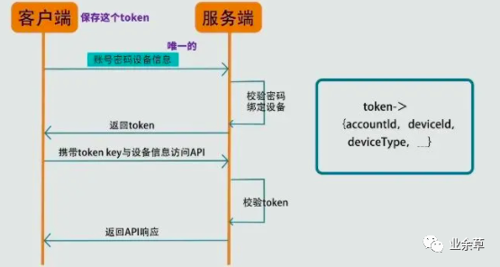
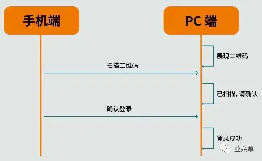
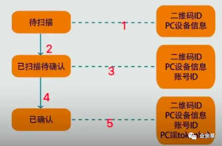
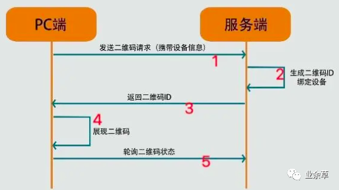
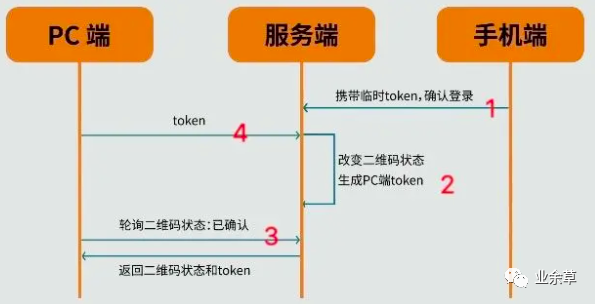
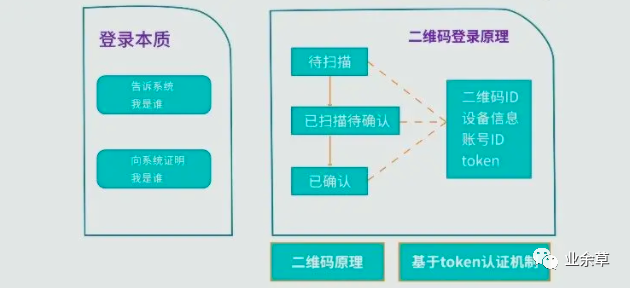
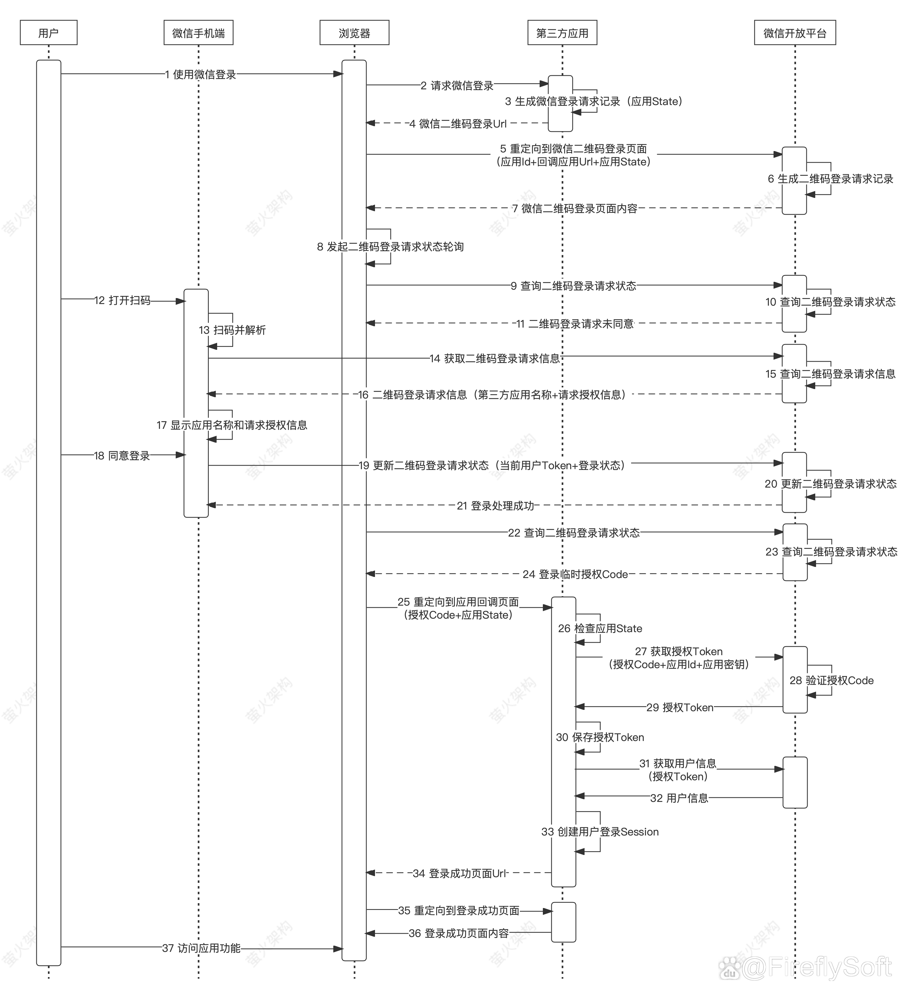

<span id="menu" >
<h1>系统设计</h1>
<!-- TOC -->

- [1. 考察标准](#1-考察标准)
- [2. 系统设计面试思路](#2-系统设计面试思路)
  - [2.1. 常见算法的时间复杂度](#21-常见算法的时间复杂度)
  - [2.2. 准备](#22-准备)
  - [2.3. 性能相关的指标](#23-性能相关的指标)
    - [2.3.1. 性能相关的指标](#231-性能相关的指标)
    - [2.3.2. 常用性能测试工具](#232-常用性能测试工具)
    - [2.3.3. 性能优化](#233-性能优化)
- [3. 系统设计实践](#3-系统设计实践)
  - [3.1. 权限管理系统](#31-权限管理系统)
    - [3.1.1. 权限模型](#311-权限模型)
      - [3.1.1.1. RBAC0模型](#3111-rbac0模型)
      - [3.1.1.2. RBAC1模型](#3112-rbac1模型)
      - [3.1.1.3. RBAC2模型](#3113-rbac2模型)
      - [3.1.1.4. RBAC3模型](#3114-rbac3模型)
  - [3.2. 秒杀系统设计](#32-秒杀系统设计)
    - [3.2.1. 秒杀系统的问题](#321-秒杀系统的问题)
    - [3.2.2. 秒杀系统的设计和技术方案](#322-秒杀系统的设计和技术方案)
  - [3.3. 设计一个LRU缓存系统](#33-设计一个lru缓存系统)
    - [3.3.1. 算法与数据结构](#331-算法与数据结构)
    - [3.3.2. LRU缓存LinkedHashMap实现](#332-lru缓存linkedhashmap实现)
    - [3.3.3. 自行实现链表＋HashMap](#333-自行实现链表hashmap)
  - [3.4. Feed系统设计](#34-feed系统设计)
    - [3.4.1. 基本概念](#341-基本概念)
    - [3.4.2. 实现思路](#342-实现思路)
  - [3.5. 消息推送系统设计](#35-消息推送系统设计)
  - [3.6. 短URL设计](#36-短url设计)
    - [3.6.1. 设计需求](#361-设计需求)
    - [3.6.2. 短 URL 的好处](#362-短-url-的好处)
    - [3.6.3. 系统设计](#363-系统设计)
      - [3.6.3.1. 操作逻辑](#3631-操作逻辑)
      - [3.6.3.2. 算法实现](#3632-算法实现)
      - [3.6.3.3. 、服务间的重定向：301 和 302](#3633-服务间的重定向301-和-302)
  - [3.7. 设计DNS服务器中cache的数据结构](#37-设计dns服务器中cache的数据结构)
  - [3.8. 扫码登录实现](#38-扫码登录实现)
    - [3.8.1. 一维码和二维码](#381-一维码和二维码)
    - [3.8.2. 二维码登录本质](#382-二维码登录本质)
    - [3.8.3. 系统认证机制](#383-系统认证机制)
    - [3.8.4. 扫描二维码登录的一般步骤](#384-扫描二维码登录的一般步骤)
      - [3.8.4.1. 总体步骤](#3841-总体步骤)
      - [3.8.4.2. 二维码准备](#3842-二维码准备)
      - [3.8.4.3. 扫描状态切换](#3843-扫描状态切换)
      - [3.8.4.4. 状态确认](#3844-状态确认)
    - [3.8.5. 总结](#385-总结)
    - [3.8.6. 第三方应用的扫码登录](#386-第三方应用的扫码登录)

<!-- /TOC -->

# 1. 考察标准
<a href="#menu">目录</a>

系统设计面试考察点
* 可行性
* 特定问题分析与解决
* 分析能力
* 权衡
* 知识储备

系统设计主要考虑以下三点问题
* 你如何看待问题空间（problem space）？
    * 系统设计目标
        * 功能性
        * 性能
        * 可用性
    * 系统目标用户或者使用场景
    * 系统用户规模
* 你如何看待瓶颈（bottlenecks）？
    * 高并发处理
    * cpu
    * io
    * 内存
    * 网络
* 如何消除这些瓶颈（remove these bottlenecks）

那什么是一个“好的”提问呢？一个好的提问可以帮助你做到以下几点：
* 帮助你缩小设计范围
* 帮助你了解用户对系统的要求
* 给你设计的方向
* 告诉你可能存在的瓶颈（bottlenecks）/问题空间（problem space）


分析方法
* 场景
* 服务
* 存储
* 扩展

**知识准备**
1. 高性能架构设计： 熟悉系统常见性能优化手段比如引入 读写分离、缓存、负载均衡、异步 等等。
2. 高可用架构设计 ：CAP理论和BASE理论、通过集群来提高系统整体稳定性、超时和重试机制、应对接口级故障：降级、熔断、限流、排队。
3. 高扩展架构设计 ：说白了就是懂得如何拆分系统。你按照不同的思路来拆分软件系统，就会得到不同的架构

# 2. 系统设计面试思路
<a href="#menu">目录</a>

## 2.1. 常见算法的时间复杂度

时间复杂度比较:O(1) < O(logn) < O(n) < O(nlogn) < O(n^2) < O(n^3) < O(2^n)


|查找|平均时间复杂度|查找条件|算法描述
|---|---|---|---|
|顺序查找|O(n)|无序或有序队列|按顺序比较每个元素，直到找到关键字为止
|二分查找（折半查找）|O(logn)|有序数组|查找过程从数组的中间元素开始，如果中间元素正好是要查找的元素，则搜素过程结束；如果某一特定元素大于或者小于中间元素，则在数组大于或小于中间元素的那一半中查找，而且跟开始一样从中间元素开始比较。　如果在某一步骤数组为空，则代表找不到。
|二叉排序树查找|O(logn)|二叉排序树|在二叉查找树b中查找x的过程为：1. 若b是空树，则搜索失败2. 若x等于b的根节点的数据域之值，则查找成功；3. 若x小于b的根节点的数据域之值，则搜索左子树4. 查找右子树。
|哈希表法（散列表）|O(1)|先创建哈希表（散列表）|根据键值方式(Key value)进行查找，通过散列函数，定位数据元素。
|分块查找|O(logn)|无序或有序队列|将n个数据元素"按块有序"划分为m块（m ≤ n）。|每一块中的结点不必有序，但块与块之间必须"按块有序"；即第1块中任一元素的关键字都必须小于第2块中任一元素的关键字；而第2块中任一元素又都必须小于第3块中的任一元素，……。然后使用二分查找及顺序查找。


## 2.2. 准备

**问法**
1. 设计一个某某系统比如秒杀系统、微博系统、抢红包系统、短网址系统。
2. 设计某某系统中的一个功能比如哔哩哔哩的点赞功能。
3. 设计一个框架比如 RPC 框架、消息队列、缓存框架、分布式文件系统等等。
4. 某某系统的技术选型比如缓存用Redis 还是 Memcached、网关用 Spring Cloud Gateway 还是 Netflix Zuul2 。

**系统设计怎么做**

**Step1:问清楚系统具体要求**

* 功能性需求和非功能性需求
* 应用场景，单线程／多线程，单体应用／集群，访问量
* 高并发和高可用要求，QPS等参数

**Step2:对系统进行抽象设计**

* 系统架构设计
    * 组件间的关系
    * 安全性设计
    * 如何部署

**Step3:考虑系统目前需要优化的点**


对系统进行抽象设计之后，你需要思考当前抽象的系统设计有哪些需要优化的点，比如说：
* 当前系统部署在一台机器够吗？是否需要部署在多台机器然后进行负载均衡呢？
* 数据库处理速度能否支撑业务需求？是否需要给指定字段加索引？是否需要读写分离？是否需要缓存？
* 数据量是否大到需要分库分表？
* 是否存在安全隐患？
* 系统是否需要分布式文件系统？

## 2.3. 性能相关的指标
<a href="#menu">目录</a>

### 2.3.1. 性能相关的指标

**响应时间RT(Response-time)**:

就是用户发出请求到用户收到系统处理结果所需要的时间。

RT是一个非常重要且直观的指标，RT数值大小直接反应了系统处理用户请求速度的快慢。

**并发数**

并发数可以简单理解为系统能够同时供多少人访问使用也就是说系统同时能处理的请求数量。

并发数反应了系统的负载能力。

**QPS 和 TPS**
* QPS（Query Per Second） ：服务器每秒可以执行的查询次数；
* TPS（Transaction Per Second） ：服务器每秒处理的事务数（这里的一个事务可以理解为客户发出请求到收到服务器的过程）；

QPS vs TPS：QPS 基本类似于 TPS，但是不同的是，对于一个页面的一次访问，形成一个TPS；但一次页面请求，可能产生多次对服务器的请求，服务器对这些请求，就可计入“QPS”之中。如，访问一个页面会请求服务器2次，一次访问，产生一个“T”，产生2个“Q”。

**吞吐量**

吞吐量指的是系统单位时间内系统处理的请求数量。

一个系统的吞吐量与请求对系统的资源消耗等紧密关联。请求对系统资源消耗越多，系统吞吐能力越低，反之则越高。

TPS、QPS都是吞吐量的常用量化指标。

QPS（TPS） = 并发数/平均响应时间(RT)


**系统活跃度**

* PV(Page View): 访问量, 即页面浏览量或点击量，衡量网站用户访问的网页数量；在一定统计周期内用户每打开或刷新一个页面就记录1次，多次打开或刷新同一页面则浏览量累计。UV 从网页打开的数量/刷新的次数的角度来统计的。
* UV(Unique Visitor): 独立访客，统计1天内访问某站点的用户数。1天内相同访客多次访问网站，只计算为1个独立访客。UV 是从用户个体的角度来统计的。
* DAU(Daily Active User):日活跃用户数量。
* MAU(monthly active users): 月活跃用户人数。

举例：某网站 DAU为 1200w， 用户日均使用时长 1 小时，RT为0.5s，求并发量和QPS。

平均并发量 = DAU（1200w）* 日均使用时长（1 小时，3600秒） /一天的秒数（86400）=1200w/24 = 50w

真实并发量（考虑到某些时间段使用人数比较少） = DAU（1200w）* 日均使用时长（1 小时，3600秒） /一天的秒数-访问量比较小的时间段假设为8小时（57600）=1200w/16 = 75w

峰值并发量 = 平均并发量 * 6 = 300w

QPS = 真实并发量/RT = 75W/0.5=100w/s

### 2.3.2. 常用性能测试工具

**Java语言层面**
* JMH做基准测试

**后端**
1. Jmeter ：Apache JMeter 是 JAVA 开发的性能测试工具。
2. LoadRunner：一款商业的性能测试工具。
3. Galtling ：一款基于Scala 开发的高性能服务器性能测试工具。
4. ab ：全称为 Apache Bench 。Apache 旗下的一款测试工具，非常实用

**前端常用**
* Fiddler：抓包工具，它可以修改请求的数据，甚至可以修改服务器返回的数据，功能非常强大，是Web 调试的利器。
* HttpWatch: 可用于录制HTTP请求信息的工具。


### 2.3.3. 性能优化
<a href="#menu">目录</a>

**常见问题**
1. 当前系统的SQL语句是否存在问题？
2. 当前系统是否需要升级硬件？
3. 系统是否需要缓存？
4. 系统架构本身是不是就有问题？
5. 系统是否存在死锁的地方？
6. 数据库索引使用是否合理？
7. 系统是否存在内存泄漏？（Java 的自动回收内存虽然很方便，但是，有时候代码写的不好真的会造成内存泄漏）
8. 系统的耗时操作进行了异步处理？

**常见优化手段**
* SQL优化
* JVM
* DB
* Tomcat参数调优
* 硬件性能优化（内存升级、CPU核心数增加、机械硬盘—>固态硬盘等等）
* 业务逻辑优化/缓存 
* 读写分离、集群等 
* 分库分表


# 3. 系统设计实践
<a href="#menu">目录</a>

## 3.1. 权限管理系统
<a href="#menu">目录</a>

### 3.1.1. 权限模型

#### 3.1.1.1. RBAC0模型

```
用户<--多对多-->角色<--多对多-->权限
```
这是权限最基础也是最核心的模型,它包括用户/角色/权限,其中用户和角色是多对多的关系,角色和权限也是多对多的关系。
* 用户是发起操作的主体,按类型分可分为2B和2C用户,可以是后台管理系统的用户,可以是OA系统的内部员工,也可以是面向C端的用户,比如阿里云的用户。
* 角色起到了桥梁的作用,连接了用户和权限的关系,每个角色可以关联多个权限,同时一个用户关联多个角色,那么这个用户就有了多个角色的多个权限。有人会问了为什么用户不直接关联权限呢?在用户基数小的系统,比如20个人的小系统,管理员可以直接把用户和权限关联,工作量并不大,选择一个用户勾选下需要的权限就完事了。但是在实际企业系统中,用户基数比较大,其中很多人的权限都是一样的,就是个普通访问权限,如果管理员给100人甚至更多授权,工作量巨大。这就引入了"角色(Role)"概念,一个角色可以与多个用户关联,管理员只需要把该角色赋予用户,那么用户就有了该角色下的所有权限,这样设计既提升了效率,也有很大的拓展性。
* 权限是用户可以访问的资源,包括页面权限,操作权限,数据权限:
    * 页面权限: 即用户登录系统可以看到的页面,由菜单来控制,菜单包括一级菜单和二级菜单,只要用户有一级和二级菜单的权限,那么用户就可以访问页面
    * 操作权限: 即页面的功能按钮,包括查看,新增,修改,删除,审核等,用户点击删除按钮时,后台会校验用户角色下的所有权限是否包含该删除权限,如果是,就可以进行下一步操作,反之提示无权限。有的系统要求"可见即可操作",意思是如果页面上能够看到操作按钮,那么用户就可以操作,要实现此需求,这里就需要前端来配合,前端开发把用户的权限信息缓存,在页面判断用户是否包含此权限,如果有,就显示该按钮,如果没有,就隐藏该按钮。某种程度上提升了用户体验,但是在实际场景可自行选择是否需要这样做
    * 数据权限: 数据权限就是用户在同一页面看到的数据是不同的,比如财务部只能看到其部门下的用户数据,采购部只看采购部的数据,在一些大型的公司,全国有很多城市和分公司,比如杭州用户登录系统只能看到杭州的数据,上海用户只能看到上海的数据,解决方案一般是把数据和具体的组织架构关联起来,举个例子,再给用户授权的时候,用户选择某个角色同时绑定组织如财务部或者合肥分公司,那么该用户就有了该角色下财务部或合肥分公司下的的数据权限。


#### 3.1.1.2. RBAC1模型


此模型引入了角色继承(Hierarchical Role)概念,即角色具有上下级的关系,角色间的继承关系可分为一般继承关系和受限继承关系。一般继承关系仅要求角色继承关系是一个绝对偏序关系，允许角色间的多继承。而受限继承关系则进一步要求角色继承关系是一个树结构，实现角色间的单继承。这种设计可以给角色分组和分层，一定程度简化了权限管理工作。

#### 3.1.1.3. RBAC2模型

基于核心模型的基础上，进行了角色的约束控制,RBAC2模型中添加了责任分离关系,其规定了权限被赋予角色时，或角色被赋予用户时，以及当用户在某一时刻激活一个角色时所应遵循的强制性规则。责任分离包括静态责任分离和动态责任分离。主要包括以下约束:

* 互斥角色: 同一用户只能分配到一组互斥角色集合中至多一个角色，支持责任分离的原则。互斥角色是指各自权限互相制约的两个角色。比如财务部有会计和审核员两个角色,他们是互斥角色,那么用户不能同时拥有这两个角色,体现了职责分离原则
* 基数约束: 一个角色被分配的用户数量受限；一个用户可拥有的角色数目受限；同样一个角色对应的访问权限数目也应受限，以控制高级权限在系统中的分配
* 先决条件角色: 即用户想获得某上级角色,必须先获得其下一级的角色

#### 3.1.1.4. RBAC3模型

即最全面的权限管理,它是基于RBAC0,将RBAC1和RBAC2进行了整合


## 3.2. 秒杀系统设计
<a href="#menu">目录</a>

### 3.2.1. 秒杀系统的问题

**服务单一职责，独立部署**

秒杀服务即使

**超卖问题**

分析秒杀的业务场景,最重要的有一点就是超卖问题，假如备货只有100个，但是最终超卖了200，一般来讲秒杀系统的价格都比较低，如果超卖将严重影响公司的财产利益，因此首当其冲的就是解决商品的超卖问题。

**高并发**

秒杀具有时间短、并发量大的特点，秒杀持续时间只有几分钟，而一般公司都为了制造轰动效应，会以极低的价格来吸引用户，因此参与抢购的用户会非常的多。短时间内会有大量请求涌进来，后端如何防止并发过高造成缓存击穿或者失效，击垮数据库都是需要考虑的问题。

**接口防刷**

现在的秒杀大多都会出来针对秒杀对应的软件，这类软件会模拟不断向后台服务器发起请求，一秒几百次都是很常见的，如何防止这类软件的重复无效请求，防止不断发起的请求也是需要我们针对性考虑的

**秒杀url**

对于普通用户来讲，看到的只是一个比较简单的秒杀页面，在未达到规定时间，秒杀按钮是灰色的，一旦到达规定时间，灰色按钮变成可点击状态。这部分是针对小白用户的，如果是稍微有点电脑功底的用户，会通过F12看浏览器的network看到秒杀的url，通过特定软件去请求也可以实现秒杀。或者提前知道秒杀url的人，一请求就直接实现秒杀了。这个问题我们需要考虑解决

**数据库设计**

秒杀有把我们服务器击垮的风险，如果让它与我们的其他业务使用在同一个数据库中，耦合在一起，就很有可能牵连和影响其他的业务。如何防止这类问题发生，就算秒杀发生了宕机、服务器卡死问题，也应该让他尽量不影响线上正常进行的业务

**大量请求问题**

按照1.2的考虑，就算使用缓存还是不足以应对短时间的高并发的流量的冲击。如何承载这样巨大的访问量，同时提供稳定低时延的服务保证，是需要面对的一大挑战。我们来算一笔账，假如使用的是redis缓存，单台redis服务器可承受的QPS大概是4W左右，如果一个秒杀吸引的用户量足够多的话，单QPS可能达到几十万，单体redis还是不足以支撑如此巨大的请求量。缓存会被击穿，直接渗透到DB,从而击垮mysql.后台会将会大量报错

### 3.2.2. 秒杀系统的设计和技术方案

**秒杀系统数据库设计**
1. 订单表(订单id，用户id，商品id，状态,创建时间)
2. 商品表(id，商品id，商品名称,库存,version，开始时间，结束时间)
3. 商品表－－商品的具体信息
4. 用户表

**URL暴露**

为了避免有程序访问经验的人通过下单页面url直接访问后台接口来秒杀货品，我们需要将秒杀的url实现动态化，即使是开发整个系统的人都无法在秒杀开始前知道秒杀的url。具体的做法就是通过md5加密一串随机字符作为秒杀的url，然后前端访问后台获取具体的url，后台校验通过之后才可以继续秒杀。

两点保证:
1. 秒杀前点击不会发送请求－－按钮置灰无效
2. 秒杀前秒杀的URL未知－－使用动态URL

动态URL方案
1. 秒杀前前端获取开始时间和服务器时间，显示秒杀倒计时
2. 倒计时时间到，秒杀开始，点击按钮时向服务器请求秒杀链接
3. 服务器返回秒杀链接，前端发起秒杀请求。执行秒杀操作

前端处理
```js

GET /seckill/path/{goodsId}
{
    return {
        doSeckill(path)
    }
}

doSeckill(path){
    POST /seckill/{goodsId}/{path}
}

```


```java
@RequestMapping(value = "/seckill/path/{goodsId}", method = RequestMethod.GET)
@ResponseBody
public Result<String> getPath(@PathVariable(value="goodsId") String goodsId){

    //由于可能出现在秒杀前执行该请求。因此应当也需要判断是否到达秒杀时间
    String url = md5(goodsId);
    Cache.set(userid+goodsId,url);

    return new Result(url);
}
@RequestMapping(value = "/seckill/{goodsId}/{path}", method = RequestMethod.POST)
@ResponseBody
public Result<String> seckill(
    @PathVariable(value="goodsId") String goodsId.
    @PathVariable(value="path") String path){


    Styring curl = Cache.get(userid+goodsId,url);
    //比较是否相同，相同则执行秒杀操作

   
}
```

**秒杀页面静态化**

将商品的描述、参数、成交记录、图像、评价等全部写入到一个静态页面，用户请求不需要通过访问后端服务器，不需要经过数据库，直接在前台客户端生成，这样可以最大可能的减少服务器的压力。


* 把整个页面Cache在用户浏览器
* 如果强制刷新整个页面，也会请求到CDN
* 实际有效请求只是“刷新抢宝”按钮

这样把90%的静态数据缓存在用户端或者CDN上，当真正秒杀时用户只需要点击秒杀即可，而不需要刷新整个页面，这样只向服务端请求很少的有效数据，而不需要重复请求大量静态数据。秒杀的动态数据和普通的详情页面的动态数据相比更少，性能也比普通的详情提升3倍以上。

**基于时间分片削峰**

在点击秒杀时增加图片验证/问题验证，使用物理方法降低瞬时请求。除了在前端通过答题在用户端进行流量削峰外，在服务端一般通过锁或者队列来控制瞬间请求。

**数据分层校验**

* CDN
  * 大数据在用户浏览器或者ＣＤＮ上获取，不要请求到服务端
* 前台读系统
  * 前端系统处理大流量请求，数据尽量走cache，包括强一致性数据(比如剩余商品，秒杀过程不需要显示实时库存，后台做好校验即可)，过滤掉大量的无效的请求
* 后台写系统
  * 后台系统做二次校验，做好保护和限流
* ＤＢ
  * 数据库层做数据的强一致性校验

对大流量系统的数据做分层校验也是最重要的设计原则，所谓分层校验就是对大量的请求做成“漏斗”式设计，如图3所示：在不同层次尽可能把无效的请求过滤，“漏斗”的最末端才是有效的请求，要达到这个效果必须对数据做分层的校验，下面是一些原则：
* 先做数据的动静分离
* 将90%的数据缓存在客户端浏览器
* 将动态请求的读数据Cache在Web端
* 对读数据不做强一致性校验
* 对写数据进行基于时间的合理分片
* 对写请求做限流保护
* 对写数据进行强一致性校验


把大量静态不需要检验的数据放在离用户最近的地方；在前端读系统中检验一些基本信息，如用户是否具有秒杀资格、商品状态是否正常、用户答题是否正确、秒杀是否已经结束等；在写数据系统中再校验一些如是否是非法请求，营销等价物是否充足（淘金币等），写的数据一致性如检查库存是否还有等；最后在数据库层保证数据最终准确性，如库存不能减为负数。

**单体redis升级为集群redis**

秒杀是一个读多写少的场景，使用redis做缓存再合适不过。不过考虑到缓存击穿问题，我们应该构建redis集群，采用哨兵模式，可以提升redis的性能和可用性。

**使用nginx**

nginx是一个高性能web服务器，它的并发能力可以达到几万，而tomcat只有几百。通过nginx映射客户端请求，再分发到后台tomcat服务器集群中可以大大提升并发能力。

**精简sql**

典型的一个场景是在进行扣减库存的时候，传统的做法是先查询库存，再去update。这样的话需要两个sql，而实际上一个sql我们就可以完成的。可以用这样的做法：update miaosha_goods  set stock =stock-1 where goos_id ={#goods_id} and  version = #{version} and sock>0;这样的话，就可以保证库存不会超卖并且一次更新库存,还有注意一点这里使用了版本号的乐观锁，相比较悲观锁，它的性能较好。

**redis预减库存**

很多请求进来，都需要后台查询库存,这是一个频繁读的场景。可以使用redis来预减库存，在秒杀开始前可以在redis设值，比如redis.set(goodsId,100),这里预放的库存为100可以设值为常量),每次下单成功之后,Integer stock = (Integer)redis.get(goosId); 然后判断sock的值，如果小于常量值就减去1;不过注意当取消的时候,需要增加库存，增加库存的时候也得注意不能大于之间设定的总库存数(查询库存和扣减库存需要原子操作，此时可以借助lua脚本)下次下单再获取库存的时候,直接从redis里面查就可以了。

**接口限流**

秒杀最终的本质是数据库的更新，但是有很多大量无效的请求，我们最终要做的就是如何把这些无效的请求过滤掉，防止渗透到数据库。限流的话，需要入手的方面很多：

1. 前端限流

首先第一步就是通过前端限流，用户在秒杀按钮点击以后发起请求，那么在接下来的5秒是无法点击(通过设置按钮为disable)。这一小举措开发起来成本很小，但是很有效。

2. 同一个用户xx秒内重复请求直接拒绝

具体多少秒需要根据实际业务和秒杀的人数而定，一般限定为10秒。具体的做法就是通过redis的键过期策略，首先对每个请求都从String value = redis.get(userId);如果获取到这个

value为空或者为null，表示它是有效的请求，然后放行这个请求。如果不为空表示它是重复性请求，直接丢掉这个请求。如果有效,采用redis.setexpire(userId,value,10).value可以是任意值，一般放业务属性比较好,这个是设置以userId为key，10秒的过期时间(10秒后,key对应的值自动为null)

3. 令牌桶算法限流

接口限流的策略有很多，我们这里采用令牌桶算法。令牌桶算法的基本思路是每个请求尝试获取一个令牌，后端只处理持有令牌的请求，生产令牌的速度和效率我们都可以自己限定，guava提供了RateLimter的api供我们使用。以下做一个简单的例子,注意需要引入guava

这个限流策略的效率有多高呢？假如我们的并发请求是400万瞬间的请求,将令牌产生的效率设为每秒20个，每次尝试获取令牌的时间是0.05秒，那么最终测试下来的结果是，每次只会放行4个左右的请求,大量的请求会被拒绝,这就是令牌桶算法的优秀之处。

**异步下单**

为了提升下单的效率，并且防止下单服务的失败。需要将下单这一操作进行异步处理。最常采用的办法是使用队列，队列最显著的三个优点：异步、削峰、解耦。这里可以采用rabbitmq，在后台经过了限流、库存校验之后，流入到这一步骤的就是有效请求。然后发送到队列里，队列接受消息，异步下单。下完单，入库没有问题可以用短信通知用户秒杀成功。假如失败的话,可以采用补偿机制，重试。

**服务降级**

假如在秒杀过程中出现了某个服务器宕机，或者服务不可用，应该做好后备工作。之前的博客里有介绍通过Hystrix进行服务熔断和降级，可以开发一个备用服务，假如服务器真的宕机了，直接给用户一个友好的提示返回，而不是直接卡死，服务器错误等生硬的反馈。

**隔离**

* 业务隔离
* 系统隔离
* 数据隔离

## 3.3. 设计一个LRU缓存系统
<a href="#menu">目录</a>

设计和构建一个“最近最少使用”缓存，该缓存会删除最近最少使用的项目。缓存应该从键映射到值(允许你插入和检索特定键对应的值)，并在初始化时指定最大容量。当缓存被填满时，它应该删除最近最少使用的项目。

它应该支持以下操作： 获取数据 get 和 写入数据 put 。
* 获取数据 get(key) - 如果密钥 (key) 存在于缓存中，则获取密钥的值（总是正数），否则返回 -1。
* 写入数据 put(key, value) - 如果密钥不存在，则写入其数据值。当缓存容量达到上限时，它应该在写入新数据之前删除最近最少使用的数据值，从而为新的数据值留出空间。

### 3.3.1. 算法与数据结构

LRU缓存机制可以通过哈希表加上双向链表实现

双向链表存储键值对，靠近头部的键值是最近使用的，而靠近尾部的键值对是访问时间最久的；哈希表，通过缓存数据的建映射到其在双链表的位置。单独的链表即可实现LRU,但是为了达到O(1)的时间复杂度，需要借助HashMap;如果需要在多线程环境下使用，还需要借助synchronized来实现互斥访问。

### 3.3.2. LRU缓存LinkedHashMap实现

使用LRU缓存LinkedHashMap实现时，只需要实现方法removeEldestEntry即可，返回true时会删除末尾元素。
```java
//LinkedHashMap的一个构造函数，当参数accessOrder为true时，即会按照访问顺序排序，最近访问的放在最前，最早访问的放在后面
public LinkedHashMap(int initialCapacity, float loadFactor, boolean accessOrder) {
    super(initialCapacity, loadFactor,accessOrder);
}

//LinkedHashMap自带的判断是否删除最老的元素方法，默认返回false，即不删除老数据
//我们要做的就是重写这个方法，当满足一定条件时删除老数据
protected boolean removeEldestEntry(Map.Entry<K,V> eldest) {
    return false;
}
```

**实现原理**

每次只要访问该key，都会调用afterNodeAccess方法，该方法会将访问的数据移动到队列的tail.
```java

void afterNodeAccess(Node<K,V> e) { // move node to last
    LinkedHashMap.Entry<K,V> last;
    if (accessOrder && (last = tail) != e) {

        LinkedHashMap.Entry<K,V> p = (LinkedHashMap.Entry<K,V>)e;
        LinkedHashMap.Entry<K,V> b = p.before;
        LinkedHashMap.Entry<K,V> a = p.after;
        
        p.after = null;
        if (b == null)
            head = a;
        else
            b.after = a;
        if (a != null)
            a.before = b;
        else
            last = b;
        if (last == null)
            head = p;
        else {
            p.before = last;
            last.after = p;
        }
        tail = p;
        ++modCount;
    }
}
```
当插入或者更新元素时，会调用该方法，用于移除head元素(如果removeEldestEntry()返回true的话)
```java
void afterNodeInsertion(boolean evict) { // possibly remove eldest
    LinkedHashMap.Entry<K,V> first;
    if (evict && (first = head) != null && removeEldestEntry(first)) {
        K key = first.key;
        removeNode(hash(key), key, null, false, true);
    }
}
```

注意，由于其使用的是HashMap实现，在多线程环境下使用会存在问题，如果在多线程环境下使用，可以使用synchronized进行同步。


### 3.3.3. 自行实现链表＋HashMap

```java

public class LRUCache1<K, V> {

    private final int MAX_CACHE_SIZE;
    private Entry first;
    private Entry last;

    private HashMap<K, Entry<K, V>> hashMap;

    public LRUCache1(int cacheSize) {
        MAX_CACHE_SIZE = cacheSize;
        hashMap = new HashMap<K, Entry<K, V>>();
    }

    public void put(K key, V value) {
        Entry entry = getEntry(key);
        if (entry == null) {
            if (hashMap.size() >= MAX_CACHE_SIZE) {
                hashMap.remove(last.key);
                removeLast();
            }
            entry = new Entry();
            entry.key = key;
        }
        entry.value = value;
        moveToFirst(entry);
        hashMap.put(key, entry);
    }

    public V get(K key) {
        Entry<K, V> entry = getEntry(key);
        if (entry == null) return null;
        moveToFirst(entry);
        return entry.value;
    }

    public void remove(K key) {
        Entry entry = getEntry(key);
        if (entry != null) {
            if (entry.pre != null) entry.pre.next = entry.next;
            if (entry.next != null) entry.next.pre = entry.pre;
            if (entry == first) first = entry.next;
            if (entry == last) last = entry.pre;
        }
        hashMap.remove(key);
    }

    private void moveToFirst(Entry entry) {
        if (entry == first) return;
        if (entry.pre != null) entry.pre.next = entry.next;
        if (entry.next != null) entry.next.pre = entry.pre;
        if (entry == last) last = last.pre;

        if (first == null || last == null) {
            first = last = entry;
            return;
        }

        entry.next = first;
        first.pre = entry;
        first = entry;
        entry.pre = null;
    }

    private void removeLast() {
        if (last != null) {
            last = last.pre;
            if (last == null) first = null;
            else last.next = null;
        }
    }


    private Entry<K, V> getEntry(K key) {
        return hashMap.get(key);
    }

    @Override
    public String toString() {
        StringBuilder sb = new StringBuilder();
        Entry entry = first;
        while (entry != null) {
            sb.append(String.format("%s:%s ", entry.key, entry.value));
            entry = entry.next;
        }
        return sb.toString();
    }

    class Entry<K, V> {
        public Entry pre;
        public Entry next;
        public K key;
        public V value;
    }
}
```

## 3.4. Feed系统设计
<a href="#menu">目录</a>

### 3.4.1. 基本概念

Feed流本质上是一个数据流，是将 “N个发布者的信息单元” 通过 “关注关系” 传送给 “M个接收者”。

Feed流系统是一个数据流系统，所以我们核心要看数据。从数据层面看，数据分为三类，分别是：
* 发布者的数据：发布者产生数据，然后数据需要按照发布者组织，需要根据发布者查到所有数据，比如微博的个人页面、朋友圈的个人相册等。
* 关注关系：系统中个体间的关系，微博中是关注，是单向流，朋友圈是好友，是双向流。不管是单向还是双向，当发布者发布一条信息时，该条信息的流动永远是单向的。
* 收者的数据：从不同发布者那里获取到的数据，然后通过某种顺序（一般为时间）组织在一起，比如微博的首页、朋友圈首页等。这些数据具有时间热度属性，越新的数据越有价值，越新的数据就要排在最前面。

针对这三类数据，我们可以有如下定义：

* 存储库：存储发布者的数据，永久保存。
* 关注表：用户关系表，永久保存。
* 同步库：存储接收者的时间热度数据，只需要保留最近一段时间的数据即可。

 

设计Feed流系统时最核心的是确定清楚产品层面的定义，需要考虑的因素包括：
* 产品用户规模：用户规模在十万、千万、十亿级时，设计难度和侧重点会不同。
* 关注关系（单向、双写）：如果是双向，那么就不会有大V，否则会有大V存在。

上述是选择数据存储系统最核心的几个考虑点，除此之外，还有一些需要考虑的：
* 如何实现Meta和Feed内容搜索？
虽然Feed流系统本身可以不需要搜索，但是一个Feed流产品必须要有搜索，否则信息发现难度会加大，用户留存率会大幅下降。

* Feed流的顺序是时间还是其他分数，比如个人的喜好程度？

双向关系时由于关系很紧密，一定是按时间排序，就算一个关系很紧密的人发了一条空消息或者低价值消息，那我们也会需要关注了解的。

单向关系时，那么可能就会存在大V，大V的粉丝数量理论极限就是整个系统的用户数，有一些产品会让所有用户都默认关注产品负责人，这种产品中，该负责人就是最大的大V，粉丝数就是用户规模。

### 3.4.2. 实现思路

以微博为例用户B关注了用户Ａ

**方案1**

当用户A发送微博的时候，写入blog数据库，当用户B登录微博并刷新的时候，先去查找自己的所有关注者，然后通过关注者去blog数据库查找他们最近发布的微博，最后再按一定规则进行排序(比如时间线／重点关注等因素).

**方案2**

每个用户都有自己的一个时间线的微博列表(数据库或者缓存)，当用户A发布微博之后，除了将微博保存到数据库blog，还需要同步或者异步写入到每个用户的时间线微博列表中，当用户B登录微博并刷新的时候，直接从自己的时间线微博列表拉去数据即可。

方案1的问题是当用户B的关注者非常多的时候，比如几十万，每次拉取数据将会耗费很多的时间。方案2的问题是用户A有很多的粉丝，几百万，其中还包括大量的长久不登录的僵尸粉，每次发布微博的时侯，同样也会很耗费时间，同时对于不常登录的用户来说，维护他们的时间线微博列表，也耗费性能和空间。


## 3.5. 消息推送系统设计
<a href="#menu">目录</a>

## 3.6. 短URL设计
<a href="#menu">目录</a>

场景:某个链接的长度较长，当将它分享给其他人的时候，希望转换成短的URL,访问该URL就能访问到原始URL的内容。还需要考虑的需求是时间有效性，是长期有效还是固定时间内有效。

以网址：https://www.zhihu.com/question/29270034 为例。

### 3.6.1. 设计需求

短网址应为单独的服务，假设该服务的域名为https://su.cn ，当将上面的长URL发送给短网址服务进行转换，服务返回转换后的短网址，https://su.cn／1vmcmu　。用户就可以将该短网址分享出去，当访问该短网址的时候，访问的是短网址服务。该服务再进行301重定向到原始网址。

扩展功能:删除记录，有效期，权限

还需要考虑的问题是高并发访问，转换的效率，高可用性。

### 3.6.2. 短 URL 的好处

1. 链接变短，对于有长度限制的平台发文，可编辑的文字就变多了
2. 短链接生成的二维码更易于识别，而长链接的二维码密集难识别
3. 短链接更加简洁好看且安全，不暴露访问参数。
4. 能规避关键词、域名屏蔽等手段
5. 链接太长在有些平台上无法自动识别为超链接

### 3.6.3. 系统设计

#### 3.6.3.1. 操作逻辑

短URL系统为独立的系统

客户端点击相关操作，比如分享操作，服务器收到请求后，将要分享的连接发送给短URL系统，短URL系统根据一定的算法生成对应的短URL,并将两者的映射关系保存在数据库中。同时将映射结果返回给请求服务器，服务器再将结果返回给客户端。

其他用户点击客户端分享的短URL,此时访问的短URL系统，通过短URL系统查询数据库，获得对应的长URL,并返回给该用户，用户重定向，访问原始的链接。


#### 3.6.3.2. 算法实现

使用自增序列算法，可以保证长网址唯一对应一个短网址。这里存储的方案可以选择mysql或者redis。从性能上考虑，最好选择redis.

第二种方式是使用md5算法，但是这种会存在重复的可能性，也就是一个短网址对应多个长网址。
1. 将长网址 md5 生成 32 位签名串,分为 4 段, 每段 8 个字节
2. 对这四段循环处理, 取 8 个字节, 将他看成 16 进制串与 0x3fffffff(30位1) 与操作, 即超过 30 位的忽略处理
3. 这 30 位分成 6 段, 每 5 位的数字作为字母表的索引取得特定字符, 依次进行获得 6 位字符串
4. 总的 md5 串可以获得 4 个 6 位串,取里面的任意一个就可作为这个长 url 的短 url 地址

第一种算法的好处就是简单好理解，永不重复。但是短码的长度不固定，随着 id 变大从一位长度开始递增。如果非要让短码长度固定也可以就是让 id 从指定的数字开始递增就可以了。百度短网址用的这种算法。

第二种算法，存在碰撞（重复）的可能性，虽然几率很小。短码位数是比较固定的。不会从一位长度递增到多位的。据说微博使用的这种算法。


**设计思路：**

|id|long_url|short_url|
|---|---|---|
|1|https://hufangyun.com/2017/short-url/|sacd21|
|2|https://dwz.cn/console/apidoc/v3|fgfgc|

当有一个新的长网址时，查询数据库中是否存在记录,不存在则插入，获取到该记录的主键，再将主键进行进制转换层短网址，最后将短网址插入数据库字段short_url。

当通过短网址查询长网址时，直接查询数据库即可。

如果使用redis，思路基本一致，但需要一个额外的字段存储序列号的最大值。每次添加新的长网址，使用最大值序列号自增即可。长网址和短网址的存储类型可以选择哈希结构。

这里序列号生成可以使用数据库的自增主键，但自增主键要考虑高并发下的处理，可以使用批量发号。分布式下还可以使用分布式自增主键。或者使用雪花算法（依赖于系统时钟的一致性。如果某台机器的系统时钟回拨，有可能造成 ID 冲突，或者 ID 乱序。）


进制转换：

这里选择的是[0-9a-zA-Z],一共62个字符，也就是62进制。从下面可以看出进制越大，转换出来的字符串长度越小。

```yml
[100000000]转换成[10]进制为[100000000]
[100000000]转换成[15]进制为[8ba496a]
[100000000]转换成[20]进制为[1b50000]
[100000000]转换成[25]进制为[a60000]
[100000000]转换成[30]进制为[43dl3a]
[100000000]转换成[35]进制为[1vmcmu]
[100000000]转换成[40]进制为[D2k00]
[100000000]转换成[45]进制为[ohhwa]
[100000000]转换成[50]进制为[g0000]
[100000000]转换成[55]进制为[aP2KJ]
[100000000]转换成[60]进制为[7GVKE]
```

[进制转换工具](https://tool.lu/hexconvert/)

进制转换实现
```java
public static String numberToString(long tenRadix, int radix)
{
    // 进制编码支持10+26+26=62进制
    String code = "0123456789abcdefghijklmnopqrstuvwxyzABCDEFGHIJKLMNOPQRSTUVWXYZ";
    StringBuilder buf = new StringBuilder();
    int remainder = 0;
    while (tenRadix != 0)
    {
        remainder = (int)(tenRadix % radix);// 求余数
        tenRadix = tenRadix / radix;// 除以基数
        buf.append(code.charAt(remainder));// 保存余数，记得要倒叙排列
    }
    buf.reverse();// 倒叙排列
    return buf.toString();
}
public static int stringToNumber(String otherRadixStr, int radix)
{
    StringBuilder stringBuilder = new StringBuilder(otherRadixStr);
    stringBuilder.reverse();// 反转字符，为了把权重最大的放在最右边，便于下面从左到右遍历，根据下标求权重。
    // 如果不反转，从右向左遍历(从字符串下标大的一端)也可以
    char bitCh;
    int result = 0;
    for (int i = 0; i < stringBuilder.length(); i++)
    {
        bitCh = stringBuilder.charAt(i);
        if (bitCh >= '0' && bitCh <= '9')
        {
            // '0'对应的ASCII码整数：48
            result += (int) (bitCh - '0') * pow(radix, i);
        } else if (bitCh >= 'A' && bitCh <= 'Z')
        {
            // 减去'A'的ASCII码值(65),再加上10
            result += ((int) (bitCh - 'A') + 10) * pow(radix, i);
        } else if (bitCh >= 'a' && bitCh <= 'z')
        {
            // 减去'a'的ASCII码值(97),再加上10
            result += ((int) (bitCh - 'a') + 10) * pow(radix, i);
        }
    }
    return result;
}    
```


还需要注意的是，由于是并发环境，同时为了高可用还会部署多个服务，所以相关代码需要使用分布式锁防止并发问题。redis还可以结合lua来实现。

#### 3.6.3.3. 、服务间的重定向：301 和 302

301永久重定向和 302 临时重定向。

* 301永久重定向：第一次请求拿到长链接后，下次浏览器再去请求短链的话，不会向短网址服务器请求了，而是直接从浏览器的缓存里拿，减少对服务器的压力。
* 302临时重定向：每次去请求短链都会去请求短网址服务器（除非响应中用 Cache-Control 或 Expired 暗示浏览器进行缓存）

使用 301 虽然可以减少服务器的压力，但是无法在 server 层获取到短网址的访问次数了，如果链接刚好是某个活动的链接，就无法分析此活动的效果以及用于大数据分析了。而 302 虽然会增加服务器压力，但便于在 server 层统计访问数，所以如果对这些数据有需求，可以采用 302，因为这点代价是值得的，但是具体采用哪种跳转方式，还是要结合实际情况进行选型。


## 3.7. 设计DNS服务器中cache的数据结构

<a href="#menu">目录</a>

要求设计一个DNS的Cache结构，要求能够满足每秒5000以上的查询，满足IP数据的快速插入，查询的速度要快。（题目还给出了一系列的数据，比如：站点数总共为5000万，IP地址有1000万，等等）

DNS服务器实现域名到IP地址的转换。

每个域名的平均长度为25个字节（估计值），每个IP为4个字节，所以Cache的每个条目需要大概30个字节。

总共50M个条目，所以需要1.5G个字节的空间。可以放置在内存中。（考虑到每秒5000次操作的限制，也只能放在内存中。）

可以考虑的数据结构包括hash_map，字典树，红黑树等等

## 3.8. 扫码登录实现

<a href="#menu">目录</a>

### 3.8.1. 一维码和二维码
<a href="#menu">目录</a>

一维码就是条形码，一维码通过使用一系列可变宽的行和空格来编码数据。一维码仅仅能包含几十个字符，通常随着添加更多数据而变得更长。因此，人们通常将条形码限制为8-15个字符。一维码扫描仪可水平读取条形码内容。

二维条形码(例如数据矩阵，QR码或PDF417)使用正方形，六边形，点和其他形状的图案来编码数据。由于其结构特性，二维码比一维码可容纳的数据更多(最多2000多个字符)，而看起来更小。数据是根据图案的垂直和水平排列进行编码的，因此可以二维方式读取。所以叫作二维码。

**一维码与二维码的区别**

一维码与二维码的区别如下：

1.两种代码系统是不同的。

无论是一维码还是二维码都有着自己的条形码系统。通常一维码使用的是：128码、EAN码、ISBN码，cross 25码，UPC码，Codabar(Kudba码)等。常见的二维码有QR码，PDF 417，数据矩阵。

2.信息内容不同

一维码的信息只能是字母和数字，一般只能容纳30多个字符。而二维码能储存音频、视频、图片、文件等等信息。最大数据可高达2000多个。

3.应用范围不同

一维码通常用于流程管理、运输、仓储、邮政等领域。而二维码主要应用于移动支付、网站跳转、账户登录、信息读取、移动电子商务、防伪追踪等等。

4.纠错能力不同

一维条形码纠错功能差。如果一维条形码损坏，则条形码将无法识别。二维码纠错率从低到高分为L，M，Q，H四个级别，每个级别的最大纠错率分别为7%，15%，25%，30%，二维代码更正可以在条形码软件中手动选择错误率级别。即使损坏，也可以读取QR码。

### 3.8.2. 二维码登录本质
<a href="#menu">目录</a>

二维码登录本质上也是一种登录认证方式。既然是登录认证，要做的也就两件事情！
* 告诉系统我是谁
* 向系统证明我是谁

比如账号密码登录，账号就是告诉系统我是谁， 密码就是向系统证明我是谁; 比如手机验证码登录，手机号就是告诉系统我是谁，验证码就是向系统证明我是谁;

那么扫码登录是怎么做到这两件事情的呢？我们一起来考虑一下

手机端应用扫PC端二维码，手机端确认后，账号就在PC端登录成功了！这里，PC端登录的账号肯定与手机端是同一个账号。不可能手机端登录的是账号A，而扫码登录以后，PC端登录的是账号B。

所以，第一件事情，告诉系统我是谁，是比较清楚的！

通过扫描二维码，把手机端的账号信息传递到PC端，至于是怎么传的，我们后面再说

第二件事情，向系统证明我是谁。扫码登录过程中，用户并没有去输入密码，也没有输入验证码，或者其他什么码。那是怎么证明的呢？

有些同学会想到，是不是扫码过程中，把密码传到了PC端呢？但这是不可能的。因为那样太不安全的，客户端也根本不会去存储密码。我们仔细想一下，其实手机端APP它是已经登录过的，就是说手机端是已经通过登录认证。所说只要扫码确认是这个手机且是这个账号操作的，其实就能间接证明我谁。

### 3.8.3. 系统认证机制
<a href="#menu">目录</a>

为了安全，手机端它是不会存储你的登录密码的。但是在日常使用过程中，我们应该会注意到，只有在你的应用下载下来后，第一次登录的时候，才需要进行一个账号密码的登录， 那之后呢 即使这个应用进程被杀掉，或者手机重启，都是不需要再次输入账号密码的，它可以自动登录。

其实这背后就是一套基于token的认证机制，我们来看一下这套机制是怎么运行的。



账号密码登录时，客户端会将设备信息一起传递给服务端

如果账号密码校验通过，服务端会把账号与设备进行一个绑定，存在一个数据结构中，这个数据结构中包含了账号ID，设备ID，设备类型等等

```yml
{
    token{
        acoutid,deviceid,deviceType
    }
}
```
然后服务端会生成一个token，用它来映射数据结构，这个token其实就是一串有着特殊意义的字符串，它的意义就在于，通过它可以找到对应的账号与设备信息。

客户端得到这个token后，需要进行一个本地保存，每次访问系统API都携带上token与设备信息。

服务端就可以通过token找到与它绑定的账号与设备信息，然后把绑定的设备信息与客户端每次传来的设备信息进行比较， 如果相同，那么校验通过，返回API接口响应数据， 如果不同，那就是校验不通过拒绝访问。

从前面这个流程，我们可以看到，客户端不会也没必要保存你的密码，相反，它是保存了token。可能有些同学会想，这个token这么重要，万一被别人知道了怎么办。实际上，知道了也没有影响， 因为设备信息是唯一的，只要你的设备信息别人不知道， 别人拿其他设备来访问，验证也是不通过的。

可以说，客户端登录的目的，就是获得属于自己的token。

那么在扫码登录过程中，PC端是怎么获得属于自己的token呢？不可能手机端直接把自己的token给PC端用！token只能属于某个客户端私有，其他人或者是其他客户端是用不了的。在分析这个问题之前，我们有必要先梳理一下，扫描二维码登录的一般步骤是什么样的。这可以帮助我们梳理清楚整个过程。

### 3.8.4. 扫描二维码登录的一般步骤

<a href="#menu">目录</a>

#### 3.8.4.1. 总体步骤



* 扫码前，手机端应用是已登录状态，PC端显示一个二维码，等待扫描
* 手机端打开应用，扫描PC端的二维码，扫描后，会提示"已扫描，请在手机端点击确认"
* 用户在手机端点击确认，确认后PC端登录就成功了

可以看到，二维码在中间有三个状态， 待扫描，已扫描待确认，已确认。那么可以想象



* 二维码的背后它一定存在一个唯一性的ID，当二维码生成时，这个ID也一起生成，并且绑定了PC端的设备信息
* 手机去扫描这个二维码
* 二维码切换为 已扫描待确认状态， 此时就会将账号信息与这个ID绑定
* 当手机端确认登录时，它就会生成PC端用于登录的token，并返回给PC端


#### 3.8.4.2. 二维码准备

按二维码不同状态来看， 首先是等待扫描状态，用户打开PC端，切换到二维码登录界面时。


* PC端向服务端发起请求，告诉服务端，我要生成用户登录的二维码，并且把PC端设备信息也传递给服务端
* 服务端收到请求后，它生成二维码ID，并将二维码ID与PC端设备信息进行绑定
    * 服务器生成二维码ID（随机码＋系统码＋设备信息）
    * 数据库: qr_code_login(id,device_msg,qr_code,state[未扫描，已扫描，确认登录],token,create_time)
    * 定时任务定期清理超时数据
* 然后把二维码ID返回给PC端
* PC端收到二维码ID后，生成二维码(二维码中肯定包含了ID)
* 为了及时知道二维码的状态，客户端在展现二维码后，PC端不断的轮询服务端，比如每隔一秒就轮询一次，请求服务端告诉当前二维码的状态及相关信息


#### 3.8.4.3. 扫描状态切换


* 用户用手机去扫描PC端的二维码，通过二维码内容取到其中的二维码ID
* 再调用服务端API将移动端的身份信息与二维码ID一起发送给服务端
* 服务端接收到后，它可以将身份信息与二维码ID进行绑定，生成临时token。然后返回给手机端
    * 服务器查询是否存在该二维码ID，存在则修改state为已扫描
    * 生成临时token返回给客户端
* 因为PC端一直在轮询二维码状态，所以这时候二维码状态发生了改变，它就可以在界面上把二维码状态更新为已扫描

那么为什么需要返回给手机端一个临时token呢？临时token与token一样，它也是一种身份凭证，不同的地方在于它只能用一次，用过就失效。

在第三步骤中返回临时token，为的就是手机端在下一步操作时，可以用它作为凭证。以此确保扫码，登录两步操作是同一部手机端发出的。


#### 3.8.4.4. 状态确认

最后就是状态的确认了。



* 手机端在接收到临时token后会弹出确认登录界面，用户点击确认时，手机端携带临时token用来调用服务端的接口，告诉服务端，我已经确认
* 服务端收到确认后，根据二维码ID绑定的设备信息与账号信息，生成用户PC端登录的token
* 这时候PC端的轮询接口，它就可以得知二维码的状态已经变成了"已确认"。并且从服务端可以获取到用户登录的token
* 到这里，登录就成功了，后端PC端就可以用token去访问服务端的资源了

扫码动作的基础流程都讲完了，有些细节还没有深入介绍，

比如二维码的内容是什么？
* 可以是二维码ID
* 可以是包含二维码ID的一个url地址

在扫码确认这一步，用户取消了怎么处理？

服务器返回临时token给手机app后，app显示确认登录按钮，这里有三种操作，第一种正常确认，第二种不进行操作或者退出。如果为第二种，则手机app向客户端发出退出操作，服务器删除数据库中的数据，pc客户端如果轮询时找不到该数据，则会回退到最初页面。

### 3.8.5. 总结

<a href="#menu">目录</a>


我们从登陆的本质触发，探索二维码扫码登录是如何做到的


* 告诉系统我是谁
* 向系统证明我谁

在这个过程中，我们先简单讲了两个前提知识，
* 一个是二维码原理
* 一个是基于token的认证机制

然后我们以二维码状态为轴，分析了这背后的逻辑: 通过token认证机制与二维码状态变化来实现扫码登录。

需要指出的是，前面的讲的登录流程，它适用于同一个系统的PC端，WEB端，移动端。

平时我们还有另外一种场景也比较常见，那就是通过第三方应用来扫码登录，比如极客时间/掘金  都可以选择微信/QQ等扫码登录，那么这种通过第三方应用扫码登录又是什么原理呢？


### 3.8.6. 第三方应用的扫码登录

<a href="#menu">目录</a>

这里以微信扫码登录某网站为例，某网站就是第三方应用，所谓第三方是相对微信自身来说的。相比同一产品中的扫码登录，网站使用微信扫码登录会更复杂一些，因为这涉及到不同应用之间的登录安全。下面就给出这一登录方式的详细运作原理，时序图比较长，不过只要耐心点就能完全搞清楚，甚至自己实现一个类似的第三方扫码登录方案。



这里对一些关键点特别说明下：

1. 步骤3 生成微信登录请求记录：当用户扫码并同意登录之后，步骤25中浏览器会重定向到第三方应用，如果之前没有创建一条登录请求记录，网站并不能确定这次登录就是自己发起的，这可能导致跨站请求伪造攻击。比如使用某个应用的微信登录二维码，骗取用户的授权，然后最终回调跳转到其它站点，被回调站点只能被动接受，虽然下一步验证授权Code通不过，微信也可能会认为第三方应用出了某种问题，搞不好被封掉。因此第三方应用创建一条登录请求记录之后，还要把记录的标识拼接到访问微信登录二维码的url中，微信会在用户同意登录后原样返回这个标识，步骤26中第三方应用可以验证这个标识是不是有效的。

2. 步骤17 显示应用名称和请求授权信息：因为微信支持很多的第三方应用，需要明确告知用户正在登录哪个应用，应用可以访问自己的什么信息，这都是用户做出登录决定的必要信息。因此扫码之后，微信手机端就需要去微信开放平台查询下二维码对应的第三方应用信息。

3. 步骤24 登录临时授权Code：微信开放平台没有直接向浏览器返回登录用户的信息，这是因为第三方应用还需要对用户进行授权并保持会话的状态，这适合在应用的服务端来处理；而且直接返回用户信息到浏览器也是不安全的，并不能保证二维码登录请求就是通过指定的第三方应用发起的。第三方应用会在步骤27中携带这个授权Code，加上应用的AppId和AppSecret，再去向微信开放平台发起登录请求，临时授权Code只能使用1次，存下来也不能再用，且只能用在指定的应用（即绑定了AppId），AppSecret是应用从服务端提取的，用来验证应用的身份，这些措施保证了微信授权登录的安全性。不过验证通过后还是没有直接返回用户信息，而是返回了一个access token，应用可以使用这个token再去请求获取用户信息的接口，这是因为开放平台提供了很多接口，访问这些接口都需要有授权才行，所以发放了一个access token给第三方应用，这种授权登录方式叫做OAuth 2.0。基于安全方面的考虑，access token的有效期比较短，开放平台一般还会发放一个refresh token，access token过期之后，第三方应用可以拿着这个refresh token再去换一个新的access token，如果refresh token也过期了或者用户取消了授权，则不能获取到新的access token，第三方应用此时应该注销用户的登录。这些token都不能泄漏，所以需要保存在第三方应用的服务端。

这里有一个有意思的问题：为什么微信的二维码登录页面Url中没有第三方应用的签名？

以极客时间的这个微信登录二维码页面的Url为例：

https://open.weixin.qq.com/connect/qrconnect?appid=wx1b4c7610fc671845&redirect_uri=https%3A%2F%2Faccount.geekbang.org%2Faccount%2Foauth%2Fcallback%3Ftype%3Dwechat%26ident%3Dc75c4a%26login%3D0%26cip%3D0%26redirect%3Dhttps%253A%252F%252Faccount.geekbang.org%252Fthirdlogin%253Fremember%253D1%2526type%253Dwechat%2526is_bind%253D0%2526platform%253Dtime%2526redirect%253Dhttps%25253A%25252F%25252Ftime.geekbang.org%25252F%2526failedurl%253Dhttps%253A%252F%252Faccount.geekbang.org%252Fsignin%253Fredirect%253Dhttps%25253A%25252F%25252Ftime.geekbang.org%25252F&response_type=code&scope=snsapi_login&state=5682d8310b75cd477baf30489e673646#wechat_redirect

其中appid是微信开放平台分配给极客时间的应用Id；redirect_uri是用户授权登录后微信回调的极客时间url，虽然看起来很长，其实就是在极客时间内的页面之间跳来跳去；state是极客时间生成的一个登录id，不同的state会生成不同的二维码，微信回调极客时间的时候会带着这个state。

这个url中只有极客时间的appid，没有极客时间的签名，也就是说微信会生成极客时间的登录二维码，但是不验证这个二维码登录请求是不是极客时间发起的，那么任何人都可以生成极客时间的微信登录二维码页面。这好像不太严谨。

这样安全吗？攻击者可以很简单的获取某个应用的微信登录二维码，然后再骗取用户的登录授权（这个也相对简单，弄个假冒的网站，或者直接话术忽悠，用户很可能不仔细看扫码确认的内容），再通过浏览器拦截或者DNS攻击获取到临时授权Code，直接越过检查应用State，前边这些都相对容易。但是向微信验证临时授权Code的时候必须携带App Secret，这个就很难了，除非第三方应用开发者自己泄漏了这一核心机密。对于用户信息的保护，整体上来说是安全的，攻击者基本上拿不到访问用户信息的access token。如果在url中加上这个签名，对用户信息的保护作用也没有加强，授权Code还是很容易获取；而且签名一般也是依赖App Secret，如果泄漏了App Secret，签名也就失去了意义。

如果有人不断地生成某个应用的微信登录二维码怎么办？这是其他类型的攻击了，微信可以采取一些限流措施，甚至直接封掉某些IP，这对正常用户没什么影响。

微信二维码登录的变种

微信除了跳转到二维码登录页面的方式，还提供了第三方网站中内嵌二维码的方式。通过微信JS SDK生成二维码并在网页的指定区域展现，用户扫码同意登录后，微信JS SDK发起重定向或者在iframe中打开应用回调页面，传递临时授权Code和应用State，后续的流程就都一样了。

另外这里的第三方应用如果是移动端App，微信开放平台也支持扫码登录的方式，区别在于需要集成微信SDK，获取二维码和接收用户授权Code都是通过SDK回调的方式，后续的流程也都一样。

