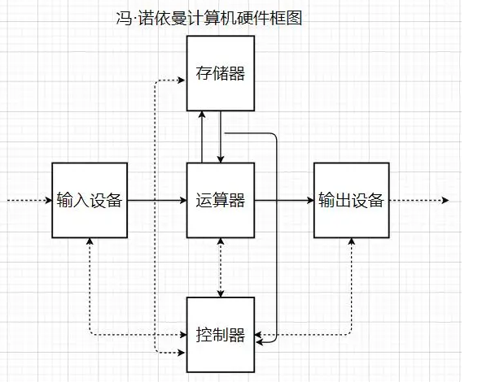
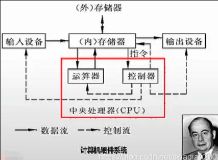
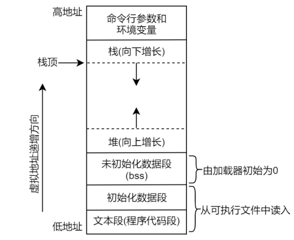
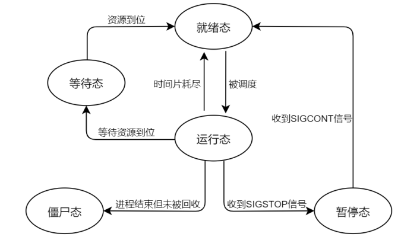
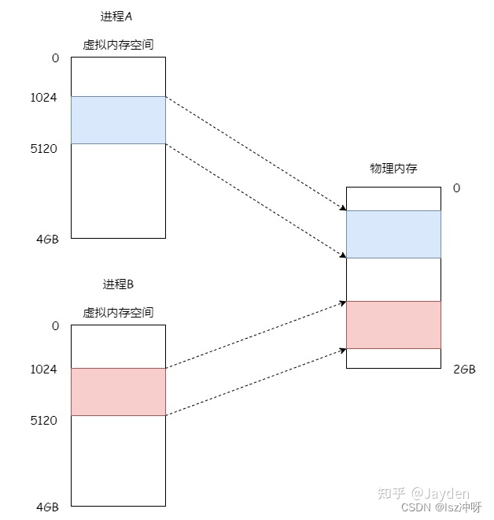
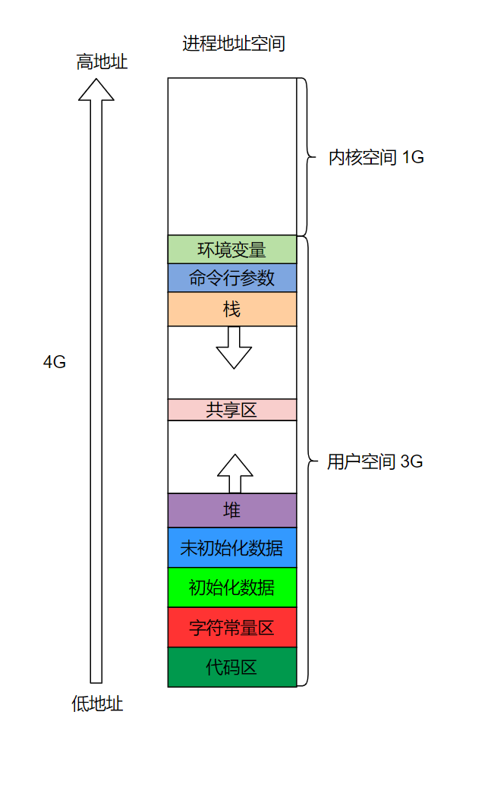
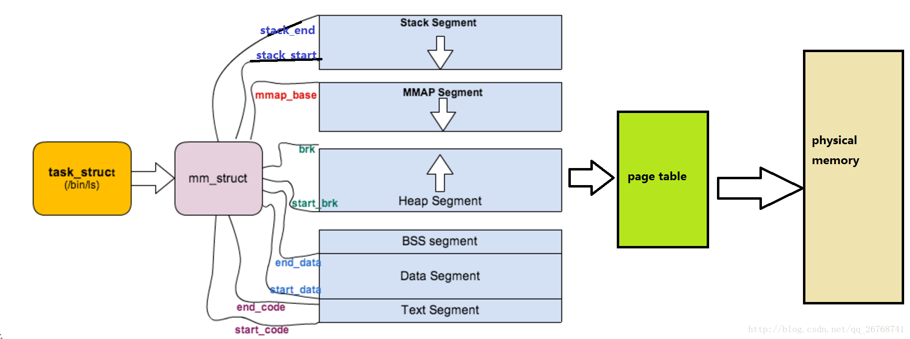

<!-- TOC -->

- [1. 计算机基础](#1-计算机基础)
  - [1.1. 计算机组成](#11-计算机组成)
    - [1.1.1. 冯·诺依曼计算机与现代计算机原理与差别](#111-冯诺依曼计算机与现代计算机原理与差别)
    - [1.1.2. CPU组成](#112-cpu组成)
      - [1.1.2.1. CPU组成](#1121-cpu组成)
      - [1.1.2.2. 寄存器](#1122-寄存器)
      - [1.1.2.3. 不同位数计算机的区别](#1123-不同位数计算机的区别)
    - [1.1.3. 总线](#113-总线)
    - [1.1.4. 程序计数器](#114-程序计数器)
    - [1.1.5. 存储器层次结构](#115-存储器层次结构)
  - [1.2. 数据在计算机中的存储方式](#12-数据在计算机中的存储方式)
    - [1.2.1. 原码反码补码](#121-原码反码补码)
    - [1.2.2. 大端小端](#122-大端小端)
    - [1.2.3. 浮点数据的存储](#123-浮点数据的存储)
      - [1.2.3.1. 浮点数据的十进制和二进制转换](#1231-浮点数据的十进制和二进制转换)
      - [1.2.3.2. 浮点数的表示方法](#1232-浮点数的表示方法)
  - [1.3. 计算机系统基本概念](#13-计算机系统基本概念)
    - [1.3.1. 信息就是位+上下文](#131-信息就是位上下文)
    - [1.3.2. 程序被其他程序翻译成不同的格式](#132-程序被其他程序翻译成不同的格式)
    - [1.3.3. 系统的硬件组成](#133-系统的硬件组成)
    - [1.3.4. 时钟周期、机器周期、指令周期的概念及三者之间的关系](#134-时钟周期机器周期指令周期的概念及三者之间的关系)
    - [1.3.5. 高速缓存](#135-高速缓存)
    - [1.3.6. 内核空间和用户空间](#136-内核空间和用户空间)
- [2. C程序的编译过程](#2-c程序的编译过程)
  - [2.1. 编译过程](#21-编译过程)
  - [2.2. 静态链接和动态链接的区别](#22-静态链接和动态链接的区别)
- [3. 操作系统概述](#3-操作系统概述)
- [4. 进程管理](#4-进程管理)
  - [4.1. 进程&线程](#41-进程线程)
  - [4.2. 进程描述符以及任务结构](#42-进程描述符以及任务结构)
  - [4.3. 各种类型的进程](#43-各种类型的进程)
  - [4.4. 进程和程序](#44-进程和程序)
    - [4.4.1. main()函数由谁调用](#441-main函数由谁调用)
    - [4.4.2. 程序如何结束](#442-程序如何结束)
  - [4.5. 进程组](#45-进程组)
  - [4.6. 进程的内存布局](#46-进程的内存布局)
  - [4.7. Linux进程调度方案](#47-linux进程调度方案)
  - [4.8. 进程创建](#48-进程创建)
    - [4.8.1. fork](#481-fork)
    - [4.8.2. vfork](#482-vfork)
    - [4.8.3. 写时拷贝](#483-写时拷贝)
    - [4.8.4. forkO](#484-forko)
    - [4.8.5. vforkO](#485-vforko)
  - [4.9. 进程诞生和终结](#49-进程诞生和终结)
  - [4.10. 监视子进程](#410-监视子进程)
    - [4.10.1. wait](#4101-wait)
    - [4.10.2. waitpid](#4102-waitpid)
    - [4.10.3. waitid](#4103-waitid)
    - [4.10.4. 僵尸进程与孤儿进程](#4104-僵尸进程与孤儿进程)
    - [4.10.5. SIGCHLD信号](#4105-sigchld信号)
  - [4.11. 进程状态](#411-进程状态)
  - [4.12. 守护进程](#412-守护进程)
  - [4.13. 进程同步](#413-进程同步)
    - [4.13.1. 概念](#4131-概念)
    - [4.13.2. 操作系统pv操作](#4132-操作系统pv操作)
    - [4.13.3. 经典进程同步问题](#4133-经典进程同步问题)
  - [4.14. 进程地址空间](#414-进程地址空间)
    - [4.14.1. 进程内存](#4141-进程内存)
    - [4.14.2. 写时复制机制](#4142-写时复制机制)
- [5. 进程调度](#5-进程调度)
  - [5.1. 策略](#51-策略)
    - [5.1.1. IO消耗型和CPU消耗型的进程](#511-io消耗型和cpu消耗型的进程)
    - [5.1.2. 进程优先级](#512-进程优先级)
    - [5.1.3. 时间片](#513-时间片)
  - [5.2. 操作系统调度算法](#52-操作系统调度算法)
    - [5.2.1. 常见的操作系统调度算法](#521-常见的操作系统调度算法)
      - [5.2.1.1. 先来先服务调度算法（FCFS）](#5211-先来先服务调度算法fcfs)
      - [5.2.1.2. 短作业/短进程优先算法（SJF/SPF）](#5212-短作业短进程优先算法sjfspf)
      - [5.2.1.3. 时间片轮转调度算法（RR）](#5213-时间片轮转调度算法rr)
      - [5.2.1.4. 高响应比优先调度算法（HRRF）](#5214-高响应比优先调度算法hrrf)
      - [5.2.1.5. 优先级调度算法（PSA）](#5215-优先级调度算法psa)
      - [5.2.1.6. 多级反馈队列调度算法（MLFQ）](#5216-多级反馈队列调度算法mlfq)
    - [5.2.2. Linux调度算法](#522-linux调度算法)
  - [5.3. 调度的实现](#53-调度的实现)
  - [5.4. 抢占和上下文切换](#54-抢占和上下文切换)
  - [5.5. 实时调度策略](#55-实时调度策略)
  - [5.6. 与调度相关的系统调用](#56-与调度相关的系统调用)
- [6. 进程间通信](#6-进程间通信)
  - [6.1. 进程间通信机制](#61-进程间通信机制)
    - [6.1.1. 管道和FIFO](#611-管道和fifo)
    - [6.1.2. 信号](#612-信号)
    - [6.1.3. 消息队列](#613-消息队列)
    - [6.1.4. 信号量](#614-信号量)
    - [6.1.5. 共享内存](#615-共享内存)
    - [6.1.6. 套接字](#616-套接字)
- [7. 线程](#7-线程)
  - [7.1. 线程的基本概念](#71-线程的基本概念)
  - [7.2. 线程间的同步和通信](#72-线程间的同步和通信)
  - [7.3. 线程的实现方式](#73-线程的实现方式)
  - [7.4. 线程的实现](#74-线程的实现)
  - [7.5. 线程在linux中的操作](#75-线程在linux中的操作)
    - [7.5.1. 线程id](#751-线程id)
    - [7.5.2. 线程的创建](#752-线程的创建)
    - [7.5.3. 终止线程](#753-终止线程)
    - [7.5.4. 回收线程](#754-回收线程)
    - [7.5.5. 取消线程](#755-取消线程)
    - [7.5.6. 分离线程](#756-分离线程)
    - [7.5.7. 注册线程清理函数](#757-注册线程清理函数)
    - [7.5.8. 线程属性](#758-线程属性)
  - [7.6. 线程安全](#76-线程安全)
    - [7.6.1. 线程安全概念](#761-线程安全概念)
- [8. 上下文切换](#8-上下文切换)
    - [8.0.2. 线程安全函数](#802-线程安全函数)
- [9. 存储器管理](#9-存储器管理)
  - [9.1. 计算机中的“扇区”、“簇”、“块”、“页”](#91-计算机中的扇区簇块页)
- [10. 设备管理](#10-设备管理)
- [11. 文件管理](#11-文件管理)
- [12. 操作系统接口](#12-操作系统接口)
- [13. 网络操作系统](#13-网络操作系统)
- [14. 高级IO](#14-高级io)

<!-- /TOC -->


# 1. 计算机基础
<a href="#menu"  >目录</a>

## 1.1. 计算机组成

### 1.1.1. 冯·诺依曼计算机与现代计算机原理与差别
<a href="#menu"  >目录</a>

**冯·诺依曼的核心思想**

* 计算机由五大部件组成
    * 运算器：用来做算术（加减乘除）计算和逻辑（与、或、非）计算；
    存储器：用来存放程序和数据；
    * 控制器：控制程序的运行；
    * 输入设备：输入信息，比如键盘、扫描仪等；
    * 输出设备：输出信息，比如打印机、投影仪等；
* 指令和数据以同等地位存于存储器，可按地址寻访
* 指令和数据都以二进制表示
* 指令由操作码和地址码组成
* 存储程序
* 以运算器为中心



实线是数据流，虚线是控制流

从图中可以看出，冯·诺依曼计算机以运算器为中心，就会导致运算器承担更多的工作。

**现代计算机硬件系统架构**



运算器是CPU的一部分，CPU相当于计算机的大脑，是计算机最宝贵的资源；因此，我们尽量让CPU只处理关键的、必要的工作。

现在计算机是以冯·诺依曼计算机为基础改进而来的，冯·诺依曼计算机的运算器和控制器是分开的，现代计算机是将运算器和控制器放到一起就形成了CPU。

计算机从以运算器为中心转变为以存储器为中心，数据先存放到存储器再跟CPU做交互，运算器和存储器的地位实现了反转

### 1.1.2. CPU组成
<a href="#menu"  >目录</a>

#### 1.1.2.1. CPU组成
<a href="#menu"  >目录</a>

CPU又称中央管理器，是一块超大规模的集成电路，是一台计算机的运算核心和控制核心。CPU的主要组成包括了运算器和控制器。

运算器是由算术逻辑单元（ALU）、累加器、状态寄存器、通用寄存器组等组成。

ALU主要完成对二进制信息的定点算术运算、逻辑运算和各种移位操作。通用寄存器组是用来保存参加运算的操作数和运算的中间结果。状态寄存器在不同的机器中有不同的规定，程序中，状态位通常作为转移指令的判断条件。

控制器一般包括指令控制逻辑、时序控制逻辑、总线控制逻辑、中断控制逻辑等几个部分。

指令控制逻辑要完成取指令、分析指令和执行指令的操作。时序控制逻辑要为每条指令按时间顺序提供应有的控制信号。

总线逻辑是为多个功能部件服务的信息通路的控制电路。就CPU而言一般分为内部总线和CPU对外联系的外部总线，外部总线有时候又叫做系统总线、前端总线（FSB）等。

中断是指计算机由于异常事件，或者一些随机发生需要马上处理的事件，引起CPU暂时停止现在程序的执行，转向另一服务程序去处理这一事件，处理完毕再返回原程序的过程。

#### 1.1.2.2. 寄存器
<a href="#menu"  >目录</a>

寄存器的功能是存储二进制代码，它是由具有存储功能的触发器组合起来构成的。一个触发器可以存储1位二进制代码，故存放n位二进制代码的寄存器，需用n个触发器来构成。 
 
按照功能的不同，可将寄存器分为基本寄存器和移位寄存器两大类。基本寄存器只能并行送入数据，也只能并行输出。移位寄存器中的数据可以在移位脉冲作用下依次逐位右移或左移，数据既可以并行输入、并行输出，也可以串行输入、串行输出，还可以并行输入、串行输出，或串行输入、并行输出，十分灵活，用途也很广

寄存器是CPU内部用来存放数据的一些小型存储区域，**用来暂时存放参与运算的数据和运算结果**。其实寄存器就是一种常用的时序逻辑电路，但这种时序逻辑电路只包含存储电路。寄存器的存储电路是由锁存器或触发器构成的，因为一个锁存器或触发器能存储1位二进制数，所以由N个锁存器或触发器可以构成N位寄存器。寄存器是中央处理器内的组成部分。寄存器是有限存储容量的高速存储部件，它们可用来暂存指令、数据和位址

**常⻅的寄存器种类：**
* 通⽤寄存器，⽤来存放需要进⾏运算的数据，⽐如需要进⾏加和运算的两个数据。
* 程序计数器，⽤来存储 CPU 要执⾏下⼀条指令「所在的内存地址」，注意不是存储了下⼀条要执⾏的指令，此时指令还在内存中，程序计数器只是存储了下⼀条指令的地址。
* 指令寄存器，⽤来存放程序计数器指向的指令，也就是指令本身，指令被执⾏完成之前，指令都存储在这⾥。


**寄存器和cache的区别**
* 寄存器是CPU为了运算，必须要有的临时存放数据的器件；cache是为了弥补CPU和内存的速度上的差异设置的缓存。
* 寄存器是中央处理器的一部分，是CPU必须的；Cache并不是每个CPU都有的。

寄存器拥有非常高的读写速度，所以在寄存器之间的数据传送非常快。

Cache 即高速缓冲存储器，是位于CPU与主内存间的一种容量较小但速度很高的存储器。由于CPU的速度远高于主内存，CPU直接从内存中存取数据要等待一定时间周期，Cache中保存着CPU刚用过或循环使用的一部分数据，当CPU再次使用该部分数据时可从Cache中直接调用,这样就减少了CPU的等待时间,提高了系统的效率。Cache又分为一级Cache(L1 Cache)和二级Cache(L2 Cache)，L1 Cache集成在CPU内部，L2 Cache早期一般是焊在主板上,现在也都集成在CPU内部，常见的容量有256KB或512KB L2 Cache。


#### 1.1.2.3. 不同位数计算机的区别
<a href="#menu"  >目录</a>

在计算机架构中，64位整数、内存地址或其他数据单元，是指它们最高达到64位（8字节）宽。此外，64位CPU和算术逻辑单元架构是以寄存器、内存总线或者数据总线的大小为基准

不同位数的计算机表示其地址总线的长度不同，32位计算机的地址总线长度是4个字节，而64位计算机的地址总线是8个字节。
其寄存器的长度也是和位数一致。32位计算机的可寻址长度是4GB(2的32次方),而64位计算机的可寻址长度超过1亿GB。在32位计算机上使用超过4GB的内存，超过的部分是不可用的。

操作系统一般都会向下兼容，也就是64位计算机上也可以安装32位的操作系统，但此时可寻址的长度也变为32位了，反之则不行。

计算机多少位是机器字长，但是指令字长并不一定等于机器字长，而是和编译器有关，比如gcc编译器，不管是在32位还是64位的机器上，其int的长度都是等于32位。32位系统中long　4个字节，long long 8个字节，而64位系统，long和long long都是8个字节。

### 1.1.3. 总线
<a href="#menu"  >目录</a>

总线是⽤于 CPU 和内存以及其他设备之间的通信，总线可分为 3 种：
* 地址总线，⽤于指定 CPU 将要操作的内存地址；
* 数据总线，⽤于读写内存的数据；
* 控制总线，⽤于发送和接收信号，⽐如中断、设备复位等信号， CPU 收到信号后⾃然进⾏响应，这时也需要控制总线

### 1.1.4. 程序计数器
<a href="#menu"  >目录</a>

程序计数器是计算机处理器中的寄存器，程序计数器是用于存放下一条指令所在单元的地址的地方。

当执行一条指令时，首先需要根据PC中存放的指令地址，将指令由内存取到指令寄存器中，此过程称为“取指令”。与此同时，PC中的地址或自动加1或由转移指针给出下一条指令的地址。此后经过分析指令，执行指令。完成第一条指令的执行，而后根据PC取出第二条指令的地址，如此循环，执行每一条指令。

为了保证程序（在操作系统中理解为进程）能够连续地执行下去，处理器必须具有某些手段来确定下一条指令的地址。而程序计数器正是起到这种作用，所以通常又称为指令计数器。在程序开始执行前，必须将它的起始地址，即程序的第一条指令所在的内存单元地址送入程序计数器，因此程序计数器的内容即是从内存提取的一条指令的地址。当执行指令时，处理器将自动修改PC的内容，即每执行一条指令PC增加一个量，这个量等于指令所含的字节数，以便使其保持的总是将要执行的下一条指令的地址。由于大多数指令都是按顺序来执行的，所以修改的过程通常只是简单的对PC加1。 
 
但是，当遇到转移指令如JMP（跳转、外语全称：JUMP）指令时，后继指令的地址（即PC的内容）必须从指令寄存器中的地址字段取得。在这种情况下，下一条从内存取出的指令将由转移指令来规定，而不像通常一样按顺序来取得。因此程序计数器的结构应当是具有寄存信息和计数两种功能的结构。

⼀个程序执⾏的时候， CPU 会根据程序计数器⾥的内存地址，从内存⾥⾯把需要执⾏的指令读取到指令寄存器⾥⾯执⾏，然后根据指令⻓度⾃增，开始顺序读取下⼀条指令。

CPU 从程序计数器读取指令、到执⾏、再到下⼀条指令，这个过程会不断循环，直到程序执⾏结束，这个不断循环的过程被称为 CPU 的指令周期。

### 1.1.5. 存储器层次结构
<a href="#menu"  >目录</a>


存储器层次结构的主要思想就是上一层的存储器作为低一层的存储器的高速缓存．


## 1.2. 数据在计算机中的存储方式
<a href="#menu"  >目录</a>

### 1.2.1. 原码反码补码
<a href="#menu"  >目录</a>

计算机中的整数有三种2进制表示方法，即原码、反码和补码。

三种表示方法均有符号位和数值位两部分，符号位都是用0表示“正”，用1表示“负”，而数值位正数的原、反、补码都相同。

负整数的三种表示方法各不相同。
* 原码,直接将数值按照正负数的形式翻译成二进制就可以得到原码。
* 反码,将原码的符号位不变，其他位依次按位取反就可以得到反码。
* 补码,反码+1就得到补码

比如-3(int32类型)
```yml

1000 0000 0000 0000 0000 0000 0000 0011　 #-3 原码,高位为1，代表负数
1111 1111 1111 1111 1111 1111 1111 1100  #-3 反码，除符号位之外，其他取反
1111 1111 1111 1111 1111 1111 1111 1101  #　补码，反码+1　
```

在计算机系统中，数值一律用补码来表示和存储。原因在于，使用补码，可以将符号位和数值域统一处理；同时，加法和减法也可以统一处理。此外，补码与原码相互转换，其运算过程是相同的，不需要额外的硬件电路。正负数的加减用补码进行运算更合适.

如果使用原码进行数值加减(假设是8位),-2 + 1运算。 

```yaml
#使用原码进行计算
-2： 1000 0010,
1 :  0000 0001
-2 + 1 = 1000 0011 = -3 
可以看到，如果直接使用原码进行计算，结果将会出错

#使用补码进行计算
-2: 1111 1110
1 : 0000 0001
-2 + 1 = 1111 1111 （补码）－－》　1111　1110　(反码)　－－》1000 0001 (-1的原码)
此时计算结果就是正确的。

```

```yml
不同数值的补码
4  00000000000000000000000000000100
-3 11111111111111111111111111111101
2  00000000000000000000000000000010
1  00000000000000000000000000000001
-1 11111111111111111111111111111111
```

### 1.2.2. 大端小端
<a href="#menu"  >目录</a>

* 大端（存储）模式，是指数据的低位保存在内存的高地址中，而数据的高位，保存在内存的低地址中；
* 小端（存储）模式，是指数据的低位保存在内存的低地址中，而数据的高位,，保存在内存的高地址中。

为什么有大端和小端：因为如果数据的内存需要开辟多个字节，那么储存的时候每个字节的储存方式有多种，不方便人们查看与认识存储方式，故有了大小端，要注意，是字节序，字节的排法，不是比特位的；

```yml
数据：0x1234
大端模式: 0xA1(低位地址，存储数据的高位0x12) 0xA2(高位地址，存储数据的低位0x34)
小端模式: 0xA1(低位地址，存储数据的低位0x34) 0xA2(高位地址，存储数据的高位0x12)
```
利用联合体检测电脑的大小端模式
```c
union
{
    int i;
    char c;
}un;
un.i = 1;
if(un.c == 1) {
    printf("小端模式");
}
else
{
    printf("大端模式");
}
```

### 1.2.3. 浮点数据的存储
<a href="#menu"  >目录</a>

#### 1.2.3.1. 浮点数据的十进制和二进制转换

浮点数据的十进制转换为二进制
```
4.6875
整数部分按整数的方法转换 4-->'100'
小数点保留
小数部分使用乘２取整法
第一位:0.6875x2 = 1.375 --->超过1,所以取１
第二位:(1.375-1)×２＝0.75 --->小于1,所以取0
第三位:0.75X2 = 1.5 --->超过1,所以取１
第四位:(1.5 - 1)X2 = 1 --->等1,所以取１
所以:4.6875的二进制表示法就是:100.1011
```
浮点数据的二进制转换为十进制
```
100.1011　
整数部分转换按整数方法转换　100 = 1 * 2^2 + 0 * 2^1 + 0 * 2^0
小数部分: 1011 = 1 * 2^(-1) + 0 * 2^(-2) + 1 * 2^(-3) + 1 * 2^(-4)
              = 1/2 + 0 + 1/8 + 1/16
              = 0.6875
```


#### 1.2.3.2. 浮点数的表示方法　

整形类型(包括char类型，因为其在计算机中存储的是其ASCII码值)在计算机中都是存储其数值(整型是以补码方式存储)，但是对于浮点数据，还需要考虑其精度，数据位越高，精度也越高，同时，还需要考虑小数点如何表示。

**浮点数的表示方法**

定点表示法：固定小数点的位置，比如小数点左边取14位，右边取2位。但这个存在的问题是精度丢失，比如14.5678,由于只取右边两位，就是14.56。

浮点表示法:就是小数点的位置是不固定的，根据数值的情况而改变。使用这个方法可以极大增加实数的表示范围

回顾一下科学计数法
```
正数
+1234500009 的科学计数法是　+ 1.234500009　×　10^(9)
负数
0.123　－－》　1.23　×　10^(-1)
```
科学计数法由三部分组成,符号(+) ，位移量(9),定点部分(1.234500009)

如果是二进制的浮点数
```
1000.1011 --> 1.0001011 * 2^(3)
规范化
符号　　　指数　　　尾数
 +       2^(3)   1.001011
 +       3       001011  
```
尾数的小数点左边的1不用考虑，因为其一定是1，是隐含的。所以计算机只要存储这三个值即可表示浮点数据

还有一个问题是，指数可能是负的，所以要用有限位来区别出存储的是正数还是负数，将会使用余码表示法来表示

如果使用８位来存储，其正数的范围为0-255

此时，我们限定偏移量的范围为　[-127,127],我们使用一个正整数的偏移量加到这个范围，这里使用127,加了之后的范围变成[0,254],就不会造成溢出(0-255)，就解决可存储正负数的问题，这个正整数的偏移量使用的2^(n-1)-1.

两种IEE标准
||单精度|双精度|
|---|---|---|
|内存单元大小(位)|32|64|
|符号大小|1|1|
|指数大小|8|11|
|尾数大小|23|52|
|偏移量最大(正负)|127|1023|
|范围|[-2^128 ~ 2^128]|[-2^1027 ~ 2^1024]|

对于单精度，偏移量为[-127,127],加上小数点左边的一位，一共有128位来表示浮点数据，所以其范围为[-2^128 ~ 2^128]


偏移量越大，能表示的范围数越大

float和double的精度是由尾数的位数来决定的。float：2^23 = 8388608，⼀共七位，这意味着最多能有7位有效数字，但绝对能保证的为6位，也即float的精度为6~7位有效数字；double：2^52 = 4503599627370496，⼀共16位，同理，double的精度为15~16位


综上，浮点数的存储时就存储三个数据，符号位S，指数Ｅ，尾数M

例子：求5.75的单精度表示法
```
1. 符号为正，所以S=1
2. 十进制转为二进制，5.75＝（101.11）
3. 规范化，（101.11）　＝　1.0111　×　2^2
4. Ｅ＝2＋127＝129
5. M=0111,由于M的长度是23位，我们需要在其后面补0,Ｍ＝0111 0000 0000 0000 0000 000
```


## 1.3. 计算机系统基本概念
<a href="#menu"  >目录</a>


### 1.3.1. 信息就是位+上下文
<a href="#menu"  >目录</a>

计算机系统是由硬件和系统软件组成，它们共同工作来运行应用程序．

一个文件由ASCII字符构成的文件称为文本文件，所有其他的文件称为二进制文件．系统中所有的信息，包括磁盘文件，内存中的程序，内存中存放的用户数据以及网上传输的数据，都是由一串比特表示的．区分不同的数据对象是根据这些数据对象的上下文．在不同的上下文中，一个同样的字节序列可能表示的是整数，浮点数或者字符串等

### 1.3.2. 程序被其他程序翻译成不同的格式
<a href="#menu"  >目录</a>

执行四个阶段[预处理器，编译器，汇编器，链接器]一起构成了编译系统


* 预处理阶段
    * 根据include命令告诉预处理器读取系统头文件的内容并将它插入到程序文本中，得到了另一个c程序，通常以.i作为文件扩展名
* 编译阶段
    * 将.i文件翻译成文本文件.s，它包含了一个汇编语言程序
* 汇编阶段
    * 汇编器将.s文件翻译成机器语言指令，把这些指令打包成一种叫做可重定位目标程序的格式．并将结果保存在目标文件.o中
* 链接阶段
    * 该文件如果调用其他文件的函数，则需要通过链接将它们合并到本文件中，结果得到可执行文件，可以被加载到内存中，由系统执行

### 1.3.3. 系统的硬件组成
<a href="#menu"  >目录</a>


**总线***
* 包括地址总线和数据总线
* 总线被设计成传送定长的字节块，也就是字(word)，系统中的int的长度就是字长，也就是int的长度等于地址总线的条数／８．32位机是４个字节，64位是8个字节
    
**CPU**

中央处理器（CPU，Central Processing Unit）是一块超大规模的集成电路，是一台计算机的运算核心（Core）和控制核心（ Control Unit）。它的功能主要是解释计算机指令以及处理计算机软件中的数据。中央处理器主要包括运算器（算术逻辑运算单元，ALU，Arithmetic Logic Unit）和高速缓冲存储器（Cache）及实现它们之间联系的数据（Data）、控制及状态的总线（Bus）。它与内部存储器（Memory）和输入/输出（I/O）设备合称为电子计算机三大核心部件。

**寄存器**

寄存器是中央处理器内的组成部份。它跟CPU有关。寄存器是有限存贮容量的高速存贮部件，它们可用来暂存指令、数据和位址。在中央处理器的控制部件中，包含的寄存器有指令寄存器(IR)和程序计数器(PC)。在中央处理器的算术及逻辑部件中，包含的寄存器有累加器(ACC)。

**存储器**

存储器范围最大，它几乎涵盖了所有关于存储的范畴。你所说的寄存器，内存，都是存储器里面的一种。凡是有存储能力的硬件，都可以称之为存储器，这是自然，硬盘更加明显了，它归入外存储器行列，由此可见。

**内存**

内存既专业名上的内存储器，它不是个什么神秘的东西，它也只是存储器中的沧海一粟，它包涵的范围也很大，一般分为只读存储器（ROM）和随机存储器（RAM），以及最强悍的高速缓冲存储器（CACHE），只读存储器应用广泛，它通常是一块在硬件上集成的可读芯片，作用是识别与控制硬件，它的特点是只可读取，不能写入。随机存储器的特点是可读可写，断电后一切数据都消失，我们所说的内存条就是指它了。

**缓存CACHE**

缓存就是数据交换的缓冲区（称作Cache），当某一硬件要读取数据时，会首先从缓存中查找需要的数据，如果找到了则直接执行，找不到的话则从内存中找。由于缓存的运行速度比内存快得多，故缓存的作用就是帮助硬件更快地运行。因为缓存往往使用的是RAM（断电即掉的非永久储存），所以在用完后还是会把文件送到硬盘等存储器里永久存储。电脑里最大的缓存就是内存条了，最快的是CPU上镶的L1和L2缓存，显卡的显存是给显卡运算芯片用的缓存，硬盘上也有16M或者32M的缓存。CACHE是在CPU中速度非常块，而容量却很小的一种存储器，它是计算机存储器中最强悍的存储器。由于技术限制，容量很难提升。

**寄存器**
* 简介
    * 寄存器是中央处理器内的组成部分。寄存器是有限存贮容量的高速存贮部件，它们可用来暂存指令、数据和地址。在中央处理器的控制部件中，包含的寄存器有指令寄存器(IR)和程序计数器(PC)。在中央处理器的算术及逻辑部件中，存器有累加器(ACC)。 
    * 寄存器的基本单元是 D触发器， 
    * 按照其用途分为基本寄存器和移位寄存器 
    * 基本寄存器是由 D触发器组成，在 CP 脉冲作用下，每个 D触发器能够寄存一位二进制码。在 D=0 时，寄存器储存为 0，在 D=1 时，寄存器储存为 1。在低电平为 0、高电平为 1 时，需将信号源与 D 间连接一反相器，这样就可以完成对数据的储存。 需要强调的是，目前大型数字系统都是基于时钟运作的，其中寄存器一般是在时钟的边缘被触发的，基于电平触发的已较少使用。（通常说的CPU的频率就是指数字集成电路的时钟频率） 
    * 移位寄存器按照移位方向可以分为单向移位寄存器和双向移位寄存器。单向移位寄存器是由多个 D 触发器串接而成,在串口 Di 输入需要储存的数据，触发器 FF0 就能够储存当前需要储存数据，在 CP 发出一次时钟控制脉冲时，串口 Di 同时输入第二个需要储存是的数据，而第一个数据则储存到触发器 FF1 中。双向移位寄存器按图中方式排列，调换连接端顺序，可以控制寄存器向左移位，增加控制电路可以使寄存器右移，这样构成双向移位寄存器。
* 特点
    * 寄存器又分为内部寄存器与外部寄存器，所谓内部寄存器，其实也是一些小的存储单元，也能存储数据。但同存储器相比，寄存器又有自己独有的特点： 
    * 寄存器位于CPU内部，数量很少，仅十四个 
    * 寄存器所能存储的数据不一定是8bit，有一些寄存器可以存储16bit数据，对于386/486处理器中的一些寄存器则能存储32bit数据 
    * 每个内部寄存器都有一个名字，而没有类似存储器的地址编号。
* 用途  
    * 可将寄存器内的数据执行算术及逻辑运算 
    * 存于寄存器内的地址可用来指向内存的某个位置，即寻址 
    * 可以用来读写数据到电脑的周边设备。

**存储器**
* 存储器简介
    * 构成存储器的存储介质，存储元，它可存储一个二进制代码。由若干个存储元组成一个存储单元，然后再由许多存储单元组成一个存储器。一个存储器包含许多存储单元，每个存储单元可存放一个字节（按字节编址）。每个存储单元的位置都有一个编号，即地址，一般用十六进制表示。一个存储器中所有存储单元可存放数据的总和称为它的存储容量。假设一个存储器的地址码由20位二进制数（即5位十六进制数）组成，则可表示2的20次方，即1M个存储单元地址。每个存储单元存放一个字节，则该存储器的存储容量为1MB。
* ROM、RAM的区别
    * ROM（只读存储器或者固化存储器）RAM（随机存取存储器）ROM和RAM指的都是半导体存储器，ROM是Read Only Memory的缩写，RAM是Random Access Memory的缩写。ROM在系统停止供电的时候仍然可以保持数据，而RAM通常都是在掉电之后就丢失数据，典型的RAM就是计算机的内存。 RAM有两大类，一种称为静态RAM（Static RAM/SRAM），当数据被存入其中后不会消失。SRAM速度非常快，是目前读写最快的存储设备了。当这个SRAM 单元被赋予0 或者1 的状态之后，它会保持这个状态直到下次被赋予新的状态或者断电之后才会更改或者消失。但是存储1bit 的信息需要4-6 只晶体管。因此它也非常昂贵，所以只在要求很苛刻的地方使用，譬如CPU的一级缓冲，二级缓冲。另一种称为动态RAM（Dynamic RAM/DRAM），DRAM 必须在一定的时间内不停的刷新才能保持其中存储的数据。DRAM 只要1 只晶体管就可以实现。DRAM保留数据的时间很短，速度也比SRAM慢，不过它还是比任何的ROM都要快，但从价格上来说DRAM相比SRAM要便宜很 多，计算机内存就是DRAM的。 DRAM分为很多种，常见的主要有FPRAM/FastPage、EDORAM、SDRAM、DDR RAM、RDRAM、SGRAM以及WRAM等，这里介绍其中的一种DDR RAM。DDR RAM（Date-Rate RAM）也称作DDR SDRAM，这种改进型的RAM和SDRAM是基本一样的，不同之处在于它可以在一个时钟读写两次数据，这样就使得数据传输速度加倍了。这是目前电脑中用 得最多的内存，而且它有着成本优势，事实上击败了Intel的另外一种内存标准－Rambus DRAM。在很多高端的显卡上，也配备了高速DDR RAM来提高带宽，这可以大幅度提高3D加速卡的像素渲染能力。 
    * ROM也有很多种，PROM是可编程的ROM，PROM和EPROM（可擦除可编程ROM）两者区别是，PROM是一次性的，也就是软件灌入后，就无法修 改了，这种是早期的产品，现在已经不可能使用了，而EPROM是通过紫外光的照射擦出原先的程序，是一种通用的存储器。另外一种EEPROM是通过电子擦出，价格很高，写入时间很长，写入很慢。 最初,把只能读的存储器叫做ROM(Read Only Memory),并且掉电后数据不会丢失。由于不能改写，因而使用起来很不方便。随着技术的进步，在ROM中使用一些新技术，就可以使它具有可以编程的功能。比较早的是熔丝型的可编程ROM，由于是通过熔断熔丝来编程的，所以这类ROM编程后，就不能再写了，是一次性的(OTP)。后来又出现了EPROM，是通过紫外线来擦除的，并且通过高压来编程，这类ROM上面一般有一个透明的石英玻璃窗，看上去挺漂亮的，它就是用来给紫外线照射的。后来又出现了EEPROM，不用紫外线照射就可以擦除，因而可以直接在电路中编程。另外还有FLASH ROM，又可分为NOR FLASH和NAND FLASH。FLASH ROM一般有一个特点，就是写数据时，可以将1改为0，而不能将0改为1，因而写数据前需要擦除，擦除时将所有数据置1。之所以依然叫做ROM，归纳一下，大概有几个原因: 
        * 不能像RAM那样快速的写； 
        * 可能需要特殊的擦写电压； 
        * 可能需要特殊的擦写时序； 
        * 可能需要在写之前进行擦除操作； 
        * 擦写次数有限,不像RAM那样可以随意写而不损坏； 
        * 掉电后数据不会丢失； 
    * FLASH存储器又称闪存，它结合了ROM和RAM的长处，不仅具备电子可擦出可编程（EEPROM）的性能，还不会断电丢失数据同时可以快速读取数据 （NVRAM的优势），U盘和MP3里用的就是这种存储器。在过去的20年里，嵌入式系统一直使用ROM（EPROM）作为它们的存储设备，然而近年来 Flash全面代替了ROM（EPROM）在嵌入式系统中的地位，用作存储Bootloader以及操作系统或者程序代码或者直接当硬盘使用（U盘）。 
    * 目前Flash主要有两种NOR Flash和NADN Flash。NOR Flash的读取和我们常见的SDRAM的读取是一样，用户可以直接运行装载在NOR FLASH里面的代码，这样可以减少SRAM的容量从而节约了成本。NAND Flash没有采取内存的随机读取技术，它的读取是以一次读取一快的形式来进行的，通常是一次读取512个字节，采用这种技术的Flash比较廉价。用户 不能直接运行NAND Flash上的代码，因此好多使用NAND Flash的开发板除了使用NAND Flah以外，还作上了一块小的NOR Flash来运行启动代码。 一般小容量的用NOR Flash，因为其读取速度快，多用来存储操作系统等重要信息，而大容量的用NAND FLASH，最常见的NAND FLASH应用是嵌入式系统采用的DOC（Disk On Chip）和我们通常用的“闪盘”，可以在线擦除。

**CPU位数、操作系统位数、指令集、寄存器位数、机器字长等**

CPU位数 = CPU中寄存器的位数 = CPU能够一次并行处理的数据宽度 = 数据总线宽度


CPU为了实现其功能一般设计了指令集(如：IA32指令集和x86-64指令集等)，即是CPU的全部指令，这就是机器语言。计算机的所有功能都是基于CPU的指令集。指令集和CPU的位数是有联系 的。如Intel 8086 CPU 是16位，其指令集也是16位。如Intel 80386DX CPU 是32位，其指令集也是32位，但它也保持原16位指令集，这是为了向上兼容。

注意：x86 又叫 IA32，即 Intel Architecture 32（Intel32位架构）

操作系统位数 = 其所依赖的指令集位数 <= CPU位数

机器字长 = 整数和指针数据的标称大小（字长决定的最重要的参数就是虚拟地址空间的最大大小）

CPU位数与操作系统位数，这二者有区别也有联系，操作系统位数的概念是基于CPU的位数的。 CPU的位数是指CPU能一次同时寄存和处理二进制数码的位数，这和CPU中寄存器的位数对应。 操作系统的位数是说其所依赖的指令集的位数。计算机系统一般都应有向上兼容性，所以也可有64位CPU上运行32位操作系统、32位CPU上运行16位操作系统的情况。操作系统位数应该是根据指针类型的位数来定的。整数类型不一定跟位数相等，CPU位数准确地说应该是CPU一次能够并行处理的数据宽度，一般就是指数据总线宽度。 


### 1.3.4. 时钟周期、机器周期、指令周期的概念及三者之间的关系
<a href="#menu"  >目录</a>

**时钟周期**

时钟周期也称为振荡周期，定义为时钟脉冲的倒数(可以这样来理解，时钟周期就是单片机外接晶振的倒数，例如12M的晶振，它的时间周期就是1/12 us)，是计算机中最基本的、最小的时间单位。

 在一个时钟周期内，CPU仅完成一个最基本的动作。对于某种单片机，若采用了1MHZ的时钟频率，则时钟周期为1us;若采用4MHZ的时钟频率，则时钟周期为250ns。由于时钟脉冲是计算机的基本工作脉冲，它控制着计算机的工作节奏(使计算机的每一步都统一到它的步调上来)。显然，对同一种机型的计算机，时钟频率越高，计算机的工作速度就越快。但是，由于不同的计算机硬件电路和器件的不完全相同，所以其所需要的时钟周频率范围也不一定相同。我们学习的8051单片机的时钟范围是1.2MHz-12MHz。

**机器周期**

 在计算机中，为了便于管理，常把一条指令的执行过程划分为若干个阶段，每一阶段完成一项工作。例如，取指令、存储器读、存储器写等，这每一项工作称为一个基本操作。完成一个基本操作所需要的时间称为机器周期。一般情况下，一个机器周期由若干个S周期(状态周期)组成。8051系列单片机的一个机器周期同6个S周期(状态周期)组成。前面已说过一个时钟周期定义为一个节拍(用P表示)，二个节拍定义为一个状态周期(用S表示)，8051单片机的机器周期由6个状态周期组成，也就是说一个机器周期=6个状态周期=12个时钟周期。

**指令周期**

指令周期是执行一条指令所需要的时间，一般由若干个机器周期组成。指令不同，所需的机器周期数也不同。对于一些简单的的单字节指令，在取指令周期中，指令取出到指令寄存器后，立即译码执行，不再需要其它的机器周期。对于一些比较复杂的指令，例如转移指令、乘法指令，则需要两个或者两个以上的机器周期。

通常含一个机器周期的指令称为单周期指令，包含两个机器周期的指令称为双周期指令。


### 1.3.5. 高速缓存

由于处理器与主存之间的速度存在差异，处理器从寄存器中读取数据比主存中读取的速度快很多．因此系统设计采用了高速缓存存储器(cache memory).作为暂时的集结区域．存放处理器最近可能会需要的信息．从而实现大部分内存操作都可以在快速的高速缓存中完成．避免慢速地存取主存．


### 1.3.6. 内核空间和用户空间

以 32 位系统为例介绍内核空间(kernel space)和用户空间(user space)。

对 32 位操作系统而言，它的寻址空间（虚拟地址空间，或叫线性地址空间）为 4G（2的32次方）。也就是说一个进程的最大地址空间为 4G。操作系统的核心是内核(kernel)，它独立于普通的应用程序，可以访问受保护的内存空间，也有访问底层硬件设备的所有权限。为了保证内核的安全，现在的操作系统一般都强制用户进程不能直接操作内核。具体的实现方式基本都是由操作系统将虚拟地址空间划分为两部分，一部分为内核空间，另一部分为用户空间。针对 Linux 操作系统而言，最高的 1G 字节(从虚拟地址 0xC0000000 到 0xFFFFFFFF)由内核使用，称为内核空间。而较低的 3G 字节(从虚拟地址 0x00000000 到 0xBFFFFFFF)由各个进程使用，称为用户空间。


**为什么需要区分内核空间与用户空间**

在 CPU 的所有指令中，有些指令是非常危险的，如果错用，将导致系统崩溃，比如清内存、设置时钟等。如果允许所有的程序都可以使用这些指令，那么系统崩溃的概率将大大增加。
所以，CPU 将指令分为特权指令和非特权指令，对于那些危险的指令，只允许操作系统及其相关模块使用，普通应用程序只能使用那些不会造成灾难的指令。比如 Intel 的 CPU 将特权等级分为 4 个级别：Ring0~Ring3。
其实 Linux 系统只使用了 Ring0 和 Ring3 两个运行级别(Windows 系统也是一样的)。当进程运行在 Ring3 级别时被称为运行在用户态，而运行在 Ring0 级别时被称为运行在内核态。

**内核态与用户态**

当进程运行在内核空间时就处于内核态，而进程运行在用户空间时则处于用户态。
在内核态下，进程运行在内核地址空间中，此时 CPU 可以执行任何指令。运行的代码也不受任何的限制，可以自由地访问任何有效地址，也可以直接进行端口的访问。
在用户态下，进程运行在用户地址空间中，被执行的代码要受到 CPU 的诸多检查，它们只能访问映射其地址空间的页表项中规定的在用户态下可访问页面的虚拟地址，且只能对任务状态段(TSS)中 I/O 许可位图(I/O Permission Bitmap)中规定的可访问端口进行直接访问。

对于以前的 DOS 操作系统来说，是没有内核空间、用户空间以及内核态、用户态这些概念的。可以认为所有的代码都是运行在内核态的，因而用户编写的应用程序代码可以很容易的让操作系统崩溃掉。
对于 Linux 来说，通过区分内核空间和用户空间的设计，隔离了操作系统代码(操作系统的代码要比应用程序的代码健壮很多)与应用程序代码。即便是单个应用程序出现错误也不会影响到操作系统的稳定性，这样其它的程序还可以正常的运行(Linux 可是个多任务系统啊！)。

所以，区分内核空间和用户空间本质上是要提高操作系统的稳定性及可用性。

**如何从用户空间进入内核空间**

其实所有的系统资源管理都是在内核空间中完成的。比如读写磁盘文件，分配回收内存，从网络接口读写数据等等。我们的应用程序是无法直接进行这样的操作的。但是我们可以通过内核提供的接口来完成这样的任务。

比如应用程序要读取磁盘上的一个文件，它可以向内核发起一个 "系统调用" 告诉内核："我要读取磁盘上的某某文件"。其实就是通过一个特殊的指令让进程从用户态进入到内核态(到了内核空间)，在内核空间中，CPU 可以执行任何的指令，当然也包括从磁盘上读取数据。具体过程是先把数据读取到内核空间中，然后再把数据拷贝到用户空间并从内核态切换到用户态。此时应用程序已经从系统调用中返回并且拿到了想要的数据，可以开开心心的往下执行了。
简单说就是应用程序把高科技的事情(从磁盘读取文件)外包给了系统内核，系统内核做这些事情既专业又高效。

对于一个进程来讲，从用户空间进入内核空间并最终返回到用户空间，这个过程是十分复杂的。举个例子，比如我们经常接触的概念 "堆栈"，其实进程在内核态和用户态各有一个堆栈。运行在用户空间时进程使用的是用户空间中的堆栈，而运行在内核空间时，进程使用的是内核空间中的堆栈。所以说，Linux 中每个进程有两个栈，分别用于用户态和内核态。

进程有三种方式可以进入内核空间:系统调用、软中断和硬件中断.

**整体结构**


在硬件之上，内核空间中的代码控制了硬件资源的使用权，用户空间中的代码只有通过内核暴露的系统调用接口(System Call Interface)才能使用到系统中的硬件资源。其实，不光是 Linux，Windows 操作系统的设计也是大同小异。

实际上我们可以将每个处理器在任何指定时间点上的活动概括为下列三者之一：
* 运行于用户空间，执行用户进程。
* 运行于内核空间，处于进程上下文，代表某个特定的进程执行。
* 运行于内核空间，处于中断上下文，与任何进程无关，处理某个特定的中断。

以上三点几乎包括所有的情况，比如当 CPU 空闲时，内核就运行一个空进程，处于进程上下文，但运行在内核空间。

说明：Linux 系统的中断服务程序不在进程的上下文中执行，它们在一个与所有进程都无关的、专门的中断上下文中执行。之所以存在一个专门的执行环境，就是为了保证中断服务程序能够在第一时间响应和处理中断请求，然后快速地退出。

**总结**
现代的操作系统大都通过内核空间和用户空间的设计来保护操作系统自身的安全性和稳定性。所以在我们阅读有关操作系统的资料时经常遇到内核空间、用户空间和内核态、用户态等概念，希望本文能够帮助您理解这些基本的概念。


# 2. C程序的编译过程
<a href="#menu"  >目录</a>

C是一种编译语言。它的源代码可以用程序员选择的任何编辑器以文本文件的形式编写，然后必须编译成机器代码。

C 源文件按照惯例以.c 扩展名命名，我们使用命令“gcc”来编译 C 源文件。（GCC 代表 GNU Compiler Collection，它是由 GNU 项目产生的编译器系统。）

## 2.1. 编译过程
<a href="#menu"  >目录</a>


**编译四步：预处理、编译、汇编、链接。**

接下来介绍下编译中的这四步分别做了什么。

**1.预处理**

预处理是第一步。预处理器通过以下方式遵守以 # 开头的命令（称为指令）：
* 删除注释
* 扩展宏
* 扩展包含的文件

如果您包含了诸如#include <　stdio.h> 之类的头文件，它将查找stdio.h 文件并将头文件复制到源代码文件中。
预处理器还生成宏代码并将使用#define 定义的符号常量替换为它们的值。

**2.编译**

编译是第二步。它获取预处理器的输出并生成汇编语言，一种中间人类可读的语言，特定于目标处理器。

**3.汇编**

汇编是编译的第三步。汇编器会将汇编代码转换为纯二进制代码或机器代码（零和一）。此代码也称为目标代码。

**4.链接**

链接是编译的最后一步。链接器将来自多个模块的所有目标代码合并为一个。如果我们使用库中的函数，链接器会将我们的代码与该库函数代码链接。

在静态链接中，链接器将所有使用的库函数复制到可执行文件中。在动态链接中，不会复制代码，只需将库的名称放在二进制文件中即可。

## 2.2. 静态链接和动态链接的区别
<a href="#menu"  >目录</a>

**一、静态链接库与动态链接库的简介**

C或C++程序从源文件到生成可执行文件需经历 4 个阶段，分别为预处理、编译、汇编和链接。
链接阶段所要完成的工作，是将同一项目中各源文件生成的目标文件和程序中用到的库文件整合为一个可执行文件。

虽然库文件明确用于链接，但编译器提供了2种实现链接的方式，分别称为静态链接和动态链接。
* 采用静态链接方式实现链接操作，的库文件称为静态链接库；
* 采用动态链接方式实现链接操作，的库文件称为动态链接库。

在 Linux 发行版系统中，静态链接库文件的后缀名通常用 .a 表示，动态链接库的后缀名通常用 .so 表示；
在 Windows 系统中，静态链接库文件的后缀名为 .lib，动态链接库的后缀名为 .dll。

GCC 编译器生成可执行文件时，默认情况下会优**先使用动态链接库**实现链接操作，除非当前系统环境中没有程序文件所需要的动态链接库，GCC 编译器才会选择相应的静态链接库。如果两种都没有（或者 GCC 编译器未找到），则链接失败。

在 Linux 发行版中，静态链接库和动态链接库通常存放在 /usr/bin 或者 /bin 目录下

**二、区别**

1、静态链接库

静态链接库实现链接操作的方式很简单，即程序文件中哪里用到了库文件中的功能模块，GCC 编译器就会将该模板代码，直接复制到程序文件的适当位置，最终生成可执行文件。
静态库在链接阶段，会将汇编生成的目标文件.o与引用到的库一起链接打包到可执行文件中。

优势：
* 可移植性强，可独立运行，即生成的可执行文件不再需要任何静态库文件的支持就可以独立运行。
* 可执行程序与库函数再无关系，放在如何环境当中都可以执行。

劣势：
* 代码冗余、可执行文件的体积大：如果程序文件中多次调用库中的同一功能模块，则该模块代码就会被复制多次，生成的可执* 行文件中会包含多段完全相同的代码，造成代码的冗余。和使用动态链接库生成的可执行文件相比，静态链接库生成的可执行文件的体积更大。
且如果所使用的静态库发生更新改变，你的程序必须重新编译。

2、动态链接库

动态链接库，又称为共享链接库。采用动态链接库实现链接操作时，程序文件中哪里需要库文件的功能模块，GCC 编译器不会直接将该功能模块的代码拷贝到文件中，而是将功能模块的位置信息记录到文件中，直接生成可执行文件。

显然，这样生成的可执行文件是无法独立运行的。采用动态链接库生成的可执行文件运行时，GCC 编译器会将对应的动态链接库一同加载在内存中，由于可执行文件中事先记录了所需功能模块的位置信息，所以在现有动态链接库的支持下，也可以成功运行。

如果静态库liba.lib更新了，所有使用它的应用程序都需要重新编译，可能是一个很小的改动，却导致整个程序重新下载，全量更新。

动态库在程序编译时并不会被连接到目标代码中，而是在程序运行时才被载入。
不同的应用程序如果调用相同的库，那么在内存里只需要有一份该共享库的实例，规避了空间浪费问题。动态库在程序运行时才被载入，也解决了静态库对程序的更新、部署和发布页会带来麻烦。用户只需要更新动态库即可，增量更新。

优势：
* 生成的执行文件文件体积小，因为可执行文件中记录的是功能模块的地址，真正的实现代码会在程序运行时被载入内存，即便功能模块被调用多次，使用的都是同一份实现代码（这也是将动态链接库称为共享链接库的原因）。
* 动态库的改变并不影响你的程序，所以动态函数库升级比较方便。

劣势：
* 可移植性差，无法独立运行，必须借助相应的库文件。


# 3. 操作系统概述
<a href="#menu"  >目录</a>

操作系统是一种软件。从一般用户的观点，操作系统是用户和计算机硬件系统之间的接口。从资源管理的观点看，操作系统是计算机资源的管理者。同时，操作系统实现了对计算机资源的抽象，隐藏了对硬件操作的细节。

**操作系统基本特性**

* 并发
    * 并行与并发
      * 并行性
        * 两个或者多个事件在同一个时刻发生
      * 并发性
        * 两个或者多个事件在同一时间间隔内发生，在单cpu环境下，多个程序是以交替运行方式工作。而在多个cpu环境下，多个程序可以同时运行，也就是并行执行
    * 引入进程
        * 进程是指在系统中能独立运行并作为资源分配的基本单位，它是由一组机器指令，数据和堆栈组成的。是一个能独立运行的活动实体。多个进程之间可以并发执行交换信息。一个进程运行时会占用一定的资源，比如cpu,内存，io资源等
        * 引入多进程能够使多个程序同时运行，并且在多处理器环境下，还可以更加有效地利用计算机资源。
    * 引入线程
        * 操作系统在进行进程切换的时候，调度的开销比较大，故而引入更轻量级的线程。进程作为分配资源的基本单位，而线程作为独立运行或者独立调度的基本单位。由于线程比进程小，基本不拥有系统资源，因此对它的调度造成的系统开销较小。
* 共享
    * 共享sharing指的是系统中资源可供内存中多个并发执行的进程(线程)共同使用，相应地，把这种资源共同使用称为资源共享或者资源复用。
    * 共享方式
        * 互斥共享方式,同一时间只能由一个进程或者线程进行访问，受访问的资源称为临界资源或者独占资源，访问时需要使用相应的机制进行锁定。
        * 同时访问方式，同一时间可由一个进程或者线程进行访问，
* 虚拟技术
    * 操作系统中所谓的虚拟是指通过某种技术将一个物理实体变为若干个逻辑上的相应物，使用的技术有时分复用技术和空分复用技术
    * 时分复用技术(分时使用方式)
      * 虚拟处理机技术，比如程序的并发执行，即使只有一个处理机，通过分时技术，程序交替运行，感觉上确是多个程序在同时执行
      * 虚拟设备技术，将一台物理I/O设备虚拟为多台逻辑上的I/O设备，并允许每个用户占用一台逻辑上的I/O设备。这样可以使原来允许一段时间内由一个用户独占变成一段时间内由多个用户同时访问的共享设备。
    * 空分复用技术
      * 虚拟磁盘技术
      * 虚拟存储器技术
* 异步性


**操作系统主要功能**

* 处理机管理功能
  * 进程控制
  * 进程同步
  * 进程通信
  * 调度
* 存储器管理功能
  * 内存分配
  * 内存保护
  * 地址映射
  * 内存扩充
* 设备管理功能
  * 缓冲管理
  * 设备分配
  * 设备处理
* 文件管理功能
  * 文件存储空间的管理
  * 目录管理
  * 文件的读写管理和保护
* 操作系统和用户之间的接口
  * 用户接口
  * 程序接口


# 4. 进程管理
<a href="#menu"  >目录</a>

进程是操作系统非常重要的概念，程序的运行是通过进程来完成的，在层次结构的操作系统中，进程不仅是系统分配资源的基本单位，而且是cpu调度的基本单位。

## 4.1. 进程&线程
<a href="#menu"  >目录</a>

**进程**
* **处于执行期的程序**，除了程序代码，还包含其他资源，比如打开的文件，挂起的信号，内核内部数据，内存地址空间以及存放变量的数据段等
* 进程是操作系统进行资源分配和管理的基本单元。每个进程之间内存相互独立。
* linux通常也把进程称为任务task
* linux中通过调用fork来创建进程，调用的进程称为父进程，创建的进程称为子进程。fork系统调用从内核返回两次，一次回到父进程，一次回到新产生的进程。

进程是一个动态过程，而非静态文件，它是程序的一次运行过程，当应用程序被加载到内存中运行之后,它就称为了一个进程，当程序运行结束后也就意味着进程终止，这就是进程的一个生命周期。

* 进程的特征
    * 结构特征
        * 为使程序能独立运行，需要为之配备一进程控制块PCB(Process control block).而程序段，相关的数据和PCB三部分便构成了进程实体。创建进程实际上是创建进程实体中的PCB,而撤销进程，实际上是撤销进程的PCB.
    * 动态性
        * 进程的实质是进程实体的一次执行过程。进程实体有一定的生命周期，而程序则只是一组有序指令的集合，是静态的。
    * 并发性
        * 指多个进程实体同存在于内存中，且能在一段时间内同时运行。
    * 独立性
        * 进程实体是一个能独立运行，独立分配资源和独立接受调度的基本单位
    * 异步性
        * 进程实体按异步方式运行
**线程**
* 进程中活动的对象，每个线程都拥有一个独立的程序计数器，进程栈和一组寄存器。
* 内核调度的是线程而不是进程

Linux 系统下的每一个进程都有一个进程号（process ID，简称 PID），进程号是一个正数，用于唯一标识系统中的某一个进程。
```cpp
#include <sys/types.h>
#include <unistd.h>
//获取本进程pid
pid_t getpid(void);
//获取父进程pid
pid_t getppid(void);
```

每一个进程都有一组与其相关的环境变量， 这些环境变量以字符串形式存储在一个字符串数组列表中，把这个数组称为环境列表。 其中每个字符串都是以“名称=值（name=value）” 形式定义，所以环境变量是“名称-值”的成对集合， 譬如在 shell 终端下可以使用 env 命令查看到 shell 进程的所有环境变量

环境变量存放在一个字符串数组中，在应用程序中，通过 environ 变量指向它， environ 是一个全局变量，在我们的应用程序中只需申明它即可使用，如下所示：

```c
#include <stdlib.h>
extern char **environ; // 申明外部全局变量 environ

//获取指定名称的环境变量
char *getenv(const char *name);
```


## 4.2. 进程描述符以及任务结构
<a href="#menu"  >目录</a>

为了描述和控制进程的运行，系统为每个进程定义了一个数据结构——进程控制块PCB(Process Control Block)，它是进程实体的一部分，是操作系统中最重要的记录型数据结构。PCB 中记录了操作系统所需的、用于描述进程的当前情况以及控制进程运行的全部信息。进程控制块的作用是使一个在多道程序环境下不能独立运行的程序(含数据)，成为一个能独立运行的基本单位，一个能与其它进程并发执行的进程。或者说，OS 是根据 PCB 来对并发执行的进程进行控制和管理的

当 OS 要调度某进程执行时，要从该进程的 PCB中查出其现行状态及优先级；在调度到某进程后，要根据其 PCB 中所保存的处理机状态信息，设置该进程恢复运行的现场，并根据其 PCB 中的程序和数据的内存始址，找到其程序和数据；进程在执行过程中，当需要和与之合作的进程实现同步、通信或访问文件时，也都需要访问 PCB；当进程由于某种原因而暂停执行时，又须将其断点的处理机环境保存在PCB 中。可见，在进程的整个生命期中，系统总是通过 PCB 对进程进行控制的，亦即，系统是根据进程的 PCB 而不是任何别的什么而感知到该进程的存在的。所以说，PCB 是进程存在的惟一标志。

内核把进程的列表放在叫做任务队列的task_list的双向循环链表中，节点类型为task_struct，称为进程描述符的结构，进程描述符中包含了一个具体进程的所有信息：打开的文件，进程的地址空间，挂起的信号，进程的状态，进程优先级，pid参数等信息。这个结构在/usr/src/linux-xx.xx.xx/include/linux/sched.h中定义，包含的参数较多，总共600多行。

其内部成员有很多，我们重点掌握以下部分即可：
* 进程id。系统中每个进程有唯一的id，在C语言中用pid_t类型表示，其实就是一个非负整数。
* 进程的状态，有就绪、运行、挂起、停止等状态。
* 进程切换时需要保存和恢复的一些CPU寄存器。
* 描述虚拟地址空间的信息。
* 描述控制终端的信息。
* 当前工作目录（Current Working Directory）。
  * getcwd --pwd
* umask掩码。
* 文件描述符表，包含很多指向file结构体的指针。
* 和信号相关的信息。
* 用户id和组id。
* 会话（Session）和进程组。
* 进程可以使用的资源上限（Resource Limit）。

当系统创建一个新进程时，就为它建立了一个 PCB；进程结束时又回收其 PCB，进程于是也随之消亡。PCB 可以被操作系统中的多个模块读或修改，如被调度程序、资源分配程序、中断处理程序以及监督和分析程序等读或修改。因为 PCB 经常被系统访问，尤其是被运行频率很高的进程及分派程序访问，故 PCB 应常驻内存

内核通过一个唯一的进程标识符(process identification value,pid)来标识每一个进程，该值是一个int类型。可通过/proc/sys/kernel/pid_max进行修改，默认值是32768，也就是默认可运行的进程数目是32768。

进程描述符中的state描述了进程的当前状态。
* 进程状态
    * TASK_RUNNING 运行状态
        * 可执行或者正在执行，或者在运行队列中等待执行
    * TASK_INTERRUPTIBLE　可中断
        * 进程正在睡眠(阻塞)，等待某些条件的到来
    * TASK_UNINTERRUPTIBLE　不可中断
        * 与可中断的差别是不响应中断
    * _TASK_TRACED
        * 被其他进程跟踪的进程
    * _TASK_STOPPED
        * 进程停止执行


**进程上下文**

这些代码从可执行文件载入到进程的地址空间执行。一般程序在用户空间执行当一个程序调用了系统调用或者触发了某个异常，它就陷入了内核空间。此时，我们称内核“代表进程执行”并处于进程上下文。在此上下文中current宏是有效的。除非在此间隙有更高优先级的进程需要执行并由调度器做出了相应调整，否则在内核退出的时候，程序恢复在用户空间继续执行。

系统调用和异常处理程序是对内核明确定义的接口。进程只有通过这些接口才能陷入内核执行——对内核的所有访问都必须通过这些接口。

进程上下文实际上是进程执行活动全过程的静态描述。我们把已执行过的进程指令和数据在相关寄存器与堆栈中的内容称为上文，把正在执行的指令和数据在寄存器和堆栈中的内容称为正文，把待执行的指令和数据在寄存器与堆栈中的内容称为下文。具体的说，进程上下文包括计算机系统中与执行该进程有关的各种寄存器（例如通用寄存器，程序计数器PC，程序状态字寄存器PS等）的值，程序段在经过编译过后形成的机器指令代码集，数据集及各种堆栈值PCB结构。这里，有关寄存器和栈区的内容是重要的，例如没有程序计数器PC和程序　状态寄存器PS，CPU将无法知道下一条待执行指令的地址和控制有关操作。

进程上下文是可以按照层次规则组合起来的。例如在UNIX System V中，进程上下文由用户级上下文，寄存器上下文以及系统级上下文组成。

用户级上下文由进程的用户程序段部分编译而成的用户正文段，用户数据，用户栈组成。

寄存器上下文则有程序寄存器PC，处理机状态寄存器PS，栈指针和通用寄存器的值组成，其中PC给出了CPU将要执行的下一条指令的虚地址；PS给出了机器与该进程相关联的硬件状态；栈指针指向下一项的当前地址，而通用寄存器则用于不同执行模式间的参数传递。

进程的系统级上下文分为静态和动态部分。这里的动态指进程在进入和退出不同的上下文层次时，系统为各层上下文中相关联的寄存器所保存和恢复的记录。静态部分为PCB结构，将进程虚地址空间映射到物理空间以得到核心栈。这个核心栈主要是用来装载进程中所使用系统调用的调用序列。

系统级上下文的动态部分是与寄存器上下文相关联的。进程上下文的层次概念也主要体现在动态部分，及系统级上下文的动态部分可看成是一些数量变化的层次组成。其变化规则满足先进后出的堆栈方式，每个上下文层次在栈中各占一项。

每个进程执行过的、执行时的以及待执行的指令和数据；在指令寄存器、堆栈、状态字寄存器等中的内容。此外, 还包括进程打开的文件描述符等.

## 4.3. 各种类型的进程
<a href="#menu"  >目录</a>

**父进程**

在计算机领域，父进程（英语：Parent Process）指已创建一个或多个子进程的进程。

**UNIX**

在UNIX里，除了进程0（即PID=0的交换进程，Swapper Process）以外的所有进程都是由其他进程使用系统调用fork创建的，这里调用fork创建新进程的进程即为父进程，而相对应的为其创建出的进程则为子进程，因而除了进程0以外的进程都只有一个父进程，但一个进程可以有多个子进程。

操作系统内核以进程标识符（Process Identifier，即PID）来识别进程。进程0是系统引导时创建的一个特殊进程，在其调用fork创建出一个子进程（即PID=1的进程1，又称init）后，进程0就转为交换进程（有时也被称为空闲进程），而进程1（init进程）就是系统里其他所有进程的祖先。

**僵尸进程与孤儿进程**

僵尸进程是当子进程比父进程先结束，而父进程又没有回收子进程，释放子进程占用的资源，此时子进程将成为一个僵尸进程。如果父进程先退出 ，子进程被init接管，子进程退出后init会回收其占用的相关资源.

在UNIX 系统中，一个进程结束了，但是他的父进程没有等待(调用wait / waitpid)他， 那么他将变成一个僵尸进程。 但是如果该进程的父进程已经先结束了，那么该进程就不会变成僵尸进程， 因为每个进程结束的时候，系统都会扫描当前系统中所运行的所有进程， 看有没有哪个进程是刚刚结束的这个进程的子进程，如果是的话，就由Init 来接管他，成为他的父进程


由于子进程的结束和父进程的运行是一个异步过程，即父进程永远无法预测子进程 到底什么时候结束. 那么会不会因为父进程太忙来不及wait子进程，或者说不知道 子进程什么时候结束，而丢失子进程结束时的状态信息呢? 不会。因为UNⅨ提供了一种机制可以保证只要父进程想知道子进程结束时的状态信息， 就可以得到。这种机制就是： 在每个进程退出的时候，内核释放该进程所有的资源，包括打开的文件，占用的内存等。但是仍然为其保留一定的信息（包括进程号the process ID，退出状态the termination status of the process，运行时间the amount of CPU time taken by the process等）。直到父进程通过wait / waitpid来取时才释放. 但这样就导致了问题，如果进程不调用wait / waitpid的话，那么保留的那段信息就不会释放，其进程号就会一直被占用，但是系统所能使用的进程号是有限的，如果大量的产生僵尸进程，将因为没有可用的进程号而导致系统不能产生新的进程. 此即为僵尸进程的危害，应当避免。

当一个子进程结束运行（一般是调用exit、运行时发生致命错误或收到终止信号所导致）时，子进程的退出状态（返回值）会回报给操作系统，系统则以SIGCHLD信号将子进程被结束的事件告知父进程，此时子进程的进程控制块（PCB）仍驻留在内存中。一般来说，收到SIGCHLD后，父进程会使用wait系统调用以获取子进程的退出状态，然后内核就可以从内存中释放已结束的子进程的PCB；而如若父进程没有这么做的话，子进程的PCB就会一直驻留在内存中，也即成为僵尸进程。


僵尸进程的避免
1. 父进程通过wait和waitpid等函数等待子进程结束，这会导致父进程挂起。
2. 如果父进程很忙，那么可以用signal函数为SIGCHLD安装handler，因为子进程结束后， 父进程会收到该信号，可以在handler中调用wait回收。
3. 如果父进程不关心子进程什么时候结束，那么可以用signal(SIGCHLD,SIG_IGN)通知内核，自己对子进程的结束不感兴趣，那么子进程结束后，内核会回收， 并不再给父进程发送信号。
4. 还有一些技巧，就是fork两次，父进程fork一个子进程，然后继续工作，子进程fork一 个孙进程后退出，那么孙进程被init接管，孙进程结束后，init会回收。不过子进程的回收 还要自己做。

用下面的命令找出僵尸进程

* 命令注解：
    * -A 参数列出所有进程
    * -o 自定义输出字段 我们设定显示字段为 stat（状态）, ppid（进程父id）, pid(进程id)，cmd（命令）这四个参数
```bash
#列出僵尸进程
ps -A -o stat,ppid,pid,cmd | grep -e '^[Zz]'

#输出，可以看到，僵尸进程的状态stat是Z+0[;P]
Z+   24400 24401 [fork] <defunct>

#关闭所有僵尸进程
ps -A -o stat,ppid,pid,cmd | grep -e '^[Zz]' | awk '{print $3}'|xargs kill -9
```


孤儿进程则是指父进程结束后仍在运行的子进程。在类UNIX系统中，孤儿进程一般会被init进程所“收养”，成为init的子进程。

为避免产生僵尸进程，实际应用中一般采取的方式是：
* 将父进程中对SIGCHLD信号的处理函数设为SIG_IGN（忽略信号）；
* fork两次并杀死一级子进程，令二级子进程成为孤儿进程而被init所“收养”、清理。

**Linux**

在Linux内核中，进程和POSIX线程有着相当微小的区别，父进程的定义也与UNIX不尽相同。Linux有两种父进程，分别称为（形式）父进程与实际父进程，对于一个子进程来说，其父进程是在子进程结束时收取SIGCHLD信号的进程，而实际父进程则是在多线程环境里实际创建该子进程的进程。对于普通进程来说，父进程与实际父进程是同一个进程，但对于一个以进程形式存在的POSIX线程，父进程和实际父进程可能是不一样的。

**子进程**

在计算机领域中，子进程为由另外一个进程（对应称之为父进程）所创建的进程。子进程继承了父进程的大部分属性，例如文件描述符。

产生：在Unix中，子进程通常为系统调用fork的产物。在此情况下，子进程一开始就是父进程的副本，而在这之后，根据具体需要，子进程可以借助exec调用来链式加载另一程序。

与父进程的关系: 一个进程可能下属多个子进程，但最多只能有1个父进程，而若某一进程没有父进程，则可知该进程很可能由内核直接生成。在Unix与类Unix系统中，进程ID为1的进程（即init进程）是在系统引导阶段由内核直接创建的，且不会在系统运行过程中终止执行（可参见Linux启动流程）；而对于其他无父进程的进程，则可能是为在用户空间完成各种后台任务而执行的。

当某一子进程结束、中断或恢复执行时，内核会发送SIGCHLD信号予其父进程。在默认情况下，父进程会以SIG_IGN函数忽略之。

* 子进程继承父进程
    * 用户号UIDs和用户组号GIDs
    * 环境Environment
    * 堆栈
    * 共享内存
    * 打开文件的描述符  
    * 执行时关闭（Close-on-exec）标志
    * 信号（Signal）控制设定
    * 进程组号  
    * 当前工作目录
    * 根目录
    * 文件方式创建屏蔽字
    * 资源限制
    * 控制终端
* 子进程独有
    * 进程号PID
    * 不同的父进程号
    * 自己的文件描述符和目录流的拷贝
    * 子进程不继承父进程的进程正文（text），数据和其他锁定内存（memory locks）
    * 不继承异步输入和输出
* 父进程和子进程拥有独立的地址空间和PID参数。
* 子进程从父进程继承了用户号和用户组号，用户信息，目录信息，环境（表），打开的文件描述符，堆栈，（共享）内存等。
* 经过fork()以后，父进程和子进程拥有相同内容的代码段、数据段和用户堆栈，就像父进程把自己克隆了一遍。事实上，父进程只复制了自己的PCB块。而代码段，数据段和用户堆栈内存空间并没有复制一份，而是与子进程共享。只有当子进程在运行中出现写操作时，才会产生中断，并为子进程分配内存空间。由于父进程的PCB和子进程的一样，所以在PCB中断中所记录的父进程占有的资源，

## 4.4. 进程和程序
<a href="#menu"  >目录</a>

### 4.4.1. main()函数由谁调用
<a href="#menu"  >目录</a>

C 语言程序总是从 main 函数开始执行， main()函数的原型是：int main(void)或需要传参时使用int main(int argc, char *argv[])

操作系统在执行main函数之前先执行一段引导代码，最终由引导代码去调用main()函数。在进行编译链接时，由**链接器**将引导代码链接到我们的应用程序当中，一起构成最终的可执行文件。

当执行应用程序的时候，如果是linux下输入可执行文件的相对路径(./app arg1 arg2)或者绝对路径(/home/xx/app  arg1 arg2)即可运行该程序。程序运行需要通过操作系统的**加载器**来实现，加载器是操作系统中的程序，当执行程序时，加载器负责将此应用程序加载内存中去执行。命令行的参数会由shell进行解析，shell 进程会将这些参数传递给加载器，加载器加载应用程序时会将其传递给应用程序引导代码，当引导程序调用 main()函数时，在由它最终传递给 main()函数。

### 4.4.2. 程序如何结束
<a href="#menu"  >目录</a>

程序结束其实就是进程终止，进程终止的方式通常有多种，大体上分为正常终止和异常终止
* main()函数中通过 return 语句返回来终止进程；
* 应用程序中调用 exit()函数终止进程；
* 应用程序中调用_exit()或_Exit()终止进程；
* 应用程序中调用 abort()函数终止进程；
* 进程接收到一个信号，譬如 SIGKILL 信号。

注册进程终止处理函数 atexit()
atexit()库函数用于注册一个进程在正常终止时要调用的函数，其函数原型如下所示：
```c
#include <stdlib.h>
int atexit(void (*function)(void));
```
如果程序当中使用了_exit()或_Exit()终止进程而并非是 exit()函数，那么将不会执行注册的终止处理函数

## 4.5. 进程组
<a href="#menu"  >目录</a>

每个进程除了有一个进程 ID、父进程 ID 之外，还有一个进程组 ID，用于标识该进程属于哪一个进程组，进程组是一个或多个进程的集合。只要终止进程组，进程组内的所有进程都会被终止。

* 每个进程必定属于某一个进程组、且只能属于一个进程组；
* 每一个进程组有一个组长进程，组长进程的 ID 就等于进程组 ID；
* 在组长进程的 ID 前面加上一个负号即是操作进程组；
* 组长进程不能再创建新的进程组；
* 只要进程组中还存在一个进程，则该进程组就存在，这与其组长进程是否终止无关；
* 一个进程组可以包含一个或多个进程，进程组的生命周期从被创建开始，到其内所有进程终止或离开该进程组；
* 默认情况下，新创建的进程会继承父进程的进程组 ID。
通过系统调用 getpgrp()或 getpgid()可以获取进程对应的进程组 ID，


## 4.6. 进程的内存布局
<a href="#menu"  >目录</a>

C语言程序一直都是由以下几部分组成的：
* 正文段。也可称为代码段，这是 CPU 执行的机器语言指令部分，文本段具有只读属性，以防止程序由于意外而修改其指令；正文段是可以共享的，即使在多个进程间也可同时运行同一段程序。
* 初始化数据段。通常将此段称为数据段，包含了显式初始化的全局变量和静态变量，当程序加载到内存中时，从可执行文件中读取这些变量的值。
* 未初始化数据段。包含了未进行显式初始化的全局变量和静态变量，通常将此段称为 bss 段，这一名词来源于早期汇编程序中的一个操作符，意思是“由符号开始的块”（block started by symbol），在程序开始执行之前，系统会将本段内所有内存初始化为 0， 可执行文件并没有为 bss 段变量分配存储空间，在可执行文件中只需记录 bss 段的位置及其所需大小，直到程序运行时，由加载器来分配这一段内存空间。
* 栈。 函数内的局部变量以及每次函数调用时所需保存的信息都放在此段中，每次调用函数时，函数传递的实参以及函数返回值等也都存放在栈中。栈是一个动态增长和收缩的段，由栈帧组成，系统会为每个当前调用的函数分配一个栈帧，栈帧中存储了函数的局部变量（所谓自动变量）、实参和返回值。
* 堆。 可在运行时动态进行内存分配的一块区域，譬如使用 malloc()分配的内存空间，就是从系统堆内存中申请分配的。



C语言中局部变量存在栈里，全局变量存静态存储区。

局部变量在栈空间上分配，这个局部变量所在的函数被多次调用时，每次调用这个局部变量在栈上的位置都不一定相同。局部变量也可以在堆上动态分配，但是记得使用完这个堆空间后要释放之。

全局变量全部存放在静态存储区，在程序开始执行时给全局变量分配存储区，程序行完毕就释放。在程序执行过程中它们占据固定的存储单元，而不动态地进行分配和释放；

Linux 下的 size 命令可以查看二进制可执行文件的文本段、数据段、 bss 段的段大小：
```c
$ size SimpleIO 
   文本段　　数据段
   text    data     bss     dec     hex filename
   2723     656       8    3387     d3b SimpleIO
```

## 4.7. Linux进程调度方案
<a href="#menu"  >目录</a>


## 4.8. 进程创建
<a href="#menu"  >目录</a>

### 4.8.1. fork 

在linux中，是调用fork()来创建子进程，该系统调用通过复制一个现有的进程来创建一个新的进程。在fork函数执行完毕后，如果创建新进程成功，则出现两个进程，一个是子进程，一个是父进程。在子进程中，fork函数返回0，在父进程中，fork返回新创建子进程的进程ID。我们可以通过fork返回的值来判断当前进程是子进程还是父进程。

```c
#include <unistd.h>
pid_t fork(void);
```

fork返回的值有三种
* 在父进程中，fork返回新创建子进程的进程ID；
* 在子进程中，fork返回0；
* 如果出现错误，fork返回一个负值；

fpid的值为什么在父子进程中不同。“其实就相当于链表，进程形成了链表，父进程的fpid(p 意味point)指向子进程的进程id, 因为子进程没有子进程，所以其fpid为0.

* fork出错可能有两种原因：
    * 当前的进程数已经达到了系统规定的上限，这时errno的值被设置为EAGAIN。
    * 系统内存不足，这时errno的值被设置为ENOMEM。

创建新进程成功后，系统中出现两个基本完全相同的进程，这两个进程执行没有固定的先后顺序，哪个进程先执行要看系统的进程调度策略。

每个进程都有一个独特（互不相同）的进程标识符（process ID），可以通过getpid（）函数获得，还有一个记录父进程pid的变量，可以通过getppid（）函数获得变量的值。


```c
#include <stdio.h>
#include <sys/types.h>
#include <unistd.h>
#include<signal.h>

void main(void){
    
    printf("Process demo running...\r\n",param1);
    pid_t pid = fork();

    if( pid < 0){
        printf("Create child process error\r\n");
        _exit(1);
    }

    if(pid == 0){
        printf("This is child process!\r\n");
    }

    else
    {
        printf("This is father process!\r\n");
    }  
}


```
输出
```yml
Process demo running...
This is father process!
Process demo running...
This is child process!
```

从上面可以看出，调用的fork返回了两次，一次回到父进程，一次回到新创建的子进程。

fork之后，子进程被创建出来之后，便是一个独立的进程，拥有自己独立的进程空间，系统内唯一的进程号，拥有自己独立的 PCB（进程控制块） ，子进程会被内核同等调度执行，参与到系统的进程调度中.子进程会拷贝父进程的数据空间、堆和栈空间（实际上是采用写时复制技术），二者共享代码段。所以在子进程中修改全局变量（局部变量，分配在堆上的内存同样也是）后，父进程的相同的全局变量不会改变。

从上面的例子可以看出，地址居然是一样的，内容还是不一样，原来这里打印的变量的地址都是逻辑空间， 对于父子进程，它们的逻辑空间一样，但是物理空间还是不同的。所以在多进程编程中，不要寄希望于通过地址来判断两个变量是否相同。

创建新进程成功后，系统中出现两个基本完全相同的进程，这两个进程执行没有固定的先后顺序，哪个进程先执行要看系统的进程调度策略。此时，两个进程都从fork开始往下执行，只是pid不同

上面的输出可以看到,(Process demo running...)打印了两次，上面说了fork之后每次返回都是从其后的代码开始执行，在出现两次打印就像是从main开始重新执行全部的代码，实际上是因为main父进程第一次printf(标准输出)之后，数据是放在缓冲区里，当创建子进程之后，缓冲区的内容被子进程继承，所以出现了两次printf.解决这个问题可以在fork之前调用fflush(NULL)函数，将父进程输出缓冲区里的内容全部输出。详细看APUE的184页。

fork()函数调用完成之后，父进程、子进程会各自继续执行 fork()之后的指令，它们共享代码段，但并不共享数据段、堆、栈等，而是子进程拥有父进程数据段、堆、栈等副本，所以对于同一个局部变量，它们打印出来的值是不相同的，因为 fork()调用返回值不同，在父、 子进程中赋予了 pid 不同的值，可以通过getpid()返回各个进程的pid.

调用 fork()函数之后，子进程会获得父进程所有文件描述符的副本.子进程拷贝了父进程的文件描述符表，使得父、子进程中对应的文件描述符指向了相同的文件表， 也意味着父、子进程中对应的文件描述符指向了磁盘中相同的文件，因而这些文件在父、子进程间实现了共享，譬如，如果子进程更新了文件偏移量，那么这个改变也会影响到父进程中相应文件描述符的位置偏移量。

**fork使用场景**
* 多任务情况下使用多进程
* 创建新的进程使用exec族函数执行其他程序，exec函数是阻塞执行，因此需要多进程进行处理。

### 4.8.2. vfork
<a href="#menu"  >目录</a>

```c
#include <sys/types.h>
#include <unistd.h>
pid_t vfork(void);
```

fork()认作对父进程的数据段、堆段、栈段以及其它一些数据结构创建拷贝，由此可以看出，使用 fork()系统调用的代价是很大的，它复制了父进程中的数据段和堆栈段中的绝大部分内容，这将会消耗比较多的时间， 效率会有所降低，而且太浪费，原因有很多，其中之一在于， fork()函数之后子进程通常会调用 exec 函数， 也就是 fork()第二种使用场景下， 这使得子进程不再执行父程序中的代码段，而是执行新程序的代码段， 从新程序的 main 函数开始执行、 并为新程序重新初始化其数据段、堆段、栈段等； 那么在这种情况下，子进程并不需要用到父进程的数据段、堆段、栈段（譬如父程序中定义的局部
变量、全局变量等）中的数据， 此时就会导致浪费时间、 效率降低。


**vfork()与 fork()函数主要有以下两个区别：**
* vfork()与 fork()一样都创建了子进程，但 vfork()函数并不会将父进程的地址空间完全复制到子进程中，因为子进程会立即调用 exec（或_exit） ，于是也就不会引用该地址空间的数据。不过在子进程调用 exec 或_exit 之前，它在父进程的空间中运行、 **子进程共享父进程的内存**。这种优化工作方式的实现提高的效率； 但如果子进程修改了父进程的数据（除了 vfork 返回值的变量）、进行了函数调用、或者没有调用 exec 或_exit 就返回将可能带来未知的结果。
* 另一个区别在于， vfork()保证子进程先运行， 子进程调用 exec 之后父进程才可能被调度运行。
* 
虽然 vfork()系统调用在效率上要优于 fork()，但是 vfork()可能会导致一些难以察觉的程序 bug，所以尽量避免使用 vfork()来创建子进程，虽然 fork()在效率上并没有 vfork()高，但是现代的 Linux 系统内核已经采用了写时复制技术来实现 fork()，其效率较之于早期的 fork()实现要高出许多，除非速度绝对重要的场合，我们的程序当中应舍弃 vfork()而使用 fork()。


### 4.8.3. 写时拷贝

linux的fork使用写时拷贝(copy-on-write)页实现，该技术是一种可以推迟甚至避免拷贝数据的技术，内核此时并不复制整个进程的地址空间，而是让父进程和子进程共享同一个拷贝。只有在需要写入的时候，数据才会被复制，从而避免进程拥有各自的拷贝，也就是说资源的复制只有在需要写入的时候才进行，在此之前，只是以只读方式共享。

fork实际的开销是复制父进程的页表以及给子进程创建唯一的进程描述符。一般情况下，进程创建后会马上运行一个可执行的文件，这种优化可以避免拷贝大量根本就不需要的数据。

### 4.8.4. forkO

### 4.8.5. vforkO

## 4.9. 进程诞生和终结
<a href="#menu"  >目录</a>

一个进程可以通过 fork()或 vfork()等系统调用创建一个子进程。

```yml
ps -aux
USER       PID %CPU %MEM    VSZ   RSS TTY      STAT START   TIME COMMAND
root         1  0.0  0.0 225780  9276 ?        Ss   Sep24   1:15 /sbin/init spla
```
使用ps命令查看所有的进程，pid为１的进程init就是所有进程的父进程，它是linux启动之后的第一个进程，它管理着系统上所有其它进程， init 进程是由内核启动，因此理论上说它没有父进程

进程的终结有正常终结和异常终结

* 正常终结
    * 进程中的代码执行完毕
    * main主进程中使用return
    * 进程中调用exit／_exit函数
* 异常终结
    * 调用 abort()函数异常终止进程
    * 进程接收到关闭信号，比如kill命令
    * 数组越界
    * 算术问题，比如除0
    * 其他问题

父进程可以通过wait函数查看子进程的返回状态

```c
int status = 0;
pid_t child_pid = wait(&status);

if(WIFEXITED(status) != 0)//判断是否正常退出，如果是，就返回一个非零值
{
    printf("子进程的返回值是%d\n",WEXITSTATUS(status));
}
else if(WIFSIGNALED(status))
{
    printf("子进程被信号%d终结\n",WTERMSIG(status));//此处检查子进程因何异常终止
}

```

一般使用 exit()库函数而非_exit()系统调用，原因在于 exit()最终也会通过_exit()终止进程，但在此之前，它将会完成一些其它的工作， exit()函数会执行的动作如下：
* 如果程序中注册了进程终止处理函数，那么会调用终止处理函数。
* 刷新 stdio 流缓冲区。关于 stdio 流缓冲区的问题，稍后编写一个简单地测试程序进行说明；
* 执行_exit()系统调用。

父、子进程不应都使用 exit()终止，只能有一个进程使用 exit()、而另一个则使用_exit()退出，当然一般推荐的是子进程使用_exit()退出、而父进程则使用 exit()退出。其原因就在于调用 exit()函数终止进程时会刷新进程的 stdio 缓冲区。

## 4.10. 监视子进程
<a href="#menu"  >目录</a>

### 4.10.1. wait

通过wait函数可以知道子进程的结束状态码
```c
#include <sys/types.h>
#include <sys/wait.h>
//返回值为子进程的pid
pid_t wait(int *status);
```

系统调用 wait()将执行如下动作：
* 调用 wait()函数，如果其所有子进程都还在运行，则 wait()会一直阻塞等待，直到某一个子进程终止；
* 如果进程调用 wait()，但是该进程并没有子进程， 也就意味着该进程并没有需要等待的子进程， 那么 wait()将返回错误，也就是返回-1、并且会将 errno 设置为 ECHILD。
* 如果进程调用 wait()之前， 它的子进程当中已经有一个或多个子进程已经终止了，那么调用 wait()也不会阻塞。 wait()函数的作用除了获取子进程的终止状态信息之外，更重要的一点，就是回收子进程的一些资源 。所以在调用 wait()函数之前，已经有子进程终止了， 意味着正等待着父进程为其“收尸”，所以调用 wait()将不会阻塞，而是会立即替该子进程“收尸” 、处理它的“后事” ，然后返回到正常的程序流程中， 一次 wait()调用只能处理一次。

参数 status 不为 NULL 的情况下，则 wait()会将子进程的终止时的状态信息存储在它指向的 int 变量中，可以通过以下宏来检查 status 参数：
* WIFEXITED(status)： 如果子进程正常终止，则返回 true；
* WEXITSTATUS(status)： 返回子进程退出状态，是一个数值，其实就是子进程调用_exit()或 exit()时指定的退出状态； wait()获取得到的 status 参数并不是调用_exit()或 exit()时指定的状态，可通过WEXITSTATUS 宏转换；
* WIFSIGNALED(status)： 如果子进程被信号终止，则返回 true；
* WTERMSIG(status)： 返回导致子进程终止的信号编号。如果子进程是被信号所终止，则可以通过此宏获取终止子进程的信号；
* WCOREDUMP(status)： 如果子进程终止时产生了核心转储文件，则返回 true；


### 4.10.2. waitpid

```c
#include <sys/types.h>
#include <sys/wait.h>
pid_t waitpid(pid_t pid, int *status, int options);
```

使用 wait()系统调用存在着一些限制，这些限制包括如下：
* 如果父进程创建了多个子进程，使用 wait()将无法等待某个特定的子进程的完成，只能按照顺序等待下一个子进程的终止，一个一个来、谁先终止就先处理谁；
* 如果子进程没有终止，正在运行，那么 wait()总是保持阻塞，有时我们希望执行非阻塞等待，是否有子进程终止，通过判断即可得知；
* 使用 wait()只能发现那些被终止的子进程，对于子进程因某个信号（譬如 SIGSTOP 信号）而停止（注意，这里停止指的暂停运行），或是已停止的子进程收到 SIGCONT 信号后恢复执行的情况就无能为力了。


### 4.10.3. waitid

waitid()与 waitpid()类似，不过 waitid()提供了更多的扩展功能

### 4.10.4. 僵尸进程与孤儿进程

**什么是僵尸进程和孤儿进程：**

在 Unix/Linux 系统中，正常情况下，子进程是通过父进程创建的，且两者的运行是相互独立的，父进程永远无法预测子进程到底什么时候结束。当一个进程调用 exit 命令结束自己的生命时，其实它并没有真正的被销毁，内核只是释放了该进程的所有资源，包括打开的文件、占用的内存等，但是留下一个称为僵尸进程的数据结构，这个结构保留了一定的信息（包括进程号 the process ID，退出状态，运行时间），这些信息直到父进程通过 wait()/waitpid() 来取时才释放。这样设计的目的主要是保证只要父进程想知道子进程结束时的状态信息，就可以得到
* 僵尸进程：一个进程使用 fork 创建子进程，如果子进程退出，而父进程并没有调用 wait 或 waitpid 获取子进程的状态信息，那么子进程的进程描述符仍然保存在系统中，这种进程称之为僵死进程。
* 孤儿进程：一个父进程退出，而它的一个或多个子进程还在运行，那么这些子进程将成为孤儿进程。孤儿进程将被 init 进程(进程号为1)所收养，并由 init 进程对它们完成状态收集工作。

**2、僵尸进程与孤儿进程的问题危害：**

僵尸进程虽然不占有任何内存空间，但**如果父进程不调用 wait() / waitpid() 的话**，那么保留的信息就不会释放，其进程号就会一直被占用，而系统所能使用的进程号是有限的，如果大量的产生僵死进程，将因为没有可用的进程号而导致系统不能产生新的进程，此即为僵尸进程的危害。

孤儿进程是没有父进程的进程，孤儿进程这个重任就落到了 init 进程身上，init 进程就好像是一个民政局，专门负责处理孤儿进程的善后工作。每当出现一个孤儿进程的时候，内核就把孤儿进程的父进程设置为 init，而 init 进程会循环地 wait() 它的已经退出的子进程。这样，当一个孤儿进程凄凉地结束了其生命周期的时候，init 进程就会出面处理它的一切善后工作。因此孤儿进程并不会有什么危害。

如果子进程在 exit() 之后，父进程没有来得及处理，这时用 ps 命令就能看到子进程的状态是“Z”。如果父进程能及时处理，可能用 ps 命令就来不及看到子进程的僵尸状态，但这并不等于子进程不经过僵尸状态。 如果父进程在子进程结束之前退出，则子进程将由 init 接管。init 将会以父进程的身份对僵尸状态的子进程进行处理。

**3、如果解决僵尸进程造成的问题：**

（1）方案一：父进程通过 wait 和 waitpid 等函数等待子进程结束，但这会导致父进程挂起，所以这并不是一个好办法，父进程如果不能和子进程并发执行的话，那我们创建子进程的意义就没有。同时一个 wait 只能解决一个子进程，如果有多个子进程就要用到多个 wait

（2）方案二：通过信号机制：

子进程退出时，向父进程发送 SIGCHILD 信号，父进程处理 SIGCHILD 信号，在信号处理函数中调用 wait 进行处理僵尸进程。

（3）方案三：fork两次：

原理是将进程成为孤儿进程，从而其的父进程变为 init 进程，通过 init 进程处理僵尸进程。具体操作为：父进程一次 fork() 后产生一个子进程随后立即执行 wait(NULL) 来等待子进程结束，然后子进程 fork() 后产生孙子进程随后立即exit(0)。这样子进程顺利终止（父进程仅仅给子进程收尸，并不需要子进程的返回值），然后父进程继续执行。这时的孙子进程由于失去了它的父进程（即是父进程的子进程），将被转交给Init进程托管。于是父进程与孙子进程无继承关系了，它们的父进程均为Init，Init进程在其子进程结束时会自动收尸，这样也就不会产生僵死进程了

（4）方案四：kill 父进程：

严格地来说，僵尸进程并不是问题的根源，罪魁祸首是产生出大量僵死进程的那个父进程。因此，当我们寻求如何消灭系统中大量的僵死进程时，答案就是把产生大量僵死进程的那个元凶枪毙掉（也就是通过 kill 发送 SIGTERM 或者 SIGKILL 信号啦）。枪毙了元凶进程之后，它产生的僵死进程就变成了孤儿进 程，这些孤儿进程会被 init 进程接管，init 进程会 wait() 这些孤儿进程，释放它们占用的系统进程表中的资源，这样，这些已经僵死的孤儿进程就能瞑目而去了。

### 4.10.5. SIGCHLD信号

当发生以下两种情况时，父进程会收到该信号：
* 当父进程的某个子进程终止时，父进程会收到 SIGCHLD 信号；
* 当父进程的某个子进程因收到信号而停止（暂停运行）或恢复时，内核也可能向父进程发送该信号。

默认情况下，父进程会忽略这些信号，但是父进程可以绑定处理函数进行处理这些信号，在信号处理函数中调用wait进行处理。信号处理函数存在的问题是如果同时有多个信号发生，只能触发一次，也就是处理函数在执行结束前，会忽略掉其他的信号。
解决的办法是在信号处理函数中循环调用waitpid处理掉所有的僵尸进程。

```c
void handle(){
    printf("信号处理函数");
    while (waitpid(-1, NULL, WNOHANG) > 0)
    continue;
}
//注册回调处理函数
struct sigaction sig = {0};
//sigemptyset(sig.sa_mask);
sig.sa_handler = handle;
sig.sa_flags = 0;

if(-1 == sigaction(SIGCHLD,&sig,NULL)){
    printf("注册失败");
} 

    
```

## 4.11. 进程状态
<a href="#menu"  >目录</a>

Linux 系统下进程通常存在 6 种不同的状态，分为：就绪态、运行态、僵尸态、 可中断睡眠状态（浅度睡眠）、不可中断睡眠状态（深度睡眠）以及暂停态。
* 就绪态（Ready） ： 指该进程满足被 CPU 调度的所有条件但此时并没有被调度执行，只要得到 CPU就能够直接运行；意味着该进程已经准备好被 CPU 执行，当一个进程的时间片到达，操作系统调度程序会从就绪态链表中调度一个进程；
* 运行态： 指该进程当前正在被 CPU 调度运行，处于就绪态的进程得到 CPU 调度就会进入运行态；
* 僵尸态： 僵尸态进程其实指的就是僵尸进程，指该进程已经结束、但其父进程还未给它“收尸”；
* 可中断睡眠状态： 可中断睡眠也称为浅度睡眠，表示睡的不够“死”，还可以被唤醒，一般来说可以通过信号来唤醒；
* 不可中断睡眠状态： 不可中断睡眠称为深度睡眠，深度睡眠无法被信号唤醒，只能等待相应的条件成立才能结束睡眠状态。把浅度睡眠和深度睡眠统称为等待态（或者叫阻塞态） ，表示进程处于一种等待状态，等待某种条件成立之后便会进入到就绪态；所以，处于等待态的进程是无法参与进程系统调度的。
* 暂停态： 暂停并不是进程的终止，表示进程暂停运行，一般可通过信号将进程暂停，譬如 SIGSTOP信号；处于暂停态的进程是可以恢复进入到就绪态的，譬如收到 SIGCONT 信号。



## 4.12. 守护进程
<a href="#menu"  >目录</a>

1、守护进程也称为精灵进程（daemon），是运行在后台的一种特殊进程。它独立于控制终端并且周期性的执行某种任务或等待某些发生的事件。守护进程是一种很有用的进程。Linux的大多数服务器就是用守护进程实现的。比如：ftp服务器，ssh服务器，web服务器httpd等。同时，守护进程完成许多系统任务。比如，作业规划进程crond等。

2、Linux系统启动时会启动很多系统服务进程，这些系统服务进程没有控制终端，不能直接和用户交互。其他进程都是在用户登录或运行程序时创建，在运行结束或用户注销时终止，但是系统服务进程（守护进程）不受用户登录和注销的影响，它们一直运行着。这种进程有一个名称叫守护进程（daemon）。

3、用ps -axj命令查看系统中的进程。参数a表示不仅列当前用户的进程，也列出所有其他用户的进程；参数x表示不仅列出有控制终端的进程，也列出所有无控制终端的进程；参数j表示列出与作业控制相关的进程。

## 4.13. 进程同步
<a href="#menu"  >目录</a>

### 4.13.1. 概念

进程同步的主要任务是对多个相关进程在执行次序上进行协调，以使并发执行的诸进程之间能有效地共享资源和相互合作，从而使程序的执行具有可再现性。

**进程间的制约关系**
* 竞争关系:有些资源需要互斥使用，因此各进程竞争使用这些资源一独占分配到的部分或全部共享资源，进程的这种关系为进程的互斥
* 同步关系:系统中多个进程中发生的事件存在某种时序关系，需要相互合作，共同完成一项任务。即一个进程运行到某一点时要求另一伙伴进程为它提供消息，在未获得消息之前该进程处于等待状态，获得消息后被唤醒进入就绪态.进程的这种关系为进程的同步


**临界资源**
* 概念：一次仅允许一个进程使用的共享资源。
**临界区**
* 概念：每个进程中访问临界资源的那段程序称之为临界区。
    * 并发进程中与共享变量有关的程序段成为临界区。
    * 共享变量代表的资源成为临界资源。
    * 当多个并发进程访问资源时，结果依赖于他们执行的相对速度，便称出现了竞争条件。

**进程进入临界区的调度原则**
* 如果有若干进程请求进入空闲的临界区（空闲即0进程访问），一次仅允许一个进程进入。
* 任何时候，处于临界区内的进程不可多于一个（0 或 1），若已有进程进入自己的临界区，则其它想进入自己临界区的进程必须等待。
* 进行临界区的进程要在有限时间内退出，以便其它进程能及时进入自己的临界区。
* 如果其它进程不能进入自己的临界区，则应让出 CPU，避免进程出现 “忙等” 现象。


为实现进程互斥地进入自已的临界区，可用软件方法，更多的是在系统中设置专门的同步机构来协调各进程间的运行。所有同步机制都应遵循下述四条准则：
* 空闲让进。当无进程处于临界区时，表明临界资源处于空闲状态，应允许一个请求进入临界区的进程立即进入自己的临界区，以有效地利用临界资源。
* 忙则等待。当已有进程进入临界区时，表明临界资源正在被访问，因而其它试图进入临界区的进程必须等待，以保证对临界资源的互斥访问。
* 有限等待。对要求访问临界资源的进程，应保证在有限时间内能进入自己的临界区，以免陷入“死等”状态。
* 让权等待。当进程不能进入自己的临界区时，应立即释放处理机，以免进程陷入“忙等”状态

### 4.13.2. 操作系统pv操作
<a href="#menu"  >目录</a>

信号量是最早出现的用来解决进程同步与互斥问题的机制。

信号量（Saphore）由一个值和一个指针组成，指针指向等待该信号量的进程，信号量的值表示相应资源的使用情况。

信号量 S>=0 时，S 表示可用资源的数量，执行一次P操作意味着请求分配一个资源，因此 S 的值减 1 ；

信号量 S<0 时，表示已经没有可用资源，S 的绝对值表示当前等待该资源的进程数，请求者必须等待其他进程释放该类资源才能继续运行，而执行一个V操作意味着释放一个资源，因此 S 的值加 1 ；

若+1后 S<＝0 ，表示有某些进程正在等待该资源，因此要唤醒一个等待状态的进程，使之运行下去。

如果s的初值为1,则表示资源每次只能有一个线程/进程访问。此时的信号量转化为互斥信号量，用于进程／线程互斥。

注意，信号量的值只能通过PV操作来改变。

使用PV操作实现进程同步时应该注意的问题有：
* ＰV操作需是原子操作
* 同一信号量的P、V操作要成对出现
* 信号量的初始值与相应资源的数量有关，也与P、V操作在程序中出现的位置有关
* 我们要首先分析出进程间的制约关系，在保证进程间有正确同步关系的情况下，确定哪一个进程先执行，哪一个进程后执行，彼此间应该用什么信号量来协调

### 4.13.3. 经典进程同步问题
<a href="#menu"  >目录</a>

**生产者和消费者**

生产者消费者问题（英语：Producer-consumer problem），也称有限缓冲问题（英语：Bounded-buffer problem），是一个多线程同步问题的经典案例。该问题描述了共享固定大小缓冲区的两个线程——即所谓的“生产者”和“消费者”——在实际运行时会发生的问题。生产者的主要作用是生成一定量的数据放到缓冲区中，然后重复此过程。与此同时，消费者也在缓冲区消耗这些数据。该问题的关键就是要保证生产者不会在缓冲区满时加入数据，消费者也不会在缓冲区中空时消耗数据。

要解决该问题，就必须让生产者在缓冲区满时休眠（要么干脆就放弃数据），等到下次消费者消耗缓冲区中的数据的时候，生产者才能被唤醒，开始往缓冲区添加数据。同样，也可以让消费者在缓冲区空时进入休眠，等到生产者往缓冲区添加数据之后，再唤醒消费者。通常采用进程间通信的方法解决该问题。如果解决方法不够完善，则容易出现死锁的情况。出现死锁时，两个线程都会陷入休眠，等待对方唤醒自己。该问题也能被推广到多个生产者和消费者的情形。


```c
//生产者

while(1){
  lock.lock(list);
  if(list.isFull() == false){
    //不为满，则生产并添加到缓冲区
     lsit.add(producer.proruct());
     //通知消费者
     producer.notice(concumer);
  }
  else{
      //缓冲区满了就进入等待状态
      //等待消费者唤醒
    　producer.wait();
  }
  lock.release();

}
//消费者
while(1){
  lock.lock(list);
  if(list.isEmpty() == false){
     producer.concumer(list.get());
     concumer.notice(producer);
  }
  else{
    concumer.wait();
  }
  lock.release();
}
```
该问题需要注意的几点：
* 在缓冲区为空时，消费者不能再进行消费
* 在缓冲区为满时，生产者不能再进行生产
* 在一个线程进行生产或消费时，其余线程不能再进行生产或消费等操作，即保持线程间的同步
* 注意条件变量与互斥锁的顺序

产生死锁的场景是多生产者/消费者的情景下，唤醒的时候唤醒的是自己的同类。设计时需要注意。


**哲学家进餐问题**

一张圆桌上坐着5名哲学家，每两个哲学家之间的桌上摆一根筷子，桌子的中间是一碗米饭。哲学家们倾注毕生的精力用于思考和进餐，哲学家在思考时，并不影响他人。只有当哲学家饥饿时，才试图拿起左、右两根筷子（一根一根地拿起）。如果筷子已在他人手上，则需等待。饥饿的哲学家只有同时拿起两根筷子才可以开始进餐，当进餐完毕后，放下筷子继续思考。

哲学家可能会同时进餐，也就是如果每个人同时拿起左手边的筷子，然后再等待右边的筷子，由于每个人右边的筷子已经被人拿了，此时就会产生死锁。

系统中有5个哲学家进程，5位哲学家与左右邻居对其中间筷子的访问是互斥关系。这个问题中只有互斥关系，但与之前遇到的问题不同的事，每个哲学家进程需要同时持有两个临界资源才能开始吃饭。如何避免临界资源分配不当造成的死锁现象，是哲学家问题的精髓。

哲学家进餐问题的关键在于解决进程死锁。

这些进程之间只存在互斥关系，但是与之前接触到的互斥关系不同的是，每个进程都需要同时持有两个临界资源，因此就有“死锁”问题的隐患。

解决方案
* 每次只允许一个哲学家吃饭，但是效率低，不建议使用
* 最多允许(N-1)个哲学家吃饭，这就保证至少有一个哲学家可以拿到两根筷子
* 要求奇数号哲学家先拿左边的筷子，然后再拿右边的筷子，而偶数号哲学家刚好相反。用这种方法可以保证如果相邻的两个奇偶号哲学家都想吃饭，那么只会有其中一个可以拿起第一只筷子，另一个会直接阻塞。这就避免了占有一支后再等待另一只的情况。
* 仅当一个哲学家左右两支筷子都可用时才允许他抓起筷子。

仅当一个哲学家左右两支筷子都可用时才允许他抓起筷子。
```cpp
semaphore chopstick[5]={1,1,1,1,1};
semaphore mutex = 1; // 互斥地取筷子

Pi (){ //i号哲学家的进程
	while(1){
    //在这里加锁互斥访问，每次仅有一个哲学家拿筷子
    P(mutex);
		P(chopstick[i]); // 拿左
		P(chopstick[(i+1)%5]); // 拿右
		V(mutex);
		吃饭…
		V(chopstick[i]); // 放左
		V(chopstick[(i+1)%5]); // 放右
		思考…
	}
}
```
由于拿筷子过程是互斥的，因此保证至少有一个哲学家能够拿到两双筷子。

## 4.14. 进程地址空间
<a href="#menu"  >目录</a>

### 4.14.1. 进程内存
<a href="#menu"  >目录</a>

进程地址空间不是物理地址，是一种虚拟地址，由操作系统提供。进程地址空间本质是进程看待内存的方式，抽象出来的一个概念，内核中用一个结构体mm_struct表示，这样每个进程都认为自己独占系统内存资源。

在进程控制块task_struct中有一个mm_struct结构体指针，指向一个mm_struct结构体，这个结构体里面完成对各个数据区域的划分，然后通过页表映射到物理内存上。

进程的内存可分为 虚拟内存 和 物理内存。
* 物理内存：就是电脑安装的内存条，如果电脑安装了2GB的内存条，那么系统就用于 0 ~ 2GB 的物理内存空间。
* 虚拟内存：虚拟内存是使用软件虚拟的，在 32 位操作系统中，每个进程都独占 4GB 的虚拟内存空间。

应用程序使用的是 虚拟内存，比如 C 语言取地址操作符号 & 所得到的地址就是 虚拟内存地址。而 虚拟内存地址 需要映射到 物理内存地址 才能使用，如果使用没有映射的 虚拟内存地址，将会导致 缺页异常



进程A与进程B的相同虚拟内存地址映射到不同的物理内存地址，这就是不同进程的相同虚拟内存地址互不影响的原因。




这段空间中自下而上，地址是增长的，栈是向地址减小方向增长(栈是先使用高地址)，而堆是向地址增长方向增长(堆是先使用低地址)，堆栈之间的共享区，主要用来加载动态库。

* 区域划分本质：将线性地址空间划分成为一个一个的area，[start, end]
* 虚拟地址本质：在[start, end]之间的各个地址叫做虚拟地址。

```c
int g_unval;//未初始化
int g_val = 100;//初始化
 int main(int argc,char *argv[],char *env[])
{
     //环境变量
    printf("env addr:            %p\n",env[0]);//环境变量
    //命令行参数
    printf("args addr            %p\n",argv[0]);//命令行参数
    printf("args addr            %p\n",argv[argc-1]);
    //栈
    
    int arr[2];
    printf("stack arr addr:      %p\n",arr);
    int arr1[1];
    printf("stack arr1 addr:     %p\n",arr1);
    int arr2[10];
    printf("stack arr2 addr:     %p\n",arr2);
    int arr3[11];
    printf("stack arr3 addr:     %p\n",arr3);
    
    
    char* a1 = "sadsad";
    printf("stack a1 addr:       %p\n",a1);
    char* a2 = "sadsadsadsad";
    printf("stack a2 addr:       %p\n",a2);
    char* a3 = "sadsadsads";
    printf("stack a3 addr:       %p\n",a3);
    
    //堆
    char *q1 = (char *)malloc(10);
    printf("heap q1 addr:        %p\n",q1);
    char *q2 = (char *)malloc(10);
    printf("heap q2 addr:        %p\n",q2);
    //未初始化数据段
    printf("global uninit val:   %p\n",&g_unval);
    //初始化数据段
    printf("global val:          %p\n",&g_val);
   
    const char* p = "hello bit";//p是指针变量(栈区)，p指向字符常量h(字符常量区)
    //字符串常量区
    printf("read only :          %p\n",p);
    printf("code addr:           %p\n",main);//代码区起始地址
    return 0;
    
}
//输出
env addr:            0x7ffd6b2c5e86
args addr            0x7ffd6b2c5e31
args addr            0x7ffd6b2c5e31
stack arr addr:      0x7ffd6b2c3978
stack arr1 addr:     0x7ffd6b2c3974
stack arr2 addr:     0x7ffd6b2c3980
stack arr3 addr:     0x7ffd6b2c39b0
stack a1 addr:       0x55e910d62eae
stack a2 addr:       0x55e910d62ece
stack a3 addr:       0x55e910d62ef4
heap q1 addr:        0x55e910fd9270
heap q2 addr:        0x55e910fd9290
global uninit val:   0x55e910f6401c
global val:          0x55e910f64010
read only :          0x55e910d62f7c
code addr:           0x55e910d627ca
```

**地址空间和物理内存之间的关系**

每个进程都会有一个task_struct结构体，每个结构体内都有进程地址空间mm_struct(内存描述符的结构体)，抽象的来描述linux下进程的地址空间的所有的信息



每一个进程都会有自己独立的mm_struct，这样每一个进程都会有自己独立的地址空间，这样才能互不干扰。当进程之间的地址空间被共享的时候，我们可以理解为这个时候是多个进程使用一份地址空间，这就是线程。

linux kernel 使用内存管理的时候，采取的是页式的管理方式，应用程序给出的内存地址是虚拟地址，是经过若干层的页表的转换才能得到真正的物理地址，所以相对来说，进程的地址空间是一份虚拟的地址空间，每一个地址通过页表的转换映射到所谓的物理地址空间上。在这里所共享的1G的kernel在内存地址是只存一份的，但是对于每一个进程其他的3G的空间，是存储其他不同的东西，另外，页表具有权限限定，这样也就提供给了每块内存区域不同的作用。

不同进程的虚拟地址可以完全一样吗？答案是可以完全一样，因为每个进程都有各自的页表，每个进程都是独立的进行通过各自页表中虚拟地址和物理内存的映射关系去找代码和数据

那么不同进程的虚拟地址在页表中映射的物理地址可能会重吗？在一定条件下是会的，参考写时复制技术，在更新全局变量之前，父子进程的虚拟地址和物理地址是一样的。

使用虚拟地址是为了保护物理内存不受到任何进程内地址的直接访问，在虚拟地址到物理地址的转化过程中方便进行合法性校验。

如果进程直接访问物理内存，那么看到的地址就是物理地址，而语言中有指针，如果指针越界了，一个进程的指针指向了另一个进程的代码和数据，那么进程的独立性，便无法保证，因为物理内存暴露，其中就有可能有恶意程序直接通过物理地址，进行内存数据的篡改，如果里面的数据有账号密码就可以改密码，即使操作系统不让改，也可以读取。而使用虚拟地址，虚拟地址到物理地址的转化由操作系统来完成，也可以进行合法性校验。

如果没有进程地址空间，进程直接访问物理内存，当进程退出时，内存管理需要尽快将该进程回收，在这个过程当中必须得保证内存管理得知道某个进程退出了，并且内存管理也得知道某个进程开始了，这样才能给他们及时的分配资源和回收资源，这就意味着内存管理和进程管理模块是强耦合的，也就是说内存管理和进程管理关系比较大，通过我们上面的理解，如果有了进程地址空间，当一个进程需要资源的时候，通过页表映射去要就可以了，内存管理就只需要知道哪些内存区域(配置)是无效的，哪些是有效的(被页表映射的就是有效的，没有被页表映射的就是无效的)，当一个进程退出时，它的映射关系也就没了，此时没有了映射关系，物理内存这里就将该进程的数据设置为无效，所以第二个好处就是将内存管理和进程管理进行解耦，内存管理是怎么知道有效还是无效的呢？比如说在一块物理内存区域设置一个计数器count，当页表中有映射到这块区域时，count就++，当一个映射去掉时，就将count–，内存管理只需要检测这个count是不是0，如果为0，说明它是没人用的。


### 4.14.2. 写时复制机制
<a href="#menu"  >目录</a>

在 Linux 系统中，调用 fork 系统调用创建子进程时，并不会把父进程所有占用的内存页复制一份，而是与父进程共用相同的内存页，而当子进程或者父进程对内存页进行修改时才会进行复制 —— 这就是著名的 写时复制 机制。

虚拟内存需要与物理内存进行映射才能使用，如果不同进程的虚拟内存地址映射到相同的物理内存地址，那么就实现了共享内存的机制,此时一个进程修改共享内存的内容，另一个进程读取也会读取到最新更新的内容。

Linux 为了加速创建子进程过程与节省内存使用的原因，实现了写时复制的机制

写时复制 的原理大概如下：
* 创建子进程时，将父进程的 虚拟内存 与 物理内存 映射关系复制到子进程中，并将内存设置为只读（设置为只读是为了当对内存进行写操作时触发 缺页异常,从而内核可以在缺页异常处理函数中进行物理内存页的复制）,此时父子进程指向相同的物理内存。
* 当子进程或者父进程对内存数据进行修改时，便会触发 写时复制 机制：将原来的内存页复制一份新的，并重新设置其内存映射关系，将父子进程的内存读写权限设置为可读写。这里只是将更新进程的内存页重新映射到新的物理地址，并没有改变变量的地址(变量地址实际上是虚拟地址，不是物理地址)

```c
pid_t pid = fork();
if(pid < 0 ){
    printf("创建进程失败");
}
else if(pid == 0){
    sleep(1);
    printf("子进程，data = %d,&data = %p\r\n",data,&data);
    printf("子进程修改data的值...\r\n");
    
    data += 3;
    printf("子进程修改data之后，data = %d,&data = %p\r\n",data,&data);
}
else
{
    
    printf("父进程，data = %d,&data = %p\r\n",data,&data);
    printf("父进程修改data的值...\r\n");
    data += 100;
    printf("父进程修改data之后，data = %d,&data = %p\r\n",data,&data);
}
//输出
父进程，data = 123,&data = 0x564d9c452014
父进程修改data的值...
父进程修改data之后，data = 223,&data = 0x564d9c452014
子进程，data = 123,&data = 0x564d9c452014
子进程修改data的值...
子进程修改data之后，data = 126,&data = 0x564d9c452014
```
从上面的例子可以看出，无论进程中的变量如何更新，父子进程中变量的地址还是一样的，因为它们的虚拟地址是一样，但是物理地址并不一样，应用代码无法读取到其物理地址。

当创建子进程时，父子进程指向相同的 物理内存，而不是将父进程所占用的 物理内存 复制一份。这样做的好处有两个：
* 加速创建子进程的速度。
* 减少进程对物理内存的使用。


# 5. 进程调度
<a href="#menu"  >目录</a>

多任务系统有两种，非抢占式多任务和抢占式多任务。linux是抢占式多任务系统，由任务调度程序来决定什么时候停止一个进程的运行，以便其他进程获得执行机会。进程在被抢占之前能够运行的时间是预先设置好的，其名字为时间片，时间片实际上是分配给每个可运行进程的处理器时间段。linux的公平调度程序本身并没有采取时间片来达到公平调度。

## 5.1. 策略
<a href="#menu"  >目录</a>

### 5.1.1. IO消耗型和CPU消耗型的进程

我们把主要进程分为两种：1.I/O消耗型进程；2.处理器消耗型进程  。当然也有既是I/O消耗型也是处理器消耗型的进程

I/O消耗型进程如字面意思一样，轮到它的时候会把大部分时间消耗在I/O请求和等待I/O上，真正使用CPU的时间很少，处理器消耗性进程会把大部分时间用在使用CPU进行计算之类的，如果给这两种进程分配的时间片长度相等，就会体现出不公平。

linux系统是抢占式的调度。现行进程在运行过程中，如果有重要或紧迫的进程到达（其状态必须为就绪），则现运行进程将被迫放弃处理器，系统将处理器立刻分配给新到达的进程。

同时我们想给处理器消耗型的进程多一些处理器时间，而给I/O消耗性进程少一些处理器时间，于是linux采取的不是简单的时间片调度算法，而是改进的优先级调度算法CFS,CFS直接分配的不是时间片，而是CPU使用比。这个比例会受到nice的影响，nice越高，分配的时间越少。


### 5.1.2. 进程优先级

Linux 采用了两种不同的优先级范围，第一种是nice值，它的范围是从-20到+19,默认值为0，nice值表示时间片的比例.越大的nice值意味着更低的优先级。优先级越高并不意味着优先运行完成，而是代表将会获得更多的运行机会，分配更多的运行时间。

查看进程优先级,NI为进程的优先级。
```bash
ps -el
F S   UID   PID  PPID  C PRI  NI ADDR SZ WCHAN  TTY          TIME CMD
4 S     0     1     0  0  80   0 - 56402 -      ?        00:06:04 systemd
1 S     0     2     0  0  80   0 -     0 -      ?        00:00:00 kthreadd
```
* F：表示进程旗标，标识进程所拥有的权限，当我切换到root的时候为4表示拥有root权限，为1仅有fork()权限
* R：表示进程当前的状态UID：拥有该进程用户的用户ID
    * R：当前正在运行(RUNNING)
    * S：睡眠(SLEEP)
    * D：不可中断
    * T：停止(STOP)
    * Z：僵尸进程(ZOMBIE)
* PID：进程号
* PPID：该进程父进程的进程好
* C：CPU是用百分比
* PRI：优先级
* NI：nice值
* ADDR/SZ/WCHAN：都与内存有关
* TTY：登陆者的终端，和远程登陆脱不开干系
* TIME：占用CPU时间
* CMD：造成此进程的命令


nice命令用来设置优先级，优先级的数值为-20~19，其中数值越小优先级越高，数值越大优先级越低，-20的优先级最高，19的优先级最低。
需要注意的是普通用户只能在0～19之间调整应用程序的优先权值，只有超级用户有权调整更高的优先权值（从-20～19）。


**修改优先级的nice值**

Linux renice命令用于重新指定一个或多个进程（Process）的优先序
```bash
renice priority [[-p] pid ...] [[-g] pgrp ...] [[-u] user ...]
```
* 参数说明：
    * -p pid 重新指定进程的 id 为 pid 的进程的优先序
    * -g pgrp 重新指定进程群组(process group)的 id 为 pgrp 的进程 (一个或多个) 的优先序
    * -u user 重新指定进程拥有者为 user 的进程的优先序

nice值不是优先级，但会影响优先级 PRI(new)=PRI(old)+nice。nice值给负值必须要用root

```yml
lgj@lgj-Lenovo-G470:~$ sudo renice 0 -p 5851
5851 (process ID) old priority -10, new priority 0

lgj@lgj-Lenovo-G470:~$ ps -el | grep -e '5851'
0 S  1000  5851  4246  0  80   0 -  1128 hrtime pts/0    00:00:00 fork
1 Z  1000  5852  5851  0  80   0 -     0 -      pts/0    00:00:00 fork <defunct>

lgj@lgj-Lenovo-G470:~$ sudo renice 10 -p 5851
5851 (process ID) old priority 0, new priority 10

lgj@lgj-Lenovo-G470:~$ ps -el | grep -e '5851'
0 S  1000  5851  4246  0  90  10 -  1128 hrtime pts/0    00:00:00 fork
1 Z  1000  5852  5851  0  80   0 -     0 -      pts/0    00:00:00 fork <defunct>

lgj@lgj-Lenovo-G470:~$ sudo renice -10 -p 5851
5851 (process ID) old priority 10, new priority -10

lgj@lgj-Lenovo-G470:~$ ps -el | grep -e '5851'
0 S  1000  5851  4246  0  70 -10 -  1128 hrtime pts/0    00:00:00 fork
1 Z  1000  5852  5851  0  80   0 -     0 -      pts/0    00:00:00 fork <defunct>
```


第二种范围是实时优先级。其值是可配置的，默认情况下它的变化范围是从0－99，与nice值相反，越高的值意味着进程的优先级越高。

### 5.1.3. 时间片

时间片是一个数值，标明进程在被抢占之前所能持续运行的时间，时间片过程导致进程不能进行调度，从而某些进程的任务不能得到即时执行，时间片过短则导致频繁地进行上下文切换，增加系统开销。IO消耗型不需要长的时间片。而处理器消耗型得到进程则希望越长越好。

linux的cfs调度器并没有直接分配时间片到进程，而是将使用比划分给了进程，进程所获得的处理器时间是和系统负载相关的。这个更比例会受到nice值的影响。nice值越高，进程的权重降低，从而失去一小部分的处理器使用比。linux是抢占式的，当一个进程进入可运行状态，是否获得运行是完全由进程优先级和是否有时间片决定的。而在Linux中国使用新的CFS调度器，其抢占十几取决于新的可运行程序消耗了多少处理器使用比，如果消耗的使用比比当前进程小，则新进程立刻投入运行，抢占当前进程，否则，将推迟其运行。

## 5.2. 操作系统调度算法
<a href="#menu"  >目录</a>

在操作系统中，进程或作业调度的实质是进行资源分配，而这主要涉及CPU的分配与调度。CPU的调度算法就是根据该系统的资源分配策略设计出来的一个资源分配算法，常用的调度算法有：先来先服务调度算法、短作业/短进程优先算法、时间片轮转调度算法、高响应比优先调度算法、优先级调度算法和多级反馈队列调度算法等6种


### 5.2.1. 常见的操作系统调度算法
<a href="#menu"  >目录</a>

#### 5.2.1.1. 先来先服务调度算法（FCFS）

先来先服务调度算法（first come first service）算法是一种最简单的调度算法，可以用于高级调度（作业调度）也可以用于低级调度（进程调度）。FCFS算法按照作业进入后备作业队列的先后顺序选择作业进入内存，为该作业分配所需要的资源。在低级调度中，同样会选择先进入就绪队列的进程/线程，然后将CPU分配给它并使其运行。

该算法是一种非抢占式调度算法，当某一个线程/进程占用了CPU后就一直运行，直到该进程/线程运行结束后放弃了CPU，或者运行过程中发送进程阻塞而放弃CPU。

* 优点：
  * 根据进程请求访问磁盘的先后次序进行调度，使得调度算法公平简单。
  * 并且每个进程的请求都能依次得到处理，不会出现某一进程的请求长期得不到满足的情况。
* 缺点：
  * 如果耗时长的任务排在前面，会导致后面的任务长时间得不到执行，实时性太差，仅适用任务大部分都是短任务的场景使用

该算法现在已经很少作为主要的调度算法单独使用，尤其在分时操作系统和实时操作系统中，通常是与其他调度算法结合使用

#### 5.2.1.2. 短作业/短进程优先算法（SJF/SPF）

短作业优先算法（short job first）每次从后备队列中选择估计运行时间最短的作业进入内存，并创建相应的进程。SJF应用于低级调度时被称为短进程优先调度算法（short process first）。

SJF/SPF调度算法是一种非抢占式调度算法，某一个作业一旦获得了CPU，就一直运行到该进程完成或者因发生阻塞而放弃CPU，所以该算法不适合分时系统或者实时操作系统。

* 优点：
  * 减短平均周转时间和平均带权周转时间。
  * 有效降低作业/进程的平均等待时间。
* 缺点：
  * 不公平，没有考虑到长作业或运行时间长的进程。
  * 会产生饥饿现象。


#### 5.2.1.3. 时间片轮转调度算法（RR）

时间片轮转调度算法（Round Robin）主要用于低级调度。采用该算法的系统中，进程/线程就绪队列总是按进程/线程到达系统时间的先后次序进行排队，然后再按照先来先服务原则，选择第一个到达的进程/线程并将CPU分配给它执行。当时间到后，就会剥夺该进程/线程的CPU使用权，并将该进程/线程加入就绪队列末尾，然后调用下一个进程进行运行。在进程/线程执行的过程中，如果因为发生某一个事件导致该进程/线程发生阻塞，那么就会将该进程/线程挂起，将它加入到阻塞队列，只有等到它除了CPU之外的所有资源满足时，才会将该进程/线程加入就绪队列。最后再从就绪队列取出第一个进程/线程然后分配CPU资源。
时间片轮转调度算法是一个基于时钟的抢占式调度算法。在使用该算法的系统中，系统周期性地产生时钟中断。当时钟中断发生时，运行进程/线程使用的CPU被剥夺，并且重新回到就绪队列的队尾。
* 优点：
  * 兼顾长短作业。
* 缺点：
  * 平均等待时间长，上下文切换较费时。


#### 5.2.1.4. 高响应比优先调度算法（HRRF）

高响应比优先调度算法（highest response ratio first）实际上是一种基于动态优先数的非抢占式调度算法，可以应用于作业调度，也可以应用于进程/线程调度。按照高响应比优先调度算法，每一个作业或者进程/线程都拥有一个动态优先数。该优先数不仅是作业或进程/线程运行时间的函数，也是其等待时间的函数。高响应比优先调度算法中的优先数通常称为响应比Rp

高响应比优先调度算法在每次调度作业/进程运行时，都要计算后备作业队列中每个作业的响应比，或者计算进程就绪队列的每一个进程的响应比，然后选择最高响应比的作业/进程投入运行。当然，初始时短作业/短进程的响应比一定比长作业/长进程的响应比高，但随着等待时间的增加，长作业/长进程的响应比会随之提高，只要等待一定时间，就会投入运行。
* 优点：
  * 既照顾了短作业/短进程，也照顾了长作业/长进程。
* 缺点：
  * 需要估计每个作业/进程的运行时间。
  * 每次调度都要耗费不少CPU的时间。


#### 5.2.1.5. 优先级调度算法（PSA）

优先级调度算法即可用于高级调度也可以用于低级调度，还可以用于实时系统。每次从后备队列中选择优先级最高的作业/进程进行实行。如果有多个优先级最高的作业/进程，则可以结合先来先服务或短作业/短进程优先调度算法。优先级调度算法分静态优先级和动态优先级。该算法又分为抢占式优先级调度和非抢占式优先级调度。

静态优先级
作业/进程进入系统或创建时被赋予一个优先级，该优先级一点确定在其生命周期内不会再改变。优先级主要由进程类型、资源需求、时间需求和用户需求决定。
优点：

比较简单，开销小。
缺点：

不够公平也不太灵活，有可能出现优先级低的作业/进程长时间得不到调度的情况。
动态优先级
作业/进程进入系统或创建时被赋予一个优先级，但随着时间的推进，不同调度对象的优先级不断地进行动态调整，避免资源浪费。优先级会随着等待时间地变长而提高，随着使用CPU的时间变长而降低。
优点：

公平性好，灵活，资源利用率高。


#### 5.2.1.6. 多级反馈队列调度算法（MLFQ）
多级反馈队列调度算法为就绪状态的进程设置多个队列。第一级队列优先级最高但时间片最少，以下各级队列的优先级逐次降低但时间片逐次增加，通常向下一级增加一倍。各级队列按先来先服务原则排序。
调度方法：

设置多个进程就绪队列，每一个进程就绪队列对应一个优先级，且按队列逐级降低。每一个队列执行的时间片长度也不同，原则是优先级越低时间片越长。
新进程进入内存后，先放入进程就绪队列的队尾。运行按时间片轮转法调度，若按照队列设置的时间片未能运行完，则放到下一个进程就绪队列的末尾，以此类推，直到完成。
仅当前面较高优先级的队列均为空时，才能调度后面较低优先级队列中进程运行。如果进程运行中有新进程进入更高优先级的队列，则新进程将抢占CPU，原进程回到原队列的末尾。
优点：

短进程能得到优先处理。
系统开销不大。
适用于同时支持分时、实时和批处理的通用操作系统。
缺点：

由于高优先级队列一直不为空，则优先级低队列的进程长时间得不到运行，会产生饥饿现象。


### 5.2.2. Linux调度算法
<a href="#menu"  >目录</a>


## 5.3. 调度的实现
<a href="#menu"  >目录</a>

## 5.4. 抢占和上下文切换
<a href="#menu"  >目录</a>

## 5.5. 实时调度策略
<a href="#menu"  >目录</a>

## 5.6. 与调度相关的系统调用
<a href="#menu"  >目录</a>

# 6. 进程间通信
<a href="#menu"  >目录</a>

进程间通信指的是系统中两个进程之间的通信，不同的进程都在各自的地址空间中、相互独立、隔离，所以它们是处在于不同的地址空间中，因此相互通信比较难， Linux 内核提供了多种进程间通信的机制。

进程是相互独立的，每个进程都有自己的虚拟地址空间，虚拟地址空间通过页表的映射，映射到自己的物理内存上，互不影响。正因为如此，进程间通信就变得很麻烦，操作系统为了使进程间能够通信，会提供一个介质，让多个进程都能够访问，也就是在内存上开辟一块公共资源，让进程在公共资源上交流。

在Linux系统中，有时候需要多个进程之间相互协作，共同完成某项任务，进程之间或线程之间有时候需要传递信息，有时候需要同步协调彼此工作，则就会出现进程间通信。

信号也是进程间通信的一种机制，一个进程向另一个进程发送信号，但传送的信息只限于一个信号值

## 6.1. 进程间通信机制
<a href="#menu"  >目录</a>

* UNIX IPC：管道、 FIFO、信号；
* System V IPC：信号量、消息队列、共享内存；
* POSIX IPC：信号量、消息队列、共享内存；
* Socket IPC：基于 Socket 进程间通信。

### 6.1.1. 管道和FIFO

管道可以用来两个进程之间传递数据，如ps -ef|grep “bash”,其中| 就是管道，作用就是将ps命令的结果写入管道文件，然后grep在从管道文件中读出该数据进行过滤。也就是连接一个读进程和一个写进程，以实现他们通信的一个共享文件

管道特性：不能能在创建时就确定确定数据流向（操作系统无法确定谁读谁写），而是在使用的时候确定，因此操作系统会提供两个描述符供使用，一个读一个写，这样的确定方向就是将对应的一段关闭掉即可，这样方向的控制权就交给了用户。

**使用有名管道文件实现通信**

```c
//创建管道文件
#define FIFO_PATH "./fifo"
void main(void){
    int ret = mkfifo(FIFO_PATH,0777);
    if(ret == -1){
        printf("创建管道文件失败:%d",ret);
    }
    else
    {
        printf("创建管道文件成功:%d",ret);
    }
}

void main(){

    setbuf(stdout, NULL);

    pid_t pid = fork();
    if(pid < 0){
        printf("创建进程失败");
    }
    //子进程
    if(pid == 0){
        
        int fd = open(FIFO_PATH,O_RDONLY);
        if(fd < 0){
           printf("子进程打开文件错误");
        }
        else
        {
           printf("子进程打开文件成功\r\n");
        }
        while (1)
        {

            char buff[100];
            while(read(fd,buff,sizeof(buff)) == 0);         
            printf("接收到的数据:%s\r\n",buff);
            sleep(5);
        }
   }
    else
    {
       sleep(10);
       int fd = open(FIFO_PATH,O_WRONLY);
       if(fd < 0){
           printf("主进程打开文件错误");
       }
       else
       {
           printf("主进程打开文件成功\r\n");
       }
       char buff[] = "123456";
       for (size_t i = 0; i < 10; i++)       
       {           
           buff[0]++;
           printf("发送的数据:%s\r\n",buff);
           write(fd,buff,sizeof(buff));
           sleep(2);
       }
       

    }
    
}
```
* 一个进程如果以只读或只写的方式打开，就会被阻塞到open。
* 如果管道对应的内存空间中没有数据，则read会阻塞，直到内存中写入数据或者写端关闭。
* 如果管道中对应的内存已满，write就会阻塞，直到内存中有空间或者读端关闭。管道为空 read阻塞，管道为满 write阻塞
* 如果管道的读端关闭，当写端继续写入数据时，就会产生SIGPIPE信号，修改默认的响应方式，信号被捕获之后执行信号处理函数fun。
* 如果两个进程都是读写的方式打开，会存在A读取数据是让B进行写的，结果成了A进程刚刚从终端读取数据写入管道，结果从从管道中把数据读取了这样的问题。由此，可以看出管道是一种半双工通信机制。


**使用无名管道实现通信**

仅适用于具有亲缘关系(如父子进程)的进程间通信，因为无名管道无法被其他进程找到，也就无法通信，所以只能通过子进程复制父进程的方法，让子进程能够访问到相同的管道来实现通信。（借助父子进程共享fork之前打开的文件描述符）。

```c
#include<unistd.h>
int pipe(int filedes[2])
```
* pipe()函数的功能就是创建一个内存文件
* 由参数fildes中为进程返回两个文件描述符fildes[0]和fildes[1]。其中，fildes[0]是一个具有“只读”属性的文件描述符，fildes[1]是一个具有“只写”属性的文件描述符。filedes[1]的输出是filedes[0]的输入。
创建无名管道必须在创建子进程之前，否则子进程将无法复制。

特点：
* 由于这种管道没有其他同步措施，所以为了不产生混乱，它只能是半双工的，即数据只能向一个方向流动。如果需要双方互相传递数据，则需要建立两个管道。
* 只能在父子进程等这些具有亲缘关系的进程之间通信。
* 写入的数据都在内存中

**有名管道和无名管道的异同点**
* 相同点：当open打开管道文件后，在内存中开辟了一段空间，管道的内容在内存中存放，有两个指针，一个头指针指向写的位置，一个尾指针指向读的位置，指向这个管道。读写数据都是在内存操作。半双工通信。
* 区别：有名管道在任意两个进程之间通信，无名管道在父子进程间通信。

### 6.1.2. 信号
<a href="#menu"  >目录</a>

用于通知接收信号的进程有某种事件发生，所以可用于进程间通信；除了用于进程间通信之外，进程还可以发送信号给进程本身

### 6.1.3. 消息队列
<a href="#menu"  >目录</a>

消息队列是消息的链表， 存放在内核中并由消息队列标识符标识， 消息队列克服了信号传递信息少、 管道只能承载无格式字节流以及缓冲区大小受限等缺陷。 消息队列包括 POSIX 消息队列和 System V 消息队列。

消息队列是 UNIX 下不同进程之间实现共享资源的一种机制， UNIX 允许不同进程将格式化的数据流以消息队列形式发送给任意进程， 有足够权限的进程可以向队列中添加消息，被赋予读权限的进程则可以读走队列中的消息

消息队列是linux内核地址空间中的内部链表，通过Linux内核在各个进程之间传递内容，消息顺序地发送到消息队列中，并且以几种不同的方式从队列中获取，每个消息队列可以用IPC标识符唯一的进行标识，内核中的消息队列是通过IPC的标识符来区别的，不同的消息队列之间是相互独立的，每个消息队列中的消息又构成一个独立的链表。

消息队列提供了一种从一个进程向另一个进程发送一个数据块的方法。每个数据块都被认为含有一个类型，接收进程可以独立地接收含有不同类型地数据结构。我们可以通过发送消息来避免命名管道地同步和阻塞问题。但是消息队列与命名管道一样，每个数据块都有一个最大长度的限制。


### 6.1.4. 信号量
<a href="#menu"  >目录</a>

### 6.1.5. 共享内存
<a href="#menu"  >目录</a>


```c
pid_t pid = fork();

if(pid < 0){
    printf("创建进程错误\r\n");
    _exit(-1);
}

if(pid == 0){
      key_t key = ftok(PATH_NAME,PROJ_ID);
      printf("子进程-key=%d\r\n",key);
      int shmid = shmget(key,4096,IPC_CREAT|0666);
      printf("子进程-shmid=%d\r\n",shmid);
      int* shm_addr = shmat(shmid,NULL,0);
      
      if(shm_addr == (int *)-1){
          printf("子进程－获取地址出错：%d\r\n",errno);
          _exit(-1);       
      }
    
      
      while (1)
      {
          printf("子进程读取shm_addr = %d\r\n",*shm_addr);
          sleep(1);
      }
      shmdt(shm_addr);
      shmctl(shmid, IPC_RMID, NULL);
      _exit(0); 
      
}
else{
    key_t key = ftok(PATH_NAME,PROJ_ID);
    printf("主进程-key=%d\r\n",key);
    int shmid = shmget(key,4096,IPC_CREAT|0666);
    printf("主进程-shmid=%d\r\n",shmid);
    int* shm_addr = shmat(shmid,NULL,0);
      
      if(shm_addr == (int *)-1){
          printf("主进程－获取地址出错：%d\r\n",errno);
          _exit(-1);       
      }

    while (1)
    {
        *shm_addr += 1;
        printf("父进程更新　shm_addr = %d\r\n",*shm_addr);
        sleep(1);
    }
      shmdt(shm_addr);
      _exit(0); 

}
```

### 6.1.6. 套接字
<a href="#menu"  >目录</a>

# 7. 线程
<a href="#menu"  >目录</a>

进程的两个基本属性:1.进程是一个可拥有资源的独立单位；2.进程同时又是一个可独立调度和分派的基本单位。正是由于进程有这两个基本属性，才使之成为一个能独立运行的基本单位，从而也就构成了进程并发执行的基础。然而，为使程序能并发执行，系统还必须进行以下的一系列操作。
* 创建进程
  * 系统在创建一个进程时，必须为它分配其所必需的、除处理机以外的所有资源，如内存空间、I/O 设备，以及建立相应的 PCB。
* 撤消进程
  * 系统在撤消进程时，又必须先对其所占有的资源执行回收操作，然后再撤消 PCB。
* 进程切换
  * 对进程进行切换时，由于要保留当前进程的 CPU 环境和设置新选中进程的 CPU 环境，因而须花费不少的处理机时间

因此，对于进程的使用，操作系统会付出较多的时间开销，因此引入轻量级的线程，减少系统的开销。


## 7.1. 线程的基本概念
<a href="#menu"  >目录</a>

线程是参与系统调度的最小单位。 它被包含在进程之中， 是进程中的实际运行单位。一个线程指的是进程中一个单一顺序的控制流（或者说是执行路线、执行流）， 一个进程中可以创建多个线程， 多个线程实现并发运行， 每个线程执行不同的任务

当一个程序启动时，就有一个进程被操作系统（OS）创建，与此同时一个线程也立刻运行，该线程通常叫做程序的主线程（Main Thread），因为它是程序一开始时就运行的线程。应用程序都是以 main()做为入口开始运行的，所以 main()函数就是主线程的入口函数， main()函数所执行的任务就是主线程需要执行的任务。

所以由此可知，任何一个进程都包含一个主线程， 只有主线程的进程称为单线程进程，既然有单线程进程，那自然就存在多线程进程，所谓多线程指的是除了主线程以外， 还包含其它的线程，其它线程通常由主线程来创建（ 调用pthread_create 创建一个新的线程） ，那么创建的新线程就是主线程的子线程。


**进程和线程的比较**
* 调度
  * 在传统的操作系统中，作为拥有资源的基本单位和独立调度、分派的基本单位都是进程。而在引入线程的操作系统中，则把线程作为调度和分派的基本单位，而进程作为资源拥有的基本单位，把传统进程的两个属性分开，使线程基本上不拥有资源，这样线程便能轻装前进，从而可显著地提高系统的并发程度。在同一进程中，线程的切换不会引起进程的切换，但从一个进程中的线程切换到另一个进程中的线程时，将会引起进程的切换
* 并发性
  * 在引入线程的操作系统中，不仅进程之间可以并发执行，而且在一个进程中的多个线程之间亦可并发执行，使得操作系统具有更好的并发性，从而能更加有效地提高系统资源的利用率和系统的吞吐量。例如，在一个未引入线程的单 CPU 操作系统中，若仅设置一个文件服务进程，当该进程由于某种原因而被阻塞时，便没有其它的文件服务进程来提供服务。在引入线程的操作系统中，则可以在一个文件服务进程中设置多个服务线程。当第一个线程等待时，文件服务进程中的第二个线程可以继续运行，以提供文件服务；当第二个线程阻塞时，则可由第三个继续执行，提供服务。显然，这样的方法可以显著地提高文件服务的质量和系统的吞吐量。
* 拥有资源
  * 不论是传统的操作系统，还是引入了线程的操作系统，进程都可以拥有资源，是系统中拥有资源的一个基本单位。一般而言，线程自己不拥有系统资源(也有一点必不可少的资源)，但它可以访问其隶属进程的资源，即一个进程的代码段、数据段及所拥有的系统资源，如已打开的文件、I/O 设备等，可以供该进程中的所有线程所共享。
* 系统开销
  * 在创建或撤消进程时，系统都要为之创建和回收进程控制块，分配或回收资源，如内存空间和 I/O 设备等，操作系统所付出的开销明显大于线程创建或撤消时的开销。类似地，在进程切换时，涉及到当前进程 CPU 环境的保存及新被调度运行进程的 CPU 环境的设置，**而线程的切换则仅需保存和设置少量寄存器内容**，不涉及存储器管理方面的操作，所以就切换代价而言，进程也是远高于线程的。此外，由于一个进程中的多个线程具有相同的地址空间，在同步和通信的实现方面线程也比进程容易。在一些操作系统中，线程的切换、同步和通信都无须操作系统内核的干预

多进程相比多线程对系统的开销更大，但是多线程由于共享内存空间，所以编程的难度比较大，需要考虑线程安全问题。

**线程的属性**
* 线程不单独存在、而是包含在进程中
* 轻型实体。线程中的实体基本上不拥有系统资源，只是有一点必不可少的、 能保证其独立运行的资源，比如，在每个线程中都应具有一个用于控制线程运行的线程控制块TCB，用于指示被执行指令序列的程序计数器，保留局部变量、少数状态参数和返回地址等的一组寄存器和堆栈。
* 独立调度和分派的基本单位  
* 可并发执行。在一个进程中的多个线程之间可以并发执行，甚至允许在一个进程中的所有线程都能并发执行；同样，不同进程中的线程也能并发执行。
* 共享进程资源。在同一进程中的各个线程都可以共享该进程所拥有的资源，这首先表现在所有线程都具有相同的地址空间(进程的地址空间)。这意味着线程可以访问该地址空间中的每一个虚地址；此外，还可以访问进程所拥有的已打开文件、定时器、信号量机构等。


## 7.2. 线程间的同步和通信
<a href="#menu"  >目录</a>

## 7.3. 线程的实现方式
<a href="#menu"  >目录</a>

## 7.4. 线程的实现
<a href="#menu"  >目录</a>

## 7.5. 线程在linux中的操作
<a href="#menu"  >目录</a>

### 7.5.1. 线程id

每个线程都有独立的id值进行唯一标识
```c
#include <pthread.h>
//获取线程id
pthread_t pthread_self(void);
//比较两个线程id是否相等
int pthread_equal(pthread_t t1, pthread_t t2);
```
### 7.5.2. 线程的创建

创建线程函数
```c
#include <pthread.h>
int pthread_create(pthread_t *thread, const pthread_attr_t *attr, void *(*start_routine) (void *), void *arg);
```
* thread： pthread_t 类型指针， 当 pthread_create()成功返回时，新创建的线程的线程 ID 会保存在参数 thread所指向的内存中，后续的线程相关函数会使用该标识来引用此线程。
* attr： pthread_attr_t 类型指针，指向 pthread_attr_t 类型的缓冲区， pthread_attr_t 数据类型定义了线程的各种属性，关于线程属性将会在 11.8 小节介绍。如果将参数 attr 设置为 NULL， 那么表示将线程的所有属性设置为默认值，以此创建新线程。
* start_routine： 参数 start_routine 是一个函数指针，指向一个函数， 新创建的线程从 start_routine()函数
开始运行，该函数返回值类型为void *，并且该函数的参数只有一个void *，其实这个参数就是pthread_create()函数的第四个参数 arg。如果需要向 start_routine()传递的参数有一个以上，那么需要把这些参数放到一个结构体中，然后把这个结构体对象的地址作为 arg 参数传入。
* arg： 传递给 start_routine()函数的参数。一般情况下，需要将 arg 指向一个全局或堆变量，意思就是说在线程的生命周期中，该 arg 指向的对象必须存在，否则如果线程中访问了该对象将会出现错误。 当然也可将参数 arg 设置为 NULL，表示不需要传入参数给 start_routine()函数。
* 返回值： 成功返回 0；失败时将返回一个错误号，并且参数 thread 指向的内容是不确定的。

```c
int data;
static void *thread_handle(void *arg){
    printf("线程函数调用,进程[%d]-线程[%lu]\r\n",getpid(),pthread_self());
    printf("传入的参数为[%d]",*(int *)arg);
}
void func1(){
    pthread_t tid ;
    data = 123;
    int ret = pthread_create(&tid,NULL,thread_handle,(void *)&data);
    if(ret < 0){
        printf("线程创建失败");
    }
    printf("主线程,进程[%d]-线程[%lu]\r\n",getpid(),pthread_self());
    sleep(2);
}
//线程函数调用,进程[25066]-线程[140058941613824]
//传入的参数为[123]主线程,进程[25066]-线程[140058950108992]
```
线程创建成功， 新线程就会加入到系统调度队列中，获取到 CPU 之后就会立马从 start_routine()函数开始运行该线程的任务；调用 pthread_create()函数后，通常我们无法确定系统接着会调度哪一个线程来使用CPU 资源

线程是依赖于进程之上，如果进程结束运行，那么其所创建的线程也将会失效。


### 7.5.3. 终止线程

线程终止方式
* 线程的 start 函数执行 return 语句并返回指定值，返回值就是线程的退出码；
* 线程调用 pthread_exit()函数；
* 调用 pthread_cancel()取消线程

如果进程中的任意线程调用 exit()、 _exit()或者_Exit()，那么将会导致整个进程终止，这里需要注意！

pthread_exit()函数将终止调用它的线程
```java
void pthread_exit(void *retval);
```
参数 retval 的数据类型为 void *，指定了线程的返回值、也就是线程的退出码，该返回值可由另一个线程通过调用 pthread_join()来获取；同理，如果线程是在 start 函数中执行 return 语句终止，那么 return 的返回值也是可以通过 pthread_join()来获取的。

参数 retval 所指向的内容不应分配于线程栈中，因为线程终止后，将无法确定线程栈的内容是否有效；出于同样的理由，也不应在线程栈中分配线程 start 函数的返回值。

调用 pthread_exit()相当于在线程的 start 函数中执行 return 语句，不同之处在于，可在线程 start 函数所调用的任意函数中调用 pthread_exit()来终止线程。 如果主线程调用了 pthread_exit()，那么主线程也会终止,其后面的代码将不会执行　，但其它线程依然正常运行，直到进程中的所有线程终止才会使得进程终止


### 7.5.4. 回收线程

在父、子进程当中，父进程可通过 wait()函数（或其变体 waitpid()） 阻塞等待子进程退出并获取其终止状态，回收子进程资源； 而在线程当中， 也需要如此， 通过调用 pthread_join()函数来阻塞等待线程的终止，并获取线程的退出码， 回收线程资源；

```c
//线程id　线程回调函数的返回值
//阻塞调用
int pthread_join(pthread_t thread, void **retval);
```
若线程并未分离（detached），则必须使用 pthread_join()来等待线程终止，回收线程资源；如果线程终止后，其它线程没有调用 pthread_join()函数来回收该线程，那么该线程将变成僵尸线程，与僵尸进程的概念相类似；同样，僵尸线程除了浪费系统资源外，若僵尸线程积累过多，那么会导致应用程序无法创建新的线程。

如果进程中存在着僵尸线程并未得到回收，当进程终止之后，进程会被其父进程回收，所以僵尸线程同样也会被回收。

任何线程都可调用join方法等待其他的线程结束。

### 7.5.5. 取消线程

```c
int pthread_cancel(pthread_t thread);
```
该函数为非阻塞调用，立即返回，不会等待目标线程的退出。任何地方都可以调用，该函数只是申请取消某一个线程，默认情况下，目标线程也会立刻退出。但是，线程可以设置自己不被取消或者控制如何被取消。

线程可以选择不被取消或者控制如何被取消，通过 pthread_setcancelstate()和 pthread_setcanceltype()来设置线程的取消性状态和类型。

```c
int pthread_setcancelstate(int state, int *oldstate);
int pthread_setcanceltype(int type, int *oldtype);
```
这两个函数在线程的回调函数中进行调用设置。

pthread_setcancelstate()函数会将调用线程的取消性状态设置为参数 state 中给定的值，并将线程之前的取消性状态保存在参数 oldstate 指向的缓冲区中， 如果对之前的状态不感兴趣， Linux 允许将参数 oldstate 设置为 NULL； pthread_setcancelstate()调用成功将返回 0，失败返回非 0 值的错误码。

参数 state 必须是以下值之一：
* PTHREAD_CANCEL_ENABLE： 线程可以取消，这是新创建的线程取消性状态的默认值，所以新建线程以及主线程默认都是可以取消的。
* PTHREAD_CANCEL_DISABLE： 线程不可被取消，如果此类线程接收到取消请求，则会将请求挂起，直至线程的取消性状态变为 PTHREAD_CANCEL_ENABLE。


如果线程的取消性状态为 PTHREAD_CANCEL_ENABLE，那么对取消请求的处理则取决于线程的取消性类型，该类型可以通过调用 pthread_setcanceltype()函数来设置，它的参数 type 指定了需要设置的类型，而线程之前的取消性类型则会保存在参数 oldtype 所指向的缓冲区中，如果对之前的类型不敢兴趣， Linux下允许将参数 oldtype 设置为 NULL。 同样 pthread_setcanceltype()函数调用成功将返回 0，失败返回非 0 值的错误码。

pthread_setcanceltype()函数执行的设置取消性类型和获取旧类型操作，这两步是一个原子操作。参数 type 必须是以下值之一：
* PTHREAD_CANCEL_DEFERRED： 取消请求到来时，线程还是继续运行，取消请求被挂起，直到线程到达某个取消点（cancellation point） 为止，这是所有新建线程包括主线程默认的取消性类型。
* PTHREAD_CANCEL_ASYNCHRONOUS： 可能会在任何时间点（也许是立即取消，但不一定）取消线程，这种取消性类型应用场景很少， 不再介绍

所谓取消点其实就是一系列函数， 当执行到这些函数的时候，才会真正响应取消请求， 这些函数就是取消点； 在没有出现取消点时，取消请求是无法得到处理的， 究其原因在于系统认为，但没有到达取消点时，线程此时正在执行的工作是不能被停止的，正在执行关键代码，此时终止线程将可能会导致出现意想不到的异常发生

取消点的函数可以通过[man 7 pthreads]查询，有比如accept(),read()等函数。

假设线程执行的是一个不含取消点的循环（譬如 for 循环、 while 循环），那么这时线程永远也不会响应取消请求，也就意味着除了线程自己主动退出，其它线程将无法通过向它发送取消请求而终止它

可以在线程回调函数内部调用void pthread_testcancel(void);产生取消点。须在循环体内调用。


### 7.5.6. 分离线程

当线程终止时，其它线程可以通过调用 pthread_join()获取其返回状态、回收线程资源，有时，程序员并不关系线程的返回状态，只是希望系统在线程终止时能够自动回收线程资源并将其移除。在这种情况下，可以调用 pthread_detach()将指定线程进行分离，也就是分离线程。

```c
//thread可以是本身的线程也可以是其他线程的Id
int pthread_detach(pthread_t thread);
```

一旦线程处于分离状态，就不能再使用 pthread_join()来获取其终止状态，此过程是不可逆的，一旦处于分离状态之后便不能再恢复到之前的状态。处于分离状态的线程，当其终止后，能够自动回收线程资源。


### 7.5.7. 注册线程清理函数

个线程可以注册多个清理函数，这些清理函数记录在栈中， 每个线程都可以拥有一个清理函数栈， 栈是一种先进后出的数据结构，也就是说它们的执行顺序与注册（添加） 顺序相反，当执行完所有清理函数后，线程终止。

线程通过函数 pthread_cleanup_push()和 pthread_cleanup_pop()分别负责向调用线程的清理函数栈中添加和移除清理函数，函数原型如下所示：
```c
#include <pthread.h>
//arg将会成为routine函数的入参
void pthread_cleanup_push(void (*routine)(void *), void *arg);
void pthread_cleanup_pop(int execute);
```
当线程执行以下动作时，清理函数栈中的清理函数才会被执行：
* 线程调用 pthread_exit()退出时；
* 线程响应取消请求时；
* 用非 0 参数调用 pthread_cleanup_pop()

return 语句不会触发清理函数调用

```c
void cleanup(void *arg){
    printf("清理函数调用[%s]\r\n",(char *)arg);
}
static void *thread_handle2(void *arg){
    printf("线程函数调用,进程[%d]-线程[%lu]\r\n",getpid(),pthread_self());

    pthread_cleanup_push(cleanup,"第一个清理函数");
    pthread_cleanup_push(cleanup,"第二个清理函数");
    pthread_cleanup_push(cleanup,"第三个清理函数");
    sleep(2);
    pthread_exit((void *)1);
    //必须配对调用，否则编译器会报错
    pthread_cleanup_pop(0);
    pthread_cleanup_pop(0);
    pthread_cleanup_pop(0);
}
//清理函数调用[第三个清理函数]
//清理函数调用[第二个清理函数]
//清理函数调用[第一个清理函数]
```

pthread_cleanup_pop的参数如果为0,则从处理函数中移除并且后续不会再被回调。如果为非0,则移除之后会立即调用，后续不会再被回调。


### 7.5.8. 线程属性

属性设置是在创建线程的时候使用，如果create传入的属性参数为NULL,则使用的是默认的属性。
```c
pthread_attr_t thread_attr;
//初始化
pthread_attr_init(&thread_attr);
//配置线程栈大小
pthread_attr_setstack(thread_attr，xxx);
//优先级
pthread_attr_setschedpolicy(thread_attr,xxx);
//设置以分离状态启动线程
pthread_attr_setdetachstate(&attr, PTHREAD_CREATE_DETACHED);
//使用默认的参数
pthread_create(&tid,NULL,thread_handle,(void *)&data);
//使用自定义的属性
pthread_create(&tid,&thread_attr,thread_handle,(void *)&data);
```

## 7.6. 线程安全
<a href="#menu"  >目录</a>

每个线程包括主线程都有自己的独立栈地址空间，每个线程创建的局部变量都是分配在自己的栈空间内。

### 7.6.1. 线程安全概念

线程安全是多线程编程时的计算机程序代码中的一个概念。在拥有共享数据的多条线程并行执行的程序中，线程安全的代码会通过同步机制保证各个线程都可以正常且正确的执行，不会出现数据污染等意外情况。

多个线程访问同一个对象时，如果不用考虑这些线程在运行时环境下的调度和交替执行，也不需要进行额外的同步，或者在调用方进行任何其他操作，调用这个对象的行为都可以获得正确的结果，那么这个对象就是线程安全的。

或者说：一个类或者程序所提供的接口对于线程来说是原子操作或者多个线程之间的切换不会导致该接口的执行结果存在二义性，也就是说我们不用考虑同步的问题。

线程安全问题大多是由全局变量及静态变量引起的，局部变量逃逸也可能导致线程安全问题。

若每个线程中对全局变量、静态变量只有读操作，而无写操作，一般来说，这个全局变量是线程安全的；若有多个线程同时执行写操作，一般都需要考虑线程同步，否则的话就可能影响线程安全。

类要成为线程安全的，首先必须在单线程环境中有正确的行为。如果一个类实现正确(这是说它符合规格说明的另一种方式)，那么没有一种对这个类的对象的操作序列(读或者写公共字段以及调用公共方法)可以让对象处于无效状态，观察到对象处于无效状态、或者违反类的任何不可变量、前置条件或者后置条件的情况。

此外，一个类要成为线程安全的，在被多个线程访问时，不管运行时环境执行这些线程有什么样的时序安排或者交错，它必须仍然有如上所述的正确行为，并且在调用的代码中没有任何额外的同步。其效果就是，在所有线程看来，对于线程安全对象的操作是以固定的、全局一致的顺序发生的。

正确性与线程安全性之间的关系非常类似于在描述 ACID(原子性、一致性、独立性和持久性)事务时使用的一致性与独立性之间的关系：从特定线程的角度看，由不同线程所执行的对象操作是先后(虽然顺序不定)而不是并行执行的。


# 8. 上下文切换
<a href="#menu"  >目录</a>

上下文切换（有时也称做进程切换或任务切换）是指 CPU 从一个进程或线程切换到另一个进程或线程。
进程（有时候也称做任务）是指一个程序运行的实例。在 Linux 系统中，线程就是能并行运行并且与他们的父进程（创建他们的进程）共享同一地址空间（一段内存区域）和其他资源的轻量级的进程。

上下文是指某一时间点 CPU 寄存器和程序计数器的内容。寄存器是 CPU 内部的数量较少但是速度很快的内存（与之对应的是 CPU 外部相对较慢的 RAM 主内存）。寄存器通过对常用值（通常是运算的中间值）的快速访问来提高计算机程序运行的速度。程序计数器是一个专用的寄存器，用于表明指令序列中 CPU 正在执行的位置，存的值为正在执行的指令的位置或者下一个将要被执行的指令的位置，具体依赖于特定的系统。

稍微详细描述一下，上下文切换可以认为是内核（操作系统的核心）在 CPU 上对于进程（包括线程）进行以下的活动：（1）挂起一个进程，将这个进程在 CPU 中的状态（上下文）存储于内存中的某处，（2）在内存中检索下一个进程的上下文并将其在 CPU 的寄存器中恢复，（3）跳转到程序计数器所指向的位置（即跳转到进程被中断时的代码行），以恢复该进程。

上下文切换有时被描述为内核挂起 CPU 当前执行的进程，然后继续执行之前挂起的众多进程中的某一个。尽管这么说对于澄清概念有所帮助，但是这句话本身可能有一点令人困惑。因为通过定义可以知道，进程是指一个程序运行的实例。所以说成挂起一个进程的运行可能更适合一些。

**上下文切换与模式切换**

上下文切换只能发生在内核态中。内核态是 CPU 的一种有特权的模式，在这种模式下只有内核运行并且可以访问所有内存和其他系统资源。其他的程序，如应用程序，在最开始都是运行在用户态，但是他们能通过系统调用来运行部分内核的代码。系统调用在类 Unix 系统中是指活跃的进程（正在运行在 CPU 上的进程）对于内核所提供的服务的请求，例如输入/输出（I/O）和进程创建（创建一个新的进程）。I/O 可以被定义为任何信息流入或流出 CPU 与主内存（RAM）。也就是说，一台电脑的 CPU和内存与该电脑的用户（通过键盘或鼠标）、存储设备（硬盘或磁盘驱动）还有其他电脑的任何交流都是 I/O。

这两种模式（用户态和内核态）在类 Unix 系统中共存意味着当系统调用发生时 CPU 切换到内核态是必要的。这应该叫做模式切换而不是上下文切换，因为没有改变当前的进程。

上下文切换在多任务操作系统中是一个必须的特性。多任务操作系统是指多个进程运行在一个 CPU 中互不打扰，看起来像同时运行一样。这个并行的错觉是由于上下文在高速的切换（每秒几十上百次）。当某一进程自愿放弃它的 CPU 时间或者系统分配的时间片用完时，就会发生上下文切换。

上下文切换有时也因硬件中断而触发。硬件中断是指硬件设备（如键盘、鼠标、调试解调器、系统时钟）给内核发送的一个信号，该信号表示一个事件（如按键、鼠标移动、从网络连接接收到数据）发生了。

英特尔的 80386 和更高级的 CPU 都支持硬件上下文切换。然而，大多数现代的操作系统通过软件实现上下文切换，而非使用硬件上下文切换，这样能够运行在任何 CPU 上。同时，使用软件上下文切换可以尝试获得更好的性能。软件的上下文切换最先在 Linux 2.4 中实现。

软件上下文切换号称的一个主要优点是，硬件的机制保存了几乎所有 CPU 的状态，软件能够有选择性的保存需要被保存的部分并重新加载。然而这个行为对于提升上下文切换的性能到底有多重要，还有一点疑问。其拥护者还宣称，软件上下文切换有提高切换代码的可能性，它有助于提高正在加载的数据的有效性，从而进一步提高性能。

**上下文切换的消耗**

上下文切换通常是计算密集型的。也就是说，它需要相当可观的处理器时间，在每秒几十上百次的切换中，每次切换都需要纳秒量级的时间。所以，上下文切换对系统来说意味着消耗大量的 CPU 时间，事实上，可能是操作系统中时间消耗最大的操作。
Linux相比与其他操作系统（包括其他类 Unix 系统）有很多的优点，其中有一项就是，其上下文切换和模式切换的时间消耗非常少。

### 8.0.2. 线程安全函数

判断一个函数是否为线程安全函数的方法是， 该函数被多个线程同时调用是否总能产生正确的结果，如果每次都能产生预期的结果则表示该函数是一个线程安全函数。 判读一个函数是否为可重入函数的方法是，从语言语法角度分析，该函数被多个执行流同时调用是否总能产生正确的结果，如果每次都能产生预期的结果则表示该函数是一个可重入函数


POSIX.1-2001 和 POSIX.1-2008 标准中规定的所有函数都必须是线程安全函数，但仍有些函数不是，可以通过man　7 pthreads　查看。

 man 手册可以查看库函数的 ATTRIBUTES 信息，如果函数被标记为 MT-Safe，则表示该函数是一个线程安全函数，如果被标记为 MT-Unsafe，则意味着该函数是一个非线程安全函数。

对于非线程安全函数，在多线程编程环境下尤其要注意，如果某函数可能会被多个线程同时调用时，该函数不能是非线程安全函数，一定要是线程安全函数，否则将会出现意想不到的结果、甚至使得整个程序崩溃！


# 9. 存储器管理
<a href="#menu"  >目录</a>


## 9.1. 计算机中的“扇区”、“簇”、“块”、“页”
<a href="#menu"  >目录</a>

扇区是磁盘最小的物理存储单元，但由于操作系统无法对数目众多的扇区进行寻址，所以操作系统就将相邻的扇区组合在一起，形成一个簇，然后再对簇进行管理。每个簇可以包括2、4、8、16、32或64个扇区。显然，簇是操作系统所使用的逻辑概念，而非磁盘的物理特性。

为了更好地管理磁盘空间和更高效地从硬盘读取数据，操作系统规定一个簇中只能放置一个文件的内容，因此文件所占用的空间，只能是簇的整数倍（前几天学汇编的时候就发现指令段、代码段、数据段、在编译后，会按一定规律占有空间，文件夹也是如此）；而如果文件实际大小小于一簇，它也要占一簇的空间。所以，一般情况下文件所占空间要略大于文件的实际大小，只有在少数情况下，即文件的实际大小恰好是簇的整数倍时，文件的实际大小才会与所占空间完全一致。

**什么是扇区和（磁盘）块**

扇区，顾名思义，每个磁盘有多条同心圆似的磁道，磁道被分割成多个部分。每部分的弧长加上到圆心的两个半径，恰好形成一个扇形，所以叫做扇区。扇区是磁盘中最小的物理存储单位。通常情况下每个扇区的大小是512字节。（由于不断提高磁盘的大小，部分厂商设定每个扇区的大小是4096字节）.　逻辑层面： 磁盘块（虚拟出来的）。块是操作系统中最小的逻辑存储单位。操作系统与磁盘打交道的最小单位是磁盘块。

**什么是簇？什么是块？二者的区别？**

通俗的来讲，在 Windows 下如NTFS等文件系统中叫做 簇；在 Linux 下如Ext4等文件系统中叫做 块（block）。每个簇或者块可以包括2、4、8、16、32、64…2的n次方个扇区。

**为什么存在磁盘块？**

* 读取方便：由于扇区的数量比较小，数目众多在寻址时比较困难，所以操作系统就将相邻的扇区组合在一起，形成一个块，再对块进行整体的操作。
* 分离对底层的依赖：操作系统忽略对底层物理存储结构的设计。通过虚拟出来磁盘块的概念，在系统中认为块是最小的单位。

**怎么映射磁盘块？**

磁盘控制器，其作用除了读取数据、控制磁头等作用外，还有的功能就是映射扇区和磁盘块的关系。

**磁盘的读写基本单位是什么？**

* 磁盘读写基本单位是扇区。磁盘的原理，物理实现，磁盘控制器是按照扇区这个单位读取等操作数据的。
* 操作系统是通过块簇来做为单位读取等操作数据的。
* 文件系统就是操作系统的一部分，所以文件系统操作文件的最小单位是块。

**磁盘块与扇区的大小**

既然磁盘块是一个虚拟概念。是操作系统自己＂杜撰＂的。软件的概念，不是真实的。所以大小由操作系统决定，操作系统可以配置一个块多大。

一个块大小=一个扇区大小*2的n次方。N是可以修改的。

**为什么磁盘块大小必须是扇区大小的整数倍呢？**

磁盘读取数据的基本单位就是一个扇区的大小，一个块的大小对于磁盘来说就是一次获取数据读取的扇区数*扇区大小，如果是整数倍的扇区数对于磁盘的IO更好，速度更快，也会更合理的利用资源。否则会对扇区进行分割。

一个扇区是512字节。有些硬盘厂商会提供4k大小扇区。这是物理结构。磁盘定下来的结构就是没法修改的。所以必须要将块设置为磁盘的大小。

**4k对齐**

随着时代发展，硬盘容量不断扩展，使得之前定义的每个扇区512字节不再是那么的合理，于是将每个扇区512字节改为每个扇区4096 个字节，也就是现在常说的“4K扇区”。随着NTFS成为了标准的硬盘文件系统，其文件系统的默认分配单元大小（簇）也是4096字节，为了使簇与扇区相对应，即使物理硬盘分区与计算机使用的逻辑分区对齐，保证硬盘读写效率，所以就有了“4K对齐”的概念。

新标准的”4K扇区”的硬盘在厂商为了保证与操作系统兼容的前提下，也将扇区模拟成512B，会默认定义为4096字节大小为一个簇，但因为其引导区占用了一个磁道共63个扇区，真正的文件系统在63号扇区之后。

我们通过计算得出前63个扇区大小为：512Bx63=32256B

并按照默认簇大小得出63扇区为：32256B÷4096B=7.875簇.即从第63个扇区结束，往后的每一个簇都会跨越两个物理单元，占据前一个单元的一小部分和后一个单元的一大部分。

而“4K对齐”主要是将硬盘的模拟扇区(512B)对齐到8的整数倍个“实际”4K扇区，即4096B*8=32768B，其正好跨过了63扇区的特性，从第64个扇区对齐。

**块与页的关系**
　　
操作系统经常与内存和硬盘这两种存储设备进行通信，类似于“块”的概念，都需要一种虚拟的基本单位。与内存操作，是虚拟一个页的概念来作为最小单位；与硬盘打交道，就是以块为最小单位。


# 10. 设备管理
<a href="#menu"  >目录</a>


# 11. 文件管理
<a href="#menu"  >目录</a>


# 12. 操作系统接口
<a href="#menu"  >目录</a>


# 13. 网络操作系统
<a href="#menu"  >目录</a>


# 14. 高级IO
<a href="#menu"  >目录</a>


