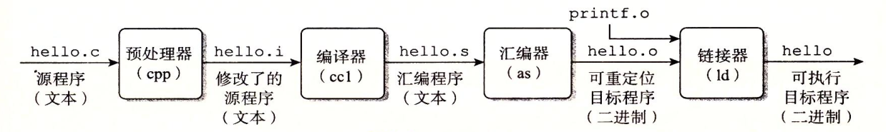
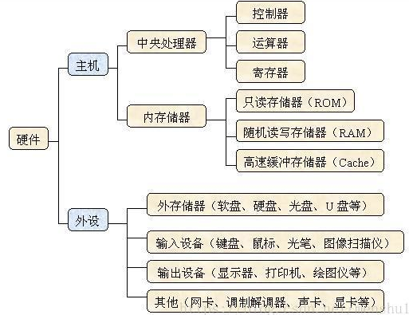
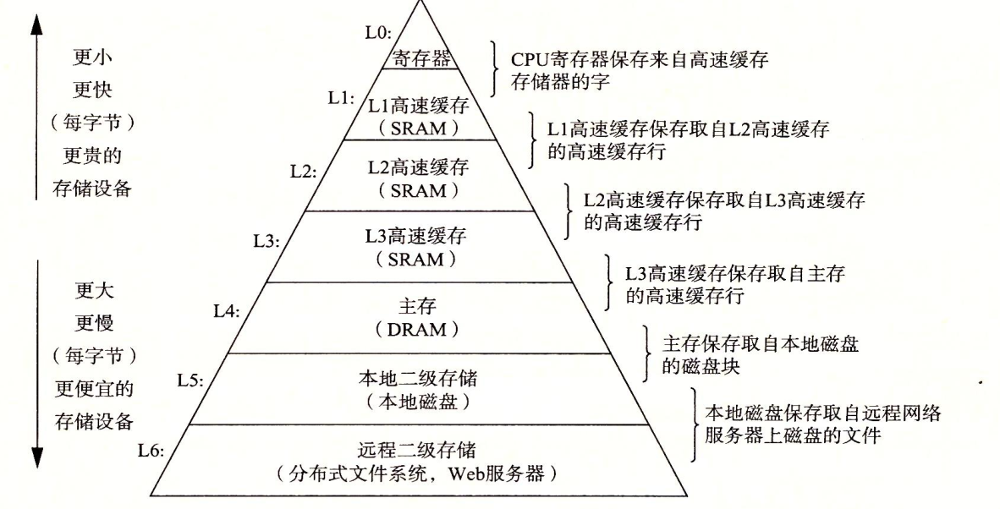
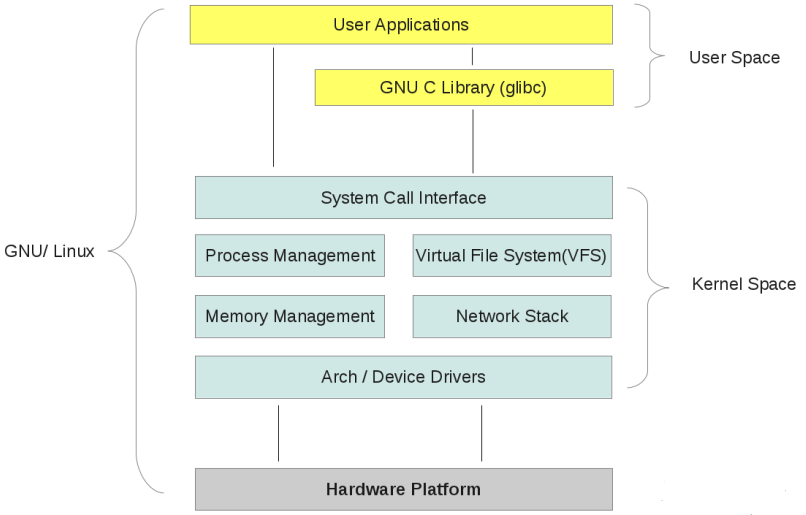
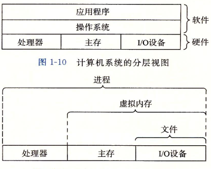
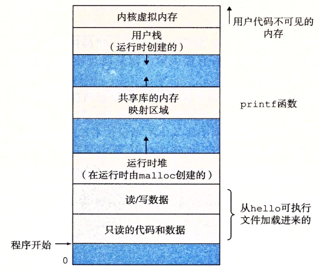
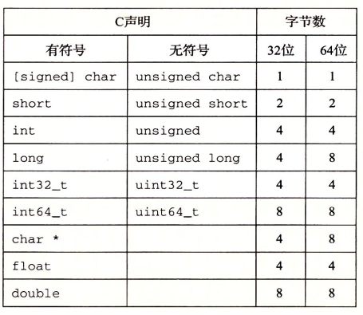
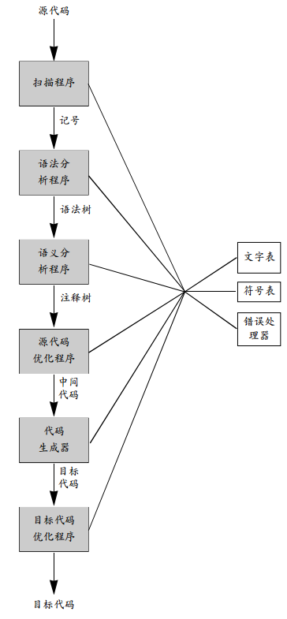

<span id="menu">
<!-- TOC -->

- [1. 计算机基础](#1-计算机基础)
    - [1.1. 计算机系统基本概念](#11-计算机系统基本概念)
        - [1.1.1. 信息就是位+上下文](#111-信息就是位上下文)
        - [1.1.2. 程序被其他程序翻译成不同的格式](#112-程序被其他程序翻译成不同的格式)
        - [1.1.3. 系统的硬件组成](#113-系统的硬件组成)
        - [1.1.4. 时钟周期、机器周期、指令周期的概念及三者之间的关系](#114-时钟周期机器周期指令周期的概念及三者之间的关系)
        - [1.1.5. 高速缓存](#115-高速缓存)
        - [1.1.6. 存储器层次结构](#116-存储器层次结构)
        - [1.1.7. 内核空间和用户空间](#117-内核空间和用户空间)
        - [1.1.8. 操作系统管理硬件](#118-操作系统管理硬件)
            - [1.1.8.1. 进程](#1181-进程)
            - [1.1.8.2. 线程](#1182-线程)
            - [1.1.8.3. 虚拟内存](#1183-虚拟内存)
            - [1.1.8.4. 文件](#1184-文件)
        - [1.1.9. 系统之间利用网络通信](#119-系统之间利用网络通信)
    - [1.2. 信息的表示和处理](#12-信息的表示和处理)
        - [1.2.1. 信息存储](#121-信息存储)
        - [1.2.2. 整数表示](#122-整数表示)
        - [1.2.3. 浮点数](#123-浮点数)
    - [1.3. 程序的机器级表示](#13-程序的机器级表示)
    - [1.4. 处理器体系结构](#14-处理器体系结构)
    - [1.5. 优化程序性能](#15-优化程序性能)
    - [1.6. 存储器层次结构](#16-存储器层次结构)
    - [1.7. 链接](#17-链接)
    - [1.8. 异常控制流](#18-异常控制流)
    - [1.9. 虚拟内存](#19-虚拟内存)
    - [1.10. 系统级IO](#110-系统级io)
    - [1.11. 网络编程](#111-网络编程)
    - [1.12. 并发编程](#112-并发编程)
- [2. 操作系统](#2-操作系统)
- [3. linux&&Shell](#3-linuxshell)
    - [3.1. 文件安装](#31-文件安装)
        - [3.1.1. deb文件操作](#311-deb文件操作)
    - [3.2. 常用命令](#32-常用命令)
        - [3.2.1. 系统信息](#321-系统信息)
        - [3.2.2. /proc 文件系统](#322-proc-文件系统)
        - [3.2.3. 脚本文件名的搜寻](#323-脚本文件名的搜寻)
        - [3.2.4. SSH](#324-ssh)
        - [3.2.5. 网络](#325-网络)
        - [3.2.6. 进程管理](#326-进程管理)
        - [3.2.7. 快捷键](#327-快捷键)
        - [3.2.8. 查看端口占用](#328-查看端口占用)
        - [3.2.9. 文件相关](#329-文件相关)
        - [3.2.10. 监测程序](#3210-监测程序)
            - [3.2.10.1. 探查进程](#32101-探查进程)
            - [3.2.10.2. 实时监测进程](#32102-实时监测进程)
            - [3.2.10.3. 结束进程](#32103-结束进程)
        - [3.2.11. 监测磁盘空间](#3211-监测磁盘空间)
            - [3.2.11.1. df 命令](#32111-df-命令)
            - [3.2.11.2. du 命令](#32112-du-命令)
        - [3.2.12. 处理数据文件](#3212-处理数据文件)
            - [3.2.12.1. 排序数据](#32121-排序数据)
            - [3.2.12.2. 搜索数据grep](#32122-搜索数据grep)
            - [3.2.12.3. 归档数据](#32123-归档数据)
    - [3.3. 环境变量](#33-环境变量)
        - [3.3.1. 什么是环境变量](#331-什么是环境变量)
            - [3.3.1.1. 全局环境变量](#3311-全局环境变量)
            - [3.3.1.2. 局部环境变量](#3312-局部环境变量)
        - [3.3.2. 设置用户定义变量](#332-设置用户定义变量)
            - [3.3.2.1. 设置局部用户变量](#3321-设置局部用户变量)
            - [3.3.2.2. 设置全局变量](#3322-设置全局变量)
        - [3.3.3. 删除环境变量](#333-删除环境变量)
        - [3.3.4. 默认的shell环境变量](#334-默认的shell环境变量)
        - [3.3.5. 设置PATH环境变量](#335-设置path环境变量)
        - [3.3.6. 定位系统环境变量](#336-定位系统环境变量)
            - [3.3.6.1. 环境变量持久化](#3361-环境变量持久化)
        - [3.3.7. 数组变量](#337-数组变量)
    - [3.4. linux文件和目录管理](#34-linux文件和目录管理)
        - [3.4.1. Linux目录说明](#341-linux目录说明)
        - [3.4.2. 绝对路径和相对路径](#342-绝对路径和相对路径)
    - [3.5. 理解Linux文件权限](#35-理解linux文件权限)
        - [3.5.1. Linux 安全性](#351-linux-安全性)
            - [3.5.1.1. /etc/passwd 文件](#3511-etcpasswd-文件)
            - [3.5.1.2. /etc/shadow 文件](#3512-etcshadow-文件)
            - [3.5.1.3. 添加新用户](#3513-添加新用户)
            - [3.5.1.4. 删除用户](#3514-删除用户)
            - [3.5.1.5. 修改用户](#3515-修改用户)
        - [3.5.2. 使用Linux组](#352-使用linux组)
            - [3.5.2.1. /etc/group 文件](#3521-etcgroup-文件)
            - [3.5.2.2. 创建新组](#3522-创建新组)
            - [3.5.2.3. 修改组](#3523-修改组)
        - [3.5.3. 理解文件权限](#353-理解文件权限)
            - [3.5.3.1. 使用文件权限符](#3531-使用文件权限符)
            - [3.5.3.2. 设置文件权限](#3532-设置文件权限)
            - [3.5.3.3. 权限的作用](#3533-权限的作用)
        - [3.5.4. 共享文件](#354-共享文件)
    - [3.6. 管理文件系统](#36-管理文件系统)
        - [3.6.1. Linux 文件系统](#361-linux-文件系统)
        - [3.6.2. 操作文件系统](#362-操作文件系统)
        - [3.6.3. 逻辑文件系统](#363-逻辑文件系统)
    - [3.7. Shell脚本编程](#37-shell脚本编程)
        - [3.7.1. 基本脚本命令](#371-基本脚本命令)
            - [3.7.1.1. 创建 shell 脚本文件](#3711-创建-shell-脚本文件)
            - [3.7.1.2. 脚本中打印](#3712-脚本中打印)
            - [3.7.1.3. 使用变量](#3713-使用变量)
            - [3.7.1.4. 命令替换](#3714-命令替换)
            - [3.7.1.5. 重定向输入和输出](#3715-重定向输入和输出)
            - [3.7.1.6. 管道](#3716-管道)
            - [3.7.1.7. 执行数学运算](#3717-执行数学运算)
            - [3.7.1.8. 退出脚本](#3718-退出脚本)
        - [3.7.2. 结构化命令](#372-结构化命令)
            - [3.7.2.1. 使用 if-then 语句](#3721-使用-if-then-语句)
            - [3.7.2.2. if-then-else 语句](#3722-if-then-else-语句)
            - [3.7.2.3. 嵌套 if](#3723-嵌套-if)
            - [3.7.2.4. test 命令](#3724-test-命令)
            - [3.7.2.5. 复合条件测试](#3725-复合条件测试)
            - [3.7.2.6. if-then 的高级特性](#3726-if-then-的高级特性)
            - [3.7.2.7. case 命令](#3727-case-命令)
        - [3.7.3. 更多结构化命令](#373-更多结构化命令)
            - [3.7.3.1. for命令](#3731-for命令)
            - [3.7.3.2. C 语言的 for 命令](#3732-c-语言的-for-命令)
            - [3.7.3.3. while 命令](#3733-while-命令)
            - [3.7.3.4. until 命令](#3734-until-命令)
            - [3.7.3.5. 控制循环](#3735-控制循环)
            - [3.7.3.6. 处理循环的输出](#3736-处理循环的输出)
        - [3.7.4. 处理用户输入](#374-处理用户输入)
            - [3.7.4.1. 命令行参数](#3741-命令行参数)
            - [3.7.4.2. 特殊参数变量](#3742-特殊参数变量)
            - [3.7.4.3. 移动变量](#3743-移动变量)
            - [3.7.4.4. 处理选项](#3744-处理选项)
            - [3.7.4.5. 获得用户输入](#3745-获得用户输入)
        - [3.7.5. 呈现数据](#375-呈现数据)
            - [3.7.5.1. 理解输入和输出](#3751-理解输入和输出)
            - [3.7.5.2. 脚本中重定向输出](#3752-脚本中重定向输出)
            - [3.7.5.3. 脚本中重定向输入](#3753-脚本中重定向输入)
            - [3.7.5.4. 创建自己的重定向](#3754-创建自己的重定向)
            - [3.7.5.5. 列出打开的文件描述符](#3755-列出打开的文件描述符)
            - [3.7.5.6. 阻止命令输出](#3756-阻止命令输出)
            - [3.7.5.7. 创建临时文件](#3757-创建临时文件)
            - [3.7.5.8. 记录消息](#3758-记录消息)
        - [3.7.6. 控制脚本](#376-控制脚本)
            - [3.7.6.1. 处理信号](#3761-处理信号)
            - [3.7.6.2. 以后台模式运行脚本](#3762-以后台模式运行脚本)
            - [3.7.6.3. 在非控制台下运行脚本](#3763-在非控制台下运行脚本)
            - [3.7.6.4. 作业控制](#3764-作业控制)
            - [3.7.6.5. 调整谦让度](#3765-调整谦让度)
            - [3.7.6.6. 定时运行作业](#3766-定时运行作业)
    - [3.8. 高级 shell 脚本编程](#38-高级-shell-脚本编程)
        - [3.8.1. 创建函数](#381-创建函数)
            - [3.8.1.1. 基本的脚本函数](#3811-基本的脚本函数)
            - [3.8.1.2. 返回值](#3812-返回值)
            - [3.8.1.3. 在函数中使用变量](#3813-在函数中使用变量)
            - [3.8.1.4. 数组变量和函数](#3814-数组变量和函数)
            - [3.8.1.5. 函数递归](#3815-函数递归)
            - [3.8.1.6. 创建库](#3816-创建库)
    - [3.9. 在命令行上使用函数](#39-在命令行上使用函数)
    - [3.10. Linux三剑客 grep,sed 和 gawk](#310-linux三剑客-grepsed-和-gawk)
        - [3.10.1. grep](#3101-grep)
        - [3.10.2. 命令行sed](#3102-命令行sed)
            - [3.10.2.1. 命令说明](#31021-命令说明)
        - [3.10.3. gawk](#3103-gawk)
- [4. 编译原理](#4-编译原理)
    - [4.1. 概论](#41-概论)
        - [4.1.1. 与编译器相关的程序](#411-与编译器相关的程序)
        - [4.1.2. 翻译步骤](#412-翻译步骤)
        - [4.1.3. 编译器中的主要数据结构](#413-编译器中的主要数据结构)
    - [4.2. 词法分析](#42-词法分析)
    - [4.3. 上下文无关及分析](#43-上下文无关及分析)
    - [4.4. 自顶向下分析](#44-自顶向下分析)
    - [4.5. 自底向上分析](#45-自底向上分析)
    - [4.6. 语义分析](#46-语义分析)
    - [4.7. 运行时环境](#47-运行时环境)
    - [4.8. 代码生成](#48-代码生成)

<!-- /TOC -->


# 1. 计算机基础

## 1.1. 计算机系统基本概念
<a href="#menu"  >目录</a>

### 1.1.1. 信息就是位+上下文
<a href="#menu"  >目录</a>

计算机系统是由硬件和系统软件组成，它们共同工作来运行应用程序．

一个文件由ASCII字符构成的文件称为文本文件，所有其他的文件称为二进制文件．系统中所有的信息，包括磁盘文件，内存中的程序，内存中存放的用户数据以及网上传输的数据，都是由一串比特表示的．区分不同的数据对象是根据这些数据对象的上下文．在不同的上下文中，一个同样的字节序列可能表示的是整数，浮点数或者字符串等

### 1.1.2. 程序被其他程序翻译成不同的格式
<a href="#menu"  >目录</a>

执行四个阶段[预处理器，编译器，汇编器，链接器]一起构成了编译系统


* 预处理阶段
    * 根据include命令告诉预处理器读取系统头文件的内容并将它插入到程序文本中，得到了另一个c程序，通常以.i作为文件扩展名
* 编译阶段
    * 将.i文件翻译成文本文件.s，它包含了一个汇编语言程序
* 汇编阶段
    * 汇编器将.s文件翻译成机器语言指令，把这些指令打包成一种叫做可重定位目标程序的格式．并将结果保存在目标文件.o中
* 链接阶段
    * 该文件如果调用其他文件的函数，则需要通过链接将它们合并到本文件中，结果得到可执行文件，可以被加载到内存中，由系统执行

### 1.1.3. 系统的硬件组成
<a href="#menu"  >目录</a>



**总线***
* 包括地址总线和数据总线
* 总线被设计成传送定长的字节块，也就是字(word)，系统中的int的长度就是字长，也就是int的长度等于地址总线的条数／８．32位机是４个字节，64位是8个字节
    
**CPU**

中央处理器（CPU，Central Processing Unit）是一块超大规模的集成电路，是一台计算机的运算核心（Core）和控制核心（ Control Unit）。它的功能主要是解释计算机指令以及处理计算机软件中的数据。中央处理器主要包括运算器（算术逻辑运算单元，ALU，Arithmetic Logic Unit）和高速缓冲存储器（Cache）及实现它们之间联系的数据（Data）、控制及状态的总线（Bus）。它与内部存储器（Memory）和输入/输出（I/O）设备合称为电子计算机三大核心部件。

**寄存器**

寄存器是中央处理器内的组成部份。它跟CPU有关。寄存器是有限存贮容量的高速存贮部件，它们可用来暂存指令、数据和位址。在中央处理器的控制部件中，包含的寄存器有指令寄存器(IR)和程序计数器(PC)。在中央处理器的算术及逻辑部件中，包含的寄存器有累加器(ACC)。

**存储器**

存储器范围最大，它几乎涵盖了所有关于存储的范畴。你所说的寄存器，内存，都是存储器里面的一种。凡是有存储能力的硬件，都可以称之为存储器，这是自然，硬盘更加明显了，它归入外存储器行列，由此可见。

**内存**

内存既专业名上的内存储器，它不是个什么神秘的东西，它也只是存储器中的沧海一粟，它包涵的范围也很大，一般分为只读存储器（ROM）和随机存储器（RAM），以及最强悍的高速缓冲存储器（CACHE），只读存储器应用广泛，它通常是一块在硬件上集成的可读芯片，作用是识别与控制硬件，它的特点是只可读取，不能写入。随机存储器的特点是可读可写，断电后一切数据都消失，我们所说的内存条就是指它了。

**缓存CACHE**

缓存就是数据交换的缓冲区（称作Cache），当某一硬件要读取数据时，会首先从缓存中查找需要的数据，如果找到了则直接执行，找不到的话则从内存中找。由于缓存的运行速度比内存快得多，故缓存的作用就是帮助硬件更快地运行。因为缓存往往使用的是RAM（断电即掉的非永久储存），所以在用完后还是会把文件送到硬盘等存储器里永久存储。电脑里最大的缓存就是内存条了，最快的是CPU上镶的L1和L2缓存，显卡的显存是给显卡运算芯片用的缓存，硬盘上也有16M或者32M的缓存。CACHE是在CPU中速度非常块，而容量却很小的一种存储器，它是计算机存储器中最强悍的存储器。由于技术限制，容量很难提升。

**寄存器**
* 简介
    * 寄存器是中央处理器内的组成部分。寄存器是有限存贮容量的高速存贮部件，它们可用来暂存指令、数据和地址。在中央处理器的控制部件中，包含的寄存器有指令寄存器(IR)和程序计数器(PC)。在中央处理器的算术及逻辑部件中，存器有累加器(ACC)。 
    * 寄存器的基本单元是 D触发器， 
    * 按照其用途分为基本寄存器和移位寄存器 
    * 基本寄存器是由 D触发器组成，在 CP 脉冲作用下，每个 D触发器能够寄存一位二进制码。在 D=0 时，寄存器储存为 0，在 D=1 时，寄存器储存为 1。在低电平为 0、高电平为 1 时，需将信号源与 D 间连接一反相器，这样就可以完成对数据的储存。 需要强调的是，目前大型数字系统都是基于时钟运作的，其中寄存器一般是在时钟的边缘被触发的，基于电平触发的已较少使用。（通常说的CPU的频率就是指数字集成电路的时钟频率） 
    * 移位寄存器按照移位方向可以分为单向移位寄存器和双向移位寄存器。单向移位寄存器是由多个 D 触发器串接而成,在串口 Di 输入需要储存的数据，触发器 FF0 就能够储存当前需要储存数据，在 CP 发出一次时钟控制脉冲时，串口 Di 同时输入第二个需要储存是的数据，而第一个数据则储存到触发器 FF1 中。双向移位寄存器按图中方式排列，调换连接端顺序，可以控制寄存器向左移位，增加控制电路可以使寄存器右移，这样构成双向移位寄存器。
* 特点
    * 寄存器又分为内部寄存器与外部寄存器，所谓内部寄存器，其实也是一些小的存储单元，也能存储数据。但同存储器相比，寄存器又有自己独有的特点： 
    * 寄存器位于CPU内部，数量很少，仅十四个 
    * 寄存器所能存储的数据不一定是8bit，有一些寄存器可以存储16bit数据，对于386/486处理器中的一些寄存器则能存储32bit数据 
    * 每个内部寄存器都有一个名字，而没有类似存储器的地址编号。
* 用途  
    * 可将寄存器内的数据执行算术及逻辑运算 
    * 存于寄存器内的地址可用来指向内存的某个位置，即寻址 
    * 可以用来读写数据到电脑的周边设备。

**存储器**
* 存储器简介
    * 构成存储器的存储介质，存储元，它可存储一个二进制代码。由若干个存储元组成一个存储单元，然后再由许多存储单元组成一个存储器。一个存储器包含许多存储单元，每个存储单元可存放一个字节（按字节编址）。每个存储单元的位置都有一个编号，即地址，一般用十六进制表示。一个存储器中所有存储单元可存放数据的总和称为它的存储容量。假设一个存储器的地址码由20位二进制数（即5位十六进制数）组成，则可表示2的20次方，即1M个存储单元地址。每个存储单元存放一个字节，则该存储器的存储容量为1MB。
* ROM、RAM的区别
    * ROM（只读存储器或者固化存储器）RAM（随机存取存储器）ROM和RAM指的都是半导体存储器，ROM是Read Only Memory的缩写，RAM是Random Access Memory的缩写。ROM在系统停止供电的时候仍然可以保持数据，而RAM通常都是在掉电之后就丢失数据，典型的RAM就是计算机的内存。 RAM有两大类，一种称为静态RAM（Static RAM/SRAM），当数据被存入其中后不会消失。SRAM速度非常快，是目前读写最快的存储设备了。当这个SRAM 单元被赋予0 或者1 的状态之后，它会保持这个状态直到下次被赋予新的状态或者断电之后才会更改或者消失。但是存储1bit 的信息需要4-6 只晶体管。因此它也非常昂贵，所以只在要求很苛刻的地方使用，譬如CPU的一级缓冲，二级缓冲。另一种称为动态RAM（Dynamic RAM/DRAM），DRAM 必须在一定的时间内不停的刷新才能保持其中存储的数据。DRAM 只要1 只晶体管就可以实现。DRAM保留数据的时间很短，速度也比SRAM慢，不过它还是比任何的ROM都要快，但从价格上来说DRAM相比SRAM要便宜很 多，计算机内存就是DRAM的。 DRAM分为很多种，常见的主要有FPRAM/FastPage、EDORAM、SDRAM、DDR RAM、RDRAM、SGRAM以及WRAM等，这里介绍其中的一种DDR RAM。DDR RAM（Date-Rate RAM）也称作DDR SDRAM，这种改进型的RAM和SDRAM是基本一样的，不同之处在于它可以在一个时钟读写两次数据，这样就使得数据传输速度加倍了。这是目前电脑中用 得最多的内存，而且它有着成本优势，事实上击败了Intel的另外一种内存标准－Rambus DRAM。在很多高端的显卡上，也配备了高速DDR RAM来提高带宽，这可以大幅度提高3D加速卡的像素渲染能力。 
    * ROM也有很多种，PROM是可编程的ROM，PROM和EPROM（可擦除可编程ROM）两者区别是，PROM是一次性的，也就是软件灌入后，就无法修 改了，这种是早期的产品，现在已经不可能使用了，而EPROM是通过紫外光的照射擦出原先的程序，是一种通用的存储器。另外一种EEPROM是通过电子擦出，价格很高，写入时间很长，写入很慢。 最初,把只能读的存储器叫做ROM(Read Only Memory),并且掉电后数据不会丢失。由于不能改写，因而使用起来很不方便。随着技术的进步，在ROM中使用一些新技术，就可以使它具有可以编程的功能。比较早的是熔丝型的可编程ROM，由于是通过熔断熔丝来编程的，所以这类ROM编程后，就不能再写了，是一次性的(OTP)。后来又出现了EPROM，是通过紫外线来擦除的，并且通过高压来编程，这类ROM上面一般有一个透明的石英玻璃窗，看上去挺漂亮的，它就是用来给紫外线照射的。后来又出现了EEPROM，不用紫外线照射就可以擦除，因而可以直接在电路中编程。另外还有FLASH ROM，又可分为NOR FLASH和NAND FLASH。FLASH ROM一般有一个特点，就是写数据时，可以将1改为0，而不能将0改为1，因而写数据前需要擦除，擦除时将所有数据置1。之所以依然叫做ROM，归纳一下，大概有几个原因: 
        * 不能像RAM那样快速的写； 
        * 可能需要特殊的擦写电压； 
        * 可能需要特殊的擦写时序； 
        * 可能需要在写之前进行擦除操作； 
        * 擦写次数有限,不像RAM那样可以随意写而不损坏； 
        * 掉电后数据不会丢失； 
    * FLASH存储器又称闪存，它结合了ROM和RAM的长处，不仅具备电子可擦出可编程（EEPROM）的性能，还不会断电丢失数据同时可以快速读取数据 （NVRAM的优势），U盘和MP3里用的就是这种存储器。在过去的20年里，嵌入式系统一直使用ROM（EPROM）作为它们的存储设备，然而近年来 Flash全面代替了ROM（EPROM）在嵌入式系统中的地位，用作存储Bootloader以及操作系统或者程序代码或者直接当硬盘使用（U盘）。 
    * 目前Flash主要有两种NOR Flash和NADN Flash。NOR Flash的读取和我们常见的SDRAM的读取是一样，用户可以直接运行装载在NOR FLASH里面的代码，这样可以减少SRAM的容量从而节约了成本。NAND Flash没有采取内存的随机读取技术，它的读取是以一次读取一快的形式来进行的，通常是一次读取512个字节，采用这种技术的Flash比较廉价。用户 不能直接运行NAND Flash上的代码，因此好多使用NAND Flash的开发板除了使用NAND Flah以外，还作上了一块小的NOR Flash来运行启动代码。 一般小容量的用NOR Flash，因为其读取速度快，多用来存储操作系统等重要信息，而大容量的用NAND FLASH，最常见的NAND FLASH应用是嵌入式系统采用的DOC（Disk On Chip）和我们通常用的“闪盘”，可以在线擦除。

**CPU位数、操作系统位数、指令集、寄存器位数、机器字长等**

CPU位数 = CPU中寄存器的位数 = CPU能够一次并行处理的数据宽度 = 数据总线宽度


CPU为了实现其功能一般设计了指令集(如：IA32指令集和x86-64指令集等)，即是CPU的全部指令，这就是机器语言。计算机的所有功能都是基于CPU的指令集。指令集和CPU的位数是有联系 的。如Intel 8086 CPU 是16位，其指令集也是16位。如Intel 80386DX CPU 是32位，其指令集也是32位，但它也保持原16位指令集，这是为了向上兼容。

注意：x86 又叫 IA32，即 Intel Architecture 32（Intel32位架构）

操作系统位数 = 其所依赖的指令集位数 <= CPU位数

机器字长 = 整数和指针数据的标称大小（字长决定的最重要的参数就是虚拟地址空间的最大大小）

CPU位数与操作系统位数，这二者有区别也有联系，操作系统位数的概念是基于CPU的位数的。 CPU的位数是指CPU能一次同时寄存和处理二进制数码的位数，这和CPU中寄存器的位数对应。 操作系统的位数是说其所依赖的指令集的位数。计算机系统一般都应有向上兼容性，所以也可有64位CPU上运行32位操作系统、32位CPU上运行16位操作系统的情况。操作系统位数应该是根据指针类型的位数来定的。整数类型不一定跟位数相等，CPU位数准确地说应该是CPU一次能够并行处理的数据宽度，一般就是指数据总线宽度。 


### 1.1.4. 时钟周期、机器周期、指令周期的概念及三者之间的关系
<a href="#menu"  >目录</a>

**时钟周期**

时钟周期也称为振荡周期，定义为时钟脉冲的倒数(可以这样来理解，时钟周期就是单片机外接晶振的倒数，例如12M的晶振，它的时间周期就是1/12 us)，是计算机中最基本的、最小的时间单位。

 在一个时钟周期内，CPU仅完成一个最基本的动作。对于某种单片机，若采用了1MHZ的时钟频率，则时钟周期为1us;若采用4MHZ的时钟频率，则时钟周期为250ns。由于时钟脉冲是计算机的基本工作脉冲，它控制着计算机的工作节奏(使计算机的每一步都统一到它的步调上来)。显然，对同一种机型的计算机，时钟频率越高，计算机的工作速度就越快。但是，由于不同的计算机硬件电路和器件的不完全相同，所以其所需要的时钟周频率范围也不一定相同。我们学习的8051单片机的时钟范围是1.2MHz-12MHz。

**机器周期**

 在计算机中，为了便于管理，常把一条指令的执行过程划分为若干个阶段，每一阶段完成一项工作。例如，取指令、存储器读、存储器写等，这每一项工作称为一个基本操作。完成一个基本操作所需要的时间称为机器周期。一般情况下，一个机器周期由若干个S周期(状态周期)组成。8051系列单片机的一个机器周期同6个S周期(状态周期)组成。前面已说过一个时钟周期定义为一个节拍(用P表示)，二个节拍定义为一个状态周期(用S表示)，8051单片机的机器周期由6个状态周期组成，也就是说一个机器周期=6个状态周期=12个时钟周期。

**指令周期**

指令周期是执行一条指令所需要的时间，一般由若干个机器周期组成。指令不同，所需的机器周期数也不同。对于一些简单的的单字节指令，在取指令周期中，指令取出到指令寄存器后，立即译码执行，不再需要其它的机器周期。对于一些比较复杂的指令，例如转移指令、乘法指令，则需要两个或者两个以上的机器周期。

通常含一个机器周期的指令称为单周期指令，包含两个机器周期的指令称为双周期指令。


### 1.1.5. 高速缓存

由于处理器与主存之间的速度存在差异，处理器从寄存器中读取数据比主存中读取的速度快很多．因此系统设计采用了高速缓存存储器(cache memory).作为暂时的集结区域．存放处理器最近可能会需要的信息．从而实现大部分内存操作都可以在快速的高速缓存中完成．避免慢速地存取主存．

### 1.1.6. 存储器层次结构


存储器层次结构的主要思想就是上一层的存储器作为低一层的存储器的高速缓存．

### 1.1.7. 内核空间和用户空间

以 32 位系统为例介绍内核空间(kernel space)和用户空间(user space)。

对 32 位操作系统而言，它的寻址空间（虚拟地址空间，或叫线性地址空间）为 4G（2的32次方）。也就是说一个进程的最大地址空间为 4G。操作系统的核心是内核(kernel)，它独立于普通的应用程序，可以访问受保护的内存空间，也有访问底层硬件设备的所有权限。为了保证内核的安全，现在的操作系统一般都强制用户进程不能直接操作内核。具体的实现方式基本都是由操作系统将虚拟地址空间划分为两部分，一部分为内核空间，另一部分为用户空间。针对 Linux 操作系统而言，最高的 1G 字节(从虚拟地址 0xC0000000 到 0xFFFFFFFF)由内核使用，称为内核空间。而较低的 3G 字节(从虚拟地址 0x00000000 到 0xBFFFFFFF)由各个进程使用，称为用户空间。


**为什么需要区分内核空间与用户空间**

在 CPU 的所有指令中，有些指令是非常危险的，如果错用，将导致系统崩溃，比如清内存、设置时钟等。如果允许所有的程序都可以使用这些指令，那么系统崩溃的概率将大大增加。
所以，CPU 将指令分为特权指令和非特权指令，对于那些危险的指令，只允许操作系统及其相关模块使用，普通应用程序只能使用那些不会造成灾难的指令。比如 Intel 的 CPU 将特权等级分为 4 个级别：Ring0~Ring3。
其实 Linux 系统只使用了 Ring0 和 Ring3 两个运行级别(Windows 系统也是一样的)。当进程运行在 Ring3 级别时被称为运行在用户态，而运行在 Ring0 级别时被称为运行在内核态。

**内核态与用户态**

当进程运行在内核空间时就处于内核态，而进程运行在用户空间时则处于用户态。
在内核态下，进程运行在内核地址空间中，此时 CPU 可以执行任何指令。运行的代码也不受任何的限制，可以自由地访问任何有效地址，也可以直接进行端口的访问。
在用户态下，进程运行在用户地址空间中，被执行的代码要受到 CPU 的诸多检查，它们只能访问映射其地址空间的页表项中规定的在用户态下可访问页面的虚拟地址，且只能对任务状态段(TSS)中 I/O 许可位图(I/O Permission Bitmap)中规定的可访问端口进行直接访问。

对于以前的 DOS 操作系统来说，是没有内核空间、用户空间以及内核态、用户态这些概念的。可以认为所有的代码都是运行在内核态的，因而用户编写的应用程序代码可以很容易的让操作系统崩溃掉。
对于 Linux 来说，通过区分内核空间和用户空间的设计，隔离了操作系统代码(操作系统的代码要比应用程序的代码健壮很多)与应用程序代码。即便是单个应用程序出现错误也不会影响到操作系统的稳定性，这样其它的程序还可以正常的运行(Linux 可是个多任务系统啊！)。

所以，区分内核空间和用户空间本质上是要提高操作系统的稳定性及可用性。

**如何从用户空间进入内核空间**

其实所有的系统资源管理都是在内核空间中完成的。比如读写磁盘文件，分配回收内存，从网络接口读写数据等等。我们的应用程序是无法直接进行这样的操作的。但是我们可以通过内核提供的接口来完成这样的任务。

比如应用程序要读取磁盘上的一个文件，它可以向内核发起一个 "系统调用" 告诉内核："我要读取磁盘上的某某文件"。其实就是通过一个特殊的指令让进程从用户态进入到内核态(到了内核空间)，在内核空间中，CPU 可以执行任何的指令，当然也包括从磁盘上读取数据。具体过程是先把数据读取到内核空间中，然后再把数据拷贝到用户空间并从内核态切换到用户态。此时应用程序已经从系统调用中返回并且拿到了想要的数据，可以开开心心的往下执行了。
简单说就是应用程序把高科技的事情(从磁盘读取文件)外包给了系统内核，系统内核做这些事情既专业又高效。

对于一个进程来讲，从用户空间进入内核空间并最终返回到用户空间，这个过程是十分复杂的。举个例子，比如我们经常接触的概念 "堆栈"，其实进程在内核态和用户态各有一个堆栈。运行在用户空间时进程使用的是用户空间中的堆栈，而运行在内核空间时，进程使用的是内核空间中的堆栈。所以说，Linux 中每个进程有两个栈，分别用于用户态和内核态。

进程有三种方式可以进入内核空间:系统调用、软中断和硬件中断.

**整体结构**


在硬件之上，内核空间中的代码控制了硬件资源的使用权，用户空间中的代码只有通过内核暴露的系统调用接口(System Call Interface)才能使用到系统中的硬件资源。其实，不光是 Linux，Windows 操作系统的设计也是大同小异。

实际上我们可以将每个处理器在任何指定时间点上的活动概括为下列三者之一：
* 运行于用户空间，执行用户进程。
* 运行于内核空间，处于进程上下文，代表某个特定的进程执行。
* 运行于内核空间，处于中断上下文，与任何进程无关，处理某个特定的中断。

以上三点几乎包括所有的情况，比如当 CPU 空闲时，内核就运行一个空进程，处于进程上下文，但运行在内核空间。

说明：Linux 系统的中断服务程序不在进程的上下文中执行，它们在一个与所有进程都无关的、专门的中断上下文中执行。之所以存在一个专门的执行环境，就是为了保证中断服务程序能够在第一时间响应和处理中断请求，然后快速地退出。

**总结**
现代的操作系统大都通过内核空间和用户空间的设计来保护操作系统自身的安全性和稳定性。所以在我们阅读有关操作系统的资料时经常遇到内核空间、用户空间和内核态、用户态等概念，希望本文能够帮助您理解这些基本的概念。


### 1.1.8. 操作系统管理硬件

操作系统有两个功能，一是防止硬件被失控的应用程序滥用　二是向应用程序提供简单一致的机制来控制复杂而又大不相同的低级硬件设备．操作系统通常这几个(进程，虚拟内存和文件)来实现这两个功能．文件是对IO设备的抽象表示．虚拟内存是对主存和磁盘设备的抽象表示，进程则是对处理器主存和ＩＯ设备的抽象表示．


#### 1.1.8.1. 进程

进程是操作系统中最基本的运行单位．操作系统保持跟踪进程运行所需的所有状态信息．这种状态叫上下文．包括PC和寄存器文件的当前值，以及主存的内容．任意时刻，单个处理器仅可以执行一个进程，多核处理器可以同时执行多个进程．．当操作系统需要切换进程时，就会进行上下文切换．即保存当前进程的上下文，恢复新进程的上下文．然后将控制权转移到新进程，新进程就会从上次停止的地方开始．切换进程是受操作系统内核管理的，内核是操作系统常驻主存的部分，当应用程序需要操作系统的某些操作时，比如读写文件，他就执行一条特殊的系统调用，将控制权传递给内核．然后内核执行完操作后返回结果给应用程序．内核不是一个独立的进程，是系统管理全部进程所用代码和数据结构的集合．


#### 1.1.8.2. 线程

线程是进程中子任务，每个线程都运行在进程的上下文中，并共享同样的代码和全局数据．

#### 1.1.8.3. 虚拟内存

虚拟内存是一个抽象概念，它为每一个进程提供了一个假象，即每个进程都在独占使用主存．每个进程看到的内存都是一致的，称为虚拟地址空间．

在linux中，地址空间最上面的区域是保留给操作系统中的代码和数据的．地址空间的底部区域存放用户进程定义的代码和数据


* 程序代码和数据
    * 对所有进程来说，代码是从同一固定地址开始的，紧接着的是和c全局变相对应的数据位置．代码和数据区是直接按照可执行目标文件的内容初始化的
* 堆
    * 运行时堆．当调用malloc和free这样的c标准库函数时，堆可以在运行时动态调整
* 共享库
    * 用来存放Ｃ标准库和数学库这样的共享库的代码和数据的区域
* 栈
    * 位于用户虚拟地址空间顶部的是用户栈，编译器用它来实现函数调用．用户栈在程序执行期间可以动态扩展和收缩．当调用函数时扩展．当调用完成时释放
* 内核虚拟内存
    * 为内核保留，不允许应用程序读写这个区域的内容或者直接调用内核代码定义的函数，它们必须调用内核来执行这些操作

虚拟内存的运作需要硬件和操作系统软件之间精密复杂的交互，包括对处理器生成的每个地址的硬件翻译．基本思想是把一个进程虚拟内存的内容存储到硬盘上，然后用主存作为磁盘的高速缓存．

#### 1.1.8.4. 文件

文件就是字节序列．每个IO设备，包括磁盘，键盘，显示器，甚至网络都可以看成是文件．系统中所有输入输出都是通过使用Unix　Ｉ／Ｏ的系统函数调用来读写文件来实现．
文件向操作系统上的应用程序提供了一个统一的视图，来看待系统中可能含有的各式各样的ＩＯ设备．

### 1.1.9. 系统之间利用网络通信


## 1.2. 信息的表示和处理
<a href="#menu"  >目录</a>

### 1.2.1. 信息存储

**进制转换**


**字数据大小**



每个计算机都有一个字长(word size)．指明指针数据的标称大小．字长决定虚拟地址空间的大小．对于字长为n的机器，虚拟地址的范围为0－（2的n次方－１）．

大多数64位机器也可以运行32位机器编译的程序，这是一种向后兼容．反之则会存在问题．程序的可移植性就是使程序对不同数据类型的确却大小不敏感．不管在何种平台下编译，都能够移植到其他平台正确运行，Java是通过不同平台的虚拟机来实现可移植性．

**寻址和字节顺序**

* 大端模式
    * 是指数据的高字节保存在内存的低地址中，而数据的低字节保存在内存的高地址中，这样的存储模式有点儿类似于把数据当作字符串顺序处理：地址由小向大增加，而数据从高位往低位放；这和我们的阅读习惯一致。
* 小端模式
    * 是指数据的高字节保存在内存的高地址中，而数据的低字节保存在内存的低地址中，这种存储模式将地址的高低和数据位权有效地结合起来，高地址部分权值高，低地址部分权值低。

以unsigned int value = 0x12345678为例
|内存地址	|小端模式存放内容|	大端模式存放内容|
|---|---|---|
|0x4000	|0x78|	0x12
|0x4001	|0x56|	0x34
|0x4002	|0x34|	0x56
|0x4003	|0x12|	0x78

不同的机器使用的模式不一定一样．并没有强制规定．

**整数表示**


**浮点数表示**

### 1.2.2. 整数表示

### 1.2.3. 浮点数


## 1.3. 程序的机器级表示
<a href="#menu"  >目录</a>


## 1.4. 处理器体系结构
<a href="#menu"  >目录</a>

## 1.5. 优化程序性能
<a href="#menu"  >目录</a>

## 1.6. 存储器层次结构
<a href="#menu"  >目录</a>

## 1.7. 链接
<a href="#menu"  >目录</a>

## 1.8. 异常控制流
<a href="#menu"  >目录</a>

## 1.9. 虚拟内存
<a href="#menu"  >目录</a>

## 1.10. 系统级IO
<a href="#menu"  >目录</a>

## 1.11. 网络编程
<a href="#menu"  >目录</a>

## 1.12. 并发编程
<a href="#menu"  >目录</a>

现代操作系统提供三种基本的方式实现并发处理．
* 进程
* 线程
* IO多路复用

# 2. 操作系统
<a href="#menu"  >目录</a>


# 3. linux&&Shell
<a href="#menu" >目录</a>

## 3.1. 文件安装

### 3.1.1. deb文件操作

dpkg 是Debian Package的简写，是为Debian 专门开发的套件管理系统，方便软件的安装、更新及移除。所有源自Debian的Linux发行版都使用dpkg，例如Ubuntu、Knoppix 等。
以下是一些 Dpkg 的普通用法：
```
1、dpkg -i <package.deb>
安装一个 Debian 软件包，如你手动下载的文件。
2、dpkg -c <package.deb>
列出 <package.deb> 的内容。
3、dpkg -I <package.deb>
从 <package.deb> 中提取包裹信息。
4、dpkg -r <package>
移除一个已安装的包裹。
5、dpkg -P <package>
完全清除一个已安装的包裹。和 remove 不同的是，remove 只是删掉数据和可执行文件，purge 另外还删除所有的配制文件。
6、dpkg -L <package>
列出 <package> 安装的所有文件清单。同时请看 dpkg -c 来检查一个 .deb 文件的内容。
7、dpkg -s <package>
显示已安装包裹的信息。同时请看 apt-cache 显示 Debian 存档中的包裹信息，以及 dpkg -I 来显示从一个 .deb 文件中提取的包裹信息。
8、dpkg-reconfigure <package>
重新配制一个已经安装的包裹，如果它使用的是 debconf (debconf 为包裹安装提供了一个统一的配制界面)。
```
## 3.2. 常用命令

### 3.2.1. 系统信息

* man command 查看命令的信息
* date 显示当前日期和时间
* cal 显示当月的日历
* uptime 系统从开机到现在的时间
* w 显示当前登录的用户
* whoami 查看当前的用户名
* finger user 显示user相关信息
* uname -a 显示内核信息
* cat /proc/cpuinfo 查看cpu信息
* cat /proc/meminfo 查看内存信息
* df 显示磁盘占用信息
* du 显示目录空间占用情况
* free 显示内存以及交换区占用情况
* lsof　列出系统打开的文件句柄
* scp 是 Linux 系统中功能强大的文件传输命令，可以实现从远程到本地，以及从本地到远程的双向文件传输
    * scp robert@19.168.1.1:/home/robert/test.txt .
    * scp ./test.txt robert@19.168.1.1:/home/robert
* grep : 文本内容查找命令，可以利用它打印匹配的上下几行 
* awk 是 Linux 系统下强大的文本分析工具 ，相对于 grep 的查找、 sed 的编辑， awk 在对数据分析井生成报告时，显得尤为强大。它把文件逐行读入，以空格为默认分隔符将每行切片，也可以以任何字符为分隔符，把切开的部分进行各种分析和处理，在分析和处理的过程中支持脚本式的编程。
* sed：文本编辑和替换。
* tr ： 字符替换。
* cut ： 选取命令，分析一段数据并取出我们想要的部分。
* wc ： 统计字数和行数等。
* sort：排序。
* uniq ： 去重或者分组统计 。
* zip ： 压缩成 zip 格式的压缩包或者解压。
* tar：创建或者解压 tar 格式的包。

**ulimit命令**
Linux ulimit命令用于控制shell程序的资源。

```bash
$ ulimit -a
#所创建的内核文件的大小、
core file size          (blocks, -c) 0
#进程数据块的大小、
data seg size           (kbytes, -d) unlimited
#
scheduling priority             (-e) 0
file size               (blocks, -f) unlimited
pending signals                 (-i) 39575
max locked memory       (kbytes, -l) 16384
max memory size         (kbytes, -m) unlimited
#打开文件描述符的数量、
open files                      (-n) 1024
pipe size            (512 bytes, -p) 8
POSIX message queues     (bytes, -q) 819200
real-time priority              (-r) 0
#分配堆栈的最大大小、
stack size              (kbytes, -s) 8192
#CPU 时间、
cpu time               (seconds, -t) unlimited
#单个用户的最大线程数、
max user processes              (-u) 39575
virtual memory          (kbytes, -v) unlimited
file locks                      (-x) unlimited

```

```
-a 　显示目前资源限制的设定。
-c <core文件上限> 　设定core文件的最大值，单位为区块。
-d <数据节区大小> 　程序数据节区的最大值，单位为KB。
-f <文件大小> 　shell所能建立的最大文件，单位为区块。
-H 　设定资源的硬性限制，也就是管理员所设下的限制。
-m <内存大小> 　指定可使用内存的上限，单位为KB。
-n <文件数目> 　指定同一时间最多可开启的文件数。
-p <缓冲区大小> 　指定管道缓冲区的大小，单位512字节。
-s <堆叠大小> 　指定堆叠的上限，单位为KB。
-S 　设定资源的弹性限制。
-t <CPU时间> 　指定CPU使用时间的上限，单位为秒。
-u <程序数目> 　用户最多可开启的程序数目。
-v <虚拟内存大小> 　指定可使用的虚拟内存上限，单位为KB。
```

```
ulimit -u 500 //设置单一用户程序上限
```
### 3.2.2. /proc 文件系统

Linux 系统 内 核提供了通过／proc 文件系统查看运行时系统内核内的数据结构的能力，也可以改变系统内核的参数设置。
* 显示 CPU 信息 ：cat /proc/cpuinfo
* 显示 内存信息 ：cat /proc/meminfo
* 显示详细的内存映射信息 ：cat /proc/zoneinfo
* 显示磁盘映射信息：cat /proc/mounts
* 查看系统的平均负载 ：cat /proc/loadavg

### 3.2.3. 脚本文件名的搜寻

```bash
# 查找ls命令的位置
which ls
# 输出 /bin/ls

# 搜寻文件
$ whereis ls 
# 输出 ls: /bin/ls /usr/share/man/man1/ls.1.gz

#locate 字符匹配方式查栈
$ locate -l 5 doc
/etc/docker
/etc/acpi/undock.sh
/etc/acpi/events/lenovo-undock
/etc/apparmor.d/usr.lib.libreoffice.program.senddoc
/etc/apparmor.d/cache/usr.lib.libreoffice.program.senddoc


```

### 3.2.4. SSH

* ssh user@host 以用户user连接到host
* ssh -p password user@host 以用户user连接到host

### 3.2.5. 网络

* ping host 查看网络状况
* wget file-address 下载文件
* wget -c file-address 断点续传

### 3.2.6. 进程管理
* ps 显示当前的活动进程
    * -A 显示所有进程
    * a 显示所有进程
    * -a 显示同一终端下所有进程
    * c 显示进程真实名称
    * e 显示环境变量
    * f 显示进程间的关系
    * r 显示当前终端运行的进程
    * -aux 显示所有包含其它使用的进程
    * ps -aux|grep nginx
    
* top 显示正在运行的进程的信息
* kill pid
* killall *.xx 杀掉.xx结尾的文件
* bg 列出已经停止或后台的作业
* fg 将最近的作业带到前台
* fg n 将作业n带到前台

### 3.2.7. 快捷键

* Ctrl+C 停止当前命令
* Ctrl+Z 停止当前命令,使用fg恢复
* Ctrl+D 注销当前会话
* Ctrl+W 删除当前行中的字
* Ctrl+U 删除整行
* !! 重复上次的命令
* exit 注销当前的会话

### 3.2.8. 查看端口占用

* lsof -i:端口号
* netstat -tunlp|grep 端口号
    * 用于显示tcp，udp的端口和进程等相关情况，如下图
    * -t  仅显示和tcp相关的
    * -u 仅显示和udp相关的
    * -n 不限时别名，能显示数字的全部转换为��字
    * -l   仅显示出于Listen(监听)状态的
    * -p  显示建立这些连接的程序名

### 3.2.9. 文件相关
* 路径
  * /   根路径
  * .   当前目录
  * .. 上一级目录
  * ~/  当前用户目录
  * cd  path  进入路径
  * cd -  返回上一级目录
  * pwd 显示当前绝对路径
  
* 文件列表
  * ls 只列出当前目录文件名称
  * ls -l 包含文件权限等信息
  * ls -a 包含"."开头的隐藏文件
  * ls -F 区分文件和目录
  * ls -R 递归显示目录
  * ls -l  aa 只显示带aa的列表，“?”单个字符，"*"多个字符

* 文件压缩
    * tar cf file.tar file... 压缩文件
    * tar xf file.tar 解压缩
    * tar czf file.tar.gz file... 使用gzip压缩
    * tar xzf file.tar.gz 解压缩tar.gz文件
    * tar cjf file.tar.bz2 
    * tar xjf file.tar.bz2 
    * gzip filename 压缩 filename为filename.gz
    * gzip -d file.gz

* wc [option] file..
    * -c 统计字节数
    * -l 统计行数
    * -m 统计字符数
    * -w 统计词数，一个字被定义为由空白、跳格或换行字符分隔的字符串

* 查找文件位置
    * which command    查看可执行文件的位置。
    * whereis file 查看文件的位置。
    * locate  配合数据库查看文件位置。
    * find pathname -options [-print -exec -ok ...]   实际搜寻硬盘查询文件名称。

* 处理文件
  * touch 创建文件
  * mkdir 创建目录
  * cp source  dest 复制文件，加  -r 用于复制目录
  * rm 删除，-r 删除目录 -f 强制删除文件
  * mv source dest 重命名/复制文件  
* 文件权限
  * 文件权限包括用户(U)-组(G)-其他用户(O),包括读(4-r)写(2-w)执行(1-x)权限。
  * chmod u+x file 用户添加执行权限
  * chmod u-x file 用户去除执行权限
  * chmod 111 file 所有的都为执行权限
  * chmod 721 file 用户有读写执行，组用户有写，其他用户有执行权限
```bash
-rw-rw-r-- 1 lgj lgj  1215779 Jun 28 18:08  1.mp4
```
* 文件链接：给文件创建虚拟副本
   * 符号链接:仅保存引用，文件内容和原文件不一样，和源文件同步更新,仅可读，不可修改，即使修改文件权限。
   * 硬链接: 保存引用和文件信息，和源文件同步更新，可以修改。
   * 使用cp 复制链接文件时，复制的文件仍然保留和源文件之间的链接关系，一般不这么做。
   * ln source dest ,加-s 时创建的是软连接。
* 查看文件
   * cat 打印文件数据,从第一行开始显示文件内容，-n 加上行号， -b 只给有文本的加上行号.
   * tac 和cat相反,从倒数第一行开始显示文件内容
   * nl 显示的时候顺便输出行号
   * more 只显示一页，按页翻页。空格键翻页。
   * less 按行翻行，方向键，可向前和向后翻。 
   * tail -n 2 fileName 实时查看文件后2行数据，动态更新。
   * head -5 fileName 查看看文件前5行数据
   * file fileName 查看文件类型
   * od fileName 以二进制方式输出

```
文件的各个时间参数
'atime', 'access', 'use':访问时间
'ctime': 文件属性(权限等)修改的时间
'status':
```
```bash
ls -l 1.jpeg;ls -l --time=atime 1.jpeg ;ls -l --time=access 1.jpeg ;ls -l --time=use 1.jpeg ;ls -l --time=ctime 1.jpeg ;ls -l --time=status 1.jpeg ;
-rw-rw-r-- 1 lgj lgj 110826 Apr 16 22:38 1.jpeg
-rw-rw-r-- 1 lgj lgj 110826 May  1 03:47 1.jpeg
-rw-rw-r-- 1 lgj lgj 110826 May  1 03:47 1.jpeg
-rw-rw-r-- 1 lgj lgj 110826 May  1 03:47 1.jpeg
-rw-rw-r-- 1 lgj lgj 110826 Apr 16 22:39 1.jpeg
-rw-rw-r-- 1 lgj lgj 110826 Apr 16 22:39 1.jpeg

```

### 3.2.10. 监测程序
<a href="#menu" >目录</a>

#### 3.2.10.1. 探查进程

* ps 命令
    * -A 显示所有进程
    * -N 显示与指定参数不符的所有进程
    * -a 显示除控制进程（ session leader① ）和无终端进程外的所有进程
    * -d 显示除控制进程外的所有进程
    * -e 显示所有进程
    * -C cmdlist 显示包含在cmdlist列表中的进程
    * -G grplist 显示组ID在grplist列表中的进程
    * -U userlist 显示属主的用户ID在userlist列表中的进程
    * -g grplist 显示会话或组ID在grplist列表中的进程②
    * -p pidlist 显示PID在pidlist列表中的进程
    * -s sesslist 显示会话ID在sesslist列表中的进程
    * -t ttylist 显示终端ID在ttylist列表中的进程
    * -u userlist 显示有效用户ID在userlist列表中的进程
    * -F 显示更多额外输出（相对-f参数而言）
    * -O format 显示默认的输出列以及format列表指定的特定列
    * -M 显示进程的安全信息
    * -c 显示进程的额外调度器信息
    * -f 显示完整格式的输出
    * -j 显示任务信息
    * -l 显示长列表
    * -o format 仅显示由format指定的列
    * -y 不要显示进程标记（ process flag，表明进程状态的标记）
    * -Z 显示安全标签（ security context） ① 信息
    * -H 用层级格式来显示进程（树状，用来显示父进程）
    * -n namelist 定义了WCHAN列显示的值
    * -w 采用宽输出模式，不限宽度显示
    * -L 显示进程中的线程
    * -V 显示ps命令的版本号


常用的参数是-ef,显示的信息为:
* UID：启动这些进程的用户。
* PID：进程的进程ID。
* PPID：父进程的进程号（如果该进程是由另一个进程启动的）。
* C：进程生命周期中的CPU利用率。
* STIME：进程启动时的系统时间。
* TTY：进程启动时的终端设备。
* TIME：运行进程需要的累计CPU时间。
* CMD：启动的程序名称。
```
UID        PID  PPID  C STIME TTY          TIME CMD
root         1     0  0 Dec04 ?        00:00:24 /sbin/init splash
root         2     0  0 Dec04 ?        00:00:00 [kthreadd]

```
ps -l参数
* F：内核分配给进程的系统标记。
* S：进程的状态（ O代表正在运行； S代表在休眠； R代表可运行，正等待运行； Z代表僵化，进程已结束但父进程已不存在； T代表停止）。
* PRI：进程的优先级（越大的数字代表越低的优先级）。
* NI：谦让度值用来参与决定优先级。,越大优先级越低,默认为0
* ADDR：进程的内存地址。
* SZ：假如进程被换出，所需交换空间的大致大小。
* WCHAN：进程休眠的内核函数的地址。
```
F S   UID   PID  PPID  C PRI  NI ADDR SZ WCHAN  TTY          TIME CMD
0 S  1000 10646  5959  0  80   0 -  5429 wait   pts/2    00:00:00 bash
4 R  1000 20277 10646  0  80   0 -  6487 -      pts/2    00:00:00 ps

```


#### 3.2.10.2. 实时监测进程

ps命令虽然在收集运行在系统上的进程信息时非常有用，但也有不足之处：它只能显示某个特定时间点的信息。如果想观察那些频繁换进换出的内存的进程趋势，用ps命令就不方便了。top命令跟ps命令相似，能够显示进程信息，但它是实时显示的。

```
top - 17:31:35 up 19:11,  1 user,  load average: 1.70, 1.04, 0.77
Tasks: 267 total,   1 running, 217 sleeping,   0 stopped,   0 zombie
%Cpu(s):  4.9 us,  1.1 sy,  0.0 ni, 94.0 id,  0.0 wa,  0.0 hi,  0.0 si,  0.0 st
KiB Mem : 10174524 total,   527256 free,  5486668 used,  4160600 buff/cache
KiB Swap:  2097148 total,  2097148 free,        0 used.  3808940 avail Mem 

  PID USER      PR  NI    VIRT    RES    SHR S  %CPU %MEM     TIME+ COMMAND     
 1842 lgj       20   0  642764 159804 113284 S   5.3  1.6  12:20.79 Xorg 
```
* top信息
    * PID：进程的ID。
    * USER：进程属主的名字。
    * PR：进程的优先级。
    * NI：进程的谦让度值。
    * VIRT：进程占用的虚拟内存总量。
    * RES：进程占用的物理内存总量。
    * SHR：进程和其他进程共享的内存总量。
    * S：进程的状态（ D代表可中断的休眠状态， R代表在运行状态， S代表休眠状态， T代表跟踪状态或停止状态， Z代表僵化状态）。
    * %CPU：进程使用的CPU时间比例。
    * %MEM：进程使用的内存占可用内存的比例。
    * TIME+：自进程启动到目前为止的CPU时间总量。
    * COMMAND：进程所对应的命令行名称，也就是启动的程序名。

#### 3.2.10.3. 结束进程

在Linux中，进程之间通过信号来通信。进程的信号就是预定义好的一个消息，进程能识别它并决定忽略还是作出反应。进程如何处理信号是由开发人员通过编程来决定的。大多数编写完善的程序都能接收和处理标准Unix进程信号。

|信 号| 名 称| 描 述|
|---|---|---|
|1 |HUP |挂起
|2 |INT |中断
|3 |QUIT |结束运行
|9 |KILL |无条件终止
|11 |SEGV |段错误
|15 |TERM |尽可能终止
|17 |STOP |无条件停止运行，但不终止
|18 |TSTP |停止或暂停，但继续在后台运行
|19 |CONT |在STOP或TSTP之后恢复执行

在Linux上有两个命令可以向运行中的进程发出进程信号。


**kill命令**

kill命令可通过进程ID（ PID）给进程发信号。默认情况下， kill命令会向命令行中列出的全部PID发送一个TERM信号。遗憾的是，你只能用进程的PID而不能用命令名，所以kill命令有
时并不好用。要发送进程信号，你必须是进程的属主或登录为root用户。
```
$ kill 3940
$ kill -3 3940
```
**killall命令**

killall命令非常强大，它支持通过进程名而不是PID来结束进程。 killall命令也支持通配符，这在系统因负载过大而变得很慢时很有用
```
# killall http*
#
```
上例中的命令结束了所有以http开头的进程.以root用户身份登录系统时，使用killall命令要特别小心，因为很容易就会误用通配符而结束了重要的系统进程。这可能会破坏文件系统。

### 3.2.11. 监测磁盘空间

#### 3.2.11.1. df 命令

df命令可以让你很方便地查看所有已挂载磁盘的使用情况。
```bash
~$ df --help
Usage: df [OPTION]... [FILE]...
```


```
$ df
Filesystem     1K-blocks     Used Available Use% Mounted on
udev             5065648        0   5065648   0% /dev
tmpfs            1017456     1836   1015620   1% /run
/dev/sdb2       72417352 60574108   8121568  89% /

```
* 设备的设备文件位置；
* 能容纳多少个1024字节大小的块；
* 已用了多少个1024字节大小的块；
* 还有多少个1024字节大小的块可用；
* 已用空间所占的比例；
* 设备挂载到了哪个挂载点上。

df一个常用的参数是-h。它会把输出中的磁盘空间按照用户易读的形式显示，通常用M来替代兆字节，用G替代吉字节。

#### 3.2.11.2. du 命令

另一个有用的命令是du命令。 du命令可以显示某个特定目录（默认情况下是当前目录）的磁盘使用情况。这一方法可用来快速判断系统上某个目录下是不是有超大文件。
默认情况下， du命令会显示当前目录下所有的文件、目录和子目录的磁盘使用情况，它会以磁盘块为单位来表明每个文件或目录占用了多大存储空间。对标准大小的目录来说，这个输出会是一个比较长的列表。
```
du [OPTION]... [FILE]...
or:  du [OPTION]... --files0-from=F

```
每行输出左边的数值是每个文件或目录占用的磁盘块数。注意，这个列表是从目录层级的最底部开始，然后按文件、子目录、目录逐级向上

常用参数
* -c：显示所有已列出文件总的大小。
* -h：按用户易读的格式输出大小，即用K替代千字节，用M替代兆字节，用G替代吉字节。
* -s：显示每个输出参数的总计。


### 3.2.12. 处理数据文件
<a href="#menu" >目录</a>

#### 3.2.12.1. 排序数据

sort命令按照会话指定的默认语言的排序规则对文本文件中的**数据行**排序。

```
sort [OPTION]... [FILE]...
or:  sort [OPTION]... --files0-from=F

```
```
$ cat txt
rr
bb
AA
aaI rf
BB
$ sort txt
AA
BB
aaI rf
bb
rr

```

如果数据行为数字,需要添加-n参数.

如果用-M参数， sort命令就能识别三字符的月份名
```
Jan
Feb
Mar
Apr
May
Jun
Jul
Aug
Sep
Oct
Nov
Dec
```
* -b --ignore-leading-blanks 排序时忽略起始的空白
* -C --check=quiet 不排序，如果数据无序也不要报告
* -c --check 不排序，但检查输入数据是不是已排序；未排序的话，报告
* -d --dictionary-order 仅考虑空白和字母，不考虑特殊字符
* -f --ignore-case 默认情况下，会将大写字母排在前面；这个参数会忽略大小写
* -g --general-number-sort 按通用数值来排序（跟-n不同，把值当浮点数来排序，支持科学计数法表示的值）
* -i --ignore-nonprinting 在排序时忽略不可打印字符
* -k --key=POS1[,POS2] 排序从POS1位置开始；如果指定了POS2的话，到POS2位置结束
* -M --month-sort 用三字符月份名按月份排序
* -m --merge 将两个已排序数据文件合并
* -n --numeric-sort 按字符串数值来排序（并不转换为浮点数）
* -o --output=file 将排序结果写出到指定的文件中
* -R --random-sort 按随机生成的散列表的键值排序
* --random-source=FILE 指定-R参数用到的随机字节的源文件
* -r --reverse 反序排序（升序变成降序）
* -S --buffer-size=SIZE 指定使用的内存大小
* -s --stable 禁用最后重排序比较
* -T --temporary-directory=DIR 指定一个位置来存储临时工作文件
* -t --field-separator=SEP 指定一个用来区分键位置的字符
* -u --unique 和-c参数一起使用时，检查严格排序；不和-c参数一起用时，仅输出第一例相似的两行
* -z --zero-terminated 用NULL字符作为行尾，而不是用换行符


#### 3.2.12.2. 搜索数据grep

需要在大文件中找一行数据，而这行数据又埋藏在文件的中间。这时并不需要手动翻看整个文件，用grep命令来帮助查找就行了
```
grep [OPTION]... PATTERN [FILE]...

```
grep命令会在输入或指定的文件中查找包含匹配指定模式的字符的行。 grep的输出就是包含了匹配模式的行

如果要进行反向搜索（输出不匹配该模式的行），可加-v参数。
```
$ grep -v t file1
one
four
five
$
```
如果要显示匹配模式的行所在的行号，可加-n参数。
```
$ grep -n t file1
2:two
3:three
$
```
如果只要知道有多少行含有匹配的模式，可用-c参数。
```
$ grep -c t file1
2
$
```
如果要指定多个匹配模式，可用-e参数来指定每个模式。
```
$ grep -e t -e f file1
two
three
four
five
$
```

grep默认只查询匹配的一行，但是可以通过以下参数查询多行
```
//查询上下
git log |grep "xxxx" -C 5

//查询往后 after
git log |grep "xxxx" -A 5

//查询往前 before
git log |grep "xxxx" -B 5
```

#### 3.2.12.3. 归档数据

Unix和Linux上最广泛使用的归档工具是tar命令。tar命令最开始是用来将文件写到磁带设备上归档的，然而它也能把输出写到文件里，这种用法在Linux上已经普遍用来归档数据了。

```
tar [OPTION...] [FILE]...
```

|参数	|参数说明|
|---|---|
|-c	|新建打包文件，同 -v 一起使用 查看过程中打包文件名
|-x	|解决文件， -C 解压到对应的文件目录。
|-f	|后面接要处理的文件
|-j	|通过bzip2方式压缩或解压，最后以.tar.br2 为后缀。压缩后大小小于.tar.gz
|-z	|通过gzip方式压缩或解压，最后以.tar.gz 为后缀
|-v	|压缩或解压过程中，显示出来过程
|-t	|查看打包文件中内容，重点文件名
|-u	|更新压缩文件中的内容。
|-p	|保留绝对路径，即允许备份数据中含有根目录
|-P	|保留数据原来权限及属性。
|--exclude =FILE	|压缩过程中，不要讲FILE打包
|man tar	|查看更多参数

说明： -c/-x/-t/u 不可同时出现

* tar -jcv -f 压缩文件名称.tar.br2	压缩方式一
* tar -jxv -f 压缩文件名称.tar.br2 -C 指定文件目录	解压文件方式一
* tar -zcv -f 压缩文件名称.tar.gz	压缩方式二
* tar -zxv -f 压缩文件名称.tar.gz	解压文件方式二
* tar -tf 压缩文件名	查看文件名
* tar -tvf 压缩文件	查看文件：所属权限、用户名用户组、日期等


## 3.3. 环境变量

<a href="#menu" >目录</a>

### 3.3.1. 什么是环境变量

bash shell用一个叫作环境变量（ environment variable）的特性来存储有关shell会话和工作环境的信息（这也是它们被称作环境变量的原因）。这项特性允许你在内存中存储数据，以便程序
或shell中运行的脚本能够轻松访问到它们。这也是存储持久数据的一种简便方法。

#### 3.3.1.1. 全局环境变量

全局环境变量对于shell会话和所有生成的子shell都是可见的。局部变量则只对创建它们的shell可见。这让全局环境变量对那些所创建的子shell需要获取父shell信息的程序来说非常有用。

Linux系统在你开始bash会话时就设置了一些全局环境变量.系统环境变量基本上都是使用全大写字母，以区别于普通用户的环境变量。要查看全局变量，可以使用env或printenv命令
要显示个别环境变量的值，可以使用printenv命令，但是不要用env命令。
```bash
printenv HOME
env HOME
#或者
echo $HOME
```

#### 3.3.1.2. 局部环境变量

局部环境变量只能在定义它们的进程中可见.Linux系统也默认定义了标准的局部环境变量。查看局部环境变量的列表有点复杂。遗憾的是，在Linux系统并没有一个只显示局部环境变量的命令。 set命令会显示为某个特定进程设置的所有环境变量，包括局部变量、全局变量以及用户定义��量。所有通过printenv命令能看到的全局环境变量都出现在了set命令的输出中。但在set命令的输出中还有其他一些环境变量，即局部环境变量和用户定义变量。

命令env、 printenv和set之间的差异很细微。 set命令会显示出全局变量、局部变量以及用户定义变量。它还会按照字母顺序对结果进行排序。 env和printenv命令同set命令的区别在于前两个命令不会对变量排序，也不会输出局部变量和用户定义变量。在这种情况下， env和printenv的输出是重复的。不过env命令有一个printenv没有的功能，这使得它要更有用一些。


### 3.3.2. 设置用户定义变量

#### 3.3.2.1. 设置局部用户变量

可以在shell脚本文件中或者命令行页面使用name=val来定义局部变量.变量名、等号和值之间没有空格，这一点非常重要。如果在赋值表达式中加上了空格，bash shell就会把值当成一个单独的命令.如果值为多个单词,请用引号圈起来
```
$ name=liang
$ echo $name
liang
```

#### 3.3.2.2. 设置全局变量

在设定全局环境变量的进程所创建的子进程中，该变量都是可见的。创建全局环境变量的方法是先创建一个局部环境变量，然后再把它导出到全局环境中。这个过程通过export命令来完成，变量名前面不需要加$。

```bash
export name
```


### 3.3.3. 删除环境变量

可以用unset命令完成这个操作。在unset命令中引用环境变量时，记住不要使用$.如果你是在子进程中删除了一个全局环境变量，这只对子进程有效。该全局环境变量在父进程中依然可用。


在涉及环境变量名时，什么时候该使用$，什么时候不该使用$，实在让人摸不着头���。记住一点就行了：如果要用到变量，使用$；如果要操作变量，不使用$。这条规则的一个例外就是使用printenv显示某个变量的值。


### 3.3.4. 默认的shell环境变量

默认情况下， bash shell会用一些特定的环境变量来定义系统环境。这些变量在你的Linux系统上都已经设置好了，只管放心使用。

变 量 描 述
* CDPATH 冒号分隔的目录列表，作为cd命令的搜索路径
* HOME 当前用户的主目录
* IFS shell用来将文本字符串分割成字段的一系列字符
* MAIL 当前用户收件箱的文件名（ bash shell会检查这个文件，看看有没有新邮件）
* MAILPATH 冒号分隔的当前用户收件箱的文件名列表（ bash shell会检查列表中的每个文件，看看有没有新邮件）
* OPTARG getopts命令处理的最后一个选项参数值
* OPTIND getopts命令处理的最后一个选项参数的索引号
* PATH shell查找命令的目录列表，由冒号分隔
* PS1 shell命令行界面的主提示符
* PS2 shell命令行界面的次提示符
* FUNCNEST 当设置成非零值时，表示所允许的最大函数嵌套级数（一旦超出，当前命令即被终止）
* GLOBIGNORE 冒号分隔的模式列表，定义了在进行文件名扩展时可以忽略的一组文件名
* GROUPS 含有当前用户属组列表的数组变量
* histchars 控制历史记录扩展，最多可有3个字符
* HISTCMD 当前命令在历史记录中的编号
* HISTCONTROL 控制哪些命令留在历史记录列表中
* HISTFILE 保存shell历史记录列表的文件名（默认是.bash_history）
* HISTFILESIZE 最多在历史文件中存多少行
* HISTTIMEFORMAT 如果设置了且非空，就用作格式化字符串，以显示bash历史中每条命令的时间戳
* HISTIGNORE 由冒号分隔的模式列表，用来决定历史文件中哪些命令会被忽略
* HISTSIZE 最多在历史文件中存多少条命令
* HOSTFILE shell在补全主机名时读取的文件名称
* HOSTNAME 当前主机的名称
* HOSTTYPE 当前运行bash shell的机器
* IGNOREEOF shell在退出前必须收到连续的EOF字符的数量（如果这个值不存在，默认是1）
* INPUTRC Readline初始化文件名（默认是.inputrc）
* LANG shell的语言环境类别
* LC_ALL 定义了一个语言环境类别，能够覆盖LANG变量
* LC_COLLATE 设置对字符串排序时用的排序规则
* LC_CTYPE 决定如何解释出现在文件名扩展和模式匹配中的字符
* LC_MESSAGES 在解释前面带有$的双引号字符串时，该环境变量决定了所采用的语言环境设置
* LC_NUMERIC 决定着格式化数字时采用的语言环境设置
* LINENO 当前执行的脚本的行号
* LINES 定义了终端上可见的行数
* MACHTYPE 用“ CPU公司系统”（ CPU-company-system）格式定义的系统类型
* MAPFILE 一个数组变量，当mapfile命令未指定数组变量作为参数时，它存储了mapfile所读入的文本
* MAILCHECK shell查看新邮件的频率（以秒为单位，默认值是60）
* OLDPWD shell之前的工作目录
* OPTERR 设置为1时， bash shell会显示getopts命令产生的错误
* OSTYPE 定义了shell所在的操作系统
* PIPESTATUS 含有前台进程的退出状态列表的数组变量
* POSIXLY_CORRECT 设置了的话， bash会以POSIX模式启动
* PPID bash shell父进程的PID
* PROMPT_COMMAND 设置了的话，在命令行主提示符显示之前会执行这条命令
* PROMPT_DIRTRIM 用来定义当启用了\w或\W提示符字符串转义时显示的尾部目录名的数量。被删除的目录名会用一组英文句点替换
* PS3 select命令的提示符
* PS4 如果使用了bash的-x选项，在命令行之前显示的提示信息
* PWD 当前工作目录
* RANDOM 返回一个0～ 32767的随机数（对其的赋值可作为随机数生成器的种子）
* READLINE_LINE 当使用bind –x命令时，存储Readline缓冲区的内容
* READLINE_POINT 当使用bind –x命令时，表示Readline缓冲区内容插入点的当前位置
* REPLY read命令的默认变量
* SECONDS 自从shell启动到现在的秒数（对其赋值将会重置计数器）
* SHELL bash shell的全路径名
* SHELLOPTS 已启用bash shell选项列表，列表项之间以冒号分隔
* SHLVL shell的层级；每次启动一个新bash shell，该值增加1
* TIMEFORMAT 指定了shell的时间显示格式
* TMOUT select和read命令在没输入的情况下等待多久（以秒为单位）。默认值为0，表示无限长
* TMPDIR 目录名，保存bash shell创建的临时文件
* UID 当前用户的真实用户ID（数字形式）


### 3.3.5. 设置PATH环境变量

当你在shell命令行界面中输入一个外部命令时， shell必须搜索系统来找到对应的程序。 PATH环境变量定义了用于进行命令和程序查找的目录。应用程序放置可执行文件的目录常常不在PATH环境变量所包含的目录中。解决的办法是保证PATH环境变量包含了所有存放应用程序的目录。PATH中各个目录之间是用冒号分隔的。你只需引用原来的PATH值，然后再给这个字符串添加新目录就行了.

```BASH

#在当前shell
#以上对PATH变量的修改只能持续到退出或重启系统。
PATH=$PATH:/XX/XX/XX

#在/etc/profile文件中修改,永久修改
export PATH=$PATH:/home/lgj/java/redis-4.0.9/scr

```


### 3.3.6. 定位系统环境变量

在你登入Linux系统启动一个bash shell时，默认情况下bash会在几个文件中查找命令。这些文件叫作启动文件或环境文件。 bash检查的启动文件取决于你启动bash shell的方式。启动bash
shell有3种方式：
* 登录时作为默认登录shell
* 作为非登录shell的交互式shell
* 作为运行脚本的非交互shell

#### 3.3.6.1. 环境变量持久化

对全局环境变量来说（ Linux系统中所有用户都需要使用的变量），可能更倾向于将新的或修改过的变量设置放在/etc/profile文件中，但这可不是什么好主意。如果你升级了所用的发行版，
这个文件也会跟着更新，那你所有定制过的变量设置可就都没有了。
最好是在/etc/profile.d目录中创建一个以.sh结尾的文件。把所有新的或修改过的全局环境变量设置放在这个文件中。


### 3.3.7. 数组变量

环境变量有一个很酷的特性就是，它们可作为数组使用。数组是能够存储多个值的变量。这些值可以单独引用，也可以作为整个数组来引用。要给某个环境变量设置多个值，可以把值放在括号里，值与值之间用空格分隔。

```bash
#定义
mytest=(one two three four five)
#打印第一个值
echo $mytest

#按索引
echo ${mytest[2]}
# *所有数据
echo ${mytest[*]}

#修改某个索引
mytest[2]=seven
# unset命令删除数组中的某个值,该位置为空
unset mytest[2]

# 删除整个数组的值
unset mytest
```

## 3.4. linux文件和目录管理
<a href="#menu" >目录</a>

### 3.4.1. Linux目录说明

* /bin
    * 存放二进制可执行文件(ls,cat,mkdir等)，常用命令一般都在这里。
* /etc
    * 存放系统管理和配置文件
    * /etc/rc或/etc/rc.d或/etc/rc?.d
        * 启动、或改变运行级时运行的脚本或脚本的目录。
    * /etc/passwd
        * 用户数据库，其中的域给出了用户名、真实姓名、用户起始目录、加密口令和用户的其他信息。
    * /etc/fdprm
        * 软盘参数表，用以说明不同的软盘格式。可用setfdprm 进行设置。更多的信息见setfdprm的帮助页。
    * /etc/fstab
        * 指定启动时需要自动安装的文件系统列表。也包括用swapon -a启用的s w a p区的信息。
    * /etc/group
        * 类似/etc/passwd ，但说明的不是用户信息而是组的信息。包括组的各种数据。
    * /etc/inittab
        * init 的配置文件。
    * /etc/issue
        * 包括用户在登录提示符前的输出信息。通常包括系统的一段短说明或欢迎信息。具体内容由系统管理员确定。
    * /etc/magic
        * “file”的配置文件。包含不同文件格式的说明，“file”基于它猜测文件类型。
    * /etc/motd
        * motd是message of the day的缩写，用户成功登录后自动输出。内容由系统管理员确定。常用于通告信息，如计划关机时间的警告等。
    * /etc/mtab
        * 当前安装的文件系统列表。由脚本( scritp )初始化，并由mount 命令自动更新。当需要一个当前安装的文件系统的列表时使用(例如df 命令)。
    * /etc/shadow
        * 在安装了影子( shadow )口令软件的系统上的影子口令文件。影子口令文件将/etc/passwd文件中的加密口令移动到/etc/shadow中，而后者只对超级用户( root)可读。这使破译口令更困难，以此增加系统的安全性。
    * /etc/login.defs
        * login命令的配置文件。
    * /etc/printcap
        * 类似/etc/termcap ，但针对打印机。语法不同。
    * /etc/profile 、/etc/csh.login、/etc/csh.cshrc
        * 登录或启动时bourne或c shells执行的文件。这允许系统管理员为所有用户建立全局缺省环境。
    * /etc/securetty
        * 确认安全终端，即哪个终端允许超级用户( root )登录。一般只列出虚拟控制台，这样就不可能(至少很困难)通过调制解调器( modem )或网络闯入系统并得到超级用户特权。
    * /etc/shells
        * 列出可以使用的shell。chsh 命令允许用户在本文件指定范围内改变登录的shell。提供一台机器f t p服务的服务进程ftpd 检查用户shell是否列在/etc/shells 文件中，如果不是，将不允许该用户登录。
    * /etc/termcap
        * 终端性能数据库。说明不同的终端用什么“转义序列”控制。写程序时不直接输出转义序列(这样只能工作于特定品牌的终端)，而是从/etc/termcap 中查找要做的工作的正确序列。这样，多数的程序可以在多数终端上运行。
* /home
    * 存放所有用户文件的根目录，是用户主目录的基点，比如用户user的主目录就是/home/user，可以用~user表示
* /usr
    * 用于存放系统应用程序，比较重要的目录/usr/local 本地系统管理员软件安装目录（安装系统级的应用）。这是最庞大的目录，要用到的应用程序和文件几乎都在这个目录。
    * /usr/x11r6 存放x window的目录
    * /usr/bin 众多的应用程序  
    * /usr/sbin 超级用户的一些管理程序  
    * /usr/doc linux文档  
    * /usr/include linux下开发和编译应用程序所需要的头文件  
    * /usr/lib 常用的动态链接库和软件包的配置文件  
    * /usr/man 帮助文档  
    * /usr/src 源代码，linux内核的源代码就放在/usr/src/linux里  
    * /usr/local/bin 本地增加的命令  
    * /usr/local/lib 本地增加的库
* /opt
    * 额外安装的可选应用程序包所放置的位置。一般情况下，我们可以把tomcat等都安装到这里。
* /proc
    * 虚拟文件系统目录，是系统内存的映射。可直接访问这个目录来获取系统信息。
    * /proc/x
        * 关于进程x的信息目录，这一x是这一进程的标识号。每个进程在/proc 下有一个名为自己进程号的目录。
    * /proc/cpuinfo
        * 存放处理器( cpu )的信息，如cpu的类型、制造商、型号和性能等。
    * /proc/devices
        * 当前运行的核心配置的设备驱动的列表。
    * /proc/dma
        * 显示当前使用的d m a通道。
    * /proc/filesystems
        * 核心配置的文件系统信息。
    * /proc/interrupts
        * 显示被占用的中断信息和占用者的信息，以及被占用的数量。
    * /proc/ioports
        * 当前使用的i/o端口。
    * /proc/kcore
        * 系统物理内存映像。与物理内存大小完全一样，然而实际上没有占用这么多内存；它仅仅是在程序访问它时才被创建。(注意：除非你把它拷贝到什么地方，否则/proc 下没有任何东西占用任何磁盘空间。)
    * /proc/kmsg
        * 核心输出的消息。也会被送到syslog。
    * /proc/ksyms
        * 核心符号表。
    * /proc/loadavg
        * 系统“平均负载”； 3个没有意义的指示器指出系统当前的工作量。
    * /proc/meminfo
        * 各种存储器使用信息，包括物理内存和交换分区( swap )。
    * /proc/modules
        * 存放当前加载了哪些核心模块信息。
    * /proc/net
        * 网络协议状态信息。
    * /proc/self
        * 存放到查看/proc 的程序的进程目录的符号连接。当2个进程查看/proc 时，这将会是不同的连接。这主要便于程序得到它自己的进程目录。
    * /proc/stat
        * 系统的不同状态，例如，系统启动后页面发生错误的次数。
    * /proc/uptime
        * 系统启动的时间长度。
    * /proc/version
        * 核心版本
* /root
    * 超级用户（系统管理员）的主目录（特权阶级^o^）
* /sbin
    * 存放二进制可执行文件，只有root才能访问。这里存放的是系统管理员使用的系统级别的管理命令和程序。如ifconfig等。
* /dev
    * 用于存放设备文件。
    * /dev/console
        * 系统控制台，也就是直接和系统连接的监视器。
    * /dev/hd
        * ide硬盘驱动程序接口。如： /dev/hda指的是第一个硬盘， had 1则是指/dev/hda的第一个分区。如系统中有其他的硬盘，则依次为/dev/hdb、/dev/hdc、. . . . ..；如有多个分区则依次为hda1、hda2 . . . . . .
    * /dev/sd
        * scsi磁盘驱动程序接口。如有系统有scsi硬盘，就不会访问/dev/had，而会访问/dev/sda。
    * /dev/fd
        * 软驱设备驱动程序。如： /dev/fd0指系统的第一个软盘，也就是通常所说的a：盘，/dev/fd1指第二个软盘，. . . . . .而/dev/fd1h1440则表示访问驱动器1中的4 . 5高密盘。
    * /dev/st
        * scsi磁带驱动器驱动程序。
    * /dev/tty
        * 提供虚拟控制台支持。如： /dev/tty1指的是系统的第一个虚拟控制台， /dev/tty2则是系统的第二个虚拟控制台。
    * /dev/pty
        * 提供远程登陆伪终端支持。在进行telnet登录时就要用到/dev/pty设备。
    * /dev/ttys
        * 计算机串行接口，对于dos来说就是“com1”。
    * /dev/cua
        * 计算机串行接口，与调制解调器一起使用的设备。
    * /dev/null
        * “黑洞”，所有写入该设备的信息都将消失。例如：当想要将屏幕上的输出信息隐藏起来时，只要将输出信息输入到/dev/null中即可。
* /mnt
    * 系统管理员安装临时文件系统的安装点，系统提供这个目录是让用户临时挂载其他的文件系统。
* /boot
    * 存放用于系统引导时使用的各种文件
* /lib
    * 存放跟文件系统中的程序运行所需要的共享库及内核模块。共享库又叫动态链接共享库，作用类似windows里的.dll文件，存放了根文件系统程序运行所需的共享文件。
* /tmp
    * 用于存放各种临时文件，是公用的临时文件存储点。
* /var
    * 用于存放运行时需要改变数据的文件，也是某些大文件的溢出区，比方说各种服务的日志文件（系统启动日志等。）等。
     /var/catman
        * 包括了格式化过的帮助( man )页。帮助页的源文件一般存在/usr/man/man中；有些man页可能有预格式化的版本，存在/usr/man/cat中。而其他的man页在第一次看时都需要格式化，格式化完的版本存在/var/man 中，这样其他人再看相同的页时就无须等待格式化了。(/var/catman 经常被清除，就像清除临时目录一样。)
    * /var/lib
        * 存放系统正常运行时要改变的文件。
    * /var/local
        * 存放/usr/local 中安装的程序的可变数据(即系统管理员安装的程序)。注意，如果必要，即使本地安装的程序也会使用其他/var 目录，例如/var/lock 。
    * /var/lock
        * 锁定文件。许多程序遵循在/var/lock 中产生一个锁定文件的约定，以用来支持他们正在使用某个特定的设备或文件。其他程序注意到这个锁定文件时，就不会再使用这个设备或文件。
    * /var/log
        * 各种程序的日志( log )文件，尤其是login (/var/log/wtmp log纪录所有到系统的登录和注销) 和syslog (/var/log/messages 纪录存储所有核心和系统程序信息)。/var/log里的文件经常不确定地增长，应该定期清除。
    * /var/run
        * 保存在下一次系统引导前有效的关于系统的信息文件。例如， /var/run/utmp 包含当前登录的用户的信息。
    * /var/spool
        * 放置“假脱机( spool )”程序的目录，如m ail、news、打印队列和其他队列工作的目录。每个不同的s pool在/var/spool 下有自己的子目录，例如，用户的邮箱就存放在/var/spool/mail中。
    * /var/tmp
        * 比/tmp 允许更大的或需要存在较长时间的临时文件。注意系统管理员可能不允许/var/tmp 有很旧的文件。
* /lost+found
    * 这个目录平时是空的，系统非正常关机而留下“无家可归”的文件（windows下叫什么.chk）就在这里

### 3.4.2. 绝对路径和相对路径
<a href="#menu" >目录</a>

* 绝对路径: 由根 目录'/'开始的路径
* 相对路径: 相对于当前路径,'.'为当前目录,'..'上一级目录

## 3.5. 理解Linux文件权限
<a href="#menu" >目录</a>

系统中必须有一套能够保护文件免遭非授权用户浏览或修改的机制。 Linux沿用了Unix文件权限的办法，即允许用户和组根据每个文件和目录的安全性设置来访问文件。
在linux里面，任何一个文件都具有User,Group,Others三种身份的个别权限．root是超级用户，拥有所有权限．

### 3.5.1. Linux 安全性

Linux安全系统的核心是用户账户。每个能进入Linux系统的用户都会被分配唯一的用户账户。用户对系统中各种对象的访问权限取决于他们登录系统时用的账户。用户权限是通过创建用户时分配的用户ID（ User ID，通常缩写为UID）来跟踪的。 UID是数值，每个用户都有唯一的UID，但在登录系统时用的不是UID，而是登录名。登录名是用户用来登录系统的最长八字符的字符串（字符可以是数字或字母），同时会关联一个对应的密码。

#### 3.5.1.1. /etc/passwd 文件

Linux系统使用一个专门的文件来将用户的登录名匹配到对应的UID值。这个文件就是/etc/passwd文件，它包含了一些与用户有关的信息

```
cat /etc/passwd  
root:x:0:0:root:/root:/bin/bash
daemon:x:1:1:daemon:/usr/sbin:/usr/sbin/nologin
bin:x:2:2:bin:/bin:/usr/sbin/nologin
sys:x:3:3:sys:/dev:/usr/sbin/nologin
lgj:x:1000:1000:lgj,,,:/home/lgj:/bin/bash

```

root用户账户是Linux系统的管理员，固定分配给它的UID是0。就像上例中显示的， Linux系统会为各种各样的功能创建不同的用户账户，而这些账户并不是真的用户。这些账户叫作系统账户，是系统上运行的各种服务进程访问资源用的特殊账户。所有运行在后台的服务都需要用一个系统用户账户登录到Linux系统上。

Linux为系统账户预留了500以下的UID值。有些服务甚至要用特定的UID才能正常工作。为普通用户创建账户时，大多数Linux系统会从500开始，将第一个可用UID分配给这个账户.

/etc/passwd文件的字段包含了如下信息：

* 登录用户名
* 用户密码,/etc/passwd文件中的密码字段都被设置成了x
* 用户账户的UID（数字形式）
* 用户账户的组ID（ GID）（数字形式）
* 用户账户的文本描述（称为备注字段）
* 用户HOME目录的位置
* 用户的默认shell

绝大多数Linux系统都将用户密码保存在另一个单独的文件中（叫作shadow文件，位置在/etc/shadow）。只有特定的程序（比如登录程序）才能访问这个文件。

#### 3.5.1.2. /etc/shadow 文件

/etc/shadow文件对Linux系统密码管理提供了更多的控制。只有root用户才能访问/etc/shadow文件，这让它比起/etc/passwd安全许多。

```
sudo cat /etc/shadow
root:!:17896:0:99999:7:::
daemon:*:17737:0:99999:7:::
bin:*:17737:0:99999:7:::
sys:*:17737:0:99999:7:::
lgj:$6$y3NHikSM$Av9t3R45Hji8COM1cWegzv0yyn7QeVCReWmh8mhvdhmWhxZsw2AqU9Ua2e7N523SkooLQPAkmqXx8Rhk8qdbL0:17896:0:99999:7:::

```

在/etc/shadow文件的每条记录中都有9个字段：
* 与/etc/passwd文件中的登录名字段对应的登录名
* 加密后的密码
* 自上次修改密码后过去的天数密码（自1970年1月1日开始计算）
* 多少天后才能更改密码
* 多少天后必须更改密码
* 密码过期前提前多少天提醒用户更改密码
* 密码过期后多少天禁用用户账户
* 用户账户被禁用的日期（用自1970年1月1日到当天的天数表示）
* 预留字段给将来使用
使用shadow密码系统后， Linux系统可以更好地控制用户密码。它可以控制用户多久更改一次密码，以及什么时候禁用该用户账户，如果密码未更新的话。

#### 3.5.1.3. 添加新用户

用来向Linux系统添加新用户的主要工具是useradd。这个命令简单快捷，可以一次性创建新用户账户及设置用户HOME目录结构。 useradd命令使用系统的默认值以及命令行参数来设置用户账户。系统默认值被设置在/etc/default/useradd文件中。可以使用加入了-D选项的useradd命令查看所用Linux系统中的这些默认值。在创建新用户时，如果你不在命令行中指定具体的值， useradd命令就会使用-D选项所显示的那些默认值。

```
$ useradd -D
GROUP=100
HOME=/home
INACTIVE=-1
EXPIRE=
SHELL=/bin/sh
SKEL=/etc/skel
CREATE_MAIL_SPOOL=YES
```
* 新用户会被添加到GID为100的公共组；
* 新用户的HOME目录将会位于/home/loginname；
* 新用户账户密码在过期后不会被禁用；
* 新用户账户未被设置过期日期；
* 新用户账户将bash shell作为默认shell；
* 系统会将/etc/skel目录下的内容复制到用户的HOME目录下；
* 系统为该用户账户在mail目录下创建一个用于接收邮件的文件。

倒数第二个值很有意思。 useradd命令允许管理员创建一份默认的HOME目录配置，然后把它作为创建新用户HOME目录的模板。这样就能自动在每个新用户的HOME目录里放置默认的系统文件。在Ubuntu Linux系统上， /etc/skel目录有下列文件：

```
 ls -al /etc/skel
total 40
drwxr-xr-x   2 root root  4096 Jul 25  2018 .
drwxr-xr-x 143 root root 12288 Dec  5 04:15 ..
-rw-r--r--   1 root root   220 Apr  5  2018 .bash_logout
-rw-r--r--   1 root root  3771 Apr  5  2018 .bashrc
-rw-r--r--   1 root root   807 Apr  5  2018 .profile
-rw-r--r--   1 root root  8980 Apr 16  2018 examples.desktop

```
它们是bash shell环境的标准启动文件。系统会自动将这些默认文件复制到你创建的每个用户的HOME目录。

参 数 描 述
* -b default_home 更改默认的创建用户HOME目录的位置
* -e expiration_date 更改默认的新账户的过期日期
* -f inactive 更改默认的新用户从密码过期到账户被禁用的天数
* -g group 更改默认的组名称或GID
* -s shell 更改默认的登录shell
* -c comment 给新用户添加备注
* -d home_dir 为主目录指定一个名字（如果不想用登录名作为主目录名的话）
* -e expire_date 用YYYY-MM-DD格式指定一个账户过期的日期
* -f inactive_days 指定这个账户密码过期后多少天这个账户被禁用； 0表示密码一过期就立即禁用， 1表示禁用这个功能
* -g initial_group 指定用户登录组的GID或组名
* -G group ... 指定用户除登录组之外所属的一个或多个附加组
* -k 必须和-m一起使用，将/etc/skel目录的内容复制到用户的HOME目录
* -m 创建用户的HOME目录
* -M 不创建用户的HOME目录（当默认设置里要求创建时才使用这个选项）
* -n 创建一个与用户登录名同名的新组
* -r 创建系统账户
* -p passwd 为用户账户指定默认密码
* -s shell 指定默认的登录shell
* -u uid 为账户指定唯一的UID

#### 3.5.1.4. 删除用户

默认情况下， userdel命令会只删除/etc/passwd文件中的用户信息，而不会删除系统中属于该账户的任何文件。如果加上-r参数， userdel会删除用户的HOME目录以及邮件目录(需要小心,防止误删除文件)。然而，系统上仍可能存有已删除用户的其他文件。这在有些环境中会造成问题。
```bash
userdel -r test
```

#### 3.5.1.5. 修改用户

用户账户修改工具

|命 令 |描 述|
|---|---|
|usermod |修改用户账户的字段，还可以指定主要组以及附加组的所属关系
|passwd |修改已有用户的密码
|chpasswd |从文件中读取登录名密码对，并更新密码
|chage |修改密码的过期日期
|chfn |修改用户账户的备注信息
|chsh |修改用户账户的默认登录shell

**usermod**

usermod命令是用户账户修改工具中最强大的一个。它能用来修改/etc/passwd文件中的大部分字段，只需用与想修改的字段对应的命令行参数就可以了。参数大部分跟useradd命令的参数一样（比如， -c修改备注字段， -e修改过期日期， -g修改默认的登录组）。除此之外，还有另外一些可能派上用场的选项。
* -l修改用户账户的登录名。
* -L锁定账户，使用户无法登录。
* -p修改账户的密码。
* -U解除锁定，使用户能够登录。

**passwd和chpasswd**

改变用户密码的一个简便方法就是用passwd命令。如果只用passwd命令，它会改你自己的密码。系统上的任何用户都能改自己的密码，但只有root用户才有权限改别人的密码。

如果需要为系统中的大量用户修改密码， chpasswd命令可以事半功倍。 chpasswd命令能从标准输入自动读取登录名和密码对（由冒号分割）列表，给密码加密，然后为用户账户设置。你也可以用重定向命令来将含有userid:passwd对的文件重定向给该命令。
```
# chpasswd < users.txt
```

### 3.5.2. 使用Linux组

用户账户在控制单个用户安全性方面很好用，但涉及在共享资源的一组用户时就捉襟见肘了。为了解决这个问题， Linux系统采用了另外一个安全概念——组（ group）。组权限允许多个用户对系统中的对象（比如文件、目录或设备等）共享一组共用的权限。每个组都有唯一的GID——跟UID类似，在系统上这是个唯一的数值。除了GID，每个组还有唯一的组名。 

#### 3.5.2.1. /etc/group 文件

与用户账户类似，组信息也保存在系统的一个文件中。 /etc/group文件包含系统上用到的每个组的信息。
```
$ cat /etc/group
root:x:0:
daemon:x:1:
bin:x:2:
sys:x:3:

```
* 组名
* 组密码
* GID
* 属于该组的用户列表

#### 3.5.2.2. 创建新组

组密码允许非组内成员通过它临时成为该组成员。这个功能并不很普遍，但确实存在。千万不能通过直接修改/etc/group文件来添加用户到一个组，要用usermod命令.在添加用户到不同的组之前，首先得创建组。

groupadd命令可在系统上创建新组。

```
groupadd  group_name
```
在创建新组时，默认没有用户被分配到该组。 groupadd命令没有提供将用户添加到组中的选项，但可以用usermod命令来弥补这一点。

```
sermod -G group_name  user_name
```
-G选项会把这个新组添加到该用户账户的组列表里。

为用户账户分配组时要格外小心。如果加了-g选项，指定的组名会替换掉该账户的默认组。 -G选项则将该组添加到用户的属组的列表里，不会影响默认组。


#### 3.5.2.3. 修改组

在/etc/group文件中可以看到，需要修改的组信息并不多。 groupmod命令可以修改已有组的GID（加-g选项）或组名（加-n选项）。

```
groupmod -n new_name old_name
```
修改组名时， GID和组成员不会变，只有组名改变。由于所有的安全权限都是基于GID的，你可以随意改变组名而不会影响文件的安全性。

### 3.5.3. 理解文件权限

#### 3.5.3.1. 使用文件权限符

```bash
$ ls -l
total 322056
#文件类型　文件权限　链接数(即有多少文件名指向这个inode) 拥有者　所属群组 大小(字节)　时间　名称
-rw-rw-r--  1 lgj  lgj        19003 Aug 17 21:59  9be419dbly1g617zg1l6bj208q0dwq37.jpg
drwxrwxr-x  2 lgj lgj         4096 2019-09-03 15:12 test2
```
* -代表文件
* d代表目录
* l代表链接
* c代表字符型设备(键盘鼠标)
* b代表块设备(可随机存储装置)
* n代表网络设备

之后有3组三字符的编码。每一组定义了3种访问权限：
* r代表对象是可读的
* w代表对象是可写的
* x代表对象是可执行的

若没有某种权限，在该权限位会出现单破折线。这3组权限分别对应对象的3个安全级别：
* 对象的属主
* 对象的属组
* 系统其他用户

**Linux文件权限码**
|权 限 |二进制值 |八进制值 |描 述|
|---|---|---|---|
|--- |000 |0 |没有任何权限
|--x |001 |1 |只有执行权限
|-w- | 010 |2 |只有写入权限
|-wx | 011 |3 |有写入和执行权限
|r-- | 100 |4 |只有读取权限
|r-x | 101 |5 |有读取和执行权限
|rw- | 110 |6 |有读取和写入权限
|rwx | 111 |7 |有全部权限


#### 3.5.3.2. 设置文件权限

**修改文件权限**

* u,g,o,a（所有身份）
* ＋(加入)，-(除去)，＝（设定）

```bash
chmod 723 filename
chmod u+x filename 
chmod g+r filename 
chmod o+r filename 
chmod g-r filename 
chmod o-r filename 
```


**改变文件拥有者**

Linux提供了两个命令来实现这个功能： chown命令用来改变文件的属主，chgrp命令用来改变文件的默认属组。

chown命令的格式如下。
```bash
chown [-R] 帐号名称　文件或者目录
chown [-R] 帐号名称:组名称　文件或者目录
```
chown命令采用一些不同的选项参数。 -R选项配合通配符可以递归地改变子目录和文件的所属关系。 -h选项可以改变该文件的所有符号链接文件的所属关系
只有root用户能够改变文件的属主。任何属主都可以改变文件的属组，但前提是属主必须是原属组和目标属组的成员。

**改变所属群组**

chgrp命令可以更改文件或目录的默认属组

```bash
＃当使用文件夹时，使用-R可以递归所有文件设置新的组
chgrp　［新的组名称］ -R　［文件或者文件夹］

```
用户账户必须是这个文件的属主，除了能够更换属组之外，还得是新组的成员。现在shared组的任意一个成员都可以写这个文件了

#### 3.5.3.3. 权限的作用

**权限对文件的作用**
* r：可读取文件内容
* w：可修改文件内容
* x：可被系统执行

win是否可被执行是根据扩展名来判断的,比如exe,bat,com等．而linux是根据x这个权限判断

**权限对目录的重要性**
* r：查询该文件下的文件名数据，有了这个权限就可以使用ls来列出文件列表
* w：具有修改目录列表的权限
    * 建立新的文件与目录
    * 删除已经存在的文件与目录
    * 更新文件或者目录名称
    * 移动文件目录位置
* x:进入该目录的权限


### 3.5.4. 共享文件

创建新文件时， Linux会用你默认的UID和GID给文件分配权限。想让其他人也能访问文件，要么改变其他用户所在安全组的访问权限，要么就给文件分配一个包含其他用户的新默认属组

如果你想在大范围环境中创建文档并将文档与人共享，这会很烦琐。幸好有一种简单的方法可以解决这个问题。

Linux还为每个文件和目录存储了3个额外的信息位。
* 设置用户ID（ SUID） ：当文件被用户使用时，程序会以文件属主的权限运行。
* 设置组ID（ SGID） ：对文件来说，程序会以文件属组的权限运行；对目录来说，目录中创建的新文件会以目录的默认属组作为默认属组。
* 粘着位：进程结束后文件还驻留（粘着）在内存中。

SGID位对文件共享非常重要。启用SGID位后，你可以强制在一个共享目录下创建的新文件都属于该目录的属组，这个组也就成为了每个用户的属组。

GID可通过chmod命令设置。它会加到标准3位八进制值之前（组成4位八进制值），或者在符号模式下用符号s。如果你用的是八进制模式，你需要知道这些位的位置

**chmod SUID、 SGID和粘着位的八进制值**

|二进制值 |八进制值 |描 述|
|---|---|---|
|000 |0 |所有位都清零
|001 |1 |粘着位置位
|010 |2 |SGID位置位
|011 |3 |SGID位和粘着位都置位
|100 |4 |SUID位置位
|101 |5 |SUID位和粘着位都置位
|110 |6 |SUID位和SGID位都置位
|111 |7 |所有位都置位

要创建一个共享目录，使目录里的新文件都能沿用目录的属组，只需将该目录的SGID位置位。

```bash
$ mkdir testdir
$ ls -l
drwxrwxr-x 2 rich rich 4096 Sep 20 23:12 testdir/
$ chgrp shared testdir
$ chmod g+s testdir
$ ls -l
drwxrwsr-x 2 rich shared 4096 Sep 20 23:12 testdir/
$ umask 002
$ cd testdir
$ touch testfile
$ ls -l
total 0
-rw-rw-r-- 1 rich shared 0 Sep 20 23:13 testfile
$
```
首先，用mkdir命令来创建希望共享的目录。然后通过chgrp命令将目录的默认属组改为包含所有需要共享文件的用户的组（你必须是该组的成员）。最后，将目录的SGID位置位，以保证目录中新建文件都用shared作为默认属组。
为了让这个环境能正常工作，所有组成员都需把他们的umask值设置成文件对属组成员可写。在前面的例子中， umask改成了002，所以文件对属组是可写的。
做完了这些，组成员就能到共享目录下创建新文件了。跟期望的一样，新文件会沿用目录的属组，而不是用户的默认属组。现在shared组的所有用户都能访问这个文件了。

## 3.6. 管理文件系统
<a href="#menu" >目录</a>

### 3.6.1. Linux 文件系统

**ext文件系统**

Linux操作系统中引入的最早的文件系统叫作扩展文件系统（ extended filesystem，简记为ext）。它为Linux提供了一个基本的类Unix文件系统：使用虚拟目录来操作硬件设备，在物理设备上按定长的块来存储数据。

ext文件系统采用名为索引节点的系统来存放虚拟目录中所存储文件的信息。索引节点系统在每个物理设备中创建一个单独的表（称为索引节点表）来存储这些文件的信息。存储在虚拟目录中的每一个文件在索引节点表中都有一个条目。 ext文件系统名称中的extended部分来自其跟踪的每个文件的额外数据，包括：


### 3.6.2. 操作文件系统
### 3.6.3. 逻辑文件系统


## 3.7. Shell脚本编程


### 3.7.1. 基本脚本命令

<a href="#menu" >目录</a>

#### 3.7.1.1. 创建 shell 脚本文件

在创建shell脚本文件时，必须在文件的第一行指定要使用的shell:
```bash
#!/bin/bash
```
在通常的shell脚本中，井号（ #）用作注释行。 shell并不会处理shell脚本中的注释行。然而，shell脚本文件的第一行是个例外， #后面的惊叹号会告诉shell用哪个shell来运行脚本.

编写完成后,保存为test.sh,并修改文件权限为可执行文件.
```bash
#用户权限增加执行
chmod u+x test.sh
```
两种方式运行:
第一种:直接使用"./"命令
```bash
./test.sh
```
第二种:直接让shell自动搜索该文件并执行.需要在环境变量中添加该执行脚本的目录

```bash

PATH=$PATH:/xxx/xxx
#直接执行
test.sh

```

#### 3.7.1.2. 脚本中打印

使用echo命令.

```bash
echo this is a test!
```
echo命令可用单引号或双引号来划定文本字符串。如果在字符串中用到了它们，你需要在文本中使用其中一种引号，而用另外一种来将字符串划定起来

echo 后面会自动换行,如果取消换行,可以使用-n参数.

#### 3.7.1.3. 使用变量

用户也可以自定义变量
* 用户变量可以是任何由字母、数字或下划线组成的文本字符串，长度不超过20个。用户变量区分大小写，所以变量Var1和变量var1是不同的
* 使用等号将值赋给用户变量。在变量、等号和值之间不能出现空格
* hell脚本会自动决定变量值的数据类型。在脚本的整个生命周期里， shell脚本中定义的变量会一直保持着它们的值，但在shell脚本结束时会被删除掉
* 使用变量,在变量前加"$",而引用变量来对其进行赋值时则不要使用美元符号
```bash
name="libai"

echo $name
```

#### 3.7.1.4. 命令替换

shell脚本中最有用的特性之一就是可以从命令输出中提取信息，并将其赋给变量.
有两种方法可以将命令输出赋给变量：
* 反引号字符（`）
* $()格式

```
testing='date'
testing=$(date)
echo "The date and time are: " $testing

today=$(date +%y%m%d)

```
+%y%m%d格式告诉date命令将日期显示为两位数的年月日的组合

#### 3.7.1.5. 重定向输入和输出

* 输出重定向

最基本的重定向将命令的输出发送到一个文件中,bash shell用大于号（>）来完成这项功能,追加内容使用(>>)
```
command > test.txt
```
定向操作符创建了一个文件test.txt（通过默认的umask设置），并将命令的输出重定向到该文件中。如果输出文件已经存在了，重定向操作符会用新的文件数据覆盖已有文件。

* 输入重定向

输入重定向和输出重定向正好相反。输入重定向将文件的内容重定向到命令，而非将命令的输出重定向到文件


#### 3.7.1.6. 管道
有时需要将一个命令的输出作为另一个命令的输入,使用"|".
```bash
command1 | command2
```
不要以为由管道串起的两个命令会依次执行。 Linux系统实际上会同时运行这两个命令，在系统内部将它们连接起来。在第一个命令产生输出的同时，输出会被立即送给第二个命令。数据传输不会用到任何中间文件或缓冲区。

#### 3.7.1.7. 执行数学运算

**基本数学运算**
```bahs
var1=$[1 + 5]
var2=$[$var1 * 2]
var4=$[$var1 * ($var2 - $var3)]
```
上面的数学运算不支持浮点运算

**浮点操作**


#### 3.7.1.8. 退出脚本

shell中运行的每个命令都使用退出状态码（ exit status）告诉shell它已经运行完毕。退出状态码是一个0～ 255的整数值，在命令结束运行时由命令传给shell。可以捕获这个值并在脚本中使用

默认情况下， shell脚本会以脚本中的最后一个命令的退出状态码退出。也可以主动调用exit命令退出.

Linux提供了一个专门的变量$?来保存上个已执行命令的退出状态码。对于需要进行检查的命令，必须在其运行完毕后立刻查看或使用$?变量。它的值会变成由shell所执行的最后一条命令的退出状态码.

|状 态 码 |描 述|
|---|---|
|0 |命令成功结束
|1 |一般性未知错误
|2 |不适合的shell命令
|126 |命令不可执行
|127 |没找到命令
|128 |无效的退出参数
|128+x |与Linux信号x相关的严重错误
|130 |通过Ctrl+C终止的命令
|255 |正常范围之外的退出状态码


### 3.7.2. 结构化命令
<a href="#menu" >目录</a>

#### 3.7.2.1. 使用 if-then 语句

```bash
if command
then
   commands
fi
```
bash shell的if语句会运行if后面的那个命令。如果该命令的退出状态码是0（该命令成功运行），位于then部分的命令就会被执行。如果该命令的退出状态码是其他值， then部分的命令就不会被执行， bash shell会继续执行脚本中的下一个命令。 fi语句用来表示if-then语句到此结束

#### 3.7.2.2. if-then-else 语句

```bash
if command
then
    commands
else
    commands
fi
```
当if语句中的命令返回退出状态码0时， then部分中的命令会被执行，这跟普通的if-then语句一样。当if语句中的命令返回非零退出状态码时， bash shell会执行else部分中的命令。


#### 3.7.2.3. 嵌套 if

```bash
if command1
then
    commands
elif command2
    then
    more commands
fi
```

#### 3.7.2.4. test 命令

if-then语句只能判断命令的退出状态码,不能判断其他,比如比较两个数值的大小.test命令提供了在if-then语句中测试不同条件的途径。如果test命令中列出的条件成立，test命令就会退出并返回退出状态码0.如果条件不成立， test命令就会退出并返回非零的退出状态码，这使得if-then语句不会再被执行。

```bash
test condition
```

test命令可以判断三类条件：
* 数值比较
* 字符串比较
* 文件比较


bash shell提供了另一种条件测试方法，无需在if-then语句中声明test命令。方括号定义了测试条件。注意，第一个方括号之后和第二个方括号之前必须加上一个空格，否则就会报错。
```bash
if [ condition ]
then
commands
fi
```

**test命令的数值比较功能**

|比 较 |描 述|
|---|---|
|n1 -eq n2 |检查n1是否与n2相等
|n1 -ge n2 |检查n1是否大于或等于n2
|n1 -gt n2 |检查n1是否大于n2
|n1 -le n2 |检查n1是否小于或等于n2
|n1 -lt n2 |检查n1是否小于n2
|n1 -ne n2 |检查n1是否不等于n2

以上仅支持整数,不支持浮点数

```bash
if [ $value1 -gt 5 ]
```

**字符串比较**

|比 较 |描 述|
|---|---|
|str1 = str2 |检查str1是否和str2相同
|str1 != str2 |检查str1是否和str2不同
|str1 < str2 |检查str1是否比str2小
|str1 > str2| 检查str1是否比str2大
|-n str1 |检查str1的长度是否非0
|-z str1 |检查str1的长度是否为0

上面的使用大于号和小于号必须转义，否则shell会把它们当作重定向符号，把字符串值当作文件名
```bash
if [ $val1 \> $val2 ]
```

大于和小于顺序和sort命令所采用的不同。比较测试中使用的是标准的ASCII顺序，根据每个字符的ASCII数值来决定排序结果。 sort命令使用的是系统的本地化语言设置中定义的排序顺序。对于英语，本地化设置指定了在排序顺序中小写字母出现在大写字母前。

test命令和测试表达式使用标准的数学比较符号来表示字符串比较，而用文本代码来表示数值比较。这个细微的特性被很多程序员理解反了。如果你对数值使用了数学运算符号， shell会将它们当成字符串值，可能无法得到正确的结果。

**字符串大小**
-n和-z可以检查一个变量是否含有数据。

if [ -n $val1 ]
判断val1变量是否长度非0
if [ -z $var2 ]
判断val2变量是否长度为0


**文件比较**

|比 较| 描 述|
|---|---|
|-d file |检查file是否存在并是一个目录
|-e file |检查file是否存在
|-f file |检查file是否存在并是一个文件
|-r file |检查file是否存在并可读
|-s file |检查file是否存在并非空
|-w file |检查file是否存在并可写
|-x file |检查file是否存在并可执行
|-O file |检查file是否存在并属当前用户所有
|-G file |检查file是否存在并且默认组与当前用户相同
|file1 -nt file2 |检查file1是否比file2新
|file1 -ot file2 |检查file1是否比file2旧

#### 3.7.2.5. 复合条件测试

if-then语句允许你使用布尔逻辑来组合测试。有两种布尔运算符可用：
* [ condition1 ] && [ condition2 ]
* [ condition1 ] || [ condition2 ]

#### 3.7.2.6. if-then 的高级特性

bash shell提供了两项可在if-then语句中使用的高级特性：
* 用于数学表达式的双括号
* 用于高级字符串处理功能的双方括号

双括号命令的格式如下：
```bash
(( expression ))
```

expression可以是任意的数学赋值或比较表达式。除了test命令使用的标准数学运算符，双括号命令中会用到的其他运算符。

|符 号| 描 述|
|---|---|
|val++ |后增
|val-- |后减
|++val |先增
|--val |先减
|! |逻辑求反
|~ |位求反
|**| 幂运算
|<< |左位移
|>> |右位移
|& |位布尔和
|\| |位布尔或
|&& |逻辑和
| \|\| |逻辑或

可以在if语句中用双括号命令，也可以在脚本中的普通命令里使用来赋值。

```bash
if (( $val1 ** 2 > 90 ))
then
(( val2 = $val1 ** 2 ))
echo "The square of $val1 is $val2"
fi
```

双方括号命令提供了针对字符串比较的高级特性。双方括号命令的格式如下：
```bash
[[ expression ]]
```

双方括号里的expression使用了test命令中采用的标准字符串比较。但它提供了test命令未提供的另一个特性——模式匹配（ pattern matching）。
双方括号在bash shell中工作良好。不过要小心，不是所有的shell都支持双方括号。

在模式匹配中，可以定义一个正则表达式来匹配字符串值。

```bash
if [[ $USER == r* ]]
then
echo "Hello $USER"
else
echo "Sorry, I do not know you"
fi
```

#### 3.7.2.7. case 命令


有了case命令，就不需要再写出所有的elif语句来不停地检查同一个变量的值了。 case命令会采用列表格式来检查单个变量的多个值。

```bash
case variable in
pattern1 | pattern2) commands1;;
pattern3) commands2;;
*) default commands;;
esac
```

```bash
case $USER in
rich | barbara)
echo "Welcome, $USER"
echo "Please enjoy your visit";;
testing)
echo "Special testing account";;
jessica)
echo "Do not forget to log off when you're done";;
*)
echo "Sorry, you are not allowed here";;
esac
```
### 3.7.3. 更多结构化命令
<a href="#menu" >目录</a>

#### 3.7.3.1. for命令

bash shell提供了for命令，允许你创建一个遍历一系列值的循环。每次迭代都使用其中一个值来执行已定义好的一组命令

```bash
for var in list
do
commands
done
```

```bash
for test in Alabama Alaska Arizona Arkansas California Colorado
do
echo The next state is $test
done
```

如果字符串列表中包含单引号,就会出现问题,单引号之间的多个字符就被当作一个字符.
有两种办法可解决这个问题：
* 使用转义字符（反斜线）来将单引号转义；
* 使用双引号来定义用到单引号的值。

for循环假定每个值都是用空格分割的,但有的词语是多个单词组成的,比如人名.此时应该使用双引号圈起来.另外要注意的是，在某个值两边使用双引号时， shell并不会将双引号当成值的一部分。

**从变量读取列表**

```bash
list="Alabama Alaska Arizona Arkansas Colorado"
for state in $list
do
echo "Have you ever visited $state?"
done
```
**从命令读取值**

```bash
for state in $(cat $file)
do
echo "Visit beautiful $state"
done
```

**更改字段分隔符**
IFS环境变量定义了bash shell用作字段分隔符的一系列字符.默认情况下， bash shell会将下列字符当作字段分隔符：
* 空格
* 制表符
* 换行符

```bash
#将这个语句加入到脚本中，告诉bash shell在数据值中忽略空格和制表符
IFS=$'\n'
for state in $(cat $file)
do
echo "Visit beautiful $state"
done
```

在处理代码量较大的脚本时，可能在一个地方需要修改IFS的值，然后忽略这次修改，在脚本的其他地方继续沿用IFS的默认值。一个可参考的安全实践是在改变IFS之前保存原来的IFS值，之后再恢复它。这种技术可以这样实现：
```bash
IFS.OLD=$IFS
IFS=$'\n'
```
<在代码中使用新的IFS值>
```bash
IFS=$IFS.OLD
```

这就保证了在脚本的后续操作中使用的是IFS的默认值。

自定义任意字符为分隔符
```bash
IFS=a

for val in bac

do 
   echo $val
done
#输出
b c
```

IFS=$'\n':;"
这个赋值会将换行符、冒号、分号和双引号作为字段分隔符。如何使用IFS字符解析数据没有任何限制。

**用通配符读取目录**

可以用for命令来自动遍历目录中的文件。进行此操作时，必须在文件名或路径名中使用通配符。它会强制shell使用文件扩展匹配。文件扩展匹配是生成匹配指定通配符的文件名或路径名的过程。

```bash
for file in /home/rich/test/* /home/rich/test1/*
do
if [ -d "$file" ]
then
echo "$file is a directory"
elif [ -f "$file" ]
then
echo "$file is a file"
fi
done
```
在Linux中，目录名和文件名中包含空格当然是合法的。要适应这种情况，应该将$file变量用双引号圈起来。如果不这么做，遇到含有空格的目录名或文件名时就会有错误产生。

#### 3.7.3.2. C 语言的 for 命令

```bash
for (( i=1; i <= 10; i++ ))
do
echo "The next number is $i"
done

for (( a=1, b=10; a <= 10; a++, b-- ))
do
echo "$a - $b"
done
```
#### 3.7.3.3. while 命令

```bash
while命令的格式是：
while test command
do
other commands
done

```
while命令中定义的test command和if-then语句中的格式一模一样。可以使用任何普通的bash shell命令，或者用test命令进行条件测试，比如测试变量值。
while命令的关键在于所指定的test command的退出状态码必须随着循环中运行的命令而改变。如果退出状态码不发生变化， while循环就将一直不停地进行下去。
```bash
while [ $var1 -gt 0 ]
do
echo $var1
var1=$[ $var1 - 1 ]
done

```
while命令允许你在while语句行定义多个测试命令。只有最后一个测试命令的退出状态码会被用来决定什么时候结束循环。
```bash
while echo $var1
[ $var1 -ge 0 ]
do
echo "This is inside the loop"
var1=$[ $var1 - 1 ]
done
```
#### 3.7.3.4. until 命令

until命令和while命令工作的方式完全相反。 until命令要求你指定一个通常返回非零退出状态码的测试命令。只有测试命令的退出状态码不为0， bash shell才会执行循环中列出的命令。一旦测试命令返回了退出状态码0，循环就结束了

和while命令类似，你可以在until命令语句中放入多个测试命令。只有最后一个命令的退出状态码决定了bash shell是否执行已定义的other commands。

```bash
until test commands
do
    other commands
done
```

#### 3.7.3.5. 控制循环

有两个命令能帮我们控制循环内部的情况：
* break命令
* continue命令

#### 3.7.3.6. 处理循环的输出

```bash
在shell脚本中，你可以对循环的输出使用管道或进行重定向。这可以通过在done命令
之后添加一个处理命令来实现。
for file in /home/rich/*
do
if [ -d "$file" ]
then
echo "$file is a directory"
elif
echo "$file is a file"
fi
done > output.txt

```
shell会将for命令的结果重定向到文件output.txt中，而不是显示在屏幕上。

### 3.7.4. 处理用户输入
<a href="#menu" >目录</a>

#### 3.7.4.1. 命令行参数

**命令行参数**
向shell脚本传递数据的最基本方法是使用命令行参数。命令行参数允许在运行脚本时向命令行添加数据。
```bash
$ ./addem 10 30
```

**读取参数**
bash shell会将一些称为位置参数（ positional parameter）的特殊变量分配给输入到命令行中的所有参数。这也包括shell所执行的脚本名称。位置参数变量是标准的数字： $0是程序名， $1是第一个参数， $2是第二个参数，依次类推，直到第九个参数$9.如果脚本需要的命令行参数不止9个，你仍然可以处理，但是需要稍微修改一下变量名。在第9个变量之后，你必须在变量数字周围加上花括号，比如${10}

如果需要输入更多的命令行参数，则每个参数都必须用空格分开。

但是这里存在一个潜在的问题。如果使用另一个命令来运行shell脚本，命令会和脚本名混在一起，出现在$0参数中。当传给$0变量的实际字符串不仅仅是脚本名，而是完整的脚本路径时，变量$0就会使用整个路径。

basename命令会返回不包含路径的脚本名。

```bash
$(basename $0)
```

当脚本认为参数变量中会有数据而实际上并没有时，脚本很有可能会产生错误消息。这种写脚本的方法并不可取。在使用参数前一定要检查其中是否存在数据。
```bash
if [ -n "$1" ]
then
echo Hello $1, glad to meet you.
else
echo "Sorry, you did not identify yourself. "
fi
```


#### 3.7.4.2. 特殊参数变量

* 特殊变量$#含有脚本运行时携带的命令行参数的个数。可以在脚本中任何地方使用这个特殊变量，就跟普通变量一样.
* 变量${$#}或者${!#}就代表了最后一个命令行参数变量,当命令行上没有任何参数时， $#的值为0，params变量的值也一样，但${!#}变量会返回命令行用到的脚本名。
* $*和$@变量可以用来轻松访问所有的参数。这两个变量都能够在单个变量中存储所有的命令行参数。
* $*变量会将命令行上提供的所有参数当作一个单词保存。这个单词包含了命令行中出现的每一个参数值。基本上$*变量会将这些参数视为一个整体，而不是多个个体。
* 另一方面， $@变量会将命令行上提供的所有参数当作同一字符串中的多个独立的单词。这样你就能够遍历所有的参数值，得到每个参数。这通常通过for命令完成

#### 3.7.4.3. 移动变量

bash shell工具箱中另一件工具是shift命令。 bash shell的shift命令能够用来操作命令行参数。跟字面上的意思一样， shift命令会根据它们的相对位置来移动命令行参数。
在使用shift命令时，默认情况下它会将每个参数变量向左移动一个位置。所以，变量$3的值会移到$2中，变量$2的值会移到$1中，而变量$1的值则会被删除（注意，变量$0的值，也就是程序名，不会改变）。
这是遍历命令行参数的另一个好方法，尤其是在你不知道到底有多少参数时。你可以只操作第一个参数，移动参数，然后继续操作第一个参数。

使用shift命令的时候要小心。如果某个参数被移出，它的值就被丢弃了，无法再恢复.

```bash
count=1
while [ -n "$1" ]
do
echo "Parameter #$count = $1"
count=$[ $count + 1 ]
shift
done

```
也可以一次性移动多个位置，只需要给shift命令提供一个参数，指明要移动的位置数就行了。

```bash
shift 2
```
#### 3.7.4.4. 处理选项

选项是跟在单破折线后面的单个字母，它能改变命令的行为。

**处理简单选项**

```bash
while [ -n "$1" ]
do
    case "$1" in
        -a) echo "Found the -a option" ;;
        -b) echo "Found the -b option" ;;
        -c) echo "Found the -c option" ;;
        *) echo "$1 is not an option" ;;
    esac
shift
done
```
**分离参数和选项**

想在shell脚本中同时使用选项和参数的情况。 Linux中处理这个问题的标准方式是用特殊字符来将二者分开，该字符会告诉脚本何时选项结束以及普通参数何时开始。

```bash
while [ -n "$1" ]
do
case "$1" in
-a) echo "Found the -a option" ;;
-b) echo "Found the -b option";;
-c) echo "Found the -c option" ;;
--) shift
break ;;
*) echo "$1 is not an option";;
esac
shift
done
```

**处理带值的选项**
有些选项会带上一个额外的参数值。在这种情况下，命令行看起来像下面这样。
```bash
$ ./testing.sh -a test1 -b -c -d test2
```
```bash
while [ -n "$1" ]
do
    case "$1" in
        -a) echo "Found the -a option";;
        -b) param="$2"
        echo "Found the -b option, with parameter value $param"
        shift ;;
        -c) echo "Found the -c option";;
        --) shift
        break ;;
        *) echo "$1 is not an option";;
    esac
shift
done
#
```

**使用 getopt 命令**

getopt命令是一个在处理命令行选项和参数时非常方便的工具。它能够识别命令行参数，从而在脚本中解析它们时更方便

命令的格式
getopt命令可以接受一系列任意形式的命令行选项和参数，并自动将它们转换成适当的格式。它的命令格式如下：getopt optstring parameters
optstring是这个过程的关键所在。它定义了命令行有效的选项字母，还定义了哪些选项字母需要参数值。

首先，在optstring中列出你要在脚本中用到的每个命令行选项字母。然后，在每个需要参数值的选项字母后加一个冒号。 getopt命令会基于你定义的optstring解析提供的参数。

```bash
$ getopt ab:cd -a -b test1 -cd test2 test3
#输出
 -a -b test1 -c -d -- test2 test3

```
optstring定义了四个有效选项字母： a、 b、 c和d。冒号（ :）被放在了字母b后面，因为b选项需要一个参数值。当getopt命令运行时，它会检查提供的参数列表（ -a -b test1 -cd
test2 test3），并基于提供的optstring进行解析。注意，它会自动将-cd选项分成两个单独的选项，并插入双破折线来分隔行中的额外参数。

如果指定了一个不在optstring中的选项，默认情况下， getopt命令会产生一条错误消息。

```bash
$ getopt ab:cd -a -b test1 -cde test2 test3
getopt: invalid option -- e
-a -b test1 -c -d -- test2 test3
$
```
如果想忽略这条错误消息，可以在命令后加-q选项。
```bash
$ getopt -q ab:cd -a -b test1 -cde test2 test3
-a -b 'test1' -c -d -- 'test2' 'test3'
$
```
注意， getopt命令选项必须出现在optstring之前。现在应该可以在脚本中使用此命令处
理命令行选项了。

**在脚本中使用getopt**

可以在脚本中使用getopt来格式化脚本所携带的任何命令行选项或参数，但用起来略微复杂。方法是用getopt命令生成的格式化后的版本来替换已有的命令行选项和参数。用set命令能够做到。

set命令的选项之一是双破折线（ --），它会将命令行参数替换成set命令的命令行值。然后，该方法会将原始脚本的命令行参数传给getopt命令，之后再将getopt命令的输出传给set命令，用getopt格式化后的命令行参数来替换原始的命令行参数，看起来如下所示。
set -- $(getopt -q ab:cd "$@")
现在原始的命令行参数变量的值会被getopt命令的输出替换，而getopt已经为我们格式化好了命令行参数。

```bash
set -- $(getopt -q ab:cd "$@")
while [ -n "$1" ]
do
    case "$1" in
        -a) echo "Found the -a option" ;;
        -b) param="$2"
        echo "Found the -b option, with parameter value $param"
        shift ;;
        -c) echo "Found the -c option" ;;
        --) shift
        break ;;
        *) echo "$1 is not an option";;
    esac
    shift
done

count=1
for param in "$@"
do
echo "Parameter #$count: $param"
count=$[ $count + 1 ]
done


```

```bash
./test18.sh -a -b test1 -cd "test2 test3" test4
Found the -a option
Found the -b option, with parameter value 'test1'
Found the -c option
Parameter #1: 'test2
Parameter #2: test3'
Parameter #3: 'test4
```
getopt命令并不擅长处理带空格和引号的参数值。它会将空格当作参数分隔符，而不是根据双引号将二者当作一个参数。幸而还有另外一个办法能解决这个问题。


**使用更高级的 getopts**

getopts命令（注意是复数）内建于bash shell。它跟近亲getopt看起来很像，但多了一些扩展功能。

与getopt不同，前者将命令行上选项和参数处理后只生成一个输出，而getopts命令能够和已有的shell参数变量配合默契。
每次调用它时，它一次只处理命令行上检测到的一个参数。处理完所有的参数后，它会退出并返回一个大于0的退出状态码。这让它非常适合用解析命令行所有参数的循环中。
getopts命令的格式如下：
```bash
getopts optstring variable
```
optstring值类似于getopt命令中的那个。有效的选项字母都会列在optstring中，如果选项字母要求有个参数值，就加一个冒号。要去掉错误消息的话，可以在optstring之前加一个冒号。 getopts命令将当前参数保存在命令行中定义的variable中。
getopts命令会用到两个环境变量。如果选项需要跟一个参数值， OPTARG环境变量就会保存这个值。 OPTIND环境变量保存了参数列表中getopts正在处理的参数位置。这样你就能在处理完选项之后继续处理其他命令行参数了。

```bash
echo
while getopts :ab:c opt
do
    case "$opt" in
        a) echo "Found the -a option" ;;
        b) echo "Found the -b option, with value $OPTARG";;
        c) echo "Found the -c option" ;;
        *) echo "Unknown option: $opt";;
    esac
done

```
```bash
$ ./test19.sh -ab test1 -c
Found the -a option
Found the -b option, with value test1
Found the -c option
```

getopts命令有几个好用的功能,可以在参数值中包含空格.

```bash
$ ./test19.sh -b "test1 test2" -a
Found the -b option, with value test1 test2
Found the -a option
```

另一个好用的功能是将选项字母和参数值放在一起使用，而不用加空格。
```
$ ./test19.sh -abtest1
Found the -a option
Found the -b option, with value test1
```

getopts命令能够从-b选项中正确解析出test1值。除此之外， getopts还能够将命令行上
找到的所有未定义的选项统一输出成问号。
```
$ ./test19.sh -d
Unknown option: ?
$
$ ./test19.sh -acde
Found the -a option
Found the -c option
Unknown option: ?
Unknown option: ?
```

#### 3.7.4.5. 获得用户输入

**基本的读取**
```bash
echo -n "Enter your name: "
read name
```
生成提示的echo命令使用了-n选项。该选项不会在字符串末尾输出换行符，允许脚本用户紧跟其后输入数据，而不是下一行

实际上， read命令包含了-p选项，允许你直接在read命令行指定提示符。
```bash
read -p "Please enter your age: " age
```

read命令会将提示符后输入的所有数据分配给单个变量，要么你就指定多个变量。输入的每个数据值都会分配给变量列表中的下一个变量。如果变量数量不够，剩下的数据就全部分配给最后一个变量。


**超时**

可以用-t选项来指定一个计时器。 -t选项指定了read命令等待输入的秒数。当计时器过期后， read命令会返回一个非零退出状态码。

```bash
read -t 5 name

```
也可以不对输入过程计时，而是让read命令来统计输入的字符数。当输入的字符达到预设的字符数时，就自动退出，将输入的数据赋给变量。
```bash
read -n1 -p "Do you want to continue [Y/N]? " answer
case $answer in
    Y | y) echo
    echo "fine, continue on…";;
    N | n) echo
    echo OK, goodbye
    exit;;
esac
```
本例中将-n选项和值1一起使用，告诉read命令在接受单个字符后退出。只要按下单个字符回答后， read命令就会接受输入并将它传给变量，无需按回车键。

**隐藏方式读取**

-s选项可以避免在read命令中输入的数据出现在显示器上（实际上，数据会被显示，只是read命令会将文本颜色设成跟背景色一样）。

**从文件中读取**

也可以用read命令来读取Linux系统上文件里保存的数据。每次调用read命令，它都会从文件中读取一行文本。当文件中再没有内容时， read命令会退出并返回非零退出状态码。
其中最难的部分是将文件中的数据传给read命令。最常见的方法是对文件使用cat命令，将结果通过管道直接传给含有read命令的while命令。

```bash
cat test | while read line
do
echo "Line $count: $line"
count=$[ $count + 1]
done
```

### 3.7.5. 呈现数据
<a href="#menu" >目录</a>

#### 3.7.5.1. 理解输入和输出

**标准文件描述符**
Linux系统将每个对象当作文件处理。这包括输入和输出进程。 Linux用文件描述符（ filedescriptor） 来标识每个文件对象。文件描述符是一个非负整数，可以唯一标识会话中打开的文件。每个进程一次最多可以有九个文件描述符。出于特殊目的， bash shell保留了前三个文件描述符（ 0、 1和2）

|文件描述符|缩 写| 描 述|
|---|---|---|
|0 |STDIN  |标准输入
|1 |STDOUT |标准输出
|2 |STDERR |标准错误

STDIN
STDIN文件描述符代表shell的标准输入。对终端界面来说，标准输入是键盘。 shell从STDIN文件描述符对应的键盘获得输入，在用户输入时处理每个字符。在使用输入重定向符号（ <）时， Linux会用重定向指定的文件来替换标准输入文件描述符。它会读取文件并提取数据，就如同它是键盘上键入的。

STDOUT文件描述符代表shell的标准输出。在终端界面上，标准输出就是终端显示器。 shell的所有输出（包括shell中运行的程序和脚本）会被定向到标准输出中，也就是显示器。默认情况下，大多数bash命令会将输出导向STDOUT文件描述符。你可以用输出重定向>来改变.通过输出重定向符号，通常会显示到显示器的所有输出会被shell重定向到指定的重定向文件。
你也可以将数据追加到某个文件。这可以用>>符号来完成.


shell通过特殊的STDERR文件描述符来处理错误消息。 STDERR文件描述符代表shell的标准错误输出。 shell或shell中运行的程序和脚本出错时生成的错误消息都会发送到这个位置。默认情况下， STDERR文件描述符会和STDOUT文件描述符指向同样的地方（尽管分配给它们的文件描述符值不同）。也就是说，默认情况下，错误消息也会输出到显示器输出中。但从上面的例子可以看出， STDERR并不会随着STDOUT的重定向而发生改变。使用脚本时，你常常会想改变这种行为，尤其是当你希望将错误消息保存到日志文件中的时候。


**重定向错误**
重定向STDERR数据也没太大差别，只要在使用重定向符号时定义STDERR文件描述符就可以了。有几种办法实现方法。

* 只重定向错误
可以选择只重定向错误消息，将该文件描述符值放在重定向符号前。该值必须紧紧地放在重定向符号前，否则不会工作。

```bash
lgj@lgj-Lenovo-G470:~/aaa$ ls -al badfile 2> test4
lgj@lgj-Lenovo-G470:~/aaa$ cat test4
ls: cannot access 'badfile': No such file or directory

```
现在运行该命令，错误消息不会出现在屏幕上了。该命令生成的任何错误消息都会保存在输出文件中。用这种方法， shell会只重定向错误消息，而非普通数据。

* 重定向错误和数据

如果想重定向错误和正常输出，必须用两个重定向符号。需要在符号前面放上待重定向数据所对应的文件描述符，然后指向用于保存数据的输出文件。

```bash
s -al test test2 test3 badtest 2> test6 1> test7
```
可以用这种方法将脚本的正常输出和脚本生成的错误消息分离开来。这样就可以轻松地识别出错误信息，再不用在成千上万行正常输出数据中翻腾了

另外， 如果愿意， 也可以将STDERR和STDOUT的输出重定向到同一个输出文件。 为此bash shell提供了特殊的重定向符号&>。

```bash
ls -al test test2 test3 badtest &> test7
```

#### 3.7.5.2. 脚本中重定向输出

可以在脚本中用STDOUT和STDERR文件描述符以在多个位置生成输出，只要简单地重定向相应的文件描述符就行了。有两种方法来在脚本中重定向输出：
* 临时重定向行输出
* 永久重定向脚本中的所有命令

**临时重定向**

如果有意在脚本中生成错误消息，可以将单独的一行输出重定向到STDERR。你所需要做的是使用输出重定向符来将输出信息重定向到STDERR文件描述符。在重定向到文件描述符时，你必须在文件描述符数字之前加一个&：
```bash
echo "This is an error message" >&2
```
这行会在脚本的STDERR文件描述符所指向的位置显示文本，而不是通常的STDOUT。

默认情况下， Linux会将STDERR导向STDOUT。但是，如果你在运行脚本时重定向了STDERR，脚本中所有导向STDERR的文本都会被重定向。

```bash
$ ./test8 2> test9
This is normal output
$ cat test9
This is an error
```
**永久重定向脚本中的所有命令**

如果脚本中有大量数据需要重定向，那重定向每个echo语句就会很烦琐。取而代之，你可以用exec命令告诉shell在脚本执行期间重定向某个特定文件描述符。

```bash
exec 1>testout
exec 2>testerror
```
#### 3.7.5.3. 脚本中重定向输入

你可以使用与脚本中重定向STDOUT和STDERR相同的方法来将STDIN从键盘重定向到其他位置。 exec命令允许你将STDIN重定向到Linux系统上的文件中：
```bash
exec 0< testfile
```
这个命令会告诉shell它应该从文件testfile中获得输入，而不是STDIN。这个重定向只要在脚本需要输入时就会作用

```bash
exec 0< testfile
count=1
while read line
do
    echo "Line #$count: $line"
    count=$[ $count + 1 ]
done
```

#### 3.7.5.4. 创建自己的重定向

在脚本中重定向输入和输出时，并不局限于这3个默认的文件描述符。在shell中最多可以有9个打开的文件描述符。其他6个从3~8的文件描述符均可用作输入或输出重定向。你可以将这些文件描述符中的任意一个分配给文件，然后在脚本中使用它们

**创建输出文件描述符**

可以用exec命令来给输出分配文件描述符。和标准的文件描述符一样，一旦将另一个文件描述符分配给一个文件，这个重定向就会一直有效，直到你重新分配

```bash
exec 3>test13out
echo "and this should be stored in the file" >&3
```
也可以不用创建新文件，而是使用exec命令来将输出追加到现有文件中。
```bash
exec 3>>test13out
```

**重定向文件描述符**

你可以分配另外一个文件描述符给标准文件描述符，反之亦然。这意味着你可以将STDOUT的原来位置重定向到另一个文件描述符，然后再利用该文件描述符重定向回STDOUT。

```bash
#将文件描述符3重定向到文件描述符1(标准输出)
exec 3>&1
#将文件描述符1重定向到文件
exec 1>test1
echo "This should store in the output file"
echo "along with this line."
#将文件描述符1恢复到标准输出
exec 1>&3
#输出
$ ./test.sh
This should store in the output file
$ cat test1
along with this line.

```
首先，脚本将文件描述符3重定向到文件描述符1的当前位置，也就是STDOUT。这意味着任何发送给文件描述符3的输出都将出现在显示器上。
第二个exec命令将STDOUT重定向到文件， shell现在会将发送给STDOUT的输出直接重定向到输出文件中。但是，文件描述符3仍然指向STDOUT原来的位置，也就是显示器。如果此时将输出数据发送给文件描述符3，它仍然会出现在显示器上，尽管STDOUT已经被重定向了。
在向STDOUT（现在指向一个文件）发送一些输出之后，脚本将STDOUT重定向到文件描述符3的当前位置（现在仍然是显示器）。这意味着现在STDOUT又指向了它原来的位置：显示器

**创建输入文件描述符**

可以用和重定向输出文件描述符同样的办法重定向输入文件描述符。在重定向到文件之前，先将STDIN文件描述符保存到另外一个文件描述符，然后在读取完文件之后再将STDIN恢复到它原来的位置。

```bash
exec 6<&0
exec 0< testfile
exec 0<&6
```
**创建读写文件描述符**

可以用同一个文件描述符对同一个文件进行读写。
不过用这种方法时，你要特别小心。由于你是对同一个文件进行数据读写， shell会维护一个内部指针，指明在文件中的当前位置。任何读或写都会从文件指针上次的位置开始。

```bash
exec 3<> testfile
read line <&3
echo "Read: $line"
echo "This is a test line" >&3
```
**关闭文件描述符**

如果你创建了新的输入或输出文件描述符， shell会在脚本退出时自动关闭它们。然而在有些情况下，你需要在脚本结束前手动关闭文件描述符。
要关闭文件描述符，将它重定向到特殊符号&-。脚本中看起来如下：
```bash
exec 3>&-
```
一旦关闭了文件描述符，就不能在脚本中向它写入任何数据，否则shell会生成错误消息


#### 3.7.5.5. 列出打开的文件描述符

lsof命令会列出整个Linux系统打开的所有文件描述符。这是个有争议的功能，因为它会向非系统管理员用户提供Linux系统的信息。鉴于此，许多Linux系统隐藏了该命令，这样用户就不
会一不小心就发现了。
在很多Linux系统中（如Fedora）， lsof命令位于/usr/sbin目录。要想以普通用户账户来运行它，必须通过全路径名来引用：$ /usr/sbin/lsof
该命令会产生大量的输出。它会显示当前Linux系统上打开的每个文件的有关信息。这包括后台运行的所有进程以及登录到系统的任何用户。
有大量的命令行选项和参数可以用来帮助过滤lsof的输出。最常用的有-p和-d，前者允许指定进程ID（ PID），后者允许指定要显示的文件描述符编号。
要想知道进程的当前PID，可以用特殊环境变量$$（ shell会将它设为当前PID）。 -a选项用来对其他两个选项的结果执行布尔AND运算，这会产生如下输出。

```bash
$ /usr/sbin/lsof -a -p $$ -d 0,1,2
```
输出
```
COMMAND    PID  TID             USER   FD      TYPE             DEVICE  SIZE/OFF       NODE NAME
systemd      1                  root  cwd   unknown                                         /proc/1/cwd (readlink: Permission denied)
systemd      1                  root  rtd   unknown                                         /proc/1/root (readlink: Permission denied)
systemd      1                  root  txt   unknown                                         /proc/1/exe (readlink: Permission denied)

```
* COMMAND 正在运行的命令名的前9个字符
* PID 进程的PID
* USER 进程属主的登录名
* FD 文件描述符号以及访问类型（ r代表读， w代表写， u代表读写）
* TYPE 文件的类型（ CHR代表字符型， BLK代表块型， DIR代表目录， REG代表常规文件）
* DEVICE 设备的设备号（主设备号和从设备号）
* SIZE 如果有的话，表示文件的大小
* NODE 本地文件的节点号
* NAME 文件名

```bash
exec 3> test18file1
exec 6> test18file2
exec 7< testfile
/usr/sbin/lsof -a -p $$ -d0,1,2,3,6,7
$ ./test18
COMMAND PID USER FD TYPE DEVICE SIZE NODE NAME
test18 3594 rich 0u CHR 136,0 2 /dev/pts/0
test18 3594 rich 1u CHR 136,0 2 /dev/pts/0
test18 3594 rich 2u CHR 136,0 2 /dev/pts/0
18 3594 rich 3w REG 253,0 0 360712 /home/rich/test18file1
18 3594 rich 6w REG 253,0 0 360715 /home/rich/test18file2
18 3594 rich 7r REG 253,0 73 360717 /home/rich/testfile
```

#### 3.7.5.6. 阻止命令输出

不想显示脚本的输出,要解决这个问题，可以将STDERR重定向到一个叫作null文件的特殊文件。 null文件跟它的名字很像，文件里什么都没有。 shell输出到null文件的任何数据都不会保存，全部都被丢掉了。
在Linux系统上null文件的标准位置是/dev/null。你重定向到该位置的任何数据都会被丢掉，不会显示。

```bash
 ls -al > /dev/null
 #刷掉文件中的数据,文件testfile仍然存在系统上，但现在它是空文件。这是清除日志文件的一个常用方法，因为日志文件必须时刻准备等待应用程序操作。
 cat /dev/null > testfile
```

#### 3.7.5.7. 创建临时文件

Linux系统有特殊的目录，专供临时文件使用。 Linux使用/tmp目录来存放不需要永久保留的文件。大多数Linux发行版配置了系统在启动时自动删除/tmp目录的所有文件。系统上的任何用户账户都有权限在读写/tmp目录中的文件。这个特性为你提供了一种创建临时文件的简单方法，而且还不用操心清理工作。
有个特殊命令可以用来创建临时文件。 mktemp命令可以在/tmp目录中创建一个唯一的临时文件。 shell会创建这个文件，但不用默认的umask值（参见第7章）。它会将文件的读和写权限分配给文件的属主，并将你设成文件的属主。一旦创建了文件，你就在脚本中有了完整的读写权限，但其他人没法访问它（当然， root用户除外）。


**创建本地临时文件**

默认情况下， mktemp会在本地目录中创建一个文件。要用mktemp命令在本地目录中创建一个临时文件，你只要指定一个文件名模板就行了。��板可以包含任意文本文件名，在文件名末尾加上6个X就行了。
```bash
$ mktemp testing.XXXXXX

#创建的文件
-rw------- 1 lgj lgj   0 Dec  5 01:23 testing.neAOCU

```
mktemp命令会用6个字符码替换这6个X，从而保证文件名在目录中是唯一的。你可以创建多个临时文件，它可以保证每个文件都是唯一的。


**在/temp目录中创建临时文件**

-t选项会强制mktemp命令来在系统的临时目录来创建该文件。在用这个特性时， mktemp命令会返回用来创建临时文件的全路径，而不是只有文件名。
```bash
lgj@lgj-Lenovo-G470:~/aaa$ mktemp -t test.XXXXXX
/tmp/test.hkfHEK

lgj@lgj-Lenovo-G470:~/aaa$ ls -l /tmp/test.*
-rw------- 1 lgj lgj 0 Dec  5 01:39 /tmp/test.hkfHEK

```

**创建临时目录**

-d选项告诉mktemp命令来创建一个临时目录而不是临时文件。


#### 3.7.5.8. 记录消息

将输出同时发送到显示器和日志文件，这种做法有时候能够派上用场。你不用将输出重定向两次，只要用特殊的tee命令就行。tee命令相当于管道的一个T型接头。它将从STDIN过来的数据同时发往两处。一处是STDOUT，另一处是tee命令行所指定的文件名：

```bash
tee filename
```


### 3.7.6. 控制脚本
<a href="#menu" >目录</a>

#### 3.7.6.1. 处理信号

**Linux信号**

Linux系统和应用程序可以生成超过30个信号

常用Linux信号

|信 号 |值 |描 述|
|---|---|---|
|1 |SIGHUP |挂起进程
|2 |SIGINT |终止进程
|3 |SIGQUIT |停止进程
|9 |SIGKILL |无条件终止进程
|15 |SIGTERM |尽可能终止进程
|17 |SIGSTOP |无条件停止进程，但不是终止进程
|18 |SIGTSTP |停止或暂停进程，但不终止进程
|19 |SIGCONT |继续运行停止的进程

默认情况下， bash shell会忽略收到的任何SIGQUIT (3)和SIGTERM (5)信号（正因为这样，交互式shell才不会被意外终止）。但是bash shell会处理收到的SIGHUP (1)和SIGINT (2)信号。

如果bash shell收到了SIGHUP信号，比如当你要离开一个交互式shell，它就会退出。但在退出之前，它会将SIGHUP信号传给所有由该shell所启动的进程（包括正在运行的shell脚本）

通过SIGINT信号，可以中断shell。 Linux内核会停止为shell分配CPU处理时间。这种情况发生时， shell会将SIGINT信号传给所有由它所启动的进程，以此告知出现的状况。


**生成信号**

* 中断进程,Ctrl+C组合键会生成SIGINT信号,并将其发送给当前在shell中运行的所有进程。
* 暂停进程,Ctrl+Z组合键会生成一个SIGTSTP信号，停止shell中运行的任何进程.停止（ stopping）进程跟终止（ terminating）进程不同：停止进程会让程序继续保留在内存中，并能从上次停止的位置
继续运行。

**捕获信号**

也可以不忽略信号，在信号出现时捕获它们并执行其他命令。 trap命令允许你来指定shell脚本要监看并从shell中拦截的Linux信号。如果脚本收到了trap命令中列出的信号，该信号不再
由shell处理，而是交由本地处理。
trap命令的格式是：trap commands signals

```bash
trap "echo ' Sorry! I have trapped Ctrl-C'" SIGINT
```
以上在脚本中加入,运行状态时收到SIGINT会打印该语句,但是不会终止运行.
**捕获脚本退出**

除了在shell脚本中捕获信号，你也可以在shell脚本退出时进行捕获。这是在shell完成任务时执行命令的一种简便方法

要捕获shell脚本的退出，只要在trap命令后加上EXIT信号就行。
```bash
trap "echo Goodbye..." EXIT
```
当脚本运行到正常的退出位置时，捕获就被触发了， shell会执行在trap命令行指定的命令。如果提前退出脚本(正常或者异常)，同样能够捕获到EXIT。


**修改或移除捕获**

要想在脚本中的不同位置进行不同的捕获处理，只需重新使用带有新选项的trap命令

也可以删除已设置好的捕获。只需要在trap命令与希望恢复默认行为的信号列表之间加上两个破折号就行了。

```bash
trap -- SIGINT
```


#### 3.7.6.2. 以后台模式运行脚本

**后台运行脚本**

以后台模式运行shell脚本非常简单。只要在命令后加个&符就行了.当&符放到命令后时，它会将命令和bash shell分离开来，将命令作为系统中的一个独立的后台进程运行。显示的第一行是：[1] 3231

#### 3.7.6.3. 在非控制台下运行脚本

时你会想在终端会话中启动shell脚本，然后让脚本一直以后台模式运行到结束，即使你退出了终端会话。这可以用nohup命令来实现。
nohup命令运行了另外一个命令来阻断所有发送给该进程的SIGHUP信号。这会在退出终端会话时阻止进程退出。
nohup命令的格式如下：$ nohup ./test1.sh &

和普通后台进程一样， shell会给命令分配一个作业号， Linux系统会为其分配一个PID号。区别在于，当你使用nohup命令时，如果关闭该会话，脚本会忽略终端会话发过来的SIGHUP信号

由于nohup命令会解除终端与进程的关联，进程也就不再同STDOUT和STDERR联系在一起。为了保存该命令产生的输出， nohup命令会自动将STDOUT和STDERR的消息重定向到一个名为nohup.out的文件中。

如果使用nohup运行了另一个命令，该命令的输出会被追加到已有的nohup.out文件中。当运行位于同一个目录中的多个命令时一定要当心，因为所有的输出都会被发送到同一个nohup.out文件中


#### 3.7.6.4. 作业控制

**查看作业**

作业控制中的关键命令是jobs命令。 jobs命令允许查看shell当前正在处理的作业。


jobs命令参数

|参 数| 描 述|
|---|---|
|-l |列出进程的PID以及作业号
|-n |只列出上次shell发出的通知后改变了状态的作业
|-p |只列出作业的PID
|-r |只列出运行中的作业
|-s |只列出已停止的作业

```bash
$ jobs -l
[1]+  8290 Running                 ./test.sh &

```
你可能注意到了jobs命令输出中的加号和减号。带加号的作业会被当做默认作业。在使用作业控制命令时，如果未在命令行指定任何作业号，该作业会被当成作业控制命令的操作对象。
当前的默认作业完成处理后，带减号的作业成为下一个默认作业。任何时候都只有一个带加号的作业和一个带减号的作业，不管shell中有多少个正在运行的作业


**重启停止的作业**

要以后台模式重启一个作业，可用bg命令加上作业号
要以前台模式重启作业，可用带有作业号的fg命令
```bash
bg 2
fg 2
```

#### 3.7.6.5. 调整谦让度

在多任务操作系统中（ Linux就是），内核负责将CPU时间分配给系统上运行的每个进程。 调度优先级（ scheduling priority）是内核分配给进程的CPU时间（相对于其他进程）。在Linux系统
中，由shell启动的所有进程的调度优先级默认都是相同的。
调度优先级是个整数值，从20（最高优先级）到+19（最低优先级）。默认情况下， bash shell以优先级0来启动所有进程


**nice命令**

nice命令允许你设置命令启动时的调度优先级。要让命令以更低的优先级运行，只要用nice的-n命令行来指定新的优先级级别。
```bash
$ nice -n 10 ./test4.sh > test4.out &

#查看优先级ni
ps -p 4973 -o pid,ppid,ni,cmd
```
nice命令阻止普通系统用户来提高命令的优先级。

**renice命令**

改变系统上已运行命令的优先级。这正是renice命令可以做到的。它允许你指定运行进程的PID来改变它的优先级。
```bash
renice -n 10 -p 5055
```
renice命令会自动更新当前运行进程的调度优先级。和nice命令一样， renice命令也有一些限制：
* 只能对属于你的进程执行renice；
* 只能通过renice降低进程的优先级；
* root用户可以通过renice来任意调整进程的优先级。
如果想完全控制运行进程，必须以root账户身份登录或使用sudo命令。

#### 3.7.6.6. 定时运行作业

**用at命令**

at命令允许指定Linux系统何时运行脚本。 at命令会将作业提交到队列中，指定shell何时运行该作业。 at的守护进程atd会以后台模式运行，检查作业队列来运行作业。大多数Linux发行版会在启动时运行此守护进程。
atd守护进程会检查系统上的一个特殊目录（通常位于/var/spool/at）来获取用at命令提交的作业。默认情况下， atd守护进程会每60秒检查一下这个目录。有作业时， atd守护进程会检查
作业设置运行的时间。如果时间跟当前时间匹配， atd守护进程就会运行此作业

at命令的基本格式非常简单：at [-f filename] time

默认情况下， at命令会将STDIN的输入放到队列中。你可以用-f参数来指定用于读取命令（脚本文件）的文件名。
time参数指定了Linux系统何时运行该作业。如果你指定的时间已经错过， at命令会在第二天的那个时间运行指定的作业。
在如何指定时间这个问题上，你可以非常灵活。 at命令能识别多种不同的时间格式。
* 标准的小时和分钟格式，比如10:15。
* AM/PM指示符，比如10:15 PM。
* 特定可命名时间，比如now、 noon、 midnight或者teatime（ 4 PM）。
除了指定运行作业的时间，也可以通过不同的日期格式指定特定的日期。
* 标准日期格式，比如MMDDYY、 MM/DD/YY或DD.MM.YY。
* 文本日期，比如Jul 4或Dec 25，加不加年份均可。
* 你也可以指定时间增量。
* 当前时间+25 min
* 明天10:15 PM
* 10:15+7天

在你使用at命令时，该作业会被提交到作业队列（ job queue）。作业队列会保存通过at命令提交的待处理的作业。针对不同优先级，存在26种不同的作业队列。作业队列通常用小写字母a~z和大写字母A~Z来指代。

```bash
lgj@lgj-Lenovo-G470:~/aaa$ at -f test.sh now
warning: commands will be executed using /bin/sh
job 8 at Thu Dec  5 04:23:00 2019

```

**安排需要定期执行的脚本**

用at命令在预设时间安排脚本执行非常好用，但如果你需要脚本在每天的同一时间运行或是每周一次、每月一次呢？用不着再使用at不断提交作业了，你可以利用Linux系统的另一个功能。Linux系统使用cron程序来安排要定期执行的作业。 cron程序会在后台运行并检查一个特殊的表（被称作cron时间表） ，以获知已安排执行的作业。

cron时间表采用一种特别的格式来指定作业何时运行。其格式如下：
min hour dayofmonth month dayofweek command
cron时间表允许你用特定值、取值范围（比如1~5）或者是通配符（星号）来指定条目。例如，如果想在每天的10:15运行一个命令，可以用cron时间表条目：15 10 * * * command


可以用三字符的文本值（ mon、 tue、 wed、 thu、 fri、 sat、 sun）或数值（ 0为周日， 6为周六）来指定dayofweek表项。

如何设置一个在每个月的最后一天执行的命令，因为你无法设置dayofmonth的值来涵盖所有的月份。这个问题困扰着Linux和Unix程序员，也激发了不少解决办法。常用的方法是加一条使用date命令的if-then语句来检查明天的日期是不是01：00 12 * * * if [`date +%d -d tomorrow` = 01 ] ; then ; command
它会在每天中午12点来检查是不是当月的最后一天，如果是， cron将会运行该命令。

命令列表必须指定要运行的命令或脚本的全路径名。你可以像在普通的命令行中那样，添加任何想要的命令行参数和重定向符号。
15 10 * * * /home/rich/test4.sh > test4out

**使用新的shell启动脚本**


## 3.8. 高级 shell 脚本编程


### 3.8.1. 创建函数

#### 3.8.1.1. 基本的脚本函数

第一种格式采用关键字function，后跟分配给该代码块的函数名。

```bash
function name {
    commands
}
```
第二种格式更接近于其他编程语言中定义函数的方式。函数名后的空括号表明正在定义的是一个函数
```bash
name() {
    commands
}
```
**使用函数**
使用函数直接调用函数名称即可.函数在调用前必须先声明,否则会抛出错误.


#### 3.8.1.2. 返回值

bash shell会把函数当作一个小型脚本，运行结束时会返回一个退出状态码。有3种不同的方法来为函数生成退出状态码。

**默认退出状态码**

默认情况下，函数的退出状态码是函数中最后一条命令返回的退出状态码。在函数执行结束后，可以用标准变量$?来确定函数的退出状态码。

**使用 return 命令**

bash shell使用return命令来退出函数并返回特定的退出状态码。 return命令允许指定一个整数值来定义函数的退出状态码，从而提供了一种简单的途径来编程设定函数退出状态码。

```bash
function db1 {
    read -p "Enter a value: " value
    echo "doubling the value"
    return $[ $value * 2 ]
}
db1
echo "The new value is $?"
$
```
但当用这种方法从函数中返回值时，要小心了。记住下面两条技巧来避免问题：
* 函数一结束就取返回值；
* 退出状态码必须是0~255。超过该范围会导致溢出
如果在用$?变量提取函数返回值之前执行了其他命令，函数的返回值就会丢失。记住， $?变量会返回执行的最后一条命令的退出状态码。
第二个问题界定了返回值的取值范围。由于退出状态码必须小于256，函数的结果必须生成一个小于256的整数值。任何大于256的值都会产生一个错误值。要返回较大的整数值或者字符串值的话，你就不能用这种返回值的方法了

**使用函数输出**

正如可以将命令的输出保存到shell变量中一样，你也可以对函数的输出采用同样的处理办法。可以用这种技术来获得任何类型的函数输出，并将其保存到变量中：
result='dbl'
这个命令会将dbl函数的输出赋给$result变量。
```bash
function dbl {
    read -p "Enter a value: " value
    echo $[ $value * 2 ]
}
result=$(dbl)
echo "The new value is $result"
```
$result的值是函数中所有echo的输出值

dbl函数实际上输出了两条消息。 read命令输出了一条简短的消息来向用户询问输入值。 bash shell脚本非常聪明， 并不将其作为STDOUT输出的一部分，并且忽略掉它。如果你用echo语句生成这条消息来向用户查询，那么它会与输出值一起被读进shell变量中。


#### 3.8.1.3. 在函数中使用变量

**向函数传递参数**
函数可以使用标准的参数环境变量来表示命令行上传给函数的参数。例如，函数名会在$0变量中定义，函数命令行上的任何参数都会通过$1、 $2等定义。也可以用特殊变量$#来判断传给函数的参数数目。

调用并传参
```
result=$(db1 par1  par2 )
```

**在函数中使用变量**

函数使用两种类型的变量：全局变量和局部变量

全局变量是在shell脚本中任何地方都有效的变量。如果你在脚本的主体部分定义了一个全局变量，那么可以在函数内读取它的值。类似地，如果你在函数内定义了一个全局变量，可以在脚
本的主体部分读取它的值。
默认情况下，你在脚本中定义的任何变量都是全局变量。在函数外定义的变量可在函数内正常访问。

无需在函数中使用全局变量，函数内部使用的任何变量都可以被声明成局部变量。要实现这一点，只要在变量声明的前面加上local关键字就可以了。
```bash
local temp
local temp=$[ $value + 5 ]
```
local关键字保证了变量只局限在该函数中。如果脚本中在该函数之外有同样名字的变量，那么shell将会保持这两个变量的值是分离的。


#### 3.8.1.4. 数组变量和函数

**向函数传数组参数**

```bash
function testit {
    echo "The parameters are: $@"
    thisarray=$1
    echo "The received array is ${thisarray[*]}"
}
myarray=(1 2 3 4 5)
echo "The original array is: ${myarray[*]}"
testit $myarray
$
$ ./badtest3
The original array is: 1 2 3 4 5
The parameters are: 1
The received array is 1
$
```

如果你试图将该数组变量作为函数参数，函数只会取数组变量的第一个值。
要解决这个问题，你必须将该数组变量的值分解成单个的值，然后将这些值作为函数参数使用。在函数内部，可以将所有的参数重新组合成一个新的变量。下面是个具体的例子。

```bash
function testit {
local newarray
    newarray=(;'echo "$@"')
    echo "The new array value is: ${newarray[*]}"
}
myarray=(1 2 3 4 5)
echo "The original array is ${myarray[*]}"
testit ${myarray[*]}
$
$ ./test10
The original array is 1 2 3 4 5
The new array value is: 1 2 3 4 5
$
```


**从函数返回数组**

从函数里向shell脚本传回数组变量也用类似的方法。函数用echo语句来按正确顺序输出单个数组值，然后脚本再将它们重新放进一个新的数组变量中。

```bash
function arraydblr {
    local origarray
    local newarray
    local elements
    local i
    origarray=($(echo "$@"))
    newarray=($(echo "$@"))
    elements=$[ $# - 1 ]
    for (( i = 0; i <= $elements; i++ ))
    {
        newarray[$i]=$[ ${origarray[$i]} * 2 ]
    }
    echo ${newarray[*]}
}
myarray=(1 2 3 4 5)
echo "The original array is: ${myarray[*]}"
arg1=$(echo ${myarray[*]})
result=($(arraydblr $arg1))
echo "The new array is: ${result[*]}"
$
$ ./test12
The original array is: 1 2 3 4 5
The new array is: 2 4 6 8 10
```

该脚本用$arg1变量将数组值传给arraydblr函数。 arraydblr函数将该数组重组到新的数组变量中，生成该输出数组变量的一个副本。然后对数据元素进行遍历，将每个元素值翻倍，并将结果存入函数中该数组变量的副本。
arraydblr函数使用echo语句来输出每个数组元素的值。脚本用arraydblr函数的输出来重新生成一个新的数组变量。


#### 3.8.1.5. 函数递归

局部函数变量的一个特性是自成体系。除了从脚本命令行处获得的变量，自成体系的函数不需要使用任何外部资源。
这个特性使得函数可以递归地调用，也就是说，函数可以调用自己来得到结果。

#### 3.8.1.6. 创建库

使用函数可以在脚本中省去一些输入工作，这一点是显而易见的。但如果你碰巧要在多个脚本中使用同一段代码呢？显然，为了使用一次而在每个脚本中都定义同样的函数太过麻烦

和环境变量一样， shell函数仅在定义它的shell会话内有效。如果你在shell命令行界面的提示符下运行myfuncs shell脚本， shell会创建一个新的shell并在其中运行这个脚本。它会为那个新shell定义这三个函数，但当你运行另外一个要用到这些函数的脚本时，它们是无法使用的。这同样适用于脚本。如果你尝试像普通脚本文件那样运行库文件，函数并不会出现在脚本中。
myfuncs.sh定义公共函数
test.sh中这样使用会出现问题
```bash
./myfuncs.sh
```
使用函数库的关键在于source命令。 source命令会在当前shell上下文中执行命令，而不是创建一个新shell。可以用source命令来在shell脚本中运行库文件脚本。这样脚本就可以使用库
中的函数了。source命令有个快捷的别名，称作点操作符（ dot operator）。要在shell脚本中运行myfuncs库文件，只需添加下面这行：. ./myfuncs
正确用法
```bash
. ./myfuncs.sh
```

## 3.9. 在命令行上使用函数


## 3.10. Linux三剑客 grep,sed 和 gawk

### 3.10.1. grep
grep (global search regular expression(RE) and print out the line,全面搜索正则表达式并把行打印出来)是一种强大的文本搜索工具，它能使用正则表达式搜索文本，并把匹配的行打印出来。

Unix的grep家族包括grep、egrep和fgrep。egrep和fgrep的命令只跟grep有很小不同。egrep是grep的扩展，支持更多的re元字符， fgrep就是fixed grep或fast grep，它们把所有的字母都看作单词，也就是说，正则表达式中的元字符表示回其自身的字面意义，不再特殊。linux使用GNU版本的grep。它功能更强，可以通过-G、-E、-F命令行选项来使用egrep和fgrep的功能。


```java
//grep 选项　正则表达式　文件列表
//默认只显示一行数据
Usage: grep [OPTION]... PATTERN [FILE]...
Search for PATTERN in each FILE.
Example: grep -i 'hello world' menu.h main.c

Pattern selection and interpretation:#
  //扩展正则表达式，扩展grep(grep -E 或者 egrep)，使用扩展grep的主要好处是增加了额外的正则表达式元字符集。
  -E, --extended-regexp     PATTERN is an extended regular expression
  -F, --fixed-strings       PATTERN is a set of newline-separated strings
  -G, --basic-regexp        PATTERN is a basic regular expression (default)
  -P, --perl-regexp         PATTERN is a Perl regular expression
  -e, --regexp=PATTERN      use PATTERN for matching
  -f, --file=FILE           obtain PATTERN from FILE
  -i, --ignore-case         ignore case distinctions
  -w, --word-regexp         force PATTERN to match only whole words
  -x, --line-regexp         force PATTERN to match only whole lines
 -z, --null-data           a data line ends in 0 byte, not newline
Miscellaneous:
  -s, --no-messages         suppress error messages
  //显示的是不匹配的行
  -v, --invert-match        select non-matching lines
  -V, --version             display version information and exit
      --help                display this help text and exit

Output control:
  -m, --max-count=NUM       stop after NUM selected lines
  -b, --byte-offset         print the byte offset with output lines
   //显示行号
  -n, --line-number         print line number with output lines
      --line-buffered       flush output on every line
  -H, --with-filename       print file name with output lines
  -h, --no-filename         suppress the file name prefix on output
      --label=LABEL         use LABEL as the standard input file name prefix
  -o, --only-matching       show only the part of a line matching PATTERN
  -q, --quiet, --silent     suppress all normal output
      --binary-files=TYPE   assume that binary files are TYPE;
                            TYPE is 'binary', 'text', or 'without-match'
  -a, --text                equivalent to --binary-files=text
  -I                        equivalent to --binary-files=without-match
  -d, --directories=ACTION  how to handle directories;
                            ACTION is 'read', 'recurse', or 'skip'
  -D, --devices=ACTION      how to handle devices, FIFOs and sockets;
                            ACTION is 'read' or 'skip'
  -r, --recursive           like --directories=recurse
  -R, --dereference-recursive  likewise, but follow all symlinks
      --include=FILE_PATTERN  search only files that match FILE_PATTERN
      --exclude=FILE_PATTERN  skip files and directories matching FILE_PATTERN
      --exclude-from=FILE   skip files matching any file pattern from FILE
      --exclude-dir=PATTERN  directories that match PATTERN will be skipped.
  -L, --files-without-match  print only names of FILEs with no selected lines
  -l, --files-with-matches  print only names of FILEs with selected lines
  -c, --count               print only a count of selected lines per FILE
  -T, --initial-tab         make tabs line up (if needed)
  -Z, --null                print 0 byte after FILE name

Context control:
  -B, --before-context=NUM  print NUM lines of leading context
  -A, --after-context=NUM   print NUM lines of trailing context
  -C, --context=NUM         print NUM lines of output context
  -NUM                      same as --context=NUM
  --color[=WHEN],
  --colour[=WHEN]       use markers to highlight the matching strings;
                            WHEN is 'always', 'never', or 'auto'
  -U, --binary              do not strip CR characters at EOL (MSDOS/Windows)
```

* --color=auto 对匹配到的文本着色显示
* -v 显示不被pattern匹配到的行
* -i 忽略字符大小写
* -n 显示匹配的行号
* -c 统计匹配的行数
* -o 仅显示匹配到的字符串
* -q 静默模式，不输出任何信息
* -A # after, 后#行
* -B # before, 前#行
* -C # context, 前后各#行
* -e 实现多个选项间的逻辑or关系
* grep –e ‘cat ’ -e ‘dog’ file
* -w 匹配整个单词
* -E 使用ERE,相当于egrep
* -F 相当于fgrep，不支持正则表达式

egrep执行效果与"grep-E"相似，使用的语法及参数可参照grep指令，与grep的不同点在于解读字符串的方法。egrep是用extended regular expression语法来解读的，而grep则用basic regular expression 语法解读.

grep 选项　'字符串|正则表达式' 文件列表
```java
//将/etc/passwd，将没有出现 root 和nologin的行取出来
$ grep -v 'root' /etc/passwd | grep -v nologin

//在当前目录搜索带hash行的文件,显示内容:  文件名称:行号:行内容
//其他参数: -r,当前目录以及其子目录；-l,显示匹配的文件（是匹配文件内容，不是文件名称），不显示内容
$grep -n hash *

//搜索'.'结尾的行数据，由于'.'是正则中的关键字，所以要在前面添加转义字符(\)来加以解除其特殊意义
grep '\.$' spring.md
//找出空白行
$grep -n '^$' regular_express.txt
//找到两个 o 的字串
//这时候就得要使用到限定范围的字符 {} 了。 但因为 { 与 } 的符号在 shell 是有特殊意义的，因此， 我们必须要使用字符\来让他失去特殊意义才行
$grep -n 'o\{2\}' regular_express.txt
```
匹配前后几行
```java
//文件内容
a
b
c
d
e
f
//包括后面两行数据
$grep -A 2 'c' reg.text
c
d
e
//包括匹配行的前两行数据
$grep -B 2 'c' reg.text
a
b
c


```
不使用正则表达式
```java
//fgrep 查询速度比grep命令快，但是不够灵活：它只能找固定的文本，而不是规则表达式。
//如果你想在一个文件或者输出中找到包含星号字符的行
$fgrep  '*' /etc/profile
```

### 3.10.2. 命令行sed

sed是非交互式的编辑器。它不会修改文件，除非使用shell重定向来保存结果。默认情况下，所有的输出行都被打印到屏幕上。
sed编辑器逐行处理文件（或输入），并将结果发送到屏幕。具体过程如下：首先sed把当前正在处理的行保存在一个临时缓存区中（也称为模式空间），然后处理临时缓冲区中的行，完成后把该行发送到屏幕上。sed每处理完一行就将其从临时缓冲区删除，然后将下一行读入，进行处理和显示。处理完输入文件的最后一行后，sed便结束运行。sed把每一行都存在临时缓冲区中，对这个副本进行编辑，所以不会修改原文件。
 

#### 3.10.2.1. 命令说明
```java
$ sed --help
Usage: sed [OPTION]... {script-only-if-no-other-script} [input-file]...

  -n, --quiet, --silent
                 suppress automatic printing of pattern space
  -e script, --expression=script
                 add the script to the commands to be executed
  -f script-file, --file=script-file
                 add the contents of script-file to the commands to be executed
  --follow-symlinks
                 follow symlinks when processing in place
  -i[SUFFIX], --in-place[=SUFFIX]
                 edit files in place (makes backup if SUFFIX supplied)
  -l N, --line-length=N
                 specify the desired line-wrap length for the `l' command
  --posix
                 disable all GNU extensions.
  -E, -r, --regexp-extended
                 use extended regular expressions in the script
                 (for portability use POSIX -E).
  -s, --separate
                 consider files as separate rather than as a single,
                 continuous long stream.
      --sandbox
                 operate in sandbox mode.
  -u, --unbuffered
                 load minimal amounts of data from the input files and flush
                 the output buffers more often
  -z, --null-data
                 separate lines by NUL characters
      --help     display this help and exit
      --version  output version information and exit
```


### 3.10.3. gawk

```

#### 3.8.1.8. 图形化桌面环境中的脚本编程

#### 3.8.1.9. Linux三剑客 grep,sed 和 gawk

##### 3.8.1.9.1. 文本处理

##### 3.8.1.9.2. sed编辑器基础

#### 3.8.1.10. 正则表达式

##### 3.8.1.10.1. 什么是正则表达式

##### 3.8.1.10.2. 定义BRE模式

##### 3.8.1.10.3. 扩展正则表达式

##### 3.8.1.10.4. 正则表达式实战

#### 3.8.1.11. sed 进阶

##### 3.8.1.11.1. 多行命令
##### 3.8.1.11.2. 保持空间
##### 3.8.1.11.3. 排除命令
##### 3.8.1.11.4. 改变流
##### 3.8.1.11.5. 模式替代
##### 3.8.1.11.6. 在脚本中使用sed
##### 3.8.1.11.7. 创建sed实用工具

#### 3.8.1.12. gawk 进阶

##### 3.8.1.12.1. 使用变量
##### 3.8.1.12.2. 处理数组
##### 3.8.1.12.3. 使用模式
##### 3.8.1.12.4. 结构化命令 
##### 3.8.1.12.5. 格式化打印
##### 3.8.1.12.6. 内建函数
##### 3.8.1.12.7. 自定义函数
```

# 4. 编译原理
<a href="#menu"  >目录</a>

## 4.1. 概论
<a href="#menu"  >目录</a>

编译器是一种将语言翻译为另一种语言的计算机程序.将源代码转换成目标语言(机器语言).编程语言由最初的二进制代码转变成汇编代码,最后又产生更加友好的高级语言,由于计算机只能识别机器语言(二进制).因此需要通过编译器将高级语言编译成二进制代码.

### 4.1.1. 与编译器相关的程序

**解释程序（interpreter）**

解释程序是如同编译器的一种语言翻译程序。它与编译器的不同之处在于：它立即执行源程序而不是生成在翻译完成之后才执行的目标代码。从原理上讲，任何程序设计语言都可被解释或被编译，但是根据所使用的语言和翻译情况，很可能会选用解释程序而不用编译器

* 主体不同
    * 编译执行：由编译程序将目标代码一次性编译成目标程序，再由机器运行目标程序。
    * 解释执行：将源语言直接作为源程序输入，解释执行解释一句后就提交计算机执行一句，并不形成目标程序。
* 优势不同
    * 编译执行：相比解释执行编译执行效率高，占用资源小，适合复杂程序
    * 解释执行：开发速度快，出现严重BUG的几率小。
* 缺点不同
    * 编译执行：兼容性差，例如在windows平台上版写的编译程序一般不可以在unix平台上运行。
    * 解释执行：解析需要时间，不生权成目标程序而是一句一句的执行的方式会造成计算机资源的浪费，即执行效率低。

**汇编程序(assember)**

汇编程序是用于特定计算机上的汇编语言的翻译程序。正如前面所提到的，汇编语言是计算机的机器语言的符号形式，它极易翻译。有时，编译器会生成汇编语言以作为其目标语言，然后再由一个汇编程序将它翻译成目标代码

**连接程序（linker）**

编译器和汇编程序都经常依赖于连接程序，它将分别在不同的目标文件中编译或汇编的代码收集到一个可直接执行的文件中。在这种情况下，目标代码，即还未被连接的机器代码，与可执行的机器代码之间就有了区别。连接程序还连接目标程序和用于标准库函数的代码，以及连接目标程序和由计算机的操作系统提供的资源（例如，存储分配程序及输入与输出设备） 。有趣的是，连接程序现在正在完成编译器最早的一个主要活动（这也是“编译”一词的用法，即通过收集不同的来源来构造） 。

**装入程序（loader）**

编译器、汇编程序或连接程序生成的代码经常还不完全适用或不能执行，但是它们的主要存储器访问却可以在存储器的任何位置中且与一个不确定的起始位置相关。这样的代码被称为是可重定位的（relocatable），而装入程序可处理所有的与指定的基地址或起始地址有关的可重定位的地址。装入程序使得可执行代码更加灵活，但是装入处理通常是在后台（作为操作环境的一部分）或与连接相联合时才发生，装入程序极少会是实际的独立程序。

**预处理器（ preprocessor）**

预处理器是在真正的翻译开始之前由编译器调用的独立程序。预处理器可以删除注释、包含其他文件以及执行宏（宏 macro是一段重复文字的简短描写）替代。预处理器可由语言（如C）要求或以后作为提供额外功能的附加软件。

### 4.1.2. 翻译步骤




**扫描程序(scaner)**
在这个阶段编译器实际阅读源程序（通常以字符流的形式表示 ） 。扫描程序执行词法分析（Lexicalanalysis）：它将字符序列收集到称作记号（token）的有意义单元中，记号同自然语言，如英语中的字词相似。因此可以认为扫描程序执行与拼写相似的任务。

**语法分析程序(parser)**
语法分析程序从扫描程序中获取记号形式的源代码，并完成定义程序结构的语法分析（ syntax analysis） ，这与自然语言中句子的语法分析类似。语法分析定义了程序的结构元素及其关系。通常将语法分析的结果表示为分析树（ parse tree）或语法树（ syntax tree）

**语义分析程序（ semantic analyzer）**
程序的语义就是它的“意思”，它与语法或结构不同。程序的语义确定程序的运行，但是大多数的程序设计语言都具有在执行之前被确定而不易由语法表示和由分析程序分析的特征。这些特征被称作静态语义（static semantic），而语义分析程序的任务就是分析这样的语义（程序的“动态”语义具有只有在程序执行时才能确定的特性，由于编译器不能执行程序，所以它不能由编译器来确定）。一般的程序设计语言的典型静态语义包括声明和类型检查。由语义分析程序计算的额外信息（诸如数据类型）被称为属性（attribute），它们通常是作为注释或“装饰”增加到树中（还可将属性添加到符号表中）。

**源代码优化程序（ source code optimizer）**
编译器通常包括许多代码改进或优化步骤。绝大多数最早的优化步骤是在语义分析之后完成的，而此时代码改进可能只依赖于源代码。这种可能性是通过将这一操作提供为编译过程中的单独阶段指出的。每个编译器不论在已完成的优化种类方面还是在优化阶段的定位中都有很大的差异。

**代码生成器（ code generator）**
代码生成器得到中间代码（ I R），并生成目标机器的代码。尽管大多数编译器直接生成目标代码.

**目标代码优化程序（ target code optimizer）**
在这个阶段中，编译器尝试着改进由代码生成器生成的目标代码。这种改进包括选择编址模式以提高性能、将速度慢的指令更换成速度快的，以及删除多余的操作。

### 4.1.3. 编译器中的主要数据结构
<a href="#menu"  >目录</a>

**记号（token）**
当扫描程序将字符收集到一个记号中时，它通常是以符号表示这个记号；这也就是说，作为一个枚举数据类型的值来表示源程序的记号集。有时还必须保留字符串本身或由此派生出的其他信息（例如：与标识符记号相关的名字或数字记号值）。在大多数语言中，扫描程序一次只需要生成一个记号（这称为单符号先行（singlesymbollookahead））。在这种情况下，可以用全程变量放置记号信息；而在别的情况（最为明显的是FORTRAN）下，则可能会需要一个记号数组。

**语法树（syntaxtree）**
如果分析程序确实生成了语法树，它的构造通常为基于指针的标准结构，在进行分析时动态分配该结构，则整棵树可作为一个指向根节点的单个变量保存。结构中的每一个节点都是一个记录，它的域表示由分析程序和之后的语义分析程序收集的信息。例如，一个表达式的数据类型可作为表达式的语法树节点中的域。有时为了节省空间，这些域也是动态分配或存放在诸如符号表的其他数据结构中，这样就可以有选择地进行分配和释放。实际上，根据它所表示的语言结构的类型（例如：表达式节点对于语句节点或声明节点都有不同的要求），每一个语法树节点本身都可能要求存储不同的属性。在这种情况下，可由不同的记录表示语法树中的每个节点，每个节点类型只包含与本身相关的信息。

**符号表（symboltable）**
这个数据结构中的信息与标识符有关：函数、变量、常量以及数据类型。符号表几乎与编译器的所有阶段交互：扫描程序、分析程序或将标识符输入到表格中的语义分析程序；语义分析程序将增加数据类型和其他信息；优化阶段和代码生成阶段也将利用由符号表提供的信息选出恰当的代码。因为对符号表的访问如此频繁，所以插入、删除和访问操作都必须比常规操作更有效。尽管可以使用各种树的结构，但杂凑表却是达到这一要求的标准数据结构。有时在一个列表或栈中可使用若干个表格。

**常数表（literaltable）**
常数表的功能是存放在程序中用到的常量和字符串，因此快速插入和查找在常数表中也十分重要。但是，在其中却无需删除，这是因为它的数据全程应用于程序而且常量或字符串在该表中只出现一次。通过允许重复使用常量和字符串，常数表对于缩小程序在存储器中的大小显得非常重要。在代码生成器中也需要常数表来构造用于常数和在目标代码文件中输入数据定义的符号地址。

**中间代码（intermediatecode）**
根据中间代码的类型（例如三元式代码和P-代码）和优化的类型，该代码可以是文本串的数组、临时文本文件或是结构的连接列表。对于进行复杂优化的编译器，应特别注意选择允许简单重组的表示。

**临时文件（temporaryfile）**
计算机过去一直未能在编译器时将整个程序保留在存储器中。这一问题已经通过使用临时文件来保存翻译时中间步骤的结果或通过“匆忙地”编译（也就是只保留源程序早期部分的足够信息用以处理翻译）解决了。存储器的限制现在也只是一个小问题了，现在可以将整个编译单元放在存储器之中，特别是在可以分别编译的语言中时。但是偶尔还是会发现需要在某些运行步骤中生成中间文件。其中典型的是0代码生成时需要反填（backpatch）地址
```c
f x = 0 then ... else ...
在知道e l s e部分代码的位置之前必须由文本跳到 e l s e部分：

CMP X, 0
JNE NEXT ;; location of NEXT not yet known
< code for then-part >
N E X T :
< code for else-part >

通常，必须为N E X T的值留出一个空格，一旦知道该值后就会将该空格填上，利用临时文件可以很容易地做到这一点。
```


## 4.2. 词法分析
<a href="#menu"  >目录</a>

## 4.3. 上下文无关及分析
<a href="#menu"  >目录</a>

## 4.4. 自顶向下分析
<a href="#menu"  >目录</a>

## 4.5. 自底向上分析
<a href="#menu"  >目录</a>

## 4.6. 语义分析
<a href="#menu"  >目录</a>

## 4.7. 运行时环境
<a href="#menu"  >目录</a>

## 4.8. 代码生成
<a href="#menu"  >目录</a>
