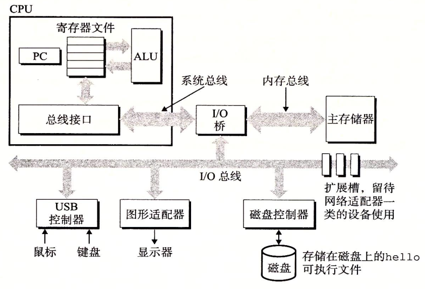

<!-- TOC -->

- [1. 计算机基础](#1-计算机基础)
    - [1.1. 计算机系统基本概念](#11-计算机系统基本概念)
        - [1.1.1. 信息就是位+上下文](#111-信息就是位上下文)
        - [1.1.2. 程序被其他程序翻译成不同的格式](#112-程序被其他程序翻译成不同的格式)
        - [1.1.3. 系统的硬件组成](#113-系统的硬件组成)
        - [1.1.4. 高速缓存](#114-高速缓存)
        - [1.1.5. 存储器层次结构](#115-存储器层次结构)
        - [1.1.6. 内核空间和用户空间](#116-内核空间和用户空间)
        - [1.1.7. 操作系统管理硬件](#117-操作系统管理硬件)
            - [1.1.7.1. 进程](#1171-进程)
            - [1.1.7.2. 线程](#1172-线程)
            - [1.1.7.3. 虚拟内存](#1173-虚拟内存)
            - [1.1.7.4. 文件](#1174-文件)
        - [1.1.8. 系统之间利用网络通信](#118-系统之间利用网络通信)
    - [1.2. 信息的表示和处理](#12-信息的表示和处理)
    - [1.3. 程序的机器级表示](#13-程序的机器级表示)
    - [1.4. 处理器体系结构](#14-处理器体系结构)
    - [1.5. 优化程序性能](#15-优化程序性能)
    - [1.6. 存储器层次结构](#16-存储器层次结构)
    - [1.7. 链接](#17-链接)
    - [1.8. 异常控制流](#18-异常控制流)
    - [1.9. 虚拟内存](#19-虚拟内存)
    - [1.10. 系统级IO](#110-系统级io)
    - [1.11. 网络编程](#111-网络编程)
    - [1.12. 并发编程](#112-并发编程)
- [2. 编译原理](#2-编译原理)

<!-- /TOC -->

# 1. 计算机基础

## 1.1. 计算机系统基本概念
<a href="#menu" style="float:right" display="block">目录</a>

### 1.1.1. 信息就是位+上下文

计算机系统是由硬件和系统软件组成，它们共同工作来运行应用程序．

一个文件由ASCII字符构成的文件称为文本文件，所有其他的文件称为二进制文件．系统中所有的信息，包括磁盘文件，内存中的程序，内存中存放的用户数据以及网上传输的数据，都是由一串比特表示的．区分不同的数据对象是根据这些数据对象的上下文．在不同的上下文中，一个同样的字节序列可能表示的是整数，浮点数或者字符串等

### 1.1.2. 程序被其他程序翻译成不同的格式

执行四个阶段[预处理器，编译器，汇编器，链接器]一起构成了编译系统

* 预处理阶段
    * 根据include命令告诉预处理器读取系统头文件的内容并将它插入到程序文本中，得到了另一个c程序，通常以.i作为文件扩展名
* 编译阶段
    * 将.i文件翻译成文本文件.s，它包含了一个汇编语言程序
* 汇编阶段
    * 汇编器将.s文件翻译成机器语言指令，把这些指令打包成一种叫做可重定位目标程序的格式．并将结果保存在目标文件.o中
* 链接阶段
    * 该文件如果调用其他文件的函数，则需要通过链接将它们合并到本文件中，结果得到可执行文件，可以被加载到内存中，由系统执行

### 1.1.3. 系统的硬件组成

* 总线
    * 包括地址总线和数据总线
    * 总线被设计成传送定长的字节块，也就是字(word)，系统中的int的长度就是字长，也就是int的长度等于地址总线的条数／８．32位机是４个字节，64位是8个字节
    
* IO设备
    * 比如磁盘，键盘鼠标等存储设备
* 主存
    * 临时存储设备，在处理器执行程序时，用来存放程序和程序处理的数据
    * 从物理上来说，主存是由一组动态随机大存取器(DRAM)芯片组成
    * 从逻辑上．存储器是一个线性的字节数组，每个字节都有其唯一的地址
* 处理器

### 1.1.4. 高速缓存

由于处理器与主存之间的速度存在差异，处理器从寄存器中读取数据比主存中读取的速度快很多．因此系统设计采用了高速缓存存储器(cache memory).作为暂时的集结区域．存放处理器最近可能会需要的信息．从而实现大部分内存操作都可以在快速的高速缓存中完成．避免慢速地存取主存．

### 1.1.5. 存储器层次结构

存储器层次结构的主要思想就是上一层的存储器作为低一层的存储器的高速缓存．

### 1.1.6. 内核空间和用户空间

以 32 位系统为例介绍内核空间(kernel space)和用户空间(user space)。

对 32 位操作系统而言，它的寻址空间（虚拟地址空间，或叫线性地址空间）为 4G（2的32次方）。也就是说一个进程的最大地址空间为 4G。操作系统的核心是内核(kernel)，它独立于普通的应用程序，可以访问受保护的内存空间，也有访问底层硬件设备的所有权限。为了保证内核的安全，现在的操作系统一般都强制用户进程不能直接操作内核。具体的实现方式基本都是由操作系统将虚拟地址空间划分为两部分，一部分为内核空间，另一部分为用户空间。针对 Linux 操作系统而言，最高的 1G 字节(从虚拟地址 0xC0000000 到 0xFFFFFFFF)由内核使用，称为内核空间。而较低的 3G 字节(从虚拟地址 0x00000000 到 0xBFFFFFFF)由各个进程使用，称为用户空间。

**为什么需要区分内核空间与用户空间**

在 CPU 的所有指令中，有些指令是非常危险的，如果错用，将导致系统崩溃，比如清内存、设置时钟等。如果允许所有的程序都可以使用这些指令，那么系统崩溃的概率将大大增加。
所以，CPU 将指令分为特权指令和非特权指令，对于那些危险的指令，只允许操作系统及其相关模块使用，普通应用程序只能使用那些不会造成灾难的指令。比如 Intel 的 CPU 将特权等级分为 4 个级别：Ring0~Ring3。
其实 Linux 系统只使用了 Ring0 和 Ring3 两个运行级别(Windows 系统也是一样的)。当进程运行在 Ring3 级别时被称为运行在用户态，而运行在 Ring0 级别时被称为运行在内核态。

**内核态与用户态**

当进程运行在内核空间时就处于内核态，而进程运行在用户空间时则处于用户态。
在内核态下，进程运行在内核地址空间中，此时 CPU 可以执行任何指令。运行的代码也不受任何的限制，可以自由地访问任何有效地址，也可以直接进行端口的访问。
在用户态下，进程运行在用户地址空间中，被执行的代码要受到 CPU 的诸多检查，它们只能访问映射其地址空间的页表项中规定的在用户态下可访问页面的虚拟地址，且只能对任务状态段(TSS)中 I/O 许可位图(I/O Permission Bitmap)中规定的可访问端口进行直接访问。

对于以前的 DOS 操作系统来说，是没有内核空间、用户空间以及内核态、用户态这些概念的。可以认为所有的代码都是运行在内核态的，因而用户编写的应用程序代码可以很容易的让操作系统崩溃掉。
对于 Linux 来说，通过区分内核空间和用户空间的设计，隔离了操作系统代码(操作系统的代码要比应用程序的代码健壮很多)与应用程序代码。即便是单个应用程序出现错误也不会影响到操作系统的稳定性，这样其它的程序还可以正常的运行(Linux 可是个多任务系统啊！)。

所以，区分内核空间和用户空间本质上是要提高操作系统的稳定性及可用性。

**如何从用户空间进入内核空间**

其实所有的系统资源管理都是在内核空间中完成的。比如读写磁盘文件，分配回收内存，从网络接口读写数据等等。我们的应用程序是无法直接进行这样的操作的。但是我们可以通过内核提供的接口来完成这样的任务。

比如应用程序要读取磁盘上的一个文件，它可以向内核发起一个 "系统调用" 告诉内核："我要读取磁盘上的某某文件"。其实就是通过一个特殊的指令让进程从用户态进入到内核态(到了内核空间)，在内核空间中，CPU 可以执行任何的指令，当然也包括从磁盘上读取数据。具体过程是先把数据读取到内核空间中，然后再把数据拷贝到用户空间并从内核态切换到用户态。此时应用程序已经从系统调用中返回并且拿到了想要的数据，可以开开心心的往下执行了。
简单说就是应用程序把高科技的事情(从磁盘读取文件)外包给了系统内核，系统内核做这些事情既专业又高效。

对于一个进程来讲，从用户空间进入内核空间并最终返回到用户空间，这个过程是十分复杂的。举个例子，比如我们经常接触的概念 "堆栈"，其实进程在内核态和用户态各有一个堆栈。运行在用户空间时进程使用的是用户空间中的堆栈，而运行在内核空间时，进程使用的是内核空间中的堆栈。所以说，Linux 中每个进程有两个栈，分别用于用户态和内核态。

进程有三种方式可以进入内核空间:系统调用、软中断和硬件中断.

**整体结构**

在硬件之上，内核空间中的代码控制了硬件资源的使用权，用户空间中的代码只有通过内核暴露的系统调用接口(System Call Interface)才能使用到系统中的硬件资源。其实，不光是 Linux，Windows 操作系统的设计也是大同小异。

实际上我们可以将每个处理器在任何指定时间点上的活动概括为下列三者之一：
* 运行于用户空间，执行用户进程。
* 运行于内核空间，处于进程上下文，代表某个特定的进程执行。
* 运行于内核空间，处于中断上下文，与任何进程无关，处理某个特定的中断。

以上三点几乎包括所有的情况，比如当 CPU 空闲时，内核就运行一个空进程，处于进程上下文，但运行在内核空间。

说明：Linux 系统的中断服务程序不在进程的上下文中执行，它们在一个与所有进程都无关的、专门的中断上下文中执行。之所以存在一个专门的执行环境，就是为了保证中断服务程序能够在第一时间响应和处理中断请求，然后快速地退出。

**总结**
现代的操作系统大都通过内核空间和用户空间的设计来保护操作系统自身的安全性和稳定性。所以在我们阅读有关操作系统的资料时经常遇到内核空间、用户空间和内核态、用户态等概念，希望本文能够帮助您理解这些基本的概念。

### 1.1.7. 操作系统管理硬件

操作系统有两个功能，一是防止硬件被失控的应用程序滥用　二是向应用程序提供简单一致的机制来控制复杂而又大不相同的低级硬件设备．操作系统通常这几个(进程，虚拟内存和文件)来实现这两个功能．文件是对IO设备的抽象表示．虚拟内存是对主存和磁盘设备的抽象表示，进程则是对处理器主存和ＩＯ设备的抽象表示．

#### 1.1.7.1. 进程

进程是操作系统中最基本的运行单位．操作系统保持跟踪进程运行所需的所有状态信息．这种状态叫上下文．包括PC和寄存器文件的当前值，以及主存的内容．任意时刻，单个处理器仅可以执行一个进程，多核处理器可以同时执行多个进程．．当操作系统需要切换进程时，就会进行上下文切换．即保存当前进程的上下文，恢复新进程的上下文．然后将控制权转移到新进程，新进程就会从上次停止的地方开始．切换进程是受操作系统内核管理的，内核是操作系统常驻主存的部分，当应用程序需要操作系统的某些操作时，比如读写文件，他就执行一条特殊的系统调用，将控制权传递给内核．然后内核执行完操作后返回结果给应用程序．内核不是一个独立的进程，是系统管理全部进程所用代码和数据结构的集合．

#### 1.1.7.2. 线程

线程是进程中子任务，每个线程都运行在进程的上下文中，并共享同样的代码和全局数据．

#### 1.1.7.3. 虚拟内存

虚拟内存是一个抽象概念，它为每一个进程提供了一个假象，即每个进程都在独占使用主存．每个进程看到的内存都是一致的，称为虚拟地址空间．

在linux中，地址空间最上面的区域是保留给操作系统中的代码和数据的．地址空间的底部区域存放用户进程定义的代码和数据

* 程序代码和数据
    * 对所有进程来说，代码是从同一固定地址开始的，紧接着的是和c全局变相对应的数据位置．代码和数据区是直接按照可执行目标文件的内容初始化的
* 堆
    * 运行时堆．当调用malloc和free这样的c标准库函数时，堆可以在运行时动态调整
* 共享库
    * 用来存放Ｃ标准库和数学库这样的共享库的代码和数据的区域
* 栈
    * 位于用户虚拟地址空间顶部的是用户栈，编译器用它来实现函数调用．用户栈在程序执行期间可以动态扩展和收缩．当调用函数时扩展．当调用完成时释放
* 内核虚拟内存
    * 为内核保留，不允许应用程序读写这个区域的内容或者直接调用内核代码定义的函数，它们必须调用内核来执行这些操作

虚拟内存的运作需要硬件和操作系统软件之间精密复杂的交互，包括对处理器生成的每个地址的硬件翻译．基本思想是把一个进程虚拟内存的内容存储到硬盘上，然后用主存作为磁盘的高速缓存．

#### 1.1.7.4. 文件

文件就是字节序列．每个IO设备，包括磁盘，键盘，显示器，甚至网络都可以看成是文件．系统中所有输入输出都是通过使用Unix　Ｉ／Ｏ的系统函数调用来读写文件来实现．
文件向操作系统上的应用程序提供了一个统一的视图，来看待系统中可能含有的各式各样的ＩＯ设备．

### 1.1.8. 系统之间利用网络通信

## 1.2. 信息的表示和处理
<a href="#menu" style="float:right" display="block">目录</a>

## 1.3. 程序的机器级表示
<a href="#menu" style="float:right" display="block">目录</a>

## 1.4. 处理器体系结构
<a href="#menu" style="float:right" display="block">目录</a>

## 1.5. 优化程序性能
<a href="#menu" style="float:right" display="block">目录</a>

## 1.6. 存储器层次结构
<a href="#menu" style="float:right" display="block">目录</a>

## 1.7. 链接
<a href="#menu" style="float:right" display="block">目录</a>

## 1.8. 异常控制流
<a href="#menu" style="float:right" display="block">目录</a>

## 1.9. 虚拟内存
<a href="#menu" style="float:right" display="block">目录</a>

## 1.10. 系统级IO
<a href="#menu" style="float:right" display="block">目录</a>

## 1.11. 网络编程
<a href="#menu" style="float:right" display="block">目录</a>

## 1.12. 并发编程
<a href="#menu" style="float:right" display="block">目录</a>

# 2. 编译原理
<a href="#menu" style="float:right" display="block">目录</a>
