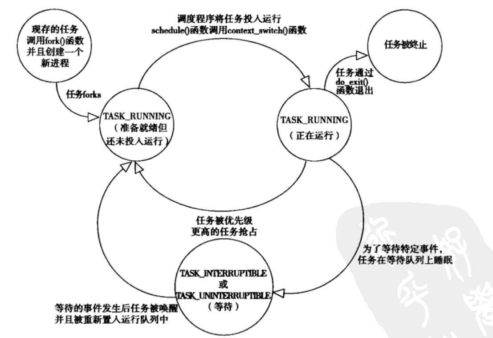

<span id="menu">
<!-- TOC -->

- [1. 计算机基础](#1-计算机基础)
  - [1.1. 计算机系统基本概念](#11-计算机系统基本概念)
    - [1.1.1. 信息就是位+上下文](#111-信息就是位上下文)
    - [1.1.2. 程序被其他程序翻译成不同的格式](#112-程序被其他程序翻译成不同的格式)
    - [1.1.3. 系统的硬件组成](#113-系统的硬件组成)
    - [1.1.4. 时钟周期、机器周期、指令周期的概念及三者之间的关系](#114-时钟周期机器周期指令周期的概念及三者之间的关系)
    - [1.1.5. 高速缓存](#115-高速缓存)
    - [1.1.6. 存储器层次结构](#116-存储器层次结构)
    - [1.1.7. 内核空间和用户空间](#117-内核空间和用户空间)
    - [1.1.8. 操作系统管理硬件](#118-操作系统管理硬件)
      - [1.1.8.1. 进程](#1181-进程)
      - [1.1.8.2. 线程](#1182-线程)
      - [1.1.8.3. 虚拟内存](#1183-虚拟内存)
      - [1.1.8.4. 文件](#1184-文件)
    - [1.1.9. 系统之间利用网络通信](#119-系统之间利用网络通信)
  - [1.2. 信息的表示和处理](#12-信息的表示和处理)
    - [1.2.1. 信息存储](#121-信息存储)
    - [1.2.2. 整数表示](#122-整数表示)
    - [1.2.3. 浮点数](#123-浮点数)
  - [1.3. 程序的机器级表示](#13-程序的机器级表示)
  - [1.4. 处理器体系结构](#14-处理器体系结构)
  - [1.5. 优化程序性能](#15-优化程序性能)
  - [1.6. 存储器层次结构](#16-存储器层次结构)
  - [1.7. 链接](#17-链接)
  - [1.8. 异常控制流](#18-异常控制流)
  - [1.9. 虚拟内存](#19-虚拟内存)
  - [1.10. 系统级IO](#110-系统级io)
  - [1.11. 网络编程](#111-网络编程)
  - [1.12. 并发编程](#112-并发编程)
- [2. 操作系统](#2-操作系统)
  - [2.1. 概述](#21-概述)
  - [2.2. 进程管理](#22-进程管理)
    - [2.2.1. 进程&线程](#221-进程线程)
    - [2.2.2. 进程描述符以及任务结构](#222-进程描述符以及任务结构)
    - [2.2.3. 各种类型的进程](#223-各种类型的进程)
    - [2.2.4. 进程创建](#224-进程创建)
      - [2.2.4.1. 写时拷贝](#2241-写时拷贝)
      - [2.2.4.2. forkO](#2242-forko)
      - [2.2.4.3. vforkO](#2243-vforko)
    - [2.2.5. 进程终结](#225-进程终结)
  - [2.3. 进程调度](#23-进程调度)
    - [2.3.1. 策略](#231-策略)
      - [2.3.1.1. IO消耗型和CPU消耗型的进程](#2311-io消耗型和cpu消耗型的进程)
      - [2.3.1.2. 进程优先级](#2312-进程优先级)
      - [2.3.1.3. 时间片](#2313-时间片)
    - [2.3.2. linux调度算法](#232-linux调度算法)
    - [2.3.3. 调度的实现](#233-调度的实现)
    - [2.3.4. 抢占和上下文切换](#234-抢占和上下文切换)
    - [2.3.5. 实时调度策略](#235-实时调度策略)
    - [2.3.6. 与调度相关的系统调用](#236-与调度相关的系统调用)
  - [2.4. 进程间通信](#24-进程间通信)
  - [2.5. 上下文切换](#25-上下文切换)
  - [2.6. 内存管理](#26-内存管理)
    - [2.6.1. 页和区](#261-页和区)
    - [2.6.2. 计算机中的“扇区”、“簇”、“块”、“页”](#262-计算机中的扇区簇块页)
  - [2.7. 设备管理](#27-设备管理)
  - [2.8. 文件管理](#28-文件管理)
  - [2.9. 操作系统接口](#29-操作系统接口)
  - [2.10. 网络操作系统](#210-网络操作系统)
- [3. 编译原理](#3-编译原理)
  - [3.1. 概论](#31-概论)
    - [3.1.1. 与编译器相关的程序](#311-与编译器相关的程序)
    - [3.1.2. 翻译步骤](#312-翻译步骤)
    - [3.1.3. 编译器中的主要数据结构](#313-编译器中的主要数据结构)
  - [3.2. 词法分析](#32-词法分析)
  - [3.3. 上下文无关及分析](#33-上下文无关及分析)
  - [3.4. 自顶向下分析](#34-自顶向下分析)
  - [3.5. 自底向上分析](#35-自底向上分析)
  - [3.6. 语义分析](#36-语义分析)
  - [3.7. 运行时环境](#37-运行时环境)
  - [3.8. 代码生成](#38-代码生成)

<!-- /TOC -->


# 1. 计算机基础

## 1.1. 计算机系统基本概念
<a href="#menu"  >目录</a>

### 1.1.1. 信息就是位+上下文
<a href="#menu"  >目录</a>

计算机系统是由硬件和系统软件组成，它们共同工作来运行应用程序．

一个文件由ASCII字符构成的文件称为文本文件，所有其他的文件称为二进制文件．系统中所有的信息，包括磁盘文件，内存中的程序，内存中存放的用户数据以及网上传输的数据，都是由一串比特表示的．区分不同的数据对象是根据这些数据对象的上下文．在不同的上下文中，一个同样的字节序列可能表示的是整数，浮点数或者字符串等

### 1.1.2. 程序被其他程序翻译成不同的格式
<a href="#menu"  >目录</a>

执行四个阶段[预处理器，编译器，汇编器，链接器]一起构成了编译系统


* 预处理阶段
    * 根据include命令告诉预处理器读取系统头文件的内容并将它插入到程序文本中，得到了另一个c程序，通常以.i作为文件扩展名
* 编译阶段
    * 将.i文件翻译成文本文件.s，它包含了一个汇编语言程序
* 汇编阶段
    * 汇编器将.s文件翻译成机器语言指令，把这些指令打包成一种叫做可重定位目标程序的格式．并将结果保存在目标文件.o中
* 链接阶段
    * 该文件如果调用其他文件的函数，则需要通过链接将它们合并到本文件中，结果得到可执行文件，可以被加载到内存中，由系统执行

### 1.1.3. 系统的硬件组成
<a href="#menu"  >目录</a>


**总线***
* 包括地址总线和数据总线
* 总线被设计成传送定长的字节块，也就是字(word)，系统中的int的长度就是字长，也就是int的长度等于地址总线的条数／８．32位机是４个字节，64位是8个字节
    
**CPU**

中央处理器（CPU，Central Processing Unit）是一块超大规模的集成电路，是一台计算机的运算核心（Core）和控制核心（ Control Unit）。它的功能主要是解释计算机指令以及处理计算机软件中的数据。中央处理器主要包括运算器（算术逻辑运算单元，ALU，Arithmetic Logic Unit）和高速缓冲存储器（Cache）及实现它们之间联系的数据（Data）、控制及状态的总线（Bus）。它与内部存储器（Memory）和输入/输出（I/O）设备合称为电子计算机三大核心部件。

**寄存器**

寄存器是中央处理器内的组成部份。它跟CPU有关。寄存器是有限存贮容量的高速存贮部件，它们可用来暂存指令、数据和位址。在中央处理器的控制部件中，包含的寄存器有指令寄存器(IR)和程序计数器(PC)。在中央处理器的算术及逻辑部件中，包含的寄存器有累加器(ACC)。

**存储器**

存储器范围最大，它几乎涵盖了所有关于存储的范畴。你所说的寄存器，内存，都是存储器里面的一种。凡是有存储能力的硬件，都可以称之为存储器，这是自然，硬盘更加明显了，它归入外存储器行列，由此可见。

**内存**

内存既专业名上的内存储器，它不是个什么神秘的东西，它也只是存储器中的沧海一粟，它包涵的范围也很大，一般分为只读存储器（ROM）和随机存储器（RAM），以及最强悍的高速缓冲存储器（CACHE），只读存储器应用广泛，它通常是一块在硬件上集成的可读芯片，作用是识别与控制硬件，它的特点是只可读取，不能写入。随机存储器的特点是可读可写，断电后一切数据都消失，我们所说的内存条就是指它了。

**缓存CACHE**

缓存就是数据交换的缓冲区（称作Cache），当某一硬件要读取数据时，会首先从缓存中查找需要的数据，如果找到了则直接执行，找不到的话则从内存中找。由于缓存的运行速度比内存快得多，故缓存的作用就是帮助硬件更快地运行。因为缓存往往使用的是RAM（断电即掉的非永久储存），所以在用完后还是会把文件送到硬盘等存储器里永久存储。电脑里最大的缓存就是内存条了，最快的是CPU上镶的L1和L2缓存，显卡的显存是给显卡运算芯片用的缓存，硬盘上也有16M或者32M的缓存。CACHE是在CPU中速度非常块，而容量却很小的一种存储器，它是计算机存储器中最强悍的存储器。由于技术限制，容量很难提升。

**寄存器**
* 简介
    * 寄存器是中央处理器内的组成部分。寄存器是有限存贮容量的高速存贮部件，它们可用来暂存指令、数据和地址。在中央处理器的控制部件中，包含的寄存器有指令寄存器(IR)和程序计数器(PC)。在中央处理器的算术及逻辑部件中，存器有累加器(ACC)。 
    * 寄存器的基本单元是 D触发器， 
    * 按照其用途分为基本寄存器和移位寄存器 
    * 基本寄存器是由 D触发器组成，在 CP 脉冲作用下，每个 D触发器能够寄存一位二进制码。在 D=0 时，寄存器储存为 0，在 D=1 时，寄存器储存为 1。在低电平为 0、高电平为 1 时，需将信号源与 D 间连接一反相器，这样就可以完成对数据的储存。 需要强调的是，目前大型数字系统都是基于时钟运作的，其中寄存器一般是在时钟的边缘被触发的，基于电平触发的已较少使用。（通常说的CPU的频率就是指数字集成电路的时钟频率） 
    * 移位寄存器按照移位方向可以分为单向移位寄存器和双向移位寄存器。单向移位寄存器是由多个 D 触发器串接而成,在串口 Di 输入需要储存的数据，触发器 FF0 就能够储存当前需要储存数据，在 CP 发出一次时钟控制脉冲时，串口 Di 同时输入第二个需要储存是的数据，而第一个数据则储存到触发器 FF1 中。双向移位寄存器按图中方式排列，调换连接端顺序，可以控制寄存器向左移位，增加控制电路可以使寄存器右移，这样构成双向移位寄存器。
* 特点
    * 寄存器又分为内部寄存器与外部寄存器，所谓内部寄存器，其实也是一些小的存储单元，也能存储数据。但同存储器相比，寄存器又有自己独有的特点： 
    * 寄存器位于CPU内部，数量很少，仅十四个 
    * 寄存器所能存储的数据不一定是8bit，有一些寄存器可以存储16bit数据，对于386/486处理器中的一些寄存器则能存储32bit数据 
    * 每个内部寄存器都有一个名字，而没有类似存储器的地址编号。
* 用途  
    * 可将寄存器内的数据执行算术及逻辑运算 
    * 存于寄存器内的地址可用来指向内存的某个位置，即寻址 
    * 可以用来读写数据到电脑的周边设备。

**存储器**
* 存储器简介
    * 构成存储器的存储介质，存储元，它可存储一个二进制代码。由若干个存储元组成一个存储单元，然后再由许多存储单元组成一个存储器。一个存储器包含许多存储单元，每个存储单元可存放一个字节（按字节编址）。每个存储单元的位置都有一个编号，即地址，一般用十六进制表示。一个存储器中所有存储单元可存放数据的总和称为它的存储容量。假设一个存储器的地址码由20位二进制数（即5位十六进制数）组成，则可表示2的20次方，即1M个存储单元地址。每个存储单元存放一个字节，则该存储器的存储容量为1MB。
* ROM、RAM的区别
    * ROM（只读存储器或者固化存储器）RAM（随机存取存储器）ROM和RAM指的都是半导体存储器，ROM是Read Only Memory的缩写，RAM是Random Access Memory的缩写。ROM在系统停止供电的时候仍然可以保持数据，而RAM通常都是在掉电之后就丢失数据，典型的RAM就是计算机的内存。 RAM有两大类，一种称为静态RAM（Static RAM/SRAM），当数据被存入其中后不会消失。SRAM速度非常快，是目前读写最快的存储设备了。当这个SRAM 单元被赋予0 或者1 的状态之后，它会保持这个状态直到下次被赋予新的状态或者断电之后才会更改或者消失。但是存储1bit 的信息需要4-6 只晶体管。因此它也非常昂贵，所以只在要求很苛刻的地方使用，譬如CPU的一级缓冲，二级缓冲。另一种称为动态RAM（Dynamic RAM/DRAM），DRAM 必须在一定的时间内不停的刷新才能保持其中存储的数据。DRAM 只要1 只晶体管就可以实现。DRAM保留数据的时间很短，速度也比SRAM慢，不过它还是比任何的ROM都要快，但从价格上来说DRAM相比SRAM要便宜很 多，计算机内存就是DRAM的。 DRAM分为很多种，常见的主要有FPRAM/FastPage、EDORAM、SDRAM、DDR RAM、RDRAM、SGRAM以及WRAM等，这里介绍其中的一种DDR RAM。DDR RAM（Date-Rate RAM）也称作DDR SDRAM，这种改进型的RAM和SDRAM是基本一样的，不同之处在于它可以在一个时钟读写两次数据，这样就使得数据传输速度加倍了。这是目前电脑中用 得最多的内存，而且它有着成本优势，事实上击败了Intel的另外一种内存标准－Rambus DRAM。在很多高端的显卡上，也配备了高速DDR RAM来提高带宽，这可以大幅度提高3D加速卡的像素渲染能力。 
    * ROM也有很多种，PROM是可编程的ROM，PROM和EPROM（可擦除可编程ROM）两者区别是，PROM是一次性的，也就是软件灌入后，就无法修 改了，这种是早期的产品，现在已经不可能使用了，而EPROM是通过紫外光的照射擦出原先的程序，是一种通用的存储器。另外一种EEPROM是通过电子擦出，价格很高，写入时间很长，写入很慢。 最初,把只能读的存储器叫做ROM(Read Only Memory),并且掉电后数据不会丢失。由于不能改写，因而使用起来很不方便。随着技术的进步，在ROM中使用一些新技术，就可以使它具有可以编程的功能。比较早的是熔丝型的可编程ROM，由于是通过熔断熔丝来编程的，所以这类ROM编程后，就不能再写了，是一次性的(OTP)。后来又出现了EPROM，是通过紫外线来擦除的，并且通过高压来编程，这类ROM上面一般有一个透明的石英玻璃窗，看上去挺漂亮的，它就是用来给紫外线照射的。后来又出现了EEPROM，不用紫外线照射就可以擦除，因而可以直接在电路中编程。另外还有FLASH ROM，又可分为NOR FLASH和NAND FLASH。FLASH ROM一般有一个特点，就是写数据时，可以将1改为0，而不能将0改为1，因而写数据前需要擦除，擦除时将所有数据置1。之所以依然叫做ROM，归纳一下，大概有几个原因: 
        * 不能像RAM那样快速的写； 
        * 可能需要特殊的擦写电压； 
        * 可能需要特殊的擦写时序； 
        * 可能需要在写之前进行擦除操作； 
        * 擦写次数有限,不像RAM那样可以随意写而不损坏； 
        * 掉电后数据不会丢失； 
    * FLASH存储器又称闪存，它结合了ROM和RAM的长处，不仅具备电子可擦出可编程（EEPROM）的性能，还不会断电丢失数据同时可以快速读取数据 （NVRAM的优势），U盘和MP3里用的就是这种存储器。在过去的20年里，嵌入式系统一直使用ROM（EPROM）作为它们的存储设备，然而近年来 Flash全面代替了ROM（EPROM）在嵌入式系统中的地位，用作存储Bootloader以及操作系统或者程序代码或者直接当硬盘使用（U盘）。 
    * 目前Flash主要有两种NOR Flash和NADN Flash。NOR Flash的读取和我们常见的SDRAM的读取是一样，用户可以直接运行装载在NOR FLASH里面的代码，这样可以减少SRAM的容量从而节约了成本。NAND Flash没有采取内存的随机读取技术，它的读取是以一次读取一快的形式来进行的，通常是一次读取512个字节，采用这种技术的Flash比较廉价。用户 不能直接运行NAND Flash上的代码，因此好多使用NAND Flash的开发板除了使用NAND Flah以外，还作上了一块小的NOR Flash来运行启动代码。 一般小容量的用NOR Flash，因为其读取速度快，多用来存储操作系统等重要信息，而大容量的用NAND FLASH，最常见的NAND FLASH应用是嵌入式系统采用的DOC（Disk On Chip）和我们通常用的“闪盘”，可以在线擦除。

**CPU位数、操作系统位数、指令集、寄存器位数、机器字长等**

CPU位数 = CPU中寄存器的位数 = CPU能够一次并行处理的数据宽度 = 数据总线宽度


CPU为了实现其功能一般设计了指令集(如：IA32指令集和x86-64指令集等)，即是CPU的全部指令，这就是机器语言。计算机的所有功能都是基于CPU的指令集。指令集和CPU的位数是有联系 的。如Intel 8086 CPU 是16位，其指令集也是16位。如Intel 80386DX CPU 是32位，其指令集也是32位，但它也保持原16位指令集，这是为了向上兼容。

注意：x86 又叫 IA32，即 Intel Architecture 32（Intel32位架构）

操作系统位数 = 其所依赖的指令集位数 <= CPU位数

机器字长 = 整数和指针数据的标称大小（字长决定的最重要的参数就是虚拟地址空间的最大大小）

CPU位数与操作系统位数，这二者有区别也有联系，操作系统位数的概念是基于CPU的位数的。 CPU的位数是指CPU能一次同时寄存和处理二进制数码的位数，这和CPU中寄存器的位数对应。 操作系统的位数是说其所依赖的指令集的位数。计算机系统一般都应有向上兼容性，所以也可有64位CPU上运行32位操作系统、32位CPU上运行16位操作系统的情况。操作系统位数应该是根据指针类型的位数来定的。整数类型不一定跟位数相等，CPU位数准确地说应该是CPU一次能够并行处理的数据宽度，一般就是指数据总线宽度。 


### 1.1.4. 时钟周期、机器周期、指令周期的概念及三者之间的关系
<a href="#menu"  >目录</a>

**时钟周期**

时钟周期也称为振荡周期，定义为时钟脉冲的倒数(可以这样来理解，时钟周期就是单片机外接晶振的倒数，例如12M的晶振，它的时间周期就是1/12 us)，是计算机中最基本的、最小的时间单位。

 在一个时钟周期内，CPU仅完成一个最基本的动作。对于某种单片机，若采用了1MHZ的时钟频率，则时钟周期为1us;若采用4MHZ的时钟频率，则时钟周期为250ns。由于时钟脉冲是计算机的基本工作脉冲，它控制着计算机的工作节奏(使计算机的每一步都统一到它的步调上来)。显然，对同一种机型的计算机，时钟频率越高，计算机的工作速度就越快。但是，由于不同的计算机硬件电路和器件的不完全相同，所以其所需要的时钟周频率范围也不一定相同。我们学习的8051单片机的时钟范围是1.2MHz-12MHz。

**机器周期**

 在计算机中，为了便于管理，常把一条指令的执行过程划分为若干个阶段，每一阶段完成一项工作。例如，取指令、存储器读、存储器写等，这每一项工作称为一个基本操作。完成一个基本操作所需要的时间称为机器周期。一般情况下，一个机器周期由若干个S周期(状态周期)组成。8051系列单片机的一个机器周期同6个S周期(状态周期)组成。前面已说过一个时钟周期定义为一个节拍(用P表示)，二个节拍定义为一个状态周期(用S表示)，8051单片机的机器周期由6个状态周期组成，也就是说一个机器周期=6个状态周期=12个时钟周期。

**指令周期**

指令周期是执行一条指令所需要的时间，一般由若干个机器周期组成。指令不同，所需的机器周期数也不同。对于一些简单的的单字节指令，在取指令周期中，指令取出到指令寄存器后，立即译码执行，不再需要其它的机器周期。对于一些比较复杂的指令，例如转移指令、乘法指令，则需要两个或者两个以上的机器周期。

通常含一个机器周期的指令称为单周期指令，包含两个机器周期的指令称为双周期指令。


### 1.1.5. 高速缓存

由于处理器与主存之间的速度存在差异，处理器从寄存器中读取数据比主存中读取的速度快很多．因此系统设计采用了高速缓存存储器(cache memory).作为暂时的集结区域．存放处理器最近可能会需要的信息．从而实现大部分内存操作都可以在快速的高速缓存中完成．避免慢速地存取主存．

### 1.1.6. 存储器层次结构


存储器层次结构的主要思想就是上一层的存储器作为低一层的存储器的高速缓存．

### 1.1.7. 内核空间和用户空间

以 32 位系统为例介绍内核空间(kernel space)和用户空间(user space)。

对 32 位操作系统而言，它的寻址空间（虚拟地址空间，或叫线性地址空间）为 4G（2的32次方）。也就是说一个进程的最大地址空间为 4G。操作系统的核心是内核(kernel)，它独立于普通的应用程序，可以访问受保护的内存空间，也有访问底层硬件设备的所有权限。为了保证内核的安全，现在的操作系统一般都强制用户进程不能直接操作内核。具体的实现方式基本都是由操作系统将虚拟地址空间划分为两部分，一部分为内核空间，另一部分为用户空间。针对 Linux 操作系统而言，最高的 1G 字节(从虚拟地址 0xC0000000 到 0xFFFFFFFF)由内核使用，称为内核空间。而较低的 3G 字节(从虚拟地址 0x00000000 到 0xBFFFFFFF)由各个进程使用，称为用户空间。


**为什么需要区分内核空间与用户空间**

在 CPU 的所有指令中，有些指令是非常危险的，如果错用，将导致系统崩溃，比如清内存、设置时钟等。如果允许所有的程序都可以使用这些指令，那么系统崩溃的概率将大大增加。
所以，CPU 将指令分为特权指令和非特权指令，对于那些危险的指令，只允许操作系统及其相关模块使用，普通应用程序只能使用那些不会造成灾难的指令。比如 Intel 的 CPU 将特权等级分为 4 个级别：Ring0~Ring3。
其实 Linux 系统只使用了 Ring0 和 Ring3 两个运行级别(Windows 系统也是一样的)。当进程运行在 Ring3 级别时被称为运行在用户态，而运行在 Ring0 级别时被称为运行在内核态。

**内核态与用户态**

当进程运行在内核空间时就处于内核态，而进程运行在用户空间时则处于用户态。
在内核态下，进程运行在内核地址空间中，此时 CPU 可以执行任何指令。运行的代码也不受任何的限制，可以自由地访问任何有效地址，也可以直接进行端口的访问。
在用户态下，进程运行在用户地址空间中，被执行的代码要受到 CPU 的诸多检查，它们只能访问映射其地址空间的页表项中规定的在用户态下可访问页面的虚拟地址，且只能对任务状态段(TSS)中 I/O 许可位图(I/O Permission Bitmap)中规定的可访问端口进行直接访问。

对于以前的 DOS 操作系统来说，是没有内核空间、用户空间以及内核态、用户态这些概念的。可以认为所有的代码都是运行在内核态的，因而用户编写的应用程序代码可以很容易的让操作系统崩溃掉。
对于 Linux 来说，通过区分内核空间和用户空间的设计，隔离了操作系统代码(操作系统的代码要比应用程序的代码健壮很多)与应用程序代码。即便是单个应用程序出现错误也不会影响到操作系统的稳定性，这样其它的程序还可以正常的运行(Linux 可是个多任务系统啊！)。

所以，区分内核空间和用户空间本质上是要提高操作系统的稳定性及可用性。

**如何从用户空间进入内核空间**

其实所有的系统资源管理都是在内核空间中完成的。比如读写磁盘文件，分配回收内存，从网络接口读写数据等等。我们的应用程序是无法直接进行这样的操作的。但是我们可以通过内核提供的接口来完成这样的任务。

比如应用程序要读取磁盘上的一个文件，它可以向内核发起一个 "系统调用" 告诉内核："我要读取磁盘上的某某文件"。其实就是通过一个特殊的指令让进程从用户态进入到内核态(到了内核空间)，在内核空间中，CPU 可以执行任何的指令，当然也包括从磁盘上读取数据。具体过程是先把数据读取到内核空间中，然后再把数据拷贝到用户空间并从内核态切换到用户态。此时应用程序已经从系统调用中返回并且拿到了想要的数据，可以开开心心的往下执行了。
简单说就是应用程序把高科技的事情(从磁盘读取文件)外包给了系统内核，系统内核做这些事情既专业又高效。

对于一个进程来讲，从用户空间进入内核空间并最终返回到用户空间，这个过程是十分复杂的。举个例子，比如我们经常接触的概念 "堆栈"，其实进程在内核态和用户态各有一个堆栈。运行在用户空间时进程使用的是用户空间中的堆栈，而运行在内核空间时，进程使用的是内核空间中的堆栈。所以说，Linux 中每个进程有两个栈，分别用于用户态和内核态。

进程有三种方式可以进入内核空间:系统调用、软中断和硬件中断.

**整体结构**


在硬件之上，内核空间中的代码控制了硬件资源的使用权，用户空间中的代码只有通过内核暴露的系统调用接口(System Call Interface)才能使用到系统中的硬件资源。其实，不光是 Linux，Windows 操作系统的设计也是大同小异。

实际上我们可以将每个处理器在任何指定时间点上的活动概括为下列三者之一：
* 运行于用户空间，执行用户进程。
* 运行于内核空间，处于进程上下文，代表某个特定的进程执行。
* 运行于内核空间，处于中断上下文，与任何进程无关，处理某个特定的中断。

以上三点几乎包括所有的情况，比如当 CPU 空闲时，内核就运行一个空进程，处于进程上下文，但运行在内核空间。

说明：Linux 系统的中断服务程序不在进程的上下文中执行，它们在一个与所有进程都无关的、专门的中断上下文中执行。之所以存在一个专门的执行环境，就是为了保证中断服务程序能够在第一时间响应和处理中断请求，然后快速地退出。

**总结**
现代的操作系统大都通过内核空间和用户空间的设计来保护操作系统自身的安全性和稳定性。所以在我们阅读有关操作系统的资料时经常遇到内核空间、用户空间和内核态、用户态等概念，希望本文能够帮助您理解这些基本的概念。


### 1.1.8. 操作系统管理硬件

操作系统有两个功能，一是防止硬件被失控的应用程序滥用　二是向应用程序提供简单一致的机制来控制复杂而又大不相同的低级硬件设备．操作系统通常这几个(进程，虚拟内存和文件)来实现这两个功能．文件是对IO设备的抽象表示．虚拟内存是对主存和磁盘设备的抽象表示，进程则是对处理器主存和ＩＯ设备的抽象表示．


#### 1.1.8.1. 进程

进程是操作系统中最基本的运行单位．操作系统保持跟踪进程运行所需的所有状态信息．这种状态叫上下文．包括PC和寄存器文件的当前值，以及主存的内容．任意时刻，单个处理器仅可以执行一个进程，多核处理器可以同时执行多个进程．．当操作系统需要切换进程时，就会进行上下文切换．即保存当前进程的上下文，恢复新进程的上下文．然后将控制权转移到新进程，新进程就会从上次停止的地方开始．切换进程是受操作系统内核管理的，内核是操作系统常驻主存的部分，当应用程序需要操作系统的某些操作时，比如读写文件，他就执行一条特殊的系统调用，将控制权传递给内核．然后内核执行完操作后返回结果给应用程序．内核不是一个独立的进程，是系统管理全部进程所用代码和数据结构的集合．


#### 1.1.8.2. 线程

线程是进程中子任务，每个线程都运行在进程的上下文中，并共享同样的代码和全局数据．

#### 1.1.8.3. 虚拟内存

虚拟内存是一个抽象概念，它为每一个进程提供了一个假象，即每个进程都在独占使用主存．每个进程看到的内存都是一致的，称为虚拟地址空间．

在linux中，地址空间最上面的区域是保留给操作系统中的代码和数据的．地址空间的底部区域存放用户进程定义的代码和数据


* 程序代码和数据
    * 对所有进程来说，代码是从同一固定地址开始的，紧接着的是和c全局变相对应的数据位置．代码和数据区是直接按照可执行目标文件的内容初始化的
* 堆
    * 运行时堆．当调用malloc和free这样的c标准库函数时，堆可以在运行时动态调整
* 共享库
    * 用来存放Ｃ标准库和数学库这样的共享库的代码和数据的区域
* 栈
    * 位于用户虚拟地址空间顶部的是用户栈，编译器用它来实现函数调用．用户栈在程序执行期间可以动态扩展和收缩．当调用函数时扩展．当调用完成时释放
* 内核虚拟内存
    * 为内核保留，不允许应用程序读写这个区域的内容或者直接调用内核代码定义的函数，它们必须调用内核来执行这些操作

虚拟内存的运作需要硬件和操作系统软件之间精密复杂的交互，包括对处理器生成的每个地址的硬件翻译．基本思想是把一个进程虚拟内存的内容存储到硬盘上，然后用主存作为磁盘的高速缓存．

#### 1.1.8.4. 文件

文件就是字节序列．每个IO设备，包括磁盘，键盘，显示器，甚至网络都可以看成是文件．系统中所有输入输出都是通过使用Unix　Ｉ／Ｏ的系统函数调用来读写文件来实现．
文件向操作系统上的应用程序提供了一个统一的视图，来看待系统中可能含有的各式各样的ＩＯ设备．

### 1.1.9. 系统之间利用网络通信


## 1.2. 信息的表示和处理
<a href="#menu"  >目录</a>

### 1.2.1. 信息存储

**进制转换**


**字数据大小**


每个计算机都有一个字长(word size)．指明指针数据的标称大小．字长决定虚拟地址空间的大小．对于字长为n的机器，虚拟地址的范围为0－（2的n次方－１）．

大多数64位机器也可以运行32位机器编译的程序，这是一种向后兼容．反之则会存在问题．程序的可移植性就是使程序对不同数据类型的确却大小不敏感．不管在何种平台下编译，都能够移植到其他平台正确运行，Java是通过不同平台的虚拟机来实现可移植性．

**寻址和字节顺序**

* 大端模式
    * 是指数据的高字节保存在内存的低地址中，而数据的低字节保存在内存的高地址中，这样的存储模式有点儿类似于把数据当作字符串顺序处理：地址由小向大增加，而数据从高位往低位放；这和我们的阅读习惯一致。
* 小端模式
    * 是指数据的高字节保存在内存的高地址中，而数据的低字节保存在内存的低地址中，这种存储模式将地址的高低和数据位权有效地结合起来，高地址部分权值高，低地址部分权值低。

以unsigned int value = 0x12345678为例
|内存地址	|小端模式存放内容|	大端模式存放内容|
|---|---|---|
|0x4000	|0x78|	0x12
|0x4001	|0x56|	0x34
|0x4002	|0x34|	0x56
|0x4003	|0x12|	0x78

不同的机器使用的模式不一定一样．并没有强制规定．

**整数表示**


**浮点数表示**

### 1.2.2. 整数表示

### 1.2.3. 浮点数


## 1.3. 程序的机器级表示
<a href="#menu"  >目录</a>


## 1.4. 处理器体系结构
<a href="#menu"  >目录</a>

## 1.5. 优化程序性能
<a href="#menu"  >目录</a>

## 1.6. 存储器层次结构
<a href="#menu"  >目录</a>


## 1.7. 链接
<a href="#menu"  >目录</a>

## 1.8. 异常控制流
<a href="#menu"  >目录</a>

## 1.9. 虚拟内存
<a href="#menu"  >目录</a>

## 1.10. 系统级IO
<a href="#menu"  >目录</a>

## 1.11. 网络编程
<a href="#menu"  >目录</a>

## 1.12. 并发编程
<a href="#menu"  >目录</a>

现代操作系统提供三种基本的方式实现并发处理．
* 进程
* 线程
* IO多路复用

# 2. 操作系统


## 2.1. 概述
<a href="#menu"  >目录</a>

操作系统是一种软件。从一般用户的观点，操作系统是用户和计算机硬件系统之间的接口。从资源管理的观点看，操作系统是计算机资源的管理者。同时，操作系统实现了对计算机资源的抽象，隐藏了对硬件操作的细节。

**操作系统基本特性**

* 并发
    * 并行与并发
      * 并行性
        * 两个或者多个事件在同一个时刻发生
      * 并发性
        * 两个或者多个事件在同一时间间隔内发生，在单cpu环境下，多个程序是以交替运行方式工作。而在多个cpu环境下，多个程序可以同时运行，也就是并行执行
    * 引入进程
        * 进程是指在系统中能独立运行并作为资源分配的基本单位，它是由一组机器指令，数据和堆栈组成的。是一个能独立运行的活动实体。多个进程之间可以并发执行交换信息。一个进程运行时会占用一定的资源，比如cpu,内存，io资源等
        * 引入多进程能够使多个程序同时运行，并且在多处理器环境下，还可以更加有效地利用计算机资源。
    * 引入线程
        * 操作系统在进行进程切换的时候，调度的开销比较大，故而引入更轻量级的线程。进程作为分配资源的基本单位，而线程作为独立运行或者独立调度的基本单位。由于线程比进程小，基本不拥有系统资源，因此对它的调度造成的系统开销较小。
* 共享
    * 共享sharing指的是系统中资源可供内存中多个并发执行的进程(线程)共同使用，相应地，把这种资源共同使用称为资源共享或者资源复用。
    * 共享方式
        * 互斥共享方式,同一时间只能由一个进程或者线程进行访问，受访问的资源称为临界资源或者独占资源，访问时需要使用相应的机制进行锁定。
        * 同时访问方式，同一时间可由一个进程或者线程进行访问，
* 虚拟技术
    * 操作系统中所谓的虚拟是指通过某种技术将一个物理实体变为若干个逻辑上的相应物，使用的技术有时分复用技术和空分复用技术
    * 时分复用技术(分时使用方式)
      * 虚拟处理机技术，比如程序的并发执行，即使只有一个处理机，通过分时技术，程序交替运行，感觉上确是多个程序在同时执行
      * 虚拟设备技术，将一台物理I/O设备虚拟为多台逻辑上的I/O设备，并允许每个用户占用一台逻辑上的I/O设备。这样可以使原来允许一段时间内由一个用户独占变成一段时间内由多个用户同时访问的共享设备。
    * 空分复用技术
      * 虚拟磁盘技术
      * 虚拟存储器技术
* 异步性


**操作系统主要功能**

* 处理机管理功能
  * 进程控制
  * 进程同步
  * 进程通信
  * 调度
* 存储器管理功能
  * 内存分配
  * 内存保护
  * 地址映射
  * 内存扩充
* 设备管理功能
  * 缓冲管理
  * 设备分配
  * 设备处理
* 文件管理功能
  * 文件存储空间的管理
  * 目录管理
  * 文件的读写管理和保护
* 操作系统和用户之间的接口
  * 用户接口
  * 程序接口


## 2.2. 进程管理
<a href="#menu"  >目录</a>

### 2.2.1. 进程&线程
<a href="#menu"  >目录</a>

**进程**
* 处于执行期的程序，除了程序代码，还包含其他资源，比如打开的文件，挂起的信号，内核内部数据，内存地址空间以及存放变量的数据段等
* 进程是操作系统进行资源分配和管理的基本单元。每个进程之间内存相互独立。
* linux通常也把进程称为任务task
* linux中通过调用fork来创建进程，调用的进程称为父进程，创建的进程称为子进程。fork系统调用从内核返回两次，一次回到父进程，一次回到新产生的进程。

* 进程的特征
    * 结构特征
        * 为使程序能独立运行，需要为之配备一进程控制块PCB(Process control block).而程序段，相关的数据和PCB三部分便构成了进程实体。创建进程实际上是创建进程实体中的PCB,而撤销进程，实际上是撤销进程的PCB.
    * 动态性
        * 进程的实质是进程实体的一次执行过程。进程实体有一定的生命周期，而程序则只是一组有序指令的集合，是静态的。
    * 并发性
        * 指多个进程实体同存在于内存中，且能在一段时间内同时运行。
    * 独立性
        * 进程实体是一个能独立运行，独立分配资源和独立接受调度的基本单位
    * 异步性
        * 进程实体按异步方式运行
**线程**
* 进程中活动的对象，每个线程都拥有一个独立的程序计数器，进程栈和一组寄存器。
* 内核调度的是线程而不是进程

　　

### 2.2.2. 进程描述符以及任务结构
<a href="#menu"  >目录</a>

内核把进程的列表放在叫做任务队列的task_list的双向循环链表中，节点类型为task_struct，称为进程描述符的结构，进程描述符中包含了一个具体进程的所有信息：打开的文件，进程的地址空间，挂起的信号，进程的状态，进程优先级，pid参数等信息。

内核通过一个唯一的进程标识符(process identification value,pid)来标识每一个进程，该值是一个int类型。可通过/proc/sys/kernel/pid_max进行修改，默认值是32768，也就是默认可运行的进程数目是32768。

进程描述符中的state描述了进程的当前状态。
* 进程状态
    * TASK_RUNNING 运行状态
        * 可执行或者正在执行，或者在运行队列中等待执行
    * TASK_INTERRUPTIBLE　可中断
        * 进程正在睡眠(阻塞)，等待某些条件的到来
    * TASK_UNINTERRUPTIBLE　不可中断
        * 与可中断的差别是不响应中断
    * _TASK_TRACED
        * 被其他进程跟踪的进程
    * _TASK_STOPPED
        * 进程停止执行



**进程上下文**

这些代码从可执行文件载入到进程的地址空间执行。一般程序在用户空间执行当一个程序调用了系统调用或者触发了某个异常，它就陷入了内核空间。此时，我们称内核“代表进程执行”并处于进程上下文。在此上下文中current宏是有效的。除非在此间隙有更高优先级的进程需要执行并由调度器做出了相应调整，否则在内核退出的时候，程序恢复在用户空间继续执行。

系统调用和异常处理程序是对内核明确定义的接口。进程只有通过这些接口才能陷入内核执行——对内核的所有访问都必须通过这些接口。

进程上下文实际上是进程执行活动全过程的静态描述。我们把已执行过的进程指令和数据在相关寄存器与堆栈中的内容称为上文，把正在执行的指令和数据在寄存器和堆栈中的内容称为正文，把待执行的指令和数据在寄存器与堆栈中的内容称为下文。具体的说，进程上下文包括计算机系统中与执行该进程有关的各种寄存器（例如通用寄存器，程序计数器PC，程序状态字寄存器PS等）的值，程序段在经过编译过后形成的机器指令代码集，数据集及各种堆栈值PCB结构。这里，有关寄存器和栈区的内容是重要的，例如没有程序计数器PC和程序　状态寄存器PS，CPU将无法知道下一条待执行指令的地址和控制有关操作。

进程上下文是可以按照层次规则组合起来的。例如在UNIX System V中，进程上下文由用户级上下文，寄存器上下文以及系统级上下文组成。

用户级上下文由进程的用户程序段部分编译而成的用户正文段，用户数据，用户栈组成。

寄存器上下文则有程序寄存器PC，处理机状态寄存器PS，栈指针和通用寄存器的值组成，其中PC给出了CPU将要执行的下一条指令的虚地址；PS给出了机器与该进程相关联的硬件状态；栈指针指向下一项的当前地址，而通用寄存器则用于不同执行模式间的参数传递。

进程的系统级上下文分为静态和动态部分。这里的动态指进程在进入和退出不同的上下文层次时，系统为各层上下文中相关联的寄存器所保存和恢复的记录。静态部分为PCB结构，将进程虚地址空间映射到物理空间以得到核心栈。这个核心栈主要是用来装载进程中所使用系统调用的调用序列。

系统级上下文的动态部分是与寄存器上下文相关联的。进程上下文的层次概念也主要体现在动态部分，及系统级上下文的动态部分可看成是一些数量变化的层次组成。其变化规则满足先进后出的堆栈方式，每个上下文层次在栈中各占一项。

每个进程执行过的、执行时的以及待执行的指令和数据；在指令寄存器、堆栈、状态字寄存器等中的内容。此外, 还包括进程打开的文件描述符等.

### 2.2.3. 各种类型的进程
<a href="#menu"  >目录</a>

**父进程**

在计算机领域，父进程（英语：Parent Process）指已创建一个或多个子进程的进程。

**UNIX**

在UNIX里，除了进程0（即PID=0的交换进程，Swapper Process）以外的所有进程都是由其他进程使用系统调用fork创建的，这里调用fork创建新进程的进程即为父进程，而相对应的为其创建出的进程则为子进程，因而除了进程0以外的进程都只有一个父进程，但一个进程可以有多个子进程。

操作系统内核以进程标识符（Process Identifier，即PID）来识别进程。进程0是系统引导时创建的一个特殊进程，在其调用fork创建出一个子进程（即PID=1的进程1，又称init）后，进程0就转为交换进程（有时也被称为空闲进程），而进程1（init进程）就是系统里其他所有进程的祖先。

**僵尸进程与孤儿进程**

僵尸进程是当子进程比父进程先结束，而父进程又没有回收子进程，释放子进程占用的资源，此时子进程将成为一个僵尸进程。如果父进程先退出 ，子进程被init接管，子进程退出后init会回收其占用的相关资源.

在UNIX 系统中，一个进程结束了，但是他的父进程没有等待(调用wait / waitpid)他， 那么他将变成一个僵尸进程。 但是如果该进程的父进程已经先结束了，那么该进程就不会变成僵尸进程， 因为每个进程结束的时候，系统都会扫描当前系统中所运行的所有进程， 看有没有哪个进程是刚刚结束的这个进程的子进程，如果是的话，就由Init 来接管他，成为他的父进程


由于子进程的结束和父进程的运行是一个异步过程，即父进程永远无法预测子进程 到底什么时候结束. 那么会不会因为父进程太忙来不及wait子进程，或者说不知道 子进程什么时候结束，而丢失子进程结束时的状态信息呢? 不会。因为UNⅨ提供了一种机制可以保证只要父进程想知道子进程结束时的状态信息， 就可以得到。这种机制就是： 在每个进程退出的时候，内核释放该进程所有的资源，包括打开的文件，占用的内存等。但是仍然为其保留一定的信息（包括进程号the process ID，退出状态the termination status of the process，运行时间the amount of CPU time taken by the process等）。直到父进程通过wait / waitpid来取时才释放. 但这样就导致了问题，如果进程不调用wait / waitpid的话，那么保留的那段信息就不会释放，其进程号就会一直被占用，但是系统所能使用的进程号是有限的，如果大量的产生僵尸进程，将因为没有可用的进程号而导致系统不能产生新的进程. 此即为僵尸进程的危害，应当避免。

当一个子进程结束运行（一般是调用exit、运行时发生致命错误或收到终止信号所导致）时，子进程的退出状态（返回值）会回报给操作系统，系统则以SIGCHLD信号将子进程被结束的事件告知父进程，此时子进程的进程控制块（PCB）仍驻留在内存中。一般来说，收到SIGCHLD后，父进程会使用wait系统调用以获取子进程的退出状态，然后内核就可以从内存中释放已结束的子进程的PCB；而如若父进程没有这么做的话，子进程的PCB就会一直驻留在内存中，也即成为僵尸进程。


僵尸进程的避免
1. 父进程通过wait和waitpid等函数等待子进程结束，这会导致父进程挂起。
2. 如果父进程很忙，那么可以用signal函数为SIGCHLD安装handler，因为子进程结束后， 父进程会收到该信号，可以在handler中调用wait回收。
3. 如果父进程不关心子进程什么时候结束，那么可以用signal(SIGCHLD,SIG_IGN)通知内核，自己对子进程的结束不感兴趣，那么子进程结束后，内核会回收， 并不再给父进程发送信号。
4. 还有一些技巧，就是fork两次，父进程fork一个子进程，然后继续工作，子进程fork一 个孙进程后退出，那么孙进程被init接管，孙进程结束后，init会回收。不过子进程的回收 还要自己做。

用下面的命令找出僵尸进程

* 命令注解：
    * -A 参数列出所有进程
    * -o 自定义输出字段 我们设定显示字段为 stat（状态）, ppid（进程父id）, pid(进程id)，cmd（命令）这四个参数
```bash
#列出僵尸进程
ps -A -o stat,ppid,pid,cmd | grep -e '^[Zz]'

#输出，可以看到，僵尸进程的状态stat是Z+0[;P]
Z+   24400 24401 [fork] <defunct>

#关闭所有僵尸进程
ps -A -o stat,ppid,pid,cmd | grep -e '^[Zz]' | awk '{print $3}'|xargs kill -9
```


孤儿进程则是指父进程结束后仍在运行的子进程。在类UNIX系统中，孤儿进程一般会被init进程所“收养”，成为init的子进程。

为避免产生僵尸进程，实际应用中一般采取的方式是：
* 将父进程中对SIGCHLD信号的处理函数设为SIG_IGN（忽略信号）；
* fork两次并杀死一级子进程，令二级子进程成为孤儿进程而被init所“收养”、清理。

**Linux**

在Linux内核中，进程和POSIX线程有着相当微小的区别，父进程的定义也与UNIX不尽相同。Linux有两种父进程，分别称为（形式）父进程与实际父进程，对于一个子进程来说，其父进程是在子进程结束时收取SIGCHLD信号的进程，而实际父进程则是在多线程环境里实际创建该子进程的进程。对于普通进程来说，父进程与实际父进程是同一个进程，但对于一个以进程形式存在的POSIX线程，父进程和实际父进程可能是不一样的。

**子进程**

在计算机领域中，子进程为由另外一个进程（对应称之为父进程）所创建的进程。子进程继承了父进程的大部分属性，例如文件描述符。

产生：在Unix中，子进程通常为系统调用fork的产物。在此情况下，子进程一开始就是父进程的副本，而在这之后，根据具体需要，子进程可以借助exec调用来链式加载另一程序。

与父进程的关系: 一个进程可能下属多个子进程，但最多只能有1个父进程，而若某一进程没有父进程，则可知该进程很可能由内核直接生成。在Unix与类Unix系统中，进程ID为1的进程（即init进程）是在系统引导阶段由内核直接创建的，且不会在系统运行过程中终止执行（可参见Linux启动流程）；而对于其他无父进程的进程，则可能是为在用户空间完成各种后台任务而执行的。

当某一子进程结束、中断或恢复执行时，内核会发送SIGCHLD信号予其父进程。在默认情况下，父进程会以SIG_IGN函数忽略之。

* 子进程继承父进程
    * 用户号UIDs和用户组号GIDs
    * 环境Environment
    * 堆栈
    * 共享内存
    * 打开文件的描述符  
    * 执行时关闭（Close-on-exec）标志
    * 信号（Signal）控制设定
    * 进程组号  
    * 当前工作目录
    * 根目录
    * 文件方式创建屏蔽字
    * 资源限制
    * 控制终端
* 子进程独有
    * 进程号PID
    * 不同的父进程号
    * 自己的文件描述符和目录流的拷贝
    * 子进程不继承父进程的进程正文（text），数据和其他锁定内存（memory locks）
    * 不继承异步输入和输出
* 父进程和子进程拥有独立的地址空间和PID参数。
* 子进程从父进程继承了用户号和用户组号，用户信息，目录信息，环境（表），打开的文件描述符，堆栈，（共享）内存等。
* 经过fork()以后，父进程和子进程拥有相同内容的代码段、数据段和用户堆栈，就像父进程把自己克隆了一遍。事实上，父进程只复制了自己的PCB块。而代码段，数据段和用户堆栈内存空间并没有复制一份，而是与子进程共享。只有当子进程在运行中出现写操作时，才会产生中断，并为子进程分配内存空间。由于父进程的PCB和子进程的一样，所以在PCB中断中所记录的父进程占有的资源，


### 2.2.4. 进程创建
<a href="#menu"  >目录</a>


在linux中，是调用fork()来创建子进程，该系统调用通过复制一个现有的进程来创建一个新的进程。在fork函数执行完毕后，如果创建新进程成功，则出现两个进程，一个是子进程，一个是父进程。在子进程中，fork函数返回0，在父进程中，fork返回新创建子进程的进程ID。我们可以通过fork返回的值来判断当前进程是子进程还是父进程。


fork返回的值有三种
* 在父进程中，fork返回新创建子进程的进程ID；
* 在子进程中，fork返回0；
* 如果出现错误，fork返回一个负值；

fpid的值为什么在父子进程中不同。“其实就相当于链表，进程形成了链表，父进程的fpid(p 意味point)指向子进程的进程id, 因为子进程没有子进程，所以其fpid为0.

* fork出错可能有两种原因：
    * 当前的进程数已经达到了系统规定的上限，这时errno的值被设置为EAGAIN。
    * 系统内存不足，这时errno的值被设置为ENOMEM。

创建新进程成功后，系统中出现两个基本完全相同的进程，这两个进程执行没有固定的先后顺序，哪个进程先执行要看系统的进程调度策略。
每个进程都有一个独特（互不相同）的进程标识符（process ID），可以通过getpid（）函数获得，还有一个记录父进程pid的变量，可以通过getppid（）函数获得变量的值。


```c
#include <stdio.h>
#include <sys/types.h>
#include <unistd.h>
#include<signal.h>

void main(){
    
    printf("process running...\r\n");
    int count =0;
	
	printf("parent process pid: %d ,count: %d , count address : Ox%x \r\n",getpid(),count,(unsigned int)(long)(&count));
    pid_t pid;
 
    printf("\r\nstart fork ....\r\n");
	pid = fork();
    printf("after fork...,current pid = %d \r\n",getpid());
   // signal(SIGCHLD,SIG_IGN);
	if(pid < 0){
       
		printf("error fork\r\n");
	}
	else if(pid == 0){
		count++;
		printf("child process pid: %5d ,count: %d , count address : Ox%x \r\n",pid,count,(unsigned int)(long)(&count));
	}
	else{
		
        count++;

		printf("parent process pid: %d ,count: %d , count address : Ox%x \r\n",pid,count,(unsigned int)(long)(&count));
	
		sleep(100000);
	}

	
}

```
输出
```yml
gcc fork.c -o fork
./fork 

process running...
parent process pid: 29565 ,count: 0 , count address : Ox94182ab0 

start fork ....
after fork...,current pid = 29565 
parent process pid: 29566 ,count: 1 , count address : Ox94182ab0 
after fork...,current pid = 29566 
child process pid:     0 ,count: 1 , count address : Ox94182ab0 

```

从上面可以看出，调用的fork返回了两次，一次回到父进程，一次回到新创建的子进程。

fork之后，子进程会拷贝父进程的数据空间、堆和栈空间（实际上是采用写时复制技术），二者共享代码段。所以在子进程中修改全局变量（局部变量，分配在堆上的内存同样也是）后，父进程的相同的全局变量不会改变。

从上面的例子可以看出，地址居然是一样的，内容还是不一样，原来这里打印的变量的地址都是逻辑空间， 对于父子进程，它们的逻辑空间一样，但是物理空间还是不同的。所以在多进程编程中，不要寄希望于通过地址来判断两个变量是否相同。

#### 2.2.4.1. 写时拷贝

linux的fork使用写时拷贝(copy-on-write)页实现，该技术是一种可以推迟甚至避免拷贝数据的技术，内核此时并不复制整个进程的地址空间，而是让父进程和子进程共享同一个拷贝。只有在需要写入的时候，数据才会被复制，从而避免进程拥有各自的拷贝，也就是说资源的复制只有在需要写入的时候才进行，在此之前，只是以只读方式共享。

fork实际的开销是复制父进程的页表以及给子进程创建唯一的进程描述符。一般情况下，进程创建后会马上运行一个可执行的文件，这种优化可以避免拷贝大量根本就不需要的数据。

#### 2.2.4.2. forkO

#### 2.2.4.3. vforkO

### 2.2.5. 进程终结
<a href="#menu"  >目录</a>


## 2.3. 进程调度
<a href="#menu"  >目录</a>

多任务系统有两种，非抢占式多任务和抢占式多任务。linux是抢占式多任务系统，由任务调度程序来决定什么时候停止一个进程的运行，以便其他进程获得执行机会。进程在被抢占之前能够运行的时间是预先设置好的，其名字为时间片，时间片实际上是分配给每个可运行进程的处理器时间段。linux的公平调度程序本身并没有采取时间片来达到公平调度。

### 2.3.1. 策略
<a href="#menu"  >目录</a>

#### 2.3.1.1. IO消耗型和CPU消耗型的进程

我们把主要进程分为两种：1.I/O消耗型进程；2.处理器消耗型进程  。当然也有既是I/O消耗型也是处理器消耗型的进程

I/O消耗型进程如字面意思一样，轮到它的时候会把大部分时间消耗在I/O请求和等待I/O上，真正使用CPU的时间很少，处理器消耗性进程会把大部分时间用在使用CPU进行计算之类的，如果给这两种进程分配的时间片长度相等，就会体现出不公平。

linux系统是抢占式的调度。现行进程在运行过程中，如果有重要或紧迫的进程到达（其状态必须为就绪），则现运行进程将被迫放弃处理器，系统将处理器立刻分配给新到达的进程。

同时我们想给处理器消耗型的进程多一些处理器时间，而给I/O消耗性进程少一些处理器时间，于是linux采取的不是简单的时间片调度算法，而是改进的优先级调度算法CFS,CFS直接分配的不是时间片，而是CPU使用比。这个比例会受到nice的影响，nice越高，分配的时间越少。


#### 2.3.1.2. 进程优先级

Linux 采用了两种不同的优先级范围，第一种是nice值，它的范围是从-20到+19,默认值为0，nice值表示时间片的比例.越大的nice值意味着更低的优先级。优先级越高并不意味着优先运行完成，而是代表将会获得更多的运行机会，分配更多的运行时间。

查看进程优先级,NI为进程的优先级。
```bash
ps -el
F S   UID   PID  PPID  C PRI  NI ADDR SZ WCHAN  TTY          TIME CMD
4 S     0     1     0  0  80   0 - 56402 -      ?        00:06:04 systemd
1 S     0     2     0  0  80   0 -     0 -      ?        00:00:00 kthreadd
```
* F：表示进程旗标，标识进程所拥有的权限，当我切换到root的时候为4表示拥有root权限，为1仅有fork()权限
* R：表示进程当前的状态UID：拥有该进程用户的用户ID
    * R：当前正在运行(RUNNING)
    * S：睡眠(SLEEP)
    * D：不可中断
    * T：停止(STOP)
    * Z：僵尸进程(ZOMBIE)
* PID：进程号
* PPID：该进程父进程的进程好
* C：CPU是用百分比
* PRI：优先级
* NI：nice值
* ADDR/SZ/WCHAN：都与内存有关
* TTY：登陆者的终端，和远程登陆脱不开干系
* TIME：占用CPU时间
* CMD：造成此进程的命令


nice命令用来设置优先级，优先级的数值为-20~19，其中数值越小优先级越高，数值越大优先级越低，-20的优先级最高，19的优先级最低。
需要注意的是普通用户只能在0～19之间调整应用程序的优先权值，只有超级用户有权调整更高的优先权值（从-20～19）。


**修改优先级的nice值**

Linux renice命令用于重新指定一个或多个进程（Process）的优先序
```bash
renice priority [[-p] pid ...] [[-g] pgrp ...] [[-u] user ...]
```
* 参数说明：
    * -p pid 重新指定进程的 id 为 pid 的进程的优先序
    * -g pgrp 重新指定进程群组(process group)的 id 为 pgrp 的进程 (一个或多个) 的优先序
    * -u user 重新指定进程拥有者为 user 的进程的优先序

nice值不是优先级，但会影响优先级 PRI(new)=PRI(old)+nice。nice值给负值必须要用root

```yml
lgj@lgj-Lenovo-G470:~$ sudo renice 0 -p 5851
5851 (process ID) old priority -10, new priority 0

lgj@lgj-Lenovo-G470:~$ ps -el | grep -e '5851'
0 S  1000  5851  4246  0  80   0 -  1128 hrtime pts/0    00:00:00 fork
1 Z  1000  5852  5851  0  80   0 -     0 -      pts/0    00:00:00 fork <defunct>

lgj@lgj-Lenovo-G470:~$ sudo renice 10 -p 5851
5851 (process ID) old priority 0, new priority 10

lgj@lgj-Lenovo-G470:~$ ps -el | grep -e '5851'
0 S  1000  5851  4246  0  90  10 -  1128 hrtime pts/0    00:00:00 fork
1 Z  1000  5852  5851  0  80   0 -     0 -      pts/0    00:00:00 fork <defunct>

lgj@lgj-Lenovo-G470:~$ sudo renice -10 -p 5851
5851 (process ID) old priority 10, new priority -10

lgj@lgj-Lenovo-G470:~$ ps -el | grep -e '5851'
0 S  1000  5851  4246  0  70 -10 -  1128 hrtime pts/0    00:00:00 fork
1 Z  1000  5852  5851  0  80   0 -     0 -      pts/0    00:00:00 fork <defunct>
```


第二种范围是实时优先级。其值是可配置的，默认情况下它的变化范围是从0－99，与nice值相反，越高的值意味着进程的优先级越高。

#### 2.3.1.3. 时间片

时间片是一个数值，标明进程在被抢占之前所能持续运行的时间，时间片过程导致进程不能进行调度，从而某些进程的任务不能得到即时执行，时间片过短则导致频繁地进行上下文切换，增加系统开销。IO消耗型不需要长的时间片。而处理器消耗型得到进程则希望越长越好。

linux的cfs调度器并没有直接分配时间片到进程，而是将使用比划分给了进程，进程所获得的处理器时间是和系统负载相关的。这个更比例会受到nice值的影响。nice值越高，进程的权重降低，从而失去一小部分的处理器使用比。linux是抢占式的，当一个进程进入可运行状态，是否获得运行是完全由进程优先级和是否有时间片决定的。而在Linux中国使用新的CFS调度器，其抢占十几取决于新的可运行程序消耗了多少处理器使用比，如果消耗的使用比比当前进程小，则新进程立刻投入运行，抢占当前进程，否则，将推迟其运行。

### 2.3.2. linux调度算法
<a href="#menu"  >目录</a>

### 2.3.3. 调度的实现
<a href="#menu"  >目录</a>

### 2.3.4. 抢占和上下文切换
<a href="#menu"  >目录</a>

### 2.3.5. 实时调度策略
<a href="#menu"  >目录</a>

### 2.3.6. 与调度相关的系统调用
<a href="#menu"  >目录</a>

## 2.4. 进程间通信
<a href="#menu"  >目录</a>

## 2.5. 上下文切换
<a href="#menu"  >目录</a>

上下文切换（有时也称做进程切换或任务切换）是指 CPU 从一个进程或线程切换到另一个进程或线程。
进程（有时候也称做任务）是指一个程序运行的实例。在 Linux 系统中，线程就是能并行运行并且与他们的父进程（创建他们的进程）共享同一地址空间（一段内存区域）和其他资源的轻量级的进程。

上下文是指某一时间点 CPU 寄存器和程序计数器的内容。寄存器是 CPU 内部的数量较少但是速度很快的内存（与之对应的是 CPU 外部相对较慢的 RAM 主内存）。寄存器通过对常用值（通常是运算的中间值）的快速访问来提高计算机程序运行的速度。程序计数器是一个专用的寄存器，用于表明指令序列中 CPU 正在执行的位置，存的值为正在执行的指令的位置或者下一个将要被执行的指令的位置，具体依赖于特定的系统。

稍微详细描述一下，上下文切换可以认为是内核（操作系统的核心）在 CPU 上对于进程（包括线程）进行以下的活动：（1）挂起一个进程，将这个进程在 CPU 中的状态（上下文）存储于内存中的某处，（2）在内存中检索下一个进程的上下文并将其在 CPU 的寄存器中恢复，（3）跳转到程序计数器所指向的位置（即跳转到进程被中断时的代码行），以恢复该进程。

上下文切换有时被描述为内核挂起 CPU 当前执行的进程，然后继续执行之前挂起的众多进程中的某一个。尽管这么说对于澄清概念有所帮助，但是这句话本身可能有一点令人困惑。因为通过定义可以知道，进程是指一个程序运行的实例。所以说成挂起一个进程的运行可能更适合一些。

**上下文切换与模式切换**

上下文切换只能发生在内核态中。内核态是 CPU 的一种有特权的模式，在这种模式下只有内核运行并且可以访问所有内存和其他系统资源。其他的程序，如应用程序，在最开始都是运行在用户态，但是他们能通过系统调用来运行部分内核的代码。系统调用在类 Unix 系统中是指活跃的进程（正在运行在 CPU 上的进程）对于内核所提供的服务的请求，例如输入/输出（I/O）和进程创建（创建一个新的进程）。I/O 可以被定义为任何信息流入或流出 CPU 与主内存（RAM）。也就是说，一台电脑的 CPU和内存与该电脑的用户（通过键盘或鼠标）、存储设备（硬盘或磁盘驱动）还有其他电脑的任何交流都是 I/O。

这两种模式（用户态和内核态）在类 Unix 系统中共存意味着当系统调用发生时 CPU 切换到内核态是必要的。这应该叫做模式切换而不是上下文切换，因为没有改变当前的进程。

上下文切换在多任务操作系统中是一个必须的特性。多任务操作系统是指多个进程运行在一个 CPU 中互不打扰，看起来像同时运行一样。这个并行的错觉是由于上下文在高速的切换（每秒几十上百次）。当某一进程自愿放弃它的 CPU 时间或者系统分配的时间片用完时，就会发生上下文切换。

上下文切换有时也因硬件中断而触发。硬件中断是指硬件设备（如键盘、鼠标、调试解调器、系统时钟）给内核发送的一个信号，该信号表示一个事件（如按键、鼠标移动、从网络连接接收到数据）发生了。

英特尔的 80386 和更高级的 CPU 都支持硬件上下文切换。然而，大多数现代的操作系统通过软件实现上下文切换，而非使用硬件上下文切换，这样能够运行在任何 CPU 上。同时，使用软件上下文切换可以尝试获得更好的性能。软件的上下文切换最先在 Linux 2.4 中实现。

软件上下文切换号称的一个主要优点是，硬件的机制保存了几乎所有 CPU 的状态，软件能够有选择性的保存需要被保存的部分并重新加载。然而这个行为对于提升上下文切换的性能到底有多重要，还有一点疑问。其拥护者还宣称，软件上下文切换有提高切换代码的可能性，它有助于提高正在加载的数据的有效性，从而进一步提高性能。

**上下文切换的消耗**

上下文切换通常是计算密集型的。也就是说，它需要相当可观的处理器时间，在每秒几十上百次的切换中，每次切换都需要纳秒量级的时间。所以，上下文切换对系统来说意味着消耗大量的 CPU 时间，事实上，可能是操作系统中时间消耗最大的操作。
Linux相比与其他操作系统（包括其他类 Unix 系统）有很多的优点，其中有一项就是，其上下文切换和模式切换的时间消耗非常少。

## 2.6. 内存管理
<a href="#menu"  >目录</a>

### 2.6.1. 页和区


### 2.6.2. 计算机中的“扇区”、“簇”、“块”、“页”
<a href="#menu"  >目录</a>

扇区是磁盘最小的物理存储单元，但由于操作系统无法对数目众多的扇区进行寻址，所以操作系统就将相邻的扇区组合在一起，形成一个簇，然后再对簇进行管理。每个簇可以包括2、4、8、16、32或64个扇区。显然，簇是操作系统所使用的逻辑概念，而非磁盘的物理特性。

为了更好地管理磁盘空间和更高效地从硬盘读取数据，操作系统规定一个簇中只能放置一个文件的内容，因此文件所占用的空间，只能是簇的整数倍（前几天学汇编的时候就发现指令段、代码段、数据段、在编译后，会按一定规律占有空间，文件夹也是如此）；而如果文件实际大小小于一簇，它也要占一簇的空间。所以，一般情况下文件所占空间要略大于文件的实际大小，只有在少数情况下，即文件的实际大小恰好是簇的整数倍时，文件的实际大小才会与所占空间完全一致。

**什么是扇区和（磁盘）块**

扇区，顾名思义，每个磁盘有多条同心圆似的磁道，磁道被分割成多个部分。每部分的弧长加上到圆心的两个半径，恰好形成一个扇形，所以叫做扇区。扇区是磁盘中最小的物理存储单位。通常情况下每个扇区的大小是512字节。（由于不断提高磁盘的大小，部分厂商设定每个扇区的大小是4096字节）.　逻辑层面： 磁盘块（虚拟出来的）。块是操作系统中最小的逻辑存储单位。操作系统与磁盘打交道的最小单位是磁盘块。

**什么是簇？什么是块？二者的区别？**

通俗的来讲，在 Windows 下如NTFS等文件系统中叫做 簇；在 Linux 下如Ext4等文件系统中叫做 块（block）。每个簇或者块可以包括2、4、8、16、32、64…2的n次方个扇区。

**为什么存在磁盘块？**

* 读取方便：由于扇区的数量比较小，数目众多在寻址时比较困难，所以操作系统就将相邻的扇区组合在一起，形成一个块，再对块进行整体的操作。
* 分离对底层的依赖：操作系统忽略对底层物理存储结构的设计。通过虚拟出来磁盘块的概念，在系统中认为块是最小的单位。

**怎么映射磁盘块？**

磁盘控制器，其作用除了读取数据、控制磁头等作用外，还有的功能就是映射扇区和磁盘块的关系。

**磁盘的读写基本单位是什么？**

* 磁盘读写基本单位是扇区。磁盘的原理，物理实现，磁盘控制器是按照扇区这个单位读取等操作数据的。
* 操作系统是通过块簇来做为单位读取等操作数据的。
* 文件系统就是操作系统的一部分，所以文件系统操作文件的最小单位是块。

**磁盘块与扇区的大小**

既然磁盘块是一个虚拟概念。是操作系统自己＂杜撰＂的。软件的概念，不是真实的。所以大小由操作系统决定，操作系统可以配置一个块多大。

一个块大小=一个扇区大小*2的n次方。N是可以修改的。

**为什么磁盘块大小必须是扇区大小的整数倍呢？**

磁盘读取数据的基本单位就是一个扇区的大小，一个块的大小对于磁盘来说就是一次获取数据读取的扇区数*扇区大小，如果是整数倍的扇区数对于磁盘的IO更好，速度更快，也会更合理的利用资源。否则会对扇区进行分割。

一个扇区是512字节。有些硬盘厂商会提供4k大小扇区。这是物理结构。磁盘定下来的结构就是没法修改的。所以必须要将块设置为磁盘的大小。

**4k对齐**

随着时代发展，硬盘容量不断扩展，使得之前定义的每个扇区512字节不再是那么的合理，于是将每个扇区512字节改为每个扇区4096 个字节，也就是现在常说的“4K扇区”。随着NTFS成为了标准的硬盘文件系统，其文件系统的默认分配单元大小（簇）也是4096字节，为了使簇与扇区相对应，即使物理硬盘分区与计算机使用的逻辑分区对齐，保证硬盘读写效率，所以就有了“4K对齐”的概念。

新标准的”4K扇区”的硬盘在厂商为了保证与操作系统兼容的前提下，也将扇区模拟成512B，会默认定义为4096字节大小为一个簇，但因为其引导区占用了一个磁道共63个扇区，真正的文件系统在63号扇区之后。

我们通过计算得出前63个扇区大小为：512Bx63=32256B

并按照默认簇大小得出63扇区为：32256B÷4096B=7.875簇.即从第63个扇区结束，往后的每一个簇都会跨越两个物理单元，占据前一个单元的一小部分和后一个单元的一大部分。

而“4K对齐”主要是将硬盘的模拟扇区(512B)对齐到8的整数倍个“实际”4K扇区，即4096B*8=32768B，其正好跨过了63扇区的特性，从第64个扇区对齐。

**块与页的关系**
　　
操作系统经常与内存和硬盘这两种存储设备进行通信，类似于“块”的概念，都需要一种虚拟的基本单位。与内存操作，是虚拟一个页的概念来作为最小单位；与硬盘打交道，就是以块为最小单位。

## 2.7. 设备管理
<a href="#menu"  >目录</a>


## 2.8. 文件管理
<a href="#menu"  >目录</a>


## 2.9. 操作系统接口
<a href="#menu"  >目录</a>


## 2.10. 网络操作系统
<a href="#menu"  >目录</a>


# 3. 编译原理
<a href="#menu"  >目录</a>

## 3.1. 概论
<a href="#menu"  >目录</a>

编译器是一种将语言翻译为另一种语言的计算机程序.将源代码转换成目标语言(机器语言).编程语言由最初的二进制代码转变成汇编代码,最后又产生更加友好的高级语言,由于计算机只能识别机器语言(二进制).因此需要通过编译器将高级语言编译成二进制代码.

### 3.1.1. 与编译器相关的程序

**解释程序（interpreter）**

解释程序是如同编译器的一种语言翻译程序。它与编译器的不同之处在于：它立即执行源程序而不是生成在翻译完成之后才执行的目标代码。从原理上讲，任何程序设计语言都可被解释或被编译，但是根据所使用的语言和翻译情况，很可能会选用解释程序而不用编译器

* 主体不同
    * 编译执行：由编译程序将目标代码一次性编译成目标程序，再由机器运行目标程序。
    * 解释执行：将源语言直接作为源程序输入，解释执行解释一句后就提交计算机执行一句，并不形成目标程序。
* 优势不同
    * 编译执行：相比解释执行编译执行效率高，占用资源小，适合复杂程序
    * 解释执行：开发速度快，出现严重BUG的几率小。
* 缺点不同
    * 编译执行：兼容性差，例如在windows平台上版写的编译程序一般不可以在unix平台上运行。
    * 解释执行：解析需要时间，不生权成目标程序而是一句一句的执行的方式会造成计算机资源的浪费，即执行效率低。

**汇编程序(assember)**

汇编程序是用于特定计算机上的汇编语言的翻译程序。正如前面所提到的，汇编语言是计算机的机器语言的符号形式，它极易翻译。有时，编译器会生成汇编语言以作为其目标语言，然后再由一个汇编程序将它翻译成目标代码

**连接程序（linker）**

编译器和汇编程序都经常依赖于连接程序，它将分别在不同的目标文件中编译或汇编的代码收集到一个可直接执行的文件中。在这种情况下，目标代码，即还未被连接的机器代码，与可执行的机器代码之间就有了区别。连接程序还连接目标程序和用于标准库函数的代码，以及连接目标程序和由计算机的操作系统提供的资源（例如，存储分配程序及输入与输出设备） 。有趣的是，连接程序现在正在完成编译器最早的一个主要活动（这也是“编译”一词的用法，即通过收集不同的来源来构造） 。

**装入程序（loader）**

编译器、汇编程序或连接程序生成的代码经常还不完全适用或不能执行，但是它们的主要存储器访问却可以在存储器的任何位置中且与一个不确定的起始位置相关。这样的代码被称为是可重定位的（relocatable），而装入程序可处理所有的与指定的基地址或起始地址有关的可重定位的地址。装入程序使得可执行代码更加灵活，但是装入处理通常是在后台（作为操作环境的一部分）或与连接相联合时才发生，装入程序极少会是实际的独立程序。

**预处理器（ preprocessor）**

预处理器是在真正的翻译开始之前由编译器调用的独立程序。预处理器可以删除注释、包含其他文件以及执行宏（宏 macro是一段重复文字的简短描写）替代。预处理器可由语言（如C）要求或以后作为提供额外功能的附加软件。

### 3.1.2. 翻译步骤


**扫描程序(scaner)**
在这个阶段编译器实际阅读源程序（通常以字符流的形式表示 ） 。扫描程序执行词法分析（Lexicalanalysis）：它将字符序列收集到称作记号（token）的有意义单元中，记号同自然语言，如英语中的字词相似。因此可以认为扫描程序执行与拼写相似的任务。

**语法分析程序(parser)**
语法分析程序从扫描程序中获取记号形式的源代码，并完成定义程序结构的语法分析（ syntax analysis） ，这与自然语言中句子的语法分析类似。语法分析定义了程序的结构元素及其关系。通常将语法分析的结果表示为分析树（ parse tree）或语法树（ syntax tree）

**语义分析程序（ semantic analyzer）**
程序的语义就是它的“意思”，它与语法或结构不同。程序的语义确定程序的运行，但是大多数的程序设计语言都具有在执行之前被确定而不易由语法表示和由分析程序分析的特征。这些特征被称作静态语义（static semantic），而语义分析程序的任务就是分析这样的语义（程序的“动态”语义具有只有在程序执行时才能确定的特性，由于编译器不能执行程序，所以它不能由编译器来确定）。一般的程序设计语言的典型静态语义包括声明和类型检查。由语义分析程序计算的额外信息（诸如数据类型）被称为属性（attribute），它们通常是作为注释或“装饰”增加到树中（还可将属性添加到符号表中）。

**源代码优化程序（ source code optimizer）**
编译器通常包括许多代码改进或优化步骤。绝大多数最早的优化步骤是在语义分析之后完成的，而此时代码改进可能只依赖于源代码。这种可能性是通过将这一操作提供为编译过程中的单独阶段指出的。每个编译器不论在已完成的优化种类方面还是在优化阶段的定位中都有很大的差异。

**代码生成器（ code generator）**
代码生成器得到中间代码（ I R），并生成目标机器的代码。尽管大多数编译器直接生成目标代码.

**目标代码优化程序（ target code optimizer）**
在这个阶段中，编译器尝试着改进由代码生成器生成的目标代码。这种改进包括选择编址模式以提高性能、将速度慢的指令更换成速度快的，以及删除多余的操作。

### 3.1.3. 编译器中的主要数据结构
<a href="#menu"  >目录</a>

**记号（token）**
当扫描程序将字符收集到一个记号中时，它通常是以符号表示这个记号；这也就是说，作为一个枚举数据类型的值来表示源程序的记号集。有时还必须保留字符串本身或由此派生出的其他信息（例如：与标识符记号相关的名字或数字记号值）。在大多数语言中，扫描程序一次只需要生成一个记号（这称为单符号先行（singlesymbollookahead））。在这种情况下，可以用全程变量放置记号信息；而在别的情况（最为明显的是FORTRAN）下，则可能会需要一个记号数组。

**语法树（syntaxtree）**
如果分析程序确实生成了语法树，它的构造通常为基于指针的标准结构，在进行分析时动态分配该结构，则整棵树可作为一个指向根节点的单个变量保存。结构中的每一个节点都是一个记录，它的域表示由分析程序和之后的语义分析程序收集的信息。例如，一个表达式的数据类型可作为表达式的语法树节点中的域。有时为了节省空间，这些域也是动态分配或存放在诸如符号表的其他数据结构中，这样就可以有选择地进行分配和释放。实际上，根据它所表示的语言结构的类型（例如：表达式节点对于语句节点或声明节点都有不同的要求），每一个语法树节点本身都可能要求存储不同的属性。在这种情况下，可由不同的记录表示语法树中的每个节点，每个节点类型只包含与本身相关的信息。

**符号表（symboltable）**
这个数据结构中的信息与标识符有关：函数、变量、常量以及数据类型。符号表几乎与编译器的所有阶段交互：扫描程序、分析程序或将标识符输入到表格中的语义分析程序；语义分析程序将增加数据类型和其他信息；优化阶段和代码生成阶段也将利用由符号表提供的信息选出恰当的代码。因为对符号表的访问如此频繁，所以插入、删除和访问操作都必须比常规操作更有效。尽管可以使用各种树的结构，但杂凑表却是达到这一要求的标准数据结构。有时在一个列表或栈中可使用若干个表格。

**常数表（literaltable）**
常数表的功能是存放在程序中用到的常量和字符串，因此快速插入和查找在常数表中也十分重要。但是，在其中却无需删除，这是因为它的数据全程应用于程序而且常量或字符串在该表中只出现一次。通过允许重复使用常量和字符串，常数表对于缩小程序在存储器中的大小显得非常重要。在代码生成器中也需要常数表来构造用于常数和在目标代码文件中输入数据定义的符号地址。

**中间代码（intermediatecode）**
根据中间代码的类型（例如三元式代码和P-代码）和优化的类型，该代码可以是文本串的数组、临时文本文件或是结构的连接列表。对于进行复杂优化的编译器，应特别注意选择允许简单重组的表示。

**临时文件（temporaryfile）**
计算机过去一直未能在编译器时将整个程序保留在存储器中。这一问题已经通过使用临时文件来保存翻译时中间步骤的结果或通过“匆忙地”编译（也就是只保留源程序早期部分的足够信息用以处理翻译）解决了。存储器的限制现在也只是一个小问题了，现在可以将整个编译单元放在存储器之中，特别是在可以分别编译的语言中时。但是偶尔还是会发现需要在某些运行步骤中生成中间文件。其中典型的是0代码生成时需要反填（backpatch）地址
```c
f x = 0 then ... else ...
在知道e l s e部分代码的位置之前必须由文本跳到 e l s e部分：

CMP X, 0
JNE NEXT ;; location of NEXT not yet known
< code for then-part >
N E X T :
< code for else-part >

通常，必须为N E X T的值留出一个空格，一旦知道该值后就会将该空格填上，利用临时文件可以很容易地做到这一点。
```


## 3.2. 词法分析
<a href="#menu"  >目录</a>

## 3.3. 上下文无关及分析
<a href="#menu"  >目录</a>

## 3.4. 自顶向下分析
<a href="#menu"  >目录</a>

## 3.5. 自底向上分析
<a href="#menu"  >目录</a>

## 3.6. 语义分析
<a href="#menu"  >目录</a>

## 3.7. 运行时环境
<a href="#menu"  >目录</a>

## 3.8. 代码生成
<a href="#menu"  >目录</a>
