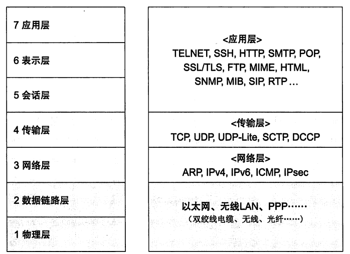
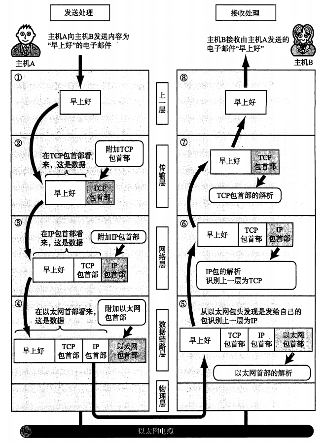
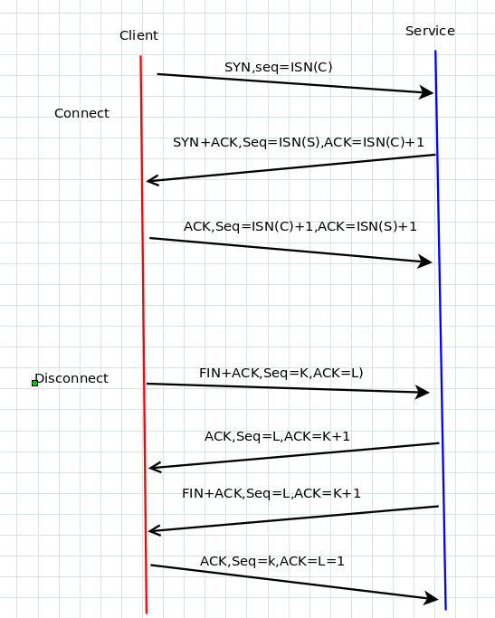
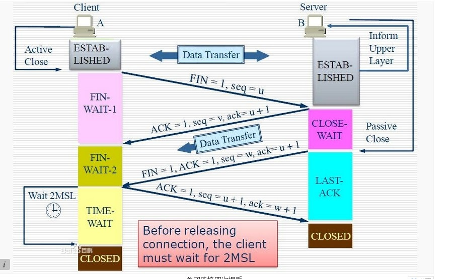
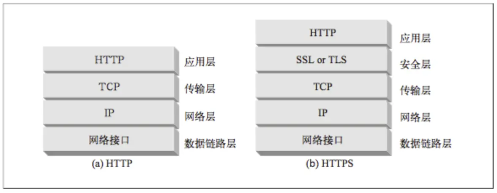

<span id="menu"></span>

<!-- TOC -->

- [1. 网络基础知识](#1-网络基础知识)
    - [1.1. OSI网路分层](#11-osi网路分层)
    - [1.2. 关键术语](#12-关键术语)
- [2. 网络层](#2-网络层)
    - [2.1. 寻址和发送](#21-寻址和发送)
    - [2.2. 基本概念](#22-基本概念)
    - [2.3. IP地址定义](#23-ip地址定义)
    - [2.4. IPV4数据报](#24-ipv4数据报)
    - [2.5. IP路由选择](#25-ip路由选择)
    - [2.6. IPV6协议](#26-ipv6协议)
    - [2.7. 常用命令](#27-常用命令)
        - [2.7.1. ping](#271-ping)
        - [2.7.2. ifconfig](#272-ifconfig)
        - [2.7.3. netstat](#273-netstat)
- [3. 域名解析DNS](#3-域名解析dns)
    - [3.1. DNS 基础](#31-dns-基础)
- [4. 地址解析协议ARP](#4-地址解析协议arp)
    - [4.1. 基本原理](#41-基本原理)
    - [4.2. ARP高速缓存](#42-arp高速缓存)
    - [4.3. ARP分组格式](#43-arp分组格式)
- [5. 广播和多播](#5-广播和多播)
    - [5.1. 广播](#51-广播)
        - [5.1.1. 受限的广播](#511-受限的广播)
        - [5.1.2. 指向网络的广播](#512-指向网络的广播)
        - [5.1.3. 指向子网的广播](#513-指向子网的广播)
        - [5.1.4. 指向所有子网的广播](#514-指向所有子网的广播)
    - [5.2. 多播](#52-多播)
        - [5.2.1. 多播组地址](#521-多播组地址)
        - [5.2.2. 多播组地址到以太网地址的转换](#522-多播组地址到以太网地址的转换)
- [6. 用户数据报协议UDP](#6-用户数据报协议udp)
    - [6.1. udp协议](#61-udp协议)
    - [6.2. udp校验和](#62-udp校验和)
    - [6.3. 最大UDP数据报长度](#63-最大udp数据报长度)
    - [6.4. 应用场景](#64-应用场景)
- [7. TCP和UDP差别](#7-tcp和udp差别)
        - [7.0.1. 端口](#701-端口)
- [8. TCP](#8-tcp)
    - [8.1. 传输控制协议基础](#81-传输控制协议基础)
        - [8.1.1. ARQ和重传](#811-arq和重传)
        - [8.1.2. 分组窗口和滑动窗口](#812-分组窗口和滑动窗口)
        - [8.1.3. 变量窗口:流量控制和拥塞控制](#813-变量窗口流量控制和拥塞控制)
        - [8.1.4. TCP基础](#814-tcp基础)
        - [8.1.5. TCP头部和封装](#815-tcp头部和封装)
    - [8.2. 连接管理](#82-连接管理)
    - [8.3. 超时重传机制](#83-超时重传机制)
    - [8.4. 数据流和窗口机制](#84-数据流和窗口机制)
    - [8.5. 阻塞控制](#85-阻塞控制)
    - [8.6. TCP保活机制](#86-tcp保活机制)
- [9. 网络HTTP](#9-网络http)
    - [9.1. 基本概念](#91-基本概念)
        - [9.1.1. 访问一个网站的流程](#911-访问一个网站的流程)
        - [9.1.2. 报文主体和实体主体的差异](#912-报文主体和实体主体的差异)
        - [9.1.3. 通信数据转发程序 ： 代理、 网关、 隧道](#913-通信数据转发程序--代理-网关-隧道)
            - [9.1.3.1. 代理](#9131-代理)
            - [9.1.3.2. 网关](#9132-网关)
            - [9.1.3.3. 隧道](#9133-隧道)
    - [9.2. 资源](#92-资源)
        - [9.2.1. 媒体类型(MIME)](#921-媒体类型mime)
        - [9.2.2. URL和URI](#922-url和uri)
    - [9.3. HTTP报文](#93-http报文)
        - [9.3.1. 请求报文和响应报文](#931-请求报文和响应报文)
        - [9.3.2. 首部](#932-首部)
        - [9.3.3. 方法](#933-方法)
        - [9.3.4. 状态码](#934-状态码)
    - [9.4. 连接管理](#94-连接管理)
        - [9.4.1. 对TCP性能的考虑](#941-对tcp性能的考虑)
        - [9.4.2. 持久连接](#942-持久连接)
            - [9.4.2.1. TCP连接](#9421-tcp连接)
    - [9.5. 版本变化](#95-版本变化)
    - [9.6. HTTPS](#96-https)
        - [9.6.1. HTTP协议的缺点以及改进目标](#961-http协议的缺点以及改进目标)
        - [9.6.2. 密码基础](#962-密码基础)
        - [9.6.3. HTTPS协议的改进](#963-https协议的改进)
        - [9.6.4. HTTPS实现原理](#964-https实现原理)
        - [9.6.5. 与HTTP原理区别](#965-与http原理区别)
        - [9.6.6. 优缺点](#966-优缺点)
    - [9.7. HTTP结构](#97-http结构)
        - [9.7.1. WEB服务器](#971-web服务器)
        - [9.7.2. 代理](#972-代理)
        - [9.7.3. 缓存](#973-缓存)
        - [9.7.4. 网关](#974-网关)
    - [9.8. 识别,认证与安全](#98-识别认证与安全)
        - [9.8.1. 客户端识别与Cookie机制](#981-客户端识别与cookie机制)
            - [9.8.1.1. Cookie](#9811-cookie)
        - [9.8.2. 基本认证机制](#982-基本认证机制)
        - [9.8.3. 摘要认证](#983-摘要认证)
    - [9.9. 实体和编码](#99-实体和编码)
        - [9.9.1. 实体首部](#991-实体首部)
        - [9.9.2. HTTP的媒体类型](#992-http的媒体类型)
    - [9.10. 国际化](#910-国际化)
    - [9.11. WEB主机托管](#911-web主机托管)
    - [9.12. 重定向和负载均衡](#912-重定向和负载均衡)
- [10. WEB Socket](#10-web-socket)
    - [10.1. websocket与http](#101-websocket与http)
    - [10.2. 数据帧格式](#102-数据帧格式)
    - [10.3. 数据传递](#103-数据传递)
    - [10.4. 连接保持+心跳](#104-连接保持心跳)
    - [10.5. Sec-WebSocket-Key/Accept的作用](#105-sec-websocket-keyaccept的作用)
    - [10.6. 数据掩码的作用](#106-数据掩码的作用)
    - [10.7. WebSocket运行流程](#107-websocket运行流程)
    - [10.8. SpringBoot + WebSocket实现案例](#108-springboot--websocket实现案例)
        - [10.8.1. 第一种实现方法](#1081-第一种实现方法)
        - [10.8.2. 第二种实现方法](#1082-第二种实现方法)
        - [10.8.3. 补充说明](#1083-补充说明)
        - [10.8.4. 客户端的实现，js方式和java WebSocketClient两种方式](#1084-客户端的实现js方式和java-websocketclient两种方式)

<!-- /TOC -->


<a href="#menu">目录</a>


# 1. 网络基础知识
<a href="#menu" >目录</a>

## 1.1. OSI网路分层
<a href="#menu">目录</a>

网路通信系统应该完成的任务:
* 把消息分解成可管理的数据块,并且这些数据块能够有效地通过传输乎介质
* 与网络适配器进行连接
* 寻址,即发送端计算机必须能改定位到接收数据的计算机,接收数据的计算机必须能够识别自己要接收的数据
* 将数据路由到目的计算机所在的子网,即使源子网和目的子网分处不同的物理网路
* 执行错误控制,流量控制和确认,对可靠的通信而言,发送和接收计算机必须能发现并纠正传输错误,并控制数据流
* 从应用程序接收数据并传输到网络
* 从网络接收数据并传输到应用程序

为了实现上述的功能,TCP/IP使用了分层的模块化设计,每个模块是独立的,分别负责通信过程中的一个步骤.模块化设计可以轻易进行内部修改而不需要其他模块进行同步修改.

OSI分为七层,而TCP/IP常规分为四层:应用层,传输层,网络层,网络访问层.



||层|说明||
|---|---|---|---|
|7|应用层|为应用程序提供网络接口,支持文件传输,通信等功能的网络应用.针对特定应用的协议|电子邮件，远程登录，文件传输等。HTTP，DNS，DHCP，SSH，FTP|
|6|表示层|把数据转换为标准格式,管理数据加密与压缩.设备固有数据格式和网络标准数据格式的转换|接收不同表现形式的信息，比如文字，图片，声音等|
|5|会话层|在计算机的通信应用程序之间建立会话.通信管理，负责建立连接和断开通信连接，管理传输层以下的分层|何时建立连接，何时断开连接，保持多久的连接|
|4|传输层|为网络提供错误控制和数据流控制.管理两个节点之间的可靠传输|TCP，UDP，SCYP，DCCP|
|3|网络层|支持逻辑寻址和路由选择.地址管理和路由选择|如何通过IP地址寻找目标主机，IPV4,IPV6,ARP地址解析协议|
|2|数据链路层|互联设备之间传送和识别数据帧|数据帧和比特位之间的转换|
|1|物理层|数据比特流在实际物理设备上的传输，比如光纤。负责比特流和物理电压之间的转换||


在数据发送时，下层不会改变上层的PDU（消息），只会在上层上添加头部或者尾部信息。

一个协议族，比如TCP/IP，是一组不同层次上的多个协议的组合。TCP/IP通常被认为是一个四层协议系统
* 网络访问层/数据链路层
    * 用来处理连接网络的硬件
    * 提供与物理网络连接的接口
    * 实现数据在物理设备之间的传输和错误控制等
    * 有时也称作数据链路层或网络接口层，通常包括操作系统中的设备驱动程序和计算机中对应的网络接口卡。它们一起处理与电缆（或其他任何传输媒介）的物理接口细节。
* 网络层
    * 网络层用来处理在网络上流动的数据包。 数据包是网络传输的最小数据单位。 该层规定了通过怎样的路径（所谓的传输路线） 到达对方计算机， 并把数据包传送给对方。
    * 提供独立于硬件的逻辑寻址,从而能改让数据在不同的子网之间进行传递
    * 有时也称作互联网层，处理分组在网络中的活动，例如分组的选路。在TCP/IP协议族中，网络层协议包括IP协议（网际协议），ICMP协议（Internet互联网控制报文协议），以及IGMP协议（Internet组管理协议）。
* 传输层
    * 提供处于网络连接中两台计算机之间的数据传输
    * 主要为两台主机上的应用程序提供端到端的通信。在TCP/IP协议族中，有两个互不相同的传输协议：TCP（传输控制协议）和UDP（用户数据报协议）。TCP为两台主机提供高可靠性的数据通信。它所做的工作包括把应用程序交给它的数据分成合适的小块交给下面的网络层，确认接收到的分组，设置发送最后确认分组的超时时钟等。由于运输层提供了高可靠性的端到端的通信，因此应用层可以忽略所有这些细节。而另一方面，UDP则为应用层提供一种非常简单的服务。它只是把称作数据报的分组从一台主机发送到另一台主机，但并不保证该数据报能到达另一端。任何必需的可靠性必须由应用层来提供。这两种运输层协议分别在不同的应用程序中有不同的用途。
* 应用层
    * 决定了向客户提供何种服务
    * 为网络排错,文件传输,远程控制和网络操作提供了应用程序,还支持应用编程接口,从而使得针对特定操作系统编写的程序能访问网络
    * 负责处理特定的应用程序细节。几乎各种不同的TCP/IP实现都会提供下面这些通用的应用程序：
        * Telnet 远程登录。
        * FTP 文件传输协议。
        * SMTP 简单邮件传送协议。
        * SNMP 简单网络管理协议。
        * DNS 域名解析服务
        * Http 超文本传输协议

数据在各层间传递时,每一层的数据为:报头+数据.发送端计算机上的每一层协议都在数据上添加层信息,也就是在上一层传递的数据添加本层的报头信息.而在接收端,数据在各层间传递,这些报头信息会被主键解除.

在TCP/IP协议族中，网络层IP提供的是一种不可靠的服务。也就是说，它只是尽可能快地把分组从源结点送到目的结点，但是并不提供任何可靠性保证。而另一方面，TCP在不可靠的IP层上提供了一个可靠的运输层。为了提供这种可靠的服务，TCP采用了超时重传、发送和接收端到端的确认分组等机制。由此可见，运输层和网络层分别负责不同的功能。

* 分层优点
    * 解耦，每层内部协议改变，不影响其他层。
    * 开发方便，每层负责自己的协议即可。
* 传输方式分类
    * 有连接型
        * 发送数据前，两个通信端必须建立连接的通信链路(TCP)
    * 无连接型
        * 不要求建立和断开连接，发送端任何时候都可以发送数据(UDP)
    * 根据接收端数据分类
        * 单播：一对一通信
        * 多播:一对多通信，组播通信
        * 任播:特定的多台主机中选出一台进行通信

## 1.2. 关键术语
<a href="#menu" >目录</a>

*  TCP/IP
    * 网络协议簇 
* ARPAnet
    * 一种实验性网络,也是TCP/IP的诞生地
* 域名
    * 通过TCP/IP的DNS域名服务系统,与IP地址相关联的名字
* 网关
    * 连接LAN到大型网络的路由器
* IP地址
    * 用于定位TCP/IP网络计算机或其他连接网络设备的逻辑地址
* 局域网LAN
    * 供单个办公室,组织或者家庭使用的小型网络
* 逻辑地址
    * 通过协议软件配置的网络地址
* 域名服务
    * 将网络地址与便于人记忆的名字相关联的一种服务,提供该服务的计算机被称为域名服务器,将名字解析为地址的行为称为名称解析
* 端口
    * 一种内部通道或者地址,它在应用程序和TCP/IP传输层之间提供了一个接口
* RFC
    * 提供TCP/IP相关技术文档
* 路由器
    * 通过逻辑地址来转发数据的一种网络设备.并且也可以用来将大型网络分为几个较小的子网

# 2. 网络层

<a href="#menu">目录</a>

## 2.1. 寻址和发送
<a href="#menu">目录</a>

计算机通过网络接口设备与网络进行通信,网络接口设备具有唯一的物理地址,用于接收发向该地址的数据.网路接口设备对于上层协议层的细节不了解,不知到IP地址,也不知道发送来的数据帧是要给FTP还是其他的应用层软件.它只是监听了是否收到数据帧,发现其中目标地址与自己物理地址相符的帧,并把这个帧传递给上层协议栈.

TCP/IP隐藏了物理地址,以一种逻辑化,层次化的寻址方案对网络进行组织.这种逻辑寻址方案由网际层的IP协议维护,而逻辑地址为IP地址,地址解析协议ARP是另一种网际层协议,维护了一个表格,用于把IP地址转化成物理地址.

数据在网络间传输过程
* 如果目的地址和源地址在同一个网段,源计算机就把数据包直接发送给目的计算机,IP地址被ARP解析为物理地址,数据被直接发送给目的网络适配器
* 如果目的地址和源地址不再同一个网段,就执行如下过程
    * 直接将数据发送到网关,网关是位于局域网网段上的一个设备,能够把数据报转发到其他网段,网关地址被ARP解析为物理地址,数据被发送到网关的网络适配器
    * 数据报通过网关被路由到更高级别的网段,再次重复上述过程,如果目的地址在这个新网段内,数据就被发送到目的,否则数据就被发送到另一个网关
    * 数据报经过一系列网关转发到目的网段,目的IP地址被ARP解析为物理地址,数据被发送到目的网络适配器


IP 协议的作用是把各种数据包传送给对方。 而要保证确实传送到对方那里， 则需要满足各类条件。 其中两个重要的条件是 IP 地址和 MAC地址（Media Access Control Address） 。IP 地址指明了节点被分配到的地址， MAC 地址是指网卡所属的固定地址。 IP 地址可以和 MAC 地址进行配对。 IP 地址可变换， 但 MAC地址基本上不会更改。

## 2.2. 基本概念
<a href="#menu">目录</a>


IP(Internet Protocol,网际协议)是TCP/IP协议族中最为核心的协议。所有的TCP、UDP、ICMP及IGMP数据都以IP数据报格式传输.

IP协议它提供了一种分层的,与硬件无关的寻址系统,具有在复杂的路由式网络中传递数据所需的服务,每个网络适配器都有一个唯一的IP地址.如果计算机有多个网卡,也就有多个IP地址.
IP提供不可靠、无连接的数据报传送服务

不可靠（unreliable）的意思是它不能保证IP数据报能成功地到达目的地。IP仅提供最好的传输服务。如果发生某种错误时，如某个路由器暂时用完了缓冲区，IP有一个简单的错误处理算法：丢弃该数据报，然后发送ICMP消息报给信源端。任何要求的可靠性必须由上层来提供（如TCP）。

无连接（connectionless）这个术语的意思是IP并不维护任何关于后续数据报的状态信息。每个数据报的处理是相互独立的。这也说明，IP数据报可以不按发送顺序接收。如果一信源向相同的信宿发送两个连续的数据报（先是A，然后是B），每个数据报都是独立地进行路由选择，可能选择不同的路线，因此B可能在A到达之前先到达。

IP协议负责将数据包发送给最终的目标主机。
通信链路层是负责两个直连两个设备之间的通信，而IP是负责两个没有直连设备之间的通信。每个计算机都有自己的IP地址，发送端在发送数据之前要先确定接收者是属于哪台计算机。也就是ARP地址解析协议，通过广播发送请求，有回应的是便是目标主机，然后获取目标主机的网卡地址，缓在发送端，下次发送的时候，就可以从缓存中获取到目标主机的网卡地址。

* IP协议是面向无连接的，通信可靠性由上层解决
    * 一是为了简化
    * 二是为了快速

## 2.3. IP地址定义
<a href="#menu">目录</a>


* IPV4
    * 使用32位来表示，每8位一组，中间使用"."分隔
    * 最大值2的32次方，也就是42.94亿，无法满足全球用户
    * 组成
        * 由网络标识(网络地址)和主机标识(主机地址)组成
        * 192.168.1.10/24
        * "/24"表示从第一位到24位是网络标识，后面的为主机标识
        * 路由器通过比较网络标识决定如何转发
        * 同一个网络标识作为一个网段
    * IPV4地址的分类
        * A类
            * 0开头的地址,前8位为网络ID
            * 第一位到第八都是它的网络标��：0.0.0.0～127.0.0.0
            * A类地址后24位为主机标识，也就是A类网段可以容纳16777214个主机
        * B类
            * "10"开头的地址,前16位为网络ID
            * 1～16位是它的网络标识，128.0.0.1～191.255.0.0是B类的网络地址
            * 后16位是主机标识，所以B类一个网段可以容纳的主机最大为65534
        * C类
            * "110"开头的地址,前24位为网络ID
            * 1~24位是网络标识，192.168.0.0～239.255.255.0
            * 主机标识为后8位，一个网段最大主机数为254个
        * D类
            * "1110"开头的地址
            * 1~32位是它的网络标识，224.0.0.0～239.255.255.255
            * 没有主机标识，常被用于多播
        * IP主机地址不能全部为0或者全部为1
            * 全部为0表示IP地址在网络地址不可获知的情况下才使用，因此上面每个都少了两个IP地址。
            * 全部为1通常用作广播地址
    * 广播
        * 广播主机地址全部设置为1
        * 本地广播:本网络内的广播
        * 直接广播:不同网络之间的广播
    * IP多播
        * 广播是将数据发送给网络上的所有计算机，由于不是目标的主机也会收到消息，因此造成通讯效率差。
        * 多播是放送给特定组的主机
        * 应用场景:电视会议中的1对多
        * 多播采用D类地址   

## 2.4. IPV4数据报
<a href="#menu">目录</a>


||长度(bit)|
|---|---|
|版本 Version|4|
|首部长度 IHL|4|
|区分服务 Type of Service|8|
|总长度 Total Length|32|
|标识 Identification|16|
|标志 Flags|3|
|片偏移 Fragment Offset|29|
|生存时间 Time To Live |8|
|协议 Protocal|8|
|首部校验和 Header CheckSum|32|
|源地址 Source Address |32|
|目标地址 Destination Adress|32|
|可选字段 Options|24|
|填充 Padding|8|
|实际的数据部分Data|~|

* 最高位在左边，记为0bit；最低位在右边，记为31bit。4个字节的32bit值以下面的次序传输：首先是0～7bit，其次8～15bit，然后16～23bit，最后是24~31bit。这种传输次序称作bigendian字节序。由于TCP/IP首部中所有的二进制整数在网络中传输时都要求以这种次序，因此它又称作网络字节序。以其他形式存储二进制整数的机器，如littleendian格式，则必须在传输数据之前把首部转换成网络字节序。

* IP协议的版本,目前的版本是4
* 首部长度指的是首部占32bit字的数目，包括任何选项。
* 服务类型（TOS）字段包括一个3bit的优先权子字段（现在已被忽略），4bit的TOS子字段和1bit未用位但必须置0。4bit的TOS分别代表：最小时延、最大吞吐量、最高可靠性和最小费用。4bit中只能置其中1bit。如果所有4bit均为0，那么就意味着是一般服务.不同的应用程序有不同的推荐值.现在大多数的TCP/IP实现都不支持TOS特性


* 总长度字段是指整个IP数据报的长度，以字节为单位。利用首部长度字段和总长度字段，就可以知道IP数据报中数据内容的起始位置和长度。由于该字段长16比特，所以IP数据报最长可达65535字节,超过则会进行数据分片
* 标识字段唯一地标识主机发送的每一份数据报。通常每发送一份报文它的值就会加1。在介绍分片和重组时再详细讨论它。同样，在讨论分片时再来分析标志字段和片偏移字段。
* TTL（time-to-live）生存时间字段设置了数据报可以经过的最多路由器数。它指定了数据报的生存时间。TTL的初始值由源主机设置（通常为32或64），一旦经过一个处理它的路由器，它的值就减去1。当该字段的值为0时，数据报就被丢弃，并发送ICMP报文通知源主机。
* 首部检验和字段是根据IP首部计算的检验和码。它不对首部后面的数据进行计算。ICMP、IGMP、UDP和TCP在它们各自的首部中均含有同时覆盖首部和数据检验和码。数据包每经过一个路由器就重新计算,因为TTL字段总是在变化
* 每一份IP数据报都包含源IP地址和目的IP地址
* 最后一个字段是任选项，是数据报中的一个可变长的可选信息
    * 安全和处理限制（用于军事领域，详细内容参见 RFC 1108[Kent 1991]）
    * 记录路径（让每个路由器都记下它的IP地址）
    * 时间戳（让每个路由器都记下它的IP地址和时间）
    * 宽松的源站选路（为数据报指定一系列必须经过的IP地址）
    * 严格的源站选路（与宽松的源站选路类似，但是要求只能经过指定的这些地址，不能经过其他的地址） 。
    * 这些选项很少被使用，并非所有的主机和路由器都支持这些选项

## 2.5. IP路由选择
<a href="#menu">目录</a>


## 2.6. IPV6协议

* IPV6
    * IPV6地址
        * 长度为128位，16位为1组，中间使用::分隔
        * 二进制表示
            * 10101010:10101010:10101010:10101010:10101010:10101010:10101010:10101010
        * 16进制表示
            * AABB:AABB:AABB:AABB:AABB:AABB:AABB:AABB
        * 省略表示，中间连续多个0的,使用::替换
            * AABB:0:0:0:0:0:0:AABB
            * AABB::AABB
            
||||
|---|---|---|
|未定义|0000...0000（128比特位）|::/128|
|环回地址|0000...0001|::1/128|
|唯一本地地址|1111 110|FC00::/7|
|链路本地单播地址|1111 1110 10|FE8O::/10|
|多播地址|11111111|FF00::/8|
|全局单播地址|其他||

## 2.7. 常用命令


### 2.7.1. ping 

* 作用
    * 用来检测网络的连通情况和分析网络速度；
    * 根据域名得到服务器IP；
    * 根据ping返回的TTL值来判断对方所使用的操作系统及数据包经过路由器数量。

```
$ ping 127.0.0.1
PING 127.0.0.1 (127.0.0.1) 56(84) bytes of data.
64 bytes from 127.0.0.1: icmp_seq=1 ttl=64 time=0.054 ms
64 bytes from 127.0.0.1: icmp_seq=2 ttl=64 time=0.092 ms
64 bytes from 127.0.0.1: icmp_seq=3 ttl=64 time=0.084 ms

```
* bytes值：数据包大小，也就是字节。
* time值：响应时间，这个时间越小，说明你连接这个地址速度越快
* TTL值：Time To Live,表示DNS记录在DNS服务器上存在的时间，它是IP协议包的一个值，告诉路由器该数据包何时需要被丢弃。可以通过Ping返回的TTL值大小，粗略地判断目标系统类型是Windows系列还是UNIX/Linux系列
* icmp_seq 序列号


### 2.7.2. ifconfig

ifconfig工具不仅可以被用来简单地获取网络接口配置信息，还可以修改这些配置。用ifconfig命令配置的网卡信息，在网卡重启后机器重启后，配置就不存在。要想将上述的配置信息永远的存的电脑里，那就要修改网卡的配置文件了。

```yaml
[root@localhost ~]# ifconfig eth0
 
// UP：表示“接口已启用”。
// BROADCAST ：表示“主机支持广播”。
// RUNNING：表示“接口在工作中”。
// MULTICAST：表示“主机支持多播”。
// MTU:1500（最大传输单元）：1500字节
eth0: flags=4163<UP,BROADCAST,RUNNING,MULTICAST> mtu 1500
 
 
// inet ：网卡的IP地址。
// netmask ：网络掩码。
// broadcast ：广播地址。
inet 192.168.1.135 netmask 255.255.255.0 broadcast 192.168.1.255
 
 
// 网卡的IPv6地址
inet6 fe80::2aa:bbff:fecc:ddee prefixlen 64 scopeid 0x20<link>
 
// 连接类型：Ethernet (以太网) HWaddr (硬件mac地址)
// txqueuelen (网卡设置的传送队列长度)
ether 00:aa:bb:cc:dd:ee txqueuelen 1000 (Ethernet)
 
 
// RX packets 接收时，正确的数据包数。
// RX bytes 接收的数据量。
// RX errors 接收时，产生错误的数据包数。
// RX dropped 接收时，丢弃的数据包数。
// RX overruns 接收时，由于速度过快而丢失的数据包数。
// RX frame 接收时，发生frame错误而丢失的数据包数。
RX packets 2825 bytes 218511 (213.3 KiB)
RX errors 0 dropped 0 overruns 0 frame 0
 
 
 
// TX packets 发送时，正确的数据包数。
// TX bytes 发送的数据量。
// TX errors 发送时，产生错误的数据包数。
// TX dropped 发送时，丢弃的数据包数。
// TX overruns 发送时，由于速度过快而丢失的数据包数。
// TX carrier 发送时，发生carrier错误而丢失的数据包数。
// collisions 冲突信息包的数目。
TX packets 1077 bytes 145236 (141.8 KiB)
TX errors 0 dropped 0 overruns 0 carrier 0 collisions 0
```

### 2.7.3. netstat 


# 3. 域名解析DNS
<a href="#menu">目录</a>

TCP/IP网络中，每一个互联的设备都有其唯一的IP地址，都可以通过IP地址访问到对方。但是IP地址不便于记忆，因此产生了一种方式，就是给每台计算机赋予唯一的主机名，可以通过主机名访问该主机名对应的IP地址的计算机。在这个背景下，便产生了一个可以有效管理主机名和IP地址之间对应关系的系统，那就是DNS系统。

域名系统（DNS）是一种用于TCP/IP应用程序的分布式数据库，它提供主机名字和IP地址之间的转换及有关电子邮件的选路信息。这里提到的分布式是指在Internet上的单个站点不能拥有所有的信息。

从应用的角度上看，对DNS的访问是通过一个地址解析器（resolver）来完成的。在Unix主机中，该解析器主要是通过两个库函数gethostbyname(3)和gethostbyaddr(3)来访问的，它们在编译应用程序时与应用程序连接在一起。前者接收主机名字返回IP地址，而后者接收IP地址来寻找主机名字。解析器通过一个或多个名字服务器来完成这种相互转换。


## 3.1. DNS 基础


每个结点有一个至多63个字符长的标识。这颗树的树根是没有任何标识的特殊结点。命名标识中一律不区分大写和小写。命名树上任何一个结点的域名就是将从该结点到最高层的域名串连起来，中间使用一个点“.”分隔这些域名（注意这和Unix文件系统路径的形成不同，文件路径是由树根依次向下的形成的）。域名树中的每个结点必须有一个唯一的域名，但域名树中的不同结点可使用相同的标识。

以点“.”结尾的域名称为绝对域名或完全合格的域名FQDN（FullQualifiedDomainName），例如sun.tuc.noao.edu.。如果一个域名不以点结尾，则认为该域名是不完全的。如何使域名完整依赖于使用的DNS软件。如果不完整的域名由两个或两个以上的标号组成，则认为它是完整的；或者在该域名的右边加入一个局部后缀。例如域名sun通过加上局部后缀.tuc.noao.edu.成为完整的。

* 级域名被分为三个部分：
    * arpa是一个用作地址到名字转换的特殊域
    * 7个3字符长的普通域。有些书也将这些域称为组织域。
        * com 商业组织
        * edu 教育机构
        * gov 其他美国政府部门
        * int 国际组织
        * mil 美国军事网点
        * net 网络
        * org 其他组织
    * 所有2字符长的域均是基于ISO3166中定义的国家代码，这些域被称为国家域，或地理域。

DNS的一个基本特性是使用超高速缓存。即当一个名字服务器收到有关映射的信息（主机名字到IP地址）时，它会将该信息存放在高速缓存中。这样若以后遇到相同的映射请求，就能直接使用缓存中的结果而无需通过其他服务器查询。 


**域名**:域名是为了识别主机名称和组织机构名称的一种具有分层的名称。比如:www.baidu.com

**域名服务器**:域名服务器是指管理域名的主机和相应的软件，它可以管理所在分层的域的相关信息。根部所设置的DNS叫做根域名服务器。他对DNS的检索起着至关重要的作用。根域名服务器注册着根以下第一层域名服务器的IP地址。也就是说上一层注册着下一层的域名服务器的IP地址。根据每个域名服务器所管理的域名，如果下面再没有其他分层，就可以自由的指定主机名称或者子网名称。如果想修改分层的域名名称或者想重新修改域名服务器的IP地址，还必须向其上层的域名服务器进行追加或修改。
由于是分层设计，如果某一台域名服务器宕机，那么针对该域名的查询将会失效，一般设置两台以上域名服务器，以提高容灾能力，第一个查询失败，则转到另一个。

**域名查询**
* 进行DNS查询的主机和软件叫做DNS解析器
* 查询过程


解析器为了查询IP地址，向域名服务器查询，接收这个请求的域名服务器先在自己的数据库中查找，没有查找到则向上一级查找，直至遍历完查找到，查找到则将数据缓存起来，下次使用可以从缓���里面获取。

# 4. 地址解析协议ARP
<a href="#menu">目录</a>


## 4.1. 基本原理 


IP 间的通信依赖 MAC 地址。 在网络上， 通信的双方在同一局域网（LAN） 内的情况是很少的， 通常是经过多台计算机和网络设备中转才能连接到对方。 而在进行中转时， 会利用下一站中转设备的 MAC地址来搜索下一个中转目标。 这时， 会采用 ARP 协议（AddressResolution Protocol） 。 ARP 是一种用以解析地址的协议， 根据通信方的 IP 地址就可以反查出对应的 MAC 地址。

DNS是通过访问名称获取到IP地址，但是有进行访问还需要获取到这个IP地址对应的MAC地址。

AP为IP地址到对应的硬件地址之间提供动态映射:32bit的IP地址和数据链路层使用的任何类型的地址.从逻辑Internet地址到对应的物理硬件地址需要进行翻译。这就是ARP的功能。ARP本来是用于广播网络的，有许多主机或路由器连在同一个网络上。 ARP发送一份称作ARP请求的以太网数据帧给以太网上的每个主机。这个过程称作广播，ARP请求数据帧中包含目的主机的IP地址其意思是“如果你是这个IP地址的拥有者，请回答你的硬件地址。目的主机的ARP层收到这份广播报文后，识别出这是发送端在寻问它的IP地址，于是发送一个ARP应答。这个ARP应答包含IP地址及对应的硬件地址.收到ARP应答后，使ARP进行请求—应答交换的IP数据报现在就可以传送了。发送IP数据报到目的主机

* 查找流程:
    * 主机A访问主机B
    * 主机A广播发送一个ARP请求包，这个包包括主机B的IP地址
    * 这个广播包将会被链路上所有的计算机接收并解析
    * 如果请求包中的IP地址和自己的IP地址一致，那么这个节点将会把自己的MAC地址塞入ARP响应包并返回给主机A
    * 主机A获取到主机B的MAC地址，就可以和主机B进行通信了。
    * 主机A会将主机B的MAC地址进行缓存到本地，以供下次使用
    * 这个缓存会按照一定机制被清除，也就是有过期时间。同时若请求失败，也会重新发起获取MAC地址请求。

在ARP背后有一个基本概念，那就是网络接口有一个硬件地址（一个48bit的值，标识不同的以太网或令牌环网络接口）。在硬件层次上进行的数据帧交换必须有正确的接口地址。但是，TCP/IP有自己的地址：32bit的IP地址。知道主机的IP地址并不能让内核发送一帧数据给主机。内核（如以太网驱动程序）必须知道目的端的硬件地址才能发送数据。ARP的功能是在32bit的IP地址和采用不同网络技术的硬件地址之间提供动态映射。

## 4.2. ARP高速缓存

ARP高效运行的关键是由于每个主机上都有一个ARP高速缓存。这个高速缓存存放了最近Internet地址到硬件地址之间的映射记录。高速缓存中每一项的生存时间一般为20分钟，起始时间从被创建时开始算起。

```
$arp -a
promote.cache-dns.local (192.168.1.1) at 1c:60:de:1c:aa:a6 [ether] on wlp8s0b1
promote.cache-dns.local (192.168.1.100) at 68:3e:34:e2:d7:fe [ether] on wlp8s0b1
```

48 bit的以太网地址用 6个十六进制的数来表示，中间以冒号隔开。

## 4.3. ARP分组格式


* 以太网报头中的前两个字段是以太网的源地址和目的地址。目的地址为全1的特殊地址是广播地址。电缆上的所有以太网接口都要接收广播的数据帧。
* 两个字节长的以太网帧类型表示后面数据的类型。对于ARP请求或应答来说，该字段的值为0x0806。s
* 形容词hardware(硬件)和protocol(协议)用来描述ARP分组中的各个字段。例如，一个ARP请求分组询问协议地址（这里是IP地址）对应的硬件地址（这里是以太网地址）。硬件类型字段表示硬件地址的类型。它的值为1即表示以太网地址。协议类型字段表示要映射的协议地址类型。它的值为0x0800即表示IP地址。它的值与包含IP数据报的以太网数据帧中的类型字段的值相同。
* 接下来的两个1字节的字段，硬件地址长度和协议地址长度分别指出硬件地址和协议地址的长度，以字节为单位。对于以太网上IP地址的ARP请求或应答来说，它们的值分别为6和4。
* 操作字段指出四种操作类型，它们是ARP请求（值为1）、ARP应答（值为2）、RARP请求（值为3）和RARP应答（值为4）（我们在第5章讨论RARP）。这个字���必需的，因为ARP请求和ARP应答的帧类型字段值是相同的。
* 接下来的四个字段是发送端的硬件地址（在本例中是以太网地址）、发送端的协议地址（IP地址）、目的端的硬件地址和目的端的协议地址。注意，这里有一些重复信息：在以太网的数据帧报头中和ARP请求数据帧中都有发送端的硬件地址。
* 对于一个 ARP请求来说，除目的端硬件地址外的所有其他的字段都有填充值。当系统收到一份目的端为本机的 ARP请求报文后，它就把硬件地址填进去，然后用两个目的端地址分别替换两个发送端地址，并把操作字段置为 2，最后把它发送回去

# 5. 广播和多播

<a href="#menu">目录</a>

有三种IP地址：单播地址、广播地址和多播地址.

广播和多播仅应用于UDP，它们对需将报文同时传往多个接收者的应用来说十分重要。TCP是一个面向连接的协议，它意味着分别运行于两主机（由 IP地址确定）内的两进程（由端口号确定）间存在一条连接.

* 单播(unicast)
    * 考虑包含多个主机的共享信道网络如以太网。每个以太网帧包含源主机和目的主机的以太网地址（48bit）。通常每个以太网帧仅发往单个目的主机，目的地址指明单个接收接口
    * 在这种方式下，任意两个主机的通信不会干扰网内其他主机（可能引起争夺共享信道的情况除外）
* 广播
    * 一个主机要向网上的所有其他主机发送帧
* 多播(multicast) 
    * 处于单播和广播之间帧仅传送给属于多播组的多个主机

**主机对由信道传送过来帧的过滤过程**

首先，网卡查看由信道传送过来的帧，确定是否接收该帧，若接收后就将它传往设备驱动程序。通常网卡仅接收那些目的地址为网卡物理地址或广播地址的帧。另外，多数接口均被设置为混合模式，这种模式能接收每个帧的一个复制。作为一个例子，tcpdump使用这种模式。

目前，大多数的网卡经过配置都能接收目的地址为多播地址或某些子网多播地址的帧。对于以太网，当地址中最高字节的最低位设置为1时表示该地址是一个多播地址，用十六进制可表示为z1:00:00:00:00:00（以太网广播地址ff:ff:ff:ff:ff:ff可看作是以太网多播地址的特例）。

如果网卡收到一个帧，这个帧将被传送给设备驱动程序（如果帧检验和错，网卡将丢弃该帧）。设备驱动程序将进行另外的帧过滤。首先，帧类型中必须指定要使用的协议（IP、ARP等等）。其次，进行多播过滤来检测该主机是否属于多播地址说明的多播组。

设备驱动程序随后将数据帧传送给下一层，比如，当帧类型指定为IP数据报时，就传往IP层。IP根据IP地址中的源地址和目的地址进行更多的过滤检测。如果正常，就将数据报传送给下一层（如TCP或UDP）。
每次UDP收到由IP传送来的数据报，就根据目的端口号，有时还有源端口号进行数据报过滤。如果当前没有进程使用该目的端口号，就丢弃该数据报并产生一个ICMP不可达报文（TCP根据它的端口号作相似的过滤）。如果UDP数据报存在检验和错，将被丢弃。

使用广播的问题在于它增加了对广播数据不感兴趣主机的处理负荷。拿一个使用UDP广播应用作为例子。如果网内有50个主机，但仅有20个参与该应用，每次这20个主机中的一个发送UDP广播数据时，其余30个主机不得不处理这些广播数据报。一直到UDP层，收到的UDP广播数据报才会被丢弃。这30个主机丢弃UDP广播数据报是因为这些主机没有使用这个目的端口。

多播的出现减少了对应用不感兴趣主机的处理负荷。使用多播，主机可加入一个或多个多播组。这样，网卡将获悉该主机属于哪个多播组，然后仅接收主机所在多播组的那些多播帧

## 5.1. 广播

### 5.1.1. 受限的广播

### 5.1.2. 指向网络的广播

### 5.1.3. 指向子网的广播

### 5.1.4. 指向所有子网的广播

## 5.2. 多播

### 5.2.1. 多播组地址

### 5.2.2. 多播组地址到以太网地址的转换


# 6. 用户数据报协议UDP
<a href="#menu">目录</a>

UDP是一个简单的面向数据报的运输层协议：进程的每个输出操作都正好产生一个UDP数据报，并组装成一份待发送的IP数据报。这与面向流字符的协议不同，如TCP，应用程序产生的全体数据与真正发送的单个IP数据报可能没有什么联系

UDP数据报封装成一份IP数据报的格式


U D P不提供可靠性：它把应用程序传给 I P层的数据发送出去，但是并不保证它们能到达目的地。由于缺乏可靠性，我们似乎觉得要避免使用UDP而使用一种可靠协议如TCPS。


UDP不提供复杂的控制机制，利用IP提供面向无连接的通信服务。并且它是将应用程序发来的数据在收到的那一刻，立刻按照原样发送到网络上的一种机制。 即使是出现网络拥堵的情况下，UDP也无法进行流量控制等避免网络拥塞的行为。此外，传输途中如果出现了丢包，UDP也不负责重发。甚至当出现包的到达顺序乱掉时也没有纠正的功能。如果需要这些细节控制，那么不得不交给由采用UDO的应用程序去处理。换句话说，UDP将部分控制转移到应用程序去处理，自己却只提供作为传输层协议的最基本功能。UDP有点类似于用户说什么听什么的机制，但是需要用户充分考虑好上层协议类型并制作相应的应用程序。

 * UDP是一个非连接的协议，传输数据之前源端和终端不建立连接，当它想传送时就简单地去抓取来自应用程序的数据，并尽可能快地把它扔到网络上。在发送端，UDP传送数据的速度仅仅是受应用程序生成数据的速度、计算机的能力和传输带宽的限制；在接收端，UDP把每个消息段放在队列中，应用程序每次从队列中读一个消息段。
* 由于传输数据不建立连接，因此也就不需要维护连接状态，包括收发状态等，因此一台服务机可同时向多个客户机传输相同的消息。
* UDP信息包的标题很短，只有8个字节，相对于TCP的20个字节信息包的额外开销很小。
* 吞吐量不受拥挤控制算法的调节，只受应用软件生成数据的速率、传输带宽、源端和终端主机性能的限制。
* UDP使用尽最大努力交付，即不保证可靠交付，因此主机不需要维持复杂的链接状态表（这里面有许多参数）。
* UDP是面向报文的。发送方的UDP对应用程序交下来的报文，在添加首部后就向下交付给IP层。既不拆分，也不合并，而是保留这些报文的边界，因此，应用程序需要选择合适的报文大小。
我们经常使用“ping”命令来测试两台主机之间TCP/IP通信是否正常，其实“ping”命令的原理就是向对方主机发送UDP数据包，然后对方主机确认收到数据包，如果数据包是否到达的消息及时反馈回来，那么网络就是通的。

## 6.1. udp协议


## 6.2. udp校验和

UDP检验和覆盖UDP首部和UDP数据。回想IP首部的检验和，它只覆盖IP的首部—并不覆盖IP数据报中的任何数据。UDP和TCP在首部中都有覆盖它们首部和数据的检验和。UDP的检验和是可选的，而TCP的检验和是必需的.

         

## 6.3. 最大UDP数据报长度

理论上，IP数据报的最大长度是65535字节，这是由IP首部16比特总长度字段所限制的。去除20字节的IP首部和8个字节的UDP首部，UDP数据报中用户数据的最长长度为65507字节。但是，大多数实现所提供的长度比这个最大值小。

* 两个限制因素
    * 应用程序可能会受到其程序接口的限制。socketAPI提供了一个可供应用程序调用的函数，以设置接收和发送缓存的长度。对于UDPsocket，这个长度与应用程序可以读写的最大UDP数据报的长度直接相关。现在的大部分系统都默认提供了可读写大于8192字节的UDP数据报（使用这个默认值是因为8192是NFS读写用户数据数的默认值）。
    * 来自于TCP/IP的内核实现。可能存在一些实现特性（或差错），使IP数据报长度小于65535字节。

## 6.4. 应用场景

* 面向数据报方式
* 网络数据大多为短消息 
* 拥有大量Client
* 对数据安全性无特殊要求
* 网络负担非常重，但对响应速度要求高


# 7. TCP和UDP差别
<a href="#menu">目录</a>

 TCP和UDP是传输层的两个具有代表性的传输层协议。TCP提供可靠的通信传输。UDP常被用于广播和细节控制交给应用的通信传输，比如可靠性保证，失败重传等策略由应用实现。
 IP首部字段有一个字段标明传输层使用的是UDP还是TCP或者其他协议。

* TCP
    * 面向连接的，可靠的流协议。流指不间断的数据结构。
    * 在发送数据之前，必须建立连接
    * 提供复杂的功能，比如顺序控制，重发机制，流量控制
    * 应用场景是需要可靠性传输的场景
* UDP
    * 不具有可靠性的数据报协议
    * 不需要建立连接就能发送数据
    * 没有TCP复杂的辅助功能，需要应用自己实现
    * 应用场景是告诉传输和实行性有较高要求的���景，比如广播，IP电话等


* TCP编程的服务器端一般步骤是： 
    * 创建一个socket，用函数socket()； 
    * 设置socket属性，用函数setsockopt(); * 可选 
    * 绑定IP地址、端口等信息到socket上，用函数bind(); 
    * 开启监听，用函数listen()； 
    * 接收客户端上来的连接，用函数accept()； 
    * 收发数据，用函数send()和recv()，或者read()和write(); 
    * 关闭网络连接； 
    * 关闭监听； 

* TCP编程的客户端一般步骤是： 
    * 创建一个socket，用函数socket()； 
    * 设置socket属性，用函数setsockopt();* 可选 
    * 绑定IP地址、端口等信息到socket上，用函数bind();* 可选 
    * 设置要连接的对方的IP地址和端口等属性； 
    * 连接服务器，用函数connect()； 
    * 收发数据，用函数send()和recv()，或者read()和write(); 
    * 关闭网络连接；

* UDP编程的服务器端一般步骤是： 
    * 创建一个socket，用函数socket()； 
    * 设置socket属性，用函数setsockopt();* 可选 
    * 绑定IP地址、端口等信息到socket上，用函数bind(); 
    * 循环接收数据，用函数recvfrom(); 
    * 关闭网络连接； 

* UDP编程的客户端一般步骤是： 
    * 创建一个socket，用函数socket()； 
    * 设置socket属性，用函数setsockopt();* 可选 
    * 绑定IP地址、端口等信息到socket上，用函数bind();* 可选 
    * 设置对方的IP地址和端口等属性; 
    * 发送数据，用函数sendto(); 
    * 关闭网络连接；

**TCP0**

结合TCP的概念，水池就好比接收缓存，倒水就相当于发送数据，接水就相当于读取数据。好比你通过TCP连接给另一端发送数据，你只调用了一次write，发送了100个字节，但是对方可以分10次收完，每次10个字节；你也可以调用10次write，每次10个字节，但是对方可以一次就收完。（假设数据都能到达）但是，你发送的数据量不能大于对方的接收缓存（流量控制），如果你硬是要发送过量数据，则对方的缓存满了就会把多出的数据丢弃。 这种情况是设置非阻塞I/O模型，会把内存耗尽，因为socket是存在内核中的。

**UDP**

UDP和TCP不同，发送端调用了几次write，接收端必须用相同次数的read读完。UDP是基于报文的，在接收的时候，每次最多只能读取一个报文，报文和报文是不会合并的，如果缓冲区小于报文长度，则多出的部分会被丢弃。也就说，如果不指定MSG_PEEK标志，每次读取操作将消耗一个报文。

**为什么**

其实，这种不同是由TCP和UDP的特性决定的。TCP是面向连接的，也就是说，在连接持续的过程中，socket中收到的数据都是由同一台主机发出的（劫持什么的不考虑），因此，保证数据是有序的到达就行了，至于每次读取多少数据自己看着办。
而UDP是无连接的协议，也就是说，只要知道接收端的IP和端口，且网络是可达的，任何主机都可以向接收端发送数据。这时候，如果一次能读取超过一个报文的数据，则会乱套。比如，主机A向发送了报文P1，主机B发送了报文P2，如果能够读取超过一个报文的数据，那么就会将P1和P2的数据合并在了一起，这样的数据是没有意义的。


* 套接字(Socket)
    * 操作系统提供的网络编程接口

* HTTP或者TCP中常出现的长连接，都是基于TCP来实现，也就是创建TCP连接以后不关闭，一直保持连接状态，下次发送数据的时候就可以不用重新建立连接，毕竟建立TCP连接是很费时的事情，不再通信时再关闭连接。

### 7.0.1. 端口
数据链路中的MAC地址: 识别同一链路中的不同计算机
IP中的IP地址:识别TCP/IP网络中互联的主机和路由器
端口号:用于识别同一台计算机中不同的应用程序


端口号的范围万为0-65535之间
（1）公认端口（WellKnownPorts）：从0到1023，它们紧密绑定（binding）于一些服务。通常这些端口的通讯明确表明了某种服务的协议。例如：80端口实际上总是HTTP通讯。
（2）注册端口（RegisteredPorts）：从1024到49151。它们松散地绑定于一些服务。也就是说有许多服务绑定于这些端口，这些端口同样用于许多其它目的。例如：许多系统处理动态端口从1024左右开始。
（3）动态和/或私有端口（Dynamicand/orPrivatePorts）：从49152到65535。理论上，不应为服务分配这些端口。实际上，机器通常从1024起分配动态端口。但也有例外：SUN的RPC端口从32768开始


# 8. TCP
<a href="#menu">目录</a>


TCP 位于传输层， 提供可靠的字节流服务.所谓的字节流服务（Byte Stream Service） 是指， 为了方便传输， 将大块数据分割成以报文段（segment） 为单位的数据包进行管理。 而可靠的传输服务是指， 能够把数据准确可靠地传给对方。 一言以蔽之，TCP 协议为了更容易传送大数据才把数据分割， 而且 TCP 协议能够确认数据最终是否送达到对方。

TCP通信中的四元组:源IP，源端口，目标IP，目标端口

## 8.1. 传输控制协议基础
<a href="#menu">目录</a>

### 8.1.1. ARQ和重传
<a href="#menu">目录</a>

ARQ(Automatic Repeat Request)自动重传

数据发送过程中,会存在数据丢失的问题,解决的方法是重发数据直到接收成功.
需要判断两点:
* 接收方是否已经收到分组数据
    * 通过返回ack给发送方解决
        * 存在的问题
            * 发送方要等待ack多长时间
            * 如果ACK丢失怎么办
                * 重新发送分组数据,接收方会多次收到同一个数据包,使用唯一序列号解决
            * 分组数据收到,但是数据出错怎么办
                * 使用CRC校验数据,出错不回复ACK
* 接收方是否收到已经接收的数据
    * 给每一个数据包添加唯一序列号

在设计ACK机制中,如果每次发送数据都要等待上一个数据包的ACK收到才发送,将会影响吞吐量.如果不等待立即发送,接收端可能没能力即时处理.

### 8.1.2. 分组窗口和滑动窗口
<a href="#menu" style="float:right" >目录</a>

为解决上面的问题,给每一个发送的数据分组添加一个序列号.定义一个分组窗口作为已被发送方注入但还没完全确认(还没收到ACK)的分组的集合.窗口中的分组数量称为窗口大小.当窗口中的一个分组数据包收到ACK,将会被释放,仍未被发送的数据包将会得到发送,这就叫做滑动窗口(sliding windows).


这个窗口在发送方和接收方都存在.在发送方,记录了哪些分组可被释放,哪些分组正在等待ACK,哪些分组还没被发送.在接收方,记录了哪些分组已经被接收和处理,哪些分组是下一步需要进行处理的,哪些分组即使被接收但是由于内存限制而被丢弃.

### 8.1.3. 变量窗口:流量控制和拥塞控制
<a href="#menu">目录</a>

* 流量控制
    * 为了处理接收方的速率低于发送方发送数据的数率,在接收方跟不上时,降低发送方的发送速率
    * 解决方案
        * 基于速率控制,给发送方指定发送速率,适合流应用程序,可被用于广播和组播
        * 基于窗口机制
            * 窗口大小不固定
            * 接收方需要通知发送方应当使用多大的窗口(称为窗口通知),发送方使用该值调整窗口大小

### 8.1.4. TCP基础

TCP和UDP使用相同的网络层(IPV4和IPV6).TCP提供了一种面向连接的可靠字节流服务.在发送用户数据前,必须先建立连接.                                                                                                                                                                                                           TCP会把应用程序的数据字节转换成一组IP可以携带的分组.称为分组包(packetization).这些分组包含序列号.该序列号在TCP中实际代表的是每个分组的第一个字节在整个数据流的字节偏移.而不是分组号.应用程序的数据被打散成TCP认为的最佳大小的块来发送,一般使得每个报文段按照不会被分片的单个IP层数据报的大小来划分.如果是UDP,应用程序的每次写入就产生了一个UDP数据,其大小就是写入的那么大,接收端接收的也是那么大,而TCP会对应用程序的数据进行重新拆分发送.

TCP会对发送的数据进行校验和计算,以确保发送过程中数据不会出错.

当TCP发送一组报文段时,会设置一个重传计数器,等待对方的确认接收.但不会为每个报文段设置一个不同的重传计时器,发送一个窗口的数据,只设置一个计时器,当ACK到达时再更新超时.如果有一个确认没有即时收到,这个报文段就会被重传.


### 8.1.5. TCP头部和封装
<a href="#menu">目录</a>


* 源端口号
    * 每个TCP段都包含源端和目的端的端口号，用于寻找发端和收端应用进程。这两个值加上IP首部中的源端IP地址和目的端IP地址唯一确定一个TCP连接


## 8.2. 连接管理

<a href="#menu">目录</a>

为了准确无误地将数据送达目标处， TCP 协议采用了三次握手（three-way handshaking） 策略。 用 TCP 协议把数据包送出去后， TCP不会对传送后的情况置之不理， 它一定会向对方确认是否成功送达。




* 三次连接
    * 客户端发送一个SYN报文，并指明自己想要连接的端口号和它的客户端初始序列号(ISN(C))
    * 服务端返回响应报文，并带上它的初始序列号(SYN(S)),ACK为客户端的序列号+1
    * 确认服务器的响应报文，回复Seq和ACK如图

* 四次断开
    * 客户端发送给FIN报文请求关闭 
    * 服务端响应客户端关闭请求
    * 服务端发送FIN报文请求关闭
    * 客户端响应服务端关闭请求

* SYN攻击
在三次握手过程中，服务器发送SYN-ACK之后，收到客户端的ACK之前的TCP连接称为半连接(half-open connect).此时服务器处于Syn_RECV状态.当收到ACK后，服务器转入ESTABLISHED状态.Syn攻击就是 攻击客户端 在短时间内伪造大量不存在的IP地址，向服务器不断地发送syn包，服务器回复确认包，并等待客户的确认，由于源地址是不存在的，服务器需要不断的重发直 至超时，这些伪造的SYN包将长时间占用未连接队列，正常的SYN请求被丢弃，目标系统运行缓慢，严重者引起网络堵塞甚至系统瘫痪。Syn攻击是一个典型的DDOS攻击。检测SYN攻击非常的方便，当你在服务器上看到大量的半连接状态时，特别是源IP地址是随机的，基本上可以断定这是一次SYN攻击.在Linux下可以如下命令检测是否被Syn攻击netstat -n -p TCP | grep SYN_RECV一般较新的TCP/IP协议栈都对这一过程进行修正来防范Syn攻击，修改tcp协议实现。主要方法有SynAttackProtect保护机制、SYN cookies技术、增加最大半连接和缩短超时时间等.
但是不能完全防范syn攻击

* 为什么要进行三次握手
    * 假如连接时没有第三次ACK回复。当客户端第一次SYN请求时，由于网络拥堵，客户端检测超时重新发送SYN请求，第二次服务端收到并回复ACK，此时连接建立。后来又收到客户端的第一次请求，服务端以为是新的请求，返回ACK，但是客户端并没有发新的连接请求，所以会忽略服务端的ACK，但是服务端认为这个连接是存在的，其实是一个无效连接，因此会占用服务端的连接资源。
    假如有三次握手，服务端收到客户端的第一次请求并返回ACK之后，即使客户端忽略了该ACK响应，但是服务端超时未收到客户端的ACK将会断开本次连接。

* 为什么需要四次挥手
    * 这是因为服务端在LISTEN状态下，收到建立连接请求的SYN报文后，把ACK和SYN放在一个报文里发送给客户端。而关闭连接时，当收到对方的FIN报文时，仅仅表示对方不再发送数据了但是还能接收数据，己方也未必全部数据都发送给对方了，所以己方可以立即close，也可以发送一些数据给对方后，再发送FIN报文给对方来表示同意现在关闭连接，因此，己方ACK和FIN一般都会分开发送.

**连接时的11种状态**

|状态|说明|
|---|---|
|CLOSED|初始状态，表示TCP连接是“关闭着的”或“未打开的”。
|LISTEN|表示服务器端的某个SOCKET处于监听状态，可以接受客户端的连接。
|SYN_RCVD |表示服务器接收到了来自客户端请求连接的SYN报文。在正常情况下，这个状态是服务器端的SOCKET在建立TCP连接时的三次握手会话过程中的一个中间状态，很短暂，基本上用netstat很难看到这种状态，除非故意写一个监测程序，将三次TCP握手过程中最后一个ACK报文不予发送。当TCP连接处于此状态时，再收到客户端的ACK报文，它就会进入到ESTABLISHED 状态。
|SYN_SENT|这个状态与SYN_RCVD 状态相呼应，当客户端SOCKET执行connect()进行连接时，它首先发送SYN报文，然后随即进入到SYN_SENT 状态，并等待服务端的发送三次握手中的第2个报文。SYN_SENT 状态表示客户端已发送SYN报文。
|ESTABLISHED |表示TCP连接已经成功建立。
|FIN_WAIT_1 |这个状态得好好解释一下，其实FIN_WAIT_1 和FIN_WAIT_2 两种状态的真正含义都是表示等待对方的FIN报文。而这两种状态的区别是：FIN_WAIT_1状态实际上是当SOCKET在ESTABLISHED状态时，它想主动关闭连接，向对方发送了FIN报文，此时该SOCKET进入到FIN_WAIT_1 状态。而当对方回应ACK报文后，则进入到FIN_WAIT_2 状态。当然在实际的正常情况下，无论对方处于任何种情况下，都应该马上回应ACK报文，所以FIN_WAIT_1 状态一般是比较难见到的，而FIN_WAIT_2 状态有时仍可以用netstat看到。
|FIN_WAIT_2 |上面已经解释了这种状态的由来，实际上FIN_WAIT_2状态下的SOCKET表示半连接，即有一方调用close()主动要求关闭连接。注意：FIN_WAIT_2 是没有超时的（不像TIME_WAIT 状态），这种状态下如果对方不关闭（不配合完成4次挥手过程），那这个 FIN_WAIT_2 状态将一直保持到系统重启，越来越多的FIN_WAIT_2 状态会导致内核crash。
|TIME_WAIT |表示收到了对方的FIN报文，并发送出了ACK报文。 TIME_WAIT状态下的TCP连接会等待2*MSL（Max Segment Lifetime，最大分段生存期，指一个TCP报文在Internet上的最长生存时间。每个具体的TCP协议实现都必须选择一个确定的MSL值，RFC 1122建议是2分钟，但BSD传统实现采用了30秒，Linux可以cat /proc/sys/net/ipv4/tcp_fin_timeout看到本机的这个值），然后即可回到CLOSED 可用状态了。如果FIN_WAIT_1状态下，收到了对方同时带FIN标志和ACK标志的报文时，可以直接进入到TIME_WAIT状态，而无须经过FIN_WAIT_2状态。（这种情况应该就是四次挥手变成三次挥手的那种情况）
|CLOSING |这种状态在实际情况中应该很少见，属于一种比较罕见的例外状态。正常情况下，当一方发送FIN报文后，按理来说是应该先收到（或同时收到）对方的ACK报文，再收到对方的FIN报文。但是CLOSING 状态表示一方发送FIN报文后，并没有收到对方的ACK报文，反而却也收到了对方的FIN报文。什么情况下会出现此种情况呢？那就是当双方几乎在同时close()一个SOCKET的话，就出现了双方同时发送FIN报文的情况，这是就会出现CLOSING 状态，表示双方都正在关闭SOCKET连接。
|CLOSE_WAIT|表示正在等待关闭。怎么理解呢？当对方close()一个SOCKET后发送FIN报文给自己，你的系统毫无疑问地将会回应一个ACK报文给对方，此时TCP连接则进入到CLOSE_WAIT状态。接下来呢，你需要检查自己是否还有数据要发送给对方，如果没有的话，那你也就可以close()这个SOCKET并发送FIN报文给对方，即关闭自己到对方这个方向的连接。有数据的话则看程序的策略，继续发送或丢弃。简单地说，当你处于CLOSE_WAIT 状态下，需要完成的事情是等待你去关闭连接。
|LAST_ACK|当被动关闭的一方在发送FIN报文后，等待对方的ACK报文的时候，就处于LAST_ACK 状态。当收到对方的ACK报文后，也就可以进入到CLOSED 可用状态了。


## 8.3. 超时重传机制
<a href="#menu">目录</a>

## 8.4. 数据流和窗口机制
<a href="#menu">目录</a>

## 8.5. 阻塞控制 
<a href="#menu">目录</a>

## 8.6. TCP保活机制
<a href="#menu">目录</a>


# 9. 网络HTTP
<a href="#menu">目录</a>


HTTP是应用层协议,无需操心网络通信的具体细节,把联网的细节都交给了通用,可靠的因特网传输协议TCP/IP.HTTP 协议和 TCP/IP 协议族内的其他众多的协议相同， 用于客户端和服务器之间的通信。请求访问文本或图像等资源的一端称为客户端， 而提供资源响应的一端称为服务器端。

## 9.1. 基本概念

### 9.1.1. 访问一个网站的流程
* 输入网址
* DNS域名解析服务解析域名，获取域名对应的服务器IP地址
* 浏览器将端口号(如果有的话)从URL中解析出来(HTTP协议默认端口是80)
* ARP地址解析协议根据IP查找服务端的MAC地址
* TCP 3次连接流程，客户端和服务端建立连接
* 连接建立之后，客户端发送请求
* 服务端收到请求之后，进行业务处理，根据请求返回客户端的数据。
* 客户端收到服务端响应，渲染页面
* 如果是短连接，客户端将发送关闭连接请求。也就是四次挥手。

### 9.1.2. 报文主体和实体主体的差异

* 报文（ message）
    * 是 HTTP 通信中的基本单位， 由 8 位组字节流（octet sequence，其中 octet 为 8 个比特） 组成， 通过 HTTP 通信传输。
* 实体（ entity）
    * 作为请求或响应的有效载荷数据（补充项） 被传输， 其内容由实体首部和实体主体组成。

HTTP 报文的主体用于传输请求或响应的实体主体。通常， 报文主体等于实体主体。 只有当传输中进行编码操作时， 实体主体的内容发生变化， 才导致它和报文主体产生差异

### 9.1.3. 通信数据转发程序 ： 代理、 网关、 隧道

* 代理
    * 代理是一种有转发功能的应用程序， 它扮演了位于服务器和客户端“中间人”的角色， 接收由客户端发送的请求并转发给服务器， 同时也接收服务器返回的响应并转发给客户端。
* 网关
    * 网关是转发其他服务器通信数据的服务器， 接收从客户端发送来的请求时， 它就像自己拥有资源的源服务器一样对请求进行处理。 有时客户端可能都不会察觉， 自己的通信目标是一个网关。
* 隧道
    * 隧道是在相隔甚远的客户端和服务器两者之间进行中转， 并保持双方通信连接的应用程序

#### 9.1.3.1. 代理

代理服务器的基本行为就是接收客户端发送的请求后转发给其他服务器。 代理不改变请求 URI， 会直接发送给前方持有资源的目标服务器。持有资源实体的服务器被称为源服务器。 从源服务器返回的响应经过代理服务器后再传给客户端

在 HTTP 通信过程中， 可级联多台代理服务器。 请求和响应的转发会经过数台类似锁链一样连接起来的代理服务器。 转发时， 需要附加Via 首部字段以标记出经过的主机信息。

* 缓存代理
    代理转发响应时， 缓存代理（Caching Proxy） 会预先将资源的副本（缓存） 保存在代理服务器上。当代理再次接收到对相同资源的请求时， 就可以不从源服务器那里获取资源， 而是将之前缓存的资源作为响应返回。
* 透明代理
    * 转发请求或响应时， 不对报文做任何加工的代理类型被称为透明代理（Transparent Proxy） 。 反之， 对报文内容进行加工的代理被称为非透明代理

#### 9.1.3.2. 网关

利用网关可以由 HTTP 请求转化为其他协议通信.网关的工作机制和代理十分相似。 而网关能使通信线路上的服务器提供非 HTTP 协议服务.


#### 9.1.3.3. 隧道
隧道可按要求建立起一条与其他服务器的通信线路， 届时使用 SSL等加密手段进行通信。 隧道的目的是确保客户端能与服务器进行安全的通信。隧道本身不会去解析 HTTP 请求。 也就是说， 请求保持原样中转给之后的服务器。 隧道会在通信双方断开连接时结束. 通过隧道的传输， 可以和远距离的服务器安全通信。 隧道本身是透明的， 客户端不用在意隧道的存在

## 9.2. 资源
<a href="#menu">目录</a>

* 静态资源
    * 文本
    * HTML文件
    * 图片
    * 音频等
* 动态资源
    * 根据请求动态生成的资源
    
### 9.2.1. 媒体类型(MIME)

* 因特网上有数千种不同的数据类型，http会给每种要通过web传输的对象都打上一个名为MIME类型（MIME type）的数据格式标签
* web服务器会为所有http对象数据附加一个MIME类型。
* 当web浏览器从服务器中取回一个对象时，会去查看相关的MIME类型，看看他们是否知道如何处理这个对象。
* 大多数浏览器都可以处理数百种常见的对象类型：显示图片文件、解析并格式化html文件等等。
* MIME类型是一种文本标记，表示一种主要的对象类型和一个特定的子类型，中间由一个斜杠来分割。

* 常用的媒体类型(数百个)
    * HTML文档 text/html
    * ASCII文本文档 text/plain
    * JPEG图片 image/jpeg
    * GIF动态图片 image/gif

### 9.2.2. URL和URI
<a href="#menu">目录</a>

URI是一类更通用的资源标识符，URL是它的一个子集。URI由两个子集URL和URN构成。URL通过描述资源的位置类标识资源。URN则通过名字来识别。URI 用字符串标识某一互联网资源， 而 URL表示资源的地点（互联网上所处的位置） 
* URI = Universal Resource Identifier 统一资源标志符
* URL = Universal Resource Locator 统一资源定位符
* URN = Universal Resource Name 统一资源名称

* URL
    * 第一部分就是访问资源所用的协议，比如Http,ftp
    * 第二部分就是资源所在的服务器网站，比如www.baidu.com
    * 第三部分，资源在服务器中的位置，比如 /xxx/xx.pic

目前，基本所有的URI都为URL，URN还在实验阶段。
```
统一资源标识符（URI） 通用语法
ftp://ftp.is.co.za/rfc/rfc1808.txt
http://www.ietf.org/rfc/rfc2396.txt
ldap://[2001:db8::7]/c=GB?objectClass?one
mailto:John.Doe@example.com
news:comp.infosystems.www.servers.unix
tel:+1-816-555-1212
telnet://192.0.2.16:80/
urn:oasis:names:specification:docbook:dtd:xml:4.1.2

```
URL通用格式：
```
<scheme>://<user>:<password>@<host>:port/path;<param>?<query>#<frag>
```
|组件|描述|默认值|
|---|---|---|
|方案|访问资源时的协议|无|
|用户|用户名|匿名|
|密码|访问密码||
|主机|访问资源所在的宿主主机的IP地址|无|
|端口|资源所在应用的端口|无|
|路径|资源在服务器上的访问路径|无|
|参数|参数之间使用(;)分隔||
|查询|查询字符串？a=1234;b=234||
|片段|一小片或者一部分资源的名字，不会将其发送给服务器，仅在客户端内部使用||


## 9.3. HTTP报文
<a href="#menu">目录</a>

### 9.3.1. 请求报文和响应报文

* 起始行
    * 报文的第一行
    * 在请求报文中说明要做什么
    * 在响应报文中说明出现了什么情况
* 首部字段
    * 起始行后零个或者多个的首部字段
    * 字段包括一个名字和值,中间使用":"隔开,Content-type: text/html
    * 首部以空行作为结尾    
* 主体
    * 实际传输的数据,任意的二进制数据(图片,音频等)或者文本等信息
    
**请求报文格式**
```
<method> <request-url> <version>
<headers>

<entity-body>
```
例子
```
GET /from/data HTTP/1.1
Host: xxx

name=liang


```
**响应报文格式**
```
<version> <status> <reason-phrase>
<headers>

<entity-body>
```

**例子**
```
HTTP/2.0 200 OK
Content-type: text/html
Set-Cookie: yummy_cookie=choco
Set-Cookie: tasty_cookie=strawberry

[page content]

```
* method: 请求方法，GET，POST等
* request-url: 请求资源在服务器内的URL
* version: HTTP版本 ， 格式： http/1.1
* headers：请求头和响应头,格式： Connection: close
* status: 状态码，401/404
* reason-phrase: 原因短语,状态码的简要说明
* body: 实际数据部分，可以承载很多类型的数据，比如图片，音频，视频等

### 9.3.2. 首部
HTTP 首部字段根据实际用途被分为以下 4 种类型：
* 通用首部字段（General Header Fields）
    * 请求报文和响应报文两方都会使用的首部。
* 请求首部字段（Request Header Fields）
    * 从客户端向服务器端发送请求报文时使用的首部。补充了请求的附加内容、客户端信息、响应内容相关优先级等信息。
* 响应首部字段（Response Header Fields）
    * 从服务器端向客户端返回响应报文时使用的首部。补充了响应的附加内容，也会要求客户端附加额外的内容信息。
* 实体首部字段（Entity Header Fields）
    * 针对请求报文和响应报文的实体部分使用的首部。补充了资源内容更新时间等与实体有关的信息。

如果首部内容过长，可以分行写，但是前面必须有空格或者制表符。

[首部官方说明：https://www.w3.org/Protocols/rfc2616/rfc2616-sec14.html](https://www.w3.org/Protocols/rfc2616/rfc2616-sec14.html)
* 通用首部
    * Date：报文创建时间
    * Connection：客户端和服务器连接的有关选项
    * Via：报文经过的中间节点（代理、网关）
    * Cache-control：控制缓存行为
    * Pragma: 报文指令
    * Trailer: 报文末端的首部一览
    * Transfer-Encoding: 指定报文的传输编码方式
    * Upgrade: 升级为其他协议
    * Warning: 错误通知

* 请求首部
    * From：客户端用户的E-mail地址
    * Host：接受请求的服务器的主机名和端口
    * Referer：当前请求的URL
    * UA-Color：客户端显示器颜色信息
    * UA-OS：客户端操作系统及版本
    * Accept：告诉服务器能够发送的媒体类型
    * Accept-Charset：告诉服务器能够发送的字符集
    * Accept-Encoding：告诉服务器能够发送的编码方式
    * Accept-Language：告诉服务器能够发送的语言
    * Expect：要求服务器的行为
    * If-Match：实体标记与文档当前的标记相匹配，则获取该文档
    * If-Modified-Since：除非在某个指定日期后资源被修改过，否则限制该请求
    * If-None-Match：实体标记与文档当前的标记不匹配，则获取该文档
    * If-Unmodified-Since：除非在某个指定日期后资源没有被修改过，否则限制该请求
    * Authorization：包含客户端提供给服务端，以便进行安全认证的数据
    * Cookie：客户端需要发送的cookie
    * Cookie2：客户端支持的cookie版本

* 响应首部
    * Accept-Ranges ：是否接受字节范围请求
    * Age ：推算资源创建经过时间
    * ETag ：资源的匹配信息
    * Location ：令客户端重定向至指定URI
    * Proxy-Authenticate ：代理服务器对客户端的认证信息
    * Retry-After ：对再次发起请求的时机要求
    * Server ：HTTP服务器的安装信息
    * Vary ：代理服务器缓存的管理信息
    * WWW-Authenticate ：服务器对客户端的认证信息

* 实体首部
    * Allow：对该实体可执行的请求方法
    * Location：资源的新地址，重定向中常用到
    * Content-Language：理解主体应该使用的语言
    * Content-Length：主体的长度
    * Content-Encoding：对主体实行的编码方式
    * Content-Range：在整个资源中实体表示的字节范围
    * Content-Type：主体的类型
    * ETag：与实体相关的实体标记
    * Expires：实体不再有效，需要再次获取该实体的时间
    * Last-Modified：实体最后一次被修改的时间
    
### 9.3.3. 方法

* GET
    * 通常用于向服务器请求资源
    * GET请求的参数将会拼接在URL后面，因此如果是密码等参数，会存在安全性问题
    * GET请求的URL有长度限制问题，不是协议本身限制，是浏览器限制，每个浏览器都不同
    * GET 请求可被缓存
    * GET 请求保留在浏览器历史记录中
    * GET 请求可被收藏为书签
    * GET 请求不应在处理敏感数据时使用
    * GET 请求只应当用于取回数据
* POST
    * 向服务器写入数据请求。
    * POST 请求不会被缓存
    * POST 请求不会保留在浏览器历史记录中
    * POST 不能被收藏为书签
    * POST 请求对数据长度没有要求,一般也是web服务器的限制
* HEAD
    * 服务器响应只返回首部，不返回body数据
    * 在不获取资源的情况下了解资源的类型
    * 通过查看状态码，查看资源是否存在
    * 查看首部，测试资源是否被修改

* PUT
    * 向服务器写入数据请求。一般用来传输文件
* TRACE
    * 用于回环测试
    * 每个请求可能经过网关，代理，防火墙等，测试经过这些之后报文发生了啥变化
    * 最后接收到的服务器将会返回TRACE响应，响应主体为原始请求报文
* OPTIONS
    * 查看资源支持的方法，通过响应头中的Allow: GET,POST
* DELETE
    * 请求删除资源

### 9.3.4. 状态码

* 1xx 信息性状态码
    * 100/Continue: 说明收到了请求的初始部分，请客户端继续
    * 101 Switching Protocols ：说明服务器正在根据客户端的指定，将协议切换成Udate首部所列的协议

* 2xx 正常
    * 200 OK,请求正常
    * 201 Created	已创建
    * 202 Accepted	接受
    * 203 Non-Authoritative information	非权威信息
    * 204 NO Content,请求处理成功，但是返回的请求主体中没有内容。
    * 205 Reset Content	重置内容
    * 206 Partial Content	部分内容
* 3xx 重定向
    * 301 Moved Permanenty ,永久重定向，该状态标识请求的资源已经分配新的URL，以后使用新的URI进行访问。Location返回新的URI
    * 302 Found,临时性重定向,该状态标识请求的资源已经分配新的URL，希望用户本次使用新的URI进行访问。
    * 303 See Other,URI已经更新，应使用GET方法使用新的uri获取资源。
    * 304 Not Modified,客户端发送附带条件的请求时(首部：If-match,If-Modified-Sinch,If-None-Match,If-Range,If-Unmodified-Since),服务端允许请求访问资源，但未满足条件的情况，此时响应不包含任何主体。
    * 305 Use Proxy	使用代理
    * 307 Temporary Redirect	临时重发
* 4xx 客户端错误
    * 400 Bad Request,错误的请求，请求报文存在语法错误。
    * 401 Unauthorzied,用户认证失败
    * 402 Payment Required	必需的支付
    * 403 Forbidden,被拒绝访问
    * 404 Not Found ,无法找到资源，可能路径\方法\请求参数有问题
    * 405 Method Not Allowed	方法不被允许
    * 406 Not Acceptable	不可接受的
    * 407 Proxy Authentication Required	需要代理验证 
    * 408 Request Timeout	请求超时
    * 409 Confilict	冲突
    * 410 Gone	不存在
    * 411 Length Required	长度必需
    * 412 Precondition Failed	先决条件失败
    * 413 Request Entity Too Large	请求实体太大
    * 414 Request-URI Too Long	请求URI太长
    * 415 Unsupported Media Type	不支持的媒体类型
    * 416 Requested Range Not Satisfiable	请求范围不被满足
    * 417 Expectation Failed	期望失败
* 5xx 服务器错误
    * 500 Internal Server Error,服务器内部错误，比如抛出异常。
    * 501 Not Implemented	服务端没有实现
    * 502 bad gateway,网关错误
    * 503 Service Unavailable,服务不可用，常见场景是网关正常，但是底下的服务不正常。
    * 504 Gateway Timeout	网关超时
    * 505 HTTP Version Not Supported	HTTP协议版本不支持

## 9.4. 连接管理
<a href="#menu">目录</a>

HTTP要传送一条报文时，会以流的形式将报文数据的内容通过一条打开的TCP连接按序传输，TCP收到数据流之后，会将数据流砍成被称作段的小数据块。并将段封装在IP分组中，通过因特网进行传输。

1. HTTP协议与TCP/IP协议的关系

HTTP的长连接和短连接本质上是TCP长连接和短连接。HTTP属于应用层协议，在传输层使用TCP协议，在网络层使用IP协议。IP协议主要解决网络路由和寻址问题，TCP协议主要解决如何在IP层之上可靠的传递数据包，使在网络上的另一端收到发端发出的所有包，并且顺序与发出顺序一致。TCP有可靠，面向连接的特点。

2. 如何理解HTTP协议是无状态的

HTTP协议是无状态的，指的是协议对于事务处理没有记忆能力，服务器不知道客户端是什么状态。也就是说，打开一个服务器上的网页和你之前打开这个服务器上的网页之间没有任何联系。HTTP是一个无状态的面向连接的协议，无状态不代表HTTP不能保持TCP连接，更不能代表HTTP使用的是UDP协议（无连接）。

HTTP 是一种不保存状态， 即无状态（stateless） 协议。 HTTP 协议自身不对请求和响应之间的通信状态进行保存。 也就是说在 HTTP 这个级别， 协议对于发送过的请求或响应都不做持久化处理。

### 9.4.1. 对TCP性能的考虑
HTTP是TCP的上层，主要通信实现由TCP/IP层实现，因此影响性能的主要也是这两层。
影响性能主要以下几点
* 首次访问时的DNS域名解析，可能花费数十秒，后续访问会进行缓存。
* TCP连接建立过程

### 9.4.2. 持久连接

在HTTP/1.0中，默认使用的是短连接。也就是说，浏览器和服务器每进行一次HTTP操作，就建立一次连接，但任务结束就中断连接。如果客户端浏览器访问的某个HTML或其他类型的 Web页中包含有其他的Web资源，如JavaScript文件、图像文件、CSS文件等；当浏览器每遇到这样一个Web资源，就会建立一个HTTP会话。

但从 HTTP/1.1起，默认使用长连接，用以保持连接特性。使用长连接的HTTP协议，会在响应头有加入这行代码：Connection:keep-alive

在使用长连接的情况下，当一个网页打开完成后，客户端和服务器之间用于传输HTTP数据的 TCP连接不会关闭，如果客户端再次访问这个服务器上的网页，会继续使用这一条已经建立的连接。Keep-Alive不会永久保持连接，它有一个保持时间，可以在不同的服务器软件（如Apache）中设定这个时间。实现长连接要客户端和服务端都支持长连接。

HTTP协议的长连接和短连接，实质上是TCP协议的长连接和短连接。

* HTTP 1.0方式
    * keep-alive 头部字段实现 ,keep-Alive 也是首部字段,由服务器响应决定
        * keep-Alive： max=5,timeout=120 
        * max:服务器能接受的最大长连接数
        * timeout: 服务器希望连接在活跃状态的时间
    * 客户端请求时包含头部: Connection: keep-Alive.请求将一条连接保持在打开状态
    * 服务端响应若返回头部: Connection: keep-Alive，则说明支持持久连接，否则将关闭本次连接。
* HTTP 1.1方式
    * 默认情况下激活，也就是默认情况下保持长连接
    * 客户端若收到的响应中包含首部信息: Connection: close，将会关闭连接。
    * 客户端和服务端可以随时关闭连接
    * 客户端发送一个请求首部  Connection: close之后将不能在该连接上发送信息。
    * HTTP1.1的代理必须能够分别管理客户端和服务端的持久连接。

#### 9.4.2.1. TCP连接

当网络通信时采用TCP协议时，在真正的读写操作之前，server与client之间必须建立一个连接，当读写操作完成后，双方不再需要这个连接 时它们可以释放这个连接，连接的建立是需要三次握手的，而释放则需要4次握手，所以说每个连接的建立都是需要资源消耗和时间消耗的





**TCP短连接**

我们模拟一下TCP短连接的情况，client向server发起连接请求，server接到请求，然后双方建立连接。client向server 发送消息，server回应client，然后一次读写就完成了，这时候双方任何一个都可以发起close操作，不过一般都是client先发起 close操作。为什么呢，一般的server不会回复完client后立即关闭连接的，当然不排除有特殊的情况。从上面的描述看，短连接一般只会在 client/server间传递一次读写操作

短连接的优点是：管理起来比较简单，存在的连接都是有用的连接，不需要额外的控制手段

**TCP长连接**

接下来我们再模拟一下长连接的情况，client向server发起连接，server接受client连接，双方建立连接。Client与server完成一次读写之后，它们之间的连接并不会主动关闭，后续的读写操作会继续使用这个连接。

首先说一下TCP/IP详解上讲到的TCP保活功能，保活功能主要为服务器应用提供，服务器应用希望知道客户主机是否崩溃，从而可以代表客户使用资源。如果客户已经消失，使得服务器上保留一个半开放的连接，而服务器又在等待来自客户端的数据，则服务器将应远等待客户端的数据，保活功能就是试图在服务 器端检测到这种半开放的连接。

如果一个给定的连接在两小时内没有任何的动作，则服务器就向客户发一个探测报文段，客户主机必须处于以下4个状态之一：
* 客户主机依然正常运行，并从服务器可达。客户的TCP响应正常，而服务器也知道对方是正常的，服务器在两小时后将保活定时器复位。
* 客户主机已经崩溃，并且关闭或者正在重新启动。在任何一种情况下，客户的TCP都没有响应。服务端将不能收到对探测的响应，并在75秒后超时。服务器总共发送10个这样的探测 ，每个间隔75秒。如果服务器没有收到一个响应，它就认为客户主机已经关闭并终止连接。
* 客户主机崩溃并已经重新启动。服务器将收到一个对其保活探测的响应，这个响应是一个复位，使得服务器终止这个连接。
* 客户机正常运行，但是服务器不可达，这种情况与2类似，TCP能发现的就是没有收到探查的响应。


**长连接短连接操作过程**
* 短连接的操作步骤是：建立连接——数据传输——关闭连接...建立连接——数据传输——关闭连接
* 长连接的操作步骤是：建立连接——数据传输...（保持连接）...数据传输——关闭连接

**长连接和短连接的优点和缺点**

由上可以看出，长连接可以省去较多的TCP建立和关闭的操作，减少浪费，节约时间。对于频繁请求资源的客户来说，较适用长连接。不过这里存在一个问题，存活功能的探测周期太长，还有就是它只是探测TCP连接的存活，属于比较斯文的做法，遇到恶意的连接时，保活功能就不够使了。在长连接的应用场景下，client端一般不会主动关闭它们之间的连接，Client与server之间的连接如果一直不关闭的话，会存在一个问题，随着客户端连接越来越多，server早晚有扛不住的时候，这时候server端需要采取一些策略，如关闭一些长时间没有读写事件发生的连接，这样可 以避免一些恶意连接导致server端服务受损；如果条件再允许就可以以客户端机器为颗粒度，限制每个客户端的最大长连接数，这样可以完全避免某个蛋疼的客户端连累后端服务。

短连接对于服务器来说管理较为简单，存在的连接都是有用的连接，不需要额外的控制手段。但如果客户请求频繁，将在TCP的建立和关闭操作上浪费时间和带宽。

长连接和短连接的产生在于client和server采取的关闭策略，具体的应用场景采用具体的策略，没有十全十美的选择，只有合适的选择。

**什么时候用长连接，短连接？**

长连接多用于操作频繁，点对点的通讯，而且连接数不能太多情况，。每个TCP连接都需要三步握手，这需要时间，如果每个操作都是先连接，再操作的话那么处理速度会降低很多，所以每个操作完后都不断开，次处理时直接发送数据包就OK了，不用建立TCP连接。例如：数据库的连接用长连接， 如果用短连接频繁的通信会造成socket错误，而且频繁的socket 创建也是对资源的浪费。

而像WEB网站的http服务一般都用短链接，因为长连接对于服务端来说会耗费一定的资源，而像WEB网站这么频繁的成千上万甚至上亿客户端的连接用短连接会更省一些资源，如果用长连接，而且同时有成千上万的用户，如果每个用户都占用一个连接的话，那可想而知吧。所以并发量大，但每个用户无需频繁操作情况下需用短连好。


## 9.5. 版本变化
<a href="#menu">目录</a>


**HTTP 0.9**
 

HTTP 0.9是第一个版本的HTTP协议，已过时。它的组成极其简单，只允许客户端发送GET这一种请求，且不支持请求头。由于没有协议头，造成了HTTP 0.9协议只支持一种内容，即纯文本。不过网页仍然支持用HTML语言格式化，同时无法插入图片。

HTTP 0.9具有典型的无状态性，每个事务独立进行处理，事务结束时就释放这个连接。由此可见，HTTP协议的无状态特点在其第一个版本0.9中已经成型。一次HTTP 0.9的传输首先要建立一个由客户端到Web服务器的TCP连接，由客户端发起一个请求，然后由Web服务器返回页面内容，然后连接会关闭。如果请求的页面不存在，也不会返回任何错误码。

HTTP 0.9协议文档：
http://www.w3.org/Protocols/HTTP/AsImplemented.html

 

**HTTP 1.0**
 

HTTP协议的第二个版本，第一个在通讯中指定版本号的HTTP协议版本，至今仍被广泛采用。相对于HTTP 0.9 增加了如下主要特性：
* 请求与响应支持头域
* 响应对象以一个响应状态行开始
* 响应对象不只限于超文本
* 开始支持客户端通过POST方法向Web服务器提交数据，支持GET、HEAD、POST方法
* 支持长连接（但默认还是使用短连接），缓存机制，以及身份认证 

**HTTP 1.1**
 

HTTP协议的第三个版本是HTTP 1.1，是目前使用最广泛的协议版本 。HTTP 1.1是目前主流的HTTP协议版本，因此这里就多花一些笔墨介绍一下HTTP 1.1的特性。

HTTP 1.1引入了许多关键性能优化：keepalive连接，chunked编码传输，字节范围请求，请求流水线等

* Persistent Connection（keepalive连接）
允许HTTP设备在事务处理结束之后将TCP连接保持在打开的状态，一遍未来的HTTP请求重用现在的连接，直到客户端或服务器端决定将其关闭为止。
在HTTP1.0中使用长连接需要添加请求头 Connection: Keep-Alive，而在HTTP 1.1 所有的连接默认都是长连接，除非特殊声明不支持（ HTTP请求报文首部加上Connection: close ）
            

* chunked编码传输
该编码将实体分块传送并逐块标明长度,直到长度为0块表示传输结束, 这在实体长度未知时特别有用(比如由数据库动态产生的数据)

* 字节范围请求
HTTP1.1支持传送内容的一部分。比方说，当客户端已经有内容的一部分，为了节省带宽，可以只向服务器请求一部分。该功能通过在请求消息中引入了range头域来实现，它允许只请求资源的某个部分。在响应消息中Content-Range头域声明了返回的这部分对象的偏移值和长度。如果服务器相应地返回了对象所请求范围的内容，则响应码206（Partial Content）

* Pipelining（请求流水线）
A client that supports persistent connections MAY "pipeline" its requests (i.e., send multiple requests without waiting for each response). A server MUST send its responses to those requests in the same order that the requests were received.（摘自http://www.ietf.org/rfc/rfc2616.txt）

另外，HTTP 1.1还新增了如下特性：
* 请求消息和响应消息都应支持Host头域
* 在HTTP1.0中认为每台服务器都绑定一个唯一的IP地址，因此，请求消息中的URL并没有传递主机名（hostname）。但随着虚拟主机技术的发展，在一台物理服务器上可以存在多个虚拟主机（Multi-homed Web Servers），并且它们共享一个IP地址。因此，Host头的引入就很有必要了。
* 新增了一批Request method ,HTTP1.1增加了OPTIONS,PUT, DELETE, TRACE, CONNECT方法
* 缓存处理,HTTP/1.1在1.0的基础上加入了一些cache的新特性，引入了实体标签，一般被称为e-tags，新增更为强大的Cache-Control头。 


* HTTP 1.x有以下几个主要缺点：
    * HTTP/1.0一次只允许在一个TCP连接上发起一个请求，HTTP/1.1使用的流水线技术也只能部分处理请求并发，仍然会存在队列头阻塞问题，因此客户端在需要发起多次请求时，通常会采用建立多连接来减少延迟。
    * 单向请求，只能由客户端发起。
    * 请求报文与响应报文首部信息冗余量大。
    * 数据未压缩，导致数据的传输量大。


**HTTP 2.0**

HTTP 2.0是下一代HTTP协议，目前应用还非常少。主要特点有：

* 二进制分帧
HTTP 2.0最大的特点: 不会改动HTTP 的语义，HTTP 方法、状态码、URI 及首部字段，等等这些核心概念上一如往常，却能致力于突破上一代标准的性能限制，改进传输性能，实现低延迟和高吞吐量。而之所以叫2.0，是在于新增的二进制分帧层。在二进制分帧层上， HTTP 2.0 会将所有传输的信息分割为更小的消息和帧,并对它们采用二进制格式的编码 ，其中HTTP1.x的首部信息会被封装到Headers帧，而我们的request body则封装到Data帧里面。

HTTP 2.0 通信都在一个连接上完成，这个连接可以承载任意数量的双向数据流。相应地，每个数据流以消息的形式发送，而消息由一或多个帧组成，这些帧可以乱序发送，然后再根据每个帧首部的流标识符重新组装。

HTTP2.0中所有加强性能的核心是二进制传输，在HTTP1.x中，我们是通过文本的方式传输数据。基于文本的方式传输数据存在很多缺陷，文本的表现形式有多样性，因此要做到健壮性考虑的场景必然有很多，但是二进制则不同，只有0和1的组合，因此选择了二进制传输，实现方便且健壮。
在HTTP2.0中引入了新的编码机制，所有传输的数据都会被分割，并采用二进制格式编码。


为了保证HTTP不受影响，那就需要在应用层（HTTP2.0）和传输层（TCP or UDP）之间增加一个二进制分帧层。在二进制分帧层上，HTTP2.0会将所有传输的信息分为更小的消息和帧，并采用二进制格式编码，其中HTTP1.x的首部信息会被封装到Headers帧，而Request Body则封装到Data帧。

* 多路复用
在HTTP1.0中，我们经常会使用到雪碧图、使用多个域名等方式来进行优化，都是因为浏览器限制了同一个域名下的请求数量，当页面需要请求很多资源的时候，队头阻塞（Head of line blocking）会导致在达到最大请求时，资源需要等待其他资源请求完成后才能继续发送。

HTTP2.0中，有两个概念非常重要：帧（frame）和流（stream）。

帧是最小的数据单位，每个帧会标识出该帧属于哪个流，流是多个帧组成的数据流。
所谓多路复用，即在一个TCP连接中存在多个流，即可以同时发送多个请求，对端可以通过帧中的表示知道该帧属于哪个请求。在客户端，这些帧乱序发送，到对端后再根据每个帧首部的流标识符重新组装。通过该技术，可以避免HTTP旧版本的队头阻塞问题，极大提高传输性能。


* 头部压缩
在HTTP1.0中，我们使用文本的形式传输header，在header中携带cookie的话，每次都需要重复传输几百到几千的字节，这着实是一笔不小的开销。
在HTTP2.0中，我们使用了HPACK（HTTP2头部压缩算法）压缩格式对传输的header进行编码，减少了header的大小。并在两端维护了索引表，用于记录出现过的header，后面在传输过程中就可以传输已经记录过的header的键名，对端收到数据后就可以通过键名找到对应的值

* 服务器Push
在HTTP2.0中，服务端可以在客户端某个请求后，主动推送其他资源。
可以想象一下，某些资源客户端是一定会请求的，这时就可以采取服务端push的技术，提前给客户端推送必要的资源，就可以相对减少一点延迟时间。在浏览器兼容的情况下也可以使用prefetch。

* 随时复位
HTTP1.1一个缺点是当HTTP信息有一定长度大小数据传输时，你不能方便地随时停止它，中断TCP连接的代价是昂贵的。使用HTTP2的RST_STREAM将能方便停止一个信息传输，启动新的信息，在不中断连接的情况下提高带宽利用效率。


* 优先权和依赖
每个流都有自己的优先级别，会表明哪个流是最重要的，客户端会指定哪个流是最重要的，有一些依赖参数，这样一个流可以依赖另外一个流。优先级别可以在运行时动态改变，当用户滚动页面时，可以告诉浏览器哪个图像是最重要的，你也可以在一组流中进行优先筛选，能够突然抓住重点流。 


## 9.6. HTTPS
<a href="#menu">目录</a>


HTTPS （全称：Hyper Text Transfer Protocol over SecureSocket Layer），是以安全为目标的 HTTP 通道，在HTTP的基础上通过传输加密和身份认证保证了传输过程的安全性  。HTTPS 在HTTP 的基础下加入SSL 层，HTTPS 的安全基础是 SSL，因此加密的详细内容就需要 SSL。 HTTPS 存在不同于 HTTP 的默认端口及一个加密/身份验证层（在 HTTP与 TCP 之间）。这个系统提供了身份验证与加密通讯方法。现在它被广泛用于万维网上安全敏感的通讯，例如交易支付等方面


TLS为传输层安全,和SSL非常类似.

简单的讲HTTPS是在HTTP协议的基础上，增加了保密措施的一种协议。所以其主要作用是保证通信的安全，其主要解决了如下几个问题：
* 防止第三方冒充服务器。
* 防止第三方拦截通信报文，窃取通信中请求报文、响应报文的内容。
* 防止第三方拦截通信报文，篡改报文内容。

**三个思考**
* 为什么用了 HTTPS 就是安全的？
* HTTPS 的底层原理如何实现？
* 用了 HTTPS 就一定安全吗？

**目标**
* 服务器认证 (客户端知道它们是在与真正的而不是伪造的服务器通话)；
* 客户端认证 (服务器知道它们是在与真正的而不是伪造的客户端通话)；
* 完整性 (客户端和服务器的数据不会被修改)；
* 加密 (客户端和服务器的对话是私密的，无需担心被窃听)；
* 效率 (一个运行的足够快的算法，以便低端的客户端和服务器使用)；
* 普适性 (基本上所有的客户端和服务器都支持这些协议)；
* 管理的可扩展性 (在任何地方的任何人都可以立即进行安全通信)；
* 适应性 (能够支持当前最知名的安全方法)；
* 在社会上的可行性 (满足社会的政治文化需要)；


### 9.6.1. HTTP协议的缺点以及改进目标
<a href="#menu">目录</a>

HTTP 协议虽然使用极为广泛, 但是却存在不小的安全缺陷, 主要是其数据的明文传送和消息完整性检测的缺乏, 而这两点恰好是网络支付, 网络交易等新兴应用中安全方面最需要关注的 。
关于 HTTP协议的明文数据传输, 攻击者最常用的攻击手法就是网络嗅探, 试图从传输过程当中分析出敏感的数据, 例如管理员对 Web 程序后台的登录过程等等, 从而获取网站管理权限, 进而渗透到整个服务器的权限。即使无法获取到后台登录信息, 攻击者也可以从网络中获取普通用户的隐秘信息, 包括手机号码, 身份证号码, 信用卡号等重要资料, 导致严重的安全事故。进行网络嗅探攻击非常简单, 对攻击者的要求很低。使用网络发布的任意一款抓包工具, 一个新手就有可能获取到大型网站的用户信息  。
另外,HTTP协议在传输客户端请求和服务端响应时, 唯一的数据完整性检验就是在报文头部包含了本次传输数据的长度, 而对内容是否被篡改不作确认。 因此攻击者可以轻易的发动中间人攻击, 修改客户端和服务端传输的数据, 甚至在传输数据中插入恶意代码, 导致客户端被引导至恶意网站被植入木马  。

* 不安全访问的问题
    * 客户端向服务端发起请求 
        * 此时请求报文有可能被截获，泄漏请求信息
        * 请求有可能被截获，并冒充服务器，给其响应
    * 服务端向客户端发起响应 
        * 此时请求报文有可能被截获，泄漏响应信息

**改进目标**
HTTPS 协议是由 HTTP 加上 TLS/SSL 协议构建的可进行加密传输、身份认证的网络协议，主要通过数字证书、加密算法、非对称密钥等技术完成互联网数据传输加密，实现互联网传输安全保护。设计目标主要有三个。
* 数据保密性
    * 保证数据内容在传输的过程中不会被第三方查看。就像快递员传递包裹一样，都进行了封装，别人无法获知里面装了什么   。
* 数据完整性
    * 及时发现被第三方篡改的传输内容。就像快递员虽然不知道包裹里装了什么东西，但他有可能中途掉包，数据完整性就是指如果被掉包，我们能轻松发现并拒收  。
* 身份校验安全性
    * 保证数据到达用户期望的目的地。就像我们邮寄包裹时，虽然是一个封装好的未掉包的包裹，但必须确定这个包裹不会送错地方，通过身份校验来确保送对了地方   。

### 9.6.2. 密码基础
<a href="#menu">目录</a>

* 密码
    * 对文本进行编码的算法
* 密钥
    * 改变密码行为的数字化参数
* 对称密钥加密
    * 编解码都是使用同一个密钥
* 非对称加密
    * 编解码使用不同的密钥
* 数字签名
    * 对报文进行签名,以说明是谁编写的报文,同时证明报文未被篡改过
    * 是附加在报文上的特苏加密校验码
    * 用来验证报文未被伪造或者篡改的校验和
* 数字证书
    * 由一个可信的组织验证和签发的识别信息
    * 证书的只要内容
        * 对象的名称(人,服务器,组织等)
        * 证书发布者(由谁为证书担保)
        * 来自证书发布者的数字签名
        * 有效期
        * 公开密钥
        * 所用签名算法的描述性信息
        * 其他扩展信息
    * 大部分信息都遵循标准格式X509 v3
        * 字段
            * 版本号（integer）
            * 序列号（integer）
            * 签名算法（object）
            * 颁布者（set）
            * 有效期（utc_time）
            * 主体（set）
            * 主体公钥（bit_string）
            * 主体公钥算法（object）
            * 签名值（bit_string）
        * 基于X509 v3证书的签名
            * web服务器证书
            * 客户端电子邮件证书
            * 软件代码签名证书
            * 证书颁发机构证书
* 明文经过编码器编码(加密)之后变成密文,再经过解码器解码(解密)之后恢复成明文.

**用证书对服务器进行认证**
通过HTTPS建立了一个安全Web事务之后，现代的浏览器都会自动获取所连接服务器的数字证书。如果服务器没有证书，安全连接就会失败。服务器证书中包含很多字段，其中包括：Web站点的名称和主机名；Web站点的公开密钥；签名颁发机构的名称；来自签名颁发机构的签名

浏览器收到证书时会对签名颁发机构进行检査。如果这个机构是个很有权威的公共签名机构，浏览器可能已经知道其公开密钥了， 因为浏览器会预先安装很多签名颁发机构的证书。下图中说明了如何通过其数字签名来验证证书的完整性


如果对签名颁发机构一无所知，浏览器就无法确定是否应该信任这个签名颁发机构，它通常会向用户显示一个对话框，看看他是否相信这个签名发布者。签名发布者可能是本地的IT部门或软件厂商


### 9.6.3. HTTPS协议的改进
<a href="#menu">目录</a>

**双向的身份认证**
* 客户端和服务端在传输���据之前,会通过基于X.509证书对双方进行身份认证 。具体过程如下  :
    * 客户端发起 SSL 握手消息给服务端要求连接。
    * 服务端将证书发送给客户端。
    * 客户端检查服务端证书，确认是否由自己信任的证书签发机构签发。 如果不是，将是否继续通讯的决定权交给用户选择 ( 注意，这里将是一个安全缺陷 )。如果检查无误或者用户选择继续，则客户端认可服务端的身份。
    * 服务端要求客户端发送证书，并检查是否通过验证。失败则关闭连接，认证成功则��客户端证书中获得客户端的公钥，一般为1024位或者 2048位。到此，服务器客户端双方的身份认证结束，双方确保身份都是真实可靠的。

**数据传输的机密性**
客户端和服务端在开始传输数据之前，会协商传输过程需要使用的加密算法。 客户端发送协商请求给服务端, 其中包含自己支持的非对成加密的密钥交换算法 ( 一般是RSA), 数据签名摘要算法 ( 一般是SHA或者MD5) , 加密传输数据的对称加密算法 ( 一般是DES),以及加密密钥的长度。 服务端接收到消息之后，选中安全性最高的算法，并将选中的算法发送给客户端，完成协商。客户端生成随机的字符串，通过协商好的非对称加密算法，使用服务端的公钥对该字符串进行加密，发送给服务端。 服务端接收到之后，使用自己的私钥解密得到该字符串。在随后的数据传输当中，使用这个字符串作为密钥进行对称加密   。

**防止重放攻击**
SSL使用序列号来保护通讯方免受报文重放攻击。这个序列号被加密后作为数据包的负载。在整个SSL握手中,都有一个唯一的随机数来标记SSL握手。 这样防止了攻击者嗅探整个登录过程，获取到加密的登录数据之后，不对数据进行解密, 而直接重传登录数据包的攻击手法。
可以看到，鉴于电子商务等安全上的需求，HTTPS对比HTTP 协议，在安全方面已经取得了极大的增强。总结来说，HTTPS的改进点在于创造性的使用了非对称加密算法，在不安全的网路上，安全的传输了用来进行非对称加密的密钥，综合利用了非对称加密的安全性和对称加密的快速性   。


### 9.6.4. HTTPS实现原理


　HTTPS就是在安全的传输层上发送的HTTP。HTTPS没有将未加密的HTTP报文发送给TCP，并通过世界范围内的因特网进行传输，而是在将HTTP报文发送给TCP之前，先将其发送给了一个安全层，对其进行加密


HTTP安全层是通过SSL及其现代替代协议TLS来实现的。我们遵循常见的用法，用术语SSL来表示SSL或者TLS

　　安全HTTP是可选的。因此，对Web服务器发起请求时，我们需要有一种方式来告知Web服务器去执行HTTP的安全协议版本，这是在URL的方案中实现的。
通常情况下，非安全HTTP的URL方案前缀为http，如下所示：http://, 在安全HTTPS协议中，URL的方案前缀为https，如下所示：https://
　　请求一个客户端(比如Web浏览器)对某Web资源执行某事务时，它会去检査 URL的方案：如果URL的方案为http，客户端就会打开一条到服务器端口80(默认情况下)的连接，并向其发送老的HTTP命令；如果URL的方案为https，客户端就会打开一条到服务器端口443(默认情况下)的连接，然后与服务器“握手”，以二进制格式与服务器交换一些SSL安全参数，附上加密的HTTP命令

SSL是个二进制协议，与HTTP完全不同，其流量是承载在另一个端口上的(SSL通常是由端口443承载的)。如果SSL和HTTP流量都从端口80到达，大部分Web服务器会将二进制SSL流量理解为错误的HTTP并关闭连接。将安全服务进一步整合到HTTP层中去就无需使用多个目的端口了，在实际中这样不会引发严重的问题

　在未加密HTTP中，客户端会打开一条到Web服务器端口80的TCP连接，发送一条请求报文，接收一条响应报文，关闭连接

　　由于SSL安全层的存在，HTTPS中这个过程会略微复杂一些。在HTTPS中，客户端首先打开一条到Web服务器端口443(安全HTTP的默认端口)的连接。一且建立了TCP连接，客户端和服务器就会初始化SSL层，对加密参数进行沟通，并交换密钥。握手完成之后，SSL初始化就完成了，客户端就可以将请求报文发送给安全层了。在将这些报文发送给TCP之前，要先对其进行加密


HTTPS 协议之所以是安全的是因为 HTTPS 协议会对传输的数据进行加密，而加密过程是使用了非对称加密实现。但其实，HTTPS 在内容传输的加密上使用的是对称加密，非对称加密只作用在证书验证阶段

* 证书验证阶段
    * 浏览器发起 HTTPS 请求
    * 服务端返回 HTTPS 证书
    * 客户端验证证书是否合法，如果不合法则提示告警
* 数据传输阶段
    * 当证书验证合法后，在本地生成随机数
    * 通过公钥加密随机数，并把加密后的随机数传输到服务端
    * 服务端通过私钥对随机数进行解密
    * 服务端通过客户端传入的随机数构造对称加密算法，对返回结果内容进行加密后传输


**HTTPS双向认证过程：**
* 浏览器发送一个连接请求给安全服务器。
* 服务器将自己的证书，以及同证书相关的信息发送给客户浏览器。
* 客户浏览器检查服务器送过来的证书是否是由自己信赖的 CA 中心所签发的。如果是，就继续执行协议；如果不是，客户浏览器就给客户一个警告消息：警告客户这个证书不是可以信赖的，询问客户是否需要继续。
* 接着客户浏览器比较证书里的消息，例如域名和公钥，与服务器刚刚发送的相关消息是否一致，如果是一致的，客户浏览器认可这个服务器的合法身份。
* 服务器要求客户发送客户自己的证书。收到后，服务器验证客户的证书，如果没有通过验证，拒绝连接；如果通过验证，服务器获得用户的公钥。
* 客户浏览器告诉服务器自己所能够支持的通讯对称密码方案。
* 服务器从客户发送过来的密码方案中，选择一种加密程度最高的密码方案，用客户的公钥加过密后通知浏览器。
* 浏览器针对这个密码方案，选择一个通话密钥，接着用服务器的公钥加过密后发送给服务器。
* 服务器接收到浏览器送过来的消息，用自己的私钥解密，获得通话密钥。
* 服务器、浏览器接下来的通讯都是用对称密码方案，对称密钥是加过密的。

**HTTPS单向认证过程：**
* 客户端的浏览器向服务器传送客户端SSL协议的版本号，加密算法的种类，产生的随机数，以及其他服务器和客户端之间通讯所需要的各种信息。
* 服务器向客户端传送SSL协议的版本号，加密算法的种类，随机数以及其他相关信息，同时服务器还将向客户端传送自己的证书。
* 客户利用服务器传过来的信息验证服务器的合法性，服务器的合法性包括：证书是否过期，发行服务器证书的CA是否可靠，发行者证书的公钥能否正确解开服务器证书的"发行者的数字签名"，服务器证书上的域名是否和服务器的实际域名相匹配。如果合法性验证没有通过，通讯将断开;如果合法性验证通过，将继续进行第四步。
* 用户端随机产生一个用于后面通讯的"对称密码"，然后用服务器的公钥(服务器的公钥从步骤②中的服务器的证书中获得)对其加密，然后将加密后的"预主密码"传给服务器。
* 如果服务器要求客户的身份认证(在握手过程中为可选)，用户可以建立一个随机数然后对其进行数据签名，将这个含有签名的随机数和客户自己的证书以及加密过的"预主密码"一起传给服务器。
* 如果服务器要求客户的身份认证，服务器必须检验客户证书和签名随机数的合法性，具体的合法性验证过程包括：客户的证书使用日期是否有效，为客户提供证书的CA是否可靠，发行CA 的公钥能否正确解开客户证书的发行CA的数字签名，检查客户的证书是否在证书废止列表(CRL)中。检验如果没有通过，通讯立刻中断;如果验证通过，服务器将用自己的私钥解开加密的"预主密码 "，然后执行一系列步骤来产生主通讯密码(客户端也将通过同样的方法产生相同的主通讯密码)。
* 服务器和客户端用相同的主密码即"通话密码"，一个对称密钥用于SSL协议的安全数据通讯的加解密通讯。同时在SSL通讯过程中还要完成数据通讯的完整性，防止数据通讯中的任何变化。
* 客户端向服务器端发出信息，指明后面的数据通讯将使用的步骤⑦中的主密码为对称密钥，同时通知服务器客户端的握手过程结束。
* 服务器向客户端发出信息，指明后面的数据通讯将使用的步骤⑦中的主密码为对称密钥，同时通知客户端服务器端的握手过程结束。
* SSL的握手部分结束，SSL安全通道的数据通讯开始，客户和服务器开始使用相同的对称密钥进行数据通讯，同时进行通讯完整性的检验。


**双向认证：**
* 浏览器发送请求给服务器，服务器首先返回证书；
* 浏览器比对服务器返回证书是否由信赖的CA中心签发，以及证书里的消息如：域名和公钥，通过后证明此服务器是安全的目标服务器，此时浏览器得到服务器的公钥；
* 浏览器发送客户端证书给服务器进行验证，通过后建立连接，此时服务器获得客户端的公钥；
* 客户端用各自的公钥、私钥发送对称秘钥，之后的通信就用对称秘钥进行加解密。（公钥和私钥为不对称秘钥，性能开销大于对称秘钥）

**单向认证：**
* 浏览器发送请求给服务器，服务器首先返回证书；
* 浏览器比对服务器返回证书是否由信赖的CA中心签发，以及证书里的消息如：域名和公钥，通过后证明此服务器是安全的目标服务器，此时浏览器得到服务器的公钥；
* 客户端用服务端公钥传送对称秘钥， 后续就用对称秘钥进行加解密再传送数据。

**单向认证和双向认证的区别：**
双向认证则是需要服务端与客户端提供身份认证，只能是服务端允许的客户能去访问，安全性相对于要高一些；
SSL单向认证只要求站点部署了ssl证书就行，任何用户都可以去访问(IP被限制除外等)，只是服务端提供了身份认证；


**加密方式**

为了达到以上的目的，最容易想到的就是加密了。而加密的方式一般情况下可以分为3中形式。
* 对称加密算法：加密、解密用同一个密钥，速度快。
* 非对称加密算法：加密、解密用不同的密钥。公、私钥对。私钥加密的，所有公钥都可以解密，公钥加密的，只有私钥可以解密。
* Hash算法：一种单向加密，理论上不可解密。
那么在HTTPS认证过程中都用到那种加密方式了呢？ 
答案是以上3种均都利用上了。


**通信内容加密**

既然HTTP通信过程中，请求报文、响应报文均可能被窃取，这里只要把request、response加密就可以了。

这个加密用哪种方式呢？
* 对称算法：需要客户端、服务端拿到相同的密钥用来加密、解密，要达到同步必然需要通信。如果说事先在客户端和服务端预安装好这个密钥，则服务端需要管理海量的密钥，显然是不现实的。
* 非对称算法：加密请求报文时，看上去并没有问题，但是在响应时，由于加密是服务器利用私钥加密的，所以所有拥有其公钥的客户端都可以解密，这样就有可能被其他有其公钥客户端窃取报文并进行解密窥探响应信息。并且由于是非对称算法，速度比较慢。
* Hash算法：这个算法不可解密，传过去也没有什么用。
由于非对称算法，所有有公钥的客户端都可以解密响应报文，其不能够被选择，Hash算法更是没有用武之地，所以只剩下对称算法可以考虑，那么怎么解决密钥的同步问题呢？

既然同步密钥也需要通信，那么还是加密呗，但是如果还用对称加密，则变成鸡生蛋、蛋生鸡的问题了。

**给对称算法的密钥加密**

HTTPS是将这个密钥用非对称的算法进行加密（实际上，只是加密了生成这个密钥的一部分原料）。

在服务端保存这个一个密钥。
在所有的客户端保存着服务器的密钥对应的公钥。
这个密钥由客户端生成，用公钥加密，传给服务端，这样只有服务端有密钥可以解密，即使报文被拦截，也无法解密。
这样看上去就没有什么问题了，但是实际情况中，客户端不可能知道所有服务的公钥，只要访问某个https网站的时候，才需要知道这个公钥。所以这个公钥在客户端访问服务端的时候，由服务端发给客户端就可以了。

这时，有人问了，这个公钥不需要加密了么？当然没有必要了，其他客户端只需访问这个网站就会得这些信息，不用拦截其他人这么麻烦，其公钥是颁发给大家的，不需要保密。

最后一个问题，怎么防止第三方冒充目标服务器呢？黑客给你发一个他的公钥，之后的加密全都变得没有意义。

**证书**

服务端为了向客户端证明自己，会给客户端发一个凭证，这里的这个凭证就是证书。其证书不仅用证明服务其身份的作用，其本身还必须带有防伪造的能力。

这里一般是服务器向第三方颁发证书的机构申请一个证明自己的证书，利用这个证书证明自己的身份，��且客户端会根据这个颁证的机构的算法去进行防伪验证，看看证书是否伪造，如果不是伪造的，则没有问题。

这个防伪的验证算法是什么呢？

* 颁发证书时，会根据申请方的信息用hash类的加密算法生成摘要信息，客户端也会用这个算法生成摘要，与其进行对比。
* 并对这个摘要进行非对称加密，防止对其篡改
* 将加密后的摘要信息、生成摘要的加密算法、和证书的基本信息放在一起，作为证书颁发给申请方，
* 客户端利用颁证机构的公钥，对其加密后的摘要进行解密。
这里的客户端的公钥是怎么来的呢，由于颁证机构并不多，操作系统里对一些信用良好的机构进行了信任处理，将其公钥事先安装好了。

**认证流程**

* 服务提供者向办证机构申请证书。
* 将证书发布到web服务中
* 客户端向服务端发起申请，并发起一个随机数a。
* 服务端将证书返回客户端证明自己，并发会一个随机数b。
* 客户端根据证书的颁发机构，拿到预装的公钥，对其摘要进行解密
* 客户端根据证书中的摘要算法，进行客户端的摘要计算，并将计算结果和解密后的摘要进行比较
* 如果不一致，说明证书是伪造或被篡改过，立即停止通信
* 如果一致，则生成第三个随机数c，并用a、b、c生成对称加密算法的密钥，并用证书中的公钥（对应服务其的密钥）对c进行加密，然后将c发给服务端
* 服务端用密钥将c解密，并用a、b、c生成对称加密算法的密钥。
* 之后的通信将报文进行签名，并与报文一起进行对称加密（防止他人恶意篡改信息，以试错方式进行密钥的破解，以增加破解难度）


**为什么数据传输是用对称加密？**

* 首先，非对称加密的加解密效率是非常低的，而 http 的应用场景中通常端与端之间存在大量的交互，非对称加密的效率是无法接受的；
* 另外，在 HTTPS 的场景中只有服务端保存了私钥，一对公私钥只能实现单向的加解密，所以 HTTPS 中内容传输加密采取的是对称加密，而不是非对称加密。

**为什么需要 CA 认证机构颁发证书？**

HTTP 协议被认为不安全是因为传输过程容易被监听者勾线监听、伪造服务器，而 HTTPS 协议主要解决的便是网络传输的安全性问题。

首先我们假设不存在认证机构，任何人都可以制作证书，这带来的安全风险便是经典的“中间人攻击”问题。

“中间人攻击”的具体过程如下：
[中间人攻击](pic/网络/中间人攻击.png)

* 过程原理：
    * 本地请求被劫持（如DNS劫持等），所有请求均发送到中间人的服务器
    * 中间人服务器返回中间人自己的证书
    * 客户端创建随机数，通过中间人证书的公钥对随机数加密后传送给中间人，然后凭随机数构造对称加密对传输内容进行加密传输
    * 中间人因为拥有客户端的随机数，可以通过对称加密算法进行内容解密
    * 中间人以客户端的请求内容再向正规网站发起请求  
    * 因为中间人与服务器的通信过程是合法的，正规网站通过建立的安全通道返回加密后的数据
    * 中间人凭借与正规网站建立的对称加密算法对内容进行解密
    * 中间人通过与客户端建立的对称加密算法对正规内容返回的数据进行加密传输
    * 客户端通过与中间人建立的对称加密算法对返回结果数据进行解密
    * 由于缺少对证书的验证，所以客户端虽然发起的是 HTTPS 请求，但客户端完全不知道自己的网络已被拦截，传输内容被中间人全部窃取。

**浏览器是如何确保 CA 证书的合法性？**

* 证书包含什么信息？
    * 颁发机构信息
    * 公钥
    * 公司信息
    * 域名
    * 有效期
    * 指纹
* 证书的合法性依据是什么？
    * 首先，权威机构是要有认证的，不是随便一个机构都有资格颁发证书，不然也不叫做权威机构。另外，证书的可信性基于信任制，权威机构需要对其颁发的证书进行信用背书，只要是权威机构生成的证书，我们就认为是合法的。所以权威机构会对申请者的信息进行审核，不同等级的权威机构对审核的要求也不一样，于是证书也分为免费的、便宜的和贵的。
* 浏览器如何验证证书的合法性？
    * 浏览器发起 HTTPS 请求时，服务器会返回网站的 SSL 证书，浏览器需要对证书做以下验证：
        * 验证域名、有效期等信息是否正确。证书上都有包含这些信息，比较容易完成验证；
        * 判断证书来源是否合法。每份签发证书都可以根据验证链查找到对应的根证书，操作系统、浏览器会在本地存储权威机构的根证书，利用本地根证书可以对对应机构签发证书完成来源验证；
        * 判断证书是否被篡改。需要与 CA 服务器进行校验；
        * 判断证书是否已吊销。通过CRL（Certificate Revocation List 证书注销列表）和 OCSP（Online Certificate Status Protocol 在线证书状态协议）实现，其中 OCSP 可用于第3步中以减少与 CA 服务器的交互，提高验证效率
    * 以上任意一步都满足的情况下浏览器才认为证书是合法的。

既然证书是公开的，如果要发起中间人攻击，我在官网上下载一份证书作为我的服务器证书，那客户端肯定会认同这个证书是合法的，如何避免这种证书冒用的情况？
其实这就是非加密对称中公私钥的用处，虽然中间人可以得到证书，但私钥是无法获取的，一份公钥是不可能推算出其对应的私钥，中间人即使拿到证书也无法伪装成合法服务端，因为无法对客户端传入的加密数据进行解密。

**只有认证机构可以生成证书吗？**

如果需要浏览器不提示安全风险，那只能使用认证机构签发的证书。但浏览器通常只是提示安全风险，并不限制网站不能访问，所以从技术上谁都可以生成证书，只要有证书就可以完成网站的 HTTPS 传输。例如早期的 12306 采用的便是手动安装私有证书的形式实现 HTTPS 访问

**本���随机数被窃取怎么办？**

证书验证是采用非对称加密实现，但是传输过程是采用对称加密，而其中对称加密算法中重要的随机数是由本地生成并且存储于本地的，HTTPS 如何保证随机数不会被窃取？

其实 HTTPS 并不包含对随机数的安全保证，HTTPS 保证的只是传输过程安全，而随机数存储于本地，本地的安全属于另一安全范畴，应对的措施有安装杀毒软件、反木马、浏览器升级修复漏洞等。

**用了 HTTPS 会被抓包吗？**

HTTPS 的数据是加密的，常规下抓包工具代理请求后抓到的包内容是加密状态，无法直接查看。

但是，正如前文所说，浏览器只会提示安全风险，如果用户授权仍然可以继续访问网站，完成请求。因此，只要客户端是我们自己的终端，我们授权的情况下，便可以组建中间人网络，而抓包工具便是作为中间人的代理。通常 HTTPS 抓包工具的使用方法是会生成一个证书，用户需要手动把证书安装到客户端中，然后终端发起的所有请求通过该证书完成与抓包工具的交互，然后抓包工具再转发请求到服务器，最后把服务器返回的结果在控制台输出后再返回给终端，从而完成整个请求的闭环。

**既然 HTTPS 不能防抓包，那 HTTPS 有什么意义？**

HTTPS 可以防止用户在不知情的情况下通信链路被监听，对于主动授信的抓包操作是不提供防护的，因为这个场景用户是已经对风险知情。要防止被抓包，需要采用应用级的安全防护，例如采用私有的对称加密，同时做好移动端的防反编译加固，防止本地算法被破解。

**总结**

以下用简短的Q&A形式进行全文总结：
Q: HTTPS 为什么安全？
A: 因为 HTTPS 保证了传输安全，防止传输过程被监听、防止数据被窃取，可以确认网站的真实性。

Q: HTTPS 的传输过程是怎样的？
A: 客户端发起 HTTPS 请求，服务端返回证书，客户端对证书进行验证，验证通过后本地生成用于改造对称加密算法的随机数，通过证书中的公钥对随机数进行加密传输到服务端，服务端接收后通过私钥解密得到随机数，之后的数据交互通过对称加密算法进行加解密。

Q: 为什么需要证书？
A: 防止”中间人“攻击，同时可以为网站提供身份证明。

Q: 使用 HTTPS 会被抓包吗？
A: 会被抓包，HTTPS 只防止用户在不知情的情况下通信被监听，如果用户主动授信，是可以构建“中间人”网络，代理软件可以对传输内容进行解密。


### 9.6.5. 与HTTP原理区别
<a href="#menu">目录</a>

HTTPS 主要由两部分组成：HTTP + SSL / TLS，也就是在 HTTP 上又加了一层处理加密信息的模块。服务端和客户端的信息传输都会通过 TLS 进行加密，所以传输的数据都是加密后的数据。

**HTTP 原理**
* 客户端的浏览器首先要通过网络与服务器建立连接，该连接是通过TCP 来完成的，一般 TCP 连接的端口号是80。 建立连接后，客户机发送一个请求给服务器，请求方式的格式为：统一资源标识符（URL）、协议版本号，后边是 MIME 信息包括请求修饰符、客户机信息和许可内容   。
* 服务器接到请求后，给予相应的响应信息，其格式为一个状态行，包括信息的协议版本号、一个成功或错误的代码，后边是 MIME 信息包括服务器信息、实体信息和可能的内容  。
HTTPS 原理
* 客户端将它所支持的算法列表和一个用作产生密钥的随机数发送给服务器   ；
* 服务器从算法列表中选择一种加密算法，并将它和一份包含服务器公用密钥的证书发送给客户端；该证书还包含了用于认证目的的服务器标识，服务器同时还提供了一个用作产生密钥的随机数   ；
* 客户端对服务器的证书进行验证（有关验证证书，可以参考数字签名），并抽取服务器的公用密钥；然后，再产生一个称作 pre_master_secret 的随机密码串，并使用服务器的公用密钥对其进行加密（参考非对称加 / 解密），并将加密后的信息发送给服务器   ；
* 客户端与服务器端根据 pre_master_secret 以及客户端与服务器的随机数值独立计算出加密和 MAC密钥（参考 DH密钥交换算法）   ；
* 客户端将所有握手消息的 MAC 值发送给服务器  ；
* 服务器将所有握手消息的 MAC 值发送给客户端  。

### 9.6.6. 优缺点
<a href="#menu">目录</a>

* 优点
    * 使用 HTTPS 协议可认证用户和服务器，确保数据发送到正确的客户机和服务器   ；
    * HTTPS 协议是由 SSL+HTTP 协议构建的可进行加密传输、身份认证的网络协议，要比 HTTP 协议安全，可防止数据在传输过程中不被窃取、改变，确保数据的完整性   。
    * HTTPS 是现行架构下最安全的解决方案，虽然不是绝对安全，但它大幅增加了中间人攻击的成本   。
* 缺点
    * 相同网络环境下，HTTPS 协议会使页面的加载时间延长近 50%，增加 10%到 20%的耗电。此外，HTTPS 协议还会影响缓存，增加数据开销和功耗  。
    * HTTPS 协议的安全是有范围的，在黑客攻击、拒绝服务攻击和服务器劫持等方面几乎起不到什么作用   。
    * 最关键的是，SSL 证书的信用链体系并不安全。特别是在某些国家可以控制 CA 根证书的情况下，中间人攻击一样可行  。
    * 成本增加。部署 HTTPS 后，因为 HTTPS 协议的工作要增加额外的计算资源消耗，例如 SSL 协议加密算法和 SSL 交互次数将占用一定的计算资源和服务器成本。在大规模用户访问应用的场景下，服务器需要频繁地做加密和解密操作，几乎每一个字节都需要做加解密，这就产生了服务器成本。随着云计算技术的发展，数据中心部署的服务器使用成本在规模增加后逐步下降，相对于用户访问的安全提升，其投入成本已经下降到可接受程度。

## 9.7. HTTP结构

### 9.7.1. WEB服务器
<a href="#menu">目录</a>

### 9.7.2. 代理
<a href="#menu">目录</a>

### 9.7.3. 缓存
<a href="#menu">目录</a>

### 9.7.4. 网关 
<a href="#menu">目录</a>

## 9.8. 识别,认证与安全

### 9.8.1. 客户端识别与Cookie机制
<a href="#menu">目录</a>

HTTP是无状态的协议,也就是说WEB服务器不能判定当前发出请求的是哪个客户端发出的.

**可以使用的用户识别机制**

* 承载用户身份信息的HTTP首部
    * From : 用户的email地址
    * User-Agent: 用户的浏览器软件
    * Referer: 用户是从这个页面上的链接跳转
    * Authorization: 用户名和密码
    * Client-IP: 客户端的IP地址
    * X-Forward-For: 客户端的IP地址
    * Cookie: 服务器产生的ID标签
* 客户端IP地址
    * 问题
        * 客户端IP地址描述的是机器的IP.如果同一个用户不同的机器就无法区分
        * 有些IP地址是动态分配的
        * 防火墙转换IP
        * 通过代理访问,IP发生改变,服务端看到的是代理的IP地址
* 用户登录,用认证的方式来识别用户
* 胖URL,一种在url中嵌入识别信息的技术

#### 9.8.1.1. Cookie


* Cokie类型
    * 会话Cookie
        * 存储在内存中,关闭浏览器会消失
    * 持久Cookie
        * 存储在硬盘中,重启时数据仍然存在

* Cookie是由服务器生成,添加到请求的响应中.响应头部的首部字段Set-Cookie或者Set-Cookie(扩展).

请求中添加两个cookie
```java
@RequestMapping("/main")
public String main(){

    response.setStatus(401);
    response.setHeader("WWW-Authentication","");

    Cookie cookie = new Cookie("my-key","my-value");
    cookie.setMaxAge(100);
    cookie.setComment("test");
    cookie.setDomain("domain");
    cookie.setHttpOnly(true);
    cookie.setPath("/aa");
    cookie.setSecure(true);
    cookie.setVersion(1);
    
    Cookie cookie1 = new Cookie("my-key1","my-value1");
    cookie1.setMaxAge(100);
    cookie1.setComment("test");

    
    response.addCookie(cookie);
    response.addCookie(cookie1);
    return "main";
}
```
响应头部

```yml
HTTP/1.1 401 
WWW-Authentication: 
Set-Cookie: my-key=my-value; Max-Age=100; Expires=Mon, 02-Dec-2019 18:52:57 GMT; Domain=domain; Path=/aa; Secure; HttpOnly
Set-Cookie: my-key1=my-value1; Max-Age=100; Expires=Mon, 02-Dec-2019 19:21:44 GMT

Content-Type: text/html;charset=UTF-8
Content-Language: en-US
Content-Length: 135
Date: Mon, 02 Dec 2019 18:51:17 GMT

```
浏览器会记住从服务器返回的Set-Cookie或Set-Cookie2首部中的cookie内容,当再次访问该站点(主域名)时,将会携带该cookie信息返回给服务器.

这里的cookie是不可跨域的,因此一个域名的cookie不会传到其他域名的服务器.

**cookie属性**
* name　　
    * 为一个cookie的名称。
* value　　
    * 为一个cookie的值。
* expires属性
    * 指定了cookie的生存期，默认情况下cookie是暂时存在的，他们存储的值只在浏览器会话期间存在，当用户退出浏览器后这些值也会丢失，如果想让cookie存在一段时间，就要为expires属性设置为未来的一个用毫秒数表示的过期日期或时间点，expires默认为设置的expires的当前时间。现在已经被max-age属性所取代，max-age用秒来设置cookie的生存期。
    * 如果max-age属性为正数，则表示该cookie会在max-age秒之后自动失效。浏览器会将max-age为正数的cookie持久化，即写到对应的cookie文件中。无论客户关闭了浏览器还是电脑，只要还在max-age秒之前，登录网站时该cookie仍然有效。
    * 如果max-age为负数，则表示该cookie仅在本浏览器窗口以及本窗口打开的子窗口内有效，关闭窗口后该cookie即失效。max-age为负数的Cookie，为临时性cookie，不会被持久化，不会被写到cookie文件中。cookie信息保存在浏览器内存中，因此关闭浏览器该cookie就消失了。cookie默认的max-age值为-1。
    * ‍如果max-age为0，则表示删除该cookie。cookie机制没有提供删除cookie的方法，因此通过设置该cookie即时失效实现删除cookie的效果。失效的Cookie会被浏览器从cookie文件或者内存中删除。
    * 如果不设置expires或者max-age这个cookie默认是Session的，也就是关闭浏览器该cookie就消失了。
    * 这里要说明一下：Session的cookie在ie6下，如果用户实在网页上跳转打开页面或新开窗口（包括target="_blank"，鼠标右键新开窗口），都是在同一个Session内。如果用户新开浏览器程序或者说是进程再打开当前的页面就不是同一个Session。其他浏览器只要你Session存在，还是同一个Session，cookie还能共享。在前段时间的项目中ie6下吃了很大一个亏。
* domain属性
    * domain属性可以使多个web服务器共享cookie。domain属性的默认值是创建cookie的网页所在服务器的主机名。不能将一个cookie的域设置成服务器所在的域之外的域。
    * 例如让位于a.sodao.com的服务器能够读取b.sodao.com设置的cookie值。如果b.sodao.com的页面创建的cookie把它的path属性设置为"/"，把domain属性设置成".sodao.com"，那么所有位于b.sodao.com的网页和所有位于a.sodao.com的网页，以及位于sodao.com域的其他服务器上的网页都可以访问这个cookie。
* path属性
    * 它指定与cookie关联在一起的网页。在默认的情况下cookie会与创建它的网页，该网页处于同一目录下的网页以及与这个网页所在目录下的子目录下的网页关联
* secure属性
    * 它是一个布尔值，指定在网络上如何传输cookie，默认是不安全的，通过一个普通的http连接传输；
* HttpOnly属性
    * HttpOnly 属性限制了 cookie 对 HTTP 请求的作用范围。特别的，该属性指示用户代理忽略那些通过"非 HTTP" 方式对 cookie 的访问（比如浏览器暴露给js的接口）。注意 HttpOnly 属性和 Secure 属性相互独立：一个 cookie 既可以是 HttpOnly 的也可以有 Secure 属性。

**其他信息**

* cookie的传输
    * 浏览器将cookie信息以name-value对的形式存储于本地，每当请求新文档时，浏览器将发送Cookie，目的是让Server可以通过HTTP请求追踪客户。所以从WEB性能的角度来说我们要尽量的减小cookie，以达到传输性能的最大化。
* cookie的编码和解码
    * 由于cookie的名/值中的值不允许包含分号，逗号和空格符，为了最大化用户代理和服务器的兼容性，任何被存储为 cookie 值的数据都应该被编码，例如用我们前端熟知的js全局函数encodeURIComponent编码和decodeURIComponent解码。
* cookie作为客户端存储
    * 前面说了每当请求新文档时，浏览器将发送Cookie到服务器，导致WEB性能下降。所以不建议将cookie作为客户端存储一种实现方案，替代方案参见：JavaScript本地存储实践（html5的localStorage和ie的userData）等。
* 同名的 cookie
    * 同名的 cookie，不同的 domain 或不同的 path，属不同的 cookie；同名的 cookie，相同的 domain 且相同的 path，不同的 expires，属同一个 cookie。

**提高cookie安全性的几种方式**

cookie存储在浏览器端（用户本地），一些别有用心的人能够通过浏览器截获cookie（脚本、利用工具抓取等）。

* cookie不安全的表现形式
    * cookie欺骗    
        * 但这时就会去考虑了，既然如此，为何不加密呢？加密后就算拿到cookie不是也没有用么？关键问题就在这里了，一些别有用心的人不需要知道这个cookie的具体含义，只需要将这个cookie向服务器提交（模拟身份验证），身份验证通过之后，就可以冒充被窃取cookie对应用户来访问网站，甚至获取到用户的隐私信息，对于用户的隐私造成非常严重的危害，这种方式就叫做cookie欺骗。
    * cookie截获
        * cookie以纯文本的形式在浏览器和服务器之间传递，在web通信时极容易被非法用户截获和利用。非法用户截获cookie后，在cookie的有效时间内重新发放给服务器，那么这个非法用户就拥有了这个合法用户的所有权限。
    * Flash的内部代码隐患
        * Flash中有一个getURL()函数，Flash利用它自动打开指定的页面。那么这个就意味着，你在观看Flash动画时，在Flash的内部可以悄无声息的打开一个极小的不易发现的包含特殊操作的页面，可以是木马，可以向远端输入当前cookie或者用户信息，这是非常危险的，由于这个是Flash内部的操作，所以网站无法禁止，要想避免，尽量打开本地防火墙以及访问正规网站。

* 提高cookie安全性的几种方式
    * 对保存到cookie里面的敏感信息必须加密
    * 设置HttpOnly为true
        * 该属性值的作用就是防止Cookie值被页面脚本读取。
        * 但是设置HttpOnly属性，HttpOnly属性只是增加了攻击者的难度，Cookie盗窃的威胁并没有彻底消除，因为cookie还是有可能传递的过程中被监听捕获后信息泄漏。
    * 设置Secure为true
        * 给Cookie设置该属性时，只有在https协议下访问的时候，浏览器才会发送该Cookie。
        * 把cookie设置为secure，只保证cookie与WEB服务器之间的数据传输过程加密，而保存在本地的cookie文件并不加密。如果想让本地cookie也加密，得自己加密数据。
    * 给Cookie设置有效期
        * 如果不设置有效期，万一用户获取到用户的Cookie后，就可以一直使用用户身份登录。
        * 在设置Cookie认证的时候，需要加入两个时间，一个是“即使一直在活动，也要失效”的时间，一个是“长时间不活动的失效时间”，并在Web应用中，首先判断两个时间是否已超时，再执行其他操作。

### 9.8.2. 基本认证机制
<a href="#menu">目录</a>

### 9.8.3. 摘要认证
<a href="#menu">目录</a>


## 9.9. 实体和编码
<a href="#menu">目录</a>

实体是实际传输的实体数据,首部是描述性信息,首部之后以空行结尾.

### 9.9.1. 实体首部
<a href="#menu">目录</a>


|首部|说明|
|---|---|
|Content-Type   |实体所承载对象的类型
|Content-Length |实体长度大小
|Content-Language    |与所传送对象最相配的人类语言
|Content-Encoding    |对象数据所做的任意变换
|Content-Location    |一个备用位置,请求时可以通过它获得对象
|Content-Range    |如果这是部分实体,这个首部说明它是整体的哪个部分
|Content-MD5    |实体主题内容的校验和
|Last-Modified    |所传输内容在服务器上创建和最后修改的时间
|Expires    |实体数据将要失效的时间
|Allow    |该资源所允许的请求方法
|Etag    |这份文档的特定实例唯一验证码,没有正式定义为实体首部
|Cache-Control    |指出应该如何缓存该文档,没有正式定义为实体首部
  
accept相关首部

|首部|说明|
|---|---|
|Accept|指定客户端能够接收的内容类型|
|Accept-Charset|浏览器可以接受的字符编码集|
|Accept-Encoding|内容压缩编码类型|
|Accept-Language|浏览器可以接受的语言|
|Accept-Ranges|可以请求网页实体的一个或者多个子范围字段|

### 9.9.2. HTTP的媒体类型

当浏览器发起http请求时，有一个关于媒体格式的请求头字段，浏览器会根据请求链接的内容帮我们自动加上，那就是Accept字段，它的作用告诉WEB服务器自己接受的MIME类型，属于请求头，而服务器接收到该信息后，使用Content-Type 应答头通知客户端它选择的MIME类型，属于实体头，服务端不返回Content-Type字段时浏览器会按Accept字段里的属性顺序对返回的数据进行解析。Content-Type也可以用在请求头信息中，用来指定报文主体的类型。

* MIME类型的数据格式标签（MultIpurpose Internet Mail Extension） 
* 最初用于电子邮件系统之间搬移，多用途互联网邮件扩展
* MIME类型是一种文本标记，表示一种主要的对象类型和一种子类型，通过相应报头content-type传递

## 9.10. 国际化
<a href="#menu">目录</a>

## 9.11. WEB主机托管
<a href="#menu">目录</a>

## 9.12. 重定向和负载均衡
<a href="#menu">目录</a>


# 10. WEB Socket

<a href="#menu">目录</a>


我们在上网过程中经常用到的是HTTP和HTTPS协议，HTTP协议和HTTPS协议通信过程通常是客户端通过浏览器发出一个请求，服务器接受请求后进行处理并返回结果给客户端，客户端处理结果。
这种机制对于信息变化不是特别频繁的应用可以良好支撑，但对于实时要求高、海量并发的应用来说显得捉襟见肘，尤其在移动互联网蓬勃发展的趋势下，高并发与用户实时响应是Web应用经常面临的问题，比如金融证券的实时信息、社交网络的实时消息推送等。
WebSocket出现前我们实现推送技术，用的都是轮询，在特定的时间间隔，浏览器自动发出请求，将服务器的消息主动的拉回来，这种情况下，我们需要不断的向服务器发送请求，并且HTTP 请求 的header非常长，里面包含的数据可能只是一个很小的值，这样会占用很多的带宽和服务器资源，并且服务器不能主动向客户端推送数据。在这种情况下需要一种高效节能的双向通信机制来保证数据的实时传输，于是基于HTML5规范的WebSocket应运而生。

## 10.1. websocket与http

WebSocket与http协议一样都是基于TCP的，所以他们都是可靠的协议，调用的WebSocket的send函数在实现中最终都是通过TCP的系统接口进行传输的。WebSocket和Http协议一样都属于应用层的协议，WebSocket在建立握手连接时，数据是通过**http协议**传输的，但是在建立连接之后，真正的数据传输阶段是不需要http协议参与的。

WebSocket是HTML5下一种新的协议。它实现了浏览器与服务器全双工通信，能更好的节省服务器资源和带宽并达到实时通讯的目的。它与HTTP一样通过已建立的TCP连接来传输数据，但是它和HTTP最大不同是：

WebSocket是一种双向通信协议。在建立连接后，WebSocket服务器端和客户端都能主动向对方发送或接收数据，就像Socket一样；
WebSocket需要像TCP一样，先建立连接，连接成功后才能相互通信。


HTTP实现实时推送用到的轮询，轮询分两种：长轮询和短轮询（传统轮询）
* 短轮询：浏览器定时向服务器发送请求，服务器收到请求不管是否有数据到达都直接响应 请求，隔特定时间，浏览器又会发送相同的请求到服务器， 获取数据响应
    * 缺点：数据交互的实时性较低，服务端到浏览器端的数据反馈效率低
* 长轮询：浏览器发起请求到服务器，服务器一直保持连接打开，直到有数据可发送。发送完数据之后，浏览器关闭连接，随即又发起一个到服务器的新请求。这一过程在页面打开期间一直持续不断
    * 缺点：服务器没有数据到达时，http连接会停留一段时间，造成服务器资源浪费，数据交互的实时性也很低
    
无论是长轮询还是短轮询，浏览都要先发起对服务器的连接，才能接收数据，并且实时交互性很低。

然而，WebSocket的出现解决了轮询实时交互性和全双工的问题。
在JavaScript中创建了WebSocket后，会有一个HTTP请求发送到服务器以发起连接。取得服务器响应后，建立的连接使用HTTP升级，从HTTP协议交换为WebSocket协议。即，使用标准的HTTP服务器无法实现WebSocket，只有支持这种协议的专门服务器才能正常工作。
WebSocket使用了自定义的协议，未加密的连接不再是http://，而是ws://，默认端口为80，加密的连接也不是https://，而是wss://，默认端口为443。

**相比HTTP长连接，WebSocket有以下特点：**
* 是真正的全双工方式，建立连接后客户端与服务器端是完全平等的，可以互相主动请求。而HTTP长连接基于HTTP，是传统的客户端对服务器发起请求的模式。
* HTTP长连接中，每次数据交换除了真正的数据部分外，服务器和客户端还要大量交换HTTP header，信息交换效率很低。Websocket协议通过第一个request建立了TCP连接之后，之后交换的数据都不需要发送 HTTP header就能交换数据，这显然和原有的HTTP协议有区别所以它需要对服务器和客户端都进行升级才能实现（主流浏览器都已支持HTML5）。此外还有 multiplexing、不同的URL可以复用同一个WebSocket连接等功能。这些都是HTTP长连接不能做到的。


## 10.2. 数据帧格式

客户端、服务端数据的交换，离不开数据帧格式的定义。因此，在实际讲解数据交换之前，我们先来看下WebSocket的数据帧格式。

WebSocket客户端、服务端通信的最小单位是帧（frame），由1个或多个帧组成一条完整的消息（message）。
* 发送端：将信息切割成多个帧，并发送给服务端；
* 接收端：接收消息帧，并将关联的帧重新组装成完整的消息；

本节的重点，就是讲解数据帧的格式。详细定义可参考 RFC6455-5.2节 。

**数据帧格式概览**
下面给出了WebSocket数据帧的统一格式。熟悉TCP/IP协议的同学对这样的图应该不陌生。

从左到右，单位是比特。比如FIN、RSV1各占据1比特，opcode占据4比特。
内容包括了标识、操作代码、掩码、数据、数据长度等。

```
 0                   1                   2                   3
  0 1 2 3 4 5 6 7 8 9 0 1 2 3 4 5 6 7 8 9 0 1 2 3 4 5 6 7 8 9 0 1
 +-+-+-+-+-------+-+-------------+-------------------------------+
 |F|R|R|R| opcode|M| Payload len |    Extended payload length    |
 |I|S|S|S|  (4)  |A|     (7)     |             (16/64)           |
 |N|V|V|V|       |S|             |   (if payload len==126/127)   |
 | |1|2|3|       |K|             |                               |
 +-+-+-+-+-------+-+-------------+ - - - - - - - - - - - - - - - +
 |     Extended payload length continued, if payload len == 127  |
 + - - - - - - - - - - - - - - - +-------------------------------+
 |                               |Masking-key, if MASK set to 1  |
 +-------------------------------+-------------------------------+
 | Masking-key (continued)       |          Payload Data         |
 +-------------------------------- - - - - - - - - - - - - - - - +
 :                     Payload Data continued ...                :
 + - - - - - - - - - - - - - - - - - - - - - - - - - - - - - - - +
 |                     Payload Data continued ...                |
 +---------------------------------------------------------------+
```
**数据帧格式详解**
针对前面的格式概览图，这里逐个字段进行讲解，如有不清楚之处，可参考协议规范，或留言交流。
* **FIN**：1个比特。
如果是1，表示这是消息（message）的最后一个分片（fragment），如果是0，表示不是是消息（message）的最后一个分片（fragment）。

* **RSV1, RSV2, RSV3**：各占1个比特。
一般情况下全为0。当客户端、服务端协商采用WebSocket扩展时，这三个标志位可以非0，且值的含义由扩展进行定义。如果出现非零的值，且并没有采用WebSocket扩展，连接出错。

* **Opcode**: 4个比特。
操作代码，Opcode的值决定了应该如何解析后续的数据载荷（data payload）。如果操作代码是不认识的，那么接收端应该断开连接（fail the connection）。可选的操作代码如下：
%x0：表示一个延续帧。当Opcode为0时，表示本次数据传输采用了数据分片，当前收到的数据帧为其中一个数据分片。
%x1：表示这是一个文本帧（frame）
%x2：表示这是一个二进制帧（frame）
%x3-7：保留的操作代码，用于后续定义的非控制帧。
%x8：表示连接断开。
%x9：表示这是一个ping操作。
%xA：表示这是一个pong操作。
%xB-F：保留的操作代码，用于后续定义的控制帧。
Mask: 1个比特。

表示是否要对数据载荷进行掩码操作。从客户端向服务端发送数据时，需要对数据进行掩码操作；从服务端向客户端发送数据时，不需要对数据进行掩码操作。

如果服务端接收到的数据没有进行过掩码操作，服务端需要断开连接。

如果Mask是1，那么在Masking-key中会定义一个掩码键（masking key），并用这个掩码键来对数据载荷进行反掩码。所有客户端发送到服务端的数据帧，Mask都是1。

掩码的算法、用途在下一小节讲解。

* **Payload length**：数据载荷的长度，单位是字节。为7位，或7+16位，或1+64位。

假设数Payload length === x，如果

x为0~126：数据的长度为x字节。
x为126：后续2个字节代表一个16位的无符号整数，该无符号整数的值为数据的长度。
x为127：后续8个字节代表一个64位的无符号整数（最高位为0），该无符号整数的值为数据的长度。
此外，如果payload length占用了多个字节的话，payload length的二进制表达采用网络序（big endian，重要的位在前）。

* **Masking-key**：0或4字节（32位）

所有从客户端传送到服务端的数据帧，数据载荷都进行了掩码操作，Mask为1，且携带了4字节的Masking-key。如果Mask为0，则没有Masking-key。

备注：载荷数据的长度，不包括mask key的长度。

* **Payload data**：(x+y) 字节

载荷数据：包括了扩展数据、应用数据。其中，扩展数据x字节，应用数据y字节。

扩展数据：如果没有协商使用扩展的话，扩展数据数据为0字节。所有的扩展都必须声明扩展数据的长度，或者可以如何计算出扩展数据的长度。此外，扩展如何使用必须在握手阶段就协商好。如果扩展数据存在，那么载荷数据长度必须将扩展数据的长度包含在内。

应用数据：任意的应用数据，在扩展数据之后（如果存在扩展数据），占据了数据帧剩余的位置。载荷数据长度 减去 扩展数据长度，就得到应用数据的长度。

**掩码算法**
掩码键（Masking-key）是由客户端挑选出来的32位的随机数。掩码操作不会影响数据载荷的长度。掩码、反掩码操作都采用如下算法：

首先，假设：
```
original-octet-i：为原始数据的第i字节。
transformed-octet-i：为转换后的数据的第i字节。
j：为i mod 4的结果。
masking-key-octet-j：为mask key第j字节。
算法描述为： original-octet-i 与 masking-key-octet-j 异或后，得到 transformed-octet-i。
```

```
j = i MOD 4
transformed-octet-i = original-octet-i XOR masking-key-octet-j
```
## 10.3. 数据传递
<a href="#menu">目录</a>

一旦WebSocket客户端、服务端建立连接后，后续的操作都是基于数据帧的传递。

WebSocket根据opcode来区分操作的类型。比如0x8表示断开连接，0x0-0x2表示数据交互。

**数据分片**
WebSocket的每条消息可能被切分成多个数据帧。当WebSocket的接收方收到一个数据帧时，会根据FIN的值来判断，是否已经收到消息的最后一个数据帧。
FIN=1表示当前数据帧为消息的最后一个数据帧，此时接收方已经收到完整的消息，可以对消息进行处理。FIN=0，则接收方还需要继续监听接收其余的数据帧。
此外，opcode在数据交换的场景下，表示的是数据的类型。0x01表示文本，0x02表示二进制。而0x00比较特殊，表示延续帧（continuation frame），顾名思义，就是完整消息对应的数据帧还没接收完。

**数据分片例子**
直接看例子更形象些。下面例子来自MDN，可以很好地演示数据的分片。客户端向服务端两次发送消息，服务端收到消息后回应客户端，这里主要看客户端往服务端发送的消息。

第一条消息
FIN=1, 表示是当前消息的最后一个数据帧。服务端收到当前数据帧后，可以处理消息。opcode=0x1，表示客户端发送的是文本类型。
第二条消息
FIN=0，opcode=0x1，表示发���的是文本类型，且消息还没发送完成，还有后续的数据帧。
FIN=0，opcode=0x0，表示消息还没发送完成，还有后续的数据帧，当前的数据帧需要接在上一条数据帧之后。
FIN=1，opcode=0x0，表示消息已经发送完成，没有后续的数据帧，当前的数据帧需要接在上一条数据帧之后。服务端可以将关联的数据帧组装成完整的消息。
```
Client: FIN=1, opcode=0x1, msg="hello"
Server: (process complete message immediately) Hi.
Client: FIN=0, opcode=0x1, msg="and a"
Server: (listening, new message containing text started)
Client: FIN=0, opcode=0x0, msg="happy new"
Server: (listening, payload concatenated to previous message)
Client: FIN=1, opcode=0x0, msg="year!"
Server: (process complete message) Happy new year to you too!
```

## 10.4. 连接保持+心跳
<a href="#menu">目录</a>


WebSocket为了保持客户端、服务端的实时双向通信，需要确保客户端、服务端之间的TCP通道保持连接没有断开。然而，对于长时间没有数据往来的连接，如果依旧长时间保持着，可能会浪费包括的连接资源。

但不排除有些场景，客户端、服务端虽然长时间没有数据往来，但仍需要保持连接。这个时候，可以采用心跳来实现。

发送方->接收方：ping
接收方->发送方：pong
ping、pong的操作，对应的是WebSocket的两个控制帧，opcode分别是0x9、0xA。

举例，WebSocket服务端向客户端发送ping，只需要如下代码（采用ws模块）

ws.ping('', false, true);

## 10.5. Sec-WebSocket-Key/Accept的作用
<a href="#menu">目录</a>

前面提到了，Sec-WebSocket-Key/Sec-WebSocket-Accept在主要作用在于提供基础的防护，减少恶意连接、意外连接。

作用大致归纳如下：

避免服务端收到非法的websocket连接（比如http客户端不小心请求连接websocket服务，此时服务端可以直接拒绝连接）
确保服务端理解websocket连接。因为ws握手阶段采用的是http协议，因此可能ws连接是被一个http服务器处理并返回的，此时客户端可以通过Sec-WebSocket-Key来确保服务端认识ws协议。（并非百分百保险，比如总是存在那么些无聊的http服务器，光处理Sec-WebSocket-Key，但并没有实现ws协议。。。）
用浏览器里发起ajax请求，设置header时，Sec-WebSocket-Key以及其他相关的header是被禁止的。这样可以避免客户端发送ajax请求时，意外请求协议升级（websocket upgrade）
可以防止反向代理（不理解ws协议）返回错误的数据。比如反向代理前后收到两次ws连接的升级请求，反向代理把第一次请求的返回给cache住，然后第二次请求到来时直接把cache住的请求给返回（无意义的返回）。
Sec-WebSocket-Key主要目的并不是确保数据的安全性，因为Sec-WebSocket-Key、Sec-WebSocket-Accept的转换计算公式是公开的，而且非常简单，最主要的作用是预防一些常见的意外情况（非故意的）。
强调：Sec-WebSocket-Key/Sec-WebSocket-Accept 的换算，只能带来基本的保障，但连接是否安全、数据是否安全、客户端/服务端是否合法的 ws客户端、ws服务端，其实并没有实际性的保证。

## 10.6. 数据掩码的作用
<a href="#menu">目录</a>

WebSocket协议中，数据掩码的作用是增强协议的安全性。但数据掩码并不是为了保护数据本身，因为算法本身是公开的，运算也不复杂。除了加密通道本身，似乎没有太多有效的保护通信安全的办法。

那么为什么还要引入掩码计算呢，除了增加计算机器的运算量外似乎并没有太多的收益（这也是不少同学疑惑的点）。

答案还是两个字：安全。但并不是为了防止数据泄密，而是为了防止早期版本的协议中存在的代理缓存污染攻击（proxy cache poisoning attacks）等问题。

**代理缓存污染攻击**
下面摘自2010年关于安全的一段讲话。其中提到了代理服务器在协议实现上的缺陷可能导致的安全问题。猛击出处。
```
“We show, empirically, that the current version of the WebSocket consent mechanism is vulnerable to proxy cache poisoning attacks. Even though the WebSocket handshake is based on HTTP, which should be understood by most network intermediaries, the handshake uses the esoteric “Upgrade” mechanism of HTTP [5]. In our experiment, we find that many proxies do not implement the Upgrade mechanism properly, which causes the handshake to succeed even though subsequent traffic over the socket will be misinterpreted by the proxy.”

[TALKING] Huang, L-S., Chen, E., Barth, A., Rescorla, E., and C.
Jackson, "Talking to Yourself for Fun and Profit", 2010,
```
在正式描述攻击步骤之前，我们假设有如下参与者：
* 攻击者、攻击者自己控制的服务器（简称“邪恶服务器”）、攻击者伪造的资源（简称“邪恶资源”）
* 受害者、受害者想要访问的资源（简称“正义资源”）
* 受害者实际想要访问的服务器（简称“正义服务器”）
* 中间代理服务器

攻击步骤一：
* 攻击者浏览器 向 邪恶服务器 发起WebSocket连接。根据前文，首先是一个协议升级请求。
* 协议升级请求 实际到达 代理服务器。
* 代理服务器 将协议升级请求转发到 邪恶服务器。
* 邪恶服务器 同意连接，代理服务器 将响应转发给 攻击者。

由于 upgrade 的实现上有缺陷，代理服务器 以为之前转发的是普通的HTTP消息。因此，当协议服务器 同意连接，代理服务器 以为本次会话已经结束。

攻击步骤二：
* 攻击者 在之前建立的连接上，通过WebSocket的接口向 邪恶服务器 发送数据，且数据是精心构造的HTTP格式的文本。其中包含了 正义资源 的地址，以及一个伪造的host（指向正义服务器）。（见后面报文）
* 请求到达 代理服务器 。虽然复用了之前的TCP连接，但 代理服务器 以为是新的HTTP请求。
* 代理服务器 向 邪恶服务器 请求 邪恶资源。
* 邪恶服务器 返回 邪恶资源。代理服务器 缓存住 邪恶资源（url是对的，但host是 正义服务器 的地址）。

到这里，受害者可以登场了：
* 受害者 通过 代理服务器 访问 正义服务器 的 正义资源。
* 代理服务器 检查该资源的url、host，发现本地有一份缓存（伪造的）。
*  代理服务器 将 邪恶资源 返回给 受害者。
* 受害者 卒。

附：前面提到的精心构造的“HTTP请求报文”。
```
Client → Server:
POST /path/of/attackers/choice HTTP/1.1 Host: host-of-attackers-choice.com Sec-WebSocket-Key: <connection-key>
Server → Client:
HTTP/1.1 200 OK
Sec-WebSocket-Accept: <connection-key>
```
**当前解决方案**
最初的提案是对数据进行加密处理。基于安全、效率的考虑，最终采用了折中的方案：对数据载荷进行掩码处理。

需要注意的是，这里只是限制了浏览器对数据载荷进行掩码处理，但是坏人完全可以实现自己的WebSocket客户端、服务端，不按规则来，攻击可以照常进行。

但是对浏览器加上这个限制后，可以大大增加攻击的难度，以及攻击的影响范围。如果没有这个限制，只需要在网上放个钓鱼网站骗人去访问，一下子就可以在短时间内展开大范围的攻击。

## 10.7. WebSocket运行流程
<a href="#menu">目录</a>

在客户端，new WebSocket实例化一个新的WebSocket客户端对象，请求类似 ws://yourdomain:port/path 的服务端WebSocket URL，客户端WebSocket对象会自动解析并识别为WebSocket请求，并连接服务端端口，执行双方握手过程，客户端发送数据格式类似：

```js
GET /chat HTTP/1.1 
Host: localhost
Upgrade: websocket
Connection: Upgrade
Sec-WebSocket-Key: xqBt3ImNzJbYqRINxEFlkg==
Origin: http://localhost:8080
Sec-WebSocket-Version: 13
```
可以看到，客户端发起的WebSocket连接报文类似传统HTTP报文，Upgrade：websocket参数值表明这是WebSocket类型请求，Sec-WebSocket-Key是WebSocket客户端发送的一个 base64编码的密文，要求服务端必须返回一个对应加密的Sec-WebSocket-Accept应答，否则客户端会抛出Error during WebSocket handshake错误，并关闭连接。

服务端收到报文后返回的数据格式类似：
```js
HTTP/1.1 101 Switching Protocols
Upgrade: websocket
Connection: Upgrade
Sec-WebSocket-Accept: K7DJLdLooIwIG/MOpvWFB3y3FE8=
```
Sec-WebSocket-Accept的值是服务端采用与客户端一致的密钥计算出来后返回客户端的，HTTP/1.1 101 Switching Protocols表示服务端接受WebSocket协议的客户端连接，经过这样的请求-响应处理后，两端的WebSocket连接握手成功, 后续就可以进行TCP通讯了。用户可以查阅WebSocket协议栈了解WebSocket客户端和服务端更详细的交互数据格式。


## 10.8. SpringBoot + WebSocket实现案例
<a href="#menu">目录</a>

* 服务端实现方式
* 第一种是用“@ServerEndPoint”注解来实现，实现简单；
* 第二种稍显麻烦，但是可以添加拦截器在WebSocket连接建立和断开前进行一些额外操作。

不管用哪种实现方式，都需要先导入jar包（如下），其中version根据实际springboot版本选择，避免冲突
```xml
<dependency>
    <groupId>org.springframework.boot</groupId>
    <artifactId>spring-boot-starter-websocket</artifactId>
    <!-- <version>1.3.5.RELEASE</version> -->
</dependency>
```


### 10.8.1. 第一种实现方法
<a href="#menu">目录</a>

（1）WebSocket 业务逻辑实现。参数传递采用路径参数的方法，通过以下方式获取参数：


* @ServerEndpoint("/testWebSocket/{id}/{name}")
* public void onOpen(Session session, @PathParam("id") long id, @PathParam("name") String name)

```java
import java.util.concurrent.CopyOnWriteArraySet;

import javax.websocket.OnClose;
import javax.websocket.OnError;
import javax.websocket.OnMessage;
import javax.websocket.OnOpen;
import javax.websocket.Session;
import javax.websocket.server.ServerEndpoint;

import org.slf4j.Logger;
import org.slf4j.LoggerFactory;
import org.springframework.web.bind.annotation.RestController;

@ServerEndpoint("/testWebSocket/{id}/{name}")
@RestController
public class TestWebSocket {

    // 用来记录当前连接数的变量
    private static volatile int onlineCount = 0;

    // concurrent包的线程安全Set，用来存放每个客户端对应的MyWebSocket对象
    private static CopyOnWriteArraySet<TestWebSocket> webSocketSet = new CopyOnWriteArraySet<TestWebSocket>();

    // 与某个客户端的连接会话，需要通过它来与客户端进行数据收发
    private Session session;
    
    private static final Logger LOGGER = LoggerFactory.getLogger(TestWebSocket.class);
    
　　@OnOpen
    public void onOpen(Session session, @PathParam("id") long id, @PathParam("name") String name) throws Exception {
        this.session = session;
        System.out.println(this.session.getId());
        webSocketSet.add(this);
        LOGGER.info("Open a websocket. id={}, name={}", id, name);
    }
    
    @OnClose
    public void onClose() {
        webSocketSet.remove(this);
        LOGGER.info("Close a websocket. ");
    }
    
    @OnMessage
    public void onMessage(String message, Session session) {
        LOGGER.info("Receive a message from client: " + message);
    }
    
    @OnError
    public void onError(Session session, Throwable error) {
        LOGGER.error("Error while websocket. ", error);
    }
    
    public void sendMessage(String message) throws Exception {
        if (this.session.isOpen()) {
            this.session.getBasicRemote().sendText("Send a message from server. ");
        }
    }
    
    public static synchronized int getOnlineCount() {
        return onlineCount;
    }

    public static synchronized void addOnlineCount() {
        TestWebSocket.onlineCount++;
    }

    public static synchronized void subOnlineCount() {
        TestWebSocket.onlineCount--;
    }
}
```
（2）配置ServerEndpointExporter，配置后会自动注册所有“@ServerEndpoint”注解声明的Websocket Endpoint

```java
import org.springframework.context.annotation.Bean;
import org.springframework.context.annotation.Configuration;
import org.springframework.web.socket.server.standard.ServerEndpointExporter;

@Configuration
public class WebSocketConfig {

    @Bean
    public ServerEndpointExporter serverEndpointExporter() {
        return new ServerEndpointExporter();
    }
    
}
```
 

### 10.8.2. 第二种实现方法
<a href="#menu">目录</a>

（1）WebSocket 业务逻辑实现。参数传递采用类似GET请求的方式传递，服务端的参数在拦截器中获取之后通过attributes传递给WebSocketHandler。
```java
import java.util.ArrayList;
import java.util.concurrent.atomic.AtomicInteger;

import org.slf4j.Logger;
import org.slf4j.LoggerFactory;
import org.springframework.web.bind.annotation.RestController;
import org.springframework.web.socket.CloseStatus;
import org.springframework.web.socket.WebSocketHandler;
import org.springframework.web.socket.WebSocketMessage;
import org.springframework.web.socket.WebSocketSession;

@RestController
public class TestWebSocketController implements WebSocketHandler {
    
    private static AtomicInteger onlineCount = new AtomicInteger(0);
    
    private static final ArrayList<WebSocketSession> sessions = new ArrayList<>();
    
    private final Logger LOGGER = LoggerFactory.getLogger(TestWebSocketController.class);
    
    @Override
    public void afterConnectionEstablished(WebSocketSession session) throws Exception {
        sessions.add(session);
        int onlineNum = addOnlineCount();
        LOGGER.info("Oprn a WebSocket. Current connection number: " + onlineNum);
    }

    @Override
    public void afterConnectionClosed(WebSocketSession session, CloseStatus status) throws Exception {
        sessions.remove(session);
        int onlineNum = subOnlineCount();
        LOGGER.info("Close a webSocket. Current connection number: " + onlineNum);
    }

    @Override
    public void handleMessage(WebSocketSession wsSession, WebSocketMessage<?> message) throws Exception {
        LOGGER.info("Receive a message from client: " + message.toString());
    }

    @Override
    public void handleTransportError(WebSocketSession session, Throwable exception) throws Exception {
        LOGGER.error("Exception occurs on webSocket connection. disconnecting....");
        if (session.isOpen()) {
            session.close();
        }
        sessions.remove(session);
        subOnlineCount();
    }

    /*
     * 是否支持消息拆分发送：如果接收的数据量比较大，最好打开(true), 否则可能会导致接收失败。
     * 如果出现WebSocket连接接收一次数据后就自动断开，应检查是否是这里的问题。
     */
    @Override
    public boolean supportsPartialMessages() {
        return true;
    }

    
    public static int getOnlineCount() {
        return onlineCount.get();
    }
    
    public static int addOnlineCount() {
        return onlineCount.incrementAndGet();
    }
    
    public static int subOnlineCount() {
        return onlineCount.decrementAndGet();
    }

}
```

（2）HandShake 拦截器实现

```java
import java.util.Map;

import org.slf4j.Logger;
import org.slf4j.LoggerFactory;
import org.springframework.beans.factory.annotation.Autowired;
import org.springframework.context.ApplicationContext;
import org.springframework.http.server.ServerHttpRequest;
import org.springframework.http.server.ServerHttpResponse;
import org.springframework.http.server.ServletServerHttpRequest;
import org.springframework.web.socket.WebSocketHandler;
import org.springframework.web.socket.server.support.HttpSessionHandshakeInterceptor;

public class TestHandShakeInterceptor extends HttpSessionHandshakeInterceptor {
    
    private final Logger LOGGER = LoggerFactory.getLogger(TestHandShakeInterceptor.class);
    
    /*
     * 在WebSocket连接建立之前的操作，以鉴权为例
     */
    @Override
    public boolean beforeHandshake(ServerHttpRequest request, ServerHttpResponse response, 
            WebSocketHandler wsHandler, Map<String, Object> attributes) throws Exception {
        
        LOGGER.info("Handle before webSocket connected. ");
        
        // 获取url传递的参数，通过attributes在Interceptor处理结束后传递给WebSocketHandler
        // WebSocketHandler可以通过WebSocketSession的getAttributes()方法获取参数
        ServletServerHttpRequest serverRequest = (ServletServerHttpRequest) request;
        String id = serverRequest.getServletRequest().getParameter("id");
        String name = serverRequest.getServletRequest().getParameter("name");

        if (tokenValidation.validateSign()) {
            LOGGER.info("Validation passed. WebSocket connecting.... ");
            attributes.put("id", id);
            attributes.put("name", name);
            return super.beforeHandshake(request, response, wsHandler, attributes);
        } else {
            LOGGER.error("Validation failed. WebSocket will not connect. ");
            return false;
        }
    }
    
    @Override
    public void afterHandshake(ServerHttpRequest request, ServerHttpResponse response,
            WebSocketHandler wsHandler, Exception ex) {
        // 省略
    }

}
```
（3）WebSocket 配置类实现（注册WebSocket实现类，绑定接口，同时将实现类和拦截器绑定）

```java
import org.springframework.beans.factory.annotation.Autowired;
import org.springframework.context.annotation.Configuration;
import org.springframework.web.servlet.config.annotation.EnableWebMvc;
import org.springframework.web.servlet.config.annotation.WebMvcConfigurerAdapter;
import org.springframework.web.socket.config.annotation.EnableWebSocket;
import org.springframework.web.socket.config.annotation.WebSocketConfigurer;
import org.springframework.web.socket.config.annotation.WebSocketHandlerRegistry;

import TestWebSocketController;
import TestHandShakeInterceptor;

@Configuration
@EnableWebMvc
@EnableWebSocket
public class WebSocketConfig extends WebMvcConfigurerAdapter implements WebSocketConfigurer {

    @Autowired
    private TestWebSocketController testWebSocketController;

    @Override
    public void registerWebSocketHandlers(WebSocketHandlerRegistry registry) {
        registry.addHandler(TestWebSocketController, "/testWebSocket")
                .addInterceptors(new TestHandShakeInterceptor()).setAllowedOrigins("*");
    }

}
```
 

### 10.8.3. 补充说明
<a href="#menu">目录</a>

（1）在WebSocket实现过程中，尤其是通过“@ServerEndpoint”实现的时候，可能会出现注入失败的问题，即注入的Bean为null的问题。可以通过手动注入的方式来解决，需要改造实现类和SpringBoot启动类，如下：

```java
@ServerEndpoint("testWebsocket")
@RestController
public class WebSocketController {

    private TestService testService;
    
    private static ApplicationContext applicationContext;
    
    @OnOpen
    public void onOpen(Session session) {
        testService = applicationContext.getBean(TestService.class);
    }

    @OnClose
    public void onClose() {}

    @OnMessage
    public void onMessage(String message, Session session) {}

    @OnError
    public void onError(Session session, Throwable error) {}

    public static void setApplicationContext(ApplicationContext applicationContext) {
        WebSocketController.applicationContext = applicationContext;
    }
    
}
```
启动类
```java
import org.springframework.boot.SpringApplication;
import org.springframework.boot.autoconfigure.SpringBootApplication;
import org.springframework.context.ConfigurableApplicationContext;

import WebSocketController;

@SpringBootApplication
public class Application {

    public static void main(String[] args) {
//        SpringApplication.run(Application.class, args);
        SpringApplication springApplication = new SpringApplication(Application.class);
        ConfigurableApplicationContext configurableApplicationContext = springApplication.run(args);
        WebSocketController.setApplicationContext(configurableApplicationContext);  // 解决WebSocket不能注入的问题
    }

}
```
 

### 10.8.4. 客户端的实现，js方式和java WebSocketClient两种方式
<a href="#menu">目录</a>

**js方式实现**
```html
<!DOCTYPE html>
<html>
<head>
    <title>WebSocket示例</title>
    <meta content='width=device-width, initial-scale=1, maximum-scale=1, user-scalable=no' name='viewport' />
    <meta http-equiv="Content-Type" content="text/html; charset=utf-8" />
</head>
<body>
    <input id="text" type="text"/>
    <button onclick="send()">发送消息</button>
    <hr/>
    <button onclick="closeWebSocket()">关闭WebSocket连接</button>
    <hr/>
    <div id="message"></div>
</body>

<script type="text/javascript">
    var websocket = null;
    //判断当前浏览器是否支持WebSocket
    if ('WebSocket' in window) {
        // 不带参数的写法
        websocket = new WebSocket("ws://127.0.0.1:18080/testWebsocket");
        // 通过路径传递参数的方法（服务端采用第一种方法"@ServerEndpoint"实现）
        websocket = new WebSocket("ws://127.0.0.1:18080/testWebsocket/23/Lebron");
        // 通过类似GET请求方式传递参数的方法（服务端采用第二种方法"WebSocketHandler"实现）
        websocket = new WebSocket("ws://127.0.0.1:18080/testWebsocket?id=23&name=Lebron");
    }
    else {
        alert('当前浏览器 Not support websocket')
    }

    //连接发生错误的回调方法
    websocket.onerror = function () {
        setMessageInnerHTML("WebSocket连接发生错误");
    };

    //连接成功建立的回调方法
    websocket.onopen = function () {
        setMessageInnerHTML("WebSocket连接成功");
    }

    //接收到消息的回调方法
    websocket.onmessage = function (event) {
        setMessageInnerHTML(event.data);
    }

    //连接关闭的回调方法
    websocket.onclose = function () {
        setMessageInnerHTML("WebSocket连接关闭");
    }

    //监听窗口关闭事件，当窗口关闭时，主动去关闭websocket连接，防止连接还没断开就关闭窗口，server端会抛异常。
    window.onbeforeunload = function () {
        closeWebSocket();
    }

    //将消息显示在网页上
    function setMessageInnerHTML(innerHTML) {
        document.getElementById('message').innerHTML += innerHTML + '<br/>';
    }

    //关闭WebSocket连接
    function closeWebSocket() {
        websocket.close();
    }

    //发送消息
    function send() {
        var message = document.getElementById('text').value;
        websocket.send(message);
    }
</script>
</html>
```
 

**Java WebSocketClient实现**

（1）WebSocketClient 实现类
```java
import java.net.URI;

import org.java_websocket.client.WebSocketClient;
import org.java_websocket.drafts.Draft;
import org.java_websocket.handshake.ServerHandshake;
import org.slf4j.Logger;
import org.slf4j.LoggerFactory;

public class TestWebSocketClient extends WebSocketClient {
    
    private final Logger LOGGER = LoggerFactory.getLogger(TestWebSocketClient.class);
    
    public TestWebSocketClient(URI serverUri) {
        super(serverUri);
    }
    
    public TestWebSocketClient(URI serverUri, Draft protocolDraft) {
        super(serverUri, protocolDraft);
    }

    @Override
    public void onOpen(ServerHandshake serverHandshake) {
        LOGGER.info("Open a WebSocket connection on client. ");
    }
    
    @Override
    public void onClose(int arg0, String arg1, boolean arg2) {
        LOGGER.info("Close a WebSocket connection on client. ");
    }

    @Override
    public void onMessage(String msg) {
        LOGGER.info("WebSocketClient receives a message: " + msg);
    }

    @Override
    public void onError(Exception exception) {
        LOGGER.error("WebSocketClient exception. ", exception);
    }

}
```
（2）WebSocketClient 发送数据
```java
String serverUrl = "ws://127.0.0.1:18080/testWebsocket"
URI recognizeUri = new URI(serverUrl);
client = new TestWebSocketClient(recognizeUri, new Draft_6455());
client.connect();
client.send("This is a message from client. ");
```
